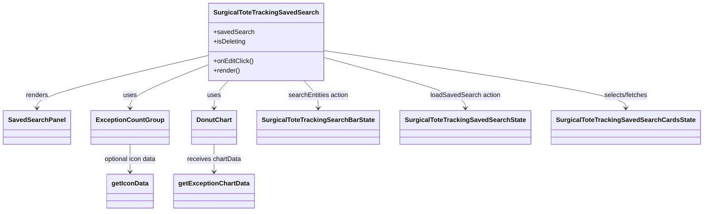

# Diagram: web/portal/src/pages/surgicaltotetracking/dashboard/components/SurgicalToteTrackingSavedSearch.js


> Auto-generated by Obscura crawlers

## Diagram 1



### SVG

<svg id="container" width="1669.0859375" xmlns="http://www.w3.org/2000/svg" class="classDiagram" height="524" viewBox="0 0 1669.0859375 524" role="graphics-document document" aria-roledescription="class"><style>#container{font-family:"trebuchet ms",verdana,arial,sans-serif;font-size:16px;fill:#333;}@keyframes edge-animation-frame{from{stroke-dashoffset:0;}}@keyframes dash{to{stroke-dashoffset:0;}}#container .edge-animation-slow{stroke-dasharray:9,5!important;stroke-dashoffset:900;animation:dash 50s linear infinite;stroke-linecap:round;}#container .edge-animation-fast{stroke-dasharray:9,5!important;stroke-dashoffset:900;animation:dash 20s linear infinite;stroke-linecap:round;}#container .error-icon{fill:#552222;}#container .error-text{fill:#552222;stroke:#552222;}#container .edge-thickness-normal{stroke-width:1px;}#container .edge-thickness-thick{stroke-width:3.5px;}#container .edge-pattern-solid{stroke-dasharray:0;}#container .edge-thickness-invisible{stroke-width:0;fill:none;}#container .edge-pattern-dashed{stroke-dasharray:3;}#container .edge-pattern-dotted{stroke-dasharray:2;}#container .marker{fill:#333333;stroke:#333333;}#container .marker.cross{stroke:#333333;}#container svg{font-family:"trebuchet ms",verdana,arial,sans-serif;font-size:16px;}#container p{margin:0;}#container g.classGroup text{fill:#9370DB;stroke:none;font-family:"trebuchet ms",verdana,arial,sans-serif;font-size:10px;}#container g.classGroup text .title{font-weight:bolder;}#container .nodeLabel,#container .edgeLabel{color:#131300;}#container .edgeLabel .label rect{fill:#ECECFF;}#container .label text{fill:#131300;}#container .labelBkg{background:#ECECFF;}#container .edgeLabel .label span{background:#ECECFF;}#container .classTitle{font-weight:bolder;}#container .node rect,#container .node circle,#container .node ellipse,#container .node polygon,#container .node path{fill:#ECECFF;stroke:#9370DB;stroke-width:1px;}#container .divider{stroke:#9370DB;stroke-width:1;}#container g.clickable{cursor:pointer;}#container g.classGroup rect{fill:#ECECFF;stroke:#9370DB;}#container g.classGroup line{stroke:#9370DB;stroke-width:1;}#container .classLabel .box{stroke:none;stroke-width:0;fill:#ECECFF;opacity:0.5;}#container .classLabel .label{fill:#9370DB;font-size:10px;}#container .relation{stroke:#333333;stroke-width:1;fill:none;}#container .dashed-line{stroke-dasharray:3;}#container .dotted-line{stroke-dasharray:1 2;}#container #compositionStart,#container .composition{fill:#333333!important;stroke:#333333!important;stroke-width:1;}#container #compositionEnd,#container .composition{fill:#333333!important;stroke:#333333!important;stroke-width:1;}#container #dependencyStart,#container .dependency{fill:#333333!important;stroke:#333333!important;stroke-width:1;}#container #dependencyStart,#container .dependency{fill:#333333!important;stroke:#333333!important;stroke-width:1;}#container #extensionStart,#container .extension{fill:transparent!important;stroke:#333333!important;stroke-width:1;}#container #extensionEnd,#container .extension{fill:transparent!important;stroke:#333333!important;stroke-width:1;}#container #aggregationStart,#container .aggregation{fill:transparent!important;stroke:#333333!important;stroke-width:1;}#container #aggregationEnd,#container .aggregation{fill:transparent!important;stroke:#333333!important;stroke-width:1;}#container #lollipopStart,#container .lollipop{fill:#ECECFF!important;stroke:#333333!important;stroke-width:1;}#container #lollipopEnd,#container .lollipop{fill:#ECECFF!important;stroke:#333333!important;stroke-width:1;}#container .edgeTerminals{font-size:11px;line-height:initial;}#container .classTitleText{text-anchor:middle;font-size:18px;fill:#333;}#container .label-icon{display:inline-block;height:1em;overflow:visible;vertical-align:-0.125em;}#container .node .label-icon path{fill:currentColor;stroke:revert;stroke-width:revert;}#container :root{--mermaid-font-family:"trebuchet ms",verdana,arial,sans-serif;}</style><g><defs><marker id="container_class-aggregationStart" class="marker aggregation class" refX="18" refY="7" markerWidth="190" markerHeight="240" orient="auto"><path d="M 18,7 L9,13 L1,7 L9,1 Z"></path></marker></defs><defs><marker id="container_class-aggregationEnd" class="marker aggregation class" refX="1" refY="7" markerWidth="20" markerHeight="28" orient="auto"><path d="M 18,7 L9,13 L1,7 L9,1 Z"></path></marker></defs><defs><marker id="container_class-extensionStart" class="marker extension class" refX="18" refY="7" markerWidth="190" markerHeight="240" orient="auto"><path d="M 1,7 L18,13 V 1 Z"></path></marker></defs><defs><marker id="container_class-extensionEnd" class="marker extension class" refX="1" refY="7" markerWidth="20" markerHeight="28" orient="auto"><path d="M 1,1 V 13 L18,7 Z"></path></marker></defs><defs><marker id="container_class-compositionStart" class="marker composition class" refX="18" refY="7" markerWidth="190" markerHeight="240" orient="auto"><path d="M 18,7 L9,13 L1,7 L9,1 Z"></path></marker></defs><defs><marker id="container_class-compositionEnd" class="marker composition class" refX="1" refY="7" markerWidth="20" markerHeight="28" orient="auto"><path d="M 18,7 L9,13 L1,7 L9,1 Z"></path></marker></defs><defs><marker id="container_class-dependencyStart" class="marker dependency class" refX="6" refY="7" markerWidth="190" markerHeight="240" orient="auto"><path d="M 5,7 L9,13 L1,7 L9,1 Z"></path></marker></defs><defs><marker id="container_class-dependencyEnd" class="marker dependency class" refX="13" refY="7" markerWidth="20" markerHeight="28" orient="auto"><path d="M 18,7 L9,13 L14,7 L9,1 Z"></path></marker></defs><defs><marker id="container_class-lollipopStart" class="marker lollipop class" refX="13" refY="7" markerWidth="190" markerHeight="240" orient="auto"><circle stroke="black" fill="transparent" cx="7" cy="7" r="6"></circle></marker></defs><defs><marker id="container_class-lollipopEnd" class="marker lollipop class" refX="1" refY="7" markerWidth="190" markerHeight="240" orient="auto"><circle stroke="black" fill="transparent" cx="7" cy="7" r="6"></circle></marker></defs><g class="root"><g class="clusters"></g><g class="edgePaths"><path d="M498.637,136.847L430.028,153.539C361.419,170.231,224.202,203.616,155.593,225.474C86.984,247.333,86.984,257.667,86.984,262.833L86.984,268" id="id_SurgicalToteTrackingSavedSearch_SavedSearchPanel_1" class="edge-thickness-normal edge-pattern-solid relation" style=";;;" data-edge="true" data-et="edge" data-id="id_SurgicalToteTrackingSavedSearch_SavedSearchPanel_1" data-points="W3sieCI6NDk4LjYzNjcxODc1LCJ5IjoxMzYuODQ2ODA0MTAxNjExMzV9LHsieCI6ODYuOTg0Mzc1LCJ5IjoyMzd9LHsieCI6ODYuOTg0Mzc1LCJ5IjoyNzR9XQ==" marker-end="url(#container_class-dependencyEnd)"></path><path d="M498.637,159.007L466.732,172.006C434.828,185.004,371.02,211.002,339.115,229.168C307.211,247.333,307.211,257.667,307.211,262.833L307.211,268" id="id_SurgicalToteTrackingSavedSearch_ExceptionCountGroup_2" class="edge-thickness-normal edge-pattern-solid relation" style=";;;" data-edge="true" data-et="edge" data-id="id_SurgicalToteTrackingSavedSearch_ExceptionCountGroup_2" data-points="W3sieCI6NDk4LjYzNjcxODc1LCJ5IjoxNTkuMDA2NzEzMTc2MjUzNzh9LHsieCI6MzA3LjIxMDkzNzUsInkiOjIzN30seyJ4IjozMDcuMjEwOTM3NSwieSI6Mjc0fV0=" marker-end="url(#container_class-dependencyEnd)"></path><path d="M543.879,200L538.112,206.167C532.346,212.333,520.814,224.667,515.047,236C509.281,247.333,509.281,257.667,509.281,262.833L509.281,268" id="id_SurgicalToteTrackingSavedSearch_DonutChart_3" class="edge-thickness-normal edge-pattern-solid relation" style=";;;" data-edge="true" data-et="edge" data-id="id_SurgicalToteTrackingSavedSearch_DonutChart_3" data-points="W3sieCI6NTQzLjg3ODU1MzgwNjM5MSwieSI6MjAwfSx7IngiOjUwOS4yODEyNSwieSI6MjM3fSx7IngiOjUwOS4yODEyNSwieSI6Mjc0fV0=" marker-end="url(#container_class-dependencyEnd)"></path><path d="M768.652,125.061L888.249,143.717C1007.846,162.374,1247.04,199.687,1366.637,223.51C1486.234,247.333,1486.234,257.667,1486.234,262.833L1486.234,268" id="id_SurgicalToteTrackingSavedSearch_SurgicalToteTrackingSavedSearchCardsState_4" class="edge-thickness-normal edge-pattern-solid relation" style=";;;" data-edge="true" data-et="edge" data-id="id_SurgicalToteTrackingSavedSearch_SurgicalToteTrackingSavedSearchCardsState_4" data-points="W3sieCI6NzY4LjY1MjM0Mzc1LCJ5IjoxMjUuMDYwNTgyODc0Nzg4Njh9LHsieCI6MTQ4Ni4yMzQzNzUsInkiOjIzN30seyJ4IjoxNDg2LjIzNDM3NSwieSI6Mjc0fV0=" marker-end="url(#container_class-dependencyEnd)"></path><path d="M768.652,141.928L825.055,157.773C881.458,173.619,994.264,205.309,1050.667,226.321C1107.07,247.333,1107.07,257.667,1107.07,262.833L1107.07,268" id="id_SurgicalToteTrackingSavedSearch_SurgicalToteTrackingSavedSearchState_5" class="edge-thickness-normal edge-pattern-solid relation" style=";;;" data-edge="true" data-et="edge" data-id="id_SurgicalToteTrackingSavedSearch_SurgicalToteTrackingSavedSearchState_5" data-points="W3sieCI6NzY4LjY1MjM0Mzc1LCJ5IjoxNDEuOTI3ODg2MDAzNzc4OTh9LHsieCI6MTEwNy4wNzAzMTI1LCJ5IjoyMzd9LHsieCI6MTEwNy4wNzAzMTI1LCJ5IjoyNzR9XQ==" marker-end="url(#container_class-dependencyEnd)"></path><path d="M723.411,200L729.177,206.167C734.943,212.333,746.475,224.667,752.242,236C758.008,247.333,758.008,257.667,758.008,262.833L758.008,268" id="id_SurgicalToteTrackingSavedSearch_SurgicalToteTrackingSearchBarState_6" class="edge-thickness-normal edge-pattern-solid relation" style=";;;" data-edge="true" data-et="edge" data-id="id_SurgicalToteTrackingSavedSearch_SurgicalToteTrackingSearchBarState_6" data-points="W3sieCI6NzIzLjQxMDUwODY5MzYwOSwieSI6MjAwfSx7IngiOjc1OC4wMDc4MTI1LCJ5IjoyMzd9LHsieCI6NzU4LjAwNzgxMjUsInkiOjI3NH1d" marker-end="url(#container_class-dependencyEnd)"></path><path d="M509.281,358L509.281,364.167C509.281,370.333,509.281,382.667,509.281,394C509.281,405.333,509.281,415.667,509.281,420.833L509.281,426" id="id_DonutChart_getExceptionChartData_7" class="edge-thickness-normal edge-pattern-solid relation" style=";;;" data-edge="true" data-et="edge" data-id="id_DonutChart_getExceptionChartData_7" data-points="W3sieCI6NTA5LjI4MTI1LCJ5IjozNTh9LHsieCI6NTA5LjI4MTI1LCJ5IjozOTV9LHsieCI6NTA5LjI4MTI1LCJ5Ijo0MzJ9XQ==" marker-end="url(#container_class-dependencyEnd)"></path><path d="M307.211,358L307.211,364.167C307.211,370.333,307.211,382.667,307.211,394C307.211,405.333,307.211,415.667,307.211,420.833L307.211,426" id="id_ExceptionCountGroup_getIconData_8" class="edge-thickness-normal edge-pattern-solid relation" style=";;;" data-edge="true" data-et="edge" data-id="id_ExceptionCountGroup_getIconData_8" data-points="W3sieCI6MzA3LjIxMDkzNzUsInkiOjM1OH0seyJ4IjozMDcuMjEwOTM3NSwieSI6Mzk1fSx7IngiOjMwNy4yMTA5Mzc1LCJ5Ijo0MzJ9XQ==" marker-end="url(#container_class-dependencyEnd)"></path></g><g class="edgeLabels"><g class="edgeLabel" transform="translate(86.984375, 237)"><g class="label" data-id="id_SurgicalToteTrackingSavedSearch_SavedSearchPanel_1" transform="translate(-27.75, -12)"><foreignObject width="55.5" height="24"><div xmlns="http://www.w3.org/1999/xhtml" class="labelBkg" style="display: table-cell; white-space: nowrap; line-height: 1.5; max-width: 200px; text-align: center;"><span class="edgeLabel"><p>renders</p></span></div></foreignObject></g></g><g class="edgeLabel" transform="translate(307.2109375, 237)"><g class="label" data-id="id_SurgicalToteTrackingSavedSearch_ExceptionCountGroup_2" transform="translate(-16.4921875, -12)"><foreignObject width="32.984375" height="24"><div xmlns="http://www.w3.org/1999/xhtml" class="labelBkg" style="display: table-cell; white-space: nowrap; line-height: 1.5; max-width: 200px; text-align: center;"><span class="edgeLabel"><p>uses</p></span></div></foreignObject></g></g><g class="edgeLabel" transform="translate(509.28125, 237)"><g class="label" data-id="id_SurgicalToteTrackingSavedSearch_DonutChart_3" transform="translate(-16.4921875, -12)"><foreignObject width="32.984375" height="24"><div xmlns="http://www.w3.org/1999/xhtml" class="labelBkg" style="display: table-cell; white-space: nowrap; line-height: 1.5; max-width: 200px; text-align: center;"><span class="edgeLabel"><p>uses</p></span></div></foreignObject></g></g><g class="edgeLabel" transform="translate(1486.234375, 237)"><g class="label" data-id="id_SurgicalToteTrackingSavedSearch_SurgicalToteTrackingSavedSearchCardsState_4" transform="translate(-55.46875, -12)"><foreignObject width="110.9375" height="24"><div xmlns="http://www.w3.org/1999/xhtml" class="labelBkg" style="display: table-cell; white-space: nowrap; line-height: 1.5; max-width: 200px; text-align: center;"><span class="edgeLabel"><p>selects/fetches</p></span></div></foreignObject></g></g><g class="edgeLabel" transform="translate(1107.0703125, 237)"><g class="label" data-id="id_SurgicalToteTrackingSavedSearch_SurgicalToteTrackingSavedSearchState_5" transform="translate(-86.828125, -12)"><foreignObject width="173.65625" height="24"><div xmlns="http://www.w3.org/1999/xhtml" class="labelBkg" style="display: table-cell; white-space: nowrap; line-height: 1.5; max-width: 200px; text-align: center;"><span class="edgeLabel"><p>loadSavedSearch action</p></span></div></foreignObject></g></g><g class="edgeLabel" transform="translate(758.0078125, 237)"><g class="label" data-id="id_SurgicalToteTrackingSavedSearch_SurgicalToteTrackingSearchBarState_6" transform="translate(-75.8046875, -12)"><foreignObject width="151.609375" height="24"><div xmlns="http://www.w3.org/1999/xhtml" class="labelBkg" style="display: table-cell; white-space: nowrap; line-height: 1.5; max-width: 200px; text-align: center;"><span class="edgeLabel"><p>searchEntities action</p></span></div></foreignObject></g></g><g class="edgeLabel" transform="translate(509.28125, 395)"><g class="label" data-id="id_DonutChart_getExceptionChartData_7" transform="translate(-67.0625, -12)"><foreignObject width="134.125" height="24"><div xmlns="http://www.w3.org/1999/xhtml" class="labelBkg" style="display: table-cell; white-space: nowrap; line-height: 1.5; max-width: 200px; text-align: center;"><span class="edgeLabel"><p>receives chartData</p></span></div></foreignObject></g></g><g class="edgeLabel" transform="translate(307.2109375, 395)"><g class="label" data-id="id_ExceptionCountGroup_getIconData_8" transform="translate(-66.390625, -12)"><foreignObject width="132.78125" height="24"><div xmlns="http://www.w3.org/1999/xhtml" class="labelBkg" style="display: table-cell; white-space: nowrap; line-height: 1.5; max-width: 200px; text-align: center;"><span class="edgeLabel"><p>optional icon data</p></span></div></foreignObject></g></g></g><g class="nodes"><g class="node default" id="classId-SurgicalToteTrackingSavedSearch-0" transform="translate(633.64453125, 104)"><g class="basic label-container"><path d="M-135.0078125 -96 L135.0078125 -96 L135.0078125 96 L-135.0078125 96" stroke="none" stroke-width="0" fill="#ECECFF" style=""></path><path d="M-135.0078125 -96 C-57.60161897992559 -96, 19.80457454014882 -96, 135.0078125 -96 M-135.0078125 -96 C-73.28516820911432 -96, -11.56252391822865 -96, 135.0078125 -96 M135.0078125 -96 C135.0078125 -56.56449054801406, 135.0078125 -17.128981096028113, 135.0078125 96 M135.0078125 -96 C135.0078125 -31.81410061260297, 135.0078125 32.37179877479406, 135.0078125 96 M135.0078125 96 C76.48337227604051 96, 17.95893205208104 96, -135.0078125 96 M135.0078125 96 C40.150448799933955 96, -54.70691490013209 96, -135.0078125 96 M-135.0078125 96 C-135.0078125 30.96132572064552, -135.0078125 -34.07734855870896, -135.0078125 -96 M-135.0078125 96 C-135.0078125 33.58391288581167, -135.0078125 -28.832174228376658, -135.0078125 -96" stroke="#9370DB" stroke-width="1.3" fill="none" stroke-dasharray="0 0" style=""></path></g><g class="annotation-group text" transform="translate(0, -72)"></g><g class="label-group text" transform="translate(-123.0078125, -72)"><g class="label" style="font-weight: bolder" transform="translate(0,-12)"><foreignObject width="246.015625" height="24"><div xmlns="http://www.w3.org/1999/xhtml" style="display: table-cell; white-space: nowrap; line-height: 1.5; max-width: 291px; text-align: center;"><span class="nodeLabel markdown-node-label" style=""><p>SurgicalToteTrackingSavedSearch</p></span></div></foreignObject></g></g><g class="members-group text" transform="translate(-123.0078125, -24)"><g class="label" style="" transform="translate(0,-12)"><foreignObject width="98.5625" height="24"><div xmlns="http://www.w3.org/1999/xhtml" style="display: table-cell; white-space: nowrap; line-height: 1.5; max-width: 156px; text-align: center;"><span class="nodeLabel markdown-node-label" style=""><p>+savedSearch</p></span></div></foreignObject></g><g class="label" style="" transform="translate(0,12)"><foreignObject width="80.3125" height="24"><div xmlns="http://www.w3.org/1999/xhtml" style="display: table-cell; white-space: nowrap; line-height: 1.5; max-width: 138px; text-align: center;"><span class="nodeLabel markdown-node-label" style=""><p>+isDeleting</p></span></div></foreignObject></g></g><g class="methods-group text" transform="translate(-123.0078125, 48)"><g class="label" style="" transform="translate(0,-12)"><foreignObject width="99.015625" height="24"><div xmlns="http://www.w3.org/1999/xhtml" style="display: table-cell; white-space: nowrap; line-height: 1.5; max-width: 156px; text-align: center;"><span class="nodeLabel markdown-node-label" style=""><p>+onEditClick()</p></span></div></foreignObject></g><g class="label" style="" transform="translate(0,12)"><foreignObject width="66.609375" height="24"><div xmlns="http://www.w3.org/1999/xhtml" style="display: table-cell; white-space: nowrap; line-height: 1.5; max-width: 124px; text-align: center;"><span class="nodeLabel markdown-node-label" style=""><p>+render()</p></span></div></foreignObject></g></g><g class="divider" style=""><path d="M-135.0078125 -48 C-35.64671418647245 -48, 63.7143841270551 -48, 135.0078125 -48 M-135.0078125 -48 C-79.13008168280712 -48, -23.25235086561422 -48, 135.0078125 -48" stroke="#9370DB" stroke-width="1.3" fill="none" stroke-dasharray="0 0" style=""></path></g><g class="divider" style=""><path d="M-135.0078125 24 C-33.336631247901195 24, 68.33455000419761 24, 135.0078125 24 M-135.0078125 24 C-61.66861974403267 24, 11.670573011934664 24, 135.0078125 24" stroke="#9370DB" stroke-width="1.3" fill="none" stroke-dasharray="0 0" style=""></path></g></g><g class="node default" id="classId-SavedSearchPanel-1" transform="translate(86.984375, 316)"><g class="basic label-container"><path d="M-78.984375 -42 L78.984375 -42 L78.984375 42 L-78.984375 42" stroke="none" stroke-width="0" fill="#ECECFF" style=""></path><path d="M-78.984375 -42 C-24.351653471531826 -42, 30.28106805693635 -42, 78.984375 -42 M-78.984375 -42 C-42.8903543913834 -42, -6.796333782766794 -42, 78.984375 -42 M78.984375 -42 C78.984375 -15.949388198861357, 78.984375 10.101223602277287, 78.984375 42 M78.984375 -42 C78.984375 -8.751056061705214, 78.984375 24.497887876589573, 78.984375 42 M78.984375 42 C43.34565608494007 42, 7.706937169880135 42, -78.984375 42 M78.984375 42 C22.02150301851575 42, -34.9413689629685 42, -78.984375 42 M-78.984375 42 C-78.984375 16.43646871021531, -78.984375 -9.127062579569383, -78.984375 -42 M-78.984375 42 C-78.984375 12.590460806294239, -78.984375 -16.819078387411523, -78.984375 -42" stroke="#9370DB" stroke-width="1.3" fill="none" stroke-dasharray="0 0" style=""></path></g><g class="annotation-group text" transform="translate(0, -18)"></g><g class="label-group text" transform="translate(-66.984375, -18)"><g class="label" style="font-weight: bolder" transform="translate(0,-12)"><foreignObject width="133.96875" height="24"><div xmlns="http://www.w3.org/1999/xhtml" style="display: table-cell; white-space: nowrap; line-height: 1.5; max-width: 182px; text-align: center;"><span class="nodeLabel markdown-node-label" style=""><p>SavedSearchPanel</p></span></div></foreignObject></g></g><g class="members-group text" transform="translate(-66.984375, 30)"></g><g class="methods-group text" transform="translate(-66.984375, 60)"></g><g class="divider" style=""><path d="M-78.984375 6 C-46.65429555094745 6, -14.324216101894905 6, 78.984375 6 M-78.984375 6 C-28.847228140608493 6, 21.289918718783014 6, 78.984375 6" stroke="#9370DB" stroke-width="1.3" fill="none" stroke-dasharray="0 0" style=""></path></g><g class="divider" style=""><path d="M-78.984375 24 C-23.491659111633588 24, 32.001056776732824 24, 78.984375 24 M-78.984375 24 C-31.873936016872072 24, 15.236502966255856 24, 78.984375 24" stroke="#9370DB" stroke-width="1.3" fill="none" stroke-dasharray="0 0" style=""></path></g></g><g class="node default" id="classId-ExceptionCountGroup-2" transform="translate(307.2109375, 316)"><g class="basic label-container"><path d="M-91.2421875 -42 L91.2421875 -42 L91.2421875 42 L-91.2421875 42" stroke="none" stroke-width="0" fill="#ECECFF" style=""></path><path d="M-91.2421875 -42 C-52.95865710652597 -42, -14.675126713051938 -42, 91.2421875 -42 M-91.2421875 -42 C-51.60823112098644 -42, -11.974274741972877 -42, 91.2421875 -42 M91.2421875 -42 C91.2421875 -20.046290427514197, 91.2421875 1.9074191449716054, 91.2421875 42 M91.2421875 -42 C91.2421875 -18.703396515510438, 91.2421875 4.593206968979125, 91.2421875 42 M91.2421875 42 C41.11465856111756 42, -9.012870377764884 42, -91.2421875 42 M91.2421875 42 C45.19270279665494 42, -0.8567819066901166 42, -91.2421875 42 M-91.2421875 42 C-91.2421875 10.230204974235015, -91.2421875 -21.53959005152997, -91.2421875 -42 M-91.2421875 42 C-91.2421875 14.10128360060527, -91.2421875 -13.797432798789458, -91.2421875 -42" stroke="#9370DB" stroke-width="1.3" fill="none" stroke-dasharray="0 0" style=""></path></g><g class="annotation-group text" transform="translate(0, -18)"></g><g class="label-group text" transform="translate(-79.2421875, -18)"><g class="label" style="font-weight: bolder" transform="translate(0,-12)"><foreignObject width="158.484375" height="24"><div xmlns="http://www.w3.org/1999/xhtml" style="display: table-cell; white-space: nowrap; line-height: 1.5; max-width: 207px; text-align: center;"><span class="nodeLabel markdown-node-label" style=""><p>ExceptionCountGroup</p></span></div></foreignObject></g></g><g class="members-group text" transform="translate(-79.2421875, 30)"></g><g class="methods-group text" transform="translate(-79.2421875, 60)"></g><g class="divider" style=""><path d="M-91.2421875 6 C-49.94805669768947 6, -8.653925895378947 6, 91.2421875 6 M-91.2421875 6 C-30.232692125093727 6, 30.776803249812545 6, 91.2421875 6" stroke="#9370DB" stroke-width="1.3" fill="none" stroke-dasharray="0 0" style=""></path></g><g class="divider" style=""><path d="M-91.2421875 24 C-33.57737354850678 24, 24.087440402986445 24, 91.2421875 24 M-91.2421875 24 C-32.7650981880205 24, 25.711991123958995 24, 91.2421875 24" stroke="#9370DB" stroke-width="1.3" fill="none" stroke-dasharray="0 0" style=""></path></g></g><g class="node default" id="classId-DonutChart-3" transform="translate(509.28125, 316)"><g class="basic label-container"><path d="M-53.9765625 -42 L53.9765625 -42 L53.9765625 42 L-53.9765625 42" stroke="none" stroke-width="0" fill="#ECECFF" style=""></path><path d="M-53.9765625 -42 C-30.900297072657395 -42, -7.82403164531479 -42, 53.9765625 -42 M-53.9765625 -42 C-13.17716708065354 -42, 27.62222833869292 -42, 53.9765625 -42 M53.9765625 -42 C53.9765625 -13.921333874000442, 53.9765625 14.157332251999115, 53.9765625 42 M53.9765625 -42 C53.9765625 -15.206616602667651, 53.9765625 11.586766794664697, 53.9765625 42 M53.9765625 42 C12.528198045650733 42, -28.920166408698535 42, -53.9765625 42 M53.9765625 42 C12.404361748095525 42, -29.16783900380895 42, -53.9765625 42 M-53.9765625 42 C-53.9765625 11.280376233083544, -53.9765625 -19.439247533832912, -53.9765625 -42 M-53.9765625 42 C-53.9765625 11.018290250998433, -53.9765625 -19.963419498003134, -53.9765625 -42" stroke="#9370DB" stroke-width="1.3" fill="none" stroke-dasharray="0 0" style=""></path></g><g class="annotation-group text" transform="translate(0, -18)"></g><g class="label-group text" transform="translate(-41.9765625, -18)"><g class="label" style="font-weight: bolder" transform="translate(0,-12)"><foreignObject width="83.953125" height="24"><div xmlns="http://www.w3.org/1999/xhtml" style="display: table-cell; white-space: nowrap; line-height: 1.5; max-width: 133px; text-align: center;"><span class="nodeLabel markdown-node-label" style=""><p>DonutChart</p></span></div></foreignObject></g></g><g class="members-group text" transform="translate(-41.9765625, 30)"></g><g class="methods-group text" transform="translate(-41.9765625, 60)"></g><g class="divider" style=""><path d="M-53.9765625 6 C-11.139529914045951 6, 31.697502671908097 6, 53.9765625 6 M-53.9765625 6 C-27.93818619469924 6, -1.8998098893984832 6, 53.9765625 6" stroke="#9370DB" stroke-width="1.3" fill="none" stroke-dasharray="0 0" style=""></path></g><g class="divider" style=""><path d="M-53.9765625 24 C-29.198352523460944 24, -4.420142546921888 24, 53.9765625 24 M-53.9765625 24 C-28.037539044742147 24, -2.0985155894842933 24, 53.9765625 24" stroke="#9370DB" stroke-width="1.3" fill="none" stroke-dasharray="0 0" style=""></path></g></g><g class="node default" id="classId-SurgicalToteTrackingSearchBarState-4" transform="translate(758.0078125, 316)"><g class="basic label-container"><path d="M-144.75 -42 L144.75 -42 L144.75 42 L-144.75 42" stroke="none" stroke-width="0" fill="#ECECFF" style=""></path><path d="M-144.75 -42 C-85.26440537572235 -42, -25.778810751444695 -42, 144.75 -42 M-144.75 -42 C-80.8550792390651 -42, -16.960158478130225 -42, 144.75 -42 M144.75 -42 C144.75 -24.672869130131367, 144.75 -7.345738260262735, 144.75 42 M144.75 -42 C144.75 -22.322522350133355, 144.75 -2.645044700266709, 144.75 42 M144.75 42 C33.432315680926905 42, -77.88536863814619 42, -144.75 42 M144.75 42 C41.98449609884068 42, -60.78100780231864 42, -144.75 42 M-144.75 42 C-144.75 23.507265649977644, -144.75 5.014531299955287, -144.75 -42 M-144.75 42 C-144.75 19.1244847943761, -144.75 -3.751030411247797, -144.75 -42" stroke="#9370DB" stroke-width="1.3" fill="none" stroke-dasharray="0 0" style=""></path></g><g class="annotation-group text" transform="translate(0, -18)"></g><g class="label-group text" transform="translate(-132.75, -18)"><g class="label" style="font-weight: bolder" transform="translate(0,-12)"><foreignObject width="265.5" height="24"><div xmlns="http://www.w3.org/1999/xhtml" style="display: table-cell; white-space: nowrap; line-height: 1.5; max-width: 309px; text-align: center;"><span class="nodeLabel markdown-node-label" style=""><p>SurgicalToteTrackingSearchBarState</p></span></div></foreignObject></g></g><g class="members-group text" transform="translate(-132.75, 30)"></g><g class="methods-group text" transform="translate(-132.75, 60)"></g><g class="divider" style=""><path d="M-144.75 6 C-59.68664797978187 6, 25.376704040436266 6, 144.75 6 M-144.75 6 C-41.76323879027433 6, 61.22352241945134 6, 144.75 6" stroke="#9370DB" stroke-width="1.3" fill="none" stroke-dasharray="0 0" style=""></path></g><g class="divider" style=""><path d="M-144.75 24 C-83.80258815854489 24, -22.8551763170898 24, 144.75 24 M-144.75 24 C-67.57149449562195 24, 9.607011008756103 24, 144.75 24" stroke="#9370DB" stroke-width="1.3" fill="none" stroke-dasharray="0 0" style=""></path></g></g><g class="node default" id="classId-SurgicalToteTrackingSavedSearchState-5" transform="translate(1107.0703125, 316)"><g class="basic label-container"><path d="M-154.3125 -42 L154.3125 -42 L154.3125 42 L-154.3125 42" stroke="none" stroke-width="0" fill="#ECECFF" style=""></path><path d="M-154.3125 -42 C-62.77649313322989 -42, 28.759513733540217 -42, 154.3125 -42 M-154.3125 -42 C-57.355833551322846 -42, 39.60083289735431 -42, 154.3125 -42 M154.3125 -42 C154.3125 -23.04021550001417, 154.3125 -4.080431000028341, 154.3125 42 M154.3125 -42 C154.3125 -11.89205744353928, 154.3125 18.21588511292144, 154.3125 42 M154.3125 42 C57.470478246533006 42, -39.37154350693399 42, -154.3125 42 M154.3125 42 C31.93981119541087 42, -90.43287760917826 42, -154.3125 42 M-154.3125 42 C-154.3125 9.373369360059819, -154.3125 -23.253261279880363, -154.3125 -42 M-154.3125 42 C-154.3125 24.02527212099499, -154.3125 6.050544241989982, -154.3125 -42" stroke="#9370DB" stroke-width="1.3" fill="none" stroke-dasharray="0 0" style=""></path></g><g class="annotation-group text" transform="translate(0, -18)"></g><g class="label-group text" transform="translate(-142.3125, -18)"><g class="label" style="font-weight: bolder" transform="translate(0,-12)"><foreignObject width="284.625" height="24"><div xmlns="http://www.w3.org/1999/xhtml" style="display: table-cell; white-space: nowrap; line-height: 1.5; max-width: 328px; text-align: center;"><span class="nodeLabel markdown-node-label" style=""><p>SurgicalToteTrackingSavedSearchState</p></span></div></foreignObject></g></g><g class="members-group text" transform="translate(-142.3125, 30)"></g><g class="methods-group text" transform="translate(-142.3125, 60)"></g><g class="divider" style=""><path d="M-154.3125 6 C-75.42475935318441 6, 3.4629812936311737 6, 154.3125 6 M-154.3125 6 C-83.94159330859564 6, -13.570686617191285 6, 154.3125 6" stroke="#9370DB" stroke-width="1.3" fill="none" stroke-dasharray="0 0" style=""></path></g><g class="divider" style=""><path d="M-154.3125 24 C-50.77618758608895 24, 52.7601248278221 24, 154.3125 24 M-154.3125 24 C-58.25081700618753 24, 37.810865987624936 24, 154.3125 24" stroke="#9370DB" stroke-width="1.3" fill="none" stroke-dasharray="0 0" style=""></path></g></g><g class="node default" id="classId-SurgicalToteTrackingSavedSearchCardsState-6" transform="translate(1486.234375, 316)"><g class="basic label-container"><path d="M-174.8515625 -42 L174.8515625 -42 L174.8515625 42 L-174.8515625 42" stroke="none" stroke-width="0" fill="#ECECFF" style=""></path><path d="M-174.8515625 -42 C-45.27515852178121 -42, 84.30124545643758 -42, 174.8515625 -42 M-174.8515625 -42 C-100.59589218941989 -42, -26.34022187883977 -42, 174.8515625 -42 M174.8515625 -42 C174.8515625 -17.081888398859505, 174.8515625 7.836223202280991, 174.8515625 42 M174.8515625 -42 C174.8515625 -15.065013470094343, 174.8515625 11.869973059811315, 174.8515625 42 M174.8515625 42 C38.74581518182589 42, -97.35993213634822 42, -174.8515625 42 M174.8515625 42 C68.25327756599413 42, -38.34500736801175 42, -174.8515625 42 M-174.8515625 42 C-174.8515625 20.352828331640183, -174.8515625 -1.2943433367196349, -174.8515625 -42 M-174.8515625 42 C-174.8515625 17.95813371833932, -174.8515625 -6.083732563321362, -174.8515625 -42" stroke="#9370DB" stroke-width="1.3" fill="none" stroke-dasharray="0 0" style=""></path></g><g class="annotation-group text" transform="translate(0, -18)"></g><g class="label-group text" transform="translate(-162.8515625, -18)"><g class="label" style="font-weight: bolder" transform="translate(0,-12)"><foreignObject width="325.703125" height="24"><div xmlns="http://www.w3.org/1999/xhtml" style="display: table-cell; white-space: nowrap; line-height: 1.5; max-width: 368px; text-align: center;"><span class="nodeLabel markdown-node-label" style=""><p>SurgicalToteTrackingSavedSearchCardsState</p></span></div></foreignObject></g></g><g class="members-group text" transform="translate(-162.8515625, 30)"></g><g class="methods-group text" transform="translate(-162.8515625, 60)"></g><g class="divider" style=""><path d="M-174.8515625 6 C-44.26268142461893 6, 86.32619965076213 6, 174.8515625 6 M-174.8515625 6 C-104.803242121364 6, -34.75492174272799 6, 174.8515625 6" stroke="#9370DB" stroke-width="1.3" fill="none" stroke-dasharray="0 0" style=""></path></g><g class="divider" style=""><path d="M-174.8515625 24 C-65.66812756433126 24, 43.515307371337485 24, 174.8515625 24 M-174.8515625 24 C-65.64564225063789 24, 43.56027799872422 24, 174.8515625 24" stroke="#9370DB" stroke-width="1.3" fill="none" stroke-dasharray="0 0" style=""></path></g></g><g class="node default" id="classId-getExceptionChartData-7" transform="translate(509.28125, 474)"><g class="basic label-container"><path d="M-96.140625 -42 L96.140625 -42 L96.140625 42 L-96.140625 42" stroke="none" stroke-width="0" fill="#ECECFF" style=""></path><path d="M-96.140625 -42 C-54.7501172145774 -42, -13.359609429154801 -42, 96.140625 -42 M-96.140625 -42 C-44.119254536119755 -42, 7.902115927760491 -42, 96.140625 -42 M96.140625 -42 C96.140625 -24.882358190802584, 96.140625 -7.764716381605169, 96.140625 42 M96.140625 -42 C96.140625 -9.435937143066958, 96.140625 23.128125713866083, 96.140625 42 M96.140625 42 C48.18911085537924 42, 0.23759671075848132 42, -96.140625 42 M96.140625 42 C31.132370120624813 42, -33.875884758750374 42, -96.140625 42 M-96.140625 42 C-96.140625 15.542604568610649, -96.140625 -10.914790862778702, -96.140625 -42 M-96.140625 42 C-96.140625 15.429968107338631, -96.140625 -11.140063785322738, -96.140625 -42" stroke="#9370DB" stroke-width="1.3" fill="none" stroke-dasharray="0 0" style=""></path></g><g class="annotation-group text" transform="translate(0, -18)"></g><g class="label-group text" transform="translate(-84.140625, -18)"><g class="label" style="font-weight: bolder" transform="translate(0,-12)"><foreignObject width="168.28125" height="24"><div xmlns="http://www.w3.org/1999/xhtml" style="display: table-cell; white-space: nowrap; line-height: 1.5; max-width: 215px; text-align: center;"><span class="nodeLabel markdown-node-label" style=""><p>getExceptionChartData</p></span></div></foreignObject></g></g><g class="members-group text" transform="translate(-84.140625, 30)"></g><g class="methods-group text" transform="translate(-84.140625, 60)"></g><g class="divider" style=""><path d="M-96.140625 6 C-50.124530178492094 6, -4.108435356984188 6, 96.140625 6 M-96.140625 6 C-57.19701612184596 6, -18.253407243691925 6, 96.140625 6" stroke="#9370DB" stroke-width="1.3" fill="none" stroke-dasharray="0 0" style=""></path></g><g class="divider" style=""><path d="M-96.140625 24 C-54.200506095630274 24, -12.260387191260548 24, 96.140625 24 M-96.140625 24 C-25.15880744928232 24, 45.82301010143536 24, 96.140625 24" stroke="#9370DB" stroke-width="1.3" fill="none" stroke-dasharray="0 0" style=""></path></g></g><g class="node default" id="classId-getIconData-8" transform="translate(307.2109375, 474)"><g class="basic label-container"><path d="M-55.9296875 -42 L55.9296875 -42 L55.9296875 42 L-55.9296875 42" stroke="none" stroke-width="0" fill="#ECECFF" style=""></path><path d="M-55.9296875 -42 C-23.538578403751394 -42, 8.852530692497211 -42, 55.9296875 -42 M-55.9296875 -42 C-14.51310692706732 -42, 26.90347364586536 -42, 55.9296875 -42 M55.9296875 -42 C55.9296875 -22.003923363891566, 55.9296875 -2.0078467277831322, 55.9296875 42 M55.9296875 -42 C55.9296875 -11.018928722056103, 55.9296875 19.962142555887795, 55.9296875 42 M55.9296875 42 C24.279780322253043 42, -7.370126855493915 42, -55.9296875 42 M55.9296875 42 C19.962604665082054 42, -16.004478169835892 42, -55.9296875 42 M-55.9296875 42 C-55.9296875 20.899473948461715, -55.9296875 -0.20105210307657018, -55.9296875 -42 M-55.9296875 42 C-55.9296875 22.338662279821506, -55.9296875 2.6773245596430115, -55.9296875 -42" stroke="#9370DB" stroke-width="1.3" fill="none" stroke-dasharray="0 0" style=""></path></g><g class="annotation-group text" transform="translate(0, -18)"></g><g class="label-group text" transform="translate(-43.9296875, -18)"><g class="label" style="font-weight: bolder" transform="translate(0,-12)"><foreignObject width="87.859375" height="24"><div xmlns="http://www.w3.org/1999/xhtml" style="display: table-cell; white-space: nowrap; line-height: 1.5; max-width: 137px; text-align: center;"><span class="nodeLabel markdown-node-label" style=""><p>getIconData</p></span></div></foreignObject></g></g><g class="members-group text" transform="translate(-43.9296875, 30)"></g><g class="methods-group text" transform="translate(-43.9296875, 60)"></g><g class="divider" style=""><path d="M-55.9296875 6 C-18.01947197017082 6, 19.89074355965836 6, 55.9296875 6 M-55.9296875 6 C-27.780681291159755 6, 0.36832491768048925 6, 55.9296875 6" stroke="#9370DB" stroke-width="1.3" fill="none" stroke-dasharray="0 0" style=""></path></g><g class="divider" style=""><path d="M-55.9296875 24 C-16.22776013751669 24, 23.47416722496662 24, 55.9296875 24 M-55.9296875 24 C-23.30980099882801 24, 9.31008550234398 24, 55.9296875 24" stroke="#9370DB" stroke-width="1.3" fill="none" stroke-dasharray="0 0" style=""></path></g></g></g></g></g></svg>

## Diagram 2

```mermaid
flowchart TD
    A[Mount SavedSearchCard] --> B[dispatch fetchSavedSearchCardData]
    B --> C[selector getSavedSearchCardData returns data]
    C --> D{data present?}
    D -- yes --> E[compute exception groups via getExceptionCount]
    D -- no --> F[isLoading true]
    E --> G[compute totalExceptionsCount (useMemo)]
    G --> H[getExceptionChartData -> chartData]
    H --> I[DonutChart displays chartData]
    E --> J[ExceptionCountGroup displays exceptions]
    clickException[User clicks exception] --> K[handleExceptionClick]
    K --> L[dispatch loadSavedSearch with activeExceptions]
    L --> M[dispatch searchEntities -> update results]
    searchFull[User clicks search] --> N[loadFullSavedSearch]
    N --> O[dispatch loadSavedSearch(savedSearch)]
    O --> P[dispatch searchEntities]
```

> SVG rendering failed for this diagram.
