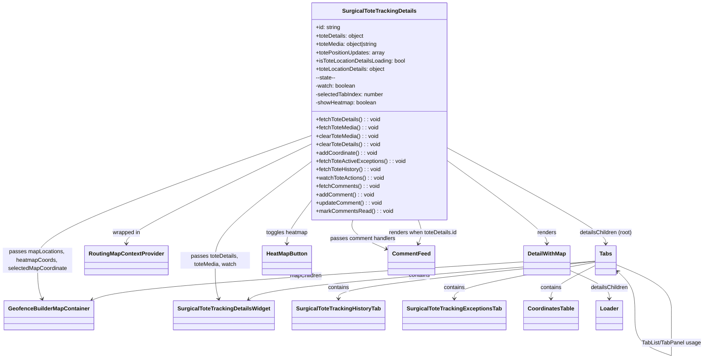

# Diagram: web/portal/src/pages/surgicaltotetracking/details/SurgicalToteTracking.Details.page.js


> Auto-generated by Obscura crawlers

## Diagram 1



### SVG

<svg id="container" width="1973.421875" xmlns="http://www.w3.org/2000/svg" class="classDiagram" height="1054.1500244140625" viewBox="0 0 1973.421875 1054.1500244140625" role="graphics-document document" aria-roledescription="class"><style>#container{font-family:"trebuchet ms",verdana,arial,sans-serif;font-size:16px;fill:#333;}@keyframes edge-animation-frame{from{stroke-dashoffset:0;}}@keyframes dash{to{stroke-dashoffset:0;}}#container .edge-animation-slow{stroke-dasharray:9,5!important;stroke-dashoffset:900;animation:dash 50s linear infinite;stroke-linecap:round;}#container .edge-animation-fast{stroke-dasharray:9,5!important;stroke-dashoffset:900;animation:dash 20s linear infinite;stroke-linecap:round;}#container .error-icon{fill:#552222;}#container .error-text{fill:#552222;stroke:#552222;}#container .edge-thickness-normal{stroke-width:1px;}#container .edge-thickness-thick{stroke-width:3.5px;}#container .edge-pattern-solid{stroke-dasharray:0;}#container .edge-thickness-invisible{stroke-width:0;fill:none;}#container .edge-pattern-dashed{stroke-dasharray:3;}#container .edge-pattern-dotted{stroke-dasharray:2;}#container .marker{fill:#333333;stroke:#333333;}#container .marker.cross{stroke:#333333;}#container svg{font-family:"trebuchet ms",verdana,arial,sans-serif;font-size:16px;}#container p{margin:0;}#container g.classGroup text{fill:#9370DB;stroke:none;font-family:"trebuchet ms",verdana,arial,sans-serif;font-size:10px;}#container g.classGroup text .title{font-weight:bolder;}#container .nodeLabel,#container .edgeLabel{color:#131300;}#container .edgeLabel .label rect{fill:#ECECFF;}#container .label text{fill:#131300;}#container .labelBkg{background:#ECECFF;}#container .edgeLabel .label span{background:#ECECFF;}#container .classTitle{font-weight:bolder;}#container .node rect,#container .node circle,#container .node ellipse,#container .node polygon,#container .node path{fill:#ECECFF;stroke:#9370DB;stroke-width:1px;}#container .divider{stroke:#9370DB;stroke-width:1;}#container g.clickable{cursor:pointer;}#container g.classGroup rect{fill:#ECECFF;stroke:#9370DB;}#container g.classGroup line{stroke:#9370DB;stroke-width:1;}#container .classLabel .box{stroke:none;stroke-width:0;fill:#ECECFF;opacity:0.5;}#container .classLabel .label{fill:#9370DB;font-size:10px;}#container .relation{stroke:#333333;stroke-width:1;fill:none;}#container .dashed-line{stroke-dasharray:3;}#container .dotted-line{stroke-dasharray:1 2;}#container #compositionStart,#container .composition{fill:#333333!important;stroke:#333333!important;stroke-width:1;}#container #compositionEnd,#container .composition{fill:#333333!important;stroke:#333333!important;stroke-width:1;}#container #dependencyStart,#container .dependency{fill:#333333!important;stroke:#333333!important;stroke-width:1;}#container #dependencyStart,#container .dependency{fill:#333333!important;stroke:#333333!important;stroke-width:1;}#container #extensionStart,#container .extension{fill:transparent!important;stroke:#333333!important;stroke-width:1;}#container #extensionEnd,#container .extension{fill:transparent!important;stroke:#333333!important;stroke-width:1;}#container #aggregationStart,#container .aggregation{fill:transparent!important;stroke:#333333!important;stroke-width:1;}#container #aggregationEnd,#container .aggregation{fill:transparent!important;stroke:#333333!important;stroke-width:1;}#container #lollipopStart,#container .lollipop{fill:#ECECFF!important;stroke:#333333!important;stroke-width:1;}#container #lollipopEnd,#container .lollipop{fill:#ECECFF!important;stroke:#333333!important;stroke-width:1;}#container .edgeTerminals{font-size:11px;line-height:initial;}#container .classTitleText{text-anchor:middle;font-size:18px;fill:#333;}#container .label-icon{display:inline-block;height:1em;overflow:visible;vertical-align:-0.125em;}#container .node .label-icon path{fill:currentColor;stroke:revert;stroke-width:revert;}#container :root{--mermaid-font-family:"trebuchet ms",verdana,arial,sans-serif;}</style><g><defs><marker id="container_class-aggregationStart" class="marker aggregation class" refX="18" refY="7" markerWidth="190" markerHeight="240" orient="auto"><path d="M 18,7 L9,13 L1,7 L9,1 Z"></path></marker></defs><defs><marker id="container_class-aggregationEnd" class="marker aggregation class" refX="1" refY="7" markerWidth="20" markerHeight="28" orient="auto"><path d="M 18,7 L9,13 L1,7 L9,1 Z"></path></marker></defs><defs><marker id="container_class-extensionStart" class="marker extension class" refX="18" refY="7" markerWidth="190" markerHeight="240" orient="auto"><path d="M 1,7 L18,13 V 1 Z"></path></marker></defs><defs><marker id="container_class-extensionEnd" class="marker extension class" refX="1" refY="7" markerWidth="20" markerHeight="28" orient="auto"><path d="M 1,1 V 13 L18,7 Z"></path></marker></defs><defs><marker id="container_class-compositionStart" class="marker composition class" refX="18" refY="7" markerWidth="190" markerHeight="240" orient="auto"><path d="M 18,7 L9,13 L1,7 L9,1 Z"></path></marker></defs><defs><marker id="container_class-compositionEnd" class="marker composition class" refX="1" refY="7" markerWidth="20" markerHeight="28" orient="auto"><path d="M 18,7 L9,13 L1,7 L9,1 Z"></path></marker></defs><defs><marker id="container_class-dependencyStart" class="marker dependency class" refX="6" refY="7" markerWidth="190" markerHeight="240" orient="auto"><path d="M 5,7 L9,13 L1,7 L9,1 Z"></path></marker></defs><defs><marker id="container_class-dependencyEnd" class="marker dependency class" refX="13" refY="7" markerWidth="20" markerHeight="28" orient="auto"><path d="M 18,7 L9,13 L14,7 L9,1 Z"></path></marker></defs><defs><marker id="container_class-lollipopStart" class="marker lollipop class" refX="13" refY="7" markerWidth="190" markerHeight="240" orient="auto"><circle stroke="black" fill="transparent" cx="7" cy="7" r="6"></circle></marker></defs><defs><marker id="container_class-lollipopEnd" class="marker lollipop class" refX="1" refY="7" markerWidth="190" markerHeight="240" orient="auto"><circle stroke="black" fill="transparent" cx="7" cy="7" r="6"></circle></marker></defs><g class="root"><g class="clusters"></g><g class="edgePaths"><path d="M864.117,419.86L779.773,463.384C695.43,506.907,526.742,593.953,442.398,644.643C358.055,695.333,358.055,709.667,358.055,716.833L358.055,724" id="id_SurgicalToteTrackingDetails_RoutingMapContextProvider_1" class="edge-thickness-normal edge-pattern-solid relation" style=";;;" data-edge="true" data-et="edge" data-id="id_SurgicalToteTrackingDetails_RoutingMapContextProvider_1" data-points="W3sieCI6ODY0LjExNzE4NzUsInkiOjQxOS44NjA0MTMzMDQ4MTkzfSx7IngiOjM1OC4wNTQ2ODc1LCJ5Ijo2ODF9LHsieCI6MzU4LjA1NDY4NzUsInkiOjczMH1d" marker-end="url(#container_class-dependencyEnd)"></path><path d="M1251.156,464.439L1299.514,500.533C1347.872,536.626,1444.589,608.813,1492.947,652.073C1541.305,695.333,1541.305,709.667,1541.305,716.833L1541.305,724" id="id_SurgicalToteTrackingDetails_DetailWithMap_2" class="edge-thickness-normal edge-pattern-solid relation" style=";;;" data-edge="true" data-et="edge" data-id="id_SurgicalToteTrackingDetails_DetailWithMap_2" data-points="W3sieCI6MTI1MS4xNTYyNSwieSI6NDY0LjQzOTA2ODMxNzQ2MzM1fSx7IngiOjE1NDEuMzA0Njg3NSwieSI6NjgxfSx7IngiOjE1NDEuMzA0Njg3NSwieSI6NzMwfV0=" marker-end="url(#container_class-dependencyEnd)"></path><path d="M1475.484,776.395L1289.246,788.829C1103.008,801.263,730.531,826.132,528.301,844.39C326.07,862.649,294.086,874.298,278.094,880.122L262.102,885.947" id="id_DetailWithMap_GeofenceBuilderMapContainer_3" class="edge-thickness-normal edge-pattern-solid relation" style=";;;" data-edge="true" data-et="edge" data-id="id_DetailWithMap_GeofenceBuilderMapContainer_3" data-points="W3sieCI6MTQ3NS40ODQzNzUsInkiOjc3Ni4zOTQ1MTA2MTY5NDQ5fSx7IngiOjM1OC4wNTQ2ODc1LCJ5Ijo4NTF9LHsieCI6MjU2LjQ2Mzg1NDgyNTk0OTQsInkiOjg4OH1d" marker-end="url(#container_class-dependencyEnd)"></path><path d="M1607.125,804.992L1622.423,812.66C1637.721,820.328,1668.318,835.664,1683.616,848.499C1698.914,861.333,1698.914,871.667,1698.914,876.833L1698.914,882" id="id_DetailWithMap_Loader_4" class="edge-thickness-normal edge-pattern-solid relation" style=";;;" data-edge="true" data-et="edge" data-id="id_DetailWithMap_Loader_4" data-points="W3sieCI6MTYwNy4xMjUsInkiOjgwNC45OTE3MjIwMTg0Mzk1fSx7IngiOjE2OTguOTE0MDYyNSwieSI6ODUxfSx7IngiOjE2OTguOTE0MDYyNSwieSI6ODg4fV0=" marker-end="url(#container_class-dependencyEnd)"></path><path d="M1251.156,430.526L1324.249,472.272C1397.341,514.017,1543.526,597.509,1616.618,646.421C1689.711,695.333,1689.711,709.667,1689.711,716.833L1689.711,724" id="id_SurgicalToteTrackingDetails_Tabs_5" class="edge-thickness-normal edge-pattern-solid relation" style=";;;" data-edge="true" data-et="edge" data-id="id_SurgicalToteTrackingDetails_Tabs_5" data-points="W3sieCI6MTI1MS4xNTYyNSwieSI6NDMwLjUyNTg2NjU5NzQ1MDF9LHsieCI6MTY4OS43MTA5Mzc1LCJ5Ijo2ODF9LHsieCI6MTY4OS43MTA5Mzc1LCJ5Ijo3MzB9XQ==" marker-end="url(#container_class-dependencyEnd)"></path><path d="M1718.656,784.038L1745.491,795.198C1772.326,806.359,1825.995,828.679,1852.829,852.998C1879.664,877.317,1879.664,903.633,1879.664,916.792L1879.664,929.95" id="Tabs-cyclic-special-1" class="edge-thickness-normal edge-pattern-solid relation" style=";;;" data-edge="true" data-et="edge" data-id="Tabs-cyclic-special-1" data-points="W3sieCI6MTcxOC42NTYyNSwieSI6Nzg0LjAzODEyNjE4MjQ0NjR9LHsieCI6MTg3OS42NjQwNjI1LCJ5Ijo4NTF9LHsieCI6MTg3OS42NjQwNjI1LCJ5Ijo5MjkuOTQ5OTk5OTk5MjU0OX1d"></path><path d="M1879.664,930.05L1879.664,943.208C1879.664,956.367,1879.664,982.683,1879.664,1002.008C1879.664,1021.333,1879.664,1033.667,1879.664,1039.833L1879.664,1046" id="Tabs-cyclic-special-mid" class="edge-thickness-normal edge-pattern-solid relation" style=";;;" data-edge="true" data-et="edge" data-id="Tabs-cyclic-special-mid" data-points="W3sieCI6MTg3OS42NjQwNjI1LCJ5Ijo5MzAuMDUwMDAwMDAwNzQ1MX0seyJ4IjoxODc5LjY2NDA2MjUsInkiOjEwMDl9LHsieCI6MTg3OS42NjQwNjI1LCJ5IjoxMDQ2fV0="></path><path d="M1879.614,1046.032L1861.996,1039.86C1844.378,1033.688,1809.142,1021.344,1791.524,1002.005C1773.906,982.667,1773.906,956.333,1773.906,930C1773.906,903.667,1773.906,877.333,1765.427,856.211C1756.948,835.088,1739.99,819.176,1731.511,811.221L1723.032,803.265" id="Tabs-cyclic-special-2" class="edge-thickness-normal edge-pattern-solid relation" style=";;;" data-edge="true" data-et="edge" data-id="Tabs-cyclic-special-2" data-points="W3sieCI6MTg3OS42MTQwNjI0OTkyNTUsInkiOjEwNDYuMDMyNDgzNTY0MDUwMn0seyJ4IjoxNzczLjkwNjI1LCJ5IjoxMDA5fSx7IngiOjE3NzMuOTA2MjUsInkiOjkzMH0seyJ4IjoxNzczLjkwNjI1LCJ5Ijo4NTF9LHsieCI6MTcxOC42NTYyNSwieSI6Nzk5LjE1OTIyNzk4NTUyNDd9XQ==" marker-end="url(#container_class-dependencyEnd)"></path><path d="M1660.766,774.436L1509.161,787.197C1357.557,799.958,1054.349,825.479,894.396,843.848C734.443,862.218,717.746,873.436,709.398,879.045L701.049,884.654" id="id_Tabs_SurgicalToteTrackingDetailsWidget_7" class="edge-thickness-normal edge-pattern-solid relation" style=";;;" data-edge="true" data-et="edge" data-id="id_Tabs_SurgicalToteTrackingDetailsWidget_7" data-points="W3sieCI6MTY2MC43NjU2MjUsInkiOjc3NC40MzYzNDM1MDc4Mjg2fSx7IngiOjc1MS4xNDA2MjUsInkiOjg1MX0seyJ4Ijo2OTYuMDY4NzMwMjIxNTE5LCJ5Ijo4ODh9XQ==" marker-end="url(#container_class-dependencyEnd)"></path><path d="M1660.766,775.093L1542.389,787.745C1424.013,800.396,1187.26,825.698,1068.884,843.516C950.508,861.333,950.508,871.667,950.508,876.833L950.508,882" id="id_Tabs_SurgicalToteTrackingHistoryTab_8" class="edge-thickness-normal edge-pattern-solid relation" style=";;;" data-edge="true" data-et="edge" data-id="id_Tabs_SurgicalToteTrackingHistoryTab_8" data-points="W3sieCI6MTY2MC43NjU2MjUsInkiOjc3NS4wOTM0Mzg4ODA1NTEzfSx7IngiOjk1MC41MDc4MTI1LCJ5Ijo4NTF9LHsieCI6OTUwLjUwNzgxMjUsInkiOjg4OH1d" marker-end="url(#container_class-dependencyEnd)"></path><path d="M1660.766,777.436L1595.478,789.696C1530.19,801.957,1399.615,826.479,1334.327,843.906C1269.039,861.333,1269.039,871.667,1269.039,876.833L1269.039,882" id="id_Tabs_SurgicalToteTrackingExceptionsTab_9" class="edge-thickness-normal edge-pattern-solid relation" style=";;;" data-edge="true" data-et="edge" data-id="id_Tabs_SurgicalToteTrackingExceptionsTab_9" data-points="W3sieCI6MTY2MC43NjU2MjUsInkiOjc3Ny40MzU3Nzk4MTY1MTM4fSx7IngiOjEyNjkuMDM5MDYyNSwieSI6ODUxfSx7IngiOjEyNjkuMDM5MDYyNSwieSI6ODg4fV0=" marker-end="url(#container_class-dependencyEnd)"></path><path d="M1660.766,786.852L1639.928,797.543C1619.091,808.234,1577.417,829.617,1556.579,845.475C1535.742,861.333,1535.742,871.667,1535.742,876.833L1535.742,882" id="id_Tabs_CoordinatesTable_10" class="edge-thickness-normal edge-pattern-solid relation" style=";;;" data-edge="true" data-et="edge" data-id="id_Tabs_CoordinatesTable_10" data-points="W3sieCI6MTY2MC43NjU2MjUsInkiOjc4Ni44NTE1ODMxMTM0NTY1fSx7IngiOjE1MzUuNzQyMTg3NSwieSI6ODUxfSx7IngiOjE1MzUuNzQyMTg3NSwieSI6ODg4fV0=" marker-end="url(#container_class-dependencyEnd)"></path><path d="M864.117,605.022L855.52,617.685C846.922,630.348,829.727,655.674,821.129,675.504C812.531,695.333,812.531,709.667,812.531,716.833L812.531,724" id="id_SurgicalToteTrackingDetails_HeatMapButton_11" class="edge-thickness-normal edge-pattern-solid relation" style=";;;" data-edge="true" data-et="edge" data-id="id_SurgicalToteTrackingDetails_HeatMapButton_11" data-points="W3sieCI6ODY0LjExNzE4NzUsInkiOjYwNS4wMjI0MDc0NDU3NzQzfSx7IngiOjgxMi41MzEyNSwieSI6NjgxfSx7IngiOjgxMi41MzEyNSwieSI6NzMwfV0=" marker-end="url(#container_class-dependencyEnd)"></path><path d="M1186.105,632L1189.468,640.167C1192.83,648.333,1199.556,664.667,1200.566,680.049C1201.577,695.432,1196.872,709.864,1194.52,717.08L1192.168,724.295" id="id_SurgicalToteTrackingDetails_CommentFeed_12" class="edge-thickness-normal edge-pattern-solid relation" style=";;;" data-edge="true" data-et="edge" data-id="id_SurgicalToteTrackingDetails_CommentFeed_12" data-points="W3sieCI6MTE4Ni4xMDUxMjI0ODk2MTIzLCJ5Ijo2MzJ9LHsieCI6MTIwNi4yODEyNSwieSI6NjgxfSx7IngiOjExOTAuMzA4MjkzMjY5MjMwNywieSI6NzMwfV0=" marker-end="url(#container_class-dependencyEnd)"></path><path d="M618.187,882.289L616.508,877.074C614.828,871.859,611.469,861.43,609.789,843.048C608.109,824.667,608.109,798.333,608.109,770C608.109,741.667,608.109,711.333,650.777,661.901C693.445,612.47,778.781,543.939,821.449,509.674L864.117,475.409" id="id_SurgicalToteTrackingDetailsWidget_SurgicalToteTrackingDetails_13" class="edge-thickness-normal edge-pattern-solid relation" style=";;;" data-edge="true" data-et="edge" data-id="id_SurgicalToteTrackingDetailsWidget_SurgicalToteTrackingDetails_13" data-points="W3sieCI6NjIwLjAyNjc5OTg0MTc3MjEsInkiOjg4OH0seyJ4Ijo2MDguMTA5Mzc1LCJ5Ijo4NTF9LHsieCI6NjA4LjEwOTM3NSwieSI6NzcyfSx7IngiOjYwOC4xMDkzNzUsInkiOjY4MX0seyJ4Ijo4NjQuMTE3MTg3NSwieSI6NDc1LjQwODkwMTcxMDk5ODV9XQ==" marker-start="url(#container_class-dependencyStart)"></path><path d="M1107.226,737.844L1087.979,728.37C1068.732,718.896,1030.237,699.948,1012.48,682.307C994.724,664.667,997.705,648.333,999.196,640.167L1000.686,632" id="id_CommentFeed_SurgicalToteTrackingDetails_14" class="edge-thickness-normal edge-pattern-solid relation" style=";;;" data-edge="true" data-et="edge" data-id="id_CommentFeed_SurgicalToteTrackingDetails_14" data-points="W3sieCI6MTExMi42MDkzNzUsInkiOjc0MC40OTM3ODgwMzI0NTQ0fSx7IngiOjk5MS43NDIxODc1LCJ5Ijo2ODF9LHsieCI6MTAwMC42ODYzMjA1NTA1NTQsInkiOjYzMn1d" marker-start="url(#container_class-dependencyStart)"></path><path d="M121.202,882.467L119.002,877.223C116.801,871.978,112.401,861.489,110.2,843.078C108,824.667,108,798.333,108,770C108,741.667,108,711.333,234.02,648.261C360.039,585.189,612.078,489.377,738.098,441.471L864.117,393.566" id="id_GeofenceBuilderMapContainer_SurgicalToteTrackingDetails_15" class="edge-thickness-normal edge-pattern-solid relation" style=";;;" data-edge="true" data-et="edge" data-id="id_GeofenceBuilderMapContainer_SurgicalToteTrackingDetails_15" data-points="W3sieCI6MTIzLjUyMzM4ODA1Mzc5NzQ4LCJ5Ijo4ODh9LHsieCI6MTA4LCJ5Ijo4NTF9LHsieCI6MTA4LCJ5Ijo3NzJ9LHsieCI6MTA4LCJ5Ijo2ODF9LHsieCI6ODY0LjExNzE4NzUsInkiOjM5My41NjU1NTM0Mzk0MzIwNX1d" marker-start="url(#container_class-dependencyStart)"></path></g><g class="edgeLabels"><g class="edgeLabel" transform="translate(358.0546875, 681)"><g class="label" data-id="id_SurgicalToteTrackingDetails_RoutingMapContextProvider_1" transform="translate(-40.609375, -12)"><foreignObject width="81.21875" height="24"><div xmlns="http://www.w3.org/1999/xhtml" class="labelBkg" style="display: table-cell; white-space: nowrap; line-height: 1.5; max-width: 200px; text-align: center;"><span class="edgeLabel"><p>wrapped in</p></span></div></foreignObject></g></g><g class="edgeLabel" transform="translate(1541.3046875, 681)"><g class="label" data-id="id_SurgicalToteTrackingDetails_DetailWithMap_2" transform="translate(-27.75, -12)"><foreignObject width="55.5" height="24"><div xmlns="http://www.w3.org/1999/xhtml" class="labelBkg" style="display: table-cell; white-space: nowrap; line-height: 1.5; max-width: 200px; text-align: center;"><span class="edgeLabel"><p>renders</p></span></div></foreignObject></g></g><g class="edgeLabel" transform="translate(862.83017, 817.29853)"><g class="label" data-id="id_DetailWithMap_GeofenceBuilderMapContainer_3" transform="translate(-46.2890625, -12)"><foreignObject width="92.578125" height="24"><div xmlns="http://www.w3.org/1999/xhtml" class="labelBkg" style="display: table-cell; white-space: nowrap; line-height: 1.5; max-width: 200px; text-align: center;"><span class="edgeLabel"><p>mapChildren</p></span></div></foreignObject></g></g><g class="edgeLabel" transform="translate(1698.9140625, 851)"><g class="label" data-id="id_DetailWithMap_Loader_4" transform="translate(-54.9921875, -12)"><foreignObject width="109.984375" height="24"><div xmlns="http://www.w3.org/1999/xhtml" class="labelBkg" style="display: table-cell; white-space: nowrap; line-height: 1.5; max-width: 200px; text-align: center;"><span class="edgeLabel"><p>detailsChildren</p></span></div></foreignObject></g></g><g class="edgeLabel" transform="translate(1689.7109375, 681)"><g class="label" data-id="id_SurgicalToteTrackingDetails_Tabs_5" transform="translate(-77.3828125, -12)"><foreignObject width="154.765625" height="24"><div xmlns="http://www.w3.org/1999/xhtml" class="labelBkg" style="display: table-cell; white-space: nowrap; line-height: 1.5; max-width: 200px; text-align: center;"><span class="edgeLabel"><p>detailsChildren (root)</p></span></div></foreignObject></g></g><g class="edgeLabel"><g class="label" data-id="Tabs-cyclic-special-1" transform="translate(0, 0)"><foreignObject width="0" height="0"><div xmlns="http://www.w3.org/1999/xhtml" class="labelBkg" style="display: table-cell; white-space: nowrap; line-height: 1.5; max-width: 200px; text-align: center;"><span class="edgeLabel"></span></div></foreignObject></g></g><g class="edgeLabel" transform="translate(1879.6640625, 1009)"><g class="label" data-id="Tabs-cyclic-special-mid" transform="translate(-85.7578125, -12)"><foreignObject width="171.515625" height="24"><div xmlns="http://www.w3.org/1999/xhtml" class="labelBkg" style="display: table-cell; white-space: nowrap; line-height: 1.5; max-width: 200px; text-align: center;"><span class="edgeLabel"><p>TabList/TabPanel usage</p></span></div></foreignObject></g></g><g class="edgeLabel"><g class="label" data-id="Tabs-cyclic-special-2" transform="translate(0, 0)"><foreignObject width="0" height="0"><div xmlns="http://www.w3.org/1999/xhtml" class="labelBkg" style="display: table-cell; white-space: nowrap; line-height: 1.5; max-width: 200px; text-align: center;"><span class="edgeLabel"></span></div></foreignObject></g></g><g class="edgeLabel" transform="translate(1172.89656, 815.50056)"><g class="label" data-id="id_Tabs_SurgicalToteTrackingDetailsWidget_7" transform="translate(-30.890625, -12)"><foreignObject width="61.78125" height="24"><div xmlns="http://www.w3.org/1999/xhtml" class="labelBkg" style="display: table-cell; white-space: nowrap; line-height: 1.5; max-width: 200px; text-align: center;"><span class="edgeLabel"><p>contains</p></span></div></foreignObject></g></g><g class="edgeLabel" transform="translate(950.5078125, 851)"><g class="label" data-id="id_Tabs_SurgicalToteTrackingHistoryTab_8" transform="translate(-30.890625, -12)"><foreignObject width="61.78125" height="24"><div xmlns="http://www.w3.org/1999/xhtml" class="labelBkg" style="display: table-cell; white-space: nowrap; line-height: 1.5; max-width: 200px; text-align: center;"><span class="edgeLabel"><p>contains</p></span></div></foreignObject></g></g><g class="edgeLabel" transform="translate(1269.0390625, 851)"><g class="label" data-id="id_Tabs_SurgicalToteTrackingExceptionsTab_9" transform="translate(-30.890625, -12)"><foreignObject width="61.78125" height="24"><div xmlns="http://www.w3.org/1999/xhtml" class="labelBkg" style="display: table-cell; white-space: nowrap; line-height: 1.5; max-width: 200px; text-align: center;"><span class="edgeLabel"><p>contains</p></span></div></foreignObject></g></g><g class="edgeLabel" transform="translate(1535.7421875, 851)"><g class="label" data-id="id_Tabs_CoordinatesTable_10" transform="translate(-30.890625, -12)"><foreignObject width="61.78125" height="24"><div xmlns="http://www.w3.org/1999/xhtml" class="labelBkg" style="display: table-cell; white-space: nowrap; line-height: 1.5; max-width: 200px; text-align: center;"><span class="edgeLabel"><p>contains</p></span></div></foreignObject></g></g><g class="edgeLabel" transform="translate(812.53125, 681)"><g class="label" data-id="id_SurgicalToteTrackingDetails_HeatMapButton_11" transform="translate(-60.453125, -12)"><foreignObject width="120.90625" height="24"><div xmlns="http://www.w3.org/1999/xhtml" class="labelBkg" style="display: table-cell; white-space: nowrap; line-height: 1.5; max-width: 200px; text-align: center;"><span class="edgeLabel"><p>toggles heatmap</p></span></div></foreignObject></g></g><g class="edgeLabel" transform="translate(1206.00453, 680.32795)"><g class="label" data-id="id_SurgicalToteTrackingDetails_CommentFeed_12" transform="translate(-100, -24)"><foreignObject width="200" height="48"><div xmlns="http://www.w3.org/1999/xhtml" class="labelBkg" style="display: table; white-space: break-spaces; line-height: 1.5; max-width: 200px; text-align: center; width: 200px;"><span class="edgeLabel"><p>renders when toteDetails.id</p></span></div></foreignObject></g></g><g class="edgeLabel" transform="translate(608.109375, 772)"><g class="label" data-id="id_SurgicalToteTrackingDetailsWidget_SurgicalToteTrackingDetails_13" transform="translate(-100, -24)"><foreignObject width="200" height="48"><div xmlns="http://www.w3.org/1999/xhtml" class="labelBkg" style="display: table; white-space: break-spaces; line-height: 1.5; max-width: 200px; text-align: center; width: 200px;"><span class="edgeLabel"><p>passes toteDetails, toteMedia, watch</p></span></div></foreignObject></g></g><g class="edgeLabel" transform="translate(1029.83118, 699.74834)"><g class="label" data-id="id_CommentFeed_SurgicalToteTrackingDetails_14" transform="translate(-94.5390625, -12)"><foreignObject width="189.078125" height="24"><div xmlns="http://www.w3.org/1999/xhtml" class="labelBkg" style="display: table-cell; white-space: nowrap; line-height: 1.5; max-width: 200px; text-align: center;"><span class="edgeLabel"><p>passes comment handlers</p></span></div></foreignObject></g></g><g class="edgeLabel" transform="translate(108, 772)"><g class="label" data-id="id_GeofenceBuilderMapContainer_SurgicalToteTrackingDetails_15" transform="translate(-100, -36)"><foreignObject width="200" height="72"><div xmlns="http://www.w3.org/1999/xhtml" class="labelBkg" style="display: table; white-space: break-spaces; line-height: 1.5; max-width: 200px; text-align: center; width: 200px;"><span class="edgeLabel"><p>passes mapLocations, heatmapCoords, selectedMapCoordinate</p></span></div></foreignObject></g></g></g><g class="nodes"><g class="node default" id="classId-SurgicalToteTrackingDetails-0" transform="translate(1057.63671875, 320)"><g class="basic label-container"><path d="M-193.51953125 -312 L193.51953125 -312 L193.51953125 312 L-193.51953125 312" stroke="none" stroke-width="0" fill="#ECECFF" style=""></path><path d="M-193.51953125 -312 C-104.87809140362013 -312, -16.236651557240265 -312, 193.51953125 -312 M-193.51953125 -312 C-98.68159689464682 -312, -3.843662539293632 -312, 193.51953125 -312 M193.51953125 -312 C193.51953125 -169.19353111214713, 193.51953125 -26.387062224294255, 193.51953125 312 M193.51953125 -312 C193.51953125 -145.26566943007623, 193.51953125 21.46866113984754, 193.51953125 312 M193.51953125 312 C84.64690885973295 312, -24.225713530534108 312, -193.51953125 312 M193.51953125 312 C57.23012079195476 312, -79.05928966609048 312, -193.51953125 312 M-193.51953125 312 C-193.51953125 74.6354553827868, -193.51953125 -162.7290892344264, -193.51953125 -312 M-193.51953125 312 C-193.51953125 82.20049197921543, -193.51953125 -147.59901604156914, -193.51953125 -312" stroke="#9370DB" stroke-width="1.3" fill="none" stroke-dasharray="0 0" style=""></path></g><g class="annotation-group text" transform="translate(0, -288)"></g><g class="label-group text" transform="translate(-101.6953125, -288)"><g class="label" style="font-weight: bolder" transform="translate(0,-12)"><foreignObject width="203.390625" height="24"><div xmlns="http://www.w3.org/1999/xhtml" style="display: table-cell; white-space: nowrap; line-height: 1.5; max-width: 249px; text-align: center;"><span class="nodeLabel markdown-node-label" style=""><p>SurgicalToteTrackingDetails</p></span></div></foreignObject></g></g><g class="members-group text" transform="translate(-181.51953125, -240)"><g class="label" style="" transform="translate(0,-12)"><foreignObject width="71.78125" height="24"><div xmlns="http://www.w3.org/1999/xhtml" style="display: table-cell; white-space: nowrap; line-height: 1.5; max-width: 130px; text-align: center;"><span class="nodeLabel markdown-node-label" style=""><p>+id: string</p></span></div></foreignObject></g><g class="label" style="" transform="translate(0,12)"><foreignObject width="140.671875" height="24"><div xmlns="http://www.w3.org/1999/xhtml" style="display: table-cell; white-space: nowrap; line-height: 1.5; max-width: 198px; text-align: center;"><span class="nodeLabel markdown-node-label" style=""><p>+toteDetails: object</p></span></div></foreignObject></g><g class="label" style="" transform="translate(0,36)"><foreignObject width="182.625" height="24"><div xmlns="http://www.w3.org/1999/xhtml" style="display: table-cell; white-space: nowrap; line-height: 1.5; max-width: 241px; text-align: center;"><span class="nodeLabel markdown-node-label" style=""><p>+toteMedia: object|string</p></span></div></foreignObject></g><g class="label" style="" transform="translate(0,60)"><foreignObject width="201.203125" height="24"><div xmlns="http://www.w3.org/1999/xhtml" style="display: table-cell; white-space: nowrap; line-height: 1.5; max-width: 259px; text-align: center;"><span class="nodeLabel markdown-node-label" style=""><p>+totePositionUpdates: array</p></span></div></foreignObject></g><g class="label" style="" transform="translate(0,84)"><foreignObject width="261.34375" height="24"><div xmlns="http://www.w3.org/1999/xhtml" style="display: table-cell; white-space: nowrap; line-height: 1.5; max-width: 319px; text-align: center;"><span class="nodeLabel markdown-node-label" style=""><p>+isToteLocationDetailsLoading: bool</p></span></div></foreignObject></g><g class="label" style="" transform="translate(0,108)"><foreignObject width="202.78125" height="24"><div xmlns="http://www.w3.org/1999/xhtml" style="display: table-cell; white-space: nowrap; line-height: 1.5; max-width: 260px; text-align: center;"><span class="nodeLabel markdown-node-label" style=""><p>+toteLocationDetails: object</p></span></div></foreignObject></g><g class="label" style="" transform="translate(0,132)"><foreignObject width="61.890625" height="24"><div xmlns="http://www.w3.org/1999/xhtml" style="display: table-cell; white-space: nowrap; line-height: 1.5; max-width: 119px; text-align: center;"><span class="nodeLabel markdown-node-label" style=""><p>--state--</p></span></div></foreignObject></g><g class="label" style="" transform="translate(0,156)"><foreignObject width="116.515625" height="24"><div xmlns="http://www.w3.org/1999/xhtml" style="display: table-cell; white-space: nowrap; line-height: 1.5; max-width: 174px; text-align: center;"><span class="nodeLabel markdown-node-label" style=""><p>-watch: boolean</p></span></div></foreignObject></g><g class="label" style="" transform="translate(0,180)"><foreignObject width="198.078125" height="24"><div xmlns="http://www.w3.org/1999/xhtml" style="display: table-cell; white-space: nowrap; line-height: 1.5; max-width: 256px; text-align: center;"><span class="nodeLabel markdown-node-label" style=""><p>-selectedTabIndex: number</p></span></div></foreignObject></g><g class="label" style="" transform="translate(0,204)"><foreignObject width="177.484375" height="24"><div xmlns="http://www.w3.org/1999/xhtml" style="display: table-cell; white-space: nowrap; line-height: 1.5; max-width: 235px; text-align: center;"><span class="nodeLabel markdown-node-label" style=""><p>-showHeatmap: boolean</p></span></div></foreignObject></g></g><g class="methods-group text" transform="translate(-181.51953125, 24)"><g class="label" style="" transform="translate(0,-12)"><foreignObject width="187.28125" height="24"><div xmlns="http://www.w3.org/1999/xhtml" style="display: table-cell; white-space: nowrap; line-height: 1.5; max-width: 245px; text-align: center;"><span class="nodeLabel markdown-node-label" style=""><p>+fetchToteDetails() : : void</p></span></div></foreignObject></g><g class="label" style="" transform="translate(0,12)"><foreignObject width="181.171875" height="24"><div xmlns="http://www.w3.org/1999/xhtml" style="display: table-cell; white-space: nowrap; line-height: 1.5; max-width: 239px; text-align: center;"><span class="nodeLabel markdown-node-label" style=""><p>+fetchToteMedia() : : void</p></span></div></foreignObject></g><g class="label" style="" transform="translate(0,36)"><foreignObject width="180.625" height="24"><div xmlns="http://www.w3.org/1999/xhtml" style="display: table-cell; white-space: nowrap; line-height: 1.5; max-width: 238px; text-align: center;"><span class="nodeLabel markdown-node-label" style=""><p>+clearToteMedia() : : void</p></span></div></foreignObject></g><g class="label" style="" transform="translate(0,60)"><foreignObject width="186.75" height="24"><div xmlns="http://www.w3.org/1999/xhtml" style="display: table-cell; white-space: nowrap; line-height: 1.5; max-width: 244px; text-align: center;"><span class="nodeLabel markdown-node-label" style=""><p>+clearToteDetails() : : void</p></span></div></foreignObject></g><g class="label" style="" transform="translate(0,84)"><foreignObject width="177.03125" height="24"><div xmlns="http://www.w3.org/1999/xhtml" style="display: table-cell; white-space: nowrap; line-height: 1.5; max-width: 234px; text-align: center;"><span class="nodeLabel markdown-node-label" style=""><p>+addCoordinate() : : void</p></span></div></foreignObject></g><g class="label" style="" transform="translate(0,108)"><foreignObject width="259.0625" height="24"><div xmlns="http://www.w3.org/1999/xhtml" style="display: table-cell; white-space: nowrap; line-height: 1.5; max-width: 316px; text-align: center;"><span class="nodeLabel markdown-node-label" style=""><p>+fetchToteActiveExceptions() : : void</p></span></div></foreignObject></g><g class="label" style="" transform="translate(0,132)"><foreignObject width="189.015625" height="24"><div xmlns="http://www.w3.org/1999/xhtml" style="display: table-cell; white-space: nowrap; line-height: 1.5; max-width: 246px; text-align: center;"><span class="nodeLabel markdown-node-label" style=""><p>+fetchToteHistory() : : void</p></span></div></foreignObject></g><g class="label" style="" transform="translate(0,156)"><foreignObject width="196.828125" height="24"><div xmlns="http://www.w3.org/1999/xhtml" style="display: table-cell; white-space: nowrap; line-height: 1.5; max-width: 254px; text-align: center;"><span class="nodeLabel markdown-node-label" style=""><p>+watchToteActions() : : void</p></span></div></foreignObject></g><g class="label" style="" transform="translate(0,180)"><foreignObject width="182.984375" height="24"><div xmlns="http://www.w3.org/1999/xhtml" style="display: table-cell; white-space: nowrap; line-height: 1.5; max-width: 240px; text-align: center;"><span class="nodeLabel markdown-node-label" style=""><p>+fetchComments() : : void</p></span></div></foreignObject></g><g class="label" style="" transform="translate(0,204)"><foreignObject width="166.875" height="24"><div xmlns="http://www.w3.org/1999/xhtml" style="display: table-cell; white-space: nowrap; line-height: 1.5; max-width: 224px; text-align: center;"><span class="nodeLabel markdown-node-label" style=""><p>+addComment() : : void</p></span></div></foreignObject></g><g class="label" style="" transform="translate(0,228)"><foreignObject width="190.609375" height="24"><div xmlns="http://www.w3.org/1999/xhtml" style="display: table-cell; white-space: nowrap; line-height: 1.5; max-width: 248px; text-align: center;"><span class="nodeLabel markdown-node-label" style=""><p>+updateComment() : : void</p></span></div></foreignObject></g><g class="label" style="" transform="translate(0,252)"><foreignObject width="219.796875" height="24"><div xmlns="http://www.w3.org/1999/xhtml" style="display: table-cell; white-space: nowrap; line-height: 1.5; max-width: 277px; text-align: center;"><span class="nodeLabel markdown-node-label" style=""><p>+markCommentsRead() : : void</p></span></div></foreignObject></g></g><g class="divider" style=""><path d="M-193.51953125 -264 C-43.41603300609688 -264, 106.68746523780624 -264, 193.51953125 -264 M-193.51953125 -264 C-98.38002157815512 -264, -3.240511906310246 -264, 193.51953125 -264" stroke="#9370DB" stroke-width="1.3" fill="none" stroke-dasharray="0 0" style=""></path></g><g class="divider" style=""><path d="M-193.51953125 0 C-108.73482670912811 0, -23.95012216825623 0, 193.51953125 0 M-193.51953125 0 C-94.1732450391706 0, 5.173041171658809 0, 193.51953125 0" stroke="#9370DB" stroke-width="1.3" fill="none" stroke-dasharray="0 0" style=""></path></g></g><g class="node default" id="classId-DetailWithMap-1" transform="translate(1541.3046875, 772)"><g class="basic label-container"><path d="M-65.8203125 -42 L65.8203125 -42 L65.8203125 42 L-65.8203125 42" stroke="none" stroke-width="0" fill="#ECECFF" style=""></path><path d="M-65.8203125 -42 C-39.18436763854261 -42, -12.548422777085214 -42, 65.8203125 -42 M-65.8203125 -42 C-23.6589255921378 -42, 18.502461315724403 -42, 65.8203125 -42 M65.8203125 -42 C65.8203125 -8.513128739099479, 65.8203125 24.973742521801043, 65.8203125 42 M65.8203125 -42 C65.8203125 -21.190808628404717, 65.8203125 -0.3816172568094345, 65.8203125 42 M65.8203125 42 C28.28246534468699 42, -9.25538181062602 42, -65.8203125 42 M65.8203125 42 C17.059938362226617 42, -31.700435775546765 42, -65.8203125 42 M-65.8203125 42 C-65.8203125 24.179347303859355, -65.8203125 6.358694607718711, -65.8203125 -42 M-65.8203125 42 C-65.8203125 17.43282126909843, -65.8203125 -7.134357461803141, -65.8203125 -42" stroke="#9370DB" stroke-width="1.3" fill="none" stroke-dasharray="0 0" style=""></path></g><g class="annotation-group text" transform="translate(0, -18)"></g><g class="label-group text" transform="translate(-53.8203125, -18)"><g class="label" style="font-weight: bolder" transform="translate(0,-12)"><foreignObject width="107.640625" height="24"><div xmlns="http://www.w3.org/1999/xhtml" style="display: table-cell; white-space: nowrap; line-height: 1.5; max-width: 156px; text-align: center;"><span class="nodeLabel markdown-node-label" style=""><p>DetailWithMap</p></span></div></foreignObject></g></g><g class="members-group text" transform="translate(-53.8203125, 30)"></g><g class="methods-group text" transform="translate(-53.8203125, 60)"></g><g class="divider" style=""><path d="M-65.8203125 6 C-34.919434409128876 6, -4.018556318257751 6, 65.8203125 6 M-65.8203125 6 C-23.382945576207213 6, 19.054421347585574 6, 65.8203125 6" stroke="#9370DB" stroke-width="1.3" fill="none" stroke-dasharray="0 0" style=""></path></g><g class="divider" style=""><path d="M-65.8203125 24 C-33.905051381545555 24, -1.989790263091109 24, 65.8203125 24 M-65.8203125 24 C-26.018239619150464 24, 13.783833261699073 24, 65.8203125 24" stroke="#9370DB" stroke-width="1.3" fill="none" stroke-dasharray="0 0" style=""></path></g></g><g class="node default" id="classId-RoutingMapContextProvider-2" transform="translate(358.0546875, 772)"><g class="basic label-container"><path d="M-115.0546875 -42 L115.0546875 -42 L115.0546875 42 L-115.0546875 42" stroke="none" stroke-width="0" fill="#ECECFF" style=""></path><path d="M-115.0546875 -42 C-53.82401230676013 -42, 7.406662886479737 -42, 115.0546875 -42 M-115.0546875 -42 C-56.36311397595756 -42, 2.3284595480848793 -42, 115.0546875 -42 M115.0546875 -42 C115.0546875 -22.573173172702138, 115.0546875 -3.1463463454042753, 115.0546875 42 M115.0546875 -42 C115.0546875 -20.24685287300766, 115.0546875 1.5062942539846773, 115.0546875 42 M115.0546875 42 C39.77329899187717 42, -35.50808951624566 42, -115.0546875 42 M115.0546875 42 C55.17452990611486 42, -4.705627687770274 42, -115.0546875 42 M-115.0546875 42 C-115.0546875 10.797497584961206, -115.0546875 -20.405004830077587, -115.0546875 -42 M-115.0546875 42 C-115.0546875 14.465224093583789, -115.0546875 -13.069551812832422, -115.0546875 -42" stroke="#9370DB" stroke-width="1.3" fill="none" stroke-dasharray="0 0" style=""></path></g><g class="annotation-group text" transform="translate(0, -18)"></g><g class="label-group text" transform="translate(-103.0546875, -18)"><g class="label" style="font-weight: bolder" transform="translate(0,-12)"><foreignObject width="206.109375" height="24"><div xmlns="http://www.w3.org/1999/xhtml" style="display: table-cell; white-space: nowrap; line-height: 1.5; max-width: 253px; text-align: center;"><span class="nodeLabel markdown-node-label" style=""><p>RoutingMapContextProvider</p></span></div></foreignObject></g></g><g class="members-group text" transform="translate(-103.0546875, 30)"></g><g class="methods-group text" transform="translate(-103.0546875, 60)"></g><g class="divider" style=""><path d="M-115.0546875 6 C-24.581522627873 6, 65.891642244254 6, 115.0546875 6 M-115.0546875 6 C-60.7786307896588 6, -6.502574079317597 6, 115.0546875 6" stroke="#9370DB" stroke-width="1.3" fill="none" stroke-dasharray="0 0" style=""></path></g><g class="divider" style=""><path d="M-115.0546875 24 C-60.87721199103286 24, -6.699736482065717 24, 115.0546875 24 M-115.0546875 24 C-67.25582734045199 24, -19.456967180903973 24, 115.0546875 24" stroke="#9370DB" stroke-width="1.3" fill="none" stroke-dasharray="0 0" style=""></path></g></g><g class="node default" id="classId-GeofenceBuilderMapContainer-3" transform="translate(141.14453125, 930)"><g class="basic label-container"><path d="M-123.71875 -42 L123.71875 -42 L123.71875 42 L-123.71875 42" stroke="none" stroke-width="0" fill="#ECECFF" style=""></path><path d="M-123.71875 -42 C-61.374193855622636 -42, 0.9703622887547283 -42, 123.71875 -42 M-123.71875 -42 C-71.39571949954717 -42, -19.072688999094325 -42, 123.71875 -42 M123.71875 -42 C123.71875 -15.62292242612391, 123.71875 10.75415514775218, 123.71875 42 M123.71875 -42 C123.71875 -24.744656314348703, 123.71875 -7.489312628697405, 123.71875 42 M123.71875 42 C71.83097886285046 42, 19.94320772570093 42, -123.71875 42 M123.71875 42 C35.939277901691554 42, -51.84019419661689 42, -123.71875 42 M-123.71875 42 C-123.71875 13.116822611946763, -123.71875 -15.766354776106475, -123.71875 -42 M-123.71875 42 C-123.71875 25.008419045517964, -123.71875 8.016838091035929, -123.71875 -42" stroke="#9370DB" stroke-width="1.3" fill="none" stroke-dasharray="0 0" style=""></path></g><g class="annotation-group text" transform="translate(0, -18)"></g><g class="label-group text" transform="translate(-111.71875, -18)"><g class="label" style="font-weight: bolder" transform="translate(0,-12)"><foreignObject width="223.4375" height="24"><div xmlns="http://www.w3.org/1999/xhtml" style="display: table-cell; white-space: nowrap; line-height: 1.5; max-width: 272px; text-align: center;"><span class="nodeLabel markdown-node-label" style=""><p>GeofenceBuilderMapContainer</p></span></div></foreignObject></g></g><g class="members-group text" transform="translate(-111.71875, 30)"></g><g class="methods-group text" transform="translate(-111.71875, 60)"></g><g class="divider" style=""><path d="M-123.71875 6 C-56.61393181239012 6, 10.490886375219759 6, 123.71875 6 M-123.71875 6 C-54.65834241359521 6, 14.402065172809586 6, 123.71875 6" stroke="#9370DB" stroke-width="1.3" fill="none" stroke-dasharray="0 0" style=""></path></g><g class="divider" style=""><path d="M-123.71875 24 C-55.19585841904615 24, 13.327033161907707 24, 123.71875 24 M-123.71875 24 C-28.770187002305065 24, 66.17837599538987 24, 123.71875 24" stroke="#9370DB" stroke-width="1.3" fill="none" stroke-dasharray="0 0" style=""></path></g></g><g class="node default" id="classId-Tabs-4" transform="translate(1689.7109375, 772)"><g class="basic label-container"><path d="M-28.9453125 -42 L28.9453125 -42 L28.9453125 42 L-28.9453125 42" stroke="none" stroke-width="0" fill="#ECECFF" style=""></path><path d="M-28.9453125 -42 C-7.023932525936573 -42, 14.897447448126854 -42, 28.9453125 -42 M-28.9453125 -42 C-8.68119583702109 -42, 11.582920825957821 -42, 28.9453125 -42 M28.9453125 -42 C28.9453125 -15.440185541980693, 28.9453125 11.119628916038614, 28.9453125 42 M28.9453125 -42 C28.9453125 -17.22463582257392, 28.9453125 7.550728354852161, 28.9453125 42 M28.9453125 42 C11.544995410502143 42, -5.855321678995715 42, -28.9453125 42 M28.9453125 42 C12.45817272172081 42, -4.028967056558379 42, -28.9453125 42 M-28.9453125 42 C-28.9453125 21.470222743736908, -28.9453125 0.9404454874738164, -28.9453125 -42 M-28.9453125 42 C-28.9453125 19.51441520811066, -28.9453125 -2.971169583778682, -28.9453125 -42" stroke="#9370DB" stroke-width="1.3" fill="none" stroke-dasharray="0 0" style=""></path></g><g class="annotation-group text" transform="translate(0, -18)"></g><g class="label-group text" transform="translate(-16.9453125, -18)"><g class="label" style="font-weight: bolder" transform="translate(0,-12)"><foreignObject width="33.890625" height="24"><div xmlns="http://www.w3.org/1999/xhtml" style="display: table-cell; white-space: nowrap; line-height: 1.5; max-width: 83px; text-align: center;"><span class="nodeLabel markdown-node-label" style=""><p>Tabs</p></span></div></foreignObject></g></g><g class="members-group text" transform="translate(-16.9453125, 30)"></g><g class="methods-group text" transform="translate(-16.9453125, 60)"></g><g class="divider" style=""><path d="M-28.9453125 6 C-5.948669520576988 6, 17.047973458846023 6, 28.9453125 6 M-28.9453125 6 C-15.280197865709795 6, -1.6150832314195895 6, 28.9453125 6" stroke="#9370DB" stroke-width="1.3" fill="none" stroke-dasharray="0 0" style=""></path></g><g class="divider" style=""><path d="M-28.9453125 24 C-14.877403845640854 24, -0.8094951912817088 24, 28.9453125 24 M-28.9453125 24 C-10.281612487517652 24, 8.382087524964696 24, 28.9453125 24" stroke="#9370DB" stroke-width="1.3" fill="none" stroke-dasharray="0 0" style=""></path></g></g><g class="node default" id="classId-SurgicalToteTrackingDetailsWidget-5" transform="translate(633.5546875, 930)"><g class="basic label-container"><path d="M-139.2578125 -42 L139.2578125 -42 L139.2578125 42 L-139.2578125 42" stroke="none" stroke-width="0" fill="#ECECFF" style=""></path><path d="M-139.2578125 -42 C-50.145646666776955 -42, 38.96651916644609 -42, 139.2578125 -42 M-139.2578125 -42 C-71.18171077924576 -42, -3.105609058491524 -42, 139.2578125 -42 M139.2578125 -42 C139.2578125 -12.195863333846614, 139.2578125 17.608273332306773, 139.2578125 42 M139.2578125 -42 C139.2578125 -21.110962611228782, 139.2578125 -0.22192522245756408, 139.2578125 42 M139.2578125 42 C77.16635948140355 42, 15.074906462807093 42, -139.2578125 42 M139.2578125 42 C34.201390143745726 42, -70.85503221250855 42, -139.2578125 42 M-139.2578125 42 C-139.2578125 23.637695400706892, -139.2578125 5.275390801413785, -139.2578125 -42 M-139.2578125 42 C-139.2578125 15.45743573127886, -139.2578125 -11.08512853744228, -139.2578125 -42" stroke="#9370DB" stroke-width="1.3" fill="none" stroke-dasharray="0 0" style=""></path></g><g class="annotation-group text" transform="translate(0, -18)"></g><g class="label-group text" transform="translate(-127.2578125, -18)"><g class="label" style="font-weight: bolder" transform="translate(0,-12)"><foreignObject width="254.515625" height="24"><div xmlns="http://www.w3.org/1999/xhtml" style="display: table-cell; white-space: nowrap; line-height: 1.5; max-width: 299px; text-align: center;"><span class="nodeLabel markdown-node-label" style=""><p>SurgicalToteTrackingDetailsWidget</p></span></div></foreignObject></g></g><g class="members-group text" transform="translate(-127.2578125, 30)"></g><g class="methods-group text" transform="translate(-127.2578125, 60)"></g><g class="divider" style=""><path d="M-139.2578125 6 C-64.0753463668694 6, 11.107119766261206 6, 139.2578125 6 M-139.2578125 6 C-79.47348477584868 6, -19.689157051697336 6, 139.2578125 6" stroke="#9370DB" stroke-width="1.3" fill="none" stroke-dasharray="0 0" style=""></path></g><g class="divider" style=""><path d="M-139.2578125 24 C-45.138935102907766 24, 48.97994229418447 24, 139.2578125 24 M-139.2578125 24 C-69.67407629794137 24, -0.09034009588273761 24, 139.2578125 24" stroke="#9370DB" stroke-width="1.3" fill="none" stroke-dasharray="0 0" style=""></path></g></g><g class="node default" id="classId-SurgicalToteTrackingHistoryTab-6" transform="translate(950.5078125, 930)"><g class="basic label-container"><path d="M-127.6953125 -42 L127.6953125 -42 L127.6953125 42 L-127.6953125 42" stroke="none" stroke-width="0" fill="#ECECFF" style=""></path><path d="M-127.6953125 -42 C-60.75659188376481 -42, 6.182128732470375 -42, 127.6953125 -42 M-127.6953125 -42 C-60.82756303185511 -42, 6.040186436289787 -42, 127.6953125 -42 M127.6953125 -42 C127.6953125 -14.660376213356859, 127.6953125 12.679247573286283, 127.6953125 42 M127.6953125 -42 C127.6953125 -24.7655511980207, 127.6953125 -7.531102396041398, 127.6953125 42 M127.6953125 42 C33.12494361469699 42, -61.44542527060602 42, -127.6953125 42 M127.6953125 42 C43.642361216036406 42, -40.41059006792719 42, -127.6953125 42 M-127.6953125 42 C-127.6953125 11.416521478941053, -127.6953125 -19.166957042117893, -127.6953125 -42 M-127.6953125 42 C-127.6953125 13.958187495987527, -127.6953125 -14.083625008024946, -127.6953125 -42" stroke="#9370DB" stroke-width="1.3" fill="none" stroke-dasharray="0 0" style=""></path></g><g class="annotation-group text" transform="translate(0, -18)"></g><g class="label-group text" transform="translate(-115.6953125, -18)"><g class="label" style="font-weight: bolder" transform="translate(0,-12)"><foreignObject width="231.390625" height="24"><div xmlns="http://www.w3.org/1999/xhtml" style="display: table-cell; white-space: nowrap; line-height: 1.5; max-width: 276px; text-align: center;"><span class="nodeLabel markdown-node-label" style=""><p>SurgicalToteTrackingHistoryTab</p></span></div></foreignObject></g></g><g class="members-group text" transform="translate(-115.6953125, 30)"></g><g class="methods-group text" transform="translate(-115.6953125, 60)"></g><g class="divider" style=""><path d="M-127.6953125 6 C-50.205024847601976 6, 27.285262804796048 6, 127.6953125 6 M-127.6953125 6 C-53.87700183650733 6, 19.941308826985335 6, 127.6953125 6" stroke="#9370DB" stroke-width="1.3" fill="none" stroke-dasharray="0 0" style=""></path></g><g class="divider" style=""><path d="M-127.6953125 24 C-60.328487183500954 24, 7.038338132998092 24, 127.6953125 24 M-127.6953125 24 C-29.463767125208065 24, 68.76777824958387 24, 127.6953125 24" stroke="#9370DB" stroke-width="1.3" fill="none" stroke-dasharray="0 0" style=""></path></g></g><g class="node default" id="classId-SurgicalToteTrackingExceptionsTab-7" transform="translate(1269.0390625, 930)"><g class="basic label-container"><path d="M-140.8359375 -42 L140.8359375 -42 L140.8359375 42 L-140.8359375 42" stroke="none" stroke-width="0" fill="#ECECFF" style=""></path><path d="M-140.8359375 -42 C-82.24668844255697 -42, -23.657439385113932 -42, 140.8359375 -42 M-140.8359375 -42 C-64.80242443156308 -42, 11.231088636873835 -42, 140.8359375 -42 M140.8359375 -42 C140.8359375 -18.665204948699337, 140.8359375 4.669590102601326, 140.8359375 42 M140.8359375 -42 C140.8359375 -20.34327393551483, 140.8359375 1.31345212897034, 140.8359375 42 M140.8359375 42 C51.47348973733902 42, -37.888958025321955 42, -140.8359375 42 M140.8359375 42 C44.982929370080555 42, -50.87007875983889 42, -140.8359375 42 M-140.8359375 42 C-140.8359375 14.886390744878994, -140.8359375 -12.227218510242011, -140.8359375 -42 M-140.8359375 42 C-140.8359375 19.67272706738514, -140.8359375 -2.6545458652297214, -140.8359375 -42" stroke="#9370DB" stroke-width="1.3" fill="none" stroke-dasharray="0 0" style=""></path></g><g class="annotation-group text" transform="translate(0, -18)"></g><g class="label-group text" transform="translate(-128.8359375, -18)"><g class="label" style="font-weight: bolder" transform="translate(0,-12)"><foreignObject width="257.671875" height="24"><div xmlns="http://www.w3.org/1999/xhtml" style="display: table-cell; white-space: nowrap; line-height: 1.5; max-width: 303px; text-align: center;"><span class="nodeLabel markdown-node-label" style=""><p>SurgicalToteTrackingExceptionsTab</p></span></div></foreignObject></g></g><g class="members-group text" transform="translate(-128.8359375, 30)"></g><g class="methods-group text" transform="translate(-128.8359375, 60)"></g><g class="divider" style=""><path d="M-140.8359375 6 C-38.436012391834666 6, 63.96391271633067 6, 140.8359375 6 M-140.8359375 6 C-61.46518201200048 6, 17.905573475999034 6, 140.8359375 6" stroke="#9370DB" stroke-width="1.3" fill="none" stroke-dasharray="0 0" style=""></path></g><g class="divider" style=""><path d="M-140.8359375 24 C-44.204782167396374 24, 52.42637316520725 24, 140.8359375 24 M-140.8359375 24 C-70.12473999060055 24, 0.586457518798909 24, 140.8359375 24" stroke="#9370DB" stroke-width="1.3" fill="none" stroke-dasharray="0 0" style=""></path></g></g><g class="node default" id="classId-CoordinatesTable-8" transform="translate(1535.7421875, 930)"><g class="basic label-container"><path d="M-75.8671875 -42 L75.8671875 -42 L75.8671875 42 L-75.8671875 42" stroke="none" stroke-width="0" fill="#ECECFF" style=""></path><path d="M-75.8671875 -42 C-32.81621865812555 -42, 10.2347501837489 -42, 75.8671875 -42 M-75.8671875 -42 C-16.97625148234843 -42, 41.91468453530314 -42, 75.8671875 -42 M75.8671875 -42 C75.8671875 -8.508831113835967, 75.8671875 24.982337772328066, 75.8671875 42 M75.8671875 -42 C75.8671875 -23.47991797941445, 75.8671875 -4.959835958828897, 75.8671875 42 M75.8671875 42 C29.71558947610918 42, -16.43600854778164 42, -75.8671875 42 M75.8671875 42 C41.810886365057605 42, 7.754585230115211 42, -75.8671875 42 M-75.8671875 42 C-75.8671875 13.718308238279914, -75.8671875 -14.563383523440173, -75.8671875 -42 M-75.8671875 42 C-75.8671875 8.429764026254034, -75.8671875 -25.140471947491932, -75.8671875 -42" stroke="#9370DB" stroke-width="1.3" fill="none" stroke-dasharray="0 0" style=""></path></g><g class="annotation-group text" transform="translate(0, -18)"></g><g class="label-group text" transform="translate(-63.8671875, -18)"><g class="label" style="font-weight: bolder" transform="translate(0,-12)"><foreignObject width="127.734375" height="24"><div xmlns="http://www.w3.org/1999/xhtml" style="display: table-cell; white-space: nowrap; line-height: 1.5; max-width: 176px; text-align: center;"><span class="nodeLabel markdown-node-label" style=""><p>CoordinatesTable</p></span></div></foreignObject></g></g><g class="members-group text" transform="translate(-63.8671875, 30)"></g><g class="methods-group text" transform="translate(-63.8671875, 60)"></g><g class="divider" style=""><path d="M-75.8671875 6 C-40.597905754557104 6, -5.328624009114208 6, 75.8671875 6 M-75.8671875 6 C-39.47297473002372 6, -3.0787619600474443 6, 75.8671875 6" stroke="#9370DB" stroke-width="1.3" fill="none" stroke-dasharray="0 0" style=""></path></g><g class="divider" style=""><path d="M-75.8671875 24 C-24.228379883681107 24, 27.410427732637785 24, 75.8671875 24 M-75.8671875 24 C-33.40633428014427 24, 9.054518939711457 24, 75.8671875 24" stroke="#9370DB" stroke-width="1.3" fill="none" stroke-dasharray="0 0" style=""></path></g></g><g class="node default" id="classId-HeatMapButton-9" transform="translate(812.53125, 772)"><g class="basic label-container"><path d="M-69.421875 -42 L69.421875 -42 L69.421875 42 L-69.421875 42" stroke="none" stroke-width="0" fill="#ECECFF" style=""></path><path d="M-69.421875 -42 C-38.37838810933862 -42, -7.3349012186772455 -42, 69.421875 -42 M-69.421875 -42 C-16.879095254010295 -42, 35.66368449197941 -42, 69.421875 -42 M69.421875 -42 C69.421875 -19.302363023175754, 69.421875 3.3952739536484913, 69.421875 42 M69.421875 -42 C69.421875 -16.787735111327198, 69.421875 8.424529777345604, 69.421875 42 M69.421875 42 C15.157854228062575 42, -39.10616654387485 42, -69.421875 42 M69.421875 42 C19.27029093297812 42, -30.88129313404376 42, -69.421875 42 M-69.421875 42 C-69.421875 16.357480919836973, -69.421875 -9.285038160326053, -69.421875 -42 M-69.421875 42 C-69.421875 23.651698507054466, -69.421875 5.303397014108931, -69.421875 -42" stroke="#9370DB" stroke-width="1.3" fill="none" stroke-dasharray="0 0" style=""></path></g><g class="annotation-group text" transform="translate(0, -18)"></g><g class="label-group text" transform="translate(-57.421875, -18)"><g class="label" style="font-weight: bolder" transform="translate(0,-12)"><foreignObject width="114.84375" height="24"><div xmlns="http://www.w3.org/1999/xhtml" style="display: table-cell; white-space: nowrap; line-height: 1.5; max-width: 164px; text-align: center;"><span class="nodeLabel markdown-node-label" style=""><p>HeatMapButton</p></span></div></foreignObject></g></g><g class="members-group text" transform="translate(-57.421875, 30)"></g><g class="methods-group text" transform="translate(-57.421875, 60)"></g><g class="divider" style=""><path d="M-69.421875 6 C-33.11873358610445 6, 3.184407827791105 6, 69.421875 6 M-69.421875 6 C-30.177636893477157 6, 9.066601213045686 6, 69.421875 6" stroke="#9370DB" stroke-width="1.3" fill="none" stroke-dasharray="0 0" style=""></path></g><g class="divider" style=""><path d="M-69.421875 24 C-16.328679635553492 24, 36.764515728893016 24, 69.421875 24 M-69.421875 24 C-27.770715085406515 24, 13.88044482918697 24, 69.421875 24" stroke="#9370DB" stroke-width="1.3" fill="none" stroke-dasharray="0 0" style=""></path></g></g><g class="node default" id="classId-CommentFeed-10" transform="translate(1176.6171875, 772)"><g class="basic label-container"><path d="M-64.0078125 -42 L64.0078125 -42 L64.0078125 42 L-64.0078125 42" stroke="none" stroke-width="0" fill="#ECECFF" style=""></path><path d="M-64.0078125 -42 C-25.55330546603117 -42, 12.901201567937662 -42, 64.0078125 -42 M-64.0078125 -42 C-15.397388013565681 -42, 33.21303647286864 -42, 64.0078125 -42 M64.0078125 -42 C64.0078125 -16.6365515281594, 64.0078125 8.726896943681197, 64.0078125 42 M64.0078125 -42 C64.0078125 -11.01401867162911, 64.0078125 19.97196265674178, 64.0078125 42 M64.0078125 42 C34.50986678012599 42, 5.011921060251986 42, -64.0078125 42 M64.0078125 42 C26.620860395783502 42, -10.766091708432995 42, -64.0078125 42 M-64.0078125 42 C-64.0078125 21.879733890941505, -64.0078125 1.7594677818830107, -64.0078125 -42 M-64.0078125 42 C-64.0078125 18.492705305259758, -64.0078125 -5.014589389480484, -64.0078125 -42" stroke="#9370DB" stroke-width="1.3" fill="none" stroke-dasharray="0 0" style=""></path></g><g class="annotation-group text" transform="translate(0, -18)"></g><g class="label-group text" transform="translate(-52.0078125, -18)"><g class="label" style="font-weight: bolder" transform="translate(0,-12)"><foreignObject width="104.015625" height="24"><div xmlns="http://www.w3.org/1999/xhtml" style="display: table-cell; white-space: nowrap; line-height: 1.5; max-width: 154px; text-align: center;"><span class="nodeLabel markdown-node-label" style=""><p>CommentFeed</p></span></div></foreignObject></g></g><g class="members-group text" transform="translate(-52.0078125, 30)"></g><g class="methods-group text" transform="translate(-52.0078125, 60)"></g><g class="divider" style=""><path d="M-64.0078125 6 C-35.63526666086284 6, -7.2627208217256864 6, 64.0078125 6 M-64.0078125 6 C-30.2751670127167 6, 3.4574784745665994 6, 64.0078125 6" stroke="#9370DB" stroke-width="1.3" fill="none" stroke-dasharray="0 0" style=""></path></g><g class="divider" style=""><path d="M-64.0078125 24 C-17.67839787755573 24, 28.651016744888537 24, 64.0078125 24 M-64.0078125 24 C-26.261889404678968 24, 11.484033690642065 24, 64.0078125 24" stroke="#9370DB" stroke-width="1.3" fill="none" stroke-dasharray="0 0" style=""></path></g></g><g class="node default" id="classId-Loader-11" transform="translate(1698.9140625, 930)"><g class="basic label-container"><path d="M-37.3046875 -42 L37.3046875 -42 L37.3046875 42 L-37.3046875 42" stroke="none" stroke-width="0" fill="#ECECFF" style=""></path><path d="M-37.3046875 -42 C-16.167565743473258 -42, 4.969556013053484 -42, 37.3046875 -42 M-37.3046875 -42 C-17.312188415591248 -42, 2.680310668817505 -42, 37.3046875 -42 M37.3046875 -42 C37.3046875 -21.679501617637627, 37.3046875 -1.359003235275253, 37.3046875 42 M37.3046875 -42 C37.3046875 -14.2904616477283, 37.3046875 13.4190767045434, 37.3046875 42 M37.3046875 42 C16.705512175346566 42, -3.8936631493068674 42, -37.3046875 42 M37.3046875 42 C12.383737775959641 42, -12.537211948080717 42, -37.3046875 42 M-37.3046875 42 C-37.3046875 24.943860420450278, -37.3046875 7.887720840900556, -37.3046875 -42 M-37.3046875 42 C-37.3046875 8.717746065550351, -37.3046875 -24.564507868899298, -37.3046875 -42" stroke="#9370DB" stroke-width="1.3" fill="none" stroke-dasharray="0 0" style=""></path></g><g class="annotation-group text" transform="translate(0, -18)"></g><g class="label-group text" transform="translate(-25.3046875, -18)"><g class="label" style="font-weight: bolder" transform="translate(0,-12)"><foreignObject width="50.609375" height="24"><div xmlns="http://www.w3.org/1999/xhtml" style="display: table-cell; white-space: nowrap; line-height: 1.5; max-width: 101px; text-align: center;"><span class="nodeLabel markdown-node-label" style=""><p>Loader</p></span></div></foreignObject></g></g><g class="members-group text" transform="translate(-25.3046875, 30)"></g><g class="methods-group text" transform="translate(-25.3046875, 60)"></g><g class="divider" style=""><path d="M-37.3046875 6 C-8.703979732949016 6, 19.89672803410197 6, 37.3046875 6 M-37.3046875 6 C-9.40487431300037 6, 18.49493887399926 6, 37.3046875 6" stroke="#9370DB" stroke-width="1.3" fill="none" stroke-dasharray="0 0" style=""></path></g><g class="divider" style=""><path d="M-37.3046875 24 C-17.90445838057601 24, 1.4957707388479804 24, 37.3046875 24 M-37.3046875 24 C-17.489664878501312 24, 2.325357742997376 24, 37.3046875 24" stroke="#9370DB" stroke-width="1.3" fill="none" stroke-dasharray="0 0" style=""></path></g></g><g class="label edgeLabel" id="Tabs---Tabs---1" transform="translate(1879.6640625, 930)"><rect width="0.1" height="0.1"></rect><g class="label" style="" transform="translate(0, 0)"><rect></rect><foreignObject width="0" height="0"><div xmlns="http://www.w3.org/1999/xhtml" style="display: table-cell; white-space: nowrap; line-height: 1.5; max-width: 10px; text-align: center;"><span class="nodeLabel"></span></div></foreignObject></g></g><g class="label edgeLabel" id="Tabs---Tabs---2" transform="translate(1879.6640625, 1046.050000000745)"><rect width="0.1" height="0.1"></rect><g class="label" style="" transform="translate(0, 0)"><rect></rect><foreignObject width="0" height="0"><div xmlns="http://www.w3.org/1999/xhtml" style="display: table-cell; white-space: nowrap; line-height: 1.5; max-width: 10px; text-align: center;"><span class="nodeLabel"></span></div></foreignObject></g></g></g></g></g></svg>

## Diagram 2

```mermaid
flowchart LR
  A[Mount SurgicalToteTrackingDetails] --> B{useEffect: init}
  B --> |calls| F[fetchToteHistory(id)]
  B --> |calls| G[fetchToteActiveExceptions(id)]
  B --> |calls| H[fetchToteDetails(id)]
  I[toteDetails changed] --> J{useEffect: toteDetails -> media}
  J --> |clear| K[clearToteMedia()]
  J --> |fetch| L[fetchToteMedia(toteDetails.type, solutionId)]
  M[toteDetails changed] --> N{useEffect: sync watch}
  N --> O[setWatch(toteDetails.watched === "true")]
  P[totePositionUpdates changed] --> Q{useEffect: first position}
  Q --> |if present| R[addCoordinate(SELECTED_COORDINATE, lat, long, time, ...)]
  S[Unmount] --> T{cleanup useEffect}
  T --> U[clearToteDetails()]
  V[Heatmap toggle] --> W[setShowHeatmap(!showHeatmap)]
  X[mapLocations.lad.code === "s"] --> Y[mutate to "h" and name "Hospital"]
```

> SVG rendering failed for this diagram.
