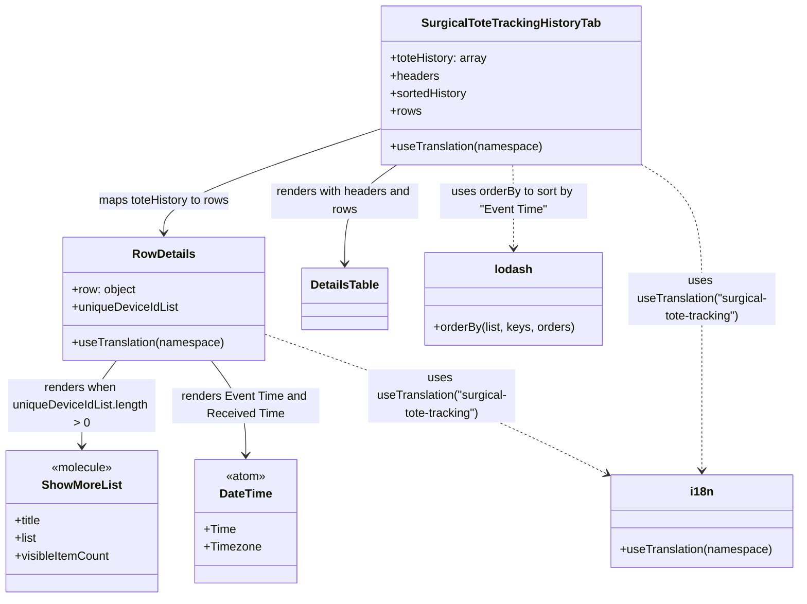

# Diagram: web/portal/src/pages/surgicaltotetracking/details/components/SurgicalToteTrackingHistoryTab.js

> Auto-generated by Obscura crawlers

## Mermaid

### SVG

<svg id="container" width="1079.4609375" xmlns="http://www.w3.org/2000/svg" class="classDiagram" height="812" viewBox="0 0 1079.4609375 812" role="graphics-document document" aria-roledescription="class"><g><defs><marker id="container_class-aggregationStart" class="marker aggregation class" refX="18" refY="7" markerWidth="190" markerHeight="240" orient="auto"><path d="M 18,7 L9,13 L1,7 L9,1 Z"></path></marker></defs><defs><marker id="container_class-aggregationEnd" class="marker aggregation class" refX="1" refY="7" markerWidth="20" markerHeight="28" orient="auto"><path d="M 18,7 L9,13 L1,7 L9,1 Z"></path></marker></defs><defs><marker id="container_class-extensionStart" class="marker extension class" refX="18" refY="7" markerWidth="190" markerHeight="240" orient="auto"><path d="M 1,7 L18,13 V 1 Z"></path></marker></defs><defs><marker id="container_class-extensionEnd" class="marker extension class" refX="1" refY="7" markerWidth="20" markerHeight="28" orient="auto"><path d="M 1,1 V 13 L18,7 Z"></path></marker></defs><defs><marker id="container_class-compositionStart" class="marker composition class" refX="18" refY="7" markerWidth="190" markerHeight="240" orient="auto"><path d="M 18,7 L9,13 L1,7 L9,1 Z"></path></marker></defs><defs><marker id="container_class-compositionEnd" class="marker composition class" refX="1" refY="7" markerWidth="20" markerHeight="28" orient="auto"><path d="M 18,7 L9,13 L1,7 L9,1 Z"></path></marker></defs><defs><marker id="container_class-dependencyStart" class="marker dependency class" refX="6" refY="7" markerWidth="190" markerHeight="240" orient="auto"><path d="M 5,7 L9,13 L1,7 L9,1 Z"></path></marker></defs><defs><marker id="container_class-dependencyEnd" class="marker dependency class" refX="13" refY="7" markerWidth="20" markerHeight="28" orient="auto"><path d="M 18,7 L9,13 L14,7 L9,1 Z"></path></marker></defs><defs><marker id="container_class-lollipopStart" class="marker lollipop class" refX="13" refY="7" markerWidth="190" markerHeight="240" orient="auto"><circle stroke="black" fill="transparent" cx="7" cy="7" r="6"></circle></marker></defs><defs><marker id="container_class-lollipopEnd" class="marker lollipop class" refX="1" refY="7" markerWidth="190" markerHeight="240" orient="auto"><circle stroke="black" fill="transparent" cx="7" cy="7" r="6"></circle></marker></defs><g class="root"><g class="clusters"></g><g class="edgePaths"><path d="M515.289,174.23L466.253,190.692C417.217,207.154,319.146,240.077,270.11,263.705C221.074,287.333,221.074,301.667,221.074,308.833L221.074,316" id="id_SurgicalToteTrackingHistoryTab_RowDetails_1" class="edge-thickness-normal edge-pattern-solid relation" style=";;;" data-edge="true" data-et="edge" data-id="id_SurgicalToteTrackingHistoryTab_RowDetails_1" data-points="W3sieCI6NTE1LjI4OTA2MjUsInkiOjE3NC4yMzA0NzE3NTE2OTU1N30seyJ4IjoyMjEuMDc0MjE4NzUsInkiOjI3M30seyJ4IjoyMjEuMDc0MjE4NzUsInkiOjMyMn1d" marker-end="url(#container_class-dependencyEnd)"></path><path d="M534.488,224L522.823,232.167C511.158,240.333,487.829,256.667,476.165,279C464.5,301.333,464.5,329.667,464.5,343.833L464.5,358" id="id_SurgicalToteTrackingHistoryTab_DetailsTable_2" class="edge-thickness-normal edge-pattern-solid relation" style=";;;" data-edge="true" data-et="edge" data-id="id_SurgicalToteTrackingHistoryTab_DetailsTable_2" data-points="W3sieCI6NTM0LjQ4NzYzNDM1NTA5NTYsInkiOjIyNH0seyJ4Ijo0NjQuNSwieSI6MjczfSx7IngiOjQ2NC41LCJ5IjozNjR9XQ==" marker-end="url(#container_class-dependencyEnd)"></path><path d="M157.217,490L149.488,500.167C141.759,510.333,126.301,530.667,118.573,550C110.844,569.333,110.844,587.667,110.844,596.833L110.844,606" id="id_RowDetails_ShowMoreList_3" class="edge-thickness-normal edge-pattern-solid relation" style=";;;" data-edge="true" data-et="edge" data-id="id_RowDetails_ShowMoreList_3" data-points="W3sieCI6MTU3LjIxNjU2Nzg4NzkzMTAzLCJ5Ijo0OTB9LHsieCI6MTEwLjg0Mzc1LCJ5Ijo1NTF9LHsieCI6MTEwLjg0Mzc1LCJ5Ijo2MTJ9XQ==" marker-end="url(#container_class-dependencyEnd)"></path><path d="M284.932,490L292.661,500.167C300.389,510.333,315.847,530.667,323.576,552C331.305,573.333,331.305,595.667,331.305,606.833L331.305,618" id="id_RowDetails_DateTime_4" class="edge-thickness-normal edge-pattern-solid relation" style=";;;" data-edge="true" data-et="edge" data-id="id_RowDetails_DateTime_4" data-points="W3sieCI6Mjg0LjkzMTg2OTYxMjA2ODk3LCJ5Ijo0OTB9LHsieCI6MzMxLjMwNDY4NzUsInkiOjU1MX0seyJ4IjozMzEuMzA0Njg3NSwieSI6NjI0fV0=" marker-end="url(#container_class-dependencyEnd)"></path><path d="M691.35,224L691.547,232.167C691.744,240.333,692.137,256.667,692.334,275.5C692.531,294.333,692.531,315.667,692.531,326.333L692.531,337" id="id_SurgicalToteTrackingHistoryTab_lodash_5" class="edge-thickness-normal edge-pattern-dashed relation" style=";;;" data-edge="true" data-et="edge" data-id="id_SurgicalToteTrackingHistoryTab_lodash_5" data-points="W3sieCI6NjkxLjM0OTg5NTUwMTU5MjMsInkiOjIyNH0seyJ4Ijo2OTIuNTMxMjUsInkiOjI3M30seyJ4Ijo2OTIuNTMxMjUsInkiOjM0M31d" marker-end="url(#container_class-dependencyEnd)"></path><path d="M862.203,220.948L876.542,229.623C890.88,238.299,919.557,255.649,933.896,286.491C948.234,317.333,948.234,361.667,948.234,408C948.234,454.333,948.234,502.667,948.234,541.5C948.234,580.333,948.234,609.667,948.234,624.333L948.234,639" id="id_SurgicalToteTrackingHistoryTab_i18n_6" class="edge-thickness-normal edge-pattern-dashed relation" style=";;;" data-edge="true" data-et="edge" data-id="id_SurgicalToteTrackingHistoryTab_i18n_6" data-points="W3sieCI6ODYyLjIwMzEyNSwieSI6MjIwLjk0NzkxNDMxNDUzMTMyfSx7IngiOjk0OC4yMzQzNzUsInkiOjI3M30seyJ4Ijo5NDguMjM0Mzc1LCJ5Ijo0MDZ9LHsieCI6OTQ4LjIzNDM3NSwieSI6NTUxfSx7IngiOjk0OC4yMzQzNzUsInkiOjY0NX1d" marker-end="url(#container_class-dependencyEnd)"></path><path d="M357.172,453.715L403.419,469.93C449.666,486.144,542.16,518.572,619.239,550.222C696.317,581.873,757.98,612.745,788.811,628.182L819.643,643.618" id="id_RowDetails_i18n_7" class="edge-thickness-normal edge-pattern-dashed relation" style=";;;" data-edge="true" data-et="edge" data-id="id_RowDetails_i18n_7" data-points="W3sieCI6MzU3LjE3MTg3NSwieSI6NDUzLjcxNTQ1MTQ5MzAxMzA2fSx7IngiOjYzNC42NTQyOTY4NzUsInkiOjU1MX0seyJ4Ijo4MjUuMDA3ODEyNSwieSI6NjQ2LjMwNDIxMTA3MDQ4Nzd9XQ==" marker-end="url(#container_class-dependencyEnd)"></path></g><g class="edgeLabels"><g class="edgeLabel" transform="translate(221.07421875, 273)"><g class="label" data-id="id_SurgicalToteTrackingHistoryTab_RowDetails_1" transform="translate(-90.953125, -12)"><foreignObject width="181.90625" height="24">

maps toteHistory to rows

</foreignObject></g></g><g class="edgeLabel" transform="translate(464.5, 273)"><g class="label" data-id="id_SurgicalToteTrackingHistoryTab_DetailsTable_2" transform="translate(-100, -24)"><foreignObject width="200" height="48">

renders with headers and rows

</foreignObject></g></g><g class="edgeLabel" transform="translate(110.84375, 551)"><g class="label" data-id="id_RowDetails_ShowMoreList_3" transform="translate(-100, -36)"><foreignObject width="200" height="72">

renders when uniqueDeviceIdList.length &gt; 0

</foreignObject></g></g><g class="edgeLabel" transform="translate(331.3046875, 551)"><g class="label" data-id="id_RowDetails_DateTime_4" transform="translate(-100, -24)"><foreignObject width="200" height="48">

renders Event Time and Received Time

</foreignObject></g></g><g class="edgeLabel" transform="translate(692.53125, 273)"><g class="label" data-id="id_SurgicalToteTrackingHistoryTab_lodash_5" transform="translate(-100, -24)"><foreignObject width="200" height="48">

uses orderBy to sort by "Event Time"

</foreignObject></g></g><g class="edgeLabel" transform="translate(948.234375, 406)"><g class="label" data-id="id_SurgicalToteTrackingHistoryTab_i18n_6" transform="translate(-100, -36)"><foreignObject width="200" height="72">

uses useTranslation("surgical-tote-tracking")

</foreignObject></g></g><g class="edgeLabel" transform="translate(596.35805, 537.57345)"><g class="label" data-id="id_RowDetails_i18n_7" transform="translate(-100, -36)"><foreignObject width="200" height="72">

uses useTranslation("surgical-tote-tracking")

</foreignObject></g></g></g><g class="nodes"><g class="node default" id="classId-SurgicalToteTrackingHistoryTab-0" transform="translate(688.74609375, 116)"><g class="basic label-container"><path d="M-173.45703125 -108 L173.45703125 -108 L173.45703125 108 L-173.45703125 108" stroke="none" stroke-width="0" fill="#ECECFF" style=""></path><path d="M-173.45703125 -108 C-57.279179655809386 -108, 58.89867193838123 -108, 173.45703125 -108 M-173.45703125 -108 C-98.64403565253618 -108, -23.83104005507235 -108, 173.45703125 -108 M173.45703125 -108 C173.45703125 -25.76268943467555, 173.45703125 56.4746211306489, 173.45703125 108 M173.45703125 -108 C173.45703125 -55.59492822148143, 173.45703125 -3.1898564429628635, 173.45703125 108 M173.45703125 108 C96.43307256630459 108, 19.409113882609176 108, -173.45703125 108 M173.45703125 108 C56.682846920961936 108, -60.09133740807613 108, -173.45703125 108 M-173.45703125 108 C-173.45703125 35.48209694565429, -173.45703125 -37.03580610869142, -173.45703125 -108 M-173.45703125 108 C-173.45703125 36.667201905379116, -173.45703125 -34.66559618924177, -173.45703125 -108" stroke="#9370DB" stroke-width="1.3" fill="none" stroke-dasharray="0 0" style=""></path></g><g class="annotation-group text" transform="translate(0, -84)"></g><g class="label-group text" transform="translate(-115.6953125, -84)"><g class="label" style="font-weight: bolder" transform="translate(0,-12)"><foreignObject width="231.390625" height="24">

SurgicalToteTrackingHistoryTab

</foreignObject></g></g><g class="members-group text" transform="translate(-161.45703125, -36)"><g class="label" style="" transform="translate(0,-12)"><foreignObject width="133.8125" height="24">

+toteHistory: array

</foreignObject></g><g class="label" style="" transform="translate(0,12)"><foreignObject width="66.328125" height="24">

+headers

</foreignObject></g><g class="label" style="" transform="translate(0,36)"><foreignObject width="106.59375" height="24">

+sortedHistory

</foreignObject></g><g class="label" style="" transform="translate(0,60)"><foreignObject width="41.96875" height="24">

+rows

</foreignObject></g></g><g class="methods-group text" transform="translate(-161.45703125, 84)"><g class="label" style="" transform="translate(0,-12)"><foreignObject width="207.21875" height="24">

+useTranslation(namespace)

</foreignObject></g></g><g class="divider" style=""><path d="M-173.45703125 -60 C-81.22994832924412 -60, 10.997134591511752 -60, 173.45703125 -60 M-173.45703125 -60 C-51.412545564436144 -60, 70.63194012112771 -60, 173.45703125 -60" stroke="#9370DB" stroke-width="1.3" fill="none" stroke-dasharray="0 0" style=""></path></g><g class="divider" style=""><path d="M-173.45703125 60 C-42.718636158476585 60, 88.01975893304683 60, 173.45703125 60 M-173.45703125 60 C-46.46195828602747 60, 80.53311467794506 60, 173.45703125 60" stroke="#9370DB" stroke-width="1.3" fill="none" stroke-dasharray="0 0" style=""></path></g></g><g class="node default" id="classId-RowDetails-1" transform="translate(221.07421875, 406)"><g class="basic label-container"><path d="M-136.09765625 -84 L136.09765625 -84 L136.09765625 84 L-136.09765625 84" stroke="none" stroke-width="0" fill="#ECECFF" style=""></path><path d="M-136.09765625 -84 C-71.49133071260674 -84, -6.885005175213479 -84, 136.09765625 -84 M-136.09765625 -84 C-27.96903267758968 -84, 80.15959089482064 -84, 136.09765625 -84 M136.09765625 -84 C136.09765625 -43.887650982392906, 136.09765625 -3.775301964785811, 136.09765625 84 M136.09765625 -84 C136.09765625 -19.85251538126687, 136.09765625 44.29496923746626, 136.09765625 84 M136.09765625 84 C54.562806328570545 84, -26.97204359285891 84, -136.09765625 84 M136.09765625 84 C79.00259540975219 84, 21.907534569504392 84, -136.09765625 84 M-136.09765625 84 C-136.09765625 25.1163057729499, -136.09765625 -33.7673884541002, -136.09765625 -84 M-136.09765625 84 C-136.09765625 42.493472134819676, -136.09765625 0.986944269639352, -136.09765625 -84" stroke="#9370DB" stroke-width="1.3" fill="none" stroke-dasharray="0 0" style=""></path></g><g class="annotation-group text" transform="translate(0, -60)"></g><g class="label-group text" transform="translate(-40.9765625, -60)"><g class="label" style="font-weight: bolder" transform="translate(0,-12)"><foreignObject width="81.953125" height="24">

RowDetails

</foreignObject></g></g><g class="members-group text" transform="translate(-124.09765625, -12)"><g class="label" style="" transform="translate(0,-12)"><foreignObject width="88.125" height="24">

+row: object

</foreignObject></g><g class="label" style="" transform="translate(0,12)"><foreignObject width="146.203125" height="24">

+uniqueDeviceIdList

</foreignObject></g></g><g class="methods-group text" transform="translate(-124.09765625, 60)"><g class="label" style="" transform="translate(0,-12)"><foreignObject width="207.21875" height="24">

+useTranslation(namespace)

</foreignObject></g></g><g class="divider" style=""><path d="M-136.09765625 -36 C-30.663914591206805 -36, 74.76982706758639 -36, 136.09765625 -36 M-136.09765625 -36 C-34.66690469301919 -36, 66.76384686396162 -36, 136.09765625 -36" stroke="#9370DB" stroke-width="1.3" fill="none" stroke-dasharray="0 0" style=""></path></g><g class="divider" style=""><path d="M-136.09765625 36 C-54.044208066021994 36, 28.00924011795601 36, 136.09765625 36 M-136.09765625 36 C-40.77296570229572 36, 54.55172484540856 36, 136.09765625 36" stroke="#9370DB" stroke-width="1.3" fill="none" stroke-dasharray="0 0" style=""></path></g></g><g class="node default" id="classId-DetailsTable-2" transform="translate(464.5, 406)"><g class="basic label-container"><path d="M-57.328125 -42 L57.328125 -42 L57.328125 42 L-57.328125 42" stroke="none" stroke-width="0" fill="#ECECFF" style=""></path><path d="M-57.328125 -42 C-33.70710647015632 -42, -10.08608794031263 -42, 57.328125 -42 M-57.328125 -42 C-13.432325131995867 -42, 30.463474736008266 -42, 57.328125 -42 M57.328125 -42 C57.328125 -9.895007655421772, 57.328125 22.209984689156457, 57.328125 42 M57.328125 -42 C57.328125 -21.878418126753868, 57.328125 -1.7568362535077355, 57.328125 42 M57.328125 42 C22.101655294020212 42, -13.124814411959576 42, -57.328125 42 M57.328125 42 C12.157163624084589 42, -33.01379775183082 42, -57.328125 42 M-57.328125 42 C-57.328125 22.29841605186649, -57.328125 2.5968321037329787, -57.328125 -42 M-57.328125 42 C-57.328125 14.08100540369373, -57.328125 -13.83798919261254, -57.328125 -42" stroke="#9370DB" stroke-width="1.3" fill="none" stroke-dasharray="0 0" style=""></path></g><g class="annotation-group text" transform="translate(0, -18)"></g><g class="label-group text" transform="translate(-45.328125, -18)"><g class="label" style="font-weight: bolder" transform="translate(0,-12)"><foreignObject width="90.65625" height="24">

DetailsTable

</foreignObject></g></g><g class="members-group text" transform="translate(-45.328125, 30)"></g><g class="methods-group text" transform="translate(-45.328125, 60)"></g><g class="divider" style=""><path d="M-57.328125 6 C-20.717139638578843 6, 15.893845722842315 6, 57.328125 6 M-57.328125 6 C-27.64539882857557 6, 2.0373273428488616 6, 57.328125 6" stroke="#9370DB" stroke-width="1.3" fill="none" stroke-dasharray="0 0" style=""></path></g><g class="divider" style=""><path d="M-57.328125 24 C-18.754794146698252 24, 19.818536706603496 24, 57.328125 24 M-57.328125 24 C-33.2102020083651 24, -9.09227901673021 24, 57.328125 24" stroke="#9370DB" stroke-width="1.3" fill="none" stroke-dasharray="0 0" style=""></path></g></g><g class="node default" id="classId-DateTime-3" transform="translate(331.3046875, 708)"><g class="basic label-container"><path d="M-67.6171875 -84 L67.6171875 -84 L67.6171875 84 L-67.6171875 84" stroke="none" stroke-width="0" fill="#ECECFF" style=""></path><path d="M-67.6171875 -84 C-24.20521589796715 -84, 19.2067557040657 -84, 67.6171875 -84 M-67.6171875 -84 C-14.895014416254867 -84, 37.82715866749027 -84, 67.6171875 -84 M67.6171875 -84 C67.6171875 -45.84678041219199, 67.6171875 -7.6935608243839795, 67.6171875 84 M67.6171875 -84 C67.6171875 -34.542148511980145, 67.6171875 14.91570297603971, 67.6171875 84 M67.6171875 84 C36.760525062227586 84, 5.903862624455179 84, -67.6171875 84 M67.6171875 84 C34.6435764935853 84, 1.6699654871706002 84, -67.6171875 84 M-67.6171875 84 C-67.6171875 18.934338257516913, -67.6171875 -46.131323484966174, -67.6171875 -84 M-67.6171875 84 C-67.6171875 43.83190709210076, -67.6171875 3.663814184201513, -67.6171875 -84" stroke="#9370DB" stroke-width="1.3" fill="none" stroke-dasharray="0 0" style=""></path></g><g class="annotation-group text" transform="translate(-27.65625, -60)"><g class="label" style="" transform="translate(0,-12)"><foreignObject width="55.3125" height="24">

«atom»

</foreignObject></g></g><g class="label-group text" transform="translate(-34.625, -36)"><g class="label" style="font-weight: bolder" transform="translate(0,-12)"><foreignObject width="69.25" height="24">

DateTime

</foreignObject></g></g><g class="members-group text" transform="translate(-55.6171875, 12)"><g class="label" style="" transform="translate(0,-12)"><foreignObject width="42.40625" height="24">

+Time

</foreignObject></g><g class="label" style="" transform="translate(0,12)"><foreignObject width="76.609375" height="24">

+Timezone

</foreignObject></g></g><g class="methods-group text" transform="translate(-55.6171875, 84)"></g><g class="divider" style=""><path d="M-67.6171875 -12 C-30.54368935551645 -12, 6.529808788967102 -12, 67.6171875 -12 M-67.6171875 -12 C-32.91633766552526 -12, 1.784512168949476 -12, 67.6171875 -12" stroke="#9370DB" stroke-width="1.3" fill="none" stroke-dasharray="0 0" style=""></path></g><g class="divider" style=""><path d="M-67.6171875 60 C-27.13532072747791 60, 13.346546045044178 60, 67.6171875 60 M-67.6171875 60 C-22.944014944882632 60, 21.729157610234736 60, 67.6171875 60" stroke="#9370DB" stroke-width="1.3" fill="none" stroke-dasharray="0 0" style=""></path></g></g><g class="node default" id="classId-ShowMoreList-4" transform="translate(110.84375, 708)"><g class="basic label-container"><path d="M-102.84375 -96 L102.84375 -96 L102.84375 96 L-102.84375 96" stroke="none" stroke-width="0" fill="#ECECFF" style=""></path><path d="M-102.84375 -96 C-49.232740302259636 -96, 4.378269395480729 -96, 102.84375 -96 M-102.84375 -96 C-37.12670907622082 -96, 28.59033184755836 -96, 102.84375 -96 M102.84375 -96 C102.84375 -40.741800287325574, 102.84375 14.516399425348851, 102.84375 96 M102.84375 -96 C102.84375 -36.1265576825501, 102.84375 23.7468846348998, 102.84375 96 M102.84375 96 C31.161593611505054 96, -40.52056277698989 96, -102.84375 96 M102.84375 96 C51.32883253798184 96, -0.18608492403632226 96, -102.84375 96 M-102.84375 96 C-102.84375 40.61959877282676, -102.84375 -14.760802454346475, -102.84375 -96 M-102.84375 96 C-102.84375 40.57826998100735, -102.84375 -14.843460037985295, -102.84375 -96" stroke="#9370DB" stroke-width="1.3" fill="none" stroke-dasharray="0 0" style=""></path></g><g class="annotation-group text" transform="translate(-42.2265625, -72)"><g class="label" style="" transform="translate(0,-12)"><foreignObject width="84.453125" height="24">

«molecule»

</foreignObject></g></g><g class="label-group text" transform="translate(-51.515625, -48)"><g class="label" style="font-weight: bolder" transform="translate(0,-12)"><foreignObject width="103.03125" height="24">

ShowMoreList

</foreignObject></g></g><g class="members-group text" transform="translate(-90.84375, 0)"><g class="label" style="" transform="translate(0,-12)"><foreignObject width="37.140625" height="24">

+title

</foreignObject></g><g class="label" style="" transform="translate(0,12)"><foreignObject width="30.4375" height="24">

+list

</foreignObject></g><g class="label" style="" transform="translate(0,36)"><foreignObject width="130.171875" height="24">

+visibleItemCount

</foreignObject></g></g><g class="methods-group text" transform="translate(-90.84375, 96)"></g><g class="divider" style=""><path d="M-102.84375 -24 C-44.89140687103346 -24, 13.06093625793308 -24, 102.84375 -24 M-102.84375 -24 C-36.12860676235482 -24, 30.58653647529036 -24, 102.84375 -24" stroke="#9370DB" stroke-width="1.3" fill="none" stroke-dasharray="0 0" style=""></path></g><g class="divider" style=""><path d="M-102.84375 72 C-43.08309210535365 72, 16.6775657892927 72, 102.84375 72 M-102.84375 72 C-26.206059289419642 72, 50.431631421160716 72, 102.84375 72" stroke="#9370DB" stroke-width="1.3" fill="none" stroke-dasharray="0 0" style=""></path></g></g><g class="node default" id="classId-lodash-5" transform="translate(692.53125, 406)"><g class="basic label-container"><path d="M-120.703125 -63 L120.703125 -63 L120.703125 63 L-120.703125 63" stroke="none" stroke-width="0" fill="#ECECFF" style=""></path><path d="M-120.703125 -63 C-40.38168324678337 -63, 39.939758506433265 -63, 120.703125 -63 M-120.703125 -63 C-34.337526664931474 -63, 52.02807167013705 -63, 120.703125 -63 M120.703125 -63 C120.703125 -32.341700869528566, 120.703125 -1.6834017390571248, 120.703125 63 M120.703125 -63 C120.703125 -32.51711272331448, 120.703125 -2.034225446628973, 120.703125 63 M120.703125 63 C35.13398149163095 63, -50.435162016738104 63, -120.703125 63 M120.703125 63 C46.30878510622972 63, -28.08555478754056 63, -120.703125 63 M-120.703125 63 C-120.703125 22.85771565896298, -120.703125 -17.28456868207404, -120.703125 -63 M-120.703125 63 C-120.703125 21.045434921312975, -120.703125 -20.90913015737405, -120.703125 -63" stroke="#9370DB" stroke-width="1.3" fill="none" stroke-dasharray="0 0" style=""></path></g><g class="annotation-group text" transform="translate(0, -39)"></g><g class="label-group text" transform="translate(-24.59375, -39)"><g class="label" style="font-weight: bolder" transform="translate(0,-12)"><foreignObject width="49.1875" height="24">

lodash

</foreignObject></g></g><g class="members-group text" transform="translate(-108.703125, 9)"></g><g class="methods-group text" transform="translate(-108.703125, 39)"><g class="label" style="" transform="translate(0,-12)"><foreignObject width="192.8125" height="24">

+orderBy(list, keys, orders)

</foreignObject></g></g><g class="divider" style=""><path d="M-120.703125 -15 C-30.299223714545292 -15, 60.104677570909416 -15, 120.703125 -15 M-120.703125 -15 C-65.2379649923758 -15, -9.772804984751573 -15, 120.703125 -15" stroke="#9370DB" stroke-width="1.3" fill="none" stroke-dasharray="0 0" style=""></path></g><g class="divider" style=""><path d="M-120.703125 9 C-67.53999705741644 9, -14.376869114832886 9, 120.703125 9 M-120.703125 9 C-38.16735114729754 9, 44.368422705404924 9, 120.703125 9" stroke="#9370DB" stroke-width="1.3" fill="none" stroke-dasharray="0 0" style=""></path></g></g><g class="node default" id="classId-i18n-6" transform="translate(948.234375, 708)"><g class="basic label-container"><path d="M-123.2265625 -63 L123.2265625 -63 L123.2265625 63 L-123.2265625 63" stroke="none" stroke-width="0" fill="#ECECFF" style=""></path><path d="M-123.2265625 -63 C-68.9501608118866 -63, -14.673759123773223 -63, 123.2265625 -63 M-123.2265625 -63 C-63.81284216654657 -63, -4.399121833093133 -63, 123.2265625 -63 M123.2265625 -63 C123.2265625 -17.003933890419958, 123.2265625 28.992132219160084, 123.2265625 63 M123.2265625 -63 C123.2265625 -12.621269295311741, 123.2265625 37.75746140937652, 123.2265625 63 M123.2265625 63 C33.81279569687713 63, -55.60097110624574 63, -123.2265625 63 M123.2265625 63 C59.822810248878724 63, -3.5809420022425513 63, -123.2265625 63 M-123.2265625 63 C-123.2265625 16.70628377353772, -123.2265625 -29.58743245292456, -123.2265625 -63 M-123.2265625 63 C-123.2265625 35.152446803593065, -123.2265625 7.304893607186138, -123.2265625 -63" stroke="#9370DB" stroke-width="1.3" fill="none" stroke-dasharray="0 0" style=""></path></g><g class="annotation-group text" transform="translate(0, -39)"></g><g class="label-group text" transform="translate(-15.234375, -39)"><g class="label" style="font-weight: bolder" transform="translate(0,-12)"><foreignObject width="30.46875" height="24">

i18n

</foreignObject></g></g><g class="members-group text" transform="translate(-111.2265625, 9)"></g><g class="methods-group text" transform="translate(-111.2265625, 39)"><g class="label" style="" transform="translate(0,-12)"><foreignObject width="207.21875" height="24">

+useTranslation(namespace)

</foreignObject></g></g><g class="divider" style=""><path d="M-123.2265625 -15 C-63.89032299291188 -15, -4.554083485823753 -15, 123.2265625 -15 M-123.2265625 -15 C-73.30702734055006 -15, -23.38749218110013 -15, 123.2265625 -15" stroke="#9370DB" stroke-width="1.3" fill="none" stroke-dasharray="0 0" style=""></path></g><g class="divider" style=""><path d="M-123.2265625 9 C-50.419559777686516 9, 22.38744294462697 9, 123.2265625 9 M-123.2265625 9 C-44.65670445237497 9, 33.913153595250066 9, 123.2265625 9" stroke="#9370DB" stroke-width="1.3" fill="none" stroke-dasharray="0 0" style=""></path></g></g></g></g></g></svg>
