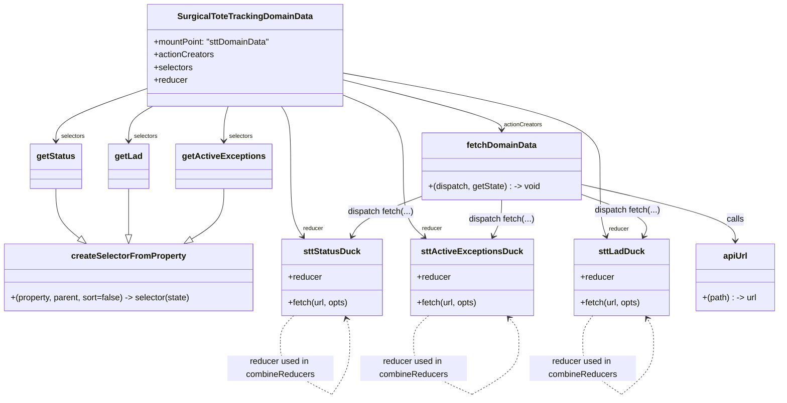

# Diagram: web/portal/src/pages/surgicaltotetracking/modules/domain-data/SurgicalToteTrackingDomainData.js

> Auto-generated by Obscura crawlers

## Mermaid

### SVG

<svg id="container" width="1457.3203125" xmlns="http://www.w3.org/2000/svg" class="classDiagram" height="750.25" viewBox="0 0 1457.3203125 750.25" role="graphics-document document" aria-roledescription="class"><g><defs><marker id="container_class-aggregationStart" class="marker aggregation class" refX="18" refY="7" markerWidth="190" markerHeight="240" orient="auto"><path d="M 18,7 L9,13 L1,7 L9,1 Z"></path></marker></defs><defs><marker id="container_class-aggregationEnd" class="marker aggregation class" refX="1" refY="7" markerWidth="20" markerHeight="28" orient="auto"><path d="M 18,7 L9,13 L1,7 L9,1 Z"></path></marker></defs><defs><marker id="container_class-extensionStart" class="marker extension class" refX="18" refY="7" markerWidth="190" markerHeight="240" orient="auto"><path d="M 1,7 L18,13 V 1 Z"></path></marker></defs><defs><marker id="container_class-extensionEnd" class="marker extension class" refX="1" refY="7" markerWidth="20" markerHeight="28" orient="auto"><path d="M 1,1 V 13 L18,7 Z"></path></marker></defs><defs><marker id="container_class-compositionStart" class="marker composition class" refX="18" refY="7" markerWidth="190" markerHeight="240" orient="auto"><path d="M 18,7 L9,13 L1,7 L9,1 Z"></path></marker></defs><defs><marker id="container_class-compositionEnd" class="marker composition class" refX="1" refY="7" markerWidth="20" markerHeight="28" orient="auto"><path d="M 18,7 L9,13 L1,7 L9,1 Z"></path></marker></defs><defs><marker id="container_class-dependencyStart" class="marker dependency class" refX="6" refY="7" markerWidth="190" markerHeight="240" orient="auto"><path d="M 5,7 L9,13 L1,7 L9,1 Z"></path></marker></defs><defs><marker id="container_class-dependencyEnd" class="marker dependency class" refX="13" refY="7" markerWidth="20" markerHeight="28" orient="auto"><path d="M 18,7 L9,13 L14,7 L9,1 Z"></path></marker></defs><defs><marker id="container_class-lollipopStart" class="marker lollipop class" refX="13" refY="7" markerWidth="190" markerHeight="240" orient="auto"><circle stroke="black" fill="transparent" cx="7" cy="7" r="6"></circle></marker></defs><defs><marker id="container_class-lollipopEnd" class="marker lollipop class" refX="1" refY="7" markerWidth="190" markerHeight="240" orient="auto"><circle stroke="black" fill="transparent" cx="7" cy="7" r="6"></circle></marker></defs><g class="root"><g class="clusters"></g><g class="edgePaths"><path d="M633.527,149.795L683.766,162.329C734.004,174.863,834.48,199.932,884.719,215.632C934.957,231.333,934.957,237.667,934.957,240.833L934.957,244" id="id_SurgicalToteTrackingDomainData_fetchDomainData_1" class="edge-thickness-normal edge-pattern-solid relation" style=";;;" data-edge="true" data-et="edge" data-id="id_SurgicalToteTrackingDomainData_fetchDomainData_1" data-points="W3sieCI6NjMzLjUyNzM0Mzc1LCJ5IjoxNDkuNzk0OTI1Njk3NzE2NTZ9LHsieCI6OTM0Ljk1NzAzMTI1LCJ5IjoyMjV9LHsieCI6OTM0Ljk1NzAzMTI1LCJ5IjoyNTB9XQ==" marker-end="url(#container_class-dependencyEnd)"></path><path d="M266.426,169.11L240.166,178.425C213.906,187.74,161.387,206.37,135.127,222.352C108.867,238.333,108.867,251.667,108.867,258.333L108.867,265" id="id_SurgicalToteTrackingDomainData_getStatus_2" class="edge-thickness-normal edge-pattern-solid relation" style=";;;" data-edge="true" data-et="edge" data-id="id_SurgicalToteTrackingDomainData_getStatus_2" data-points="W3sieCI6MjY2LjQyNTc4MTI1LCJ5IjoxNjkuMTEwMDM4NDc3Mzk0NTR9LHsieCI6MTA4Ljg2NzE4NzUsInkiOjIyNX0seyJ4IjoxMDguODY3MTg3NSwieSI6MjcxfV0=" marker-end="url(#container_class-dependencyEnd)"></path><path d="M285.789,200L278.662,204.167C271.536,208.333,257.284,216.667,250.157,227.5C243.031,238.333,243.031,251.667,243.031,258.333L243.031,265" id="id_SurgicalToteTrackingDomainData_getLad_3" class="edge-thickness-normal edge-pattern-solid relation" style=";;;" data-edge="true" data-et="edge" data-id="id_SurgicalToteTrackingDomainData_getLad_3" data-points="W3sieCI6Mjg1Ljc4ODU0NTk3MTA3NDM3LCJ5IjoyMDB9LHsieCI6MjQzLjAzMTI1LCJ5IjoyMjV9LHsieCI6MjQzLjAzMTI1LCJ5IjoyNzF9XQ==" marker-end="url(#container_class-dependencyEnd)"></path><path d="M422.722,200L421.54,204.167C420.357,208.333,417.991,216.667,416.808,227.5C415.625,238.333,415.625,251.667,415.625,258.333L415.625,265" id="id_SurgicalToteTrackingDomainData_getActiveExceptions_4" class="edge-thickness-normal edge-pattern-solid relation" style=";;;" data-edge="true" data-et="edge" data-id="id_SurgicalToteTrackingDomainData_getActiveExceptions_4" data-points="W3sieCI6NDIyLjcyMjQzMDI2ODU5NSwieSI6MjAwfSx7IngiOjQxNS42MjUsInkiOjIyNX0seyJ4Ijo0MTUuNjI1LCJ5IjoyNzF9XQ==" marker-end="url(#container_class-dependencyEnd)"></path><path d="M518.444,200L521.415,204.167C524.387,208.333,530.33,216.667,533.302,235.5C536.273,254.333,536.273,283.667,536.273,315C536.273,346.333,536.273,379.667,540.576,401.719C544.878,423.771,553.482,434.541,557.784,439.927L562.086,445.312" id="id_SurgicalToteTrackingDomainData_sttStatusDuck_5" class="edge-thickness-normal edge-pattern-solid relation" style=";;;" data-edge="true" data-et="edge" data-id="id_SurgicalToteTrackingDomainData_sttStatusDuck_5" data-points="W3sieCI6NTE4LjQ0MzUwNDY0ODc2MDQsInkiOjIwMH0seyJ4Ijo1MzYuMjczNDM3NSwieSI6MjI1fSx7IngiOjUzNi4yNzM0Mzc1LCJ5IjozMTN9LHsieCI6NTM2LjI3MzQzNzUsInkiOjQxM30seyJ4Ijo1NjUuODMwNzQxMTEyMzg1MywieSI6NDUwfV0=" marker-end="url(#container_class-dependencyEnd)"></path><path d="M633.527,137.196L714.442,151.83C795.357,166.464,957.186,195.732,1038.101,225.033C1119.016,254.333,1119.016,283.667,1119.016,315C1119.016,346.333,1119.016,379.667,1120.993,401.565C1122.97,423.462,1126.924,433.925,1128.901,439.156L1130.878,444.387" id="id_SurgicalToteTrackingDomainData_sttLadDuck_6" class="edge-thickness-normal edge-pattern-solid relation" style=";;;" data-edge="true" data-et="edge" data-id="id_SurgicalToteTrackingDomainData_sttLadDuck_6" data-points="W3sieCI6NjMzLjUyNzM0Mzc1LCJ5IjoxMzcuMTk2MzM0NTI4Mjk5N30seyJ4IjoxMTE5LjAxNTYyNSwieSI6MjI1fSx7IngiOjExMTkuMDE1NjI1LCJ5IjozMTN9LHsieCI6MTExOS4wMTU2MjUsInkiOjQxM30seyJ4IjoxMTMyLjk5OTM1NDkzMTE5MjYsInkiOjQ1MH1d" marker-end="url(#container_class-dependencyEnd)"></path><path d="M633.527,177.805L653.089,185.671C672.651,193.537,711.775,209.268,731.337,231.801C750.898,254.333,750.898,283.667,750.898,315C750.898,346.333,750.898,379.667,757.789,401.873C764.679,424.08,778.46,435.16,785.35,440.7L792.24,446.24" id="id_SurgicalToteTrackingDomainData_sttActiveExceptionsDuck_7" class="edge-thickness-normal edge-pattern-solid relation" style=";;;" data-edge="true" data-et="edge" data-id="id_SurgicalToteTrackingDomainData_sttActiveExceptionsDuck_7" data-points="W3sieCI6NjMzLjUyNzM0Mzc1LCJ5IjoxNzcuODA1MzUwNzQ1MTA2MTh9LHsieCI6NzUwLjg5ODQzNzUsInkiOjIyNX0seyJ4Ijo3NTAuODk4NDM3NSwieSI6MzEzfSx7IngiOjc1MC44OTg0Mzc1LCJ5Ijo0MTN9LHsieCI6Nzk2LjkxNjM5MTkxNTEzNzYsInkiOjQ1MH1d" marker-end="url(#container_class-dependencyEnd)"></path><path d="M108.867,355L108.867,364.667C108.867,374.333,108.867,393.667,116.072,409.187C123.278,424.708,137.688,436.415,144.893,442.269L152.099,448.123" id="id_getStatus_createSelectorFromProperty_8" class="edge-thickness-normal edge-pattern-solid relation" style=";;;" data-edge="true" data-et="edge" data-id="id_getStatus_createSelectorFromProperty_8" data-points="W3sieCI6MTA4Ljg2NzE4NzUsInkiOjM1NX0seyJ4IjoxMDguODY3MTg3NSwieSI6NDEzfSx7IngiOjE2NS40ODY4ODM2MDA5MTc0NSwieSI6NDU5fV0=" marker-end="url(#container_class-extensionEnd)"></path><path d="M243.031,355L243.031,364.667C243.031,374.333,243.031,393.667,243.031,408.125C243.031,422.583,243.031,432.167,243.031,436.958L243.031,441.75" id="id_getLad_createSelectorFromProperty_9" class="edge-thickness-normal edge-pattern-solid relation" style=";;;" data-edge="true" data-et="edge" data-id="id_getLad_createSelectorFromProperty_9" data-points="W3sieCI6MjQzLjAzMTI1LCJ5IjozNTV9LHsieCI6MjQzLjAzMTI1LCJ5Ijo0MTN9LHsieCI6MjQzLjAzMTI1LCJ5Ijo0NTl9XQ==" marker-end="url(#container_class-extensionEnd)"></path><path d="M415.625,355L415.625,364.667C415.625,374.333,415.625,393.667,405.916,409.465C396.207,425.263,376.79,437.526,367.081,443.658L357.372,449.789" id="id_getActiveExceptions_createSelectorFromProperty_10" class="edge-thickness-normal edge-pattern-solid relation" style=";;;" data-edge="true" data-et="edge" data-id="id_getActiveExceptions_createSelectorFromProperty_10" data-points="W3sieCI6NDE1LjYyNSwieSI6MzU1fSx7IngiOjQxNS42MjUsInkiOjQxM30seyJ4IjozNDIuNzg3MjcwNjQyMjAxODYsInkiOjQ1OX1d" marker-end="url(#container_class-extensionEnd)"></path><path d="M1084.016,346.886L1132.486,357.905C1180.957,368.924,1277.898,390.962,1326.369,408.648C1374.84,426.333,1374.84,439.667,1374.84,446.333L1374.84,453" id="id_fetchDomainData_apiUrl_11" class="edge-thickness-normal edge-pattern-solid relation" style=";;;" data-edge="true" data-et="edge" data-id="id_fetchDomainData_apiUrl_11" data-points="W3sieCI6MTA4NC4wMTU2MjUsInkiOjM0Ni44ODU5NzgxNTQ2OTMyfSx7IngiOjEzNzQuODM5ODQzNzUsInkiOjQxM30seyJ4IjoxMzc0LjgzOTg0Mzc1LCJ5Ijo0NTl9XQ==" marker-end="url(#container_class-dependencyEnd)"></path><path d="M785.898,368.943L766.333,376.285C746.768,383.628,707.638,398.314,685.901,410.9C664.163,423.486,659.819,433.971,657.647,439.214L655.475,444.457" id="id_fetchDomainData_sttStatusDuck_12" class="edge-thickness-normal edge-pattern-solid relation" style=";;;" data-edge="true" data-et="edge" data-id="id_fetchDomainData_sttStatusDuck_12" data-points="W3sieCI6Nzg1Ljg5ODQzNzUsInkiOjM2OC45NDI1ODk5MDQ4NTQwNn0seyJ4Ijo2NjguNTA3ODEyNSwieSI6NDEzfSx7IngiOjY1My4xNzgyMTgxNzY2MDU1LCJ5Ijo0NTB9XQ==" marker-end="url(#container_class-dependencyEnd)"></path><path d="M934.957,376L934.957,382.167C934.957,388.333,934.957,400.667,932.62,412.086C930.283,423.506,925.609,434.012,923.272,439.265L920.935,444.518" id="id_fetchDomainData_sttActiveExceptionsDuck_13" class="edge-thickness-normal edge-pattern-solid relation" style=";;;" data-edge="true" data-et="edge" data-id="id_fetchDomainData_sttActiveExceptionsDuck_13" data-points="W3sieCI6OTM0Ljk1NzAzMTI1LCJ5IjozNzZ9LHsieCI6OTM0Ljk1NzAzMTI1LCJ5Ijo0MTN9LHsieCI6OTE4LjQ5NjM4MDQ0NzI0NzcsInkiOjQ1MH1d" marker-end="url(#container_class-dependencyEnd)"></path><path d="M1084.016,365.643L1106.364,373.536C1128.713,381.429,1173.41,397.214,1192.952,410.391C1212.495,423.567,1206.882,434.134,1204.075,439.418L1201.269,444.701" id="id_fetchDomainData_sttLadDuck_14" class="edge-thickness-normal edge-pattern-solid relation" style=";;;" data-edge="true" data-et="edge" data-id="id_fetchDomainData_sttLadDuck_14" data-points="W3sieCI6MTA4NC4wMTU2MjUsInkiOjM2NS42NDI5MDU5MjA0MTI4fSx7IngiOjEyMTguMTA3NDIxODc1LCJ5Ijo0MTN9LHsieCI6MTE5OC40NTQ0ODY4MTE5MjY3LCJ5Ijo0NTB9XQ==" marker-end="url(#container_class-dependencyEnd)"></path><path d="M546.495,594L542.048,598.167C537.6,602.333,528.705,610.667,524.258,619C519.811,627.333,519.811,635.667,519.811,639.833L519.811,644" id="sttStatusDuck-cyclic-special-1" class="edge-thickness-normal edge-pattern-dashed relation" style=";;;" data-edge="true" data-et="edge" data-id="sttStatusDuck-cyclic-special-1" data-points="W3sieCI6NTQ2LjQ5NTM2ODg3ODg2NiwieSI6NTk0fSx7IngiOjUxOS44MTA1NDY4NzUsInkiOjYxOX0seyJ4Ijo1MTkuODEwNTQ2ODc1LCJ5Ijo2NDR9XQ=="></path><path d="M519.811,644.1L519.811,652.267C519.811,660.433,519.811,676.767,537.058,693.104C554.306,709.442,588.802,725.784,606.05,733.955L623.298,742.126" id="sttStatusDuck-cyclic-special-mid" class="edge-thickness-normal edge-pattern-dashed relation" style=";;;" data-edge="true" data-et="edge" data-id="sttStatusDuck-cyclic-special-mid" data-points="W3sieCI6NTE5LjgxMDU0Njg3NSwieSI6NjQ0LjEwMDAwMDAwMTQ5MDF9LHsieCI6NTE5LjgxMDU0Njg3NSwieSI6NjkzLjEwMDAwMDAwMTQ5MDF9LHsieCI6NjIzLjI5NzY1NjI0OTI1NDksInkiOjc0Mi4xMjYzMTI4NDI2MTMxfV0="></path><path d="M623.375,742.1L627.763,733.933C632.151,725.767,640.927,709.433,645.315,693.092C649.703,676.75,649.703,660.4,649.703,648.05C649.703,635.7,649.703,627.35,648.833,619.973C647.963,612.597,646.223,606.193,645.354,602.992L644.484,599.79" id="sttStatusDuck-cyclic-special-2" class="edge-thickness-normal edge-pattern-dashed relation" style=";;;" data-edge="true" data-et="edge" data-id="sttStatusDuck-cyclic-special-2" data-points="W3sieCI6NjIzLjM3NDUyMjE3MTY1MzgsInkiOjc0Mi4xMDAwMDAwMDE0OTAxfSx7IngiOjY0OS43MDMxMjUsInkiOjY5My4xMDAwMDAwMDE0OTAxfSx7IngiOjY0OS43MDMxMjUsInkiOjY0NC4wNTAwMDAwMDA3NDUxfSx7IngiOjY0OS43MDMxMjUsInkiOjYxOX0seyJ4Ijo2NDIuOTEwNDc4NDE0OTQ4NCwieSI6NTk0fV0=" marker-end="url(#container_class-dependencyEnd)"></path><path d="M1105.859,594L1102.713,598.167C1099.568,602.333,1093.277,610.667,1090.132,619C1086.986,627.333,1086.986,635.667,1086.986,639.833L1086.986,644" id="sttLadDuck-cyclic-special-1" class="edge-thickness-normal edge-pattern-dashed relation" style=";;;" data-edge="true" data-et="edge" data-id="sttLadDuck-cyclic-special-1" data-points="W3sieCI6MTEwNS44NTg2NTAxMjg4NjYsInkiOjU5NH0seyJ4IjoxMDg2Ljk4NjMyODEyNSwieSI6NjE5fSx7IngiOjEwODYuOTg2MzI4MTI1LCJ5Ijo2NDR9XQ=="></path><path d="M1086.986,644.1L1086.986,652.267C1086.986,660.433,1086.986,676.767,1099.182,693.103C1111.378,709.439,1135.769,725.778,1147.965,733.947L1160.161,742.117" id="sttLadDuck-cyclic-special-mid" class="edge-thickness-normal edge-pattern-dashed relation" style=";;;" data-edge="true" data-et="edge" data-id="sttLadDuck-cyclic-special-mid" data-points="W3sieCI6MTA4Ni45ODYzMjgxMjUsInkiOjY0NC4xMDAwMDAwMDE0OTAxfSx7IngiOjEwODYuOTg2MzI4MTI1LCJ5Ijo2OTMuMTAwMDAwMDAxNDkwMX0seyJ4IjoxMTYwLjE2MDkzNzQ5OTI1NSwieSI6NzQyLjExNjUwNzE2MzQ1NDN9XQ=="></path><path d="M1160.261,742.109L1170.253,733.941C1180.244,725.773,1200.228,709.436,1210.219,693.093C1220.211,676.75,1220.211,660.4,1220.211,648.05C1220.211,635.7,1220.211,627.35,1218.16,619.859C1216.108,612.368,1212.006,605.735,1209.955,602.419L1207.903,599.103" id="sttLadDuck-cyclic-special-2" class="edge-thickness-normal edge-pattern-dashed relation" style=";;;" data-edge="true" data-et="edge" data-id="sttLadDuck-cyclic-special-2" data-points="W3sieCI6MTE2MC4yNjA5Mzc1MDA3NDUsInkiOjc0Mi4xMDkxMjUwMDE2MjU0fSx7IngiOjEyMjAuMjEwOTM3NSwieSI6NjkzLjEwMDAwMDAwMTQ5MDF9LHsieCI6MTIyMC4yMTA5Mzc1LCJ5Ijo2NDQuMDUwMDAwMDAwNzQ1MX0seyJ4IjoxMjIwLjIxMDkzNzUsInkiOjYxOX0seyJ4IjoxMjA0Ljc0NzAxOTk3NDIyNjgsInkiOjU5NH1d" marker-end="url(#container_class-dependencyEnd)"></path><path d="M799.796,594L794.781,598.167C789.765,602.333,779.734,610.667,774.719,619C769.703,627.333,769.703,635.667,769.703,639.833L769.703,644" id="sttActiveExceptionsDuck-cyclic-special-1" class="edge-thickness-normal edge-pattern-dashed relation" style=";;;" data-edge="true" data-et="edge" data-id="sttActiveExceptionsDuck-cyclic-special-1" data-points="W3sieCI6Nzk5Ljc5NjM1MTQ4MTk1ODcsInkiOjU5NH0seyJ4Ijo3NjkuNzAzMTI1LCJ5Ijo2MTl9LHsieCI6NzY5LjcwMzEyNSwieSI6NjQ0fV0="></path><path d="M769.703,644.1L769.703,652.267C769.703,660.433,769.703,676.767,789.155,693.105C808.607,709.443,847.511,725.786,866.963,733.957L886.415,742.129" id="sttActiveExceptionsDuck-cyclic-special-mid" class="edge-thickness-normal edge-pattern-dashed relation" style=";;;" data-edge="true" data-et="edge" data-id="sttActiveExceptionsDuck-cyclic-special-mid" data-points="W3sieCI6NzY5LjcwMzEyNSwieSI6NjQ0LjEwMDAwMDAwMTQ5MDF9LHsieCI6NzY5LjcwMzEyNSwieSI6NjkzLjEwMDAwMDAwMTQ5MDF9LHsieCI6ODg2LjQxNDg0Mzc0OTI1NDksInkiOjc0Mi4xMjg5OTU2ODYyNDE1fV0="></path><path d="M886.515,742.12L899.927,733.95C913.339,725.78,940.163,709.44,953.574,693.095C966.986,676.75,966.986,660.4,966.986,648.05C966.986,635.7,966.986,627.35,964.166,619.778C961.346,612.206,955.706,605.411,952.886,602.014L950.066,598.617" id="sttActiveExceptionsDuck-cyclic-special-2" class="edge-thickness-normal edge-pattern-dashed relation" style=";;;" data-edge="true" data-et="edge" data-id="sttActiveExceptionsDuck-cyclic-special-2" data-points="W3sieCI6ODg2LjUxNDg0Mzc1MDc0NTEsInkiOjc0Mi4xMTk1NDIyOTIwMjc1fSx7IngiOjk2Ni45ODYzMjgxMjUsInkiOjY5My4xMDAwMDAwMDE0OTAxfSx7IngiOjk2Ni45ODYzMjgxMjUsInkiOjY0NC4wNTAwMDAwMDA3NDUxfSx7IngiOjk2Ni45ODYzMjgxMjUsInkiOjYxOX0seyJ4Ijo5NDYuMjMzMzY4MjM0NTM2MSwieSI6NTk0fV0=" marker-end="url(#container_class-dependencyEnd)"></path></g><g class="edgeLabels"><g class="edgeLabel"><g class="label" data-id="id_SurgicalToteTrackingDomainData_fetchDomainData_1" transform="translate(0, 0)"><foreignObject width="0" height="0">

</foreignObject></g></g><g class="edgeLabel"><g class="label" data-id="id_SurgicalToteTrackingDomainData_getStatus_2" transform="translate(0, 0)"><foreignObject width="0" height="0">

</foreignObject></g></g><g class="edgeLabel"><g class="label" data-id="id_SurgicalToteTrackingDomainData_getLad_3" transform="translate(0, 0)"><foreignObject width="0" height="0">

</foreignObject></g></g><g class="edgeLabel"><g class="label" data-id="id_SurgicalToteTrackingDomainData_getActiveExceptions_4" transform="translate(0, 0)"><foreignObject width="0" height="0">

</foreignObject></g></g><g class="edgeLabel"><g class="label" data-id="id_SurgicalToteTrackingDomainData_sttStatusDuck_5" transform="translate(0, 0)"><foreignObject width="0" height="0">

</foreignObject></g></g><g class="edgeLabel"><g class="label" data-id="id_SurgicalToteTrackingDomainData_sttLadDuck_6" transform="translate(0, 0)"><foreignObject width="0" height="0">

</foreignObject></g></g><g class="edgeLabel"><g class="label" data-id="id_SurgicalToteTrackingDomainData_sttActiveExceptionsDuck_7" transform="translate(0, 0)"><foreignObject width="0" height="0">

</foreignObject></g></g><g class="edgeLabel"><g class="label" data-id="id_getStatus_createSelectorFromProperty_8" transform="translate(0, 0)"><foreignObject width="0" height="0">

</foreignObject></g></g><g class="edgeLabel"><g class="label" data-id="id_getLad_createSelectorFromProperty_9" transform="translate(0, 0)"><foreignObject width="0" height="0">

</foreignObject></g></g><g class="edgeLabel"><g class="label" data-id="id_getActiveExceptions_createSelectorFromProperty_10" transform="translate(0, 0)"><foreignObject width="0" height="0">

</foreignObject></g></g><g class="edgeLabel" transform="translate(1374.83984375, 413)"><g class="label" data-id="id_fetchDomainData_apiUrl_11" transform="translate(-16.4453125, -12)"><foreignObject width="32.890625" height="24">

calls

</foreignObject></g></g><g class="edgeLabel" transform="translate(708.45506, 398.00756)"><g class="label" data-id="id_fetchDomainData_sttStatusDuck_12" transform="translate(-62.390625, -12)"><foreignObject width="124.78125" height="24">

dispatch fetch(...)

</foreignObject></g></g><g class="edgeLabel" transform="translate(934.95703125, 413)"><g class="label" data-id="id_fetchDomainData_sttActiveExceptionsDuck_13" transform="translate(-62.390625, -12)"><foreignObject width="124.78125" height="24">

dispatch fetch(...)

</foreignObject></g></g><g class="edgeLabel" transform="translate(1170.81366, 396.2973)"><g class="label" data-id="id_fetchDomainData_sttLadDuck_14" transform="translate(-62.390625, -12)"><foreignObject width="124.78125" height="24">

dispatch fetch(...)

</foreignObject></g></g><g class="edgeLabel"><g class="label" data-id="sttStatusDuck-cyclic-special-1" transform="translate(0, 0)"><foreignObject width="0" height="0">

</foreignObject></g></g><g class="edgeLabel" transform="translate(519.810546875, 693.1000000014901)"><g class="label" data-id="sttStatusDuck-cyclic-special-mid" transform="translate(-100, -24)"><foreignObject width="200" height="48">

reducer used in combineReducers

</foreignObject></g></g><g class="edgeLabel"><g class="label" data-id="sttStatusDuck-cyclic-special-2" transform="translate(0, 0)"><foreignObject width="0" height="0">

</foreignObject></g></g><g class="edgeLabel"><g class="label" data-id="sttLadDuck-cyclic-special-1" transform="translate(0, 0)"><foreignObject width="0" height="0">

</foreignObject></g></g><g class="edgeLabel" transform="translate(1086.986328125, 693.1000000014901)"><g class="label" data-id="sttLadDuck-cyclic-special-mid" transform="translate(-100, -24)"><foreignObject width="200" height="48">

reducer used in combineReducers

</foreignObject></g></g><g class="edgeLabel"><g class="label" data-id="sttLadDuck-cyclic-special-2" transform="translate(0, 0)"><foreignObject width="0" height="0">

</foreignObject></g></g><g class="edgeLabel"><g class="label" data-id="sttActiveExceptionsDuck-cyclic-special-1" transform="translate(0, 0)"><foreignObject width="0" height="0">

</foreignObject></g></g><g class="edgeLabel" transform="translate(769.703125, 693.1000000014901)"><g class="label" data-id="sttActiveExceptionsDuck-cyclic-special-mid" transform="translate(-100, -24)"><foreignObject width="200" height="48">

reducer used in combineReducers

</foreignObject></g></g><g class="edgeLabel"><g class="label" data-id="sttActiveExceptionsDuck-cyclic-special-2" transform="translate(0, 0)"><foreignObject width="0" height="0">

</foreignObject></g></g><g class="edgeTerminals" transform="translate(939.246597769939, 226.2860153859008)"><g class="inner" transform="translate(0, 0)"></g><foreignObject style="width: 126px; height: 12px;">
actionCreators
</foreignObject></g><g class="edgeTerminals" transform="translate(118.86718874999995, 248.50000107142858)"><g class="inner" transform="translate(0, 0)"></g><foreignObject style="width: 81px; height: 12px;">
selectors
</foreignObject></g><g class="edgeTerminals" transform="translate(253.03125, 248.5)"><g class="inner" transform="translate(0, 0)"></g><foreignObject style="width: 81px; height: 12px;">
selectors
</foreignObject></g><g class="edgeTerminals" transform="translate(425.625, 248.5)"><g class="inner" transform="translate(0, 0)"></g><foreignObject style="width: 81px; height: 12px;">
selectors
</foreignObject></g><g class="edgeTerminals" transform="translate(561.6278258008556, 421.9649266143538)"><g class="inner" transform="translate(0, 0)"></g><foreignObject style="width: 63px; height: 12px;">
reducer
</foreignObject></g><g class="edgeTerminals" transform="translate(1135.8438779632388, 423.3271274285974)"><g class="inner" transform="translate(0, 0)"></g><foreignObject style="width: 63px; height: 12px;">
reducer
</foreignObject></g><g class="edgeTerminals" transform="translate(787.6772165233513, 422.3443306184038)"><g class="inner" transform="translate(0, 0)"></g><foreignObject style="width: 63px; height: 12px;">
reducer
</foreignObject></g></g><g class="nodes"><g class="node default" id="classId-SurgicalToteTrackingDomainData-0" transform="translate(449.9765625, 104)"><g class="basic label-container"><path d="M-183.55078125 -96 L183.55078125 -96 L183.55078125 96 L-183.55078125 96" stroke="none" stroke-width="0" fill="#ECECFF" style=""></path><path d="M-183.55078125 -96 C-52.30379939910429 -96, 78.94318245179142 -96, 183.55078125 -96 M-183.55078125 -96 C-61.62679849133963 -96, 60.297184267320745 -96, 183.55078125 -96 M183.55078125 -96 C183.55078125 -25.685022044745182, 183.55078125 44.629955910509636, 183.55078125 96 M183.55078125 -96 C183.55078125 -24.21935587174856, 183.55078125 47.56128825650288, 183.55078125 96 M183.55078125 96 C55.916880926752114 96, -71.71701939649577 96, -183.55078125 96 M183.55078125 96 C73.34651319230701 96, -36.85775486538597 96, -183.55078125 96 M-183.55078125 96 C-183.55078125 47.908868487130185, -183.55078125 -0.18226302573962982, -183.55078125 -96 M-183.55078125 96 C-183.55078125 31.642367819628987, -183.55078125 -32.715264360742026, -183.55078125 -96" stroke="#9370DB" stroke-width="1.3" fill="none" stroke-dasharray="0 0" style=""></path></g><g class="annotation-group text" transform="translate(0, -72)"></g><g class="label-group text" transform="translate(-120.9765625, -72)"><g class="label" style="font-weight: bolder" transform="translate(0,-12)"><foreignObject width="241.953125" height="24">

SurgicalToteTrackingDomainData

</foreignObject></g></g><g class="members-group text" transform="translate(-171.55078125, -24)"><g class="label" style="" transform="translate(0,-12)"><foreignObject width="222.125" height="24">

+mountPoint: "sttDomainData"

</foreignObject></g><g class="label" style="" transform="translate(0,12)"><foreignObject width="113.078125" height="24">

+actionCreators

</foreignObject></g><g class="label" style="" transform="translate(0,36)"><foreignObject width="73.453125" height="24">

+selectors

</foreignObject></g><g class="label" style="" transform="translate(0,60)"><foreignObject width="63.515625" height="24">

+reducer

</foreignObject></g></g><g class="methods-group text" transform="translate(-171.55078125, 96)"></g><g class="divider" style=""><path d="M-183.55078125 -48 C-96.89915887049817 -48, -10.247536490996339 -48, 183.55078125 -48 M-183.55078125 -48 C-107.58944389775166 -48, -31.62810654550333 -48, 183.55078125 -48" stroke="#9370DB" stroke-width="1.3" fill="none" stroke-dasharray="0 0" style=""></path></g><g class="divider" style=""><path d="M-183.55078125 72 C-50.65187282763972 72, 82.24703559472056 72, 183.55078125 72 M-183.55078125 72 C-71.01332798907735 72, 41.52412527184529 72, 183.55078125 72" stroke="#9370DB" stroke-width="1.3" fill="none" stroke-dasharray="0 0" style=""></path></g></g><g class="node default" id="classId-createSelectorFromProperty-1" transform="translate(243.03125, 522)"><g class="basic label-container"><path d="M-235.03125 -63 L235.03125 -63 L235.03125 63 L-235.03125 63" stroke="none" stroke-width="0" fill="#ECECFF" style=""></path><path d="M-235.03125 -63 C-128.48728706249557 -63, -21.943324124991108 -63, 235.03125 -63 M-235.03125 -63 C-125.09054479487533 -63, -15.149839589750655 -63, 235.03125 -63 M235.03125 -63 C235.03125 -15.874589218861175, 235.03125 31.25082156227765, 235.03125 63 M235.03125 -63 C235.03125 -20.010192234953628, 235.03125 22.979615530092744, 235.03125 63 M235.03125 63 C129.4134343661791 63, 23.795618732358207 63, -235.03125 63 M235.03125 63 C71.95390719058713 63, -91.12343561882574 63, -235.03125 63 M-235.03125 63 C-235.03125 17.47771904919483, -235.03125 -28.044561901610336, -235.03125 -63 M-235.03125 63 C-235.03125 37.303071128177834, -235.03125 11.606142256355675, -235.03125 -63" stroke="#9370DB" stroke-width="1.3" fill="none" stroke-dasharray="0 0" style=""></path></g><g class="annotation-group text" transform="translate(0, -39)"></g><g class="label-group text" transform="translate(-103.171875, -39)"><g class="label" style="font-weight: bolder" transform="translate(0,-12)"><foreignObject width="206.34375" height="24">

createSelectorFromProperty

</foreignObject></g></g><g class="members-group text" transform="translate(-223.03125, 9)"></g><g class="methods-group text" transform="translate(-223.03125, 39)"><g class="label" style="" transform="translate(0,-12)"><foreignObject width="342.890625" height="24">

+(property, parent, sort=false) -&gt; selector(state)

</foreignObject></g></g><g class="divider" style=""><path d="M-235.03125 -15 C-131.24665007532144 -15, -27.46205015064291 -15, 235.03125 -15 M-235.03125 -15 C-140.18804585666257 -15, -45.34484171332514 -15, 235.03125 -15" stroke="#9370DB" stroke-width="1.3" fill="none" stroke-dasharray="0 0" style=""></path></g><g class="divider" style=""><path d="M-235.03125 9 C-66.62372645529192 9, 101.78379708941617 9, 235.03125 9 M-235.03125 9 C-103.98564561928382 9, 27.05995876143237 9, 235.03125 9" stroke="#9370DB" stroke-width="1.3" fill="none" stroke-dasharray="0 0" style=""></path></g></g><g class="node default" id="classId-getStatus-2" transform="translate(108.8671875, 313)"><g class="basic label-container"><path d="M-47.21875 -42 L47.21875 -42 L47.21875 42 L-47.21875 42" stroke="none" stroke-width="0" fill="#ECECFF" style=""></path><path d="M-47.21875 -42 C-10.240388236131032 -42, 26.737973527737935 -42, 47.21875 -42 M-47.21875 -42 C-24.9523316378732 -42, -2.685913275746401 -42, 47.21875 -42 M47.21875 -42 C47.21875 -12.872102230569421, 47.21875 16.255795538861157, 47.21875 42 M47.21875 -42 C47.21875 -15.227741171693484, 47.21875 11.544517656613031, 47.21875 42 M47.21875 42 C21.34962392228666 42, -4.519502155426679 42, -47.21875 42 M47.21875 42 C11.953126767220539 42, -23.312496465558922 42, -47.21875 42 M-47.21875 42 C-47.21875 10.659274983469814, -47.21875 -20.681450033060372, -47.21875 -42 M-47.21875 42 C-47.21875 9.654017725438102, -47.21875 -22.691964549123796, -47.21875 -42" stroke="#9370DB" stroke-width="1.3" fill="none" stroke-dasharray="0 0" style=""></path></g><g class="annotation-group text" transform="translate(0, -18)"></g><g class="label-group text" transform="translate(-35.21875, -18)"><g class="label" style="font-weight: bolder" transform="translate(0,-12)"><foreignObject width="70.4375" height="24">

getStatus

</foreignObject></g></g><g class="members-group text" transform="translate(-35.21875, 30)"></g><g class="methods-group text" transform="translate(-35.21875, 60)"></g><g class="divider" style=""><path d="M-47.21875 6 C-14.327296430381004 6, 18.56415713923799 6, 47.21875 6 M-47.21875 6 C-10.045874139044805 6, 27.12700172191039 6, 47.21875 6" stroke="#9370DB" stroke-width="1.3" fill="none" stroke-dasharray="0 0" style=""></path></g><g class="divider" style=""><path d="M-47.21875 24 C-20.86354010151868 24, 5.49166979696264 24, 47.21875 24 M-47.21875 24 C-12.420047304712128 24, 22.378655390575744 24, 47.21875 24" stroke="#9370DB" stroke-width="1.3" fill="none" stroke-dasharray="0 0" style=""></path></g></g><g class="node default" id="classId-getLad-3" transform="translate(243.03125, 313)"><g class="basic label-container"><path d="M-36.9453125 -42 L36.9453125 -42 L36.9453125 42 L-36.9453125 42" stroke="none" stroke-width="0" fill="#ECECFF" style=""></path><path d="M-36.9453125 -42 C-18.939985373119846 -42, -0.9346582462396924 -42, 36.9453125 -42 M-36.9453125 -42 C-19.877783594932755 -42, -2.810254689865509 -42, 36.9453125 -42 M36.9453125 -42 C36.9453125 -21.684249938348447, 36.9453125 -1.3684998766968945, 36.9453125 42 M36.9453125 -42 C36.9453125 -9.740854800200857, 36.9453125 22.518290399598285, 36.9453125 42 M36.9453125 42 C12.799972647659555 42, -11.34536720468089 42, -36.9453125 42 M36.9453125 42 C15.15689361324715 42, -6.6315252735057015 42, -36.9453125 42 M-36.9453125 42 C-36.9453125 8.498786858412593, -36.9453125 -25.002426283174813, -36.9453125 -42 M-36.9453125 42 C-36.9453125 20.085395440805424, -36.9453125 -1.8292091183891515, -36.9453125 -42" stroke="#9370DB" stroke-width="1.3" fill="none" stroke-dasharray="0 0" style=""></path></g><g class="annotation-group text" transform="translate(0, -18)"></g><g class="label-group text" transform="translate(-24.9453125, -18)"><g class="label" style="font-weight: bolder" transform="translate(0,-12)"><foreignObject width="49.890625" height="24">

getLad

</foreignObject></g></g><g class="members-group text" transform="translate(-24.9453125, 30)"></g><g class="methods-group text" transform="translate(-24.9453125, 60)"></g><g class="divider" style=""><path d="M-36.9453125 6 C-16.71022400058798 6, 3.524864498824037 6, 36.9453125 6 M-36.9453125 6 C-7.596046901057555 6, 21.75321869788489 6, 36.9453125 6" stroke="#9370DB" stroke-width="1.3" fill="none" stroke-dasharray="0 0" style=""></path></g><g class="divider" style=""><path d="M-36.9453125 24 C-18.949228826324646 24, -0.9531451526492916 24, 36.9453125 24 M-36.9453125 24 C-11.466907434533706 24, 14.011497630932588 24, 36.9453125 24" stroke="#9370DB" stroke-width="1.3" fill="none" stroke-dasharray="0 0" style=""></path></g></g><g class="node default" id="classId-getActiveExceptions-4" transform="translate(415.625, 313)"><g class="basic label-container"><path d="M-85.6484375 -42 L85.6484375 -42 L85.6484375 42 L-85.6484375 42" stroke="none" stroke-width="0" fill="#ECECFF" style=""></path><path d="M-85.6484375 -42 C-51.33208531728773 -42, -17.015733134575456 -42, 85.6484375 -42 M-85.6484375 -42 C-47.728981127910316 -42, -9.809524755820632 -42, 85.6484375 -42 M85.6484375 -42 C85.6484375 -16.96028397377236, 85.6484375 8.079432052455282, 85.6484375 42 M85.6484375 -42 C85.6484375 -20.16754862516227, 85.6484375 1.6649027496754627, 85.6484375 42 M85.6484375 42 C45.0749629099851 42, 4.501488319970207 42, -85.6484375 42 M85.6484375 42 C35.965835431406596 42, -13.716766637186808 42, -85.6484375 42 M-85.6484375 42 C-85.6484375 14.39093330134839, -85.6484375 -13.21813339730322, -85.6484375 -42 M-85.6484375 42 C-85.6484375 20.834913369470904, -85.6484375 -0.3301732610581922, -85.6484375 -42" stroke="#9370DB" stroke-width="1.3" fill="none" stroke-dasharray="0 0" style=""></path></g><g class="annotation-group text" transform="translate(0, -18)"></g><g class="label-group text" transform="translate(-73.6484375, -18)"><g class="label" style="font-weight: bolder" transform="translate(0,-12)"><foreignObject width="147.296875" height="24">

getActiveExceptions

</foreignObject></g></g><g class="members-group text" transform="translate(-73.6484375, 30)"></g><g class="methods-group text" transform="translate(-73.6484375, 60)"></g><g class="divider" style=""><path d="M-85.6484375 6 C-36.23275195361638 6, 13.182933592767242 6, 85.6484375 6 M-85.6484375 6 C-42.12855809348125 6, 1.3913213130374942 6, 85.6484375 6" stroke="#9370DB" stroke-width="1.3" fill="none" stroke-dasharray="0 0" style=""></path></g><g class="divider" style=""><path d="M-85.6484375 24 C-22.411282513943817 24, 40.825872472112366 24, 85.6484375 24 M-85.6484375 24 C-19.786931254697777 24, 46.07457499060445 24, 85.6484375 24" stroke="#9370DB" stroke-width="1.3" fill="none" stroke-dasharray="0 0" style=""></path></g></g><g class="node default" id="classId-fetchDomainData-5" transform="translate(934.95703125, 313)"><g class="basic label-container"><path d="M-149.05859375 -63 L149.05859375 -63 L149.05859375 63 L-149.05859375 63" stroke="none" stroke-width="0" fill="#ECECFF" style=""></path><path d="M-149.05859375 -63 C-79.74412328213378 -63, -10.42965281426757 -63, 149.05859375 -63 M-149.05859375 -63 C-71.04756793545832 -63, 6.963457879083364 -63, 149.05859375 -63 M149.05859375 -63 C149.05859375 -36.927596848063985, 149.05859375 -10.85519369612797, 149.05859375 63 M149.05859375 -63 C149.05859375 -14.667698846103605, 149.05859375 33.66460230779279, 149.05859375 63 M149.05859375 63 C77.09722578263784 63, 5.135857815275671 63, -149.05859375 63 M149.05859375 63 C45.7095345468677 63, -57.6395246562646 63, -149.05859375 63 M-149.05859375 63 C-149.05859375 27.014121966586124, -149.05859375 -8.971756066827751, -149.05859375 -63 M-149.05859375 63 C-149.05859375 32.71658873394465, -149.05859375 2.4331774678893012, -149.05859375 -63" stroke="#9370DB" stroke-width="1.3" fill="none" stroke-dasharray="0 0" style=""></path></g><g class="annotation-group text" transform="translate(0, -39)"></g><g class="label-group text" transform="translate(-63.3671875, -39)"><g class="label" style="font-weight: bolder" transform="translate(0,-12)"><foreignObject width="126.734375" height="24">

fetchDomainData

</foreignObject></g></g><g class="members-group text" transform="translate(-137.05859375, 9)"></g><g class="methods-group text" transform="translate(-137.05859375, 39)"><g class="label" style="" transform="translate(0,-12)"><foreignObject width="210.75" height="24">

+(dispatch, getState) : -&gt; void

</foreignObject></g></g><g class="divider" style=""><path d="M-149.05859375 -15 C-74.69346475225736 -15, -0.3283357545147112 -15, 149.05859375 -15 M-149.05859375 -15 C-57.920169447251354 -15, 33.21825485549729 -15, 149.05859375 -15" stroke="#9370DB" stroke-width="1.3" fill="none" stroke-dasharray="0 0" style=""></path></g><g class="divider" style=""><path d="M-149.05859375 9 C-40.289912963800546 9, 68.47876782239891 9, 149.05859375 9 M-149.05859375 9 C-66.3834973077363 9, 16.291599134527388 9, 149.05859375 9" stroke="#9370DB" stroke-width="1.3" fill="none" stroke-dasharray="0 0" style=""></path></g></g><g class="node default" id="classId-sttStatusDuck-6" transform="translate(623.34765625, 522)"><g class="basic label-container"><path d="M-95.28515625 -72 L95.28515625 -72 L95.28515625 72 L-95.28515625 72" stroke="none" stroke-width="0" fill="#ECECFF" style=""></path><path d="M-95.28515625 -72 C-24.921172023503374 -72, 45.44281220299325 -72, 95.28515625 -72 M-95.28515625 -72 C-50.56752142508257 -72, -5.849886600165135 -72, 95.28515625 -72 M95.28515625 -72 C95.28515625 -22.66597167116931, 95.28515625 26.66805665766138, 95.28515625 72 M95.28515625 -72 C95.28515625 -29.36957428402752, 95.28515625 13.260851431944957, 95.28515625 72 M95.28515625 72 C25.433872373449532 72, -44.417411503100936 72, -95.28515625 72 M95.28515625 72 C25.56113418869579 72, -44.16288787260842 72, -95.28515625 72 M-95.28515625 72 C-95.28515625 42.263427221400676, -95.28515625 12.526854442801351, -95.28515625 -72 M-95.28515625 72 C-95.28515625 26.137624132606554, -95.28515625 -19.724751734786892, -95.28515625 -72" stroke="#9370DB" stroke-width="1.3" fill="none" stroke-dasharray="0 0" style=""></path></g><g class="annotation-group text" transform="translate(0, -48)"></g><g class="label-group text" transform="translate(-51.5546875, -48)"><g class="label" style="font-weight: bolder" transform="translate(0,-12)"><foreignObject width="103.109375" height="24">

sttStatusDuck

</foreignObject></g></g><g class="members-group text" transform="translate(-83.28515625, 0)"><g class="label" style="" transform="translate(0,-12)"><foreignObject width="63.515625" height="24">

+reducer

</foreignObject></g></g><g class="methods-group text" transform="translate(-83.28515625, 48)"><g class="label" style="" transform="translate(0,-12)"><foreignObject width="115.015625" height="24">

+fetch(url, opts)

</foreignObject></g></g><g class="divider" style=""><path d="M-95.28515625 -24 C-20.529620022310795 -24, 54.22591620537841 -24, 95.28515625 -24 M-95.28515625 -24 C-25.396602301695225 -24, 44.49195164660955 -24, 95.28515625 -24" stroke="#9370DB" stroke-width="1.3" fill="none" stroke-dasharray="0 0" style=""></path></g><g class="divider" style=""><path d="M-95.28515625 24 C-55.20780932546799 24, -15.130462400935983 24, 95.28515625 24 M-95.28515625 24 C-43.86499368355593 24, 7.55516888288814 24, 95.28515625 24" stroke="#9370DB" stroke-width="1.3" fill="none" stroke-dasharray="0 0" style=""></path></g></g><g class="node default" id="classId-sttLadDuck-7" transform="translate(1160.2109375, 522)"><g class="basic label-container"><path d="M-90.1484375 -72 L90.1484375 -72 L90.1484375 72 L-90.1484375 72" stroke="none" stroke-width="0" fill="#ECECFF" style=""></path><path d="M-90.1484375 -72 C-36.245737481573165 -72, 17.65696253685367 -72, 90.1484375 -72 M-90.1484375 -72 C-51.22565063457498 -72, -12.302863769149965 -72, 90.1484375 -72 M90.1484375 -72 C90.1484375 -26.92325922456346, 90.1484375 18.15348155087308, 90.1484375 72 M90.1484375 -72 C90.1484375 -30.94827590424478, 90.1484375 10.103448191510438, 90.1484375 72 M90.1484375 72 C26.049102949353696 72, -38.05023160129261 72, -90.1484375 72 M90.1484375 72 C51.8201453492093 72, 13.491853198418596 72, -90.1484375 72 M-90.1484375 72 C-90.1484375 33.97903195297509, -90.1484375 -4.041936094049817, -90.1484375 -72 M-90.1484375 72 C-90.1484375 34.48851577052427, -90.1484375 -3.0229684589514534, -90.1484375 -72" stroke="#9370DB" stroke-width="1.3" fill="none" stroke-dasharray="0 0" style=""></path></g><g class="annotation-group text" transform="translate(0, -48)"></g><g class="label-group text" transform="translate(-41.28125, -48)"><g class="label" style="font-weight: bolder" transform="translate(0,-12)"><foreignObject width="82.5625" height="24">

sttLadDuck

</foreignObject></g></g><g class="members-group text" transform="translate(-78.1484375, 0)"><g class="label" style="" transform="translate(0,-12)"><foreignObject width="63.515625" height="24">

+reducer

</foreignObject></g></g><g class="methods-group text" transform="translate(-78.1484375, 48)"><g class="label" style="" transform="translate(0,-12)"><foreignObject width="115.015625" height="24">

+fetch(url, opts)

</foreignObject></g></g><g class="divider" style=""><path d="M-90.1484375 -24 C-46.85067489500523 -24, -3.552912290010454 -24, 90.1484375 -24 M-90.1484375 -24 C-29.191101360620962 -24, 31.766234778758076 -24, 90.1484375 -24" stroke="#9370DB" stroke-width="1.3" fill="none" stroke-dasharray="0 0" style=""></path></g><g class="divider" style=""><path d="M-90.1484375 24 C-53.10166646533853 24, -16.054895430677064 24, 90.1484375 24 M-90.1484375 24 C-20.24947736468951 24, 49.64948277062098 24, 90.1484375 24" stroke="#9370DB" stroke-width="1.3" fill="none" stroke-dasharray="0 0" style=""></path></g></g><g class="node default" id="classId-sttActiveExceptionsDuck-8" transform="translate(886.46484375, 522)"><g class="basic label-container"><path d="M-114.5 -72 L114.5 -72 L114.5 72 L-114.5 72" stroke="none" stroke-width="0" fill="#ECECFF" style=""></path><path d="M-114.5 -72 C-23.81882376515729 -72, 66.86235246968542 -72, 114.5 -72 M-114.5 -72 C-53.735946542138514 -72, 7.028106915722972 -72, 114.5 -72 M114.5 -72 C114.5 -20.948637986420806, 114.5 30.102724027158388, 114.5 72 M114.5 -72 C114.5 -33.115814338294335, 114.5 5.76837132341133, 114.5 72 M114.5 72 C33.76818400466787 72, -46.963631990664254 72, -114.5 72 M114.5 72 C23.158971017951686 72, -68.18205796409663 72, -114.5 72 M-114.5 72 C-114.5 20.15124953783547, -114.5 -31.697500924329063, -114.5 -72 M-114.5 72 C-114.5 33.45207539157092, -114.5 -5.095849216858156, -114.5 -72" stroke="#9370DB" stroke-width="1.3" fill="none" stroke-dasharray="0 0" style=""></path></g><g class="annotation-group text" transform="translate(0, -48)"></g><g class="label-group text" transform="translate(-89.984375, -48)"><g class="label" style="font-weight: bolder" transform="translate(0,-12)"><foreignObject width="179.96875" height="24">

sttActiveExceptionsDuck

</foreignObject></g></g><g class="members-group text" transform="translate(-102.5, 0)"><g class="label" style="" transform="translate(0,-12)"><foreignObject width="63.515625" height="24">

+reducer

</foreignObject></g></g><g class="methods-group text" transform="translate(-102.5, 48)"><g class="label" style="" transform="translate(0,-12)"><foreignObject width="115.015625" height="24">

+fetch(url, opts)

</foreignObject></g></g><g class="divider" style=""><path d="M-114.5 -24 C-43.29122220197128 -24, 27.91755559605744 -24, 114.5 -24 M-114.5 -24 C-41.41588200537497 -24, 31.668235989250064 -24, 114.5 -24" stroke="#9370DB" stroke-width="1.3" fill="none" stroke-dasharray="0 0" style=""></path></g><g class="divider" style=""><path d="M-114.5 24 C-29.403495773275054 24, 55.69300845344989 24, 114.5 24 M-114.5 24 C-33.433792516321276 24, 47.63241496735745 24, 114.5 24" stroke="#9370DB" stroke-width="1.3" fill="none" stroke-dasharray="0 0" style=""></path></g></g><g class="node default" id="classId-apiUrl-9" transform="translate(1374.83984375, 522)"><g class="basic label-container"><path d="M-74.48046875 -63 L74.48046875 -63 L74.48046875 63 L-74.48046875 63" stroke="none" stroke-width="0" fill="#ECECFF" style=""></path><path d="M-74.48046875 -63 C-43.94661635798423 -63, -13.412763965968466 -63, 74.48046875 -63 M-74.48046875 -63 C-31.127589676158472 -63, 12.225289397683056 -63, 74.48046875 -63 M74.48046875 -63 C74.48046875 -37.642348546516445, 74.48046875 -12.284697093032896, 74.48046875 63 M74.48046875 -63 C74.48046875 -35.196513357218734, 74.48046875 -7.393026714437475, 74.48046875 63 M74.48046875 63 C21.977042096371243 63, -30.526384557257515 63, -74.48046875 63 M74.48046875 63 C39.3319081508277 63, 4.183347551655402 63, -74.48046875 63 M-74.48046875 63 C-74.48046875 15.446736638053174, -74.48046875 -32.10652672389365, -74.48046875 -63 M-74.48046875 63 C-74.48046875 22.79326386917235, -74.48046875 -17.4134722616553, -74.48046875 -63" stroke="#9370DB" stroke-width="1.3" fill="none" stroke-dasharray="0 0" style=""></path></g><g class="annotation-group text" transform="translate(0, -39)"></g><g class="label-group text" transform="translate(-22.2109375, -39)"><g class="label" style="font-weight: bolder" transform="translate(0,-12)"><foreignObject width="44.421875" height="24">

apiUrl

</foreignObject></g></g><g class="members-group text" transform="translate(-62.48046875, 9)"></g><g class="methods-group text" transform="translate(-62.48046875, 39)"><g class="label" style="" transform="translate(0,-12)"><foreignObject width="102.75" height="24">

+(path) : -&gt; url

</foreignObject></g></g><g class="divider" style=""><path d="M-74.48046875 -15 C-32.04966629559739 -15, 10.38113615880522 -15, 74.48046875 -15 M-74.48046875 -15 C-19.959872662063333 -15, 34.560723425873334 -15, 74.48046875 -15" stroke="#9370DB" stroke-width="1.3" fill="none" stroke-dasharray="0 0" style=""></path></g><g class="divider" style=""><path d="M-74.48046875 9 C-40.8574350681971 9, -7.234401386394197 9, 74.48046875 9 M-74.48046875 9 C-22.38473256474081 9, 29.711003620518383 9, 74.48046875 9" stroke="#9370DB" stroke-width="1.3" fill="none" stroke-dasharray="0 0" style=""></path></g></g><g class="label edgeLabel" id="sttStatusDuck---sttStatusDuck---1" transform="translate(519.810546875, 644.0500000007451)"><rect width="0.1" height="0.1"></rect><g class="label" style="" transform="translate(0, 0)"><rect></rect><foreignObject width="0" height="0">

</foreignObject></g></g><g class="label edgeLabel" id="sttStatusDuck---sttStatusDuck---2" transform="translate(623.34765625, 742.1500000022352)"><rect width="0.1" height="0.1"></rect><g class="label" style="" transform="translate(0, 0)"><rect></rect><foreignObject width="0" height="0">

</foreignObject></g></g><g class="label edgeLabel" id="sttLadDuck---sttLadDuck---1" transform="translate(1086.986328125, 644.0500000007451)"><rect width="0.1" height="0.1"></rect><g class="label" style="" transform="translate(0, 0)"><rect></rect><foreignObject width="0" height="0">

</foreignObject></g></g><g class="label edgeLabel" id="sttLadDuck---sttLadDuck---2" transform="translate(1160.2109375, 742.1500000022352)"><rect width="0.1" height="0.1"></rect><g class="label" style="" transform="translate(0, 0)"><rect></rect><foreignObject width="0" height="0">

</foreignObject></g></g><g class="label edgeLabel" id="sttActiveExceptionsDuck---sttActiveExceptionsDuck---1" transform="translate(769.703125, 644.0500000007451)"><rect width="0.1" height="0.1"></rect><g class="label" style="" transform="translate(0, 0)"><rect></rect><foreignObject width="0" height="0">

</foreignObject></g></g><g class="label edgeLabel" id="sttActiveExceptionsDuck---sttActiveExceptionsDuck---2" transform="translate(886.46484375, 742.1500000022352)"><rect width="0.1" height="0.1"></rect><g class="label" style="" transform="translate(0, 0)"><rect></rect><foreignObject width="0" height="0">

</foreignObject></g></g></g></g></g></svg>
