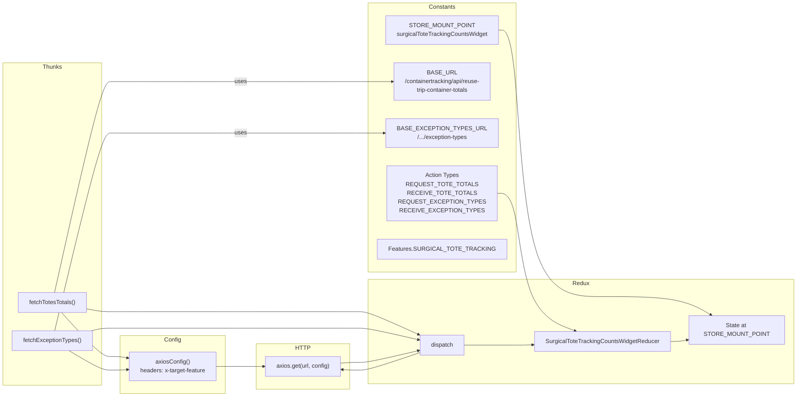
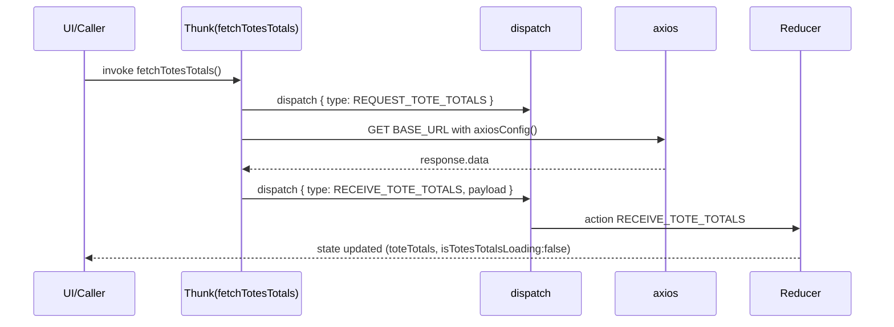
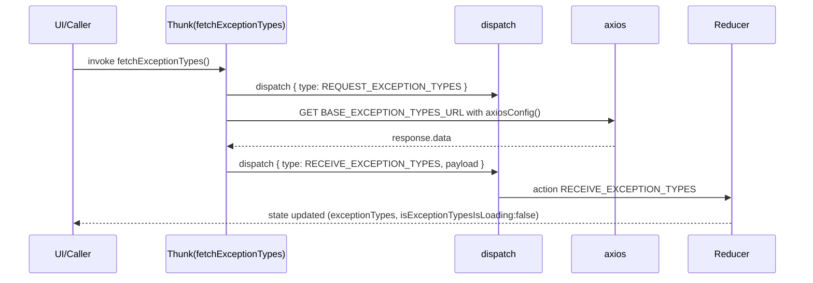

# Diagram: web/portal/src/pages/surgicaltotetracking/redux/SurgicalToteTrackingCountsWidgetState.js

> Auto-generated by Obscura crawlers

## Diagram 1

### SVG

<svg id="container" width="2728.296875" xmlns="http://www.w3.org/2000/svg" class="flowchart" height="959" viewBox="0 0 2728.296875 959" role="graphics-document document" aria-roledescription="flowchart-v2"><g><marker id="container_flowchart-v2-pointEnd" class="marker flowchart-v2" viewBox="0 0 10 10" refX="5" refY="5" markerUnits="userSpaceOnUse" markerWidth="8" markerHeight="8" orient="auto"><path d="M 0 0 L 10 5 L 0 10 z" class="arrowMarkerPath" style="stroke-width: 1; stroke-dasharray: 1, 0;"></path></marker><marker id="container_flowchart-v2-pointStart" class="marker flowchart-v2" viewBox="0 0 10 10" refX="4.5" refY="5" markerUnits="userSpaceOnUse" markerWidth="8" markerHeight="8" orient="auto"><path d="M 0 5 L 10 10 L 10 0 z" class="arrowMarkerPath" style="stroke-width: 1; stroke-dasharray: 1, 0;"></path></marker><marker id="container_flowchart-v2-circleEnd" class="marker flowchart-v2" viewBox="0 0 10 10" refX="11" refY="5" markerUnits="userSpaceOnUse" markerWidth="11" markerHeight="11" orient="auto"><circle cx="5" cy="5" r="5" class="arrowMarkerPath" style="stroke-width: 1; stroke-dasharray: 1, 0;"></circle></marker><marker id="container_flowchart-v2-circleStart" class="marker flowchart-v2" viewBox="0 0 10 10" refX="-1" refY="5" markerUnits="userSpaceOnUse" markerWidth="11" markerHeight="11" orient="auto"><circle cx="5" cy="5" r="5" class="arrowMarkerPath" style="stroke-width: 1; stroke-dasharray: 1, 0;"></circle></marker><marker id="container_flowchart-v2-crossEnd" class="marker cross flowchart-v2" viewBox="0 0 11 11" refX="12" refY="5.2" markerUnits="userSpaceOnUse" markerWidth="11" markerHeight="11" orient="auto"><path d="M 1,1 l 9,9 M 10,1 l -9,9" class="arrowMarkerPath" style="stroke-width: 2; stroke-dasharray: 1, 0;"></path></marker><marker id="container_flowchart-v2-crossStart" class="marker cross flowchart-v2" viewBox="0 0 11 11" refX="-1" refY="5.2" markerUnits="userSpaceOnUse" markerWidth="11" markerHeight="11" orient="auto"><path d="M 1,1 l 9,9 M 10,1 l -9,9" class="arrowMarkerPath" style="stroke-width: 2; stroke-dasharray: 1, 0;"></path></marker><g class="root"><g class="clusters"><g class="cluster" id="Redux" data-look="classic"><rect style="" x="1026.078125" y="640" width="1694.21875" height="284"></rect><g class="cluster-label" transform="translate(1850.78125, 640)"><foreignObject width="44.8125" height="24">

Redux

</foreignObject></g></g><g class="cluster" id="HTTP" data-look="classic"><rect style="" x="719.78125" y="815" width="256.296875" height="124"></rect><g class="cluster-label" transform="translate(829.5625, 815)"><foreignObject width="36.734375" height="24">

HTTP

</foreignObject></g></g><g class="cluster" id="Thunks" data-look="classic"><rect style="" x="8" y="135" width="268.796875" height="793"></rect><g class="cluster-label" transform="translate(116.4375, 135)"><foreignObject width="51.921875" height="24">

Thunks

</foreignObject></g></g><g class="cluster" id="Config" data-look="classic"><rect style="" x="326.796875" y="793" width="310" height="158"></rect><g class="cluster-label" transform="translate(459.3515625, 793)"><foreignObject width="44.890625" height="24">

Config

</foreignObject></g></g><g class="cluster" id="Constants" data-look="classic"><rect style="" x="1026.078125" y="8" width="941.5" height="612"></rect><g class="cluster-label" transform="translate(1460.9140625, 8)"><foreignObject width="71.828125" height="24">

Constants

</foreignObject></g></g></g><g class="edgePaths"><path d="M1738.375,70L1776.576,70C1814.776,70,1891.177,70,1933.544,172.833C1975.911,275.667,1984.245,481.333,2023.221,584.167C2062.198,687,2131.818,687,2201.438,687C2271.057,687,2340.677,687,2389.674,695.329C2438.671,703.658,2467.045,720.317,2481.232,728.646L2495.419,736.975" id="L_STORE_STATE_0" class="edge-thickness-normal edge-pattern-solid edge-thickness-normal edge-pattern-solid flowchart-link" style=";" data-edge="true" data-et="edge" data-id="L_STORE_STATE_0" data-points="W3sieCI6MTczOC4zNzUsInkiOjcwfSx7IngiOjE5NjcuNTc4MTI1LCJ5Ijo3MH0seyJ4IjoxOTkyLjU3ODEyNSwieSI6Njg3fSx7IngiOjIyMDEuNDM3NSwieSI6Njg3fSx7IngiOjI0MTAuMjk2ODc1LCJ5Ijo2ODd9LHsieCI6MjQ5OC44NjgzMDM1NzE0Mjg0LCJ5Ijo3Mzl9XQ==" marker-end="url(#container_flowchart-v2-pointEnd)"></path><path d="M1942.578,442L1946.745,442C1950.911,442,1959.245,442,1967.578,489.667C1975.911,537.333,1984.245,632.667,2010.996,689.092C2037.748,745.518,2082.918,763.036,2105.503,771.795L2128.088,780.554" id="L_ACTIONS_REDUCER_0" class="edge-thickness-normal edge-pattern-solid edge-thickness-normal edge-pattern-solid flowchart-link" style=";" data-edge="true" data-et="edge" data-id="L_ACTIONS_REDUCER_0" data-points="W3sieCI6MTk0Mi41NzgxMjUsInkiOjQ0Mn0seyJ4IjoxOTY3LjU3ODEyNSwieSI6NDQyfSx7IngiOjE5OTIuNTc4MTI1LCJ5Ijo3Mjh9LHsieCI6MjEzMS44MTc3MDgzMzMzMzM1LCJ5Ijo3ODJ9XQ==" marker-end="url(#container_flowchart-v2-pointEnd)"></path><path d="M149.417,676L170.647,594.333C191.877,512.667,234.337,349.333,259.734,267.667C285.13,186,293.464,186,301.797,186C310.13,186,318.464,186,348.464,186C378.464,186,430.13,186,481.797,186C533.464,186,585.13,186,617.879,186C650.628,186,664.458,186,678.289,186C692.12,186,705.951,186,734.224,186C762.497,186,805.214,186,847.93,186C890.646,186,933.362,186,958.887,186C984.411,186,992.745,186,1001.078,186C1009.411,186,1017.745,186,1069.089,186C1120.432,186,1214.786,186,1261.964,186L1309.141,186" id="L_FETCH_TOTES_BASE_URL_0" class="edge-thickness-normal edge-pattern-solid edge-thickness-normal edge-pattern-solid flowchart-link" style=";" data-edge="true" data-et="edge" data-id="L_FETCH_TOTES_BASE_URL_0" data-points="W3sieCI6MTQ5LjQxNzMxMTQxMTk5MjI3LCJ5Ijo2NzZ9LHsieCI6Mjc2Ljc5Njg3NSwieSI6MTg2fSx7IngiOjMwMS43OTY4NzUsInkiOjE4Nn0seyJ4IjozMjYuNzk2ODc1LCJ5IjoxODZ9LHsieCI6NDgxLjc5Njg3NSwieSI6MTg2fSx7IngiOjYzNi43OTY4NzUsInkiOjE4Nn0seyJ4Ijo2NzguMjg5MDYyNSwieSI6MTg2fSx7IngiOjcxOS43ODEyNSwieSI6MTg2fSx7IngiOjg0Ny45Mjk2ODc1LCJ5IjoxODZ9LHsieCI6OTc2LjA3ODEyNSwieSI6MTg2fSx7IngiOjEwMDEuMDc4MTI1LCJ5IjoxODZ9LHsieCI6MTAyNi4wNzgxMjUsInkiOjE4Nn0seyJ4IjoxMzEzLjE0MDYyNSwieSI6MTg2fV0=" marker-end="url(#container_flowchart-v2-pointEnd)"></path><path d="M149.759,780L170.932,702.333C192.105,624.667,234.451,469.333,259.791,391.667C285.13,314,293.464,314,301.797,314C310.13,314,318.464,314,348.464,314C378.464,314,430.13,314,481.797,314C533.464,314,585.13,314,617.879,314C650.628,314,664.458,314,678.289,314C692.12,314,705.951,314,734.224,314C762.497,314,805.214,314,847.93,314C890.646,314,933.362,314,958.887,314C984.411,314,992.745,314,1001.078,314C1009.411,314,1017.745,314,1067.402,314C1117.06,314,1208.042,314,1253.533,314L1299.023,314" id="L_FETCH_EXC_BASE_EXC_0" class="edge-thickness-normal edge-pattern-solid edge-thickness-normal edge-pattern-solid flowchart-link" style=";" data-edge="true" data-et="edge" data-id="L_FETCH_EXC_BASE_EXC_0" data-points="W3sieCI6MTQ5Ljc1OTAwMTAxNDE5ODgsInkiOjc4MH0seyJ4IjoyNzYuNzk2ODc1LCJ5IjozMTR9LHsieCI6MzAxLjc5Njg3NSwieSI6MzE0fSx7IngiOjMyNi43OTY4NzUsInkiOjMxNH0seyJ4Ijo0ODEuNzk2ODc1LCJ5IjozMTR9LHsieCI6NjM2Ljc5Njg3NSwieSI6MzE0fSx7IngiOjY3OC4yODkwNjI1LCJ5IjozMTR9LHsieCI6NzE5Ljc4MTI1LCJ5IjozMTR9LHsieCI6ODQ3LjkyOTY4NzUsInkiOjMxNH0seyJ4Ijo5NzYuMDc4MTI1LCJ5IjozMTR9LHsieCI6MTAwMS4wNzgxMjUsInkiOjMxNH0seyJ4IjoxMDI2LjA3ODEyNSwieSI6MzE0fSx7IngiOjEzMDMuMDIzNDM3NSwieSI6MzE0fV0=" marker-end="url(#container_flowchart-v2-pointEnd)"></path><path d="M167.084,730L185.369,750C203.655,770,240.226,810,262.678,830C285.13,850,293.464,850,301.797,850C310.13,850,318.464,850,326.14,850.611C333.817,851.223,340.836,852.446,344.346,853.057L347.856,853.668" id="L_FETCH_TOTES_AXCONF_0" class="edge-thickness-normal edge-pattern-solid edge-thickness-normal edge-pattern-solid flowchart-link" style=";" data-edge="true" data-et="edge" data-id="L_FETCH_TOTES_AXCONF_0" data-points="W3sieCI6MTY3LjA4Mzg2NDc5NTkxODM3LCJ5Ijo3MzB9LHsieCI6Mjc2Ljc5Njg3NSwieSI6ODUwfSx7IngiOjMwMS43OTY4NzUsInkiOjg1MH0seyJ4IjozMjYuNzk2ODc1LCJ5Ijo4NTB9LHsieCI6MzUxLjc5Njg3NSwieSI6ODU0LjM1NDgzODcwOTY3NzR9XQ==" marker-end="url(#container_flowchart-v2-pointEnd)"></path><path d="M187.758,834L202.598,842.833C217.438,851.667,247.117,869.333,266.124,878.167C285.13,887,293.464,887,301.797,887C310.13,887,318.464,887,326.132,886.774C333.8,886.548,340.802,886.096,344.304,885.871L347.805,885.645" id="L_FETCH_EXC_AXCONF_0" class="edge-thickness-normal edge-pattern-solid edge-thickness-normal edge-pattern-solid flowchart-link" style=";" data-edge="true" data-et="edge" data-id="L_FETCH_EXC_AXCONF_0" data-points="W3sieCI6MTg3Ljc1NzkxMDE1NjI1LCJ5Ijo4MzR9LHsieCI6Mjc2Ljc5Njg3NSwieSI6ODg3fSx7IngiOjMwMS43OTY4NzUsInkiOjg4N30seyJ4IjozMjYuNzk2ODc1LCJ5Ijo4ODd9LHsieCI6MzUxLjc5Njg3NSwieSI6ODg1LjM4NzA5Njc3NDE5MzV9XQ==" marker-end="url(#container_flowchart-v2-pointEnd)"></path><path d="M611.797,877L615.964,877C620.13,877,628.464,877,639.546,877C650.628,877,664.458,877,678.289,877C692.12,877,705.951,877,716.366,877C726.781,877,733.781,877,737.281,877L740.781,877" id="L_AXCONF_AXIOS_0" class="edge-thickness-normal edge-pattern-solid edge-thickness-normal edge-pattern-solid flowchart-link" style=";" data-edge="true" data-et="edge" data-id="L_AXCONF_AXIOS_0" data-points="W3sieCI6NjExLjc5Njg3NSwieSI6ODc3fSx7IngiOjYzNi43OTY4NzUsInkiOjg3N30seyJ4Ijo2NzguMjg5MDYyNSwieSI6ODc3fSx7IngiOjcxOS43ODEyNSwieSI6ODc3fSx7IngiOjc0NC43ODEyNSwieSI6ODc3fV0=" marker-end="url(#container_flowchart-v2-pointEnd)"></path><path d="M236.609,720.525L243.307,721.77C250.005,723.016,263.401,725.508,274.266,726.754C285.13,728,293.464,728,301.797,728C310.13,728,318.464,728,348.464,728C378.464,728,430.13,728,481.797,728C533.464,728,585.13,728,617.879,728C650.628,728,664.458,728,678.289,728C692.12,728,705.951,728,734.224,728C762.497,728,805.214,728,847.93,728C890.646,728,933.362,728,958.887,728C984.411,728,992.745,728,1001.078,728C1009.411,728,1017.745,728,1089.534,741.072C1161.324,754.144,1296.569,780.288,1364.192,793.36L1431.815,806.432" id="L_FETCH_TOTES_DISPATCH_0" class="edge-thickness-normal edge-pattern-solid edge-thickness-normal edge-pattern-solid flowchart-link" style=";" data-edge="true" data-et="edge" data-id="L_FETCH_TOTES_DISPATCH_0" data-points="W3sieCI6MjM2LjYwOTM3NSwieSI6NzIwLjUyNDU1OTY2OTgyNTF9LHsieCI6Mjc2Ljc5Njg3NSwieSI6NzI4fSx7IngiOjMwMS43OTY4NzUsInkiOjcyOH0seyJ4IjozMjYuNzk2ODc1LCJ5Ijo3Mjh9LHsieCI6NDgxLjc5Njg3NSwieSI6NzI4fSx7IngiOjYzNi43OTY4NzUsInkiOjcyOH0seyJ4Ijo2NzguMjg5MDYyNSwieSI6NzI4fSx7IngiOjcxOS43ODEyNSwieSI6NzI4fSx7IngiOjg0Ny45Mjk2ODc1LCJ5Ijo3Mjh9LHsieCI6OTc2LjA3ODEyNSwieSI6NzI4fSx7IngiOjEwMDEuMDc4MTI1LCJ5Ijo3Mjh9LHsieCI6MTAyNi4wNzgxMjUsInkiOjcyOH0seyJ4IjoxNDM1Ljc0MjE4NzUsInkiOjgwNy4xOTE1NjU5ODUxMzAxfV0=" marker-end="url(#container_flowchart-v2-pointEnd)"></path><path d="M249.127,780L253.738,778.833C258.35,777.667,267.573,775.333,276.352,774.167C285.13,773,293.464,773,301.797,773C310.13,773,318.464,773,348.464,773C378.464,773,430.13,773,481.797,773C533.464,773,585.13,773,617.879,773C650.628,773,664.458,773,678.289,773C692.12,773,705.951,773,734.224,773C762.497,773,805.214,773,847.93,773C890.646,773,933.362,773,958.887,773C984.411,773,992.745,773,1001.078,773C1009.411,773,1017.745,773,1089.525,779.607C1161.306,786.214,1296.533,799.428,1364.147,806.035L1431.761,812.642" id="L_FETCH_EXC_DISPATCH_0" class="edge-thickness-normal edge-pattern-solid edge-thickness-normal edge-pattern-solid flowchart-link" style=";" data-edge="true" data-et="edge" data-id="L_FETCH_EXC_DISPATCH_0" data-points="W3sieCI6MjQ5LjEyNjYwODQ1NTg4MjM1LCJ5Ijo3ODB9LHsieCI6Mjc2Ljc5Njg3NSwieSI6NzczfSx7IngiOjMwMS43OTY4NzUsInkiOjc3M30seyJ4IjozMjYuNzk2ODc1LCJ5Ijo3NzN9LHsieCI6NDgxLjc5Njg3NSwieSI6NzczfSx7IngiOjYzNi43OTY4NzUsInkiOjc3M30seyJ4Ijo2NzguMjg5MDYyNSwieSI6NzczfSx7IngiOjcxOS43ODEyNSwieSI6NzczfSx7IngiOjg0Ny45Mjk2ODc1LCJ5Ijo3NzN9LHsieCI6OTc2LjA3ODEyNSwieSI6NzczfSx7IngiOjEwMDEuMDc4MTI1LCJ5Ijo3NzN9LHsieCI6MTAyNi4wNzgxMjUsInkiOjc3M30seyJ4IjoxNDM1Ljc0MjE4NzUsInkiOjgxMy4wMzA5MDE0ODY5ODg4fV0=" marker-end="url(#container_flowchart-v2-pointEnd)"></path><path d="M1435.742,827.824L1367.465,837.687C1299.188,847.549,1162.633,867.275,1090.189,877.137C1017.745,887,1009.411,887,1001.078,887C992.745,887,984.411,887,976.743,886.727C969.074,886.453,962.07,885.907,958.568,885.634L955.066,885.36" id="L_DISPATCH_AXIOS_0" class="edge-thickness-normal edge-pattern-solid edge-thickness-normal edge-pattern-solid flowchart-link" style=";" data-edge="true" data-et="edge" data-id="L_DISPATCH_AXIOS_0" data-points="W3sieCI6MTQzNS43NDIxODc1LCJ5Ijo4MjcuODIzODg0NzU4MzY0M30seyJ4IjoxMDI2LjA3ODEyNSwieSI6ODg3fSx7IngiOjEwMDEuMDc4MTI1LCJ5Ijo4ODd9LHsieCI6OTc2LjA3ODEyNSwieSI6ODg3fSx7IngiOjk1MS4wNzgxMjUsInkiOjg4NS4wNDkxMzczNTI5MjMzfV0=" marker-end="url(#container_flowchart-v2-pointEnd)"></path><path d="M951.078,868.146L955.245,867.788C959.411,867.431,967.745,866.715,976.078,866.358C984.411,866,992.745,866,1001.078,866C1009.411,866,1017.745,866,1089.525,859.249C1161.306,852.499,1296.534,838.997,1364.148,832.247L1431.762,825.496" id="L_AXIOS_DISPATCH_0" class="edge-thickness-normal edge-pattern-solid edge-thickness-normal edge-pattern-solid flowchart-link" style=";" data-edge="true" data-et="edge" data-id="L_AXIOS_DISPATCH_0" data-points="W3sieCI6OTUxLjA3ODEyNSwieSI6ODY4LjE0NTk0ODkxMTc4NDR9LHsieCI6OTc2LjA3ODEyNSwieSI6ODY2fSx7IngiOjEwMDEuMDc4MTI1LCJ5Ijo4NjZ9LHsieCI6MTAyNi4wNzgxMjUsInkiOjg2Nn0seyJ4IjoxNDM1Ljc0MjE4NzUsInkiOjgyNS4wOTg4NjE1MjQxNjM2fV0=" marker-end="url(#container_flowchart-v2-pointEnd)"></path><path d="M1557.914,819L1626.191,819C1694.469,819,1831.023,819,1903.467,819C1975.911,819,1984.245,819,1991.912,818.832C1999.58,818.665,2006.581,818.33,2010.082,818.162L2013.583,817.994" id="L_DISPATCH_REDUCER_0" class="edge-thickness-normal edge-pattern-solid edge-thickness-normal edge-pattern-solid flowchart-link" style=";" data-edge="true" data-et="edge" data-id="L_DISPATCH_REDUCER_0" data-points="W3sieCI6MTU1Ny45MTQwNjI1LCJ5Ijo4MTl9LHsieCI6MTk2Ny41NzgxMjUsInkiOjgxOX0seyJ4IjoxOTkyLjU3ODEyNSwieSI6ODE5fSx7IngiOjIwMTcuNTc4MTI1LCJ5Ijo4MTcuODAzMDIyMzY4NTE5NX1d" marker-end="url(#container_flowchart-v2-pointEnd)"></path><path d="M2385.297,809L2389.464,809C2393.63,809,2401.964,809,2409.643,808.297C2417.323,807.595,2424.349,806.19,2427.862,805.487L2431.375,804.784" id="L_REDUCER_STATE_0" class="edge-thickness-normal edge-pattern-solid edge-thickness-normal edge-pattern-solid flowchart-link" style=";" data-edge="true" data-et="edge" data-id="L_REDUCER_STATE_0" data-points="W3sieCI6MjM4NS4yOTY4NzUsInkiOjgwOX0seyJ4IjoyNDEwLjI5Njg3NSwieSI6ODA5fSx7IngiOjI0MzUuMjk2ODc1LCJ5Ijo4MDR9XQ==" marker-end="url(#container_flowchart-v2-pointEnd)"></path></g><g class="edgeLabels"><g class="edgeLabel"><g class="label" data-id="L_STORE_STATE_0" transform="translate(0, 0)"><foreignObject width="0" height="0">

</foreignObject></g></g><g class="edgeLabel"><g class="label" data-id="L_ACTIONS_REDUCER_0" transform="translate(0, 0)"><foreignObject width="0" height="0">

</foreignObject></g></g><g class="edgeLabel" transform="translate(678.2890625, 186)"><g class="label" data-id="L_FETCH_TOTES_BASE_URL_0" transform="translate(-16.4921875, -12)"><foreignObject width="32.984375" height="24">

uses

</foreignObject></g></g><g class="edgeLabel" transform="translate(678.2890625, 314)"><g class="label" data-id="L_FETCH_EXC_BASE_EXC_0" transform="translate(-16.4921875, -12)"><foreignObject width="32.984375" height="24">

uses

</foreignObject></g></g><g class="edgeLabel"><g class="label" data-id="L_FETCH_TOTES_AXCONF_0" transform="translate(0, 0)"><foreignObject width="0" height="0">

</foreignObject></g></g><g class="edgeLabel"><g class="label" data-id="L_FETCH_EXC_AXCONF_0" transform="translate(0, 0)"><foreignObject width="0" height="0">

</foreignObject></g></g><g class="edgeLabel"><g class="label" data-id="L_AXCONF_AXIOS_0" transform="translate(0, 0)"><foreignObject width="0" height="0">

</foreignObject></g></g><g class="edgeLabel"><g class="label" data-id="L_FETCH_TOTES_DISPATCH_0" transform="translate(0, 0)"><foreignObject width="0" height="0">

</foreignObject></g></g><g class="edgeLabel"><g class="label" data-id="L_FETCH_EXC_DISPATCH_0" transform="translate(0, 0)"><foreignObject width="0" height="0">

</foreignObject></g></g><g class="edgeLabel"><g class="label" data-id="L_DISPATCH_AXIOS_0" transform="translate(0, 0)"><foreignObject width="0" height="0">

</foreignObject></g></g><g class="edgeLabel"><g class="label" data-id="L_AXIOS_DISPATCH_0" transform="translate(0, 0)"><foreignObject width="0" height="0">

</foreignObject></g></g><g class="edgeLabel"><g class="label" data-id="L_DISPATCH_REDUCER_0" transform="translate(0, 0)"><foreignObject width="0" height="0">

</foreignObject></g></g><g class="edgeLabel"><g class="label" data-id="L_REDUCER_STATE_0" transform="translate(0, 0)"><foreignObject width="0" height="0">

</foreignObject></g></g></g><g class="nodes"><g class="node default" id="flowchart-STORE-0" transform="translate(1496.828125, 70)"><rect class="basic label-container" style="" x="-241.546875" y="-27" width="483.09375" height="54"></rect><g class="label" style="" transform="translate(-211.546875, -12)"><rect></rect><foreignObject width="423.09375" height="24">

STORE_MOUNT_POINT\nsurgicalToteTrackingCountsWidget

</foreignObject></g></g><g class="node default" id="flowchart-BASE_URL-1" transform="translate(1496.828125, 186)"><rect class="basic label-container" style="" x="-183.6875" y="-39" width="367.375" height="78"></rect><g class="label" style="" transform="translate(-153.6875, -24)"><rect></rect><foreignObject width="307.375" height="48">

BASE_URL\n/containertracking/api/reuse-trip-container-totals

</foreignObject></g></g><g class="node default" id="flowchart-BASE_EXC-2" transform="translate(1496.828125, 314)"><rect class="basic label-container" style="" x="-193.8046875" y="-39" width="387.609375" height="78"></rect><g class="label" style="" transform="translate(-163.8046875, -24)"><rect></rect><foreignObject width="327.609375" height="48">

BASE_EXCEPTION_TYPES_URL\n/.../exception-types

</foreignObject></g></g><g class="node default" id="flowchart-ACTIONS-3" transform="translate(1496.828125, 442)"><rect class="basic label-container" style="" x="-445.75" y="-39" width="891.5" height="78"></rect><g class="label" style="" transform="translate(-415.75, -24)"><rect></rect><foreignObject width="831.5" height="48">

Action Types\nREQUEST_TOTE_TOTALS\nRECEIVE_TOTE_TOTALS\nREQUEST_EXCEPTION_TYPES\nRECEIVE_EXCEPTION_TYPES

</foreignObject></g></g><g class="node default" id="flowchart-FEATURES-4" transform="translate(1496.828125, 558)"><rect class="basic label-container" style="" x="-158.1640625" y="-27" width="316.328125" height="54"></rect><g class="label" style="" transform="translate(-128.1640625, -12)"><rect></rect><foreignObject width="256.328125" height="24">

Features.SURGICAL_TOTE_TRACKING

</foreignObject></g></g><g class="node default" id="flowchart-AXCONF-5" transform="translate(481.796875, 877)"><rect class="basic label-container" style="" x="-130" y="-39" width="260" height="78"></rect><g class="label" style="" transform="translate(-100, -24)"><rect></rect><foreignObject width="200" height="48">

axiosConfig()\nheaders: x-target-feature

</foreignObject></g></g><g class="node default" id="flowchart-FETCH_TOTES-6" transform="translate(142.3984375, 703)"><rect class="basic label-container" style="" x="-94.2109375" y="-27" width="188.421875" height="54"></rect><g class="label" style="" transform="translate(-64.2109375, -12)"><rect></rect><foreignObject width="128.421875" height="24">

fetchTotesTotals()

</foreignObject></g></g><g class="node default" id="flowchart-FETCH_EXC-7" transform="translate(142.3984375, 807)"><rect class="basic label-container" style="" x="-109.3984375" y="-27" width="218.796875" height="54"></rect><g class="label" style="" transform="translate(-79.3984375, -12)"><rect></rect><foreignObject width="158.796875" height="24">

fetchExceptionTypes()

</foreignObject></g></g><g class="node default" id="flowchart-AXIOS-8" transform="translate(847.9296875, 877)"><rect class="basic label-container" style="" x="-103.1484375" y="-27" width="206.296875" height="54"></rect><g class="label" style="" transform="translate(-73.1484375, -12)"><rect></rect><foreignObject width="146.296875" height="24">

axios.get(url, config)

</foreignObject></g></g><g class="node default" id="flowchart-DISPATCH-9" transform="translate(1496.828125, 819)"><rect class="basic label-container" style="" x="-61.0859375" y="-27" width="122.171875" height="54"></rect><g class="label" style="" transform="translate(-31.0859375, -12)"><rect></rect><foreignObject width="62.171875" height="24">

dispatch

</foreignObject></g></g><g class="node default" id="flowchart-REDUCER-10" transform="translate(2201.4375, 809)"><rect class="basic label-container" style="" x="-183.859375" y="-27" width="367.71875" height="54"></rect><g class="label" style="" transform="translate(-153.859375, -12)"><rect></rect><foreignObject width="307.71875" height="24">

SurgicalToteTrackingCountsWidgetReducer

</foreignObject></g></g><g class="node default" id="flowchart-STATE-11" transform="translate(2565.296875, 778)"><rect class="basic label-container" style="" x="-130" y="-39" width="260" height="78"></rect><g class="label" style="" transform="translate(-100, -24)"><rect></rect><foreignObject width="200" height="48">

State at STORE_MOUNT_POINT

</foreignObject></g></g></g></g></g></svg>

## Diagram 2

### SVG

<svg id="container" width="1320" xmlns="http://www.w3.org/2000/svg" height="507" viewBox="-50 -10 1320 507" role="graphics-document document" aria-roledescription="sequence"><g><rect x="1070" y="421" fill="#eaeaea" stroke="#666" width="150" height="65" name="Reducer" rx="3" ry="3" class="actor actor-bottom"></rect><text x="1145" y="453.5" dominant-baseline="central" alignment-baseline="central" class="actor actor-box" style="text-anchor: middle; font-size: 16px; font-weight: 400;"><tspan x="1145" dy="0">Reducer</tspan></text></g><g><rect x="870" y="421" fill="#eaeaea" stroke="#666" width="150" height="65" name="HTTP" rx="3" ry="3" class="actor actor-bottom"></rect><text x="945" y="453.5" dominant-baseline="central" alignment-baseline="central" class="actor actor-box" style="text-anchor: middle; font-size: 16px; font-weight: 400;"><tspan x="945" dy="0">axios</tspan></text></g><g><rect x="670" y="421" fill="#eaeaea" stroke="#666" width="150" height="65" name="Dispatch" rx="3" ry="3" class="actor actor-bottom"></rect><text x="745" y="453.5" dominant-baseline="central" alignment-baseline="central" class="actor actor-box" style="text-anchor: middle; font-size: 16px; font-weight: 400;"><tspan x="745" dy="0">dispatch</tspan></text></g><g><rect x="228.5" y="421" fill="#eaeaea" stroke="#666" width="193" height="65" name="Thunk" rx="3" ry="3" class="actor actor-bottom"></rect><text x="325" y="453.5" dominant-baseline="central" alignment-baseline="central" class="actor actor-box" style="text-anchor: middle; font-size: 16px; font-weight: 400;"><tspan x="325" dy="0">Thunk(fetchTotesTotals)</tspan></text></g><g><rect x="0" y="421" fill="#eaeaea" stroke="#666" width="150" height="65" name="Caller" rx="3" ry="3" class="actor actor-bottom"></rect><text x="75" y="453.5" dominant-baseline="central" alignment-baseline="central" class="actor actor-box" style="text-anchor: middle; font-size: 16px; font-weight: 400;"><tspan x="75" dy="0">UI/Caller</tspan></text></g><g><line id="actor4" x1="1145" y1="65" x2="1145" y2="421" class="actor-line 200" stroke-width="0.5px" stroke="#999" name="Reducer"></line><g id="root-4"><rect x="1070" y="0" fill="#eaeaea" stroke="#666" width="150" height="65" name="Reducer" rx="3" ry="3" class="actor actor-top"></rect><text x="1145" y="32.5" dominant-baseline="central" alignment-baseline="central" class="actor actor-box" style="text-anchor: middle; font-size: 16px; font-weight: 400;"><tspan x="1145" dy="0">Reducer</tspan></text></g></g><g><line id="actor3" x1="945" y1="65" x2="945" y2="421" class="actor-line 200" stroke-width="0.5px" stroke="#999" name="HTTP"></line><g id="root-3"><rect x="870" y="0" fill="#eaeaea" stroke="#666" width="150" height="65" name="HTTP" rx="3" ry="3" class="actor actor-top"></rect><text x="945" y="32.5" dominant-baseline="central" alignment-baseline="central" class="actor actor-box" style="text-anchor: middle; font-size: 16px; font-weight: 400;"><tspan x="945" dy="0">axios</tspan></text></g></g><g><line id="actor2" x1="745" y1="65" x2="745" y2="421" class="actor-line 200" stroke-width="0.5px" stroke="#999" name="Dispatch"></line><g id="root-2"><rect x="670" y="0" fill="#eaeaea" stroke="#666" width="150" height="65" name="Dispatch" rx="3" ry="3" class="actor actor-top"></rect><text x="745" y="32.5" dominant-baseline="central" alignment-baseline="central" class="actor actor-box" style="text-anchor: middle; font-size: 16px; font-weight: 400;"><tspan x="745" dy="0">dispatch</tspan></text></g></g><g><line id="actor1" x1="325" y1="65" x2="325" y2="421" class="actor-line 200" stroke-width="0.5px" stroke="#999" name="Thunk"></line><g id="root-1"><rect x="228.5" y="0" fill="#eaeaea" stroke="#666" width="193" height="65" name="Thunk" rx="3" ry="3" class="actor actor-top"></rect><text x="325" y="32.5" dominant-baseline="central" alignment-baseline="central" class="actor actor-box" style="text-anchor: middle; font-size: 16px; font-weight: 400;"><tspan x="325" dy="0">Thunk(fetchTotesTotals)</tspan></text></g></g><g><line id="actor0" x1="75" y1="65" x2="75" y2="421" class="actor-line 200" stroke-width="0.5px" stroke="#999" name="Caller"></line><g id="root-0"><rect x="0" y="0" fill="#eaeaea" stroke="#666" width="150" height="65" name="Caller" rx="3" ry="3" class="actor actor-top"></rect><text x="75" y="32.5" dominant-baseline="central" alignment-baseline="central" class="actor actor-box" style="text-anchor: middle; font-size: 16px; font-weight: 400;"><tspan x="75" dy="0">UI/Caller</tspan></text></g></g><g></g><defs><symbol id="computer" width="24" height="24"><path transform="scale(.5)" d="M2 2v13h20v-13h-20zm18 11h-16v-9h16v9zm-10.228 6l.466-1h3.524l.467 1h-4.457zm14.228 3h-24l2-6h2.104l-1.33 4h18.45l-1.297-4h2.073l2 6zm-5-10h-14v-7h14v7z"></path></symbol></defs><defs><symbol id="database" fill-rule="evenodd" clip-rule="evenodd"><path transform="scale(.5)" d="M12.258.001l.256.004.255.005.253.008.251.01.249.012.247.015.246.016.242.019.241.02.239.023.236.024.233.027.231.028.229.031.225.032.223.034.22.036.217.038.214.04.211.041.208.043.205.045.201.046.198.048.194.05.191.051.187.053.183.054.18.056.175.057.172.059.168.06.163.061.16.063.155.064.15.066.074.033.073.033.071.034.07.034.069.035.068.035.067.035.066.035.064.036.064.036.062.036.06.036.06.037.058.037.058.037.055.038.055.038.053.038.052.038.051.039.05.039.048.039.047.039.045.04.044.04.043.04.041.04.04.041.039.041.037.041.036.041.034.041.033.042.032.042.03.042.029.042.027.042.026.043.024.043.023.043.021.043.02.043.018.044.017.043.015.044.013.044.012.044.011.045.009.044.007.045.006.045.004.045.002.045.001.045v17l-.001.045-.002.045-.004.045-.006.045-.007.045-.009.044-.011.045-.012.044-.013.044-.015.044-.017.043-.018.044-.02.043-.021.043-.023.043-.024.043-.026.043-.027.042-.029.042-.03.042-.032.042-.033.042-.034.041-.036.041-.037.041-.039.041-.04.041-.041.04-.043.04-.044.04-.045.04-.047.039-.048.039-.05.039-.051.039-.052.038-.053.038-.055.038-.055.038-.058.037-.058.037-.06.037-.06.036-.062.036-.064.036-.064.036-.066.035-.067.035-.068.035-.069.035-.07.034-.071.034-.073.033-.074.033-.15.066-.155.064-.16.063-.163.061-.168.06-.172.059-.175.057-.18.056-.183.054-.187.053-.191.051-.194.05-.198.048-.201.046-.205.045-.208.043-.211.041-.214.04-.217.038-.22.036-.223.034-.225.032-.229.031-.231.028-.233.027-.236.024-.239.023-.241.02-.242.019-.246.016-.247.015-.249.012-.251.01-.253.008-.255.005-.256.004-.258.001-.258-.001-.256-.004-.255-.005-.253-.008-.251-.01-.249-.012-.247-.015-.245-.016-.243-.019-.241-.02-.238-.023-.236-.024-.234-.027-.231-.028-.228-.031-.226-.032-.223-.034-.22-.036-.217-.038-.214-.04-.211-.041-.208-.043-.204-.045-.201-.046-.198-.048-.195-.05-.19-.051-.187-.053-.184-.054-.179-.056-.176-.057-.172-.059-.167-.06-.164-.061-.159-.063-.155-.064-.151-.066-.074-.033-.072-.033-.072-.034-.07-.034-.069-.035-.068-.035-.067-.035-.066-.035-.064-.036-.063-.036-.062-.036-.061-.036-.06-.037-.058-.037-.057-.037-.056-.038-.055-.038-.053-.038-.052-.038-.051-.039-.049-.039-.049-.039-.046-.039-.046-.04-.044-.04-.043-.04-.041-.04-.04-.041-.039-.041-.037-.041-.036-.041-.034-.041-.033-.042-.032-.042-.03-.042-.029-.042-.027-.042-.026-.043-.024-.043-.023-.043-.021-.043-.02-.043-.018-.044-.017-.043-.015-.044-.013-.044-.012-.044-.011-.045-.009-.044-.007-.045-.006-.045-.004-.045-.002-.045-.001-.045v-17l.001-.045.002-.045.004-.045.006-.045.007-.045.009-.044.011-.045.012-.044.013-.044.015-.044.017-.043.018-.044.02-.043.021-.043.023-.043.024-.043.026-.043.027-.042.029-.042.03-.042.032-.042.033-.042.034-.041.036-.041.037-.041.039-.041.04-.041.041-.04.043-.04.044-.04.046-.04.046-.039.049-.039.049-.039.051-.039.052-.038.053-.038.055-.038.056-.038.057-.037.058-.037.06-.037.061-.036.062-.036.063-.036.064-.036.066-.035.067-.035.068-.035.069-.035.07-.034.072-.034.072-.033.074-.033.151-.066.155-.064.159-.063.164-.061.167-.06.172-.059.176-.057.179-.056.184-.054.187-.053.19-.051.195-.05.198-.048.201-.046.204-.045.208-.043.211-.041.214-.04.217-.038.22-.036.223-.034.226-.032.228-.031.231-.028.234-.027.236-.024.238-.023.241-.02.243-.019.245-.016.247-.015.249-.012.251-.01.253-.008.255-.005.256-.004.258-.001.258.001zm-9.258 20.499v.01l.001.021.003.021.004.022.005.021.006.022.007.022.009.023.01.022.011.023.012.023.013.023.015.023.016.024.017.023.018.024.019.024.021.024.022.025.023.024.024.025.052.049.056.05.061.051.066.051.07.051.075.051.079.052.084.052.088.052.092.052.097.052.102.051.105.052.11.052.114.051.119.051.123.051.127.05.131.05.135.05.139.048.144.049.147.047.152.047.155.047.16.045.163.045.167.043.171.043.176.041.178.041.183.039.187.039.19.037.194.035.197.035.202.033.204.031.209.03.212.029.216.027.219.025.222.024.226.021.23.02.233.018.236.016.24.015.243.012.246.01.249.008.253.005.256.004.259.001.26-.001.257-.004.254-.005.25-.008.247-.011.244-.012.241-.014.237-.016.233-.018.231-.021.226-.021.224-.024.22-.026.216-.027.212-.028.21-.031.205-.031.202-.034.198-.034.194-.036.191-.037.187-.039.183-.04.179-.04.175-.042.172-.043.168-.044.163-.045.16-.046.155-.046.152-.047.148-.048.143-.049.139-.049.136-.05.131-.05.126-.05.123-.051.118-.052.114-.051.11-.052.106-.052.101-.052.096-.052.092-.052.088-.053.083-.051.079-.052.074-.052.07-.051.065-.051.06-.051.056-.05.051-.05.023-.024.023-.025.021-.024.02-.024.019-.024.018-.024.017-.024.015-.023.014-.024.013-.023.012-.023.01-.023.01-.022.008-.022.006-.022.006-.022.004-.022.004-.021.001-.021.001-.021v-4.127l-.077.055-.08.053-.083.054-.085.053-.087.052-.09.052-.093.051-.095.05-.097.05-.1.049-.102.049-.105.048-.106.047-.109.047-.111.046-.114.045-.115.045-.118.044-.12.043-.122.042-.124.042-.126.041-.128.04-.13.04-.132.038-.134.038-.135.037-.138.037-.139.035-.142.035-.143.034-.144.033-.147.032-.148.031-.15.03-.151.03-.153.029-.154.027-.156.027-.158.026-.159.025-.161.024-.162.023-.163.022-.165.021-.166.02-.167.019-.169.018-.169.017-.171.016-.173.015-.173.014-.175.013-.175.012-.177.011-.178.01-.179.008-.179.008-.181.006-.182.005-.182.004-.184.003-.184.002h-.37l-.184-.002-.184-.003-.182-.004-.182-.005-.181-.006-.179-.008-.179-.008-.178-.01-.176-.011-.176-.012-.175-.013-.173-.014-.172-.015-.171-.016-.17-.017-.169-.018-.167-.019-.166-.02-.165-.021-.163-.022-.162-.023-.161-.024-.159-.025-.157-.026-.156-.027-.155-.027-.153-.029-.151-.03-.15-.03-.148-.031-.146-.032-.145-.033-.143-.034-.141-.035-.14-.035-.137-.037-.136-.037-.134-.038-.132-.038-.13-.04-.128-.04-.126-.041-.124-.042-.122-.042-.12-.044-.117-.043-.116-.045-.113-.045-.112-.046-.109-.047-.106-.047-.105-.048-.102-.049-.1-.049-.097-.05-.095-.05-.093-.052-.09-.051-.087-.052-.085-.053-.083-.054-.08-.054-.077-.054v4.127zm0-5.654v.011l.001.021.003.021.004.021.005.022.006.022.007.022.009.022.01.022.011.023.012.023.013.023.015.024.016.023.017.024.018.024.019.024.021.024.022.024.023.025.024.024.052.05.056.05.061.05.066.051.07.051.075.052.079.051.084.052.088.052.092.052.097.052.102.052.105.052.11.051.114.051.119.052.123.05.127.051.131.05.135.049.139.049.144.048.147.048.152.047.155.046.16.045.163.045.167.044.171.042.176.042.178.04.183.04.187.038.19.037.194.036.197.034.202.033.204.032.209.03.212.028.216.027.219.025.222.024.226.022.23.02.233.018.236.016.24.014.243.012.246.01.249.008.253.006.256.003.259.001.26-.001.257-.003.254-.006.25-.008.247-.01.244-.012.241-.015.237-.016.233-.018.231-.02.226-.022.224-.024.22-.025.216-.027.212-.029.21-.03.205-.032.202-.033.198-.035.194-.036.191-.037.187-.039.183-.039.179-.041.175-.042.172-.043.168-.044.163-.045.16-.045.155-.047.152-.047.148-.048.143-.048.139-.05.136-.049.131-.05.126-.051.123-.051.118-.051.114-.052.11-.052.106-.052.101-.052.096-.052.092-.052.088-.052.083-.052.079-.052.074-.051.07-.052.065-.051.06-.05.056-.051.051-.049.023-.025.023-.024.021-.025.02-.024.019-.024.018-.024.017-.024.015-.023.014-.023.013-.024.012-.022.01-.023.01-.023.008-.022.006-.022.006-.022.004-.021.004-.022.001-.021.001-.021v-4.139l-.077.054-.08.054-.083.054-.085.052-.087.053-.09.051-.093.051-.095.051-.097.05-.1.049-.102.049-.105.048-.106.047-.109.047-.111.046-.114.045-.115.044-.118.044-.12.044-.122.042-.124.042-.126.041-.128.04-.13.039-.132.039-.134.038-.135.037-.138.036-.139.036-.142.035-.143.033-.144.033-.147.033-.148.031-.15.03-.151.03-.153.028-.154.028-.156.027-.158.026-.159.025-.161.024-.162.023-.163.022-.165.021-.166.02-.167.019-.169.018-.169.017-.171.016-.173.015-.173.014-.175.013-.175.012-.177.011-.178.009-.179.009-.179.007-.181.007-.182.005-.182.004-.184.003-.184.002h-.37l-.184-.002-.184-.003-.182-.004-.182-.005-.181-.007-.179-.007-.179-.009-.178-.009-.176-.011-.176-.012-.175-.013-.173-.014-.172-.015-.171-.016-.17-.017-.169-.018-.167-.019-.166-.02-.165-.021-.163-.022-.162-.023-.161-.024-.159-.025-.157-.026-.156-.027-.155-.028-.153-.028-.151-.03-.15-.03-.148-.031-.146-.033-.145-.033-.143-.033-.141-.035-.14-.036-.137-.036-.136-.037-.134-.038-.132-.039-.13-.039-.128-.04-.126-.041-.124-.042-.122-.043-.12-.043-.117-.044-.116-.044-.113-.046-.112-.046-.109-.046-.106-.047-.105-.048-.102-.049-.1-.049-.097-.05-.095-.051-.093-.051-.09-.051-.087-.053-.085-.052-.083-.054-.08-.054-.077-.054v4.139zm0-5.666v.011l.001.02.003.022.004.021.005.022.006.021.007.022.009.023.01.022.011.023.012.023.013.023.015.023.016.024.017.024.018.023.019.024.021.025.022.024.023.024.024.025.052.05.056.05.061.05.066.051.07.051.075.052.079.051.084.052.088.052.092.052.097.052.102.052.105.051.11.052.114.051.119.051.123.051.127.05.131.05.135.05.139.049.144.048.147.048.152.047.155.046.16.045.163.045.167.043.171.043.176.042.178.04.183.04.187.038.19.037.194.036.197.034.202.033.204.032.209.03.212.028.216.027.219.025.222.024.226.021.23.02.233.018.236.017.24.014.243.012.246.01.249.008.253.006.256.003.259.001.26-.001.257-.003.254-.006.25-.008.247-.01.244-.013.241-.014.237-.016.233-.018.231-.02.226-.022.224-.024.22-.025.216-.027.212-.029.21-.03.205-.032.202-.033.198-.035.194-.036.191-.037.187-.039.183-.039.179-.041.175-.042.172-.043.168-.044.163-.045.16-.045.155-.047.152-.047.148-.048.143-.049.139-.049.136-.049.131-.051.126-.05.123-.051.118-.052.114-.051.11-.052.106-.052.101-.052.096-.052.092-.052.088-.052.083-.052.079-.052.074-.052.07-.051.065-.051.06-.051.056-.05.051-.049.023-.025.023-.025.021-.024.02-.024.019-.024.018-.024.017-.024.015-.023.014-.024.013-.023.012-.023.01-.022.01-.023.008-.022.006-.022.006-.022.004-.022.004-.021.001-.021.001-.021v-4.153l-.077.054-.08.054-.083.053-.085.053-.087.053-.09.051-.093.051-.095.051-.097.05-.1.049-.102.048-.105.048-.106.048-.109.046-.111.046-.114.046-.115.044-.118.044-.12.043-.122.043-.124.042-.126.041-.128.04-.13.039-.132.039-.134.038-.135.037-.138.036-.139.036-.142.034-.143.034-.144.033-.147.032-.148.032-.15.03-.151.03-.153.028-.154.028-.156.027-.158.026-.159.024-.161.024-.162.023-.163.023-.165.021-.166.02-.167.019-.169.018-.169.017-.171.016-.173.015-.173.014-.175.013-.175.012-.177.01-.178.01-.179.009-.179.007-.181.006-.182.006-.182.004-.184.003-.184.001-.185.001-.185-.001-.184-.001-.184-.003-.182-.004-.182-.006-.181-.006-.179-.007-.179-.009-.178-.01-.176-.01-.176-.012-.175-.013-.173-.014-.172-.015-.171-.016-.17-.017-.169-.018-.167-.019-.166-.02-.165-.021-.163-.023-.162-.023-.161-.024-.159-.024-.157-.026-.156-.027-.155-.028-.153-.028-.151-.03-.15-.03-.148-.032-.146-.032-.145-.033-.143-.034-.141-.034-.14-.036-.137-.036-.136-.037-.134-.038-.132-.039-.13-.039-.128-.041-.126-.041-.124-.041-.122-.043-.12-.043-.117-.044-.116-.044-.113-.046-.112-.046-.109-.046-.106-.048-.105-.048-.102-.048-.1-.05-.097-.049-.095-.051-.093-.051-.09-.052-.087-.052-.085-.053-.083-.053-.08-.054-.077-.054v4.153zm8.74-8.179l-.257.004-.254.005-.25.008-.247.011-.244.012-.241.014-.237.016-.233.018-.231.021-.226.022-.224.023-.22.026-.216.027-.212.028-.21.031-.205.032-.202.033-.198.034-.194.036-.191.038-.187.038-.183.04-.179.041-.175.042-.172.043-.168.043-.163.045-.16.046-.155.046-.152.048-.148.048-.143.048-.139.049-.136.05-.131.05-.126.051-.123.051-.118.051-.114.052-.11.052-.106.052-.101.052-.096.052-.092.052-.088.052-.083.052-.079.052-.074.051-.07.052-.065.051-.06.05-.056.05-.051.05-.023.025-.023.024-.021.024-.02.025-.019.024-.018.024-.017.023-.015.024-.014.023-.013.023-.012.023-.01.023-.01.022-.008.022-.006.023-.006.021-.004.022-.004.021-.001.021-.001.021.001.021.001.021.004.021.004.022.006.021.006.023.008.022.01.022.01.023.012.023.013.023.014.023.015.024.017.023.018.024.019.024.02.025.021.024.023.024.023.025.051.05.056.05.06.05.065.051.07.052.074.051.079.052.083.052.088.052.092.052.096.052.101.052.106.052.11.052.114.052.118.051.123.051.126.051.131.05.136.05.139.049.143.048.148.048.152.048.155.046.16.046.163.045.168.043.172.043.175.042.179.041.183.04.187.038.191.038.194.036.198.034.202.033.205.032.21.031.212.028.216.027.22.026.224.023.226.022.231.021.233.018.237.016.241.014.244.012.247.011.25.008.254.005.257.004.26.001.26-.001.257-.004.254-.005.25-.008.247-.011.244-.012.241-.014.237-.016.233-.018.231-.021.226-.022.224-.023.22-.026.216-.027.212-.028.21-.031.205-.032.202-.033.198-.034.194-.036.191-.038.187-.038.183-.04.179-.041.175-.042.172-.043.168-.043.163-.045.16-.046.155-.046.152-.048.148-.048.143-.048.139-.049.136-.05.131-.05.126-.051.123-.051.118-.051.114-.052.11-.052.106-.052.101-.052.096-.052.092-.052.088-.052.083-.052.079-.052.074-.051.07-.052.065-.051.06-.05.056-.05.051-.05.023-.025.023-.024.021-.024.02-.025.019-.024.018-.024.017-.023.015-.024.014-.023.013-.023.012-.023.01-.023.01-.022.008-.022.006-.023.006-.021.004-.022.004-.021.001-.021.001-.021-.001-.021-.001-.021-.004-.021-.004-.022-.006-.021-.006-.023-.008-.022-.01-.022-.01-.023-.012-.023-.013-.023-.014-.023-.015-.024-.017-.023-.018-.024-.019-.024-.02-.025-.021-.024-.023-.024-.023-.025-.051-.05-.056-.05-.06-.05-.065-.051-.07-.052-.074-.051-.079-.052-.083-.052-.088-.052-.092-.052-.096-.052-.101-.052-.106-.052-.11-.052-.114-.052-.118-.051-.123-.051-.126-.051-.131-.05-.136-.05-.139-.049-.143-.048-.148-.048-.152-.048-.155-.046-.16-.046-.163-.045-.168-.043-.172-.043-.175-.042-.179-.041-.183-.04-.187-.038-.191-.038-.194-.036-.198-.034-.202-.033-.205-.032-.21-.031-.212-.028-.216-.027-.22-.026-.224-.023-.226-.022-.231-.021-.233-.018-.237-.016-.241-.014-.244-.012-.247-.011-.25-.008-.254-.005-.257-.004-.26-.001-.26.001z"></path></symbol></defs><defs><symbol id="clock" width="24" height="24"><path transform="scale(.5)" d="M12 2c5.514 0 10 4.486 10 10s-4.486 10-10 10-10-4.486-10-10 4.486-10 10-10zm0-2c-6.627 0-12 5.373-12 12s5.373 12 12 12 12-5.373 12-12-5.373-12-12-12zm5.848 12.459c.202.038.202.333.001.372-1.907.361-6.045 1.111-6.547 1.111-.719 0-1.301-.582-1.301-1.301 0-.512.77-5.447 1.125-7.445.034-.192.312-.181.343.014l.985 6.238 5.394 1.011z"></path></symbol></defs><defs><marker id="arrowhead" refX="7.9" refY="5" markerUnits="userSpaceOnUse" markerWidth="12" markerHeight="12" orient="auto-start-reverse"><path d="M -1 0 L 10 5 L 0 10 z"></path></marker></defs><defs><marker id="crosshead" markerWidth="15" markerHeight="8" orient="auto" refX="4" refY="4.5"><path fill="none" stroke="#000000" stroke-width="1pt" d="M 1,2 L 6,7 M 6,2 L 1,7" style="stroke-dasharray: 0, 0;"></path></marker></defs><defs><marker id="filled-head" refX="15.5" refY="7" markerWidth="20" markerHeight="28" orient="auto"><path d="M 18,7 L9,13 L14,7 L9,1 Z"></path></marker></defs><defs><marker id="sequencenumber" refX="15" refY="15" markerWidth="60" markerHeight="40" orient="auto"><circle cx="15" cy="15" r="6"></circle></marker></defs><text x="199" y="80" text-anchor="middle" dominant-baseline="middle" alignment-baseline="middle" class="messageText" dy="1em" style="font-size: 16px; font-weight: 400;">invoke fetchTotesTotals()</text><line x1="76" y1="113" x2="321" y2="113" class="messageLine0" stroke-width="2" stroke="none" marker-end="url(#arrowhead)" style="fill: none;"></line><text x="534" y="128" text-anchor="middle" dominant-baseline="middle" alignment-baseline="middle" class="messageText" dy="1em" style="font-size: 16px; font-weight: 400;">dispatch { type: REQUEST_TOTE_TOTALS }</text><line x1="326" y1="161" x2="741" y2="161" class="messageLine0" stroke-width="2" stroke="none" marker-end="url(#arrowhead)" style="fill: none;"></line><text x="634" y="176" text-anchor="middle" dominant-baseline="middle" alignment-baseline="middle" class="messageText" dy="1em" style="font-size: 16px; font-weight: 400;">GET BASE_URL with axiosConfig()</text><line x1="326" y1="209" x2="941" y2="209" class="messageLine0" stroke-width="2" stroke="none" marker-end="url(#arrowhead)" style="fill: none;"></line><text x="637" y="224" text-anchor="middle" dominant-baseline="middle" alignment-baseline="middle" class="messageText" dy="1em" style="font-size: 16px; font-weight: 400;">response.data</text><line x1="944" y1="257" x2="329" y2="257" class="messageLine1" stroke-width="2" stroke="none" marker-end="url(#arrowhead)" style="stroke-dasharray: 3, 3; fill: none;"></line><text x="534" y="272" text-anchor="middle" dominant-baseline="middle" alignment-baseline="middle" class="messageText" dy="1em" style="font-size: 16px; font-weight: 400;">dispatch { type: RECEIVE_TOTE_TOTALS, payload }</text><line x1="326" y1="305" x2="741" y2="305" class="messageLine0" stroke-width="2" stroke="none" marker-end="url(#arrowhead)" style="fill: none;"></line><text x="944" y="320" text-anchor="middle" dominant-baseline="middle" alignment-baseline="middle" class="messageText" dy="1em" style="font-size: 16px; font-weight: 400;">action RECEIVE_TOTE_TOTALS</text><line x1="746" y1="353" x2="1141" y2="353" class="messageLine0" stroke-width="2" stroke="none" marker-end="url(#arrowhead)" style="fill: none;"></line><text x="612" y="368" text-anchor="middle" dominant-baseline="middle" alignment-baseline="middle" class="messageText" dy="1em" style="font-size: 16px; font-weight: 400;">state updated (toteTotals, isTotesTotalsLoading:false)</text><line x1="1144" y1="401" x2="79" y2="401" class="messageLine1" stroke-width="2" stroke="none" marker-end="url(#arrowhead)" style="stroke-dasharray: 3, 3; fill: none;"></line></svg>

## Diagram 3

### SVG

<svg id="container" width="1387" xmlns="http://www.w3.org/2000/svg" height="507" viewBox="-50 -10 1387 507" role="graphics-document document" aria-roledescription="sequence"><g><rect x="1137" y="421" fill="#eaeaea" stroke="#666" width="150" height="65" name="Reducer2" rx="3" ry="3" class="actor actor-bottom"></rect><text x="1212" y="453.5" dominant-baseline="central" alignment-baseline="central" class="actor actor-box" style="text-anchor: middle; font-size: 16px; font-weight: 400;"><tspan x="1212" dy="0">Reducer</tspan></text></g><g><rect x="937" y="421" fill="#eaeaea" stroke="#666" width="150" height="65" name="HTTP2" rx="3" ry="3" class="actor actor-bottom"></rect><text x="1012" y="453.5" dominant-baseline="central" alignment-baseline="central" class="actor actor-box" style="text-anchor: middle; font-size: 16px; font-weight: 400;"><tspan x="1012" dy="0">axios</tspan></text></g><g><rect x="737" y="421" fill="#eaeaea" stroke="#666" width="150" height="65" name="Dispatch2" rx="3" ry="3" class="actor actor-bottom"></rect><text x="812" y="453.5" dominant-baseline="central" alignment-baseline="central" class="actor actor-box" style="text-anchor: middle; font-size: 16px; font-weight: 400;"><tspan x="812" dy="0">dispatch</tspan></text></g><g><rect x="244.5" y="421" fill="#eaeaea" stroke="#666" width="223" height="65" name="Thunk2" rx="3" ry="3" class="actor actor-bottom"></rect><text x="356" y="453.5" dominant-baseline="central" alignment-baseline="central" class="actor actor-box" style="text-anchor: middle; font-size: 16px; font-weight: 400;"><tspan x="356" dy="0">Thunk(fetchExceptionTypes)</tspan></text></g><g><rect x="0" y="421" fill="#eaeaea" stroke="#666" width="150" height="65" name="Caller2" rx="3" ry="3" class="actor actor-bottom"></rect><text x="75" y="453.5" dominant-baseline="central" alignment-baseline="central" class="actor actor-box" style="text-anchor: middle; font-size: 16px; font-weight: 400;"><tspan x="75" dy="0">UI/Caller</tspan></text></g><g><line id="actor4" x1="1212" y1="65" x2="1212" y2="421" class="actor-line 200" stroke-width="0.5px" stroke="#999" name="Reducer2"></line><g id="root-4"><rect x="1137" y="0" fill="#eaeaea" stroke="#666" width="150" height="65" name="Reducer2" rx="3" ry="3" class="actor actor-top"></rect><text x="1212" y="32.5" dominant-baseline="central" alignment-baseline="central" class="actor actor-box" style="text-anchor: middle; font-size: 16px; font-weight: 400;"><tspan x="1212" dy="0">Reducer</tspan></text></g></g><g><line id="actor3" x1="1012" y1="65" x2="1012" y2="421" class="actor-line 200" stroke-width="0.5px" stroke="#999" name="HTTP2"></line><g id="root-3"><rect x="937" y="0" fill="#eaeaea" stroke="#666" width="150" height="65" name="HTTP2" rx="3" ry="3" class="actor actor-top"></rect><text x="1012" y="32.5" dominant-baseline="central" alignment-baseline="central" class="actor actor-box" style="text-anchor: middle; font-size: 16px; font-weight: 400;"><tspan x="1012" dy="0">axios</tspan></text></g></g><g><line id="actor2" x1="812" y1="65" x2="812" y2="421" class="actor-line 200" stroke-width="0.5px" stroke="#999" name="Dispatch2"></line><g id="root-2"><rect x="737" y="0" fill="#eaeaea" stroke="#666" width="150" height="65" name="Dispatch2" rx="3" ry="3" class="actor actor-top"></rect><text x="812" y="32.5" dominant-baseline="central" alignment-baseline="central" class="actor actor-box" style="text-anchor: middle; font-size: 16px; font-weight: 400;"><tspan x="812" dy="0">dispatch</tspan></text></g></g><g><line id="actor1" x1="356" y1="65" x2="356" y2="421" class="actor-line 200" stroke-width="0.5px" stroke="#999" name="Thunk2"></line><g id="root-1"><rect x="244.5" y="0" fill="#eaeaea" stroke="#666" width="223" height="65" name="Thunk2" rx="3" ry="3" class="actor actor-top"></rect><text x="356" y="32.5" dominant-baseline="central" alignment-baseline="central" class="actor actor-box" style="text-anchor: middle; font-size: 16px; font-weight: 400;"><tspan x="356" dy="0">Thunk(fetchExceptionTypes)</tspan></text></g></g><g><line id="actor0" x1="75" y1="65" x2="75" y2="421" class="actor-line 200" stroke-width="0.5px" stroke="#999" name="Caller2"></line><g id="root-0"><rect x="0" y="0" fill="#eaeaea" stroke="#666" width="150" height="65" name="Caller2" rx="3" ry="3" class="actor actor-top"></rect><text x="75" y="32.5" dominant-baseline="central" alignment-baseline="central" class="actor actor-box" style="text-anchor: middle; font-size: 16px; font-weight: 400;"><tspan x="75" dy="0">UI/Caller</tspan></text></g></g><g></g><defs><symbol id="computer" width="24" height="24"><path transform="scale(.5)" d="M2 2v13h20v-13h-20zm18 11h-16v-9h16v9zm-10.228 6l.466-1h3.524l.467 1h-4.457zm14.228 3h-24l2-6h2.104l-1.33 4h18.45l-1.297-4h2.073l2 6zm-5-10h-14v-7h14v7z"></path></symbol></defs><defs><symbol id="database" fill-rule="evenodd" clip-rule="evenodd"><path transform="scale(.5)" d="M12.258.001l.256.004.255.005.253.008.251.01.249.012.247.015.246.016.242.019.241.02.239.023.236.024.233.027.231.028.229.031.225.032.223.034.22.036.217.038.214.04.211.041.208.043.205.045.201.046.198.048.194.05.191.051.187.053.183.054.18.056.175.057.172.059.168.06.163.061.16.063.155.064.15.066.074.033.073.033.071.034.07.034.069.035.068.035.067.035.066.035.064.036.064.036.062.036.06.036.06.037.058.037.058.037.055.038.055.038.053.038.052.038.051.039.05.039.048.039.047.039.045.04.044.04.043.04.041.04.04.041.039.041.037.041.036.041.034.041.033.042.032.042.03.042.029.042.027.042.026.043.024.043.023.043.021.043.02.043.018.044.017.043.015.044.013.044.012.044.011.045.009.044.007.045.006.045.004.045.002.045.001.045v17l-.001.045-.002.045-.004.045-.006.045-.007.045-.009.044-.011.045-.012.044-.013.044-.015.044-.017.043-.018.044-.02.043-.021.043-.023.043-.024.043-.026.043-.027.042-.029.042-.03.042-.032.042-.033.042-.034.041-.036.041-.037.041-.039.041-.04.041-.041.04-.043.04-.044.04-.045.04-.047.039-.048.039-.05.039-.051.039-.052.038-.053.038-.055.038-.055.038-.058.037-.058.037-.06.037-.06.036-.062.036-.064.036-.064.036-.066.035-.067.035-.068.035-.069.035-.07.034-.071.034-.073.033-.074.033-.15.066-.155.064-.16.063-.163.061-.168.06-.172.059-.175.057-.18.056-.183.054-.187.053-.191.051-.194.05-.198.048-.201.046-.205.045-.208.043-.211.041-.214.04-.217.038-.22.036-.223.034-.225.032-.229.031-.231.028-.233.027-.236.024-.239.023-.241.02-.242.019-.246.016-.247.015-.249.012-.251.01-.253.008-.255.005-.256.004-.258.001-.258-.001-.256-.004-.255-.005-.253-.008-.251-.01-.249-.012-.247-.015-.245-.016-.243-.019-.241-.02-.238-.023-.236-.024-.234-.027-.231-.028-.228-.031-.226-.032-.223-.034-.22-.036-.217-.038-.214-.04-.211-.041-.208-.043-.204-.045-.201-.046-.198-.048-.195-.05-.19-.051-.187-.053-.184-.054-.179-.056-.176-.057-.172-.059-.167-.06-.164-.061-.159-.063-.155-.064-.151-.066-.074-.033-.072-.033-.072-.034-.07-.034-.069-.035-.068-.035-.067-.035-.066-.035-.064-.036-.063-.036-.062-.036-.061-.036-.06-.037-.058-.037-.057-.037-.056-.038-.055-.038-.053-.038-.052-.038-.051-.039-.049-.039-.049-.039-.046-.039-.046-.04-.044-.04-.043-.04-.041-.04-.04-.041-.039-.041-.037-.041-.036-.041-.034-.041-.033-.042-.032-.042-.03-.042-.029-.042-.027-.042-.026-.043-.024-.043-.023-.043-.021-.043-.02-.043-.018-.044-.017-.043-.015-.044-.013-.044-.012-.044-.011-.045-.009-.044-.007-.045-.006-.045-.004-.045-.002-.045-.001-.045v-17l.001-.045.002-.045.004-.045.006-.045.007-.045.009-.044.011-.045.012-.044.013-.044.015-.044.017-.043.018-.044.02-.043.021-.043.023-.043.024-.043.026-.043.027-.042.029-.042.03-.042.032-.042.033-.042.034-.041.036-.041.037-.041.039-.041.04-.041.041-.04.043-.04.044-.04.046-.04.046-.039.049-.039.049-.039.051-.039.052-.038.053-.038.055-.038.056-.038.057-.037.058-.037.06-.037.061-.036.062-.036.063-.036.064-.036.066-.035.067-.035.068-.035.069-.035.07-.034.072-.034.072-.033.074-.033.151-.066.155-.064.159-.063.164-.061.167-.06.172-.059.176-.057.179-.056.184-.054.187-.053.19-.051.195-.05.198-.048.201-.046.204-.045.208-.043.211-.041.214-.04.217-.038.22-.036.223-.034.226-.032.228-.031.231-.028.234-.027.236-.024.238-.023.241-.02.243-.019.245-.016.247-.015.249-.012.251-.01.253-.008.255-.005.256-.004.258-.001.258.001zm-9.258 20.499v.01l.001.021.003.021.004.022.005.021.006.022.007.022.009.023.01.022.011.023.012.023.013.023.015.023.016.024.017.023.018.024.019.024.021.024.022.025.023.024.024.025.052.049.056.05.061.051.066.051.07.051.075.051.079.052.084.052.088.052.092.052.097.052.102.051.105.052.11.052.114.051.119.051.123.051.127.05.131.05.135.05.139.048.144.049.147.047.152.047.155.047.16.045.163.045.167.043.171.043.176.041.178.041.183.039.187.039.19.037.194.035.197.035.202.033.204.031.209.03.212.029.216.027.219.025.222.024.226.021.23.02.233.018.236.016.24.015.243.012.246.01.249.008.253.005.256.004.259.001.26-.001.257-.004.254-.005.25-.008.247-.011.244-.012.241-.014.237-.016.233-.018.231-.021.226-.021.224-.024.22-.026.216-.027.212-.028.21-.031.205-.031.202-.034.198-.034.194-.036.191-.037.187-.039.183-.04.179-.04.175-.042.172-.043.168-.044.163-.045.16-.046.155-.046.152-.047.148-.048.143-.049.139-.049.136-.05.131-.05.126-.05.123-.051.118-.052.114-.051.11-.052.106-.052.101-.052.096-.052.092-.052.088-.053.083-.051.079-.052.074-.052.07-.051.065-.051.06-.051.056-.05.051-.05.023-.024.023-.025.021-.024.02-.024.019-.024.018-.024.017-.024.015-.023.014-.024.013-.023.012-.023.01-.023.01-.022.008-.022.006-.022.006-.022.004-.022.004-.021.001-.021.001-.021v-4.127l-.077.055-.08.053-.083.054-.085.053-.087.052-.09.052-.093.051-.095.05-.097.05-.1.049-.102.049-.105.048-.106.047-.109.047-.111.046-.114.045-.115.045-.118.044-.12.043-.122.042-.124.042-.126.041-.128.04-.13.04-.132.038-.134.038-.135.037-.138.037-.139.035-.142.035-.143.034-.144.033-.147.032-.148.031-.15.03-.151.03-.153.029-.154.027-.156.027-.158.026-.159.025-.161.024-.162.023-.163.022-.165.021-.166.02-.167.019-.169.018-.169.017-.171.016-.173.015-.173.014-.175.013-.175.012-.177.011-.178.01-.179.008-.179.008-.181.006-.182.005-.182.004-.184.003-.184.002h-.37l-.184-.002-.184-.003-.182-.004-.182-.005-.181-.006-.179-.008-.179-.008-.178-.01-.176-.011-.176-.012-.175-.013-.173-.014-.172-.015-.171-.016-.17-.017-.169-.018-.167-.019-.166-.02-.165-.021-.163-.022-.162-.023-.161-.024-.159-.025-.157-.026-.156-.027-.155-.027-.153-.029-.151-.03-.15-.03-.148-.031-.146-.032-.145-.033-.143-.034-.141-.035-.14-.035-.137-.037-.136-.037-.134-.038-.132-.038-.13-.04-.128-.04-.126-.041-.124-.042-.122-.042-.12-.044-.117-.043-.116-.045-.113-.045-.112-.046-.109-.047-.106-.047-.105-.048-.102-.049-.1-.049-.097-.05-.095-.05-.093-.052-.09-.051-.087-.052-.085-.053-.083-.054-.08-.054-.077-.054v4.127zm0-5.654v.011l.001.021.003.021.004.021.005.022.006.022.007.022.009.022.01.022.011.023.012.023.013.023.015.024.016.023.017.024.018.024.019.024.021.024.022.024.023.025.024.024.052.05.056.05.061.05.066.051.07.051.075.052.079.051.084.052.088.052.092.052.097.052.102.052.105.052.11.051.114.051.119.052.123.05.127.051.131.05.135.049.139.049.144.048.147.048.152.047.155.046.16.045.163.045.167.044.171.042.176.042.178.04.183.04.187.038.19.037.194.036.197.034.202.033.204.032.209.03.212.028.216.027.219.025.222.024.226.022.23.02.233.018.236.016.24.014.243.012.246.01.249.008.253.006.256.003.259.001.26-.001.257-.003.254-.006.25-.008.247-.01.244-.012.241-.015.237-.016.233-.018.231-.02.226-.022.224-.024.22-.025.216-.027.212-.029.21-.03.205-.032.202-.033.198-.035.194-.036.191-.037.187-.039.183-.039.179-.041.175-.042.172-.043.168-.044.163-.045.16-.045.155-.047.152-.047.148-.048.143-.048.139-.05.136-.049.131-.05.126-.051.123-.051.118-.051.114-.052.11-.052.106-.052.101-.052.096-.052.092-.052.088-.052.083-.052.079-.052.074-.051.07-.052.065-.051.06-.05.056-.051.051-.049.023-.025.023-.024.021-.025.02-.024.019-.024.018-.024.017-.024.015-.023.014-.023.013-.024.012-.022.01-.023.01-.023.008-.022.006-.022.006-.022.004-.021.004-.022.001-.021.001-.021v-4.139l-.077.054-.08.054-.083.054-.085.052-.087.053-.09.051-.093.051-.095.051-.097.05-.1.049-.102.049-.105.048-.106.047-.109.047-.111.046-.114.045-.115.044-.118.044-.12.044-.122.042-.124.042-.126.041-.128.04-.13.039-.132.039-.134.038-.135.037-.138.036-.139.036-.142.035-.143.033-.144.033-.147.033-.148.031-.15.03-.151.03-.153.028-.154.028-.156.027-.158.026-.159.025-.161.024-.162.023-.163.022-.165.021-.166.02-.167.019-.169.018-.169.017-.171.016-.173.015-.173.014-.175.013-.175.012-.177.011-.178.009-.179.009-.179.007-.181.007-.182.005-.182.004-.184.003-.184.002h-.37l-.184-.002-.184-.003-.182-.004-.182-.005-.181-.007-.179-.007-.179-.009-.178-.009-.176-.011-.176-.012-.175-.013-.173-.014-.172-.015-.171-.016-.17-.017-.169-.018-.167-.019-.166-.02-.165-.021-.163-.022-.162-.023-.161-.024-.159-.025-.157-.026-.156-.027-.155-.028-.153-.028-.151-.03-.15-.03-.148-.031-.146-.033-.145-.033-.143-.033-.141-.035-.14-.036-.137-.036-.136-.037-.134-.038-.132-.039-.13-.039-.128-.04-.126-.041-.124-.042-.122-.043-.12-.043-.117-.044-.116-.044-.113-.046-.112-.046-.109-.046-.106-.047-.105-.048-.102-.049-.1-.049-.097-.05-.095-.051-.093-.051-.09-.051-.087-.053-.085-.052-.083-.054-.08-.054-.077-.054v4.139zm0-5.666v.011l.001.02.003.022.004.021.005.022.006.021.007.022.009.023.01.022.011.023.012.023.013.023.015.023.016.024.017.024.018.023.019.024.021.025.022.024.023.024.024.025.052.05.056.05.061.05.066.051.07.051.075.052.079.051.084.052.088.052.092.052.097.052.102.052.105.051.11.052.114.051.119.051.123.051.127.05.131.05.135.05.139.049.144.048.147.048.152.047.155.046.16.045.163.045.167.043.171.043.176.042.178.04.183.04.187.038.19.037.194.036.197.034.202.033.204.032.209.03.212.028.216.027.219.025.222.024.226.021.23.02.233.018.236.017.24.014.243.012.246.01.249.008.253.006.256.003.259.001.26-.001.257-.003.254-.006.25-.008.247-.01.244-.013.241-.014.237-.016.233-.018.231-.02.226-.022.224-.024.22-.025.216-.027.212-.029.21-.03.205-.032.202-.033.198-.035.194-.036.191-.037.187-.039.183-.039.179-.041.175-.042.172-.043.168-.044.163-.045.16-.045.155-.047.152-.047.148-.048.143-.049.139-.049.136-.049.131-.051.126-.05.123-.051.118-.052.114-.051.11-.052.106-.052.101-.052.096-.052.092-.052.088-.052.083-.052.079-.052.074-.052.07-.051.065-.051.06-.051.056-.05.051-.049.023-.025.023-.025.021-.024.02-.024.019-.024.018-.024.017-.024.015-.023.014-.024.013-.023.012-.023.01-.022.01-.023.008-.022.006-.022.006-.022.004-.022.004-.021.001-.021.001-.021v-4.153l-.077.054-.08.054-.083.053-.085.053-.087.053-.09.051-.093.051-.095.051-.097.05-.1.049-.102.048-.105.048-.106.048-.109.046-.111.046-.114.046-.115.044-.118.044-.12.043-.122.043-.124.042-.126.041-.128.04-.13.039-.132.039-.134.038-.135.037-.138.036-.139.036-.142.034-.143.034-.144.033-.147.032-.148.032-.15.03-.151.03-.153.028-.154.028-.156.027-.158.026-.159.024-.161.024-.162.023-.163.023-.165.021-.166.02-.167.019-.169.018-.169.017-.171.016-.173.015-.173.014-.175.013-.175.012-.177.01-.178.01-.179.009-.179.007-.181.006-.182.006-.182.004-.184.003-.184.001-.185.001-.185-.001-.184-.001-.184-.003-.182-.004-.182-.006-.181-.006-.179-.007-.179-.009-.178-.01-.176-.01-.176-.012-.175-.013-.173-.014-.172-.015-.171-.016-.17-.017-.169-.018-.167-.019-.166-.02-.165-.021-.163-.023-.162-.023-.161-.024-.159-.024-.157-.026-.156-.027-.155-.028-.153-.028-.151-.03-.15-.03-.148-.032-.146-.032-.145-.033-.143-.034-.141-.034-.14-.036-.137-.036-.136-.037-.134-.038-.132-.039-.13-.039-.128-.041-.126-.041-.124-.041-.122-.043-.12-.043-.117-.044-.116-.044-.113-.046-.112-.046-.109-.046-.106-.048-.105-.048-.102-.048-.1-.05-.097-.049-.095-.051-.093-.051-.09-.052-.087-.052-.085-.053-.083-.053-.08-.054-.077-.054v4.153zm8.74-8.179l-.257.004-.254.005-.25.008-.247.011-.244.012-.241.014-.237.016-.233.018-.231.021-.226.022-.224.023-.22.026-.216.027-.212.028-.21.031-.205.032-.202.033-.198.034-.194.036-.191.038-.187.038-.183.04-.179.041-.175.042-.172.043-.168.043-.163.045-.16.046-.155.046-.152.048-.148.048-.143.048-.139.049-.136.05-.131.05-.126.051-.123.051-.118.051-.114.052-.11.052-.106.052-.101.052-.096.052-.092.052-.088.052-.083.052-.079.052-.074.051-.07.052-.065.051-.06.05-.056.05-.051.05-.023.025-.023.024-.021.024-.02.025-.019.024-.018.024-.017.023-.015.024-.014.023-.013.023-.012.023-.01.023-.01.022-.008.022-.006.023-.006.021-.004.022-.004.021-.001.021-.001.021.001.021.001.021.004.021.004.022.006.021.006.023.008.022.01.022.01.023.012.023.013.023.014.023.015.024.017.023.018.024.019.024.02.025.021.024.023.024.023.025.051.05.056.05.06.05.065.051.07.052.074.051.079.052.083.052.088.052.092.052.096.052.101.052.106.052.11.052.114.052.118.051.123.051.126.051.131.05.136.05.139.049.143.048.148.048.152.048.155.046.16.046.163.045.168.043.172.043.175.042.179.041.183.04.187.038.191.038.194.036.198.034.202.033.205.032.21.031.212.028.216.027.22.026.224.023.226.022.231.021.233.018.237.016.241.014.244.012.247.011.25.008.254.005.257.004.26.001.26-.001.257-.004.254-.005.25-.008.247-.011.244-.012.241-.014.237-.016.233-.018.231-.021.226-.022.224-.023.22-.026.216-.027.212-.028.21-.031.205-.032.202-.033.198-.034.194-.036.191-.038.187-.038.183-.04.179-.041.175-.042.172-.043.168-.043.163-.045.16-.046.155-.046.152-.048.148-.048.143-.048.139-.049.136-.05.131-.05.126-.051.123-.051.118-.051.114-.052.11-.052.106-.052.101-.052.096-.052.092-.052.088-.052.083-.052.079-.052.074-.051.07-.052.065-.051.06-.05.056-.05.051-.05.023-.025.023-.024.021-.024.02-.025.019-.024.018-.024.017-.023.015-.024.014-.023.013-.023.012-.023.01-.023.01-.022.008-.022.006-.023.006-.021.004-.022.004-.021.001-.021.001-.021-.001-.021-.001-.021-.004-.021-.004-.022-.006-.021-.006-.023-.008-.022-.01-.022-.01-.023-.012-.023-.013-.023-.014-.023-.015-.024-.017-.023-.018-.024-.019-.024-.02-.025-.021-.024-.023-.024-.023-.025-.051-.05-.056-.05-.06-.05-.065-.051-.07-.052-.074-.051-.079-.052-.083-.052-.088-.052-.092-.052-.096-.052-.101-.052-.106-.052-.11-.052-.114-.052-.118-.051-.123-.051-.126-.051-.131-.05-.136-.05-.139-.049-.143-.048-.148-.048-.152-.048-.155-.046-.16-.046-.163-.045-.168-.043-.172-.043-.175-.042-.179-.041-.183-.04-.187-.038-.191-.038-.194-.036-.198-.034-.202-.033-.205-.032-.21-.031-.212-.028-.216-.027-.22-.026-.224-.023-.226-.022-.231-.021-.233-.018-.237-.016-.241-.014-.244-.012-.247-.011-.25-.008-.254-.005-.257-.004-.26-.001-.26.001z"></path></symbol></defs><defs><symbol id="clock" width="24" height="24"><path transform="scale(.5)" d="M12 2c5.514 0 10 4.486 10 10s-4.486 10-10 10-10-4.486-10-10 4.486-10 10-10zm0-2c-6.627 0-12 5.373-12 12s5.373 12 12 12 12-5.373 12-12-5.373-12-12-12zm5.848 12.459c.202.038.202.333.001.372-1.907.361-6.045 1.111-6.547 1.111-.719 0-1.301-.582-1.301-1.301 0-.512.77-5.447 1.125-7.445.034-.192.312-.181.343.014l.985 6.238 5.394 1.011z"></path></symbol></defs><defs><marker id="arrowhead" refX="7.9" refY="5" markerUnits="userSpaceOnUse" markerWidth="12" markerHeight="12" orient="auto-start-reverse"><path d="M -1 0 L 10 5 L 0 10 z"></path></marker></defs><defs><marker id="crosshead" markerWidth="15" markerHeight="8" orient="auto" refX="4" refY="4.5"><path fill="none" stroke="#000000" stroke-width="1pt" d="M 1,2 L 6,7 M 6,2 L 1,7" style="stroke-dasharray: 0, 0;"></path></marker></defs><defs><marker id="filled-head" refX="15.5" refY="7" markerWidth="20" markerHeight="28" orient="auto"><path d="M 18,7 L9,13 L14,7 L9,1 Z"></path></marker></defs><defs><marker id="sequencenumber" refX="15" refY="15" markerWidth="60" markerHeight="40" orient="auto"><circle cx="15" cy="15" r="6"></circle></marker></defs><text x="214" y="80" text-anchor="middle" dominant-baseline="middle" alignment-baseline="middle" class="messageText" dy="1em" style="font-size: 16px; font-weight: 400;">invoke fetchExceptionTypes()</text><line x1="76" y1="113" x2="352" y2="113" class="messageLine0" stroke-width="2" stroke="none" marker-end="url(#arrowhead)" style="fill: none;"></line><text x="583" y="128" text-anchor="middle" dominant-baseline="middle" alignment-baseline="middle" class="messageText" dy="1em" style="font-size: 16px; font-weight: 400;">dispatch { type: REQUEST_EXCEPTION_TYPES }</text><line x1="357" y1="161" x2="808" y2="161" class="messageLine0" stroke-width="2" stroke="none" marker-end="url(#arrowhead)" style="fill: none;"></line><text x="683" y="176" text-anchor="middle" dominant-baseline="middle" alignment-baseline="middle" class="messageText" dy="1em" style="font-size: 16px; font-weight: 400;">GET BASE_EXCEPTION_TYPES_URL with axiosConfig()</text><line x1="357" y1="209" x2="1008" y2="209" class="messageLine0" stroke-width="2" stroke="none" marker-end="url(#arrowhead)" style="fill: none;"></line><text x="686" y="224" text-anchor="middle" dominant-baseline="middle" alignment-baseline="middle" class="messageText" dy="1em" style="font-size: 16px; font-weight: 400;">response.data</text><line x1="1011" y1="257" x2="360" y2="257" class="messageLine1" stroke-width="2" stroke="none" marker-end="url(#arrowhead)" style="stroke-dasharray: 3, 3; fill: none;"></line><text x="583" y="272" text-anchor="middle" dominant-baseline="middle" alignment-baseline="middle" class="messageText" dy="1em" style="font-size: 16px; font-weight: 400;">dispatch { type: RECEIVE_EXCEPTION_TYPES, payload }</text><line x1="357" y1="305" x2="808" y2="305" class="messageLine0" stroke-width="2" stroke="none" marker-end="url(#arrowhead)" style="fill: none;"></line><text x="1011" y="320" text-anchor="middle" dominant-baseline="middle" alignment-baseline="middle" class="messageText" dy="1em" style="font-size: 16px; font-weight: 400;">action RECEIVE_EXCEPTION_TYPES</text><line x1="813" y1="353" x2="1208" y2="353" class="messageLine0" stroke-width="2" stroke="none" marker-end="url(#arrowhead)" style="fill: none;"></line><text x="645" y="368" text-anchor="middle" dominant-baseline="middle" alignment-baseline="middle" class="messageText" dy="1em" style="font-size: 16px; font-weight: 400;">state updated (exceptionTypes, isExceptionTypesIsLoading:false)</text><line x1="1211" y1="401" x2="79" y2="401" class="messageLine1" stroke-width="2" stroke="none" marker-end="url(#arrowhead)" style="stroke-dasharray: 3, 3; fill: none;"></line></svg>
