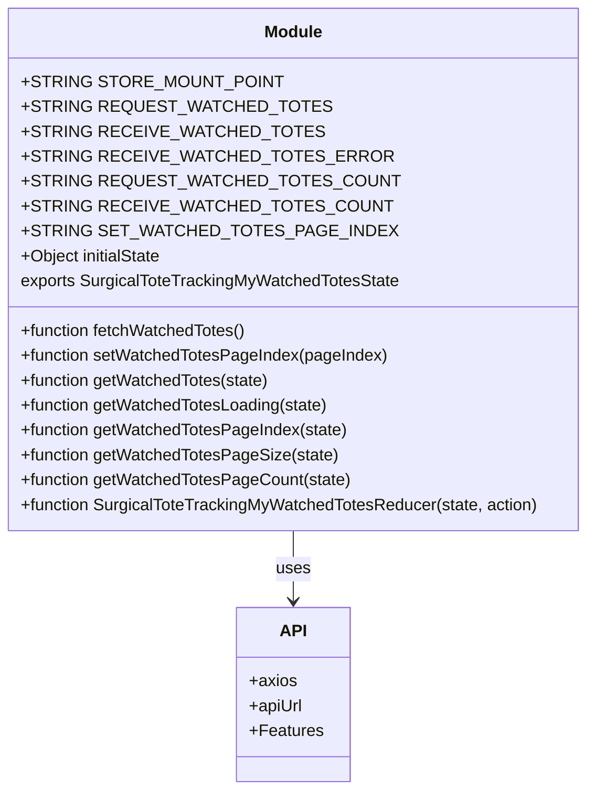
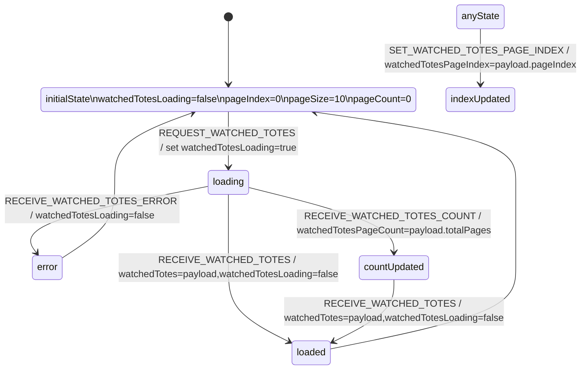

# Diagram: web/portal/src/pages/surgicaltotetracking/redux/SurgicalToteTrackingMyWatchedTotesState.js


> Auto-generated by Obscura crawlers

## Diagram 1



### SVG

<svg id="container" width="568.546875" xmlns="http://www.w3.org/2000/svg" class="classDiagram" height="762" viewBox="0 0 568.546875 762" role="graphics-document document" aria-roledescription="class"><style>#container{font-family:"trebuchet ms",verdana,arial,sans-serif;font-size:16px;fill:#333;}@keyframes edge-animation-frame{from{stroke-dashoffset:0;}}@keyframes dash{to{stroke-dashoffset:0;}}#container .edge-animation-slow{stroke-dasharray:9,5!important;stroke-dashoffset:900;animation:dash 50s linear infinite;stroke-linecap:round;}#container .edge-animation-fast{stroke-dasharray:9,5!important;stroke-dashoffset:900;animation:dash 20s linear infinite;stroke-linecap:round;}#container .error-icon{fill:#552222;}#container .error-text{fill:#552222;stroke:#552222;}#container .edge-thickness-normal{stroke-width:1px;}#container .edge-thickness-thick{stroke-width:3.5px;}#container .edge-pattern-solid{stroke-dasharray:0;}#container .edge-thickness-invisible{stroke-width:0;fill:none;}#container .edge-pattern-dashed{stroke-dasharray:3;}#container .edge-pattern-dotted{stroke-dasharray:2;}#container .marker{fill:#333333;stroke:#333333;}#container .marker.cross{stroke:#333333;}#container svg{font-family:"trebuchet ms",verdana,arial,sans-serif;font-size:16px;}#container p{margin:0;}#container g.classGroup text{fill:#9370DB;stroke:none;font-family:"trebuchet ms",verdana,arial,sans-serif;font-size:10px;}#container g.classGroup text .title{font-weight:bolder;}#container .nodeLabel,#container .edgeLabel{color:#131300;}#container .edgeLabel .label rect{fill:#ECECFF;}#container .label text{fill:#131300;}#container .labelBkg{background:#ECECFF;}#container .edgeLabel .label span{background:#ECECFF;}#container .classTitle{font-weight:bolder;}#container .node rect,#container .node circle,#container .node ellipse,#container .node polygon,#container .node path{fill:#ECECFF;stroke:#9370DB;stroke-width:1px;}#container .divider{stroke:#9370DB;stroke-width:1;}#container g.clickable{cursor:pointer;}#container g.classGroup rect{fill:#ECECFF;stroke:#9370DB;}#container g.classGroup line{stroke:#9370DB;stroke-width:1;}#container .classLabel .box{stroke:none;stroke-width:0;fill:#ECECFF;opacity:0.5;}#container .classLabel .label{fill:#9370DB;font-size:10px;}#container .relation{stroke:#333333;stroke-width:1;fill:none;}#container .dashed-line{stroke-dasharray:3;}#container .dotted-line{stroke-dasharray:1 2;}#container #compositionStart,#container .composition{fill:#333333!important;stroke:#333333!important;stroke-width:1;}#container #compositionEnd,#container .composition{fill:#333333!important;stroke:#333333!important;stroke-width:1;}#container #dependencyStart,#container .dependency{fill:#333333!important;stroke:#333333!important;stroke-width:1;}#container #dependencyStart,#container .dependency{fill:#333333!important;stroke:#333333!important;stroke-width:1;}#container #extensionStart,#container .extension{fill:transparent!important;stroke:#333333!important;stroke-width:1;}#container #extensionEnd,#container .extension{fill:transparent!important;stroke:#333333!important;stroke-width:1;}#container #aggregationStart,#container .aggregation{fill:transparent!important;stroke:#333333!important;stroke-width:1;}#container #aggregationEnd,#container .aggregation{fill:transparent!important;stroke:#333333!important;stroke-width:1;}#container #lollipopStart,#container .lollipop{fill:#ECECFF!important;stroke:#333333!important;stroke-width:1;}#container #lollipopEnd,#container .lollipop{fill:#ECECFF!important;stroke:#333333!important;stroke-width:1;}#container .edgeTerminals{font-size:11px;line-height:initial;}#container .classTitleText{text-anchor:middle;font-size:18px;fill:#333;}#container .label-icon{display:inline-block;height:1em;overflow:visible;vertical-align:-0.125em;}#container .node .label-icon path{fill:currentColor;stroke:revert;stroke-width:revert;}#container :root{--mermaid-font-family:"trebuchet ms",verdana,arial,sans-serif;}</style><g><defs><marker id="container_class-aggregationStart" class="marker aggregation class" refX="18" refY="7" markerWidth="190" markerHeight="240" orient="auto"><path d="M 18,7 L9,13 L1,7 L9,1 Z"></path></marker></defs><defs><marker id="container_class-aggregationEnd" class="marker aggregation class" refX="1" refY="7" markerWidth="20" markerHeight="28" orient="auto"><path d="M 18,7 L9,13 L1,7 L9,1 Z"></path></marker></defs><defs><marker id="container_class-extensionStart" class="marker extension class" refX="18" refY="7" markerWidth="190" markerHeight="240" orient="auto"><path d="M 1,7 L18,13 V 1 Z"></path></marker></defs><defs><marker id="container_class-extensionEnd" class="marker extension class" refX="1" refY="7" markerWidth="20" markerHeight="28" orient="auto"><path d="M 1,1 V 13 L18,7 Z"></path></marker></defs><defs><marker id="container_class-compositionStart" class="marker composition class" refX="18" refY="7" markerWidth="190" markerHeight="240" orient="auto"><path d="M 18,7 L9,13 L1,7 L9,1 Z"></path></marker></defs><defs><marker id="container_class-compositionEnd" class="marker composition class" refX="1" refY="7" markerWidth="20" markerHeight="28" orient="auto"><path d="M 18,7 L9,13 L1,7 L9,1 Z"></path></marker></defs><defs><marker id="container_class-dependencyStart" class="marker dependency class" refX="6" refY="7" markerWidth="190" markerHeight="240" orient="auto"><path d="M 5,7 L9,13 L1,7 L9,1 Z"></path></marker></defs><defs><marker id="container_class-dependencyEnd" class="marker dependency class" refX="13" refY="7" markerWidth="20" markerHeight="28" orient="auto"><path d="M 18,7 L9,13 L14,7 L9,1 Z"></path></marker></defs><defs><marker id="container_class-lollipopStart" class="marker lollipop class" refX="13" refY="7" markerWidth="190" markerHeight="240" orient="auto"><circle stroke="black" fill="transparent" cx="7" cy="7" r="6"></circle></marker></defs><defs><marker id="container_class-lollipopEnd" class="marker lollipop class" refX="1" refY="7" markerWidth="190" markerHeight="240" orient="auto"><circle stroke="black" fill="transparent" cx="7" cy="7" r="6"></circle></marker></defs><g class="root"><g class="clusters"></g><g class="edgePaths"><path d="M284.273,512L284.273,518.167C284.273,524.333,284.273,536.667,284.273,548C284.273,559.333,284.273,569.667,284.273,574.833L284.273,580" id="id_Module_API_1" class="edge-thickness-normal edge-pattern-solid relation" style=";;;" data-edge="true" data-et="edge" data-id="id_Module_API_1" data-points="W3sieCI6Mjg0LjI3MzQzNzUsInkiOjUxMn0seyJ4IjoyODQuMjczNDM3NSwieSI6NTQ5fSx7IngiOjI4NC4yNzM0Mzc1LCJ5Ijo1ODZ9XQ==" marker-end="url(#container_class-dependencyEnd)"></path></g><g class="edgeLabels"><g class="edgeLabel" transform="translate(284.2734375, 549)"><g class="label" data-id="id_Module_API_1" transform="translate(-16.4921875, -12)"><foreignObject width="32.984375" height="24"><div xmlns="http://www.w3.org/1999/xhtml" class="labelBkg" style="display: table-cell; white-space: nowrap; line-height: 1.5; max-width: 200px; text-align: center;"><span class="edgeLabel"><p>uses</p></span></div></foreignObject></g></g></g><g class="nodes"><g class="node default" id="classId-Module-0" transform="translate(284.2734375, 260)"><g class="basic label-container"><path d="M-276.2734375 -252 L276.2734375 -252 L276.2734375 252 L-276.2734375 252" stroke="none" stroke-width="0" fill="#ECECFF" style=""></path><path d="M-276.2734375 -252 C-79.07899327128996 -252, 118.11545095742008 -252, 276.2734375 -252 M-276.2734375 -252 C-146.34713849488023 -252, -16.420839489760453 -252, 276.2734375 -252 M276.2734375 -252 C276.2734375 -144.49709525795078, 276.2734375 -36.99419051590152, 276.2734375 252 M276.2734375 -252 C276.2734375 -86.35346810187573, 276.2734375 79.29306379624853, 276.2734375 252 M276.2734375 252 C101.98276482943558 252, -72.30790784112884 252, -276.2734375 252 M276.2734375 252 C87.28301835308076 252, -101.70740079383847 252, -276.2734375 252 M-276.2734375 252 C-276.2734375 129.24778937151308, -276.2734375 6.49557874302613, -276.2734375 -252 M-276.2734375 252 C-276.2734375 54.70008284319255, -276.2734375 -142.5998343136149, -276.2734375 -252" stroke="#9370DB" stroke-width="1.3" fill="none" stroke-dasharray="0 0" style=""></path></g><g class="annotation-group text" transform="translate(0, -228)"></g><g class="label-group text" transform="translate(-27.09375, -228)"><g class="label" style="font-weight: bolder" transform="translate(0,-12)"><foreignObject width="54.1875" height="24"><div xmlns="http://www.w3.org/1999/xhtml" style="display: table-cell; white-space: nowrap; line-height: 1.5; max-width: 104px; text-align: center;"><span class="nodeLabel markdown-node-label" style=""><p>Module</p></span></div></foreignObject></g></g><g class="members-group text" transform="translate(-264.2734375, -180)"><g class="label" style="" transform="translate(0,-12)"><foreignObject width="222.328125" height="24"><div xmlns="http://www.w3.org/1999/xhtml" style="display: table-cell; white-space: nowrap; line-height: 1.5; max-width: 280px; text-align: center;"><span class="nodeLabel markdown-node-label" style=""><p>+STRING STORE_MOUNT_POINT</p></span></div></foreignObject></g><g class="label" style="" transform="translate(0,12)"><foreignObject width="253.453125" height="24"><div xmlns="http://www.w3.org/1999/xhtml" style="display: table-cell; white-space: nowrap; line-height: 1.5; max-width: 311px; text-align: center;"><span class="nodeLabel markdown-node-label" style=""><p>+STRING REQUEST_WATCHED_TOTES</p></span></div></foreignObject></g><g class="label" style="" transform="translate(0,36)"><foreignObject width="247.25" height="24"><div xmlns="http://www.w3.org/1999/xhtml" style="display: table-cell; white-space: nowrap; line-height: 1.5; max-width: 305px; text-align: center;"><span class="nodeLabel markdown-node-label" style=""><p>+STRING RECEIVE_WATCHED_TOTES</p></span></div></foreignObject></g><g class="label" style="" transform="translate(0,60)"><foreignObject width="303.625" height="24"><div xmlns="http://www.w3.org/1999/xhtml" style="display: table-cell; white-space: nowrap; line-height: 1.5; max-width: 361px; text-align: center;"><span class="nodeLabel markdown-node-label" style=""><p>+STRING RECEIVE_WATCHED_TOTES_ERROR</p></span></div></foreignObject></g><g class="label" style="" transform="translate(0,84)"><foreignObject width="310.15625" height="24"><div xmlns="http://www.w3.org/1999/xhtml" style="display: table-cell; white-space: nowrap; line-height: 1.5; max-width: 368px; text-align: center;"><span class="nodeLabel markdown-node-label" style=""><p>+STRING REQUEST_WATCHED_TOTES_COUNT</p></span></div></foreignObject></g><g class="label" style="" transform="translate(0,108)"><foreignObject width="303.953125" height="24"><div xmlns="http://www.w3.org/1999/xhtml" style="display: table-cell; white-space: nowrap; line-height: 1.5; max-width: 362px; text-align: center;"><span class="nodeLabel markdown-node-label" style=""><p>+STRING RECEIVE_WATCHED_TOTES_COUNT</p></span></div></foreignObject></g><g class="label" style="" transform="translate(0,132)"><foreignObject width="309.578125" height="24"><div xmlns="http://www.w3.org/1999/xhtml" style="display: table-cell; white-space: nowrap; line-height: 1.5; max-width: 367px; text-align: center;"><span class="nodeLabel markdown-node-label" style=""><p>+STRING SET_WATCHED_TOTES_PAGE_INDEX</p></span></div></foreignObject></g><g class="label" style="" transform="translate(0,156)"><foreignObject width="138.703125" height="24"><div xmlns="http://www.w3.org/1999/xhtml" style="display: table-cell; white-space: nowrap; line-height: 1.5; max-width: 196px; text-align: center;"><span class="nodeLabel markdown-node-label" style=""><p>+Object initialState</p></span></div></foreignObject></g><g class="label" style="" transform="translate(0,180)"><foreignObject width="365.9375" height="24"><div xmlns="http://www.w3.org/1999/xhtml" style="display: table-cell; white-space: nowrap; line-height: 1.5; max-width: 416px; text-align: center;"><span class="nodeLabel markdown-node-label" style=""><p>exports SurgicalToteTrackingMyWatchedTotesState</p></span></div></foreignObject></g></g><g class="methods-group text" transform="translate(-264.2734375, 60)"><g class="label" style="" transform="translate(0,-12)"><foreignObject width="220.296875" height="24"><div xmlns="http://www.w3.org/1999/xhtml" style="display: table-cell; white-space: nowrap; line-height: 1.5; max-width: 278px; text-align: center;"><span class="nodeLabel markdown-node-label" style=""><p>+function fetchWatchedTotes()</p></span></div></foreignObject></g><g class="label" style="" transform="translate(0,12)"><foreignObject width="354.203125" height="24"><div xmlns="http://www.w3.org/1999/xhtml" style="display: table-cell; white-space: nowrap; line-height: 1.5; max-width: 412px; text-align: center;"><span class="nodeLabel markdown-node-label" style=""><p>+function setWatchedTotesPageIndex(pageIndex)</p></span></div></foreignObject></g><g class="label" style="" transform="translate(0,36)"><foreignObject width="242.46875" height="24"><div xmlns="http://www.w3.org/1999/xhtml" style="display: table-cell; white-space: nowrap; line-height: 1.5; max-width: 300px; text-align: center;"><span class="nodeLabel markdown-node-label" style=""><p>+function getWatchedTotes(state)</p></span></div></foreignObject></g><g class="label" style="" transform="translate(0,60)"><foreignObject width="299.703125" height="24"><div xmlns="http://www.w3.org/1999/xhtml" style="display: table-cell; white-space: nowrap; line-height: 1.5; max-width: 357px; text-align: center;"><span class="nodeLabel markdown-node-label" style=""><p>+function getWatchedTotesLoading(state)</p></span></div></foreignObject></g><g class="label" style="" transform="translate(0,84)"><foreignObject width="316.21875" height="24"><div xmlns="http://www.w3.org/1999/xhtml" style="display: table-cell; white-space: nowrap; line-height: 1.5; max-width: 374px; text-align: center;"><span class="nodeLabel markdown-node-label" style=""><p>+function getWatchedTotesPageIndex(state)</p></span></div></foreignObject></g><g class="label" style="" transform="translate(0,108)"><foreignObject width="305.046875" height="24"><div xmlns="http://www.w3.org/1999/xhtml" style="display: table-cell; white-space: nowrap; line-height: 1.5; max-width: 362px; text-align: center;"><span class="nodeLabel markdown-node-label" style=""><p>+function getWatchedTotesPageSize(state)</p></span></div></foreignObject></g><g class="label" style="" transform="translate(0,132)"><foreignObject width="318.671875" height="24"><div xmlns="http://www.w3.org/1999/xhtml" style="display: table-cell; white-space: nowrap; line-height: 1.5; max-width: 376px; text-align: center;"><span class="nodeLabel markdown-node-label" style=""><p>+function getWatchedTotesPageCount(state)</p></span></div></foreignObject></g><g class="label" style="" transform="translate(0,156)"><foreignObject width="501.453125" height="24"><div xmlns="http://www.w3.org/1999/xhtml" style="display: table-cell; white-space: nowrap; line-height: 1.5; max-width: 559px; text-align: center;"><span class="nodeLabel markdown-node-label" style=""><p>+function SurgicalToteTrackingMyWatchedTotesReducer(state, action)</p></span></div></foreignObject></g></g><g class="divider" style=""><path d="M-276.2734375 -204 C-91.81408131556901 -204, 92.64527486886197 -204, 276.2734375 -204 M-276.2734375 -204 C-160.0113061889851 -204, -43.749174877970205 -204, 276.2734375 -204" stroke="#9370DB" stroke-width="1.3" fill="none" stroke-dasharray="0 0" style=""></path></g><g class="divider" style=""><path d="M-276.2734375 36 C-90.48499879144984 36, 95.30343991710032 36, 276.2734375 36 M-276.2734375 36 C-164.995937084581 36, -53.718436669161974 36, 276.2734375 36" stroke="#9370DB" stroke-width="1.3" fill="none" stroke-dasharray="0 0" style=""></path></g></g><g class="node default" id="classId-API-1" transform="translate(284.2734375, 670)"><g class="basic label-container"><path d="M-52.69921875 -84 L52.69921875 -84 L52.69921875 84 L-52.69921875 84" stroke="none" stroke-width="0" fill="#ECECFF" style=""></path><path d="M-52.69921875 -84 C-17.659038245009647 -84, 17.381142259980706 -84, 52.69921875 -84 M-52.69921875 -84 C-21.10790501733506 -84, 10.48340871532988 -84, 52.69921875 -84 M52.69921875 -84 C52.69921875 -46.06501792560579, 52.69921875 -8.130035851211574, 52.69921875 84 M52.69921875 -84 C52.69921875 -33.00750905816129, 52.69921875 17.98498188367742, 52.69921875 84 M52.69921875 84 C29.72091545746252 84, 6.742612164925042 84, -52.69921875 84 M52.69921875 84 C24.950670643285335 84, -2.79787746342933 84, -52.69921875 84 M-52.69921875 84 C-52.69921875 28.8245977205301, -52.69921875 -26.3508045589398, -52.69921875 -84 M-52.69921875 84 C-52.69921875 29.423302244282596, -52.69921875 -25.15339551143481, -52.69921875 -84" stroke="#9370DB" stroke-width="1.3" fill="none" stroke-dasharray="0 0" style=""></path></g><g class="annotation-group text" transform="translate(0, -60)"></g><g class="label-group text" transform="translate(-11.8671875, -60)"><g class="label" style="font-weight: bolder" transform="translate(0,-12)"><foreignObject width="23.734375" height="24"><div xmlns="http://www.w3.org/1999/xhtml" style="display: table-cell; white-space: nowrap; line-height: 1.5; max-width: 73px; text-align: center;"><span class="nodeLabel markdown-node-label" style=""><p>API</p></span></div></foreignObject></g></g><g class="members-group text" transform="translate(-40.69921875, -12)"><g class="label" style="" transform="translate(0,-12)"><foreignObject width="45.546875" height="24"><div xmlns="http://www.w3.org/1999/xhtml" style="display: table-cell; white-space: nowrap; line-height: 1.5; max-width: 103px; text-align: center;"><span class="nodeLabel markdown-node-label" style=""><p>+axios</p></span></div></foreignObject></g><g class="label" style="" transform="translate(0,12)"><foreignObject width="51.921875" height="24"><div xmlns="http://www.w3.org/1999/xhtml" style="display: table-cell; white-space: nowrap; line-height: 1.5; max-width: 110px; text-align: center;"><span class="nodeLabel markdown-node-label" style=""><p>+apiUrl</p></span></div></foreignObject></g><g class="label" style="" transform="translate(0,36)"><foreignObject width="69.53125" height="24"><div xmlns="http://www.w3.org/1999/xhtml" style="display: table-cell; white-space: nowrap; line-height: 1.5; max-width: 127px; text-align: center;"><span class="nodeLabel markdown-node-label" style=""><p>+Features</p></span></div></foreignObject></g></g><g class="methods-group text" transform="translate(-40.69921875, 84)"></g><g class="divider" style=""><path d="M-52.69921875 -36 C-16.248047540759316 -36, 20.203123668481368 -36, 52.69921875 -36 M-52.69921875 -36 C-13.652753380583242 -36, 25.393711988833516 -36, 52.69921875 -36" stroke="#9370DB" stroke-width="1.3" fill="none" stroke-dasharray="0 0" style=""></path></g><g class="divider" style=""><path d="M-52.69921875 60 C-10.93331979128547 60, 30.83257916742906 60, 52.69921875 60 M-52.69921875 60 C-23.70190393108935 60, 5.295410887821298 60, 52.69921875 60" stroke="#9370DB" stroke-width="1.3" fill="none" stroke-dasharray="0 0" style=""></path></g></g></g></g></g></svg>

## Diagram 2

```mermaid
flowchart LR
    A[fetchWatchedTotes()] --> B[dispatch REQUEST_WATCHED_TOTES]
    B --> C[dispatch REQUEST_WATCHED_TOTES_COUNT]
    C --> D[getState() -> pageSize, pageNumber]
    D --> E[build url = apiUrl("/containertracking/api/watch")]
    E --> F[axios.get(url, {headers, params})]
    F -->|success| G[dispatch RECEIVE_WATCHED_TOTES_COUNT (totalPages)]
    G --> H[dispatch RECEIVE_WATCHED_TOTES (watchedTotes)]
    F -->|error| I[console.error(error)]
    I --> J[dispatch RECEIVE_WATCHED_TOTES_ERROR (error)]
```

> SVG rendering failed for this diagram.

## Diagram 3



### SVG

<svg id="container" width="937.4400634765625" xmlns="http://www.w3.org/2000/svg" class="statediagram" height="640" viewBox="110.47792053222656 0 937.4400634765625 640" role="graphics-document document" aria-roledescription="stateDiagram"><style>#container{font-family:"trebuchet ms",verdana,arial,sans-serif;font-size:16px;fill:#333;}@keyframes edge-animation-frame{from{stroke-dashoffset:0;}}@keyframes dash{to{stroke-dashoffset:0;}}#container .edge-animation-slow{stroke-dasharray:9,5!important;stroke-dashoffset:900;animation:dash 50s linear infinite;stroke-linecap:round;}#container .edge-animation-fast{stroke-dasharray:9,5!important;stroke-dashoffset:900;animation:dash 20s linear infinite;stroke-linecap:round;}#container .error-icon{fill:#552222;}#container .error-text{fill:#552222;stroke:#552222;}#container .edge-thickness-normal{stroke-width:1px;}#container .edge-thickness-thick{stroke-width:3.5px;}#container .edge-pattern-solid{stroke-dasharray:0;}#container .edge-thickness-invisible{stroke-width:0;fill:none;}#container .edge-pattern-dashed{stroke-dasharray:3;}#container .edge-pattern-dotted{stroke-dasharray:2;}#container .marker{fill:#333333;stroke:#333333;}#container .marker.cross{stroke:#333333;}#container svg{font-family:"trebuchet ms",verdana,arial,sans-serif;font-size:16px;}#container p{margin:0;}#container defs #statediagram-barbEnd{fill:#333333;stroke:#333333;}#container g.stateGroup text{fill:#9370DB;stroke:none;font-size:10px;}#container g.stateGroup text{fill:#333;stroke:none;font-size:10px;}#container g.stateGroup .state-title{font-weight:bolder;fill:#131300;}#container g.stateGroup rect{fill:#ECECFF;stroke:#9370DB;}#container g.stateGroup line{stroke:#333333;stroke-width:1;}#container .transition{stroke:#333333;stroke-width:1;fill:none;}#container .stateGroup .composit{fill:white;border-bottom:1px;}#container .stateGroup .alt-composit{fill:#e0e0e0;border-bottom:1px;}#container .state-note{stroke:#aaaa33;fill:#fff5ad;}#container .state-note text{fill:black;stroke:none;font-size:10px;}#container .stateLabel .box{stroke:none;stroke-width:0;fill:#ECECFF;opacity:0.5;}#container .edgeLabel .label rect{fill:#ECECFF;opacity:0.5;}#container .edgeLabel{background-color:rgba(232,232,232, 0.8);text-align:center;}#container .edgeLabel p{background-color:rgba(232,232,232, 0.8);}#container .edgeLabel rect{opacity:0.5;background-color:rgba(232,232,232, 0.8);fill:rgba(232,232,232, 0.8);}#container .edgeLabel .label text{fill:#333;}#container .label div .edgeLabel{color:#333;}#container .stateLabel text{fill:#131300;font-size:10px;font-weight:bold;}#container .node circle.state-start{fill:#333333;stroke:#333333;}#container .node .fork-join{fill:#333333;stroke:#333333;}#container .node circle.state-end{fill:#9370DB;stroke:white;stroke-width:1.5;}#container .end-state-inner{fill:white;stroke-width:1.5;}#container .node rect{fill:#ECECFF;stroke:#9370DB;stroke-width:1px;}#container .node polygon{fill:#ECECFF;stroke:#9370DB;stroke-width:1px;}#container #statediagram-barbEnd{fill:#333333;}#container .statediagram-cluster rect{fill:#ECECFF;stroke:#9370DB;stroke-width:1px;}#container .cluster-label,#container .nodeLabel{color:#131300;}#container .statediagram-cluster rect.outer{rx:5px;ry:5px;}#container .statediagram-state .divider{stroke:#9370DB;}#container .statediagram-state .title-state{rx:5px;ry:5px;}#container .statediagram-cluster.statediagram-cluster .inner{fill:white;}#container .statediagram-cluster.statediagram-cluster-alt .inner{fill:#f0f0f0;}#container .statediagram-cluster .inner{rx:0;ry:0;}#container .statediagram-state rect.basic{rx:5px;ry:5px;}#container .statediagram-state rect.divider{stroke-dasharray:10,10;fill:#f0f0f0;}#container .note-edge{stroke-dasharray:5;}#container .statediagram-note rect{fill:#fff5ad;stroke:#aaaa33;stroke-width:1px;rx:0;ry:0;}#container .statediagram-note rect{fill:#fff5ad;stroke:#aaaa33;stroke-width:1px;rx:0;ry:0;}#container .statediagram-note text{fill:black;}#container .statediagram-note .nodeLabel{color:black;}#container .statediagram .edgeLabel{color:red;}#container #dependencyStart,#container #dependencyEnd{fill:#333333;stroke:#333333;stroke-width:1;}#container .statediagramTitleText{text-anchor:middle;font-size:18px;fill:#333;}#container :root{--mermaid-font-family:"trebuchet ms",verdana,arial,sans-serif;}</style><g><defs><marker id="container_stateDiagram-barbEnd" refX="19" refY="7" markerWidth="20" markerHeight="14" markerUnits="userSpaceOnUse" orient="auto"><path d="M 19,7 L9,13 L14,7 L9,1 Z"></path></marker></defs><g class="root"><g class="clusters"></g><g class="edgePaths"><path d="M454.629,35L454.629,45.333C454.629,55.667,454.629,76.333,454.712,94.917C454.796,113.5,454.962,130,455.046,138.25L455.129,146.5" id="edge0" class="edge-thickness-normal edge-pattern-solid transition" style="fill:none;;;fill:none" data-edge="true" data-et="edge" data-id="edge0" data-points="W3sieCI6NDU0LjYyODkwNjI1LCJ5IjozNX0seyJ4Ijo0NTQuNjI4OTA2MjUsInkiOjk3fSx7IngiOjQ1NS4xMjg5MDYyNSwieSI6MTQ2LjV9XQ==" marker-end="url(#container_stateDiagram-barbEnd)"></path><path d="M455.129,186.5L455.046,196.583C454.962,206.667,454.796,226.833,454.796,247.167C454.796,267.5,454.962,288,455.046,298.25L455.129,308.5" id="edge1" class="edge-thickness-normal edge-pattern-solid transition" style="fill:none;;;fill:none" data-edge="true" data-et="edge" data-id="edge1" data-points="W3sieCI6NDU1LjEyODkwNjI1LCJ5IjoxODYuNX0seyJ4Ijo0NTQuNjI4OTA2MjUsInkiOjI0N30seyJ4Ijo0NTUuMTI4OTA2MjUsInkiOjMwOC41fV0=" marker-end="url(#container_stateDiagram-barbEnd)"></path><path d="M455.129,348.5L455.046,356.583C454.962,364.667,454.796,380.833,454.712,401.083C454.629,421.333,454.629,445.667,454.629,470C454.629,494.333,454.629,518.667,472.416,539.691C490.204,560.716,525.779,578.433,543.566,587.291L561.354,596.149" id="edge2" class="edge-thickness-normal edge-pattern-solid transition" style="fill:none;;;fill:none" data-edge="true" data-et="edge" data-id="edge2" data-points="W3sieCI6NDU1LjEyODkwNjI1LCJ5IjozNDguNX0seyJ4Ijo0NTQuNjI4OTA2MjUsInkiOjM5N30seyJ4Ijo0NTQuNjI4OTA2MjUsInkiOjQ3MH0seyJ4Ijo0NTQuNjI4OTA2MjUsInkiOjU0M30seyJ4Ijo1NjEuMzUzODUyNDkzMTkxOSwieSI6NTk2LjE0ODk5MjY4ODkwMDl9XQ==" marker-end="url(#container_stateDiagram-barbEnd)"></path><path d="M419.988,335.972L371.675,346.143C323.362,356.314,226.736,376.657,186.058,395.745C145.38,414.833,160.65,432.667,168.286,441.583L175.921,450.5" id="edge3" class="edge-thickness-normal edge-pattern-solid transition" style="fill:none;;;fill:none" data-edge="true" data-et="edge" data-id="edge3" data-points="W3sieCI6NDE5Ljk4ODI4MTI1LCJ5IjozMzUuOTcxNjcwODU5NTY0MDN9LHsieCI6MTMwLjEwOTM3NSwieSI6Mzk3fSx7IngiOjE3NS45MjA4NTgzMDQ3OTQ1LCJ5Ijo0NTAuNX1d" marker-end="url(#container_stateDiagram-barbEnd)"></path><path d="M490.27,337.208L530.734,347.174C571.199,357.139,652.129,377.069,692.677,395.951C733.225,414.833,733.392,432.667,733.475,441.583L733.559,450.5" id="edge4" class="edge-thickness-normal edge-pattern-solid transition" style="fill:none;;;fill:none" data-edge="true" data-et="edge" data-id="edge4" data-points="W3sieCI6NDkwLjI2OTUzMTI1LCJ5IjozMzcuMjA4NDkzNTA0MzA3MDZ9LHsieCI6NzMzLjA1ODU5Mzc1LCJ5IjozOTd9LHsieCI6NzMzLjU1ODU5Mzc1LCJ5Ijo0NTAuNX1d" marker-end="url(#container_stateDiagram-barbEnd)"></path><path d="M733.559,490.5L733.475,499.25C733.392,508,733.225,525.5,715.521,543.108C697.817,560.716,662.575,578.433,644.954,587.291L627.334,596.149" id="edge5" class="edge-thickness-normal edge-pattern-solid transition" style="fill:none;;;fill:none" data-edge="true" data-et="edge" data-id="edge5" data-points="W3sieCI6NzMzLjU1ODU5Mzc1LCJ5Ijo0OTAuNX0seyJ4Ijo3MzMuMDU4NTkzNzUsInkiOjU0M30seyJ4Ijo2MjcuMzMzNjQ3NTA2NzczNCwieSI6NTk2LjE0ODk5MjY4ODkxODJ9XQ==" marker-end="url(#container_stateDiagram-barbEnd)"></path><path d="M881.895,48.5L881.811,56.583C881.728,64.667,881.561,80.833,881.561,97.167C881.561,113.5,881.728,130,881.811,138.25L881.895,146.5" id="edge6" class="edge-thickness-normal edge-pattern-solid transition" style="fill:none;;;fill:none" data-edge="true" data-et="edge" data-id="edge6" data-points="W3sieCI6ODgxLjg5NDUzMTI1LCJ5Ijo0OC41fSx7IngiOjg4MS4zOTQ1MzEyNSwieSI6OTd9LHsieCI6ODgxLjg5NDUzMTI1LCJ5IjoxNDYuNX1d" marker-end="url(#container_stateDiagram-barbEnd)"></path><path d="M627.523,605.825L679.072,595.354C730.621,584.883,833.719,563.942,885.268,541.304C936.816,518.667,936.816,494.333,936.816,470C936.816,445.667,936.816,421.333,936.816,397.667C936.816,374,936.816,351,936.816,326C936.816,301,936.816,274,876.378,250.417C815.94,226.833,695.064,206.667,634.626,196.583L574.188,186.5" id="edge7" class="edge-thickness-normal edge-pattern-solid transition" style="fill:none;;;fill:none" data-edge="true" data-et="edge" data-id="edge7" data-points="W3sieCI6NjI3LjUyMzQzNzUsInkiOjYwNS44MjQ4MzY4NDY5NjA3fSx7IngiOjkzNi44MTY0MDYyNSwieSI6NTQzfSx7IngiOjkzNi44MTY0MDYyNSwieSI6NDcwfSx7IngiOjkzNi44MTY0MDYyNSwieSI6Mzk3fSx7IngiOjkzNi44MTY0MDYyNSwieSI6MzI4fSx7IngiOjkzNi44MTY0MDYyNSwieSI6MjQ3fSx7IngiOjU3NC4xODc1NDgyMjUzMDg3LCJ5IjoxODYuNX1d" marker-end="url(#container_stateDiagram-barbEnd)"></path><path d="M214.795,450.555L224.366,441.629C233.937,432.703,253.078,414.852,262.648,394.426C272.219,374,272.219,351,272.219,326C272.219,301,272.219,274,295.197,250.417C318.176,226.833,364.132,206.667,387.111,196.583L410.089,186.5" id="edge8" class="edge-thickness-normal edge-pattern-solid transition" style="fill:none;;;fill:none" data-edge="true" data-et="edge" data-id="edge8" data-points="W3sieCI6MjE0Ljc5NTM5ODIxMDI4NjQ0LCJ5Ijo0NTAuNTU0NTMxMTEwNDMzMX0seyJ4IjoyNzIuMjE4NzUsInkiOjM5N30seyJ4IjoyNzIuMjE4NzUsInkiOjMyOH0seyJ4IjoyNzIuMjE4NzUsInkiOjI0N30seyJ4Ijo0MTAuMDg5MzYxNDk2OTEzNTcsInkiOjE4Ni41fV0=" marker-end="url(#container_stateDiagram-barbEnd)"></path></g><g class="edgeLabels"><g class="edgeLabel"><g class="label" data-id="edge0" transform="translate(0, 0)"><foreignObject width="0" height="0"><div xmlns="http://www.w3.org/1999/xhtml" class="labelBkg" style="display: table-cell; white-space: nowrap; line-height: 1.5; max-width: 200px; text-align: center;"><span class="edgeLabel"></span></div></foreignObject></g></g><g class="edgeLabel" transform="translate(454.62890625, 247)"><g class="label" data-id="edge1" transform="translate(-100, -36)"><foreignObject width="200" height="72"><div xmlns="http://www.w3.org/1999/xhtml" class="labelBkg" style="display: table; white-space: break-spaces; line-height: 1.5; max-width: 200px; text-align: center; width: 200px;"><span class="edgeLabel"><p>REQUEST_WATCHED_TOTES / set watchedTotesLoading=true</p></span></div></foreignObject></g></g><g class="edgeLabel" transform="translate(454.62890625, 470)"><g class="label" data-id="edge2" transform="translate(-183.7578125, -24)"><foreignObject width="367.515625" height="48"><div xmlns="http://www.w3.org/1999/xhtml" class="labelBkg" style="display: table; white-space: break-spaces; line-height: 1.5; max-width: 200px; text-align: center; width: 200px;"><span class="edgeLabel"><p>RECEIVE_WATCHED_TOTES / watchedTotes=payload,watchedTotesLoading=false</p></span></div></foreignObject></g></g><g class="edgeLabel" transform="translate(240.58729, 373.74104)"><g class="label" data-id="edge3" transform="translate(-122.109375, -24)"><foreignObject width="244.21875" height="48"><div xmlns="http://www.w3.org/1999/xhtml" class="labelBkg" style="display: table; white-space: break-spaces; line-height: 1.5; max-width: 200px; text-align: center; width: 200px;"><span class="edgeLabel"><p>RECEIVE_WATCHED_TOTES_ERROR / watchedTotesLoading=false</p></span></div></foreignObject></g></g><g class="edgeLabel" transform="translate(733.05859375, 397)"><g class="label" data-id="edge4" transform="translate(-159.796875, -24)"><foreignObject width="319.59375" height="48"><div xmlns="http://www.w3.org/1999/xhtml" class="labelBkg" style="display: table; white-space: break-spaces; line-height: 1.5; max-width: 200px; text-align: center; width: 200px;"><span class="edgeLabel"><p>RECEIVE_WATCHED_TOTES_COUNT / watchedTotesPageCount=payload.totalPages</p></span></div></foreignObject></g></g><g class="edgeLabel" transform="translate(733.05859375, 543)"><g class="label" data-id="edge5" transform="translate(-183.7578125, -24)"><foreignObject width="367.515625" height="48"><div xmlns="http://www.w3.org/1999/xhtml" class="labelBkg" style="display: table; white-space: break-spaces; line-height: 1.5; max-width: 200px; text-align: center; width: 200px;"><span class="edgeLabel"><p>RECEIVE_WATCHED_TOTES / watchedTotes=payload,watchedTotesLoading=false</p></span></div></foreignObject></g></g><g class="edgeLabel" transform="translate(881.39453125, 97)"><g class="label" data-id="edge6" transform="translate(-158.5234375, -24)"><foreignObject width="317.046875" height="48"><div xmlns="http://www.w3.org/1999/xhtml" class="labelBkg" style="display: table; white-space: break-spaces; line-height: 1.5; max-width: 200px; text-align: center; width: 200px;"><span class="edgeLabel"><p>SET_WATCHED_TOTES_PAGE_INDEX / watchedTotesPageIndex=payload.pageIndex</p></span></div></foreignObject></g></g><g class="edgeLabel"><g class="label" data-id="edge7" transform="translate(0, 0)"><foreignObject width="0" height="0"><div xmlns="http://www.w3.org/1999/xhtml" class="labelBkg" style="display: table-cell; white-space: nowrap; line-height: 1.5; max-width: 200px; text-align: center;"><span class="edgeLabel"></span></div></foreignObject></g></g><g class="edgeLabel"><g class="label" data-id="edge8" transform="translate(0, 0)"><foreignObject width="0" height="0"><div xmlns="http://www.w3.org/1999/xhtml" class="labelBkg" style="display: table-cell; white-space: nowrap; line-height: 1.5; max-width: 200px; text-align: center;"><span class="edgeLabel"></span></div></foreignObject></g></g></g><g class="nodes"><g class="node default" id="state-root_start-0" transform="translate(454.62890625, 28)"><circle class="state-start" r="7" width="14" height="14"></circle></g><g class="node  statediagram-state" id="state-idle-8" transform="translate(454.62890625, 166)"><g class="basic label-container outer-path"><path d="M-312.7734375 -20 C-100.07139199733177 -20, 112.63065350533645 -20, 312.7734375 -20 C312.7734375 -20, 312.7734375 -20, 312.7734375 -20 C312.87616846535036 -19.99575101584326, 312.9788994307007 -19.991502031686522, 313.18633422736167 -19.982922465033347 C313.3244409839615 -19.96570747577611, 313.4625477405613 -19.948492486518877, 313.59641045140364 -19.931806517013612 C313.68714869002235 -19.912780709112926, 313.777886928641 -19.893754901212244, 314.000864935704 -19.847001329696653 C314.15457268327077 -19.801240550575375, 314.3082804308375 -19.7554797714541, 314.39693484602344 -19.729086208503173 C314.54989376908173 -19.6694014515173, 314.70285269214 -19.60971669453143, 314.78191462326487 -19.578866633275286 C314.90334613309335 -19.519502385447538, 315.0247776429218 -19.46013813761979, 315.1531744651854 -19.397368756032446 C315.25818705055667 -19.33479483719489, 315.36319963592797 -19.272220918357338, 315.50817829061214 -19.185832391312644 C315.59513892456476 -19.123743692061467, 315.68209955851745 -19.061654992810293, 315.8445010634483 -18.94570254698197 C315.93201817907357 -18.871579331093308, 316.01953529469876 -18.797456115204646, 316.1598453581287 -18.678619553365657 C316.2701902368194 -18.5682746746749, 316.3805351155102 -18.45792979598414, 316.45205705336565 -18.386407858128706 C316.51721211130376 -18.309479426587025, 316.58236716924193 -18.232550995045344, 316.719140046982 -18.07106356344834 C316.77338796080363 -17.99508463276635, 316.8276358746253 -17.91910570208436, 316.95926989131266 -17.734740790612136 C317.0416235659996 -17.596533491878688, 317.12397724068654 -17.458326193145243, 317.17080625603245 -17.37973696518537 C317.2332379510147 -17.252030891913034, 317.295669645997 -17.124324818640694, 317.3523041332753 -17.008477123264846 C317.39576244243193 -16.897103022033168, 317.43922075158855 -16.785728920801493, 317.5025237085032 -16.623497346023417 C317.53349095708194 -16.51948019162206, 317.56445820566074 -16.4154630372207, 317.62043882969664 -16.227427435703994 C317.65156183016836 -16.078995040187817, 317.68268483064 -15.930562644671639, 317.7052440170136 -15.82297295140367 C317.72032028917727 -15.702023991225934, 317.73539656134085 -15.581075031048197, 317.75635996503337 -15.412896727361662 C317.7625075933358 -15.26426077890295, 317.7686552216382 -15.115624830444236, 317.7734375 -15 C317.7734375 -15, 317.7734375 -15, 317.7734375 -15 C317.7734375 -4.0844104002009605, 317.7734375 6.831179199598079, 317.7734375 15 C317.7734375 15, 317.7734375 15, 317.7734375 15 C317.7689793181066 15.107788900293512, 317.76452113621315 15.215577800587024, 317.75635996503337 15.412896727361662 C317.7452038595655 15.502396262878879, 317.73404775409756 15.591895798396093, 317.7052440170136 15.822972951403669 C317.68561513955376 15.916587360634948, 317.6659862620939 16.010201769866228, 317.62043882969664 16.227427435703994 C317.57814047762133 16.36950509583418, 317.53584212554597 16.511582755964373, 317.5025237085032 16.623497346023417 C317.4555766127806 16.743812440950293, 317.408629517058 16.86412753587717, 317.3523041332753 17.008477123264846 C317.28073070666517 17.15488290746818, 317.2091572800551 17.301288691671516, 317.17080625603245 17.379736965185366 C317.0974231661708 17.50288968011936, 317.02404007630923 17.62604239505335, 316.95926989131266 17.734740790612133 C316.8732173426983 17.8552648839012, 316.78716479408394 17.975788977190266, 316.719140046982 18.07106356344834 C316.62715398012995 18.179671307352606, 316.535167913278 18.288279051256872, 316.45205705336565 18.386407858128706 C316.36339326741546 18.475071644078888, 316.2747294814653 18.56373543002907, 316.1598453581287 18.678619553365657 C316.0394374765176 18.780599827048064, 315.9190295949065 18.882580100730472, 315.8445010634483 18.94570254698197 C315.77539768105333 18.995041413682223, 315.7062942986584 19.044380280382477, 315.50817829061214 19.185832391312644 C315.40754631063106 19.245796035913262, 315.30691433065 19.30575968051388, 315.1531744651854 19.397368756032446 C315.0668071153515 19.439591180566303, 314.9804397655176 19.48181360510016, 314.78191462326487 19.578866633275286 C314.6374274829306 19.635245690384288, 314.49294034259634 19.691624747493293, 314.39693484602344 19.729086208503173 C314.2693562555834 19.76706800050878, 314.1417776651433 19.80504979251439, 314.000864935704 19.847001329696653 C313.8872234311552 19.870829447456096, 313.77358192660637 19.894657565215535, 313.59641045140364 19.931806517013612 C313.50534727845877 19.9431575296836, 313.4142841055139 19.95450854235359, 313.18633422736167 19.982922465033347 C313.0730303832752 19.987608746689315, 312.9597265391887 19.99229502834528, 312.7734375 20 C312.7734375 20, 312.7734375 20, 312.7734375 20 C144.51627357948212 20, -23.740890341035765 20, -312.7734375 20 C-312.7734375 20, -312.7734375 20, -312.7734375 20 C-312.90710308896456 19.99447155034634, -313.0407686779291 19.988943100692676, -313.18633422736167 19.982922465033347 C-313.2868319088048 19.970395442105474, -313.3873295902479 19.957868419177597, -313.59641045140364 19.931806517013612 C-313.72631973508925 19.904567404666455, -313.85622901877485 19.877328292319294, -314.000864935704 19.847001329696653 C-314.1544573426225 19.801274888974138, -314.308049749541 19.755548448251623, -314.39693484602344 19.729086208503173 C-314.54443386329825 19.67153191336506, -314.6919328805731 19.61397761822695, -314.78191462326487 19.578866633275286 C-314.9027429137607 19.51979728140996, -315.0235712042564 19.460727929544635, -315.1531744651854 19.397368756032446 C-315.2591203447454 19.33423871456819, -315.36506622430534 19.271108673103935, -315.50817829061214 19.185832391312644 C-315.62561645921784 19.10198315057301, -315.7430546278235 19.018133909833377, -315.8445010634483 18.94570254698197 C-315.9565551801264 18.85079755128593, -316.0686092968045 18.755892555589888, -316.1598453581287 18.67861955336566 C-316.26172553881065 18.576739372683683, -316.3636057194926 18.474859192001706, -316.45205705336565 18.386407858128706 C-316.5426132604043 18.27948834651592, -316.633169467443 18.172568834903128, -316.719140046982 18.07106356344834 C-316.76817894805595 18.00238030905316, -316.8172178491299 17.933697054657973, -316.95926989131266 17.734740790612133 C-317.0207005829864 17.631646787972485, -317.08213127466024 17.52855278533284, -317.17080625603245 17.37973696518537 C-317.24075362494057 17.236657335174904, -317.31070099384874 17.093577705164435, -317.3523041332753 17.00847712326485 C-317.4026731213746 16.879392469757207, -317.453042109474 16.75030781624956, -317.5025237085032 16.623497346023417 C-317.52838139394885 16.536642911648272, -317.5542390793945 16.449788477273124, -317.62043882969664 16.227427435703994 C-317.6421009259386 16.124116161457636, -317.6637630221806 16.020804887211277, -317.7052440170136 15.82297295140367 C-317.72207480076776 15.687948472411312, -317.7389055845219 15.552923993418952, -317.75635996503337 15.412896727361664 C-317.7603120481853 15.317344166474832, -317.76426413133726 15.221791605588, -317.7734375 15 C-317.7734375 15, -317.7734375 15, -317.7734375 15 C-317.7734375 6.6810853583963965, -317.7734375 -1.637829283207207, -317.7734375 -15 C-317.7734375 -15, -317.7734375 -15, -317.7734375 -15 C-317.76818864522403 -15.126905608077271, -317.762939790448 -15.25381121615454, -317.75635996503337 -15.41289672736166 C-317.741613237966 -15.531201921474889, -317.7268665108987 -15.649507115588115, -317.7052440170136 -15.822972951403669 C-317.6826126308242 -15.930906981382654, -317.65998124463476 -16.03884101136164, -317.62043882969664 -16.227427435703994 C-317.59505070142114 -16.312704655347126, -317.5696625731456 -16.397981874990258, -317.5025237085032 -16.623497346023417 C-317.4469727594158 -16.765862227383078, -317.3914218103284 -16.90822710874274, -317.3523041332753 -17.008477123264846 C-317.29775365970823 -17.12006190045819, -317.2432031861411 -17.231646677651533, -317.17080625603245 -17.379736965185366 C-317.1283902170764 -17.450920263190838, -317.08597417812035 -17.52210356119631, -316.95926989131266 -17.734740790612133 C-316.89479794764156 -17.82503936606014, -316.8303260039704 -17.91533794150814, -316.719140046982 -18.07106356344834 C-316.6329472939512 -18.172831154649217, -316.5467545409204 -18.27459874585009, -316.45205705336565 -18.386407858128706 C-316.3494665870191 -18.488998324475254, -316.24687612067254 -18.5915887908218, -316.1598453581287 -18.678619553365657 C-316.03373590054036 -18.785428815572722, -315.90762644295205 -18.89223807777979, -315.8445010634483 -18.945702546981966 C-315.77061738899226 -18.998454476612245, -315.6967337145362 -19.051206406242525, -315.50817829061214 -19.185832391312644 C-315.42273740597693 -19.236744107862318, -315.3372965213417 -19.287655824411992, -315.1531744651854 -19.397368756032446 C-315.07221781654044 -19.436946049934583, -314.9912611678955 -19.47652334383672, -314.78191462326487 -19.578866633275286 C-314.6358024151156 -19.63587979381339, -314.4896902069664 -19.6928929543515, -314.39693484602344 -19.729086208503173 C-314.2684914944151 -19.767325451063087, -314.14004814280685 -19.805564693623005, -314.000864935704 -19.847001329696653 C-313.8517441358746 -19.878268673373817, -313.7026233360452 -19.909536017050986, -313.5964104514037 -19.931806517013612 C-313.5130019325743 -19.94220337804316, -313.4295934137449 -19.95260023907271, -313.18633422736167 -19.982922465033347 C-313.09695222658337 -19.986619331931358, -313.00757022580507 -19.990316198829372, -312.7734375 -20 C-312.7734375 -20, -312.7734375 -20, -312.7734375 -20" stroke="none" stroke-width="0" fill="#ECECFF" style=""></path><path d="M-312.7734375 -20 C-127.52620405558787 -20, 57.72102938882426 -20, 312.7734375 -20 M-312.7734375 -20 C-122.54896448333076 -20, 67.67550853333847 -20, 312.7734375 -20 M312.7734375 -20 C312.7734375 -20, 312.7734375 -20, 312.7734375 -20 M312.7734375 -20 C312.7734375 -20, 312.7734375 -20, 312.7734375 -20 M312.7734375 -20 C312.87622318592884 -19.995748752583392, 312.97900887185773 -19.991497505166787, 313.18633422736167 -19.982922465033347 M312.7734375 -20 C312.91481266277026 -19.99415268001504, 313.0561878255405 -19.988305360030086, 313.18633422736167 -19.982922465033347 M313.18633422736167 -19.982922465033347 C313.2974584088259 -19.96907085025921, 313.40858259029017 -19.955219235485078, 313.59641045140364 -19.931806517013612 M313.18633422736167 -19.982922465033347 C313.29137522384315 -19.96982911847654, 313.3964162203246 -19.956735771919735, 313.59641045140364 -19.931806517013612 M313.59641045140364 -19.931806517013612 C313.7423402631574 -19.90120825317605, 313.88827007491113 -19.870609989338494, 314.000864935704 -19.847001329696653 M313.59641045140364 -19.931806517013612 C313.7303097720178 -19.903730781901075, 313.8642090926319 -19.875655046788538, 314.000864935704 -19.847001329696653 M314.000864935704 -19.847001329696653 C314.1418164004475 -19.805038260514678, 314.2827678651911 -19.763075191332703, 314.39693484602344 -19.729086208503173 M314.000864935704 -19.847001329696653 C314.1298474075618 -19.80860158408436, 314.25882987941964 -19.770201838472072, 314.39693484602344 -19.729086208503173 M314.39693484602344 -19.729086208503173 C314.51252866497566 -19.683981360382578, 314.62812248392794 -19.638876512261987, 314.78191462326487 -19.578866633275286 M314.39693484602344 -19.729086208503173 C314.51947949982883 -19.68126913620654, 314.6420241536342 -19.633452063909907, 314.78191462326487 -19.578866633275286 M314.78191462326487 -19.578866633275286 C314.9083634597513 -19.517049563905775, 315.0348122962377 -19.45523249453627, 315.1531744651854 -19.397368756032446 M314.78191462326487 -19.578866633275286 C314.86661767873085 -19.53745783268017, 314.9513207341969 -19.49604903208505, 315.1531744651854 -19.397368756032446 M315.1531744651854 -19.397368756032446 C315.2324721448286 -19.350117595112497, 315.31176982447175 -19.302866434192545, 315.50817829061214 -19.185832391312644 M315.1531744651854 -19.397368756032446 C315.2449026486724 -19.342710622549326, 315.3366308321594 -19.288052489066203, 315.50817829061214 -19.185832391312644 M315.50817829061214 -19.185832391312644 C315.63887144610004 -19.09251927184191, 315.76956460158794 -18.99920615237117, 315.8445010634483 -18.94570254698197 M315.50817829061214 -19.185832391312644 C315.58262180740826 -19.132680741934486, 315.6570653242044 -19.079529092556328, 315.8445010634483 -18.94570254698197 M315.8445010634483 -18.94570254698197 C315.9580107296489 -18.849564763725194, 316.0715203958495 -18.75342698046842, 316.1598453581287 -18.678619553365657 M315.8445010634483 -18.94570254698197 C315.96243986035654 -18.845813481369778, 316.08037865726476 -18.745924415757585, 316.1598453581287 -18.678619553365657 M316.1598453581287 -18.678619553365657 C316.25303437194293 -18.58543053955141, 316.3462233857572 -18.492241525737164, 316.45205705336565 -18.386407858128706 M316.1598453581287 -18.678619553365657 C316.2230113992898 -18.615453512204546, 316.2861774404509 -18.552287471043435, 316.45205705336565 -18.386407858128706 M316.45205705336565 -18.386407858128706 C316.52143236358876 -18.304496584129847, 316.5908076738119 -18.222585310130988, 316.719140046982 -18.07106356344834 M316.45205705336565 -18.386407858128706 C316.5135758275551 -18.313772778696293, 316.5750946017445 -18.241137699263884, 316.719140046982 -18.07106356344834 M316.719140046982 -18.07106356344834 C316.77956142058264 -17.986438164366493, 316.8399827941833 -17.901812765284646, 316.95926989131266 -17.734740790612136 M316.719140046982 -18.07106356344834 C316.79181434340455 -17.96927687818689, 316.8644886398272 -17.867490192925434, 316.95926989131266 -17.734740790612136 M316.95926989131266 -17.734740790612136 C317.0401135763645 -17.599067581454825, 317.1209572614164 -17.463394372297515, 317.17080625603245 -17.37973696518537 M316.95926989131266 -17.734740790612136 C317.03432273962545 -17.608785859432764, 317.10937558793825 -17.48283092825339, 317.17080625603245 -17.37973696518537 M317.17080625603245 -17.37973696518537 C317.21580061910043 -17.28769952445219, 317.2607949821684 -17.19566208371901, 317.3523041332753 -17.008477123264846 M317.17080625603245 -17.37973696518537 C317.21445256778503 -17.290457007492012, 317.2580988795376 -17.201177049798655, 317.3523041332753 -17.008477123264846 M317.3523041332753 -17.008477123264846 C317.38235441015973 -16.931464863820963, 317.4124046870441 -16.85445260437708, 317.5025237085032 -16.623497346023417 M317.3523041332753 -17.008477123264846 C317.39305680080514 -16.904036987258475, 317.4338094683349 -16.799596851252108, 317.5025237085032 -16.623497346023417 M317.5025237085032 -16.623497346023417 C317.54126315338704 -16.493373844426067, 317.5800025982709 -16.36325034282872, 317.62043882969664 -16.227427435703994 M317.5025237085032 -16.623497346023417 C317.5311041077937 -16.527497477055764, 317.55968450708417 -16.43149760808811, 317.62043882969664 -16.227427435703994 M317.62043882969664 -16.227427435703994 C317.6537025655856 -16.068785404826862, 317.6869663014746 -15.91014337394973, 317.7052440170136 -15.82297295140367 M317.62043882969664 -16.227427435703994 C317.63905867212674 -16.138625335194934, 317.6576785145568 -16.049823234685878, 317.7052440170136 -15.82297295140367 M317.7052440170136 -15.82297295140367 C317.718183551478 -15.719165908013752, 317.73112308594233 -15.615358864623834, 317.75635996503337 -15.412896727361662 M317.7052440170136 -15.82297295140367 C317.71745293798256 -15.725027233784708, 317.7296618589515 -15.627081516165743, 317.75635996503337 -15.412896727361662 M317.75635996503337 -15.412896727361662 C317.7628033991422 -15.257108853895348, 317.769246833251 -15.101320980429033, 317.7734375 -15 M317.75635996503337 -15.412896727361662 C317.7607341734219 -15.307138119228302, 317.7651083818104 -15.20137951109494, 317.7734375 -15 M317.7734375 -15 C317.7734375 -15, 317.7734375 -15, 317.7734375 -15 M317.7734375 -15 C317.7734375 -15, 317.7734375 -15, 317.7734375 -15 M317.7734375 -15 C317.7734375 -3.6814412391419644, 317.7734375 7.637117521716071, 317.7734375 15 M317.7734375 -15 C317.7734375 -6.962693970441304, 317.7734375 1.074612059117392, 317.7734375 15 M317.7734375 15 C317.7734375 15, 317.7734375 15, 317.7734375 15 M317.7734375 15 C317.7734375 15, 317.7734375 15, 317.7734375 15 M317.7734375 15 C317.768005052292 15.131344475920095, 317.76257260458397 15.26268895184019, 317.75635996503337 15.412896727361662 M317.7734375 15 C317.7666425857403 15.164285880018054, 317.7598476714806 15.328571760036109, 317.75635996503337 15.412896727361662 M317.75635996503337 15.412896727361662 C317.74214525027816 15.526933867989651, 317.7279305355229 15.64097100861764, 317.7052440170136 15.822972951403669 M317.75635996503337 15.412896727361662 C317.74045388935 15.540502762429991, 317.7245478136667 15.66810879749832, 317.7052440170136 15.822972951403669 M317.7052440170136 15.822972951403669 C317.67664009659484 15.95939130325159, 317.6480361761761 16.095809655099508, 317.62043882969664 16.227427435703994 M317.7052440170136 15.822972951403669 C317.68606348959906 15.914449081219532, 317.6668829621845 16.005925211035397, 317.62043882969664 16.227427435703994 M317.62043882969664 16.227427435703994 C317.58242176516654 16.355124504465376, 317.54440470063645 16.482821573226754, 317.5025237085032 16.623497346023417 M317.62043882969664 16.227427435703994 C317.5910464676887 16.326154639362972, 317.5616541056809 16.424881843021954, 317.5025237085032 16.623497346023417 M317.5025237085032 16.623497346023417 C317.4628288622491 16.725226518438788, 317.42313401599506 16.82695569085416, 317.3523041332753 17.008477123264846 M317.5025237085032 16.623497346023417 C317.45400535796745 16.74783922192762, 317.4054870074317 16.872181097831827, 317.3523041332753 17.008477123264846 M317.3523041332753 17.008477123264846 C317.30178750139186 17.111810545408996, 317.2512708695084 17.215143967553143, 317.17080625603245 17.379736965185366 M317.3523041332753 17.008477123264846 C317.28261823123717 17.151021914244126, 317.212932329199 17.293566705223405, 317.17080625603245 17.379736965185366 M317.17080625603245 17.379736965185366 C317.0956708866198 17.505830384639147, 317.0205355172072 17.631923804092928, 316.95926989131266 17.734740790612133 M317.17080625603245 17.379736965185366 C317.126213175799 17.45457380986405, 317.0816200955656 17.529410654542737, 316.95926989131266 17.734740790612133 M316.95926989131266 17.734740790612133 C316.90459751400385 17.81131421939731, 316.849925136695 17.887887648182488, 316.719140046982 18.07106356344834 M316.95926989131266 17.734740790612133 C316.86429402265037 17.867762771241267, 316.769318153988 18.000784751870405, 316.719140046982 18.07106356344834 M316.719140046982 18.07106356344834 C316.63357472820866 18.17209034442131, 316.5480094094353 18.273117125394275, 316.45205705336565 18.386407858128706 M316.719140046982 18.07106356344834 C316.6480166727472 18.15503877272568, 316.57689329851246 18.23901398200302, 316.45205705336565 18.386407858128706 M316.45205705336565 18.386407858128706 C316.37380075854736 18.46466415294698, 316.2955444637291 18.542920447765255, 316.1598453581287 18.678619553365657 M316.45205705336565 18.386407858128706 C316.37656251955616 18.461902391938207, 316.3010679857466 18.537396925747707, 316.1598453581287 18.678619553365657 M316.1598453581287 18.678619553365657 C316.0749457562308 18.75052584821298, 315.990046154333 18.822432143060304, 315.8445010634483 18.94570254698197 M316.1598453581287 18.678619553365657 C316.0963487361646 18.7323984488928, 316.03285211420047 18.78617734441994, 315.8445010634483 18.94570254698197 M315.8445010634483 18.94570254698197 C315.72089974119405 19.033952194847593, 315.5972984189398 19.12220184271322, 315.50817829061214 19.185832391312644 M315.8445010634483 18.94570254698197 C315.71075981896615 19.04119196016465, 315.57701857448393 19.136681373347326, 315.50817829061214 19.185832391312644 M315.50817829061214 19.185832391312644 C315.413317320898 19.24235726020104, 315.31845635118384 19.298882129089435, 315.1531744651854 19.397368756032446 M315.50817829061214 19.185832391312644 C315.41329812100247 19.242368700855504, 315.3184179513928 19.298905010398364, 315.1531744651854 19.397368756032446 M315.1531744651854 19.397368756032446 C315.0415698081076 19.45192894828281, 314.92996515102993 19.506489140533173, 314.78191462326487 19.578866633275286 M315.1531744651854 19.397368756032446 C315.07800287514027 19.434117907116423, 315.0028312850952 19.4708670582004, 314.78191462326487 19.578866633275286 M314.78191462326487 19.578866633275286 C314.6814524461821 19.61806709641644, 314.58099026909935 19.657267559557592, 314.39693484602344 19.729086208503173 M314.78191462326487 19.578866633275286 C314.6556713607402 19.628126907172593, 314.52942809821553 19.6773871810699, 314.39693484602344 19.729086208503173 M314.39693484602344 19.729086208503173 C314.2601114011722 19.769820312916032, 314.12328795632095 19.81055441732889, 314.000864935704 19.847001329696653 M314.39693484602344 19.729086208503173 C314.2959453854664 19.759152073570387, 314.1949559249093 19.789217938637602, 314.000864935704 19.847001329696653 M314.000864935704 19.847001329696653 C313.8854876243986 19.871193407859188, 313.77011031309314 19.895385486021727, 313.59641045140364 19.931806517013612 M314.000864935704 19.847001329696653 C313.85657751789864 19.877255219737282, 313.7122901000933 19.907509109777912, 313.59641045140364 19.931806517013612 M313.59641045140364 19.931806517013612 C313.48159328000355 19.94611846250319, 313.36677610860346 19.960430407992767, 313.18633422736167 19.982922465033347 M313.59641045140364 19.931806517013612 C313.48327068015095 19.945909374792866, 313.37013090889826 19.96001223257212, 313.18633422736167 19.982922465033347 M313.18633422736167 19.982922465033347 C313.0354352322027 19.989163693639654, 312.88453623704373 19.99540492224596, 312.7734375 20 M313.18633422736167 19.982922465033347 C313.0758005970293 19.987494169800915, 312.9652669666969 19.992065874568482, 312.7734375 20 M312.7734375 20 C312.7734375 20, 312.7734375 20, 312.7734375 20 M312.7734375 20 C312.7734375 20, 312.7734375 20, 312.7734375 20 M312.7734375 20 C146.61271609392662 20, -19.548005312146756 20, -312.7734375 20 M312.7734375 20 C166.49025938056337 20, 20.207081261126746 20, -312.7734375 20 M-312.7734375 20 C-312.7734375 20, -312.7734375 20, -312.7734375 20 M-312.7734375 20 C-312.7734375 20, -312.7734375 20, -312.7734375 20 M-312.7734375 20 C-312.90447123973456 19.994580404435688, -313.0355049794692 19.989160808871375, -313.18633422736167 19.982922465033347 M-312.7734375 20 C-312.93771777936433 19.993205317385044, -313.10199805872867 19.986410634770092, -313.18633422736167 19.982922465033347 M-313.18633422736167 19.982922465033347 C-313.30986605537674 19.96752423872956, -313.4333978833918 19.95212601242577, -313.59641045140364 19.931806517013612 M-313.18633422736167 19.982922465033347 C-313.33889407889626 19.963905899371298, -313.49145393043085 19.944889333709245, -313.59641045140364 19.931806517013612 M-313.59641045140364 19.931806517013612 C-313.72089472791095 19.90570490905275, -313.8453790044183 19.879603301091887, -314.000864935704 19.847001329696653 M-313.59641045140364 19.931806517013612 C-313.7262725354068 19.904577301399133, -313.85613461940994 19.877348085784654, -314.000864935704 19.847001329696653 M-314.000864935704 19.847001329696653 C-314.1113073561226 19.814121196545262, -314.22174977654123 19.78124106339387, -314.39693484602344 19.729086208503173 M-314.000864935704 19.847001329696653 C-314.1507797429504 19.80236975783374, -314.30069455019685 19.757738185970833, -314.39693484602344 19.729086208503173 M-314.39693484602344 19.729086208503173 C-314.47577183421544 19.6983239202518, -314.5546088224075 19.667561632000425, -314.78191462326487 19.578866633275286 M-314.39693484602344 19.729086208503173 C-314.4856661613767 19.694463141813053, -314.5743974767299 19.65984007512293, -314.78191462326487 19.578866633275286 M-314.78191462326487 19.578866633275286 C-314.88960271684186 19.5262211322498, -314.9972908104188 19.473575631224307, -315.1531744651854 19.397368756032446 M-314.78191462326487 19.578866633275286 C-314.89483102768423 19.523665166825275, -315.0077474321036 19.468463700375267, -315.1531744651854 19.397368756032446 M-315.1531744651854 19.397368756032446 C-315.2359009999613 19.34807444093223, -315.31862753473723 19.298780125832018, -315.50817829061214 19.185832391312644 M-315.1531744651854 19.397368756032446 C-315.25069094289864 19.33926154783278, -315.34820742061197 19.28115433963312, -315.50817829061214 19.185832391312644 M-315.50817829061214 19.185832391312644 C-315.5904048739324 19.127123739245945, -315.67263145725275 19.068415087179243, -315.8445010634483 18.94570254698197 M-315.50817829061214 19.185832391312644 C-315.62602863166205 19.101688865104204, -315.743878972712 19.017545338895765, -315.8445010634483 18.94570254698197 M-315.8445010634483 18.94570254698197 C-315.91189366641373 18.88862392386673, -315.97928626937914 18.831545300751493, -316.1598453581287 18.67861955336566 M-315.8445010634483 18.94570254698197 C-315.9670167887183 18.841937020786737, -316.0895325139882 18.738171494591505, -316.1598453581287 18.67861955336566 M-316.1598453581287 18.67861955336566 C-316.2239132299864 18.614551681507912, -316.2879811018442 18.550483809650164, -316.45205705336565 18.386407858128706 M-316.1598453581287 18.67861955336566 C-316.2347726383728 18.603692273121517, -316.30969991861696 18.528764992877374, -316.45205705336565 18.386407858128706 M-316.45205705336565 18.386407858128706 C-316.54077251784685 18.281661707146725, -316.629487982328 18.176915556164744, -316.719140046982 18.07106356344834 M-316.45205705336565 18.386407858128706 C-316.5330527778087 18.290776386986416, -316.6140485022517 18.195144915844125, -316.719140046982 18.07106356344834 M-316.719140046982 18.07106356344834 C-316.81423817414884 17.937870349129515, -316.90933630131565 17.80467713481069, -316.95926989131266 17.734740790612133 M-316.719140046982 18.07106356344834 C-316.7798703162882 17.98600552901245, -316.8406005855945 17.90094749457656, -316.95926989131266 17.734740790612133 M-316.95926989131266 17.734740790612133 C-317.006260186805 17.655880899643527, -317.05325048229724 17.57702100867492, -317.17080625603245 17.37973696518537 M-316.95926989131266 17.734740790612133 C-317.01680556135545 17.638183477685182, -317.0743412313982 17.54162616475823, -317.17080625603245 17.37973696518537 M-317.17080625603245 17.37973696518537 C-317.218641555762 17.28188829562733, -317.2664768554916 17.18403962606929, -317.3523041332753 17.00847712326485 M-317.17080625603245 17.37973696518537 C-317.21564942300404 17.28800880101073, -317.26049258997557 17.19628063683609, -317.3523041332753 17.00847712326485 M-317.3523041332753 17.00847712326485 C-317.3892649179467 16.913754750179468, -317.4262257026181 16.819032377094086, -317.5025237085032 16.623497346023417 M-317.3523041332753 17.00847712326485 C-317.3927343061932 16.904863470116457, -317.4331644791111 16.801249816968063, -317.5025237085032 16.623497346023417 M-317.5025237085032 16.623497346023417 C-317.5329198731444 16.52139842875432, -317.5633160377856 16.419299511485228, -317.62043882969664 16.227427435703994 M-317.5025237085032 16.623497346023417 C-317.53400845273245 16.51774195437309, -317.5654931969617 16.411986562722763, -317.62043882969664 16.227427435703994 M-317.62043882969664 16.227427435703994 C-317.64943634153997 16.089131960278024, -317.6784338533833 15.950836484852054, -317.7052440170136 15.82297295140367 M-317.62043882969664 16.227427435703994 C-317.650888519674 16.082206205180913, -317.6813382096514 15.93698497465783, -317.7052440170136 15.82297295140367 M-317.7052440170136 15.82297295140367 C-317.7244250962539 15.669093294415443, -317.7436061754942 15.515213637427218, -317.75635996503337 15.412896727361664 M-317.7052440170136 15.82297295140367 C-317.72537957942745 15.661435980584997, -317.74551514184134 15.499899009766326, -317.75635996503337 15.412896727361664 M-317.75635996503337 15.412896727361664 C-317.7620261586616 15.275900796140926, -317.7676923522899 15.138904864920187, -317.7734375 15 M-317.75635996503337 15.412896727361664 C-317.7626419740996 15.261011751586784, -317.76892398316585 15.109126775811903, -317.7734375 15 M-317.7734375 15 C-317.7734375 15, -317.7734375 15, -317.7734375 15 M-317.7734375 15 C-317.7734375 15, -317.7734375 15, -317.7734375 15 M-317.7734375 15 C-317.7734375 7.671500221125275, -317.7734375 0.3430004422505508, -317.7734375 -15 M-317.7734375 15 C-317.7734375 8.581416294841206, -317.7734375 2.162832589682413, -317.7734375 -15 M-317.7734375 -15 C-317.7734375 -15, -317.7734375 -15, -317.7734375 -15 M-317.7734375 -15 C-317.7734375 -15, -317.7734375 -15, -317.7734375 -15 M-317.7734375 -15 C-317.7687247092404 -15.113944775119078, -317.7640119184809 -15.227889550238158, -317.75635996503337 -15.41289672736166 M-317.7734375 -15 C-317.767407625687 -15.145788919484543, -317.76137775137397 -15.291577838969086, -317.75635996503337 -15.41289672736166 M-317.75635996503337 -15.41289672736166 C-317.7431998617708 -15.51847327759657, -317.73003975850827 -15.624049827831481, -317.7052440170136 -15.822972951403669 M-317.75635996503337 -15.41289672736166 C-317.7390708514297 -15.551598144400602, -317.721781737826 -15.690299561439543, -317.7052440170136 -15.822972951403669 M-317.7052440170136 -15.822972951403669 C-317.68549240495935 -15.917172708756388, -317.66574079290507 -16.011372466109105, -317.62043882969664 -16.227427435703994 M-317.7052440170136 -15.822972951403669 C-317.6729963887818 -15.976768942651802, -317.64074876055 -16.130564933899933, -317.62043882969664 -16.227427435703994 M-317.62043882969664 -16.227427435703994 C-317.5930714564707 -16.31935282194439, -317.56570408324467 -16.41127820818478, -317.5025237085032 -16.623497346023417 M-317.62043882969664 -16.227427435703994 C-317.5838087261816 -16.350465784537896, -317.5471786226666 -16.4735041333718, -317.5025237085032 -16.623497346023417 M-317.5025237085032 -16.623497346023417 C-317.45922264590166 -16.734468458871813, -317.41592158330013 -16.845439571720213, -317.3523041332753 -17.008477123264846 M-317.5025237085032 -16.623497346023417 C-317.4563945339298 -16.741716288692118, -317.41026535935646 -16.85993523136082, -317.3523041332753 -17.008477123264846 M-317.3523041332753 -17.008477123264846 C-317.3157988602162 -17.08314985283657, -317.27929358715704 -17.157822582408293, -317.17080625603245 -17.379736965185366 M-317.3523041332753 -17.008477123264846 C-317.282325137571 -17.15162144692097, -317.21234614186665 -17.294765770577097, -317.17080625603245 -17.379736965185366 M-317.17080625603245 -17.379736965185366 C-317.0936638819668 -17.509198573037466, -317.01652150790113 -17.638660180889563, -316.95926989131266 -17.734740790612133 M-317.17080625603245 -17.379736965185366 C-317.10959481247596 -17.482463022008893, -317.0483833689195 -17.585189078832425, -316.95926989131266 -17.734740790612133 M-316.95926989131266 -17.734740790612133 C-316.89757063554447 -17.821155975029214, -316.83587137977634 -17.907571159446295, -316.719140046982 -18.07106356344834 M-316.95926989131266 -17.734740790612133 C-316.8986350076656 -17.819665229120094, -316.8380001240185 -17.904589667628052, -316.719140046982 -18.07106356344834 M-316.719140046982 -18.07106356344834 C-316.6297716049556 -18.176580683561156, -316.5404031629291 -18.28209780367397, -316.45205705336565 -18.386407858128706 M-316.719140046982 -18.07106356344834 C-316.627633416713 -18.179105237648653, -316.5361267864441 -18.287146911848964, -316.45205705336565 -18.386407858128706 M-316.45205705336565 -18.386407858128706 C-316.3784252940138 -18.460039617480536, -316.304793534662 -18.533671376832366, -316.1598453581287 -18.678619553365657 M-316.45205705336565 -18.386407858128706 C-316.33691081382904 -18.501554097665306, -316.2217645742924 -18.616700337201905, -316.1598453581287 -18.678619553365657 M-316.1598453581287 -18.678619553365657 C-316.04471558416225 -18.776129497905764, -315.9295858101958 -18.873639442445867, -315.8445010634483 -18.945702546981966 M-316.1598453581287 -18.678619553365657 C-316.05996137689357 -18.763216970133996, -315.96007739565846 -18.847814386902336, -315.8445010634483 -18.945702546981966 M-315.8445010634483 -18.945702546981966 C-315.72281061039473 -19.03258786046183, -315.60112015734114 -19.119473173941692, -315.50817829061214 -19.185832391312644 M-315.8445010634483 -18.945702546981966 C-315.77186344977775 -18.99756480631153, -315.69922583610713 -19.049427065641094, -315.50817829061214 -19.185832391312644 M-315.50817829061214 -19.185832391312644 C-315.42771659997516 -19.233777152234843, -315.34725490933823 -19.281721913157046, -315.1531744651854 -19.397368756032446 M-315.50817829061214 -19.185832391312644 C-315.4213898556686 -19.237547073557547, -315.3346014207251 -19.289261755802453, -315.1531744651854 -19.397368756032446 M-315.1531744651854 -19.397368756032446 C-315.062162479987 -19.441861804436783, -314.9711504947887 -19.486354852841124, -314.78191462326487 -19.578866633275286 M-315.1531744651854 -19.397368756032446 C-315.02500173293845 -19.46002858668606, -314.8968290006916 -19.522688417339676, -314.78191462326487 -19.578866633275286 M-314.78191462326487 -19.578866633275286 C-314.6821268478243 -19.61780394407906, -314.5823390723837 -19.65674125488283, -314.39693484602344 -19.729086208503173 M-314.78191462326487 -19.578866633275286 C-314.6283843609816 -19.63877432751854, -314.47485409869836 -19.698682021761794, -314.39693484602344 -19.729086208503173 M-314.39693484602344 -19.729086208503173 C-314.26108460731757 -19.7695305768932, -314.1252343686117 -19.809974945283223, -314.000864935704 -19.847001329696653 M-314.39693484602344 -19.729086208503173 C-314.2861113334077 -19.76207979771734, -314.17528782079194 -19.79507338693151, -314.000864935704 -19.847001329696653 M-314.000864935704 -19.847001329696653 C-313.8665440780226 -19.87516545183749, -313.73222322034127 -19.903329573978326, -313.5964104514037 -19.931806517013612 M-314.000864935704 -19.847001329696653 C-313.90094692098074 -19.8679519342365, -313.8010289062575 -19.888902538776353, -313.5964104514037 -19.931806517013612 M-313.5964104514037 -19.931806517013612 C-313.47427246773833 -19.947031000800397, -313.352134484073 -19.96225548458718, -313.18633422736167 -19.982922465033347 M-313.5964104514037 -19.931806517013612 C-313.4367722955101 -19.951705392393883, -313.27713413961646 -19.97160426777415, -313.18633422736167 -19.982922465033347 M-313.18633422736167 -19.982922465033347 C-313.0965329736499 -19.986636672360955, -313.00673171993816 -19.99035087968856, -312.7734375 -20 M-313.18633422736167 -19.982922465033347 C-313.0500122610587 -19.988560783266426, -312.9136902947558 -19.9941991014995, -312.7734375 -20 M-312.7734375 -20 C-312.7734375 -20, -312.7734375 -20, -312.7734375 -20 M-312.7734375 -20 C-312.7734375 -20, -312.7734375 -20, -312.7734375 -20" stroke="#9370DB" stroke-width="1.3" fill="none" stroke-dasharray="0 0" style=""></path></g><g class="label" style="" transform="translate(-309.7734375, -12)"><rect></rect><foreignObject width="619.546875" height="24"><div xmlns="http://www.w3.org/1999/xhtml" style="display: table; white-space: break-spaces; line-height: 1.5; max-width: 200px; text-align: center; width: 200px;"><span class="nodeLabel"><p>initialState\nwatchedTotesLoading=false\npageIndex=0\npageSize=10\npageCount=0</p></span></div></foreignObject></g></g><g class="node  statediagram-state" id="state-loading-4" transform="translate(454.62890625, 328)"><g class="basic label-container outer-path"><path d="M-30.140625 -20 C-12.051502601345938 -20, 6.037619797308125 -20, 30.140625 -20 C30.140625 -20, 30.140625 -20, 30.140625 -20 C30.271850373237978 -19.994572478415357, 30.403075746475956 -19.989144956830714, 30.553521727361662 -19.982922465033347 C30.665528856353436 -19.968960790964683, 30.77753598534521 -19.95499911689602, 30.96359795140367 -19.931806517013612 C31.08979675354618 -19.905345410831575, 31.215995555688693 -19.87888430464954, 31.368052435703998 -19.847001329696653 C31.519160165191202 -19.8020146094952, 31.670267894678403 -19.75702788929374, 31.764122346023417 -19.729086208503173 C31.893120196117305 -19.678751091200994, 32.0221180462112 -19.62841597389881, 32.149102123264846 -19.578866633275286 C32.22734121411564 -19.54061787242528, 32.30558030496644 -19.502369111575273, 32.520361965185366 -19.397368756032446 C32.64701619340396 -19.321899217129467, 32.77367042162255 -19.246429678226484, 32.875365790612136 -19.185832391312644 C32.963687598481826 -19.12277183256457, 33.052009406351516 -19.059711273816497, 33.21168856344834 -18.94570254698197 C33.31318027875002 -18.859743448919005, 33.414671994051695 -18.773784350856037, 33.527032858128706 -18.678619553365657 C33.58873958376292 -18.61691282773144, 33.65044630939714 -18.555206102097223, 33.81924455336566 -18.386407858128706 C33.87346300872047 -18.32239224885677, 33.92768146407528 -18.258376639584828, 34.08632754698197 -18.07106356344834 C34.16823799115287 -17.956340848391452, 34.25014843532377 -17.841618133334563, 34.326457391312644 -17.734740790612136 C34.38679778957353 -17.633476536408082, 34.447138187834405 -17.532212282204032, 34.53799375603245 -17.37973696518537 C34.598267630876094 -17.25644478355589, 34.65854150571974 -17.133152601926408, 34.71949163327529 -17.008477123264846 C34.77873640462171 -16.856645786762506, 34.837981175968125 -16.704814450260166, 34.869711208503176 -16.623497346023417 C34.89499980272011 -16.538554455389658, 34.92028839693704 -16.453611564755903, 34.98762632969665 -16.227427435703994 C35.00510642081499 -16.144061058452014, 35.02258651193333 -16.060694681200033, 35.07243151701361 -15.82297295140367 C35.09231360681622 -15.663469457324469, 35.11219569661883 -15.503965963245266, 35.12354746503335 -15.412896727361662 C35.127045667479166 -15.328317990187564, 35.13054386992498 -15.243739253013464, 35.140625 -15 C35.140625 -15, 35.140625 -15, 35.140625 -15 C35.140625 -8.838148952085312, 35.140625 -2.6762979041706245, 35.140625 15 C35.140625 15, 35.140625 15, 35.140625 15 C35.134675726007146 15.143840183411875, 35.1287264520143 15.28768036682375, 35.12354746503335 15.412896727361662 C35.10323961190302 15.57581589550207, 35.082931758772695 15.738735063642478, 35.07243151701361 15.822972951403669 C35.04218769387861 15.967212357934525, 35.011943870743615 16.111451764465382, 34.98762632969665 16.227427435703994 C34.94888198749429 16.357567387104265, 34.91013764529192 16.487707338504535, 34.869711208503176 16.623497346023417 C34.820169379658594 16.750462172037505, 34.77062755081402 16.877426998051597, 34.71949163327529 17.008477123264846 C34.66898394617327 17.111792248566157, 34.61847625907126 17.21510737386747, 34.53799375603245 17.379736965185366 C34.45557751703006 17.518049260387613, 34.373161278027666 17.65636155558986, 34.326457391312644 17.734740790612133 C34.24506517781686 17.848737678447872, 34.16367296432109 17.962734566283608, 34.08632754698197 18.07106356344834 C34.00645585080238 18.165367896927766, 33.926584154622795 18.25967223040719, 33.81924455336566 18.386407858128706 C33.74107096003177 18.464581451462596, 33.66289736669788 18.542755044796483, 33.527032858128706 18.678619553365657 C33.42562014956106 18.764511736138264, 33.324207440993426 18.850403918910867, 33.21168856344834 18.94570254698197 C33.12926651214982 19.00455076050264, 33.046844460851304 19.063398974023308, 32.875365790612136 19.185832391312644 C32.735395268950654 19.269236718814213, 32.59542474728918 19.352641046315778, 32.520361965185366 19.397368756032446 C32.42868852752196 19.442185168842922, 32.33701508985855 19.4870015816534, 32.149102123264846 19.578866633275286 C32.0288826175182 19.625776429984015, 31.908663111771556 19.672686226692747, 31.764122346023417 19.729086208503173 C31.621070141195364 19.771674695105677, 31.478017936367312 19.814263181708185, 31.368052435703998 19.847001329696653 C31.245986281006093 19.872595910832587, 31.12392012630819 19.89819049196852, 30.96359795140367 19.931806517013612 C30.835533960526313 19.947769676829033, 30.707469969648958 19.963732836644454, 30.553521727361662 19.982922465033347 C30.455712893227545 19.98696786833709, 30.357904059093432 19.99101327164083, 30.140625 20 C30.140625 20, 30.140625 20, 30.140625 20 C17.57532097508663 20, 5.010016950173259 20, -30.140625 20 C-30.140625 20, -30.140625 20, -30.140625 20 C-30.299967290596282 19.993409554111235, -30.45930958119256 19.986819108222473, -30.553521727361662 19.982922465033347 C-30.666762185366952 19.968807056663472, -30.780002643372242 19.954691648293597, -30.96359795140367 19.931806517013612 C-31.104886981982734 19.90218132266123, -31.2461760125618 19.87255612830885, -31.368052435703994 19.847001329696653 C-31.449961362714372 19.82261598558539, -31.531870289724747 19.798230641474124, -31.764122346023417 19.729086208503173 C-31.85478347241133 19.69371012721064, -31.94544459879925 19.658334045918107, -32.149102123264846 19.578866633275286 C-32.27253130816268 19.518525781614937, -32.39596049306051 19.45818492995459, -32.520361965185366 19.397368756032446 C-32.59607832536098 19.352251598317004, -32.6717946855366 19.307134440601562, -32.875365790612136 19.185832391312644 C-32.95408292411147 19.129629438256718, -33.03280005761081 19.07342648520079, -33.21168856344834 18.94570254698197 C-33.33144477201176 18.844274212216384, -33.45120098057518 18.7428458774508, -33.527032858128706 18.67861955336566 C-33.59286199202635 18.61279041946802, -33.65869112592399 18.546961285570376, -33.81924455336566 18.386407858128706 C-33.92538279067008 18.26109067814583, -34.0315210279745 18.13577349816296, -34.08632754698197 18.07106356344834 C-34.16866120198006 17.95574810474773, -34.25099485697815 17.84043264604712, -34.326457391312644 17.734740790612133 C-34.39526518019591 17.619266421441264, -34.46407296907918 17.503792052270395, -34.53799375603244 17.37973696518537 C-34.59008171992432 17.273189332043703, -34.642169683816206 17.166641698902033, -34.71949163327528 17.00847712326485 C-34.77589885916736 16.863917792526514, -34.83230608505945 16.71935846178818, -34.869711208503176 16.623497346023417 C-34.913784976371424 16.47545616936742, -34.95785874423967 16.327414992711425, -34.98762632969665 16.227427435703994 C-35.01056049027274 16.118049408461477, -35.03349465084882 16.00867138121896, -35.07243151701361 15.82297295140367 C-35.088361633564794 15.695174049164057, -35.10429175011598 15.567375146924446, -35.12354746503335 15.412896727361664 C-35.12938557919721 15.271744140824476, -35.13522369336107 15.130591554287289, -35.140625 15 C-35.140625 15, -35.140625 15, -35.140625 15 C-35.140625 8.047454583825113, -35.140625 1.0949091676502256, -35.140625 -15 C-35.140625 -15, -35.140625 -15, -35.140625 -15 C-35.135192376225355 -15.131348732818843, -35.1297597524507 -15.262697465637686, -35.12354746503335 -15.41289672736166 C-35.11048217155249 -15.517712668847503, -35.097416878071634 -15.622528610333346, -35.07243151701361 -15.822972951403669 C-35.045956412969915 -15.949238512409615, -35.019481308926224 -16.075504073415562, -34.98762632969665 -16.227427435703994 C-34.94576046020436 -16.368052412445085, -34.90389459071207 -16.50867738918618, -34.869711208503176 -16.623497346023417 C-34.816816277185644 -16.759055437203823, -34.76392134586811 -16.89461352838423, -34.71949163327529 -17.008477123264846 C-34.68234929648194 -17.084452987533545, -34.64520695968858 -17.160428851802248, -34.53799375603245 -17.379736965185366 C-34.45815084351538 -17.513730661325123, -34.37830793099831 -17.647724357464885, -34.326457391312644 -17.734740790612133 C-34.27284199266702 -17.809833828670264, -34.219226594021386 -17.884926866728392, -34.08632754698197 -18.07106356344834 C-33.99849470475365 -18.174767604305593, -33.910661862525316 -18.278471645162846, -33.81924455336566 -18.386407858128706 C-33.7160291119363 -18.489623299558065, -33.61281367050694 -18.59283874098742, -33.527032858128706 -18.678619553365657 C-33.43301235657371 -18.75825085616778, -33.338991855018726 -18.8378821589699, -33.21168856344834 -18.945702546981966 C-33.11795975412871 -19.012623630563137, -33.02423094480908 -19.07954471414431, -32.875365790612136 -19.185832391312644 C-32.760865403183445 -19.25405981304974, -32.64636501575476 -19.32228723478683, -32.520361965185366 -19.397368756032446 C-32.37440946327957 -19.468720586430127, -32.22845696137377 -19.54007241682781, -32.149102123264846 -19.578866633275286 C-32.0062200462501 -19.63461939273354, -31.863337969235356 -19.69037215219179, -31.76412234602342 -19.729086208503173 C-31.61994483084356 -19.77200971451275, -31.475767315663703 -19.814933220522324, -31.368052435703994 -19.847001329696653 C-31.275462910080527 -19.866415311662188, -31.18287338445706 -19.885829293627726, -30.963597951403674 -19.931806517013612 C-30.869243974986198 -19.94356772790868, -30.774889998568725 -19.955328938803746, -30.553521727361662 -19.982922465033347 C-30.39524823650098 -19.989468705038053, -30.2369747456403 -19.99601494504276, -30.140625 -20 C-30.140625 -20, -30.140625 -20, -30.140625 -20" stroke="none" stroke-width="0" fill="#ECECFF" style=""></path><path d="M-30.140625 -20 C-12.548705145238713 -20, 5.043214709522573 -20, 30.140625 -20 M-30.140625 -20 C-6.24403011620894 -20, 17.65256476758212 -20, 30.140625 -20 M30.140625 -20 C30.140625 -20, 30.140625 -20, 30.140625 -20 M30.140625 -20 C30.140625 -20, 30.140625 -20, 30.140625 -20 M30.140625 -20 C30.26749090209329 -19.994752787475655, 30.39435680418658 -19.989505574951306, 30.553521727361662 -19.982922465033347 M30.140625 -20 C30.25553680690111 -19.995247212510076, 30.370448613802218 -19.990494425020152, 30.553521727361662 -19.982922465033347 M30.553521727361662 -19.982922465033347 C30.71282601666638 -19.963065206079982, 30.8721303059711 -19.943207947126613, 30.96359795140367 -19.931806517013612 M30.553521727361662 -19.982922465033347 C30.69638222694194 -19.96511492233155, 30.83924272652221 -19.94730737962976, 30.96359795140367 -19.931806517013612 M30.96359795140367 -19.931806517013612 C31.09167238886652 -19.904952131461823, 31.21974682632937 -19.878097745910033, 31.368052435703998 -19.847001329696653 M30.96359795140367 -19.931806517013612 C31.069898605526365 -19.909517613726052, 31.176199259649064 -19.88722871043849, 31.368052435703998 -19.847001329696653 M31.368052435703998 -19.847001329696653 C31.4649741691272 -19.818146479466645, 31.5618959025504 -19.78929162923664, 31.764122346023417 -19.729086208503173 M31.368052435703998 -19.847001329696653 C31.486457117667218 -19.81175072857851, 31.604861799630434 -19.776500127460366, 31.764122346023417 -19.729086208503173 M31.764122346023417 -19.729086208503173 C31.88510430966137 -19.68187889980204, 32.006086273299324 -19.63467159110091, 32.149102123264846 -19.578866633275286 M31.764122346023417 -19.729086208503173 C31.866510789242948 -19.689134113983055, 31.968899232462483 -19.64918201946294, 32.149102123264846 -19.578866633275286 M32.149102123264846 -19.578866633275286 C32.23398418762405 -19.53737032056478, 32.318866251983266 -19.495874007854276, 32.520361965185366 -19.397368756032446 M32.149102123264846 -19.578866633275286 C32.22957079122914 -19.539527898591437, 32.31003945919344 -19.50018916390759, 32.520361965185366 -19.397368756032446 M32.520361965185366 -19.397368756032446 C32.650606084430414 -19.31976010638449, 32.78085020367547 -19.242151456736533, 32.875365790612136 -19.185832391312644 M32.520361965185366 -19.397368756032446 C32.614649555557186 -19.341185547072747, 32.708937145929006 -19.285002338113046, 32.875365790612136 -19.185832391312644 M32.875365790612136 -19.185832391312644 C32.997248708035876 -19.09880966091376, 33.119131625459616 -19.01178693051487, 33.21168856344834 -18.94570254698197 M32.875365790612136 -19.185832391312644 C32.95593411987708 -19.128307709884677, 33.03650244914202 -19.070783028456713, 33.21168856344834 -18.94570254698197 M33.21168856344834 -18.94570254698197 C33.32132040597503 -18.852849112841422, 33.430952248501725 -18.75999567870087, 33.527032858128706 -18.678619553365657 M33.21168856344834 -18.94570254698197 C33.335177643866565 -18.841112631028505, 33.45866672428478 -18.73652271507504, 33.527032858128706 -18.678619553365657 M33.527032858128706 -18.678619553365657 C33.60062789745467 -18.60502451403969, 33.67422293678064 -18.531429474713725, 33.81924455336566 -18.386407858128706 M33.527032858128706 -18.678619553365657 C33.617747925196966 -18.587904486297397, 33.708462992265225 -18.497189419229137, 33.81924455336566 -18.386407858128706 M33.81924455336566 -18.386407858128706 C33.89553094877739 -18.296336681266805, 33.97181734418913 -18.206265504404904, 34.08632754698197 -18.07106356344834 M33.81924455336566 -18.386407858128706 C33.91787703412995 -18.26995270814685, 34.016509514894246 -18.15349755816499, 34.08632754698197 -18.07106356344834 M34.08632754698197 -18.07106356344834 C34.1662970319107 -17.959059330952872, 34.24626651683943 -17.847055098457407, 34.326457391312644 -17.734740790612136 M34.08632754698197 -18.07106356344834 C34.15862576672538 -17.969803606348876, 34.230923986468795 -17.868543649249407, 34.326457391312644 -17.734740790612136 M34.326457391312644 -17.734740790612136 C34.39408751620565 -17.621242796624628, 34.46171764109866 -17.507744802637117, 34.53799375603245 -17.37973696518537 M34.326457391312644 -17.734740790612136 C34.390479935761164 -17.62729709778474, 34.454502480209676 -17.519853404957345, 34.53799375603245 -17.37973696518537 M34.53799375603245 -17.37973696518537 C34.574467601244976 -17.30512852230138, 34.61094144645751 -17.230520079417396, 34.71949163327529 -17.008477123264846 M34.53799375603245 -17.37973696518537 C34.59128024013814 -17.270737719761087, 34.64456672424383 -17.1617384743368, 34.71949163327529 -17.008477123264846 M34.71949163327529 -17.008477123264846 C34.75900675663172 -16.907208541161964, 34.798521879988144 -16.80593995905908, 34.869711208503176 -16.623497346023417 M34.71949163327529 -17.008477123264846 C34.769922703741024 -16.879233366287814, 34.820353774206765 -16.74998960931078, 34.869711208503176 -16.623497346023417 M34.869711208503176 -16.623497346023417 C34.8933290681296 -16.544166353954743, 34.91694692775604 -16.46483536188607, 34.98762632969665 -16.227427435703994 M34.869711208503176 -16.623497346023417 C34.91209501902551 -16.48113263602978, 34.95447882954783 -16.33876792603614, 34.98762632969665 -16.227427435703994 M34.98762632969665 -16.227427435703994 C35.0130466860959 -16.106192196876442, 35.03846704249514 -15.984956958048889, 35.07243151701361 -15.82297295140367 M34.98762632969665 -16.227427435703994 C35.00521939295197 -16.14352226962497, 35.022812456207284 -16.05961710354595, 35.07243151701361 -15.82297295140367 M35.07243151701361 -15.82297295140367 C35.08475666976868 -15.724094767620654, 35.09708182252375 -15.625216583837638, 35.12354746503335 -15.412896727361662 M35.07243151701361 -15.82297295140367 C35.09012553807408 -15.681023175928598, 35.10781955913455 -15.539073400453526, 35.12354746503335 -15.412896727361662 M35.12354746503335 -15.412896727361662 C35.12927660270401 -15.274378949506762, 35.135005740374666 -15.135861171651861, 35.140625 -15 M35.12354746503335 -15.412896727361662 C35.12956038836944 -15.26751764471323, 35.13557331170553 -15.1221385620648, 35.140625 -15 M35.140625 -15 C35.140625 -15, 35.140625 -15, 35.140625 -15 M35.140625 -15 C35.140625 -15, 35.140625 -15, 35.140625 -15 M35.140625 -15 C35.140625 -5.033362320341752, 35.140625 4.933275359316497, 35.140625 15 M35.140625 -15 C35.140625 -4.563215242111605, 35.140625 5.87356951577679, 35.140625 15 M35.140625 15 C35.140625 15, 35.140625 15, 35.140625 15 M35.140625 15 C35.140625 15, 35.140625 15, 35.140625 15 M35.140625 15 C35.13479132351783 15.141045293285984, 35.12895764703567 15.282090586571966, 35.12354746503335 15.412896727361662 M35.140625 15 C35.136830340231874 15.091746414384188, 35.13303568046374 15.183492828768376, 35.12354746503335 15.412896727361662 M35.12354746503335 15.412896727361662 C35.110378582772604 15.518543706857276, 35.09720970051186 15.624190686352888, 35.07243151701361 15.822972951403669 M35.12354746503335 15.412896727361662 C35.1057533204686 15.555649740772484, 35.087959175903855 15.698402754183306, 35.07243151701361 15.822972951403669 M35.07243151701361 15.822972951403669 C35.04887809796307 15.935304357736067, 35.025324678912526 16.047635764068467, 34.98762632969665 16.227427435703994 M35.07243151701361 15.822972951403669 C35.03987260212248 15.9782535368053, 35.00731368723134 16.133534122206928, 34.98762632969665 16.227427435703994 M34.98762632969665 16.227427435703994 C34.9627464092787 16.31099761524461, 34.93786648886075 16.39456779478522, 34.869711208503176 16.623497346023417 M34.98762632969665 16.227427435703994 C34.95824908370499 16.32610386555947, 34.92887183771334 16.424780295414944, 34.869711208503176 16.623497346023417 M34.869711208503176 16.623497346023417 C34.817388316076084 16.757589427169638, 34.765065423649 16.89168150831586, 34.71949163327529 17.008477123264846 M34.869711208503176 16.623497346023417 C34.83358283098147 16.716086442413157, 34.797454453459764 16.808675538802902, 34.71949163327529 17.008477123264846 M34.71949163327529 17.008477123264846 C34.66652609599154 17.116819861471583, 34.613560558707796 17.225162599678317, 34.53799375603245 17.379736965185366 M34.71949163327529 17.008477123264846 C34.6608111540968 17.12850996196564, 34.602130674918314 17.24854280066643, 34.53799375603245 17.379736965185366 M34.53799375603245 17.379736965185366 C34.4949438798913 17.451983979236584, 34.451894003750155 17.5242309932878, 34.326457391312644 17.734740790612133 M34.53799375603245 17.379736965185366 C34.45913672090286 17.512076145590097, 34.38027968577328 17.64441532599483, 34.326457391312644 17.734740790612133 M34.326457391312644 17.734740790612133 C34.241847640648245 17.853244119641257, 34.15723788998385 17.971747448670385, 34.08632754698197 18.07106356344834 M34.326457391312644 17.734740790612133 C34.26338643047266 17.823077167518033, 34.20031546963266 17.91141354442393, 34.08632754698197 18.07106356344834 M34.08632754698197 18.07106356344834 C33.985892424994205 18.189647087900923, 33.88545730300643 18.30823061235351, 33.81924455336566 18.386407858128706 M34.08632754698197 18.07106356344834 C34.0149322212561 18.15535986524449, 33.94353689553024 18.239656167040632, 33.81924455336566 18.386407858128706 M33.81924455336566 18.386407858128706 C33.731330481780496 18.474321929713867, 33.643416410195336 18.56223600129903, 33.527032858128706 18.678619553365657 M33.81924455336566 18.386407858128706 C33.754991128172755 18.450661283321608, 33.69073770297985 18.514914708514507, 33.527032858128706 18.678619553365657 M33.527032858128706 18.678619553365657 C33.420076898722854 18.769206630110375, 33.31312093931701 18.85979370685509, 33.21168856344834 18.94570254698197 M33.527032858128706 18.678619553365657 C33.4300759407923 18.760737873471193, 33.33311902345589 18.842856193576726, 33.21168856344834 18.94570254698197 M33.21168856344834 18.94570254698197 C33.11936826127276 19.01161797579172, 33.02704795909719 19.077533404601468, 32.875365790612136 19.185832391312644 M33.21168856344834 18.94570254698197 C33.114326303446404 19.015217864487195, 33.016964043444474 19.084733181992423, 32.875365790612136 19.185832391312644 M32.875365790612136 19.185832391312644 C32.74890746550175 19.261185197300712, 32.622449140391375 19.33653800328878, 32.520361965185366 19.397368756032446 M32.875365790612136 19.185832391312644 C32.77530617201889 19.2454549825538, 32.67524655342563 19.305077573794954, 32.520361965185366 19.397368756032446 M32.520361965185366 19.397368756032446 C32.4058777834731 19.453336662098373, 32.291393601760845 19.509304568164303, 32.149102123264846 19.578866633275286 M32.520361965185366 19.397368756032446 C32.43070103143297 19.44120131563138, 32.34104009768057 19.48503387523031, 32.149102123264846 19.578866633275286 M32.149102123264846 19.578866633275286 C32.022720963189535 19.62818071496383, 31.896339803114216 19.677494796652375, 31.764122346023417 19.729086208503173 M32.149102123264846 19.578866633275286 C32.03926364387416 19.621725740930177, 31.92942516448347 19.66458484858507, 31.764122346023417 19.729086208503173 M31.764122346023417 19.729086208503173 C31.657246902726403 19.760904406555156, 31.550371459429392 19.792722604607135, 31.368052435703998 19.847001329696653 M31.764122346023417 19.729086208503173 C31.635226393830532 19.7674601960952, 31.50633044163765 19.805834183687228, 31.368052435703998 19.847001329696653 M31.368052435703998 19.847001329696653 C31.26860567155304 19.867853123382353, 31.169158907402082 19.888704917068058, 30.96359795140367 19.931806517013612 M31.368052435703998 19.847001329696653 C31.258773077404555 19.86991480157098, 31.14949371910511 19.89282827344531, 30.96359795140367 19.931806517013612 M30.96359795140367 19.931806517013612 C30.878980730153096 19.942354042642837, 30.79436350890252 19.95290156827206, 30.553521727361662 19.982922465033347 M30.96359795140367 19.931806517013612 C30.87833042920344 19.942435102571675, 30.793062907003215 19.953063688129742, 30.553521727361662 19.982922465033347 M30.553521727361662 19.982922465033347 C30.402426855101258 19.989171795176496, 30.251331982840853 19.995421125319645, 30.140625 20 M30.553521727361662 19.982922465033347 C30.42914573651161 19.9880666940669, 30.30476974566156 19.99321092310046, 30.140625 20 M30.140625 20 C30.140625 20, 30.140625 20, 30.140625 20 M30.140625 20 C30.140625 20, 30.140625 20, 30.140625 20 M30.140625 20 C12.858443420546589 20, -4.423738158906822 20, -30.140625 20 M30.140625 20 C9.631982737348963 20, -10.876659525302074 20, -30.140625 20 M-30.140625 20 C-30.140625 20, -30.140625 20, -30.140625 20 M-30.140625 20 C-30.140625 20, -30.140625 20, -30.140625 20 M-30.140625 20 C-30.230062537587635 19.99630083608256, -30.31950007517527 19.992601672165126, -30.553521727361662 19.982922465033347 M-30.140625 20 C-30.30138994419019 19.99335071272334, -30.462154888380386 19.986701425446682, -30.553521727361662 19.982922465033347 M-30.553521727361662 19.982922465033347 C-30.64821190386123 19.97111934684175, -30.7429020803608 19.959316228650152, -30.96359795140367 19.931806517013612 M-30.553521727361662 19.982922465033347 C-30.658528602169245 19.96983337173876, -30.763535476976827 19.956744278444166, -30.96359795140367 19.931806517013612 M-30.96359795140367 19.931806517013612 C-31.108100027107543 19.90150761794477, -31.25260210281142 19.871208718875927, -31.368052435703994 19.847001329696653 M-30.96359795140367 19.931806517013612 C-31.04855003401427 19.913993938445667, -31.133502116624868 19.89618135987772, -31.368052435703994 19.847001329696653 M-31.368052435703994 19.847001329696653 C-31.511704103795285 19.804234375148226, -31.655355771886576 19.7614674205998, -31.764122346023417 19.729086208503173 M-31.368052435703994 19.847001329696653 C-31.453024842697122 19.821703948078806, -31.537997249690246 19.796406566460963, -31.764122346023417 19.729086208503173 M-31.764122346023417 19.729086208503173 C-31.867302684043192 19.688825115673147, -31.970483022062965 19.648564022843118, -32.149102123264846 19.578866633275286 M-31.764122346023417 19.729086208503173 C-31.859648063693903 19.691811957801946, -31.95517378136439 19.65453770710072, -32.149102123264846 19.578866633275286 M-32.149102123264846 19.578866633275286 C-32.29506527088075 19.507509598507056, -32.44102841849665 19.43615256373883, -32.520361965185366 19.397368756032446 M-32.149102123264846 19.578866633275286 C-32.28948755028994 19.510236379948996, -32.429872977315036 19.441606126622702, -32.520361965185366 19.397368756032446 M-32.520361965185366 19.397368756032446 C-32.591867608589304 19.354760640910207, -32.663373251993235 19.31215252578797, -32.875365790612136 19.185832391312644 M-32.520361965185366 19.397368756032446 C-32.60173591644176 19.348880405770384, -32.68310986769816 19.300392055508325, -32.875365790612136 19.185832391312644 M-32.875365790612136 19.185832391312644 C-33.00022531934154 19.096684401290585, -33.12508484807095 19.007536411268525, -33.21168856344834 18.94570254698197 M-32.875365790612136 19.185832391312644 C-32.98034131729565 19.110881305876276, -33.08531684397916 19.035930220439912, -33.21168856344834 18.94570254698197 M-33.21168856344834 18.94570254698197 C-33.30971213556064 18.862680816364477, -33.407735707672934 18.779659085746985, -33.527032858128706 18.67861955336566 M-33.21168856344834 18.94570254698197 C-33.30300553906243 18.86836101385, -33.39432251467653 18.791019480718024, -33.527032858128706 18.67861955336566 M-33.527032858128706 18.67861955336566 C-33.610147403916315 18.595505007578055, -33.69326194970392 18.512390461790446, -33.81924455336566 18.386407858128706 M-33.527032858128706 18.67861955336566 C-33.60688056590233 18.598771845592033, -33.68672827367596 18.518924137818406, -33.81924455336566 18.386407858128706 M-33.81924455336566 18.386407858128706 C-33.88913168982975 18.30389227202905, -33.95901882629385 18.22137668592939, -34.08632754698197 18.07106356344834 M-33.81924455336566 18.386407858128706 C-33.8976927683893 18.293784225674212, -33.97614098341293 18.201160593219722, -34.08632754698197 18.07106356344834 M-34.08632754698197 18.07106356344834 C-34.18158171547571 17.93765179965314, -34.276835883969454 17.804240035857937, -34.326457391312644 17.734740790612133 M-34.08632754698197 18.07106356344834 C-34.149930362586716 17.981982277596508, -34.213533178191454 17.89290099174467, -34.326457391312644 17.734740790612133 M-34.326457391312644 17.734740790612133 C-34.39147850716217 17.625621278746294, -34.456499623011695 17.51650176688046, -34.53799375603244 17.37973696518537 M-34.326457391312644 17.734740790612133 C-34.41098856806864 17.592879171897295, -34.49551974482463 17.451017553182453, -34.53799375603244 17.37973696518537 M-34.53799375603244 17.37973696518537 C-34.60247086031416 17.24784694031694, -34.66694796459589 17.11595691544851, -34.71949163327528 17.00847712326485 M-34.53799375603244 17.37973696518537 C-34.5941668803923 17.26483300274332, -34.65034000475216 17.149929040301274, -34.71949163327528 17.00847712326485 M-34.71949163327528 17.00847712326485 C-34.759007439576145 16.907206790925397, -34.798523245877 16.80593645858594, -34.869711208503176 16.623497346023417 M-34.71949163327528 17.00847712326485 C-34.77522134070203 16.865654123543727, -34.83095104812878 16.72283112382261, -34.869711208503176 16.623497346023417 M-34.869711208503176 16.623497346023417 C-34.89728995090899 16.530861983223172, -34.9248686933148 16.438226620422927, -34.98762632969665 16.227427435703994 M-34.869711208503176 16.623497346023417 C-34.90128522582855 16.51744209132911, -34.93285924315392 16.4113868366348, -34.98762632969665 16.227427435703994 M-34.98762632969665 16.227427435703994 C-35.02087539894164 16.068855353259476, -35.05412446818663 15.910283270814954, -35.07243151701361 15.82297295140367 M-34.98762632969665 16.227427435703994 C-35.01620310232875 16.09113855758755, -35.04477987496085 15.954849679471101, -35.07243151701361 15.82297295140367 M-35.07243151701361 15.82297295140367 C-35.08859876103195 15.693271700873263, -35.104766005050294 15.563570450342855, -35.12354746503335 15.412896727361664 M-35.07243151701361 15.82297295140367 C-35.09196444699589 15.666270581949133, -35.11149737697816 15.509568212494598, -35.12354746503335 15.412896727361664 M-35.12354746503335 15.412896727361664 C-35.12881461513548 15.285548779081076, -35.13408176523761 15.158200830800485, -35.140625 15 M-35.12354746503335 15.412896727361664 C-35.12899564083883 15.281171981104764, -35.134443816644314 15.149447234847866, -35.140625 15 M-35.140625 15 C-35.140625 15, -35.140625 15, -35.140625 15 M-35.140625 15 C-35.140625 15, -35.140625 15, -35.140625 15 M-35.140625 15 C-35.140625 3.113442327119003, -35.140625 -8.773115345761994, -35.140625 -15 M-35.140625 15 C-35.140625 5.2211279403563005, -35.140625 -4.557744119287399, -35.140625 -15 M-35.140625 -15 C-35.140625 -15, -35.140625 -15, -35.140625 -15 M-35.140625 -15 C-35.140625 -15, -35.140625 -15, -35.140625 -15 M-35.140625 -15 C-35.13713189972272 -15.084455378112391, -35.133638799445436 -15.168910756224783, -35.12354746503335 -15.41289672736166 M-35.140625 -15 C-35.13498070727988 -15.13646641608166, -35.12933641455976 -15.27293283216332, -35.12354746503335 -15.41289672736166 M-35.12354746503335 -15.41289672736166 C-35.10934700379264 -15.52681951957898, -35.09514654255194 -15.640742311796302, -35.07243151701361 -15.822972951403669 M-35.12354746503335 -15.41289672736166 C-35.10626746113315 -15.551525062066263, -35.08898745723296 -15.690153396770867, -35.07243151701361 -15.822972951403669 M-35.07243151701361 -15.822972951403669 C-35.0421580568071 -15.967353703609897, -35.01188459660058 -16.111734455816123, -34.98762632969665 -16.227427435703994 M-35.07243151701361 -15.822972951403669 C-35.04852476128031 -15.936989497647073, -35.02461800554702 -16.051006043890474, -34.98762632969665 -16.227427435703994 M-34.98762632969665 -16.227427435703994 C-34.94405015500482 -16.37379722634298, -34.900473980312974 -16.520167016981965, -34.869711208503176 -16.623497346023417 M-34.98762632969665 -16.227427435703994 C-34.94373386137258 -16.374859637925873, -34.899841393048504 -16.522291840147748, -34.869711208503176 -16.623497346023417 M-34.869711208503176 -16.623497346023417 C-34.822271021600436 -16.74507612534298, -34.77483083469769 -16.866654904662543, -34.71949163327529 -17.008477123264846 M-34.869711208503176 -16.623497346023417 C-34.818204975729486 -16.755496507848225, -34.766698742955796 -16.887495669673033, -34.71949163327529 -17.008477123264846 M-34.71949163327529 -17.008477123264846 C-34.66346923973828 -17.123072760880657, -34.60744684620127 -17.237668398496464, -34.53799375603245 -17.379736965185366 M-34.71949163327529 -17.008477123264846 C-34.68164966296385 -17.085884110769108, -34.64380769265241 -17.16329109827337, -34.53799375603245 -17.379736965185366 M-34.53799375603245 -17.379736965185366 C-34.475943301205604 -17.48387106459744, -34.41389284637876 -17.588005164009516, -34.326457391312644 -17.734740790612133 M-34.53799375603245 -17.379736965185366 C-34.48970664019037 -17.460773201510353, -34.4414195243483 -17.541809437835337, -34.326457391312644 -17.734740790612133 M-34.326457391312644 -17.734740790612133 C-34.24537054267984 -17.848309988346593, -34.16428369404703 -17.961879186081052, -34.08632754698197 -18.07106356344834 M-34.326457391312644 -17.734740790612133 C-34.26972198773774 -17.81420366746311, -34.212986584162834 -17.893666544314094, -34.08632754698197 -18.07106356344834 M-34.08632754698197 -18.07106356344834 C-34.0089704446938 -18.16239892153042, -33.93161334240563 -18.2537342796125, -33.81924455336566 -18.386407858128706 M-34.08632754698197 -18.07106356344834 C-33.981264325126105 -18.195111475089547, -33.87620110327023 -18.31915938673075, -33.81924455336566 -18.386407858128706 M-33.81924455336566 -18.386407858128706 C-33.76069057797732 -18.44496183351704, -33.702136602588986 -18.50351580890538, -33.527032858128706 -18.678619553365657 M-33.81924455336566 -18.386407858128706 C-33.75199342145469 -18.453658990039667, -33.684742289543735 -18.52091012195063, -33.527032858128706 -18.678619553365657 M-33.527032858128706 -18.678619553365657 C-33.40555495447139 -18.781506089492513, -33.284077050814076 -18.88439262561937, -33.21168856344834 -18.945702546981966 M-33.527032858128706 -18.678619553365657 C-33.45278520972287 -18.74150410380695, -33.37853756131703 -18.804388654248246, -33.21168856344834 -18.945702546981966 M-33.21168856344834 -18.945702546981966 C-33.12518872633082 -19.007462243616533, -33.03868888921329 -19.069221940251097, -32.875365790612136 -19.185832391312644 M-33.21168856344834 -18.945702546981966 C-33.0784355196684 -19.040843391562984, -32.945182475888465 -19.135984236143997, -32.875365790612136 -19.185832391312644 M-32.875365790612136 -19.185832391312644 C-32.79592281115446 -19.233170132129334, -32.71647983169679 -19.28050787294603, -32.520361965185366 -19.397368756032446 M-32.875365790612136 -19.185832391312644 C-32.761165647323445 -19.253880906375063, -32.64696550403475 -19.32192942143748, -32.520361965185366 -19.397368756032446 M-32.520361965185366 -19.397368756032446 C-32.41214382195314 -19.450273382544722, -32.3039256787209 -19.503178009057, -32.149102123264846 -19.578866633275286 M-32.520361965185366 -19.397368756032446 C-32.37687235073258 -19.46751655412139, -32.23338273627981 -19.53766435221033, -32.149102123264846 -19.578866633275286 M-32.149102123264846 -19.578866633275286 C-32.05912901056338 -19.613974250794293, -31.969155897861917 -19.649081868313303, -31.76412234602342 -19.729086208503173 M-32.149102123264846 -19.578866633275286 C-31.997081567738643 -19.63818523811393, -31.845061012212437 -19.697503842952575, -31.76412234602342 -19.729086208503173 M-31.76412234602342 -19.729086208503173 C-31.630408996722196 -19.768894397353783, -31.49669564742097 -19.808702586204394, -31.368052435703994 -19.847001329696653 M-31.76412234602342 -19.729086208503173 C-31.674381973553096 -19.755803074945394, -31.584641601082772 -19.782519941387612, -31.368052435703994 -19.847001329696653 M-31.368052435703994 -19.847001329696653 C-31.243700128530804 -19.87307526659801, -31.119347821357614 -19.899149203499373, -30.963597951403674 -19.931806517013612 M-31.368052435703994 -19.847001329696653 C-31.23443316939206 -19.875018343597095, -31.100813903080123 -19.903035357497536, -30.963597951403674 -19.931806517013612 M-30.963597951403674 -19.931806517013612 C-30.849187754258203 -19.94606773321525, -30.734777557112736 -19.960328949416894, -30.553521727361662 -19.982922465033347 M-30.963597951403674 -19.931806517013612 C-30.844235465927582 -19.9466850353119, -30.724872980451494 -19.96156355361019, -30.553521727361662 -19.982922465033347 M-30.553521727361662 -19.982922465033347 C-30.429133383889106 -19.98806720497515, -30.30474504041655 -19.99321194491695, -30.140625 -20 M-30.553521727361662 -19.982922465033347 C-30.467362432856298 -19.986486039813947, -30.381203138350937 -19.990049614594543, -30.140625 -20 M-30.140625 -20 C-30.140625 -20, -30.140625 -20, -30.140625 -20 M-30.140625 -20 C-30.140625 -20, -30.140625 -20, -30.140625 -20" stroke="#9370DB" stroke-width="1.3" fill="none" stroke-dasharray="0 0" style=""></path></g><g class="label" style="" transform="translate(-27.140625, -12)"><rect></rect><foreignObject width="54.28125" height="24"><div xmlns="http://www.w3.org/1999/xhtml" style="display: table-cell; white-space: nowrap; line-height: 1.5; max-width: 200px; text-align: center;"><span class="nodeLabel"><p>loading</p></span></div></foreignObject></g></g><g class="node  statediagram-state" id="state-loaded-7" transform="translate(593.84375, 612)"><g class="basic label-container outer-path"><path d="M-28.1796875 -20 C-13.449199754636648 -20, 1.2812879907267032 -20, 28.1796875 -20 C28.1796875 -20, 28.1796875 -20, 28.1796875 -20 C28.265830206452442 -19.996437111306346, 28.351972912904888 -19.99287422261269, 28.592584227361662 -19.982922465033347 C28.686232472983598 -19.971249223390203, 28.779880718605536 -19.95957598174706, 29.00266045140367 -19.931806517013612 C29.136261265252926 -19.903793372187724, 29.26986207910218 -19.87578022736184, 29.407114935703998 -19.847001329696653 C29.510157793706185 -19.816324141723317, 29.613200651708368 -19.785646953749985, 29.803184846023417 -19.729086208503173 C29.905836834916684 -19.689031278142053, 30.00848882380995 -19.648976347780934, 30.188164623264846 -19.578866633275286 C30.303737781613112 -19.522366358971578, 30.419310939961377 -19.46586608466787, 30.55942446518537 -19.397368756032446 C30.649998289101347 -19.343398471551918, 30.74057211301733 -19.289428187071394, 30.914428290612136 -19.185832391312644 C31.045026965528155 -19.09258672967364, 31.175625640444174 -18.99934106803464, 31.25075106344834 -18.94570254698197 C31.372792086554917 -18.84233907301032, 31.494833109661496 -18.738975599038667, 31.566095358128706 -18.678619553365657 C31.640074611482277 -18.604640300012086, 31.714053864835847 -18.530661046658516, 31.858307053365657 -18.386407858128706 C31.937538221675428 -18.292859794476104, 32.0167693899852 -18.1993117308235, 32.12539004698197 -18.07106356344834 C32.20238437513526 -17.963226297283644, 32.27937870328854 -17.855389031118943, 32.365519891312644 -17.734740790612136 C32.42569000227833 -17.633762315362908, 32.48586011324401 -17.53278384011368, 32.57705625603245 -17.37973696518537 C32.633101840020295 -17.26509389074416, 32.68914742400815 -17.150450816302957, 32.75855413327529 -17.008477123264846 C32.81077972845799 -16.874634393585747, 32.86300532364068 -16.74079166390665, 32.908773708503176 -16.623497346023417 C32.93556109433368 -16.533520103103303, 32.96234848016419 -16.44354286018319, 33.02668882969665 -16.227427435703994 C33.04381489414922 -16.14574948904292, 33.06094095860178 -16.064071542381846, 33.11149401701361 -15.82297295140367 C33.127560331691036 -15.694081403610287, 33.14362664636847 -15.565189855816904, 33.16260996503335 -15.412896727361662 C33.16672636818669 -15.313371275132475, 33.17084277134003 -15.21384582290329, 33.1796875 -15 C33.1796875 -15, 33.1796875 -15, 33.1796875 -15 C33.1796875 -3.883532918743784, 33.1796875 7.232934162512432, 33.1796875 15 C33.1796875 15, 33.1796875 15, 33.1796875 15 C33.17326114817681 15.155374861878524, 33.16683479635362 15.310749723757047, 33.16260996503335 15.412896727361662 C33.14896722149121 15.522345245369644, 33.13532447794908 15.631793763377628, 33.11149401701361 15.822972951403669 C33.07865830497287 15.979573642944354, 33.045822592932126 16.136174334485037, 33.02668882969665 16.227427435703994 C32.987041609890845 16.360600099514723, 32.94739439008504 16.493772763325456, 32.908773708503176 16.623497346023417 C32.849447593510014 16.775537148426135, 32.790121478516845 16.927576950828854, 32.75855413327529 17.008477123264846 C32.702860865710505 17.12239952294379, 32.64716759814572 17.23632192262274, 32.57705625603245 17.379736965185366 C32.52829580779113 17.46156755577021, 32.47953535954981 17.543398146355056, 32.365519891312644 17.734740790612133 C32.28764450370966 17.84381205731509, 32.20976911610667 17.952883324018046, 32.12539004698197 18.07106356344834 C32.04113341557562 18.170545180166876, 31.956876784169282 18.270026796885414, 31.858307053365657 18.386407858128706 C31.75105747061867 18.493657440875694, 31.643807887871677 18.600907023622685, 31.566095358128706 18.678619553365657 C31.49823211776713 18.73609678602225, 31.430368877405556 18.793574018678843, 31.25075106344834 18.94570254698197 C31.16566334548977 19.006454009916048, 31.080575627531193 19.067205472850123, 30.914428290612136 19.185832391312644 C30.777486665569636 19.267431888178596, 30.64054504052714 19.349031385044547, 30.55942446518537 19.397368756032446 C30.420229750518015 19.46541690555721, 30.28103503585066 19.533465055081972, 30.188164623264846 19.578866633275286 C30.036534695870497 19.638032814543894, 29.884904768476147 19.6971989958125, 29.803184846023417 19.729086208503173 C29.675151783173277 19.767203302807488, 29.547118720323137 19.805320397111803, 29.407114935703998 19.847001329696653 C29.25826290235068 19.87821231896996, 29.10941086899736 19.909423308243266, 29.00266045140367 19.931806517013612 C28.911720854226044 19.94314212598028, 28.820781257048413 19.954477734946945, 28.592584227361662 19.982922465033347 C28.463778936549144 19.988249891268463, 28.33497364573663 19.993577317503583, 28.1796875 20 C28.1796875 20, 28.1796875 20, 28.1796875 20 C12.708611878483472 20, -2.762463743033056 20, -28.1796875 20 C-28.1796875 20, -28.1796875 20, -28.1796875 20 C-28.321728075534654 19.99412515833953, -28.463768651069305 19.988250316679057, -28.592584227361662 19.982922465033347 C-28.712722522332108 19.967947242182436, -28.832860817302553 19.952972019331526, -29.00266045140367 19.931806517013612 C-29.114421057700667 19.908372782144607, -29.22618166399766 19.884939047275605, -29.407114935703994 19.847001329696653 C-29.534817319773396 19.80898268273078, -29.662519703842793 19.770964035764905, -29.803184846023417 19.729086208503173 C-29.940534635886756 19.675492154190103, -30.077884425750096 19.621898099877036, -30.188164623264846 19.578866633275286 C-30.310105874885586 19.519253187870014, -30.432047126506326 19.45963974246474, -30.55942446518537 19.397368756032446 C-30.681739290060822 19.324484940275283, -30.80405411493627 19.25160112451812, -30.914428290612133 19.185832391312644 C-31.0201832650215 19.110324790896648, -31.12593823943087 19.034817190480656, -31.25075106344834 18.94570254698197 C-31.35852162404331 18.854425538223694, -31.466292184638274 18.763148529465422, -31.566095358128706 18.67861955336566 C-31.65293508236979 18.591779829124576, -31.739774806610875 18.50494010488349, -31.858307053365657 18.386407858128706 C-31.945215819542085 18.283794871804247, -32.03212458571851 18.181181885479788, -32.12539004698197 18.07106356344834 C-32.19503254512425 17.973523175881194, -32.264675043266536 17.875982788314047, -32.365519891312644 17.734740790612133 C-32.42156210749003 17.64068981665916, -32.47760432366743 17.54663884270619, -32.57705625603244 17.37973696518537 C-32.61811710170562 17.295745662888486, -32.659177947378794 17.211754360591602, -32.75855413327528 17.00847712326485 C-32.81803164638775 16.856049320735284, -32.87750915950022 16.703621518205722, -32.908773708503176 16.623497346023417 C-32.944923815009425 16.502071278721374, -32.98107392151567 16.38064521141933, -33.02668882969665 16.227427435703994 C-33.05175098125651 16.10790055409105, -33.07681313281636 15.988373672478103, -33.11149401701361 15.82297295140367 C-33.12411997078212 15.721681600134609, -33.136745924550624 15.620390248865547, -33.16260996503335 15.412896727361664 C-33.1688301341124 15.262506904627164, -33.175050303191455 15.112117081892663, -33.1796875 15 C-33.1796875 15, -33.1796875 15, -33.1796875 15 C-33.1796875 4.207820576916104, -33.1796875 -6.584358846167792, -33.1796875 -15 C-33.1796875 -15, -33.1796875 -15, -33.1796875 -15 C-33.17314326445795 -15.158225027421846, -33.166599028915904 -15.316450054843692, -33.16260996503335 -15.41289672736166 C-33.14863352900008 -15.525022283790229, -33.13465709296681 -15.637147840218798, -33.11149401701361 -15.822972951403669 C-33.079232241063046 -15.97683641621661, -33.04697046511249 -16.13069988102955, -33.02668882969665 -16.227427435703994 C-32.98776934477241 -16.358155681136825, -32.94884985984817 -16.488883926569653, -32.908773708503176 -16.623497346023417 C-32.87673334876303 -16.705609750726893, -32.84469298902289 -16.78772215543037, -32.75855413327529 -17.008477123264846 C-32.71389526092652 -17.0998283067631, -32.669236388577744 -17.19117949026135, -32.57705625603245 -17.379736965185366 C-32.52688332604322 -17.463938005997612, -32.47671039605399 -17.548139046809858, -32.365519891312644 -17.734740790612133 C-32.29171460851737 -17.838111520847093, -32.21790932572208 -17.94148225108205, -32.12539004698197 -18.07106356344834 C-32.03512173973656 -18.177643152417556, -31.944853432491154 -18.28422274138677, -31.85830705336566 -18.386407858128706 C-31.784723566096982 -18.459991345397384, -31.711140078828304 -18.533574832666062, -31.566095358128706 -18.678619553365657 C-31.45098494357847 -18.776113101316646, -31.335874529028235 -18.87360664926764, -31.25075106344834 -18.945702546981966 C-31.1781000675047 -18.997574361070843, -31.105449071561058 -19.04944617515972, -30.914428290612136 -19.185832391312644 C-30.838796665593193 -19.230899057834126, -30.76316504057425 -19.275965724355608, -30.559424465185366 -19.397368756032446 C-30.422846488071794 -19.46413766051725, -30.286268510958223 -19.530906565002052, -30.18816462326485 -19.578866633275286 C-30.04410766583831 -19.63507783249281, -29.90005070841177 -19.691289031710337, -29.80318484602342 -19.729086208503173 C-29.647723318748387 -19.775369110465544, -29.492261791473357 -19.821652012427915, -29.407114935703994 -19.847001329696653 C-29.302553875511354 -19.86892547849435, -29.197992815318713 -19.89084962729205, -29.002660451403674 -19.931806517013612 C-28.91163351150189 -19.943153013239492, -28.820606571600102 -19.954499509465368, -28.592584227361662 -19.982922465033347 C-28.43159119116111 -19.989581186265337, -28.27059815496056 -19.99623990749733, -28.1796875 -20 C-28.1796875 -20, -28.1796875 -20, -28.1796875 -20" stroke="none" stroke-width="0" fill="#ECECFF" style=""></path><path d="M-28.1796875 -20 C-10.778695407682864 -20, 6.6222966846342715 -20, 28.1796875 -20 M-28.1796875 -20 C-15.45497546850707 -20, -2.730263437014141 -20, 28.1796875 -20 M28.1796875 -20 C28.1796875 -20, 28.1796875 -20, 28.1796875 -20 M28.1796875 -20 C28.1796875 -20, 28.1796875 -20, 28.1796875 -20 M28.1796875 -20 C28.343755521273028 -19.993214096444643, 28.507823542546056 -19.98642819288928, 28.592584227361662 -19.982922465033347 M28.1796875 -20 C28.265988585186875 -19.996430560713435, 28.35228967037375 -19.99286112142687, 28.592584227361662 -19.982922465033347 M28.592584227361662 -19.982922465033347 C28.726935942363795 -19.966175541223134, 28.861287657365928 -19.949428617412924, 29.00266045140367 -19.931806517013612 M28.592584227361662 -19.982922465033347 C28.745011730782434 -19.96392239654648, 28.89743923420321 -19.94492232805961, 29.00266045140367 -19.931806517013612 M29.00266045140367 -19.931806517013612 C29.088124115742826 -19.913886671037336, 29.173587780081984 -19.89596682506106, 29.407114935703998 -19.847001329696653 M29.00266045140367 -19.931806517013612 C29.137196689439875 -19.90359723436141, 29.27173292747608 -19.875387951709204, 29.407114935703998 -19.847001329696653 M29.407114935703998 -19.847001329696653 C29.51736287952847 -19.814179094735884, 29.62761082335294 -19.781356859775116, 29.803184846023417 -19.729086208503173 M29.407114935703998 -19.847001329696653 C29.55660773751376 -19.802495394295665, 29.706100539323526 -19.757989458894677, 29.803184846023417 -19.729086208503173 M29.803184846023417 -19.729086208503173 C29.951342778012854 -19.671274804045588, 30.099500710002292 -19.613463399588, 30.188164623264846 -19.578866633275286 M29.803184846023417 -19.729086208503173 C29.909496485009964 -19.68760327824441, 30.015808123996514 -19.64612034798565, 30.188164623264846 -19.578866633275286 M30.188164623264846 -19.578866633275286 C30.27518921152171 -19.536322904454938, 30.36221379977857 -19.493779175634586, 30.55942446518537 -19.397368756032446 M30.188164623264846 -19.578866633275286 C30.263910356778954 -19.541836800552478, 30.339656090293065 -19.504806967829673, 30.55942446518537 -19.397368756032446 M30.55942446518537 -19.397368756032446 C30.66988158139285 -19.331550600997428, 30.78033869760033 -19.26573244596241, 30.914428290612136 -19.185832391312644 M30.55942446518537 -19.397368756032446 C30.653814879392204 -19.341124277366035, 30.74820529359904 -19.284879798699624, 30.914428290612136 -19.185832391312644 M30.914428290612136 -19.185832391312644 C30.98226683809244 -19.13739659938369, 31.05010538557274 -19.088960807454733, 31.25075106344834 -18.94570254698197 M30.914428290612136 -19.185832391312644 C31.036308822888667 -19.098811363876134, 31.1581893551652 -19.01179033643962, 31.25075106344834 -18.94570254698197 M31.25075106344834 -18.94570254698197 C31.362744690833043 -18.850848783104063, 31.47473831821775 -18.755995019226155, 31.566095358128706 -18.678619553365657 M31.25075106344834 -18.94570254698197 C31.328359908349334 -18.879971208324736, 31.405968753250328 -18.814239869667503, 31.566095358128706 -18.678619553365657 M31.566095358128706 -18.678619553365657 C31.627005525610606 -18.617709385883757, 31.687915693092503 -18.55679921840186, 31.858307053365657 -18.386407858128706 M31.566095358128706 -18.678619553365657 C31.639212778257605 -18.605502133236758, 31.7123301983865 -18.532384713107863, 31.858307053365657 -18.386407858128706 M31.858307053365657 -18.386407858128706 C31.936799980139682 -18.293731434610287, 32.01529290691371 -18.20105501109187, 32.12539004698197 -18.07106356344834 M31.858307053365657 -18.386407858128706 C31.93979994199984 -18.29018938633514, 32.021292830634025 -18.193970914541573, 32.12539004698197 -18.07106356344834 M32.12539004698197 -18.07106356344834 C32.18273487718057 -17.990747131503056, 32.24007970737918 -17.91043069955777, 32.365519891312644 -17.734740790612136 M32.12539004698197 -18.07106356344834 C32.197280542513184 -17.97037465963874, 32.26917103804439 -17.869685755829142, 32.365519891312644 -17.734740790612136 M32.365519891312644 -17.734740790612136 C32.44342000998938 -17.60400752322299, 32.521320128666126 -17.473274255833847, 32.57705625603245 -17.37973696518537 M32.365519891312644 -17.734740790612136 C32.43338714850219 -17.620844837283144, 32.50125440569174 -17.50694888395415, 32.57705625603245 -17.37973696518537 M32.57705625603245 -17.37973696518537 C32.616868825108746 -17.298299053479447, 32.656681394185036 -17.216861141773528, 32.75855413327529 -17.008477123264846 M32.57705625603245 -17.37973696518537 C32.64842245096204 -17.23375508015991, 32.71978864589163 -17.087773195134453, 32.75855413327529 -17.008477123264846 M32.75855413327529 -17.008477123264846 C32.798929544097625 -16.905003813339476, 32.83930495491995 -16.801530503414106, 32.908773708503176 -16.623497346023417 M32.75855413327529 -17.008477123264846 C32.795354383350045 -16.914166165091018, 32.8321546334248 -16.819855206917186, 32.908773708503176 -16.623497346023417 M32.908773708503176 -16.623497346023417 C32.93747431203514 -16.527093718125975, 32.9661749155671 -16.43069009022853, 33.02668882969665 -16.227427435703994 M32.908773708503176 -16.623497346023417 C32.95208208654277 -16.478027068483062, 32.99539046458235 -16.33255679094271, 33.02668882969665 -16.227427435703994 M33.02668882969665 -16.227427435703994 C33.05411333375069 -16.096633978425107, 33.08153783780473 -15.965840521146221, 33.11149401701361 -15.82297295140367 M33.02668882969665 -16.227427435703994 C33.04748717114018 -16.128235596985377, 33.06828551258372 -16.02904375826676, 33.11149401701361 -15.82297295140367 M33.11149401701361 -15.82297295140367 C33.12519944682363 -15.713021534613084, 33.138904876633646 -15.603070117822497, 33.16260996503335 -15.412896727361662 M33.11149401701361 -15.82297295140367 C33.12952953156248 -15.678283554231589, 33.14756504611135 -15.53359415705951, 33.16260996503335 -15.412896727361662 M33.16260996503335 -15.412896727361662 C33.16686837028952 -15.309937980827774, 33.1711267755457 -15.206979234293886, 33.1796875 -15 M33.16260996503335 -15.412896727361662 C33.1671585190898 -15.302922829617978, 33.17170707314625 -15.192948931874293, 33.1796875 -15 M33.1796875 -15 C33.1796875 -15, 33.1796875 -15, 33.1796875 -15 M33.1796875 -15 C33.1796875 -15, 33.1796875 -15, 33.1796875 -15 M33.1796875 -15 C33.1796875 -7.839297508739433, 33.1796875 -0.678595017478866, 33.1796875 15 M33.1796875 -15 C33.1796875 -6.274916054193904, 33.1796875 2.4501678916121925, 33.1796875 15 M33.1796875 15 C33.1796875 15, 33.1796875 15, 33.1796875 15 M33.1796875 15 C33.1796875 15, 33.1796875 15, 33.1796875 15 M33.1796875 15 C33.17421541256467 15.13230287616431, 33.16874332512934 15.26460575232862, 33.16260996503335 15.412896727361662 M33.1796875 15 C33.17551853056515 15.100796387738722, 33.1713495611303 15.201592775477442, 33.16260996503335 15.412896727361662 M33.16260996503335 15.412896727361662 C33.14560644992096 15.549306938711663, 33.128602934808576 15.685717150061661, 33.11149401701361 15.822972951403669 M33.16260996503335 15.412896727361662 C33.14793562895104 15.530621166877749, 33.13326129286873 15.648345606393837, 33.11149401701361 15.822972951403669 M33.11149401701361 15.822972951403669 C33.08003227389675 15.973020884674105, 33.04857053077988 16.12306881794454, 33.02668882969665 16.227427435703994 M33.11149401701361 15.822972951403669 C33.08144513374708 15.96628264707055, 33.05139625048054 16.10959234273743, 33.02668882969665 16.227427435703994 M33.02668882969665 16.227427435703994 C32.983311977281154 16.373127714618654, 32.939935124865656 16.518827993533314, 32.908773708503176 16.623497346023417 M33.02668882969665 16.227427435703994 C32.99925171408109 16.319587082501542, 32.97181459846552 16.411746729299086, 32.908773708503176 16.623497346023417 M32.908773708503176 16.623497346023417 C32.85381232901138 16.764351290001983, 32.79885094951958 16.905205233980553, 32.75855413327529 17.008477123264846 M32.908773708503176 16.623497346023417 C32.87569728922189 16.708264943771827, 32.842620869940596 16.79303254152024, 32.75855413327529 17.008477123264846 M32.75855413327529 17.008477123264846 C32.71863400869877 17.09013504326297, 32.67871388412226 17.17179296326109, 32.57705625603245 17.379736965185366 M32.75855413327529 17.008477123264846 C32.695336653902764 17.137790544198438, 32.632119174530246 17.267103965132026, 32.57705625603245 17.379736965185366 M32.57705625603245 17.379736965185366 C32.52000410086836 17.475482835447057, 32.462951945704276 17.571228705708744, 32.365519891312644 17.734740790612133 M32.57705625603245 17.379736965185366 C32.51224439445454 17.488505303072163, 32.447432532876626 17.59727364095896, 32.365519891312644 17.734740790612133 M32.365519891312644 17.734740790612133 C32.298010141666126 17.829294078054946, 32.2305003920196 17.92384736549776, 32.12539004698197 18.07106356344834 M32.365519891312644 17.734740790612133 C32.31424714286511 17.80655274292015, 32.26297439441759 17.878364695228168, 32.12539004698197 18.07106356344834 M32.12539004698197 18.07106356344834 C32.0713264307702 18.134896354489552, 32.01726281455843 18.198729145530763, 31.858307053365657 18.386407858128706 M32.12539004698197 18.07106356344834 C32.069672803022264 18.13684878908217, 32.01395555906256 18.202634014715997, 31.858307053365657 18.386407858128706 M31.858307053365657 18.386407858128706 C31.780954270038638 18.463760641455725, 31.703601486711623 18.54111342478274, 31.566095358128706 18.678619553365657 M31.858307053365657 18.386407858128706 C31.77324349115747 18.471471420336893, 31.688179928949282 18.55653498254508, 31.566095358128706 18.678619553365657 M31.566095358128706 18.678619553365657 C31.499416320729647 18.735093817274716, 31.43273728333059 18.791568081183772, 31.25075106344834 18.94570254698197 M31.566095358128706 18.678619553365657 C31.464447932023706 18.76471053175179, 31.362800505918702 18.850801510137916, 31.25075106344834 18.94570254698197 M31.25075106344834 18.94570254698197 C31.18129336140237 18.995294393050592, 31.1118356593564 19.044886239119215, 30.914428290612136 19.185832391312644 M31.25075106344834 18.94570254698197 C31.173311294013793 19.00099347962535, 31.095871524579245 19.05628441226873, 30.914428290612136 19.185832391312644 M30.914428290612136 19.185832391312644 C30.8386068109231 19.231012186662213, 30.76278533123406 19.27619198201178, 30.55942446518537 19.397368756032446 M30.914428290612136 19.185832391312644 C30.782063602891522 19.264704625503445, 30.64969891517091 19.34357685969425, 30.55942446518537 19.397368756032446 M30.55942446518537 19.397368756032446 C30.435401944078254 19.4579996720906, 30.31137942297114 19.518630588148753, 30.188164623264846 19.578866633275286 M30.55942446518537 19.397368756032446 C30.42892206756755 19.46116749068742, 30.298419669949734 19.524966225342393, 30.188164623264846 19.578866633275286 M30.188164623264846 19.578866633275286 C30.06745879254641 19.62596619457687, 29.946752961827976 19.67306575587845, 29.803184846023417 19.729086208503173 M30.188164623264846 19.578866633275286 C30.066841760606675 19.62620696118688, 29.945518897948507 19.673547289098472, 29.803184846023417 19.729086208503173 M29.803184846023417 19.729086208503173 C29.72202238101585 19.753249321247615, 29.64085991600828 19.777412433992055, 29.407114935703998 19.847001329696653 M29.803184846023417 19.729086208503173 C29.662914490987117 19.770846502539694, 29.522644135950816 19.812606796576215, 29.407114935703998 19.847001329696653 M29.407114935703998 19.847001329696653 C29.278276590757187 19.87401588980401, 29.149438245810373 19.901030449911367, 29.00266045140367 19.931806517013612 M29.407114935703998 19.847001329696653 C29.292698609208674 19.870991910533803, 29.178282282713347 19.89498249137095, 29.00266045140367 19.931806517013612 M29.00266045140367 19.931806517013612 C28.918794201536155 19.94226043415756, 28.83492795166864 19.95271435130151, 28.592584227361662 19.982922465033347 M29.00266045140367 19.931806517013612 C28.842228392834464 19.951804352259195, 28.681796334265258 19.971802187504778, 28.592584227361662 19.982922465033347 M28.592584227361662 19.982922465033347 C28.48890973793964 19.987210473634356, 28.385235248517617 19.99149848223536, 28.1796875 20 M28.592584227361662 19.982922465033347 C28.502603035032834 19.98664411467721, 28.412621842704006 19.99036576432107, 28.1796875 20 M28.1796875 20 C28.1796875 20, 28.1796875 20, 28.1796875 20 M28.1796875 20 C28.1796875 20, 28.1796875 20, 28.1796875 20 M28.1796875 20 C16.0374243193316 20, 3.895161138663198 20, -28.1796875 20 M28.1796875 20 C12.675298551892416 20, -2.829090396215168 20, -28.1796875 20 M-28.1796875 20 C-28.1796875 20, -28.1796875 20, -28.1796875 20 M-28.1796875 20 C-28.1796875 20, -28.1796875 20, -28.1796875 20 M-28.1796875 20 C-28.296960235943807 19.99514956376256, -28.41423297188761 19.99029912752512, -28.592584227361662 19.982922465033347 M-28.1796875 20 C-28.30911247016488 19.99464694363728, -28.438537440329764 19.989293887274563, -28.592584227361662 19.982922465033347 M-28.592584227361662 19.982922465033347 C-28.68400488449357 19.971526892005915, -28.775425541625484 19.96013131897848, -29.00266045140367 19.931806517013612 M-28.592584227361662 19.982922465033347 C-28.741020908682344 19.964419852002475, -28.889457590003026 19.945917238971607, -29.00266045140367 19.931806517013612 M-29.00266045140367 19.931806517013612 C-29.134231919520186 19.904218881241714, -29.265803387636705 19.876631245469813, -29.407114935703994 19.847001329696653 M-29.00266045140367 19.931806517013612 C-29.157746036291115 19.899288489430628, -29.31283162117856 19.86677046184764, -29.407114935703994 19.847001329696653 M-29.407114935703994 19.847001329696653 C-29.53661485735516 19.808447532606316, -29.666114779006328 19.769893735515975, -29.803184846023417 19.729086208503173 M-29.407114935703994 19.847001329696653 C-29.562552766107242 19.800725482598676, -29.717990596510493 19.754449635500702, -29.803184846023417 19.729086208503173 M-29.803184846023417 19.729086208503173 C-29.9076896373804 19.688308312377266, -30.012194428737384 19.647530416251364, -30.188164623264846 19.578866633275286 M-29.803184846023417 19.729086208503173 C-29.89408446154477 19.693617068462, -29.984984077066127 19.658147928420824, -30.188164623264846 19.578866633275286 M-30.188164623264846 19.578866633275286 C-30.301787291018833 19.52331989571989, -30.415409958772823 19.467773158164494, -30.55942446518537 19.397368756032446 M-30.188164623264846 19.578866633275286 C-30.28406712897505 19.531982755076584, -30.379969634685253 19.48509887687788, -30.55942446518537 19.397368756032446 M-30.55942446518537 19.397368756032446 C-30.634791999308028 19.352459453528347, -30.710159533430684 19.307550151024248, -30.914428290612133 19.185832391312644 M-30.55942446518537 19.397368756032446 C-30.682490063835303 19.32403757620874, -30.805555662485233 19.250706396385038, -30.914428290612133 19.185832391312644 M-30.914428290612133 19.185832391312644 C-30.988150842694562 19.13319550084601, -31.061873394776992 19.080558610379377, -31.25075106344834 18.94570254698197 M-30.914428290612133 19.185832391312644 C-31.046663362310735 19.09141836482772, -31.178898434009334 18.997004338342798, -31.25075106344834 18.94570254698197 M-31.25075106344834 18.94570254698197 C-31.37524023944223 18.840265593283547, -31.49972941543612 18.73482863958512, -31.566095358128706 18.67861955336566 M-31.25075106344834 18.94570254698197 C-31.362731116746556 18.850860279768874, -31.47471117004477 18.756018012555774, -31.566095358128706 18.67861955336566 M-31.566095358128706 18.67861955336566 C-31.652052079715663 18.592662831778703, -31.73800880130262 18.506706110191747, -31.858307053365657 18.386407858128706 M-31.566095358128706 18.67861955336566 C-31.676924538158172 18.567790373336194, -31.787753718187638 18.456961193306725, -31.858307053365657 18.386407858128706 M-31.858307053365657 18.386407858128706 C-31.918485794839324 18.315354952334086, -31.978664536312987 18.244302046539467, -32.12539004698197 18.07106356344834 M-31.858307053365657 18.386407858128706 C-31.914331114690548 18.320260373916337, -31.970355176015442 18.254112889703965, -32.12539004698197 18.07106356344834 M-32.12539004698197 18.07106356344834 C-32.189055109655015 17.9818950951529, -32.252720172328054 17.89272662685746, -32.365519891312644 17.734740790612133 M-32.12539004698197 18.07106356344834 C-32.18225997403682 17.991412274740803, -32.239129901091665 17.911760986033265, -32.365519891312644 17.734740790612133 M-32.365519891312644 17.734740790612133 C-32.41317537888064 17.654764563301885, -32.460830866448624 17.574788335991634, -32.57705625603244 17.37973696518537 M-32.365519891312644 17.734740790612133 C-32.44450528131528 17.60218620293685, -32.523490671317916 17.46963161526157, -32.57705625603244 17.37973696518537 M-32.57705625603244 17.37973696518537 C-32.61819625417791 17.295583753918542, -32.65933625232338 17.21143054265172, -32.75855413327528 17.00847712326485 M-32.57705625603244 17.37973696518537 C-32.63295572103181 17.265392781912407, -32.68885518603119 17.15104859863944, -32.75855413327528 17.00847712326485 M-32.75855413327528 17.00847712326485 C-32.80574353120751 16.887541060993698, -32.85293292913974 16.76660499872255, -32.908773708503176 16.623497346023417 M-32.75855413327528 17.00847712326485 C-32.811022135314474 16.87401315805454, -32.863490137353665 16.73954919284423, -32.908773708503176 16.623497346023417 M-32.908773708503176 16.623497346023417 C-32.93797234594784 16.52542085170186, -32.967170983392506 16.427344357380303, -33.02668882969665 16.227427435703994 M-32.908773708503176 16.623497346023417 C-32.94474442314553 16.502673845370374, -32.98071513778789 16.381850344717336, -33.02668882969665 16.227427435703994 M-33.02668882969665 16.227427435703994 C-33.049276551057424 16.11970165284185, -33.071864272418196 16.011975869979704, -33.11149401701361 15.82297295140367 M-33.02668882969665 16.227427435703994 C-33.051270967062464 16.110189846756406, -33.075853104428276 15.992952257808817, -33.11149401701361 15.82297295140367 M-33.11149401701361 15.82297295140367 C-33.122446851160404 15.735104154218497, -33.13339968530719 15.647235357033326, -33.16260996503335 15.412896727361664 M-33.11149401701361 15.82297295140367 C-33.12688404595163 15.699506886519917, -33.14227407488965 15.576040821636163, -33.16260996503335 15.412896727361664 M-33.16260996503335 15.412896727361664 C-33.168079670893256 15.280651432382216, -33.173549376753165 15.14840613740277, -33.1796875 15 M-33.16260996503335 15.412896727361664 C-33.16909559982085 15.256088535555694, -33.17558123460836 15.099280343749726, -33.1796875 15 M-33.1796875 15 C-33.1796875 15, -33.1796875 15, -33.1796875 15 M-33.1796875 15 C-33.1796875 15, -33.1796875 15, -33.1796875 15 M-33.1796875 15 C-33.1796875 6.9774861462090705, -33.1796875 -1.045027707581859, -33.1796875 -15 M-33.1796875 15 C-33.1796875 8.314146590602068, -33.1796875 1.6282931812041355, -33.1796875 -15 M-33.1796875 -15 C-33.1796875 -15, -33.1796875 -15, -33.1796875 -15 M-33.1796875 -15 C-33.1796875 -15, -33.1796875 -15, -33.1796875 -15 M-33.1796875 -15 C-33.17463919532702 -15.122056753639708, -33.16959089065404 -15.244113507279414, -33.16260996503335 -15.41289672736166 M-33.1796875 -15 C-33.17622894007934 -15.083620269284292, -33.17277038015869 -15.167240538568585, -33.16260996503335 -15.41289672736166 M-33.16260996503335 -15.41289672736166 C-33.146986224713075 -15.53823773509329, -33.131362484392795 -15.66357874282492, -33.11149401701361 -15.822972951403669 M-33.16260996503335 -15.41289672736166 C-33.15159354423064 -15.501275646666599, -33.14057712342794 -15.589654565971536, -33.11149401701361 -15.822972951403669 M-33.11149401701361 -15.822972951403669 C-33.09340290925126 -15.909253400653729, -33.075311801488915 -15.995533849903788, -33.02668882969665 -16.227427435703994 M-33.11149401701361 -15.822972951403669 C-33.090342694140084 -15.92384823575518, -33.06919137126656 -16.024723520106694, -33.02668882969665 -16.227427435703994 M-33.02668882969665 -16.227427435703994 C-32.98274754963299 -16.375023593669006, -32.938806269569326 -16.522619751634018, -32.908773708503176 -16.623497346023417 M-33.02668882969665 -16.227427435703994 C-32.982940570772065 -16.37437524709165, -32.93919231184748 -16.521323058479307, -32.908773708503176 -16.623497346023417 M-32.908773708503176 -16.623497346023417 C-32.87123128445531 -16.71971033308002, -32.83368886040745 -16.815923320136626, -32.75855413327529 -17.008477123264846 M-32.908773708503176 -16.623497346023417 C-32.857672789142676 -16.754457778592833, -32.806571869782175 -16.88541821116225, -32.75855413327529 -17.008477123264846 M-32.75855413327529 -17.008477123264846 C-32.68756082853545 -17.153696249215628, -32.61656752379562 -17.298915375166406, -32.57705625603245 -17.379736965185366 M-32.75855413327529 -17.008477123264846 C-32.6859776107822 -17.156934772892743, -32.613401088289116 -17.30539242252064, -32.57705625603245 -17.379736965185366 M-32.57705625603245 -17.379736965185366 C-32.51117418540814 -17.49030134559176, -32.44529211478383 -17.600865725998155, -32.365519891312644 -17.734740790612133 M-32.57705625603245 -17.379736965185366 C-32.49982681616915 -17.50934468829885, -32.42259737630585 -17.638952411412337, -32.365519891312644 -17.734740790612133 M-32.365519891312644 -17.734740790612133 C-32.29033327362352 -17.840046200740833, -32.21514665593439 -17.945351610869537, -32.12539004698197 -18.07106356344834 M-32.365519891312644 -17.734740790612133 C-32.27202018256355 -17.865695280644488, -32.178520473814466 -17.996649770676843, -32.12539004698197 -18.07106356344834 M-32.12539004698197 -18.07106356344834 C-32.03960247159358 -18.172352762310823, -31.9538148962052 -18.273641961173304, -31.85830705336566 -18.386407858128706 M-32.12539004698197 -18.07106356344834 C-32.06206677268088 -18.145829212136615, -31.99874349837978 -18.220594860824892, -31.85830705336566 -18.386407858128706 M-31.85830705336566 -18.386407858128706 C-31.78926531344001 -18.455449598054354, -31.72022357351436 -18.524491337980006, -31.566095358128706 -18.678619553365657 M-31.85830705336566 -18.386407858128706 C-31.789777291672145 -18.45493761982222, -31.72124752997863 -18.523467381515736, -31.566095358128706 -18.678619553365657 M-31.566095358128706 -18.678619553365657 C-31.474204024062914 -18.756447543291923, -31.382312689997118 -18.834275533218186, -31.25075106344834 -18.945702546981966 M-31.566095358128706 -18.678619553365657 C-31.44391818196228 -18.782098343096706, -31.321741005795857 -18.88557713282776, -31.25075106344834 -18.945702546981966 M-31.25075106344834 -18.945702546981966 C-31.179545540075694 -18.99654231349188, -31.108340016703043 -19.04738208000179, -30.914428290612136 -19.185832391312644 M-31.25075106344834 -18.945702546981966 C-31.12358201835279 -19.03649949999516, -30.99641297325724 -19.127296453008352, -30.914428290612136 -19.185832391312644 M-30.914428290612136 -19.185832391312644 C-30.7934173909278 -19.257939236302057, -30.672406491243468 -19.33004608129147, -30.559424465185366 -19.397368756032446 M-30.914428290612136 -19.185832391312644 C-30.821625104639722 -19.241131087239147, -30.728821918667308 -19.29642978316565, -30.559424465185366 -19.397368756032446 M-30.559424465185366 -19.397368756032446 C-30.420621055041313 -19.465225608432352, -30.28181764489726 -19.533082460832258, -30.18816462326485 -19.578866633275286 M-30.559424465185366 -19.397368756032446 C-30.412384484967532 -19.469252222181957, -30.265344504749695 -19.54113568833147, -30.18816462326485 -19.578866633275286 M-30.18816462326485 -19.578866633275286 C-30.043307493471026 -19.635390060719406, -29.898450363677206 -19.69191348816352, -29.80318484602342 -19.729086208503173 M-30.18816462326485 -19.578866633275286 C-30.04319703381907 -19.63543316220935, -29.89822944437329 -19.69199969114341, -29.80318484602342 -19.729086208503173 M-29.80318484602342 -19.729086208503173 C-29.64533640319205 -19.776079726015404, -29.487487960360678 -19.82307324352763, -29.407114935703994 -19.847001329696653 M-29.80318484602342 -19.729086208503173 C-29.69640799763195 -19.76087505358, -29.58963114924048 -19.792663898656834, -29.407114935703994 -19.847001329696653 M-29.407114935703994 -19.847001329696653 C-29.312299646156376 -19.866882005279983, -29.217484356608757 -19.886762680863313, -29.002660451403674 -19.931806517013612 M-29.407114935703994 -19.847001329696653 C-29.30204612761529 -19.869031942032542, -29.19697731952659 -19.89106255436843, -29.002660451403674 -19.931806517013612 M-29.002660451403674 -19.931806517013612 C-28.875224892938036 -19.947691342810604, -28.747789334472394 -19.963576168607595, -28.592584227361662 -19.982922465033347 M-29.002660451403674 -19.931806517013612 C-28.892123481318652 -19.945584935965663, -28.781586511233627 -19.95936335491771, -28.592584227361662 -19.982922465033347 M-28.592584227361662 -19.982922465033347 C-28.43180449509199 -19.9895723639495, -28.271024762822318 -19.996222262865647, -28.1796875 -20 M-28.592584227361662 -19.982922465033347 C-28.48658121061714 -19.98730678223681, -28.38057819387262 -19.991691099440274, -28.1796875 -20 M-28.1796875 -20 C-28.1796875 -20, -28.1796875 -20, -28.1796875 -20 M-28.1796875 -20 C-28.1796875 -20, -28.1796875 -20, -28.1796875 -20" stroke="#9370DB" stroke-width="1.3" fill="none" stroke-dasharray="0 0" style=""></path></g><g class="label" style="" transform="translate(-25.1796875, -12)"><rect></rect><foreignObject width="50.359375" height="24"><div xmlns="http://www.w3.org/1999/xhtml" style="display: table-cell; white-space: nowrap; line-height: 1.5; max-width: 200px; text-align: center;"><span class="nodeLabel"><p>loaded</p></span></div></foreignObject></g></g><g class="node  statediagram-state" id="state-error-8" transform="translate(192.51953125, 470)"><g class="basic label-container outer-path"><path d="M-21.0625 -20 C-11.384467447650557 -20, -1.7064348953011148 -20, 21.0625 -20 C21.0625 -20, 21.0625 -20, 21.0625 -20 C21.220897587554067 -19.993448627318088, 21.379295175108137 -19.986897254636176, 21.475396727361662 -19.982922465033347 C21.60679401450374 -19.966543810271833, 21.738191301645823 -19.950165155510323, 21.88547295140367 -19.931806517013612 C22.02774418962637 -19.901975375375603, 22.17001542784907 -19.87214423373759, 22.289927435703998 -19.847001329696653 C22.38659914885023 -19.8182209137281, 22.48327086199646 -19.789440497759553, 22.685997346023417 -19.729086208503173 C22.80790527750586 -19.681517586027923, 22.929813208988303 -19.633948963552676, 23.070977123264846 -19.578866633275286 C23.186459254938825 -19.52241085920104, 23.301941386612803 -19.465955085126794, 23.44223696518537 -19.397368756032446 C23.54621258432182 -19.33541273495246, 23.650188203458278 -19.273456713872477, 23.797240790612136 -19.185832391312644 C23.893417887836893 -19.11716326376592, 23.98959498506165 -19.048494136219198, 24.13356356344834 -18.94570254698197 C24.231877310270498 -18.86243505092179, 24.33019105709265 -18.77916755486161, 24.448907858128706 -18.678619553365657 C24.55803084190924 -18.569496569585123, 24.667153825689777 -18.460373585804586, 24.741119553365657 -18.386407858128706 C24.812782224383145 -18.301795902343212, 24.884444895400634 -18.217183946557714, 25.00820254698197 -18.07106356344834 C25.06461228051597 -17.992056815869805, 25.12102201404997 -17.91305006829127, 25.248332391312644 -17.734740790612136 C25.32383650731888 -17.608028534527065, 25.399340623325116 -17.481316278441998, 25.459868756032446 -17.37973696518537 C25.517558236036447 -17.261731247696424, 25.575247716040444 -17.14372553020748, 25.641366633275286 -17.008477123264846 C25.682977637546145 -16.901837258715332, 25.724588641817004 -16.795197394165815, 25.791586208503173 -16.623497346023417 C25.838068547590204 -16.46736592125535, 25.884550886677232 -16.311234496487288, 25.909501329696653 -16.227427435703994 C25.932994961335424 -16.115381168613194, 25.956488592974196 -16.003334901522393, 25.994306517013612 -15.82297295140367 C26.0089738133956 -15.70530498768112, 26.023641109777586 -15.587637023958573, 26.045422465033347 -15.412896727361662 C26.049394791100326 -15.316854737913443, 26.053367117167305 -15.220812748465223, 26.0625 -15 C26.0625 -15, 26.0625 -15, 26.0625 -15 C26.0625 -7.313295023560523, 26.0625 0.3734099528789532, 26.0625 15 C26.0625 15, 26.0625 15, 26.0625 15 C26.057522849172344 15.12033641227134, 26.052545698344684 15.240672824542683, 26.045422465033347 15.412896727361662 C26.033975826846 15.50472705327149, 26.022529188658655 15.596557379181316, 25.994306517013612 15.822972951403669 C25.972684799149597 15.926091652335161, 25.951063081285586 16.029210353266652, 25.909501329696653 16.227427435703994 C25.880113068518572 16.32614086491845, 25.85072480734049 16.424854294132903, 25.791586208503173 16.623497346023417 C25.73508492189795 16.768297733710142, 25.678583635292725 16.913098121396867, 25.641366633275286 17.008477123264846 C25.58797468952657 17.11769208983692, 25.534582745777847 17.22690705640899, 25.459868756032446 17.379736965185366 C25.37931004729496 17.514931922379272, 25.298751338557476 17.650126879573175, 25.248332391312644 17.734740790612133 C25.191048107639144 17.81497242187275, 25.13376382396564 17.895204053133366, 25.00820254698197 18.07106356344834 C24.910342460454714 18.186606749277797, 24.81248237392746 18.302149935107252, 24.741119553365657 18.386407858128706 C24.63278388015115 18.494743531343214, 24.524448206936636 18.603079204557726, 24.448907858128706 18.678619553365657 C24.3557114999704 18.75755284231667, 24.26251514181209 18.836486131267684, 24.13356356344834 18.94570254698197 C24.045728968313043 19.008415242523878, 23.957894373177748 19.071127938065782, 23.797240790612136 19.185832391312644 C23.655920955986925 19.270040734824107, 23.514601121361714 19.35424907833557, 23.44223696518537 19.397368756032446 C23.315726203082292 19.45921609899123, 23.189215440979215 19.521063441950012, 23.070977123264846 19.578866633275286 C22.945470289495898 19.62783955178042, 22.81996345572695 19.67681247028555, 22.685997346023417 19.729086208503173 C22.570570638405204 19.763450228246022, 22.455143930786996 19.797814247988875, 22.289927435703998 19.847001329696653 C22.128308560117365 19.880889244283114, 21.966689684530728 19.914777158869576, 21.88547295140367 19.931806517013612 C21.770897900491313 19.946088282215864, 21.656322849578956 19.96037004741812, 21.475396727361662 19.982922465033347 C21.343399737447445 19.98838190091979, 21.21140274753323 19.99384133680623, 21.0625 20 C21.0625 20, 21.0625 20, 21.0625 20 C4.701809561648055 20, -11.65888087670389 20, -21.0625 20 C-21.0625 20, -21.0625 20, -21.0625 20 C-21.224166917529917 19.993313406830058, -21.385833835059834 19.986626813660116, -21.475396727361662 19.982922465033347 C-21.599223876897014 19.967487426940448, -21.72305102643237 19.952052388847548, -21.88547295140367 19.931806517013612 C-22.026129777042257 19.902313882097413, -22.166786602680848 19.87282124718121, -22.289927435703994 19.847001329696653 C-22.44121678603869 19.80196053862618, -22.592506136373387 19.756919747555703, -22.685997346023417 19.729086208503173 C-22.774327865279112 19.69461953293562, -22.862658384534807 19.660152857368068, -23.070977123264846 19.578866633275286 C-23.16997097745043 19.530471486895255, -23.268964831636016 19.482076340515224, -23.44223696518537 19.397368756032446 C-23.54954766102495 19.333425460587197, -23.65685835686453 19.269482165141948, -23.797240790612133 19.185832391312644 C-23.924788287681025 19.094765228784116, -24.052335784749914 19.003698066255588, -24.13356356344834 18.94570254698197 C-24.2480668956176 18.84872317157958, -24.36257022778686 18.75174379617719, -24.448907858128706 18.67861955336566 C-24.559898134961905 18.567629276532458, -24.670888411795104 18.45663899969926, -24.741119553365657 18.386407858128706 C-24.79701664236546 18.320410289857286, -24.85291373136526 18.25441272158586, -25.008202546981966 18.07106356344834 C-25.069449754167255 17.985281512464855, -25.130696961352548 17.89949946148137, -25.248332391312644 17.734740790612133 C-25.310960498072888 17.62963726617286, -25.37358860483313 17.52453374173359, -25.459868756032446 17.37973696518537 C-25.527559622217233 17.241273085271214, -25.595250488402016 17.10280920535706, -25.641366633275286 17.00847712326485 C-25.672725452863137 16.92811135627895, -25.704084272450988 16.84774558929305, -25.791586208503173 16.623497346023417 C-25.82493987533571 16.511464354007828, -25.858293542168244 16.39943136199224, -25.909501329696653 16.227427435703994 C-25.939024415644 16.086625382438562, -25.968547501591342 15.94582332917313, -25.994306517013612 15.82297295140367 C-26.00496514422248 15.737464420923178, -26.01562377143135 15.651955890442686, -26.045422465033347 15.412896727361664 C-26.04908860845847 15.32425755167111, -26.052754751883587 15.235618375980554, -26.0625 15 C-26.0625 15, -26.0625 15, -26.0625 15 C-26.0625 4.500835705077801, -26.0625 -5.998328589844398, -26.0625 -15 C-26.0625 -15, -26.0625 -15, -26.0625 -15 C-26.056823155701508 -15.137253440684832, -26.051146311403016 -15.274506881369662, -26.045422465033347 -15.41289672736166 C-26.033491483132774 -15.508612686792015, -26.021560501232198 -15.60432864622237, -25.994306517013612 -15.822972951403669 C-25.975837048200397 -15.911057887248813, -25.95736757938718 -15.999142823093958, -25.909501329696653 -16.227427435703994 C-25.874667044784903 -16.34443373618007, -25.839832759873158 -16.461440036656146, -25.791586208503173 -16.623497346023417 C-25.736897603040383 -16.763652230077447, -25.68220899757759 -16.903807114131478, -25.64136663327529 -17.008477123264846 C-25.6018071857458 -17.089397266571044, -25.56224773821631 -17.170317409877242, -25.459868756032446 -17.379736965185366 C-25.399938465469624 -17.48031296986863, -25.3400081749068 -17.580888974551897, -25.248332391312644 -17.734740790612133 C-25.17012257440578 -17.844280454698644, -25.091912757498918 -17.953820118785156, -25.00820254698197 -18.07106356344834 C-24.950514084107642 -18.139176202856724, -24.892825621233314 -18.207288842265108, -24.74111955336566 -18.386407858128706 C-24.677251790539437 -18.45027562095493, -24.61338402771321 -18.514143383781153, -24.448907858128706 -18.678619553365657 C-24.359668436477605 -18.75420148804858, -24.270429014826508 -18.829783422731502, -24.13356356344834 -18.945702546981966 C-24.057573114904727 -18.999958684398752, -23.981582666361117 -19.054214821815542, -23.797240790612136 -19.185832391312644 C-23.711799811290987 -19.23674416428289, -23.626358831969835 -19.28765593725313, -23.442236965185366 -19.397368756032446 C-23.3337649434961 -19.45039749615957, -23.225292921806833 -19.5034262362867, -23.07097712326485 -19.578866633275286 C-22.980731926393748 -19.614080418366736, -22.890486729522646 -19.649294203458187, -22.68599734602342 -19.729086208503173 C-22.577005330339624 -19.76153453745629, -22.46801331465583 -19.793982866409408, -22.289927435703994 -19.847001329696653 C-22.177407219865568 -19.870594337937444, -22.064887004027142 -19.894187346178235, -21.885472951403674 -19.931806517013612 C-21.797212376396768 -19.942808186214954, -21.708951801389862 -19.953809855416292, -21.475396727361662 -19.982922465033347 C-21.31655332985678 -19.989492276551218, -21.157709932351896 -19.99606208806909, -21.0625 -20 C-21.0625 -20, -21.0625 -20, -21.0625 -20" stroke="none" stroke-width="0" fill="#ECECFF" style=""></path><path d="M-21.0625 -20 C-5.56287766121477 -20, 9.93674467757046 -20, 21.0625 -20 M-21.0625 -20 C-11.058333689983188 -20, -1.0541673799663762 -20, 21.0625 -20 M21.0625 -20 C21.0625 -20, 21.0625 -20, 21.0625 -20 M21.0625 -20 C21.0625 -20, 21.0625 -20, 21.0625 -20 M21.0625 -20 C21.148981852646024 -19.99642308411602, 21.235463705292048 -19.992846168232038, 21.475396727361662 -19.982922465033347 M21.0625 -20 C21.160506438244457 -19.995946423729798, 21.258512876488915 -19.9918928474596, 21.475396727361662 -19.982922465033347 M21.475396727361662 -19.982922465033347 C21.631734948914357 -19.963434926039703, 21.788073170467054 -19.943947387046055, 21.88547295140367 -19.931806517013612 M21.475396727361662 -19.982922465033347 C21.594300276222565 -19.968101153124483, 21.713203825083465 -19.95327984121562, 21.88547295140367 -19.931806517013612 M21.88547295140367 -19.931806517013612 C21.97717998942131 -19.91257757324056, 22.068887027438947 -19.89334862946751, 22.289927435703998 -19.847001329696653 M21.88547295140367 -19.931806517013612 C22.04217965480361 -19.898948576623496, 22.19888635820355 -19.86609063623338, 22.289927435703998 -19.847001329696653 M22.289927435703998 -19.847001329696653 C22.39205893779912 -19.816595464132398, 22.49419043989424 -19.786189598568146, 22.685997346023417 -19.729086208503173 M22.289927435703998 -19.847001329696653 C22.387820220674328 -19.817857384895508, 22.48571300564466 -19.788713440094362, 22.685997346023417 -19.729086208503173 M22.685997346023417 -19.729086208503173 C22.782304283555032 -19.691507124866202, 22.878611221086647 -19.653928041229232, 23.070977123264846 -19.578866633275286 M22.685997346023417 -19.729086208503173 C22.800956064475827 -19.684229177366618, 22.915914782928233 -19.639372146230063, 23.070977123264846 -19.578866633275286 M23.070977123264846 -19.578866633275286 C23.181249600760015 -19.524957703938494, 23.291522078255184 -19.4710487746017, 23.44223696518537 -19.397368756032446 M23.070977123264846 -19.578866633275286 C23.204132867349134 -19.513770756573482, 23.337288611433422 -19.448674879871678, 23.44223696518537 -19.397368756032446 M23.44223696518537 -19.397368756032446 C23.5822534305665 -19.313937052016204, 23.722269895947626 -19.23050534799996, 23.797240790612136 -19.185832391312644 M23.44223696518537 -19.397368756032446 C23.542349866410227 -19.337714415234284, 23.642462767635084 -19.278060074436127, 23.797240790612136 -19.185832391312644 M23.797240790612136 -19.185832391312644 C23.903313347084715 -19.110098041661804, 24.00938590355729 -19.034363692010967, 24.13356356344834 -18.94570254698197 M23.797240790612136 -19.185832391312644 C23.892187206904055 -19.118041953062907, 23.987133623195973 -19.050251514813166, 24.13356356344834 -18.94570254698197 M24.13356356344834 -18.94570254698197 C24.249321352593192 -18.84766070071819, 24.36507914173804 -18.74961885445441, 24.448907858128706 -18.678619553365657 M24.13356356344834 -18.94570254698197 C24.2580859033569 -18.840237504880616, 24.38260824326546 -18.734772462779265, 24.448907858128706 -18.678619553365657 M24.448907858128706 -18.678619553365657 C24.541853272168293 -18.58567413932607, 24.634798686207876 -18.492728725286486, 24.741119553365657 -18.386407858128706 M24.448907858128706 -18.678619553365657 C24.516016973076066 -18.611510438418296, 24.58312608802343 -18.544401323470932, 24.741119553365657 -18.386407858128706 M24.741119553365657 -18.386407858128706 C24.813003737941997 -18.301534361778486, 24.88488792251834 -18.216660865428267, 25.00820254698197 -18.07106356344834 M24.741119553365657 -18.386407858128706 C24.845180314470262 -18.263543549659946, 24.94924107557487 -18.14067924119119, 25.00820254698197 -18.07106356344834 M25.00820254698197 -18.07106356344834 C25.075419150544985 -17.976920852641374, 25.142635754107996 -17.882778141834407, 25.248332391312644 -17.734740790612136 M25.00820254698197 -18.07106356344834 C25.073029629306863 -17.980267585367564, 25.137856711631752 -17.889471607286787, 25.248332391312644 -17.734740790612136 M25.248332391312644 -17.734740790612136 C25.29695941283935 -17.65313411894622, 25.34558643436606 -17.5715274472803, 25.459868756032446 -17.37973696518537 M25.248332391312644 -17.734740790612136 C25.3166968338325 -17.620010452639924, 25.38506127635235 -17.50528011466771, 25.459868756032446 -17.37973696518537 M25.459868756032446 -17.37973696518537 C25.51887700722921 -17.25903365810478, 25.577885258425976 -17.13833035102419, 25.641366633275286 -17.008477123264846 M25.459868756032446 -17.37973696518537 C25.504821066422547 -17.287785544579705, 25.54977337681265 -17.19583412397404, 25.641366633275286 -17.008477123264846 M25.641366633275286 -17.008477123264846 C25.687035060934413 -16.89143897373936, 25.732703488593536 -16.774400824213874, 25.791586208503173 -16.623497346023417 M25.641366633275286 -17.008477123264846 C25.680596511404392 -16.907939562028634, 25.719826389533498 -16.807402000792422, 25.791586208503173 -16.623497346023417 M25.791586208503173 -16.623497346023417 C25.81683406064062 -16.5386913056223, 25.842081912778067 -16.453885265221185, 25.909501329696653 -16.227427435703994 M25.791586208503173 -16.623497346023417 C25.83712973032808 -16.470519352851326, 25.88267325215299 -16.31754135967924, 25.909501329696653 -16.227427435703994 M25.909501329696653 -16.227427435703994 C25.928162586149316 -16.13842782266442, 25.94682384260198 -16.049428209624843, 25.994306517013612 -15.82297295140367 M25.909501329696653 -16.227427435703994 C25.940750033717073 -16.078395532473884, 25.971998737737493 -15.92936362924377, 25.994306517013612 -15.82297295140367 M25.994306517013612 -15.82297295140367 C26.007332893054848 -15.718469223958778, 26.020359269096087 -15.613965496513883, 26.045422465033347 -15.412896727361662 M25.994306517013612 -15.82297295140367 C26.00989309998919 -15.697930037402083, 26.025479682964765 -15.572887123400495, 26.045422465033347 -15.412896727361662 M26.045422465033347 -15.412896727361662 C26.04999774341616 -15.302276694978742, 26.05457302179897 -15.191656662595824, 26.0625 -15 M26.045422465033347 -15.412896727361662 C26.049530726070135 -15.313568133360853, 26.053638987106922 -15.214239539360044, 26.0625 -15 M26.0625 -15 C26.0625 -15, 26.0625 -15, 26.0625 -15 M26.0625 -15 C26.0625 -15, 26.0625 -15, 26.0625 -15 M26.0625 -15 C26.0625 -4.6587174138028615, 26.0625 5.682565172394277, 26.0625 15 M26.0625 -15 C26.0625 -7.899727125579274, 26.0625 -0.7994542511585472, 26.0625 15 M26.0625 15 C26.0625 15, 26.0625 15, 26.0625 15 M26.0625 15 C26.0625 15, 26.0625 15, 26.0625 15 M26.0625 15 C26.05569829857384 15.164449978573424, 26.048896597147678 15.328899957146849, 26.045422465033347 15.412896727361662 M26.0625 15 C26.05582482312305 15.161390897013838, 26.049149646246097 15.322781794027678, 26.045422465033347 15.412896727361662 M26.045422465033347 15.412896727361662 C26.028606614040907 15.547801408702405, 26.01179076304847 15.682706090043148, 25.994306517013612 15.822972951403669 M26.045422465033347 15.412896727361662 C26.027610256565847 15.555794657913216, 26.00979804809835 15.698692588464771, 25.994306517013612 15.822972951403669 M25.994306517013612 15.822972951403669 C25.97034669556957 15.937242579626515, 25.94638687412553 16.051512207849363, 25.909501329696653 16.227427435703994 M25.994306517013612 15.822972951403669 C25.96204880072335 15.976817054808828, 25.929791084433088 16.13066115821399, 25.909501329696653 16.227427435703994 M25.909501329696653 16.227427435703994 C25.884884139970612 16.31011511840679, 25.860266950244576 16.392802801109593, 25.791586208503173 16.623497346023417 M25.909501329696653 16.227427435703994 C25.884242121031555 16.31227162200907, 25.858982912366454 16.397115808314148, 25.791586208503173 16.623497346023417 M25.791586208503173 16.623497346023417 C25.74466662942082 16.74374192184507, 25.697747050338464 16.863986497666726, 25.641366633275286 17.008477123264846 M25.791586208503173 16.623497346023417 C25.75055816372118 16.72864321344357, 25.70953011893919 16.83378908086372, 25.641366633275286 17.008477123264846 M25.641366633275286 17.008477123264846 C25.587581651206857 17.11849606257016, 25.533796669138425 17.228515001875476, 25.459868756032446 17.379736965185366 M25.641366633275286 17.008477123264846 C25.57067429858166 17.153080605145973, 25.499981963888036 17.297684087027097, 25.459868756032446 17.379736965185366 M25.459868756032446 17.379736965185366 C25.40106716621232 17.478418765617032, 25.342265576392197 17.577100566048703, 25.248332391312644 17.734740790612133 M25.459868756032446 17.379736965185366 C25.375799274707102 17.52082375899348, 25.291729793381762 17.661910552801594, 25.248332391312644 17.734740790612133 M25.248332391312644 17.734740790612133 C25.1560871305323 17.863938316946772, 25.06384186975195 17.99313584328141, 25.00820254698197 18.07106356344834 M25.248332391312644 17.734740790612133 C25.161904193407324 17.855791013468757, 25.075475995502003 17.976841236325377, 25.00820254698197 18.07106356344834 M25.00820254698197 18.07106356344834 C24.919788951827023 18.175453297990348, 24.831375356672076 18.27984303253236, 24.741119553365657 18.386407858128706 M25.00820254698197 18.07106356344834 C24.92507715539844 18.16920952783196, 24.84195176381491 18.267355492215582, 24.741119553365657 18.386407858128706 M24.741119553365657 18.386407858128706 C24.674493917337724 18.45303349415664, 24.60786828130979 18.51965913018457, 24.448907858128706 18.678619553365657 M24.741119553365657 18.386407858128706 C24.6531479031256 18.474379508368763, 24.565176252885543 18.56235115860882, 24.448907858128706 18.678619553365657 M24.448907858128706 18.678619553365657 C24.378194088769025 18.73851106093081, 24.307480319409343 18.798402568495963, 24.13356356344834 18.94570254698197 M24.448907858128706 18.678619553365657 C24.380081700054983 18.736912335723023, 24.31125554198126 18.79520511808039, 24.13356356344834 18.94570254698197 M24.13356356344834 18.94570254698197 C24.03811744425604 19.013849766244984, 23.942671325063742 19.081996985508, 23.797240790612136 19.185832391312644 M24.13356356344834 18.94570254698197 C24.040358153539483 19.01224993056664, 23.947152743630625 19.07879731415131, 23.797240790612136 19.185832391312644 M23.797240790612136 19.185832391312644 C23.665036118614672 19.264609276828452, 23.532831446617205 19.343386162344256, 23.44223696518537 19.397368756032446 M23.797240790612136 19.185832391312644 C23.668927561586685 19.262290480125838, 23.540614332561233 19.33874856893903, 23.44223696518537 19.397368756032446 M23.44223696518537 19.397368756032446 C23.366300822672653 19.434491674042572, 23.290364680159932 19.4716145920527, 23.070977123264846 19.578866633275286 M23.44223696518537 19.397368756032446 C23.337209751276838 19.44871343225307, 23.232182537368303 19.500058108473688, 23.070977123264846 19.578866633275286 M23.070977123264846 19.578866633275286 C22.944456220740896 19.628235242636492, 22.817935318216946 19.6776038519977, 22.685997346023417 19.729086208503173 M23.070977123264846 19.578866633275286 C22.97090988477618 19.617912990898812, 22.870842646287517 19.656959348522342, 22.685997346023417 19.729086208503173 M22.685997346023417 19.729086208503173 C22.58017324357607 19.760591408823004, 22.474349141128723 19.79209660914283, 22.289927435703998 19.847001329696653 M22.685997346023417 19.729086208503173 C22.54855525988594 19.770004490406777, 22.41111317374846 19.81092277231038, 22.289927435703998 19.847001329696653 M22.289927435703998 19.847001329696653 C22.18252869676602 19.8695204771577, 22.075129957828043 19.892039624618747, 21.88547295140367 19.931806517013612 M22.289927435703998 19.847001329696653 C22.168912952430148 19.872375398523847, 22.0478984691563 19.89774946735104, 21.88547295140367 19.931806517013612 M21.88547295140367 19.931806517013612 C21.777567681370346 19.94525689489632, 21.66966241133702 19.958707272779026, 21.475396727361662 19.982922465033347 M21.88547295140367 19.931806517013612 C21.726170281294657 19.951663574134443, 21.566867611185646 19.971520631255277, 21.475396727361662 19.982922465033347 M21.475396727361662 19.982922465033347 C21.318826266671515 19.98939826718917, 21.162255805981363 19.995874069344993, 21.0625 20 M21.475396727361662 19.982922465033347 C21.328526231156772 19.98899707369042, 21.181655734951878 19.995071682347497, 21.0625 20 M21.0625 20 C21.0625 20, 21.0625 20, 21.0625 20 M21.0625 20 C21.0625 20, 21.0625 20, 21.0625 20 M21.0625 20 C11.62913107874372 20, 2.19576215748744 20, -21.0625 20 M21.0625 20 C7.723483452547082 20, -5.615533094905835 20, -21.0625 20 M-21.0625 20 C-21.0625 20, -21.0625 20, -21.0625 20 M-21.0625 20 C-21.0625 20, -21.0625 20, -21.0625 20 M-21.0625 20 C-21.184388427788562 19.994958657335722, -21.306276855577124 19.98991731467144, -21.475396727361662 19.982922465033347 M-21.0625 20 C-21.199378225656833 19.994338674709862, -21.336256451313666 19.988677349419724, -21.475396727361662 19.982922465033347 M-21.475396727361662 19.982922465033347 C-21.624370636904644 19.964352886574403, -21.773344546447625 19.94578330811546, -21.88547295140367 19.931806517013612 M-21.475396727361662 19.982922465033347 C-21.58028147894632 19.96984859438262, -21.685166230530978 19.95677472373189, -21.88547295140367 19.931806517013612 M-21.88547295140367 19.931806517013612 C-22.041588688903015 19.899072489142316, -22.19770442640236 19.86633846127102, -22.289927435703994 19.847001329696653 M-21.88547295140367 19.931806517013612 C-22.002529072751937 19.9072624294021, -22.119585194100203 19.882718341790586, -22.289927435703994 19.847001329696653 M-22.289927435703994 19.847001329696653 C-22.373289714812767 19.822183303918962, -22.456651993921543 19.797365278141267, -22.685997346023417 19.729086208503173 M-22.289927435703994 19.847001329696653 C-22.397783699945244 19.814891128598, -22.505639964186493 19.782780927499342, -22.685997346023417 19.729086208503173 M-22.685997346023417 19.729086208503173 C-22.833729028048285 19.671441127297882, -22.981460710073154 19.61379604609259, -23.070977123264846 19.578866633275286 M-22.685997346023417 19.729086208503173 C-22.774215343665723 19.69466343900541, -22.86243334130803 19.660240669507647, -23.070977123264846 19.578866633275286 M-23.070977123264846 19.578866633275286 C-23.187049228314677 19.522122438792323, -23.303121333364512 19.46537824430936, -23.44223696518537 19.397368756032446 M-23.070977123264846 19.578866633275286 C-23.184058000115844 19.523584761152932, -23.297138876966844 19.46830288903058, -23.44223696518537 19.397368756032446 M-23.44223696518537 19.397368756032446 C-23.556537925189037 19.32926016724726, -23.670838885192705 19.261151578462076, -23.797240790612133 19.185832391312644 M-23.44223696518537 19.397368756032446 C-23.553698254289433 19.330952243828072, -23.665159543393496 19.264535731623695, -23.797240790612133 19.185832391312644 M-23.797240790612133 19.185832391312644 C-23.914867914293232 19.101848239242265, -24.032495037974332 19.017864087171887, -24.13356356344834 18.94570254698197 M-23.797240790612133 19.185832391312644 C-23.92621693379644 19.093745195063516, -24.055193076980746 19.00165799881439, -24.13356356344834 18.94570254698197 M-24.13356356344834 18.94570254698197 C-24.200305022507273 18.889175414623836, -24.2670464815662 18.8326482822657, -24.448907858128706 18.67861955336566 M-24.13356356344834 18.94570254698197 C-24.223378782684687 18.869632936620814, -24.313194001921033 18.79356332625966, -24.448907858128706 18.67861955336566 M-24.448907858128706 18.67861955336566 C-24.551363254159764 18.5761641573346, -24.65381865019082 18.47370876130354, -24.741119553365657 18.386407858128706 M-24.448907858128706 18.67861955336566 C-24.525933207217637 18.60159420427673, -24.602958556306564 18.5245688551878, -24.741119553365657 18.386407858128706 M-24.741119553365657 18.386407858128706 C-24.845469490403694 18.263202120280518, -24.949819427441728 18.139996382432333, -25.008202546981966 18.07106356344834 M-24.741119553365657 18.386407858128706 C-24.824856475172954 18.287539861374253, -24.90859339698025 18.1886718646198, -25.008202546981966 18.07106356344834 M-25.008202546981966 18.07106356344834 C-25.102453053301172 17.939057515991614, -25.196703559620378 17.807051468534887, -25.248332391312644 17.734740790612133 M-25.008202546981966 18.07106356344834 C-25.088955248249114 17.957962368218393, -25.169707949516262 17.844861172988445, -25.248332391312644 17.734740790612133 M-25.248332391312644 17.734740790612133 C-25.323180400827933 17.609129623290134, -25.39802841034322 17.483518455968138, -25.459868756032446 17.37973696518537 M-25.248332391312644 17.734740790612133 C-25.300974713489836 17.646395574993974, -25.353617035667032 17.55805035937582, -25.459868756032446 17.37973696518537 M-25.459868756032446 17.37973696518537 C-25.510867574282315 17.27541721506374, -25.56186639253218 17.171097464942108, -25.641366633275286 17.00847712326485 M-25.459868756032446 17.37973696518537 C-25.50062815633597 17.296362279247774, -25.541387556639496 17.212987593310178, -25.641366633275286 17.00847712326485 M-25.641366633275286 17.00847712326485 C-25.69270781048626 16.876900962594647, -25.744048987697237 16.745324801924443, -25.791586208503173 16.623497346023417 M-25.641366633275286 17.00847712326485 C-25.679353921540212 16.911124046929416, -25.717341209805134 16.813770970593982, -25.791586208503173 16.623497346023417 M-25.791586208503173 16.623497346023417 C-25.827307092107333 16.503513013035157, -25.86302797571149 16.383528680046894, -25.909501329696653 16.227427435703994 M-25.791586208503173 16.623497346023417 C-25.82495490375732 16.511413874429465, -25.85832359901147 16.399330402835513, -25.909501329696653 16.227427435703994 M-25.909501329696653 16.227427435703994 C-25.9319082924112 16.12056373035567, -25.95431525512575 16.013700025007342, -25.994306517013612 15.82297295140367 M-25.909501329696653 16.227427435703994 C-25.939520922822805 16.084257431122037, -25.969540515948953 15.941087426540081, -25.994306517013612 15.82297295140367 M-25.994306517013612 15.82297295140367 C-26.01051987003912 15.692901792688343, -26.026733223064625 15.562830633973014, -26.045422465033347 15.412896727361664 M-25.994306517013612 15.82297295140367 C-26.004623621015234 15.74020428103879, -26.014940725016857 15.657435610673911, -26.045422465033347 15.412896727361664 M-26.045422465033347 15.412896727361664 C-26.049254006483125 15.320258596129475, -26.0530855479329 15.227620464897287, -26.0625 15 M-26.045422465033347 15.412896727361664 C-26.05056045208962 15.288671653608056, -26.055698439145896 15.164446579854449, -26.0625 15 M-26.0625 15 C-26.0625 15, -26.0625 15, -26.0625 15 M-26.0625 15 C-26.0625 15, -26.0625 15, -26.0625 15 M-26.0625 15 C-26.0625 8.061797479511403, -26.0625 1.1235949590228067, -26.0625 -15 M-26.0625 15 C-26.0625 5.142069174411644, -26.0625 -4.715861651176713, -26.0625 -15 M-26.0625 -15 C-26.0625 -15, -26.0625 -15, -26.0625 -15 M-26.0625 -15 C-26.0625 -15, -26.0625 -15, -26.0625 -15 M-26.0625 -15 C-26.0558086237892 -15.161782560795821, -26.049117247578398 -15.32356512159164, -26.045422465033347 -15.41289672736166 M-26.0625 -15 C-26.058394611526776 -15.099259141817182, -26.05428922305355 -15.198518283634366, -26.045422465033347 -15.41289672736166 M-26.045422465033347 -15.41289672736166 C-26.02537664460245 -15.573713745701099, -26.005330824171548 -15.734530764040537, -25.994306517013612 -15.822972951403669 M-26.045422465033347 -15.41289672736166 C-26.02820414690245 -15.551030189754766, -26.010985828771556 -15.689163652147872, -25.994306517013612 -15.822972951403669 M-25.994306517013612 -15.822972951403669 C-25.967725579044842 -15.949743257543041, -25.94114464107607 -16.076513563682415, -25.909501329696653 -16.227427435703994 M-25.994306517013612 -15.822972951403669 C-25.960848984302153 -15.982539241708503, -25.927391451590697 -16.14210553201334, -25.909501329696653 -16.227427435703994 M-25.909501329696653 -16.227427435703994 C-25.88064255834034 -16.32436233995829, -25.851783786984026 -16.421297244212585, -25.791586208503173 -16.623497346023417 M-25.909501329696653 -16.227427435703994 C-25.87221169361636 -16.352681115373553, -25.83492205753607 -16.477934795043108, -25.791586208503173 -16.623497346023417 M-25.791586208503173 -16.623497346023417 C-25.7321774982163 -16.775748822022774, -25.672768787929424 -16.92800029802213, -25.64136663327529 -17.008477123264846 M-25.791586208503173 -16.623497346023417 C-25.73421964652253 -16.77051524444918, -25.67685308454189 -16.917533142874944, -25.64136663327529 -17.008477123264846 M-25.64136663327529 -17.008477123264846 C-25.588284232603836 -17.117058909351947, -25.535201831932383 -17.225640695439047, -25.459868756032446 -17.379736965185366 M-25.64136663327529 -17.008477123264846 C-25.585623692866672 -17.12250113036989, -25.529880752458055 -17.236525137474935, -25.459868756032446 -17.379736965185366 M-25.459868756032446 -17.379736965185366 C-25.3826967990456 -17.509248219584997, -25.30552484205876 -17.638759473984628, -25.248332391312644 -17.734740790612133 M-25.459868756032446 -17.379736965185366 C-25.408361160753277 -17.466177863358403, -25.356853565474104 -17.55261876153144, -25.248332391312644 -17.734740790612133 M-25.248332391312644 -17.734740790612133 C-25.174309095039103 -17.838416867721943, -25.100285798765558 -17.942092944831757, -25.00820254698197 -18.07106356344834 M-25.248332391312644 -17.734740790612133 C-25.159361621706626 -17.859352106705195, -25.07039085210061 -17.983963422798258, -25.00820254698197 -18.07106356344834 M-25.00820254698197 -18.07106356344834 C-24.910727162291163 -18.1861525326778, -24.81325177760036 -18.30124150190726, -24.74111955336566 -18.386407858128706 M-25.00820254698197 -18.07106356344834 C-24.93114746693309 -18.162042324546327, -24.85409238688421 -18.253021085644313, -24.74111955336566 -18.386407858128706 M-24.74111955336566 -18.386407858128706 C-24.673959021514296 -18.45356838998007, -24.606798489662932 -18.52072892183143, -24.448907858128706 -18.678619553365657 M-24.74111955336566 -18.386407858128706 C-24.633211048609496 -18.49431636288487, -24.525302543853332 -18.60222486764103, -24.448907858128706 -18.678619553365657 M-24.448907858128706 -18.678619553365657 C-24.353271426574402 -18.75961947906336, -24.257634995020098 -18.840619404761068, -24.13356356344834 -18.945702546981966 M-24.448907858128706 -18.678619553365657 C-24.345780026562444 -18.76596437121877, -24.242652194996182 -18.853309189071886, -24.13356356344834 -18.945702546981966 M-24.13356356344834 -18.945702546981966 C-24.009755083446752 -19.034100102636273, -23.885946603445166 -19.12249765829058, -23.797240790612136 -19.185832391312644 M-24.13356356344834 -18.945702546981966 C-24.001700370360023 -19.03985105724257, -23.86983717727171 -19.13399956750317, -23.797240790612136 -19.185832391312644 M-23.797240790612136 -19.185832391312644 C-23.665959739876424 -19.26405891801512, -23.534678689140716 -19.342285444717593, -23.442236965185366 -19.397368756032446 M-23.797240790612136 -19.185832391312644 C-23.683899682644448 -19.253369032429053, -23.57055857467676 -19.320905673545457, -23.442236965185366 -19.397368756032446 M-23.442236965185366 -19.397368756032446 C-23.329791153404194 -19.452340163760137, -23.217345341623023 -19.507311571487826, -23.07097712326485 -19.578866633275286 M-23.442236965185366 -19.397368756032446 C-23.360777504910672 -19.437191859562102, -23.279318044635982 -19.477014963091754, -23.07097712326485 -19.578866633275286 M-23.07097712326485 -19.578866633275286 C-22.93110545486458 -19.633444727647053, -22.791233786464304 -19.68802282201882, -22.68599734602342 -19.729086208503173 M-23.07097712326485 -19.578866633275286 C-22.957035093161803 -19.623326951386876, -22.843093063058756 -19.667787269498465, -22.68599734602342 -19.729086208503173 M-22.68599734602342 -19.729086208503173 C-22.541733045228845 -19.772035551709692, -22.39746874443427 -19.814984894916215, -22.289927435703994 -19.847001329696653 M-22.68599734602342 -19.729086208503173 C-22.56792052018668 -19.764239202623457, -22.449843694349934 -19.799392196743746, -22.289927435703994 -19.847001329696653 M-22.289927435703994 -19.847001329696653 C-22.13631999768945 -19.87920942247287, -21.982712559674912 -19.911417515249084, -21.885472951403674 -19.931806517013612 M-22.289927435703994 -19.847001329696653 C-22.204162613030814 -19.864984321935168, -22.118397790357633 -19.88296731417368, -21.885472951403674 -19.931806517013612 M-21.885472951403674 -19.931806517013612 C-21.723647208104282 -19.951978074879644, -21.56182146480489 -19.972149632745673, -21.475396727361662 -19.982922465033347 M-21.885472951403674 -19.931806517013612 C-21.7994296273421 -19.942531806172845, -21.713386303280522 -19.953257095332077, -21.475396727361662 -19.982922465033347 M-21.475396727361662 -19.982922465033347 C-21.388960392276367 -19.98649749829709, -21.302524057191075 -19.990072531560834, -21.0625 -20 M-21.475396727361662 -19.982922465033347 C-21.371548344171256 -19.987217665933816, -21.267699960980853 -19.991512866834285, -21.0625 -20 M-21.0625 -20 C-21.0625 -20, -21.0625 -20, -21.0625 -20 M-21.0625 -20 C-21.0625 -20, -21.0625 -20, -21.0625 -20" stroke="#9370DB" stroke-width="1.3" fill="none" stroke-dasharray="0 0" style=""></path></g><g class="label" style="" transform="translate(-18.0625, -12)"><rect></rect><foreignObject width="36.125" height="24"><div xmlns="http://www.w3.org/1999/xhtml" style="display: table-cell; white-space: nowrap; line-height: 1.5; max-width: 200px; text-align: center;"><span class="nodeLabel"><p>error</p></span></div></foreignObject></g></g><g class="node  statediagram-state" id="state-countUpdated-5" transform="translate(733.05859375, 470)"><g class="basic label-container outer-path"><path d="M-54.671875 -20 C-28.935472447193643 -20, -3.1990698943872857 -20, 54.671875 -20 C54.671875 -20, 54.671875 -20, 54.671875 -20 C54.82452377322882 -19.99368640003739, 54.97717254645764 -19.987372800074784, 55.08477172736166 -19.982922465033347 C55.22701479219754 -19.96519188549218, 55.36925785703341 -19.947461305951013, 55.49484795140367 -19.931806517013612 C55.6045564759082 -19.908803058449003, 55.714265000412716 -19.88579959988439, 55.899302435703994 -19.847001329696653 C56.03121777426068 -19.807728431837166, 56.16313311281736 -19.76845553397768, 56.29537234602342 -19.729086208503173 C56.40857398344411 -19.684914792512735, 56.5217756208648 -19.640743376522295, 56.680352123264846 -19.578866633275286 C56.76992616444626 -19.535076552865863, 56.859500205627675 -19.491286472456437, 57.051611965185366 -19.397368756032446 C57.18609189612539 -19.317236110462712, 57.320571827065415 -19.23710346489298, 57.406615790612136 -19.185832391312644 C57.50008123467787 -19.1190993469085, 57.593546678743614 -19.052366302504357, 57.74293856344834 -18.94570254698197 C57.8089963850927 -18.88975442597845, 57.875054206737055 -18.833806304974924, 58.058282858128706 -18.678619553365657 C58.149548903644664 -18.5873535078497, 58.24081494916062 -18.49608746233374, 58.35049455336566 -18.386407858128706 C58.45058487400024 -18.26823143986455, 58.55067519463482 -18.150055021600398, 58.61757754698197 -18.07106356344834 C58.684229484867025 -17.97771171613053, 58.75088142275207 -17.884359868812716, 58.857707391312644 -17.734740790612136 C58.94210092204525 -17.593110171729986, 59.026494452777854 -17.451479552847832, 59.06924375603245 -17.37973696518537 C59.115906097967226 -17.284287619146085, 59.16256843990201 -17.1888382731068, 59.25074163327529 -17.008477123264846 C59.295031947433074 -16.894970775955912, 59.33932226159086 -16.78146442864698, 59.400961208503176 -16.623497346023417 C59.43364431620591 -16.513716722420956, 59.46632742390863 -16.40393609881849, 59.51887632969665 -16.227427435703994 C59.54672020597831 -16.09463390055937, 59.574564082259975 -15.961840365414742, 59.60368151701361 -15.82297295140367 C59.61875417221232 -15.702053008222995, 59.63382682741103 -15.581133065042321, 59.65479746503335 -15.412896727361662 C59.65845905480714 -15.324367648809583, 59.662120644580924 -15.235838570257503, 59.671875 -15 C59.671875 -15, 59.671875 -15, 59.671875 -15 C59.671875 -6.002572918173094, 59.671875 2.9948541636538124, 59.671875 15 C59.671875 15, 59.671875 15, 59.671875 15 C59.666403561915146 15.132287176317337, 59.660932123830285 15.264574352634677, 59.65479746503335 15.412896727361662 C59.63964420743242 15.534463300997837, 59.62449094983149 15.656029874634012, 59.60368151701361 15.822972951403669 C59.569946781832456 15.983861280907687, 59.53621204665131 16.144749610411708, 59.51887632969665 16.227427435703994 C59.48525907616448 16.34034579983665, 59.45164182263232 16.453264163969305, 59.400961208503176 16.623497346023417 C59.34544794380588 16.765765650568206, 59.28993467910858 16.908033955112998, 59.25074163327529 17.008477123264846 C59.18434447414784 17.144294683095843, 59.11794731502039 17.28011224292684, 59.06924375603245 17.379736965185366 C58.997183631908456 17.500669457140734, 58.92512350778446 17.621601949096103, 58.857707391312644 17.734740790612133 C58.803838820337745 17.81018841857983, 58.749970249362846 17.88563604654753, 58.61757754698197 18.07106356344834 C58.54271278450247 18.159456221478923, 58.46784802202297 18.247848879509505, 58.35049455336566 18.386407858128706 C58.26266308086964 18.47423933062472, 58.17483160837363 18.56207080312073, 58.058282858128706 18.678619553365657 C57.93995642008623 18.778836934271094, 57.82162998204377 18.87905431517653, 57.74293856344834 18.94570254698197 C57.6183414093778 19.034663205098262, 57.49374425530725 19.123623863214554, 57.406615790612136 19.185832391312644 C57.333481695610516 19.22941085296758, 57.260347600608895 19.27298931462251, 57.051611965185366 19.397368756032446 C56.973964560599384 19.43532825909335, 56.896317156013396 19.47328776215425, 56.680352123264846 19.578866633275286 C56.548436838784106 19.630340137007757, 56.41652155430337 19.681813640740227, 56.29537234602342 19.729086208503173 C56.14380017177854 19.774211199899845, 55.992227997533654 19.819336191296518, 55.899302435703994 19.847001329696653 C55.76773084887434 19.874588990360078, 55.636159262044686 19.902176651023506, 55.49484795140367 19.931806517013612 C55.33228846809566 19.952069535476337, 55.16972898478765 19.972332553939058, 55.08477172736166 19.982922465033347 C54.9896326278509 19.98685744729628, 54.89449352834014 19.99079242955921, 54.671875 20 C54.671875 20, 54.671875 20, 54.671875 20 C32.57903039467028 20, 10.48618578934056 20, -54.671875 20 C-54.671875 20, -54.671875 20, -54.671875 20 C-54.76643101503381 19.996089134289424, -54.860987030067626 19.99217826857885, -55.08477172736166 19.982922465033347 C-55.188522187111325 19.969989983712402, -55.29227264686098 19.957057502391457, -55.49484795140367 19.931806517013612 C-55.6132454774385 19.906981166416703, -55.73164300347333 19.88215581581979, -55.899302435703994 19.847001329696653 C-56.054953693722084 19.800661942444744, -56.21060495174017 19.754322555192836, -56.29537234602342 19.729086208503173 C-56.432056562325485 19.675751861799615, -56.56874077862755 19.622417515096057, -56.680352123264846 19.578866633275286 C-56.77043135618921 19.534829579671907, -56.86051058911358 19.490792526068528, -57.051611965185366 19.397368756032446 C-57.15118682321633 19.338035019388798, -57.25076168124729 19.278701282745146, -57.406615790612136 19.185832391312644 C-57.48811959716249 19.127639791940776, -57.56962340371284 19.069447192568905, -57.74293856344834 18.94570254698197 C-57.821861929021594 18.87885786610723, -57.900785294594854 18.812013185232487, -58.058282858128706 18.67861955336566 C-58.17061625791064 18.56628615358373, -58.28294965769257 18.453952753801794, -58.35049455336566 18.386407858128706 C-58.42468274461646 18.29881402623836, -58.49887093586727 18.211220194348016, -58.61757754698197 18.07106356344834 C-58.705014792678554 17.948600081227696, -58.79245203837514 17.82613659900705, -58.857707391312644 17.734740790612133 C-58.91337619977377 17.641316475663604, -58.96904500823489 17.547892160715072, -59.06924375603244 17.37973696518537 C-59.11631814122909 17.2834447711823, -59.16339252642574 17.187152577179226, -59.25074163327528 17.00847712326485 C-59.298492040023255 16.886103318618318, -59.346242446771235 16.76372951397179, -59.400961208503176 16.623497346023417 C-59.42935492605963 16.528124529946954, -59.45774864361608 16.432751713870495, -59.51887632969665 16.227427435703994 C-59.552763061236305 16.065814202326326, -59.58664979277595 15.90420096894866, -59.60368151701361 15.82297295140367 C-59.61550905960974 15.728086830820612, -59.62733660220588 15.633200710237553, -59.65479746503335 15.412896727361664 C-59.65930655874356 15.303876892827695, -59.66381565245376 15.194857058293726, -59.671875 15 C-59.671875 15, -59.671875 15, -59.671875 15 C-59.671875 4.402376339965153, -59.671875 -6.195247320069694, -59.671875 -15 C-59.671875 -15, -59.671875 -15, -59.671875 -15 C-59.66646374567142 -15.130832067248244, -59.66105249134284 -15.26166413449649, -59.65479746503335 -15.41289672736166 C-59.637456707136195 -15.55201245926096, -59.620115949239036 -15.69112819116026, -59.60368151701361 -15.822972951403669 C-59.5810906632402 -15.930713673426732, -59.55849980946678 -16.038454395449794, -59.51887632969665 -16.227427435703994 C-59.48571236903293 -16.338823215931072, -59.4525484083692 -16.450218996158153, -59.400961208503176 -16.623497346023417 C-59.3541352072599 -16.743502102396846, -59.307309206016626 -16.863506858770275, -59.25074163327529 -17.008477123264846 C-59.2006256522114 -17.11099100105845, -59.15050967114751 -17.213504878852056, -59.06924375603245 -17.379736965185366 C-59.0043434910538 -17.488653663121198, -58.939443226075156 -17.597570361057027, -58.857707391312644 -17.734740790612133 C-58.78584093832551 -17.8353960207436, -58.71397448533836 -17.936051250875074, -58.61757754698197 -18.07106356344834 C-58.52287711072047 -18.182876157258438, -58.42817667445897 -18.294688751068538, -58.35049455336566 -18.386407858128706 C-58.24781329898756 -18.489089112506807, -58.145132044609454 -18.591770366884905, -58.058282858128706 -18.678619553365657 C-57.99280185945195 -18.734079130236392, -57.9273208607752 -18.789538707107123, -57.74293856344834 -18.945702546981966 C-57.61611354114399 -19.036253872443385, -57.48928851883964 -19.126805197904805, -57.406615790612136 -19.185832391312644 C-57.27315922167544 -19.265355245487264, -57.13970265273875 -19.344878099661884, -57.051611965185366 -19.397368756032446 C-56.96191363811696 -19.44121959610966, -56.872215311048556 -19.48507043618688, -56.680352123264846 -19.578866633275286 C-56.56175594708054 -19.6251430048232, -56.44315977089624 -19.671419376371116, -56.29537234602342 -19.729086208503173 C-56.14597510263436 -19.77356369492971, -55.996577859245306 -19.81804118135625, -55.899302435703994 -19.847001329696653 C-55.75194642249701 -19.87789863653185, -55.604590409290026 -19.908795943367046, -55.49484795140367 -19.931806517013612 C-55.33396082421888 -19.951861076502972, -55.17307369703409 -19.97191563599233, -55.08477172736166 -19.982922465033347 C-54.983001558029954 -19.987131710372804, -54.88123138869825 -19.991340955712264, -54.671875 -20 C-54.671875 -20, -54.671875 -20, -54.671875 -20" stroke="none" stroke-width="0" fill="#ECECFF" style=""></path><path d="M-54.671875 -20 C-23.68083885847162 -20, 7.310197283056759 -20, 54.671875 -20 M-54.671875 -20 C-24.163846477067022 -20, 6.344182045865956 -20, 54.671875 -20 M54.671875 -20 C54.671875 -20, 54.671875 -20, 54.671875 -20 M54.671875 -20 C54.671875 -20, 54.671875 -20, 54.671875 -20 M54.671875 -20 C54.817385730175964 -19.993981631681894, 54.96289646035192 -19.98796326336379, 55.08477172736166 -19.982922465033347 M54.671875 -20 C54.82228163372609 -19.99377913561319, 54.97268826745219 -19.987558271226384, 55.08477172736166 -19.982922465033347 M55.08477172736166 -19.982922465033347 C55.17528813689669 -19.97163960635132, 55.26580454643171 -19.96035674766929, 55.49484795140367 -19.931806517013612 M55.08477172736166 -19.982922465033347 C55.24060608499656 -19.963497732611557, 55.396440442631445 -19.944073000189768, 55.49484795140367 -19.931806517013612 M55.49484795140367 -19.931806517013612 C55.616093233122406 -19.906384054841528, 55.73733851484114 -19.880961592669443, 55.899302435703994 -19.847001329696653 M55.49484795140367 -19.931806517013612 C55.58758399922372 -19.9123618125742, 55.68032004704377 -19.892917108134792, 55.899302435703994 -19.847001329696653 M55.899302435703994 -19.847001329696653 C56.04865256164546 -19.80253787074203, 56.198002687586936 -19.7580744117874, 56.29537234602342 -19.729086208503173 M55.899302435703994 -19.847001329696653 C55.97883705731055 -19.823322846930186, 56.058371678917105 -19.79964436416372, 56.29537234602342 -19.729086208503173 M56.29537234602342 -19.729086208503173 C56.40152091018357 -19.68766691023913, 56.507669474343714 -19.646247611975088, 56.680352123264846 -19.578866633275286 M56.29537234602342 -19.729086208503173 C56.43884738111981 -19.673102076083488, 56.58232241621619 -19.6171179436638, 56.680352123264846 -19.578866633275286 M56.680352123264846 -19.578866633275286 C56.8275396298043 -19.506911045901802, 56.97472713634375 -19.43495545852832, 57.051611965185366 -19.397368756032446 M56.680352123264846 -19.578866633275286 C56.798716842328 -19.521001648095964, 56.91708156139116 -19.463136662916646, 57.051611965185366 -19.397368756032446 M57.051611965185366 -19.397368756032446 C57.123975770251235 -19.354249287552, 57.196339575317104 -19.31112981907156, 57.406615790612136 -19.185832391312644 M57.051611965185366 -19.397368756032446 C57.15918652897608 -19.33326822941629, 57.266761092766785 -19.269167702800136, 57.406615790612136 -19.185832391312644 M57.406615790612136 -19.185832391312644 C57.48604744077686 -19.12911928316319, 57.56547909094158 -19.07240617501374, 57.74293856344834 -18.94570254698197 M57.406615790612136 -19.185832391312644 C57.53576244865041 -19.09362344979782, 57.66490910668868 -19.001414508282995, 57.74293856344834 -18.94570254698197 M57.74293856344834 -18.94570254698197 C57.81776132670971 -18.882330899105014, 57.89258408997107 -18.818959251228062, 58.058282858128706 -18.678619553365657 M57.74293856344834 -18.94570254698197 C57.84125622227623 -18.862431737621947, 57.93957388110412 -18.77916092826192, 58.058282858128706 -18.678619553365657 M58.058282858128706 -18.678619553365657 C58.13071364799185 -18.606188763502512, 58.203144437854995 -18.53375797363937, 58.35049455336566 -18.386407858128706 M58.058282858128706 -18.678619553365657 C58.136980883696125 -18.599921527798237, 58.215678909263545 -18.521223502230818, 58.35049455336566 -18.386407858128706 M58.35049455336566 -18.386407858128706 C58.42843242221258 -18.29438679026644, 58.506370291059504 -18.202365722404178, 58.61757754698197 -18.07106356344834 M58.35049455336566 -18.386407858128706 C58.41406134077727 -18.311354694054135, 58.47762812818889 -18.236301529979563, 58.61757754698197 -18.07106356344834 M58.61757754698197 -18.07106356344834 C58.69954956257191 -17.956254612253517, 58.78152157816185 -17.841445661058696, 58.857707391312644 -17.734740790612136 M58.61757754698197 -18.07106356344834 C58.678419909344534 -17.985848532918837, 58.7392622717071 -17.900633502389336, 58.857707391312644 -17.734740790612136 M58.857707391312644 -17.734740790612136 C58.91081147690057 -17.645620636001958, 58.963915562488495 -17.556500481391776, 59.06924375603245 -17.37973696518537 M58.857707391312644 -17.734740790612136 C58.912518332820206 -17.64275616217153, 58.967329274327774 -17.550771533730924, 59.06924375603245 -17.37973696518537 M59.06924375603245 -17.37973696518537 C59.13457868507919 -17.246092231713757, 59.19991361412594 -17.112447498242144, 59.25074163327529 -17.008477123264846 M59.06924375603245 -17.37973696518537 C59.123440758792974 -17.268875224083477, 59.1776377615535 -17.15801348298158, 59.25074163327529 -17.008477123264846 M59.25074163327529 -17.008477123264846 C59.2998950651255 -16.882507673440223, 59.349048496975705 -16.756538223615603, 59.400961208503176 -16.623497346023417 M59.25074163327529 -17.008477123264846 C59.285987488678245 -16.918149737229253, 59.32123334408119 -16.827822351193657, 59.400961208503176 -16.623497346023417 M59.400961208503176 -16.623497346023417 C59.446957887362714 -16.468997225203484, 59.49295456622225 -16.314497104383555, 59.51887632969665 -16.227427435703994 M59.400961208503176 -16.623497346023417 C59.44250430941558 -16.483956529830976, 59.48404741032799 -16.34441571363854, 59.51887632969665 -16.227427435703994 M59.51887632969665 -16.227427435703994 C59.543615928695026 -16.109438877795544, 59.5683555276934 -15.991450319887095, 59.60368151701361 -15.82297295140367 M59.51887632969665 -16.227427435703994 C59.54883364099244 -16.084554466791417, 59.57879095228822 -15.94168149787884, 59.60368151701361 -15.82297295140367 M59.60368151701361 -15.82297295140367 C59.62033355089103 -15.689382488160463, 59.63698558476845 -15.555792024917256, 59.65479746503335 -15.412896727361662 M59.60368151701361 -15.82297295140367 C59.62397078461829 -15.660202885108678, 59.64426005222297 -15.497432818813685, 59.65479746503335 -15.412896727361662 M59.65479746503335 -15.412896727361662 C59.65980527476654 -15.291819051097248, 59.66481308449974 -15.170741374832833, 59.671875 -15 M59.65479746503335 -15.412896727361662 C59.66017656929902 -15.282841976967642, 59.66555567356469 -15.152787226573622, 59.671875 -15 M59.671875 -15 C59.671875 -15, 59.671875 -15, 59.671875 -15 M59.671875 -15 C59.671875 -15, 59.671875 -15, 59.671875 -15 M59.671875 -15 C59.671875 -8.927208294696932, 59.671875 -2.8544165893938622, 59.671875 15 M59.671875 -15 C59.671875 -3.9053505958336245, 59.671875 7.189298808332751, 59.671875 15 M59.671875 15 C59.671875 15, 59.671875 15, 59.671875 15 M59.671875 15 C59.671875 15, 59.671875 15, 59.671875 15 M59.671875 15 C59.66647113440216 15.130653424209452, 59.661067268804324 15.261306848418904, 59.65479746503335 15.412896727361662 M59.671875 15 C59.66578984276947 15.147125537196803, 59.65970468553895 15.294251074393607, 59.65479746503335 15.412896727361662 M59.65479746503335 15.412896727361662 C59.63766043662834 15.550378045264887, 59.620523408223335 15.687859363168114, 59.60368151701361 15.822972951403669 M59.65479746503335 15.412896727361662 C59.63860765803601 15.542778988742668, 59.62241785103867 15.672661250123674, 59.60368151701361 15.822972951403669 M59.60368151701361 15.822972951403669 C59.58383437107534 15.917628330741437, 59.56398722513707 16.012283710079203, 59.51887632969665 16.227427435703994 M59.60368151701361 15.822972951403669 C59.582501924255595 15.923983061016655, 59.56132233149757 16.02499317062964, 59.51887632969665 16.227427435703994 M59.51887632969665 16.227427435703994 C59.49344159880865 16.312861190763115, 59.46800686792064 16.398294945822236, 59.400961208503176 16.623497346023417 M59.51887632969665 16.227427435703994 C59.48553546407935 16.339417429195585, 59.45219459846204 16.45140742268718, 59.400961208503176 16.623497346023417 M59.400961208503176 16.623497346023417 C59.34130861851388 16.776373832134606, 59.28165602852458 16.9292503182458, 59.25074163327529 17.008477123264846 M59.400961208503176 16.623497346023417 C59.36869352792958 16.706192324094516, 59.33642584735599 16.788887302165616, 59.25074163327529 17.008477123264846 M59.25074163327529 17.008477123264846 C59.182337773955034 17.148399453948713, 59.11393391463478 17.288321784632576, 59.06924375603245 17.379736965185366 M59.25074163327529 17.008477123264846 C59.19056924837469 17.131561703897635, 59.1303968634741 17.254646284530423, 59.06924375603245 17.379736965185366 M59.06924375603245 17.379736965185366 C59.011792715228395 17.47615225192438, 58.95434167442434 17.572567538663392, 58.857707391312644 17.734740790612133 M59.06924375603245 17.379736965185366 C59.01487261097167 17.47098351995611, 58.960501465910895 17.562230074726852, 58.857707391312644 17.734740790612133 M58.857707391312644 17.734740790612133 C58.789617942754475 17.830105996897935, 58.721528494196306 17.925471203183736, 58.61757754698197 18.07106356344834 M58.857707391312644 17.734740790612133 C58.770019943925476 17.85755470210399, 58.682332496538315 17.980368613595846, 58.61757754698197 18.07106356344834 M58.61757754698197 18.07106356344834 C58.54003272326649 18.162620563800825, 58.46248789955101 18.25417756415331, 58.35049455336566 18.386407858128706 M58.61757754698197 18.07106356344834 C58.55261463442006 18.147765129373006, 58.48765172185815 18.224466695297668, 58.35049455336566 18.386407858128706 M58.35049455336566 18.386407858128706 C58.282732600090306 18.454169811404054, 58.21497064681496 18.5219317646794, 58.058282858128706 18.678619553365657 M58.35049455336566 18.386407858128706 C58.248978106250256 18.487924305244107, 58.147461659134855 18.589440752359504, 58.058282858128706 18.678619553365657 M58.058282858128706 18.678619553365657 C57.978535665692796 18.74616198000086, 57.89878847325689 18.813704406636063, 57.74293856344834 18.94570254698197 M58.058282858128706 18.678619553365657 C57.941315501889655 18.777685850700692, 57.824348145650596 18.87675214803573, 57.74293856344834 18.94570254698197 M57.74293856344834 18.94570254698197 C57.66142591773662 19.00390145739375, 57.57991327202491 19.06210036780553, 57.406615790612136 19.185832391312644 M57.74293856344834 18.94570254698197 C57.645838718441524 19.015030503781894, 57.548738873434715 19.084358460581818, 57.406615790612136 19.185832391312644 M57.406615790612136 19.185832391312644 C57.27259541920454 19.265691198839235, 57.13857504779695 19.345550006365826, 57.051611965185366 19.397368756032446 M57.406615790612136 19.185832391312644 C57.30086751389514 19.248844687039895, 57.19511923717814 19.311856982767146, 57.051611965185366 19.397368756032446 M57.051611965185366 19.397368756032446 C56.94884688699208 19.447607541488722, 56.8460818087988 19.497846326944995, 56.680352123264846 19.578866633275286 M57.051611965185366 19.397368756032446 C56.921496232585305 19.460978461678618, 56.79138049998524 19.52458816732479, 56.680352123264846 19.578866633275286 M56.680352123264846 19.578866633275286 C56.589169615045876 19.614446158389608, 56.497987106826905 19.65002568350393, 56.29537234602342 19.729086208503173 M56.680352123264846 19.578866633275286 C56.54557664168733 19.631456189378156, 56.41080116010982 19.684045745481026, 56.29537234602342 19.729086208503173 M56.29537234602342 19.729086208503173 C56.169045919569875 19.76669521513838, 56.04271949311632 19.804304221773588, 55.899302435703994 19.847001329696653 M56.29537234602342 19.729086208503173 C56.19247958241598 19.759718711439128, 56.08958681880854 19.790351214375082, 55.899302435703994 19.847001329696653 M55.899302435703994 19.847001329696653 C55.802904688735445 19.867213811708673, 55.70650694176689 19.88742629372069, 55.49484795140367 19.931806517013612 M55.899302435703994 19.847001329696653 C55.7588180062189 19.87645781694072, 55.61833357673381 19.905914304184794, 55.49484795140367 19.931806517013612 M55.49484795140367 19.931806517013612 C55.39599963440911 19.94412794687738, 55.29715131741454 19.956449376741148, 55.08477172736166 19.982922465033347 M55.49484795140367 19.931806517013612 C55.34971207867095 19.949897684683076, 55.20457620593822 19.96798885235254, 55.08477172736166 19.982922465033347 M55.08477172736166 19.982922465033347 C54.97287225469848 19.987550661457586, 54.8609727820353 19.992178857881825, 54.671875 20 M55.08477172736166 19.982922465033347 C54.96637112557007 19.987819550147314, 54.84797052377848 19.99271663526128, 54.671875 20 M54.671875 20 C54.671875 20, 54.671875 20, 54.671875 20 M54.671875 20 C54.671875 20, 54.671875 20, 54.671875 20 M54.671875 20 C28.451175650026453 20, 2.2304763000529064 20, -54.671875 20 M54.671875 20 C24.37778274316147 20, -5.9163095136770565 20, -54.671875 20 M-54.671875 20 C-54.671875 20, -54.671875 20, -54.671875 20 M-54.671875 20 C-54.671875 20, -54.671875 20, -54.671875 20 M-54.671875 20 C-54.7885575357264 19.99517397462412, -54.9052400714528 19.99034794924824, -55.08477172736166 19.982922465033347 M-54.671875 20 C-54.79865794566827 19.99475621857877, -54.92544089133653 19.989512437157543, -55.08477172736166 19.982922465033347 M-55.08477172736166 19.982922465033347 C-55.24357811533636 19.963127269416045, -55.40238450331106 19.94333207379874, -55.49484795140367 19.931806517013612 M-55.08477172736166 19.982922465033347 C-55.167546989887356 19.972604539319736, -55.25032225241305 19.962286613606125, -55.49484795140367 19.931806517013612 M-55.49484795140367 19.931806517013612 C-55.6412597419405 19.901107192852656, -55.78767153247734 19.870407868691704, -55.899302435703994 19.847001329696653 M-55.49484795140367 19.931806517013612 C-55.57787950284359 19.914396631485303, -55.66091105428351 19.896986745956994, -55.899302435703994 19.847001329696653 M-55.899302435703994 19.847001329696653 C-56.007368680454796 19.814828614691773, -56.11543492520559 19.782655899686894, -56.29537234602342 19.729086208503173 M-55.899302435703994 19.847001329696653 C-55.99216240474851 19.819355719114732, -56.08502237379304 19.791710108532808, -56.29537234602342 19.729086208503173 M-56.29537234602342 19.729086208503173 C-56.38571178323081 19.693835650718395, -56.476051220438194 19.658585092933613, -56.680352123264846 19.578866633275286 M-56.29537234602342 19.729086208503173 C-56.44286337854312 19.671535029026185, -56.590354411062826 19.613983849549196, -56.680352123264846 19.578866633275286 M-56.680352123264846 19.578866633275286 C-56.76369818017557 19.53812122885017, -56.84704423708629 19.49737582442505, -57.051611965185366 19.397368756032446 M-56.680352123264846 19.578866633275286 C-56.804674824061784 19.518088968308838, -56.92899752485873 19.45731130334239, -57.051611965185366 19.397368756032446 M-57.051611965185366 19.397368756032446 C-57.135546994711056 19.347354334364823, -57.21948202423675 19.2973399126972, -57.406615790612136 19.185832391312644 M-57.051611965185366 19.397368756032446 C-57.15838968436244 19.33374304574429, -57.26516740353952 19.270117335456135, -57.406615790612136 19.185832391312644 M-57.406615790612136 19.185832391312644 C-57.503819949098585 19.11642995611979, -57.60102410758503 19.04702752092694, -57.74293856344834 18.94570254698197 M-57.406615790612136 19.185832391312644 C-57.48169409409341 19.13222751295268, -57.55677239757469 19.07862263459272, -57.74293856344834 18.94570254698197 M-57.74293856344834 18.94570254698197 C-57.82814285941635 18.87353818942106, -57.91334715538437 18.801373831860147, -58.058282858128706 18.67861955336566 M-57.74293856344834 18.94570254698197 C-57.806475592909976 18.89188942805016, -57.87001262237162 18.838076309118353, -58.058282858128706 18.67861955336566 M-58.058282858128706 18.67861955336566 C-58.172454128060416 18.56444828343395, -58.28662539799212 18.450277013502244, -58.35049455336566 18.386407858128706 M-58.058282858128706 18.67861955336566 C-58.16182116324524 18.575081248249123, -58.26535946836178 18.471542943132587, -58.35049455336566 18.386407858128706 M-58.35049455336566 18.386407858128706 C-58.41918364117425 18.305306805403667, -58.487872728982836 18.22420575267863, -58.61757754698197 18.07106356344834 M-58.35049455336566 18.386407858128706 C-58.45546488158863 18.262469625792605, -58.56043520981161 18.138531393456503, -58.61757754698197 18.07106356344834 M-58.61757754698197 18.07106356344834 C-58.700707799044714 17.954632401140106, -58.783838051107466 17.838201238831868, -58.857707391312644 17.734740790612133 M-58.61757754698197 18.07106356344834 C-58.68645537562034 17.9745941621577, -58.75533320425872 17.87812476086706, -58.857707391312644 17.734740790612133 M-58.857707391312644 17.734740790612133 C-58.92742350659087 17.617742053064354, -58.99713962186909 17.50074331551658, -59.06924375603244 17.37973696518537 M-58.857707391312644 17.734740790612133 C-58.937960776053885 17.600058233197828, -59.01821416079513 17.465375675783523, -59.06924375603244 17.37973696518537 M-59.06924375603244 17.37973696518537 C-59.120127440828476 17.275652724307815, -59.17101112562451 17.17156848343026, -59.25074163327528 17.00847712326485 M-59.06924375603244 17.37973696518537 C-59.107992071670914 17.300476018681973, -59.146740387309386 17.221215072178573, -59.25074163327528 17.00847712326485 M-59.25074163327528 17.00847712326485 C-59.29978402342515 16.882792248929128, -59.34882641357502 16.757107374593406, -59.400961208503176 16.623497346023417 M-59.25074163327528 17.00847712326485 C-59.307522566383525 16.86296006301216, -59.36430349949176 16.71744300275947, -59.400961208503176 16.623497346023417 M-59.400961208503176 16.623497346023417 C-59.44181377648567 16.486275989056033, -59.48266634446815 16.34905463208865, -59.51887632969665 16.227427435703994 M-59.400961208503176 16.623497346023417 C-59.434561600563974 16.510635618574735, -59.468161992624765 16.39777389112605, -59.51887632969665 16.227427435703994 M-59.51887632969665 16.227427435703994 C-59.54710463817445 16.092800459344787, -59.575332946652246 15.958173482985583, -59.60368151701361 15.82297295140367 M-59.51887632969665 16.227427435703994 C-59.53740738278221 16.13904879099623, -59.555938435867766 16.050670146288468, -59.60368151701361 15.82297295140367 M-59.60368151701361 15.82297295140367 C-59.619530808272714 15.695822467747087, -59.635380099531815 15.568671984090503, -59.65479746503335 15.412896727361664 M-59.60368151701361 15.82297295140367 C-59.61855833856099 15.703624078063019, -59.63343516010836 15.584275204722367, -59.65479746503335 15.412896727361664 M-59.65479746503335 15.412896727361664 C-59.66037163165568 15.278125804003956, -59.66594579827801 15.143354880646248, -59.671875 15 M-59.65479746503335 15.412896727361664 C-59.66029710276168 15.279927746525814, -59.665796740490016 15.146958765689963, -59.671875 15 M-59.671875 15 C-59.671875 15, -59.671875 15, -59.671875 15 M-59.671875 15 C-59.671875 15, -59.671875 15, -59.671875 15 M-59.671875 15 C-59.671875 4.264267326220459, -59.671875 -6.471465347559082, -59.671875 -15 M-59.671875 15 C-59.671875 4.264776658152217, -59.671875 -6.470446683695567, -59.671875 -15 M-59.671875 -15 C-59.671875 -15, -59.671875 -15, -59.671875 -15 M-59.671875 -15 C-59.671875 -15, -59.671875 -15, -59.671875 -15 M-59.671875 -15 C-59.668220877376136 -15.088348539512157, -59.66456675475227 -15.176697079024315, -59.65479746503335 -15.41289672736166 M-59.671875 -15 C-59.66634376439087 -15.133732947157535, -59.66081252878174 -15.26746589431507, -59.65479746503335 -15.41289672736166 M-59.65479746503335 -15.41289672736166 C-59.641168743775175 -15.522232751999507, -59.627540022517 -15.631568776637353, -59.60368151701361 -15.822972951403669 M-59.65479746503335 -15.41289672736166 C-59.63723789137144 -15.55376790244547, -59.61967831770953 -15.69463907752928, -59.60368151701361 -15.822972951403669 M-59.60368151701361 -15.822972951403669 C-59.57788746615066 -15.945990420851604, -59.552093415287715 -16.069007890299538, -59.51887632969665 -16.227427435703994 M-59.60368151701361 -15.822972951403669 C-59.58392716982924 -15.917185753189989, -59.56417282264487 -16.011398554976306, -59.51887632969665 -16.227427435703994 M-59.51887632969665 -16.227427435703994 C-59.47183355850761 -16.385441318719458, -59.42479078731857 -16.543455201734925, -59.400961208503176 -16.623497346023417 M-59.51887632969665 -16.227427435703994 C-59.478459477238076 -16.363185250025335, -59.4380426247795 -16.498943064346676, -59.400961208503176 -16.623497346023417 M-59.400961208503176 -16.623497346023417 C-59.34834771398277 -16.75833417650728, -59.29573421946236 -16.89317100699114, -59.25074163327529 -17.008477123264846 M-59.400961208503176 -16.623497346023417 C-59.3451325600312 -16.76657390991214, -59.28930391155924 -16.909650473800863, -59.25074163327529 -17.008477123264846 M-59.25074163327529 -17.008477123264846 C-59.21037478590359 -17.091048829345993, -59.17000793853188 -17.17362053542714, -59.06924375603245 -17.379736965185366 M-59.25074163327529 -17.008477123264846 C-59.18113220509061 -17.1508654844766, -59.111522776905936 -17.29325384568836, -59.06924375603245 -17.379736965185366 M-59.06924375603245 -17.379736965185366 C-59.00809183157983 -17.482363136064514, -58.94693990712721 -17.584989306943662, -58.857707391312644 -17.734740790612133 M-59.06924375603245 -17.379736965185366 C-59.01318661107741 -17.473812992859862, -58.95712946612236 -17.56788902053436, -58.857707391312644 -17.734740790612133 M-58.857707391312644 -17.734740790612133 C-58.78017236419688 -17.843335352792398, -58.702637337081114 -17.951929914972666, -58.61757754698197 -18.07106356344834 M-58.857707391312644 -17.734740790612133 C-58.76278848193537 -17.867682994798944, -58.66786957255808 -18.000625198985755, -58.61757754698197 -18.07106356344834 M-58.61757754698197 -18.07106356344834 C-58.559586314467005 -18.139533682295923, -58.50159508195204 -18.208003801143505, -58.35049455336566 -18.386407858128706 M-58.61757754698197 -18.07106356344834 C-58.52400928230309 -18.1815394047968, -58.43044101762421 -18.292015246145258, -58.35049455336566 -18.386407858128706 M-58.35049455336566 -18.386407858128706 C-58.29139951538744 -18.445502896106923, -58.23230447740922 -18.50459793408514, -58.058282858128706 -18.678619553365657 M-58.35049455336566 -18.386407858128706 C-58.25657277301574 -18.480329638478622, -58.162650992665824 -18.574251418828542, -58.058282858128706 -18.678619553365657 M-58.058282858128706 -18.678619553365657 C-57.981524781230306 -18.74363032828085, -57.9047667043319 -18.80864110319605, -57.74293856344834 -18.945702546981966 M-58.058282858128706 -18.678619553365657 C-57.993052652549615 -18.73386671931781, -57.92782244697053 -18.78911388526996, -57.74293856344834 -18.945702546981966 M-57.74293856344834 -18.945702546981966 C-57.642931765316625 -19.017106028419942, -57.5429249671849 -19.08850950985792, -57.406615790612136 -19.185832391312644 M-57.74293856344834 -18.945702546981966 C-57.63790187562545 -19.020697300632513, -57.532865187802564 -19.09569205428306, -57.406615790612136 -19.185832391312644 M-57.406615790612136 -19.185832391312644 C-57.31183922523067 -19.242306966135388, -57.2170626598492 -19.29878154095813, -57.051611965185366 -19.397368756032446 M-57.406615790612136 -19.185832391312644 C-57.27007819515 -19.267191138804794, -57.133540599687855 -19.348549886296944, -57.051611965185366 -19.397368756032446 M-57.051611965185366 -19.397368756032446 C-56.9753409272287 -19.434655394448907, -56.899069889272035 -19.47194203286537, -56.680352123264846 -19.578866633275286 M-57.051611965185366 -19.397368756032446 C-56.96668803662248 -19.438885534905037, -56.88176410805959 -19.480402313777624, -56.680352123264846 -19.578866633275286 M-56.680352123264846 -19.578866633275286 C-56.59419739719427 -19.61248431170747, -56.508042671123704 -19.646101990139655, -56.29537234602342 -19.729086208503173 M-56.680352123264846 -19.578866633275286 C-56.52636588943538 -19.638952248167982, -56.37237965560592 -19.699037863060678, -56.29537234602342 -19.729086208503173 M-56.29537234602342 -19.729086208503173 C-56.20703623800205 -19.755385007305385, -56.118700129980674 -19.781683806107598, -55.899302435703994 -19.847001329696653 M-56.29537234602342 -19.729086208503173 C-56.1397282988599 -19.775423448990665, -55.98408425169638 -19.821760689478154, -55.899302435703994 -19.847001329696653 M-55.899302435703994 -19.847001329696653 C-55.74092724399566 -19.880209115295617, -55.58255205228731 -19.913416900894582, -55.49484795140367 -19.931806517013612 M-55.899302435703994 -19.847001329696653 C-55.79709064559952 -19.86843288835722, -55.694878855495034 -19.88986444701779, -55.49484795140367 -19.931806517013612 M-55.49484795140367 -19.931806517013612 C-55.39913092291529 -19.94373763217213, -55.3034138944269 -19.955668747330648, -55.08477172736166 -19.982922465033347 M-55.49484795140367 -19.931806517013612 C-55.354232414067646 -19.949334225463492, -55.21361687673163 -19.966861933913368, -55.08477172736166 -19.982922465033347 M-55.08477172736166 -19.982922465033347 C-54.96666662381767 -19.98780732824939, -54.848561520273684 -19.99269219146543, -54.671875 -20 M-55.08477172736166 -19.982922465033347 C-54.94883193680002 -19.988544976360842, -54.812892146238376 -19.994167487688333, -54.671875 -20 M-54.671875 -20 C-54.671875 -20, -54.671875 -20, -54.671875 -20 M-54.671875 -20 C-54.671875 -20, -54.671875 -20, -54.671875 -20" stroke="#9370DB" stroke-width="1.3" fill="none" stroke-dasharray="0 0" style=""></path></g><g class="label" style="" transform="translate(-51.671875, -12)"><rect></rect><foreignObject width="103.34375" height="24"><div xmlns="http://www.w3.org/1999/xhtml" style="display: table-cell; white-space: nowrap; line-height: 1.5; max-width: 200px; text-align: center;"><span class="nodeLabel"><p>countUpdated</p></span></div></foreignObject></g></g><g class="node  statediagram-state" id="state-anyState-6" transform="translate(881.39453125, 28)"><g class="basic label-container outer-path"><path d="M-34.59375 -20 C-7.7469699570616015 -20, 19.099810085876797 -20, 34.59375 -20 C34.59375 -20, 34.59375 -20, 34.59375 -20 C34.68318214834733 -19.99630105898319, 34.77261429669466 -19.99260211796638, 35.00664672736166 -19.982922465033347 C35.14530936331539 -19.96563818548691, 35.28397199926911 -19.94835390594047, 35.41672295140367 -19.931806517013612 C35.51612087317666 -19.910964964497616, 35.61551879494965 -19.890123411981623, 35.821177435703994 -19.847001329696653 C35.92580356296739 -19.815852782041727, 36.030429690230775 -19.784704234386798, 36.21724734602342 -19.729086208503173 C36.31785841760145 -19.68982764654968, 36.41846948917948 -19.65056908459619, 36.602227123264846 -19.578866633275286 C36.695489978074924 -19.533273201769006, 36.788752832884995 -19.487679770262723, 36.973486965185366 -19.397368756032446 C37.07928795922879 -19.33432504759696, 37.18508895327222 -19.27128133916147, 37.328490790612136 -19.185832391312644 C37.43676420048214 -19.108526662539123, 37.54503761035213 -19.031220933765603, 37.66481356344834 -18.94570254698197 C37.75980894526424 -18.865245562717103, 37.85480432708013 -18.784788578452233, 37.980157858128706 -18.678619553365657 C38.05270328680521 -18.60607412468915, 38.12524871548172 -18.53352869601264, 38.27236955336566 -18.386407858128706 C38.36226521174988 -18.28026825483849, 38.452160870134094 -18.174128651548273, 38.53945254698197 -18.07106356344834 C38.58968423842527 -18.000709702196506, 38.63991592986858 -17.930355840944674, 38.779582391312644 -17.734740790612136 C38.84882277674788 -17.61854043075396, 38.91806316218311 -17.502340070895784, 38.99111875603245 -17.37973696518537 C39.05499104460925 -17.249084110615623, 39.118863333186056 -17.118431256045877, 39.17261663327529 -17.008477123264846 C39.2215529720699 -16.88306403525964, 39.270489310864505 -16.757650947254433, 39.322836208503176 -16.623497346023417 C39.34657352782641 -16.54376509590641, 39.37031084714964 -16.464032845789404, 39.44075132969665 -16.227427435703994 C39.468582906640165 -16.094692558792747, 39.49641448358367 -15.961957681881499, 39.52555651701361 -15.82297295140367 C39.5400691149878 -15.706546051212005, 39.554581712962 -15.590119151020339, 39.57667246503335 -15.412896727361662 C39.58160179547207 -15.293716505496743, 39.58653112591079 -15.174536283631822, 39.59375 -15 C39.59375 -15, 39.59375 -15, 39.59375 -15 C39.59375 -3.976935674427633, 39.59375 7.046128651144734, 39.59375 15 C39.59375 15, 39.59375 15, 39.59375 15 C39.58940298531543 15.105101124990028, 39.58505597063086 15.210202249980057, 39.57667246503335 15.412896727361662 C39.5631851450979 15.521098363951465, 39.549697825162454 15.629300000541269, 39.52555651701361 15.822972951403669 C39.506221928315206 15.915183833173732, 39.4868873396168 16.007394714943796, 39.44075132969665 16.227427435703994 C39.41422309530994 16.316534204268798, 39.387694860923226 16.405640972833602, 39.322836208503176 16.623497346023417 C39.26964858550605 16.75980554169215, 39.21646096250891 16.89611373736088, 39.17261663327529 17.008477123264846 C39.10032239265474 17.15635735609335, 39.02802815203418 17.304237588921854, 38.99111875603245 17.379736965185366 C38.91181459013006 17.512826527847178, 38.832510424227664 17.645916090508987, 38.779582391312644 17.734740790612133 C38.70253757918914 17.84264876397649, 38.62549276706564 17.95055673734085, 38.53945254698197 18.07106356344834 C38.470455262429645 18.152528503381095, 38.40145797787732 18.233993443313853, 38.27236955336566 18.386407858128706 C38.15740424454683 18.50137316694753, 38.04243893572801 18.616338475766355, 37.980157858128706 18.678619553365657 C37.898115243599676 18.74810610334346, 37.81607262907065 18.817592653321263, 37.66481356344834 18.94570254698197 C37.57761573604235 19.00796059910374, 37.490417908636346 19.070218651225513, 37.328490790612136 19.185832391312644 C37.24372342447462 19.236342777948753, 37.15895605833709 19.286853164584862, 36.973486965185366 19.397368756032446 C36.838580409438485 19.4633205524011, 36.70367385369161 19.529272348769755, 36.602227123264846 19.578866633275286 C36.45477810719383 19.63640141788312, 36.30732909112281 19.69393620249096, 36.21724734602342 19.729086208503173 C36.10418727035166 19.762745651388464, 35.9911271946799 19.79640509427376, 35.821177435703994 19.847001329696653 C35.72716126402791 19.866714447882515, 35.633145092351825 19.886427566068374, 35.41672295140367 19.931806517013612 C35.32971892070983 19.942651558129672, 35.242714890015996 19.953496599245728, 35.00664672736166 19.982922465033347 C34.848680848455 19.989455982113522, 34.69071496954833 19.9959894991937, 34.59375 20 C34.59375 20, 34.59375 20, 34.59375 20 C18.58782791642201 20, 2.581905832844022 20, -34.59375 20 C-34.59375 20, -34.59375 20, -34.59375 20 C-34.69067456765522 19.99599117022836, -34.78759913531045 19.991982340456723, -35.00664672736166 19.982922465033347 C-35.11763821074939 19.9690873910572, -35.22862969413711 19.955252317081055, -35.41672295140367 19.931806517013612 C-35.5131890976978 19.911579693171195, -35.60965524399193 19.891352869328774, -35.821177435703994 19.847001329696653 C-35.97947472590316 19.799874184533365, -36.137772016102325 19.752747039370078, -36.21724734602342 19.729086208503173 C-36.350987101852226 19.676900793841547, -36.48472685768103 19.624715379179918, -36.602227123264846 19.578866633275286 C-36.72176413786509 19.520428547729438, -36.84130115246533 19.461990462183586, -36.973486965185366 19.397368756032446 C-37.07267302848783 19.338266690761323, -37.17185909179029 19.279164625490203, -37.328490790612136 19.185832391312644 C-37.453376684188484 19.09666557715168, -37.57826257776483 19.007498762990718, -37.66481356344834 18.94570254698197 C-37.754500468494825 18.869741613196005, -37.84418737354131 18.793780679410045, -37.980157858128706 18.67861955336566 C-38.087591193542764 18.571186217951603, -38.19502452895682 18.46375288253754, -38.27236955336566 18.386407858128706 C-38.364166606440854 18.278023282369006, -38.45596365951605 18.16963870660931, -38.53945254698197 18.07106356344834 C-38.59508058952943 17.99315164221606, -38.650708632076885 17.915239720983774, -38.779582391312644 17.734740790612133 C-38.844095292626825 17.6264741727838, -38.908608193941 17.51820755495547, -38.99111875603244 17.37973696518537 C-39.05834866369418 17.242215991001007, -39.12557857135592 17.104695016816642, -39.17261663327528 17.00847712326485 C-39.21523787003161 16.89924825474148, -39.25785910678793 16.79001938621811, -39.322836208503176 16.623497346023417 C-39.360148672557834 16.498166988539598, -39.3974611366125 16.37283663105578, -39.44075132969665 16.227427435703994 C-39.47297618051827 16.073740074906123, -39.50520103133989 15.920052714108252, -39.52555651701361 15.82297295140367 C-39.54253732448499 15.686744911451076, -39.55951813195637 15.55051687149848, -39.57667246503335 15.412896727361664 C-39.58080964613035 15.312868910771645, -39.58494682722735 15.212841094181623, -39.59375 15 C-39.59375 15, -39.59375 15, -39.59375 15 C-39.59375 5.255395851581566, -39.59375 -4.489208296836868, -39.59375 -15 C-39.59375 -15, -39.59375 -15, -39.59375 -15 C-39.58879591501526 -15.119778731606374, -39.58384183003053 -15.239557463212746, -39.57667246503335 -15.41289672736166 C-39.56325043211056 -15.520574600768592, -39.549828399187774 -15.628252474175525, -39.52555651701361 -15.822972951403669 C-39.498933693816085 -15.949943017358843, -39.47231087061856 -16.076913083314018, -39.44075132969665 -16.227427435703994 C-39.395380604353875 -16.379825015723917, -39.3500098790111 -16.532222595743836, -39.322836208503176 -16.623497346023417 C-39.27148958406968 -16.755087466728526, -39.22014295963618 -16.88667758743364, -39.17261663327529 -17.008477123264846 C-39.12167633304449 -17.112677172865247, -39.070736032813684 -17.216877222465644, -38.99111875603245 -17.379736965185366 C-38.90651030513632 -17.521728266640054, -38.82190185424019 -17.663719568094745, -38.779582391312644 -17.734740790612133 C-38.729389738984615 -17.805039974181, -38.67919708665659 -17.875339157749867, -38.53945254698197 -18.07106356344834 C-38.4784484899304 -18.14309091750445, -38.41744443287884 -18.215118271560552, -38.27236955336566 -18.386407858128706 C-38.18888549215781 -18.469891919336558, -38.105401430949954 -18.55337598054441, -37.980157858128706 -18.678619553365657 C-37.909157077859255 -18.738754146771505, -37.83815629758981 -18.798888740177354, -37.66481356344834 -18.945702546981966 C-37.55110239573876 -19.02689076022871, -37.43739122802918 -19.10807897347545, -37.328490790612136 -19.185832391312644 C-37.24545164305665 -19.23531298319698, -37.16241249550115 -19.284793575081316, -36.973486965185366 -19.397368756032446 C-36.85570991597379 -19.454946446927448, -36.737932866762215 -19.51252413782245, -36.602227123264846 -19.578866633275286 C-36.46137529127262 -19.633827188667453, -36.320523459280395 -19.68878774405962, -36.21724734602342 -19.729086208503173 C-36.1313318580983 -19.75466435747924, -36.04541637017317 -19.780242506455306, -35.821177435703994 -19.847001329696653 C-35.664865535375796 -19.879776488587858, -35.50855363504759 -19.91255164747906, -35.41672295140367 -19.931806517013612 C-35.314600841420244 -19.944536024747872, -35.212478731436825 -19.95726553248213, -35.00664672736166 -19.982922465033347 C-34.92162580123093 -19.986438956549694, -34.8366048751002 -19.98995544806604, -34.59375 -20 C-34.59375 -20, -34.59375 -20, -34.59375 -20" stroke="none" stroke-width="0" fill="#ECECFF" style=""></path><path d="M-34.59375 -20 C-9.60049181749902 -20, 15.392766365001961 -20, 34.59375 -20 M-34.59375 -20 C-7.672579554468474 -20, 19.248590891063053 -20, 34.59375 -20 M34.59375 -20 C34.59375 -20, 34.59375 -20, 34.59375 -20 M34.59375 -20 C34.59375 -20, 34.59375 -20, 34.59375 -20 M34.59375 -20 C34.69803704678706 -19.995686655838966, 34.80232409357411 -19.991373311677936, 35.00664672736166 -19.982922465033347 M34.59375 -20 C34.735972185762506 -19.99411764688494, 34.87819437152502 -19.988235293769886, 35.00664672736166 -19.982922465033347 M35.00664672736166 -19.982922465033347 C35.09038964032257 -19.972483921818775, 35.17413255328348 -19.962045378604202, 35.41672295140367 -19.931806517013612 M35.00664672736166 -19.982922465033347 C35.092020041284115 -19.97228069255086, 35.17739335520657 -19.96163892006837, 35.41672295140367 -19.931806517013612 M35.41672295140367 -19.931806517013612 C35.501095301594546 -19.914115495551243, 35.585467651785414 -19.89642447408887, 35.821177435703994 -19.847001329696653 M35.41672295140367 -19.931806517013612 C35.50519262624107 -19.913256376917044, 35.59366230107847 -19.894706236820475, 35.821177435703994 -19.847001329696653 M35.821177435703994 -19.847001329696653 C35.947605340700214 -19.809362111590325, 36.07403324569643 -19.771722893483997, 36.21724734602342 -19.729086208503173 M35.821177435703994 -19.847001329696653 C35.97494846955747 -19.801221709431495, 36.12871950341094 -19.755442089166333, 36.21724734602342 -19.729086208503173 M36.21724734602342 -19.729086208503173 C36.340427099232244 -19.681021319650316, 36.463606852441075 -19.632956430797464, 36.602227123264846 -19.578866633275286 M36.21724734602342 -19.729086208503173 C36.33880799262621 -19.68165309700847, 36.460368639228996 -19.634219985513766, 36.602227123264846 -19.578866633275286 M36.602227123264846 -19.578866633275286 C36.719878841287105 -19.521350213065247, 36.83753055930936 -19.46383379285521, 36.973486965185366 -19.397368756032446 M36.602227123264846 -19.578866633275286 C36.71639040722666 -19.52305560456032, 36.83055369118847 -19.46724457584535, 36.973486965185366 -19.397368756032446 M36.973486965185366 -19.397368756032446 C37.087702424645364 -19.32931111451288, 37.20191788410536 -19.26125347299331, 37.328490790612136 -19.185832391312644 M36.973486965185366 -19.397368756032446 C37.06857726796176 -19.340707234300275, 37.16366757073815 -19.2840457125681, 37.328490790612136 -19.185832391312644 M37.328490790612136 -19.185832391312644 C37.4148547366701 -19.124169719029723, 37.501218682728066 -19.062507046746802, 37.66481356344834 -18.94570254698197 M37.328490790612136 -19.185832391312644 C37.459502405649935 -19.09229189609361, 37.59051402068774 -18.998751400874575, 37.66481356344834 -18.94570254698197 M37.66481356344834 -18.94570254698197 C37.76039491378498 -18.864749272695924, 37.855976264121615 -18.783795998409882, 37.980157858128706 -18.678619553365657 M37.66481356344834 -18.94570254698197 C37.784038091416704 -18.84472452270993, 37.903262619385075 -18.743746498437893, 37.980157858128706 -18.678619553365657 M37.980157858128706 -18.678619553365657 C38.06338255372021 -18.595394857774153, 38.146607249311714 -18.51217016218265, 38.27236955336566 -18.386407858128706 M37.980157858128706 -18.678619553365657 C38.09093940374648 -18.567838007747884, 38.20172094936425 -18.45705646213011, 38.27236955336566 -18.386407858128706 M38.27236955336566 -18.386407858128706 C38.33918890449533 -18.307514399328937, 38.40600825562501 -18.22862094052917, 38.53945254698197 -18.07106356344834 M38.27236955336566 -18.386407858128706 C38.366495362339265 -18.27527372547539, 38.460621171312866 -18.16413959282207, 38.53945254698197 -18.07106356344834 M38.53945254698197 -18.07106356344834 C38.61979739520611 -17.95853360194702, 38.700142243430264 -17.8460036404457, 38.779582391312644 -17.734740790612136 M38.53945254698197 -18.07106356344834 C38.60075691893107 -17.985201448231578, 38.66206129088017 -17.89933933301482, 38.779582391312644 -17.734740790612136 M38.779582391312644 -17.734740790612136 C38.85539744970639 -17.607506705870332, 38.93121250810013 -17.48027262112853, 38.99111875603245 -17.37973696518537 M38.779582391312644 -17.734740790612136 C38.84741645714606 -17.620900539565888, 38.91525052297948 -17.50706028851964, 38.99111875603245 -17.37973696518537 M38.99111875603245 -17.37973696518537 C39.05032624979724 -17.25862610091771, 39.10953374356203 -17.137515236650046, 39.17261663327529 -17.008477123264846 M38.99111875603245 -17.37973696518537 C39.046695783957105 -17.26605233749073, 39.10227281188176 -17.152367709796092, 39.17261663327529 -17.008477123264846 M39.17261663327529 -17.008477123264846 C39.215567317161366 -16.89840395410733, 39.25851800104745 -16.78833078494981, 39.322836208503176 -16.623497346023417 M39.17261663327529 -17.008477123264846 C39.225765793 -16.8722675005153, 39.278914952724705 -16.736057877765752, 39.322836208503176 -16.623497346023417 M39.322836208503176 -16.623497346023417 C39.36344836549939 -16.487083515324173, 39.4040605224956 -16.35066968462493, 39.44075132969665 -16.227427435703994 M39.322836208503176 -16.623497346023417 C39.36527926524057 -16.48093363150137, 39.40772232197795 -16.338369916979318, 39.44075132969665 -16.227427435703994 M39.44075132969665 -16.227427435703994 C39.463173303569135 -16.120492138860694, 39.48559527744162 -16.01355684201739, 39.52555651701361 -15.82297295140367 M39.44075132969665 -16.227427435703994 C39.46831809081995 -16.09595552335174, 39.49588485194324 -15.964483610999487, 39.52555651701361 -15.82297295140367 M39.52555651701361 -15.82297295140367 C39.5372654142436 -15.729038659860933, 39.548974311473586 -15.635104368318197, 39.57667246503335 -15.412896727361662 M39.52555651701361 -15.82297295140367 C39.53676172159028 -15.733079519697315, 39.54796692616694 -15.64318608799096, 39.57667246503335 -15.412896727361662 M39.57667246503335 -15.412896727361662 C39.58274304948202 -15.266123527545396, 39.58881363393069 -15.11935032772913, 39.59375 -15 M39.57667246503335 -15.412896727361662 C39.58158270864033 -15.294177982541017, 39.58649295224731 -15.17545923772037, 39.59375 -15 M39.59375 -15 C39.59375 -15, 39.59375 -15, 39.59375 -15 M39.59375 -15 C39.59375 -15, 39.59375 -15, 39.59375 -15 M39.59375 -15 C39.59375 -4.6649928368154665, 39.59375 5.670014326369067, 39.59375 15 M39.59375 -15 C39.59375 -6.158364538104525, 39.59375 2.68327092379095, 39.59375 15 M39.59375 15 C39.59375 15, 39.59375 15, 39.59375 15 M39.59375 15 C39.59375 15, 39.59375 15, 39.59375 15 M39.59375 15 C39.590080301906546 15.088725119646954, 39.5864106038131 15.177450239293906, 39.57667246503335 15.412896727361662 M39.59375 15 C39.58986526207429 15.093924303438179, 39.585980524148574 15.187848606876358, 39.57667246503335 15.412896727361662 M39.57667246503335 15.412896727361662 C39.56595713109871 15.498860185919995, 39.55524179716408 15.584823644478327, 39.52555651701361 15.822972951403669 M39.57667246503335 15.412896727361662 C39.5605038133821 15.542609270586647, 39.54433516173084 15.67232181381163, 39.52555651701361 15.822972951403669 M39.52555651701361 15.822972951403669 C39.49451425507925 15.971020287178673, 39.4634719931449 16.119067622953676, 39.44075132969665 16.227427435703994 M39.52555651701361 15.822972951403669 C39.50279314703734 15.931536440925635, 39.480029777061056 16.040099930447603, 39.44075132969665 16.227427435703994 M39.44075132969665 16.227427435703994 C39.41672912595678 16.30811659570846, 39.39270692221691 16.388805755712927, 39.322836208503176 16.623497346023417 M39.44075132969665 16.227427435703994 C39.39952074362383 16.365918533054305, 39.35829015755101 16.504409630404613, 39.322836208503176 16.623497346023417 M39.322836208503176 16.623497346023417 C39.27446214667291 16.74746944166693, 39.226088084842644 16.871441537310442, 39.17261663327529 17.008477123264846 M39.322836208503176 16.623497346023417 C39.292007365468464 16.7025048995071, 39.26117852243376 16.781512452990786, 39.17261663327529 17.008477123264846 M39.17261663327529 17.008477123264846 C39.10699464098668 17.142709053983143, 39.04137264869807 17.27694098470144, 38.99111875603245 17.379736965185366 M39.17261663327529 17.008477123264846 C39.130155535967226 17.095332686061717, 39.087694438659156 17.182188248858587, 38.99111875603245 17.379736965185366 M38.99111875603245 17.379736965185366 C38.94562183420717 17.456090651770232, 38.900124912381884 17.532444338355095, 38.779582391312644 17.734740790612133 M38.99111875603245 17.379736965185366 C38.919868989807426 17.49930950111388, 38.848619223582396 17.6188820370424, 38.779582391312644 17.734740790612133 M38.779582391312644 17.734740790612133 C38.683961744869464 17.86866583871184, 38.588341098426284 18.002590886811554, 38.53945254698197 18.07106356344834 M38.779582391312644 17.734740790612133 C38.72851382473939 17.80626676841203, 38.67744525816613 17.877792746211927, 38.53945254698197 18.07106356344834 M38.53945254698197 18.07106356344834 C38.46701421942996 18.156591335173598, 38.39457589187795 18.24211910689885, 38.27236955336566 18.386407858128706 M38.53945254698197 18.07106356344834 C38.45624135620654 18.169310830746415, 38.3730301654311 18.267558098044493, 38.27236955336566 18.386407858128706 M38.27236955336566 18.386407858128706 C38.17746394771673 18.481313463777628, 38.08255834206781 18.57621906942655, 37.980157858128706 18.678619553365657 M38.27236955336566 18.386407858128706 C38.168419542902626 18.490357868591737, 38.064469532439595 18.594307879054767, 37.980157858128706 18.678619553365657 M37.980157858128706 18.678619553365657 C37.89893018314467 18.747415884757093, 37.817702508160636 18.816212216148525, 37.66481356344834 18.94570254698197 M37.980157858128706 18.678619553365657 C37.889471283460736 18.75542716413179, 37.79878470879277 18.83223477489792, 37.66481356344834 18.94570254698197 M37.66481356344834 18.94570254698197 C37.57168612784178 19.012194257984866, 37.478558692235225 19.078685968987763, 37.328490790612136 19.185832391312644 M37.66481356344834 18.94570254698197 C37.534126922156304 19.039011015406256, 37.40344028086427 19.132319483830543, 37.328490790612136 19.185832391312644 M37.328490790612136 19.185832391312644 C37.233587916064984 19.24238223006165, 37.13868504151783 19.298932068810657, 36.973486965185366 19.397368756032446 M37.328490790612136 19.185832391312644 C37.20236154975938 19.260989105646033, 37.076232308906626 19.33614581997942, 36.973486965185366 19.397368756032446 M36.973486965185366 19.397368756032446 C36.85755930108399 19.454042337638466, 36.74163163698262 19.510715919244486, 36.602227123264846 19.578866633275286 M36.973486965185366 19.397368756032446 C36.84756991743118 19.458925849732235, 36.72165286967699 19.520482943432025, 36.602227123264846 19.578866633275286 M36.602227123264846 19.578866633275286 C36.45667643870329 19.63566068662956, 36.31112575414173 19.69245473998383, 36.21724734602342 19.729086208503173 M36.602227123264846 19.578866633275286 C36.46625438531336 19.631923360264963, 36.33028164736187 19.68498008725464, 36.21724734602342 19.729086208503173 M36.21724734602342 19.729086208503173 C36.10775182239544 19.761684438266006, 35.99825629876746 19.794282668028835, 35.821177435703994 19.847001329696653 M36.21724734602342 19.729086208503173 C36.10925634790071 19.761236521616265, 36.001265349778 19.793386834729358, 35.821177435703994 19.847001329696653 M35.821177435703994 19.847001329696653 C35.68690147577737 19.875156037768296, 35.55262551585075 19.903310745839935, 35.41672295140367 19.931806517013612 M35.821177435703994 19.847001329696653 C35.720874212576945 19.868032703945104, 35.620570989449895 19.889064078193556, 35.41672295140367 19.931806517013612 M35.41672295140367 19.931806517013612 C35.30612091571526 19.945593046384666, 35.195518880026846 19.95937957575572, 35.00664672736166 19.982922465033347 M35.41672295140367 19.931806517013612 C35.30203959419742 19.94610178258132, 35.187356236991164 19.96039704814903, 35.00664672736166 19.982922465033347 M35.00664672736166 19.982922465033347 C34.910474592753005 19.98690017394398, 34.814302458144354 19.99087788285461, 34.59375 20 M35.00664672736166 19.982922465033347 C34.89169429156224 19.987676932946936, 34.77674185576281 19.992431400860525, 34.59375 20 M34.59375 20 C34.59375 20, 34.59375 20, 34.59375 20 M34.59375 20 C34.59375 20, 34.59375 20, 34.59375 20 M34.59375 20 C10.935664523919172 20, -12.722420952161656 20, -34.59375 20 M34.59375 20 C11.72852525302292 20, -11.136699493954161 20, -34.59375 20 M-34.59375 20 C-34.59375 20, -34.59375 20, -34.59375 20 M-34.59375 20 C-34.59375 20, -34.59375 20, -34.59375 20 M-34.59375 20 C-34.69428539641672 19.995841825246078, -34.79482079283344 19.991683650492153, -35.00664672736166 19.982922465033347 M-34.59375 20 C-34.689806452304964 19.99602707574484, -34.78586290460993 19.992054151489683, -35.00664672736166 19.982922465033347 M-35.00664672736166 19.982922465033347 C-35.13343540184665 19.96711827324045, -35.26022407633164 19.95131408144756, -35.41672295140367 19.931806517013612 M-35.00664672736166 19.982922465033347 C-35.145437354912495 19.965622231350967, -35.28422798246333 19.948321997668586, -35.41672295140367 19.931806517013612 M-35.41672295140367 19.931806517013612 C-35.51343260776597 19.911528634479186, -35.610142264128264 19.891250751944764, -35.821177435703994 19.847001329696653 M-35.41672295140367 19.931806517013612 C-35.498997810914354 19.914555293098147, -35.58127267042503 19.897304069182677, -35.821177435703994 19.847001329696653 M-35.821177435703994 19.847001329696653 C-35.93417881889334 19.813359360320447, -36.04718020208269 19.77971739094424, -36.21724734602342 19.729086208503173 M-35.821177435703994 19.847001329696653 C-35.921746887014564 19.8170605067998, -36.02231633832513 19.78711968390294, -36.21724734602342 19.729086208503173 M-36.21724734602342 19.729086208503173 C-36.33481109321436 19.68321269199857, -36.45237484040531 19.63733917549397, -36.602227123264846 19.578866633275286 M-36.21724734602342 19.729086208503173 C-36.35751806988211 19.67435240220834, -36.4977887937408 19.619618595913504, -36.602227123264846 19.578866633275286 M-36.602227123264846 19.578866633275286 C-36.745474890717844 19.50883706698015, -36.88872265817084 19.438807500685012, -36.973486965185366 19.397368756032446 M-36.602227123264846 19.578866633275286 C-36.71036920645158 19.5259991902535, -36.818511289638316 19.47313174723171, -36.973486965185366 19.397368756032446 M-36.973486965185366 19.397368756032446 C-37.073901288928546 19.33753480639854, -37.17431561267172 19.277700856764636, -37.328490790612136 19.185832391312644 M-36.973486965185366 19.397368756032446 C-37.050031107812636 19.35175834703896, -37.126575250439906 19.306147938045473, -37.328490790612136 19.185832391312644 M-37.328490790612136 19.185832391312644 C-37.4463471576726 19.101684562615386, -37.56420352473307 19.017536733918128, -37.66481356344834 18.94570254698197 M-37.328490790612136 19.185832391312644 C-37.430719239353564 19.112842681827818, -37.53294768809499 19.039852972342995, -37.66481356344834 18.94570254698197 M-37.66481356344834 18.94570254698197 C-37.75158206309433 18.872213376484886, -37.83835056274033 18.798724205987806, -37.980157858128706 18.67861955336566 M-37.66481356344834 18.94570254698197 C-37.73496084920777 18.886290826552152, -37.80510813496721 18.82687910612233, -37.980157858128706 18.67861955336566 M-37.980157858128706 18.67861955336566 C-38.08367296338079 18.57510444811357, -38.187188068632885 18.471589342861478, -38.27236955336566 18.386407858128706 M-37.980157858128706 18.67861955336566 C-38.091170748085325 18.567606663409038, -38.20218363804195 18.45659377345241, -38.27236955336566 18.386407858128706 M-38.27236955336566 18.386407858128706 C-38.3492991095257 18.295577302806212, -38.426228665685755 18.204746747483714, -38.53945254698197 18.07106356344834 M-38.27236955336566 18.386407858128706 C-38.37692228555027 18.26296268050341, -38.48147501773488 18.139517502878114, -38.53945254698197 18.07106356344834 M-38.53945254698197 18.07106356344834 C-38.59716036434491 17.990238736347294, -38.65486818170784 17.909413909246243, -38.779582391312644 17.734740790612133 M-38.53945254698197 18.07106356344834 C-38.62310751329871 17.953897493101735, -38.70676247961546 17.83673142275513, -38.779582391312644 17.734740790612133 M-38.779582391312644 17.734740790612133 C-38.84270705280646 17.628803939807508, -38.90583171430028 17.52286708900288, -38.99111875603244 17.37973696518537 M-38.779582391312644 17.734740790612133 C-38.83634446695319 17.639481736603848, -38.89310654259375 17.544222682595567, -38.99111875603244 17.37973696518537 M-38.99111875603244 17.37973696518537 C-39.04328454139423 17.273030145682654, -39.09545032675602 17.166323326179935, -39.17261663327528 17.00847712326485 M-38.99111875603244 17.37973696518537 C-39.05614203949374 17.246729712947946, -39.121165322955044 17.113722460710523, -39.17261663327528 17.00847712326485 M-39.17261663327528 17.00847712326485 C-39.2304364474716 16.860297638962166, -39.28825626166791 16.712118154659482, -39.322836208503176 16.623497346023417 M-39.17261663327528 17.00847712326485 C-39.216674491376004 16.895566509773765, -39.26073234947673 16.78265589628268, -39.322836208503176 16.623497346023417 M-39.322836208503176 16.623497346023417 C-39.348871384129 16.53604673264237, -39.37490655975482 16.448596119261317, -39.44075132969665 16.227427435703994 M-39.322836208503176 16.623497346023417 C-39.369180043382016 16.467831148689797, -39.41552387826086 16.312164951356177, -39.44075132969665 16.227427435703994 M-39.44075132969665 16.227427435703994 C-39.47373109569169 16.070139719352238, -39.50671086168673 15.912852003000483, -39.52555651701361 15.82297295140367 M-39.44075132969665 16.227427435703994 C-39.4737961992261 16.069829226359175, -39.50684106875555 15.912231017014355, -39.52555651701361 15.82297295140367 M-39.52555651701361 15.82297295140367 C-39.541855223475395 15.69221704719865, -39.55815392993718 15.56146114299363, -39.57667246503335 15.412896727361664 M-39.52555651701361 15.82297295140367 C-39.54357420017922 15.67842660599135, -39.56159188334483 15.533880260579028, -39.57667246503335 15.412896727361664 M-39.57667246503335 15.412896727361664 C-39.58211324192924 15.28135087024539, -39.587554018825145 15.149805013129116, -39.59375 15 M-39.57667246503335 15.412896727361664 C-39.580307023359694 15.325021208952, -39.58394158168604 15.237145690542334, -39.59375 15 M-39.59375 15 C-39.59375 15, -39.59375 15, -39.59375 15 M-39.59375 15 C-39.59375 15, -39.59375 15, -39.59375 15 M-39.59375 15 C-39.59375 5.481339077672617, -39.59375 -4.037321844654766, -39.59375 -15 M-39.59375 15 C-39.59375 3.4146096693337196, -39.59375 -8.17078066133256, -39.59375 -15 M-39.59375 -15 C-39.59375 -15, -39.59375 -15, -39.59375 -15 M-39.59375 -15 C-39.59375 -15, -39.59375 -15, -39.59375 -15 M-39.59375 -15 C-39.58873155695186 -15.121334766116536, -39.58371311390373 -15.242669532233073, -39.57667246503335 -15.41289672736166 M-39.59375 -15 C-39.58815881186062 -15.135182465696522, -39.58256762372125 -15.270364931393042, -39.57667246503335 -15.41289672736166 M-39.57667246503335 -15.41289672736166 C-39.55974668037704 -15.54868334836157, -39.54282089572073 -15.68446996936148, -39.52555651701361 -15.822972951403669 M-39.57667246503335 -15.41289672736166 C-39.56163673976889 -15.533520401206067, -39.54660101450444 -15.654144075050475, -39.52555651701361 -15.822972951403669 M-39.52555651701361 -15.822972951403669 C-39.49703191367305 -15.959013022759928, -39.46850731033248 -16.095053094116185, -39.44075132969665 -16.227427435703994 M-39.52555651701361 -15.822972951403669 C-39.501659820584464 -15.93694152262574, -39.47776312415531 -16.050910093847808, -39.44075132969665 -16.227427435703994 M-39.44075132969665 -16.227427435703994 C-39.41413383160316 -16.316834035774566, -39.38751633350966 -16.406240635845137, -39.322836208503176 -16.623497346023417 M-39.44075132969665 -16.227427435703994 C-39.39892075107722 -16.36793387249274, -39.35709017245779 -16.508440309281482, -39.322836208503176 -16.623497346023417 M-39.322836208503176 -16.623497346023417 C-39.26939958145169 -16.760443684392488, -39.21596295440019 -16.897390022761563, -39.17261663327529 -17.008477123264846 M-39.322836208503176 -16.623497346023417 C-39.278514791847876 -16.737083402202156, -39.23419337519258 -16.850669458380896, -39.17261663327529 -17.008477123264846 M-39.17261663327529 -17.008477123264846 C-39.111202231211415 -17.134102290612503, -39.04978782914755 -17.25972745796016, -38.99111875603245 -17.379736965185366 M-39.17261663327529 -17.008477123264846 C-39.13077404380771 -17.094067508052063, -39.088931454340134 -17.17965789283928, -38.99111875603245 -17.379736965185366 M-38.99111875603245 -17.379736965185366 C-38.94367454478324 -17.459358625083578, -38.89623033353403 -17.538980284981793, -38.779582391312644 -17.734740790612133 M-38.99111875603245 -17.379736965185366 C-38.94593967210465 -17.455557250954627, -38.900760588176844 -17.53137753672389, -38.779582391312644 -17.734740790612133 M-38.779582391312644 -17.734740790612133 C-38.700678508904375 -17.84525255391694, -38.621774626496105 -17.955764317221746, -38.53945254698197 -18.07106356344834 M-38.779582391312644 -17.734740790612133 C-38.730110460352044 -17.804030541099447, -38.680638529391445 -17.873320291586765, -38.53945254698197 -18.07106356344834 M-38.53945254698197 -18.07106356344834 C-38.483430176459834 -18.13720905133367, -38.42740780593769 -18.203354539219003, -38.27236955336566 -18.386407858128706 M-38.53945254698197 -18.07106356344834 C-38.45898362098084 -18.166073044845596, -38.37851469497971 -18.261082526242856, -38.27236955336566 -18.386407858128706 M-38.27236955336566 -18.386407858128706 C-38.19869206786206 -18.4600853436323, -38.12501458235847 -18.533762829135892, -37.980157858128706 -18.678619553365657 M-38.27236955336566 -18.386407858128706 C-38.158599919274124 -18.50017749222024, -38.04483028518259 -18.61394712631177, -37.980157858128706 -18.678619553365657 M-37.980157858128706 -18.678619553365657 C-37.91014075518304 -18.737921014576568, -37.840123652237374 -18.79722247578748, -37.66481356344834 -18.945702546981966 M-37.980157858128706 -18.678619553365657 C-37.86795949927966 -18.773646715948747, -37.75576114043061 -18.868673878531837, -37.66481356344834 -18.945702546981966 M-37.66481356344834 -18.945702546981966 C-37.53385459731087 -19.039205451608684, -37.40289563117341 -19.1327083562354, -37.328490790612136 -19.185832391312644 M-37.66481356344834 -18.945702546981966 C-37.54655684801034 -19.030136218926664, -37.428300132572346 -19.114569890871365, -37.328490790612136 -19.185832391312644 M-37.328490790612136 -19.185832391312644 C-37.25068997651139 -19.232191613969835, -37.172889162410634 -19.278550836627023, -36.973486965185366 -19.397368756032446 M-37.328490790612136 -19.185832391312644 C-37.25651484270036 -19.228720747093643, -37.18453889478858 -19.271609102874642, -36.973486965185366 -19.397368756032446 M-36.973486965185366 -19.397368756032446 C-36.87946179759628 -19.44333485954782, -36.7854366300072 -19.4893009630632, -36.602227123264846 -19.578866633275286 M-36.973486965185366 -19.397368756032446 C-36.832618280720254 -19.466235259525387, -36.69174959625515 -19.535101763018332, -36.602227123264846 -19.578866633275286 M-36.602227123264846 -19.578866633275286 C-36.4700681912513 -19.630435208570077, -36.337909259237755 -19.682003783864864, -36.21724734602342 -19.729086208503173 M-36.602227123264846 -19.578866633275286 C-36.49623828751602 -19.620223605319826, -36.3902494517672 -19.661580577364365, -36.21724734602342 -19.729086208503173 M-36.21724734602342 -19.729086208503173 C-36.11347643316892 -19.759980147797194, -36.00970552031442 -19.790874087091215, -35.821177435703994 -19.847001329696653 M-36.21724734602342 -19.729086208503173 C-36.12787532877596 -19.755693410844145, -36.0385033115285 -19.782300613185118, -35.821177435703994 -19.847001329696653 M-35.821177435703994 -19.847001329696653 C-35.715241124328514 -19.86921383834372, -35.609304812953035 -19.891426346990784, -35.41672295140367 -19.931806517013612 M-35.821177435703994 -19.847001329696653 C-35.70129176355636 -19.87213871172046, -35.58140609140873 -19.897276093744267, -35.41672295140367 -19.931806517013612 M-35.41672295140367 -19.931806517013612 C-35.304318037591585 -19.94581777490842, -35.19191312377949 -19.959829032803228, -35.00664672736166 -19.982922465033347 M-35.41672295140367 -19.931806517013612 C-35.33236137404477 -19.942322176664973, -35.24799979668587 -19.95283783631633, -35.00664672736166 -19.982922465033347 M-35.00664672736166 -19.982922465033347 C-34.86754045649535 -19.988675942955005, -34.728434185629034 -19.994429420876664, -34.59375 -20 M-35.00664672736166 -19.982922465033347 C-34.9116789108147 -19.986850362980494, -34.81671109426773 -19.99077826092764, -34.59375 -20 M-34.59375 -20 C-34.59375 -20, -34.59375 -20, -34.59375 -20 M-34.59375 -20 C-34.59375 -20, -34.59375 -20, -34.59375 -20" stroke="#9370DB" stroke-width="1.3" fill="none" stroke-dasharray="0 0" style=""></path></g><g class="label" style="" transform="translate(-31.59375, -12)"><rect></rect><foreignObject width="63.1875" height="24"><div xmlns="http://www.w3.org/1999/xhtml" style="display: table-cell; white-space: nowrap; line-height: 1.5; max-width: 200px; text-align: center;"><span class="nodeLabel"><p>anyState</p></span></div></foreignObject></g></g><g class="node  statediagram-state" id="state-indexUpdated-6" transform="translate(881.39453125, 166)"><g class="basic label-container outer-path"><path d="M-53.9921875 -20 C-12.323648919519059 -20, 29.344889660961883 -20, 53.9921875 -20 C53.9921875 -20, 53.9921875 -20, 53.9921875 -20 C54.09995459727604 -19.995542719886046, 54.20772169455207 -19.99108543977209, 54.40508422736166 -19.982922465033347 C54.53859175302717 -19.966280769314206, 54.67209927869268 -19.949639073595065, 54.81516045140367 -19.931806517013612 C54.944406260199635 -19.904706520721483, 55.07365206899561 -19.877606524429353, 55.219614935703994 -19.847001329696653 C55.32325110018709 -19.816147506730914, 55.42688726467019 -19.785293683765172, 55.61568484602342 -19.729086208503173 C55.721464651368855 -19.68781080037514, 55.82724445671428 -19.646535392247106, 56.000664623264846 -19.578866633275286 C56.1314938310229 -19.51490813087811, 56.26232303878096 -19.450949628480927, 56.371924465185366 -19.397368756032446 C56.513695704086004 -19.312891433956235, 56.65546694298664 -19.228414111880028, 56.726928290612136 -19.185832391312644 C56.82378932642509 -19.11667494099987, 56.92065036223806 -19.0475174906871, 57.06325106344834 -18.94570254698197 C57.16592542140093 -18.858741801687987, 57.268599779353515 -18.771781056394005, 57.378595358128706 -18.678619553365657 C57.494278372175145 -18.562936539319214, 57.60996138622159 -18.44725352527277, 57.67080705336566 -18.386407858128706 C57.73544602990258 -18.310088762746016, 57.80008500643951 -18.233769667363326, 57.93789004698197 -18.07106356344834 C58.00872143853947 -17.97185802704838, 58.07955283009696 -17.872652490648417, 58.178019891312644 -17.734740790612136 C58.25289231942675 -17.609088643593793, 58.327764747540854 -17.483436496575454, 58.38955625603245 -17.37973696518537 C58.4331153844197 -17.29063534391621, 58.47667451280696 -17.201533722647053, 58.57105413327529 -17.008477123264846 C58.62782307415237 -16.862990796466665, 58.68459201502944 -16.717504469668484, 58.721273708503176 -16.623497346023417 C58.75727210304812 -16.502580870216512, 58.79327049759306 -16.38166439440961, 58.83918882969665 -16.227427435703994 C58.857053484720964 -16.142226989084424, 58.874918139745276 -16.05702654246485, 58.92399401701361 -15.82297295140367 C58.93647181093728 -15.72287020823209, 58.94894960486094 -15.622767465060507, 58.97510996503335 -15.412896727361662 C58.979568609862696 -15.305096634309475, 58.98402725469205 -15.197296541257288, 58.9921875 -15 C58.9921875 -15, 58.9921875 -15, 58.9921875 -15 C58.9921875 -6.140106789825211, 58.9921875 2.7197864203495783, 58.9921875 15 C58.9921875 15, 58.9921875 15, 58.9921875 15 C58.986395483855325 15.140038039191943, 58.98060346771065 15.280076078383885, 58.97510996503335 15.412896727361662 C58.961074448770184 15.525496253236787, 58.94703893250701 15.63809577911191, 58.92399401701361 15.822972951403669 C58.89266124853894 15.972405776400075, 58.86132848006428 16.12183860139648, 58.83918882969665 16.227427435703994 C58.800205049117515 16.35837164643465, 58.761221268538385 16.489315857165312, 58.721273708503176 16.623497346023417 C58.67933744606526 16.730970775815738, 58.63740118362735 16.838444205608056, 58.57105413327529 17.008477123264846 C58.51294208085744 17.127347226442193, 58.4548300284396 17.246217329619544, 58.38955625603245 17.379736965185366 C58.34392379723494 17.456318112158378, 58.29829133843744 17.532899259131387, 58.178019891312644 17.734740790612133 C58.1167805737498 17.82051179149185, 58.055541256186956 17.906282792371563, 57.93789004698197 18.07106356344834 C57.846607410435524 18.17884076876024, 57.755324773889086 18.286617974072136, 57.67080705336566 18.386407858128706 C57.55805451541837 18.499160396075993, 57.44530197747108 18.611912934023284, 57.378595358128706 18.678619553365657 C57.26949423444168 18.771023491577917, 57.16039311075466 18.863427429790182, 57.06325106344834 18.94570254698197 C56.92976111283971 19.041012539787516, 56.79627116223108 19.136322532593063, 56.726928290612136 19.185832391312644 C56.61823804359677 19.250597720831244, 56.5095477965814 19.31536305034984, 56.371924465185366 19.397368756032446 C56.29019226792028 19.43732519255213, 56.2084600706552 19.47728162907182, 56.000664623264846 19.578866633275286 C55.87780477595173 19.62680669446028, 55.754944928638615 19.674746755645273, 55.61568484602342 19.729086208503173 C55.47251800413717 19.7717088240366, 55.32935116225093 19.81433143957003, 55.219614935703994 19.847001329696653 C55.105320484324444 19.870966356009315, 54.991026032944895 19.894931382321978, 54.81516045140367 19.931806517013612 C54.664525405050036 19.950583155960068, 54.5138903586964 19.969359794906524, 54.40508422736166 19.982922465033347 C54.299904511601234 19.987272730256226, 54.194724795840806 19.9916229954791, 53.9921875 20 C53.9921875 20, 53.9921875 20, 53.9921875 20 C14.098469646207654 20, -25.79524820758469 20, -53.9921875 20 C-53.9921875 20, -53.9921875 20, -53.9921875 20 C-54.08968717550972 19.995967383591548, -54.18718685101943 19.991934767183096, -54.40508422736166 19.982922465033347 C-54.55577059051079 19.964139429455003, -54.70645695365992 19.94535639387666, -54.81516045140367 19.931806517013612 C-54.96988521082364 19.899364146575117, -55.124609970243604 19.86692177613662, -55.219614935703994 19.847001329696653 C-55.34679494933907 19.809138199147114, -55.47397496297414 19.77127506859758, -55.61568484602342 19.729086208503173 C-55.739371074181065 19.68082369251203, -55.86305730233871 19.632561176520888, -56.000664623264846 19.578866633275286 C-56.12901027895895 19.516122265499554, -56.257355934653056 19.453377897723826, -56.371924465185366 19.397368756032446 C-56.45447597787868 19.348178731456592, -56.537027490572 19.29898870688074, -56.726928290612136 19.185832391312644 C-56.81050626539211 19.12615886428936, -56.894084240172084 19.06648533726607, -57.06325106344834 18.94570254698197 C-57.16278127213696 18.86140476027631, -57.26231148082557 18.77710697357065, -57.378595358128706 18.67861955336566 C-57.457518971795466 18.599695939698904, -57.53644258546222 18.520772326032144, -57.67080705336566 18.386407858128706 C-57.75586295519493 18.285982544605055, -57.8409188570242 18.1855572310814, -57.93789004698197 18.07106356344834 C-57.99887742990999 17.985645418979264, -58.05986481283801 17.900227274510186, -58.178019891312644 17.734740790612133 C-58.23753288255725 17.63486510454554, -58.29704587380185 17.534989418478947, -58.38955625603244 17.37973696518537 C-58.45637201207255 17.243063151683636, -58.52318776811265 17.1063893381819, -58.57105413327528 17.00847712326485 C-58.63024038646434 16.856795755946973, -58.6894266396534 16.70511438862909, -58.721273708503176 16.623497346023417 C-58.75692962389203 16.50373123742359, -58.79258553928088 16.383965128823764, -58.83918882969665 16.227427435703994 C-58.86384285616454 16.109846991907247, -58.88849688263242 15.992266548110498, -58.92399401701361 15.82297295140367 C-58.94134832839828 15.6837484870403, -58.95870263978295 15.544524022676928, -58.97510996503335 15.412896727361664 C-58.98167253142056 15.254228500965846, -58.98823509780776 15.09556027457003, -58.9921875 15 C-58.9921875 15, -58.9921875 15, -58.9921875 15 C-58.9921875 5.41549236071792, -58.9921875 -4.16901527856416, -58.9921875 -15 C-58.9921875 -15, -58.9921875 -15, -58.9921875 -15 C-58.98632050372854 -15.141850891516725, -58.980453507457085 -15.28370178303345, -58.97510996503335 -15.41289672736166 C-58.96151987952238 -15.521922797827868, -58.94792979401141 -15.630948868294077, -58.92399401701361 -15.822972951403669 C-58.9033622223829 -15.921370491949935, -58.88273042775219 -16.019768032496202, -58.83918882969665 -16.227427435703994 C-58.80262984331815 -16.350226906287098, -58.766070856939656 -16.473026376870198, -58.721273708503176 -16.623497346023417 C-58.67111199577666 -16.752050798276265, -58.62095028305015 -16.880604250529114, -58.57105413327529 -17.008477123264846 C-58.50498850283449 -17.143616530328067, -58.43892287239369 -17.27875593739129, -58.38955625603245 -17.379736965185366 C-58.31800966047746 -17.49980764500407, -58.24646306492246 -17.619878324822775, -58.178019891312644 -17.734740790612133 C-58.12485880252771 -17.809197528120027, -58.07169771374278 -17.883654265627925, -57.93789004698197 -18.07106356344834 C-57.845070088816776 -18.180655880965617, -57.75225013065158 -18.290248198482896, -57.67080705336566 -18.386407858128706 C-57.596932361828685 -18.460282549665678, -57.52305767029171 -18.53415724120265, -57.378595358128706 -18.678619553365657 C-57.29176425663193 -18.752161744925736, -57.204933155135144 -18.825703936485816, -57.06325106344834 -18.945702546981966 C-56.98777477602762 -18.99959158041302, -56.91229848860689 -19.05348061384408, -56.726928290612136 -19.185832391312644 C-56.61110024480754 -19.254850925726036, -56.49527219900295 -19.323869460139424, -56.371924465185366 -19.397368756032446 C-56.26955964604133 -19.447411866762874, -56.167194826897294 -19.4974549774933, -56.000664623264846 -19.578866633275286 C-55.86985986315025 -19.62990680905542, -55.73905510303566 -19.680946984835558, -55.61568484602342 -19.729086208503173 C-55.52842070905332 -19.755065867696104, -55.44115657208323 -19.781045526889034, -55.219614935703994 -19.847001329696653 C-55.13146328246637 -19.86548478767598, -55.04331162922875 -19.88396824565531, -54.81516045140367 -19.931806517013612 C-54.66559189862274 -19.950450217674867, -54.51602334584181 -19.96909391833612, -54.40508422736166 -19.982922465033347 C-54.277281696057756 -19.9882084168284, -54.14947916475384 -19.993494368623455, -53.9921875 -20 C-53.9921875 -20, -53.9921875 -20, -53.9921875 -20" stroke="none" stroke-width="0" fill="#ECECFF" style=""></path><path d="M-53.9921875 -20 C-17.24567698092823 -20, 19.50083353814354 -20, 53.9921875 -20 M-53.9921875 -20 C-20.591411749286515 -20, 12.809364001426971 -20, 53.9921875 -20 M53.9921875 -20 C53.9921875 -20, 53.9921875 -20, 53.9921875 -20 M53.9921875 -20 C53.9921875 -20, 53.9921875 -20, 53.9921875 -20 M53.9921875 -20 C54.08395592024129 -19.99620443006289, 54.175724340482574 -19.99240886012578, 54.40508422736166 -19.982922465033347 M53.9921875 -20 C54.11371149132241 -19.994973730539456, 54.235235482644825 -19.989947461078916, 54.40508422736166 -19.982922465033347 M54.40508422736166 -19.982922465033347 C54.50794958247506 -19.970100311890253, 54.61081493758845 -19.95727815874716, 54.81516045140367 -19.931806517013612 M54.40508422736166 -19.982922465033347 C54.507078130101405 -19.97020893831535, 54.609072032841155 -19.957495411597346, 54.81516045140367 -19.931806517013612 M54.81516045140367 -19.931806517013612 C54.90222867157132 -19.91355023105984, 54.98929689173897 -19.89529394510607, 55.219614935703994 -19.847001329696653 M54.81516045140367 -19.931806517013612 C54.901765653437366 -19.913647315753188, 54.988370855471054 -19.895488114492764, 55.219614935703994 -19.847001329696653 M55.219614935703994 -19.847001329696653 C55.34997761201732 -19.80819067941475, 55.48034028833064 -19.769380029132847, 55.61568484602342 -19.729086208503173 M55.219614935703994 -19.847001329696653 C55.366182241926694 -19.803366352067798, 55.51274954814939 -19.75973137443894, 55.61568484602342 -19.729086208503173 M55.61568484602342 -19.729086208503173 C55.75546329610245 -19.674544488033227, 55.89524174618147 -19.62000276756328, 56.000664623264846 -19.578866633275286 M55.61568484602342 -19.729086208503173 C55.75959177308083 -19.672933551317346, 55.903498700138236 -19.616780894131516, 56.000664623264846 -19.578866633275286 M56.000664623264846 -19.578866633275286 C56.11774219384234 -19.521630896647693, 56.23481976441984 -19.464395160020104, 56.371924465185366 -19.397368756032446 M56.000664623264846 -19.578866633275286 C56.10925845105245 -19.52577834577517, 56.21785227884005 -19.472690058275056, 56.371924465185366 -19.397368756032446 M56.371924465185366 -19.397368756032446 C56.508240873376494 -19.316141807546057, 56.64455728156762 -19.234914859059664, 56.726928290612136 -19.185832391312644 M56.371924465185366 -19.397368756032446 C56.51383076321001 -19.31281095618651, 56.65573706123466 -19.228253156340575, 56.726928290612136 -19.185832391312644 M56.726928290612136 -19.185832391312644 C56.8328296869593 -19.110220247642463, 56.938731083306465 -19.03460810397228, 57.06325106344834 -18.94570254698197 M56.726928290612136 -19.185832391312644 C56.843122958019116 -19.102870993363894, 56.95931762542609 -19.019909595415143, 57.06325106344834 -18.94570254698197 M57.06325106344834 -18.94570254698197 C57.13350524340895 -18.886200291781957, 57.20375942336956 -18.82669803658195, 57.378595358128706 -18.678619553365657 M57.06325106344834 -18.94570254698197 C57.12909683466985 -18.889934023525278, 57.19494260589136 -18.834165500068586, 57.378595358128706 -18.678619553365657 M57.378595358128706 -18.678619553365657 C57.450810795243754 -18.606404116250612, 57.523026232358795 -18.534188679135568, 57.67080705336566 -18.386407858128706 M57.378595358128706 -18.678619553365657 C57.46250396148658 -18.59471095000778, 57.54641256484446 -18.510802346649903, 57.67080705336566 -18.386407858128706 M57.67080705336566 -18.386407858128706 C57.73711739349031 -18.308115387486932, 57.80342773361495 -18.22982291684516, 57.93789004698197 -18.07106356344834 M57.67080705336566 -18.386407858128706 C57.74706363634663 -18.29637188073729, 57.823320219327606 -18.206335903345874, 57.93789004698197 -18.07106356344834 M57.93789004698197 -18.07106356344834 C58.02163002469494 -17.953778427233093, 58.105370002407916 -17.836493291017845, 58.178019891312644 -17.734740790612136 M57.93789004698197 -18.07106356344834 C57.98821293353608 -18.000581975496726, 58.03853582009019 -17.930100387545107, 58.178019891312644 -17.734740790612136 M58.178019891312644 -17.734740790612136 C58.23065081238606 -17.646414708514882, 58.283281733459475 -17.558088626417625, 58.38955625603245 -17.37973696518537 M58.178019891312644 -17.734740790612136 C58.22801957490553 -17.650830494767195, 58.27801925849841 -17.566920198922258, 58.38955625603245 -17.37973696518537 M58.38955625603245 -17.37973696518537 C58.43796061686085 -17.28072426254439, 58.48636497768924 -17.18171155990341, 58.57105413327529 -17.008477123264846 M58.38955625603245 -17.37973696518537 C58.447876494552894 -17.260441010528563, 58.506196733073345 -17.14114505587176, 58.57105413327529 -17.008477123264846 M58.57105413327529 -17.008477123264846 C58.611295968464496 -16.905346138348772, 58.651537803653696 -16.8022151534327, 58.721273708503176 -16.623497346023417 M58.57105413327529 -17.008477123264846 C58.615493712517264 -16.894588242329558, 58.65993329175924 -16.780699361394273, 58.721273708503176 -16.623497346023417 M58.721273708503176 -16.623497346023417 C58.75732119797128 -16.50241596327653, 58.79336868743939 -16.381334580529646, 58.83918882969665 -16.227427435703994 M58.721273708503176 -16.623497346023417 C58.74964990233483 -16.52818339110096, 58.77802609616649 -16.432869436178507, 58.83918882969665 -16.227427435703994 M58.83918882969665 -16.227427435703994 C58.8726035396236 -16.068065376623373, 58.90601824955055 -15.908703317542752, 58.92399401701361 -15.82297295140367 M58.83918882969665 -16.227427435703994 C58.865093109743796 -16.103884259170687, 58.89099738979095 -15.98034108263738, 58.92399401701361 -15.82297295140367 M58.92399401701361 -15.82297295140367 C58.934761814724084 -15.736588603711384, 58.945529612434555 -15.6502042560191, 58.97510996503335 -15.412896727361662 M58.92399401701361 -15.82297295140367 C58.93891018341563 -15.703308435097329, 58.953826349817646 -15.583643918790989, 58.97510996503335 -15.412896727361662 M58.97510996503335 -15.412896727361662 C58.981033344480565 -15.26968261634075, 58.98695672392778 -15.126468505319838, 58.9921875 -15 M58.97510996503335 -15.412896727361662 C58.97964258548359 -15.303308068698042, 58.98417520593382 -15.193719410034422, 58.9921875 -15 M58.9921875 -15 C58.9921875 -15, 58.9921875 -15, 58.9921875 -15 M58.9921875 -15 C58.9921875 -15, 58.9921875 -15, 58.9921875 -15 M58.9921875 -15 C58.9921875 -5.278901741339105, 58.9921875 4.44219651732179, 58.9921875 15 M58.9921875 -15 C58.9921875 -8.98046849335665, 58.9921875 -2.9609369867133015, 58.9921875 15 M58.9921875 15 C58.9921875 15, 58.9921875 15, 58.9921875 15 M58.9921875 15 C58.9921875 15, 58.9921875 15, 58.9921875 15 M58.9921875 15 C58.98754087012115 15.112345152504949, 58.9828942402423 15.224690305009897, 58.97510996503335 15.412896727361662 M58.9921875 15 C58.988641425876004 15.08573616764003, 58.98509535175201 15.17147233528006, 58.97510996503335 15.412896727361662 M58.97510996503335 15.412896727361662 C58.95996092197021 15.53442948998957, 58.94481187890706 15.655962252617478, 58.92399401701361 15.822972951403669 M58.97510996503335 15.412896727361662 C58.95680882035643 15.559717134602456, 58.93850767567951 15.706537541843248, 58.92399401701361 15.822972951403669 M58.92399401701361 15.822972951403669 C58.90331935137713 15.921574953151914, 58.88264468574064 16.02017695490016, 58.83918882969665 16.227427435703994 M58.92399401701361 15.822972951403669 C58.90395641116574 15.91853667570189, 58.883918805317855 16.01410040000011, 58.83918882969665 16.227427435703994 M58.83918882969665 16.227427435703994 C58.795176857632 16.375261043914655, 58.75116488556734 16.523094652125316, 58.721273708503176 16.623497346023417 M58.83918882969665 16.227427435703994 C58.81198868013083 16.318791127571235, 58.78478853056502 16.41015481943847, 58.721273708503176 16.623497346023417 M58.721273708503176 16.623497346023417 C58.677280958772116 16.736241101063385, 58.63328820904106 16.84898485610335, 58.57105413327529 17.008477123264846 M58.721273708503176 16.623497346023417 C58.669701001338744 16.755666867111337, 58.61812829417431 16.887836388199258, 58.57105413327529 17.008477123264846 M58.57105413327529 17.008477123264846 C58.50432373561049 17.14497633341913, 58.43759333794569 17.281475543573418, 58.38955625603245 17.379736965185366 M58.57105413327529 17.008477123264846 C58.51270086221883 17.127840647054057, 58.45434759116237 17.247204170843265, 58.38955625603245 17.379736965185366 M58.38955625603245 17.379736965185366 C58.32043866172072 17.49573125494949, 58.251321067408995 17.61172554471361, 58.178019891312644 17.734740790612133 M58.38955625603245 17.379736965185366 C58.32308740073646 17.49128609733136, 58.25661854544048 17.602835229477357, 58.178019891312644 17.734740790612133 M58.178019891312644 17.734740790612133 C58.08524052379151 17.864686379981382, 57.99246115627039 17.994631969350632, 57.93789004698197 18.07106356344834 M58.178019891312644 17.734740790612133 C58.0849752877496 17.86505786617179, 57.991930684186556 17.99537494173144, 57.93789004698197 18.07106356344834 M57.93789004698197 18.07106356344834 C57.87794315148731 18.141842729212815, 57.817996255992654 18.21262189497729, 57.67080705336566 18.386407858128706 M57.93789004698197 18.07106356344834 C57.858432377596365 18.164879056415838, 57.77897470821076 18.25869454938334, 57.67080705336566 18.386407858128706 M57.67080705336566 18.386407858128706 C57.561996229227745 18.495218682266618, 57.45318540508983 18.604029506404526, 57.378595358128706 18.678619553365657 M57.67080705336566 18.386407858128706 C57.58247460884936 18.474740302645, 57.49414216433307 18.563072747161296, 57.378595358128706 18.678619553365657 M57.378595358128706 18.678619553365657 C57.27469939100417 18.76661494885049, 57.17080342387963 18.854610344335317, 57.06325106344834 18.94570254698197 M57.378595358128706 18.678619553365657 C57.27008012305546 18.770527269234492, 57.16156488798221 18.862434985103324, 57.06325106344834 18.94570254698197 M57.06325106344834 18.94570254698197 C56.93931831837228 19.034188826194114, 56.815385573296226 19.12267510540626, 56.726928290612136 19.185832391312644 M57.06325106344834 18.94570254698197 C56.95979414101819 19.01956936982177, 56.85633721858804 19.093436192661574, 56.726928290612136 19.185832391312644 M56.726928290612136 19.185832391312644 C56.64476752848544 19.234789579089412, 56.56260676635875 19.28374676686618, 56.371924465185366 19.397368756032446 M56.726928290612136 19.185832391312644 C56.61208113069587 19.25426644460172, 56.497233970779604 19.322700497890793, 56.371924465185366 19.397368756032446 M56.371924465185366 19.397368756032446 C56.277185573881304 19.443683777810936, 56.182446682577236 19.489998799589426, 56.000664623264846 19.578866633275286 M56.371924465185366 19.397368756032446 C56.2527513626801 19.45562893579565, 56.133578260174836 19.51388911555886, 56.000664623264846 19.578866633275286 M56.000664623264846 19.578866633275286 C55.883830314426724 19.624455522051385, 55.7669960055886 19.670044410827483, 55.61568484602342 19.729086208503173 M56.000664623264846 19.578866633275286 C55.847328823631464 19.6386984479571, 55.69399302399808 19.69853026263891, 55.61568484602342 19.729086208503173 M55.61568484602342 19.729086208503173 C55.49789253173769 19.76415449986482, 55.38010021745196 19.799222791226462, 55.219614935703994 19.847001329696653 M55.61568484602342 19.729086208503173 C55.47644365831738 19.770540106150285, 55.33720247061134 19.811994003797395, 55.219614935703994 19.847001329696653 M55.219614935703994 19.847001329696653 C55.06177516861206 19.880096848559432, 54.90393540152012 19.913192367422212, 54.81516045140367 19.931806517013612 M55.219614935703994 19.847001329696653 C55.10482386000367 19.87107048717904, 54.99003278430334 19.895139644661423, 54.81516045140367 19.931806517013612 M54.81516045140367 19.931806517013612 C54.69620310194864 19.94663453515954, 54.57724575249361 19.96146255330547, 54.40508422736166 19.982922465033347 M54.81516045140367 19.931806517013612 C54.67664107801481 19.949072938899963, 54.53812170462595 19.966339360786314, 54.40508422736166 19.982922465033347 M54.40508422736166 19.982922465033347 C54.24684479893506 19.98946729620536, 54.08860537050845 19.996012127377373, 53.9921875 20 M54.40508422736166 19.982922465033347 C54.32084867496537 19.98640647325176, 54.23661312256907 19.98989048147017, 53.9921875 20 M53.9921875 20 C53.9921875 20, 53.9921875 20, 53.9921875 20 M53.9921875 20 C53.9921875 20, 53.9921875 20, 53.9921875 20 M53.9921875 20 C31.328448658244938 20, 8.664709816489875 20, -53.9921875 20 M53.9921875 20 C17.212623762248235 20, -19.56693997550353 20, -53.9921875 20 M-53.9921875 20 C-53.9921875 20, -53.9921875 20, -53.9921875 20 M-53.9921875 20 C-53.9921875 20, -53.9921875 20, -53.9921875 20 M-53.9921875 20 C-54.10648797988785 19.995272497182377, -54.2207884597757 19.990544994364754, -54.40508422736166 19.982922465033347 M-53.9921875 20 C-54.13133235845526 19.99424492608386, -54.270477216910514 19.988489852167714, -54.40508422736166 19.982922465033347 M-54.40508422736166 19.982922465033347 C-54.56637552456208 19.96281752580408, -54.7276668217625 19.94271258657481, -54.81516045140367 19.931806517013612 M-54.40508422736166 19.982922465033347 C-54.50785278083722 19.97011237820183, -54.61062133431277 19.957302291370308, -54.81516045140367 19.931806517013612 M-54.81516045140367 19.931806517013612 C-54.92174208434371 19.90945869866351, -55.02832371728375 19.88711088031341, -55.219614935703994 19.847001329696653 M-54.81516045140367 19.931806517013612 C-54.935572135894695 19.906558841799733, -55.05598382038572 19.881311166585853, -55.219614935703994 19.847001329696653 M-55.219614935703994 19.847001329696653 C-55.35429793454887 19.806904463669422, -55.48898093339374 19.766807597642195, -55.61568484602342 19.729086208503173 M-55.219614935703994 19.847001329696653 C-55.325106871777514 19.815595019590912, -55.43059880785104 19.784188709485175, -55.61568484602342 19.729086208503173 M-55.61568484602342 19.729086208503173 C-55.754249437747575 19.675018137033085, -55.89281402947172 19.620950065562997, -56.000664623264846 19.578866633275286 M-55.61568484602342 19.729086208503173 C-55.71582680835346 19.69001069354626, -55.815968770683504 19.65093517858935, -56.000664623264846 19.578866633275286 M-56.000664623264846 19.578866633275286 C-56.10373970186836 19.52847629785306, -56.20681478047187 19.47808596243084, -56.371924465185366 19.397368756032446 M-56.000664623264846 19.578866633275286 C-56.144935309018805 19.50833699269456, -56.289205994772765 19.43780735211383, -56.371924465185366 19.397368756032446 M-56.371924465185366 19.397368756032446 C-56.45540747641891 19.34762367880412, -56.53889048765246 19.29787860157579, -56.726928290612136 19.185832391312644 M-56.371924465185366 19.397368756032446 C-56.450341132939435 19.350642564250723, -56.528757800693505 19.303916372469, -56.726928290612136 19.185832391312644 M-56.726928290612136 19.185832391312644 C-56.84210757719637 19.103595961336904, -56.95728686378062 19.021359531361163, -57.06325106344834 18.94570254698197 M-56.726928290612136 19.185832391312644 C-56.80597755287774 19.129392302875516, -56.885026815143355 19.072952214438388, -57.06325106344834 18.94570254698197 M-57.06325106344834 18.94570254698197 C-57.143307328346836 18.87789834932397, -57.22336359324533 18.810094151665968, -57.378595358128706 18.67861955336566 M-57.06325106344834 18.94570254698197 C-57.14071723337277 18.88009204786583, -57.218183403297196 18.81448154874969, -57.378595358128706 18.67861955336566 M-57.378595358128706 18.67861955336566 C-57.45851621764359 18.598698693850775, -57.53843707715848 18.51877783433589, -57.67080705336566 18.386407858128706 M-57.378595358128706 18.67861955336566 C-57.47233850956546 18.584876401928906, -57.566081661002215 18.49113325049215, -57.67080705336566 18.386407858128706 M-57.67080705336566 18.386407858128706 C-57.74975106118215 18.293198844229835, -57.82869506899865 18.199989830330967, -57.93789004698197 18.07106356344834 M-57.67080705336566 18.386407858128706 C-57.7397955284181 18.304953319552805, -57.80878400347055 18.223498780976904, -57.93789004698197 18.07106356344834 M-57.93789004698197 18.07106356344834 C-57.991357411896935 17.996177859530242, -58.0448247768119 17.921292155612143, -58.178019891312644 17.734740790612133 M-57.93789004698197 18.07106356344834 C-57.99154973602918 17.99590849282316, -58.045209425076386 17.920753422197972, -58.178019891312644 17.734740790612133 M-58.178019891312644 17.734740790612133 C-58.24073550438173 17.629490411638272, -58.30345111745082 17.524240032664412, -58.38955625603244 17.37973696518537 M-58.178019891312644 17.734740790612133 C-58.22517952004754 17.655596721795554, -58.27233914878243 17.576452652978976, -58.38955625603244 17.37973696518537 M-58.38955625603244 17.37973696518537 C-58.45045700168452 17.25516249882189, -58.51135774733659 17.130588032458412, -58.57105413327528 17.00847712326485 M-58.38955625603244 17.37973696518537 C-58.44018863087015 17.27616678704407, -58.490821005707865 17.172596608902765, -58.57105413327528 17.00847712326485 M-58.57105413327528 17.00847712326485 C-58.628445154922154 16.86139654008685, -58.68583617656902 16.71431595690885, -58.721273708503176 16.623497346023417 M-58.57105413327528 17.00847712326485 C-58.62967833590982 16.858236168070015, -58.688302538544356 16.707995212875183, -58.721273708503176 16.623497346023417 M-58.721273708503176 16.623497346023417 C-58.76299414605496 16.483360866559455, -58.80471458360673 16.343224387095496, -58.83918882969665 16.227427435703994 M-58.721273708503176 16.623497346023417 C-58.752306620309525 16.519259632728584, -58.783339532115875 16.41502191943375, -58.83918882969665 16.227427435703994 M-58.83918882969665 16.227427435703994 C-58.872780783233864 16.067220063084754, -58.906372736771075 15.907012690465514, -58.92399401701361 15.82297295140367 M-58.83918882969665 16.227427435703994 C-58.86651571153592 16.09709956011631, -58.893842593375176 15.966771684528627, -58.92399401701361 15.82297295140367 M-58.92399401701361 15.82297295140367 C-58.93764899654758 15.713426270502845, -58.951303976081554 15.603879589602018, -58.97510996503335 15.412896727361664 M-58.92399401701361 15.82297295140367 C-58.93566279809054 15.729360490546009, -58.94733157916747 15.635748029688347, -58.97510996503335 15.412896727361664 M-58.97510996503335 15.412896727361664 C-58.97971917010151 15.301456423354026, -58.98432837516968 15.190016119346387, -58.9921875 15 M-58.97510996503335 15.412896727361664 C-58.980667074695916 15.278538203268752, -58.986224184358484 15.14417967917584, -58.9921875 15 M-58.9921875 15 C-58.9921875 15, -58.9921875 15, -58.9921875 15 M-58.9921875 15 C-58.9921875 15, -58.9921875 15, -58.9921875 15 M-58.9921875 15 C-58.9921875 4.2379353763504515, -58.9921875 -6.524129247299097, -58.9921875 -15 M-58.9921875 15 C-58.9921875 4.481692185130429, -58.9921875 -6.036615629739142, -58.9921875 -15 M-58.9921875 -15 C-58.9921875 -15, -58.9921875 -15, -58.9921875 -15 M-58.9921875 -15 C-58.9921875 -15, -58.9921875 -15, -58.9921875 -15 M-58.9921875 -15 C-58.98714055802714 -15.122023806588345, -58.982093616054286 -15.244047613176692, -58.97510996503335 -15.41289672736166 M-58.9921875 -15 C-58.986029187043236 -15.14889427958322, -58.97987087408647 -15.297788559166442, -58.97510996503335 -15.41289672736166 M-58.97510996503335 -15.41289672736166 C-58.961681532944134 -15.52062593789736, -58.94825310085491 -15.62835514843306, -58.92399401701361 -15.822972951403669 M-58.97510996503335 -15.41289672736166 C-58.963326990697134 -15.507425300360278, -58.95154401636093 -15.601953873358898, -58.92399401701361 -15.822972951403669 M-58.92399401701361 -15.822972951403669 C-58.89299636468201 -15.970807534227465, -58.86199871235042 -16.118642117051262, -58.83918882969665 -16.227427435703994 M-58.92399401701361 -15.822972951403669 C-58.90333941497099 -15.921479265485065, -58.882684812928375 -16.019985579566463, -58.83918882969665 -16.227427435703994 M-58.83918882969665 -16.227427435703994 C-58.796642641941254 -16.370337561209148, -58.75409645418585 -16.513247686714298, -58.721273708503176 -16.623497346023417 M-58.83918882969665 -16.227427435703994 C-58.807891639850524 -16.332552843286503, -58.7765944500044 -16.43767825086901, -58.721273708503176 -16.623497346023417 M-58.721273708503176 -16.623497346023417 C-58.68528177443447 -16.715736767811414, -58.64928984036576 -16.80797618959941, -58.57105413327529 -17.008477123264846 M-58.721273708503176 -16.623497346023417 C-58.689299844948785 -16.70543933560795, -58.6573259813944 -16.78738132519248, -58.57105413327529 -17.008477123264846 M-58.57105413327529 -17.008477123264846 C-58.513477227485225 -17.126252566518612, -58.455900321695154 -17.24402800977238, -58.38955625603245 -17.379736965185366 M-58.57105413327529 -17.008477123264846 C-58.51893184129883 -17.115094975625862, -58.46680954932238 -17.221712827986874, -58.38955625603245 -17.379736965185366 M-58.38955625603245 -17.379736965185366 C-58.31651442596553 -17.50231697228852, -58.24347259589861 -17.62489697939167, -58.178019891312644 -17.734740790612133 M-58.38955625603245 -17.379736965185366 C-58.345230151540505 -17.454125766759745, -58.30090404704856 -17.52851456833412, -58.178019891312644 -17.734740790612133 M-58.178019891312644 -17.734740790612133 C-58.12302658019248 -17.811763715167523, -58.06803326907231 -17.88878663972291, -57.93789004698197 -18.07106356344834 M-58.178019891312644 -17.734740790612133 C-58.091273440875746 -17.85623675387299, -58.004526990438855 -17.97773271713385, -57.93789004698197 -18.07106356344834 M-57.93789004698197 -18.07106356344834 C-57.87042244877954 -18.150722406120614, -57.80295485057712 -18.230381248792888, -57.67080705336566 -18.386407858128706 M-57.93789004698197 -18.07106356344834 C-57.840146227580355 -18.186469472941948, -57.74240240817875 -18.301875382435558, -57.67080705336566 -18.386407858128706 M-57.67080705336566 -18.386407858128706 C-57.56540669586592 -18.49180821562845, -57.46000633836617 -18.597208573128192, -57.378595358128706 -18.678619553365657 M-57.67080705336566 -18.386407858128706 C-57.609803830058404 -18.447411081435956, -57.54880060675116 -18.508414304743205, -57.378595358128706 -18.678619553365657 M-57.378595358128706 -18.678619553365657 C-57.300581450384875 -18.744693962750638, -57.222567542641045 -18.81076837213562, -57.06325106344834 -18.945702546981966 M-57.378595358128706 -18.678619553365657 C-57.30406753076672 -18.7417414032781, -57.22953970340474 -18.804863253190536, -57.06325106344834 -18.945702546981966 M-57.06325106344834 -18.945702546981966 C-56.97053115678425 -19.01190328791261, -56.877811250120146 -19.07810402884325, -56.726928290612136 -19.185832391312644 M-57.06325106344834 -18.945702546981966 C-56.93703547529207 -19.035818744825136, -56.8108198871358 -19.1259349426683, -56.726928290612136 -19.185832391312644 M-56.726928290612136 -19.185832391312644 C-56.64954927588198 -19.231940276099348, -56.57217026115183 -19.27804816088605, -56.371924465185366 -19.397368756032446 M-56.726928290612136 -19.185832391312644 C-56.638505864038606 -19.238520721232984, -56.55008343746508 -19.29120905115332, -56.371924465185366 -19.397368756032446 M-56.371924465185366 -19.397368756032446 C-56.26252434400573 -19.450851216353225, -56.1531242228261 -19.504333676674, -56.000664623264846 -19.578866633275286 M-56.371924465185366 -19.397368756032446 C-56.281698224138054 -19.441477677527903, -56.191471983090736 -19.48558659902336, -56.000664623264846 -19.578866633275286 M-56.000664623264846 -19.578866633275286 C-55.87526357544418 -19.627798273975312, -55.749862527623506 -19.676729914675334, -55.61568484602342 -19.729086208503173 M-56.000664623264846 -19.578866633275286 C-55.91433825174658 -19.612551287968998, -55.8280118802283 -19.64623594266271, -55.61568484602342 -19.729086208503173 M-55.61568484602342 -19.729086208503173 C-55.514842678410744 -19.759108222560922, -55.41400051079807 -19.789130236618675, -55.219614935703994 -19.847001329696653 M-55.61568484602342 -19.729086208503173 C-55.4663914041297 -19.773532791885618, -55.317097962235984 -19.81797937526806, -55.219614935703994 -19.847001329696653 M-55.219614935703994 -19.847001329696653 C-55.12578624068662 -19.866675138160957, -55.03195754566926 -19.88634894662526, -54.81516045140367 -19.931806517013612 M-55.219614935703994 -19.847001329696653 C-55.068681192579255 -19.878648807608254, -54.917747449454524 -19.91029628551986, -54.81516045140367 -19.931806517013612 M-54.81516045140367 -19.931806517013612 C-54.6604934870345 -19.951085734016583, -54.50582652266534 -19.970364951019555, -54.40508422736166 -19.982922465033347 M-54.81516045140367 -19.931806517013612 C-54.721622111685 -19.9434660589002, -54.62808377196633 -19.95512560078679, -54.40508422736166 -19.982922465033347 M-54.40508422736166 -19.982922465033347 C-54.299047955666346 -19.987308157671748, -54.19301168397103 -19.991693850310153, -53.9921875 -20 M-54.40508422736166 -19.982922465033347 C-54.308233965044614 -19.986928221513466, -54.211383702727574 -19.990933977993585, -53.9921875 -20 M-53.9921875 -20 C-53.9921875 -20, -53.9921875 -20, -53.9921875 -20 M-53.9921875 -20 C-53.9921875 -20, -53.9921875 -20, -53.9921875 -20" stroke="#9370DB" stroke-width="1.3" fill="none" stroke-dasharray="0 0" style=""></path></g><g class="label" style="" transform="translate(-50.9921875, -12)"><rect></rect><foreignObject width="101.984375" height="24"><div xmlns="http://www.w3.org/1999/xhtml" style="display: table-cell; white-space: nowrap; line-height: 1.5; max-width: 200px; text-align: center;"><span class="nodeLabel"><p>indexUpdated</p></span></div></foreignObject></g></g></g></g></g></svg>
