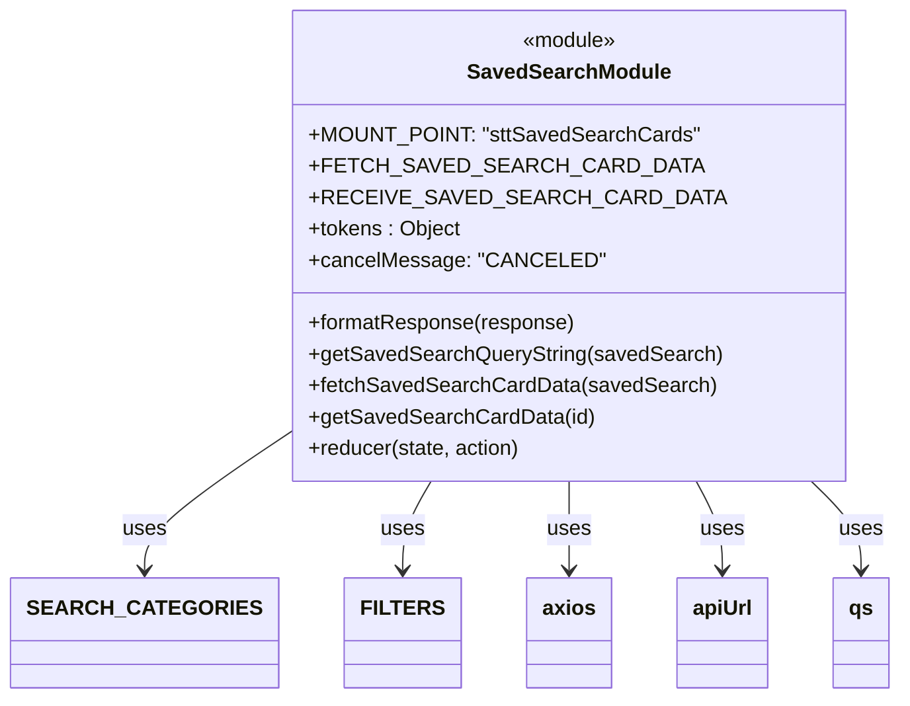

# Diagram: web/portal/src/pages/surgicaltotetracking/redux/SurgicalToteTrackingSavedSearchCardsState.js


> Auto-generated by Obscura crawlers

## Diagram 1



### SVG

<svg id="container" width="643.65625" xmlns="http://www.w3.org/2000/svg" class="classDiagram" height="534" viewBox="0 0 643.65625 534" role="graphics-document document" aria-roledescription="class"><style>#container{font-family:"trebuchet ms",verdana,arial,sans-serif;font-size:16px;fill:#333;}@keyframes edge-animation-frame{from{stroke-dashoffset:0;}}@keyframes dash{to{stroke-dashoffset:0;}}#container .edge-animation-slow{stroke-dasharray:9,5!important;stroke-dashoffset:900;animation:dash 50s linear infinite;stroke-linecap:round;}#container .edge-animation-fast{stroke-dasharray:9,5!important;stroke-dashoffset:900;animation:dash 20s linear infinite;stroke-linecap:round;}#container .error-icon{fill:#552222;}#container .error-text{fill:#552222;stroke:#552222;}#container .edge-thickness-normal{stroke-width:1px;}#container .edge-thickness-thick{stroke-width:3.5px;}#container .edge-pattern-solid{stroke-dasharray:0;}#container .edge-thickness-invisible{stroke-width:0;fill:none;}#container .edge-pattern-dashed{stroke-dasharray:3;}#container .edge-pattern-dotted{stroke-dasharray:2;}#container .marker{fill:#333333;stroke:#333333;}#container .marker.cross{stroke:#333333;}#container svg{font-family:"trebuchet ms",verdana,arial,sans-serif;font-size:16px;}#container p{margin:0;}#container g.classGroup text{fill:#9370DB;stroke:none;font-family:"trebuchet ms",verdana,arial,sans-serif;font-size:10px;}#container g.classGroup text .title{font-weight:bolder;}#container .nodeLabel,#container .edgeLabel{color:#131300;}#container .edgeLabel .label rect{fill:#ECECFF;}#container .label text{fill:#131300;}#container .labelBkg{background:#ECECFF;}#container .edgeLabel .label span{background:#ECECFF;}#container .classTitle{font-weight:bolder;}#container .node rect,#container .node circle,#container .node ellipse,#container .node polygon,#container .node path{fill:#ECECFF;stroke:#9370DB;stroke-width:1px;}#container .divider{stroke:#9370DB;stroke-width:1;}#container g.clickable{cursor:pointer;}#container g.classGroup rect{fill:#ECECFF;stroke:#9370DB;}#container g.classGroup line{stroke:#9370DB;stroke-width:1;}#container .classLabel .box{stroke:none;stroke-width:0;fill:#ECECFF;opacity:0.5;}#container .classLabel .label{fill:#9370DB;font-size:10px;}#container .relation{stroke:#333333;stroke-width:1;fill:none;}#container .dashed-line{stroke-dasharray:3;}#container .dotted-line{stroke-dasharray:1 2;}#container #compositionStart,#container .composition{fill:#333333!important;stroke:#333333!important;stroke-width:1;}#container #compositionEnd,#container .composition{fill:#333333!important;stroke:#333333!important;stroke-width:1;}#container #dependencyStart,#container .dependency{fill:#333333!important;stroke:#333333!important;stroke-width:1;}#container #dependencyStart,#container .dependency{fill:#333333!important;stroke:#333333!important;stroke-width:1;}#container #extensionStart,#container .extension{fill:transparent!important;stroke:#333333!important;stroke-width:1;}#container #extensionEnd,#container .extension{fill:transparent!important;stroke:#333333!important;stroke-width:1;}#container #aggregationStart,#container .aggregation{fill:transparent!important;stroke:#333333!important;stroke-width:1;}#container #aggregationEnd,#container .aggregation{fill:transparent!important;stroke:#333333!important;stroke-width:1;}#container #lollipopStart,#container .lollipop{fill:#ECECFF!important;stroke:#333333!important;stroke-width:1;}#container #lollipopEnd,#container .lollipop{fill:#ECECFF!important;stroke:#333333!important;stroke-width:1;}#container .edgeTerminals{font-size:11px;line-height:initial;}#container .classTitleText{text-anchor:middle;font-size:18px;fill:#333;}#container .label-icon{display:inline-block;height:1em;overflow:visible;vertical-align:-0.125em;}#container .node .label-icon path{fill:currentColor;stroke:revert;stroke-width:revert;}#container :root{--mermaid-font-family:"trebuchet ms",verdana,arial,sans-serif;}</style><g><defs><marker id="container_class-aggregationStart" class="marker aggregation class" refX="18" refY="7" markerWidth="190" markerHeight="240" orient="auto"><path d="M 18,7 L9,13 L1,7 L9,1 Z"></path></marker></defs><defs><marker id="container_class-aggregationEnd" class="marker aggregation class" refX="1" refY="7" markerWidth="20" markerHeight="28" orient="auto"><path d="M 18,7 L9,13 L1,7 L9,1 Z"></path></marker></defs><defs><marker id="container_class-extensionStart" class="marker extension class" refX="18" refY="7" markerWidth="190" markerHeight="240" orient="auto"><path d="M 1,7 L18,13 V 1 Z"></path></marker></defs><defs><marker id="container_class-extensionEnd" class="marker extension class" refX="1" refY="7" markerWidth="20" markerHeight="28" orient="auto"><path d="M 1,1 V 13 L18,7 Z"></path></marker></defs><defs><marker id="container_class-compositionStart" class="marker composition class" refX="18" refY="7" markerWidth="190" markerHeight="240" orient="auto"><path d="M 18,7 L9,13 L1,7 L9,1 Z"></path></marker></defs><defs><marker id="container_class-compositionEnd" class="marker composition class" refX="1" refY="7" markerWidth="20" markerHeight="28" orient="auto"><path d="M 18,7 L9,13 L1,7 L9,1 Z"></path></marker></defs><defs><marker id="container_class-dependencyStart" class="marker dependency class" refX="6" refY="7" markerWidth="190" markerHeight="240" orient="auto"><path d="M 5,7 L9,13 L1,7 L9,1 Z"></path></marker></defs><defs><marker id="container_class-dependencyEnd" class="marker dependency class" refX="13" refY="7" markerWidth="20" markerHeight="28" orient="auto"><path d="M 18,7 L9,13 L14,7 L9,1 Z"></path></marker></defs><defs><marker id="container_class-lollipopStart" class="marker lollipop class" refX="13" refY="7" markerWidth="190" markerHeight="240" orient="auto"><circle stroke="black" fill="transparent" cx="7" cy="7" r="6"></circle></marker></defs><defs><marker id="container_class-lollipopEnd" class="marker lollipop class" refX="1" refY="7" markerWidth="190" markerHeight="240" orient="auto"><circle stroke="black" fill="transparent" cx="7" cy="7" r="6"></circle></marker></defs><g class="root"><g class="clusters"></g><g class="edgePaths"><path d="M190.934,336.075L175.131,347.563C159.328,359.05,127.723,382.025,111.92,398.679C96.117,415.333,96.117,425.667,96.117,430.833L96.117,436" id="id_SavedSearchModule_SEARCH_CATEGORIES_1" class="edge-thickness-normal edge-pattern-solid relation" style=";;;" data-edge="true" data-et="edge" data-id="id_SavedSearchModule_SEARCH_CATEGORIES_1" data-points="W3sieCI6MTkwLjkzMzU5Mzc1LCJ5IjozMzYuMDc1MDk4MTQxODQ3NjZ9LHsieCI6OTYuMTE3MTg3NSwieSI6NDA1fSx7IngiOjk2LjExNzE4NzUsInkiOjQ0Mn1d" marker-end="url(#container_class-dependencyEnd)"></path><path d="M294.4,368L290.966,374.167C287.532,380.333,280.665,392.667,277.231,404C273.797,415.333,273.797,425.667,273.797,430.833L273.797,436" id="id_SavedSearchModule_FILTERS_2" class="edge-thickness-normal edge-pattern-solid relation" style=";;;" data-edge="true" data-et="edge" data-id="id_SavedSearchModule_FILTERS_2" data-points="W3sieCI6Mjk0LjQwMDIzNzYxNTIwNzQsInkiOjM2OH0seyJ4IjoyNzMuNzk2ODc1LCJ5Ijo0MDV9LHsieCI6MjczLjc5Njg3NSwieSI6NDQyfV0=" marker-end="url(#container_class-dependencyEnd)"></path><path d="M394.633,368L394.633,374.167C394.633,380.333,394.633,392.667,394.633,404C394.633,415.333,394.633,425.667,394.633,430.833L394.633,436" id="id_SavedSearchModule_axios_3" class="edge-thickness-normal edge-pattern-solid relation" style=";;;" data-edge="true" data-et="edge" data-id="id_SavedSearchModule_axios_3" data-points="W3sieCI6Mzk0LjYzMjgxMjUsInkiOjM2OH0seyJ4IjozOTQuNjMyODEyNSwieSI6NDA1fSx7IngiOjM5NC42MzI4MTI1LCJ5Ijo0NDJ9XQ==" marker-end="url(#container_class-dependencyEnd)"></path><path d="M490.426,368L493.708,374.167C496.99,380.333,503.554,392.667,506.835,404C510.117,415.333,510.117,425.667,510.117,430.833L510.117,436" id="id_SavedSearchModule_apiUrl_4" class="edge-thickness-normal edge-pattern-solid relation" style=";;;" data-edge="true" data-et="edge" data-id="id_SavedSearchModule_apiUrl_4" data-points="W3sieCI6NDkwLjQyNjMwMzI4MzQxMDEsInkiOjM2OH0seyJ4Ijo1MTAuMTE3MTg3NSwieSI6NDA1fSx7IngiOjUxMC4xMTcxODc1LCJ5Ijo0NDJ9XQ==" marker-end="url(#container_class-dependencyEnd)"></path><path d="M577.419,368L583.682,374.167C589.944,380.333,602.468,392.667,608.73,404C614.992,415.333,614.992,425.667,614.992,430.833L614.992,436" id="id_SavedSearchModule_qs_5" class="edge-thickness-normal edge-pattern-solid relation" style=";;;" data-edge="true" data-et="edge" data-id="id_SavedSearchModule_qs_5" data-points="W3sieCI6NTc3LjQxOTM5MDg0MTAxMzksInkiOjM2OH0seyJ4Ijo2MTQuOTkyMTg3NSwieSI6NDA1fSx7IngiOjYxNC45OTIxODc1LCJ5Ijo0NDJ9XQ==" marker-end="url(#container_class-dependencyEnd)"></path></g><g class="edgeLabels"><g class="edgeLabel" transform="translate(96.1171875, 405)"><g class="label" data-id="id_SavedSearchModule_SEARCH_CATEGORIES_1" transform="translate(-16.4921875, -12)"><foreignObject width="32.984375" height="24"><div xmlns="http://www.w3.org/1999/xhtml" class="labelBkg" style="display: table-cell; white-space: nowrap; line-height: 1.5; max-width: 200px; text-align: center;"><span class="edgeLabel"><p>uses</p></span></div></foreignObject></g></g><g class="edgeLabel" transform="translate(273.796875, 405)"><g class="label" data-id="id_SavedSearchModule_FILTERS_2" transform="translate(-16.4921875, -12)"><foreignObject width="32.984375" height="24"><div xmlns="http://www.w3.org/1999/xhtml" class="labelBkg" style="display: table-cell; white-space: nowrap; line-height: 1.5; max-width: 200px; text-align: center;"><span class="edgeLabel"><p>uses</p></span></div></foreignObject></g></g><g class="edgeLabel" transform="translate(394.6328125, 405)"><g class="label" data-id="id_SavedSearchModule_axios_3" transform="translate(-16.4921875, -12)"><foreignObject width="32.984375" height="24"><div xmlns="http://www.w3.org/1999/xhtml" class="labelBkg" style="display: table-cell; white-space: nowrap; line-height: 1.5; max-width: 200px; text-align: center;"><span class="edgeLabel"><p>uses</p></span></div></foreignObject></g></g><g class="edgeLabel" transform="translate(510.1171875, 405)"><g class="label" data-id="id_SavedSearchModule_apiUrl_4" transform="translate(-16.4921875, -12)"><foreignObject width="32.984375" height="24"><div xmlns="http://www.w3.org/1999/xhtml" class="labelBkg" style="display: table-cell; white-space: nowrap; line-height: 1.5; max-width: 200px; text-align: center;"><span class="edgeLabel"><p>uses</p></span></div></foreignObject></g></g><g class="edgeLabel" transform="translate(614.9921875, 405)"><g class="label" data-id="id_SavedSearchModule_qs_5" transform="translate(-16.4921875, -12)"><foreignObject width="32.984375" height="24"><div xmlns="http://www.w3.org/1999/xhtml" class="labelBkg" style="display: table-cell; white-space: nowrap; line-height: 1.5; max-width: 200px; text-align: center;"><span class="edgeLabel"><p>uses</p></span></div></foreignObject></g></g></g><g class="nodes"><g class="node default" id="classId-SavedSearchModule-0" transform="translate(394.6328125, 188)"><g class="basic label-container"><path d="M-203.69921875 -180 L203.69921875 -180 L203.69921875 180 L-203.69921875 180" stroke="none" stroke-width="0" fill="#ECECFF" style=""></path><path d="M-203.69921875 -180 C-53.920637605592674 -180, 95.85794353881465 -180, 203.69921875 -180 M-203.69921875 -180 C-65.61883080131327 -180, 72.46155714737347 -180, 203.69921875 -180 M203.69921875 -180 C203.69921875 -42.43969719077094, 203.69921875 95.12060561845811, 203.69921875 180 M203.69921875 -180 C203.69921875 -102.25881061215368, 203.69921875 -24.517621224307362, 203.69921875 180 M203.69921875 180 C60.205605800617235 180, -83.28800714876553 180, -203.69921875 180 M203.69921875 180 C60.001208716085216 180, -83.69680131782957 180, -203.69921875 180 M-203.69921875 180 C-203.69921875 37.83813613338896, -203.69921875 -104.32372773322209, -203.69921875 -180 M-203.69921875 180 C-203.69921875 87.49996660952894, -203.69921875 -5.00006678094212, -203.69921875 -180" stroke="#9370DB" stroke-width="1.3" fill="none" stroke-dasharray="0 0" style=""></path></g><g class="annotation-group text" transform="translate(-36.6015625, -156)"><g class="label" style="" transform="translate(0,-12)"><foreignObject width="73.203125" height="24"><div xmlns="http://www.w3.org/1999/xhtml" style="display: table-cell; white-space: nowrap; line-height: 1.5; max-width: 123px; text-align: center;"><span class="nodeLabel markdown-node-label" style=""><p>«module»</p></span></div></foreignObject></g></g><g class="label-group text" transform="translate(-73.8984375, -132)"><g class="label" style="font-weight: bolder" transform="translate(0,-12)"><foreignObject width="147.796875" height="24"><div xmlns="http://www.w3.org/1999/xhtml" style="display: table-cell; white-space: nowrap; line-height: 1.5; max-width: 196px; text-align: center;"><span class="nodeLabel markdown-node-label" style=""><p>SavedSearchModule</p></span></div></foreignObject></g></g><g class="members-group text" transform="translate(-191.69921875, -84)"><g class="label" style="" transform="translate(0,-12)"><foreignObject width="284.015625" height="24"><div xmlns="http://www.w3.org/1999/xhtml" style="display: table-cell; white-space: nowrap; line-height: 1.5; max-width: 341px; text-align: center;"><span class="nodeLabel markdown-node-label" style=""><p>+MOUNT_POINT: "sttSavedSearchCards"</p></span></div></foreignObject></g><g class="label" style="" transform="translate(0,12)"><foreignObject width="257.109375" height="24"><div xmlns="http://www.w3.org/1999/xhtml" style="display: table-cell; white-space: nowrap; line-height: 1.5; max-width: 315px; text-align: center;"><span class="nodeLabel markdown-node-label" style=""><p>+FETCH_SAVED_SEARCH_CARD_DATA</p></span></div></foreignObject></g><g class="label" style="" transform="translate(0,36)"><foreignObject width="270.890625" height="24"><div xmlns="http://www.w3.org/1999/xhtml" style="display: table-cell; white-space: nowrap; line-height: 1.5; max-width: 329px; text-align: center;"><span class="nodeLabel markdown-node-label" style=""><p>+RECEIVE_SAVED_SEARCH_CARD_DATA</p></span></div></foreignObject></g><g class="label" style="" transform="translate(0,60)"><foreignObject width="115.921875" height="24"><div xmlns="http://www.w3.org/1999/xhtml" style="display: table-cell; white-space: nowrap; line-height: 1.5; max-width: 174px; text-align: center;"><span class="nodeLabel markdown-node-label" style=""><p>+tokens : Object</p></span></div></foreignObject></g><g class="label" style="" transform="translate(0,84)"><foreignObject width="209.671875" height="24"><div xmlns="http://www.w3.org/1999/xhtml" style="display: table-cell; white-space: nowrap; line-height: 1.5; max-width: 267px; text-align: center;"><span class="nodeLabel markdown-node-label" style=""><p>+cancelMessage: "CANCELED"</p></span></div></foreignObject></g></g><g class="methods-group text" transform="translate(-191.69921875, 60)"><g class="label" style="" transform="translate(0,-12)"><foreignObject width="203.390625" height="24"><div xmlns="http://www.w3.org/1999/xhtml" style="display: table-cell; white-space: nowrap; line-height: 1.5; max-width: 261px; text-align: center;"><span class="nodeLabel markdown-node-label" style=""><p>+formatResponse(response)</p></span></div></foreignObject></g><g class="label" style="" transform="translate(0,12)"><foreignObject width="309.5" height="24"><div xmlns="http://www.w3.org/1999/xhtml" style="display: table-cell; white-space: nowrap; line-height: 1.5; max-width: 367px; text-align: center;"><span class="nodeLabel markdown-node-label" style=""><p>+getSavedSearchQueryString(savedSearch)</p></span></div></foreignObject></g><g class="label" style="" transform="translate(0,36)"><foreignObject width="303.140625" height="24"><div xmlns="http://www.w3.org/1999/xhtml" style="display: table-cell; white-space: nowrap; line-height: 1.5; max-width: 361px; text-align: center;"><span class="nodeLabel markdown-node-label" style=""><p>+fetchSavedSearchCardData(savedSearch)</p></span></div></foreignObject></g><g class="label" style="" transform="translate(0,60)"><foreignObject width="212.96875" height="24"><div xmlns="http://www.w3.org/1999/xhtml" style="display: table-cell; white-space: nowrap; line-height: 1.5; max-width: 270px; text-align: center;"><span class="nodeLabel markdown-node-label" style=""><p>+getSavedSearchCardData(id)</p></span></div></foreignObject></g><g class="label" style="" transform="translate(0,84)"><foreignObject width="163.25" height="24"><div xmlns="http://www.w3.org/1999/xhtml" style="display: table-cell; white-space: nowrap; line-height: 1.5; max-width: 221px; text-align: center;"><span class="nodeLabel markdown-node-label" style=""><p>+reducer(state, action)</p></span></div></foreignObject></g></g><g class="divider" style=""><path d="M-203.69921875 -108 C-116.22625279409375 -108, -28.753286838187506 -108, 203.69921875 -108 M-203.69921875 -108 C-73.82301345658618 -108, 56.05319183682764 -108, 203.69921875 -108" stroke="#9370DB" stroke-width="1.3" fill="none" stroke-dasharray="0 0" style=""></path></g><g class="divider" style=""><path d="M-203.69921875 36 C-112.71348450925197 36, -21.72775026850394 36, 203.69921875 36 M-203.69921875 36 C-90.0166662538906 36, 23.66588624221879 36, 203.69921875 36" stroke="#9370DB" stroke-width="1.3" fill="none" stroke-dasharray="0 0" style=""></path></g></g><g class="node default" id="classId-SEARCH_CATEGORIES-1" transform="translate(96.1171875, 484)"><g class="basic label-container"><path d="M-88.1171875 -42 L88.1171875 -42 L88.1171875 42 L-88.1171875 42" stroke="none" stroke-width="0" fill="#ECECFF" style=""></path><path d="M-88.1171875 -42 C-45.990084482475034 -42, -3.8629814649500673 -42, 88.1171875 -42 M-88.1171875 -42 C-26.83378332334462 -42, 34.44962085331076 -42, 88.1171875 -42 M88.1171875 -42 C88.1171875 -20.77377841995803, 88.1171875 0.4524431600839378, 88.1171875 42 M88.1171875 -42 C88.1171875 -10.2812308618098, 88.1171875 21.4375382763804, 88.1171875 42 M88.1171875 42 C52.05046037652274 42, 15.983733253045486 42, -88.1171875 42 M88.1171875 42 C36.01164858687356 42, -16.093890326252875 42, -88.1171875 42 M-88.1171875 42 C-88.1171875 15.59353714160494, -88.1171875 -10.812925716790119, -88.1171875 -42 M-88.1171875 42 C-88.1171875 8.844924366625897, -88.1171875 -24.310151266748207, -88.1171875 -42" stroke="#9370DB" stroke-width="1.3" fill="none" stroke-dasharray="0 0" style=""></path></g><g class="annotation-group text" transform="translate(0, -18)"></g><g class="label-group text" transform="translate(-76.1171875, -18)"><g class="label" style="font-weight: bolder" transform="translate(0,-12)"><foreignObject width="152.234375" height="24"><div xmlns="http://www.w3.org/1999/xhtml" style="display: table-cell; white-space: nowrap; line-height: 1.5; max-width: 200px; text-align: center;"><span class="nodeLabel markdown-node-label" style=""><p>SEARCH_CATEGORIES</p></span></div></foreignObject></g></g><g class="members-group text" transform="translate(-76.1171875, 30)"></g><g class="methods-group text" transform="translate(-76.1171875, 60)"></g><g class="divider" style=""><path d="M-88.1171875 6 C-30.112012470426684 6, 27.89316255914663 6, 88.1171875 6 M-88.1171875 6 C-24.648606832472716 6, 38.81997383505457 6, 88.1171875 6" stroke="#9370DB" stroke-width="1.3" fill="none" stroke-dasharray="0 0" style=""></path></g><g class="divider" style=""><path d="M-88.1171875 24 C-45.72086867858267 24, -3.324549857165337 24, 88.1171875 24 M-88.1171875 24 C-22.497942313718198 24, 43.121302872563604 24, 88.1171875 24" stroke="#9370DB" stroke-width="1.3" fill="none" stroke-dasharray="0 0" style=""></path></g></g><g class="node default" id="classId-FILTERS-2" transform="translate(273.796875, 484)"><g class="basic label-container"><path d="M-39.5625 -42 L39.5625 -42 L39.5625 42 L-39.5625 42" stroke="none" stroke-width="0" fill="#ECECFF" style=""></path><path d="M-39.5625 -42 C-22.167759956647558 -42, -4.773019913295116 -42, 39.5625 -42 M-39.5625 -42 C-14.264886777845902 -42, 11.032726444308196 -42, 39.5625 -42 M39.5625 -42 C39.5625 -10.62518597657024, 39.5625 20.74962804685952, 39.5625 42 M39.5625 -42 C39.5625 -24.407940161041655, 39.5625 -6.815880322083309, 39.5625 42 M39.5625 42 C17.332290608213796 42, -4.897918783572408 42, -39.5625 42 M39.5625 42 C22.53981165122333 42, 5.517123302446663 42, -39.5625 42 M-39.5625 42 C-39.5625 22.067572789882767, -39.5625 2.1351455797655348, -39.5625 -42 M-39.5625 42 C-39.5625 25.180036762933852, -39.5625 8.360073525867705, -39.5625 -42" stroke="#9370DB" stroke-width="1.3" fill="none" stroke-dasharray="0 0" style=""></path></g><g class="annotation-group text" transform="translate(0, -18)"></g><g class="label-group text" transform="translate(-27.5625, -18)"><g class="label" style="font-weight: bolder" transform="translate(0,-12)"><foreignObject width="55.125" height="24"><div xmlns="http://www.w3.org/1999/xhtml" style="display: table-cell; white-space: nowrap; line-height: 1.5; max-width: 105px; text-align: center;"><span class="nodeLabel markdown-node-label" style=""><p>FILTERS</p></span></div></foreignObject></g></g><g class="members-group text" transform="translate(-27.5625, 30)"></g><g class="methods-group text" transform="translate(-27.5625, 60)"></g><g class="divider" style=""><path d="M-39.5625 6 C-9.779301732721063 6, 20.003896534557875 6, 39.5625 6 M-39.5625 6 C-18.422247328803984 6, 2.7180053423920327 6, 39.5625 6" stroke="#9370DB" stroke-width="1.3" fill="none" stroke-dasharray="0 0" style=""></path></g><g class="divider" style=""><path d="M-39.5625 24 C-18.109806337709617 24, 3.342887324580765 24, 39.5625 24 M-39.5625 24 C-8.68912107778102 24, 22.18425784443796 24, 39.5625 24" stroke="#9370DB" stroke-width="1.3" fill="none" stroke-dasharray="0 0" style=""></path></g></g><g class="node default" id="classId-axios-3" transform="translate(394.6328125, 484)"><g class="basic label-container"><path d="M-31.2734375 -42 L31.2734375 -42 L31.2734375 42 L-31.2734375 42" stroke="none" stroke-width="0" fill="#ECECFF" style=""></path><path d="M-31.2734375 -42 C-13.723334739575389 -42, 3.8267680208492223 -42, 31.2734375 -42 M-31.2734375 -42 C-10.653341085602381 -42, 9.966755328795237 -42, 31.2734375 -42 M31.2734375 -42 C31.2734375 -22.305911439697624, 31.2734375 -2.6118228793952483, 31.2734375 42 M31.2734375 -42 C31.2734375 -15.745371133722728, 31.2734375 10.509257732554545, 31.2734375 42 M31.2734375 42 C9.209718379181371 42, -12.854000741637257 42, -31.2734375 42 M31.2734375 42 C8.964269689978455 42, -13.34489812004309 42, -31.2734375 42 M-31.2734375 42 C-31.2734375 14.861609261252053, -31.2734375 -12.276781477495895, -31.2734375 -42 M-31.2734375 42 C-31.2734375 14.084406403840298, -31.2734375 -13.831187192319405, -31.2734375 -42" stroke="#9370DB" stroke-width="1.3" fill="none" stroke-dasharray="0 0" style=""></path></g><g class="annotation-group text" transform="translate(0, -18)"></g><g class="label-group text" transform="translate(-19.2734375, -18)"><g class="label" style="font-weight: bolder" transform="translate(0,-12)"><foreignObject width="38.546875" height="24"><div xmlns="http://www.w3.org/1999/xhtml" style="display: table-cell; white-space: nowrap; line-height: 1.5; max-width: 88px; text-align: center;"><span class="nodeLabel markdown-node-label" style=""><p>axios</p></span></div></foreignObject></g></g><g class="members-group text" transform="translate(-19.2734375, 30)"></g><g class="methods-group text" transform="translate(-19.2734375, 60)"></g><g class="divider" style=""><path d="M-31.2734375 6 C-15.17863226611924 6, 0.9161729677615185 6, 31.2734375 6 M-31.2734375 6 C-8.076087110465732 6, 15.121263279068536 6, 31.2734375 6" stroke="#9370DB" stroke-width="1.3" fill="none" stroke-dasharray="0 0" style=""></path></g><g class="divider" style=""><path d="M-31.2734375 24 C-6.645684886489292 24, 17.982067727021416 24, 31.2734375 24 M-31.2734375 24 C-12.907647076282085 24, 5.458143347435829 24, 31.2734375 24" stroke="#9370DB" stroke-width="1.3" fill="none" stroke-dasharray="0 0" style=""></path></g></g><g class="node default" id="classId-apiUrl-4" transform="translate(510.1171875, 484)"><g class="basic label-container"><path d="M-34.2109375 -42 L34.2109375 -42 L34.2109375 42 L-34.2109375 42" stroke="none" stroke-width="0" fill="#ECECFF" style=""></path><path d="M-34.2109375 -42 C-17.6196029324277 -42, -1.0282683648553999 -42, 34.2109375 -42 M-34.2109375 -42 C-7.828783399226818 -42, 18.553370701546363 -42, 34.2109375 -42 M34.2109375 -42 C34.2109375 -24.36311627884405, 34.2109375 -6.7262325576881, 34.2109375 42 M34.2109375 -42 C34.2109375 -14.842189329470123, 34.2109375 12.315621341059753, 34.2109375 42 M34.2109375 42 C18.891677632505868 42, 3.572417765011739 42, -34.2109375 42 M34.2109375 42 C17.111976869522756 42, 0.013016239045512634 42, -34.2109375 42 M-34.2109375 42 C-34.2109375 12.136802974632474, -34.2109375 -17.726394050735053, -34.2109375 -42 M-34.2109375 42 C-34.2109375 15.442954073858353, -34.2109375 -11.114091852283295, -34.2109375 -42" stroke="#9370DB" stroke-width="1.3" fill="none" stroke-dasharray="0 0" style=""></path></g><g class="annotation-group text" transform="translate(0, -18)"></g><g class="label-group text" transform="translate(-22.2109375, -18)"><g class="label" style="font-weight: bolder" transform="translate(0,-12)"><foreignObject width="44.421875" height="24"><div xmlns="http://www.w3.org/1999/xhtml" style="display: table-cell; white-space: nowrap; line-height: 1.5; max-width: 94px; text-align: center;"><span class="nodeLabel markdown-node-label" style=""><p>apiUrl</p></span></div></foreignObject></g></g><g class="members-group text" transform="translate(-22.2109375, 30)"></g><g class="methods-group text" transform="translate(-22.2109375, 60)"></g><g class="divider" style=""><path d="M-34.2109375 6 C-14.32707787998271 6, 5.55678174003458 6, 34.2109375 6 M-34.2109375 6 C-15.990016411252594 6, 2.230904677494813 6, 34.2109375 6" stroke="#9370DB" stroke-width="1.3" fill="none" stroke-dasharray="0 0" style=""></path></g><g class="divider" style=""><path d="M-34.2109375 24 C-19.745424159527285 24, -5.279910819054571 24, 34.2109375 24 M-34.2109375 24 C-15.324085582352772 24, 3.562766335294455 24, 34.2109375 24" stroke="#9370DB" stroke-width="1.3" fill="none" stroke-dasharray="0 0" style=""></path></g></g><g class="node default" id="classId-qs-5" transform="translate(614.9921875, 484)"><g class="basic label-container"><path d="M-20.6640625 -42 L20.6640625 -42 L20.6640625 42 L-20.6640625 42" stroke="none" stroke-width="0" fill="#ECECFF" style=""></path><path d="M-20.6640625 -42 C-5.574893029702478 -42, 9.514276440595044 -42, 20.6640625 -42 M-20.6640625 -42 C-4.5734923954621145 -42, 11.517077709075771 -42, 20.6640625 -42 M20.6640625 -42 C20.6640625 -10.843170945763493, 20.6640625 20.313658108473014, 20.6640625 42 M20.6640625 -42 C20.6640625 -10.466893114038264, 20.6640625 21.066213771923472, 20.6640625 42 M20.6640625 42 C7.021802215026959 42, -6.620458069946082 42, -20.6640625 42 M20.6640625 42 C4.79649204249294 42, -11.07107841501412 42, -20.6640625 42 M-20.6640625 42 C-20.6640625 13.069698799256422, -20.6640625 -15.860602401487156, -20.6640625 -42 M-20.6640625 42 C-20.6640625 21.239182209848867, -20.6640625 0.47836441969773347, -20.6640625 -42" stroke="#9370DB" stroke-width="1.3" fill="none" stroke-dasharray="0 0" style=""></path></g><g class="annotation-group text" transform="translate(0, -18)"></g><g class="label-group text" transform="translate(-8.6640625, -18)"><g class="label" style="font-weight: bolder" transform="translate(0,-12)"><foreignObject width="17.328125" height="24"><div xmlns="http://www.w3.org/1999/xhtml" style="display: table-cell; white-space: nowrap; line-height: 1.5; max-width: 67px; text-align: center;"><span class="nodeLabel markdown-node-label" style=""><p>qs</p></span></div></foreignObject></g></g><g class="members-group text" transform="translate(-8.6640625, 30)"></g><g class="methods-group text" transform="translate(-8.6640625, 60)"></g><g class="divider" style=""><path d="M-20.6640625 6 C-4.561163717604458 6, 11.541735064791084 6, 20.6640625 6 M-20.6640625 6 C-4.276827758094633 6, 12.110406983810734 6, 20.6640625 6" stroke="#9370DB" stroke-width="1.3" fill="none" stroke-dasharray="0 0" style=""></path></g><g class="divider" style=""><path d="M-20.6640625 24 C-7.437271430764275 24, 5.78951963847145 24, 20.6640625 24 M-20.6640625 24 C-5.184414115643381 24, 10.295234268713237 24, 20.6640625 24" stroke="#9370DB" stroke-width="1.3" fill="none" stroke-dasharray="0 0" style=""></path></g></g></g></g></g></svg>

## Diagram 2

```mermaid
flowchart TD
  A[fetchSavedSearchCardData(savedSearch) called] --> B{tokens[savedSearch.id] exists?}
  B -- yes --> C[cancel previous tokens[savedSearch.id].cancelRequest("CANCELED")]
  B -- no --> D[noop]
  C --> E[reset tokens[savedSearch.id] = {}]
  D --> E
  E --> F[dispatch FETCH_SAVED_SEARCH_CARD_DATA]
  F --> G[clone savedSearch -> clonedSavedSearch]
  G --> H{clonedSavedSearch.search.batch ?}
  H -- true --> I[isBatch = true; params.batchType set]
  H -- false --> J[isBatch = false]
  I --> K[params = qs.parse(getSavedSearchQueryString(clonedSavedSearch))]
  J --> K
  K --> L[queryString = qs.stringify(params)]
  L --> M{isBatch ? POST : GET}
  M -- POST --> N[axios request with method POST, body batch_list, headers, cancelToken]
  M -- GET --> O[axios request with method GET, queryString, headers, cancelToken]
  N --> P[request.then -> dispatch RECEIVE_SAVED_SEARCH_CARD_DATA with formatResponse(response)]
  O --> P
  P --> Q[request.catch -> if error.message !== "CANCELED" then console.log(error)]
  Q --> R[return promise]
```

> SVG rendering failed for this diagram.
