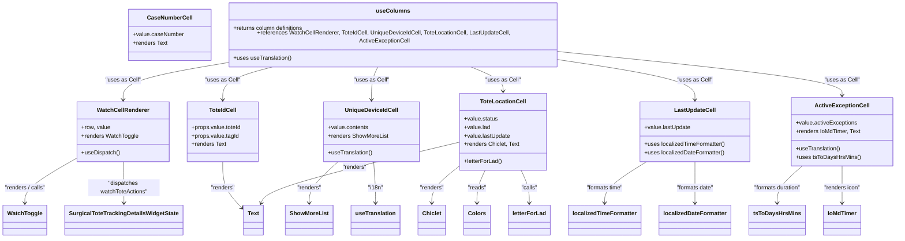

# Diagram: web/portal/src/pages/surgicaltotetracking/search/SurgicalToteTracking.Search.columns.js

> Auto-generated by Obscura crawlers

## Mermaid

### SVG

<svg id="container" width="2437.287109375" xmlns="http://www.w3.org/2000/svg" class="classDiagram" height="656" viewBox="0 0 2437.287109375 656" role="graphics-document document" aria-roledescription="class"><g><defs><marker id="container_class-aggregationStart" class="marker aggregation class" refX="18" refY="7" markerWidth="190" markerHeight="240" orient="auto"><path d="M 18,7 L9,13 L1,7 L9,1 Z"></path></marker></defs><defs><marker id="container_class-aggregationEnd" class="marker aggregation class" refX="1" refY="7" markerWidth="20" markerHeight="28" orient="auto"><path d="M 18,7 L9,13 L1,7 L9,1 Z"></path></marker></defs><defs><marker id="container_class-extensionStart" class="marker extension class" refX="18" refY="7" markerWidth="190" markerHeight="240" orient="auto"><path d="M 1,7 L18,13 V 1 Z"></path></marker></defs><defs><marker id="container_class-extensionEnd" class="marker extension class" refX="1" refY="7" markerWidth="20" markerHeight="28" orient="auto"><path d="M 1,1 V 13 L18,7 Z"></path></marker></defs><defs><marker id="container_class-compositionStart" class="marker composition class" refX="18" refY="7" markerWidth="190" markerHeight="240" orient="auto"><path d="M 18,7 L9,13 L1,7 L9,1 Z"></path></marker></defs><defs><marker id="container_class-compositionEnd" class="marker composition class" refX="1" refY="7" markerWidth="20" markerHeight="28" orient="auto"><path d="M 18,7 L9,13 L1,7 L9,1 Z"></path></marker></defs><defs><marker id="container_class-dependencyStart" class="marker dependency class" refX="6" refY="7" markerWidth="190" markerHeight="240" orient="auto"><path d="M 5,7 L9,13 L1,7 L9,1 Z"></path></marker></defs><defs><marker id="container_class-dependencyEnd" class="marker dependency class" refX="13" refY="7" markerWidth="20" markerHeight="28" orient="auto"><path d="M 18,7 L9,13 L14,7 L9,1 Z"></path></marker></defs><defs><marker id="container_class-lollipopStart" class="marker lollipop class" refX="13" refY="7" markerWidth="190" markerHeight="240" orient="auto"><circle stroke="black" fill="transparent" cx="7" cy="7" r="6"></circle></marker></defs><defs><marker id="container_class-lollipopEnd" class="marker lollipop class" refX="1" refY="7" markerWidth="190" markerHeight="240" orient="auto"><circle stroke="black" fill="transparent" cx="7" cy="7" r="6"></circle></marker></defs><g class="root"><g class="clusters"></g><g class="edgePaths"><path d="M201.115,434.008L178.738,447.506C156.361,461.005,111.606,488.003,89.229,508.668C66.852,529.333,66.852,543.667,66.852,550.833L66.852,558" id="id_WatchCellRenderer_WatchToggle_1" class="edge-thickness-normal edge-pattern-solid relation" style=";;;" data-edge="true" data-et="edge" data-id="id_WatchCellRenderer_WatchToggle_1" data-points="W3sieCI6MjAxLjExNTIzNDM3NSwieSI6NDM0LjAwNzUzNDQyNjQ3NTU2fSx7IngiOjY2Ljg1MTU2MjUsInkiOjUxNX0seyJ4Ijo2Ni44NTE1NjI1LCJ5Ijo1NjR9XQ==" marker-end="url(#container_class-dependencyEnd)"></path><path d="M330.724,442L331.246,454.167C331.769,466.333,332.814,490.667,333.337,510C333.859,529.333,333.859,543.667,333.859,550.833L333.859,558" id="id_WatchCellRenderer_SurgicalToteTrackingDetailsWidgetState_2" class="edge-thickness-normal edge-pattern-solid relation" style=";;;" data-edge="true" data-et="edge" data-id="id_WatchCellRenderer_SurgicalToteTrackingDetailsWidgetState_2" data-points="W3sieCI6MzMwLjcyMzU2NDM5MDkyMzU3LCJ5Ijo0NDJ9LHsieCI6MzMzLjg1OTM3NSwieSI6NTE1fSx7IngiOjMzMy44NTkzNzUsInkiOjU2NH1d" marker-end="url(#container_class-dependencyEnd)"></path><path d="M602.561,442L602.561,454.167C602.561,466.333,602.561,490.667,611.973,512.564C621.386,534.46,640.212,553.921,649.624,563.651L659.037,573.381" id="id_ToteIdCell_Text_3" class="edge-thickness-normal edge-pattern-solid relation" style=";;;" data-edge="true" data-et="edge" data-id="id_ToteIdCell_Text_3" data-points="W3sieCI6NjAyLjU2MDU0Njg3NSwieSI6NDQyfSx7IngiOjYwMi41NjA1NDY4NzUsInkiOjUxNX0seyJ4Ijo2NjMuMjA4OTg0Mzc1LCJ5Ijo1NzcuNjkzNzM0NDY5MjkzNX1d" marker-end="url(#container_class-dependencyEnd)"></path><path d="M921.984,442L909.077,454.167C896.171,466.333,870.358,490.667,857.451,510C844.545,529.333,844.545,543.667,844.545,550.833L844.545,558" id="id_UniqueDeviceIdCell_ShowMoreList_4" class="edge-thickness-normal edge-pattern-solid relation" style=";;;" data-edge="true" data-et="edge" data-id="id_UniqueDeviceIdCell_ShowMoreList_4" data-points="W3sieCI6OTIxLjk4MzkxNDcwOTM5NDksInkiOjQ0Mn0seyJ4Ijo4NDQuNTQ0OTIxODc1LCJ5Ijo1MTV9LHsieCI6ODQ0LjU0NDkyMTg3NSwieSI6NTY0fV0=" marker-end="url(#container_class-dependencyEnd)"></path><path d="M1018.076,442L1019.088,454.167C1020.1,466.333,1022.123,490.667,1023.135,510C1024.146,529.333,1024.146,543.667,1024.146,550.833L1024.146,558" id="id_UniqueDeviceIdCell_useTranslation_5" class="edge-thickness-normal edge-pattern-solid relation" style=";;;" data-edge="true" data-et="edge" data-id="id_UniqueDeviceIdCell_useTranslation_5" data-points="W3sieCI6MTAxOC4wNzY0NzA0NDE4NzksInkiOjQ0Mn0seyJ4IjoxMDI0LjE0NjQ4NDM3NSwieSI6NTE1fSx7IngiOjEwMjQuMTQ2NDg0Mzc1LCJ5Ijo1NjR9XQ==" marker-end="url(#container_class-dependencyEnd)"></path><path d="M1250.744,455.344L1238.504,465.287C1226.264,475.23,1201.783,495.115,1189.543,512.224C1177.303,529.333,1177.303,543.667,1177.303,550.833L1177.303,558" id="id_ToteLocationCell_Chiclet_6" class="edge-thickness-normal edge-pattern-solid relation" style=";;;" data-edge="true" data-et="edge" data-id="id_ToteLocationCell_Chiclet_6" data-points="W3sieCI6MTI1MC43NDQxNDA2MjUsInkiOjQ1NS4zNDQ0NDIxOTg4NjgyNX0seyJ4IjoxMTc3LjMwMjczNDM3NSwieSI6NTE1fSx7IngiOjExNzcuMzAyNzM0Mzc1LCJ5Ijo1NjR9XQ==" marker-end="url(#container_class-dependencyEnd)"></path><path d="M1250.744,387.375L1163.967,408.646C1077.189,429.917,903.635,472.458,813.712,500.978C723.789,529.499,717.497,543.997,714.351,551.247L711.206,558.496" id="id_ToteLocationCell_Text_7" class="edge-thickness-normal edge-pattern-solid relation" style=";;;" data-edge="true" data-et="edge" data-id="id_ToteLocationCell_Text_7" data-points="W3sieCI6MTI1MC43NDQxNDA2MjUsInkiOjM4Ny4zNzUwODMwOTQ5NzUyNX0seyJ4Ijo3MzAuMDgwMDc4MTI1LCJ5Ijo1MTV9LHsieCI6NzA4LjgxNzE1NzQ1MTkyMzEsInkiOjU2NH1d" marker-end="url(#container_class-dependencyEnd)"></path><path d="M1321.668,466L1317.969,474.167C1314.27,482.333,1306.872,498.667,1303.174,514C1299.475,529.333,1299.475,543.667,1299.475,550.833L1299.475,558" id="id_ToteLocationCell_Colors_8" class="edge-thickness-normal edge-pattern-solid relation" style=";;;" data-edge="true" data-et="edge" data-id="id_ToteLocationCell_Colors_8" data-points="W3sieCI6MTMyMS42Njc5ODExOTAyODY2LCJ5Ijo0NjZ9LHsieCI6MTI5OS40NzQ2MDkzNzUsInkiOjUxNX0seyJ4IjoxMjk5LjQ3NDYwOTM3NSwieSI6NTY0fV0=" marker-end="url(#container_class-dependencyEnd)"></path><path d="M1419.5,466L1423.199,474.167C1426.898,482.333,1434.296,498.667,1437.994,514C1441.693,529.333,1441.693,543.667,1441.693,550.833L1441.693,558" id="id_ToteLocationCell_letterForLad_9" class="edge-thickness-normal edge-pattern-solid relation" style=";;;" data-edge="true" data-et="edge" data-id="id_ToteLocationCell_letterForLad_9" data-points="W3sieCI6MTQxOS40OTk5ODc1NTk3MTM0LCJ5Ijo0NjZ9LHsieCI6MTQ0MS42OTMzNTkzNzUsInkiOjUxNX0seyJ4IjoxNDQxLjY5MzM1OTM3NSwieSI6NTY0fV0=" marker-end="url(#container_class-dependencyEnd)"></path><path d="M1761.871,442L1742.788,454.167C1723.705,466.333,1685.539,490.667,1666.456,510C1647.373,529.333,1647.373,543.667,1647.373,550.833L1647.373,558" id="id_LastUpdateCell_localizedTimeFormatter_10" class="edge-thickness-normal edge-pattern-solid relation" style=";;;" data-edge="true" data-et="edge" data-id="id_LastUpdateCell_localizedTimeFormatter_10" data-points="W3sieCI6MTc2MS44NzE0NTQ1MTgzMTIsInkiOjQ0Mn0seyJ4IjoxNjQ3LjM3MzA0Njg3NSwieSI6NTE1fSx7IngiOjE2NDcuMzczMDQ2ODc1LCJ5Ijo1NjR9XQ==" marker-end="url(#container_class-dependencyEnd)"></path><path d="M1893.623,442L1893.623,454.167C1893.623,466.333,1893.623,490.667,1893.623,510C1893.623,529.333,1893.623,543.667,1893.623,550.833L1893.623,558" id="id_LastUpdateCell_localizedDateFormatter_11" class="edge-thickness-normal edge-pattern-solid relation" style=";;;" data-edge="true" data-et="edge" data-id="id_LastUpdateCell_localizedDateFormatter_11" data-points="W3sieCI6MTg5My42MjMwNDY4NzUsInkiOjQ0Mn0seyJ4IjoxODkzLjYyMzA0Njg3NSwieSI6NTE1fSx7IngiOjE4OTMuNjIzMDQ2ODc1LCJ5Ijo1NjR9XQ==" marker-end="url(#container_class-dependencyEnd)"></path><path d="M2183.559,454L2172.212,464.167C2160.864,474.333,2138.17,494.667,2126.822,512C2115.475,529.333,2115.475,543.667,2115.475,550.833L2115.475,558" id="id_ActiveExceptionCell_tsToDaysHrsMins_12" class="edge-thickness-normal edge-pattern-solid relation" style=";;;" data-edge="true" data-et="edge" data-id="id_ActiveExceptionCell_tsToDaysHrsMins_12" data-points="W3sieCI6MjE4My41NTkzMDI4NDYzMzc3LCJ5Ijo0NTR9LHsieCI6MjExNS40NzQ2MDkzNzUsInkiOjUxNX0seyJ4IjoyMTE1LjQ3NDYwOTM3NSwieSI6NTY0fV0=" marker-end="url(#container_class-dependencyEnd)"></path><path d="M2290.709,454L2290.709,464.167C2290.709,474.333,2290.709,494.667,2290.709,512C2290.709,529.333,2290.709,543.667,2290.709,550.833L2290.709,558" id="id_ActiveExceptionCell_IoMdTimer_13" class="edge-thickness-normal edge-pattern-solid relation" style=";;;" data-edge="true" data-et="edge" data-id="id_ActiveExceptionCell_IoMdTimer_13" data-points="W3sieCI6MjI5MC43MDg5ODQzNzUsInkiOjQ1NH0seyJ4IjoyMjkwLjcwODk4NDM3NSwieSI6NTE1fSx7IngiOjIyOTAuNzA4OTg0Mzc1LCJ5Ijo1NjR9XQ==" marker-end="url(#container_class-dependencyEnd)"></path><path d="M614.514,166.315L566.614,174.096C518.714,181.877,422.915,197.438,375.015,214.386C327.115,231.333,327.115,249.667,327.115,258.833L327.115,268" id="id_useColumns_WatchCellRenderer_14" class="edge-thickness-normal edge-pattern-solid relation" style=";;;" data-edge="true" data-et="edge" data-id="id_useColumns_WatchCellRenderer_14" data-points="W3sieCI6NjE0LjUxMzY3MTg3NSwieSI6MTY2LjMxNTI1NTQxMDUyODk1fSx7IngiOjMyNy4xMTUyMzQzNzUsInkiOjIxM30seyJ4IjozMjcuMTE1MjM0Mzc1LCJ5IjoyNzR9XQ==" marker-end="url(#container_class-dependencyEnd)"></path><path d="M746.111,176L722.186,182.167C698.261,188.333,650.411,200.667,626.486,216C602.561,231.333,602.561,249.667,602.561,258.833L602.561,268" id="id_useColumns_ToteIdCell_15" class="edge-thickness-normal edge-pattern-solid relation" style=";;;" data-edge="true" data-et="edge" data-id="id_useColumns_ToteIdCell_15" data-points="W3sieCI6NzQ2LjExMTEzNDQyNjY1MjgsInkiOjE3Nn0seyJ4Ijo2MDIuNTYwNTQ2ODc1LCJ5IjoyMTN9LHsieCI6NjAyLjU2MDU0Njg3NSwieSI6Mjc0fV0=" marker-end="url(#container_class-dependencyEnd)"></path><path d="M1029.72,176L1026.615,182.167C1023.51,188.333,1017.301,200.667,1014.196,216C1011.092,231.333,1011.092,249.667,1011.092,258.833L1011.092,268" id="id_useColumns_UniqueDeviceIdCell_16" class="edge-thickness-normal edge-pattern-solid relation" style=";;;" data-edge="true" data-et="edge" data-id="id_useColumns_UniqueDeviceIdCell_16" data-points="W3sieCI6MTAyOS43MTk2MDU1MDEwMzMxLCJ5IjoxNzZ9LHsieCI6MTAxMS4wOTE3OTY4NzUsInkiOjIxM30seyJ4IjoxMDExLjA5MTc5Njg3NSwieSI6Mjc0fV0=" marker-end="url(#container_class-dependencyEnd)"></path><path d="M1279.284,176L1294.501,182.167C1309.718,188.333,1340.151,200.667,1355.367,212C1370.584,223.333,1370.584,233.667,1370.584,238.833L1370.584,244" id="id_useColumns_ToteLocationCell_17" class="edge-thickness-normal edge-pattern-solid relation" style=";;;" data-edge="true" data-et="edge" data-id="id_useColumns_ToteLocationCell_17" data-points="W3sieCI6MTI3OS4yODQ0Mjk4ODExOTgzLCJ5IjoxNzZ9LHsieCI6MTM3MC41ODM5ODQzNzUsInkiOjIxM30seyJ4IjoxMzcwLjU4Mzk4NDM3NSwieSI6MjUwfV0=" marker-end="url(#container_class-dependencyEnd)"></path><path d="M1529.506,159.376L1590.192,168.313C1650.878,177.251,1772.251,195.125,1832.937,213.229C1893.623,231.333,1893.623,249.667,1893.623,258.833L1893.623,268" id="id_useColumns_LastUpdateCell_18" class="edge-thickness-normal edge-pattern-solid relation" style=";;;" data-edge="true" data-et="edge" data-id="id_useColumns_LastUpdateCell_18" data-points="W3sieCI6MTUyOS41MDU4NTkzNzUsInkiOjE1OS4zNzYwMTMyNzQxODl9LHsieCI6MTg5My42MjMwNDY4NzUsInkiOjIxM30seyJ4IjoxODkzLjYyMzA0Njg3NSwieSI6Mjc0fV0=" marker-end="url(#container_class-dependencyEnd)"></path><path d="M1529.506,137.423L1656.373,150.019C1783.24,162.615,2036.975,187.808,2163.842,207.571C2290.709,227.333,2290.709,241.667,2290.709,248.833L2290.709,256" id="id_useColumns_ActiveExceptionCell_19" class="edge-thickness-normal edge-pattern-solid relation" style=";;;" data-edge="true" data-et="edge" data-id="id_useColumns_ActiveExceptionCell_19" data-points="W3sieCI6MTUyOS41MDU4NTkzNzUsInkiOjEzNy40MjMwNDMyNjc4Mjg0Nn0seyJ4IjoyMjkwLjcwODk4NDM3NSwieSI6MjEzfSx7IngiOjIyOTAuNzA4OTg0Mzc1LCJ5IjoyNjJ9XQ==" marker-end="url(#container_class-dependencyEnd)"></path></g><g class="edgeLabels"><g class="edgeLabel" transform="translate(66.8515625, 515)"><g class="label" data-id="id_WatchCellRenderer_WatchToggle_1" transform="translate(-58.8515625, -12)"><foreignObject width="117.703125" height="24">

"renders / calls"

</foreignObject></g></g><g class="edgeLabel" transform="translate(333.859375, 515)"><g class="label" data-id="id_WatchCellRenderer_SurgicalToteTrackingDetailsWidgetState_2" transform="translate(-100, -24)"><foreignObject width="200" height="48">

"dispatches watchToteActions"

</foreignObject></g></g><g class="edgeLabel" transform="translate(602.560546875, 515)"><g class="label" data-id="id_ToteIdCell_Text_3" transform="translate(-34.015625, -12)"><foreignObject width="68.03125" height="24">

"renders"

</foreignObject></g></g><g class="edgeLabel" transform="translate(844.544921875, 515)"><g class="label" data-id="id_UniqueDeviceIdCell_ShowMoreList_4" transform="translate(-34.015625, -12)"><foreignObject width="68.03125" height="24">

"renders"

</foreignObject></g></g><g class="edgeLabel" transform="translate(1024.146484375, 515)"><g class="label" data-id="id_UniqueDeviceIdCell_useTranslation_5" transform="translate(-21.125, -12)"><foreignObject width="42.25" height="24">

"i18n"

</foreignObject></g></g><g class="edgeLabel" transform="translate(1177.302734375, 515)"><g class="label" data-id="id_ToteLocationCell_Chiclet_6" transform="translate(-34.015625, -12)"><foreignObject width="68.03125" height="24">

"renders"

</foreignObject></g></g><g class="edgeLabel" transform="translate(964.47274, 457.54579)"><g class="label" data-id="id_ToteLocationCell_Text_7" transform="translate(-34.015625, -12)"><foreignObject width="68.03125" height="24">

"renders"

</foreignObject></g></g><g class="edgeLabel" transform="translate(1299.474609375, 515)"><g class="label" data-id="id_ToteLocationCell_Colors_8" transform="translate(-26.265625, -12)"><foreignObject width="52.53125" height="24">

"reads"

</foreignObject></g></g><g class="edgeLabel" transform="translate(1441.693359375, 515)"><g class="label" data-id="id_ToteLocationCell_letterForLad_9" transform="translate(-22.625, -12)"><foreignObject width="45.25" height="24">

"calls"

</foreignObject></g></g><g class="edgeLabel" transform="translate(1647.373046875, 515)"><g class="label" data-id="id_LastUpdateCell_localizedTimeFormatter_10" transform="translate(-52.9765625, -12)"><foreignObject width="105.953125" height="24">

"formats time"

</foreignObject></g></g><g class="edgeLabel" transform="translate(1893.623046875, 515)"><g class="label" data-id="id_LastUpdateCell_localizedDateFormatter_11" transform="translate(-52.8828125, -12)"><foreignObject width="105.765625" height="24">

"formats date"

</foreignObject></g></g><g class="edgeLabel" transform="translate(2115.474609375, 515)"><g class="label" data-id="id_ActiveExceptionCell_tsToDaysHrsMins_12" transform="translate(-67.7265625, -12)"><foreignObject width="135.453125" height="24">

"formats duration"

</foreignObject></g></g><g class="edgeLabel" transform="translate(2290.708984375, 515)"><g class="label" data-id="id_ActiveExceptionCell_IoMdTimer_13" transform="translate(-51.453125, -12)"><foreignObject width="102.90625" height="24">

"renders icon"

</foreignObject></g></g><g class="edgeLabel" transform="translate(327.115234375, 213)"><g class="label" data-id="id_useColumns_WatchCellRenderer_14" transform="translate(-48.375, -12)"><foreignObject width="96.75" height="24">

"uses as Cell"

</foreignObject></g></g><g class="edgeLabel" transform="translate(602.560546875, 213)"><g class="label" data-id="id_useColumns_ToteIdCell_15" transform="translate(-48.375, -12)"><foreignObject width="96.75" height="24">

"uses as Cell"

</foreignObject></g></g><g class="edgeLabel" transform="translate(1011.091796875, 213)"><g class="label" data-id="id_useColumns_UniqueDeviceIdCell_16" transform="translate(-48.375, -12)"><foreignObject width="96.75" height="24">

"uses as Cell"

</foreignObject></g></g><g class="edgeLabel" transform="translate(1370.583984375, 213)"><g class="label" data-id="id_useColumns_ToteLocationCell_17" transform="translate(-48.375, -12)"><foreignObject width="96.75" height="24">

"uses as Cell"

</foreignObject></g></g><g class="edgeLabel" transform="translate(1893.623046875, 213)"><g class="label" data-id="id_useColumns_LastUpdateCell_18" transform="translate(-48.375, -12)"><foreignObject width="96.75" height="24">

"uses as Cell"

</foreignObject></g></g><g class="edgeLabel" transform="translate(2290.708984375, 213)"><g class="label" data-id="id_useColumns_ActiveExceptionCell_19" transform="translate(-48.375, -12)"><foreignObject width="96.75" height="24">

"uses as Cell"

</foreignObject></g></g></g><g class="nodes"><g class="node default" id="classId-WatchCellRenderer-0" transform="translate(327.115234375, 358)"><g class="basic label-container"><path d="M-126 -84 L126 -84 L126 84 L-126 84" stroke="none" stroke-width="0" fill="#ECECFF" style=""></path><path d="M-126 -84 C-67.63387763025911 -84, -9.267755260518214 -84, 126 -84 M-126 -84 C-44.45264520259383 -84, 37.09470959481234 -84, 126 -84 M126 -84 C126 -49.78158937526833, 126 -15.563178750536665, 126 84 M126 -84 C126 -48.432513057535665, 126 -12.86502611507133, 126 84 M126 84 C34.969558529343146 84, -56.06088294131371 84, -126 84 M126 84 C29.65978696088581 84, -66.68042607822838 84, -126 84 M-126 84 C-126 18.666571327618257, -126 -46.666857344763486, -126 -84 M-126 84 C-126 38.107978489531185, -126 -7.784043020937631, -126 -84" stroke="#9370DB" stroke-width="1.3" fill="none" stroke-dasharray="0 0" style=""></path></g><g class="annotation-group text" transform="translate(0, -60)"></g><g class="label-group text" transform="translate(-69.578125, -60)"><g class="label" style="font-weight: bolder" transform="translate(0,-12)"><foreignObject width="139.15625" height="24">

WatchCellRenderer

</foreignObject></g></g><g class="members-group text" transform="translate(-114, -12)"><g class="label" style="" transform="translate(0,-12)"><foreignObject width="81.140625" height="24">

+row, value

</foreignObject></g><g class="label" style="" transform="translate(0,12)"><foreignObject width="158.421875" height="24">

+renders WatchToggle

</foreignObject></g></g><g class="methods-group text" transform="translate(-114, 60)"><g class="label" style="" transform="translate(0,-12)"><foreignObject width="106.765625" height="24">

+useDispatch()

</foreignObject></g></g><g class="divider" style=""><path d="M-126 -36 C-70.48030043812935 -36, -14.960600876258695 -36, 126 -36 M-126 -36 C-40.08885202726451 -36, 45.822295945470984 -36, 126 -36" stroke="#9370DB" stroke-width="1.3" fill="none" stroke-dasharray="0 0" style=""></path></g><g class="divider" style=""><path d="M-126 36 C-75.14829303233039 36, -24.296586064660772 36, 126 36 M-126 36 C-47.68499110265306 36, 30.630017794693885 36, 126 36" stroke="#9370DB" stroke-width="1.3" fill="none" stroke-dasharray="0 0" style=""></path></g></g><g class="node default" id="classId-ToteIdCell-1" transform="translate(602.560546875, 358)"><g class="basic label-container"><path d="M-99.4453125 -84 L99.4453125 -84 L99.4453125 84 L-99.4453125 84" stroke="none" stroke-width="0" fill="#ECECFF" style=""></path><path d="M-99.4453125 -84 C-43.84801773940912 -84, 11.749277021181754 -84, 99.4453125 -84 M-99.4453125 -84 C-50.47531264213481 -84, -1.50531278426962 -84, 99.4453125 -84 M99.4453125 -84 C99.4453125 -24.958024305366592, 99.4453125 34.083951389266815, 99.4453125 84 M99.4453125 -84 C99.4453125 -41.3686867228163, 99.4453125 1.262626554367401, 99.4453125 84 M99.4453125 84 C54.34648341025316 84, 9.247654320506314 84, -99.4453125 84 M99.4453125 84 C54.68570841591617 84, 9.926104331832335 84, -99.4453125 84 M-99.4453125 84 C-99.4453125 28.62543499332193, -99.4453125 -26.749130013356137, -99.4453125 -84 M-99.4453125 84 C-99.4453125 28.644762077678763, -99.4453125 -26.710475844642474, -99.4453125 -84" stroke="#9370DB" stroke-width="1.3" fill="none" stroke-dasharray="0 0" style=""></path></g><g class="annotation-group text" transform="translate(0, -60)"></g><g class="label-group text" transform="translate(-36.671875, -60)"><g class="label" style="font-weight: bolder" transform="translate(0,-12)"><foreignObject width="73.34375" height="24">

ToteIdCell

</foreignObject></g></g><g class="members-group text" transform="translate(-87.4453125, -12)"><g class="label" style="" transform="translate(0,-12)"><foreignObject width="138.21875" height="24">

+props.value.toteId

</foreignObject></g><g class="label" style="" transform="translate(0,12)"><foreignObject width="131.609375" height="24">

+props.value.tagId

</foreignObject></g><g class="label" style="" transform="translate(0,36)"><foreignObject width="97.21875" height="24">

+renders Text

</foreignObject></g></g><g class="methods-group text" transform="translate(-87.4453125, 84)"></g><g class="divider" style=""><path d="M-99.4453125 -36 C-57.188935517291874 -36, -14.932558534583748 -36, 99.4453125 -36 M-99.4453125 -36 C-38.60948975230106 -36, 22.226332995397883 -36, 99.4453125 -36" stroke="#9370DB" stroke-width="1.3" fill="none" stroke-dasharray="0 0" style=""></path></g><g class="divider" style=""><path d="M-99.4453125 60 C-30.200555865495403 60, 39.044200769009194 60, 99.4453125 60 M-99.4453125 60 C-45.02797885705561 60, 9.389354785888784 60, 99.4453125 60" stroke="#9370DB" stroke-width="1.3" fill="none" stroke-dasharray="0 0" style=""></path></g></g><g class="node default" id="classId-UniqueDeviceIdCell-2" transform="translate(1011.091796875, 358)"><g class="basic label-container"><path d="M-131.59765625 -84 L131.59765625 -84 L131.59765625 84 L-131.59765625 84" stroke="none" stroke-width="0" fill="#ECECFF" style=""></path><path d="M-131.59765625 -84 C-35.635076357420346 -84, 60.32750353515931 -84, 131.59765625 -84 M-131.59765625 -84 C-31.038010610523685 -84, 69.52163502895263 -84, 131.59765625 -84 M131.59765625 -84 C131.59765625 -40.00847979416459, 131.59765625 3.983040411670814, 131.59765625 84 M131.59765625 -84 C131.59765625 -35.53859715002654, 131.59765625 12.92280569994692, 131.59765625 84 M131.59765625 84 C52.707920750034134 84, -26.181814749931732 84, -131.59765625 84 M131.59765625 84 C55.0413229843397 84, -21.5150102813206 84, -131.59765625 84 M-131.59765625 84 C-131.59765625 25.561782039917965, -131.59765625 -32.87643592016407, -131.59765625 -84 M-131.59765625 84 C-131.59765625 39.536265667658725, -131.59765625 -4.92746866468255, -131.59765625 -84" stroke="#9370DB" stroke-width="1.3" fill="none" stroke-dasharray="0 0" style=""></path></g><g class="annotation-group text" transform="translate(0, -60)"></g><g class="label-group text" transform="translate(-70.6328125, -60)"><g class="label" style="font-weight: bolder" transform="translate(0,-12)"><foreignObject width="141.265625" height="24">

UniqueDeviceIdCell

</foreignObject></g></g><g class="members-group text" transform="translate(-119.59765625, -12)"><g class="label" style="" transform="translate(0,-12)"><foreignObject width="113.15625" height="24">

+value.contents

</foreignObject></g><g class="label" style="" transform="translate(0,12)"><foreignObject width="168.5625" height="24">

+renders ShowMoreList

</foreignObject></g></g><g class="methods-group text" transform="translate(-119.59765625, 60)"><g class="label" style="" transform="translate(0,-12)"><foreignObject width="125.140625" height="24">

+useTranslation()

</foreignObject></g></g><g class="divider" style=""><path d="M-131.59765625 -36 C-50.47776163858288 -36, 30.642132972834247 -36, 131.59765625 -36 M-131.59765625 -36 C-61.98074215325224 -36, 7.636171943495526 -36, 131.59765625 -36" stroke="#9370DB" stroke-width="1.3" fill="none" stroke-dasharray="0 0" style=""></path></g><g class="divider" style=""><path d="M-131.59765625 36 C-72.87768300371837 36, -14.157709757436734 36, 131.59765625 36 M-131.59765625 36 C-34.883371461050146 36, 61.83091332789971 36, 131.59765625 36" stroke="#9370DB" stroke-width="1.3" fill="none" stroke-dasharray="0 0" style=""></path></g></g><g class="node default" id="classId-ToteLocationCell-3" transform="translate(1370.583984375, 358)"><g class="basic label-container"><path d="M-119.83984375 -108 L119.83984375 -108 L119.83984375 108 L-119.83984375 108" stroke="none" stroke-width="0" fill="#ECECFF" style=""></path><path d="M-119.83984375 -108 C-27.886076945544772 -108, 64.06768985891046 -108, 119.83984375 -108 M-119.83984375 -108 C-70.86093787603315 -108, -21.88203200206631 -108, 119.83984375 -108 M119.83984375 -108 C119.83984375 -36.09977809832267, 119.83984375 35.80044380335465, 119.83984375 108 M119.83984375 -108 C119.83984375 -57.75400359144895, 119.83984375 -7.508007182897899, 119.83984375 108 M119.83984375 108 C37.469331834192175 108, -44.90118008161565 108, -119.83984375 108 M119.83984375 108 C35.16865184725886 108, -49.502540055482285 108, -119.83984375 108 M-119.83984375 108 C-119.83984375 44.14401068226828, -119.83984375 -19.71197863546344, -119.83984375 -108 M-119.83984375 108 C-119.83984375 49.873032188584006, -119.83984375 -8.253935622831989, -119.83984375 -108" stroke="#9370DB" stroke-width="1.3" fill="none" stroke-dasharray="0 0" style=""></path></g><g class="annotation-group text" transform="translate(0, -84)"></g><g class="label-group text" transform="translate(-60.8671875, -84)"><g class="label" style="font-weight: bolder" transform="translate(0,-12)"><foreignObject width="121.734375" height="24">

ToteLocationCell

</foreignObject></g></g><g class="members-group text" transform="translate(-107.83984375, -36)"><g class="label" style="" transform="translate(0,-12)"><foreignObject width="94.859375" height="24">

+value.status

</foreignObject></g><g class="label" style="" transform="translate(0,12)"><foreignObject width="73.265625" height="24">

+value.lad

</foreignObject></g><g class="label" style="" transform="translate(0,36)"><foreignObject width="129.421875" height="24">

+value.lastUpdate

</foreignObject></g><g class="label" style="" transform="translate(0,60)"><foreignObject width="154.8125" height="24">

+renders Chiclet, Text

</foreignObject></g></g><g class="methods-group text" transform="translate(-107.83984375, 84)"><g class="label" style="" transform="translate(0,-12)"><foreignObject width="106.796875" height="24">

+letterForLad()

</foreignObject></g></g><g class="divider" style=""><path d="M-119.83984375 -60 C-30.951034070766113 -60, 57.937775608467774 -60, 119.83984375 -60 M-119.83984375 -60 C-33.043634462976726 -60, 53.75257482404655 -60, 119.83984375 -60" stroke="#9370DB" stroke-width="1.3" fill="none" stroke-dasharray="0 0" style=""></path></g><g class="divider" style=""><path d="M-119.83984375 60 C-66.52198868702541 60, -13.20413362405084 60, 119.83984375 60 M-119.83984375 60 C-34.25953702302576 60, 51.320769703948486 60, 119.83984375 60" stroke="#9370DB" stroke-width="1.3" fill="none" stroke-dasharray="0 0" style=""></path></g></g><g class="node default" id="classId-LastUpdateCell-4" transform="translate(1893.623046875, 358)"><g class="basic label-container"><path d="M-153 -84 L153 -84 L153 84 L-153 84" stroke="none" stroke-width="0" fill="#ECECFF" style=""></path><path d="M-153 -84 C-43.08257200579857 -84, 66.83485598840286 -84, 153 -84 M-153 -84 C-47.104014789862376 -84, 58.79197042027525 -84, 153 -84 M153 -84 C153 -42.165927318638516, 153 -0.3318546372770328, 153 84 M153 -84 C153 -38.51651179164783, 153 6.966976416704341, 153 84 M153 84 C55.858652587768944 84, -41.28269482446211 84, -153 84 M153 84 C37.00573031781178 84, -78.98853936437644 84, -153 84 M-153 84 C-153 24.087983831274975, -153 -35.82403233745005, -153 -84 M-153 84 C-153 37.99524038823454, -153 -8.009519223530916, -153 -84" stroke="#9370DB" stroke-width="1.3" fill="none" stroke-dasharray="0 0" style=""></path></g><g class="annotation-group text" transform="translate(0, -60)"></g><g class="label-group text" transform="translate(-55.421875, -60)"><g class="label" style="font-weight: bolder" transform="translate(0,-12)"><foreignObject width="110.84375" height="24">

LastUpdateCell

</foreignObject></g></g><g class="members-group text" transform="translate(-141, -12)"><g class="label" style="" transform="translate(0,-12)"><foreignObject width="129.421875" height="24">

+value.lastUpdate

</foreignObject></g></g><g class="methods-group text" transform="translate(-141, 36)"><g class="label" style="" transform="translate(0,-12)"><foreignObject width="226.578125" height="24">

+uses localizedTimeFormatter()

</foreignObject></g><g class="label" style="" transform="translate(0,12)"><foreignObject width="224.46875" height="24">

+uses localizedDateFormatter()

</foreignObject></g></g><g class="divider" style=""><path d="M-153 -36 C-72.74381719924455 -36, 7.512365601510908 -36, 153 -36 M-153 -36 C-42.8691265805204 -36, 67.2617468389592 -36, 153 -36" stroke="#9370DB" stroke-width="1.3" fill="none" stroke-dasharray="0 0" style=""></path></g><g class="divider" style=""><path d="M-153 12 C-85.82700552673272 12, -18.65401105346544 12, 153 12 M-153 12 C-32.352710652450256 12, 88.29457869509949 12, 153 12" stroke="#9370DB" stroke-width="1.3" fill="none" stroke-dasharray="0 0" style=""></path></g></g><g class="node default" id="classId-CaseNumberCell-5" transform="translate(452.228515625, 92)"><g class="basic label-container"><path d="M-112.28515625 -72 L112.28515625 -72 L112.28515625 72 L-112.28515625 72" stroke="none" stroke-width="0" fill="#ECECFF" style=""></path><path d="M-112.28515625 -72 C-30.86042535384682 -72, 50.56430554230636 -72, 112.28515625 -72 M-112.28515625 -72 C-52.05312276658184 -72, 8.178910716836313 -72, 112.28515625 -72 M112.28515625 -72 C112.28515625 -22.679314893155848, 112.28515625 26.641370213688305, 112.28515625 72 M112.28515625 -72 C112.28515625 -18.571286735009146, 112.28515625 34.85742652998171, 112.28515625 72 M112.28515625 72 C28.764580637694138 72, -54.755994974611724 72, -112.28515625 72 M112.28515625 72 C53.21977169690723 72, -5.845612856185539 72, -112.28515625 72 M-112.28515625 72 C-112.28515625 27.01238316575754, -112.28515625 -17.97523366848492, -112.28515625 -72 M-112.28515625 72 C-112.28515625 40.96493507135459, -112.28515625 9.929870142709177, -112.28515625 -72" stroke="#9370DB" stroke-width="1.3" fill="none" stroke-dasharray="0 0" style=""></path></g><g class="annotation-group text" transform="translate(0, -48)"></g><g class="label-group text" transform="translate(-59.7578125, -48)"><g class="label" style="font-weight: bolder" transform="translate(0,-12)"><foreignObject width="119.515625" height="24">

CaseNumberCell

</foreignObject></g></g><g class="members-group text" transform="translate(-100.28515625, 0)"><g class="label" style="" transform="translate(0,-12)"><foreignObject width="140.8125" height="24">

+value.caseNumber

</foreignObject></g><g class="label" style="" transform="translate(0,12)"><foreignObject width="97.21875" height="24">

+renders Text

</foreignObject></g></g><g class="methods-group text" transform="translate(-100.28515625, 72)"></g><g class="divider" style=""><path d="M-112.28515625 -24 C-27.410260794499266 -24, 57.46463466100147 -24, 112.28515625 -24 M-112.28515625 -24 C-65.43903630329761 -24, -18.592916356595225 -24, 112.28515625 -24" stroke="#9370DB" stroke-width="1.3" fill="none" stroke-dasharray="0 0" style=""></path></g><g class="divider" style=""><path d="M-112.28515625 48 C-40.015495062517914 48, 32.25416612496417 48, 112.28515625 48 M-112.28515625 48 C-48.84329473380532 48, 14.598566782389355 48, 112.28515625 48" stroke="#9370DB" stroke-width="1.3" fill="none" stroke-dasharray="0 0" style=""></path></g></g><g class="node default" id="classId-ActiveExceptionCell-6" transform="translate(2290.708984375, 358)"><g class="basic label-container"><path d="M-138.578125 -96 L138.578125 -96 L138.578125 96 L-138.578125 96" stroke="none" stroke-width="0" fill="#ECECFF" style=""></path><path d="M-138.578125 -96 C-30.30373505295951 -96, 77.97065489408098 -96, 138.578125 -96 M-138.578125 -96 C-81.52965609049684 -96, -24.4811871809937 -96, 138.578125 -96 M138.578125 -96 C138.578125 -34.59868855905531, 138.578125 26.802622881889377, 138.578125 96 M138.578125 -96 C138.578125 -44.515190985858894, 138.578125 6.969618028282213, 138.578125 96 M138.578125 96 C59.26844351926404 96, -20.04123796147192 96, -138.578125 96 M138.578125 96 C63.13300387370563 96, -12.312117252588735 96, -138.578125 96 M-138.578125 96 C-138.578125 20.00584064381806, -138.578125 -55.98831871236388, -138.578125 -96 M-138.578125 96 C-138.578125 31.550127063148736, -138.578125 -32.89974587370253, -138.578125 -96" stroke="#9370DB" stroke-width="1.3" fill="none" stroke-dasharray="0 0" style=""></path></g><g class="annotation-group text" transform="translate(0, -72)"></g><g class="label-group text" transform="translate(-71.65625, -72)"><g class="label" style="font-weight: bolder" transform="translate(0,-12)"><foreignObject width="143.3125" height="24">

ActiveExceptionCell

</foreignObject></g></g><g class="members-group text" transform="translate(-126.578125, -24)"><g class="label" style="" transform="translate(0,-12)"><foreignObject width="171.765625" height="24">

+value.activeExceptions

</foreignObject></g><g class="label" style="" transform="translate(0,12)"><foreignObject width="181.5" height="24">

+renders IoMdTimer, Text

</foreignObject></g></g><g class="methods-group text" transform="translate(-126.578125, 48)"><g class="label" style="" transform="translate(0,-12)"><foreignObject width="125.140625" height="24">

+useTranslation()

</foreignObject></g><g class="label" style="" transform="translate(0,12)"><foreignObject width="177.5" height="24">

+uses tsToDaysHrsMins()

</foreignObject></g></g><g class="divider" style=""><path d="M-138.578125 -48 C-50.270903781936056 -48, 38.03631743612789 -48, 138.578125 -48 M-138.578125 -48 C-54.84873538283168 -48, 28.880654234336646 -48, 138.578125 -48" stroke="#9370DB" stroke-width="1.3" fill="none" stroke-dasharray="0 0" style=""></path></g><g class="divider" style=""><path d="M-138.578125 24 C-68.61200975732677 24, 1.3541054853464516 24, 138.578125 24 M-138.578125 24 C-45.0235134482289 24, 48.531098103542206 24, 138.578125 24" stroke="#9370DB" stroke-width="1.3" fill="none" stroke-dasharray="0 0" style=""></path></g></g><g class="node default" id="classId-useColumns-7" transform="translate(1072.009765625, 92)"><g class="basic label-container"><path d="M-457.49609375 -84 L457.49609375 -84 L457.49609375 84 L-457.49609375 84" stroke="none" stroke-width="0" fill="#ECECFF" style=""></path><path d="M-457.49609375 -84 C-164.18355608520926 -84, 129.12898157958148 -84, 457.49609375 -84 M-457.49609375 -84 C-141.26340692165695 -84, 174.9692799066861 -84, 457.49609375 -84 M457.49609375 -84 C457.49609375 -21.350620020727703, 457.49609375 41.29875995854459, 457.49609375 84 M457.49609375 -84 C457.49609375 -16.808287899576143, 457.49609375 50.38342420084771, 457.49609375 84 M457.49609375 84 C184.8791451535401 84, -87.73780344291981 84, -457.49609375 84 M457.49609375 84 C230.9549644574659 84, 4.413835164931811 84, -457.49609375 84 M-457.49609375 84 C-457.49609375 36.30485256288892, -457.49609375 -11.390294874222164, -457.49609375 -84 M-457.49609375 84 C-457.49609375 18.413172834723895, -457.49609375 -47.17365433055221, -457.49609375 -84" stroke="#9370DB" stroke-width="1.3" fill="none" stroke-dasharray="0 0" style=""></path></g><g class="annotation-group text" transform="translate(0, -60)"></g><g class="label-group text" transform="translate(-44.1640625, -60)"><g class="label" style="font-weight: bolder" transform="translate(0,-12)"><foreignObject width="88.328125" height="24">

useColumns

</foreignObject></g></g><g class="members-group text" transform="translate(-445.49609375, -12)"><g class="label" style="" transform="translate(0,-12)"><foreignObject width="200.609375" height="24">

+returns column definitions

</foreignObject></g><g class="label" style="" transform="translate(0,12)"><foreignObject width="846.828125" height="24">

+references WatchCellRenderer, ToteIdCell, UniqueDeviceIdCell, ToteLocationCell, LastUpdateCell, ActiveExceptionCell

</foreignObject></g></g><g class="methods-group text" transform="translate(-445.49609375, 60)"><g class="label" style="" transform="translate(0,-12)"><foreignObject width="162.359375" height="24">

+uses useTranslation()

</foreignObject></g></g><g class="divider" style=""><path d="M-457.49609375 -36 C-110.60211002857977 -36, 236.29187369284045 -36, 457.49609375 -36 M-457.49609375 -36 C-175.70314137218026 -36, 106.08981100563949 -36, 457.49609375 -36" stroke="#9370DB" stroke-width="1.3" fill="none" stroke-dasharray="0 0" style=""></path></g><g class="divider" style=""><path d="M-457.49609375 36 C-252.94216029749316 36, -48.38822684498632 36, 457.49609375 36 M-457.49609375 36 C-136.12516685023678 36, 185.24576004952644 36, 457.49609375 36" stroke="#9370DB" stroke-width="1.3" fill="none" stroke-dasharray="0 0" style=""></path></g></g><g class="node default" id="classId-WatchToggle-8" transform="translate(66.8515625, 606)"><g class="basic label-container"><path d="M-58.4375 -42 L58.4375 -42 L58.4375 42 L-58.4375 42" stroke="none" stroke-width="0" fill="#ECECFF" style=""></path><path d="M-58.4375 -42 C-30.26832852849038 -42, -2.099157056980758 -42, 58.4375 -42 M-58.4375 -42 C-25.560561324220515 -42, 7.31637735155897 -42, 58.4375 -42 M58.4375 -42 C58.4375 -19.76750168365148, 58.4375 2.464996632697037, 58.4375 42 M58.4375 -42 C58.4375 -10.455234931890374, 58.4375 21.089530136219253, 58.4375 42 M58.4375 42 C14.395102420546493 42, -29.647295158907014 42, -58.4375 42 M58.4375 42 C16.553431615017395 42, -25.33063676996521 42, -58.4375 42 M-58.4375 42 C-58.4375 20.67848544386114, -58.4375 -0.6430291122777234, -58.4375 -42 M-58.4375 42 C-58.4375 16.712180077129872, -58.4375 -8.575639845740255, -58.4375 -42" stroke="#9370DB" stroke-width="1.3" fill="none" stroke-dasharray="0 0" style=""></path></g><g class="annotation-group text" transform="translate(0, -18)"></g><g class="label-group text" transform="translate(-46.4375, -18)"><g class="label" style="font-weight: bolder" transform="translate(0,-12)"><foreignObject width="92.875" height="24">

WatchToggle

</foreignObject></g></g><g class="members-group text" transform="translate(-46.4375, 30)"></g><g class="methods-group text" transform="translate(-46.4375, 60)"></g><g class="divider" style=""><path d="M-58.4375 6 C-17.044349762252068 6, 24.348800475495864 6, 58.4375 6 M-58.4375 6 C-23.764564065309223 6, 10.908371869381554 6, 58.4375 6" stroke="#9370DB" stroke-width="1.3" fill="none" stroke-dasharray="0 0" style=""></path></g><g class="divider" style=""><path d="M-58.4375 24 C-14.647965199394022 24, 29.141569601211955 24, 58.4375 24 M-58.4375 24 C-28.110330367921645 24, 2.216839264156711 24, 58.4375 24" stroke="#9370DB" stroke-width="1.3" fill="none" stroke-dasharray="0 0" style=""></path></g></g><g class="node default" id="classId-SurgicalToteTrackingDetailsWidgetState-9" transform="translate(333.859375, 606)"><g class="basic label-container"><path d="M-158.5703125 -42 L158.5703125 -42 L158.5703125 42 L-158.5703125 42" stroke="none" stroke-width="0" fill="#ECECFF" style=""></path><path d="M-158.5703125 -42 C-32.59019904146453 -42, 93.38991441707094 -42, 158.5703125 -42 M-158.5703125 -42 C-38.3068940863802 -42, 81.9565243272396 -42, 158.5703125 -42 M158.5703125 -42 C158.5703125 -19.49509960829477, 158.5703125 3.009800783410462, 158.5703125 42 M158.5703125 -42 C158.5703125 -13.454138261203973, 158.5703125 15.091723477592055, 158.5703125 42 M158.5703125 42 C41.776650405437195 42, -75.01701168912561 42, -158.5703125 42 M158.5703125 42 C41.31176927793254 42, -75.94677394413492 42, -158.5703125 42 M-158.5703125 42 C-158.5703125 21.868678650609674, -158.5703125 1.7373573012193475, -158.5703125 -42 M-158.5703125 42 C-158.5703125 16.448948696025283, -158.5703125 -9.102102607949433, -158.5703125 -42" stroke="#9370DB" stroke-width="1.3" fill="none" stroke-dasharray="0 0" style=""></path></g><g class="annotation-group text" transform="translate(0, -18)"></g><g class="label-group text" transform="translate(-146.5703125, -18)"><g class="label" style="font-weight: bolder" transform="translate(0,-12)"><foreignObject width="293.140625" height="24">

SurgicalToteTrackingDetailsWidgetState

</foreignObject></g></g><g class="members-group text" transform="translate(-146.5703125, 30)"></g><g class="methods-group text" transform="translate(-146.5703125, 60)"></g><g class="divider" style=""><path d="M-158.5703125 6 C-63.6572402343259 6, 31.255832031348206 6, 158.5703125 6 M-158.5703125 6 C-60.77085851642501 6, 37.028595467149984 6, 158.5703125 6" stroke="#9370DB" stroke-width="1.3" fill="none" stroke-dasharray="0 0" style=""></path></g><g class="divider" style=""><path d="M-158.5703125 24 C-88.52421452803611 24, -18.478116556072223 24, 158.5703125 24 M-158.5703125 24 C-90.67767628012103 24, -22.785040060242068 24, 158.5703125 24" stroke="#9370DB" stroke-width="1.3" fill="none" stroke-dasharray="0 0" style=""></path></g></g><g class="node default" id="classId-Chiclet-10" transform="translate(1177.302734375, 606)"><g class="basic label-container"><path d="M-37.0703125 -42 L37.0703125 -42 L37.0703125 42 L-37.0703125 42" stroke="none" stroke-width="0" fill="#ECECFF" style=""></path><path d="M-37.0703125 -42 C-17.728054718113356 -42, 1.6142030637732887 -42, 37.0703125 -42 M-37.0703125 -42 C-19.64884989707192 -42, -2.2273872941438384 -42, 37.0703125 -42 M37.0703125 -42 C37.0703125 -24.148324104997645, 37.0703125 -6.29664820999529, 37.0703125 42 M37.0703125 -42 C37.0703125 -12.93593132090282, 37.0703125 16.12813735819436, 37.0703125 42 M37.0703125 42 C20.8868890069298 42, 4.703465513859598 42, -37.0703125 42 M37.0703125 42 C15.615255319207886 42, -5.8398018615842275 42, -37.0703125 42 M-37.0703125 42 C-37.0703125 9.137716141994716, -37.0703125 -23.72456771601057, -37.0703125 -42 M-37.0703125 42 C-37.0703125 13.390586045655915, -37.0703125 -15.21882790868817, -37.0703125 -42" stroke="#9370DB" stroke-width="1.3" fill="none" stroke-dasharray="0 0" style=""></path></g><g class="annotation-group text" transform="translate(0, -18)"></g><g class="label-group text" transform="translate(-25.0703125, -18)"><g class="label" style="font-weight: bolder" transform="translate(0,-12)"><foreignObject width="50.140625" height="24">

Chiclet

</foreignObject></g></g><g class="members-group text" transform="translate(-25.0703125, 30)"></g><g class="methods-group text" transform="translate(-25.0703125, 60)"></g><g class="divider" style=""><path d="M-37.0703125 6 C-10.437140721872101 6, 16.196031056255798 6, 37.0703125 6 M-37.0703125 6 C-12.741454623152986 6, 11.587403253694028 6, 37.0703125 6" stroke="#9370DB" stroke-width="1.3" fill="none" stroke-dasharray="0 0" style=""></path></g><g class="divider" style=""><path d="M-37.0703125 24 C-15.359377959544048 24, 6.351556580911904 24, 37.0703125 24 M-37.0703125 24 C-14.820365167148278 24, 7.429582165703444 24, 37.0703125 24" stroke="#9370DB" stroke-width="1.3" fill="none" stroke-dasharray="0 0" style=""></path></g></g><g class="node default" id="classId-ShowMoreList-11" transform="translate(844.544921875, 606)"><g class="basic label-container"><path d="M-63.515625 -42 L63.515625 -42 L63.515625 42 L-63.515625 42" stroke="none" stroke-width="0" fill="#ECECFF" style=""></path><path d="M-63.515625 -42 C-26.251854963420215 -42, 11.011915073159571 -42, 63.515625 -42 M-63.515625 -42 C-30.55729952507494 -42, 2.4010259498501227 -42, 63.515625 -42 M63.515625 -42 C63.515625 -24.761270024826437, 63.515625 -7.522540049652875, 63.515625 42 M63.515625 -42 C63.515625 -20.181607773198127, 63.515625 1.6367844536037452, 63.515625 42 M63.515625 42 C35.9040211087769 42, 8.292417217553812 42, -63.515625 42 M63.515625 42 C35.10238269533167 42, 6.689140390663333 42, -63.515625 42 M-63.515625 42 C-63.515625 18.433161506996004, -63.515625 -5.133676986007991, -63.515625 -42 M-63.515625 42 C-63.515625 15.179531538602053, -63.515625 -11.640936922795895, -63.515625 -42" stroke="#9370DB" stroke-width="1.3" fill="none" stroke-dasharray="0 0" style=""></path></g><g class="annotation-group text" transform="translate(0, -18)"></g><g class="label-group text" transform="translate(-51.515625, -18)"><g class="label" style="font-weight: bolder" transform="translate(0,-12)"><foreignObject width="103.03125" height="24">

ShowMoreList

</foreignObject></g></g><g class="members-group text" transform="translate(-51.515625, 30)"></g><g class="methods-group text" transform="translate(-51.515625, 60)"></g><g class="divider" style=""><path d="M-63.515625 6 C-12.883147285430042 6, 37.74933042913992 6, 63.515625 6 M-63.515625 6 C-28.759682697758493 6, 5.996259604483015 6, 63.515625 6" stroke="#9370DB" stroke-width="1.3" fill="none" stroke-dasharray="0 0" style=""></path></g><g class="divider" style=""><path d="M-63.515625 24 C-34.321717205899525 24, -5.127809411799049 24, 63.515625 24 M-63.515625 24 C-16.761119780787304 24, 29.993385438425392 24, 63.515625 24" stroke="#9370DB" stroke-width="1.3" fill="none" stroke-dasharray="0 0" style=""></path></g></g><g class="node default" id="classId-Text-12" transform="translate(690.591796875, 606)"><g class="basic label-container"><path d="M-27.3828125 -42 L27.3828125 -42 L27.3828125 42 L-27.3828125 42" stroke="none" stroke-width="0" fill="#ECECFF" style=""></path><path d="M-27.3828125 -42 C-13.696904920128153 -42, -0.010997340256306387 -42, 27.3828125 -42 M-27.3828125 -42 C-13.525034387378586 -42, 0.33274372524282825 -42, 27.3828125 -42 M27.3828125 -42 C27.3828125 -11.241406346042524, 27.3828125 19.517187307914952, 27.3828125 42 M27.3828125 -42 C27.3828125 -20.84907370268852, 27.3828125 0.3018525946229573, 27.3828125 42 M27.3828125 42 C9.561835217620768 42, -8.259142064758464 42, -27.3828125 42 M27.3828125 42 C10.615842359087033 42, -6.1511277818259344 42, -27.3828125 42 M-27.3828125 42 C-27.3828125 22.471330106520206, -27.3828125 2.942660213040412, -27.3828125 -42 M-27.3828125 42 C-27.3828125 22.49617922214963, -27.3828125 2.9923584442992635, -27.3828125 -42" stroke="#9370DB" stroke-width="1.3" fill="none" stroke-dasharray="0 0" style=""></path></g><g class="annotation-group text" transform="translate(0, -18)"></g><g class="label-group text" transform="translate(-15.3828125, -18)"><g class="label" style="font-weight: bolder" transform="translate(0,-12)"><foreignObject width="30.765625" height="24">

Text

</foreignObject></g></g><g class="members-group text" transform="translate(-15.3828125, 30)"></g><g class="methods-group text" transform="translate(-15.3828125, 60)"></g><g class="divider" style=""><path d="M-27.3828125 6 C-6.50578876108742 6, 14.37123497782516 6, 27.3828125 6 M-27.3828125 6 C-6.009524066252936 6, 15.363764367494127 6, 27.3828125 6" stroke="#9370DB" stroke-width="1.3" fill="none" stroke-dasharray="0 0" style=""></path></g><g class="divider" style=""><path d="M-27.3828125 24 C-9.063532217001057 24, 9.255748065997885 24, 27.3828125 24 M-27.3828125 24 C-6.528547054079233 24, 14.325718391841534 24, 27.3828125 24" stroke="#9370DB" stroke-width="1.3" fill="none" stroke-dasharray="0 0" style=""></path></g></g><g class="node default" id="classId-Colors-13" transform="translate(1299.474609375, 606)"><g class="basic label-container"><path d="M-35.1015625 -42 L35.1015625 -42 L35.1015625 42 L-35.1015625 42" stroke="none" stroke-width="0" fill="#ECECFF" style=""></path><path d="M-35.1015625 -42 C-20.186026905009847 -42, -5.27049131001969 -42, 35.1015625 -42 M-35.1015625 -42 C-18.695925156388675 -42, -2.2902878127773505 -42, 35.1015625 -42 M35.1015625 -42 C35.1015625 -18.56561612372567, 35.1015625 4.8687677525486635, 35.1015625 42 M35.1015625 -42 C35.1015625 -13.682674688407118, 35.1015625 14.634650623185763, 35.1015625 42 M35.1015625 42 C13.664724981896576 42, -7.772112536206848 42, -35.1015625 42 M35.1015625 42 C18.970147122262507 42, 2.8387317445250133 42, -35.1015625 42 M-35.1015625 42 C-35.1015625 13.75825164974491, -35.1015625 -14.48349670051018, -35.1015625 -42 M-35.1015625 42 C-35.1015625 19.113459251312662, -35.1015625 -3.773081497374676, -35.1015625 -42" stroke="#9370DB" stroke-width="1.3" fill="none" stroke-dasharray="0 0" style=""></path></g><g class="annotation-group text" transform="translate(0, -18)"></g><g class="label-group text" transform="translate(-23.1015625, -18)"><g class="label" style="font-weight: bolder" transform="translate(0,-12)"><foreignObject width="46.203125" height="24">

Colors

</foreignObject></g></g><g class="members-group text" transform="translate(-23.1015625, 30)"></g><g class="methods-group text" transform="translate(-23.1015625, 60)"></g><g class="divider" style=""><path d="M-35.1015625 6 C-10.686787893639703 6, 13.727986712720593 6, 35.1015625 6 M-35.1015625 6 C-16.898302448766444 6, 1.3049576024671126 6, 35.1015625 6" stroke="#9370DB" stroke-width="1.3" fill="none" stroke-dasharray="0 0" style=""></path></g><g class="divider" style=""><path d="M-35.1015625 24 C-13.116648756817618 24, 8.868264986364764 24, 35.1015625 24 M-35.1015625 24 C-18.876580941296936 24, -2.651599382593872 24, 35.1015625 24" stroke="#9370DB" stroke-width="1.3" fill="none" stroke-dasharray="0 0" style=""></path></g></g><g class="node default" id="classId-localizedTimeFormatter-14" transform="translate(1647.373046875, 606)"><g class="basic label-container"><path d="M-98.5625 -42 L98.5625 -42 L98.5625 42 L-98.5625 42" stroke="none" stroke-width="0" fill="#ECECFF" style=""></path><path d="M-98.5625 -42 C-40.754681765130165 -42, 17.05313646973967 -42, 98.5625 -42 M-98.5625 -42 C-26.13513001061405 -42, 46.2922399787719 -42, 98.5625 -42 M98.5625 -42 C98.5625 -14.305981639744985, 98.5625 13.38803672051003, 98.5625 42 M98.5625 -42 C98.5625 -12.71471453216742, 98.5625 16.57057093566516, 98.5625 42 M98.5625 42 C58.89000750506039 42, 19.217515010120778 42, -98.5625 42 M98.5625 42 C43.79854364914059 42, -10.965412701718819 42, -98.5625 42 M-98.5625 42 C-98.5625 21.978937055571546, -98.5625 1.9578741111430915, -98.5625 -42 M-98.5625 42 C-98.5625 11.825515771959513, -98.5625 -18.348968456080975, -98.5625 -42" stroke="#9370DB" stroke-width="1.3" fill="none" stroke-dasharray="0 0" style=""></path></g><g class="annotation-group text" transform="translate(0, -18)"></g><g class="label-group text" transform="translate(-86.5625, -18)"><g class="label" style="font-weight: bolder" transform="translate(0,-12)"><foreignObject width="173.125" height="24">

localizedTimeFormatter

</foreignObject></g></g><g class="members-group text" transform="translate(-86.5625, 30)"></g><g class="methods-group text" transform="translate(-86.5625, 60)"></g><g class="divider" style=""><path d="M-98.5625 6 C-44.61967934300887 6, 9.323141313982262 6, 98.5625 6 M-98.5625 6 C-57.50528387146401 6, -16.448067742928018 6, 98.5625 6" stroke="#9370DB" stroke-width="1.3" fill="none" stroke-dasharray="0 0" style=""></path></g><g class="divider" style=""><path d="M-98.5625 24 C-37.75229608642253 24, 23.057907827154935 24, 98.5625 24 M-98.5625 24 C-25.14495431197703 24, 48.27259137604594 24, 98.5625 24" stroke="#9370DB" stroke-width="1.3" fill="none" stroke-dasharray="0 0" style=""></path></g></g><g class="node default" id="classId-localizedDateFormatter-15" transform="translate(1893.623046875, 606)"><g class="basic label-container"><path d="M-97.6875 -42 L97.6875 -42 L97.6875 42 L-97.6875 42" stroke="none" stroke-width="0" fill="#ECECFF" style=""></path><path d="M-97.6875 -42 C-32.258928838392634 -42, 33.16964232321473 -42, 97.6875 -42 M-97.6875 -42 C-24.85934707647796 -42, 47.96880584704408 -42, 97.6875 -42 M97.6875 -42 C97.6875 -17.29439255238024, 97.6875 7.411214895239517, 97.6875 42 M97.6875 -42 C97.6875 -18.96684889567159, 97.6875 4.066302208656822, 97.6875 42 M97.6875 42 C46.45516596137453 42, -4.777168077250934 42, -97.6875 42 M97.6875 42 C49.23893664640958 42, 0.7903732928191545 42, -97.6875 42 M-97.6875 42 C-97.6875 18.119107460907635, -97.6875 -5.7617850781847295, -97.6875 -42 M-97.6875 42 C-97.6875 14.87409635553924, -97.6875 -12.251807288921519, -97.6875 -42" stroke="#9370DB" stroke-width="1.3" fill="none" stroke-dasharray="0 0" style=""></path></g><g class="annotation-group text" transform="translate(0, -18)"></g><g class="label-group text" transform="translate(-85.6875, -18)"><g class="label" style="font-weight: bolder" transform="translate(0,-12)"><foreignObject width="171.375" height="24">

localizedDateFormatter

</foreignObject></g></g><g class="members-group text" transform="translate(-85.6875, 30)"></g><g class="methods-group text" transform="translate(-85.6875, 60)"></g><g class="divider" style=""><path d="M-97.6875 6 C-30.377482278374146 6, 36.93253544325171 6, 97.6875 6 M-97.6875 6 C-54.58327066418866 6, -11.47904132837732 6, 97.6875 6" stroke="#9370DB" stroke-width="1.3" fill="none" stroke-dasharray="0 0" style=""></path></g><g class="divider" style=""><path d="M-97.6875 24 C-33.834161501106 24, 30.019176997787994 24, 97.6875 24 M-97.6875 24 C-44.09910921385598 24, 9.489281572288036 24, 97.6875 24" stroke="#9370DB" stroke-width="1.3" fill="none" stroke-dasharray="0 0" style=""></path></g></g><g class="node default" id="classId-tsToDaysHrsMins-16" transform="translate(2115.474609375, 606)"><g class="basic label-container"><path d="M-74.1640625 -42 L74.1640625 -42 L74.1640625 42 L-74.1640625 42" stroke="none" stroke-width="0" fill="#ECECFF" style=""></path><path d="M-74.1640625 -42 C-38.74240732029627 -42, -3.320752140592546 -42, 74.1640625 -42 M-74.1640625 -42 C-23.718600488468866 -42, 26.72686152306227 -42, 74.1640625 -42 M74.1640625 -42 C74.1640625 -11.500175255209196, 74.1640625 18.999649489581607, 74.1640625 42 M74.1640625 -42 C74.1640625 -24.00563169200893, 74.1640625 -6.011263384017859, 74.1640625 42 M74.1640625 42 C33.54443652735791 42, -7.075189445284181 42, -74.1640625 42 M74.1640625 42 C30.174126205075005 42, -13.81581008984999 42, -74.1640625 42 M-74.1640625 42 C-74.1640625 10.363681021409654, -74.1640625 -21.27263795718069, -74.1640625 -42 M-74.1640625 42 C-74.1640625 16.01125285356817, -74.1640625 -9.97749429286366, -74.1640625 -42" stroke="#9370DB" stroke-width="1.3" fill="none" stroke-dasharray="0 0" style=""></path></g><g class="annotation-group text" transform="translate(0, -18)"></g><g class="label-group text" transform="translate(-62.1640625, -18)"><g class="label" style="font-weight: bolder" transform="translate(0,-12)"><foreignObject width="124.328125" height="24">

tsToDaysHrsMins

</foreignObject></g></g><g class="members-group text" transform="translate(-62.1640625, 30)"></g><g class="methods-group text" transform="translate(-62.1640625, 60)"></g><g class="divider" style=""><path d="M-74.1640625 6 C-25.461686037386237 6, 23.240690425227527 6, 74.1640625 6 M-74.1640625 6 C-15.82956062954299 6, 42.50494124091402 6, 74.1640625 6" stroke="#9370DB" stroke-width="1.3" fill="none" stroke-dasharray="0 0" style=""></path></g><g class="divider" style=""><path d="M-74.1640625 24 C-16.19347844889561 24, 41.77710560220878 24, 74.1640625 24 M-74.1640625 24 C-29.54983964671227 24, 15.064383206575457 24, 74.1640625 24" stroke="#9370DB" stroke-width="1.3" fill="none" stroke-dasharray="0 0" style=""></path></g></g><g class="node default" id="classId-IoMdTimer-17" transform="translate(2290.708984375, 606)"><g class="basic label-container"><path d="M-51.0703125 -42 L51.0703125 -42 L51.0703125 42 L-51.0703125 42" stroke="none" stroke-width="0" fill="#ECECFF" style=""></path><path d="M-51.0703125 -42 C-26.34937097405759 -42, -1.6284294481151775 -42, 51.0703125 -42 M-51.0703125 -42 C-13.303080641478424 -42, 24.464151217043153 -42, 51.0703125 -42 M51.0703125 -42 C51.0703125 -14.137142261395375, 51.0703125 13.72571547720925, 51.0703125 42 M51.0703125 -42 C51.0703125 -9.13330252446152, 51.0703125 23.73339495107696, 51.0703125 42 M51.0703125 42 C26.78791838247804 42, 2.5055242649560796 42, -51.0703125 42 M51.0703125 42 C27.14769980057814 42, 3.2250871011562765 42, -51.0703125 42 M-51.0703125 42 C-51.0703125 21.474375213257815, -51.0703125 0.9487504265156304, -51.0703125 -42 M-51.0703125 42 C-51.0703125 22.649334452613342, -51.0703125 3.298668905226684, -51.0703125 -42" stroke="#9370DB" stroke-width="1.3" fill="none" stroke-dasharray="0 0" style=""></path></g><g class="annotation-group text" transform="translate(0, -18)"></g><g class="label-group text" transform="translate(-39.0703125, -18)"><g class="label" style="font-weight: bolder" transform="translate(0,-12)"><foreignObject width="78.140625" height="24">

IoMdTimer

</foreignObject></g></g><g class="members-group text" transform="translate(-39.0703125, 30)"></g><g class="methods-group text" transform="translate(-39.0703125, 60)"></g><g class="divider" style=""><path d="M-51.0703125 6 C-15.492038979000647 6, 20.086234541998707 6, 51.0703125 6 M-51.0703125 6 C-23.36902810018634 6, 4.332256299627318 6, 51.0703125 6" stroke="#9370DB" stroke-width="1.3" fill="none" stroke-dasharray="0 0" style=""></path></g><g class="divider" style=""><path d="M-51.0703125 24 C-14.56839617297343 24, 21.93352015405314 24, 51.0703125 24 M-51.0703125 24 C-23.567116992753935 24, 3.936078514492131 24, 51.0703125 24" stroke="#9370DB" stroke-width="1.3" fill="none" stroke-dasharray="0 0" style=""></path></g></g><g class="node default" id="classId-useTranslation-18" transform="translate(1024.146484375, 606)"><g class="basic label-container"><path d="M-66.0859375 -42 L66.0859375 -42 L66.0859375 42 L-66.0859375 42" stroke="none" stroke-width="0" fill="#ECECFF" style=""></path><path d="M-66.0859375 -42 C-33.513611234205285 -42, -0.9412849684105709 -42, 66.0859375 -42 M-66.0859375 -42 C-23.22970784774195 -42, 19.626521804516102 -42, 66.0859375 -42 M66.0859375 -42 C66.0859375 -14.380459433421766, 66.0859375 13.239081133156468, 66.0859375 42 M66.0859375 -42 C66.0859375 -10.40320328097486, 66.0859375 21.19359343805028, 66.0859375 42 M66.0859375 42 C20.98308340298629 42, -24.119770694027423 42, -66.0859375 42 M66.0859375 42 C23.852801397487404 42, -18.38033470502519 42, -66.0859375 42 M-66.0859375 42 C-66.0859375 19.88575113816337, -66.0859375 -2.2284977236732573, -66.0859375 -42 M-66.0859375 42 C-66.0859375 9.853280306682542, -66.0859375 -22.293439386634915, -66.0859375 -42" stroke="#9370DB" stroke-width="1.3" fill="none" stroke-dasharray="0 0" style=""></path></g><g class="annotation-group text" transform="translate(0, -18)"></g><g class="label-group text" transform="translate(-54.0859375, -18)"><g class="label" style="font-weight: bolder" transform="translate(0,-12)"><foreignObject width="108.171875" height="24">

useTranslation

</foreignObject></g></g><g class="members-group text" transform="translate(-54.0859375, 30)"></g><g class="methods-group text" transform="translate(-54.0859375, 60)"></g><g class="divider" style=""><path d="M-66.0859375 6 C-23.348406350584014 6, 19.389124798831972 6, 66.0859375 6 M-66.0859375 6 C-33.89636205048994 6, -1.706786600979882 6, 66.0859375 6" stroke="#9370DB" stroke-width="1.3" fill="none" stroke-dasharray="0 0" style=""></path></g><g class="divider" style=""><path d="M-66.0859375 24 C-26.83335273574818 24, 12.419232028503643 24, 66.0859375 24 M-66.0859375 24 C-18.60440399884927 24, 28.877129502301457 24, 66.0859375 24" stroke="#9370DB" stroke-width="1.3" fill="none" stroke-dasharray="0 0" style=""></path></g></g><g class="node default" id="classId-letterForLad-19" transform="translate(1441.693359375, 606)"><g class="basic label-container"><path d="M-57.1171875 -42 L57.1171875 -42 L57.1171875 42 L-57.1171875 42" stroke="none" stroke-width="0" fill="#ECECFF" style=""></path><path d="M-57.1171875 -42 C-22.95383433857581 -42, 11.20951882284838 -42, 57.1171875 -42 M-57.1171875 -42 C-31.744582725190334 -42, -6.371977950380668 -42, 57.1171875 -42 M57.1171875 -42 C57.1171875 -19.20441254738666, 57.1171875 3.59117490522668, 57.1171875 42 M57.1171875 -42 C57.1171875 -20.49438819703419, 57.1171875 1.0112236059316189, 57.1171875 42 M57.1171875 42 C16.71223191642664 42, -23.692723667146723 42, -57.1171875 42 M57.1171875 42 C26.38574619425458 42, -4.345695111490841 42, -57.1171875 42 M-57.1171875 42 C-57.1171875 12.941978436976914, -57.1171875 -16.116043126046172, -57.1171875 -42 M-57.1171875 42 C-57.1171875 20.53880660831132, -57.1171875 -0.9223867833773625, -57.1171875 -42" stroke="#9370DB" stroke-width="1.3" fill="none" stroke-dasharray="0 0" style=""></path></g><g class="annotation-group text" transform="translate(0, -18)"></g><g class="label-group text" transform="translate(-45.1171875, -18)"><g class="label" style="font-weight: bolder" transform="translate(0,-12)"><foreignObject width="90.234375" height="24">

letterForLad

</foreignObject></g></g><g class="members-group text" transform="translate(-45.1171875, 30)"></g><g class="methods-group text" transform="translate(-45.1171875, 60)"></g><g class="divider" style=""><path d="M-57.1171875 6 C-32.76578545387804 6, -8.41438340775607 6, 57.1171875 6 M-57.1171875 6 C-22.79949774678834 6, 11.51819200642332 6, 57.1171875 6" stroke="#9370DB" stroke-width="1.3" fill="none" stroke-dasharray="0 0" style=""></path></g><g class="divider" style=""><path d="M-57.1171875 24 C-33.396996411814975 24, -9.67680532362995 24, 57.1171875 24 M-57.1171875 24 C-23.460860627098747 24, 10.195466245802507 24, 57.1171875 24" stroke="#9370DB" stroke-width="1.3" fill="none" stroke-dasharray="0 0" style=""></path></g></g></g></g></g></svg>
