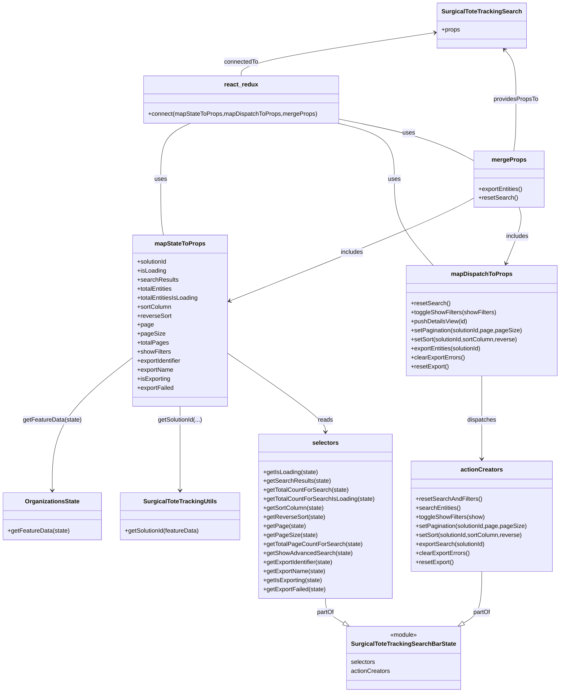

# Diagram: web/portal/src/pages/surgicaltotetracking/search/SurgicalToteTracking.Search.page.container.js

> Auto-generated by Obscura crawlers

## Mermaid

### SVG

<svg id="container" width="1482.5546875" xmlns="http://www.w3.org/2000/svg" class="classDiagram" height="1844" viewBox="0 0 1482.5546875 1844" role="graphics-document document" aria-roledescription="class"><g><defs><marker id="container_class-aggregationStart" class="marker aggregation class" refX="18" refY="7" markerWidth="190" markerHeight="240" orient="auto"><path d="M 18,7 L9,13 L1,7 L9,1 Z"></path></marker></defs><defs><marker id="container_class-aggregationEnd" class="marker aggregation class" refX="1" refY="7" markerWidth="20" markerHeight="28" orient="auto"><path d="M 18,7 L9,13 L1,7 L9,1 Z"></path></marker></defs><defs><marker id="container_class-extensionStart" class="marker extension class" refX="18" refY="7" markerWidth="190" markerHeight="240" orient="auto"><path d="M 1,7 L18,13 V 1 Z"></path></marker></defs><defs><marker id="container_class-extensionEnd" class="marker extension class" refX="1" refY="7" markerWidth="20" markerHeight="28" orient="auto"><path d="M 1,1 V 13 L18,7 Z"></path></marker></defs><defs><marker id="container_class-compositionStart" class="marker composition class" refX="18" refY="7" markerWidth="190" markerHeight="240" orient="auto"><path d="M 18,7 L9,13 L1,7 L9,1 Z"></path></marker></defs><defs><marker id="container_class-compositionEnd" class="marker composition class" refX="1" refY="7" markerWidth="20" markerHeight="28" orient="auto"><path d="M 18,7 L9,13 L1,7 L9,1 Z"></path></marker></defs><defs><marker id="container_class-dependencyStart" class="marker dependency class" refX="6" refY="7" markerWidth="190" markerHeight="240" orient="auto"><path d="M 5,7 L9,13 L1,7 L9,1 Z"></path></marker></defs><defs><marker id="container_class-dependencyEnd" class="marker dependency class" refX="13" refY="7" markerWidth="20" markerHeight="28" orient="auto"><path d="M 18,7 L9,13 L14,7 L9,1 Z"></path></marker></defs><defs><marker id="container_class-lollipopStart" class="marker lollipop class" refX="13" refY="7" markerWidth="190" markerHeight="240" orient="auto"><circle stroke="black" fill="transparent" cx="7" cy="7" r="6"></circle></marker></defs><defs><marker id="container_class-lollipopEnd" class="marker lollipop class" refX="1" refY="7" markerWidth="190" markerHeight="240" orient="auto"><circle stroke="black" fill="transparent" cx="7" cy="7" r="6"></circle></marker></defs><g class="root"><g class="clusters"></g><g class="edgePaths"><path d="M1156.611,86.026L1069.839,99.189C983.067,112.351,809.523,138.675,722.751,158.004C635.979,177.333,635.979,189.667,635.979,195.833L635.979,202" id="id_SurgicalToteTrackingSearch_react_redux_1" class="edge-thickness-normal edge-pattern-solid relation" style=";;;" data-edge="true" data-et="edge" data-id="id_SurgicalToteTrackingSearch_react_redux_1" data-points="W3sieCI6MTE2Mi41NDI5Njg3NSwieSI6ODUuMTI2NTE3NTk3MjU2MDN9LHsieCI6NjM1Ljk3ODUxNTYyNSwieSI6MTY1fSx7IngiOjYzNS45Nzg1MTU2MjUsInkiOjIwMn1d" marker-start="url(#container_class-dependencyStart)"></path><path d="M502.164,328L489.066,334.167C475.967,340.333,449.771,352.667,436.672,377.5C423.574,402.333,423.574,439.667,423.574,477C423.574,514.333,423.574,551.667,424.78,576.5C425.986,601.333,428.397,613.667,429.603,619.833L430.809,626" id="id_react_redux_mapStateToProps_2" class="edge-thickness-normal edge-pattern-solid relation" style=";;;" data-edge="true" data-et="edge" data-id="id_react_redux_mapStateToProps_2" data-points="W3sieCI6NTAyLjE2MzgwODU5Mzc1LCJ5IjozMjh9LHsieCI6NDIzLjU3NDIxODc1LCJ5IjozNjV9LHsieCI6NDIzLjU3NDIxODc1LCJ5Ijo0Nzd9LHsieCI6NDIzLjU3NDIxODc1LCJ5Ijo1ODl9LHsieCI6NDMwLjgwODk2MjI2NDE1MDksInkiOjYyNn1d"></path><path d="M892.456,328L917.561,334.167C942.666,340.333,992.876,352.667,1017.981,377.5C1043.086,402.333,1043.086,439.667,1043.086,477C1043.086,514.333,1043.086,551.667,1060.331,590C1077.575,628.333,1112.064,667.667,1129.309,687.333L1146.553,707" id="id_react_redux_mapDispatchToProps_3" class="edge-thickness-normal edge-pattern-solid relation" style=";;;" data-edge="true" data-et="edge" data-id="id_react_redux_mapDispatchToProps_3" data-points="W3sieCI6ODkyLjQ1NjE5MTQwNjI1LCJ5IjozMjh9LHsieCI6MTA0My4wODU5Mzc1LCJ5IjozNjV9LHsieCI6MTA0My4wODU5Mzc1LCJ5Ijo0Nzd9LHsieCI6MTA0My4wODU5Mzc1LCJ5Ijo1ODl9LHsieCI6MTE0Ni41NTMzNjA4NDkwNTY2LCJ5Ijo3MDd9XQ=="></path><path d="M894.432,316.89L934.369,324.909C974.306,332.927,1054.18,348.963,1114.145,367.458C1174.109,385.952,1214.164,406.903,1234.191,417.379L1254.219,427.855" id="id_react_redux_mergeProps_4" class="edge-thickness-normal edge-pattern-solid relation" style=";;;" data-edge="true" data-et="edge" data-id="id_react_redux_mergeProps_4" data-points="W3sieCI6ODk0LjQzMTY0MDYyNSwieSI6MzE2Ljg5MDI4MDk2Mzg2NDl9LHsieCI6MTEzNC4wNTQ2ODc1LCJ5IjozNjV9LHsieCI6MTI1NC4yMTg3NSwieSI6NDI3Ljg1NTE4Mjk4MjQ0OTd9XQ=="></path><path d="M348.207,953.624L313.02,981.187C277.832,1008.749,207.457,1063.875,172.27,1122.604C137.082,1181.333,137.082,1243.667,137.082,1274.833L137.082,1306" id="id_mapStateToProps_OrganizationsState_5" class="edge-thickness-normal edge-pattern-solid relation" style=";;;" data-edge="true" data-et="edge" data-id="id_mapStateToProps_OrganizationsState_5" data-points="W3sieCI6MzQ4LjIwNzAzMTI1LCJ5Ijo5NTMuNjIzOTkxMTMyMzU2NX0seyJ4IjoxMzcuMDgyMDMxMjUsInkiOjExMTl9LHsieCI6MTM3LjA4MjAzMTI1LCJ5IjoxMzEyfV0=" marker-end="url(#container_class-dependencyEnd)"></path><path d="M475.391,1082L475.391,1088.167C475.391,1094.333,475.391,1106.667,475.391,1144C475.391,1181.333,475.391,1243.667,475.391,1274.833L475.391,1306" id="id_mapStateToProps_SurgicalToteTrackingUtils_6" class="edge-thickness-normal edge-pattern-solid relation" style=";;;" data-edge="true" data-et="edge" data-id="id_mapStateToProps_SurgicalToteTrackingUtils_6" data-points="W3sieCI6NDc1LjM5MDYyNSwieSI6MTA4Mn0seyJ4Ijo0NzUuMzkwNjI1LCJ5IjoxMTE5fSx7IngiOjQ3NS4zOTA2MjUsInkiOjEzMTJ9XQ==" marker-end="url(#container_class-dependencyEnd)"></path><path d="M602.574,941.32L645.707,970.933C688.84,1000.546,775.105,1059.773,818.238,1094.553C861.371,1129.333,861.371,1139.667,861.371,1144.833L861.371,1150" id="id_mapStateToProps_selectors_7" class="edge-thickness-normal edge-pattern-solid relation" style=";;;" data-edge="true" data-et="edge" data-id="id_mapStateToProps_selectors_7" data-points="W3sieCI6NjAyLjU3NDIxODc1LCJ5Ijo5NDEuMzE5NTc5ODAzODY4fSx7IngiOjg2MS4zNzEwOTM3NSwieSI6MTExOX0seyJ4Ijo4NjEuMzcxMDkzNzUsInkiOjExNTZ9XQ==" marker-end="url(#container_class-dependencyEnd)"></path><path d="M1275.449,1001L1275.449,1020.667C1275.449,1040.333,1275.449,1079.667,1275.449,1116.5C1275.449,1153.333,1275.449,1187.667,1275.449,1204.833L1275.449,1222" id="id_mapDispatchToProps_actionCreators_8" class="edge-thickness-normal edge-pattern-solid relation" style=";;;" data-edge="true" data-et="edge" data-id="id_mapDispatchToProps_actionCreators_8" data-points="W3sieCI6MTI3NS40NDkyMTg3NSwieSI6MTAwMX0seyJ4IjoxMjc1LjQ0OTIxODc1LCJ5IjoxMTE5fSx7IngiOjEyNzUuNDQ5MjE4NzUsInkiOjEyMjh9XQ==" marker-end="url(#container_class-dependencyEnd)"></path><path d="M1275.449,1522L1275.449,1540.167C1275.449,1558.333,1275.449,1594.667,1267.38,1617.549C1259.31,1640.432,1243.172,1649.864,1235.102,1654.58L1227.033,1659.296" id="id_actionCreators_SurgicalToteTrackingSearchBarState_9" class="edge-thickness-normal edge-pattern-solid relation" style=";;;" data-edge="true" data-et="edge" data-id="id_actionCreators_SurgicalToteTrackingSearchBarState_9" data-points="W3sieCI6MTI3NS40NDkyMTg3NSwieSI6MTUyMn0seyJ4IjoxMjc1LjQ0OTIxODc1LCJ5IjoxNjMxfSx7IngiOjEyMTIuMTM5NzUzMzU3NDM4LCJ5IjoxNjY4fV0=" marker-end="url(#container_class-extensionEnd)"></path><path d="M861.371,1594L861.371,1600.167C861.371,1606.333,861.371,1618.667,869.44,1629.549C877.51,1640.432,893.649,1649.864,901.718,1654.58L909.787,1659.296" id="id_selectors_SurgicalToteTrackingSearchBarState_10" class="edge-thickness-normal edge-pattern-solid relation" style=";;;" data-edge="true" data-et="edge" data-id="id_selectors_SurgicalToteTrackingSearchBarState_10" data-points="W3sieCI6ODYxLjM3MTA5Mzc1LCJ5IjoxNTk0fSx7IngiOjg2MS4zNzEwOTM3NSwieSI6MTYzMX0seyJ4Ijo5MjQuNjgwNTU5MTQyNTYyLCJ5IjoxNjY4fV0=" marker-end="url(#container_class-extensionEnd)"></path><path d="M1254.219,527.825L1235.371,538.021C1216.523,548.217,1178.828,568.608,1071.15,614.163C963.471,659.718,785.81,730.437,696.979,765.796L608.149,801.155" id="id_mergeProps_mapStateToProps_11" class="edge-thickness-normal edge-pattern-solid relation" style=";;;" data-edge="true" data-et="edge" data-id="id_mergeProps_mapStateToProps_11" data-points="W3sieCI6MTI1NC4yMTg3NSwieSI6NTI3LjgyNDk1MDAwMTg4Njd9LHsieCI6MTE0MS4xMzI4MTI1LCJ5Ijo1ODl9LHsieCI6NjAyLjU3NDIxODc1LCJ5Ijo4MDMuMzc0MzE3OTAxNzc3OX1d" marker-end="url(#container_class-dependencyEnd)"></path><path d="M1375.392,552L1377.63,558.167C1379.868,564.333,1384.344,576.667,1378.562,601.581C1372.78,626.495,1356.739,663.989,1348.718,682.736L1340.698,701.484" id="id_mergeProps_mapDispatchToProps_12" class="edge-thickness-normal edge-pattern-solid relation" style=";;;" data-edge="true" data-et="edge" data-id="id_mergeProps_mapDispatchToProps_12" data-points="W3sieCI6MTM3NS4zOTE4MTA4MjU4OTMsInkiOjU1Mn0seyJ4IjoxMzg4LjgyMDMxMjUsInkiOjU4OX0seyJ4IjoxMzM4LjMzODA4OTYyMjY0MTUsInkiOjcwN31d" marker-end="url(#container_class-dependencyEnd)"></path><path d="M1360.39,402L1361.395,395.833C1362.399,389.667,1364.409,377.333,1365.413,354.5C1366.418,331.667,1366.418,298.333,1366.418,265C1366.418,231.667,1366.418,198.333,1361.319,176.229C1356.22,154.126,1346.021,143.251,1340.922,137.814L1335.823,132.377" id="id_mergeProps_SurgicalToteTrackingSearch_13" class="edge-thickness-normal edge-pattern-solid relation" style=";;;" data-edge="true" data-et="edge" data-id="id_mergeProps_SurgicalToteTrackingSearch_13" data-points="W3sieCI6MTM2MC4zOTAyNDEzNTA0NDYzLCJ5Ijo0MDJ9LHsieCI6MTM2Ni40MTc5Njg3NSwieSI6MzY1fSx7IngiOjEzNjYuNDE3OTY4NzUsInkiOjI2NX0seyJ4IjoxMzY2LjQxNzk2ODc1LCJ5IjoxNjV9LHsieCI6MTMzMS43MTg1NDg2NDY5MDczLCJ5IjoxMjh9XQ==" marker-end="url(#container_class-dependencyEnd)"></path></g><g class="edgeLabels"><g class="edgeLabel" transform="translate(635.978515625, 165)"><g class="label" data-id="id_SurgicalToteTrackingSearch_react_redux_1" transform="translate(-46.1796875, -12)"><foreignObject width="92.359375" height="24">

connectedTo

</foreignObject></g></g><g class="edgeLabel" transform="translate(423.57421875, 477)"><g class="label" data-id="id_react_redux_mapStateToProps_2" transform="translate(-16.4921875, -12)"><foreignObject width="32.984375" height="24">

uses

</foreignObject></g></g><g class="edgeLabel" transform="translate(1043.0859375, 477)"><g class="label" data-id="id_react_redux_mapDispatchToProps_3" transform="translate(-16.4921875, -12)"><foreignObject width="32.984375" height="24">

uses

</foreignObject></g></g><g class="edgeLabel" transform="translate(1080.72173, 354.29221)"><g class="label" data-id="id_react_redux_mergeProps_4" transform="translate(-16.4921875, -12)"><foreignObject width="32.984375" height="24">

uses

</foreignObject></g></g><g class="edgeLabel" transform="translate(137.08203125, 1119)"><g class="label" data-id="id_mapStateToProps_OrganizationsState_5" transform="translate(-78.15625, -12)"><foreignObject width="156.3125" height="24">

getFeatureData(state)

</foreignObject></g></g><g class="edgeLabel" transform="translate(475.390625, 1119)"><g class="label" data-id="id_mapStateToProps_SurgicalToteTrackingUtils_6" transform="translate(-59.90625, -12)"><foreignObject width="119.8125" height="24">

getSolutionId(...)

</foreignObject></g></g><g class="edgeLabel" transform="translate(861.37109375, 1119)"><g class="label" data-id="id_mapStateToProps_selectors_7" transform="translate(-20.0078125, -12)"><foreignObject width="40.015625" height="24">

reads

</foreignObject></g></g><g class="edgeLabel" transform="translate(1275.44921875, 1119)"><g class="label" data-id="id_mapDispatchToProps_actionCreators_8" transform="translate(-39.1796875, -12)"><foreignObject width="78.359375" height="24">

dispatches

</foreignObject></g></g><g class="edgeLabel" transform="translate(1275.44921875, 1631)"><g class="label" data-id="id_actionCreators_SurgicalToteTrackingSearchBarState_9" transform="translate(-23.21875, -12)"><foreignObject width="46.4375" height="24">

partOf

</foreignObject></g></g><g class="edgeLabel" transform="translate(861.37109375, 1631)"><g class="label" data-id="id_selectors_SurgicalToteTrackingSearchBarState_10" transform="translate(-23.21875, -12)"><foreignObject width="46.4375" height="24">

partOf

</foreignObject></g></g><g class="edgeLabel" transform="translate(931.58171, 672.41223)"><g class="label" data-id="id_mergeProps_mapStateToProps_11" transform="translate(-30.6484375, -12)"><foreignObject width="61.296875" height="24">

includes

</foreignObject></g></g><g class="edgeLabel" transform="translate(1371.32026, 629.90561)"><g class="label" data-id="id_mergeProps_mapDispatchToProps_12" transform="translate(-30.6484375, -12)"><foreignObject width="61.296875" height="24">

includes

</foreignObject></g></g><g class="edgeLabel" transform="translate(1366.41796875, 265)"><g class="label" data-id="id_mergeProps_SurgicalToteTrackingSearch_13" transform="translate(-60.1796875, -12)"><foreignObject width="120.359375" height="24">

providesPropsTo

</foreignObject></g></g></g><g class="nodes"><g class="node default" id="classId-SurgicalToteTrackingSearch-0" transform="translate(1275.44921875, 68)"><g class="basic label-container"><path d="M-112.90625 -60 L112.90625 -60 L112.90625 60 L-112.90625 60" stroke="none" stroke-width="0" fill="#ECECFF" style=""></path><path d="M-112.90625 -60 C-64.40548169052394 -60, -15.904713381047884 -60, 112.90625 -60 M-112.90625 -60 C-65.038017730251 -60, -17.169785460502 -60, 112.90625 -60 M112.90625 -60 C112.90625 -13.648656829467882, 112.90625 32.702686341064236, 112.90625 60 M112.90625 -60 C112.90625 -26.368196799975443, 112.90625 7.263606400049113, 112.90625 60 M112.90625 60 C33.05617442523028 60, -46.79390114953944 60, -112.90625 60 M112.90625 60 C56.51325621614786 60, 0.12026243229571776 60, -112.90625 60 M-112.90625 60 C-112.90625 29.491432116916684, -112.90625 -1.017135766166632, -112.90625 -60 M-112.90625 60 C-112.90625 35.745310464822985, -112.90625 11.49062092964597, -112.90625 -60" stroke="#9370DB" stroke-width="1.3" fill="none" stroke-dasharray="0 0" style=""></path></g><g class="annotation-group text" transform="translate(0, -36)"></g><g class="label-group text" transform="translate(-100.90625, -36)"><g class="label" style="font-weight: bolder" transform="translate(0,-12)"><foreignObject width="201.8125" height="24">

SurgicalToteTrackingSearch

</foreignObject></g></g><g class="members-group text" transform="translate(-100.90625, 12)"><g class="label" style="" transform="translate(0,-12)"><foreignObject width="49.515625" height="24">

+props

</foreignObject></g></g><g class="methods-group text" transform="translate(-100.90625, 60)"></g><g class="divider" style=""><path d="M-112.90625 -12 C-22.79486105016676 -12, 67.31652789966648 -12, 112.90625 -12 M-112.90625 -12 C-57.40679615094695 -12, -1.9073423018939053 -12, 112.90625 -12" stroke="#9370DB" stroke-width="1.3" fill="none" stroke-dasharray="0 0" style=""></path></g><g class="divider" style=""><path d="M-112.90625 36 C-42.543337435271 36, 27.819575129458002 36, 112.90625 36 M-112.90625 36 C-23.366581564945434 36, 66.17308687010913 36, 112.90625 36" stroke="#9370DB" stroke-width="1.3" fill="none" stroke-dasharray="0 0" style=""></path></g></g><g class="node default" id="classId-mapStateToProps-1" transform="translate(475.390625, 854)"><g class="basic label-container"><path d="M-127.18359375 -228 L127.18359375 -228 L127.18359375 228 L-127.18359375 228" stroke="none" stroke-width="0" fill="#ECECFF" style=""></path><path d="M-127.18359375 -228 C-34.96712412383448 -228, 57.24934550233104 -228, 127.18359375 -228 M-127.18359375 -228 C-64.123502607466 -228, -1.0634114649319883 -228, 127.18359375 -228 M127.18359375 -228 C127.18359375 -73.65067201231761, 127.18359375 80.69865597536477, 127.18359375 228 M127.18359375 -228 C127.18359375 -113.30130453140515, 127.18359375 1.397390937189698, 127.18359375 228 M127.18359375 228 C36.94054281952364 228, -53.302508110952715 228, -127.18359375 228 M127.18359375 228 C73.9460966269002 228, 20.7085995038004 228, -127.18359375 228 M-127.18359375 228 C-127.18359375 51.42407778245379, -127.18359375 -125.15184443509241, -127.18359375 -228 M-127.18359375 228 C-127.18359375 106.3177900422896, -127.18359375 -15.364419915420797, -127.18359375 -228" stroke="#9370DB" stroke-width="1.3" fill="none" stroke-dasharray="0 0" style=""></path></g><g class="annotation-group text" transform="translate(0, -204)"></g><g class="label-group text" transform="translate(-64.7109375, -204)"><g class="label" style="font-weight: bolder" transform="translate(0,-12)"><foreignObject width="129.421875" height="24">

mapStateToProps

</foreignObject></g></g><g class="members-group text" transform="translate(-115.18359375, -156)"><g class="label" style="" transform="translate(0,-12)"><foreignObject width="82.109375" height="24">

+solutionId

</foreignObject></g><g class="label" style="" transform="translate(0,12)"><foreignObject width="77.203125" height="24">

+isLoading

</foreignObject></g><g class="label" style="" transform="translate(0,36)"><foreignObject width="108.328125" height="24">

+searchResults

</foreignObject></g><g class="label" style="" transform="translate(0,60)"><foreignObject width="96.234375" height="24">

+totalEntities

</foreignObject></g><g class="label" style="" transform="translate(0,84)"><foreignObject width="165.65625" height="24">

+totalEntitiesIsLoading

</foreignObject></g><g class="label" style="" transform="translate(0,108)"><foreignObject width="91.828125" height="24">

+sortColumn

</foreignObject></g><g class="label" style="" transform="translate(0,132)"><foreignObject width="91.015625" height="24">

+reverseSort

</foreignObject></g><g class="label" style="" transform="translate(0,156)"><foreignObject width="42.65625" height="24">

+page

</foreignObject></g><g class="label" style="" transform="translate(0,180)"><foreignObject width="71.5" height="24">

+pageSize

</foreignObject></g><g class="label" style="" transform="translate(0,204)"><foreignObject width="82.90625" height="24">

+totalPages

</foreignObject></g><g class="label" style="" transform="translate(0,228)"><foreignObject width="89.8125" height="24">

+showFilters

</foreignObject></g><g class="label" style="" transform="translate(0,252)"><foreignObject width="121.890625" height="24">

+exportIdentifier

</foreignObject></g><g class="label" style="" transform="translate(0,276)"><foreignObject width="97.1875" height="24">

+exportName

</foreignObject></g><g class="label" style="" transform="translate(0,300)"><foreignObject width="89.296875" height="24">

+isExporting

</foreignObject></g><g class="label" style="" transform="translate(0,324)"><foreignObject width="98.140625" height="24">

+exportFailed

</foreignObject></g></g><g class="methods-group text" transform="translate(-115.18359375, 228)"></g><g class="divider" style=""><path d="M-127.18359375 -180 C-30.108787191033144 -180, 66.96601936793371 -180, 127.18359375 -180 M-127.18359375 -180 C-55.7772748721889 -180, 15.629044005622205 -180, 127.18359375 -180" stroke="#9370DB" stroke-width="1.3" fill="none" stroke-dasharray="0 0" style=""></path></g><g class="divider" style=""><path d="M-127.18359375 204 C-54.97738210412675 204, 17.228829541746506 204, 127.18359375 204 M-127.18359375 204 C-57.099802578384455 204, 12.98398859323109 204, 127.18359375 204" stroke="#9370DB" stroke-width="1.3" fill="none" stroke-dasharray="0 0" style=""></path></g></g><g class="node default" id="classId-mapDispatchToProps-2" transform="translate(1275.44921875, 854)"><g class="basic label-container"><path d="M-199.10546875 -147 L199.10546875 -147 L199.10546875 147 L-199.10546875 147" stroke="none" stroke-width="0" fill="#ECECFF" style=""></path><path d="M-199.10546875 -147 C-52.48114440318261 -147, 94.14317994363478 -147, 199.10546875 -147 M-199.10546875 -147 C-103.08592354548138 -147, -7.066378340962757 -147, 199.10546875 -147 M199.10546875 -147 C199.10546875 -43.03206737923941, 199.10546875 60.935865241521185, 199.10546875 147 M199.10546875 -147 C199.10546875 -67.88755983676445, 199.10546875 11.224880326471094, 199.10546875 147 M199.10546875 147 C93.55727755168556 147, -11.990913646628883 147, -199.10546875 147 M199.10546875 147 C76.784795118053 147, -45.535878513894005 147, -199.10546875 147 M-199.10546875 147 C-199.10546875 57.948614969551855, -199.10546875 -31.10277006089629, -199.10546875 -147 M-199.10546875 147 C-199.10546875 37.00833661821244, -199.10546875 -72.98332676357512, -199.10546875 -147" stroke="#9370DB" stroke-width="1.3" fill="none" stroke-dasharray="0 0" style=""></path></g><g class="annotation-group text" transform="translate(0, -123)"></g><g class="label-group text" transform="translate(-77.1953125, -123)"><g class="label" style="font-weight: bolder" transform="translate(0,-12)"><foreignObject width="154.390625" height="24">

mapDispatchToProps

</foreignObject></g></g><g class="members-group text" transform="translate(-187.10546875, -75)"></g><g class="methods-group text" transform="translate(-187.10546875, -45)"><g class="label" style="" transform="translate(0,-12)"><foreignObject width="103.453125" height="24">

+resetSearch()

</foreignObject></g><g class="label" style="" transform="translate(0,12)"><foreignObject width="228.03125" height="24">

+toggleShowFilters(showFilters)

</foreignObject></g><g class="label" style="" transform="translate(0,36)"><foreignObject width="151.765625" height="24">

+pushDetailsView(id)

</foreignObject></g><g class="label" style="" transform="translate(0,60)"><foreignObject width="297.015625" height="24">

+setPagination(solutionId,page,pageSize)

</foreignObject></g><g class="label" style="" transform="translate(0,84)"><foreignObject width="289.046875" height="24">

+setSort(solutionId,sortColumn,reverse)

</foreignObject></g><g class="label" style="" transform="translate(0,108)"><foreignObject width="194.15625" height="24">

+exportEntities(solutionId)

</foreignObject></g><g class="label" style="" transform="translate(0,132)"><foreignObject width="144.203125" height="24">

+clearExportErrors()

</foreignObject></g><g class="label" style="" transform="translate(0,156)"><foreignObject width="101.859375" height="24">

+resetExport()

</foreignObject></g></g><g class="divider" style=""><path d="M-199.10546875 -99 C-49.13964531355401 -99, 100.82617812289197 -99, 199.10546875 -99 M-199.10546875 -99 C-51.818863130087436 -99, 95.46774248982513 -99, 199.10546875 -99" stroke="#9370DB" stroke-width="1.3" fill="none" stroke-dasharray="0 0" style=""></path></g><g class="divider" style=""><path d="M-199.10546875 -75 C-84.88089999814814 -75, 29.343668753703724 -75, 199.10546875 -75 M-199.10546875 -75 C-62.00636262819563 -75, 75.09274349360874 -75, 199.10546875 -75" stroke="#9370DB" stroke-width="1.3" fill="none" stroke-dasharray="0 0" style=""></path></g></g><g class="node default" id="classId-mergeProps-3" transform="translate(1348.171875, 477)"><g class="basic label-container"><path d="M-93.953125 -75 L93.953125 -75 L93.953125 75 L-93.953125 75" stroke="none" stroke-width="0" fill="#ECECFF" style=""></path><path d="M-93.953125 -75 C-52.088144921361085 -75, -10.22316484272217 -75, 93.953125 -75 M-93.953125 -75 C-29.661162119195367 -75, 34.630800761609265 -75, 93.953125 -75 M93.953125 -75 C93.953125 -19.050924362639712, 93.953125 36.898151274720576, 93.953125 75 M93.953125 -75 C93.953125 -20.968796360659468, 93.953125 33.062407278681064, 93.953125 75 M93.953125 75 C20.54928077101816 75, -52.85456345796368 75, -93.953125 75 M93.953125 75 C30.779348821050903 75, -32.394427357898195 75, -93.953125 75 M-93.953125 75 C-93.953125 42.359709141938495, -93.953125 9.71941828387699, -93.953125 -75 M-93.953125 75 C-93.953125 19.837192992324454, -93.953125 -35.32561401535109, -93.953125 -75" stroke="#9370DB" stroke-width="1.3" fill="none" stroke-dasharray="0 0" style=""></path></g><g class="annotation-group text" transform="translate(0, -51)"></g><g class="label-group text" transform="translate(-43.859375, -51)"><g class="label" style="font-weight: bolder" transform="translate(0,-12)"><foreignObject width="87.71875" height="24">

mergeProps

</foreignObject></g></g><g class="members-group text" transform="translate(-81.953125, -3)"></g><g class="methods-group text" transform="translate(-81.953125, 27)"><g class="label" style="" transform="translate(0,-12)"><foreignObject width="120.046875" height="24">

+exportEntities()

</foreignObject></g><g class="label" style="" transform="translate(0,12)"><foreignObject width="103.453125" height="24">

+resetSearch()

</foreignObject></g></g><g class="divider" style=""><path d="M-93.953125 -27 C-26.923197618006625 -27, 40.10672976398675 -27, 93.953125 -27 M-93.953125 -27 C-53.57523909658202 -27, -13.197353193164034 -27, 93.953125 -27" stroke="#9370DB" stroke-width="1.3" fill="none" stroke-dasharray="0 0" style=""></path></g><g class="divider" style=""><path d="M-93.953125 -3 C-54.9186713145894 -3, -15.884217629178806 -3, 93.953125 -3 M-93.953125 -3 C-52.95516143158744 -3, -11.957197863174883 -3, 93.953125 -3" stroke="#9370DB" stroke-width="1.3" fill="none" stroke-dasharray="0 0" style=""></path></g></g><g class="node default" id="classId-SurgicalToteTrackingSearchBarState-4" transform="translate(1068.41015625, 1752)"><g class="basic label-container"><path d="M-144.75 -84 L144.75 -84 L144.75 84 L-144.75 84" stroke="none" stroke-width="0" fill="#ECECFF" style=""></path><path d="M-144.75 -84 C-30.48063177581632 -84, 83.78873644836736 -84, 144.75 -84 M-144.75 -84 C-38.08901425647096 -84, 68.57197148705808 -84, 144.75 -84 M144.75 -84 C144.75 -27.66699450150613, 144.75 28.666010996987737, 144.75 84 M144.75 -84 C144.75 -32.429999261068694, 144.75 19.14000147786261, 144.75 84 M144.75 84 C69.25056523126685 84, -6.248869537466305 84, -144.75 84 M144.75 84 C38.9415207991471 84, -66.8669584017058 84, -144.75 84 M-144.75 84 C-144.75 17.72570924672948, -144.75 -48.54858150654104, -144.75 -84 M-144.75 84 C-144.75 34.15651839010957, -144.75 -15.686963219780864, -144.75 -84" stroke="#9370DB" stroke-width="1.3" fill="none" stroke-dasharray="0 0" style=""></path></g><g class="annotation-group text" transform="translate(-36.6015625, -60)"><g class="label" style="" transform="translate(0,-12)"><foreignObject width="73.203125" height="24">

«module»

</foreignObject></g></g><g class="label-group text" transform="translate(-132.75, -36)"><g class="label" style="font-weight: bolder" transform="translate(0,-12)"><foreignObject width="265.5" height="24">

SurgicalToteTrackingSearchBarState

</foreignObject></g></g><g class="members-group text" transform="translate(-132.75, 12)"><g class="label" style="" transform="translate(0,-12)"><foreignObject width="65.46875" height="24">

selectors

</foreignObject></g><g class="label" style="" transform="translate(0,12)"><foreignObject width="105.34375" height="24">

actionCreators

</foreignObject></g></g><g class="methods-group text" transform="translate(-132.75, 84)"></g><g class="divider" style=""><path d="M-144.75 -12 C-71.0787069914333 -12, 2.5925860171334136 -12, 144.75 -12 M-144.75 -12 C-47.67683428387308 -12, 49.396331432253845 -12, 144.75 -12" stroke="#9370DB" stroke-width="1.3" fill="none" stroke-dasharray="0 0" style=""></path></g><g class="divider" style=""><path d="M-144.75 60 C-81.35637638550453 60, -17.962752771009065 60, 144.75 60 M-144.75 60 C-67.7174710004068 60, 9.315057999186394 60, 144.75 60" stroke="#9370DB" stroke-width="1.3" fill="none" stroke-dasharray="0 0" style=""></path></g></g><g class="node default" id="classId-selectors-5" transform="translate(861.37109375, 1375)"><g class="basic label-container"><path d="M-176.75390625 -219 L176.75390625 -219 L176.75390625 219 L-176.75390625 219" stroke="none" stroke-width="0" fill="#ECECFF" style=""></path><path d="M-176.75390625 -219 C-72.83245460199699 -219, 31.08899704600603 -219, 176.75390625 -219 M-176.75390625 -219 C-45.18673854774909 -219, 86.38042915450183 -219, 176.75390625 -219 M176.75390625 -219 C176.75390625 -107.94699050561563, 176.75390625 3.1060189887687386, 176.75390625 219 M176.75390625 -219 C176.75390625 -105.11411312834261, 176.75390625 8.771773743314782, 176.75390625 219 M176.75390625 219 C56.25834080584934 219, -64.23722463830131 219, -176.75390625 219 M176.75390625 219 C82.15797957296 219, -12.437947104079996 219, -176.75390625 219 M-176.75390625 219 C-176.75390625 68.87107826727575, -176.75390625 -81.2578434654485, -176.75390625 -219 M-176.75390625 219 C-176.75390625 97.31623638534154, -176.75390625 -24.36752722931692, -176.75390625 -219" stroke="#9370DB" stroke-width="1.3" fill="none" stroke-dasharray="0 0" style=""></path></g><g class="annotation-group text" transform="translate(0, -195)"></g><g class="label-group text" transform="translate(-33.4609375, -195)"><g class="label" style="font-weight: bolder" transform="translate(0,-12)"><foreignObject width="66.921875" height="24">

selectors

</foreignObject></g></g><g class="members-group text" transform="translate(-164.75390625, -147)"></g><g class="methods-group text" transform="translate(-164.75390625, -117)"><g class="label" style="" transform="translate(0,-12)"><foreignObject width="146.4375" height="24">

+getIsLoading(state)

</foreignObject></g><g class="label" style="" transform="translate(0,12)"><foreignObject width="178.59375" height="24">

+getSearchResults(state)

</foreignObject></g><g class="label" style="" transform="translate(0,36)"><foreignObject width="226.609375" height="24">

+getTotalCountForSearch(state)

</foreignObject></g><g class="label" style="" transform="translate(0,60)"><foreignObject width="296.046875" height="24">

+getTotalCountForSearchIsLoading(state)

</foreignObject></g><g class="label" style="" transform="translate(0,84)"><foreignObject width="162.109375" height="24">

+getSortColumn(state)

</foreignObject></g><g class="label" style="" transform="translate(0,108)"><foreignObject width="163.78125" height="24">

+getReverseSort(state)

</foreignObject></g><g class="label" style="" transform="translate(0,132)"><foreignObject width="110.765625" height="24">

+getPage(state)

</foreignObject></g><g class="label" style="" transform="translate(0,156)"><foreignObject width="139.59375" height="24">

+getPageSize(state)

</foreignObject></g><g class="label" style="" transform="translate(0,180)"><foreignObject width="260.359375" height="24">

+getTotalPageCountForSearch(state)

</foreignObject></g><g class="label" style="" transform="translate(0,204)"><foreignObject width="234.6875" height="24">

+getShowAdvancedSearch(state)

</foreignObject></g><g class="label" style="" transform="translate(0,228)"><foreignObject width="190.90625" height="24">

+getExportIdentifier(state)

</foreignObject></g><g class="label" style="" transform="translate(0,252)"><foreignObject width="166.203125" height="24">

+getExportName(state)

</foreignObject></g><g class="label" style="" transform="translate(0,276)"><foreignObject width="158.53125" height="24">

+getIsExporting(state)

</foreignObject></g><g class="label" style="" transform="translate(0,300)"><foreignObject width="167.140625" height="24">

+getExportFailed(state)

</foreignObject></g></g><g class="divider" style=""><path d="M-176.75390625 -171 C-102.48881223825539 -171, -28.223718226510783 -171, 176.75390625 -171 M-176.75390625 -171 C-97.19126468802243 -171, -17.628623126044857 -171, 176.75390625 -171" stroke="#9370DB" stroke-width="1.3" fill="none" stroke-dasharray="0 0" style=""></path></g><g class="divider" style=""><path d="M-176.75390625 -147 C-100.965481628809 -147, -25.177057007618004 -147, 176.75390625 -147 M-176.75390625 -147 C-67.5356980735347 -147, 41.68251010293059 -147, 176.75390625 -147" stroke="#9370DB" stroke-width="1.3" fill="none" stroke-dasharray="0 0" style=""></path></g></g><g class="node default" id="classId-actionCreators-6" transform="translate(1275.44921875, 1375)"><g class="basic label-container"><path d="M-187.32421875 -147 L187.32421875 -147 L187.32421875 147 L-187.32421875 147" stroke="none" stroke-width="0" fill="#ECECFF" style=""></path><path d="M-187.32421875 -147 C-71.80491382379829 -147, 43.714391102403425 -147, 187.32421875 -147 M-187.32421875 -147 C-86.3067670905269 -147, 14.710684568946192 -147, 187.32421875 -147 M187.32421875 -147 C187.32421875 -82.07792153967578, 187.32421875 -17.15584307935157, 187.32421875 147 M187.32421875 -147 C187.32421875 -39.79977335293272, 187.32421875 67.40045329413456, 187.32421875 147 M187.32421875 147 C96.76385778793751 147, 6.203496825875021 147, -187.32421875 147 M187.32421875 147 C104.55285884344363 147, 21.78149893688726 147, -187.32421875 147 M-187.32421875 147 C-187.32421875 65.18846305868952, -187.32421875 -16.623073882620957, -187.32421875 -147 M-187.32421875 147 C-187.32421875 47.23273319520071, -187.32421875 -52.53453360959858, -187.32421875 -147" stroke="#9370DB" stroke-width="1.3" fill="none" stroke-dasharray="0 0" style=""></path></g><g class="annotation-group text" transform="translate(0, -123)"></g><g class="label-group text" transform="translate(-53.6328125, -123)"><g class="label" style="font-weight: bolder" transform="translate(0,-12)"><foreignObject width="107.265625" height="24">

actionCreators

</foreignObject></g></g><g class="members-group text" transform="translate(-175.32421875, -75)"></g><g class="methods-group text" transform="translate(-175.32421875, -45)"><g class="label" style="" transform="translate(0,-12)"><foreignObject width="175.71875" height="24">

+resetSearchAndFilters()

</foreignObject></g><g class="label" style="" transform="translate(0,12)"><foreignObject width="120.359375" height="24">

+searchEntities()

</foreignObject></g><g class="label" style="" transform="translate(0,36)"><foreignObject width="183.859375" height="24">

+toggleShowFilters(show)

</foreignObject></g><g class="label" style="" transform="translate(0,60)"><foreignObject width="297.015625" height="24">

+setPagination(solutionId,page,pageSize)

</foreignObject></g><g class="label" style="" transform="translate(0,84)"><foreignObject width="289.046875" height="24">

+setSort(solutionId,sortColumn,reverse)

</foreignObject></g><g class="label" style="" transform="translate(0,108)"><foreignObject width="188.3125" height="24">

+exportSearch(solutionId)

</foreignObject></g><g class="label" style="" transform="translate(0,132)"><foreignObject width="144.203125" height="24">

+clearExportErrors()

</foreignObject></g><g class="label" style="" transform="translate(0,156)"><foreignObject width="101.859375" height="24">

+resetExport()

</foreignObject></g></g><g class="divider" style=""><path d="M-187.32421875 -99 C-71.85851175519791 -99, 43.60719523960418 -99, 187.32421875 -99 M-187.32421875 -99 C-76.81323023041269 -99, 33.69775828917463 -99, 187.32421875 -99" stroke="#9370DB" stroke-width="1.3" fill="none" stroke-dasharray="0 0" style=""></path></g><g class="divider" style=""><path d="M-187.32421875 -75 C-100.99910078861926 -75, -14.673982827238518 -75, 187.32421875 -75 M-187.32421875 -75 C-87.31750920241987 -75, 12.689200345160259 -75, 187.32421875 -75" stroke="#9370DB" stroke-width="1.3" fill="none" stroke-dasharray="0 0" style=""></path></g></g><g class="node default" id="classId-OrganizationsState-7" transform="translate(137.08203125, 1375)"><g class="basic label-container"><path d="M-129.08203125 -63 L129.08203125 -63 L129.08203125 63 L-129.08203125 63" stroke="none" stroke-width="0" fill="#ECECFF" style=""></path><path d="M-129.08203125 -63 C-44.59623460024922 -63, 39.88956204950156 -63, 129.08203125 -63 M-129.08203125 -63 C-73.27353401578682 -63, -17.465036781573644 -63, 129.08203125 -63 M129.08203125 -63 C129.08203125 -35.55345895127107, 129.08203125 -8.106917902542136, 129.08203125 63 M129.08203125 -63 C129.08203125 -26.063754250139525, 129.08203125 10.872491499720951, 129.08203125 63 M129.08203125 63 C54.65316621577284 63, -19.775698818454316 63, -129.08203125 63 M129.08203125 63 C77.05633010805454 63, 25.03062896610909 63, -129.08203125 63 M-129.08203125 63 C-129.08203125 15.289306889894895, -129.08203125 -32.42138622021021, -129.08203125 -63 M-129.08203125 63 C-129.08203125 17.82706624465812, -129.08203125 -27.34586751068376, -129.08203125 -63" stroke="#9370DB" stroke-width="1.3" fill="none" stroke-dasharray="0 0" style=""></path></g><g class="annotation-group text" transform="translate(0, -39)"></g><g class="label-group text" transform="translate(-69.8671875, -39)"><g class="label" style="font-weight: bolder" transform="translate(0,-12)"><foreignObject width="139.734375" height="24">

OrganizationsState

</foreignObject></g></g><g class="members-group text" transform="translate(-117.08203125, 9)"></g><g class="methods-group text" transform="translate(-117.08203125, 39)"><g class="label" style="" transform="translate(0,-12)"><foreignObject width="164.296875" height="24">

+getFeatureData(state)

</foreignObject></g></g><g class="divider" style=""><path d="M-129.08203125 -15 C-54.915372530327744 -15, 19.251286189344512 -15, 129.08203125 -15 M-129.08203125 -15 C-47.451980225824755 -15, 34.17807079835049 -15, 129.08203125 -15" stroke="#9370DB" stroke-width="1.3" fill="none" stroke-dasharray="0 0" style=""></path></g><g class="divider" style=""><path d="M-129.08203125 9 C-71.30780192787847 9, -13.533572605756959 9, 129.08203125 9 M-129.08203125 9 C-73.18851145574355 9, -17.294991661487103 9, 129.08203125 9" stroke="#9370DB" stroke-width="1.3" fill="none" stroke-dasharray="0 0" style=""></path></g></g><g class="node default" id="classId-SurgicalToteTrackingUtils-8" transform="translate(475.390625, 1375)"><g class="basic label-container"><path d="M-159.2265625 -63 L159.2265625 -63 L159.2265625 63 L-159.2265625 63" stroke="none" stroke-width="0" fill="#ECECFF" style=""></path><path d="M-159.2265625 -63 C-47.96455711424271 -63, 63.29744827151458 -63, 159.2265625 -63 M-159.2265625 -63 C-57.77502904382476 -63, 43.67650441235048 -63, 159.2265625 -63 M159.2265625 -63 C159.2265625 -26.0998833849009, 159.2265625 10.800233230198202, 159.2265625 63 M159.2265625 -63 C159.2265625 -31.47636273428397, 159.2265625 0.047274531432059064, 159.2265625 63 M159.2265625 63 C84.87884765557742 63, 10.531132811154833 63, -159.2265625 63 M159.2265625 63 C49.68257491283012 63, -59.86141267433976 63, -159.2265625 63 M-159.2265625 63 C-159.2265625 19.642750083390993, -159.2265625 -23.714499833218014, -159.2265625 -63 M-159.2265625 63 C-159.2265625 31.146554619068755, -159.2265625 -0.7068907618624891, -159.2265625 -63" stroke="#9370DB" stroke-width="1.3" fill="none" stroke-dasharray="0 0" style=""></path></g><g class="annotation-group text" transform="translate(0, -39)"></g><g class="label-group text" transform="translate(-92.984375, -39)"><g class="label" style="font-weight: bolder" transform="translate(0,-12)"><foreignObject width="185.96875" height="24">

SurgicalToteTrackingUtils

</foreignObject></g></g><g class="members-group text" transform="translate(-147.2265625, 9)"></g><g class="methods-group text" transform="translate(-147.2265625, 39)"><g class="label" style="" transform="translate(0,-12)"><foreignObject width="201.46875" height="24">

+getSolutionId(featureData)

</foreignObject></g></g><g class="divider" style=""><path d="M-159.2265625 -15 C-54.11091597459681 -15, 51.004730550806386 -15, 159.2265625 -15 M-159.2265625 -15 C-56.47755758533509 -15, 46.27144732932982 -15, 159.2265625 -15" stroke="#9370DB" stroke-width="1.3" fill="none" stroke-dasharray="0 0" style=""></path></g><g class="divider" style=""><path d="M-159.2265625 9 C-93.42976686998958 9, -27.632971239979156 9, 159.2265625 9 M-159.2265625 9 C-89.46147493852267 9, -19.69638737704534 9, 159.2265625 9" stroke="#9370DB" stroke-width="1.3" fill="none" stroke-dasharray="0 0" style=""></path></g></g><g class="node default" id="classId-react_redux-9" transform="translate(635.978515625, 265)"><g class="basic label-container"><path d="M-258.453125 -63 L258.453125 -63 L258.453125 63 L-258.453125 63" stroke="none" stroke-width="0" fill="#ECECFF" style=""></path><path d="M-258.453125 -63 C-105.88352165130894 -63, 46.68608169738212 -63, 258.453125 -63 M-258.453125 -63 C-131.37458624233577 -63, -4.296047484671533 -63, 258.453125 -63 M258.453125 -63 C258.453125 -35.91091473137968, 258.453125 -8.821829462759354, 258.453125 63 M258.453125 -63 C258.453125 -37.35013077858427, 258.453125 -11.700261557168545, 258.453125 63 M258.453125 63 C134.02767673360805 63, 9.602228467216094 63, -258.453125 63 M258.453125 63 C139.72621675226247 63, 20.99930850452492 63, -258.453125 63 M-258.453125 63 C-258.453125 36.47640120739037, -258.453125 9.952802414780741, -258.453125 -63 M-258.453125 63 C-258.453125 18.649812463748425, -258.453125 -25.70037507250315, -258.453125 -63" stroke="#9370DB" stroke-width="1.3" fill="none" stroke-dasharray="0 0" style=""></path></g><g class="annotation-group text" transform="translate(0, -39)"></g><g class="label-group text" transform="translate(-43.625, -39)"><g class="label" style="font-weight: bolder" transform="translate(0,-12)"><foreignObject width="87.25" height="24">

react_redux

</foreignObject></g></g><g class="members-group text" transform="translate(-246.453125, 9)"></g><g class="methods-group text" transform="translate(-246.453125, 39)"><g class="label" style="" transform="translate(0,-12)"><foreignObject width="449.28125" height="24">

+connect(mapStateToProps,mapDispatchToProps,mergeProps)

</foreignObject></g></g><g class="divider" style=""><path d="M-258.453125 -15 C-136.25460302784012 -15, -14.056081055680238 -15, 258.453125 -15 M-258.453125 -15 C-68.46707125407585 -15, 121.5189824918483 -15, 258.453125 -15" stroke="#9370DB" stroke-width="1.3" fill="none" stroke-dasharray="0 0" style=""></path></g><g class="divider" style=""><path d="M-258.453125 9 C-57.24826246143624 9, 143.95660007712752 9, 258.453125 9 M-258.453125 9 C-142.13112045918064 9, -25.80911591836127 9, 258.453125 9" stroke="#9370DB" stroke-width="1.3" fill="none" stroke-dasharray="0 0" style=""></path></g></g></g></g></g></svg>
