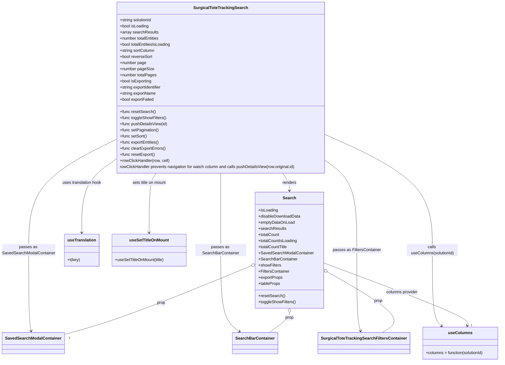

# Diagram: web/portal/src/pages/surgicaltotetracking/search/SurgicalToteTracking.Search.page.js

> Auto-generated by Obscura crawlers

## Mermaid

### SVG

<svg id="container" width="1938.72265625" xmlns="http://www.w3.org/2000/svg" class="classDiagram" height="1418" viewBox="0 0 1938.72265625 1418" role="graphics-document document" aria-roledescription="class"><g><defs><marker id="container_class-aggregationStart" class="marker aggregation class" refX="18" refY="7" markerWidth="190" markerHeight="240" orient="auto"><path d="M 18,7 L9,13 L1,7 L9,1 Z"></path></marker></defs><defs><marker id="container_class-aggregationEnd" class="marker aggregation class" refX="1" refY="7" markerWidth="20" markerHeight="28" orient="auto"><path d="M 18,7 L9,13 L1,7 L9,1 Z"></path></marker></defs><defs><marker id="container_class-extensionStart" class="marker extension class" refX="18" refY="7" markerWidth="190" markerHeight="240" orient="auto"><path d="M 1,7 L18,13 V 1 Z"></path></marker></defs><defs><marker id="container_class-extensionEnd" class="marker extension class" refX="1" refY="7" markerWidth="20" markerHeight="28" orient="auto"><path d="M 1,1 V 13 L18,7 Z"></path></marker></defs><defs><marker id="container_class-compositionStart" class="marker composition class" refX="18" refY="7" markerWidth="190" markerHeight="240" orient="auto"><path d="M 18,7 L9,13 L1,7 L9,1 Z"></path></marker></defs><defs><marker id="container_class-compositionEnd" class="marker composition class" refX="1" refY="7" markerWidth="20" markerHeight="28" orient="auto"><path d="M 18,7 L9,13 L1,7 L9,1 Z"></path></marker></defs><defs><marker id="container_class-dependencyStart" class="marker dependency class" refX="6" refY="7" markerWidth="190" markerHeight="240" orient="auto"><path d="M 5,7 L9,13 L1,7 L9,1 Z"></path></marker></defs><defs><marker id="container_class-dependencyEnd" class="marker dependency class" refX="13" refY="7" markerWidth="20" markerHeight="28" orient="auto"><path d="M 18,7 L9,13 L14,7 L9,1 Z"></path></marker></defs><defs><marker id="container_class-lollipopStart" class="marker lollipop class" refX="13" refY="7" markerWidth="190" markerHeight="240" orient="auto"><circle stroke="black" fill="transparent" cx="7" cy="7" r="6"></circle></marker></defs><defs><marker id="container_class-lollipopEnd" class="marker lollipop class" refX="1" refY="7" markerWidth="190" markerHeight="240" orient="auto"><circle stroke="black" fill="transparent" cx="7" cy="7" r="6"></circle></marker></defs><g class="root"><g class="clusters"></g><g class="edgePaths"><path d="M1100.791,680L1105.198,686.167C1109.605,692.333,1118.42,704.667,1122.827,716C1127.234,727.333,1127.234,737.667,1127.234,742.833L1127.234,748" id="id_SurgicalToteTrackingSearch_Search_1" class="edge-thickness-normal edge-pattern-solid relation" style=";;;" data-edge="true" data-et="edge" data-id="id_SurgicalToteTrackingSearch_Search_1" data-points="W3sieCI6MTEwMC43OTA5Njg0OTg2NTk2LCJ5Ijo2ODB9LHsieCI6MTEyNy4yMzQzNzUsInkiOjcxN30seyJ4IjoxMTI3LjIzNDM3NSwieSI6NzU0fV0=" marker-end="url(#container_class-dependencyEnd)"></path><path d="M860.656,680L860.656,686.167C860.656,692.333,860.656,704.667,860.656,755C860.656,805.333,860.656,893.667,860.656,982C860.656,1070.333,860.656,1158.667,872.741,1211.9C884.826,1265.133,908.995,1283.266,921.08,1292.333L933.164,1301.399" id="id_SurgicalToteTrackingSearch_SearchBarContainer_2" class="edge-thickness-normal edge-pattern-solid relation" style=";;;" data-edge="true" data-et="edge" data-id="id_SurgicalToteTrackingSearch_SearchBarContainer_2" data-points="W3sieCI6ODYwLjY1NjI1LCJ5Ijo2ODB9LHsieCI6ODYwLjY1NjI1LCJ5Ijo3MTd9LHsieCI6ODYwLjY1NjI1LCJ5Ijo5ODJ9LHsieCI6ODYwLjY1NjI1LCJ5IjoxMjQ3fSx7IngiOjkzNy45NjM5MDYyNSwieSI6MTMwNX1d" marker-end="url(#container_class-dependencyEnd)"></path><path d="M447.281,549.827L391.324,577.69C335.367,605.552,223.453,661.276,167.496,733.305C111.539,805.333,111.539,893.667,111.539,982C111.539,1070.333,111.539,1158.667,113.147,1211.517C114.755,1264.367,117.97,1281.734,119.578,1290.417L121.186,1299.1" id="id_SurgicalToteTrackingSearch_SavedSearchModalContainer_3" class="edge-thickness-normal edge-pattern-solid relation" style=";;;" data-edge="true" data-et="edge" data-id="id_SurgicalToteTrackingSearch_SavedSearchModalContainer_3" data-points="W3sieCI6NDQ3LjI4MTI1LCJ5Ijo1NDkuODI3NDQyNzE5MDMzOH0seyJ4IjoxMTEuNTM5MDYyNSwieSI6NzE3fSx7IngiOjExMS41MzkwNjI1LCJ5Ijo5ODJ9LHsieCI6MTExLjUzOTA2MjUsInkiOjEyNDd9LHsieCI6MTIyLjI3ODEyNSwieSI6MTMwNX1d" marker-end="url(#container_class-dependencyEnd)"></path><path d="M1274.031,636.479L1292.999,649.899C1311.966,663.319,1349.901,690.16,1368.868,747.746C1387.836,805.333,1387.836,893.667,1387.836,982C1387.836,1070.333,1387.836,1158.667,1389.808,1211.525C1391.78,1264.383,1395.725,1281.766,1397.697,1290.457L1399.669,1299.149" id="id_SurgicalToteTrackingSearch_SurgicalToteTrackingSearchFiltersContainer_4" class="edge-thickness-normal edge-pattern-solid relation" style=";;;" data-edge="true" data-et="edge" data-id="id_SurgicalToteTrackingSearch_SurgicalToteTrackingSearchFiltersContainer_4" data-points="W3sieCI6MTI3NC4wMzEyNSwieSI6NjM2LjQ3ODc4NTk5MjY3OTF9LHsieCI6MTM4Ny44MzU5Mzc1LCJ5Ijo3MTd9LHsieCI6MTM4Ny44MzU5Mzc1LCJ5Ijo5ODJ9LHsieCI6MTM4Ny44MzU5Mzc1LCJ5IjoxMjQ3fSx7IngiOjE0MDAuOTk2OTUzMTI1LCJ5IjoxMzA1fV0=" marker-end="url(#container_class-dependencyEnd)"></path><path d="M1274.031,532.144L1341.723,562.953C1409.415,593.763,1544.798,655.381,1612.49,730.357C1680.182,805.333,1680.182,893.667,1680.182,982C1680.182,1070.333,1680.182,1158.667,1685.7,1208.296C1691.219,1257.926,1702.256,1268.853,1707.774,1274.316L1713.293,1279.779" id="id_SurgicalToteTrackingSearch_useColumns_5" class="edge-thickness-normal edge-pattern-solid relation" style=";;;" data-edge="true" data-et="edge" data-id="id_SurgicalToteTrackingSearch_useColumns_5" data-points="W3sieCI6MTI3NC4wMzEyNSwieSI6NTMyLjE0NDEwOTcwNTI2NDh9LHsieCI6MTY4MC4xODE2NDA2MjUsInkiOjcxN30seyJ4IjoxNjgwLjE4MTY0MDYyNSwieSI6OTgyfSx7IngiOjE2ODAuMTgxNjQwNjI1LCJ5IjoxMjQ3fSx7IngiOjE3MTcuNTU2Njk5MjE4NzUsInkiOjEyODR9XQ==" marker-end="url(#container_class-dependencyEnd)"></path><path d="M447.281,627.179L425.428,642.149C403.576,657.119,359.87,687.06,338.017,734.697C316.164,782.333,316.164,847.667,316.164,880.333L316.164,913" id="id_SurgicalToteTrackingSearch_useTranslation_6" class="edge-thickness-normal edge-pattern-solid relation" style=";;;" data-edge="true" data-et="edge" data-id="id_SurgicalToteTrackingSearch_useTranslation_6" data-points="W3sieCI6NDQ3LjI4MTI1LCJ5Ijo2MjcuMTc5MjIzNzYwNjcxNH0seyJ4IjozMTYuMTY0MDYyNSwieSI6NzE3fSx7IngiOjMxNi4xNjQwNjI1LCJ5Ijo5MTl9XQ==" marker-end="url(#container_class-dependencyEnd)"></path><path d="M606.897,680L602.24,686.167C597.582,692.333,588.268,704.667,583.61,743.5C578.953,782.333,578.953,847.667,578.953,880.333L578.953,913" id="id_SurgicalToteTrackingSearch_useSetTitleOnMount_7" class="edge-thickness-normal edge-pattern-solid relation" style=";;;" data-edge="true" data-et="edge" data-id="id_SurgicalToteTrackingSearch_useSetTitleOnMount_7" data-points="W3sieCI6NjA2Ljg5Njg2NjYyMTk4MzksInkiOjY4MH0seyJ4Ijo1NzguOTUzMTI1LCJ5Ijo3MTd9LHsieCI6NTc4Ljk1MzEyNSwieSI6OTE5fV0=" marker-end="url(#container_class-dependencyEnd)"></path><path d="M979.714,1042.974L897.445,1076.979C815.175,1110.983,650.637,1178.991,528.502,1224.192C406.367,1269.393,326.637,1291.787,286.771,1302.984L246.906,1314.18" id="id_Search_SavedSearchModalContainer_8" class="edge-thickness-normal edge-pattern-solid relation" style=";;;" data-edge="true" data-et="edge" data-id="id_Search_SavedSearchModalContainer_8" data-points="W3sieCI6OTk1LjY1NjI1LCJ5IjoxMDM2LjM4NDk3Mjk3ODkwMX0seyJ4Ijo0ODYuMDk3NjU2MjUsInkiOjEyNDd9LHsieCI6MjQ2LjkwNjI1LCJ5IjoxMzE0LjE4MDQ4ODY2MTE3Mzd9XQ==" marker-start="url(#container_class-aggregationStart)"></path><path d="M1127.234,1227.25L1127.234,1230.542C1127.234,1233.833,1127.234,1240.417,1114.35,1253.375C1101.465,1266.333,1075.696,1285.667,1062.811,1295.333L1049.927,1305" id="id_Search_SearchBarContainer_9" class="edge-thickness-normal edge-pattern-solid relation" style=";;;" data-edge="true" data-et="edge" data-id="id_Search_SearchBarContainer_9" data-points="W3sieCI6MTEyNy4yMzQzNzUsInkiOjEyMTB9LHsieCI6MTEyNy4yMzQzNzUsInkiOjEyNDd9LHsieCI6MTA0OS45MjY3MTg3NSwieSI6MTMwNX1d" marker-start="url(#container_class-aggregationStart)"></path><path d="M1273.678,1068.217L1324.289,1098.015C1374.9,1127.812,1476.123,1187.406,1510.609,1226.87C1545.094,1266.333,1512.843,1285.667,1496.717,1295.333L1480.591,1305" id="id_Search_SurgicalToteTrackingSearchFiltersContainer_10" class="edge-thickness-normal edge-pattern-solid relation" style=";;;" data-edge="true" data-et="edge" data-id="id_Search_SurgicalToteTrackingSearchFiltersContainer_10" data-points="W3sieCI6MTI1OC44MTI1LCJ5IjoxMDU5LjQ2NTczMTEzNDIyNDZ9LHsieCI6MTU3Ny4zNDU3MDMxMjUsInkiOjEyNDd9LHsieCI6MTQ4MC41OTEwNTQ2ODc1LCJ5IjoxMzA1fV0=" marker-start="url(#container_class-aggregationStart)"></path><path d="M1258.813,1032.122L1352.827,1067.935C1446.841,1103.748,1634.87,1175.374,1726.697,1216.431C1818.525,1257.487,1814.151,1267.975,1811.964,1273.219L1809.778,1278.462" id="id_Search_useColumns_11" class="edge-thickness-normal edge-pattern-solid relation" style=";;;" data-edge="true" data-et="edge" data-id="id_Search_useColumns_11" data-points="W3sieCI6MTI1OC44MTI1LCJ5IjoxMDMyLjEyMjE4NTQxMTg3MDN9LHsieCI6MTgyMi44OTg0Mzc1LCJ5IjoxMjQ3fSx7IngiOjE4MDcuNDY4MjgxMjUsInkiOjEyODR9XQ==" marker-end="url(#container_class-dependencyEnd)"></path></g><g class="edgeLabels"><g class="edgeLabel" transform="translate(1127.234375, 717)"><g class="label" data-id="id_SurgicalToteTrackingSearch_Search_1" transform="translate(-27.75, -12)"><foreignObject width="55.5" height="24">

renders

</foreignObject></g></g><g class="edgeLabel" transform="translate(860.65625, 982)"><g class="label" data-id="id_SurgicalToteTrackingSearch_SearchBarContainer_2" transform="translate(-100, -24)"><foreignObject width="200" height="48">

passes as SearchBarContainer

</foreignObject></g></g><g class="edgeLabel" transform="translate(111.5390625, 982)"><g class="label" data-id="id_SurgicalToteTrackingSearch_SavedSearchModalContainer_3" transform="translate(-103.5390625, -24)"><foreignObject width="207.078125" height="48">

passes as SavedSearchModalContainer

</foreignObject></g></g><g class="edgeLabel" transform="translate(1387.8359375, 982)"><g class="label" data-id="id_SurgicalToteTrackingSearch_SurgicalToteTrackingSearchFiltersContainer_4" transform="translate(-94.0234375, -12)"><foreignObject width="188.046875" height="24">

passes as FiltersContainer

</foreignObject></g></g><g class="edgeLabel" transform="translate(1680.181640625, 982)"><g class="label" data-id="id_SurgicalToteTrackingSearch_useColumns_5" transform="translate(-100, -24)"><foreignObject width="200" height="48">

calls useColumns(solutionId)

</foreignObject></g></g><g class="edgeLabel" transform="translate(316.1640625, 717)"><g class="label" data-id="id_SurgicalToteTrackingSearch_useTranslation_6" transform="translate(-78.4921875, -12)"><foreignObject width="156.984375" height="24">

uses translation hook

</foreignObject></g></g><g class="edgeLabel" transform="translate(578.953125, 717)"><g class="label" data-id="id_SurgicalToteTrackingSearch_useSetTitleOnMount_7" transform="translate(-68.8203125, -12)"><foreignObject width="137.640625" height="24">

sets title on mount

</foreignObject></g></g><g class="edgeLabel" transform="translate(626.07366, 1189.14394)"><g class="label" data-id="id_Search_SavedSearchModalContainer_8" transform="translate(-17.03125, -12)"><foreignObject width="34.0625" height="24">

prop

</foreignObject></g></g><g class="edgeLabel" transform="translate(1127.234375, 1247)"><g class="label" data-id="id_Search_SearchBarContainer_9" transform="translate(-17.03125, -12)"><foreignObject width="34.0625" height="24">

prop

</foreignObject></g></g><g class="edgeLabel" transform="translate(1466.6845, 1181.84896)"><g class="label" data-id="id_Search_SurgicalToteTrackingSearchFiltersContainer_10" transform="translate(-17.03125, -12)"><foreignObject width="34.0625" height="24">

prop

</foreignObject></g></g><g class="edgeLabel" transform="translate(1559.58672, 1146.69641)"><g class="label" data-id="id_Search_useColumns_11" transform="translate(-63.40625, -12)"><foreignObject width="126.8125" height="24">

columns provider

</foreignObject></g></g><g class="edgeTerminals" transform="translate(262.810359766644, 1318.889666971224)"><g class="inner" transform="translate(0, 0)"></g><foreignObject style="width: 9px; height: 12px;">
1
</foreignObject></g><g class="edgeTerminals" transform="translate(1067.9269564608737, 1301.4963356975406)"><g class="inner" transform="translate(0, 0)"></g><foreignObject style="width: 9px; height: 12px;">
1
</foreignObject></g><g class="edgeTerminals" transform="translate(1498.3130678060998, 1303.8678339993671)"><g class="inner" transform="translate(0, 0)"></g><foreignObject style="width: 9px; height: 12px;">
1
</foreignObject></g><g class="edgeTerminals" transform="translate(1823.0484274892108, 1268.621774645961)"><g class="inner" transform="translate(0, 0)"></g><foreignObject style="width: 9px; height: 12px;">
1
</foreignObject></g></g><g class="nodes"><g class="node default" id="classId-SurgicalToteTrackingSearch-0" transform="translate(860.65625, 344)"><g class="basic label-container"><path d="M-413.375 -336 L413.375 -336 L413.375 336 L-413.375 336" stroke="none" stroke-width="0" fill="#ECECFF" style=""></path><path d="M-413.375 -336 C-125.57233131127884 -336, 162.2303373774423 -336, 413.375 -336 M-413.375 -336 C-160.61139299774968 -336, 92.15221400450065 -336, 413.375 -336 M413.375 -336 C413.375 -119.22863735542165, 413.375 97.54272528915669, 413.375 336 M413.375 -336 C413.375 -170.70813463181995, 413.375 -5.41626926363989, 413.375 336 M413.375 336 C192.88406061886556 336, -27.606878762268877 336, -413.375 336 M413.375 336 C212.70975532141549 336, 12.044510642830971 336, -413.375 336 M-413.375 336 C-413.375 84.22560030390093, -413.375 -167.54879939219813, -413.375 -336 M-413.375 336 C-413.375 163.71725601165366, -413.375 -8.56548797669268, -413.375 -336" stroke="#9370DB" stroke-width="1.3" fill="none" stroke-dasharray="0 0" style=""></path></g><g class="annotation-group text" transform="translate(0, -312)"></g><g class="label-group text" transform="translate(-100.90625, -312)"><g class="label" style="font-weight: bolder" transform="translate(0,-12)"><foreignObject width="201.8125" height="24">

SurgicalToteTrackingSearch

</foreignObject></g></g><g class="members-group text" transform="translate(-401.375, -264)"><g class="label" style="" transform="translate(0,-12)"><foreignObject width="127.96875" height="24">

+string solutionId

</foreignObject></g><g class="label" style="" transform="translate(0,12)"><foreignObject width="114.328125" height="24">

+bool isLoading

</foreignObject></g><g class="label" style="" transform="translate(0,36)"><foreignObject width="149.15625" height="24">

+array searchResults

</foreignObject></g><g class="label" style="" transform="translate(0,60)"><foreignObject width="157.359375" height="24">

+number totalEntities

</foreignObject></g><g class="label" style="" transform="translate(0,84)"><foreignObject width="202.859375" height="24">

+bool totalEntitiesIsLoading

</foreignObject></g><g class="label" style="" transform="translate(0,108)"><foreignObject width="137.703125" height="24">

+string sortColumn

</foreignObject></g><g class="label" style="" transform="translate(0,132)"><foreignObject width="128.140625" height="24">

+bool reverseSort

</foreignObject></g><g class="label" style="" transform="translate(0,156)"><foreignObject width="103.703125" height="24">

+number page

</foreignObject></g><g class="label" style="" transform="translate(0,180)"><foreignObject width="132.53125" height="24">

+number pageSize

</foreignObject></g><g class="label" style="" transform="translate(0,204)"><foreignObject width="144.03125" height="24">

+number totalPages

</foreignObject></g><g class="label" style="" transform="translate(0,228)"><foreignObject width="126.421875" height="24">

+bool isExporting

</foreignObject></g><g class="label" style="" transform="translate(0,252)"><foreignObject width="167.765625" height="24">

+string exportIdentifier

</foreignObject></g><g class="label" style="" transform="translate(0,276)"><foreignObject width="143.0625" height="24">

+string exportName

</foreignObject></g><g class="label" style="" transform="translate(0,300)"><foreignObject width="135.25" height="24">

+bool exportFailed

</foreignObject></g></g><g class="methods-group text" transform="translate(-401.375, 96)"><g class="label" style="" transform="translate(0,-12)"><foreignObject width="139.140625" height="24">

+func resetSearch()

</foreignObject></g><g class="label" style="" transform="translate(0,12)"><foreignObject width="181.96875" height="24">

+func toggleShowFilters()

</foreignObject></g><g class="label" style="" transform="translate(0,36)"><foreignObject width="187.46875" height="24">

+func pushDetailsView(id)

</foreignObject></g><g class="label" style="" transform="translate(0,60)"><foreignObject width="152.90625" height="24">

+func setPagination()

</foreignObject></g><g class="label" style="" transform="translate(0,84)"><foreignObject width="106.046875" height="24">

+func setSort()

</foreignObject></g><g class="label" style="" transform="translate(0,108)"><foreignObject width="155.734375" height="24">

+func exportEntities()

</foreignObject></g><g class="label" style="" transform="translate(0,132)"><foreignObject width="179.890625" height="24">

+func clearExportErrors()

</foreignObject></g><g class="label" style="" transform="translate(0,156)"><foreignObject width="137.5625" height="24">

+func resetExport()

</foreignObject></g><g class="label" style="" transform="translate(0,180)"><foreignObject width="196.4375" height="24">

+rowClickHandler(row, cell)

</foreignObject></g><g class="label" style="" transform="translate(0,204)"><foreignObject width="701.84375" height="24">

rowClickHandler prevents navigation for watch column and calls pushDetailsView(row.original.id)

</foreignObject></g></g><g class="divider" style=""><path d="M-413.375 -288 C-173.44232993025008 -288, 66.49034013949984 -288, 413.375 -288 M-413.375 -288 C-92.134124383168 -288, 229.106751233664 -288, 413.375 -288" stroke="#9370DB" stroke-width="1.3" fill="none" stroke-dasharray="0 0" style=""></path></g><g class="divider" style=""><path d="M-413.375 72 C-126.27379332383043 72, 160.82741335233914 72, 413.375 72 M-413.375 72 C-235.130875674157 72, -56.88675134831402 72, 413.375 72" stroke="#9370DB" stroke-width="1.3" fill="none" stroke-dasharray="0 0" style=""></path></g></g><g class="node default" id="classId-Search-1" transform="translate(1127.234375, 982)"><g class="basic label-container"><path d="M-131.578125 -228 L131.578125 -228 L131.578125 228 L-131.578125 228" stroke="none" stroke-width="0" fill="#ECECFF" style=""></path><path d="M-131.578125 -228 C-72.90207480357694 -228, -14.22602460715386 -228, 131.578125 -228 M-131.578125 -228 C-34.3948673385959 -228, 62.7883903228082 -228, 131.578125 -228 M131.578125 -228 C131.578125 -133.33049819653868, 131.578125 -38.66099639307737, 131.578125 228 M131.578125 -228 C131.578125 -121.39261160445483, 131.578125 -14.785223208909656, 131.578125 228 M131.578125 228 C62.790969052469606 228, -5.996186895060788 228, -131.578125 228 M131.578125 228 C43.75921324116152 228, -44.05969851767696 228, -131.578125 228 M-131.578125 228 C-131.578125 105.77368756885909, -131.578125 -16.452624862281823, -131.578125 -228 M-131.578125 228 C-131.578125 85.75186999165314, -131.578125 -56.496260016693725, -131.578125 -228" stroke="#9370DB" stroke-width="1.3" fill="none" stroke-dasharray="0 0" style=""></path></g><g class="annotation-group text" transform="translate(0, -204)"></g><g class="label-group text" transform="translate(-24.71875, -204)"><g class="label" style="font-weight: bolder" transform="translate(0,-12)"><foreignObject width="49.4375" height="24">

Search

</foreignObject></g></g><g class="members-group text" transform="translate(-119.578125, -156)"><g class="label" style="" transform="translate(0,-12)"><foreignObject width="77.203125" height="24">

+isLoading

</foreignObject></g><g class="label" style="" transform="translate(0,12)"><foreignObject width="166.703125" height="24">

+disableDownloadData

</foreignObject></g><g class="label" style="" transform="translate(0,36)"><foreignObject width="142.1875" height="24">

+emptyDataOnLoad

</foreignObject></g><g class="label" style="" transform="translate(0,60)"><foreignObject width="108.328125" height="24">

+searchResults

</foreignObject></g><g class="label" style="" transform="translate(0,84)"><foreignObject width="84.140625" height="24">

+totalCount

</foreignObject></g><g class="label" style="" transform="translate(0,108)"><foreignObject width="153.5625" height="24">

+totalCountIsLoading

</foreignObject></g><g class="label" style="" transform="translate(0,132)"><foreignObject width="115.859375" height="24">

+totalCountTitle

</foreignObject></g><g class="label" style="" transform="translate(0,156)"><foreignObject width="214.4375" height="24">

+SavedSearchModalContainer

</foreignObject></g><g class="label" style="" transform="translate(0,180)"><foreignObject width="151.171875" height="24">

+SearchBarContainer

</foreignObject></g><g class="label" style="" transform="translate(0,204)"><foreignObject width="89.8125" height="24">

+showFilters

</foreignObject></g><g class="label" style="" transform="translate(0,228)"><foreignObject width="122.65625" height="24">

+FiltersContainer

</foreignObject></g><g class="label" style="" transform="translate(0,252)"><foreignObject width="96.125" height="24">

+exportProps

</foreignObject></g><g class="label" style="" transform="translate(0,276)"><foreignObject width="86.109375" height="24">

+tableProps

</foreignObject></g></g><g class="methods-group text" transform="translate(-119.578125, 180)"><g class="label" style="" transform="translate(0,-12)"><foreignObject width="103.453125" height="24">

+resetSearch()

</foreignObject></g><g class="label" style="" transform="translate(0,12)"><foreignObject width="146.203125" height="24">

+toggleShowFilters()

</foreignObject></g></g><g class="divider" style=""><path d="M-131.578125 -180 C-58.01221329483391 -180, 15.553698410332174 -180, 131.578125 -180 M-131.578125 -180 C-64.34083822639231 -180, 2.8964485472153854 -180, 131.578125 -180" stroke="#9370DB" stroke-width="1.3" fill="none" stroke-dasharray="0 0" style=""></path></g><g class="divider" style=""><path d="M-131.578125 156 C-50.522230885870286 156, 30.533663228259428 156, 131.578125 156 M-131.578125 156 C-69.96890054793545 156, -8.35967609587091 156, 131.578125 156" stroke="#9370DB" stroke-width="1.3" fill="none" stroke-dasharray="0 0" style=""></path></g></g><g class="node default" id="classId-SearchBarContainer-2" transform="translate(993.9453125, 1347)"><g class="basic label-container"><path d="M-84.84375 -42 L84.84375 -42 L84.84375 42 L-84.84375 42" stroke="none" stroke-width="0" fill="#ECECFF" style=""></path><path d="M-84.84375 -42 C-30.86759755721902 -42, 23.108554885561958 -42, 84.84375 -42 M-84.84375 -42 C-31.92881957614069 -42, 20.98611084771862 -42, 84.84375 -42 M84.84375 -42 C84.84375 -24.426847323376673, 84.84375 -6.853694646753347, 84.84375 42 M84.84375 -42 C84.84375 -11.757796432130352, 84.84375 18.484407135739296, 84.84375 42 M84.84375 42 C29.830184430686295 42, -25.18338113862741 42, -84.84375 42 M84.84375 42 C17.005199856228273 42, -50.83335028754345 42, -84.84375 42 M-84.84375 42 C-84.84375 17.44855725029819, -84.84375 -7.1028854994036195, -84.84375 -42 M-84.84375 42 C-84.84375 24.89206068498323, -84.84375 7.7841213699664635, -84.84375 -42" stroke="#9370DB" stroke-width="1.3" fill="none" stroke-dasharray="0 0" style=""></path></g><g class="annotation-group text" transform="translate(0, -18)"></g><g class="label-group text" transform="translate(-72.84375, -18)"><g class="label" style="font-weight: bolder" transform="translate(0,-12)"><foreignObject width="145.6875" height="24">

SearchBarContainer

</foreignObject></g></g><g class="members-group text" transform="translate(-72.84375, 30)"></g><g class="methods-group text" transform="translate(-72.84375, 60)"></g><g class="divider" style=""><path d="M-84.84375 6 C-19.337235092621142 6, 46.169279814757715 6, 84.84375 6 M-84.84375 6 C-47.9146742183755 6, -10.985598436751005 6, 84.84375 6" stroke="#9370DB" stroke-width="1.3" fill="none" stroke-dasharray="0 0" style=""></path></g><g class="divider" style=""><path d="M-84.84375 24 C-19.48557844119263 24, 45.87259311761474 24, 84.84375 24 M-84.84375 24 C-39.74391860130104 24, 5.35591279739792 24, 84.84375 24" stroke="#9370DB" stroke-width="1.3" fill="none" stroke-dasharray="0 0" style=""></path></g></g><g class="node default" id="classId-SavedSearchModalContainer-3" transform="translate(130.0546875, 1347)"><g class="basic label-container"><path d="M-116.8515625 -42 L116.8515625 -42 L116.8515625 42 L-116.8515625 42" stroke="none" stroke-width="0" fill="#ECECFF" style=""></path><path d="M-116.8515625 -42 C-46.80621827092361 -42, 23.239125958152783 -42, 116.8515625 -42 M-116.8515625 -42 C-56.359834685404266 -42, 4.131893129191468 -42, 116.8515625 -42 M116.8515625 -42 C116.8515625 -14.980739753540696, 116.8515625 12.038520492918607, 116.8515625 42 M116.8515625 -42 C116.8515625 -10.71520792513634, 116.8515625 20.56958414972732, 116.8515625 42 M116.8515625 42 C66.66932622587305 42, 16.4870899517461 42, -116.8515625 42 M116.8515625 42 C33.40863893848123 42, -50.034284623037536 42, -116.8515625 42 M-116.8515625 42 C-116.8515625 17.92102289868598, -116.8515625 -6.157954202628041, -116.8515625 -42 M-116.8515625 42 C-116.8515625 19.065201868513217, -116.8515625 -3.869596262973566, -116.8515625 -42" stroke="#9370DB" stroke-width="1.3" fill="none" stroke-dasharray="0 0" style=""></path></g><g class="annotation-group text" transform="translate(0, -18)"></g><g class="label-group text" transform="translate(-104.8515625, -18)"><g class="label" style="font-weight: bolder" transform="translate(0,-12)"><foreignObject width="209.703125" height="24">

SavedSearchModalContainer

</foreignObject></g></g><g class="members-group text" transform="translate(-104.8515625, 30)"></g><g class="methods-group text" transform="translate(-104.8515625, 60)"></g><g class="divider" style=""><path d="M-116.8515625 6 C-35.08712899645265 6, 46.6773045070947 6, 116.8515625 6 M-116.8515625 6 C-32.01674962141628 6, 52.81806325716744 6, 116.8515625 6" stroke="#9370DB" stroke-width="1.3" fill="none" stroke-dasharray="0 0" style=""></path></g><g class="divider" style=""><path d="M-116.8515625 24 C-24.46067921942472 24, 67.93020406115056 24, 116.8515625 24 M-116.8515625 24 C-42.75467174603837 24, 31.342219007923262 24, 116.8515625 24" stroke="#9370DB" stroke-width="1.3" fill="none" stroke-dasharray="0 0" style=""></path></g></g><g class="node default" id="classId-SurgicalToteTrackingSearchFiltersContainer-4" transform="translate(1410.52734375, 1347)"><g class="basic label-container"><path d="M-171.140625 -42 L171.140625 -42 L171.140625 42 L-171.140625 42" stroke="none" stroke-width="0" fill="#ECECFF" style=""></path><path d="M-171.140625 -42 C-58.32774274180137 -42, 54.485139516397254 -42, 171.140625 -42 M-171.140625 -42 C-35.686213214574195 -42, 99.76819857085161 -42, 171.140625 -42 M171.140625 -42 C171.140625 -8.73690367857774, 171.140625 24.52619264284452, 171.140625 42 M171.140625 -42 C171.140625 -20.356757155435318, 171.140625 1.2864856891293641, 171.140625 42 M171.140625 42 C72.67484476723007 42, -25.79093546553986 42, -171.140625 42 M171.140625 42 C78.30534952317207 42, -14.529925953655862 42, -171.140625 42 M-171.140625 42 C-171.140625 22.16434422135011, -171.140625 2.3286884427002192, -171.140625 -42 M-171.140625 42 C-171.140625 12.229894045545628, -171.140625 -17.540211908908745, -171.140625 -42" stroke="#9370DB" stroke-width="1.3" fill="none" stroke-dasharray="0 0" style=""></path></g><g class="annotation-group text" transform="translate(0, -18)"></g><g class="label-group text" transform="translate(-159.140625, -18)"><g class="label" style="font-weight: bolder" transform="translate(0,-12)"><foreignObject width="318.28125" height="24">

SurgicalToteTrackingSearchFiltersContainer

</foreignObject></g></g><g class="members-group text" transform="translate(-159.140625, 30)"></g><g class="methods-group text" transform="translate(-159.140625, 60)"></g><g class="divider" style=""><path d="M-171.140625 6 C-34.71638908499665 6, 101.7078468300067 6, 171.140625 6 M-171.140625 6 C-98.30617818188703 6, -25.47173136377407 6, 171.140625 6" stroke="#9370DB" stroke-width="1.3" fill="none" stroke-dasharray="0 0" style=""></path></g><g class="divider" style=""><path d="M-171.140625 24 C-83.1387994765875 24, 4.863026046825013 24, 171.140625 24 M-171.140625 24 C-94.590273756614 24, -18.039922513227992 24, 171.140625 24" stroke="#9370DB" stroke-width="1.3" fill="none" stroke-dasharray="0 0" style=""></path></g></g><g class="node default" id="classId-useColumns-5" transform="translate(1781.1953125, 1347)"><g class="basic label-container"><path d="M-149.52734375 -63 L149.52734375 -63 L149.52734375 63 L-149.52734375 63" stroke="none" stroke-width="0" fill="#ECECFF" style=""></path><path d="M-149.52734375 -63 C-61.63073637863323 -63, 26.26587099273354 -63, 149.52734375 -63 M-149.52734375 -63 C-38.69930469737426 -63, 72.12873435525148 -63, 149.52734375 -63 M149.52734375 -63 C149.52734375 -19.647995628352867, 149.52734375 23.704008743294267, 149.52734375 63 M149.52734375 -63 C149.52734375 -20.482235760849477, 149.52734375 22.035528478301046, 149.52734375 63 M149.52734375 63 C44.16137648448344 63, -61.20459078103312 63, -149.52734375 63 M149.52734375 63 C72.23969014669979 63, -5.047963456600428 63, -149.52734375 63 M-149.52734375 63 C-149.52734375 34.3971696068986, -149.52734375 5.794339213797194, -149.52734375 -63 M-149.52734375 63 C-149.52734375 22.14487572209056, -149.52734375 -18.71024855581888, -149.52734375 -63" stroke="#9370DB" stroke-width="1.3" fill="none" stroke-dasharray="0 0" style=""></path></g><g class="annotation-group text" transform="translate(0, -39)"></g><g class="label-group text" transform="translate(-44.1640625, -39)"><g class="label" style="font-weight: bolder" transform="translate(0,-12)"><foreignObject width="88.328125" height="24">

useColumns

</foreignObject></g></g><g class="members-group text" transform="translate(-137.52734375, 9)"></g><g class="methods-group text" transform="translate(-137.52734375, 39)"><g class="label" style="" transform="translate(0,-12)"><foreignObject width="230.890625" height="24">

+columns = function(solutionId)

</foreignObject></g></g><g class="divider" style=""><path d="M-149.52734375 -15 C-39.46604737814914 -15, 70.59524899370172 -15, 149.52734375 -15 M-149.52734375 -15 C-70.62370401003501 -15, 8.279935729929974 -15, 149.52734375 -15" stroke="#9370DB" stroke-width="1.3" fill="none" stroke-dasharray="0 0" style=""></path></g><g class="divider" style=""><path d="M-149.52734375 9 C-71.4970887737778 9, 6.5331662024443915 9, 149.52734375 9 M-149.52734375 9 C-31.100934916317286 9, 87.32547391736543 9, 149.52734375 9" stroke="#9370DB" stroke-width="1.3" fill="none" stroke-dasharray="0 0" style=""></path></g></g><g class="node default" id="classId-useTranslation-6" transform="translate(316.1640625, 982)"><g class="basic label-container"><path d="M-66.0859375 -63 L66.0859375 -63 L66.0859375 63 L-66.0859375 63" stroke="none" stroke-width="0" fill="#ECECFF" style=""></path><path d="M-66.0859375 -63 C-21.000748643886688 -63, 24.084440212226625 -63, 66.0859375 -63 M-66.0859375 -63 C-27.942609371645865 -63, 10.20071875670827 -63, 66.0859375 -63 M66.0859375 -63 C66.0859375 -36.22399144523749, 66.0859375 -9.447982890474982, 66.0859375 63 M66.0859375 -63 C66.0859375 -22.832012209508058, 66.0859375 17.335975580983884, 66.0859375 63 M66.0859375 63 C26.249254612644606 63, -13.587428274710788 63, -66.0859375 63 M66.0859375 63 C14.964611515814092 63, -36.15671446837182 63, -66.0859375 63 M-66.0859375 63 C-66.0859375 36.25085530226895, -66.0859375 9.501710604537905, -66.0859375 -63 M-66.0859375 63 C-66.0859375 15.845396119577607, -66.0859375 -31.309207760844785, -66.0859375 -63" stroke="#9370DB" stroke-width="1.3" fill="none" stroke-dasharray="0 0" style=""></path></g><g class="annotation-group text" transform="translate(0, -39)"></g><g class="label-group text" transform="translate(-54.0859375, -39)"><g class="label" style="font-weight: bolder" transform="translate(0,-12)"><foreignObject width="108.171875" height="24">

useTranslation

</foreignObject></g></g><g class="members-group text" transform="translate(-54.0859375, 9)"></g><g class="methods-group text" transform="translate(-54.0859375, 39)"><g class="label" style="" transform="translate(0,-12)"><foreignObject width="48.625" height="24">

+t(key)

</foreignObject></g></g><g class="divider" style=""><path d="M-66.0859375 -15 C-15.884871722430944 -15, 34.31619405513811 -15, 66.0859375 -15 M-66.0859375 -15 C-17.976596065880827 -15, 30.132745368238346 -15, 66.0859375 -15" stroke="#9370DB" stroke-width="1.3" fill="none" stroke-dasharray="0 0" style=""></path></g><g class="divider" style=""><path d="M-66.0859375 9 C-33.965744771391435 9, -1.8455520427828702 9, 66.0859375 9 M-66.0859375 9 C-24.316130018481857 9, 17.453677463036286 9, 66.0859375 9" stroke="#9370DB" stroke-width="1.3" fill="none" stroke-dasharray="0 0" style=""></path></g></g><g class="node default" id="classId-useSetTitleOnMount-7" transform="translate(578.953125, 982)"><g class="basic label-container"><path d="M-146.703125 -63 L146.703125 -63 L146.703125 63 L-146.703125 63" stroke="none" stroke-width="0" fill="#ECECFF" style=""></path><path d="M-146.703125 -63 C-29.669522922816412 -63, 87.36407915436718 -63, 146.703125 -63 M-146.703125 -63 C-34.76733608283665 -63, 77.1684528343267 -63, 146.703125 -63 M146.703125 -63 C146.703125 -27.14336102372279, 146.703125 8.71327795255442, 146.703125 63 M146.703125 -63 C146.703125 -16.54517507512754, 146.703125 29.909649849744923, 146.703125 63 M146.703125 63 C64.24004853633627 63, -18.22302792732745 63, -146.703125 63 M146.703125 63 C63.94834099668928 63, -18.806443006621436 63, -146.703125 63 M-146.703125 63 C-146.703125 15.236721343727055, -146.703125 -32.52655731254589, -146.703125 -63 M-146.703125 63 C-146.703125 21.520305103960304, -146.703125 -19.959389792079392, -146.703125 -63" stroke="#9370DB" stroke-width="1.3" fill="none" stroke-dasharray="0 0" style=""></path></g><g class="annotation-group text" transform="translate(0, -39)"></g><g class="label-group text" transform="translate(-74.65625, -39)"><g class="label" style="font-weight: bolder" transform="translate(0,-12)"><foreignObject width="149.3125" height="24">

useSetTitleOnMount

</foreignObject></g></g><g class="members-group text" transform="translate(-134.703125, 9)"></g><g class="methods-group text" transform="translate(-134.703125, 39)"><g class="label" style="" transform="translate(0,-12)"><foreignObject width="194.75" height="24">

+useSetTitleOnMount(title)

</foreignObject></g></g><g class="divider" style=""><path d="M-146.703125 -15 C-81.95059507666669 -15, -17.198065153333374 -15, 146.703125 -15 M-146.703125 -15 C-43.709800967102524 -15, 59.28352306579495 -15, 146.703125 -15" stroke="#9370DB" stroke-width="1.3" fill="none" stroke-dasharray="0 0" style=""></path></g><g class="divider" style=""><path d="M-146.703125 9 C-36.40685713066195 9, 73.8894107386761 9, 146.703125 9 M-146.703125 9 C-87.54901521410133 9, -28.394905428202676 9, 146.703125 9" stroke="#9370DB" stroke-width="1.3" fill="none" stroke-dasharray="0 0" style=""></path></g></g></g></g></g></svg>
