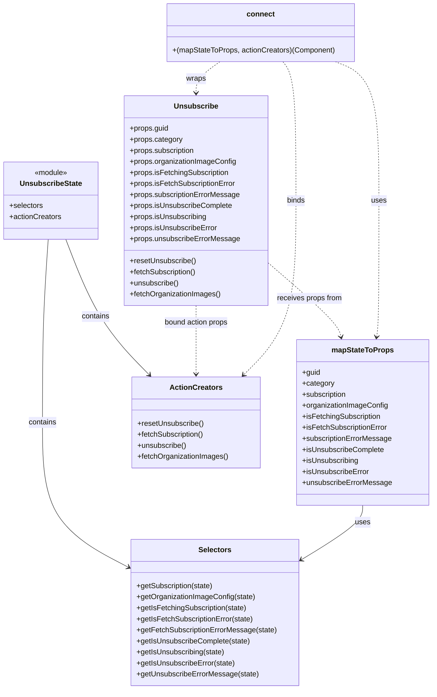

# Diagram: web/portal/src/pages/unsubscribe/Unsubscribe.page.container.js


> Auto-generated by Obscura crawlers

## Diagram 1



### SVG

<svg id="container" width="936.78125" xmlns="http://www.w3.org/2000/svg" class="classDiagram" height="1498" viewBox="0 0 936.78125 1498" role="graphics-document document" aria-roledescription="class"><style>#container{font-family:"trebuchet ms",verdana,arial,sans-serif;font-size:16px;fill:#333;}@keyframes edge-animation-frame{from{stroke-dashoffset:0;}}@keyframes dash{to{stroke-dashoffset:0;}}#container .edge-animation-slow{stroke-dasharray:9,5!important;stroke-dashoffset:900;animation:dash 50s linear infinite;stroke-linecap:round;}#container .edge-animation-fast{stroke-dasharray:9,5!important;stroke-dashoffset:900;animation:dash 20s linear infinite;stroke-linecap:round;}#container .error-icon{fill:#552222;}#container .error-text{fill:#552222;stroke:#552222;}#container .edge-thickness-normal{stroke-width:1px;}#container .edge-thickness-thick{stroke-width:3.5px;}#container .edge-pattern-solid{stroke-dasharray:0;}#container .edge-thickness-invisible{stroke-width:0;fill:none;}#container .edge-pattern-dashed{stroke-dasharray:3;}#container .edge-pattern-dotted{stroke-dasharray:2;}#container .marker{fill:#333333;stroke:#333333;}#container .marker.cross{stroke:#333333;}#container svg{font-family:"trebuchet ms",verdana,arial,sans-serif;font-size:16px;}#container p{margin:0;}#container g.classGroup text{fill:#9370DB;stroke:none;font-family:"trebuchet ms",verdana,arial,sans-serif;font-size:10px;}#container g.classGroup text .title{font-weight:bolder;}#container .nodeLabel,#container .edgeLabel{color:#131300;}#container .edgeLabel .label rect{fill:#ECECFF;}#container .label text{fill:#131300;}#container .labelBkg{background:#ECECFF;}#container .edgeLabel .label span{background:#ECECFF;}#container .classTitle{font-weight:bolder;}#container .node rect,#container .node circle,#container .node ellipse,#container .node polygon,#container .node path{fill:#ECECFF;stroke:#9370DB;stroke-width:1px;}#container .divider{stroke:#9370DB;stroke-width:1;}#container g.clickable{cursor:pointer;}#container g.classGroup rect{fill:#ECECFF;stroke:#9370DB;}#container g.classGroup line{stroke:#9370DB;stroke-width:1;}#container .classLabel .box{stroke:none;stroke-width:0;fill:#ECECFF;opacity:0.5;}#container .classLabel .label{fill:#9370DB;font-size:10px;}#container .relation{stroke:#333333;stroke-width:1;fill:none;}#container .dashed-line{stroke-dasharray:3;}#container .dotted-line{stroke-dasharray:1 2;}#container #compositionStart,#container .composition{fill:#333333!important;stroke:#333333!important;stroke-width:1;}#container #compositionEnd,#container .composition{fill:#333333!important;stroke:#333333!important;stroke-width:1;}#container #dependencyStart,#container .dependency{fill:#333333!important;stroke:#333333!important;stroke-width:1;}#container #dependencyStart,#container .dependency{fill:#333333!important;stroke:#333333!important;stroke-width:1;}#container #extensionStart,#container .extension{fill:transparent!important;stroke:#333333!important;stroke-width:1;}#container #extensionEnd,#container .extension{fill:transparent!important;stroke:#333333!important;stroke-width:1;}#container #aggregationStart,#container .aggregation{fill:transparent!important;stroke:#333333!important;stroke-width:1;}#container #aggregationEnd,#container .aggregation{fill:transparent!important;stroke:#333333!important;stroke-width:1;}#container #lollipopStart,#container .lollipop{fill:#ECECFF!important;stroke:#333333!important;stroke-width:1;}#container #lollipopEnd,#container .lollipop{fill:#ECECFF!important;stroke:#333333!important;stroke-width:1;}#container .edgeTerminals{font-size:11px;line-height:initial;}#container .classTitleText{text-anchor:middle;font-size:18px;fill:#333;}#container .label-icon{display:inline-block;height:1em;overflow:visible;vertical-align:-0.125em;}#container .node .label-icon path{fill:currentColor;stroke:revert;stroke-width:revert;}#container :root{--mermaid-font-family:"trebuchet ms",verdana,arial,sans-serif;}</style><g><defs><marker id="container_class-aggregationStart" class="marker aggregation class" refX="18" refY="7" markerWidth="190" markerHeight="240" orient="auto"><path d="M 18,7 L9,13 L1,7 L9,1 Z"></path></marker></defs><defs><marker id="container_class-aggregationEnd" class="marker aggregation class" refX="1" refY="7" markerWidth="20" markerHeight="28" orient="auto"><path d="M 18,7 L9,13 L1,7 L9,1 Z"></path></marker></defs><defs><marker id="container_class-extensionStart" class="marker extension class" refX="18" refY="7" markerWidth="190" markerHeight="240" orient="auto"><path d="M 1,7 L18,13 V 1 Z"></path></marker></defs><defs><marker id="container_class-extensionEnd" class="marker extension class" refX="1" refY="7" markerWidth="20" markerHeight="28" orient="auto"><path d="M 1,1 V 13 L18,7 Z"></path></marker></defs><defs><marker id="container_class-compositionStart" class="marker composition class" refX="18" refY="7" markerWidth="190" markerHeight="240" orient="auto"><path d="M 18,7 L9,13 L1,7 L9,1 Z"></path></marker></defs><defs><marker id="container_class-compositionEnd" class="marker composition class" refX="1" refY="7" markerWidth="20" markerHeight="28" orient="auto"><path d="M 18,7 L9,13 L1,7 L9,1 Z"></path></marker></defs><defs><marker id="container_class-dependencyStart" class="marker dependency class" refX="6" refY="7" markerWidth="190" markerHeight="240" orient="auto"><path d="M 5,7 L9,13 L1,7 L9,1 Z"></path></marker></defs><defs><marker id="container_class-dependencyEnd" class="marker dependency class" refX="13" refY="7" markerWidth="20" markerHeight="28" orient="auto"><path d="M 18,7 L9,13 L14,7 L9,1 Z"></path></marker></defs><defs><marker id="container_class-lollipopStart" class="marker lollipop class" refX="13" refY="7" markerWidth="190" markerHeight="240" orient="auto"><circle stroke="black" fill="transparent" cx="7" cy="7" r="6"></circle></marker></defs><defs><marker id="container_class-lollipopEnd" class="marker lollipop class" refX="1" refY="7" markerWidth="190" markerHeight="240" orient="auto"><circle stroke="black" fill="transparent" cx="7" cy="7" r="6"></circle></marker></defs><g class="root"><g class="clusters"></g><g class="edgePaths"><path d="M103.981,520L102.217,550.167C100.452,580.333,96.923,640.667,95.159,707C93.395,773.333,93.395,845.667,93.395,918C93.395,990.333,93.395,1062.667,124.833,1115.256C156.272,1167.845,219.15,1200.69,250.589,1217.113L282.028,1233.535" id="id_UnsubscribeState_Selectors_1" class="edge-thickness-normal edge-pattern-solid relation" style=";;;" data-edge="true" data-et="edge" data-id="id_UnsubscribeState_Selectors_1" data-points="W3sieCI6MTAzLjk4MTMyMzcwMjgzMDIsInkiOjUyMH0seyJ4Ijo5My4zOTQ1MzEyNSwieSI6NzAxfSx7IngiOjkzLjM5NDUzMTI1LCJ5Ijo5MTh9LHsieCI6OTMuMzk0NTMxMjUsInkiOjExMzV9LHsieCI6Mjg3LjM0NTcwMzEyNSwieSI6MTIzNi4zMTMyNDA3ODI2NzI0fV0=" marker-end="url(#container_class-dependencyEnd)"></path><path d="M141.199,520L152.801,550.167C164.402,580.333,187.606,640.667,217.908,689.788C248.21,738.91,285.612,776.819,304.313,795.774L323.014,814.729" id="id_UnsubscribeState_ActionCreators_2" class="edge-thickness-normal edge-pattern-solid relation" style=";;;" data-edge="true" data-et="edge" data-id="id_UnsubscribeState_ActionCreators_2" data-points="W3sieCI6MTQxLjE5OTM2NjE1NTY2MDM5LCJ5Ijo1MjB9LHsieCI6MjEwLjgwODU5Mzc1LCJ5Ijo3MDF9LHsieCI6MzI3LjIyODIzNjYwNzE0MjksInkiOjgxOX1d" marker-end="url(#container_class-dependencyEnd)"></path><path d="M786.668,1098L786.668,1104.167C786.668,1110.333,786.668,1122.667,764.721,1142.358C742.774,1162.05,698.879,1189.099,676.932,1202.624L654.985,1216.149" id="id_mapStateToProps_Selectors_3" class="edge-thickness-normal edge-pattern-solid relation" style=";;;" data-edge="true" data-et="edge" data-id="id_mapStateToProps_Selectors_3" data-points="W3sieCI6Nzg2LjY2Nzk2ODc1LCJ5IjoxMDk4fSx7IngiOjc4Ni42Njc5Njg3NSwieSI6MTEzNX0seyJ4Ijo2NDkuODc2OTUzMTI1LCJ5IjoxMjE5LjI5NjQyOTExOTcxNX1d" marker-end="url(#container_class-dependencyEnd)"></path><path d="M580.07,567.844L606.189,590.037C632.307,612.23,684.544,656.615,711.856,684C739.168,711.384,741.556,721.768,742.749,726.96L743.943,732.153" id="id_Unsubscribe_mapStateToProps_4" class="edge-thickness-normal edge-pattern-dashed relation" style=";;;" data-edge="true" data-et="edge" data-id="id_Unsubscribe_mapStateToProps_4" data-points="W3sieCI6NTgwLjA3MDMxMjUsInkiOjU2Ny44NDQ0Nzg0MDA4MjE2fSx7IngiOjczNi43ODEyNSwieSI6NzAxfSx7IngiOjc0NS4yODcyODAzODU5NDQ3LCJ5Ijo3Mzh9XQ==" marker-end="url(#container_class-dependencyEnd)"></path><path d="M424.902,664L424.902,670.167C424.902,676.333,424.902,688.667,424.902,713.5C424.902,738.333,424.902,775.667,424.902,794.333L424.902,813" id="id_Unsubscribe_ActionCreators_5" class="edge-thickness-normal edge-pattern-dashed relation" style=";;;" data-edge="true" data-et="edge" data-id="id_Unsubscribe_ActionCreators_5" data-points="W3sieCI6NDI0LjkwMjM0Mzc1LCJ5Ijo2NjR9LHsieCI6NDI0LjkwMjM0Mzc1LCJ5Ijo3MDF9LHsieCI6NDI0LjkwMjM0Mzc1LCJ5Ijo4MTl9XQ==" marker-end="url(#container_class-dependencyEnd)"></path><path d="M479.238,134L470.182,140.167C461.126,146.333,443.014,158.667,433.958,170C424.902,181.333,424.902,191.667,424.902,196.833L424.902,202" id="id_connect_Unsubscribe_6" class="edge-thickness-normal edge-pattern-dashed relation" style=";;;" data-edge="true" data-et="edge" data-id="id_connect_Unsubscribe_6" data-points="W3sieCI6NDc5LjIzODE0NDUzMTI1LCJ5IjoxMzR9LHsieCI6NDI0LjkwMjM0Mzc1LCJ5IjoxNzF9LHsieCI6NDI0LjkwMjM0Mzc1LCJ5IjoyMDh9XQ==" marker-end="url(#container_class-dependencyEnd)"></path><path d="M733.396,134L749.218,140.167C765.04,146.333,796.684,158.667,812.506,209C828.328,259.333,828.328,347.667,828.328,436C828.328,524.333,828.328,612.667,827.333,662.018C826.337,711.369,824.347,721.738,823.351,726.923L822.356,732.108" id="id_connect_mapStateToProps_7" class="edge-thickness-normal edge-pattern-dashed relation" style=";;;" data-edge="true" data-et="edge" data-id="id_connect_mapStateToProps_7" data-points="W3sieCI6NzMzLjM5NjM4NjcxODc1LCJ5IjoxMzR9LHsieCI6ODI4LjMyODEyNSwieSI6MTcxfSx7IngiOjgyOC4zMjgxMjUsInkiOjQzNn0seyJ4Ijo4MjguMzI4MTI1LCJ5Ijo3MDF9LHsieCI6ODIxLjIyNDc4MDM4NTk0NDcsInkiOjczOH1d" marker-end="url(#container_class-dependencyEnd)"></path><path d="M618.047,134L622.578,140.167C627.11,146.333,636.172,158.667,640.703,209C645.234,259.333,645.234,347.667,645.234,436C645.234,524.333,645.234,612.667,625.978,675.798C606.722,738.93,568.21,776.86,548.954,795.825L529.697,814.79" id="id_connect_ActionCreators_8" class="edge-thickness-normal edge-pattern-dashed relation" style=";;;" data-edge="true" data-et="edge" data-id="id_connect_ActionCreators_8" data-points="W3sieCI6NjE4LjA0NzMyNDIxODc1LCJ5IjoxMzR9LHsieCI6NjQ1LjIzNDM3NSwieSI6MTcxfSx7IngiOjY0NS4yMzQzNzUsInkiOjQzNn0seyJ4Ijo2NDUuMjM0Mzc1LCJ5Ijo3MDF9LHsieCI6NTI1LjQyMjQ4NzAzOTE3MDUsInkiOjgxOX1d" marker-end="url(#container_class-dependencyEnd)"></path></g><g class="edgeLabels"><g class="edgeLabel" transform="translate(93.39453125, 918)"><g class="label" data-id="id_UnsubscribeState_Selectors_1" transform="translate(-30.890625, -12)"><foreignObject width="61.78125" height="24"><div xmlns="http://www.w3.org/1999/xhtml" class="labelBkg" style="display: table-cell; white-space: nowrap; line-height: 1.5; max-width: 200px; text-align: center;"><span class="edgeLabel"><p>contains</p></span></div></foreignObject></g></g><g class="edgeLabel" transform="translate(205.7545, 687.85819)"><g class="label" data-id="id_UnsubscribeState_ActionCreators_2" transform="translate(-30.890625, -12)"><foreignObject width="61.78125" height="24"><div xmlns="http://www.w3.org/1999/xhtml" class="labelBkg" style="display: table-cell; white-space: nowrap; line-height: 1.5; max-width: 200px; text-align: center;"><span class="edgeLabel"><p>contains</p></span></div></foreignObject></g></g><g class="edgeLabel" transform="translate(786.66796875, 1135)"><g class="label" data-id="id_mapStateToProps_Selectors_3" transform="translate(-16.4921875, -12)"><foreignObject width="32.984375" height="24"><div xmlns="http://www.w3.org/1999/xhtml" class="labelBkg" style="display: table-cell; white-space: nowrap; line-height: 1.5; max-width: 200px; text-align: center;"><span class="edgeLabel"><p>uses</p></span></div></foreignObject></g></g><g class="edgeLabel" transform="translate(672.89157, 646.71366)"><g class="label" data-id="id_Unsubscribe_mapStateToProps_4" transform="translate(-71.546875, -12)"><foreignObject width="143.09375" height="24"><div xmlns="http://www.w3.org/1999/xhtml" class="labelBkg" style="display: table-cell; white-space: nowrap; line-height: 1.5; max-width: 200px; text-align: center;"><span class="edgeLabel"><p>receives props from</p></span></div></foreignObject></g></g><g class="edgeLabel" transform="translate(424.90234375, 701)"><g class="label" data-id="id_Unsubscribe_ActionCreators_5" transform="translate(-71.234375, -12)"><foreignObject width="142.46875" height="24"><div xmlns="http://www.w3.org/1999/xhtml" class="labelBkg" style="display: table-cell; white-space: nowrap; line-height: 1.5; max-width: 200px; text-align: center;"><span class="edgeLabel"><p>bound action props</p></span></div></foreignObject></g></g><g class="edgeLabel" transform="translate(424.90234375, 171)"><g class="label" data-id="id_connect_Unsubscribe_6" transform="translate(-21.390625, -12)"><foreignObject width="42.78125" height="24"><div xmlns="http://www.w3.org/1999/xhtml" class="labelBkg" style="display: table-cell; white-space: nowrap; line-height: 1.5; max-width: 200px; text-align: center;"><span class="edgeLabel"><p>wraps</p></span></div></foreignObject></g></g><g class="edgeLabel" transform="translate(828.328125, 436)"><g class="label" data-id="id_connect_mapStateToProps_7" transform="translate(-16.4921875, -12)"><foreignObject width="32.984375" height="24"><div xmlns="http://www.w3.org/1999/xhtml" class="labelBkg" style="display: table-cell; white-space: nowrap; line-height: 1.5; max-width: 200px; text-align: center;"><span class="edgeLabel"><p>uses</p></span></div></foreignObject></g></g><g class="edgeLabel" transform="translate(645.234375, 436)"><g class="label" data-id="id_connect_ActionCreators_8" transform="translate(-20.21875, -12)"><foreignObject width="40.4375" height="24"><div xmlns="http://www.w3.org/1999/xhtml" class="labelBkg" style="display: table-cell; white-space: nowrap; line-height: 1.5; max-width: 200px; text-align: center;"><span class="edgeLabel"><p>binds</p></span></div></foreignObject></g></g></g><g class="nodes"><g class="node default" id="classId-Unsubscribe-0" transform="translate(424.90234375, 436)"><g class="basic label-container"><path d="M-155.16796875 -228 L155.16796875 -228 L155.16796875 228 L-155.16796875 228" stroke="none" stroke-width="0" fill="#ECECFF" style=""></path><path d="M-155.16796875 -228 C-78.41153303090091 -228, -1.6550973118018248 -228, 155.16796875 -228 M-155.16796875 -228 C-35.306761625732335 -228, 84.55444549853533 -228, 155.16796875 -228 M155.16796875 -228 C155.16796875 -62.39791235413392, 155.16796875 103.20417529173216, 155.16796875 228 M155.16796875 -228 C155.16796875 -94.55890537474946, 155.16796875 38.882189250501085, 155.16796875 228 M155.16796875 228 C34.11568768510374 228, -86.93659337979253 228, -155.16796875 228 M155.16796875 228 C78.66592035558352 228, 2.1638719611670467 228, -155.16796875 228 M-155.16796875 228 C-155.16796875 119.27559978664257, -155.16796875 10.551199573285146, -155.16796875 -228 M-155.16796875 228 C-155.16796875 52.88672650420568, -155.16796875 -122.22654699158863, -155.16796875 -228" stroke="#9370DB" stroke-width="1.3" fill="none" stroke-dasharray="0 0" style=""></path></g><g class="annotation-group text" transform="translate(0, -204)"></g><g class="label-group text" transform="translate(-45.3984375, -204)"><g class="label" style="font-weight: bolder" transform="translate(0,-12)"><foreignObject width="90.796875" height="24"><div xmlns="http://www.w3.org/1999/xhtml" style="display: table-cell; white-space: nowrap; line-height: 1.5; max-width: 140px; text-align: center;"><span class="nodeLabel markdown-node-label" style=""><p>Unsubscribe</p></span></div></foreignObject></g></g><g class="members-group text" transform="translate(-143.16796875, -156)"><g class="label" style="" transform="translate(0,-12)"><foreignObject width="84.75" height="24"><div xmlns="http://www.w3.org/1999/xhtml" style="display: table-cell; white-space: nowrap; line-height: 1.5; max-width: 142px; text-align: center;"><span class="nodeLabel markdown-node-label" style=""><p>+props.guid</p></span></div></foreignObject></g><g class="label" style="" transform="translate(0,12)"><foreignObject width="115.09375" height="24"><div xmlns="http://www.w3.org/1999/xhtml" style="display: table-cell; white-space: nowrap; line-height: 1.5; max-width: 173px; text-align: center;"><span class="nodeLabel markdown-node-label" style=""><p>+props.category</p></span></div></foreignObject></g><g class="label" style="" transform="translate(0,36)"><foreignObject width="144.03125" height="24"><div xmlns="http://www.w3.org/1999/xhtml" style="display: table-cell; white-space: nowrap; line-height: 1.5; max-width: 201px; text-align: center;"><span class="nodeLabel markdown-node-label" style=""><p>+props.subscription</p></span></div></foreignObject></g><g class="label" style="" transform="translate(0,60)"><foreignObject width="232.1875" height="24"><div xmlns="http://www.w3.org/1999/xhtml" style="display: table-cell; white-space: nowrap; line-height: 1.5; max-width: 290px; text-align: center;"><span class="nodeLabel markdown-node-label" style=""><p>+props.organizationImageConfig</p></span></div></foreignObject></g><g class="label" style="" transform="translate(0,84)"><foreignObject width="217.96875" height="24"><div xmlns="http://www.w3.org/1999/xhtml" style="display: table-cell; white-space: nowrap; line-height: 1.5; max-width: 275px; text-align: center;"><span class="nodeLabel markdown-node-label" style=""><p>+props.isFetchingSubscription</p></span></div></foreignObject></g><g class="label" style="" transform="translate(0,108)"><foreignObject width="231.5625" height="24"><div xmlns="http://www.w3.org/1999/xhtml" style="display: table-cell; white-space: nowrap; line-height: 1.5; max-width: 290px; text-align: center;"><span class="nodeLabel markdown-node-label" style=""><p>+props.isFetchSubscriptionError</p></span></div></foreignObject></g><g class="label" style="" transform="translate(0,132)"><foreignObject width="240.9375" height="24"><div xmlns="http://www.w3.org/1999/xhtml" style="display: table-cell; white-space: nowrap; line-height: 1.5; max-width: 298px; text-align: center;"><span class="nodeLabel markdown-node-label" style=""><p>+props.subscriptionErrorMessage</p></span></div></foreignObject></g><g class="label" style="" transform="translate(0,156)"><foreignObject width="224.40625" height="24"><div xmlns="http://www.w3.org/1999/xhtml" style="display: table-cell; white-space: nowrap; line-height: 1.5; max-width: 282px; text-align: center;"><span class="nodeLabel markdown-node-label" style=""><p>+props.isUnsubscribeComplete</p></span></div></foreignObject></g><g class="label" style="" transform="translate(0,180)"><foreignObject width="169.109375" height="24"><div xmlns="http://www.w3.org/1999/xhtml" style="display: table-cell; white-space: nowrap; line-height: 1.5; max-width: 227px; text-align: center;"><span class="nodeLabel markdown-node-label" style=""><p>+props.isUnsubscribing</p></span></div></foreignObject></g><g class="label" style="" transform="translate(0,204)"><foreignObject width="191.421875" height="24"><div xmlns="http://www.w3.org/1999/xhtml" style="display: table-cell; white-space: nowrap; line-height: 1.5; max-width: 250px; text-align: center;"><span class="nodeLabel markdown-node-label" style=""><p>+props.isUnsubscribeError</p></span></div></foreignObject></g><g class="label" style="" transform="translate(0,228)"><foreignObject width="239.109375" height="24"><div xmlns="http://www.w3.org/1999/xhtml" style="display: table-cell; white-space: nowrap; line-height: 1.5; max-width: 296px; text-align: center;"><span class="nodeLabel markdown-node-label" style=""><p>+props.unsubscribeErrorMessage</p></span></div></foreignObject></g></g><g class="methods-group text" transform="translate(-143.16796875, 132)"><g class="label" style="" transform="translate(0,-12)"><foreignObject width="145.03125" height="24"><div xmlns="http://www.w3.org/1999/xhtml" style="display: table-cell; white-space: nowrap; line-height: 1.5; max-width: 202px; text-align: center;"><span class="nodeLabel markdown-node-label" style=""><p>+resetUnsubscribe()</p></span></div></foreignObject></g><g class="label" style="" transform="translate(0,12)"><foreignObject width="146.453125" height="24"><div xmlns="http://www.w3.org/1999/xhtml" style="display: table-cell; white-space: nowrap; line-height: 1.5; max-width: 204px; text-align: center;"><span class="nodeLabel markdown-node-label" style=""><p>+fetchSubscription()</p></span></div></foreignObject></g><g class="label" style="" transform="translate(0,36)"><foreignObject width="107.375" height="24"><div xmlns="http://www.w3.org/1999/xhtml" style="display: table-cell; white-space: nowrap; line-height: 1.5; max-width: 165px; text-align: center;"><span class="nodeLabel markdown-node-label" style=""><p>+unsubscribe()</p></span></div></foreignObject></g><g class="label" style="" transform="translate(0,60)"><foreignObject width="197.90625" height="24"><div xmlns="http://www.w3.org/1999/xhtml" style="display: table-cell; white-space: nowrap; line-height: 1.5; max-width: 255px; text-align: center;"><span class="nodeLabel markdown-node-label" style=""><p>+fetchOrganizationImages()</p></span></div></foreignObject></g></g><g class="divider" style=""><path d="M-155.16796875 -180 C-61.399912532860455 -180, 32.36814368427909 -180, 155.16796875 -180 M-155.16796875 -180 C-33.67361896580634 -180, 87.82073081838732 -180, 155.16796875 -180" stroke="#9370DB" stroke-width="1.3" fill="none" stroke-dasharray="0 0" style=""></path></g><g class="divider" style=""><path d="M-155.16796875 108 C-89.1557014123694 108, -23.143434074738792 108, 155.16796875 108 M-155.16796875 108 C-47.50929485132579 108, 60.14937904734842 108, 155.16796875 108" stroke="#9370DB" stroke-width="1.3" fill="none" stroke-dasharray="0 0" style=""></path></g></g><g class="node default" id="classId-mapStateToProps-1" transform="translate(786.66796875, 918)"><g class="basic label-container"><path d="M-142.11328125 -180 L142.11328125 -180 L142.11328125 180 L-142.11328125 180" stroke="none" stroke-width="0" fill="#ECECFF" style=""></path><path d="M-142.11328125 -180 C-83.84749752742312 -180, -25.58171380484623 -180, 142.11328125 -180 M-142.11328125 -180 C-69.1337016397466 -180, 3.845877970506791 -180, 142.11328125 -180 M142.11328125 -180 C142.11328125 -48.96075922425325, 142.11328125 82.0784815514935, 142.11328125 180 M142.11328125 -180 C142.11328125 -61.315839874225375, 142.11328125 57.36832025154925, 142.11328125 180 M142.11328125 180 C66.001480795628 180, -10.110319658744004 180, -142.11328125 180 M142.11328125 180 C50.93533649535546 180, -40.242608259289085 180, -142.11328125 180 M-142.11328125 180 C-142.11328125 51.864188285751794, -142.11328125 -76.27162342849641, -142.11328125 -180 M-142.11328125 180 C-142.11328125 54.336451547303966, -142.11328125 -71.32709690539207, -142.11328125 -180" stroke="#9370DB" stroke-width="1.3" fill="none" stroke-dasharray="0 0" style=""></path></g><g class="annotation-group text" transform="translate(0, -156)"></g><g class="label-group text" transform="translate(-64.7109375, -156)"><g class="label" style="font-weight: bolder" transform="translate(0,-12)"><foreignObject width="129.421875" height="24"><div xmlns="http://www.w3.org/1999/xhtml" style="display: table-cell; white-space: nowrap; line-height: 1.5; max-width: 177px; text-align: center;"><span class="nodeLabel markdown-node-label" style=""><p>mapStateToProps</p></span></div></foreignObject></g></g><g class="members-group text" transform="translate(-130.11328125, -108)"><g class="label" style="" transform="translate(0,-12)"><foreignObject width="39.546875" height="24"><div xmlns="http://www.w3.org/1999/xhtml" style="display: table-cell; white-space: nowrap; line-height: 1.5; max-width: 97px; text-align: center;"><span class="nodeLabel markdown-node-label" style=""><p>+guid</p></span></div></foreignObject></g><g class="label" style="" transform="translate(0,12)"><foreignObject width="69.890625" height="24"><div xmlns="http://www.w3.org/1999/xhtml" style="display: table-cell; white-space: nowrap; line-height: 1.5; max-width: 127px; text-align: center;"><span class="nodeLabel markdown-node-label" style=""><p>+category</p></span></div></foreignObject></g><g class="label" style="" transform="translate(0,36)"><foreignObject width="98.59375" height="24"><div xmlns="http://www.w3.org/1999/xhtml" style="display: table-cell; white-space: nowrap; line-height: 1.5; max-width: 156px; text-align: center;"><span class="nodeLabel markdown-node-label" style=""><p>+subscription</p></span></div></foreignObject></g><g class="label" style="" transform="translate(0,60)"><foreignObject width="186.984375" height="24"><div xmlns="http://www.w3.org/1999/xhtml" style="display: table-cell; white-space: nowrap; line-height: 1.5; max-width: 245px; text-align: center;"><span class="nodeLabel markdown-node-label" style=""><p>+organizationImageConfig</p></span></div></foreignObject></g><g class="label" style="" transform="translate(0,84)"><foreignObject width="172.609375" height="24"><div xmlns="http://www.w3.org/1999/xhtml" style="display: table-cell; white-space: nowrap; line-height: 1.5; max-width: 230px; text-align: center;"><span class="nodeLabel markdown-node-label" style=""><p>+isFetchingSubscription</p></span></div></foreignObject></g><g class="label" style="" transform="translate(0,108)"><foreignObject width="186.203125" height="24"><div xmlns="http://www.w3.org/1999/xhtml" style="display: table-cell; white-space: nowrap; line-height: 1.5; max-width: 244px; text-align: center;"><span class="nodeLabel markdown-node-label" style=""><p>+isFetchSubscriptionError</p></span></div></foreignObject></g><g class="label" style="" transform="translate(0,132)"><foreignObject width="195.515625" height="24"><div xmlns="http://www.w3.org/1999/xhtml" style="display: table-cell; white-space: nowrap; line-height: 1.5; max-width: 253px; text-align: center;"><span class="nodeLabel markdown-node-label" style=""><p>+subscriptionErrorMessage</p></span></div></foreignObject></g><g class="label" style="" transform="translate(0,156)"><foreignObject width="179.046875" height="24"><div xmlns="http://www.w3.org/1999/xhtml" style="display: table-cell; white-space: nowrap; line-height: 1.5; max-width: 236px; text-align: center;"><span class="nodeLabel markdown-node-label" style=""><p>+isUnsubscribeComplete</p></span></div></foreignObject></g><g class="label" style="" transform="translate(0,180)"><foreignObject width="123.75" height="24"><div xmlns="http://www.w3.org/1999/xhtml" style="display: table-cell; white-space: nowrap; line-height: 1.5; max-width: 182px; text-align: center;"><span class="nodeLabel markdown-node-label" style=""><p>+isUnsubscribing</p></span></div></foreignObject></g><g class="label" style="" transform="translate(0,204)"><foreignObject width="146.0625" height="24"><div xmlns="http://www.w3.org/1999/xhtml" style="display: table-cell; white-space: nowrap; line-height: 1.5; max-width: 204px; text-align: center;"><span class="nodeLabel markdown-node-label" style=""><p>+isUnsubscribeError</p></span></div></foreignObject></g><g class="label" style="" transform="translate(0,228)"><foreignObject width="193.90625" height="24"><div xmlns="http://www.w3.org/1999/xhtml" style="display: table-cell; white-space: nowrap; line-height: 1.5; max-width: 251px; text-align: center;"><span class="nodeLabel markdown-node-label" style=""><p>+unsubscribeErrorMessage</p></span></div></foreignObject></g></g><g class="methods-group text" transform="translate(-130.11328125, 180)"></g><g class="divider" style=""><path d="M-142.11328125 -132 C-63.99887659171675 -132, 14.115528066566498 -132, 142.11328125 -132 M-142.11328125 -132 C-58.92357256574371 -132, 24.266136118512577 -132, 142.11328125 -132" stroke="#9370DB" stroke-width="1.3" fill="none" stroke-dasharray="0 0" style=""></path></g><g class="divider" style=""><path d="M-142.11328125 156 C-31.26408932563119 156, 79.58510259873762 156, 142.11328125 156 M-142.11328125 156 C-73.63992872756774 156, -5.1665762051354704 156, 142.11328125 156" stroke="#9370DB" stroke-width="1.3" fill="none" stroke-dasharray="0 0" style=""></path></g></g><g class="node default" id="classId-UnsubscribeState-2" transform="translate(108.89453125, 436)"><g class="basic label-container"><path d="M-100.89453125 -84 L100.89453125 -84 L100.89453125 84 L-100.89453125 84" stroke="none" stroke-width="0" fill="#ECECFF" style=""></path><path d="M-100.89453125 -84 C-43.84129874548306 -84, 13.211933759033883 -84, 100.89453125 -84 M-100.89453125 -84 C-39.935345802233975 -84, 21.02383964553205 -84, 100.89453125 -84 M100.89453125 -84 C100.89453125 -47.761264799369286, 100.89453125 -11.522529598738572, 100.89453125 84 M100.89453125 -84 C100.89453125 -21.567974183028767, 100.89453125 40.864051633942466, 100.89453125 84 M100.89453125 84 C54.29604924687266 84, 7.6975672437453255 84, -100.89453125 84 M100.89453125 84 C49.316460180049596 84, -2.2616108899008083 84, -100.89453125 84 M-100.89453125 84 C-100.89453125 23.82689955615991, -100.89453125 -36.34620088768018, -100.89453125 -84 M-100.89453125 84 C-100.89453125 40.1141853905967, -100.89453125 -3.771629218806595, -100.89453125 -84" stroke="#9370DB" stroke-width="1.3" fill="none" stroke-dasharray="0 0" style=""></path></g><g class="annotation-group text" transform="translate(-36.6015625, -60)"><g class="label" style="" transform="translate(0,-12)"><foreignObject width="73.203125" height="24"><div xmlns="http://www.w3.org/1999/xhtml" style="display: table-cell; white-space: nowrap; line-height: 1.5; max-width: 123px; text-align: center;"><span class="nodeLabel markdown-node-label" style=""><p>«module»</p></span></div></foreignObject></g></g><g class="label-group text" transform="translate(-64.7109375, -36)"><g class="label" style="font-weight: bolder" transform="translate(0,-12)"><foreignObject width="129.421875" height="24"><div xmlns="http://www.w3.org/1999/xhtml" style="display: table-cell; white-space: nowrap; line-height: 1.5; max-width: 178px; text-align: center;"><span class="nodeLabel markdown-node-label" style=""><p>UnsubscribeState</p></span></div></foreignObject></g></g><g class="members-group text" transform="translate(-88.89453125, 12)"><g class="label" style="" transform="translate(0,-12)"><foreignObject width="73.453125" height="24"><div xmlns="http://www.w3.org/1999/xhtml" style="display: table-cell; white-space: nowrap; line-height: 1.5; max-width: 131px; text-align: center;"><span class="nodeLabel markdown-node-label" style=""><p>+selectors</p></span></div></foreignObject></g><g class="label" style="" transform="translate(0,12)"><foreignObject width="113.078125" height="24"><div xmlns="http://www.w3.org/1999/xhtml" style="display: table-cell; white-space: nowrap; line-height: 1.5; max-width: 170px; text-align: center;"><span class="nodeLabel markdown-node-label" style=""><p>+actionCreators</p></span></div></foreignObject></g></g><g class="methods-group text" transform="translate(-88.89453125, 84)"></g><g class="divider" style=""><path d="M-100.89453125 -12 C-34.67380751362599 -12, 31.546916222748024 -12, 100.89453125 -12 M-100.89453125 -12 C-30.94015344267119 -12, 39.01422436465762 -12, 100.89453125 -12" stroke="#9370DB" stroke-width="1.3" fill="none" stroke-dasharray="0 0" style=""></path></g><g class="divider" style=""><path d="M-100.89453125 60 C-43.55104174528353 60, 13.792447759432946 60, 100.89453125 60 M-100.89453125 60 C-30.203573923910497 60, 40.487383402179006 60, 100.89453125 60" stroke="#9370DB" stroke-width="1.3" fill="none" stroke-dasharray="0 0" style=""></path></g></g><g class="node default" id="classId-Selectors-3" transform="translate(468.611328125, 1331)"><g class="basic label-container"><path d="M-181.265625 -159 L181.265625 -159 L181.265625 159 L-181.265625 159" stroke="none" stroke-width="0" fill="#ECECFF" style=""></path><path d="M-181.265625 -159 C-70.61656022841308 -159, 40.03250454317384 -159, 181.265625 -159 M-181.265625 -159 C-87.73307832291125 -159, 5.799468354177492 -159, 181.265625 -159 M181.265625 -159 C181.265625 -43.071187513393966, 181.265625 72.85762497321207, 181.265625 159 M181.265625 -159 C181.265625 -95.37958369447728, 181.265625 -31.759167388954566, 181.265625 159 M181.265625 159 C80.69115363775353 159, -19.88331772449294 159, -181.265625 159 M181.265625 159 C80.74466954484086 159, -19.77628591031828 159, -181.265625 159 M-181.265625 159 C-181.265625 49.11748098384898, -181.265625 -60.765038032302044, -181.265625 -159 M-181.265625 159 C-181.265625 91.9828363224985, -181.265625 24.965672644997, -181.265625 -159" stroke="#9370DB" stroke-width="1.3" fill="none" stroke-dasharray="0 0" style=""></path></g><g class="annotation-group text" transform="translate(0, -135)"></g><g class="label-group text" transform="translate(-34.171875, -135)"><g class="label" style="font-weight: bolder" transform="translate(0,-12)"><foreignObject width="68.34375" height="24"><div xmlns="http://www.w3.org/1999/xhtml" style="display: table-cell; white-space: nowrap; line-height: 1.5; max-width: 117px; text-align: center;"><span class="nodeLabel markdown-node-label" style=""><p>Selectors</p></span></div></foreignObject></g></g><g class="members-group text" transform="translate(-169.265625, -87)"></g><g class="methods-group text" transform="translate(-169.265625, -57)"><g class="label" style="" transform="translate(0,-12)"><foreignObject width="168.875" height="24"><div xmlns="http://www.w3.org/1999/xhtml" style="display: table-cell; white-space: nowrap; line-height: 1.5; max-width: 226px; text-align: center;"><span class="nodeLabel markdown-node-label" style=""><p>+getSubscription(state)</p></span></div></foreignObject></g><g class="label" style="" transform="translate(0,12)"><foreignObject width="257.734375" height="24"><div xmlns="http://www.w3.org/1999/xhtml" style="display: table-cell; white-space: nowrap; line-height: 1.5; max-width: 315px; text-align: center;"><span class="nodeLabel markdown-node-label" style=""><p>+getOrganizationImageConfig(state)</p></span></div></foreignObject></g><g class="label" style="" transform="translate(0,36)"><foreignObject width="241.84375" height="24"><div xmlns="http://www.w3.org/1999/xhtml" style="display: table-cell; white-space: nowrap; line-height: 1.5; max-width: 299px; text-align: center;"><span class="nodeLabel markdown-node-label" style=""><p>+getIsFetchingSubscription(state)</p></span></div></foreignObject></g><g class="label" style="" transform="translate(0,60)"><foreignObject width="255.4375" height="24"><div xmlns="http://www.w3.org/1999/xhtml" style="display: table-cell; white-space: nowrap; line-height: 1.5; max-width: 313px; text-align: center;"><span class="nodeLabel markdown-node-label" style=""><p>+getIsFetchSubscriptionError(state)</p></span></div></foreignObject></g><g class="label" style="" transform="translate(0,84)"><foreignObject width="304.359375" height="24"><div xmlns="http://www.w3.org/1999/xhtml" style="display: table-cell; white-space: nowrap; line-height: 1.5; max-width: 362px; text-align: center;"><span class="nodeLabel markdown-node-label" style=""><p>+getFetchSubscriptionErrorMessage(state)</p></span></div></foreignObject></g><g class="label" style="" transform="translate(0,108)"><foreignObject width="248.28125" height="24"><div xmlns="http://www.w3.org/1999/xhtml" style="display: table-cell; white-space: nowrap; line-height: 1.5; max-width: 306px; text-align: center;"><span class="nodeLabel markdown-node-label" style=""><p>+getIsUnsubscribeComplete(state)</p></span></div></foreignObject></g><g class="label" style="" transform="translate(0,132)"><foreignObject width="192.984375" height="24"><div xmlns="http://www.w3.org/1999/xhtml" style="display: table-cell; white-space: nowrap; line-height: 1.5; max-width: 250px; text-align: center;"><span class="nodeLabel markdown-node-label" style=""><p>+getIsUnsubscribing(state)</p></span></div></foreignObject></g><g class="label" style="" transform="translate(0,156)"><foreignObject width="215.28125" height="24"><div xmlns="http://www.w3.org/1999/xhtml" style="display: table-cell; white-space: nowrap; line-height: 1.5; max-width: 273px; text-align: center;"><span class="nodeLabel markdown-node-label" style=""><p>+getIsUnsubscribeError(state)</p></span></div></foreignObject></g><g class="label" style="" transform="translate(0,180)"><foreignObject width="264.21875" height="24"><div xmlns="http://www.w3.org/1999/xhtml" style="display: table-cell; white-space: nowrap; line-height: 1.5; max-width: 322px; text-align: center;"><span class="nodeLabel markdown-node-label" style=""><p>+getUnsubscribeErrorMessage(state)</p></span></div></foreignObject></g></g><g class="divider" style=""><path d="M-181.265625 -111 C-38.89677261746996 -111, 103.47207976506007 -111, 181.265625 -111 M-181.265625 -111 C-60.89857289016743 -111, 59.46847921966514 -111, 181.265625 -111" stroke="#9370DB" stroke-width="1.3" fill="none" stroke-dasharray="0 0" style=""></path></g><g class="divider" style=""><path d="M-181.265625 -87 C-55.36990884052648 -87, 70.52580731894705 -87, 181.265625 -87 M-181.265625 -87 C-80.00766482617522 -87, 21.25029534764957 -87, 181.265625 -87" stroke="#9370DB" stroke-width="1.3" fill="none" stroke-dasharray="0 0" style=""></path></g></g><g class="node default" id="classId-ActionCreators-4" transform="translate(424.90234375, 918)"><g class="basic label-container"><path d="M-137.9375 -99 L137.9375 -99 L137.9375 99 L-137.9375 99" stroke="none" stroke-width="0" fill="#ECECFF" style=""></path><path d="M-137.9375 -99 C-54.77486435661524 -99, 28.38777128676952 -99, 137.9375 -99 M-137.9375 -99 C-72.56355772745212 -99, -7.189615454904242 -99, 137.9375 -99 M137.9375 -99 C137.9375 -37.17116589547105, 137.9375 24.657668209057903, 137.9375 99 M137.9375 -99 C137.9375 -57.242151820390724, 137.9375 -15.484303640781448, 137.9375 99 M137.9375 99 C56.71583208668419 99, -24.505835826631625 99, -137.9375 99 M137.9375 99 C69.99126598772862 99, 2.045031975457249 99, -137.9375 99 M-137.9375 99 C-137.9375 20.951055280225532, -137.9375 -57.097889439548936, -137.9375 -99 M-137.9375 99 C-137.9375 36.15861632204552, -137.9375 -26.682767355908965, -137.9375 -99" stroke="#9370DB" stroke-width="1.3" fill="none" stroke-dasharray="0 0" style=""></path></g><g class="annotation-group text" transform="translate(0, -75)"></g><g class="label-group text" transform="translate(-53.96875, -75)"><g class="label" style="font-weight: bolder" transform="translate(0,-12)"><foreignObject width="107.9375" height="24"><div xmlns="http://www.w3.org/1999/xhtml" style="display: table-cell; white-space: nowrap; line-height: 1.5; max-width: 156px; text-align: center;"><span class="nodeLabel markdown-node-label" style=""><p>ActionCreators</p></span></div></foreignObject></g></g><g class="members-group text" transform="translate(-125.9375, -27)"></g><g class="methods-group text" transform="translate(-125.9375, 3)"><g class="label" style="" transform="translate(0,-12)"><foreignObject width="145.03125" height="24"><div xmlns="http://www.w3.org/1999/xhtml" style="display: table-cell; white-space: nowrap; line-height: 1.5; max-width: 202px; text-align: center;"><span class="nodeLabel markdown-node-label" style=""><p>+resetUnsubscribe()</p></span></div></foreignObject></g><g class="label" style="" transform="translate(0,12)"><foreignObject width="146.453125" height="24"><div xmlns="http://www.w3.org/1999/xhtml" style="display: table-cell; white-space: nowrap; line-height: 1.5; max-width: 204px; text-align: center;"><span class="nodeLabel markdown-node-label" style=""><p>+fetchSubscription()</p></span></div></foreignObject></g><g class="label" style="" transform="translate(0,36)"><foreignObject width="107.375" height="24"><div xmlns="http://www.w3.org/1999/xhtml" style="display: table-cell; white-space: nowrap; line-height: 1.5; max-width: 165px; text-align: center;"><span class="nodeLabel markdown-node-label" style=""><p>+unsubscribe()</p></span></div></foreignObject></g><g class="label" style="" transform="translate(0,60)"><foreignObject width="197.90625" height="24"><div xmlns="http://www.w3.org/1999/xhtml" style="display: table-cell; white-space: nowrap; line-height: 1.5; max-width: 255px; text-align: center;"><span class="nodeLabel markdown-node-label" style=""><p>+fetchOrganizationImages()</p></span></div></foreignObject></g></g><g class="divider" style=""><path d="M-137.9375 -51 C-73.38174163991492 -51, -8.825983279829842 -51, 137.9375 -51 M-137.9375 -51 C-63.608474443821294 -51, 10.720551112357413 -51, 137.9375 -51" stroke="#9370DB" stroke-width="1.3" fill="none" stroke-dasharray="0 0" style=""></path></g><g class="divider" style=""><path d="M-137.9375 -27 C-53.54664422420706 -27, 30.844211551585886 -27, 137.9375 -27 M-137.9375 -27 C-57.01766345531986 -27, 23.902173089360275 -27, 137.9375 -27" stroke="#9370DB" stroke-width="1.3" fill="none" stroke-dasharray="0 0" style=""></path></g></g><g class="node default" id="classId-connect-5" transform="translate(571.755859375, 71)"><g class="basic label-container"><path d="M-202.91796875 -63 L202.91796875 -63 L202.91796875 63 L-202.91796875 63" stroke="none" stroke-width="0" fill="#ECECFF" style=""></path><path d="M-202.91796875 -63 C-89.22238495981674 -63, 24.473198830366528 -63, 202.91796875 -63 M-202.91796875 -63 C-114.73684912360191 -63, -26.555729497203828 -63, 202.91796875 -63 M202.91796875 -63 C202.91796875 -33.38654763505755, 202.91796875 -3.773095270115107, 202.91796875 63 M202.91796875 -63 C202.91796875 -23.836201820749096, 202.91796875 15.327596358501808, 202.91796875 63 M202.91796875 63 C43.9147542620741 63, -115.0884602258518 63, -202.91796875 63 M202.91796875 63 C85.85431743794862 63, -31.209333874102754 63, -202.91796875 63 M-202.91796875 63 C-202.91796875 13.722224804919755, -202.91796875 -35.55555039016049, -202.91796875 -63 M-202.91796875 63 C-202.91796875 29.868386722787314, -202.91796875 -3.2632265544253727, -202.91796875 -63" stroke="#9370DB" stroke-width="1.3" fill="none" stroke-dasharray="0 0" style=""></path></g><g class="annotation-group text" transform="translate(0, -39)"></g><g class="label-group text" transform="translate(-28.9140625, -39)"><g class="label" style="font-weight: bolder" transform="translate(0,-12)"><foreignObject width="57.828125" height="24"><div xmlns="http://www.w3.org/1999/xhtml" style="display: table-cell; white-space: nowrap; line-height: 1.5; max-width: 108px; text-align: center;"><span class="nodeLabel markdown-node-label" style=""><p>connect</p></span></div></foreignObject></g></g><g class="members-group text" transform="translate(-190.91796875, 9)"></g><g class="methods-group text" transform="translate(-190.91796875, 39)"><g class="label" style="" transform="translate(0,-12)"><foreignObject width="352.921875" height="24"><div xmlns="http://www.w3.org/1999/xhtml" style="display: table-cell; white-space: nowrap; line-height: 1.5; max-width: 410px; text-align: center;"><span class="nodeLabel markdown-node-label" style=""><p>+(mapStateToProps, actionCreators)(Component)</p></span></div></foreignObject></g></g><g class="divider" style=""><path d="M-202.91796875 -15 C-70.58690161862978 -15, 61.74416551274044 -15, 202.91796875 -15 M-202.91796875 -15 C-121.31738158392126 -15, -39.71679441784252 -15, 202.91796875 -15" stroke="#9370DB" stroke-width="1.3" fill="none" stroke-dasharray="0 0" style=""></path></g><g class="divider" style=""><path d="M-202.91796875 9 C-79.24476444025755 9, 44.42843986948489 9, 202.91796875 9 M-202.91796875 9 C-44.44906253283844 9, 114.01984368432312 9, 202.91796875 9" stroke="#9370DB" stroke-width="1.3" fill="none" stroke-dasharray="0 0" style=""></path></g></g></g></g></g></svg>

## Diagram 2

```mermaid
flowchart LR
    subgraph ReduxState
        State[Application State]
    end
    State -->|location.payload.guid| map_guid[guid]
    State -->|location.payload.category| map_category[category]
    State -->|UnsubscribeState.selectors.getSubscription(state)| sel_subscription[subscription]
    State -->|getOrganizationImageConfig| sel_orgImg[organizationImageConfig]
    State -->|getIsFetchingSubscription| sel_fetching[isFetchingSubscription]
    State -->|getIsFetchSubscriptionError| sel_fetchError[isFetchSubscriptionError]
    State -->|getFetchSubscriptionErrorMessage| sel_fetchMsg[subscriptionErrorMessage]
    State -->|getIsUnsubscribeComplete| sel_complete[isUnsubscribeComplete]
    State -->|getIsUnsubscribing| sel_unsubscribing[isUnsubscribing]
    State -->|getIsUnsubscribeError| sel_unsubErr[isUnsubscribeError]
    State -->|getUnsubscribeErrorMessage| sel_unsubMsg[unsubscribeErrorMessage]

    map_guid --> mapState[mapStateToProps]
    map_category --> mapState
    sel_subscription --> mapState
    sel_orgImg --> mapState
    sel_fetching --> mapState
    sel_fetchError --> mapState
    sel_fetchMsg --> mapState
    sel_complete --> mapState
    sel_unsubscribing --> mapState
    sel_unsubErr --> mapState
    sel_unsubMsg --> mapState

    mapState -->|props| ConnectedUnsubscribe[Connected Unsubscribe Component]
    subgraph Actions
        ac_reset[resetUnsubscribe()]
        ac_fetchSub[fetchSubscription()]
        ac_unsubscribe[unsubscribe()]
        ac_fetchOrgImgs[fetchOrganizationImages()]
    end
    Actions -->|bound via connect| ConnectedUnsubscribe
    ConnectedUnsubscribe -->|dispatch| ac_fetchSub
    ConnectedUnsubscribe -->|dispatch| ac_unsubscribe
    ConnectedUnsubscribe -->|dispatch| ac_reset
    ConnectedUnsubscribe -->|dispatch| ac_fetchOrgImgs
```

> SVG rendering failed for this diagram.
