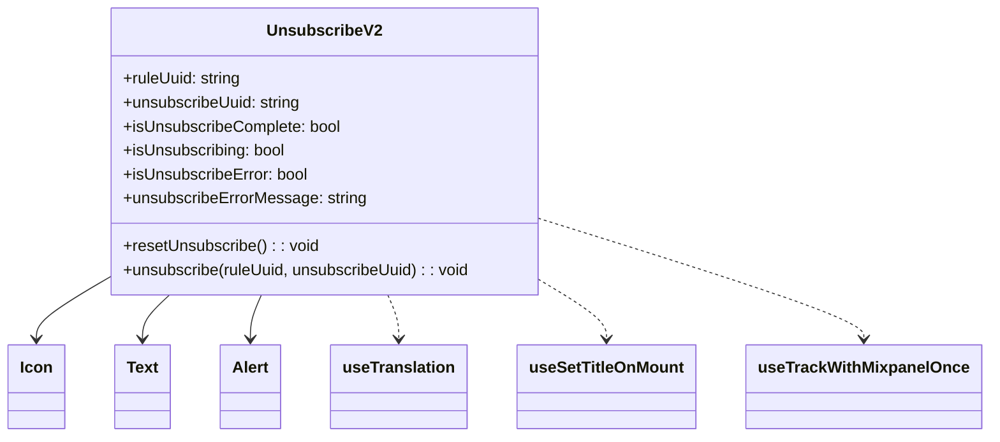

# Diagram: web/portal/src/pages/unsubscribe/UnsubscribeV2.page.js


> Auto-generated by Obscura crawlers

## Diagram 1



### SVG

<svg id="container" width="965.59375" xmlns="http://www.w3.org/2000/svg" class="classDiagram" height="438" viewBox="0 0 965.59375 438" role="graphics-document document" aria-roledescription="class"><style>#container{font-family:"trebuchet ms",verdana,arial,sans-serif;font-size:16px;fill:#333;}@keyframes edge-animation-frame{from{stroke-dashoffset:0;}}@keyframes dash{to{stroke-dashoffset:0;}}#container .edge-animation-slow{stroke-dasharray:9,5!important;stroke-dashoffset:900;animation:dash 50s linear infinite;stroke-linecap:round;}#container .edge-animation-fast{stroke-dasharray:9,5!important;stroke-dashoffset:900;animation:dash 20s linear infinite;stroke-linecap:round;}#container .error-icon{fill:#552222;}#container .error-text{fill:#552222;stroke:#552222;}#container .edge-thickness-normal{stroke-width:1px;}#container .edge-thickness-thick{stroke-width:3.5px;}#container .edge-pattern-solid{stroke-dasharray:0;}#container .edge-thickness-invisible{stroke-width:0;fill:none;}#container .edge-pattern-dashed{stroke-dasharray:3;}#container .edge-pattern-dotted{stroke-dasharray:2;}#container .marker{fill:#333333;stroke:#333333;}#container .marker.cross{stroke:#333333;}#container svg{font-family:"trebuchet ms",verdana,arial,sans-serif;font-size:16px;}#container p{margin:0;}#container g.classGroup text{fill:#9370DB;stroke:none;font-family:"trebuchet ms",verdana,arial,sans-serif;font-size:10px;}#container g.classGroup text .title{font-weight:bolder;}#container .nodeLabel,#container .edgeLabel{color:#131300;}#container .edgeLabel .label rect{fill:#ECECFF;}#container .label text{fill:#131300;}#container .labelBkg{background:#ECECFF;}#container .edgeLabel .label span{background:#ECECFF;}#container .classTitle{font-weight:bolder;}#container .node rect,#container .node circle,#container .node ellipse,#container .node polygon,#container .node path{fill:#ECECFF;stroke:#9370DB;stroke-width:1px;}#container .divider{stroke:#9370DB;stroke-width:1;}#container g.clickable{cursor:pointer;}#container g.classGroup rect{fill:#ECECFF;stroke:#9370DB;}#container g.classGroup line{stroke:#9370DB;stroke-width:1;}#container .classLabel .box{stroke:none;stroke-width:0;fill:#ECECFF;opacity:0.5;}#container .classLabel .label{fill:#9370DB;font-size:10px;}#container .relation{stroke:#333333;stroke-width:1;fill:none;}#container .dashed-line{stroke-dasharray:3;}#container .dotted-line{stroke-dasharray:1 2;}#container #compositionStart,#container .composition{fill:#333333!important;stroke:#333333!important;stroke-width:1;}#container #compositionEnd,#container .composition{fill:#333333!important;stroke:#333333!important;stroke-width:1;}#container #dependencyStart,#container .dependency{fill:#333333!important;stroke:#333333!important;stroke-width:1;}#container #dependencyStart,#container .dependency{fill:#333333!important;stroke:#333333!important;stroke-width:1;}#container #extensionStart,#container .extension{fill:transparent!important;stroke:#333333!important;stroke-width:1;}#container #extensionEnd,#container .extension{fill:transparent!important;stroke:#333333!important;stroke-width:1;}#container #aggregationStart,#container .aggregation{fill:transparent!important;stroke:#333333!important;stroke-width:1;}#container #aggregationEnd,#container .aggregation{fill:transparent!important;stroke:#333333!important;stroke-width:1;}#container #lollipopStart,#container .lollipop{fill:#ECECFF!important;stroke:#333333!important;stroke-width:1;}#container #lollipopEnd,#container .lollipop{fill:#ECECFF!important;stroke:#333333!important;stroke-width:1;}#container .edgeTerminals{font-size:11px;line-height:initial;}#container .classTitleText{text-anchor:middle;font-size:18px;fill:#333;}#container .label-icon{display:inline-block;height:1em;overflow:visible;vertical-align:-0.125em;}#container .node .label-icon path{fill:currentColor;stroke:revert;stroke-width:revert;}#container :root{--mermaid-font-family:"trebuchet ms",verdana,arial,sans-serif;}</style><g><defs><marker id="container_class-aggregationStart" class="marker aggregation class" refX="18" refY="7" markerWidth="190" markerHeight="240" orient="auto"><path d="M 18,7 L9,13 L1,7 L9,1 Z"></path></marker></defs><defs><marker id="container_class-aggregationEnd" class="marker aggregation class" refX="1" refY="7" markerWidth="20" markerHeight="28" orient="auto"><path d="M 18,7 L9,13 L1,7 L9,1 Z"></path></marker></defs><defs><marker id="container_class-extensionStart" class="marker extension class" refX="18" refY="7" markerWidth="190" markerHeight="240" orient="auto"><path d="M 1,7 L18,13 V 1 Z"></path></marker></defs><defs><marker id="container_class-extensionEnd" class="marker extension class" refX="1" refY="7" markerWidth="20" markerHeight="28" orient="auto"><path d="M 1,1 V 13 L18,7 Z"></path></marker></defs><defs><marker id="container_class-compositionStart" class="marker composition class" refX="18" refY="7" markerWidth="190" markerHeight="240" orient="auto"><path d="M 18,7 L9,13 L1,7 L9,1 Z"></path></marker></defs><defs><marker id="container_class-compositionEnd" class="marker composition class" refX="1" refY="7" markerWidth="20" markerHeight="28" orient="auto"><path d="M 18,7 L9,13 L1,7 L9,1 Z"></path></marker></defs><defs><marker id="container_class-dependencyStart" class="marker dependency class" refX="6" refY="7" markerWidth="190" markerHeight="240" orient="auto"><path d="M 5,7 L9,13 L1,7 L9,1 Z"></path></marker></defs><defs><marker id="container_class-dependencyEnd" class="marker dependency class" refX="13" refY="7" markerWidth="20" markerHeight="28" orient="auto"><path d="M 18,7 L9,13 L14,7 L9,1 Z"></path></marker></defs><defs><marker id="container_class-lollipopStart" class="marker lollipop class" refX="13" refY="7" markerWidth="190" markerHeight="240" orient="auto"><circle stroke="black" fill="transparent" cx="7" cy="7" r="6"></circle></marker></defs><defs><marker id="container_class-lollipopEnd" class="marker lollipop class" refX="1" refY="7" markerWidth="190" markerHeight="240" orient="auto"><circle stroke="black" fill="transparent" cx="7" cy="7" r="6"></circle></marker></defs><g class="root"><g class="clusters"></g><g class="edgePaths"><path d="M104.594,279.88L93.046,286.733C81.497,293.587,58.401,307.293,46.853,317.313C35.305,327.333,35.305,333.667,35.305,336.833L35.305,340" id="id_UnsubscribeV2_Icon_1" class="edge-thickness-normal edge-pattern-solid relation" style=";;;" data-edge="true" data-et="edge" data-id="id_UnsubscribeV2_Icon_1" data-points="W3sieCI6MTA0LjU5Mzc1LCJ5IjoyNzkuODgwMTEzMDI4NDQ5MTZ9LHsieCI6MzUuMzA0Njg3NSwieSI6MzIxfSx7IngiOjM1LjMwNDY4NzUsInkiOjM0Nn1d" marker-end="url(#container_class-dependencyEnd)"></path><path d="M166.632,296L162.192,300.167C157.752,304.333,148.872,312.667,144.432,320C139.992,327.333,139.992,333.667,139.992,336.833L139.992,340" id="id_UnsubscribeV2_Text_2" class="edge-thickness-normal edge-pattern-solid relation" style=";;;" data-edge="true" data-et="edge" data-id="id_UnsubscribeV2_Text_2" data-points="W3sieCI6MTY2LjYzMjExOTA4Mjg0MDIzLCJ5IjoyOTZ9LHsieCI6MTM5Ljk5MjE4NzUsInkiOjMyMX0seyJ4IjoxMzkuOTkyMTg3NSwieSI6MzQ2fV0=" marker-end="url(#container_class-dependencyEnd)"></path><path d="M257.937,296L256.139,300.167C254.341,304.333,250.745,312.667,248.947,320C247.148,327.333,247.148,333.667,247.148,336.833L247.148,340" id="id_UnsubscribeV2_Alert_3" class="edge-thickness-normal edge-pattern-solid relation" style=";;;" data-edge="true" data-et="edge" data-id="id_UnsubscribeV2_Alert_3" data-points="W3sieCI6MjU3LjkzNjg1MjgxMDY1MDg2LCJ5IjoyOTZ9LHsieCI6MjQ3LjE0ODQzNzUsInkiOjMyMX0seyJ4IjoyNDcuMTQ4NDM3NSwieSI6MzQ2fV0=" marker-end="url(#container_class-dependencyEnd)"></path><path d="M382.219,296L384.017,300.167C385.816,304.333,389.412,312.667,391.21,320C393.008,327.333,393.008,333.667,393.008,336.833L393.008,340" id="id_UnsubscribeV2_useTranslation_4" class="edge-thickness-normal edge-pattern-dashed relation" style=";;;" data-edge="true" data-et="edge" data-id="id_UnsubscribeV2_useTranslation_4" data-points="W3sieCI6MzgyLjIxOTM5NzE4OTM0OTE0LCJ5IjoyOTZ9LHsieCI6MzkzLjAwNzgxMjUsInkiOjMyMX0seyJ4IjozOTMuMDA3ODEyNSwieSI6MzQ2fV0=" marker-end="url(#container_class-dependencyEnd)"></path><path d="M535.563,284.102L545.594,290.252C555.625,296.401,575.688,308.701,585.719,318.017C595.75,327.333,595.75,333.667,595.75,336.833L595.75,340" id="id_UnsubscribeV2_useSetTitleOnMount_5" class="edge-thickness-normal edge-pattern-dashed relation" style=";;;" data-edge="true" data-et="edge" data-id="id_UnsubscribeV2_useSetTitleOnMount_5" data-points="W3sieCI6NTM1LjU2MjUsInkiOjI4NC4xMDIxOTM1MDQ1MDYwM30seyJ4Ijo1OTUuNzUsInkiOjMyMX0seyJ4Ijo1OTUuNzUsInkiOjM0Nn1d" marker-end="url(#container_class-dependencyEnd)"></path><path d="M535.563,221.376L587.135,237.98C638.708,254.584,741.854,287.792,793.427,307.563C845,327.333,845,333.667,845,336.833L845,340" id="id_UnsubscribeV2_useTrackWithMixpanelOnce_6" class="edge-thickness-normal edge-pattern-dashed relation" style=";;;" data-edge="true" data-et="edge" data-id="id_UnsubscribeV2_useTrackWithMixpanelOnce_6" data-points="W3sieCI6NTM1LjU2MjUsInkiOjIyMS4zNzU3NzAyMDM4OTkzOH0seyJ4Ijo4NDUsInkiOjMyMX0seyJ4Ijo4NDUsInkiOjM0Nn1d" marker-end="url(#container_class-dependencyEnd)"></path></g><g class="edgeLabels"><g class="edgeLabel"><g class="label" data-id="id_UnsubscribeV2_Icon_1" transform="translate(0, 0)"><foreignObject width="0" height="0"><div xmlns="http://www.w3.org/1999/xhtml" class="labelBkg" style="display: table-cell; white-space: nowrap; line-height: 1.5; max-width: 200px; text-align: center;"><span class="edgeLabel"></span></div></foreignObject></g></g><g class="edgeLabel"><g class="label" data-id="id_UnsubscribeV2_Text_2" transform="translate(0, 0)"><foreignObject width="0" height="0"><div xmlns="http://www.w3.org/1999/xhtml" class="labelBkg" style="display: table-cell; white-space: nowrap; line-height: 1.5; max-width: 200px; text-align: center;"><span class="edgeLabel"></span></div></foreignObject></g></g><g class="edgeLabel"><g class="label" data-id="id_UnsubscribeV2_Alert_3" transform="translate(0, 0)"><foreignObject width="0" height="0"><div xmlns="http://www.w3.org/1999/xhtml" class="labelBkg" style="display: table-cell; white-space: nowrap; line-height: 1.5; max-width: 200px; text-align: center;"><span class="edgeLabel"></span></div></foreignObject></g></g><g class="edgeLabel"><g class="label" data-id="id_UnsubscribeV2_useTranslation_4" transform="translate(0, 0)"><foreignObject width="0" height="0"><div xmlns="http://www.w3.org/1999/xhtml" class="labelBkg" style="display: table-cell; white-space: nowrap; line-height: 1.5; max-width: 200px; text-align: center;"><span class="edgeLabel"></span></div></foreignObject></g></g><g class="edgeLabel"><g class="label" data-id="id_UnsubscribeV2_useSetTitleOnMount_5" transform="translate(0, 0)"><foreignObject width="0" height="0"><div xmlns="http://www.w3.org/1999/xhtml" class="labelBkg" style="display: table-cell; white-space: nowrap; line-height: 1.5; max-width: 200px; text-align: center;"><span class="edgeLabel"></span></div></foreignObject></g></g><g class="edgeLabel"><g class="label" data-id="id_UnsubscribeV2_useTrackWithMixpanelOnce_6" transform="translate(0, 0)"><foreignObject width="0" height="0"><div xmlns="http://www.w3.org/1999/xhtml" class="labelBkg" style="display: table-cell; white-space: nowrap; line-height: 1.5; max-width: 200px; text-align: center;"><span class="edgeLabel"></span></div></foreignObject></g></g></g><g class="nodes"><g class="node default" id="classId-UnsubscribeV2-0" transform="translate(320.078125, 152)"><g class="basic label-container"><path d="M-215.484375 -144 L215.484375 -144 L215.484375 144 L-215.484375 144" stroke="none" stroke-width="0" fill="#ECECFF" style=""></path><path d="M-215.484375 -144 C-128.34647922511743 -144, -41.20858345023487 -144, 215.484375 -144 M-215.484375 -144 C-76.71301301183215 -144, 62.05834897633571 -144, 215.484375 -144 M215.484375 -144 C215.484375 -70.27388599984826, 215.484375 3.452228000303478, 215.484375 144 M215.484375 -144 C215.484375 -39.334065317575806, 215.484375 65.33186936484839, 215.484375 144 M215.484375 144 C66.65393577680322 144, -82.17650344639355 144, -215.484375 144 M215.484375 144 C109.10306785637486 144, 2.7217607127497274 144, -215.484375 144 M-215.484375 144 C-215.484375 81.73330485986716, -215.484375 19.466609719734322, -215.484375 -144 M-215.484375 144 C-215.484375 52.90536424757387, -215.484375 -38.18927150485226, -215.484375 -144" stroke="#9370DB" stroke-width="1.3" fill="none" stroke-dasharray="0 0" style=""></path></g><g class="annotation-group text" transform="translate(0, -120)"></g><g class="label-group text" transform="translate(-54.09375, -120)"><g class="label" style="font-weight: bolder" transform="translate(0,-12)"><foreignObject width="108.1875" height="24"><div xmlns="http://www.w3.org/1999/xhtml" style="display: table-cell; white-space: nowrap; line-height: 1.5; max-width: 157px; text-align: center;"><span class="nodeLabel markdown-node-label" style=""><p>UnsubscribeV2</p></span></div></foreignObject></g></g><g class="members-group text" transform="translate(-203.484375, -72)"><g class="label" style="" transform="translate(0,-12)"><foreignObject width="120.5" height="24"><div xmlns="http://www.w3.org/1999/xhtml" style="display: table-cell; white-space: nowrap; line-height: 1.5; max-width: 179px; text-align: center;"><span class="nodeLabel markdown-node-label" style=""><p>+ruleUuid: string</p></span></div></foreignObject></g><g class="label" style="" transform="translate(0,12)"><foreignObject width="180.703125" height="24"><div xmlns="http://www.w3.org/1999/xhtml" style="display: table-cell; white-space: nowrap; line-height: 1.5; max-width: 239px; text-align: center;"><span class="nodeLabel markdown-node-label" style=""><p>+unsubscribeUuid: string</p></span></div></foreignObject></g><g class="label" style="" transform="translate(0,36)"><foreignObject width="220.015625" height="24"><div xmlns="http://www.w3.org/1999/xhtml" style="display: table-cell; white-space: nowrap; line-height: 1.5; max-width: 278px; text-align: center;"><span class="nodeLabel markdown-node-label" style=""><p>+isUnsubscribeComplete: bool</p></span></div></foreignObject></g><g class="label" style="" transform="translate(0,60)"><foreignObject width="164.71875" height="24"><div xmlns="http://www.w3.org/1999/xhtml" style="display: table-cell; white-space: nowrap; line-height: 1.5; max-width: 222px; text-align: center;"><span class="nodeLabel markdown-node-label" style=""><p>+isUnsubscribing: bool</p></span></div></foreignObject></g><g class="label" style="" transform="translate(0,84)"><foreignObject width="187.171875" height="24"><div xmlns="http://www.w3.org/1999/xhtml" style="display: table-cell; white-space: nowrap; line-height: 1.5; max-width: 245px; text-align: center;"><span class="nodeLabel markdown-node-label" style=""><p>+isUnsubscribeError: bool</p></span></div></foreignObject></g><g class="label" style="" transform="translate(0,108)"><foreignObject width="243.625" height="24"><div xmlns="http://www.w3.org/1999/xhtml" style="display: table-cell; white-space: nowrap; line-height: 1.5; max-width: 302px; text-align: center;"><span class="nodeLabel markdown-node-label" style=""><p>+unsubscribeErrorMessage: string</p></span></div></foreignObject></g></g><g class="methods-group text" transform="translate(-203.484375, 96)"><g class="label" style="" transform="translate(0,-12)"><foreignObject width="196.671875" height="24"><div xmlns="http://www.w3.org/1999/xhtml" style="display: table-cell; white-space: nowrap; line-height: 1.5; max-width: 254px; text-align: center;"><span class="nodeLabel markdown-node-label" style=""><p>+resetUnsubscribe() : : void</p></span></div></foreignObject></g><g class="label" style="" transform="translate(0,12)"><foreignObject width="352.875" height="24"><div xmlns="http://www.w3.org/1999/xhtml" style="display: table-cell; white-space: nowrap; line-height: 1.5; max-width: 410px; text-align: center;"><span class="nodeLabel markdown-node-label" style=""><p>+unsubscribe(ruleUuid, unsubscribeUuid) : : void</p></span></div></foreignObject></g></g><g class="divider" style=""><path d="M-215.484375 -96 C-121.72841579249261 -96, -27.972456584985224 -96, 215.484375 -96 M-215.484375 -96 C-75.47535585876503 -96, 64.53366328246994 -96, 215.484375 -96" stroke="#9370DB" stroke-width="1.3" fill="none" stroke-dasharray="0 0" style=""></path></g><g class="divider" style=""><path d="M-215.484375 72 C-127.79702991522693 72, -40.10968483045386 72, 215.484375 72 M-215.484375 72 C-117.79667642586192 72, -20.108977851723836 72, 215.484375 72" stroke="#9370DB" stroke-width="1.3" fill="none" stroke-dasharray="0 0" style=""></path></g></g><g class="node default" id="classId-Icon-1" transform="translate(35.3046875, 388)"><g class="basic label-container"><path d="M-27.3046875 -42 L27.3046875 -42 L27.3046875 42 L-27.3046875 42" stroke="none" stroke-width="0" fill="#ECECFF" style=""></path><path d="M-27.3046875 -42 C-15.282410954769198 -42, -3.260134409538395 -42, 27.3046875 -42 M-27.3046875 -42 C-12.003027910704441 -42, 3.298631678591118 -42, 27.3046875 -42 M27.3046875 -42 C27.3046875 -16.289766511028994, 27.3046875 9.420466977942013, 27.3046875 42 M27.3046875 -42 C27.3046875 -13.117363798414754, 27.3046875 15.765272403170492, 27.3046875 42 M27.3046875 42 C7.9058023479311395 42, -11.493082804137721 42, -27.3046875 42 M27.3046875 42 C9.425813657475736 42, -8.453060185048528 42, -27.3046875 42 M-27.3046875 42 C-27.3046875 17.243758352228415, -27.3046875 -7.51248329554317, -27.3046875 -42 M-27.3046875 42 C-27.3046875 9.85426700896523, -27.3046875 -22.29146598206954, -27.3046875 -42" stroke="#9370DB" stroke-width="1.3" fill="none" stroke-dasharray="0 0" style=""></path></g><g class="annotation-group text" transform="translate(0, -18)"></g><g class="label-group text" transform="translate(-15.3046875, -18)"><g class="label" style="font-weight: bolder" transform="translate(0,-12)"><foreignObject width="30.609375" height="24"><div xmlns="http://www.w3.org/1999/xhtml" style="display: table-cell; white-space: nowrap; line-height: 1.5; max-width: 81px; text-align: center;"><span class="nodeLabel markdown-node-label" style=""><p>Icon</p></span></div></foreignObject></g></g><g class="members-group text" transform="translate(-15.3046875, 30)"></g><g class="methods-group text" transform="translate(-15.3046875, 60)"></g><g class="divider" style=""><path d="M-27.3046875 6 C-12.859039887719474 6, 1.586607724561052 6, 27.3046875 6 M-27.3046875 6 C-13.112195992053808 6, 1.0802955158923844 6, 27.3046875 6" stroke="#9370DB" stroke-width="1.3" fill="none" stroke-dasharray="0 0" style=""></path></g><g class="divider" style=""><path d="M-27.3046875 24 C-11.195977094984222 24, 4.912733310031555 24, 27.3046875 24 M-27.3046875 24 C-12.34213147090235 24, 2.6204245581952996 24, 27.3046875 24" stroke="#9370DB" stroke-width="1.3" fill="none" stroke-dasharray="0 0" style=""></path></g></g><g class="node default" id="classId-Text-2" transform="translate(139.9921875, 388)"><g class="basic label-container"><path d="M-27.3828125 -42 L27.3828125 -42 L27.3828125 42 L-27.3828125 42" stroke="none" stroke-width="0" fill="#ECECFF" style=""></path><path d="M-27.3828125 -42 C-15.510856471795073 -42, -3.6389004435901455 -42, 27.3828125 -42 M-27.3828125 -42 C-8.826450014136437 -42, 9.729912471727125 -42, 27.3828125 -42 M27.3828125 -42 C27.3828125 -22.962445614295554, 27.3828125 -3.9248912285911075, 27.3828125 42 M27.3828125 -42 C27.3828125 -9.438097787435055, 27.3828125 23.12380442512989, 27.3828125 42 M27.3828125 42 C15.486845527353605 42, 3.59087855470721 42, -27.3828125 42 M27.3828125 42 C12.207818860519014 42, -2.9671747789619722 42, -27.3828125 42 M-27.3828125 42 C-27.3828125 15.622814104875605, -27.3828125 -10.75437179024879, -27.3828125 -42 M-27.3828125 42 C-27.3828125 12.671066374340384, -27.3828125 -16.65786725131923, -27.3828125 -42" stroke="#9370DB" stroke-width="1.3" fill="none" stroke-dasharray="0 0" style=""></path></g><g class="annotation-group text" transform="translate(0, -18)"></g><g class="label-group text" transform="translate(-15.3828125, -18)"><g class="label" style="font-weight: bolder" transform="translate(0,-12)"><foreignObject width="30.765625" height="24"><div xmlns="http://www.w3.org/1999/xhtml" style="display: table-cell; white-space: nowrap; line-height: 1.5; max-width: 80px; text-align: center;"><span class="nodeLabel markdown-node-label" style=""><p>Text</p></span></div></foreignObject></g></g><g class="members-group text" transform="translate(-15.3828125, 30)"></g><g class="methods-group text" transform="translate(-15.3828125, 60)"></g><g class="divider" style=""><path d="M-27.3828125 6 C-6.667858124203846 6, 14.047096251592308 6, 27.3828125 6 M-27.3828125 6 C-9.261433650624898 6, 8.859945198750204 6, 27.3828125 6" stroke="#9370DB" stroke-width="1.3" fill="none" stroke-dasharray="0 0" style=""></path></g><g class="divider" style=""><path d="M-27.3828125 24 C-11.524061617137816 24, 4.334689265724368 24, 27.3828125 24 M-27.3828125 24 C-11.470291801117305 24, 4.442228897765389 24, 27.3828125 24" stroke="#9370DB" stroke-width="1.3" fill="none" stroke-dasharray="0 0" style=""></path></g></g><g class="node default" id="classId-Alert-3" transform="translate(247.1484375, 388)"><g class="basic label-container"><path d="M-29.7734375 -42 L29.7734375 -42 L29.7734375 42 L-29.7734375 42" stroke="none" stroke-width="0" fill="#ECECFF" style=""></path><path d="M-29.7734375 -42 C-12.893550256709688 -42, 3.986336986580625 -42, 29.7734375 -42 M-29.7734375 -42 C-17.66132014189573 -42, -5.549202783791454 -42, 29.7734375 -42 M29.7734375 -42 C29.7734375 -9.858815274416408, 29.7734375 22.282369451167185, 29.7734375 42 M29.7734375 -42 C29.7734375 -17.9151926294073, 29.7734375 6.1696147411853985, 29.7734375 42 M29.7734375 42 C13.40696108595786 42, -2.9595153280842794 42, -29.7734375 42 M29.7734375 42 C16.4436725953896 42, 3.1139076907791967 42, -29.7734375 42 M-29.7734375 42 C-29.7734375 16.45253415066117, -29.7734375 -9.094931698677662, -29.7734375 -42 M-29.7734375 42 C-29.7734375 11.380031916859657, -29.7734375 -19.239936166280685, -29.7734375 -42" stroke="#9370DB" stroke-width="1.3" fill="none" stroke-dasharray="0 0" style=""></path></g><g class="annotation-group text" transform="translate(0, -18)"></g><g class="label-group text" transform="translate(-17.7734375, -18)"><g class="label" style="font-weight: bolder" transform="translate(0,-12)"><foreignObject width="35.546875" height="24"><div xmlns="http://www.w3.org/1999/xhtml" style="display: table-cell; white-space: nowrap; line-height: 1.5; max-width: 85px; text-align: center;"><span class="nodeLabel markdown-node-label" style=""><p>Alert</p></span></div></foreignObject></g></g><g class="members-group text" transform="translate(-17.7734375, 30)"></g><g class="methods-group text" transform="translate(-17.7734375, 60)"></g><g class="divider" style=""><path d="M-29.7734375 6 C-11.7357403892747 6, 6.301956721450601 6, 29.7734375 6 M-29.7734375 6 C-17.733332286768817 6, -5.693227073537635 6, 29.7734375 6" stroke="#9370DB" stroke-width="1.3" fill="none" stroke-dasharray="0 0" style=""></path></g><g class="divider" style=""><path d="M-29.7734375 24 C-17.769742409160116 24, -5.766047318320229 24, 29.7734375 24 M-29.7734375 24 C-13.226405775934566 24, 3.3206259481308678 24, 29.7734375 24" stroke="#9370DB" stroke-width="1.3" fill="none" stroke-dasharray="0 0" style=""></path></g></g><g class="node default" id="classId-useTranslation-4" transform="translate(393.0078125, 388)"><g class="basic label-container"><path d="M-66.0859375 -42 L66.0859375 -42 L66.0859375 42 L-66.0859375 42" stroke="none" stroke-width="0" fill="#ECECFF" style=""></path><path d="M-66.0859375 -42 C-27.943491233986492 -42, 10.198955032027015 -42, 66.0859375 -42 M-66.0859375 -42 C-24.56169879017463 -42, 16.962539919650737 -42, 66.0859375 -42 M66.0859375 -42 C66.0859375 -9.067254892752324, 66.0859375 23.865490214495352, 66.0859375 42 M66.0859375 -42 C66.0859375 -11.861292311781916, 66.0859375 18.277415376436167, 66.0859375 42 M66.0859375 42 C30.969090760682292 42, -4.147755978635416 42, -66.0859375 42 M66.0859375 42 C26.22759712772158 42, -13.63074324455684 42, -66.0859375 42 M-66.0859375 42 C-66.0859375 15.675916132100795, -66.0859375 -10.64816773579841, -66.0859375 -42 M-66.0859375 42 C-66.0859375 23.928036207652134, -66.0859375 5.8560724153042685, -66.0859375 -42" stroke="#9370DB" stroke-width="1.3" fill="none" stroke-dasharray="0 0" style=""></path></g><g class="annotation-group text" transform="translate(0, -18)"></g><g class="label-group text" transform="translate(-54.0859375, -18)"><g class="label" style="font-weight: bolder" transform="translate(0,-12)"><foreignObject width="108.171875" height="24"><div xmlns="http://www.w3.org/1999/xhtml" style="display: table-cell; white-space: nowrap; line-height: 1.5; max-width: 157px; text-align: center;"><span class="nodeLabel markdown-node-label" style=""><p>useTranslation</p></span></div></foreignObject></g></g><g class="members-group text" transform="translate(-54.0859375, 30)"></g><g class="methods-group text" transform="translate(-54.0859375, 60)"></g><g class="divider" style=""><path d="M-66.0859375 6 C-13.886646087741632 6, 38.31264532451674 6, 66.0859375 6 M-66.0859375 6 C-14.528315807424462 6, 37.029305885151075 6, 66.0859375 6" stroke="#9370DB" stroke-width="1.3" fill="none" stroke-dasharray="0 0" style=""></path></g><g class="divider" style=""><path d="M-66.0859375 24 C-14.768899221080488 24, 36.54813905783902 24, 66.0859375 24 M-66.0859375 24 C-17.35290747389744 24, 31.380122552205123 24, 66.0859375 24" stroke="#9370DB" stroke-width="1.3" fill="none" stroke-dasharray="0 0" style=""></path></g></g><g class="node default" id="classId-useSetTitleOnMount-5" transform="translate(595.75, 388)"><g class="basic label-container"><path d="M-86.65625 -42 L86.65625 -42 L86.65625 42 L-86.65625 42" stroke="none" stroke-width="0" fill="#ECECFF" style=""></path><path d="M-86.65625 -42 C-45.35791710164971 -42, -4.059584203299423 -42, 86.65625 -42 M-86.65625 -42 C-28.645063425487137 -42, 29.366123149025725 -42, 86.65625 -42 M86.65625 -42 C86.65625 -16.74425788606484, 86.65625 8.51148422787032, 86.65625 42 M86.65625 -42 C86.65625 -23.6322605099487, 86.65625 -5.264521019897401, 86.65625 42 M86.65625 42 C34.292669929142264 42, -18.070910141715473 42, -86.65625 42 M86.65625 42 C38.440442282988315 42, -9.77536543402337 42, -86.65625 42 M-86.65625 42 C-86.65625 22.466611757764674, -86.65625 2.933223515529349, -86.65625 -42 M-86.65625 42 C-86.65625 9.735129370995999, -86.65625 -22.529741258008002, -86.65625 -42" stroke="#9370DB" stroke-width="1.3" fill="none" stroke-dasharray="0 0" style=""></path></g><g class="annotation-group text" transform="translate(0, -18)"></g><g class="label-group text" transform="translate(-74.65625, -18)"><g class="label" style="font-weight: bolder" transform="translate(0,-12)"><foreignObject width="149.3125" height="24"><div xmlns="http://www.w3.org/1999/xhtml" style="display: table-cell; white-space: nowrap; line-height: 1.5; max-width: 197px; text-align: center;"><span class="nodeLabel markdown-node-label" style=""><p>useSetTitleOnMount</p></span></div></foreignObject></g></g><g class="members-group text" transform="translate(-74.65625, 30)"></g><g class="methods-group text" transform="translate(-74.65625, 60)"></g><g class="divider" style=""><path d="M-86.65625 6 C-51.43628094834261 6, -16.216311896685227 6, 86.65625 6 M-86.65625 6 C-39.00001953849197 6, 8.656210923016062 6, 86.65625 6" stroke="#9370DB" stroke-width="1.3" fill="none" stroke-dasharray="0 0" style=""></path></g><g class="divider" style=""><path d="M-86.65625 24 C-48.72754437557115 24, -10.798838751142299 24, 86.65625 24 M-86.65625 24 C-25.131499312901582 24, 36.393251374196836 24, 86.65625 24" stroke="#9370DB" stroke-width="1.3" fill="none" stroke-dasharray="0 0" style=""></path></g></g><g class="node default" id="classId-useTrackWithMixpanelOnce-6" transform="translate(845, 388)"><g class="basic label-container"><path d="M-112.59375 -42 L112.59375 -42 L112.59375 42 L-112.59375 42" stroke="none" stroke-width="0" fill="#ECECFF" style=""></path><path d="M-112.59375 -42 C-62.46703496714818 -42, -12.34031993429636 -42, 112.59375 -42 M-112.59375 -42 C-24.772279229898245 -42, 63.04919154020351 -42, 112.59375 -42 M112.59375 -42 C112.59375 -24.800825363811608, 112.59375 -7.601650727623216, 112.59375 42 M112.59375 -42 C112.59375 -12.990904170655718, 112.59375 16.018191658688565, 112.59375 42 M112.59375 42 C34.075434828560574 42, -44.44288034287885 42, -112.59375 42 M112.59375 42 C41.82063917224296 42, -28.952471655514074 42, -112.59375 42 M-112.59375 42 C-112.59375 17.180894837704695, -112.59375 -7.6382103245906094, -112.59375 -42 M-112.59375 42 C-112.59375 23.15870560780568, -112.59375 4.317411215611358, -112.59375 -42" stroke="#9370DB" stroke-width="1.3" fill="none" stroke-dasharray="0 0" style=""></path></g><g class="annotation-group text" transform="translate(0, -18)"></g><g class="label-group text" transform="translate(-100.59375, -18)"><g class="label" style="font-weight: bolder" transform="translate(0,-12)"><foreignObject width="201.1875" height="24"><div xmlns="http://www.w3.org/1999/xhtml" style="display: table-cell; white-space: nowrap; line-height: 1.5; max-width: 248px; text-align: center;"><span class="nodeLabel markdown-node-label" style=""><p>useTrackWithMixpanelOnce</p></span></div></foreignObject></g></g><g class="members-group text" transform="translate(-100.59375, 30)"></g><g class="methods-group text" transform="translate(-100.59375, 60)"></g><g class="divider" style=""><path d="M-112.59375 6 C-42.504082338856975 6, 27.58558532228605 6, 112.59375 6 M-112.59375 6 C-55.33714235044409 6, 1.9194652991118204 6, 112.59375 6" stroke="#9370DB" stroke-width="1.3" fill="none" stroke-dasharray="0 0" style=""></path></g><g class="divider" style=""><path d="M-112.59375 24 C-28.073097184875607 24, 56.447555630248786 24, 112.59375 24 M-112.59375 24 C-40.13838145820023 24, 32.31698708359954 24, 112.59375 24" stroke="#9370DB" stroke-width="1.3" fill="none" stroke-dasharray="0 0" style=""></path></g></g></g></g></g></svg>

## Diagram 2

```mermaid
flowchart TD
A[Component Mount] --> B[resetUnsubscribe()]
B --> C[unsubscribe(ruleUuid, unsubscribeUuid)]
C --> D{isUnsubscribing?}
D -- Yes --> E[Render: "Unsubscribing" Text]
D -- No --> F{isUnsubscribeComplete?}
F -- Yes --> G[Render: Success Alert\n- Bold heading\n- Success message]
F -- No --> H{isUnsubscribeError?}
H -- Yes --> I[Render: Error Alert\n- Bold heading\n- Error message\n- unsubscribeErrorMessage italic]
H -- No --> J[Render: Idle / Waiting UI]
```

> SVG rendering failed for this diagram.
