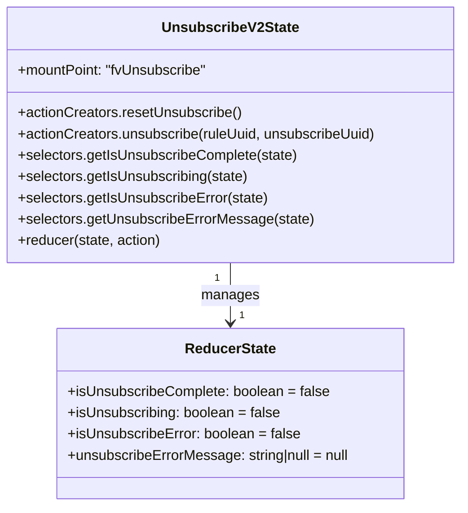

# Diagram: web/portal/src/pages/unsubscribe/redux/UnsubscribeV2State.js


> Auto-generated by Obscura crawlers

## Diagram 1

```mermaid
flowchart LR
  A[call: unsubscribe(ruleUuid, unsubscribeUuid)] --> B[dispatch: UNSUBSCRIBE_STARTED]
  B --> C[build URL: UNSUBSCRIBE_URL + "/" + ruleUuid + "/unsubscribe/" + unsubscribeUuid]
  C --> D[axios.post(url)]
  D -->|then| E[dispatch: UNSUBSCRIBE_SUCCESS]
  D -->|catch| F[dispatch: UNSUBSCRIBE_FAILED (errorMessage)]
  G[call: resetUnsubscribe()] --> H[dispatch: UNSUBSCRIBE_RESET]
  E --> I[Reducer: handle UNSUBSCRIBE_SUCCESS]
  F --> J[Reducer: handle UNSUBSCRIBE_FAILED]
  H --> K[Reducer: handle UNSUBSCRIBE_RESET]
  I --> L[state changes: isUnsubscribing=false, isUnsubscribeComplete=true, isUnsubscribeError=false, unsubscribeErrorMessage=null]
  J --> M[state changes: isUnsubscribing=false, isUnsubscribeComplete=false, isUnsubscribeError=true, unsubscribeErrorMessage=action.errorMessage]
  K --> N[state resets to initialState]
```

> SVG rendering failed for this diagram.

## Diagram 2



### SVG

<svg id="container" width="523.421875" xmlns="http://www.w3.org/2000/svg" class="classDiagram" height="570" viewBox="0 0 523.421875 570" role="graphics-document document" aria-roledescription="class"><style>#container{font-family:"trebuchet ms",verdana,arial,sans-serif;font-size:16px;fill:#333;}@keyframes edge-animation-frame{from{stroke-dashoffset:0;}}@keyframes dash{to{stroke-dashoffset:0;}}#container .edge-animation-slow{stroke-dasharray:9,5!important;stroke-dashoffset:900;animation:dash 50s linear infinite;stroke-linecap:round;}#container .edge-animation-fast{stroke-dasharray:9,5!important;stroke-dashoffset:900;animation:dash 20s linear infinite;stroke-linecap:round;}#container .error-icon{fill:#552222;}#container .error-text{fill:#552222;stroke:#552222;}#container .edge-thickness-normal{stroke-width:1px;}#container .edge-thickness-thick{stroke-width:3.5px;}#container .edge-pattern-solid{stroke-dasharray:0;}#container .edge-thickness-invisible{stroke-width:0;fill:none;}#container .edge-pattern-dashed{stroke-dasharray:3;}#container .edge-pattern-dotted{stroke-dasharray:2;}#container .marker{fill:#333333;stroke:#333333;}#container .marker.cross{stroke:#333333;}#container svg{font-family:"trebuchet ms",verdana,arial,sans-serif;font-size:16px;}#container p{margin:0;}#container g.classGroup text{fill:#9370DB;stroke:none;font-family:"trebuchet ms",verdana,arial,sans-serif;font-size:10px;}#container g.classGroup text .title{font-weight:bolder;}#container .nodeLabel,#container .edgeLabel{color:#131300;}#container .edgeLabel .label rect{fill:#ECECFF;}#container .label text{fill:#131300;}#container .labelBkg{background:#ECECFF;}#container .edgeLabel .label span{background:#ECECFF;}#container .classTitle{font-weight:bolder;}#container .node rect,#container .node circle,#container .node ellipse,#container .node polygon,#container .node path{fill:#ECECFF;stroke:#9370DB;stroke-width:1px;}#container .divider{stroke:#9370DB;stroke-width:1;}#container g.clickable{cursor:pointer;}#container g.classGroup rect{fill:#ECECFF;stroke:#9370DB;}#container g.classGroup line{stroke:#9370DB;stroke-width:1;}#container .classLabel .box{stroke:none;stroke-width:0;fill:#ECECFF;opacity:0.5;}#container .classLabel .label{fill:#9370DB;font-size:10px;}#container .relation{stroke:#333333;stroke-width:1;fill:none;}#container .dashed-line{stroke-dasharray:3;}#container .dotted-line{stroke-dasharray:1 2;}#container #compositionStart,#container .composition{fill:#333333!important;stroke:#333333!important;stroke-width:1;}#container #compositionEnd,#container .composition{fill:#333333!important;stroke:#333333!important;stroke-width:1;}#container #dependencyStart,#container .dependency{fill:#333333!important;stroke:#333333!important;stroke-width:1;}#container #dependencyStart,#container .dependency{fill:#333333!important;stroke:#333333!important;stroke-width:1;}#container #extensionStart,#container .extension{fill:transparent!important;stroke:#333333!important;stroke-width:1;}#container #extensionEnd,#container .extension{fill:transparent!important;stroke:#333333!important;stroke-width:1;}#container #aggregationStart,#container .aggregation{fill:transparent!important;stroke:#333333!important;stroke-width:1;}#container #aggregationEnd,#container .aggregation{fill:transparent!important;stroke:#333333!important;stroke-width:1;}#container #lollipopStart,#container .lollipop{fill:#ECECFF!important;stroke:#333333!important;stroke-width:1;}#container #lollipopEnd,#container .lollipop{fill:#ECECFF!important;stroke:#333333!important;stroke-width:1;}#container .edgeTerminals{font-size:11px;line-height:initial;}#container .classTitleText{text-anchor:middle;font-size:18px;fill:#333;}#container .label-icon{display:inline-block;height:1em;overflow:visible;vertical-align:-0.125em;}#container .node .label-icon path{fill:currentColor;stroke:revert;stroke-width:revert;}#container :root{--mermaid-font-family:"trebuchet ms",verdana,arial,sans-serif;}</style><g><defs><marker id="container_class-aggregationStart" class="marker aggregation class" refX="18" refY="7" markerWidth="190" markerHeight="240" orient="auto"><path d="M 18,7 L9,13 L1,7 L9,1 Z"></path></marker></defs><defs><marker id="container_class-aggregationEnd" class="marker aggregation class" refX="1" refY="7" markerWidth="20" markerHeight="28" orient="auto"><path d="M 18,7 L9,13 L1,7 L9,1 Z"></path></marker></defs><defs><marker id="container_class-extensionStart" class="marker extension class" refX="18" refY="7" markerWidth="190" markerHeight="240" orient="auto"><path d="M 1,7 L18,13 V 1 Z"></path></marker></defs><defs><marker id="container_class-extensionEnd" class="marker extension class" refX="1" refY="7" markerWidth="20" markerHeight="28" orient="auto"><path d="M 1,1 V 13 L18,7 Z"></path></marker></defs><defs><marker id="container_class-compositionStart" class="marker composition class" refX="18" refY="7" markerWidth="190" markerHeight="240" orient="auto"><path d="M 18,7 L9,13 L1,7 L9,1 Z"></path></marker></defs><defs><marker id="container_class-compositionEnd" class="marker composition class" refX="1" refY="7" markerWidth="20" markerHeight="28" orient="auto"><path d="M 18,7 L9,13 L1,7 L9,1 Z"></path></marker></defs><defs><marker id="container_class-dependencyStart" class="marker dependency class" refX="6" refY="7" markerWidth="190" markerHeight="240" orient="auto"><path d="M 5,7 L9,13 L1,7 L9,1 Z"></path></marker></defs><defs><marker id="container_class-dependencyEnd" class="marker dependency class" refX="13" refY="7" markerWidth="20" markerHeight="28" orient="auto"><path d="M 18,7 L9,13 L14,7 L9,1 Z"></path></marker></defs><defs><marker id="container_class-lollipopStart" class="marker lollipop class" refX="13" refY="7" markerWidth="190" markerHeight="240" orient="auto"><circle stroke="black" fill="transparent" cx="7" cy="7" r="6"></circle></marker></defs><defs><marker id="container_class-lollipopEnd" class="marker lollipop class" refX="1" refY="7" markerWidth="190" markerHeight="240" orient="auto"><circle stroke="black" fill="transparent" cx="7" cy="7" r="6"></circle></marker></defs><g class="root"><g class="clusters"></g><g class="edgePaths"><path d="M261.711,296L261.711,302.167C261.711,308.333,261.711,320.667,261.711,332C261.711,343.333,261.711,353.667,261.711,358.833L261.711,364" id="id_UnsubscribeV2State_ReducerState_1" class="edge-thickness-normal edge-pattern-solid relation" style=";;;" data-edge="true" data-et="edge" data-id="id_UnsubscribeV2State_ReducerState_1" data-points="W3sieCI6MjYxLjcxMDkzNzUsInkiOjI5Nn0seyJ4IjoyNjEuNzEwOTM3NSwieSI6MzMzfSx7IngiOjI2MS43MTA5Mzc1LCJ5IjozNzB9XQ==" marker-end="url(#container_class-dependencyEnd)"></path></g><g class="edgeLabels"><g class="edgeLabel" transform="translate(261.7109375, 333)"><g class="label" data-id="id_UnsubscribeV2State_ReducerState_1" transform="translate(-32.296875, -12)"><foreignObject width="64.59375" height="24"><div xmlns="http://www.w3.org/1999/xhtml" class="labelBkg" style="display: table-cell; white-space: nowrap; line-height: 1.5; max-width: 200px; text-align: center;"><span class="edgeLabel"><p>manages</p></span></div></foreignObject></g></g><g class="edgeTerminals" transform="translate(246.71093875, 313.5000010714286)"><g class="inner" transform="translate(0, 0)"><foreignObject style="width: 9px; height: 12px;"><div xmlns="http://www.w3.org/1999/xhtml" style="display: inline-block; padding-right: 1px; white-space: nowrap;"><span class="edgeLabel">1</span></div></foreignObject></g></g><g class="edgeTerminals" transform="translate(271.7109387499999, 347.5000010714286)"><g class="inner" transform="translate(0, 0)"></g><foreignObject style="width: 9px; height: 12px;"><div xmlns="http://www.w3.org/1999/xhtml" style="display: inline-block; padding-right: 1px; white-space: nowrap;"><span class="edgeLabel">1</span></div></foreignObject></g></g><g class="nodes"><g class="node default" id="classId-UnsubscribeV2State-0" transform="translate(261.7109375, 152)"><g class="basic label-container"><path d="M-253.7109375 -144 L253.7109375 -144 L253.7109375 144 L-253.7109375 144" stroke="none" stroke-width="0" fill="#ECECFF" style=""></path><path d="M-253.7109375 -144 C-121.45160461523909 -144, 10.807728269521817 -144, 253.7109375 -144 M-253.7109375 -144 C-69.09026880050749 -144, 115.53039989898502 -144, 253.7109375 -144 M253.7109375 -144 C253.7109375 -38.752746832464, 253.7109375 66.494506335072, 253.7109375 144 M253.7109375 -144 C253.7109375 -60.88528243271372, 253.7109375 22.229435134572554, 253.7109375 144 M253.7109375 144 C65.3910021191397 144, -122.9289332617206 144, -253.7109375 144 M253.7109375 144 C149.4543421140167 144, 45.197746728033366 144, -253.7109375 144 M-253.7109375 144 C-253.7109375 75.60270519230927, -253.7109375 7.2054103846185455, -253.7109375 -144 M-253.7109375 144 C-253.7109375 68.55540090597322, -253.7109375 -6.8891981880535695, -253.7109375 -144" stroke="#9370DB" stroke-width="1.3" fill="none" stroke-dasharray="0 0" style=""></path></g><g class="annotation-group text" transform="translate(0, -120)"></g><g class="label-group text" transform="translate(-73.40625, -120)"><g class="label" style="font-weight: bolder" transform="translate(0,-12)"><foreignObject width="146.8125" height="24"><div xmlns="http://www.w3.org/1999/xhtml" style="display: table-cell; white-space: nowrap; line-height: 1.5; max-width: 194px; text-align: center;"><span class="nodeLabel markdown-node-label" style=""><p>UnsubscribeV2State</p></span></div></foreignObject></g></g><g class="members-group text" transform="translate(-241.7109375, -72)"><g class="label" style="" transform="translate(0,-12)"><foreignObject width="217.609375" height="24"><div xmlns="http://www.w3.org/1999/xhtml" style="display: table-cell; white-space: nowrap; line-height: 1.5; max-width: 275px; text-align: center;"><span class="nodeLabel markdown-node-label" style=""><p>+mountPoint: "fvUnsubscribe"</p></span></div></foreignObject></g></g><g class="methods-group text" transform="translate(-241.7109375, -24)"><g class="label" style="" transform="translate(0,-12)"><foreignObject width="253.953125" height="24"><div xmlns="http://www.w3.org/1999/xhtml" style="display: table-cell; white-space: nowrap; line-height: 1.5; max-width: 311px; text-align: center;"><span class="nodeLabel markdown-node-label" style=""><p>+actionCreators.resetUnsubscribe()</p></span></div></foreignObject></g><g class="label" style="" transform="translate(0,12)"><foreignObject width="410.015625" height="24"><div xmlns="http://www.w3.org/1999/xhtml" style="display: table-cell; white-space: nowrap; line-height: 1.5; max-width: 467px; text-align: center;"><span class="nodeLabel markdown-node-label" style=""><p>+actionCreators.unsubscribe(ruleUuid, unsubscribeUuid)</p></span></div></foreignObject></g><g class="label" style="" transform="translate(0,36)"><foreignObject width="317.421875" height="24"><div xmlns="http://www.w3.org/1999/xhtml" style="display: table-cell; white-space: nowrap; line-height: 1.5; max-width: 375px; text-align: center;"><span class="nodeLabel markdown-node-label" style=""><p>+selectors.getIsUnsubscribeComplete(state)</p></span></div></foreignObject></g><g class="label" style="" transform="translate(0,60)"><foreignObject width="262.125" height="24"><div xmlns="http://www.w3.org/1999/xhtml" style="display: table-cell; white-space: nowrap; line-height: 1.5; max-width: 319px; text-align: center;"><span class="nodeLabel markdown-node-label" style=""><p>+selectors.getIsUnsubscribing(state)</p></span></div></foreignObject></g><g class="label" style="" transform="translate(0,84)"><foreignObject width="284.421875" height="24"><div xmlns="http://www.w3.org/1999/xhtml" style="display: table-cell; white-space: nowrap; line-height: 1.5; max-width: 342px; text-align: center;"><span class="nodeLabel markdown-node-label" style=""><p>+selectors.getIsUnsubscribeError(state)</p></span></div></foreignObject></g><g class="label" style="" transform="translate(0,108)"><foreignObject width="333.359375" height="24"><div xmlns="http://www.w3.org/1999/xhtml" style="display: table-cell; white-space: nowrap; line-height: 1.5; max-width: 391px; text-align: center;"><span class="nodeLabel markdown-node-label" style=""><p>+selectors.getUnsubscribeErrorMessage(state)</p></span></div></foreignObject></g><g class="label" style="" transform="translate(0,132)"><foreignObject width="163.25" height="24"><div xmlns="http://www.w3.org/1999/xhtml" style="display: table-cell; white-space: nowrap; line-height: 1.5; max-width: 221px; text-align: center;"><span class="nodeLabel markdown-node-label" style=""><p>+reducer(state, action)</p></span></div></foreignObject></g></g><g class="divider" style=""><path d="M-253.7109375 -96 C-91.07735941408095 -96, 71.55621867183811 -96, 253.7109375 -96 M-253.7109375 -96 C-133.31991740103877 -96, -12.928897302077502 -96, 253.7109375 -96" stroke="#9370DB" stroke-width="1.3" fill="none" stroke-dasharray="0 0" style=""></path></g><g class="divider" style=""><path d="M-253.7109375 -48 C-102.13297986506447 -48, 49.44497776987106 -48, 253.7109375 -48 M-253.7109375 -48 C-140.68234549063249 -48, -27.653753481265 -48, 253.7109375 -48" stroke="#9370DB" stroke-width="1.3" fill="none" stroke-dasharray="0 0" style=""></path></g></g><g class="node default" id="classId-ReducerState-1" transform="translate(261.7109375, 466)"><g class="basic label-container"><path d="M-197.953125 -96 L197.953125 -96 L197.953125 96 L-197.953125 96" stroke="none" stroke-width="0" fill="#ECECFF" style=""></path><path d="M-197.953125 -96 C-78.50736131077659 -96, 40.938402378446824 -96, 197.953125 -96 M-197.953125 -96 C-49.48640580280846 -96, 98.98031339438307 -96, 197.953125 -96 M197.953125 -96 C197.953125 -36.062183093788335, 197.953125 23.87563381242333, 197.953125 96 M197.953125 -96 C197.953125 -30.009950867013572, 197.953125 35.980098265972856, 197.953125 96 M197.953125 96 C76.77549703102915 96, -44.402130937941706 96, -197.953125 96 M197.953125 96 C63.65276689478361 96, -70.64759121043278 96, -197.953125 96 M-197.953125 96 C-197.953125 32.95443033931365, -197.953125 -30.091139321372694, -197.953125 -96 M-197.953125 96 C-197.953125 36.99589598884339, -197.953125 -22.008208022313227, -197.953125 -96" stroke="#9370DB" stroke-width="1.3" fill="none" stroke-dasharray="0 0" style=""></path></g><g class="annotation-group text" transform="translate(0, -72)"></g><g class="label-group text" transform="translate(-49.21875, -72)"><g class="label" style="font-weight: bolder" transform="translate(0,-12)"><foreignObject width="98.4375" height="24"><div xmlns="http://www.w3.org/1999/xhtml" style="display: table-cell; white-space: nowrap; line-height: 1.5; max-width: 147px; text-align: center;"><span class="nodeLabel markdown-node-label" style=""><p>ReducerState</p></span></div></foreignObject></g></g><g class="members-group text" transform="translate(-185.953125, -24)"><g class="label" style="" transform="translate(0,-12)"><foreignObject width="297.484375" height="24"><div xmlns="http://www.w3.org/1999/xhtml" style="display: table-cell; white-space: nowrap; line-height: 1.5; max-width: 355px; text-align: center;"><span class="nodeLabel markdown-node-label" style=""><p>+isUnsubscribeComplete: boolean = false</p></span></div></foreignObject></g><g class="label" style="" transform="translate(0,12)"><foreignObject width="242.1875" height="24"><div xmlns="http://www.w3.org/1999/xhtml" style="display: table-cell; white-space: nowrap; line-height: 1.5; max-width: 300px; text-align: center;"><span class="nodeLabel markdown-node-label" style=""><p>+isUnsubscribing: boolean = false</p></span></div></foreignObject></g><g class="label" style="" transform="translate(0,36)"><foreignObject width="264.640625" height="24"><div xmlns="http://www.w3.org/1999/xhtml" style="display: table-cell; white-space: nowrap; line-height: 1.5; max-width: 322px; text-align: center;"><span class="nodeLabel markdown-node-label" style=""><p>+isUnsubscribeError: boolean = false</p></span></div></foreignObject></g><g class="label" style="" transform="translate(0,60)"><foreignObject width="322.6875" height="24"><div xmlns="http://www.w3.org/1999/xhtml" style="display: table-cell; white-space: nowrap; line-height: 1.5; max-width: 380px; text-align: center;"><span class="nodeLabel markdown-node-label" style=""><p>+unsubscribeErrorMessage: string|null = null</p></span></div></foreignObject></g></g><g class="methods-group text" transform="translate(-185.953125, 96)"></g><g class="divider" style=""><path d="M-197.953125 -48 C-92.01452987743987 -48, 13.92406524512026 -48, 197.953125 -48 M-197.953125 -48 C-41.17703933952686 -48, 115.59904632094629 -48, 197.953125 -48" stroke="#9370DB" stroke-width="1.3" fill="none" stroke-dasharray="0 0" style=""></path></g><g class="divider" style=""><path d="M-197.953125 72 C-110.20195585903535 72, -22.450786718070702 72, 197.953125 72 M-197.953125 72 C-116.67052347858804 72, -35.387921957176076 72, 197.953125 72" stroke="#9370DB" stroke-width="1.3" fill="none" stroke-dasharray="0 0" style=""></path></g></g></g></g></g></svg>
