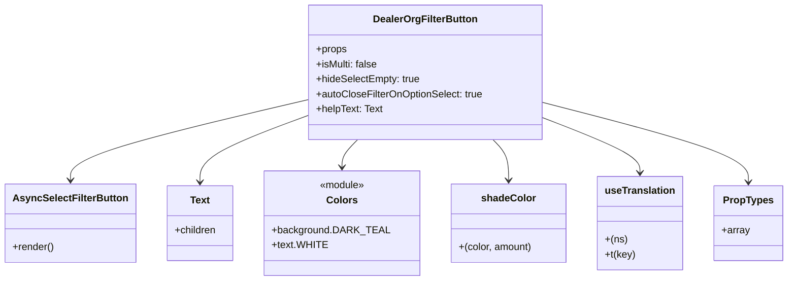

# Diagram: web/portal/src/pages/vinview/components/search/DealerOrgFilterButton.molecule.js

> Auto-generated by Obscura crawlers

## Mermaid

### SVG

<svg id="container" width="1232" xmlns="http://www.w3.org/2000/svg" class="classDiagram" height="450" viewBox="0 0 1232 450" role="graphics-document document" aria-roledescription="class"><g><defs><marker id="container_class-aggregationStart" class="marker aggregation class" refX="18" refY="7" markerWidth="190" markerHeight="240" orient="auto"><path d="M 18,7 L9,13 L1,7 L9,1 Z"></path></marker></defs><defs><marker id="container_class-aggregationEnd" class="marker aggregation class" refX="1" refY="7" markerWidth="20" markerHeight="28" orient="auto"><path d="M 18,7 L9,13 L1,7 L9,1 Z"></path></marker></defs><defs><marker id="container_class-extensionStart" class="marker extension class" refX="18" refY="7" markerWidth="190" markerHeight="240" orient="auto"><path d="M 1,7 L18,13 V 1 Z"></path></marker></defs><defs><marker id="container_class-extensionEnd" class="marker extension class" refX="1" refY="7" markerWidth="20" markerHeight="28" orient="auto"><path d="M 1,1 V 13 L18,7 Z"></path></marker></defs><defs><marker id="container_class-compositionStart" class="marker composition class" refX="18" refY="7" markerWidth="190" markerHeight="240" orient="auto"><path d="M 18,7 L9,13 L1,7 L9,1 Z"></path></marker></defs><defs><marker id="container_class-compositionEnd" class="marker composition class" refX="1" refY="7" markerWidth="20" markerHeight="28" orient="auto"><path d="M 18,7 L9,13 L1,7 L9,1 Z"></path></marker></defs><defs><marker id="container_class-dependencyStart" class="marker dependency class" refX="6" refY="7" markerWidth="190" markerHeight="240" orient="auto"><path d="M 5,7 L9,13 L1,7 L9,1 Z"></path></marker></defs><defs><marker id="container_class-dependencyEnd" class="marker dependency class" refX="13" refY="7" markerWidth="20" markerHeight="28" orient="auto"><path d="M 18,7 L9,13 L14,7 L9,1 Z"></path></marker></defs><defs><marker id="container_class-lollipopStart" class="marker lollipop class" refX="13" refY="7" markerWidth="190" markerHeight="240" orient="auto"><circle stroke="black" fill="transparent" cx="7" cy="7" r="6"></circle></marker></defs><defs><marker id="container_class-lollipopEnd" class="marker lollipop class" refX="1" refY="7" markerWidth="190" markerHeight="240" orient="auto"><circle stroke="black" fill="transparent" cx="7" cy="7" r="6"></circle></marker></defs><g class="root"><g class="clusters"></g><g class="edgePaths"><path d="M476.145,160.707L414.686,175.422C353.227,190.138,230.309,219.569,168.85,240.951C107.391,262.333,107.391,275.667,107.391,282.333L107.391,289" id="id_DealerOrgFilterButton_AsyncSelectFilterButton_1" class="edge-thickness-normal edge-pattern-solid relation" style=";;;" data-edge="true" data-et="edge" data-id="id_DealerOrgFilterButton_AsyncSelectFilterButton_1" data-points="W3sieCI6NDc2LjE0NDUzMTI1LCJ5IjoxNjAuNzA2NTE4OTg3MzQxNzh9LHsieCI6MTA3LjM5MDYyNSwieSI6MjQ5fSx7IngiOjEwNy4zOTA2MjUsInkiOjI5NX1d" marker-end="url(#container_class-dependencyEnd)"></path><path d="M476.145,186.421L448.491,196.851C420.837,207.281,365.53,228.14,337.876,245.737C310.223,263.333,310.223,277.667,310.223,284.833L310.223,292" id="id_DealerOrgFilterButton_Text_2" class="edge-thickness-normal edge-pattern-solid relation" style=";;;" data-edge="true" data-et="edge" data-id="id_DealerOrgFilterButton_Text_2" data-points="W3sieCI6NDc2LjE0NDUzMTI1LCJ5IjoxODYuNDIxMTI0MzQyMjg3NDR9LHsieCI6MzEwLjIyMjY1NjI1LCJ5IjoyNDl9LHsieCI6MzEwLjIyMjY1NjI1LCJ5IjoyOTh9XQ==" marker-end="url(#container_class-dependencyEnd)"></path><path d="M557.026,224L552.943,228.167C548.86,232.333,540.694,240.667,536.61,248C532.527,255.333,532.527,261.667,532.527,264.833L532.527,268" id="id_DealerOrgFilterButton_Colors_3" class="edge-thickness-normal edge-pattern-solid relation" style=";;;" data-edge="true" data-et="edge" data-id="id_DealerOrgFilterButton_Colors_3" data-points="W3sieCI6NTU3LjAyNTg0NTg2NDY2MTYsInkiOjIyNH0seyJ4Ijo1MzIuNTI3MzQzNzUsInkiOjI0OX0seyJ4Ijo1MzIuNTI3MzQzNzUsInkiOjI3NH1d" marker-end="url(#container_class-dependencyEnd)"></path><path d="M768.693,224L772.776,228.167C776.859,232.333,785.025,240.667,789.108,251.5C793.191,262.333,793.191,275.667,793.191,282.333L793.191,289" id="id_DealerOrgFilterButton_shadeColor_4" class="edge-thickness-normal edge-pattern-solid relation" style=";;;" data-edge="true" data-et="edge" data-id="id_DealerOrgFilterButton_shadeColor_4" data-points="W3sieCI6NzY4LjY5MjkwNDEzNTMzODQsInkiOjIyNH0seyJ4Ijo3OTMuMTkxNDA2MjUsInkiOjI0OX0seyJ4Ijo3OTMuMTkxNDA2MjUsInkiOjI5NX1d" marker-end="url(#container_class-dependencyEnd)"></path><path d="M849.574,189.423L874.825,199.353C900.076,209.282,950.577,229.141,975.827,243.737C1001.078,258.333,1001.078,267.667,1001.078,272.333L1001.078,277" id="id_DealerOrgFilterButton_useTranslation_5" class="edge-thickness-normal edge-pattern-solid relation" style=";;;" data-edge="true" data-et="edge" data-id="id_DealerOrgFilterButton_useTranslation_5" data-points="W3sieCI6ODQ5LjU3NDIxODc1LCJ5IjoxODkuNDIzMTE1MTI1MTk2MzV9LHsieCI6MTAwMS4wNzgxMjUsInkiOjI0OX0seyJ4IjoxMDAxLjA3ODEyNSwieSI6MjgzfV0=" marker-end="url(#container_class-dependencyEnd)"></path><path d="M849.574,164.911L903.076,178.926C956.577,192.94,1063.579,220.97,1117.081,242.152C1170.582,263.333,1170.582,277.667,1170.582,284.833L1170.582,292" id="id_DealerOrgFilterButton_PropTypes_6" class="edge-thickness-normal edge-pattern-solid relation" style=";;;" data-edge="true" data-et="edge" data-id="id_DealerOrgFilterButton_PropTypes_6" data-points="W3sieCI6ODQ5LjU3NDIxODc1LCJ5IjoxNjQuOTEwNzA3Mjc4OTgwMX0seyJ4IjoxMTcwLjU4MjAzMTI1LCJ5IjoyNDl9LHsieCI6MTE3MC41ODIwMzEyNSwieSI6Mjk4fV0=" marker-end="url(#container_class-dependencyEnd)"></path></g><g class="edgeLabels"><g class="edgeLabel"><g class="label" data-id="id_DealerOrgFilterButton_AsyncSelectFilterButton_1" transform="translate(0, 0)"><foreignObject width="0" height="0">

</foreignObject></g></g><g class="edgeLabel"><g class="label" data-id="id_DealerOrgFilterButton_Text_2" transform="translate(0, 0)"><foreignObject width="0" height="0">

</foreignObject></g></g><g class="edgeLabel"><g class="label" data-id="id_DealerOrgFilterButton_Colors_3" transform="translate(0, 0)"><foreignObject width="0" height="0">

</foreignObject></g></g><g class="edgeLabel"><g class="label" data-id="id_DealerOrgFilterButton_shadeColor_4" transform="translate(0, 0)"><foreignObject width="0" height="0">

</foreignObject></g></g><g class="edgeLabel"><g class="label" data-id="id_DealerOrgFilterButton_useTranslation_5" transform="translate(0, 0)"><foreignObject width="0" height="0">

</foreignObject></g></g><g class="edgeLabel"><g class="label" data-id="id_DealerOrgFilterButton_PropTypes_6" transform="translate(0, 0)"><foreignObject width="0" height="0">

</foreignObject></g></g></g><g class="nodes"><g class="node default" id="classId-DealerOrgFilterButton-0" transform="translate(662.859375, 116)"><g class="basic label-container"><path d="M-186.71484375 -108 L186.71484375 -108 L186.71484375 108 L-186.71484375 108" stroke="none" stroke-width="0" fill="#ECECFF" style=""></path><path d="M-186.71484375 -108 C-56.436661648644645 -108, 73.84152045271071 -108, 186.71484375 -108 M-186.71484375 -108 C-93.51738074809266 -108, -0.3199177461853253 -108, 186.71484375 -108 M186.71484375 -108 C186.71484375 -30.028787008141663, 186.71484375 47.942425983716674, 186.71484375 108 M186.71484375 -108 C186.71484375 -60.66729079757928, 186.71484375 -13.334581595158554, 186.71484375 108 M186.71484375 108 C60.908858252830626 108, -64.89712724433875 108, -186.71484375 108 M186.71484375 108 C49.33451503772744 108, -88.04581367454512 108, -186.71484375 108 M-186.71484375 108 C-186.71484375 34.723187321374624, -186.71484375 -38.55362535725075, -186.71484375 -108 M-186.71484375 108 C-186.71484375 23.434472227953478, -186.71484375 -61.131055544093044, -186.71484375 -108" stroke="#9370DB" stroke-width="1.3" fill="none" stroke-dasharray="0 0" style=""></path></g><g class="annotation-group text" transform="translate(0, -84)"></g><g class="label-group text" transform="translate(-80.5546875, -84)"><g class="label" style="font-weight: bolder" transform="translate(0,-12)"><foreignObject width="161.109375" height="24">

DealerOrgFilterButton

</foreignObject></g></g><g class="members-group text" transform="translate(-174.71484375, -36)"><g class="label" style="" transform="translate(0,-12)"><foreignObject width="49.515625" height="24">

+props

</foreignObject></g><g class="label" style="" transform="translate(0,12)"><foreignObject width="99.21875" height="24">

+isMulti: false

</foreignObject></g><g class="label" style="" transform="translate(0,36)"><foreignObject width="167.671875" height="24">

+hideSelectEmpty: true

</foreignObject></g><g class="label" style="" transform="translate(0,60)"><foreignObject width="268.875" height="24">

+autoCloseFilterOnOptionSelect: true

</foreignObject></g><g class="label" style="" transform="translate(0,84)"><foreignObject width="107.4375" height="24">

+helpText: Text

</foreignObject></g></g><g class="methods-group text" transform="translate(-174.71484375, 108)"></g><g class="divider" style=""><path d="M-186.71484375 -60 C-88.87838405426162 -60, 8.958075641476768 -60, 186.71484375 -60 M-186.71484375 -60 C-77.81899563513119 -60, 31.076852479737624 -60, 186.71484375 -60" stroke="#9370DB" stroke-width="1.3" fill="none" stroke-dasharray="0 0" style=""></path></g><g class="divider" style=""><path d="M-186.71484375 84 C-65.43985521582627 84, 55.83513331834746 84, 186.71484375 84 M-186.71484375 84 C-100.3830226412413 84, -14.051201532482594 84, 186.71484375 84" stroke="#9370DB" stroke-width="1.3" fill="none" stroke-dasharray="0 0" style=""></path></g></g><g class="node default" id="classId-AsyncSelectFilterButton-1" transform="translate(107.390625, 358)"><g class="basic label-container"><path d="M-99.390625 -63 L99.390625 -63 L99.390625 63 L-99.390625 63" stroke="none" stroke-width="0" fill="#ECECFF" style=""></path><path d="M-99.390625 -63 C-49.12219223759282 -63, 1.1462405248143597 -63, 99.390625 -63 M-99.390625 -63 C-41.42238793093583 -63, 16.545849138128347 -63, 99.390625 -63 M99.390625 -63 C99.390625 -29.813239979383205, 99.390625 3.37352004123359, 99.390625 63 M99.390625 -63 C99.390625 -16.190742829674143, 99.390625 30.618514340651714, 99.390625 63 M99.390625 63 C49.353883176648786 63, -0.682858646702428 63, -99.390625 63 M99.390625 63 C25.237129221616726 63, -48.91636655676655 63, -99.390625 63 M-99.390625 63 C-99.390625 37.77899637272566, -99.390625 12.557992745451308, -99.390625 -63 M-99.390625 63 C-99.390625 34.26178783246591, -99.390625 5.523575664931833, -99.390625 -63" stroke="#9370DB" stroke-width="1.3" fill="none" stroke-dasharray="0 0" style=""></path></g><g class="annotation-group text" transform="translate(0, -39)"></g><g class="label-group text" transform="translate(-87.390625, -39)"><g class="label" style="font-weight: bolder" transform="translate(0,-12)"><foreignObject width="174.78125" height="24">

AsyncSelectFilterButton

</foreignObject></g></g><g class="members-group text" transform="translate(-87.390625, 9)"></g><g class="methods-group text" transform="translate(-87.390625, 39)"><g class="label" style="" transform="translate(0,-12)"><foreignObject width="66.609375" height="24">

+render()

</foreignObject></g></g><g class="divider" style=""><path d="M-99.390625 -15 C-27.927793531188087 -15, 43.53503793762383 -15, 99.390625 -15 M-99.390625 -15 C-46.178800929086 -15, 7.0330231418279965 -15, 99.390625 -15" stroke="#9370DB" stroke-width="1.3" fill="none" stroke-dasharray="0 0" style=""></path></g><g class="divider" style=""><path d="M-99.390625 9 C-43.68950980447342 9, 12.011605391053166 9, 99.390625 9 M-99.390625 9 C-22.914891618525502 9, 53.560841762948996 9, 99.390625 9" stroke="#9370DB" stroke-width="1.3" fill="none" stroke-dasharray="0 0" style=""></path></g></g><g class="node default" id="classId-Text-2" transform="translate(310.22265625, 358)"><g class="basic label-container"><path d="M-53.44140625 -60 L53.44140625 -60 L53.44140625 60 L-53.44140625 60" stroke="none" stroke-width="0" fill="#ECECFF" style=""></path><path d="M-53.44140625 -60 C-30.21147639102929 -60, -6.98154653205858 -60, 53.44140625 -60 M-53.44140625 -60 C-12.696032801668899 -60, 28.049340646662202 -60, 53.44140625 -60 M53.44140625 -60 C53.44140625 -32.662898488483464, 53.44140625 -5.325796976966934, 53.44140625 60 M53.44140625 -60 C53.44140625 -24.135984544530302, 53.44140625 11.728030910939395, 53.44140625 60 M53.44140625 60 C16.007262929739547 60, -21.426880390520907 60, -53.44140625 60 M53.44140625 60 C22.276640928100825 60, -8.88812439379835 60, -53.44140625 60 M-53.44140625 60 C-53.44140625 26.888057947995335, -53.44140625 -6.223884104009329, -53.44140625 -60 M-53.44140625 60 C-53.44140625 31.77231014428163, -53.44140625 3.5446202885632587, -53.44140625 -60" stroke="#9370DB" stroke-width="1.3" fill="none" stroke-dasharray="0 0" style=""></path></g><g class="annotation-group text" transform="translate(0, -36)"></g><g class="label-group text" transform="translate(-15.3828125, -36)"><g class="label" style="font-weight: bolder" transform="translate(0,-12)"><foreignObject width="30.765625" height="24">

Text

</foreignObject></g></g><g class="members-group text" transform="translate(-41.44140625, 12)"><g class="label" style="" transform="translate(0,-12)"><foreignObject width="67.5" height="24">

+children

</foreignObject></g></g><g class="methods-group text" transform="translate(-41.44140625, 60)"></g><g class="divider" style=""><path d="M-53.44140625 -12 C-22.18436693221695 -12, 9.0726723855661 -12, 53.44140625 -12 M-53.44140625 -12 C-24.546479536909942 -12, 4.348447176180116 -12, 53.44140625 -12" stroke="#9370DB" stroke-width="1.3" fill="none" stroke-dasharray="0 0" style=""></path></g><g class="divider" style=""><path d="M-53.44140625 36 C-21.01533270830243 36, 11.410740833395138 36, 53.44140625 36 M-53.44140625 36 C-14.224280067350222 36, 24.992846115299557 36, 53.44140625 36" stroke="#9370DB" stroke-width="1.3" fill="none" stroke-dasharray="0 0" style=""></path></g></g><g class="node default" id="classId-Colors-3" transform="translate(532.52734375, 358)"><g class="basic label-container"><path d="M-118.86328125 -84 L118.86328125 -84 L118.86328125 84 L-118.86328125 84" stroke="none" stroke-width="0" fill="#ECECFF" style=""></path><path d="M-118.86328125 -84 C-48.83944951897456 -84, 21.184382212050878 -84, 118.86328125 -84 M-118.86328125 -84 C-48.58476486810072 -84, 21.69375151379856 -84, 118.86328125 -84 M118.86328125 -84 C118.86328125 -32.33626204100753, 118.86328125 19.32747591798494, 118.86328125 84 M118.86328125 -84 C118.86328125 -20.04282126370127, 118.86328125 43.91435747259746, 118.86328125 84 M118.86328125 84 C35.92634059637939 84, -47.01060005724122 84, -118.86328125 84 M118.86328125 84 C40.52181745131654 84, -37.81964634736693 84, -118.86328125 84 M-118.86328125 84 C-118.86328125 25.81946279659565, -118.86328125 -32.3610744068087, -118.86328125 -84 M-118.86328125 84 C-118.86328125 45.99159460102842, -118.86328125 7.983189202056835, -118.86328125 -84" stroke="#9370DB" stroke-width="1.3" fill="none" stroke-dasharray="0 0" style=""></path></g><g class="annotation-group text" transform="translate(-36.6015625, -60)"><g class="label" style="" transform="translate(0,-12)"><foreignObject width="73.203125" height="24">

«module»

</foreignObject></g></g><g class="label-group text" transform="translate(-23.1015625, -36)"><g class="label" style="font-weight: bolder" transform="translate(0,-12)"><foreignObject width="46.203125" height="24">

Colors

</foreignObject></g></g><g class="members-group text" transform="translate(-106.86328125, 12)"><g class="label" style="" transform="translate(0,-12)"><foreignObject width="177.125" height="24">

+background.DARK_TEAL

</foreignObject></g><g class="label" style="" transform="translate(0,12)"><foreignObject width="84.625" height="24">

+text.WHITE

</foreignObject></g></g><g class="methods-group text" transform="translate(-106.86328125, 84)"></g><g class="divider" style=""><path d="M-118.86328125 -12 C-66.20376498039626 -12, -13.544248710792516 -12, 118.86328125 -12 M-118.86328125 -12 C-30.640379740755677 -12, 57.58252176848865 -12, 118.86328125 -12" stroke="#9370DB" stroke-width="1.3" fill="none" stroke-dasharray="0 0" style=""></path></g><g class="divider" style=""><path d="M-118.86328125 60 C-61.462425222643915 60, -4.061569195287831 60, 118.86328125 60 M-118.86328125 60 C-53.88990369783605 60, 11.083473854327906 60, 118.86328125 60" stroke="#9370DB" stroke-width="1.3" fill="none" stroke-dasharray="0 0" style=""></path></g></g><g class="node default" id="classId-shadeColor-4" transform="translate(793.19140625, 358)"><g class="basic label-container"><path d="M-91.80078125 -63 L91.80078125 -63 L91.80078125 63 L-91.80078125 63" stroke="none" stroke-width="0" fill="#ECECFF" style=""></path><path d="M-91.80078125 -63 C-54.43607601510659 -63, -17.071370780213186 -63, 91.80078125 -63 M-91.80078125 -63 C-54.016417443616405 -63, -16.23205363723281 -63, 91.80078125 -63 M91.80078125 -63 C91.80078125 -12.635242722841973, 91.80078125 37.729514554316054, 91.80078125 63 M91.80078125 -63 C91.80078125 -31.75151133629689, 91.80078125 -0.5030226725937794, 91.80078125 63 M91.80078125 63 C25.647935699269013 63, -40.504909851461974 63, -91.80078125 63 M91.80078125 63 C20.40997095805416 63, -50.98083933389168 63, -91.80078125 63 M-91.80078125 63 C-91.80078125 34.59294230623124, -91.80078125 6.1858846124624804, -91.80078125 -63 M-91.80078125 63 C-91.80078125 18.06342594799657, -91.80078125 -26.87314810400686, -91.80078125 -63" stroke="#9370DB" stroke-width="1.3" fill="none" stroke-dasharray="0 0" style=""></path></g><g class="annotation-group text" transform="translate(0, -39)"></g><g class="label-group text" transform="translate(-41.4140625, -39)"><g class="label" style="font-weight: bolder" transform="translate(0,-12)"><foreignObject width="82.828125" height="24">

shadeColor

</foreignObject></g></g><g class="members-group text" transform="translate(-79.80078125, 9)"></g><g class="methods-group text" transform="translate(-79.80078125, 39)"><g class="label" style="" transform="translate(0,-12)"><foreignObject width="118.1875" height="24">

+(color, amount)

</foreignObject></g></g><g class="divider" style=""><path d="M-91.80078125 -15 C-35.75957353559771 -15, 20.28163417880458 -15, 91.80078125 -15 M-91.80078125 -15 C-22.158294697497055 -15, 47.48419185500589 -15, 91.80078125 -15" stroke="#9370DB" stroke-width="1.3" fill="none" stroke-dasharray="0 0" style=""></path></g><g class="divider" style=""><path d="M-91.80078125 9 C-51.94204300368244 9, -12.083304757364886 9, 91.80078125 9 M-91.80078125 9 C-52.2055707953082 9, -12.610360340616396 9, 91.80078125 9" stroke="#9370DB" stroke-width="1.3" fill="none" stroke-dasharray="0 0" style=""></path></g></g><g class="node default" id="classId-useTranslation-5" transform="translate(1001.078125, 358)"><g class="basic label-container"><path d="M-66.0859375 -75 L66.0859375 -75 L66.0859375 75 L-66.0859375 75" stroke="none" stroke-width="0" fill="#ECECFF" style=""></path><path d="M-66.0859375 -75 C-23.496747058087372 -75, 19.092443383825255 -75, 66.0859375 -75 M-66.0859375 -75 C-13.364132207918303 -75, 39.357673084163395 -75, 66.0859375 -75 M66.0859375 -75 C66.0859375 -21.656329989500442, 66.0859375 31.687340020999116, 66.0859375 75 M66.0859375 -75 C66.0859375 -32.94725831039139, 66.0859375 9.105483379217219, 66.0859375 75 M66.0859375 75 C21.91336319190721 75, -22.259211116185583 75, -66.0859375 75 M66.0859375 75 C33.86644216319902 75, 1.646946826398036 75, -66.0859375 75 M-66.0859375 75 C-66.0859375 36.9377800213829, -66.0859375 -1.1244399572342019, -66.0859375 -75 M-66.0859375 75 C-66.0859375 19.62780672056538, -66.0859375 -35.74438655886924, -66.0859375 -75" stroke="#9370DB" stroke-width="1.3" fill="none" stroke-dasharray="0 0" style=""></path></g><g class="annotation-group text" transform="translate(0, -51)"></g><g class="label-group text" transform="translate(-54.0859375, -51)"><g class="label" style="font-weight: bolder" transform="translate(0,-12)"><foreignObject width="108.171875" height="24">

useTranslation

</foreignObject></g></g><g class="members-group text" transform="translate(-54.0859375, -3)"></g><g class="methods-group text" transform="translate(-54.0859375, 27)"><g class="label" style="" transform="translate(0,-12)"><foreignObject width="35.203125" height="24">

+(ns)

</foreignObject></g><g class="label" style="" transform="translate(0,12)"><foreignObject width="48.625" height="24">

+t(key)

</foreignObject></g></g><g class="divider" style=""><path d="M-66.0859375 -27 C-30.039424813633048 -27, 6.007087872733905 -27, 66.0859375 -27 M-66.0859375 -27 C-31.183302990962815 -27, 3.7193315180743696 -27, 66.0859375 -27" stroke="#9370DB" stroke-width="1.3" fill="none" stroke-dasharray="0 0" style=""></path></g><g class="divider" style=""><path d="M-66.0859375 -3 C-33.02627492714889 -3, 0.03338764570221997 -3, 66.0859375 -3 M-66.0859375 -3 C-38.671981294791834 -3, -11.258025089583676 -3, 66.0859375 -3" stroke="#9370DB" stroke-width="1.3" fill="none" stroke-dasharray="0 0" style=""></path></g></g><g class="node default" id="classId-PropTypes-6" transform="translate(1170.58203125, 358)"><g class="basic label-container"><path d="M-53.41796875 -60 L53.41796875 -60 L53.41796875 60 L-53.41796875 60" stroke="none" stroke-width="0" fill="#ECECFF" style=""></path><path d="M-53.41796875 -60 C-15.637666494820785 -60, 22.14263576035843 -60, 53.41796875 -60 M-53.41796875 -60 C-27.219809451549686 -60, -1.0216501530993725 -60, 53.41796875 -60 M53.41796875 -60 C53.41796875 -22.129824098616425, 53.41796875 15.740351802767151, 53.41796875 60 M53.41796875 -60 C53.41796875 -14.322028110393461, 53.41796875 31.355943779213078, 53.41796875 60 M53.41796875 60 C12.836710133172168 60, -27.744548483655663 60, -53.41796875 60 M53.41796875 60 C27.226622419978145 60, 1.035276089956291 60, -53.41796875 60 M-53.41796875 60 C-53.41796875 25.68654501179762, -53.41796875 -8.626909976404761, -53.41796875 -60 M-53.41796875 60 C-53.41796875 18.250342045505185, -53.41796875 -23.49931590898963, -53.41796875 -60" stroke="#9370DB" stroke-width="1.3" fill="none" stroke-dasharray="0 0" style=""></path></g><g class="annotation-group text" transform="translate(0, -36)"></g><g class="label-group text" transform="translate(-38.2578125, -36)"><g class="label" style="font-weight: bolder" transform="translate(0,-12)"><foreignObject width="76.515625" height="24">

PropTypes

</foreignObject></g></g><g class="members-group text" transform="translate(-41.41796875, 12)"><g class="label" style="" transform="translate(0,-12)"><foreignObject width="44.578125" height="24">

+array

</foreignObject></g></g><g class="methods-group text" transform="translate(-41.41796875, 60)"></g><g class="divider" style=""><path d="M-53.41796875 -12 C-14.152813334855615 -12, 25.11234208028877 -12, 53.41796875 -12 M-53.41796875 -12 C-26.393094536316916 -12, 0.6317796773661684 -12, 53.41796875 -12" stroke="#9370DB" stroke-width="1.3" fill="none" stroke-dasharray="0 0" style=""></path></g><g class="divider" style=""><path d="M-53.41796875 36 C-30.635037491363693 36, -7.852106232727387 36, 53.41796875 36 M-53.41796875 36 C-11.610503833940236 36, 30.19696108211953 36, 53.41796875 36" stroke="#9370DB" stroke-width="1.3" fill="none" stroke-dasharray="0 0" style=""></path></g></g></g></g></g></svg>
