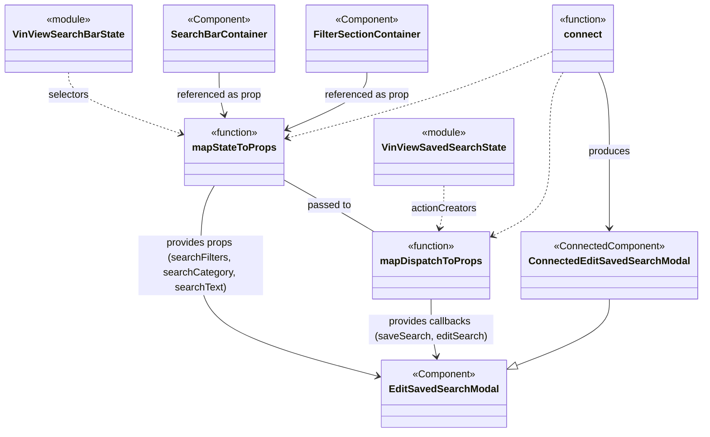

# Diagram: web/portal/src/pages/vinview/components/search/VinView.EditSavedSearchModal.container.js

> Auto-generated by Obscura crawlers

## Mermaid

```mermaid
classDiagram
class EditSavedSearchModal <<Component>>
class ConnectedEditSavedSearchModal <<ConnectedComponent>>
class connect <<function>>
class mapStateToProps <<function>>
class mapDispatchToProps <<function>>
class VinViewSearchBarState <<module>>
class VinViewSavedSearchState <<module>>
class SearchBarContainer <<Component>>
class FilterSectionContainer <<Component>>

VinViewSearchBarState ..> mapStateToProps : selectors
mapStateToProps --> EditSavedSearchModal : provides props (searchFilters, searchCategory, searchText)
SearchBarContainer --> mapStateToProps : referenced as prop
FilterSectionContainer --> mapStateToProps : referenced as prop

VinViewSavedSearchState ..> mapDispatchToProps : actionCreators
mapDispatchToProps --> EditSavedSearchModal : provides callbacks (saveSearch, editSearch)

mapStateToProps -- mapDispatchToProps : passed to
connect ..> mapStateToProps
connect ..> mapDispatchToProps
connect --> ConnectedEditSavedSearchModal : produces
ConnectedEditSavedSearchModal --|> EditSavedSearchModal
```

> SVG rendering failed for this diagram.
