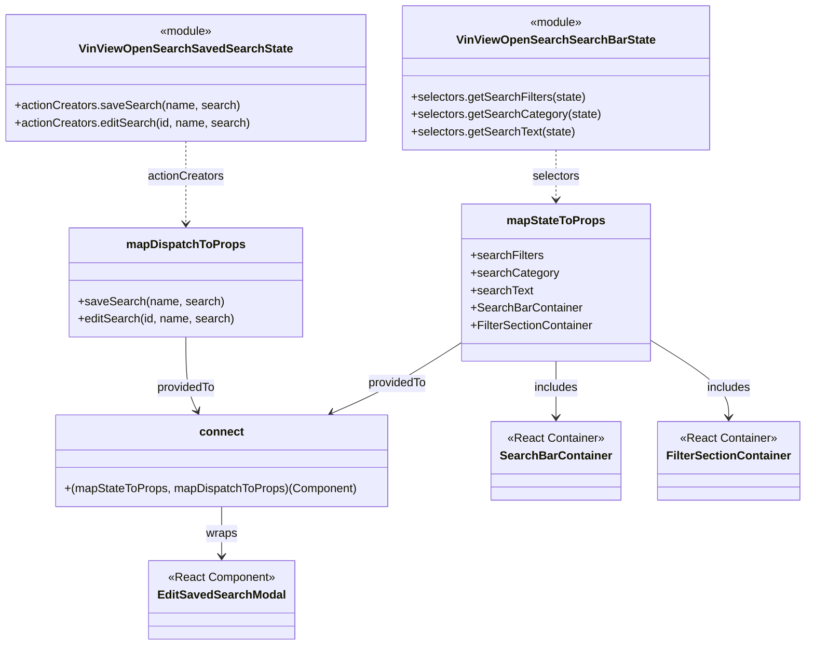

# Diagram: web/portal/src/pages/vinview/components/search/VinView.OpenSearch.EditSavedSearchModal.container.js

> Auto-generated by Obscura crawlers

## Mermaid

### SVG

<svg id="container" width="1079.63671875" xmlns="http://www.w3.org/2000/svg" class="classDiagram" height="886" viewBox="0 0 1079.63671875 886" role="graphics-document document" aria-roledescription="class"><g><defs><marker id="container_class-aggregationStart" class="marker aggregation class" refX="18" refY="7" markerWidth="190" markerHeight="240" orient="auto"><path d="M 18,7 L9,13 L1,7 L9,1 Z"></path></marker></defs><defs><marker id="container_class-aggregationEnd" class="marker aggregation class" refX="1" refY="7" markerWidth="20" markerHeight="28" orient="auto"><path d="M 18,7 L9,13 L1,7 L9,1 Z"></path></marker></defs><defs><marker id="container_class-extensionStart" class="marker extension class" refX="18" refY="7" markerWidth="190" markerHeight="240" orient="auto"><path d="M 1,7 L18,13 V 1 Z"></path></marker></defs><defs><marker id="container_class-extensionEnd" class="marker extension class" refX="1" refY="7" markerWidth="20" markerHeight="28" orient="auto"><path d="M 1,1 V 13 L18,7 Z"></path></marker></defs><defs><marker id="container_class-compositionStart" class="marker composition class" refX="18" refY="7" markerWidth="190" markerHeight="240" orient="auto"><path d="M 18,7 L9,13 L1,7 L9,1 Z"></path></marker></defs><defs><marker id="container_class-compositionEnd" class="marker composition class" refX="1" refY="7" markerWidth="20" markerHeight="28" orient="auto"><path d="M 18,7 L9,13 L1,7 L9,1 Z"></path></marker></defs><defs><marker id="container_class-dependencyStart" class="marker dependency class" refX="6" refY="7" markerWidth="190" markerHeight="240" orient="auto"><path d="M 5,7 L9,13 L1,7 L9,1 Z"></path></marker></defs><defs><marker id="container_class-dependencyEnd" class="marker dependency class" refX="13" refY="7" markerWidth="20" markerHeight="28" orient="auto"><path d="M 18,7 L9,13 L14,7 L9,1 Z"></path></marker></defs><defs><marker id="container_class-lollipopStart" class="marker lollipop class" refX="13" refY="7" markerWidth="190" markerHeight="240" orient="auto"><circle stroke="black" fill="transparent" cx="7" cy="7" r="6"></circle></marker></defs><defs><marker id="container_class-lollipopEnd" class="marker lollipop class" refX="1" refY="7" markerWidth="190" markerHeight="240" orient="auto"><circle stroke="black" fill="transparent" cx="7" cy="7" r="6"></circle></marker></defs><g class="root"><g class="clusters"></g><g class="edgePaths"><path d="M748.949,206L748.949,212.167C748.949,218.333,748.949,230.667,748.949,242C748.949,253.333,748.949,263.667,748.949,268.833L748.949,274" id="id_VinViewOpenSearchSearchBarState_mapStateToProps_1" class="edge-thickness-normal edge-pattern-dashed relation" style=";;;" data-edge="true" data-et="edge" data-id="id_VinViewOpenSearchSearchBarState_mapStateToProps_1" data-points="W3sieCI6NzQ4Ljk0OTIxODc1LCJ5IjoyMDZ9LHsieCI6NzQ4Ljk0OTIxODc1LCJ5IjoyNDN9LHsieCI6NzQ4Ljk0OTIxODc1LCJ5IjoyODB9XQ==" marker-end="url(#container_class-dependencyEnd)"></path><path d="M250.641,194L250.641,202.167C250.641,210.333,250.641,226.667,250.641,245.5C250.641,264.333,250.641,285.667,250.641,296.333L250.641,307" id="id_VinViewOpenSearchSavedSearchState_mapDispatchToProps_2" class="edge-thickness-normal edge-pattern-dashed relation" style=";;;" data-edge="true" data-et="edge" data-id="id_VinViewOpenSearchSavedSearchState_mapDispatchToProps_2" data-points="W3sieCI6MjUwLjY0MDYyNSwieSI6MTk0fSx7IngiOjI1MC42NDA2MjUsInkiOjI0M30seyJ4IjoyNTAuNjQwNjI1LCJ5IjozMTN9XQ==" marker-end="url(#container_class-dependencyEnd)"></path><path d="M619.828,470.705L603.619,481.088C587.41,491.47,554.991,512.235,526.052,528.372C497.114,544.509,471.655,556.019,458.926,561.774L446.197,567.528" id="id_mapStateToProps_connect_3" class="edge-thickness-normal edge-pattern-solid relation" style=";;;" data-edge="true" data-et="edge" data-id="id_mapStateToProps_connect_3" data-points="W3sieCI6NjE5LjgyODEyNSwieSI6NDcwLjcwNTIzMjczMzcwNDN9LHsieCI6NTIyLjU3MjI2NTYyNSwieSI6NTMzfSx7IngiOjQ0MC43MjkyNzczNDM3NSwieSI6NTcwfV0=" marker-end="url(#container_class-dependencyEnd)"></path><path d="M250.641,463L250.641,474.667C250.641,486.333,250.641,509.667,253.317,526.608C255.993,543.55,261.345,554.099,264.021,559.374L266.698,564.649" id="id_mapDispatchToProps_connect_4" class="edge-thickness-normal edge-pattern-solid relation" style=";;;" data-edge="true" data-et="edge" data-id="id_mapDispatchToProps_connect_4" data-points="W3sieCI6MjUwLjY0MDYyNSwieSI6NDYzfSx7IngiOjI1MC42NDA2MjUsInkiOjUzM30seyJ4IjoyNjkuNDEyMzQzNzUsInkiOjU3MH1d" marker-end="url(#container_class-dependencyEnd)"></path><path d="M301.375,696L301.375,702.167C301.375,708.333,301.375,720.667,301.375,732C301.375,743.333,301.375,753.667,301.375,758.833L301.375,764" id="id_connect_EditSavedSearchModal_5" class="edge-thickness-normal edge-pattern-solid relation" style=";;;" data-edge="true" data-et="edge" data-id="id_connect_EditSavedSearchModal_5" data-points="W3sieCI6MzAxLjM3NSwieSI6Njk2fSx7IngiOjMwMS4zNzUsInkiOjczM30seyJ4IjozMDEuMzc1LCJ5Ijo3NzB9XQ==" marker-end="url(#container_class-dependencyEnd)"></path><path d="M748.949,496L748.949,502.167C748.949,508.333,748.949,520.667,748.949,533.5C748.949,546.333,748.949,559.667,748.949,566.333L748.949,573" id="id_mapStateToProps_SearchBarContainer_6" class="edge-thickness-normal edge-pattern-solid relation" style=";;;" data-edge="true" data-et="edge" data-id="id_mapStateToProps_SearchBarContainer_6" data-points="W3sieCI6NzQ4Ljk0OTIxODc1LCJ5Ijo0OTZ9LHsieCI6NzQ4Ljk0OTIxODc1LCJ5Ijo1MzN9LHsieCI6NzQ4Ljk0OTIxODc1LCJ5Ijo1Nzl9XQ==" marker-end="url(#container_class-dependencyEnd)"></path><path d="M878.07,469.842L894.678,480.368C911.285,490.894,944.5,511.947,961.107,529.14C977.715,546.333,977.715,559.667,977.715,566.333L977.715,573" id="id_mapStateToProps_FilterSectionContainer_7" class="edge-thickness-normal edge-pattern-solid relation" style=";;;" data-edge="true" data-et="edge" data-id="id_mapStateToProps_FilterSectionContainer_7" data-points="W3sieCI6ODc4LjA3MDMxMjUsInkiOjQ2OS44NDE2NjA0MDU3MX0seyJ4Ijo5NzcuNzE0ODQzNzUsInkiOjUzM30seyJ4Ijo5NzcuNzE0ODQzNzUsInkiOjU3OX1d" marker-end="url(#container_class-dependencyEnd)"></path></g><g class="edgeLabels"><g class="edgeLabel" transform="translate(748.94921875, 243)"><g class="label" data-id="id_VinViewOpenSearchSearchBarState_mapStateToProps_1" transform="translate(-32.734375, -12)"><foreignObject width="65.46875" height="24">

selectors

</foreignObject></g></g><g class="edgeLabel" transform="translate(250.640625, 243)"><g class="label" data-id="id_VinViewOpenSearchSavedSearchState_mapDispatchToProps_2" transform="translate(-52.671875, -12)"><foreignObject width="105.34375" height="24">

actionCreators

</foreignObject></g></g><g class="edgeLabel" transform="translate(533.38363, 526.07505)"><g class="label" data-id="id_mapStateToProps_connect_3" transform="translate(-40.734375, -12)"><foreignObject width="81.46875" height="24">

providedTo

</foreignObject></g></g><g class="edgeLabel" transform="translate(250.640625, 533)"><g class="label" data-id="id_mapDispatchToProps_connect_4" transform="translate(-40.734375, -12)"><foreignObject width="81.46875" height="24">

providedTo

</foreignObject></g></g><g class="edgeLabel" transform="translate(301.375, 733)"><g class="label" data-id="id_connect_EditSavedSearchModal_5" transform="translate(-21.390625, -12)"><foreignObject width="42.78125" height="24">

wraps

</foreignObject></g></g><g class="edgeLabel" transform="translate(748.94921875, 533)"><g class="label" data-id="id_mapStateToProps_SearchBarContainer_6" transform="translate(-30.6484375, -12)"><foreignObject width="61.296875" height="24">

includes

</foreignObject></g></g><g class="edgeLabel" transform="translate(977.71484375, 533)"><g class="label" data-id="id_mapStateToProps_FilterSectionContainer_7" transform="translate(-30.6484375, -12)"><foreignObject width="61.296875" height="24">

includes

</foreignObject></g></g></g><g class="nodes"><g class="node default" id="classId-EditSavedSearchModal-0" transform="translate(301.375, 824)"><g class="basic label-container"><path d="M-95.4453125 -54 L95.4453125 -54 L95.4453125 54 L-95.4453125 54" stroke="none" stroke-width="0" fill="#ECECFF" style=""></path><path d="M-95.4453125 -54 C-56.960049015547874 -54, -18.474785531095748 -54, 95.4453125 -54 M-95.4453125 -54 C-36.0920897764457 -54, 23.261132947108607 -54, 95.4453125 -54 M95.4453125 -54 C95.4453125 -28.83317020519607, 95.4453125 -3.666340410392138, 95.4453125 54 M95.4453125 -54 C95.4453125 -17.173670277270972, 95.4453125 19.652659445458056, 95.4453125 54 M95.4453125 54 C38.74529965915268 54, -17.954713181694643 54, -95.4453125 54 M95.4453125 54 C30.39321911277706 54, -34.65887427444588 54, -95.4453125 54 M-95.4453125 54 C-95.4453125 19.840431139410406, -95.4453125 -14.319137721179189, -95.4453125 -54 M-95.4453125 54 C-95.4453125 30.06880160762384, -95.4453125 6.13760321524768, -95.4453125 -54" stroke="#9370DB" stroke-width="1.3" fill="none" stroke-dasharray="0 0" style=""></path></g><g class="annotation-group text" transform="translate(-73.2109375, -30)"><g class="label" style="" transform="translate(0,-12)"><foreignObject width="146.421875" height="24">

«React Component»

</foreignObject></g></g><g class="label-group text" transform="translate(-83.4453125, -6)"><g class="label" style="font-weight: bolder" transform="translate(0,-12)"><foreignObject width="166.890625" height="24">

EditSavedSearchModal

</foreignObject></g></g><g class="members-group text" transform="translate(-83.4453125, 42)"></g><g class="methods-group text" transform="translate(-83.4453125, 72)"></g><g class="divider" style=""><path d="M-95.4453125 18 C-50.437323361171245 18, -5.42933422234249 18, 95.4453125 18 M-95.4453125 18 C-29.913488827613392 18, 35.618334844773216 18, 95.4453125 18" stroke="#9370DB" stroke-width="1.3" fill="none" stroke-dasharray="0 0" style=""></path></g><g class="divider" style=""><path d="M-95.4453125 36 C-33.03857914879443 36, 29.368154202411134 36, 95.4453125 36 M-95.4453125 36 C-48.654732890584775 36, -1.8641532811695498 36, 95.4453125 36" stroke="#9370DB" stroke-width="1.3" fill="none" stroke-dasharray="0 0" style=""></path></g></g><g class="node default" id="classId-connect-1" transform="translate(301.375, 633)"><g class="basic label-container"><path d="M-226.52734375 -63 L226.52734375 -63 L226.52734375 63 L-226.52734375 63" stroke="none" stroke-width="0" fill="#ECECFF" style=""></path><path d="M-226.52734375 -63 C-109.44324202288281 -63, 7.640859704234373 -63, 226.52734375 -63 M-226.52734375 -63 C-74.64136087031375 -63, 77.2446220093725 -63, 226.52734375 -63 M226.52734375 -63 C226.52734375 -12.723053268871638, 226.52734375 37.553893462256724, 226.52734375 63 M226.52734375 -63 C226.52734375 -21.775881555994232, 226.52734375 19.448236888011536, 226.52734375 63 M226.52734375 63 C104.24751816875148 63, -18.032307412497033 63, -226.52734375 63 M226.52734375 63 C101.84875027245765 63, -22.8298432050847 63, -226.52734375 63 M-226.52734375 63 C-226.52734375 26.035941036099203, -226.52734375 -10.928117927801594, -226.52734375 -63 M-226.52734375 63 C-226.52734375 25.364731126914847, -226.52734375 -12.270537746170305, -226.52734375 -63" stroke="#9370DB" stroke-width="1.3" fill="none" stroke-dasharray="0 0" style=""></path></g><g class="annotation-group text" transform="translate(0, -39)"></g><g class="label-group text" transform="translate(-28.9140625, -39)"><g class="label" style="font-weight: bolder" transform="translate(0,-12)"><foreignObject width="57.828125" height="24">

connect

</foreignObject></g></g><g class="members-group text" transform="translate(-214.52734375, 9)"></g><g class="methods-group text" transform="translate(-214.52734375, 39)"><g class="label" style="" transform="translate(0,-12)"><foreignObject width="400.140625" height="24">

+(mapStateToProps, mapDispatchToProps)(Component)

</foreignObject></g></g><g class="divider" style=""><path d="M-226.52734375 -15 C-47.98564104826809 -15, 130.55606165346381 -15, 226.52734375 -15 M-226.52734375 -15 C-115.78744409935281 -15, -5.047544448705622 -15, 226.52734375 -15" stroke="#9370DB" stroke-width="1.3" fill="none" stroke-dasharray="0 0" style=""></path></g><g class="divider" style=""><path d="M-226.52734375 9 C-93.8481041476665 9, 38.83113545466699 9, 226.52734375 9 M-226.52734375 9 C-54.77546592273143 9, 116.97641190453714 9, 226.52734375 9" stroke="#9370DB" stroke-width="1.3" fill="none" stroke-dasharray="0 0" style=""></path></g></g><g class="node default" id="classId-mapStateToProps-2" transform="translate(748.94921875, 388)"><g class="basic label-container"><path d="M-129.12109375 -108 L129.12109375 -108 L129.12109375 108 L-129.12109375 108" stroke="none" stroke-width="0" fill="#ECECFF" style=""></path><path d="M-129.12109375 -108 C-42.27108427253059 -108, 44.57892520493883 -108, 129.12109375 -108 M-129.12109375 -108 C-71.73046043546876 -108, -14.3398271209375 -108, 129.12109375 -108 M129.12109375 -108 C129.12109375 -26.798247939296388, 129.12109375 54.403504121407224, 129.12109375 108 M129.12109375 -108 C129.12109375 -48.66602328885838, 129.12109375 10.667953422283233, 129.12109375 108 M129.12109375 108 C47.91150695014319 108, -33.298079849713616 108, -129.12109375 108 M129.12109375 108 C60.275846096024395 108, -8.56940155795121 108, -129.12109375 108 M-129.12109375 108 C-129.12109375 62.13354057658825, -129.12109375 16.267081153176505, -129.12109375 -108 M-129.12109375 108 C-129.12109375 23.4692055971111, -129.12109375 -61.0615888057778, -129.12109375 -108" stroke="#9370DB" stroke-width="1.3" fill="none" stroke-dasharray="0 0" style=""></path></g><g class="annotation-group text" transform="translate(0, -84)"></g><g class="label-group text" transform="translate(-64.7109375, -84)"><g class="label" style="font-weight: bolder" transform="translate(0,-12)"><foreignObject width="129.421875" height="24">

mapStateToProps

</foreignObject></g></g><g class="members-group text" transform="translate(-117.12109375, -36)"><g class="label" style="" transform="translate(0,-12)"><foreignObject width="99.609375" height="24">

+searchFilters

</foreignObject></g><g class="label" style="" transform="translate(0,12)"><foreignObject width="118.65625" height="24">

+searchCategory

</foreignObject></g><g class="label" style="" transform="translate(0,36)"><foreignObject width="84.953125" height="24">

+searchText

</foreignObject></g><g class="label" style="" transform="translate(0,60)"><foreignObject width="151.171875" height="24">

+SearchBarContainer

</foreignObject></g><g class="label" style="" transform="translate(0,84)"><foreignObject width="169.53125" height="24">

+FilterSectionContainer

</foreignObject></g></g><g class="methods-group text" transform="translate(-117.12109375, 108)"></g><g class="divider" style=""><path d="M-129.12109375 -60 C-37.07418439237051 -60, 54.972724965258976 -60, 129.12109375 -60 M-129.12109375 -60 C-60.20403646073005 -60, 8.713020828539896 -60, 129.12109375 -60" stroke="#9370DB" stroke-width="1.3" fill="none" stroke-dasharray="0 0" style=""></path></g><g class="divider" style=""><path d="M-129.12109375 84 C-62.47358655565118 84, 4.173920638697638 84, 129.12109375 84 M-129.12109375 84 C-28.505465511784507 84, 72.11016272643099 84, 129.12109375 84" stroke="#9370DB" stroke-width="1.3" fill="none" stroke-dasharray="0 0" style=""></path></g></g><g class="node default" id="classId-mapDispatchToProps-3" transform="translate(250.640625, 388)"><g class="basic label-container"><path d="M-157.44140625 -75 L157.44140625 -75 L157.44140625 75 L-157.44140625 75" stroke="none" stroke-width="0" fill="#ECECFF" style=""></path><path d="M-157.44140625 -75 C-37.84589641264364 -75, 81.74961342471272 -75, 157.44140625 -75 M-157.44140625 -75 C-50.478123968007324 -75, 56.48515831398535 -75, 157.44140625 -75 M157.44140625 -75 C157.44140625 -44.95291910901098, 157.44140625 -14.905838218021948, 157.44140625 75 M157.44140625 -75 C157.44140625 -42.25012603481204, 157.44140625 -9.500252069624082, 157.44140625 75 M157.44140625 75 C50.91987190262708 75, -55.60166244474584 75, -157.44140625 75 M157.44140625 75 C43.995366675356934 75, -69.45067289928613 75, -157.44140625 75 M-157.44140625 75 C-157.44140625 21.263805465651636, -157.44140625 -32.47238906869673, -157.44140625 -75 M-157.44140625 75 C-157.44140625 29.60839171081644, -157.44140625 -15.783216578367117, -157.44140625 -75" stroke="#9370DB" stroke-width="1.3" fill="none" stroke-dasharray="0 0" style=""></path></g><g class="annotation-group text" transform="translate(0, -51)"></g><g class="label-group text" transform="translate(-77.1953125, -51)"><g class="label" style="font-weight: bolder" transform="translate(0,-12)"><foreignObject width="154.390625" height="24">

mapDispatchToProps

</foreignObject></g></g><g class="members-group text" transform="translate(-145.44140625, -3)"></g><g class="methods-group text" transform="translate(-145.44140625, 27)"><g class="label" style="" transform="translate(0,-12)"><foreignObject width="195.25" height="24">

+saveSearch(name, search)

</foreignObject></g><g class="label" style="" transform="translate(0,12)"><foreignObject width="213.6875" height="24">

+editSearch(id, name, search)

</foreignObject></g></g><g class="divider" style=""><path d="M-157.44140625 -27 C-47.681398904591745 -27, 62.07860844081651 -27, 157.44140625 -27 M-157.44140625 -27 C-65.75611694410073 -27, 25.92917236179855 -27, 157.44140625 -27" stroke="#9370DB" stroke-width="1.3" fill="none" stroke-dasharray="0 0" style=""></path></g><g class="divider" style=""><path d="M-157.44140625 -3 C-79.39264256930159 -3, -1.3438788886031716 -3, 157.44140625 -3 M-157.44140625 -3 C-87.77510739846858 -3, -18.108808546937155 -3, 157.44140625 -3" stroke="#9370DB" stroke-width="1.3" fill="none" stroke-dasharray="0 0" style=""></path></g></g><g class="node default" id="classId-VinViewOpenSearchSearchBarState-4" transform="translate(748.94921875, 107)"><g class="basic label-container"><path d="M-205.66796875 -99 L205.66796875 -99 L205.66796875 99 L-205.66796875 99" stroke="none" stroke-width="0" fill="#ECECFF" style=""></path><path d="M-205.66796875 -99 C-117.30839081371921 -99, -28.948812877438428 -99, 205.66796875 -99 M-205.66796875 -99 C-107.90992911262494 -99, -10.151889475249874 -99, 205.66796875 -99 M205.66796875 -99 C205.66796875 -24.700077124925613, 205.66796875 49.59984575014877, 205.66796875 99 M205.66796875 -99 C205.66796875 -58.92815610042511, 205.66796875 -18.856312200850226, 205.66796875 99 M205.66796875 99 C68.68780190643625 99, -68.2923649371275 99, -205.66796875 99 M205.66796875 99 C119.97948715287703 99, 34.291005555754055 99, -205.66796875 99 M-205.66796875 99 C-205.66796875 46.656124427960826, -205.66796875 -5.687751144078348, -205.66796875 -99 M-205.66796875 99 C-205.66796875 22.462336709573236, -205.66796875 -54.07532658085353, -205.66796875 -99" stroke="#9370DB" stroke-width="1.3" fill="none" stroke-dasharray="0 0" style=""></path></g><g class="annotation-group text" transform="translate(-36.6015625, -75)"><g class="label" style="" transform="translate(0,-12)"><foreignObject width="73.203125" height="24">

«module»

</foreignObject></g></g><g class="label-group text" transform="translate(-129.2578125, -51)"><g class="label" style="font-weight: bolder" transform="translate(0,-12)"><foreignObject width="258.515625" height="24">

VinViewOpenSearchSearchBarState

</foreignObject></g></g><g class="members-group text" transform="translate(-193.66796875, -3)"></g><g class="methods-group text" transform="translate(-193.66796875, 27)"><g class="label" style="" transform="translate(0,-12)"><foreignObject width="239.015625" height="24">

+selectors.getSearchFilters(state)

</foreignObject></g><g class="label" style="" transform="translate(0,12)"><foreignObject width="258.078125" height="24">

+selectors.getSearchCategory(state)

</foreignObject></g><g class="label" style="" transform="translate(0,36)"><foreignObject width="224.359375" height="24">

+selectors.getSearchText(state)

</foreignObject></g></g><g class="divider" style=""><path d="M-205.66796875 -27 C-49.863137356034855 -27, 105.94169403793029 -27, 205.66796875 -27 M-205.66796875 -27 C-111.78257796789653 -27, -17.897187185793058 -27, 205.66796875 -27" stroke="#9370DB" stroke-width="1.3" fill="none" stroke-dasharray="0 0" style=""></path></g><g class="divider" style=""><path d="M-205.66796875 -3 C-70.14564439857233 -3, 65.37667995285534 -3, 205.66796875 -3 M-205.66796875 -3 C-111.21658385255508 -3, -16.76519895511015 -3, 205.66796875 -3" stroke="#9370DB" stroke-width="1.3" fill="none" stroke-dasharray="0 0" style=""></path></g></g><g class="node default" id="classId-VinViewOpenSearchSavedSearchState-5" transform="translate(250.640625, 107)"><g class="basic label-container"><path d="M-242.640625 -87 L242.640625 -87 L242.640625 87 L-242.640625 87" stroke="none" stroke-width="0" fill="#ECECFF" style=""></path><path d="M-242.640625 -87 C-75.65715153895096 -87, 91.32632192209809 -87, 242.640625 -87 M-242.640625 -87 C-65.48156398565172 -87, 111.67749702869656 -87, 242.640625 -87 M242.640625 -87 C242.640625 -43.85512919299401, 242.640625 -0.7102583859880269, 242.640625 87 M242.640625 -87 C242.640625 -43.19103973659076, 242.640625 0.6179205268184802, 242.640625 87 M242.640625 87 C137.17092467177588 87, 31.70122434355173 87, -242.640625 87 M242.640625 87 C137.52279320580635 87, 32.404961411612675 87, -242.640625 87 M-242.640625 87 C-242.640625 31.88750506986046, -242.640625 -23.22498986027908, -242.640625 -87 M-242.640625 87 C-242.640625 20.028625466990007, -242.640625 -46.942749066019985, -242.640625 -87" stroke="#9370DB" stroke-width="1.3" fill="none" stroke-dasharray="0 0" style=""></path></g><g class="annotation-group text" transform="translate(-36.6015625, -63)"><g class="label" style="" transform="translate(0,-12)"><foreignObject width="73.203125" height="24">

«module»

</foreignObject></g></g><g class="label-group text" transform="translate(-138.828125, -39)"><g class="label" style="font-weight: bolder" transform="translate(0,-12)"><foreignObject width="277.65625" height="24">

VinViewOpenSearchSavedSearchState

</foreignObject></g></g><g class="members-group text" transform="translate(-230.640625, 9)"></g><g class="methods-group text" transform="translate(-230.640625, 39)"><g class="label" style="" transform="translate(0,-12)"><foreignObject width="304.25" height="24">

+actionCreators.saveSearch(name, search)

</foreignObject></g><g class="label" style="" transform="translate(0,12)"><foreignObject width="322.453125" height="24">

+actionCreators.editSearch(id, name, search)

</foreignObject></g></g><g class="divider" style=""><path d="M-242.640625 -15 C-75.60998536131967 -15, 91.42065427736065 -15, 242.640625 -15 M-242.640625 -15 C-102.77918519188398 -15, 37.082254616232035 -15, 242.640625 -15" stroke="#9370DB" stroke-width="1.3" fill="none" stroke-dasharray="0 0" style=""></path></g><g class="divider" style=""><path d="M-242.640625 9 C-66.04730401589495 9, 110.5460169682101 9, 242.640625 9 M-242.640625 9 C-84.60618144742165 9, 73.4282621051567 9, 242.640625 9" stroke="#9370DB" stroke-width="1.3" fill="none" stroke-dasharray="0 0" style=""></path></g></g><g class="node default" id="classId-SearchBarContainer-6" transform="translate(748.94921875, 633)"><g class="basic label-container"><path d="M-84.84375 -54 L84.84375 -54 L84.84375 54 L-84.84375 54" stroke="none" stroke-width="0" fill="#ECECFF" style=""></path><path d="M-84.84375 -54 C-41.361396702431634 -54, 2.1209565951367324 -54, 84.84375 -54 M-84.84375 -54 C-20.891077094430187 -54, 43.061595811139625 -54, 84.84375 -54 M84.84375 -54 C84.84375 -14.379776698739015, 84.84375 25.24044660252197, 84.84375 54 M84.84375 -54 C84.84375 -31.474501532711272, 84.84375 -8.949003065422545, 84.84375 54 M84.84375 54 C26.497102172994133 54, -31.849545654011735 54, -84.84375 54 M84.84375 54 C25.150673221562336 54, -34.54240355687533 54, -84.84375 54 M-84.84375 54 C-84.84375 25.72034038881064, -84.84375 -2.5593192223787185, -84.84375 -54 M-84.84375 54 C-84.84375 25.43289190313636, -84.84375 -3.1342161937272834, -84.84375 -54" stroke="#9370DB" stroke-width="1.3" fill="none" stroke-dasharray="0 0" style=""></path></g><g class="annotation-group text" transform="translate(-66.4921875, -30)"><g class="label" style="" transform="translate(0,-12)"><foreignObject width="132.984375" height="24">

«React Container»

</foreignObject></g></g><g class="label-group text" transform="translate(-72.84375, -6)"><g class="label" style="font-weight: bolder" transform="translate(0,-12)"><foreignObject width="145.6875" height="24">

SearchBarContainer

</foreignObject></g></g><g class="members-group text" transform="translate(-72.84375, 42)"></g><g class="methods-group text" transform="translate(-72.84375, 72)"></g><g class="divider" style=""><path d="M-84.84375 18 C-27.34856182547628 18, 30.146626349047438 18, 84.84375 18 M-84.84375 18 C-44.31401213901729 18, -3.784274278034573 18, 84.84375 18" stroke="#9370DB" stroke-width="1.3" fill="none" stroke-dasharray="0 0" style=""></path></g><g class="divider" style=""><path d="M-84.84375 36 C-20.76154905091832 36, 43.32065189816336 36, 84.84375 36 M-84.84375 36 C-25.746575706180217 36, 33.35059858763957 36, 84.84375 36" stroke="#9370DB" stroke-width="1.3" fill="none" stroke-dasharray="0 0" style=""></path></g></g><g class="node default" id="classId-FilterSectionContainer-7" transform="translate(977.71484375, 633)"><g class="basic label-container"><path d="M-93.921875 -54 L93.921875 -54 L93.921875 54 L-93.921875 54" stroke="none" stroke-width="0" fill="#ECECFF" style=""></path><path d="M-93.921875 -54 C-30.596674523227847 -54, 32.728525953544306 -54, 93.921875 -54 M-93.921875 -54 C-38.69154464945812 -54, 16.538785701083754 -54, 93.921875 -54 M93.921875 -54 C93.921875 -11.775334153602564, 93.921875 30.44933169279487, 93.921875 54 M93.921875 -54 C93.921875 -27.09174814879355, 93.921875 -0.18349629758709796, 93.921875 54 M93.921875 54 C44.4108436177362 54, -5.100187764527604 54, -93.921875 54 M93.921875 54 C38.805929289509876 54, -16.310016420980247 54, -93.921875 54 M-93.921875 54 C-93.921875 12.605785909865183, -93.921875 -28.788428180269634, -93.921875 -54 M-93.921875 54 C-93.921875 15.602512035702205, -93.921875 -22.79497592859559, -93.921875 -54" stroke="#9370DB" stroke-width="1.3" fill="none" stroke-dasharray="0 0" style=""></path></g><g class="annotation-group text" transform="translate(-66.4921875, -30)"><g class="label" style="" transform="translate(0,-12)"><foreignObject width="132.984375" height="24">

«React Container»

</foreignObject></g></g><g class="label-group text" transform="translate(-81.921875, -6)"><g class="label" style="font-weight: bolder" transform="translate(0,-12)"><foreignObject width="163.84375" height="24">

FilterSectionContainer

</foreignObject></g></g><g class="members-group text" transform="translate(-81.921875, 42)"></g><g class="methods-group text" transform="translate(-81.921875, 72)"></g><g class="divider" style=""><path d="M-93.921875 18 C-53.563127324015625 18, -13.20437964803125 18, 93.921875 18 M-93.921875 18 C-30.75356277110958 18, 32.41474945778084 18, 93.921875 18" stroke="#9370DB" stroke-width="1.3" fill="none" stroke-dasharray="0 0" style=""></path></g><g class="divider" style=""><path d="M-93.921875 36 C-50.51766477557581 36, -7.113454551151619 36, 93.921875 36 M-93.921875 36 C-20.5080284359439 36, 52.9058181281122 36, 93.921875 36" stroke="#9370DB" stroke-width="1.3" fill="none" stroke-dasharray="0 0" style=""></path></g></g></g></g></g></svg>
