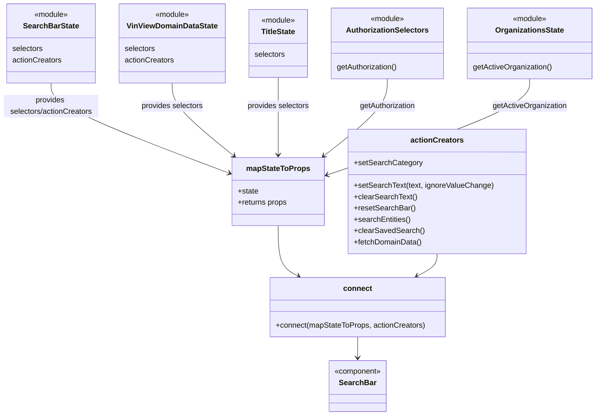

# Diagram: web/portal/src/pages/vinview/components/search/VinView.OpenSearch.SearchBar.container.js


> Auto-generated by Obscura crawlers

## Diagram 1

```mermaid
flowchart LR
  subgraph Selectors
    SB[SearchBarState.selectors]
    VDD[VinViewDomainDataState.selectors]
    TS[TitleState.selectors]
    AUTH[getAuthorization]
    ORG[getActiveOrganization]
  end

  subgraph mapStateToProps
    MS(mapStateToProps)
    MS -->|uses| SB
    MS -->|uses| VDD
    MS -->|uses| TS
    MS -->|uses| AUTH
    MS -->|uses| ORG
    SB -->|provides|getSearchText[getSearchText(state)]
    SB --> getSearchCategory[getSearchCategory(state)]
    SB --> getIgnoreSearchCategory[getIgnoreSearchCategory(state)]
    SB --> getTypeaheadOptionsMetadata[getTypeaheadOptionsMetadata(state)]
    SB --> getHasSearchCriteriaChanged[getHasSearchCriteriaChanged(state)]
    SB --> getAreAllPrerequisiteFiltersSelected[getAreAllPrerequisiteFiltersSelected(state)]
    VDD --> getVINs[getVINs(state)]
    VDD --> getProductTypes[getProductTypes(state)]
    VDD --> getOrderNumbers[getOrderNumbers(state)]
    VDD --> getExceptionTypes[getExceptionTypes(state)]
    TS --> getOpenSearchToggleState[getOpenSearchToggleState(state)]
    AUTH --> authProp[auth: getAuthorization(state)]
    ORG --> activeOrg[getActiveOrganization(state)]
    MS --> props[returns props object]
    props --> authProp
    props --> getTypeaheadOptionsMetadata
    props --> getSearchText
    props --> getSearchCategory
    props --> getIgnoreSearchCategory
    props --> getHasSearchCriteriaChanged
    props --> getVINs
    props --> getProductTypes
    props --> getOrderNumbers
    props --> getExceptionTypes
    props --> domainDataArgs[domainDataArgs array]
    domainDataArgs --> SB_SelectedDealer[getSelectedDealerOrgId(state)]
    domainDataArgs --> activeOrg
    domainDataArgs --> SB_SelectedFvId[getSelectedDealerOrgFvId(state)]
    domainDataArgs --> getOpenSearchToggleState
    props --> areAllPrereq[areAllPrerequisiteFiltersSelected]
    props --> canUserSearch[canUserSearch]
  end

  subgraph Actions
    SB_AC[SearchBarState.actionCreators]
    VDD_AC[VinViewDomainDataState.actionCreators]
    SB_AC --> setSearchCategoryForKey
    SB_AC --> setSearchTextAction
    SB_AC --> clearSearchText
    SB_AC --> resetSearchBar
    SB_AC --> searchEntities
    SB_AC --> clearSavedSearch
    VDD_AC --> fetchDomainData
    actionCreators[actionCreators object]
    actionCreators --> setSearchCategoryForKey
    actionCreators --> setSearchTextWrapped["setSearchText(text, ignore) -> dispatch(setSearchText(..., true))"]
    actionCreators --> clearSearchText
    actionCreators --> resetSearchBar
    actionCreators --> searchEntities
    actionCreators --> clearSavedSearch
    actionCreators --> fetchDomainData
  end

  connect[connect(mapStateToProps, actionCreators)]
  connect -->|wraps| SearchBarComponent[SearchBar]
  connect --> MS
  connect --> actionCreators
```

> SVG rendering failed for this diagram.

## Diagram 2



### SVG

<svg id="container" width="1258.56640625" xmlns="http://www.w3.org/2000/svg" class="classDiagram" height="880" viewBox="0 0 1258.56640625 880" role="graphics-document document" aria-roledescription="class"><style>#container{font-family:"trebuchet ms",verdana,arial,sans-serif;font-size:16px;fill:#333;}@keyframes edge-animation-frame{from{stroke-dashoffset:0;}}@keyframes dash{to{stroke-dashoffset:0;}}#container .edge-animation-slow{stroke-dasharray:9,5!important;stroke-dashoffset:900;animation:dash 50s linear infinite;stroke-linecap:round;}#container .edge-animation-fast{stroke-dasharray:9,5!important;stroke-dashoffset:900;animation:dash 20s linear infinite;stroke-linecap:round;}#container .error-icon{fill:#552222;}#container .error-text{fill:#552222;stroke:#552222;}#container .edge-thickness-normal{stroke-width:1px;}#container .edge-thickness-thick{stroke-width:3.5px;}#container .edge-pattern-solid{stroke-dasharray:0;}#container .edge-thickness-invisible{stroke-width:0;fill:none;}#container .edge-pattern-dashed{stroke-dasharray:3;}#container .edge-pattern-dotted{stroke-dasharray:2;}#container .marker{fill:#333333;stroke:#333333;}#container .marker.cross{stroke:#333333;}#container svg{font-family:"trebuchet ms",verdana,arial,sans-serif;font-size:16px;}#container p{margin:0;}#container g.classGroup text{fill:#9370DB;stroke:none;font-family:"trebuchet ms",verdana,arial,sans-serif;font-size:10px;}#container g.classGroup text .title{font-weight:bolder;}#container .nodeLabel,#container .edgeLabel{color:#131300;}#container .edgeLabel .label rect{fill:#ECECFF;}#container .label text{fill:#131300;}#container .labelBkg{background:#ECECFF;}#container .edgeLabel .label span{background:#ECECFF;}#container .classTitle{font-weight:bolder;}#container .node rect,#container .node circle,#container .node ellipse,#container .node polygon,#container .node path{fill:#ECECFF;stroke:#9370DB;stroke-width:1px;}#container .divider{stroke:#9370DB;stroke-width:1;}#container g.clickable{cursor:pointer;}#container g.classGroup rect{fill:#ECECFF;stroke:#9370DB;}#container g.classGroup line{stroke:#9370DB;stroke-width:1;}#container .classLabel .box{stroke:none;stroke-width:0;fill:#ECECFF;opacity:0.5;}#container .classLabel .label{fill:#9370DB;font-size:10px;}#container .relation{stroke:#333333;stroke-width:1;fill:none;}#container .dashed-line{stroke-dasharray:3;}#container .dotted-line{stroke-dasharray:1 2;}#container #compositionStart,#container .composition{fill:#333333!important;stroke:#333333!important;stroke-width:1;}#container #compositionEnd,#container .composition{fill:#333333!important;stroke:#333333!important;stroke-width:1;}#container #dependencyStart,#container .dependency{fill:#333333!important;stroke:#333333!important;stroke-width:1;}#container #dependencyStart,#container .dependency{fill:#333333!important;stroke:#333333!important;stroke-width:1;}#container #extensionStart,#container .extension{fill:transparent!important;stroke:#333333!important;stroke-width:1;}#container #extensionEnd,#container .extension{fill:transparent!important;stroke:#333333!important;stroke-width:1;}#container #aggregationStart,#container .aggregation{fill:transparent!important;stroke:#333333!important;stroke-width:1;}#container #aggregationEnd,#container .aggregation{fill:transparent!important;stroke:#333333!important;stroke-width:1;}#container #lollipopStart,#container .lollipop{fill:#ECECFF!important;stroke:#333333!important;stroke-width:1;}#container #lollipopEnd,#container .lollipop{fill:#ECECFF!important;stroke:#333333!important;stroke-width:1;}#container .edgeTerminals{font-size:11px;line-height:initial;}#container .classTitleText{text-anchor:middle;font-size:18px;fill:#333;}#container .label-icon{display:inline-block;height:1em;overflow:visible;vertical-align:-0.125em;}#container .node .label-icon path{fill:currentColor;stroke:revert;stroke-width:revert;}#container :root{--mermaid-font-family:"trebuchet ms",verdana,arial,sans-serif;}</style><g><defs><marker id="container_class-aggregationStart" class="marker aggregation class" refX="18" refY="7" markerWidth="190" markerHeight="240" orient="auto"><path d="M 18,7 L9,13 L1,7 L9,1 Z"></path></marker></defs><defs><marker id="container_class-aggregationEnd" class="marker aggregation class" refX="1" refY="7" markerWidth="20" markerHeight="28" orient="auto"><path d="M 18,7 L9,13 L1,7 L9,1 Z"></path></marker></defs><defs><marker id="container_class-extensionStart" class="marker extension class" refX="18" refY="7" markerWidth="190" markerHeight="240" orient="auto"><path d="M 1,7 L18,13 V 1 Z"></path></marker></defs><defs><marker id="container_class-extensionEnd" class="marker extension class" refX="1" refY="7" markerWidth="20" markerHeight="28" orient="auto"><path d="M 1,1 V 13 L18,7 Z"></path></marker></defs><defs><marker id="container_class-compositionStart" class="marker composition class" refX="18" refY="7" markerWidth="190" markerHeight="240" orient="auto"><path d="M 18,7 L9,13 L1,7 L9,1 Z"></path></marker></defs><defs><marker id="container_class-compositionEnd" class="marker composition class" refX="1" refY="7" markerWidth="20" markerHeight="28" orient="auto"><path d="M 18,7 L9,13 L1,7 L9,1 Z"></path></marker></defs><defs><marker id="container_class-dependencyStart" class="marker dependency class" refX="6" refY="7" markerWidth="190" markerHeight="240" orient="auto"><path d="M 5,7 L9,13 L1,7 L9,1 Z"></path></marker></defs><defs><marker id="container_class-dependencyEnd" class="marker dependency class" refX="13" refY="7" markerWidth="20" markerHeight="28" orient="auto"><path d="M 18,7 L9,13 L14,7 L9,1 Z"></path></marker></defs><defs><marker id="container_class-lollipopStart" class="marker lollipop class" refX="13" refY="7" markerWidth="190" markerHeight="240" orient="auto"><circle stroke="black" fill="transparent" cx="7" cy="7" r="6"></circle></marker></defs><defs><marker id="container_class-lollipopEnd" class="marker lollipop class" refX="1" refY="7" markerWidth="190" markerHeight="240" orient="auto"><circle stroke="black" fill="transparent" cx="7" cy="7" r="6"></circle></marker></defs><g class="root"><g class="clusters"></g><g class="edgePaths"><path d="M108,176L108,184.167C108,192.333,108,208.667,170.496,240.494C232.993,272.321,357.986,319.643,420.482,343.304L482.979,366.964" id="id_SearchBarState_mapStateToProps_1" class="edge-thickness-normal edge-pattern-solid relation" style=";;;" data-edge="true" data-et="edge" data-id="id_SearchBarState_mapStateToProps_1" data-points="W3sieCI6MTA4LCJ5IjoxNzZ9LHsieCI6MTA4LCJ5IjoyMjV9LHsieCI6NDg4LjU4OTg0Mzc1LCJ5IjozNjkuMDg4NjU5MjA0MTgzMzN9XQ==" marker-end="url(#container_class-dependencyEnd)"></path><path d="M362,176L362,184.167C362,192.333,362,208.667,383.713,234.372C405.426,260.077,448.853,295.153,470.566,312.692L492.279,330.23" id="id_VinViewDomainDataState_mapStateToProps_2" class="edge-thickness-normal edge-pattern-solid relation" style=";;;" data-edge="true" data-et="edge" data-id="id_VinViewDomainDataState_mapStateToProps_2" data-points="W3sieCI6MzYyLCJ5IjoxNzZ9LHsieCI6MzYyLCJ5IjoyMjV9LHsieCI6NDk2Ljk0Njc4MDA0MTQzNjQ1LCJ5IjozMzR9XQ==" marker-end="url(#container_class-dependencyEnd)"></path><path d="M586.086,164L586.086,174.167C586.086,184.333,586.086,204.667,586.086,232C586.086,259.333,586.086,293.667,586.086,310.833L586.086,328" id="id_TitleState_mapStateToProps_3" class="edge-thickness-normal edge-pattern-solid relation" style=";;;" data-edge="true" data-et="edge" data-id="id_TitleState_mapStateToProps_3" data-points="W3sieCI6NTg2LjA4NTkzNzUsInkiOjE2NH0seyJ4Ijo1ODYuMDg1OTM3NSwieSI6MjI1fSx7IngiOjU4Ni4wODU5Mzc1LCJ5IjozMzR9XQ==" marker-end="url(#container_class-dependencyEnd)"></path><path d="M818.59,167L818.59,176.667C818.59,186.333,818.59,205.667,796.043,232.886C773.496,260.105,728.402,295.21,705.855,312.762L683.308,330.314" id="id_AuthorizationSelectors_mapStateToProps_4" class="edge-thickness-normal edge-pattern-solid relation" style=";;;" data-edge="true" data-et="edge" data-id="id_AuthorizationSelectors_mapStateToProps_4" data-points="W3sieCI6ODE4LjU4OTg0Mzc1LCJ5IjoxNjd9LHsieCI6ODE4LjU4OTg0Mzc1LCJ5IjoyMjV9LHsieCI6Njc4LjU3MzY3OTIxMjcwNzEsInkiOjMzNH1d" marker-end="url(#container_class-dependencyEnd)"></path><path d="M1119.313,167L1119.313,176.667C1119.313,186.333,1119.313,205.667,1047.638,239.663C975.963,273.659,832.613,322.318,760.938,346.648L689.264,370.977" id="id_OrganizationsState_mapStateToProps_5" class="edge-thickness-normal edge-pattern-solid relation" style=";;;" data-edge="true" data-et="edge" data-id="id_OrganizationsState_mapStateToProps_5" data-points="W3sieCI6MTExOS4zMTI1LCJ5IjoxNjd9LHsieCI6MTExOS4zMTI1LCJ5IjoyMjV9LHsieCI6NjgzLjU4MjAzMTI1LCJ5IjozNzIuOTA1NjM3ODQ3NDIwNn1d" marker-end="url(#container_class-dependencyEnd)"></path><path d="M586.086,478L586.086,492.167C586.086,506.333,586.086,534.667,593.079,552.532C600.073,570.398,614.06,577.796,621.053,581.496L628.047,585.195" id="id_mapStateToProps_connect_6" class="edge-thickness-normal edge-pattern-solid relation" style=";;;" data-edge="true" data-et="edge" data-id="id_mapStateToProps_connect_6" data-points="W3sieCI6NTg2LjA4NTkzNzUsInkiOjQ3OH0seyJ4Ijo1ODYuMDg1OTM3NSwieSI6NTYzfSx7IngiOjYzMy4zNTA0NTI3Njk4ODY0LCJ5Ijo1ODh9XQ==" marker-end="url(#container_class-dependencyEnd)"></path><path d="M918.828,538L918.828,542.167C918.828,546.333,918.828,554.667,911.835,562.532C904.841,570.398,890.854,577.796,883.861,581.496L876.867,585.195" id="id_actionCreators_connect_7" class="edge-thickness-normal edge-pattern-solid relation" style=";;;" data-edge="true" data-et="edge" data-id="id_actionCreators_connect_7" data-points="W3sieCI6OTE4LjgyODEyNSwieSI6NTM4fSx7IngiOjkxOC44MjgxMjUsInkiOjU2M30seyJ4Ijo4NzEuNTYzNjA5NzMwMTEzNiwieSI6NTg4fV0=" marker-end="url(#container_class-dependencyEnd)"></path><path d="M752.457,714L752.457,718.167C752.457,722.333,752.457,730.667,752.457,738C752.457,745.333,752.457,751.667,752.457,754.833L752.457,758" id="id_connect_SearchBar_8" class="edge-thickness-normal edge-pattern-solid relation" style=";;;" data-edge="true" data-et="edge" data-id="id_connect_SearchBar_8" data-points="W3sieCI6NzUyLjQ1NzAzMTI1LCJ5Ijo3MTR9LHsieCI6NzUyLjQ1NzAzMTI1LCJ5Ijo3Mzl9LHsieCI6NzUyLjQ1NzAzMTI1LCJ5Ijo3NjR9XQ==" marker-end="url(#container_class-dependencyEnd)"></path></g><g class="edgeLabels"><g class="edgeLabel" transform="translate(108, 225)"><g class="label" data-id="id_SearchBarState_mapStateToProps_1" transform="translate(-100, -24)"><foreignObject width="200" height="48"><div xmlns="http://www.w3.org/1999/xhtml" class="labelBkg" style="display: table; white-space: break-spaces; line-height: 1.5; max-width: 200px; text-align: center; width: 200px;"><span class="edgeLabel"><p>provides selectors/actionCreators</p></span></div></foreignObject></g></g><g class="edgeLabel" transform="translate(362, 225)"><g class="label" data-id="id_VinViewDomainDataState_mapStateToProps_2" transform="translate(-66.1640625, -12)"><foreignObject width="132.328125" height="24"><div xmlns="http://www.w3.org/1999/xhtml" class="labelBkg" style="display: table-cell; white-space: nowrap; line-height: 1.5; max-width: 200px; text-align: center;"><span class="edgeLabel"><p>provides selectors</p></span></div></foreignObject></g></g><g class="edgeLabel" transform="translate(586.0859375, 225)"><g class="label" data-id="id_TitleState_mapStateToProps_3" transform="translate(-66.1640625, -12)"><foreignObject width="132.328125" height="24"><div xmlns="http://www.w3.org/1999/xhtml" class="labelBkg" style="display: table-cell; white-space: nowrap; line-height: 1.5; max-width: 200px; text-align: center;"><span class="edgeLabel"><p>provides selectors</p></span></div></foreignObject></g></g><g class="edgeLabel" transform="translate(818.58984375, 225)"><g class="label" data-id="id_AuthorizationSelectors_mapStateToProps_4" transform="translate(-60.3515625, -12)"><foreignObject width="120.703125" height="24"><div xmlns="http://www.w3.org/1999/xhtml" class="labelBkg" style="display: table-cell; white-space: nowrap; line-height: 1.5; max-width: 200px; text-align: center;"><span class="edgeLabel"><p>getAuthorization</p></span></div></foreignObject></g></g><g class="edgeLabel" transform="translate(1119.3125, 225)"><g class="label" data-id="id_OrganizationsState_mapStateToProps_5" transform="translate(-79.140625, -12)"><foreignObject width="158.28125" height="24"><div xmlns="http://www.w3.org/1999/xhtml" class="labelBkg" style="display: table-cell; white-space: nowrap; line-height: 1.5; max-width: 200px; text-align: center;"><span class="edgeLabel"><p>getActiveOrganization</p></span></div></foreignObject></g></g><g class="edgeLabel"><g class="label" data-id="id_mapStateToProps_connect_6" transform="translate(0, 0)"><foreignObject width="0" height="0"><div xmlns="http://www.w3.org/1999/xhtml" class="labelBkg" style="display: table-cell; white-space: nowrap; line-height: 1.5; max-width: 200px; text-align: center;"><span class="edgeLabel"></span></div></foreignObject></g></g><g class="edgeLabel"><g class="label" data-id="id_actionCreators_connect_7" transform="translate(0, 0)"><foreignObject width="0" height="0"><div xmlns="http://www.w3.org/1999/xhtml" class="labelBkg" style="display: table-cell; white-space: nowrap; line-height: 1.5; max-width: 200px; text-align: center;"><span class="edgeLabel"></span></div></foreignObject></g></g><g class="edgeLabel"><g class="label" data-id="id_connect_SearchBar_8" transform="translate(0, 0)"><foreignObject width="0" height="0"><div xmlns="http://www.w3.org/1999/xhtml" class="labelBkg" style="display: table-cell; white-space: nowrap; line-height: 1.5; max-width: 200px; text-align: center;"><span class="edgeLabel"></span></div></foreignObject></g></g></g><g class="nodes"><g class="node default" id="classId-SearchBarState-0" transform="translate(108, 92)"><g class="basic label-container"><path d="M-92.94921875 -84 L92.94921875 -84 L92.94921875 84 L-92.94921875 84" stroke="none" stroke-width="0" fill="#ECECFF" style=""></path><path d="M-92.94921875 -84 C-39.11889304703655 -84, 14.711432655926899 -84, 92.94921875 -84 M-92.94921875 -84 C-54.1444592867901 -84, -15.339699823580204 -84, 92.94921875 -84 M92.94921875 -84 C92.94921875 -45.84521220336092, 92.94921875 -7.690424406721846, 92.94921875 84 M92.94921875 -84 C92.94921875 -47.12750073038, 92.94921875 -10.255001460759999, 92.94921875 84 M92.94921875 84 C39.679153099638526 84, -13.590912550722948 84, -92.94921875 84 M92.94921875 84 C25.40140212441608 84, -42.14641450116784 84, -92.94921875 84 M-92.94921875 84 C-92.94921875 17.181124621826868, -92.94921875 -49.637750756346264, -92.94921875 -84 M-92.94921875 84 C-92.94921875 17.2421338687752, -92.94921875 -49.5157322624496, -92.94921875 -84" stroke="#9370DB" stroke-width="1.3" fill="none" stroke-dasharray="0 0" style=""></path></g><g class="annotation-group text" transform="translate(-36.6015625, -60)"><g class="label" style="" transform="translate(0,-12)"><foreignObject width="73.203125" height="24"><div xmlns="http://www.w3.org/1999/xhtml" style="display: table-cell; white-space: nowrap; line-height: 1.5; max-width: 123px; text-align: center;"><span class="nodeLabel markdown-node-label" style=""><p>«module»</p></span></div></foreignObject></g></g><g class="label-group text" transform="translate(-56.5546875, -36)"><g class="label" style="font-weight: bolder" transform="translate(0,-12)"><foreignObject width="113.109375" height="24"><div xmlns="http://www.w3.org/1999/xhtml" style="display: table-cell; white-space: nowrap; line-height: 1.5; max-width: 161px; text-align: center;"><span class="nodeLabel markdown-node-label" style=""><p>SearchBarState</p></span></div></foreignObject></g></g><g class="members-group text" transform="translate(-80.94921875, 12)"><g class="label" style="" transform="translate(0,-12)"><foreignObject width="65.46875" height="24"><div xmlns="http://www.w3.org/1999/xhtml" style="display: table-cell; white-space: nowrap; line-height: 1.5; max-width: 115px; text-align: center;"><span class="nodeLabel markdown-node-label" style=""><p>selectors</p></span></div></foreignObject></g><g class="label" style="" transform="translate(0,12)"><foreignObject width="105.34375" height="24"><div xmlns="http://www.w3.org/1999/xhtml" style="display: table-cell; white-space: nowrap; line-height: 1.5; max-width: 155px; text-align: center;"><span class="nodeLabel markdown-node-label" style=""><p>actionCreators</p></span></div></foreignObject></g></g><g class="methods-group text" transform="translate(-80.94921875, 84)"></g><g class="divider" style=""><path d="M-92.94921875 -12 C-31.29365967071793 -12, 30.361899408564142 -12, 92.94921875 -12 M-92.94921875 -12 C-39.31135611891691 -12, 14.326506512166176 -12, 92.94921875 -12" stroke="#9370DB" stroke-width="1.3" fill="none" stroke-dasharray="0 0" style=""></path></g><g class="divider" style=""><path d="M-92.94921875 60 C-37.26347354791065 60, 18.4222716541787 60, 92.94921875 60 M-92.94921875 60 C-22.123893314229193 60, 48.701432121541615 60, 92.94921875 60" stroke="#9370DB" stroke-width="1.3" fill="none" stroke-dasharray="0 0" style=""></path></g></g><g class="node default" id="classId-VinViewDomainDataState-1" transform="translate(362, 92)"><g class="basic label-container"><path d="M-111.05078125 -84 L111.05078125 -84 L111.05078125 84 L-111.05078125 84" stroke="none" stroke-width="0" fill="#ECECFF" style=""></path><path d="M-111.05078125 -84 C-29.556233004294484 -84, 51.93831524141103 -84, 111.05078125 -84 M-111.05078125 -84 C-46.68637253702521 -84, 17.678036175949586 -84, 111.05078125 -84 M111.05078125 -84 C111.05078125 -19.958642205877496, 111.05078125 44.08271558824501, 111.05078125 84 M111.05078125 -84 C111.05078125 -40.9807617921836, 111.05078125 2.0384764156328004, 111.05078125 84 M111.05078125 84 C38.88830119697889 84, -33.27417885604223 84, -111.05078125 84 M111.05078125 84 C42.5082867424733 84, -26.034207765053395 84, -111.05078125 84 M-111.05078125 84 C-111.05078125 32.71815200260785, -111.05078125 -18.563695994784297, -111.05078125 -84 M-111.05078125 84 C-111.05078125 19.66257737318398, -111.05078125 -44.67484525363204, -111.05078125 -84" stroke="#9370DB" stroke-width="1.3" fill="none" stroke-dasharray="0 0" style=""></path></g><g class="annotation-group text" transform="translate(-36.6015625, -60)"><g class="label" style="" transform="translate(0,-12)"><foreignObject width="73.203125" height="24"><div xmlns="http://www.w3.org/1999/xhtml" style="display: table-cell; white-space: nowrap; line-height: 1.5; max-width: 123px; text-align: center;"><span class="nodeLabel markdown-node-label" style=""><p>«module»</p></span></div></foreignObject></g></g><g class="label-group text" transform="translate(-92.7578125, -36)"><g class="label" style="font-weight: bolder" transform="translate(0,-12)"><foreignObject width="185.515625" height="24"><div xmlns="http://www.w3.org/1999/xhtml" style="display: table-cell; white-space: nowrap; line-height: 1.5; max-width: 233px; text-align: center;"><span class="nodeLabel markdown-node-label" style=""><p>VinViewDomainDataState</p></span></div></foreignObject></g></g><g class="members-group text" transform="translate(-99.05078125, 12)"><g class="label" style="" transform="translate(0,-12)"><foreignObject width="65.46875" height="24"><div xmlns="http://www.w3.org/1999/xhtml" style="display: table-cell; white-space: nowrap; line-height: 1.5; max-width: 115px; text-align: center;"><span class="nodeLabel markdown-node-label" style=""><p>selectors</p></span></div></foreignObject></g><g class="label" style="" transform="translate(0,12)"><foreignObject width="105.34375" height="24"><div xmlns="http://www.w3.org/1999/xhtml" style="display: table-cell; white-space: nowrap; line-height: 1.5; max-width: 155px; text-align: center;"><span class="nodeLabel markdown-node-label" style=""><p>actionCreators</p></span></div></foreignObject></g></g><g class="methods-group text" transform="translate(-99.05078125, 84)"></g><g class="divider" style=""><path d="M-111.05078125 -12 C-27.219314397950782 -12, 56.612152454098435 -12, 111.05078125 -12 M-111.05078125 -12 C-22.780259373727404 -12, 65.49026250254519 -12, 111.05078125 -12" stroke="#9370DB" stroke-width="1.3" fill="none" stroke-dasharray="0 0" style=""></path></g><g class="divider" style=""><path d="M-111.05078125 60 C-63.02055992574512 60, -14.990338601490237 60, 111.05078125 60 M-111.05078125 60 C-46.44504817485618 60, 18.160684900287634 60, 111.05078125 60" stroke="#9370DB" stroke-width="1.3" fill="none" stroke-dasharray="0 0" style=""></path></g></g><g class="node default" id="classId-TitleState-2" transform="translate(586.0859375, 92)"><g class="basic label-container"><path d="M-63.03515625 -72 L63.03515625 -72 L63.03515625 72 L-63.03515625 72" stroke="none" stroke-width="0" fill="#ECECFF" style=""></path><path d="M-63.03515625 -72 C-15.18479958184529 -72, 32.66555708630942 -72, 63.03515625 -72 M-63.03515625 -72 C-26.97368047131736 -72, 9.087795307365283 -72, 63.03515625 -72 M63.03515625 -72 C63.03515625 -37.96627243757551, 63.03515625 -3.9325448751510237, 63.03515625 72 M63.03515625 -72 C63.03515625 -30.29459172175443, 63.03515625 11.410816556491142, 63.03515625 72 M63.03515625 72 C33.90645066727336 72, 4.77774508454673 72, -63.03515625 72 M63.03515625 72 C35.94809698116738 72, 8.861037712334763 72, -63.03515625 72 M-63.03515625 72 C-63.03515625 41.508665449663965, -63.03515625 11.01733089932793, -63.03515625 -72 M-63.03515625 72 C-63.03515625 27.253574988604854, -63.03515625 -17.492850022790293, -63.03515625 -72" stroke="#9370DB" stroke-width="1.3" fill="none" stroke-dasharray="0 0" style=""></path></g><g class="annotation-group text" transform="translate(-36.6015625, -48)"><g class="label" style="" transform="translate(0,-12)"><foreignObject width="73.203125" height="24"><div xmlns="http://www.w3.org/1999/xhtml" style="display: table-cell; white-space: nowrap; line-height: 1.5; max-width: 123px; text-align: center;"><span class="nodeLabel markdown-node-label" style=""><p>«module»</p></span></div></foreignObject></g></g><g class="label-group text" transform="translate(-35.6484375, -24)"><g class="label" style="font-weight: bolder" transform="translate(0,-12)"><foreignObject width="71.296875" height="24"><div xmlns="http://www.w3.org/1999/xhtml" style="display: table-cell; white-space: nowrap; line-height: 1.5; max-width: 119px; text-align: center;"><span class="nodeLabel markdown-node-label" style=""><p>TitleState</p></span></div></foreignObject></g></g><g class="members-group text" transform="translate(-51.03515625, 24)"><g class="label" style="" transform="translate(0,-12)"><foreignObject width="65.46875" height="24"><div xmlns="http://www.w3.org/1999/xhtml" style="display: table-cell; white-space: nowrap; line-height: 1.5; max-width: 115px; text-align: center;"><span class="nodeLabel markdown-node-label" style=""><p>selectors</p></span></div></foreignObject></g></g><g class="methods-group text" transform="translate(-51.03515625, 72)"></g><g class="divider" style=""><path d="M-63.03515625 0 C-29.255721292032916 0, 4.523713665934167 0, 63.03515625 0 M-63.03515625 0 C-35.37538339472118 0, -7.715610539442366 0, 63.03515625 0" stroke="#9370DB" stroke-width="1.3" fill="none" stroke-dasharray="0 0" style=""></path></g><g class="divider" style=""><path d="M-63.03515625 48 C-25.409649003534852 48, 12.215858242930295 48, 63.03515625 48 M-63.03515625 48 C-29.442929190300397 48, 4.149297869399206 48, 63.03515625 48" stroke="#9370DB" stroke-width="1.3" fill="none" stroke-dasharray="0 0" style=""></path></g></g><g class="node default" id="classId-AuthorizationSelectors-3" transform="translate(818.58984375, 92)"><g class="basic label-container"><path d="M-119.46875 -75 L119.46875 -75 L119.46875 75 L-119.46875 75" stroke="none" stroke-width="0" fill="#ECECFF" style=""></path><path d="M-119.46875 -75 C-24.92007681258633 -75, 69.62859637482734 -75, 119.46875 -75 M-119.46875 -75 C-49.79126238120163 -75, 19.886225237596733 -75, 119.46875 -75 M119.46875 -75 C119.46875 -32.086572841534036, 119.46875 10.826854316931929, 119.46875 75 M119.46875 -75 C119.46875 -40.817987698249155, 119.46875 -6.63597539649831, 119.46875 75 M119.46875 75 C65.77807460850241 75, 12.087399217004801 75, -119.46875 75 M119.46875 75 C47.88735737643195 75, -23.6940352471361 75, -119.46875 75 M-119.46875 75 C-119.46875 40.04333029678481, -119.46875 5.0866605935696185, -119.46875 -75 M-119.46875 75 C-119.46875 42.924885877059616, -119.46875 10.849771754119232, -119.46875 -75" stroke="#9370DB" stroke-width="1.3" fill="none" stroke-dasharray="0 0" style=""></path></g><g class="annotation-group text" transform="translate(-36.6015625, -51)"><g class="label" style="" transform="translate(0,-12)"><foreignObject width="73.203125" height="24"><div xmlns="http://www.w3.org/1999/xhtml" style="display: table-cell; white-space: nowrap; line-height: 1.5; max-width: 123px; text-align: center;"><span class="nodeLabel markdown-node-label" style=""><p>«module»</p></span></div></foreignObject></g></g><g class="label-group text" transform="translate(-83.875, -27)"><g class="label" style="font-weight: bolder" transform="translate(0,-12)"><foreignObject width="167.75" height="24"><div xmlns="http://www.w3.org/1999/xhtml" style="display: table-cell; white-space: nowrap; line-height: 1.5; max-width: 215px; text-align: center;"><span class="nodeLabel markdown-node-label" style=""><p>AuthorizationSelectors</p></span></div></foreignObject></g></g><g class="members-group text" transform="translate(-107.46875, 21)"></g><g class="methods-group text" transform="translate(-107.46875, 51)"><g class="label" style="" transform="translate(0,-12)"><foreignObject width="131.0625" height="24"><div xmlns="http://www.w3.org/1999/xhtml" style="display: table-cell; white-space: nowrap; line-height: 1.5; max-width: 181px; text-align: center;"><span class="nodeLabel markdown-node-label" style=""><p>getAuthorization()</p></span></div></foreignObject></g></g><g class="divider" style=""><path d="M-119.46875 -3 C-53.900737652660965 -3, 11.66727469467807 -3, 119.46875 -3 M-119.46875 -3 C-64.52724299104622 -3, -9.585735982092444 -3, 119.46875 -3" stroke="#9370DB" stroke-width="1.3" fill="none" stroke-dasharray="0 0" style=""></path></g><g class="divider" style=""><path d="M-119.46875 21 C-28.378546122669803 21, 62.71165775466039 21, 119.46875 21 M-119.46875 21 C-44.89977991529524 21, 29.669190169409518 21, 119.46875 21" stroke="#9370DB" stroke-width="1.3" fill="none" stroke-dasharray="0 0" style=""></path></g></g><g class="node default" id="classId-OrganizationsState-4" transform="translate(1119.3125, 92)"><g class="basic label-container"><path d="M-131.25390625 -75 L131.25390625 -75 L131.25390625 75 L-131.25390625 75" stroke="none" stroke-width="0" fill="#ECECFF" style=""></path><path d="M-131.25390625 -75 C-69.54080703069205 -75, -7.827707811384101 -75, 131.25390625 -75 M-131.25390625 -75 C-34.20498500429268 -75, 62.84393624141464 -75, 131.25390625 -75 M131.25390625 -75 C131.25390625 -20.195968076292125, 131.25390625 34.60806384741575, 131.25390625 75 M131.25390625 -75 C131.25390625 -29.385750261395458, 131.25390625 16.228499477209084, 131.25390625 75 M131.25390625 75 C58.7085020727428 75, -13.836902104514394 75, -131.25390625 75 M131.25390625 75 C33.95532282653852 75, -63.34326059692296 75, -131.25390625 75 M-131.25390625 75 C-131.25390625 34.670072936066575, -131.25390625 -5.659854127866851, -131.25390625 -75 M-131.25390625 75 C-131.25390625 28.050433625211028, -131.25390625 -18.899132749577944, -131.25390625 -75" stroke="#9370DB" stroke-width="1.3" fill="none" stroke-dasharray="0 0" style=""></path></g><g class="annotation-group text" transform="translate(-36.6015625, -51)"><g class="label" style="" transform="translate(0,-12)"><foreignObject width="73.203125" height="24"><div xmlns="http://www.w3.org/1999/xhtml" style="display: table-cell; white-space: nowrap; line-height: 1.5; max-width: 123px; text-align: center;"><span class="nodeLabel markdown-node-label" style=""><p>«module»</p></span></div></foreignObject></g></g><g class="label-group text" transform="translate(-69.8671875, -27)"><g class="label" style="font-weight: bolder" transform="translate(0,-12)"><foreignObject width="139.734375" height="24"><div xmlns="http://www.w3.org/1999/xhtml" style="display: table-cell; white-space: nowrap; line-height: 1.5; max-width: 187px; text-align: center;"><span class="nodeLabel markdown-node-label" style=""><p>OrganizationsState</p></span></div></foreignObject></g></g><g class="members-group text" transform="translate(-119.25390625, 21)"></g><g class="methods-group text" transform="translate(-119.25390625, 51)"><g class="label" style="" transform="translate(0,-12)"><foreignObject width="168.640625" height="24"><div xmlns="http://www.w3.org/1999/xhtml" style="display: table-cell; white-space: nowrap; line-height: 1.5; max-width: 219px; text-align: center;"><span class="nodeLabel markdown-node-label" style=""><p>getActiveOrganization()</p></span></div></foreignObject></g></g><g class="divider" style=""><path d="M-131.25390625 -3 C-47.59012764654723 -3, 36.07365095690554 -3, 131.25390625 -3 M-131.25390625 -3 C-72.84427790371643 -3, -14.434649557432849 -3, 131.25390625 -3" stroke="#9370DB" stroke-width="1.3" fill="none" stroke-dasharray="0 0" style=""></path></g><g class="divider" style=""><path d="M-131.25390625 21 C-29.408499517570178 21, 72.43690721485964 21, 131.25390625 21 M-131.25390625 21 C-75.5870225522398 21, -19.920138854479617 21, 131.25390625 21" stroke="#9370DB" stroke-width="1.3" fill="none" stroke-dasharray="0 0" style=""></path></g></g><g class="node default" id="classId-mapStateToProps-5" transform="translate(586.0859375, 406)"><g class="basic label-container"><path d="M-97.49609375 -72 L97.49609375 -72 L97.49609375 72 L-97.49609375 72" stroke="none" stroke-width="0" fill="#ECECFF" style=""></path><path d="M-97.49609375 -72 C-48.68117866146805 -72, 0.13373642706389433 -72, 97.49609375 -72 M-97.49609375 -72 C-42.6428153042862 -72, 12.210463141427596 -72, 97.49609375 -72 M97.49609375 -72 C97.49609375 -37.80687536877599, 97.49609375 -3.6137507375519817, 97.49609375 72 M97.49609375 -72 C97.49609375 -18.476039509556934, 97.49609375 35.04792098088613, 97.49609375 72 M97.49609375 72 C38.17809401521057 72, -21.139905719578863 72, -97.49609375 72 M97.49609375 72 C54.579541202559795 72, 11.662988655119591 72, -97.49609375 72 M-97.49609375 72 C-97.49609375 27.61647679214309, -97.49609375 -16.76704641571382, -97.49609375 -72 M-97.49609375 72 C-97.49609375 35.09401448431681, -97.49609375 -1.811971031366383, -97.49609375 -72" stroke="#9370DB" stroke-width="1.3" fill="none" stroke-dasharray="0 0" style=""></path></g><g class="annotation-group text" transform="translate(0, -48)"></g><g class="label-group text" transform="translate(-64.7109375, -48)"><g class="label" style="font-weight: bolder" transform="translate(0,-12)"><foreignObject width="129.421875" height="24"><div xmlns="http://www.w3.org/1999/xhtml" style="display: table-cell; white-space: nowrap; line-height: 1.5; max-width: 177px; text-align: center;"><span class="nodeLabel markdown-node-label" style=""><p>mapStateToProps</p></span></div></foreignObject></g></g><g class="members-group text" transform="translate(-85.49609375, 0)"><g class="label" style="" transform="translate(0,-12)"><foreignObject width="44.09375" height="24"><div xmlns="http://www.w3.org/1999/xhtml" style="display: table-cell; white-space: nowrap; line-height: 1.5; max-width: 101px; text-align: center;"><span class="nodeLabel markdown-node-label" style=""><p>+state</p></span></div></foreignObject></g><g class="label" style="" transform="translate(0,12)"><foreignObject width="106.28125" height="24"><div xmlns="http://www.w3.org/1999/xhtml" style="display: table-cell; white-space: nowrap; line-height: 1.5; max-width: 164px; text-align: center;"><span class="nodeLabel markdown-node-label" style=""><p>+returns props</p></span></div></foreignObject></g></g><g class="methods-group text" transform="translate(-85.49609375, 72)"></g><g class="divider" style=""><path d="M-97.49609375 -24 C-31.61250470632642 -24, 34.27108433734716 -24, 97.49609375 -24 M-97.49609375 -24 C-34.44082315378909 -24, 28.61444744242182 -24, 97.49609375 -24" stroke="#9370DB" stroke-width="1.3" fill="none" stroke-dasharray="0 0" style=""></path></g><g class="divider" style=""><path d="M-97.49609375 48 C-29.68552719176631 48, 38.12503936646738 48, 97.49609375 48 M-97.49609375 48 C-43.34961568589432 48, 10.796862378211358 48, 97.49609375 48" stroke="#9370DB" stroke-width="1.3" fill="none" stroke-dasharray="0 0" style=""></path></g></g><g class="node default" id="classId-actionCreators-6" transform="translate(918.828125, 406)"><g class="basic label-container"><path d="M-185.24609375 -132 L185.24609375 -132 L185.24609375 132 L-185.24609375 132" stroke="none" stroke-width="0" fill="#ECECFF" style=""></path><path d="M-185.24609375 -132 C-79.09431903088492 -132, 27.057455688230164 -132, 185.24609375 -132 M-185.24609375 -132 C-55.493184337551554 -132, 74.25972507489689 -132, 185.24609375 -132 M185.24609375 -132 C185.24609375 -51.150301003270044, 185.24609375 29.69939799345991, 185.24609375 132 M185.24609375 -132 C185.24609375 -67.65850116208541, 185.24609375 -3.3170023241708293, 185.24609375 132 M185.24609375 132 C50.54240036662466 132, -84.16129301675068 132, -185.24609375 132 M185.24609375 132 C40.47811461586801 132, -104.28986451826398 132, -185.24609375 132 M-185.24609375 132 C-185.24609375 40.95974244441041, -185.24609375 -50.08051511117918, -185.24609375 -132 M-185.24609375 132 C-185.24609375 64.61757828212261, -185.24609375 -2.764843435754784, -185.24609375 -132" stroke="#9370DB" stroke-width="1.3" fill="none" stroke-dasharray="0 0" style=""></path></g><g class="annotation-group text" transform="translate(0, -108)"></g><g class="label-group text" transform="translate(-53.6328125, -108)"><g class="label" style="font-weight: bolder" transform="translate(0,-12)"><foreignObject width="107.265625" height="24"><div xmlns="http://www.w3.org/1999/xhtml" style="display: table-cell; white-space: nowrap; line-height: 1.5; max-width: 155px; text-align: center;"><span class="nodeLabel markdown-node-label" style=""><p>actionCreators</p></span></div></foreignObject></g></g><g class="members-group text" transform="translate(-173.24609375, -60)"><g class="label" style="" transform="translate(0,-12)"><foreignObject width="141.875" height="24"><div xmlns="http://www.w3.org/1999/xhtml" style="display: table-cell; white-space: nowrap; line-height: 1.5; max-width: 199px; text-align: center;"><span class="nodeLabel markdown-node-label" style=""><p>+setSearchCategory</p></span></div></foreignObject></g></g><g class="methods-group text" transform="translate(-173.24609375, -12)"><g class="label" style="" transform="translate(0,-12)"><foreignObject width="292.859375" height="24"><div xmlns="http://www.w3.org/1999/xhtml" style="display: table-cell; white-space: nowrap; line-height: 1.5; max-width: 350px; text-align: center;"><span class="nodeLabel markdown-node-label" style=""><p>+setSearchText(text, ignoreValueChange)</p></span></div></foreignObject></g><g class="label" style="" transform="translate(0,12)"><foreignObject width="132.265625" height="24"><div xmlns="http://www.w3.org/1999/xhtml" style="display: table-cell; white-space: nowrap; line-height: 1.5; max-width: 190px; text-align: center;"><span class="nodeLabel markdown-node-label" style=""><p>+clearSearchText()</p></span></div></foreignObject></g><g class="label" style="" transform="translate(0,36)"><foreignObject width="128.0625" height="24"><div xmlns="http://www.w3.org/1999/xhtml" style="display: table-cell; white-space: nowrap; line-height: 1.5; max-width: 185px; text-align: center;"><span class="nodeLabel markdown-node-label" style=""><p>+resetSearchBar()</p></span></div></foreignObject></g><g class="label" style="" transform="translate(0,60)"><foreignObject width="120.359375" height="24"><div xmlns="http://www.w3.org/1999/xhtml" style="display: table-cell; white-space: nowrap; line-height: 1.5; max-width: 178px; text-align: center;"><span class="nodeLabel markdown-node-label" style=""><p>+searchEntities()</p></span></div></foreignObject></g><g class="label" style="" transform="translate(0,84)"><foreignObject width="146.046875" height="24"><div xmlns="http://www.w3.org/1999/xhtml" style="display: table-cell; white-space: nowrap; line-height: 1.5; max-width: 203px; text-align: center;"><span class="nodeLabel markdown-node-label" style=""><p>+clearSavedSearch()</p></span></div></foreignObject></g><g class="label" style="" transform="translate(0,108)"><foreignObject width="143.765625" height="24"><div xmlns="http://www.w3.org/1999/xhtml" style="display: table-cell; white-space: nowrap; line-height: 1.5; max-width: 201px; text-align: center;"><span class="nodeLabel markdown-node-label" style=""><p>+fetchDomainData()</p></span></div></foreignObject></g></g><g class="divider" style=""><path d="M-185.24609375 -84 C-74.60143178529519 -84, 36.04323017940962 -84, 185.24609375 -84 M-185.24609375 -84 C-65.77420364778847 -84, 53.697686454423064 -84, 185.24609375 -84" stroke="#9370DB" stroke-width="1.3" fill="none" stroke-dasharray="0 0" style=""></path></g><g class="divider" style=""><path d="M-185.24609375 -36 C-48.598737261478476 -36, 88.04861922704305 -36, 185.24609375 -36 M-185.24609375 -36 C-39.97153153907746 -36, 105.30303067184508 -36, 185.24609375 -36" stroke="#9370DB" stroke-width="1.3" fill="none" stroke-dasharray="0 0" style=""></path></g></g><g class="node default" id="classId-connect-7" transform="translate(752.45703125, 651)"><g class="basic label-container"><path d="M-184.62109375 -63 L184.62109375 -63 L184.62109375 63 L-184.62109375 63" stroke="none" stroke-width="0" fill="#ECECFF" style=""></path><path d="M-184.62109375 -63 C-51.95226379930921 -63, 80.71656615138158 -63, 184.62109375 -63 M-184.62109375 -63 C-107.08847902306427 -63, -29.555864296128533 -63, 184.62109375 -63 M184.62109375 -63 C184.62109375 -22.27897541806513, 184.62109375 18.44204916386974, 184.62109375 63 M184.62109375 -63 C184.62109375 -28.051760618312365, 184.62109375 6.896478763375271, 184.62109375 63 M184.62109375 63 C50.92976139307447 63, -82.76157096385106 63, -184.62109375 63 M184.62109375 63 C109.36996586906656 63, 34.11883798813312 63, -184.62109375 63 M-184.62109375 63 C-184.62109375 23.351276990455347, -184.62109375 -16.297446019089307, -184.62109375 -63 M-184.62109375 63 C-184.62109375 37.77627335316144, -184.62109375 12.552546706322893, -184.62109375 -63" stroke="#9370DB" stroke-width="1.3" fill="none" stroke-dasharray="0 0" style=""></path></g><g class="annotation-group text" transform="translate(0, -39)"></g><g class="label-group text" transform="translate(-28.9140625, -39)"><g class="label" style="font-weight: bolder" transform="translate(0,-12)"><foreignObject width="57.828125" height="24"><div xmlns="http://www.w3.org/1999/xhtml" style="display: table-cell; white-space: nowrap; line-height: 1.5; max-width: 108px; text-align: center;"><span class="nodeLabel markdown-node-label" style=""><p>connect</p></span></div></foreignObject></g></g><g class="members-group text" transform="translate(-172.62109375, 9)"></g><g class="methods-group text" transform="translate(-172.62109375, 39)"><g class="label" style="" transform="translate(0,-12)"><foreignObject width="316.328125" height="24"><div xmlns="http://www.w3.org/1999/xhtml" style="display: table-cell; white-space: nowrap; line-height: 1.5; max-width: 374px; text-align: center;"><span class="nodeLabel markdown-node-label" style=""><p>+connect(mapStateToProps, actionCreators)</p></span></div></foreignObject></g></g><g class="divider" style=""><path d="M-184.62109375 -15 C-73.18733124779475 -15, 38.24643125441051 -15, 184.62109375 -15 M-184.62109375 -15 C-83.48685325872887 -15, 17.647387232542258 -15, 184.62109375 -15" stroke="#9370DB" stroke-width="1.3" fill="none" stroke-dasharray="0 0" style=""></path></g><g class="divider" style=""><path d="M-184.62109375 9 C-49.06798382774477 9, 86.48512609451046 9, 184.62109375 9 M-184.62109375 9 C-91.21544594187966 9, 2.1902018662406704 9, 184.62109375 9" stroke="#9370DB" stroke-width="1.3" fill="none" stroke-dasharray="0 0" style=""></path></g></g><g class="node default" id="classId-SearchBar-8" transform="translate(752.45703125, 818)"><g class="basic label-container"><path d="M-62.2109375 -54 L62.2109375 -54 L62.2109375 54 L-62.2109375 54" stroke="none" stroke-width="0" fill="#ECECFF" style=""></path><path d="M-62.2109375 -54 C-18.259202660374385 -54, 25.69253217925123 -54, 62.2109375 -54 M-62.2109375 -54 C-37.03161679630114 -54, -11.852296092602266 -54, 62.2109375 -54 M62.2109375 -54 C62.2109375 -14.059555018415047, 62.2109375 25.880889963169906, 62.2109375 54 M62.2109375 -54 C62.2109375 -17.142305720835694, 62.2109375 19.715388558328613, 62.2109375 54 M62.2109375 54 C21.451417229154487 54, -19.308103041691027 54, -62.2109375 54 M62.2109375 54 C29.474344489806207 54, -3.262248520387587 54, -62.2109375 54 M-62.2109375 54 C-62.2109375 20.116186020138457, -62.2109375 -13.767627959723086, -62.2109375 -54 M-62.2109375 54 C-62.2109375 12.943536436280255, -62.2109375 -28.11292712743949, -62.2109375 -54" stroke="#9370DB" stroke-width="1.3" fill="none" stroke-dasharray="0 0" style=""></path></g><g class="annotation-group text" transform="translate(-50.2109375, -30)"><g class="label" style="" transform="translate(0,-12)"><foreignObject width="100.421875" height="24"><div xmlns="http://www.w3.org/1999/xhtml" style="display: table-cell; white-space: nowrap; line-height: 1.5; max-width: 150px; text-align: center;"><span class="nodeLabel markdown-node-label" style=""><p>«component»</p></span></div></foreignObject></g></g><g class="label-group text" transform="translate(-37.2421875, -6)"><g class="label" style="font-weight: bolder" transform="translate(0,-12)"><foreignObject width="74.484375" height="24"><div xmlns="http://www.w3.org/1999/xhtml" style="display: table-cell; white-space: nowrap; line-height: 1.5; max-width: 124px; text-align: center;"><span class="nodeLabel markdown-node-label" style=""><p>SearchBar</p></span></div></foreignObject></g></g><g class="members-group text" transform="translate(-50.2109375, 42)"></g><g class="methods-group text" transform="translate(-50.2109375, 72)"></g><g class="divider" style=""><path d="M-62.2109375 18 C-28.777132061217742 18, 4.656673377564516 18, 62.2109375 18 M-62.2109375 18 C-28.820970324310146 18, 4.568996851379708 18, 62.2109375 18" stroke="#9370DB" stroke-width="1.3" fill="none" stroke-dasharray="0 0" style=""></path></g><g class="divider" style=""><path d="M-62.2109375 36 C-29.188981344228957 36, 3.832974811542087 36, 62.2109375 36 M-62.2109375 36 C-18.513119391171024 36, 25.18469871765795 36, 62.2109375 36" stroke="#9370DB" stroke-width="1.3" fill="none" stroke-dasharray="0 0" style=""></path></g></g></g></g></g></svg>
