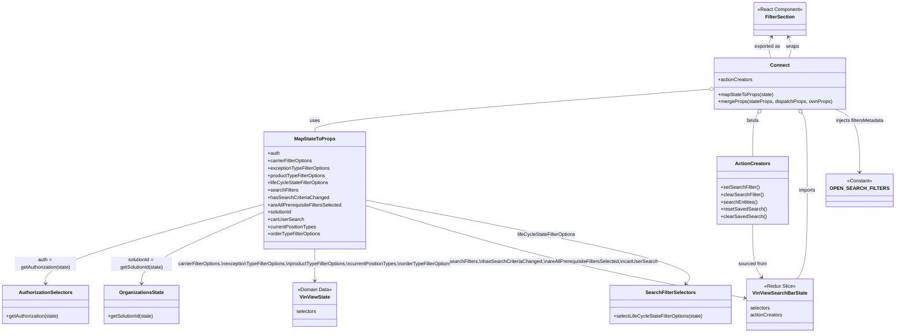

# Diagram: web/portal/src/pages/vinview/components/search/VinView.OpenSearch.SearchFilters.container.js

> Auto-generated by Obscura crawlers

## Mermaid

### SVG

<svg id="container" width="2933.630859375" xmlns="http://www.w3.org/2000/svg" class="classDiagram" height="1090" viewBox="0 0 2933.630859375 1090" role="graphics-document document" aria-roledescription="class"><g><defs><marker id="container_class-aggregationStart" class="marker aggregation class" refX="18" refY="7" markerWidth="190" markerHeight="240" orient="auto"><path d="M 18,7 L9,13 L1,7 L9,1 Z"></path></marker></defs><defs><marker id="container_class-aggregationEnd" class="marker aggregation class" refX="1" refY="7" markerWidth="20" markerHeight="28" orient="auto"><path d="M 18,7 L9,13 L1,7 L9,1 Z"></path></marker></defs><defs><marker id="container_class-extensionStart" class="marker extension class" refX="18" refY="7" markerWidth="190" markerHeight="240" orient="auto"><path d="M 1,7 L18,13 V 1 Z"></path></marker></defs><defs><marker id="container_class-extensionEnd" class="marker extension class" refX="1" refY="7" markerWidth="20" markerHeight="28" orient="auto"><path d="M 1,1 V 13 L18,7 Z"></path></marker></defs><defs><marker id="container_class-compositionStart" class="marker composition class" refX="18" refY="7" markerWidth="190" markerHeight="240" orient="auto"><path d="M 18,7 L9,13 L1,7 L9,1 Z"></path></marker></defs><defs><marker id="container_class-compositionEnd" class="marker composition class" refX="1" refY="7" markerWidth="20" markerHeight="28" orient="auto"><path d="M 18,7 L9,13 L1,7 L9,1 Z"></path></marker></defs><defs><marker id="container_class-dependencyStart" class="marker dependency class" refX="6" refY="7" markerWidth="190" markerHeight="240" orient="auto"><path d="M 5,7 L9,13 L1,7 L9,1 Z"></path></marker></defs><defs><marker id="container_class-dependencyEnd" class="marker dependency class" refX="13" refY="7" markerWidth="20" markerHeight="28" orient="auto"><path d="M 18,7 L9,13 L14,7 L9,1 Z"></path></marker></defs><defs><marker id="container_class-lollipopStart" class="marker lollipop class" refX="13" refY="7" markerWidth="190" markerHeight="240" orient="auto"><circle stroke="black" fill="transparent" cx="7" cy="7" r="6"></circle></marker></defs><defs><marker id="container_class-lollipopEnd" class="marker lollipop class" refX="1" refY="7" markerWidth="190" markerHeight="240" orient="auto"><circle stroke="black" fill="transparent" cx="7" cy="7" r="6"></circle></marker></defs><g class="root"><g class="clusters"></g><g class="edgePaths"><path d="M2612.122,190L2614.265,183.833C2616.408,177.667,2620.695,165.333,2620.408,153.908C2620.121,142.482,2615.26,131.964,2612.829,126.705L2610.399,121.446" id="id_Connect_FilterSection_1" class="edge-thickness-normal edge-pattern-solid relation" style=";;;" data-edge="true" data-et="edge" data-id="id_Connect_FilterSection_1" data-points="W3sieCI6MjYxMi4xMjE1Mjk1NzEyODEsInkiOjE5MH0seyJ4IjoyNjI0Ljk4MjQyMTg3NSwieSI6MTUzfSx7IngiOjI2MDcuODgxNjc0OTY1NjU5NCwieSI6MTE2fV0=" marker-end="url(#container_class-dependencyEnd)"></path><path d="M2352.836,292.106L2134.909,309.255C1916.981,326.404,1481.125,360.702,1263.197,384.018C1045.27,407.333,1045.27,419.667,1045.27,425.833L1045.27,432" id="id_Connect_MapStateToProps_2" class="edge-thickness-normal edge-pattern-solid relation" style=";;;" data-edge="true" data-et="edge" data-id="id_Connect_MapStateToProps_2" data-points="W3sieCI6MjM3MC4wMzMyMDMxMjUsInkiOjI5MC43NTI2Mzc4ODMxMzkyNH0seyJ4IjoxMDQ1LjI2OTUzMTI1LCJ5IjozOTV9LHsieCI6MTA0NS4yNjk1MzEyNSwieSI6NDMyfV0=" marker-start="url(#container_class-aggregationStart)"></path><path d="M2511.84,371.962L2509.054,375.801C2506.268,379.641,2500.695,387.321,2497.909,410.827C2495.123,434.333,2495.123,473.667,2495.123,493.333L2495.123,513" id="id_Connect_ActionCreators_3" class="edge-thickness-normal edge-pattern-solid relation" style=";;;" data-edge="true" data-et="edge" data-id="id_Connect_ActionCreators_3" data-points="W3sieCI6MjUyMS45NzEyMTk2NTM5MjYsInkiOjM1OH0seyJ4IjoyNDk1LjEyMzA0Njg3NSwieSI6Mzk1fSx7IngiOjI0OTUuMTIzMDQ2ODc1LCJ5Ijo1MTN9XQ==" marker-start="url(#container_class-aggregationStart)"></path><path d="M2654.007,371.962L2656.794,375.801C2659.58,379.641,2665.152,387.321,2667.938,429.327C2670.725,471.333,2670.725,547.667,2670.725,626C2670.725,704.333,2670.725,784.667,2665.333,833C2659.942,881.333,2649.16,897.667,2643.768,905.833L2638.377,914" id="id_Connect_VinViewSearchBarState_4" class="edge-thickness-normal edge-pattern-solid relation" style=";;;" data-edge="true" data-et="edge" data-id="id_Connect_VinViewSearchBarState_4" data-points="W3sieCI6MjY0My44NzY0MzY1OTYwNzQsInkiOjM1OH0seyJ4IjoyNjcwLjcyNDYwOTM3NSwieSI6Mzk1fSx7IngiOjI2NzAuNzI0NjA5Mzc1LCJ5Ijo2MjR9LHsieCI6MjY3MC43MjQ2MDkzNzUsInkiOjg2NX0seyJ4IjoyNjM4LjM3Njk1MzEyNSwieSI6OTE0fV0=" marker-start="url(#container_class-aggregationStart)"></path><path d="M879.527,668.592L757.857,701.327C636.188,734.061,392.848,799.531,271.178,842.932C149.508,886.333,149.508,907.667,149.508,918.333L149.508,929" id="id_MapStateToProps_AuthorizationSelectors_5" class="edge-thickness-normal edge-pattern-solid relation" style=";;;" data-edge="true" data-et="edge" data-id="id_MapStateToProps_AuthorizationSelectors_5" data-points="W3sieCI6ODc5LjUyNzM0Mzc1LCJ5Ijo2NjguNTkyMDY3Njc5ODI5fSx7IngiOjE0OS41MDc4MTI1LCJ5Ijo4NjV9LHsieCI6MTQ5LjUwNzgxMjUsInkiOjkzNX1d" marker-end="url(#container_class-dependencyEnd)"></path><path d="M879.527,692.734L810.296,721.445C741.064,750.156,602.6,807.578,533.368,846.956C464.137,886.333,464.137,907.667,464.137,918.333L464.137,929" id="id_MapStateToProps_OrganizationsState_6" class="edge-thickness-normal edge-pattern-solid relation" style=";;;" data-edge="true" data-et="edge" data-id="id_MapStateToProps_OrganizationsState_6" data-points="W3sieCI6ODc5LjUyNzM0Mzc1LCJ5Ijo2OTIuNzM0NDg5NDgwNDA2fSx7IngiOjQ2NC4xMzY3MTg3NSwieSI6ODY1fSx7IngiOjQ2NC4xMzY3MTg3NSwieSI6OTM1fV0=" marker-end="url(#container_class-dependencyEnd)"></path><path d="M1045.27,816L1045.27,824.167C1045.27,832.333,1045.27,848.667,1045.27,866C1045.27,883.333,1045.27,901.667,1045.27,910.833L1045.27,920" id="id_MapStateToProps_VinViewState_7" class="edge-thickness-normal edge-pattern-solid relation" style=";;;" data-edge="true" data-et="edge" data-id="id_MapStateToProps_VinViewState_7" data-points="W3sieCI6MTA0NS4yNjk1MzEyNSwieSI6ODE2fSx7IngiOjEwNDUuMjY5NTMxMjUsInkiOjg2NX0seyJ4IjoxMDQ1LjI2OTUzMTI1LCJ5Ijo5MjZ9XQ==" marker-end="url(#container_class-dependencyEnd)"></path><path d="M1211.012,672.588L1320.404,704.657C1429.796,736.725,1648.579,800.863,1858.369,851.592C2068.158,902.321,2268.953,939.643,2369.35,958.303L2469.748,976.964" id="id_MapStateToProps_VinViewSearchBarState_8" class="edge-thickness-normal edge-pattern-solid relation" style=";;;" data-edge="true" data-et="edge" data-id="id_MapStateToProps_VinViewSearchBarState_8" data-points="W3sieCI6MTIxMS4wMTE3MTg3NSwieSI6NjcyLjU4Nzk3MDg4MjI3NDd9LHsieCI6MTg2Ny4zNjMyODEyNSwieSI6ODY1fSx7IngiOjI0NzUuNjQ2NDg0Mzc1LCJ5Ijo5NzguMDYwNTQ1ODQ2MTA1MX1d" marker-end="url(#container_class-dependencyEnd)"></path><path d="M1211.012,655.236L1396.514,690.197C1582.017,725.158,1953.022,795.079,2130.748,840.893C2308.474,886.708,2292.92,908.415,2285.143,919.269L2277.367,930.123" id="id_MapStateToProps_SearchFilterSelectors_9" class="edge-thickness-normal edge-pattern-solid relation" style=";;;" data-edge="true" data-et="edge" data-id="id_MapStateToProps_SearchFilterSelectors_9" data-points="W3sieCI6MTIxMS4wMTE3MTg3NSwieSI6NjU1LjIzNjQ1OTk0MzQyNjZ9LHsieCI6MjMyNC4wMjczNDM3NSwieSI6ODY1fSx7IngiOjIyNzMuODcyMTIxNzEwNTI2MiwieSI6OTM1fV0=" marker-end="url(#container_class-dependencyEnd)"></path><path d="M2495.123,735L2495.123,756.667C2495.123,778.333,2495.123,821.667,2499.963,850.665C2504.804,879.664,2514.484,894.328,2519.325,901.661L2524.165,908.993" id="id_ActionCreators_VinViewSearchBarState_10" class="edge-thickness-normal edge-pattern-solid relation" style=";;;" data-edge="true" data-et="edge" data-id="id_ActionCreators_VinViewSearchBarState_10" data-points="W3sieCI6MjQ5NS4xMjMwNDY4NzUsInkiOjczNX0seyJ4IjoyNDk1LjEyMzA0Njg3NSwieSI6ODY1fSx7IngiOjI1MjcuNDcwNzAzMTI1LCJ5Ijo5MTR9XQ==" marker-end="url(#container_class-dependencyEnd)"></path><path d="M2754.311,358L2766.893,364.167C2779.475,370.333,2804.639,382.667,2817.221,417C2829.803,451.333,2829.803,507.667,2829.803,535.833L2829.803,564" id="id_Connect_OPEN_SEARCH_FILTERS_11" class="edge-thickness-normal edge-pattern-solid relation" style=";;;" data-edge="true" data-et="edge" data-id="id_Connect_OPEN_SEARCH_FILTERS_11" data-points="W3sieCI6Mjc1NC4zMTA4Mzc0MjI1MjA4LCJ5IjozNTh9LHsieCI6MjgyOS44MDI3MzQzNzUsInkiOjM5NX0seyJ4IjoyODI5LjgwMjczNDM3NSwieSI6NTcwfV0=" marker-end="url(#container_class-dependencyEnd)"></path><path d="M2555.449,121.446L2553.018,126.705C2550.588,131.964,2545.726,142.482,2545.439,153.908C2545.152,165.333,2549.439,177.667,2551.583,183.833L2553.726,190" id="id_FilterSection_Connect_12" class="edge-thickness-normal edge-pattern-solid relation" style=";;;" data-edge="true" data-et="edge" data-id="id_FilterSection_Connect_12" data-points="W3sieCI6MjU1Ny45NjU5ODEyODQzNDA2LCJ5IjoxMTZ9LHsieCI6MjU0MC44NjUyMzQzNzUsInkiOjE1M30seyJ4IjoyNTUzLjcyNjEyNjY3ODcxOSwieSI6MTkwfV0=" marker-start="url(#container_class-dependencyStart)"></path></g><g class="edgeLabels"><g class="edgeLabel" transform="translate(2624.64904, 152.27869)"><g class="label" data-id="id_Connect_FilterSection_1" transform="translate(-21.390625, -12)"><foreignObject width="42.78125" height="24">

wraps

</foreignObject></g></g><g class="edgeLabel" transform="translate(1045.26953125, 395)"><g class="label" data-id="id_Connect_MapStateToProps_2" transform="translate(-16.4921875, -12)"><foreignObject width="32.984375" height="24">

uses

</foreignObject></g></g><g class="edgeLabel" transform="translate(2495.123046875, 395)"><g class="label" data-id="id_Connect_ActionCreators_3" transform="translate(-20.21875, -12)"><foreignObject width="40.4375" height="24">

binds

</foreignObject></g></g><g class="edgeLabel" transform="translate(2670.724609375, 624)"><g class="label" data-id="id_Connect_VinViewSearchBarState_4" transform="translate(-28.25, -12)"><foreignObject width="56.5" height="24">

imports

</foreignObject></g></g><g class="edgeLabel" transform="translate(149.5078125, 865)"><g class="label" data-id="id_MapStateToProps_AuthorizationSelectors_5" transform="translate(-100, -24)"><foreignObject width="200" height="48">

auth = getAuthorization(state)

</foreignObject></g></g><g class="edgeLabel" transform="translate(464.13671875, 865)"><g class="label" data-id="id_MapStateToProps_OrganizationsState_6" transform="translate(-100, -24)"><foreignObject width="200" height="48">

solutionId = getSolutionId(state)

</foreignObject></g></g><g class="edgeLabel" transform="translate(1045.26953125, 865)"><g class="label" data-id="id_MapStateToProps_VinViewState_7" transform="translate(-461.1328125, -12)"><foreignObject width="922.265625" height="24">

carrierFilterOptions,\nexceptionTypeFilterOptions,\nproductTypeFilterOptions,\ncurrentPositionTypes,\norderTypeFilterOptions

</foreignObject></g></g><g class="edgeLabel" transform="translate(1836.04511, 855.81896)"><g class="label" data-id="id_MapStateToProps_VinViewSearchBarState_8" transform="translate(-340.9609375, -12)"><foreignObject width="681.921875" height="24">

searchFilters,\nhasSearchCriteriaChanged,\nareAllPrerequisiteFiltersSelected,\ncanUserSearch

</foreignObject></g></g><g class="edgeLabel" transform="translate(1809.83144, 768.09251)"><g class="label" data-id="id_MapStateToProps_SearchFilterSelectors_9" transform="translate(-95.703125, -12)"><foreignObject width="191.40625" height="24">

lifeCycleStateFilterOptions

</foreignObject></g></g><g class="edgeLabel" transform="translate(2495.123046875, 865)"><g class="label" data-id="id_ActionCreators_VinViewSearchBarState_10" transform="translate(-47.8984375, -12)"><foreignObject width="95.796875" height="24">

sourced from

</foreignObject></g></g><g class="edgeLabel" transform="translate(2829.802734375, 395)"><g class="label" data-id="id_Connect_OPEN_SEARCH_FILTERS_11" transform="translate(-80.9765625, -12)"><foreignObject width="161.953125" height="24">

injects filtersMetadata

</foreignObject></g></g><g class="edgeLabel" transform="translate(2541.19861, 152.27869)"><g class="label" data-id="id_FilterSection_Connect_12" transform="translate(-42.7265625, -12)"><foreignObject width="85.453125" height="24">

exported as

</foreignObject></g></g></g><g class="nodes"><g class="node default" id="classId-FilterSection-0" transform="translate(2582.923828125, 62)"><g class="basic label-container"><path d="M-85.2109375 -54 L85.2109375 -54 L85.2109375 54 L-85.2109375 54" stroke="none" stroke-width="0" fill="#ECECFF" style=""></path><path d="M-85.2109375 -54 C-18.202597523324485 -54, 48.80574245335103 -54, 85.2109375 -54 M-85.2109375 -54 C-28.87028857303563 -54, 27.47036035392874 -54, 85.2109375 -54 M85.2109375 -54 C85.2109375 -24.709879607799873, 85.2109375 4.580240784400253, 85.2109375 54 M85.2109375 -54 C85.2109375 -19.406996156726464, 85.2109375 15.186007686547072, 85.2109375 54 M85.2109375 54 C29.382163425115763 54, -26.446610649768473 54, -85.2109375 54 M85.2109375 54 C42.858206757538014 54, 0.5054760150760274 54, -85.2109375 54 M-85.2109375 54 C-85.2109375 18.699169689344984, -85.2109375 -16.60166062131003, -85.2109375 -54 M-85.2109375 54 C-85.2109375 21.15663266269449, -85.2109375 -11.686734674611017, -85.2109375 -54" stroke="#9370DB" stroke-width="1.3" fill="none" stroke-dasharray="0 0" style=""></path></g><g class="annotation-group text" transform="translate(-73.2109375, -30)"><g class="label" style="" transform="translate(0,-12)"><foreignObject width="146.421875" height="24">

«React Component»

</foreignObject></g></g><g class="label-group text" transform="translate(-46.3203125, -6)"><g class="label" style="font-weight: bolder" transform="translate(0,-12)"><foreignObject width="92.640625" height="24">

FilterSection

</foreignObject></g></g><g class="members-group text" transform="translate(-73.2109375, 42)"></g><g class="methods-group text" transform="translate(-73.2109375, 72)"></g><g class="divider" style=""><path d="M-85.2109375 18 C-50.75855614133766 18, -16.306174782675313 18, 85.2109375 18 M-85.2109375 18 C-29.897420293650285 18, 25.41609691269943 18, 85.2109375 18" stroke="#9370DB" stroke-width="1.3" fill="none" stroke-dasharray="0 0" style=""></path></g><g class="divider" style=""><path d="M-85.2109375 36 C-24.49504538406559 36, 36.22084673186882 36, 85.2109375 36 M-85.2109375 36 C-20.319608164785393 36, 44.571721170429214 36, 85.2109375 36" stroke="#9370DB" stroke-width="1.3" fill="none" stroke-dasharray="0 0" style=""></path></g></g><g class="node default" id="classId-Connect-1" transform="translate(2582.923828125, 274)"><g class="basic label-container"><path d="M-212.890625 -84 L212.890625 -84 L212.890625 84 L-212.890625 84" stroke="none" stroke-width="0" fill="#ECECFF" style=""></path><path d="M-212.890625 -84 C-82.54899938953511 -84, 47.792626220929776 -84, 212.890625 -84 M-212.890625 -84 C-55.25124644376473 -84, 102.38813211247054 -84, 212.890625 -84 M212.890625 -84 C212.890625 -27.49491791395969, 212.890625 29.01016417208062, 212.890625 84 M212.890625 -84 C212.890625 -32.16632611415967, 212.890625 19.667347771680653, 212.890625 84 M212.890625 84 C49.01449117326948 84, -114.86164265346105 84, -212.890625 84 M212.890625 84 C109.8023187678556 84, 6.714012535711191 84, -212.890625 84 M-212.890625 84 C-212.890625 31.070190176397652, -212.890625 -21.859619647204696, -212.890625 -84 M-212.890625 84 C-212.890625 19.124540117004642, -212.890625 -45.750919765990716, -212.890625 -84" stroke="#9370DB" stroke-width="1.3" fill="none" stroke-dasharray="0 0" style=""></path></g><g class="annotation-group text" transform="translate(0, -60)"></g><g class="label-group text" transform="translate(-29.6875, -60)"><g class="label" style="font-weight: bolder" transform="translate(0,-12)"><foreignObject width="59.375" height="24">

Connect

</foreignObject></g></g><g class="members-group text" transform="translate(-200.890625, -12)"><g class="label" style="" transform="translate(0,-12)"><foreignObject width="113.078125" height="24">

+actionCreators

</foreignObject></g></g><g class="methods-group text" transform="translate(-200.890625, 36)"><g class="label" style="" transform="translate(0,-12)"><foreignObject width="181.453125" height="24">

+mapStateToProps(state)

</foreignObject></g><g class="label" style="" transform="translate(0,12)"><foreignObject width="372.09375" height="24">

+mergeProps(stateProps, dispatchProps, ownProps)

</foreignObject></g></g><g class="divider" style=""><path d="M-212.890625 -36 C-77.01115309266186 -36, 58.868318814676286 -36, 212.890625 -36 M-212.890625 -36 C-87.03209978533323 -36, 38.82642542933354 -36, 212.890625 -36" stroke="#9370DB" stroke-width="1.3" fill="none" stroke-dasharray="0 0" style=""></path></g><g class="divider" style=""><path d="M-212.890625 12 C-89.17121428043833 12, 34.54819643912333 12, 212.890625 12 M-212.890625 12 C-46.38047575971592 12, 120.12967348056816 12, 212.890625 12" stroke="#9370DB" stroke-width="1.3" fill="none" stroke-dasharray="0 0" style=""></path></g></g><g class="node default" id="classId-MapStateToProps-2" transform="translate(1045.26953125, 624)"><g class="basic label-container"><path d="M-165.7421875 -192 L165.7421875 -192 L165.7421875 192 L-165.7421875 192" stroke="none" stroke-width="0" fill="#ECECFF" style=""></path><path d="M-165.7421875 -192 C-47.22001453510545 -192, 71.3021584297891 -192, 165.7421875 -192 M-165.7421875 -192 C-41.85401114363657 -192, 82.03416521272686 -192, 165.7421875 -192 M165.7421875 -192 C165.7421875 -77.86932631259637, 165.7421875 36.26134737480726, 165.7421875 192 M165.7421875 -192 C165.7421875 -87.98439787497105, 165.7421875 16.031204250057897, 165.7421875 192 M165.7421875 192 C55.71254375262724 192, -54.31709999474552 192, -165.7421875 192 M165.7421875 192 C49.79393270475914 192, -66.15432209048171 192, -165.7421875 192 M-165.7421875 192 C-165.7421875 94.09949684774037, -165.7421875 -3.8010063045192624, -165.7421875 -192 M-165.7421875 192 C-165.7421875 59.08290953631604, -165.7421875 -73.83418092736792, -165.7421875 -192" stroke="#9370DB" stroke-width="1.3" fill="none" stroke-dasharray="0 0" style=""></path></g><g class="annotation-group text" transform="translate(0, -168)"></g><g class="label-group text" transform="translate(-64.234375, -168)"><g class="label" style="font-weight: bolder" transform="translate(0,-12)"><foreignObject width="128.46875" height="24">

MapStateToProps

</foreignObject></g></g><g class="members-group text" transform="translate(-153.7421875, -120)"><g class="label" style="" transform="translate(0,-12)"><foreignObject width="40.921875" height="24">

+auth

</foreignObject></g><g class="label" style="" transform="translate(0,12)"><foreignObject width="149.921875" height="24">

+carrierFilterOptions

</foreignObject></g><g class="label" style="" transform="translate(0,36)"><foreignObject width="206.453125" height="24">

+exceptionTypeFilterOptions

</foreignObject></g><g class="label" style="" transform="translate(0,60)"><foreignObject width="192.546875" height="24">

+productTypeFilterOptions

</foreignObject></g><g class="label" style="" transform="translate(0,84)"><foreignObject width="199.390625" height="24">

+lifeCycleStateFilterOptions

</foreignObject></g><g class="label" style="" transform="translate(0,108)"><foreignObject width="99.609375" height="24">

+searchFilters

</foreignObject></g><g class="label" style="" transform="translate(0,132)"><foreignObject width="197.75" height="24">

+hasSearchCriteriaChanged

</foreignObject></g><g class="label" style="" transform="translate(0,156)"><foreignObject width="243.25" height="24">

+areAllPrerequisiteFiltersSelected

</foreignObject></g><g class="label" style="" transform="translate(0,180)"><foreignObject width="82.109375" height="24">

+solutionId

</foreignObject></g><g class="label" style="" transform="translate(0,204)"><foreignObject width="115.140625" height="24">

+canUserSearch

</foreignObject></g><g class="label" style="" transform="translate(0,228)"><foreignObject width="160.890625" height="24">

+currentPositionTypes

</foreignObject></g><g class="label" style="" transform="translate(0,252)"><foreignObject width="175.203125" height="24">

+orderTypeFilterOptions

</foreignObject></g></g><g class="methods-group text" transform="translate(-153.7421875, 192)"></g><g class="divider" style=""><path d="M-165.7421875 -144 C-44.393034051011895 -144, 76.95611939797621 -144, 165.7421875 -144 M-165.7421875 -144 C-39.28367743078634 -144, 87.17483263842732 -144, 165.7421875 -144" stroke="#9370DB" stroke-width="1.3" fill="none" stroke-dasharray="0 0" style=""></path></g><g class="divider" style=""><path d="M-165.7421875 168 C-47.87112661704525 168, 69.9999342659095 168, 165.7421875 168 M-165.7421875 168 C-76.29297854082706 168, 13.15623041834587 168, 165.7421875 168" stroke="#9370DB" stroke-width="1.3" fill="none" stroke-dasharray="0 0" style=""></path></g></g><g class="node default" id="classId-VinViewSearchBarState-3" transform="translate(2582.923828125, 998)"><g class="basic label-container"><path d="M-107.27734375 -84 L107.27734375 -84 L107.27734375 84 L-107.27734375 84" stroke="none" stroke-width="0" fill="#ECECFF" style=""></path><path d="M-107.27734375 -84 C-45.26015423948979 -84, 16.757035271020413 -84, 107.27734375 -84 M-107.27734375 -84 C-49.105323317409905 -84, 9.06669711518019 -84, 107.27734375 -84 M107.27734375 -84 C107.27734375 -34.619099392456434, 107.27734375 14.761801215087132, 107.27734375 84 M107.27734375 -84 C107.27734375 -37.47025425916439, 107.27734375 9.059491481671216, 107.27734375 84 M107.27734375 84 C47.93731747025216 84, -11.402708809495678 84, -107.27734375 84 M107.27734375 84 C48.454635601692054 84, -10.368072546615892 84, -107.27734375 84 M-107.27734375 84 C-107.27734375 25.62528778671264, -107.27734375 -32.74942442657472, -107.27734375 -84 M-107.27734375 84 C-107.27734375 19.022886725440557, -107.27734375 -45.954226549118886, -107.27734375 -84" stroke="#9370DB" stroke-width="1.3" fill="none" stroke-dasharray="0 0" style=""></path></g><g class="annotation-group text" transform="translate(-50.4765625, -60)"><g class="label" style="" transform="translate(0,-12)"><foreignObject width="100.953125" height="24">

«Redux Slice»

</foreignObject></g></g><g class="label-group text" transform="translate(-85.2109375, -36)"><g class="label" style="font-weight: bolder" transform="translate(0,-12)"><foreignObject width="170.421875" height="24">

VinViewSearchBarState

</foreignObject></g></g><g class="members-group text" transform="translate(-95.27734375, 12)"><g class="label" style="" transform="translate(0,-12)"><foreignObject width="65.46875" height="24">

selectors

</foreignObject></g><g class="label" style="" transform="translate(0,12)"><foreignObject width="105.34375" height="24">

actionCreators

</foreignObject></g></g><g class="methods-group text" transform="translate(-95.27734375, 84)"></g><g class="divider" style=""><path d="M-107.27734375 -12 C-40.72724227945896 -12, 25.822859191082074 -12, 107.27734375 -12 M-107.27734375 -12 C-55.93940233960321 -12, -4.601460929206425 -12, 107.27734375 -12" stroke="#9370DB" stroke-width="1.3" fill="none" stroke-dasharray="0 0" style=""></path></g><g class="divider" style=""><path d="M-107.27734375 60 C-58.452063313729674 60, -9.626782877459348 60, 107.27734375 60 M-107.27734375 60 C-31.779016654580488 60, 43.719310440839024 60, 107.27734375 60" stroke="#9370DB" stroke-width="1.3" fill="none" stroke-dasharray="0 0" style=""></path></g></g><g class="node default" id="classId-VinViewState-4" transform="translate(1045.26953125, 998)"><g class="basic label-container"><path d="M-72.65234375 -72 L72.65234375 -72 L72.65234375 72 L-72.65234375 72" stroke="none" stroke-width="0" fill="#ECECFF" style=""></path><path d="M-72.65234375 -72 C-17.13060975563352 -72, 38.39112423873296 -72, 72.65234375 -72 M-72.65234375 -72 C-29.824456306897332 -72, 13.003431136205336 -72, 72.65234375 -72 M72.65234375 -72 C72.65234375 -40.46291090180753, 72.65234375 -8.925821803615058, 72.65234375 72 M72.65234375 -72 C72.65234375 -24.386604473649996, 72.65234375 23.22679105270001, 72.65234375 72 M72.65234375 72 C38.03155052366286 72, 3.4107572973257163 72, -72.65234375 72 M72.65234375 72 C19.21726626565345 72, -34.2178112186931 72, -72.65234375 72 M-72.65234375 72 C-72.65234375 40.980524300287044, -72.65234375 9.961048600574095, -72.65234375 -72 M-72.65234375 72 C-72.65234375 21.730541930198278, -72.65234375 -28.538916139603444, -72.65234375 -72" stroke="#9370DB" stroke-width="1.3" fill="none" stroke-dasharray="0 0" style=""></path></g><g class="annotation-group text" transform="translate(-55.8359375, -48)"><g class="label" style="" transform="translate(0,-12)"><foreignObject width="111.671875" height="24">

«Domain Data»

</foreignObject></g></g><g class="label-group text" transform="translate(-47.96875, -24)"><g class="label" style="font-weight: bolder" transform="translate(0,-12)"><foreignObject width="95.9375" height="24">

VinViewState

</foreignObject></g></g><g class="members-group text" transform="translate(-60.65234375, 24)"><g class="label" style="" transform="translate(0,-12)"><foreignObject width="65.46875" height="24">

selectors

</foreignObject></g></g><g class="methods-group text" transform="translate(-60.65234375, 72)"></g><g class="divider" style=""><path d="M-72.65234375 0 C-22.082101317059724 0, 28.488141115880552 0, 72.65234375 0 M-72.65234375 0 C-33.21606784361215 0, 6.220208062775697 0, 72.65234375 0" stroke="#9370DB" stroke-width="1.3" fill="none" stroke-dasharray="0 0" style=""></path></g><g class="divider" style=""><path d="M-72.65234375 48 C-20.750138241718744 48, 31.15206726656251 48, 72.65234375 48 M-72.65234375 48 C-30.895515949347683 48, 10.861311851304635 48, 72.65234375 48" stroke="#9370DB" stroke-width="1.3" fill="none" stroke-dasharray="0 0" style=""></path></g></g><g class="node default" id="classId-OrganizationsState-5" transform="translate(464.13671875, 998)"><g class="basic label-container"><path d="M-123.12109375 -63 L123.12109375 -63 L123.12109375 63 L-123.12109375 63" stroke="none" stroke-width="0" fill="#ECECFF" style=""></path><path d="M-123.12109375 -63 C-69.02606443085209 -63, -14.931035111704176 -63, 123.12109375 -63 M-123.12109375 -63 C-26.393333175880514 -63, 70.33442739823897 -63, 123.12109375 -63 M123.12109375 -63 C123.12109375 -36.08972209601652, 123.12109375 -9.179444192033046, 123.12109375 63 M123.12109375 -63 C123.12109375 -14.76098590840705, 123.12109375 33.4780281831859, 123.12109375 63 M123.12109375 63 C58.40995027939975 63, -6.301193191200497 63, -123.12109375 63 M123.12109375 63 C37.049167591916984 63, -49.02275856616603 63, -123.12109375 63 M-123.12109375 63 C-123.12109375 22.178086472167465, -123.12109375 -18.64382705566507, -123.12109375 -63 M-123.12109375 63 C-123.12109375 23.522807041103192, -123.12109375 -15.954385917793616, -123.12109375 -63" stroke="#9370DB" stroke-width="1.3" fill="none" stroke-dasharray="0 0" style=""></path></g><g class="annotation-group text" transform="translate(0, -39)"></g><g class="label-group text" transform="translate(-69.8671875, -39)"><g class="label" style="font-weight: bolder" transform="translate(0,-12)"><foreignObject width="139.734375" height="24">

OrganizationsState

</foreignObject></g></g><g class="members-group text" transform="translate(-111.12109375, 9)"></g><g class="methods-group text" transform="translate(-111.12109375, 39)"><g class="label" style="" transform="translate(0,-12)"><foreignObject width="152.375" height="24">

+getSolutionId(state)

</foreignObject></g></g><g class="divider" style=""><path d="M-123.12109375 -15 C-33.399701088346006 -15, 56.32169157330799 -15, 123.12109375 -15 M-123.12109375 -15 C-73.41584334235097 -15, -23.710592934701936 -15, 123.12109375 -15" stroke="#9370DB" stroke-width="1.3" fill="none" stroke-dasharray="0 0" style=""></path></g><g class="divider" style=""><path d="M-123.12109375 9 C-30.55618865242262 9, 62.00871644515476 9, 123.12109375 9 M-123.12109375 9 C-60.04097291348506 9, 3.039147923029887 9, 123.12109375 9" stroke="#9370DB" stroke-width="1.3" fill="none" stroke-dasharray="0 0" style=""></path></g></g><g class="node default" id="classId-AuthorizationSelectors-6" transform="translate(149.5078125, 998)"><g class="basic label-container"><path d="M-141.5078125 -63 L141.5078125 -63 L141.5078125 63 L-141.5078125 63" stroke="none" stroke-width="0" fill="#ECECFF" style=""></path><path d="M-141.5078125 -63 C-39.723795010692584 -63, 62.06022247861483 -63, 141.5078125 -63 M-141.5078125 -63 C-47.07460599862925 -63, 47.358600502741496 -63, 141.5078125 -63 M141.5078125 -63 C141.5078125 -26.812284347360674, 141.5078125 9.375431305278653, 141.5078125 63 M141.5078125 -63 C141.5078125 -27.437389625834804, 141.5078125 8.125220748330392, 141.5078125 63 M141.5078125 63 C29.56109130526532 63, -82.38562988946936 63, -141.5078125 63 M141.5078125 63 C65.88345013818373 63, -9.740912223632535 63, -141.5078125 63 M-141.5078125 63 C-141.5078125 18.419532040387246, -141.5078125 -26.16093591922551, -141.5078125 -63 M-141.5078125 63 C-141.5078125 20.500153045644225, -141.5078125 -21.99969390871155, -141.5078125 -63" stroke="#9370DB" stroke-width="1.3" fill="none" stroke-dasharray="0 0" style=""></path></g><g class="annotation-group text" transform="translate(0, -39)"></g><g class="label-group text" transform="translate(-83.875, -39)"><g class="label" style="font-weight: bolder" transform="translate(0,-12)"><foreignObject width="167.75" height="24">

AuthorizationSelectors

</foreignObject></g></g><g class="members-group text" transform="translate(-129.5078125, 9)"></g><g class="methods-group text" transform="translate(-129.5078125, 39)"><g class="label" style="" transform="translate(0,-12)"><foreignObject width="175.140625" height="24">

+getAuthorization(state)

</foreignObject></g></g><g class="divider" style=""><path d="M-141.5078125 -15 C-52.698635912024216 -15, 36.11054067595157 -15, 141.5078125 -15 M-141.5078125 -15 C-54.32486347709312 -15, 32.858085545813765 -15, 141.5078125 -15" stroke="#9370DB" stroke-width="1.3" fill="none" stroke-dasharray="0 0" style=""></path></g><g class="divider" style=""><path d="M-141.5078125 9 C-33.36405587144621 9, 74.77970075710758 9, 141.5078125 9 M-141.5078125 9 C-61.604238429555764 9, 18.299335640888472 9, 141.5078125 9" stroke="#9370DB" stroke-width="1.3" fill="none" stroke-dasharray="0 0" style=""></path></g></g><g class="node default" id="classId-SearchFilterSelectors-7" transform="translate(2228.732421875, 998)"><g class="basic label-container"><path d="M-196.9140625 -63 L196.9140625 -63 L196.9140625 63 L-196.9140625 63" stroke="none" stroke-width="0" fill="#ECECFF" style=""></path><path d="M-196.9140625 -63 C-85.45643791942182 -63, 26.001186661156368 -63, 196.9140625 -63 M-196.9140625 -63 C-80.72365292431425 -63, 35.4667566513715 -63, 196.9140625 -63 M196.9140625 -63 C196.9140625 -17.760408377326733, 196.9140625 27.479183245346533, 196.9140625 63 M196.9140625 -63 C196.9140625 -36.122686882600746, 196.9140625 -9.245373765201492, 196.9140625 63 M196.9140625 63 C65.4073858423069 63, -66.09929081538621 63, -196.9140625 63 M196.9140625 63 C51.2366719613905 63, -94.440718577219 63, -196.9140625 63 M-196.9140625 63 C-196.9140625 35.888312180714735, -196.9140625 8.776624361429462, -196.9140625 -63 M-196.9140625 63 C-196.9140625 21.275855561559602, -196.9140625 -20.448288876880795, -196.9140625 -63" stroke="#9370DB" stroke-width="1.3" fill="none" stroke-dasharray="0 0" style=""></path></g><g class="annotation-group text" transform="translate(0, -39)"></g><g class="label-group text" transform="translate(-77.75, -39)"><g class="label" style="font-weight: bolder" transform="translate(0,-12)"><foreignObject width="155.5" height="24">

SearchFilterSelectors

</foreignObject></g></g><g class="members-group text" transform="translate(-184.9140625, 9)"></g><g class="methods-group text" transform="translate(-184.9140625, 39)"><g class="label" style="" transform="translate(0,-12)"><foreignObject width="292.078125" height="24">

+selectLifeCycleStateFilterOptions(state)

</foreignObject></g></g><g class="divider" style=""><path d="M-196.9140625 -15 C-65.79478804604608 -15, 65.32448640790784 -15, 196.9140625 -15 M-196.9140625 -15 C-105.14963210551691 -15, -13.38520171103383 -15, 196.9140625 -15" stroke="#9370DB" stroke-width="1.3" fill="none" stroke-dasharray="0 0" style=""></path></g><g class="divider" style=""><path d="M-196.9140625 9 C-55.970965926465794 9, 84.97213064706841 9, 196.9140625 9 M-196.9140625 9 C-85.85594369754219 9, 25.202175104915625 9, 196.9140625 9" stroke="#9370DB" stroke-width="1.3" fill="none" stroke-dasharray="0 0" style=""></path></g></g><g class="node default" id="classId-OPEN_SEARCH_FILTERS-8" transform="translate(2829.802734375, 624)"><g class="basic label-container"><path d="M-95.828125 -54 L95.828125 -54 L95.828125 54 L-95.828125 54" stroke="none" stroke-width="0" fill="#ECECFF" style=""></path><path d="M-95.828125 -54 C-28.480870113884308 -54, 38.866384772231385 -54, 95.828125 -54 M-95.828125 -54 C-19.79363359288466 -54, 56.24085781423068 -54, 95.828125 -54 M95.828125 -54 C95.828125 -14.968501560172882, 95.828125 24.062996879654236, 95.828125 54 M95.828125 -54 C95.828125 -15.673600090709343, 95.828125 22.652799818581315, 95.828125 54 M95.828125 54 C40.11976617122756 54, -15.58859265754488 54, -95.828125 54 M95.828125 54 C28.246290486888896 54, -39.33554402622221 54, -95.828125 54 M-95.828125 54 C-95.828125 32.35283357221229, -95.828125 10.705667144424588, -95.828125 -54 M-95.828125 54 C-95.828125 14.266667210908984, -95.828125 -25.46666557818203, -95.828125 -54" stroke="#9370DB" stroke-width="1.3" fill="none" stroke-dasharray="0 0" style=""></path></g><g class="annotation-group text" transform="translate(-41.3046875, -30)"><g class="label" style="" transform="translate(0,-12)"><foreignObject width="82.609375" height="24">

«Constant»

</foreignObject></g></g><g class="label-group text" transform="translate(-83.828125, -6)"><g class="label" style="font-weight: bolder" transform="translate(0,-12)"><foreignObject width="167.65625" height="24">

OPEN_SEARCH_FILTERS

</foreignObject></g></g><g class="members-group text" transform="translate(-83.828125, 42)"></g><g class="methods-group text" transform="translate(-83.828125, 72)"></g><g class="divider" style=""><path d="M-95.828125 18 C-24.002916228310028 18, 47.822292543379945 18, 95.828125 18 M-95.828125 18 C-30.562904724584655 18, 34.70231555083069 18, 95.828125 18" stroke="#9370DB" stroke-width="1.3" fill="none" stroke-dasharray="0 0" style=""></path></g><g class="divider" style=""><path d="M-95.828125 36 C-40.89548874085408 36, 14.037147518291846 36, 95.828125 36 M-95.828125 36 C-30.44256536812415 36, 34.9429942637517 36, 95.828125 36" stroke="#9370DB" stroke-width="1.3" fill="none" stroke-dasharray="0 0" style=""></path></g></g><g class="node default" id="classId-ActionCreators-9" transform="translate(2495.123046875, 624)"><g class="basic label-container"><path d="M-112.3515625 -111 L112.3515625 -111 L112.3515625 111 L-112.3515625 111" stroke="none" stroke-width="0" fill="#ECECFF" style=""></path><path d="M-112.3515625 -111 C-62.88048720503631 -111, -13.40941191007262 -111, 112.3515625 -111 M-112.3515625 -111 C-45.43812369554824 -111, 21.475315108903516 -111, 112.3515625 -111 M112.3515625 -111 C112.3515625 -55.16761219063082, 112.3515625 0.6647756187383607, 112.3515625 111 M112.3515625 -111 C112.3515625 -47.54325978403642, 112.3515625 15.913480431927155, 112.3515625 111 M112.3515625 111 C36.4439235448576 111, -39.463715410284806 111, -112.3515625 111 M112.3515625 111 C59.99611956767115 111, 7.640676635342302 111, -112.3515625 111 M-112.3515625 111 C-112.3515625 45.87309933627445, -112.3515625 -19.2538013274511, -112.3515625 -111 M-112.3515625 111 C-112.3515625 56.02202463098739, -112.3515625 1.0440492619747772, -112.3515625 -111" stroke="#9370DB" stroke-width="1.3" fill="none" stroke-dasharray="0 0" style=""></path></g><g class="annotation-group text" transform="translate(0, -87)"></g><g class="label-group text" transform="translate(-53.96875, -87)"><g class="label" style="font-weight: bolder" transform="translate(0,-12)"><foreignObject width="107.9375" height="24">

ActionCreators

</foreignObject></g></g><g class="members-group text" transform="translate(-100.3515625, -39)"></g><g class="methods-group text" transform="translate(-100.3515625, -9)"><g class="label" style="" transform="translate(0,-12)"><foreignObject width="125.953125" height="24">

+setSearchFilter()

</foreignObject></g><g class="label" style="" transform="translate(0,12)"><foreignObject width="139.6875" height="24">

+clearSearchFilter()

</foreignObject></g><g class="label" style="" transform="translate(0,36)"><foreignObject width="120.359375" height="24">

+searchEntities()

</foreignObject></g><g class="label" style="" transform="translate(0,60)"><foreignObject width="146.734375" height="24">

+resetSavedSearch()

</foreignObject></g><g class="label" style="" transform="translate(0,84)"><foreignObject width="146.046875" height="24">

+clearSavedSearch()

</foreignObject></g></g><g class="divider" style=""><path d="M-112.3515625 -63 C-32.461678125015695 -63, 47.42820624996861 -63, 112.3515625 -63 M-112.3515625 -63 C-60.85856142972184 -63, -9.365560359443677 -63, 112.3515625 -63" stroke="#9370DB" stroke-width="1.3" fill="none" stroke-dasharray="0 0" style=""></path></g><g class="divider" style=""><path d="M-112.3515625 -39 C-42.02252698713231 -39, 28.30650852573538 -39, 112.3515625 -39 M-112.3515625 -39 C-55.85574320776382 -39, 0.640076084472355 -39, 112.3515625 -39" stroke="#9370DB" stroke-width="1.3" fill="none" stroke-dasharray="0 0" style=""></path></g></g></g></g></g></svg>
