# Diagram: web/portal/src/pages/vinview/components/search/VinView.OpenSearch.searchOptions.js

> Auto-generated by Obscura crawlers

## Mermaid

```mermaid
classDiagram
    class getBasicWithStaticOptionsRequestBody
    class getMultiSelectRequestBody
    class getDateRangeRequestBodyWithTimezone
    class getShippabilityRequestBody
    class getLocationRequestBody
    class getCategorySearchRequestBody
    class getNCurrentLocationRequestBodyForVinView
    class isDateRangeValueValid

    class AsyncSelectFilterButton
    class DealerOrgFilterButton
    class NFilterButton
    class DateRangeFilterButton
    class BatchFilterButton
    class SelectFilterButton

    class VIN_ORG_FILTER_DISPLAY_FLAG
    class OrganizationType
    class Features
    class SELECT_EMPTY_OPTION_VALUE

    class OPEN_SEARCH_SEARCH_CATEGORIES {
        +everythingQuery
        +externalId
        +orderNumber
        +productTypeSearch
        +externalIdLast8
    }

    class OPEN_SEARCH_FILTERS {
        +dealerOrgId
        +originLocation
        +destinationLocation
        +orderType
        +soldToDealer
        +finCode
        +endUserFinCode
        +carriers
        +productTypeFilter
        +lifecycleStates_isNew
        +exception
        +lastMilestone
        +currentLocation
        +completedDate
        +deliveryDate
        +isShippable
        +externalState
        +exteriorColor
        +interiorColor
        +doorType
        +powerTrain
        +batch
    }

    OPEN_SEARCH_SEARCH_CATEGORIES --> getCategorySearchRequestBody : externalIdLast8 uses
    OPEN_SEARCH_SEARCH_CATEGORIES --> getBasicWithStaticOptionsRequestBody : default contains
    OPEN_SEARCH_SEARCH_CATEGORIES --> getMultiSelectRequestBody : default contains

    OPEN_SEARCH_FILTERS --> DealerOrgFilterButton : dealerOrgId Component
    OPEN_SEARCH_FILTERS --> AsyncSelectFilterButton : originLocation,destinationLocation,lastMilestone,externalState,exteriorColor,interiorColor,doorType,powerTrain
    OPEN_SEARCH_FILTERS --> DateRangeFilterButton : completedDate,deliveryDate
    OPEN_SEARCH_FILTERS --> NFilterButton : lifecycleStates_isNew,currentLocation
    OPEN_SEARCH_FILTERS --> BatchFilterButton : batch
    OPEN_SEARCH_FILTERS --> SelectFilterButton : isShippable

    OPEN_SEARCH_FILTERS --> getMultiSelectRequestBody : dealerOrgId,orderType,soldToDealer,finCode,endUserFinCode,lastMilestone,exteriorColor,interiorColor,doorType,powerTrain,externalState,productTypeFilter
    OPEN_SEARCH_FILTERS --> getBasicWithStaticOptionsRequestBody : carriers,exception
    OPEN_SEARCH_FILTERS --> getLocationRequestBody : originLocation,destinationLocation
    OPEN_SEARCH_FILTERS --> getNCurrentLocationRequestBodyForVinView : currentLocation
    OPEN_SEARCH_FILTERS --> getDateRangeRequestBodyWithTimezone : completedDate,deliveryDate
    OPEN_SEARCH_FILTERS --> getShippabilityRequestBody : isShippable

    VIN_ORG_FILTER_DISPLAY_FLAG <|-- OPEN_SEARCH_FILTERS : requiredOrgFilters
    OrganizationType <|-- OPEN_SEARCH_FILTERS : requiredOrgTypes
    Features <|-- OPEN_SEARCH_FILTERS : requiredFeatures

    DealerOrgFilterButton ..> dealerOrgOpenSearchOptionsState : optionsState
    AsyncSelectFilterButton ..> openSearchOriginOptionsState : originLocation optionsState
    AsyncSelectFilterButton ..> openSearchDestinationOptionsState : destinationLocation optionsState
    AsyncSelectFilterButton ..> openSearchVinViewFinCodeOptionsState : finCode optionsState
    AsyncSelectFilterButton ..> openSearchVinViewEndUserFinCodeOptionsState : endUserFinCode optionsState
    AsyncSelectFilterButton ..> openSearchVinViewSoldToOptionsState : soldToDealer optionsState
    AsyncSelectFilterButton ..> openSearchVinViewLastMilestoneOptionsState : lastMilestone optionsState
    AsyncSelectFilterButton ..> openSearchCurrentPositionCodesOptionsState : currentLocation codes
    AsyncSelectFilterButton ..> openSearchVinViewExternalStateOptionsState : externalState options
    AsyncSelectFilterButton ..> vinViewCustomerProvidedExteriorColorOptionsState : exteriorColor options
    AsyncSelectFilterButton ..> vinViewCustomerProvidedInteriorColorOptionsState : interiorColor options
    AsyncSelectFilterButton ..> vinViewCustomerProvidedDoorTypeOptionsState : doorType options
    AsyncSelectFilterButton ..> vinViewCustomerProvidedPowertrainOptionsState : powerTrain options

    class batchCsvVinExample
    class batchCsvProductTypeExample
    class batchCsvOrderNumberExample
    class batchCsvLast8ofVinExample
    BatchFilterButton ..> batchCsvVinExample : example
    BatchFilterButton ..> batchCsvProductTypeExample : example
    BatchFilterButton ..> batchCsvOrderNumberExample : example
    BatchFilterButton ..> batchCsvLast8ofVinExample : example

    class useEntityTranslation
    class useLifecycleStateTranslation
    OPEN_SEARCH_FILTERS ..> useEntityTranslation : translations used in batch,currentLocation
    OPEN_SEARCH_FILTERS ..> useLifecycleStateTranslation : lifecycleStates_isNew uses

    class lodash
    OPEN_SEARCH_FILTERS ..> lodash : uses _.isArray, _.isEmpty
    OPEN_SEARCH_SEARCH_CATEGORIES ..> lodash : uses _
```

### SVG

<svg id="container" width="10739.3515625" xmlns="http://www.w3.org/2000/svg" class="classDiagram" height="1162" viewBox="0 0 10739.3515625 1162" role="graphics-document document" aria-roledescription="class"><g><defs><marker id="container_class-aggregationStart" class="marker aggregation class" refX="18" refY="7" markerWidth="190" markerHeight="240" orient="auto"><path d="M 18,7 L9,13 L1,7 L9,1 Z"></path></marker></defs><defs><marker id="container_class-aggregationEnd" class="marker aggregation class" refX="1" refY="7" markerWidth="20" markerHeight="28" orient="auto"><path d="M 18,7 L9,13 L1,7 L9,1 Z"></path></marker></defs><defs><marker id="container_class-extensionStart" class="marker extension class" refX="18" refY="7" markerWidth="190" markerHeight="240" orient="auto"><path d="M 1,7 L18,13 V 1 Z"></path></marker></defs><defs><marker id="container_class-extensionEnd" class="marker extension class" refX="1" refY="7" markerWidth="20" markerHeight="28" orient="auto"><path d="M 1,1 V 13 L18,7 Z"></path></marker></defs><defs><marker id="container_class-compositionStart" class="marker composition class" refX="18" refY="7" markerWidth="190" markerHeight="240" orient="auto"><path d="M 18,7 L9,13 L1,7 L9,1 Z"></path></marker></defs><defs><marker id="container_class-compositionEnd" class="marker composition class" refX="1" refY="7" markerWidth="20" markerHeight="28" orient="auto"><path d="M 18,7 L9,13 L1,7 L9,1 Z"></path></marker></defs><defs><marker id="container_class-dependencyStart" class="marker dependency class" refX="6" refY="7" markerWidth="190" markerHeight="240" orient="auto"><path d="M 5,7 L9,13 L1,7 L9,1 Z"></path></marker></defs><defs><marker id="container_class-dependencyEnd" class="marker dependency class" refX="13" refY="7" markerWidth="20" markerHeight="28" orient="auto"><path d="M 18,7 L9,13 L14,7 L9,1 Z"></path></marker></defs><defs><marker id="container_class-lollipopStart" class="marker lollipop class" refX="13" refY="7" markerWidth="190" markerHeight="240" orient="auto"><circle stroke="black" fill="transparent" cx="7" cy="7" r="6"></circle></marker></defs><defs><marker id="container_class-lollipopEnd" class="marker lollipop class" refX="1" refY="7" markerWidth="190" markerHeight="240" orient="auto"><circle stroke="black" fill="transparent" cx="7" cy="7" r="6"></circle></marker></defs><g class="root"><g class="clusters"></g><g class="edgePaths"><path d="M702.68,586L714,628.167C725.319,670.333,747.958,754.667,711.597,807.129C675.236,859.591,579.875,880.181,532.194,890.477L484.513,900.772" id="id_OPEN_SEARCH_SEARCH_CATEGORIES_getCategorySearchRequestBody_1" class="edge-thickness-normal edge-pattern-solid relation" style=";;;" data-edge="true" data-et="edge" data-id="id_OPEN_SEARCH_SEARCH_CATEGORIES_getCategorySearchRequestBody_1" data-points="W3sieCI6NzAyLjY4MDAxMjExOTExMzYsInkiOjU4Nn0seyJ4Ijo3NzAuNTk3NjU2MjUsInkiOjgzOX0seyJ4Ijo0NzguNjQ4NDM3NSwieSI6OTAyLjAzODE0OTYxMzk2MjJ9XQ==" marker-end="url(#container_class-dependencyEnd)"></path><path d="M656.744,586L650.128,628.167C643.513,670.333,630.282,754.667,856.255,810.404C1082.227,866.141,1547.404,893.283,1779.992,906.854L2012.58,920.424" id="id_OPEN_SEARCH_SEARCH_CATEGORIES_getBasicWithStaticOptionsRequestBody_2" class="edge-thickness-normal edge-pattern-solid relation" style=";;;" data-edge="true" data-et="edge" data-id="id_OPEN_SEARCH_SEARCH_CATEGORIES_getBasicWithStaticOptionsRequestBody_2" data-points="W3sieCI6NjU2Ljc0MzU1MDkwMDI3NywieSI6NTg2fSx7IngiOjYxNy4wNTA3ODEyNSwieSI6ODM5fSx7IngiOjIwMTguNTcwMzEyNSwieSI6OTIwLjc3MzkzOTM3NDIwNjR9XQ==" marker-end="url(#container_class-dependencyEnd)"></path><path d="M588.019,586L554.571,628.167C521.123,670.333,454.228,754.667,645.483,810.765C836.738,866.864,1286.144,894.727,1510.847,908.659L1735.551,922.591" id="id_OPEN_SEARCH_SEARCH_CATEGORIES_getMultiSelectRequestBody_3" class="edge-thickness-normal edge-pattern-solid relation" style=";;;" data-edge="true" data-et="edge" data-id="id_OPEN_SEARCH_SEARCH_CATEGORIES_getMultiSelectRequestBody_3" data-points="W3sieCI6NTg4LjAxODgyNzkwODU4NzIsInkiOjU4Nn0seyJ4IjozODcuMzMyMDMxMjUsInkiOjgzOX0seyJ4IjoxNzQxLjUzOTA2MjUsInkiOjkyMi45NjE5Mzg4MDI5MzkyfV0=" marker-end="url(#container_class-dependencyEnd)"></path><path d="M3073.262,484.399L4326.175,543.499C5579.089,602.599,8084.915,720.8,9337.829,787.066C10590.742,853.333,10590.742,867.667,10590.742,874.833L10590.742,882" id="id_OPEN_SEARCH_FILTERS_DealerOrgFilterButton_4" class="edge-thickness-normal edge-pattern-solid relation" style=";;;" data-edge="true" data-et="edge" data-id="id_OPEN_SEARCH_FILTERS_DealerOrgFilterButton_4" data-points="W3sieCI6MzA3My4yNjE3MTg3NSwieSI6NDg0LjM5ODU3MDY0MTgwNzU3fSx7IngiOjEwNTkwLjc0MjE4NzUsInkiOjgzOX0seyJ4IjoxMDU5MC43NDIxODc1LCJ5Ijo4ODh9XQ==" marker-end="url(#container_class-dependencyEnd)"></path><path d="M3073.262,487.307L3927.538,545.923C4781.814,604.538,6490.366,721.769,7344.642,787.551C8198.918,853.333,8198.918,867.667,8198.918,874.833L8198.918,882" id="id_OPEN_SEARCH_FILTERS_AsyncSelectFilterButton_5" class="edge-thickness-normal edge-pattern-solid relation" style=";;;" data-edge="true" data-et="edge" data-id="id_OPEN_SEARCH_FILTERS_AsyncSelectFilterButton_5" data-points="W3sieCI6MzA3My4yNjE3MTg3NSwieSI6NDg3LjMwNzQwMzU1MjE3MjZ9LHsieCI6ODE5OC45MTc5Njg3NSwieSI6ODM5fSx7IngiOjgxOTguOTE3OTY4NzUsInkiOjg4OH1d" marker-end="url(#container_class-dependencyEnd)"></path><path d="M3073.262,497.226L3475.162,554.188C3877.063,611.151,4680.863,725.075,5082.764,789.204C5484.664,853.333,5484.664,867.667,5484.664,874.833L5484.664,882" id="id_OPEN_SEARCH_FILTERS_DateRangeFilterButton_6" class="edge-thickness-normal edge-pattern-solid relation" style=";;;" data-edge="true" data-et="edge" data-id="id_OPEN_SEARCH_FILTERS_DateRangeFilterButton_6" data-points="W3sieCI6MzA3My4yNjE3MTg3NSwieSI6NDk3LjIyNTc5ODgzMjkwMjZ9LHsieCI6NTQ4NC42NjQwNjI1LCJ5Ijo4Mzl9LHsieCI6NTQ4NC42NjQwNjI1LCJ5Ijo4ODh9XQ==" marker-end="url(#container_class-dependencyEnd)"></path><path d="M3073.262,499.404L3431.967,556.003C3790.672,612.602,4508.082,725.801,4866.787,789.567C5225.492,853.333,5225.492,867.667,5225.492,874.833L5225.492,882" id="id_OPEN_SEARCH_FILTERS_NFilterButton_7" class="edge-thickness-normal edge-pattern-solid relation" style=";;;" data-edge="true" data-et="edge" data-id="id_OPEN_SEARCH_FILTERS_NFilterButton_7" data-points="W3sieCI6MzA3My4yNjE3MTg3NSwieSI6NDk5LjQwMzcwNTMyODg2NDZ9LHsieCI6NTIyNS40OTIxODc1LCJ5Ijo4Mzl9LHsieCI6NTIyNS40OTIxODc1LCJ5Ijo4ODh9XQ==" marker-end="url(#container_class-dependencyEnd)"></path><path d="M3073.262,502.844L3379.167,558.87C3685.072,614.896,4296.882,726.948,4602.786,790.141C4908.691,853.333,4908.691,867.667,4908.691,874.833L4908.691,882" id="id_OPEN_SEARCH_FILTERS_BatchFilterButton_8" class="edge-thickness-normal edge-pattern-solid relation" style=";;;" data-edge="true" data-et="edge" data-id="id_OPEN_SEARCH_FILTERS_BatchFilterButton_8" data-points="W3sieCI6MzA3My4yNjE3MTg3NSwieSI6NTAyLjg0MzgwNzcxOTQ0Mjl9LHsieCI6NDkwOC42OTE0MDYyNSwieSI6ODM5fSx7IngiOjQ5MDguNjkxNDA2MjUsInkiOjg4OH1d" marker-end="url(#container_class-dependencyEnd)"></path><path d="M3073.262,505.724L3345.036,561.27C3616.811,616.816,4160.361,727.908,4432.135,790.621C4703.91,853.333,4703.91,867.667,4703.91,874.833L4703.91,882" id="id_OPEN_SEARCH_FILTERS_SelectFilterButton_9" class="edge-thickness-normal edge-pattern-solid relation" style=";;;" data-edge="true" data-et="edge" data-id="id_OPEN_SEARCH_FILTERS_SelectFilterButton_9" data-points="W3sieCI6MzA3My4yNjE3MTg3NSwieSI6NTA1LjcyNDE1MzY0MDY1fSx7IngiOjQ3MDMuOTEwMTU2MjUsInkiOjgzOX0seyJ4Ijo0NzAzLjkxMDE1NjI1LCJ5Ijo4ODh9XQ==" marker-end="url(#container_class-dependencyEnd)"></path><path d="M3073.262,592.438L3121.972,633.531C3170.682,674.625,3268.103,756.813,3084.986,811.873C2901.869,866.933,2438.214,894.867,2206.387,908.834L1974.559,922.8" id="id_OPEN_SEARCH_FILTERS_getMultiSelectRequestBody_10" class="edge-thickness-normal edge-pattern-solid relation" style=";;;" data-edge="true" data-et="edge" data-id="id_OPEN_SEARCH_FILTERS_getMultiSelectRequestBody_10" data-points="W3sieCI6MzA3My4yNjE3MTg3NSwieSI6NTkyLjQzNzc3NDQzMDU5OTN9LHsieCI6MzM2NS41MjM0Mzc1LCJ5Ijo4Mzl9LHsieCI6MTk2OC41NzAzMTI1LCJ5Ijo5MjMuMTYxMTE1MTMzOTYxfV0=" marker-end="url(#container_class-dependencyEnd)"></path><path d="M2801.965,703.19L2788.33,725.825C2774.695,748.46,2747.426,793.73,2670.555,826.954C2593.683,860.177,2467.211,881.355,2403.974,891.943L2340.738,902.532" id="id_OPEN_SEARCH_FILTERS_getBasicWithStaticOptionsRequestBody_11" class="edge-thickness-normal edge-pattern-solid relation" style=";;;" data-edge="true" data-et="edge" data-id="id_OPEN_SEARCH_FILTERS_getBasicWithStaticOptionsRequestBody_11" data-points="W3sieCI6MjgwMS45NjQ4NDM3NSwieSI6NzAzLjE4OTcxMDYxMDkzMjV9LHsieCI6MjcyMC4xNTYyNSwieSI6ODM5fSx7IngiOjIzMzQuODIwMzEyNSwieSI6OTAzLjUyMjcwNjAzNjI1NDl9XQ==" marker-end="url(#container_class-dependencyEnd)"></path><path d="M2801.965,592.171L2753.088,633.309C2704.211,674.447,2606.457,756.724,2762.528,811.787C2918.6,866.851,3328.496,894.702,3533.444,908.628L3738.393,922.553" id="id_OPEN_SEARCH_FILTERS_getLocationRequestBody_12" class="edge-thickness-normal edge-pattern-solid relation" style=";;;" data-edge="true" data-et="edge" data-id="id_OPEN_SEARCH_FILTERS_getLocationRequestBody_12" data-points="W3sieCI6MjgwMS45NjQ4NDM3NSwieSI6NTkyLjE3MDk2MzgzNDU3MzV9LHsieCI6MjUwOC43MDMxMjUsInkiOjgzOX0seyJ4IjozNzQ0LjM3ODkwNjI1LCJ5Ijo5MjIuOTYwMDg1NDAwMDM1Nn1d" marker-end="url(#container_class-dependencyEnd)"></path><path d="M2801.965,548.367L2708.589,596.806C2615.212,645.245,2428.46,742.122,2517.393,803.56C2606.327,864.998,2970.946,890.996,3153.256,903.995L3335.566,916.995" id="id_OPEN_SEARCH_FILTERS_getNCurrentLocationRequestBodyForVinView_13" class="edge-thickness-normal edge-pattern-solid relation" style=";;;" data-edge="true" data-et="edge" data-id="id_OPEN_SEARCH_FILTERS_getNCurrentLocationRequestBodyForVinView_13" data-points="W3sieCI6MjgwMS45NjQ4NDM3NSwieSI6NTQ4LjM2NzM2MDQ1NjIzOTZ9LHsieCI6MjI0MS43MDcwMzEyNSwieSI6ODM5fSx7IngiOjMzNDEuNTUwNzgxMjUsInkiOjkxNy40MjEyODc4MjI2NzQ5fV0=" marker-end="url(#container_class-dependencyEnd)"></path><path d="M2801.965,527.934L2661.128,579.779C2520.29,631.623,2238.616,735.311,2264.761,800.129C2290.906,864.947,2624.87,890.895,2791.852,903.869L2958.834,916.842" id="id_OPEN_SEARCH_FILTERS_getDateRangeRequestBodyWithTimezone_14" class="edge-thickness-normal edge-pattern-solid relation" style=";;;" data-edge="true" data-et="edge" data-id="id_OPEN_SEARCH_FILTERS_getDateRangeRequestBodyWithTimezone_14" data-points="W3sieCI6MjgwMS45NjQ4NDM3NSwieSI6NTI3LjkzNDIyMDc5ODg3ODN9LHsieCI6MTk1Ni45NDE0MDYyNSwieSI6ODM5fSx7IngiOjI5NjQuODE2NDA2MjUsInkiOjkxNy4zMDcxMzkxODg0OTUyfV0=" marker-end="url(#container_class-dependencyEnd)"></path><path d="M2801.965,517.876L2619.902,571.397C2437.839,624.917,2073.712,731.959,2052.714,798.941C2031.717,865.923,2353.847,892.846,2514.913,906.308L2675.978,919.769" id="id_OPEN_SEARCH_FILTERS_getShippabilityRequestBody_15" class="edge-thickness-normal edge-pattern-solid relation" style=";;;" data-edge="true" data-et="edge" data-id="id_OPEN_SEARCH_FILTERS_getShippabilityRequestBody_15" data-points="W3sieCI6MjgwMS45NjQ4NDM3NSwieSI6NTE3Ljg3NjIxNzg5MjY0NDF9LHsieCI6MTcwOS41ODU5Mzc1LCJ5Ijo4Mzl9LHsieCI6MjY4MS45NTcwMzEyNSwieSI6OTIwLjI2OTAxNzMwMzI5NzV9XQ==" marker-end="url(#container_class-dependencyEnd)"></path><path d="M3148.43,109.25L3148.43,112.542C3148.43,115.833,3148.43,122.417,3135.902,146.448C3123.374,170.479,3098.318,211.959,3085.79,232.699L3073.262,253.438" id="id_VIN_ORG_FILTER_DISPLAY_FLAG_OPEN_SEARCH_FILTERS_16" class="edge-thickness-normal edge-pattern-solid relation" style=";;;" data-edge="true" data-et="edge" data-id="id_VIN_ORG_FILTER_DISPLAY_FLAG_OPEN_SEARCH_FILTERS_16" data-points="W3sieCI6MzE0OC40Mjk2ODc1LCJ5Ijo5Mn0seyJ4IjozMTQ4LjQyOTY4NzUsInkiOjEyOX0seyJ4IjozMDczLjI2MTcxODc1LCJ5IjoyNTMuNDM4MjMzMDU5NzE5NDd9XQ==" marker-start="url(#container_class-extensionStart)"></path><path d="M2896.078,109.25L2896.078,112.542C2896.078,115.833,2896.078,122.417,2896.812,131.875C2897.546,141.333,2899.014,153.667,2899.748,159.833L2900.482,166" id="id_OrganizationType_OPEN_SEARCH_FILTERS_17" class="edge-thickness-normal edge-pattern-solid relation" style=";;;" data-edge="true" data-et="edge" data-id="id_OrganizationType_OPEN_SEARCH_FILTERS_17" data-points="W3sieCI6Mjg5Ni4wNzgxMjUsInkiOjkyfSx7IngiOjI4OTYuMDc4MTI1LCJ5IjoxMjl9LHsieCI6MjkwMC40ODE1NjU2MzM5NTQyLCJ5IjoxNjZ9XQ==" marker-start="url(#container_class-extensionStart)"></path><path d="M2726.797,109.25L2726.797,112.542C2726.797,115.833,2726.797,122.417,2739.325,146.448C2751.853,170.479,2776.909,211.959,2789.437,232.699L2801.965,253.438" id="id_Features_OPEN_SEARCH_FILTERS_18" class="edge-thickness-normal edge-pattern-solid relation" style=";;;" data-edge="true" data-et="edge" data-id="id_Features_OPEN_SEARCH_FILTERS_18" data-points="W3sieCI6MjcyNi43OTY4NzUsInkiOjkyfSx7IngiOjI3MjYuNzk2ODc1LCJ5IjoxMjl9LHsieCI6MjgwMS45NjQ4NDM3NSwieSI6MjUzLjQzODIzMzA1OTcxOTQ3fV0=" marker-start="url(#container_class-extensionStart)"></path><path d="M10590.742,972L10590.742,980.167C10590.742,988.333,10590.742,1004.667,10590.742,1020C10590.742,1035.333,10590.742,1049.667,10590.742,1056.833L10590.742,1064" id="id_DealerOrgFilterButton_dealerOrgOpenSearchOptionsState_19" class="edge-thickness-normal edge-pattern-dashed relation" style=";;;" data-edge="true" data-et="edge" data-id="id_DealerOrgFilterButton_dealerOrgOpenSearchOptionsState_19" data-points="W3sieCI6MTA1OTAuNzQyMTg3NSwieSI6OTcyfSx7IngiOjEwNTkwLjc0MjE4NzUsInkiOjEwMjF9LHsieCI6MTA1OTAuNzQyMTg3NSwieSI6MTA3MH1d" marker-end="url(#container_class-dependencyEnd)"></path><path d="M8298.309,934.357L8627.683,948.798C8957.057,963.238,9615.806,992.119,9945.18,1013.726C10274.555,1035.333,10274.555,1049.667,10274.555,1056.833L10274.555,1064" id="id_AsyncSelectFilterButton_openSearchOriginOptionsState_20" class="edge-thickness-normal edge-pattern-dashed relation" style=";;;" data-edge="true" data-et="edge" data-id="id_AsyncSelectFilterButton_openSearchOriginOptionsState_20" data-points="W3sieCI6ODI5OC4zMDg1OTM3NSwieSI6OTM0LjM1NzQ4MDY2NzY0MTV9LHsieCI6MTAyNzQuNTU0Njg3NSwieSI6MTAyMX0seyJ4IjoxMDI3NC41NTQ2ODc1LCJ5IjoxMDcwfV0=" marker-end="url(#container_class-dependencyEnd)"></path><path d="M8298.309,935.156L8574.124,949.463C8849.94,963.77,9401.572,992.385,9677.387,1013.859C9953.203,1035.333,9953.203,1049.667,9953.203,1056.833L9953.203,1064" id="id_AsyncSelectFilterButton_openSearchDestinationOptionsState_21" class="edge-thickness-normal edge-pattern-dashed relation" style=";;;" data-edge="true" data-et="edge" data-id="id_AsyncSelectFilterButton_openSearchDestinationOptionsState_21" data-points="W3sieCI6ODI5OC4zMDg1OTM3NSwieSI6OTM1LjE1NTY4Nzk2OTQxNDJ9LHsieCI6OTk1My4yMDMxMjUsInkiOjEwMjF9LHsieCI6OTk1My4yMDMxMjUsInkiOjEwNzB9XQ==" marker-end="url(#container_class-dependencyEnd)"></path><path d="M8298.309,936.471L8514.691,950.559C8731.073,964.647,9163.837,992.824,9380.219,1014.079C9596.602,1035.333,9596.602,1049.667,9596.602,1056.833L9596.602,1064" id="id_AsyncSelectFilterButton_openSearchVinViewFinCodeOptionsState_22" class="edge-thickness-normal edge-pattern-dashed relation" style=";;;" data-edge="true" data-et="edge" data-id="id_AsyncSelectFilterButton_openSearchVinViewFinCodeOptionsState_22" data-points="W3sieCI6ODI5OC4zMDg1OTM3NSwieSI6OTM2LjQ3MTA5NzU0NzAwMTZ9LHsieCI6OTU5Ni42MDE1NjI1LCJ5IjoxMDIxfSx7IngiOjk1OTYuNjAxNTYyNSwieSI6MTA3MH1d" marker-end="url(#container_class-dependencyEnd)"></path><path d="M8298.309,939.082L8447.714,952.735C8597.12,966.388,8895.931,993.694,9045.337,1014.514C9194.742,1035.333,9194.742,1049.667,9194.742,1056.833L9194.742,1064" id="id_AsyncSelectFilterButton_openSearchVinViewEndUserFinCodeOptionsState_23" class="edge-thickness-normal edge-pattern-dashed relation" style=";;;" data-edge="true" data-et="edge" data-id="id_AsyncSelectFilterButton_openSearchVinViewEndUserFinCodeOptionsState_23" data-points="W3sieCI6ODI5OC4zMDg1OTM3NSwieSI6OTM5LjA4MjQ3MzI5NjY5Nn0seyJ4Ijo5MTk0Ljc0MjE4NzUsInkiOjEwMjF9LHsieCI6OTE5NC43NDIxODc1LCJ5IjoxMDcwfV0=" marker-end="url(#container_class-dependencyEnd)"></path><path d="M8298.309,945.127L8381.393,957.773C8464.477,970.418,8630.645,995.709,8713.729,1015.521C8796.813,1035.333,8796.813,1049.667,8796.813,1056.833L8796.813,1064" id="id_AsyncSelectFilterButton_openSearchVinViewSoldToOptionsState_24" class="edge-thickness-normal edge-pattern-dashed relation" style=";;;" data-edge="true" data-et="edge" data-id="id_AsyncSelectFilterButton_openSearchVinViewSoldToOptionsState_24" data-points="W3sieCI6ODI5OC4zMDg1OTM3NSwieSI6OTQ1LjEyNzMyODMyMDA4MTZ9LHsieCI6ODc5Ni44MTI1LCJ5IjoxMDIxfSx7IngiOjg3OTYuODEyNSwieSI6MTA3MH1d" marker-end="url(#container_class-dependencyEnd)"></path><path d="M8294.891,972L8313.552,980.167C8332.214,988.333,8369.537,1004.667,8388.198,1020C8406.859,1035.333,8406.859,1049.667,8406.859,1056.833L8406.859,1064" id="id_AsyncSelectFilterButton_openSearchVinViewLastMilestoneOptionsState_25" class="edge-thickness-normal edge-pattern-dashed relation" style=";;;" data-edge="true" data-et="edge" data-id="id_AsyncSelectFilterButton_openSearchVinViewLastMilestoneOptionsState_25" data-points="W3sieCI6ODI5NC44OTA5MjU0ODA3NywieSI6OTcyfSx7IngiOjg0MDYuODU5Mzc1LCJ5IjoxMDIxfSx7IngiOjg0MDYuODU5Mzc1LCJ5IjoxMDcwfV0=" marker-end="url(#container_class-dependencyEnd)"></path><path d="M8102.945,972L8084.284,980.167C8065.622,988.333,8028.299,1004.667,8009.638,1020C7990.977,1035.333,7990.977,1049.667,7990.977,1056.833L7990.977,1064" id="id_AsyncSelectFilterButton_openSearchCurrentPositionCodesOptionsState_26" class="edge-thickness-normal edge-pattern-dashed relation" style=";;;" data-edge="true" data-et="edge" data-id="id_AsyncSelectFilterButton_openSearchCurrentPositionCodesOptionsState_26" data-points="W3sieCI6ODEwMi45NDUwMTIwMTkyMzA1LCJ5Ijo5NzJ9LHsieCI6Nzk5MC45NzY1NjI1LCJ5IjoxMDIxfSx7IngiOjc5OTAuOTc2NTYyNSwieSI6MTA3MH1d" marker-end="url(#container_class-dependencyEnd)"></path><path d="M8099.527,944.536L8012.39,957.28C7925.253,970.024,7750.978,995.512,7663.84,1015.423C7576.703,1035.333,7576.703,1049.667,7576.703,1056.833L7576.703,1064" id="id_AsyncSelectFilterButton_openSearchVinViewExternalStateOptionsState_27" class="edge-thickness-normal edge-pattern-dashed relation" style=";;;" data-edge="true" data-et="edge" data-id="id_AsyncSelectFilterButton_openSearchVinViewExternalStateOptionsState_27" data-points="W3sieCI6ODA5OS41MjczNDM3NSwieSI6OTQ0LjUzNjA1MTI3ODUwOTh9LHsieCI6NzU3Ni43MDMxMjUsInkiOjEwMjF9LHsieCI6NzU3Ni43MDMxMjUsInkiOjEwNzB9XQ==" marker-end="url(#container_class-dependencyEnd)"></path><path d="M8099.527,938.55L7939.79,952.292C7780.052,966.033,7460.577,993.517,7300.839,1014.425C7141.102,1035.333,7141.102,1049.667,7141.102,1056.833L7141.102,1064" id="id_AsyncSelectFilterButton_vinViewCustomerProvidedExteriorColorOptionsState_28" class="edge-thickness-normal edge-pattern-dashed relation" style=";;;" data-edge="true" data-et="edge" data-id="id_AsyncSelectFilterButton_vinViewCustomerProvidedExteriorColorOptionsState_28" data-points="W3sieCI6ODA5OS41MjczNDM3NSwieSI6OTM4LjU1MDIwNDc2MjkwNzF9LHsieCI6NzE0MS4xMDE1NjI1LCJ5IjoxMDIxfSx7IngiOjcxNDEuMTAxNTYyNSwieSI6MTA3MH1d" marker-end="url(#container_class-dependencyEnd)"></path><path d="M8099.527,935.971L7863.628,950.142C7627.729,964.314,7155.931,992.657,6920.032,1013.995C6684.133,1035.333,6684.133,1049.667,6684.133,1056.833L6684.133,1064" id="id_AsyncSelectFilterButton_vinViewCustomerProvidedInteriorColorOptionsState_29" class="edge-thickness-normal edge-pattern-dashed relation" style=";;;" data-edge="true" data-et="edge" data-id="id_AsyncSelectFilterButton_vinViewCustomerProvidedInteriorColorOptionsState_29" data-points="W3sieCI6ODA5OS41MjczNDM3NSwieSI6OTM1Ljk3MDg0NDY2OTA4MjF9LHsieCI6NjY4NC4xMzI4MTI1LCJ5IjoxMDIxfSx7IngiOjY2ODQuMTMyODEyNSwieSI6MTA3MH1d" marker-end="url(#container_class-dependencyEnd)"></path><path d="M8099.527,934.618L7789.674,949.015C7479.82,963.412,6860.113,992.206,6550.26,1013.77C6240.406,1035.333,6240.406,1049.667,6240.406,1056.833L6240.406,1064" id="id_AsyncSelectFilterButton_vinViewCustomerProvidedDoorTypeOptionsState_30" class="edge-thickness-normal edge-pattern-dashed relation" style=";;;" data-edge="true" data-et="edge" data-id="id_AsyncSelectFilterButton_vinViewCustomerProvidedDoorTypeOptionsState_30" data-points="W3sieCI6ODA5OS41MjczNDM3NSwieSI6OTM0LjYxODA3MTM1OTE5MTR9LHsieCI6NjI0MC40MDYyNSwieSI6MTAyMX0seyJ4Ijo2MjQwLjQwNjI1LCJ5IjoxMDcwfV0=" marker-end="url(#container_class-dependencyEnd)"></path><path d="M8099.527,933.776L7716.865,948.313C7334.203,962.851,6568.879,991.925,6186.217,1013.629C5803.555,1035.333,5803.555,1049.667,5803.555,1056.833L5803.555,1064" id="id_AsyncSelectFilterButton_vinViewCustomerProvidedPowertrainOptionsState_31" class="edge-thickness-normal edge-pattern-dashed relation" style=";;;" data-edge="true" data-et="edge" data-id="id_AsyncSelectFilterButton_vinViewCustomerProvidedPowertrainOptionsState_31" data-points="W3sieCI6ODA5OS41MjczNDM3NSwieSI6OTMzLjc3NTg1NjAyMzkyNjR9LHsieCI6NTgwMy41NTQ2ODc1LCJ5IjoxMDIxfSx7IngiOjU4MDMuNTU0Njg3NSwieSI6MTA3MH1d" marker-end="url(#container_class-dependencyEnd)"></path><path d="M4985.105,942.377L5066.005,955.481C5146.904,968.585,5308.702,994.792,5389.601,1015.063C5470.5,1035.333,5470.5,1049.667,5470.5,1056.833L5470.5,1064" id="id_BatchFilterButton_batchCsvVinExample_32" class="edge-thickness-normal edge-pattern-dashed relation" style=";;;" data-edge="true" data-et="edge" data-id="id_BatchFilterButton_batchCsvVinExample_32" data-points="W3sieCI6NDk4NS4xMDU0Njg3NSwieSI6OTQyLjM3NzMxMTAwMDMyNjh9LHsieCI6NTQ3MC41LCJ5IjoxMDIxfSx7IngiOjU0NzAuNSwieSI6MTA3MH1d" marker-end="url(#container_class-dependencyEnd)"></path><path d="M4985.105,952.942L5022.886,964.285C5060.667,975.628,5136.228,998.314,5174.008,1016.824C5211.789,1035.333,5211.789,1049.667,5211.789,1056.833L5211.789,1064" id="id_BatchFilterButton_batchCsvProductTypeExample_33" class="edge-thickness-normal edge-pattern-dashed relation" style=";;;" data-edge="true" data-et="edge" data-id="id_BatchFilterButton_batchCsvProductTypeExample_33" data-points="W3sieCI6NDk4NS4xMDU0Njg3NSwieSI6OTUyLjk0MjA0Mzc0MTA1OTF9LHsieCI6NTIxMS43ODkwNjI1LCJ5IjoxMDIxfSx7IngiOjUyMTEuNzg5MDYyNSwieSI6MTA3MH1d" marker-end="url(#container_class-dependencyEnd)"></path><path d="M4911.398,972L4911.924,980.167C4912.45,988.333,4913.502,1004.667,4914.028,1020C4914.555,1035.333,4914.555,1049.667,4914.555,1056.833L4914.555,1064" id="id_BatchFilterButton_batchCsvOrderNumberExample_34" class="edge-thickness-normal edge-pattern-dashed relation" style=";;;" data-edge="true" data-et="edge" data-id="id_BatchFilterButton_batchCsvOrderNumberExample_34" data-points="W3sieCI6NDkxMS4zOTc1MzYwNTc2OTIsInkiOjk3Mn0seyJ4Ijo0OTE0LjU1NDY4NzUsInkiOjEwMjF9LHsieCI6NDkxNC41NTQ2ODc1LCJ5IjoxMDcwfV0=" marker-end="url(#container_class-dependencyEnd)"></path><path d="M4832.277,954.456L4797.623,965.546C4762.969,976.637,4693.66,998.819,4659.006,1017.076C4624.352,1035.333,4624.352,1049.667,4624.352,1056.833L4624.352,1064" id="id_BatchFilterButton_batchCsvLast8ofVinExample_35" class="edge-thickness-normal edge-pattern-dashed relation" style=";;;" data-edge="true" data-et="edge" data-id="id_BatchFilterButton_batchCsvLast8ofVinExample_35" data-points="W3sieCI6NDgzMi4yNzczNDM3NSwieSI6OTU0LjQ1NTUyMzM0NzY2NjZ9LHsieCI6NDYyNC4zNTE1NjI1LCJ5IjoxMDIxfSx7IngiOjQ2MjQuMzUxNTYyNSwieSI6MTA3MH1d" marker-end="url(#container_class-dependencyEnd)"></path><path d="M2801.965,513.216L2592.82,567.514C2383.674,621.811,1965.384,730.405,1671.547,797.517C1377.709,864.628,1208.325,890.256,1123.633,903.07L1038.94,915.884" id="id_OPEN_SEARCH_FILTERS_useEntityTranslation_36" class="edge-thickness-normal edge-pattern-dashed relation" style=";;;" data-edge="true" data-et="edge" data-id="id_OPEN_SEARCH_FILTERS_useEntityTranslation_36" data-points="W3sieCI6MjgwMS45NjQ4NDM3NSwieSI6NTEzLjIxNjM5NTYyNTUxMDl9LHsieCI6MTU0Ny4wOTM3NSwieSI6ODM5fSx7IngiOjEwMzMuMDA3ODEyNSwieSI6OTE2Ljc4MTMyMzg3NzA2ODV9XQ==" marker-end="url(#container_class-dependencyEnd)"></path><path d="M2801.965,508.114L2553.557,563.262C2305.148,618.41,1808.332,728.705,1477.04,796.004C1145.747,863.304,979.979,887.608,897.094,899.76L814.21,911.912" id="id_OPEN_SEARCH_FILTERS_useLifecycleStateTranslation_37" class="edge-thickness-normal edge-pattern-dashed relation" style=";;;" data-edge="true" data-et="edge" data-id="id_OPEN_SEARCH_FILTERS_useLifecycleStateTranslation_37" data-points="W3sieCI6MjgwMS45NjQ4NDM3NSwieSI6NTA4LjExNDQ4MDM2MzAyNDAzfSx7IngiOjEzMTEuNTE1NjI1LCJ5Ijo4Mzl9LHsieCI6ODA4LjI3MzQzNzUsInkiOjkxMi43ODIwODExMzU4NTE2fV0=" marker-end="url(#container_class-dependencyEnd)"></path><path d="M2801.965,502.674L2493.798,558.728C2185.632,614.783,1569.298,726.891,1116.83,797.402C664.362,867.912,375.76,896.824,231.459,911.28L87.158,925.736" id="id_OPEN_SEARCH_FILTERS_lodash_38" class="edge-thickness-normal edge-pattern-dashed relation" style=";;;" data-edge="true" data-et="edge" data-id="id_OPEN_SEARCH_FILTERS_lodash_38" data-points="W3sieCI6MjgwMS45NjQ4NDM3NSwieSI6NTAyLjY3MzkzNDY5NDAzODJ9LHsieCI6OTUyLjk2NDg0Mzc1LCJ5Ijo4Mzl9LHsieCI6ODEuMTg3NSwieSI6OTI2LjMzNDA2Mjk0NzQ5Nzh9XQ==" marker-end="url(#container_class-dependencyEnd)"></path><path d="M521.945,565.076L442.387,610.73C362.828,656.384,203.711,747.692,124.152,800.513C44.594,853.333,44.594,867.667,44.594,874.833L44.594,882" id="id_OPEN_SEARCH_SEARCH_CATEGORIES_lodash_39" class="edge-thickness-normal edge-pattern-dashed relation" style=";;;" data-edge="true" data-et="edge" data-id="id_OPEN_SEARCH_SEARCH_CATEGORIES_lodash_39" data-points="W3sieCI6NTIxLjk0NTMxMjUsInkiOjU2NS4wNzU5NDAwOTIzOTQ4fSx7IngiOjQ0LjU5Mzc1LCJ5Ijo4Mzl9LHsieCI6NDQuNTkzNzUsInkiOjg4OH1d" marker-end="url(#container_class-dependencyEnd)"></path></g><g class="edgeLabels"><g class="edgeLabel" transform="translate(752.65139, 842.87499)"><g class="label" data-id="id_OPEN_SEARCH_SEARCH_CATEGORIES_getCategorySearchRequestBody_1" transform="translate(-74.6484375, -12)"><foreignObject width="149.296875" height="24">

externalIdLast8 uses

</foreignObject></g></g><g class="edgeLabel" transform="translate(1189.98058, 872.42852)"><g class="label" data-id="id_OPEN_SEARCH_SEARCH_CATEGORIES_getBasicWithStaticOptionsRequestBody_2" transform="translate(-58.8984375, -12)"><foreignObject width="117.796875" height="24">

default contains

</foreignObject></g></g><g class="edgeLabel" transform="translate(903.27969, 870.98917)"><g class="label" data-id="id_OPEN_SEARCH_SEARCH_CATEGORIES_getMultiSelectRequestBody_3" transform="translate(-58.8984375, -12)"><foreignObject width="117.796875" height="24">

default contains

</foreignObject></g></g><g class="edgeLabel" transform="translate(10590.7421875, 839)"><g class="label" data-id="id_OPEN_SEARCH_FILTERS_DealerOrgFilterButton_4" transform="translate(-86.9140625, -12)"><foreignObject width="173.828125" height="24">

dealerOrgId Component

</foreignObject></g></g><g class="edgeLabel" transform="translate(8198.91796875, 839)"><g class="label" data-id="id_OPEN_SEARCH_FILTERS_AsyncSelectFilterButton_5" transform="translate(-401.7109375, -12)"><foreignObject width="803.421875" height="24">

originLocation,destinationLocation,lastMilestone,externalState,exteriorColor,interiorColor,doorType,powerTrain

</foreignObject></g></g><g class="edgeLabel" transform="translate(5484.6640625, 839)"><g class="label" data-id="id_OPEN_SEARCH_FILTERS_DateRangeFilterButton_6" transform="translate(-102.421875, -12)"><foreignObject width="204.84375" height="24">

completedDate,deliveryDate

</foreignObject></g></g><g class="edgeLabel" transform="translate(5225.4921875, 839)"><g class="label" data-id="id_OPEN_SEARCH_FILTERS_NFilterButton_7" transform="translate(-136.75, -12)"><foreignObject width="273.5" height="24">

lifecycleStates_isNew,currentLocation

</foreignObject></g></g><g class="edgeLabel" transform="translate(4908.69140625, 839)"><g class="label" data-id="id_OPEN_SEARCH_FILTERS_BatchFilterButton_8" transform="translate(-20.3046875, -12)"><foreignObject width="40.609375" height="24">

batch

</foreignObject></g></g><g class="edgeLabel" transform="translate(4703.91015625, 839)"><g class="label" data-id="id_OPEN_SEARCH_FILTERS_SelectFilterButton_9" transform="translate(-42.4921875, -12)"><foreignObject width="84.984375" height="24">

isShippable

</foreignObject></g></g><g class="edgeLabel" transform="translate(2857.88783, 869.58312)"><g class="label" data-id="id_OPEN_SEARCH_FILTERS_getMultiSelectRequestBody_10" transform="translate(-560.5546875, -12)"><foreignObject width="1121.109375" height="24">

dealerOrgId,orderType,soldToDealer,finCode,endUserFinCode,lastMilestone,exteriorColor,interiorColor,doorType,powerTrain,externalState,productTypeFilter

</foreignObject></g></g><g class="edgeLabel" transform="translate(2605.67318, 858.16966)"><g class="label" data-id="id_OPEN_SEARCH_FILTERS_getBasicWithStaticOptionsRequestBody_11" transform="translate(-64.8125, -12)"><foreignObject width="129.625" height="24">

carriers,exception

</foreignObject></g></g><g class="edgeLabel" transform="translate(2935.32661, 867.98766)"><g class="label" data-id="id_OPEN_SEARCH_FILTERS_getLocationRequestBody_12" transform="translate(-126.640625, -12)"><foreignObject width="253.28125" height="24">

originLocation,destinationLocation

</foreignObject></g></g><g class="edgeLabel" transform="translate(2476.85075, 855.76627)"><g class="label" data-id="id_OPEN_SEARCH_FILTERS_getNCurrentLocationRequestBodyForVinView_13" transform="translate(-57.328125, -12)"><foreignObject width="114.65625" height="24">

currentLocation

</foreignObject></g></g><g class="edgeLabel" transform="translate(2012.00217, 843.27796)"><g class="label" data-id="id_OPEN_SEARCH_FILTERS_getDateRangeRequestBodyWithTimezone_14" transform="translate(-102.421875, -12)"><foreignObject width="204.84375" height="24">

completedDate,deliveryDate

</foreignObject></g></g><g class="edgeLabel" transform="translate(1787.70047, 816.03687)"><g class="label" data-id="id_OPEN_SEARCH_FILTERS_getShippabilityRequestBody_15" transform="translate(-42.4921875, -12)"><foreignObject width="84.984375" height="24">

isShippable

</foreignObject></g></g><g class="edgeLabel" transform="translate(3148.4296875, 129)"><g class="label" data-id="id_VIN_ORG_FILTER_DISPLAY_FLAG_OPEN_SEARCH_FILTERS_16" transform="translate(-65.640625, -12)"><foreignObject width="131.28125" height="24">

requiredOrgFilters

</foreignObject></g></g><g class="edgeLabel" transform="translate(2896.078125, 129)"><g class="label" data-id="id_OrganizationType_OPEN_SEARCH_FILTERS_17" transform="translate(-64.1640625, -12)"><foreignObject width="128.328125" height="24">

requiredOrgTypes

</foreignObject></g></g><g class="edgeLabel" transform="translate(2726.796875, 129)"><g class="label" data-id="id_Features_OPEN_SEARCH_FILTERS_18" transform="translate(-61.671875, -12)"><foreignObject width="123.34375" height="24">

requiredFeatures

</foreignObject></g></g><g class="edgeLabel" transform="translate(10590.7421875, 1021)"><g class="label" data-id="id_DealerOrgFilterButton_dealerOrgOpenSearchOptionsState_19" transform="translate(-46.34375, -12)"><foreignObject width="92.6875" height="24">

optionsState

</foreignObject></g></g><g class="edgeLabel" transform="translate(10274.5546875, 1021)"><g class="label" data-id="id_AsyncSelectFilterButton_openSearchOriginOptionsState_20" transform="translate(-100, -24)"><foreignObject width="200" height="48">

originLocation optionsState

</foreignObject></g></g><g class="edgeLabel" transform="translate(9953.203125, 1021)"><g class="label" data-id="id_AsyncSelectFilterButton_openSearchDestinationOptionsState_21" transform="translate(-100, -24)"><foreignObject width="200" height="48">

destinationLocation optionsState

</foreignObject></g></g><g class="edgeLabel" transform="translate(9596.6015625, 1021)"><g class="label" data-id="id_AsyncSelectFilterButton_openSearchVinViewFinCodeOptionsState_22" transform="translate(-75.8828125, -12)"><foreignObject width="151.765625" height="24">

finCode optionsState

</foreignObject></g></g><g class="edgeLabel" transform="translate(9194.7421875, 1021)"><g class="label" data-id="id_AsyncSelectFilterButton_openSearchVinViewEndUserFinCodeOptionsState_23" transform="translate(-100, -24)"><foreignObject width="200" height="48">

endUserFinCode optionsState

</foreignObject></g></g><g class="edgeLabel" transform="translate(8796.8125, 1021)"><g class="label" data-id="id_AsyncSelectFilterButton_openSearchVinViewSoldToOptionsState_24" transform="translate(-95.78125, -12)"><foreignObject width="191.5625" height="24">

soldToDealer optionsState

</foreignObject></g></g><g class="edgeLabel" transform="translate(8406.859375, 1021)"><g class="label" data-id="id_AsyncSelectFilterButton_openSearchVinViewLastMilestoneOptionsState_25" transform="translate(-97.03125, -12)"><foreignObject width="194.0625" height="24">

lastMilestone optionsState

</foreignObject></g></g><g class="edgeLabel" transform="translate(7990.9765625, 1021)"><g class="label" data-id="id_AsyncSelectFilterButton_openSearchCurrentPositionCodesOptionsState_26" transform="translate(-80.671875, -12)"><foreignObject width="161.34375" height="24">

currentLocation codes

</foreignObject></g></g><g class="edgeLabel" transform="translate(7576.703125, 1021)"><g class="label" data-id="id_AsyncSelectFilterButton_openSearchVinViewExternalStateOptionsState_27" transform="translate(-78.1484375, -12)"><foreignObject width="156.296875" height="24">

externalState options

</foreignObject></g></g><g class="edgeLabel" transform="translate(7141.1015625, 1021)"><g class="label" data-id="id_AsyncSelectFilterButton_vinViewCustomerProvidedExteriorColorOptionsState_28" transform="translate(-77.2421875, -12)"><foreignObject width="154.484375" height="24">

exteriorColor options

</foreignObject></g></g><g class="edgeLabel" transform="translate(6684.1328125, 1021)"><g class="label" data-id="id_AsyncSelectFilterButton_vinViewCustomerProvidedInteriorColorOptionsState_29" transform="translate(-76.0234375, -12)"><foreignObject width="152.046875" height="24">

interiorColor options

</foreignObject></g></g><g class="edgeLabel" transform="translate(6240.40625, 1021)"><g class="label" data-id="id_AsyncSelectFilterButton_vinViewCustomerProvidedDoorTypeOptionsState_30" transform="translate(-63.8671875, -12)"><foreignObject width="127.734375" height="24">

doorType options

</foreignObject></g></g><g class="edgeLabel" transform="translate(5803.5546875, 1021)"><g class="label" data-id="id_AsyncSelectFilterButton_vinViewCustomerProvidedPowertrainOptionsState_31" transform="translate(-70.3984375, -12)"><foreignObject width="140.796875" height="24">

powerTrain options

</foreignObject></g></g><g class="edgeLabel" transform="translate(5470.5, 1021)"><g class="label" data-id="id_BatchFilterButton_batchCsvVinExample_32" transform="translate(-30.6796875, -12)"><foreignObject width="61.359375" height="24">

example

</foreignObject></g></g><g class="edgeLabel" transform="translate(5211.7890625, 1021)"><g class="label" data-id="id_BatchFilterButton_batchCsvProductTypeExample_33" transform="translate(-30.6796875, -12)"><foreignObject width="61.359375" height="24">

example

</foreignObject></g></g><g class="edgeLabel" transform="translate(4914.5546875, 1021)"><g class="label" data-id="id_BatchFilterButton_batchCsvOrderNumberExample_34" transform="translate(-30.6796875, -12)"><foreignObject width="61.359375" height="24">

example

</foreignObject></g></g><g class="edgeLabel" transform="translate(4624.3515625, 1021)"><g class="label" data-id="id_BatchFilterButton_batchCsvLast8ofVinExample_35" transform="translate(-30.6796875, -12)"><foreignObject width="61.359375" height="24">

example

</foreignObject></g></g><g class="edgeLabel" transform="translate(1922.90246, 741.43435)"><g class="label" data-id="id_OPEN_SEARCH_FILTERS_useEntityTranslation_36" transform="translate(-100, -24)"><foreignObject width="200" height="48">

translations used in batch,currentLocation

</foreignObject></g></g><g class="edgeLabel" transform="translate(1808.47358, 728.6734)"><g class="label" data-id="id_OPEN_SEARCH_FILTERS_useLifecycleStateTranslation_37" transform="translate(-96.3515625, -12)"><foreignObject width="192.703125" height="24">

lifecycleStates_isNew uses

</foreignObject></g></g><g class="edgeLabel" transform="translate(1446.4664, 749.23394)"><g class="label" data-id="id_OPEN_SEARCH_FILTERS_lodash_38" transform="translate(-87.71875, -12)"><foreignObject width="175.4375" height="24">

uses _.isArray, _.isEmpty

</foreignObject></g></g><g class="edgeLabel" transform="translate(44.59375, 839)"><g class="label" data-id="id_OPEN_SEARCH_SEARCH_CATEGORIES_lodash_39" transform="translate(-22.7734375, -12)"><foreignObject width="45.546875" height="24">

uses _

</foreignObject></g></g></g><g class="nodes"><g class="node default" id="classId-getBasicWithStaticOptionsRequestBody-0" transform="translate(2176.6953125, 930)"><g class="basic label-container"><path d="M-158.125 -42 L158.125 -42 L158.125 42 L-158.125 42" stroke="none" stroke-width="0" fill="#ECECFF" style=""></path><path d="M-158.125 -42 C-87.20152251360959 -42, -16.27804502721918 -42, 158.125 -42 M-158.125 -42 C-92.6642259708667 -42, -27.20345194173339 -42, 158.125 -42 M158.125 -42 C158.125 -8.844840515735797, 158.125 24.310318968528406, 158.125 42 M158.125 -42 C158.125 -21.49586938710996, 158.125 -0.9917387742199182, 158.125 42 M158.125 42 C36.558850013682786 42, -85.00729997263443 42, -158.125 42 M158.125 42 C84.29079671196016 42, 10.45659342392031 42, -158.125 42 M-158.125 42 C-158.125 16.843602813872437, -158.125 -8.312794372255127, -158.125 -42 M-158.125 42 C-158.125 24.73894040536189, -158.125 7.477880810723782, -158.125 -42" stroke="#9370DB" stroke-width="1.3" fill="none" stroke-dasharray="0 0" style=""></path></g><g class="annotation-group text" transform="translate(0, -18)"></g><g class="label-group text" transform="translate(-146.125, -18)"><g class="label" style="font-weight: bolder" transform="translate(0,-12)"><foreignObject width="292.25" height="24">

getBasicWithStaticOptionsRequestBody

</foreignObject></g></g><g class="members-group text" transform="translate(-146.125, 30)"></g><g class="methods-group text" transform="translate(-146.125, 60)"></g><g class="divider" style=""><path d="M-158.125 6 C-52.04906154093936 6, 54.026876918121275 6, 158.125 6 M-158.125 6 C-61.140273685042075 6, 35.84445262991585 6, 158.125 6" stroke="#9370DB" stroke-width="1.3" fill="none" stroke-dasharray="0 0" style=""></path></g><g class="divider" style=""><path d="M-158.125 24 C-87.81691581481934 24, -17.508831629638678 24, 158.125 24 M-158.125 24 C-65.97122046542874 24, 26.182559069142513 24, 158.125 24" stroke="#9370DB" stroke-width="1.3" fill="none" stroke-dasharray="0 0" style=""></path></g></g><g class="node default" id="classId-getMultiSelectRequestBody-1" transform="translate(1855.0546875, 930)"><g class="basic label-container"><path d="M-113.515625 -42 L113.515625 -42 L113.515625 42 L-113.515625 42" stroke="none" stroke-width="0" fill="#ECECFF" style=""></path><path d="M-113.515625 -42 C-56.227003252341376 -42, 1.0616184953172478 -42, 113.515625 -42 M-113.515625 -42 C-35.10453511218937 -42, 43.306554775621265 -42, 113.515625 -42 M113.515625 -42 C113.515625 -13.908254307269939, 113.515625 14.183491385460123, 113.515625 42 M113.515625 -42 C113.515625 -22.732806916649384, 113.515625 -3.465613833298768, 113.515625 42 M113.515625 42 C67.15328328550152 42, 20.79094157100303 42, -113.515625 42 M113.515625 42 C61.649994241405594 42, 9.784363482811187 42, -113.515625 42 M-113.515625 42 C-113.515625 20.132440557600876, -113.515625 -1.735118884798247, -113.515625 -42 M-113.515625 42 C-113.515625 14.633174158610604, -113.515625 -12.733651682778792, -113.515625 -42" stroke="#9370DB" stroke-width="1.3" fill="none" stroke-dasharray="0 0" style=""></path></g><g class="annotation-group text" transform="translate(0, -18)"></g><g class="label-group text" transform="translate(-101.515625, -18)"><g class="label" style="font-weight: bolder" transform="translate(0,-12)"><foreignObject width="203.03125" height="24">

getMultiSelectRequestBody

</foreignObject></g></g><g class="members-group text" transform="translate(-101.515625, 30)"></g><g class="methods-group text" transform="translate(-101.515625, 60)"></g><g class="divider" style=""><path d="M-113.515625 6 C-28.672780079256796 6, 56.17006484148641 6, 113.515625 6 M-113.515625 6 C-59.77813324810266 6, -6.040641496205325 6, 113.515625 6" stroke="#9370DB" stroke-width="1.3" fill="none" stroke-dasharray="0 0" style=""></path></g><g class="divider" style=""><path d="M-113.515625 24 C-65.10623558304644 24, -16.696846166092897 24, 113.515625 24 M-113.515625 24 C-51.34343850116569 24, 10.828747997668614 24, 113.515625 24" stroke="#9370DB" stroke-width="1.3" fill="none" stroke-dasharray="0 0" style=""></path></g></g><g class="node default" id="classId-getDateRangeRequestBodyWithTimezone-2" transform="translate(3128.18359375, 930)"><g class="basic label-container"><path d="M-163.3671875 -42 L163.3671875 -42 L163.3671875 42 L-163.3671875 42" stroke="none" stroke-width="0" fill="#ECECFF" style=""></path><path d="M-163.3671875 -42 C-76.49813703618636 -42, 10.370913427627272 -42, 163.3671875 -42 M-163.3671875 -42 C-73.11073730839598 -42, 17.145712883208034 -42, 163.3671875 -42 M163.3671875 -42 C163.3671875 -14.249145446068475, 163.3671875 13.50170910786305, 163.3671875 42 M163.3671875 -42 C163.3671875 -20.151635231135884, 163.3671875 1.6967295377282312, 163.3671875 42 M163.3671875 42 C59.20810730883085 42, -44.950972882338306 42, -163.3671875 42 M163.3671875 42 C60.139691279912725 42, -43.08780494017455 42, -163.3671875 42 M-163.3671875 42 C-163.3671875 17.41582458439395, -163.3671875 -7.168350831212102, -163.3671875 -42 M-163.3671875 42 C-163.3671875 13.466875577302343, -163.3671875 -15.066248845395315, -163.3671875 -42" stroke="#9370DB" stroke-width="1.3" fill="none" stroke-dasharray="0 0" style=""></path></g><g class="annotation-group text" transform="translate(0, -18)"></g><g class="label-group text" transform="translate(-151.3671875, -18)"><g class="label" style="font-weight: bolder" transform="translate(0,-12)"><foreignObject width="302.734375" height="24">

getDateRangeRequestBodyWithTimezone

</foreignObject></g></g><g class="members-group text" transform="translate(-151.3671875, 30)"></g><g class="methods-group text" transform="translate(-151.3671875, 60)"></g><g class="divider" style=""><path d="M-163.3671875 6 C-57.710827331679894 6, 47.94553283664021 6, 163.3671875 6 M-163.3671875 6 C-50.62939939348962 6, 62.10838871302076 6, 163.3671875 6" stroke="#9370DB" stroke-width="1.3" fill="none" stroke-dasharray="0 0" style=""></path></g><g class="divider" style=""><path d="M-163.3671875 24 C-52.364384898467364 24, 58.63841770306527 24, 163.3671875 24 M-163.3671875 24 C-87.78559725000261 24, -12.20400700000522 24, 163.3671875 24" stroke="#9370DB" stroke-width="1.3" fill="none" stroke-dasharray="0 0" style=""></path></g></g><g class="node default" id="classId-getShippabilityRequestBody-3" transform="translate(2798.38671875, 930)"><g class="basic label-container"><path d="M-116.4296875 -42 L116.4296875 -42 L116.4296875 42 L-116.4296875 42" stroke="none" stroke-width="0" fill="#ECECFF" style=""></path><path d="M-116.4296875 -42 C-51.27905435302114 -42, 13.871578793957724 -42, 116.4296875 -42 M-116.4296875 -42 C-36.519463301448695 -42, 43.39076089710261 -42, 116.4296875 -42 M116.4296875 -42 C116.4296875 -24.465024782738443, 116.4296875 -6.930049565476885, 116.4296875 42 M116.4296875 -42 C116.4296875 -15.926337816622077, 116.4296875 10.147324366755846, 116.4296875 42 M116.4296875 42 C48.32321220055593 42, -19.783263098888142 42, -116.4296875 42 M116.4296875 42 C57.095868600178136 42, -2.237950299643728 42, -116.4296875 42 M-116.4296875 42 C-116.4296875 15.685300282770957, -116.4296875 -10.629399434458087, -116.4296875 -42 M-116.4296875 42 C-116.4296875 19.123096696849192, -116.4296875 -3.753806606301616, -116.4296875 -42" stroke="#9370DB" stroke-width="1.3" fill="none" stroke-dasharray="0 0" style=""></path></g><g class="annotation-group text" transform="translate(0, -18)"></g><g class="label-group text" transform="translate(-104.4296875, -18)"><g class="label" style="font-weight: bolder" transform="translate(0,-12)"><foreignObject width="208.859375" height="24">

getShippabilityRequestBody

</foreignObject></g></g><g class="members-group text" transform="translate(-104.4296875, 30)"></g><g class="methods-group text" transform="translate(-104.4296875, 60)"></g><g class="divider" style=""><path d="M-116.4296875 6 C-47.52225266902907 6, 21.385182161941856 6, 116.4296875 6 M-116.4296875 6 C-30.645228497803217 6, 55.139230504393566 6, 116.4296875 6" stroke="#9370DB" stroke-width="1.3" fill="none" stroke-dasharray="0 0" style=""></path></g><g class="divider" style=""><path d="M-116.4296875 24 C-66.12945541228913 24, -15.82922332457828 24, 116.4296875 24 M-116.4296875 24 C-49.970020607330426 24, 16.48964628533915 24, 116.4296875 24" stroke="#9370DB" stroke-width="1.3" fill="none" stroke-dasharray="0 0" style=""></path></g></g><g class="node default" id="classId-getLocationRequestBody-4" transform="translate(3847.98828125, 930)"><g class="basic label-container"><path d="M-103.609375 -42 L103.609375 -42 L103.609375 42 L-103.609375 42" stroke="none" stroke-width="0" fill="#ECECFF" style=""></path><path d="M-103.609375 -42 C-34.1443643995773 -42, 35.3206462008454 -42, 103.609375 -42 M-103.609375 -42 C-24.51087594325213 -42, 54.58762311349574 -42, 103.609375 -42 M103.609375 -42 C103.609375 -11.229028283163569, 103.609375 19.541943433672863, 103.609375 42 M103.609375 -42 C103.609375 -21.93617783362003, 103.609375 -1.8723556672400576, 103.609375 42 M103.609375 42 C54.19774049796233 42, 4.7861059959246575 42, -103.609375 42 M103.609375 42 C52.01664977701648 42, 0.4239245540329648 42, -103.609375 42 M-103.609375 42 C-103.609375 15.680534692689871, -103.609375 -10.638930614620257, -103.609375 -42 M-103.609375 42 C-103.609375 19.821951094106858, -103.609375 -2.3560978117862845, -103.609375 -42" stroke="#9370DB" stroke-width="1.3" fill="none" stroke-dasharray="0 0" style=""></path></g><g class="annotation-group text" transform="translate(0, -18)"></g><g class="label-group text" transform="translate(-91.609375, -18)"><g class="label" style="font-weight: bolder" transform="translate(0,-12)"><foreignObject width="183.21875" height="24">

getLocationRequestBody

</foreignObject></g></g><g class="members-group text" transform="translate(-91.609375, 30)"></g><g class="methods-group text" transform="translate(-91.609375, 60)"></g><g class="divider" style=""><path d="M-103.609375 6 C-24.317260357842855 6, 54.97485428431429 6, 103.609375 6 M-103.609375 6 C-58.42029623971116 6, -13.231217479422327 6, 103.609375 6" stroke="#9370DB" stroke-width="1.3" fill="none" stroke-dasharray="0 0" style=""></path></g><g class="divider" style=""><path d="M-103.609375 24 C-55.70432818992947 24, -7.7992813798589395 24, 103.609375 24 M-103.609375 24 C-29.054368906734567 24, 45.50063718653087 24, 103.609375 24" stroke="#9370DB" stroke-width="1.3" fill="none" stroke-dasharray="0 0" style=""></path></g></g><g class="node default" id="classId-getCategorySearchRequestBody-5" transform="translate(349.1484375, 930)"><g class="basic label-container"><path d="M-129.5 -42 L129.5 -42 L129.5 42 L-129.5 42" stroke="none" stroke-width="0" fill="#ECECFF" style=""></path><path d="M-129.5 -42 C-29.969937294193244 -42, 69.56012541161351 -42, 129.5 -42 M-129.5 -42 C-33.011946618731855 -42, 63.47610676253629 -42, 129.5 -42 M129.5 -42 C129.5 -13.60921836293683, 129.5 14.781563274126341, 129.5 42 M129.5 -42 C129.5 -15.182340615566677, 129.5 11.635318768866647, 129.5 42 M129.5 42 C40.858887106661655 42, -47.78222578667669 42, -129.5 42 M129.5 42 C44.124363990654814 42, -41.25127201869037 42, -129.5 42 M-129.5 42 C-129.5 23.793667192786096, -129.5 5.587334385572191, -129.5 -42 M-129.5 42 C-129.5 13.874550373511322, -129.5 -14.250899252977355, -129.5 -42" stroke="#9370DB" stroke-width="1.3" fill="none" stroke-dasharray="0 0" style=""></path></g><g class="annotation-group text" transform="translate(0, -18)"></g><g class="label-group text" transform="translate(-117.5, -18)"><g class="label" style="font-weight: bolder" transform="translate(0,-12)"><foreignObject width="235" height="24">

getCategorySearchRequestBody

</foreignObject></g></g><g class="members-group text" transform="translate(-117.5, 30)"></g><g class="methods-group text" transform="translate(-117.5, 60)"></g><g class="divider" style=""><path d="M-129.5 6 C-28.526032034809774 6, 72.44793593038045 6, 129.5 6 M-129.5 6 C-59.51201071954142 6, 10.475978560917156 6, 129.5 6" stroke="#9370DB" stroke-width="1.3" fill="none" stroke-dasharray="0 0" style=""></path></g><g class="divider" style=""><path d="M-129.5 24 C-48.65493405908401 24, 32.190131881831974 24, 129.5 24 M-129.5 24 C-45.099167513552246 24, 39.30166497289551 24, 129.5 24" stroke="#9370DB" stroke-width="1.3" fill="none" stroke-dasharray="0 0" style=""></path></g></g><g class="node default" id="classId-getNCurrentLocationRequestBodyForVinView-6" transform="translate(3517.96484375, 930)"><g class="basic label-container"><path d="M-176.4140625 -42 L176.4140625 -42 L176.4140625 42 L-176.4140625 42" stroke="none" stroke-width="0" fill="#ECECFF" style=""></path><path d="M-176.4140625 -42 C-83.31595902724152 -42, 9.782144445516963 -42, 176.4140625 -42 M-176.4140625 -42 C-84.26179168941931 -42, 7.890479121161377 -42, 176.4140625 -42 M176.4140625 -42 C176.4140625 -16.392091102948555, 176.4140625 9.21581779410289, 176.4140625 42 M176.4140625 -42 C176.4140625 -25.03096410757257, 176.4140625 -8.061928215145137, 176.4140625 42 M176.4140625 42 C75.43584374724446 42, -25.542375005511076 42, -176.4140625 42 M176.4140625 42 C55.968256015501495 42, -64.47755046899701 42, -176.4140625 42 M-176.4140625 42 C-176.4140625 21.567310829664308, -176.4140625 1.1346216593286158, -176.4140625 -42 M-176.4140625 42 C-176.4140625 23.38648142899716, -176.4140625 4.772962857994322, -176.4140625 -42" stroke="#9370DB" stroke-width="1.3" fill="none" stroke-dasharray="0 0" style=""></path></g><g class="annotation-group text" transform="translate(0, -18)"></g><g class="label-group text" transform="translate(-164.4140625, -18)"><g class="label" style="font-weight: bolder" transform="translate(0,-12)"><foreignObject width="328.828125" height="24">

getNCurrentLocationRequestBodyForVinView

</foreignObject></g></g><g class="members-group text" transform="translate(-164.4140625, 30)"></g><g class="methods-group text" transform="translate(-164.4140625, 60)"></g><g class="divider" style=""><path d="M-176.4140625 6 C-84.09150829814756 6, 8.231045903704882 6, 176.4140625 6 M-176.4140625 6 C-98.40878909198287 6, -20.403515683965736 6, 176.4140625 6" stroke="#9370DB" stroke-width="1.3" fill="none" stroke-dasharray="0 0" style=""></path></g><g class="divider" style=""><path d="M-176.4140625 24 C-96.07130030661017 24, -15.728538113220338 24, 176.4140625 24 M-176.4140625 24 C-104.9410166022194 24, -33.46797070443881 24, 176.4140625 24" stroke="#9370DB" stroke-width="1.3" fill="none" stroke-dasharray="0 0" style=""></path></g></g><g class="node default" id="classId-isDateRangeValueValid-7" transform="translate(2538.15625, 50)"><g class="basic label-container"><path d="M-95.390625 -42 L95.390625 -42 L95.390625 42 L-95.390625 42" stroke="none" stroke-width="0" fill="#ECECFF" style=""></path><path d="M-95.390625 -42 C-38.78239502736522 -42, 17.825834945269563 -42, 95.390625 -42 M-95.390625 -42 C-53.45424145365229 -42, -11.517857907304574 -42, 95.390625 -42 M95.390625 -42 C95.390625 -10.465106465391933, 95.390625 21.069787069216133, 95.390625 42 M95.390625 -42 C95.390625 -21.43358270463349, 95.390625 -0.8671654092669812, 95.390625 42 M95.390625 42 C34.78294464867986 42, -25.824735702640282 42, -95.390625 42 M95.390625 42 C40.530454744522864 42, -14.329715510954273 42, -95.390625 42 M-95.390625 42 C-95.390625 16.404520342372756, -95.390625 -9.190959315254489, -95.390625 -42 M-95.390625 42 C-95.390625 22.09620707658895, -95.390625 2.1924141531779, -95.390625 -42" stroke="#9370DB" stroke-width="1.3" fill="none" stroke-dasharray="0 0" style=""></path></g><g class="annotation-group text" transform="translate(0, -18)"></g><g class="label-group text" transform="translate(-83.390625, -18)"><g class="label" style="font-weight: bolder" transform="translate(0,-12)"><foreignObject width="166.78125" height="24">

isDateRangeValueValid

</foreignObject></g></g><g class="members-group text" transform="translate(-83.390625, 30)"></g><g class="methods-group text" transform="translate(-83.390625, 60)"></g><g class="divider" style=""><path d="M-95.390625 6 C-26.555798512920305 6, 42.27902797415939 6, 95.390625 6 M-95.390625 6 C-27.558782907545876 6, 40.27305918490825 6, 95.390625 6" stroke="#9370DB" stroke-width="1.3" fill="none" stroke-dasharray="0 0" style=""></path></g><g class="divider" style=""><path d="M-95.390625 24 C-51.54266696362556 24, -7.6947089272511136 24, 95.390625 24 M-95.390625 24 C-53.1511090361344 24, -10.9115930722688 24, 95.390625 24" stroke="#9370DB" stroke-width="1.3" fill="none" stroke-dasharray="0 0" style=""></path></g></g><g class="node default" id="classId-AsyncSelectFilterButton-8" transform="translate(8198.91796875, 930)"><g class="basic label-container"><path d="M-99.390625 -42 L99.390625 -42 L99.390625 42 L-99.390625 42" stroke="none" stroke-width="0" fill="#ECECFF" style=""></path><path d="M-99.390625 -42 C-41.970377462933634 -42, 15.449870074132733 -42, 99.390625 -42 M-99.390625 -42 C-37.0786055792501 -42, 25.233413841499797 -42, 99.390625 -42 M99.390625 -42 C99.390625 -11.402805298954952, 99.390625 19.194389402090096, 99.390625 42 M99.390625 -42 C99.390625 -22.882251751449452, 99.390625 -3.7645035028989042, 99.390625 42 M99.390625 42 C49.13354802907104 42, -1.123528941857927 42, -99.390625 42 M99.390625 42 C31.530318139478723 42, -36.329988721042554 42, -99.390625 42 M-99.390625 42 C-99.390625 11.31897885451555, -99.390625 -19.3620422909689, -99.390625 -42 M-99.390625 42 C-99.390625 17.20577781128881, -99.390625 -7.588444377422377, -99.390625 -42" stroke="#9370DB" stroke-width="1.3" fill="none" stroke-dasharray="0 0" style=""></path></g><g class="annotation-group text" transform="translate(0, -18)"></g><g class="label-group text" transform="translate(-87.390625, -18)"><g class="label" style="font-weight: bolder" transform="translate(0,-12)"><foreignObject width="174.78125" height="24">

AsyncSelectFilterButton

</foreignObject></g></g><g class="members-group text" transform="translate(-87.390625, 30)"></g><g class="methods-group text" transform="translate(-87.390625, 60)"></g><g class="divider" style=""><path d="M-99.390625 6 C-35.27988094227486 6, 28.830863115450285 6, 99.390625 6 M-99.390625 6 C-20.196044226335616 6, 58.99853654732877 6, 99.390625 6" stroke="#9370DB" stroke-width="1.3" fill="none" stroke-dasharray="0 0" style=""></path></g><g class="divider" style=""><path d="M-99.390625 24 C-46.31050352241605 24, 6.769617955167902 24, 99.390625 24 M-99.390625 24 C-32.748370162628504 24, 33.89388467474299 24, 99.390625 24" stroke="#9370DB" stroke-width="1.3" fill="none" stroke-dasharray="0 0" style=""></path></g></g><g class="node default" id="classId-DealerOrgFilterButton-9" transform="translate(10590.7421875, 930)"><g class="basic label-container"><path d="M-92.5546875 -42 L92.5546875 -42 L92.5546875 42 L-92.5546875 42" stroke="none" stroke-width="0" fill="#ECECFF" style=""></path><path d="M-92.5546875 -42 C-24.44228639312263 -42, 43.67011471375474 -42, 92.5546875 -42 M-92.5546875 -42 C-42.627895454055626 -42, 7.298896591888749 -42, 92.5546875 -42 M92.5546875 -42 C92.5546875 -17.61477193926103, 92.5546875 6.770456121477942, 92.5546875 42 M92.5546875 -42 C92.5546875 -23.421279561410067, 92.5546875 -4.842559122820134, 92.5546875 42 M92.5546875 42 C50.77231196388205 42, 8.989936427764107 42, -92.5546875 42 M92.5546875 42 C45.67528840156779 42, -1.2041106968644186 42, -92.5546875 42 M-92.5546875 42 C-92.5546875 13.164817910720828, -92.5546875 -15.670364178558344, -92.5546875 -42 M-92.5546875 42 C-92.5546875 17.57888299337692, -92.5546875 -6.842234013246163, -92.5546875 -42" stroke="#9370DB" stroke-width="1.3" fill="none" stroke-dasharray="0 0" style=""></path></g><g class="annotation-group text" transform="translate(0, -18)"></g><g class="label-group text" transform="translate(-80.5546875, -18)"><g class="label" style="font-weight: bolder" transform="translate(0,-12)"><foreignObject width="161.109375" height="24">

DealerOrgFilterButton

</foreignObject></g></g><g class="members-group text" transform="translate(-80.5546875, 30)"></g><g class="methods-group text" transform="translate(-80.5546875, 60)"></g><g class="divider" style=""><path d="M-92.5546875 6 C-35.516747115290954 6, 21.52119326941809 6, 92.5546875 6 M-92.5546875 6 C-37.696647487539266 6, 17.161392524921467 6, 92.5546875 6" stroke="#9370DB" stroke-width="1.3" fill="none" stroke-dasharray="0 0" style=""></path></g><g class="divider" style=""><path d="M-92.5546875 24 C-41.20790911539378 24, 10.138869269212435 24, 92.5546875 24 M-92.5546875 24 C-22.391549273516347 24, 47.771588952967306 24, 92.5546875 24" stroke="#9370DB" stroke-width="1.3" fill="none" stroke-dasharray="0 0" style=""></path></g></g><g class="node default" id="classId-NFilterButton-10" transform="translate(5225.4921875, 930)"><g class="basic label-container"><path d="M-61.0078125 -42 L61.0078125 -42 L61.0078125 42 L-61.0078125 42" stroke="none" stroke-width="0" fill="#ECECFF" style=""></path><path d="M-61.0078125 -42 C-35.711985383783045 -42, -10.416158267566082 -42, 61.0078125 -42 M-61.0078125 -42 C-15.302432087012022 -42, 30.402948325975956 -42, 61.0078125 -42 M61.0078125 -42 C61.0078125 -20.42852785555208, 61.0078125 1.1429442888958405, 61.0078125 42 M61.0078125 -42 C61.0078125 -12.143338529979971, 61.0078125 17.713322940040058, 61.0078125 42 M61.0078125 42 C27.312336186855504 42, -6.383140126288993 42, -61.0078125 42 M61.0078125 42 C36.356672976850746 42, 11.705533453701484 42, -61.0078125 42 M-61.0078125 42 C-61.0078125 17.70489852093828, -61.0078125 -6.590202958123442, -61.0078125 -42 M-61.0078125 42 C-61.0078125 11.805500517806887, -61.0078125 -18.388998964386225, -61.0078125 -42" stroke="#9370DB" stroke-width="1.3" fill="none" stroke-dasharray="0 0" style=""></path></g><g class="annotation-group text" transform="translate(0, -18)"></g><g class="label-group text" transform="translate(-49.0078125, -18)"><g class="label" style="font-weight: bolder" transform="translate(0,-12)"><foreignObject width="98.015625" height="24">

NFilterButton

</foreignObject></g></g><g class="members-group text" transform="translate(-49.0078125, 30)"></g><g class="methods-group text" transform="translate(-49.0078125, 60)"></g><g class="divider" style=""><path d="M-61.0078125 6 C-17.763194291586494 6, 25.481423916827012 6, 61.0078125 6 M-61.0078125 6 C-34.53451562822276 6, -8.061218756445527 6, 61.0078125 6" stroke="#9370DB" stroke-width="1.3" fill="none" stroke-dasharray="0 0" style=""></path></g><g class="divider" style=""><path d="M-61.0078125 24 C-23.552098968774473 24, 13.903614562451054 24, 61.0078125 24 M-61.0078125 24 C-21.04285370777429 24, 18.922105084451417 24, 61.0078125 24" stroke="#9370DB" stroke-width="1.3" fill="none" stroke-dasharray="0 0" style=""></path></g></g><g class="node default" id="classId-DateRangeFilterButton-11" transform="translate(5484.6640625, 930)"><g class="basic label-container"><path d="M-95.078125 -42 L95.078125 -42 L95.078125 42 L-95.078125 42" stroke="none" stroke-width="0" fill="#ECECFF" style=""></path><path d="M-95.078125 -42 C-54.693548597238966 -42, -14.308972194477931 -42, 95.078125 -42 M-95.078125 -42 C-19.92825718750059 -42, 55.22161062499882 -42, 95.078125 -42 M95.078125 -42 C95.078125 -16.819498533984685, 95.078125 8.36100293203063, 95.078125 42 M95.078125 -42 C95.078125 -13.372464077841734, 95.078125 15.255071844316532, 95.078125 42 M95.078125 42 C34.231289820026035 42, -26.61554535994793 42, -95.078125 42 M95.078125 42 C39.6858965850067 42, -15.706331829986595 42, -95.078125 42 M-95.078125 42 C-95.078125 23.510033507369727, -95.078125 5.020067014739453, -95.078125 -42 M-95.078125 42 C-95.078125 10.868874803743992, -95.078125 -20.262250392512016, -95.078125 -42" stroke="#9370DB" stroke-width="1.3" fill="none" stroke-dasharray="0 0" style=""></path></g><g class="annotation-group text" transform="translate(0, -18)"></g><g class="label-group text" transform="translate(-83.078125, -18)"><g class="label" style="font-weight: bolder" transform="translate(0,-12)"><foreignObject width="166.15625" height="24">

DateRangeFilterButton

</foreignObject></g></g><g class="members-group text" transform="translate(-83.078125, 30)"></g><g class="methods-group text" transform="translate(-83.078125, 60)"></g><g class="divider" style=""><path d="M-95.078125 6 C-34.47404007526177 6, 26.130044849476462 6, 95.078125 6 M-95.078125 6 C-49.74456457687795 6, -4.411004153755897 6, 95.078125 6" stroke="#9370DB" stroke-width="1.3" fill="none" stroke-dasharray="0 0" style=""></path></g><g class="divider" style=""><path d="M-95.078125 24 C-37.53120882397583 24, 20.015707352048338 24, 95.078125 24 M-95.078125 24 C-50.03368488779867 24, -4.989244775597342 24, 95.078125 24" stroke="#9370DB" stroke-width="1.3" fill="none" stroke-dasharray="0 0" style=""></path></g></g><g class="node default" id="classId-BatchFilterButton-12" transform="translate(4908.69140625, 930)"><g class="basic label-container"><path d="M-76.4140625 -42 L76.4140625 -42 L76.4140625 42 L-76.4140625 42" stroke="none" stroke-width="0" fill="#ECECFF" style=""></path><path d="M-76.4140625 -42 C-15.937887657919063 -42, 44.538287184161874 -42, 76.4140625 -42 M-76.4140625 -42 C-35.3307494282299 -42, 5.752563643540199 -42, 76.4140625 -42 M76.4140625 -42 C76.4140625 -23.487128598437906, 76.4140625 -4.974257196875811, 76.4140625 42 M76.4140625 -42 C76.4140625 -11.70282862631668, 76.4140625 18.59434274736664, 76.4140625 42 M76.4140625 42 C39.36234438289267 42, 2.310626265785345 42, -76.4140625 42 M76.4140625 42 C17.233952211426598 42, -41.946158077146805 42, -76.4140625 42 M-76.4140625 42 C-76.4140625 15.368016062366276, -76.4140625 -11.263967875267447, -76.4140625 -42 M-76.4140625 42 C-76.4140625 17.746321288523355, -76.4140625 -6.507357422953291, -76.4140625 -42" stroke="#9370DB" stroke-width="1.3" fill="none" stroke-dasharray="0 0" style=""></path></g><g class="annotation-group text" transform="translate(0, -18)"></g><g class="label-group text" transform="translate(-64.4140625, -18)"><g class="label" style="font-weight: bolder" transform="translate(0,-12)"><foreignObject width="128.828125" height="24">

BatchFilterButton

</foreignObject></g></g><g class="members-group text" transform="translate(-64.4140625, 30)"></g><g class="methods-group text" transform="translate(-64.4140625, 60)"></g><g class="divider" style=""><path d="M-76.4140625 6 C-32.76795741665495 6, 10.878147666690097 6, 76.4140625 6 M-76.4140625 6 C-33.13308480952153 6, 10.147892880956945 6, 76.4140625 6" stroke="#9370DB" stroke-width="1.3" fill="none" stroke-dasharray="0 0" style=""></path></g><g class="divider" style=""><path d="M-76.4140625 24 C-33.627717100994424 24, 9.158628298011152 24, 76.4140625 24 M-76.4140625 24 C-17.79781287375227 24, 40.81843675249546 24, 76.4140625 24" stroke="#9370DB" stroke-width="1.3" fill="none" stroke-dasharray="0 0" style=""></path></g></g><g class="node default" id="classId-SelectFilterButton-13" transform="translate(4703.91015625, 930)"><g class="basic label-container"><path d="M-78.3671875 -42 L78.3671875 -42 L78.3671875 42 L-78.3671875 42" stroke="none" stroke-width="0" fill="#ECECFF" style=""></path><path d="M-78.3671875 -42 C-16.114456283765676 -42, 46.13827493246865 -42, 78.3671875 -42 M-78.3671875 -42 C-16.080428680936997 -42, 46.206330138126006 -42, 78.3671875 -42 M78.3671875 -42 C78.3671875 -20.78341177250115, 78.3671875 0.4331764549976995, 78.3671875 42 M78.3671875 -42 C78.3671875 -19.884817280864283, 78.3671875 2.230365438271434, 78.3671875 42 M78.3671875 42 C19.88483523885739 42, -38.59751702228522 42, -78.3671875 42 M78.3671875 42 C17.038293313901377 42, -44.290600872197246 42, -78.3671875 42 M-78.3671875 42 C-78.3671875 15.810148125629095, -78.3671875 -10.379703748741811, -78.3671875 -42 M-78.3671875 42 C-78.3671875 18.795862565581178, -78.3671875 -4.408274868837644, -78.3671875 -42" stroke="#9370DB" stroke-width="1.3" fill="none" stroke-dasharray="0 0" style=""></path></g><g class="annotation-group text" transform="translate(0, -18)"></g><g class="label-group text" transform="translate(-66.3671875, -18)"><g class="label" style="font-weight: bolder" transform="translate(0,-12)"><foreignObject width="132.734375" height="24">

SelectFilterButton

</foreignObject></g></g><g class="members-group text" transform="translate(-66.3671875, 30)"></g><g class="methods-group text" transform="translate(-66.3671875, 60)"></g><g class="divider" style=""><path d="M-78.3671875 6 C-42.24487030421895 6, -6.122553108437899 6, 78.3671875 6 M-78.3671875 6 C-44.80472340912872 6, -11.242259318257439 6, 78.3671875 6" stroke="#9370DB" stroke-width="1.3" fill="none" stroke-dasharray="0 0" style=""></path></g><g class="divider" style=""><path d="M-78.3671875 24 C-33.410477195593025 24, 11.54623310881395 24, 78.3671875 24 M-78.3671875 24 C-18.580302823025605 24, 41.20658185394879 24, 78.3671875 24" stroke="#9370DB" stroke-width="1.3" fill="none" stroke-dasharray="0 0" style=""></path></g></g><g class="node default" id="classId-VIN_ORG_FILTER_DISPLAY_FLAG-14" transform="translate(3148.4296875, 50)"><g class="basic label-container"><path d="M-126.3203125 -42 L126.3203125 -42 L126.3203125 42 L-126.3203125 42" stroke="none" stroke-width="0" fill="#ECECFF" style=""></path><path d="M-126.3203125 -42 C-37.41444207853718 -42, 51.491428342925644 -42, 126.3203125 -42 M-126.3203125 -42 C-42.04106359885513 -42, 42.238185302289736 -42, 126.3203125 -42 M126.3203125 -42 C126.3203125 -20.159939705982648, 126.3203125 1.680120588034704, 126.3203125 42 M126.3203125 -42 C126.3203125 -22.296643057372293, 126.3203125 -2.5932861147445863, 126.3203125 42 M126.3203125 42 C38.388416787423225 42, -49.54347892515355 42, -126.3203125 42 M126.3203125 42 C69.73339225563683 42, 13.146472011273644 42, -126.3203125 42 M-126.3203125 42 C-126.3203125 23.555552588304582, -126.3203125 5.111105176609165, -126.3203125 -42 M-126.3203125 42 C-126.3203125 10.95624367336828, -126.3203125 -20.08751265326344, -126.3203125 -42" stroke="#9370DB" stroke-width="1.3" fill="none" stroke-dasharray="0 0" style=""></path></g><g class="annotation-group text" transform="translate(0, -18)"></g><g class="label-group text" transform="translate(-114.3203125, -18)"><g class="label" style="font-weight: bolder" transform="translate(0,-12)"><foreignObject width="228.640625" height="24">

VIN_ORG_FILTER_DISPLAY_FLAG

</foreignObject></g></g><g class="members-group text" transform="translate(-114.3203125, 30)"></g><g class="methods-group text" transform="translate(-114.3203125, 60)"></g><g class="divider" style=""><path d="M-126.3203125 6 C-63.51175113432392 6, -0.7031897686478459 6, 126.3203125 6 M-126.3203125 6 C-44.943470579693454 6, 36.43337134061309 6, 126.3203125 6" stroke="#9370DB" stroke-width="1.3" fill="none" stroke-dasharray="0 0" style=""></path></g><g class="divider" style=""><path d="M-126.3203125 24 C-34.981266419252606 24, 56.35777966149479 24, 126.3203125 24 M-126.3203125 24 C-64.60684092315023 24, -2.893369346300446 24, 126.3203125 24" stroke="#9370DB" stroke-width="1.3" fill="none" stroke-dasharray="0 0" style=""></path></g></g><g class="node default" id="classId-OrganizationType-15" transform="translate(2896.078125, 50)"><g class="basic label-container"><path d="M-76.03125 -42 L76.03125 -42 L76.03125 42 L-76.03125 42" stroke="none" stroke-width="0" fill="#ECECFF" style=""></path><path d="M-76.03125 -42 C-30.424882874959593 -42, 15.181484250080814 -42, 76.03125 -42 M-76.03125 -42 C-32.295358725823654 -42, 11.440532548352692 -42, 76.03125 -42 M76.03125 -42 C76.03125 -18.822642724172717, 76.03125 4.354714551654567, 76.03125 42 M76.03125 -42 C76.03125 -12.018721348893656, 76.03125 17.962557302212687, 76.03125 42 M76.03125 42 C42.39206741086927 42, 8.752884821738533 42, -76.03125 42 M76.03125 42 C31.953856339466874 42, -12.123537321066252 42, -76.03125 42 M-76.03125 42 C-76.03125 11.423416928703617, -76.03125 -19.153166142592767, -76.03125 -42 M-76.03125 42 C-76.03125 22.72897456328279, -76.03125 3.4579491265655804, -76.03125 -42" stroke="#9370DB" stroke-width="1.3" fill="none" stroke-dasharray="0 0" style=""></path></g><g class="annotation-group text" transform="translate(0, -18)"></g><g class="label-group text" transform="translate(-64.03125, -18)"><g class="label" style="font-weight: bolder" transform="translate(0,-12)"><foreignObject width="128.0625" height="24">

OrganizationType

</foreignObject></g></g><g class="members-group text" transform="translate(-64.03125, 30)"></g><g class="methods-group text" transform="translate(-64.03125, 60)"></g><g class="divider" style=""><path d="M-76.03125 6 C-31.839956820809782 6, 12.351336358380436 6, 76.03125 6 M-76.03125 6 C-18.651711064154014 6, 38.72782787169197 6, 76.03125 6" stroke="#9370DB" stroke-width="1.3" fill="none" stroke-dasharray="0 0" style=""></path></g><g class="divider" style=""><path d="M-76.03125 24 C-18.025673993538838 24, 39.979902012922324 24, 76.03125 24 M-76.03125 24 C-28.91415515623011 24, 18.202939687539782 24, 76.03125 24" stroke="#9370DB" stroke-width="1.3" fill="none" stroke-dasharray="0 0" style=""></path></g></g><g class="node default" id="classId-Features-16" transform="translate(2726.796875, 50)"><g class="basic label-container"><path d="M-43.25 -42 L43.25 -42 L43.25 42 L-43.25 42" stroke="none" stroke-width="0" fill="#ECECFF" style=""></path><path d="M-43.25 -42 C-16.16793396251388 -42, 10.914132074972237 -42, 43.25 -42 M-43.25 -42 C-18.667480667496722 -42, 5.915038665006556 -42, 43.25 -42 M43.25 -42 C43.25 -16.945144280690702, 43.25 8.109711438618596, 43.25 42 M43.25 -42 C43.25 -11.609657312782307, 43.25 18.780685374435386, 43.25 42 M43.25 42 C14.106551072557739 42, -15.036897854884522 42, -43.25 42 M43.25 42 C20.61543975852442 42, -2.019120482951159 42, -43.25 42 M-43.25 42 C-43.25 9.098458157539717, -43.25 -23.803083684920566, -43.25 -42 M-43.25 42 C-43.25 8.651455722479838, -43.25 -24.697088555040324, -43.25 -42" stroke="#9370DB" stroke-width="1.3" fill="none" stroke-dasharray="0 0" style=""></path></g><g class="annotation-group text" transform="translate(0, -18)"></g><g class="label-group text" transform="translate(-31.25, -18)"><g class="label" style="font-weight: bolder" transform="translate(0,-12)"><foreignObject width="62.5" height="24">

Features

</foreignObject></g></g><g class="members-group text" transform="translate(-31.25, 30)"></g><g class="methods-group text" transform="translate(-31.25, 60)"></g><g class="divider" style=""><path d="M-43.25 6 C-23.854904658174604 6, -4.459809316349208 6, 43.25 6 M-43.25 6 C-13.176440304829239 6, 16.897119390341523 6, 43.25 6" stroke="#9370DB" stroke-width="1.3" fill="none" stroke-dasharray="0 0" style=""></path></g><g class="divider" style=""><path d="M-43.25 24 C-25.72469653533 24, -8.199393070660001 24, 43.25 24 M-43.25 24 C-24.422478074294173 24, -5.594956148588345 24, 43.25 24" stroke="#9370DB" stroke-width="1.3" fill="none" stroke-dasharray="0 0" style=""></path></g></g><g class="node default" id="classId-SELECT_EMPTY_OPTION_VALUE-17" transform="translate(3447.546875, 50)"><g class="basic label-container"><path d="M-122.796875 -42 L122.796875 -42 L122.796875 42 L-122.796875 42" stroke="none" stroke-width="0" fill="#ECECFF" style=""></path><path d="M-122.796875 -42 C-50.48107306900452 -42, 21.834728861990953 -42, 122.796875 -42 M-122.796875 -42 C-40.84327349949777 -42, 41.11032800100446 -42, 122.796875 -42 M122.796875 -42 C122.796875 -9.086643787951196, 122.796875 23.826712424097607, 122.796875 42 M122.796875 -42 C122.796875 -11.814183202454192, 122.796875 18.371633595091616, 122.796875 42 M122.796875 42 C41.52499680892193 42, -39.74688138215615 42, -122.796875 42 M122.796875 42 C51.7251144223855 42, -19.346646155228996 42, -122.796875 42 M-122.796875 42 C-122.796875 22.49052549218406, -122.796875 2.9810509843681174, -122.796875 -42 M-122.796875 42 C-122.796875 9.942473760913934, -122.796875 -22.11505247817213, -122.796875 -42" stroke="#9370DB" stroke-width="1.3" fill="none" stroke-dasharray="0 0" style=""></path></g><g class="annotation-group text" transform="translate(0, -18)"></g><g class="label-group text" transform="translate(-110.796875, -18)"><g class="label" style="font-weight: bolder" transform="translate(0,-12)"><foreignObject width="221.59375" height="24">

SELECT_EMPTY_OPTION_VALUE

</foreignObject></g></g><g class="members-group text" transform="translate(-110.796875, 30)"></g><g class="methods-group text" transform="translate(-110.796875, 60)"></g><g class="divider" style=""><path d="M-122.796875 6 C-35.14395245873418 6, 52.50897008253165 6, 122.796875 6 M-122.796875 6 C-46.48191334254075 6, 29.8330483149185 6, 122.796875 6" stroke="#9370DB" stroke-width="1.3" fill="none" stroke-dasharray="0 0" style=""></path></g><g class="divider" style=""><path d="M-122.796875 24 C-45.641639996775154 24, 31.51359500644969 24, 122.796875 24 M-122.796875 24 C-29.81156669010801 24, 63.17374161978398 24, 122.796875 24" stroke="#9370DB" stroke-width="1.3" fill="none" stroke-dasharray="0 0" style=""></path></g></g><g class="node default" id="classId-OPEN_SEARCH_SEARCH_CATEGORIES-18" transform="translate(673.6875, 478)"><g class="basic label-container"><path d="M-151.7421875 -108 L151.7421875 -108 L151.7421875 108 L-151.7421875 108" stroke="none" stroke-width="0" fill="#ECECFF" style=""></path><path d="M-151.7421875 -108 C-86.22472023359711 -108, -20.707252967194222 -108, 151.7421875 -108 M-151.7421875 -108 C-69.22184705749184 -108, 13.298493385016315 -108, 151.7421875 -108 M151.7421875 -108 C151.7421875 -43.317099703118146, 151.7421875 21.36580059376371, 151.7421875 108 M151.7421875 -108 C151.7421875 -29.318964039608446, 151.7421875 49.36207192078311, 151.7421875 108 M151.7421875 108 C44.085172636425554 108, -63.57184222714889 108, -151.7421875 108 M151.7421875 108 C66.8582482810345 108, -18.02569093793099 108, -151.7421875 108 M-151.7421875 108 C-151.7421875 24.30822355740729, -151.7421875 -59.38355288518542, -151.7421875 -108 M-151.7421875 108 C-151.7421875 47.579809712501486, -151.7421875 -12.840380574997027, -151.7421875 -108" stroke="#9370DB" stroke-width="1.3" fill="none" stroke-dasharray="0 0" style=""></path></g><g class="annotation-group text" transform="translate(0, -84)"></g><g class="label-group text" transform="translate(-132.21875, -84)"><g class="label" style="font-weight: bolder" transform="translate(0,-12)"><foreignObject width="264.4375" height="24">

OPEN_SEARCH_SEARCH_CATEGORIES

</foreignObject></g></g><g class="members-group text" transform="translate(-139.7421875, -36)"><g class="label" style="" transform="translate(0,-12)"><foreignObject width="127.71875" height="24">

+everythingQuery

</foreignObject></g><g class="label" style="" transform="translate(0,12)"><foreignObject width="81.65625" height="24">

+externalId

</foreignObject></g><g class="label" style="" transform="translate(0,36)"><foreignObject width="105.84375" height="24">

+orderNumber

</foreignObject></g><g class="label" style="" transform="translate(0,60)"><foreignObject width="147.265625" height="24">

+productTypeSearch

</foreignObject></g><g class="label" style="" transform="translate(0,84)"><foreignObject width="120.078125" height="24">

+externalIdLast8

</foreignObject></g></g><g class="methods-group text" transform="translate(-139.7421875, 108)"></g><g class="divider" style=""><path d="M-151.7421875 -60 C-81.89981927015059 -60, -12.057451040301174 -60, 151.7421875 -60 M-151.7421875 -60 C-83.19968742299689 -60, -14.657187345993776 -60, 151.7421875 -60" stroke="#9370DB" stroke-width="1.3" fill="none" stroke-dasharray="0 0" style=""></path></g><g class="divider" style=""><path d="M-151.7421875 84 C-34.23262107595248 84, 83.27694534809504 84, 151.7421875 84 M-151.7421875 84 C-40.794730537526775 84, 70.15272642494645 84, 151.7421875 84" stroke="#9370DB" stroke-width="1.3" fill="none" stroke-dasharray="0 0" style=""></path></g></g><g class="node default" id="classId-OPEN_SEARCH_FILTERS-19" transform="translate(2937.61328125, 478)"><g class="basic label-container"><path d="M-135.6484375 -312 L135.6484375 -312 L135.6484375 312 L-135.6484375 312" stroke="none" stroke-width="0" fill="#ECECFF" style=""></path><path d="M-135.6484375 -312 C-48.484388328433525 -312, 38.67966084313295 -312, 135.6484375 -312 M-135.6484375 -312 C-80.35074441820348 -312, -25.053051336406966 -312, 135.6484375 -312 M135.6484375 -312 C135.6484375 -95.84195000902636, 135.6484375 120.31609998194727, 135.6484375 312 M135.6484375 -312 C135.6484375 -179.57014594786983, 135.6484375 -47.140291895739665, 135.6484375 312 M135.6484375 312 C28.111392516081352 312, -79.4256524678373 312, -135.6484375 312 M135.6484375 312 C42.4396016120682 312, -50.769234275863596 312, -135.6484375 312 M-135.6484375 312 C-135.6484375 140.32823762992106, -135.6484375 -31.343524740157875, -135.6484375 -312 M-135.6484375 312 C-135.6484375 181.87773583156417, -135.6484375 51.75547166312833, -135.6484375 -312" stroke="#9370DB" stroke-width="1.3" fill="none" stroke-dasharray="0 0" style=""></path></g><g class="annotation-group text" transform="translate(0, -288)"></g><g class="label-group text" transform="translate(-83.828125, -288)"><g class="label" style="font-weight: bolder" transform="translate(0,-12)"><foreignObject width="167.65625" height="24">

OPEN_SEARCH_FILTERS

</foreignObject></g></g><g class="members-group text" transform="translate(-123.6484375, -240)"><g class="label" style="" transform="translate(0,-12)"><foreignObject width="93.78125" height="24">

+dealerOrgId

</foreignObject></g><g class="label" style="" transform="translate(0,12)"><foreignObject width="112.34375" height="24">

+originLocation

</foreignObject></g><g class="label" style="" transform="translate(0,36)"><foreignObject width="153.234375" height="24">

+destinationLocation

</foreignObject></g><g class="label" style="" transform="translate(0,60)"><foreignObject width="81.21875" height="24">

+orderType

</foreignObject></g><g class="label" style="" transform="translate(0,84)"><foreignObject width="102.625" height="24">

+soldToDealer

</foreignObject></g><g class="label" style="" transform="translate(0,108)"><foreignObject width="62.59375" height="24">

+finCode

</foreignObject></g><g class="label" style="" transform="translate(0,132)"><foreignObject width="125.984375" height="24">

+endUserFinCode

</foreignObject></g><g class="label" style="" transform="translate(0,156)"><foreignObject width="63.171875" height="24">

+carriers

</foreignObject></g><g class="label" style="" transform="translate(0,180)"><foreignObject width="135.5" height="24">

+productTypeFilter

</foreignObject></g><g class="label" style="" transform="translate(0,204)"><foreignObject width="163.46875" height="24">

+lifecycleStates_isNew

</foreignObject></g><g class="label" style="" transform="translate(0,228)"><foreignObject width="78.75" height="24">

+exception

</foreignObject></g><g class="label" style="" transform="translate(0,252)"><foreignObject width="105.125" height="24">

+lastMilestone

</foreignObject></g><g class="label" style="" transform="translate(0,276)"><foreignObject width="122.640625" height="24">

+currentLocation

</foreignObject></g><g class="label" style="" transform="translate(0,300)"><foreignObject width="118.140625" height="24">

+completedDate

</foreignObject></g><g class="label" style="" transform="translate(0,324)"><foreignObject width="99.15625" height="24">

+deliveryDate

</foreignObject></g><g class="label" style="" transform="translate(0,348)"><foreignObject width="92.96875" height="24">

+isShippable

</foreignObject></g><g class="label" style="" transform="translate(0,372)"><foreignObject width="104.71875" height="24">

+externalState

</foreignObject></g><g class="label" style="" transform="translate(0,396)"><foreignObject width="102.90625" height="24">

+exteriorColor

</foreignObject></g><g class="label" style="" transform="translate(0,420)"><foreignObject width="100.453125" height="24">

+interiorColor

</foreignObject></g><g class="label" style="" transform="translate(0,444)"><foreignObject width="76.15625" height="24">

+doorType

</foreignObject></g><g class="label" style="" transform="translate(0,468)"><foreignObject width="89.203125" height="24">

+powerTrain

</foreignObject></g><g class="label" style="" transform="translate(0,492)"><foreignObject width="48.59375" height="24">

+batch

</foreignObject></g></g><g class="methods-group text" transform="translate(-123.6484375, 312)"></g><g class="divider" style=""><path d="M-135.6484375 -264 C-35.76840070421919 -264, 64.11163609156162 -264, 135.6484375 -264 M-135.6484375 -264 C-64.60535677929676 -264, 6.437723941406489 -264, 135.6484375 -264" stroke="#9370DB" stroke-width="1.3" fill="none" stroke-dasharray="0 0" style=""></path></g><g class="divider" style=""><path d="M-135.6484375 288 C-80.9767995984356 288, -26.305161696871195 288, 135.6484375 288 M-135.6484375 288 C-52.95941407538484 288, 29.729609349230316 288, 135.6484375 288" stroke="#9370DB" stroke-width="1.3" fill="none" stroke-dasharray="0 0" style=""></path></g></g><g class="node default" id="classId-dealerOrgOpenSearchOptionsState-20" transform="translate(10590.7421875, 1112)"><g class="basic label-container"><path d="M-140.609375 -42 L140.609375 -42 L140.609375 42 L-140.609375 42" stroke="none" stroke-width="0" fill="#ECECFF" style=""></path><path d="M-140.609375 -42 C-56.75219255869234 -42, 27.104989882615314 -42, 140.609375 -42 M-140.609375 -42 C-69.3829341060731 -42, 1.843506787853812 -42, 140.609375 -42 M140.609375 -42 C140.609375 -17.58816381747844, 140.609375 6.823672365043123, 140.609375 42 M140.609375 -42 C140.609375 -8.805875945287077, 140.609375 24.388248109425845, 140.609375 42 M140.609375 42 C45.00789582494653 42, -50.59358335010694 42, -140.609375 42 M140.609375 42 C36.06117908822053 42, -68.48701682355895 42, -140.609375 42 M-140.609375 42 C-140.609375 18.10892215730299, -140.609375 -5.782155685394017, -140.609375 -42 M-140.609375 42 C-140.609375 13.483400134602789, -140.609375 -15.033199730794422, -140.609375 -42" stroke="#9370DB" stroke-width="1.3" fill="none" stroke-dasharray="0 0" style=""></path></g><g class="annotation-group text" transform="translate(0, -18)"></g><g class="label-group text" transform="translate(-128.609375, -18)"><g class="label" style="font-weight: bolder" transform="translate(0,-12)"><foreignObject width="257.21875" height="24">

dealerOrgOpenSearchOptionsState

</foreignObject></g></g><g class="members-group text" transform="translate(-128.609375, 30)"></g><g class="methods-group text" transform="translate(-128.609375, 60)"></g><g class="divider" style=""><path d="M-140.609375 6 C-32.96558618841112 6, 74.67820262317775 6, 140.609375 6 M-140.609375 6 C-35.05808152891278 6, 70.49321194217444 6, 140.609375 6" stroke="#9370DB" stroke-width="1.3" fill="none" stroke-dasharray="0 0" style=""></path></g><g class="divider" style=""><path d="M-140.609375 24 C-34.35876284784075 24, 71.8918493043185 24, 140.609375 24 M-140.609375 24 C-30.110436221103242 24, 80.38850255779352 24, 140.609375 24" stroke="#9370DB" stroke-width="1.3" fill="none" stroke-dasharray="0 0" style=""></path></g></g><g class="node default" id="classId-openSearchOriginOptionsState-21" transform="translate(10274.5546875, 1112)"><g class="basic label-container"><path d="M-125.578125 -42 L125.578125 -42 L125.578125 42 L-125.578125 42" stroke="none" stroke-width="0" fill="#ECECFF" style=""></path><path d="M-125.578125 -42 C-73.81117402150632 -42, -22.044223043012636 -42, 125.578125 -42 M-125.578125 -42 C-28.068210698080634 -42, 69.44170360383873 -42, 125.578125 -42 M125.578125 -42 C125.578125 -22.12255175295321, 125.578125 -2.245103505906421, 125.578125 42 M125.578125 -42 C125.578125 -21.52259866933647, 125.578125 -1.045197338672942, 125.578125 42 M125.578125 42 C52.72404044329677 42, -20.130044113406456 42, -125.578125 42 M125.578125 42 C45.152768337253306 42, -35.27258832549339 42, -125.578125 42 M-125.578125 42 C-125.578125 24.255855912792967, -125.578125 6.511711825585934, -125.578125 -42 M-125.578125 42 C-125.578125 17.055660124071103, -125.578125 -7.888679751857794, -125.578125 -42" stroke="#9370DB" stroke-width="1.3" fill="none" stroke-dasharray="0 0" style=""></path></g><g class="annotation-group text" transform="translate(0, -18)"></g><g class="label-group text" transform="translate(-113.578125, -18)"><g class="label" style="font-weight: bolder" transform="translate(0,-12)"><foreignObject width="227.15625" height="24">

openSearchOriginOptionsState

</foreignObject></g></g><g class="members-group text" transform="translate(-113.578125, 30)"></g><g class="methods-group text" transform="translate(-113.578125, 60)"></g><g class="divider" style=""><path d="M-125.578125 6 C-48.70662624739877 6, 28.164872505202453 6, 125.578125 6 M-125.578125 6 C-32.54929461216523 6, 60.47953577566955 6, 125.578125 6" stroke="#9370DB" stroke-width="1.3" fill="none" stroke-dasharray="0 0" style=""></path></g><g class="divider" style=""><path d="M-125.578125 24 C-47.57507414678655 24, 30.427976706426904 24, 125.578125 24 M-125.578125 24 C-57.742664699576835 24, 10.09279560084633 24, 125.578125 24" stroke="#9370DB" stroke-width="1.3" fill="none" stroke-dasharray="0 0" style=""></path></g></g><g class="node default" id="classId-openSearchDestinationOptionsState-22" transform="translate(9953.203125, 1112)"><g class="basic label-container"><path d="M-145.7734375 -42 L145.7734375 -42 L145.7734375 42 L-145.7734375 42" stroke="none" stroke-width="0" fill="#ECECFF" style=""></path><path d="M-145.7734375 -42 C-80.13434118493754 -42, -14.49524486987508 -42, 145.7734375 -42 M-145.7734375 -42 C-67.18592630375188 -42, 11.401584892496231 -42, 145.7734375 -42 M145.7734375 -42 C145.7734375 -8.774844248773114, 145.7734375 24.450311502453772, 145.7734375 42 M145.7734375 -42 C145.7734375 -22.659144996027848, 145.7734375 -3.3182899920556963, 145.7734375 42 M145.7734375 42 C46.52453166144768 42, -52.724374177104636 42, -145.7734375 42 M145.7734375 42 C46.242057182905 42, -53.28932313419 42, -145.7734375 42 M-145.7734375 42 C-145.7734375 17.592536019319596, -145.7734375 -6.814927961360809, -145.7734375 -42 M-145.7734375 42 C-145.7734375 21.321391815798975, -145.7734375 0.6427836315979505, -145.7734375 -42" stroke="#9370DB" stroke-width="1.3" fill="none" stroke-dasharray="0 0" style=""></path></g><g class="annotation-group text" transform="translate(0, -18)"></g><g class="label-group text" transform="translate(-133.7734375, -18)"><g class="label" style="font-weight: bolder" transform="translate(0,-12)"><foreignObject width="267.546875" height="24">

openSearchDestinationOptionsState

</foreignObject></g></g><g class="members-group text" transform="translate(-133.7734375, 30)"></g><g class="methods-group text" transform="translate(-133.7734375, 60)"></g><g class="divider" style=""><path d="M-145.7734375 6 C-66.65727260673125 6, 12.458892286537491 6, 145.7734375 6 M-145.7734375 6 C-43.419393085471754 6, 58.93465132905649 6, 145.7734375 6" stroke="#9370DB" stroke-width="1.3" fill="none" stroke-dasharray="0 0" style=""></path></g><g class="divider" style=""><path d="M-145.7734375 24 C-70.77986072844438 24, 4.213716043111248 24, 145.7734375 24 M-145.7734375 24 C-35.85096296653293 24, 74.07151156693413 24, 145.7734375 24" stroke="#9370DB" stroke-width="1.3" fill="none" stroke-dasharray="0 0" style=""></path></g></g><g class="node default" id="classId-openSearchVinViewFinCodeOptionsState-23" transform="translate(9596.6015625, 1112)"><g class="basic label-container"><path d="M-160.828125 -42 L160.828125 -42 L160.828125 42 L-160.828125 42" stroke="none" stroke-width="0" fill="#ECECFF" style=""></path><path d="M-160.828125 -42 C-62.441246983794315 -42, 35.94563103241137 -42, 160.828125 -42 M-160.828125 -42 C-88.31803409707916 -42, -15.807943194158327 -42, 160.828125 -42 M160.828125 -42 C160.828125 -19.182330322709277, 160.828125 3.635339354581447, 160.828125 42 M160.828125 -42 C160.828125 -21.264265689660746, 160.828125 -0.5285313793214925, 160.828125 42 M160.828125 42 C94.94451313557057 42, 29.060901271141148 42, -160.828125 42 M160.828125 42 C83.01632967519822 42, 5.204534350396443 42, -160.828125 42 M-160.828125 42 C-160.828125 20.73885435386901, -160.828125 -0.5222912922619827, -160.828125 -42 M-160.828125 42 C-160.828125 20.455760601610883, -160.828125 -1.088478796778233, -160.828125 -42" stroke="#9370DB" stroke-width="1.3" fill="none" stroke-dasharray="0 0" style=""></path></g><g class="annotation-group text" transform="translate(0, -18)"></g><g class="label-group text" transform="translate(-148.828125, -18)"><g class="label" style="font-weight: bolder" transform="translate(0,-12)"><foreignObject width="297.65625" height="24">

openSearchVinViewFinCodeOptionsState

</foreignObject></g></g><g class="members-group text" transform="translate(-148.828125, 30)"></g><g class="methods-group text" transform="translate(-148.828125, 60)"></g><g class="divider" style=""><path d="M-160.828125 6 C-46.360742698441115 6, 68.10663960311777 6, 160.828125 6 M-160.828125 6 C-95.68559308337909 6, -30.54306116675818 6, 160.828125 6" stroke="#9370DB" stroke-width="1.3" fill="none" stroke-dasharray="0 0" style=""></path></g><g class="divider" style=""><path d="M-160.828125 24 C-82.21430311352572 24, -3.600481227051432 24, 160.828125 24 M-160.828125 24 C-76.23409087886905 24, 8.359943242261892 24, 160.828125 24" stroke="#9370DB" stroke-width="1.3" fill="none" stroke-dasharray="0 0" style=""></path></g></g><g class="node default" id="classId-openSearchVinViewEndUserFinCodeOptionsState-24" transform="translate(9194.7421875, 1112)"><g class="basic label-container"><path d="M-191.03125 -42 L191.03125 -42 L191.03125 42 L-191.03125 42" stroke="none" stroke-width="0" fill="#ECECFF" style=""></path><path d="M-191.03125 -42 C-63.75096549882004 -42, 63.52931900235993 -42, 191.03125 -42 M-191.03125 -42 C-107.046818471258 -42, -23.062386942516014 -42, 191.03125 -42 M191.03125 -42 C191.03125 -21.231969586393394, 191.03125 -0.4639391727867874, 191.03125 42 M191.03125 -42 C191.03125 -22.30017787999225, 191.03125 -2.6003557599845024, 191.03125 42 M191.03125 42 C83.56975158369467 42, -23.891746832610664 42, -191.03125 42 M191.03125 42 C44.596976526547195 42, -101.83729694690561 42, -191.03125 42 M-191.03125 42 C-191.03125 12.051618840538229, -191.03125 -17.896762318923543, -191.03125 -42 M-191.03125 42 C-191.03125 17.998010281651347, -191.03125 -6.003979436697307, -191.03125 -42" stroke="#9370DB" stroke-width="1.3" fill="none" stroke-dasharray="0 0" style=""></path></g><g class="annotation-group text" transform="translate(0, -18)"></g><g class="label-group text" transform="translate(-179.03125, -18)"><g class="label" style="font-weight: bolder" transform="translate(0,-12)"><foreignObject width="358.0625" height="24">

openSearchVinViewEndUserFinCodeOptionsState

</foreignObject></g></g><g class="members-group text" transform="translate(-179.03125, 30)"></g><g class="methods-group text" transform="translate(-179.03125, 60)"></g><g class="divider" style=""><path d="M-191.03125 6 C-107.42133390961823 6, -23.811417819236453 6, 191.03125 6 M-191.03125 6 C-87.22755629237486 6, 16.576137415250287 6, 191.03125 6" stroke="#9370DB" stroke-width="1.3" fill="none" stroke-dasharray="0 0" style=""></path></g><g class="divider" style=""><path d="M-191.03125 24 C-43.92567705365619 24, 103.17989589268763 24, 191.03125 24 M-191.03125 24 C-73.84243557247318 24, 43.34637885505364 24, 191.03125 24" stroke="#9370DB" stroke-width="1.3" fill="none" stroke-dasharray="0 0" style=""></path></g></g><g class="node default" id="classId-openSearchVinViewSoldToOptionsState-25" transform="translate(8796.8125, 1112)"><g class="basic label-container"><path d="M-156.8984375 -42 L156.8984375 -42 L156.8984375 42 L-156.8984375 42" stroke="none" stroke-width="0" fill="#ECECFF" style=""></path><path d="M-156.8984375 -42 C-69.70344748693068 -42, 17.49154252613863 -42, 156.8984375 -42 M-156.8984375 -42 C-49.43261875922407 -42, 58.03319998155186 -42, 156.8984375 -42 M156.8984375 -42 C156.8984375 -24.954811563794777, 156.8984375 -7.909623127589555, 156.8984375 42 M156.8984375 -42 C156.8984375 -15.251280282871239, 156.8984375 11.497439434257522, 156.8984375 42 M156.8984375 42 C80.49663038055917 42, 4.094823261118336 42, -156.8984375 42 M156.8984375 42 C65.74905581967869 42, -25.400325860642624 42, -156.8984375 42 M-156.8984375 42 C-156.8984375 20.199109784067524, -156.8984375 -1.6017804318649524, -156.8984375 -42 M-156.8984375 42 C-156.8984375 14.539017513331984, -156.8984375 -12.921964973336031, -156.8984375 -42" stroke="#9370DB" stroke-width="1.3" fill="none" stroke-dasharray="0 0" style=""></path></g><g class="annotation-group text" transform="translate(0, -18)"></g><g class="label-group text" transform="translate(-144.8984375, -18)"><g class="label" style="font-weight: bolder" transform="translate(0,-12)"><foreignObject width="289.796875" height="24">

openSearchVinViewSoldToOptionsState

</foreignObject></g></g><g class="members-group text" transform="translate(-144.8984375, 30)"></g><g class="methods-group text" transform="translate(-144.8984375, 60)"></g><g class="divider" style=""><path d="M-156.8984375 6 C-92.0432988252897 6, -27.188160150579392 6, 156.8984375 6 M-156.8984375 6 C-46.040024050178076 6, 64.81838939964385 6, 156.8984375 6" stroke="#9370DB" stroke-width="1.3" fill="none" stroke-dasharray="0 0" style=""></path></g><g class="divider" style=""><path d="M-156.8984375 24 C-61.30266323223731 24, 34.293111035525385 24, 156.8984375 24 M-156.8984375 24 C-42.0736119019075 24, 72.751213696185 24, 156.8984375 24" stroke="#9370DB" stroke-width="1.3" fill="none" stroke-dasharray="0 0" style=""></path></g></g><g class="node default" id="classId-openSearchVinViewLastMilestoneOptionsState-26" transform="translate(8406.859375, 1112)"><g class="basic label-container"><path d="M-183.0546875 -42 L183.0546875 -42 L183.0546875 42 L-183.0546875 42" stroke="none" stroke-width="0" fill="#ECECFF" style=""></path><path d="M-183.0546875 -42 C-84.70091232598669 -42, 13.652862848026615 -42, 183.0546875 -42 M-183.0546875 -42 C-74.40334642404542 -42, 34.24799465190915 -42, 183.0546875 -42 M183.0546875 -42 C183.0546875 -12.770451392264139, 183.0546875 16.459097215471722, 183.0546875 42 M183.0546875 -42 C183.0546875 -11.871960649107827, 183.0546875 18.256078701784347, 183.0546875 42 M183.0546875 42 C44.69540723430666 42, -93.66387303138669 42, -183.0546875 42 M183.0546875 42 C57.22222110215766 42, -68.61024529568468 42, -183.0546875 42 M-183.0546875 42 C-183.0546875 17.159518227949622, -183.0546875 -7.680963544100756, -183.0546875 -42 M-183.0546875 42 C-183.0546875 16.803834090368834, -183.0546875 -8.392331819262331, -183.0546875 -42" stroke="#9370DB" stroke-width="1.3" fill="none" stroke-dasharray="0 0" style=""></path></g><g class="annotation-group text" transform="translate(0, -18)"></g><g class="label-group text" transform="translate(-171.0546875, -18)"><g class="label" style="font-weight: bolder" transform="translate(0,-12)"><foreignObject width="342.109375" height="24">

openSearchVinViewLastMilestoneOptionsState

</foreignObject></g></g><g class="members-group text" transform="translate(-171.0546875, 30)"></g><g class="methods-group text" transform="translate(-171.0546875, 60)"></g><g class="divider" style=""><path d="M-183.0546875 6 C-81.55829774195288 6, 19.93809201609423 6, 183.0546875 6 M-183.0546875 6 C-101.80480211231689 6, -20.554916724633784 6, 183.0546875 6" stroke="#9370DB" stroke-width="1.3" fill="none" stroke-dasharray="0 0" style=""></path></g><g class="divider" style=""><path d="M-183.0546875 24 C-106.34835479332386 24, -29.642022086647728 24, 183.0546875 24 M-183.0546875 24 C-65.56258399199535 24, 51.92951951600929 24, 183.0546875 24" stroke="#9370DB" stroke-width="1.3" fill="none" stroke-dasharray="0 0" style=""></path></g></g><g class="node default" id="classId-openSearchCurrentPositionCodesOptionsState-27" transform="translate(7990.9765625, 1112)"><g class="basic label-container"><path d="M-182.828125 -42 L182.828125 -42 L182.828125 42 L-182.828125 42" stroke="none" stroke-width="0" fill="#ECECFF" style=""></path><path d="M-182.828125 -42 C-62.00471543391522 -42, 58.818694132169554 -42, 182.828125 -42 M-182.828125 -42 C-49.0975912548455 -42, 84.632942490309 -42, 182.828125 -42 M182.828125 -42 C182.828125 -20.94940731720764, 182.828125 0.10118536558471902, 182.828125 42 M182.828125 -42 C182.828125 -14.570529125466852, 182.828125 12.858941749066297, 182.828125 42 M182.828125 42 C42.176023993334525 42, -98.47607701333095 42, -182.828125 42 M182.828125 42 C74.73993881581346 42, -33.34824736837308 42, -182.828125 42 M-182.828125 42 C-182.828125 11.802610757691657, -182.828125 -18.394778484616687, -182.828125 -42 M-182.828125 42 C-182.828125 22.40314391357605, -182.828125 2.8062878271520972, -182.828125 -42" stroke="#9370DB" stroke-width="1.3" fill="none" stroke-dasharray="0 0" style=""></path></g><g class="annotation-group text" transform="translate(0, -18)"></g><g class="label-group text" transform="translate(-170.828125, -18)"><g class="label" style="font-weight: bolder" transform="translate(0,-12)"><foreignObject width="341.65625" height="24">

openSearchCurrentPositionCodesOptionsState

</foreignObject></g></g><g class="members-group text" transform="translate(-170.828125, 30)"></g><g class="methods-group text" transform="translate(-170.828125, 60)"></g><g class="divider" style=""><path d="M-182.828125 6 C-64.93039360659101 6, 52.96733778681798 6, 182.828125 6 M-182.828125 6 C-40.20646785734445 6, 102.4151892853111 6, 182.828125 6" stroke="#9370DB" stroke-width="1.3" fill="none" stroke-dasharray="0 0" style=""></path></g><g class="divider" style=""><path d="M-182.828125 24 C-37.44767187207651 24, 107.93278125584698 24, 182.828125 24 M-182.828125 24 C-61.77602022209663 24, 59.27608455580673 24, 182.828125 24" stroke="#9370DB" stroke-width="1.3" fill="none" stroke-dasharray="0 0" style=""></path></g></g><g class="node default" id="classId-openSearchVinViewExternalStateOptionsState-28" transform="translate(7576.703125, 1112)"><g class="basic label-container"><path d="M-181.4453125 -42 L181.4453125 -42 L181.4453125 42 L-181.4453125 42" stroke="none" stroke-width="0" fill="#ECECFF" style=""></path><path d="M-181.4453125 -42 C-79.02768852696514 -42, 23.389935446069728 -42, 181.4453125 -42 M-181.4453125 -42 C-104.10626552004577 -42, -26.767218540091534 -42, 181.4453125 -42 M181.4453125 -42 C181.4453125 -13.104286738285051, 181.4453125 15.791426523429898, 181.4453125 42 M181.4453125 -42 C181.4453125 -14.563335743334708, 181.4453125 12.873328513330584, 181.4453125 42 M181.4453125 42 C71.21525211245454 42, -39.01480827509093 42, -181.4453125 42 M181.4453125 42 C67.61314683648034 42, -46.21901882703932 42, -181.4453125 42 M-181.4453125 42 C-181.4453125 13.362152838614218, -181.4453125 -15.275694322771564, -181.4453125 -42 M-181.4453125 42 C-181.4453125 21.84608877223245, -181.4453125 1.6921775444648972, -181.4453125 -42" stroke="#9370DB" stroke-width="1.3" fill="none" stroke-dasharray="0 0" style=""></path></g><g class="annotation-group text" transform="translate(0, -18)"></g><g class="label-group text" transform="translate(-169.4453125, -18)"><g class="label" style="font-weight: bolder" transform="translate(0,-12)"><foreignObject width="338.890625" height="24">

openSearchVinViewExternalStateOptionsState

</foreignObject></g></g><g class="members-group text" transform="translate(-169.4453125, 30)"></g><g class="methods-group text" transform="translate(-169.4453125, 60)"></g><g class="divider" style=""><path d="M-181.4453125 6 C-49.15388402187281 6, 83.13754445625437 6, 181.4453125 6 M-181.4453125 6 C-95.28561652361569 6, -9.125920547231374 6, 181.4453125 6" stroke="#9370DB" stroke-width="1.3" fill="none" stroke-dasharray="0 0" style=""></path></g><g class="divider" style=""><path d="M-181.4453125 24 C-105.51451164472061 24, -29.583710789441227 24, 181.4453125 24 M-181.4453125 24 C-80.89322469576098 24, 19.658863108478045 24, 181.4453125 24" stroke="#9370DB" stroke-width="1.3" fill="none" stroke-dasharray="0 0" style=""></path></g></g><g class="node default" id="classId-vinViewCustomerProvidedExteriorColorOptionsState-29" transform="translate(7141.1015625, 1112)"><g class="basic label-container"><path d="M-204.15625 -42 L204.15625 -42 L204.15625 42 L-204.15625 42" stroke="none" stroke-width="0" fill="#ECECFF" style=""></path><path d="M-204.15625 -42 C-97.41117360582389 -42, 9.33390278835222 -42, 204.15625 -42 M-204.15625 -42 C-84.19583141910758 -42, 35.764587161784846 -42, 204.15625 -42 M204.15625 -42 C204.15625 -10.479222895789984, 204.15625 21.04155420842003, 204.15625 42 M204.15625 -42 C204.15625 -15.46713658315506, 204.15625 11.06572683368988, 204.15625 42 M204.15625 42 C54.75301487899148 42, -94.65022024201704 42, -204.15625 42 M204.15625 42 C82.26772781870605 42, -39.6207943625879 42, -204.15625 42 M-204.15625 42 C-204.15625 19.789861239998697, -204.15625 -2.4202775200026068, -204.15625 -42 M-204.15625 42 C-204.15625 9.274610599114702, -204.15625 -23.450778801770596, -204.15625 -42" stroke="#9370DB" stroke-width="1.3" fill="none" stroke-dasharray="0 0" style=""></path></g><g class="annotation-group text" transform="translate(0, -18)"></g><g class="label-group text" transform="translate(-192.15625, -18)"><g class="label" style="font-weight: bolder" transform="translate(0,-12)"><foreignObject width="384.3125" height="24">

vinViewCustomerProvidedExteriorColorOptionsState

</foreignObject></g></g><g class="members-group text" transform="translate(-192.15625, 30)"></g><g class="methods-group text" transform="translate(-192.15625, 60)"></g><g class="divider" style=""><path d="M-204.15625 6 C-88.96250747859148 6, 26.231235042817048 6, 204.15625 6 M-204.15625 6 C-59.02890914741002 6, 86.09843170517996 6, 204.15625 6" stroke="#9370DB" stroke-width="1.3" fill="none" stroke-dasharray="0 0" style=""></path></g><g class="divider" style=""><path d="M-204.15625 24 C-52.75953702329821 24, 98.63717595340358 24, 204.15625 24 M-204.15625 24 C-57.24436382838954 24, 89.66752234322092 24, 204.15625 24" stroke="#9370DB" stroke-width="1.3" fill="none" stroke-dasharray="0 0" style=""></path></g></g><g class="node default" id="classId-vinViewCustomerProvidedInteriorColorOptionsState-30" transform="translate(6684.1328125, 1112)"><g class="basic label-container"><path d="M-202.8125 -42 L202.8125 -42 L202.8125 42 L-202.8125 42" stroke="none" stroke-width="0" fill="#ECECFF" style=""></path><path d="M-202.8125 -42 C-90.05076606178554 -42, 22.710967876428924 -42, 202.8125 -42 M-202.8125 -42 C-87.70597307721803 -42, 27.400553845563934 -42, 202.8125 -42 M202.8125 -42 C202.8125 -11.689915139571582, 202.8125 18.620169720856836, 202.8125 42 M202.8125 -42 C202.8125 -16.46264154192751, 202.8125 9.074716916144979, 202.8125 42 M202.8125 42 C103.90827382460049 42, 5.00404764920097 42, -202.8125 42 M202.8125 42 C49.37433118459899 42, -104.06383763080203 42, -202.8125 42 M-202.8125 42 C-202.8125 12.604794153527365, -202.8125 -16.79041169294527, -202.8125 -42 M-202.8125 42 C-202.8125 21.152265630838166, -202.8125 0.30453126167633116, -202.8125 -42" stroke="#9370DB" stroke-width="1.3" fill="none" stroke-dasharray="0 0" style=""></path></g><g class="annotation-group text" transform="translate(0, -18)"></g><g class="label-group text" transform="translate(-190.8125, -18)"><g class="label" style="font-weight: bolder" transform="translate(0,-12)"><foreignObject width="381.625" height="24">

vinViewCustomerProvidedInteriorColorOptionsState

</foreignObject></g></g><g class="members-group text" transform="translate(-190.8125, 30)"></g><g class="methods-group text" transform="translate(-190.8125, 60)"></g><g class="divider" style=""><path d="M-202.8125 6 C-71.3727546427813 6, 60.066990714437395 6, 202.8125 6 M-202.8125 6 C-110.07119163459653 6, -17.32988326919306 6, 202.8125 6" stroke="#9370DB" stroke-width="1.3" fill="none" stroke-dasharray="0 0" style=""></path></g><g class="divider" style=""><path d="M-202.8125 24 C-103.16865322417057 24, -3.5248064483411383 24, 202.8125 24 M-202.8125 24 C-44.361158420360425 24, 114.09018315927915 24, 202.8125 24" stroke="#9370DB" stroke-width="1.3" fill="none" stroke-dasharray="0 0" style=""></path></g></g><g class="node default" id="classId-vinViewCustomerProvidedDoorTypeOptionsState-31" transform="translate(6240.40625, 1112)"><g class="basic label-container"><path d="M-190.9140625 -42 L190.9140625 -42 L190.9140625 42 L-190.9140625 42" stroke="none" stroke-width="0" fill="#ECECFF" style=""></path><path d="M-190.9140625 -42 C-109.39976933905744 -42, -27.885476178114885 -42, 190.9140625 -42 M-190.9140625 -42 C-68.66269250608732 -42, 53.58867748782535 -42, 190.9140625 -42 M190.9140625 -42 C190.9140625 -21.54685226594076, 190.9140625 -1.0937045318815208, 190.9140625 42 M190.9140625 -42 C190.9140625 -20.35144794731371, 190.9140625 1.2971041053725827, 190.9140625 42 M190.9140625 42 C76.19133285144049 42, -38.531396797119015 42, -190.9140625 42 M190.9140625 42 C58.84433331836033 42, -73.22539586327935 42, -190.9140625 42 M-190.9140625 42 C-190.9140625 11.628664431556796, -190.9140625 -18.742671136886408, -190.9140625 -42 M-190.9140625 42 C-190.9140625 14.959433354618103, -190.9140625 -12.081133290763795, -190.9140625 -42" stroke="#9370DB" stroke-width="1.3" fill="none" stroke-dasharray="0 0" style=""></path></g><g class="annotation-group text" transform="translate(0, -18)"></g><g class="label-group text" transform="translate(-178.9140625, -18)"><g class="label" style="font-weight: bolder" transform="translate(0,-12)"><foreignObject width="357.828125" height="24">

vinViewCustomerProvidedDoorTypeOptionsState

</foreignObject></g></g><g class="members-group text" transform="translate(-178.9140625, 30)"></g><g class="methods-group text" transform="translate(-178.9140625, 60)"></g><g class="divider" style=""><path d="M-190.9140625 6 C-91.98440644819827 6, 6.9452496036034574 6, 190.9140625 6 M-190.9140625 6 C-60.081608908883 6, 70.750844682234 6, 190.9140625 6" stroke="#9370DB" stroke-width="1.3" fill="none" stroke-dasharray="0 0" style=""></path></g><g class="divider" style=""><path d="M-190.9140625 24 C-72.1375666089669 24, 46.63892928206619 24, 190.9140625 24 M-190.9140625 24 C-95.02880815189008 24, 0.8564461962198493 24, 190.9140625 24" stroke="#9370DB" stroke-width="1.3" fill="none" stroke-dasharray="0 0" style=""></path></g></g><g class="node default" id="classId-vinViewCustomerProvidedPowertrainOptionsState-32" transform="translate(5803.5546875, 1112)"><g class="basic label-container"><path d="M-195.9375 -42 L195.9375 -42 L195.9375 42 L-195.9375 42" stroke="none" stroke-width="0" fill="#ECECFF" style=""></path><path d="M-195.9375 -42 C-98.26289507757787 -42, -0.5882901551557325 -42, 195.9375 -42 M-195.9375 -42 C-99.20816029462063 -42, -2.478820589241252 -42, 195.9375 -42 M195.9375 -42 C195.9375 -10.32557301556853, 195.9375 21.34885396886294, 195.9375 42 M195.9375 -42 C195.9375 -11.302222782647714, 195.9375 19.39555443470457, 195.9375 42 M195.9375 42 C84.11144160508267 42, -27.71461678983465 42, -195.9375 42 M195.9375 42 C66.3782658514535 42, -63.18096829709299 42, -195.9375 42 M-195.9375 42 C-195.9375 18.052907479775318, -195.9375 -5.894185040449365, -195.9375 -42 M-195.9375 42 C-195.9375 11.119407599148833, -195.9375 -19.761184801702335, -195.9375 -42" stroke="#9370DB" stroke-width="1.3" fill="none" stroke-dasharray="0 0" style=""></path></g><g class="annotation-group text" transform="translate(0, -18)"></g><g class="label-group text" transform="translate(-183.9375, -18)"><g class="label" style="font-weight: bolder" transform="translate(0,-12)"><foreignObject width="367.875" height="24">

vinViewCustomerProvidedPowertrainOptionsState

</foreignObject></g></g><g class="members-group text" transform="translate(-183.9375, 30)"></g><g class="methods-group text" transform="translate(-183.9375, 60)"></g><g class="divider" style=""><path d="M-195.9375 6 C-45.04026079366119 6, 105.85697841267762 6, 195.9375 6 M-195.9375 6 C-88.94493191788222 6, 18.04763616423557 6, 195.9375 6" stroke="#9370DB" stroke-width="1.3" fill="none" stroke-dasharray="0 0" style=""></path></g><g class="divider" style=""><path d="M-195.9375 24 C-102.75662638228714 24, -9.575752764574275 24, 195.9375 24 M-195.9375 24 C-103.92541610877466 24, -11.91333221754931 24, 195.9375 24" stroke="#9370DB" stroke-width="1.3" fill="none" stroke-dasharray="0 0" style=""></path></g></g><g class="node default" id="classId-batchCsvVinExample-33" transform="translate(5470.5, 1112)"><g class="basic label-container"><path d="M-87.1171875 -42 L87.1171875 -42 L87.1171875 42 L-87.1171875 42" stroke="none" stroke-width="0" fill="#ECECFF" style=""></path><path d="M-87.1171875 -42 C-39.18951462016988 -42, 8.738158259660239 -42, 87.1171875 -42 M-87.1171875 -42 C-25.136147263489832 -42, 36.844892973020336 -42, 87.1171875 -42 M87.1171875 -42 C87.1171875 -14.82375915525584, 87.1171875 12.352481689488322, 87.1171875 42 M87.1171875 -42 C87.1171875 -14.495720116712832, 87.1171875 13.008559766574336, 87.1171875 42 M87.1171875 42 C26.7236745218783 42, -33.6698384562434 42, -87.1171875 42 M87.1171875 42 C39.605930872771275 42, -7.905325754457451 42, -87.1171875 42 M-87.1171875 42 C-87.1171875 12.814004950286893, -87.1171875 -16.371990099426213, -87.1171875 -42 M-87.1171875 42 C-87.1171875 9.257189677440891, -87.1171875 -23.485620645118217, -87.1171875 -42" stroke="#9370DB" stroke-width="1.3" fill="none" stroke-dasharray="0 0" style=""></path></g><g class="annotation-group text" transform="translate(0, -18)"></g><g class="label-group text" transform="translate(-75.1171875, -18)"><g class="label" style="font-weight: bolder" transform="translate(0,-12)"><foreignObject width="150.234375" height="24">

batchCsvVinExample

</foreignObject></g></g><g class="members-group text" transform="translate(-75.1171875, 30)"></g><g class="methods-group text" transform="translate(-75.1171875, 60)"></g><g class="divider" style=""><path d="M-87.1171875 6 C-51.01493787537006 6, -14.912688250740118 6, 87.1171875 6 M-87.1171875 6 C-49.3298688222286 6, -11.542550144457195 6, 87.1171875 6" stroke="#9370DB" stroke-width="1.3" fill="none" stroke-dasharray="0 0" style=""></path></g><g class="divider" style=""><path d="M-87.1171875 24 C-48.11201189856635 24, -9.106836297132702 24, 87.1171875 24 M-87.1171875 24 C-26.854662498911978 24, 33.407862502176044 24, 87.1171875 24" stroke="#9370DB" stroke-width="1.3" fill="none" stroke-dasharray="0 0" style=""></path></g></g><g class="node default" id="classId-batchCsvProductTypeExample-34" transform="translate(5211.7890625, 1112)"><g class="basic label-container"><path d="M-121.59375 -42 L121.59375 -42 L121.59375 42 L-121.59375 42" stroke="none" stroke-width="0" fill="#ECECFF" style=""></path><path d="M-121.59375 -42 C-45.20904296622055 -42, 31.1756640675589 -42, 121.59375 -42 M-121.59375 -42 C-57.793973381296475 -42, 6.005803237407051 -42, 121.59375 -42 M121.59375 -42 C121.59375 -10.617918526290008, 121.59375 20.764162947419983, 121.59375 42 M121.59375 -42 C121.59375 -15.86986171515992, 121.59375 10.260276569680158, 121.59375 42 M121.59375 42 C30.973306237755352 42, -59.647137524489295 42, -121.59375 42 M121.59375 42 C38.20890112577888 42, -45.17594774844224 42, -121.59375 42 M-121.59375 42 C-121.59375 23.89418502604486, -121.59375 5.788370052089718, -121.59375 -42 M-121.59375 42 C-121.59375 8.408187076950455, -121.59375 -25.18362584609909, -121.59375 -42" stroke="#9370DB" stroke-width="1.3" fill="none" stroke-dasharray="0 0" style=""></path></g><g class="annotation-group text" transform="translate(0, -18)"></g><g class="label-group text" transform="translate(-109.59375, -18)"><g class="label" style="font-weight: bolder" transform="translate(0,-12)"><foreignObject width="219.1875" height="24">

batchCsvProductTypeExample

</foreignObject></g></g><g class="members-group text" transform="translate(-109.59375, 30)"></g><g class="methods-group text" transform="translate(-109.59375, 60)"></g><g class="divider" style=""><path d="M-121.59375 6 C-60.3544674831978 6, 0.8848150336043972 6, 121.59375 6 M-121.59375 6 C-38.955414872892945 6, 43.68292025421411 6, 121.59375 6" stroke="#9370DB" stroke-width="1.3" fill="none" stroke-dasharray="0 0" style=""></path></g><g class="divider" style=""><path d="M-121.59375 24 C-41.24145700318408 24, 39.11083599363184 24, 121.59375 24 M-121.59375 24 C-29.572261156437165 24, 62.44922768712567 24, 121.59375 24" stroke="#9370DB" stroke-width="1.3" fill="none" stroke-dasharray="0 0" style=""></path></g></g><g class="node default" id="classId-batchCsvOrderNumberExample-35" transform="translate(4914.5546875, 1112)"><g class="basic label-container"><path d="M-125.640625 -42 L125.640625 -42 L125.640625 42 L-125.640625 42" stroke="none" stroke-width="0" fill="#ECECFF" style=""></path><path d="M-125.640625 -42 C-58.187751188765645 -42, 9.26512262246871 -42, 125.640625 -42 M-125.640625 -42 C-42.81749227931108 -42, 40.005640441377835 -42, 125.640625 -42 M125.640625 -42 C125.640625 -20.674687628597216, 125.640625 0.6506247428055687, 125.640625 42 M125.640625 -42 C125.640625 -24.73801993284635, 125.640625 -7.476039865692698, 125.640625 42 M125.640625 42 C45.98572754818758 42, -33.669169903624834 42, -125.640625 42 M125.640625 42 C71.33291548852557 42, 17.025205977051144 42, -125.640625 42 M-125.640625 42 C-125.640625 19.29652252634436, -125.640625 -3.4069549473112772, -125.640625 -42 M-125.640625 42 C-125.640625 12.879396361194036, -125.640625 -16.241207277611927, -125.640625 -42" stroke="#9370DB" stroke-width="1.3" fill="none" stroke-dasharray="0 0" style=""></path></g><g class="annotation-group text" transform="translate(0, -18)"></g><g class="label-group text" transform="translate(-113.640625, -18)"><g class="label" style="font-weight: bolder" transform="translate(0,-12)"><foreignObject width="227.28125" height="24">

batchCsvOrderNumberExample

</foreignObject></g></g><g class="members-group text" transform="translate(-113.640625, 30)"></g><g class="methods-group text" transform="translate(-113.640625, 60)"></g><g class="divider" style=""><path d="M-125.640625 6 C-49.22770010101917 6, 27.185224797961666 6, 125.640625 6 M-125.640625 6 C-34.33095055970789 6, 56.978723880584226 6, 125.640625 6" stroke="#9370DB" stroke-width="1.3" fill="none" stroke-dasharray="0 0" style=""></path></g><g class="divider" style=""><path d="M-125.640625 24 C-33.05996487108598 24, 59.52069525782804 24, 125.640625 24 M-125.640625 24 C-34.48168928632394 24, 56.67724642735212 24, 125.640625 24" stroke="#9370DB" stroke-width="1.3" fill="none" stroke-dasharray="0 0" style=""></path></g></g><g class="node default" id="classId-batchCsvLast8ofVinExample-36" transform="translate(4624.3515625, 1112)"><g class="basic label-container"><path d="M-114.5625 -42 L114.5625 -42 L114.5625 42 L-114.5625 42" stroke="none" stroke-width="0" fill="#ECECFF" style=""></path><path d="M-114.5625 -42 C-24.323163927208185 -42, 65.91617214558363 -42, 114.5625 -42 M-114.5625 -42 C-31.834951685757616 -42, 50.89259662848477 -42, 114.5625 -42 M114.5625 -42 C114.5625 -17.178134564572336, 114.5625 7.643730870855329, 114.5625 42 M114.5625 -42 C114.5625 -22.507728573867492, 114.5625 -3.0154571477349847, 114.5625 42 M114.5625 42 C40.27053129832933 42, -34.02143740334134 42, -114.5625 42 M114.5625 42 C33.26831759491762 42, -48.02586481016476 42, -114.5625 42 M-114.5625 42 C-114.5625 14.453790344753504, -114.5625 -13.092419310492993, -114.5625 -42 M-114.5625 42 C-114.5625 18.61878680825528, -114.5625 -4.762426383489441, -114.5625 -42" stroke="#9370DB" stroke-width="1.3" fill="none" stroke-dasharray="0 0" style=""></path></g><g class="annotation-group text" transform="translate(0, -18)"></g><g class="label-group text" transform="translate(-102.5625, -18)"><g class="label" style="font-weight: bolder" transform="translate(0,-12)"><foreignObject width="205.125" height="24">

batchCsvLast8ofVinExample

</foreignObject></g></g><g class="members-group text" transform="translate(-102.5625, 30)"></g><g class="methods-group text" transform="translate(-102.5625, 60)"></g><g class="divider" style=""><path d="M-114.5625 6 C-64.74687950718703 6, -14.931259014374064 6, 114.5625 6 M-114.5625 6 C-28.85263882359851 6, 56.85722235280298 6, 114.5625 6" stroke="#9370DB" stroke-width="1.3" fill="none" stroke-dasharray="0 0" style=""></path></g><g class="divider" style=""><path d="M-114.5625 24 C-40.127401548949535 24, 34.30769690210093 24, 114.5625 24 M-114.5625 24 C-28.807643402131077 24, 56.947213195737845 24, 114.5625 24" stroke="#9370DB" stroke-width="1.3" fill="none" stroke-dasharray="0 0" style=""></path></g></g><g class="node default" id="classId-useEntityTranslation-37" transform="translate(945.640625, 930)"><g class="basic label-container"><path d="M-87.3671875 -42 L87.3671875 -42 L87.3671875 42 L-87.3671875 42" stroke="none" stroke-width="0" fill="#ECECFF" style=""></path><path d="M-87.3671875 -42 C-22.07354145862263 -42, 43.22010458275474 -42, 87.3671875 -42 M-87.3671875 -42 C-51.48705523798013 -42, -15.60692297596026 -42, 87.3671875 -42 M87.3671875 -42 C87.3671875 -16.20364371016179, 87.3671875 9.592712579676423, 87.3671875 42 M87.3671875 -42 C87.3671875 -10.678666430855781, 87.3671875 20.642667138288438, 87.3671875 42 M87.3671875 42 C28.05528478642495 42, -31.256617927150103 42, -87.3671875 42 M87.3671875 42 C47.464956788325104 42, 7.562726076650208 42, -87.3671875 42 M-87.3671875 42 C-87.3671875 15.890452318104515, -87.3671875 -10.21909536379097, -87.3671875 -42 M-87.3671875 42 C-87.3671875 18.010388575126484, -87.3671875 -5.979222849747032, -87.3671875 -42" stroke="#9370DB" stroke-width="1.3" fill="none" stroke-dasharray="0 0" style=""></path></g><g class="annotation-group text" transform="translate(0, -18)"></g><g class="label-group text" transform="translate(-75.3671875, -18)"><g class="label" style="font-weight: bolder" transform="translate(0,-12)"><foreignObject width="150.734375" height="24">

useEntityTranslation

</foreignObject></g></g><g class="members-group text" transform="translate(-75.3671875, 30)"></g><g class="methods-group text" transform="translate(-75.3671875, 60)"></g><g class="divider" style=""><path d="M-87.3671875 6 C-30.872295891168122 6, 25.622595717663756 6, 87.3671875 6 M-87.3671875 6 C-38.96547201362129 6, 9.436243472757425 6, 87.3671875 6" stroke="#9370DB" stroke-width="1.3" fill="none" stroke-dasharray="0 0" style=""></path></g><g class="divider" style=""><path d="M-87.3671875 24 C-19.399770034626883 24, 48.567647430746234 24, 87.3671875 24 M-87.3671875 24 C-22.811913585138825 24, 41.74336032972235 24, 87.3671875 24" stroke="#9370DB" stroke-width="1.3" fill="none" stroke-dasharray="0 0" style=""></path></g></g><g class="node default" id="classId-useLifecycleStateTranslation-38" transform="translate(690.8359375, 930)"><g class="basic label-container"><path d="M-117.4375 -42 L117.4375 -42 L117.4375 42 L-117.4375 42" stroke="none" stroke-width="0" fill="#ECECFF" style=""></path><path d="M-117.4375 -42 C-65.00419749449051 -42, -12.570894988981038 -42, 117.4375 -42 M-117.4375 -42 C-42.50299286274449 -42, 32.43151427451102 -42, 117.4375 -42 M117.4375 -42 C117.4375 -23.529390437803762, 117.4375 -5.058780875607525, 117.4375 42 M117.4375 -42 C117.4375 -10.820552700272717, 117.4375 20.358894599454565, 117.4375 42 M117.4375 42 C39.557819849087565 42, -38.32186030182487 42, -117.4375 42 M117.4375 42 C26.328123653402898 42, -64.7812526931942 42, -117.4375 42 M-117.4375 42 C-117.4375 16.617244090931905, -117.4375 -8.76551181813619, -117.4375 -42 M-117.4375 42 C-117.4375 18.040109254257427, -117.4375 -5.919781491485146, -117.4375 -42" stroke="#9370DB" stroke-width="1.3" fill="none" stroke-dasharray="0 0" style=""></path></g><g class="annotation-group text" transform="translate(0, -18)"></g><g class="label-group text" transform="translate(-105.4375, -18)"><g class="label" style="font-weight: bolder" transform="translate(0,-12)"><foreignObject width="210.875" height="24">

useLifecycleStateTranslation

</foreignObject></g></g><g class="members-group text" transform="translate(-105.4375, 30)"></g><g class="methods-group text" transform="translate(-105.4375, 60)"></g><g class="divider" style=""><path d="M-117.4375 6 C-45.816670616995154 6, 25.804158766009692 6, 117.4375 6 M-117.4375 6 C-32.77687002455795 6, 51.8837599508841 6, 117.4375 6" stroke="#9370DB" stroke-width="1.3" fill="none" stroke-dasharray="0 0" style=""></path></g><g class="divider" style=""><path d="M-117.4375 24 C-39.92548067599064 24, 37.58653864801872 24, 117.4375 24 M-117.4375 24 C-51.25875872524631 24, 14.919982549507381 24, 117.4375 24" stroke="#9370DB" stroke-width="1.3" fill="none" stroke-dasharray="0 0" style=""></path></g></g><g class="node default" id="classId-lodash-39" transform="translate(44.59375, 930)"><g class="basic label-container"><path d="M-36.59375 -42 L36.59375 -42 L36.59375 42 L-36.59375 42" stroke="none" stroke-width="0" fill="#ECECFF" style=""></path><path d="M-36.59375 -42 C-13.00068939803824 -42, 10.59237120392352 -42, 36.59375 -42 M-36.59375 -42 C-17.656120333252968 -42, 1.2815093334940642 -42, 36.59375 -42 M36.59375 -42 C36.59375 -9.059952472013052, 36.59375 23.880095055973896, 36.59375 42 M36.59375 -42 C36.59375 -14.949460621427054, 36.59375 12.101078757145892, 36.59375 42 M36.59375 42 C8.726784956929453 42, -19.140180086141093 42, -36.59375 42 M36.59375 42 C15.527571746081385 42, -5.53860650783723 42, -36.59375 42 M-36.59375 42 C-36.59375 16.306129195299764, -36.59375 -9.387741609400472, -36.59375 -42 M-36.59375 42 C-36.59375 21.34353047916042, -36.59375 0.687060958320842, -36.59375 -42" stroke="#9370DB" stroke-width="1.3" fill="none" stroke-dasharray="0 0" style=""></path></g><g class="annotation-group text" transform="translate(0, -18)"></g><g class="label-group text" transform="translate(-24.59375, -18)"><g class="label" style="font-weight: bolder" transform="translate(0,-12)"><foreignObject width="49.1875" height="24">

lodash

</foreignObject></g></g><g class="members-group text" transform="translate(-24.59375, 30)"></g><g class="methods-group text" transform="translate(-24.59375, 60)"></g><g class="divider" style=""><path d="M-36.59375 6 C-21.689165001207925 6, -6.784580002415854 6, 36.59375 6 M-36.59375 6 C-21.385424202871462 6, -6.177098405742921 6, 36.59375 6" stroke="#9370DB" stroke-width="1.3" fill="none" stroke-dasharray="0 0" style=""></path></g><g class="divider" style=""><path d="M-36.59375 24 C-18.154778380590344 24, 0.2841932388193129 24, 36.59375 24 M-36.59375 24 C-15.463518170921635 24, 5.666713658156731 24, 36.59375 24" stroke="#9370DB" stroke-width="1.3" fill="none" stroke-dasharray="0 0" style=""></path></g></g></g></g></g></svg>
