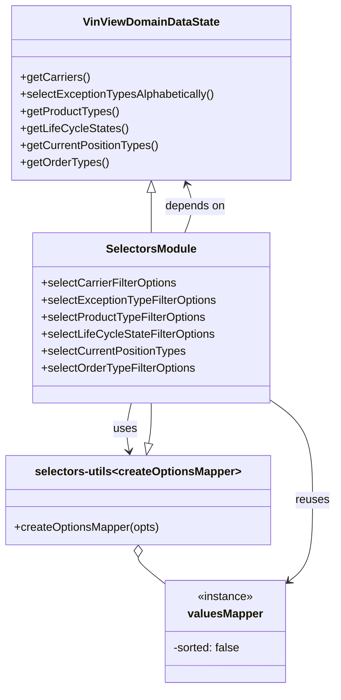

# Diagram: web/portal/src/pages/vinview/components/search/VinView.SearchFilterSelectors.js


> Auto-generated by Obscura crawlers

## Diagram 1



### SVG

<svg id="container" width="470.46875" xmlns="http://www.w3.org/2000/svg" class="classDiagram" height="970" viewBox="0 0 470.46875 970" role="graphics-document document" aria-roledescription="class"><style>#container{font-family:"trebuchet ms",verdana,arial,sans-serif;font-size:16px;fill:#333;}@keyframes edge-animation-frame{from{stroke-dashoffset:0;}}@keyframes dash{to{stroke-dashoffset:0;}}#container .edge-animation-slow{stroke-dasharray:9,5!important;stroke-dashoffset:900;animation:dash 50s linear infinite;stroke-linecap:round;}#container .edge-animation-fast{stroke-dasharray:9,5!important;stroke-dashoffset:900;animation:dash 20s linear infinite;stroke-linecap:round;}#container .error-icon{fill:#552222;}#container .error-text{fill:#552222;stroke:#552222;}#container .edge-thickness-normal{stroke-width:1px;}#container .edge-thickness-thick{stroke-width:3.5px;}#container .edge-pattern-solid{stroke-dasharray:0;}#container .edge-thickness-invisible{stroke-width:0;fill:none;}#container .edge-pattern-dashed{stroke-dasharray:3;}#container .edge-pattern-dotted{stroke-dasharray:2;}#container .marker{fill:#333333;stroke:#333333;}#container .marker.cross{stroke:#333333;}#container svg{font-family:"trebuchet ms",verdana,arial,sans-serif;font-size:16px;}#container p{margin:0;}#container g.classGroup text{fill:#9370DB;stroke:none;font-family:"trebuchet ms",verdana,arial,sans-serif;font-size:10px;}#container g.classGroup text .title{font-weight:bolder;}#container .nodeLabel,#container .edgeLabel{color:#131300;}#container .edgeLabel .label rect{fill:#ECECFF;}#container .label text{fill:#131300;}#container .labelBkg{background:#ECECFF;}#container .edgeLabel .label span{background:#ECECFF;}#container .classTitle{font-weight:bolder;}#container .node rect,#container .node circle,#container .node ellipse,#container .node polygon,#container .node path{fill:#ECECFF;stroke:#9370DB;stroke-width:1px;}#container .divider{stroke:#9370DB;stroke-width:1;}#container g.clickable{cursor:pointer;}#container g.classGroup rect{fill:#ECECFF;stroke:#9370DB;}#container g.classGroup line{stroke:#9370DB;stroke-width:1;}#container .classLabel .box{stroke:none;stroke-width:0;fill:#ECECFF;opacity:0.5;}#container .classLabel .label{fill:#9370DB;font-size:10px;}#container .relation{stroke:#333333;stroke-width:1;fill:none;}#container .dashed-line{stroke-dasharray:3;}#container .dotted-line{stroke-dasharray:1 2;}#container #compositionStart,#container .composition{fill:#333333!important;stroke:#333333!important;stroke-width:1;}#container #compositionEnd,#container .composition{fill:#333333!important;stroke:#333333!important;stroke-width:1;}#container #dependencyStart,#container .dependency{fill:#333333!important;stroke:#333333!important;stroke-width:1;}#container #dependencyStart,#container .dependency{fill:#333333!important;stroke:#333333!important;stroke-width:1;}#container #extensionStart,#container .extension{fill:transparent!important;stroke:#333333!important;stroke-width:1;}#container #extensionEnd,#container .extension{fill:transparent!important;stroke:#333333!important;stroke-width:1;}#container #aggregationStart,#container .aggregation{fill:transparent!important;stroke:#333333!important;stroke-width:1;}#container #aggregationEnd,#container .aggregation{fill:transparent!important;stroke:#333333!important;stroke-width:1;}#container #lollipopStart,#container .lollipop{fill:#ECECFF!important;stroke:#333333!important;stroke-width:1;}#container #lollipopEnd,#container .lollipop{fill:#ECECFF!important;stroke:#333333!important;stroke-width:1;}#container .edgeTerminals{font-size:11px;line-height:initial;}#container .classTitleText{text-anchor:middle;font-size:18px;fill:#333;}#container .label-icon{display:inline-block;height:1em;overflow:visible;vertical-align:-0.125em;}#container .node .label-icon path{fill:currentColor;stroke:revert;stroke-width:revert;}#container :root{--mermaid-font-family:"trebuchet ms",verdana,arial,sans-serif;}</style><g><defs><marker id="container_class-aggregationStart" class="marker aggregation class" refX="18" refY="7" markerWidth="190" markerHeight="240" orient="auto"><path d="M 18,7 L9,13 L1,7 L9,1 Z"></path></marker></defs><defs><marker id="container_class-aggregationEnd" class="marker aggregation class" refX="1" refY="7" markerWidth="20" markerHeight="28" orient="auto"><path d="M 18,7 L9,13 L1,7 L9,1 Z"></path></marker></defs><defs><marker id="container_class-extensionStart" class="marker extension class" refX="18" refY="7" markerWidth="190" markerHeight="240" orient="auto"><path d="M 1,7 L18,13 V 1 Z"></path></marker></defs><defs><marker id="container_class-extensionEnd" class="marker extension class" refX="1" refY="7" markerWidth="20" markerHeight="28" orient="auto"><path d="M 1,1 V 13 L18,7 Z"></path></marker></defs><defs><marker id="container_class-compositionStart" class="marker composition class" refX="18" refY="7" markerWidth="190" markerHeight="240" orient="auto"><path d="M 18,7 L9,13 L1,7 L9,1 Z"></path></marker></defs><defs><marker id="container_class-compositionEnd" class="marker composition class" refX="1" refY="7" markerWidth="20" markerHeight="28" orient="auto"><path d="M 18,7 L9,13 L1,7 L9,1 Z"></path></marker></defs><defs><marker id="container_class-dependencyStart" class="marker dependency class" refX="6" refY="7" markerWidth="190" markerHeight="240" orient="auto"><path d="M 5,7 L9,13 L1,7 L9,1 Z"></path></marker></defs><defs><marker id="container_class-dependencyEnd" class="marker dependency class" refX="13" refY="7" markerWidth="20" markerHeight="28" orient="auto"><path d="M 18,7 L9,13 L14,7 L9,1 Z"></path></marker></defs><defs><marker id="container_class-lollipopStart" class="marker lollipop class" refX="13" refY="7" markerWidth="190" markerHeight="240" orient="auto"><circle stroke="black" fill="transparent" cx="7" cy="7" r="6"></circle></marker></defs><defs><marker id="container_class-lollipopEnd" class="marker lollipop class" refX="1" refY="7" markerWidth="190" markerHeight="240" orient="auto"><circle stroke="black" fill="transparent" cx="7" cy="7" r="6"></circle></marker></defs><g class="root"><g class="clusters"></g><g class="edgePaths"><path d="M212.277,271.25L212.277,274.542C212.277,277.833,212.277,284.417,212.277,293.875C212.277,303.333,212.277,315.667,212.277,321.833L212.277,328" id="id_VinViewDomainDataState_SelectorsModule_1" class="edge-thickness-normal edge-pattern-solid relation" style=";;;" data-edge="true" data-et="edge" data-id="id_VinViewDomainDataState_SelectorsModule_1" data-points="W3sieCI6MjEyLjI3NzM0Mzc1LCJ5IjoyNTR9LHsieCI6MjEyLjI3NzM0Mzc1LCJ5IjoyOTF9LHsieCI6MjEyLjI3NzM0Mzc1LCJ5IjozMjh9XQ==" marker-start="url(#container_class-extensionStart)"></path><path d="M208.623,625.03L209.232,621.692C209.841,618.353,211.059,611.677,211.668,602.172C212.277,592.667,212.277,580.333,212.277,574.167L212.277,568" id="id_selectors-utils_SelectorsModule_2" class="edge-thickness-normal edge-pattern-solid relation" style=";;;" data-edge="true" data-et="edge" data-id="id_selectors-utils_SelectorsModule_2" data-points="W3sieCI6MjA1LjUyNjI4OTA2MjUsInkiOjY0Mn0seyJ4IjoyMTIuMjc3MzQzNzUsInkiOjYwNX0seyJ4IjoyMTIuMjc3MzQzNzUsInkiOjU2OH1d" marker-start="url(#container_class-extensionStart)"></path><path d="M194.031,785.25L194.031,786.542C194.031,787.833,194.031,790.417,200.168,796.573C206.305,802.729,218.578,812.458,224.715,817.323L230.852,822.187" id="id_selectors-utils_valuesMapper_3" class="edge-thickness-normal edge-pattern-solid relation" style=";;;" data-edge="true" data-et="edge" data-id="id_selectors-utils_valuesMapper_3" data-points="W3sieCI6MTk0LjAzMTI1LCJ5Ijo3Njh9LHsieCI6MTk0LjAzMTI1LCJ5Ijo3OTN9LHsieCI6MjMwLjg1MTU2MjUsInkiOjgyMi4xODczMjA0MzY2OTh9XQ==" marker-start="url(#container_class-aggregationStart)"></path><path d="M260.388,328L262.861,321.833C265.333,315.667,270.278,303.333,270.69,291.931C271.103,280.528,266.983,270.056,264.923,264.82L262.863,259.583" id="id_SelectorsModule_VinViewDomainDataState_4" class="edge-thickness-normal edge-pattern-solid relation" style=";;;" data-edge="true" data-et="edge" data-id="id_SelectorsModule_VinViewDomainDataState_4" data-points="W3sieCI6MjYwLjM4ODQxMDYyODk4MDg2LCJ5IjozMjh9LHsieCI6Mjc1LjIyMjY1NjI1LCJ5IjoyOTF9LHsieCI6MjYwLjY2NjU1MjczNDM3NSwieSI6MjU0fV0=" marker-end="url(#container_class-dependencyEnd)"></path><path d="M184.385,568L182.952,574.167C181.519,580.333,178.652,592.667,178.164,604.016C177.677,615.366,179.568,625.732,180.514,630.915L181.459,636.097" id="id_SelectorsModule_selectors-utils_5" class="edge-thickness-normal edge-pattern-solid relation" style=";;;" data-edge="true" data-et="edge" data-id="id_SelectorsModule_selectors-utils_5" data-points="W3sieCI6MTg0LjM4NTIyNTkxNTYwNTEsInkiOjU2OH0seyJ4IjoxNzUuNzg1MTU2MjUsInkiOjYwNX0seyJ4IjoxODIuNTM2MjEwOTM3NSwieSI6NjQyfV0=" marker-end="url(#container_class-dependencyEnd)"></path><path d="M379.602,563.988L389.462,570.823C399.323,577.659,419.044,591.329,428.905,614.831C438.766,638.333,438.766,671.667,438.766,703C438.766,734.333,438.766,763.667,433.413,782.577C428.059,801.487,417.353,809.973,412,814.217L406.647,818.46" id="id_SelectorsModule_valuesMapper_6" class="edge-thickness-normal edge-pattern-solid relation" style=";;;" data-edge="true" data-et="edge" data-id="id_SelectorsModule_valuesMapper_6" data-points="W3sieCI6Mzc5LjYwMTU2MjUsInkiOjU2My45ODc5MDk4MzI1MzE0fSx7IngiOjQzOC43NjU2MjUsInkiOjYwNX0seyJ4Ijo0MzguNzY1NjI1LCJ5Ijo3MDV9LHsieCI6NDM4Ljc2NTYyNSwieSI6NzkzfSx7IngiOjQwMS45NDUzMTI1LCJ5Ijo4MjIuMTg3MzIwNDM2Njk4fV0=" marker-end="url(#container_class-dependencyEnd)"></path></g><g class="edgeLabels"><g class="edgeLabel"><g class="label" data-id="id_VinViewDomainDataState_SelectorsModule_1" transform="translate(0, 0)"><foreignObject width="0" height="0"><div xmlns="http://www.w3.org/1999/xhtml" class="labelBkg" style="display: table-cell; white-space: nowrap; line-height: 1.5; max-width: 200px; text-align: center;"><span class="edgeLabel"></span></div></foreignObject></g></g><g class="edgeLabel"><g class="label" data-id="id_selectors-utils_SelectorsModule_2" transform="translate(0, 0)"><foreignObject width="0" height="0"><div xmlns="http://www.w3.org/1999/xhtml" class="labelBkg" style="display: table-cell; white-space: nowrap; line-height: 1.5; max-width: 200px; text-align: center;"><span class="edgeLabel"></span></div></foreignObject></g></g><g class="edgeLabel"><g class="label" data-id="id_selectors-utils_valuesMapper_3" transform="translate(0, 0)"><foreignObject width="0" height="0"><div xmlns="http://www.w3.org/1999/xhtml" class="labelBkg" style="display: table-cell; white-space: nowrap; line-height: 1.5; max-width: 200px; text-align: center;"><span class="edgeLabel"></span></div></foreignObject></g></g><g class="edgeLabel" transform="translate(275.20355, 291.04765)"><g class="label" data-id="id_SelectorsModule_VinViewDomainDataState_4" transform="translate(-42.9453125, -12)"><foreignObject width="85.890625" height="24"><div xmlns="http://www.w3.org/1999/xhtml" class="labelBkg" style="display: table-cell; white-space: nowrap; line-height: 1.5; max-width: 200px; text-align: center;"><span class="edgeLabel"><p>depends on</p></span></div></foreignObject></g></g><g class="edgeLabel" transform="translate(175.82766, 604.81714)"><g class="label" data-id="id_SelectorsModule_selectors-utils_5" transform="translate(-16.4921875, -12)"><foreignObject width="32.984375" height="24"><div xmlns="http://www.w3.org/1999/xhtml" class="labelBkg" style="display: table-cell; white-space: nowrap; line-height: 1.5; max-width: 200px; text-align: center;"><span class="edgeLabel"><p>uses</p></span></div></foreignObject></g></g><g class="edgeLabel" transform="translate(438.765625, 705)"><g class="label" data-id="id_SelectorsModule_valuesMapper_6" transform="translate(-23.703125, -12)"><foreignObject width="47.40625" height="24"><div xmlns="http://www.w3.org/1999/xhtml" class="labelBkg" style="display: table-cell; white-space: nowrap; line-height: 1.5; max-width: 200px; text-align: center;"><span class="edgeLabel"><p>reuses</p></span></div></foreignObject></g></g></g><g class="nodes"><g class="node default" id="classId-VinViewDomainDataState-0" transform="translate(212.27734375, 131)"><g class="basic label-container"><path d="M-196.53515625 -123 L196.53515625 -123 L196.53515625 123 L-196.53515625 123" stroke="none" stroke-width="0" fill="#ECECFF" style=""></path><path d="M-196.53515625 -123 C-85.89054942231031 -123, 24.75405740537937 -123, 196.53515625 -123 M-196.53515625 -123 C-84.86236981562953 -123, 26.81041661874093 -123, 196.53515625 -123 M196.53515625 -123 C196.53515625 -36.45369052448447, 196.53515625 50.092618951031056, 196.53515625 123 M196.53515625 -123 C196.53515625 -36.88320493015419, 196.53515625 49.233590139691614, 196.53515625 123 M196.53515625 123 C70.41845646762441 123, -55.69824331475118 123, -196.53515625 123 M196.53515625 123 C88.86900082391293 123, -18.797154602174146 123, -196.53515625 123 M-196.53515625 123 C-196.53515625 25.485093918071072, -196.53515625 -72.02981216385786, -196.53515625 -123 M-196.53515625 123 C-196.53515625 50.25287903101939, -196.53515625 -22.49424193796122, -196.53515625 -123" stroke="#9370DB" stroke-width="1.3" fill="none" stroke-dasharray="0 0" style=""></path></g><g class="annotation-group text" transform="translate(0, -99)"></g><g class="label-group text" transform="translate(-92.7578125, -99)"><g class="label" style="font-weight: bolder" transform="translate(0,-12)"><foreignObject width="185.515625" height="24"><div xmlns="http://www.w3.org/1999/xhtml" style="display: table-cell; white-space: nowrap; line-height: 1.5; max-width: 233px; text-align: center;"><span class="nodeLabel markdown-node-label" style=""><p>VinViewDomainDataState</p></span></div></foreignObject></g></g><g class="members-group text" transform="translate(-184.53515625, -51)"></g><g class="methods-group text" transform="translate(-184.53515625, -21)"><g class="label" style="" transform="translate(0,-12)"><foreignObject width="97.421875" height="24"><div xmlns="http://www.w3.org/1999/xhtml" style="display: table-cell; white-space: nowrap; line-height: 1.5; max-width: 155px; text-align: center;"><span class="nodeLabel markdown-node-label" style=""><p>+getCarriers()</p></span></div></foreignObject></g><g class="label" style="" transform="translate(0,12)"><foreignObject width="276.3125" height="24"><div xmlns="http://www.w3.org/1999/xhtml" style="display: table-cell; white-space: nowrap; line-height: 1.5; max-width: 334px; text-align: center;"><span class="nodeLabel markdown-node-label" style=""><p>+selectExceptionTypesAlphabetically()</p></span></div></foreignObject></g><g class="label" style="" transform="translate(0,36)"><foreignObject width="138.4375" height="24"><div xmlns="http://www.w3.org/1999/xhtml" style="display: table-cell; white-space: nowrap; line-height: 1.5; max-width: 196px; text-align: center;"><span class="nodeLabel markdown-node-label" style=""><p>+getProductTypes()</p></span></div></foreignObject></g><g class="label" style="" transform="translate(0,60)"><foreignObject width="149.078125" height="24"><div xmlns="http://www.w3.org/1999/xhtml" style="display: table-cell; white-space: nowrap; line-height: 1.5; max-width: 206px; text-align: center;"><span class="nodeLabel markdown-node-label" style=""><p>+getLifeCycleStates()</p></span></div></foreignObject></g><g class="label" style="" transform="translate(0,84)"><foreignObject width="195.015625" height="24"><div xmlns="http://www.w3.org/1999/xhtml" style="display: table-cell; white-space: nowrap; line-height: 1.5; max-width: 252px; text-align: center;"><span class="nodeLabel markdown-node-label" style=""><p>+getCurrentPositionTypes()</p></span></div></foreignObject></g><g class="label" style="" transform="translate(0,108)"><foreignObject width="123.359375" height="24"><div xmlns="http://www.w3.org/1999/xhtml" style="display: table-cell; white-space: nowrap; line-height: 1.5; max-width: 181px; text-align: center;"><span class="nodeLabel markdown-node-label" style=""><p>+getOrderTypes()</p></span></div></foreignObject></g></g><g class="divider" style=""><path d="M-196.53515625 -75 C-47.906827079701884 -75, 100.72150209059623 -75, 196.53515625 -75 M-196.53515625 -75 C-61.667346051994286 -75, 73.20046414601143 -75, 196.53515625 -75" stroke="#9370DB" stroke-width="1.3" fill="none" stroke-dasharray="0 0" style=""></path></g><g class="divider" style=""><path d="M-196.53515625 -51 C-77.66088759605051 -51, 41.21338105789897 -51, 196.53515625 -51 M-196.53515625 -51 C-113.6091218338996 -51, -30.683087417799186 -51, 196.53515625 -51" stroke="#9370DB" stroke-width="1.3" fill="none" stroke-dasharray="0 0" style=""></path></g></g><g class="node default" id="classId-selectors-utils-1" transform="translate(194.03125, 705)"><g class="basic label-container"><path d="M-186.03125 -63 L186.03125 -63 L186.03125 63 L-186.03125 63" stroke="none" stroke-width="0" fill="#ECECFF" style=""></path><path d="M-186.03125 -63 C-57.03280826152982 -63, 71.96563347694035 -63, 186.03125 -63 M-186.03125 -63 C-94.48509426947321 -63, -2.9389385389464167 -63, 186.03125 -63 M186.03125 -63 C186.03125 -28.557679140479614, 186.03125 5.884641719040772, 186.03125 63 M186.03125 -63 C186.03125 -31.497720662566252, 186.03125 0.004558674867496393, 186.03125 63 M186.03125 63 C108.66161510044292 63, 31.29198020088583 63, -186.03125 63 M186.03125 63 C72.25437593136219 63, -41.52249813727562 63, -186.03125 63 M-186.03125 63 C-186.03125 23.052175577332264, -186.03125 -16.895648845335472, -186.03125 -63 M-186.03125 63 C-186.03125 19.112222958397005, -186.03125 -24.77555408320599, -186.03125 -63" stroke="#9370DB" stroke-width="1.3" fill="none" stroke-dasharray="0 0" style=""></path></g><g class="annotation-group text" transform="translate(0, -39)"></g><g class="label-group text" transform="translate(-140.625, -39)"><g class="label" style="font-weight: bolder" transform="translate(0,-12)"><foreignObject width="281.25" height="24"><div xmlns="http://www.w3.org/1999/xhtml" style="display: table-cell; white-space: nowrap; line-height: 1.5; max-width: 366px; text-align: center;"><span class="nodeLabel markdown-node-label" style=""><p>selectors-utils&lt;createOptionsMapper&gt;</p></span></div></foreignObject></g></g><g class="members-group text" transform="translate(-174.03125, 9)"></g><g class="methods-group text" transform="translate(-174.03125, 39)"><g class="label" style="" transform="translate(0,-12)"><foreignObject width="207.4375" height="24"><div xmlns="http://www.w3.org/1999/xhtml" style="display: table-cell; white-space: nowrap; line-height: 1.5; max-width: 265px; text-align: center;"><span class="nodeLabel markdown-node-label" style=""><p>+createOptionsMapper(opts)</p></span></div></foreignObject></g></g><g class="divider" style=""><path d="M-186.03125 -15 C-97.64779244938582 -15, -9.264334898771637 -15, 186.03125 -15 M-186.03125 -15 C-66.10293643940699 -15, 53.82537712118602 -15, 186.03125 -15" stroke="#9370DB" stroke-width="1.3" fill="none" stroke-dasharray="0 0" style=""></path></g><g class="divider" style=""><path d="M-186.03125 9 C-52.09639141127815 9, 81.8384671774437 9, 186.03125 9 M-186.03125 9 C-77.09812496862327 9, 31.835000062753465 9, 186.03125 9" stroke="#9370DB" stroke-width="1.3" fill="none" stroke-dasharray="0 0" style=""></path></g></g><g class="node default" id="classId-valuesMapper-2" transform="translate(316.3984375, 890)"><g class="basic label-container"><path d="M-85.546875 -72 L85.546875 -72 L85.546875 72 L-85.546875 72" stroke="none" stroke-width="0" fill="#ECECFF" style=""></path><path d="M-85.546875 -72 C-21.069514000077646 -72, 43.40784699984471 -72, 85.546875 -72 M-85.546875 -72 C-25.789882654691603 -72, 33.967109690616795 -72, 85.546875 -72 M85.546875 -72 C85.546875 -35.75900234818389, 85.546875 0.48199530363221754, 85.546875 72 M85.546875 -72 C85.546875 -16.65687838496992, 85.546875 38.68624323006016, 85.546875 72 M85.546875 72 C20.005301967195777 72, -45.536271065608446 72, -85.546875 72 M85.546875 72 C34.5557887264678 72, -16.435297547064394 72, -85.546875 72 M-85.546875 72 C-85.546875 21.42194538709515, -85.546875 -29.1561092258097, -85.546875 -72 M-85.546875 72 C-85.546875 42.37275651781839, -85.546875 12.745513035636769, -85.546875 -72" stroke="#9370DB" stroke-width="1.3" fill="none" stroke-dasharray="0 0" style=""></path></g><g class="annotation-group text" transform="translate(-39.546875, -48)"><g class="label" style="" transform="translate(0,-12)"><foreignObject width="79.09375" height="24"><div xmlns="http://www.w3.org/1999/xhtml" style="display: table-cell; white-space: nowrap; line-height: 1.5; max-width: 129px; text-align: center;"><span class="nodeLabel markdown-node-label" style=""><p>«instance»</p></span></div></foreignObject></g></g><g class="label-group text" transform="translate(-51.3125, -24)"><g class="label" style="font-weight: bolder" transform="translate(0,-12)"><foreignObject width="102.625" height="24"><div xmlns="http://www.w3.org/1999/xhtml" style="display: table-cell; white-space: nowrap; line-height: 1.5; max-width: 152px; text-align: center;"><span class="nodeLabel markdown-node-label" style=""><p>valuesMapper</p></span></div></foreignObject></g></g><g class="members-group text" transform="translate(-73.546875, 24)"><g class="label" style="" transform="translate(0,-12)"><foreignObject width="95.78125" height="24"><div xmlns="http://www.w3.org/1999/xhtml" style="display: table-cell; white-space: nowrap; line-height: 1.5; max-width: 153px; text-align: center;"><span class="nodeLabel markdown-node-label" style=""><p>-sorted: false</p></span></div></foreignObject></g></g><g class="methods-group text" transform="translate(-73.546875, 72)"></g><g class="divider" style=""><path d="M-85.546875 0 C-28.20878893512171 0, 29.12929712975658 0, 85.546875 0 M-85.546875 0 C-19.135249056904215 0, 47.27637688619157 0, 85.546875 0" stroke="#9370DB" stroke-width="1.3" fill="none" stroke-dasharray="0 0" style=""></path></g><g class="divider" style=""><path d="M-85.546875 48 C-21.306744133697578 48, 42.933386732604845 48, 85.546875 48 M-85.546875 48 C-21.14025181362001 48, 43.26637137275998 48, 85.546875 48" stroke="#9370DB" stroke-width="1.3" fill="none" stroke-dasharray="0 0" style=""></path></g></g><g class="node default" id="classId-SelectorsModule-3" transform="translate(212.27734375, 448)"><g class="basic label-container"><path d="M-167.32421875 -120 L167.32421875 -120 L167.32421875 120 L-167.32421875 120" stroke="none" stroke-width="0" fill="#ECECFF" style=""></path><path d="M-167.32421875 -120 C-76.10972434901375 -120, 15.104770051972508 -120, 167.32421875 -120 M-167.32421875 -120 C-83.12167413939433 -120, 1.080870471211341 -120, 167.32421875 -120 M167.32421875 -120 C167.32421875 -36.56910969013609, 167.32421875 46.861780619727824, 167.32421875 120 M167.32421875 -120 C167.32421875 -70.02245392381985, 167.32421875 -20.044907847639706, 167.32421875 120 M167.32421875 120 C50.240651342552184 120, -66.84291606489563 120, -167.32421875 120 M167.32421875 120 C85.90606739876802 120, 4.487916047536032 120, -167.32421875 120 M-167.32421875 120 C-167.32421875 32.839901192205744, -167.32421875 -54.32019761558851, -167.32421875 -120 M-167.32421875 120 C-167.32421875 55.79247030064265, -167.32421875 -8.415059398714703, -167.32421875 -120" stroke="#9370DB" stroke-width="1.3" fill="none" stroke-dasharray="0 0" style=""></path></g><g class="annotation-group text" transform="translate(0, -96)"></g><g class="label-group text" transform="translate(-61.2578125, -96)"><g class="label" style="font-weight: bolder" transform="translate(0,-12)"><foreignObject width="122.515625" height="24"><div xmlns="http://www.w3.org/1999/xhtml" style="display: table-cell; white-space: nowrap; line-height: 1.5; max-width: 171px; text-align: center;"><span class="nodeLabel markdown-node-label" style=""><p>SelectorsModule</p></span></div></foreignObject></g></g><g class="members-group text" transform="translate(-155.32421875, -48)"><g class="label" style="" transform="translate(0,-12)"><foreignObject width="194.1875" height="24"><div xmlns="http://www.w3.org/1999/xhtml" style="display: table-cell; white-space: nowrap; line-height: 1.5; max-width: 252px; text-align: center;"><span class="nodeLabel markdown-node-label" style=""><p>+selectCarrierFilterOptions</p></span></div></foreignObject></g><g class="label" style="" transform="translate(0,12)"><foreignObject width="249.390625" height="24"><div xmlns="http://www.w3.org/1999/xhtml" style="display: table-cell; white-space: nowrap; line-height: 1.5; max-width: 307px; text-align: center;"><span class="nodeLabel markdown-node-label" style=""><p>+selectExceptionTypeFilterOptions</p></span></div></foreignObject></g><g class="label" style="" transform="translate(0,36)"><foreignObject width="234.96875" height="24"><div xmlns="http://www.w3.org/1999/xhtml" style="display: table-cell; white-space: nowrap; line-height: 1.5; max-width: 292px; text-align: center;"><span class="nodeLabel markdown-node-label" style=""><p>+selectProductTypeFilterOptions</p></span></div></foreignObject></g><g class="label" style="" transform="translate(0,60)"><foreignObject width="245.609375" height="24"><div xmlns="http://www.w3.org/1999/xhtml" style="display: table-cell; white-space: nowrap; line-height: 1.5; max-width: 303px; text-align: center;"><span class="nodeLabel markdown-node-label" style=""><p>+selectLifeCycleStateFilterOptions</p></span></div></foreignObject></g><g class="label" style="" transform="translate(0,84)"><foreignObject width="205.03125" height="24"><div xmlns="http://www.w3.org/1999/xhtml" style="display: table-cell; white-space: nowrap; line-height: 1.5; max-width: 262px; text-align: center;"><span class="nodeLabel markdown-node-label" style=""><p>+selectCurrentPositionTypes</p></span></div></foreignObject></g><g class="label" style="" transform="translate(0,108)"><foreignObject width="219.875" height="24"><div xmlns="http://www.w3.org/1999/xhtml" style="display: table-cell; white-space: nowrap; line-height: 1.5; max-width: 277px; text-align: center;"><span class="nodeLabel markdown-node-label" style=""><p>+selectOrderTypeFilterOptions</p></span></div></foreignObject></g></g><g class="methods-group text" transform="translate(-155.32421875, 120)"></g><g class="divider" style=""><path d="M-167.32421875 -72 C-81.04884794156948 -72, 5.226522866861046 -72, 167.32421875 -72 M-167.32421875 -72 C-66.86109998050435 -72, 33.6020187889913 -72, 167.32421875 -72" stroke="#9370DB" stroke-width="1.3" fill="none" stroke-dasharray="0 0" style=""></path></g><g class="divider" style=""><path d="M-167.32421875 96 C-66.80386214335759 96, 33.71649446328482 96, 167.32421875 96 M-167.32421875 96 C-91.13210310158433 96, -14.93998745316867 96, 167.32421875 96" stroke="#9370DB" stroke-width="1.3" fill="none" stroke-dasharray="0 0" style=""></path></g></g></g></g></g></svg>

## Diagram 2

```mermaid
flowchart TD
    subgraph DomainData
        A[getCarriers()]
        B[selectExceptionTypesAlphabetically()]
        C[getProductTypes()]
        D[getLifeCycleStates()]
        E[getCurrentPositionTypes()]
        F[getOrderTypes()]
    end
    subgraph Mappers
        M1[createOptionsMapper({labelKey,valueKey})]
        M2[valuesMapper(sorted:false)]
    end
    A -->|input| SC1[selectCarrierFilterOptions]
    B -->|input| SC2[selectExceptionTypeFilterOptions]
    C -->|input| SC3[selectProductTypeFilterOptions]
    D -->|input| SC4[selectLifeCycleStateFilterOptions]
    E -->|input| SC5[selectCurrentPositionTypes]
    F -->|input| SC6[selectOrderTypeFilterOptions]
    SC1 --> M1
    SC2 --> M1
    SC3 --> M2
    SC4 --> M2
    SC5 --> M1
    SC6 --> M2
    M1 --> OUT1[FilterOptions (label,value)]
    M2 --> OUT2[EnumOptions (value,label)]
```

> SVG rendering failed for this diagram.
