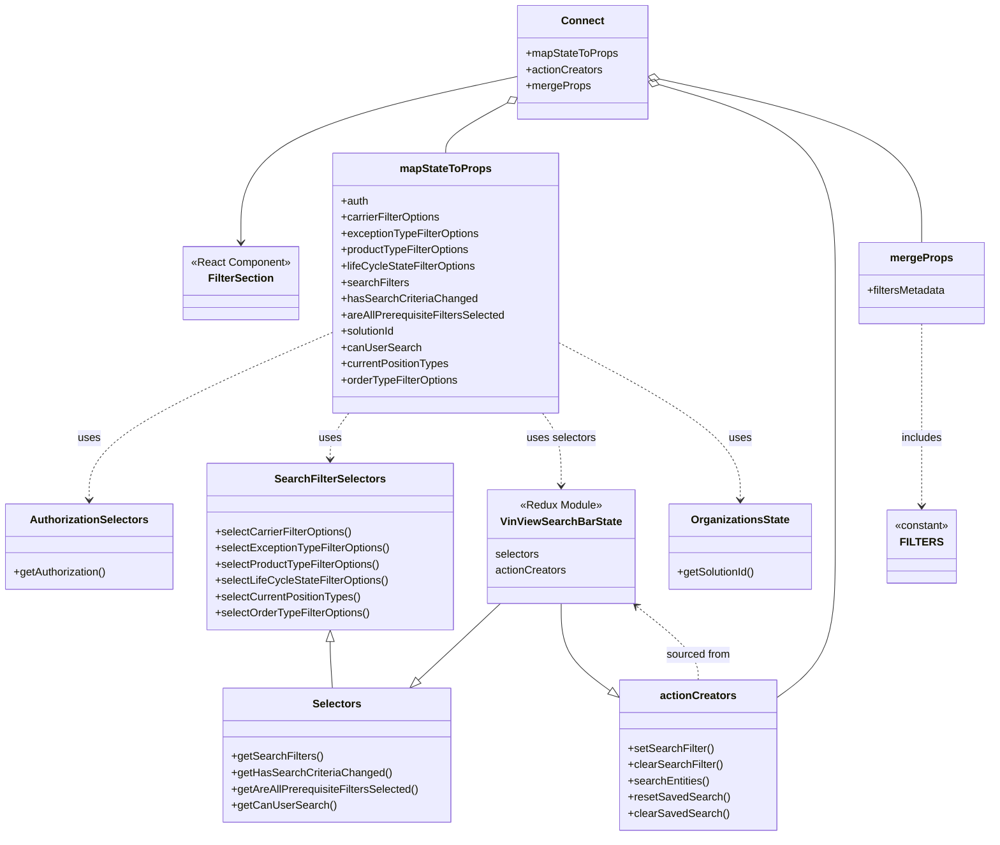

# Diagram: web/portal/src/pages/vinview/components/search/VinView.SearchFilters.container.js


> Auto-generated by Obscura crawlers

## Diagram 1



### SVG

<svg id="container" width="1454.46875" xmlns="http://www.w3.org/2000/svg" class="classDiagram" height="1234" viewBox="0 0 1454.46875 1234" role="graphics-document document" aria-roledescription="class"><style>#container{font-family:"trebuchet ms",verdana,arial,sans-serif;font-size:16px;fill:#333;}@keyframes edge-animation-frame{from{stroke-dashoffset:0;}}@keyframes dash{to{stroke-dashoffset:0;}}#container .edge-animation-slow{stroke-dasharray:9,5!important;stroke-dashoffset:900;animation:dash 50s linear infinite;stroke-linecap:round;}#container .edge-animation-fast{stroke-dasharray:9,5!important;stroke-dashoffset:900;animation:dash 20s linear infinite;stroke-linecap:round;}#container .error-icon{fill:#552222;}#container .error-text{fill:#552222;stroke:#552222;}#container .edge-thickness-normal{stroke-width:1px;}#container .edge-thickness-thick{stroke-width:3.5px;}#container .edge-pattern-solid{stroke-dasharray:0;}#container .edge-thickness-invisible{stroke-width:0;fill:none;}#container .edge-pattern-dashed{stroke-dasharray:3;}#container .edge-pattern-dotted{stroke-dasharray:2;}#container .marker{fill:#333333;stroke:#333333;}#container .marker.cross{stroke:#333333;}#container svg{font-family:"trebuchet ms",verdana,arial,sans-serif;font-size:16px;}#container p{margin:0;}#container g.classGroup text{fill:#9370DB;stroke:none;font-family:"trebuchet ms",verdana,arial,sans-serif;font-size:10px;}#container g.classGroup text .title{font-weight:bolder;}#container .nodeLabel,#container .edgeLabel{color:#131300;}#container .edgeLabel .label rect{fill:#ECECFF;}#container .label text{fill:#131300;}#container .labelBkg{background:#ECECFF;}#container .edgeLabel .label span{background:#ECECFF;}#container .classTitle{font-weight:bolder;}#container .node rect,#container .node circle,#container .node ellipse,#container .node polygon,#container .node path{fill:#ECECFF;stroke:#9370DB;stroke-width:1px;}#container .divider{stroke:#9370DB;stroke-width:1;}#container g.clickable{cursor:pointer;}#container g.classGroup rect{fill:#ECECFF;stroke:#9370DB;}#container g.classGroup line{stroke:#9370DB;stroke-width:1;}#container .classLabel .box{stroke:none;stroke-width:0;fill:#ECECFF;opacity:0.5;}#container .classLabel .label{fill:#9370DB;font-size:10px;}#container .relation{stroke:#333333;stroke-width:1;fill:none;}#container .dashed-line{stroke-dasharray:3;}#container .dotted-line{stroke-dasharray:1 2;}#container #compositionStart,#container .composition{fill:#333333!important;stroke:#333333!important;stroke-width:1;}#container #compositionEnd,#container .composition{fill:#333333!important;stroke:#333333!important;stroke-width:1;}#container #dependencyStart,#container .dependency{fill:#333333!important;stroke:#333333!important;stroke-width:1;}#container #dependencyStart,#container .dependency{fill:#333333!important;stroke:#333333!important;stroke-width:1;}#container #extensionStart,#container .extension{fill:transparent!important;stroke:#333333!important;stroke-width:1;}#container #extensionEnd,#container .extension{fill:transparent!important;stroke:#333333!important;stroke-width:1;}#container #aggregationStart,#container .aggregation{fill:transparent!important;stroke:#333333!important;stroke-width:1;}#container #aggregationEnd,#container .aggregation{fill:transparent!important;stroke:#333333!important;stroke-width:1;}#container #lollipopStart,#container .lollipop{fill:#ECECFF!important;stroke:#333333!important;stroke-width:1;}#container #lollipopEnd,#container .lollipop{fill:#ECECFF!important;stroke:#333333!important;stroke-width:1;}#container .edgeTerminals{font-size:11px;line-height:initial;}#container .classTitleText{text-anchor:middle;font-size:18px;fill:#333;}#container .label-icon{display:inline-block;height:1em;overflow:visible;vertical-align:-0.125em;}#container .node .label-icon path{fill:currentColor;stroke:revert;stroke-width:revert;}#container :root{--mermaid-font-family:"trebuchet ms",verdana,arial,sans-serif;}</style><g><defs><marker id="container_class-aggregationStart" class="marker aggregation class" refX="18" refY="7" markerWidth="190" markerHeight="240" orient="auto"><path d="M 18,7 L9,13 L1,7 L9,1 Z"></path></marker></defs><defs><marker id="container_class-aggregationEnd" class="marker aggregation class" refX="1" refY="7" markerWidth="20" markerHeight="28" orient="auto"><path d="M 18,7 L9,13 L1,7 L9,1 Z"></path></marker></defs><defs><marker id="container_class-extensionStart" class="marker extension class" refX="18" refY="7" markerWidth="190" markerHeight="240" orient="auto"><path d="M 1,7 L18,13 V 1 Z"></path></marker></defs><defs><marker id="container_class-extensionEnd" class="marker extension class" refX="1" refY="7" markerWidth="20" markerHeight="28" orient="auto"><path d="M 1,1 V 13 L18,7 Z"></path></marker></defs><defs><marker id="container_class-compositionStart" class="marker composition class" refX="18" refY="7" markerWidth="190" markerHeight="240" orient="auto"><path d="M 18,7 L9,13 L1,7 L9,1 Z"></path></marker></defs><defs><marker id="container_class-compositionEnd" class="marker composition class" refX="1" refY="7" markerWidth="20" markerHeight="28" orient="auto"><path d="M 18,7 L9,13 L1,7 L9,1 Z"></path></marker></defs><defs><marker id="container_class-dependencyStart" class="marker dependency class" refX="6" refY="7" markerWidth="190" markerHeight="240" orient="auto"><path d="M 5,7 L9,13 L1,7 L9,1 Z"></path></marker></defs><defs><marker id="container_class-dependencyEnd" class="marker dependency class" refX="13" refY="7" markerWidth="20" markerHeight="28" orient="auto"><path d="M 18,7 L9,13 L14,7 L9,1 Z"></path></marker></defs><defs><marker id="container_class-lollipopStart" class="marker lollipop class" refX="13" refY="7" markerWidth="190" markerHeight="240" orient="auto"><circle stroke="black" fill="transparent" cx="7" cy="7" r="6"></circle></marker></defs><defs><marker id="container_class-lollipopEnd" class="marker lollipop class" refX="1" refY="7" markerWidth="190" markerHeight="240" orient="auto"><circle stroke="black" fill="transparent" cx="7" cy="7" r="6"></circle></marker></defs><g class="root"><g class="clusters"></g><g class="edgePaths"><path d="M761.563,112.467L693.551,127.222C625.54,141.978,489.517,171.489,421.506,212.411C353.494,253.333,353.494,305.667,353.494,331.833L353.494,358" id="id_Connect_FilterSection_1" class="edge-thickness-normal edge-pattern-solid relation" style=";;;" data-edge="true" data-et="edge" data-id="id_Connect_FilterSection_1" data-points="W3sieCI6NzYxLjU2MjUsInkiOjExMi40NjY4MTc3NjMwMjIzM30seyJ4IjozNTMuNDk0MTQwNjI1LCJ5IjoyMDF9LHsieCI6MzUzLjQ5NDE0MDYyNSwieSI6MzY0fV0=" marker-end="url(#container_class-dependencyEnd)"></path><path d="M746.395,151.32L731.11,159.6C715.825,167.88,685.255,184.44,669.97,196.887C654.686,209.333,654.686,217.667,654.686,221.833L654.686,226" id="id_Connect_mapStateToProps_2" class="edge-thickness-normal edge-pattern-solid relation" style=";;;" data-edge="true" data-et="edge" data-id="id_Connect_mapStateToProps_2" data-points="W3sieCI6NzYxLjU2MjUsInkiOjE0My4xMDMxNzMxMzk0NTd9LHsieCI6NjU0LjY4NTU0Njg3NSwieSI6MjAxfSx7IngiOjY1NC42ODU1NDY4NzUsInkiOjIyNn1d" marker-start="url(#container_class-aggregationStart)"></path><path d="M966.782,124.646L1010.006,137.371C1053.23,150.097,1139.677,175.549,1182.901,224.441C1226.125,273.333,1226.125,345.667,1226.125,420C1226.125,494.333,1226.125,570.667,1226.125,635.5C1226.125,700.333,1226.125,753.667,1226.125,807C1226.125,860.333,1226.125,913.667,1211.287,951.247C1196.449,988.828,1166.772,1010.656,1151.934,1021.57L1137.096,1032.485" id="id_Connect_actionCreators_3" class="edge-thickness-normal edge-pattern-solid relation" style=";;;" data-edge="true" data-et="edge" data-id="id_Connect_actionCreators_3" data-points="W3sieCI6OTUwLjIzNDM3NSwieSI6MTE5Ljc3Mzg1MDQ3MTYyODQ0fSx7IngiOjEyMjYuMTI1LCJ5IjoyMDF9LHsieCI6MTIyNi4xMjUsInkiOjQxOH0seyJ4IjoxMjI2LjEyNSwieSI6NjQ3fSx7IngiOjEyMjYuMTI1LCJ5Ijo4MDd9LHsieCI6MTIyNi4xMjUsInkiOjk2N30seyJ4IjoxMTM3LjA5NTcwMzEyNSwieSI6MTAzMi40ODQ1NTE2OTMzNDR9XQ==" marker-start="url(#container_class-aggregationStart)"></path><path d="M967.085,116.341L1031.537,130.451C1095.989,144.561,1224.893,172.78,1289.345,213.057C1353.797,253.333,1353.797,305.667,1353.797,331.833L1353.797,358" id="id_Connect_mergeProps_4" class="edge-thickness-normal edge-pattern-solid relation" style=";;;" data-edge="true" data-et="edge" data-id="id_Connect_mergeProps_4" data-points="W3sieCI6OTUwLjIzNDM3NSwieSI6MTEyLjY1MjAzNzQ2OTk5MTA2fSx7IngiOjEzNTMuNzk2ODc1LCJ5IjoyMDF9LHsieCI6MTM1My43OTY4NzUsInkiOjM1OH1d" marker-start="url(#container_class-aggregationStart)"></path><path d="M488.705,490.645L429.164,516.704C369.624,542.763,250.542,594.882,191.002,636.107C131.461,677.333,131.461,707.667,131.461,722.833L131.461,738" id="id_mapStateToProps_AuthorizationSelectors_5" class="edge-thickness-normal edge-pattern-dashed relation" style=";;;" data-edge="true" data-et="edge" data-id="id_mapStateToProps_AuthorizationSelectors_5" data-points="W3sieCI6NDg4LjcwNTA3ODEyNSwieSI6NDkwLjY0NDc2MjIzNTM4Njh9LHsieCI6MTMxLjQ2MDkzNzUsInkiOjY0N30seyJ4IjoxMzEuNDYwOTM3NSwieSI6NzQ0fV0=" marker-end="url(#container_class-dependencyEnd)"></path><path d="M512.98,610L508.428,616.167C503.877,622.333,494.775,634.667,490.223,646C485.672,657.333,485.672,667.667,485.672,672.833L485.672,678" id="id_mapStateToProps_SearchFilterSelectors_6" class="edge-thickness-normal edge-pattern-dashed relation" style=";;;" data-edge="true" data-et="edge" data-id="id_mapStateToProps_SearchFilterSelectors_6" data-points="W3sieCI6NTEyLjk3OTc2MDg0ODc5OTEsInkiOjYxMH0seyJ4Ijo0ODUuNjcxODc1LCJ5Ijo2NDd9LHsieCI6NDg1LjY3MTg3NSwieSI6Njg0fV0=" marker-end="url(#container_class-dependencyEnd)"></path><path d="M796.391,610L800.943,616.167C805.494,622.333,814.597,634.667,819.148,652.5C823.699,670.333,823.699,693.667,823.699,705.333L823.699,717" id="id_mapStateToProps_VinViewSearchBarState_7" class="edge-thickness-normal edge-pattern-dashed relation" style=";;;" data-edge="true" data-et="edge" data-id="id_mapStateToProps_VinViewSearchBarState_7" data-points="W3sieCI6Nzk2LjM5MTMzMjkwMTIwMDksInkiOjYxMH0seyJ4Ijo4MjMuNjk5MjE4NzUsInkiOjY0N30seyJ4Ijo4MjMuNjk5MjE4NzUsInkiOjcyM31d" marker-end="url(#container_class-dependencyEnd)"></path><path d="M820.666,506.114L864.897,529.595C909.128,553.076,997.589,600.038,1041.82,638.686C1086.051,677.333,1086.051,707.667,1086.051,722.833L1086.051,738" id="id_mapStateToProps_OrganizationsState_8" class="edge-thickness-normal edge-pattern-dashed relation" style=";;;" data-edge="true" data-et="edge" data-id="id_mapStateToProps_OrganizationsState_8" data-points="W3sieCI6ODIwLjY2NjAxNTYyNSwieSI6NTA2LjExNDQ4OTMzNDgyNDV9LHsieCI6MTA4Ni4wNTA3ODEyNSwieSI6NjQ3fSx7IngiOjEwODYuMDUwNzgxMjUsInkiOjc0NH1d" marker-end="url(#container_class-dependencyEnd)"></path><path d="M1024.912,1004L1024.912,997.833C1024.912,991.667,1024.912,979.333,1009.765,961.122C994.619,942.911,964.326,918.823,949.179,906.779L934.032,894.734" id="id_actionCreators_VinViewSearchBarState_9" class="edge-thickness-normal edge-pattern-dashed relation" style=";;;" data-edge="true" data-et="edge" data-id="id_actionCreators_VinViewSearchBarState_9" data-points="W3sieCI6MTAyNC45MTIxMDkzNzUsInkiOjEwMDR9LHsieCI6MTAyNC45MTIxMDkzNzUsInkiOjk2N30seyJ4Ijo5MjkuMzM1OTg2MzI4MTI1LCJ5Ijo4OTF9XQ==" marker-end="url(#container_class-dependencyEnd)"></path><path d="M1353.797,478L1353.797,506.167C1353.797,534.333,1353.797,590.667,1353.797,635.5C1353.797,680.333,1353.797,713.667,1353.797,730.333L1353.797,747" id="id_mergeProps_FILTERS_10" class="edge-thickness-normal edge-pattern-dashed relation" style=";;;" data-edge="true" data-et="edge" data-id="id_mergeProps_FILTERS_10" data-points="W3sieCI6MTM1My43OTY4NzUsInkiOjQ3OH0seyJ4IjoxMzUzLjc5Njg3NSwieSI6NjQ3fSx7IngiOjEzNTMuNzk2ODc1LCJ5Ijo3NTN9XQ==" marker-end="url(#container_class-dependencyEnd)"></path><path d="M734.967,891L721.587,903.667C708.207,916.333,681.446,941.667,661.396,960.541C641.346,979.416,628.006,991.832,621.336,998.04L614.666,1004.248" id="id_VinViewSearchBarState_Selectors_11" class="edge-thickness-normal edge-pattern-solid relation" style=";;;" data-edge="true" data-et="edge" data-id="id_VinViewSearchBarState_Selectors_11" data-points="W3sieCI6NzM0Ljk2NzA0MTAxNTYyNSwieSI6ODkxfSx7IngiOjY1NC42ODU1NDY4NzUsInkiOjk2N30seyJ4Ijo2MDIuMDM5MTI4NDgzOTUyNywieSI6MTAxNn1d" marker-end="url(#container_class-extensionEnd)"></path><path d="M823.699,891L823.699,903.667C823.699,916.333,823.699,941.667,836.221,963.544C848.744,985.421,873.788,1003.842,886.31,1013.053L898.833,1022.264" id="id_VinViewSearchBarState_actionCreators_12" class="edge-thickness-normal edge-pattern-solid relation" style=";;;" data-edge="true" data-et="edge" data-id="id_VinViewSearchBarState_actionCreators_12" data-points="W3sieCI6ODIzLjY5OTIxODc1LCJ5Ijo4OTF9LHsieCI6ODIzLjY5OTIxODc1LCJ5Ijo5Njd9LHsieCI6OTEyLjcyODUxNTYyNSwieSI6MTAzMi40ODQ1NTE2OTMzNDR9XQ==" marker-end="url(#container_class-extensionEnd)"></path><path d="M485.672,947.25L485.672,950.542C485.672,953.833,485.672,960.417,486.224,971.875C486.775,983.333,487.879,999.667,488.431,1007.833L488.983,1016" id="id_SearchFilterSelectors_Selectors_13" class="edge-thickness-normal edge-pattern-solid relation" style=";;;" data-edge="true" data-et="edge" data-id="id_SearchFilterSelectors_Selectors_13" data-points="W3sieCI6NDg1LjY3MTg3NSwieSI6OTMwfSx7IngiOjQ4NS42NzE4NzUsInkiOjk2N30seyJ4Ijo0ODguOTgyNjg1ODEwODEwODQsInkiOjEwMTZ9XQ==" marker-start="url(#container_class-extensionStart)"></path></g><g class="edgeLabels"><g class="edgeLabel"><g class="label" data-id="id_Connect_FilterSection_1" transform="translate(0, 0)"><foreignObject width="0" height="0"><div xmlns="http://www.w3.org/1999/xhtml" class="labelBkg" style="display: table-cell; white-space: nowrap; line-height: 1.5; max-width: 200px; text-align: center;"><span class="edgeLabel"></span></div></foreignObject></g></g><g class="edgeLabel"><g class="label" data-id="id_Connect_mapStateToProps_2" transform="translate(0, 0)"><foreignObject width="0" height="0"><div xmlns="http://www.w3.org/1999/xhtml" class="labelBkg" style="display: table-cell; white-space: nowrap; line-height: 1.5; max-width: 200px; text-align: center;"><span class="edgeLabel"></span></div></foreignObject></g></g><g class="edgeLabel"><g class="label" data-id="id_Connect_actionCreators_3" transform="translate(0, 0)"><foreignObject width="0" height="0"><div xmlns="http://www.w3.org/1999/xhtml" class="labelBkg" style="display: table-cell; white-space: nowrap; line-height: 1.5; max-width: 200px; text-align: center;"><span class="edgeLabel"></span></div></foreignObject></g></g><g class="edgeLabel"><g class="label" data-id="id_Connect_mergeProps_4" transform="translate(0, 0)"><foreignObject width="0" height="0"><div xmlns="http://www.w3.org/1999/xhtml" class="labelBkg" style="display: table-cell; white-space: nowrap; line-height: 1.5; max-width: 200px; text-align: center;"><span class="edgeLabel"></span></div></foreignObject></g></g><g class="edgeLabel" transform="translate(131.4609375, 647)"><g class="label" data-id="id_mapStateToProps_AuthorizationSelectors_5" transform="translate(-16.4921875, -12)"><foreignObject width="32.984375" height="24"><div xmlns="http://www.w3.org/1999/xhtml" class="labelBkg" style="display: table-cell; white-space: nowrap; line-height: 1.5; max-width: 200px; text-align: center;"><span class="edgeLabel"><p>uses</p></span></div></foreignObject></g></g><g class="edgeLabel" transform="translate(485.671875, 647)"><g class="label" data-id="id_mapStateToProps_SearchFilterSelectors_6" transform="translate(-16.4921875, -12)"><foreignObject width="32.984375" height="24"><div xmlns="http://www.w3.org/1999/xhtml" class="labelBkg" style="display: table-cell; white-space: nowrap; line-height: 1.5; max-width: 200px; text-align: center;"><span class="edgeLabel"><p>uses</p></span></div></foreignObject></g></g><g class="edgeLabel" transform="translate(823.69921875, 647)"><g class="label" data-id="id_mapStateToProps_VinViewSearchBarState_7" transform="translate(-51.34375, -12)"><foreignObject width="102.6875" height="24"><div xmlns="http://www.w3.org/1999/xhtml" class="labelBkg" style="display: table-cell; white-space: nowrap; line-height: 1.5; max-width: 200px; text-align: center;"><span class="edgeLabel"><p>uses selectors</p></span></div></foreignObject></g></g><g class="edgeLabel" transform="translate(1086.05078125, 647)"><g class="label" data-id="id_mapStateToProps_OrganizationsState_8" transform="translate(-16.4921875, -12)"><foreignObject width="32.984375" height="24"><div xmlns="http://www.w3.org/1999/xhtml" class="labelBkg" style="display: table-cell; white-space: nowrap; line-height: 1.5; max-width: 200px; text-align: center;"><span class="edgeLabel"><p>uses</p></span></div></foreignObject></g></g><g class="edgeLabel" transform="translate(1024.912109375, 967)"><g class="label" data-id="id_actionCreators_VinViewSearchBarState_9" transform="translate(-47.8984375, -12)"><foreignObject width="95.796875" height="24"><div xmlns="http://www.w3.org/1999/xhtml" class="labelBkg" style="display: table-cell; white-space: nowrap; line-height: 1.5; max-width: 200px; text-align: center;"><span class="edgeLabel"><p>sourced from</p></span></div></foreignObject></g></g><g class="edgeLabel" transform="translate(1353.796875, 647)"><g class="label" data-id="id_mergeProps_FILTERS_10" transform="translate(-30.6484375, -12)"><foreignObject width="61.296875" height="24"><div xmlns="http://www.w3.org/1999/xhtml" class="labelBkg" style="display: table-cell; white-space: nowrap; line-height: 1.5; max-width: 200px; text-align: center;"><span class="edgeLabel"><p>includes</p></span></div></foreignObject></g></g><g class="edgeLabel"><g class="label" data-id="id_VinViewSearchBarState_Selectors_11" transform="translate(0, 0)"><foreignObject width="0" height="0"><div xmlns="http://www.w3.org/1999/xhtml" class="labelBkg" style="display: table-cell; white-space: nowrap; line-height: 1.5; max-width: 200px; text-align: center;"><span class="edgeLabel"></span></div></foreignObject></g></g><g class="edgeLabel"><g class="label" data-id="id_VinViewSearchBarState_actionCreators_12" transform="translate(0, 0)"><foreignObject width="0" height="0"><div xmlns="http://www.w3.org/1999/xhtml" class="labelBkg" style="display: table-cell; white-space: nowrap; line-height: 1.5; max-width: 200px; text-align: center;"><span class="edgeLabel"></span></div></foreignObject></g></g><g class="edgeLabel"><g class="label" data-id="id_SearchFilterSelectors_Selectors_13" transform="translate(0, 0)"><foreignObject width="0" height="0"><div xmlns="http://www.w3.org/1999/xhtml" class="labelBkg" style="display: table-cell; white-space: nowrap; line-height: 1.5; max-width: 200px; text-align: center;"><span class="edgeLabel"></span></div></foreignObject></g></g></g><g class="nodes"><g class="node default" id="classId-FilterSection-0" transform="translate(353.494140625, 418)"><g class="basic label-container"><path d="M-85.2109375 -54 L85.2109375 -54 L85.2109375 54 L-85.2109375 54" stroke="none" stroke-width="0" fill="#ECECFF" style=""></path><path d="M-85.2109375 -54 C-51.07678598785329 -54, -16.942634475706583 -54, 85.2109375 -54 M-85.2109375 -54 C-20.811571312790306 -54, 43.58779487441939 -54, 85.2109375 -54 M85.2109375 -54 C85.2109375 -19.1948309260669, 85.2109375 15.610338147866202, 85.2109375 54 M85.2109375 -54 C85.2109375 -14.790252588927707, 85.2109375 24.419494822144586, 85.2109375 54 M85.2109375 54 C45.99427226458295 54, 6.777607029165907 54, -85.2109375 54 M85.2109375 54 C23.416713316912414 54, -38.37751086617517 54, -85.2109375 54 M-85.2109375 54 C-85.2109375 26.9935350956484, -85.2109375 -0.012929808703198375, -85.2109375 -54 M-85.2109375 54 C-85.2109375 22.821549607024703, -85.2109375 -8.356900785950593, -85.2109375 -54" stroke="#9370DB" stroke-width="1.3" fill="none" stroke-dasharray="0 0" style=""></path></g><g class="annotation-group text" transform="translate(-73.2109375, -30)"><g class="label" style="" transform="translate(0,-12)"><foreignObject width="146.421875" height="24"><div xmlns="http://www.w3.org/1999/xhtml" style="display: table-cell; white-space: nowrap; line-height: 1.5; max-width: 196px; text-align: center;"><span class="nodeLabel markdown-node-label" style=""><p>«React Component»</p></span></div></foreignObject></g></g><g class="label-group text" transform="translate(-46.3203125, -6)"><g class="label" style="font-weight: bolder" transform="translate(0,-12)"><foreignObject width="92.640625" height="24"><div xmlns="http://www.w3.org/1999/xhtml" style="display: table-cell; white-space: nowrap; line-height: 1.5; max-width: 141px; text-align: center;"><span class="nodeLabel markdown-node-label" style=""><p>FilterSection</p></span></div></foreignObject></g></g><g class="members-group text" transform="translate(-73.2109375, 42)"></g><g class="methods-group text" transform="translate(-73.2109375, 72)"></g><g class="divider" style=""><path d="M-85.2109375 18 C-48.96016872353312 18, -12.709399947066245 18, 85.2109375 18 M-85.2109375 18 C-28.804370157779722 18, 27.602197184440556 18, 85.2109375 18" stroke="#9370DB" stroke-width="1.3" fill="none" stroke-dasharray="0 0" style=""></path></g><g class="divider" style=""><path d="M-85.2109375 36 C-24.855777885136476 36, 35.49938172972705 36, 85.2109375 36 M-85.2109375 36 C-28.93920651857112 36, 27.332524462857762 36, 85.2109375 36" stroke="#9370DB" stroke-width="1.3" fill="none" stroke-dasharray="0 0" style=""></path></g></g><g class="node default" id="classId-Connect-1" transform="translate(855.8984375, 92)"><g class="basic label-container"><path d="M-94.3359375 -84 L94.3359375 -84 L94.3359375 84 L-94.3359375 84" stroke="none" stroke-width="0" fill="#ECECFF" style=""></path><path d="M-94.3359375 -84 C-21.103987357182746 -84, 52.12796278563451 -84, 94.3359375 -84 M-94.3359375 -84 C-43.43495075989409 -84, 7.466035980211814 -84, 94.3359375 -84 M94.3359375 -84 C94.3359375 -48.48601088173813, 94.3359375 -12.972021763476263, 94.3359375 84 M94.3359375 -84 C94.3359375 -24.674207026258294, 94.3359375 34.65158594748341, 94.3359375 84 M94.3359375 84 C33.32334526359708 84, -27.689246972805833 84, -94.3359375 84 M94.3359375 84 C24.09194511647 84, -46.15204726706 84, -94.3359375 84 M-94.3359375 84 C-94.3359375 25.44958757521301, -94.3359375 -33.10082484957398, -94.3359375 -84 M-94.3359375 84 C-94.3359375 49.354120533225576, -94.3359375 14.708241066451151, -94.3359375 -84" stroke="#9370DB" stroke-width="1.3" fill="none" stroke-dasharray="0 0" style=""></path></g><g class="annotation-group text" transform="translate(0, -60)"></g><g class="label-group text" transform="translate(-29.6875, -60)"><g class="label" style="font-weight: bolder" transform="translate(0,-12)"><foreignObject width="59.375" height="24"><div xmlns="http://www.w3.org/1999/xhtml" style="display: table-cell; white-space: nowrap; line-height: 1.5; max-width: 109px; text-align: center;"><span class="nodeLabel markdown-node-label" style=""><p>Connect</p></span></div></foreignObject></g></g><g class="members-group text" transform="translate(-82.3359375, -12)"><g class="label" style="" transform="translate(0,-12)"><foreignObject width="134.984375" height="24"><div xmlns="http://www.w3.org/1999/xhtml" style="display: table-cell; white-space: nowrap; line-height: 1.5; max-width: 192px; text-align: center;"><span class="nodeLabel markdown-node-label" style=""><p>+mapStateToProps</p></span></div></foreignObject></g><g class="label" style="" transform="translate(0,12)"><foreignObject width="113.078125" height="24"><div xmlns="http://www.w3.org/1999/xhtml" style="display: table-cell; white-space: nowrap; line-height: 1.5; max-width: 170px; text-align: center;"><span class="nodeLabel markdown-node-label" style=""><p>+actionCreators</p></span></div></foreignObject></g><g class="label" style="" transform="translate(0,36)"><foreignObject width="94.140625" height="24"><div xmlns="http://www.w3.org/1999/xhtml" style="display: table-cell; white-space: nowrap; line-height: 1.5; max-width: 152px; text-align: center;"><span class="nodeLabel markdown-node-label" style=""><p>+mergeProps</p></span></div></foreignObject></g></g><g class="methods-group text" transform="translate(-82.3359375, 84)"></g><g class="divider" style=""><path d="M-94.3359375 -36 C-37.38921418347385 -36, 19.557509133052307 -36, 94.3359375 -36 M-94.3359375 -36 C-38.39993380436821 -36, 17.53606989126358 -36, 94.3359375 -36" stroke="#9370DB" stroke-width="1.3" fill="none" stroke-dasharray="0 0" style=""></path></g><g class="divider" style=""><path d="M-94.3359375 60 C-40.22364409599272 60, 13.888649308014564 60, 94.3359375 60 M-94.3359375 60 C-38.13954753309824 60, 18.056842433803524 60, 94.3359375 60" stroke="#9370DB" stroke-width="1.3" fill="none" stroke-dasharray="0 0" style=""></path></g></g><g class="node default" id="classId-mapStateToProps-2" transform="translate(654.685546875, 418)"><g class="basic label-container"><path d="M-165.98046875 -192 L165.98046875 -192 L165.98046875 192 L-165.98046875 192" stroke="none" stroke-width="0" fill="#ECECFF" style=""></path><path d="M-165.98046875 -192 C-75.45419175776233 -192, 15.072085234475338 -192, 165.98046875 -192 M-165.98046875 -192 C-81.61519414814245 -192, 2.7500804537151 -192, 165.98046875 -192 M165.98046875 -192 C165.98046875 -100.0033349471366, 165.98046875 -8.006669894273188, 165.98046875 192 M165.98046875 -192 C165.98046875 -45.0914229387798, 165.98046875 101.8171541224404, 165.98046875 192 M165.98046875 192 C63.849076193764944 192, -38.28231636247011 192, -165.98046875 192 M165.98046875 192 C76.37200810715439 192, -13.236452535691228 192, -165.98046875 192 M-165.98046875 192 C-165.98046875 68.72027999061109, -165.98046875 -54.55944001877782, -165.98046875 -192 M-165.98046875 192 C-165.98046875 61.80740450653536, -165.98046875 -68.38519098692927, -165.98046875 -192" stroke="#9370DB" stroke-width="1.3" fill="none" stroke-dasharray="0 0" style=""></path></g><g class="annotation-group text" transform="translate(0, -168)"></g><g class="label-group text" transform="translate(-64.7109375, -168)"><g class="label" style="font-weight: bolder" transform="translate(0,-12)"><foreignObject width="129.421875" height="24"><div xmlns="http://www.w3.org/1999/xhtml" style="display: table-cell; white-space: nowrap; line-height: 1.5; max-width: 177px; text-align: center;"><span class="nodeLabel markdown-node-label" style=""><p>mapStateToProps</p></span></div></foreignObject></g></g><g class="members-group text" transform="translate(-153.98046875, -120)"><g class="label" style="" transform="translate(0,-12)"><foreignObject width="40.921875" height="24"><div xmlns="http://www.w3.org/1999/xhtml" style="display: table-cell; white-space: nowrap; line-height: 1.5; max-width: 98px; text-align: center;"><span class="nodeLabel markdown-node-label" style=""><p>+auth</p></span></div></foreignObject></g><g class="label" style="" transform="translate(0,12)"><foreignObject width="149.921875" height="24"><div xmlns="http://www.w3.org/1999/xhtml" style="display: table-cell; white-space: nowrap; line-height: 1.5; max-width: 207px; text-align: center;"><span class="nodeLabel markdown-node-label" style=""><p>+carrierFilterOptions</p></span></div></foreignObject></g><g class="label" style="" transform="translate(0,36)"><foreignObject width="206.453125" height="24"><div xmlns="http://www.w3.org/1999/xhtml" style="display: table-cell; white-space: nowrap; line-height: 1.5; max-width: 264px; text-align: center;"><span class="nodeLabel markdown-node-label" style=""><p>+exceptionTypeFilterOptions</p></span></div></foreignObject></g><g class="label" style="" transform="translate(0,60)"><foreignObject width="192.546875" height="24"><div xmlns="http://www.w3.org/1999/xhtml" style="display: table-cell; white-space: nowrap; line-height: 1.5; max-width: 250px; text-align: center;"><span class="nodeLabel markdown-node-label" style=""><p>+productTypeFilterOptions</p></span></div></foreignObject></g><g class="label" style="" transform="translate(0,84)"><foreignObject width="199.390625" height="24"><div xmlns="http://www.w3.org/1999/xhtml" style="display: table-cell; white-space: nowrap; line-height: 1.5; max-width: 257px; text-align: center;"><span class="nodeLabel markdown-node-label" style=""><p>+lifeCycleStateFilterOptions</p></span></div></foreignObject></g><g class="label" style="" transform="translate(0,108)"><foreignObject width="99.609375" height="24"><div xmlns="http://www.w3.org/1999/xhtml" style="display: table-cell; white-space: nowrap; line-height: 1.5; max-width: 157px; text-align: center;"><span class="nodeLabel markdown-node-label" style=""><p>+searchFilters</p></span></div></foreignObject></g><g class="label" style="" transform="translate(0,132)"><foreignObject width="197.75" height="24"><div xmlns="http://www.w3.org/1999/xhtml" style="display: table-cell; white-space: nowrap; line-height: 1.5; max-width: 255px; text-align: center;"><span class="nodeLabel markdown-node-label" style=""><p>+hasSearchCriteriaChanged</p></span></div></foreignObject></g><g class="label" style="" transform="translate(0,156)"><foreignObject width="243.25" height="24"><div xmlns="http://www.w3.org/1999/xhtml" style="display: table-cell; white-space: nowrap; line-height: 1.5; max-width: 301px; text-align: center;"><span class="nodeLabel markdown-node-label" style=""><p>+areAllPrerequisiteFiltersSelected</p></span></div></foreignObject></g><g class="label" style="" transform="translate(0,180)"><foreignObject width="82.109375" height="24"><div xmlns="http://www.w3.org/1999/xhtml" style="display: table-cell; white-space: nowrap; line-height: 1.5; max-width: 139px; text-align: center;"><span class="nodeLabel markdown-node-label" style=""><p>+solutionId</p></span></div></foreignObject></g><g class="label" style="" transform="translate(0,204)"><foreignObject width="115.140625" height="24"><div xmlns="http://www.w3.org/1999/xhtml" style="display: table-cell; white-space: nowrap; line-height: 1.5; max-width: 173px; text-align: center;"><span class="nodeLabel markdown-node-label" style=""><p>+canUserSearch</p></span></div></foreignObject></g><g class="label" style="" transform="translate(0,228)"><foreignObject width="160.890625" height="24"><div xmlns="http://www.w3.org/1999/xhtml" style="display: table-cell; white-space: nowrap; line-height: 1.5; max-width: 218px; text-align: center;"><span class="nodeLabel markdown-node-label" style=""><p>+currentPositionTypes</p></span></div></foreignObject></g><g class="label" style="" transform="translate(0,252)"><foreignObject width="175.203125" height="24"><div xmlns="http://www.w3.org/1999/xhtml" style="display: table-cell; white-space: nowrap; line-height: 1.5; max-width: 233px; text-align: center;"><span class="nodeLabel markdown-node-label" style=""><p>+orderTypeFilterOptions</p></span></div></foreignObject></g></g><g class="methods-group text" transform="translate(-153.98046875, 192)"></g><g class="divider" style=""><path d="M-165.98046875 -144 C-62.73921532169723 -144, 40.50203810660554 -144, 165.98046875 -144 M-165.98046875 -144 C-79.88015293650088 -144, 6.220162876998245 -144, 165.98046875 -144" stroke="#9370DB" stroke-width="1.3" fill="none" stroke-dasharray="0 0" style=""></path></g><g class="divider" style=""><path d="M-165.98046875 168 C-78.90411120947526 168, 8.172246331049479 168, 165.98046875 168 M-165.98046875 168 C-56.4907518460348 168, 52.998965057930405 168, 165.98046875 168" stroke="#9370DB" stroke-width="1.3" fill="none" stroke-dasharray="0 0" style=""></path></g></g><g class="node default" id="classId-actionCreators-3" transform="translate(1024.912109375, 1115)"><g class="basic label-container"><path d="M-112.18359375 -111 L112.18359375 -111 L112.18359375 111 L-112.18359375 111" stroke="none" stroke-width="0" fill="#ECECFF" style=""></path><path d="M-112.18359375 -111 C-62.92526755142718 -111, -13.666941352854366 -111, 112.18359375 -111 M-112.18359375 -111 C-56.443978129089224 -111, -0.7043625081784484 -111, 112.18359375 -111 M112.18359375 -111 C112.18359375 -63.37110132511297, 112.18359375 -15.742202650225934, 112.18359375 111 M112.18359375 -111 C112.18359375 -54.202198085682355, 112.18359375 2.5956038286352907, 112.18359375 111 M112.18359375 111 C57.546096161163554 111, 2.908598572327108 111, -112.18359375 111 M112.18359375 111 C41.57780293274885 111, -29.027987884502295 111, -112.18359375 111 M-112.18359375 111 C-112.18359375 25.93584920136645, -112.18359375 -59.1283015972671, -112.18359375 -111 M-112.18359375 111 C-112.18359375 54.888908595927695, -112.18359375 -1.2221828081446091, -112.18359375 -111" stroke="#9370DB" stroke-width="1.3" fill="none" stroke-dasharray="0 0" style=""></path></g><g class="annotation-group text" transform="translate(0, -87)"></g><g class="label-group text" transform="translate(-53.6328125, -87)"><g class="label" style="font-weight: bolder" transform="translate(0,-12)"><foreignObject width="107.265625" height="24"><div xmlns="http://www.w3.org/1999/xhtml" style="display: table-cell; white-space: nowrap; line-height: 1.5; max-width: 155px; text-align: center;"><span class="nodeLabel markdown-node-label" style=""><p>actionCreators</p></span></div></foreignObject></g></g><g class="members-group text" transform="translate(-100.18359375, -39)"></g><g class="methods-group text" transform="translate(-100.18359375, -9)"><g class="label" style="" transform="translate(0,-12)"><foreignObject width="125.953125" height="24"><div xmlns="http://www.w3.org/1999/xhtml" style="display: table-cell; white-space: nowrap; line-height: 1.5; max-width: 183px; text-align: center;"><span class="nodeLabel markdown-node-label" style=""><p>+setSearchFilter()</p></span></div></foreignObject></g><g class="label" style="" transform="translate(0,12)"><foreignObject width="139.6875" height="24"><div xmlns="http://www.w3.org/1999/xhtml" style="display: table-cell; white-space: nowrap; line-height: 1.5; max-width: 197px; text-align: center;"><span class="nodeLabel markdown-node-label" style=""><p>+clearSearchFilter()</p></span></div></foreignObject></g><g class="label" style="" transform="translate(0,36)"><foreignObject width="120.359375" height="24"><div xmlns="http://www.w3.org/1999/xhtml" style="display: table-cell; white-space: nowrap; line-height: 1.5; max-width: 178px; text-align: center;"><span class="nodeLabel markdown-node-label" style=""><p>+searchEntities()</p></span></div></foreignObject></g><g class="label" style="" transform="translate(0,60)"><foreignObject width="146.734375" height="24"><div xmlns="http://www.w3.org/1999/xhtml" style="display: table-cell; white-space: nowrap; line-height: 1.5; max-width: 204px; text-align: center;"><span class="nodeLabel markdown-node-label" style=""><p>+resetSavedSearch()</p></span></div></foreignObject></g><g class="label" style="" transform="translate(0,84)"><foreignObject width="146.046875" height="24"><div xmlns="http://www.w3.org/1999/xhtml" style="display: table-cell; white-space: nowrap; line-height: 1.5; max-width: 203px; text-align: center;"><span class="nodeLabel markdown-node-label" style=""><p>+clearSavedSearch()</p></span></div></foreignObject></g></g><g class="divider" style=""><path d="M-112.18359375 -63 C-38.147936283497785 -63, 35.88772118300443 -63, 112.18359375 -63 M-112.18359375 -63 C-56.176676797450206 -63, -0.16975984490041185 -63, 112.18359375 -63" stroke="#9370DB" stroke-width="1.3" fill="none" stroke-dasharray="0 0" style=""></path></g><g class="divider" style=""><path d="M-112.18359375 -39 C-59.81981343603504 -39, -7.456033122070082 -39, 112.18359375 -39 M-112.18359375 -39 C-28.23081817519568 -39, 55.72195739960864 -39, 112.18359375 -39" stroke="#9370DB" stroke-width="1.3" fill="none" stroke-dasharray="0 0" style=""></path></g></g><g class="node default" id="classId-mergeProps-4" transform="translate(1353.796875, 418)"><g class="basic label-container"><path d="M-92.671875 -60 L92.671875 -60 L92.671875 60 L-92.671875 60" stroke="none" stroke-width="0" fill="#ECECFF" style=""></path><path d="M-92.671875 -60 C-38.734747950145184 -60, 15.202379099709631 -60, 92.671875 -60 M-92.671875 -60 C-20.690345883439036 -60, 51.29118323312193 -60, 92.671875 -60 M92.671875 -60 C92.671875 -35.38704140463512, 92.671875 -10.77408280927024, 92.671875 60 M92.671875 -60 C92.671875 -26.62887725996047, 92.671875 6.742245480079063, 92.671875 60 M92.671875 60 C36.034416895873996 60, -20.60304120825201 60, -92.671875 60 M92.671875 60 C22.47036412287531 60, -47.73114675424938 60, -92.671875 60 M-92.671875 60 C-92.671875 13.086493159472887, -92.671875 -33.827013681054225, -92.671875 -60 M-92.671875 60 C-92.671875 21.312933170400278, -92.671875 -17.374133659199444, -92.671875 -60" stroke="#9370DB" stroke-width="1.3" fill="none" stroke-dasharray="0 0" style=""></path></g><g class="annotation-group text" transform="translate(0, -36)"></g><g class="label-group text" transform="translate(-43.859375, -36)"><g class="label" style="font-weight: bolder" transform="translate(0,-12)"><foreignObject width="87.71875" height="24"><div xmlns="http://www.w3.org/1999/xhtml" style="display: table-cell; white-space: nowrap; line-height: 1.5; max-width: 136px; text-align: center;"><span class="nodeLabel markdown-node-label" style=""><p>mergeProps</p></span></div></foreignObject></g></g><g class="members-group text" transform="translate(-80.671875, 12)"><g class="label" style="" transform="translate(0,-12)"><foreignObject width="117.484375" height="24"><div xmlns="http://www.w3.org/1999/xhtml" style="display: table-cell; white-space: nowrap; line-height: 1.5; max-width: 175px; text-align: center;"><span class="nodeLabel markdown-node-label" style=""><p>+filtersMetadata</p></span></div></foreignObject></g></g><g class="methods-group text" transform="translate(-80.671875, 60)"></g><g class="divider" style=""><path d="M-92.671875 -12 C-21.642191163583888 -12, 49.387492672832224 -12, 92.671875 -12 M-92.671875 -12 C-52.35135503567123 -12, -12.030835071342466 -12, 92.671875 -12" stroke="#9370DB" stroke-width="1.3" fill="none" stroke-dasharray="0 0" style=""></path></g><g class="divider" style=""><path d="M-92.671875 36 C-43.68831106931487 36, 5.295252861370258 36, 92.671875 36 M-92.671875 36 C-21.067253642571444 36, 50.53736771485711 36, 92.671875 36" stroke="#9370DB" stroke-width="1.3" fill="none" stroke-dasharray="0 0" style=""></path></g></g><g class="node default" id="classId-VinViewSearchBarState-5" transform="translate(823.69921875, 807)"><g class="basic label-container"><path d="M-107.27734375 -84 L107.27734375 -84 L107.27734375 84 L-107.27734375 84" stroke="none" stroke-width="0" fill="#ECECFF" style=""></path><path d="M-107.27734375 -84 C-50.87287219050194 -84, 5.531599368996126 -84, 107.27734375 -84 M-107.27734375 -84 C-23.091058582171428 -84, 61.095226585657144 -84, 107.27734375 -84 M107.27734375 -84 C107.27734375 -26.98257107172988, 107.27734375 30.034857856540242, 107.27734375 84 M107.27734375 -84 C107.27734375 -33.49032477027647, 107.27734375 17.019350459447054, 107.27734375 84 M107.27734375 84 C48.27259808167754 84, -10.732147586644913 84, -107.27734375 84 M107.27734375 84 C37.210468138705494 84, -32.85640747258901 84, -107.27734375 84 M-107.27734375 84 C-107.27734375 43.76900963177173, -107.27734375 3.538019263543461, -107.27734375 -84 M-107.27734375 84 C-107.27734375 30.965943609330672, -107.27734375 -22.068112781338655, -107.27734375 -84" stroke="#9370DB" stroke-width="1.3" fill="none" stroke-dasharray="0 0" style=""></path></g><g class="annotation-group text" transform="translate(-60.4921875, -60)"><g class="label" style="" transform="translate(0,-12)"><foreignObject width="120.984375" height="24"><div xmlns="http://www.w3.org/1999/xhtml" style="display: table-cell; white-space: nowrap; line-height: 1.5; max-width: 171px; text-align: center;"><span class="nodeLabel markdown-node-label" style=""><p>«Redux Module»</p></span></div></foreignObject></g></g><g class="label-group text" transform="translate(-85.2109375, -36)"><g class="label" style="font-weight: bolder" transform="translate(0,-12)"><foreignObject width="170.421875" height="24"><div xmlns="http://www.w3.org/1999/xhtml" style="display: table-cell; white-space: nowrap; line-height: 1.5; max-width: 217px; text-align: center;"><span class="nodeLabel markdown-node-label" style=""><p>VinViewSearchBarState</p></span></div></foreignObject></g></g><g class="members-group text" transform="translate(-95.27734375, 12)"><g class="label" style="" transform="translate(0,-12)"><foreignObject width="65.46875" height="24"><div xmlns="http://www.w3.org/1999/xhtml" style="display: table-cell; white-space: nowrap; line-height: 1.5; max-width: 115px; text-align: center;"><span class="nodeLabel markdown-node-label" style=""><p>selectors</p></span></div></foreignObject></g><g class="label" style="" transform="translate(0,12)"><foreignObject width="105.34375" height="24"><div xmlns="http://www.w3.org/1999/xhtml" style="display: table-cell; white-space: nowrap; line-height: 1.5; max-width: 155px; text-align: center;"><span class="nodeLabel markdown-node-label" style=""><p>actionCreators</p></span></div></foreignObject></g></g><g class="methods-group text" transform="translate(-95.27734375, 84)"></g><g class="divider" style=""><path d="M-107.27734375 -12 C-32.23534110930915 -12, 42.80666153138171 -12, 107.27734375 -12 M-107.27734375 -12 C-25.31787685278529 -12, 56.64159004442942 -12, 107.27734375 -12" stroke="#9370DB" stroke-width="1.3" fill="none" stroke-dasharray="0 0" style=""></path></g><g class="divider" style=""><path d="M-107.27734375 60 C-52.14136602484478 60, 2.9946117003104433 60, 107.27734375 60 M-107.27734375 60 C-63.26686810966116 60, -19.25639246932232 60, 107.27734375 60" stroke="#9370DB" stroke-width="1.3" fill="none" stroke-dasharray="0 0" style=""></path></g></g><g class="node default" id="classId-Selectors-6" transform="translate(495.671875, 1115)"><g class="basic label-container"><path d="M-167.53125 -99 L167.53125 -99 L167.53125 99 L-167.53125 99" stroke="none" stroke-width="0" fill="#ECECFF" style=""></path><path d="M-167.53125 -99 C-75.73392663045027 -99, 16.06339673909946 -99, 167.53125 -99 M-167.53125 -99 C-62.67259013360281 -99, 42.18606973279438 -99, 167.53125 -99 M167.53125 -99 C167.53125 -58.36163521063244, 167.53125 -17.723270421264885, 167.53125 99 M167.53125 -99 C167.53125 -51.145183259656505, 167.53125 -3.290366519313011, 167.53125 99 M167.53125 99 C70.64239452915568 99, -26.24646094168864 99, -167.53125 99 M167.53125 99 C61.33620048948663 99, -44.85884902102674 99, -167.53125 99 M-167.53125 99 C-167.53125 54.51889979041788, -167.53125 10.037799580835767, -167.53125 -99 M-167.53125 99 C-167.53125 26.548927815368287, -167.53125 -45.902144369263425, -167.53125 -99" stroke="#9370DB" stroke-width="1.3" fill="none" stroke-dasharray="0 0" style=""></path></g><g class="annotation-group text" transform="translate(0, -75)"></g><g class="label-group text" transform="translate(-34.171875, -75)"><g class="label" style="font-weight: bolder" transform="translate(0,-12)"><foreignObject width="68.34375" height="24"><div xmlns="http://www.w3.org/1999/xhtml" style="display: table-cell; white-space: nowrap; line-height: 1.5; max-width: 117px; text-align: center;"><span class="nodeLabel markdown-node-label" style=""><p>Selectors</p></span></div></foreignObject></g></g><g class="members-group text" transform="translate(-155.53125, -27)"></g><g class="methods-group text" transform="translate(-155.53125, 3)"><g class="label" style="" transform="translate(0,-12)"><foreignObject width="133.78125" height="24"><div xmlns="http://www.w3.org/1999/xhtml" style="display: table-cell; white-space: nowrap; line-height: 1.5; max-width: 191px; text-align: center;"><span class="nodeLabel markdown-node-label" style=""><p>+getSearchFilters()</p></span></div></foreignObject></g><g class="label" style="" transform="translate(0,12)"><foreignObject width="232.1875" height="24"><div xmlns="http://www.w3.org/1999/xhtml" style="display: table-cell; white-space: nowrap; line-height: 1.5; max-width: 290px; text-align: center;"><span class="nodeLabel markdown-node-label" style=""><p>+getHasSearchCriteriaChanged()</p></span></div></foreignObject></g><g class="label" style="" transform="translate(0,36)"><foreignObject width="276.890625" height="24"><div xmlns="http://www.w3.org/1999/xhtml" style="display: table-cell; white-space: nowrap; line-height: 1.5; max-width: 334px; text-align: center;"><span class="nodeLabel markdown-node-label" style=""><p>+getAreAllPrerequisiteFiltersSelected()</p></span></div></foreignObject></g><g class="label" style="" transform="translate(0,60)"><foreignObject width="149.390625" height="24"><div xmlns="http://www.w3.org/1999/xhtml" style="display: table-cell; white-space: nowrap; line-height: 1.5; max-width: 207px; text-align: center;"><span class="nodeLabel markdown-node-label" style=""><p>+getCanUserSearch()</p></span></div></foreignObject></g></g><g class="divider" style=""><path d="M-167.53125 -51 C-74.9138079913243 -51, 17.70363401735139 -51, 167.53125 -51 M-167.53125 -51 C-67.93129279941418 -51, 31.66866440117164 -51, 167.53125 -51" stroke="#9370DB" stroke-width="1.3" fill="none" stroke-dasharray="0 0" style=""></path></g><g class="divider" style=""><path d="M-167.53125 -27 C-77.5992968825339 -27, 12.332656234932188 -27, 167.53125 -27 M-167.53125 -27 C-34.25166602542251 -27, 99.02791794915498 -27, 167.53125 -27" stroke="#9370DB" stroke-width="1.3" fill="none" stroke-dasharray="0 0" style=""></path></g></g><g class="node default" id="classId-SearchFilterSelectors-7" transform="translate(485.671875, 807)"><g class="basic label-container"><path d="M-180.75 -123 L180.75 -123 L180.75 123 L-180.75 123" stroke="none" stroke-width="0" fill="#ECECFF" style=""></path><path d="M-180.75 -123 C-69.5905030429275 -123, 41.56899391414501 -123, 180.75 -123 M-180.75 -123 C-36.2631070988582 -123, 108.2237858022836 -123, 180.75 -123 M180.75 -123 C180.75 -45.352602488493744, 180.75 32.29479502301251, 180.75 123 M180.75 -123 C180.75 -36.51711485310591, 180.75 49.96577029378818, 180.75 123 M180.75 123 C51.60756467252929 123, -77.53487065494141 123, -180.75 123 M180.75 123 C80.42905891960005 123, -19.891882160799895 123, -180.75 123 M-180.75 123 C-180.75 39.81233314228115, -180.75 -43.375333715437705, -180.75 -123 M-180.75 123 C-180.75 40.88639151195845, -180.75 -41.2272169760831, -180.75 -123" stroke="#9370DB" stroke-width="1.3" fill="none" stroke-dasharray="0 0" style=""></path></g><g class="annotation-group text" transform="translate(0, -99)"></g><g class="label-group text" transform="translate(-77.75, -99)"><g class="label" style="font-weight: bolder" transform="translate(0,-12)"><foreignObject width="155.5" height="24"><div xmlns="http://www.w3.org/1999/xhtml" style="display: table-cell; white-space: nowrap; line-height: 1.5; max-width: 202px; text-align: center;"><span class="nodeLabel markdown-node-label" style=""><p>SearchFilterSelectors</p></span></div></foreignObject></g></g><g class="members-group text" transform="translate(-168.75, -51)"></g><g class="methods-group text" transform="translate(-168.75, -21)"><g class="label" style="" transform="translate(0,-12)"><foreignObject width="204.546875" height="24"><div xmlns="http://www.w3.org/1999/xhtml" style="display: table-cell; white-space: nowrap; line-height: 1.5; max-width: 262px; text-align: center;"><span class="nodeLabel markdown-node-label" style=""><p>+selectCarrierFilterOptions()</p></span></div></foreignObject></g><g class="label" style="" transform="translate(0,12)"><foreignObject width="259.75" height="24"><div xmlns="http://www.w3.org/1999/xhtml" style="display: table-cell; white-space: nowrap; line-height: 1.5; max-width: 317px; text-align: center;"><span class="nodeLabel markdown-node-label" style=""><p>+selectExceptionTypeFilterOptions()</p></span></div></foreignObject></g><g class="label" style="" transform="translate(0,36)"><foreignObject width="245.34375" height="24"><div xmlns="http://www.w3.org/1999/xhtml" style="display: table-cell; white-space: nowrap; line-height: 1.5; max-width: 303px; text-align: center;"><span class="nodeLabel markdown-node-label" style=""><p>+selectProductTypeFilterOptions()</p></span></div></foreignObject></g><g class="label" style="" transform="translate(0,60)"><foreignObject width="255.96875" height="24"><div xmlns="http://www.w3.org/1999/xhtml" style="display: table-cell; white-space: nowrap; line-height: 1.5; max-width: 313px; text-align: center;"><span class="nodeLabel markdown-node-label" style=""><p>+selectLifeCycleStateFilterOptions()</p></span></div></foreignObject></g><g class="label" style="" transform="translate(0,84)"><foreignObject width="215.40625" height="24"><div xmlns="http://www.w3.org/1999/xhtml" style="display: table-cell; white-space: nowrap; line-height: 1.5; max-width: 273px; text-align: center;"><span class="nodeLabel markdown-node-label" style=""><p>+selectCurrentPositionTypes()</p></span></div></foreignObject></g><g class="label" style="" transform="translate(0,108)"><foreignObject width="230.25" height="24"><div xmlns="http://www.w3.org/1999/xhtml" style="display: table-cell; white-space: nowrap; line-height: 1.5; max-width: 288px; text-align: center;"><span class="nodeLabel markdown-node-label" style=""><p>+selectOrderTypeFilterOptions()</p></span></div></foreignObject></g></g><g class="divider" style=""><path d="M-180.75 -75 C-81.00895352541455 -75, 18.73209294917089 -75, 180.75 -75 M-180.75 -75 C-54.133770524792766 -75, 72.48245895041447 -75, 180.75 -75" stroke="#9370DB" stroke-width="1.3" fill="none" stroke-dasharray="0 0" style=""></path></g><g class="divider" style=""><path d="M-180.75 -51 C-43.08188050344299 -51, 94.58623899311402 -51, 180.75 -51 M-180.75 -51 C-52.68363468967459 -51, 75.38273062065082 -51, 180.75 -51" stroke="#9370DB" stroke-width="1.3" fill="none" stroke-dasharray="0 0" style=""></path></g></g><g class="node default" id="classId-OrganizationsState-8" transform="translate(1086.05078125, 807)"><g class="basic label-container"><path d="M-105.07421875 -63 L105.07421875 -63 L105.07421875 63 L-105.07421875 63" stroke="none" stroke-width="0" fill="#ECECFF" style=""></path><path d="M-105.07421875 -63 C-45.63918021931001 -63, 13.795858311379973 -63, 105.07421875 -63 M-105.07421875 -63 C-53.0626630137514 -63, -1.051107277502794 -63, 105.07421875 -63 M105.07421875 -63 C105.07421875 -27.627313907537562, 105.07421875 7.745372184924875, 105.07421875 63 M105.07421875 -63 C105.07421875 -34.063267715053094, 105.07421875 -5.126535430106188, 105.07421875 63 M105.07421875 63 C48.090028217899686 63, -8.894162314200628 63, -105.07421875 63 M105.07421875 63 C45.76308534372573 63, -13.548048062548546 63, -105.07421875 63 M-105.07421875 63 C-105.07421875 28.007610478886264, -105.07421875 -6.984779042227473, -105.07421875 -63 M-105.07421875 63 C-105.07421875 36.181261850543684, -105.07421875 9.362523701087369, -105.07421875 -63" stroke="#9370DB" stroke-width="1.3" fill="none" stroke-dasharray="0 0" style=""></path></g><g class="annotation-group text" transform="translate(0, -39)"></g><g class="label-group text" transform="translate(-69.8671875, -39)"><g class="label" style="font-weight: bolder" transform="translate(0,-12)"><foreignObject width="139.734375" height="24"><div xmlns="http://www.w3.org/1999/xhtml" style="display: table-cell; white-space: nowrap; line-height: 1.5; max-width: 187px; text-align: center;"><span class="nodeLabel markdown-node-label" style=""><p>OrganizationsState</p></span></div></foreignObject></g></g><g class="members-group text" transform="translate(-93.07421875, 9)"></g><g class="methods-group text" transform="translate(-93.07421875, 39)"><g class="label" style="" transform="translate(0,-12)"><foreignObject width="116.28125" height="24"><div xmlns="http://www.w3.org/1999/xhtml" style="display: table-cell; white-space: nowrap; line-height: 1.5; max-width: 174px; text-align: center;"><span class="nodeLabel markdown-node-label" style=""><p>+getSolutionId()</p></span></div></foreignObject></g></g><g class="divider" style=""><path d="M-105.07421875 -15 C-37.85444624372971 -15, 29.365326262540577 -15, 105.07421875 -15 M-105.07421875 -15 C-58.63829077292816 -15, -12.202362795856317 -15, 105.07421875 -15" stroke="#9370DB" stroke-width="1.3" fill="none" stroke-dasharray="0 0" style=""></path></g><g class="divider" style=""><path d="M-105.07421875 9 C-48.81718515508522 9, 7.439848439829561 9, 105.07421875 9 M-105.07421875 9 C-59.3987052727336 9, -13.723191795467201 9, 105.07421875 9" stroke="#9370DB" stroke-width="1.3" fill="none" stroke-dasharray="0 0" style=""></path></g></g><g class="node default" id="classId-AuthorizationSelectors-9" transform="translate(131.4609375, 807)"><g class="basic label-container"><path d="M-123.4609375 -63 L123.4609375 -63 L123.4609375 63 L-123.4609375 63" stroke="none" stroke-width="0" fill="#ECECFF" style=""></path><path d="M-123.4609375 -63 C-69.34804488365475 -63, -15.235152267309516 -63, 123.4609375 -63 M-123.4609375 -63 C-57.72318469020611 -63, 8.014568119587778 -63, 123.4609375 -63 M123.4609375 -63 C123.4609375 -27.58496218532828, 123.4609375 7.83007562934344, 123.4609375 63 M123.4609375 -63 C123.4609375 -30.27415725476785, 123.4609375 2.4516854904642997, 123.4609375 63 M123.4609375 63 C62.098163644302765 63, 0.7353897886055307 63, -123.4609375 63 M123.4609375 63 C38.94394404920645 63, -45.5730494015871 63, -123.4609375 63 M-123.4609375 63 C-123.4609375 13.820877115420885, -123.4609375 -35.35824576915823, -123.4609375 -63 M-123.4609375 63 C-123.4609375 37.15678000426539, -123.4609375 11.313560008530786, -123.4609375 -63" stroke="#9370DB" stroke-width="1.3" fill="none" stroke-dasharray="0 0" style=""></path></g><g class="annotation-group text" transform="translate(0, -39)"></g><g class="label-group text" transform="translate(-83.875, -39)"><g class="label" style="font-weight: bolder" transform="translate(0,-12)"><foreignObject width="167.75" height="24"><div xmlns="http://www.w3.org/1999/xhtml" style="display: table-cell; white-space: nowrap; line-height: 1.5; max-width: 215px; text-align: center;"><span class="nodeLabel markdown-node-label" style=""><p>AuthorizationSelectors</p></span></div></foreignObject></g></g><g class="members-group text" transform="translate(-111.4609375, 9)"></g><g class="methods-group text" transform="translate(-111.4609375, 39)"><g class="label" style="" transform="translate(0,-12)"><foreignObject width="139.046875" height="24"><div xmlns="http://www.w3.org/1999/xhtml" style="display: table-cell; white-space: nowrap; line-height: 1.5; max-width: 196px; text-align: center;"><span class="nodeLabel markdown-node-label" style=""><p>+getAuthorization()</p></span></div></foreignObject></g></g><g class="divider" style=""><path d="M-123.4609375 -15 C-38.79330541901135 -15, 45.87432666197731 -15, 123.4609375 -15 M-123.4609375 -15 C-47.72456032617406 -15, 28.011816847651886 -15, 123.4609375 -15" stroke="#9370DB" stroke-width="1.3" fill="none" stroke-dasharray="0 0" style=""></path></g><g class="divider" style=""><path d="M-123.4609375 9 C-30.642002220803136 9, 62.17693305839373 9, 123.4609375 9 M-123.4609375 9 C-66.78574136740806 9, -10.110545234816115 9, 123.4609375 9" stroke="#9370DB" stroke-width="1.3" fill="none" stroke-dasharray="0 0" style=""></path></g></g><g class="node default" id="classId-FILTERS-10" transform="translate(1353.796875, 807)"><g class="basic label-container"><path d="M-52.4921875 -54 L52.4921875 -54 L52.4921875 54 L-52.4921875 54" stroke="none" stroke-width="0" fill="#ECECFF" style=""></path><path d="M-52.4921875 -54 C-21.64299972416158 -54, 9.20618805167684 -54, 52.4921875 -54 M-52.4921875 -54 C-14.955648895286608 -54, 22.580889709426785 -54, 52.4921875 -54 M52.4921875 -54 C52.4921875 -11.478370128086034, 52.4921875 31.04325974382793, 52.4921875 54 M52.4921875 -54 C52.4921875 -13.580079607421517, 52.4921875 26.839840785156966, 52.4921875 54 M52.4921875 54 C14.484118965038355 54, -23.52394956992329 54, -52.4921875 54 M52.4921875 54 C18.647253803782093 54, -15.197679892435815 54, -52.4921875 54 M-52.4921875 54 C-52.4921875 24.170870201767226, -52.4921875 -5.658259596465548, -52.4921875 -54 M-52.4921875 54 C-52.4921875 23.46577164393917, -52.4921875 -7.068456712121659, -52.4921875 -54" stroke="#9370DB" stroke-width="1.3" fill="none" stroke-dasharray="0 0" style=""></path></g><g class="annotation-group text" transform="translate(-40.4921875, -30)"><g class="label" style="" transform="translate(0,-12)"><foreignObject width="80.984375" height="24"><div xmlns="http://www.w3.org/1999/xhtml" style="display: table-cell; white-space: nowrap; line-height: 1.5; max-width: 131px; text-align: center;"><span class="nodeLabel markdown-node-label" style=""><p>«constant»</p></span></div></foreignObject></g></g><g class="label-group text" transform="translate(-27.5625, -6)"><g class="label" style="font-weight: bolder" transform="translate(0,-12)"><foreignObject width="55.125" height="24"><div xmlns="http://www.w3.org/1999/xhtml" style="display: table-cell; white-space: nowrap; line-height: 1.5; max-width: 105px; text-align: center;"><span class="nodeLabel markdown-node-label" style=""><p>FILTERS</p></span></div></foreignObject></g></g><g class="members-group text" transform="translate(-40.4921875, 42)"></g><g class="methods-group text" transform="translate(-40.4921875, 72)"></g><g class="divider" style=""><path d="M-52.4921875 18 C-23.513426083395863 18, 5.465335333208273 18, 52.4921875 18 M-52.4921875 18 C-25.877331642762535 18, 0.7375242144749308 18, 52.4921875 18" stroke="#9370DB" stroke-width="1.3" fill="none" stroke-dasharray="0 0" style=""></path></g><g class="divider" style=""><path d="M-52.4921875 36 C-11.636490979635532 36, 29.219205540728936 36, 52.4921875 36 M-52.4921875 36 C-28.078978284984593 36, -3.665769069969187 36, 52.4921875 36" stroke="#9370DB" stroke-width="1.3" fill="none" stroke-dasharray="0 0" style=""></path></g></g></g></g></g></svg>

## Diagram 2

```mermaid
graph TD
    State["Redux Store State"] -->|getAuthorization(state)| AuthSelector[getAuthorization]
    State -->|getSolutionId(state)| SolutionSelector[getSolutionId]
    State -->|selectors| VinViewSelectors[VinViewSearchBarState.selectors]
    State -->|search filter selectors| SearchFilterSelectors[select*FilterOptions]
    AuthSelector --> mapState[mapStateToProps]
    SolutionSelector --> mapState
    VinViewSelectors --> mapState
    SearchFilterSelectors --> mapState
    mapState --> ConnectModule[connect(mapStateToProps, actionCreators, mergeProps)]
    ConnectModule --> FilterSectionComponent[FilterSection component]
    FilterSectionComponent -->|dispatch actions| Actions[actionCreators]
    Actions --> VinViewActionCreators[VinViewSearchBarState.actionCreators]
    mergeProps[mergeProps] -->|adds| ConnectModule
    FILTERS[FILTERS constant] -->|attached by mergeProps| ConnectModule
```

> SVG rendering failed for this diagram.
