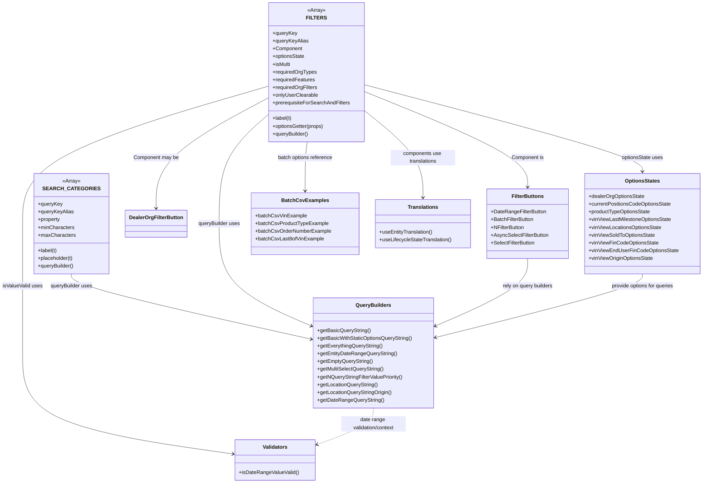

# Diagram: web/portal/src/pages/vinview/components/search/VinView.searchOptions.js

> Auto-generated by Obscura crawlers

## Mermaid

### SVG

<svg id="container" width="2141.68359375" xmlns="http://www.w3.org/2000/svg" class="classDiagram" height="1498" viewBox="0 0 2141.68359375 1498" role="graphics-document document" aria-roledescription="class"><g><defs><marker id="container_class-aggregationStart" class="marker aggregation class" refX="18" refY="7" markerWidth="190" markerHeight="240" orient="auto"><path d="M 18,7 L9,13 L1,7 L9,1 Z"></path></marker></defs><defs><marker id="container_class-aggregationEnd" class="marker aggregation class" refX="1" refY="7" markerWidth="20" markerHeight="28" orient="auto"><path d="M 18,7 L9,13 L1,7 L9,1 Z"></path></marker></defs><defs><marker id="container_class-extensionStart" class="marker extension class" refX="18" refY="7" markerWidth="190" markerHeight="240" orient="auto"><path d="M 1,7 L18,13 V 1 Z"></path></marker></defs><defs><marker id="container_class-extensionEnd" class="marker extension class" refX="1" refY="7" markerWidth="20" markerHeight="28" orient="auto"><path d="M 1,1 V 13 L18,7 Z"></path></marker></defs><defs><marker id="container_class-compositionStart" class="marker composition class" refX="18" refY="7" markerWidth="190" markerHeight="240" orient="auto"><path d="M 18,7 L9,13 L1,7 L9,1 Z"></path></marker></defs><defs><marker id="container_class-compositionEnd" class="marker composition class" refX="1" refY="7" markerWidth="20" markerHeight="28" orient="auto"><path d="M 18,7 L9,13 L1,7 L9,1 Z"></path></marker></defs><defs><marker id="container_class-dependencyStart" class="marker dependency class" refX="6" refY="7" markerWidth="190" markerHeight="240" orient="auto"><path d="M 5,7 L9,13 L1,7 L9,1 Z"></path></marker></defs><defs><marker id="container_class-dependencyEnd" class="marker dependency class" refX="13" refY="7" markerWidth="20" markerHeight="28" orient="auto"><path d="M 18,7 L9,13 L14,7 L9,1 Z"></path></marker></defs><defs><marker id="container_class-lollipopStart" class="marker lollipop class" refX="13" refY="7" markerWidth="190" markerHeight="240" orient="auto"><circle stroke="black" fill="transparent" cx="7" cy="7" r="6"></circle></marker></defs><defs><marker id="container_class-lollipopEnd" class="marker lollipop class" refX="1" refY="7" markerWidth="190" markerHeight="240" orient="auto"><circle stroke="black" fill="transparent" cx="7" cy="7" r="6"></circle></marker></defs><g class="root"><g class="clusters"></g><g class="edgePaths"><path d="M218.047,850L218.047,856.167C218.047,862.333,218.047,874.667,338.761,908.241C459.475,941.815,700.904,996.63,821.618,1024.038L942.333,1051.446" id="id_SEARCH_CATEGORIES_QueryBuilders_1" class="edge-thickness-normal edge-pattern-solid relation" style=";;;" data-edge="true" data-et="edge" data-id="id_SEARCH_CATEGORIES_QueryBuilders_1" data-points="W3sieCI6MjE4LjA0Njg3NSwieSI6ODUwfSx7IngiOjIxOC4wNDY4NzUsInkiOjg4N30seyJ4Ijo5NDguMTgzNTkzNzUsInkiOjEwNTIuNzc0MDI5MzE4NzExfV0=" marker-end="url(#container_class-dependencyEnd)"></path><path d="M1106.932,283.809L1190.28,318.008C1273.628,352.206,1440.324,420.603,1523.672,469.968C1607.02,519.333,1607.02,549.667,1607.02,564.833L1607.02,580" id="id_FILTERS_FilterButtons_2" class="edge-thickness-normal edge-pattern-solid relation" style=";;;" data-edge="true" data-et="edge" data-id="id_FILTERS_FilterButtons_2" data-points="W3sieCI6MTEwNi45MzE2NDA2MjUsInkiOjI4My44MDkwNTgzODYyODAzfSx7IngiOjE2MDcuMDE5NTMxMjUsInkiOjQ4OX0seyJ4IjoxNjA3LjAxOTUzMTI1LCJ5Ijo1ODZ9XQ==" marker-end="url(#container_class-dependencyEnd)"></path><path d="M1106.932,262.748L1248.787,300.457C1390.642,338.165,1674.352,413.583,1816.207,458.458C1958.063,503.333,1958.063,517.667,1958.063,524.833L1958.063,532" id="id_FILTERS_OptionsStates_3" class="edge-thickness-normal edge-pattern-solid relation" style=";;;" data-edge="true" data-et="edge" data-id="id_FILTERS_OptionsStates_3" data-points="W3sieCI6MTEwNi45MzE2NDA2MjUsInkiOjI2Mi43NDgxNDYxMDE4NjY5NX0seyJ4IjoxOTU4LjA2MjUsInkiOjQ4OX0seyJ4IjoxOTU4LjA2MjUsInkiOjUzOH1d" marker-end="url(#container_class-dependencyEnd)"></path><path d="M815.4,352.821L789.718,375.517C764.036,398.214,712.673,443.607,686.991,500.47C661.309,557.333,661.309,625.667,661.309,692C661.309,758.333,661.309,822.667,708.206,875.462C755.103,928.258,848.897,969.517,895.794,990.146L942.691,1010.775" id="id_FILTERS_QueryBuilders_4" class="edge-thickness-normal edge-pattern-solid relation" style=";;;" data-edge="true" data-et="edge" data-id="id_FILTERS_QueryBuilders_4" data-points="W3sieCI6ODE1LjQwMDM5MDYyNSwieSI6MzUyLjgyMDg1ODg3MTcyOTR9LHsieCI6NjYxLjMwODU5Mzc1LCJ5Ijo0ODl9LHsieCI6NjYxLjMwODU5Mzc1LCJ5Ijo2OTR9LHsieCI6NjYxLjMwODU5Mzc1LCJ5Ijo4ODd9LHsieCI6OTQ4LjE4MzU5Mzc1LCJ5IjoxMDEzLjE5MDc3OTA5MzEwOTV9XQ==" marker-end="url(#container_class-dependencyEnd)"></path><path d="M815.4,302.327L757.501,333.439C699.602,364.551,583.803,426.776,525.903,484.054C468.004,541.333,468.004,593.667,468.004,619.833L468.004,646" id="id_FILTERS_DealerOrgFilterButton_5" class="edge-thickness-normal edge-pattern-solid relation" style=";;;" data-edge="true" data-et="edge" data-id="id_FILTERS_DealerOrgFilterButton_5" data-points="W3sieCI6ODE1LjQwMDM5MDYyNSwieSI6MzAyLjMyNjk2MzY3MTE0MzIzfSx7IngiOjQ2OC4wMDM5MDYyNSwieSI6NDg5fSx7IngiOjQ2OC4wMDM5MDYyNSwieSI6NjUyfV0=" marker-end="url(#container_class-dependencyEnd)"></path><path d="M931.382,440L930.256,448.167C929.129,456.333,926.877,472.667,925.751,498C924.625,523.333,924.625,557.667,924.625,574.833L924.625,592" id="id_FILTERS_BatchCsvExamples_6" class="edge-thickness-normal edge-pattern-solid relation" style=";;;" data-edge="true" data-et="edge" data-id="id_FILTERS_BatchCsvExamples_6" data-points="W3sieCI6OTMxLjM4MTY0MDYyNSwieSI6NDQwfSx7IngiOjkyNC42MjUsInkiOjQ4OX0seyJ4Ijo5MjQuNjI1LCJ5Ijo1OTh9XQ==" marker-end="url(#container_class-dependencyEnd)"></path><path d="M815.4,267.353L691.192,304.294C566.983,341.235,318.566,415.118,194.357,486.225C70.148,557.333,70.148,625.667,70.148,692C70.148,758.333,70.148,822.667,70.148,889.5C70.148,956.333,70.148,1025.667,70.148,1097C70.148,1168.333,70.148,1241.667,176.909,1293.894C283.669,1346.121,497.189,1377.241,603.949,1392.802L710.709,1408.362" id="id_FILTERS_Validators_7" class="edge-thickness-normal edge-pattern-solid relation" style=";;;" data-edge="true" data-et="edge" data-id="id_FILTERS_Validators_7" data-points="W3sieCI6ODE1LjQwMDM5MDYyNSwieSI6MjY3LjM1MjU1NzMxNTc0NDZ9LHsieCI6NzAuMTQ4NDM3NSwieSI6NDg5fSx7IngiOjcwLjE0ODQzNzUsInkiOjY5NH0seyJ4Ijo3MC4xNDg0Mzc1LCJ5Ijo4ODd9LHsieCI6NzAuMTQ4NDM3NSwieSI6MTA5NX0seyJ4Ijo3MC4xNDg0Mzc1LCJ5IjoxMzE1fSx7IngiOjcxNi42NDY0ODQzNzUsInkiOjE0MDkuMjI3NTI3MDExODExMn1d" marker-end="url(#container_class-dependencyEnd)"></path><path d="M1106.932,343.506L1136.509,367.755C1166.086,392.004,1225.24,440.502,1254.817,485.418C1284.395,530.333,1284.395,571.667,1284.395,592.333L1284.395,613" id="id_FILTERS_Translations_8" class="edge-thickness-normal edge-pattern-solid relation" style=";;;" data-edge="true" data-et="edge" data-id="id_FILTERS_Translations_8" data-points="W3sieCI6MTEwNi45MzE2NDA2MjUsInkiOjM0My41MDY0NDQzODEzMzM0fSx7IngiOjEyODQuMzk0NTMxMjUsInkiOjQ4OX0seyJ4IjoxMjg0LjM5NDUzMTI1LCJ5Ijo2MTl9XQ==" marker-end="url(#container_class-dependencyEnd)"></path><path d="M1134.164,1266L1134.164,1274.167C1134.164,1282.333,1134.164,1298.667,1106.159,1317.445C1078.153,1336.223,1022.143,1357.447,994.138,1368.058L966.132,1378.67" id="id_QueryBuilders_Validators_9" class="edge-thickness-normal edge-pattern-dashed relation" style=";;;" data-edge="true" data-et="edge" data-id="id_QueryBuilders_Validators_9" data-points="W3sieCI6MTEzNC4xNjQwNjI1LCJ5IjoxMjY2fSx7IngiOjExMzQuMTY0MDYyNSwieSI6MTMxNX0seyJ4Ijo5NjAuNTIxNDg0Mzc1LCJ5IjoxMzgwLjc5NTkzODg2NDkxNzR9XQ==" marker-end="url(#container_class-dependencyEnd)"></path><path d="M1607.02,802L1607.02,816.167C1607.02,830.333,1607.02,858.667,1560.122,893.462C1513.225,928.258,1419.431,969.517,1372.534,990.146L1325.637,1010.775" id="id_FilterButtons_QueryBuilders_10" class="edge-thickness-normal edge-pattern-solid relation" style=";;;" data-edge="true" data-et="edge" data-id="id_FilterButtons_QueryBuilders_10" data-points="W3sieCI6MTYwNy4wMTk1MzEyNSwieSI6ODAyfSx7IngiOjE2MDcuMDE5NTMxMjUsInkiOjg4N30seyJ4IjoxMzIwLjE0NDUzMTI1LCJ5IjoxMDEzLjE5MDc3OTA5MzEwOTV9XQ==" marker-end="url(#container_class-dependencyEnd)"></path><path d="M1958.063,850L1958.063,856.167C1958.063,862.333,1958.063,874.667,1852.712,907.43C1747.362,940.193,1536.662,993.386,1431.312,1019.983L1325.962,1046.579" id="id_OptionsStates_QueryBuilders_11" class="edge-thickness-normal edge-pattern-solid relation" style=";;;" data-edge="true" data-et="edge" data-id="id_OptionsStates_QueryBuilders_11" data-points="W3sieCI6MTk1OC4wNjI1LCJ5Ijo4NTB9LHsieCI6MTk1OC4wNjI1LCJ5Ijo4ODd9LHsieCI6MTMyMC4xNDQ1MzEyNSwieSI6MTA0OC4wNDc2ODY3Nzg3NDgxfV0=" marker-end="url(#container_class-dependencyEnd)"></path></g><g class="edgeLabels"><g class="edgeLabel" transform="translate(218.046875, 887)"><g class="label" data-id="id_SEARCH_CATEGORIES_QueryBuilders_1" transform="translate(-65.75, -12)"><foreignObject width="131.5" height="24">

queryBuilder uses

</foreignObject></g></g><g class="edgeLabel" transform="translate(1607.01953125, 489)"><g class="label" data-id="id_FILTERS_FilterButtons_2" transform="translate(-50.015625, -12)"><foreignObject width="100.03125" height="24">

Component is

</foreignObject></g></g><g class="edgeLabel" transform="translate(1958.0625, 489)"><g class="label" data-id="id_FILTERS_OptionsStates_3" transform="translate(-64.9453125, -12)"><foreignObject width="129.890625" height="24">

optionsState uses

</foreignObject></g></g><g class="edgeLabel" transform="translate(661.30859375, 694)"><g class="label" data-id="id_FILTERS_QueryBuilders_4" transform="translate(-65.75, -12)"><foreignObject width="131.5" height="24">

queryBuilder uses

</foreignObject></g></g><g class="edgeLabel" transform="translate(468.00390625, 489)"><g class="label" data-id="id_FILTERS_DealerOrgFilterButton_5" transform="translate(-70.2734375, -12)"><foreignObject width="140.546875" height="24">

Component may be

</foreignObject></g></g><g class="edgeLabel" transform="translate(924.625, 489)"><g class="label" data-id="id_FILTERS_BatchCsvExamples_6" transform="translate(-86.296875, -12)"><foreignObject width="172.59375" height="24">

batch options reference

</foreignObject></g></g><g class="edgeLabel" transform="translate(70.1484375, 887)"><g class="label" data-id="id_FILTERS_Validators_7" transform="translate(-62.1484375, -12)"><foreignObject width="124.296875" height="24">

isValueValid uses

</foreignObject></g></g><g class="edgeLabel" transform="translate(1284.39453125, 489)"><g class="label" data-id="id_FILTERS_Translations_8" transform="translate(-100, -24)"><foreignObject width="200" height="48">

components use translations

</foreignObject></g></g><g class="edgeLabel" transform="translate(1134.1640625, 1315)"><g class="label" data-id="id_QueryBuilders_Validators_9" transform="translate(-100, -24)"><foreignObject width="200" height="48">

date range validation/context

</foreignObject></g></g><g class="edgeLabel" transform="translate(1607.01953125, 887)"><g class="label" data-id="id_FilterButtons_QueryBuilders_10" transform="translate(-79.7734375, -12)"><foreignObject width="159.546875" height="24">

rely on query builders

</foreignObject></g></g><g class="edgeLabel" transform="translate(1958.0625, 887)"><g class="label" data-id="id_OptionsStates_QueryBuilders_11" transform="translate(-99.203125, -12)"><foreignObject width="198.40625" height="24">

provide options for queries

</foreignObject></g></g></g><g class="nodes"><g class="node default" id="classId-SEARCH_CATEGORIES-0" transform="translate(218.046875, 694)"><g class="basic label-container"><path d="M-107.40234375 -156 L107.40234375 -156 L107.40234375 156 L-107.40234375 156" stroke="none" stroke-width="0" fill="#ECECFF" style=""></path><path d="M-107.40234375 -156 C-46.851824681628926 -156, 13.698694386742147 -156, 107.40234375 -156 M-107.40234375 -156 C-30.820000670215506 -156, 45.76234240956899 -156, 107.40234375 -156 M107.40234375 -156 C107.40234375 -49.76689254058722, 107.40234375 56.46621491882556, 107.40234375 156 M107.40234375 -156 C107.40234375 -49.29993579621555, 107.40234375 57.4001284075689, 107.40234375 156 M107.40234375 156 C24.103914164111615 156, -59.19451542177677 156, -107.40234375 156 M107.40234375 156 C48.220699010248396 156, -10.960945729503209 156, -107.40234375 156 M-107.40234375 156 C-107.40234375 36.63644117638263, -107.40234375 -82.72711764723473, -107.40234375 -156 M-107.40234375 156 C-107.40234375 45.94861918979922, -107.40234375 -64.10276162040157, -107.40234375 -156" stroke="#9370DB" stroke-width="1.3" fill="none" stroke-dasharray="0 0" style=""></path></g><g class="annotation-group text" transform="translate(-27.78125, -132)"><g class="label" style="" transform="translate(0,-12)"><foreignObject width="55.5625" height="24">

«Array»

</foreignObject></g></g><g class="label-group text" transform="translate(-76.1171875, -108)"><g class="label" style="font-weight: bolder" transform="translate(0,-12)"><foreignObject width="152.234375" height="24">

SEARCH_CATEGORIES

</foreignObject></g></g><g class="members-group text" transform="translate(-95.40234375, -60)"><g class="label" style="" transform="translate(0,-12)"><foreignObject width="75.375" height="24">

+queryKey

</foreignObject></g><g class="label" style="" transform="translate(0,12)"><foreignObject width="109.75" height="24">

+queryKeyAlias

</foreignObject></g><g class="label" style="" transform="translate(0,36)"><foreignObject width="70.5" height="24">

+property

</foreignObject></g><g class="label" style="" transform="translate(0,60)"><foreignObject width="112.109375" height="24">

+minCharacters

</foreignObject></g><g class="label" style="" transform="translate(0,84)"><foreignObject width="114.6875" height="24">

+maxCharacters

</foreignObject></g></g><g class="methods-group text" transform="translate(-95.40234375, 84)"><g class="label" style="" transform="translate(0,-12)"><foreignObject width="60.359375" height="24">

+label(t)

</foreignObject></g><g class="label" style="" transform="translate(0,12)"><foreignObject width="110.796875" height="24">

+placeholder(t)

</foreignObject></g><g class="label" style="" transform="translate(0,36)"><foreignObject width="112.625" height="24">

+queryBuilder()

</foreignObject></g></g><g class="divider" style=""><path d="M-107.40234375 -84 C-39.70700874638712 -84, 27.988326257225765 -84, 107.40234375 -84 M-107.40234375 -84 C-21.605767726511772 -84, 64.19080829697646 -84, 107.40234375 -84" stroke="#9370DB" stroke-width="1.3" fill="none" stroke-dasharray="0 0" style=""></path></g><g class="divider" style=""><path d="M-107.40234375 60 C-30.76203263584081 60, 45.87827847831838 60, 107.40234375 60 M-107.40234375 60 C-58.73894540697634 60, -10.075547063952683 60, 107.40234375 60" stroke="#9370DB" stroke-width="1.3" fill="none" stroke-dasharray="0 0" style=""></path></g></g><g class="node default" id="classId-FILTERS-1" transform="translate(961.166015625, 224)"><g class="basic label-container"><path d="M-145.765625 -216 L145.765625 -216 L145.765625 216 L-145.765625 216" stroke="none" stroke-width="0" fill="#ECECFF" style=""></path><path d="M-145.765625 -216 C-72.4473019811941 -216, 0.871021037611797 -216, 145.765625 -216 M-145.765625 -216 C-44.94770444731397 -216, 55.870216105372066 -216, 145.765625 -216 M145.765625 -216 C145.765625 -116.19062332650556, 145.765625 -16.381246653011118, 145.765625 216 M145.765625 -216 C145.765625 -44.24539719764513, 145.765625 127.50920560470973, 145.765625 216 M145.765625 216 C77.56716006048951 216, 9.368695120979027 216, -145.765625 216 M145.765625 216 C81.5296646277295 216, 17.293704255459005 216, -145.765625 216 M-145.765625 216 C-145.765625 113.81152696171458, -145.765625 11.623053923429154, -145.765625 -216 M-145.765625 216 C-145.765625 47.88698876418337, -145.765625 -120.22602247163326, -145.765625 -216" stroke="#9370DB" stroke-width="1.3" fill="none" stroke-dasharray="0 0" style=""></path></g><g class="annotation-group text" transform="translate(-27.78125, -192)"><g class="label" style="" transform="translate(0,-12)"><foreignObject width="55.5625" height="24">

«Array»

</foreignObject></g></g><g class="label-group text" transform="translate(-27.5625, -168)"><g class="label" style="font-weight: bolder" transform="translate(0,-12)"><foreignObject width="55.125" height="24">

FILTERS

</foreignObject></g></g><g class="members-group text" transform="translate(-133.765625, -120)"><g class="label" style="" transform="translate(0,-12)"><foreignObject width="75.375" height="24">

+queryKey

</foreignObject></g><g class="label" style="" transform="translate(0,12)"><foreignObject width="109.75" height="24">

+queryKeyAlias

</foreignObject></g><g class="label" style="" transform="translate(0,36)"><foreignObject width="91.78125" height="24">

+Component

</foreignObject></g><g class="label" style="" transform="translate(0,60)"><foreignObject width="100.65625" height="24">

+optionsState

</foreignObject></g><g class="label" style="" transform="translate(0,84)"><foreignObject width="56.71875" height="24">

+isMulti

</foreignObject></g><g class="label" style="" transform="translate(0,108)"><foreignObject width="136.3125" height="24">

+requiredOrgTypes

</foreignObject></g><g class="label" style="" transform="translate(0,132)"><foreignObject width="131.3125" height="24">

+requiredFeatures

</foreignObject></g><g class="label" style="" transform="translate(0,156)"><foreignObject width="139.265625" height="24">

+requiredOrgFilters

</foreignObject></g><g class="label" style="" transform="translate(0,180)"><foreignObject width="139.8125" height="24">

+onlyUserClearable

</foreignObject></g><g class="label" style="" transform="translate(0,204)"><foreignObject width="239.75" height="24">

+prerequisiteForSearchAndFilters

</foreignObject></g></g><g class="methods-group text" transform="translate(-133.765625, 144)"><g class="label" style="" transform="translate(0,-12)"><foreignObject width="60.359375" height="24">

+label(t)

</foreignObject></g><g class="label" style="" transform="translate(0,12)"><foreignObject width="160.234375" height="24">

+optionsGetter(props)

</foreignObject></g><g class="label" style="" transform="translate(0,36)"><foreignObject width="112.625" height="24">

+queryBuilder()

</foreignObject></g></g><g class="divider" style=""><path d="M-145.765625 -144 C-32.047824275525315 -144, 81.66997644894937 -144, 145.765625 -144 M-145.765625 -144 C-52.140288449168125 -144, 41.48504810166375 -144, 145.765625 -144" stroke="#9370DB" stroke-width="1.3" fill="none" stroke-dasharray="0 0" style=""></path></g><g class="divider" style=""><path d="M-145.765625 120 C-48.07067281392548 120, 49.62427937214903 120, 145.765625 120 M-145.765625 120 C-53.01640308549216 120, 39.732818829015685 120, 145.765625 120" stroke="#9370DB" stroke-width="1.3" fill="none" stroke-dasharray="0 0" style=""></path></g></g><g class="node default" id="classId-QueryBuilders-2" transform="translate(1134.1640625, 1095)"><g class="basic label-container"><path d="M-185.98046875 -171 L185.98046875 -171 L185.98046875 171 L-185.98046875 171" stroke="none" stroke-width="0" fill="#ECECFF" style=""></path><path d="M-185.98046875 -171 C-61.79991591040363 -171, 62.38063692919275 -171, 185.98046875 -171 M-185.98046875 -171 C-45.550568361995374 -171, 94.87933202600925 -171, 185.98046875 -171 M185.98046875 -171 C185.98046875 -92.04128282200524, 185.98046875 -13.082565644010486, 185.98046875 171 M185.98046875 -171 C185.98046875 -40.32141940365901, 185.98046875 90.35716119268199, 185.98046875 171 M185.98046875 171 C65.73261835831404 171, -54.515232033371916 171, -185.98046875 171 M185.98046875 171 C62.55143998608982 171, -60.877588777820364 171, -185.98046875 171 M-185.98046875 171 C-185.98046875 52.78340616473233, -185.98046875 -65.43318767053535, -185.98046875 -171 M-185.98046875 171 C-185.98046875 87.43410894691455, -185.98046875 3.8682178938290974, -185.98046875 -171" stroke="#9370DB" stroke-width="1.3" fill="none" stroke-dasharray="0 0" style=""></path></g><g class="annotation-group text" transform="translate(0, -147)"></g><g class="label-group text" transform="translate(-52.1640625, -147)"><g class="label" style="font-weight: bolder" transform="translate(0,-12)"><foreignObject width="104.328125" height="24">

QueryBuilders

</foreignObject></g></g><g class="members-group text" transform="translate(-173.98046875, -99)"></g><g class="methods-group text" transform="translate(-173.98046875, -69)"><g class="label" style="" transform="translate(0,-12)"><foreignObject width="164.84375" height="24">

+getBasicQueryString()

</foreignObject></g><g class="label" style="" transform="translate(0,12)"><foreignObject width="295.796875" height="24">

+getBasicWithStaticOptionsQueryString()

</foreignObject></g><g class="label" style="" transform="translate(0,36)"><foreignObject width="203.109375" height="24">

+getEverythingQueryString()

</foreignObject></g><g class="label" style="" transform="translate(0,60)"><foreignObject width="246.0625" height="24">

+getEntityDateRangeQueryString()

</foreignObject></g><g class="label" style="" transform="translate(0,84)"><foreignObject width="172.125" height="24">

+getEmptyQueryString()

</foreignObject></g><g class="label" style="" transform="translate(0,108)"><foreignObject width="207.859375" height="24">

+getMultiSelectQueryString()

</foreignObject></g><g class="label" style="" transform="translate(0,132)"><foreignObject width="267.578125" height="24">

+getNQueryStringFilterValuePriority()

</foreignObject></g><g class="label" style="" transform="translate(0,156)"><foreignObject width="189.046875" height="24">

+getLocationQueryString()

</foreignObject></g><g class="label" style="" transform="translate(0,180)"><foreignObject width="233.015625" height="24">

+getLocationQueryStringOrigin()

</foreignObject></g><g class="label" style="" transform="translate(0,204)"><foreignObject width="204.421875" height="24">

+getDateRangeQueryString()

</foreignObject></g></g><g class="divider" style=""><path d="M-185.98046875 -123 C-104.56256448660086 -123, -23.144660223201726 -123, 185.98046875 -123 M-185.98046875 -123 C-101.32882984946204 -123, -16.67719094892408 -123, 185.98046875 -123" stroke="#9370DB" stroke-width="1.3" fill="none" stroke-dasharray="0 0" style=""></path></g><g class="divider" style=""><path d="M-185.98046875 -99 C-63.01867349636689 -99, 59.943121757266226 -99, 185.98046875 -99 M-185.98046875 -99 C-79.21128278428013 -99, 27.55790318143974 -99, 185.98046875 -99" stroke="#9370DB" stroke-width="1.3" fill="none" stroke-dasharray="0 0" style=""></path></g></g><g class="node default" id="classId-Validators-3" transform="translate(838.583984375, 1427)"><g class="basic label-container"><path d="M-121.9375 -63 L121.9375 -63 L121.9375 63 L-121.9375 63" stroke="none" stroke-width="0" fill="#ECECFF" style=""></path><path d="M-121.9375 -63 C-61.60285740075064 -63, -1.268214801501287 -63, 121.9375 -63 M-121.9375 -63 C-38.343771890926135 -63, 45.24995621814773 -63, 121.9375 -63 M121.9375 -63 C121.9375 -30.311763476838927, 121.9375 2.376473046322147, 121.9375 63 M121.9375 -63 C121.9375 -27.804404798840316, 121.9375 7.391190402319367, 121.9375 63 M121.9375 63 C28.647193514535672 63, -64.64311297092866 63, -121.9375 63 M121.9375 63 C70.25196399081372 63, 18.56642798162744 63, -121.9375 63 M-121.9375 63 C-121.9375 30.013820730438383, -121.9375 -2.9723585391232348, -121.9375 -63 M-121.9375 63 C-121.9375 34.09404998001506, -121.9375 5.188099960030122, -121.9375 -63" stroke="#9370DB" stroke-width="1.3" fill="none" stroke-dasharray="0 0" style=""></path></g><g class="annotation-group text" transform="translate(0, -39)"></g><g class="label-group text" transform="translate(-36.953125, -39)"><g class="label" style="font-weight: bolder" transform="translate(0,-12)"><foreignObject width="73.90625" height="24">

Validators

</foreignObject></g></g><g class="members-group text" transform="translate(-109.9375, 9)"></g><g class="methods-group text" transform="translate(-109.9375, 39)"><g class="label" style="" transform="translate(0,-12)"><foreignObject width="182.921875" height="24">

+isDateRangeValueValid()

</foreignObject></g></g><g class="divider" style=""><path d="M-121.9375 -15 C-63.69804865064976 -15, -5.45859730129952 -15, 121.9375 -15 M-121.9375 -15 C-55.53648399372075 -15, 10.864532012558499 -15, 121.9375 -15" stroke="#9370DB" stroke-width="1.3" fill="none" stroke-dasharray="0 0" style=""></path></g><g class="divider" style=""><path d="M-121.9375 9 C-64.59580779818064 9, -7.254115596361288 9, 121.9375 9 M-121.9375 9 C-36.14583763358185 9, 49.6458247328363 9, 121.9375 9" stroke="#9370DB" stroke-width="1.3" fill="none" stroke-dasharray="0 0" style=""></path></g></g><g class="node default" id="classId-FilterButtons-4" transform="translate(1607.01953125, 694)"><g class="basic label-container"><path d="M-125.421875 -108 L125.421875 -108 L125.421875 108 L-125.421875 108" stroke="none" stroke-width="0" fill="#ECECFF" style=""></path><path d="M-125.421875 -108 C-52.324686089345946 -108, 20.77250282130811 -108, 125.421875 -108 M-125.421875 -108 C-34.887568067232564 -108, 55.64673886553487 -108, 125.421875 -108 M125.421875 -108 C125.421875 -47.40579948794821, 125.421875 13.188401024103584, 125.421875 108 M125.421875 -108 C125.421875 -40.79937166087002, 125.421875 26.401256678259955, 125.421875 108 M125.421875 108 C61.57282486026189 108, -2.276225279476222 108, -125.421875 108 M125.421875 108 C31.563325359782695 108, -62.29522428043461 108, -125.421875 108 M-125.421875 108 C-125.421875 61.98821526285928, -125.421875 15.976430525718555, -125.421875 -108 M-125.421875 108 C-125.421875 38.34459367583679, -125.421875 -31.31081264832642, -125.421875 -108" stroke="#9370DB" stroke-width="1.3" fill="none" stroke-dasharray="0 0" style=""></path></g><g class="annotation-group text" transform="translate(0, -84)"></g><g class="label-group text" transform="translate(-47.5625, -84)"><g class="label" style="font-weight: bolder" transform="translate(0,-12)"><foreignObject width="95.125" height="24">

FilterButtons

</foreignObject></g></g><g class="members-group text" transform="translate(-113.421875, -36)"><g class="label" style="" transform="translate(0,-12)"><foreignObject width="171.484375" height="24">

+DateRangeFilterButton

</foreignObject></g><g class="label" style="" transform="translate(0,12)"><foreignObject width="134.984375" height="24">

+BatchFilterButton

</foreignObject></g><g class="label" style="" transform="translate(0,36)"><foreignObject width="104.921875" height="24">

+NFilterButton

</foreignObject></g><g class="label" style="" transform="translate(0,60)"><foreignObject width="179.28125" height="24">

+AsyncSelectFilterButton

</foreignObject></g><g class="label" style="" transform="translate(0,84)"><foreignObject width="137.546875" height="24">

+SelectFilterButton

</foreignObject></g></g><g class="methods-group text" transform="translate(-113.421875, 108)"></g><g class="divider" style=""><path d="M-125.421875 -60 C-60.89080660797855 -60, 3.640261784042906 -60, 125.421875 -60 M-125.421875 -60 C-70.48118352364096 -60, -15.54049204728193 -60, 125.421875 -60" stroke="#9370DB" stroke-width="1.3" fill="none" stroke-dasharray="0 0" style=""></path></g><g class="divider" style=""><path d="M-125.421875 84 C-69.81682614986526 84, -14.211777299730528 84, 125.421875 84 M-125.421875 84 C-60.46427707886194 84, 4.49332084227612 84, 125.421875 84" stroke="#9370DB" stroke-width="1.3" fill="none" stroke-dasharray="0 0" style=""></path></g></g><g class="node default" id="classId-DealerOrgFilterButton-5" transform="translate(468.00390625, 694)"><g class="basic label-container"><path d="M-92.5546875 -42 L92.5546875 -42 L92.5546875 42 L-92.5546875 42" stroke="none" stroke-width="0" fill="#ECECFF" style=""></path><path d="M-92.5546875 -42 C-52.76119752466413 -42, -12.967707549328253 -42, 92.5546875 -42 M-92.5546875 -42 C-32.5486050576372 -42, 27.457477384725607 -42, 92.5546875 -42 M92.5546875 -42 C92.5546875 -8.459947635167893, 92.5546875 25.080104729664214, 92.5546875 42 M92.5546875 -42 C92.5546875 -14.521967762081943, 92.5546875 12.956064475836115, 92.5546875 42 M92.5546875 42 C25.200394290975012 42, -42.153898918049975 42, -92.5546875 42 M92.5546875 42 C32.189590574534805 42, -28.17550635093039 42, -92.5546875 42 M-92.5546875 42 C-92.5546875 11.22861719327743, -92.5546875 -19.54276561344514, -92.5546875 -42 M-92.5546875 42 C-92.5546875 13.048918601921471, -92.5546875 -15.902162796157057, -92.5546875 -42" stroke="#9370DB" stroke-width="1.3" fill="none" stroke-dasharray="0 0" style=""></path></g><g class="annotation-group text" transform="translate(0, -18)"></g><g class="label-group text" transform="translate(-80.5546875, -18)"><g class="label" style="font-weight: bolder" transform="translate(0,-12)"><foreignObject width="161.109375" height="24">

DealerOrgFilterButton

</foreignObject></g></g><g class="members-group text" transform="translate(-80.5546875, 30)"></g><g class="methods-group text" transform="translate(-80.5546875, 60)"></g><g class="divider" style=""><path d="M-92.5546875 6 C-45.371181777279034 6, 1.812323945441932 6, 92.5546875 6 M-92.5546875 6 C-24.39547546103256 6, 43.76373657793488 6, 92.5546875 6" stroke="#9370DB" stroke-width="1.3" fill="none" stroke-dasharray="0 0" style=""></path></g><g class="divider" style=""><path d="M-92.5546875 24 C-25.224072929917014 24, 42.10654164016597 24, 92.5546875 24 M-92.5546875 24 C-29.526947791909002 24, 33.500791916181996 24, 92.5546875 24" stroke="#9370DB" stroke-width="1.3" fill="none" stroke-dasharray="0 0" style=""></path></g></g><g class="node default" id="classId-OptionsStates-6" transform="translate(1958.0625, 694)"><g class="basic label-container"><path d="M-175.62109375 -156 L175.62109375 -156 L175.62109375 156 L-175.62109375 156" stroke="none" stroke-width="0" fill="#ECECFF" style=""></path><path d="M-175.62109375 -156 C-67.31050457574759 -156, 41.00008459850483 -156, 175.62109375 -156 M-175.62109375 -156 C-43.12304087237354 -156, 89.37501200525293 -156, 175.62109375 -156 M175.62109375 -156 C175.62109375 -39.03050702173961, 175.62109375 77.93898595652078, 175.62109375 156 M175.62109375 -156 C175.62109375 -60.36152516005751, 175.62109375 35.27694967988498, 175.62109375 156 M175.62109375 156 C45.958922120877986 156, -83.70324950824403 156, -175.62109375 156 M175.62109375 156 C39.02079368540245 156, -97.5795063791951 156, -175.62109375 156 M-175.62109375 156 C-175.62109375 69.91209963462613, -175.62109375 -16.17580073074774, -175.62109375 -156 M-175.62109375 156 C-175.62109375 73.12625064234861, -175.62109375 -9.747498715302783, -175.62109375 -156" stroke="#9370DB" stroke-width="1.3" fill="none" stroke-dasharray="0 0" style=""></path></g><g class="annotation-group text" transform="translate(0, -132)"></g><g class="label-group text" transform="translate(-51.9765625, -132)"><g class="label" style="font-weight: bolder" transform="translate(0,-12)"><foreignObject width="103.953125" height="24">

OptionsStates

</foreignObject></g></g><g class="members-group text" transform="translate(-163.62109375, -84)"><g class="label" style="" transform="translate(0,-12)"><foreignObject width="173.890625" height="24">

+dealerOrgOptionsState

</foreignObject></g><g class="label" style="" transform="translate(0,12)"><foreignObject width="257.828125" height="24">

+currentPositionsCodeOptionsState

</foreignObject></g><g class="label" style="" transform="translate(0,36)"><foreignObject width="192.96875" height="24">

+productTypeOptionsState

</foreignObject></g><g class="label" style="" transform="translate(0,60)"><foreignObject width="257.921875" height="24">

+vinViewLastMilestoneOptionsState

</foreignObject></g><g class="label" style="" transform="translate(0,84)"><foreignObject width="227.171875" height="24">

+vinViewLocationsOptionsState

</foreignObject></g><g class="label" style="" transform="translate(0,108)"><foreignObject width="206.5625" height="24">

+vinViewSoldToOptionsState

</foreignObject></g><g class="label" style="" transform="translate(0,132)"><foreignObject width="215.046875" height="24">

+vinViewFinCodeOptionsState

</foreignObject></g><g class="label" style="" transform="translate(0,156)"><foreignObject width="275.265625" height="24">

+vinViewEndUserFinCodeOptionsState

</foreignObject></g><g class="label" style="" transform="translate(0,180)"><foreignObject width="201.5625" height="24">

+vinViewOriginOptionsState

</foreignObject></g></g><g class="methods-group text" transform="translate(-163.62109375, 156)"></g><g class="divider" style=""><path d="M-175.62109375 -108 C-48.65606580642081 -108, 78.30896213715837 -108, 175.62109375 -108 M-175.62109375 -108 C-73.70107213395589 -108, 28.21894948208822 -108, 175.62109375 -108" stroke="#9370DB" stroke-width="1.3" fill="none" stroke-dasharray="0 0" style=""></path></g><g class="divider" style=""><path d="M-175.62109375 132 C-97.03306347117713 132, -18.44503319235426 132, 175.62109375 132 M-175.62109375 132 C-49.815238568778994 132, 75.99061661244201 132, 175.62109375 132" stroke="#9370DB" stroke-width="1.3" fill="none" stroke-dasharray="0 0" style=""></path></g></g><g class="node default" id="classId-BatchCsvExamples-7" transform="translate(924.625, 694)"><g class="basic label-container"><path d="M-162.56640625 -96 L162.56640625 -96 L162.56640625 96 L-162.56640625 96" stroke="none" stroke-width="0" fill="#ECECFF" style=""></path><path d="M-162.56640625 -96 C-60.988960537058745 -96, 40.58848517588251 -96, 162.56640625 -96 M-162.56640625 -96 C-90.89275657047806 -96, -19.219106890956112 -96, 162.56640625 -96 M162.56640625 -96 C162.56640625 -37.666127100057864, 162.56640625 20.667745799884273, 162.56640625 96 M162.56640625 -96 C162.56640625 -52.19631048733527, 162.56640625 -8.392620974670535, 162.56640625 96 M162.56640625 96 C44.15198071320512 96, -74.26244482358976 96, -162.56640625 96 M162.56640625 96 C78.2489137761182 96, -6.0685786977635985 96, -162.56640625 96 M-162.56640625 96 C-162.56640625 22.461582054791734, -162.56640625 -51.07683589041653, -162.56640625 -96 M-162.56640625 96 C-162.56640625 56.14097032306042, -162.56640625 16.281940646120844, -162.56640625 -96" stroke="#9370DB" stroke-width="1.3" fill="none" stroke-dasharray="0 0" style=""></path></g><g class="annotation-group text" transform="translate(0, -72)"></g><g class="label-group text" transform="translate(-67.7890625, -72)"><g class="label" style="font-weight: bolder" transform="translate(0,-12)"><foreignObject width="135.578125" height="24">

BatchCsvExamples

</foreignObject></g></g><g class="members-group text" transform="translate(-150.56640625, -24)"><g class="label" style="" transform="translate(0,-12)"><foreignObject width="156.53125" height="24">

+batchCsvVinExample

</foreignObject></g><g class="label" style="" transform="translate(0,12)"><foreignObject width="223.796875" height="24">

+batchCsvProductTypeExample

</foreignObject></g><g class="label" style="" transform="translate(0,36)"><foreignObject width="233.34375" height="24">

+batchCsvOrderNumberExample

</foreignObject></g><g class="label" style="" transform="translate(0,60)"><foreignObject width="209.65625" height="24">

+batchCsvLast8ofVinExample

</foreignObject></g></g><g class="methods-group text" transform="translate(-150.56640625, 96)"></g><g class="divider" style=""><path d="M-162.56640625 -48 C-84.935220959653 -48, -7.304035669305989 -48, 162.56640625 -48 M-162.56640625 -48 C-32.875010285195884 -48, 96.81638567960823 -48, 162.56640625 -48" stroke="#9370DB" stroke-width="1.3" fill="none" stroke-dasharray="0 0" style=""></path></g><g class="divider" style=""><path d="M-162.56640625 72 C-73.47555218677667 72, 15.615301876446665 72, 162.56640625 72 M-162.56640625 72 C-54.69249571825674 72, 53.181414813486526 72, 162.56640625 72" stroke="#9370DB" stroke-width="1.3" fill="none" stroke-dasharray="0 0" style=""></path></g></g><g class="node default" id="classId-Translations-8" transform="translate(1284.39453125, 694)"><g class="basic label-container"><path d="M-147.203125 -75 L147.203125 -75 L147.203125 75 L-147.203125 75" stroke="none" stroke-width="0" fill="#ECECFF" style=""></path><path d="M-147.203125 -75 C-57.00883793842158 -75, 33.18544912315684 -75, 147.203125 -75 M-147.203125 -75 C-33.01022781467934 -75, 81.18266937064132 -75, 147.203125 -75 M147.203125 -75 C147.203125 -23.80281904122257, 147.203125 27.39436191755486, 147.203125 75 M147.203125 -75 C147.203125 -27.97620568406616, 147.203125 19.047588631867683, 147.203125 75 M147.203125 75 C80.19689154905623 75, 13.190658098112465 75, -147.203125 75 M147.203125 75 C83.36289550421652 75, 19.52266600843305 75, -147.203125 75 M-147.203125 75 C-147.203125 22.315113702576298, -147.203125 -30.369772594847404, -147.203125 -75 M-147.203125 75 C-147.203125 42.638766645465864, -147.203125 10.277533290931729, -147.203125 -75" stroke="#9370DB" stroke-width="1.3" fill="none" stroke-dasharray="0 0" style=""></path></g><g class="annotation-group text" transform="translate(0, -51)"></g><g class="label-group text" transform="translate(-45.09375, -51)"><g class="label" style="font-weight: bolder" transform="translate(0,-12)"><foreignObject width="90.1875" height="24">

Translations

</foreignObject></g></g><g class="members-group text" transform="translate(-135.203125, -3)"></g><g class="methods-group text" transform="translate(-135.203125, 27)"><g class="label" style="" transform="translate(0,-12)"><foreignObject width="166.78125" height="24">

+useEntityTranslation()

</foreignObject></g><g class="label" style="" transform="translate(0,12)"><foreignObject width="225.3125" height="24">

+useLifecycleStateTranslation()

</foreignObject></g></g><g class="divider" style=""><path d="M-147.203125 -27 C-54.30222811295202 -27, 38.598668774095955 -27, 147.203125 -27 M-147.203125 -27 C-62.12438315393628 -27, 22.954358692127443 -27, 147.203125 -27" stroke="#9370DB" stroke-width="1.3" fill="none" stroke-dasharray="0 0" style=""></path></g><g class="divider" style=""><path d="M-147.203125 -3 C-61.76193517922488 -3, 23.679254641550244 -3, 147.203125 -3 M-147.203125 -3 C-82.79625230781687 -3, -18.389379615633743 -3, 147.203125 -3" stroke="#9370DB" stroke-width="1.3" fill="none" stroke-dasharray="0 0" style=""></path></g></g></g></g></g></svg>
