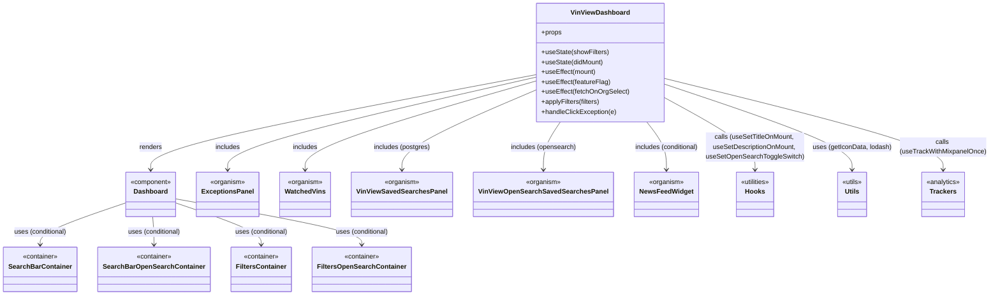

# Diagram: web/portal/src/pages/vinview/dashboard/VinView.Dashboard.page.js


> Auto-generated by Obscura crawlers

## Diagram 1



> SVG rendering failed for this diagram.

## Diagram 2

```mermaid
graph TD
    A[Component Mount] --> B[initialize translations & hooks]
    B --> C[setToggleSwitchVisibility(isFvAdmin)]
    C --> D[setDidMount(true)]
    D --> E[fetchVinViewSystemConfigForOpenSearch]
    D --> F{canFetchData && !isOpenSearchEnabled}
    F -->|true| G[fetchEntityCount, fetchNewEntityCount, fetchEntityDeliveredCount]
    D --> H{canFetchDataOS && isOpenSearchEnabled}
    H -->|true| I[fetchCountsOpenSearch(isDealerOrg, fvId)]
    subgraph Watched VINs fetches
        J[canFetchData && !isOpenSearchEnabled ?] -->|true| K[fetchWatchedVins & fetchWatchedEntitiesTotalPages]
        L[canFetchDataOS && isOpenSearchEnabled ?] -->|true| M[fetchWatchedVinsOpenSearch]
    end
    B --> N[Later effects: feature flag update]
    N --> O[setToggleSwitchState(vinviewFeatureFlagConfig)]
    P[User interacts with chart/exception] --> Q[applyFilters -> searchEntities or searchEntitiesOS]
    Q --> R[Dashboard updates displayed widgets]
```

> SVG rendering failed for this diagram.
