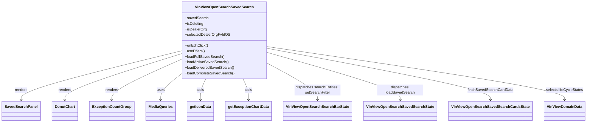

# Diagram: web/portal/src/pages/vinview/dashboard/components/organisms/VinView.OpenSearch.SavedSearch.organism.js


> Auto-generated by Obscura crawlers

## Diagram 1



### SVG

<svg id="container" width="2441.15625" xmlns="http://www.w3.org/2000/svg" class="classDiagram" height="534" viewBox="0 0 2441.15625 534" role="graphics-document document" aria-roledescription="class"><style>#container{font-family:"trebuchet ms",verdana,arial,sans-serif;font-size:16px;fill:#333;}@keyframes edge-animation-frame{from{stroke-dashoffset:0;}}@keyframes dash{to{stroke-dashoffset:0;}}#container .edge-animation-slow{stroke-dasharray:9,5!important;stroke-dashoffset:900;animation:dash 50s linear infinite;stroke-linecap:round;}#container .edge-animation-fast{stroke-dasharray:9,5!important;stroke-dashoffset:900;animation:dash 20s linear infinite;stroke-linecap:round;}#container .error-icon{fill:#552222;}#container .error-text{fill:#552222;stroke:#552222;}#container .edge-thickness-normal{stroke-width:1px;}#container .edge-thickness-thick{stroke-width:3.5px;}#container .edge-pattern-solid{stroke-dasharray:0;}#container .edge-thickness-invisible{stroke-width:0;fill:none;}#container .edge-pattern-dashed{stroke-dasharray:3;}#container .edge-pattern-dotted{stroke-dasharray:2;}#container .marker{fill:#333333;stroke:#333333;}#container .marker.cross{stroke:#333333;}#container svg{font-family:"trebuchet ms",verdana,arial,sans-serif;font-size:16px;}#container p{margin:0;}#container g.classGroup text{fill:#9370DB;stroke:none;font-family:"trebuchet ms",verdana,arial,sans-serif;font-size:10px;}#container g.classGroup text .title{font-weight:bolder;}#container .nodeLabel,#container .edgeLabel{color:#131300;}#container .edgeLabel .label rect{fill:#ECECFF;}#container .label text{fill:#131300;}#container .labelBkg{background:#ECECFF;}#container .edgeLabel .label span{background:#ECECFF;}#container .classTitle{font-weight:bolder;}#container .node rect,#container .node circle,#container .node ellipse,#container .node polygon,#container .node path{fill:#ECECFF;stroke:#9370DB;stroke-width:1px;}#container .divider{stroke:#9370DB;stroke-width:1;}#container g.clickable{cursor:pointer;}#container g.classGroup rect{fill:#ECECFF;stroke:#9370DB;}#container g.classGroup line{stroke:#9370DB;stroke-width:1;}#container .classLabel .box{stroke:none;stroke-width:0;fill:#ECECFF;opacity:0.5;}#container .classLabel .label{fill:#9370DB;font-size:10px;}#container .relation{stroke:#333333;stroke-width:1;fill:none;}#container .dashed-line{stroke-dasharray:3;}#container .dotted-line{stroke-dasharray:1 2;}#container #compositionStart,#container .composition{fill:#333333!important;stroke:#333333!important;stroke-width:1;}#container #compositionEnd,#container .composition{fill:#333333!important;stroke:#333333!important;stroke-width:1;}#container #dependencyStart,#container .dependency{fill:#333333!important;stroke:#333333!important;stroke-width:1;}#container #dependencyStart,#container .dependency{fill:#333333!important;stroke:#333333!important;stroke-width:1;}#container #extensionStart,#container .extension{fill:transparent!important;stroke:#333333!important;stroke-width:1;}#container #extensionEnd,#container .extension{fill:transparent!important;stroke:#333333!important;stroke-width:1;}#container #aggregationStart,#container .aggregation{fill:transparent!important;stroke:#333333!important;stroke-width:1;}#container #aggregationEnd,#container .aggregation{fill:transparent!important;stroke:#333333!important;stroke-width:1;}#container #lollipopStart,#container .lollipop{fill:#ECECFF!important;stroke:#333333!important;stroke-width:1;}#container #lollipopEnd,#container .lollipop{fill:#ECECFF!important;stroke:#333333!important;stroke-width:1;}#container .edgeTerminals{font-size:11px;line-height:initial;}#container .classTitleText{text-anchor:middle;font-size:18px;fill:#333;}#container .label-icon{display:inline-block;height:1em;overflow:visible;vertical-align:-0.125em;}#container .node .label-icon path{fill:currentColor;stroke:revert;stroke-width:revert;}#container :root{--mermaid-font-family:"trebuchet ms",verdana,arial,sans-serif;}</style><g><defs><marker id="container_class-aggregationStart" class="marker aggregation class" refX="18" refY="7" markerWidth="190" markerHeight="240" orient="auto"><path d="M 18,7 L9,13 L1,7 L9,1 Z"></path></marker></defs><defs><marker id="container_class-aggregationEnd" class="marker aggregation class" refX="1" refY="7" markerWidth="20" markerHeight="28" orient="auto"><path d="M 18,7 L9,13 L1,7 L9,1 Z"></path></marker></defs><defs><marker id="container_class-extensionStart" class="marker extension class" refX="18" refY="7" markerWidth="190" markerHeight="240" orient="auto"><path d="M 1,7 L18,13 V 1 Z"></path></marker></defs><defs><marker id="container_class-extensionEnd" class="marker extension class" refX="1" refY="7" markerWidth="20" markerHeight="28" orient="auto"><path d="M 1,1 V 13 L18,7 Z"></path></marker></defs><defs><marker id="container_class-compositionStart" class="marker composition class" refX="18" refY="7" markerWidth="190" markerHeight="240" orient="auto"><path d="M 18,7 L9,13 L1,7 L9,1 Z"></path></marker></defs><defs><marker id="container_class-compositionEnd" class="marker composition class" refX="1" refY="7" markerWidth="20" markerHeight="28" orient="auto"><path d="M 18,7 L9,13 L1,7 L9,1 Z"></path></marker></defs><defs><marker id="container_class-dependencyStart" class="marker dependency class" refX="6" refY="7" markerWidth="190" markerHeight="240" orient="auto"><path d="M 5,7 L9,13 L1,7 L9,1 Z"></path></marker></defs><defs><marker id="container_class-dependencyEnd" class="marker dependency class" refX="13" refY="7" markerWidth="20" markerHeight="28" orient="auto"><path d="M 18,7 L9,13 L14,7 L9,1 Z"></path></marker></defs><defs><marker id="container_class-lollipopStart" class="marker lollipop class" refX="13" refY="7" markerWidth="190" markerHeight="240" orient="auto"><circle stroke="black" fill="transparent" cx="7" cy="7" r="6"></circle></marker></defs><defs><marker id="container_class-lollipopEnd" class="marker lollipop class" refX="1" refY="7" markerWidth="190" markerHeight="240" orient="auto"><circle stroke="black" fill="transparent" cx="7" cy="7" r="6"></circle></marker></defs><g class="root"><g class="clusters"></g><g class="edgePaths"><path d="M760.832,221.213L648.524,249.844C536.216,278.475,311.6,335.738,199.292,371.536C86.984,407.333,86.984,421.667,86.984,428.833L86.984,436" id="id_VinViewOpenSearchSavedSearch_SavedSearchPanel_1" class="edge-thickness-normal edge-pattern-solid relation" style=";;;" data-edge="true" data-et="edge" data-id="id_VinViewOpenSearchSavedSearch_SavedSearchPanel_1" data-points="W3sieCI6NzYwLjgzMjAzMTI1LCJ5IjoyMjEuMjEzMDIyMDY5MDQ3OH0seyJ4Ijo4Ni45ODQzNzUsInkiOjM5M30seyJ4Ijo4Ni45ODQzNzUsInkiOjQ0Mn1d" marker-end="url(#container_class-dependencyEnd)"></path><path d="M760.832,233.592L679.018,260.16C597.203,286.728,433.574,339.864,351.76,373.599C269.945,407.333,269.945,421.667,269.945,428.833L269.945,436" id="id_VinViewOpenSearchSavedSearch_DonutChart_2" class="edge-thickness-normal edge-pattern-solid relation" style=";;;" data-edge="true" data-et="edge" data-id="id_VinViewOpenSearchSavedSearch_DonutChart_2" data-points="W3sieCI6NzYwLjgzMjAzMTI1LCJ5IjoyMzMuNTkyMTY0NTY1MTc1NDd9LHsieCI6MjY5Ljk0NTMxMjUsInkiOjM5M30seyJ4IjoyNjkuOTQ1MzEyNSwieSI6NDQyfV0=" marker-end="url(#container_class-dependencyEnd)"></path><path d="M760.832,257.361L711.554,279.967C662.276,302.574,563.72,347.787,514.442,377.56C465.164,407.333,465.164,421.667,465.164,428.833L465.164,436" id="id_VinViewOpenSearchSavedSearch_ExceptionCountGroup_3" class="edge-thickness-normal edge-pattern-solid relation" style=";;;" data-edge="true" data-et="edge" data-id="id_VinViewOpenSearchSavedSearch_ExceptionCountGroup_3" data-points="W3sieCI6NzYwLjgzMjAzMTI1LCJ5IjoyNTcuMzYwODg3OTEyNTk2MX0seyJ4Ijo0NjUuMTY0MDYyNSwieSI6MzkzfSx7IngiOjQ2NS4xNjQwNjI1LCJ5Ijo0NDJ9XQ==" marker-end="url(#container_class-dependencyEnd)"></path><path d="M760.832,318.871L745.495,331.226C730.159,343.581,699.486,368.29,684.149,387.812C668.813,407.333,668.813,421.667,668.813,428.833L668.813,436" id="id_VinViewOpenSearchSavedSearch_MediaQueries_4" class="edge-thickness-normal edge-pattern-solid relation" style=";;;" data-edge="true" data-et="edge" data-id="id_VinViewOpenSearchSavedSearch_MediaQueries_4" data-points="W3sieCI6NzYwLjgzMjAzMTI1LCJ5IjozMTguODcwODk0Mjk5NTExM30seyJ4Ijo2NjguODEyNSwieSI6MzkzfSx7IngiOjY2OC44MTI1LCJ5Ijo0NDJ9XQ==" marker-end="url(#container_class-dependencyEnd)"></path><path d="M859.963,344L856.16,352.167C852.358,360.333,844.753,376.667,840.951,392C837.148,407.333,837.148,421.667,837.148,428.833L837.148,436" id="id_VinViewOpenSearchSavedSearch_getIconData_5" class="edge-thickness-normal edge-pattern-solid relation" style=";;;" data-edge="true" data-et="edge" data-id="id_VinViewOpenSearchSavedSearch_getIconData_5" data-points="W3sieCI6ODU5Ljk2MjgyNzYyMDk2NzgsInkiOjM0NH0seyJ4Ijo4MzcuMTQ4NDM3NSwieSI6MzkzfSx7IngiOjgzNy4xNDg0Mzc1LCJ5Ijo0NDJ9XQ==" marker-end="url(#container_class-dependencyEnd)"></path><path d="M1016.404,344L1020.207,352.167C1024.009,360.333,1031.614,376.667,1035.416,392C1039.219,407.333,1039.219,421.667,1039.219,428.833L1039.219,436" id="id_VinViewOpenSearchSavedSearch_getExceptionChartData_6" class="edge-thickness-normal edge-pattern-solid relation" style=";;;" data-edge="true" data-et="edge" data-id="id_VinViewOpenSearchSavedSearch_getExceptionChartData_6" data-points="W3sieCI6MTAxNi40MDQzNTk4NzkwMzIyLCJ5IjozNDR9LHsieCI6MTAzOS4yMTg3NSwieSI6MzkzfSx7IngiOjEwMzkuMjE4NzUsInkiOjQ0Mn1d" marker-end="url(#container_class-dependencyEnd)"></path><path d="M1115.535,275.078L1150.715,294.732C1185.896,314.385,1256.257,353.693,1291.437,380.513C1326.617,407.333,1326.617,421.667,1326.617,428.833L1326.617,436" id="id_VinViewOpenSearchSavedSearch_VinViewOpenSearchSearchBarState_7" class="edge-thickness-normal edge-pattern-solid relation" style=";;;" data-edge="true" data-et="edge" data-id="id_VinViewOpenSearchSavedSearch_VinViewOpenSearchSearchBarState_7" data-points="W3sieCI6MTExNS41MzUxNTYyNSwieSI6Mjc1LjA3ODE2ODUyNTQyNzY2fSx7IngiOjEzMjYuNjE3MTg3NSwieSI6MzkzfSx7IngiOjEzMjYuNjE3MTg3NSwieSI6NDQyfV0=" marker-end="url(#container_class-dependencyEnd)"></path><path d="M1115.535,228.682L1207.73,256.068C1299.924,283.455,1484.314,338.227,1576.508,372.78C1668.703,407.333,1668.703,421.667,1668.703,428.833L1668.703,436" id="id_VinViewOpenSearchSavedSearch_VinViewOpenSearchSavedSearchState_8" class="edge-thickness-normal edge-pattern-solid relation" style=";;;" data-edge="true" data-et="edge" data-id="id_VinViewOpenSearchSavedSearch_VinViewOpenSearchSavedSearchState_8" data-points="W3sieCI6MTExNS41MzUxNTYyNSwieSI6MjI4LjY4MjA4MDkyNDg1NTQ4fSx7IngiOjE2NjguNzAzMTI1LCJ5IjozOTN9LHsieCI6MTY2OC43MDMxMjUsInkiOjQ0Mn1d" marker-end="url(#container_class-dependencyEnd)"></path><path d="M1115.535,210.9L1269.762,241.25C1423.99,271.6,1732.444,332.3,1886.671,369.817C2040.898,407.333,2040.898,421.667,2040.898,428.833L2040.898,436" id="id_VinViewOpenSearchSavedSearch_VinViewOpenSearchSavedSearchCardsState_9" class="edge-thickness-normal edge-pattern-solid relation" style=";;;" data-edge="true" data-et="edge" data-id="id_VinViewOpenSearchSavedSearch_VinViewOpenSearchSavedSearchCardsState_9" data-points="W3sieCI6MTExNS41MzUxNTYyNSwieSI6MjEwLjkwMDQ5MDYyMTUxMjk3fSx7IngiOjIwNDAuODk4NDM3NSwieSI6MzkzfSx7IngiOjIwNDAuODk4NDM3NSwieSI6NDQyfV0=" marker-end="url(#container_class-dependencyEnd)"></path><path d="M1115.535,203.304L1320.898,234.92C1526.26,266.536,1936.986,329.768,2142.348,368.551C2347.711,407.333,2347.711,421.667,2347.711,428.833L2347.711,436" id="id_VinViewOpenSearchSavedSearch_VinViewDomainData_10" class="edge-thickness-normal edge-pattern-solid relation" style=";;;" data-edge="true" data-et="edge" data-id="id_VinViewOpenSearchSavedSearch_VinViewDomainData_10" data-points="W3sieCI6MTExNS41MzUxNTYyNSwieSI6MjAzLjMwMzY4MzkxNDQzMjc1fSx7IngiOjIzNDcuNzEwOTM3NSwieSI6MzkzfSx7IngiOjIzNDcuNzEwOTM3NSwieSI6NDQyfV0=" marker-end="url(#container_class-dependencyEnd)"></path></g><g class="edgeLabels"><g class="edgeLabel" transform="translate(86.984375, 393)"><g class="label" data-id="id_VinViewOpenSearchSavedSearch_SavedSearchPanel_1" transform="translate(-27.75, -12)"><foreignObject width="55.5" height="24"><div xmlns="http://www.w3.org/1999/xhtml" class="labelBkg" style="display: table-cell; white-space: nowrap; line-height: 1.5; max-width: 200px; text-align: center;"><span class="edgeLabel"><p>renders</p></span></div></foreignObject></g></g><g class="edgeLabel" transform="translate(269.9453125, 393)"><g class="label" data-id="id_VinViewOpenSearchSavedSearch_DonutChart_2" transform="translate(-27.75, -12)"><foreignObject width="55.5" height="24"><div xmlns="http://www.w3.org/1999/xhtml" class="labelBkg" style="display: table-cell; white-space: nowrap; line-height: 1.5; max-width: 200px; text-align: center;"><span class="edgeLabel"><p>renders</p></span></div></foreignObject></g></g><g class="edgeLabel" transform="translate(465.1640625, 393)"><g class="label" data-id="id_VinViewOpenSearchSavedSearch_ExceptionCountGroup_3" transform="translate(-27.75, -12)"><foreignObject width="55.5" height="24"><div xmlns="http://www.w3.org/1999/xhtml" class="labelBkg" style="display: table-cell; white-space: nowrap; line-height: 1.5; max-width: 200px; text-align: center;"><span class="edgeLabel"><p>renders</p></span></div></foreignObject></g></g><g class="edgeLabel" transform="translate(668.8125, 393)"><g class="label" data-id="id_VinViewOpenSearchSavedSearch_MediaQueries_4" transform="translate(-16.4921875, -12)"><foreignObject width="32.984375" height="24"><div xmlns="http://www.w3.org/1999/xhtml" class="labelBkg" style="display: table-cell; white-space: nowrap; line-height: 1.5; max-width: 200px; text-align: center;"><span class="edgeLabel"><p>uses</p></span></div></foreignObject></g></g><g class="edgeLabel" transform="translate(837.1484375, 393)"><g class="label" data-id="id_VinViewOpenSearchSavedSearch_getIconData_5" transform="translate(-16.4453125, -12)"><foreignObject width="32.890625" height="24"><div xmlns="http://www.w3.org/1999/xhtml" class="labelBkg" style="display: table-cell; white-space: nowrap; line-height: 1.5; max-width: 200px; text-align: center;"><span class="edgeLabel"><p>calls</p></span></div></foreignObject></g></g><g class="edgeLabel" transform="translate(1039.21875, 393)"><g class="label" data-id="id_VinViewOpenSearchSavedSearch_getExceptionChartData_6" transform="translate(-16.4453125, -12)"><foreignObject width="32.890625" height="24"><div xmlns="http://www.w3.org/1999/xhtml" class="labelBkg" style="display: table-cell; white-space: nowrap; line-height: 1.5; max-width: 200px; text-align: center;"><span class="edgeLabel"><p>calls</p></span></div></foreignObject></g></g><g class="edgeLabel" transform="translate(1326.6171875, 393)"><g class="label" data-id="id_VinViewOpenSearchSavedSearch_VinViewOpenSearchSearchBarState_7" transform="translate(-100, -24)"><foreignObject width="200" height="48"><div xmlns="http://www.w3.org/1999/xhtml" class="labelBkg" style="display: table; white-space: break-spaces; line-height: 1.5; max-width: 200px; text-align: center; width: 200px;"><span class="edgeLabel"><p>dispatches searchEntities, setSearchFilter</p></span></div></foreignObject></g></g><g class="edgeLabel" transform="translate(1668.703125, 393)"><g class="label" data-id="id_VinViewOpenSearchSavedSearch_VinViewOpenSearchSavedSearchState_8" transform="translate(-100, -24)"><foreignObject width="200" height="48"><div xmlns="http://www.w3.org/1999/xhtml" class="labelBkg" style="display: table; white-space: break-spaces; line-height: 1.5; max-width: 200px; text-align: center; width: 200px;"><span class="edgeLabel"><p>dispatches loadSavedSearch</p></span></div></foreignObject></g></g><g class="edgeLabel" transform="translate(2040.8984375, 393)"><g class="label" data-id="id_VinViewOpenSearchSavedSearch_VinViewOpenSearchSavedSearchCardsState_9" transform="translate(-97.2265625, -12)"><foreignObject width="194.453125" height="24"><div xmlns="http://www.w3.org/1999/xhtml" class="labelBkg" style="display: table-cell; white-space: nowrap; line-height: 1.5; max-width: 200px; text-align: center;"><span class="edgeLabel"><p>fetchSavedSearchCardData</p></span></div></foreignObject></g></g><g class="edgeLabel" transform="translate(2347.7109375, 393)"><g class="label" data-id="id_VinViewOpenSearchSavedSearch_VinViewDomainData_10" transform="translate(-79.7734375, -12)"><foreignObject width="159.546875" height="24"><div xmlns="http://www.w3.org/1999/xhtml" class="labelBkg" style="display: table-cell; white-space: nowrap; line-height: 1.5; max-width: 200px; text-align: center;"><span class="edgeLabel"><p>selects lifeCycleStates</p></span></div></foreignObject></g></g></g><g class="nodes"><g class="node default" id="classId-VinViewOpenSearchSavedSearch-0" transform="translate(938.18359375, 176)"><g class="basic label-container"><path d="M-177.3515625 -168 L177.3515625 -168 L177.3515625 168 L-177.3515625 168" stroke="none" stroke-width="0" fill="#ECECFF" style=""></path><path d="M-177.3515625 -168 C-65.29367631433918 -168, 46.76420987132164 -168, 177.3515625 -168 M-177.3515625 -168 C-90.39596043612686 -168, -3.440358372253712 -168, 177.3515625 -168 M177.3515625 -168 C177.3515625 -38.584714152705004, 177.3515625 90.83057169458999, 177.3515625 168 M177.3515625 -168 C177.3515625 -70.71180399295362, 177.3515625 26.57639201409276, 177.3515625 168 M177.3515625 168 C97.93662735363058 168, 18.521692207261168 168, -177.3515625 168 M177.3515625 168 C72.32765277176146 168, -32.69625695647707 168, -177.3515625 168 M-177.3515625 168 C-177.3515625 39.69033082992982, -177.3515625 -88.61933834014036, -177.3515625 -168 M-177.3515625 168 C-177.3515625 56.21085127808037, -177.3515625 -55.57829744383926, -177.3515625 -168" stroke="#9370DB" stroke-width="1.3" fill="none" stroke-dasharray="0 0" style=""></path></g><g class="annotation-group text" transform="translate(0, -144)"></g><g class="label-group text" transform="translate(-119.515625, -144)"><g class="label" style="font-weight: bolder" transform="translate(0,-12)"><foreignObject width="239.03125" height="24"><div xmlns="http://www.w3.org/1999/xhtml" style="display: table-cell; white-space: nowrap; line-height: 1.5; max-width: 286px; text-align: center;"><span class="nodeLabel markdown-node-label" style=""><p>VinViewOpenSearchSavedSearch</p></span></div></foreignObject></g></g><g class="members-group text" transform="translate(-165.3515625, -96)"><g class="label" style="" transform="translate(0,-12)"><foreignObject width="98.5625" height="24"><div xmlns="http://www.w3.org/1999/xhtml" style="display: table-cell; white-space: nowrap; line-height: 1.5; max-width: 156px; text-align: center;"><span class="nodeLabel markdown-node-label" style=""><p>+savedSearch</p></span></div></foreignObject></g><g class="label" style="" transform="translate(0,12)"><foreignObject width="80.3125" height="24"><div xmlns="http://www.w3.org/1999/xhtml" style="display: table-cell; white-space: nowrap; line-height: 1.5; max-width: 138px; text-align: center;"><span class="nodeLabel markdown-node-label" style=""><p>+isDeleting</p></span></div></foreignObject></g><g class="label" style="" transform="translate(0,36)"><foreignObject width="92.21875" height="24"><div xmlns="http://www.w3.org/1999/xhtml" style="display: table-cell; white-space: nowrap; line-height: 1.5; max-width: 150px; text-align: center;"><span class="nodeLabel markdown-node-label" style=""><p>+isDealerOrg</p></span></div></foreignObject></g><g class="label" style="" transform="translate(0,60)"><foreignObject width="190.46875" height="24"><div xmlns="http://www.w3.org/1999/xhtml" style="display: table-cell; white-space: nowrap; line-height: 1.5; max-width: 248px; text-align: center;"><span class="nodeLabel markdown-node-label" style=""><p>+selectedDealerOrgFvIdOS</p></span></div></foreignObject></g></g><g class="methods-group text" transform="translate(-165.3515625, 24)"><g class="label" style="" transform="translate(0,-12)"><foreignObject width="99.015625" height="24"><div xmlns="http://www.w3.org/1999/xhtml" style="display: table-cell; white-space: nowrap; line-height: 1.5; max-width: 156px; text-align: center;"><span class="nodeLabel markdown-node-label" style=""><p>+onEditClick()</p></span></div></foreignObject></g><g class="label" style="" transform="translate(0,12)"><foreignObject width="84.8125" height="24"><div xmlns="http://www.w3.org/1999/xhtml" style="display: table-cell; white-space: nowrap; line-height: 1.5; max-width: 142px; text-align: center;"><span class="nodeLabel markdown-node-label" style=""><p>+useEffect()</p></span></div></foreignObject></g><g class="label" style="" transform="translate(0,36)"><foreignObject width="168.359375" height="24"><div xmlns="http://www.w3.org/1999/xhtml" style="display: table-cell; white-space: nowrap; line-height: 1.5; max-width: 226px; text-align: center;"><span class="nodeLabel markdown-node-label" style=""><p>+loadFullSavedSearch()</p></span></div></foreignObject></g><g class="label" style="" transform="translate(0,60)"><foreignObject width="186.046875" height="24"><div xmlns="http://www.w3.org/1999/xhtml" style="display: table-cell; white-space: nowrap; line-height: 1.5; max-width: 243px; text-align: center;"><span class="nodeLabel markdown-node-label" style=""><p>+loadActiveSavedSearch()</p></span></div></foreignObject></g><g class="label" style="" transform="translate(0,84)"><foreignObject width="211.140625" height="24"><div xmlns="http://www.w3.org/1999/xhtml" style="display: table-cell; white-space: nowrap; line-height: 1.5; max-width: 269px; text-align: center;"><span class="nodeLabel markdown-node-label" style=""><p>+loadDeliveredSavedSearch()</p></span></div></foreignObject></g><g class="label" style="" transform="translate(0,108)"><foreignObject width="211.1875" height="24"><div xmlns="http://www.w3.org/1999/xhtml" style="display: table-cell; white-space: nowrap; line-height: 1.5; max-width: 269px; text-align: center;"><span class="nodeLabel markdown-node-label" style=""><p>+loadCompleteSavedSearch()</p></span></div></foreignObject></g></g><g class="divider" style=""><path d="M-177.3515625 -120 C-78.05506604258679 -120, 21.241430414826425 -120, 177.3515625 -120 M-177.3515625 -120 C-58.08598339880672 -120, 61.179595702386564 -120, 177.3515625 -120" stroke="#9370DB" stroke-width="1.3" fill="none" stroke-dasharray="0 0" style=""></path></g><g class="divider" style=""><path d="M-177.3515625 0 C-102.54805293762304 0, -27.74454337524608 0, 177.3515625 0 M-177.3515625 0 C-68.3001795447661 0, 40.75120341046781 0, 177.3515625 0" stroke="#9370DB" stroke-width="1.3" fill="none" stroke-dasharray="0 0" style=""></path></g></g><g class="node default" id="classId-SavedSearchPanel-1" transform="translate(86.984375, 484)"><g class="basic label-container"><path d="M-78.984375 -42 L78.984375 -42 L78.984375 42 L-78.984375 42" stroke="none" stroke-width="0" fill="#ECECFF" style=""></path><path d="M-78.984375 -42 C-42.77107385420159 -42, -6.557772708403178 -42, 78.984375 -42 M-78.984375 -42 C-34.152607253608075 -42, 10.67916049278385 -42, 78.984375 -42 M78.984375 -42 C78.984375 -14.326557936674416, 78.984375 13.346884126651169, 78.984375 42 M78.984375 -42 C78.984375 -14.325275445988847, 78.984375 13.349449108022306, 78.984375 42 M78.984375 42 C45.64549552703498 42, 12.306616054069963 42, -78.984375 42 M78.984375 42 C34.736803255664945 42, -9.51076848867011 42, -78.984375 42 M-78.984375 42 C-78.984375 10.76566781558116, -78.984375 -20.46866436883768, -78.984375 -42 M-78.984375 42 C-78.984375 15.29014189470951, -78.984375 -11.41971621058098, -78.984375 -42" stroke="#9370DB" stroke-width="1.3" fill="none" stroke-dasharray="0 0" style=""></path></g><g class="annotation-group text" transform="translate(0, -18)"></g><g class="label-group text" transform="translate(-66.984375, -18)"><g class="label" style="font-weight: bolder" transform="translate(0,-12)"><foreignObject width="133.96875" height="24"><div xmlns="http://www.w3.org/1999/xhtml" style="display: table-cell; white-space: nowrap; line-height: 1.5; max-width: 182px; text-align: center;"><span class="nodeLabel markdown-node-label" style=""><p>SavedSearchPanel</p></span></div></foreignObject></g></g><g class="members-group text" transform="translate(-66.984375, 30)"></g><g class="methods-group text" transform="translate(-66.984375, 60)"></g><g class="divider" style=""><path d="M-78.984375 6 C-37.20251942146121 6, 4.579336157077577 6, 78.984375 6 M-78.984375 6 C-39.1168886274658 6, 0.7505977450684043 6, 78.984375 6" stroke="#9370DB" stroke-width="1.3" fill="none" stroke-dasharray="0 0" style=""></path></g><g class="divider" style=""><path d="M-78.984375 24 C-19.166361754091284 24, 40.65165149181743 24, 78.984375 24 M-78.984375 24 C-37.38466078893527 24, 4.215053422129458 24, 78.984375 24" stroke="#9370DB" stroke-width="1.3" fill="none" stroke-dasharray="0 0" style=""></path></g></g><g class="node default" id="classId-DonutChart-2" transform="translate(269.9453125, 484)"><g class="basic label-container"><path d="M-53.9765625 -42 L53.9765625 -42 L53.9765625 42 L-53.9765625 42" stroke="none" stroke-width="0" fill="#ECECFF" style=""></path><path d="M-53.9765625 -42 C-11.725703752040928 -42, 30.525154995918143 -42, 53.9765625 -42 M-53.9765625 -42 C-18.165705443295778 -42, 17.645151613408444 -42, 53.9765625 -42 M53.9765625 -42 C53.9765625 -22.685402095440878, 53.9765625 -3.3708041908817563, 53.9765625 42 M53.9765625 -42 C53.9765625 -9.461079098393043, 53.9765625 23.077841803213914, 53.9765625 42 M53.9765625 42 C28.652451938893428 42, 3.328341377786856 42, -53.9765625 42 M53.9765625 42 C16.81858804612508 42, -20.339386407749842 42, -53.9765625 42 M-53.9765625 42 C-53.9765625 11.929573994952289, -53.9765625 -18.140852010095422, -53.9765625 -42 M-53.9765625 42 C-53.9765625 11.488249478311676, -53.9765625 -19.023501043376648, -53.9765625 -42" stroke="#9370DB" stroke-width="1.3" fill="none" stroke-dasharray="0 0" style=""></path></g><g class="annotation-group text" transform="translate(0, -18)"></g><g class="label-group text" transform="translate(-41.9765625, -18)"><g class="label" style="font-weight: bolder" transform="translate(0,-12)"><foreignObject width="83.953125" height="24"><div xmlns="http://www.w3.org/1999/xhtml" style="display: table-cell; white-space: nowrap; line-height: 1.5; max-width: 133px; text-align: center;"><span class="nodeLabel markdown-node-label" style=""><p>DonutChart</p></span></div></foreignObject></g></g><g class="members-group text" transform="translate(-41.9765625, 30)"></g><g class="methods-group text" transform="translate(-41.9765625, 60)"></g><g class="divider" style=""><path d="M-53.9765625 6 C-28.755920285602826 6, -3.535278071205653 6, 53.9765625 6 M-53.9765625 6 C-32.08483607530964 6, -10.193109650619277 6, 53.9765625 6" stroke="#9370DB" stroke-width="1.3" fill="none" stroke-dasharray="0 0" style=""></path></g><g class="divider" style=""><path d="M-53.9765625 24 C-25.592438498215774 24, 2.791685503568452 24, 53.9765625 24 M-53.9765625 24 C-16.61984049008401 24, 20.736881519831982 24, 53.9765625 24" stroke="#9370DB" stroke-width="1.3" fill="none" stroke-dasharray="0 0" style=""></path></g></g><g class="node default" id="classId-ExceptionCountGroup-3" transform="translate(465.1640625, 484)"><g class="basic label-container"><path d="M-91.2421875 -42 L91.2421875 -42 L91.2421875 42 L-91.2421875 42" stroke="none" stroke-width="0" fill="#ECECFF" style=""></path><path d="M-91.2421875 -42 C-38.498013314318875 -42, 14.24616087136225 -42, 91.2421875 -42 M-91.2421875 -42 C-28.447273114222824 -42, 34.34764127155435 -42, 91.2421875 -42 M91.2421875 -42 C91.2421875 -18.581385775289064, 91.2421875 4.837228449421872, 91.2421875 42 M91.2421875 -42 C91.2421875 -22.22968556354259, 91.2421875 -2.459371127085177, 91.2421875 42 M91.2421875 42 C33.778055231675566 42, -23.686077036648868 42, -91.2421875 42 M91.2421875 42 C23.53354707464723 42, -44.17509335070554 42, -91.2421875 42 M-91.2421875 42 C-91.2421875 10.070311455061326, -91.2421875 -21.85937708987735, -91.2421875 -42 M-91.2421875 42 C-91.2421875 21.09093163431455, -91.2421875 0.18186326862910107, -91.2421875 -42" stroke="#9370DB" stroke-width="1.3" fill="none" stroke-dasharray="0 0" style=""></path></g><g class="annotation-group text" transform="translate(0, -18)"></g><g class="label-group text" transform="translate(-79.2421875, -18)"><g class="label" style="font-weight: bolder" transform="translate(0,-12)"><foreignObject width="158.484375" height="24"><div xmlns="http://www.w3.org/1999/xhtml" style="display: table-cell; white-space: nowrap; line-height: 1.5; max-width: 207px; text-align: center;"><span class="nodeLabel markdown-node-label" style=""><p>ExceptionCountGroup</p></span></div></foreignObject></g></g><g class="members-group text" transform="translate(-79.2421875, 30)"></g><g class="methods-group text" transform="translate(-79.2421875, 60)"></g><g class="divider" style=""><path d="M-91.2421875 6 C-48.51730374024404 6, -5.792419980488077 6, 91.2421875 6 M-91.2421875 6 C-20.905317001389136 6, 49.43155349722173 6, 91.2421875 6" stroke="#9370DB" stroke-width="1.3" fill="none" stroke-dasharray="0 0" style=""></path></g><g class="divider" style=""><path d="M-91.2421875 24 C-28.221229102574796 24, 34.79972929485041 24, 91.2421875 24 M-91.2421875 24 C-35.6194879522115 24, 20.003211595577 24, 91.2421875 24" stroke="#9370DB" stroke-width="1.3" fill="none" stroke-dasharray="0 0" style=""></path></g></g><g class="node default" id="classId-MediaQueries-4" transform="translate(668.8125, 484)"><g class="basic label-container"><path d="M-62.40625 -42 L62.40625 -42 L62.40625 42 L-62.40625 42" stroke="none" stroke-width="0" fill="#ECECFF" style=""></path><path d="M-62.40625 -42 C-27.74568575205587 -42, 6.91487849588826 -42, 62.40625 -42 M-62.40625 -42 C-29.29705489467748 -42, 3.8121402106450404 -42, 62.40625 -42 M62.40625 -42 C62.40625 -17.426396358838424, 62.40625 7.147207282323151, 62.40625 42 M62.40625 -42 C62.40625 -18.391198081063603, 62.40625 5.217603837872794, 62.40625 42 M62.40625 42 C19.051836282286942 42, -24.302577435426116 42, -62.40625 42 M62.40625 42 C23.35784387077581 42, -15.69056225844838 42, -62.40625 42 M-62.40625 42 C-62.40625 11.56693197758094, -62.40625 -18.86613604483812, -62.40625 -42 M-62.40625 42 C-62.40625 23.668482511601542, -62.40625 5.336965023203085, -62.40625 -42" stroke="#9370DB" stroke-width="1.3" fill="none" stroke-dasharray="0 0" style=""></path></g><g class="annotation-group text" transform="translate(0, -18)"></g><g class="label-group text" transform="translate(-50.40625, -18)"><g class="label" style="font-weight: bolder" transform="translate(0,-12)"><foreignObject width="100.8125" height="24"><div xmlns="http://www.w3.org/1999/xhtml" style="display: table-cell; white-space: nowrap; line-height: 1.5; max-width: 150px; text-align: center;"><span class="nodeLabel markdown-node-label" style=""><p>MediaQueries</p></span></div></foreignObject></g></g><g class="members-group text" transform="translate(-50.40625, 30)"></g><g class="methods-group text" transform="translate(-50.40625, 60)"></g><g class="divider" style=""><path d="M-62.40625 6 C-30.44125315466587 6, 1.5237436906682618 6, 62.40625 6 M-62.40625 6 C-25.065621101005803 6, 12.275007797988394 6, 62.40625 6" stroke="#9370DB" stroke-width="1.3" fill="none" stroke-dasharray="0 0" style=""></path></g><g class="divider" style=""><path d="M-62.40625 24 C-35.32670938356392 24, -8.247168767127839 24, 62.40625 24 M-62.40625 24 C-16.482126453490665 24, 29.44199709301867 24, 62.40625 24" stroke="#9370DB" stroke-width="1.3" fill="none" stroke-dasharray="0 0" style=""></path></g></g><g class="node default" id="classId-getIconData-5" transform="translate(837.1484375, 484)"><g class="basic label-container"><path d="M-55.9296875 -42 L55.9296875 -42 L55.9296875 42 L-55.9296875 42" stroke="none" stroke-width="0" fill="#ECECFF" style=""></path><path d="M-55.9296875 -42 C-21.547433631361706 -42, 12.834820237276588 -42, 55.9296875 -42 M-55.9296875 -42 C-12.55655153993603 -42, 30.81658442012794 -42, 55.9296875 -42 M55.9296875 -42 C55.9296875 -22.936408317841632, 55.9296875 -3.8728166356832645, 55.9296875 42 M55.9296875 -42 C55.9296875 -11.730182351345885, 55.9296875 18.53963529730823, 55.9296875 42 M55.9296875 42 C31.51121005720655 42, 7.0927326144131015 42, -55.9296875 42 M55.9296875 42 C24.306823878174544 42, -7.3160397436509115 42, -55.9296875 42 M-55.9296875 42 C-55.9296875 12.607048456708739, -55.9296875 -16.785903086582522, -55.9296875 -42 M-55.9296875 42 C-55.9296875 23.05194478864719, -55.9296875 4.103889577294382, -55.9296875 -42" stroke="#9370DB" stroke-width="1.3" fill="none" stroke-dasharray="0 0" style=""></path></g><g class="annotation-group text" transform="translate(0, -18)"></g><g class="label-group text" transform="translate(-43.9296875, -18)"><g class="label" style="font-weight: bolder" transform="translate(0,-12)"><foreignObject width="87.859375" height="24"><div xmlns="http://www.w3.org/1999/xhtml" style="display: table-cell; white-space: nowrap; line-height: 1.5; max-width: 137px; text-align: center;"><span class="nodeLabel markdown-node-label" style=""><p>getIconData</p></span></div></foreignObject></g></g><g class="members-group text" transform="translate(-43.9296875, 30)"></g><g class="methods-group text" transform="translate(-43.9296875, 60)"></g><g class="divider" style=""><path d="M-55.9296875 6 C-11.808052379292775 6, 32.31358274141445 6, 55.9296875 6 M-55.9296875 6 C-21.534808903440094 6, 12.860069693119812 6, 55.9296875 6" stroke="#9370DB" stroke-width="1.3" fill="none" stroke-dasharray="0 0" style=""></path></g><g class="divider" style=""><path d="M-55.9296875 24 C-27.343116480185525 24, 1.2434545396289494 24, 55.9296875 24 M-55.9296875 24 C-17.480848555849967 24, 20.967990388300066 24, 55.9296875 24" stroke="#9370DB" stroke-width="1.3" fill="none" stroke-dasharray="0 0" style=""></path></g></g><g class="node default" id="classId-getExceptionChartData-6" transform="translate(1039.21875, 484)"><g class="basic label-container"><path d="M-96.140625 -42 L96.140625 -42 L96.140625 42 L-96.140625 42" stroke="none" stroke-width="0" fill="#ECECFF" style=""></path><path d="M-96.140625 -42 C-33.367404348369476 -42, 29.405816303261048 -42, 96.140625 -42 M-96.140625 -42 C-19.37980300841147 -42, 57.38101898317706 -42, 96.140625 -42 M96.140625 -42 C96.140625 -10.035852222439864, 96.140625 21.928295555120272, 96.140625 42 M96.140625 -42 C96.140625 -12.079398284197282, 96.140625 17.841203431605436, 96.140625 42 M96.140625 42 C20.986626690350676 42, -54.16737161929865 42, -96.140625 42 M96.140625 42 C30.767683814813807 42, -34.605257370372385 42, -96.140625 42 M-96.140625 42 C-96.140625 10.196417872812333, -96.140625 -21.607164254375334, -96.140625 -42 M-96.140625 42 C-96.140625 10.536605759845685, -96.140625 -20.92678848030863, -96.140625 -42" stroke="#9370DB" stroke-width="1.3" fill="none" stroke-dasharray="0 0" style=""></path></g><g class="annotation-group text" transform="translate(0, -18)"></g><g class="label-group text" transform="translate(-84.140625, -18)"><g class="label" style="font-weight: bolder" transform="translate(0,-12)"><foreignObject width="168.28125" height="24"><div xmlns="http://www.w3.org/1999/xhtml" style="display: table-cell; white-space: nowrap; line-height: 1.5; max-width: 215px; text-align: center;"><span class="nodeLabel markdown-node-label" style=""><p>getExceptionChartData</p></span></div></foreignObject></g></g><g class="members-group text" transform="translate(-84.140625, 30)"></g><g class="methods-group text" transform="translate(-84.140625, 60)"></g><g class="divider" style=""><path d="M-96.140625 6 C-36.71429318135993 6, 22.712038637280145 6, 96.140625 6 M-96.140625 6 C-22.49778683734364 6, 51.14505132531272 6, 96.140625 6" stroke="#9370DB" stroke-width="1.3" fill="none" stroke-dasharray="0 0" style=""></path></g><g class="divider" style=""><path d="M-96.140625 24 C-48.188557889833156 24, -0.23649077966631182 24, 96.140625 24 M-96.140625 24 C-24.412033643100514 24, 47.31655771379897 24, 96.140625 24" stroke="#9370DB" stroke-width="1.3" fill="none" stroke-dasharray="0 0" style=""></path></g></g><g class="node default" id="classId-VinViewOpenSearchSearchBarState-7" transform="translate(1326.6171875, 484)"><g class="basic label-container"><path d="M-141.2578125 -42 L141.2578125 -42 L141.2578125 42 L-141.2578125 42" stroke="none" stroke-width="0" fill="#ECECFF" style=""></path><path d="M-141.2578125 -42 C-75.10693239326928 -42, -8.95605228653855 -42, 141.2578125 -42 M-141.2578125 -42 C-52.63640765502011 -42, 35.984997189959785 -42, 141.2578125 -42 M141.2578125 -42 C141.2578125 -22.014951249615454, 141.2578125 -2.029902499230907, 141.2578125 42 M141.2578125 -42 C141.2578125 -9.11677835094617, 141.2578125 23.76644329810766, 141.2578125 42 M141.2578125 42 C78.49401477953853 42, 15.730217059077063 42, -141.2578125 42 M141.2578125 42 C42.65841363766647 42, -55.94098522466706 42, -141.2578125 42 M-141.2578125 42 C-141.2578125 12.559100487123967, -141.2578125 -16.881799025752066, -141.2578125 -42 M-141.2578125 42 C-141.2578125 12.75752197774868, -141.2578125 -16.48495604450264, -141.2578125 -42" stroke="#9370DB" stroke-width="1.3" fill="none" stroke-dasharray="0 0" style=""></path></g><g class="annotation-group text" transform="translate(0, -18)"></g><g class="label-group text" transform="translate(-129.2578125, -18)"><g class="label" style="font-weight: bolder" transform="translate(0,-12)"><foreignObject width="258.515625" height="24"><div xmlns="http://www.w3.org/1999/xhtml" style="display: table-cell; white-space: nowrap; line-height: 1.5; max-width: 304px; text-align: center;"><span class="nodeLabel markdown-node-label" style=""><p>VinViewOpenSearchSearchBarState</p></span></div></foreignObject></g></g><g class="members-group text" transform="translate(-129.2578125, 30)"></g><g class="methods-group text" transform="translate(-129.2578125, 60)"></g><g class="divider" style=""><path d="M-141.2578125 6 C-69.94705083488644 6, 1.3637108302271201 6, 141.2578125 6 M-141.2578125 6 C-46.207174017043855 6, 48.84346446591229 6, 141.2578125 6" stroke="#9370DB" stroke-width="1.3" fill="none" stroke-dasharray="0 0" style=""></path></g><g class="divider" style=""><path d="M-141.2578125 24 C-77.95507147024558 24, -14.65233044049117 24, 141.2578125 24 M-141.2578125 24 C-55.656308323436335 24, 29.94519585312733 24, 141.2578125 24" stroke="#9370DB" stroke-width="1.3" fill="none" stroke-dasharray="0 0" style=""></path></g></g><g class="node default" id="classId-VinViewOpenSearchSavedSearchState-8" transform="translate(1668.703125, 484)"><g class="basic label-container"><path d="M-150.828125 -42 L150.828125 -42 L150.828125 42 L-150.828125 42" stroke="none" stroke-width="0" fill="#ECECFF" style=""></path><path d="M-150.828125 -42 C-36.59068587875386 -42, 77.64675324249228 -42, 150.828125 -42 M-150.828125 -42 C-66.8430311847691 -42, 17.142062630461794 -42, 150.828125 -42 M150.828125 -42 C150.828125 -10.344815846941692, 150.828125 21.310368306116615, 150.828125 42 M150.828125 -42 C150.828125 -10.909479005858298, 150.828125 20.181041988283404, 150.828125 42 M150.828125 42 C39.48248409661677 42, -71.86315680676645 42, -150.828125 42 M150.828125 42 C60.51099751558428 42, -29.806129968831442 42, -150.828125 42 M-150.828125 42 C-150.828125 20.056008417542568, -150.828125 -1.8879831649148642, -150.828125 -42 M-150.828125 42 C-150.828125 18.577282803207257, -150.828125 -4.845434393585485, -150.828125 -42" stroke="#9370DB" stroke-width="1.3" fill="none" stroke-dasharray="0 0" style=""></path></g><g class="annotation-group text" transform="translate(0, -18)"></g><g class="label-group text" transform="translate(-138.828125, -18)"><g class="label" style="font-weight: bolder" transform="translate(0,-12)"><foreignObject width="277.65625" height="24"><div xmlns="http://www.w3.org/1999/xhtml" style="display: table-cell; white-space: nowrap; line-height: 1.5; max-width: 323px; text-align: center;"><span class="nodeLabel markdown-node-label" style=""><p>VinViewOpenSearchSavedSearchState</p></span></div></foreignObject></g></g><g class="members-group text" transform="translate(-138.828125, 30)"></g><g class="methods-group text" transform="translate(-138.828125, 60)"></g><g class="divider" style=""><path d="M-150.828125 6 C-39.0781958392614 6, 72.6717333214772 6, 150.828125 6 M-150.828125 6 C-31.054682645747377 6, 88.71875970850525 6, 150.828125 6" stroke="#9370DB" stroke-width="1.3" fill="none" stroke-dasharray="0 0" style=""></path></g><g class="divider" style=""><path d="M-150.828125 24 C-35.476029230192154 24, 79.87606653961569 24, 150.828125 24 M-150.828125 24 C-75.88830033250218 24, -0.9484756650043664 24, 150.828125 24" stroke="#9370DB" stroke-width="1.3" fill="none" stroke-dasharray="0 0" style=""></path></g></g><g class="node default" id="classId-VinViewOpenSearchSavedSearchCardsState-9" transform="translate(2040.8984375, 484)"><g class="basic label-container"><path d="M-171.3671875 -42 L171.3671875 -42 L171.3671875 42 L-171.3671875 42" stroke="none" stroke-width="0" fill="#ECECFF" style=""></path><path d="M-171.3671875 -42 C-91.14624237394155 -42, -10.925297247883094 -42, 171.3671875 -42 M-171.3671875 -42 C-46.28657129105312 -42, 78.79404491789376 -42, 171.3671875 -42 M171.3671875 -42 C171.3671875 -20.9291192673661, 171.3671875 0.14176146526779831, 171.3671875 42 M171.3671875 -42 C171.3671875 -23.557447348953787, 171.3671875 -5.114894697907573, 171.3671875 42 M171.3671875 42 C48.921219163761876 42, -73.52474917247625 42, -171.3671875 42 M171.3671875 42 C89.84532439247174 42, 8.323461284943477 42, -171.3671875 42 M-171.3671875 42 C-171.3671875 23.230551620164498, -171.3671875 4.461103240328995, -171.3671875 -42 M-171.3671875 42 C-171.3671875 25.017402552372833, -171.3671875 8.034805104745665, -171.3671875 -42" stroke="#9370DB" stroke-width="1.3" fill="none" stroke-dasharray="0 0" style=""></path></g><g class="annotation-group text" transform="translate(0, -18)"></g><g class="label-group text" transform="translate(-159.3671875, -18)"><g class="label" style="font-weight: bolder" transform="translate(0,-12)"><foreignObject width="318.734375" height="24"><div xmlns="http://www.w3.org/1999/xhtml" style="display: table-cell; white-space: nowrap; line-height: 1.5; max-width: 363px; text-align: center;"><span class="nodeLabel markdown-node-label" style=""><p>VinViewOpenSearchSavedSearchCardsState</p></span></div></foreignObject></g></g><g class="members-group text" transform="translate(-159.3671875, 30)"></g><g class="methods-group text" transform="translate(-159.3671875, 60)"></g><g class="divider" style=""><path d="M-171.3671875 6 C-38.653847389166316 6, 94.05949272166737 6, 171.3671875 6 M-171.3671875 6 C-99.76350853129141 6, -28.159829562582814 6, 171.3671875 6" stroke="#9370DB" stroke-width="1.3" fill="none" stroke-dasharray="0 0" style=""></path></g><g class="divider" style=""><path d="M-171.3671875 24 C-41.04470318750765 24, 89.2777811249847 24, 171.3671875 24 M-171.3671875 24 C-70.82669360227476 24, 29.713800295450483 24, 171.3671875 24" stroke="#9370DB" stroke-width="1.3" fill="none" stroke-dasharray="0 0" style=""></path></g></g><g class="node default" id="classId-VinViewDomainData-10" transform="translate(2347.7109375, 484)"><g class="basic label-container"><path d="M-85.4453125 -42 L85.4453125 -42 L85.4453125 42 L-85.4453125 42" stroke="none" stroke-width="0" fill="#ECECFF" style=""></path><path d="M-85.4453125 -42 C-38.98181898063953 -42, 7.481674538720938 -42, 85.4453125 -42 M-85.4453125 -42 C-20.293964315269292 -42, 44.857383869461415 -42, 85.4453125 -42 M85.4453125 -42 C85.4453125 -15.570018254110277, 85.4453125 10.859963491779446, 85.4453125 42 M85.4453125 -42 C85.4453125 -17.11157122480935, 85.4453125 7.776857550381301, 85.4453125 42 M85.4453125 42 C18.570199567243804 42, -48.30491336551239 42, -85.4453125 42 M85.4453125 42 C31.04596965248411 42, -23.35337319503178 42, -85.4453125 42 M-85.4453125 42 C-85.4453125 19.41451600591613, -85.4453125 -3.170967988167739, -85.4453125 -42 M-85.4453125 42 C-85.4453125 13.374064677463817, -85.4453125 -15.251870645072366, -85.4453125 -42" stroke="#9370DB" stroke-width="1.3" fill="none" stroke-dasharray="0 0" style=""></path></g><g class="annotation-group text" transform="translate(0, -18)"></g><g class="label-group text" transform="translate(-73.4453125, -18)"><g class="label" style="font-weight: bolder" transform="translate(0,-12)"><foreignObject width="146.890625" height="24"><div xmlns="http://www.w3.org/1999/xhtml" style="display: table-cell; white-space: nowrap; line-height: 1.5; max-width: 196px; text-align: center;"><span class="nodeLabel markdown-node-label" style=""><p>VinViewDomainData</p></span></div></foreignObject></g></g><g class="members-group text" transform="translate(-73.4453125, 30)"></g><g class="methods-group text" transform="translate(-73.4453125, 60)"></g><g class="divider" style=""><path d="M-85.4453125 6 C-37.042114296024586 6, 11.361083907950828 6, 85.4453125 6 M-85.4453125 6 C-19.954681606887846 6, 45.53594928622431 6, 85.4453125 6" stroke="#9370DB" stroke-width="1.3" fill="none" stroke-dasharray="0 0" style=""></path></g><g class="divider" style=""><path d="M-85.4453125 24 C-36.366515486439646 24, 12.712281527120709 24, 85.4453125 24 M-85.4453125 24 C-17.248871597955713 24, 50.947569304088574 24, 85.4453125 24" stroke="#9370DB" stroke-width="1.3" fill="none" stroke-dasharray="0 0" style=""></path></g></g></g></g></g></svg>

## Diagram 2

```mermaid
flowchart LR
    A[Component mount] --> B{isDealerOrg OR selectedDealerOrgFvIdOS?}
    B -->|true| C[dispatch(fetchSavedSearchCardData(savedSearch,...))]
    C --> D[savedSearchData.isLoading / savedSearchData.data]
    D --> E[getExceptionChartData([], data?.activeCount, 0)]
    E --> F[DonutChart(chartData)]
    D --> G[deliveredData = getIconData("Delivered") + data.deliveredCount]
    G --> H[ExceptionCountGroup(delivered) click -> loadDeliveredSavedSearch]
    D --> I[completeData = getIconData("Complete") + data.completeCount]
    I --> J{showCompleteCountInWidget?}
    J -->|yes| K[ExceptionCountGroup(complete) click -> loadCompleteSavedSearch]
    F --> L[click -> loadActiveSavedSearch]
    subgraph Handlers
        M[loadFullSavedSearch] --> N[dispatch(loadSavedSearch(savedSearch))]
        N --> O[dispatch(searchEntities())]
        P[loadActiveSavedSearch] --> Q[dispatch(loadSavedSearch(savedSearch))]
        Q --> R[dispatch(setSearchFilter("lifecycleStates", ["Active"]))]
        R --> O
        S[loadDeliveredSavedSearch] --> T[dispatch(loadSavedSearch(savedSearch))]
        T --> U[dispatch(setSearchFilter("lifecycleStates", ["Delivered"]))]
        U --> O
        V[loadCompleteSavedSearch] --> W[dispatch(loadSavedSearch(savedSearch))]
        W --> X[dispatch(setSearchFilter("lifecycleStates", ["Complete"]))]
        X --> O
    end
    H --> P
    K --> V
```

> SVG rendering failed for this diagram.
