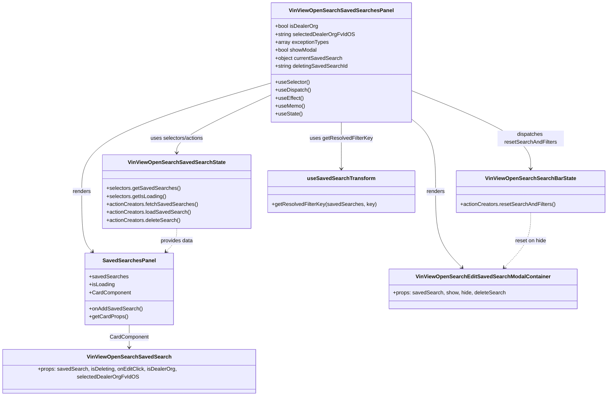

# Diagram: web/portal/src/pages/vinview/dashboard/components/organisms/VinView.OpenSearch.SavedSearchesPanel.organism.js

> Auto-generated by Obscura crawlers

## Mermaid

### SVG

<svg id="container" width="1788.09765625" xmlns="http://www.w3.org/2000/svg" class="classDiagram" height="1180" viewBox="0 0 1788.09765625 1180" role="graphics-document document" aria-roledescription="class"><g><defs><marker id="container_class-aggregationStart" class="marker aggregation class" refX="18" refY="7" markerWidth="190" markerHeight="240" orient="auto"><path d="M 18,7 L9,13 L1,7 L9,1 Z"></path></marker></defs><defs><marker id="container_class-aggregationEnd" class="marker aggregation class" refX="1" refY="7" markerWidth="20" markerHeight="28" orient="auto"><path d="M 18,7 L9,13 L1,7 L9,1 Z"></path></marker></defs><defs><marker id="container_class-extensionStart" class="marker extension class" refX="18" refY="7" markerWidth="190" markerHeight="240" orient="auto"><path d="M 1,7 L18,13 V 1 Z"></path></marker></defs><defs><marker id="container_class-extensionEnd" class="marker extension class" refX="1" refY="7" markerWidth="20" markerHeight="28" orient="auto"><path d="M 1,1 V 13 L18,7 Z"></path></marker></defs><defs><marker id="container_class-compositionStart" class="marker composition class" refX="18" refY="7" markerWidth="190" markerHeight="240" orient="auto"><path d="M 18,7 L9,13 L1,7 L9,1 Z"></path></marker></defs><defs><marker id="container_class-compositionEnd" class="marker composition class" refX="1" refY="7" markerWidth="20" markerHeight="28" orient="auto"><path d="M 18,7 L9,13 L1,7 L9,1 Z"></path></marker></defs><defs><marker id="container_class-dependencyStart" class="marker dependency class" refX="6" refY="7" markerWidth="190" markerHeight="240" orient="auto"><path d="M 5,7 L9,13 L1,7 L9,1 Z"></path></marker></defs><defs><marker id="container_class-dependencyEnd" class="marker dependency class" refX="13" refY="7" markerWidth="20" markerHeight="28" orient="auto"><path d="M 18,7 L9,13 L14,7 L9,1 Z"></path></marker></defs><defs><marker id="container_class-lollipopStart" class="marker lollipop class" refX="13" refY="7" markerWidth="190" markerHeight="240" orient="auto"><circle stroke="black" fill="transparent" cx="7" cy="7" r="6"></circle></marker></defs><defs><marker id="container_class-lollipopEnd" class="marker lollipop class" refX="1" refY="7" markerWidth="190" markerHeight="240" orient="auto"><circle stroke="black" fill="transparent" cx="7" cy="7" r="6"></circle></marker></defs><g class="root"><g class="clusters"></g><g class="edgePaths"><path d="M797.773,249.349L704.788,277.291C611.803,305.232,425.833,361.116,332.848,415.725C239.863,470.333,239.863,523.667,239.863,575C239.863,626.333,239.863,675.667,245.123,705.781C250.383,735.895,260.903,746.789,266.163,752.236L271.423,757.684" id="id_VinViewOpenSearchSavedSearchesPanel_SavedSearchesPanel_1" class="edge-thickness-normal edge-pattern-solid relation" style=";;;" data-edge="true" data-et="edge" data-id="id_VinViewOpenSearchSavedSearchesPanel_SavedSearchesPanel_1" data-points="W3sieCI6Nzk3Ljc3MzQzNzUsInkiOjI0OS4zNDg2OTcyNjEyNDk5OH0seyJ4IjoyMzkuODYzMjgxMjUsInkiOjQxN30seyJ4IjoyMzkuODYzMjgxMjUsInkiOjU3N30seyJ4IjoyMzkuODYzMjgxMjUsInkiOjcyNX0seyJ4IjoyNzUuNTkwNDA5NDgyNzU4NiwieSI6NzYyfV0=" marker-end="url(#container_class-dependencyEnd)"></path><path d="M1206.086,356.463L1218.313,366.553C1230.54,376.642,1254.995,396.821,1267.222,433.577C1279.449,470.333,1279.449,523.667,1279.449,575C1279.449,626.333,1279.449,675.667,1292.514,713.783C1305.578,751.899,1331.707,778.797,1344.771,792.247L1357.836,805.696" id="id_VinViewOpenSearchSavedSearchesPanel_VinViewOpenSearchEditSavedSearchModalContainer_2" class="edge-thickness-normal edge-pattern-solid relation" style=";;;" data-edge="true" data-et="edge" data-id="id_VinViewOpenSearchSavedSearchesPanel_VinViewOpenSearchEditSavedSearchModalContainer_2" data-points="W3sieCI6MTIwNi4wODU5Mzc1LCJ5IjozNTYuNDYzMDMwNDczNjQzNDd9LHsieCI6MTI3OS40NDkyMTg3NSwieSI6NDE3fSx7IngiOjEyNzkuNDQ5MjE4NzUsInkiOjU3N30seyJ4IjoxMjc5LjQ0OTIxODc1LCJ5Ijo3MjV9LHsieCI6MTM2Mi4wMTYyMzExNDIyNDE0LCJ5Ijo4MTB9XQ==" marker-end="url(#container_class-dependencyEnd)"></path><path d="M379.875,978L379.875,984.167C379.875,990.333,379.875,1002.667,379.875,1014C379.875,1025.333,379.875,1035.667,379.875,1040.833L379.875,1046" id="id_SavedSearchesPanel_VinViewOpenSearchSavedSearch_3" class="edge-thickness-normal edge-pattern-solid relation" style=";;;" data-edge="true" data-et="edge" data-id="id_SavedSearchesPanel_VinViewOpenSearchSavedSearch_3" data-points="W3sieCI6Mzc5Ljg3NSwieSI6OTc4fSx7IngiOjM3OS44NzUsInkiOjEwMTV9LHsieCI6Mzc5Ljg3NSwieSI6MTA1Mn1d" marker-end="url(#container_class-dependencyEnd)"></path><path d="M797.773,284.987L751.459,306.989C705.145,328.991,612.516,372.996,566.201,402.164C519.887,431.333,519.887,445.667,519.887,452.833L519.887,460" id="id_VinViewOpenSearchSavedSearchesPanel_VinViewOpenSearchSavedSearchState_4" class="edge-thickness-normal edge-pattern-solid relation" style=";;;" data-edge="true" data-et="edge" data-id="id_VinViewOpenSearchSavedSearchesPanel_VinViewOpenSearchSavedSearchState_4" data-points="W3sieCI6Nzk3Ljc3MzQzNzUsInkiOjI4NC45ODY3NTA3MjcyOTE5fSx7IngiOjUxOS44ODY3MTg3NSwieSI6NDE3fSx7IngiOjUxOS44ODY3MTg3NSwieSI6NDY2fV0=" marker-end="url(#container_class-dependencyEnd)"></path><path d="M1206.086,271.602L1265.263,295.835C1324.44,320.068,1442.794,368.534,1501.971,407.934C1561.148,447.333,1561.148,477.667,1561.148,492.833L1561.148,508" id="id_VinViewOpenSearchSavedSearchesPanel_VinViewOpenSearchSearchBarState_5" class="edge-thickness-normal edge-pattern-solid relation" style=";;;" data-edge="true" data-et="edge" data-id="id_VinViewOpenSearchSavedSearchesPanel_VinViewOpenSearchSearchBarState_5" data-points="W3sieCI6MTIwNi4wODU5Mzc1LCJ5IjoyNzEuNjAxOTU1ODUzNTkwMzd9LHsieCI6MTU2MS4xNDg0Mzc1LCJ5Ijo0MTd9LHsieCI6MTU2MS4xNDg0Mzc1LCJ5Ijo1MTR9XQ==" marker-end="url(#container_class-dependencyEnd)"></path><path d="M1001.93,368L1001.93,376.167C1001.93,384.333,1001.93,400.667,1001.93,424C1001.93,447.333,1001.93,477.667,1001.93,492.833L1001.93,508" id="id_VinViewOpenSearchSavedSearchesPanel_useSavedSearchTransform_6" class="edge-thickness-normal edge-pattern-solid relation" style=";;;" data-edge="true" data-et="edge" data-id="id_VinViewOpenSearchSavedSearchesPanel_useSavedSearchTransform_6" data-points="W3sieCI6MTAwMS45Mjk2ODc1LCJ5IjozNjh9LHsieCI6MTAwMS45Mjk2ODc1LCJ5Ijo0MTd9LHsieCI6MTAwMS45Mjk2ODc1LCJ5Ijo1MTR9XQ==" marker-end="url(#container_class-dependencyEnd)"></path><path d="M519.887,688L519.887,694.167C519.887,700.333,519.887,712.667,514.627,724.281C509.367,735.895,498.847,746.789,493.587,752.236L488.327,757.684" id="id_VinViewOpenSearchSavedSearchState_SavedSearchesPanel_7" class="edge-thickness-normal edge-pattern-dashed relation" style=";;;" data-edge="true" data-et="edge" data-id="id_VinViewOpenSearchSavedSearchState_SavedSearchesPanel_7" data-points="W3sieCI6NTE5Ljg4NjcxODc1LCJ5Ijo2ODh9LHsieCI6NTE5Ljg4NjcxODc1LCJ5Ijo3MjV9LHsieCI6NDg0LjE1OTU5MDUxNzI0MTQsInkiOjc2Mn1d" marker-end="url(#container_class-dependencyEnd)"></path><path d="M1561.148,640L1561.148,654.167C1561.148,668.333,1561.148,696.667,1548.084,724.283C1535.02,751.899,1508.891,778.797,1495.826,792.247L1482.762,805.696" id="id_VinViewOpenSearchSearchBarState_VinViewOpenSearchEditSavedSearchModalContainer_8" class="edge-thickness-normal edge-pattern-dashed relation" style=";;;" data-edge="true" data-et="edge" data-id="id_VinViewOpenSearchSearchBarState_VinViewOpenSearchEditSavedSearchModalContainer_8" data-points="W3sieCI6MTU2MS4xNDg0Mzc1LCJ5Ijo2NDB9LHsieCI6MTU2MS4xNDg0Mzc1LCJ5Ijo3MjV9LHsieCI6MTQ3OC41ODE0MjUxMDc3NTg2LCJ5Ijo4MTB9XQ==" marker-end="url(#container_class-dependencyEnd)"></path></g><g class="edgeLabels"><g class="edgeLabel" transform="translate(239.86328125, 577)"><g class="label" data-id="id_VinViewOpenSearchSavedSearchesPanel_SavedSearchesPanel_1" transform="translate(-27.75, -12)"><foreignObject width="55.5" height="24">

renders

</foreignObject></g></g><g class="edgeLabel" transform="translate(1279.44921875, 577)"><g class="label" data-id="id_VinViewOpenSearchSavedSearchesPanel_VinViewOpenSearchEditSavedSearchModalContainer_2" transform="translate(-27.75, -12)"><foreignObject width="55.5" height="24">

renders

</foreignObject></g></g><g class="edgeLabel" transform="translate(379.875, 1015)"><g class="label" data-id="id_SavedSearchesPanel_VinViewOpenSearchSavedSearch_3" transform="translate(-58.28125, -12)"><foreignObject width="116.5625" height="24">

CardComponent

</foreignObject></g></g><g class="edgeLabel" transform="translate(519.88671875, 417)"><g class="label" data-id="id_VinViewOpenSearchSavedSearchesPanel_VinViewOpenSearchSavedSearchState_4" transform="translate(-81.515625, -12)"><foreignObject width="163.03125" height="24">

uses selectors/actions

</foreignObject></g></g><g class="edgeLabel" transform="translate(1561.1484375, 417)"><g class="label" data-id="id_VinViewOpenSearchSavedSearchesPanel_VinViewOpenSearchSearchBarState_5" transform="translate(-100, -24)"><foreignObject width="200" height="48">

dispatches resetSearchAndFilters

</foreignObject></g></g><g class="edgeLabel" transform="translate(1001.9296875, 417)"><g class="label" data-id="id_VinViewOpenSearchSavedSearchesPanel_useSavedSearchTransform_6" transform="translate(-94.0234375, -12)"><foreignObject width="188.046875" height="24">

uses getResolvedFilterKey

</foreignObject></g></g><g class="edgeLabel" transform="translate(519.88671875, 725)"><g class="label" data-id="id_VinViewOpenSearchSavedSearchState_SavedSearchesPanel_7" transform="translate(-49.7578125, -12)"><foreignObject width="99.515625" height="24">

provides data

</foreignObject></g></g><g class="edgeLabel" transform="translate(1561.1484375, 725)"><g class="label" data-id="id_VinViewOpenSearchSearchBarState_VinViewOpenSearchEditSavedSearchModalContainer_8" transform="translate(-47.8828125, -12)"><foreignObject width="95.765625" height="24">

reset on hide

</foreignObject></g></g></g><g class="nodes"><g class="node default" id="classId-VinViewOpenSearchSavedSearchesPanel-0" transform="translate(1001.9296875, 188)"><g class="basic label-container"><path d="M-204.15625 -180 L204.15625 -180 L204.15625 180 L-204.15625 180" stroke="none" stroke-width="0" fill="#ECECFF" style=""></path><path d="M-204.15625 -180 C-89.30835280918392 -180, 25.53954438163217 -180, 204.15625 -180 M-204.15625 -180 C-45.12929259982104 -180, 113.89766480035792 -180, 204.15625 -180 M204.15625 -180 C204.15625 -75.15718589727254, 204.15625 29.68562820545492, 204.15625 180 M204.15625 -180 C204.15625 -57.887073140049495, 204.15625 64.22585371990101, 204.15625 180 M204.15625 180 C50.95203683443671 180, -102.25217633112658 180, -204.15625 180 M204.15625 180 C49.128880146513296 180, -105.89848970697341 180, -204.15625 180 M-204.15625 180 C-204.15625 36.18033713697352, -204.15625 -107.63932572605296, -204.15625 -180 M-204.15625 180 C-204.15625 85.08227243019954, -204.15625 -9.835455139600924, -204.15625 -180" stroke="#9370DB" stroke-width="1.3" fill="none" stroke-dasharray="0 0" style=""></path></g><g class="annotation-group text" transform="translate(0, -156)"></g><g class="label-group text" transform="translate(-147.96875, -156)"><g class="label" style="font-weight: bolder" transform="translate(0,-12)"><foreignObject width="295.9375" height="24">

VinViewOpenSearchSavedSearchesPanel

</foreignObject></g></g><g class="members-group text" transform="translate(-192.15625, -108)"><g class="label" style="" transform="translate(0,-12)"><foreignObject width="129.34375" height="24">

+bool isDealerOrg

</foreignObject></g><g class="label" style="" transform="translate(0,12)"><foreignObject width="236.34375" height="24">

+string selectedDealerOrgFvIdOS

</foreignObject></g><g class="label" style="" transform="translate(0,36)"><foreignObject width="160.78125" height="24">

+array exceptionTypes

</foreignObject></g><g class="label" style="" transform="translate(0,60)"><foreignObject width="127.375" height="24">

+bool showModal

</foreignObject></g><g class="label" style="" transform="translate(0,84)"><foreignObject width="202.234375" height="24">

+object currentSavedSearch

</foreignObject></g><g class="label" style="" transform="translate(0,108)"><foreignObject width="219.734375" height="24">

+string deletingSavedSearchId

</foreignObject></g></g><g class="methods-group text" transform="translate(-192.15625, 60)"><g class="label" style="" transform="translate(0,-12)"><foreignObject width="103.34375" height="24">

+useSelector()

</foreignObject></g><g class="label" style="" transform="translate(0,12)"><foreignObject width="106.765625" height="24">

+useDispatch()

</foreignObject></g><g class="label" style="" transform="translate(0,36)"><foreignObject width="84.8125" height="24">

+useEffect()

</foreignObject></g><g class="label" style="" transform="translate(0,60)"><foreignObject width="88.09375" height="24">

+useMemo()

</foreignObject></g><g class="label" style="" transform="translate(0,84)"><foreignObject width="81.203125" height="24">

+useState()

</foreignObject></g></g><g class="divider" style=""><path d="M-204.15625 -132 C-114.7337378712482 -132, -25.31122574249639 -132, 204.15625 -132 M-204.15625 -132 C-54.88803898602242 -132, 94.38017202795515 -132, 204.15625 -132" stroke="#9370DB" stroke-width="1.3" fill="none" stroke-dasharray="0 0" style=""></path></g><g class="divider" style=""><path d="M-204.15625 36 C-119.8325316699489 36, -35.50881333989781 36, 204.15625 36 M-204.15625 36 C-121.93740562249664 36, -39.71856124499328 36, 204.15625 36" stroke="#9370DB" stroke-width="1.3" fill="none" stroke-dasharray="0 0" style=""></path></g></g><g class="node default" id="classId-SavedSearchesPanel-1" transform="translate(379.875, 870)"><g class="basic label-container"><path d="M-128.3203125 -108 L128.3203125 -108 L128.3203125 108 L-128.3203125 108" stroke="none" stroke-width="0" fill="#ECECFF" style=""></path><path d="M-128.3203125 -108 C-54.585947125584426 -108, 19.14841824883115 -108, 128.3203125 -108 M-128.3203125 -108 C-68.1311222914815 -108, -7.941932082963007 -108, 128.3203125 -108 M128.3203125 -108 C128.3203125 -21.97141373210262, 128.3203125 64.05717253579476, 128.3203125 108 M128.3203125 -108 C128.3203125 -47.28791658417999, 128.3203125 13.424166831640022, 128.3203125 108 M128.3203125 108 C45.51553007603208 108, -37.28925234793584 108, -128.3203125 108 M128.3203125 108 C36.73372145704312 108, -54.852869585913766 108, -128.3203125 108 M-128.3203125 108 C-128.3203125 36.11219366336232, -128.3203125 -35.77561267327536, -128.3203125 -108 M-128.3203125 108 C-128.3203125 31.659999681027287, -128.3203125 -44.680000637945426, -128.3203125 -108" stroke="#9370DB" stroke-width="1.3" fill="none" stroke-dasharray="0 0" style=""></path></g><g class="annotation-group text" transform="translate(0, -84)"></g><g class="label-group text" transform="translate(-75.265625, -84)"><g class="label" style="font-weight: bolder" transform="translate(0,-12)"><foreignObject width="150.53125" height="24">

SavedSearchesPanel

</foreignObject></g></g><g class="members-group text" transform="translate(-116.3203125, -36)"><g class="label" style="" transform="translate(0,-12)"><foreignObject width="114.765625" height="24">

+savedSearches

</foreignObject></g><g class="label" style="" transform="translate(0,12)"><foreignObject width="77.203125" height="24">

+isLoading

</foreignObject></g><g class="label" style="" transform="translate(0,36)"><foreignObject width="124.546875" height="24">

+CardComponent

</foreignObject></g></g><g class="methods-group text" transform="translate(-116.3203125, 60)"><g class="label" style="" transform="translate(0,-12)"><foreignObject width="157.375" height="24">

+onAddSavedSearch()

</foreignObject></g><g class="label" style="" transform="translate(0,12)"><foreignObject width="114.6875" height="24">

+getCardProps()

</foreignObject></g></g><g class="divider" style=""><path d="M-128.3203125 -60 C-43.30496136773991 -60, 41.71038976452019 -60, 128.3203125 -60 M-128.3203125 -60 C-52.99433708337578 -60, 22.331638333248435 -60, 128.3203125 -60" stroke="#9370DB" stroke-width="1.3" fill="none" stroke-dasharray="0 0" style=""></path></g><g class="divider" style=""><path d="M-128.3203125 36 C-55.071987999253395 36, 18.17633650149321 36, 128.3203125 36 M-128.3203125 36 C-39.25378013448071 36, 49.81275223103859 36, 128.3203125 36" stroke="#9370DB" stroke-width="1.3" fill="none" stroke-dasharray="0 0" style=""></path></g></g><g class="node default" id="classId-VinViewOpenSearchSavedSearch-2" transform="translate(379.875, 1112)"><g class="basic label-container"><path d="M-371.875 -60 L371.875 -60 L371.875 60 L-371.875 60" stroke="none" stroke-width="0" fill="#ECECFF" style=""></path><path d="M-371.875 -60 C-149.34353130770876 -60, 73.18793738458248 -60, 371.875 -60 M-371.875 -60 C-162.66082825555614 -60, 46.55334348888772 -60, 371.875 -60 M371.875 -60 C371.875 -25.18390398513945, 371.875 9.632192029721097, 371.875 60 M371.875 -60 C371.875 -17.754548054875542, 371.875 24.490903890248916, 371.875 60 M371.875 60 C158.48129246072534 60, -54.912415078549316 60, -371.875 60 M371.875 60 C192.59901684702828 60, 13.323033694056562 60, -371.875 60 M-371.875 60 C-371.875 27.91785735566424, -371.875 -4.164285288671522, -371.875 -60 M-371.875 60 C-371.875 30.144797457588634, -371.875 0.2895949151772683, -371.875 -60" stroke="#9370DB" stroke-width="1.3" fill="none" stroke-dasharray="0 0" style=""></path></g><g class="annotation-group text" transform="translate(0, -36)"></g><g class="label-group text" transform="translate(-119.515625, -36)"><g class="label" style="font-weight: bolder" transform="translate(0,-12)"><foreignObject width="239.03125" height="24">

VinViewOpenSearchSavedSearch

</foreignObject></g></g><g class="members-group text" transform="translate(-359.875, 12)"><g class="label" style="" transform="translate(0,-12)"><foreignObject width="600.234375" height="24">

+props: savedSearch, isDeleting, onEditClick, isDealerOrg, selectedDealerOrgFvIdOS

</foreignObject></g></g><g class="methods-group text" transform="translate(-359.875, 60)"></g><g class="divider" style=""><path d="M-371.875 -12 C-163.3462810095436 -12, 45.18243798091282 -12, 371.875 -12 M-371.875 -12 C-136.1882269249558 -12, 99.49854615008837 -12, 371.875 -12" stroke="#9370DB" stroke-width="1.3" fill="none" stroke-dasharray="0 0" style=""></path></g><g class="divider" style=""><path d="M-371.875 36 C-211.54564336417405 36, -51.21628672834811 36, 371.875 36 M-371.875 36 C-211.4794841142119 36, -51.08396822842383 36, 371.875 36" stroke="#9370DB" stroke-width="1.3" fill="none" stroke-dasharray="0 0" style=""></path></g></g><g class="node default" id="classId-VinViewOpenSearchEditSavedSearchModalContainer-3" transform="translate(1420.298828125, 870)"><g class="basic label-container"><path d="M-276.046875 -60 L276.046875 -60 L276.046875 60 L-276.046875 60" stroke="none" stroke-width="0" fill="#ECECFF" style=""></path><path d="M-276.046875 -60 C-60.25975768185032 -60, 155.52735963629937 -60, 276.046875 -60 M-276.046875 -60 C-131.17939243404587 -60, 13.688090131908268 -60, 276.046875 -60 M276.046875 -60 C276.046875 -26.41814935755295, 276.046875 7.163701284894103, 276.046875 60 M276.046875 -60 C276.046875 -27.423779190673372, 276.046875 5.152441618653256, 276.046875 60 M276.046875 60 C81.69036192146694 60, -112.66615115706611 60, -276.046875 60 M276.046875 60 C141.56973497688767 60, 7.092594953775347 60, -276.046875 60 M-276.046875 60 C-276.046875 15.598825014797931, -276.046875 -28.802349970404137, -276.046875 -60 M-276.046875 60 C-276.046875 26.488134496730396, -276.046875 -7.023731006539208, -276.046875 -60" stroke="#9370DB" stroke-width="1.3" fill="none" stroke-dasharray="0 0" style=""></path></g><g class="annotation-group text" transform="translate(0, -36)"></g><g class="label-group text" transform="translate(-191.75, -36)"><g class="label" style="font-weight: bolder" transform="translate(0,-12)"><foreignObject width="383.5" height="24">

VinViewOpenSearchEditSavedSearchModalContainer

</foreignObject></g></g><g class="members-group text" transform="translate(-264.046875, 12)"><g class="label" style="" transform="translate(0,-12)"><foreignObject width="336.34375" height="24">

+props: savedSearch, show, hide, deleteSearch

</foreignObject></g></g><g class="methods-group text" transform="translate(-264.046875, 60)"></g><g class="divider" style=""><path d="M-276.046875 -12 C-90.81793119670141 -12, 94.41101260659718 -12, 276.046875 -12 M-276.046875 -12 C-144.93999772381775 -12, -13.833120447635508 -12, 276.046875 -12" stroke="#9370DB" stroke-width="1.3" fill="none" stroke-dasharray="0 0" style=""></path></g><g class="divider" style=""><path d="M-276.046875 36 C-154.67491475782964 36, -33.30295451565925 36, 276.046875 36 M-276.046875 36 C-144.89535717965217 36, -13.743839359304332 36, 276.046875 36" stroke="#9370DB" stroke-width="1.3" fill="none" stroke-dasharray="0 0" style=""></path></g></g><g class="node default" id="classId-VinViewOpenSearchSavedSearchState-4" transform="translate(519.88671875, 577)"><g class="basic label-container"><path d="M-217.2734375 -111 L217.2734375 -111 L217.2734375 111 L-217.2734375 111" stroke="none" stroke-width="0" fill="#ECECFF" style=""></path><path d="M-217.2734375 -111 C-56.263068665319935 -111, 104.74730016936013 -111, 217.2734375 -111 M-217.2734375 -111 C-69.04958199802138 -111, 79.17427350395724 -111, 217.2734375 -111 M217.2734375 -111 C217.2734375 -40.269189988591776, 217.2734375 30.461620022816447, 217.2734375 111 M217.2734375 -111 C217.2734375 -61.520958458264424, 217.2734375 -12.041916916528848, 217.2734375 111 M217.2734375 111 C124.2687823329316 111, 31.264127165863187 111, -217.2734375 111 M217.2734375 111 C74.51891828998268 111, -68.23560092003464 111, -217.2734375 111 M-217.2734375 111 C-217.2734375 62.61236466156291, -217.2734375 14.224729323125814, -217.2734375 -111 M-217.2734375 111 C-217.2734375 53.54486090805618, -217.2734375 -3.910278183887641, -217.2734375 -111" stroke="#9370DB" stroke-width="1.3" fill="none" stroke-dasharray="0 0" style=""></path></g><g class="annotation-group text" transform="translate(0, -87)"></g><g class="label-group text" transform="translate(-138.828125, -87)"><g class="label" style="font-weight: bolder" transform="translate(0,-12)"><foreignObject width="277.65625" height="24">

VinViewOpenSearchSavedSearchState

</foreignObject></g></g><g class="members-group text" transform="translate(-205.2734375, -39)"></g><g class="methods-group text" transform="translate(-205.2734375, -9)"><g class="label" style="" transform="translate(0,-12)"><foreignObject width="218.234375" height="24">

+selectors.getSavedSearches()

</foreignObject></g><g class="label" style="" transform="translate(0,12)"><foreignObject width="179.484375" height="24">

+selectors.getIsLoading()

</foreignObject></g><g class="label" style="" transform="translate(0,36)"><foreignObject width="271.71875" height="24">

+actionCreators.fetchSavedSearches()

</foreignObject></g><g class="label" style="" transform="translate(0,60)"><foreignObject width="251.34375" height="24">

+actionCreators.loadSavedSearch()

</foreignObject></g><g class="label" style="" transform="translate(0,84)"><foreignObject width="221.703125" height="24">

+actionCreators.deleteSearch()

</foreignObject></g></g><g class="divider" style=""><path d="M-217.2734375 -63 C-105.13179006241673 -63, 7.009857375166547 -63, 217.2734375 -63 M-217.2734375 -63 C-125.23809026426841 -63, -33.202743028536815 -63, 217.2734375 -63" stroke="#9370DB" stroke-width="1.3" fill="none" stroke-dasharray="0 0" style=""></path></g><g class="divider" style=""><path d="M-217.2734375 -39 C-91.72365945324574 -39, 33.82611859350851 -39, 217.2734375 -39 M-217.2734375 -39 C-90.06805096798195 -39, 37.13733556403611 -39, 217.2734375 -39" stroke="#9370DB" stroke-width="1.3" fill="none" stroke-dasharray="0 0" style=""></path></g></g><g class="node default" id="classId-VinViewOpenSearchSearchBarState-5" transform="translate(1561.1484375, 577)"><g class="basic label-container"><path d="M-218.94921875 -63 L218.94921875 -63 L218.94921875 63 L-218.94921875 63" stroke="none" stroke-width="0" fill="#ECECFF" style=""></path><path d="M-218.94921875 -63 C-81.46392827267644 -63, 56.02136220464712 -63, 218.94921875 -63 M-218.94921875 -63 C-55.115704436541165 -63, 108.71780987691767 -63, 218.94921875 -63 M218.94921875 -63 C218.94921875 -33.82897081198851, 218.94921875 -4.657941623977031, 218.94921875 63 M218.94921875 -63 C218.94921875 -23.109476788829035, 218.94921875 16.78104642234193, 218.94921875 63 M218.94921875 63 C63.31059099093565 63, -92.3280367681287 63, -218.94921875 63 M218.94921875 63 C91.21254923288703 63, -36.524120284225944 63, -218.94921875 63 M-218.94921875 63 C-218.94921875 20.555577084260513, -218.94921875 -21.888845831478974, -218.94921875 -63 M-218.94921875 63 C-218.94921875 20.16685327170277, -218.94921875 -22.66629345659446, -218.94921875 -63" stroke="#9370DB" stroke-width="1.3" fill="none" stroke-dasharray="0 0" style=""></path></g><g class="annotation-group text" transform="translate(0, -39)"></g><g class="label-group text" transform="translate(-129.2578125, -39)"><g class="label" style="font-weight: bolder" transform="translate(0,-12)"><foreignObject width="258.515625" height="24">

VinViewOpenSearchSearchBarState

</foreignObject></g></g><g class="members-group text" transform="translate(-206.94921875, 9)"></g><g class="methods-group text" transform="translate(-206.94921875, 39)"><g class="label" style="" transform="translate(0,-12)"><foreignObject width="284.640625" height="24">

+actionCreators.resetSearchAndFilters()

</foreignObject></g></g><g class="divider" style=""><path d="M-218.94921875 -15 C-112.66560443599231 -15, -6.3819901219846145 -15, 218.94921875 -15 M-218.94921875 -15 C-60.98476864261556 -15, 96.97968146476887 -15, 218.94921875 -15" stroke="#9370DB" stroke-width="1.3" fill="none" stroke-dasharray="0 0" style=""></path></g><g class="divider" style=""><path d="M-218.94921875 9 C-107.75620301424145 9, 3.4368127215171 9, 218.94921875 9 M-218.94921875 9 C-99.94462759133229 9, 19.059963567335416 9, 218.94921875 9" stroke="#9370DB" stroke-width="1.3" fill="none" stroke-dasharray="0 0" style=""></path></g></g><g class="node default" id="classId-useSavedSearchTransform-6" transform="translate(1001.9296875, 577)"><g class="basic label-container"><path d="M-214.76953125 -63 L214.76953125 -63 L214.76953125 63 L-214.76953125 63" stroke="none" stroke-width="0" fill="#ECECFF" style=""></path><path d="M-214.76953125 -63 C-44.45141471766172 -63, 125.86670181467656 -63, 214.76953125 -63 M-214.76953125 -63 C-121.2759824205339 -63, -27.782433591067786 -63, 214.76953125 -63 M214.76953125 -63 C214.76953125 -18.01289198827685, 214.76953125 26.974216023446303, 214.76953125 63 M214.76953125 -63 C214.76953125 -17.00947676623447, 214.76953125 28.98104646753106, 214.76953125 63 M214.76953125 63 C109.75510531634988 63, 4.740679382699767 63, -214.76953125 63 M214.76953125 63 C65.26191451297777 63, -84.24570222404446 63, -214.76953125 63 M-214.76953125 63 C-214.76953125 20.354662913572263, -214.76953125 -22.290674172855475, -214.76953125 -63 M-214.76953125 63 C-214.76953125 13.97399462597113, -214.76953125 -35.05201074805774, -214.76953125 -63" stroke="#9370DB" stroke-width="1.3" fill="none" stroke-dasharray="0 0" style=""></path></g><g class="annotation-group text" transform="translate(0, -39)"></g><g class="label-group text" transform="translate(-96.9453125, -39)"><g class="label" style="font-weight: bolder" transform="translate(0,-12)"><foreignObject width="193.890625" height="24">

useSavedSearchTransform

</foreignObject></g></g><g class="members-group text" transform="translate(-202.76953125, 9)"></g><g class="methods-group text" transform="translate(-202.76953125, 39)"><g class="label" style="" transform="translate(0,-12)"><foreignObject width="308.59375" height="24">

+getResolvedFilterKey(savedSearches, key)

</foreignObject></g></g><g class="divider" style=""><path d="M-214.76953125 -15 C-86.3051864675081 -15, 42.15915831498381 -15, 214.76953125 -15 M-214.76953125 -15 C-94.10022163860422 -15, 26.56908797279155 -15, 214.76953125 -15" stroke="#9370DB" stroke-width="1.3" fill="none" stroke-dasharray="0 0" style=""></path></g><g class="divider" style=""><path d="M-214.76953125 9 C-97.19330526140021 9, 20.382920727199576 9, 214.76953125 9 M-214.76953125 9 C-122.69447065613811 9, -30.619410062276216 9, 214.76953125 9" stroke="#9370DB" stroke-width="1.3" fill="none" stroke-dasharray="0 0" style=""></path></g></g></g></g></g></svg>
