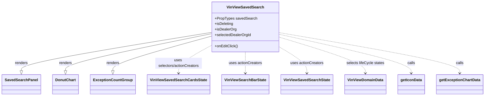

# Diagram: web/portal/src/pages/vinview/dashboard/components/organisms/VinView.SavedSearch.organism.js


> Auto-generated by Obscura crawlers

## Diagram 1



### SVG

<svg id="container" width="2002.046875" xmlns="http://www.w3.org/2000/svg" class="classDiagram" height="414" viewBox="0 0 2002.046875 414" role="graphics-document document" aria-roledescription="class"><style>#container{font-family:"trebuchet ms",verdana,arial,sans-serif;font-size:16px;fill:#333;}@keyframes edge-animation-frame{from{stroke-dashoffset:0;}}@keyframes dash{to{stroke-dashoffset:0;}}#container .edge-animation-slow{stroke-dasharray:9,5!important;stroke-dashoffset:900;animation:dash 50s linear infinite;stroke-linecap:round;}#container .edge-animation-fast{stroke-dasharray:9,5!important;stroke-dashoffset:900;animation:dash 20s linear infinite;stroke-linecap:round;}#container .error-icon{fill:#552222;}#container .error-text{fill:#552222;stroke:#552222;}#container .edge-thickness-normal{stroke-width:1px;}#container .edge-thickness-thick{stroke-width:3.5px;}#container .edge-pattern-solid{stroke-dasharray:0;}#container .edge-thickness-invisible{stroke-width:0;fill:none;}#container .edge-pattern-dashed{stroke-dasharray:3;}#container .edge-pattern-dotted{stroke-dasharray:2;}#container .marker{fill:#333333;stroke:#333333;}#container .marker.cross{stroke:#333333;}#container svg{font-family:"trebuchet ms",verdana,arial,sans-serif;font-size:16px;}#container p{margin:0;}#container g.classGroup text{fill:#9370DB;stroke:none;font-family:"trebuchet ms",verdana,arial,sans-serif;font-size:10px;}#container g.classGroup text .title{font-weight:bolder;}#container .nodeLabel,#container .edgeLabel{color:#131300;}#container .edgeLabel .label rect{fill:#ECECFF;}#container .label text{fill:#131300;}#container .labelBkg{background:#ECECFF;}#container .edgeLabel .label span{background:#ECECFF;}#container .classTitle{font-weight:bolder;}#container .node rect,#container .node circle,#container .node ellipse,#container .node polygon,#container .node path{fill:#ECECFF;stroke:#9370DB;stroke-width:1px;}#container .divider{stroke:#9370DB;stroke-width:1;}#container g.clickable{cursor:pointer;}#container g.classGroup rect{fill:#ECECFF;stroke:#9370DB;}#container g.classGroup line{stroke:#9370DB;stroke-width:1;}#container .classLabel .box{stroke:none;stroke-width:0;fill:#ECECFF;opacity:0.5;}#container .classLabel .label{fill:#9370DB;font-size:10px;}#container .relation{stroke:#333333;stroke-width:1;fill:none;}#container .dashed-line{stroke-dasharray:3;}#container .dotted-line{stroke-dasharray:1 2;}#container #compositionStart,#container .composition{fill:#333333!important;stroke:#333333!important;stroke-width:1;}#container #compositionEnd,#container .composition{fill:#333333!important;stroke:#333333!important;stroke-width:1;}#container #dependencyStart,#container .dependency{fill:#333333!important;stroke:#333333!important;stroke-width:1;}#container #dependencyStart,#container .dependency{fill:#333333!important;stroke:#333333!important;stroke-width:1;}#container #extensionStart,#container .extension{fill:transparent!important;stroke:#333333!important;stroke-width:1;}#container #extensionEnd,#container .extension{fill:transparent!important;stroke:#333333!important;stroke-width:1;}#container #aggregationStart,#container .aggregation{fill:transparent!important;stroke:#333333!important;stroke-width:1;}#container #aggregationEnd,#container .aggregation{fill:transparent!important;stroke:#333333!important;stroke-width:1;}#container #lollipopStart,#container .lollipop{fill:#ECECFF!important;stroke:#333333!important;stroke-width:1;}#container #lollipopEnd,#container .lollipop{fill:#ECECFF!important;stroke:#333333!important;stroke-width:1;}#container .edgeTerminals{font-size:11px;line-height:initial;}#container .classTitleText{text-anchor:middle;font-size:18px;fill:#333;}#container .label-icon{display:inline-block;height:1em;overflow:visible;vertical-align:-0.125em;}#container .node .label-icon path{fill:currentColor;stroke:revert;stroke-width:revert;}#container :root{--mermaid-font-family:"trebuchet ms",verdana,arial,sans-serif;}</style><g><defs><marker id="container_class-aggregationStart" class="marker aggregation class" refX="18" refY="7" markerWidth="190" markerHeight="240" orient="auto"><path d="M 18,7 L9,13 L1,7 L9,1 Z"></path></marker></defs><defs><marker id="container_class-aggregationEnd" class="marker aggregation class" refX="1" refY="7" markerWidth="20" markerHeight="28" orient="auto"><path d="M 18,7 L9,13 L1,7 L9,1 Z"></path></marker></defs><defs><marker id="container_class-extensionStart" class="marker extension class" refX="18" refY="7" markerWidth="190" markerHeight="240" orient="auto"><path d="M 1,7 L18,13 V 1 Z"></path></marker></defs><defs><marker id="container_class-extensionEnd" class="marker extension class" refX="1" refY="7" markerWidth="20" markerHeight="28" orient="auto"><path d="M 1,1 V 13 L18,7 Z"></path></marker></defs><defs><marker id="container_class-compositionStart" class="marker composition class" refX="18" refY="7" markerWidth="190" markerHeight="240" orient="auto"><path d="M 18,7 L9,13 L1,7 L9,1 Z"></path></marker></defs><defs><marker id="container_class-compositionEnd" class="marker composition class" refX="1" refY="7" markerWidth="20" markerHeight="28" orient="auto"><path d="M 18,7 L9,13 L1,7 L9,1 Z"></path></marker></defs><defs><marker id="container_class-dependencyStart" class="marker dependency class" refX="6" refY="7" markerWidth="190" markerHeight="240" orient="auto"><path d="M 5,7 L9,13 L1,7 L9,1 Z"></path></marker></defs><defs><marker id="container_class-dependencyEnd" class="marker dependency class" refX="13" refY="7" markerWidth="20" markerHeight="28" orient="auto"><path d="M 18,7 L9,13 L14,7 L9,1 Z"></path></marker></defs><defs><marker id="container_class-lollipopStart" class="marker lollipop class" refX="13" refY="7" markerWidth="190" markerHeight="240" orient="auto"><circle stroke="black" fill="transparent" cx="7" cy="7" r="6"></circle></marker></defs><defs><marker id="container_class-lollipopEnd" class="marker lollipop class" refX="1" refY="7" markerWidth="190" markerHeight="240" orient="auto"><circle stroke="black" fill="transparent" cx="7" cy="7" r="6"></circle></marker></defs><g class="root"><g class="clusters"></g><g class="edgePaths"><path d="M869.742,139.603L739.283,161.836C608.823,184.069,347.904,228.534,217.444,256.059C86.984,283.583,86.984,294.167,86.984,299.458L86.984,304.75" id="id_VinViewSavedSearch_SavedSearchPanel_1" class="edge-thickness-normal edge-pattern-solid relation" style=";;;" data-edge="true" data-et="edge" data-id="id_VinViewSavedSearch_SavedSearchPanel_1" data-points="W3sieCI6ODY5Ljc0MjE4NzUsInkiOjEzOS42MDMwNTYyODM0NDR9LHsieCI6ODYuOTg0Mzc1LCJ5IjoyNzN9LHsieCI6ODYuOTg0Mzc1LCJ5IjozMjJ9XQ==" marker-end="url(#container_class-extensionEnd)"></path><path d="M869.742,145.452L769.776,166.71C669.81,187.968,469.878,230.484,369.911,257.034C269.945,283.583,269.945,294.167,269.945,299.458L269.945,304.75" id="id_VinViewSavedSearch_DonutChart_2" class="edge-thickness-normal edge-pattern-solid relation" style=";;;" data-edge="true" data-et="edge" data-id="id_VinViewSavedSearch_DonutChart_2" data-points="W3sieCI6ODY5Ljc0MjE4NzUsInkiOjE0NS40NTIyNDQzOTY5NDM5N30seyJ4IjoyNjkuOTQ1MzEyNSwieSI6MjczfSx7IngiOjI2OS45NDUzMTI1LCJ5IjozMjJ9XQ==" marker-end="url(#container_class-extensionEnd)"></path><path d="M869.742,156.039L802.313,175.533C734.883,195.026,600.023,234.013,532.594,258.798C465.164,283.583,465.164,294.167,465.164,299.458L465.164,304.75" id="id_VinViewSavedSearch_ExceptionCountGroup_3" class="edge-thickness-normal edge-pattern-solid relation" style=";;;" data-edge="true" data-et="edge" data-id="id_VinViewSavedSearch_ExceptionCountGroup_3" data-points="W3sieCI6ODY5Ljc0MjE4NzUsInkiOjE1Ni4wMzkzNTg5NzgwNDc1N30seyJ4Ijo0NjUuMTY0MDYyNSwieSI6MjczfSx7IngiOjQ2NS4xNjQwNjI1LCJ5IjozMjJ9XQ==" marker-end="url(#container_class-extensionEnd)"></path><path d="M869.742,195.208L847.072,208.173C824.401,221.139,779.06,247.069,756.389,267.201C733.719,287.333,733.719,301.667,733.719,308.833L733.719,316" id="id_VinViewSavedSearch_VinViewSavedSearchCardsState_4" class="edge-thickness-normal edge-pattern-dashed relation" style=";;;" data-edge="true" data-et="edge" data-id="id_VinViewSavedSearch_VinViewSavedSearchCardsState_4" data-points="W3sieCI6ODY5Ljc0MjE4NzUsInkiOjE5NS4yMDgxNzMyNTQ3ODgxfSx7IngiOjczMy43MTg3NSwieSI6MjczfSx7IngiOjczMy43MTg3NSwieSI6MzIyfV0=" marker-end="url(#container_class-dependencyEnd)"></path><path d="M1008.242,224L1008.242,232.167C1008.242,240.333,1008.242,256.667,1008.242,272C1008.242,287.333,1008.242,301.667,1008.242,308.833L1008.242,316" id="id_VinViewSavedSearch_VinViewSearchBarState_5" class="edge-thickness-normal edge-pattern-dashed relation" style=";;;" data-edge="true" data-et="edge" data-id="id_VinViewSavedSearch_VinViewSearchBarState_5" data-points="W3sieCI6MTAwOC4yNDIxODc1LCJ5IjoyMjR9LHsieCI6MTAwOC4yNDIxODc1LCJ5IjoyNzN9LHsieCI6MTAwOC4yNDIxODc1LCJ5IjozMjJ9XQ==" marker-end="url(#container_class-dependencyEnd)"></path><path d="M1146.742,201.611L1165.991,213.509C1185.24,225.407,1223.737,249.204,1242.986,268.268C1262.234,287.333,1262.234,301.667,1262.234,308.833L1262.234,316" id="id_VinViewSavedSearch_VinViewSavedSearchState_6" class="edge-thickness-normal edge-pattern-dashed relation" style=";;;" data-edge="true" data-et="edge" data-id="id_VinViewSavedSearch_VinViewSavedSearchState_6" data-points="W3sieCI6MTE0Ni43NDIxODc1LCJ5IjoyMDEuNjEwOTAwOTI1ODQwNX0seyJ4IjoxMjYyLjIzNDM3NSwieSI6MjczfSx7IngiOjEyNjIuMjM0Mzc1LCJ5IjozMjJ9XQ==" marker-end="url(#container_class-dependencyEnd)"></path><path d="M1146.742,159.82L1206.362,178.684C1265.982,197.547,1385.221,235.273,1444.841,261.303C1504.461,287.333,1504.461,301.667,1504.461,308.833L1504.461,316" id="id_VinViewSavedSearch_VinViewDomainData_7" class="edge-thickness-normal edge-pattern-dashed relation" style=";;;" data-edge="true" data-et="edge" data-id="id_VinViewSavedSearch_VinViewDomainData_7" data-points="W3sieCI6MTE0Ni43NDIxODc1LCJ5IjoxNTkuODIwMzkxNzEyMzI0NDd9LHsieCI6MTUwNC40NjA5Mzc1LCJ5IjoyNzN9LHsieCI6MTUwNC40NjA5Mzc1LCJ5IjozMjJ9XQ==" marker-end="url(#container_class-dependencyEnd)"></path><path d="M1146.742,147.624L1238.258,168.52C1329.773,189.416,1512.805,231.208,1604.32,259.271C1695.836,287.333,1695.836,301.667,1695.836,308.833L1695.836,316" id="id_VinViewSavedSearch_getIconData_8" class="edge-thickness-normal edge-pattern-dashed relation" style=";;;" data-edge="true" data-et="edge" data-id="id_VinViewSavedSearch_getIconData_8" data-points="W3sieCI6MTE0Ni43NDIxODc1LCJ5IjoxNDcuNjI0MDUxMjY1NzM2NDh9LHsieCI6MTY5NS44MzU5Mzc1LCJ5IjoyNzN9LHsieCI6MTY5NS44MzU5Mzc1LCJ5IjozMjJ9XQ==" marker-end="url(#container_class-dependencyEnd)"></path><path d="M1146.742,140.441L1271.936,162.534C1397.13,184.627,1647.518,228.814,1772.712,258.074C1897.906,287.333,1897.906,301.667,1897.906,308.833L1897.906,316" id="id_VinViewSavedSearch_getExceptionChartData_9" class="edge-thickness-normal edge-pattern-dashed relation" style=";;;" data-edge="true" data-et="edge" data-id="id_VinViewSavedSearch_getExceptionChartData_9" data-points="W3sieCI6MTE0Ni43NDIxODc1LCJ5IjoxNDAuNDQxMjQ4MDEzMjA3MjN9LHsieCI6MTg5Ny45MDYyNSwieSI6MjczfSx7IngiOjE4OTcuOTA2MjUsInkiOjMyMn1d" marker-end="url(#container_class-dependencyEnd)"></path></g><g class="edgeLabels"><g class="edgeLabel" transform="translate(86.984375, 273)"><g class="label" data-id="id_VinViewSavedSearch_SavedSearchPanel_1" transform="translate(-27.75, -12)"><foreignObject width="55.5" height="24"><div xmlns="http://www.w3.org/1999/xhtml" class="labelBkg" style="display: table-cell; white-space: nowrap; line-height: 1.5; max-width: 200px; text-align: center;"><span class="edgeLabel"><p>renders</p></span></div></foreignObject></g></g><g class="edgeLabel" transform="translate(269.9453125, 273)"><g class="label" data-id="id_VinViewSavedSearch_DonutChart_2" transform="translate(-27.75, -12)"><foreignObject width="55.5" height="24"><div xmlns="http://www.w3.org/1999/xhtml" class="labelBkg" style="display: table-cell; white-space: nowrap; line-height: 1.5; max-width: 200px; text-align: center;"><span class="edgeLabel"><p>renders</p></span></div></foreignObject></g></g><g class="edgeLabel" transform="translate(465.1640625, 273)"><g class="label" data-id="id_VinViewSavedSearch_ExceptionCountGroup_3" transform="translate(-27.75, -12)"><foreignObject width="55.5" height="24"><div xmlns="http://www.w3.org/1999/xhtml" class="labelBkg" style="display: table-cell; white-space: nowrap; line-height: 1.5; max-width: 200px; text-align: center;"><span class="edgeLabel"><p>renders</p></span></div></foreignObject></g></g><g class="edgeLabel" transform="translate(733.71875, 273)"><g class="label" data-id="id_VinViewSavedSearch_VinViewSavedSearchCardsState_4" transform="translate(-100, -24)"><foreignObject width="200" height="48"><div xmlns="http://www.w3.org/1999/xhtml" class="labelBkg" style="display: table; white-space: break-spaces; line-height: 1.5; max-width: 200px; text-align: center; width: 200px;"><span class="edgeLabel"><p>uses selectors/actionCreators</p></span></div></foreignObject></g></g><g class="edgeLabel" transform="translate(1008.2421875, 273)"><g class="label" data-id="id_VinViewSavedSearch_VinViewSearchBarState_5" transform="translate(-71.2734375, -12)"><foreignObject width="142.546875" height="24"><div xmlns="http://www.w3.org/1999/xhtml" class="labelBkg" style="display: table-cell; white-space: nowrap; line-height: 1.5; max-width: 200px; text-align: center;"><span class="edgeLabel"><p>uses actionCreators</p></span></div></foreignObject></g></g><g class="edgeLabel" transform="translate(1262.234375, 273)"><g class="label" data-id="id_VinViewSavedSearch_VinViewSavedSearchState_6" transform="translate(-71.2734375, -12)"><foreignObject width="142.546875" height="24"><div xmlns="http://www.w3.org/1999/xhtml" class="labelBkg" style="display: table-cell; white-space: nowrap; line-height: 1.5; max-width: 200px; text-align: center;"><span class="edgeLabel"><p>uses actionCreators</p></span></div></foreignObject></g></g><g class="edgeLabel" transform="translate(1504.4609375, 273)"><g class="label" data-id="id_VinViewSavedSearch_VinViewDomainData_7" transform="translate(-81.265625, -12)"><foreignObject width="162.53125" height="24"><div xmlns="http://www.w3.org/1999/xhtml" class="labelBkg" style="display: table-cell; white-space: nowrap; line-height: 1.5; max-width: 200px; text-align: center;"><span class="edgeLabel"><p>selects lifeCycle states</p></span></div></foreignObject></g></g><g class="edgeLabel" transform="translate(1695.8359375, 273)"><g class="label" data-id="id_VinViewSavedSearch_getIconData_8" transform="translate(-16.4453125, -12)"><foreignObject width="32.890625" height="24"><div xmlns="http://www.w3.org/1999/xhtml" class="labelBkg" style="display: table-cell; white-space: nowrap; line-height: 1.5; max-width: 200px; text-align: center;"><span class="edgeLabel"><p>calls</p></span></div></foreignObject></g></g><g class="edgeLabel" transform="translate(1897.90625, 273)"><g class="label" data-id="id_VinViewSavedSearch_getExceptionChartData_9" transform="translate(-16.4453125, -12)"><foreignObject width="32.890625" height="24"><div xmlns="http://www.w3.org/1999/xhtml" class="labelBkg" style="display: table-cell; white-space: nowrap; line-height: 1.5; max-width: 200px; text-align: center;"><span class="edgeLabel"><p>calls</p></span></div></foreignObject></g></g></g><g class="nodes"><g class="node default" id="classId-VinViewSavedSearch-0" transform="translate(1008.2421875, 116)"><g class="basic label-container"><path d="M-138.5 -108 L138.5 -108 L138.5 108 L-138.5 108" stroke="none" stroke-width="0" fill="#ECECFF" style=""></path><path d="M-138.5 -108 C-51.98476128028015 -108, 34.53047743943969 -108, 138.5 -108 M-138.5 -108 C-70.28485418897235 -108, -2.0697083779446928 -108, 138.5 -108 M138.5 -108 C138.5 -34.95082999346489, 138.5 38.098340013070214, 138.5 108 M138.5 -108 C138.5 -50.03869366558689, 138.5 7.922612668826218, 138.5 108 M138.5 108 C75.16873596913229 108, 11.83747193826457 108, -138.5 108 M138.5 108 C63.54285683925832 108, -11.41428632148336 108, -138.5 108 M-138.5 108 C-138.5 58.21878421028851, -138.5 8.437568420577023, -138.5 -108 M-138.5 108 C-138.5 48.41371756179476, -138.5 -11.172564876410476, -138.5 -108" stroke="#9370DB" stroke-width="1.3" fill="none" stroke-dasharray="0 0" style=""></path></g><g class="annotation-group text" transform="translate(0, -84)"></g><g class="label-group text" transform="translate(-75.46875, -84)"><g class="label" style="font-weight: bolder" transform="translate(0,-12)"><foreignObject width="150.9375" height="24"><div xmlns="http://www.w3.org/1999/xhtml" style="display: table-cell; white-space: nowrap; line-height: 1.5; max-width: 198px; text-align: center;"><span class="nodeLabel markdown-node-label" style=""><p>VinViewSavedSearch</p></span></div></foreignObject></g></g><g class="members-group text" transform="translate(-126.5, -36)"><g class="label" style="" transform="translate(0,-12)"><foreignObject width="177.53125" height="24"><div xmlns="http://www.w3.org/1999/xhtml" style="display: table-cell; white-space: nowrap; line-height: 1.5; max-width: 235px; text-align: center;"><span class="nodeLabel markdown-node-label" style=""><p>+PropTypes savedSearch</p></span></div></foreignObject></g><g class="label" style="" transform="translate(0,12)"><foreignObject width="80.3125" height="24"><div xmlns="http://www.w3.org/1999/xhtml" style="display: table-cell; white-space: nowrap; line-height: 1.5; max-width: 138px; text-align: center;"><span class="nodeLabel markdown-node-label" style=""><p>+isDeleting</p></span></div></foreignObject></g><g class="label" style="" transform="translate(0,36)"><foreignObject width="92.21875" height="24"><div xmlns="http://www.w3.org/1999/xhtml" style="display: table-cell; white-space: nowrap; line-height: 1.5; max-width: 150px; text-align: center;"><span class="nodeLabel markdown-node-label" style=""><p>+isDealerOrg</p></span></div></foreignObject></g><g class="label" style="" transform="translate(0,60)"><foreignObject width="155.515625" height="24"><div xmlns="http://www.w3.org/1999/xhtml" style="display: table-cell; white-space: nowrap; line-height: 1.5; max-width: 213px; text-align: center;"><span class="nodeLabel markdown-node-label" style=""><p>+selectedDealerOrgId</p></span></div></foreignObject></g></g><g class="methods-group text" transform="translate(-126.5, 84)"><g class="label" style="" transform="translate(0,-12)"><foreignObject width="99.015625" height="24"><div xmlns="http://www.w3.org/1999/xhtml" style="display: table-cell; white-space: nowrap; line-height: 1.5; max-width: 156px; text-align: center;"><span class="nodeLabel markdown-node-label" style=""><p>+onEditClick()</p></span></div></foreignObject></g></g><g class="divider" style=""><path d="M-138.5 -60 C-74.36389096308389 -60, -10.22778192616778 -60, 138.5 -60 M-138.5 -60 C-63.672377409589515 -60, 11.15524518082097 -60, 138.5 -60" stroke="#9370DB" stroke-width="1.3" fill="none" stroke-dasharray="0 0" style=""></path></g><g class="divider" style=""><path d="M-138.5 60 C-44.61573745252791 60, 49.26852509494418 60, 138.5 60 M-138.5 60 C-53.49929748407362 60, 31.501405031852755 60, 138.5 60" stroke="#9370DB" stroke-width="1.3" fill="none" stroke-dasharray="0 0" style=""></path></g></g><g class="node default" id="classId-SavedSearchPanel-1" transform="translate(86.984375, 364)"><g class="basic label-container"><path d="M-78.984375 -42 L78.984375 -42 L78.984375 42 L-78.984375 42" stroke="none" stroke-width="0" fill="#ECECFF" style=""></path><path d="M-78.984375 -42 C-34.683213326085315 -42, 9.617948347829369 -42, 78.984375 -42 M-78.984375 -42 C-17.439817831592592 -42, 44.104739336814816 -42, 78.984375 -42 M78.984375 -42 C78.984375 -11.33277901924437, 78.984375 19.33444196151126, 78.984375 42 M78.984375 -42 C78.984375 -22.95070330422647, 78.984375 -3.9014066084529375, 78.984375 42 M78.984375 42 C29.968098299596996 42, -19.04817840080601 42, -78.984375 42 M78.984375 42 C32.93698605667144 42, -13.110402886657127 42, -78.984375 42 M-78.984375 42 C-78.984375 23.266253414593457, -78.984375 4.532506829186914, -78.984375 -42 M-78.984375 42 C-78.984375 11.792721249657422, -78.984375 -18.414557500685156, -78.984375 -42" stroke="#9370DB" stroke-width="1.3" fill="none" stroke-dasharray="0 0" style=""></path></g><g class="annotation-group text" transform="translate(0, -18)"></g><g class="label-group text" transform="translate(-66.984375, -18)"><g class="label" style="font-weight: bolder" transform="translate(0,-12)"><foreignObject width="133.96875" height="24"><div xmlns="http://www.w3.org/1999/xhtml" style="display: table-cell; white-space: nowrap; line-height: 1.5; max-width: 182px; text-align: center;"><span class="nodeLabel markdown-node-label" style=""><p>SavedSearchPanel</p></span></div></foreignObject></g></g><g class="members-group text" transform="translate(-66.984375, 30)"></g><g class="methods-group text" transform="translate(-66.984375, 60)"></g><g class="divider" style=""><path d="M-78.984375 6 C-39.73993820762355 6, -0.4955014152471051 6, 78.984375 6 M-78.984375 6 C-18.659817617626352 6, 41.664739764747296 6, 78.984375 6" stroke="#9370DB" stroke-width="1.3" fill="none" stroke-dasharray="0 0" style=""></path></g><g class="divider" style=""><path d="M-78.984375 24 C-26.615677348454952 24, 25.753020303090096 24, 78.984375 24 M-78.984375 24 C-24.377121668470487 24, 30.230131663059026 24, 78.984375 24" stroke="#9370DB" stroke-width="1.3" fill="none" stroke-dasharray="0 0" style=""></path></g></g><g class="node default" id="classId-DonutChart-2" transform="translate(269.9453125, 364)"><g class="basic label-container"><path d="M-53.9765625 -42 L53.9765625 -42 L53.9765625 42 L-53.9765625 42" stroke="none" stroke-width="0" fill="#ECECFF" style=""></path><path d="M-53.9765625 -42 C-20.71500356688798 -42, 12.546555366224041 -42, 53.9765625 -42 M-53.9765625 -42 C-17.807776037895685 -42, 18.36101042420863 -42, 53.9765625 -42 M53.9765625 -42 C53.9765625 -10.321468164834485, 53.9765625 21.35706367033103, 53.9765625 42 M53.9765625 -42 C53.9765625 -24.743204635792583, 53.9765625 -7.486409271585167, 53.9765625 42 M53.9765625 42 C28.129185208643225 42, 2.28180791728645 42, -53.9765625 42 M53.9765625 42 C30.55541567496033 42, 7.134268849920659 42, -53.9765625 42 M-53.9765625 42 C-53.9765625 22.184771732668175, -53.9765625 2.369543465336349, -53.9765625 -42 M-53.9765625 42 C-53.9765625 12.021527819411062, -53.9765625 -17.956944361177875, -53.9765625 -42" stroke="#9370DB" stroke-width="1.3" fill="none" stroke-dasharray="0 0" style=""></path></g><g class="annotation-group text" transform="translate(0, -18)"></g><g class="label-group text" transform="translate(-41.9765625, -18)"><g class="label" style="font-weight: bolder" transform="translate(0,-12)"><foreignObject width="83.953125" height="24"><div xmlns="http://www.w3.org/1999/xhtml" style="display: table-cell; white-space: nowrap; line-height: 1.5; max-width: 133px; text-align: center;"><span class="nodeLabel markdown-node-label" style=""><p>DonutChart</p></span></div></foreignObject></g></g><g class="members-group text" transform="translate(-41.9765625, 30)"></g><g class="methods-group text" transform="translate(-41.9765625, 60)"></g><g class="divider" style=""><path d="M-53.9765625 6 C-16.308525275428856 6, 21.359511949142288 6, 53.9765625 6 M-53.9765625 6 C-31.86234177512455 6, -9.748121050249097 6, 53.9765625 6" stroke="#9370DB" stroke-width="1.3" fill="none" stroke-dasharray="0 0" style=""></path></g><g class="divider" style=""><path d="M-53.9765625 24 C-28.324262893353108 24, -2.671963286706216 24, 53.9765625 24 M-53.9765625 24 C-15.153885724923867 24, 23.668791050152265 24, 53.9765625 24" stroke="#9370DB" stroke-width="1.3" fill="none" stroke-dasharray="0 0" style=""></path></g></g><g class="node default" id="classId-ExceptionCountGroup-3" transform="translate(465.1640625, 364)"><g class="basic label-container"><path d="M-91.2421875 -42 L91.2421875 -42 L91.2421875 42 L-91.2421875 42" stroke="none" stroke-width="0" fill="#ECECFF" style=""></path><path d="M-91.2421875 -42 C-46.71711669912289 -42, -2.1920458982457802 -42, 91.2421875 -42 M-91.2421875 -42 C-25.913704378023297 -42, 39.414778743953406 -42, 91.2421875 -42 M91.2421875 -42 C91.2421875 -22.29603642046692, 91.2421875 -2.592072840933838, 91.2421875 42 M91.2421875 -42 C91.2421875 -14.019010528395572, 91.2421875 13.961978943208855, 91.2421875 42 M91.2421875 42 C36.03994168666038 42, -19.162304126679246 42, -91.2421875 42 M91.2421875 42 C29.614200104292507 42, -32.013787291414985 42, -91.2421875 42 M-91.2421875 42 C-91.2421875 8.784011773890477, -91.2421875 -24.431976452219047, -91.2421875 -42 M-91.2421875 42 C-91.2421875 21.57061020650569, -91.2421875 1.141220413011382, -91.2421875 -42" stroke="#9370DB" stroke-width="1.3" fill="none" stroke-dasharray="0 0" style=""></path></g><g class="annotation-group text" transform="translate(0, -18)"></g><g class="label-group text" transform="translate(-79.2421875, -18)"><g class="label" style="font-weight: bolder" transform="translate(0,-12)"><foreignObject width="158.484375" height="24"><div xmlns="http://www.w3.org/1999/xhtml" style="display: table-cell; white-space: nowrap; line-height: 1.5; max-width: 207px; text-align: center;"><span class="nodeLabel markdown-node-label" style=""><p>ExceptionCountGroup</p></span></div></foreignObject></g></g><g class="members-group text" transform="translate(-79.2421875, 30)"></g><g class="methods-group text" transform="translate(-79.2421875, 60)"></g><g class="divider" style=""><path d="M-91.2421875 6 C-43.04157453952301 6, 5.159038420953976 6, 91.2421875 6 M-91.2421875 6 C-38.86829526749429 6, 13.50559696501142 6, 91.2421875 6" stroke="#9370DB" stroke-width="1.3" fill="none" stroke-dasharray="0 0" style=""></path></g><g class="divider" style=""><path d="M-91.2421875 24 C-44.071044423332026 24, 3.100098653335948 24, 91.2421875 24 M-91.2421875 24 C-42.30757539276549 24, 6.627036714469014 24, 91.2421875 24" stroke="#9370DB" stroke-width="1.3" fill="none" stroke-dasharray="0 0" style=""></path></g></g><g class="node default" id="classId-VinViewSearchBarState-4" transform="translate(1008.2421875, 364)"><g class="basic label-container"><path d="M-97.2109375 -42 L97.2109375 -42 L97.2109375 42 L-97.2109375 42" stroke="none" stroke-width="0" fill="#ECECFF" style=""></path><path d="M-97.2109375 -42 C-37.47570599624316 -42, 22.259525507513686 -42, 97.2109375 -42 M-97.2109375 -42 C-31.94173097709057 -42, 33.32747554581886 -42, 97.2109375 -42 M97.2109375 -42 C97.2109375 -10.778421503905886, 97.2109375 20.44315699218823, 97.2109375 42 M97.2109375 -42 C97.2109375 -12.858446450681974, 97.2109375 16.28310709863605, 97.2109375 42 M97.2109375 42 C45.628216480570686 42, -5.954504538858629 42, -97.2109375 42 M97.2109375 42 C42.60088516022178 42, -12.009167179556442 42, -97.2109375 42 M-97.2109375 42 C-97.2109375 20.118811857942337, -97.2109375 -1.7623762841153265, -97.2109375 -42 M-97.2109375 42 C-97.2109375 9.910188321236511, -97.2109375 -22.179623357526978, -97.2109375 -42" stroke="#9370DB" stroke-width="1.3" fill="none" stroke-dasharray="0 0" style=""></path></g><g class="annotation-group text" transform="translate(0, -18)"></g><g class="label-group text" transform="translate(-85.2109375, -18)"><g class="label" style="font-weight: bolder" transform="translate(0,-12)"><foreignObject width="170.421875" height="24"><div xmlns="http://www.w3.org/1999/xhtml" style="display: table-cell; white-space: nowrap; line-height: 1.5; max-width: 217px; text-align: center;"><span class="nodeLabel markdown-node-label" style=""><p>VinViewSearchBarState</p></span></div></foreignObject></g></g><g class="members-group text" transform="translate(-85.2109375, 30)"></g><g class="methods-group text" transform="translate(-85.2109375, 60)"></g><g class="divider" style=""><path d="M-97.2109375 6 C-45.092370934616326 6, 7.026195630767347 6, 97.2109375 6 M-97.2109375 6 C-22.601704431411292 6, 52.007528637177415 6, 97.2109375 6" stroke="#9370DB" stroke-width="1.3" fill="none" stroke-dasharray="0 0" style=""></path></g><g class="divider" style=""><path d="M-97.2109375 24 C-49.134876285651515 24, -1.0588150713030302 24, 97.2109375 24 M-97.2109375 24 C-55.573460779754846 24, -13.935984059509693 24, 97.2109375 24" stroke="#9370DB" stroke-width="1.3" fill="none" stroke-dasharray="0 0" style=""></path></g></g><g class="node default" id="classId-VinViewSavedSearchState-5" transform="translate(1262.234375, 364)"><g class="basic label-container"><path d="M-106.78125 -42 L106.78125 -42 L106.78125 42 L-106.78125 42" stroke="none" stroke-width="0" fill="#ECECFF" style=""></path><path d="M-106.78125 -42 C-43.121386527664924 -42, 20.53847694467015 -42, 106.78125 -42 M-106.78125 -42 C-44.24238276808957 -42, 18.29648446382086 -42, 106.78125 -42 M106.78125 -42 C106.78125 -13.622648200078451, 106.78125 14.754703599843097, 106.78125 42 M106.78125 -42 C106.78125 -16.868226242509564, 106.78125 8.263547514980871, 106.78125 42 M106.78125 42 C25.676614863740838 42, -55.428020272518324 42, -106.78125 42 M106.78125 42 C26.061697120785354 42, -54.65785575842929 42, -106.78125 42 M-106.78125 42 C-106.78125 8.999206155595154, -106.78125 -24.001587688809693, -106.78125 -42 M-106.78125 42 C-106.78125 12.177079702427612, -106.78125 -17.645840595144776, -106.78125 -42" stroke="#9370DB" stroke-width="1.3" fill="none" stroke-dasharray="0 0" style=""></path></g><g class="annotation-group text" transform="translate(0, -18)"></g><g class="label-group text" transform="translate(-94.78125, -18)"><g class="label" style="font-weight: bolder" transform="translate(0,-12)"><foreignObject width="189.5625" height="24"><div xmlns="http://www.w3.org/1999/xhtml" style="display: table-cell; white-space: nowrap; line-height: 1.5; max-width: 236px; text-align: center;"><span class="nodeLabel markdown-node-label" style=""><p>VinViewSavedSearchState</p></span></div></foreignObject></g></g><g class="members-group text" transform="translate(-94.78125, 30)"></g><g class="methods-group text" transform="translate(-94.78125, 60)"></g><g class="divider" style=""><path d="M-106.78125 6 C-27.936815147466334 6, 50.90761970506733 6, 106.78125 6 M-106.78125 6 C-62.29646811379034 6, -17.81168622758068 6, 106.78125 6" stroke="#9370DB" stroke-width="1.3" fill="none" stroke-dasharray="0 0" style=""></path></g><g class="divider" style=""><path d="M-106.78125 24 C-59.8757776407423 24, -12.970305281484599 24, 106.78125 24 M-106.78125 24 C-61.93744795179638 24, -17.09364590359276 24, 106.78125 24" stroke="#9370DB" stroke-width="1.3" fill="none" stroke-dasharray="0 0" style=""></path></g></g><g class="node default" id="classId-VinViewSavedSearchCardsState-6" transform="translate(733.71875, 364)"><g class="basic label-container"><path d="M-127.3125 -42 L127.3125 -42 L127.3125 42 L-127.3125 42" stroke="none" stroke-width="0" fill="#ECECFF" style=""></path><path d="M-127.3125 -42 C-46.91058654388232 -42, 33.491326912235365 -42, 127.3125 -42 M-127.3125 -42 C-71.67025056882272 -42, -16.028001137645433 -42, 127.3125 -42 M127.3125 -42 C127.3125 -11.597295949075, 127.3125 18.80540810185, 127.3125 42 M127.3125 -42 C127.3125 -11.795582683705732, 127.3125 18.408834632588537, 127.3125 42 M127.3125 42 C59.56916198961159 42, -8.174176020776827 42, -127.3125 42 M127.3125 42 C69.67828100865773 42, 12.044062017315483 42, -127.3125 42 M-127.3125 42 C-127.3125 18.177813271943016, -127.3125 -5.644373456113968, -127.3125 -42 M-127.3125 42 C-127.3125 14.822181125613337, -127.3125 -12.355637748773326, -127.3125 -42" stroke="#9370DB" stroke-width="1.3" fill="none" stroke-dasharray="0 0" style=""></path></g><g class="annotation-group text" transform="translate(0, -18)"></g><g class="label-group text" transform="translate(-115.3125, -18)"><g class="label" style="font-weight: bolder" transform="translate(0,-12)"><foreignObject width="230.625" height="24"><div xmlns="http://www.w3.org/1999/xhtml" style="display: table-cell; white-space: nowrap; line-height: 1.5; max-width: 276px; text-align: center;"><span class="nodeLabel markdown-node-label" style=""><p>VinViewSavedSearchCardsState</p></span></div></foreignObject></g></g><g class="members-group text" transform="translate(-115.3125, 30)"></g><g class="methods-group text" transform="translate(-115.3125, 60)"></g><g class="divider" style=""><path d="M-127.3125 6 C-42.34970918900311 6, 42.613081621993786 6, 127.3125 6 M-127.3125 6 C-62.9592319405689 6, 1.3940361188622035 6, 127.3125 6" stroke="#9370DB" stroke-width="1.3" fill="none" stroke-dasharray="0 0" style=""></path></g><g class="divider" style=""><path d="M-127.3125 24 C-64.31516371089269 24, -1.3178274217853811 24, 127.3125 24 M-127.3125 24 C-27.038852986806305 24, 73.23479402638739 24, 127.3125 24" stroke="#9370DB" stroke-width="1.3" fill="none" stroke-dasharray="0 0" style=""></path></g></g><g class="node default" id="classId-VinViewDomainData-7" transform="translate(1504.4609375, 364)"><g class="basic label-container"><path d="M-85.4453125 -42 L85.4453125 -42 L85.4453125 42 L-85.4453125 42" stroke="none" stroke-width="0" fill="#ECECFF" style=""></path><path d="M-85.4453125 -42 C-41.050368838458255 -42, 3.344574823083491 -42, 85.4453125 -42 M-85.4453125 -42 C-37.071030023324425 -42, 11.30325245335115 -42, 85.4453125 -42 M85.4453125 -42 C85.4453125 -14.193402627530215, 85.4453125 13.61319474493957, 85.4453125 42 M85.4453125 -42 C85.4453125 -17.30727457968803, 85.4453125 7.385450840623939, 85.4453125 42 M85.4453125 42 C25.2863550663972 42, -34.8726023672056 42, -85.4453125 42 M85.4453125 42 C24.424187589216714 42, -36.59693732156657 42, -85.4453125 42 M-85.4453125 42 C-85.4453125 15.13037972428575, -85.4453125 -11.739240551428502, -85.4453125 -42 M-85.4453125 42 C-85.4453125 24.010287180789664, -85.4453125 6.020574361579328, -85.4453125 -42" stroke="#9370DB" stroke-width="1.3" fill="none" stroke-dasharray="0 0" style=""></path></g><g class="annotation-group text" transform="translate(0, -18)"></g><g class="label-group text" transform="translate(-73.4453125, -18)"><g class="label" style="font-weight: bolder" transform="translate(0,-12)"><foreignObject width="146.890625" height="24"><div xmlns="http://www.w3.org/1999/xhtml" style="display: table-cell; white-space: nowrap; line-height: 1.5; max-width: 196px; text-align: center;"><span class="nodeLabel markdown-node-label" style=""><p>VinViewDomainData</p></span></div></foreignObject></g></g><g class="members-group text" transform="translate(-73.4453125, 30)"></g><g class="methods-group text" transform="translate(-73.4453125, 60)"></g><g class="divider" style=""><path d="M-85.4453125 6 C-45.42328127824143 6, -5.401250056482866 6, 85.4453125 6 M-85.4453125 6 C-39.42119012553544 6, 6.602932248929122 6, 85.4453125 6" stroke="#9370DB" stroke-width="1.3" fill="none" stroke-dasharray="0 0" style=""></path></g><g class="divider" style=""><path d="M-85.4453125 24 C-19.438067512587637 24, 46.56917747482473 24, 85.4453125 24 M-85.4453125 24 C-40.40765565689474 24, 4.630001186210521 24, 85.4453125 24" stroke="#9370DB" stroke-width="1.3" fill="none" stroke-dasharray="0 0" style=""></path></g></g><g class="node default" id="classId-getIconData-8" transform="translate(1695.8359375, 364)"><g class="basic label-container"><path d="M-55.9296875 -42 L55.9296875 -42 L55.9296875 42 L-55.9296875 42" stroke="none" stroke-width="0" fill="#ECECFF" style=""></path><path d="M-55.9296875 -42 C-23.908123010876423 -42, 8.113441478247154 -42, 55.9296875 -42 M-55.9296875 -42 C-17.006351613043392 -42, 21.916984273913215 -42, 55.9296875 -42 M55.9296875 -42 C55.9296875 -14.69579478052226, 55.9296875 12.608410438955481, 55.9296875 42 M55.9296875 -42 C55.9296875 -20.281103461319724, 55.9296875 1.4377930773605527, 55.9296875 42 M55.9296875 42 C12.573722939693482 42, -30.782241620613036 42, -55.9296875 42 M55.9296875 42 C12.340541184955583 42, -31.248605130088833 42, -55.9296875 42 M-55.9296875 42 C-55.9296875 24.95050813191022, -55.9296875 7.901016263820438, -55.9296875 -42 M-55.9296875 42 C-55.9296875 16.719428634909743, -55.9296875 -8.561142730180514, -55.9296875 -42" stroke="#9370DB" stroke-width="1.3" fill="none" stroke-dasharray="0 0" style=""></path></g><g class="annotation-group text" transform="translate(0, -18)"></g><g class="label-group text" transform="translate(-43.9296875, -18)"><g class="label" style="font-weight: bolder" transform="translate(0,-12)"><foreignObject width="87.859375" height="24"><div xmlns="http://www.w3.org/1999/xhtml" style="display: table-cell; white-space: nowrap; line-height: 1.5; max-width: 137px; text-align: center;"><span class="nodeLabel markdown-node-label" style=""><p>getIconData</p></span></div></foreignObject></g></g><g class="members-group text" transform="translate(-43.9296875, 30)"></g><g class="methods-group text" transform="translate(-43.9296875, 60)"></g><g class="divider" style=""><path d="M-55.9296875 6 C-23.767539169489645 6, 8.39460916102071 6, 55.9296875 6 M-55.9296875 6 C-12.57377566306932 6, 30.78213617386136 6, 55.9296875 6" stroke="#9370DB" stroke-width="1.3" fill="none" stroke-dasharray="0 0" style=""></path></g><g class="divider" style=""><path d="M-55.9296875 24 C-18.15430354601591 24, 19.62108040796818 24, 55.9296875 24 M-55.9296875 24 C-12.147293453237722 24, 31.635100593524555 24, 55.9296875 24" stroke="#9370DB" stroke-width="1.3" fill="none" stroke-dasharray="0 0" style=""></path></g></g><g class="node default" id="classId-getExceptionChartData-9" transform="translate(1897.90625, 364)"><g class="basic label-container"><path d="M-96.140625 -42 L96.140625 -42 L96.140625 42 L-96.140625 42" stroke="none" stroke-width="0" fill="#ECECFF" style=""></path><path d="M-96.140625 -42 C-50.85279370789074 -42, -5.56496241578148 -42, 96.140625 -42 M-96.140625 -42 C-33.38312821756967 -42, 29.37436856486066 -42, 96.140625 -42 M96.140625 -42 C96.140625 -9.630626076506708, 96.140625 22.738747846986584, 96.140625 42 M96.140625 -42 C96.140625 -10.080310269288589, 96.140625 21.839379461422823, 96.140625 42 M96.140625 42 C47.84834642025457 42, -0.4439321594908563 42, -96.140625 42 M96.140625 42 C40.55127187014181 42, -15.038081259716378 42, -96.140625 42 M-96.140625 42 C-96.140625 14.394256397872617, -96.140625 -13.211487204254766, -96.140625 -42 M-96.140625 42 C-96.140625 22.724677875075756, -96.140625 3.4493557501515113, -96.140625 -42" stroke="#9370DB" stroke-width="1.3" fill="none" stroke-dasharray="0 0" style=""></path></g><g class="annotation-group text" transform="translate(0, -18)"></g><g class="label-group text" transform="translate(-84.140625, -18)"><g class="label" style="font-weight: bolder" transform="translate(0,-12)"><foreignObject width="168.28125" height="24"><div xmlns="http://www.w3.org/1999/xhtml" style="display: table-cell; white-space: nowrap; line-height: 1.5; max-width: 215px; text-align: center;"><span class="nodeLabel markdown-node-label" style=""><p>getExceptionChartData</p></span></div></foreignObject></g></g><g class="members-group text" transform="translate(-84.140625, 30)"></g><g class="methods-group text" transform="translate(-84.140625, 60)"></g><g class="divider" style=""><path d="M-96.140625 6 C-51.767119117016605 6, -7.393613234033211 6, 96.140625 6 M-96.140625 6 C-47.509436652649384 6, 1.1217516947012314 6, 96.140625 6" stroke="#9370DB" stroke-width="1.3" fill="none" stroke-dasharray="0 0" style=""></path></g><g class="divider" style=""><path d="M-96.140625 24 C-29.28446733948458 24, 37.57169032103084 24, 96.140625 24 M-96.140625 24 C-30.94265023196006 24, 34.25532453607988 24, 96.140625 24" stroke="#9370DB" stroke-width="1.3" fill="none" stroke-dasharray="0 0" style=""></path></g></g></g></g></g></svg>

## Diagram 2

```mermaid
flowchart TD
    A[Component Mount] --> B{isDealerOrg OR selectedDealerOrgId}
    B -- true --> C[dispatch fetchSavedSearchCardData(savedSearch,isDealerOrg,selectedDealerOrgId)]
    C --> D[SavedSearchCardData in store]
    D --> E[data: {activeCount, deliveredCount, completeCount}]
    E --> F[chartData = getExceptionChartData([], activeCount, 0)]
    F --> G[Render DonutChart with chartData]
    E --> H[deliveredData / completeData prepared with getIconData()]
    H --> I[Render ExceptionCountGroup(s)]
    subgraph ClickHandlers
        J[Click Active Donut] --> K[dispatch loadSavedSearch(savedSearch)]
        K --> L[dispatch setSearchFilter("lifeCycleState","Active")]
        L --> M[dispatch searchEntities()]
        N[Click Delivered Count] --> O[dispatch loadSavedSearch(savedSearch)]
        O --> P[dispatch setSearchFilter("lifeCycleState","Delivered")]
        P --> M
        Q[Click Complete Count] --> R[dispatch loadSavedSearch(savedSearch)]
        R --> S[dispatch setSearchFilter("lifeCycleState","Complete")]
        S --> M
    end
    G --> J
    I --> N
    I --> Q
    M --> T[Search results loaded into app state]
```

> SVG rendering failed for this diagram.
