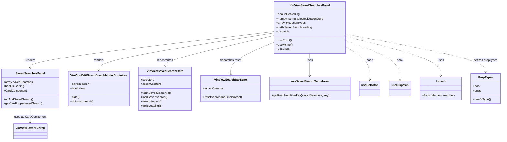

# Diagram: web/portal/src/pages/vinview/dashboard/components/organisms/VinView.SavedSearchesPanel.organism.js

> Auto-generated by Obscura crawlers

## Mermaid

### SVG

<svg id="container" width="2688.5390625" xmlns="http://www.w3.org/2000/svg" class="classDiagram" height="776" viewBox="0 0 2688.5390625 776" role="graphics-document document" aria-roledescription="class"><g><defs><marker id="container_class-aggregationStart" class="marker aggregation class" refX="18" refY="7" markerWidth="190" markerHeight="240" orient="auto"><path d="M 18,7 L9,13 L1,7 L9,1 Z"></path></marker></defs><defs><marker id="container_class-aggregationEnd" class="marker aggregation class" refX="1" refY="7" markerWidth="20" markerHeight="28" orient="auto"><path d="M 18,7 L9,13 L1,7 L9,1 Z"></path></marker></defs><defs><marker id="container_class-extensionStart" class="marker extension class" refX="18" refY="7" markerWidth="190" markerHeight="240" orient="auto"><path d="M 1,7 L18,13 V 1 Z"></path></marker></defs><defs><marker id="container_class-extensionEnd" class="marker extension class" refX="1" refY="7" markerWidth="20" markerHeight="28" orient="auto"><path d="M 1,1 V 13 L18,7 Z"></path></marker></defs><defs><marker id="container_class-compositionStart" class="marker composition class" refX="18" refY="7" markerWidth="190" markerHeight="240" orient="auto"><path d="M 18,7 L9,13 L1,7 L9,1 Z"></path></marker></defs><defs><marker id="container_class-compositionEnd" class="marker composition class" refX="1" refY="7" markerWidth="20" markerHeight="28" orient="auto"><path d="M 18,7 L9,13 L1,7 L9,1 Z"></path></marker></defs><defs><marker id="container_class-dependencyStart" class="marker dependency class" refX="6" refY="7" markerWidth="190" markerHeight="240" orient="auto"><path d="M 5,7 L9,13 L1,7 L9,1 Z"></path></marker></defs><defs><marker id="container_class-dependencyEnd" class="marker dependency class" refX="13" refY="7" markerWidth="20" markerHeight="28" orient="auto"><path d="M 18,7 L9,13 L14,7 L9,1 Z"></path></marker></defs><defs><marker id="container_class-lollipopStart" class="marker lollipop class" refX="13" refY="7" markerWidth="190" markerHeight="240" orient="auto"><circle stroke="black" fill="transparent" cx="7" cy="7" r="6"></circle></marker></defs><defs><marker id="container_class-lollipopEnd" class="marker lollipop class" refX="1" refY="7" markerWidth="190" markerHeight="240" orient="auto"><circle stroke="black" fill="transparent" cx="7" cy="7" r="6"></circle></marker></defs><g class="root"><g class="clusters"></g><g class="edgePaths"><path d="M1453.301,175.854L1237.794,202.045C1022.286,228.236,591.272,280.618,375.765,313.976C160.258,347.333,160.258,361.667,160.258,368.833L160.258,376" id="id_VinViewSavedSearchesPanel_SavedSearchesPanel_1" class="edge-thickness-normal edge-pattern-solid relation" style=";;;" data-edge="true" data-et="edge" data-id="id_VinViewSavedSearchesPanel_SavedSearchesPanel_1" data-points="W3sieCI6MTQ1My4zMDA3ODEyNSwieSI6MTc1Ljg1MzU1NTkyNTY2ODV9LHsieCI6MTYwLjI1NzgxMjUsInkiOjMzM30seyJ4IjoxNjAuMjU3ODEyNSwieSI6MzgyfV0=" marker-end="url(#container_class-dependencyEnd)"></path><path d="M1453.301,183.512L1298.12,208.427C1142.94,233.341,832.579,283.171,677.399,317.252C522.219,351.333,522.219,369.667,522.219,378.833L522.219,388" id="id_VinViewSavedSearchesPanel_VinViewEditSavedSearchModalContainer_2" class="edge-thickness-normal edge-pattern-solid relation" style=";;;" data-edge="true" data-et="edge" data-id="id_VinViewSavedSearchesPanel_VinViewEditSavedSearchModalContainer_2" data-points="W3sieCI6MTQ1My4zMDA3ODEyNSwieSI6MTgzLjUxMjIzNjUzMjUzNzc3fSx7IngiOjUyMi4yMTg3NSwieSI6MzMzfSx7IngiOjUyMi4yMTg3NSwieSI6Mzk0fV0=" marker-end="url(#container_class-dependencyEnd)"></path><path d="M1453.301,197.729L1356.535,220.274C1259.768,242.819,1066.236,287.91,969.469,315.621C872.703,343.333,872.703,353.667,872.703,358.833L872.703,364" id="id_VinViewSavedSearchesPanel_VinViewSavedSearchState_3" class="edge-thickness-normal edge-pattern-solid relation" style=";;;" data-edge="true" data-et="edge" data-id="id_VinViewSavedSearchesPanel_VinViewSavedSearchState_3" data-points="W3sieCI6MTQ1My4zMDA3ODEyNSwieSI6MTk3LjcyODk0MDcxMjY5NDY1fSx7IngiOjg3Mi43MDMxMjUsInkiOjMzM30seyJ4Ijo4NzIuNzAzMTI1LCJ5IjozNzB9XQ==" marker-end="url(#container_class-dependencyEnd)"></path><path d="M1453.301,235.505L1415.108,251.754C1376.915,268.003,1300.53,300.502,1262.337,329.917C1224.145,359.333,1224.145,385.667,1224.145,398.833L1224.145,412" id="id_VinViewSavedSearchesPanel_VinViewSearchBarState_4" class="edge-thickness-normal edge-pattern-solid relation" style=";;;" data-edge="true" data-et="edge" data-id="id_VinViewSavedSearchesPanel_VinViewSearchBarState_4" data-points="W3sieCI6MTQ1My4zMDA3ODEyNSwieSI6MjM1LjUwNDk2NzQwNDI3ODc3fSx7IngiOjEyMjQuMTQ0NTMxMjUsInkiOjMzM30seyJ4IjoxMjI0LjE0NDUzMTI1LCJ5Ijo0MTh9XQ==" marker-end="url(#container_class-dependencyEnd)"></path><path d="M1649.574,296L1649.574,302.167C1649.574,308.333,1649.574,320.667,1649.574,341.5C1649.574,362.333,1649.574,391.667,1649.574,406.333L1649.574,421" id="id_VinViewSavedSearchesPanel_useSavedSearchTransform_5" class="edge-thickness-normal edge-pattern-solid relation" style=";;;" data-edge="true" data-et="edge" data-id="id_VinViewSavedSearchesPanel_useSavedSearchTransform_5" data-points="W3sieCI6MTY0OS41NzQyMTg3NSwieSI6Mjk2fSx7IngiOjE2NDkuNTc0MjE4NzUsInkiOjMzM30seyJ4IjoxNjQ5LjU3NDIxODc1LCJ5Ijo0Mjd9XQ==" marker-end="url(#container_class-dependencyEnd)"></path><path d="M1845.848,263.008L1866.473,274.673C1887.099,286.338,1928.35,309.669,1948.976,339.501C1969.602,369.333,1969.602,405.667,1969.602,423.833L1969.602,442" id="id_VinViewSavedSearchesPanel_useSelector_6" class="edge-thickness-normal edge-pattern-dashed relation" style=";;;" data-edge="true" data-et="edge" data-id="id_VinViewSavedSearchesPanel_useSelector_6" data-points="W3sieCI6MTg0NS44NDc2NTYyNSwieSI6MjYzLjAwNzY3NzU2NjYxNDJ9LHsieCI6MTk2OS42MDE1NjI1LCJ5IjozMzN9LHsieCI6MTk2OS42MDE1NjI1LCJ5Ijo0NDh9XQ==" marker-end="url(#container_class-dependencyEnd)"></path><path d="M1845.848,225.713L1893.459,243.594C1941.07,261.476,2036.293,297.238,2083.904,333.286C2131.516,369.333,2131.516,405.667,2131.516,423.833L2131.516,442" id="id_VinViewSavedSearchesPanel_useDispatch_7" class="edge-thickness-normal edge-pattern-dashed relation" style=";;;" data-edge="true" data-et="edge" data-id="id_VinViewSavedSearchesPanel_useDispatch_7" data-points="W3sieCI6MTg0NS44NDc2NTYyNSwieSI6MjI1LjcxMzMwMTUwNjc2MzgzfSx7IngiOjIxMzEuNTE1NjI1LCJ5IjozMzN9LHsieCI6MjEzMS41MTU2MjUsInkiOjQ0OH1d" marker-end="url(#container_class-dependencyEnd)"></path><path d="M1845.848,202.343L1930.748,224.119C2015.648,245.895,2185.449,289.448,2270.35,325.89C2355.25,362.333,2355.25,391.667,2355.25,406.333L2355.25,421" id="id_VinViewSavedSearchesPanel_lodash_8" class="edge-thickness-normal edge-pattern-dashed relation" style=";;;" data-edge="true" data-et="edge" data-id="id_VinViewSavedSearchesPanel_lodash_8" data-points="W3sieCI6MTg0NS44NDc2NTYyNSwieSI6MjAyLjM0MjUxMjk5NDUyNTR9LHsieCI6MjM1NS4yNSwieSI6MzMzfSx7IngiOjIzNTUuMjUsInkiOjQyN31d" marker-end="url(#container_class-dependencyEnd)"></path><path d="M160.258,598L160.258,606.167C160.258,614.333,160.258,630.667,160.258,644C160.258,657.333,160.258,667.667,160.258,672.833L160.258,678" id="id_SavedSearchesPanel_VinViewSavedSearch_9" class="edge-thickness-normal edge-pattern-solid relation" style=";;;" data-edge="true" data-et="edge" data-id="id_SavedSearchesPanel_VinViewSavedSearch_9" data-points="W3sieCI6MTYwLjI1NzgxMjUsInkiOjU5OH0seyJ4IjoxNjAuMjU3ODEyNSwieSI6NjQ3fSx7IngiOjE2MC4yNTc4MTI1LCJ5Ijo2ODR9XQ==" marker-end="url(#container_class-dependencyEnd)"></path><path d="M1845.848,189.322L1971.779,213.269C2097.71,237.215,2349.572,285.107,2475.503,320.22C2601.434,355.333,2601.434,377.667,2601.434,388.833L2601.434,400" id="id_VinViewSavedSearchesPanel_PropTypes_10" class="edge-thickness-normal edge-pattern-dashed relation" style=";;;" data-edge="true" data-et="edge" data-id="id_VinViewSavedSearchesPanel_PropTypes_10" data-points="W3sieCI6MTg0NS44NDc2NTYyNSwieSI6MTg5LjMyMjIwNjUzNjU0ODU1fSx7IngiOjI2MDEuNDMzNTkzNzUsInkiOjMzM30seyJ4IjoyNjAxLjQzMzU5Mzc1LCJ5Ijo0MDZ9XQ==" marker-end="url(#container_class-dependencyEnd)"></path></g><g class="edgeLabels"><g class="edgeLabel" transform="translate(160.2578125, 333)"><g class="label" data-id="id_VinViewSavedSearchesPanel_SavedSearchesPanel_1" transform="translate(-27.75, -12)"><foreignObject width="55.5" height="24">

renders

</foreignObject></g></g><g class="edgeLabel" transform="translate(522.21875, 333)"><g class="label" data-id="id_VinViewSavedSearchesPanel_VinViewEditSavedSearchModalContainer_2" transform="translate(-27.75, -12)"><foreignObject width="55.5" height="24">

renders

</foreignObject></g></g><g class="edgeLabel" transform="translate(872.703125, 333)"><g class="label" data-id="id_VinViewSavedSearchesPanel_VinViewSavedSearchState_3" transform="translate(-45.9453125, -12)"><foreignObject width="91.890625" height="24">

reads/writes

</foreignObject></g></g><g class="edgeLabel" transform="translate(1224.14453125, 333)"><g class="label" data-id="id_VinViewSavedSearchesPanel_VinViewSearchBarState_4" transform="translate(-59.4921875, -12)"><foreignObject width="118.984375" height="24">

dispatches reset

</foreignObject></g></g><g class="edgeLabel" transform="translate(1649.57421875, 333)"><g class="label" data-id="id_VinViewSavedSearchesPanel_useSavedSearchTransform_5" transform="translate(-16.4921875, -12)"><foreignObject width="32.984375" height="24">

uses

</foreignObject></g></g><g class="edgeLabel" transform="translate(1969.6015625, 333)"><g class="label" data-id="id_VinViewSavedSearchesPanel_useSelector_6" transform="translate(-18.1328125, -12)"><foreignObject width="36.265625" height="24">

hook

</foreignObject></g></g><g class="edgeLabel" transform="translate(2131.515625, 333)"><g class="label" data-id="id_VinViewSavedSearchesPanel_useDispatch_7" transform="translate(-18.1328125, -12)"><foreignObject width="36.265625" height="24">

hook

</foreignObject></g></g><g class="edgeLabel" transform="translate(2355.25, 333)"><g class="label" data-id="id_VinViewSavedSearchesPanel_lodash_8" transform="translate(-16.4921875, -12)"><foreignObject width="32.984375" height="24">

uses

</foreignObject></g></g><g class="edgeLabel" transform="translate(160.2578125, 647)"><g class="label" data-id="id_SavedSearchesPanel_VinViewSavedSearch_9" transform="translate(-87.0234375, -12)"><foreignObject width="174.046875" height="24">

uses as CardComponent

</foreignObject></g></g><g class="edgeLabel" transform="translate(2601.43359375, 333)"><g class="label" data-id="id_VinViewSavedSearchesPanel_PropTypes_10" transform="translate(-66.2734375, -12)"><foreignObject width="132.546875" height="24">

defines propTypes

</foreignObject></g></g></g><g class="nodes"><g class="node default" id="classId-VinViewSavedSearchesPanel-0" transform="translate(1649.57421875, 152)"><g class="basic label-container"><path d="M-196.2734375 -144 L196.2734375 -144 L196.2734375 144 L-196.2734375 144" stroke="none" stroke-width="0" fill="#ECECFF" style=""></path><path d="M-196.2734375 -144 C-50.0521846467216 -144, 96.1690682065568 -144, 196.2734375 -144 M-196.2734375 -144 C-42.91354049296214 -144, 110.44635651407572 -144, 196.2734375 -144 M196.2734375 -144 C196.2734375 -37.681572236146096, 196.2734375 68.63685552770781, 196.2734375 144 M196.2734375 -144 C196.2734375 -74.43031156108654, 196.2734375 -4.860623122173081, 196.2734375 144 M196.2734375 144 C68.43010211583307 144, -59.41323326833387 144, -196.2734375 144 M196.2734375 144 C54.40333877931471 144, -87.46675994137058 144, -196.2734375 144 M-196.2734375 144 C-196.2734375 45.02840466427489, -196.2734375 -53.943190671450225, -196.2734375 -144 M-196.2734375 144 C-196.2734375 45.746707807662816, -196.2734375 -52.50658438467437, -196.2734375 -144" stroke="#9370DB" stroke-width="1.3" fill="none" stroke-dasharray="0 0" style=""></path></g><g class="annotation-group text" transform="translate(0, -120)"></g><g class="label-group text" transform="translate(-103.921875, -120)"><g class="label" style="font-weight: bolder" transform="translate(0,-12)"><foreignObject width="207.84375" height="24">

VinViewSavedSearchesPanel

</foreignObject></g></g><g class="members-group text" transform="translate(-184.2734375, -72)"><g class="label" style="" transform="translate(0,-12)"><foreignObject width="129.34375" height="24">

+bool isDealerOrg

</foreignObject></g><g class="label" style="" transform="translate(0,12)"><foreignObject width="264.625" height="24">

+number|string selectedDealerOrgId

</foreignObject></g><g class="label" style="" transform="translate(0,36)"><foreignObject width="160.78125" height="24">

+array exceptionTypes

</foreignObject></g><g class="label" style="" transform="translate(0,60)"><foreignObject width="191.953125" height="24">

+getIsSavedSearchLoading

</foreignObject></g><g class="label" style="" transform="translate(0,84)"><foreignObject width="70.15625" height="24">

+dispatch

</foreignObject></g></g><g class="methods-group text" transform="translate(-184.2734375, 72)"><g class="label" style="" transform="translate(0,-12)"><foreignObject width="84.8125" height="24">

+useEffect()

</foreignObject></g><g class="label" style="" transform="translate(0,12)"><foreignObject width="88.09375" height="24">

+useMemo()

</foreignObject></g><g class="label" style="" transform="translate(0,36)"><foreignObject width="81.203125" height="24">

+useState()

</foreignObject></g></g><g class="divider" style=""><path d="M-196.2734375 -96 C-103.10438997328792 -96, -9.935342446575845 -96, 196.2734375 -96 M-196.2734375 -96 C-75.2004336786231 -96, 45.8725701427538 -96, 196.2734375 -96" stroke="#9370DB" stroke-width="1.3" fill="none" stroke-dasharray="0 0" style=""></path></g><g class="divider" style=""><path d="M-196.2734375 48 C-114.45955149724453 48, -32.645665494489066 48, 196.2734375 48 M-196.2734375 48 C-63.85319894631775 48, 68.5670396073645 48, 196.2734375 48" stroke="#9370DB" stroke-width="1.3" fill="none" stroke-dasharray="0 0" style=""></path></g></g><g class="node default" id="classId-SavedSearchesPanel-1" transform="translate(160.2578125, 490)"><g class="basic label-container"><path d="M-152.2578125 -108 L152.2578125 -108 L152.2578125 108 L-152.2578125 108" stroke="none" stroke-width="0" fill="#ECECFF" style=""></path><path d="M-152.2578125 -108 C-46.30608770963575 -108, 59.645637080728505 -108, 152.2578125 -108 M-152.2578125 -108 C-37.36625865234035 -108, 77.5252951953193 -108, 152.2578125 -108 M152.2578125 -108 C152.2578125 -33.056608254401866, 152.2578125 41.88678349119627, 152.2578125 108 M152.2578125 -108 C152.2578125 -61.63977515001586, 152.2578125 -15.279550300031715, 152.2578125 108 M152.2578125 108 C43.94028598375259 108, -64.37724053249482 108, -152.2578125 108 M152.2578125 108 C45.9738777482095 108, -60.310057003580994 108, -152.2578125 108 M-152.2578125 108 C-152.2578125 55.67993232828909, -152.2578125 3.359864656578182, -152.2578125 -108 M-152.2578125 108 C-152.2578125 56.76056507735426, -152.2578125 5.521130154708516, -152.2578125 -108" stroke="#9370DB" stroke-width="1.3" fill="none" stroke-dasharray="0 0" style=""></path></g><g class="annotation-group text" transform="translate(0, -84)"></g><g class="label-group text" transform="translate(-75.265625, -84)"><g class="label" style="font-weight: bolder" transform="translate(0,-12)"><foreignObject width="150.53125" height="24">

SavedSearchesPanel

</foreignObject></g></g><g class="members-group text" transform="translate(-140.2578125, -36)"><g class="label" style="" transform="translate(0,-12)"><foreignObject width="155.59375" height="24">

+array savedSearches

</foreignObject></g><g class="label" style="" transform="translate(0,12)"><foreignObject width="114.328125" height="24">

+bool isLoading

</foreignObject></g><g class="label" style="" transform="translate(0,36)"><foreignObject width="124.546875" height="24">

+CardComponent

</foreignObject></g></g><g class="methods-group text" transform="translate(-140.2578125, 60)"><g class="label" style="" transform="translate(0,-12)"><foreignObject width="157.375" height="24">

+onAddSavedSearch()

</foreignObject></g><g class="label" style="" transform="translate(0,12)"><foreignObject width="205.25" height="24">

+getCardProps(savedSearch)

</foreignObject></g></g><g class="divider" style=""><path d="M-152.2578125 -60 C-49.40326865411538 -60, 53.45127519176924 -60, 152.2578125 -60 M-152.2578125 -60 C-30.509762130386292 -60, 91.23828823922742 -60, 152.2578125 -60" stroke="#9370DB" stroke-width="1.3" fill="none" stroke-dasharray="0 0" style=""></path></g><g class="divider" style=""><path d="M-152.2578125 36 C-32.73633375785461 36, 86.78514498429078 36, 152.2578125 36 M-152.2578125 36 C-77.10010014297308 36, -1.9423877859461527 36, 152.2578125 36" stroke="#9370DB" stroke-width="1.3" fill="none" stroke-dasharray="0 0" style=""></path></g></g><g class="node default" id="classId-VinViewSavedSearch-2" transform="translate(160.2578125, 726)"><g class="basic label-container"><path d="M-87.46875 -42 L87.46875 -42 L87.46875 42 L-87.46875 42" stroke="none" stroke-width="0" fill="#ECECFF" style=""></path><path d="M-87.46875 -42 C-28.08385806488694 -42, 31.30103387022612 -42, 87.46875 -42 M-87.46875 -42 C-47.3340856186901 -42, -7.199421237380193 -42, 87.46875 -42 M87.46875 -42 C87.46875 -9.143963536477195, 87.46875 23.71207292704561, 87.46875 42 M87.46875 -42 C87.46875 -21.019834968831166, 87.46875 -0.03966993766233173, 87.46875 42 M87.46875 42 C20.422228958175353 42, -46.624292083649294 42, -87.46875 42 M87.46875 42 C29.06695348832195 42, -29.3348430233561 42, -87.46875 42 M-87.46875 42 C-87.46875 22.663072189528044, -87.46875 3.326144379056089, -87.46875 -42 M-87.46875 42 C-87.46875 16.233109983556865, -87.46875 -9.53378003288627, -87.46875 -42" stroke="#9370DB" stroke-width="1.3" fill="none" stroke-dasharray="0 0" style=""></path></g><g class="annotation-group text" transform="translate(0, -18)"></g><g class="label-group text" transform="translate(-75.46875, -18)"><g class="label" style="font-weight: bolder" transform="translate(0,-12)"><foreignObject width="150.9375" height="24">

VinViewSavedSearch

</foreignObject></g></g><g class="members-group text" transform="translate(-75.46875, 30)"></g><g class="methods-group text" transform="translate(-75.46875, 60)"></g><g class="divider" style=""><path d="M-87.46875 6 C-23.163070358509458 6, 41.142609282981084 6, 87.46875 6 M-87.46875 6 C-17.517604268334253 6, 52.433541463331494 6, 87.46875 6" stroke="#9370DB" stroke-width="1.3" fill="none" stroke-dasharray="0 0" style=""></path></g><g class="divider" style=""><path d="M-87.46875 24 C-28.69008393736045 24, 30.088582125279103 24, 87.46875 24 M-87.46875 24 C-50.6026048339685 24, -13.736459667936998 24, 87.46875 24" stroke="#9370DB" stroke-width="1.3" fill="none" stroke-dasharray="0 0" style=""></path></g></g><g class="node default" id="classId-VinViewEditSavedSearchModalContainer-3" transform="translate(522.21875, 490)"><g class="basic label-container"><path d="M-159.703125 -96 L159.703125 -96 L159.703125 96 L-159.703125 96" stroke="none" stroke-width="0" fill="#ECECFF" style=""></path><path d="M-159.703125 -96 C-39.282719297259504 -96, 81.13768640548099 -96, 159.703125 -96 M-159.703125 -96 C-82.93589947899972 -96, -6.168673957999431 -96, 159.703125 -96 M159.703125 -96 C159.703125 -51.68681472334486, 159.703125 -7.373629446689719, 159.703125 96 M159.703125 -96 C159.703125 -32.74204960350046, 159.703125 30.515900792999076, 159.703125 96 M159.703125 96 C70.38235156236834 96, -18.938421875263316 96, -159.703125 96 M159.703125 96 C63.0180253870553 96, -33.667074225889394 96, -159.703125 96 M-159.703125 96 C-159.703125 34.75203060939763, -159.703125 -26.495938781204742, -159.703125 -96 M-159.703125 96 C-159.703125 42.22757392497998, -159.703125 -11.544852150040043, -159.703125 -96" stroke="#9370DB" stroke-width="1.3" fill="none" stroke-dasharray="0 0" style=""></path></g><g class="annotation-group text" transform="translate(0, -72)"></g><g class="label-group text" transform="translate(-147.703125, -72)"><g class="label" style="font-weight: bolder" transform="translate(0,-12)"><foreignObject width="295.40625" height="24">

VinViewEditSavedSearchModalContainer

</foreignObject></g></g><g class="members-group text" transform="translate(-147.703125, -24)"><g class="label" style="" transform="translate(0,-12)"><foreignObject width="98.5625" height="24">

+savedSearch

</foreignObject></g><g class="label" style="" transform="translate(0,12)"><foreignObject width="82.78125" height="24">

+bool show

</foreignObject></g></g><g class="methods-group text" transform="translate(-147.703125, 48)"><g class="label" style="" transform="translate(0,-12)"><foreignObject width="50.53125" height="24">

+hide()

</foreignObject></g><g class="label" style="" transform="translate(0,12)"><foreignObject width="127.015625" height="24">

+deleteSearch(id)

</foreignObject></g></g><g class="divider" style=""><path d="M-159.703125 -48 C-83.14840037335681 -48, -6.593675746713615 -48, 159.703125 -48 M-159.703125 -48 C-41.40837294109929 -48, 76.88637911780143 -48, 159.703125 -48" stroke="#9370DB" stroke-width="1.3" fill="none" stroke-dasharray="0 0" style=""></path></g><g class="divider" style=""><path d="M-159.703125 24 C-54.47401007603236 24, 50.755104847935286 24, 159.703125 24 M-159.703125 24 C-86.36935201420418 24, -13.035579028408364 24, 159.703125 24" stroke="#9370DB" stroke-width="1.3" fill="none" stroke-dasharray="0 0" style=""></path></g></g><g class="node default" id="classId-VinViewSavedSearchState-4" transform="translate(872.703125, 490)"><g class="basic label-container"><path d="M-140.78125 -120 L140.78125 -120 L140.78125 120 L-140.78125 120" stroke="none" stroke-width="0" fill="#ECECFF" style=""></path><path d="M-140.78125 -120 C-81.69840552273517 -120, -22.615561045470344 -120, 140.78125 -120 M-140.78125 -120 C-74.95993897323025 -120, -9.138627946460502 -120, 140.78125 -120 M140.78125 -120 C140.78125 -43.07007441018884, 140.78125 33.859851179622325, 140.78125 120 M140.78125 -120 C140.78125 -59.32859169789749, 140.78125 1.3428166042050265, 140.78125 120 M140.78125 120 C51.27656475462251 120, -38.228120490754975 120, -140.78125 120 M140.78125 120 C83.02918147042527 120, 25.277112940850557 120, -140.78125 120 M-140.78125 120 C-140.78125 62.290732694010906, -140.78125 4.581465388021812, -140.78125 -120 M-140.78125 120 C-140.78125 28.237571581554548, -140.78125 -63.524856836890905, -140.78125 -120" stroke="#9370DB" stroke-width="1.3" fill="none" stroke-dasharray="0 0" style=""></path></g><g class="annotation-group text" transform="translate(0, -96)"></g><g class="label-group text" transform="translate(-94.78125, -96)"><g class="label" style="font-weight: bolder" transform="translate(0,-12)"><foreignObject width="189.5625" height="24">

VinViewSavedSearchState

</foreignObject></g></g><g class="members-group text" transform="translate(-128.78125, -48)"><g class="label" style="" transform="translate(0,-12)"><foreignObject width="73.453125" height="24">

+selectors

</foreignObject></g><g class="label" style="" transform="translate(0,12)"><foreignObject width="113.078125" height="24">

+actionCreators

</foreignObject></g></g><g class="methods-group text" transform="translate(-128.78125, 24)"><g class="label" style="" transform="translate(0,-12)"><foreignObject width="162.78125" height="24">

+fetchSavedSearches()

</foreignObject></g><g class="label" style="" transform="translate(0,12)"><foreignObject width="142.40625" height="24">

+loadSavedSearch()

</foreignObject></g><g class="label" style="" transform="translate(0,36)"><foreignObject width="112.9375" height="24">

+deleteSearch()

</foreignObject></g><g class="label" style="" transform="translate(0,60)"><foreignObject width="110.34375" height="24">

+getIsLoading()

</foreignObject></g></g><g class="divider" style=""><path d="M-140.78125 -72 C-72.4428700206822 -72, -4.104490041364386 -72, 140.78125 -72 M-140.78125 -72 C-28.623316442987843 -72, 83.53461711402431 -72, 140.78125 -72" stroke="#9370DB" stroke-width="1.3" fill="none" stroke-dasharray="0 0" style=""></path></g><g class="divider" style=""><path d="M-140.78125 0 C-47.699215789967 0, 45.382818420066 0, 140.78125 0 M-140.78125 0 C-69.36380845239613 0, 2.0536330952077435 0, 140.78125 0" stroke="#9370DB" stroke-width="1.3" fill="none" stroke-dasharray="0 0" style=""></path></g></g><g class="node default" id="classId-VinViewSearchBarState-5" transform="translate(1224.14453125, 490)"><g class="basic label-container"><path d="M-160.66015625 -72 L160.66015625 -72 L160.66015625 72 L-160.66015625 72" stroke="none" stroke-width="0" fill="#ECECFF" style=""></path><path d="M-160.66015625 -72 C-90.60599244981452 -72, -20.551828649629044 -72, 160.66015625 -72 M-160.66015625 -72 C-93.27991533407933 -72, -25.899674418158668 -72, 160.66015625 -72 M160.66015625 -72 C160.66015625 -39.276362850345016, 160.66015625 -6.552725700690033, 160.66015625 72 M160.66015625 -72 C160.66015625 -21.92642648533605, 160.66015625 28.147147029327897, 160.66015625 72 M160.66015625 72 C72.09175783196093 72, -16.476640586078133 72, -160.66015625 72 M160.66015625 72 C67.36284697271662 72, -25.93446230456675 72, -160.66015625 72 M-160.66015625 72 C-160.66015625 30.07477921080541, -160.66015625 -11.85044157838918, -160.66015625 -72 M-160.66015625 72 C-160.66015625 41.448270287309356, -160.66015625 10.896540574618705, -160.66015625 -72" stroke="#9370DB" stroke-width="1.3" fill="none" stroke-dasharray="0 0" style=""></path></g><g class="annotation-group text" transform="translate(0, -48)"></g><g class="label-group text" transform="translate(-85.2109375, -48)"><g class="label" style="font-weight: bolder" transform="translate(0,-12)"><foreignObject width="170.421875" height="24">

VinViewSearchBarState

</foreignObject></g></g><g class="members-group text" transform="translate(-148.66015625, 0)"><g class="label" style="" transform="translate(0,-12)"><foreignObject width="113.078125" height="24">

+actionCreators

</foreignObject></g></g><g class="methods-group text" transform="translate(-148.66015625, 48)"><g class="label" style="" transform="translate(0,-12)"><foreignObject width="212.109375" height="24">

+resetSearchAndFilters(reset)

</foreignObject></g></g><g class="divider" style=""><path d="M-160.66015625 -24 C-40.79200775296401 -24, 79.07614074407198 -24, 160.66015625 -24 M-160.66015625 -24 C-54.22279357487895 -24, 52.2145691002421 -24, 160.66015625 -24" stroke="#9370DB" stroke-width="1.3" fill="none" stroke-dasharray="0 0" style=""></path></g><g class="divider" style=""><path d="M-160.66015625 24 C-84.09043083440197 24, -7.520705418803942 24, 160.66015625 24 M-160.66015625 24 C-81.24613831801301 24, -1.8321203860260198 24, 160.66015625 24" stroke="#9370DB" stroke-width="1.3" fill="none" stroke-dasharray="0 0" style=""></path></g></g><g class="node default" id="classId-useSavedSearchTransform-6" transform="translate(1649.57421875, 490)"><g class="basic label-container"><path d="M-214.76953125 -63 L214.76953125 -63 L214.76953125 63 L-214.76953125 63" stroke="none" stroke-width="0" fill="#ECECFF" style=""></path><path d="M-214.76953125 -63 C-62.87358706499273 -63, 89.02235712001453 -63, 214.76953125 -63 M-214.76953125 -63 C-101.34383275554585 -63, 12.081865738908306 -63, 214.76953125 -63 M214.76953125 -63 C214.76953125 -13.507142716682878, 214.76953125 35.98571456663424, 214.76953125 63 M214.76953125 -63 C214.76953125 -35.036445616384285, 214.76953125 -7.072891232768576, 214.76953125 63 M214.76953125 63 C60.66564740628951 63, -93.43823643742098 63, -214.76953125 63 M214.76953125 63 C73.92660456537601 63, -66.91632211924798 63, -214.76953125 63 M-214.76953125 63 C-214.76953125 26.48736293081803, -214.76953125 -10.02527413836394, -214.76953125 -63 M-214.76953125 63 C-214.76953125 32.206113389150374, -214.76953125 1.4122267783007487, -214.76953125 -63" stroke="#9370DB" stroke-width="1.3" fill="none" stroke-dasharray="0 0" style=""></path></g><g class="annotation-group text" transform="translate(0, -39)"></g><g class="label-group text" transform="translate(-96.9453125, -39)"><g class="label" style="font-weight: bolder" transform="translate(0,-12)"><foreignObject width="193.890625" height="24">

useSavedSearchTransform

</foreignObject></g></g><g class="members-group text" transform="translate(-202.76953125, 9)"></g><g class="methods-group text" transform="translate(-202.76953125, 39)"><g class="label" style="" transform="translate(0,-12)"><foreignObject width="308.59375" height="24">

+getResolvedFilterKey(savedSearches, key)

</foreignObject></g></g><g class="divider" style=""><path d="M-214.76953125 -15 C-75.8741516340196 -15, 63.021227981960806 -15, 214.76953125 -15 M-214.76953125 -15 C-79.09674946202995 -15, 56.576032325940105 -15, 214.76953125 -15" stroke="#9370DB" stroke-width="1.3" fill="none" stroke-dasharray="0 0" style=""></path></g><g class="divider" style=""><path d="M-214.76953125 9 C-56.496019680417476 9, 101.77749188916505 9, 214.76953125 9 M-214.76953125 9 C-93.32916995646447 9, 28.111191337071062 9, 214.76953125 9" stroke="#9370DB" stroke-width="1.3" fill="none" stroke-dasharray="0 0" style=""></path></g></g><g class="node default" id="classId-useSelector-7" transform="translate(1969.6015625, 490)"><g class="basic label-container"><path d="M-55.2578125 -42 L55.2578125 -42 L55.2578125 42 L-55.2578125 42" stroke="none" stroke-width="0" fill="#ECECFF" style=""></path><path d="M-55.2578125 -42 C-20.580511258044105 -42, 14.09678998391179 -42, 55.2578125 -42 M-55.2578125 -42 C-17.177142482248705 -42, 20.90352753550259 -42, 55.2578125 -42 M55.2578125 -42 C55.2578125 -8.548171500688902, 55.2578125 24.903656998622196, 55.2578125 42 M55.2578125 -42 C55.2578125 -19.149358308860002, 55.2578125 3.701283382279996, 55.2578125 42 M55.2578125 42 C12.885083413571827 42, -29.487645672856345 42, -55.2578125 42 M55.2578125 42 C15.297637372995915 42, -24.66253775400817 42, -55.2578125 42 M-55.2578125 42 C-55.2578125 9.1263422877429, -55.2578125 -23.7473154245142, -55.2578125 -42 M-55.2578125 42 C-55.2578125 17.070790306298466, -55.2578125 -7.8584193874030674, -55.2578125 -42" stroke="#9370DB" stroke-width="1.3" fill="none" stroke-dasharray="0 0" style=""></path></g><g class="annotation-group text" transform="translate(0, -18)"></g><g class="label-group text" transform="translate(-43.2578125, -18)"><g class="label" style="font-weight: bolder" transform="translate(0,-12)"><foreignObject width="86.515625" height="24">

useSelector

</foreignObject></g></g><g class="members-group text" transform="translate(-43.2578125, 30)"></g><g class="methods-group text" transform="translate(-43.2578125, 60)"></g><g class="divider" style=""><path d="M-55.2578125 6 C-12.937474512964236 6, 29.382863474071527 6, 55.2578125 6 M-55.2578125 6 C-28.932621855697302 6, -2.607431211394605 6, 55.2578125 6" stroke="#9370DB" stroke-width="1.3" fill="none" stroke-dasharray="0 0" style=""></path></g><g class="divider" style=""><path d="M-55.2578125 24 C-23.81327508400396 24, 7.631262331992083 24, 55.2578125 24 M-55.2578125 24 C-19.195490889571843 24, 16.866830720856314 24, 55.2578125 24" stroke="#9370DB" stroke-width="1.3" fill="none" stroke-dasharray="0 0" style=""></path></g></g><g class="node default" id="classId-useDispatch-8" transform="translate(2131.515625, 490)"><g class="basic label-container"><path d="M-56.65625 -42 L56.65625 -42 L56.65625 42 L-56.65625 42" stroke="none" stroke-width="0" fill="#ECECFF" style=""></path><path d="M-56.65625 -42 C-16.129939550019422 -42, 24.396370899961155 -42, 56.65625 -42 M-56.65625 -42 C-25.991263684624204 -42, 4.673722630751591 -42, 56.65625 -42 M56.65625 -42 C56.65625 -22.98719251531907, 56.65625 -3.974385030638139, 56.65625 42 M56.65625 -42 C56.65625 -17.331699920183382, 56.65625 7.336600159633235, 56.65625 42 M56.65625 42 C21.659920495089537 42, -13.336409009820926 42, -56.65625 42 M56.65625 42 C19.4140648507177 42, -17.8281202985646 42, -56.65625 42 M-56.65625 42 C-56.65625 10.50004716690454, -56.65625 -20.99990566619092, -56.65625 -42 M-56.65625 42 C-56.65625 9.391885948585454, -56.65625 -23.216228102829092, -56.65625 -42" stroke="#9370DB" stroke-width="1.3" fill="none" stroke-dasharray="0 0" style=""></path></g><g class="annotation-group text" transform="translate(0, -18)"></g><g class="label-group text" transform="translate(-44.65625, -18)"><g class="label" style="font-weight: bolder" transform="translate(0,-12)"><foreignObject width="89.3125" height="24">

useDispatch

</foreignObject></g></g><g class="members-group text" transform="translate(-44.65625, 30)"></g><g class="methods-group text" transform="translate(-44.65625, 60)"></g><g class="divider" style=""><path d="M-56.65625 6 C-29.122484942953378 6, -1.5887198859067553 6, 56.65625 6 M-56.65625 6 C-14.374048465402986 6, 27.90815306919403 6, 56.65625 6" stroke="#9370DB" stroke-width="1.3" fill="none" stroke-dasharray="0 0" style=""></path></g><g class="divider" style=""><path d="M-56.65625 24 C-25.09244997652561 24, 6.471350046948778 24, 56.65625 24 M-56.65625 24 C-14.71826758310074 24, 27.21971483379852 24, 56.65625 24" stroke="#9370DB" stroke-width="1.3" fill="none" stroke-dasharray="0 0" style=""></path></g></g><g class="node default" id="classId-lodash-9" transform="translate(2355.25, 490)"><g class="basic label-container"><path d="M-117.078125 -63 L117.078125 -63 L117.078125 63 L-117.078125 63" stroke="none" stroke-width="0" fill="#ECECFF" style=""></path><path d="M-117.078125 -63 C-48.95479897718086 -63, 19.168527045638285 -63, 117.078125 -63 M-117.078125 -63 C-24.457029048438358 -63, 68.16406690312328 -63, 117.078125 -63 M117.078125 -63 C117.078125 -24.56454915704346, 117.078125 13.870901685913083, 117.078125 63 M117.078125 -63 C117.078125 -22.45537933828787, 117.078125 18.08924132342426, 117.078125 63 M117.078125 63 C34.488401903196376 63, -48.10132119360725 63, -117.078125 63 M117.078125 63 C34.936779030395584 63, -47.20456693920883 63, -117.078125 63 M-117.078125 63 C-117.078125 14.324111970555485, -117.078125 -34.35177605888903, -117.078125 -63 M-117.078125 63 C-117.078125 36.47400339370316, -117.078125 9.948006787406321, -117.078125 -63" stroke="#9370DB" stroke-width="1.3" fill="none" stroke-dasharray="0 0" style=""></path></g><g class="annotation-group text" transform="translate(0, -39)"></g><g class="label-group text" transform="translate(-24.59375, -39)"><g class="label" style="font-weight: bolder" transform="translate(0,-12)"><foreignObject width="49.1875" height="24">

lodash

</foreignObject></g></g><g class="members-group text" transform="translate(-105.078125, 9)"></g><g class="methods-group text" transform="translate(-105.078125, 39)"><g class="label" style="" transform="translate(0,-12)"><foreignObject width="185.5625" height="24">

+find(collection, matcher)

</foreignObject></g></g><g class="divider" style=""><path d="M-117.078125 -15 C-27.597576789501574 -15, 61.88297142099685 -15, 117.078125 -15 M-117.078125 -15 C-33.24987981656868 -15, 50.57836536686264 -15, 117.078125 -15" stroke="#9370DB" stroke-width="1.3" fill="none" stroke-dasharray="0 0" style=""></path></g><g class="divider" style=""><path d="M-117.078125 9 C-45.67597595230778 9, 25.72617309538444 9, 117.078125 9 M-117.078125 9 C-28.5836087699997 9, 59.9109074600006 9, 117.078125 9" stroke="#9370DB" stroke-width="1.3" fill="none" stroke-dasharray="0 0" style=""></path></g></g><g class="node default" id="classId-PropTypes-10" transform="translate(2601.43359375, 490)"><g class="basic label-container"><path d="M-79.10546875 -84 L79.10546875 -84 L79.10546875 84 L-79.10546875 84" stroke="none" stroke-width="0" fill="#ECECFF" style=""></path><path d="M-79.10546875 -84 C-40.97014415306815 -84, -2.8348195561362957 -84, 79.10546875 -84 M-79.10546875 -84 C-40.898909918188096 -84, -2.692351086376192 -84, 79.10546875 -84 M79.10546875 -84 C79.10546875 -24.564979356605875, 79.10546875 34.87004128678825, 79.10546875 84 M79.10546875 -84 C79.10546875 -40.61083322086931, 79.10546875 2.77833355826138, 79.10546875 84 M79.10546875 84 C26.14970197335041 84, -26.80606480329918 84, -79.10546875 84 M79.10546875 84 C19.727817970057302 84, -39.649832809885396 84, -79.10546875 84 M-79.10546875 84 C-79.10546875 42.96439294577278, -79.10546875 1.9287858915455587, -79.10546875 -84 M-79.10546875 84 C-79.10546875 28.40450324708273, -79.10546875 -27.19099350583454, -79.10546875 -84" stroke="#9370DB" stroke-width="1.3" fill="none" stroke-dasharray="0 0" style=""></path></g><g class="annotation-group text" transform="translate(0, -60)"></g><g class="label-group text" transform="translate(-38.2578125, -60)"><g class="label" style="font-weight: bolder" transform="translate(0,-12)"><foreignObject width="76.515625" height="24">

PropTypes

</foreignObject></g></g><g class="members-group text" transform="translate(-67.10546875, -12)"><g class="label" style="" transform="translate(0,-12)"><foreignObject width="40.875" height="24">

+bool

</foreignObject></g><g class="label" style="" transform="translate(0,12)"><foreignObject width="44.578125" height="24">

+array

</foreignObject></g></g><g class="methods-group text" transform="translate(-67.10546875, 60)"><g class="label" style="" transform="translate(0,-12)"><foreignObject width="95.953125" height="24">

+oneOfType()

</foreignObject></g></g><g class="divider" style=""><path d="M-79.10546875 -36 C-35.34598604450136 -36, 8.413496660997282 -36, 79.10546875 -36 M-79.10546875 -36 C-27.70263861366218 -36, 23.700191522675638 -36, 79.10546875 -36" stroke="#9370DB" stroke-width="1.3" fill="none" stroke-dasharray="0 0" style=""></path></g><g class="divider" style=""><path d="M-79.10546875 36 C-25.791015852929164 36, 27.523437044141673 36, 79.10546875 36 M-79.10546875 36 C-21.099443664157192 36, 36.906581421685615 36, 79.10546875 36" stroke="#9370DB" stroke-width="1.3" fill="none" stroke-dasharray="0 0" style=""></path></g></g></g></g></g></svg>
