# Diagram: web/portal/src/pages/vinview/details/VinView.Details.page.container.js

> Auto-generated by Obscura crawlers

## Mermaid

```mermaid
classDiagram
class VinViewDetails
class mapStateToProps
class actionCreators
class VinViewEntityDetailsState {
  +selectors.getEntityDetails(state)
  +selectors.getEntityPositionUpdates(state)
  +selectors.getEntityEvents(state)
  +selectors.getComments(state)
  +actionCreators.fetchEntityDetails()
  +actionCreators.fetchEntityEvents()
  +actionCreators.addComment()
}
class VinViewTripLegState {
  +selectors.getPlannedTripLeg(state)
  +selectors.getActualTripLeg(state)
  +actionCreators.fetchPlannedTripLeg()
  +actionCreators.fetchActualTripLeg()
}
class VinViewSubscriptionState {
  +selectors.getSubscription(state)
  +selectors.getIsSubscriptionLoading(state)
  +actionCreators.fetchSubscription()
  +actionCreators.updateSubscription()
  +actionCreators.subscribe()
  +actionCreators.unsubscribe()
}
class MapState {
  +selectors.getMapCoordinate(type)(state)
  +actionCreators.addCoordinate()
  +actionCreators.clearCoordinatesByType()
}
class ShipmentsStatusState {
  +selectors.getShipmentDetails(state)
  +selectors.getChildShipmentDetails(state)
  +selectors.getComments(state)
  +actionCreators.fetchLegShipmentDetails()
  +actionCreators.clearLegShipmentDetails()
}
class NotificationsState {
  +actionCreators.fetchNotification()
}
class ErrorState {
  +actionCreators.redirectTo404()
  +actionCreators.redirectTo403()
}
class TitleState {
  +selectors.getOpenSearchToggleState(state)
}
class OrganizationsState {
  +getSolutionId(state)
  +getActiveOrganization(state)
}
class AuthorizationSelectors {
  +getAuthorization(state)
}
class VinViewEntityHistoricalState {
  +selectors.getHistoryByQualifier
  +actionCreators.fetchHistoricalData()
}
class dealerUtils {
  +getSelectedDealerOrgFvId(state, org)
}

VinViewDetails --> mapStateToProps : connected via connect()
VinViewDetails --> actionCreators : connected via connect()
mapStateToProps --> VinViewEntityDetailsState : reads selectors
mapStateToProps --> VinViewTripLegState : reads selectors
mapStateToProps --> VinViewSubscriptionState : reads selectors
mapStateToProps --> MapState : reads selectors
mapStateToProps --> ShipmentsStatusState : reads selectors
mapStateToProps --> NotificationsState : reads selectors
mapStateToProps --> ErrorState : reads selectors
mapStateToProps --> TitleState : reads selectors
mapStateToProps --> OrganizationsState : calls getSolutionId/getActiveOrganization
mapStateToProps --> AuthorizationSelectors : calls getAuthorization
mapStateToProps --> VinViewEntityHistoricalState : reads selectors
mapStateToProps --> dealerUtils : calls getSelectedDealerOrgFvId

actionCreators --> VinViewEntityDetailsState : uses actionCreators.*
actionCreators --> VinViewTripLegState : uses actionCreators.*
actionCreators --> VinViewSubscriptionState : uses actionCreators.*
actionCreators --> VinViewEntityHistoricalState : uses actionCreators.*
actionCreators --> ShipmentsStatusState : uses actionCreators.*
actionCreators --> NotificationsState : uses actionCreators.*
actionCreators --> MapState : uses actionCreators.*
actionCreators --> ErrorState : uses actionCreators.*

VinViewEntityDetailsState ..> VinViewEntityHistoricalState : shares historical selectors
VinViewSubscriptionState ..> VinViewEntityDetailsState : subscription affects details
MapState ..> VinViewDetails : supplies coordinates
ShipmentsStatusState ..> VinViewDetails : supplies shipment details
```

### SVG

<svg id="container" width="4568.60546875" xmlns="http://www.w3.org/2000/svg" class="classDiagram" height="1164" viewBox="0 0 4568.60546875 1164" role="graphics-document document" aria-roledescription="class"><g><defs><marker id="container_class-aggregationStart" class="marker aggregation class" refX="18" refY="7" markerWidth="190" markerHeight="240" orient="auto"><path d="M 18,7 L9,13 L1,7 L9,1 Z"></path></marker></defs><defs><marker id="container_class-aggregationEnd" class="marker aggregation class" refX="1" refY="7" markerWidth="20" markerHeight="28" orient="auto"><path d="M 18,7 L9,13 L1,7 L9,1 Z"></path></marker></defs><defs><marker id="container_class-extensionStart" class="marker extension class" refX="18" refY="7" markerWidth="190" markerHeight="240" orient="auto"><path d="M 1,7 L18,13 V 1 Z"></path></marker></defs><defs><marker id="container_class-extensionEnd" class="marker extension class" refX="1" refY="7" markerWidth="20" markerHeight="28" orient="auto"><path d="M 1,1 V 13 L18,7 Z"></path></marker></defs><defs><marker id="container_class-compositionStart" class="marker composition class" refX="18" refY="7" markerWidth="190" markerHeight="240" orient="auto"><path d="M 18,7 L9,13 L1,7 L9,1 Z"></path></marker></defs><defs><marker id="container_class-compositionEnd" class="marker composition class" refX="1" refY="7" markerWidth="20" markerHeight="28" orient="auto"><path d="M 18,7 L9,13 L1,7 L9,1 Z"></path></marker></defs><defs><marker id="container_class-dependencyStart" class="marker dependency class" refX="6" refY="7" markerWidth="190" markerHeight="240" orient="auto"><path d="M 5,7 L9,13 L1,7 L9,1 Z"></path></marker></defs><defs><marker id="container_class-dependencyEnd" class="marker dependency class" refX="13" refY="7" markerWidth="20" markerHeight="28" orient="auto"><path d="M 18,7 L9,13 L14,7 L9,1 Z"></path></marker></defs><defs><marker id="container_class-lollipopStart" class="marker lollipop class" refX="13" refY="7" markerWidth="190" markerHeight="240" orient="auto"><circle stroke="black" fill="transparent" cx="7" cy="7" r="6"></circle></marker></defs><defs><marker id="container_class-lollipopEnd" class="marker lollipop class" refX="1" refY="7" markerWidth="190" markerHeight="240" orient="auto"><circle stroke="black" fill="transparent" cx="7" cy="7" r="6"></circle></marker></defs><g class="root"><g class="clusters"></g><g class="edgePaths"><path d="M1625.637,54.901L1792.356,67.25C1959.076,79.6,2292.514,104.3,2459.234,121.817C2625.953,139.333,2625.953,149.667,2625.953,154.833L2625.953,160" id="id_VinViewDetails_mapStateToProps_1" class="edge-thickness-normal edge-pattern-solid relation" style=";;;" data-edge="true" data-et="edge" data-id="id_VinViewDetails_mapStateToProps_1" data-points="W3sieCI6MTYyNS42MzY3MTg3NSwieSI6NTQuOTAwNTg4NjA4MDM1NH0seyJ4IjoyNjI1Ljk1MzEyNSwieSI6MTI5fSx7IngiOjI2MjUuOTUzMTI1LCJ5IjoxNjZ9XQ==" marker-end="url(#container_class-dependencyEnd)"></path><path d="M1611.146,92L1618.731,98.167C1626.317,104.333,1641.489,116.667,1649.074,128C1656.66,139.333,1656.66,149.667,1656.66,154.833L1656.66,160" id="id_VinViewDetails_actionCreators_2" class="edge-thickness-normal edge-pattern-solid relation" style=";;;" data-edge="true" data-et="edge" data-id="id_VinViewDetails_actionCreators_2" data-points="W3sieCI6MTYxMS4xNDU2MTkwNjY0NTU4LCJ5Ijo5Mn0seyJ4IjoxNjU2LjY2MDE1NjI1LCJ5IjoxMjl9LHsieCI6MTY1Ni42NjAxNTYyNSwieSI6MTY2fV0=" marker-end="url(#container_class-dependencyEnd)"></path><path d="M2702.664,212.332L2958.436,226.777C3214.207,241.221,3725.75,270.111,3981.521,313.222C4237.293,356.333,4237.293,413.667,4237.293,469C4237.293,524.333,4237.293,577.667,4232.527,609.749C4227.76,641.832,4218.227,652.664,4213.461,658.08L4208.695,663.496" id="id_mapStateToProps_VinViewEntityDetailsState_3" class="edge-thickness-normal edge-pattern-solid relation" style=";;;" data-edge="true" data-et="edge" data-id="id_mapStateToProps_VinViewEntityDetailsState_3" data-points="W3sieCI6MjcwMi42NjQwNjI1LCJ5IjoyMTIuMzMyMjMwMzExMDUyMjl9LHsieCI6NDIzNy4yOTI5Njg3NSwieSI6Mjk5fSx7IngiOjQyMzcuMjkyOTY4NzUsInkiOjQ3MX0seyJ4Ijo0MjM3LjI5Mjk2ODc1LCJ5Ijo2MzF9LHsieCI6NDIwNC43MzA1ODIzMDM3NzksInkiOjY2OH1d" marker-end="url(#container_class-dependencyEnd)"></path><path d="M2549.242,211.061L2181.882,225.717C1814.523,240.374,1079.803,269.687,702.507,295.756C325.21,321.825,305.337,344.65,295.4,356.062L285.463,367.475" id="id_mapStateToProps_VinViewTripLegState_4" class="edge-thickness-normal edge-pattern-solid relation" style=";;;" data-edge="true" data-et="edge" data-id="id_mapStateToProps_VinViewTripLegState_4" data-points="W3sieCI6MjU0OS4yNDIxODc1LCJ5IjoyMTEuMDYwNTQxNzg1NjU3N30seyJ4IjozNDUuMDgzOTg0Mzc1LCJ5IjoyOTl9LHsieCI6MjgxLjUyMzE1MzYxNTU1MjM2LCJ5IjozNzJ9XQ==" marker-end="url(#container_class-dependencyEnd)"></path><path d="M2549.242,211.785L2254.645,226.321C1960.047,240.857,1370.852,269.928,1070.414,291.847C769.977,313.765,758.298,328.529,752.458,335.912L746.619,343.294" id="id_mapStateToProps_VinViewSubscriptionState_5" class="edge-thickness-normal edge-pattern-solid relation" style=";;;" data-edge="true" data-et="edge" data-id="id_mapStateToProps_VinViewSubscriptionState_5" data-points="W3sieCI6MjU0OS4yNDIxODc1LCJ5IjoyMTEuNzg1MDE3MTU1OTI4MzN9LHsieCI6NzgxLjY1NjI1LCJ5IjoyOTl9LHsieCI6NzQyLjg5NjQ4NDM3NSwieSI6MzQ4fV0=" marker-end="url(#container_class-dependencyEnd)"></path><path d="M2549.242,213.065L2332.305,227.387C2115.367,241.71,1681.492,270.355,1452.126,298.11C1222.759,325.865,1197.901,352.731,1185.472,366.163L1173.043,379.596" id="id_mapStateToProps_MapState_6" class="edge-thickness-normal edge-pattern-solid relation" style=";;;" data-edge="true" data-et="edge" data-id="id_mapStateToProps_MapState_6" data-points="W3sieCI6MjU0OS4yNDIxODc1LCJ5IjoyMTMuMDY0NTgxOTUxNzQyMDd9LHsieCI6MTI0Ny42MTcxODc1LCJ5IjoyOTl9LHsieCI6MTE2OC45NjgyNTAzNjMzNzIxLCJ5IjozODR9XQ==" marker-end="url(#container_class-dependencyEnd)"></path><path d="M2549.242,215.864L2414.081,229.72C2278.921,243.576,2008.599,271.288,1861.623,294.683C1714.646,318.077,1691.015,337.154,1679.2,346.693L1667.384,356.231" id="id_mapStateToProps_ShipmentsStatusState_7" class="edge-thickness-normal edge-pattern-solid relation" style=";;;" data-edge="true" data-et="edge" data-id="id_mapStateToProps_ShipmentsStatusState_7" data-points="W3sieCI6MjU0OS4yNDIxODc1LCJ5IjoyMTUuODY0MDE0NjA5NzgyNH0seyJ4IjoxNzM4LjI3NzM0Mzc1LCJ5IjoyOTl9LHsieCI6MTY2Mi43MTU4NjU3MzQwMTE3LCJ5IjozNjB9XQ==" marker-end="url(#container_class-dependencyEnd)"></path><path d="M2549.242,220.57L2469.473,233.642C2389.704,246.714,2230.167,272.857,2139.705,303.244C2049.243,333.632,2027.857,368.263,2017.164,385.579L2006.471,402.895" id="id_mapStateToProps_NotificationsState_8" class="edge-thickness-normal edge-pattern-solid relation" style=";;;" data-edge="true" data-et="edge" data-id="id_mapStateToProps_NotificationsState_8" data-points="W3sieCI6MjU0OS4yNDIxODc1LCJ5IjoyMjAuNTcwNDg1OTkxNDMyMzh9LHsieCI6MjA3MC42Mjg5MDYyNSwieSI6Mjk5fSx7IngiOjIwMDMuMzE4MzM2NjY0MjQ0MywieSI6NDA4fV0=" marker-end="url(#container_class-dependencyEnd)"></path><path d="M2549.242,248.599L2533.37,256.999C2517.498,265.399,2485.754,282.2,2458.593,305.961C2431.431,329.722,2408.853,360.444,2397.564,375.804L2386.275,391.165" id="id_mapStateToProps_ErrorState_9" class="edge-thickness-normal edge-pattern-solid relation" style=";;;" data-edge="true" data-et="edge" data-id="id_mapStateToProps_ErrorState_9" data-points="W3sieCI6MjU0OS4yNDIxODc1LCJ5IjoyNDguNTk4ODA3MjkyNTU0MX0seyJ4IjoyNDU0LjAwOTc2NTYyNSwieSI6Mjk5fSx7IngiOjIzODIuNzIxNDE4NTEzODA4LCJ5IjozOTZ9XQ==" marker-end="url(#container_class-dependencyEnd)"></path><path d="M2664.8,250L2672.353,258.167C2679.907,266.333,2695.014,282.667,2702.568,308C2710.121,333.333,2710.121,367.667,2710.121,384.833L2710.121,402" id="id_mapStateToProps_TitleState_10" class="edge-thickness-normal edge-pattern-solid relation" style=";;;" data-edge="true" data-et="edge" data-id="id_mapStateToProps_TitleState_10" data-points="W3sieCI6MjY2NC43OTk4Nzk4MDc2OTI0LCJ5IjoyNTB9LHsieCI6MjcxMC4xMjEwOTM3NSwieSI6Mjk5fSx7IngiOjI3MTAuMTIxMDkzNzUsInkiOjQwOH1d" marker-end="url(#container_class-dependencyEnd)"></path><path d="M2702.664,222.663L2769.226,235.386C2835.788,248.109,2968.911,273.554,3035.473,301.444C3102.035,329.333,3102.035,359.667,3102.035,374.833L3102.035,390" id="id_mapStateToProps_OrganizationsState_11" class="edge-thickness-normal edge-pattern-solid relation" style=";;;" data-edge="true" data-et="edge" data-id="id_mapStateToProps_OrganizationsState_11" data-points="W3sieCI6MjcwMi42NjQwNjI1LCJ5IjoyMjIuNjYyNzk5Mzc5NzAyNDh9LHsieCI6MzEwMi4wMzUxNTYyNSwieSI6Mjk5fSx7IngiOjMxMDIuMDM1MTU2MjUsInkiOjM5Nn1d" marker-end="url(#container_class-dependencyEnd)"></path><path d="M2702.664,216.504L2826.694,230.253C2950.724,244.003,3198.784,271.501,3322.814,302.417C3446.844,333.333,3446.844,367.667,3446.844,384.833L3446.844,402" id="id_mapStateToProps_AuthorizationSelectors_12" class="edge-thickness-normal edge-pattern-solid relation" style=";;;" data-edge="true" data-et="edge" data-id="id_mapStateToProps_AuthorizationSelectors_12" data-points="W3sieCI6MjcwMi42NjQwNjI1LCJ5IjoyMTYuNTAzODA2ODQwODkzMDh9LHsieCI6MzQ0Ni44NDM3NSwieSI6Mjk5fSx7IngiOjM0NDYuODQzNzUsInkiOjQwOH1d" marker-end="url(#container_class-dependencyEnd)"></path><path d="M2702.664,211.714L3003.179,226.261C3303.694,240.809,3904.724,269.905,4205.239,313.119C4505.754,356.333,4505.754,413.667,4505.754,469C4505.754,524.333,4505.754,577.667,4505.754,633C4505.754,688.333,4505.754,745.667,4505.754,803C4505.754,860.333,4505.754,917.667,4496.871,951.965C4487.988,986.263,4470.222,997.525,4461.339,1003.156L4452.456,1008.788" id="id_mapStateToProps_VinViewEntityHistoricalState_13" class="edge-thickness-normal edge-pattern-solid relation" style=";;;" data-edge="true" data-et="edge" data-id="id_mapStateToProps_VinViewEntityHistoricalState_13" data-points="W3sieCI6MjcwMi42NjQwNjI1LCJ5IjoyMTEuNzEzNTI5MzE3NjQyOTV9LHsieCI6NDUwNS43NTM5MDYyNSwieSI6Mjk5fSx7IngiOjQ1MDUuNzUzOTA2MjUsInkiOjQ3MX0seyJ4Ijo0NTA1Ljc1MzkwNjI1LCJ5Ijo2MzF9LHsieCI6NDUwNS43NTM5MDYyNSwieSI6ODAzfSx7IngiOjQ1MDUuNzUzOTA2MjUsInkiOjk3NX0seyJ4Ijo0NDQ3LjM4ODQ3NDc3MDY0MjUsInkiOjEwMTJ9XQ==" marker-end="url(#container_class-dependencyEnd)"></path><path d="M2702.664,213.912L2886.667,228.093C3070.671,242.275,3438.677,270.637,3622.68,301.985C3806.684,333.333,3806.684,367.667,3806.684,384.833L3806.684,402" id="id_mapStateToProps_dealerUtils_14" class="edge-thickness-normal edge-pattern-solid relation" style=";;;" data-edge="true" data-et="edge" data-id="id_mapStateToProps_dealerUtils_14" data-points="W3sieCI6MjcwMi42NjQwNjI1LCJ5IjoyMTMuOTEyMTgzNTk5MjY4Mn0seyJ4IjozODA2LjY4MzU5Mzc1LCJ5IjoyOTl9LHsieCI6MzgwNi42ODM1OTM3NSwieSI6NDA4fV0=" marker-end="url(#container_class-dependencyEnd)"></path><path d="M1722.293,210.459L2116.231,225.216C2510.169,239.972,3298.046,269.486,3691.984,312.91C4085.922,356.333,4085.922,413.667,4085.922,469C4085.922,524.333,4085.922,577.667,4085.922,609.5C4085.922,641.333,4085.922,651.667,4085.922,656.833L4085.922,662" id="id_actionCreators_VinViewEntityDetailsState_15" class="edge-thickness-normal edge-pattern-solid relation" style=";;;" data-edge="true" data-et="edge" data-id="id_actionCreators_VinViewEntityDetailsState_15" data-points="W3sieCI6MTcyMi4yOTI5Njg3NSwieSI6MjEwLjQ1ODYwMTI2NjEzODN9LHsieCI6NDA4NS45MjE4NzUsInkiOjI5OX0seyJ4Ijo0MDg1LjkyMTg3NSwieSI6NDcxfSx7IngiOjQwODUuOTIxODc1LCJ5Ijo2MzF9LHsieCI6NDA4NS45MjE4NzUsInkiOjY2OH1d" marker-end="url(#container_class-dependencyEnd)"></path><path d="M1591.027,211.887L1345.847,226.405C1100.667,240.924,610.306,269.962,370.056,295.732C129.807,321.502,139.668,344.003,144.599,355.254L149.529,366.505" id="id_actionCreators_VinViewTripLegState_16" class="edge-thickness-normal edge-pattern-solid relation" style=";;;" data-edge="true" data-et="edge" data-id="id_actionCreators_VinViewTripLegState_16" data-points="W3sieCI6MTU5MS4wMjczNDM3NSwieSI6MjExLjg4NjU5MzUwOTM4ODd9LHsieCI6MTE5Ljk0NTMxMjUsInkiOjI5OX0seyJ4IjoxNTEuOTM3NTIyNzEwNzU1ODEsInkiOjM3Mn1d" marker-end="url(#container_class-dependencyEnd)"></path><path d="M1591.027,213.145L1408.496,227.454C1225.965,241.763,860.904,270.382,684.827,292.103C508.75,313.825,521.658,328.65,528.112,336.062L534.566,343.475" id="id_actionCreators_VinViewSubscriptionState_17" class="edge-thickness-normal edge-pattern-solid relation" style=";;;" data-edge="true" data-et="edge" data-id="id_actionCreators_VinViewSubscriptionState_17" data-points="W3sieCI6MTU5MS4wMjczNDM3NSwieSI6MjEzLjE0NTE1MTE2NzkzNjE1fSx7IngiOjQ5NS44NDE3OTY4NzUsInkiOjI5OX0seyJ4Ijo1MzguNTA1OTE2MTUxODg5NiwieSI6MzQ4fV0=" marker-end="url(#container_class-dependencyEnd)"></path><path d="M1722.293,210.213L2161.077,225.011C2599.861,239.809,3477.428,269.404,3916.212,312.869C4354.996,356.333,4354.996,413.667,4354.996,469C4354.996,524.333,4354.996,577.667,4354.996,633C4354.996,688.333,4354.996,745.667,4354.996,803C4354.996,860.333,4354.996,917.667,4353.988,951.518C4352.981,985.37,4350.965,995.74,4349.958,1000.925L4348.95,1006.11" id="id_actionCreators_VinViewEntityHistoricalState_18" class="edge-thickness-normal edge-pattern-solid relation" style=";;;" data-edge="true" data-et="edge" data-id="id_actionCreators_VinViewEntityHistoricalState_18" data-points="W3sieCI6MTcyMi4yOTI5Njg3NSwieSI6MjEwLjIxMzQzMzA0NzU2NjkyfSx7IngiOjQzNTQuOTk2MDkzNzUsInkiOjI5OX0seyJ4Ijo0MzU0Ljk5NjA5Mzc1LCJ5Ijo0NzF9LHsieCI6NDM1NC45OTYwOTM3NSwieSI6NjMxfSx7IngiOjQzNTQuOTk2MDkzNzUsInkiOjgwM30seyJ4Ijo0MzU0Ljk5NjA5Mzc1LCJ5Ijo5NzV9LHsieCI6NDM0Ny44MDUzMzI1Njg4MDcsInkiOjEwMTJ9XQ==" marker-end="url(#container_class-dependencyEnd)"></path><path d="M1595.995,250L1584.199,258.167C1572.403,266.333,1548.811,282.667,1537.015,300C1525.219,317.333,1525.219,335.667,1525.219,344.833L1525.219,354" id="id_actionCreators_ShipmentsStatusState_19" class="edge-thickness-normal edge-pattern-solid relation" style=";;;" data-edge="true" data-et="edge" data-id="id_actionCreators_ShipmentsStatusState_19" data-points="W3sieCI6MTU5NS45OTQ4OTE4MjY5MjMsInkiOjI1MH0seyJ4IjoxNTI1LjIxODc1LCJ5IjoyOTl9LHsieCI6MTUyNS4yMTg3NSwieSI6MzYwfV0=" marker-end="url(#container_class-dependencyEnd)"></path><path d="M1722.293,233.702L1750.083,244.585C1777.874,255.468,1833.454,277.234,1868.805,305.368C1904.155,333.502,1919.276,368.003,1926.836,385.254L1934.396,402.505" id="id_actionCreators_NotificationsState_20" class="edge-thickness-normal edge-pattern-solid relation" style=";;;" data-edge="true" data-et="edge" data-id="id_actionCreators_NotificationsState_20" data-points="W3sieCI6MTcyMi4yOTI5Njg3NSwieSI6MjMzLjcwMjM2MDEzOTg2MDEzfSx7IngiOjE4ODkuMDM1MTU2MjUsInkiOjI5OX0seyJ4IjoxOTM2LjgwNDM0NjgzODY2MjcsInkiOjQwOH1d" marker-end="url(#container_class-dependencyEnd)"></path><path d="M1591.027,218.512L1507.268,231.926C1423.508,245.341,1255.988,272.171,1172.229,298.752C1088.469,325.333,1088.469,351.667,1088.469,364.833L1088.469,378" id="id_actionCreators_MapState_21" class="edge-thickness-normal edge-pattern-solid relation" style=";;;" data-edge="true" data-et="edge" data-id="id_actionCreators_MapState_21" data-points="W3sieCI6MTU5MS4wMjczNDM3NSwieSI6MjE4LjUxMTU3Mzg2NzE5MX0seyJ4IjoxMDg4LjQ2ODc1LCJ5IjoyOTl9LHsieCI6MTA4OC40Njg3NSwieSI6Mzg0fV0=" marker-end="url(#container_class-dependencyEnd)"></path><path d="M1722.293,218.576L1805.475,231.98C1888.658,245.384,2055.022,272.192,2147.662,300.912C2240.303,329.632,2259.219,360.263,2268.676,375.579L2278.134,390.895" id="id_actionCreators_ErrorState_22" class="edge-thickness-normal edge-pattern-solid relation" style=";;;" data-edge="true" data-et="edge" data-id="id_actionCreators_ErrorState_22" data-points="W3sieCI6MTcyMi4yOTI5Njg3NSwieSI6MjE4LjU3NjA2Njk1NzE4MzM3fSx7IngiOjIyMjEuMzg2NzE4NzUsInkiOjI5OX0seyJ4IjoyMjgxLjI4Njk1MDM5OTcwOTQsInkiOjM5Nn1d" marker-end="url(#container_class-dependencyEnd)"></path><path d="M4085.922,938L4085.922,944.167C4085.922,950.333,4085.922,962.667,4099.031,974.597C4112.14,986.528,4138.358,998.057,4151.467,1003.821L4164.576,1009.585" id="id_VinViewEntityDetailsState_VinViewEntityHistoricalState_23" class="edge-thickness-normal edge-pattern-dashed relation" style=";;;" data-edge="true" data-et="edge" data-id="id_VinViewEntityDetailsState_VinViewEntityHistoricalState_23" data-points="W3sieCI6NDA4NS45MjE4NzUsInkiOjkzOH0seyJ4Ijo0MDg1LjkyMTg3NSwieSI6OTc1fSx7IngiOjQxNzAuMDY4MjMzOTQ0OTU0LCJ5IjoxMDEyfV0=" marker-end="url(#container_class-dependencyEnd)"></path><path d="M645.602,594L645.602,600.167C645.602,606.333,645.602,618.667,1182.508,651.676C1719.414,684.686,2793.226,738.371,3330.133,765.214L3867.039,792.057" id="id_VinViewSubscriptionState_VinViewEntityDetailsState_24" class="edge-thickness-normal edge-pattern-dashed relation" style=";;;" data-edge="true" data-et="edge" data-id="id_VinViewSubscriptionState_VinViewEntityDetailsState_24" data-points="W3sieCI6NjQ1LjYwMTU2MjUsInkiOjU5NH0seyJ4Ijo2NDUuNjAxNTYyNSwieSI6NjMxfSx7IngiOjM4NzMuMDMxMjUsInkiOjc5Mi4zNTY0NTk4MTM2NTI5fV0=" marker-end="url(#container_class-dependencyEnd)"></path><path d="M971.14,384L952.034,369.833C932.929,355.667,894.718,327.333,875.613,298C856.508,268.667,856.508,238.333,856.508,210C856.508,181.667,856.508,155.333,961.65,130.351C1066.792,105.368,1277.077,81.736,1382.219,69.921L1487.362,58.105" id="id_MapState_VinViewDetails_25" class="edge-thickness-normal edge-pattern-dashed relation" style=";;;" data-edge="true" data-et="edge" data-id="id_MapState_VinViewDetails_25" data-points="W3sieCI6OTcxLjEzOTY3MTE0ODI1NTgsInkiOjM4NH0seyJ4Ijo4NTYuNTA3ODEyNSwieSI6Mjk5fSx7IngiOjg1Ni41MDc4MTI1LCJ5IjoyMDh9LHsieCI6ODU2LjUwNzgxMjUsInkiOjEyOX0seyJ4IjoxNDkzLjMyNDIxODc1LCJ5Ijo1Ny40MzQ2MzMwNTkzODUwOX1d" marker-end="url(#container_class-dependencyEnd)"></path><path d="M1394.374,360L1382.39,349.833C1370.406,339.667,1346.437,319.333,1334.453,294C1322.469,268.667,1322.469,238.333,1322.469,210C1322.469,181.667,1322.469,155.333,1349.996,132.991C1377.523,110.649,1432.578,92.299,1460.105,83.124L1487.632,73.948" id="id_ShipmentsStatusState_VinViewDetails_26" class="edge-thickness-normal edge-pattern-dashed relation" style=";;;" data-edge="true" data-et="edge" data-id="id_ShipmentsStatusState_VinViewDetails_26" data-points="W3sieCI6MTM5NC4zNzQyNzMyNTU4MTQsInkiOjM2MH0seyJ4IjoxMzIyLjQ2ODc1LCJ5IjoyOTl9LHsieCI6MTMyMi40Njg3NSwieSI6MjA4fSx7IngiOjEzMjIuNDY4NzUsInkiOjEyOX0seyJ4IjoxNDkzLjMyNDIxODc1LCJ5Ijo3Mi4wNTA5OTI5OTU0Njc2NX1d" marker-end="url(#container_class-dependencyEnd)"></path></g><g class="edgeLabels"><g class="edgeLabel" transform="translate(2625.953125, 129)"><g class="label" data-id="id_VinViewDetails_mapStateToProps_1" transform="translate(-86.5625, -12)"><foreignObject width="173.125" height="24">

connected via connect()

</foreignObject></g></g><g class="edgeLabel" transform="translate(1656.66015625, 129)"><g class="label" data-id="id_VinViewDetails_actionCreators_2" transform="translate(-86.5625, -12)"><foreignObject width="173.125" height="24">

connected via connect()

</foreignObject></g></g><g class="edgeLabel" transform="translate(4237.29296875, 471)"><g class="label" data-id="id_mapStateToProps_VinViewEntityDetailsState_3" transform="translate(-54.8515625, -12)"><foreignObject width="109.703125" height="24">

reads selectors

</foreignObject></g></g><g class="edgeLabel" transform="translate(345.083984375, 299)"><g class="label" data-id="id_mapStateToProps_VinViewTripLegState_4" transform="translate(-54.8515625, -12)"><foreignObject width="109.703125" height="24">

reads selectors

</foreignObject></g></g><g class="edgeLabel" transform="translate(1634.2489, 256.93197)"><g class="label" data-id="id_mapStateToProps_VinViewSubscriptionState_5" transform="translate(-54.8515625, -12)"><foreignObject width="109.703125" height="24">

reads selectors

</foreignObject></g></g><g class="edgeLabel" transform="translate(1840.65328, 259.84678)"><g class="label" data-id="id_mapStateToProps_MapState_6" transform="translate(-54.8515625, -12)"><foreignObject width="109.703125" height="24">

reads selectors

</foreignObject></g></g><g class="edgeLabel" transform="translate(2095.45744, 262.38372)"><g class="label" data-id="id_mapStateToProps_ShipmentsStatusState_7" transform="translate(-54.8515625, -12)"><foreignObject width="109.703125" height="24">

reads selectors

</foreignObject></g></g><g class="edgeLabel" transform="translate(2246.72452, 270.14352)"><g class="label" data-id="id_mapStateToProps_NotificationsState_8" transform="translate(-54.8515625, -12)"><foreignObject width="109.703125" height="24">

reads selectors

</foreignObject></g></g><g class="edgeLabel" transform="translate(2450.26963, 304.0891)"><g class="label" data-id="id_mapStateToProps_ErrorState_9" transform="translate(-54.8515625, -12)"><foreignObject width="109.703125" height="24">

reads selectors

</foreignObject></g></g><g class="edgeLabel" transform="translate(2710.12109375, 299)"><g class="label" data-id="id_mapStateToProps_TitleState_10" transform="translate(-54.8515625, -12)"><foreignObject width="109.703125" height="24">

reads selectors

</foreignObject></g></g><g class="edgeLabel" transform="translate(3102.03515625, 299)"><g class="label" data-id="id_mapStateToProps_OrganizationsState_11" transform="translate(-132.015625, -24)"><foreignObject width="264.03125" height="48">

calls getSolutionId/getActiveOrganization

</foreignObject></g></g><g class="edgeLabel" transform="translate(3446.84375, 299)"><g class="label" data-id="id_mapStateToProps_AuthorizationSelectors_12" transform="translate(-78.90625, -12)"><foreignObject width="157.8125" height="24">

calls getAuthorization

</foreignObject></g></g><g class="edgeLabel" transform="translate(4505.75390625, 631)"><g class="label" data-id="id_mapStateToProps_VinViewEntityHistoricalState_13" transform="translate(-54.8515625, -12)"><foreignObject width="109.703125" height="24">

reads selectors

</foreignObject></g></g><g class="edgeLabel" transform="translate(3806.68359375, 299)"><g class="label" data-id="id_mapStateToProps_dealerUtils_14" transform="translate(-100, -24)"><foreignObject width="200" height="48">

calls getSelectedDealerOrgFvId

</foreignObject></g></g><g class="edgeLabel" transform="translate(4085.921875, 471)"><g class="label" data-id="id_actionCreators_VinViewEntityDetailsState_15" transform="translate(-75.90625, -12)"><foreignObject width="151.8125" height="24">

uses actionCreators.*

</foreignObject></g></g><g class="edgeLabel" transform="translate(815.70473, 257.79905)"><g class="label" data-id="id_actionCreators_VinViewTripLegState_16" transform="translate(-75.90625, -12)"><foreignObject width="151.8125" height="24">

uses actionCreators.*

</foreignObject></g></g><g class="edgeLabel" transform="translate(1011.04845, 258.61142)"><g class="label" data-id="id_actionCreators_VinViewSubscriptionState_17" transform="translate(-75.90625, -12)"><foreignObject width="151.8125" height="24">

uses actionCreators.*

</foreignObject></g></g><g class="edgeLabel" transform="translate(4354.99609375, 631)"><g class="label" data-id="id_actionCreators_VinViewEntityHistoricalState_18" transform="translate(-75.90625, -12)"><foreignObject width="151.8125" height="24">

uses actionCreators.*

</foreignObject></g></g><g class="edgeLabel" transform="translate(1525.21875, 299)"><g class="label" data-id="id_actionCreators_ShipmentsStatusState_19" transform="translate(-75.90625, -12)"><foreignObject width="151.8125" height="24">

uses actionCreators.*

</foreignObject></g></g><g class="edgeLabel" transform="translate(1861.071, 288.049)"><g class="label" data-id="id_actionCreators_NotificationsState_20" transform="translate(-75.90625, -12)"><foreignObject width="151.8125" height="24">

uses actionCreators.*

</foreignObject></g></g><g class="edgeLabel" transform="translate(1088.46875, 299)"><g class="label" data-id="id_actionCreators_MapState_21" transform="translate(-75.90625, -12)"><foreignObject width="151.8125" height="24">

uses actionCreators.*

</foreignObject></g></g><g class="edgeLabel" transform="translate(2028.11616, 267.8564)"><g class="label" data-id="id_actionCreators_ErrorState_22" transform="translate(-75.90625, -12)"><foreignObject width="151.8125" height="24">

uses actionCreators.*

</foreignObject></g></g><g class="edgeLabel" transform="translate(4085.921875, 975)"><g class="label" data-id="id_VinViewEntityDetailsState_VinViewEntityHistoricalState_23" transform="translate(-94.515625, -12)"><foreignObject width="189.03125" height="24">

shares historical selectors

</foreignObject></g></g><g class="edgeLabel" transform="translate(645.6015625, 631)"><g class="label" data-id="id_VinViewSubscriptionState_VinViewEntityDetailsState_24" transform="translate(-98.6484375, -12)"><foreignObject width="197.296875" height="24">

subscription affects details

</foreignObject></g></g><g class="edgeLabel" transform="translate(856.5078125, 208)"><g class="label" data-id="id_MapState_VinViewDetails_25" transform="translate(-75.515625, -12)"><foreignObject width="151.03125" height="24">

supplies coordinates

</foreignObject></g></g><g class="edgeLabel" transform="translate(1322.46875, 208)"><g class="label" data-id="id_ShipmentsStatusState_VinViewDetails_26" transform="translate(-93.7265625, -12)"><foreignObject width="187.453125" height="24">

supplies shipment details

</foreignObject></g></g></g><g class="nodes"><g class="node default" id="classId-VinViewDetails-0" transform="translate(1559.48046875, 50)"><g class="basic label-container"><path d="M-66.15625 -42 L66.15625 -42 L66.15625 42 L-66.15625 42" stroke="none" stroke-width="0" fill="#ECECFF" style=""></path><path d="M-66.15625 -42 C-26.357158179878788 -42, 13.441933640242425 -42, 66.15625 -42 M-66.15625 -42 C-20.24083543842474 -42, 25.674579123150522 -42, 66.15625 -42 M66.15625 -42 C66.15625 -19.408446506097047, 66.15625 3.183106987805907, 66.15625 42 M66.15625 -42 C66.15625 -11.12357051329042, 66.15625 19.75285897341916, 66.15625 42 M66.15625 42 C33.786224745662395 42, 1.4161994913247895 42, -66.15625 42 M66.15625 42 C39.351138155532695 42, 12.546026311065383 42, -66.15625 42 M-66.15625 42 C-66.15625 9.907692185733666, -66.15625 -22.18461562853267, -66.15625 -42 M-66.15625 42 C-66.15625 23.04179609220813, -66.15625 4.083592184416261, -66.15625 -42" stroke="#9370DB" stroke-width="1.3" fill="none" stroke-dasharray="0 0" style=""></path></g><g class="annotation-group text" transform="translate(0, -18)"></g><g class="label-group text" transform="translate(-54.15625, -18)"><g class="label" style="font-weight: bolder" transform="translate(0,-12)"><foreignObject width="108.3125" height="24">

VinViewDetails

</foreignObject></g></g><g class="members-group text" transform="translate(-54.15625, 30)"></g><g class="methods-group text" transform="translate(-54.15625, 60)"></g><g class="divider" style=""><path d="M-66.15625 6 C-18.651768158176672 6, 28.852713683646655 6, 66.15625 6 M-66.15625 6 C-14.162511473532291 6, 37.83122705293542 6, 66.15625 6" stroke="#9370DB" stroke-width="1.3" fill="none" stroke-dasharray="0 0" style=""></path></g><g class="divider" style=""><path d="M-66.15625 24 C-23.999284134020456 24, 18.157681731959087 24, 66.15625 24 M-66.15625 24 C-17.189178770119007 24, 31.777892459761986 24, 66.15625 24" stroke="#9370DB" stroke-width="1.3" fill="none" stroke-dasharray="0 0" style=""></path></g></g><g class="node default" id="classId-mapStateToProps-1" transform="translate(2625.953125, 208)"><g class="basic label-container"><path d="M-76.7109375 -42 L76.7109375 -42 L76.7109375 42 L-76.7109375 42" stroke="none" stroke-width="0" fill="#ECECFF" style=""></path><path d="M-76.7109375 -42 C-44.599037509914304 -42, -12.487137519828607 -42, 76.7109375 -42 M-76.7109375 -42 C-39.452289260334815 -42, -2.193641020669631 -42, 76.7109375 -42 M76.7109375 -42 C76.7109375 -16.747707269466684, 76.7109375 8.504585461066632, 76.7109375 42 M76.7109375 -42 C76.7109375 -13.447497782747345, 76.7109375 15.105004434505311, 76.7109375 42 M76.7109375 42 C36.10710520478297 42, -4.496727090434064 42, -76.7109375 42 M76.7109375 42 C32.65014475375539 42, -11.410647992489217 42, -76.7109375 42 M-76.7109375 42 C-76.7109375 10.409172945462352, -76.7109375 -21.181654109075296, -76.7109375 -42 M-76.7109375 42 C-76.7109375 20.912335413164808, -76.7109375 -0.17532917367038436, -76.7109375 -42" stroke="#9370DB" stroke-width="1.3" fill="none" stroke-dasharray="0 0" style=""></path></g><g class="annotation-group text" transform="translate(0, -18)"></g><g class="label-group text" transform="translate(-64.7109375, -18)"><g class="label" style="font-weight: bolder" transform="translate(0,-12)"><foreignObject width="129.421875" height="24">

mapStateToProps

</foreignObject></g></g><g class="members-group text" transform="translate(-64.7109375, 30)"></g><g class="methods-group text" transform="translate(-64.7109375, 60)"></g><g class="divider" style=""><path d="M-76.7109375 6 C-36.029122435389176 6, 4.652692629221647 6, 76.7109375 6 M-76.7109375 6 C-44.86168988988519 6, -13.012442279770383 6, 76.7109375 6" stroke="#9370DB" stroke-width="1.3" fill="none" stroke-dasharray="0 0" style=""></path></g><g class="divider" style=""><path d="M-76.7109375 24 C-29.232928269197345 24, 18.24508096160531 24, 76.7109375 24 M-76.7109375 24 C-33.61301400609144 24, 9.48490948781712 24, 76.7109375 24" stroke="#9370DB" stroke-width="1.3" fill="none" stroke-dasharray="0 0" style=""></path></g></g><g class="node default" id="classId-actionCreators-2" transform="translate(1656.66015625, 208)"><g class="basic label-container"><path d="M-65.6328125 -42 L65.6328125 -42 L65.6328125 42 L-65.6328125 42" stroke="none" stroke-width="0" fill="#ECECFF" style=""></path><path d="M-65.6328125 -42 C-28.884768505374993 -42, 7.8632754892500145 -42, 65.6328125 -42 M-65.6328125 -42 C-31.97077572031248 -42, 1.6912610593750372 -42, 65.6328125 -42 M65.6328125 -42 C65.6328125 -9.177775519766143, 65.6328125 23.644448960467713, 65.6328125 42 M65.6328125 -42 C65.6328125 -22.55163668668571, 65.6328125 -3.1032733733714224, 65.6328125 42 M65.6328125 42 C15.88679898153066 42, -33.85921453693868 42, -65.6328125 42 M65.6328125 42 C34.12896963286799 42, 2.625126765735992 42, -65.6328125 42 M-65.6328125 42 C-65.6328125 20.99697742460438, -65.6328125 -0.006045150791237575, -65.6328125 -42 M-65.6328125 42 C-65.6328125 22.342226125375785, -65.6328125 2.684452250751569, -65.6328125 -42" stroke="#9370DB" stroke-width="1.3" fill="none" stroke-dasharray="0 0" style=""></path></g><g class="annotation-group text" transform="translate(0, -18)"></g><g class="label-group text" transform="translate(-53.6328125, -18)"><g class="label" style="font-weight: bolder" transform="translate(0,-12)"><foreignObject width="107.265625" height="24">

actionCreators

</foreignObject></g></g><g class="members-group text" transform="translate(-53.6328125, 30)"></g><g class="methods-group text" transform="translate(-53.6328125, 60)"></g><g class="divider" style=""><path d="M-65.6328125 6 C-23.18624010820524 6, 19.26033228358952 6, 65.6328125 6 M-65.6328125 6 C-38.61050546890567 6, -11.58819843781135 6, 65.6328125 6" stroke="#9370DB" stroke-width="1.3" fill="none" stroke-dasharray="0 0" style=""></path></g><g class="divider" style=""><path d="M-65.6328125 24 C-20.539659141190057 24, 24.553494217619885 24, 65.6328125 24 M-65.6328125 24 C-31.860125087293547 24, 1.9125623254129067 24, 65.6328125 24" stroke="#9370DB" stroke-width="1.3" fill="none" stroke-dasharray="0 0" style=""></path></g></g><g class="node default" id="classId-VinViewEntityDetailsState-3" transform="translate(4085.921875, 803)"><g class="basic label-container"><path d="M-212.890625 -135 L212.890625 -135 L212.890625 135 L-212.890625 135" stroke="none" stroke-width="0" fill="#ECECFF" style=""></path><path d="M-212.890625 -135 C-80.81824647788622 -135, 51.25413204422756 -135, 212.890625 -135 M-212.890625 -135 C-121.4449605856344 -135, -29.99929617126881 -135, 212.890625 -135 M212.890625 -135 C212.890625 -57.156945321096785, 212.890625 20.68610935780643, 212.890625 135 M212.890625 -135 C212.890625 -66.70676161410287, 212.890625 1.5864767717942527, 212.890625 135 M212.890625 135 C89.38840684443325 135, -34.1138113111335 135, -212.890625 135 M212.890625 135 C80.63743029538972 135, -51.61576440922056 135, -212.890625 135 M-212.890625 135 C-212.890625 61.59435533670006, -212.890625 -11.811289326599876, -212.890625 -135 M-212.890625 135 C-212.890625 72.8319931661498, -212.890625 10.663986332299586, -212.890625 -135" stroke="#9370DB" stroke-width="1.3" fill="none" stroke-dasharray="0 0" style=""></path></g><g class="annotation-group text" transform="translate(0, -111)"></g><g class="label-group text" transform="translate(-94.75, -111)"><g class="label" style="font-weight: bolder" transform="translate(0,-12)"><foreignObject width="189.5" height="24">

VinViewEntityDetailsState

</foreignObject></g></g><g class="members-group text" transform="translate(-200.890625, -63)"></g><g class="methods-group text" transform="translate(-200.890625, -33)"><g class="label" style="" transform="translate(0,-12)"><foreignObject width="237.84375" height="24">

+selectors.getEntityDetails(state)

</foreignObject></g><g class="label" style="" transform="translate(0,12)"><foreignObject width="307.03125" height="24">

+selectors.getEntityPositionUpdates(state)

</foreignObject></g><g class="label" style="" transform="translate(0,36)"><foreignObject width="235.171875" height="24">

+selectors.getEntityEvents(state)

</foreignObject></g><g class="label" style="" transform="translate(0,60)"><foreignObject width="222.90625" height="24">

+selectors.getComments(state)

</foreignObject></g><g class="label" style="" transform="translate(0,84)"><foreignObject width="255.234375" height="24">

+actionCreators.fetchEntityDetails()

</foreignObject></g><g class="label" style="" transform="translate(0,108)"><foreignObject width="252.5625" height="24">

+actionCreators.fetchEntityEvents()

</foreignObject></g><g class="label" style="" transform="translate(0,132)"><foreignObject width="224.40625" height="24">

+actionCreators.addComment()

</foreignObject></g></g><g class="divider" style=""><path d="M-212.890625 -87 C-75.96919342435879 -87, 60.952238151282415 -87, 212.890625 -87 M-212.890625 -87 C-55.071616339888436 -87, 102.74739232022313 -87, 212.890625 -87" stroke="#9370DB" stroke-width="1.3" fill="none" stroke-dasharray="0 0" style=""></path></g><g class="divider" style=""><path d="M-212.890625 -63 C-116.89143346599045 -63, -20.89224193198089 -63, 212.890625 -63 M-212.890625 -63 C-99.24313327079975 -63, 14.404358458400509 -63, 212.890625 -63" stroke="#9370DB" stroke-width="1.3" fill="none" stroke-dasharray="0 0" style=""></path></g></g><g class="node default" id="classId-VinViewTripLegState-4" transform="translate(195.32421875, 471)"><g class="basic label-container"><path d="M-187.32421875 -99 L187.32421875 -99 L187.32421875 99 L-187.32421875 99" stroke="none" stroke-width="0" fill="#ECECFF" style=""></path><path d="M-187.32421875 -99 C-98.05906850991667 -99, -8.793918269833341 -99, 187.32421875 -99 M-187.32421875 -99 C-40.02598917151812 -99, 107.27224040696376 -99, 187.32421875 -99 M187.32421875 -99 C187.32421875 -54.63524723586254, 187.32421875 -10.270494471725087, 187.32421875 99 M187.32421875 -99 C187.32421875 -55.51527981064454, 187.32421875 -12.030559621289086, 187.32421875 99 M187.32421875 99 C68.39745348223123 99, -50.529311785537544 99, -187.32421875 99 M187.32421875 99 C110.73428670106914 99, 34.144354652138276 99, -187.32421875 99 M-187.32421875 99 C-187.32421875 50.48868916157298, -187.32421875 1.977378323145956, -187.32421875 -99 M-187.32421875 99 C-187.32421875 31.685707582351355, -187.32421875 -35.62858483529729, -187.32421875 -99" stroke="#9370DB" stroke-width="1.3" fill="none" stroke-dasharray="0 0" style=""></path></g><g class="annotation-group text" transform="translate(0, -75)"></g><g class="label-group text" transform="translate(-75.0234375, -75)"><g class="label" style="font-weight: bolder" transform="translate(0,-12)"><foreignObject width="150.046875" height="24">

VinViewTripLegState

</foreignObject></g></g><g class="members-group text" transform="translate(-175.32421875, -27)"></g><g class="methods-group text" transform="translate(-175.32421875, 3)"><g class="label" style="" transform="translate(0,-12)"><foreignObject width="258.234375" height="24">

+selectors.getPlannedTripLeg(state)

</foreignObject></g><g class="label" style="" transform="translate(0,12)"><foreignObject width="243.875" height="24">

+selectors.getActualTripLeg(state)

</foreignObject></g><g class="label" style="" transform="translate(0,36)"><foreignObject width="275.625" height="24">

+actionCreators.fetchPlannedTripLeg()

</foreignObject></g><g class="label" style="" transform="translate(0,60)"><foreignObject width="261.265625" height="24">

+actionCreators.fetchActualTripLeg()

</foreignObject></g></g><g class="divider" style=""><path d="M-187.32421875 -51 C-85.97703453624203 -51, 15.37014967751594 -51, 187.32421875 -51 M-187.32421875 -51 C-98.54526383513951 -51, -9.766308920279016 -51, 187.32421875 -51" stroke="#9370DB" stroke-width="1.3" fill="none" stroke-dasharray="0 0" style=""></path></g><g class="divider" style=""><path d="M-187.32421875 -27 C-76.4641424954385 -27, 34.39593375912301 -27, 187.32421875 -27 M-187.32421875 -27 C-42.71439863960035 -27, 101.8954214707993 -27, 187.32421875 -27" stroke="#9370DB" stroke-width="1.3" fill="none" stroke-dasharray="0 0" style=""></path></g></g><g class="node default" id="classId-VinViewSubscriptionState-5" transform="translate(645.6015625, 471)"><g class="basic label-container"><path d="M-212.953125 -123 L212.953125 -123 L212.953125 123 L-212.953125 123" stroke="none" stroke-width="0" fill="#ECECFF" style=""></path><path d="M-212.953125 -123 C-59.45384420936682 -123, 94.04543658126636 -123, 212.953125 -123 M-212.953125 -123 C-84.58366566264678 -123, 43.78579367470644 -123, 212.953125 -123 M212.953125 -123 C212.953125 -62.814986070401446, 212.953125 -2.6299721408028915, 212.953125 123 M212.953125 -123 C212.953125 -27.120839372935706, 212.953125 68.75832125412859, 212.953125 123 M212.953125 123 C94.94126394319221 123, -23.070597113615577 123, -212.953125 123 M212.953125 123 C44.80017251099102 123, -123.35277997801796 123, -212.953125 123 M-212.953125 123 C-212.953125 67.32601235620015, -212.953125 11.65202471240029, -212.953125 -123 M-212.953125 123 C-212.953125 70.29259469542058, -212.953125 17.58518939084115, -212.953125 -123" stroke="#9370DB" stroke-width="1.3" fill="none" stroke-dasharray="0 0" style=""></path></g><g class="annotation-group text" transform="translate(0, -99)"></g><g class="label-group text" transform="translate(-94.46875, -99)"><g class="label" style="font-weight: bolder" transform="translate(0,-12)"><foreignObject width="188.9375" height="24">

VinViewSubscriptionState

</foreignObject></g></g><g class="members-group text" transform="translate(-200.953125, -51)"></g><g class="methods-group text" transform="translate(-200.953125, -21)"><g class="label" style="" transform="translate(0,-12)"><foreignObject width="238.015625" height="24">

+selectors.getSubscription(state)

</foreignObject></g><g class="label" style="" transform="translate(0,12)"><foreignObject width="307.4375" height="24">

+selectors.getIsSubscriptionLoading(state)

</foreignObject></g><g class="label" style="" transform="translate(0,36)"><foreignObject width="255.40625" height="24">

+actionCreators.fetchSubscription()

</foreignObject></g><g class="label" style="" transform="translate(0,60)"><foreignObject width="270.328125" height="24">

+actionCreators.updateSubscription()

</foreignObject></g><g class="label" style="" transform="translate(0,84)"><foreignObject width="197.671875" height="24">

+actionCreators.subscribe()

</foreignObject></g><g class="label" style="" transform="translate(0,108)"><foreignObject width="216.140625" height="24">

+actionCreators.unsubscribe()

</foreignObject></g></g><g class="divider" style=""><path d="M-212.953125 -75 C-90.02376774169676 -75, 32.90558951660648 -75, 212.953125 -75 M-212.953125 -75 C-60.853334886658615 -75, 91.24645522668277 -75, 212.953125 -75" stroke="#9370DB" stroke-width="1.3" fill="none" stroke-dasharray="0 0" style=""></path></g><g class="divider" style=""><path d="M-212.953125 -51 C-55.72515356099149 -51, 101.50281787801703 -51, 212.953125 -51 M-212.953125 -51 C-77.68472907927054 -51, 57.58366684145892 -51, 212.953125 -51" stroke="#9370DB" stroke-width="1.3" fill="none" stroke-dasharray="0 0" style=""></path></g></g><g class="node default" id="classId-MapState-6" transform="translate(1088.46875, 471)"><g class="basic label-container"><path d="M-179.9140625 -87 L179.9140625 -87 L179.9140625 87 L-179.9140625 87" stroke="none" stroke-width="0" fill="#ECECFF" style=""></path><path d="M-179.9140625 -87 C-56.96071296491513 -87, 65.99263657016974 -87, 179.9140625 -87 M-179.9140625 -87 C-91.50394761131213 -87, -3.0938327226242563 -87, 179.9140625 -87 M179.9140625 -87 C179.9140625 -20.18638097174758, 179.9140625 46.62723805650484, 179.9140625 87 M179.9140625 -87 C179.9140625 -48.926578013236075, 179.9140625 -10.85315602647215, 179.9140625 87 M179.9140625 87 C65.75887688567248 87, -48.39630872865504 87, -179.9140625 87 M179.9140625 87 C37.75426105337402 87, -104.40554039325195 87, -179.9140625 87 M-179.9140625 87 C-179.9140625 40.053273251054776, -179.9140625 -6.893453497890448, -179.9140625 -87 M-179.9140625 87 C-179.9140625 46.776873272052136, -179.9140625 6.553746544104271, -179.9140625 -87" stroke="#9370DB" stroke-width="1.3" fill="none" stroke-dasharray="0 0" style=""></path></g><g class="annotation-group text" transform="translate(0, -63)"></g><g class="label-group text" transform="translate(-34.765625, -63)"><g class="label" style="font-weight: bolder" transform="translate(0,-12)"><foreignObject width="69.53125" height="24">

MapState

</foreignObject></g></g><g class="members-group text" transform="translate(-167.9140625, -15)"></g><g class="methods-group text" transform="translate(-167.9140625, 15)"><g class="label" style="" transform="translate(0,-12)"><foreignObject width="298.40625" height="24">

+selectors.getMapCoordinate(type)(state)

</foreignObject></g><g class="label" style="" transform="translate(0,12)"><foreignObject width="234.5625" height="24">

+actionCreators.addCoordinate()

</foreignObject></g><g class="label" style="" transform="translate(0,36)"><foreignObject width="301.0625" height="24">

+actionCreators.clearCoordinatesByType()

</foreignObject></g></g><g class="divider" style=""><path d="M-179.9140625 -39 C-74.6462463157498 -39, 30.621569868500387 -39, 179.9140625 -39 M-179.9140625 -39 C-86.1287303776049 -39, 7.656601744790208 -39, 179.9140625 -39" stroke="#9370DB" stroke-width="1.3" fill="none" stroke-dasharray="0 0" style=""></path></g><g class="divider" style=""><path d="M-179.9140625 -15 C-69.95242558816204 -15, 40.00921132367591 -15, 179.9140625 -15 M-179.9140625 -15 C-93.02046463652101 -15, -6.126866773042025 -15, 179.9140625 -15" stroke="#9370DB" stroke-width="1.3" fill="none" stroke-dasharray="0 0" style=""></path></g></g><g class="node default" id="classId-ShipmentsStatusState-7" transform="translate(1525.21875, 471)"><g class="basic label-container"><path d="M-206.8359375 -111 L206.8359375 -111 L206.8359375 111 L-206.8359375 111" stroke="none" stroke-width="0" fill="#ECECFF" style=""></path><path d="M-206.8359375 -111 C-95.54972805084822 -111, 15.736481398303567 -111, 206.8359375 -111 M-206.8359375 -111 C-96.92913967108821 -111, 12.977658157823583 -111, 206.8359375 -111 M206.8359375 -111 C206.8359375 -66.3127954032422, 206.8359375 -21.625590806484425, 206.8359375 111 M206.8359375 -111 C206.8359375 -65.91757360204642, 206.8359375 -20.83514720409282, 206.8359375 111 M206.8359375 111 C57.2828024829567 111, -92.2703325340866 111, -206.8359375 111 M206.8359375 111 C91.58806185188219 111, -23.659813796235625 111, -206.8359375 111 M-206.8359375 111 C-206.8359375 50.61622243090647, -206.8359375 -9.767555138187063, -206.8359375 -111 M-206.8359375 111 C-206.8359375 30.625216751225864, -206.8359375 -49.74956649754827, -206.8359375 -111" stroke="#9370DB" stroke-width="1.3" fill="none" stroke-dasharray="0 0" style=""></path></g><g class="annotation-group text" transform="translate(0, -87)"></g><g class="label-group text" transform="translate(-81.765625, -87)"><g class="label" style="font-weight: bolder" transform="translate(0,-12)"><foreignObject width="163.53125" height="24">

ShipmentsStatusState

</foreignObject></g></g><g class="members-group text" transform="translate(-194.8359375, -39)"></g><g class="methods-group text" transform="translate(-194.8359375, -9)"><g class="label" style="" transform="translate(0,-12)"><foreignObject width="265.90625" height="24">

+selectors.getShipmentDetails(state)

</foreignObject></g><g class="label" style="" transform="translate(0,12)"><foreignObject width="302.78125" height="24">

+selectors.getChildShipmentDetails(state)

</foreignObject></g><g class="label" style="" transform="translate(0,36)"><foreignObject width="222.90625" height="24">

+selectors.getComments(state)

</foreignObject></g><g class="label" style="" transform="translate(0,60)"><foreignObject width="307.90625" height="24">

+actionCreators.fetchLegShipmentDetails()

</foreignObject></g><g class="label" style="" transform="translate(0,84)"><foreignObject width="307.1875" height="24">

+actionCreators.clearLegShipmentDetails()

</foreignObject></g></g><g class="divider" style=""><path d="M-206.8359375 -63 C-94.14637383881147 -63, 18.54318982237706 -63, 206.8359375 -63 M-206.8359375 -63 C-109.0087698674649 -63, -11.181602234929812 -63, 206.8359375 -63" stroke="#9370DB" stroke-width="1.3" fill="none" stroke-dasharray="0 0" style=""></path></g><g class="divider" style=""><path d="M-206.8359375 -39 C-70.52550780532832 -39, 65.78492188934337 -39, 206.8359375 -39 M-206.8359375 -39 C-108.8671035738692 -39, -10.898269647738402 -39, 206.8359375 -39" stroke="#9370DB" stroke-width="1.3" fill="none" stroke-dasharray="0 0" style=""></path></g></g><g class="node default" id="classId-NotificationsState-8" transform="translate(1964.4140625, 471)"><g class="basic label-container"><path d="M-169.28125 -63 L169.28125 -63 L169.28125 63 L-169.28125 63" stroke="none" stroke-width="0" fill="#ECECFF" style=""></path><path d="M-169.28125 -63 C-99.73894118698087 -63, -30.196632373961734 -63, 169.28125 -63 M-169.28125 -63 C-41.70754168943772 -63, 85.86616662112456 -63, 169.28125 -63 M169.28125 -63 C169.28125 -26.703202363080862, 169.28125 9.593595273838275, 169.28125 63 M169.28125 -63 C169.28125 -37.41612247374023, 169.28125 -11.832244947480454, 169.28125 63 M169.28125 63 C41.09444047819113 63, -87.09236904361774 63, -169.28125 63 M169.28125 63 C34.55414880117169 63, -100.17295239765662 63, -169.28125 63 M-169.28125 63 C-169.28125 29.87863494765125, -169.28125 -3.2427301046975003, -169.28125 -63 M-169.28125 63 C-169.28125 26.640523128696387, -169.28125 -9.718953742607226, -169.28125 -63" stroke="#9370DB" stroke-width="1.3" fill="none" stroke-dasharray="0 0" style=""></path></g><g class="annotation-group text" transform="translate(0, -39)"></g><g class="label-group text" transform="translate(-66.0625, -39)"><g class="label" style="font-weight: bolder" transform="translate(0,-12)"><foreignObject width="132.125" height="24">

NotificationsState

</foreignObject></g></g><g class="members-group text" transform="translate(-157.28125, 9)"></g><g class="methods-group text" transform="translate(-157.28125, 39)"><g class="label" style="" transform="translate(0,-12)"><foreignObject width="248.5" height="24">

+actionCreators.fetchNotification()

</foreignObject></g></g><g class="divider" style=""><path d="M-169.28125 -15 C-93.88494527555909 -15, -18.48864055111818 -15, 169.28125 -15 M-169.28125 -15 C-89.7698592629502 -15, -10.258468525900412 -15, 169.28125 -15" stroke="#9370DB" stroke-width="1.3" fill="none" stroke-dasharray="0 0" style=""></path></g><g class="divider" style=""><path d="M-169.28125 9 C-38.623877488576284 9, 92.03349502284743 9, 169.28125 9 M-169.28125 9 C-36.477045318547425 9, 96.32715936290515 9, 169.28125 9" stroke="#9370DB" stroke-width="1.3" fill="none" stroke-dasharray="0 0" style=""></path></g></g><g class="node default" id="classId-ErrorState-9" transform="translate(2327.6015625, 471)"><g class="basic label-container"><path d="M-143.90625 -75 L143.90625 -75 L143.90625 75 L-143.90625 75" stroke="none" stroke-width="0" fill="#ECECFF" style=""></path><path d="M-143.90625 -75 C-52.53262717177391 -75, 38.84099565645218 -75, 143.90625 -75 M-143.90625 -75 C-43.34387389234725 -75, 57.218502215305506 -75, 143.90625 -75 M143.90625 -75 C143.90625 -32.38491150341502, 143.90625 10.230176993169962, 143.90625 75 M143.90625 -75 C143.90625 -33.529432509048135, 143.90625 7.94113498190373, 143.90625 75 M143.90625 75 C36.7377014918482 75, -70.4308470163036 75, -143.90625 75 M143.90625 75 C77.43460733756658 75, 10.96296467513315 75, -143.90625 75 M-143.90625 75 C-143.90625 21.408597975414594, -143.90625 -32.18280404917081, -143.90625 -75 M-143.90625 75 C-143.90625 37.4326825841995, -143.90625 -0.1346348316010051, -143.90625 -75" stroke="#9370DB" stroke-width="1.3" fill="none" stroke-dasharray="0 0" style=""></path></g><g class="annotation-group text" transform="translate(0, -51)"></g><g class="label-group text" transform="translate(-37.5, -51)"><g class="label" style="font-weight: bolder" transform="translate(0,-12)"><foreignObject width="75" height="24">

ErrorState

</foreignObject></g></g><g class="members-group text" transform="translate(-131.90625, -3)"></g><g class="methods-group text" transform="translate(-131.90625, 27)"><g class="label" style="" transform="translate(0,-12)"><foreignObject width="226.3125" height="24">

+actionCreators.redirectTo404()

</foreignObject></g><g class="label" style="" transform="translate(0,12)"><foreignObject width="225.625" height="24">

+actionCreators.redirectTo403()

</foreignObject></g></g><g class="divider" style=""><path d="M-143.90625 -27 C-83.0955792117206 -27, -22.284908423441223 -27, 143.90625 -27 M-143.90625 -27 C-59.371135002141216 -27, 25.16397999571757 -27, 143.90625 -27" stroke="#9370DB" stroke-width="1.3" fill="none" stroke-dasharray="0 0" style=""></path></g><g class="divider" style=""><path d="M-143.90625 -3 C-42.42217690823405 -3, 59.0618961835319 -3, 143.90625 -3 M-143.90625 -3 C-75.65954403066591 -3, -7.412838061331826 -3, 143.90625 -3" stroke="#9370DB" stroke-width="1.3" fill="none" stroke-dasharray="0 0" style=""></path></g></g><g class="node default" id="classId-TitleState-10" transform="translate(2710.12109375, 471)"><g class="basic label-container"><path d="M-188.61328125 -63 L188.61328125 -63 L188.61328125 63 L-188.61328125 63" stroke="none" stroke-width="0" fill="#ECECFF" style=""></path><path d="M-188.61328125 -63 C-84.5177203221141 -63, 19.577840605771797 -63, 188.61328125 -63 M-188.61328125 -63 C-68.62529349927951 -63, 51.362694251440985 -63, 188.61328125 -63 M188.61328125 -63 C188.61328125 -28.968208349211636, 188.61328125 5.0635833015767275, 188.61328125 63 M188.61328125 -63 C188.61328125 -18.02925460463735, 188.61328125 26.941490790725297, 188.61328125 63 M188.61328125 63 C98.98906745369612 63, 9.364853657392246 63, -188.61328125 63 M188.61328125 63 C69.61082396858414 63, -49.391633312831715 63, -188.61328125 63 M-188.61328125 63 C-188.61328125 33.61218666517105, -188.61328125 4.224373330342097, -188.61328125 -63 M-188.61328125 63 C-188.61328125 15.978024097302757, -188.61328125 -31.043951805394485, -188.61328125 -63" stroke="#9370DB" stroke-width="1.3" fill="none" stroke-dasharray="0 0" style=""></path></g><g class="annotation-group text" transform="translate(0, -39)"></g><g class="label-group text" transform="translate(-35.6484375, -39)"><g class="label" style="font-weight: bolder" transform="translate(0,-12)"><foreignObject width="71.296875" height="24">

TitleState

</foreignObject></g></g><g class="members-group text" transform="translate(-176.61328125, 9)"></g><g class="methods-group text" transform="translate(-176.61328125, 39)"><g class="label" style="" transform="translate(0,-12)"><foreignObject width="317.578125" height="24">

+selectors.getOpenSearchToggleState(state)

</foreignObject></g></g><g class="divider" style=""><path d="M-188.61328125 -15 C-108.11045284496927 -15, -27.607624439938547 -15, 188.61328125 -15 M-188.61328125 -15 C-88.29033888944777 -15, 12.032603471104466 -15, 188.61328125 -15" stroke="#9370DB" stroke-width="1.3" fill="none" stroke-dasharray="0 0" style=""></path></g><g class="divider" style=""><path d="M-188.61328125 9 C-86.89465326056961 9, 14.823974728860776 9, 188.61328125 9 M-188.61328125 9 C-99.0015484642164 9, -9.389815678432797 9, 188.61328125 9" stroke="#9370DB" stroke-width="1.3" fill="none" stroke-dasharray="0 0" style=""></path></g></g><g class="node default" id="classId-OrganizationsState-11" transform="translate(3102.03515625, 471)"><g class="basic label-container"><path d="M-153.30078125 -75 L153.30078125 -75 L153.30078125 75 L-153.30078125 75" stroke="none" stroke-width="0" fill="#ECECFF" style=""></path><path d="M-153.30078125 -75 C-73.76908779352958 -75, 5.762605662940842 -75, 153.30078125 -75 M-153.30078125 -75 C-47.78581469710166 -75, 57.72915185579669 -75, 153.30078125 -75 M153.30078125 -75 C153.30078125 -41.91392004367464, 153.30078125 -8.827840087349287, 153.30078125 75 M153.30078125 -75 C153.30078125 -18.45125242767147, 153.30078125 38.09749514465706, 153.30078125 75 M153.30078125 75 C69.93316340562244 75, -13.434454438755125 75, -153.30078125 75 M153.30078125 75 C63.44848607628835 75, -26.403809097423306 75, -153.30078125 75 M-153.30078125 75 C-153.30078125 27.079399543847416, -153.30078125 -20.84120091230517, -153.30078125 -75 M-153.30078125 75 C-153.30078125 21.013778886562008, -153.30078125 -32.972442226875984, -153.30078125 -75" stroke="#9370DB" stroke-width="1.3" fill="none" stroke-dasharray="0 0" style=""></path></g><g class="annotation-group text" transform="translate(0, -51)"></g><g class="label-group text" transform="translate(-69.8671875, -51)"><g class="label" style="font-weight: bolder" transform="translate(0,-12)"><foreignObject width="139.734375" height="24">

OrganizationsState

</foreignObject></g></g><g class="members-group text" transform="translate(-141.30078125, -3)"></g><g class="methods-group text" transform="translate(-141.30078125, 27)"><g class="label" style="" transform="translate(0,-12)"><foreignObject width="152.375" height="24">

+getSolutionId(state)

</foreignObject></g><g class="label" style="" transform="translate(0,12)"><foreignObject width="212.734375" height="24">

+getActiveOrganization(state)

</foreignObject></g></g><g class="divider" style=""><path d="M-153.30078125 -27 C-83.79576481639961 -27, -14.290748382799222 -27, 153.30078125 -27 M-153.30078125 -27 C-84.39395727393092 -27, -15.487133297861845 -27, 153.30078125 -27" stroke="#9370DB" stroke-width="1.3" fill="none" stroke-dasharray="0 0" style=""></path></g><g class="divider" style=""><path d="M-153.30078125 -3 C-81.60030505775038 -3, -9.899828865500751 -3, 153.30078125 -3 M-153.30078125 -3 C-88.82106579812748 -3, -24.341350346254956 -3, 153.30078125 -3" stroke="#9370DB" stroke-width="1.3" fill="none" stroke-dasharray="0 0" style=""></path></g></g><g class="node default" id="classId-AuthorizationSelectors-12" transform="translate(3446.84375, 471)"><g class="basic label-container"><path d="M-141.5078125 -63 L141.5078125 -63 L141.5078125 63 L-141.5078125 63" stroke="none" stroke-width="0" fill="#ECECFF" style=""></path><path d="M-141.5078125 -63 C-60.074079366714244 -63, 21.359653766571512 -63, 141.5078125 -63 M-141.5078125 -63 C-29.398916965629653 -63, 82.7099785687407 -63, 141.5078125 -63 M141.5078125 -63 C141.5078125 -23.81617545321545, 141.5078125 15.3676490935691, 141.5078125 63 M141.5078125 -63 C141.5078125 -16.190843344395716, 141.5078125 30.618313311208567, 141.5078125 63 M141.5078125 63 C76.73232804881042 63, 11.956843597620832 63, -141.5078125 63 M141.5078125 63 C50.10958955487186 63, -41.28863339025628 63, -141.5078125 63 M-141.5078125 63 C-141.5078125 28.00988497606636, -141.5078125 -6.9802300478672805, -141.5078125 -63 M-141.5078125 63 C-141.5078125 35.519986167913174, -141.5078125 8.039972335826356, -141.5078125 -63" stroke="#9370DB" stroke-width="1.3" fill="none" stroke-dasharray="0 0" style=""></path></g><g class="annotation-group text" transform="translate(0, -39)"></g><g class="label-group text" transform="translate(-83.875, -39)"><g class="label" style="font-weight: bolder" transform="translate(0,-12)"><foreignObject width="167.75" height="24">

AuthorizationSelectors

</foreignObject></g></g><g class="members-group text" transform="translate(-129.5078125, 9)"></g><g class="methods-group text" transform="translate(-129.5078125, 39)"><g class="label" style="" transform="translate(0,-12)"><foreignObject width="175.140625" height="24">

+getAuthorization(state)

</foreignObject></g></g><g class="divider" style=""><path d="M-141.5078125 -15 C-35.599290991952216 -15, 70.30923051609557 -15, 141.5078125 -15 M-141.5078125 -15 C-50.82409202486873 -15, 39.859628450262534 -15, 141.5078125 -15" stroke="#9370DB" stroke-width="1.3" fill="none" stroke-dasharray="0 0" style=""></path></g><g class="divider" style=""><path d="M-141.5078125 9 C-83.90108436879794 9, -26.294356237595892 9, 141.5078125 9 M-141.5078125 9 C-70.71272357077285 9, 0.08236535845429671 9, 141.5078125 9" stroke="#9370DB" stroke-width="1.3" fill="none" stroke-dasharray="0 0" style=""></path></g></g><g class="node default" id="classId-VinViewEntityHistoricalState-13" transform="translate(4333.8125, 1084)"><g class="basic label-container"><path d="M-197.05859375 -72 L197.05859375 -72 L197.05859375 72 L-197.05859375 72" stroke="none" stroke-width="0" fill="#ECECFF" style=""></path><path d="M-197.05859375 -72 C-44.4221424988979 -72, 108.2143087522042 -72, 197.05859375 -72 M-197.05859375 -72 C-56.420799396537376 -72, 84.21699495692525 -72, 197.05859375 -72 M197.05859375 -72 C197.05859375 -20.990230029627924, 197.05859375 30.019539940744153, 197.05859375 72 M197.05859375 -72 C197.05859375 -15.295902523263088, 197.05859375 41.408194953473824, 197.05859375 72 M197.05859375 72 C116.0942719433963 72, 35.12995013679259 72, -197.05859375 72 M197.05859375 72 C84.46188382353193 72, -28.13482610293613 72, -197.05859375 72 M-197.05859375 72 C-197.05859375 28.04949887520329, -197.05859375 -15.901002249593418, -197.05859375 -72 M-197.05859375 72 C-197.05859375 30.167323387479378, -197.05859375 -11.665353225041244, -197.05859375 -72" stroke="#9370DB" stroke-width="1.3" fill="none" stroke-dasharray="0 0" style=""></path></g><g class="annotation-group text" transform="translate(0, -48)"></g><g class="label-group text" transform="translate(-104.2109375, -48)"><g class="label" style="font-weight: bolder" transform="translate(0,-12)"><foreignObject width="208.421875" height="24">

VinViewEntityHistoricalState

</foreignObject></g></g><g class="members-group text" transform="translate(-185.05859375, 0)"><g class="label" style="" transform="translate(0,-12)"><foreignObject width="231.28125" height="24">

+selectors.getHistoryByQualifier

</foreignObject></g></g><g class="methods-group text" transform="translate(-185.05859375, 48)"><g class="label" style="" transform="translate(0,-12)"><foreignObject width="265.90625" height="24">

+actionCreators.fetchHistoricalData()

</foreignObject></g></g><g class="divider" style=""><path d="M-197.05859375 -24 C-107.65890489746242 -24, -18.25921604492484 -24, 197.05859375 -24 M-197.05859375 -24 C-85.3436500882782 -24, 26.37129357344361 -24, 197.05859375 -24" stroke="#9370DB" stroke-width="1.3" fill="none" stroke-dasharray="0 0" style=""></path></g><g class="divider" style=""><path d="M-197.05859375 24 C-110.17132491161382 24, -23.284056073227646 24, 197.05859375 24 M-197.05859375 24 C-50.350252117814875 24, 96.35808951437025 24, 197.05859375 24" stroke="#9370DB" stroke-width="1.3" fill="none" stroke-dasharray="0 0" style=""></path></g></g><g class="node default" id="classId-dealerUtils-14" transform="translate(3806.68359375, 471)"><g class="basic label-container"><path d="M-168.33203125 -63 L168.33203125 -63 L168.33203125 63 L-168.33203125 63" stroke="none" stroke-width="0" fill="#ECECFF" style=""></path><path d="M-168.33203125 -63 C-80.83754452901265 -63, 6.656942191974707 -63, 168.33203125 -63 M-168.33203125 -63 C-43.84405892474649 -63, 80.64391340050702 -63, 168.33203125 -63 M168.33203125 -63 C168.33203125 -12.760518195759062, 168.33203125 37.47896360848188, 168.33203125 63 M168.33203125 -63 C168.33203125 -30.53943366840067, 168.33203125 1.9211326631986623, 168.33203125 63 M168.33203125 63 C94.54364203775111 63, 20.755252825502225 63, -168.33203125 63 M168.33203125 63 C36.238862261716235 63, -95.85430672656753 63, -168.33203125 63 M-168.33203125 63 C-168.33203125 26.26600995992353, -168.33203125 -10.467980080152941, -168.33203125 -63 M-168.33203125 63 C-168.33203125 20.584527878259827, -168.33203125 -21.830944243480346, -168.33203125 -63" stroke="#9370DB" stroke-width="1.3" fill="none" stroke-dasharray="0 0" style=""></path></g><g class="annotation-group text" transform="translate(0, -39)"></g><g class="label-group text" transform="translate(-40.1953125, -39)"><g class="label" style="font-weight: bolder" transform="translate(0,-12)"><foreignObject width="80.390625" height="24">

dealerUtils

</foreignObject></g></g><g class="members-group text" transform="translate(-156.33203125, 9)"></g><g class="methods-group text" transform="translate(-156.33203125, 39)"><g class="label" style="" transform="translate(0,-12)"><foreignObject width="272.46875" height="24">

+getSelectedDealerOrgFvId(state, org)

</foreignObject></g></g><g class="divider" style=""><path d="M-168.33203125 -15 C-51.73476262435078 -15, 64.86250600129844 -15, 168.33203125 -15 M-168.33203125 -15 C-65.6608796745484 -15, 37.010271900903206 -15, 168.33203125 -15" stroke="#9370DB" stroke-width="1.3" fill="none" stroke-dasharray="0 0" style=""></path></g><g class="divider" style=""><path d="M-168.33203125 9 C-59.95450859286588 9, 48.423014064268244 9, 168.33203125 9 M-168.33203125 9 C-90.78885909508453 9, -13.245686940169065 9, 168.33203125 9" stroke="#9370DB" stroke-width="1.3" fill="none" stroke-dasharray="0 0" style=""></path></g></g></g></g></g></svg>
