# Diagram: web/portal/src/pages/vinview/details/VinView.Details.page.js

> Auto-generated by Obscura crawlers

## Mermaid

```mermaid
classDiagram
class VinViewDetails {
  +props: solutionId, entityId, details, authorization, ...
  -state: isLoading, isLoadingEvent, watch, showHeatmap, mapPreference, mapPreferenceVersion
  -computed: vin, loaded, tripSummary, mapCoordinates
  +methods: applyDateRangeFilter(from,to), doShare(emails,...), onTabsSelect(index,lastIndex,event)
  +hooks: useEffect*, useMemo*, useCallback*
}
class RoutingMapContextProvider
class RoutingMap
class Tabs
class BaseTable
class CoordinatesTable
class ConnectedCarCoordinatesTable
class VinDetailsPanelGroup
class ArrivalAndDeparturePanelGroup
class CommentFeed
class MapOptionsPanel
class HeatMapButton
class useEntityTripSummary
class useDiagnosticsDataTable
class useVinDetailsTable
class useOrderDetailsTable
class useUpdatesTable
class useActiveExceptionsTable
class useGetLatest

VinViewDetails --> RoutingMapContextProvider : renders
VinViewDetails --> RoutingMap : uses (via RoutingMapContext.Consumer)
VinViewDetails --> Tabs : renders
VinViewDetails --> BaseTable : renders for multiple tabs
VinViewDetails --> CoordinatesTable : renders
VinViewDetails --> ConnectedCarCoordinatesTable : renders
VinViewDetails --> VinDetailsPanelGroup : renders
VinViewDetails --> ArrivalAndDeparturePanelGroup : renders
VinViewDetails --> CommentFeed : renders (conditional)
VinViewDetails --> MapOptionsPanel : renders
VinViewDetails --> HeatMapButton : toggles heatmap

VinViewDetails ..> useEntityTripSummary : uses
VinViewDetails ..> useDiagnosticsDataTable : uses
VinViewDetails ..> useVinDetailsTable : uses
VinViewDetails ..> useOrderDetailsTable : uses
VinViewDetails ..> useUpdatesTable : uses
VinViewDetails ..> useActiveExceptionsTable : uses
VinViewDetails ..> useGetLatest : uses

RoutingMapContextProvider --> RoutingMap : provides context
Tabs --> BaseTable : contains
BaseTable o-- "0..*" useDiagnosticsDataTable : subComponent
VinDetailsPanelGroup ..> HeatMapButton : interacts
MapOptionsPanel --> VinViewDetails : updates mapPreference
ConnectedCarCoordinatesTable --> VinViewDetails : reads limitedConnectedCarCoords

note for VinViewDetails "Effects: data fetching on mount/entity change, subscription management, cleanup on unmount"
```

### SVG

<svg id="container" width="3827.921875" xmlns="http://www.w3.org/2000/svg" class="classDiagram" height="816" viewBox="0 0 3827.921875 816" role="graphics-document document" aria-roledescription="class"><g><defs><marker id="container_class-aggregationStart" class="marker aggregation class" refX="18" refY="7" markerWidth="190" markerHeight="240" orient="auto"><path d="M 18,7 L9,13 L1,7 L9,1 Z"></path></marker></defs><defs><marker id="container_class-aggregationEnd" class="marker aggregation class" refX="1" refY="7" markerWidth="20" markerHeight="28" orient="auto"><path d="M 18,7 L9,13 L1,7 L9,1 Z"></path></marker></defs><defs><marker id="container_class-extensionStart" class="marker extension class" refX="18" refY="7" markerWidth="190" markerHeight="240" orient="auto"><path d="M 1,7 L18,13 V 1 Z"></path></marker></defs><defs><marker id="container_class-extensionEnd" class="marker extension class" refX="1" refY="7" markerWidth="20" markerHeight="28" orient="auto"><path d="M 1,1 V 13 L18,7 Z"></path></marker></defs><defs><marker id="container_class-compositionStart" class="marker composition class" refX="18" refY="7" markerWidth="190" markerHeight="240" orient="auto"><path d="M 18,7 L9,13 L1,7 L9,1 Z"></path></marker></defs><defs><marker id="container_class-compositionEnd" class="marker composition class" refX="1" refY="7" markerWidth="20" markerHeight="28" orient="auto"><path d="M 18,7 L9,13 L1,7 L9,1 Z"></path></marker></defs><defs><marker id="container_class-dependencyStart" class="marker dependency class" refX="6" refY="7" markerWidth="190" markerHeight="240" orient="auto"><path d="M 5,7 L9,13 L1,7 L9,1 Z"></path></marker></defs><defs><marker id="container_class-dependencyEnd" class="marker dependency class" refX="13" refY="7" markerWidth="20" markerHeight="28" orient="auto"><path d="M 18,7 L9,13 L14,7 L9,1 Z"></path></marker></defs><defs><marker id="container_class-lollipopStart" class="marker lollipop class" refX="13" refY="7" markerWidth="190" markerHeight="240" orient="auto"><circle stroke="black" fill="transparent" cx="7" cy="7" r="6"></circle></marker></defs><defs><marker id="container_class-lollipopEnd" class="marker lollipop class" refX="1" refY="7" markerWidth="190" markerHeight="240" orient="auto"><circle stroke="black" fill="transparent" cx="7" cy="7" r="6"></circle></marker></defs><g class="root"><g class="clusters"></g><g class="edgePaths"><path d="M1900.094,44L1900.094,48.167C1900.094,52.333,1900.094,60.667,1900.094,69C1900.094,77.333,1900.094,85.667,1900.094,89.833L1900.094,94" id="edgeNote1" class="edge-thickness-normal edge-pattern-dotted relation" style="fill: none;;;fill: none" data-edge="true" data-et="edge" data-id="edgeNote1" data-points="W3sieCI6MTkwMC4wOTM3NSwieSI6NDR9LHsieCI6MTkwMC4wOTM3NSwieSI6Njl9LHsieCI6MTkwMC4wOTM3NSwieSI6OTR9XQ=="></path><path d="M1507.156,242.619L1319.517,262.016C1131.878,281.413,756.599,320.206,568.96,346.77C381.32,373.333,381.32,387.667,381.32,394.833L381.32,402" id="id_VinViewDetails_RoutingMapContextProvider_1" class="edge-thickness-normal edge-pattern-solid relation" style=";;;" data-edge="true" data-et="edge" data-id="id_VinViewDetails_RoutingMapContextProvider_1" data-points="W3sieCI6MTUwNy4xNTYyNSwieSI6MjQyLjYxOTA4NTA5NjQyMzQyfSx7IngiOjM4MS4zMjAzMTI1LCJ5IjozNTl9LHsieCI6MzgxLjMyMDMxMjUsInkiOjQwOH1d" marker-end="url(#container_class-dependencyEnd)"></path><path d="M1507.156,236.649L1275.902,257.041C1044.648,277.433,582.141,318.216,350.887,353.775C119.633,389.333,119.633,419.667,119.633,448C119.633,476.333,119.633,502.667,131.27,522.86C142.908,543.053,166.183,557.105,177.82,564.132L189.457,571.158" id="id_VinViewDetails_RoutingMap_2" class="edge-thickness-normal edge-pattern-solid relation" style=";;;" data-edge="true" data-et="edge" data-id="id_VinViewDetails_RoutingMap_2" data-points="W3sieCI6MTUwNy4xNTYyNSwieSI6MjM2LjY0ODk5ODAyMTA1MzJ9LHsieCI6MTE5LjYzMjgxMjUsInkiOjM1OX0seyJ4IjoxMTkuNjMyODEyNSwieSI6NDUwfSx7IngiOjExOS42MzI4MTI1LCJ5Ijo1Mjl9LHsieCI6MTk0LjU5Mzc1LCJ5Ijo1NzQuMjU5NDMzOTYyMjY0Mn1d" marker-end="url(#container_class-dependencyEnd)"></path><path d="M2293.031,234.659L2542.365,255.383C2791.698,276.106,3290.365,317.553,3539.698,345.443C3789.031,373.333,3789.031,387.667,3789.031,394.833L3789.031,402" id="id_VinViewDetails_Tabs_3" class="edge-thickness-normal edge-pattern-solid relation" style=";;;" data-edge="true" data-et="edge" data-id="id_VinViewDetails_Tabs_3" data-points="W3sieCI6MjI5My4wMzEyNSwieSI6MjM0LjY1OTE5OTk0NzA2MDJ9LHsieCI6Mzc4OS4wMzEyNSwieSI6MzU5fSx7IngiOjM3ODkuMDMxMjUsInkiOjQwOH1d" marker-end="url(#container_class-dependencyEnd)"></path><path d="M2293.031,237.568L2516.615,257.807C2740.198,278.046,3187.365,318.523,3410.948,353.928C3634.531,389.333,3634.531,419.667,3634.531,448C3634.531,476.333,3634.531,502.667,3639.862,521.285C3645.193,539.903,3655.855,550.807,3661.186,556.258L3666.517,561.71" id="id_VinViewDetails_BaseTable_4" class="edge-thickness-normal edge-pattern-solid relation" style=";;;" data-edge="true" data-et="edge" data-id="id_VinViewDetails_BaseTable_4" data-points="W3sieCI6MjI5My4wMzEyNSwieSI6MjM3LjU2ODQxMTk0OTExODk3fSx7IngiOjM2MzQuNTMxMjUsInkiOjM1OX0seyJ4IjozNjM0LjUzMTI1LCJ5Ijo0NTB9LHsieCI6MzYzNC41MzEyNSwieSI6NTI5fSx7IngiOjM2NzAuNzExNjI5NzQ2ODM1NiwieSI6NTY2fV0=" marker-end="url(#container_class-dependencyEnd)"></path><path d="M1507.156,250.277L1359.671,268.398C1212.185,286.518,917.214,322.759,769.728,348.046C622.242,373.333,622.242,387.667,622.242,394.833L622.242,402" id="id_VinViewDetails_CoordinatesTable_5" class="edge-thickness-normal edge-pattern-solid relation" style=";;;" data-edge="true" data-et="edge" data-id="id_VinViewDetails_CoordinatesTable_5" data-points="W3sieCI6MTUwNy4xNTYyNSwieSI6MjUwLjI3NzI3MjAzMjUyNTN9LHsieCI6NjIyLjI0MjE4NzUsInkiOjM1OX0seyJ4Ijo2MjIuMjQyMTg3NSwieSI6NDA4fV0=" marker-end="url(#container_class-dependencyEnd)"></path><path d="M1507.156,257.388L1387.012,274.323C1266.868,291.259,1026.581,325.129,913.686,349.515C800.792,373.9,815.291,388.8,822.54,396.25L829.79,403.7" id="id_VinViewDetails_ConnectedCarCoordinatesTable_6" class="edge-thickness-normal edge-pattern-solid relation" style=";;;" data-edge="true" data-et="edge" data-id="id_VinViewDetails_ConnectedCarCoordinatesTable_6" data-points="W3sieCI6MTUwNy4xNTYyNSwieSI6MjU3LjM4Nzk5MDg2NzQxOTh9LHsieCI6Nzg2LjI5Mjk2ODc1LCJ5IjozNTl9LHsieCI6ODMzLjk3NDE1ODY1Mzg0NjIsInkiOjQwOH1d" marker-end="url(#container_class-dependencyEnd)"></path><path d="M2293.031,242.65L2480.479,262.042C2667.927,281.433,3042.823,320.217,3230.271,346.775C3417.719,373.333,3417.719,387.667,3417.719,394.833L3417.719,402" id="id_VinViewDetails_VinDetailsPanelGroup_7" class="edge-thickness-normal edge-pattern-solid relation" style=";;;" data-edge="true" data-et="edge" data-id="id_VinViewDetails_VinDetailsPanelGroup_7" data-points="W3sieCI6MjI5My4wMzEyNSwieSI6MjQyLjY0OTgyMjkxNDA5Mjc0fSx7IngiOjM0MTcuNzE4NzUsInkiOjM1OX0seyJ4IjozNDE3LjcxODc1LCJ5Ijo0MDh9XQ==" marker-end="url(#container_class-dependencyEnd)"></path><path d="M1507.156,297.628L1465.126,307.857C1423.096,318.085,1339.036,338.543,1297.007,355.938C1254.977,373.333,1254.977,387.667,1254.977,394.833L1254.977,402" id="id_VinViewDetails_ArrivalAndDeparturePanelGroup_8" class="edge-thickness-normal edge-pattern-solid relation" style=";;;" data-edge="true" data-et="edge" data-id="id_VinViewDetails_ArrivalAndDeparturePanelGroup_8" data-points="W3sieCI6MTUwNy4xNTYyNSwieSI6Mjk3LjYyNzg3NzY4Njk1MTI1fSx7IngiOjEyNTQuOTc2NTYyNSwieSI6MzU5fSx7IngiOjEyNTQuOTc2NTYyNSwieSI6NDA4fV0=" marker-end="url(#container_class-dependencyEnd)"></path><path d="M1623.779,310L1602.885,318.167C1581.991,326.333,1540.202,342.667,1519.308,358C1498.414,373.333,1498.414,387.667,1498.414,394.833L1498.414,402" id="id_VinViewDetails_CommentFeed_9" class="edge-thickness-normal edge-pattern-solid relation" style=";;;" data-edge="true" data-et="edge" data-id="id_VinViewDetails_CommentFeed_9" data-points="W3sieCI6MTYyMy43NzkwNjA1MDk1NTQzLCJ5IjozMTB9LHsieCI6MTQ5OC40MTQwNjI1LCJ5IjozNTl9LHsieCI6MTQ5OC40MTQwNjI1LCJ5Ijo0MDh9XQ==" marker-end="url(#container_class-dependencyEnd)"></path><path d="M1731.924,310L1719.208,318.167C1706.491,326.333,1681.058,342.667,1673.754,358.194C1666.45,373.722,1677.275,388.444,1682.687,395.805L1688.099,403.166" id="id_VinViewDetails_MapOptionsPanel_10" class="edge-thickness-normal edge-pattern-solid relation" style=";;;" data-edge="true" data-et="edge" data-id="id_VinViewDetails_MapOptionsPanel_10" data-points="W3sieCI6MTczMS45MjQxNjQwMTI3Mzg5LCJ5IjozMTB9LHsieCI6MTY1NS42MjUsInkiOjM1OX0seyJ4IjoxNjkxLjY1MzU0NTY3MzA3NywieSI6NDA4fV0=" marker-end="url(#container_class-dependencyEnd)"></path><path d="M2293.031,248.352L2449.361,266.794C2605.69,285.235,2918.349,322.117,3074.678,355.725C3231.008,389.333,3231.008,419.667,3231.008,448C3231.008,476.333,3231.008,502.667,3237.532,521.354C3244.056,540.041,3257.103,551.083,3263.627,556.603L3270.151,562.124" id="id_VinViewDetails_HeatMapButton_11" class="edge-thickness-normal edge-pattern-solid relation" style=";;;" data-edge="true" data-et="edge" data-id="id_VinViewDetails_HeatMapButton_11" data-points="W3sieCI6MjI5My4wMzEyNSwieSI6MjQ4LjM1MjQ5NTA1NDUwMzE4fSx7IngiOjMyMzEuMDA3ODEyNSwieSI6MzU5fSx7IngiOjMyMzEuMDA3ODEyNSwieSI6NDUwfSx7IngiOjMyMzEuMDA3ODEyNSwieSI6NTI5fSx7IngiOjMyNzQuNzMxMjU5ODg5MjQwNCwieSI6NTY2fV0=" marker-end="url(#container_class-dependencyEnd)"></path><path d="M1942.249,310L1945.437,318.167C1948.624,326.333,1955,342.667,1958.187,358C1961.375,373.333,1961.375,387.667,1961.375,394.833L1961.375,402" id="id_VinViewDetails_useEntityTripSummary_12" class="edge-thickness-normal edge-pattern-dashed relation" style=";;;" data-edge="true" data-et="edge" data-id="id_VinViewDetails_useEntityTripSummary_12" data-points="W3sieCI6MTk0Mi4yNDkwMDQ3NzcwNywieSI6MzEwfSx7IngiOjE5NjEuMzc1LCJ5IjozNTl9LHsieCI6MTk2MS4zNzUsInkiOjQwOH1d" marker-end="url(#container_class-dependencyEnd)"></path><path d="M1507.156,278.205L1437.721,291.67C1368.286,305.136,1229.417,332.068,1159.982,360.701C1090.547,389.333,1090.547,419.667,1090.547,448C1090.547,476.333,1090.547,502.667,1090.547,529C1090.547,555.333,1090.547,581.667,1090.547,608C1090.547,634.333,1090.547,660.667,1298.443,685.934C1506.339,711.2,1922.132,735.401,2130.028,747.501L2337.924,759.601" id="id_VinViewDetails_useDiagnosticsDataTable_13" class="edge-thickness-normal edge-pattern-dashed relation" style=";;;" data-edge="true" data-et="edge" data-id="id_VinViewDetails_useDiagnosticsDataTable_13" data-points="W3sieCI6MTUwNy4xNTYyNSwieSI6Mjc4LjIwNDU4OTc1ODkzMTV9LHsieCI6MTA5MC41NDY4NzUsInkiOjM1OX0seyJ4IjoxMDkwLjU0Njg3NSwieSI6NDUwfSx7IngiOjEwOTAuNTQ2ODc1LCJ5Ijo1Mjl9LHsieCI6MTA5MC41NDY4NzUsInkiOjYwOH0seyJ4IjoxMDkwLjU0Njg3NSwieSI6Njg3fSx7IngiOjIzNDMuOTE0MDYyNSwieSI6NzU5Ljk1MDA0NDg5NTcwMzl9XQ==" marker-end="url(#container_class-dependencyEnd)"></path><path d="M2098.047,310L2113.016,318.167C2127.985,326.333,2157.922,342.667,2172.891,358C2187.859,373.333,2187.859,387.667,2187.859,394.833L2187.859,402" id="id_VinViewDetails_useVinDetailsTable_14" class="edge-thickness-normal edge-pattern-dashed relation" style=";;;" data-edge="true" data-et="edge" data-id="id_VinViewDetails_useVinDetailsTable_14" data-points="W3sieCI6MjA5OC4wNDcxNzM1NjY4NzksInkiOjMxMH0seyJ4IjoyMTg3Ljg1OTM3NSwieSI6MzU5fSx7IngiOjIxODcuODU5Mzc1LCJ5Ijo0MDh9XQ==" marker-end="url(#container_class-dependencyEnd)"></path><path d="M2251.26,310L2277.815,318.167C2304.369,326.333,2357.477,342.667,2384.032,358C2410.586,373.333,2410.586,387.667,2410.586,394.833L2410.586,402" id="id_VinViewDetails_useOrderDetailsTable_15" class="edge-thickness-normal edge-pattern-dashed relation" style=";;;" data-edge="true" data-et="edge" data-id="id_VinViewDetails_useOrderDetailsTable_15" data-points="W3sieCI6MjI1MS4yNjAzNTAzMTg0NzE0LCJ5IjozMTB9LHsieCI6MjQxMC41ODU5Mzc1LCJ5IjozNTl9LHsieCI6MjQxMC41ODU5Mzc1LCJ5Ijo0MDh9XQ==" marker-end="url(#container_class-dependencyEnd)"></path><path d="M2293.031,286.894L2348.656,298.911C2404.281,310.929,2515.531,334.965,2571.156,354.149C2626.781,373.333,2626.781,387.667,2626.781,394.833L2626.781,402" id="id_VinViewDetails_useUpdatesTable_16" class="edge-thickness-normal edge-pattern-dashed relation" style=";;;" data-edge="true" data-et="edge" data-id="id_VinViewDetails_useUpdatesTable_16" data-points="W3sieCI6MjI5My4wMzEyNSwieSI6Mjg2Ljg5MzY5NTcwODI2NTJ9LHsieCI6MjYyNi43ODEyNSwieSI6MzU5fSx7IngiOjI2MjYuNzgxMjUsInkiOjQwOH1d" marker-end="url(#container_class-dependencyEnd)"></path><path d="M2293.031,266.371L2387.271,281.809C2481.51,297.247,2669.99,328.124,2764.229,350.728C2858.469,373.333,2858.469,387.667,2858.469,394.833L2858.469,402" id="id_VinViewDetails_useActiveExceptionsTable_17" class="edge-thickness-normal edge-pattern-dashed relation" style=";;;" data-edge="true" data-et="edge" data-id="id_VinViewDetails_useActiveExceptionsTable_17" data-points="W3sieCI6MjI5My4wMzEyNSwieSI6MjY2LjM3MDYxNDMyMTExNjV9LHsieCI6Mjg1OC40Njg3NSwieSI6MzU5fSx7IngiOjI4NTguNDY4NzUsInkiOjQwOH1d" marker-end="url(#container_class-dependencyEnd)"></path><path d="M2293.031,254.493L2423.411,271.911C2553.792,289.329,2814.552,324.164,2944.932,348.749C3075.313,373.333,3075.313,387.667,3075.313,394.833L3075.313,402" id="id_VinViewDetails_useGetLatest_18" class="edge-thickness-normal edge-pattern-dashed relation" style=";;;" data-edge="true" data-et="edge" data-id="id_VinViewDetails_useGetLatest_18" data-points="W3sieCI6MjI5My4wMzEyNSwieSI6MjU0LjQ5MzM2NTU5NjgzMDR9LHsieCI6MzA3NS4zMTI1LCJ5IjozNTl9LHsieCI6MzA3NS4zMTI1LCJ5Ijo0MDh9XQ==" marker-end="url(#container_class-dependencyEnd)"></path><path d="M381.32,492L381.32,498.167C381.32,504.333,381.32,516.667,369.683,529.86C358.045,543.053,334.771,557.105,323.133,564.132L311.496,571.158" id="id_RoutingMapContextProvider_RoutingMap_19" class="edge-thickness-normal edge-pattern-solid relation" style=";;;" data-edge="true" data-et="edge" data-id="id_RoutingMapContextProvider_RoutingMap_19" data-points="W3sieCI6MzgxLjMyMDMxMjUsInkiOjQ5Mn0seyJ4IjozODEuMzIwMzEyNSwieSI6NTI5fSx7IngiOjMwNi4zNTkzNzUsInkiOjU3NC4yNTk0MzM5NjIyNjQyfV0=" marker-end="url(#container_class-dependencyEnd)"></path><path d="M3789.031,492L3789.031,498.167C3789.031,504.333,3789.031,516.667,3783.7,528.285C3778.369,539.903,3767.708,550.807,3762.377,556.258L3757.046,561.71" id="id_Tabs_BaseTable_20" class="edge-thickness-normal edge-pattern-solid relation" style=";;;" data-edge="true" data-et="edge" data-id="id_Tabs_BaseTable_20" data-points="W3sieCI6Mzc4OS4wMzEyNSwieSI6NDkyfSx7IngiOjM3ODkuMDMxMjUsInkiOjUyOX0seyJ4IjozNzUyLjg1MDg3MDI1MzE2NDQsInkiOjU2Nn1d" marker-end="url(#container_class-dependencyEnd)"></path><path d="M3711.781,667.25L3711.781,670.542C3711.781,673.833,3711.781,680.417,3518.452,695.792C3325.122,711.168,2938.464,735.335,2745.134,747.419L2551.805,759.503" id="id_BaseTable_useDiagnosticsDataTable_21" class="edge-thickness-normal edge-pattern-solid relation" style=";;;" data-edge="true" data-et="edge" data-id="id_BaseTable_useDiagnosticsDataTable_21" data-points="W3sieCI6MzcxMS43ODEyNSwieSI6NjUwfSx7IngiOjM3MTEuNzgxMjUsInkiOjY4N30seyJ4IjoyNTUxLjgwNDY4NzUsInkiOjc1OS41MDMwMTY0MDQ3OTE3fV0=" marker-start="url(#container_class-aggregationStart)"></path><path d="M3417.719,492L3417.719,498.167C3417.719,504.333,3417.719,516.667,3411.195,528.354C3404.671,540.041,3391.623,551.083,3385.099,556.603L3378.575,562.124" id="id_VinDetailsPanelGroup_HeatMapButton_22" class="edge-thickness-normal edge-pattern-dashed relation" style=";;;" data-edge="true" data-et="edge" data-id="id_VinDetailsPanelGroup_HeatMapButton_22" data-points="W3sieCI6MzQxNy43MTg3NSwieSI6NDkyfSx7IngiOjM0MTcuNzE4NzUsInkiOjUyOX0seyJ4IjozMzczLjk5NTMwMjYxMDc1OTYsInkiOjU2Nn1d" marker-end="url(#container_class-dependencyEnd)"></path><path d="M1753.417,408L1759.422,399.833C1765.426,391.667,1777.436,375.333,1788.62,359.817C1799.804,344.301,1810.163,329.603,1815.343,322.254L1820.522,314.904" id="id_MapOptionsPanel_VinViewDetails_23" class="edge-thickness-normal edge-pattern-solid relation" style=";;;" data-edge="true" data-et="edge" data-id="id_MapOptionsPanel_VinViewDetails_23" data-points="W3sieCI6MTc1My40MTY3NjY4MjY5MjMsInkiOjQwOH0seyJ4IjoxNzg5LjQ0NTMxMjUsInkiOjM1OX0seyJ4IjoxODIzLjk3ODkwMTI3Mzg4NTQsInkiOjMxMH1d" marker-end="url(#container_class-dependencyEnd)"></path><path d="M909.162,408L915.835,399.833C922.508,391.667,935.853,375.333,1034.532,351.976C1133.212,328.618,1317.224,298.236,1409.23,283.045L1501.236,267.854" id="id_ConnectedCarCoordinatesTable_VinViewDetails_24" class="edge-thickness-normal edge-pattern-solid relation" style=";;;" data-edge="true" data-et="edge" data-id="id_ConnectedCarCoordinatesTable_VinViewDetails_24" data-points="W3sieCI6OTA5LjE2MTY1ODY1Mzg0NjIsInkiOjQwOH0seyJ4Ijo5NDkuMTk5MjE4NzUsInkiOjM1OX0seyJ4IjoxNTA3LjE1NjI1LCJ5IjoyNjYuODc3MDAzMTUwODE2MDV9XQ==" marker-end="url(#container_class-dependencyEnd)"></path></g><g class="edgeLabels"><g class="edgeLabel"><g class="label" data-id="edgeNote1" transform="translate(0, 0)"><foreignObject width="0" height="0">

</foreignObject></g></g><g class="edgeLabel" transform="translate(381.3203125, 359)"><g class="label" data-id="id_VinViewDetails_RoutingMapContextProvider_1" transform="translate(-27.75, -12)"><foreignObject width="55.5" height="24">

renders

</foreignObject></g></g><g class="edgeLabel" transform="translate(119.6328125, 450)"><g class="label" data-id="id_VinViewDetails_RoutingMap_2" transform="translate(-111.6328125, -24)"><foreignObject width="223.265625" height="48">

uses (via RoutingMapContext.Consumer)

</foreignObject></g></g><g class="edgeLabel" transform="translate(3789.03125, 359)"><g class="label" data-id="id_VinViewDetails_Tabs_3" transform="translate(-27.75, -12)"><foreignObject width="55.5" height="24">

renders

</foreignObject></g></g><g class="edgeLabel" transform="translate(3634.53125, 450)"><g class="label" data-id="id_VinViewDetails_BaseTable_4" transform="translate(-90.5546875, -12)"><foreignObject width="181.109375" height="24">

renders for multiple tabs

</foreignObject></g></g><g class="edgeLabel" transform="translate(622.2421875, 359)"><g class="label" data-id="id_VinViewDetails_CoordinatesTable_5" transform="translate(-27.75, -12)"><foreignObject width="55.5" height="24">

renders

</foreignObject></g></g><g class="edgeLabel" transform="translate(1112.87411, 312.96552)"><g class="label" data-id="id_VinViewDetails_ConnectedCarCoordinatesTable_6" transform="translate(-27.75, -12)"><foreignObject width="55.5" height="24">

renders

</foreignObject></g></g><g class="edgeLabel" transform="translate(3417.71875, 359)"><g class="label" data-id="id_VinViewDetails_VinDetailsPanelGroup_7" transform="translate(-27.75, -12)"><foreignObject width="55.5" height="24">

renders

</foreignObject></g></g><g class="edgeLabel" transform="translate(1254.9765625, 359)"><g class="label" data-id="id_VinViewDetails_ArrivalAndDeparturePanelGroup_8" transform="translate(-27.75, -12)"><foreignObject width="55.5" height="24">

renders

</foreignObject></g></g><g class="edgeLabel" transform="translate(1498.4140625, 359)"><g class="label" data-id="id_VinViewDetails_CommentFeed_9" transform="translate(-76.234375, -12)"><foreignObject width="152.46875" height="24">

renders (conditional)

</foreignObject></g></g><g class="edgeLabel" transform="translate(1668.18686, 350.93266)"><g class="label" data-id="id_VinViewDetails_MapOptionsPanel_10" transform="translate(-27.75, -12)"><foreignObject width="55.5" height="24">

renders

</foreignObject></g></g><g class="edgeLabel" transform="translate(3231.0078125, 450)"><g class="label" data-id="id_VinViewDetails_HeatMapButton_11" transform="translate(-60.453125, -12)"><foreignObject width="120.90625" height="24">

toggles heatmap

</foreignObject></g></g><g class="edgeLabel" transform="translate(1961.375, 359)"><g class="label" data-id="id_VinViewDetails_useEntityTripSummary_12" transform="translate(-16.4921875, -12)"><foreignObject width="32.984375" height="24">

uses

</foreignObject></g></g><g class="edgeLabel" transform="translate(1090.546875, 529)"><g class="label" data-id="id_VinViewDetails_useDiagnosticsDataTable_13" transform="translate(-16.4921875, -12)"><foreignObject width="32.984375" height="24">

uses

</foreignObject></g></g><g class="edgeLabel" transform="translate(2187.859375, 359)"><g class="label" data-id="id_VinViewDetails_useVinDetailsTable_14" transform="translate(-16.4921875, -12)"><foreignObject width="32.984375" height="24">

uses

</foreignObject></g></g><g class="edgeLabel" transform="translate(2410.5859375, 359)"><g class="label" data-id="id_VinViewDetails_useOrderDetailsTable_15" transform="translate(-16.4921875, -12)"><foreignObject width="32.984375" height="24">

uses

</foreignObject></g></g><g class="edgeLabel" transform="translate(2626.78125, 359)"><g class="label" data-id="id_VinViewDetails_useUpdatesTable_16" transform="translate(-16.4921875, -12)"><foreignObject width="32.984375" height="24">

uses

</foreignObject></g></g><g class="edgeLabel" transform="translate(2858.46875, 359)"><g class="label" data-id="id_VinViewDetails_useActiveExceptionsTable_17" transform="translate(-16.4921875, -12)"><foreignObject width="32.984375" height="24">

uses

</foreignObject></g></g><g class="edgeLabel" transform="translate(3075.3125, 359)"><g class="label" data-id="id_VinViewDetails_useGetLatest_18" transform="translate(-16.4921875, -12)"><foreignObject width="32.984375" height="24">

uses

</foreignObject></g></g><g class="edgeLabel" transform="translate(381.3203125, 529)"><g class="label" data-id="id_RoutingMapContextProvider_RoutingMap_19" transform="translate(-60.28125, -12)"><foreignObject width="120.5625" height="24">

provides context

</foreignObject></g></g><g class="edgeLabel" transform="translate(3789.03125, 529)"><g class="label" data-id="id_Tabs_BaseTable_20" transform="translate(-30.890625, -12)"><foreignObject width="61.78125" height="24">

contains

</foreignObject></g></g><g class="edgeLabel" transform="translate(3711.78125, 687)"><g class="label" data-id="id_BaseTable_useDiagnosticsDataTable_21" transform="translate(-55.046875, -12)"><foreignObject width="110.09375" height="24">

subComponent

</foreignObject></g></g><g class="edgeLabel" transform="translate(3417.71875, 529)"><g class="label" data-id="id_VinDetailsPanelGroup_HeatMapButton_22" transform="translate(-31.6875, -12)"><foreignObject width="63.375" height="24">

interacts

</foreignObject></g></g><g class="edgeLabel" transform="translate(1789.4453125, 359)"><g class="label" data-id="id_MapOptionsPanel_VinViewDetails_23" transform="translate(-86.0703125, -12)"><foreignObject width="172.140625" height="24">

updates mapPreference

</foreignObject></g></g><g class="edgeLabel" transform="translate(1196.96175, 318.0925)"><g class="label" data-id="id_ConnectedCarCoordinatesTable_VinViewDetails_24" transform="translate(-100.9609375, -24)"><foreignObject width="201.921875" height="48">

reads limitedConnectedCarCoords

</foreignObject></g></g><g class="edgeTerminals" transform="translate(2565.2063364741593, 768.3821132275353)"><g class="inner" transform="translate(0, 0)"></g><foreignObject style="width: 36px; height: 12px;">
0..*
</foreignObject></g></g><g class="nodes"><g class="node default" id="classId-VinViewDetails-0" transform="translate(1900.09375, 202)"><g class="basic label-container"><path d="M-392.9375 -108 L392.9375 -108 L392.9375 108 L-392.9375 108" stroke="none" stroke-width="0" fill="#ECECFF" style=""></path><path d="M-392.9375 -108 C-98.85431972932014 -108, 195.22886054135972 -108, 392.9375 -108 M-392.9375 -108 C-143.944607863488 -108, 105.04828427302402 -108, 392.9375 -108 M392.9375 -108 C392.9375 -47.79435820844419, 392.9375 12.411283583111626, 392.9375 108 M392.9375 -108 C392.9375 -22.439080734405053, 392.9375 63.121838531189894, 392.9375 108 M392.9375 108 C104.27591255067324 108, -184.38567489865352 108, -392.9375 108 M392.9375 108 C97.29502960959502 108, -198.34744078080996 108, -392.9375 108 M-392.9375 108 C-392.9375 38.11939629770421, -392.9375 -31.761207404591573, -392.9375 -108 M-392.9375 108 C-392.9375 60.8815126666067, -392.9375 13.763025333213406, -392.9375 -108" stroke="#9370DB" stroke-width="1.3" fill="none" stroke-dasharray="0 0" style=""></path></g><g class="annotation-group text" transform="translate(0, -84)"></g><g class="label-group text" transform="translate(-54.15625, -84)"><g class="label" style="font-weight: bolder" transform="translate(0,-12)"><foreignObject width="108.3125" height="24">

VinViewDetails

</foreignObject></g></g><g class="members-group text" transform="translate(-380.9375, -36)"><g class="label" style="" transform="translate(0,-12)"><foreignObject width="378.78125" height="24">

+props: solutionId, entityId, details, authorization, ...

</foreignObject></g><g class="label" style="" transform="translate(0,12)"><foreignObject width="687.171875" height="24">

-state: isLoading, isLoadingEvent, watch, showHeatmap, mapPreference, mapPreferenceVersion

</foreignObject></g><g class="label" style="" transform="translate(0,36)"><foreignObject width="396.28125" height="24">

-computed: vin, loaded, tripSummary, mapCoordinates

</foreignObject></g><g class="label" style="font-style:italic;" transform="translate(0,60)"><foreignObject width="305.75" height="24">

+hooks: useEffect*, useMemo*, useCallback

</foreignObject></g></g><g class="methods-group text" transform="translate(-380.9375, 84)"><g class="label" style="" transform="translate(0,-12)"><foreignObject width="707.71875" height="24">

+methods: applyDateRangeFilter(from,to), doShare(emails,...), onTabsSelect(index,lastIndex,event)

</foreignObject></g></g><g class="divider" style=""><path d="M-392.9375 -60 C-90.68292731459559 -60, 211.57164537080882 -60, 392.9375 -60 M-392.9375 -60 C-218.02295086713875 -60, -43.10840173427749 -60, 392.9375 -60" stroke="#9370DB" stroke-width="1.3" fill="none" stroke-dasharray="0 0" style=""></path></g><g class="divider" style=""><path d="M-392.9375 60 C-199.10670508834284 60, -5.27591017668567 60, 392.9375 60 M-392.9375 60 C-93.83634754906956 60, 205.26480490186088 60, 392.9375 60" stroke="#9370DB" stroke-width="1.3" fill="none" stroke-dasharray="0 0" style=""></path></g></g><g class="node default" id="classId-RoutingMapContextProvider-1" transform="translate(381.3203125, 450)"><g class="basic label-container"><path d="M-115.0546875 -42 L115.0546875 -42 L115.0546875 42 L-115.0546875 42" stroke="none" stroke-width="0" fill="#ECECFF" style=""></path><path d="M-115.0546875 -42 C-30.98882903738371 -42, 53.07702942523258 -42, 115.0546875 -42 M-115.0546875 -42 C-63.36038785193243 -42, -11.66608820386486 -42, 115.0546875 -42 M115.0546875 -42 C115.0546875 -9.763784261107311, 115.0546875 22.472431477785378, 115.0546875 42 M115.0546875 -42 C115.0546875 -17.585636842556426, 115.0546875 6.828726314887149, 115.0546875 42 M115.0546875 42 C45.53068759316247 42, -23.993312313675062 42, -115.0546875 42 M115.0546875 42 C33.11581303318073 42, -48.82306143363854 42, -115.0546875 42 M-115.0546875 42 C-115.0546875 15.358471717915066, -115.0546875 -11.283056564169868, -115.0546875 -42 M-115.0546875 42 C-115.0546875 23.385172085504077, -115.0546875 4.770344171008155, -115.0546875 -42" stroke="#9370DB" stroke-width="1.3" fill="none" stroke-dasharray="0 0" style=""></path></g><g class="annotation-group text" transform="translate(0, -18)"></g><g class="label-group text" transform="translate(-103.0546875, -18)"><g class="label" style="font-weight: bolder" transform="translate(0,-12)"><foreignObject width="206.109375" height="24">

RoutingMapContextProvider

</foreignObject></g></g><g class="members-group text" transform="translate(-103.0546875, 30)"></g><g class="methods-group text" transform="translate(-103.0546875, 60)"></g><g class="divider" style=""><path d="M-115.0546875 6 C-55.959264561561525 6, 3.136158376876949 6, 115.0546875 6 M-115.0546875 6 C-43.69379694417378 6, 27.667093611652433 6, 115.0546875 6" stroke="#9370DB" stroke-width="1.3" fill="none" stroke-dasharray="0 0" style=""></path></g><g class="divider" style=""><path d="M-115.0546875 24 C-31.624234424502006 24, 51.80621865099599 24, 115.0546875 24 M-115.0546875 24 C-40.88122440259835 24, 33.2922386948033 24, 115.0546875 24" stroke="#9370DB" stroke-width="1.3" fill="none" stroke-dasharray="0 0" style=""></path></g></g><g class="node default" id="classId-RoutingMap-2" transform="translate(250.4765625, 608)"><g class="basic label-container"><path d="M-55.8828125 -42 L55.8828125 -42 L55.8828125 42 L-55.8828125 42" stroke="none" stroke-width="0" fill="#ECECFF" style=""></path><path d="M-55.8828125 -42 C-23.441521621381703 -42, 8.999769257236593 -42, 55.8828125 -42 M-55.8828125 -42 C-27.94007043963705 -42, 0.002671620725898549 -42, 55.8828125 -42 M55.8828125 -42 C55.8828125 -8.501958251569782, 55.8828125 24.996083496860436, 55.8828125 42 M55.8828125 -42 C55.8828125 -10.122352210756901, 55.8828125 21.755295578486198, 55.8828125 42 M55.8828125 42 C33.18243926024894 42, 10.482066020497882 42, -55.8828125 42 M55.8828125 42 C28.461507228192332 42, 1.0402019563846636 42, -55.8828125 42 M-55.8828125 42 C-55.8828125 24.244429768584357, -55.8828125 6.4888595371687146, -55.8828125 -42 M-55.8828125 42 C-55.8828125 17.161283582115946, -55.8828125 -7.6774328357681085, -55.8828125 -42" stroke="#9370DB" stroke-width="1.3" fill="none" stroke-dasharray="0 0" style=""></path></g><g class="annotation-group text" transform="translate(0, -18)"></g><g class="label-group text" transform="translate(-43.8828125, -18)"><g class="label" style="font-weight: bolder" transform="translate(0,-12)"><foreignObject width="87.765625" height="24">

RoutingMap

</foreignObject></g></g><g class="members-group text" transform="translate(-43.8828125, 30)"></g><g class="methods-group text" transform="translate(-43.8828125, 60)"></g><g class="divider" style=""><path d="M-55.8828125 6 C-32.51020404728615 6, -9.137595594572296 6, 55.8828125 6 M-55.8828125 6 C-17.108932942409766 6, 21.66494661518047 6, 55.8828125 6" stroke="#9370DB" stroke-width="1.3" fill="none" stroke-dasharray="0 0" style=""></path></g><g class="divider" style=""><path d="M-55.8828125 24 C-14.71966667732169 24, 26.44347914535662 24, 55.8828125 24 M-55.8828125 24 C-12.849018309007903 24, 30.184775881984194 24, 55.8828125 24" stroke="#9370DB" stroke-width="1.3" fill="none" stroke-dasharray="0 0" style=""></path></g></g><g class="node default" id="classId-Tabs-3" transform="translate(3789.03125, 450)"><g class="basic label-container"><path d="M-28.9453125 -42 L28.9453125 -42 L28.9453125 42 L-28.9453125 42" stroke="none" stroke-width="0" fill="#ECECFF" style=""></path><path d="M-28.9453125 -42 C-10.962934522077202 -42, 7.019443455845597 -42, 28.9453125 -42 M-28.9453125 -42 C-15.508243596120598 -42, -2.071174692241197 -42, 28.9453125 -42 M28.9453125 -42 C28.9453125 -15.680248635416863, 28.9453125 10.639502729166274, 28.9453125 42 M28.9453125 -42 C28.9453125 -20.30195909172576, 28.9453125 1.396081816548481, 28.9453125 42 M28.9453125 42 C7.627028284950981 42, -13.691255930098038 42, -28.9453125 42 M28.9453125 42 C12.359674637751642 42, -4.2259632244967165 42, -28.9453125 42 M-28.9453125 42 C-28.9453125 17.285725971937225, -28.9453125 -7.42854805612555, -28.9453125 -42 M-28.9453125 42 C-28.9453125 24.631445760017638, -28.9453125 7.262891520035275, -28.9453125 -42" stroke="#9370DB" stroke-width="1.3" fill="none" stroke-dasharray="0 0" style=""></path></g><g class="annotation-group text" transform="translate(0, -18)"></g><g class="label-group text" transform="translate(-16.9453125, -18)"><g class="label" style="font-weight: bolder" transform="translate(0,-12)"><foreignObject width="33.890625" height="24">

Tabs

</foreignObject></g></g><g class="members-group text" transform="translate(-16.9453125, 30)"></g><g class="methods-group text" transform="translate(-16.9453125, 60)"></g><g class="divider" style=""><path d="M-28.9453125 6 C-11.704891323930475 6, 5.5355298521390495 6, 28.9453125 6 M-28.9453125 6 C-14.0145886332777 6, 0.9161352334445994 6, 28.9453125 6" stroke="#9370DB" stroke-width="1.3" fill="none" stroke-dasharray="0 0" style=""></path></g><g class="divider" style=""><path d="M-28.9453125 24 C-10.557147038864144 24, 7.831018422271711 24, 28.9453125 24 M-28.9453125 24 C-6.024602199311445 24, 16.89610810137711 24, 28.9453125 24" stroke="#9370DB" stroke-width="1.3" fill="none" stroke-dasharray="0 0" style=""></path></g></g><g class="node default" id="classId-BaseTable-4" transform="translate(3711.78125, 608)"><g class="basic label-container"><path d="M-49.359375 -42 L49.359375 -42 L49.359375 42 L-49.359375 42" stroke="none" stroke-width="0" fill="#ECECFF" style=""></path><path d="M-49.359375 -42 C-23.776055207500217 -42, 1.8072645849995652 -42, 49.359375 -42 M-49.359375 -42 C-20.848163580599614 -42, 7.663047838800772 -42, 49.359375 -42 M49.359375 -42 C49.359375 -8.58414638594963, 49.359375 24.83170722810074, 49.359375 42 M49.359375 -42 C49.359375 -11.268125710813429, 49.359375 19.463748578373142, 49.359375 42 M49.359375 42 C21.57884869337488 42, -6.20167761325024 42, -49.359375 42 M49.359375 42 C17.670586056757788 42, -14.018202886484424 42, -49.359375 42 M-49.359375 42 C-49.359375 12.816993276015513, -49.359375 -16.366013447968975, -49.359375 -42 M-49.359375 42 C-49.359375 18.70886303557225, -49.359375 -4.5822739288555, -49.359375 -42" stroke="#9370DB" stroke-width="1.3" fill="none" stroke-dasharray="0 0" style=""></path></g><g class="annotation-group text" transform="translate(0, -18)"></g><g class="label-group text" transform="translate(-37.359375, -18)"><g class="label" style="font-weight: bolder" transform="translate(0,-12)"><foreignObject width="74.71875" height="24">

BaseTable

</foreignObject></g></g><g class="members-group text" transform="translate(-37.359375, 30)"></g><g class="methods-group text" transform="translate(-37.359375, 60)"></g><g class="divider" style=""><path d="M-49.359375 6 C-28.428976331496727 6, -7.498577662993455 6, 49.359375 6 M-49.359375 6 C-16.766428364549128 6, 15.826518270901744 6, 49.359375 6" stroke="#9370DB" stroke-width="1.3" fill="none" stroke-dasharray="0 0" style=""></path></g><g class="divider" style=""><path d="M-49.359375 24 C-15.345066600453755 24, 18.66924179909249 24, 49.359375 24 M-49.359375 24 C-23.834687826956117 24, 1.6899993460877667 24, 49.359375 24" stroke="#9370DB" stroke-width="1.3" fill="none" stroke-dasharray="0 0" style=""></path></g></g><g class="node default" id="classId-CoordinatesTable-5" transform="translate(622.2421875, 450)"><g class="basic label-container"><path d="M-75.8671875 -42 L75.8671875 -42 L75.8671875 42 L-75.8671875 42" stroke="none" stroke-width="0" fill="#ECECFF" style=""></path><path d="M-75.8671875 -42 C-33.89582728123707 -42, 8.075532937525864 -42, 75.8671875 -42 M-75.8671875 -42 C-34.83424623036237 -42, 6.198695039275265 -42, 75.8671875 -42 M75.8671875 -42 C75.8671875 -9.82151943059688, 75.8671875 22.35696113880624, 75.8671875 42 M75.8671875 -42 C75.8671875 -15.284857285824085, 75.8671875 11.43028542835183, 75.8671875 42 M75.8671875 42 C20.717844724946872 42, -34.431498050106256 42, -75.8671875 42 M75.8671875 42 C39.64727642183992 42, 3.4273653436798384 42, -75.8671875 42 M-75.8671875 42 C-75.8671875 25.119049232186004, -75.8671875 8.238098464372008, -75.8671875 -42 M-75.8671875 42 C-75.8671875 11.203323131231222, -75.8671875 -19.593353737537555, -75.8671875 -42" stroke="#9370DB" stroke-width="1.3" fill="none" stroke-dasharray="0 0" style=""></path></g><g class="annotation-group text" transform="translate(0, -18)"></g><g class="label-group text" transform="translate(-63.8671875, -18)"><g class="label" style="font-weight: bolder" transform="translate(0,-12)"><foreignObject width="127.734375" height="24">

CoordinatesTable

</foreignObject></g></g><g class="members-group text" transform="translate(-63.8671875, 30)"></g><g class="methods-group text" transform="translate(-63.8671875, 60)"></g><g class="divider" style=""><path d="M-75.8671875 6 C-16.737774092342583 6, 42.39163931531483 6, 75.8671875 6 M-75.8671875 6 C-38.80997512826775 6, -1.7527627565355033 6, 75.8671875 6" stroke="#9370DB" stroke-width="1.3" fill="none" stroke-dasharray="0 0" style=""></path></g><g class="divider" style=""><path d="M-75.8671875 24 C-41.30191688819723 24, -6.736646276394467 24, 75.8671875 24 M-75.8671875 24 C-18.763821502141525 24, 38.33954449571695 24, 75.8671875 24" stroke="#9370DB" stroke-width="1.3" fill="none" stroke-dasharray="0 0" style=""></path></g></g><g class="node default" id="classId-ConnectedCarCoordinatesTable-6" transform="translate(874.84375, 450)"><g class="basic label-container"><path d="M-126.734375 -42 L126.734375 -42 L126.734375 42 L-126.734375 42" stroke="none" stroke-width="0" fill="#ECECFF" style=""></path><path d="M-126.734375 -42 C-29.99099653715166 -42, 66.75238192569668 -42, 126.734375 -42 M-126.734375 -42 C-36.35186871465723 -42, 54.03063757068554 -42, 126.734375 -42 M126.734375 -42 C126.734375 -19.91424061815966, 126.734375 2.1715187636806803, 126.734375 42 M126.734375 -42 C126.734375 -9.220556660861774, 126.734375 23.55888667827645, 126.734375 42 M126.734375 42 C56.71773319027908 42, -13.298908619441846 42, -126.734375 42 M126.734375 42 C64.30077775264728 42, 1.8671805052945558 42, -126.734375 42 M-126.734375 42 C-126.734375 13.057337373711277, -126.734375 -15.885325252577445, -126.734375 -42 M-126.734375 42 C-126.734375 15.229165603436162, -126.734375 -11.541668793127677, -126.734375 -42" stroke="#9370DB" stroke-width="1.3" fill="none" stroke-dasharray="0 0" style=""></path></g><g class="annotation-group text" transform="translate(0, -18)"></g><g class="label-group text" transform="translate(-114.734375, -18)"><g class="label" style="font-weight: bolder" transform="translate(0,-12)"><foreignObject width="229.46875" height="24">

ConnectedCarCoordinatesTable

</foreignObject></g></g><g class="members-group text" transform="translate(-114.734375, 30)"></g><g class="methods-group text" transform="translate(-114.734375, 60)"></g><g class="divider" style=""><path d="M-126.734375 6 C-61.389425147195126 6, 3.955524705609747 6, 126.734375 6 M-126.734375 6 C-33.67753007102462 6, 59.37931485795076 6, 126.734375 6" stroke="#9370DB" stroke-width="1.3" fill="none" stroke-dasharray="0 0" style=""></path></g><g class="divider" style=""><path d="M-126.734375 24 C-51.05770782891187 24, 24.618959342176254 24, 126.734375 24 M-126.734375 24 C-50.68434291802343 24, 25.365689163953135 24, 126.734375 24" stroke="#9370DB" stroke-width="1.3" fill="none" stroke-dasharray="0 0" style=""></path></g></g><g class="node default" id="classId-VinDetailsPanelGroup-7" transform="translate(3417.71875, 450)"><g class="basic label-container"><path d="M-91.2578125 -42 L91.2578125 -42 L91.2578125 42 L-91.2578125 42" stroke="none" stroke-width="0" fill="#ECECFF" style=""></path><path d="M-91.2578125 -42 C-19.337738120528854 -42, 52.58233625894229 -42, 91.2578125 -42 M-91.2578125 -42 C-41.331131936825 -42, 8.595548626349995 -42, 91.2578125 -42 M91.2578125 -42 C91.2578125 -8.737543500282179, 91.2578125 24.524912999435642, 91.2578125 42 M91.2578125 -42 C91.2578125 -24.315885684446616, 91.2578125 -6.631771368893233, 91.2578125 42 M91.2578125 42 C33.14754854879574 42, -24.96271540240852 42, -91.2578125 42 M91.2578125 42 C47.00831546442366 42, 2.75881842884732 42, -91.2578125 42 M-91.2578125 42 C-91.2578125 22.01682295416111, -91.2578125 2.033645908322221, -91.2578125 -42 M-91.2578125 42 C-91.2578125 23.196908461021135, -91.2578125 4.393816922042269, -91.2578125 -42" stroke="#9370DB" stroke-width="1.3" fill="none" stroke-dasharray="0 0" style=""></path></g><g class="annotation-group text" transform="translate(0, -18)"></g><g class="label-group text" transform="translate(-79.2578125, -18)"><g class="label" style="font-weight: bolder" transform="translate(0,-12)"><foreignObject width="158.515625" height="24">

VinDetailsPanelGroup

</foreignObject></g></g><g class="members-group text" transform="translate(-79.2578125, 30)"></g><g class="methods-group text" transform="translate(-79.2578125, 60)"></g><g class="divider" style=""><path d="M-91.2578125 6 C-53.90873545604832 6, -16.55965841209664 6, 91.2578125 6 M-91.2578125 6 C-33.23973721248869 6, 24.778338075022617 6, 91.2578125 6" stroke="#9370DB" stroke-width="1.3" fill="none" stroke-dasharray="0 0" style=""></path></g><g class="divider" style=""><path d="M-91.2578125 24 C-21.992060573592212 24, 47.273691352815575 24, 91.2578125 24 M-91.2578125 24 C-19.368206741523636 24, 52.52139901695273 24, 91.2578125 24" stroke="#9370DB" stroke-width="1.3" fill="none" stroke-dasharray="0 0" style=""></path></g></g><g class="node default" id="classId-ArrivalAndDeparturePanelGroup-8" transform="translate(1254.9765625, 450)"><g class="basic label-container"><path d="M-129.4296875 -42 L129.4296875 -42 L129.4296875 42 L-129.4296875 42" stroke="none" stroke-width="0" fill="#ECECFF" style=""></path><path d="M-129.4296875 -42 C-31.023545584430536 -42, 67.38259633113893 -42, 129.4296875 -42 M-129.4296875 -42 C-36.22275764737583 -42, 56.98417220524834 -42, 129.4296875 -42 M129.4296875 -42 C129.4296875 -16.64925394182476, 129.4296875 8.70149211635048, 129.4296875 42 M129.4296875 -42 C129.4296875 -20.779043518268747, 129.4296875 0.4419129634625065, 129.4296875 42 M129.4296875 42 C72.9341775627371 42, 16.43866762547421 42, -129.4296875 42 M129.4296875 42 C69.30703806724604 42, 9.18438863449208 42, -129.4296875 42 M-129.4296875 42 C-129.4296875 21.199404853243063, -129.4296875 0.39880970648612646, -129.4296875 -42 M-129.4296875 42 C-129.4296875 16.60423768151021, -129.4296875 -8.791524636979581, -129.4296875 -42" stroke="#9370DB" stroke-width="1.3" fill="none" stroke-dasharray="0 0" style=""></path></g><g class="annotation-group text" transform="translate(0, -18)"></g><g class="label-group text" transform="translate(-117.4296875, -18)"><g class="label" style="font-weight: bolder" transform="translate(0,-12)"><foreignObject width="234.859375" height="24">

ArrivalAndDeparturePanelGroup

</foreignObject></g></g><g class="members-group text" transform="translate(-117.4296875, 30)"></g><g class="methods-group text" transform="translate(-117.4296875, 60)"></g><g class="divider" style=""><path d="M-129.4296875 6 C-28.73640493356568 6, 71.95687763286864 6, 129.4296875 6 M-129.4296875 6 C-31.951239869257222 6, 65.52720776148556 6, 129.4296875 6" stroke="#9370DB" stroke-width="1.3" fill="none" stroke-dasharray="0 0" style=""></path></g><g class="divider" style=""><path d="M-129.4296875 24 C-49.96447439686072 24, 29.500738706278554 24, 129.4296875 24 M-129.4296875 24 C-58.48422011934781 24, 12.46124726130438 24, 129.4296875 24" stroke="#9370DB" stroke-width="1.3" fill="none" stroke-dasharray="0 0" style=""></path></g></g><g class="node default" id="classId-CommentFeed-9" transform="translate(1498.4140625, 450)"><g class="basic label-container"><path d="M-64.0078125 -42 L64.0078125 -42 L64.0078125 42 L-64.0078125 42" stroke="none" stroke-width="0" fill="#ECECFF" style=""></path><path d="M-64.0078125 -42 C-32.422095956544474 -42, -0.8363794130889488 -42, 64.0078125 -42 M-64.0078125 -42 C-25.953313004786025 -42, 12.10118649042795 -42, 64.0078125 -42 M64.0078125 -42 C64.0078125 -16.377302504509252, 64.0078125 9.245394990981495, 64.0078125 42 M64.0078125 -42 C64.0078125 -8.51788159379575, 64.0078125 24.9642368124085, 64.0078125 42 M64.0078125 42 C27.50979923800226 42, -8.988214023995482 42, -64.0078125 42 M64.0078125 42 C18.299987805324918 42, -27.407836889350165 42, -64.0078125 42 M-64.0078125 42 C-64.0078125 14.467904113126416, -64.0078125 -13.064191773747169, -64.0078125 -42 M-64.0078125 42 C-64.0078125 23.309913683357582, -64.0078125 4.619827366715164, -64.0078125 -42" stroke="#9370DB" stroke-width="1.3" fill="none" stroke-dasharray="0 0" style=""></path></g><g class="annotation-group text" transform="translate(0, -18)"></g><g class="label-group text" transform="translate(-52.0078125, -18)"><g class="label" style="font-weight: bolder" transform="translate(0,-12)"><foreignObject width="104.015625" height="24">

CommentFeed

</foreignObject></g></g><g class="members-group text" transform="translate(-52.0078125, 30)"></g><g class="methods-group text" transform="translate(-52.0078125, 60)"></g><g class="divider" style=""><path d="M-64.0078125 6 C-22.835231358760808 6, 18.337349782478384 6, 64.0078125 6 M-64.0078125 6 C-35.01937457200526 6, -6.0309366440105165 6, 64.0078125 6" stroke="#9370DB" stroke-width="1.3" fill="none" stroke-dasharray="0 0" style=""></path></g><g class="divider" style=""><path d="M-64.0078125 24 C-15.53700012007517 24, 32.93381225984966 24, 64.0078125 24 M-64.0078125 24 C-16.27263124352828 24, 31.46255001294344 24, 64.0078125 24" stroke="#9370DB" stroke-width="1.3" fill="none" stroke-dasharray="0 0" style=""></path></g></g><g class="node default" id="classId-MapOptionsPanel-10" transform="translate(1722.53515625, 450)"><g class="basic label-container"><path d="M-76.4296875 -42 L76.4296875 -42 L76.4296875 42 L-76.4296875 42" stroke="none" stroke-width="0" fill="#ECECFF" style=""></path><path d="M-76.4296875 -42 C-29.089271997977924 -42, 18.25114350404415 -42, 76.4296875 -42 M-76.4296875 -42 C-42.93475603456742 -42, -9.439824569134842 -42, 76.4296875 -42 M76.4296875 -42 C76.4296875 -18.687342440610614, 76.4296875 4.625315118778772, 76.4296875 42 M76.4296875 -42 C76.4296875 -18.78486170608255, 76.4296875 4.4302765878349035, 76.4296875 42 M76.4296875 42 C41.47317368521406 42, 6.516659870428114 42, -76.4296875 42 M76.4296875 42 C21.423819234936346 42, -33.58204903012731 42, -76.4296875 42 M-76.4296875 42 C-76.4296875 19.352330729616504, -76.4296875 -3.2953385407669913, -76.4296875 -42 M-76.4296875 42 C-76.4296875 9.96393391948191, -76.4296875 -22.07213216103618, -76.4296875 -42" stroke="#9370DB" stroke-width="1.3" fill="none" stroke-dasharray="0 0" style=""></path></g><g class="annotation-group text" transform="translate(0, -18)"></g><g class="label-group text" transform="translate(-64.4296875, -18)"><g class="label" style="font-weight: bolder" transform="translate(0,-12)"><foreignObject width="128.859375" height="24">

MapOptionsPanel

</foreignObject></g></g><g class="members-group text" transform="translate(-64.4296875, 30)"></g><g class="methods-group text" transform="translate(-64.4296875, 60)"></g><g class="divider" style=""><path d="M-76.4296875 6 C-43.35408901872433 6, -10.278490537448661 6, 76.4296875 6 M-76.4296875 6 C-35.981072238884856 6, 4.467543022230288 6, 76.4296875 6" stroke="#9370DB" stroke-width="1.3" fill="none" stroke-dasharray="0 0" style=""></path></g><g class="divider" style=""><path d="M-76.4296875 24 C-29.021169422561556 24, 18.387348654876888 24, 76.4296875 24 M-76.4296875 24 C-32.404073327090245 24, 11.62154084581951 24, 76.4296875 24" stroke="#9370DB" stroke-width="1.3" fill="none" stroke-dasharray="0 0" style=""></path></g></g><g class="node default" id="classId-HeatMapButton-11" transform="translate(3324.36328125, 608)"><g class="basic label-container"><path d="M-69.421875 -42 L69.421875 -42 L69.421875 42 L-69.421875 42" stroke="none" stroke-width="0" fill="#ECECFF" style=""></path><path d="M-69.421875 -42 C-36.18232369939753 -42, -2.942772398795057 -42, 69.421875 -42 M-69.421875 -42 C-37.096070561890016 -42, -4.770266123780033 -42, 69.421875 -42 M69.421875 -42 C69.421875 -23.718742316750998, 69.421875 -5.437484633501995, 69.421875 42 M69.421875 -42 C69.421875 -21.075312454698768, 69.421875 -0.1506249093975356, 69.421875 42 M69.421875 42 C22.201939393526636 42, -25.017996212946727 42, -69.421875 42 M69.421875 42 C38.245957654299225 42, 7.0700403085984505 42, -69.421875 42 M-69.421875 42 C-69.421875 19.3743049458792, -69.421875 -3.2513901082416012, -69.421875 -42 M-69.421875 42 C-69.421875 11.566242831378773, -69.421875 -18.867514337242454, -69.421875 -42" stroke="#9370DB" stroke-width="1.3" fill="none" stroke-dasharray="0 0" style=""></path></g><g class="annotation-group text" transform="translate(0, -18)"></g><g class="label-group text" transform="translate(-57.421875, -18)"><g class="label" style="font-weight: bolder" transform="translate(0,-12)"><foreignObject width="114.84375" height="24">

HeatMapButton

</foreignObject></g></g><g class="members-group text" transform="translate(-57.421875, 30)"></g><g class="methods-group text" transform="translate(-57.421875, 60)"></g><g class="divider" style=""><path d="M-69.421875 6 C-32.89814921312013 6, 3.6255765737597443 6, 69.421875 6 M-69.421875 6 C-16.55492702070432 6, 36.31202095859136 6, 69.421875 6" stroke="#9370DB" stroke-width="1.3" fill="none" stroke-dasharray="0 0" style=""></path></g><g class="divider" style=""><path d="M-69.421875 24 C-37.133573771347855 24, -4.84527254269571 24, 69.421875 24 M-69.421875 24 C-19.13592158297383 24, 31.150031834052342 24, 69.421875 24" stroke="#9370DB" stroke-width="1.3" fill="none" stroke-dasharray="0 0" style=""></path></g></g><g class="node default" id="classId-useEntityTripSummary-12" transform="translate(1961.375, 450)"><g class="basic label-container"><path d="M-94.8671875 -42 L94.8671875 -42 L94.8671875 42 L-94.8671875 42" stroke="none" stroke-width="0" fill="#ECECFF" style=""></path><path d="M-94.8671875 -42 C-32.14726546987345 -42, 30.572656560253094 -42, 94.8671875 -42 M-94.8671875 -42 C-27.190487506125493 -42, 40.486212487749015 -42, 94.8671875 -42 M94.8671875 -42 C94.8671875 -23.644929576558766, 94.8671875 -5.289859153117533, 94.8671875 42 M94.8671875 -42 C94.8671875 -15.40478024223792, 94.8671875 11.190439515524162, 94.8671875 42 M94.8671875 42 C28.81005020799698 42, -37.24708708400604 42, -94.8671875 42 M94.8671875 42 C37.423704954625556 42, -20.019777590748888 42, -94.8671875 42 M-94.8671875 42 C-94.8671875 21.943442169906614, -94.8671875 1.8868843398132285, -94.8671875 -42 M-94.8671875 42 C-94.8671875 15.649908916336962, -94.8671875 -10.700182167326076, -94.8671875 -42" stroke="#9370DB" stroke-width="1.3" fill="none" stroke-dasharray="0 0" style=""></path></g><g class="annotation-group text" transform="translate(0, -18)"></g><g class="label-group text" transform="translate(-82.8671875, -18)"><g class="label" style="font-weight: bolder" transform="translate(0,-12)"><foreignObject width="165.734375" height="24">

useEntityTripSummary

</foreignObject></g></g><g class="members-group text" transform="translate(-82.8671875, 30)"></g><g class="methods-group text" transform="translate(-82.8671875, 60)"></g><g class="divider" style=""><path d="M-94.8671875 6 C-21.867193170980272 6, 51.132801158039456 6, 94.8671875 6 M-94.8671875 6 C-30.403370204980405 6, 34.06044709003919 6, 94.8671875 6" stroke="#9370DB" stroke-width="1.3" fill="none" stroke-dasharray="0 0" style=""></path></g><g class="divider" style=""><path d="M-94.8671875 24 C-36.2220274882586 24, 22.423132523482806 24, 94.8671875 24 M-94.8671875 24 C-53.02274314000925 24, -11.178298780018494 24, 94.8671875 24" stroke="#9370DB" stroke-width="1.3" fill="none" stroke-dasharray="0 0" style=""></path></g></g><g class="node default" id="classId-useDiagnosticsDataTable-13" transform="translate(2447.859375, 766)"><g class="basic label-container"><path d="M-103.9453125 -42 L103.9453125 -42 L103.9453125 42 L-103.9453125 42" stroke="none" stroke-width="0" fill="#ECECFF" style=""></path><path d="M-103.9453125 -42 C-21.15077616324399 -42, 61.64376017351202 -42, 103.9453125 -42 M-103.9453125 -42 C-62.14187830216888 -42, -20.338444104337754 -42, 103.9453125 -42 M103.9453125 -42 C103.9453125 -12.74904570320863, 103.9453125 16.50190859358274, 103.9453125 42 M103.9453125 -42 C103.9453125 -20.48519712643829, 103.9453125 1.0296057471234192, 103.9453125 42 M103.9453125 42 C23.384825230621857 42, -57.175662038756286 42, -103.9453125 42 M103.9453125 42 C28.16630022979085 42, -47.6127120404183 42, -103.9453125 42 M-103.9453125 42 C-103.9453125 22.512431191770528, -103.9453125 3.0248623835410555, -103.9453125 -42 M-103.9453125 42 C-103.9453125 22.95034317286219, -103.9453125 3.900686345724381, -103.9453125 -42" stroke="#9370DB" stroke-width="1.3" fill="none" stroke-dasharray="0 0" style=""></path></g><g class="annotation-group text" transform="translate(0, -18)"></g><g class="label-group text" transform="translate(-91.9453125, -18)"><g class="label" style="font-weight: bolder" transform="translate(0,-12)"><foreignObject width="183.890625" height="24">

useDiagnosticsDataTable

</foreignObject></g></g><g class="members-group text" transform="translate(-91.9453125, 30)"></g><g class="methods-group text" transform="translate(-91.9453125, 60)"></g><g class="divider" style=""><path d="M-103.9453125 6 C-32.0829151909568 6, 39.779482118086406 6, 103.9453125 6 M-103.9453125 6 C-41.60403615579867 6, 20.737240188402666 6, 103.9453125 6" stroke="#9370DB" stroke-width="1.3" fill="none" stroke-dasharray="0 0" style=""></path></g><g class="divider" style=""><path d="M-103.9453125 24 C-24.64760815636035 24, 54.6500961872793 24, 103.9453125 24 M-103.9453125 24 C-32.17665307629669 24, 39.592006347406624 24, 103.9453125 24" stroke="#9370DB" stroke-width="1.3" fill="none" stroke-dasharray="0 0" style=""></path></g></g><g class="node default" id="classId-useVinDetailsTable-14" transform="translate(2187.859375, 450)"><g class="basic label-container"><path d="M-81.6171875 -42 L81.6171875 -42 L81.6171875 42 L-81.6171875 42" stroke="none" stroke-width="0" fill="#ECECFF" style=""></path><path d="M-81.6171875 -42 C-16.63890984959633 -42, 48.33936780080734 -42, 81.6171875 -42 M-81.6171875 -42 C-31.391841942115278 -42, 18.833503615769445 -42, 81.6171875 -42 M81.6171875 -42 C81.6171875 -14.050706571084284, 81.6171875 13.898586857831432, 81.6171875 42 M81.6171875 -42 C81.6171875 -22.020826445218653, 81.6171875 -2.0416528904373052, 81.6171875 42 M81.6171875 42 C35.09247416310515 42, -11.432239173789696 42, -81.6171875 42 M81.6171875 42 C19.862597388381438 42, -41.891992723237124 42, -81.6171875 42 M-81.6171875 42 C-81.6171875 20.66091694564825, -81.6171875 -0.6781661087035005, -81.6171875 -42 M-81.6171875 42 C-81.6171875 22.99469722471101, -81.6171875 3.989394449422022, -81.6171875 -42" stroke="#9370DB" stroke-width="1.3" fill="none" stroke-dasharray="0 0" style=""></path></g><g class="annotation-group text" transform="translate(0, -18)"></g><g class="label-group text" transform="translate(-69.6171875, -18)"><g class="label" style="font-weight: bolder" transform="translate(0,-12)"><foreignObject width="139.234375" height="24">

useVinDetailsTable

</foreignObject></g></g><g class="members-group text" transform="translate(-69.6171875, 30)"></g><g class="methods-group text" transform="translate(-69.6171875, 60)"></g><g class="divider" style=""><path d="M-81.6171875 6 C-35.965302503011294 6, 9.686582493977411 6, 81.6171875 6 M-81.6171875 6 C-22.61414672098077 6, 36.38889405803846 6, 81.6171875 6" stroke="#9370DB" stroke-width="1.3" fill="none" stroke-dasharray="0 0" style=""></path></g><g class="divider" style=""><path d="M-81.6171875 24 C-18.333648336587856 24, 44.94989082682429 24, 81.6171875 24 M-81.6171875 24 C-28.876625514232423 24, 23.863936471535155 24, 81.6171875 24" stroke="#9370DB" stroke-width="1.3" fill="none" stroke-dasharray="0 0" style=""></path></g></g><g class="node default" id="classId-useOrderDetailsTable-15" transform="translate(2410.5859375, 450)"><g class="basic label-container"><path d="M-91.109375 -42 L91.109375 -42 L91.109375 42 L-91.109375 42" stroke="none" stroke-width="0" fill="#ECECFF" style=""></path><path d="M-91.109375 -42 C-48.07073059225791 -42, -5.032086184515819 -42, 91.109375 -42 M-91.109375 -42 C-50.72067435084141 -42, -10.331973701682827 -42, 91.109375 -42 M91.109375 -42 C91.109375 -12.481708421946259, 91.109375 17.036583156107483, 91.109375 42 M91.109375 -42 C91.109375 -11.887326954739898, 91.109375 18.225346090520205, 91.109375 42 M91.109375 42 C38.038330018934246 42, -15.032714962131507 42, -91.109375 42 M91.109375 42 C54.49964317857973 42, 17.889911357159463 42, -91.109375 42 M-91.109375 42 C-91.109375 15.486104923854377, -91.109375 -11.027790152291246, -91.109375 -42 M-91.109375 42 C-91.109375 18.85466611155911, -91.109375 -4.290667776881783, -91.109375 -42" stroke="#9370DB" stroke-width="1.3" fill="none" stroke-dasharray="0 0" style=""></path></g><g class="annotation-group text" transform="translate(0, -18)"></g><g class="label-group text" transform="translate(-79.109375, -18)"><g class="label" style="font-weight: bolder" transform="translate(0,-12)"><foreignObject width="158.21875" height="24">

useOrderDetailsTable

</foreignObject></g></g><g class="members-group text" transform="translate(-79.109375, 30)"></g><g class="methods-group text" transform="translate(-79.109375, 60)"></g><g class="divider" style=""><path d="M-91.109375 6 C-34.49104273121689 6, 22.127289537566213 6, 91.109375 6 M-91.109375 6 C-30.647648501416157 6, 29.814077997167686 6, 91.109375 6" stroke="#9370DB" stroke-width="1.3" fill="none" stroke-dasharray="0 0" style=""></path></g><g class="divider" style=""><path d="M-91.109375 24 C-20.428056696825195 24, 50.25326160634961 24, 91.109375 24 M-91.109375 24 C-49.13265426270315 24, -7.155933525406297 24, 91.109375 24" stroke="#9370DB" stroke-width="1.3" fill="none" stroke-dasharray="0 0" style=""></path></g></g><g class="node default" id="classId-useUpdatesTable-16" transform="translate(2626.78125, 450)"><g class="basic label-container"><path d="M-75.0859375 -42 L75.0859375 -42 L75.0859375 42 L-75.0859375 42" stroke="none" stroke-width="0" fill="#ECECFF" style=""></path><path d="M-75.0859375 -42 C-23.55634472649541 -42, 27.97324804700918 -42, 75.0859375 -42 M-75.0859375 -42 C-38.59010233499089 -42, -2.0942671699817765 -42, 75.0859375 -42 M75.0859375 -42 C75.0859375 -16.220710051277702, 75.0859375 9.558579897444595, 75.0859375 42 M75.0859375 -42 C75.0859375 -14.500010836581996, 75.0859375 12.999978326836008, 75.0859375 42 M75.0859375 42 C28.041675254844016 42, -19.00258699031197 42, -75.0859375 42 M75.0859375 42 C41.24911387201004 42, 7.412290244020085 42, -75.0859375 42 M-75.0859375 42 C-75.0859375 16.800893121636697, -75.0859375 -8.398213756726605, -75.0859375 -42 M-75.0859375 42 C-75.0859375 15.759657087704753, -75.0859375 -10.480685824590495, -75.0859375 -42" stroke="#9370DB" stroke-width="1.3" fill="none" stroke-dasharray="0 0" style=""></path></g><g class="annotation-group text" transform="translate(0, -18)"></g><g class="label-group text" transform="translate(-63.0859375, -18)"><g class="label" style="font-weight: bolder" transform="translate(0,-12)"><foreignObject width="126.171875" height="24">

useUpdatesTable

</foreignObject></g></g><g class="members-group text" transform="translate(-63.0859375, 30)"></g><g class="methods-group text" transform="translate(-63.0859375, 60)"></g><g class="divider" style=""><path d="M-75.0859375 6 C-43.223593388633404 6, -11.361249277266808 6, 75.0859375 6 M-75.0859375 6 C-35.08861428492025 6, 4.908708930159506 6, 75.0859375 6" stroke="#9370DB" stroke-width="1.3" fill="none" stroke-dasharray="0 0" style=""></path></g><g class="divider" style=""><path d="M-75.0859375 24 C-43.676912307049975 24, -12.267887114099956 24, 75.0859375 24 M-75.0859375 24 C-44.603341649152156 24, -14.120745798304306 24, 75.0859375 24" stroke="#9370DB" stroke-width="1.3" fill="none" stroke-dasharray="0 0" style=""></path></g></g><g class="node default" id="classId-useActiveExceptionsTable-17" transform="translate(2858.46875, 450)"><g class="basic label-container"><path d="M-106.6015625 -42 L106.6015625 -42 L106.6015625 42 L-106.6015625 42" stroke="none" stroke-width="0" fill="#ECECFF" style=""></path><path d="M-106.6015625 -42 C-33.04854655868711 -42, 40.504469382625786 -42, 106.6015625 -42 M-106.6015625 -42 C-60.916216396115246 -42, -15.230870292230492 -42, 106.6015625 -42 M106.6015625 -42 C106.6015625 -10.362655973528692, 106.6015625 21.274688052942615, 106.6015625 42 M106.6015625 -42 C106.6015625 -19.194334773779044, 106.6015625 3.611330452441912, 106.6015625 42 M106.6015625 42 C55.25378618308293 42, 3.90600986616586 42, -106.6015625 42 M106.6015625 42 C57.42581728516913 42, 8.250072070338263 42, -106.6015625 42 M-106.6015625 42 C-106.6015625 22.054373930603656, -106.6015625 2.1087478612073127, -106.6015625 -42 M-106.6015625 42 C-106.6015625 14.808078110437378, -106.6015625 -12.383843779125243, -106.6015625 -42" stroke="#9370DB" stroke-width="1.3" fill="none" stroke-dasharray="0 0" style=""></path></g><g class="annotation-group text" transform="translate(0, -18)"></g><g class="label-group text" transform="translate(-94.6015625, -18)"><g class="label" style="font-weight: bolder" transform="translate(0,-12)"><foreignObject width="189.203125" height="24">

useActiveExceptionsTable

</foreignObject></g></g><g class="members-group text" transform="translate(-94.6015625, 30)"></g><g class="methods-group text" transform="translate(-94.6015625, 60)"></g><g class="divider" style=""><path d="M-106.6015625 6 C-23.94020218489645 6, 58.7211581302071 6, 106.6015625 6 M-106.6015625 6 C-32.8656983596518 6, 40.8701657806964 6, 106.6015625 6" stroke="#9370DB" stroke-width="1.3" fill="none" stroke-dasharray="0 0" style=""></path></g><g class="divider" style=""><path d="M-106.6015625 24 C-25.909670092332178 24, 54.782222315335645 24, 106.6015625 24 M-106.6015625 24 C-62.665298160742445 24, -18.72903382148489 24, 106.6015625 24" stroke="#9370DB" stroke-width="1.3" fill="none" stroke-dasharray="0 0" style=""></path></g></g><g class="node default" id="classId-useGetLatest-18" transform="translate(3075.3125, 450)"><g class="basic label-container"><path d="M-60.2421875 -42 L60.2421875 -42 L60.2421875 42 L-60.2421875 42" stroke="none" stroke-width="0" fill="#ECECFF" style=""></path><path d="M-60.2421875 -42 C-33.639752884320856 -42, -7.037318268641712 -42, 60.2421875 -42 M-60.2421875 -42 C-21.279198857364413 -42, 17.683789785271173 -42, 60.2421875 -42 M60.2421875 -42 C60.2421875 -9.345025128225728, 60.2421875 23.309949743548543, 60.2421875 42 M60.2421875 -42 C60.2421875 -18.264519036481026, 60.2421875 5.470961927037948, 60.2421875 42 M60.2421875 42 C14.59004539738693 42, -31.06209670522614 42, -60.2421875 42 M60.2421875 42 C33.11833672414065 42, 5.9944859482813015 42, -60.2421875 42 M-60.2421875 42 C-60.2421875 20.063642875510233, -60.2421875 -1.872714248979534, -60.2421875 -42 M-60.2421875 42 C-60.2421875 14.06823387465412, -60.2421875 -13.863532250691762, -60.2421875 -42" stroke="#9370DB" stroke-width="1.3" fill="none" stroke-dasharray="0 0" style=""></path></g><g class="annotation-group text" transform="translate(0, -18)"></g><g class="label-group text" transform="translate(-48.2421875, -18)"><g class="label" style="font-weight: bolder" transform="translate(0,-12)"><foreignObject width="96.484375" height="24">

useGetLatest

</foreignObject></g></g><g class="members-group text" transform="translate(-48.2421875, 30)"></g><g class="methods-group text" transform="translate(-48.2421875, 60)"></g><g class="divider" style=""><path d="M-60.2421875 6 C-15.024633495678394 6, 30.192920508643212 6, 60.2421875 6 M-60.2421875 6 C-18.16852080064855 6, 23.905145898702898 6, 60.2421875 6" stroke="#9370DB" stroke-width="1.3" fill="none" stroke-dasharray="0 0" style=""></path></g><g class="divider" style=""><path d="M-60.2421875 24 C-23.71699785975202 24, 12.80819178049596 24, 60.2421875 24 M-60.2421875 24 C-32.48767925630318 24, -4.733171012606363 24, 60.2421875 24" stroke="#9370DB" stroke-width="1.3" fill="none" stroke-dasharray="0 0" style=""></path></g></g><g class="node undefined" id="note0" transform="translate(1900.09375, 26)"><g class="basic label-container"><path d="M-350.5625 -18 L350.5625 -18 L350.5625 18 L-350.5625 18" stroke="none" stroke-width="0" fill="#fff5ad" style="fill:#fff5ad !important;stroke:#aaaa33 !important"></path><path d="M-350.5625 -18 C-175.85249252433096 -18, -1.1424850486619107 -18, 350.5625 -18 M-350.5625 -18 C-108.00965285929786 -18, 134.54319428140428 -18, 350.5625 -18 M350.5625 -18 C350.5625 -5.197470028479318, 350.5625 7.605059943041365, 350.5625 18 M350.5625 -18 C350.5625 -4.4525348121164185, 350.5625 9.094930375767163, 350.5625 18 M350.5625 18 C136.22769445156675 18, -78.1071110968665 18, -350.5625 18 M350.5625 18 C105.9498882685528 18, -138.6627234628944 18, -350.5625 18 M-350.5625 18 C-350.5625 8.607436255830653, -350.5625 -0.785127488338695, -350.5625 -18 M-350.5625 18 C-350.5625 8.858730188855905, -350.5625 -0.28253962228819063, -350.5625 -18" stroke="#aaaa33" stroke-width="1.3" fill="none" stroke-dasharray="0 0" style="fill:#fff5ad !important;stroke:#aaaa33 !important"></path></g><g class="label" style="text-align:left !important;white-space:nowrap !important" transform="translate(-344.5625, -12)"><rect></rect><foreignObject width="689.125" height="24">

Effects: data fetching on mount/entity change, subscription management, cleanup on unmount

</foreignObject></g></g></g></g></g></svg>
