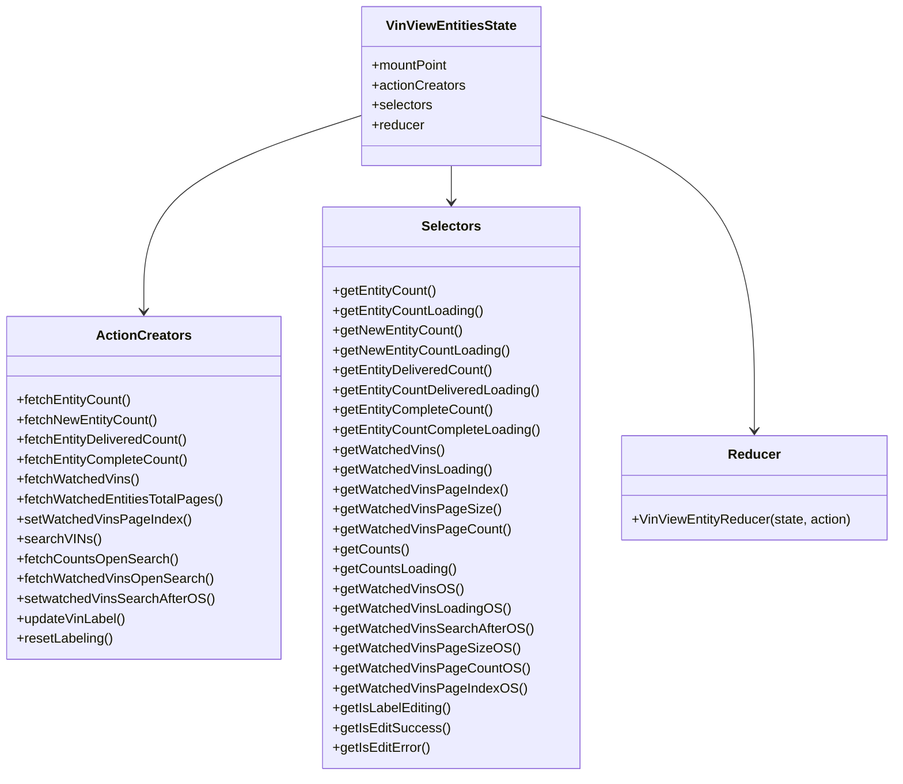

# Diagram: web/portal/src/pages/vinview/redux/VinViewEntitiesState.js


> Auto-generated by Obscura crawlers

## Diagram 1



### SVG

<svg id="container" width="1069.953125" xmlns="http://www.w3.org/2000/svg" class="classDiagram" height="936" viewBox="0 0 1069.953125 936" role="graphics-document document" aria-roledescription="class"><style>#container{font-family:"trebuchet ms",verdana,arial,sans-serif;font-size:16px;fill:#333;}@keyframes edge-animation-frame{from{stroke-dashoffset:0;}}@keyframes dash{to{stroke-dashoffset:0;}}#container .edge-animation-slow{stroke-dasharray:9,5!important;stroke-dashoffset:900;animation:dash 50s linear infinite;stroke-linecap:round;}#container .edge-animation-fast{stroke-dasharray:9,5!important;stroke-dashoffset:900;animation:dash 20s linear infinite;stroke-linecap:round;}#container .error-icon{fill:#552222;}#container .error-text{fill:#552222;stroke:#552222;}#container .edge-thickness-normal{stroke-width:1px;}#container .edge-thickness-thick{stroke-width:3.5px;}#container .edge-pattern-solid{stroke-dasharray:0;}#container .edge-thickness-invisible{stroke-width:0;fill:none;}#container .edge-pattern-dashed{stroke-dasharray:3;}#container .edge-pattern-dotted{stroke-dasharray:2;}#container .marker{fill:#333333;stroke:#333333;}#container .marker.cross{stroke:#333333;}#container svg{font-family:"trebuchet ms",verdana,arial,sans-serif;font-size:16px;}#container p{margin:0;}#container g.classGroup text{fill:#9370DB;stroke:none;font-family:"trebuchet ms",verdana,arial,sans-serif;font-size:10px;}#container g.classGroup text .title{font-weight:bolder;}#container .nodeLabel,#container .edgeLabel{color:#131300;}#container .edgeLabel .label rect{fill:#ECECFF;}#container .label text{fill:#131300;}#container .labelBkg{background:#ECECFF;}#container .edgeLabel .label span{background:#ECECFF;}#container .classTitle{font-weight:bolder;}#container .node rect,#container .node circle,#container .node ellipse,#container .node polygon,#container .node path{fill:#ECECFF;stroke:#9370DB;stroke-width:1px;}#container .divider{stroke:#9370DB;stroke-width:1;}#container g.clickable{cursor:pointer;}#container g.classGroup rect{fill:#ECECFF;stroke:#9370DB;}#container g.classGroup line{stroke:#9370DB;stroke-width:1;}#container .classLabel .box{stroke:none;stroke-width:0;fill:#ECECFF;opacity:0.5;}#container .classLabel .label{fill:#9370DB;font-size:10px;}#container .relation{stroke:#333333;stroke-width:1;fill:none;}#container .dashed-line{stroke-dasharray:3;}#container .dotted-line{stroke-dasharray:1 2;}#container #compositionStart,#container .composition{fill:#333333!important;stroke:#333333!important;stroke-width:1;}#container #compositionEnd,#container .composition{fill:#333333!important;stroke:#333333!important;stroke-width:1;}#container #dependencyStart,#container .dependency{fill:#333333!important;stroke:#333333!important;stroke-width:1;}#container #dependencyStart,#container .dependency{fill:#333333!important;stroke:#333333!important;stroke-width:1;}#container #extensionStart,#container .extension{fill:transparent!important;stroke:#333333!important;stroke-width:1;}#container #extensionEnd,#container .extension{fill:transparent!important;stroke:#333333!important;stroke-width:1;}#container #aggregationStart,#container .aggregation{fill:transparent!important;stroke:#333333!important;stroke-width:1;}#container #aggregationEnd,#container .aggregation{fill:transparent!important;stroke:#333333!important;stroke-width:1;}#container #lollipopStart,#container .lollipop{fill:#ECECFF!important;stroke:#333333!important;stroke-width:1;}#container #lollipopEnd,#container .lollipop{fill:#ECECFF!important;stroke:#333333!important;stroke-width:1;}#container .edgeTerminals{font-size:11px;line-height:initial;}#container .classTitleText{text-anchor:middle;font-size:18px;fill:#333;}#container .label-icon{display:inline-block;height:1em;overflow:visible;vertical-align:-0.125em;}#container .node .label-icon path{fill:currentColor;stroke:revert;stroke-width:revert;}#container :root{--mermaid-font-family:"trebuchet ms",verdana,arial,sans-serif;}</style><g><defs><marker id="container_class-aggregationStart" class="marker aggregation class" refX="18" refY="7" markerWidth="190" markerHeight="240" orient="auto"><path d="M 18,7 L9,13 L1,7 L9,1 Z"></path></marker></defs><defs><marker id="container_class-aggregationEnd" class="marker aggregation class" refX="1" refY="7" markerWidth="20" markerHeight="28" orient="auto"><path d="M 18,7 L9,13 L1,7 L9,1 Z"></path></marker></defs><defs><marker id="container_class-extensionStart" class="marker extension class" refX="18" refY="7" markerWidth="190" markerHeight="240" orient="auto"><path d="M 1,7 L18,13 V 1 Z"></path></marker></defs><defs><marker id="container_class-extensionEnd" class="marker extension class" refX="1" refY="7" markerWidth="20" markerHeight="28" orient="auto"><path d="M 1,1 V 13 L18,7 Z"></path></marker></defs><defs><marker id="container_class-compositionStart" class="marker composition class" refX="18" refY="7" markerWidth="190" markerHeight="240" orient="auto"><path d="M 18,7 L9,13 L1,7 L9,1 Z"></path></marker></defs><defs><marker id="container_class-compositionEnd" class="marker composition class" refX="1" refY="7" markerWidth="20" markerHeight="28" orient="auto"><path d="M 18,7 L9,13 L1,7 L9,1 Z"></path></marker></defs><defs><marker id="container_class-dependencyStart" class="marker dependency class" refX="6" refY="7" markerWidth="190" markerHeight="240" orient="auto"><path d="M 5,7 L9,13 L1,7 L9,1 Z"></path></marker></defs><defs><marker id="container_class-dependencyEnd" class="marker dependency class" refX="13" refY="7" markerWidth="20" markerHeight="28" orient="auto"><path d="M 18,7 L9,13 L14,7 L9,1 Z"></path></marker></defs><defs><marker id="container_class-lollipopStart" class="marker lollipop class" refX="13" refY="7" markerWidth="190" markerHeight="240" orient="auto"><circle stroke="black" fill="transparent" cx="7" cy="7" r="6"></circle></marker></defs><defs><marker id="container_class-lollipopEnd" class="marker lollipop class" refX="1" refY="7" markerWidth="190" markerHeight="240" orient="auto"><circle stroke="black" fill="transparent" cx="7" cy="7" r="6"></circle></marker></defs><g class="root"><g class="clusters"></g><g class="edgePaths"><path d="M432.461,139.006L388.905,153.338C345.349,167.671,258.237,196.335,214.681,235.834C171.125,275.333,171.125,325.667,171.125,350.833L171.125,376" id="id_VinViewEntitiesState_ActionCreators_1" class="edge-thickness-normal edge-pattern-solid relation" style=";;;" data-edge="true" data-et="edge" data-id="id_VinViewEntitiesState_ActionCreators_1" data-points="W3sieCI6NDMyLjQ2MDkzNzUsInkiOjEzOS4wMDU4ODUxMDI0MDUwNX0seyJ4IjoxNzEuMTI1LCJ5IjoyMjV9LHsieCI6MTcxLjEyNSwieSI6MzgyfV0=" marker-end="url(#container_class-dependencyEnd)"></path><path d="M538.844,200L538.844,204.167C538.844,208.333,538.844,216.667,538.844,224C538.844,231.333,538.844,237.667,538.844,240.833L538.844,244" id="id_VinViewEntitiesState_Selectors_2" class="edge-thickness-normal edge-pattern-solid relation" style=";;;" data-edge="true" data-et="edge" data-id="id_VinViewEntitiesState_Selectors_2" data-points="W3sieCI6NTM4Ljg0Mzc1LCJ5IjoyMDB9LHsieCI6NTM4Ljg0Mzc1LCJ5IjoyMjV9LHsieCI6NTM4Ljg0Mzc1LCJ5IjoyNTB9XQ==" marker-end="url(#container_class-dependencyEnd)"></path><path d="M645.227,139.378L688.138,153.648C731.049,167.919,816.872,196.459,859.784,259.896C902.695,323.333,902.695,421.667,902.695,470.833L902.695,520" id="id_VinViewEntitiesState_Reducer_3" class="edge-thickness-normal edge-pattern-solid relation" style=";;;" data-edge="true" data-et="edge" data-id="id_VinViewEntitiesState_Reducer_3" data-points="W3sieCI6NjQ1LjIyNjU2MjUsInkiOjEzOS4zNzc5NDQzMDI0OTI4Nn0seyJ4Ijo5MDIuNjk1MzEyNSwieSI6MjI1fSx7IngiOjkwMi42OTUzMTI1LCJ5Ijo1MjZ9XQ==" marker-end="url(#container_class-dependencyEnd)"></path></g><g class="edgeLabels"><g class="edgeLabel"><g class="label" data-id="id_VinViewEntitiesState_ActionCreators_1" transform="translate(0, 0)"><foreignObject width="0" height="0"><div xmlns="http://www.w3.org/1999/xhtml" class="labelBkg" style="display: table-cell; white-space: nowrap; line-height: 1.5; max-width: 200px; text-align: center;"><span class="edgeLabel"></span></div></foreignObject></g></g><g class="edgeLabel"><g class="label" data-id="id_VinViewEntitiesState_Selectors_2" transform="translate(0, 0)"><foreignObject width="0" height="0"><div xmlns="http://www.w3.org/1999/xhtml" class="labelBkg" style="display: table-cell; white-space: nowrap; line-height: 1.5; max-width: 200px; text-align: center;"><span class="edgeLabel"></span></div></foreignObject></g></g><g class="edgeLabel"><g class="label" data-id="id_VinViewEntitiesState_Reducer_3" transform="translate(0, 0)"><foreignObject width="0" height="0"><div xmlns="http://www.w3.org/1999/xhtml" class="labelBkg" style="display: table-cell; white-space: nowrap; line-height: 1.5; max-width: 200px; text-align: center;"><span class="edgeLabel"></span></div></foreignObject></g></g></g><g class="nodes"><g class="node default" id="classId-VinViewEntitiesState-0" transform="translate(538.84375, 104)"><g class="basic label-container"><path d="M-106.3828125 -96 L106.3828125 -96 L106.3828125 96 L-106.3828125 96" stroke="none" stroke-width="0" fill="#ECECFF" style=""></path><path d="M-106.3828125 -96 C-24.99789927201205 -96, 56.3870139559759 -96, 106.3828125 -96 M-106.3828125 -96 C-28.15886731961068 -96, 50.06507786077864 -96, 106.3828125 -96 M106.3828125 -96 C106.3828125 -35.657346809882156, 106.3828125 24.685306380235687, 106.3828125 96 M106.3828125 -96 C106.3828125 -47.254754850299605, 106.3828125 1.4904902994007898, 106.3828125 96 M106.3828125 96 C40.99434044019708 96, -24.394131619605844 96, -106.3828125 96 M106.3828125 96 C62.85089224491441 96, 19.318971989828825 96, -106.3828125 96 M-106.3828125 96 C-106.3828125 39.820623908257026, -106.3828125 -16.358752183485947, -106.3828125 -96 M-106.3828125 96 C-106.3828125 44.89195234267018, -106.3828125 -6.21609531465964, -106.3828125 -96" stroke="#9370DB" stroke-width="1.3" fill="none" stroke-dasharray="0 0" style=""></path></g><g class="annotation-group text" transform="translate(0, -72)"></g><g class="label-group text" transform="translate(-75.6875, -72)"><g class="label" style="font-weight: bolder" transform="translate(0,-12)"><foreignObject width="151.375" height="24"><div xmlns="http://www.w3.org/1999/xhtml" style="display: table-cell; white-space: nowrap; line-height: 1.5; max-width: 198px; text-align: center;"><span class="nodeLabel markdown-node-label" style=""><p>VinViewEntitiesState</p></span></div></foreignObject></g></g><g class="members-group text" transform="translate(-94.3828125, -24)"><g class="label" style="" transform="translate(0,-12)"><foreignObject width="93.34375" height="24"><div xmlns="http://www.w3.org/1999/xhtml" style="display: table-cell; white-space: nowrap; line-height: 1.5; max-width: 151px; text-align: center;"><span class="nodeLabel markdown-node-label" style=""><p>+mountPoint</p></span></div></foreignObject></g><g class="label" style="" transform="translate(0,12)"><foreignObject width="113.078125" height="24"><div xmlns="http://www.w3.org/1999/xhtml" style="display: table-cell; white-space: nowrap; line-height: 1.5; max-width: 170px; text-align: center;"><span class="nodeLabel markdown-node-label" style=""><p>+actionCreators</p></span></div></foreignObject></g><g class="label" style="" transform="translate(0,36)"><foreignObject width="73.453125" height="24"><div xmlns="http://www.w3.org/1999/xhtml" style="display: table-cell; white-space: nowrap; line-height: 1.5; max-width: 131px; text-align: center;"><span class="nodeLabel markdown-node-label" style=""><p>+selectors</p></span></div></foreignObject></g><g class="label" style="" transform="translate(0,60)"><foreignObject width="63.515625" height="24"><div xmlns="http://www.w3.org/1999/xhtml" style="display: table-cell; white-space: nowrap; line-height: 1.5; max-width: 122px; text-align: center;"><span class="nodeLabel markdown-node-label" style=""><p>+reducer</p></span></div></foreignObject></g></g><g class="methods-group text" transform="translate(-94.3828125, 96)"></g><g class="divider" style=""><path d="M-106.3828125 -48 C-27.43839927932534 -48, 51.50601394134932 -48, 106.3828125 -48 M-106.3828125 -48 C-62.14768770344875 -48, -17.912562906897506 -48, 106.3828125 -48" stroke="#9370DB" stroke-width="1.3" fill="none" stroke-dasharray="0 0" style=""></path></g><g class="divider" style=""><path d="M-106.3828125 72 C-30.381145665063926 72, 45.62052116987215 72, 106.3828125 72 M-106.3828125 72 C-37.36710932365948 72, 31.648593852681046 72, 106.3828125 72" stroke="#9370DB" stroke-width="1.3" fill="none" stroke-dasharray="0 0" style=""></path></g></g><g class="node default" id="classId-ActionCreators-1" transform="translate(171.125, 589)"><g class="basic label-container"><path d="M-163.125 -207 L163.125 -207 L163.125 207 L-163.125 207" stroke="none" stroke-width="0" fill="#ECECFF" style=""></path><path d="M-163.125 -207 C-81.15565413171558 -207, 0.8136917365688419 -207, 163.125 -207 M-163.125 -207 C-32.7475747552584 -207, 97.6298504894832 -207, 163.125 -207 M163.125 -207 C163.125 -115.87955079435342, 163.125 -24.75910158870684, 163.125 207 M163.125 -207 C163.125 -78.12787936571596, 163.125 50.74424126856809, 163.125 207 M163.125 207 C74.4505185640847 207, -14.223962871830594 207, -163.125 207 M163.125 207 C33.39071769931667 207, -96.34356460136667 207, -163.125 207 M-163.125 207 C-163.125 53.586598840619075, -163.125 -99.82680231876185, -163.125 -207 M-163.125 207 C-163.125 117.41445234607724, -163.125 27.82890469215448, -163.125 -207" stroke="#9370DB" stroke-width="1.3" fill="none" stroke-dasharray="0 0" style=""></path></g><g class="annotation-group text" transform="translate(0, -183)"></g><g class="label-group text" transform="translate(-53.96875, -183)"><g class="label" style="font-weight: bolder" transform="translate(0,-12)"><foreignObject width="107.9375" height="24"><div xmlns="http://www.w3.org/1999/xhtml" style="display: table-cell; white-space: nowrap; line-height: 1.5; max-width: 156px; text-align: center;"><span class="nodeLabel markdown-node-label" style=""><p>ActionCreators</p></span></div></foreignObject></g></g><g class="members-group text" transform="translate(-151.125, -135)"></g><g class="methods-group text" transform="translate(-151.125, -105)"><g class="label" style="" transform="translate(0,-12)"><foreignObject width="138.6875" height="24"><div xmlns="http://www.w3.org/1999/xhtml" style="display: table-cell; white-space: nowrap; line-height: 1.5; max-width: 196px; text-align: center;"><span class="nodeLabel markdown-node-label" style=""><p>+fetchEntityCount()</p></span></div></foreignObject></g><g class="label" style="" transform="translate(0,12)"><foreignObject width="169.796875" height="24"><div xmlns="http://www.w3.org/1999/xhtml" style="display: table-cell; white-space: nowrap; line-height: 1.5; max-width: 227px; text-align: center;"><span class="nodeLabel markdown-node-label" style=""><p>+fetchNewEntityCount()</p></span></div></foreignObject></g><g class="label" style="" transform="translate(0,36)"><foreignObject width="207.421875" height="24"><div xmlns="http://www.w3.org/1999/xhtml" style="display: table-cell; white-space: nowrap; line-height: 1.5; max-width: 265px; text-align: center;"><span class="nodeLabel markdown-node-label" style=""><p>+fetchEntityDeliveredCount()</p></span></div></foreignObject></g><g class="label" style="" transform="translate(0,60)"><foreignObject width="207.46875" height="24"><div xmlns="http://www.w3.org/1999/xhtml" style="display: table-cell; white-space: nowrap; line-height: 1.5; max-width: 265px; text-align: center;"><span class="nodeLabel markdown-node-label" style=""><p>+fetchEntityCompleteCount()</p></span></div></foreignObject></g><g class="label" style="" transform="translate(0,84)"><foreignObject width="147.140625" height="24"><div xmlns="http://www.w3.org/1999/xhtml" style="display: table-cell; white-space: nowrap; line-height: 1.5; max-width: 205px; text-align: center;"><span class="nodeLabel markdown-node-label" style=""><p>+fetchWatchedVins()</p></span></div></foreignObject></g><g class="label" style="" transform="translate(0,108)"><foreignObject width="248.28125" height="24"><div xmlns="http://www.w3.org/1999/xhtml" style="display: table-cell; white-space: nowrap; line-height: 1.5; max-width: 306px; text-align: center;"><span class="nodeLabel markdown-node-label" style=""><p>+fetchWatchedEntitiesTotalPages()</p></span></div></foreignObject></g><g class="label" style="" transform="translate(0,132)"><foreignObject width="206.609375" height="24"><div xmlns="http://www.w3.org/1999/xhtml" style="display: table-cell; white-space: nowrap; line-height: 1.5; max-width: 264px; text-align: center;"><span class="nodeLabel markdown-node-label" style=""><p>+setWatchedVinsPageIndex()</p></span></div></foreignObject></g><g class="label" style="" transform="translate(0,156)"><foreignObject width="97.828125" height="24"><div xmlns="http://www.w3.org/1999/xhtml" style="display: table-cell; white-space: nowrap; line-height: 1.5; max-width: 155px; text-align: center;"><span class="nodeLabel markdown-node-label" style=""><p>+searchVINs()</p></span></div></foreignObject></g><g class="label" style="" transform="translate(0,180)"><foreignObject width="191.890625" height="24"><div xmlns="http://www.w3.org/1999/xhtml" style="display: table-cell; white-space: nowrap; line-height: 1.5; max-width: 249px; text-align: center;"><span class="nodeLabel markdown-node-label" style=""><p>+fetchCountsOpenSearch()</p></span></div></foreignObject></g><g class="label" style="" transform="translate(0,204)"><foreignObject width="234.515625" height="24"><div xmlns="http://www.w3.org/1999/xhtml" style="display: table-cell; white-space: nowrap; line-height: 1.5; max-width: 292px; text-align: center;"><span class="nodeLabel markdown-node-label" style=""><p>+fetchWatchedVinsOpenSearch()</p></span></div></foreignObject></g><g class="label" style="" transform="translate(0,228)"><foreignObject width="234.875" height="24"><div xmlns="http://www.w3.org/1999/xhtml" style="display: table-cell; white-space: nowrap; line-height: 1.5; max-width: 292px; text-align: center;"><span class="nodeLabel markdown-node-label" style=""><p>+setwatchedVinsSearchAfterOS()</p></span></div></foreignObject></g><g class="label" style="" transform="translate(0,252)"><foreignObject width="131.90625" height="24"><div xmlns="http://www.w3.org/1999/xhtml" style="display: table-cell; white-space: nowrap; line-height: 1.5; max-width: 189px; text-align: center;"><span class="nodeLabel markdown-node-label" style=""><p>+updateVinLabel()</p></span></div></foreignObject></g><g class="label" style="" transform="translate(0,276)"><foreignObject width="116.375" height="24"><div xmlns="http://www.w3.org/1999/xhtml" style="display: table-cell; white-space: nowrap; line-height: 1.5; max-width: 174px; text-align: center;"><span class="nodeLabel markdown-node-label" style=""><p>+resetLabeling()</p></span></div></foreignObject></g></g><g class="divider" style=""><path d="M-163.125 -159 C-53.12333547146882 -159, 56.87832905706236 -159, 163.125 -159 M-163.125 -159 C-64.43208958092156 -159, 34.26082083815689 -159, 163.125 -159" stroke="#9370DB" stroke-width="1.3" fill="none" stroke-dasharray="0 0" style=""></path></g><g class="divider" style=""><path d="M-163.125 -135 C-72.3368700422053 -135, 18.45125991558939 -135, 163.125 -135 M-163.125 -135 C-47.38244318224825 -135, 68.3601136355035 -135, 163.125 -135" stroke="#9370DB" stroke-width="1.3" fill="none" stroke-dasharray="0 0" style=""></path></g></g><g class="node default" id="classId-Selectors-2" transform="translate(538.84375, 589)"><g class="basic label-container"><path d="M-154.59375 -339 L154.59375 -339 L154.59375 339 L-154.59375 339" stroke="none" stroke-width="0" fill="#ECECFF" style=""></path><path d="M-154.59375 -339 C-56.286177961744585 -339, 42.02139407651083 -339, 154.59375 -339 M-154.59375 -339 C-76.40758290658563 -339, 1.7785841868287378 -339, 154.59375 -339 M154.59375 -339 C154.59375 -71.3571405506101, 154.59375 196.2857188987798, 154.59375 339 M154.59375 -339 C154.59375 -130.275743987433, 154.59375 78.448512025134, 154.59375 339 M154.59375 339 C66.96245183364596 339, -20.668846332708085 339, -154.59375 339 M154.59375 339 C60.55416537124243 339, -33.48541925751513 339, -154.59375 339 M-154.59375 339 C-154.59375 76.47225964811474, -154.59375 -186.0554807037705, -154.59375 -339 M-154.59375 339 C-154.59375 156.4554046315716, -154.59375 -26.08919073685678, -154.59375 -339" stroke="#9370DB" stroke-width="1.3" fill="none" stroke-dasharray="0 0" style=""></path></g><g class="annotation-group text" transform="translate(0, -315)"></g><g class="label-group text" transform="translate(-34.171875, -315)"><g class="label" style="font-weight: bolder" transform="translate(0,-12)"><foreignObject width="68.34375" height="24"><div xmlns="http://www.w3.org/1999/xhtml" style="display: table-cell; white-space: nowrap; line-height: 1.5; max-width: 117px; text-align: center;"><span class="nodeLabel markdown-node-label" style=""><p>Selectors</p></span></div></foreignObject></g></g><g class="members-group text" transform="translate(-142.59375, -267)"></g><g class="methods-group text" transform="translate(-142.59375, -237)"><g class="label" style="" transform="translate(0,-12)"><foreignObject width="125" height="24"><div xmlns="http://www.w3.org/1999/xhtml" style="display: table-cell; white-space: nowrap; line-height: 1.5; max-width: 182px; text-align: center;"><span class="nodeLabel markdown-node-label" style=""><p>+getEntityCount()</p></span></div></foreignObject></g><g class="label" style="" transform="translate(0,12)"><foreignObject width="182.234375" height="24"><div xmlns="http://www.w3.org/1999/xhtml" style="display: table-cell; white-space: nowrap; line-height: 1.5; max-width: 240px; text-align: center;"><span class="nodeLabel markdown-node-label" style=""><p>+getEntityCountLoading()</p></span></div></foreignObject></g><g class="label" style="" transform="translate(0,36)"><foreignObject width="156.125" height="24"><div xmlns="http://www.w3.org/1999/xhtml" style="display: table-cell; white-space: nowrap; line-height: 1.5; max-width: 213px; text-align: center;"><span class="nodeLabel markdown-node-label" style=""><p>+getNewEntityCount()</p></span></div></foreignObject></g><g class="label" style="" transform="translate(0,60)"><foreignObject width="213.359375" height="24"><div xmlns="http://www.w3.org/1999/xhtml" style="display: table-cell; white-space: nowrap; line-height: 1.5; max-width: 271px; text-align: center;"><span class="nodeLabel markdown-node-label" style=""><p>+getNewEntityCountLoading()</p></span></div></foreignObject></g><g class="label" style="" transform="translate(0,84)"><foreignObject width="193.734375" height="24"><div xmlns="http://www.w3.org/1999/xhtml" style="display: table-cell; white-space: nowrap; line-height: 1.5; max-width: 251px; text-align: center;"><span class="nodeLabel markdown-node-label" style=""><p>+getEntityDeliveredCount()</p></span></div></foreignObject></g><g class="label" style="" transform="translate(0,108)"><foreignObject width="250.96875" height="24"><div xmlns="http://www.w3.org/1999/xhtml" style="display: table-cell; white-space: nowrap; line-height: 1.5; max-width: 308px; text-align: center;"><span class="nodeLabel markdown-node-label" style=""><p>+getEntityCountDeliveredLoading()</p></span></div></foreignObject></g><g class="label" style="" transform="translate(0,132)"><foreignObject width="193.78125" height="24"><div xmlns="http://www.w3.org/1999/xhtml" style="display: table-cell; white-space: nowrap; line-height: 1.5; max-width: 251px; text-align: center;"><span class="nodeLabel markdown-node-label" style=""><p>+getEntityCompleteCount()</p></span></div></foreignObject></g><g class="label" style="" transform="translate(0,156)"><foreignObject width="251.015625" height="24"><div xmlns="http://www.w3.org/1999/xhtml" style="display: table-cell; white-space: nowrap; line-height: 1.5; max-width: 308px; text-align: center;"><span class="nodeLabel markdown-node-label" style=""><p>+getEntityCountCompleteLoading()</p></span></div></foreignObject></g><g class="label" style="" transform="translate(0,180)"><foreignObject width="133.46875" height="24"><div xmlns="http://www.w3.org/1999/xhtml" style="display: table-cell; white-space: nowrap; line-height: 1.5; max-width: 191px; text-align: center;"><span class="nodeLabel markdown-node-label" style=""><p>+getWatchedVins()</p></span></div></foreignObject></g><g class="label" style="" transform="translate(0,204)"><foreignObject width="190.703125" height="24"><div xmlns="http://www.w3.org/1999/xhtml" style="display: table-cell; white-space: nowrap; line-height: 1.5; max-width: 248px; text-align: center;"><span class="nodeLabel markdown-node-label" style=""><p>+getWatchedVinsLoading()</p></span></div></foreignObject></g><g class="label" style="" transform="translate(0,228)"><foreignObject width="207.203125" height="24"><div xmlns="http://www.w3.org/1999/xhtml" style="display: table-cell; white-space: nowrap; line-height: 1.5; max-width: 265px; text-align: center;"><span class="nodeLabel markdown-node-label" style=""><p>+getWatchedVinsPageIndex()</p></span></div></foreignObject></g><g class="label" style="" transform="translate(0,252)"><foreignObject width="196.046875" height="24"><div xmlns="http://www.w3.org/1999/xhtml" style="display: table-cell; white-space: nowrap; line-height: 1.5; max-width: 253px; text-align: center;"><span class="nodeLabel markdown-node-label" style=""><p>+getWatchedVinsPageSize()</p></span></div></foreignObject></g><g class="label" style="" transform="translate(0,276)"><foreignObject width="209.65625" height="24"><div xmlns="http://www.w3.org/1999/xhtml" style="display: table-cell; white-space: nowrap; line-height: 1.5; max-width: 267px; text-align: center;"><span class="nodeLabel markdown-node-label" style=""><p>+getWatchedVinsPageCount()</p></span></div></foreignObject></g><g class="label" style="" transform="translate(0,300)"><foreignObject width="90.84375" height="24"><div xmlns="http://www.w3.org/1999/xhtml" style="display: table-cell; white-space: nowrap; line-height: 1.5; max-width: 148px; text-align: center;"><span class="nodeLabel markdown-node-label" style=""><p>+getCounts()</p></span></div></foreignObject></g><g class="label" style="" transform="translate(0,324)"><foreignObject width="148.078125" height="24"><div xmlns="http://www.w3.org/1999/xhtml" style="display: table-cell; white-space: nowrap; line-height: 1.5; max-width: 205px; text-align: center;"><span class="nodeLabel markdown-node-label" style=""><p>+getCountsLoading()</p></span></div></foreignObject></g><g class="label" style="" transform="translate(0,348)"><foreignObject width="153.25" height="24"><div xmlns="http://www.w3.org/1999/xhtml" style="display: table-cell; white-space: nowrap; line-height: 1.5; max-width: 211px; text-align: center;"><span class="nodeLabel markdown-node-label" style=""><p>+getWatchedVinsOS()</p></span></div></foreignObject></g><g class="label" style="" transform="translate(0,372)"><foreignObject width="210.484375" height="24"><div xmlns="http://www.w3.org/1999/xhtml" style="display: table-cell; white-space: nowrap; line-height: 1.5; max-width: 268px; text-align: center;"><span class="nodeLabel markdown-node-label" style=""><p>+getWatchedVinsLoadingOS()</p></span></div></foreignObject></g><g class="label" style="" transform="translate(0,396)"><foreignObject width="236.921875" height="24"><div xmlns="http://www.w3.org/1999/xhtml" style="display: table-cell; white-space: nowrap; line-height: 1.5; max-width: 294px; text-align: center;"><span class="nodeLabel markdown-node-label" style=""><p>+getWatchedVinsSearchAfterOS()</p></span></div></foreignObject></g><g class="label" style="" transform="translate(0,420)"><foreignObject width="215.828125" height="24"><div xmlns="http://www.w3.org/1999/xhtml" style="display: table-cell; white-space: nowrap; line-height: 1.5; max-width: 273px; text-align: center;"><span class="nodeLabel markdown-node-label" style=""><p>+getWatchedVinsPageSizeOS()</p></span></div></foreignObject></g><g class="label" style="" transform="translate(0,444)"><foreignObject width="229.453125" height="24"><div xmlns="http://www.w3.org/1999/xhtml" style="display: table-cell; white-space: nowrap; line-height: 1.5; max-width: 287px; text-align: center;"><span class="nodeLabel markdown-node-label" style=""><p>+getWatchedVinsPageCountOS()</p></span></div></foreignObject></g><g class="label" style="" transform="translate(0,468)"><foreignObject width="227" height="24"><div xmlns="http://www.w3.org/1999/xhtml" style="display: table-cell; white-space: nowrap; line-height: 1.5; max-width: 284px; text-align: center;"><span class="nodeLabel markdown-node-label" style=""><p>+getWatchedVinsPageIndexOS()</p></span></div></foreignObject></g><g class="label" style="" transform="translate(0,492)"><foreignObject width="142.84375" height="24"><div xmlns="http://www.w3.org/1999/xhtml" style="display: table-cell; white-space: nowrap; line-height: 1.5; max-width: 200px; text-align: center;"><span class="nodeLabel markdown-node-label" style=""><p>+getIsLabelEditing()</p></span></div></foreignObject></g><g class="label" style="" transform="translate(0,516)"><foreignObject width="137.40625" height="24"><div xmlns="http://www.w3.org/1999/xhtml" style="display: table-cell; white-space: nowrap; line-height: 1.5; max-width: 195px; text-align: center;"><span class="nodeLabel markdown-node-label" style=""><p>+getIsEditSuccess()</p></span></div></foreignObject></g><g class="label" style="" transform="translate(0,540)"><foreignObject width="117" height="24"><div xmlns="http://www.w3.org/1999/xhtml" style="display: table-cell; white-space: nowrap; line-height: 1.5; max-width: 174px; text-align: center;"><span class="nodeLabel markdown-node-label" style=""><p>+getIsEditError()</p></span></div></foreignObject></g></g><g class="divider" style=""><path d="M-154.59375 -291 C-46.273926583877326 -291, 62.04589683224535 -291, 154.59375 -291 M-154.59375 -291 C-35.42832896595516 -291, 83.73709206808968 -291, 154.59375 -291" stroke="#9370DB" stroke-width="1.3" fill="none" stroke-dasharray="0 0" style=""></path></g><g class="divider" style=""><path d="M-154.59375 -267 C-49.22692547654084 -267, 56.139899046918316 -267, 154.59375 -267 M-154.59375 -267 C-50.790924906454464 -267, 53.01190018709107 -267, 154.59375 -267" stroke="#9370DB" stroke-width="1.3" fill="none" stroke-dasharray="0 0" style=""></path></g></g><g class="node default" id="classId-Reducer-3" transform="translate(902.6953125, 589)"><g class="basic label-container"><path d="M-159.2578125 -63 L159.2578125 -63 L159.2578125 63 L-159.2578125 63" stroke="none" stroke-width="0" fill="#ECECFF" style=""></path><path d="M-159.2578125 -63 C-71.55091830449962 -63, 16.155975891000764 -63, 159.2578125 -63 M-159.2578125 -63 C-48.83601001559626 -63, 61.58579246880748 -63, 159.2578125 -63 M159.2578125 -63 C159.2578125 -13.490586498378065, 159.2578125 36.01882700324387, 159.2578125 63 M159.2578125 -63 C159.2578125 -25.195244014618446, 159.2578125 12.609511970763108, 159.2578125 63 M159.2578125 63 C92.09185753438004 63, 24.92590256876008 63, -159.2578125 63 M159.2578125 63 C72.38645395676207 63, -14.484904586475864 63, -159.2578125 63 M-159.2578125 63 C-159.2578125 19.412230026024936, -159.2578125 -24.175539947950128, -159.2578125 -63 M-159.2578125 63 C-159.2578125 18.236211717416317, -159.2578125 -26.527576565167365, -159.2578125 -63" stroke="#9370DB" stroke-width="1.3" fill="none" stroke-dasharray="0 0" style=""></path></g><g class="annotation-group text" transform="translate(0, -39)"></g><g class="label-group text" transform="translate(-29.90625, -39)"><g class="label" style="font-weight: bolder" transform="translate(0,-12)"><foreignObject width="59.8125" height="24"><div xmlns="http://www.w3.org/1999/xhtml" style="display: table-cell; white-space: nowrap; line-height: 1.5; max-width: 110px; text-align: center;"><span class="nodeLabel markdown-node-label" style=""><p>Reducer</p></span></div></foreignObject></g></g><g class="members-group text" transform="translate(-147.2578125, 9)"></g><g class="methods-group text" transform="translate(-147.2578125, 39)"><g class="label" style="" transform="translate(0,-12)"><foreignObject width="264.609375" height="24"><div xmlns="http://www.w3.org/1999/xhtml" style="display: table-cell; white-space: nowrap; line-height: 1.5; max-width: 322px; text-align: center;"><span class="nodeLabel markdown-node-label" style=""><p>+VinViewEntityReducer(state, action)</p></span></div></foreignObject></g></g><g class="divider" style=""><path d="M-159.2578125 -15 C-81.42438676959274 -15, -3.590961039185487 -15, 159.2578125 -15 M-159.2578125 -15 C-33.6719824438956 -15, 91.9138476122088 -15, 159.2578125 -15" stroke="#9370DB" stroke-width="1.3" fill="none" stroke-dasharray="0 0" style=""></path></g><g class="divider" style=""><path d="M-159.2578125 9 C-91.5868537955191 9, -23.91589509103821 9, 159.2578125 9 M-159.2578125 9 C-37.63792133790436 9, 83.98196982419128 9, 159.2578125 9" stroke="#9370DB" stroke-width="1.3" fill="none" stroke-dasharray="0 0" style=""></path></g></g></g></g></g></svg>

## Diagram 2

```mermaid
flowchart TD
    A[set params pageSize/pageNumber from state] --> B[dispatch REQUEST_WATCHED_ENTITIES]
    B --> C{axios.get(url, {params})}
    C -->|success| D[map response.data.data -> entityData]
    D --> E{axios.post(batchUrl, {entities: entityData})}
    E -->|success| F[transformWatchedVinsResponse(response.data.data, labelsResponse)]
    F --> G[dispatch RECEIVE_WATCHED_ENTITIES with watchedEntities]
    E -->|labels error| H[console.error(labelError)]
    H --> I[dispatch RECEIVE_WATCHED_ENTITIES with response.data.data]
    C -->|error| J[console.error(error)]
    J --> K[dispatch RECEIVE_WATCHED_ENTITIES_ERROR]
    click C href "https://axios-http.com/docs/api_intro" "axios.get"
    click E href "https://axios-http.com/docs/api_intro" "axios.post"
```

> SVG rendering failed for this diagram.
