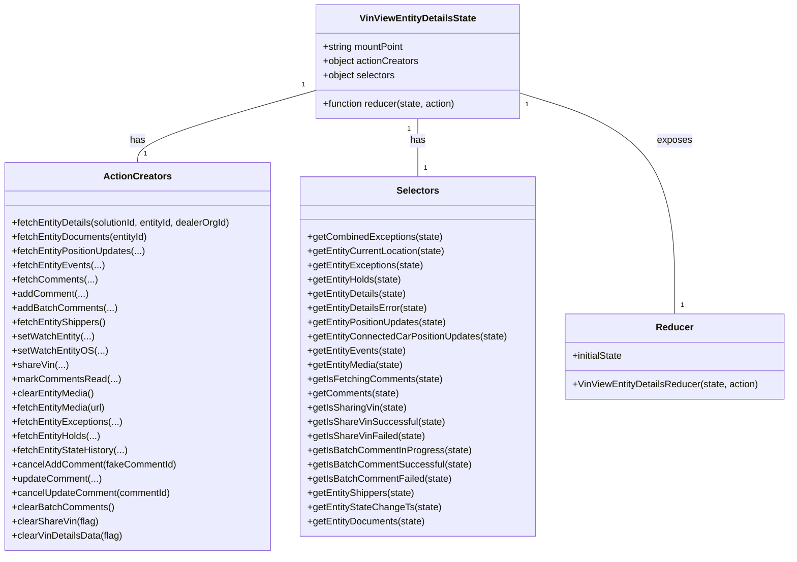

# Diagram: web/portal/src/pages/vinview/redux/VinViewEntityDetailsState.js


> Auto-generated by Obscura crawlers

## Diagram 1



### SVG

<svg id="container" width="1337.828125" xmlns="http://www.w3.org/2000/svg" class="classDiagram" height="936" viewBox="0 0 1337.828125 936" role="graphics-document document" aria-roledescription="class"><style>#container{font-family:"trebuchet ms",verdana,arial,sans-serif;font-size:16px;fill:#333;}@keyframes edge-animation-frame{from{stroke-dashoffset:0;}}@keyframes dash{to{stroke-dashoffset:0;}}#container .edge-animation-slow{stroke-dasharray:9,5!important;stroke-dashoffset:900;animation:dash 50s linear infinite;stroke-linecap:round;}#container .edge-animation-fast{stroke-dasharray:9,5!important;stroke-dashoffset:900;animation:dash 20s linear infinite;stroke-linecap:round;}#container .error-icon{fill:#552222;}#container .error-text{fill:#552222;stroke:#552222;}#container .edge-thickness-normal{stroke-width:1px;}#container .edge-thickness-thick{stroke-width:3.5px;}#container .edge-pattern-solid{stroke-dasharray:0;}#container .edge-thickness-invisible{stroke-width:0;fill:none;}#container .edge-pattern-dashed{stroke-dasharray:3;}#container .edge-pattern-dotted{stroke-dasharray:2;}#container .marker{fill:#333333;stroke:#333333;}#container .marker.cross{stroke:#333333;}#container svg{font-family:"trebuchet ms",verdana,arial,sans-serif;font-size:16px;}#container p{margin:0;}#container g.classGroup text{fill:#9370DB;stroke:none;font-family:"trebuchet ms",verdana,arial,sans-serif;font-size:10px;}#container g.classGroup text .title{font-weight:bolder;}#container .nodeLabel,#container .edgeLabel{color:#131300;}#container .edgeLabel .label rect{fill:#ECECFF;}#container .label text{fill:#131300;}#container .labelBkg{background:#ECECFF;}#container .edgeLabel .label span{background:#ECECFF;}#container .classTitle{font-weight:bolder;}#container .node rect,#container .node circle,#container .node ellipse,#container .node polygon,#container .node path{fill:#ECECFF;stroke:#9370DB;stroke-width:1px;}#container .divider{stroke:#9370DB;stroke-width:1;}#container g.clickable{cursor:pointer;}#container g.classGroup rect{fill:#ECECFF;stroke:#9370DB;}#container g.classGroup line{stroke:#9370DB;stroke-width:1;}#container .classLabel .box{stroke:none;stroke-width:0;fill:#ECECFF;opacity:0.5;}#container .classLabel .label{fill:#9370DB;font-size:10px;}#container .relation{stroke:#333333;stroke-width:1;fill:none;}#container .dashed-line{stroke-dasharray:3;}#container .dotted-line{stroke-dasharray:1 2;}#container #compositionStart,#container .composition{fill:#333333!important;stroke:#333333!important;stroke-width:1;}#container #compositionEnd,#container .composition{fill:#333333!important;stroke:#333333!important;stroke-width:1;}#container #dependencyStart,#container .dependency{fill:#333333!important;stroke:#333333!important;stroke-width:1;}#container #dependencyStart,#container .dependency{fill:#333333!important;stroke:#333333!important;stroke-width:1;}#container #extensionStart,#container .extension{fill:transparent!important;stroke:#333333!important;stroke-width:1;}#container #extensionEnd,#container .extension{fill:transparent!important;stroke:#333333!important;stroke-width:1;}#container #aggregationStart,#container .aggregation{fill:transparent!important;stroke:#333333!important;stroke-width:1;}#container #aggregationEnd,#container .aggregation{fill:transparent!important;stroke:#333333!important;stroke-width:1;}#container #lollipopStart,#container .lollipop{fill:#ECECFF!important;stroke:#333333!important;stroke-width:1;}#container #lollipopEnd,#container .lollipop{fill:#ECECFF!important;stroke:#333333!important;stroke-width:1;}#container .edgeTerminals{font-size:11px;line-height:initial;}#container .classTitleText{text-anchor:middle;font-size:18px;fill:#333;}#container .label-icon{display:inline-block;height:1em;overflow:visible;vertical-align:-0.125em;}#container .node .label-icon path{fill:currentColor;stroke:revert;stroke-width:revert;}#container :root{--mermaid-font-family:"trebuchet ms",verdana,arial,sans-serif;}</style><g><defs><marker id="container_class-aggregationStart" class="marker aggregation class" refX="18" refY="7" markerWidth="190" markerHeight="240" orient="auto"><path d="M 18,7 L9,13 L1,7 L9,1 Z"></path></marker></defs><defs><marker id="container_class-aggregationEnd" class="marker aggregation class" refX="1" refY="7" markerWidth="20" markerHeight="28" orient="auto"><path d="M 18,7 L9,13 L1,7 L9,1 Z"></path></marker></defs><defs><marker id="container_class-extensionStart" class="marker extension class" refX="18" refY="7" markerWidth="190" markerHeight="240" orient="auto"><path d="M 1,7 L18,13 V 1 Z"></path></marker></defs><defs><marker id="container_class-extensionEnd" class="marker extension class" refX="1" refY="7" markerWidth="20" markerHeight="28" orient="auto"><path d="M 1,1 V 13 L18,7 Z"></path></marker></defs><defs><marker id="container_class-compositionStart" class="marker composition class" refX="18" refY="7" markerWidth="190" markerHeight="240" orient="auto"><path d="M 18,7 L9,13 L1,7 L9,1 Z"></path></marker></defs><defs><marker id="container_class-compositionEnd" class="marker composition class" refX="1" refY="7" markerWidth="20" markerHeight="28" orient="auto"><path d="M 18,7 L9,13 L1,7 L9,1 Z"></path></marker></defs><defs><marker id="container_class-dependencyStart" class="marker dependency class" refX="6" refY="7" markerWidth="190" markerHeight="240" orient="auto"><path d="M 5,7 L9,13 L1,7 L9,1 Z"></path></marker></defs><defs><marker id="container_class-dependencyEnd" class="marker dependency class" refX="13" refY="7" markerWidth="20" markerHeight="28" orient="auto"><path d="M 18,7 L9,13 L14,7 L9,1 Z"></path></marker></defs><defs><marker id="container_class-lollipopStart" class="marker lollipop class" refX="13" refY="7" markerWidth="190" markerHeight="240" orient="auto"><circle stroke="black" fill="transparent" cx="7" cy="7" r="6"></circle></marker></defs><defs><marker id="container_class-lollipopEnd" class="marker lollipop class" refX="1" refY="7" markerWidth="190" markerHeight="240" orient="auto"><circle stroke="black" fill="transparent" cx="7" cy="7" r="6"></circle></marker></defs><g class="root"><g class="clusters"></g><g class="edgePaths"><path d="M539.547,152.374L489.003,166.478C438.458,180.582,337.37,208.791,286.826,229.062C236.281,249.333,236.281,261.667,236.281,267.833L236.281,274" id="id_VinViewEntityDetailsState_ActionCreators_1" class="edge-thickness-normal edge-pattern-solid relation" style=";;;" data-edge="true" data-et="edge" data-id="id_VinViewEntityDetailsState_ActionCreators_1" data-points="W3sieCI6NTM5LjU0Njg3NSwieSI6MTUyLjM3Mzc0Mzk5NjU5MDU1fSx7IngiOjIzNi4yODEyNSwieSI6MjM3fSx7IngiOjIzNi4yODEyNSwieSI6Mjc0fV0="></path><path d="M712.898,200L712.898,206.167C712.898,212.333,712.898,224.667,712.898,241C712.898,257.333,712.898,277.667,712.898,287.833L712.898,298" id="id_VinViewEntityDetailsState_Selectors_2" class="edge-thickness-normal edge-pattern-solid relation" style=";;;" data-edge="true" data-et="edge" data-id="id_VinViewEntityDetailsState_Selectors_2" data-points="W3sieCI6NzEyLjg5ODQzNzUsInkiOjIwMH0seyJ4Ijo3MTIuODk4NDM3NSwieSI6MjM3fSx7IngiOjcxMi44OTg0Mzc1LCJ5IjoyOTh9XQ=="></path><path d="M886.25,157.292L929.464,170.576C972.677,183.861,1059.104,210.431,1102.318,272.382C1145.531,334.333,1145.531,431.667,1145.531,480.333L1145.531,529" id="id_VinViewEntityDetailsState_Reducer_3" class="edge-thickness-normal edge-pattern-solid relation" style=";;;" data-edge="true" data-et="edge" data-id="id_VinViewEntityDetailsState_Reducer_3" data-points="W3sieCI6ODg2LjI1LCJ5IjoxNTcuMjkxNzQ1NjcwNTg1Mjd9LHsieCI6MTE0NS41MzEyNSwieSI6MjM3fSx7IngiOjExNDUuNTMxMjUsInkiOjUyOX1d"></path></g><g class="edgeLabels"><g class="edgeLabel" transform="translate(236.28125, 237)"><g class="label" data-id="id_VinViewEntityDetailsState_ActionCreators_1" transform="translate(-12.703125, -12)"><foreignObject width="25.40625" height="24"><div xmlns="http://www.w3.org/1999/xhtml" class="labelBkg" style="display: table-cell; white-space: nowrap; line-height: 1.5; max-width: 200px; text-align: center;"><span class="edgeLabel"><p>has</p></span></div></foreignObject></g></g><g class="edgeLabel" transform="translate(712.8984375, 237)"><g class="label" data-id="id_VinViewEntityDetailsState_Selectors_2" transform="translate(-12.703125, -12)"><foreignObject width="25.40625" height="24"><div xmlns="http://www.w3.org/1999/xhtml" class="labelBkg" style="display: table-cell; white-space: nowrap; line-height: 1.5; max-width: 200px; text-align: center;"><span class="edgeLabel"><p>has</p></span></div></foreignObject></g></g><g class="edgeLabel" transform="translate(1145.53125, 237)"><g class="label" data-id="id_VinViewEntityDetailsState_Reducer_3" transform="translate(-29.4296875, -12)"><foreignObject width="58.859375" height="24"><div xmlns="http://www.w3.org/1999/xhtml" class="labelBkg" style="display: table-cell; white-space: nowrap; line-height: 1.5; max-width: 200px; text-align: center;"><span class="edgeLabel"><p>exposes</p></span></div></foreignObject></g></g><g class="edgeTerminals" transform="translate(518.659133009552, 142.62939851995918)"><g class="inner" transform="translate(0, 0)"><foreignObject style="width: 9px; height: 12px;"><div xmlns="http://www.w3.org/1999/xhtml" style="display: inline-block; padding-right: 1px; white-space: nowrap;"><span class="edgeLabel">1</span></div></foreignObject></g></g><g class="edgeTerminals" transform="translate(697.89843875, 217.50000107142858)"><g class="inner" transform="translate(0, 0)"><foreignObject style="width: 9px; height: 12px;"><div xmlns="http://www.w3.org/1999/xhtml" style="display: inline-block; padding-right: 1px; white-space: nowrap;"><span class="edgeLabel">1</span></div></foreignObject></g></g><g class="edgeTerminals" transform="translate(898.5696876281819, 176.77186951493104)"><g class="inner" transform="translate(0, 0)"><foreignObject style="width: 9px; height: 12px;"><div xmlns="http://www.w3.org/1999/xhtml" style="display: inline-block; padding-right: 1px; white-space: nowrap;"><span class="edgeLabel">1</span></div></foreignObject></g></g><g class="edgeTerminals" transform="translate(246.28125, 251.5)"><g class="inner" transform="translate(0, 0)"></g><foreignObject style="width: 9px; height: 12px;"><div xmlns="http://www.w3.org/1999/xhtml" style="display: inline-block; padding-right: 1px; white-space: nowrap;"><span class="edgeLabel">1</span></div></foreignObject></g><g class="edgeTerminals" transform="translate(722.89843875, 275.5000010714286)"><g class="inner" transform="translate(0, 0)"></g><foreignObject style="width: 9px; height: 12px;"><div xmlns="http://www.w3.org/1999/xhtml" style="display: inline-block; padding-right: 1px; white-space: nowrap;"><span class="edgeLabel">1</span></div></foreignObject></g><g class="edgeTerminals" transform="translate(1155.53125, 506.5)"><g class="inner" transform="translate(0, 0)"></g><foreignObject style="width: 9px; height: 12px;"><div xmlns="http://www.w3.org/1999/xhtml" style="display: inline-block; padding-right: 1px; white-space: nowrap;"><span class="edgeLabel">1</span></div></foreignObject></g></g><g class="nodes"><g class="node default" id="classId-VinViewEntityDetailsState-0" transform="translate(712.8984375, 104)"><g class="basic label-container"><path d="M-173.3515625 -96 L173.3515625 -96 L173.3515625 96 L-173.3515625 96" stroke="none" stroke-width="0" fill="#ECECFF" style=""></path><path d="M-173.3515625 -96 C-88.4439142915885 -96, -3.536266083176997 -96, 173.3515625 -96 M-173.3515625 -96 C-63.936416482544985 -96, 45.47872953491003 -96, 173.3515625 -96 M173.3515625 -96 C173.3515625 -41.20816623006428, 173.3515625 13.583667539871442, 173.3515625 96 M173.3515625 -96 C173.3515625 -34.642908093756134, 173.3515625 26.714183812487732, 173.3515625 96 M173.3515625 96 C38.37648484086412 96, -96.59859281827175 96, -173.3515625 96 M173.3515625 96 C58.20578306402109 96, -56.93999637195782 96, -173.3515625 96 M-173.3515625 96 C-173.3515625 46.266693013190704, -173.3515625 -3.4666139736185926, -173.3515625 -96 M-173.3515625 96 C-173.3515625 34.892082170002325, -173.3515625 -26.21583565999535, -173.3515625 -96" stroke="#9370DB" stroke-width="1.3" fill="none" stroke-dasharray="0 0" style=""></path></g><g class="annotation-group text" transform="translate(0, -72)"></g><g class="label-group text" transform="translate(-94.75, -72)"><g class="label" style="font-weight: bolder" transform="translate(0,-12)"><foreignObject width="189.5" height="24"><div xmlns="http://www.w3.org/1999/xhtml" style="display: table-cell; white-space: nowrap; line-height: 1.5; max-width: 235px; text-align: center;"><span class="nodeLabel markdown-node-label" style=""><p>VinViewEntityDetailsState</p></span></div></foreignObject></g></g><g class="members-group text" transform="translate(-161.3515625, -24)"><g class="label" style="" transform="translate(0,-12)"><foreignObject width="139.203125" height="24"><div xmlns="http://www.w3.org/1999/xhtml" style="display: table-cell; white-space: nowrap; line-height: 1.5; max-width: 197px; text-align: center;"><span class="nodeLabel markdown-node-label" style=""><p>+string mountPoint</p></span></div></foreignObject></g><g class="label" style="" transform="translate(0,12)"><foreignObject width="163.03125" height="24"><div xmlns="http://www.w3.org/1999/xhtml" style="display: table-cell; white-space: nowrap; line-height: 1.5; max-width: 220px; text-align: center;"><span class="nodeLabel markdown-node-label" style=""><p>+object actionCreators</p></span></div></foreignObject></g><g class="label" style="" transform="translate(0,36)"><foreignObject width="123.15625" height="24"><div xmlns="http://www.w3.org/1999/xhtml" style="display: table-cell; white-space: nowrap; line-height: 1.5; max-width: 181px; text-align: center;"><span class="nodeLabel markdown-node-label" style=""><p>+object selectors</p></span></div></foreignObject></g></g><g class="methods-group text" transform="translate(-161.3515625, 72)"><g class="label" style="" transform="translate(0,-12)"><foreignObject width="227.953125" height="24"><div xmlns="http://www.w3.org/1999/xhtml" style="display: table-cell; white-space: nowrap; line-height: 1.5; max-width: 285px; text-align: center;"><span class="nodeLabel markdown-node-label" style=""><p>+function reducer(state, action)</p></span></div></foreignObject></g></g><g class="divider" style=""><path d="M-173.3515625 -48 C-44.92433448078839 -48, 83.50289353842322 -48, 173.3515625 -48 M-173.3515625 -48 C-94.6147408661812 -48, -15.877919232362387 -48, 173.3515625 -48" stroke="#9370DB" stroke-width="1.3" fill="none" stroke-dasharray="0 0" style=""></path></g><g class="divider" style=""><path d="M-173.3515625 48 C-45.73044583342525 48, 81.8906708331495 48, 173.3515625 48 M-173.3515625 48 C-96.69085506839171 48, -20.030147636783425 48, 173.3515625 48" stroke="#9370DB" stroke-width="1.3" fill="none" stroke-dasharray="0 0" style=""></path></g></g><g class="node default" id="classId-ActionCreators-1" transform="translate(236.28125, 601)"><g class="basic label-container"><path d="M-228.28125 -327 L228.28125 -327 L228.28125 327 L-228.28125 327" stroke="none" stroke-width="0" fill="#ECECFF" style=""></path><path d="M-228.28125 -327 C-94.78933605927091 -327, 38.70257788145818 -327, 228.28125 -327 M-228.28125 -327 C-136.2202518525109 -327, -44.159253705021825 -327, 228.28125 -327 M228.28125 -327 C228.28125 -92.58067363408114, 228.28125 141.83865273183773, 228.28125 327 M228.28125 -327 C228.28125 -154.959325649329, 228.28125 17.081348701341994, 228.28125 327 M228.28125 327 C125.7963215711748 327, 23.3113931423496 327, -228.28125 327 M228.28125 327 C124.98386563771822 327, 21.68648127543645 327, -228.28125 327 M-228.28125 327 C-228.28125 93.2462664378761, -228.28125 -140.5074671242478, -228.28125 -327 M-228.28125 327 C-228.28125 165.56947400052613, -228.28125 4.138948001052256, -228.28125 -327" stroke="#9370DB" stroke-width="1.3" fill="none" stroke-dasharray="0 0" style=""></path></g><g class="annotation-group text" transform="translate(0, -303)"></g><g class="label-group text" transform="translate(-53.96875, -303)"><g class="label" style="font-weight: bolder" transform="translate(0,-12)"><foreignObject width="107.9375" height="24"><div xmlns="http://www.w3.org/1999/xhtml" style="display: table-cell; white-space: nowrap; line-height: 1.5; max-width: 156px; text-align: center;"><span class="nodeLabel markdown-node-label" style=""><p>ActionCreators</p></span></div></foreignObject></g></g><g class="members-group text" transform="translate(-216.28125, -255)"></g><g class="methods-group text" transform="translate(-216.28125, -225)"><g class="label" style="" transform="translate(0,-12)"><foreignObject width="378.59375" height="24"><div xmlns="http://www.w3.org/1999/xhtml" style="display: table-cell; white-space: nowrap; line-height: 1.5; max-width: 436px; text-align: center;"><span class="nodeLabel markdown-node-label" style=""><p>+fetchEntityDetails(solutionId, entityId, dealerOrgId)</p></span></div></foreignObject></g><g class="label" style="" transform="translate(0,12)"><foreignObject width="233.96875" height="24"><div xmlns="http://www.w3.org/1999/xhtml" style="display: table-cell; white-space: nowrap; line-height: 1.5; max-width: 291px; text-align: center;"><span class="nodeLabel markdown-node-label" style=""><p>+fetchEntityDocuments(entityId)</p></span></div></foreignObject></g><g class="label" style="" transform="translate(0,36)"><foreignObject width="227" height="24"><div xmlns="http://www.w3.org/1999/xhtml" style="display: table-cell; white-space: nowrap; line-height: 1.5; max-width: 284px; text-align: center;"><span class="nodeLabel markdown-node-label" style=""><p>+fetchEntityPositionUpdates(...)</p></span></div></foreignObject></g><g class="label" style="" transform="translate(0,60)"><foreignObject width="155.140625" height="24"><div xmlns="http://www.w3.org/1999/xhtml" style="display: table-cell; white-space: nowrap; line-height: 1.5; max-width: 213px; text-align: center;"><span class="nodeLabel markdown-node-label" style=""><p>+fetchEntityEvents(...)</p></span></div></foreignObject></g><g class="label" style="" transform="translate(0,84)"><foreignObject width="142.875" height="24"><div xmlns="http://www.w3.org/1999/xhtml" style="display: table-cell; white-space: nowrap; line-height: 1.5; max-width: 200px; text-align: center;"><span class="nodeLabel markdown-node-label" style=""><p>+fetchComments(...)</p></span></div></foreignObject></g><g class="label" style="" transform="translate(0,108)"><foreignObject width="126.765625" height="24"><div xmlns="http://www.w3.org/1999/xhtml" style="display: table-cell; white-space: nowrap; line-height: 1.5; max-width: 184px; text-align: center;"><span class="nodeLabel markdown-node-label" style=""><p>+addComment(...)</p></span></div></foreignObject></g><g class="label" style="" transform="translate(0,132)"><foreignObject width="175.21875" height="24"><div xmlns="http://www.w3.org/1999/xhtml" style="display: table-cell; white-space: nowrap; line-height: 1.5; max-width: 233px; text-align: center;"><span class="nodeLabel markdown-node-label" style=""><p>+addBatchComments(...)</p></span></div></foreignObject></g><g class="label" style="" transform="translate(0,156)"><foreignObject width="159.96875" height="24"><div xmlns="http://www.w3.org/1999/xhtml" style="display: table-cell; white-space: nowrap; line-height: 1.5; max-width: 217px; text-align: center;"><span class="nodeLabel markdown-node-label" style=""><p>+fetchEntityShippers()</p></span></div></foreignObject></g><g class="label" style="" transform="translate(0,180)"><foreignObject width="137.484375" height="24"><div xmlns="http://www.w3.org/1999/xhtml" style="display: table-cell; white-space: nowrap; line-height: 1.5; max-width: 195px; text-align: center;"><span class="nodeLabel markdown-node-label" style=""><p>+setWatchEntity(...)</p></span></div></foreignObject></g><g class="label" style="" transform="translate(0,204)"><foreignObject width="157.265625" height="24"><div xmlns="http://www.w3.org/1999/xhtml" style="display: table-cell; white-space: nowrap; line-height: 1.5; max-width: 215px; text-align: center;"><span class="nodeLabel markdown-node-label" style=""><p>+setWatchEntityOS(...)</p></span></div></foreignObject></g><g class="label" style="" transform="translate(0,228)"><foreignObject width="92.625" height="24"><div xmlns="http://www.w3.org/1999/xhtml" style="display: table-cell; white-space: nowrap; line-height: 1.5; max-width: 150px; text-align: center;"><span class="nodeLabel markdown-node-label" style=""><p>+shareVin(...)</p></span></div></foreignObject></g><g class="label" style="" transform="translate(0,252)"><foreignObject width="179.6875" height="24"><div xmlns="http://www.w3.org/1999/xhtml" style="display: table-cell; white-space: nowrap; line-height: 1.5; max-width: 237px; text-align: center;"><span class="nodeLabel markdown-node-label" style=""><p>+markCommentsRead(...)</p></span></div></foreignObject></g><g class="label" style="" transform="translate(0,276)"><foreignObject width="139.640625" height="24"><div xmlns="http://www.w3.org/1999/xhtml" style="display: table-cell; white-space: nowrap; line-height: 1.5; max-width: 197px; text-align: center;"><span class="nodeLabel markdown-node-label" style=""><p>+clearEntityMedia()</p></span></div></foreignObject></g><g class="label" style="" transform="translate(0,300)"><foreignObject width="160.359375" height="24"><div xmlns="http://www.w3.org/1999/xhtml" style="display: table-cell; white-space: nowrap; line-height: 1.5; max-width: 218px; text-align: center;"><span class="nodeLabel markdown-node-label" style=""><p>+fetchEntityMedia(url)</p></span></div></foreignObject></g><g class="label" style="" transform="translate(0,324)"><foreignObject width="185.953125" height="24"><div xmlns="http://www.w3.org/1999/xhtml" style="display: table-cell; white-space: nowrap; line-height: 1.5; max-width: 243px; text-align: center;"><span class="nodeLabel markdown-node-label" style=""><p>+fetchEntityExceptions(...)</p></span></div></foreignObject></g><g class="label" style="" transform="translate(0,348)"><foreignObject width="149.625" height="24"><div xmlns="http://www.w3.org/1999/xhtml" style="display: table-cell; white-space: nowrap; line-height: 1.5; max-width: 207px; text-align: center;"><span class="nodeLabel markdown-node-label" style=""><p>+fetchEntityHolds(...)</p></span></div></foreignObject></g><g class="label" style="" transform="translate(0,372)"><foreignObject width="196.890625" height="24"><div xmlns="http://www.w3.org/1999/xhtml" style="display: table-cell; white-space: nowrap; line-height: 1.5; max-width: 254px; text-align: center;"><span class="nodeLabel markdown-node-label" style=""><p>+fetchEntityStateHistory(...)</p></span></div></foreignObject></g><g class="label" style="" transform="translate(0,396)"><foreignObject width="276.296875" height="24"><div xmlns="http://www.w3.org/1999/xhtml" style="display: table-cell; white-space: nowrap; line-height: 1.5; max-width: 334px; text-align: center;"><span class="nodeLabel markdown-node-label" style=""><p>+cancelAddComment(fakeCommentId)</p></span></div></foreignObject></g><g class="label" style="" transform="translate(0,420)"><foreignObject width="150.5" height="24"><div xmlns="http://www.w3.org/1999/xhtml" style="display: table-cell; white-space: nowrap; line-height: 1.5; max-width: 208px; text-align: center;"><span class="nodeLabel markdown-node-label" style=""><p>+updateComment(...)</p></span></div></foreignObject></g><g class="label" style="" transform="translate(0,444)"><foreignObject width="268.828125" height="24"><div xmlns="http://www.w3.org/1999/xhtml" style="display: table-cell; white-space: nowrap; line-height: 1.5; max-width: 326px; text-align: center;"><span class="nodeLabel markdown-node-label" style=""><p>+cancelUpdateComment(commentId)</p></span></div></foreignObject></g><g class="label" style="" transform="translate(0,468)"><foreignObject width="171.796875" height="24"><div xmlns="http://www.w3.org/1999/xhtml" style="display: table-cell; white-space: nowrap; line-height: 1.5; max-width: 229px; text-align: center;"><span class="nodeLabel markdown-node-label" style=""><p>+clearBatchComments()</p></span></div></foreignObject></g><g class="label" style="" transform="translate(0,492)"><foreignObject width="144.3125" height="24"><div xmlns="http://www.w3.org/1999/xhtml" style="display: table-cell; white-space: nowrap; line-height: 1.5; max-width: 202px; text-align: center;"><span class="nodeLabel markdown-node-label" style=""><p>+clearShareVin(flag)</p></span></div></foreignObject></g><g class="label" style="" transform="translate(0,516)"><foreignObject width="186.375" height="24"><div xmlns="http://www.w3.org/1999/xhtml" style="display: table-cell; white-space: nowrap; line-height: 1.5; max-width: 244px; text-align: center;"><span class="nodeLabel markdown-node-label" style=""><p>+clearVinDetailsData(flag)</p></span></div></foreignObject></g></g><g class="divider" style=""><path d="M-228.28125 -279 C-121.24371879790823 -279, -14.20618759581646 -279, 228.28125 -279 M-228.28125 -279 C-99.13603098584176 -279, 30.009188028316487 -279, 228.28125 -279" stroke="#9370DB" stroke-width="1.3" fill="none" stroke-dasharray="0 0" style=""></path></g><g class="divider" style=""><path d="M-228.28125 -255 C-103.20794353276489 -255, 21.865362934470227 -255, 228.28125 -255 M-228.28125 -255 C-113.12122713060738 -255, 2.0387957387852396 -255, 228.28125 -255" stroke="#9370DB" stroke-width="1.3" fill="none" stroke-dasharray="0 0" style=""></path></g></g><g class="node default" id="classId-Selectors-2" transform="translate(712.8984375, 601)"><g class="basic label-container"><path d="M-198.3359375 -303 L198.3359375 -303 L198.3359375 303 L-198.3359375 303" stroke="none" stroke-width="0" fill="#ECECFF" style=""></path><path d="M-198.3359375 -303 C-66.83532398131456 -303, 64.66528953737088 -303, 198.3359375 -303 M-198.3359375 -303 C-92.80822406853156 -303, 12.719489362936883 -303, 198.3359375 -303 M198.3359375 -303 C198.3359375 -84.1467261836871, 198.3359375 134.7065476326258, 198.3359375 303 M198.3359375 -303 C198.3359375 -117.39823726564288, 198.3359375 68.20352546871425, 198.3359375 303 M198.3359375 303 C51.824342940421246 303, -94.68725161915751 303, -198.3359375 303 M198.3359375 303 C57.50201032548043 303, -83.33191684903915 303, -198.3359375 303 M-198.3359375 303 C-198.3359375 141.66365455294851, -198.3359375 -19.67269089410297, -198.3359375 -303 M-198.3359375 303 C-198.3359375 171.7249422851357, -198.3359375 40.44988457027142, -198.3359375 -303" stroke="#9370DB" stroke-width="1.3" fill="none" stroke-dasharray="0 0" style=""></path></g><g class="annotation-group text" transform="translate(0, -279)"></g><g class="label-group text" transform="translate(-34.171875, -279)"><g class="label" style="font-weight: bolder" transform="translate(0,-12)"><foreignObject width="68.34375" height="24"><div xmlns="http://www.w3.org/1999/xhtml" style="display: table-cell; white-space: nowrap; line-height: 1.5; max-width: 117px; text-align: center;"><span class="nodeLabel markdown-node-label" style=""><p>Selectors</p></span></div></foreignObject></g></g><g class="members-group text" transform="translate(-186.3359375, -231)"></g><g class="methods-group text" transform="translate(-186.3359375, -201)"><g class="label" style="" transform="translate(0,-12)"><foreignObject width="228.59375" height="24"><div xmlns="http://www.w3.org/1999/xhtml" style="display: table-cell; white-space: nowrap; line-height: 1.5; max-width: 286px; text-align: center;"><span class="nodeLabel markdown-node-label" style=""><p>+getCombinedExceptions(state)</p></span></div></foreignObject></g><g class="label" style="" transform="translate(0,12)"><foreignObject width="234.5" height="24"><div xmlns="http://www.w3.org/1999/xhtml" style="display: table-cell; white-space: nowrap; line-height: 1.5; max-width: 292px; text-align: center;"><span class="nodeLabel markdown-node-label" style=""><p>+getEntityCurrentLocation(state)</p></span></div></foreignObject></g><g class="label" style="" transform="translate(0,36)"><foreignObject width="196.859375" height="24"><div xmlns="http://www.w3.org/1999/xhtml" style="display: table-cell; white-space: nowrap; line-height: 1.5; max-width: 254px; text-align: center;"><span class="nodeLabel markdown-node-label" style=""><p>+getEntityExceptions(state)</p></span></div></foreignObject></g><g class="label" style="" transform="translate(0,60)"><foreignObject width="160.515625" height="24"><div xmlns="http://www.w3.org/1999/xhtml" style="display: table-cell; white-space: nowrap; line-height: 1.5; max-width: 218px; text-align: center;"><span class="nodeLabel markdown-node-label" style=""><p>+getEntityHolds(state)</p></span></div></foreignObject></g><g class="label" style="" transform="translate(0,84)"><foreignObject width="168.71875" height="24"><div xmlns="http://www.w3.org/1999/xhtml" style="display: table-cell; white-space: nowrap; line-height: 1.5; max-width: 226px; text-align: center;"><span class="nodeLabel markdown-node-label" style=""><p>+getEntityDetails(state)</p></span></div></foreignObject></g><g class="label" style="" transform="translate(0,108)"><foreignObject width="204.5" height="24"><div xmlns="http://www.w3.org/1999/xhtml" style="display: table-cell; white-space: nowrap; line-height: 1.5; max-width: 262px; text-align: center;"><span class="nodeLabel markdown-node-label" style=""><p>+getEntityDetailsError(state)</p></span></div></foreignObject></g><g class="label" style="" transform="translate(0,132)"><foreignObject width="237.890625" height="24"><div xmlns="http://www.w3.org/1999/xhtml" style="display: table-cell; white-space: nowrap; line-height: 1.5; max-width: 295px; text-align: center;"><span class="nodeLabel markdown-node-label" style=""><p>+getEntityPositionUpdates(state)</p></span></div></foreignObject></g><g class="label" style="" transform="translate(0,156)"><foreignObject width="338.5" height="24"><div xmlns="http://www.w3.org/1999/xhtml" style="display: table-cell; white-space: nowrap; line-height: 1.5; max-width: 396px; text-align: center;"><span class="nodeLabel markdown-node-label" style=""><p>+getEntityConnectedCarPositionUpdates(state)</p></span></div></foreignObject></g><g class="label" style="" transform="translate(0,180)"><foreignObject width="166.046875" height="24"><div xmlns="http://www.w3.org/1999/xhtml" style="display: table-cell; white-space: nowrap; line-height: 1.5; max-width: 223px; text-align: center;"><span class="nodeLabel markdown-node-label" style=""><p>+getEntityEvents(state)</p></span></div></foreignObject></g><g class="label" style="" transform="translate(0,204)"><foreignObject width="162.59375" height="24"><div xmlns="http://www.w3.org/1999/xhtml" style="display: table-cell; white-space: nowrap; line-height: 1.5; max-width: 220px; text-align: center;"><span class="nodeLabel markdown-node-label" style=""><p>+getEntityMedia(state)</p></span></div></foreignObject></g><g class="label" style="" transform="translate(0,228)"><foreignObject width="226.75" height="24"><div xmlns="http://www.w3.org/1999/xhtml" style="display: table-cell; white-space: nowrap; line-height: 1.5; max-width: 284px; text-align: center;"><span class="nodeLabel markdown-node-label" style=""><p>+getIsFetchingComments(state)</p></span></div></foreignObject></g><g class="label" style="" transform="translate(0,252)"><foreignObject width="153.765625" height="24"><div xmlns="http://www.w3.org/1999/xhtml" style="display: table-cell; white-space: nowrap; line-height: 1.5; max-width: 211px; text-align: center;"><span class="nodeLabel markdown-node-label" style=""><p>+getComments(state)</p></span></div></foreignObject></g><g class="label" style="" transform="translate(0,276)"><foreignObject width="167.171875" height="24"><div xmlns="http://www.w3.org/1999/xhtml" style="display: table-cell; white-space: nowrap; line-height: 1.5; max-width: 225px; text-align: center;"><span class="nodeLabel markdown-node-label" style=""><p>+getIsSharingVin(state)</p></span></div></foreignObject></g><g class="label" style="" transform="translate(0,300)"><foreignObject width="228.765625" height="24"><div xmlns="http://www.w3.org/1999/xhtml" style="display: table-cell; white-space: nowrap; line-height: 1.5; max-width: 286px; text-align: center;"><span class="nodeLabel markdown-node-label" style=""><p>+getIsShareVinSuccessful(state)</p></span></div></foreignObject></g><g class="label" style="" transform="translate(0,324)"><foreignObject width="196.21875" height="24"><div xmlns="http://www.w3.org/1999/xhtml" style="display: table-cell; white-space: nowrap; line-height: 1.5; max-width: 254px; text-align: center;"><span class="nodeLabel markdown-node-label" style=""><p>+getIsShareVinFailed(state)</p></span></div></foreignObject></g><g class="label" style="" transform="translate(0,348)"><foreignObject width="275.109375" height="24"><div xmlns="http://www.w3.org/1999/xhtml" style="display: table-cell; white-space: nowrap; line-height: 1.5; max-width: 332px; text-align: center;"><span class="nodeLabel markdown-node-label" style=""><p>+getIsBatchCommentInProgress(state)</p></span></div></foreignObject></g><g class="label" style="" transform="translate(0,372)"><foreignObject width="275.03125" height="24"><div xmlns="http://www.w3.org/1999/xhtml" style="display: table-cell; white-space: nowrap; line-height: 1.5; max-width: 332px; text-align: center;"><span class="nodeLabel markdown-node-label" style=""><p>+getIsBatchCommentSuccessful(state)</p></span></div></foreignObject></g><g class="label" style="" transform="translate(0,396)"><foreignObject width="242.484375" height="24"><div xmlns="http://www.w3.org/1999/xhtml" style="display: table-cell; white-space: nowrap; line-height: 1.5; max-width: 300px; text-align: center;"><span class="nodeLabel markdown-node-label" style=""><p>+getIsBatchCommentFailed(state)</p></span></div></foreignObject></g><g class="label" style="" transform="translate(0,420)"><foreignObject width="182.390625" height="24"><div xmlns="http://www.w3.org/1999/xhtml" style="display: table-cell; white-space: nowrap; line-height: 1.5; max-width: 240px; text-align: center;"><span class="nodeLabel markdown-node-label" style=""><p>+getEntityShippers(state)</p></span></div></foreignObject></g><g class="label" style="" transform="translate(0,444)"><foreignObject width="223.96875" height="24"><div xmlns="http://www.w3.org/1999/xhtml" style="display: table-cell; white-space: nowrap; line-height: 1.5; max-width: 281px; text-align: center;"><span class="nodeLabel markdown-node-label" style=""><p>+getEntityStateChangeTs(state)</p></span></div></foreignObject></g><g class="label" style="" transform="translate(0,468)"><foreignObject width="200.15625" height="24"><div xmlns="http://www.w3.org/1999/xhtml" style="display: table-cell; white-space: nowrap; line-height: 1.5; max-width: 258px; text-align: center;"><span class="nodeLabel markdown-node-label" style=""><p>+getEntityDocuments(state)</p></span></div></foreignObject></g></g><g class="divider" style=""><path d="M-198.3359375 -255 C-50.088532332951445 -255, 98.15887283409711 -255, 198.3359375 -255 M-198.3359375 -255 C-77.37700374526219 -255, 43.58193000947563 -255, 198.3359375 -255" stroke="#9370DB" stroke-width="1.3" fill="none" stroke-dasharray="0 0" style=""></path></g><g class="divider" style=""><path d="M-198.3359375 -231 C-59.30963693401395 -231, 79.7166636319721 -231, 198.3359375 -231 M-198.3359375 -231 C-86.60990122418693 -231, 25.116135051626145 -231, 198.3359375 -231" stroke="#9370DB" stroke-width="1.3" fill="none" stroke-dasharray="0 0" style=""></path></g></g><g class="node default" id="classId-Reducer-3" transform="translate(1145.53125, 601)"><g class="basic label-container"><path d="M-184.296875 -72 L184.296875 -72 L184.296875 72 L-184.296875 72" stroke="none" stroke-width="0" fill="#ECECFF" style=""></path><path d="M-184.296875 -72 C-100.48224404436924 -72, -16.667613088738477 -72, 184.296875 -72 M-184.296875 -72 C-82.9458270507216 -72, 18.40522089855679 -72, 184.296875 -72 M184.296875 -72 C184.296875 -24.974176208681577, 184.296875 22.051647582636846, 184.296875 72 M184.296875 -72 C184.296875 -36.740890111153156, 184.296875 -1.4817802223063126, 184.296875 72 M184.296875 72 C64.12754837770544 72, -56.041778244589125 72, -184.296875 72 M184.296875 72 C53.37923618498908 72, -77.53840263002184 72, -184.296875 72 M-184.296875 72 C-184.296875 38.39214992542206, -184.296875 4.784299850844121, -184.296875 -72 M-184.296875 72 C-184.296875 28.300860760540296, -184.296875 -15.398278478919408, -184.296875 -72" stroke="#9370DB" stroke-width="1.3" fill="none" stroke-dasharray="0 0" style=""></path></g><g class="annotation-group text" transform="translate(0, -48)"></g><g class="label-group text" transform="translate(-29.90625, -48)"><g class="label" style="font-weight: bolder" transform="translate(0,-12)"><foreignObject width="59.8125" height="24"><div xmlns="http://www.w3.org/1999/xhtml" style="display: table-cell; white-space: nowrap; line-height: 1.5; max-width: 110px; text-align: center;"><span class="nodeLabel markdown-node-label" style=""><p>Reducer</p></span></div></foreignObject></g></g><g class="members-group text" transform="translate(-172.296875, 0)"><g class="label" style="" transform="translate(0,-12)"><foreignObject width="87.25" height="24"><div xmlns="http://www.w3.org/1999/xhtml" style="display: table-cell; white-space: nowrap; line-height: 1.5; max-width: 145px; text-align: center;"><span class="nodeLabel markdown-node-label" style=""><p>+initialState</p></span></div></foreignObject></g></g><g class="methods-group text" transform="translate(-172.296875, 48)"><g class="label" style="" transform="translate(0,-12)"><foreignObject width="314.6875" height="24"><div xmlns="http://www.w3.org/1999/xhtml" style="display: table-cell; white-space: nowrap; line-height: 1.5; max-width: 372px; text-align: center;"><span class="nodeLabel markdown-node-label" style=""><p>+VinViewEntityDetailsReducer(state, action)</p></span></div></foreignObject></g></g><g class="divider" style=""><path d="M-184.296875 -24 C-40.70572330551258 -24, 102.88542838897484 -24, 184.296875 -24 M-184.296875 -24 C-63.43413548980381 -24, 57.428604020392385 -24, 184.296875 -24" stroke="#9370DB" stroke-width="1.3" fill="none" stroke-dasharray="0 0" style=""></path></g><g class="divider" style=""><path d="M-184.296875 24 C-58.984460303112854 24, 66.32795439377429 24, 184.296875 24 M-184.296875 24 C-61.087530565544725 24, 62.12181386891055 24, 184.296875 24" stroke="#9370DB" stroke-width="1.3" fill="none" stroke-dasharray="0 0" style=""></path></g></g></g></g></g></svg>

## Diagram 2

```mermaid
flowchart LR
  subgraph Actions[Async Actions & API]
    FE1[fetchEntityDetails] -->|GET /entity/internal/:id| API1((API))
    FE2[fetchEntityDocuments] -->|GET /document/object/entity| API1
    FE3[fetchEntityPositionUpdates] -->|GET /entity/internal/:id/position-update| API1
    FE4[fetchEntityEvents] -->|GET /entity/internal/:id/event| API1
    FE5[fetchComments] -->|GET /entity/internal/:id/comment| API1
    FE6[addComment] -->|POST /entity/internal/:id/comment| API1
    FE7[addBatchComments] -->|POST /entity/solution/:id/comment/batch| API1
    FE8[fetchEntityShippers] -->|GET /entity-search/list?shipper=true| API1
    FE9[setWatchEntity] -->|PATCH /entity/internal/:id| API1
    FE10[setWatchEntityOS] -->|POST customerApiUrl /vin-view/:externalId/watch| API1
    FE11[shareVin] -->|POST /entity/internal/:id/share| API1
    FE12[markCommentsRead] -->|POST /entity/internal/:id/comment/read| API1
  end

  subgraph Store[Redux Store]
    A[Dispatch Action] --> R[VinViewEntityDetailsReducer]
    R --> S[State Mutation]
  end

  API1 -->|response / error| A

  FE1 --> A
  FE2 --> A
  FE3 --> A
  FE4 --> A
  FE5 --> A
  FE6 --> A
  FE7 --> A
  FE8 --> A
  FE9 --> A
  FE10 --> A
  FE11 --> A
  FE12 --> A

  subgraph StateParts[Key State Slices]
    SDetails(entityDetails)
    SExceptions(entityExceptions)
    SHolds(entityHolds)
    SPosUpdates(entityPositionUpdates)
    SConnected(entityConnectedCarPositionUpdates)
    SComments(comments)
    SMedia(entityMedia)
    SShippers(entityShippers)
    SDocs(entityDocuments)
    SFlags(sharing/batch flags)
  end

  S --> SDetails
  S --> SExceptions
  S --> SHolds
  S --> SPosUpdates
  S --> SConnected
  S --> SComments
  S --> SMedia
  S --> SShippers
  S --> SDocs
  S --> SFlags

  %% Comment lifecycle example
  FE6 -->|dispatch SUBMIT_NEW_COMMENT (optimistic)| A
  API1 -->|success| A
  A -->|RECEIVE_NEW_COMMENT| SComments

  %% Position update branching
  FE3 -->|response includes type "entity"| A2[Dispatch RECEIVE_ENTITY_CONNECTED_CAR_POSITION_UPDATES]
  FE3 -->|response includes type "tripleg"| A3[Dispatch RECEIVE_ENTITY_POSITION_UPDATES]
  A2 --> SConnected
  A3 --> SPosUpdates

  %% Selectors derive data
  Select[getEntityCurrentLocation] --> SPosUpdates
  Select2[getCombinedExceptions] --> SExceptions & SHolds & SDetailedConfig
  SPosUpdates --> Select
  SExceptions --> Select2
```

> SVG rendering failed for this diagram.
