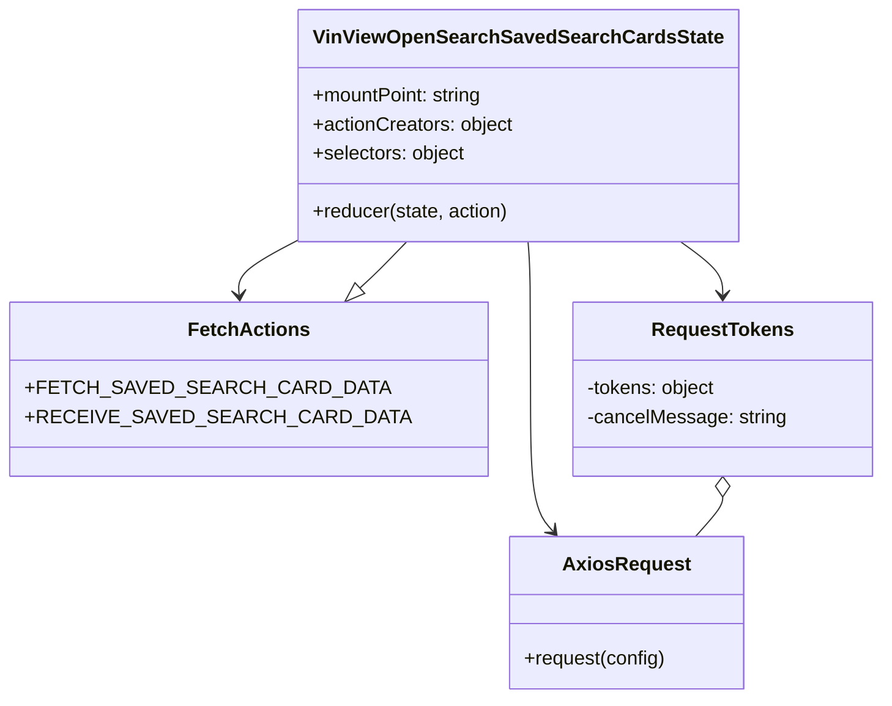

# Diagram: web/portal/src/pages/vinview/redux/VinViewOpenSearchSavedSearchCardsState.js


> Auto-generated by Obscura crawlers

## Diagram 1



### SVG

<svg id="container" width="670.703125" xmlns="http://www.w3.org/2000/svg" class="classDiagram" height="578" viewBox="0 0 670.703125 578" role="graphics-document document" aria-roledescription="class"><style>#container{font-family:"trebuchet ms",verdana,arial,sans-serif;font-size:16px;fill:#333;}@keyframes edge-animation-frame{from{stroke-dashoffset:0;}}@keyframes dash{to{stroke-dashoffset:0;}}#container .edge-animation-slow{stroke-dasharray:9,5!important;stroke-dashoffset:900;animation:dash 50s linear infinite;stroke-linecap:round;}#container .edge-animation-fast{stroke-dasharray:9,5!important;stroke-dashoffset:900;animation:dash 20s linear infinite;stroke-linecap:round;}#container .error-icon{fill:#552222;}#container .error-text{fill:#552222;stroke:#552222;}#container .edge-thickness-normal{stroke-width:1px;}#container .edge-thickness-thick{stroke-width:3.5px;}#container .edge-pattern-solid{stroke-dasharray:0;}#container .edge-thickness-invisible{stroke-width:0;fill:none;}#container .edge-pattern-dashed{stroke-dasharray:3;}#container .edge-pattern-dotted{stroke-dasharray:2;}#container .marker{fill:#333333;stroke:#333333;}#container .marker.cross{stroke:#333333;}#container svg{font-family:"trebuchet ms",verdana,arial,sans-serif;font-size:16px;}#container p{margin:0;}#container g.classGroup text{fill:#9370DB;stroke:none;font-family:"trebuchet ms",verdana,arial,sans-serif;font-size:10px;}#container g.classGroup text .title{font-weight:bolder;}#container .nodeLabel,#container .edgeLabel{color:#131300;}#container .edgeLabel .label rect{fill:#ECECFF;}#container .label text{fill:#131300;}#container .labelBkg{background:#ECECFF;}#container .edgeLabel .label span{background:#ECECFF;}#container .classTitle{font-weight:bolder;}#container .node rect,#container .node circle,#container .node ellipse,#container .node polygon,#container .node path{fill:#ECECFF;stroke:#9370DB;stroke-width:1px;}#container .divider{stroke:#9370DB;stroke-width:1;}#container g.clickable{cursor:pointer;}#container g.classGroup rect{fill:#ECECFF;stroke:#9370DB;}#container g.classGroup line{stroke:#9370DB;stroke-width:1;}#container .classLabel .box{stroke:none;stroke-width:0;fill:#ECECFF;opacity:0.5;}#container .classLabel .label{fill:#9370DB;font-size:10px;}#container .relation{stroke:#333333;stroke-width:1;fill:none;}#container .dashed-line{stroke-dasharray:3;}#container .dotted-line{stroke-dasharray:1 2;}#container #compositionStart,#container .composition{fill:#333333!important;stroke:#333333!important;stroke-width:1;}#container #compositionEnd,#container .composition{fill:#333333!important;stroke:#333333!important;stroke-width:1;}#container #dependencyStart,#container .dependency{fill:#333333!important;stroke:#333333!important;stroke-width:1;}#container #dependencyStart,#container .dependency{fill:#333333!important;stroke:#333333!important;stroke-width:1;}#container #extensionStart,#container .extension{fill:transparent!important;stroke:#333333!important;stroke-width:1;}#container #extensionEnd,#container .extension{fill:transparent!important;stroke:#333333!important;stroke-width:1;}#container #aggregationStart,#container .aggregation{fill:transparent!important;stroke:#333333!important;stroke-width:1;}#container #aggregationEnd,#container .aggregation{fill:transparent!important;stroke:#333333!important;stroke-width:1;}#container #lollipopStart,#container .lollipop{fill:#ECECFF!important;stroke:#333333!important;stroke-width:1;}#container #lollipopEnd,#container .lollipop{fill:#ECECFF!important;stroke:#333333!important;stroke-width:1;}#container .edgeTerminals{font-size:11px;line-height:initial;}#container .classTitleText{text-anchor:middle;font-size:18px;fill:#333;}#container .label-icon{display:inline-block;height:1em;overflow:visible;vertical-align:-0.125em;}#container .node .label-icon path{fill:currentColor;stroke:revert;stroke-width:revert;}#container :root{--mermaid-font-family:"trebuchet ms",verdana,arial,sans-serif;}</style><g><defs><marker id="container_class-aggregationStart" class="marker aggregation class" refX="18" refY="7" markerWidth="190" markerHeight="240" orient="auto"><path d="M 18,7 L9,13 L1,7 L9,1 Z"></path></marker></defs><defs><marker id="container_class-aggregationEnd" class="marker aggregation class" refX="1" refY="7" markerWidth="20" markerHeight="28" orient="auto"><path d="M 18,7 L9,13 L1,7 L9,1 Z"></path></marker></defs><defs><marker id="container_class-extensionStart" class="marker extension class" refX="18" refY="7" markerWidth="190" markerHeight="240" orient="auto"><path d="M 1,7 L18,13 V 1 Z"></path></marker></defs><defs><marker id="container_class-extensionEnd" class="marker extension class" refX="1" refY="7" markerWidth="20" markerHeight="28" orient="auto"><path d="M 1,1 V 13 L18,7 Z"></path></marker></defs><defs><marker id="container_class-compositionStart" class="marker composition class" refX="18" refY="7" markerWidth="190" markerHeight="240" orient="auto"><path d="M 18,7 L9,13 L1,7 L9,1 Z"></path></marker></defs><defs><marker id="container_class-compositionEnd" class="marker composition class" refX="1" refY="7" markerWidth="20" markerHeight="28" orient="auto"><path d="M 18,7 L9,13 L1,7 L9,1 Z"></path></marker></defs><defs><marker id="container_class-dependencyStart" class="marker dependency class" refX="6" refY="7" markerWidth="190" markerHeight="240" orient="auto"><path d="M 5,7 L9,13 L1,7 L9,1 Z"></path></marker></defs><defs><marker id="container_class-dependencyEnd" class="marker dependency class" refX="13" refY="7" markerWidth="20" markerHeight="28" orient="auto"><path d="M 18,7 L9,13 L14,7 L9,1 Z"></path></marker></defs><defs><marker id="container_class-lollipopStart" class="marker lollipop class" refX="13" refY="7" markerWidth="190" markerHeight="240" orient="auto"><circle stroke="black" fill="transparent" cx="7" cy="7" r="6"></circle></marker></defs><defs><marker id="container_class-lollipopEnd" class="marker lollipop class" refX="1" refY="7" markerWidth="190" markerHeight="240" orient="auto"><circle stroke="black" fill="transparent" cx="7" cy="7" r="6"></circle></marker></defs><g class="root"><g class="clusters"></g><g class="edgePaths"><path d="M211.18,200L204.097,204.167C197.015,208.333,182.849,216.667,176.093,224.005C169.338,231.344,169.992,237.688,170.319,240.86L170.646,244.032" id="id_VinViewOpenSearchSavedSearchCardsState_FetchActions_1" class="edge-thickness-normal edge-pattern-solid relation" style=";;;" data-edge="true" data-et="edge" data-id="id_VinViewOpenSearchSavedSearchCardsState_FetchActions_1" data-points="W3sieCI6MjExLjE4MDIwNDAyODkyNTYzLCJ5IjoyMDB9LHsieCI6MTY4LjY4MzU5Mzc1LCJ5IjoyMjV9LHsieCI6MTcxLjI2MDkxMzMzNzYyODg2LCJ5IjoyNTB9XQ==" marker-end="url(#container_class-dependencyEnd)"></path><path d="M506.6,200L512.339,204.167C518.078,208.333,529.557,216.667,535.296,224C541.035,231.333,541.035,237.667,541.035,240.833L541.035,244" id="id_VinViewOpenSearchSavedSearchCardsState_RequestTokens_2" class="edge-thickness-normal edge-pattern-solid relation" style=";;;" data-edge="true" data-et="edge" data-id="id_VinViewOpenSearchSavedSearchCardsState_RequestTokens_2" data-points="W3sieCI6NTA2LjU5OTYyNTUxNjUyODkzLCJ5IjoyMDB9LHsieCI6NTQxLjAzNTE1NjI1LCJ5IjoyMjV9LHsieCI6NTQxLjAzNTE1NjI1LCJ5IjoyNTB9XQ==" marker-end="url(#container_class-dependencyEnd)"></path><path d="M382.301,200L382.645,204.167C382.99,208.333,383.678,216.667,384.023,237C384.367,257.333,384.367,289.667,384.367,322C384.367,354.333,384.367,386.667,387.411,406.253C390.455,425.839,396.544,432.679,399.588,436.099L402.632,439.518" id="id_VinViewOpenSearchSavedSearchCardsState_AxiosRequest_3" class="edge-thickness-normal edge-pattern-solid relation" style=";;;" data-edge="true" data-et="edge" data-id="id_VinViewOpenSearchSavedSearchCardsState_AxiosRequest_3" data-points="W3sieCI6MzgyLjMwMTA3MTc5NzUyMDY1LCJ5IjoyMDB9LHsieCI6Mzg0LjM2NzE4NzUsInkiOjIyNX0seyJ4IjozODQuMzY3MTg3NSwieSI6MzIyfSx7IngiOjM4NC4zNjcxODc1LCJ5Ijo0MTl9LHsieCI6NDA2LjYyMTE2MDMzMzgwNjgsInkiOjQ0NH1d" marker-end="url(#container_class-dependencyEnd)"></path><path d="M541.035,411.25L541.035,412.542C541.035,413.833,541.035,416.417,537.326,421.875C533.617,427.333,526.199,435.667,522.49,439.833L518.781,444" id="id_RequestTokens_AxiosRequest_4" class="edge-thickness-normal edge-pattern-solid relation" style=";;;" data-edge="true" data-et="edge" data-id="id_RequestTokens_AxiosRequest_4" data-points="W3sieCI6NTQxLjAzNTE1NjI1LCJ5IjozOTR9LHsieCI6NTQxLjAzNTE1NjI1LCJ5Ijo0MTl9LHsieCI6NTE4Ljc4MTE4MzQxNjE5MzEsInkiOjQ0NH1d" marker-start="url(#container_class-aggregationStart)"></path><path d="M259.525,237.538L261.525,235.449C263.525,233.359,267.525,229.179,273.067,222.923C278.608,216.667,285.691,208.333,289.232,204.167L292.774,200" id="id_FetchActions_VinViewOpenSearchSavedSearchCardsState_5" class="edge-thickness-normal edge-pattern-solid relation" style=";;;" data-edge="true" data-et="edge" data-id="id_FetchActions_VinViewOpenSearchSavedSearchCardsState_5" data-points="W3sieCI6MjQ3LjU5NzA5MjQ2MTM0MDIsInkiOjI1MH0seyJ4IjoyNzEuNTI1MzkwNjI1LCJ5IjoyMjV9LHsieCI6MjkyLjc3MzY5NTc2NDQ2MjgsInkiOjIwMH1d" marker-start="url(#container_class-extensionStart)"></path></g><g class="edgeLabels"><g class="edgeLabel"><g class="label" data-id="id_VinViewOpenSearchSavedSearchCardsState_FetchActions_1" transform="translate(0, 0)"><foreignObject width="0" height="0"><div xmlns="http://www.w3.org/1999/xhtml" class="labelBkg" style="display: table-cell; white-space: nowrap; line-height: 1.5; max-width: 200px; text-align: center;"><span class="edgeLabel"></span></div></foreignObject></g></g><g class="edgeLabel"><g class="label" data-id="id_VinViewOpenSearchSavedSearchCardsState_RequestTokens_2" transform="translate(0, 0)"><foreignObject width="0" height="0"><div xmlns="http://www.w3.org/1999/xhtml" class="labelBkg" style="display: table-cell; white-space: nowrap; line-height: 1.5; max-width: 200px; text-align: center;"><span class="edgeLabel"></span></div></foreignObject></g></g><g class="edgeLabel"><g class="label" data-id="id_VinViewOpenSearchSavedSearchCardsState_AxiosRequest_3" transform="translate(0, 0)"><foreignObject width="0" height="0"><div xmlns="http://www.w3.org/1999/xhtml" class="labelBkg" style="display: table-cell; white-space: nowrap; line-height: 1.5; max-width: 200px; text-align: center;"><span class="edgeLabel"></span></div></foreignObject></g></g><g class="edgeLabel"><g class="label" data-id="id_RequestTokens_AxiosRequest_4" transform="translate(0, 0)"><foreignObject width="0" height="0"><div xmlns="http://www.w3.org/1999/xhtml" class="labelBkg" style="display: table-cell; white-space: nowrap; line-height: 1.5; max-width: 200px; text-align: center;"><span class="edgeLabel"></span></div></foreignObject></g></g><g class="edgeLabel"><g class="label" data-id="id_FetchActions_VinViewOpenSearchSavedSearchCardsState_5" transform="translate(0, 0)"><foreignObject width="0" height="0"><div xmlns="http://www.w3.org/1999/xhtml" class="labelBkg" style="display: table-cell; white-space: nowrap; line-height: 1.5; max-width: 200px; text-align: center;"><span class="edgeLabel"></span></div></foreignObject></g></g></g><g class="nodes"><g class="node default" id="classId-VinViewOpenSearchSavedSearchCardsState-0" transform="translate(374.3671875, 104)"><g class="basic label-container"><path d="M-174.99609375 -96 L174.99609375 -96 L174.99609375 96 L-174.99609375 96" stroke="none" stroke-width="0" fill="#ECECFF" style=""></path><path d="M-174.99609375 -96 C-42.36217974624833 -96, 90.27173425750334 -96, 174.99609375 -96 M-174.99609375 -96 C-60.64877969722133 -96, 53.69853435555734 -96, 174.99609375 -96 M174.99609375 -96 C174.99609375 -28.010725228475934, 174.99609375 39.97854954304813, 174.99609375 96 M174.99609375 -96 C174.99609375 -47.66992207875751, 174.99609375 0.6601558424849827, 174.99609375 96 M174.99609375 96 C43.762767299801965 96, -87.47055915039607 96, -174.99609375 96 M174.99609375 96 C76.01688569607607 96, -22.962322357847853 96, -174.99609375 96 M-174.99609375 96 C-174.99609375 39.15249731776512, -174.99609375 -17.695005364469765, -174.99609375 -96 M-174.99609375 96 C-174.99609375 36.25825286574125, -174.99609375 -23.483494268517504, -174.99609375 -96" stroke="#9370DB" stroke-width="1.3" fill="none" stroke-dasharray="0 0" style=""></path></g><g class="annotation-group text" transform="translate(0, -72)"></g><g class="label-group text" transform="translate(-159.3671875, -72)"><g class="label" style="font-weight: bolder" transform="translate(0,-12)"><foreignObject width="318.734375" height="24"><div xmlns="http://www.w3.org/1999/xhtml" style="display: table-cell; white-space: nowrap; line-height: 1.5; max-width: 363px; text-align: center;"><span class="nodeLabel markdown-node-label" style=""><p>VinViewOpenSearchSavedSearchCardsState</p></span></div></foreignObject></g></g><g class="members-group text" transform="translate(-162.99609375, -24)"><g class="label" style="" transform="translate(0,-12)"><foreignObject width="143.109375" height="24"><div xmlns="http://www.w3.org/1999/xhtml" style="display: table-cell; white-space: nowrap; line-height: 1.5; max-width: 201px; text-align: center;"><span class="nodeLabel markdown-node-label" style=""><p>+mountPoint: string</p></span></div></foreignObject></g><g class="label" style="" transform="translate(0,12)"><foreignObject width="166.625" height="24"><div xmlns="http://www.w3.org/1999/xhtml" style="display: table-cell; white-space: nowrap; line-height: 1.5; max-width: 224px; text-align: center;"><span class="nodeLabel markdown-node-label" style=""><p>+actionCreators: object</p></span></div></foreignObject></g><g class="label" style="" transform="translate(0,36)"><foreignObject width="127" height="24"><div xmlns="http://www.w3.org/1999/xhtml" style="display: table-cell; white-space: nowrap; line-height: 1.5; max-width: 185px; text-align: center;"><span class="nodeLabel markdown-node-label" style=""><p>+selectors: object</p></span></div></foreignObject></g></g><g class="methods-group text" transform="translate(-162.99609375, 72)"><g class="label" style="" transform="translate(0,-12)"><foreignObject width="163.25" height="24"><div xmlns="http://www.w3.org/1999/xhtml" style="display: table-cell; white-space: nowrap; line-height: 1.5; max-width: 221px; text-align: center;"><span class="nodeLabel markdown-node-label" style=""><p>+reducer(state, action)</p></span></div></foreignObject></g></g><g class="divider" style=""><path d="M-174.99609375 -48 C-94.22445732496196 -48, -13.452820899923921 -48, 174.99609375 -48 M-174.99609375 -48 C-43.328821753292885 -48, 88.33845024341423 -48, 174.99609375 -48" stroke="#9370DB" stroke-width="1.3" fill="none" stroke-dasharray="0 0" style=""></path></g><g class="divider" style=""><path d="M-174.99609375 48 C-53.264803377497785 48, 68.46648699500443 48, 174.99609375 48 M-174.99609375 48 C-89.14626318782142 48, -3.2964326256428365 48, 174.99609375 48" stroke="#9370DB" stroke-width="1.3" fill="none" stroke-dasharray="0 0" style=""></path></g></g><g class="node default" id="classId-FetchActions-1" transform="translate(178.68359375, 322)"><g class="basic label-container"><path d="M-170.68359375 -72 L170.68359375 -72 L170.68359375 72 L-170.68359375 72" stroke="none" stroke-width="0" fill="#ECECFF" style=""></path><path d="M-170.68359375 -72 C-69.1876025826185 -72, 32.30838858476301 -72, 170.68359375 -72 M-170.68359375 -72 C-51.52272764878681 -72, 67.63813845242638 -72, 170.68359375 -72 M170.68359375 -72 C170.68359375 -18.534641157885673, 170.68359375 34.930717684228654, 170.68359375 72 M170.68359375 -72 C170.68359375 -25.854864085686856, 170.68359375 20.290271828626288, 170.68359375 72 M170.68359375 72 C41.27843760462244 72, -88.12671854075512 72, -170.68359375 72 M170.68359375 72 C37.83255261850536 72, -95.01848851298928 72, -170.68359375 72 M-170.68359375 72 C-170.68359375 28.45024940969097, -170.68359375 -15.099501180618063, -170.68359375 -72 M-170.68359375 72 C-170.68359375 24.552087861658634, -170.68359375 -22.89582427668273, -170.68359375 -72" stroke="#9370DB" stroke-width="1.3" fill="none" stroke-dasharray="0 0" style=""></path></g><g class="annotation-group text" transform="translate(0, -48)"></g><g class="label-group text" transform="translate(-46.4765625, -48)"><g class="label" style="font-weight: bolder" transform="translate(0,-12)"><foreignObject width="92.953125" height="24"><div xmlns="http://www.w3.org/1999/xhtml" style="display: table-cell; white-space: nowrap; line-height: 1.5; max-width: 142px; text-align: center;"><span class="nodeLabel markdown-node-label" style=""><p>FetchActions</p></span></div></foreignObject></g></g><g class="members-group text" transform="translate(-158.68359375, 0)"><g class="label" style="" transform="translate(0,-12)"><foreignObject width="257.109375" height="24"><div xmlns="http://www.w3.org/1999/xhtml" style="display: table-cell; white-space: nowrap; line-height: 1.5; max-width: 315px; text-align: center;"><span class="nodeLabel markdown-node-label" style=""><p>+FETCH_SAVED_SEARCH_CARD_DATA</p></span></div></foreignObject></g><g class="label" style="" transform="translate(0,12)"><foreignObject width="270.890625" height="24"><div xmlns="http://www.w3.org/1999/xhtml" style="display: table-cell; white-space: nowrap; line-height: 1.5; max-width: 329px; text-align: center;"><span class="nodeLabel markdown-node-label" style=""><p>+RECEIVE_SAVED_SEARCH_CARD_DATA</p></span></div></foreignObject></g></g><g class="methods-group text" transform="translate(-158.68359375, 72)"></g><g class="divider" style=""><path d="M-170.68359375 -24 C-52.345795782171194 -24, 65.99200218565761 -24, 170.68359375 -24 M-170.68359375 -24 C-46.022799857945245 -24, 78.63799403410951 -24, 170.68359375 -24" stroke="#9370DB" stroke-width="1.3" fill="none" stroke-dasharray="0 0" style=""></path></g><g class="divider" style=""><path d="M-170.68359375 48 C-55.98846677217652 48, 58.706660205646955 48, 170.68359375 48 M-170.68359375 48 C-50.1671020866671 48, 70.3493895766658 48, 170.68359375 48" stroke="#9370DB" stroke-width="1.3" fill="none" stroke-dasharray="0 0" style=""></path></g></g><g class="node default" id="classId-RequestTokens-2" transform="translate(541.03515625, 322)"><g class="basic label-container"><path d="M-121.66796875 -72 L121.66796875 -72 L121.66796875 72 L-121.66796875 72" stroke="none" stroke-width="0" fill="#ECECFF" style=""></path><path d="M-121.66796875 -72 C-64.11915205929404 -72, -6.570335368588076 -72, 121.66796875 -72 M-121.66796875 -72 C-31.493044175310956 -72, 58.68188039937809 -72, 121.66796875 -72 M121.66796875 -72 C121.66796875 -37.98797095861322, 121.66796875 -3.975941917226436, 121.66796875 72 M121.66796875 -72 C121.66796875 -24.62214052004839, 121.66796875 22.75571895990322, 121.66796875 72 M121.66796875 72 C65.88643967694523 72, 10.10491060389046 72, -121.66796875 72 M121.66796875 72 C69.36601539258932 72, 17.064062035178637 72, -121.66796875 72 M-121.66796875 72 C-121.66796875 31.012936065483203, -121.66796875 -9.974127869033595, -121.66796875 -72 M-121.66796875 72 C-121.66796875 22.25737257114767, -121.66796875 -27.48525485770466, -121.66796875 -72" stroke="#9370DB" stroke-width="1.3" fill="none" stroke-dasharray="0 0" style=""></path></g><g class="annotation-group text" transform="translate(0, -48)"></g><g class="label-group text" transform="translate(-55.7421875, -48)"><g class="label" style="font-weight: bolder" transform="translate(0,-12)"><foreignObject width="111.484375" height="24"><div xmlns="http://www.w3.org/1999/xhtml" style="display: table-cell; white-space: nowrap; line-height: 1.5; max-width: 159px; text-align: center;"><span class="nodeLabel markdown-node-label" style=""><p>RequestTokens</p></span></div></foreignObject></g></g><g class="members-group text" transform="translate(-109.66796875, 0)"><g class="label" style="" transform="translate(0,-12)"><foreignObject width="108.421875" height="24"><div xmlns="http://www.w3.org/1999/xhtml" style="display: table-cell; white-space: nowrap; line-height: 1.5; max-width: 166px; text-align: center;"><span class="nodeLabel markdown-node-label" style=""><p>-tokens: object</p></span></div></foreignObject></g><g class="label" style="" transform="translate(0,12)"><foreignObject width="163.59375" height="24"><div xmlns="http://www.w3.org/1999/xhtml" style="display: table-cell; white-space: nowrap; line-height: 1.5; max-width: 222px; text-align: center;"><span class="nodeLabel markdown-node-label" style=""><p>-cancelMessage: string</p></span></div></foreignObject></g></g><g class="methods-group text" transform="translate(-109.66796875, 72)"></g><g class="divider" style=""><path d="M-121.66796875 -24 C-26.085309844579058 -24, 69.49734906084188 -24, 121.66796875 -24 M-121.66796875 -24 C-70.15793863842472 -24, -18.64790852684945 -24, 121.66796875 -24" stroke="#9370DB" stroke-width="1.3" fill="none" stroke-dasharray="0 0" style=""></path></g><g class="divider" style=""><path d="M-121.66796875 48 C-25.508289202277695 48, 70.65139034544461 48, 121.66796875 48 M-121.66796875 48 C-64.01578598039725 48, -6.363603210794508 48, 121.66796875 48" stroke="#9370DB" stroke-width="1.3" fill="none" stroke-dasharray="0 0" style=""></path></g></g><g class="node default" id="classId-AxiosRequest-3" transform="translate(462.701171875, 507)"><g class="basic label-container"><path d="M-95.38671875 -63 L95.38671875 -63 L95.38671875 63 L-95.38671875 63" stroke="none" stroke-width="0" fill="#ECECFF" style=""></path><path d="M-95.38671875 -63 C-21.8871472615852 -63, 51.6124242268296 -63, 95.38671875 -63 M-95.38671875 -63 C-43.401860888484784 -63, 8.582996973030433 -63, 95.38671875 -63 M95.38671875 -63 C95.38671875 -26.361684136478125, 95.38671875 10.27663172704375, 95.38671875 63 M95.38671875 -63 C95.38671875 -25.54596529460177, 95.38671875 11.908069410796458, 95.38671875 63 M95.38671875 63 C22.8802686184889 63, -49.6261815130222 63, -95.38671875 63 M95.38671875 63 C25.165397876437495 63, -45.05592299712501 63, -95.38671875 63 M-95.38671875 63 C-95.38671875 31.690225933899022, -95.38671875 0.38045186779804396, -95.38671875 -63 M-95.38671875 63 C-95.38671875 22.843710214059456, -95.38671875 -17.312579571881088, -95.38671875 -63" stroke="#9370DB" stroke-width="1.3" fill="none" stroke-dasharray="0 0" style=""></path></g><g class="annotation-group text" transform="translate(0, -39)"></g><g class="label-group text" transform="translate(-49.5859375, -39)"><g class="label" style="font-weight: bolder" transform="translate(0,-12)"><foreignObject width="99.171875" height="24"><div xmlns="http://www.w3.org/1999/xhtml" style="display: table-cell; white-space: nowrap; line-height: 1.5; max-width: 147px; text-align: center;"><span class="nodeLabel markdown-node-label" style=""><p>AxiosRequest</p></span></div></foreignObject></g></g><g class="members-group text" transform="translate(-83.38671875, 9)"></g><g class="methods-group text" transform="translate(-83.38671875, 39)"><g class="label" style="" transform="translate(0,-12)"><foreignObject width="117.1875" height="24"><div xmlns="http://www.w3.org/1999/xhtml" style="display: table-cell; white-space: nowrap; line-height: 1.5; max-width: 175px; text-align: center;"><span class="nodeLabel markdown-node-label" style=""><p>+request(config)</p></span></div></foreignObject></g></g><g class="divider" style=""><path d="M-95.38671875 -15 C-45.42510877492494 -15, 4.536501200150127 -15, 95.38671875 -15 M-95.38671875 -15 C-45.65772571552921 -15, 4.07126731894158 -15, 95.38671875 -15" stroke="#9370DB" stroke-width="1.3" fill="none" stroke-dasharray="0 0" style=""></path></g><g class="divider" style=""><path d="M-95.38671875 9 C-42.8385680111642 9, 9.709582727671602 9, 95.38671875 9 M-95.38671875 9 C-53.86332800389707 9, -12.339937257794134 9, 95.38671875 9" stroke="#9370DB" stroke-width="1.3" fill="none" stroke-dasharray="0 0" style=""></path></g></g></g></g></g></svg>

## Diagram 2

```mermaid
flowchart TD
    A[User or UI triggers fetchSavedSearchCardData(savedSearch)] --> B[Cancel previous token if exists]
    B --> C[Clone savedSearch and build payload]
    C --> D[getSavedSearchRequestPayload(savedSearch)]
    D --> E[Build filter qs and pagination]
    E --> F[qs.parse into requestBody]
    F --> G[Create URLSearchParams and set dealerOrgFvId if needed]
    G --> H[axios POST to customerApiUrl(/vin-view/search/counts?...) with cancelToken]
    H --> I{Request outcome}
    I -->|success| J[dispatch RECEIVE_SAVED_SEARCH_CARD_DATA with formatResponse(response)]
    I -->|error| K{error.message === "CANCELED"?}
    K -->|true| L[ignore canceled request]
    K -->|false| M[console.log(error)]
```

> SVG rendering failed for this diagram.
