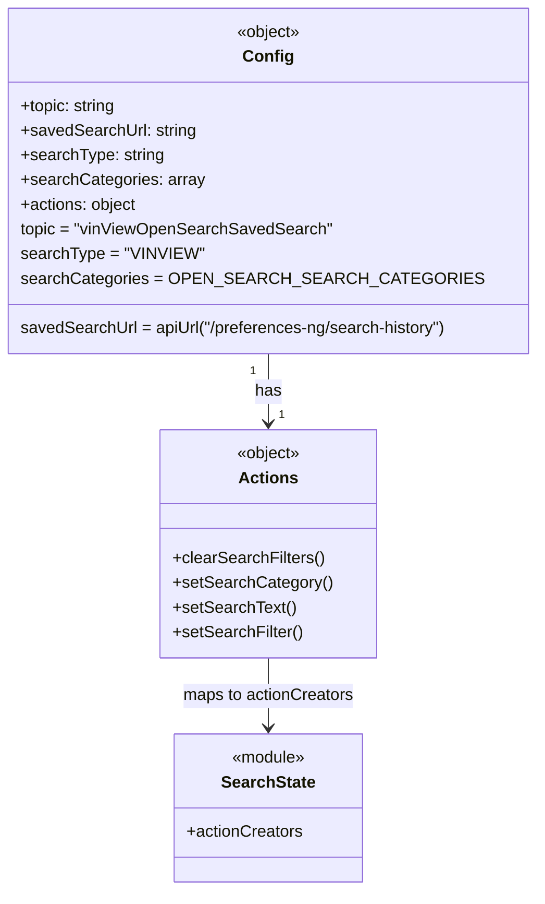

# Diagram: web/portal/src/pages/vinview/redux/VinViewOpenSearchSavedSearchState.js


> Auto-generated by Obscura crawlers

## Diagram 1

```mermaid
flowchart LR
    A[VinViewOpenSearchSavedSearch module] --> B[buildSavedSearchState]
    B --> C{Config Object}
    C --> D[topic: "vinViewOpenSearchSavedSearch"]
    C --> E[savedSearchUrl: apiUrl("/preferences-ng/search-history")]
    C --> F[searchType: "VINVIEW"]
    C --> G[searchCategories: OPEN_SEARCH_SEARCH_CATEGORIES]
    C --> H[actions]
    H --> H1[clearSearchFilters -> SearchState.actionCreators.clearSearchFilters]
    H --> H2[setSearchCategory -> SearchState.actionCreators.setSearchCategory]
    H --> H3[setSearchText -> SearchState.actionCreators.setSearchText]
    H --> H4[setSearchFilter -> SearchState.actionCreators.setSearchFilter]
    subgraph imports
        I1["import buildSavedSearchState from components/saved-search/SavedSearchStateBuilder"]
        I2["import OPEN_SEARCH_SEARCH_CATEGORIES from components/search/VinView.OpenSearch.searchOptions"]
        I3["import apiUrl from api-url"]
        I4["import SearchState from ./VinViewOpenSearchSearchBarState"]
    end
    I1 --> A
    I2 --> A
    I3 --> A
    I4 --> A
```

> SVG rendering failed for this diagram.

## Diagram 2



### SVG

<svg id="container" width="494.9453125" xmlns="http://www.w3.org/2000/svg" class="classDiagram" height="866" viewBox="0 0 494.9453125 866" role="graphics-document document" aria-roledescription="class"><style>#container{font-family:"trebuchet ms",verdana,arial,sans-serif;font-size:16px;fill:#333;}@keyframes edge-animation-frame{from{stroke-dashoffset:0;}}@keyframes dash{to{stroke-dashoffset:0;}}#container .edge-animation-slow{stroke-dasharray:9,5!important;stroke-dashoffset:900;animation:dash 50s linear infinite;stroke-linecap:round;}#container .edge-animation-fast{stroke-dasharray:9,5!important;stroke-dashoffset:900;animation:dash 20s linear infinite;stroke-linecap:round;}#container .error-icon{fill:#552222;}#container .error-text{fill:#552222;stroke:#552222;}#container .edge-thickness-normal{stroke-width:1px;}#container .edge-thickness-thick{stroke-width:3.5px;}#container .edge-pattern-solid{stroke-dasharray:0;}#container .edge-thickness-invisible{stroke-width:0;fill:none;}#container .edge-pattern-dashed{stroke-dasharray:3;}#container .edge-pattern-dotted{stroke-dasharray:2;}#container .marker{fill:#333333;stroke:#333333;}#container .marker.cross{stroke:#333333;}#container svg{font-family:"trebuchet ms",verdana,arial,sans-serif;font-size:16px;}#container p{margin:0;}#container g.classGroup text{fill:#9370DB;stroke:none;font-family:"trebuchet ms",verdana,arial,sans-serif;font-size:10px;}#container g.classGroup text .title{font-weight:bolder;}#container .nodeLabel,#container .edgeLabel{color:#131300;}#container .edgeLabel .label rect{fill:#ECECFF;}#container .label text{fill:#131300;}#container .labelBkg{background:#ECECFF;}#container .edgeLabel .label span{background:#ECECFF;}#container .classTitle{font-weight:bolder;}#container .node rect,#container .node circle,#container .node ellipse,#container .node polygon,#container .node path{fill:#ECECFF;stroke:#9370DB;stroke-width:1px;}#container .divider{stroke:#9370DB;stroke-width:1;}#container g.clickable{cursor:pointer;}#container g.classGroup rect{fill:#ECECFF;stroke:#9370DB;}#container g.classGroup line{stroke:#9370DB;stroke-width:1;}#container .classLabel .box{stroke:none;stroke-width:0;fill:#ECECFF;opacity:0.5;}#container .classLabel .label{fill:#9370DB;font-size:10px;}#container .relation{stroke:#333333;stroke-width:1;fill:none;}#container .dashed-line{stroke-dasharray:3;}#container .dotted-line{stroke-dasharray:1 2;}#container #compositionStart,#container .composition{fill:#333333!important;stroke:#333333!important;stroke-width:1;}#container #compositionEnd,#container .composition{fill:#333333!important;stroke:#333333!important;stroke-width:1;}#container #dependencyStart,#container .dependency{fill:#333333!important;stroke:#333333!important;stroke-width:1;}#container #dependencyStart,#container .dependency{fill:#333333!important;stroke:#333333!important;stroke-width:1;}#container #extensionStart,#container .extension{fill:transparent!important;stroke:#333333!important;stroke-width:1;}#container #extensionEnd,#container .extension{fill:transparent!important;stroke:#333333!important;stroke-width:1;}#container #aggregationStart,#container .aggregation{fill:transparent!important;stroke:#333333!important;stroke-width:1;}#container #aggregationEnd,#container .aggregation{fill:transparent!important;stroke:#333333!important;stroke-width:1;}#container #lollipopStart,#container .lollipop{fill:#ECECFF!important;stroke:#333333!important;stroke-width:1;}#container #lollipopEnd,#container .lollipop{fill:#ECECFF!important;stroke:#333333!important;stroke-width:1;}#container .edgeTerminals{font-size:11px;line-height:initial;}#container .classTitleText{text-anchor:middle;font-size:18px;fill:#333;}#container .label-icon{display:inline-block;height:1em;overflow:visible;vertical-align:-0.125em;}#container .node .label-icon path{fill:currentColor;stroke:revert;stroke-width:revert;}#container :root{--mermaid-font-family:"trebuchet ms",verdana,arial,sans-serif;}</style><g><defs><marker id="container_class-aggregationStart" class="marker aggregation class" refX="18" refY="7" markerWidth="190" markerHeight="240" orient="auto"><path d="M 18,7 L9,13 L1,7 L9,1 Z"></path></marker></defs><defs><marker id="container_class-aggregationEnd" class="marker aggregation class" refX="1" refY="7" markerWidth="20" markerHeight="28" orient="auto"><path d="M 18,7 L9,13 L1,7 L9,1 Z"></path></marker></defs><defs><marker id="container_class-extensionStart" class="marker extension class" refX="18" refY="7" markerWidth="190" markerHeight="240" orient="auto"><path d="M 1,7 L18,13 V 1 Z"></path></marker></defs><defs><marker id="container_class-extensionEnd" class="marker extension class" refX="1" refY="7" markerWidth="20" markerHeight="28" orient="auto"><path d="M 1,1 V 13 L18,7 Z"></path></marker></defs><defs><marker id="container_class-compositionStart" class="marker composition class" refX="18" refY="7" markerWidth="190" markerHeight="240" orient="auto"><path d="M 18,7 L9,13 L1,7 L9,1 Z"></path></marker></defs><defs><marker id="container_class-compositionEnd" class="marker composition class" refX="1" refY="7" markerWidth="20" markerHeight="28" orient="auto"><path d="M 18,7 L9,13 L1,7 L9,1 Z"></path></marker></defs><defs><marker id="container_class-dependencyStart" class="marker dependency class" refX="6" refY="7" markerWidth="190" markerHeight="240" orient="auto"><path d="M 5,7 L9,13 L1,7 L9,1 Z"></path></marker></defs><defs><marker id="container_class-dependencyEnd" class="marker dependency class" refX="13" refY="7" markerWidth="20" markerHeight="28" orient="auto"><path d="M 18,7 L9,13 L14,7 L9,1 Z"></path></marker></defs><defs><marker id="container_class-lollipopStart" class="marker lollipop class" refX="13" refY="7" markerWidth="190" markerHeight="240" orient="auto"><circle stroke="black" fill="transparent" cx="7" cy="7" r="6"></circle></marker></defs><defs><marker id="container_class-lollipopEnd" class="marker lollipop class" refX="1" refY="7" markerWidth="190" markerHeight="240" orient="auto"><circle stroke="black" fill="transparent" cx="7" cy="7" r="6"></circle></marker></defs><g class="root"><g class="clusters"></g><g class="edgePaths"><path d="M247.473,344L247.473,350.167C247.473,356.333,247.473,368.667,247.473,380C247.473,391.333,247.473,401.667,247.473,406.833L247.473,412" id="id_Config_Actions_1" class="edge-thickness-normal edge-pattern-solid relation" style=";;;" data-edge="true" data-et="edge" data-id="id_Config_Actions_1" data-points="W3sieCI6MjQ3LjQ3MjY1NjI1LCJ5IjozNDR9LHsieCI6MjQ3LjQ3MjY1NjI1LCJ5IjozODF9LHsieCI6MjQ3LjQ3MjY1NjI1LCJ5Ijo0MTh9XQ==" marker-end="url(#container_class-dependencyEnd)"></path><path d="M247.473,640L247.473,646.167C247.473,652.333,247.473,664.667,247.473,676C247.473,687.333,247.473,697.667,247.473,702.833L247.473,708" id="id_Actions_SearchState_2" class="edge-thickness-normal edge-pattern-solid relation" style=";;;" data-edge="true" data-et="edge" data-id="id_Actions_SearchState_2" data-points="W3sieCI6MjQ3LjQ3MjY1NjI1LCJ5Ijo2NDB9LHsieCI6MjQ3LjQ3MjY1NjI1LCJ5Ijo2Nzd9LHsieCI6MjQ3LjQ3MjY1NjI1LCJ5Ijo3MTR9XQ==" marker-end="url(#container_class-dependencyEnd)"></path></g><g class="edgeLabels"><g class="edgeLabel" transform="translate(247.47265625, 381)"><g class="label" data-id="id_Config_Actions_1" transform="translate(-12.703125, -12)"><foreignObject width="25.40625" height="24"><div xmlns="http://www.w3.org/1999/xhtml" class="labelBkg" style="display: table-cell; white-space: nowrap; line-height: 1.5; max-width: 200px; text-align: center;"><span class="edgeLabel"><p>has</p></span></div></foreignObject></g></g><g class="edgeLabel" transform="translate(247.47265625, 677)"><g class="label" data-id="id_Actions_SearchState_2" transform="translate(-84.046875, -12)"><foreignObject width="168.09375" height="24"><div xmlns="http://www.w3.org/1999/xhtml" class="labelBkg" style="display: table-cell; white-space: nowrap; line-height: 1.5; max-width: 200px; text-align: center;"><span class="edgeLabel"><p>maps to actionCreators</p></span></div></foreignObject></g></g><g class="edgeTerminals" transform="translate(232.4726581250001, 361.50000160714285)"><g class="inner" transform="translate(0, 0)"><foreignObject style="width: 9px; height: 12px;"><div xmlns="http://www.w3.org/1999/xhtml" style="display: inline-block; padding-right: 1px; white-space: nowrap;"><span class="edgeLabel">1</span></div></foreignObject></g></g><g class="edgeTerminals" transform="translate(257.4726581249999, 395.50000160714285)"><g class="inner" transform="translate(0, 0)"></g><foreignObject style="width: 9px; height: 12px;"><div xmlns="http://www.w3.org/1999/xhtml" style="display: inline-block; padding-right: 1px; white-space: nowrap;"><span class="edgeLabel">1</span></div></foreignObject></g></g><g class="nodes"><g class="node default" id="classId-Config-0" transform="translate(247.47265625, 176)"><g class="basic label-container"><path d="M-239.47265625 -168 L239.47265625 -168 L239.47265625 168 L-239.47265625 168" stroke="none" stroke-width="0" fill="#ECECFF" style=""></path><path d="M-239.47265625 -168 C-80.69178217073159 -168, 78.08909190853683 -168, 239.47265625 -168 M-239.47265625 -168 C-141.15090407810783 -168, -42.82915190621566 -168, 239.47265625 -168 M239.47265625 -168 C239.47265625 -59.58636043019578, 239.47265625 48.827279139608436, 239.47265625 168 M239.47265625 -168 C239.47265625 -42.99670293854865, 239.47265625 82.0065941229027, 239.47265625 168 M239.47265625 168 C48.67927998568834 168, -142.11409627862332 168, -239.47265625 168 M239.47265625 168 C137.48073555894075 168, 35.4888148678815 168, -239.47265625 168 M-239.47265625 168 C-239.47265625 66.81032938104286, -239.47265625 -34.379341237914275, -239.47265625 -168 M-239.47265625 168 C-239.47265625 61.23286070265189, -239.47265625 -45.53427859469622, -239.47265625 -168" stroke="#9370DB" stroke-width="1.3" fill="none" stroke-dasharray="0 0" style=""></path></g><g class="annotation-group text" transform="translate(-31.7109375, -144)"><g class="label" style="" transform="translate(0,-12)"><foreignObject width="63.421875" height="24"><div xmlns="http://www.w3.org/1999/xhtml" style="display: table-cell; white-space: nowrap; line-height: 1.5; max-width: 113px; text-align: center;"><span class="nodeLabel markdown-node-label" style=""><p>«object»</p></span></div></foreignObject></g></g><g class="label-group text" transform="translate(-22.9296875, -120)"><g class="label" style="font-weight: bolder" transform="translate(0,-12)"><foreignObject width="45.859375" height="24"><div xmlns="http://www.w3.org/1999/xhtml" style="display: table-cell; white-space: nowrap; line-height: 1.5; max-width: 96px; text-align: center;"><span class="nodeLabel markdown-node-label" style=""><p>Config</p></span></div></foreignObject></g></g><g class="members-group text" transform="translate(-227.47265625, -72)"><g class="label" style="" transform="translate(0,-12)"><foreignObject width="94.234375" height="24"><div xmlns="http://www.w3.org/1999/xhtml" style="display: table-cell; white-space: nowrap; line-height: 1.5; max-width: 152px; text-align: center;"><span class="nodeLabel markdown-node-label" style=""><p>+topic: string</p></span></div></foreignObject></g><g class="label" style="" transform="translate(0,12)"><foreignObject width="169.890625" height="24"><div xmlns="http://www.w3.org/1999/xhtml" style="display: table-cell; white-space: nowrap; line-height: 1.5; max-width: 228px; text-align: center;"><span class="nodeLabel markdown-node-label" style=""><p>+savedSearchUrl: string</p></span></div></foreignObject></g><g class="label" style="" transform="translate(0,36)"><foreignObject width="138.890625" height="24"><div xmlns="http://www.w3.org/1999/xhtml" style="display: table-cell; white-space: nowrap; line-height: 1.5; max-width: 197px; text-align: center;"><span class="nodeLabel markdown-node-label" style=""><p>+searchType: string</p></span></div></foreignObject></g><g class="label" style="" transform="translate(0,60)"><foreignObject width="176.40625" height="24"><div xmlns="http://www.w3.org/1999/xhtml" style="display: table-cell; white-space: nowrap; line-height: 1.5; max-width: 234px; text-align: center;"><span class="nodeLabel markdown-node-label" style=""><p>+searchCategories: array</p></span></div></foreignObject></g><g class="label" style="" transform="translate(0,84)"><foreignObject width="114.140625" height="24"><div xmlns="http://www.w3.org/1999/xhtml" style="display: table-cell; white-space: nowrap; line-height: 1.5; max-width: 172px; text-align: center;"><span class="nodeLabel markdown-node-label" style=""><p>+actions: object</p></span></div></foreignObject></g><g class="label" style="" transform="translate(0,108)"><foreignObject width="300.359375" height="24"><div xmlns="http://www.w3.org/1999/xhtml" style="display: table-cell; white-space: nowrap; line-height: 1.5; max-width: 350px; text-align: center;"><span class="nodeLabel markdown-node-label" style=""><p>topic = "vinViewOpenSearchSavedSearch"</p></span></div></foreignObject></g><g class="label" style="" transform="translate(0,132)"><foreignObject width="170.53125" height="24"><div xmlns="http://www.w3.org/1999/xhtml" style="display: table-cell; white-space: nowrap; line-height: 1.5; max-width: 221px; text-align: center;"><span class="nodeLabel markdown-node-label" style=""><p>searchType = "VINVIEW"</p></span></div></foreignObject></g><g class="label" style="" transform="translate(0,156)"><foreignObject width="401.828125" height="24"><div xmlns="http://www.w3.org/1999/xhtml" style="display: table-cell; white-space: nowrap; line-height: 1.5; max-width: 452px; text-align: center;"><span class="nodeLabel markdown-node-label" style=""><p>searchCategories = OPEN_SEARCH_SEARCH_CATEGORIES</p></span></div></foreignObject></g></g><g class="methods-group text" transform="translate(-227.47265625, 144)"><g class="label" style="" transform="translate(0,-12)"><foreignObject width="423.234375" height="24"><div xmlns="http://www.w3.org/1999/xhtml" style="display: table-cell; white-space: nowrap; line-height: 1.5; max-width: 473px; text-align: center;"><span class="nodeLabel markdown-node-label" style=""><p>savedSearchUrl = apiUrl("/preferences-ng/search-history")</p></span></div></foreignObject></g></g><g class="divider" style=""><path d="M-239.47265625 -96 C-133.97680477622788 -96, -28.48095330245573 -96, 239.47265625 -96 M-239.47265625 -96 C-75.50898543760297 -96, 88.45468537479405 -96, 239.47265625 -96" stroke="#9370DB" stroke-width="1.3" fill="none" stroke-dasharray="0 0" style=""></path></g><g class="divider" style=""><path d="M-239.47265625 120 C-62.627787938643394 120, 114.21708037271321 120, 239.47265625 120 M-239.47265625 120 C-106.14149007832015 120, 27.189676093359708 120, 239.47265625 120" stroke="#9370DB" stroke-width="1.3" fill="none" stroke-dasharray="0 0" style=""></path></g></g><g class="node default" id="classId-Actions-1" transform="translate(247.47265625, 529)"><g class="basic label-container"><path d="M-103.98046875 -111 L103.98046875 -111 L103.98046875 111 L-103.98046875 111" stroke="none" stroke-width="0" fill="#ECECFF" style=""></path><path d="M-103.98046875 -111 C-62.14492513593034 -111, -20.309381521860686 -111, 103.98046875 -111 M-103.98046875 -111 C-62.027789263510854 -111, -20.07510977702171 -111, 103.98046875 -111 M103.98046875 -111 C103.98046875 -58.24780360700257, 103.98046875 -5.495607214005133, 103.98046875 111 M103.98046875 -111 C103.98046875 -64.26872436373276, 103.98046875 -17.537448727465502, 103.98046875 111 M103.98046875 111 C25.04274197490608 111, -53.89498480018784 111, -103.98046875 111 M103.98046875 111 C57.27123670508017 111, 10.56200466016034 111, -103.98046875 111 M-103.98046875 111 C-103.98046875 55.027018974349375, -103.98046875 -0.945962051301251, -103.98046875 -111 M-103.98046875 111 C-103.98046875 31.2140855389449, -103.98046875 -48.5718289221102, -103.98046875 -111" stroke="#9370DB" stroke-width="1.3" fill="none" stroke-dasharray="0 0" style=""></path></g><g class="annotation-group text" transform="translate(-31.7109375, -87)"><g class="label" style="" transform="translate(0,-12)"><foreignObject width="63.421875" height="24"><div xmlns="http://www.w3.org/1999/xhtml" style="display: table-cell; white-space: nowrap; line-height: 1.5; max-width: 113px; text-align: center;"><span class="nodeLabel markdown-node-label" style=""><p>«object»</p></span></div></foreignObject></g></g><g class="label-group text" transform="translate(-27.0546875, -63)"><g class="label" style="font-weight: bolder" transform="translate(0,-12)"><foreignObject width="54.109375" height="24"><div xmlns="http://www.w3.org/1999/xhtml" style="display: table-cell; white-space: nowrap; line-height: 1.5; max-width: 103px; text-align: center;"><span class="nodeLabel markdown-node-label" style=""><p>Actions</p></span></div></foreignObject></g></g><g class="members-group text" transform="translate(-91.98046875, -15)"></g><g class="methods-group text" transform="translate(-91.98046875, 15)"><g class="label" style="" transform="translate(0,-12)"><foreignObject width="146.921875" height="24"><div xmlns="http://www.w3.org/1999/xhtml" style="display: table-cell; white-space: nowrap; line-height: 1.5; max-width: 204px; text-align: center;"><span class="nodeLabel markdown-node-label" style=""><p>+clearSearchFilters()</p></span></div></foreignObject></g><g class="label" style="" transform="translate(0,12)"><foreignObject width="152.25" height="24"><div xmlns="http://www.w3.org/1999/xhtml" style="display: table-cell; white-space: nowrap; line-height: 1.5; max-width: 210px; text-align: center;"><span class="nodeLabel markdown-node-label" style=""><p>+setSearchCategory()</p></span></div></foreignObject></g><g class="label" style="" transform="translate(0,36)"><foreignObject width="118.53125" height="24"><div xmlns="http://www.w3.org/1999/xhtml" style="display: table-cell; white-space: nowrap; line-height: 1.5; max-width: 176px; text-align: center;"><span class="nodeLabel markdown-node-label" style=""><p>+setSearchText()</p></span></div></foreignObject></g><g class="label" style="" transform="translate(0,60)"><foreignObject width="125.953125" height="24"><div xmlns="http://www.w3.org/1999/xhtml" style="display: table-cell; white-space: nowrap; line-height: 1.5; max-width: 183px; text-align: center;"><span class="nodeLabel markdown-node-label" style=""><p>+setSearchFilter()</p></span></div></foreignObject></g></g><g class="divider" style=""><path d="M-103.98046875 -39 C-49.1938153482905 -39, 5.592838053419001 -39, 103.98046875 -39 M-103.98046875 -39 C-28.974430972399674 -39, 46.03160680520065 -39, 103.98046875 -39" stroke="#9370DB" stroke-width="1.3" fill="none" stroke-dasharray="0 0" style=""></path></g><g class="divider" style=""><path d="M-103.98046875 -15 C-55.06257859377166 -15, -6.144688437543323 -15, 103.98046875 -15 M-103.98046875 -15 C-39.96115379066097 -15, 24.058161168678055 -15, 103.98046875 -15" stroke="#9370DB" stroke-width="1.3" fill="none" stroke-dasharray="0 0" style=""></path></g></g><g class="node default" id="classId-SearchState-2" transform="translate(247.47265625, 786)"><g class="basic label-container"><path d="M-90.5546875 -72 L90.5546875 -72 L90.5546875 72 L-90.5546875 72" stroke="none" stroke-width="0" fill="#ECECFF" style=""></path><path d="M-90.5546875 -72 C-37.317961724152774 -72, 15.918764051694453 -72, 90.5546875 -72 M-90.5546875 -72 C-30.864976646887847 -72, 28.824734206224306 -72, 90.5546875 -72 M90.5546875 -72 C90.5546875 -27.213910697480735, 90.5546875 17.57217860503853, 90.5546875 72 M90.5546875 -72 C90.5546875 -35.92251835836708, 90.5546875 0.1549632832658432, 90.5546875 72 M90.5546875 72 C28.553717879904823 72, -33.44725174019035 72, -90.5546875 72 M90.5546875 72 C25.209019422237205 72, -40.13664865552559 72, -90.5546875 72 M-90.5546875 72 C-90.5546875 14.400408318684583, -90.5546875 -43.19918336263083, -90.5546875 -72 M-90.5546875 72 C-90.5546875 27.446602425644492, -90.5546875 -17.106795148711015, -90.5546875 -72" stroke="#9370DB" stroke-width="1.3" fill="none" stroke-dasharray="0 0" style=""></path></g><g class="annotation-group text" transform="translate(-36.6015625, -48)"><g class="label" style="" transform="translate(0,-12)"><foreignObject width="73.203125" height="24"><div xmlns="http://www.w3.org/1999/xhtml" style="display: table-cell; white-space: nowrap; line-height: 1.5; max-width: 123px; text-align: center;"><span class="nodeLabel markdown-node-label" style=""><p>«module»</p></span></div></foreignObject></g></g><g class="label-group text" transform="translate(-44.03125, -24)"><g class="label" style="font-weight: bolder" transform="translate(0,-12)"><foreignObject width="88.0625" height="24"><div xmlns="http://www.w3.org/1999/xhtml" style="display: table-cell; white-space: nowrap; line-height: 1.5; max-width: 136px; text-align: center;"><span class="nodeLabel markdown-node-label" style=""><p>SearchState</p></span></div></foreignObject></g></g><g class="members-group text" transform="translate(-78.5546875, 24)"><g class="label" style="" transform="translate(0,-12)"><foreignObject width="113.078125" height="24"><div xmlns="http://www.w3.org/1999/xhtml" style="display: table-cell; white-space: nowrap; line-height: 1.5; max-width: 170px; text-align: center;"><span class="nodeLabel markdown-node-label" style=""><p>+actionCreators</p></span></div></foreignObject></g></g><g class="methods-group text" transform="translate(-78.5546875, 72)"></g><g class="divider" style=""><path d="M-90.5546875 0 C-45.91601303708504 0, -1.2773385741700736 0, 90.5546875 0 M-90.5546875 0 C-37.3867093030222 0, 15.781268893955598 0, 90.5546875 0" stroke="#9370DB" stroke-width="1.3" fill="none" stroke-dasharray="0 0" style=""></path></g><g class="divider" style=""><path d="M-90.5546875 48 C-38.34254106440095 48, 13.869605371198105 48, 90.5546875 48 M-90.5546875 48 C-21.668885146434377 48, 47.216917207131246 48, 90.5546875 48" stroke="#9370DB" stroke-width="1.3" fill="none" stroke-dasharray="0 0" style=""></path></g></g></g></g></g></svg>
