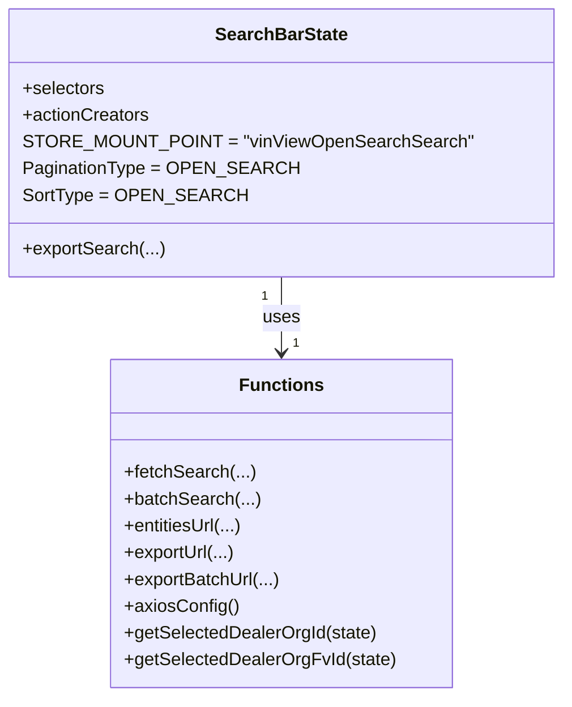
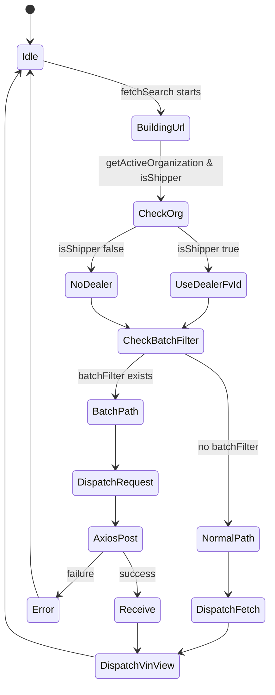

# Diagram: web/portal/src/pages/vinview/redux/VinViewOpenSearchSearchBarState.js


> Auto-generated by Obscura crawlers

## Diagram 1

```mermaid
flowchart LR
  subgraph Utils
    entitiesUrl["entitiesUrl(dealerOrgFvId, queryString)"]
    exportUrl["exportUrl(solutionId, queryString, state)"]
    exportBatchUrl["exportBatchUrl(solutionId, queryString, batchType, state)"]
    axiosConfig["axiosConfig()"]
    getSelectedDealerOrgFvId["getSelectedDealerOrgFvId(state)"]
    getSelectedDealerOrgId["getSelectedDealerOrgId(state)"]
  end

  subgraph OrgChecks
    getActiveOrganization["getActiveOrganization(state)"]
    isShipper["isShipper(org)"]
  end

  fetchSearch["fetchSearch(queryString, solutionId, duck, dispatch, state, preventRedirect, requestBody)"]
  batchSearch["batchSearch(url, requestBody, dispatch, batchFilter, duck)"]
  dispatchFetch["dispatch(duck.fetch(url, axiosConfiguration))"]
  dispatchVinView["dispatch({ type: \"VINVIEW_SEARCH\" })"]
  dispatchRequest["dispatch({ type: duck.actions.REQUEST })"]
  dispatchReceive["dispatch({ type: duck.actions.RECEIVE, payload })"]
  dispatchError["dispatch({ type: duck.actions.REQUEST_ERROR, err })"]
  axiosPost["axios.post(url, { ...requestBody }, axiosConfiguration)"]

  fetchSearch -->|build url| entitiesUrl
  fetchSearch --> getActiveOrganization
  getActiveOrganization --> isShipper
  isShipper -->|true| getSelectedDealerOrgFvId
  fetchSearch -->|check batchFilter| batchFilterCheck{batchFilter && batchFilter.batch_type?}
  batchFilterCheck -->|yes| buildBatchFilter["build batchSearchFilter and augment requestBody"]
  buildBatchFilter --> batchSearch
  batchSearch --> axiosConfig
  batchSearch --> axiosPost
  axiosPost -->|then| dispatchReceive
  axiosPost -->|catch| dispatchError
  batchSearch --> dispatchRequest
  batchSearch --> dispatchVinView
  batchFilterCheck -->|no| axiosConfiguration["axiosConfiguration(method: POST, url, data, headers)"]
  axiosConfiguration --> dispatchFetch
  dispatchFetch --> dispatchVinView
```

> SVG rendering failed for this diagram.

## Diagram 2



### SVG

<svg id="container" width="475.7578125" xmlns="http://www.w3.org/2000/svg" class="classDiagram" height="624" viewBox="0 0 475.7578125 624" role="graphics-document document" aria-roledescription="class"><style>#container{font-family:"trebuchet ms",verdana,arial,sans-serif;font-size:16px;fill:#333;}@keyframes edge-animation-frame{from{stroke-dashoffset:0;}}@keyframes dash{to{stroke-dashoffset:0;}}#container .edge-animation-slow{stroke-dasharray:9,5!important;stroke-dashoffset:900;animation:dash 50s linear infinite;stroke-linecap:round;}#container .edge-animation-fast{stroke-dasharray:9,5!important;stroke-dashoffset:900;animation:dash 20s linear infinite;stroke-linecap:round;}#container .error-icon{fill:#552222;}#container .error-text{fill:#552222;stroke:#552222;}#container .edge-thickness-normal{stroke-width:1px;}#container .edge-thickness-thick{stroke-width:3.5px;}#container .edge-pattern-solid{stroke-dasharray:0;}#container .edge-thickness-invisible{stroke-width:0;fill:none;}#container .edge-pattern-dashed{stroke-dasharray:3;}#container .edge-pattern-dotted{stroke-dasharray:2;}#container .marker{fill:#333333;stroke:#333333;}#container .marker.cross{stroke:#333333;}#container svg{font-family:"trebuchet ms",verdana,arial,sans-serif;font-size:16px;}#container p{margin:0;}#container g.classGroup text{fill:#9370DB;stroke:none;font-family:"trebuchet ms",verdana,arial,sans-serif;font-size:10px;}#container g.classGroup text .title{font-weight:bolder;}#container .nodeLabel,#container .edgeLabel{color:#131300;}#container .edgeLabel .label rect{fill:#ECECFF;}#container .label text{fill:#131300;}#container .labelBkg{background:#ECECFF;}#container .edgeLabel .label span{background:#ECECFF;}#container .classTitle{font-weight:bolder;}#container .node rect,#container .node circle,#container .node ellipse,#container .node polygon,#container .node path{fill:#ECECFF;stroke:#9370DB;stroke-width:1px;}#container .divider{stroke:#9370DB;stroke-width:1;}#container g.clickable{cursor:pointer;}#container g.classGroup rect{fill:#ECECFF;stroke:#9370DB;}#container g.classGroup line{stroke:#9370DB;stroke-width:1;}#container .classLabel .box{stroke:none;stroke-width:0;fill:#ECECFF;opacity:0.5;}#container .classLabel .label{fill:#9370DB;font-size:10px;}#container .relation{stroke:#333333;stroke-width:1;fill:none;}#container .dashed-line{stroke-dasharray:3;}#container .dotted-line{stroke-dasharray:1 2;}#container #compositionStart,#container .composition{fill:#333333!important;stroke:#333333!important;stroke-width:1;}#container #compositionEnd,#container .composition{fill:#333333!important;stroke:#333333!important;stroke-width:1;}#container #dependencyStart,#container .dependency{fill:#333333!important;stroke:#333333!important;stroke-width:1;}#container #dependencyStart,#container .dependency{fill:#333333!important;stroke:#333333!important;stroke-width:1;}#container #extensionStart,#container .extension{fill:transparent!important;stroke:#333333!important;stroke-width:1;}#container #extensionEnd,#container .extension{fill:transparent!important;stroke:#333333!important;stroke-width:1;}#container #aggregationStart,#container .aggregation{fill:transparent!important;stroke:#333333!important;stroke-width:1;}#container #aggregationEnd,#container .aggregation{fill:transparent!important;stroke:#333333!important;stroke-width:1;}#container #lollipopStart,#container .lollipop{fill:#ECECFF!important;stroke:#333333!important;stroke-width:1;}#container #lollipopEnd,#container .lollipop{fill:#ECECFF!important;stroke:#333333!important;stroke-width:1;}#container .edgeTerminals{font-size:11px;line-height:initial;}#container .classTitleText{text-anchor:middle;font-size:18px;fill:#333;}#container .label-icon{display:inline-block;height:1em;overflow:visible;vertical-align:-0.125em;}#container .node .label-icon path{fill:currentColor;stroke:revert;stroke-width:revert;}#container :root{--mermaid-font-family:"trebuchet ms",verdana,arial,sans-serif;}</style><g><defs><marker id="container_class-aggregationStart" class="marker aggregation class" refX="18" refY="7" markerWidth="190" markerHeight="240" orient="auto"><path d="M 18,7 L9,13 L1,7 L9,1 Z"></path></marker></defs><defs><marker id="container_class-aggregationEnd" class="marker aggregation class" refX="1" refY="7" markerWidth="20" markerHeight="28" orient="auto"><path d="M 18,7 L9,13 L1,7 L9,1 Z"></path></marker></defs><defs><marker id="container_class-extensionStart" class="marker extension class" refX="18" refY="7" markerWidth="190" markerHeight="240" orient="auto"><path d="M 1,7 L18,13 V 1 Z"></path></marker></defs><defs><marker id="container_class-extensionEnd" class="marker extension class" refX="1" refY="7" markerWidth="20" markerHeight="28" orient="auto"><path d="M 1,1 V 13 L18,7 Z"></path></marker></defs><defs><marker id="container_class-compositionStart" class="marker composition class" refX="18" refY="7" markerWidth="190" markerHeight="240" orient="auto"><path d="M 18,7 L9,13 L1,7 L9,1 Z"></path></marker></defs><defs><marker id="container_class-compositionEnd" class="marker composition class" refX="1" refY="7" markerWidth="20" markerHeight="28" orient="auto"><path d="M 18,7 L9,13 L1,7 L9,1 Z"></path></marker></defs><defs><marker id="container_class-dependencyStart" class="marker dependency class" refX="6" refY="7" markerWidth="190" markerHeight="240" orient="auto"><path d="M 5,7 L9,13 L1,7 L9,1 Z"></path></marker></defs><defs><marker id="container_class-dependencyEnd" class="marker dependency class" refX="13" refY="7" markerWidth="20" markerHeight="28" orient="auto"><path d="M 18,7 L9,13 L14,7 L9,1 Z"></path></marker></defs><defs><marker id="container_class-lollipopStart" class="marker lollipop class" refX="13" refY="7" markerWidth="190" markerHeight="240" orient="auto"><circle stroke="black" fill="transparent" cx="7" cy="7" r="6"></circle></marker></defs><defs><marker id="container_class-lollipopEnd" class="marker lollipop class" refX="1" refY="7" markerWidth="190" markerHeight="240" orient="auto"><circle stroke="black" fill="transparent" cx="7" cy="7" r="6"></circle></marker></defs><g class="root"><g class="clusters"></g><g class="edgePaths"><path d="M237.879,248L237.879,254.167C237.879,260.333,237.879,272.667,237.879,284C237.879,295.333,237.879,305.667,237.879,310.833L237.879,316" id="id_SearchBarState_Functions_1" class="edge-thickness-normal edge-pattern-solid relation" style=";;;" data-edge="true" data-et="edge" data-id="id_SearchBarState_Functions_1" data-points="W3sieCI6MjM3Ljg3ODkwNjI1LCJ5IjoyNDh9LHsieCI6MjM3Ljg3ODkwNjI1LCJ5IjoyODV9LHsieCI6MjM3Ljg3ODkwNjI1LCJ5IjozMjJ9XQ==" marker-end="url(#container_class-dependencyEnd)"></path></g><g class="edgeLabels"><g class="edgeLabel" transform="translate(237.87890625, 285)"><g class="label" data-id="id_SearchBarState_Functions_1" transform="translate(-16.4921875, -12)"><foreignObject width="32.984375" height="24"><div xmlns="http://www.w3.org/1999/xhtml" class="labelBkg" style="display: table-cell; white-space: nowrap; line-height: 1.5; max-width: 200px; text-align: center;"><span class="edgeLabel"><p>uses</p></span></div></foreignObject></g></g><g class="edgeTerminals" transform="translate(222.8789081250001, 265.50000160714285)"><g class="inner" transform="translate(0, 0)"><foreignObject style="width: 9px; height: 12px;"><div xmlns="http://www.w3.org/1999/xhtml" style="display: inline-block; padding-right: 1px; white-space: nowrap;"><span class="edgeLabel">1</span></div></foreignObject></g></g><g class="edgeTerminals" transform="translate(247.87890812499992, 299.50000160714285)"><g class="inner" transform="translate(0, 0)"></g><foreignObject style="width: 9px; height: 12px;"><div xmlns="http://www.w3.org/1999/xhtml" style="display: inline-block; padding-right: 1px; white-space: nowrap;"><span class="edgeLabel">1</span></div></foreignObject></g></g><g class="nodes"><g class="node default" id="classId-SearchBarState-0" transform="translate(237.87890625, 128)"><g class="basic label-container"><path d="M-229.87890625 -120 L229.87890625 -120 L229.87890625 120 L-229.87890625 120" stroke="none" stroke-width="0" fill="#ECECFF" style=""></path><path d="M-229.87890625 -120 C-133.42596532257284 -120, -36.9730243951457 -120, 229.87890625 -120 M-229.87890625 -120 C-72.32750562045445 -120, 85.22389500909111 -120, 229.87890625 -120 M229.87890625 -120 C229.87890625 -49.755314967596036, 229.87890625 20.48937006480793, 229.87890625 120 M229.87890625 -120 C229.87890625 -59.17437811881675, 229.87890625 1.651243762366505, 229.87890625 120 M229.87890625 120 C57.2173151601541 120, -115.4442759296918 120, -229.87890625 120 M229.87890625 120 C86.86143701302154 120, -56.15603222395691 120, -229.87890625 120 M-229.87890625 120 C-229.87890625 44.61013863957457, -229.87890625 -30.779722720850856, -229.87890625 -120 M-229.87890625 120 C-229.87890625 45.601523998560054, -229.87890625 -28.79695200287989, -229.87890625 -120" stroke="#9370DB" stroke-width="1.3" fill="none" stroke-dasharray="0 0" style=""></path></g><g class="annotation-group text" transform="translate(0, -96)"></g><g class="label-group text" transform="translate(-56.5546875, -96)"><g class="label" style="font-weight: bolder" transform="translate(0,-12)"><foreignObject width="113.109375" height="24"><div xmlns="http://www.w3.org/1999/xhtml" style="display: table-cell; white-space: nowrap; line-height: 1.5; max-width: 161px; text-align: center;"><span class="nodeLabel markdown-node-label" style=""><p>SearchBarState</p></span></div></foreignObject></g></g><g class="members-group text" transform="translate(-217.87890625, -48)"><g class="label" style="" transform="translate(0,-12)"><foreignObject width="73.453125" height="24"><div xmlns="http://www.w3.org/1999/xhtml" style="display: table-cell; white-space: nowrap; line-height: 1.5; max-width: 131px; text-align: center;"><span class="nodeLabel markdown-node-label" style=""><p>+selectors</p></span></div></foreignObject></g><g class="label" style="" transform="translate(0,12)"><foreignObject width="113.078125" height="24"><div xmlns="http://www.w3.org/1999/xhtml" style="display: table-cell; white-space: nowrap; line-height: 1.5; max-width: 170px; text-align: center;"><span class="nodeLabel markdown-node-label" style=""><p>+actionCreators</p></span></div></foreignObject></g><g class="label" style="" transform="translate(0,36)"><foreignObject width="379.203125" height="24"><div xmlns="http://www.w3.org/1999/xhtml" style="display: table-cell; white-space: nowrap; line-height: 1.5; max-width: 429px; text-align: center;"><span class="nodeLabel markdown-node-label" style=""><p>STORE_MOUNT_POINT = "vinViewOpenSearchSearch"</p></span></div></foreignObject></g><g class="label" style="" transform="translate(0,60)"><foreignObject width="230.78125" height="24"><div xmlns="http://www.w3.org/1999/xhtml" style="display: table-cell; white-space: nowrap; line-height: 1.5; max-width: 281px; text-align: center;"><span class="nodeLabel markdown-node-label" style=""><p>PaginationType = OPEN_SEARCH</p></span></div></foreignObject></g><g class="label" style="" transform="translate(0,84)"><foreignObject width="183.90625" height="24"><div xmlns="http://www.w3.org/1999/xhtml" style="display: table-cell; white-space: nowrap; line-height: 1.5; max-width: 234px; text-align: center;"><span class="nodeLabel markdown-node-label" style=""><p>SortType = OPEN_SEARCH</p></span></div></foreignObject></g></g><g class="methods-group text" transform="translate(-217.87890625, 96)"><g class="label" style="" transform="translate(0,-12)"><foreignObject width="125.71875" height="24"><div xmlns="http://www.w3.org/1999/xhtml" style="display: table-cell; white-space: nowrap; line-height: 1.5; max-width: 183px; text-align: center;"><span class="nodeLabel markdown-node-label" style=""><p>+exportSearch(...)</p></span></div></foreignObject></g></g><g class="divider" style=""><path d="M-229.87890625 -72 C-48.74965073881498 -72, 132.37960477237004 -72, 229.87890625 -72 M-229.87890625 -72 C-100.86257065032291 -72, 28.153764949354183 -72, 229.87890625 -72" stroke="#9370DB" stroke-width="1.3" fill="none" stroke-dasharray="0 0" style=""></path></g><g class="divider" style=""><path d="M-229.87890625 72 C-82.71145425489331 72, 64.45599774021338 72, 229.87890625 72 M-229.87890625 72 C-55.02769700609255 72, 119.8235122378149 72, 229.87890625 72" stroke="#9370DB" stroke-width="1.3" fill="none" stroke-dasharray="0 0" style=""></path></g></g><g class="node default" id="classId-Functions-1" transform="translate(237.87890625, 469)"><g class="basic label-container"><path d="M-150.04296875 -147 L150.04296875 -147 L150.04296875 147 L-150.04296875 147" stroke="none" stroke-width="0" fill="#ECECFF" style=""></path><path d="M-150.04296875 -147 C-62.010080217691765 -147, 26.02280831461647 -147, 150.04296875 -147 M-150.04296875 -147 C-81.82168219988156 -147, -13.60039564976313 -147, 150.04296875 -147 M150.04296875 -147 C150.04296875 -35.781024406864674, 150.04296875 75.43795118627065, 150.04296875 147 M150.04296875 -147 C150.04296875 -62.01159621450877, 150.04296875 22.97680757098246, 150.04296875 147 M150.04296875 147 C72.13845518678512 147, -5.766058376429754 147, -150.04296875 147 M150.04296875 147 C48.415582206298694 147, -53.21180433740261 147, -150.04296875 147 M-150.04296875 147 C-150.04296875 71.79412663685784, -150.04296875 -3.4117467262843206, -150.04296875 -147 M-150.04296875 147 C-150.04296875 62.59267088712143, -150.04296875 -21.814658225757142, -150.04296875 -147" stroke="#9370DB" stroke-width="1.3" fill="none" stroke-dasharray="0 0" style=""></path></g><g class="annotation-group text" transform="translate(0, -123)"></g><g class="label-group text" transform="translate(-35.1328125, -123)"><g class="label" style="font-weight: bolder" transform="translate(0,-12)"><foreignObject width="70.265625" height="24"><div xmlns="http://www.w3.org/1999/xhtml" style="display: table-cell; white-space: nowrap; line-height: 1.5; max-width: 120px; text-align: center;"><span class="nodeLabel markdown-node-label" style=""><p>Functions</p></span></div></foreignObject></g></g><g class="members-group text" transform="translate(-138.04296875, -75)"></g><g class="methods-group text" transform="translate(-138.04296875, -45)"><g class="label" style="" transform="translate(0,-12)"><foreignObject width="114.828125" height="24"><div xmlns="http://www.w3.org/1999/xhtml" style="display: table-cell; white-space: nowrap; line-height: 1.5; max-width: 172px; text-align: center;"><span class="nodeLabel markdown-node-label" style=""><p>+fetchSearch(...)</p></span></div></foreignObject></g><g class="label" style="" transform="translate(0,12)"><foreignObject width="119.1875" height="24"><div xmlns="http://www.w3.org/1999/xhtml" style="display: table-cell; white-space: nowrap; line-height: 1.5; max-width: 177px; text-align: center;"><span class="nodeLabel markdown-node-label" style=""><p>+batchSearch(...)</p></span></div></foreignObject></g><g class="label" style="" transform="translate(0,36)"><foreignObject width="106.203125" height="24"><div xmlns="http://www.w3.org/1999/xhtml" style="display: table-cell; white-space: nowrap; line-height: 1.5; max-width: 164px; text-align: center;"><span class="nodeLabel markdown-node-label" style=""><p>+entitiesUrl(...)</p></span></div></foreignObject></g><g class="label" style="" transform="translate(0,60)"><foreignObject width="98.46875" height="24"><div xmlns="http://www.w3.org/1999/xhtml" style="display: table-cell; white-space: nowrap; line-height: 1.5; max-width: 156px; text-align: center;"><span class="nodeLabel markdown-node-label" style=""><p>+exportUrl(...)</p></span></div></foreignObject></g><g class="label" style="" transform="translate(0,84)"><foreignObject width="139.46875" height="24"><div xmlns="http://www.w3.org/1999/xhtml" style="display: table-cell; white-space: nowrap; line-height: 1.5; max-width: 197px; text-align: center;"><span class="nodeLabel markdown-node-label" style=""><p>+exportBatchUrl(...)</p></span></div></foreignObject></g><g class="label" style="" transform="translate(0,108)"><foreignObject width="100.796875" height="24"><div xmlns="http://www.w3.org/1999/xhtml" style="display: table-cell; white-space: nowrap; line-height: 1.5; max-width: 158px; text-align: center;"><span class="nodeLabel markdown-node-label" style=""><p>+axiosConfig()</p></span></div></foreignObject></g><g class="label" style="" transform="translate(0,132)"><foreignObject width="225.78125" height="24"><div xmlns="http://www.w3.org/1999/xhtml" style="display: table-cell; white-space: nowrap; line-height: 1.5; max-width: 283px; text-align: center;"><span class="nodeLabel markdown-node-label" style=""><p>+getSelectedDealerOrgId(state)</p></span></div></foreignObject></g><g class="label" style="" transform="translate(0,156)"><foreignObject width="240.953125" height="24"><div xmlns="http://www.w3.org/1999/xhtml" style="display: table-cell; white-space: nowrap; line-height: 1.5; max-width: 298px; text-align: center;"><span class="nodeLabel markdown-node-label" style=""><p>+getSelectedDealerOrgFvId(state)</p></span></div></foreignObject></g></g><g class="divider" style=""><path d="M-150.04296875 -99 C-84.7640739862674 -99, -19.48517922253481 -99, 150.04296875 -99 M-150.04296875 -99 C-89.8012972873834 -99, -29.55962582476681 -99, 150.04296875 -99" stroke="#9370DB" stroke-width="1.3" fill="none" stroke-dasharray="0 0" style=""></path></g><g class="divider" style=""><path d="M-150.04296875 -75 C-82.862353244302 -75, -15.681737738604 -75, 150.04296875 -75 M-150.04296875 -75 C-61.89257668587835 -75, 26.257815378243293 -75, 150.04296875 -75" stroke="#9370DB" stroke-width="1.3" fill="none" stroke-dasharray="0 0" style=""></path></g></g></g></g></g></svg>

## Diagram 3



### SVG

<svg id="container" width="432.3791809082031" xmlns="http://www.w3.org/2000/svg" class="statediagram" height="1098" viewBox="-18.63700008392334 0 432.3791809082031 1098" role="graphics-document document" aria-roledescription="stateDiagram"><style>#container{font-family:"trebuchet ms",verdana,arial,sans-serif;font-size:16px;fill:#333;}@keyframes edge-animation-frame{from{stroke-dashoffset:0;}}@keyframes dash{to{stroke-dashoffset:0;}}#container .edge-animation-slow{stroke-dasharray:9,5!important;stroke-dashoffset:900;animation:dash 50s linear infinite;stroke-linecap:round;}#container .edge-animation-fast{stroke-dasharray:9,5!important;stroke-dashoffset:900;animation:dash 20s linear infinite;stroke-linecap:round;}#container .error-icon{fill:#552222;}#container .error-text{fill:#552222;stroke:#552222;}#container .edge-thickness-normal{stroke-width:1px;}#container .edge-thickness-thick{stroke-width:3.5px;}#container .edge-pattern-solid{stroke-dasharray:0;}#container .edge-thickness-invisible{stroke-width:0;fill:none;}#container .edge-pattern-dashed{stroke-dasharray:3;}#container .edge-pattern-dotted{stroke-dasharray:2;}#container .marker{fill:#333333;stroke:#333333;}#container .marker.cross{stroke:#333333;}#container svg{font-family:"trebuchet ms",verdana,arial,sans-serif;font-size:16px;}#container p{margin:0;}#container defs #statediagram-barbEnd{fill:#333333;stroke:#333333;}#container g.stateGroup text{fill:#9370DB;stroke:none;font-size:10px;}#container g.stateGroup text{fill:#333;stroke:none;font-size:10px;}#container g.stateGroup .state-title{font-weight:bolder;fill:#131300;}#container g.stateGroup rect{fill:#ECECFF;stroke:#9370DB;}#container g.stateGroup line{stroke:#333333;stroke-width:1;}#container .transition{stroke:#333333;stroke-width:1;fill:none;}#container .stateGroup .composit{fill:white;border-bottom:1px;}#container .stateGroup .alt-composit{fill:#e0e0e0;border-bottom:1px;}#container .state-note{stroke:#aaaa33;fill:#fff5ad;}#container .state-note text{fill:black;stroke:none;font-size:10px;}#container .stateLabel .box{stroke:none;stroke-width:0;fill:#ECECFF;opacity:0.5;}#container .edgeLabel .label rect{fill:#ECECFF;opacity:0.5;}#container .edgeLabel{background-color:rgba(232,232,232, 0.8);text-align:center;}#container .edgeLabel p{background-color:rgba(232,232,232, 0.8);}#container .edgeLabel rect{opacity:0.5;background-color:rgba(232,232,232, 0.8);fill:rgba(232,232,232, 0.8);}#container .edgeLabel .label text{fill:#333;}#container .label div .edgeLabel{color:#333;}#container .stateLabel text{fill:#131300;font-size:10px;font-weight:bold;}#container .node circle.state-start{fill:#333333;stroke:#333333;}#container .node .fork-join{fill:#333333;stroke:#333333;}#container .node circle.state-end{fill:#9370DB;stroke:white;stroke-width:1.5;}#container .end-state-inner{fill:white;stroke-width:1.5;}#container .node rect{fill:#ECECFF;stroke:#9370DB;stroke-width:1px;}#container .node polygon{fill:#ECECFF;stroke:#9370DB;stroke-width:1px;}#container #statediagram-barbEnd{fill:#333333;}#container .statediagram-cluster rect{fill:#ECECFF;stroke:#9370DB;stroke-width:1px;}#container .cluster-label,#container .nodeLabel{color:#131300;}#container .statediagram-cluster rect.outer{rx:5px;ry:5px;}#container .statediagram-state .divider{stroke:#9370DB;}#container .statediagram-state .title-state{rx:5px;ry:5px;}#container .statediagram-cluster.statediagram-cluster .inner{fill:white;}#container .statediagram-cluster.statediagram-cluster-alt .inner{fill:#f0f0f0;}#container .statediagram-cluster .inner{rx:0;ry:0;}#container .statediagram-state rect.basic{rx:5px;ry:5px;}#container .statediagram-state rect.divider{stroke-dasharray:10,10;fill:#f0f0f0;}#container .note-edge{stroke-dasharray:5;}#container .statediagram-note rect{fill:#fff5ad;stroke:#aaaa33;stroke-width:1px;rx:0;ry:0;}#container .statediagram-note rect{fill:#fff5ad;stroke:#aaaa33;stroke-width:1px;rx:0;ry:0;}#container .statediagram-note text{fill:black;}#container .statediagram-note .nodeLabel{color:black;}#container .statediagram .edgeLabel{color:red;}#container #dependencyStart,#container #dependencyEnd{fill:#333333;stroke:#333333;stroke-width:1;}#container .statediagramTitleText{text-anchor:middle;font-size:18px;fill:#333;}#container :root{--mermaid-font-family:"trebuchet ms",verdana,arial,sans-serif;}</style><g><defs><marker id="container_stateDiagram-barbEnd" refX="19" refY="7" markerWidth="20" markerHeight="14" markerUnits="userSpaceOnUse" orient="auto"><path d="M 19,7 L9,13 L14,7 L9,1 Z"></path></marker></defs><g class="root"><g class="clusters"></g><g class="edgePaths"><path d="M29.813,22L29.813,26.167C29.813,30.333,29.813,38.667,29.896,47.083C29.979,55.5,30.146,64,30.229,68.25L30.313,72.5" id="edge0" class="edge-thickness-normal edge-pattern-solid transition" style="fill:none;;;fill:none" data-edge="true" data-et="edge" data-id="edge0" data-points="W3sieCI6MjkuODEyNSwieSI6MjJ9LHsieCI6MjkuODEyNSwieSI6NDd9LHsieCI6MzAuMzEyNSwieSI6NzIuNX1d" marker-end="url(#container_stateDiagram-barbEnd)"></path><path d="M52.125,98.432L83.34,106.86C114.556,115.288,176.987,132.144,208.286,146.822C239.585,161.5,239.751,174,239.835,180.25L239.918,186.5" id="edge1" class="edge-thickness-normal edge-pattern-solid transition" style="fill:none;;;fill:none" data-edge="true" data-et="edge" data-id="edge1" data-points="W3sieCI6NTIuMTI1LCJ5Ijo5OC40MzE2Nzk2ODA5NDgyfSx7IngiOjIzOS40MTc5Njg3NSwieSI6MTQ5fSx7IngiOjIzOS45MTc5Njg3NSwieSI6MTg2LjV9XQ==" marker-end="url(#container_stateDiagram-barbEnd)"></path><path d="M239.918,226.5L239.835,234.583C239.751,242.667,239.585,258.833,239.585,275.167C239.585,291.5,239.751,308,239.835,316.25L239.918,324.5" id="edge2" class="edge-thickness-normal edge-pattern-solid transition" style="fill:none;;;fill:none" data-edge="true" data-et="edge" data-id="edge2" data-points="W3sieCI6MjM5LjkxNzk2ODc1LCJ5IjoyMjYuNX0seyJ4IjoyMzkuNDE3OTY4NzUsInkiOjI3NX0seyJ4IjoyMzkuOTE3OTY4NzUsInkiOjMyNC41fV0=" marker-end="url(#container_stateDiagram-barbEnd)"></path><path d="M266.432,364.5L274.524,370.583C282.616,376.667,298.8,388.833,306.976,401.167C315.151,413.5,315.318,426,315.401,432.25L315.484,438.5" id="edge3" class="edge-thickness-normal edge-pattern-solid transition" style="fill:none;;;fill:none" data-edge="true" data-et="edge" data-id="edge3" data-points="W3sieCI6MjY2LjQzMjQ5NzI1ODc3MTk1LCJ5IjozNjQuNX0seyJ4IjozMTQuOTg0Mzc1LCJ5Ijo0MDF9LHsieCI6MzE1LjQ4NDM3NSwieSI6NDM4LjV9XQ==" marker-end="url(#container_stateDiagram-barbEnd)"></path><path d="M201.341,364.255L189.136,370.379C176.931,376.503,152.52,388.752,140.398,401.126C128.276,413.5,128.443,426,128.526,432.25L128.609,438.5" id="edge4" class="edge-thickness-normal edge-pattern-solid transition" style="fill:none;;;fill:none" data-edge="true" data-et="edge" data-id="edge4" data-points="W3sieCI6MjAxLjM0MTM3Nzg1MTkxNTkyLCJ5IjozNjQuMjU0NjgwMjczMjAwMzR9LHsieCI6MTI4LjEwOTM3NSwieSI6NDAxfSx7IngiOjEyOC42MDkzNzUsInkiOjQzOC41fV0=" marker-end="url(#container_stateDiagram-barbEnd)"></path><path d="M315.484,478.5L315.401,482.583C315.318,486.667,315.151,494.833,308.154,503.167C301.157,511.5,287.33,520,280.417,524.25L273.503,528.5" id="edge5" class="edge-thickness-normal edge-pattern-solid transition" style="fill:none;;;fill:none" data-edge="true" data-et="edge" data-id="edge5" data-points="W3sieCI6MzE1LjQ4NDM3NSwieSI6NDc4LjV9LHsieCI6MzE0Ljk4NDM3NSwieSI6NTAzfSx7IngiOjI3My41MDMwMzgxOTQ0NDQ0NiwieSI6NTI4LjV9XQ==" marker-end="url(#container_stateDiagram-barbEnd)"></path><path d="M128.609,478.5L128.526,482.583C128.443,486.667,128.276,494.833,138.582,503.167C148.889,511.5,169.668,520,180.058,524.25L190.447,528.5" id="edge6" class="edge-thickness-normal edge-pattern-solid transition" style="fill:none;;;fill:none" data-edge="true" data-et="edge" data-id="edge6" data-points="W3sieCI6MTI4LjYwOTM3NSwieSI6NDc4LjV9LHsieCI6MTI4LjEwOTM3NSwieSI6NTAzfSx7IngiOjE5MC40NDc0ODI2Mzg4ODg4OSwieSI6NTI4LjV9XQ==" marker-end="url(#container_stateDiagram-barbEnd)"></path><path d="M214.59,568.5L206.698,574.583C198.805,580.667,183.02,592.833,175.21,605.167C167.401,617.5,167.568,630,167.651,636.25L167.734,642.5" id="edge7" class="edge-thickness-normal edge-pattern-solid transition" style="fill:none;;;fill:none" data-edge="true" data-et="edge" data-id="edge7" data-points="W3sieCI6MjE0LjU5MDM5MTk5NTYxNDAzLCJ5Ijo1NjguNX0seyJ4IjoxNjcuMjM0Mzc1LCJ5Ijo2MDV9LHsieCI6MTY3LjczNDM3NSwieSI6NjQyLjV9XQ==" marker-end="url(#container_stateDiagram-barbEnd)"></path><path d="M277.666,568.5L289.222,574.583C300.777,580.667,323.889,592.833,335.444,608.417C347,624,347,643,347,662C347,681,347,700,347,719C347,738,347,757,347,774C347,791,347,806,347.083,817.75C347.167,829.5,347.333,838,347.417,842.25L347.5,846.5" id="edge8" class="edge-thickness-normal edge-pattern-solid transition" style="fill:none;;;fill:none" data-edge="true" data-et="edge" data-id="edge8" data-points="W3sieCI6Mjc3LjY2NjA0OTg5MDM1MDksInkiOjU2OC41fSx7IngiOjM0NywieSI6NjA1fSx7IngiOjM0NywieSI6NjYyfSx7IngiOjM0NywieSI6NzE5fSx7IngiOjM0NywieSI6Nzc2fSx7IngiOjM0NywieSI6ODIxfSx7IngiOjM0Ny41LCJ5Ijo4NDYuNX1d" marker-end="url(#container_stateDiagram-barbEnd)"></path><path d="M167.734,682.5L167.651,688.583C167.568,694.667,167.401,706.833,167.401,719.167C167.401,731.5,167.568,744,167.651,750.25L167.734,756.5" id="edge9" class="edge-thickness-normal edge-pattern-solid transition" style="fill:none;;;fill:none" data-edge="true" data-et="edge" data-id="edge9" data-points="W3sieCI6MTY3LjczNDM3NSwieSI6NjgyLjV9LHsieCI6MTY3LjIzNDM3NSwieSI6NzE5fSx7IngiOjE2Ny43MzQzNzUsInkiOjc1Ni41fV0=" marker-end="url(#container_stateDiagram-barbEnd)"></path><path d="M167.734,796.5L167.651,800.583C167.568,804.667,167.401,812.833,167.401,821.167C167.401,829.5,167.568,838,167.651,842.25L167.734,846.5" id="edge10" class="edge-thickness-normal edge-pattern-solid transition" style="fill:none;;;fill:none" data-edge="true" data-et="edge" data-id="edge10" data-points="W3sieCI6MTY3LjczNDM3NSwieSI6Nzk2LjV9LHsieCI6MTY3LjIzNDM3NSwieSI6ODIxfSx7IngiOjE2Ny43MzQzNzUsInkiOjg0Ni41fV0=" marker-end="url(#container_stateDiagram-barbEnd)"></path><path d="M180.155,886.5L183.901,892.583C187.648,898.667,195.14,910.833,198.97,923.167C202.799,935.5,202.966,948,203.049,954.25L203.133,960.5" id="edge11" class="edge-thickness-normal edge-pattern-solid transition" style="fill:none;;;fill:none" data-edge="true" data-et="edge" data-id="edge11" data-points="W3sieCI6MTgwLjE1NDg3OTM4NTk2NDksInkiOjg4Ni41fSx7IngiOjIwMi42MzI4MTI1LCJ5Ijo5MjN9LHsieCI6MjAzLjEzMjgxMjUsInkiOjk2MC41fV0=" marker-end="url(#container_stateDiagram-barbEnd)"></path><path d="M148.169,886.5L142.053,892.583C135.937,898.667,123.705,910.833,111.18,923.168C98.655,935.502,85.837,948.004,79.428,954.255L73.019,960.506" id="edge12" class="edge-thickness-normal edge-pattern-solid transition" style="fill:none;;;fill:none" data-edge="true" data-et="edge" data-id="edge12" data-points="W3sieCI6MTQ4LjE2ODg1OTY0OTEyMjgsInkiOjg4Ni41fSx7IngiOjExMS40NzI2NTYyNSwieSI6OTIzfSx7IngiOjczLjAxODg1NDczNDY3NDc4LCJ5Ijo5NjAuNTA2MTExNDM5NTU4OH1d" marker-end="url(#container_stateDiagram-barbEnd)"></path><path d="M347.5,886.5L347.417,892.583C347.333,898.667,347.167,910.833,347.167,923.167C347.167,935.5,347.333,948,347.417,954.25L347.5,960.5" id="edge13" class="edge-thickness-normal edge-pattern-solid transition" style="fill:none;;;fill:none" data-edge="true" data-et="edge" data-id="edge13" data-points="W3sieCI6MzQ3LjUsInkiOjg4Ni41fSx7IngiOjM0NywieSI6OTIzfSx7IngiOjM0Ny41LCJ5Ijo5NjAuNX1d" marker-end="url(#container_stateDiagram-barbEnd)"></path><path d="M347.5,1000.5L347.417,1004.583C347.333,1008.667,347.167,1016.833,333.731,1025.188C320.295,1033.543,293.589,1042.086,280.237,1046.357L266.884,1050.628" id="edge14" class="edge-thickness-normal edge-pattern-solid transition" style="fill:none;;;fill:none" data-edge="true" data-et="edge" data-id="edge14" data-points="W3sieCI6MzQ3LjUsInkiOjEwMDAuNX0seyJ4IjozNDcsInkiOjEwMjV9LHsieCI6MjY2Ljg4Mzg2NTc5NTYxNzU3LCJ5IjoxMDUwLjYyODQ2NjUzMDUwNzJ9XQ==" marker-end="url(#container_stateDiagram-barbEnd)"></path><path d="M203.133,1000.5L203.049,1004.583C202.966,1008.667,202.799,1016.833,202.799,1025.167C202.799,1033.5,202.966,1042,203.049,1046.25L203.133,1050.5" id="edge15" class="edge-thickness-normal edge-pattern-solid transition" style="fill:none;;;fill:none" data-edge="true" data-et="edge" data-id="edge15" data-points="W3sieCI6MjAzLjEzMjgxMjUsInkiOjEwMDAuNX0seyJ4IjoyMDIuNjMyODEyNSwieSI6MTAyNX0seyJ4IjoyMDMuMTMyODEyNSwieSI6MTA1MC41fV0=" marker-end="url(#container_stateDiagram-barbEnd)"></path><path d="M135.492,1056.228L111.137,1051.023C86.783,1045.819,38.073,1035.409,13.718,1022.705C-10.637,1010,-10.637,995,-10.637,978C-10.637,961,-10.637,942,-10.637,923C-10.637,904,-10.637,885,-10.637,868C-10.637,851,-10.637,836,-10.637,821C-10.637,806,-10.637,791,-10.637,774C-10.637,757,-10.637,738,-10.637,719C-10.637,700,-10.637,681,-10.637,662C-10.637,643,-10.637,624,-10.637,605C-10.637,586,-10.637,567,-10.637,550C-10.637,533,-10.637,518,-10.637,503C-10.637,488,-10.637,473,-10.637,456C-10.637,439,-10.637,420,-10.637,401C-10.637,382,-10.637,363,-10.637,342C-10.637,321,-10.637,298,-10.637,275C-10.637,252,-10.637,229,-10.637,208C-10.637,187,-10.637,168,-6.177,152.417C-1.718,136.833,7.201,124.667,11.66,118.583L16.12,112.5" id="edge16" class="edge-thickness-normal edge-pattern-solid transition" style="fill:none;;;fill:none" data-edge="true" data-et="edge" data-id="edge16" data-points="W3sieCI6MTM1LjQ5MjE4NzUsInkiOjEwNTYuMjI3Nzg3MjQxMDU3M30seyJ4IjotMTAuNjM2NzE4NzUsInkiOjEwMjV9LHsieCI6LTEwLjYzNjcxODc1LCJ5Ijo5ODB9LHsieCI6LTEwLjYzNjcxODc1LCJ5Ijo5MjN9LHsieCI6LTEwLjYzNjcxODc1LCJ5Ijo4NjZ9LHsieCI6LTEwLjYzNjcxODc1LCJ5Ijo4MjF9LHsieCI6LTEwLjYzNjcxODc1LCJ5Ijo3NzZ9LHsieCI6LTEwLjYzNjcxODc1LCJ5Ijo3MTl9LHsieCI6LTEwLjYzNjcxODc1LCJ5Ijo2NjJ9LHsieCI6LTEwLjYzNjcxODc1LCJ5Ijo2MDV9LHsieCI6LTEwLjYzNjcxODc1LCJ5Ijo1NDh9LHsieCI6LTEwLjYzNjcxODc1LCJ5Ijo1MDN9LHsieCI6LTEwLjYzNjcxODc1LCJ5Ijo0NTh9LHsieCI6LTEwLjYzNjcxODc1LCJ5Ijo0MDF9LHsieCI6LTEwLjYzNjcxODc1LCJ5IjozNDR9LHsieCI6LTEwLjYzNjcxODc1LCJ5IjoyNzV9LHsieCI6LTEwLjYzNjcxODc1LCJ5IjoyMDZ9LHsieCI6LTEwLjYzNjcxODc1LCJ5IjoxNDl9LHsieCI6MTYuMTE5NzkxNjY2NjY2NjY4LCJ5IjoxMTIuNX1d" marker-end="url(#container_stateDiagram-barbEnd)"></path><path d="M44.373,960.5L41.946,954.25C39.519,948,34.666,935.5,32.239,919.75C29.813,904,29.813,885,29.813,868C29.813,851,29.813,836,29.813,821C29.813,806,29.813,791,29.813,774C29.813,757,29.813,738,29.813,719C29.813,700,29.813,681,29.813,662C29.813,643,29.813,624,29.813,605C29.813,586,29.813,567,29.813,550C29.813,533,29.813,518,29.813,503C29.813,488,29.813,473,29.813,456C29.813,439,29.813,420,29.813,401C29.813,382,29.813,363,29.813,342C29.813,321,29.813,298,29.813,275C29.813,252,29.813,229,29.813,208C29.813,187,29.813,168,29.896,152.417C29.979,136.833,30.146,124.667,30.229,118.583L30.313,112.5" id="edge17" class="edge-thickness-normal edge-pattern-solid transition" style="fill:none;;;fill:none" data-edge="true" data-et="edge" data-id="edge17" data-points="W3sieCI6NDQuMzcyNjAxNDI1NDM4NTk2LCJ5Ijo5NjAuNX0seyJ4IjoyOS44MTI1LCJ5Ijo5MjN9LHsieCI6MjkuODEyNSwieSI6ODY2fSx7IngiOjI5LjgxMjUsInkiOjgyMX0seyJ4IjoyOS44MTI1LCJ5Ijo3NzZ9LHsieCI6MjkuODEyNSwieSI6NzE5fSx7IngiOjI5LjgxMjUsInkiOjY2Mn0seyJ4IjoyOS44MTI1LCJ5Ijo2MDV9LHsieCI6MjkuODEyNSwieSI6NTQ4fSx7IngiOjI5LjgxMjUsInkiOjUwM30seyJ4IjoyOS44MTI1LCJ5Ijo0NTh9LHsieCI6MjkuODEyNSwieSI6NDAxfSx7IngiOjI5LjgxMjUsInkiOjM0NH0seyJ4IjoyOS44MTI1LCJ5IjoyNzV9LHsieCI6MjkuODEyNSwieSI6MjA2fSx7IngiOjI5LjgxMjUsInkiOjE0OX0seyJ4IjozMC4zMTI1LCJ5IjoxMTIuNX1d" marker-end="url(#container_stateDiagram-barbEnd)"></path></g><g class="edgeLabels"><g class="edgeLabel"><g class="label" data-id="edge0" transform="translate(0, 0)"><foreignObject width="0" height="0"><div xmlns="http://www.w3.org/1999/xhtml" class="labelBkg" style="display: table-cell; white-space: nowrap; line-height: 1.5; max-width: 200px; text-align: center;"><span class="edgeLabel"></span></div></foreignObject></g></g><g class="edgeLabel" transform="translate(163.87491, 128.60369)"><g class="label" data-id="edge1" transform="translate(-65.3515625, -12)"><foreignObject width="130.703125" height="24"><div xmlns="http://www.w3.org/1999/xhtml" class="labelBkg" style="display: table-cell; white-space: nowrap; line-height: 1.5; max-width: 200px; text-align: center;"><span class="edgeLabel"><p>fetchSearch starts</p></span></div></foreignObject></g></g><g class="edgeLabel" transform="translate(239.41796875, 275)"><g class="label" data-id="edge2" transform="translate(-100, -24)"><foreignObject width="200" height="48"><div xmlns="http://www.w3.org/1999/xhtml" class="labelBkg" style="display: table; white-space: break-spaces; line-height: 1.5; max-width: 200px; text-align: center; width: 200px;"><span class="edgeLabel"><p>getActiveOrganization &amp; isShipper</p></span></div></foreignObject></g></g><g class="edgeLabel" transform="translate(314.984375, 401)"><g class="label" data-id="edge3" transform="translate(-51.3671875, -12)"><foreignObject width="102.734375" height="24"><div xmlns="http://www.w3.org/1999/xhtml" class="labelBkg" style="display: table-cell; white-space: nowrap; line-height: 1.5; max-width: 200px; text-align: center;"><span class="edgeLabel"><p>isShipper true</p></span></div></foreignObject></g></g><g class="edgeLabel" transform="translate(128.109375, 401)"><g class="label" data-id="edge4" transform="translate(-53.5859375, -12)"><foreignObject width="107.171875" height="24"><div xmlns="http://www.w3.org/1999/xhtml" class="labelBkg" style="display: table-cell; white-space: nowrap; line-height: 1.5; max-width: 200px; text-align: center;"><span class="edgeLabel"><p>isShipper false</p></span></div></foreignObject></g></g><g class="edgeLabel"><g class="label" data-id="edge5" transform="translate(0, 0)"><foreignObject width="0" height="0"><div xmlns="http://www.w3.org/1999/xhtml" class="labelBkg" style="display: table-cell; white-space: nowrap; line-height: 1.5; max-width: 200px; text-align: center;"><span class="edgeLabel"></span></div></foreignObject></g></g><g class="edgeLabel"><g class="label" data-id="edge6" transform="translate(0, 0)"><foreignObject width="0" height="0"><div xmlns="http://www.w3.org/1999/xhtml" class="labelBkg" style="display: table-cell; white-space: nowrap; line-height: 1.5; max-width: 200px; text-align: center;"><span class="edgeLabel"></span></div></foreignObject></g></g><g class="edgeLabel" transform="translate(167.234375, 605)"><g class="label" data-id="edge7" transform="translate(-61.6796875, -12)"><foreignObject width="123.359375" height="24"><div xmlns="http://www.w3.org/1999/xhtml" class="labelBkg" style="display: table-cell; white-space: nowrap; line-height: 1.5; max-width: 200px; text-align: center;"><span class="edgeLabel"><p>batchFilter exists</p></span></div></foreignObject></g></g><g class="edgeLabel" transform="translate(347, 719)"><g class="label" data-id="edge8" transform="translate(-50.25, -12)"><foreignObject width="100.5" height="24"><div xmlns="http://www.w3.org/1999/xhtml" class="labelBkg" style="display: table-cell; white-space: nowrap; line-height: 1.5; max-width: 200px; text-align: center;"><span class="edgeLabel"><p>no batchFilter</p></span></div></foreignObject></g></g><g class="edgeLabel"><g class="label" data-id="edge9" transform="translate(0, 0)"><foreignObject width="0" height="0"><div xmlns="http://www.w3.org/1999/xhtml" class="labelBkg" style="display: table-cell; white-space: nowrap; line-height: 1.5; max-width: 200px; text-align: center;"><span class="edgeLabel"></span></div></foreignObject></g></g><g class="edgeLabel"><g class="label" data-id="edge10" transform="translate(0, 0)"><foreignObject width="0" height="0"><div xmlns="http://www.w3.org/1999/xhtml" class="labelBkg" style="display: table-cell; white-space: nowrap; line-height: 1.5; max-width: 200px; text-align: center;"><span class="edgeLabel"></span></div></foreignObject></g></g><g class="edgeLabel" transform="translate(202.6328125, 923)"><g class="label" data-id="edge11" transform="translate(-27.4765625, -12)"><foreignObject width="54.953125" height="24"><div xmlns="http://www.w3.org/1999/xhtml" class="labelBkg" style="display: table-cell; white-space: nowrap; line-height: 1.5; max-width: 200px; text-align: center;"><span class="edgeLabel"><p>success</p></span></div></foreignObject></g></g><g class="edgeLabel" transform="translate(111.47265625, 923)"><g class="label" data-id="edge12" transform="translate(-23.3203125, -12)"><foreignObject width="46.640625" height="24"><div xmlns="http://www.w3.org/1999/xhtml" class="labelBkg" style="display: table-cell; white-space: nowrap; line-height: 1.5; max-width: 200px; text-align: center;"><span class="edgeLabel"><p>failure</p></span></div></foreignObject></g></g><g class="edgeLabel"><g class="label" data-id="edge13" transform="translate(0, 0)"><foreignObject width="0" height="0"><div xmlns="http://www.w3.org/1999/xhtml" class="labelBkg" style="display: table-cell; white-space: nowrap; line-height: 1.5; max-width: 200px; text-align: center;"><span class="edgeLabel"></span></div></foreignObject></g></g><g class="edgeLabel"><g class="label" data-id="edge14" transform="translate(0, 0)"><foreignObject width="0" height="0"><div xmlns="http://www.w3.org/1999/xhtml" class="labelBkg" style="display: table-cell; white-space: nowrap; line-height: 1.5; max-width: 200px; text-align: center;"><span class="edgeLabel"></span></div></foreignObject></g></g><g class="edgeLabel"><g class="label" data-id="edge15" transform="translate(0, 0)"><foreignObject width="0" height="0"><div xmlns="http://www.w3.org/1999/xhtml" class="labelBkg" style="display: table-cell; white-space: nowrap; line-height: 1.5; max-width: 200px; text-align: center;"><span class="edgeLabel"></span></div></foreignObject></g></g><g class="edgeLabel"><g class="label" data-id="edge16" transform="translate(0, 0)"><foreignObject width="0" height="0"><div xmlns="http://www.w3.org/1999/xhtml" class="labelBkg" style="display: table-cell; white-space: nowrap; line-height: 1.5; max-width: 200px; text-align: center;"><span class="edgeLabel"></span></div></foreignObject></g></g><g class="edgeLabel"><g class="label" data-id="edge17" transform="translate(0, 0)"><foreignObject width="0" height="0"><div xmlns="http://www.w3.org/1999/xhtml" class="labelBkg" style="display: table-cell; white-space: nowrap; line-height: 1.5; max-width: 200px; text-align: center;"><span class="edgeLabel"></span></div></foreignObject></g></g></g><g class="nodes"><g class="node default" id="state-root_start-0" transform="translate(29.8125, 15)"><circle class="state-start" r="7" width="14" height="14"></circle></g><g class="node  statediagram-state" id="state-Idle-17" transform="translate(29.8125, 92)"><g class="basic label-container outer-path"><path d="M-16.8125 -20 C-7.513810019348581 -20, 1.7848799613028383 -20, 16.8125 -20 C16.8125 -20, 16.8125 -20, 16.8125 -20 C16.946772193945094 -19.994446460978757, 17.08104438789019 -19.988892921957515, 17.225396727361662 -19.982922465033347 C17.324123727088057 -19.970616157351287, 17.422850726814456 -19.958309849669224, 17.63547295140367 -19.931806517013612 C17.7524071450266 -19.90728799495765, 17.86934133864953 -19.88276947290169, 18.039927435703998 -19.847001329696653 C18.170064028264733 -19.808257987464142, 18.300200620825468 -19.769514645231627, 18.435997346023417 -19.729086208503173 C18.53114736920261 -19.691958554247353, 18.626297392381804 -19.654830899991534, 18.820977123264846 -19.578866633275286 C18.950793445636684 -19.515403300370554, 19.080609768008518 -19.45193996746582, 19.19223696518537 -19.397368756032446 C19.28232244647129 -19.34368946059852, 19.37240792775721 -19.290010165164592, 19.547240790612136 -19.185832391312644 C19.62108323034126 -19.13310990271153, 19.694925670070383 -19.080387414110415, 19.88356356344834 -18.94570254698197 C19.979717672684664 -18.864264170653083, 20.075871781920988 -18.782825794324197, 20.198907858128706 -18.678619553365657 C20.285704046189206 -18.591823365305157, 20.372500234249703 -18.50502717724466, 20.491119553365657 -18.386407858128706 C20.57938371865995 -18.28219455508978, 20.667647883954242 -18.177981252050856, 20.75820254698197 -18.07106356344834 C20.838140389393107 -17.959103649056214, 20.918078231804245 -17.847143734664087, 20.998332391312644 -17.734740790612136 C21.069398151288887 -17.615477057013216, 21.14046391126513 -17.496213323414295, 21.209868756032446 -17.37973696518537 C21.27472528599816 -17.247070812675123, 21.339581815963875 -17.114404660164876, 21.391366633275286 -17.008477123264846 C21.438130761655326 -16.888630933450195, 21.484894890035367 -16.768784743635543, 21.541586208503173 -16.623497346023417 C21.57949704509404 -16.496157090620194, 21.61740788168491 -16.368816835216975, 21.659501329696653 -16.227427435703994 C21.682513984183913 -16.117675053833302, 21.705526638671174 -16.00792267196261, 21.744306517013612 -15.82297295140367 C21.760484583439897 -15.693184878416528, 21.776662649866186 -15.563396805429383, 21.795422465033347 -15.412896727361662 C21.80216703160767 -15.249828142144395, 21.808911598181993 -15.086759556927129, 21.8125 -15 C21.8125 -15, 21.8125 -15, 21.8125 -15 C21.8125 -6.060010667777448, 21.8125 2.8799786644451046, 21.8125 15 C21.8125 15, 21.8125 15, 21.8125 15 C21.80907568665768 15.08279226336044, 21.805651373315353 15.165584526720881, 21.795422465033347 15.412896727361662 C21.775794386887586 15.570362420223471, 21.756166308741822 15.727828113085279, 21.744306517013612 15.822972951403669 C21.710860647472877 15.982483617496724, 21.67741477793214 16.141994283589778, 21.659501329696653 16.227427435703994 C21.621315506383343 16.355691355225897, 21.583129683070034 16.483955274747803, 21.541586208503173 16.623497346023417 C21.481557157747357 16.77733861839375, 21.421528106991538 16.93117989076408, 21.391366633275286 17.008477123264846 C21.339295219913105 17.1149909017569, 21.28722380655092 17.22150468024896, 21.209868756032446 17.379736965185366 C21.135377717027037 17.5047490586945, 21.06088667802163 17.629761152203635, 20.998332391312644 17.734740790612133 C20.92301967454793 17.840222813484957, 20.84770695778322 17.94570483635778, 20.75820254698197 18.07106356344834 C20.69063074572889 18.150845438430043, 20.623058944475805 18.23062731341174, 20.491119553365657 18.386407858128706 C20.431179627250803 18.44634778424356, 20.371239701135945 18.506287710358418, 20.198907858128706 18.678619553365657 C20.099140242879077 18.7631184131717, 19.999372627629448 18.84761727297774, 19.88356356344834 18.94570254698197 C19.781573585364303 19.018521991690033, 19.679583607280268 19.091341436398096, 19.547240790612136 19.185832391312644 C19.435361922452444 19.252497726625627, 19.32348305429275 19.31916306193861, 19.19223696518537 19.397368756032446 C19.060278953637876 19.461879096976304, 18.928320942090384 19.526389437920166, 18.820977123264846 19.578866633275286 C18.73144360878056 19.61380271903767, 18.641910094296268 19.64873880480005, 18.435997346023417 19.729086208503173 C18.30465945855764 19.768187191724376, 18.17332157109187 19.807288174945576, 18.039927435703998 19.847001329696653 C17.93380048931784 19.86925381030204, 17.82767354293168 19.89150629090743, 17.63547295140367 19.931806517013612 C17.552765771624085 19.94211595622177, 17.470058591844495 19.95242539542993, 17.225396727361662 19.982922465033347 C17.105986329378755 19.987861315626727, 16.986575931395848 19.992800166220107, 16.8125 20 C16.8125 20, 16.8125 20, 16.8125 20 C5.420666626607657 20, -5.971166746784686 20, -16.8125 20 C-16.8125 20, -16.8125 20, -16.8125 20 C-16.97668876885767 19.993209102287597, -17.14087753771534 19.986418204575195, -17.225396727361662 19.982922465033347 C-17.383124623190326 19.96326170332185, -17.540852519018987 19.943600941610356, -17.63547295140367 19.931806517013612 C-17.72944234226841 19.912103207732393, -17.82341173313315 19.892399898451178, -18.039927435703994 19.847001329696653 C-18.130216824145155 19.820121014118175, -18.220506212586315 19.7932406985397, -18.435997346023417 19.729086208503173 C-18.577462837345557 19.67388620249743, -18.7189283286677 19.618686196491687, -18.820977123264846 19.578866633275286 C-18.952144724493763 19.51474270039062, -19.083312325722677 19.45061876750595, -19.19223696518537 19.397368756032446 C-19.268158868229158 19.35212912135193, -19.344080771272946 19.306889486671416, -19.547240790612133 19.185832391312644 C-19.64565355154062 19.11556703056225, -19.744066312469105 19.045301669811856, -19.88356356344834 18.94570254698197 C-19.959457370934622 18.881423770919376, -20.035351178420903 18.817144994856783, -20.198907858128706 18.67861955336566 C-20.260074403216112 18.617453008278254, -20.32124094830352 18.556286463190844, -20.491119553365657 18.386407858128706 C-20.551284008050263 18.31537182071405, -20.611448462734874 18.244335783299395, -20.758202546981966 18.07106356344834 C-20.81423143287556 17.992590226178745, -20.87026031876915 17.91411688890915, -20.998332391312644 17.734740790612133 C-21.07366203825477 17.60832133139563, -21.148991685196897 17.481901872179126, -21.209868756032446 17.37973696518537 C-21.25822286311014 17.280827058234483, -21.306576970187834 17.181917151283596, -21.391366633275286 17.00847712326485 C-21.423103152007588 16.927143396329157, -21.454839670739894 16.845809669393464, -21.541586208503173 16.623497346023417 C-21.58272530166487 16.485313567944267, -21.62386439482657 16.347129789865114, -21.659501329696653 16.227427435703994 C-21.685526899314297 16.103305802684243, -21.71155246893194 15.979184169664494, -21.744306517013612 15.82297295140367 C-21.764134787586386 15.66390122054921, -21.78396305815916 15.50482948969475, -21.795422465033347 15.412896727361664 C-21.802132313293395 15.250667553591722, -21.808842161553443 15.088438379821781, -21.8125 15 C-21.8125 15, -21.8125 15, -21.8125 15 C-21.8125 6.191605462206992, -21.8125 -2.6167890755860164, -21.8125 -15 C-21.8125 -15, -21.8125 -15, -21.8125 -15 C-21.807950360971958 -15.110000129938125, -21.80340072194392 -15.220000259876253, -21.795422465033347 -15.41289672736166 C-21.77921389357572 -15.542929526086116, -21.763005322118087 -15.672962324810573, -21.744306517013612 -15.822972951403669 C-21.71593962150637 -15.958260879613803, -21.68757272599912 -16.09354880782394, -21.659501329696653 -16.227427435703994 C-21.619020979250976 -16.36339853600427, -21.5785406288053 -16.499369636304543, -21.541586208503173 -16.623497346023417 C-21.504392156249395 -16.718817532687794, -21.467198103995617 -16.81413771935217, -21.39136663327529 -17.008477123264846 C-21.353205274844385 -17.086537429609773, -21.31504391641348 -17.164597735954697, -21.209868756032446 -17.379736965185366 C-21.161676551964504 -17.460613919001453, -21.113484347896563 -17.54149087281754, -20.998332391312644 -17.734740790612133 C-20.915166144480665 -17.851222366731403, -20.831999897648686 -17.967703942850672, -20.75820254698197 -18.07106356344834 C-20.685631649345968 -18.156747860375994, -20.613060751709966 -18.242432157303647, -20.49111955336566 -18.386407858128706 C-20.406860166119156 -18.47066724537521, -20.32260077887265 -18.55492663262171, -20.198907858128706 -18.678619553365657 C-20.085963014659058 -18.774278956171646, -19.97301817118941 -18.869938358977635, -19.88356356344834 -18.945702546981966 C-19.80613992364834 -19.000981963287632, -19.728716283848343 -19.0562613795933, -19.547240790612136 -19.185832391312644 C-19.43557843779764 -19.2523687114834, -19.323916084983146 -19.318905031654154, -19.192236965185366 -19.397368756032446 C-19.06743923889162 -19.45837864681373, -18.942641512597874 -19.519388537595017, -18.82097712326485 -19.578866633275286 C-18.675650001815917 -19.63557345203231, -18.530322880366985 -19.69228027078934, -18.43599734602342 -19.729086208503173 C-18.34122406420978 -19.757301436976213, -18.24645078239614 -19.785516665449254, -18.039927435703994 -19.847001329696653 C-17.941779817824973 -19.867580721054726, -17.84363219994595 -19.8881601124128, -17.635472951403674 -19.931806517013612 C-17.55269891774189 -19.942124289549497, -17.469924884080108 -19.952442062085378, -17.225396727361662 -19.982922465033347 C-17.069686914299794 -19.989362670539954, -16.913977101237922 -19.995802876046564, -16.8125 -20 C-16.8125 -20, -16.8125 -20, -16.8125 -20" stroke="none" stroke-width="0" fill="#ECECFF" style=""></path><path d="M-16.8125 -20 C-5.168624650031223 -20, 6.475250699937554 -20, 16.8125 -20 M-16.8125 -20 C-5.831199881867196 -20, 5.150100236265608 -20, 16.8125 -20 M16.8125 -20 C16.8125 -20, 16.8125 -20, 16.8125 -20 M16.8125 -20 C16.8125 -20, 16.8125 -20, 16.8125 -20 M16.8125 -20 C16.97720102261139 -19.993187915315623, 17.14190204522278 -19.986375830631246, 17.225396727361662 -19.982922465033347 M16.8125 -20 C16.94995798454693 -19.994314695704794, 17.087415969093865 -19.98862939140959, 17.225396727361662 -19.982922465033347 M17.225396727361662 -19.982922465033347 C17.367486448424145 -19.9652109997736, 17.509576169486625 -19.947499534513852, 17.63547295140367 -19.931806517013612 M17.225396727361662 -19.982922465033347 C17.328360547006042 -19.970088038299266, 17.431324366650426 -19.957253611565186, 17.63547295140367 -19.931806517013612 M17.63547295140367 -19.931806517013612 C17.72215865862858 -19.913630435589695, 17.80884436585349 -19.895454354165775, 18.039927435703998 -19.847001329696653 M17.63547295140367 -19.931806517013612 C17.77488488004259 -19.90257490954882, 17.91429680868151 -19.873343302084027, 18.039927435703998 -19.847001329696653 M18.039927435703998 -19.847001329696653 C18.190134409235807 -19.802282776161935, 18.34034138276762 -19.75756422262722, 18.435997346023417 -19.729086208503173 M18.039927435703998 -19.847001329696653 C18.190066502899487 -19.802302992754182, 18.340205570094977 -19.757604655811708, 18.435997346023417 -19.729086208503173 M18.435997346023417 -19.729086208503173 C18.54931505760934 -19.684869500232914, 18.662632769195266 -19.640652791962655, 18.820977123264846 -19.578866633275286 M18.435997346023417 -19.729086208503173 C18.54665519802251 -19.685907380664354, 18.657313050021603 -19.642728552825538, 18.820977123264846 -19.578866633275286 M18.820977123264846 -19.578866633275286 C18.96288306394437 -19.509493046117978, 19.1047890046239 -19.440119458960666, 19.19223696518537 -19.397368756032446 M18.820977123264846 -19.578866633275286 C18.914615859601177 -19.533089444487967, 19.00825459593751 -19.487312255700648, 19.19223696518537 -19.397368756032446 M19.19223696518537 -19.397368756032446 C19.308125698485895 -19.328314059720636, 19.42401443178642 -19.259259363408827, 19.547240790612136 -19.185832391312644 M19.19223696518537 -19.397368756032446 C19.274534923345 -19.34832981716461, 19.35683288150463 -19.299290878296777, 19.547240790612136 -19.185832391312644 M19.547240790612136 -19.185832391312644 C19.624677394665547 -19.13054371870796, 19.702113998718954 -19.075255046103273, 19.88356356344834 -18.94570254698197 M19.547240790612136 -19.185832391312644 C19.63469756758845 -19.123389452751322, 19.72215434456476 -19.06094651419, 19.88356356344834 -18.94570254698197 M19.88356356344834 -18.94570254698197 C19.989351613663995 -18.85610463886358, 20.09513966387965 -18.76650673074519, 20.198907858128706 -18.678619553365657 M19.88356356344834 -18.94570254698197 C19.952494183611815 -18.887321289747714, 20.021424803775286 -18.828940032513458, 20.198907858128706 -18.678619553365657 M20.198907858128706 -18.678619553365657 C20.298632213483568 -18.578895198010795, 20.398356568838427 -18.479170842655936, 20.491119553365657 -18.386407858128706 M20.198907858128706 -18.678619553365657 C20.304531050663996 -18.572996360830366, 20.410154243199283 -18.46737316829508, 20.491119553365657 -18.386407858128706 M20.491119553365657 -18.386407858128706 C20.581322353883923 -18.27990561280608, 20.67152515440219 -18.173403367483452, 20.75820254698197 -18.07106356344834 M20.491119553365657 -18.386407858128706 C20.56202085732503 -18.30269484673006, 20.63292216128441 -18.21898183533141, 20.75820254698197 -18.07106356344834 M20.75820254698197 -18.07106356344834 C20.818520224743953 -17.98658339942502, 20.878837902505932 -17.902103235401697, 20.998332391312644 -17.734740790612136 M20.75820254698197 -18.07106356344834 C20.83546690693486 -17.962848094216675, 20.91273126688775 -17.85463262498501, 20.998332391312644 -17.734740790612136 M20.998332391312644 -17.734740790612136 C21.0801674893193 -17.597403775839194, 21.162002587325958 -17.460066761066255, 21.209868756032446 -17.37973696518537 M20.998332391312644 -17.734740790612136 C21.071998876394826 -17.61111247713252, 21.145665361477004 -17.487484163652905, 21.209868756032446 -17.37973696518537 M21.209868756032446 -17.37973696518537 C21.248711772751633 -17.300282304525137, 21.28755478947082 -17.220827643864908, 21.391366633275286 -17.008477123264846 M21.209868756032446 -17.37973696518537 C21.260948487041976 -17.275251705368433, 21.312028218051502 -17.1707664455515, 21.391366633275286 -17.008477123264846 M21.391366633275286 -17.008477123264846 C21.442647624586808 -16.877055205835777, 21.49392861589833 -16.745633288406708, 21.541586208503173 -16.623497346023417 M21.391366633275286 -17.008477123264846 C21.450579611550772 -16.85672726542031, 21.509792589826258 -16.70497740757577, 21.541586208503173 -16.623497346023417 M21.541586208503173 -16.623497346023417 C21.584764016398083 -16.478465645867963, 21.627941824292996 -16.33343394571251, 21.659501329696653 -16.227427435703994 M21.541586208503173 -16.623497346023417 C21.57059285409014 -16.526065740984, 21.59959949967711 -16.42863413594458, 21.659501329696653 -16.227427435703994 M21.659501329696653 -16.227427435703994 C21.688203921471995 -16.09053849857812, 21.71690651324734 -15.953649561452242, 21.744306517013612 -15.82297295140367 M21.659501329696653 -16.227427435703994 C21.680674854133585 -16.12644626724136, 21.701848378570514 -16.025465098778724, 21.744306517013612 -15.82297295140367 M21.744306517013612 -15.82297295140367 C21.757112335888557 -15.720238637487084, 21.769918154763502 -15.617504323570497, 21.795422465033347 -15.412896727361662 M21.744306517013612 -15.82297295140367 C21.76234362396311 -15.678270779243324, 21.780380730912604 -15.533568607082977, 21.795422465033347 -15.412896727361662 M21.795422465033347 -15.412896727361662 C21.79915687671834 -15.322606977326606, 21.80289128840333 -15.232317227291551, 21.8125 -15 M21.795422465033347 -15.412896727361662 C21.801665208260406 -15.261961112049208, 21.807907951487465 -15.111025496736755, 21.8125 -15 M21.8125 -15 C21.8125 -15, 21.8125 -15, 21.8125 -15 M21.8125 -15 C21.8125 -15, 21.8125 -15, 21.8125 -15 M21.8125 -15 C21.8125 -5.032870584054535, 21.8125 4.934258831890929, 21.8125 15 M21.8125 -15 C21.8125 -3.3160592174297, 21.8125 8.3678815651406, 21.8125 15 M21.8125 15 C21.8125 15, 21.8125 15, 21.8125 15 M21.8125 15 C21.8125 15, 21.8125 15, 21.8125 15 M21.8125 15 C21.807794948414713 15.113757659136786, 21.803089896829427 15.22751531827357, 21.795422465033347 15.412896727361662 M21.8125 15 C21.805674860735746 15.165016653252387, 21.798849721471495 15.330033306504776, 21.795422465033347 15.412896727361662 M21.795422465033347 15.412896727361662 C21.782751628622393 15.514548148339948, 21.770080792211438 15.616199569318233, 21.744306517013612 15.822972951403669 M21.795422465033347 15.412896727361662 C21.78419167347131 15.502995429922851, 21.77296088190927 15.593094132484039, 21.744306517013612 15.822972951403669 M21.744306517013612 15.822972951403669 C21.720120791686096 15.938319964649564, 21.69593506635858 16.05366697789546, 21.659501329696653 16.227427435703994 M21.744306517013612 15.822972951403669 C21.72032316538121 15.937354800240614, 21.696339813748803 16.05173664907756, 21.659501329696653 16.227427435703994 M21.659501329696653 16.227427435703994 C21.6355365045912 16.307923864272837, 21.611571679485746 16.38842029284168, 21.541586208503173 16.623497346023417 M21.659501329696653 16.227427435703994 C21.616658260362414 16.37133476885406, 21.573815191028178 16.515242102004123, 21.541586208503173 16.623497346023417 M21.541586208503173 16.623497346023417 C21.506591840498174 16.71318022509448, 21.471597472493176 16.802863104165546, 21.391366633275286 17.008477123264846 M21.541586208503173 16.623497346023417 C21.496325091307074 16.7394916482934, 21.451063974110976 16.855485950563384, 21.391366633275286 17.008477123264846 M21.391366633275286 17.008477123264846 C21.330752467079023 17.13246538198183, 21.27013830088276 17.25645364069882, 21.209868756032446 17.379736965185366 M21.391366633275286 17.008477123264846 C21.32382478510118 17.146636181966056, 21.256282936927075 17.284795240667265, 21.209868756032446 17.379736965185366 M21.209868756032446 17.379736965185366 C21.16086838548536 17.461970197351313, 21.111868014938274 17.544203429517264, 20.998332391312644 17.734740790612133 M21.209868756032446 17.379736965185366 C21.12695260304206 17.518888224309286, 21.044036450051678 17.658039483433207, 20.998332391312644 17.734740790612133 M20.998332391312644 17.734740790612133 C20.90361172098921 17.867405343728706, 20.80889105066578 18.00006989684528, 20.75820254698197 18.07106356344834 M20.998332391312644 17.734740790612133 C20.92587630900855 17.836221847984593, 20.853420226704454 17.937702905357057, 20.75820254698197 18.07106356344834 M20.75820254698197 18.07106356344834 C20.65857340037276 18.188695474569656, 20.558944253763546 18.30632738569097, 20.491119553365657 18.386407858128706 M20.75820254698197 18.07106356344834 C20.652853442110683 18.195449016528027, 20.547504337239392 18.319834469607716, 20.491119553365657 18.386407858128706 M20.491119553365657 18.386407858128706 C20.396926533911127 18.480600877583235, 20.302733514456598 18.574793897037765, 20.198907858128706 18.678619553365657 M20.491119553365657 18.386407858128706 C20.42503307271706 18.452494338777303, 20.358946592068463 18.5185808194259, 20.198907858128706 18.678619553365657 M20.198907858128706 18.678619553365657 C20.129321963409375 18.737555799838567, 20.059736068690043 18.79649204631148, 19.88356356344834 18.94570254698197 M20.198907858128706 18.678619553365657 C20.09288342467374 18.76841766787516, 19.98685899121877 18.858215782384665, 19.88356356344834 18.94570254698197 M19.88356356344834 18.94570254698197 C19.751416585829464 19.040053675502918, 19.619269608210583 19.134404804023866, 19.547240790612136 19.185832391312644 M19.88356356344834 18.94570254698197 C19.765137587309162 19.030257068744486, 19.646711611169987 19.114811590507003, 19.547240790612136 19.185832391312644 M19.547240790612136 19.185832391312644 C19.43174139906476 19.254655090295987, 19.31624200751738 19.323477789279327, 19.19223696518537 19.397368756032446 M19.547240790612136 19.185832391312644 C19.471865842648675 19.230746111506974, 19.39649089468521 19.275659831701304, 19.19223696518537 19.397368756032446 M19.19223696518537 19.397368756032446 C19.11208600681828 19.436552171958482, 19.031935048451192 19.475735587884515, 18.820977123264846 19.578866633275286 M19.19223696518537 19.397368756032446 C19.0978386240475 19.443517292979344, 19.00344028290963 19.489665829926242, 18.820977123264846 19.578866633275286 M18.820977123264846 19.578866633275286 C18.689060290586 19.630340741116534, 18.557143457907152 19.68181484895778, 18.435997346023417 19.729086208503173 M18.820977123264846 19.578866633275286 C18.724133986847008 19.61665494236691, 18.627290850429173 19.654443251458535, 18.435997346023417 19.729086208503173 M18.435997346023417 19.729086208503173 C18.335684723454946 19.758950570170683, 18.235372100886472 19.788814931838193, 18.039927435703998 19.847001329696653 M18.435997346023417 19.729086208503173 C18.347959651316724 19.755296165812382, 18.259921956610032 19.78150612312159, 18.039927435703998 19.847001329696653 M18.039927435703998 19.847001329696653 C17.916357814456127 19.87291115461735, 17.792788193208256 19.89882097953804, 17.63547295140367 19.931806517013612 M18.039927435703998 19.847001329696653 C17.94992893488977 19.865872030890632, 17.85993043407554 19.88474273208461, 17.63547295140367 19.931806517013612 M17.63547295140367 19.931806517013612 C17.490115655089692 19.949925285103696, 17.344758358775714 19.96804405319378, 17.225396727361662 19.982922465033347 M17.63547295140367 19.931806517013612 C17.523539374314364 19.945759022847195, 17.41160579722506 19.959711528680778, 17.225396727361662 19.982922465033347 M17.225396727361662 19.982922465033347 C17.08268656833211 19.988825000872023, 16.93997640930256 19.9947275367107, 16.8125 20 M17.225396727361662 19.982922465033347 C17.136447498110726 19.986601432368584, 17.04749826885979 19.99028039970382, 16.8125 20 M16.8125 20 C16.8125 20, 16.8125 20, 16.8125 20 M16.8125 20 C16.8125 20, 16.8125 20, 16.8125 20 M16.8125 20 C9.48969445130143 20, 2.16688890260286 20, -16.8125 20 M16.8125 20 C9.372184887676116 20, 1.931869775352233 20, -16.8125 20 M-16.8125 20 C-16.8125 20, -16.8125 20, -16.8125 20 M-16.8125 20 C-16.8125 20, -16.8125 20, -16.8125 20 M-16.8125 20 C-16.930188676041798 19.99513236035285, -17.047877352083596 19.990264720705706, -17.225396727361662 19.982922465033347 M-16.8125 20 C-16.95271143344134 19.99420081221612, -17.09292286688268 19.988401624432242, -17.225396727361662 19.982922465033347 M-17.225396727361662 19.982922465033347 C-17.307839998586125 19.972645921992278, -17.39028326981059 19.96236937895121, -17.63547295140367 19.931806517013612 M-17.225396727361662 19.982922465033347 C-17.384832877095086 19.963048769694684, -17.54426902682851 19.94317507435602, -17.63547295140367 19.931806517013612 M-17.63547295140367 19.931806517013612 C-17.718916114598024 19.914310325576253, -17.802359277792377 19.896814134138893, -18.039927435703994 19.847001329696653 M-17.63547295140367 19.931806517013612 C-17.74090293306091 19.909700174544117, -17.846332914718143 19.887593832074625, -18.039927435703994 19.847001329696653 M-18.039927435703994 19.847001329696653 C-18.170907668077195 19.80800682500989, -18.301887900450396 19.769012320323128, -18.435997346023417 19.729086208503173 M-18.039927435703994 19.847001329696653 C-18.198184285767542 19.799886224083373, -18.35644113583109 19.752771118470093, -18.435997346023417 19.729086208503173 M-18.435997346023417 19.729086208503173 C-18.533338674871 19.691103504122232, -18.630680003718584 19.653120799741288, -18.820977123264846 19.578866633275286 M-18.435997346023417 19.729086208503173 C-18.585674956145784 19.670681823798034, -18.73535256626815 19.612277439092892, -18.820977123264846 19.578866633275286 M-18.820977123264846 19.578866633275286 C-18.95872969527495 19.511523504335617, -19.09648226728505 19.44418037539595, -19.19223696518537 19.397368756032446 M-18.820977123264846 19.578866633275286 C-18.96174700798127 19.510048430036328, -19.10251689269769 19.44123022679737, -19.19223696518537 19.397368756032446 M-19.19223696518537 19.397368756032446 C-19.296666024692872 19.335142543138065, -19.40109508420037 19.27291633024369, -19.547240790612133 19.185832391312644 M-19.19223696518537 19.397368756032446 C-19.27121048541092 19.350310752199512, -19.350184005636468 19.30325274836658, -19.547240790612133 19.185832391312644 M-19.547240790612133 19.185832391312644 C-19.627262043110928 19.128698315187982, -19.70728329560972 19.07156423906332, -19.88356356344834 18.94570254698197 M-19.547240790612133 19.185832391312644 C-19.669830682334247 19.098304890966773, -19.79242057405636 19.010777390620902, -19.88356356344834 18.94570254698197 M-19.88356356344834 18.94570254698197 C-19.975975453083812 18.867433668978013, -20.068387342719284 18.789164790974056, -20.198907858128706 18.67861955336566 M-19.88356356344834 18.94570254698197 C-19.958624978791047 18.882128771102728, -20.033686394133753 18.818554995223487, -20.198907858128706 18.67861955336566 M-20.198907858128706 18.67861955336566 C-20.263626422345503 18.613900989148863, -20.328344986562296 18.549182424932066, -20.491119553365657 18.386407858128706 M-20.198907858128706 18.67861955336566 C-20.30094068655964 18.576586724934725, -20.402973514990574 18.474553896503792, -20.491119553365657 18.386407858128706 M-20.491119553365657 18.386407858128706 C-20.567174163365067 18.296610349786008, -20.643228773364473 18.206812841443305, -20.758202546981966 18.07106356344834 M-20.491119553365657 18.386407858128706 C-20.5934528871653 18.265583119224896, -20.69578622096494 18.144758380321086, -20.758202546981966 18.07106356344834 M-20.758202546981966 18.07106356344834 C-20.810743610564337 17.99747522526805, -20.863284674146705 17.923886887087765, -20.998332391312644 17.734740790612133 M-20.758202546981966 18.07106356344834 C-20.84183258924156 17.953932401415756, -20.925462631501155 17.83680123938317, -20.998332391312644 17.734740790612133 M-20.998332391312644 17.734740790612133 C-21.078464415799502 17.60026190198366, -21.15859644028636 17.465783013355193, -21.209868756032446 17.37973696518537 M-20.998332391312644 17.734740790612133 C-21.0413314533375 17.662579053651182, -21.084330515362353 17.590417316690235, -21.209868756032446 17.37973696518537 M-21.209868756032446 17.37973696518537 C-21.25395480989263 17.289557500633656, -21.298040863752817 17.199378036081942, -21.391366633275286 17.00847712326485 M-21.209868756032446 17.37973696518537 C-21.27310525719018 17.250384634568213, -21.336341758347917 17.121032303951058, -21.391366633275286 17.00847712326485 M-21.391366633275286 17.00847712326485 C-21.42415300447027 16.924452855055787, -21.45693937566525 16.840428586846727, -21.541586208503173 16.623497346023417 M-21.391366633275286 17.00847712326485 C-21.425086436471027 16.922060673855853, -21.458806239666767 16.835644224446856, -21.541586208503173 16.623497346023417 M-21.541586208503173 16.623497346023417 C-21.582572892664494 16.485825500752373, -21.623559576825816 16.348153655481333, -21.659501329696653 16.227427435703994 M-21.541586208503173 16.623497346023417 C-21.582902538471455 16.48471824000517, -21.624218868439733 16.345939133986917, -21.659501329696653 16.227427435703994 M-21.659501329696653 16.227427435703994 C-21.677179786046644 16.143115011281918, -21.694858242396634 16.058802586859837, -21.744306517013612 15.82297295140367 M-21.659501329696653 16.227427435703994 C-21.691028407411757 16.077067907446587, -21.72255548512686 15.926708379189181, -21.744306517013612 15.82297295140367 M-21.744306517013612 15.82297295140367 C-21.757129972997173 15.720097144290069, -21.76995342898073 15.617221337176467, -21.795422465033347 15.412896727361664 M-21.744306517013612 15.82297295140367 C-21.7582744671607 15.710915472753117, -21.772242417307787 15.598857994102561, -21.795422465033347 15.412896727361664 M-21.795422465033347 15.412896727361664 C-21.802155137471313 15.250115715847885, -21.808887809909276 15.087334704334106, -21.8125 15 M-21.795422465033347 15.412896727361664 C-21.79906266828588 15.324884727220136, -21.80270287153841 15.236872727078605, -21.8125 15 M-21.8125 15 C-21.8125 15, -21.8125 15, -21.8125 15 M-21.8125 15 C-21.8125 15, -21.8125 15, -21.8125 15 M-21.8125 15 C-21.8125 5.230755497197896, -21.8125 -4.538489005604209, -21.8125 -15 M-21.8125 15 C-21.8125 6.125798924056252, -21.8125 -2.748402151887497, -21.8125 -15 M-21.8125 -15 C-21.8125 -15, -21.8125 -15, -21.8125 -15 M-21.8125 -15 C-21.8125 -15, -21.8125 -15, -21.8125 -15 M-21.8125 -15 C-21.807071355541623 -15.131252521821805, -21.80164271108325 -15.262505043643609, -21.795422465033347 -15.41289672736166 M-21.8125 -15 C-21.806647757130172 -15.141494187152674, -21.800795514260344 -15.282988374305347, -21.795422465033347 -15.41289672736166 M-21.795422465033347 -15.41289672736166 C-21.78370377932079 -15.506909546724533, -21.77198509360823 -15.600922366087403, -21.744306517013612 -15.822972951403669 M-21.795422465033347 -15.41289672736166 C-21.78343534936161 -15.509063018358026, -21.771448233689874 -15.605229309354389, -21.744306517013612 -15.822972951403669 M-21.744306517013612 -15.822972951403669 C-21.713177033953592 -15.971436263801289, -21.68204755089357 -16.11989957619891, -21.659501329696653 -16.227427435703994 M-21.744306517013612 -15.822972951403669 C-21.717462777433763 -15.950996615898173, -21.690619037853914 -16.079020280392676, -21.659501329696653 -16.227427435703994 M-21.659501329696653 -16.227427435703994 C-21.61948688197661 -16.361833596335032, -21.579472434256566 -16.496239756966066, -21.541586208503173 -16.623497346023417 M-21.659501329696653 -16.227427435703994 C-21.634158652025732 -16.312551989457415, -21.608815974354812 -16.39767654321083, -21.541586208503173 -16.623497346023417 M-21.541586208503173 -16.623497346023417 C-21.502071078281826 -16.724765945719582, -21.46255594806048 -16.826034545415745, -21.39136663327529 -17.008477123264846 M-21.541586208503173 -16.623497346023417 C-21.50799136592621 -16.7095935488127, -21.47439652334925 -16.795689751601984, -21.39136663327529 -17.008477123264846 M-21.39136663327529 -17.008477123264846 C-21.354141937717905 -17.08462145507806, -21.316917242160525 -17.160765786891275, -21.209868756032446 -17.379736965185366 M-21.39136663327529 -17.008477123264846 C-21.31897418940488 -17.15655823405165, -21.246581745534474 -17.30463934483846, -21.209868756032446 -17.379736965185366 M-21.209868756032446 -17.379736965185366 C-21.153181362774074 -17.474870685984857, -21.096493969515706 -17.57000440678435, -20.998332391312644 -17.734740790612133 M-21.209868756032446 -17.379736965185366 C-21.1574185080301 -17.46775983874698, -21.10496826002776 -17.55578271230859, -20.998332391312644 -17.734740790612133 M-20.998332391312644 -17.734740790612133 C-20.92179634169824 -17.841936197746943, -20.84526029208384 -17.949131604881757, -20.75820254698197 -18.07106356344834 M-20.998332391312644 -17.734740790612133 C-20.937279514325592 -17.820250665218296, -20.876226637338537 -17.90576053982446, -20.75820254698197 -18.07106356344834 M-20.75820254698197 -18.07106356344834 C-20.669816245347654 -18.175421072591437, -20.58142994371334 -18.279778581734533, -20.49111955336566 -18.386407858128706 M-20.75820254698197 -18.07106356344834 C-20.681891066690447 -18.161164357971845, -20.60557958639892 -18.251265152495346, -20.49111955336566 -18.386407858128706 M-20.49111955336566 -18.386407858128706 C-20.40012044748368 -18.477406964010683, -20.3091213416017 -18.568406069892664, -20.198907858128706 -18.678619553365657 M-20.49111955336566 -18.386407858128706 C-20.426619458033784 -18.45090795346058, -20.36211936270191 -18.515408048792455, -20.198907858128706 -18.678619553365657 M-20.198907858128706 -18.678619553365657 C-20.10044962885055 -18.76200941982392, -20.0019913995724 -18.845399286282177, -19.88356356344834 -18.945702546981966 M-20.198907858128706 -18.678619553365657 C-20.13184140916164 -18.73542193813528, -20.064774960194576 -18.7922243229049, -19.88356356344834 -18.945702546981966 M-19.88356356344834 -18.945702546981966 C-19.77198069629796 -19.02537118283685, -19.660397829147577 -19.105039818691733, -19.547240790612136 -19.185832391312644 M-19.88356356344834 -18.945702546981966 C-19.782179709004996 -19.01808922772862, -19.680795854561655 -19.090475908475277, -19.547240790612136 -19.185832391312644 M-19.547240790612136 -19.185832391312644 C-19.443866541468353 -19.247430073656567, -19.34049229232457 -19.309027756000486, -19.192236965185366 -19.397368756032446 M-19.547240790612136 -19.185832391312644 C-19.429231163382358 -19.256150866095602, -19.311221536152583 -19.32646934087856, -19.192236965185366 -19.397368756032446 M-19.192236965185366 -19.397368756032446 C-19.10208308969037 -19.441442300165075, -19.011929214195376 -19.485515844297705, -18.82097712326485 -19.578866633275286 M-19.192236965185366 -19.397368756032446 C-19.078754584339936 -19.45284691149726, -18.965272203494504 -19.508325066962076, -18.82097712326485 -19.578866633275286 M-18.82097712326485 -19.578866633275286 C-18.683935900010106 -19.632340284524055, -18.54689467675536 -19.685813935772828, -18.43599734602342 -19.729086208503173 M-18.82097712326485 -19.578866633275286 C-18.729089882437176 -19.61472114590684, -18.637202641609502 -19.650575658538393, -18.43599734602342 -19.729086208503173 M-18.43599734602342 -19.729086208503173 C-18.35150177604106 -19.754241629592208, -18.2670062060587 -19.779397050681247, -18.039927435703994 -19.847001329696653 M-18.43599734602342 -19.729086208503173 C-18.32236968758035 -19.762914628100713, -18.208742029137273 -19.796743047698257, -18.039927435703994 -19.847001329696653 M-18.039927435703994 -19.847001329696653 C-17.926851863849173 -19.87071078384873, -17.813776291994348 -19.89442023800081, -17.635472951403674 -19.931806517013612 M-18.039927435703994 -19.847001329696653 C-17.938488142353066 -19.86827091282121, -17.837048849002137 -19.889540495945766, -17.635472951403674 -19.931806517013612 M-17.635472951403674 -19.931806517013612 C-17.548019381548173 -19.942707593127736, -17.460565811692668 -19.95360866924186, -17.225396727361662 -19.982922465033347 M-17.635472951403674 -19.931806517013612 C-17.540427798648324 -19.94365388294935, -17.445382645892973 -19.95550124888508, -17.225396727361662 -19.982922465033347 M-17.225396727361662 -19.982922465033347 C-17.0943630268998 -19.988342058973327, -16.963329326437933 -19.99376165291331, -16.8125 -20 M-17.225396727361662 -19.982922465033347 C-17.13507199914702 -19.986658323426546, -17.04474727093238 -19.99039418181975, -16.8125 -20 M-16.8125 -20 C-16.8125 -20, -16.8125 -20, -16.8125 -20 M-16.8125 -20 C-16.8125 -20, -16.8125 -20, -16.8125 -20" stroke="#9370DB" stroke-width="1.3" fill="none" stroke-dasharray="0 0" style=""></path></g><g class="label" style="" transform="translate(-13.8125, -12)"><rect></rect><foreignObject width="27.625" height="24"><div xmlns="http://www.w3.org/1999/xhtml" style="display: table-cell; white-space: nowrap; line-height: 1.5; max-width: 200px; text-align: center;"><span class="nodeLabel"><p>Idle</p></span></div></foreignObject></g></g><g class="node  statediagram-state" id="state-BuildingUrl-2" transform="translate(239.41796875, 206)"><g class="basic label-container outer-path"><path d="M-43.703125 -20 C-15.066986949787207 -20, 13.569151100425586 -20, 43.703125 -20 C43.703125 -20, 43.703125 -20, 43.703125 -20 C43.84984652971781 -19.993931552642408, 43.99656805943562 -19.987863105284813, 44.11602172736166 -19.982922465033347 C44.23682659081778 -19.967864154507346, 44.35763145427389 -19.95280584398135, 44.52609795140367 -19.931806517013612 C44.66246467337938 -19.903213422240647, 44.798831395355094 -19.87462032746768, 44.930552435703994 -19.847001329696653 C45.024927199388806 -19.818904745211036, 45.11930196307362 -19.79080816072542, 45.32662234602342 -19.729086208503173 C45.45490234823936 -19.679031196312167, 45.5831823504553 -19.628976184121157, 45.711602123264846 -19.578866633275286 C45.8094072359176 -19.531052627219196, 45.90721234857035 -19.483238621163103, 46.082861965185366 -19.397368756032446 C46.214176533911505 -19.3191222569428, 46.345491102637645 -19.240875757853157, 46.437865790612136 -19.185832391312644 C46.51264012210507 -19.13244454478085, 46.587414453597994 -19.07905669824905, 46.77418856344834 -18.94570254698197 C46.861654254211594 -18.871622885729664, 46.94911994497485 -18.79754322447736, 47.089532858128706 -18.678619553365657 C47.174476723266714 -18.593675688227645, 47.25942058840473 -18.508731823089636, 47.38174455336566 -18.386407858128706 C47.47753299071494 -18.273310663861675, 47.573321428064226 -18.160213469594645, 47.64882754698197 -18.07106356344834 C47.71098132595653 -17.98401177967178, 47.77313510493109 -17.896959995895216, 47.888957391312644 -17.734740790612136 C47.95878372233954 -17.617557087172315, 48.028610053366435 -17.500373383732498, 48.10049375603245 -17.37973696518537 C48.16301737550244 -17.251842857367954, 48.225540994972434 -17.12394874955054, 48.28199163327529 -17.008477123264846 C48.33087231299037 -16.883206677255572, 48.37975299270545 -16.757936231246298, 48.432211208503176 -16.623497346023417 C48.456346282770006 -16.542429060601975, 48.48048135703684 -16.461360775180534, 48.55012632969665 -16.227427435703994 C48.57289903629931 -16.118819417769004, 48.59567174290197 -16.01021139983401, 48.63493151701361 -15.82297295140367 C48.65171470544863 -15.688330304491181, 48.668497893883654 -15.55368765757869, 48.68604746503335 -15.412896727361662 C48.691212780539516 -15.288010912608492, 48.69637809604568 -15.163125097855321, 48.703125 -15 C48.703125 -15, 48.703125 -15, 48.703125 -15 C48.703125 -8.516042334386029, 48.703125 -2.0320846687720593, 48.703125 15 C48.703125 15, 48.703125 15, 48.703125 15 C48.69906440592302 15.098176113168712, 48.69500381184604 15.196352226337424, 48.68604746503335 15.412896727361662 C48.67349715681728 15.513581214360192, 48.6609468486012 15.614265701358724, 48.63493151701361 15.822972951403669 C48.611732912221385 15.93361217094409, 48.58853430742916 16.04425139048451, 48.55012632969665 16.227427435703994 C48.507758557971535 16.36973827232746, 48.46539078624642 16.51204910895093, 48.432211208503176 16.623497346023417 C48.39564307062133 16.717213451627686, 48.359074932739496 16.810929557231955, 48.28199163327529 17.008477123264846 C48.237147454007584 17.100207358124337, 48.19230327473988 17.191937592983823, 48.10049375603245 17.379736965185366 C48.057795690934626 17.45139356412582, 48.0150976258368 17.523050163066273, 47.888957391312644 17.734740790612133 C47.81309073272463 17.84099865728114, 47.73722407413662 17.94725652395015, 47.64882754698197 18.07106356344834 C47.58669901292713 18.144418584993424, 47.524570478872285 18.217773606538508, 47.38174455336566 18.386407858128706 C47.30223100075261 18.46592141074175, 47.22271744813957 18.545434963354793, 47.089532858128706 18.678619553365657 C47.013650710565166 18.74288845397744, 46.937768563001626 18.807157354589222, 46.77418856344834 18.94570254698197 C46.68952111963206 19.006153939946014, 46.60485367581579 19.066605332910058, 46.437865790612136 19.185832391312644 C46.357859531649474 19.233505773861257, 46.27785327268682 19.281179156409873, 46.082861965185366 19.397368756032446 C45.94660622265903 19.46398012962661, 45.81035048013269 19.53059150322077, 45.711602123264846 19.578866633275286 C45.62642401546754 19.612103234074713, 45.54124590767024 19.645339834874143, 45.32662234602342 19.729086208503173 C45.18789602324928 19.770386824218832, 45.04916970047514 19.81168743993449, 44.930552435703994 19.847001329696653 C44.78570835277848 19.87737194013877, 44.64086426985296 19.90774255058088, 44.52609795140367 19.931806517013612 C44.390515525429315 19.94870684878653, 44.25493309945496 19.965607180559445, 44.11602172736166 19.982922465033347 C43.99804233479312 19.987802128804983, 43.880062942224576 19.99268179257662, 43.703125 20 C43.703125 20, 43.703125 20, 43.703125 20 C19.308807954794133 20, -5.085509090411733 20, -43.703125 20 C-43.703125 20, -43.703125 20, -43.703125 20 C-43.81354102399072 19.995433159466703, -43.92395704798145 19.99086631893341, -44.11602172736166 19.982922465033347 C-44.22743583136987 19.969034711451794, -44.33884993537807 19.955146957870245, -44.52609795140367 19.931806517013612 C-44.637692217914015 19.908407659930152, -44.74928648442435 19.88500880284669, -44.930552435703994 19.847001329696653 C-45.03204378673933 19.816786045360182, -45.13353513777466 19.786570761023714, -45.32662234602342 19.729086208503173 C-45.407316003283064 19.697599445733484, -45.48800966054271 19.666112682963796, -45.711602123264846 19.578866633275286 C-45.837110312903356 19.51750941812876, -45.96261850254187 19.45615220298224, -46.082861965185366 19.397368756032446 C-46.219487097188875 19.315957848083382, -46.35611222919238 19.234546940134315, -46.437865790612136 19.185832391312644 C-46.535053322967045 19.116441826949544, -46.63224085532196 19.047051262586443, -46.77418856344834 18.94570254698197 C-46.88603674549264 18.850971969023643, -46.99788492753693 18.756241391065313, -47.089532858128706 18.67861955336566 C-47.16428732829686 18.603865083197505, -47.23904179846502 18.529110613029346, -47.38174455336566 18.386407858128706 C-47.43903970035192 18.318759605911843, -47.49633484733818 18.251111353694984, -47.64882754698197 18.07106356344834 C-47.7258135206696 17.963237998440842, -47.80279949435722 17.855412433433347, -47.888957391312644 17.734740790612133 C-47.96497890631278 17.607160226979325, -48.041000421312916 17.47957966334652, -48.10049375603244 17.37973696518537 C-48.17110352340447 17.23530237746009, -48.241713290776495 17.090867789734812, -48.28199163327528 17.00847712326485 C-48.31531334713874 16.923080889378586, -48.3486350610022 16.83768465549232, -48.432211208503176 16.623497346023417 C-48.462967687516354 16.520188154113217, -48.49372416652953 16.41687896220302, -48.55012632969665 16.227427435703994 C-48.58258050673771 16.07264636801441, -48.615034683778774 15.917865300324825, -48.63493151701361 15.82297295140367 C-48.65466144215406 15.664690193953835, -48.674391367294504 15.506407436504, -48.68604746503335 15.412896727361664 C-48.69075493089663 15.29908069636465, -48.695462396759915 15.185264665367637, -48.703125 15 C-48.703125 15, -48.703125 15, -48.703125 15 C-48.703125 6.891573168334277, -48.703125 -1.2168536633314453, -48.703125 -15 C-48.703125 -15, -48.703125 -15, -48.703125 -15 C-48.69874694251879 -15.105851670614197, -48.69436888503758 -15.211703341228393, -48.68604746503335 -15.41289672736166 C-48.674600078811935 -15.504733054353295, -48.66315269259052 -15.596569381344931, -48.63493151701361 -15.822972951403669 C-48.61684307850135 -15.909240670416345, -48.59875463998908 -15.995508389429023, -48.55012632969665 -16.227427435703994 C-48.50555118683933 -16.377152701261814, -48.46097604398201 -16.526877966819633, -48.432211208503176 -16.623497346023417 C-48.38312948382167 -16.74928302612434, -48.33404775914016 -16.875068706225264, -48.28199163327529 -17.008477123264846 C-48.21106120295717 -17.15356763753034, -48.14013077263905 -17.298658151795838, -48.10049375603245 -17.379736965185366 C-48.05532596521946 -17.455538298662596, -48.01015817440647 -17.531339632139826, -47.888957391312644 -17.734740790612133 C-47.82883413762624 -17.818948646774743, -47.768710883939825 -17.903156502937353, -47.64882754698197 -18.07106356344834 C-47.59232237000724 -18.13777909983507, -47.53581719303251 -18.204494636221796, -47.38174455336566 -18.386407858128706 C-47.292191306286924 -18.475961105207436, -47.2026380592082 -18.565514352286165, -47.089532858128706 -18.678619553365657 C-47.00419750194534 -18.75089491326671, -46.91886214576198 -18.82317027316776, -46.77418856344834 -18.945702546981966 C-46.676272640634075 -19.01561317213709, -46.57835671781981 -19.08552379729222, -46.437865790612136 -19.185832391312644 C-46.30188414149057 -19.26685986669041, -46.165902492369 -19.347887342068173, -46.082861965185366 -19.397368756032446 C-45.97462383912379 -19.450283151554718, -45.866385713062215 -19.503197547076994, -45.711602123264846 -19.578866633275286 C-45.56199569130065 -19.637243244176922, -45.41238925933645 -19.695619855078558, -45.32662234602342 -19.729086208503173 C-45.17021041886871 -19.775652056768894, -45.01379849171401 -19.822217905034616, -44.930552435703994 -19.847001329696653 C-44.83107155651077 -19.867860276554495, -44.73159067731755 -19.88871922341234, -44.52609795140367 -19.931806517013612 C-44.43873208558924 -19.942696660830418, -44.35136621977481 -19.95358680464722, -44.11602172736166 -19.982922465033347 C-43.958653031435084 -19.989431282442762, -43.801284335508505 -19.99594009985218, -43.703125 -20 C-43.703125 -20, -43.703125 -20, -43.703125 -20" stroke="none" stroke-width="0" fill="#ECECFF" style=""></path><path d="M-43.703125 -20 C-22.382902107417944 -20, -1.0626792148358888 -20, 43.703125 -20 M-43.703125 -20 C-10.371901209297363 -20, 22.959322581405274 -20, 43.703125 -20 M43.703125 -20 C43.703125 -20, 43.703125 -20, 43.703125 -20 M43.703125 -20 C43.703125 -20, 43.703125 -20, 43.703125 -20 M43.703125 -20 C43.810810623503734 -19.995546089666195, 43.91849624700747 -19.991092179332387, 44.11602172736166 -19.982922465033347 M43.703125 -20 C43.814561192073946 -19.99539096500267, 43.925997384147884 -19.990781930005337, 44.11602172736166 -19.982922465033347 M44.11602172736166 -19.982922465033347 C44.22680263097603 -19.969113639798575, 44.33758353459041 -19.955304814563803, 44.52609795140367 -19.931806517013612 M44.11602172736166 -19.982922465033347 C44.23429806709724 -19.968179334660423, 44.352574406832815 -19.953436204287495, 44.52609795140367 -19.931806517013612 M44.52609795140367 -19.931806517013612 C44.61649142245389 -19.912852999270065, 44.7068848935041 -19.893899481526518, 44.930552435703994 -19.847001329696653 M44.52609795140367 -19.931806517013612 C44.66735937944177 -19.902187110305448, 44.80862080747986 -19.872567703597284, 44.930552435703994 -19.847001329696653 M44.930552435703994 -19.847001329696653 C45.02991773519035 -19.817418998330176, 45.12928303467672 -19.787836666963695, 45.32662234602342 -19.729086208503173 M44.930552435703994 -19.847001329696653 C45.04727148332751 -19.812252563664376, 45.16399053095103 -19.7775037976321, 45.32662234602342 -19.729086208503173 M45.32662234602342 -19.729086208503173 C45.41898858249645 -19.693044791190815, 45.51135481896948 -19.657003373878453, 45.711602123264846 -19.578866633275286 M45.32662234602342 -19.729086208503173 C45.44940480983446 -19.681176342454386, 45.57218727364551 -19.6332664764056, 45.711602123264846 -19.578866633275286 M45.711602123264846 -19.578866633275286 C45.85198898794024 -19.51023567712459, 45.99237585261563 -19.441604720973896, 46.082861965185366 -19.397368756032446 M45.711602123264846 -19.578866633275286 C45.79206128709922 -19.53953254487744, 45.87252045093359 -19.50019845647959, 46.082861965185366 -19.397368756032446 M46.082861965185366 -19.397368756032446 C46.2004657171407 -19.327292130418247, 46.31806946909604 -19.257215504804044, 46.437865790612136 -19.185832391312644 M46.082861965185366 -19.397368756032446 C46.17132096593219 -19.34465863263523, 46.25977996667901 -19.29194850923801, 46.437865790612136 -19.185832391312644 M46.437865790612136 -19.185832391312644 C46.511879877221034 -19.13298734919494, 46.58589396382993 -19.08014230707724, 46.77418856344834 -18.94570254698197 M46.437865790612136 -19.185832391312644 C46.547883912126714 -19.10728096236818, 46.65790203364129 -19.028729533423714, 46.77418856344834 -18.94570254698197 M46.77418856344834 -18.94570254698197 C46.86247472228955 -18.87092798471473, 46.95076088113076 -18.79615342244749, 47.089532858128706 -18.678619553365657 M46.77418856344834 -18.94570254698197 C46.84007313273335 -18.889901163241706, 46.90595770201836 -18.83409977950144, 47.089532858128706 -18.678619553365657 M47.089532858128706 -18.678619553365657 C47.17945401172543 -18.58869839976893, 47.26937516532216 -18.498777246172207, 47.38174455336566 -18.386407858128706 M47.089532858128706 -18.678619553365657 C47.160211601301285 -18.607940810193078, 47.23089034447386 -18.537262067020496, 47.38174455336566 -18.386407858128706 M47.38174455336566 -18.386407858128706 C47.44973813790708 -18.30612798455949, 47.5177317224485 -18.225848110990274, 47.64882754698197 -18.07106356344834 M47.38174455336566 -18.386407858128706 C47.46317780137341 -18.2902598038897, 47.544611049381174 -18.19411174965069, 47.64882754698197 -18.07106356344834 M47.64882754698197 -18.07106356344834 C47.74403986227404 -17.937710418709333, 47.83925217756611 -17.80435727397032, 47.888957391312644 -17.734740790612136 M47.64882754698197 -18.07106356344834 C47.73505477498037 -17.950294816459664, 47.82128200297877 -17.829526069470983, 47.888957391312644 -17.734740790612136 M47.888957391312644 -17.734740790612136 C47.944308751896635 -17.641849221940614, 47.99966011248063 -17.548957653269092, 48.10049375603245 -17.37973696518537 M47.888957391312644 -17.734740790612136 C47.93609705059704 -17.65563023485761, 47.98323670988144 -17.57651967910309, 48.10049375603245 -17.37973696518537 M48.10049375603245 -17.37973696518537 C48.15723327801257 -17.263674417892876, 48.21397279999268 -17.14761187060038, 48.28199163327529 -17.008477123264846 M48.10049375603245 -17.37973696518537 C48.15255215985786 -17.273249798126123, 48.204610563683275 -17.166762631066874, 48.28199163327529 -17.008477123264846 M48.28199163327529 -17.008477123264846 C48.31455624987012 -16.925021163390024, 48.347120866464955 -16.841565203515206, 48.432211208503176 -16.623497346023417 M48.28199163327529 -17.008477123264846 C48.32874638567762 -16.888654962021747, 48.37550113807994 -16.76883280077865, 48.432211208503176 -16.623497346023417 M48.432211208503176 -16.623497346023417 C48.45794178479172 -16.53706986378093, 48.48367236108026 -16.450642381538437, 48.55012632969665 -16.227427435703994 M48.432211208503176 -16.623497346023417 C48.45733116196126 -16.539120909713382, 48.482451115419344 -16.45474447340335, 48.55012632969665 -16.227427435703994 M48.55012632969665 -16.227427435703994 C48.57420841414377 -16.11257470848189, 48.59829049859088 -15.997721981259787, 48.63493151701361 -15.82297295140367 M48.55012632969665 -16.227427435703994 C48.57458629822619 -16.110772496653627, 48.59904626675572 -15.994117557603257, 48.63493151701361 -15.82297295140367 M48.63493151701361 -15.82297295140367 C48.65181318244353 -15.687540275629559, 48.66869484787346 -15.552107599855447, 48.68604746503335 -15.412896727361662 M48.63493151701361 -15.82297295140367 C48.65368154379209 -15.672551400402883, 48.672431570570566 -15.522129849402097, 48.68604746503335 -15.412896727361662 M48.68604746503335 -15.412896727361662 C48.6921778596828 -15.26467745021551, 48.698308254332254 -15.116458173069356, 48.703125 -15 M48.68604746503335 -15.412896727361662 C48.69225627212959 -15.262781612044039, 48.69846507922584 -15.112666496726414, 48.703125 -15 M48.703125 -15 C48.703125 -15, 48.703125 -15, 48.703125 -15 M48.703125 -15 C48.703125 -15, 48.703125 -15, 48.703125 -15 M48.703125 -15 C48.703125 -7.032099238306974, 48.703125 0.9358015233860524, 48.703125 15 M48.703125 -15 C48.703125 -3.43092715602908, 48.703125 8.13814568794184, 48.703125 15 M48.703125 15 C48.703125 15, 48.703125 15, 48.703125 15 M48.703125 15 C48.703125 15, 48.703125 15, 48.703125 15 M48.703125 15 C48.69824906428092 15.117889256567942, 48.69337312856185 15.235778513135884, 48.68604746503335 15.412896727361662 M48.703125 15 C48.6976583532025 15.132171333669543, 48.692191706405 15.264342667339086, 48.68604746503335 15.412896727361662 M48.68604746503335 15.412896727361662 C48.668299220763515 15.555281506975607, 48.65055097649368 15.697666286589552, 48.63493151701361 15.822972951403669 M48.68604746503335 15.412896727361662 C48.67523048439413 15.499675643686441, 48.66441350375491 15.58645456001122, 48.63493151701361 15.822972951403669 M48.63493151701361 15.822972951403669 C48.60200991860209 15.979983253829003, 48.56908832019057 16.136993556254335, 48.55012632969665 16.227427435703994 M48.63493151701361 15.822972951403669 C48.60944327302247 15.944531961003271, 48.58395502903133 16.066090970602875, 48.55012632969665 16.227427435703994 M48.55012632969665 16.227427435703994 C48.514137290271705 16.34831248821674, 48.47814825084676 16.469197540729493, 48.432211208503176 16.623497346023417 M48.55012632969665 16.227427435703994 C48.507703386364575 16.36992359048853, 48.46528044303249 16.512419745273064, 48.432211208503176 16.623497346023417 M48.432211208503176 16.623497346023417 C48.38758491435868 16.737864736243992, 48.3429586202142 16.852232126464564, 48.28199163327529 17.008477123264846 M48.432211208503176 16.623497346023417 C48.37904041917951 16.75976240068439, 48.325869629855845 16.89602745534536, 48.28199163327529 17.008477123264846 M48.28199163327529 17.008477123264846 C48.215866914407634 17.14373739763708, 48.14974219553998 17.278997672009307, 48.10049375603245 17.379736965185366 M48.28199163327529 17.008477123264846 C48.21115304258513 17.153379776568674, 48.14031445189498 17.2982824298725, 48.10049375603245 17.379736965185366 M48.10049375603245 17.379736965185366 C48.0394695593053 17.4821487812834, 47.978445362578164 17.584560597381433, 47.888957391312644 17.734740790612133 M48.10049375603245 17.379736965185366 C48.057107518194044 17.4525484669993, 48.01372128035564 17.52535996881323, 47.888957391312644 17.734740790612133 M47.888957391312644 17.734740790612133 C47.81100841545742 17.84391512407511, 47.73305943960221 17.953089457538088, 47.64882754698197 18.07106356344834 M47.888957391312644 17.734740790612133 C47.8023663057483 17.85601915182988, 47.71577522018396 17.97729751304763, 47.64882754698197 18.07106356344834 M47.64882754698197 18.07106356344834 C47.54538391291275 18.193199231403284, 47.44194027884352 18.315334899358223, 47.38174455336566 18.386407858128706 M47.64882754698197 18.07106356344834 C47.55263639959212 18.184636236561794, 47.456445252202265 18.298208909675246, 47.38174455336566 18.386407858128706 M47.38174455336566 18.386407858128706 C47.31588703474368 18.45226537675068, 47.25002951612171 18.51812289537266, 47.089532858128706 18.678619553365657 M47.38174455336566 18.386407858128706 C47.274160724069176 18.49399168742519, 47.16657689477269 18.601575516721674, 47.089532858128706 18.678619553365657 M47.089532858128706 18.678619553365657 C46.98965289395639 18.763213567855352, 46.889772929784066 18.847807582345045, 46.77418856344834 18.94570254698197 M47.089532858128706 18.678619553365657 C46.98736496094991 18.765151348265114, 46.88519706377112 18.85168314316457, 46.77418856344834 18.94570254698197 M46.77418856344834 18.94570254698197 C46.68953268673357 19.006145681194276, 46.60487681001881 19.066588815406583, 46.437865790612136 19.185832391312644 M46.77418856344834 18.94570254698197 C46.69808752865587 19.00003764146283, 46.6219864938634 19.054372735943684, 46.437865790612136 19.185832391312644 M46.437865790612136 19.185832391312644 C46.31151714841701 19.261119840469313, 46.18516850622188 19.336407289625978, 46.082861965185366 19.397368756032446 M46.437865790612136 19.185832391312644 C46.301288991990845 19.26721449881722, 46.164712193369546 19.348596606321795, 46.082861965185366 19.397368756032446 M46.082861965185366 19.397368756032446 C45.998763723563286 19.43848188115609, 45.914665481941206 19.479595006279734, 45.711602123264846 19.578866633275286 M46.082861965185366 19.397368756032446 C45.958185099653825 19.458319561587412, 45.833508234122284 19.519270367142383, 45.711602123264846 19.578866633275286 M45.711602123264846 19.578866633275286 C45.613343153439686 19.617207402276794, 45.515084183614526 19.655548171278298, 45.32662234602342 19.729086208503173 M45.711602123264846 19.578866633275286 C45.62453393838777 19.61284074443982, 45.537465753510695 19.64681485560435, 45.32662234602342 19.729086208503173 M45.32662234602342 19.729086208503173 C45.18816602348935 19.77030644166464, 45.049709700955276 19.81152667482611, 44.930552435703994 19.847001329696653 M45.32662234602342 19.729086208503173 C45.19342061213609 19.76874208284576, 45.060218878248754 19.808397957188344, 44.930552435703994 19.847001329696653 M44.930552435703994 19.847001329696653 C44.82832514353261 19.868436138798838, 44.726097851361224 19.889870947901024, 44.52609795140367 19.931806517013612 M44.930552435703994 19.847001329696653 C44.78240235616887 19.878065134732054, 44.634252276633745 19.909128939767452, 44.52609795140367 19.931806517013612 M44.52609795140367 19.931806517013612 C44.38171475778891 19.949803863328864, 44.237331564174156 19.96780120964412, 44.11602172736166 19.982922465033347 M44.52609795140367 19.931806517013612 C44.427587940175485 19.944085777107578, 44.32907792894731 19.956365037201543, 44.11602172736166 19.982922465033347 M44.11602172736166 19.982922465033347 C44.027128179062366 19.98659912938739, 43.93823463076307 19.990275793741432, 43.703125 20 M44.11602172736166 19.982922465033347 C43.99334408820825 19.98799644972113, 43.87066644905483 19.993070434408914, 43.703125 20 M43.703125 20 C43.703125 20, 43.703125 20, 43.703125 20 M43.703125 20 C43.703125 20, 43.703125 20, 43.703125 20 M43.703125 20 C19.516219861306165 20, -4.670685277387669 20, -43.703125 20 M43.703125 20 C23.60610904025198 20, 3.509093080503959 20, -43.703125 20 M-43.703125 20 C-43.703125 20, -43.703125 20, -43.703125 20 M-43.703125 20 C-43.703125 20, -43.703125 20, -43.703125 20 M-43.703125 20 C-43.79489627020051 19.996204312187704, -43.88666754040103 19.992408624375408, -44.11602172736166 19.982922465033347 M-43.703125 20 C-43.85564556430231 19.99369170279782, -44.008166128604614 19.987383405595633, -44.11602172736166 19.982922465033347 M-44.11602172736166 19.982922465033347 C-44.25486272583072 19.96561595262256, -44.393703724299776 19.94830944021177, -44.52609795140367 19.931806517013612 M-44.11602172736166 19.982922465033347 C-44.210209518113935 19.971181969159844, -44.30439730886621 19.95944147328634, -44.52609795140367 19.931806517013612 M-44.52609795140367 19.931806517013612 C-44.617696506898625 19.912600319633576, -44.70929506239358 19.893394122253543, -44.930552435703994 19.847001329696653 M-44.52609795140367 19.931806517013612 C-44.61591139148888 19.912974618974, -44.705724831574095 19.89414272093439, -44.930552435703994 19.847001329696653 M-44.930552435703994 19.847001329696653 C-45.03319075889875 19.81644457695357, -45.13582908209351 19.78588782421049, -45.32662234602342 19.729086208503173 M-44.930552435703994 19.847001329696653 C-45.033392093031274 19.81638463718532, -45.136231750358554 19.78576794467398, -45.32662234602342 19.729086208503173 M-45.32662234602342 19.729086208503173 C-45.42802453143999 19.689518952971973, -45.529426716856555 19.649951697440773, -45.711602123264846 19.578866633275286 M-45.32662234602342 19.729086208503173 C-45.424742303239135 19.690799682390193, -45.52286226045485 19.652513156277212, -45.711602123264846 19.578866633275286 M-45.711602123264846 19.578866633275286 C-45.81116768800749 19.530191994634617, -45.91073325275012 19.481517355993947, -46.082861965185366 19.397368756032446 M-45.711602123264846 19.578866633275286 C-45.832725382060715 19.519653080194875, -45.953848640856584 19.460439527114467, -46.082861965185366 19.397368756032446 M-46.082861965185366 19.397368756032446 C-46.20778311983559 19.322931904825165, -46.33270427448581 19.24849505361788, -46.437865790612136 19.185832391312644 M-46.082861965185366 19.397368756032446 C-46.20361198153359 19.325417363769407, -46.324361997881816 19.253465971506373, -46.437865790612136 19.185832391312644 M-46.437865790612136 19.185832391312644 C-46.56493063504383 19.095109836143465, -46.69199547947553 19.00438728097428, -46.77418856344834 18.94570254698197 M-46.437865790612136 19.185832391312644 C-46.529453494829106 19.120440027391645, -46.621041199046076 19.055047663470646, -46.77418856344834 18.94570254698197 M-46.77418856344834 18.94570254698197 C-46.849449972312236 18.881959385230697, -46.92471138117614 18.81821622347943, -47.089532858128706 18.67861955336566 M-46.77418856344834 18.94570254698197 C-46.84803498591489 18.88315781757688, -46.921881408381445 18.820613088171793, -47.089532858128706 18.67861955336566 M-47.089532858128706 18.67861955336566 C-47.187048144807406 18.58110426668696, -47.284563431486106 18.48358898000826, -47.38174455336566 18.386407858128706 M-47.089532858128706 18.67861955336566 C-47.18128283918112 18.586869572313248, -47.27303282023353 18.49511959126083, -47.38174455336566 18.386407858128706 M-47.38174455336566 18.386407858128706 C-47.48095572782804 18.269269445788623, -47.58016690229043 18.15213103344854, -47.64882754698197 18.07106356344834 M-47.38174455336566 18.386407858128706 C-47.470344135635614 18.281798529014957, -47.55894371790557 18.177189199901203, -47.64882754698197 18.07106356344834 M-47.64882754698197 18.07106356344834 C-47.713579429448224 17.980372909322796, -47.77833131191447 17.88968225519725, -47.888957391312644 17.734740790612133 M-47.64882754698197 18.07106356344834 C-47.72689223915245 17.961727159201867, -47.80495693132293 17.852390754955398, -47.888957391312644 17.734740790612133 M-47.888957391312644 17.734740790612133 C-47.938362109721936 17.651828975177168, -47.98776682813123 17.568917159742202, -48.10049375603244 17.37973696518537 M-47.888957391312644 17.734740790612133 C-47.962150666797584 17.611906625304027, -48.035343942282516 17.489072459995924, -48.10049375603244 17.37973696518537 M-48.10049375603244 17.37973696518537 C-48.16199832736416 17.253927353652273, -48.223502898695884 17.128117742119173, -48.28199163327528 17.00847712326485 M-48.10049375603244 17.37973696518537 C-48.17266089413428 17.232116724714476, -48.24482803223612 17.08449648424358, -48.28199163327528 17.00847712326485 M-48.28199163327528 17.00847712326485 C-48.324977832750136 16.898312935453916, -48.36796403222499 16.78814874764298, -48.432211208503176 16.623497346023417 M-48.28199163327528 17.00847712326485 C-48.31809988654563 16.91593960091128, -48.354208139815974 16.82340207855771, -48.432211208503176 16.623497346023417 M-48.432211208503176 16.623497346023417 C-48.476839713858546 16.47359283899427, -48.52146821921391 16.32368833196513, -48.55012632969665 16.227427435703994 M-48.432211208503176 16.623497346023417 C-48.47089787749222 16.493551115531844, -48.50958454648127 16.363604885040274, -48.55012632969665 16.227427435703994 M-48.55012632969665 16.227427435703994 C-48.571731612440445 16.124387117455022, -48.59333689518424 16.02134679920605, -48.63493151701361 15.82297295140367 M-48.55012632969665 16.227427435703994 C-48.58376441836854 16.06700003453823, -48.617402507040424 15.906572633372459, -48.63493151701361 15.82297295140367 M-48.63493151701361 15.82297295140367 C-48.6452731303433 15.740007655658706, -48.65561474367299 15.657042359913742, -48.68604746503335 15.412896727361664 M-48.63493151701361 15.82297295140367 C-48.648803322468126 15.711686790786295, -48.66267512792265 15.600400630168918, -48.68604746503335 15.412896727361664 M-48.68604746503335 15.412896727361664 C-48.69015240066143 15.31364853433044, -48.694257336289525 15.214400341299216, -48.703125 15 M-48.68604746503335 15.412896727361664 C-48.69037473748818 15.308272925478642, -48.69470200994301 15.203649123595618, -48.703125 15 M-48.703125 15 C-48.703125 15, -48.703125 15, -48.703125 15 M-48.703125 15 C-48.703125 15, -48.703125 15, -48.703125 15 M-48.703125 15 C-48.703125 4.416244417162151, -48.703125 -6.167511165675698, -48.703125 -15 M-48.703125 15 C-48.703125 8.405519221336393, -48.703125 1.8110384426727855, -48.703125 -15 M-48.703125 -15 C-48.703125 -15, -48.703125 -15, -48.703125 -15 M-48.703125 -15 C-48.703125 -15, -48.703125 -15, -48.703125 -15 M-48.703125 -15 C-48.69952452961532 -15.087051347966788, -48.69592405923064 -15.174102695933575, -48.68604746503335 -15.41289672736166 M-48.703125 -15 C-48.69910547379786 -15.097183183501016, -48.695085947595715 -15.194366367002033, -48.68604746503335 -15.41289672736166 M-48.68604746503335 -15.41289672736166 C-48.66955123354121 -15.545237270446258, -48.653055002049086 -15.677577813530855, -48.63493151701361 -15.822972951403669 M-48.68604746503335 -15.41289672736166 C-48.66675045455259 -15.56770643939501, -48.647453444071836 -15.72251615142836, -48.63493151701361 -15.822972951403669 M-48.63493151701361 -15.822972951403669 C-48.60587459599217 -15.961551762192185, -48.576817674970734 -16.1001305729807, -48.55012632969665 -16.227427435703994 M-48.63493151701361 -15.822972951403669 C-48.61654931213123 -15.910641706479, -48.59816710724884 -15.998310461554329, -48.55012632969665 -16.227427435703994 M-48.55012632969665 -16.227427435703994 C-48.512147298430065 -16.354996752985148, -48.47416826716348 -16.482566070266298, -48.432211208503176 -16.623497346023417 M-48.55012632969665 -16.227427435703994 C-48.50968920713107 -16.36325333611458, -48.469252084565476 -16.499079236525173, -48.432211208503176 -16.623497346023417 M-48.432211208503176 -16.623497346023417 C-48.40061417442051 -16.704473604438352, -48.36901714033784 -16.785449862853287, -48.28199163327529 -17.008477123264846 M-48.432211208503176 -16.623497346023417 C-48.3822211901041 -16.751610783425814, -48.33223117170502 -16.879724220828212, -48.28199163327529 -17.008477123264846 M-48.28199163327529 -17.008477123264846 C-48.21601388345996 -17.143436767635436, -48.15003613364463 -17.27839641200602, -48.10049375603245 -17.379736965185366 M-48.28199163327529 -17.008477123264846 C-48.2193395217318 -17.136634065819614, -48.15668741018831 -17.264791008374377, -48.10049375603245 -17.379736965185366 M-48.10049375603245 -17.379736965185366 C-48.05541416570091 -17.455390279156063, -48.01033457536938 -17.53104359312676, -47.888957391312644 -17.734740790612133 M-48.10049375603245 -17.379736965185366 C-48.054569331878426 -17.456808093247883, -48.0086449077244 -17.533879221310396, -47.888957391312644 -17.734740790612133 M-47.888957391312644 -17.734740790612133 C-47.80815373563145 -17.847913351939322, -47.72735007995025 -17.961085913266515, -47.64882754698197 -18.07106356344834 M-47.888957391312644 -17.734740790612133 C-47.81359626792709 -17.84029061117579, -47.738235144541534 -17.945840431739445, -47.64882754698197 -18.07106356344834 M-47.64882754698197 -18.07106356344834 C-47.5915283994574 -18.138716539091856, -47.53422925193283 -18.20636951473537, -47.38174455336566 -18.386407858128706 M-47.64882754698197 -18.07106356344834 C-47.583336078556606 -18.14838919410174, -47.517844610131235 -18.225714824755133, -47.38174455336566 -18.386407858128706 M-47.38174455336566 -18.386407858128706 C-47.28142764655786 -18.486724764936508, -47.18111073975005 -18.587041671744306, -47.089532858128706 -18.678619553365657 M-47.38174455336566 -18.386407858128706 C-47.27397521231425 -18.494177199180115, -47.16620587126284 -18.60194654023152, -47.089532858128706 -18.678619553365657 M-47.089532858128706 -18.678619553365657 C-46.963974146537616 -18.784962357507226, -46.838415434946526 -18.891305161648795, -46.77418856344834 -18.945702546981966 M-47.089532858128706 -18.678619553365657 C-47.00647860656322 -18.748962916207077, -46.92342435499773 -18.819306279048497, -46.77418856344834 -18.945702546981966 M-46.77418856344834 -18.945702546981966 C-46.66495173923419 -19.023696140375943, -46.55571491502004 -19.10168973376992, -46.437865790612136 -19.185832391312644 M-46.77418856344834 -18.945702546981966 C-46.65652039346398 -19.02971600554958, -46.538852223479616 -19.1137294641172, -46.437865790612136 -19.185832391312644 M-46.437865790612136 -19.185832391312644 C-46.30157389169808 -19.267044735439864, -46.165281992784024 -19.348257079567084, -46.082861965185366 -19.397368756032446 M-46.437865790612136 -19.185832391312644 C-46.34883799376696 -19.238881443617927, -46.25981019692179 -19.291930495923214, -46.082861965185366 -19.397368756032446 M-46.082861965185366 -19.397368756032446 C-45.99920619427145 -19.438265570407644, -45.91555042335753 -19.479162384782843, -45.711602123264846 -19.578866633275286 M-46.082861965185366 -19.397368756032446 C-45.99711751873861 -19.439286661656023, -45.91137307229186 -19.481204567279597, -45.711602123264846 -19.578866633275286 M-45.711602123264846 -19.578866633275286 C-45.578760680702445 -19.63070152501265, -45.44591923814004 -19.682536416750015, -45.32662234602342 -19.729086208503173 M-45.711602123264846 -19.578866633275286 C-45.584538506021175 -19.62844701057727, -45.457474888777504 -19.67802738787925, -45.32662234602342 -19.729086208503173 M-45.32662234602342 -19.729086208503173 C-45.20785627035473 -19.76444440118904, -45.08909019468604 -19.799802593874904, -44.930552435703994 -19.847001329696653 M-45.32662234602342 -19.729086208503173 C-45.189020481540034 -19.77005205848133, -45.051418617056655 -19.811017908459483, -44.930552435703994 -19.847001329696653 M-44.930552435703994 -19.847001329696653 C-44.795383498504926 -19.875343275412575, -44.66021456130586 -19.903685221128498, -44.52609795140367 -19.931806517013612 M-44.930552435703994 -19.847001329696653 C-44.77730930888188 -19.879133034448714, -44.62406618205977 -19.911264739200778, -44.52609795140367 -19.931806517013612 M-44.52609795140367 -19.931806517013612 C-44.43906328263866 -19.94265537716126, -44.352028613873635 -19.95350423730891, -44.11602172736166 -19.982922465033347 M-44.52609795140367 -19.931806517013612 C-44.39079742348755 -19.948671710230215, -44.255496895571426 -19.965536903446818, -44.11602172736166 -19.982922465033347 M-44.11602172736166 -19.982922465033347 C-43.98880008009804 -19.988184391286776, -43.861578432834406 -19.993446317540208, -43.703125 -20 M-44.11602172736166 -19.982922465033347 C-44.02890881516041 -19.9865254817336, -43.941795902959164 -19.99012849843385, -43.703125 -20 M-43.703125 -20 C-43.703125 -20, -43.703125 -20, -43.703125 -20 M-43.703125 -20 C-43.703125 -20, -43.703125 -20, -43.703125 -20" stroke="#9370DB" stroke-width="1.3" fill="none" stroke-dasharray="0 0" style=""></path></g><g class="label" style="" transform="translate(-40.703125, -12)"><rect></rect><foreignObject width="81.40625" height="24"><div xmlns="http://www.w3.org/1999/xhtml" style="display: table-cell; white-space: nowrap; line-height: 1.5; max-width: 200px; text-align: center;"><span class="nodeLabel"><p>BuildingUrl</p></span></div></foreignObject></g></g><g class="node  statediagram-state" id="state-CheckOrg-4" transform="translate(239.41796875, 344)"><g class="basic label-container outer-path"><path d="M-37.0390625 -20 C-9.484928995841962 -20, 18.069204508316076 -20, 37.0390625 -20 C37.0390625 -20, 37.0390625 -20, 37.0390625 -20 C37.18687996938403 -19.993886224242516, 37.33469743876805 -19.987772448485035, 37.45195922736166 -19.982922465033347 C37.609529728294234 -19.963281322575188, 37.767100229226806 -19.94364018011703, 37.86203545140367 -19.931806517013612 C38.000570576830285 -19.90275875584932, 38.1391057022569 -19.87371099468503, 38.266489935703994 -19.847001329696653 C38.35630677381275 -19.820261698447545, 38.44612361192151 -19.793522067198435, 38.66255984602342 -19.729086208503173 C38.777228226590246 -19.684342467561123, 38.89189660715707 -19.639598726619074, 39.047539623264846 -19.578866633275286 C39.19378193163635 -19.507373125129572, 39.34002424000786 -19.435879616983858, 39.418799465185366 -19.397368756032446 C39.5124402032976 -19.341570987357336, 39.60608094140984 -19.285773218682227, 39.773803290612136 -19.185832391312644 C39.84728794354905 -19.133365357571133, 39.92077259648597 -19.080898323829626, 40.11012606344834 -18.94570254698197 C40.222579514855454 -18.85045933202309, 40.335032966262574 -18.755216117064204, 40.425470358128706 -18.678619553365657 C40.51585465165352 -18.58823525984084, 40.60623894517834 -18.497850966316022, 40.71768205336566 -18.386407858128706 C40.78135165935131 -18.31123329639317, 40.84502126533696 -18.23605873465763, 40.98476504698197 -18.07106356344834 C41.071524425159055 -17.949549493760774, 41.15828380333614 -17.828035424073207, 41.224894891312644 -17.734740790612136 C41.30397775895384 -17.602022614351842, 41.38306062659505 -17.469304438091548, 41.43643125603245 -17.37973696518537 C41.48598351503414 -17.27837619930071, 41.53553577403584 -17.177015433416045, 41.61792913327529 -17.008477123264846 C41.661433510543944 -16.89698495958041, 41.7049378878126 -16.785492795895976, 41.768148708503176 -16.623497346023417 C41.79689713070765 -16.52693309803637, 41.825645552912114 -16.430368850049323, 41.88606382969665 -16.227427435703994 C41.90878107701954 -16.119083915202566, 41.931498324342435 -16.010740394701138, 41.97086901701361 -15.82297295140367 C41.98295780417249 -15.725991003823491, 41.99504659133137 -15.629009056243312, 42.02198496503335 -15.412896727361662 C42.026506800519776 -15.303568825081895, 42.0310286360062 -15.194240922802125, 42.0390625 -15 C42.0390625 -15, 42.0390625 -15, 42.0390625 -15 C42.0390625 -6.330315591117261, 42.0390625 2.339368817765479, 42.0390625 15 C42.0390625 15, 42.0390625 15, 42.0390625 15 C42.03277322521914 15.15206064455824, 42.02648395043828 15.30412128911648, 42.02198496503335 15.412896727361662 C42.002185416093546 15.571738039740982, 41.98238586715375 15.7305793521203, 41.97086901701361 15.822972951403669 C41.940424988143555 15.968167182867852, 41.909980959273504 16.113361414332037, 41.88606382969665 16.227427435703994 C41.84138398294163 16.37750439545466, 41.796704136186605 16.527581355205324, 41.768148708503176 16.623497346023417 C41.71494045774416 16.75985840611519, 41.66173220698516 16.89621946620696, 41.61792913327529 17.008477123264846 C41.55859929714768 17.1298382428356, 41.49926946102007 17.251199362406354, 41.43643125603245 17.379736965185366 C41.37420098107042 17.484172841721964, 41.3119707061084 17.588608718258563, 41.224894891312644 17.734740790612133 C41.15700899891295 17.82982089875931, 41.08912310651326 17.92490100690648, 40.98476504698197 18.07106356344834 C40.89767204509519 18.17389407646497, 40.810579043208406 18.2767245894816, 40.71768205336566 18.386407858128706 C40.62920943504394 18.474880476450423, 40.54073681672222 18.563353094772136, 40.425470358128706 18.678619553365657 C40.34230337440302 18.749058395476336, 40.25913639067735 18.819497237587015, 40.11012606344834 18.94570254698197 C39.98287247821943 19.03655986049021, 39.855618892990506 19.127417173998452, 39.773803290612136 19.185832391312644 C39.63184619803723 19.270420458140904, 39.489889105462325 19.35500852496917, 39.418799465185366 19.397368756032446 C39.33192571099349 19.439838746571628, 39.2450519568016 19.48230873711081, 39.047539623264846 19.578866633275286 C38.94205107329841 19.620028393201775, 38.83656252333197 19.66119015312826, 38.66255984602342 19.729086208503173 C38.57185510731456 19.756090179213928, 38.48115036860571 19.783094149924686, 38.266489935703994 19.847001329696653 C38.15583732433587 19.870202742459867, 38.045184712967746 19.89340415522308, 37.86203545140367 19.931806517013612 C37.748676708381545 19.94593666959546, 37.63531796535942 19.960066822177307, 37.45195922736166 19.982922465033347 C37.353753608081135 19.986984279492138, 37.2555479888006 19.991046093950928, 37.0390625 20 C37.0390625 20, 37.0390625 20, 37.0390625 20 C19.389196668719034 20, 1.739330837438068 20, -37.0390625 20 C-37.0390625 20, -37.0390625 20, -37.0390625 20 C-37.17525357675918 19.9943670953985, -37.31144465351836 19.988734190796993, -37.45195922736166 19.982922465033347 C-37.54817936851391 19.97092863694668, -37.64439950966616 19.95893480886001, -37.86203545140367 19.931806517013612 C-37.98572408578562 19.90587173766289, -38.10941272016757 19.87993695831216, -38.266489935703994 19.847001329696653 C-38.38365964148985 19.812118396916425, -38.500829347275705 19.777235464136197, -38.66255984602342 19.729086208503173 C-38.8092946859512 19.671830096291178, -38.95602952587899 19.614573984079186, -39.047539623264846 19.578866633275286 C-39.1570589346168 19.52532590442982, -39.26657824596875 19.471785175584355, -39.418799465185366 19.397368756032446 C-39.49207973108574 19.3537031954272, -39.56535999698612 19.31003763482196, -39.773803290612136 19.185832391312644 C-39.87649928748253 19.11250885888006, -39.97919528435293 19.039185326447477, -40.11012606344834 18.94570254698197 C-40.177228848358986 18.88886938723798, -40.244331633269624 18.832036227493987, -40.425470358128706 18.67861955336566 C-40.53959144690062 18.56449846459374, -40.65371253567255 18.45037737582182, -40.71768205336566 18.386407858128706 C-40.82253140497647 18.262612462608672, -40.92738075658728 18.13881706708864, -40.98476504698197 18.07106356344834 C-41.07582548911908 17.94352547887327, -41.16688593125619 17.815987394298197, -41.224894891312644 17.734740790612133 C-41.30759558613744 17.595951116944708, -41.39029628096224 17.45716144327728, -41.43643125603244 17.37973696518537 C-41.47807999791695 17.294543101967115, -41.51972873980145 17.209349238748864, -41.61792913327528 17.00847712326485 C-41.66861625786049 16.87857715581907, -41.7193033824457 16.74867718837329, -41.768148708503176 16.623497346023417 C-41.80305419682757 16.506251877500244, -41.83795968515195 16.389006408977068, -41.88606382969665 16.227427435703994 C-41.903334011610845 16.14506216135148, -41.92060419352504 16.062696886998964, -41.97086901701361 15.82297295140367 C-41.988323979462514 15.682941016769933, -42.005778941911416 15.542909082136195, -42.02198496503335 15.412896727361664 C-42.028219535680336 15.262158706817447, -42.03445410632733 15.11142068627323, -42.0390625 15 C-42.0390625 15, -42.0390625 15, -42.0390625 15 C-42.0390625 3.140655962757668, -42.0390625 -8.718688074484664, -42.0390625 -15 C-42.0390625 -15, -42.0390625 -15, -42.0390625 -15 C-42.034794740472464 -15.103184911963409, -42.03052698094493 -15.206369823926817, -42.02198496503335 -15.41289672736166 C-42.003568567208674 -15.560641749668225, -41.985152169384 -15.708386771974789, -41.97086901701361 -15.822972951403669 C-41.941818690912136 -15.961520309576642, -41.91276836481066 -16.100067667749617, -41.88606382969665 -16.227427435703994 C-41.84586321624834 -16.362458915993404, -41.80566260280002 -16.497490396282814, -41.768148708503176 -16.623497346023417 C-41.71404442304366 -16.762154746248466, -41.65994013758415 -16.90081214647352, -41.61792913327529 -17.008477123264846 C-41.575043790484166 -17.09620049406789, -41.53215844769304 -17.183923864870934, -41.43643125603245 -17.379736965185366 C-41.379322432909035 -17.475577936553513, -41.32221360978562 -17.57141890792166, -41.224894891312644 -17.734740790612133 C-41.1520420368641 -17.836777561949162, -41.07918918241556 -17.938814333286192, -40.98476504698197 -18.07106356344834 C-40.908922166487535 -18.160611083236905, -40.833079285993094 -18.25015860302547, -40.71768205336566 -18.386407858128706 C-40.6535928825145 -18.450497028979857, -40.589503711663355 -18.514586199831008, -40.425470358128706 -18.678619553365657 C-40.34009899710026 -18.750925407814954, -40.25472763607182 -18.82323126226425, -40.11012606344834 -18.945702546981966 C-39.99503262000402 -19.027877686133863, -39.8799391765597 -19.110052825285756, -39.773803290612136 -19.185832391312644 C-39.65927895929848 -19.254074080508335, -39.54475462798484 -19.32231576970403, -39.418799465185366 -19.397368756032446 C-39.34013666148325 -19.435824657473464, -39.261473857781134 -19.474280558914487, -39.047539623264846 -19.578866633275286 C-38.96330903922537 -19.611733509157112, -38.8790784551859 -19.644600385038938, -38.66255984602342 -19.729086208503173 C-38.56392110692021 -19.75845223347171, -38.465282367817 -19.78781825844025, -38.266489935703994 -19.847001329696653 C-38.15812169348588 -19.86972376061843, -38.04975345126776 -19.892446191540206, -37.86203545140367 -19.931806517013612 C-37.764134720841305 -19.944009830351785, -37.66623399027895 -19.95621314368996, -37.45195922736166 -19.982922465033347 C-37.31838003324744 -19.988447341369568, -37.184800839133224 -19.993972217705785, -37.0390625 -20 C-37.0390625 -20, -37.0390625 -20, -37.0390625 -20" stroke="none" stroke-width="0" fill="#ECECFF" style=""></path><path d="M-37.0390625 -20 C-14.511923090320973 -20, 8.015216319358053 -20, 37.0390625 -20 M-37.0390625 -20 C-20.042006587953995 -20, -3.044950675907991 -20, 37.0390625 -20 M37.0390625 -20 C37.0390625 -20, 37.0390625 -20, 37.0390625 -20 M37.0390625 -20 C37.0390625 -20, 37.0390625 -20, 37.0390625 -20 M37.0390625 -20 C37.14699327533678 -19.995535950111375, 37.254924050673566 -19.991071900222753, 37.45195922736166 -19.982922465033347 M37.0390625 -20 C37.163109874775564 -19.994869362627824, 37.28715724955113 -19.98973872525565, 37.45195922736166 -19.982922465033347 M37.45195922736166 -19.982922465033347 C37.56948397627923 -19.968273020358186, 37.68700872519679 -19.953623575683025, 37.86203545140367 -19.931806517013612 M37.45195922736166 -19.982922465033347 C37.61286814586616 -19.96286518925882, 37.773777064370655 -19.94280791348429, 37.86203545140367 -19.931806517013612 M37.86203545140367 -19.931806517013612 C37.94856829818787 -19.913662487053607, 38.03510114497207 -19.8955184570936, 38.266489935703994 -19.847001329696653 M37.86203545140367 -19.931806517013612 C37.96729091822268 -19.90973676645772, 38.07254638504168 -19.88766701590183, 38.266489935703994 -19.847001329696653 M38.266489935703994 -19.847001329696653 C38.380930371662814 -19.812930935748685, 38.49537080762163 -19.778860541800718, 38.66255984602342 -19.729086208503173 M38.266489935703994 -19.847001329696653 C38.413826827128844 -19.803137236626263, 38.56116371855369 -19.759273143555877, 38.66255984602342 -19.729086208503173 M38.66255984602342 -19.729086208503173 C38.80126407006322 -19.674963652334448, 38.939968294103025 -19.620841096165723, 39.047539623264846 -19.578866633275286 M38.66255984602342 -19.729086208503173 C38.801286644102 -19.674954843917185, 38.94001344218057 -19.620823479331193, 39.047539623264846 -19.578866633275286 M39.047539623264846 -19.578866633275286 C39.16037081747073 -19.523706823560328, 39.2732020116766 -19.468547013845367, 39.418799465185366 -19.397368756032446 M39.047539623264846 -19.578866633275286 C39.13435844618255 -19.5364234969997, 39.22117726910026 -19.493980360724112, 39.418799465185366 -19.397368756032446 M39.418799465185366 -19.397368756032446 C39.52904489956783 -19.331676735986786, 39.63929033395029 -19.265984715941126, 39.773803290612136 -19.185832391312644 M39.418799465185366 -19.397368756032446 C39.531781621571945 -19.330046003632553, 39.644763777958524 -19.26272325123266, 39.773803290612136 -19.185832391312644 M39.773803290612136 -19.185832391312644 C39.88778545338025 -19.10445069131307, 40.00176761614837 -19.023068991313494, 40.11012606344834 -18.94570254698197 M39.773803290612136 -19.185832391312644 C39.87350806073329 -19.114644553729374, 39.97321283085444 -19.043456716146107, 40.11012606344834 -18.94570254698197 M40.11012606344834 -18.94570254698197 C40.22751125807043 -18.84628235858858, 40.344896452692524 -18.746862170195197, 40.425470358128706 -18.678619553365657 M40.11012606344834 -18.94570254698197 C40.18636978200978 -18.8811274113561, 40.26261350057121 -18.816552275730235, 40.425470358128706 -18.678619553365657 M40.425470358128706 -18.678619553365657 C40.524793339066264 -18.579296572428095, 40.62411632000383 -18.479973591490534, 40.71768205336566 -18.386407858128706 M40.425470358128706 -18.678619553365657 C40.527717973204616 -18.576371938289743, 40.629965588280534 -18.474124323213832, 40.71768205336566 -18.386407858128706 M40.71768205336566 -18.386407858128706 C40.79912696864673 -18.29024602836612, 40.880571883927814 -18.194084198603537, 40.98476504698197 -18.07106356344834 M40.71768205336566 -18.386407858128706 C40.78923635473987 -18.301923854139243, 40.860790656114084 -18.21743985014978, 40.98476504698197 -18.07106356344834 M40.98476504698197 -18.07106356344834 C41.05897015704166 -17.967132840287075, 41.133175267101336 -17.863202117125812, 41.224894891312644 -17.734740790612136 M40.98476504698197 -18.07106356344834 C41.04492451987153 -17.98680497913544, 41.10508399276109 -17.902546394822533, 41.224894891312644 -17.734740790612136 M41.224894891312644 -17.734740790612136 C41.297916825858586 -17.6121941725013, 41.37093876040453 -17.489647554390462, 41.43643125603245 -17.37973696518537 M41.224894891312644 -17.734740790612136 C41.28691952163222 -17.63065003031522, 41.34894415195179 -17.526559270018307, 41.43643125603245 -17.37973696518537 M41.43643125603245 -17.37973696518537 C41.49392286444354 -17.262136000509077, 41.551414472854624 -17.144535035832785, 41.61792913327529 -17.008477123264846 M41.43643125603245 -17.37973696518537 C41.501525330252484 -17.246584908136462, 41.566619404472526 -17.11343285108756, 41.61792913327529 -17.008477123264846 M41.61792913327529 -17.008477123264846 C41.66270610381419 -16.893723582539813, 41.707483074353085 -16.778970041814777, 41.768148708503176 -16.623497346023417 M41.61792913327529 -17.008477123264846 C41.67099164294254 -16.872489565580846, 41.72405415260979 -16.736502007896842, 41.768148708503176 -16.623497346023417 M41.768148708503176 -16.623497346023417 C41.812065465538225 -16.4759835594595, 41.85598222257328 -16.328469772895584, 41.88606382969665 -16.227427435703994 M41.768148708503176 -16.623497346023417 C41.80347702788419 -16.504831613016908, 41.83880534726521 -16.3861658800104, 41.88606382969665 -16.227427435703994 M41.88606382969665 -16.227427435703994 C41.913218524265304 -16.097920758865357, 41.94037321883396 -15.96841408202672, 41.97086901701361 -15.82297295140367 M41.88606382969665 -16.227427435703994 C41.90501280909092 -16.137055609033997, 41.92396178848518 -16.046683782364, 41.97086901701361 -15.82297295140367 M41.97086901701361 -15.82297295140367 C41.98247758052233 -15.729843584256493, 41.994086144031044 -15.636714217109313, 42.02198496503335 -15.412896727361662 M41.97086901701361 -15.82297295140367 C41.98235050325245 -15.730863058002244, 41.99383198949128 -15.638753164600818, 42.02198496503335 -15.412896727361662 M42.02198496503335 -15.412896727361662 C42.028756423151236 -15.24917796456575, 42.03552788126913 -15.085459201769837, 42.0390625 -15 M42.02198496503335 -15.412896727361662 C42.0275355802363 -15.27869522482539, 42.03308619543924 -15.144493722289116, 42.0390625 -15 M42.0390625 -15 C42.0390625 -15, 42.0390625 -15, 42.0390625 -15 M42.0390625 -15 C42.0390625 -15, 42.0390625 -15, 42.0390625 -15 M42.0390625 -15 C42.0390625 -8.237556524319505, 42.0390625 -1.4751130486390114, 42.0390625 15 M42.0390625 -15 C42.0390625 -5.53459366668268, 42.0390625 3.9308126666346404, 42.0390625 15 M42.0390625 15 C42.0390625 15, 42.0390625 15, 42.0390625 15 M42.0390625 15 C42.0390625 15, 42.0390625 15, 42.0390625 15 M42.0390625 15 C42.03465984537132 15.106446374809535, 42.03025719074265 15.212892749619067, 42.02198496503335 15.412896727361662 M42.0390625 15 C42.03334110869026 15.138330488115608, 42.02761971738051 15.276660976231216, 42.02198496503335 15.412896727361662 M42.02198496503335 15.412896727361662 C42.0092661041094 15.51493342361533, 41.996547243185454 15.616970119868997, 41.97086901701361 15.822972951403669 M42.02198496503335 15.412896727361662 C42.00323672733325 15.56330392553255, 41.98448848963316 15.713711123703437, 41.97086901701361 15.822972951403669 M41.97086901701361 15.822972951403669 C41.93935260359882 15.973281619280725, 41.90783619018402 16.12359028715778, 41.88606382969665 16.227427435703994 M41.97086901701361 15.822972951403669 C41.941481946166434 15.963126318911375, 41.91209487531925 16.10327968641908, 41.88606382969665 16.227427435703994 M41.88606382969665 16.227427435703994 C41.848419297210036 16.353873191388942, 41.81077476472342 16.480318947073886, 41.768148708503176 16.623497346023417 M41.88606382969665 16.227427435703994 C41.85658772009968 16.326435942555996, 41.827111610502705 16.425444449407998, 41.768148708503176 16.623497346023417 M41.768148708503176 16.623497346023417 C41.71827247195707 16.751319185527556, 41.668396235410974 16.879141025031696, 41.61792913327529 17.008477123264846 M41.768148708503176 16.623497346023417 C41.714357653248676 16.76135200603057, 41.66056659799417 16.899206666037728, 41.61792913327529 17.008477123264846 M41.61792913327529 17.008477123264846 C41.545967923186346 17.1556761312526, 41.47400671309741 17.302875139240356, 41.43643125603245 17.379736965185366 M41.61792913327529 17.008477123264846 C41.571876104551876 17.102680099208957, 41.52582307582847 17.196883075153067, 41.43643125603245 17.379736965185366 M41.43643125603245 17.379736965185366 C41.3874666317869 17.461910207316947, 41.33850200754135 17.544083449448525, 41.224894891312644 17.734740790612133 M41.43643125603245 17.379736965185366 C41.36061234534107 17.506977514916766, 41.28479343464969 17.634218064648163, 41.224894891312644 17.734740790612133 M41.224894891312644 17.734740790612133 C41.14384013521253 17.84826503995789, 41.06278537911241 17.961789289303645, 40.98476504698197 18.07106356344834 M41.224894891312644 17.734740790612133 C41.15475322243223 17.832980310297724, 41.08461155355181 17.931219829983313, 40.98476504698197 18.07106356344834 M40.98476504698197 18.07106356344834 C40.889728458582915 18.183273051337267, 40.79469187018386 18.295482539226192, 40.71768205336566 18.386407858128706 M40.98476504698197 18.07106356344834 C40.88831926528361 18.184936882721736, 40.79187348358526 18.298810201995128, 40.71768205336566 18.386407858128706 M40.71768205336566 18.386407858128706 C40.65882652380689 18.44526338768748, 40.59997099424811 18.50411891724625, 40.425470358128706 18.678619553365657 M40.71768205336566 18.386407858128706 C40.65010703898796 18.4539828725064, 40.582532024610266 18.521557886884093, 40.425470358128706 18.678619553365657 M40.425470358128706 18.678619553365657 C40.32357973845425 18.7649165061983, 40.22168911877979 18.851213459030944, 40.11012606344834 18.94570254698197 M40.425470358128706 18.678619553365657 C40.31653022026529 18.770887143540474, 40.20759008240188 18.863154733715287, 40.11012606344834 18.94570254698197 M40.11012606344834 18.94570254698197 C40.02439503864861 19.00691332217231, 39.938664013848886 19.068124097362645, 39.773803290612136 19.185832391312644 M40.11012606344834 18.94570254698197 C39.994818593157184 19.02803049836534, 39.87951112286603 19.11035844974871, 39.773803290612136 19.185832391312644 M39.773803290612136 19.185832391312644 C39.68737707127922 19.23733123990162, 39.60095085194631 19.2888300884906, 39.418799465185366 19.397368756032446 M39.773803290612136 19.185832391312644 C39.664646899277955 19.25087548255541, 39.55549050794377 19.31591857379818, 39.418799465185366 19.397368756032446 M39.418799465185366 19.397368756032446 C39.331714565184996 19.43994196946757, 39.24462966518462 19.482515182902695, 39.047539623264846 19.578866633275286 M39.418799465185366 19.397368756032446 C39.33340107967502 19.43911748277303, 39.248002694164676 19.48086620951362, 39.047539623264846 19.578866633275286 M39.047539623264846 19.578866633275286 C38.92760723246016 19.625664397386014, 38.807674841655476 19.672462161496743, 38.66255984602342 19.729086208503173 M39.047539623264846 19.578866633275286 C38.92294784861679 19.627482494603456, 38.79835607396874 19.676098355931625, 38.66255984602342 19.729086208503173 M38.66255984602342 19.729086208503173 C38.50779064649052 19.7751629955664, 38.35302144695762 19.82123978262963, 38.266489935703994 19.847001329696653 M38.66255984602342 19.729086208503173 C38.57344942138183 19.755615531351104, 38.48433899674024 19.782144854199036, 38.266489935703994 19.847001329696653 M38.266489935703994 19.847001329696653 C38.17127434664045 19.866965939262045, 38.07605875757691 19.88693054882744, 37.86203545140367 19.931806517013612 M38.266489935703994 19.847001329696653 C38.11340225360158 19.87910044111848, 37.960314571499154 19.911199552540314, 37.86203545140367 19.931806517013612 M37.86203545140367 19.931806517013612 C37.71175130740825 19.950539416026732, 37.56146716341283 19.969272315039852, 37.45195922736166 19.982922465033347 M37.86203545140367 19.931806517013612 C37.714884396352424 19.95014887689712, 37.56773334130117 19.96849123678063, 37.45195922736166 19.982922465033347 M37.45195922736166 19.982922465033347 C37.36735232361784 19.986421832457104, 37.28274541987401 19.98992119988086, 37.0390625 20 M37.45195922736166 19.982922465033347 C37.34485285987018 19.98735241716127, 37.237746492378704 19.991782369289187, 37.0390625 20 M37.0390625 20 C37.0390625 20, 37.0390625 20, 37.0390625 20 M37.0390625 20 C37.0390625 20, 37.0390625 20, 37.0390625 20 M37.0390625 20 C20.981090978647863 20, 4.923119457295726 20, -37.0390625 20 M37.0390625 20 C18.077201212838478 20, -0.8846600743230439 20, -37.0390625 20 M-37.0390625 20 C-37.0390625 20, -37.0390625 20, -37.0390625 20 M-37.0390625 20 C-37.0390625 20, -37.0390625 20, -37.0390625 20 M-37.0390625 20 C-37.15895266319387 19.995041306170712, -37.278842826387745 19.990082612341425, -37.45195922736166 19.982922465033347 M-37.0390625 20 C-37.171402573375886 19.994526374076617, -37.30374264675177 19.989052748153238, -37.45195922736166 19.982922465033347 M-37.45195922736166 19.982922465033347 C-37.59986236742857 19.9644863578504, -37.74776550749549 19.946050250667458, -37.86203545140367 19.931806517013612 M-37.45195922736166 19.982922465033347 C-37.55388519081029 19.970217406939152, -37.65581115425893 19.957512348844958, -37.86203545140367 19.931806517013612 M-37.86203545140367 19.931806517013612 C-37.98111620161378 19.906837909371934, -38.10019695182389 19.881869301730255, -38.266489935703994 19.847001329696653 M-37.86203545140367 19.931806517013612 C-37.9935493317152 19.904230956134633, -38.12506321202674 19.876655395255654, -38.266489935703994 19.847001329696653 M-38.266489935703994 19.847001329696653 C-38.35439581677116 19.82083061500819, -38.442301697838325 19.79465990031973, -38.66255984602342 19.729086208503173 M-38.266489935703994 19.847001329696653 C-38.35898746094002 19.81946362331167, -38.451484986176055 19.791925916926683, -38.66255984602342 19.729086208503173 M-38.66255984602342 19.729086208503173 C-38.76582155669614 19.688793363965438, -38.86908326736886 19.648500519427703, -39.047539623264846 19.578866633275286 M-38.66255984602342 19.729086208503173 C-38.77567985888889 19.684946642513015, -38.88879987175436 19.640807076522858, -39.047539623264846 19.578866633275286 M-39.047539623264846 19.578866633275286 C-39.15849711627596 19.5246228202587, -39.269454609287074 19.470379007242112, -39.418799465185366 19.397368756032446 M-39.047539623264846 19.578866633275286 C-39.1362468062255 19.535500334027123, -39.22495398918615 19.49213403477896, -39.418799465185366 19.397368756032446 M-39.418799465185366 19.397368756032446 C-39.49076724339091 19.35448526833971, -39.56273502159646 19.311601780646974, -39.773803290612136 19.185832391312644 M-39.418799465185366 19.397368756032446 C-39.55194876507999 19.31802899446555, -39.68509806497462 19.238689232898654, -39.773803290612136 19.185832391312644 M-39.773803290612136 19.185832391312644 C-39.89164983690766 19.101691574506777, -40.00949638320319 19.01755075770091, -40.11012606344834 18.94570254698197 M-39.773803290612136 19.185832391312644 C-39.86533965682397 19.120476682022783, -39.956876023035804 19.05512097273292, -40.11012606344834 18.94570254698197 M-40.11012606344834 18.94570254698197 C-40.2007972836507 18.868907940784844, -40.291468503853054 18.792113334587718, -40.425470358128706 18.67861955336566 M-40.11012606344834 18.94570254698197 C-40.22939048521026 18.844690734390348, -40.34865490697217 18.743678921798725, -40.425470358128706 18.67861955336566 M-40.425470358128706 18.67861955336566 C-40.4889736695046 18.61511624198976, -40.552476980880506 18.55161293061386, -40.71768205336566 18.386407858128706 M-40.425470358128706 18.67861955336566 C-40.50442400821746 18.5996659032769, -40.583377658306226 18.52071225318814, -40.71768205336566 18.386407858128706 M-40.71768205336566 18.386407858128706 C-40.80505762552009 18.283243715027496, -40.89243319767452 18.18007957192629, -40.98476504698197 18.07106356344834 M-40.71768205336566 18.386407858128706 C-40.80642568886668 18.281628445686426, -40.89516932436771 18.17684903324415, -40.98476504698197 18.07106356344834 M-40.98476504698197 18.07106356344834 C-41.03351785725109 18.002781004156418, -41.08227066752022 17.934498444864495, -41.224894891312644 17.734740790612133 M-40.98476504698197 18.07106356344834 C-41.04950498931546 17.98038963251924, -41.11424493164895 17.889715701590138, -41.224894891312644 17.734740790612133 M-41.224894891312644 17.734740790612133 C-41.28680569277641 17.630841059783407, -41.34871649424018 17.52694132895468, -41.43643125603244 17.37973696518537 M-41.224894891312644 17.734740790612133 C-41.27871778912283 17.644414313443633, -41.33254068693302 17.554087836275134, -41.43643125603244 17.37973696518537 M-41.43643125603244 17.37973696518537 C-41.48645936381241 17.277402835067022, -41.53648747159237 17.17506870494868, -41.61792913327528 17.00847712326485 M-41.43643125603244 17.37973696518537 C-41.50265306259895 17.244278094750875, -41.56887486916546 17.10881922431638, -41.61792913327528 17.00847712326485 M-41.61792913327528 17.00847712326485 C-41.675631410254816 16.860598861033015, -41.73333368723436 16.71272059880118, -41.768148708503176 16.623497346023417 M-41.61792913327528 17.00847712326485 C-41.65760941789468 16.906785269120814, -41.697289702514084 16.80509341497678, -41.768148708503176 16.623497346023417 M-41.768148708503176 16.623497346023417 C-41.79984577528528 16.51702877548972, -41.831542842067385 16.410560204956028, -41.88606382969665 16.227427435703994 M-41.768148708503176 16.623497346023417 C-41.79672576810314 16.52750869487852, -41.8253028277031 16.431520043733624, -41.88606382969665 16.227427435703994 M-41.88606382969665 16.227427435703994 C-41.91234434862773 16.102089893653826, -41.9386248675588 15.976752351603656, -41.97086901701361 15.82297295140367 M-41.88606382969665 16.227427435703994 C-41.912991930372165 16.0990014346954, -41.93992003104768 15.970575433686804, -41.97086901701361 15.82297295140367 M-41.97086901701361 15.82297295140367 C-41.98246704613878 15.729928096045803, -41.99406507526394 15.636883240687936, -42.02198496503335 15.412896727361664 M-41.97086901701361 15.82297295140367 C-41.991207778848896 15.659805819065994, -42.01154654068417 15.496638686728318, -42.02198496503335 15.412896727361664 M-42.02198496503335 15.412896727361664 C-42.025655501820964 15.324151329959324, -42.02932603860858 15.235405932556986, -42.0390625 15 M-42.02198496503335 15.412896727361664 C-42.027295737874766 15.284494078486087, -42.032606510716185 15.156091429610509, -42.0390625 15 M-42.0390625 15 C-42.0390625 15, -42.0390625 15, -42.0390625 15 M-42.0390625 15 C-42.0390625 15, -42.0390625 15, -42.0390625 15 M-42.0390625 15 C-42.0390625 7.459372455177644, -42.0390625 -0.08125508964471173, -42.0390625 -15 M-42.0390625 15 C-42.0390625 3.0805619742038033, -42.0390625 -8.838876051592393, -42.0390625 -15 M-42.0390625 -15 C-42.0390625 -15, -42.0390625 -15, -42.0390625 -15 M-42.0390625 -15 C-42.0390625 -15, -42.0390625 -15, -42.0390625 -15 M-42.0390625 -15 C-42.03464259246084 -15.106863511726049, -42.030222684921675 -15.213727023452098, -42.02198496503335 -15.41289672736166 M-42.0390625 -15 C-42.03480925190923 -15.102834057770343, -42.03055600381846 -15.205668115540684, -42.02198496503335 -15.41289672736166 M-42.02198496503335 -15.41289672736166 C-42.01156272431822 -15.496508853989308, -42.00114048360308 -15.580120980616956, -41.97086901701361 -15.822972951403669 M-42.02198496503335 -15.41289672736166 C-42.009256732708465 -15.51500860541001, -41.99652850038358 -15.61712048345836, -41.97086901701361 -15.822972951403669 M-41.97086901701361 -15.822972951403669 C-41.94449708755001 -15.948746450273967, -41.91812515808641 -16.074519949144264, -41.88606382969665 -16.227427435703994 M-41.97086901701361 -15.822972951403669 C-41.948583779688484 -15.929256121749802, -41.92629854236336 -16.035539292095937, -41.88606382969665 -16.227427435703994 M-41.88606382969665 -16.227427435703994 C-41.843238253047225 -16.371276011961527, -41.8004126763978 -16.515124588219063, -41.768148708503176 -16.623497346023417 M-41.88606382969665 -16.227427435703994 C-41.85913000919553 -16.31789654401229, -41.83219618869441 -16.40836565232058, -41.768148708503176 -16.623497346023417 M-41.768148708503176 -16.623497346023417 C-41.710830093636176 -16.770392366527958, -41.65351147876918 -16.917287387032502, -41.61792913327529 -17.008477123264846 M-41.768148708503176 -16.623497346023417 C-41.72060862323742 -16.745332142905824, -41.67306853797165 -16.86716693978823, -41.61792913327529 -17.008477123264846 M-41.61792913327529 -17.008477123264846 C-41.55286592407053 -17.14156604491588, -41.487802714865765 -17.274654966566914, -41.43643125603245 -17.379736965185366 M-41.61792913327529 -17.008477123264846 C-41.57644588155483 -17.09333247094189, -41.534962629834375 -17.178187818618927, -41.43643125603245 -17.379736965185366 M-41.43643125603245 -17.379736965185366 C-41.379519811819584 -17.475246692001797, -41.32260836760672 -17.570756418818227, -41.224894891312644 -17.734740790612133 M-41.43643125603245 -17.379736965185366 C-41.38745019979837 -17.461937783751818, -41.3384691435643 -17.544138602318274, -41.224894891312644 -17.734740790612133 M-41.224894891312644 -17.734740790612133 C-41.161987105502384 -17.822848626669188, -41.09907931969212 -17.910956462726244, -40.98476504698197 -18.07106356344834 M-41.224894891312644 -17.734740790612133 C-41.16232890960426 -17.82236990023836, -41.09976292789589 -17.909999009864585, -40.98476504698197 -18.07106356344834 M-40.98476504698197 -18.07106356344834 C-40.91243556781058 -18.15646281813345, -40.84010608863919 -18.241862072818552, -40.71768205336566 -18.386407858128706 M-40.98476504698197 -18.07106356344834 C-40.90127590994564 -18.169639001276536, -40.81778677290931 -18.268214439104735, -40.71768205336566 -18.386407858128706 M-40.71768205336566 -18.386407858128706 C-40.659133220721216 -18.44495669077315, -40.60058438807677 -18.50350552341759, -40.425470358128706 -18.678619553365657 M-40.71768205336566 -18.386407858128706 C-40.64216533334065 -18.461924578153713, -40.56664861331564 -18.537441298178724, -40.425470358128706 -18.678619553365657 M-40.425470358128706 -18.678619553365657 C-40.34040474227007 -18.750666454865392, -40.25533912641143 -18.822713356365128, -40.11012606344834 -18.945702546981966 M-40.425470358128706 -18.678619553365657 C-40.335562185599436 -18.754767891150014, -40.24565401307016 -18.830916228934367, -40.11012606344834 -18.945702546981966 M-40.11012606344834 -18.945702546981966 C-40.00223851207701 -19.022732778082712, -39.89435096070567 -19.09976300918346, -39.773803290612136 -19.185832391312644 M-40.11012606344834 -18.945702546981966 C-40.017959717019714 -19.01150805350118, -39.92579337059109 -19.077313560020396, -39.773803290612136 -19.185832391312644 M-39.773803290612136 -19.185832391312644 C-39.69623295411807 -19.232054279125602, -39.618662617624 -19.27827616693856, -39.418799465185366 -19.397368756032446 M-39.773803290612136 -19.185832391312644 C-39.633238010353246 -19.2695911180138, -39.492672730094355 -19.35334984471496, -39.418799465185366 -19.397368756032446 M-39.418799465185366 -19.397368756032446 C-39.31957703520946 -19.44587564630731, -39.22035460523357 -19.494382536582176, -39.047539623264846 -19.578866633275286 M-39.418799465185366 -19.397368756032446 C-39.299074723317425 -19.45589861584726, -39.17934998144948 -19.51442847566208, -39.047539623264846 -19.578866633275286 M-39.047539623264846 -19.578866633275286 C-38.89883813429036 -19.6368901343266, -38.75013664531586 -19.69491363537791, -38.66255984602342 -19.729086208503173 M-39.047539623264846 -19.578866633275286 C-38.914486729111886 -19.63078403367932, -38.781433834958925 -19.682701434083352, -38.66255984602342 -19.729086208503173 M-38.66255984602342 -19.729086208503173 C-38.547135899023644 -19.763449406374306, -38.431711952023875 -19.797812604245436, -38.266489935703994 -19.847001329696653 M-38.66255984602342 -19.729086208503173 C-38.53636979832214 -19.766654613424684, -38.41017975062086 -19.8042230183462, -38.266489935703994 -19.847001329696653 M-38.266489935703994 -19.847001329696653 C-38.16195652115245 -19.86891968181299, -38.0574231066009 -19.890838033929324, -37.86203545140367 -19.931806517013612 M-38.266489935703994 -19.847001329696653 C-38.138747114074675 -19.87378618272013, -38.01100429244536 -19.900571035743614, -37.86203545140367 -19.931806517013612 M-37.86203545140367 -19.931806517013612 C-37.76358760415022 -19.94407802837621, -37.66513975689676 -19.956349539738806, -37.45195922736166 -19.982922465033347 M-37.86203545140367 -19.931806517013612 C-37.72702410140579 -19.948635664240296, -37.592012751407914 -19.96546481146698, -37.45195922736166 -19.982922465033347 M-37.45195922736166 -19.982922465033347 C-37.316071521387705 -19.98854282212636, -37.18018381541375 -19.99416317921937, -37.0390625 -20 M-37.45195922736166 -19.982922465033347 C-37.35114428203592 -19.987092202015674, -37.25032933671017 -19.991261938998, -37.0390625 -20 M-37.0390625 -20 C-37.0390625 -20, -37.0390625 -20, -37.0390625 -20 M-37.0390625 -20 C-37.0390625 -20, -37.0390625 -20, -37.0390625 -20" stroke="#9370DB" stroke-width="1.3" fill="none" stroke-dasharray="0 0" style=""></path></g><g class="label" style="" transform="translate(-34.0390625, -12)"><rect></rect><foreignObject width="68.078125" height="24"><div xmlns="http://www.w3.org/1999/xhtml" style="display: table-cell; white-space: nowrap; line-height: 1.5; max-width: 200px; text-align: center;"><span class="nodeLabel"><p>CheckOrg</p></span></div></foreignObject></g></g><g class="node  statediagram-state" id="state-UseDealerFvId-5" transform="translate(314.984375, 458)"><g class="basic label-container outer-path"><path d="M-54.5390625 -20 C-24.57938724016356 -20, 5.380288019672882 -20, 54.5390625 -20 C54.5390625 -20, 54.5390625 -20, 54.5390625 -20 C54.69626353361438 -19.993498117155113, 54.853464567228755 -19.986996234310222, 54.95195922736166 -19.982922465033347 C55.098425597197206 -19.96466545107297, 55.24489196703275 -19.946408437112595, 55.36203545140367 -19.931806517013612 C55.47068467681848 -19.909025170111043, 55.579333902233294 -19.886243823208474, 55.766489935703994 -19.847001329696653 C55.87198748658785 -19.815593347989452, 55.97748503747171 -19.78418536628225, 56.16255984602342 -19.729086208503173 C56.30116740952763 -19.675001369392476, 56.439774973031845 -19.620916530281775, 56.547539623264846 -19.578866633275286 C56.64443104962661 -19.531499301229026, 56.74132247598838 -19.484131969182762, 56.918799465185366 -19.397368756032446 C57.00481815851388 -19.34611274023378, 57.09083685184239 -19.294856724435114, 57.273803290612136 -19.185832391312644 C57.40039827150487 -19.095445312262182, 57.526993252397595 -19.005058233211724, 57.61012606344834 -18.94570254698197 C57.70742146090075 -18.863297548841707, 57.80471685835315 -18.780892550701445, 57.925470358128706 -18.678619553365657 C57.99893820365539 -18.60515170783897, 58.07240604918208 -18.531683862312285, 58.21768205336566 -18.386407858128706 C58.27685573683195 -18.31654162208103, 58.33602942029824 -18.246675386033356, 58.48476504698197 -18.07106356344834 C58.579947662074 -17.937752016427684, 58.67513027716602 -17.80444046940703, 58.724894891312644 -17.734740790612136 C58.80868600735351 -17.59412115402774, 58.892477123394364 -17.45350151744334, 58.93643125603245 -17.37973696518537 C58.98398956594227 -17.282454887359737, 59.03154787585208 -17.18517280953411, 59.11792913327529 -17.008477123264846 C59.16079112585858 -16.898631250436303, 59.20365311844188 -16.78878537760776, 59.268148708503176 -16.623497346023417 C59.30872163324444 -16.487215294145603, 59.3492945579857 -16.35093324226779, 59.38606382969665 -16.227427435703994 C59.406190094116965 -16.131440879285158, 59.42631635853728 -16.035454322866325, 59.47086901701361 -15.82297295140367 C59.49023600651768 -15.667601834666854, 59.50960299602174 -15.512230717930036, 59.52198496503335 -15.412896727361662 C59.527931352929066 -15.269126323344876, 59.53387774082479 -15.125355919328092, 59.5390625 -15 C59.5390625 -15, 59.5390625 -15, 59.5390625 -15 C59.5390625 -4.3168564503511035, 59.5390625 6.366287099297793, 59.5390625 15 C59.5390625 15, 59.5390625 15, 59.5390625 15 C59.53500257932537 15.098159831801047, 59.53094265865074 15.196319663602093, 59.52198496503335 15.412896727361662 C59.505295502055716 15.54678746448568, 59.488606039078086 15.680678201609698, 59.47086901701361 15.822972951403669 C59.441901225353384 15.961126684776948, 59.41293343369315 16.09928041815023, 59.38606382969665 16.227427435703994 C59.354069535557386 16.334894375331523, 59.322075241418126 16.442361314959047, 59.268148708503176 16.623497346023417 C59.22004734356595 16.746770579424926, 59.17194597862872 16.87004381282643, 59.11792913327529 17.008477123264846 C59.07943931084412 17.087209313461347, 59.040949488412956 17.165941503657848, 58.93643125603245 17.379736965185366 C58.88244905902148 17.470330780906924, 58.828466862010515 17.560924596628485, 58.724894891312644 17.734740790612133 C58.63471132613004 17.861050732597946, 58.544527760947425 17.987360674583762, 58.48476504698197 18.07106356344834 C58.40660229942651 18.16335014510005, 58.32843955187106 18.255636726751764, 58.21768205336566 18.386407858128706 C58.12149859999468 18.482591311499686, 58.0253151466237 18.578774764870662, 57.925470358128706 18.678619553365657 C57.81542486757663 18.77182332951266, 57.705379377024556 18.865027105659664, 57.61012606344834 18.94570254698197 C57.486190665887605 19.034190720031773, 57.36225526832687 19.122678893081577, 57.273803290612136 19.185832391312644 C57.201468172894224 19.22893476584405, 57.12913305517632 19.272037140375453, 56.918799465185366 19.397368756032446 C56.772296657310086 19.468989614625528, 56.62579384943481 19.540610473218607, 56.547539623264846 19.578866633275286 C56.43583198905076 19.622455087405513, 56.32412435483668 19.666043541535736, 56.16255984602342 19.729086208503173 C56.07550280555261 19.755004212396937, 55.9884457650818 19.780922216290698, 55.766489935703994 19.847001329696653 C55.61082361486221 19.879641124804294, 55.45515729402044 19.912280919911932, 55.36203545140367 19.931806517013612 C55.25819634856628 19.94475004768392, 55.15435724572889 19.957693578354228, 54.95195922736166 19.982922465033347 C54.80899857543439 19.988835361334907, 54.66603792350711 19.99474825763647, 54.5390625 20 C54.5390625 20, 54.5390625 20, 54.5390625 20 C30.03419341807981 20, 5.529324336159618 20, -54.5390625 20 C-54.5390625 20, -54.5390625 20, -54.5390625 20 C-54.630731723812204 19.996208532857544, -54.72240094762441 19.99241706571509, -54.95195922736166 19.982922465033347 C-55.070816138219605 19.968106966545488, -55.18967304907755 19.953291468057632, -55.36203545140367 19.931806517013612 C-55.465668681213124 19.910076913789023, -55.569301911022585 19.88834731056443, -55.766489935703994 19.847001329696653 C-55.881943927770365 19.812629187021646, -55.99739791983673 19.77825704434664, -56.16255984602342 19.729086208503173 C-56.29290346027147 19.678225972398536, -56.42324707451951 19.6273657362939, -56.547539623264846 19.578866633275286 C-56.66055239173721 19.52361805731036, -56.773565160209586 19.468369481345437, -56.918799465185366 19.397368756032446 C-57.03634075569295 19.32732934936251, -57.153882046200536 19.257289942692573, -57.273803290612136 19.185832391312644 C-57.39596283529676 19.098612152845742, -57.51812237998137 19.01139191437884, -57.61012606344834 18.94570254698197 C-57.68731427468563 18.880327466865047, -57.76450248592292 18.814952386748125, -57.925470358128706 18.67861955336566 C-58.031119214707985 18.572970696786378, -58.13676807128727 18.46732184020709, -58.21768205336566 18.386407858128706 C-58.317716038648705 18.26829795488842, -58.41775002393175 18.150188051648133, -58.48476504698197 18.07106356344834 C-58.57129327407658 17.94987324099518, -58.6578215011712 17.82868291854202, -58.724894891312644 17.734740790612133 C-58.805228633229305 17.59992337645718, -58.88556237514597 17.46510596230223, -58.93643125603244 17.37973696518537 C-58.97892530284594 17.29281400309787, -59.02141934965943 17.205891041010375, -59.11792913327528 17.00847712326485 C-59.15293330513217 16.918769119074703, -59.18793747698906 16.829061114884556, -59.268148708503176 16.623497346023417 C-59.30998029773788 16.482987514637813, -59.351811886972584 16.342477683252206, -59.38606382969665 16.227427435703994 C-59.406539046508904 16.12977664901585, -59.427014263321155 16.0321258623277, -59.47086901701361 15.82297295140367 C-59.484971369857206 15.709837230982783, -59.4990737227008 15.596701510561896, -59.52198496503335 15.412896727361664 C-59.528358952986636 15.258787907131264, -59.53473294093992 15.104679086900864, -59.5390625 15 C-59.5390625 15, -59.5390625 15, -59.5390625 15 C-59.5390625 7.808637862852941, -59.5390625 0.6172757257058823, -59.5390625 -15 C-59.5390625 -15, -59.5390625 -15, -59.5390625 -15 C-59.532529261976464 -15.157959131939165, -59.52599602395293 -15.31591826387833, -59.52198496503335 -15.41289672736166 C-59.51004416087387 -15.50869148558184, -59.49810335671438 -15.60448624380202, -59.47086901701361 -15.822972951403669 C-59.43706359180617 -15.984198417102206, -59.40325816659873 -16.145423882800742, -59.38606382969665 -16.227427435703994 C-59.34240933131869 -16.37406031096711, -59.29875483294073 -16.520693186230226, -59.268148708503176 -16.623497346023417 C-59.2317500202752 -16.716779189382578, -59.19535133204722 -16.81006103274174, -59.11792913327529 -17.008477123264846 C-59.069313388790384 -17.107922218086337, -59.020697644305486 -17.207367312907827, -58.93643125603245 -17.379736965185366 C-58.88272716375727 -17.46986406094035, -58.82902307148208 -17.559991156695336, -58.724894891312644 -17.734740790612133 C-58.642364729365056 -17.850331474419896, -58.55983456741747 -17.965922158227663, -58.48476504698197 -18.07106356344834 C-58.429291555394435 -18.136560991200174, -58.3738180638069 -18.20205841895201, -58.21768205336566 -18.386407858128706 C-58.15015648387702 -18.453933427617343, -58.08263091438838 -18.521458997105977, -57.925470358128706 -18.678619553365657 C-57.80557115135652 -18.780169001436047, -57.68567194458433 -18.881718449506437, -57.61012606344834 -18.945702546981966 C-57.51503157913813 -19.013598703764774, -57.41993709482792 -19.081494860547586, -57.273803290612136 -19.185832391312644 C-57.16101653829382 -19.253038708160883, -57.048229785975515 -19.32024502500912, -56.918799465185366 -19.397368756032446 C-56.82209154753503 -19.444646376136234, -56.725383629884696 -19.491923996240025, -56.547539623264846 -19.578866633275286 C-56.40533663598114 -19.63435441109822, -56.26313364869745 -19.68984218892115, -56.16255984602342 -19.729086208503173 C-56.04006361551438 -19.76555491640014, -55.91756738500534 -19.80202362429711, -55.766489935703994 -19.847001329696653 C-55.60813325102525 -19.880205234779584, -55.4497765663465 -19.913409139862516, -55.36203545140367 -19.931806517013612 C-55.224875633636806 -19.948903470468416, -55.08771581586995 -19.966000423923216, -54.95195922736166 -19.982922465033347 C-54.78956987960899 -19.989638938138327, -54.627180531856325 -19.996355411243304, -54.5390625 -20 C-54.5390625 -20, -54.5390625 -20, -54.5390625 -20" stroke="none" stroke-width="0" fill="#ECECFF" style=""></path><path d="M-54.5390625 -20 C-27.255996392535952 -20, 0.02706971492809629 -20, 54.5390625 -20 M-54.5390625 -20 C-18.354039629582317 -20, 17.830983240835366 -20, 54.5390625 -20 M54.5390625 -20 C54.5390625 -20, 54.5390625 -20, 54.5390625 -20 M54.5390625 -20 C54.5390625 -20, 54.5390625 -20, 54.5390625 -20 M54.5390625 -20 C54.62582056836241 -19.996411659749484, 54.712578636724814 -19.992823319498967, 54.95195922736166 -19.982922465033347 M54.5390625 -20 C54.626815509614374 -19.996370508674907, 54.71456851922875 -19.992741017349815, 54.95195922736166 -19.982922465033347 M54.95195922736166 -19.982922465033347 C55.08654260048216 -19.966146665068795, 55.22112597360267 -19.94937086510424, 55.36203545140367 -19.931806517013612 M54.95195922736166 -19.982922465033347 C55.050552329028086 -19.970632847727057, 55.14914543069452 -19.958343230420763, 55.36203545140367 -19.931806517013612 M55.36203545140367 -19.931806517013612 C55.45037485987535 -19.913283690901622, 55.53871426834703 -19.894760864789628, 55.766489935703994 -19.847001329696653 M55.36203545140367 -19.931806517013612 C55.519365804485076 -19.89881781103649, 55.67669615756649 -19.865829105059365, 55.766489935703994 -19.847001329696653 M55.766489935703994 -19.847001329696653 C55.91924465118139 -19.801524280521505, 56.07199936665877 -19.75604723134636, 56.16255984602342 -19.729086208503173 M55.766489935703994 -19.847001329696653 C55.887824836422965 -19.810878364658137, 56.009159737141935 -19.774755399619625, 56.16255984602342 -19.729086208503173 M56.16255984602342 -19.729086208503173 C56.27862761548439 -19.683796424320196, 56.394695384945365 -19.638506640137216, 56.547539623264846 -19.578866633275286 M56.16255984602342 -19.729086208503173 C56.314945319528846 -19.669625212227178, 56.46733079303427 -19.610164215951187, 56.547539623264846 -19.578866633275286 M56.547539623264846 -19.578866633275286 C56.63690562202692 -19.535178258607296, 56.72627162078899 -19.491489883939305, 56.918799465185366 -19.397368756032446 M56.547539623264846 -19.578866633275286 C56.68997945795082 -19.50923204124241, 56.8324192926368 -19.439597449209533, 56.918799465185366 -19.397368756032446 M56.918799465185366 -19.397368756032446 C57.01894831184556 -19.33769299640391, 57.11909715850576 -19.278017236775373, 57.273803290612136 -19.185832391312644 M56.918799465185366 -19.397368756032446 C57.04232767664005 -19.3237619188102, 57.16585588809474 -19.250155081587952, 57.273803290612136 -19.185832391312644 M57.273803290612136 -19.185832391312644 C57.3947974921868 -19.099444191833847, 57.51579169376145 -19.013055992355046, 57.61012606344834 -18.94570254698197 M57.273803290612136 -19.185832391312644 C57.355917948309056 -19.12720365260505, 57.43803260600597 -19.068574913897457, 57.61012606344834 -18.94570254698197 M57.61012606344834 -18.94570254698197 C57.675590562797716 -18.890256944328694, 57.74105506214709 -18.834811341675422, 57.925470358128706 -18.678619553365657 M57.61012606344834 -18.94570254698197 C57.72891173106156 -18.845096218470438, 57.847697398674775 -18.744489889958906, 57.925470358128706 -18.678619553365657 M57.925470358128706 -18.678619553365657 C57.99128548991616 -18.6128044215782, 58.05710062170362 -18.546989289790748, 58.21768205336566 -18.386407858128706 M57.925470358128706 -18.678619553365657 C58.006959853037245 -18.597130058457118, 58.08844934794578 -18.515640563548576, 58.21768205336566 -18.386407858128706 M58.21768205336566 -18.386407858128706 C58.309231741659936 -18.278315345413947, 58.400781429954215 -18.17022283269919, 58.48476504698197 -18.07106356344834 M58.21768205336566 -18.386407858128706 C58.31270960813066 -18.274209036231348, 58.407737162895664 -18.16201021433399, 58.48476504698197 -18.07106356344834 M58.48476504698197 -18.07106356344834 C58.56793762913044 -17.95457311416624, 58.65111021127891 -17.838082664884144, 58.724894891312644 -17.734740790612136 M58.48476504698197 -18.07106356344834 C58.555966817680755 -17.971339278784725, 58.62716858837953 -17.871614994121106, 58.724894891312644 -17.734740790612136 M58.724894891312644 -17.734740790612136 C58.806057372125615 -17.598532573136634, 58.88721985293859 -17.46232435566113, 58.93643125603245 -17.37973696518537 M58.724894891312644 -17.734740790612136 C58.799894915410775 -17.60887450990337, 58.8748949395089 -17.4830082291946, 58.93643125603245 -17.37973696518537 M58.93643125603245 -17.37973696518537 C58.9776661778898 -17.295389584362376, 59.01890109974716 -17.211042203539385, 59.11792913327529 -17.008477123264846 M58.93643125603245 -17.37973696518537 C58.99996127799592 -17.249784228163502, 59.063491299959395 -17.119831491141635, 59.11792913327529 -17.008477123264846 M59.11792913327529 -17.008477123264846 C59.174186965283646 -16.864300656237777, 59.23044479729201 -16.720124189210704, 59.268148708503176 -16.623497346023417 M59.11792913327529 -17.008477123264846 C59.159435816214334 -16.902104611375755, 59.20094249915337 -16.79573209948666, 59.268148708503176 -16.623497346023417 M59.268148708503176 -16.623497346023417 C59.308393237762246 -16.488318355125948, 59.348637767021316 -16.35313936422848, 59.38606382969665 -16.227427435703994 M59.268148708503176 -16.623497346023417 C59.309310518246185 -16.48523726429269, 59.350472327989195 -16.346977182561957, 59.38606382969665 -16.227427435703994 M59.38606382969665 -16.227427435703994 C59.40920637367376 -16.117055582450774, 59.43234891765087 -16.00668372919755, 59.47086901701361 -15.82297295140367 M59.38606382969665 -16.227427435703994 C59.40624082565858 -16.13119892946875, 59.42641782162051 -16.034970423233503, 59.47086901701361 -15.82297295140367 M59.47086901701361 -15.82297295140367 C59.4904764663613 -15.665672752481568, 59.510083915709 -15.508372553559466, 59.52198496503335 -15.412896727361662 M59.47086901701361 -15.82297295140367 C59.48470560177865 -15.711969347755495, 59.49854218654369 -15.60096574410732, 59.52198496503335 -15.412896727361662 M59.52198496503335 -15.412896727361662 C59.526272367839475 -15.309236884709488, 59.530559770645596 -15.205577042057314, 59.5390625 -15 M59.52198496503335 -15.412896727361662 C59.52544199390972 -15.329313475315203, 59.5288990227861 -15.245730223268742, 59.5390625 -15 M59.5390625 -15 C59.5390625 -15, 59.5390625 -15, 59.5390625 -15 M59.5390625 -15 C59.5390625 -15, 59.5390625 -15, 59.5390625 -15 M59.5390625 -15 C59.5390625 -4.665328577652293, 59.5390625 5.669342844695414, 59.5390625 15 M59.5390625 -15 C59.5390625 -7.083283529504097, 59.5390625 0.8334329409918055, 59.5390625 15 M59.5390625 15 C59.5390625 15, 59.5390625 15, 59.5390625 15 M59.5390625 15 C59.5390625 15, 59.5390625 15, 59.5390625 15 M59.5390625 15 C59.53518281798368 15.09380206281936, 59.53130313596736 15.187604125638721, 59.52198496503335 15.412896727361662 M59.5390625 15 C59.534876253677055 15.101214104380276, 59.53069000735412 15.20242820876055, 59.52198496503335 15.412896727361662 M59.52198496503335 15.412896727361662 C59.50261880638503 15.568261178582157, 59.483252647736705 15.72362562980265, 59.47086901701361 15.822972951403669 M59.52198496503335 15.412896727361662 C59.5075936240914 15.528350846496796, 59.49320228314945 15.643804965631931, 59.47086901701361 15.822972951403669 M59.47086901701361 15.822972951403669 C59.445050431950904 15.946107429815612, 59.4192318468882 16.069241908227557, 59.38606382969665 16.227427435703994 M59.47086901701361 15.822972951403669 C59.44132836687345 15.963858772145738, 59.41178771673329 16.10474459288781, 59.38606382969665 16.227427435703994 M59.38606382969665 16.227427435703994 C59.35880996368107 16.318971557945428, 59.33155609766549 16.410515680186858, 59.268148708503176 16.623497346023417 M59.38606382969665 16.227427435703994 C59.34407773158176 16.36845625326965, 59.30209163346687 16.509485070835304, 59.268148708503176 16.623497346023417 M59.268148708503176 16.623497346023417 C59.2337441716623 16.711668617370723, 59.19933963482142 16.79983988871803, 59.11792913327529 17.008477123264846 M59.268148708503176 16.623497346023417 C59.22026829847474 16.746204320523987, 59.17238788844631 16.868911295024553, 59.11792913327529 17.008477123264846 M59.11792913327529 17.008477123264846 C59.06342845876852 17.119960034852134, 59.00892778426176 17.23144294643942, 58.93643125603245 17.379736965185366 M59.11792913327529 17.008477123264846 C59.07198039544352 17.102466768780356, 59.02603165761174 17.196456414295866, 58.93643125603245 17.379736965185366 M58.93643125603245 17.379736965185366 C58.865419620079344 17.498909866953618, 58.79440798412623 17.61808276872187, 58.724894891312644 17.734740790612133 M58.93643125603245 17.379736965185366 C58.87813175379203 17.4775761539378, 58.81983225155161 17.57541534269024, 58.724894891312644 17.734740790612133 M58.724894891312644 17.734740790612133 C58.67260340154861 17.807979578911006, 58.62031191178458 17.881218367209875, 58.48476504698197 18.07106356344834 M58.724894891312644 17.734740790612133 C58.67572929751742 17.803601489203924, 58.6265637037222 17.872462187795712, 58.48476504698197 18.07106356344834 M58.48476504698197 18.07106356344834 C58.38263943374379 18.191643047148673, 58.280513820505604 18.312222530849006, 58.21768205336566 18.386407858128706 M58.48476504698197 18.07106356344834 C58.428364252535225 18.137655855617165, 58.37196345808847 18.20424814778599, 58.21768205336566 18.386407858128706 M58.21768205336566 18.386407858128706 C58.11192731981448 18.492162591679886, 58.0061725862633 18.597917325231066, 57.925470358128706 18.678619553365657 M58.21768205336566 18.386407858128706 C58.12961602078266 18.474473890711703, 58.04154998819966 18.562539923294697, 57.925470358128706 18.678619553365657 M57.925470358128706 18.678619553365657 C57.8036608593621 18.781786936224016, 57.68185136059549 18.884954319082375, 57.61012606344834 18.94570254698197 M57.925470358128706 18.678619553365657 C57.8357937863686 18.754571735304495, 57.74611721460849 18.830523917243333, 57.61012606344834 18.94570254698197 M57.61012606344834 18.94570254698197 C57.49424148228715 19.028442547606648, 57.37835690112596 19.11118254823133, 57.273803290612136 19.185832391312644 M57.61012606344834 18.94570254698197 C57.51554566714831 19.01323165198052, 57.420965270848285 19.08076075697907, 57.273803290612136 19.185832391312644 M57.273803290612136 19.185832391312644 C57.16238775141507 19.252221642489616, 57.050972212218 19.31861089366659, 56.918799465185366 19.397368756032446 M57.273803290612136 19.185832391312644 C57.176124994030125 19.244036022628844, 57.078446697448115 19.302239653945048, 56.918799465185366 19.397368756032446 M56.918799465185366 19.397368756032446 C56.78382121303785 19.46335560263561, 56.64884296089033 19.529342449238772, 56.547539623264846 19.578866633275286 M56.918799465185366 19.397368756032446 C56.8179877375888 19.446652606570414, 56.71717600999223 19.49593645710838, 56.547539623264846 19.578866633275286 M56.547539623264846 19.578866633275286 C56.44874941661506 19.617414691529007, 56.34995920996527 19.655962749782724, 56.16255984602342 19.729086208503173 M56.547539623264846 19.578866633275286 C56.41942089173968 19.628858717447482, 56.2913021602145 19.67885080161968, 56.16255984602342 19.729086208503173 M56.16255984602342 19.729086208503173 C56.05101596715637 19.762294260042335, 55.939472088289314 19.7955023115815, 55.766489935703994 19.847001329696653 M56.16255984602342 19.729086208503173 C56.0759848221786 19.754860709829863, 55.989409798333774 19.780635211156557, 55.766489935703994 19.847001329696653 M55.766489935703994 19.847001329696653 C55.66218379577386 19.86887202733618, 55.557877655843726 19.89074272497571, 55.36203545140367 19.931806517013612 M55.766489935703994 19.847001329696653 C55.66951381343323 19.86733508425663, 55.57253769116245 19.88766883881661, 55.36203545140367 19.931806517013612 M55.36203545140367 19.931806517013612 C55.24979822846132 19.945796872263305, 55.13756100551898 19.959787227512997, 54.95195922736166 19.982922465033347 M55.36203545140367 19.931806517013612 C55.23626192318362 19.947484170956546, 55.11048839496356 19.963161824899476, 54.95195922736166 19.982922465033347 M54.95195922736166 19.982922465033347 C54.80853960543045 19.98885434447469, 54.665119983499224 19.994786223916034, 54.5390625 20 M54.95195922736166 19.982922465033347 C54.81400034172899 19.988628486750706, 54.67604145609632 19.994334508468068, 54.5390625 20 M54.5390625 20 C54.5390625 20, 54.5390625 20, 54.5390625 20 M54.5390625 20 C54.5390625 20, 54.5390625 20, 54.5390625 20 M54.5390625 20 C11.810826859250916 20, -30.917408781498168 20, -54.5390625 20 M54.5390625 20 C31.553303607213195 20, 8.56754471442639 20, -54.5390625 20 M-54.5390625 20 C-54.5390625 20, -54.5390625 20, -54.5390625 20 M-54.5390625 20 C-54.5390625 20, -54.5390625 20, -54.5390625 20 M-54.5390625 20 C-54.63814437561692 19.99590194331105, -54.73722625123384 19.9918038866221, -54.95195922736166 19.982922465033347 M-54.5390625 20 C-54.68200057211227 19.994088037606495, -54.82493864422455 19.98817607521299, -54.95195922736166 19.982922465033347 M-54.95195922736166 19.982922465033347 C-55.08749055660646 19.96602850246113, -55.22302188585127 19.94913453988891, -55.36203545140367 19.931806517013612 M-54.95195922736166 19.982922465033347 C-55.07738418598138 19.967288260245784, -55.2028091446011 19.951654055458224, -55.36203545140367 19.931806517013612 M-55.36203545140367 19.931806517013612 C-55.49959908943192 19.902962455335896, -55.63716272746017 19.874118393658176, -55.766489935703994 19.847001329696653 M-55.36203545140367 19.931806517013612 C-55.486044457697865 19.905804562736947, -55.61005346399207 19.87980260846028, -55.766489935703994 19.847001329696653 M-55.766489935703994 19.847001329696653 C-55.87374927379824 19.81506884121169, -55.981008611892484 19.78313635272673, -56.16255984602342 19.729086208503173 M-55.766489935703994 19.847001329696653 C-55.886685740741825 19.81121748813557, -56.00688154577965 19.775433646574484, -56.16255984602342 19.729086208503173 M-56.16255984602342 19.729086208503173 C-56.25236361644047 19.69404466854859, -56.34216738685752 19.659003128594005, -56.547539623264846 19.578866633275286 M-56.16255984602342 19.729086208503173 C-56.30528674807148 19.67339399850481, -56.44801365011954 19.617701788506448, -56.547539623264846 19.578866633275286 M-56.547539623264846 19.578866633275286 C-56.6256940616578 19.5406592564902, -56.70384850005076 19.50245187970512, -56.918799465185366 19.397368756032446 M-56.547539623264846 19.578866633275286 C-56.636697146896516 19.53528017588828, -56.725854670528186 19.49169371850127, -56.918799465185366 19.397368756032446 M-56.918799465185366 19.397368756032446 C-57.03118796314804 19.330399747271024, -57.14357646111072 19.2634307385096, -57.273803290612136 19.185832391312644 M-56.918799465185366 19.397368756032446 C-56.990474118115685 19.354659933091718, -57.062148771046004 19.31195111015099, -57.273803290612136 19.185832391312644 M-57.273803290612136 19.185832391312644 C-57.40452774668304 19.092496923655194, -57.535252202753945 18.99916145599774, -57.61012606344834 18.94570254698197 M-57.273803290612136 19.185832391312644 C-57.372193848091214 19.11558288352042, -57.47058440557029 19.045333375728198, -57.61012606344834 18.94570254698197 M-57.61012606344834 18.94570254698197 C-57.72342149199602 18.849746213761396, -57.836716920543694 18.753789880540822, -57.925470358128706 18.67861955336566 M-57.61012606344834 18.94570254698197 C-57.716740618002326 18.855404625396897, -57.82335517255631 18.76510670381182, -57.925470358128706 18.67861955336566 M-57.925470358128706 18.67861955336566 C-58.02392127800586 18.580168633488505, -58.12237219788302 18.48171771361135, -58.21768205336566 18.386407858128706 M-57.925470358128706 18.67861955336566 C-57.98511898717635 18.61897092431802, -58.044767616223986 18.559322295270377, -58.21768205336566 18.386407858128706 M-58.21768205336566 18.386407858128706 C-58.281780718100826 18.31072670768487, -58.345879382836 18.235045557241037, -58.48476504698197 18.07106356344834 M-58.21768205336566 18.386407858128706 C-58.30743139043928 18.28044101608346, -58.3971807275129 18.174474174038213, -58.48476504698197 18.07106356344834 M-58.48476504698197 18.07106356344834 C-58.55320163623639 17.975212156366247, -58.62163822549081 17.879360749284153, -58.724894891312644 17.734740790612133 M-58.48476504698197 18.07106356344834 C-58.568481919580435 17.953810787959434, -58.6521987921789 17.836558012470523, -58.724894891312644 17.734740790612133 M-58.724894891312644 17.734740790612133 C-58.77123261265028 17.656976060381425, -58.817570333987916 17.579211330150716, -58.93643125603244 17.37973696518537 M-58.724894891312644 17.734740790612133 C-58.776204011512725 17.64863297659898, -58.82751313171281 17.562525162585825, -58.93643125603244 17.37973696518537 M-58.93643125603244 17.37973696518537 C-58.981981348742195 17.286562761300548, -59.02753144145194 17.193388557415727, -59.11792913327528 17.00847712326485 M-58.93643125603244 17.37973696518537 C-59.00123486913238 17.247179055854172, -59.066038482232315 17.114621146522975, -59.11792913327528 17.00847712326485 M-59.11792913327528 17.00847712326485 C-59.17793514908388 16.854694884404882, -59.23794116489247 16.700912645544918, -59.268148708503176 16.623497346023417 M-59.11792913327528 17.00847712326485 C-59.16482291825172 16.88829865207126, -59.21171670322817 16.768120180877673, -59.268148708503176 16.623497346023417 M-59.268148708503176 16.623497346023417 C-59.29394590919675 16.536846076349256, -59.31974310989033 16.4501948066751, -59.38606382969665 16.227427435703994 M-59.268148708503176 16.623497346023417 C-59.303258030258974 16.50556721307314, -59.33836735201477 16.38763708012286, -59.38606382969665 16.227427435703994 M-59.38606382969665 16.227427435703994 C-59.406181094309915 16.131483801333125, -59.426298358923184 16.035540166962257, -59.47086901701361 15.82297295140367 M-59.38606382969665 16.227427435703994 C-59.410463953580255 16.11105790885746, -59.43486407746386 15.994688382010926, -59.47086901701361 15.82297295140367 M-59.47086901701361 15.82297295140367 C-59.48435802825553 15.714757746356321, -59.497847039497444 15.606542541308974, -59.52198496503335 15.412896727361664 M-59.47086901701361 15.82297295140367 C-59.48857777253214 15.680904969162244, -59.50628652805067 15.538836986920817, -59.52198496503335 15.412896727361664 M-59.52198496503335 15.412896727361664 C-59.5264194262835 15.305681339346012, -59.53085388753365 15.19846595133036, -59.5390625 15 M-59.52198496503335 15.412896727361664 C-59.52656256332149 15.302220604839274, -59.53114016160963 15.191544482316884, -59.5390625 15 M-59.5390625 15 C-59.5390625 15, -59.5390625 15, -59.5390625 15 M-59.5390625 15 C-59.5390625 15, -59.5390625 15, -59.5390625 15 M-59.5390625 15 C-59.5390625 6.977013838655894, -59.5390625 -1.0459723226882112, -59.5390625 -15 M-59.5390625 15 C-59.5390625 7.810666968892384, -59.5390625 0.6213339377847689, -59.5390625 -15 M-59.5390625 -15 C-59.5390625 -15, -59.5390625 -15, -59.5390625 -15 M-59.5390625 -15 C-59.5390625 -15, -59.5390625 -15, -59.5390625 -15 M-59.5390625 -15 C-59.53282791637742 -15.150738334264968, -59.52659333275484 -15.301476668529938, -59.52198496503335 -15.41289672736166 M-59.5390625 -15 C-59.533288512436556 -15.139602148286022, -59.527514524873105 -15.279204296572043, -59.52198496503335 -15.41289672736166 M-59.52198496503335 -15.41289672736166 C-59.51118065414512 -15.499574000973208, -59.500376343256896 -15.586251274584757, -59.47086901701361 -15.822972951403669 M-59.52198496503335 -15.41289672736166 C-59.50873904631153 -15.519161729652376, -59.49549312758972 -15.62542673194309, -59.47086901701361 -15.822972951403669 M-59.47086901701361 -15.822972951403669 C-59.44487829407631 -15.946928392984256, -59.41888757113901 -16.070883834564846, -59.38606382969665 -16.227427435703994 M-59.47086901701361 -15.822972951403669 C-59.43901131996997 -15.974909275541767, -59.40715362292633 -16.126845599679868, -59.38606382969665 -16.227427435703994 M-59.38606382969665 -16.227427435703994 C-59.35388192693905 -16.335524541572177, -59.32170002418145 -16.44362164744036, -59.268148708503176 -16.623497346023417 M-59.38606382969665 -16.227427435703994 C-59.34955096618772 -16.350071982299166, -59.31303810267879 -16.472716528894335, -59.268148708503176 -16.623497346023417 M-59.268148708503176 -16.623497346023417 C-59.23538008346574 -16.70747613472843, -59.20261145842831 -16.79145492343345, -59.11792913327529 -17.008477123264846 M-59.268148708503176 -16.623497346023417 C-59.23188898456634 -16.716423054426347, -59.19562926062951 -16.809348762829273, -59.11792913327529 -17.008477123264846 M-59.11792913327529 -17.008477123264846 C-59.054938741679 -17.137326028727585, -58.99194835008271 -17.26617493419032, -58.93643125603245 -17.379736965185366 M-59.11792913327529 -17.008477123264846 C-59.075207599409694 -17.095865417555036, -59.032486065544106 -17.18325371184523, -58.93643125603245 -17.379736965185366 M-58.93643125603245 -17.379736965185366 C-58.852456385703434 -17.520664981254868, -58.76848151537442 -17.66159299732437, -58.724894891312644 -17.734740790612133 M-58.93643125603245 -17.379736965185366 C-58.85947398973301 -17.50888792212308, -58.78251672343357 -17.63803887906079, -58.724894891312644 -17.734740790612133 M-58.724894891312644 -17.734740790612133 C-58.67129224897964 -17.809815962342796, -58.61768960664664 -17.88489113407346, -58.48476504698197 -18.07106356344834 M-58.724894891312644 -17.734740790612133 C-58.64762950434002 -17.842957698274443, -58.57036411736738 -17.95117460593675, -58.48476504698197 -18.07106356344834 M-58.48476504698197 -18.07106356344834 C-58.395023311400784 -18.177021430428432, -58.30528157581959 -18.282979297408524, -58.21768205336566 -18.386407858128706 M-58.48476504698197 -18.07106356344834 C-58.409311356815856 -18.160151567084565, -58.33385766664975 -18.249239570720786, -58.21768205336566 -18.386407858128706 M-58.21768205336566 -18.386407858128706 C-58.13714174708116 -18.466948164413203, -58.05660144079666 -18.5474884706977, -57.925470358128706 -18.678619553365657 M-58.21768205336566 -18.386407858128706 C-58.14766167728041 -18.45642823421395, -58.07764130119517 -18.52644861029919, -57.925470358128706 -18.678619553365657 M-57.925470358128706 -18.678619553365657 C-57.84233475622507 -18.749031816428868, -57.759199154321436 -18.81944407949208, -57.61012606344834 -18.945702546981966 M-57.925470358128706 -18.678619553365657 C-57.859872946642156 -18.734177726856846, -57.794275535155606 -18.789735900348038, -57.61012606344834 -18.945702546981966 M-57.61012606344834 -18.945702546981966 C-57.48610957050086 -19.034248621025007, -57.362093077553375 -19.122794695068052, -57.273803290612136 -19.185832391312644 M-57.61012606344834 -18.945702546981966 C-57.531585586823766 -19.00177936945364, -57.45304511019919 -19.05785619192531, -57.273803290612136 -19.185832391312644 M-57.273803290612136 -19.185832391312644 C-57.15620924771092 -19.255903231586334, -57.0386152048097 -19.325974071860024, -56.918799465185366 -19.397368756032446 M-57.273803290612136 -19.185832391312644 C-57.17724287361197 -19.24336991098159, -57.080682456611804 -19.300907430650533, -56.918799465185366 -19.397368756032446 M-56.918799465185366 -19.397368756032446 C-56.82370079501295 -19.44385966298221, -56.72860212484053 -19.490350569931973, -56.547539623264846 -19.578866633275286 M-56.918799465185366 -19.397368756032446 C-56.78093727526473 -19.46476547390316, -56.64307508534411 -19.532162191773875, -56.547539623264846 -19.578866633275286 M-56.547539623264846 -19.578866633275286 C-56.4337430500645 -19.62327019392732, -56.319946476864146 -19.66767375457935, -56.16255984602342 -19.729086208503173 M-56.547539623264846 -19.578866633275286 C-56.452831006149715 -19.615822050350435, -56.35812238903459 -19.652777467425587, -56.16255984602342 -19.729086208503173 M-56.16255984602342 -19.729086208503173 C-56.04354334473054 -19.764518956127592, -55.92452684343765 -19.79995170375201, -55.766489935703994 -19.847001329696653 M-56.16255984602342 -19.729086208503173 C-56.03070065827614 -19.76834238954241, -55.89884147052886 -19.80759857058165, -55.766489935703994 -19.847001329696653 M-55.766489935703994 -19.847001329696653 C-55.61359107732774 -19.879060848946587, -55.46069221895148 -19.911120368196517, -55.36203545140367 -19.931806517013612 M-55.766489935703994 -19.847001329696653 C-55.642624552770194 -19.872973169321476, -55.51875916983639 -19.898945008946296, -55.36203545140367 -19.931806517013612 M-55.36203545140367 -19.931806517013612 C-55.27917139251259 -19.942135511182627, -55.196307333621505 -19.95246450535164, -54.95195922736166 -19.982922465033347 M-55.36203545140367 -19.931806517013612 C-55.26354765210957 -19.944083008392884, -55.16505985281547 -19.95635949977215, -54.95195922736166 -19.982922465033347 M-54.95195922736166 -19.982922465033347 C-54.84055531080244 -19.987530165105515, -54.729151394243225 -19.992137865177682, -54.5390625 -20 M-54.95195922736166 -19.982922465033347 C-54.839401187625214 -19.987577899993223, -54.72684314788876 -19.992233334953095, -54.5390625 -20 M-54.5390625 -20 C-54.5390625 -20, -54.5390625 -20, -54.5390625 -20 M-54.5390625 -20 C-54.5390625 -20, -54.5390625 -20, -54.5390625 -20" stroke="#9370DB" stroke-width="1.3" fill="none" stroke-dasharray="0 0" style=""></path></g><g class="label" style="" transform="translate(-51.5390625, -12)"><rect></rect><foreignObject width="103.078125" height="24"><div xmlns="http://www.w3.org/1999/xhtml" style="display: table-cell; white-space: nowrap; line-height: 1.5; max-width: 200px; text-align: center;"><span class="nodeLabel"><p>UseDealerFvId</p></span></div></foreignObject></g></g><g class="node  statediagram-state" id="state-NoDealer-6" transform="translate(128.109375, 458)"><g class="basic label-container outer-path"><path d="M-36.59375 -20 C-15.711111841707623 -20, 5.171526316584753 -20, 36.59375 -20 C36.59375 -20, 36.59375 -20, 36.59375 -20 C36.72076887862544 -19.99474646031948, 36.847787757250885 -19.989492920638963, 37.00664672736166 -19.982922465033347 C37.14248944646515 -19.96598968775572, 37.278332165568635 -19.949056910478095, 37.41672295140367 -19.931806517013612 C37.49792519086667 -19.91478019787135, 37.57912743032966 -19.89775387872909, 37.821177435703994 -19.847001329696653 C37.90222517057531 -19.822872373593675, 37.983272905446626 -19.798743417490694, 38.21724734602342 -19.729086208503173 C38.31573632203662 -19.69065569080859, 38.41422529804982 -19.65222517311401, 38.602227123264846 -19.578866633275286 C38.67896406435802 -19.54135222869419, 38.75570100545119 -19.503837824113095, 38.973486965185366 -19.397368756032446 C39.08811352222676 -19.32906615352461, 39.20274007926817 -19.26076355101678, 39.328490790612136 -19.185832391312644 C39.45958528495609 -19.092232721406393, 39.590679779300054 -18.998633051500146, 39.66481356344834 -18.94570254698197 C39.74849378236325 -18.874829016839577, 39.83217400127815 -18.80395548669718, 39.980157858128706 -18.678619553365657 C40.075890529381354 -18.582886882113012, 40.171623200633995 -18.487154210860368, 40.27236955336566 -18.386407858128706 C40.354654944656055 -18.28925368021708, 40.43694033594645 -18.192099502305457, 40.53945254698197 -18.07106356344834 C40.62432063507287 -17.95219841034087, 40.70918872316377 -17.833333257233402, 40.779582391312644 -17.734740790612136 C40.838164368449085 -17.636427547817938, 40.89674634558553 -17.53811430502374, 40.99111875603245 -17.37973696518537 C41.03547333655368 -17.28900822056909, 41.0798279170749 -17.198279475952816, 41.17261663327529 -17.008477123264846 C41.22714382865703 -16.868735897796626, 41.28167102403876 -16.728994672328408, 41.322836208503176 -16.623497346023417 C41.367809721132566 -16.47243397998875, 41.41278323376196 -16.321370613954084, 41.44075132969665 -16.227427435703994 C41.461548853135156 -16.128239498230236, 41.482346376573666 -16.02905156075648, 41.52555651701361 -15.82297295140367 C41.54445858895422 -15.671331622459075, 41.56336066089483 -15.51969029351448, 41.57667246503335 -15.412896727361662 C41.580984882857315 -15.308632077339858, 41.58529730068128 -15.204367427318056, 41.59375 -15 C41.59375 -15, 41.59375 -15, 41.59375 -15 C41.59375 -8.485602158003044, 41.59375 -1.9712043160060855, 41.59375 15 C41.59375 15, 41.59375 15, 41.59375 15 C41.58964583499279 15.09922956113624, 41.58554166998558 15.19845912227248, 41.57667246503335 15.412896727361662 C41.55674422130792 15.572770489960275, 41.5368159775825 15.73264425255889, 41.52555651701361 15.822972951403669 C41.5005828580502 15.942077792471778, 41.4756091990868 16.06118263353989, 41.44075132969665 16.227427435703994 C41.414317187740636 16.316218153365327, 41.38788304578461 16.40500887102666, 41.322836208503176 16.623497346023417 C41.267258968857696 16.765929604309015, 41.21168172921221 16.908361862594614, 41.17261663327529 17.008477123264846 C41.12283542188906 17.110306218737605, 41.073054210502825 17.212135314210364, 40.99111875603245 17.379736965185366 C40.92758233658004 17.4863648350053, 40.864045917127626 17.592992704825235, 40.779582391312644 17.734740790612133 C40.70589768163117 17.83794264769399, 40.632212971949706 17.94114450477585, 40.53945254698197 18.07106356344834 C40.44858000857596 18.178356566800794, 40.35770747016995 18.285649570153247, 40.27236955336566 18.386407858128706 C40.18969051066362 18.469086900830742, 40.107011467961584 18.55176594353278, 39.980157858128706 18.678619553365657 C39.9032114071957 18.743789872949744, 39.8262649562627 18.808960192533828, 39.66481356344834 18.94570254698197 C39.54479012061397 19.031397638042264, 39.424766677779594 19.11709272910256, 39.328490790612136 19.185832391312644 C39.24588539151613 19.235054525214977, 39.16327999242013 19.28427665911731, 38.973486965185366 19.397368756032446 C38.85217104920735 19.456676493470138, 38.73085513322933 19.51598423090783, 38.602227123264846 19.578866633275286 C38.45176974384732 19.637575284903573, 38.30131236442979 19.69628393653186, 38.21724734602342 19.729086208503173 C38.08598611095093 19.768164371318157, 37.95472487587843 19.80724253413314, 37.821177435703994 19.847001329696653 C37.6843241895704 19.875696437857886, 37.54747094343679 19.90439154601912, 37.41672295140367 19.931806517013612 C37.3037642865288 19.94588679990641, 37.19080562165394 19.95996708279921, 37.00664672736166 19.982922465033347 C36.91555565330925 19.986690019724858, 36.82446457925683 19.990457574416364, 36.59375 20 C36.59375 20, 36.59375 20, 36.59375 20 C11.645703293687209 20, -13.302343412625582 20, -36.59375 20 C-36.59375 20, -36.59375 20, -36.59375 20 C-36.73274090366876 19.994251293700927, -36.87173180733753 19.988502587401857, -37.00664672736166 19.982922465033347 C-37.099280069059716 19.971375731032385, -37.19191341075777 19.959828997031423, -37.41672295140367 19.931806517013612 C-37.559288347170394 19.90191369702466, -37.70185374293712 19.872020877035713, -37.821177435703994 19.847001329696653 C-37.928291168459076 19.815112189799315, -38.03540490121416 19.78322304990198, -38.21724734602342 19.729086208503173 C-38.34043576063613 19.681017939960036, -38.46362417524884 19.6329496714169, -38.602227123264846 19.578866633275286 C-38.74684359491517 19.508167948270454, -38.891460066565486 19.437469263265623, -38.973486965185366 19.397368756032446 C-39.05802823274107 19.346993094908118, -39.14256950029679 19.29661743378379, -39.328490790612136 19.185832391312644 C-39.45999018270441 19.09194362997065, -39.59148957479669 18.998054868628653, -39.66481356344834 18.94570254698197 C-39.79005652648585 18.839627168223842, -39.915299489523356 18.733551789465714, -39.980157858128706 18.67861955336566 C-40.077813204968855 18.580964206525508, -40.17546855180901 18.483308859685355, -40.27236955336566 18.386407858128706 C-40.332233337588846 18.315726821657027, -40.39209712181204 18.245045785185347, -40.53945254698197 18.07106356344834 C-40.598665368587625 17.988130846753428, -40.65787819019327 17.90519813005852, -40.779582391312644 17.734740790612133 C-40.844578694462854 17.625662919828617, -40.909574997613056 17.516585049045098, -40.99111875603244 17.37973696518537 C-41.057105155804365 17.244759627045763, -41.12309155557628 17.10978228890616, -41.17261663327528 17.00847712326485 C-41.22966505229732 16.86227455536541, -41.286713471319366 16.71607198746597, -41.322836208503176 16.623497346023417 C-41.3467588842093 16.543142494791255, -41.37068155991542 16.462787643559093, -41.44075132969665 16.227427435703994 C-41.47071532973191 16.08452256673013, -41.500679329767166 15.941617697756266, -41.52555651701361 15.82297295140367 C-41.545050763225504 15.666580921385345, -41.564545009437396 15.510188891367017, -41.57667246503335 15.412896727361664 C-41.58108881951057 15.306119120752985, -41.5855051739878 15.199341514144304, -41.59375 15 C-41.59375 15, -41.59375 15, -41.59375 15 C-41.59375 6.57193175269334, -41.59375 -1.8561364946133203, -41.59375 -15 C-41.59375 -15, -41.59375 -15, -41.59375 -15 C-41.58804506380527 -15.137932640115316, -41.582340127610536 -15.275865280230633, -41.57667246503335 -15.41289672736166 C-41.56507829186234 -15.505910648438075, -41.553484118691344 -15.598924569514491, -41.52555651701361 -15.822972951403669 C-41.49468425282565 -15.970209530749434, -41.46381198863769 -16.117446110095198, -41.44075132969665 -16.227427435703994 C-41.40675732602323 -16.341611281253687, -41.37276332234981 -16.45579512680338, -41.322836208503176 -16.623497346023417 C-41.274563923665426 -16.747208609589297, -41.226291638827675 -16.870919873155174, -41.17261663327529 -17.008477123264846 C-41.11658256285001 -17.123096646337373, -41.06054849242474 -17.2377161694099, -40.99111875603245 -17.379736965185366 C-40.928557460153435 -17.484728366498913, -40.86599616427442 -17.58971976781246, -40.779582391312644 -17.734740790612133 C-40.71413855479647 -17.82640058668417, -40.6486947182803 -17.918060382756202, -40.53945254698197 -18.07106356344834 C-40.47247202051413 -18.150147321610284, -40.405491494046295 -18.229231079772227, -40.27236955336566 -18.386407858128706 C-40.200796221652844 -18.45798118984152, -40.12922288994003 -18.529554521554335, -39.980157858128706 -18.678619553365657 C-39.89613713011478 -18.749781480003737, -39.812116402100855 -18.820943406641813, -39.66481356344834 -18.945702546981966 C-39.53338369885177 -19.03954166664618, -39.4019538342552 -19.13338078631039, -39.328490790612136 -19.185832391312644 C-39.23946730591815 -19.238878874133547, -39.15044382122415 -19.291925356954447, -38.973486965185366 -19.397368756032446 C-38.82801302793761 -19.468486630424792, -38.68253909068985 -19.53960450481714, -38.602227123264846 -19.578866633275286 C-38.516122322655995 -19.612464830731856, -38.43001752204715 -19.646063028188422, -38.21724734602342 -19.729086208503173 C-38.06212392764793 -19.775268451084894, -37.90700050927244 -19.821450693666616, -37.821177435703994 -19.847001329696653 C-37.70012490358714 -19.872383376527267, -37.57907237147028 -19.89776542335788, -37.41672295140367 -19.931806517013612 C-37.28590431767333 -19.948113042702573, -37.15508568394298 -19.964419568391534, -37.00664672736166 -19.982922465033347 C-36.866320347948765 -19.988726407017776, -36.72599396853587 -19.994530349002204, -36.59375 -20 C-36.59375 -20, -36.59375 -20, -36.59375 -20" stroke="none" stroke-width="0" fill="#ECECFF" style=""></path><path d="M-36.59375 -20 C-15.857911891419253 -20, 4.8779262171614945 -20, 36.59375 -20 M-36.59375 -20 C-12.56016367909239 -20, 11.473422641815219 -20, 36.59375 -20 M36.59375 -20 C36.59375 -20, 36.59375 -20, 36.59375 -20 M36.59375 -20 C36.59375 -20, 36.59375 -20, 36.59375 -20 M36.59375 -20 C36.69284192174263 -19.995901527800218, 36.79193384348525 -19.991803055600435, 37.00664672736166 -19.982922465033347 M36.59375 -20 C36.71272116326635 -19.995079316288876, 36.8316923265327 -19.990158632577753, 37.00664672736166 -19.982922465033347 M37.00664672736166 -19.982922465033347 C37.1438775676067 -19.965816658635873, 37.28110840785173 -19.9487108522384, 37.41672295140367 -19.931806517013612 M37.00664672736166 -19.982922465033347 C37.106568794214645 -19.970467192389307, 37.206490861067635 -19.958011919745267, 37.41672295140367 -19.931806517013612 M37.41672295140367 -19.931806517013612 C37.57694473790591 -19.898211541202958, 37.737166524408146 -19.864616565392303, 37.821177435703994 -19.847001329696653 M37.41672295140367 -19.931806517013612 C37.521159433925234 -19.909908489406657, 37.625595916446805 -19.8880104617997, 37.821177435703994 -19.847001329696653 M37.821177435703994 -19.847001329696653 C37.923265001679404 -19.816608544481966, 38.02535256765482 -19.786215759267282, 38.21724734602342 -19.729086208503173 M37.821177435703994 -19.847001329696653 C37.94630825336553 -19.80974827122094, 38.07143907102707 -19.77249521274523, 38.21724734602342 -19.729086208503173 M38.21724734602342 -19.729086208503173 C38.30572465075946 -19.694562257063456, 38.3942019554955 -19.66003830562374, 38.602227123264846 -19.578866633275286 M38.21724734602342 -19.729086208503173 C38.3427620227619 -19.68011022966183, 38.468276699500386 -19.63113425082049, 38.602227123264846 -19.578866633275286 M38.602227123264846 -19.578866633275286 C38.73458270342286 -19.51416193288093, 38.866938283580865 -19.449457232486573, 38.973486965185366 -19.397368756032446 M38.602227123264846 -19.578866633275286 C38.70571021391941 -19.528276832915587, 38.809193304573974 -19.47768703255589, 38.973486965185366 -19.397368756032446 M38.973486965185366 -19.397368756032446 C39.04920832243759 -19.35224862070565, 39.124929679689814 -19.307128485378858, 39.328490790612136 -19.185832391312644 M38.973486965185366 -19.397368756032446 C39.10827557564246 -19.317052177394313, 39.24306418609955 -19.23673559875618, 39.328490790612136 -19.185832391312644 M39.328490790612136 -19.185832391312644 C39.41659100471849 -19.122930047470586, 39.504691218824846 -19.060027703628524, 39.66481356344834 -18.94570254698197 M39.328490790612136 -19.185832391312644 C39.425094484294945 -19.1168586797492, 39.52169817797776 -19.04788496818576, 39.66481356344834 -18.94570254698197 M39.66481356344834 -18.94570254698197 C39.740516965130745 -18.881585036409064, 39.81622036681314 -18.817467525836157, 39.980157858128706 -18.678619553365657 M39.66481356344834 -18.94570254698197 C39.76268430307793 -18.862810258874426, 39.86055504270753 -18.779917970766885, 39.980157858128706 -18.678619553365657 M39.980157858128706 -18.678619553365657 C40.06932190195274 -18.589455509541626, 40.15848594577677 -18.50029146571759, 40.27236955336566 -18.386407858128706 M39.980157858128706 -18.678619553365657 C40.08712131045519 -18.57165610103917, 40.19408476278168 -18.46469264871269, 40.27236955336566 -18.386407858128706 M40.27236955336566 -18.386407858128706 C40.34135943957562 -18.304951653402277, 40.410349325785575 -18.223495448675845, 40.53945254698197 -18.07106356344834 M40.27236955336566 -18.386407858128706 C40.33125363464895 -18.31688355473237, 40.39013771593224 -18.24735925133604, 40.53945254698197 -18.07106356344834 M40.53945254698197 -18.07106356344834 C40.63264130180326 -17.94054459148961, 40.72583005662455 -17.810025619530872, 40.779582391312644 -17.734740790612136 M40.53945254698197 -18.07106356344834 C40.61007867322844 -17.972145519004084, 40.680704799474924 -17.873227474559823, 40.779582391312644 -17.734740790612136 M40.779582391312644 -17.734740790612136 C40.863262785815785 -17.594306968743332, 40.946943180318925 -17.45387314687453, 40.99111875603245 -17.37973696518537 M40.779582391312644 -17.734740790612136 C40.855927754797094 -17.606616739097507, 40.93227311828155 -17.478492687582882, 40.99111875603245 -17.37973696518537 M40.99111875603245 -17.37973696518537 C41.03414033269412 -17.291734923545985, 41.077161909355794 -17.203732881906603, 41.17261663327529 -17.008477123264846 M40.99111875603245 -17.37973696518537 C41.04305773801247 -17.27349407941533, 41.094996719992494 -17.16725119364529, 41.17261663327529 -17.008477123264846 M41.17261663327529 -17.008477123264846 C41.217395708886926 -16.89371818770074, 41.26217478449856 -16.778959252136627, 41.322836208503176 -16.623497346023417 M41.17261663327529 -17.008477123264846 C41.22044896300523 -16.885893368009, 41.268281292735175 -16.76330961275315, 41.322836208503176 -16.623497346023417 M41.322836208503176 -16.623497346023417 C41.36946550209884 -16.466872309762035, 41.416094795694505 -16.310247273500654, 41.44075132969665 -16.227427435703994 M41.322836208503176 -16.623497346023417 C41.361431102950725 -16.49385938078275, 41.400025997398274 -16.364221415542087, 41.44075132969665 -16.227427435703994 M41.44075132969665 -16.227427435703994 C41.45896185062563 -16.140577478947904, 41.47717237155461 -16.053727522191817, 41.52555651701361 -15.82297295140367 M41.44075132969665 -16.227427435703994 C41.473819497021324 -16.069718114078775, 41.506887664345996 -15.912008792453552, 41.52555651701361 -15.82297295140367 M41.52555651701361 -15.82297295140367 C41.54589732381484 -15.65978941338547, 41.566238130616064 -15.496605875367269, 41.57667246503335 -15.412896727361662 M41.52555651701361 -15.82297295140367 C41.54478397714406 -15.668721205056979, 41.5640114372745 -15.514469458710288, 41.57667246503335 -15.412896727361662 M41.57667246503335 -15.412896727361662 C41.58268309727132 -15.267573038358575, 41.588693729509295 -15.122249349355489, 41.59375 -15 M41.57667246503335 -15.412896727361662 C41.58332428625597 -15.25207051800645, 41.589976107478606 -15.09124430865124, 41.59375 -15 M41.59375 -15 C41.59375 -15, 41.59375 -15, 41.59375 -15 M41.59375 -15 C41.59375 -15, 41.59375 -15, 41.59375 -15 M41.59375 -15 C41.59375 -7.284903627373511, 41.59375 0.43019274525297746, 41.59375 15 M41.59375 -15 C41.59375 -4.7750679142502435, 41.59375 5.449864171499513, 41.59375 15 M41.59375 15 C41.59375 15, 41.59375 15, 41.59375 15 M41.59375 15 C41.59375 15, 41.59375 15, 41.59375 15 M41.59375 15 C41.588670695565604 15.122806258768064, 41.58359139113121 15.245612517536127, 41.57667246503335 15.412896727361662 M41.59375 15 C41.58887265085596 15.117923430032848, 41.58399530171192 15.235846860065696, 41.57667246503335 15.412896727361662 M41.57667246503335 15.412896727361662 C41.55834904172832 15.559895864256223, 41.54002561842329 15.706895001150782, 41.52555651701361 15.822972951403669 M41.57667246503335 15.412896727361662 C41.56598336990718 15.498649685833113, 41.55529427478101 15.584402644304562, 41.52555651701361 15.822972951403669 M41.52555651701361 15.822972951403669 C41.49202258531011 15.982903605209215, 41.4584886536066 16.14283425901476, 41.44075132969665 16.227427435703994 M41.52555651701361 15.822972951403669 C41.49192388596372 15.983374323976614, 41.45829125491383 16.143775696549557, 41.44075132969665 16.227427435703994 M41.44075132969665 16.227427435703994 C41.40108032756916 16.360679982925113, 41.36140932544166 16.493932530146235, 41.322836208503176 16.623497346023417 M41.44075132969665 16.227427435703994 C41.39549455793308 16.379442252398572, 41.35023778616951 16.53145706909315, 41.322836208503176 16.623497346023417 M41.322836208503176 16.623497346023417 C41.28141345577798 16.72965476320876, 41.23999070305279 16.835812180394104, 41.17261663327529 17.008477123264846 M41.322836208503176 16.623497346023417 C41.290497615953264 16.70637405591479, 41.25815902340335 16.78925076580616, 41.17261663327529 17.008477123264846 M41.17261663327529 17.008477123264846 C41.134409970497636 17.086630101132258, 41.09620330771998 17.16478307899967, 40.99111875603245 17.379736965185366 M41.17261663327529 17.008477123264846 C41.11038510142113 17.135773756314357, 41.04815356956697 17.263070389363868, 40.99111875603245 17.379736965185366 M40.99111875603245 17.379736965185366 C40.9373551630723 17.46996391597381, 40.88359157011215 17.560190866762255, 40.779582391312644 17.734740790612133 M40.99111875603245 17.379736965185366 C40.92086548456555 17.497637167131863, 40.85061221309866 17.61553736907836, 40.779582391312644 17.734740790612133 M40.779582391312644 17.734740790612133 C40.724820101396816 17.81144014983876, 40.67005781148099 17.888139509065386, 40.53945254698197 18.07106356344834 M40.779582391312644 17.734740790612133 C40.70222509814014 17.84308642091643, 40.624867804967636 17.951432051220728, 40.53945254698197 18.07106356344834 M40.53945254698197 18.07106356344834 C40.460542663334465 18.16423228701701, 40.38163277968697 18.257401010585685, 40.27236955336566 18.386407858128706 M40.53945254698197 18.07106356344834 C40.443538532453836 18.184309026410265, 40.3476245179257 18.29755448937219, 40.27236955336566 18.386407858128706 M40.27236955336566 18.386407858128706 C40.16315437779329 18.495623033701076, 40.05393920222092 18.604838209273442, 39.980157858128706 18.678619553365657 M40.27236955336566 18.386407858128706 C40.21279885466064 18.44597855683372, 40.15322815595563 18.50554925553873, 39.980157858128706 18.678619553365657 M39.980157858128706 18.678619553365657 C39.86771755870472 18.773851629163044, 39.755277259280724 18.869083704960428, 39.66481356344834 18.94570254698197 M39.980157858128706 18.678619553365657 C39.891780032146215 18.753471753741216, 39.803402206163724 18.82832395411678, 39.66481356344834 18.94570254698197 M39.66481356344834 18.94570254698197 C39.54756345182024 19.029417517620377, 39.430313340192136 19.113132488258785, 39.328490790612136 19.185832391312644 M39.66481356344834 18.94570254698197 C39.54181970697982 19.033518472613025, 39.41882585051131 19.121334398244077, 39.328490790612136 19.185832391312644 M39.328490790612136 19.185832391312644 C39.21781978350748 19.25177799765831, 39.10714877640282 19.31772360400397, 38.973486965185366 19.397368756032446 M39.328490790612136 19.185832391312644 C39.22585043624345 19.24699276729057, 39.12321008187477 19.3081531432685, 38.973486965185366 19.397368756032446 M38.973486965185366 19.397368756032446 C38.89523232097723 19.435625120455537, 38.81697767676909 19.47388148487863, 38.602227123264846 19.578866633275286 M38.973486965185366 19.397368756032446 C38.89305999249142 19.43668710714068, 38.812633019797474 19.476005458248917, 38.602227123264846 19.578866633275286 M38.602227123264846 19.578866633275286 C38.51204699735757 19.61405502759786, 38.421866871450305 19.64924342192043, 38.21724734602342 19.729086208503173 M38.602227123264846 19.578866633275286 C38.457888400148946 19.635187777805974, 38.31354967703304 19.691508922336663, 38.21724734602342 19.729086208503173 M38.21724734602342 19.729086208503173 C38.11499796920083 19.759527166894255, 38.01274859237824 19.789968125285338, 37.821177435703994 19.847001329696653 M38.21724734602342 19.729086208503173 C38.0942963974372 19.76569029183711, 37.97134544885097 19.80229437517105, 37.821177435703994 19.847001329696653 M37.821177435703994 19.847001329696653 C37.659616169369095 19.880877164893285, 37.49805490303419 19.914753000089917, 37.41672295140367 19.931806517013612 M37.821177435703994 19.847001329696653 C37.66643943225957 19.879446477115053, 37.51170142881515 19.91189162453345, 37.41672295140367 19.931806517013612 M37.41672295140367 19.931806517013612 C37.269303590863146 19.95018232114148, 37.12188423032263 19.96855812526935, 37.00664672736166 19.982922465033347 M37.41672295140367 19.931806517013612 C37.29035040150596 19.947558838930796, 37.16397785160825 19.96331116084798, 37.00664672736166 19.982922465033347 M37.00664672736166 19.982922465033347 C36.89165761106262 19.987678450063623, 36.77666849476357 19.992434435093898, 36.59375 20 M37.00664672736166 19.982922465033347 C36.90156181380518 19.987268809208064, 36.7964769002487 19.991615153382785, 36.59375 20 M36.59375 20 C36.59375 20, 36.59375 20, 36.59375 20 M36.59375 20 C36.59375 20, 36.59375 20, 36.59375 20 M36.59375 20 C21.79597069184488 20, 6.998191383689754 20, -36.59375 20 M36.59375 20 C14.271717160853953 20, -8.050315678292094 20, -36.59375 20 M-36.59375 20 C-36.59375 20, -36.59375 20, -36.59375 20 M-36.59375 20 C-36.59375 20, -36.59375 20, -36.59375 20 M-36.59375 20 C-36.70360093738352 19.995456531621663, -36.81345187476705 19.990913063243326, -37.00664672736166 19.982922465033347 M-36.59375 20 C-36.71029878654511 19.995179506531176, -36.82684757309022 19.990359013062356, -37.00664672736166 19.982922465033347 M-37.00664672736166 19.982922465033347 C-37.160217623940916 19.96377987273791, -37.31378852052018 19.944637280442468, -37.41672295140367 19.931806517013612 M-37.00664672736166 19.982922465033347 C-37.10224741994861 19.97100585112982, -37.19784811253556 19.95908923722629, -37.41672295140367 19.931806517013612 M-37.41672295140367 19.931806517013612 C-37.51239242461123 19.911746737951162, -37.60806189781879 19.89168695888871, -37.821177435703994 19.847001329696653 M-37.41672295140367 19.931806517013612 C-37.559983774612654 19.901767881223886, -37.70324459782164 19.871729245434157, -37.821177435703994 19.847001329696653 M-37.821177435703994 19.847001329696653 C-37.93553618298839 19.81295525552076, -38.04989493027279 19.77890918134487, -38.21724734602342 19.729086208503173 M-37.821177435703994 19.847001329696653 C-37.917236633854685 19.818403267343083, -38.013295832005376 19.789805204989516, -38.21724734602342 19.729086208503173 M-38.21724734602342 19.729086208503173 C-38.34301754136721 19.68001052599265, -38.468787736711 19.630934843482127, -38.602227123264846 19.578866633275286 M-38.21724734602342 19.729086208503173 C-38.36986110195965 19.669536136146267, -38.52247485789588 19.60998606378936, -38.602227123264846 19.578866633275286 M-38.602227123264846 19.578866633275286 C-38.68805128875447 19.536909755386404, -38.77387545424409 19.49495287749752, -38.973486965185366 19.397368756032446 M-38.602227123264846 19.578866633275286 C-38.717961359120835 19.522287612976395, -38.833695594976824 19.465708592677505, -38.973486965185366 19.397368756032446 M-38.973486965185366 19.397368756032446 C-39.06980890199988 19.33997333970977, -39.1661308388144 19.28257792338709, -39.328490790612136 19.185832391312644 M-38.973486965185366 19.397368756032446 C-39.09490626645868 19.32501855651756, -39.216325567731985 19.252668357002673, -39.328490790612136 19.185832391312644 M-39.328490790612136 19.185832391312644 C-39.450911808600345 19.098425464495264, -39.57333282658856 19.011018537677888, -39.66481356344834 18.94570254698197 M-39.328490790612136 19.185832391312644 C-39.41383305854942 19.124899183187043, -39.499175326486714 19.063965975061443, -39.66481356344834 18.94570254698197 M-39.66481356344834 18.94570254698197 C-39.76125089461809 18.86402429391165, -39.85768822578784 18.782346040841333, -39.980157858128706 18.67861955336566 M-39.66481356344834 18.94570254698197 C-39.729461567565785 18.89094848051469, -39.79410957168323 18.83619441404741, -39.980157858128706 18.67861955336566 M-39.980157858128706 18.67861955336566 C-40.090140217058696 18.568637194435667, -40.200122575988686 18.458654835505673, -40.27236955336566 18.386407858128706 M-39.980157858128706 18.67861955336566 C-40.04507350104079 18.613703910453577, -40.109989143952866 18.548788267541497, -40.27236955336566 18.386407858128706 M-40.27236955336566 18.386407858128706 C-40.332786978113376 18.315073139524927, -40.3932044028611 18.243738420921147, -40.53945254698197 18.07106356344834 M-40.27236955336566 18.386407858128706 C-40.370391554217065 18.270673500417963, -40.46841355506848 18.154939142707224, -40.53945254698197 18.07106356344834 M-40.53945254698197 18.07106356344834 C-40.62193108353037 17.95554518551098, -40.70440962007877 17.840026807573622, -40.779582391312644 17.734740790612133 M-40.53945254698197 18.07106356344834 C-40.611971458564156 17.96949450819672, -40.68449037014634 17.867925452945105, -40.779582391312644 17.734740790612133 M-40.779582391312644 17.734740790612133 C-40.85837908505996 17.60250287611298, -40.93717577880727 17.47026496161383, -40.99111875603244 17.37973696518537 M-40.779582391312644 17.734740790612133 C-40.84505706812264 17.62486010524194, -40.91053174493264 17.514979419871743, -40.99111875603244 17.37973696518537 M-40.99111875603244 17.37973696518537 C-41.05482645234366 17.249420789476176, -41.11853414865488 17.11910461376698, -41.17261663327528 17.00847712326485 M-40.99111875603244 17.37973696518537 C-41.054735995287146 17.24960582234275, -41.11835323454184 17.11947467950013, -41.17261663327528 17.00847712326485 M-41.17261663327528 17.00847712326485 C-41.224483199145595 16.87555450685657, -41.27634976501591 16.742631890448294, -41.322836208503176 16.623497346023417 M-41.17261663327528 17.00847712326485 C-41.2175102257956 16.893424706016177, -41.26240381831591 16.778372288767503, -41.322836208503176 16.623497346023417 M-41.322836208503176 16.623497346023417 C-41.3543773622716 16.51755247807105, -41.38591851604002 16.411607610118686, -41.44075132969665 16.227427435703994 M-41.322836208503176 16.623497346023417 C-41.364257398413834 16.484366021667494, -41.40567858832449 16.345234697311568, -41.44075132969665 16.227427435703994 M-41.44075132969665 16.227427435703994 C-41.46645358464625 16.104847761041622, -41.492155839595846 15.982268086379246, -41.52555651701361 15.82297295140367 M-41.44075132969665 16.227427435703994 C-41.45863189767101 16.142151096745675, -41.476512465645364 16.056874757787355, -41.52555651701361 15.82297295140367 M-41.52555651701361 15.82297295140367 C-41.54353231787818 15.678762605547853, -41.56150811874275 15.534552259692033, -41.57667246503335 15.412896727361664 M-41.52555651701361 15.82297295140367 C-41.545801806189885 15.660555700786704, -41.56604709536616 15.498138450169737, -41.57667246503335 15.412896727361664 M-41.57667246503335 15.412896727361664 C-41.580920184691216 15.310196334775204, -41.585167904349085 15.207495942188745, -41.59375 15 M-41.57667246503335 15.412896727361664 C-41.582142982040565 15.280631820648455, -41.58761349904778 15.148366913935247, -41.59375 15 M-41.59375 15 C-41.59375 15, -41.59375 15, -41.59375 15 M-41.59375 15 C-41.59375 15, -41.59375 15, -41.59375 15 M-41.59375 15 C-41.59375 4.269300891686173, -41.59375 -6.461398216627654, -41.59375 -15 M-41.59375 15 C-41.59375 5.187253865722855, -41.59375 -4.625492268554289, -41.59375 -15 M-41.59375 -15 C-41.59375 -15, -41.59375 -15, -41.59375 -15 M-41.59375 -15 C-41.59375 -15, -41.59375 -15, -41.59375 -15 M-41.59375 -15 C-41.587818370590824 -15.1434135767108, -41.58188674118165 -15.286827153421601, -41.57667246503335 -15.41289672736166 M-41.59375 -15 C-41.58740829454191 -15.153328301458556, -41.581066589083825 -15.306656602917112, -41.57667246503335 -15.41289672736166 M-41.57667246503335 -15.41289672736166 C-41.563563591194246 -15.518062291019117, -41.55045471735515 -15.623227854676573, -41.52555651701361 -15.822972951403669 M-41.57667246503335 -15.41289672736166 C-41.56395376304267 -15.514932148577715, -41.551235061052 -15.61696756979377, -41.52555651701361 -15.822972951403669 M-41.52555651701361 -15.822972951403669 C-41.49170237164122 -15.984430774223458, -41.45784822626882 -16.14588859704325, -41.44075132969665 -16.227427435703994 M-41.52555651701361 -15.822972951403669 C-41.50340226642253 -15.928631417369724, -41.48124801583146 -16.034289883335777, -41.44075132969665 -16.227427435703994 M-41.44075132969665 -16.227427435703994 C-41.405927510336255 -16.344398583012758, -41.37110369097586 -16.46136973032152, -41.322836208503176 -16.623497346023417 M-41.44075132969665 -16.227427435703994 C-41.403389163123414 -16.352924741004834, -41.36602699655017 -16.478422046305674, -41.322836208503176 -16.623497346023417 M-41.322836208503176 -16.623497346023417 C-41.286286203772704 -16.717166980343475, -41.24973619904223 -16.810836614663533, -41.17261663327529 -17.008477123264846 M-41.322836208503176 -16.623497346023417 C-41.29233201362101 -16.70167289759751, -41.26182781873884 -16.779848449171606, -41.17261663327529 -17.008477123264846 M-41.17261663327529 -17.008477123264846 C-41.10848674198323 -17.1396569126109, -41.044356850691166 -17.27083670195695, -40.99111875603245 -17.379736965185366 M-41.17261663327529 -17.008477123264846 C-41.116756041365186 -17.12274179036277, -41.060895449455074 -17.237006457460694, -40.99111875603245 -17.379736965185366 M-40.99111875603245 -17.379736965185366 C-40.940212416994044 -17.46516882519224, -40.88930607795564 -17.550600685199115, -40.779582391312644 -17.734740790612133 M-40.99111875603245 -17.379736965185366 C-40.90803697476111 -17.519166184429363, -40.82495519348977 -17.65859540367336, -40.779582391312644 -17.734740790612133 M-40.779582391312644 -17.734740790612133 C-40.713817367238725 -17.82685043784833, -40.6480523431648 -17.918960085084528, -40.53945254698197 -18.07106356344834 M-40.779582391312644 -17.734740790612133 C-40.703784520548936 -17.84090231393876, -40.62798664978523 -17.947063837265386, -40.53945254698197 -18.07106356344834 M-40.53945254698197 -18.07106356344834 C-40.46192748812478 -18.16259722747674, -40.38440242926759 -18.254130891505138, -40.27236955336566 -18.386407858128706 M-40.53945254698197 -18.07106356344834 C-40.485288138250645 -18.13501535999251, -40.43112372951932 -18.198967156536682, -40.27236955336566 -18.386407858128706 M-40.27236955336566 -18.386407858128706 C-40.156467700511605 -18.50230971098276, -40.04056584765755 -18.618211563836816, -39.980157858128706 -18.678619553365657 M-40.27236955336566 -18.386407858128706 C-40.188000193812044 -18.470777217682322, -40.103630834258425 -18.555146577235934, -39.980157858128706 -18.678619553365657 M-39.980157858128706 -18.678619553365657 C-39.891482180224884 -18.75372402145034, -39.80280650232107 -18.82882848953502, -39.66481356344834 -18.945702546981966 M-39.980157858128706 -18.678619553365657 C-39.87793620622376 -18.765196876195777, -39.7757145543188 -18.851774199025897, -39.66481356344834 -18.945702546981966 M-39.66481356344834 -18.945702546981966 C-39.567251773383525 -19.015360326213873, -39.46968998331871 -19.08501810544578, -39.328490790612136 -19.185832391312644 M-39.66481356344834 -18.945702546981966 C-39.57833635623841 -19.00744608617307, -39.491859149028485 -19.069189625364167, -39.328490790612136 -19.185832391312644 M-39.328490790612136 -19.185832391312644 C-39.194623785540664 -19.265599812338895, -39.06075678046919 -19.345367233365142, -38.973486965185366 -19.397368756032446 M-39.328490790612136 -19.185832391312644 C-39.21426421224267 -19.253896658264164, -39.1000376338732 -19.321960925215688, -38.973486965185366 -19.397368756032446 M-38.973486965185366 -19.397368756032446 C-38.86051574923844 -19.45259701820549, -38.74754453329151 -19.507825280378537, -38.602227123264846 -19.578866633275286 M-38.973486965185366 -19.397368756032446 C-38.87444763481805 -19.445786134363033, -38.775408304450735 -19.494203512693623, -38.602227123264846 -19.578866633275286 M-38.602227123264846 -19.578866633275286 C-38.48125484582504 -19.626070162410173, -38.36028256838523 -19.67327369154506, -38.21724734602342 -19.729086208503173 M-38.602227123264846 -19.578866633275286 C-38.49494488149443 -19.620728293915555, -38.38766263972401 -19.662589954555827, -38.21724734602342 -19.729086208503173 M-38.21724734602342 -19.729086208503173 C-38.12961601491705 -19.755175186126895, -38.04198468381068 -19.78126416375062, -37.821177435703994 -19.847001329696653 M-38.21724734602342 -19.729086208503173 C-38.12670510622234 -19.756041801193017, -38.03616286642126 -19.782997393882862, -37.821177435703994 -19.847001329696653 M-37.821177435703994 -19.847001329696653 C-37.6611898201539 -19.88054720502201, -37.501202204603814 -19.91409308034736, -37.41672295140367 -19.931806517013612 M-37.821177435703994 -19.847001329696653 C-37.7347021924099 -19.865133281474915, -37.648226949115795 -19.88326523325318, -37.41672295140367 -19.931806517013612 M-37.41672295140367 -19.931806517013612 C-37.26001913676999 -19.951339627137276, -37.10331532213631 -19.970872737260944, -37.00664672736166 -19.982922465033347 M-37.41672295140367 -19.931806517013612 C-37.334218247744865 -19.942090717599637, -37.25171354408605 -19.95237491818566, -37.00664672736166 -19.982922465033347 M-37.00664672736166 -19.982922465033347 C-36.90778284032098 -19.98701150564809, -36.80891895328028 -19.991100546262835, -36.59375 -20 M-37.00664672736166 -19.982922465033347 C-36.917651102114256 -19.986603351321193, -36.82865547686684 -19.99028423760904, -36.59375 -20 M-36.59375 -20 C-36.59375 -20, -36.59375 -20, -36.59375 -20 M-36.59375 -20 C-36.59375 -20, -36.59375 -20, -36.59375 -20" stroke="#9370DB" stroke-width="1.3" fill="none" stroke-dasharray="0 0" style=""></path></g><g class="label" style="" transform="translate(-33.59375, -12)"><rect></rect><foreignObject width="67.1875" height="24"><div xmlns="http://www.w3.org/1999/xhtml" style="display: table-cell; white-space: nowrap; line-height: 1.5; max-width: 200px; text-align: center;"><span class="nodeLabel"><p>NoDealer</p></span></div></foreignObject></g></g><g class="node  statediagram-state" id="state-CheckBatchFilter-8" transform="translate(239.41796875, 548)"><g class="basic label-container outer-path"><path d="M-63.328125 -20 C-15.383625535595307 -20, 32.560873928809386 -20, 63.328125 -20 C63.328125 -20, 63.328125 -20, 63.328125 -20 C63.440777396341076 -19.99534066242209, 63.553429792682145 -19.990681324844182, 63.74102172736166 -19.982922465033347 C63.896579619234416 -19.96353219403287, 64.05213751110718 -19.94414192303239, 64.15109795140367 -19.931806517013612 C64.30672984132971 -19.89917394130982, 64.46236173125574 -19.86654136560602, 64.555552435704 -19.847001329696653 C64.69909835216768 -19.804265858771853, 64.84264426863135 -19.761530387847053, 64.95162234602341 -19.729086208503173 C65.03341835795749 -19.69716930560475, 65.11521436989156 -19.665252402706326, 65.33660212326485 -19.578866633275286 C65.45182990906463 -19.52253520132222, 65.56705769486439 -19.46620376936916, 65.70786196518537 -19.397368756032446 C65.83874029656195 -19.31938219798138, 65.96961862793853 -19.241395639930314, 66.06286579061214 -19.185832391312644 C66.18815121333311 -19.09638031882529, 66.31343663605409 -19.006928246337935, 66.39918856344833 -18.94570254698197 C66.48217350971578 -18.87541788273376, 66.56515845598322 -18.805133218485555, 66.7145328581287 -18.678619553365657 C66.77386186036999 -18.61929055112438, 66.83319086261126 -18.559961548883102, 67.00674455336566 -18.386407858128706 C67.09128098362376 -18.28659588353016, 67.17581741388184 -18.186783908931613, 67.27382754698196 -18.07106356344834 C67.32551663734783 -17.99866848800202, 67.37720572771372 -17.9262734125557, 67.51395739131264 -17.734740790612136 C67.56502088794032 -17.649045186140036, 67.61608438456801 -17.563349581667932, 67.72549375603245 -17.37973696518537 C67.76438797535664 -17.300177567922553, 67.80328219468083 -17.220618170659737, 67.90699163327528 -17.008477123264846 C67.95086058809053 -16.896050627403906, 67.99472954290579 -16.783624131542965, 68.05721120850318 -16.623497346023417 C68.08407276625623 -16.533270964007208, 68.11093432400928 -16.443044581991, 68.17512632969665 -16.227427435703994 C68.20436540700933 -16.08797988172692, 68.23360448432202 -15.948532327749845, 68.25993151701361 -15.82297295140367 C68.27667199926415 -15.688672913628958, 68.29341248151468 -15.554372875854247, 68.31104746503335 -15.412896727361662 C68.31483120191973 -15.321414403909772, 68.31861493880609 -15.229932080457884, 68.328125 -15 C68.328125 -15, 68.328125 -15, 68.328125 -15 C68.328125 -6.842464779273524, 68.328125 1.3150704414529528, 68.328125 15 C68.328125 15, 68.328125 15, 68.328125 15 C68.32347647655124 15.112390934804678, 68.31882795310246 15.224781869609357, 68.31104746503335 15.412896727361662 C68.29673413620553 15.527724996553133, 68.28242080737769 15.642553265744601, 68.25993151701361 15.822972951403669 C68.24007146700563 15.917689873071845, 68.22021141699766 16.012406794740023, 68.17512632969665 16.227427435703994 C68.14391247926503 16.332272911127752, 68.11269862883339 16.43711838655151, 68.05721120850318 16.623497346023417 C68.00323210157427 16.761833941168593, 67.94925299464536 16.90017053631377, 67.90699163327528 17.008477123264846 C67.85011870231286 17.124812562992414, 67.79324577135044 17.241148002719985, 67.72549375603245 17.379736965185366 C67.67885802783496 17.45800181545638, 67.63222229963748 17.536266665727396, 67.51395739131264 17.734740790612133 C67.45349668137459 17.819421283662425, 67.39303597143653 17.904101776712714, 67.27382754698196 18.07106356344834 C67.21131951551645 18.144866656739513, 67.14881148405094 18.218669750030685, 67.00674455336566 18.386407858128706 C66.91139656773386 18.481755843760503, 66.81604858210207 18.5771038293923, 66.7145328581287 18.678619553365657 C66.60541975177821 18.771033640376178, 66.49630664542774 18.863447727386696, 66.39918856344833 18.94570254698197 C66.29471897788947 19.020292397398542, 66.19024939233061 19.09488224781511, 66.06286579061214 19.185832391312644 C65.93651538092634 19.261120893665154, 65.81016497124052 19.336409396017665, 65.70786196518537 19.397368756032446 C65.6165152923686 19.442025423243415, 65.52516861955182 19.48668209045438, 65.33660212326485 19.578866633275286 C65.22162197338076 19.62373202698243, 65.10664182349667 19.66859742068958, 64.95162234602341 19.729086208503173 C64.85226243026601 19.7586669370641, 64.7529025145086 19.788247665625022, 64.555552435704 19.847001329696653 C64.4614137481365 19.866740136763525, 64.36727506056899 19.886478943830397, 64.15109795140367 19.931806517013612 C64.05115099698475 19.94426489188951, 63.95120404256583 19.95672326676541, 63.74102172736166 19.982922465033347 C63.5956556673944 19.98893484974736, 63.45028960742713 19.994947234461375, 63.328125 20 C63.328125 20, 63.328125 20, 63.328125 20 C28.475374423777197 20, -6.377376152445606 20, -63.328125 20 C-63.328125 20, -63.328125 20, -63.328125 20 C-63.41579719756682 19.996373851085917, -63.50346939513363 19.992747702171837, -63.74102172736166 19.982922465033347 C-63.89866440642199 19.963272325580945, -64.05630708548233 19.943622186128543, -64.15109795140367 19.931806517013612 C-64.24108243209244 19.912938755530806, -64.33106691278121 19.894070994047997, -64.555552435704 19.847001329696653 C-64.66236191022057 19.815202771401538, -64.76917138473713 19.783404213106422, -64.95162234602341 19.729086208503173 C-65.09764647320111 19.672107417266822, -65.2436706003788 19.615128626030472, -65.33660212326485 19.578866633275286 C-65.45642505291504 19.52028877237865, -65.57624798256523 19.46171091148201, -65.70786196518537 19.397368756032446 C-65.81534554605432 19.33332244347018, -65.92282912692325 19.269276130907915, -66.06286579061214 19.185832391312644 C-66.15173987707522 19.122377513228006, -66.24061396353828 19.058922635143368, -66.39918856344833 18.94570254698197 C-66.50938330515504 18.85237236155517, -66.61957804686175 18.759042176128364, -66.7145328581287 18.67861955336566 C-66.82511661272733 18.56803579876704, -66.93570036732595 18.457452044168416, -67.00674455336566 18.386407858128706 C-67.08403902695693 18.29514644560933, -67.1613335005482 18.203885033089954, -67.27382754698196 18.07106356344834 C-67.34204062678718 17.97552520082735, -67.41025370659239 17.879986838206356, -67.51395739131264 17.734740790612133 C-67.56694003366644 17.64582444404576, -67.61992267602024 17.556908097479386, -67.72549375603245 17.37973696518537 C-67.78783405513448 17.25221784517421, -67.85017435423651 17.124698725163054, -67.90699163327528 17.00847712326485 C-67.95726399903249 16.879640091598038, -68.0075363647897 16.750803059931226, -68.05721120850318 16.623497346023417 C-68.09463166812105 16.4978042378372, -68.13205212773892 16.37211112965099, -68.17512632969665 16.227427435703994 C-68.20578148424059 16.081226299730126, -68.23643663878454 15.935025163756258, -68.25993151701361 15.82297295140367 C-68.27392897142578 15.710678775634397, -68.28792642583795 15.598384599865124, -68.31104746503335 15.412896727361664 C-68.31472450237351 15.323994161089669, -68.31840153971365 15.235091594817673, -68.328125 15 C-68.328125 15, -68.328125 15, -68.328125 15 C-68.328125 7.501061769691749, -68.328125 0.0021235393834988514, -68.328125 -15 C-68.328125 -15, -68.328125 -15, -68.328125 -15 C-68.32188618555074 -15.150840626223097, -68.31564737110148 -15.301681252446194, -68.31104746503335 -15.41289672736166 C-68.29499687892766 -15.541662093140284, -68.27894629282197 -15.670427458918907, -68.25993151701361 -15.822972951403669 C-68.2388298952967 -15.923611200070189, -68.21772827357978 -16.02424944873671, -68.17512632969665 -16.227427435703994 C-68.14645670082878 -16.3237270215388, -68.11778707196089 -16.420026607373607, -68.05721120850318 -16.623497346023417 C-68.00604627565531 -16.754621831101108, -67.95488134280743 -16.885746316178803, -67.90699163327528 -17.008477123264846 C-67.85944363342352 -17.105738111529643, -67.81189563357177 -17.20299909979444, -67.72549375603245 -17.379736965185366 C-67.64350876701354 -17.517325529533803, -67.56152377799462 -17.65491409388224, -67.51395739131264 -17.734740790612133 C-67.43028230196042 -17.85193504502352, -67.3466072126082 -17.969129299434908, -67.27382754698196 -18.07106356344834 C-67.1814300225525 -18.180157114396327, -67.08903249812303 -18.289250665344316, -67.00674455336566 -18.386407858128706 C-66.89802469922748 -18.495127712266893, -66.78930484508928 -18.603847566405083, -66.7145328581287 -18.678619553365657 C-66.64533314702511 -18.73722871900052, -66.57613343592152 -18.795837884635382, -66.39918856344833 -18.945702546981966 C-66.31158239168333 -19.008252151372215, -66.22397621991834 -19.070801755762464, -66.06286579061214 -19.185832391312644 C-65.9486555061089 -19.25388694922729, -65.83444522160568 -19.321941507141936, -65.70786196518537 -19.397368756032446 C-65.56075116141237 -19.469286845708314, -65.41364035763935 -19.541204935384187, -65.33660212326485 -19.578866633275286 C-65.21523783292788 -19.626223126317306, -65.09387354259093 -19.673579619359327, -64.95162234602341 -19.729086208503173 C-64.81130708088729 -19.770859872855706, -64.67099181575117 -19.812633537208242, -64.555552435704 -19.847001329696653 C-64.40917827016479 -19.87769276472522, -64.26280410462557 -19.908384199753787, -64.15109795140367 -19.931806517013612 C-64.04567877399322 -19.944947003774054, -63.94025959658277 -19.958087490534496, -63.74102172736166 -19.982922465033347 C-63.57707165815159 -19.989703490055295, -63.41312158894151 -19.996484515077245, -63.328125 -20 C-63.328125 -20, -63.328125 -20, -63.328125 -20" stroke="none" stroke-width="0" fill="#ECECFF" style=""></path><path d="M-63.328125 -20 C-35.793024471904104 -20, -8.257923943808201 -20, 63.328125 -20 M-63.328125 -20 C-16.157251000404052 -20, 31.013622999191895 -20, 63.328125 -20 M63.328125 -20 C63.328125 -20, 63.328125 -20, 63.328125 -20 M63.328125 -20 C63.328125 -20, 63.328125 -20, 63.328125 -20 M63.328125 -20 C63.41570864117657 -19.99637751380531, 63.503292282353144 -19.992755027610624, 63.74102172736166 -19.982922465033347 M63.328125 -20 C63.41287744819295 -19.996494612813297, 63.4976298963859 -19.992989225626598, 63.74102172736166 -19.982922465033347 M63.74102172736166 -19.982922465033347 C63.854882380547316 -19.968729749414862, 63.96874303373297 -19.954537033796374, 64.15109795140367 -19.931806517013612 M63.74102172736166 -19.982922465033347 C63.872674144649324 -19.96651200833235, 64.00432656193699 -19.95010155163136, 64.15109795140367 -19.931806517013612 M64.15109795140367 -19.931806517013612 C64.26998354918341 -19.90687882853356, 64.38886914696313 -19.88195114005351, 64.555552435704 -19.847001329696653 M64.15109795140367 -19.931806517013612 C64.30488564385831 -19.899560628855838, 64.45867333631297 -19.86731474069806, 64.555552435704 -19.847001329696653 M64.555552435704 -19.847001329696653 C64.67201105271583 -19.81233009721676, 64.78846966972766 -19.777658864736868, 64.95162234602341 -19.729086208503173 M64.555552435704 -19.847001329696653 C64.69054518821075 -19.80681224600878, 64.82553794071751 -19.766623162320908, 64.95162234602341 -19.729086208503173 M64.95162234602341 -19.729086208503173 C65.03713694409828 -19.695718308790006, 65.12265154217313 -19.662350409076844, 65.33660212326485 -19.578866633275286 M64.95162234602341 -19.729086208503173 C65.08194493194172 -19.678234177678263, 65.21226751786003 -19.627382146853357, 65.33660212326485 -19.578866633275286 M65.33660212326485 -19.578866633275286 C65.41459166274124 -19.54073987065833, 65.49258120221764 -19.502613108041377, 65.70786196518537 -19.397368756032446 M65.33660212326485 -19.578866633275286 C65.48224849671185 -19.50766445996184, 65.62789487015883 -19.4364622866484, 65.70786196518537 -19.397368756032446 M65.70786196518537 -19.397368756032446 C65.78610871392152 -19.35074381400854, 65.86435546265767 -19.30411887198463, 66.06286579061214 -19.185832391312644 M65.70786196518537 -19.397368756032446 C65.79860888609952 -19.343295328128914, 65.88935580701366 -19.289221900225378, 66.06286579061214 -19.185832391312644 M66.06286579061214 -19.185832391312644 C66.16511341114649 -19.112828993430767, 66.26736103168085 -19.039825595548887, 66.39918856344833 -18.94570254698197 M66.06286579061214 -19.185832391312644 C66.16614873962857 -19.11208978310274, 66.269431688645 -19.038347174892834, 66.39918856344833 -18.94570254698197 M66.39918856344833 -18.94570254698197 C66.5093445352861 -18.852405197959158, 66.61950050712389 -18.759107848936342, 66.7145328581287 -18.678619553365657 M66.39918856344833 -18.94570254698197 C66.487762305625 -18.870684414054207, 66.57633604780168 -18.79566628112644, 66.7145328581287 -18.678619553365657 M66.7145328581287 -18.678619553365657 C66.77932036802542 -18.613832043468943, 66.84410787792214 -18.549044533572232, 67.00674455336566 -18.386407858128706 M66.7145328581287 -18.678619553365657 C66.78927907506352 -18.60387333643085, 66.86402529199832 -18.52912711949605, 67.00674455336566 -18.386407858128706 M67.00674455336566 -18.386407858128706 C67.0790672898311 -18.301016564541474, 67.15139002629654 -18.21562527095424, 67.27382754698196 -18.07106356344834 M67.00674455336566 -18.386407858128706 C67.07568991742693 -18.305004220603905, 67.14463528148819 -18.223600583079108, 67.27382754698196 -18.07106356344834 M67.27382754698196 -18.07106356344834 C67.35822688245246 -17.952854939234683, 67.44262621792295 -17.834646315021025, 67.51395739131264 -17.734740790612136 M67.27382754698196 -18.07106356344834 C67.32928546869798 -17.993389911265496, 67.38474339041399 -17.915716259082654, 67.51395739131264 -17.734740790612136 M67.51395739131264 -17.734740790612136 C67.56651978699335 -17.646529708962106, 67.61908218267408 -17.558318627312076, 67.72549375603245 -17.37973696518537 M67.51395739131264 -17.734740790612136 C67.57523913501038 -17.63189675492903, 67.63652087870811 -17.529052719245925, 67.72549375603245 -17.37973696518537 M67.72549375603245 -17.37973696518537 C67.79695697837434 -17.233556607415768, 67.86842020071623 -17.08737624964617, 67.90699163327528 -17.008477123264846 M67.72549375603245 -17.37973696518537 C67.77818099045753 -17.27196350457506, 67.83086822488261 -17.164190043964748, 67.90699163327528 -17.008477123264846 M67.90699163327528 -17.008477123264846 C67.95640285613185 -16.88184701171189, 68.00581407898841 -16.75521690015893, 68.05721120850318 -16.623497346023417 M67.90699163327528 -17.008477123264846 C67.95580819542434 -16.883370996494577, 68.0046247575734 -16.758264869724307, 68.05721120850318 -16.623497346023417 M68.05721120850318 -16.623497346023417 C68.10094486090779 -16.47659859707148, 68.14467851331241 -16.329699848119546, 68.17512632969665 -16.227427435703994 M68.05721120850318 -16.623497346023417 C68.09396630152784 -16.500039164827335, 68.13072139455251 -16.376580983631253, 68.17512632969665 -16.227427435703994 M68.17512632969665 -16.227427435703994 C68.20765803061019 -16.07227663971291, 68.24018973152374 -15.91712584372183, 68.25993151701361 -15.82297295140367 M68.17512632969665 -16.227427435703994 C68.198200117063 -16.11738349776382, 68.22127390442935 -16.007339559823645, 68.25993151701361 -15.82297295140367 M68.25993151701361 -15.82297295140367 C68.27686269917774 -15.687143029052352, 68.29379388134188 -15.551313106701032, 68.31104746503335 -15.412896727361662 M68.25993151701361 -15.82297295140367 C68.27411846671167 -15.709158555148969, 68.28830541640973 -15.595344158894266, 68.31104746503335 -15.412896727361662 M68.31104746503335 -15.412896727361662 C68.31647752717386 -15.281609929146054, 68.32190758931436 -15.150323130930445, 68.328125 -15 M68.31104746503335 -15.412896727361662 C68.31703143315953 -15.268217717143829, 68.3230154012857 -15.123538706925995, 68.328125 -15 M68.328125 -15 C68.328125 -15, 68.328125 -15, 68.328125 -15 M68.328125 -15 C68.328125 -15, 68.328125 -15, 68.328125 -15 M68.328125 -15 C68.328125 -3.6401190553944076, 68.328125 7.719761889211185, 68.328125 15 M68.328125 -15 C68.328125 -4.333533879725298, 68.328125 6.332932240549404, 68.328125 15 M68.328125 15 C68.328125 15, 68.328125 15, 68.328125 15 M68.328125 15 C68.328125 15, 68.328125 15, 68.328125 15 M68.328125 15 C68.32317704263237 15.119630579484337, 68.31822908526472 15.239261158968674, 68.31104746503335 15.412896727361662 M68.328125 15 C68.32363231153785 15.108623192205457, 68.3191396230757 15.217246384410913, 68.31104746503335 15.412896727361662 M68.31104746503335 15.412896727361662 C68.29476269439611 15.543540831814724, 68.27847792375889 15.674184936267784, 68.25993151701361 15.822972951403669 M68.31104746503335 15.412896727361662 C68.29176593083368 15.567582281374802, 68.272484396634 15.72226783538794, 68.25993151701361 15.822972951403669 M68.25993151701361 15.822972951403669 C68.23408718858262 15.946230205568753, 68.20824286015163 16.06948745973384, 68.17512632969665 16.227427435703994 M68.25993151701361 15.822972951403669 C68.23398273984898 15.946728344421274, 68.20803396268437 16.07048373743888, 68.17512632969665 16.227427435703994 M68.17512632969665 16.227427435703994 C68.13344223941321 16.367441826845738, 68.09175814912977 16.507456217987485, 68.05721120850318 16.623497346023417 M68.17512632969665 16.227427435703994 C68.14633516355778 16.32413525803582, 68.1175439974189 16.420843080367643, 68.05721120850318 16.623497346023417 M68.05721120850318 16.623497346023417 C68.00084290560491 16.767956925677606, 67.94447460270663 16.912416505331795, 67.90699163327528 17.008477123264846 M68.05721120850318 16.623497346023417 C67.99814384337138 16.774874029362994, 67.93907647823957 16.92625071270257, 67.90699163327528 17.008477123264846 M67.90699163327528 17.008477123264846 C67.86579319741328 17.09274987079143, 67.8245947615513 17.177022618318016, 67.72549375603245 17.379736965185366 M67.90699163327528 17.008477123264846 C67.85218051425007 17.120595059264527, 67.79736939522485 17.232712995264205, 67.72549375603245 17.379736965185366 M67.72549375603245 17.379736965185366 C67.66135846576582 17.487369869909184, 67.59722317549918 17.595002774633006, 67.51395739131264 17.734740790612133 M67.72549375603245 17.379736965185366 C67.67877956280896 17.458133496760603, 67.63206536958545 17.536530028335836, 67.51395739131264 17.734740790612133 M67.51395739131264 17.734740790612133 C67.4466600998952 17.828996511790688, 67.37936280847775 17.923252232969247, 67.27382754698196 18.07106356344834 M67.51395739131264 17.734740790612133 C67.45486189075933 17.817509188949423, 67.39576639020602 17.900277587286713, 67.27382754698196 18.07106356344834 M67.27382754698196 18.07106356344834 C67.1738929872249 18.18905607519192, 67.07395842746784 18.3070485869355, 67.00674455336566 18.386407858128706 M67.27382754698196 18.07106356344834 C67.19180598219805 18.16790624199238, 67.10978441741413 18.264748920536416, 67.00674455336566 18.386407858128706 M67.00674455336566 18.386407858128706 C66.92522843861114 18.46792397288323, 66.84371232385661 18.549440087637755, 66.7145328581287 18.678619553365657 M67.00674455336566 18.386407858128706 C66.90222380513741 18.490928606356956, 66.79770305690916 18.595449354585202, 66.7145328581287 18.678619553365657 M66.7145328581287 18.678619553365657 C66.63318789225013 18.74751522507738, 66.55184292637158 18.816410896789105, 66.39918856344833 18.94570254698197 M66.7145328581287 18.678619553365657 C66.60263278160916 18.7733940837025, 66.49073270508961 18.86816861403934, 66.39918856344833 18.94570254698197 M66.39918856344833 18.94570254698197 C66.32372727734939 18.99958086967514, 66.24826599125046 19.053459192368308, 66.06286579061214 19.185832391312644 M66.39918856344833 18.94570254698197 C66.30760711410655 19.01109044500793, 66.21602566476476 19.07647834303389, 66.06286579061214 19.185832391312644 M66.06286579061214 19.185832391312644 C65.97454607305755 19.2384595199418, 65.88622635550297 19.291086648570953, 65.70786196518537 19.397368756032446 M66.06286579061214 19.185832391312644 C65.93067252423305 19.264602480555077, 65.79847925785394 19.343372569797506, 65.70786196518537 19.397368756032446 M65.70786196518537 19.397368756032446 C65.60283871020415 19.448711496851438, 65.49781545522293 19.50005423767043, 65.33660212326485 19.578866633275286 M65.70786196518537 19.397368756032446 C65.63351447575101 19.433715028877007, 65.55916698631664 19.470061301721568, 65.33660212326485 19.578866633275286 M65.33660212326485 19.578866633275286 C65.19503101953332 19.634107849371052, 65.05345991580178 19.68934906546682, 64.95162234602341 19.729086208503173 M65.33660212326485 19.578866633275286 C65.20679715103395 19.629516690612622, 65.07699217880304 19.680166747949958, 64.95162234602341 19.729086208503173 M64.95162234602341 19.729086208503173 C64.82254182595244 19.76751514433324, 64.69346130588146 19.805944080163314, 64.555552435704 19.847001329696653 M64.95162234602341 19.729086208503173 C64.82559476798438 19.766606244110545, 64.69956718994534 19.80412627971792, 64.555552435704 19.847001329696653 M64.555552435704 19.847001329696653 C64.3960126157095 19.880453312167692, 64.236472795715 19.91390529463873, 64.15109795140367 19.931806517013612 M64.555552435704 19.847001329696653 C64.45560423162719 19.86795826427828, 64.35565602755038 19.888915198859905, 64.15109795140367 19.931806517013612 M64.15109795140367 19.931806517013612 C64.03835124728484 19.945860379025724, 63.92560454316602 19.959914241037836, 63.74102172736166 19.982922465033347 M64.15109795140367 19.931806517013612 C64.05415064408288 19.943890986268663, 63.957203336762106 19.95597545552371, 63.74102172736166 19.982922465033347 M63.74102172736166 19.982922465033347 C63.58760463394736 19.98926784295389, 63.43418754053305 19.995613220874432, 63.328125 20 M63.74102172736166 19.982922465033347 C63.58866215997851 19.9892241033537, 63.43630259259537 19.99552574167405, 63.328125 20 M63.328125 20 C63.328125 20, 63.328125 20, 63.328125 20 M63.328125 20 C63.328125 20, 63.328125 20, 63.328125 20 M63.328125 20 C28.211703227378436 20, -6.904718545243128 20, -63.328125 20 M63.328125 20 C33.92723926900046 20, 4.526353538000919 20, -63.328125 20 M-63.328125 20 C-63.328125 20, -63.328125 20, -63.328125 20 M-63.328125 20 C-63.328125 20, -63.328125 20, -63.328125 20 M-63.328125 20 C-63.490675537732066 19.99327686002816, -63.653226075464126 19.986553720056317, -63.74102172736166 19.982922465033347 M-63.328125 20 C-63.42263806432464 19.9960909107439, -63.51715112864927 19.992181821487794, -63.74102172736166 19.982922465033347 M-63.74102172736166 19.982922465033347 C-63.849138104383684 19.96944577269194, -63.9572544814057 19.955969080350535, -64.15109795140367 19.931806517013612 M-63.74102172736166 19.982922465033347 C-63.852912230586924 19.968975328351316, -63.96480273381219 19.95502819166929, -64.15109795140367 19.931806517013612 M-64.15109795140367 19.931806517013612 C-64.28943208402742 19.902800899608277, -64.4277662166512 19.873795282202945, -64.555552435704 19.847001329696653 M-64.15109795140367 19.931806517013612 C-64.31044456788548 19.898395045059132, -64.46979118436731 19.864983573104652, -64.555552435704 19.847001329696653 M-64.555552435704 19.847001329696653 C-64.69461107464147 19.805601779172633, -64.83366971357894 19.764202228648617, -64.95162234602341 19.729086208503173 M-64.555552435704 19.847001329696653 C-64.67208530595025 19.812307991071084, -64.7886181761965 19.777614652445514, -64.95162234602341 19.729086208503173 M-64.95162234602341 19.729086208503173 C-65.09265562459318 19.674054852436747, -65.23368890316296 19.61902349637032, -65.33660212326485 19.578866633275286 M-64.95162234602341 19.729086208503173 C-65.02967334526319 19.698630614092668, -65.10772434450297 19.668175019682167, -65.33660212326485 19.578866633275286 M-65.33660212326485 19.578866633275286 C-65.43148942703492 19.532479057063227, -65.526376730805 19.486091480851172, -65.70786196518537 19.397368756032446 M-65.33660212326485 19.578866633275286 C-65.41872115103027 19.5387210868473, -65.50084017879567 19.49857554041931, -65.70786196518537 19.397368756032446 M-65.70786196518537 19.397368756032446 C-65.80369580891531 19.34026418005953, -65.89952965264526 19.28315960408662, -66.06286579061214 19.185832391312644 M-65.70786196518537 19.397368756032446 C-65.84826844642677 19.313704653007072, -65.98867492766819 19.2300405499817, -66.06286579061214 19.185832391312644 M-66.06286579061214 19.185832391312644 C-66.1797142481819 19.10240419615986, -66.29656270575164 19.018976001007076, -66.39918856344833 18.94570254698197 M-66.06286579061214 19.185832391312644 C-66.16270267027919 19.11455022932659, -66.26253954994624 19.043268067340534, -66.39918856344833 18.94570254698197 M-66.39918856344833 18.94570254698197 C-66.51236397617733 18.849847861974723, -66.6255393889063 18.753993176967477, -66.7145328581287 18.67861955336566 M-66.39918856344833 18.94570254698197 C-66.49900240606672 18.86116453459178, -66.59881624868511 18.776626522201585, -66.7145328581287 18.67861955336566 M-66.7145328581287 18.67861955336566 C-66.79823371607918 18.594918695415185, -66.88193457402966 18.51121783746471, -67.00674455336566 18.386407858128706 M-66.7145328581287 18.67861955336566 C-66.82100921496274 18.572143196531627, -66.92748557179678 18.465666839697597, -67.00674455336566 18.386407858128706 M-67.00674455336566 18.386407858128706 C-67.10519766866223 18.27016448455442, -67.20365078395878 18.153921110980136, -67.27382754698196 18.07106356344834 M-67.00674455336566 18.386407858128706 C-67.1059133440768 18.26931948818915, -67.20508213478794 18.1522311182496, -67.27382754698196 18.07106356344834 M-67.27382754698196 18.07106356344834 C-67.35732073589479 17.95412407645384, -67.44081392480761 17.83718458945934, -67.51395739131264 17.734740790612133 M-67.27382754698196 18.07106356344834 C-67.368224452564 17.938852471066227, -67.46262135814602 17.806641378684112, -67.51395739131264 17.734740790612133 M-67.51395739131264 17.734740790612133 C-67.57309267759837 17.63549897525359, -67.6322279638841 17.536257159895044, -67.72549375603245 17.37973696518537 M-67.51395739131264 17.734740790612133 C-67.5954754637072 17.597935813464037, -67.67699353610176 17.461130836315945, -67.72549375603245 17.37973696518537 M-67.72549375603245 17.37973696518537 C-67.77802820490494 17.272276032418148, -67.83056265377745 17.164815099650927, -67.90699163327528 17.00847712326485 M-67.72549375603245 17.37973696518537 C-67.78824049817842 17.251386452639288, -67.8509872403244 17.123035940093207, -67.90699163327528 17.00847712326485 M-67.90699163327528 17.00847712326485 C-67.94336630478425 16.915256829481518, -67.97974097629321 16.822036535698185, -68.05721120850318 16.623497346023417 M-67.90699163327528 17.00847712326485 C-67.95479303939038 16.885972618441823, -68.00259444550548 16.763468113618792, -68.05721120850318 16.623497346023417 M-68.05721120850318 16.623497346023417 C-68.08261253477812 16.538175795081667, -68.10801386105307 16.452854244139917, -68.17512632969665 16.227427435703994 M-68.05721120850318 16.623497346023417 C-68.08585993581036 16.527267967293387, -68.11450866311756 16.431038588563357, -68.17512632969665 16.227427435703994 M-68.17512632969665 16.227427435703994 C-68.19796992928875 16.118481313598835, -68.22081352888084 16.009535191493672, -68.25993151701361 15.82297295140367 M-68.17512632969665 16.227427435703994 C-68.1944358137167 16.13533628363518, -68.21374529773674 16.043245131566366, -68.25993151701361 15.82297295140367 M-68.25993151701361 15.82297295140367 C-68.27686872607835 15.687094678415484, -68.29380593514308 15.551216405427297, -68.31104746503335 15.412896727361664 M-68.25993151701361 15.82297295140367 C-68.27461254802024 15.70519480204964, -68.28929357902688 15.587416652695607, -68.31104746503335 15.412896727361664 M-68.31104746503335 15.412896727361664 C-68.31553290847279 15.3044487036553, -68.32001835191222 15.196000679948934, -68.328125 15 M-68.31104746503335 15.412896727361664 C-68.31745831752491 15.257896604772002, -68.32386917001645 15.10289648218234, -68.328125 15 M-68.328125 15 C-68.328125 15, -68.328125 15, -68.328125 15 M-68.328125 15 C-68.328125 15, -68.328125 15, -68.328125 15 M-68.328125 15 C-68.328125 5.53797012721088, -68.328125 -3.9240597455782407, -68.328125 -15 M-68.328125 15 C-68.328125 4.031976357865162, -68.328125 -6.9360472842696765, -68.328125 -15 M-68.328125 -15 C-68.328125 -15, -68.328125 -15, -68.328125 -15 M-68.328125 -15 C-68.328125 -15, -68.328125 -15, -68.328125 -15 M-68.328125 -15 C-68.32373256952731 -15.106199177508921, -68.31934013905462 -15.212398355017843, -68.31104746503335 -15.41289672736166 M-68.328125 -15 C-68.3215382861781 -15.159252057539016, -68.3149515723562 -15.318504115078031, -68.31104746503335 -15.41289672736166 M-68.31104746503335 -15.41289672736166 C-68.29676893980665 -15.527445785663193, -68.28249041457997 -15.641994843964728, -68.25993151701361 -15.822972951403669 M-68.31104746503335 -15.41289672736166 C-68.29284486094437 -15.558926595567591, -68.27464225685537 -15.704956463773522, -68.25993151701361 -15.822972951403669 M-68.25993151701361 -15.822972951403669 C-68.24196577548075 -15.90865550168903, -68.2240000339479 -15.994338051974388, -68.17512632969665 -16.227427435703994 M-68.25993151701361 -15.822972951403669 C-68.23198287817256 -15.956266122104456, -68.20403423933152 -16.08955929280524, -68.17512632969665 -16.227427435703994 M-68.17512632969665 -16.227427435703994 C-68.14859348962933 -16.316549674477244, -68.12206064956202 -16.405671913250497, -68.05721120850318 -16.623497346023417 M-68.17512632969665 -16.227427435703994 C-68.14239933751733 -16.337355464664935, -68.109672345338 -16.44728349362588, -68.05721120850318 -16.623497346023417 M-68.05721120850318 -16.623497346023417 C-68.02151171014032 -16.714987319327594, -67.98581221177746 -16.806477292631776, -67.90699163327528 -17.008477123264846 M-68.05721120850318 -16.623497346023417 C-68.01505414807102 -16.73153663257915, -67.97289708763886 -16.839575919134887, -67.90699163327528 -17.008477123264846 M-67.90699163327528 -17.008477123264846 C-67.840507142623 -17.144473322585178, -67.77402265197071 -17.280469521905513, -67.72549375603245 -17.379736965185366 M-67.90699163327528 -17.008477123264846 C-67.86544693135689 -17.09345816933088, -67.82390222943847 -17.178439215396914, -67.72549375603245 -17.379736965185366 M-67.72549375603245 -17.379736965185366 C-67.66641907086134 -17.4788770787512, -67.60734438569023 -17.578017192317034, -67.51395739131264 -17.734740790612133 M-67.72549375603245 -17.379736965185366 C-67.6452177037547 -17.51445756363428, -67.56494165147696 -17.649178162083196, -67.51395739131264 -17.734740790612133 M-67.51395739131264 -17.734740790612133 C-67.42216527210107 -17.863303652691187, -67.33037315288948 -17.991866514770244, -67.27382754698196 -18.07106356344834 M-67.51395739131264 -17.734740790612133 C-67.41818464240333 -17.86887887147045, -67.32241189349403 -18.003016952328768, -67.27382754698196 -18.07106356344834 M-67.27382754698196 -18.07106356344834 C-67.18263658539767 -18.178732528336962, -67.09144562381339 -18.286401493225583, -67.00674455336566 -18.386407858128706 M-67.27382754698196 -18.07106356344834 C-67.17484815758361 -18.187928307680448, -67.07586876818527 -18.304793051912554, -67.00674455336566 -18.386407858128706 M-67.00674455336566 -18.386407858128706 C-66.92441443809733 -18.468737973397033, -66.84208432282901 -18.551068088665364, -66.7145328581287 -18.678619553365657 M-67.00674455336566 -18.386407858128706 C-66.90283708113047 -18.49031533036389, -66.79892960889529 -18.594222802599077, -66.7145328581287 -18.678619553365657 M-66.7145328581287 -18.678619553365657 C-66.61334920170817 -18.764317738865508, -66.51216554528766 -18.850015924365362, -66.39918856344833 -18.945702546981966 M-66.7145328581287 -18.678619553365657 C-66.64833300430939 -18.73468796948508, -66.58213315049007 -18.790756385604507, -66.39918856344833 -18.945702546981966 M-66.39918856344833 -18.945702546981966 C-66.27248079996266 -19.03617015125603, -66.145773036477 -19.126637755530094, -66.06286579061214 -19.185832391312644 M-66.39918856344833 -18.945702546981966 C-66.26483140362798 -19.041631715263673, -66.13047424380763 -19.137560883545376, -66.06286579061214 -19.185832391312644 M-66.06286579061214 -19.185832391312644 C-65.9272436908607 -19.266645621768955, -65.79162159110926 -19.347458852225266, -65.70786196518537 -19.397368756032446 M-66.06286579061214 -19.185832391312644 C-65.95305485903268 -19.251265503885133, -65.84324392745322 -19.31669861645762, -65.70786196518537 -19.397368756032446 M-65.70786196518537 -19.397368756032446 C-65.56253421312178 -19.468415164842973, -65.41720646105817 -19.539461573653497, -65.33660212326485 -19.578866633275286 M-65.70786196518537 -19.397368756032446 C-65.61312979112687 -19.443680493949685, -65.51839761706835 -19.489992231866925, -65.33660212326485 -19.578866633275286 M-65.33660212326485 -19.578866633275286 C-65.18856953197562 -19.636629129639886, -65.04053694068637 -19.69439162600449, -64.95162234602341 -19.729086208503173 M-65.33660212326485 -19.578866633275286 C-65.21407097978168 -19.626678433827827, -65.09153983629852 -19.674490234380364, -64.95162234602341 -19.729086208503173 M-64.95162234602341 -19.729086208503173 C-64.8220683101783 -19.76765611608707, -64.69251427433316 -19.806226023670966, -64.555552435704 -19.847001329696653 M-64.95162234602341 -19.729086208503173 C-64.84399933433886 -19.761126967306986, -64.73637632265431 -19.793167726110795, -64.555552435704 -19.847001329696653 M-64.555552435704 -19.847001329696653 C-64.41940838355725 -19.875547735516253, -64.2832643314105 -19.904094141335854, -64.15109795140367 -19.931806517013612 M-64.555552435704 -19.847001329696653 C-64.39655851849805 -19.880338848389844, -64.2375646012921 -19.91367636708304, -64.15109795140367 -19.931806517013612 M-64.15109795140367 -19.931806517013612 C-63.99885787953826 -19.950783222181467, -63.84661780767284 -19.969759927349326, -63.74102172736166 -19.982922465033347 M-64.15109795140367 -19.931806517013612 C-64.003340545663 -19.950224458431737, -63.85558313992231 -19.968642399849863, -63.74102172736166 -19.982922465033347 M-63.74102172736166 -19.982922465033347 C-63.64402341666231 -19.986934344839852, -63.54702510596296 -19.990946224646358, -63.328125 -20 M-63.74102172736166 -19.982922465033347 C-63.62817027522017 -19.987590035620062, -63.51531882307869 -19.992257606206774, -63.328125 -20 M-63.328125 -20 C-63.328125 -20, -63.328125 -20, -63.328125 -20 M-63.328125 -20 C-63.328125 -20, -63.328125 -20, -63.328125 -20" stroke="#9370DB" stroke-width="1.3" fill="none" stroke-dasharray="0 0" style=""></path></g><g class="label" style="" transform="translate(-60.328125, -12)"><rect></rect><foreignObject width="120.65625" height="24"><div xmlns="http://www.w3.org/1999/xhtml" style="display: table-cell; white-space: nowrap; line-height: 1.5; max-width: 200px; text-align: center;"><span class="nodeLabel"><p>CheckBatchFilter</p></span></div></foreignObject></g></g><g class="node  statediagram-state" id="state-BatchPath-9" transform="translate(167.234375, 662)"><g class="basic label-container outer-path"><path d="M-39.6328125 -20 C-12.800108449017586 -20, 14.032595601964829 -20, 39.6328125 -20 C39.6328125 -20, 39.6328125 -20, 39.6328125 -20 C39.79192132380296 -19.993419210369236, 39.95103014760592 -19.986838420738472, 40.04570922736166 -19.982922465033347 C40.18217781659198 -19.96591167312577, 40.31864640582231 -19.948900881218194, 40.45578545140367 -19.931806517013612 C40.58010735794512 -19.90573895445441, 40.704429264486556 -19.879671391895208, 40.860239935703994 -19.847001329696653 C41.01156117202709 -19.801951045756137, 41.162882408350185 -19.75690076181562, 41.25630984602342 -19.729086208503173 C41.37567935760132 -19.682508080548292, 41.49504886917922 -19.63592995259341, 41.641289623264846 -19.578866633275286 C41.780859343025575 -19.51063515493141, 41.92042906278631 -19.44240367658753, 42.012549465185366 -19.397368756032446 C42.11442993797703 -19.3366611711934, 42.216310410768685 -19.275953586354348, 42.367553290612136 -19.185832391312644 C42.47187603292911 -19.1113473849556, 42.576198775246084 -19.036862378598553, 42.70387606344834 -18.94570254698197 C42.80171669478922 -18.86283575929419, 42.89955732613009 -18.779968971606404, 43.019220358128706 -18.678619553365657 C43.13426299991956 -18.56357691157481, 43.2493056417104 -18.448534269783963, 43.31143205336566 -18.386407858128706 C43.40889169825876 -18.27133747284327, 43.50635134315188 -18.156267087557836, 43.57851504698197 -18.07106356344834 C43.66889377939409 -17.944480272749967, 43.75927251180621 -17.81789698205159, 43.818644891312644 -17.734740790612136 C43.88985637986547 -17.6152324929061, 43.9610678684183 -17.49572419520006, 44.03018125603245 -17.37973696518537 C44.06967578608021 -17.2989496127105, 44.10917031612797 -17.21816226023563, 44.21167913327529 -17.008477123264846 C44.26378882397641 -16.87493143131488, 44.315898514677535 -16.741385739364915, 44.361898708503176 -16.623497346023417 C44.38748170981617 -16.537565559385854, 44.41306471112917 -16.45163377274829, 44.47981382969665 -16.227427435703994 C44.50189424034095 -16.12212112859213, 44.52397465098525 -16.016814821480263, 44.56461901701361 -15.82297295140367 C44.58264308323528 -15.678375398107548, 44.60066714945695 -15.533777844811425, 44.61573496503335 -15.412896727361662 C44.620598969958884 -15.295295930786097, 44.62546297488442 -15.177695134210529, 44.6328125 -15 C44.6328125 -15, 44.6328125 -15, 44.6328125 -15 C44.6328125 -6.5371775741419516, 44.6328125 1.925644851716097, 44.6328125 15 C44.6328125 15, 44.6328125 15, 44.6328125 15 C44.627103887273854 15.138021530449475, 44.6213952745477 15.27604306089895, 44.61573496503335 15.412896727361662 C44.59947549365754 15.543337869216952, 44.58321602228173 15.673779011072241, 44.56461901701361 15.822972951403669 C44.54395416613333 15.92152814443319, 44.523289315253045 16.020083337462708, 44.47981382969665 16.227427435703994 C44.45141516722661 16.322816861452424, 44.42301650475656 16.418206287200853, 44.361898708503176 16.623497346023417 C44.31340125788676 16.747785660024846, 44.26490380727034 16.87207397402627, 44.21167913327529 17.008477123264846 C44.15504298668352 17.12432821282065, 44.09840684009175 17.24017930237645, 44.03018125603245 17.379736965185366 C43.986068046502986 17.453768482913084, 43.94195483697353 17.527800000640802, 43.818644891312644 17.734740790612133 C43.74536918865516 17.837369797714427, 43.67209348599768 17.93999880481672, 43.57851504698197 18.07106356344834 C43.51392344230761 18.147326726978594, 43.449331837633245 18.223589890508844, 43.31143205336566 18.386407858128706 C43.245719563145485 18.452120348348878, 43.180007072925314 18.517832838569053, 43.019220358128706 18.678619553365657 C42.93477334929049 18.75014252144509, 42.85032634045227 18.821665489524516, 42.70387606344834 18.94570254698197 C42.574176207469954 19.038306464234307, 42.444476351491566 19.130910381486643, 42.367553290612136 19.185832391312644 C42.22605775960181 19.27014542714554, 42.08456222859149 19.354458462978435, 42.012549465185366 19.397368756032446 C41.93207502332387 19.43671031340264, 41.851600581462364 19.47605187077283, 41.641289623264846 19.578866633275286 C41.49489379516472 19.63599046266164, 41.348497967064596 19.69311429204799, 41.25630984602342 19.729086208503173 C41.10366743090625 19.77452982441252, 40.95102501578908 19.819973440321874, 40.860239935703994 19.847001329696653 C40.746356768718265 19.87088011874057, 40.632473601732535 19.894758907784485, 40.45578545140367 19.931806517013612 C40.35573849671215 19.94427735691049, 40.255691542020635 19.956748196807368, 40.04570922736166 19.982922465033347 C39.94182816341686 19.987219017619818, 39.83794709947205 19.991515570206285, 39.6328125 20 C39.6328125 20, 39.6328125 20, 39.6328125 20 C21.36832446105174 20, 3.103836422103477 20, -39.6328125 20 C-39.6328125 20, -39.6328125 20, -39.6328125 20 C-39.79769461932501 19.993180425100142, -39.962576738650014 19.986360850200285, -40.04570922736166 19.982922465033347 C-40.181442791398936 19.966003293920533, -40.31717635543622 19.949084122807722, -40.45578545140367 19.931806517013612 C-40.571916813621655 19.907456331001192, -40.68804817583964 19.883106144988776, -40.860239935703994 19.847001329696653 C-40.97518335994445 19.812781189649215, -41.09012678418491 19.778561049601777, -41.25630984602342 19.729086208503173 C-41.39327753365964 19.675641250941787, -41.530245221295864 19.622196293380405, -41.641289623264846 19.578866633275286 C-41.72202346629076 19.53939826240312, -41.80275730931667 19.49992989153096, -42.012549465185366 19.397368756032446 C-42.09061670842467 19.350850776067904, -42.168683951663965 19.304332796103363, -42.367553290612136 19.185832391312644 C-42.49730853183803 19.093188929753655, -42.62706377306393 19.000545468194666, -42.70387606344834 18.94570254698197 C-42.794362562668915 18.869064391475817, -42.8848490618895 18.792426235969668, -43.019220358128706 18.67861955336566 C-43.11259842472201 18.58524148677236, -43.205976491315305 18.491863420179058, -43.31143205336566 18.386407858128706 C-43.39603428815818 18.286518188263184, -43.48063652295069 18.18662851839766, -43.57851504698197 18.07106356344834 C-43.64481103561055 17.978210254083024, -43.711107024239126 17.885356944717707, -43.818644891312644 17.734740790612133 C-43.899477861522755 17.59908556327943, -43.98031083173287 17.463430335946725, -44.03018125603244 17.37973696518537 C-44.09717444561283 17.242700205575847, -44.164167635193216 17.10566344596632, -44.21167913327528 17.00847712326485 C-44.246253476773276 16.919870674751504, -44.28082782027128 16.831264226238158, -44.361898708503176 16.623497346023417 C-44.40036164420922 16.49430262238217, -44.43882457991527 16.365107898740924, -44.47981382969665 16.227427435703994 C-44.50735504025113 16.09607737960208, -44.5348962508056 15.964727323500163, -44.56461901701361 15.82297295140367 C-44.575437655350555 15.736180736246526, -44.5862562936875 15.649388521089381, -44.61573496503335 15.412896727361664 C-44.620120989764374 15.3068524264069, -44.62450701449541 15.200808125452134, -44.6328125 15 C-44.6328125 15, -44.6328125 15, -44.6328125 15 C-44.6328125 4.411711927078107, -44.6328125 -6.176576145843786, -44.6328125 -15 C-44.6328125 -15, -44.6328125 -15, -44.6328125 -15 C-44.629044371935485 -15.091104936933494, -44.62527624387098 -15.182209873866986, -44.61573496503335 -15.41289672736166 C-44.59560023662269 -15.57442700741376, -44.57546550821202 -15.735957287465858, -44.56461901701361 -15.822972951403669 C-44.53373252713264 -15.970277376190404, -44.502846037251665 -16.117581800977142, -44.47981382969665 -16.227427435703994 C-44.448693826484735 -16.331957683873426, -44.417573823272825 -16.436487932042862, -44.361898708503176 -16.623497346023417 C-44.31922463476053 -16.732861624137666, -44.27655056101789 -16.842225902251915, -44.21167913327529 -17.008477123264846 C-44.16592459539067 -17.102069526439138, -44.12017005750605 -17.19566192961343, -44.03018125603245 -17.379736965185366 C-43.96292117284685 -17.492613949060168, -43.89566108966124 -17.60549093293497, -43.818644891312644 -17.734740790612133 C-43.750572199621786 -17.830082527445, -43.682499507930935 -17.925424264277872, -43.57851504698197 -18.07106356344834 C-43.48605933980165 -18.18022581064045, -43.39360363262133 -18.28938805783256, -43.31143205336566 -18.386407858128706 C-43.240136740364484 -18.45770317112988, -43.16884142736331 -18.52899848413105, -43.019220358128706 -18.678619553365657 C-42.910488330549136 -18.770710883121147, -42.801756302969565 -18.86280221287664, -42.70387606344834 -18.945702546981966 C-42.59529316658134 -19.023229245224147, -42.486710269714344 -19.10075594346633, -42.367553290612136 -19.185832391312644 C-42.28962003011455 -19.232270534892088, -42.21168676961697 -19.278708678471535, -42.012549465185366 -19.397368756032446 C-41.887961325260925 -19.458276186281154, -41.76337318533648 -19.519183616529862, -41.641289623264846 -19.578866633275286 C-41.494753791216404 -19.636045092371795, -41.34821795916796 -19.693223551468304, -41.25630984602342 -19.729086208503173 C-41.13003191728945 -19.76668077674169, -41.003753988555474 -19.804275344980212, -40.860239935703994 -19.847001329696653 C-40.70045739310663 -19.880504205745588, -40.54067485050927 -19.914007081794523, -40.45578545140367 -19.931806517013612 C-40.357767873926214 -19.944024395304563, -40.25975029644875 -19.956242273595514, -40.04570922736166 -19.982922465033347 C-39.91423414060401 -19.98836031484556, -39.782759053846355 -19.993798164657775, -39.6328125 -20 C-39.6328125 -20, -39.6328125 -20, -39.6328125 -20" stroke="none" stroke-width="0" fill="#ECECFF" style=""></path><path d="M-39.6328125 -20 C-15.937898120095443 -20, 7.757016259809113 -20, 39.6328125 -20 M-39.6328125 -20 C-19.272436111309965 -20, 1.0879402773800706 -20, 39.6328125 -20 M39.6328125 -20 C39.6328125 -20, 39.6328125 -20, 39.6328125 -20 M39.6328125 -20 C39.6328125 -20, 39.6328125 -20, 39.6328125 -20 M39.6328125 -20 C39.78842125727173 -19.99356397419179, 39.94403001454345 -19.98712794838358, 40.04570922736166 -19.982922465033347 M39.6328125 -20 C39.757776378207154 -19.994831455765496, 39.88274025641431 -19.98966291153099, 40.04570922736166 -19.982922465033347 M40.04570922736166 -19.982922465033347 C40.19932098620702 -19.96377477926175, 40.352932745052385 -19.94462709349015, 40.45578545140367 -19.931806517013612 M40.04570922736166 -19.982922465033347 C40.15888890927979 -19.968814632394835, 40.27206859119791 -19.954706799756327, 40.45578545140367 -19.931806517013612 M40.45578545140367 -19.931806517013612 C40.560459231618744 -19.909858733312635, 40.66513301183382 -19.88791094961166, 40.860239935703994 -19.847001329696653 M40.45578545140367 -19.931806517013612 C40.57447114426922 -19.90692074418625, 40.69315683713476 -19.882034971358888, 40.860239935703994 -19.847001329696653 M40.860239935703994 -19.847001329696653 C40.984383562473155 -19.81004217068334, 41.108527189242324 -19.77308301167003, 41.25630984602342 -19.729086208503173 M40.860239935703994 -19.847001329696653 C40.98814289806226 -19.80892296798693, 41.11604586042053 -19.77084460627721, 41.25630984602342 -19.729086208503173 M41.25630984602342 -19.729086208503173 C41.37584839160378 -19.68244212327586, 41.495386937184136 -19.63579803804855, 41.641289623264846 -19.578866633275286 M41.25630984602342 -19.729086208503173 C41.388799443334904 -19.677388607208748, 41.52128904064638 -19.62569100591432, 41.641289623264846 -19.578866633275286 M41.641289623264846 -19.578866633275286 C41.758310928778386 -19.52165840296138, 41.87533223429193 -19.46445017264747, 42.012549465185366 -19.397368756032446 M41.641289623264846 -19.578866633275286 C41.7835746489435 -19.509307722754478, 41.925859674622146 -19.439748812233674, 42.012549465185366 -19.397368756032446 M42.012549465185366 -19.397368756032446 C42.10564199864802 -19.34189764642518, 42.19873453211068 -19.286426536817917, 42.367553290612136 -19.185832391312644 M42.012549465185366 -19.397368756032446 C42.1288627897999 -19.328061058212977, 42.24517611441444 -19.25875336039351, 42.367553290612136 -19.185832391312644 M42.367553290612136 -19.185832391312644 C42.482509434827755 -19.10375528192584, 42.597465579043366 -19.021678172539037, 42.70387606344834 -18.94570254698197 M42.367553290612136 -19.185832391312644 C42.459273050376694 -19.12034574154291, 42.55099281014126 -19.05485909177317, 42.70387606344834 -18.94570254698197 M42.70387606344834 -18.94570254698197 C42.80309941425972 -18.861664655640997, 42.90232276507109 -18.777626764300024, 43.019220358128706 -18.678619553365657 M42.70387606344834 -18.94570254698197 C42.814994828268595 -18.851589753899027, 42.92611359308884 -18.757476960816085, 43.019220358128706 -18.678619553365657 M43.019220358128706 -18.678619553365657 C43.08667653786763 -18.61116337362673, 43.15413271760656 -18.543707193887805, 43.31143205336566 -18.386407858128706 M43.019220358128706 -18.678619553365657 C43.12611941290164 -18.571720498592725, 43.23301846767457 -18.464821443819798, 43.31143205336566 -18.386407858128706 M43.31143205336566 -18.386407858128706 C43.36493257809801 -18.323239907940938, 43.41843310283038 -18.26007195775317, 43.57851504698197 -18.07106356344834 M43.31143205336566 -18.386407858128706 C43.377179870255596 -18.308779557415125, 43.442927687145534 -18.23115125670154, 43.57851504698197 -18.07106356344834 M43.57851504698197 -18.07106356344834 C43.628026859324166 -18.00171795561068, 43.67753867166637 -17.932372347773015, 43.818644891312644 -17.734740790612136 M43.57851504698197 -18.07106356344834 C43.627943915707405 -18.001834125373986, 43.67737278443284 -17.93260468729963, 43.818644891312644 -17.734740790612136 M43.818644891312644 -17.734740790612136 C43.894833122120566 -17.606880441753752, 43.97102135292848 -17.479020092895365, 44.03018125603245 -17.37973696518537 M43.818644891312644 -17.734740790612136 C43.878481949649704 -17.634321249791917, 43.93831900798676 -17.5339017089717, 44.03018125603245 -17.37973696518537 M44.03018125603245 -17.37973696518537 C44.09381813723207 -17.249565644102223, 44.1574550184317 -17.119394323019076, 44.21167913327529 -17.008477123264846 M44.03018125603245 -17.37973696518537 C44.06922544163568 -17.29987080699567, 44.10826962723891 -17.220004648805972, 44.21167913327529 -17.008477123264846 M44.21167913327529 -17.008477123264846 C44.25162367728611 -16.906108030342253, 44.29156822129693 -16.80373893741966, 44.361898708503176 -16.623497346023417 M44.21167913327529 -17.008477123264846 C44.264528224308016 -16.873036510666083, 44.31737731534074 -16.73759589806732, 44.361898708503176 -16.623497346023417 M44.361898708503176 -16.623497346023417 C44.40346850767073 -16.483866851972753, 44.44503830683828 -16.344236357922092, 44.47981382969665 -16.227427435703994 M44.361898708503176 -16.623497346023417 C44.40323253334776 -16.48465947575153, 44.44456635819235 -16.34582160547965, 44.47981382969665 -16.227427435703994 M44.47981382969665 -16.227427435703994 C44.509996883071544 -16.083477853448777, 44.54017993644644 -15.939528271193556, 44.56461901701361 -15.82297295140367 M44.47981382969665 -16.227427435703994 C44.50438382410215 -16.110247759189672, 44.52895381850765 -15.993068082675348, 44.56461901701361 -15.82297295140367 M44.56461901701361 -15.82297295140367 C44.582967877785585 -15.675769743161514, 44.601316738557564 -15.528566534919356, 44.61573496503335 -15.412896727361662 M44.56461901701361 -15.82297295140367 C44.575015785968674 -15.739565171239203, 44.585412554923735 -15.656157391074736, 44.61573496503335 -15.412896727361662 M44.61573496503335 -15.412896727361662 C44.619614054745725 -15.319108985131352, 44.623493144458095 -15.225321242901042, 44.6328125 -15 M44.61573496503335 -15.412896727361662 C44.62083027166849 -15.289703571050588, 44.62592557830364 -15.166510414739513, 44.6328125 -15 M44.6328125 -15 C44.6328125 -15, 44.6328125 -15, 44.6328125 -15 M44.6328125 -15 C44.6328125 -15, 44.6328125 -15, 44.6328125 -15 M44.6328125 -15 C44.6328125 -8.765849887151653, 44.6328125 -2.5316997743033056, 44.6328125 15 M44.6328125 -15 C44.6328125 -3.545850632677489, 44.6328125 7.908298734645022, 44.6328125 15 M44.6328125 15 C44.6328125 15, 44.6328125 15, 44.6328125 15 M44.6328125 15 C44.6328125 15, 44.6328125 15, 44.6328125 15 M44.6328125 15 C44.626519587156466 15.152148604804019, 44.62022667431293 15.304297209608038, 44.61573496503335 15.412896727361662 M44.6328125 15 C44.62761725880073 15.125609351303932, 44.622422017601465 15.251218702607865, 44.61573496503335 15.412896727361662 M44.61573496503335 15.412896727361662 C44.599662868987146 15.541834656019901, 44.583590772940944 15.67077258467814, 44.56461901701361 15.822972951403669 M44.61573496503335 15.412896727361662 C44.602347560970706 15.520296791733225, 44.588960156908065 15.627696856104787, 44.56461901701361 15.822972951403669 M44.56461901701361 15.822972951403669 C44.53105443082903 15.98304980313328, 44.49748984464445 16.143126654862893, 44.47981382969665 16.227427435703994 M44.56461901701361 15.822972951403669 C44.54113016512224 15.934996422833827, 44.517641313230875 16.047019894263983, 44.47981382969665 16.227427435703994 M44.47981382969665 16.227427435703994 C44.44264566478281 16.352273100917778, 44.405477499868965 16.477118766131557, 44.361898708503176 16.623497346023417 M44.47981382969665 16.227427435703994 C44.438429459695236 16.366435084164905, 44.39704508969381 16.505442732625813, 44.361898708503176 16.623497346023417 M44.361898708503176 16.623497346023417 C44.30265522965056 16.775325370148018, 44.24341175079795 16.92715339427262, 44.21167913327529 17.008477123264846 M44.361898708503176 16.623497346023417 C44.315200828880954 16.743173754822593, 44.268502949258725 16.86285016362177, 44.21167913327529 17.008477123264846 M44.21167913327529 17.008477123264846 C44.147054558638665 17.140668803565728, 44.08242998400204 17.272860483866612, 44.03018125603245 17.379736965185366 M44.21167913327529 17.008477123264846 C44.16041320066186 17.11334326455037, 44.10914726804843 17.218209405835893, 44.03018125603245 17.379736965185366 M44.03018125603245 17.379736965185366 C43.9774214758435 17.468279300781237, 43.92466169565456 17.55682163637711, 43.818644891312644 17.734740790612133 M44.03018125603245 17.379736965185366 C43.98599814873677 17.453885786500244, 43.94181504144109 17.52803460781512, 43.818644891312644 17.734740790612133 M43.818644891312644 17.734740790612133 C43.72402519133336 17.867263925962774, 43.62940549135408 17.999787061313416, 43.57851504698197 18.07106356344834 M43.818644891312644 17.734740790612133 C43.76446560034292 17.810623609009934, 43.710286309373195 17.88650642740774, 43.57851504698197 18.07106356344834 M43.57851504698197 18.07106356344834 C43.48143708086813 18.185683301450645, 43.38435911475429 18.30030303945295, 43.31143205336566 18.386407858128706 M43.57851504698197 18.07106356344834 C43.524816799629164 18.134464964292935, 43.47111855227636 18.19786636513753, 43.31143205336566 18.386407858128706 M43.31143205336566 18.386407858128706 C43.20727311979349 18.490566791700875, 43.10311418622132 18.594725725273044, 43.019220358128706 18.678619553365657 M43.31143205336566 18.386407858128706 C43.24893553009259 18.448904381401775, 43.18643900681952 18.51140090467484, 43.019220358128706 18.678619553365657 M43.019220358128706 18.678619553365657 C42.949520501578085 18.737652320586122, 42.879820645027465 18.796685087806583, 42.70387606344834 18.94570254698197 M43.019220358128706 18.678619553365657 C42.90093522201191 18.778801953324436, 42.782650085895106 18.87898435328322, 42.70387606344834 18.94570254698197 M42.70387606344834 18.94570254698197 C42.584663637701496 19.030818582971637, 42.46545121195465 19.115934618961308, 42.367553290612136 19.185832391312644 M42.70387606344834 18.94570254698197 C42.587522256991534 19.028777568028378, 42.471168450534726 19.111852589074786, 42.367553290612136 19.185832391312644 M42.367553290612136 19.185832391312644 C42.246757967924125 19.257810780294392, 42.12596264523612 19.32978916927614, 42.012549465185366 19.397368756032446 M42.367553290612136 19.185832391312644 C42.27175814540858 19.242913907968994, 42.17596300020502 19.29999542462534, 42.012549465185366 19.397368756032446 M42.012549465185366 19.397368756032446 C41.87401765514795 19.465092831230923, 41.73548584511053 19.532816906429396, 41.641289623264846 19.578866633275286 M42.012549465185366 19.397368756032446 C41.91107499220875 19.446976603044174, 41.809600519232134 19.496584450055902, 41.641289623264846 19.578866633275286 M41.641289623264846 19.578866633275286 C41.511573349413595 19.629482080397487, 41.38185707556234 19.680097527519685, 41.25630984602342 19.729086208503173 M41.641289623264846 19.578866633275286 C41.502813778143256 19.632900075713597, 41.36433793302166 19.686933518151907, 41.25630984602342 19.729086208503173 M41.25630984602342 19.729086208503173 C41.161192889508285 19.757403753367896, 41.06607593299316 19.785721298232616, 40.860239935703994 19.847001329696653 M41.25630984602342 19.729086208503173 C41.12879601519392 19.76704872073739, 41.00128218436441 19.805011232971605, 40.860239935703994 19.847001329696653 M40.860239935703994 19.847001329696653 C40.7119252434653 19.878099650386353, 40.56361055122661 19.909197971076058, 40.45578545140367 19.931806517013612 M40.860239935703994 19.847001329696653 C40.73572122328335 19.87311015810924, 40.611202510862704 19.89921898652183, 40.45578545140367 19.931806517013612 M40.45578545140367 19.931806517013612 C40.36205825683945 19.943489599632148, 40.26833106227522 19.955172682250687, 40.04570922736166 19.982922465033347 M40.45578545140367 19.931806517013612 C40.31991491674319 19.948742761496803, 40.18404438208271 19.965679005979993, 40.04570922736166 19.982922465033347 M40.04570922736166 19.982922465033347 C39.919576209884916 19.988139365225734, 39.79344319240817 19.993356265418118, 39.6328125 20 M40.04570922736166 19.982922465033347 C39.88777313445109 19.989454750155613, 39.729837041540506 19.995987035277878, 39.6328125 20 M39.6328125 20 C39.6328125 20, 39.6328125 20, 39.6328125 20 M39.6328125 20 C39.6328125 20, 39.6328125 20, 39.6328125 20 M39.6328125 20 C18.524755407984177 20, -2.583301684031646 20, -39.6328125 20 M39.6328125 20 C19.163665680488677 20, -1.3054811390226462 20, -39.6328125 20 M-39.6328125 20 C-39.6328125 20, -39.6328125 20, -39.6328125 20 M-39.6328125 20 C-39.6328125 20, -39.6328125 20, -39.6328125 20 M-39.6328125 20 C-39.72887772400417 19.99602671294468, -39.824942948008335 19.99205342588936, -40.04570922736166 19.982922465033347 M-39.6328125 20 C-39.743025669668135 19.99544154958355, -39.853238839336264 19.990883099167096, -40.04570922736166 19.982922465033347 M-40.04570922736166 19.982922465033347 C-40.142086502029564 19.97090905027438, -40.238463776697465 19.95889563551541, -40.45578545140367 19.931806517013612 M-40.04570922736166 19.982922465033347 C-40.20550698321933 19.9630036955383, -40.365304739077004 19.94308492604326, -40.45578545140367 19.931806517013612 M-40.45578545140367 19.931806517013612 C-40.557170538492564 19.91054829974698, -40.65855562558146 19.889290082480347, -40.860239935703994 19.847001329696653 M-40.45578545140367 19.931806517013612 C-40.564597339670364 19.908991063297645, -40.673409227937064 19.886175609581677, -40.860239935703994 19.847001329696653 M-40.860239935703994 19.847001329696653 C-40.996361615975445 19.806476149651232, -41.13248329624689 19.765950969605814, -41.25630984602342 19.729086208503173 M-40.860239935703994 19.847001329696653 C-40.960108520751724 19.817269163726692, -41.059977105799454 19.78753699775673, -41.25630984602342 19.729086208503173 M-41.25630984602342 19.729086208503173 C-41.40469873399045 19.67118468474348, -41.55308762195748 19.613283160983787, -41.641289623264846 19.578866633275286 M-41.25630984602342 19.729086208503173 C-41.37437875336004 19.68301557789806, -41.492447660696655 19.636944947292953, -41.641289623264846 19.578866633275286 M-41.641289623264846 19.578866633275286 C-41.781407175315806 19.510367336044112, -41.92152472736677 19.441868038812935, -42.012549465185366 19.397368756032446 M-41.641289623264846 19.578866633275286 C-41.717184575956324 19.54176385174176, -41.793079528647795 19.504661070208233, -42.012549465185366 19.397368756032446 M-42.012549465185366 19.397368756032446 C-42.14544402163778 19.31818078860928, -42.27833857809019 19.238992821186113, -42.367553290612136 19.185832391312644 M-42.012549465185366 19.397368756032446 C-42.12151594506544 19.332438827453693, -42.230482424945514 19.26750889887494, -42.367553290612136 19.185832391312644 M-42.367553290612136 19.185832391312644 C-42.50145375474684 19.0902292974831, -42.63535421888155 18.994626203653553, -42.70387606344834 18.94570254698197 M-42.367553290612136 19.185832391312644 C-42.478831072883715 19.10638158187444, -42.59010885515529 19.02693077243624, -42.70387606344834 18.94570254698197 M-42.70387606344834 18.94570254698197 C-42.82688896116347 18.841515937205262, -42.949901858878604 18.737329327428558, -43.019220358128706 18.67861955336566 M-42.70387606344834 18.94570254698197 C-42.80351220507353 18.861315039655707, -42.90314834669872 18.77692753232944, -43.019220358128706 18.67861955336566 M-43.019220358128706 18.67861955336566 C-43.13466079506536 18.56317911642901, -43.250101232002 18.44773867949236, -43.31143205336566 18.386407858128706 M-43.019220358128706 18.67861955336566 C-43.11137354234232 18.586466369152042, -43.20352672655594 18.494313184938424, -43.31143205336566 18.386407858128706 M-43.31143205336566 18.386407858128706 C-43.38174636720548 18.303387904654596, -43.452060681045296 18.22036795118049, -43.57851504698197 18.07106356344834 M-43.31143205336566 18.386407858128706 C-43.41282252652901 18.266696352674565, -43.514212999692376 18.14698484722042, -43.57851504698197 18.07106356344834 M-43.57851504698197 18.07106356344834 C-43.63019934894736 17.99867519457418, -43.68188365091275 17.926286825700014, -43.818644891312644 17.734740790612133 M-43.57851504698197 18.07106356344834 C-43.646536163489 17.975794062154883, -43.71455727999603 17.880524560861424, -43.818644891312644 17.734740790612133 M-43.818644891312644 17.734740790612133 C-43.8999229230374 17.59833865368562, -43.98120095476216 17.46193651675911, -44.03018125603244 17.37973696518537 M-43.818644891312644 17.734740790612133 C-43.87256830037697 17.644245633794792, -43.9264917094413 17.55375047697745, -44.03018125603244 17.37973696518537 M-44.03018125603244 17.37973696518537 C-44.10177824520455 17.233282982991092, -44.17337523437666 17.08682900079682, -44.21167913327528 17.00847712326485 M-44.03018125603244 17.37973696518537 C-44.07238953515932 17.293398550243936, -44.1145978142862 17.207060135302502, -44.21167913327528 17.00847712326485 M-44.21167913327528 17.00847712326485 C-44.26698234929802 16.866747127338094, -44.322285565320755 16.72501713141134, -44.361898708503176 16.623497346023417 M-44.21167913327528 17.00847712326485 C-44.2490682531012 16.91265702125751, -44.286457372927124 16.81683691925017, -44.361898708503176 16.623497346023417 M-44.361898708503176 16.623497346023417 C-44.38855609070331 16.533956777600196, -44.41521347290344 16.444416209176975, -44.47981382969665 16.227427435703994 M-44.361898708503176 16.623497346023417 C-44.3997842396622 16.496242090067405, -44.43766977082123 16.36898683411139, -44.47981382969665 16.227427435703994 M-44.47981382969665 16.227427435703994 C-44.50692213747027 16.09814198763519, -44.534030445243886 15.96885653956639, -44.56461901701361 15.82297295140367 M-44.47981382969665 16.227427435703994 C-44.49867193086323 16.13748902717593, -44.51753003202981 16.047550618647865, -44.56461901701361 15.82297295140367 M-44.56461901701361 15.82297295140367 C-44.574872079730916 15.740718050401862, -44.58512514244821 15.65846314940005, -44.61573496503335 15.412896727361664 M-44.56461901701361 15.82297295140367 C-44.58473536491231 15.66159012848061, -44.604851712811005 15.50020730555755, -44.61573496503335 15.412896727361664 M-44.61573496503335 15.412896727361664 C-44.61960770525935 15.319262501557944, -44.623480445485356 15.225628275754223, -44.6328125 15 M-44.61573496503335 15.412896727361664 C-44.62082806173621 15.289757002286754, -44.625921158439084 15.166617277211843, -44.6328125 15 M-44.6328125 15 C-44.6328125 15, -44.6328125 15, -44.6328125 15 M-44.6328125 15 C-44.6328125 15, -44.6328125 15, -44.6328125 15 M-44.6328125 15 C-44.6328125 8.051371486461699, -44.6328125 1.102742972923398, -44.6328125 -15 M-44.6328125 15 C-44.6328125 8.608016336511344, -44.6328125 2.2160326730226885, -44.6328125 -15 M-44.6328125 -15 C-44.6328125 -15, -44.6328125 -15, -44.6328125 -15 M-44.6328125 -15 C-44.6328125 -15, -44.6328125 -15, -44.6328125 -15 M-44.6328125 -15 C-44.62924546863967 -15.08624286689816, -44.62567843727933 -15.172485733796323, -44.61573496503335 -15.41289672736166 M-44.6328125 -15 C-44.62928195538104 -15.085360698825701, -44.62575141076208 -15.170721397651402, -44.61573496503335 -15.41289672736166 M-44.61573496503335 -15.41289672736166 C-44.603532496548986 -15.510790680108599, -44.591330028064625 -15.608684632855537, -44.56461901701361 -15.822972951403669 M-44.61573496503335 -15.41289672736166 C-44.59723501314445 -15.561312059747326, -44.57873506125556 -15.70972739213299, -44.56461901701361 -15.822972951403669 M-44.56461901701361 -15.822972951403669 C-44.54730782450233 -15.905533814262254, -44.52999663199106 -15.98809467712084, -44.47981382969665 -16.227427435703994 M-44.56461901701361 -15.822972951403669 C-44.538879660350766 -15.945729572250277, -44.51314030368792 -16.068486193096888, -44.47981382969665 -16.227427435703994 M-44.47981382969665 -16.227427435703994 C-44.43591653114554 -16.37487586237252, -44.392019232594414 -16.52232428904104, -44.361898708503176 -16.623497346023417 M-44.47981382969665 -16.227427435703994 C-44.45225698134287 -16.31998925767983, -44.42470013298908 -16.412551079655664, -44.361898708503176 -16.623497346023417 M-44.361898708503176 -16.623497346023417 C-44.310899396286885 -16.754197381799116, -44.25990008407059 -16.884897417574816, -44.21167913327529 -17.008477123264846 M-44.361898708503176 -16.623497346023417 C-44.325460025572404 -16.71688168702145, -44.28902134264163 -16.810266028019477, -44.21167913327529 -17.008477123264846 M-44.21167913327529 -17.008477123264846 C-44.17328964366552 -17.087004079394823, -44.13490015405575 -17.165531035524797, -44.03018125603245 -17.379736965185366 M-44.21167913327529 -17.008477123264846 C-44.16458913176685 -17.10480126094425, -44.117499130258416 -17.201125398623656, -44.03018125603245 -17.379736965185366 M-44.03018125603245 -17.379736965185366 C-43.965773759055594 -17.487826691711735, -43.90136626207874 -17.595916418238108, -43.818644891312644 -17.734740790612133 M-44.03018125603245 -17.379736965185366 C-43.946306660285195 -17.52049669879353, -43.86243206453794 -17.66125643240169, -43.818644891312644 -17.734740790612133 M-43.818644891312644 -17.734740790612133 C-43.73164856309103 -17.856586729485812, -43.64465223486942 -17.978432668359492, -43.57851504698197 -18.07106356344834 M-43.818644891312644 -17.734740790612133 C-43.74230587239513 -17.84166023908593, -43.66596685347761 -17.948579687559725, -43.57851504698197 -18.07106356344834 M-43.57851504698197 -18.07106356344834 C-43.51720943780895 -18.143446959421464, -43.455903828635925 -18.215830355394584, -43.31143205336566 -18.386407858128706 M-43.57851504698197 -18.07106356344834 C-43.52419689901614 -18.135196879563686, -43.46987875105032 -18.19933019567903, -43.31143205336566 -18.386407858128706 M-43.31143205336566 -18.386407858128706 C-43.228637258968426 -18.469202652525937, -43.145842464571196 -18.551997446923167, -43.019220358128706 -18.678619553365657 M-43.31143205336566 -18.386407858128706 C-43.234870366032204 -18.46296954546216, -43.15830867869875 -18.53953123279561, -43.019220358128706 -18.678619553365657 M-43.019220358128706 -18.678619553365657 C-42.95571961761958 -18.7324019371225, -42.89221887711045 -18.786184320879343, -42.70387606344834 -18.945702546981966 M-43.019220358128706 -18.678619553365657 C-42.95248185192692 -18.735144184781362, -42.88574334572514 -18.791668816197067, -42.70387606344834 -18.945702546981966 M-42.70387606344834 -18.945702546981966 C-42.587517017228095 -19.028781309147565, -42.47115797100785 -19.111860071313163, -42.367553290612136 -19.185832391312644 M-42.70387606344834 -18.945702546981966 C-42.62150574321834 -19.004513825229633, -42.539135422988345 -19.0633251034773, -42.367553290612136 -19.185832391312644 M-42.367553290612136 -19.185832391312644 C-42.2642049870925 -19.24741461342031, -42.16085668357286 -19.308996835527978, -42.012549465185366 -19.397368756032446 M-42.367553290612136 -19.185832391312644 C-42.238172413917766 -19.262926660049853, -42.1087915372234 -19.34002092878706, -42.012549465185366 -19.397368756032446 M-42.012549465185366 -19.397368756032446 C-41.92355843007919 -19.440873822138872, -41.834567394973014 -19.4843788882453, -41.641289623264846 -19.578866633275286 M-42.012549465185366 -19.397368756032446 C-41.915560116672694 -19.44478395930128, -41.818570768160015 -19.492199162570113, -41.641289623264846 -19.578866633275286 M-41.641289623264846 -19.578866633275286 C-41.542602235037386 -19.617374571656114, -41.443914846809925 -19.655882510036946, -41.25630984602342 -19.729086208503173 M-41.641289623264846 -19.578866633275286 C-41.51874007099059 -19.6266856169604, -41.39619051871633 -19.674504600645516, -41.25630984602342 -19.729086208503173 M-41.25630984602342 -19.729086208503173 C-41.11698715583711 -19.770564370489957, -40.97766446565079 -19.812042532476745, -40.860239935703994 -19.847001329696653 M-41.25630984602342 -19.729086208503173 C-41.164865578416126 -19.75631034650615, -41.07342131080884 -19.783534484509126, -40.860239935703994 -19.847001329696653 M-40.860239935703994 -19.847001329696653 C-40.711749991737555 -19.878136396809442, -40.563260047771124 -19.909271463922227, -40.45578545140367 -19.931806517013612 M-40.860239935703994 -19.847001329696653 C-40.77014540812846 -19.86589216558513, -40.68005088055291 -19.88478300147361, -40.45578545140367 -19.931806517013612 M-40.45578545140367 -19.931806517013612 C-40.340705709636644 -19.946151191865294, -40.22562596786961 -19.960495866716975, -40.04570922736166 -19.982922465033347 M-40.45578545140367 -19.931806517013612 C-40.310287631517866 -19.94994280134866, -40.16478981163207 -19.9680790856837, -40.04570922736166 -19.982922465033347 M-40.04570922736166 -19.982922465033347 C-39.931721529035244 -19.987637031109898, -39.817733830708825 -19.992351597186445, -39.6328125 -20 M-40.04570922736166 -19.982922465033347 C-39.946651529983725 -19.987019521702933, -39.847593832605796 -19.991116578372523, -39.6328125 -20 M-39.6328125 -20 C-39.6328125 -20, -39.6328125 -20, -39.6328125 -20 M-39.6328125 -20 C-39.6328125 -20, -39.6328125 -20, -39.6328125 -20" stroke="#9370DB" stroke-width="1.3" fill="none" stroke-dasharray="0 0" style=""></path></g><g class="label" style="" transform="translate(-36.6328125, -12)"><rect></rect><foreignObject width="73.265625" height="24"><div xmlns="http://www.w3.org/1999/xhtml" style="display: table-cell; white-space: nowrap; line-height: 1.5; max-width: 200px; text-align: center;"><span class="nodeLabel"><p>BatchPath</p></span></div></foreignObject></g></g><g class="node  statediagram-state" id="state-NormalPath-13" transform="translate(347, 866)"><g class="basic label-container outer-path"><path d="M-45.8359375 -20 C-21.496049581143886 -20, 2.843838337712228 -20, 45.8359375 -20 C45.8359375 -20, 45.8359375 -20, 45.8359375 -20 C45.94152526296147 -19.99563285782005, 46.04711302592293 -19.991265715640097, 46.24883422736166 -19.982922465033347 C46.354505970952815 -19.96975049593131, 46.460177714543974 -19.95657852682928, 46.65891045140367 -19.931806517013612 C46.81441499315598 -19.899200643413877, 46.969919534908286 -19.866594769814142, 47.063364935703994 -19.847001329696653 C47.157190855991615 -19.81906814296989, 47.251016776279236 -19.791134956243127, 47.45943484602342 -19.729086208503173 C47.551045168964166 -19.6933397495664, 47.642655491904904 -19.65759329062963, 47.844414623264846 -19.578866633275286 C47.935167306517016 -19.53450034986808, 48.02591998976919 -19.490134066460868, 48.215674465185366 -19.397368756032446 C48.32397548671745 -19.33283535456051, 48.432276508249544 -19.268301953088574, 48.570678290612136 -19.185832391312644 C48.643289924898404 -19.13398868090696, 48.715901559184665 -19.08214497050128, 48.90700106344834 -18.94570254698197 C49.025387842715745 -18.845434059665966, 49.14377462198315 -18.74516557234996, 49.222345358128706 -18.678619553365657 C49.331417280449685 -18.569547631044678, 49.440489202770664 -18.460475708723695, 49.51455705336566 -18.386407858128706 C49.58757050071977 -18.30020104373624, 49.66058394807389 -18.213994229343776, 49.78164004698197 -18.07106356344834 C49.85243225818538 -17.971912902548606, 49.923224469388785 -17.872762241648875, 50.021769891312644 -17.734740790612136 C50.08607402950507 -17.626824522507032, 50.15037816769749 -17.518908254401925, 50.23330625603245 -17.37973696518537 C50.276456492632384 -17.29147174543578, 50.31960672923231 -17.203206525686184, 50.41480413327529 -17.008477123264846 C50.44841569651735 -16.92233806908343, 50.482027259759406 -16.836199014902014, 50.565023708503176 -16.623497346023417 C50.596981825316604 -16.516151923891307, 50.62893994213003 -16.408806501759198, 50.68293882969665 -16.227427435703994 C50.70349505683781 -16.129390293041208, 50.724051283978966 -16.031353150378422, 50.76774401701361 -15.82297295140367 C50.77824354027104 -15.738740827801378, 50.788743063528464 -15.654508704199085, 50.81885996503335 -15.412896727361662 C50.8226863156013 -15.320384100080739, 50.82651266616926 -15.227871472799816, 50.8359375 -15 C50.8359375 -15, 50.8359375 -15, 50.8359375 -15 C50.8359375 -6.502373303567101, 50.8359375 1.9952533928657985, 50.8359375 15 C50.8359375 15, 50.8359375 15, 50.8359375 15 C50.832065129693 15.0936252819868, 50.828192759386 15.187250563973597, 50.81885996503335 15.412896727361662 C50.80111593331055 15.555247711938074, 50.783371901587756 15.697598696514488, 50.76774401701361 15.822972951403669 C50.74492318954738 15.931810468260585, 50.72210236208114 16.040647985117502, 50.68293882969665 16.227427435703994 C50.63594522676967 16.385276165438462, 50.58895162384269 16.543124895172927, 50.565023708503176 16.623497346023417 C50.51555059196385 16.750286077491037, 50.46607747542453 16.87707480895866, 50.41480413327529 17.008477123264846 C50.36457234273119 17.111227893136576, 50.3143405521871 17.2139786630083, 50.23330625603245 17.379736965185366 C50.15520529372444 17.510807291677832, 50.077104331416436 17.641877618170295, 50.021769891312644 17.734740790612133 C49.96581688355302 17.81310785394279, 49.90986387579339 17.89147491727345, 49.78164004698197 18.07106356344834 C49.67592617696109 18.195879693926326, 49.57021230694022 18.32069582440431, 49.51455705336566 18.386407858128706 C49.401374570488485 18.499590341005877, 49.288192087611314 18.61277282388305, 49.222345358128706 18.678619553365657 C49.126301381811736 18.75996465186998, 49.03025740549477 18.841309750374297, 48.90700106344834 18.94570254698197 C48.8350661515143 18.997063086915063, 48.76313123958026 19.04842362684815, 48.570678290612136 19.185832391312644 C48.49020184187936 19.233785946151173, 48.40972539314659 19.281739500989705, 48.215674465185366 19.397368756032446 C48.069354318398574 19.468900317060662, 47.92303417161178 19.540431878088878, 47.844414623264846 19.578866633275286 C47.69087471590882 19.638778091037615, 47.5373348085528 19.698689548799948, 47.45943484602342 19.729086208503173 C47.30961285410922 19.773690148044462, 47.159790862195024 19.818294087585752, 47.063364935703994 19.847001329696653 C46.961485102471585 19.868363284320647, 46.859605269239175 19.889725238944646, 46.65891045140367 19.931806517013612 C46.49515586974165 19.95221850433081, 46.33140128807963 19.972630491648005, 46.24883422736166 19.982922465033347 C46.08780579191699 19.989582650388904, 45.926777356472314 19.99624283574446, 45.8359375 20 C45.8359375 20, 45.8359375 20, 45.8359375 20 C12.997014960236577 20, -19.841907579526847 20, -45.8359375 20 C-45.8359375 20, -45.8359375 20, -45.8359375 20 C-45.970041394103006 19.994453421911714, -46.104145288206006 19.988906843823433, -46.24883422736166 19.982922465033347 C-46.33367710509484 19.9723468113529, -46.41851998282802 19.96177115767245, -46.65891045140367 19.931806517013612 C-46.787711161944344 19.9047998480114, -46.91651187248502 19.87779317900919, -47.063364935703994 19.847001329696653 C-47.197924445856266 19.80694122784609, -47.33248395600854 19.76688112599552, -47.45943484602342 19.729086208503173 C-47.545460250172525 19.695518991641332, -47.63148565432163 19.661951774779492, -47.844414623264846 19.578866633275286 C-47.95919109016801 19.522755837686418, -48.07396755707118 19.46664504209755, -48.215674465185366 19.397368756032446 C-48.35122533380461 19.31659797011808, -48.48677620242385 19.23582718420372, -48.570678290612136 19.185832391312644 C-48.63911678410118 19.136968246166717, -48.70755527759022 19.08810410102079, -48.90700106344834 18.94570254698197 C-49.01928260044197 18.85060493610401, -49.131564137435596 18.755507325226045, -49.222345358128706 18.67861955336566 C-49.31998732914976 18.580977582344605, -49.417629300170816 18.48333561132355, -49.51455705336566 18.386407858128706 C-49.57107755204628 18.319674231438007, -49.62759805072692 18.25294060474731, -49.78164004698197 18.07106356344834 C-49.87621427860585 17.938604110491728, -49.97078851022974 17.80614465753511, -50.021769891312644 17.734740790612133 C-50.09257806347541 17.615909345141496, -50.163386235638164 17.49707789967086, -50.23330625603244 17.37973696518537 C-50.305875372295255 17.231294465243646, -50.37844448855807 17.082851965301927, -50.41480413327528 17.00847712326485 C-50.474380199305685 16.855796751252683, -50.53395626533609 16.703116379240512, -50.565023708503176 16.623497346023417 C-50.588938885007664 16.543167684165514, -50.61285406151215 16.462838022307615, -50.68293882969665 16.227427435703994 C-50.702639784041075 16.133469276047823, -50.722340738385505 16.03951111639165, -50.76774401701361 15.82297295140367 C-50.78392501171894 15.69316138638206, -50.80010600642427 15.563349821360452, -50.81885996503335 15.412896727361664 C-50.82501556613854 15.264068014304433, -50.831171167243724 15.1152393012472, -50.8359375 15 C-50.8359375 15, -50.8359375 15, -50.8359375 15 C-50.8359375 8.680431931869544, -50.8359375 2.3608638637390875, -50.8359375 -15 C-50.8359375 -15, -50.8359375 -15, -50.8359375 -15 C-50.83219960665359 -15.090373928847168, -50.82846171330717 -15.180747857694335, -50.81885996503335 -15.41289672736166 C-50.80441577702854 -15.528774810539907, -50.78997158902372 -15.644652893718154, -50.76774401701361 -15.822972951403669 C-50.73619481586435 -15.973437991156713, -50.7046456147151 -16.123903030909755, -50.68293882969665 -16.227427435703994 C-50.64718615731142 -16.347518545325674, -50.61143348492619 -16.467609654947353, -50.565023708503176 -16.623497346023417 C-50.53034414373552 -16.712373453540224, -50.49566457896786 -16.80124956105703, -50.41480413327529 -17.008477123264846 C-50.34759380755702 -17.145958041943622, -50.28038348183874 -17.283438960622394, -50.23330625603245 -17.379736965185366 C-50.18492609703627 -17.460929348070213, -50.13654593804009 -17.542121730955056, -50.021769891312644 -17.734740790612133 C-49.96641416755984 -17.812271305641573, -49.91105844380704 -17.889801820671018, -49.78164004698197 -18.07106356344834 C-49.68684179868904 -18.182991643705726, -49.5920435503961 -18.294919723963112, -49.51455705336566 -18.386407858128706 C-49.41405098719104 -18.48691392430332, -49.31354492101643 -18.587419990477937, -49.222345358128706 -18.678619553365657 C-49.10307002660862 -18.779640606051114, -48.98379469508853 -18.880661658736567, -48.90700106344834 -18.945702546981966 C-48.826146229586286 -19.003431788760473, -48.74529139572423 -19.061161030538976, -48.570678290612136 -19.185832391312644 C-48.454260777426676 -19.255202172044914, -48.337843264241215 -19.32457195277718, -48.215674465185366 -19.397368756032446 C-48.101757061554714 -19.453059581178046, -47.98783965792407 -19.508750406323646, -47.844414623264846 -19.578866633275286 C-47.75665485951557 -19.613110599353142, -47.6688950957663 -19.647354565430994, -47.45943484602342 -19.729086208503173 C-47.31840458535214 -19.771072736249224, -47.17737432468086 -19.81305926399527, -47.063364935703994 -19.847001329696653 C-46.94641228168218 -19.87152372249122, -46.829459627660356 -19.896046115285785, -46.65891045140367 -19.931806517013612 C-46.49755501975245 -19.951919450593838, -46.336199588101216 -19.97203238417406, -46.24883422736166 -19.982922465033347 C-46.15415514027312 -19.98683842104176, -46.05947605318457 -19.99075437705017, -45.8359375 -20 C-45.8359375 -20, -45.8359375 -20, -45.8359375 -20" stroke="none" stroke-width="0" fill="#ECECFF" style=""></path><path d="M-45.8359375 -20 C-16.055127554973115 -20, 13.72568239005377 -20, 45.8359375 -20 M-45.8359375 -20 C-14.212128193482929 -20, 17.411681113034142 -20, 45.8359375 -20 M45.8359375 -20 C45.8359375 -20, 45.8359375 -20, 45.8359375 -20 M45.8359375 -20 C45.8359375 -20, 45.8359375 -20, 45.8359375 -20 M45.8359375 -20 C45.96714764260337 -19.994573108359063, 46.09835778520674 -19.98914621671813, 46.24883422736166 -19.982922465033347 M45.8359375 -20 C45.93109654500452 -19.996064192785344, 46.02625559000904 -19.992128385570687, 46.24883422736166 -19.982922465033347 M46.24883422736166 -19.982922465033347 C46.342969950848556 -19.971188459337707, 46.43710567433545 -19.959454453642063, 46.65891045140367 -19.931806517013612 M46.24883422736166 -19.982922465033347 C46.35373918106651 -19.969846076190965, 46.45864413477136 -19.95676968734858, 46.65891045140367 -19.931806517013612 M46.65891045140367 -19.931806517013612 C46.757836666992695 -19.911063870883485, 46.85676288258173 -19.890321224753354, 47.063364935703994 -19.847001329696653 M46.65891045140367 -19.931806517013612 C46.80736366963006 -19.900679150478727, 46.95581688785644 -19.86955178394384, 47.063364935703994 -19.847001329696653 M47.063364935703994 -19.847001329696653 C47.16411672341142 -19.817006222902503, 47.26486851111884 -19.787011116108353, 47.45943484602342 -19.729086208503173 M47.063364935703994 -19.847001329696653 C47.194220785137816 -19.808043855415356, 47.32507663457164 -19.769086381134056, 47.45943484602342 -19.729086208503173 M47.45943484602342 -19.729086208503173 C47.599146737864174 -19.67457045913839, 47.73885862970493 -19.620054709773612, 47.844414623264846 -19.578866633275286 M47.45943484602342 -19.729086208503173 C47.58650496110387 -19.679503295737412, 47.71357507618431 -19.62992038297165, 47.844414623264846 -19.578866633275286 M47.844414623264846 -19.578866633275286 C47.98820543990251 -19.508571586410678, 48.13199625654017 -19.43827653954607, 48.215674465185366 -19.397368756032446 M47.844414623264846 -19.578866633275286 C47.92975865218022 -19.53714447985475, 48.0151026810956 -19.495422326434213, 48.215674465185366 -19.397368756032446 M48.215674465185366 -19.397368756032446 C48.304300914661376 -19.344558854849996, 48.39292736413739 -19.29174895366755, 48.570678290612136 -19.185832391312644 M48.215674465185366 -19.397368756032446 C48.30641237916741 -19.34330069509551, 48.39715029314946 -19.289232634158573, 48.570678290612136 -19.185832391312644 M48.570678290612136 -19.185832391312644 C48.66568469746238 -19.11799912062753, 48.76069110431263 -19.050165849942417, 48.90700106344834 -18.94570254698197 M48.570678290612136 -19.185832391312644 C48.64267128607786 -19.134430380535036, 48.71466428154357 -19.083028369757425, 48.90700106344834 -18.94570254698197 M48.90700106344834 -18.94570254698197 C49.00202673318257 -18.86521991015882, 49.097052402916795 -18.784737273335672, 49.222345358128706 -18.678619553365657 M48.90700106344834 -18.94570254698197 C48.991523896273584 -18.87411535926139, 49.076046729098834 -18.802528171540807, 49.222345358128706 -18.678619553365657 M49.222345358128706 -18.678619553365657 C49.314482648939496 -18.58648226255487, 49.40661993975028 -18.494344971744084, 49.51455705336566 -18.386407858128706 M49.222345358128706 -18.678619553365657 C49.33187460114038 -18.56909031035399, 49.44140384415204 -18.459561067342317, 49.51455705336566 -18.386407858128706 M49.51455705336566 -18.386407858128706 C49.58018888069879 -18.308916506026055, 49.645820708031934 -18.231425153923404, 49.78164004698197 -18.07106356344834 M49.51455705336566 -18.386407858128706 C49.6054972733817 -18.279034943250295, 49.69643749339774 -18.17166202837188, 49.78164004698197 -18.07106356344834 M49.78164004698197 -18.07106356344834 C49.86791153754185 -17.950232822885095, 49.95418302810174 -17.82940208232185, 50.021769891312644 -17.734740790612136 M49.78164004698197 -18.07106356344834 C49.84301565208372 -17.985101679993754, 49.90439125718547 -17.899139796539167, 50.021769891312644 -17.734740790612136 M50.021769891312644 -17.734740790612136 C50.085036333139286 -17.628566001708364, 50.14830277496592 -17.522391212804592, 50.23330625603245 -17.37973696518537 M50.021769891312644 -17.734740790612136 C50.07529845462133 -17.64490827047143, 50.12882701793002 -17.555075750330722, 50.23330625603245 -17.37973696518537 M50.23330625603245 -17.37973696518537 C50.287829932651434 -17.26820700202549, 50.34235360927042 -17.156677038865613, 50.41480413327529 -17.008477123264846 M50.23330625603245 -17.37973696518537 C50.27187734390637 -17.300838543868768, 50.31044843178029 -17.22194012255217, 50.41480413327529 -17.008477123264846 M50.41480413327529 -17.008477123264846 C50.467060557390695 -16.874555385802452, 50.519316981506094 -16.740633648340058, 50.565023708503176 -16.623497346023417 M50.41480413327529 -17.008477123264846 C50.4707768793529 -16.865031268862317, 50.52674962543051 -16.72158541445979, 50.565023708503176 -16.623497346023417 M50.565023708503176 -16.623497346023417 C50.5917365574631 -16.53377046803825, 50.618449406423025 -16.444043590053084, 50.68293882969665 -16.227427435703994 M50.565023708503176 -16.623497346023417 C50.59905708203976 -16.50918125943446, 50.63309045557634 -16.3948651728455, 50.68293882969665 -16.227427435703994 M50.68293882969665 -16.227427435703994 C50.701919793739116 -16.136903067252025, 50.720900757781585 -16.046378698800055, 50.76774401701361 -15.82297295140367 M50.68293882969665 -16.227427435703994 C50.71019761119752 -16.09742434552294, 50.737456392698384 -15.967421255341886, 50.76774401701361 -15.82297295140367 M50.76774401701361 -15.82297295140367 C50.78471140573864 -15.686852562958071, 50.80167879446366 -15.550732174512472, 50.81885996503335 -15.412896727361662 M50.76774401701361 -15.82297295140367 C50.7841156461005 -15.691632027534334, 50.80048727518739 -15.560291103664998, 50.81885996503335 -15.412896727361662 M50.81885996503335 -15.412896727361662 C50.822601044397906 -15.322445767697788, 50.826342123762466 -15.231994808033914, 50.8359375 -15 M50.81885996503335 -15.412896727361662 C50.82289549004927 -15.315326728206998, 50.82693101506519 -15.217756729052331, 50.8359375 -15 M50.8359375 -15 C50.8359375 -15, 50.8359375 -15, 50.8359375 -15 M50.8359375 -15 C50.8359375 -15, 50.8359375 -15, 50.8359375 -15 M50.8359375 -15 C50.8359375 -8.374741678071539, 50.8359375 -1.7494833561430774, 50.8359375 15 M50.8359375 -15 C50.8359375 -4.299935130563773, 50.8359375 6.4001297388724545, 50.8359375 15 M50.8359375 15 C50.8359375 15, 50.8359375 15, 50.8359375 15 M50.8359375 15 C50.8359375 15, 50.8359375 15, 50.8359375 15 M50.8359375 15 C50.829530364490786 15.154910254242425, 50.823123228981565 15.30982050848485, 50.81885996503335 15.412896727361662 M50.8359375 15 C50.831480982463454 15.107748659854257, 50.8270244649269 15.215497319708515, 50.81885996503335 15.412896727361662 M50.81885996503335 15.412896727361662 C50.80192080713362 15.5487906348226, 50.78498164923389 15.684684542283536, 50.76774401701361 15.822972951403669 M50.81885996503335 15.412896727361662 C50.801426794620035 15.552753836016134, 50.78399362420672 15.692610944670605, 50.76774401701361 15.822972951403669 M50.76774401701361 15.822972951403669 C50.74171616526621 15.9471054683993, 50.71568831351881 16.07123798539493, 50.68293882969665 16.227427435703994 M50.76774401701361 15.822972951403669 C50.74447337714599 15.93395572197195, 50.72120273727837 16.04493849254023, 50.68293882969665 16.227427435703994 M50.68293882969665 16.227427435703994 C50.643869898159586 16.35865766346055, 50.60480096662252 16.48988789121711, 50.565023708503176 16.623497346023417 M50.68293882969665 16.227427435703994 C50.63720203739224 16.38105461297316, 50.59146524508783 16.534681790242328, 50.565023708503176 16.623497346023417 M50.565023708503176 16.623497346023417 C50.51478360684193 16.752251691898724, 50.464543505180686 16.881006037774032, 50.41480413327529 17.008477123264846 M50.565023708503176 16.623497346023417 C50.50504658653291 16.777205536321965, 50.44506946456264 16.93091372662051, 50.41480413327529 17.008477123264846 M50.41480413327529 17.008477123264846 C50.36613827836738 17.108024720594948, 50.31747242345946 17.20757231792505, 50.23330625603245 17.379736965185366 M50.41480413327529 17.008477123264846 C50.36472659383055 17.110912367469652, 50.314649054385804 17.21334761167446, 50.23330625603245 17.379736965185366 M50.23330625603245 17.379736965185366 C50.17029777722975 17.485478836276457, 50.107289298427055 17.591220707367544, 50.021769891312644 17.734740790612133 M50.23330625603245 17.379736965185366 C50.17826305159109 17.472111381122374, 50.12321984714973 17.564485797059387, 50.021769891312644 17.734740790612133 M50.021769891312644 17.734740790612133 C49.926303470759755 17.86844983191264, 49.830837050206874 18.002158873213144, 49.78164004698197 18.07106356344834 M50.021769891312644 17.734740790612133 C49.943663003260895 17.84413629386744, 49.86555611520914 17.953531797122746, 49.78164004698197 18.07106356344834 M49.78164004698197 18.07106356344834 C49.69370883474471 18.174883749555665, 49.60577762250746 18.27870393566299, 49.51455705336566 18.386407858128706 M49.78164004698197 18.07106356344834 C49.69405830662182 18.174471128890065, 49.60647656626167 18.277878694331793, 49.51455705336566 18.386407858128706 M49.51455705336566 18.386407858128706 C49.430308486298244 18.470656425196122, 49.346059919230825 18.554904992263538, 49.222345358128706 18.678619553365657 M49.51455705336566 18.386407858128706 C49.424019521840194 18.47694538965417, 49.33348199031473 18.567482921179632, 49.222345358128706 18.678619553365657 M49.222345358128706 18.678619553365657 C49.10771784701002 18.775704102973247, 48.99309033589133 18.872788652580834, 48.90700106344834 18.94570254698197 M49.222345358128706 18.678619553365657 C49.11690571731403 18.76792237377392, 49.01146607649936 18.857225194182185, 48.90700106344834 18.94570254698197 M48.90700106344834 18.94570254698197 C48.77766806226215 19.038044534947158, 48.648335061075954 19.130386522912346, 48.570678290612136 19.185832391312644 M48.90700106344834 18.94570254698197 C48.83733927817403 18.995440105674923, 48.76767749289972 19.045177664367873, 48.570678290612136 19.185832391312644 M48.570678290612136 19.185832391312644 C48.48902829299167 19.2344852295046, 48.40737829537121 19.28313806769655, 48.215674465185366 19.397368756032446 M48.570678290612136 19.185832391312644 C48.48155600106116 19.238937749049157, 48.39243371151018 19.292043106785673, 48.215674465185366 19.397368756032446 M48.215674465185366 19.397368756032446 C48.13458364028272 19.437011644709997, 48.05349281538008 19.47665453338755, 47.844414623264846 19.578866633275286 M48.215674465185366 19.397368756032446 C48.12365053266377 19.44235651533819, 48.03162660014217 19.48734427464393, 47.844414623264846 19.578866633275286 M47.844414623264846 19.578866633275286 C47.69669963015051 19.63650520244748, 47.54898463703618 19.69414377161967, 47.45943484602342 19.729086208503173 M47.844414623264846 19.578866633275286 C47.74738338369743 19.61672834044364, 47.65035214413001 19.654590047611993, 47.45943484602342 19.729086208503173 M47.45943484602342 19.729086208503173 C47.326963262979916 19.76852470752136, 47.19449167993642 19.80796320653955, 47.063364935703994 19.847001329696653 M47.45943484602342 19.729086208503173 C47.3116387363383 19.773087016773083, 47.16384262665319 19.817087825042993, 47.063364935703994 19.847001329696653 M47.063364935703994 19.847001329696653 C46.93172380965947 19.874603571200126, 46.80008268361496 19.902205812703603, 46.65891045140367 19.931806517013612 M47.063364935703994 19.847001329696653 C46.97212253294544 19.866132849700872, 46.880880130186895 19.885264369705094, 46.65891045140367 19.931806517013612 M46.65891045140367 19.931806517013612 C46.51587880250874 19.94963539345523, 46.3728471536138 19.96746426989685, 46.24883422736166 19.982922465033347 M46.65891045140367 19.931806517013612 C46.543028792344444 19.94625115075152, 46.42714713328521 19.960695784489435, 46.24883422736166 19.982922465033347 M46.24883422736166 19.982922465033347 C46.099357113027644 19.98910488421372, 45.949879998693625 19.99528730339409, 45.8359375 20 M46.24883422736166 19.982922465033347 C46.10994400574711 19.988667007091852, 45.97105378413255 19.99441154915036, 45.8359375 20 M45.8359375 20 C45.8359375 20, 45.8359375 20, 45.8359375 20 M45.8359375 20 C45.8359375 20, 45.8359375 20, 45.8359375 20 M45.8359375 20 C26.36002810049554 20, 6.884118700991081 20, -45.8359375 20 M45.8359375 20 C20.95515185139253 20, -3.9256337972149424 20, -45.8359375 20 M-45.8359375 20 C-45.8359375 20, -45.8359375 20, -45.8359375 20 M-45.8359375 20 C-45.8359375 20, -45.8359375 20, -45.8359375 20 M-45.8359375 20 C-45.93987395385845 19.995701156469757, -46.043810407716904 19.991402312939513, -46.24883422736166 19.982922465033347 M-45.8359375 20 C-45.94723036727346 19.995396892960265, -46.058523234546925 19.99079378592053, -46.24883422736166 19.982922465033347 M-46.24883422736166 19.982922465033347 C-46.35223796261168 19.97003320287621, -46.4556416978617 19.957143940719074, -46.65891045140367 19.931806517013612 M-46.24883422736166 19.982922465033347 C-46.36307695550797 19.96868212382068, -46.47731968365427 19.95444178260802, -46.65891045140367 19.931806517013612 M-46.65891045140367 19.931806517013612 C-46.7816624530318 19.90606812889903, -46.90441445465993 19.880329740784447, -47.063364935703994 19.847001329696653 M-46.65891045140367 19.931806517013612 C-46.769890190317014 19.908536512817182, -46.88086992923035 19.885266508620752, -47.063364935703994 19.847001329696653 M-47.063364935703994 19.847001329696653 C-47.18559419622836 19.810612102207756, -47.30782345675272 19.774222874718863, -47.45943484602342 19.729086208503173 M-47.063364935703994 19.847001329696653 C-47.21514069200817 19.801815729294933, -47.36691644831234 19.756630128893214, -47.45943484602342 19.729086208503173 M-47.45943484602342 19.729086208503173 C-47.55397975915291 19.692194668921438, -47.648524672282406 19.655303129339703, -47.844414623264846 19.578866633275286 M-47.45943484602342 19.729086208503173 C-47.605042084661655 19.672270087679703, -47.750649323299896 19.615453966856233, -47.844414623264846 19.578866633275286 M-47.844414623264846 19.578866633275286 C-47.945703540915375 19.52934949873497, -48.0469924585659 19.47983236419465, -48.215674465185366 19.397368756032446 M-47.844414623264846 19.578866633275286 C-47.92585423362777 19.539053233776187, -48.00729384399068 19.499239834277088, -48.215674465185366 19.397368756032446 M-48.215674465185366 19.397368756032446 C-48.34456904294087 19.320564258566215, -48.473463620696364 19.243759761099984, -48.570678290612136 19.185832391312644 M-48.215674465185366 19.397368756032446 C-48.352300656508895 19.31595721686566, -48.48892684783242 19.234545677698872, -48.570678290612136 19.185832391312644 M-48.570678290612136 19.185832391312644 C-48.66244645352547 19.12031118235894, -48.7542146164388 19.05478997340523, -48.90700106344834 18.94570254698197 M-48.570678290612136 19.185832391312644 C-48.69651016040718 19.095990163113495, -48.82234203020222 19.006147934914342, -48.90700106344834 18.94570254698197 M-48.90700106344834 18.94570254698197 C-48.988256572089604 18.876882641685377, -49.06951208073086 18.808062736388784, -49.222345358128706 18.67861955336566 M-48.90700106344834 18.94570254698197 C-48.972962262092985 18.889836261484753, -49.03892346073763 18.833969975987536, -49.222345358128706 18.67861955336566 M-49.222345358128706 18.67861955336566 C-49.29094664043941 18.610018271054958, -49.3595479227501 18.54141698874426, -49.51455705336566 18.386407858128706 M-49.222345358128706 18.67861955336566 C-49.2992176735688 18.601747237925565, -49.3760899890089 18.52487492248547, -49.51455705336566 18.386407858128706 M-49.51455705336566 18.386407858128706 C-49.587191200761076 18.300648882351222, -49.6598253481565 18.21488990657374, -49.78164004698197 18.07106356344834 M-49.51455705336566 18.386407858128706 C-49.59130906737459 18.295786926427922, -49.66806108138353 18.20516599472714, -49.78164004698197 18.07106356344834 M-49.78164004698197 18.07106356344834 C-49.86738576601069 17.950969211732264, -49.953131485039414 17.830874860016188, -50.021769891312644 17.734740790612133 M-49.78164004698197 18.07106356344834 C-49.830540283285025 18.002574521148617, -49.87944051958808 17.934085478848893, -50.021769891312644 17.734740790612133 M-50.021769891312644 17.734740790612133 C-50.076508698130944 17.64287721979993, -50.13124750494924 17.551013648987734, -50.23330625603244 17.37973696518537 M-50.021769891312644 17.734740790612133 C-50.08466966815063 17.629181344955807, -50.147569444988626 17.52362189929948, -50.23330625603244 17.37973696518537 M-50.23330625603244 17.37973696518537 C-50.297845784359716 17.247719249890828, -50.36238531268699 17.115701534596287, -50.41480413327528 17.00847712326485 M-50.23330625603244 17.37973696518537 C-50.30449700411382 17.23411396242412, -50.37568775219519 17.088490959662874, -50.41480413327528 17.00847712326485 M-50.41480413327528 17.00847712326485 C-50.458102344114835 16.897513318856042, -50.50140055495438 16.786549514447234, -50.565023708503176 16.623497346023417 M-50.41480413327528 17.00847712326485 C-50.456364785883956 16.901966298966343, -50.49792543849262 16.79545547466784, -50.565023708503176 16.623497346023417 M-50.565023708503176 16.623497346023417 C-50.59026597184619 16.538710078051864, -50.61550823518922 16.453922810080314, -50.68293882969665 16.227427435703994 M-50.565023708503176 16.623497346023417 C-50.604053412785774 16.49239888029197, -50.64308311706837 16.36130041456052, -50.68293882969665 16.227427435703994 M-50.68293882969665 16.227427435703994 C-50.70891016771203 16.103564445055355, -50.734881505727394 15.979701454406715, -50.76774401701361 15.82297295140367 M-50.68293882969665 16.227427435703994 C-50.70919793349066 16.10219202712576, -50.73545703728466 15.976956618547524, -50.76774401701361 15.82297295140367 M-50.76774401701361 15.82297295140367 C-50.78089713818763 15.717452414773335, -50.79405025936166 15.611931878142999, -50.81885996503335 15.412896727361664 M-50.76774401701361 15.82297295140367 C-50.783330354329436 15.697932008200368, -50.79891669164526 15.572891064997066, -50.81885996503335 15.412896727361664 M-50.81885996503335 15.412896727361664 C-50.82256899073396 15.323220753839962, -50.826278016434586 15.233544780318258, -50.8359375 15 M-50.81885996503335 15.412896727361664 C-50.8241179097029 15.285771345920798, -50.829375854372444 15.158645964479932, -50.8359375 15 M-50.8359375 15 C-50.8359375 15, -50.8359375 15, -50.8359375 15 M-50.8359375 15 C-50.8359375 15, -50.8359375 15, -50.8359375 15 M-50.8359375 15 C-50.8359375 3.860988067314482, -50.8359375 -7.278023865371036, -50.8359375 -15 M-50.8359375 15 C-50.8359375 5.8518959285500305, -50.8359375 -3.296208142899939, -50.8359375 -15 M-50.8359375 -15 C-50.8359375 -15, -50.8359375 -15, -50.8359375 -15 M-50.8359375 -15 C-50.8359375 -15, -50.8359375 -15, -50.8359375 -15 M-50.8359375 -15 C-50.82963476786152 -15.152386013467227, -50.82333203572304 -15.304772026934454, -50.81885996503335 -15.41289672736166 M-50.8359375 -15 C-50.83221329014821 -15.090043092449584, -50.828489080296414 -15.180086184899167, -50.81885996503335 -15.41289672736166 M-50.81885996503335 -15.41289672736166 C-50.80493743250806 -15.52458984444651, -50.79101489998278 -15.636282961531357, -50.76774401701361 -15.822972951403669 M-50.81885996503335 -15.41289672736166 C-50.79845921537183 -15.576561155253925, -50.778058465710316 -15.740225583146191, -50.76774401701361 -15.822972951403669 M-50.76774401701361 -15.822972951403669 C-50.73792170205604 -15.965202093257053, -50.70809938709847 -16.107431235110436, -50.68293882969665 -16.227427435703994 M-50.76774401701361 -15.822972951403669 C-50.74693686891391 -15.922206790991483, -50.72612972081421 -16.021440630579296, -50.68293882969665 -16.227427435703994 M-50.68293882969665 -16.227427435703994 C-50.652064306320575 -16.331133131639753, -50.62118978294449 -16.434838827575515, -50.565023708503176 -16.623497346023417 M-50.68293882969665 -16.227427435703994 C-50.63845385594495 -16.376849828574937, -50.59396888219326 -16.52627222144588, -50.565023708503176 -16.623497346023417 M-50.565023708503176 -16.623497346023417 C-50.520317134224186 -16.73807047659606, -50.4756105599452 -16.852643607168705, -50.41480413327529 -17.008477123264846 M-50.565023708503176 -16.623497346023417 C-50.50899206211182 -16.76709414899327, -50.45296041572047 -16.910690951963126, -50.41480413327529 -17.008477123264846 M-50.41480413327529 -17.008477123264846 C-50.36481248535895 -17.11073667354011, -50.3148208374426 -17.212996223815374, -50.23330625603245 -17.379736965185366 M-50.41480413327529 -17.008477123264846 C-50.372098507674096 -17.095832876680095, -50.3293928820729 -17.18318863009534, -50.23330625603245 -17.379736965185366 M-50.23330625603245 -17.379736965185366 C-50.15611864400468 -17.509274492133564, -50.07893103197691 -17.63881201908176, -50.021769891312644 -17.734740790612133 M-50.23330625603245 -17.379736965185366 C-50.154339408221375 -17.512260435048137, -50.075372560410294 -17.64478390491091, -50.021769891312644 -17.734740790612133 M-50.021769891312644 -17.734740790612133 C-49.93633413418124 -17.854401013679727, -49.85089837704983 -17.97406123674732, -49.78164004698197 -18.07106356344834 M-50.021769891312644 -17.734740790612133 C-49.93073421561051 -17.862244187636776, -49.839698539908376 -17.989747584661423, -49.78164004698197 -18.07106356344834 M-49.78164004698197 -18.07106356344834 C-49.69227281385867 -18.17657925621194, -49.602905580735374 -18.282094948975544, -49.51455705336566 -18.386407858128706 M-49.78164004698197 -18.07106356344834 C-49.71674361596906 -18.14768663475643, -49.65184718495614 -18.224309706064517, -49.51455705336566 -18.386407858128706 M-49.51455705336566 -18.386407858128706 C-49.4033183543484 -18.49764655714596, -49.29207965533115 -18.608885256163216, -49.222345358128706 -18.678619553365657 M-49.51455705336566 -18.386407858128706 C-49.409717899635666 -18.4912470118587, -49.30487874590567 -18.596086165588694, -49.222345358128706 -18.678619553365657 M-49.222345358128706 -18.678619553365657 C-49.146101696398375 -18.743194640858032, -49.069858034668044 -18.80776972835041, -48.90700106344834 -18.945702546981966 M-49.222345358128706 -18.678619553365657 C-49.14325576028037 -18.745605025795577, -49.06416616243203 -18.8125904982255, -48.90700106344834 -18.945702546981966 M-48.90700106344834 -18.945702546981966 C-48.79822368672524 -19.023368101172494, -48.689446310002126 -19.101033655363022, -48.570678290612136 -19.185832391312644 M-48.90700106344834 -18.945702546981966 C-48.79348018316767 -19.02675489761585, -48.67995930288699 -19.107807248249735, -48.570678290612136 -19.185832391312644 M-48.570678290612136 -19.185832391312644 C-48.47321672295678 -19.243906880219694, -48.37575515530143 -19.301981369126743, -48.215674465185366 -19.397368756032446 M-48.570678290612136 -19.185832391312644 C-48.457087512623914 -19.25351780346964, -48.3434967346357 -19.32120321562664, -48.215674465185366 -19.397368756032446 M-48.215674465185366 -19.397368756032446 C-48.11451410869723 -19.446823040850184, -48.01335375220909 -19.496277325667922, -47.844414623264846 -19.578866633275286 M-48.215674465185366 -19.397368756032446 C-48.11208135278767 -19.448012342744917, -48.00848824038998 -19.49865592945739, -47.844414623264846 -19.578866633275286 M-47.844414623264846 -19.578866633275286 C-47.70420317904708 -19.633577308582456, -47.56399173482931 -19.688287983889623, -47.45943484602342 -19.729086208503173 M-47.844414623264846 -19.578866633275286 C-47.72982261139171 -19.623580575060586, -47.61523059951858 -19.668294516845886, -47.45943484602342 -19.729086208503173 M-47.45943484602342 -19.729086208503173 C-47.37985767728229 -19.752777358100417, -47.30028050854116 -19.77646850769766, -47.063364935703994 -19.847001329696653 M-47.45943484602342 -19.729086208503173 C-47.36731660521413 -19.75651099702194, -47.275198364404844 -19.78393578554071, -47.063364935703994 -19.847001329696653 M-47.063364935703994 -19.847001329696653 C-46.96316936912576 -19.868010130740597, -46.86297380254753 -19.889018931784538, -46.65891045140367 -19.931806517013612 M-47.063364935703994 -19.847001329696653 C-46.91450792163989 -19.87821336331519, -46.76565090757579 -19.909425396933727, -46.65891045140367 -19.931806517013612 M-46.65891045140367 -19.931806517013612 C-46.51520966765248 -19.94971880102808, -46.37150888390128 -19.967631085042548, -46.24883422736166 -19.982922465033347 M-46.65891045140367 -19.931806517013612 C-46.57553436504034 -19.94219933534048, -46.49215827867701 -19.95259215366735, -46.24883422736166 -19.982922465033347 M-46.24883422736166 -19.982922465033347 C-46.1277505065485 -19.987930524770928, -46.00666678573534 -19.99293858450851, -45.8359375 -20 M-46.24883422736166 -19.982922465033347 C-46.095219269768755 -19.98927602667685, -45.94160431217585 -19.99562958832036, -45.8359375 -20 M-45.8359375 -20 C-45.8359375 -20, -45.8359375 -20, -45.8359375 -20 M-45.8359375 -20 C-45.8359375 -20, -45.8359375 -20, -45.8359375 -20" stroke="#9370DB" stroke-width="1.3" fill="none" stroke-dasharray="0 0" style=""></path></g><g class="label" style="" transform="translate(-42.8359375, -12)"><rect></rect><foreignObject width="85.671875" height="24"><div xmlns="http://www.w3.org/1999/xhtml" style="display: table-cell; white-space: nowrap; line-height: 1.5; max-width: 200px; text-align: center;"><span class="nodeLabel"><p>NormalPath</p></span></div></foreignObject></g></g><g class="node  statediagram-state" id="state-DispatchRequest-10" transform="translate(167.234375, 776)"><g class="basic label-container outer-path"><path d="M-63.953125 -20 C-19.879512995871373 -20, 24.194099008257254 -20, 63.953125 -20 C63.953125 -20, 63.953125 -20, 63.953125 -20 C64.08617530757112 -19.994496998573013, 64.21922561514226 -19.988993997146025, 64.36602172736166 -19.982922465033347 C64.4840503806706 -19.968210208741304, 64.60207903397954 -19.95349795244926, 64.77609795140367 -19.931806517013612 C64.85905947419113 -19.914411314949625, 64.94202099697858 -19.897016112885638, 65.180552435704 -19.847001329696653 C65.31879460134309 -19.805844853805226, 65.45703676698216 -19.764688377913796, 65.57662234602341 -19.729086208503173 C65.71954074709953 -19.673319275352195, 65.86245914817563 -19.617552342201215, 65.96160212326485 -19.578866633275286 C66.0800872981547 -19.52094276083056, 66.19857247304454 -19.463018888385836, 66.33286196518537 -19.397368756032446 C66.43874145953663 -19.33427827156651, 66.54462095388787 -19.271187787100576, 66.68786579061214 -19.185832391312644 C66.77993442267983 -19.12009665150617, 66.87200305474751 -19.054360911699696, 67.02418856344833 -18.94570254698197 C67.14196980319107 -18.845946925481933, 67.25975104293381 -18.746191303981895, 67.3395328581287 -18.678619553365657 C67.43193332475494 -18.586219086739423, 67.52433379138118 -18.49381862011319, 67.63174455336566 -18.386407858128706 C67.70106656119019 -18.30455951815294, 67.77038856901473 -18.22271117817717, 67.89882754698196 -18.07106356344834 C67.96329037621359 -17.980777753567118, 68.02775320544522 -17.890491943685895, 68.13895739131264 -17.734740790612136 C68.19121042038331 -17.647048893123042, 68.243463449454 -17.559356995633944, 68.35049375603245 -17.37973696518537 C68.402358626731 -17.273645676464632, 68.45422349742954 -17.167554387743895, 68.53199163327528 -17.008477123264846 C68.59079510130877 -16.857776750226165, 68.64959856934226 -16.707076377187484, 68.68221120850318 -16.623497346023417 C68.72324622217869 -16.48566316477579, 68.7642812358542 -16.347828983528167, 68.80012632969665 -16.227427435703994 C68.82600734959114 -16.103995191925456, 68.85188836948562 -15.98056294814692, 68.88493151701361 -15.82297295140367 C68.901101801231 -15.6932473109638, 68.91727208544839 -15.56352167052393, 68.93604746503335 -15.412896727361662 C68.94192647828184 -15.270755292127857, 68.94780549153032 -15.128613856894052, 68.953125 -15 C68.953125 -15, 68.953125 -15, 68.953125 -15 C68.953125 -8.492599080935102, 68.953125 -1.9851981618702048, 68.953125 15 C68.953125 15, 68.953125 15, 68.953125 15 C68.94936389852619 15.090935049633826, 68.94560279705236 15.181870099267652, 68.93604746503335 15.412896727361662 C68.92247386992378 15.521790504056543, 68.9089002748142 15.630684280751426, 68.88493151701361 15.822972951403669 C68.85481271924702 15.966616084610852, 68.82469392148045 16.110259217818033, 68.80012632969665 16.227427435703994 C68.7590094242851 16.365536686444187, 68.71789251887353 16.503645937184377, 68.68221120850318 16.623497346023417 C68.6469716713644 16.71380853973568, 68.6117321342256 16.804119733447944, 68.53199163327528 17.008477123264846 C68.4720482009953 17.13109337382662, 68.41210476871534 17.253709624388392, 68.35049375603245 17.379736965185366 C68.29466717327574 17.473426059565828, 68.23884059051905 17.56711515394629, 68.13895739131264 17.734740790612133 C68.08738982216443 17.80696566500329, 68.0358222530162 17.879190539394447, 67.89882754698196 18.07106356344834 C67.83495606859776 18.146476475474465, 67.77108459021355 18.22188938750059, 67.63174455336566 18.386407858128706 C67.52066543993293 18.497486971561436, 67.40958632650019 18.60856608499417, 67.3395328581287 18.678619553365657 C67.23091828720246 18.77061140241032, 67.1223037162762 18.86260325145499, 67.02418856344833 18.94570254698197 C66.94082813264184 19.005220750593622, 66.85746770183535 19.064738954205275, 66.68786579061214 19.185832391312644 C66.57526129626243 19.252930105984348, 66.46265680191271 19.32002782065605, 66.33286196518537 19.397368756032446 C66.23518838986216 19.445118457406494, 66.13751481453896 19.492868158780542, 65.96160212326485 19.578866633275286 C65.80886847696333 19.6384634869979, 65.6561348306618 19.698060340720513, 65.57662234602341 19.729086208503173 C65.42285877201854 19.77486360787518, 65.26909519801367 19.82064100724719, 65.180552435704 19.847001329696653 C65.03186057792102 19.87817873368466, 64.88316872013804 19.909356137672663, 64.77609795140367 19.931806517013612 C64.66641157158692 19.94547890999929, 64.55672519177016 19.95915130298497, 64.36602172736166 19.982922465033347 C64.20117746833812 19.989740474019552, 64.03633320931456 19.996558483005757, 63.953125 20 C63.953125 20, 63.953125 20, 63.953125 20 C37.538803875666815 20, 11.12448275133363 20, -63.953125 20 C-63.953125 20, -63.953125 20, -63.953125 20 C-64.10666699860101 19.99364945596272, -64.26020899720204 19.987298911925443, -64.36602172736166 19.982922465033347 C-64.51971197214115 19.96376499600026, -64.67340221692066 19.944607526967175, -64.77609795140367 19.931806517013612 C-64.93106456446493 19.899313435199304, -65.0860311775262 19.86682035338499, -65.180552435704 19.847001329696653 C-65.27932878744299 19.817594335671384, -65.37810513918197 19.78818734164611, -65.57662234602341 19.729086208503173 C-65.66025795275596 19.696451493486933, -65.74389355948851 19.663816778470693, -65.96160212326485 19.578866633275286 C-66.10070177318983 19.51086495807119, -66.23980142311478 19.44286328286709, -66.33286196518537 19.397368756032446 C-66.42045220695115 19.345176300624992, -66.50804244871694 19.29298384521754, -66.68786579061214 19.185832391312644 C-66.81987171424852 19.09158197339946, -66.9518776378849 18.997331555486276, -67.02418856344833 18.94570254698197 C-67.09473454361856 18.885953149611208, -67.16528052378878 18.82620375224045, -67.3395328581287 18.67861955336566 C-67.45533971042414 18.562812701070232, -67.57114656271956 18.447005848774804, -67.63174455336566 18.386407858128706 C-67.71721191456723 18.285496735442184, -67.80267927576878 18.18458561275566, -67.89882754698196 18.07106356344834 C-67.97477000099313 17.964699538684098, -68.0507124550043 17.85833551391985, -68.13895739131264 17.734740790612133 C-68.18408601085628 17.659005195006916, -68.2292146303999 17.583269599401696, -68.35049375603245 17.37973696518537 C-68.4213169844958 17.23486573581872, -68.49214021295916 17.08999450645207, -68.53199163327528 17.00847712326485 C-68.57298642328837 16.90341648051335, -68.61398121330147 16.798355837761854, -68.68221120850318 16.623497346023417 C-68.7285419663995 16.467875073499755, -68.77487272429585 16.312252800976097, -68.80012632969665 16.227427435703994 C-68.83267480456797 16.072196641039977, -68.86522327943929 15.916965846375962, -68.88493151701361 15.82297295140367 C-68.90289565739147 15.678856151467388, -68.92085979776934 15.534739351531105, -68.93604746503335 15.412896727361664 C-68.94201095707459 15.268712783233664, -68.94797444911583 15.124528839105663, -68.953125 15 C-68.953125 15, -68.953125 15, -68.953125 15 C-68.953125 5.195040235297878, -68.953125 -4.6099195294042445, -68.953125 -15 C-68.953125 -15, -68.953125 -15, -68.953125 -15 C-68.94678558432295 -15.153272939657443, -68.94044616864589 -15.306545879314887, -68.93604746503335 -15.41289672736166 C-68.91561626850026 -15.576805414406236, -68.89518507196715 -15.74071410145081, -68.88493151701361 -15.822972951403669 C-68.86061335207413 -15.938951598122197, -68.83629518713462 -16.054930244840723, -68.80012632969665 -16.227427435703994 C-68.75733681659034 -16.37115487665556, -68.71454730348401 -16.514882317607125, -68.68221120850318 -16.623497346023417 C-68.63667631907998 -16.740193266380402, -68.59114142965679 -16.856889186737387, -68.53199163327528 -17.008477123264846 C-68.46996632960698 -17.13535190981762, -68.40794102593868 -17.262226696370394, -68.35049375603245 -17.379736965185366 C-68.27841490185754 -17.500700890221918, -68.20633604768263 -17.62166481525847, -68.13895739131264 -17.734740790612133 C-68.06275381343343 -17.841470542108926, -67.98655023555422 -17.94820029360572, -67.89882754698196 -18.07106356344834 C-67.80508237344027 -18.181748280696425, -67.7113371998986 -18.29243299794451, -67.63174455336566 -18.386407858128706 C-67.55660845538712 -18.461543956107253, -67.48147235740856 -18.5366800540858, -67.3395328581287 -18.678619553365657 C-67.26159170287973 -18.74463234453066, -67.18365054763075 -18.810645135695662, -67.02418856344833 -18.945702546981966 C-66.93998998030887 -19.005819179857113, -66.85579139716938 -19.06593581273226, -66.68786579061214 -19.185832391312644 C-66.59352592050008 -19.2420467522358, -66.49918605038803 -19.298261113158954, -66.33286196518537 -19.397368756032446 C-66.24798967654198 -19.438860289686698, -66.1631173878986 -19.480351823340946, -65.96160212326485 -19.578866633275286 C-65.83943077454998 -19.62653804147358, -65.71725942583512 -19.674209449671878, -65.57662234602341 -19.729086208503173 C-65.42794384852805 -19.773349715006084, -65.27926535103268 -19.817613221508996, -65.180552435704 -19.847001329696653 C-65.09090464829083 -19.865798494023505, -65.00125686087765 -19.884595658350356, -64.77609795140367 -19.931806517013612 C-64.66008180429642 -19.946267914669225, -64.5440656571892 -19.960729312324837, -64.36602172736167 -19.982922465033347 C-64.21411166077864 -19.989205511863084, -64.06220159419561 -19.99548855869282, -63.953125 -20 C-63.953125 -20, -63.953125 -20, -63.953125 -20" stroke="none" stroke-width="0" fill="#ECECFF" style=""></path><path d="M-63.953125 -20 C-16.30524897727411 -20, 31.342627045451778 -20, 63.953125 -20 M-63.953125 -20 C-15.317323524987934 -20, 33.31847795002413 -20, 63.953125 -20 M63.953125 -20 C63.953125 -20, 63.953125 -20, 63.953125 -20 M63.953125 -20 C63.953125 -20, 63.953125 -20, 63.953125 -20 M63.953125 -20 C64.11672891061481 -19.993233292203456, 64.28033282122963 -19.986466584406912, 64.36602172736166 -19.982922465033347 M63.953125 -20 C64.08435390427042 -19.994572332370776, 64.21558280854083 -19.989144664741552, 64.36602172736166 -19.982922465033347 M64.36602172736166 -19.982922465033347 C64.49084636064238 -19.967363090721253, 64.61567099392309 -19.95180371640916, 64.77609795140367 -19.931806517013612 M64.36602172736166 -19.982922465033347 C64.49890093745636 -19.96635908876843, 64.63178014755105 -19.949795712503516, 64.77609795140367 -19.931806517013612 M64.77609795140367 -19.931806517013612 C64.87525675460039 -19.911015102390603, 64.97441555779712 -19.890223687767595, 65.180552435704 -19.847001329696653 M64.77609795140367 -19.931806517013612 C64.9108628860965 -19.903549281715176, 65.04562782078932 -19.87529204641674, 65.180552435704 -19.847001329696653 M65.180552435704 -19.847001329696653 C65.3187097302274 -19.805870121031113, 65.45686702475079 -19.76473891236557, 65.57662234602341 -19.729086208503173 M65.180552435704 -19.847001329696653 C65.28640845002732 -19.815486628799714, 65.39226446435066 -19.783971927902776, 65.57662234602341 -19.729086208503173 M65.57662234602341 -19.729086208503173 C65.71133529430348 -19.67652105296869, 65.84604824258355 -19.6239558974342, 65.96160212326485 -19.578866633275286 M65.57662234602341 -19.729086208503173 C65.70989108256494 -19.677084586137777, 65.84315981910645 -19.62508296377238, 65.96160212326485 -19.578866633275286 M65.96160212326485 -19.578866633275286 C66.0585352229806 -19.531478928367676, 66.15546832269634 -19.48409122346007, 66.33286196518537 -19.397368756032446 M65.96160212326485 -19.578866633275286 C66.09708783642486 -19.512631704099892, 66.23257354958486 -19.4463967749245, 66.33286196518537 -19.397368756032446 M66.33286196518537 -19.397368756032446 C66.45827688878936 -19.322637682391463, 66.58369181239334 -19.247906608750483, 66.68786579061214 -19.185832391312644 M66.33286196518537 -19.397368756032446 C66.4501344579504 -19.3274895180515, 66.56740695071542 -19.257610280070555, 66.68786579061214 -19.185832391312644 M66.68786579061214 -19.185832391312644 C66.80509557619061 -19.10213193319473, 66.92232536176908 -19.018431475076813, 67.02418856344833 -18.94570254698197 M66.68786579061214 -19.185832391312644 C66.78686705854398 -19.115146844638137, 66.88586832647582 -19.044461297963633, 67.02418856344833 -18.94570254698197 M67.02418856344833 -18.94570254698197 C67.12323569430477 -18.861813906329512, 67.22228282516122 -18.77792526567706, 67.3395328581287 -18.678619553365657 M67.02418856344833 -18.94570254698197 C67.09691655071065 -18.88410508387456, 67.16964453797296 -18.822507620767148, 67.3395328581287 -18.678619553365657 M67.3395328581287 -18.678619553365657 C67.40586330421262 -18.612289107281747, 67.47219375029653 -18.545958661197837, 67.63174455336566 -18.386407858128706 M67.3395328581287 -18.678619553365657 C67.41786514284263 -18.60028726865173, 67.49619742755657 -18.521954983937807, 67.63174455336566 -18.386407858128706 M67.63174455336566 -18.386407858128706 C67.70625346475818 -18.298435352682603, 67.78076237615068 -18.210462847236496, 67.89882754698196 -18.07106356344834 M67.63174455336566 -18.386407858128706 C67.68886714492703 -18.318963341717037, 67.74598973648838 -18.251518825305364, 67.89882754698196 -18.07106356344834 M67.89882754698196 -18.07106356344834 C67.97604972272616 -17.96290717687705, 68.05327189847036 -17.854750790305758, 68.13895739131264 -17.734740790612136 M67.89882754698196 -18.07106356344834 C67.9605183936232 -17.984660156746326, 68.02220924026444 -17.898256750044307, 68.13895739131264 -17.734740790612136 M68.13895739131264 -17.734740790612136 C68.21167127180705 -17.612711153904844, 68.28438515230145 -17.49068151719755, 68.35049375603245 -17.37973696518537 M68.13895739131264 -17.734740790612136 C68.19634814919749 -17.638426671665027, 68.25373890708234 -17.542112552717917, 68.35049375603245 -17.37973696518537 M68.35049375603245 -17.37973696518537 C68.38733724503822 -17.3043724038369, 68.424180734044 -17.22900784248843, 68.53199163327528 -17.008477123264846 M68.35049375603245 -17.37973696518537 C68.41307660077122 -17.251721710144317, 68.47565944550998 -17.123706455103267, 68.53199163327528 -17.008477123264846 M68.53199163327528 -17.008477123264846 C68.56661102240919 -16.919755232680426, 68.6012304115431 -16.831033342096006, 68.68221120850318 -16.623497346023417 M68.53199163327528 -17.008477123264846 C68.58551890325633 -16.871298486976055, 68.63904617323738 -16.734119850687264, 68.68221120850318 -16.623497346023417 M68.68221120850318 -16.623497346023417 C68.70834734627762 -16.53570760676311, 68.73448348405208 -16.447917867502802, 68.80012632969665 -16.227427435703994 M68.68221120850318 -16.623497346023417 C68.70669936131144 -16.54124309068714, 68.7311875141197 -16.458988835350866, 68.80012632969665 -16.227427435703994 M68.80012632969665 -16.227427435703994 C68.82575208337383 -16.105212612339812, 68.851377837051 -15.982997788975634, 68.88493151701361 -15.82297295140367 M68.80012632969665 -16.227427435703994 C68.82011261663796 -16.132108462494152, 68.84009890357925 -16.03678948928431, 68.88493151701361 -15.82297295140367 M68.88493151701361 -15.82297295140367 C68.89655978297199 -15.729685521920317, 68.90818804893036 -15.636398092436963, 68.93604746503335 -15.412896727361662 M68.88493151701361 -15.82297295140367 C68.89928794759747 -15.707798899613143, 68.91364437818132 -15.592624847822616, 68.93604746503335 -15.412896727361662 M68.93604746503335 -15.412896727361662 C68.94141453039383 -15.283133050858767, 68.94678159575432 -15.153369374355872, 68.953125 -15 M68.93604746503335 -15.412896727361662 C68.93979353848268 -15.32232502186075, 68.943539611932 -15.23175331635984, 68.953125 -15 M68.953125 -15 C68.953125 -15, 68.953125 -15, 68.953125 -15 M68.953125 -15 C68.953125 -15, 68.953125 -15, 68.953125 -15 M68.953125 -15 C68.953125 -5.237593898106361, 68.953125 4.5248122037872776, 68.953125 15 M68.953125 -15 C68.953125 -6.175775082614821, 68.953125 2.648449834770357, 68.953125 15 M68.953125 15 C68.953125 15, 68.953125 15, 68.953125 15 M68.953125 15 C68.953125 15, 68.953125 15, 68.953125 15 M68.953125 15 C68.9468053609422 15.152794785088812, 68.94048572188439 15.305589570177624, 68.93604746503335 15.412896727361662 M68.953125 15 C68.94841471277668 15.113884245193463, 68.94370442555336 15.227768490386923, 68.93604746503335 15.412896727361662 M68.93604746503335 15.412896727361662 C68.91743175726153 15.562240707991544, 68.89881604948971 15.711584688621423, 68.88493151701361 15.822972951403669 M68.93604746503335 15.412896727361662 C68.91935645713691 15.54679985855248, 68.90266544924046 15.680702989743299, 68.88493151701361 15.822972951403669 M68.88493151701361 15.822972951403669 C68.85784045451946 15.952176152963347, 68.83074939202531 16.081379354523026, 68.80012632969665 16.227427435703994 M68.88493151701361 15.822972951403669 C68.86464329849795 15.919731902320848, 68.8443550799823 16.01649085323803, 68.80012632969665 16.227427435703994 M68.80012632969665 16.227427435703994 C68.75666546436291 16.37340990903663, 68.71320459902915 16.51939238236927, 68.68221120850318 16.623497346023417 M68.80012632969665 16.227427435703994 C68.77475405529522 16.312651403122793, 68.74938178089378 16.397875370541595, 68.68221120850318 16.623497346023417 M68.68221120850318 16.623497346023417 C68.64824731297146 16.710539350477326, 68.61428341743975 16.797581354931236, 68.53199163327528 17.008477123264846 M68.68221120850318 16.623497346023417 C68.64712210701411 16.713423006206963, 68.61203300552505 16.803348666390512, 68.53199163327528 17.008477123264846 M68.53199163327528 17.008477123264846 C68.4937761947798 17.086648052150007, 68.45556075628431 17.16481898103517, 68.35049375603245 17.379736965185366 M68.53199163327528 17.008477123264846 C68.48853433850148 17.097370440548282, 68.44507704372766 17.186263757831714, 68.35049375603245 17.379736965185366 M68.35049375603245 17.379736965185366 C68.2935936066829 17.475227736775388, 68.23669345733336 17.570718508365413, 68.13895739131264 17.734740790612133 M68.35049375603245 17.379736965185366 C68.2780035692968 17.501391195327514, 68.20551338256115 17.623045425469662, 68.13895739131264 17.734740790612133 M68.13895739131264 17.734740790612133 C68.04722854544168 17.86321503286376, 67.95549969957072 17.991689275115387, 67.89882754698196 18.07106356344834 M68.13895739131264 17.734740790612133 C68.04439669510099 17.867181286044392, 67.94983599888933 17.999621781476648, 67.89882754698196 18.07106356344834 M67.89882754698196 18.07106356344834 C67.81658458511929 18.168167645029317, 67.73434162325661 18.265271726610294, 67.63174455336566 18.386407858128706 M67.89882754698196 18.07106356344834 C67.80134256292565 18.186163866627236, 67.70385757886935 18.30126416980613, 67.63174455336566 18.386407858128706 M67.63174455336566 18.386407858128706 C67.53325112586226 18.484901285632098, 67.43475769835888 18.58339471313549, 67.3395328581287 18.678619553365657 M67.63174455336566 18.386407858128706 C67.51646165349621 18.501690757998162, 67.40117875362675 18.616973657867614, 67.3395328581287 18.678619553365657 M67.3395328581287 18.678619553365657 C67.23940663011662 18.763422142688167, 67.13928040210455 18.84822473201068, 67.02418856344833 18.94570254698197 M67.3395328581287 18.678619553365657 C67.27555864587247 18.732802947236667, 67.21158443361622 18.786986341107678, 67.02418856344833 18.94570254698197 M67.02418856344833 18.94570254698197 C66.93028545550395 19.012748077389254, 66.83638234755956 19.079793607796542, 66.68786579061214 19.185832391312644 M67.02418856344833 18.94570254698197 C66.94197986115009 19.0043984322443, 66.85977115885186 19.063094317506636, 66.68786579061214 19.185832391312644 M66.68786579061214 19.185832391312644 C66.55335965539233 19.265980651243943, 66.4188535201725 19.346128911175242, 66.33286196518537 19.397368756032446 M66.68786579061214 19.185832391312644 C66.59242611461588 19.24270209429687, 66.49698643861963 19.299571797281093, 66.33286196518537 19.397368756032446 M66.33286196518537 19.397368756032446 C66.24795257510121 19.438878427475874, 66.16304318501705 19.480388098919303, 65.96160212326485 19.578866633275286 M66.33286196518537 19.397368756032446 C66.2004725893402 19.46208997813152, 66.06808321349502 19.52681120023059, 65.96160212326485 19.578866633275286 M65.96160212326485 19.578866633275286 C65.86683728032172 19.615843989736604, 65.77207243737858 19.652821346197918, 65.57662234602341 19.729086208503173 M65.96160212326485 19.578866633275286 C65.82774280446513 19.631098701552933, 65.69388348566541 19.68333076983058, 65.57662234602341 19.729086208503173 M65.57662234602341 19.729086208503173 C65.4194881547347 19.77586708411805, 65.26235396344597 19.822647959732933, 65.180552435704 19.847001329696653 M65.57662234602341 19.729086208503173 C65.46523548494002 19.762247513822775, 65.35384862385663 19.795408819142374, 65.180552435704 19.847001329696653 M65.180552435704 19.847001329696653 C65.07501456579189 19.869130293954306, 64.96947669587978 19.89125925821196, 64.77609795140367 19.931806517013612 M65.180552435704 19.847001329696653 C65.064955568423 19.871239443906163, 64.94935870114199 19.89547755811567, 64.77609795140367 19.931806517013612 M64.77609795140367 19.931806517013612 C64.69166526679933 19.942331040173872, 64.60723258219501 19.95285556333413, 64.36602172736166 19.982922465033347 M64.77609795140367 19.931806517013612 C64.66977257217792 19.94505996171253, 64.56344719295217 19.95831340641145, 64.36602172736166 19.982922465033347 M64.36602172736166 19.982922465033347 C64.2715355475251 19.986830442338796, 64.17704936768857 19.99073841964425, 63.953125 20 M64.36602172736166 19.982922465033347 C64.26494421926253 19.98710306169231, 64.16386671116341 19.991283658351275, 63.953125 20 M63.953125 20 C63.953125 20, 63.953125 20, 63.953125 20 M63.953125 20 C63.953125 20, 63.953125 20, 63.953125 20 M63.953125 20 C24.986615968653105 20, -13.97989306269379 20, -63.953125 20 M63.953125 20 C28.447952205935152 20, -7.057220588129695 20, -63.953125 20 M-63.953125 20 C-63.953125 20, -63.953125 20, -63.953125 20 M-63.953125 20 C-63.953125 20, -63.953125 20, -63.953125 20 M-63.953125 20 C-64.11719076136397 19.99321418991517, -64.28125652272796 19.98642837983034, -64.36602172736166 19.982922465033347 M-63.953125 20 C-64.09226397016243 19.99424516962545, -64.23140294032487 19.9884903392509, -64.36602172736166 19.982922465033347 M-64.36602172736166 19.982922465033347 C-64.4745285953227 19.969397098047153, -64.58303546328374 19.95587173106096, -64.77609795140367 19.931806517013612 M-64.36602172736166 19.982922465033347 C-64.49951064610227 19.966283088664976, -64.63299956484288 19.949643712296606, -64.77609795140367 19.931806517013612 M-64.77609795140367 19.931806517013612 C-64.87351018414091 19.91138131970486, -64.97092241687815 19.8909561223961, -65.180552435704 19.847001329696653 M-64.77609795140367 19.931806517013612 C-64.90205483844541 19.90539613509409, -65.02801172548713 19.878985753174568, -65.180552435704 19.847001329696653 M-65.180552435704 19.847001329696653 C-65.32081257317812 19.80524407756019, -65.46107271065223 19.763486825423726, -65.57662234602341 19.729086208503173 M-65.180552435704 19.847001329696653 C-65.32104286770704 19.80517551590837, -65.46153329971007 19.763349702120088, -65.57662234602341 19.729086208503173 M-65.57662234602341 19.729086208503173 C-65.69927895124076 19.68122545263004, -65.82193555645812 19.63336469675691, -65.96160212326485 19.578866633275286 M-65.57662234602341 19.729086208503173 C-65.69058532194823 19.684617717306562, -65.80454829787307 19.640149226109955, -65.96160212326485 19.578866633275286 M-65.96160212326485 19.578866633275286 C-66.09786851803125 19.51225005211828, -66.23413491279764 19.445633470961273, -66.33286196518537 19.397368756032446 M-65.96160212326485 19.578866633275286 C-66.0388696364048 19.541092847825755, -66.11613714954474 19.50331906237622, -66.33286196518537 19.397368756032446 M-66.33286196518537 19.397368756032446 C-66.46097677480728 19.321028899520734, -66.58909158442918 19.24468904300902, -66.68786579061214 19.185832391312644 M-66.33286196518537 19.397368756032446 C-66.4456812516266 19.33014305305483, -66.5585005380678 19.262917350077213, -66.68786579061214 19.185832391312644 M-66.68786579061214 19.185832391312644 C-66.7978911104272 19.107275822880418, -66.90791643024225 19.028719254448188, -67.02418856344833 18.94570254698197 M-66.68786579061214 19.185832391312644 C-66.81834084374722 19.092674993928718, -66.94881589688231 18.999517596544795, -67.02418856344833 18.94570254698197 M-67.02418856344833 18.94570254698197 C-67.09556904574933 18.885246362359855, -67.16694952805034 18.82479017773774, -67.3395328581287 18.67861955336566 M-67.02418856344833 18.94570254698197 C-67.12570567782763 18.85972193699759, -67.22722279220693 18.773741327013212, -67.3395328581287 18.67861955336566 M-67.3395328581287 18.67861955336566 C-67.41644602337655 18.60170638811781, -67.49335918862441 18.524793222869963, -67.63174455336566 18.386407858128706 M-67.3395328581287 18.67861955336566 C-67.39891572060846 18.619236690885916, -67.4582985830882 18.55985382840617, -67.63174455336566 18.386407858128706 M-67.63174455336566 18.386407858128706 C-67.72972805959121 18.27071895093683, -67.82771156581676 18.15503004374495, -67.89882754698196 18.07106356344834 M-67.63174455336566 18.386407858128706 C-67.73808789943874 18.260848506680297, -67.8444312455118 18.135289155231888, -67.89882754698196 18.07106356344834 M-67.89882754698196 18.07106356344834 C-67.98731813757212 17.947124779911668, -68.07580872816227 17.823185996374992, -68.13895739131264 17.734740790612133 M-67.89882754698196 18.07106356344834 C-67.98821591846199 17.94586735953928, -68.07760428994202 17.820671155630222, -68.13895739131264 17.734740790612133 M-68.13895739131264 17.734740790612133 C-68.20605350764401 17.622138978623603, -68.27314962397539 17.50953716663507, -68.35049375603245 17.37973696518537 M-68.13895739131264 17.734740790612133 C-68.19862381868766 17.634607605494107, -68.2582902460627 17.534474420376082, -68.35049375603245 17.37973696518537 M-68.35049375603245 17.37973696518537 C-68.38963174955624 17.299678919827148, -68.42876974308003 17.219620874468923, -68.53199163327528 17.00847712326485 M-68.35049375603245 17.37973696518537 C-68.39103842547674 17.296801518240915, -68.43158309492101 17.213866071296458, -68.53199163327528 17.00847712326485 M-68.53199163327528 17.00847712326485 C-68.5911679954573 16.856821104425578, -68.6503443576393 16.705165085586305, -68.68221120850318 16.623497346023417 M-68.53199163327528 17.00847712326485 C-68.58607771643528 16.869866371535505, -68.6401637995953 16.731255619806163, -68.68221120850318 16.623497346023417 M-68.68221120850318 16.623497346023417 C-68.72684447751436 16.473576838156443, -68.77147774652553 16.32365633028947, -68.80012632969665 16.227427435703994 M-68.68221120850318 16.623497346023417 C-68.70997262028223 16.530248407614337, -68.73773403206128 16.436999469205258, -68.80012632969665 16.227427435703994 M-68.80012632969665 16.227427435703994 C-68.83133151023503 16.07860310547785, -68.86253669077341 15.929778775251705, -68.88493151701361 15.82297295140367 M-68.80012632969665 16.227427435703994 C-68.81962756797132 16.134421765660232, -68.839128806246 16.041416095616466, -68.88493151701361 15.82297295140367 M-68.88493151701361 15.82297295140367 C-68.90381086684421 15.671513909933703, -68.92269021667481 15.520054868463735, -68.93604746503335 15.412896727361664 M-68.88493151701361 15.82297295140367 C-68.89842787098873 15.714698839490245, -68.91192422496384 15.60642472757682, -68.93604746503335 15.412896727361664 M-68.93604746503335 15.412896727361664 C-68.94285886167799 15.24821234001728, -68.94967025832264 15.083527952672899, -68.953125 15 M-68.93604746503335 15.412896727361664 C-68.94187182206721 15.272076757561523, -68.94769617910106 15.131256787761382, -68.953125 15 M-68.953125 15 C-68.953125 15, -68.953125 15, -68.953125 15 M-68.953125 15 C-68.953125 15, -68.953125 15, -68.953125 15 M-68.953125 15 C-68.953125 6.712519367208284, -68.953125 -1.5749612655834326, -68.953125 -15 M-68.953125 15 C-68.953125 7.608231199235133, -68.953125 0.2164623984702665, -68.953125 -15 M-68.953125 -15 C-68.953125 -15, -68.953125 -15, -68.953125 -15 M-68.953125 -15 C-68.953125 -15, -68.953125 -15, -68.953125 -15 M-68.953125 -15 C-68.94748010762126 -15.136480914490624, -68.9418352152425 -15.272961828981249, -68.93604746503335 -15.41289672736166 M-68.953125 -15 C-68.94692288478397 -15.14995332057096, -68.94072076956796 -15.29990664114192, -68.93604746503335 -15.41289672736166 M-68.93604746503335 -15.41289672736166 C-68.9204831252571 -15.537761195935817, -68.90491878548086 -15.662625664509973, -68.88493151701361 -15.822972951403669 M-68.93604746503335 -15.41289672736166 C-68.91562610887712 -15.576726470265559, -68.8952047527209 -15.740556213169457, -68.88493151701361 -15.822972951403669 M-68.88493151701361 -15.822972951403669 C-68.85364915678551 -15.972165368448476, -68.8223667965574 -16.121357785493284, -68.80012632969665 -16.227427435703994 M-68.88493151701361 -15.822972951403669 C-68.8674668754325 -15.906265646433955, -68.8500022338514 -15.98955834146424, -68.80012632969665 -16.227427435703994 M-68.80012632969665 -16.227427435703994 C-68.77268936290868 -16.319586582598472, -68.7452523961207 -16.41174572949295, -68.68221120850318 -16.623497346023417 M-68.80012632969665 -16.227427435703994 C-68.75523304869935 -16.378221308436984, -68.71033976770205 -16.529015181169978, -68.68221120850318 -16.623497346023417 M-68.68221120850318 -16.623497346023417 C-68.6359479877268 -16.742059819668686, -68.58968476695043 -16.860622293313956, -68.53199163327528 -17.008477123264846 M-68.68221120850318 -16.623497346023417 C-68.63227103658245 -16.75148303785003, -68.58233086466171 -16.87946872967664, -68.53199163327528 -17.008477123264846 M-68.53199163327528 -17.008477123264846 C-68.4948969399356 -17.08435553129137, -68.45780224659592 -17.160233939317894, -68.35049375603245 -17.379736965185366 M-68.53199163327528 -17.008477123264846 C-68.46852393450348 -17.138302376160503, -68.40505623573169 -17.268127629056163, -68.35049375603245 -17.379736965185366 M-68.35049375603245 -17.379736965185366 C-68.27257699404906 -17.510498163646965, -68.19466023206566 -17.64125936210856, -68.13895739131264 -17.734740790612133 M-68.35049375603245 -17.379736965185366 C-68.2757294236333 -17.505207704187303, -68.20096509123414 -17.630678443189243, -68.13895739131264 -17.734740790612133 M-68.13895739131264 -17.734740790612133 C-68.08584889677996 -17.809123865286473, -68.03274040224728 -17.883506939960817, -67.89882754698196 -18.07106356344834 M-68.13895739131264 -17.734740790612133 C-68.06312404665688 -17.840951998215914, -67.98729070200112 -17.947163205819695, -67.89882754698196 -18.07106356344834 M-67.89882754698196 -18.07106356344834 C-67.84227856232482 -18.137830823467965, -67.78572957766767 -18.20459808348759, -67.63174455336566 -18.386407858128706 M-67.89882754698196 -18.07106356344834 C-67.82772139524796 -18.155018438157455, -67.75661524351398 -18.238973312866573, -67.63174455336566 -18.386407858128706 M-67.63174455336566 -18.386407858128706 C-67.5515559203815 -18.466596491112863, -67.47136728739734 -18.546785124097024, -67.3395328581287 -18.678619553365657 M-67.63174455336566 -18.386407858128706 C-67.55301329238424 -18.465139119110134, -67.47428203140281 -18.543870380091565, -67.3395328581287 -18.678619553365657 M-67.3395328581287 -18.678619553365657 C-67.27385530266565 -18.734245605342444, -67.2081777472026 -18.78987165731923, -67.02418856344833 -18.945702546981966 M-67.3395328581287 -18.678619553365657 C-67.26877785660477 -18.738545982792555, -67.19802285508085 -18.79847241221945, -67.02418856344833 -18.945702546981966 M-67.02418856344833 -18.945702546981966 C-66.92179382546475 -19.018810984703652, -66.81939908748116 -19.091919422425338, -66.68786579061214 -19.185832391312644 M-67.02418856344833 -18.945702546981966 C-66.89198619409082 -19.04009322444415, -66.75978382473329 -19.13448390190633, -66.68786579061214 -19.185832391312644 M-66.68786579061214 -19.185832391312644 C-66.58763968415923 -19.24555418778506, -66.48741357770633 -19.305275984257477, -66.33286196518537 -19.397368756032446 M-66.68786579061214 -19.185832391312644 C-66.58842894309514 -19.245083891539878, -66.48899209557814 -19.30433539176711, -66.33286196518537 -19.397368756032446 M-66.33286196518537 -19.397368756032446 C-66.20162120882222 -19.46152845228302, -66.07038045245906 -19.525688148533597, -65.96160212326485 -19.578866633275286 M-66.33286196518537 -19.397368756032446 C-66.2521078170064 -19.43684705348907, -66.17135366882742 -19.476325350945693, -65.96160212326485 -19.578866633275286 M-65.96160212326485 -19.578866633275286 C-65.83373735977933 -19.628759618810896, -65.70587259629382 -19.678652604346503, -65.57662234602341 -19.729086208503173 M-65.96160212326485 -19.578866633275286 C-65.88298197419806 -19.60954431063744, -65.80436182513127 -19.640221987999592, -65.57662234602341 -19.729086208503173 M-65.57662234602341 -19.729086208503173 C-65.46885569120549 -19.761169731720635, -65.36108903638757 -19.793253254938097, -65.180552435704 -19.847001329696653 M-65.57662234602341 -19.729086208503173 C-65.43995118223728 -19.769774976878683, -65.30328001845116 -19.81046374525419, -65.180552435704 -19.847001329696653 M-65.180552435704 -19.847001329696653 C-65.05545759002605 -19.87323096054982, -64.93036274434809 -19.899460591402985, -64.77609795140367 -19.931806517013612 M-65.180552435704 -19.847001329696653 C-65.09518880206195 -19.864900201441376, -65.00982516841991 -19.8827990731861, -64.77609795140367 -19.931806517013612 M-64.77609795140367 -19.931806517013612 C-64.61803819217657 -19.951508645454584, -64.45997843294948 -19.971210773895553, -64.36602172736167 -19.982922465033347 M-64.77609795140367 -19.931806517013612 C-64.64659111117025 -19.947949527813705, -64.51708427093685 -19.964092538613798, -64.36602172736167 -19.982922465033347 M-64.36602172736167 -19.982922465033347 C-64.26760105473018 -19.986993174164528, -64.16918038209869 -19.99106388329571, -63.953125 -20 M-64.36602172736167 -19.982922465033347 C-64.23630925956247 -19.98828741238618, -64.10659679176328 -19.99365235973901, -63.953125 -20 M-63.953125 -20 C-63.953125 -20, -63.953125 -20, -63.953125 -20 M-63.953125 -20 C-63.953125 -20, -63.953125 -20, -63.953125 -20" stroke="#9370DB" stroke-width="1.3" fill="none" stroke-dasharray="0 0" style=""></path></g><g class="label" style="" transform="translate(-60.953125, -12)"><rect></rect><foreignObject width="121.90625" height="24"><div xmlns="http://www.w3.org/1999/xhtml" style="display: table-cell; white-space: nowrap; line-height: 1.5; max-width: 200px; text-align: center;"><span class="nodeLabel"><p>DispatchRequest</p></span></div></foreignObject></g></g><g class="node  statediagram-state" id="state-AxiosPost-12" transform="translate(167.234375, 866)"><g class="basic label-container outer-path"><path d="M-37.8359375 -20 C-15.642371864158871 -20, 6.551193771682257 -20, 37.8359375 -20 C37.8359375 -20, 37.8359375 -20, 37.8359375 -20 C37.95892709746265 -19.994913112621106, 38.0819166949253 -19.98982622524221, 38.24883422736166 -19.982922465033347 C38.35357226239538 -19.96986688258162, 38.4583102974291 -19.956811300129896, 38.65891045140367 -19.931806517013612 C38.76095830985465 -19.910409331206164, 38.86300616830564 -19.889012145398713, 39.063364935703994 -19.847001329696653 C39.17003508342489 -19.81524425078578, 39.27670523114579 -19.783487171874906, 39.45943484602342 -19.729086208503173 C39.57994582675611 -19.68206267790196, 39.7004568074888 -19.635039147300745, 39.844414623264846 -19.578866633275286 C39.98210875106498 -19.511552075968876, 40.11980287886511 -19.444237518662465, 40.215674465185366 -19.397368756032446 C40.319572105707834 -19.335459200120855, 40.423469746230296 -19.273549644209265, 40.570678290612136 -19.185832391312644 C40.66331686408078 -19.119689721167397, 40.75595543754942 -19.053547051022147, 40.90700106344834 -18.94570254698197 C41.02136799513062 -18.848838696899072, 41.1357349268129 -18.75197484681618, 41.222345358128706 -18.678619553365657 C41.32340549607885 -18.57755941541551, 41.424465634029 -18.476499277465365, 41.51455705336566 -18.386407858128706 C41.6122357466341 -18.27107884291523, 41.70991443990254 -18.15574982770175, 41.78164004698197 -18.07106356344834 C41.83121805398617 -18.001625244218083, 41.88079606099037 -17.93218692498783, 42.021769891312644 -17.734740790612136 C42.09316796903324 -17.614919355879145, 42.164566046753826 -17.495097921146158, 42.23330625603245 -17.37973696518537 C42.291020724966934 -17.261680132022107, 42.348735193901426 -17.14362329885884, 42.41480413327529 -17.008477123264846 C42.456518530010314 -16.90157228653868, 42.498232926745345 -16.79466744981252, 42.565023708503176 -16.623497346023417 C42.611362006878494 -16.46784974547732, 42.65770030525381 -16.312202144931224, 42.68293882969665 -16.227427435703994 C42.707719751503475 -16.10924180028518, 42.732500673310305 -15.991056164866368, 42.76774401701361 -15.82297295140367 C42.784313719321624 -15.690042990810044, 42.800883421629635 -15.557113030216415, 42.81885996503335 -15.412896727361662 C42.82497354980332 -15.265083875629943, 42.83108713457329 -15.11727102389822, 42.8359375 -15 C42.8359375 -15, 42.8359375 -15, 42.8359375 -15 C42.8359375 -8.548890288190574, 42.8359375 -2.0977805763811492, 42.8359375 15 C42.8359375 15, 42.8359375 15, 42.8359375 15 C42.829564359028964 15.154088342087551, 42.823191218057936 15.308176684175104, 42.81885996503335 15.412896727361662 C42.80302282124566 15.539949758277912, 42.78718567745798 15.667002789194163, 42.76774401701361 15.822972951403669 C42.74115603462476 15.94977685392297, 42.7145680522359 16.076580756442272, 42.68293882969665 16.227427435703994 C42.63611325727079 16.38471176093429, 42.58928768484494 16.54199608616459, 42.565023708503176 16.623497346023417 C42.530080080615654 16.71305018931789, 42.49513645272813 16.80260303261236, 42.41480413327529 17.008477123264846 C42.35864352230347 17.123355489162545, 42.302482911331644 17.238233855060244, 42.23330625603245 17.379736965185366 C42.18710597903677 17.457271034048496, 42.140905702041096 17.534805102911626, 42.021769891312644 17.734740790612133 C41.94403732942481 17.84361201745463, 41.866304767536974 17.952483244297127, 41.78164004698197 18.07106356344834 C41.702767149627945 18.164188617382823, 41.623894252273914 18.257313671317306, 41.51455705336566 18.386407858128706 C41.45461839583061 18.44634651566376, 41.39467973829555 18.506285173198812, 41.222345358128706 18.678619553365657 C41.11111901337892 18.772823462001085, 40.99989266862914 18.867027370636514, 40.90700106344834 18.94570254698197 C40.82664138572186 19.003078254074875, 40.746281707995365 19.060453961167784, 40.570678290612136 19.185832391312644 C40.43038948172696 19.269426376833124, 40.29010067284179 19.353020362353604, 40.215674465185366 19.397368756032446 C40.1373742416529 19.43564740282944, 40.059074018120434 19.473926049626428, 39.844414623264846 19.578866633275286 C39.726382140855314 19.624923050829743, 39.60834965844579 19.670979468384196, 39.45943484602342 19.729086208503173 C39.34288303722694 19.763785185379433, 39.22633122843046 19.798484162255694, 39.063364935703994 19.847001329696653 C38.966106876685984 19.867394200175948, 38.868848817667974 19.887787070655243, 38.65891045140367 19.931806517013612 C38.56022008554224 19.944108258289166, 38.46152971968081 19.956409999564723, 38.24883422736166 19.982922465033347 C38.10572509163301 19.98884150267036, 37.962615955904354 19.994760540307375, 37.8359375 20 C37.8359375 20, 37.8359375 20, 37.8359375 20 C16.799737348076786 20, -4.236462803846429 20, -37.8359375 20 C-37.8359375 20, -37.8359375 20, -37.8359375 20 C-37.96234474475291 19.994771757683573, -38.088751989505816 19.98954351536715, -38.24883422736166 19.982922465033347 C-38.38214856662014 19.96630484997473, -38.51546290587861 19.949687234916112, -38.65891045140367 19.931806517013612 C-38.78078826948825 19.906251425912757, -38.902666087572825 19.880696334811898, -39.063364935703994 19.847001329696653 C-39.20592225770712 19.804560176094604, -39.34847957971025 19.762119022492552, -39.45943484602342 19.729086208503173 C-39.609990579982785 19.67033917881357, -39.76054631394216 19.611592149123965, -39.844414623264846 19.578866633275286 C-39.9572475033091 19.523705999404164, -40.07008038335335 19.468545365533043, -40.215674465185366 19.397368756032446 C-40.29811134021012 19.34824704068013, -40.38054821523488 19.29912532532781, -40.570678290612136 19.185832391312644 C-40.6551045543039 19.125553197647704, -40.73953081799566 19.06527400398277, -40.90700106344834 18.94570254698197 C-40.99001731585559 18.875391367785884, -41.07303356826283 18.8050801885898, -41.222345358128706 18.67861955336566 C-41.2897844630141 18.611180448480265, -41.357223567899496 18.54374134359487, -41.51455705336566 18.386407858128706 C-41.61604686545375 18.266579063427766, -41.71753667754184 18.146750268726827, -41.78164004698197 18.07106356344834 C-41.87201118499968 17.944490909361143, -41.96238232301739 17.817918255273945, -42.021769891312644 17.734740790612133 C-42.07942191910555 17.637988204184722, -42.13707394689846 17.541235617757312, -42.23330625603244 17.37973696518537 C-42.27871419064847 17.286853550329067, -42.3241221252645 17.193970135472764, -42.41480413327528 17.00847712326485 C-42.46862890070236 16.870536066363883, -42.522453668129444 16.732595009462916, -42.565023708503176 16.623497346023417 C-42.599519185909884 16.507629079895928, -42.63401466331659 16.39176081376844, -42.68293882969665 16.227427435703994 C-42.70929053421726 16.101750394009823, -42.73564223873786 15.97607335231565, -42.76774401701361 15.82297295140367 C-42.78368696244456 15.695071129844834, -42.799629907875506 15.567169308286, -42.81885996503335 15.412896727361664 C-42.82230169489313 15.329683371432969, -42.8257434247529 15.246470015504274, -42.8359375 15 C-42.8359375 15, -42.8359375 15, -42.8359375 15 C-42.8359375 3.487181321122385, -42.8359375 -8.02563735775523, -42.8359375 -15 C-42.8359375 -15, -42.8359375 -15, -42.8359375 -15 C-42.83159984001444 -15.10487494922087, -42.82726218002888 -15.20974989844174, -42.81885996503335 -15.41289672736166 C-42.79959552581117 -15.567445137409077, -42.780331086588994 -15.721993547456496, -42.76774401701361 -15.822972951403669 C-42.735232245006536 -15.978028702081588, -42.70272047299945 -16.13308445275951, -42.68293882969665 -16.227427435703994 C-42.65697326983164 -16.314644213866444, -42.631007709966624 -16.401860992028894, -42.565023708503176 -16.623497346023417 C-42.534270142389275 -16.702311981292805, -42.50351657627538 -16.781126616562197, -42.41480413327529 -17.008477123264846 C-42.369039509904724 -17.102090156630382, -42.32327488653416 -17.195703189995918, -42.23330625603245 -17.379736965185366 C-42.15632449893645 -17.50892902298287, -42.07934274184045 -17.638121080780373, -42.021769891312644 -17.734740790612133 C-41.92994911554046 -17.863343788701563, -41.838128339768275 -17.99194678679099, -41.78164004698197 -18.07106356344834 C-41.681161570875105 -18.18969827601262, -41.58068309476823 -18.308332988576897, -41.51455705336566 -18.386407858128706 C-41.41543805946591 -18.48552685202845, -41.31631906556617 -18.584645845928197, -41.222345358128706 -18.678619553365657 C-41.12257469286261 -18.763120996403877, -41.02280402759651 -18.847622439442098, -40.90700106344834 -18.945702546981966 C-40.79716918737136 -19.024120999239898, -40.687337311294385 -19.10253945149783, -40.570678290612136 -19.185832391312644 C-40.45663148049671 -19.253789539635495, -40.342584670381285 -19.321746687958345, -40.215674465185366 -19.397368756032446 C-40.1043578858948 -19.451788115634223, -39.99304130660423 -19.506207475236003, -39.844414623264846 -19.578866633275286 C-39.76681228708466 -19.60914715881668, -39.68920995090448 -19.639427684358072, -39.45943484602342 -19.729086208503173 C-39.3223195271395 -19.769907207580435, -39.18520420825558 -19.810728206657693, -39.063364935703994 -19.847001329696653 C-38.96982531803466 -19.866614525015102, -38.87628570036532 -19.88622772033355, -38.65891045140367 -19.931806517013612 C-38.55853778627615 -19.944317956674, -38.458165121148625 -19.956829396334385, -38.24883422736166 -19.982922465033347 C-38.1195422203129 -19.988270022000904, -37.99025021326414 -19.993617578968458, -37.8359375 -20 C-37.8359375 -20, -37.8359375 -20, -37.8359375 -20" stroke="none" stroke-width="0" fill="#ECECFF" style=""></path><path d="M-37.8359375 -20 C-7.6574524395990196 -20, 22.52103262080196 -20, 37.8359375 -20 M-37.8359375 -20 C-9.999115519629559 -20, 17.837706460740883 -20, 37.8359375 -20 M37.8359375 -20 C37.8359375 -20, 37.8359375 -20, 37.8359375 -20 M37.8359375 -20 C37.8359375 -20, 37.8359375 -20, 37.8359375 -20 M37.8359375 -20 C37.96356047736877 -19.994721474610635, 38.091183454737546 -19.989442949221274, 38.24883422736166 -19.982922465033347 M37.8359375 -20 C37.97012900761613 -19.994449798190008, 38.10432051523227 -19.988899596380016, 38.24883422736166 -19.982922465033347 M38.24883422736166 -19.982922465033347 C38.37625269771156 -19.96703976926776, 38.50367116806146 -19.951157073502177, 38.65891045140367 -19.931806517013612 M38.24883422736166 -19.982922465033347 C38.40668307776712 -19.963246626349576, 38.56453192817258 -19.943570787665806, 38.65891045140367 -19.931806517013612 M38.65891045140367 -19.931806517013612 C38.79765172532785 -19.902715531054863, 38.93639299925203 -19.873624545096114, 39.063364935703994 -19.847001329696653 M38.65891045140367 -19.931806517013612 C38.75129012298253 -19.91243653681404, 38.8436697945614 -19.89306655661447, 39.063364935703994 -19.847001329696653 M39.063364935703994 -19.847001329696653 C39.18924332271755 -19.809525710181973, 39.315121709731116 -19.772050090667296, 39.45943484602342 -19.729086208503173 M39.063364935703994 -19.847001329696653 C39.21864408627864 -19.80077272363046, 39.37392323685327 -19.754544117564265, 39.45943484602342 -19.729086208503173 M39.45943484602342 -19.729086208503173 C39.553686749069605 -19.69230900181073, 39.64793865211579 -19.65553179511829, 39.844414623264846 -19.578866633275286 M39.45943484602342 -19.729086208503173 C39.60386363465575 -19.672729920298917, 39.74829242328809 -19.616373632094664, 39.844414623264846 -19.578866633275286 M39.844414623264846 -19.578866633275286 C39.954398772851576 -19.52509865886392, 40.0643829224383 -19.471330684452553, 40.215674465185366 -19.397368756032446 M39.844414623264846 -19.578866633275286 C39.98380542371301 -19.510722623253493, 40.12319622416117 -19.442578613231696, 40.215674465185366 -19.397368756032446 M40.215674465185366 -19.397368756032446 C40.341401707028396 -19.322451581115388, 40.46712894887143 -19.24753440619833, 40.570678290612136 -19.185832391312644 M40.215674465185366 -19.397368756032446 C40.32033209283882 -19.335006346085464, 40.42498972049228 -19.272643936138486, 40.570678290612136 -19.185832391312644 M40.570678290612136 -19.185832391312644 C40.70016544080447 -19.093380343072514, 40.829652590996794 -19.000928294832388, 40.90700106344834 -18.94570254698197 M40.570678290612136 -19.185832391312644 C40.65313132241375 -19.12696205813792, 40.73558435421537 -19.0680917249632, 40.90700106344834 -18.94570254698197 M40.90700106344834 -18.94570254698197 C41.021580838156886 -18.84865842805139, 41.13616061286543 -18.75161430912081, 41.222345358128706 -18.678619553365657 M40.90700106344834 -18.94570254698197 C41.015722830665474 -18.853619907310176, 41.124444597882615 -18.761537267638378, 41.222345358128706 -18.678619553365657 M41.222345358128706 -18.678619553365657 C41.283859044175465 -18.617105867318898, 41.34537273022222 -18.55559218127214, 41.51455705336566 -18.386407858128706 M41.222345358128706 -18.678619553365657 C41.317793019563396 -18.583171891930967, 41.413240680998086 -18.487724230496276, 41.51455705336566 -18.386407858128706 M41.51455705336566 -18.386407858128706 C41.62070674452007 -18.261077154610707, 41.72685643567448 -18.135746451092704, 41.78164004698197 -18.07106356344834 M41.51455705336566 -18.386407858128706 C41.595776205209724 -18.290512586752502, 41.67699535705379 -18.1946173153763, 41.78164004698197 -18.07106356344834 M41.78164004698197 -18.07106356344834 C41.832970070022576 -17.999171393081586, 41.88430009306319 -17.92727922271483, 42.021769891312644 -17.734740790612136 M41.78164004698197 -18.07106356344834 C41.874429455593706 -17.94110391065668, 41.967218864205435 -17.81114425786502, 42.021769891312644 -17.734740790612136 M42.021769891312644 -17.734740790612136 C42.101464234036925 -17.600996426755515, 42.18115857676121 -17.467252062898893, 42.23330625603245 -17.37973696518537 M42.021769891312644 -17.734740790612136 C42.07799802377916 -17.64037780886829, 42.13422615624567 -17.54601482712444, 42.23330625603245 -17.37973696518537 M42.23330625603245 -17.37973696518537 C42.28712559945716 -17.26964773860234, 42.340944942881876 -17.159558512019313, 42.41480413327529 -17.008477123264846 M42.23330625603245 -17.37973696518537 C42.2988016316605 -17.24576403298593, 42.364297007288556 -17.111791100786498, 42.41480413327529 -17.008477123264846 M42.41480413327529 -17.008477123264846 C42.45322776660014 -16.910005790379174, 42.491651399925004 -16.811534457493504, 42.565023708503176 -16.623497346023417 M42.41480413327529 -17.008477123264846 C42.47254886847361 -16.860490049943735, 42.530293603671936 -16.712502976622623, 42.565023708503176 -16.623497346023417 M42.565023708503176 -16.623497346023417 C42.60352645104905 -16.494168913564156, 42.64202919359492 -16.364840481104892, 42.68293882969665 -16.227427435703994 M42.565023708503176 -16.623497346023417 C42.58905253843898 -16.542785929019168, 42.61308136837478 -16.462074512014922, 42.68293882969665 -16.227427435703994 M42.68293882969665 -16.227427435703994 C42.71411932830044 -16.078720819021605, 42.74529982690422 -15.930014202339219, 42.76774401701361 -15.82297295140367 M42.68293882969665 -16.227427435703994 C42.70619545906782 -16.116511484257252, 42.72945208843899 -16.005595532810506, 42.76774401701361 -15.82297295140367 M42.76774401701361 -15.82297295140367 C42.78158692735781 -15.711918600978485, 42.795429837702 -15.6008642505533, 42.81885996503335 -15.412896727361662 M42.76774401701361 -15.82297295140367 C42.786985571511174 -15.668608133401788, 42.80622712600874 -15.514243315399906, 42.81885996503335 -15.412896727361662 M42.81885996503335 -15.412896727361662 C42.822368509379906 -15.32806794608115, 42.82587705372646 -15.24323916480064, 42.8359375 -15 M42.81885996503335 -15.412896727361662 C42.82303450237577 -15.311965720029455, 42.82720903971819 -15.211034712697248, 42.8359375 -15 M42.8359375 -15 C42.8359375 -15, 42.8359375 -15, 42.8359375 -15 M42.8359375 -15 C42.8359375 -15, 42.8359375 -15, 42.8359375 -15 M42.8359375 -15 C42.8359375 -5.823562478185304, 42.8359375 3.3528750436293926, 42.8359375 15 M42.8359375 -15 C42.8359375 -4.459893923648879, 42.8359375 6.0802121527022415, 42.8359375 15 M42.8359375 15 C42.8359375 15, 42.8359375 15, 42.8359375 15 M42.8359375 15 C42.8359375 15, 42.8359375 15, 42.8359375 15 M42.8359375 15 C42.832239586673104 15.089407301096028, 42.828541673346216 15.178814602192055, 42.81885996503335 15.412896727361662 M42.8359375 15 C42.829143499999994 15.164263775256476, 42.822349499999994 15.328527550512954, 42.81885996503335 15.412896727361662 M42.81885996503335 15.412896727361662 C42.80178753596534 15.549859798940222, 42.78471510689734 15.686822870518782, 42.76774401701361 15.822972951403669 M42.81885996503335 15.412896727361662 C42.799076326524386 15.571610398766795, 42.77929268801543 15.73032407017193, 42.76774401701361 15.822972951403669 M42.76774401701361 15.822972951403669 C42.74803728755033 15.916958653864606, 42.72833055808706 16.010944356325542, 42.68293882969665 16.227427435703994 M42.76774401701361 15.822972951403669 C42.736442946487095 15.972254601953342, 42.70514187596058 16.121536252503013, 42.68293882969665 16.227427435703994 M42.68293882969665 16.227427435703994 C42.63846755361552 16.376803818910563, 42.59399627753438 16.52618020211713, 42.565023708503176 16.623497346023417 M42.68293882969665 16.227427435703994 C42.64748632052549 16.346510314862314, 42.61203381135432 16.465593194020638, 42.565023708503176 16.623497346023417 M42.565023708503176 16.623497346023417 C42.518975581766085 16.741508580889032, 42.47292745502899 16.85951981575465, 42.41480413327529 17.008477123264846 M42.565023708503176 16.623497346023417 C42.51811421371377 16.743716078017147, 42.47120471892437 16.863934810010875, 42.41480413327529 17.008477123264846 M42.41480413327529 17.008477123264846 C42.36138773879102 17.117742104615903, 42.30797134430674 17.22700708596696, 42.23330625603245 17.379736965185366 M42.41480413327529 17.008477123264846 C42.36302148655963 17.114400220140297, 42.311238839843966 17.220323317015747, 42.23330625603245 17.379736965185366 M42.23330625603245 17.379736965185366 C42.18862415621437 17.45472320400312, 42.14394205639629 17.529709442820877, 42.021769891312644 17.734740790612133 M42.23330625603245 17.379736965185366 C42.183334356568054 17.46360063324641, 42.13336245710366 17.547464301307453, 42.021769891312644 17.734740790612133 M42.021769891312644 17.734740790612133 C41.94060087890686 17.848425065870728, 41.85943186650106 17.962109341129324, 41.78164004698197 18.07106356344834 M42.021769891312644 17.734740790612133 C41.964629932006986 17.8147702830186, 41.90748997270132 17.89479977542507, 41.78164004698197 18.07106356344834 M41.78164004698197 18.07106356344834 C41.726358737283086 18.136334082473017, 41.67107742758421 18.201604601497692, 41.51455705336566 18.386407858128706 M41.78164004698197 18.07106356344834 C41.70043873097262 18.166937776094287, 41.61923741496327 18.26281198874023, 41.51455705336566 18.386407858128706 M41.51455705336566 18.386407858128706 C41.42310530197648 18.47785960951789, 41.33165355058729 18.569311360907072, 41.222345358128706 18.678619553365657 M41.51455705336566 18.386407858128706 C41.44190290522149 18.459062006272873, 41.36924875707732 18.531716154417044, 41.222345358128706 18.678619553365657 M41.222345358128706 18.678619553365657 C41.13981198156059 18.748521757587927, 41.057278604992476 18.818423961810193, 40.90700106344834 18.94570254698197 M41.222345358128706 18.678619553365657 C41.10580980047673 18.77732013595265, 40.98927424282475 18.876020718539646, 40.90700106344834 18.94570254698197 M40.90700106344834 18.94570254698197 C40.827675568221416 19.002339861962636, 40.74835007299449 19.0589771769433, 40.570678290612136 19.185832391312644 M40.90700106344834 18.94570254698197 C40.782702232589365 19.034450206419198, 40.65840340173038 19.123197865856422, 40.570678290612136 19.185832391312644 M40.570678290612136 19.185832391312644 C40.47658862180011 19.24189766462134, 40.382498952988094 19.297962937930038, 40.215674465185366 19.397368756032446 M40.570678290612136 19.185832391312644 C40.47332206497137 19.243844110003646, 40.37596583933061 19.301855828694652, 40.215674465185366 19.397368756032446 M40.215674465185366 19.397368756032446 C40.11183646966086 19.448132058810785, 40.00799847413634 19.498895361589128, 39.844414623264846 19.578866633275286 M40.215674465185366 19.397368756032446 C40.08957150322589 19.459016737648994, 39.96346854126642 19.520664719265543, 39.844414623264846 19.578866633275286 M39.844414623264846 19.578866633275286 C39.744783535589995 19.617742804323157, 39.645152447915144 19.656618975371025, 39.45943484602342 19.729086208503173 M39.844414623264846 19.578866633275286 C39.738402475477386 19.62023270170553, 39.63239032768993 19.661598770135768, 39.45943484602342 19.729086208503173 M39.45943484602342 19.729086208503173 C39.34939070314828 19.761847769292505, 39.23934656027314 19.794609330081833, 39.063364935703994 19.847001329696653 M39.45943484602342 19.729086208503173 C39.368805757657086 19.75606765713115, 39.278176669290744 19.78304910575913, 39.063364935703994 19.847001329696653 M39.063364935703994 19.847001329696653 C38.95704785259942 19.869293677779464, 38.850730769494845 19.89158602586227, 38.65891045140367 19.931806517013612 M39.063364935703994 19.847001329696653 C38.94794105455301 19.87120317252896, 38.83251717340203 19.895405015361273, 38.65891045140367 19.931806517013612 M38.65891045140367 19.931806517013612 C38.51962778583087 19.949168083171468, 38.38034512025807 19.966529649329324, 38.24883422736166 19.982922465033347 M38.65891045140367 19.931806517013612 C38.50871161117069 19.950528782923833, 38.35851277093771 19.969251048834053, 38.24883422736166 19.982922465033347 M38.24883422736166 19.982922465033347 C38.09825150602531 19.98915061245759, 37.94766878468896 19.99537875988183, 37.8359375 20 M38.24883422736166 19.982922465033347 C38.152315578744165 19.986914505869397, 38.05579693012667 19.99090654670545, 37.8359375 20 M37.8359375 20 C37.8359375 20, 37.8359375 20, 37.8359375 20 M37.8359375 20 C37.8359375 20, 37.8359375 20, 37.8359375 20 M37.8359375 20 C9.234705474987159 20, -19.366526550025682 20, -37.8359375 20 M37.8359375 20 C11.423261988651689 20, -14.989413522696623 20, -37.8359375 20 M-37.8359375 20 C-37.8359375 20, -37.8359375 20, -37.8359375 20 M-37.8359375 20 C-37.8359375 20, -37.8359375 20, -37.8359375 20 M-37.8359375 20 C-37.990894781566894 19.993590919426257, -38.14585206313378 19.98718183885251, -38.24883422736166 19.982922465033347 M-37.8359375 20 C-37.92783588497123 19.9961990546819, -38.019734269942454 19.992398109363794, -38.24883422736166 19.982922465033347 M-38.24883422736166 19.982922465033347 C-38.386376325734425 19.965777860350713, -38.523918424107194 19.948633255668078, -38.65891045140367 19.931806517013612 M-38.24883422736166 19.982922465033347 C-38.40658949989097 19.963258290819674, -38.56434477242028 19.943594116606, -38.65891045140367 19.931806517013612 M-38.65891045140367 19.931806517013612 C-38.798052823336306 19.902631429646522, -38.93719519526894 19.873456342279432, -39.063364935703994 19.847001329696653 M-38.65891045140367 19.931806517013612 C-38.76051632112477 19.910502006497165, -38.86212219084587 19.889197495980717, -39.063364935703994 19.847001329696653 M-39.063364935703994 19.847001329696653 C-39.20572468233043 19.80461899683276, -39.34808442895687 19.76223666396887, -39.45943484602342 19.729086208503173 M-39.063364935703994 19.847001329696653 C-39.19905218426898 19.806605485573968, -39.33473943283396 19.76620964145128, -39.45943484602342 19.729086208503173 M-39.45943484602342 19.729086208503173 C-39.55704344823468 19.6909992137321, -39.65465205044594 19.652912218961024, -39.844414623264846 19.578866633275286 M-39.45943484602342 19.729086208503173 C-39.559464077894134 19.690054681107988, -39.659493309764855 19.651023153712803, -39.844414623264846 19.578866633275286 M-39.844414623264846 19.578866633275286 C-39.985391577088116 19.50994720011838, -40.126368530911385 19.44102776696147, -40.215674465185366 19.397368756032446 M-39.844414623264846 19.578866633275286 C-39.91942297413361 19.54219728496187, -39.99443132500238 19.505527936648452, -40.215674465185366 19.397368756032446 M-40.215674465185366 19.397368756032446 C-40.35600913895092 19.313747440975302, -40.49634381271647 19.230126125918154, -40.570678290612136 19.185832391312644 M-40.215674465185366 19.397368756032446 C-40.33109481769339 19.328593154093866, -40.44651517020141 19.259817552155283, -40.570678290612136 19.185832391312644 M-40.570678290612136 19.185832391312644 C-40.691963118730506 19.099236688470004, -40.813247946848875 19.01264098562736, -40.90700106344834 18.94570254698197 M-40.570678290612136 19.185832391312644 C-40.697150088618336 19.095533263152685, -40.82362188662454 19.005234134992723, -40.90700106344834 18.94570254698197 M-40.90700106344834 18.94570254698197 C-40.977646909101196 18.88586856786196, -41.048292754754044 18.826034588741948, -41.222345358128706 18.67861955336566 M-40.90700106344834 18.94570254698197 C-41.02410440480315 18.846521076128926, -41.14120774615795 18.747339605275883, -41.222345358128706 18.67861955336566 M-41.222345358128706 18.67861955336566 C-41.329686462783165 18.5712784487112, -41.437027567437624 18.463937344056742, -41.51455705336566 18.386407858128706 M-41.222345358128706 18.67861955336566 C-41.30370875751238 18.597256153981988, -41.38507215689605 18.515892754598312, -41.51455705336566 18.386407858128706 M-41.51455705336566 18.386407858128706 C-41.56882679811816 18.322331691579343, -41.623096542870655 18.258255525029984, -41.78164004698197 18.07106356344834 M-41.51455705336566 18.386407858128706 C-41.58014181169672 18.308972080291795, -41.645726570027776 18.23153630245488, -41.78164004698197 18.07106356344834 M-41.78164004698197 18.07106356344834 C-41.83065861302018 18.002408790042825, -41.87967717905838 17.93375401663731, -42.021769891312644 17.734740790612133 M-41.78164004698197 18.07106356344834 C-41.86337944598386 17.95658041205619, -41.94511884498576 17.84209726066404, -42.021769891312644 17.734740790612133 M-42.021769891312644 17.734740790612133 C-42.08858745789851 17.622606445412856, -42.155405024484374 17.51047210021358, -42.23330625603244 17.37973696518537 M-42.021769891312644 17.734740790612133 C-42.074826528310005 17.645700265011293, -42.12788316530737 17.556659739410453, -42.23330625603244 17.37973696518537 M-42.23330625603244 17.37973696518537 C-42.30519591332994 17.23268432077191, -42.377085570627436 17.085631676358453, -42.41480413327528 17.00847712326485 M-42.23330625603244 17.37973696518537 C-42.272587648445345 17.299385592711076, -42.311869040858255 17.219034220236782, -42.41480413327528 17.00847712326485 M-42.41480413327528 17.00847712326485 C-42.45410593802746 16.90775522989159, -42.493407742779645 16.807033336518327, -42.565023708503176 16.623497346023417 M-42.41480413327528 17.00847712326485 C-42.453577247042446 16.90911014876506, -42.49235036080961 16.809743174265268, -42.565023708503176 16.623497346023417 M-42.565023708503176 16.623497346023417 C-42.59186131158022 16.53335142634557, -42.61869891465725 16.44320550666772, -42.68293882969665 16.227427435703994 M-42.565023708503176 16.623497346023417 C-42.59497222744415 16.522902044156332, -42.62492074638513 16.42230674228925, -42.68293882969665 16.227427435703994 M-42.68293882969665 16.227427435703994 C-42.710828472998585 16.094415627630948, -42.73871811630051 15.9614038195579, -42.76774401701361 15.82297295140367 M-42.68293882969665 16.227427435703994 C-42.71517173757368 16.07370164904691, -42.7474046454507 15.919975862389823, -42.76774401701361 15.82297295140367 M-42.76774401701361 15.82297295140367 C-42.78206968692185 15.708045676249242, -42.7963953568301 15.593118401094815, -42.81885996503335 15.412896727361664 M-42.76774401701361 15.82297295140367 C-42.782017622284116 15.708463363309274, -42.79629122755462 15.593953775214878, -42.81885996503335 15.412896727361664 M-42.81885996503335 15.412896727361664 C-42.822814036880224 15.317296084264346, -42.8267681087271 15.221695441167029, -42.8359375 15 M-42.81885996503335 15.412896727361664 C-42.82313139777039 15.309623005380498, -42.82740283050743 15.206349283399332, -42.8359375 15 M-42.8359375 15 C-42.8359375 15, -42.8359375 15, -42.8359375 15 M-42.8359375 15 C-42.8359375 15, -42.8359375 15, -42.8359375 15 M-42.8359375 15 C-42.8359375 7.3850194041878545, -42.8359375 -0.22996119162429096, -42.8359375 -15 M-42.8359375 15 C-42.8359375 7.759386446317215, -42.8359375 0.5187728926344306, -42.8359375 -15 M-42.8359375 -15 C-42.8359375 -15, -42.8359375 -15, -42.8359375 -15 M-42.8359375 -15 C-42.8359375 -15, -42.8359375 -15, -42.8359375 -15 M-42.8359375 -15 C-42.830290761437304 -15.136525551102993, -42.824644022874615 -15.273051102205986, -42.81885996503335 -15.41289672736166 M-42.8359375 -15 C-42.83201948988022 -15.094728750922638, -42.828101479760434 -15.189457501845274, -42.81885996503335 -15.41289672736166 M-42.81885996503335 -15.41289672736166 C-42.80081385350363 -15.557671138508113, -42.7827677419739 -15.702445549654565, -42.76774401701361 -15.822972951403669 M-42.81885996503335 -15.41289672736166 C-42.80112915015147 -15.555141680211634, -42.78339833526959 -15.697386633061605, -42.76774401701361 -15.822972951403669 M-42.76774401701361 -15.822972951403669 C-42.744761799444476 -15.932580172955612, -42.72177958187533 -16.042187394507554, -42.68293882969665 -16.227427435703994 M-42.76774401701361 -15.822972951403669 C-42.73646265160364 -15.97216062394326, -42.705181286193664 -16.121348296482854, -42.68293882969665 -16.227427435703994 M-42.68293882969665 -16.227427435703994 C-42.65872977600244 -16.308744213641685, -42.634520722308224 -16.390060991579375, -42.565023708503176 -16.623497346023417 M-42.68293882969665 -16.227427435703994 C-42.63577319392698 -16.38585401357097, -42.588607558157314 -16.544280591437943, -42.565023708503176 -16.623497346023417 M-42.565023708503176 -16.623497346023417 C-42.511084311952125 -16.7617321721921, -42.457144915401074 -16.89996699836079, -42.41480413327529 -17.008477123264846 M-42.565023708503176 -16.623497346023417 C-42.521467224821855 -16.735123046998925, -42.477910741140526 -16.846748747974434, -42.41480413327529 -17.008477123264846 M-42.41480413327529 -17.008477123264846 C-42.3605691604934 -17.119416533286866, -42.3063341877115 -17.230355943308883, -42.23330625603245 -17.379736965185366 M-42.41480413327529 -17.008477123264846 C-42.34708192862074 -17.14700510704351, -42.27935972396619 -17.285533090822167, -42.23330625603245 -17.379736965185366 M-42.23330625603245 -17.379736965185366 C-42.190444609019345 -17.451668090001185, -42.14758296200623 -17.523599214817004, -42.021769891312644 -17.734740790612133 M-42.23330625603245 -17.379736965185366 C-42.19083442664679 -17.451013891612437, -42.14836259726112 -17.522290818039505, -42.021769891312644 -17.734740790612133 M-42.021769891312644 -17.734740790612133 C-41.92810184418923 -17.865931053207394, -41.834433797065806 -17.99712131580266, -41.78164004698197 -18.07106356344834 M-42.021769891312644 -17.734740790612133 C-41.95082430750508 -17.834106263209474, -41.879878723697516 -17.933471735806815, -41.78164004698197 -18.07106356344834 M-41.78164004698197 -18.07106356344834 C-41.71389505153105 -18.151049928433025, -41.64615005608012 -18.23103629341771, -41.51455705336566 -18.386407858128706 M-41.78164004698197 -18.07106356344834 C-41.72810856521409 -18.13426806453888, -41.67457708344621 -18.197472565629422, -41.51455705336566 -18.386407858128706 M-41.51455705336566 -18.386407858128706 C-41.40316377172673 -18.49780113976763, -41.291770490087806 -18.609194421406556, -41.222345358128706 -18.678619553365657 M-41.51455705336566 -18.386407858128706 C-41.42812895578058 -18.472835955713787, -41.341700858195495 -18.559264053298865, -41.222345358128706 -18.678619553365657 M-41.222345358128706 -18.678619553365657 C-41.10772140705719 -18.775701087767093, -40.99309745598568 -18.872782622168533, -40.90700106344834 -18.945702546981966 M-41.222345358128706 -18.678619553365657 C-41.13334291970539 -18.75400077349315, -41.044340481282084 -18.829381993620643, -40.90700106344834 -18.945702546981966 M-40.90700106344834 -18.945702546981966 C-40.801426189428646 -19.02108155819132, -40.695851315408945 -19.096460569400673, -40.570678290612136 -19.185832391312644 M-40.90700106344834 -18.945702546981966 C-40.81386522712138 -19.012200255983945, -40.720729390794425 -19.07869796498592, -40.570678290612136 -19.185832391312644 M-40.570678290612136 -19.185832391312644 C-40.45724334130452 -19.253424949730462, -40.34380839199691 -19.32101750814828, -40.215674465185366 -19.397368756032446 M-40.570678290612136 -19.185832391312644 C-40.446494599515184 -19.259829809623717, -40.32231090841823 -19.33382722793479, -40.215674465185366 -19.397368756032446 M-40.215674465185366 -19.397368756032446 C-40.11095945940248 -19.448560803000817, -40.006244453619594 -19.49975284996919, -39.844414623264846 -19.578866633275286 M-40.215674465185366 -19.397368756032446 C-40.12947595418615 -19.439508640289574, -40.04327744318694 -19.481648524546706, -39.844414623264846 -19.578866633275286 M-39.844414623264846 -19.578866633275286 C-39.711208450298905 -19.63084384325774, -39.57800227733296 -19.682821053240193, -39.45943484602342 -19.729086208503173 M-39.844414623264846 -19.578866633275286 C-39.75672891371896 -19.613081703313313, -39.66904320417307 -19.647296773351336, -39.45943484602342 -19.729086208503173 M-39.45943484602342 -19.729086208503173 C-39.31260657267965 -19.77279887941018, -39.165778299335884 -19.81651155031718, -39.063364935703994 -19.847001329696653 M-39.45943484602342 -19.729086208503173 C-39.36155966195105 -19.75822491328996, -39.26368447787868 -19.78736361807675, -39.063364935703994 -19.847001329696653 M-39.063364935703994 -19.847001329696653 C-38.957263081214144 -19.86924854908465, -38.851161226724294 -19.891495768472648, -38.65891045140367 -19.931806517013612 M-39.063364935703994 -19.847001329696653 C-38.960874054679465 -19.868491407569326, -38.858383173654936 -19.889981485441997, -38.65891045140367 -19.931806517013612 M-38.65891045140367 -19.931806517013612 C-38.51957463431878 -19.949174708500543, -38.38023881723388 -19.966542899987473, -38.24883422736166 -19.982922465033347 M-38.65891045140367 -19.931806517013612 C-38.51598765068442 -19.94962182554428, -38.37306484996517 -19.96743713407495, -38.24883422736166 -19.982922465033347 M-38.24883422736166 -19.982922465033347 C-38.09783961115194 -19.98916764855557, -37.94684499494221 -19.99541283207779, -37.8359375 -20 M-38.24883422736166 -19.982922465033347 C-38.08893863844639 -19.989535795509862, -37.929043049531124 -19.996149125986378, -37.8359375 -20 M-37.8359375 -20 C-37.8359375 -20, -37.8359375 -20, -37.8359375 -20 M-37.8359375 -20 C-37.8359375 -20, -37.8359375 -20, -37.8359375 -20" stroke="#9370DB" stroke-width="1.3" fill="none" stroke-dasharray="0 0" style=""></path></g><g class="label" style="" transform="translate(-34.8359375, -12)"><rect></rect><foreignObject width="69.671875" height="24"><div xmlns="http://www.w3.org/1999/xhtml" style="display: table-cell; white-space: nowrap; line-height: 1.5; max-width: 200px; text-align: center;"><span class="nodeLabel"><p>AxiosPost</p></span></div></foreignObject></g></g><g class="node  statediagram-state" id="state-Receive-15" transform="translate(202.6328125, 980)"><g class="basic label-container outer-path"><path d="M-30.625 -20 C-16.229065854356204 -20, -1.8331317087124077 -20, 30.625 -20 C30.625 -20, 30.625 -20, 30.625 -20 C30.711169719567074 -19.99643599403566, 30.79733943913415 -19.99287198807132, 31.037896727361662 -19.982922465033347 C31.158463245104777 -19.96789386426949, 31.27902976284789 -19.952865263505632, 31.44797295140367 -19.931806517013612 C31.576455152396885 -19.90486663244051, 31.7049373533901 -19.877926747867406, 31.852427435703998 -19.847001329696653 C31.986558163450734 -19.807068881899063, 32.120688891197474 -19.767136434101474, 32.24849734602342 -19.729086208503173 C32.340802272735196 -19.69306871433389, 32.43310719944697 -19.657051220164607, 32.633477123264846 -19.578866633275286 C32.76060223567134 -19.51671895275406, 32.887727348077846 -19.454571272232837, 33.004736965185366 -19.397368756032446 C33.130996053555435 -19.322134669372865, 33.257255141925505 -19.24690058271328, 33.359740790612136 -19.185832391312644 C33.439154000250255 -19.12913244944612, 33.51856720988837 -19.0724325075796, 33.69606356344834 -18.94570254698197 C33.772947598807775 -18.880585090692126, 33.84983163416722 -18.815467634402278, 34.011407858128706 -18.678619553365657 C34.12678423128556 -18.5632431802088, 34.24216060444242 -18.447866807051945, 34.30361955336566 -18.386407858128706 C34.37004827157552 -18.307975618745825, 34.43647698978539 -18.229543379362948, 34.57070254698197 -18.07106356344834 C34.62848337318123 -17.990136481109747, 34.68626419938049 -17.909209398771154, 34.810832391312644 -17.734740790612136 C34.89492659833556 -17.59361250172947, 34.97902080535847 -17.45248421284681, 35.02236875603245 -17.37973696518537 C35.07378432863445 -17.27456473041078, 35.12519990123646 -17.16939249563619, 35.20386663327529 -17.008477123264846 C35.24396395683292 -16.90571648992011, 35.28406128039055 -16.802955856575373, 35.354086208503176 -16.623497346023417 C35.380401117255595 -16.53510712563318, 35.406716026008006 -16.446716905242937, 35.47200132969665 -16.227427435703994 C35.49748016309229 -16.10591330729236, 35.52295899648792 -15.984399178880727, 35.55680651701361 -15.82297295140367 C35.56939448387696 -15.721986348989546, 35.58198245074032 -15.620999746575423, 35.60792246503335 -15.412896727361662 C35.61421409938087 -15.26077903374143, 35.62050573372838 -15.108661340121198, 35.625 -15 C35.625 -15, 35.625 -15, 35.625 -15 C35.625 -3.2618831199187763, 35.625 8.476233760162447, 35.625 15 C35.625 15, 35.625 15, 35.625 15 C35.6188521856625 15.148640446372351, 35.61270437132499 15.297280892744704, 35.60792246503335 15.412896727361662 C35.59163174382404 15.543588570108174, 35.57534102261473 15.674280412854683, 35.55680651701361 15.822972951403669 C35.53928491039026 15.906537325178077, 35.521763303766896 15.990101698952483, 35.47200132969665 16.227427435703994 C35.42853167322399 16.373439437951713, 35.385062016751334 16.51945144019943, 35.354086208503176 16.623497346023417 C35.311015179127565 16.733878934238057, 35.26794414975195 16.844260522452696, 35.20386663327529 17.008477123264846 C35.16659696122062 17.08471345597376, 35.12932728916595 17.16094978868267, 35.02236875603245 17.379736965185366 C34.97695361426167 17.455953407130384, 34.931538472490885 17.532169849075398, 34.810832391312644 17.734740790612133 C34.739809030193925 17.83421519711156, 34.66878566907521 17.93368960361099, 34.57070254698197 18.07106356344834 C34.509423920831885 18.143415100626484, 34.4481452946818 18.215766637804627, 34.30361955336566 18.386407858128706 C34.231875844918065 18.458151566576298, 34.16013213647047 18.529895275023886, 34.011407858128706 18.678619553365657 C33.935040943076245 18.743299031096903, 33.858674028023785 18.80797850882815, 33.69606356344834 18.94570254698197 C33.612668863413326 19.0052452183525, 33.52927416337831 19.064787889723032, 33.359740790612136 19.185832391312644 C33.24678303659078 19.253140603059002, 33.13382528256942 19.32044881480536, 33.004736965185366 19.397368756032446 C32.89969784908022 19.448719250882437, 32.794658732975066 19.500069745732432, 32.633477123264846 19.578866633275286 C32.53198871357253 19.618467533623285, 32.43050030388022 19.658068433971284, 32.24849734602342 19.729086208503173 C32.13182564366225 19.763820879240143, 32.015153941301094 19.798555549977113, 31.852427435703998 19.847001329696653 C31.7309642620824 19.872469478996347, 31.609501088460803 19.89793762829604, 31.44797295140367 19.931806517013612 C31.350243927605575 19.94398842712594, 31.25251490380748 19.95617033723827, 31.037896727361662 19.982922465033347 C30.93823686565412 19.987044427403834, 30.83857700394658 19.991166389774325, 30.625 20 C30.625 20, 30.625 20, 30.625 20 C9.324429721085881 20, -11.976140557828238 20, -30.625 20 C-30.625 20, -30.625 20, -30.625 20 C-30.7533969668464 19.994689462169045, -30.881793933692794 19.98937892433809, -31.037896727361662 19.982922465033347 C-31.17529709134067 19.96579552752447, -31.31269745531968 19.948668590015593, -31.44797295140367 19.931806517013612 C-31.57945793770284 19.904237014571926, -31.710942924002012 19.87666751213024, -31.852427435703994 19.847001329696653 C-31.9784426814959 19.809484965558323, -32.104457927287804 19.771968601419996, -32.24849734602342 19.729086208503173 C-32.39450223816004 19.67211492280314, -32.54050713029665 19.61514363710311, -32.633477123264846 19.578866633275286 C-32.779244397638564 19.507605355100285, -32.92501167201228 19.436344076925288, -33.004736965185366 19.397368756032446 C-33.13122777781238 19.321996591686315, -33.25771859043939 19.246624427340183, -33.359740790612136 19.185832391312644 C-33.46638324988914 19.109691138880418, -33.573025709166146 19.033549886448192, -33.69606356344834 18.94570254698197 C-33.81126909493994 18.84812843909103, -33.926474626431535 18.750554331200092, -34.011407858128706 18.67861955336566 C-34.08518969779994 18.60483771369443, -34.15897153747117 18.531055874023195, -34.30361955336566 18.386407858128706 C-34.37016053542634 18.30784306906763, -34.43670151748703 18.229278280006557, -34.57070254698197 18.07106356344834 C-34.619550473177625 18.002647786012535, -34.66839839937329 17.93423200857673, -34.810832391312644 17.734740790612133 C-34.85961086703427 17.652879946011726, -34.90838934275589 17.571019101411316, -35.02236875603244 17.37973696518537 C-35.0831941485372 17.255316636148372, -35.14401954104196 17.130896307111374, -35.20386663327528 17.00847712326485 C-35.23855190565468 16.919586388392776, -35.27323717803407 16.8306956535207, -35.354086208503176 16.623497346023417 C-35.39500213782703 16.486063162062035, -35.43591806715087 16.34862897810065, -35.47200132969665 16.227427435703994 C-35.49783141691877 16.104238100978407, -35.52366150414089 15.981048766252822, -35.55680651701361 15.82297295140367 C-35.56834371322753 15.730416126328084, -35.57988090944145 15.6378593012525, -35.60792246503335 15.412896727361664 C-35.613854838975506 15.269465149502997, -35.619787212917664 15.126033571644331, -35.625 15 C-35.625 15, -35.625 15, -35.625 15 C-35.625 8.155093481490283, -35.625 1.3101869629805662, -35.625 -15 C-35.625 -15, -35.625 -15, -35.625 -15 C-35.61820825868612 -15.164209165260948, -35.611416517372234 -15.328418330521895, -35.60792246503335 -15.41289672736166 C-35.594234516663626 -15.522707899799858, -35.580546568293904 -15.632519072238056, -35.55680651701361 -15.822972951403669 C-35.52679547060526 -15.966102194819394, -35.496784424196896 -16.109231438235117, -35.47200132969665 -16.227427435703994 C-35.42599100012495 -16.381973408457814, -35.37998067055325 -16.536519381211633, -35.354086208503176 -16.623497346023417 C-35.3132890468624 -16.728051510663548, -35.27249188522163 -16.832605675303682, -35.20386663327529 -17.008477123264846 C-35.16220983069633 -17.093687474897152, -35.12055302811737 -17.178897826529454, -35.02236875603245 -17.379736965185366 C-34.953859528226225 -17.494710284219458, -34.88535030042001 -17.60968360325355, -34.810832391312644 -17.734740790612133 C-34.741363641016335 -17.83203782917993, -34.671894890720026 -17.929334867747734, -34.57070254698197 -18.07106356344834 C-34.4644716098745 -18.196490193881846, -34.35824067276704 -18.321916824315355, -34.30361955336566 -18.386407858128706 C-34.21714770840191 -18.472879703092453, -34.130675863438164 -18.5593515480562, -34.011407858128706 -18.678619553365657 C-33.9329091147666 -18.74510459757272, -33.8544103714045 -18.811589641779783, -33.69606356344834 -18.945702546981966 C-33.587986563029304 -19.022868042102896, -33.47990956261027 -19.10003353722383, -33.359740790612136 -19.185832391312644 C-33.21958256817665 -19.26934856419881, -33.07942434574116 -19.352864737084975, -33.004736965185366 -19.397368756032446 C-32.87780816472491 -19.459420465491196, -32.750879364264456 -19.521472174949942, -32.633477123264846 -19.578866633275286 C-32.53531511346893 -19.617169568355976, -32.437153103673026 -19.65547250343667, -32.24849734602342 -19.729086208503173 C-32.094330672421904 -19.774983615824667, -31.94016399882039 -19.82088102314616, -31.852427435703994 -19.847001329696653 C-31.71186425914382 -19.87647432846603, -31.571301082583645 -19.905947327235406, -31.447972951403674 -19.931806517013612 C-31.330764482754805 -19.946416537394395, -31.21355601410594 -19.961026557775178, -31.037896727361662 -19.982922465033347 C-30.8752264940029 -19.98965055565293, -30.71255626064413 -19.99637864627251, -30.625 -20 C-30.625 -20, -30.625 -20, -30.625 -20" stroke="none" stroke-width="0" fill="#ECECFF" style=""></path><path d="M-30.625 -20 C-17.043031178979017 -20, -3.461062357958035 -20, 30.625 -20 M-30.625 -20 C-18.088977092475645 -20, -5.552954184951293 -20, 30.625 -20 M30.625 -20 C30.625 -20, 30.625 -20, 30.625 -20 M30.625 -20 C30.625 -20, 30.625 -20, 30.625 -20 M30.625 -20 C30.788470179328247 -19.993238823370383, 30.951940358656493 -19.986477646740767, 31.037896727361662 -19.982922465033347 M30.625 -20 C30.742325618731076 -19.9951473765143, 30.859651237462156 -19.9902947530286, 31.037896727361662 -19.982922465033347 M31.037896727361662 -19.982922465033347 C31.19150506289881 -19.963775205976674, 31.345113398435952 -19.94462794692, 31.44797295140367 -19.931806517013612 M31.037896727361662 -19.982922465033347 C31.198643053502796 -19.962885456375776, 31.35938937964393 -19.942848447718205, 31.44797295140367 -19.931806517013612 M31.44797295140367 -19.931806517013612 C31.560444926383628 -19.908223623817154, 31.67291690136359 -19.884640730620692, 31.852427435703998 -19.847001329696653 M31.44797295140367 -19.931806517013612 C31.607297172858566 -19.89839974080248, 31.766621394313464 -19.86499296459134, 31.852427435703998 -19.847001329696653 M31.852427435703998 -19.847001329696653 C31.98153987335774 -19.80856289159049, 32.110652311011485 -19.770124453484325, 32.24849734602342 -19.729086208503173 M31.852427435703998 -19.847001329696653 C31.96214312482676 -19.814337553826117, 32.07185881394952 -19.781673777955582, 32.24849734602342 -19.729086208503173 M32.24849734602342 -19.729086208503173 C32.339832859430516 -19.69344698057918, 32.43116837283762 -19.657807752655188, 32.633477123264846 -19.578866633275286 M32.24849734602342 -19.729086208503173 C32.37366133152642 -19.680247069806548, 32.49882531702942 -19.63140793110992, 32.633477123264846 -19.578866633275286 M32.633477123264846 -19.578866633275286 C32.781065957866566 -19.506714848567338, 32.92865479246828 -19.43456306385939, 33.004736965185366 -19.397368756032446 M32.633477123264846 -19.578866633275286 C32.73617066125652 -19.528662821692464, 32.83886419924819 -19.478459010109646, 33.004736965185366 -19.397368756032446 M33.004736965185366 -19.397368756032446 C33.094026524174105 -19.3441637273452, 33.18331608316285 -19.290958698657956, 33.359740790612136 -19.185832391312644 M33.004736965185366 -19.397368756032446 C33.0920584436632 -19.345336448783492, 33.17937992214104 -19.293304141534538, 33.359740790612136 -19.185832391312644 M33.359740790612136 -19.185832391312644 C33.43146027691883 -19.13462566232112, 33.50317976322552 -19.083418933329593, 33.69606356344834 -18.94570254698197 M33.359740790612136 -19.185832391312644 C33.466301476168574 -19.109749524194694, 33.57286216172501 -19.033666657076743, 33.69606356344834 -18.94570254698197 M33.69606356344834 -18.94570254698197 C33.76048118432013 -18.8911436051704, 33.82489880519191 -18.836584663358828, 34.011407858128706 -18.678619553365657 M33.69606356344834 -18.94570254698197 C33.771277551233595 -18.88199954883555, 33.84649153901886 -18.81829655068913, 34.011407858128706 -18.678619553365657 M34.011407858128706 -18.678619553365657 C34.11493772927423 -18.575089682220128, 34.218467600419764 -18.471559811074602, 34.30361955336566 -18.386407858128706 M34.011407858128706 -18.678619553365657 C34.12473971159482 -18.565287699899542, 34.238071565060935 -18.451955846433425, 34.30361955336566 -18.386407858128706 M34.30361955336566 -18.386407858128706 C34.38379304697331 -18.29174719309929, 34.46396654058097 -18.197086528069878, 34.57070254698197 -18.07106356344834 M34.30361955336566 -18.386407858128706 C34.40454643604638 -18.267243712923104, 34.505473318727105 -18.148079567717502, 34.57070254698197 -18.07106356344834 M34.57070254698197 -18.07106356344834 C34.666582001348786 -17.93677603229805, 34.7624614557156 -17.80248850114776, 34.810832391312644 -17.734740790612136 M34.57070254698197 -18.07106356344834 C34.65831484353017 -17.94835490725539, 34.74592714007838 -17.825646251062437, 34.810832391312644 -17.734740790612136 M34.810832391312644 -17.734740790612136 C34.874248064224 -17.62831555963417, 34.93766373713536 -17.52189032865621, 35.02236875603245 -17.37973696518537 M34.810832391312644 -17.734740790612136 C34.883441786640084 -17.612886502639903, 34.956051181967524 -17.491032214667673, 35.02236875603245 -17.37973696518537 M35.02236875603245 -17.37973696518537 C35.08617992566123 -17.24920913142208, 35.14999109529 -17.118681297658792, 35.20386663327529 -17.008477123264846 M35.02236875603245 -17.37973696518537 C35.08241919980895 -17.256901819108744, 35.14246964358545 -17.134066673032123, 35.20386663327529 -17.008477123264846 M35.20386663327529 -17.008477123264846 C35.243933567402046 -16.905794371356745, 35.2840005015288 -16.803111619448647, 35.354086208503176 -16.623497346023417 M35.20386663327529 -17.008477123264846 C35.2517428318713 -16.88578094174059, 35.299619030467305 -16.763084760216337, 35.354086208503176 -16.623497346023417 M35.354086208503176 -16.623497346023417 C35.382538676255265 -16.527927191518426, 35.41099114400735 -16.432357037013432, 35.47200132969665 -16.227427435703994 M35.354086208503176 -16.623497346023417 C35.390059568908185 -16.50266495841028, 35.426032929313195 -16.38183257079714, 35.47200132969665 -16.227427435703994 M35.47200132969665 -16.227427435703994 C35.50093128906456 -16.08945413280634, 35.52986124843246 -15.951480829908684, 35.55680651701361 -15.82297295140367 M35.47200132969665 -16.227427435703994 C35.49309338704939 -16.126834801581865, 35.51418544440212 -16.026242167459735, 35.55680651701361 -15.82297295140367 M35.55680651701361 -15.82297295140367 C35.57328748557099 -15.690754854774507, 35.58976845412837 -15.558536758145344, 35.60792246503335 -15.412896727361662 M35.55680651701361 -15.82297295140367 C35.57316674866805 -15.691723463108639, 35.589526980322496 -15.560473974813606, 35.60792246503335 -15.412896727361662 M35.60792246503335 -15.412896727361662 C35.61184837364645 -15.317977008477309, 35.61577428225956 -15.223057289592955, 35.625 -15 M35.60792246503335 -15.412896727361662 C35.61472883439155 -15.248333888596992, 35.621535203749744 -15.083771049832322, 35.625 -15 M35.625 -15 C35.625 -15, 35.625 -15, 35.625 -15 M35.625 -15 C35.625 -15, 35.625 -15, 35.625 -15 M35.625 -15 C35.625 -7.94043757347795, 35.625 -0.8808751469558995, 35.625 15 M35.625 -15 C35.625 -6.1330367217679385, 35.625 2.733926556464123, 35.625 15 M35.625 15 C35.625 15, 35.625 15, 35.625 15 M35.625 15 C35.625 15, 35.625 15, 35.625 15 M35.625 15 C35.61937568355906 15.135983434180817, 35.61375136711813 15.271966868361634, 35.60792246503335 15.412896727361662 M35.625 15 C35.620987060578976 15.09702392981643, 35.616974121157945 15.194047859632862, 35.60792246503335 15.412896727361662 M35.60792246503335 15.412896727361662 C35.59457694862099 15.519960749262586, 35.581231432208625 15.627024771163509, 35.55680651701361 15.822972951403669 M35.60792246503335 15.412896727361662 C35.59166224311202 15.543343890446824, 35.57540202119069 15.673791053531987, 35.55680651701361 15.822972951403669 M35.55680651701361 15.822972951403669 C35.53013470855212 15.95017663879523, 35.50346290009063 16.07738032618679, 35.47200132969665 16.227427435703994 M35.55680651701361 15.822972951403669 C35.52438511672041 15.977597699614805, 35.4919637164272 16.13222244782594, 35.47200132969665 16.227427435703994 M35.47200132969665 16.227427435703994 C35.43144376279655 16.363657901502705, 35.39088619589644 16.499888367301416, 35.354086208503176 16.623497346023417 M35.47200132969665 16.227427435703994 C35.44399098418117 16.321512527794336, 35.415980638665694 16.415597619884682, 35.354086208503176 16.623497346023417 M35.354086208503176 16.623497346023417 C35.29738775560083 16.768803027624273, 35.240689302698485 16.914108709225125, 35.20386663327529 17.008477123264846 M35.354086208503176 16.623497346023417 C35.302665136252266 16.755278260132904, 35.25124406400136 16.887059174242392, 35.20386663327529 17.008477123264846 M35.20386663327529 17.008477123264846 C35.1667441158457 17.084412446376973, 35.129621598416115 17.1603477694891, 35.02236875603245 17.379736965185366 M35.20386663327529 17.008477123264846 C35.1321719370716 17.15513096838674, 35.0604772408679 17.301784813508633, 35.02236875603245 17.379736965185366 M35.02236875603245 17.379736965185366 C34.96534337923615 17.4754378955474, 34.908318002439856 17.571138825909436, 34.810832391312644 17.734740790612133 M35.02236875603245 17.379736965185366 C34.95816560964018 17.487483747181358, 34.89396246324792 17.595230529177346, 34.810832391312644 17.734740790612133 M34.810832391312644 17.734740790612133 C34.74430410973062 17.827919446501667, 34.67777582814859 17.921098102391202, 34.57070254698197 18.07106356344834 M34.810832391312644 17.734740790612133 C34.7227400451432 17.858121798133038, 34.634647698973744 17.98150280565394, 34.57070254698197 18.07106356344834 M34.57070254698197 18.07106356344834 C34.49656074985595 18.158602617899056, 34.422418952729934 18.246141672349776, 34.30361955336566 18.386407858128706 M34.57070254698197 18.07106356344834 C34.47317287000555 18.186216635458294, 34.37564319302913 18.301369707468247, 34.30361955336566 18.386407858128706 M34.30361955336566 18.386407858128706 C34.23067869251133 18.459348718983026, 34.157737831657016 18.532289579837347, 34.011407858128706 18.678619553365657 M34.30361955336566 18.386407858128706 C34.23683179168174 18.453195619812625, 34.17004402999782 18.519983381496548, 34.011407858128706 18.678619553365657 M34.011407858128706 18.678619553365657 C33.887316320407955 18.7837197246261, 33.7632247826872 18.888819895886545, 33.69606356344834 18.94570254698197 M34.011407858128706 18.678619553365657 C33.892187116216476 18.77959437101172, 33.77296637430425 18.88056918865778, 33.69606356344834 18.94570254698197 M33.69606356344834 18.94570254698197 C33.610031449642804 19.007128295590505, 33.523999335837274 19.06855404419904, 33.359740790612136 19.185832391312644 M33.69606356344834 18.94570254698197 C33.61212769639483 19.005631604177083, 33.528191829341324 19.065560661372192, 33.359740790612136 19.185832391312644 M33.359740790612136 19.185832391312644 C33.28300702705403 19.23155578985585, 33.20627326349592 19.277279188399053, 33.004736965185366 19.397368756032446 M33.359740790612136 19.185832391312644 C33.23203603323238 19.261927909723077, 33.10433127585263 19.33802342813351, 33.004736965185366 19.397368756032446 M33.004736965185366 19.397368756032446 C32.92601288242406 19.43585461498006, 32.847288799662756 19.474340473927672, 32.633477123264846 19.578866633275286 M33.004736965185366 19.397368756032446 C32.87002242001193 19.463226684151554, 32.73530787483849 19.529084612270665, 32.633477123264846 19.578866633275286 M32.633477123264846 19.578866633275286 C32.508937076359906 19.62746231037546, 32.384397029454966 19.676057987475634, 32.24849734602342 19.729086208503173 M32.633477123264846 19.578866633275286 C32.51054206285792 19.626836042700553, 32.387607002451 19.674805452125824, 32.24849734602342 19.729086208503173 M32.24849734602342 19.729086208503173 C32.09519796281104 19.774725412288674, 31.941898579598668 19.820364616074176, 31.852427435703998 19.847001329696653 M32.24849734602342 19.729086208503173 C32.093853912073364 19.775125553530142, 31.93921047812331 19.82116489855711, 31.852427435703998 19.847001329696653 M31.852427435703998 19.847001329696653 C31.734754585914008 19.87167473166381, 31.617081736124018 19.896348133630962, 31.44797295140367 19.931806517013612 M31.852427435703998 19.847001329696653 C31.736305224148165 19.871349597016987, 31.62018301259233 19.89569786433732, 31.44797295140367 19.931806517013612 M31.44797295140367 19.931806517013612 C31.337253485463428 19.94560768405029, 31.226534019523182 19.95940885108697, 31.037896727361662 19.982922465033347 M31.44797295140367 19.931806517013612 C31.302013819974096 19.950000303772622, 31.15605468854452 19.96819409053163, 31.037896727361662 19.982922465033347 M31.037896727361662 19.982922465033347 C30.897809691810913 19.988716507682412, 30.75772265626016 19.994510550331476, 30.625 20 M31.037896727361662 19.982922465033347 C30.912204368049018 19.98812113946925, 30.78651200873637 19.993319813905153, 30.625 20 M30.625 20 C30.625 20, 30.625 20, 30.625 20 M30.625 20 C30.625 20, 30.625 20, 30.625 20 M30.625 20 C7.567996599071375 20, -15.48900680185725 20, -30.625 20 M30.625 20 C17.844414019591632 20, 5.06382803918326 20, -30.625 20 M-30.625 20 C-30.625 20, -30.625 20, -30.625 20 M-30.625 20 C-30.625 20, -30.625 20, -30.625 20 M-30.625 20 C-30.734691421088044 19.995463129264447, -30.844382842176092 19.990926258528894, -31.037896727361662 19.982922465033347 M-30.625 20 C-30.71782982313697 19.996160530114395, -30.81065964627394 19.99232106022879, -31.037896727361662 19.982922465033347 M-31.037896727361662 19.982922465033347 C-31.12754637119501 19.97174764858336, -31.21719601502836 19.960572832133373, -31.44797295140367 19.931806517013612 M-31.037896727361662 19.982922465033347 C-31.145726325881263 19.96948151959499, -31.253555924400864 19.95604057415663, -31.44797295140367 19.931806517013612 M-31.44797295140367 19.931806517013612 C-31.600401145059262 19.899845685777656, -31.752829338714857 19.8678848545417, -31.852427435703994 19.847001329696653 M-31.44797295140367 19.931806517013612 C-31.571116713311604 19.905985985406495, -31.694260475219536 19.880165453799375, -31.852427435703994 19.847001329696653 M-31.852427435703994 19.847001329696653 C-31.971066688260734 19.8116808938871, -32.089705940817474 19.77636045807755, -32.24849734602342 19.729086208503173 M-31.852427435703994 19.847001329696653 C-31.95483579696933 19.81651303958623, -32.05724415823467 19.786024749475807, -32.24849734602342 19.729086208503173 M-32.24849734602342 19.729086208503173 C-32.327062952086656 19.69842981388705, -32.40562855814989 19.667773419270922, -32.633477123264846 19.578866633275286 M-32.24849734602342 19.729086208503173 C-32.32617973389036 19.698774446696678, -32.4038621217573 19.668462684890184, -32.633477123264846 19.578866633275286 M-32.633477123264846 19.578866633275286 C-32.77526583232213 19.509550357165875, -32.917054541379414 19.440234081056463, -33.004736965185366 19.397368756032446 M-32.633477123264846 19.578866633275286 C-32.719237054138354 19.536941157776734, -32.80499698501186 19.495015682278183, -33.004736965185366 19.397368756032446 M-33.004736965185366 19.397368756032446 C-33.09291757798918 19.344824515843317, -33.181098190792994 19.29228027565419, -33.359740790612136 19.185832391312644 M-33.004736965185366 19.397368756032446 C-33.08846011845761 19.347480585208373, -33.17218327172986 19.2975924143843, -33.359740790612136 19.185832391312644 M-33.359740790612136 19.185832391312644 C-33.431622200057824 19.134510051422005, -33.50350360950351 19.083187711531366, -33.69606356344834 18.94570254698197 M-33.359740790612136 19.185832391312644 C-33.430088751334786 19.135604912766205, -33.50043671205743 19.085377434219765, -33.69606356344834 18.94570254698197 M-33.69606356344834 18.94570254698197 C-33.764785735630916 18.887497836181854, -33.833507907813484 18.829293125381742, -34.011407858128706 18.67861955336566 M-33.69606356344834 18.94570254698197 C-33.800678191680575 18.857098476587602, -33.9052928199128 18.76849440619323, -34.011407858128706 18.67861955336566 M-34.011407858128706 18.67861955336566 C-34.09827109435711 18.591756317137254, -34.18513433058552 18.504893080908843, -34.30361955336566 18.386407858128706 M-34.011407858128706 18.67861955336566 C-34.10003637412315 18.589991037371217, -34.188664890117586 18.501362521376777, -34.30361955336566 18.386407858128706 M-34.30361955336566 18.386407858128706 C-34.40263163307506 18.26950451651927, -34.50164371278447 18.152601174909833, -34.57070254698197 18.07106356344834 M-34.30361955336566 18.386407858128706 C-34.39401593820216 18.279677048233435, -34.48441232303867 18.172946238338163, -34.57070254698197 18.07106356344834 M-34.57070254698197 18.07106356344834 C-34.63412726344296 17.98223172096758, -34.69755197990396 17.893399878486814, -34.810832391312644 17.734740790612133 M-34.57070254698197 18.07106356344834 C-34.653943601953536 17.95447721201051, -34.737184656925095 17.83789086057268, -34.810832391312644 17.734740790612133 M-34.810832391312644 17.734740790612133 C-34.85768612064568 17.656110087230374, -34.90453984997871 17.57747938384862, -35.02236875603244 17.37973696518537 M-34.810832391312644 17.734740790612133 C-34.85987097771621 17.65244342396386, -34.90890956411979 17.570146057315583, -35.02236875603244 17.37973696518537 M-35.02236875603244 17.37973696518537 C-35.06682725958592 17.288795642608893, -35.1112857631394 17.19785432003242, -35.20386663327528 17.00847712326485 M-35.02236875603244 17.37973696518537 C-35.069738313648664 17.282840986347484, -35.117107871264885 17.185945007509602, -35.20386663327528 17.00847712326485 M-35.20386663327528 17.00847712326485 C-35.24307397460182 16.907997318903668, -35.28228131592835 16.807517514542486, -35.354086208503176 16.623497346023417 M-35.20386663327528 17.00847712326485 C-35.255512250338974 16.87612075011899, -35.307157867402665 16.74376437697313, -35.354086208503176 16.623497346023417 M-35.354086208503176 16.623497346023417 C-35.38214829885074 16.529238446105936, -35.4102103891983 16.43497954618846, -35.47200132969665 16.227427435703994 M-35.354086208503176 16.623497346023417 C-35.397119378929375 16.47895147456137, -35.44015254935557 16.334405603099327, -35.47200132969665 16.227427435703994 M-35.47200132969665 16.227427435703994 C-35.493619735753185 16.124324529506627, -35.515238141809725 16.02122162330926, -35.55680651701361 15.82297295140367 M-35.47200132969665 16.227427435703994 C-35.49645276130127 16.11081321111549, -35.52090419290589 15.994198986526992, -35.55680651701361 15.82297295140367 M-35.55680651701361 15.82297295140367 C-35.56952663599551 15.720926162416248, -35.58224675497741 15.618879373428825, -35.60792246503335 15.412896727361664 M-35.55680651701361 15.82297295140367 C-35.57534006163551 15.674288122282881, -35.593873606257404 15.525603293162092, -35.60792246503335 15.412896727361664 M-35.60792246503335 15.412896727361664 C-35.613663440641226 15.274092734573252, -35.6194044162491 15.135288741784837, -35.625 15 M-35.60792246503335 15.412896727361664 C-35.61373277357124 15.272416418877855, -35.61954308210914 15.131936110394044, -35.625 15 M-35.625 15 C-35.625 15, -35.625 15, -35.625 15 M-35.625 15 C-35.625 15, -35.625 15, -35.625 15 M-35.625 15 C-35.625 7.625698014734866, -35.625 0.2513960294697313, -35.625 -15 M-35.625 15 C-35.625 7.309096289954466, -35.625 -0.38180742009106794, -35.625 -15 M-35.625 -15 C-35.625 -15, -35.625 -15, -35.625 -15 M-35.625 -15 C-35.625 -15, -35.625 -15, -35.625 -15 M-35.625 -15 C-35.621072260034616 -15.094963996900054, -35.61714452006924 -15.189927993800106, -35.60792246503335 -15.41289672736166 M-35.625 -15 C-35.620758103661764 -15.10255959769876, -35.61651620732352 -15.205119195397517, -35.60792246503335 -15.41289672736166 M-35.60792246503335 -15.41289672736166 C-35.5916434126391 -15.543494957374696, -35.57536436024485 -15.67409318738773, -35.55680651701361 -15.822972951403669 M-35.60792246503335 -15.41289672736166 C-35.593200607046526 -15.531002409991022, -35.578478749059705 -15.649108092620382, -35.55680651701361 -15.822972951403669 M-35.55680651701361 -15.822972951403669 C-35.528682401170805 -15.957103010300786, -35.500558285328 -16.0912330691979, -35.47200132969665 -16.227427435703994 M-35.55680651701361 -15.822972951403669 C-35.522897449325285 -15.984692710759044, -35.488988381636965 -16.14641247011442, -35.47200132969665 -16.227427435703994 M-35.47200132969665 -16.227427435703994 C-35.44432420781124 -16.320393249351138, -35.41664708592584 -16.413359062998282, -35.354086208503176 -16.623497346023417 M-35.47200132969665 -16.227427435703994 C-35.43324789072926 -16.35759794259935, -35.39449445176188 -16.487768449494713, -35.354086208503176 -16.623497346023417 M-35.354086208503176 -16.623497346023417 C-35.32281681138312 -16.703633942865007, -35.29154741426307 -16.783770539706598, -35.20386663327529 -17.008477123264846 M-35.354086208503176 -16.623497346023417 C-35.29923468837638 -16.764069744578894, -35.24438316824958 -16.904642143134375, -35.20386663327529 -17.008477123264846 M-35.20386663327529 -17.008477123264846 C-35.14997034666227 -17.118723739655177, -35.09607406004926 -17.22897035604551, -35.02236875603245 -17.379736965185366 M-35.20386663327529 -17.008477123264846 C-35.13593654828775 -17.147430333061216, -35.068006463300215 -17.28638354285759, -35.02236875603245 -17.379736965185366 M-35.02236875603245 -17.379736965185366 C-34.95354701987304 -17.495234740905687, -34.88472528371364 -17.610732516626012, -34.810832391312644 -17.734740790612133 M-35.02236875603245 -17.379736965185366 C-34.9784969489591 -17.453363357319187, -34.93462514188575 -17.526989749453012, -34.810832391312644 -17.734740790612133 M-34.810832391312644 -17.734740790612133 C-34.71769487568051 -17.86518799762127, -34.62455736004838 -17.995635204630407, -34.57070254698197 -18.07106356344834 M-34.810832391312644 -17.734740790612133 C-34.734969363527334 -17.840993572025553, -34.659106335742024 -17.94724635343897, -34.57070254698197 -18.07106356344834 M-34.57070254698197 -18.07106356344834 C-34.50596868129952 -18.147494694233448, -34.441234815617065 -18.223925825018554, -34.30361955336566 -18.386407858128706 M-34.57070254698197 -18.07106356344834 C-34.483419238142545 -18.174118771459366, -34.39613592930312 -18.27717397947039, -34.30361955336566 -18.386407858128706 M-34.30361955336566 -18.386407858128706 C-34.232158594009746 -18.45786881748462, -34.16069763465383 -18.52932977684053, -34.011407858128706 -18.678619553365657 M-34.30361955336566 -18.386407858128706 C-34.21049790426719 -18.479529507227166, -34.117376255168736 -18.572651156325627, -34.011407858128706 -18.678619553365657 M-34.011407858128706 -18.678619553365657 C-33.89177564056726 -18.779942873109416, -33.77214342300581 -18.88126619285318, -33.69606356344834 -18.945702546981966 M-34.011407858128706 -18.678619553365657 C-33.905946604619125 -18.767940678792762, -33.80048535110954 -18.85726180421987, -33.69606356344834 -18.945702546981966 M-33.69606356344834 -18.945702546981966 C-33.61314326119536 -19.004906504846446, -33.53022295894239 -19.06411046271093, -33.359740790612136 -19.185832391312644 M-33.69606356344834 -18.945702546981966 C-33.58192370679132 -19.027196838254135, -33.467783850134296 -19.1086911295263, -33.359740790612136 -19.185832391312644 M-33.359740790612136 -19.185832391312644 C-33.261437921216285 -19.244408187245337, -33.163135051820426 -19.302983983178034, -33.004736965185366 -19.397368756032446 M-33.359740790612136 -19.185832391312644 C-33.27903129666726 -19.23392481095615, -33.19832180272238 -19.282017230599656, -33.004736965185366 -19.397368756032446 M-33.004736965185366 -19.397368756032446 C-32.85766674139538 -19.469267007363456, -32.71059651760539 -19.541165258694466, -32.633477123264846 -19.578866633275286 M-33.004736965185366 -19.397368756032446 C-32.89273454031244 -19.45212340510876, -32.78073211543951 -19.50687805418508, -32.633477123264846 -19.578866633275286 M-32.633477123264846 -19.578866633275286 C-32.50050357088872 -19.63075307442193, -32.367530018512596 -19.68263951556857, -32.24849734602342 -19.729086208503173 M-32.633477123264846 -19.578866633275286 C-32.494330311368174 -19.633161887761666, -32.355183499471494 -19.687457142248046, -32.24849734602342 -19.729086208503173 M-32.24849734602342 -19.729086208503173 C-32.13637297458619 -19.762467080168232, -32.02424860314895 -19.79584795183329, -31.852427435703994 -19.847001329696653 M-32.24849734602342 -19.729086208503173 C-32.09893359963249 -19.773613265021087, -31.949369853241553 -19.818140321538998, -31.852427435703994 -19.847001329696653 M-31.852427435703994 -19.847001329696653 C-31.71055100340547 -19.87674968923766, -31.568674571106946 -19.906498048778666, -31.447972951403674 -19.931806517013612 M-31.852427435703994 -19.847001329696653 C-31.74508658530572 -19.86950833920734, -31.63774573490745 -19.892015348718026, -31.447972951403674 -19.931806517013612 M-31.447972951403674 -19.931806517013612 C-31.32458019465867 -19.947187408101662, -31.201187437913667 -19.962568299189716, -31.037896727361662 -19.982922465033347 M-31.447972951403674 -19.931806517013612 C-31.317193752598147 -19.94810812714432, -31.18641455379262 -19.96440973727503, -31.037896727361662 -19.982922465033347 M-31.037896727361662 -19.982922465033347 C-30.94672294876321 -19.986693440410182, -30.855549170164753 -19.99046441578702, -30.625 -20 M-31.037896727361662 -19.982922465033347 C-30.95375479219132 -19.98640260121465, -30.869612857020975 -19.989882737395956, -30.625 -20 M-30.625 -20 C-30.625 -20, -30.625 -20, -30.625 -20 M-30.625 -20 C-30.625 -20, -30.625 -20, -30.625 -20" stroke="#9370DB" stroke-width="1.3" fill="none" stroke-dasharray="0 0" style=""></path></g><g class="label" style="" transform="translate(-27.625, -12)"><rect></rect><foreignObject width="55.25" height="24"><div xmlns="http://www.w3.org/1999/xhtml" style="display: table-cell; white-space: nowrap; line-height: 1.5; max-width: 200px; text-align: center;"><span class="nodeLabel"><p>Receive</p></span></div></foreignObject></g></g><g class="node  statediagram-state" id="state-Error-17" transform="translate(51.47265625, 980)"><g class="basic label-container outer-path"><path d="M-20.8984375 -20 C-8.199133962399223 -20, 4.500169575201554 -20, 20.8984375 -20 C20.8984375 -20, 20.8984375 -20, 20.8984375 -20 C21.040033356963818 -19.994143552035677, 21.181629213927636 -19.988287104071354, 21.311334227361662 -19.982922465033347 C21.444356921328655 -19.9663412035224, 21.577379615295648 -19.949759942011454, 21.72141045140367 -19.931806517013612 C21.809782836109413 -19.91327677651245, 21.898155220815156 -19.894747036011285, 22.125864935703998 -19.847001329696653 C22.262640848628234 -19.806281376151574, 22.39941676155247 -19.765561422606496, 22.521934846023417 -19.729086208503173 C22.67324245909092 -19.670045794675172, 22.82455007215842 -19.61100538084717, 22.906914623264846 -19.578866633275286 C23.049330125411785 -19.509243936695903, 23.191745627558724 -19.43962124011652, 23.27817446518537 -19.397368756032446 C23.409298219353595 -19.319235957739878, 23.540421973521823 -19.24110315944731, 23.633178290612136 -19.185832391312644 C23.73493187508451 -19.113181728399198, 23.83668545955688 -19.04053106548575, 23.96950106344834 -18.94570254698197 C24.07159375813951 -18.85923444534052, 24.17368645283068 -18.772766343699065, 24.284845358128706 -18.678619553365657 C24.380151812058422 -18.58331309943594, 24.475458265988134 -18.48800664550623, 24.577057053365657 -18.386407858128706 C24.6445356047985 -18.306736083001713, 24.712014156231344 -18.227064307874723, 24.84414004698197 -18.07106356344834 C24.9163780644683 -17.969887924856174, 24.988616081954635 -17.868712286264007, 25.084269891312644 -17.734740790612136 C25.159664208135126 -17.60821280133298, 25.23505852495761 -17.48168481205382, 25.295806256032446 -17.37973696518537 C25.362606852519516 -17.243094161045, 25.429407449006582 -17.106451356904635, 25.477304133275286 -17.008477123264846 C25.53285367153323 -16.866115857551204, 25.588403209791174 -16.723754591837565, 25.627523708503173 -16.623497346023417 C25.66476481125754 -16.498406686921978, 25.702005914011906 -16.373316027820536, 25.745438829696653 -16.227427435703994 C25.767797723249426 -16.12079298270039, 25.790156616802197 -16.014158529696783, 25.830244017013612 -15.82297295140367 C25.84278657109218 -15.722350671750435, 25.855329125170748 -15.621728392097202, 25.881359965033347 -15.412896727361662 C25.88620258311033 -15.295813017109989, 25.89104520118731 -15.178729306858315, 25.8984375 -15 C25.8984375 -15, 25.8984375 -15, 25.8984375 -15 C25.8984375 -8.336222755160634, 25.8984375 -1.6724455103212694, 25.8984375 15 C25.8984375 15, 25.8984375 15, 25.8984375 15 C25.892013704830802 15.15531304768418, 25.8855899096616 15.31062609536836, 25.881359965033347 15.412896727361662 C25.86403732556652 15.551867104674315, 25.8467146860997 15.690837481986968, 25.830244017013612 15.822972951403669 C25.7996439861685 15.968911190402865, 25.769043955323387 16.11484942940206, 25.745438829696653 16.227427435703994 C25.715188650772475 16.329035995593326, 25.684938471848298 16.430644555482658, 25.627523708503173 16.623497346023417 C25.583166703311893 16.73717460780325, 25.538809698120613 16.85085186958308, 25.477304133275286 17.008477123264846 C25.406036687521375 17.15425701362287, 25.334769241767468 17.3000369039809, 25.295806256032446 17.379736965185366 C25.236504705285423 17.47925780831235, 25.1772031545384 17.57877865143934, 25.084269891312644 17.734740790612133 C25.022921258945182 17.820664896401833, 24.961572626577723 17.906589002191538, 24.84414004698197 18.07106356344834 C24.75810887220718 18.172640379562857, 24.672077697432393 18.274217195677377, 24.577057053365657 18.386407858128706 C24.497106327757322 18.46635858373704, 24.41715560214899 18.54630930934537, 24.284845358128706 18.678619553365657 C24.18974259851961 18.759167481982267, 24.09463983891052 18.839715410598878, 23.96950106344834 18.94570254698197 C23.870852323020348 19.016136393856584, 23.77220358259235 19.086570240731202, 23.633178290612136 19.185832391312644 C23.53323630458122 19.245384888760924, 23.4332943185503 19.304937386209208, 23.27817446518537 19.397368756032446 C23.15688952193542 19.456661351826032, 23.03560457868547 19.515953947619618, 22.906914623264846 19.578866633275286 C22.760869527524765 19.635853606470068, 22.614824431784683 19.692840579664853, 22.521934846023417 19.729086208503173 C22.417373244566775 19.760215545993116, 22.312811643110134 19.791344883483056, 22.125864935703998 19.847001329696653 C22.01325219379671 19.870613738613926, 21.900639451889425 19.894226147531196, 21.72141045140367 19.931806517013612 C21.631543139902377 19.943008465710115, 21.541675828401083 19.954210414406614, 21.311334227361662 19.982922465033347 C21.172289245629212 19.98867340801768, 21.033244263896762 19.994424351002007, 20.8984375 20 C20.8984375 20, 20.8984375 20, 20.8984375 20 C8.446887629129503 20, -4.004662241740995 20, -20.8984375 20 C-20.8984375 20, -20.8984375 20, -20.8984375 20 C-20.98711261548682 19.99633237009391, -21.075787730973634 19.99266474018782, -21.311334227361662 19.982922465033347 C-21.45327894303247 19.965229074676824, -21.595223658703272 19.947535684320297, -21.72141045140367 19.931806517013612 C-21.82866044967929 19.9093185571898, -21.935910447954907 19.886830597365982, -22.125864935703994 19.847001329696653 C-22.243856849279158 19.81187361505192, -22.36184876285432 19.776745900407185, -22.521934846023417 19.729086208503173 C-22.6019098356571 19.697879870711326, -22.681884825290783 19.666673532919475, -22.906914623264846 19.578866633275286 C-23.042526989133112 19.512569787363688, -23.178139355001377 19.446272941452087, -23.27817446518537 19.397368756032446 C-23.352945420386547 19.352814937405643, -23.42771637558773 19.308261118778844, -23.633178290612133 19.185832391312644 C-23.723900180138934 19.121058207198548, -23.814622069665734 19.056284023084455, -23.96950106344834 18.94570254698197 C-24.09354436506869 18.8406432296146, -24.217587666689038 18.735583912247233, -24.284845358128706 18.67861955336566 C-24.352992667214433 18.61047224427993, -24.421139976300164 18.542324935194202, -24.577057053365657 18.386407858128706 C-24.649477405132902 18.300901310372414, -24.721897756900148 18.215394762616125, -24.844140046981966 18.07106356344834 C-24.926966919643558 17.95505731042909, -25.00979379230515 17.83905105740984, -25.084269891312644 17.734740790612133 C-25.154810551327728 17.61635828845155, -25.225351211342815 17.497975786290965, -25.295806256032446 17.37973696518537 C-25.34814076643765 17.27268501308994, -25.400475276842847 17.16563306099451, -25.477304133275286 17.00847712326485 C-25.51328330059779 16.916270419843293, -25.549262467920293 16.824063716421737, -25.627523708503173 16.623497346023417 C-25.6732288981189 16.469976320314338, -25.718934087734628 16.316455294605255, -25.745438829696653 16.227427435703994 C-25.772115970894976 16.100198315324263, -25.7987931120933 15.972969194944534, -25.830244017013612 15.82297295140367 C-25.847484204818993 15.684664040175502, -25.86472439262437 15.546355128947333, -25.881359965033347 15.412896727361664 C-25.888162874944218 15.24841753032187, -25.894965784855085 15.083938333282074, -25.8984375 15 C-25.8984375 15, -25.8984375 15, -25.8984375 15 C-25.8984375 6.833307497177632, -25.8984375 -1.333385005644736, -25.8984375 -15 C-25.8984375 -15, -25.8984375 -15, -25.8984375 -15 C-25.89201238377955 -15.155344987758546, -25.885587267559107 -15.310689975517093, -25.881359965033347 -15.41289672736166 C-25.863276339345806 -15.557972094761137, -25.845192713658268 -15.703047462160612, -25.830244017013612 -15.822972951403669 C-25.807113556276885 -15.93328717704104, -25.783983095540155 -16.04360140267841, -25.745438829696653 -16.227427435703994 C-25.71893187358701 -16.316462731796, -25.69242491747737 -16.40549802788801, -25.627523708503173 -16.623497346023417 C-25.57993647011721 -16.74545298599624, -25.53234923173125 -16.86740862596907, -25.47730413327529 -17.008477123264846 C-25.410450611168084 -17.14522818849159, -25.343597089060875 -17.281979253718333, -25.295806256032446 -17.379736965185366 C-25.215003845848386 -17.515340906176977, -25.134201435664327 -17.65094484716859, -25.084269891312644 -17.734740790612133 C-25.02980905198811 -17.81101794201607, -24.97534821266358 -17.88729509342, -24.84414004698197 -18.07106356344834 C-24.75790699325466 -18.17287873759169, -24.671673939527356 -18.274693911735042, -24.57705705336566 -18.386407858128706 C-24.49158741352931 -18.471877497965057, -24.40611777369296 -18.557347137801408, -24.284845358128706 -18.678619553365657 C-24.217130409825106 -18.73597118905588, -24.149415461521503 -18.79332282474611, -23.96950106344834 -18.945702546981966 C-23.85183046277077 -19.029717741031178, -23.7341598620932 -19.11373293508039, -23.633178290612136 -19.185832391312644 C-23.528330174262045 -19.248308307885527, -23.423482057911954 -19.31078422445841, -23.278174465185366 -19.397368756032446 C-23.1572126957881 -19.456503361756493, -23.03625092639084 -19.515637967480536, -22.90691462326485 -19.578866633275286 C-22.823235798685552 -19.611518211947658, -22.739556974106254 -19.64416979062003, -22.52193484602342 -19.729086208503173 C-22.38069724879562 -19.771134463016526, -22.23945965156782 -19.813182717529877, -22.125864935703994 -19.847001329696653 C-22.032519603746817 -19.866573787585175, -21.939174271789643 -19.886146245473697, -21.721410451403674 -19.931806517013612 C-21.601174782892198 -19.946793877463755, -21.48093911438072 -19.961781237913897, -21.311334227361662 -19.982922465033347 C-21.196187236284363 -19.98768497981275, -21.081040245207063 -19.992447494592156, -20.8984375 -20 C-20.8984375 -20, -20.8984375 -20, -20.8984375 -20" stroke="none" stroke-width="0" fill="#ECECFF" style=""></path><path d="M-20.8984375 -20 C-6.265574609477605 -20, 8.36728828104479 -20, 20.8984375 -20 M-20.8984375 -20 C-6.865600902935366 -20, 7.167235694129268 -20, 20.8984375 -20 M20.8984375 -20 C20.8984375 -20, 20.8984375 -20, 20.8984375 -20 M20.8984375 -20 C20.8984375 -20, 20.8984375 -20, 20.8984375 -20 M20.8984375 -20 C21.052486168059996 -19.993628499958884, 21.20653483611999 -19.987256999917772, 21.311334227361662 -19.982922465033347 M20.8984375 -20 C21.01264769892908 -19.995276231230452, 21.12685789785816 -19.990552462460904, 21.311334227361662 -19.982922465033347 M21.311334227361662 -19.982922465033347 C21.439095028707023 -19.966997097753676, 21.566855830052383 -19.95107173047401, 21.72141045140367 -19.931806517013612 M21.311334227361662 -19.982922465033347 C21.402310644224134 -19.97158226649775, 21.493287061086605 -19.960242067962156, 21.72141045140367 -19.931806517013612 M21.72141045140367 -19.931806517013612 C21.861788667759843 -19.902372300320724, 22.00216688411601 -19.872938083627837, 22.125864935703998 -19.847001329696653 M21.72141045140367 -19.931806517013612 C21.815211119989826 -19.91213858507396, 21.90901178857598 -19.892470653134314, 22.125864935703998 -19.847001329696653 M22.125864935703998 -19.847001329696653 C22.2269401528963 -19.816909933772948, 22.3280153700886 -19.786818537849243, 22.521934846023417 -19.729086208503173 M22.125864935703998 -19.847001329696653 C22.24543513795289 -19.811403738155462, 22.36500534020178 -19.775806146614272, 22.521934846023417 -19.729086208503173 M22.521934846023417 -19.729086208503173 C22.610586614865714 -19.694494180957946, 22.69923838370801 -19.65990215341272, 22.906914623264846 -19.578866633275286 M22.521934846023417 -19.729086208503173 C22.62890730906659 -19.687345423897366, 22.73587977210977 -19.645604639291555, 22.906914623264846 -19.578866633275286 M22.906914623264846 -19.578866633275286 C22.99695135328239 -19.534850358076934, 23.086988083299936 -19.490834082878578, 23.27817446518537 -19.397368756032446 M22.906914623264846 -19.578866633275286 C23.013049966404395 -19.52698022568372, 23.119185309543944 -19.475093818092155, 23.27817446518537 -19.397368756032446 M23.27817446518537 -19.397368756032446 C23.413185057900492 -19.31691990467911, 23.548195650615614 -19.23647105332578, 23.633178290612136 -19.185832391312644 M23.27817446518537 -19.397368756032446 C23.386780726593944 -19.332653471073023, 23.495386988002515 -19.267938186113604, 23.633178290612136 -19.185832391312644 M23.633178290612136 -19.185832391312644 C23.760134739190306 -19.095187229295327, 23.887091187768476 -19.00454206727801, 23.96950106344834 -18.94570254698197 M23.633178290612136 -19.185832391312644 C23.727595908667876 -19.118419507746655, 23.822013526723616 -19.051006624180665, 23.96950106344834 -18.94570254698197 M23.96950106344834 -18.94570254698197 C24.066857431605587 -18.863245909288857, 24.164213799762834 -18.780789271595744, 24.284845358128706 -18.678619553365657 M23.96950106344834 -18.94570254698197 C24.07554195303969 -18.85589049483591, 24.18158284263104 -18.766078442689853, 24.284845358128706 -18.678619553365657 M24.284845358128706 -18.678619553365657 C24.383859406635683 -18.57960550485868, 24.482873455142656 -18.480591456351707, 24.577057053365657 -18.386407858128706 M24.284845358128706 -18.678619553365657 C24.36038071941039 -18.603084192083973, 24.43591608069207 -18.527548830802292, 24.577057053365657 -18.386407858128706 M24.577057053365657 -18.386407858128706 C24.66699653968932 -18.280216507288173, 24.75693602601298 -18.174025156447644, 24.84414004698197 -18.07106356344834 M24.577057053365657 -18.386407858128706 C24.683599994002705 -18.260612845823925, 24.790142934639753 -18.134817833519143, 24.84414004698197 -18.07106356344834 M24.84414004698197 -18.07106356344834 C24.910854251632284 -17.97762450609961, 24.9775684562826 -17.884185448750877, 25.084269891312644 -17.734740790612136 M24.84414004698197 -18.07106356344834 C24.939599819070203 -17.937363833901955, 25.035059591158436 -17.80366410435557, 25.084269891312644 -17.734740790612136 M25.084269891312644 -17.734740790612136 C25.13788196151332 -17.644768127824353, 25.191494031713994 -17.554795465036573, 25.295806256032446 -17.37973696518537 M25.084269891312644 -17.734740790612136 C25.167683093437095 -17.59475537541178, 25.251096295561542 -17.454769960211422, 25.295806256032446 -17.37973696518537 M25.295806256032446 -17.37973696518537 C25.3440143432539 -17.2811257466245, 25.392222430475353 -17.18251452806363, 25.477304133275286 -17.008477123264846 M25.295806256032446 -17.37973696518537 C25.364039004385056 -17.240164647580247, 25.432271752737666 -17.10059232997513, 25.477304133275286 -17.008477123264846 M25.477304133275286 -17.008477123264846 C25.537001840188484 -16.855485012387135, 25.596699547101686 -16.702492901509423, 25.627523708503173 -16.623497346023417 M25.477304133275286 -17.008477123264846 C25.512819735032668 -16.917458436569646, 25.548335336790053 -16.82643974987445, 25.627523708503173 -16.623497346023417 M25.627523708503173 -16.623497346023417 C25.66801601765837 -16.48748607712593, 25.708508326813572 -16.351474808228442, 25.745438829696653 -16.227427435703994 M25.627523708503173 -16.623497346023417 C25.67147013107861 -16.47588391466585, 25.715416553654048 -16.328270483308284, 25.745438829696653 -16.227427435703994 M25.745438829696653 -16.227427435703994 C25.765545069884826 -16.131536379227303, 25.785651310073003 -16.035645322750614, 25.830244017013612 -15.82297295140367 M25.745438829696653 -16.227427435703994 C25.779253682084487 -16.066157009720538, 25.813068534472322 -15.90488658373708, 25.830244017013612 -15.82297295140367 M25.830244017013612 -15.82297295140367 C25.8443528742414 -15.709785049747486, 25.858461731469195 -15.596597148091304, 25.881359965033347 -15.412896727361662 M25.830244017013612 -15.82297295140367 C25.846971882528454 -15.688774131028463, 25.863699748043295 -15.554575310653256, 25.881359965033347 -15.412896727361662 M25.881359965033347 -15.412896727361662 C25.88485815246427 -15.328318353214259, 25.88835633989519 -15.243739979066858, 25.8984375 -15 M25.881359965033347 -15.412896727361662 C25.886497301732895 -15.28868737778397, 25.891634638432443 -15.164478028206277, 25.8984375 -15 M25.8984375 -15 C25.8984375 -15, 25.8984375 -15, 25.8984375 -15 M25.8984375 -15 C25.8984375 -15, 25.8984375 -15, 25.8984375 -15 M25.8984375 -15 C25.8984375 -5.384242547780657, 25.8984375 4.231514904438686, 25.8984375 15 M25.8984375 -15 C25.8984375 -6.8407574745438104, 25.8984375 1.318485050912379, 25.8984375 15 M25.8984375 15 C25.8984375 15, 25.8984375 15, 25.8984375 15 M25.8984375 15 C25.8984375 15, 25.8984375 15, 25.8984375 15 M25.8984375 15 C25.892148862787913 15.152045229566575, 25.885860225575822 15.30409045913315, 25.881359965033347 15.412896727361662 M25.8984375 15 C25.89193880029856 15.157124072301372, 25.885440100597126 15.314248144602743, 25.881359965033347 15.412896727361662 M25.881359965033347 15.412896727361662 C25.861706646277575 15.570564912291907, 25.842053327521807 15.728233097222152, 25.830244017013612 15.822972951403669 M25.881359965033347 15.412896727361662 C25.867513149179125 15.523982409628822, 25.853666333324902 15.63506809189598, 25.830244017013612 15.822972951403669 M25.830244017013612 15.822972951403669 C25.796784769500324 15.982547419973445, 25.763325521987035 16.14212188854322, 25.745438829696653 16.227427435703994 M25.830244017013612 15.822972951403669 C25.804397542643297 15.946240440022692, 25.778551068272982 16.069507928641713, 25.745438829696653 16.227427435703994 M25.745438829696653 16.227427435703994 C25.705361995333913 16.36204314937392, 25.665285160971177 16.496658863043848, 25.627523708503173 16.623497346023417 M25.745438829696653 16.227427435703994 C25.70315871697627 16.369443830920858, 25.660878604255885 16.511460226137725, 25.627523708503173 16.623497346023417 M25.627523708503173 16.623497346023417 C25.595252926331852 16.706200272808253, 25.562982144160536 16.788903199593086, 25.477304133275286 17.008477123264846 M25.627523708503173 16.623497346023417 C25.589331400637967 16.721375842564086, 25.551139092772758 16.819254339104752, 25.477304133275286 17.008477123264846 M25.477304133275286 17.008477123264846 C25.43781949341651 17.089244245034788, 25.39833485355773 17.17001136680473, 25.295806256032446 17.379736965185366 M25.477304133275286 17.008477123264846 C25.418105413649435 17.12957003974444, 25.35890669402358 17.250662956224037, 25.295806256032446 17.379736965185366 M25.295806256032446 17.379736965185366 C25.244987214974916 17.465022320277104, 25.194168173917383 17.55030767536884, 25.084269891312644 17.734740790612133 M25.295806256032446 17.379736965185366 C25.234783577340973 17.482146233690834, 25.1737608986495 17.584555502196302, 25.084269891312644 17.734740790612133 M25.084269891312644 17.734740790612133 C25.011539170032272 17.83660650380398, 24.938808448751903 17.93847221699583, 24.84414004698197 18.07106356344834 M25.084269891312644 17.734740790612133 C25.00784653194862 17.841778365231022, 24.931423172584594 17.94881593984991, 24.84414004698197 18.07106356344834 M24.84414004698197 18.07106356344834 C24.746466478325324 18.186386528044103, 24.64879290966868 18.301709492639866, 24.577057053365657 18.386407858128706 M24.84414004698197 18.07106356344834 C24.77312904460245 18.15490609552691, 24.702118042222924 18.23874862760548, 24.577057053365657 18.386407858128706 M24.577057053365657 18.386407858128706 C24.489822462516727 18.473642448977635, 24.402587871667794 18.56087703982657, 24.284845358128706 18.678619553365657 M24.577057053365657 18.386407858128706 C24.460843829078794 18.50262108241557, 24.34463060479193 18.618834306702432, 24.284845358128706 18.678619553365657 M24.284845358128706 18.678619553365657 C24.19688749533886 18.75311606306093, 24.108929632549014 18.827612572756205, 23.96950106344834 18.94570254698197 M24.284845358128706 18.678619553365657 C24.1858081208385 18.76249981459495, 24.0867708835483 18.846380075824246, 23.96950106344834 18.94570254698197 M23.96950106344834 18.94570254698197 C23.839220140592996 19.038721338010273, 23.70893921773765 19.131740129038576, 23.633178290612136 19.185832391312644 M23.96950106344834 18.94570254698197 C23.84700763971401 19.033161170508425, 23.724514215979685 19.120619794034884, 23.633178290612136 19.185832391312644 M23.633178290612136 19.185832391312644 C23.50495497234222 19.262236904944352, 23.376731654072305 19.33864141857606, 23.27817446518537 19.397368756032446 M23.633178290612136 19.185832391312644 C23.51167866103734 19.25823045610577, 23.390179031462544 19.330628520898898, 23.27817446518537 19.397368756032446 M23.27817446518537 19.397368756032446 C23.19676264707383 19.43716856872775, 23.11535082896229 19.476968381423053, 22.906914623264846 19.578866633275286 M23.27817446518537 19.397368756032446 C23.1352481645075 19.467241166797404, 22.992321863829638 19.537113577562366, 22.906914623264846 19.578866633275286 M22.906914623264846 19.578866633275286 C22.77820330999424 19.62908994356207, 22.649491996723633 19.679313253848857, 22.521934846023417 19.729086208503173 M22.906914623264846 19.578866633275286 C22.786916592164154 19.625690010308997, 22.66691856106346 19.672513387342704, 22.521934846023417 19.729086208503173 M22.521934846023417 19.729086208503173 C22.375005419367714 19.772828994055914, 22.22807599271201 19.816571779608655, 22.125864935703998 19.847001329696653 M22.521934846023417 19.729086208503173 C22.430846725684585 19.7562043168704, 22.339758605345754 19.783322425237625, 22.125864935703998 19.847001329696653 M22.125864935703998 19.847001329696653 C21.98276919483578 19.877005351359514, 21.839673453967556 19.907009373022376, 21.72141045140367 19.931806517013612 M22.125864935703998 19.847001329696653 C22.0171676906589 19.86979274525688, 21.90847044561381 19.892584160817112, 21.72141045140367 19.931806517013612 M21.72141045140367 19.931806517013612 C21.585491095802972 19.948748847020653, 21.449571740202273 19.965691177027693, 21.311334227361662 19.982922465033347 M21.72141045140367 19.931806517013612 C21.564401825604147 19.951377621809478, 21.40739319980462 19.970948726605343, 21.311334227361662 19.982922465033347 M21.311334227361662 19.982922465033347 C21.22576893932918 19.986461471524496, 21.14020365129669 19.99000047801564, 20.8984375 20 M21.311334227361662 19.982922465033347 C21.174736188024454 19.988572201731586, 21.038138148687246 19.994221938429824, 20.8984375 20 M20.8984375 20 C20.8984375 20, 20.8984375 20, 20.8984375 20 M20.8984375 20 C20.8984375 20, 20.8984375 20, 20.8984375 20 M20.8984375 20 C9.790625204676415 20, -1.3171870906471703 20, -20.8984375 20 M20.8984375 20 C12.509033264428357 20, 4.119629028856714 20, -20.8984375 20 M-20.8984375 20 C-20.8984375 20, -20.8984375 20, -20.8984375 20 M-20.8984375 20 C-20.8984375 20, -20.8984375 20, -20.8984375 20 M-20.8984375 20 C-21.001164204147106 19.995751192087933, -21.103890908294215 19.991502384175863, -21.311334227361662 19.982922465033347 M-20.8984375 20 C-20.984349100516226 19.996446669918573, -21.070260701032453 19.992893339837146, -21.311334227361662 19.982922465033347 M-21.311334227361662 19.982922465033347 C-21.447735441369026 19.965920071438553, -21.584136655376387 19.94891767784376, -21.72141045140367 19.931806517013612 M-21.311334227361662 19.982922465033347 C-21.45011365763792 19.965623627089787, -21.58889308791418 19.948324789146227, -21.72141045140367 19.931806517013612 M-21.72141045140367 19.931806517013612 C-21.858008369101306 19.90316494559552, -21.99460628679894 19.874523374177432, -22.125864935703994 19.847001329696653 M-21.72141045140367 19.931806517013612 C-21.86805980400665 19.901057381325526, -22.014709156609626 19.870308245637435, -22.125864935703994 19.847001329696653 M-22.125864935703994 19.847001329696653 C-22.27966369114316 19.801213456357853, -22.43346244658233 19.75542558301905, -22.521934846023417 19.729086208503173 M-22.125864935703994 19.847001329696653 C-22.256878337217948 19.80799695012884, -22.387891738731906 19.76899257056103, -22.521934846023417 19.729086208503173 M-22.521934846023417 19.729086208503173 C-22.667917048840707 19.672123776203016, -22.813899251657993 19.61516134390286, -22.906914623264846 19.578866633275286 M-22.521934846023417 19.729086208503173 C-22.668430956369004 19.671923248863216, -22.814927066714592 19.614760289223256, -22.906914623264846 19.578866633275286 M-22.906914623264846 19.578866633275286 C-23.05328250791688 19.507311734626818, -23.199650392568913 19.435756835978353, -23.27817446518537 19.397368756032446 M-22.906914623264846 19.578866633275286 C-23.052054182106694 19.507912226524777, -23.197193740948546 19.43695781977427, -23.27817446518537 19.397368756032446 M-23.27817446518537 19.397368756032446 C-23.394419295559963 19.328101871921124, -23.51066412593456 19.258834987809802, -23.633178290612133 19.185832391312644 M-23.27817446518537 19.397368756032446 C-23.385543584234735 19.333390647910463, -23.4929127032841 19.269412539788483, -23.633178290612133 19.185832391312644 M-23.633178290612133 19.185832391312644 C-23.757569774278803 19.097018579042235, -23.88196125794547 19.008204766771822, -23.96950106344834 18.94570254698197 M-23.633178290612133 19.185832391312644 C-23.761727646655515 19.094049915225188, -23.890277002698898 19.002267439137732, -23.96950106344834 18.94570254698197 M-23.96950106344834 18.94570254698197 C-24.06501794426785 18.864803875591623, -24.160534825087364 18.78390520420128, -24.284845358128706 18.67861955336566 M-23.96950106344834 18.94570254698197 C-24.07346416999922 18.857650287303688, -24.177427276550095 18.76959802762541, -24.284845358128706 18.67861955336566 M-24.284845358128706 18.67861955336566 C-24.37133252903016 18.592132382464207, -24.457819699931612 18.50564521156275, -24.577057053365657 18.386407858128706 M-24.284845358128706 18.67861955336566 C-24.398235353624795 18.565229557869568, -24.511625349120884 18.45183956237348, -24.577057053365657 18.386407858128706 M-24.577057053365657 18.386407858128706 C-24.67135143470556 18.275074692458595, -24.765645816045467 18.163741526788485, -24.844140046981966 18.07106356344834 M-24.577057053365657 18.386407858128706 C-24.67211554176931 18.27417251295321, -24.76717403017296 18.161937167777715, -24.844140046981966 18.07106356344834 M-24.844140046981966 18.07106356344834 C-24.921080733143814 17.963301427567227, -24.998021419305662 17.855539291686117, -25.084269891312644 17.734740790612133 M-24.844140046981966 18.07106356344834 C-24.89530615195375 17.999400974621434, -24.946472256925535 17.927738385794527, -25.084269891312644 17.734740790612133 M-25.084269891312644 17.734740790612133 C-25.12872016571688 17.66014360503756, -25.173170440121115 17.58554641946299, -25.295806256032446 17.37973696518537 M-25.084269891312644 17.734740790612133 C-25.15753227762245 17.611790642374853, -25.230794663932258 17.488840494137573, -25.295806256032446 17.37973696518537 M-25.295806256032446 17.37973696518537 C-25.336352747661174 17.29679779090306, -25.3768992392899 17.21385861662075, -25.477304133275286 17.00847712326485 M-25.295806256032446 17.37973696518537 C-25.357295625892704 17.253958448759157, -25.418784995752958 17.128179932332944, -25.477304133275286 17.00847712326485 M-25.477304133275286 17.00847712326485 C-25.51275979536479 16.91761204877334, -25.548215457454294 16.82674697428183, -25.627523708503173 16.623497346023417 M-25.477304133275286 17.00847712326485 C-25.532401663465453 16.86727425495035, -25.58749919365562 16.726071386635848, -25.627523708503173 16.623497346023417 M-25.627523708503173 16.623497346023417 C-25.663651747356038 16.50214540266246, -25.699779786208904 16.380793459301508, -25.745438829696653 16.227427435703994 M-25.627523708503173 16.623497346023417 C-25.65930889361061 16.51673279125242, -25.691094078718052 16.409968236481426, -25.745438829696653 16.227427435703994 M-25.745438829696653 16.227427435703994 C-25.769209591768835 16.114059472970812, -25.792980353841013 16.00069151023763, -25.830244017013612 15.82297295140367 M-25.745438829696653 16.227427435703994 C-25.77927513721016 16.066054685534205, -25.813111444723663 15.904681935364412, -25.830244017013612 15.82297295140367 M-25.830244017013612 15.82297295140367 C-25.845050257728072 15.704190310766776, -25.85985649844253 15.585407670129882, -25.881359965033347 15.412896727361664 M-25.830244017013612 15.82297295140367 C-25.841913761201177 15.729352764018605, -25.85358350538874 15.63573257663354, -25.881359965033347 15.412896727361664 M-25.881359965033347 15.412896727361664 C-25.887948283493493 15.253605873247011, -25.89453660195364 15.094315019132358, -25.8984375 15 M-25.881359965033347 15.412896727361664 C-25.88675322598996 15.28249969973784, -25.892146486946576 15.152102672114017, -25.8984375 15 M-25.8984375 15 C-25.8984375 15, -25.8984375 15, -25.8984375 15 M-25.8984375 15 C-25.8984375 15, -25.8984375 15, -25.8984375 15 M-25.8984375 15 C-25.8984375 5.5502153155187735, -25.8984375 -3.899569368962453, -25.8984375 -15 M-25.8984375 15 C-25.8984375 7.809383472773943, -25.8984375 0.6187669455478861, -25.8984375 -15 M-25.8984375 -15 C-25.8984375 -15, -25.8984375 -15, -25.8984375 -15 M-25.8984375 -15 C-25.8984375 -15, -25.8984375 -15, -25.8984375 -15 M-25.8984375 -15 C-25.89189607288673 -15.158157125874334, -25.885354645773457 -15.316314251748667, -25.881359965033347 -15.41289672736166 M-25.8984375 -15 C-25.892611495657295 -15.140859798056038, -25.88678549131459 -15.281719596112078, -25.881359965033347 -15.41289672736166 M-25.881359965033347 -15.41289672736166 C-25.86756370068977 -15.523576861587367, -25.8537674363462 -15.634256995813072, -25.830244017013612 -15.822972951403669 M-25.881359965033347 -15.41289672736166 C-25.86890287927415 -15.51283333987891, -25.856445793514947 -15.61276995239616, -25.830244017013612 -15.822972951403669 M-25.830244017013612 -15.822972951403669 C-25.81262088650579 -15.907021514785278, -25.79499775599797 -15.991070078166889, -25.745438829696653 -16.227427435703994 M-25.830244017013612 -15.822972951403669 C-25.797445852550347 -15.979394570336108, -25.76464768808708 -16.13581618926855, -25.745438829696653 -16.227427435703994 M-25.745438829696653 -16.227427435703994 C-25.714191443798043 -16.332385554775687, -25.682944057899434 -16.437343673847383, -25.627523708503173 -16.623497346023417 M-25.745438829696653 -16.227427435703994 C-25.712018608765035 -16.33968397899772, -25.678598387833418 -16.451940522291444, -25.627523708503173 -16.623497346023417 M-25.627523708503173 -16.623497346023417 C-25.577890528368453 -16.750696285329834, -25.528257348233737 -16.877895224636255, -25.47730413327529 -17.008477123264846 M-25.627523708503173 -16.623497346023417 C-25.59175082061403 -16.715175400564263, -25.55597793272489 -16.80685345510511, -25.47730413327529 -17.008477123264846 M-25.47730413327529 -17.008477123264846 C-25.418359956436923 -17.129049364150436, -25.359415779598553 -17.249621605036026, -25.295806256032446 -17.379736965185366 M-25.47730413327529 -17.008477123264846 C-25.431983746613028 -17.101181455919352, -25.38666335995077 -17.19388578857386, -25.295806256032446 -17.379736965185366 M-25.295806256032446 -17.379736965185366 C-25.247547691588114 -17.46072528608251, -25.19928912714378 -17.541713606979652, -25.084269891312644 -17.734740790612133 M-25.295806256032446 -17.379736965185366 C-25.234737700996003 -17.48222322413162, -25.173669145959558 -17.58470948307787, -25.084269891312644 -17.734740790612133 M-25.084269891312644 -17.734740790612133 C-25.01147823724685 -17.836691845479887, -24.938686583181056 -17.93864290034764, -24.84414004698197 -18.07106356344834 M-25.084269891312644 -17.734740790612133 C-25.013491307169254 -17.833872365626796, -24.942712723025867 -17.93300394064146, -24.84414004698197 -18.07106356344834 M-24.84414004698197 -18.07106356344834 C-24.761339550077757 -18.168825925408957, -24.678539053173548 -18.266588287369572, -24.57705705336566 -18.386407858128706 M-24.84414004698197 -18.07106356344834 C-24.746741533743208 -18.186061770725882, -24.649343020504443 -18.30105997800342, -24.57705705336566 -18.386407858128706 M-24.57705705336566 -18.386407858128706 C-24.4832757932896 -18.480189118204763, -24.38949453321354 -18.573970378280823, -24.284845358128706 -18.678619553365657 M-24.57705705336566 -18.386407858128706 C-24.498839244155405 -18.464625667338957, -24.420621434945154 -18.542843476549212, -24.284845358128706 -18.678619553365657 M-24.284845358128706 -18.678619553365657 C-24.193801642316224 -18.755729647251446, -24.102757926503738 -18.83283974113723, -23.96950106344834 -18.945702546981966 M-24.284845358128706 -18.678619553365657 C-24.163613996033096 -18.78129727944121, -24.042382633937482 -18.88397500551676, -23.96950106344834 -18.945702546981966 M-23.96950106344834 -18.945702546981966 C-23.83539476244944 -19.041452605507775, -23.701288461450538 -19.137202664033584, -23.633178290612136 -19.185832391312644 M-23.96950106344834 -18.945702546981966 C-23.85943853937951 -19.024285678740817, -23.749376015310684 -19.10286881049967, -23.633178290612136 -19.185832391312644 M-23.633178290612136 -19.185832391312644 C-23.508026887178353 -19.260406441015174, -23.38287548374457 -19.3349804907177, -23.278174465185366 -19.397368756032446 M-23.633178290612136 -19.185832391312644 C-23.53976967309594 -19.241491846134362, -23.446361055579747 -19.29715130095608, -23.278174465185366 -19.397368756032446 M-23.278174465185366 -19.397368756032446 C-23.13551777084379 -19.467109364290906, -22.99286107650222 -19.536849972549366, -22.90691462326485 -19.578866633275286 M-23.278174465185366 -19.397368756032446 C-23.15571546334924 -19.457235314094742, -23.033256461513115 -19.517101872157042, -22.90691462326485 -19.578866633275286 M-22.90691462326485 -19.578866633275286 C-22.75883911526013 -19.636645875794233, -22.61076360725541 -19.694425118313177, -22.52193484602342 -19.729086208503173 M-22.90691462326485 -19.578866633275286 C-22.812928098559432 -19.61554028901783, -22.71894157385401 -19.652213944760373, -22.52193484602342 -19.729086208503173 M-22.52193484602342 -19.729086208503173 C-22.366943240167817 -19.77522920879748, -22.211951634312214 -19.821372209091788, -22.125864935703994 -19.847001329696653 M-22.52193484602342 -19.729086208503173 C-22.400681721198232 -19.765184827803285, -22.279428596373045 -19.801283447103394, -22.125864935703994 -19.847001329696653 M-22.125864935703994 -19.847001329696653 C-22.012529686047976 -19.87076523255786, -21.899194436391955 -19.89452913541907, -21.721410451403674 -19.931806517013612 M-22.125864935703994 -19.847001329696653 C-21.96659445644242 -19.88039683735484, -21.80732397718084 -19.91379234501303, -21.721410451403674 -19.931806517013612 M-21.721410451403674 -19.931806517013612 C-21.604724944191876 -19.946351350319247, -21.488039436980078 -19.96089618362488, -21.311334227361662 -19.982922465033347 M-21.721410451403674 -19.931806517013612 C-21.588793104888932 -19.94833725201733, -21.456175758374187 -19.964867987021044, -21.311334227361662 -19.982922465033347 M-21.311334227361662 -19.982922465033347 C-21.20441321612006 -19.987344750770063, -21.097492204878456 -19.99176703650678, -20.8984375 -20 M-21.311334227361662 -19.982922465033347 C-21.153372804961577 -19.98945579779105, -20.995411382561496 -19.99598913054875, -20.8984375 -20 M-20.8984375 -20 C-20.8984375 -20, -20.8984375 -20, -20.8984375 -20 M-20.8984375 -20 C-20.8984375 -20, -20.8984375 -20, -20.8984375 -20" stroke="#9370DB" stroke-width="1.3" fill="none" stroke-dasharray="0 0" style=""></path></g><g class="label" style="" transform="translate(-17.8984375, -12)"><rect></rect><foreignObject width="35.796875" height="24"><div xmlns="http://www.w3.org/1999/xhtml" style="display: table-cell; white-space: nowrap; line-height: 1.5; max-width: 200px; text-align: center;"><span class="nodeLabel"><p>Error</p></span></div></foreignObject></g></g><g class="node  statediagram-state" id="state-DispatchFetch-14" transform="translate(347, 980)"><g class="basic label-container outer-path"><path d="M-53.7421875 -20 C-19.417055843493465 -20, 14.90807581301307 -20, 53.7421875 -20 C53.7421875 -20, 53.7421875 -20, 53.7421875 -20 C53.904664612145005 -19.993279896932904, 54.06714172429001 -19.98655979386581, 54.15508422736166 -19.982922465033347 C54.26413168098802 -19.969329714114245, 54.37317913461438 -19.95573696319514, 54.56516045140367 -19.931806517013612 C54.68188232779123 -19.90733251320041, 54.798604204178794 -19.8828585093872, 54.969614935703994 -19.847001329696653 C55.05306194578879 -19.822158078414457, 55.13650895587359 -19.79731482713226, 55.36568484602342 -19.729086208503173 C55.50237603197548 -19.675749142233748, 55.63906721792755 -19.62241207596432, 55.750664623264846 -19.578866633275286 C55.8387798551997 -19.535789721249987, 55.926895087134554 -19.492712809224688, 56.121924465185366 -19.397368756032446 C56.233859312728704 -19.33067006424703, 56.34579416027204 -19.26397137246162, 56.476928290612136 -19.185832391312644 C56.55578724212296 -19.12952818214273, 56.63464619363379 -19.073223972972816, 56.81325106344834 -18.94570254698197 C56.90981833182175 -18.863914242713893, 57.00638560019516 -18.782125938445816, 57.128595358128706 -18.678619553365657 C57.21311257773988 -18.59410233375448, 57.29762979735106 -18.509585114143306, 57.42080705336566 -18.386407858128706 C57.51167178566384 -18.279124071430346, 57.60253651796203 -18.17184028473199, 57.68789004698197 -18.07106356344834 C57.742750056044834 -17.994227340040666, 57.7976100651077 -17.91739111663299, 57.928019891312644 -17.734740790612136 C57.97351886942377 -17.65838365313436, 58.0190178475349 -17.582026515656583, 58.13955625603245 -17.37973696518537 C58.207903397675935 -17.23993065236371, 58.27625053931942 -17.100124339542052, 58.32105413327529 -17.008477123264846 C58.37705493720368 -16.864959362753353, 58.43305574113208 -16.72144160224186, 58.471273708503176 -16.623497346023417 C58.51297953391593 -16.48340994786926, 58.55468535932868 -16.3433225497151, 58.58918882969665 -16.227427435703994 C58.610326412655105 -16.126617680012227, 58.631463995613565 -16.02580792432046, 58.67399401701361 -15.82297295140367 C58.69400056759489 -15.662470974304304, 58.71400711817617 -15.501968997204937, 58.72510996503335 -15.412896727361662 C58.730602091989944 -15.28010934024395, 58.73609421894654 -15.147321953126236, 58.7421875 -15 C58.7421875 -15, 58.7421875 -15, 58.7421875 -15 C58.7421875 -4.922830979681153, 58.7421875 5.154338040637693, 58.7421875 15 C58.7421875 15, 58.7421875 15, 58.7421875 15 C58.73872827010251 15.083636467830582, 58.735269040205026 15.167272935661163, 58.72510996503335 15.412896727361662 C58.708947776416316 15.542557421080334, 58.692785587799285 15.672218114799005, 58.67399401701361 15.822972951403669 C58.65360625757701 15.920206634741351, 58.63321849814041 16.017440318079036, 58.58918882969665 16.227427435703994 C58.55479337197737 16.342959741623595, 58.52039791425809 16.458492047543196, 58.471273708503176 16.623497346023417 C58.41809034485898 16.759794625906093, 58.36490698121479 16.89609190578877, 58.32105413327529 17.008477123264846 C58.27685205657129 17.098893916336905, 58.2326499798673 17.189310709408968, 58.13955625603245 17.379736965185366 C58.06311508408615 17.508021804045043, 57.98667391213985 17.63630664290472, 57.928019891312644 17.734740790612133 C57.85667884246598 17.8346601464591, 57.78533779361931 17.93457950230607, 57.68789004698197 18.07106356344834 C57.60093341324693 18.173733066892456, 57.51397677951189 18.276402570336572, 57.42080705336566 18.386407858128706 C57.3544546529699 18.452760258524464, 57.28810225257414 18.519112658920225, 57.128595358128706 18.678619553365657 C57.03899626252088 18.75450611635075, 56.94939716691306 18.830392679335848, 56.81325106344834 18.94570254698197 C56.71939037765022 19.012717788558994, 56.625529691852094 19.079733030136023, 56.476928290612136 19.185832391312644 C56.35916109143786 19.25600641032951, 56.241393892263595 19.326180429346373, 56.121924465185366 19.397368756032446 C55.9974843310396 19.458203830664907, 55.873044196893844 19.519038905297364, 55.750664623264846 19.578866633275286 C55.63943126487377 19.6222700244051, 55.5281979064827 19.665673415534915, 55.36568484602342 19.729086208503173 C55.224484939444345 19.771123242024228, 55.08328503286528 19.813160275545286, 54.969614935703994 19.847001329696653 C54.82839441574604 19.876612158882416, 54.687173895788085 19.90622298806818, 54.56516045140367 19.931806517013612 C54.47172288730283 19.94345349723254, 54.378285323201986 19.955100477451467, 54.15508422736166 19.982922465033347 C54.06887203878884 19.986488227528756, 53.98265985021602 19.99005399002417, 53.7421875 20 C53.7421875 20, 53.7421875 20, 53.7421875 20 C20.198423747953434 20, -13.345340004093131 20, -53.7421875 20 C-53.7421875 20, -53.7421875 20, -53.7421875 20 C-53.88331938815324 19.99416274192763, -54.02445127630648 19.988325483855263, -54.15508422736166 19.982922465033347 C-54.27676410053786 19.967755084659483, -54.39844397371406 19.952587704285623, -54.56516045140367 19.931806517013612 C-54.68968515165175 19.905696433085637, -54.81420985189983 19.879586349157666, -54.969614935703994 19.847001329696653 C-55.05171255715144 19.822559808817513, -55.133810178598885 19.79811828793837, -55.36568484602342 19.729086208503173 C-55.49097856904531 19.680196446069584, -55.6162722920672 19.631306683635998, -55.750664623264846 19.578866633275286 C-55.86853722315458 19.521242230500096, -55.98640982304432 19.463617827724907, -56.121924465185366 19.397368756032446 C-56.20684599501754 19.34676650777344, -56.2917675248497 19.296164259514438, -56.476928290612136 19.185832391312644 C-56.599552272703626 19.09828055091087, -56.722176254795116 19.0107287105091, -56.81325106344834 18.94570254698197 C-56.883782671288266 18.885965322354032, -56.9543142791282 18.826228097726094, -57.128595358128706 18.67861955336566 C-57.195050928987676 18.612163982506686, -57.261506499846654 18.545708411647713, -57.42080705336566 18.386407858128706 C-57.511626449017974 18.27917760030698, -57.602445844670285 18.17194734248525, -57.68789004698197 18.07106356344834 C-57.771155654813654 17.95444282359028, -57.85442126264533 17.837822083732224, -57.928019891312644 17.734740790612133 C-58.0021092278274 17.61040284086573, -58.07619856434214 17.486064891119327, -58.13955625603244 17.37973696518537 C-58.205523133408995 17.244799560743765, -58.27149001078555 17.109862156302157, -58.32105413327528 17.00847712326485 C-58.369518101447056 16.884274617414984, -58.41798206961884 16.76007211156512, -58.471273708503176 16.623497346023417 C-58.504209875669666 16.51286671066586, -58.537146042836156 16.402236075308302, -58.58918882969665 16.227427435703994 C-58.61793460031875 16.090332569215228, -58.646680370940835 15.953237702726462, -58.67399401701361 15.82297295140367 C-58.69425868536952 15.660400231874988, -58.71452335372543 15.497827512346303, -58.72510996503335 15.412896727361664 C-58.7299069043234 15.296917428353797, -58.73470384361345 15.180938129345932, -58.7421875 15 C-58.7421875 15, -58.7421875 15, -58.7421875 15 C-58.7421875 3.274584314198842, -58.7421875 -8.450831371602316, -58.7421875 -15 C-58.7421875 -15, -58.7421875 -15, -58.7421875 -15 C-58.73629966998384 -15.142354605022303, -58.73041183996769 -15.284709210044605, -58.72510996503335 -15.41289672736166 C-58.71258911550582 -15.513344882877885, -58.700068265978295 -15.613793038394107, -58.67399401701361 -15.822972951403669 C-58.656106049315646 -15.908284581262132, -58.63821808161768 -15.993596211120593, -58.58918882969665 -16.227427435703994 C-58.55372178270359 -16.346559146545296, -58.51825473571052 -16.465690857386598, -58.471273708503176 -16.623497346023417 C-58.41814380023097 -16.759657631528558, -58.365013891958775 -16.895817917033696, -58.32105413327529 -17.008477123264846 C-58.27269082006109 -17.107405861668948, -58.22432750684689 -17.20633460007305, -58.13955625603245 -17.379736965185366 C-58.08957782002144 -17.46361160298703, -58.03959938401044 -17.547486240788697, -57.928019891312644 -17.734740790612133 C-57.877271090348074 -17.80581890881144, -57.826522289383504 -17.876897027010745, -57.68789004698197 -18.07106356344834 C-57.59873869658579 -18.176324363957686, -57.50958734618961 -18.281585164467028, -57.42080705336566 -18.386407858128706 C-57.32455626821072 -18.482658643283646, -57.22830548305578 -18.578909428438585, -57.128595358128706 -18.678619553365657 C-57.021083734930244 -18.769677253336095, -56.91357211173178 -18.86073495330653, -56.81325106344834 -18.945702546981966 C-56.68516573974064 -19.037153710349827, -56.55708041603294 -19.128604873717684, -56.476928290612136 -19.185832391312644 C-56.336443086737646 -19.26954340284556, -56.195957882863155 -19.353254414378476, -56.121924465185366 -19.397368756032446 C-55.99425238750393 -19.45978383158302, -55.866580309822496 -19.522198907133596, -55.750664623264846 -19.578866633275286 C-55.64353881545619 -19.620667253194263, -55.53641300764753 -19.662467873113236, -55.36568484602342 -19.729086208503173 C-55.27222139707718 -19.7569114828361, -55.17875794813095 -19.78473675716903, -54.969614935703994 -19.847001329696653 C-54.874083029244005 -19.867032264045424, -54.77855112278401 -19.887063198394195, -54.56516045140367 -19.931806517013612 C-54.43843514453996 -19.947602810040753, -54.31170983767625 -19.96339910306789, -54.15508422736166 -19.982922465033347 C-54.03715803383095 -19.9877999284765, -53.91923184030024 -19.992677391919656, -53.7421875 -20 C-53.7421875 -20, -53.7421875 -20, -53.7421875 -20" stroke="none" stroke-width="0" fill="#ECECFF" style=""></path><path d="M-53.7421875 -20 C-17.96367163850126 -20, 17.81484422299748 -20, 53.7421875 -20 M-53.7421875 -20 C-16.20206422595711 -20, 21.338059048085782 -20, 53.7421875 -20 M53.7421875 -20 C53.7421875 -20, 53.7421875 -20, 53.7421875 -20 M53.7421875 -20 C53.7421875 -20, 53.7421875 -20, 53.7421875 -20 M53.7421875 -20 C53.90188416491558 -19.99339489708097, 54.06158082983116 -19.986789794161943, 54.15508422736166 -19.982922465033347 M53.7421875 -20 C53.864683142701075 -19.994933542741165, 53.98717878540215 -19.98986708548233, 54.15508422736166 -19.982922465033347 M54.15508422736166 -19.982922465033347 C54.244280818113424 -19.971804121591088, 54.333477408865186 -19.960685778148825, 54.56516045140367 -19.931806517013612 M54.15508422736166 -19.982922465033347 C54.24244400230062 -19.972033080443378, 54.32980377723959 -19.96114369585341, 54.56516045140367 -19.931806517013612 M54.56516045140367 -19.931806517013612 C54.66655666841962 -19.910545966046687, 54.76795288543557 -19.88928541507976, 54.969614935703994 -19.847001329696653 M54.56516045140367 -19.931806517013612 C54.659076335556904 -19.912114426909998, 54.752992219710144 -19.892422336806383, 54.969614935703994 -19.847001329696653 M54.969614935703994 -19.847001329696653 C55.09396169066006 -19.809981696801955, 55.218308445616124 -19.77296206390726, 55.36568484602342 -19.729086208503173 M54.969614935703994 -19.847001329696653 C55.11161520238177 -19.804726018650396, 55.25361546905955 -19.76245070760414, 55.36568484602342 -19.729086208503173 M55.36568484602342 -19.729086208503173 C55.50019712049289 -19.676599356132563, 55.63470939496236 -19.624112503761953, 55.750664623264846 -19.578866633275286 M55.36568484602342 -19.729086208503173 C55.49190444953276 -19.67983516638229, 55.6181240530421 -19.630584124261407, 55.750664623264846 -19.578866633275286 M55.750664623264846 -19.578866633275286 C55.86134872151322 -19.52475647481404, 55.97203281976158 -19.47064631635279, 56.121924465185366 -19.397368756032446 M55.750664623264846 -19.578866633275286 C55.86273214498288 -19.52408016029057, 55.97479966670091 -19.469293687305854, 56.121924465185366 -19.397368756032446 M56.121924465185366 -19.397368756032446 C56.24998664907616 -19.321060257650007, 56.37804883296696 -19.244751759267572, 56.476928290612136 -19.185832391312644 M56.121924465185366 -19.397368756032446 C56.21183959075406 -19.34379097057264, 56.30175471632275 -19.290213185112833, 56.476928290612136 -19.185832391312644 M56.476928290612136 -19.185832391312644 C56.56457542489475 -19.123253540246967, 56.65222255917735 -19.060674689181287, 56.81325106344834 -18.94570254698197 M56.476928290612136 -19.185832391312644 C56.60478924323576 -19.0945414258197, 56.73265019585938 -19.003250460326754, 56.81325106344834 -18.94570254698197 M56.81325106344834 -18.94570254698197 C56.8882634609208 -18.882170287121088, 56.963275858393246 -18.818638027260207, 57.128595358128706 -18.678619553365657 M56.81325106344834 -18.94570254698197 C56.88117724862269 -18.88817200278839, 56.94910343379704 -18.830641458594812, 57.128595358128706 -18.678619553365657 M57.128595358128706 -18.678619553365657 C57.22192583266231 -18.58528907883205, 57.31525630719592 -18.49195860429845, 57.42080705336566 -18.386407858128706 M57.128595358128706 -18.678619553365657 C57.19123467286592 -18.615980238628445, 57.25387398760313 -18.553340923891234, 57.42080705336566 -18.386407858128706 M57.42080705336566 -18.386407858128706 C57.494893861237884 -18.298933729367256, 57.56898066911011 -18.211459600605806, 57.68789004698197 -18.07106356344834 M57.42080705336566 -18.386407858128706 C57.480129174107816 -18.316366362520586, 57.539451294849975 -18.24632486691247, 57.68789004698197 -18.07106356344834 M57.68789004698197 -18.07106356344834 C57.78376677956187 -17.936779844397808, 57.879643512141776 -17.80249612534727, 57.928019891312644 -17.734740790612136 M57.68789004698197 -18.07106356344834 C57.73712122706351 -18.00211100554712, 57.786352407145046 -17.9331584476459, 57.928019891312644 -17.734740790612136 M57.928019891312644 -17.734740790612136 C58.00206012996747 -17.610485237706186, 58.0761003686223 -17.486229684800236, 58.13955625603245 -17.37973696518537 M57.928019891312644 -17.734740790612136 C57.984457261376505 -17.640026662872277, 58.040894631440366 -17.545312535132418, 58.13955625603245 -17.37973696518537 M58.13955625603245 -17.37973696518537 C58.18270426985614 -17.291476292197256, 58.22585228367983 -17.203215619209143, 58.32105413327529 -17.008477123264846 M58.13955625603245 -17.37973696518537 C58.208377910026506 -17.23896002183657, 58.27719956402056 -17.098183078487764, 58.32105413327529 -17.008477123264846 M58.32105413327529 -17.008477123264846 C58.36357498401538 -16.899505522052397, 58.406095834755476 -16.790533920839948, 58.471273708503176 -16.623497346023417 M58.32105413327529 -17.008477123264846 C58.368491055646665 -16.886906710222156, 58.41592797801804 -16.765336297179466, 58.471273708503176 -16.623497346023417 M58.471273708503176 -16.623497346023417 C58.5130302264198 -16.483239674750273, 58.55478674433642 -16.342982003477125, 58.58918882969665 -16.227427435703994 M58.471273708503176 -16.623497346023417 C58.50283030788855 -16.517500597158232, 58.534386907273934 -16.411503848293048, 58.58918882969665 -16.227427435703994 M58.58918882969665 -16.227427435703994 C58.60972611946047 -16.129480609535136, 58.63026340922429 -16.031533783366275, 58.67399401701361 -15.82297295140367 M58.58918882969665 -16.227427435703994 C58.615354312032 -16.10263852833612, 58.64151979436734 -15.977849620968243, 58.67399401701361 -15.82297295140367 M58.67399401701361 -15.82297295140367 C58.686585932433424 -15.721954671808811, 58.69917784785324 -15.620936392213952, 58.72510996503335 -15.412896727361662 M58.67399401701361 -15.82297295140367 C58.684234004004374 -15.740822950042244, 58.69447399099514 -15.658672948680817, 58.72510996503335 -15.412896727361662 M58.72510996503335 -15.412896727361662 C58.73122948146001 -15.264940461393598, 58.73734899788667 -15.116984195425534, 58.7421875 -15 M58.72510996503335 -15.412896727361662 C58.72942857473659 -15.308482371501547, 58.733747184439835 -15.204068015641434, 58.7421875 -15 M58.7421875 -15 C58.7421875 -15, 58.7421875 -15, 58.7421875 -15 M58.7421875 -15 C58.7421875 -15, 58.7421875 -15, 58.7421875 -15 M58.7421875 -15 C58.7421875 -6.9326885069982005, 58.7421875 1.134622986003599, 58.7421875 15 M58.7421875 -15 C58.7421875 -7.616167715972251, 58.7421875 -0.23233543194450235, 58.7421875 15 M58.7421875 15 C58.7421875 15, 58.7421875 15, 58.7421875 15 M58.7421875 15 C58.7421875 15, 58.7421875 15, 58.7421875 15 M58.7421875 15 C58.73564671167133 15.158141681486729, 58.72910592334265 15.31628336297346, 58.72510996503335 15.412896727361662 M58.7421875 15 C58.73797152177833 15.10193295541517, 58.733755543556654 15.203865910830341, 58.72510996503335 15.412896727361662 M58.72510996503335 15.412896727361662 C58.70899315766853 15.542193351288576, 58.69287635030372 15.671489975215492, 58.67399401701361 15.822972951403669 M58.72510996503335 15.412896727361662 C58.707645867066006 15.55300195142955, 58.690181769098665 15.693107175497438, 58.67399401701361 15.822972951403669 M58.67399401701361 15.822972951403669 C58.65221144068051 15.926858821552258, 58.630428864347415 16.03074469170085, 58.58918882969665 16.227427435703994 M58.67399401701361 15.822972951403669 C58.64758159769298 15.948939555256874, 58.62116917837234 16.07490615911008, 58.58918882969665 16.227427435703994 M58.58918882969665 16.227427435703994 C58.557949319934615 16.332359099299303, 58.52670981017257 16.437290762894612, 58.471273708503176 16.623497346023417 M58.58918882969665 16.227427435703994 C58.547297216935114 16.368138882562235, 58.505405604173575 16.508850329420476, 58.471273708503176 16.623497346023417 M58.471273708503176 16.623497346023417 C58.418547865701335 16.758622100476536, 58.36582202289949 16.893746854929653, 58.32105413327529 17.008477123264846 M58.471273708503176 16.623497346023417 C58.42537010405292 16.74113820201061, 58.37946649960265 16.8587790579978, 58.32105413327529 17.008477123264846 M58.32105413327529 17.008477123264846 C58.251674475998335 17.15039548057257, 58.182294818721374 17.292313837880293, 58.13955625603245 17.379736965185366 M58.32105413327529 17.008477123264846 C58.26338364058555 17.12644400158169, 58.20571314789581 17.24441087989853, 58.13955625603245 17.379736965185366 M58.13955625603245 17.379736965185366 C58.0903057479196 17.46238998235068, 58.041055239806745 17.545042999515992, 57.928019891312644 17.734740790612133 M58.13955625603245 17.379736965185366 C58.089775187952874 17.46328037686065, 58.0399941198733 17.54682378853593, 57.928019891312644 17.734740790612133 M57.928019891312644 17.734740790612133 C57.860659304328536 17.829085162747617, 57.793298717344435 17.9234295348831, 57.68789004698197 18.07106356344834 M57.928019891312644 17.734740790612133 C57.8430987360899 17.853680268862234, 57.75817758086715 17.972619747112333, 57.68789004698197 18.07106356344834 M57.68789004698197 18.07106356344834 C57.62592652588233 18.144223754565374, 57.563963004782686 18.217383945682407, 57.42080705336566 18.386407858128706 M57.68789004698197 18.07106356344834 C57.58930860958187 18.187458446643973, 57.49072717218178 18.3038533298396, 57.42080705336566 18.386407858128706 M57.42080705336566 18.386407858128706 C57.317889315618935 18.489325595875428, 57.21497157787221 18.59224333362215, 57.128595358128706 18.678619553365657 M57.42080705336566 18.386407858128706 C57.32778993556459 18.479424975929774, 57.23477281776352 18.572442093730846, 57.128595358128706 18.678619553365657 M57.128595358128706 18.678619553365657 C57.016544618000594 18.77352168926976, 56.90449387787248 18.868423825173867, 56.81325106344834 18.94570254698197 M57.128595358128706 18.678619553365657 C57.01949314164133 18.771024417132608, 56.91039092515395 18.86342928089956, 56.81325106344834 18.94570254698197 M56.81325106344834 18.94570254698197 C56.74445734473515 18.99482031806306, 56.675663626021965 19.04393808914415, 56.476928290612136 19.185832391312644 M56.81325106344834 18.94570254698197 C56.69421513273397 19.03069256794055, 56.57517920201961 19.115682588899134, 56.476928290612136 19.185832391312644 M56.476928290612136 19.185832391312644 C56.3814455426106 19.2427277596412, 56.28596279460906 19.299623127969753, 56.121924465185366 19.397368756032446 M56.476928290612136 19.185832391312644 C56.363881474623255 19.25319367247261, 56.250834658634375 19.320554953632573, 56.121924465185366 19.397368756032446 M56.121924465185366 19.397368756032446 C56.02776563826883 19.443400201611432, 55.9336068113523 19.489431647190415, 55.750664623264846 19.578866633275286 M56.121924465185366 19.397368756032446 C55.98309149602665 19.465240058954084, 55.84425852686794 19.533111361875722, 55.750664623264846 19.578866633275286 M55.750664623264846 19.578866633275286 C55.630025053443404 19.625940339494633, 55.50938548362196 19.673014045713977, 55.36568484602342 19.729086208503173 M55.750664623264846 19.578866633275286 C55.6679104477037 19.61115741278118, 55.58515627214255 19.643448192287067, 55.36568484602342 19.729086208503173 M55.36568484602342 19.729086208503173 C55.26069728941857 19.760342358335112, 55.15570973281373 19.791598508167056, 54.969614935703994 19.847001329696653 M55.36568484602342 19.729086208503173 C55.232972696405994 19.76859632729348, 55.10026054678856 19.808106446083784, 54.969614935703994 19.847001329696653 M54.969614935703994 19.847001329696653 C54.828142610110454 19.876664956971997, 54.686670284516914 19.90632858424734, 54.56516045140367 19.931806517013612 M54.969614935703994 19.847001329696653 C54.84257601599672 19.873638590007804, 54.715537096289445 19.900275850318952, 54.56516045140367 19.931806517013612 M54.56516045140367 19.931806517013612 C54.40797153190867 19.95140009539518, 54.25078261241367 19.97099367377675, 54.15508422736166 19.982922465033347 M54.56516045140367 19.931806517013612 C54.403753169834474 19.95192591367937, 54.24234588826527 19.97204531034513, 54.15508422736166 19.982922465033347 M54.15508422736166 19.982922465033347 C53.994147520208244 19.989578856478715, 53.83321081305482 19.996235247924083, 53.7421875 20 M54.15508422736166 19.982922465033347 C54.06083874554423 19.986820486995086, 53.9665932637268 19.990718508956828, 53.7421875 20 M53.7421875 20 C53.7421875 20, 53.7421875 20, 53.7421875 20 M53.7421875 20 C53.7421875 20, 53.7421875 20, 53.7421875 20 M53.7421875 20 C29.58526030393043 20, 5.428333107860858 20, -53.7421875 20 M53.7421875 20 C24.014277259890317 20, -5.713632980219366 20, -53.7421875 20 M-53.7421875 20 C-53.7421875 20, -53.7421875 20, -53.7421875 20 M-53.7421875 20 C-53.7421875 20, -53.7421875 20, -53.7421875 20 M-53.7421875 20 C-53.891581929471634 19.993821000690833, -54.04097635894327 19.987642001381666, -54.15508422736166 19.982922465033347 M-53.7421875 20 C-53.89458527248417 19.993696781504983, -54.046983044968336 19.987393563009963, -54.15508422736166 19.982922465033347 M-54.15508422736166 19.982922465033347 C-54.27717076261007 19.967704394285047, -54.39925729785847 19.952486323536746, -54.56516045140367 19.931806517013612 M-54.15508422736166 19.982922465033347 C-54.269392322138636 19.968673975878666, -54.38370041691561 19.954425486723988, -54.56516045140367 19.931806517013612 M-54.56516045140367 19.931806517013612 C-54.65943499120388 19.912039224729025, -54.75370953100409 19.892271932444434, -54.969614935703994 19.847001329696653 M-54.56516045140367 19.931806517013612 C-54.7103559403207 19.90136222448342, -54.855551429237735 19.87091793195323, -54.969614935703994 19.847001329696653 M-54.969614935703994 19.847001329696653 C-55.072712227155854 19.816307936183215, -55.175809518607714 19.78561454266978, -55.36568484602342 19.729086208503173 M-54.969614935703994 19.847001329696653 C-55.082114143481995 19.813508864417948, -55.19461335125999 19.780016399139242, -55.36568484602342 19.729086208503173 M-55.36568484602342 19.729086208503173 C-55.51070301649166 19.672499942792903, -55.655721186959894 19.61591367708263, -55.750664623264846 19.578866633275286 M-55.36568484602342 19.729086208503173 C-55.450040350076705 19.6961705886807, -55.53439585412999 19.66325496885823, -55.750664623264846 19.578866633275286 M-55.750664623264846 19.578866633275286 C-55.83355570546064 19.53834365243504, -55.91644678765643 19.497820671594795, -56.121924465185366 19.397368756032446 M-55.750664623264846 19.578866633275286 C-55.85288941292624 19.528891978787577, -55.95511420258764 19.47891732429987, -56.121924465185366 19.397368756032446 M-56.121924465185366 19.397368756032446 C-56.251680211214406 19.320051113656362, -56.38143595724345 19.242733471280275, -56.476928290612136 19.185832391312644 M-56.121924465185366 19.397368756032446 C-56.25222888365827 19.319724175843632, -56.382533302131165 19.242079595654815, -56.476928290612136 19.185832391312644 M-56.476928290612136 19.185832391312644 C-56.560713915197496 19.12601060517796, -56.64449953978286 19.066188819043276, -56.81325106344834 18.94570254698197 M-56.476928290612136 19.185832391312644 C-56.555906994483365 19.129442680600807, -56.63488569835459 19.073052969888973, -56.81325106344834 18.94570254698197 M-56.81325106344834 18.94570254698197 C-56.916423866035416 18.858319640617133, -57.01959666862249 18.770936734252295, -57.128595358128706 18.67861955336566 M-56.81325106344834 18.94570254698197 C-56.93369101330371 18.843695112882124, -57.05413096315908 18.741687678782274, -57.128595358128706 18.67861955336566 M-57.128595358128706 18.67861955336566 C-57.19859146625371 18.60862344524066, -57.26858757437871 18.538627337115656, -57.42080705336566 18.386407858128706 M-57.128595358128706 18.67861955336566 C-57.23319720749108 18.574017704003285, -57.337799056853456 18.469415854640907, -57.42080705336566 18.386407858128706 M-57.42080705336566 18.386407858128706 C-57.49072526534072 18.303855581242587, -57.56064347731578 18.221303304356464, -57.68789004698197 18.07106356344834 M-57.42080705336566 18.386407858128706 C-57.47930483492983 18.317339657948878, -57.537802616494 18.248271457769047, -57.68789004698197 18.07106356344834 M-57.68789004698197 18.07106356344834 C-57.77936660633762 17.942942670446634, -57.870843165693266 17.814821777444926, -57.928019891312644 17.734740790612133 M-57.68789004698197 18.07106356344834 C-57.76224905498188 17.966917292810525, -57.83660806298179 17.86277102217271, -57.928019891312644 17.734740790612133 M-57.928019891312644 17.734740790612133 C-57.9774957294212 17.65170962092177, -58.02697156752975 17.568678451231413, -58.13955625603244 17.37973696518537 M-57.928019891312644 17.734740790612133 C-58.00605328083526 17.603783865885557, -58.08408667035787 17.472826941158978, -58.13955625603244 17.37973696518537 M-58.13955625603244 17.37973696518537 C-58.185270028305744 17.28622794940184, -58.230983800579054 17.19271893361831, -58.32105413327528 17.00847712326485 M-58.13955625603244 17.37973696518537 C-58.19975808950749 17.256592146530725, -58.259959922982546 17.13344732787608, -58.32105413327528 17.00847712326485 M-58.32105413327528 17.00847712326485 C-58.36642903100225 16.892191226484897, -58.41180392872921 16.77590532970494, -58.471273708503176 16.623497346023417 M-58.32105413327528 17.00847712326485 C-58.37759038066236 16.863587138772985, -58.43412662804944 16.718697154281124, -58.471273708503176 16.623497346023417 M-58.471273708503176 16.623497346023417 C-58.49787230005561 16.534154251904813, -58.52447089160804 16.444811157786212, -58.58918882969665 16.227427435703994 M-58.471273708503176 16.623497346023417 C-58.50568022588571 16.507927891349787, -58.54008674326825 16.392358436676155, -58.58918882969665 16.227427435703994 M-58.58918882969665 16.227427435703994 C-58.610027724189536 16.128042190624498, -58.63086661868242 16.028656945545006, -58.67399401701361 15.82297295140367 M-58.58918882969665 16.227427435703994 C-58.607026128247135 16.14235745809069, -58.62486342679762 16.057287480477388, -58.67399401701361 15.82297295140367 M-58.67399401701361 15.82297295140367 C-58.68487084348242 15.73571392363083, -58.69574766995123 15.648454895857986, -58.72510996503335 15.412896727361664 M-58.67399401701361 15.82297295140367 C-58.69323006965359 15.668652271896217, -58.712466122293556 15.514331592388766, -58.72510996503335 15.412896727361664 M-58.72510996503335 15.412896727361664 C-58.73041405881618 15.28465556323419, -58.73571815259901 15.156414399106719, -58.7421875 15 M-58.72510996503335 15.412896727361664 C-58.72878550571267 15.324030347012194, -58.732461046392 15.235163966662723, -58.7421875 15 M-58.7421875 15 C-58.7421875 15, -58.7421875 15, -58.7421875 15 M-58.7421875 15 C-58.7421875 15, -58.7421875 15, -58.7421875 15 M-58.7421875 15 C-58.7421875 5.041561313166689, -58.7421875 -4.9168773736666225, -58.7421875 -15 M-58.7421875 15 C-58.7421875 5.733975820268363, -58.7421875 -3.532048359463275, -58.7421875 -15 M-58.7421875 -15 C-58.7421875 -15, -58.7421875 -15, -58.7421875 -15 M-58.7421875 -15 C-58.7421875 -15, -58.7421875 -15, -58.7421875 -15 M-58.7421875 -15 C-58.73755106768231 -15.112098598207783, -58.73291463536463 -15.224197196415565, -58.72510996503335 -15.41289672736166 M-58.7421875 -15 C-58.73757280901341 -15.1115729412864, -58.73295811802681 -15.223145882572803, -58.72510996503335 -15.41289672736166 M-58.72510996503335 -15.41289672736166 C-58.70832710008905 -15.547536779079133, -58.691544235144754 -15.682176830796603, -58.67399401701361 -15.822972951403669 M-58.72510996503335 -15.41289672736166 C-58.714232206093065 -15.500163235860086, -58.70335444715279 -15.587429744358511, -58.67399401701361 -15.822972951403669 M-58.67399401701361 -15.822972951403669 C-58.64761728763524 -15.948769342117199, -58.62124055825687 -16.07456573283073, -58.58918882969665 -16.227427435703994 M-58.67399401701361 -15.822972951403669 C-58.64515954916813 -15.960490834347942, -58.616325081322636 -16.098008717292213, -58.58918882969665 -16.227427435703994 M-58.58918882969665 -16.227427435703994 C-58.54285242235165 -16.383068684391237, -58.49651601500664 -16.538709933078476, -58.471273708503176 -16.623497346023417 M-58.58918882969665 -16.227427435703994 C-58.55011434701082 -16.358676309440575, -58.511039864324985 -16.489925183177156, -58.471273708503176 -16.623497346023417 M-58.471273708503176 -16.623497346023417 C-58.430885432872074 -16.727003625628054, -58.39049715724097 -16.83050990523269, -58.32105413327529 -17.008477123264846 M-58.471273708503176 -16.623497346023417 C-58.41672908326982 -16.763283240373067, -58.36218445803647 -16.903069134722717, -58.32105413327529 -17.008477123264846 M-58.32105413327529 -17.008477123264846 C-58.27327875713257 -17.1062032171668, -58.22550338098985 -17.203929311068755, -58.13955625603245 -17.379736965185366 M-58.32105413327529 -17.008477123264846 C-58.26959534879027 -17.113737749358947, -58.21813656430525 -17.218998375453044, -58.13955625603245 -17.379736965185366 M-58.13955625603245 -17.379736965185366 C-58.07348781307487 -17.490614118723474, -58.00741937011729 -17.601491272261587, -57.928019891312644 -17.734740790612133 M-58.13955625603245 -17.379736965185366 C-58.09466900271559 -17.455067495997373, -58.04978174939873 -17.53039802680938, -57.928019891312644 -17.734740790612133 M-57.928019891312644 -17.734740790612133 C-57.83696039105776 -17.862277555999064, -57.74590089080288 -17.989814321385996, -57.68789004698197 -18.07106356344834 M-57.928019891312644 -17.734740790612133 C-57.83903562205902 -17.859371014138073, -57.75005135280541 -17.984001237664014, -57.68789004698197 -18.07106356344834 M-57.68789004698197 -18.07106356344834 C-57.61442395229924 -18.157804817531808, -57.54095785761651 -18.244546071615275, -57.42080705336566 -18.386407858128706 M-57.68789004698197 -18.07106356344834 C-57.62016530209119 -18.151026018641847, -57.552440557200406 -18.23098847383535, -57.42080705336566 -18.386407858128706 M-57.42080705336566 -18.386407858128706 C-57.35925547326307 -18.447959438231294, -57.29770389316048 -18.509511018333882, -57.128595358128706 -18.678619553365657 M-57.42080705336566 -18.386407858128706 C-57.33186057940751 -18.47535433208685, -57.242914105449366 -18.564300806045, -57.128595358128706 -18.678619553365657 M-57.128595358128706 -18.678619553365657 C-57.01365739298507 -18.775967044119678, -56.89871942784143 -18.8733145348737, -56.81325106344834 -18.945702546981966 M-57.128595358128706 -18.678619553365657 C-57.04453349752638 -18.74981631752904, -56.960471636924055 -18.82101308169242, -56.81325106344834 -18.945702546981966 M-56.81325106344834 -18.945702546981966 C-56.72309267402345 -19.010074399756405, -56.63293428459856 -19.074446252530844, -56.476928290612136 -19.185832391312644 M-56.81325106344834 -18.945702546981966 C-56.739352922795504 -18.998464805278207, -56.66545478214267 -19.051227063574448, -56.476928290612136 -19.185832391312644 M-56.476928290612136 -19.185832391312644 C-56.38034943884479 -19.243380895718524, -56.28377058707745 -19.300929400124403, -56.121924465185366 -19.397368756032446 M-56.476928290612136 -19.185832391312644 C-56.38298771839844 -19.24180882233249, -56.289047146184735 -19.29778525335234, -56.121924465185366 -19.397368756032446 M-56.121924465185366 -19.397368756032446 C-56.04683201279033 -19.43407921907675, -55.9717395603953 -19.470789682121055, -55.750664623264846 -19.578866633275286 M-56.121924465185366 -19.397368756032446 C-55.97779827314287 -19.467827757941972, -55.83367208110036 -19.5382867598515, -55.750664623264846 -19.578866633275286 M-55.750664623264846 -19.578866633275286 C-55.61585455092629 -19.631469686735, -55.48104447858773 -19.68407274019471, -55.36568484602342 -19.729086208503173 M-55.750664623264846 -19.578866633275286 C-55.64732120476924 -19.619191360304445, -55.543977786273636 -19.659516087333607, -55.36568484602342 -19.729086208503173 M-55.36568484602342 -19.729086208503173 C-55.252081834342945 -19.76290729044157, -55.13847882266248 -19.796728372379967, -54.969614935703994 -19.847001329696653 M-55.36568484602342 -19.729086208503173 C-55.28072403579599 -19.754380137614284, -55.19576322556857 -19.77967406672539, -54.969614935703994 -19.847001329696653 M-54.969614935703994 -19.847001329696653 C-54.82544052804121 -19.877231524002212, -54.68126612037843 -19.907461718307772, -54.56516045140367 -19.931806517013612 M-54.969614935703994 -19.847001329696653 C-54.82720506723136 -19.87686153904134, -54.68479519875873 -19.906721748386026, -54.56516045140367 -19.931806517013612 M-54.56516045140367 -19.931806517013612 C-54.421562552399436 -19.949705976457746, -54.2779646533952 -19.96760543590188, -54.15508422736166 -19.982922465033347 M-54.56516045140367 -19.931806517013612 C-54.44393295309603 -19.946917508918915, -54.3227054547884 -19.962028500824218, -54.15508422736166 -19.982922465033347 M-54.15508422736166 -19.982922465033347 C-54.019002437396644 -19.988550849499607, -53.88292064743162 -19.99417923396587, -53.7421875 -20 M-54.15508422736166 -19.982922465033347 C-54.03618989286409 -19.987839971083087, -53.917295558366504 -19.99275747713283, -53.7421875 -20 M-53.7421875 -20 C-53.7421875 -20, -53.7421875 -20, -53.7421875 -20 M-53.7421875 -20 C-53.7421875 -20, -53.7421875 -20, -53.7421875 -20" stroke="#9370DB" stroke-width="1.3" fill="none" stroke-dasharray="0 0" style=""></path></g><g class="label" style="" transform="translate(-50.7421875, -12)"><rect></rect><foreignObject width="101.484375" height="24"><div xmlns="http://www.w3.org/1999/xhtml" style="display: table-cell; white-space: nowrap; line-height: 1.5; max-width: 200px; text-align: center;"><span class="nodeLabel"><p>DispatchFetch</p></span></div></foreignObject></g></g><g class="node  statediagram-state" id="state-DispatchVinView-16" transform="translate(202.6328125, 1070)"><g class="basic label-container outer-path"><path d="M-62.640625 -20 C-13.878174051788207 -20, 34.884276896423586 -20, 62.640625 -20 C62.640625 -20, 62.640625 -20, 62.640625 -20 C62.77878703417663 -19.99428557599671, 62.91694906835326 -19.98857115199342, 63.05352172736166 -19.982922465033347 C63.167663379529394 -19.968694722928273, 63.28180503169712 -19.9544669808232, 63.46359795140367 -19.931806517013612 C63.61736333515368 -19.8995653064993, 63.77112871890368 -19.86732409598499, 63.868052435703994 -19.847001329696653 C63.966686257933866 -19.81763676854473, 64.06532008016373 -19.788272207392808, 64.26412234602341 -19.729086208503173 C64.39987574973698 -19.67611506599871, 64.53562915345054 -19.623143923494254, 64.64910212326485 -19.578866633275286 C64.75912229103034 -19.52508105064927, 64.86914245879584 -19.471295468023254, 65.02036196518537 -19.397368756032446 C65.10252758875296 -19.348408671465666, 65.18469321232057 -19.299448586898883, 65.37536579061214 -19.185832391312644 C65.49465861718848 -19.100658950234084, 65.6139514437648 -19.01548550915552, 65.71168856344833 -18.94570254698197 C65.78776659328308 -18.88126774254928, 65.86384462311783 -18.816832938116587, 66.0270328581287 -18.678619553365657 C66.12079360833718 -18.58485880315719, 66.21455435854564 -18.491098052948722, 66.31924455336566 -18.386407858128706 C66.3743905292113 -18.321297127482623, 66.42953650505693 -18.256186396836537, 66.58632754698196 -18.07106356344834 C66.68157310590885 -17.93766385810179, 66.77681866483574 -17.804264152755238, 66.82645739131264 -17.734740790612136 C66.89801277981259 -17.614655354327798, 66.96956816831255 -17.494569918043457, 67.03799375603245 -17.37973696518537 C67.07752798996299 -17.29886839712016, 67.11706222389354 -17.21799982905495, 67.21949163327528 -17.008477123264846 C67.26075370046706 -16.90273150780886, 67.30201576765883 -16.796985892352875, 67.36971120850318 -16.623497346023417 C67.40655534052124 -16.499740088120518, 67.44339947253931 -16.37598283021762, 67.48762632969665 -16.227427435703994 C67.50806597922535 -16.129946277169317, 67.52850562875405 -16.03246511863464, 67.57243151701361 -15.82297295140367 C67.58404627251451 -15.729793909177136, 67.59566102801541 -15.636614866950602, 67.62354746503335 -15.412896727361662 C67.62748174073135 -15.317774711015915, 67.63141601642936 -15.222652694670167, 67.640625 -15 C67.640625 -15, 67.640625 -15, 67.640625 -15 C67.640625 -4.392803478475555, 67.640625 6.21439304304889, 67.640625 15 C67.640625 15, 67.640625 15, 67.640625 15 C67.63635354349633 15.103274296605486, 67.63208208699264 15.20654859321097, 67.62354746503335 15.412896727361662 C67.60467085788733 15.564333765723545, 67.58579425074129 15.715770804085427, 67.57243151701361 15.822972951403669 C67.5547680090969 15.90721408347835, 67.5371045011802 15.99145521555303, 67.48762632969665 16.227427435703994 C67.45045581878183 16.352280980996152, 67.41328530786701 16.47713452628831, 67.36971120850318 16.623497346023417 C67.33550772886683 16.711153351915506, 67.30130424923048 16.7988093578076, 67.21949163327528 17.008477123264846 C67.17662111570039 17.09617016860339, 67.1337505981255 17.183863213941933, 67.03799375603245 17.379736965185366 C66.9912710758482 17.458147739718484, 66.94454839566394 17.536558514251606, 66.82645739131264 17.734740790612133 C66.74623255361278 17.847102666916005, 66.66600771591293 17.959464543219877, 66.58632754698196 18.07106356344834 C66.50056747248502 18.172320292069664, 66.41480739798807 18.273577020690986, 66.31924455336566 18.386407858128706 C66.22763783431344 18.47801457718093, 66.13603111526122 18.56962129623315, 66.0270328581287 18.678619553365657 C65.92545189240779 18.764654242677782, 65.82387092668688 18.850688931989907, 65.71168856344833 18.94570254698197 C65.5965120367363 19.02793700644683, 65.48133551002427 19.11017146591169, 65.37536579061214 19.185832391312644 C65.23888845986616 19.267155228828436, 65.1024111291202 19.348478066344224, 65.02036196518537 19.397368756032446 C64.8919037441873 19.460168153632075, 64.76344552318922 19.522967551231705, 64.64910212326485 19.578866633275286 C64.55838413720791 19.614264901279522, 64.46766615115096 19.64966316928376, 64.26412234602341 19.729086208503173 C64.12059569650657 19.771815943409376, 63.97706904698974 19.814545678315575, 63.868052435703994 19.847001329696653 C63.72939686240482 19.876074346124, 63.590741289105644 19.905147362551343, 63.46359795140367 19.931806517013612 C63.32778997298334 19.9487349638696, 63.19198199456301 19.965663410725586, 63.05352172736166 19.982922465033347 C62.94000855633104 19.987617404515763, 62.826495385300404 19.992312343998183, 62.640625 20 C62.640625 20, 62.640625 20, 62.640625 20 C34.63427972183046 20, 6.627934443660919 20, -62.640625 20 C-62.640625 20, -62.640625 20, -62.640625 20 C-62.742016469682056 19.99580641779391, -62.84340793936411 19.991612835587826, -63.05352172736166 19.982922465033347 C-63.19090782795755 19.96579730545332, -63.32829392855345 19.948672145873296, -63.46359795140367 19.931806517013612 C-63.61510941664431 19.90003790351282, -63.76662088188495 19.868269290012027, -63.868052435703994 19.847001329696653 C-63.95062760356598 19.82241763709005, -64.03320277142795 19.797833944483447, -64.26412234602341 19.729086208503173 C-64.41035381635952 19.672026511715355, -64.55658528669562 19.614966814927534, -64.64910212326485 19.578866633275286 C-64.77813589232115 19.515785867375016, -64.90716966137744 19.45270510147474, -65.02036196518537 19.397368756032446 C-65.11461829560118 19.341204173963458, -65.20887462601696 19.28503959189447, -65.37536579061214 19.185832391312644 C-65.4905310798693 19.103605955236347, -65.60569636912645 19.021379519160053, -65.71168856344833 18.94570254698197 C-65.8234601567085 18.851036836414895, -65.93523174996866 18.756371125847824, -66.0270328581287 18.67861955336566 C-66.12798285157824 18.577669559916128, -66.22893284502777 18.476719566466596, -66.31924455336566 18.386407858128706 C-66.39079446702311 18.301929034706642, -66.46234438068055 18.21745021128458, -66.58632754698196 18.07106356344834 C-66.64737131431765 17.985566447702766, -66.70841508165334 17.90006933195719, -66.82645739131264 17.734740790612133 C-66.8985096398647 17.61382151557183, -66.97056188841675 17.492902240531524, -67.03799375603245 17.37973696518537 C-67.08241163425029 17.288878743061172, -67.12682951246813 17.19802052093697, -67.21949163327528 17.00847712326485 C-67.25604645942344 16.91479513271024, -67.29260128557159 16.821113142155628, -67.36971120850318 16.623497346023417 C-67.40179679098206 16.515723774268288, -67.43388237346096 16.407950202513156, -67.48762632969665 16.227427435703994 C-67.52108753347852 16.067843637261536, -67.55454873726039 15.908259838819076, -67.57243151701361 15.82297295140367 C-67.58770163242889 15.70046888931014, -67.60297174784415 15.57796482721661, -67.62354746503335 15.412896727361664 C-67.62732086081219 15.32166442883824, -67.63109425659103 15.230432130314815, -67.640625 15 C-67.640625 15, -67.640625 15, -67.640625 15 C-67.640625 8.90429990726354, -67.640625 2.8085998145270814, -67.640625 -15 C-67.640625 -15, -67.640625 -15, -67.640625 -15 C-67.63685179078543 -15.09122778781529, -67.63307858157087 -15.182455575630582, -67.62354746503335 -15.41289672736166 C-67.61159109818253 -15.508816336825829, -67.59963473133172 -15.604735946289997, -67.57243151701361 -15.822972951403669 C-67.55095786254496 -15.925385505622819, -67.5294842080763 -16.02779805984197, -67.48762632969665 -16.227427435703994 C-67.4522806813937 -16.34615137553325, -67.41693503309074 -16.4648753153625, -67.36971120850318 -16.623497346023417 C-67.32230320348505 -16.744993650241103, -67.27489519846692 -16.866489954458793, -67.21949163327528 -17.008477123264846 C-67.17388789988262 -17.101761050920334, -67.12828416648996 -17.19504497857582, -67.03799375603245 -17.379736965185366 C-66.95358563338424 -17.5213920724616, -66.86917751073601 -17.663047179737838, -66.82645739131264 -17.734740790612133 C-66.7632080073293 -17.823327064678786, -66.69995862334595 -17.91191333874544, -66.58632754698196 -18.07106356344834 C-66.49693082945083 -18.176614068386503, -66.40753411191969 -18.28216457332466, -66.31924455336566 -18.386407858128706 C-66.20790176539947 -18.4977506460949, -66.09655897743328 -18.609093434061094, -66.0270328581287 -18.678619553365657 C-65.96004694996456 -18.73535372355484, -65.89306104180044 -18.792087893744025, -65.71168856344833 -18.945702546981966 C-65.6189577980291 -19.011911040914757, -65.52622703260987 -19.07811953484755, -65.37536579061214 -19.185832391312644 C-65.3037832898373 -19.22848630348742, -65.23220078906245 -19.271140215662196, -65.02036196518537 -19.397368756032446 C-64.94016656137053 -19.436573900013897, -64.8599711575557 -19.47577904399535, -64.64910212326485 -19.578866633275286 C-64.54558406055921 -19.61925950668667, -64.44206599785356 -19.659652380098052, -64.26412234602341 -19.729086208503173 C-64.14127818106363 -19.765658500974123, -64.01843401610384 -19.802230793445077, -63.868052435703994 -19.847001329696653 C-63.759493304182996 -19.86976378589622, -63.650934172662 -19.892526242095787, -63.46359795140367 -19.931806517013612 C-63.31804620161843 -19.949949523703612, -63.17249445183319 -19.968092530393612, -63.05352172736166 -19.982922465033347 C-62.95549384768849 -19.9869769281276, -62.857465968015305 -19.991031391221853, -62.640625 -20 C-62.640625 -20, -62.640625 -20, -62.640625 -20" stroke="none" stroke-width="0" fill="#ECECFF" style=""></path><path d="M-62.640625 -20 C-29.306538052085777 -20, 4.0275488958284456 -20, 62.640625 -20 M-62.640625 -20 C-17.166204428904642 -20, 28.308216142190716 -20, 62.640625 -20 M62.640625 -20 C62.640625 -20, 62.640625 -20, 62.640625 -20 M62.640625 -20 C62.640625 -20, 62.640625 -20, 62.640625 -20 M62.640625 -20 C62.72614407762712 -19.996462904785357, 62.81166315525424 -19.992925809570714, 63.05352172736166 -19.982922465033347 M62.640625 -20 C62.747338303040216 -19.99558630513804, 62.854051606080425 -19.99117261027608, 63.05352172736166 -19.982922465033347 M63.05352172736166 -19.982922465033347 C63.14244576189829 -19.971838095687872, 63.231369796434905 -19.9607537263424, 63.46359795140367 -19.931806517013612 M63.05352172736166 -19.982922465033347 C63.20810319769011 -19.96365390485144, 63.36268466801855 -19.94438534466953, 63.46359795140367 -19.931806517013612 M63.46359795140367 -19.931806517013612 C63.54501819844048 -19.91473448649009, 63.6264384454773 -19.89766245596657, 63.868052435703994 -19.847001329696653 M63.46359795140367 -19.931806517013612 C63.55452247413821 -19.912741649441315, 63.64544699687275 -19.893676781869015, 63.868052435703994 -19.847001329696653 M63.868052435703994 -19.847001329696653 C64.01122348619886 -19.80437746120615, 64.15439453669372 -19.761753592715653, 64.26412234602341 -19.729086208503173 M63.868052435703994 -19.847001329696653 C63.97788568081066 -19.81430255589336, 64.08771892591732 -19.781603782090066, 64.26412234602341 -19.729086208503173 M64.26412234602341 -19.729086208503173 C64.370718593972 -19.68749222348281, 64.47731484192059 -19.645898238462447, 64.64910212326485 -19.578866633275286 M64.26412234602341 -19.729086208503173 C64.34836927373637 -19.69621295530017, 64.4326162014493 -19.663339702097165, 64.64910212326485 -19.578866633275286 M64.64910212326485 -19.578866633275286 C64.7372563735255 -19.53577064635283, 64.82541062378613 -19.492674659430374, 65.02036196518537 -19.397368756032446 M64.64910212326485 -19.578866633275286 C64.79570599441927 -19.507196367855613, 64.94230986557369 -19.43552610243594, 65.02036196518537 -19.397368756032446 M65.02036196518537 -19.397368756032446 C65.13610673957629 -19.328399840611507, 65.25185151396721 -19.259430925190568, 65.37536579061214 -19.185832391312644 M65.02036196518537 -19.397368756032446 C65.1409874476147 -19.32549156987819, 65.26161293004404 -19.25361438372393, 65.37536579061214 -19.185832391312644 M65.37536579061214 -19.185832391312644 C65.47822747465277 -19.112390560514296, 65.5810891586934 -19.038948729715944, 65.71168856344833 -18.94570254698197 M65.37536579061214 -19.185832391312644 C65.49349368581382 -19.101490695248835, 65.61162158101548 -19.017148999185025, 65.71168856344833 -18.94570254698197 M65.71168856344833 -18.94570254698197 C65.8155765061541 -18.85771394783316, 65.91946444885986 -18.769725348684354, 66.0270328581287 -18.678619553365657 M65.71168856344833 -18.94570254698197 C65.83181919072344 -18.84395709574379, 65.95194981799854 -18.742211644505613, 66.0270328581287 -18.678619553365657 M66.0270328581287 -18.678619553365657 C66.11155356375208 -18.594098847742288, 66.19607426937544 -18.509578142118922, 66.31924455336566 -18.386407858128706 M66.0270328581287 -18.678619553365657 C66.1316582976939 -18.57399411380047, 66.23628373725909 -18.46936867423528, 66.31924455336566 -18.386407858128706 M66.31924455336566 -18.386407858128706 C66.38984922412034 -18.303045080893025, 66.46045389487503 -18.219682303657347, 66.58632754698196 -18.07106356344834 M66.31924455336566 -18.386407858128706 C66.38932590526343 -18.303662962299807, 66.45940725716122 -18.22091806647091, 66.58632754698196 -18.07106356344834 M66.58632754698196 -18.07106356344834 C66.64203300136252 -17.993043220197844, 66.69773845574306 -17.915022876947347, 66.82645739131264 -17.734740790612136 M66.58632754698196 -18.07106356344834 C66.63512059382664 -18.002724649325987, 66.68391364067132 -17.934385735203637, 66.82645739131264 -17.734740790612136 M66.82645739131264 -17.734740790612136 C66.90277955566297 -17.606655672268026, 66.97910172001332 -17.478570553923916, 67.03799375603245 -17.37973696518537 M66.82645739131264 -17.734740790612136 C66.88485567241625 -17.636735829538008, 66.94325395351986 -17.538730868463883, 67.03799375603245 -17.37973696518537 M67.03799375603245 -17.37973696518537 C67.10073185550011 -17.251404131520342, 67.16346995496778 -17.12307129785531, 67.21949163327528 -17.008477123264846 M67.03799375603245 -17.37973696518537 C67.08328271857658 -17.287096911591885, 67.12857168112072 -17.1944568579984, 67.21949163327528 -17.008477123264846 M67.21949163327528 -17.008477123264846 C67.25994360758096 -16.904807597947993, 67.30039558188663 -16.801138072631137, 67.36971120850318 -16.623497346023417 M67.21949163327528 -17.008477123264846 C67.27094620465998 -16.876610358233194, 67.32240077604466 -16.74474359320154, 67.36971120850318 -16.623497346023417 M67.36971120850318 -16.623497346023417 C67.40587752701303 -16.502016823561178, 67.44204384552289 -16.380536301098942, 67.48762632969665 -16.227427435703994 M67.36971120850318 -16.623497346023417 C67.39840814705055 -16.5271060285922, 67.42710508559793 -16.430714711160984, 67.48762632969665 -16.227427435703994 M67.48762632969665 -16.227427435703994 C67.51125265955058 -16.11474830180543, 67.53487898940452 -16.002069167906868, 67.57243151701361 -15.82297295140367 M67.48762632969665 -16.227427435703994 C67.51194447143385 -16.11144889964229, 67.53626261317105 -15.995470363580589, 67.57243151701361 -15.82297295140367 M67.57243151701361 -15.82297295140367 C67.59280952432277 -15.659490973379585, 67.61318753163195 -15.496008995355501, 67.62354746503335 -15.412896727361662 M67.57243151701361 -15.82297295140367 C67.58686530660013 -15.707178289237389, 67.60129909618665 -15.591383627071105, 67.62354746503335 -15.412896727361662 M67.62354746503335 -15.412896727361662 C67.62989189922385 -15.259502451236, 67.63623633341436 -15.106108175110336, 67.640625 -15 M67.62354746503335 -15.412896727361662 C67.62716942623727 -15.32532577929145, 67.6307913874412 -15.237754831221238, 67.640625 -15 M67.640625 -15 C67.640625 -15, 67.640625 -15, 67.640625 -15 M67.640625 -15 C67.640625 -15, 67.640625 -15, 67.640625 -15 M67.640625 -15 C67.640625 -3.9105339210727994, 67.640625 7.178932157854401, 67.640625 15 M67.640625 -15 C67.640625 -8.12107001812711, 67.640625 -1.24214003625422, 67.640625 15 M67.640625 15 C67.640625 15, 67.640625 15, 67.640625 15 M67.640625 15 C67.640625 15, 67.640625 15, 67.640625 15 M67.640625 15 C67.63711805580846 15.084790093099345, 67.63361111161691 15.169580186198688, 67.62354746503335 15.412896727361662 M67.640625 15 C67.63667054490632 15.095609909150623, 67.63271608981265 15.191219818301246, 67.62354746503335 15.412896727361662 M67.62354746503335 15.412896727361662 C67.60940553724765 15.526349936618285, 67.59526360946195 15.639803145874907, 67.57243151701361 15.822972951403669 M67.62354746503335 15.412896727361662 C67.61101239651686 15.513458954308314, 67.59847732800036 15.614021181254964, 67.57243151701361 15.822972951403669 M67.57243151701361 15.822972951403669 C67.55445017059964 15.908729924779694, 67.53646882418566 15.99448689815572, 67.48762632969665 16.227427435703994 M67.57243151701361 15.822972951403669 C67.54108484957966 15.972472063576452, 67.50973818214571 16.121971175749238, 67.48762632969665 16.227427435703994 M67.48762632969665 16.227427435703994 C67.45473653161366 16.337902320055615, 67.42184673353066 16.448377204407237, 67.36971120850318 16.623497346023417 M67.48762632969665 16.227427435703994 C67.46253321493842 16.311713722410353, 67.43744010018018 16.396000009116708, 67.36971120850318 16.623497346023417 M67.36971120850318 16.623497346023417 C67.33337673445642 16.71661462254003, 67.29704226040967 16.809731899056644, 67.21949163327528 17.008477123264846 M67.36971120850318 16.623497346023417 C67.33134625389035 16.7218182982583, 67.29298129927751 16.82013925049318, 67.21949163327528 17.008477123264846 M67.21949163327528 17.008477123264846 C67.17834135531682 17.092651362225258, 67.13719107735835 17.17682560118567, 67.03799375603245 17.379736965185366 M67.21949163327528 17.008477123264846 C67.16605252904775 17.11778855813823, 67.11261342482022 17.22709999301161, 67.03799375603245 17.379736965185366 M67.03799375603245 17.379736965185366 C66.97900349382871 17.47873539873126, 66.92001323162498 17.57773383227715, 66.82645739131264 17.734740790612133 M67.03799375603245 17.379736965185366 C66.95750799673523 17.51480949742225, 66.87702223743803 17.649882029659132, 66.82645739131264 17.734740790612133 M66.82645739131264 17.734740790612133 C66.76448854514994 17.821533559869913, 66.70251969898725 17.908326329127693, 66.58632754698196 18.07106356344834 M66.82645739131264 17.734740790612133 C66.73812112474185 17.85846342991128, 66.64978485817107 17.982186069210425, 66.58632754698196 18.07106356344834 M66.58632754698196 18.07106356344834 C66.48067543105591 18.195806781004357, 66.37502331512985 18.320549998560374, 66.31924455336566 18.386407858128706 M66.58632754698196 18.07106356344834 C66.49390926873683 18.180181618380182, 66.40149099049171 18.28929967331202, 66.31924455336566 18.386407858128706 M66.31924455336566 18.386407858128706 C66.24477892150779 18.460873489986582, 66.17031328964991 18.53533912184446, 66.0270328581287 18.678619553365657 M66.31924455336566 18.386407858128706 C66.23518254716097 18.4704698643334, 66.15112054095627 18.554531870538096, 66.0270328581287 18.678619553365657 M66.0270328581287 18.678619553365657 C65.94548566583244 18.747686502116284, 65.86393847353617 18.816753450866912, 65.71168856344833 18.94570254698197 M66.0270328581287 18.678619553365657 C65.9544008466447 18.740135729135332, 65.8817688351607 18.801651904905007, 65.71168856344833 18.94570254698197 M65.71168856344833 18.94570254698197 C65.61858215964111 19.012179241568774, 65.52547575583388 19.078655936155577, 65.37536579061214 19.185832391312644 M65.71168856344833 18.94570254698197 C65.59853042484686 19.02649590503494, 65.48537228624538 19.107289263087907, 65.37536579061214 19.185832391312644 M65.37536579061214 19.185832391312644 C65.26421113313071 19.252066190728833, 65.15305647564928 19.31829999014502, 65.02036196518537 19.397368756032446 M65.37536579061214 19.185832391312644 C65.26783533109749 19.249906637484596, 65.16030487158282 19.31398088365655, 65.02036196518537 19.397368756032446 M65.02036196518537 19.397368756032446 C64.88510013613812 19.4634942349344, 64.74983830709088 19.529619713836357, 64.64910212326485 19.578866633275286 M65.02036196518537 19.397368756032446 C64.89853093354009 19.456928318175066, 64.7766999018948 19.516487880317683, 64.64910212326485 19.578866633275286 M64.64910212326485 19.578866633275286 C64.51740257429 19.630255956752137, 64.38570302531514 19.68164528022899, 64.26412234602341 19.729086208503173 M64.64910212326485 19.578866633275286 C64.54121913725501 19.62096270504518, 64.43333615124519 19.663058776815074, 64.26412234602341 19.729086208503173 M64.26412234602341 19.729086208503173 C64.11040381303359 19.77485019858402, 63.95668528004376 19.820614188664866, 63.868052435703994 19.847001329696653 M64.26412234602341 19.729086208503173 C64.18188117855533 19.753570464884255, 64.09964001108723 19.778054721265338, 63.868052435703994 19.847001329696653 M63.868052435703994 19.847001329696653 C63.76992795838287 19.867575868989974, 63.67180348106175 19.88815040828329, 63.46359795140367 19.931806517013612 M63.868052435703994 19.847001329696653 C63.7401955894804 19.87381009116336, 63.612338743256814 19.900618852630068, 63.46359795140367 19.931806517013612 M63.46359795140367 19.931806517013612 C63.33170150787927 19.948247391553295, 63.199805064354884 19.964688266092974, 63.05352172736166 19.982922465033347 M63.46359795140367 19.931806517013612 C63.30276876828598 19.951853853782538, 63.141939585168295 19.971901190551467, 63.05352172736166 19.982922465033347 M63.05352172736166 19.982922465033347 C62.92701609524648 19.988154776681178, 62.80051046313129 19.99338708832901, 62.640625 20 M63.05352172736166 19.982922465033347 C62.928520057185125 19.988092572355267, 62.80351838700859 19.99326267967719, 62.640625 20 M62.640625 20 C62.640625 20, 62.640625 20, 62.640625 20 M62.640625 20 C62.640625 20, 62.640625 20, 62.640625 20 M62.640625 20 C17.30028178820359 20, -28.040061423592817 20, -62.640625 20 M62.640625 20 C16.254338268672228 20, -30.131948462655544 20, -62.640625 20 M-62.640625 20 C-62.640625 20, -62.640625 20, -62.640625 20 M-62.640625 20 C-62.640625 20, -62.640625 20, -62.640625 20 M-62.640625 20 C-62.799884222137116 19.99341298984812, -62.95914344427423 19.986825979696242, -63.05352172736166 19.982922465033347 M-62.640625 20 C-62.72651248043353 19.99644766753257, -62.812399960867054 19.992895335065146, -63.05352172736166 19.982922465033347 M-63.05352172736166 19.982922465033347 C-63.200796467455625 19.96456468782534, -63.34807120754959 19.946206910617338, -63.46359795140367 19.931806517013612 M-63.05352172736166 19.982922465033347 C-63.215491316213196 19.96273297683794, -63.37746090506473 19.942543488642535, -63.46359795140367 19.931806517013612 M-63.46359795140367 19.931806517013612 C-63.54494464488912 19.91474990904799, -63.626291338374564 19.897693301082366, -63.868052435703994 19.847001329696653 M-63.46359795140367 19.931806517013612 C-63.59117811759087 19.905055769249866, -63.718758283778065 19.87830502148612, -63.868052435703994 19.847001329696653 M-63.868052435703994 19.847001329696653 C-63.96242088504392 19.818906625072955, -64.05678933438385 19.790811920449258, -64.26412234602341 19.729086208503173 M-63.868052435703994 19.847001329696653 C-64.00709146258335 19.805607617935312, -64.14613048946269 19.76421390617397, -64.26412234602341 19.729086208503173 M-64.26412234602341 19.729086208503173 C-64.37893080861035 19.68428780738726, -64.4937392711973 19.63948940627135, -64.64910212326485 19.578866633275286 M-64.26412234602341 19.729086208503173 C-64.39404467418744 19.678390358738632, -64.52396700235147 19.62769450897409, -64.64910212326485 19.578866633275286 M-64.64910212326485 19.578866633275286 C-64.77343897714454 19.518082049288292, -64.89777583102422 19.4572974653013, -65.02036196518537 19.397368756032446 M-64.64910212326485 19.578866633275286 C-64.73896418154382 19.534935749886618, -64.82882623982279 19.491004866497953, -65.02036196518537 19.397368756032446 M-65.02036196518537 19.397368756032446 C-65.10414281793551 19.347446203782244, -65.18792367068565 19.297523651532043, -65.37536579061214 19.185832391312644 M-65.02036196518537 19.397368756032446 C-65.10710131048066 19.345683324868762, -65.19384065577594 19.293997893705075, -65.37536579061214 19.185832391312644 M-65.37536579061214 19.185832391312644 C-65.448553798358 19.133577158166577, -65.52174180610386 19.081321925020514, -65.71168856344833 18.94570254698197 M-65.37536579061214 19.185832391312644 C-65.49077769418871 19.103429875996657, -65.6061895977653 19.02102736068067, -65.71168856344833 18.94570254698197 M-65.71168856344833 18.94570254698197 C-65.80467670970879 18.86694560451296, -65.89766485596924 18.78818866204395, -66.0270328581287 18.67861955336566 M-65.71168856344833 18.94570254698197 C-65.79979217382093 18.87108259538091, -65.88789578419355 18.79646264377985, -66.0270328581287 18.67861955336566 M-66.0270328581287 18.67861955336566 C-66.09721185183916 18.608440559655207, -66.16739084554962 18.53826156594475, -66.31924455336566 18.386407858128706 M-66.0270328581287 18.67861955336566 C-66.14295371313156 18.562698698362812, -66.2588745681344 18.44677784335996, -66.31924455336566 18.386407858128706 M-66.31924455336566 18.386407858128706 C-66.41349529204982 18.275126221244864, -66.50774603073397 18.163844584361023, -66.58632754698196 18.07106356344834 M-66.31924455336566 18.386407858128706 C-66.40800430868418 18.281609413053864, -66.49676406400272 18.176810967979026, -66.58632754698196 18.07106356344834 M-66.58632754698196 18.07106356344834 C-66.6805351963333 17.939117540909844, -66.77474284568463 17.807171518371348, -66.82645739131264 17.734740790612133 M-66.58632754698196 18.07106356344834 C-66.65097081364375 17.98052503522215, -66.71561408030554 17.88998650699596, -66.82645739131264 17.734740790612133 M-66.82645739131264 17.734740790612133 C-66.90372336149144 17.605071761719085, -66.98098933167023 17.475402732826037, -67.03799375603245 17.37973696518537 M-66.82645739131264 17.734740790612133 C-66.89149058375453 17.625601011609294, -66.9565237761964 17.516461232606453, -67.03799375603245 17.37973696518537 M-67.03799375603245 17.37973696518537 C-67.08092531136683 17.291919065114183, -67.1238568667012 17.204101165042992, -67.21949163327528 17.00847712326485 M-67.03799375603245 17.37973696518537 C-67.11025632185935 17.23192152418285, -67.18251888768627 17.084106083180338, -67.21949163327528 17.00847712326485 M-67.21949163327528 17.00847712326485 C-67.25806325780663 16.90962652142159, -67.29663488233797 16.810775919578333, -67.36971120850318 16.623497346023417 M-67.21949163327528 17.00847712326485 C-67.26601384227153 16.889250919695947, -67.31253605126778 16.770024716127043, -67.36971120850318 16.623497346023417 M-67.36971120850318 16.623497346023417 C-67.41116642958205 16.48425171298841, -67.45262165066094 16.345006079953404, -67.48762632969665 16.227427435703994 M-67.36971120850318 16.623497346023417 C-67.39428350481963 16.540960457625285, -67.41885580113608 16.45842356922715, -67.48762632969665 16.227427435703994 M-67.48762632969665 16.227427435703994 C-67.50576114500976 16.140938535586006, -67.52389596032286 16.054449635468018, -67.57243151701361 15.82297295140367 M-67.48762632969665 16.227427435703994 C-67.51816580136561 16.08177801665955, -67.54870527303456 15.936128597615104, -67.57243151701361 15.82297295140367 M-67.57243151701361 15.82297295140367 C-67.59083224620855 15.675353630228857, -67.6092329754035 15.527734309054045, -67.62354746503335 15.412896727361664 M-67.57243151701361 15.82297295140367 C-67.59018456022879 15.680549672388553, -67.60793760344399 15.538126393373433, -67.62354746503335 15.412896727361664 M-67.62354746503335 15.412896727361664 C-67.62856331375473 15.291624686283289, -67.63357916247608 15.170352645204913, -67.640625 15 M-67.62354746503335 15.412896727361664 C-67.62771701169275 15.312086383619988, -67.63188655835215 15.211276039878312, -67.640625 15 M-67.640625 15 C-67.640625 15, -67.640625 15, -67.640625 15 M-67.640625 15 C-67.640625 15, -67.640625 15, -67.640625 15 M-67.640625 15 C-67.640625 7.381334125604594, -67.640625 -0.23733174879081176, -67.640625 -15 M-67.640625 15 C-67.640625 8.841603934133687, -67.640625 2.6832078682673757, -67.640625 -15 M-67.640625 -15 C-67.640625 -15, -67.640625 -15, -67.640625 -15 M-67.640625 -15 C-67.640625 -15, -67.640625 -15, -67.640625 -15 M-67.640625 -15 C-67.63618153527345 -15.107433072004923, -67.6317380705469 -15.214866144009846, -67.62354746503335 -15.41289672736166 M-67.640625 -15 C-67.63674190926332 -15.09388447807908, -67.63285881852666 -15.187768956158159, -67.62354746503335 -15.41289672736166 M-67.62354746503335 -15.41289672736166 C-67.60328964597264 -15.575414498616489, -67.58303182691192 -15.737932269871315, -67.57243151701361 -15.822972951403669 M-67.62354746503335 -15.41289672736166 C-67.60951625297925 -15.525461722843254, -67.59548504092514 -15.638026718324847, -67.57243151701361 -15.822972951403669 M-67.57243151701361 -15.822972951403669 C-67.55073067642026 -15.926469005934676, -67.5290298358269 -16.029965060465685, -67.48762632969665 -16.227427435703994 M-67.57243151701361 -15.822972951403669 C-67.5445645796542 -15.955876469871269, -67.5166976422948 -16.08877998833887, -67.48762632969665 -16.227427435703994 M-67.48762632969665 -16.227427435703994 C-67.44253774155821 -16.378877333559917, -67.39744915341977 -16.530327231415836, -67.36971120850318 -16.623497346023417 M-67.48762632969665 -16.227427435703994 C-67.46201471320644 -16.313455339027502, -67.43640309671623 -16.399483242351014, -67.36971120850318 -16.623497346023417 M-67.36971120850318 -16.623497346023417 C-67.32215358192701 -16.745377097431646, -67.27459595535083 -16.867256848839876, -67.21949163327528 -17.008477123264846 M-67.36971120850318 -16.623497346023417 C-67.31443880485253 -16.7651483766081, -67.25916640120188 -16.90679940719278, -67.21949163327528 -17.008477123264846 M-67.21949163327528 -17.008477123264846 C-67.15816098363781 -17.133930972286034, -67.09683033400034 -17.259384821307226, -67.03799375603245 -17.379736965185366 M-67.21949163327528 -17.008477123264846 C-67.1568195514145 -17.13667491575656, -67.09414746955372 -17.264872708248273, -67.03799375603245 -17.379736965185366 M-67.03799375603245 -17.379736965185366 C-66.96569206924023 -17.501074851605246, -66.893390382448 -17.622412738025126, -66.82645739131264 -17.734740790612133 M-67.03799375603245 -17.379736965185366 C-66.98089374543333 -17.475563147229497, -66.92379373483422 -17.571389329273625, -66.82645739131264 -17.734740790612133 M-66.82645739131264 -17.734740790612133 C-66.76072302553233 -17.82680749823646, -66.694988659752 -17.91887420586078, -66.58632754698196 -18.07106356344834 M-66.82645739131264 -17.734740790612133 C-66.73188441756652 -17.86719848180132, -66.63731144382041 -17.999656172990505, -66.58632754698196 -18.07106356344834 M-66.58632754698196 -18.07106356344834 C-66.501659806336 -18.17103057592889, -66.41699206569002 -18.27099758840944, -66.31924455336566 -18.386407858128706 M-66.58632754698196 -18.07106356344834 C-66.51773521723098 -18.15205037415064, -66.44914288748 -18.23303718485294, -66.31924455336566 -18.386407858128706 M-66.31924455336566 -18.386407858128706 C-66.23827314909312 -18.467379262401245, -66.15730174482059 -18.54835066667378, -66.0270328581287 -18.678619553365657 M-66.31924455336566 -18.386407858128706 C-66.20824245842259 -18.49740995307178, -66.0972403634795 -18.60841204801486, -66.0270328581287 -18.678619553365657 M-66.0270328581287 -18.678619553365657 C-65.9203893862429 -18.76894196668145, -65.8137459143571 -18.859264379997246, -65.71168856344833 -18.945702546981966 M-66.0270328581287 -18.678619553365657 C-65.90545674651695 -18.78158926738699, -65.7838806349052 -18.884558981408325, -65.71168856344833 -18.945702546981966 M-65.71168856344833 -18.945702546981966 C-65.59175594294999 -19.031332792140727, -65.47182332245164 -19.11696303729949, -65.37536579061214 -19.185832391312644 M-65.71168856344833 -18.945702546981966 C-65.62745507115065 -19.00584410451701, -65.54322157885295 -19.065985662052054, -65.37536579061214 -19.185832391312644 M-65.37536579061214 -19.185832391312644 C-65.2474401501159 -19.262059527492077, -65.11951450961968 -19.33828666367151, -65.02036196518537 -19.397368756032446 M-65.37536579061214 -19.185832391312644 C-65.28467149054102 -19.239874463999573, -65.19397719046991 -19.293916536686503, -65.02036196518537 -19.397368756032446 M-65.02036196518537 -19.397368756032446 C-64.90494973448128 -19.4537903576048, -64.78953750377718 -19.510211959177152, -64.64910212326485 -19.578866633275286 M-65.02036196518537 -19.397368756032446 C-64.873605818043 -19.469113464646473, -64.72684967090063 -19.5408581732605, -64.64910212326485 -19.578866633275286 M-64.64910212326485 -19.578866633275286 C-64.51798617152326 -19.630028236405078, -64.38687021978167 -19.681189839534866, -64.26412234602341 -19.729086208503173 M-64.64910212326485 -19.578866633275286 C-64.52864382912033 -19.625869605506, -64.40818553497581 -19.672872577736715, -64.26412234602341 -19.729086208503173 M-64.26412234602341 -19.729086208503173 C-64.1129877687148 -19.77408092164737, -63.961853191406185 -19.81907563479157, -63.868052435703994 -19.847001329696653 M-64.26412234602341 -19.729086208503173 C-64.13608827923245 -19.76720360169362, -64.0080542124415 -19.805320994884067, -63.868052435703994 -19.847001329696653 M-63.868052435703994 -19.847001329696653 C-63.7083181585416 -19.880494085548104, -63.54858388137921 -19.913986841399556, -63.46359795140367 -19.931806517013612 M-63.868052435703994 -19.847001329696653 C-63.7238083993754 -19.87724612359815, -63.579564363046806 -19.907490917499654, -63.46359795140367 -19.931806517013612 M-63.46359795140367 -19.931806517013612 C-63.33928147927196 -19.94730254910454, -63.21496500714025 -19.962798581195468, -63.05352172736166 -19.982922465033347 M-63.46359795140367 -19.931806517013612 C-63.34292372828669 -19.94684854323832, -63.222249505169714 -19.96189056946303, -63.05352172736166 -19.982922465033347 M-63.05352172736166 -19.982922465033347 C-62.96098291572472 -19.986749898594276, -62.86844410408778 -19.99057733215521, -62.640625 -20 M-63.05352172736166 -19.982922465033347 C-62.95139464726821 -19.987146472311107, -62.849267567174756 -19.991370479588863, -62.640625 -20 M-62.640625 -20 C-62.640625 -20, -62.640625 -20, -62.640625 -20 M-62.640625 -20 C-62.640625 -20, -62.640625 -20, -62.640625 -20" stroke="#9370DB" stroke-width="1.3" fill="none" stroke-dasharray="0 0" style=""></path></g><g class="label" style="" transform="translate(-59.640625, -12)"><rect></rect><foreignObject width="119.28125" height="24"><div xmlns="http://www.w3.org/1999/xhtml" style="display: table-cell; white-space: nowrap; line-height: 1.5; max-width: 200px; text-align: center;"><span class="nodeLabel"><p>DispatchVinView</p></span></div></foreignObject></g></g></g></g></g></svg>
