# Diagram: web/portal/src/pages/vinview/redux/VinViewOpenSearchSearchFilterLoaders.js


> Auto-generated by Obscura crawlers

## Diagram 1

```mermaid
classDiagram
    class AsyncFilterOptionsStateBuilder {
        <<factory>>
        +buildAsyncFilterOptionsState(config)
    }
    class OptionsState {
        +topic
        +getUrl(solutionId, state)
        +url
        +queryParam
        +additionalParams
        +getResponseData(data)
        +transformResult(item)
        +paginationType
        +methodType
    }
    AsyncFilterOptionsStateBuilder --> OptionsState : creates
    class dealerOrgOptionsState
    class openSearchCurrentPositionCodesOptionsState
    class openSearchProductTypeOptionsState
    class openSearchDestinationOptionsState
    class openSearchVinViewLastMilestoneOptionsState
    class openSearchVinViewSoldToOptionsState
    class openSearchVinViewFinCodeOptionsState
    class openSearchVinViewEndUserFinCodeOptionsState
    class openSearchOriginOptionsState
    class vinViewCustomerProvidedExteriorColorOptionsState
    class vinViewCustomerProvidedInteriorColorOptionsState
    class vinViewCustomerProvidedDoorTypeOptionsState
    class vinViewCustomerProvidedPowertrainOptionsState
    class openSearchVinViewExternalStateOptionsState
    class vinViewExternalStateOptionsState
    dealerOrgOptionsState --|> OptionsState
    openSearchCurrentPositionCodesOptionsState --|> OptionsState
    openSearchProductTypeOptionsState --|> OptionsState
    openSearchDestinationOptionsState --|> OptionsState
    openSearchVinViewLastMilestoneOptionsState --|> OptionsState
    openSearchVinViewSoldToOptionsState --|> OptionsState
    openSearchVinViewFinCodeOptionsState --|> OptionsState
    openSearchVinViewEndUserFinCodeOptionsState --|> OptionsState
    openSearchOriginOptionsState --|> OptionsState
    vinViewCustomerProvidedExteriorColorOptionsState --|> OptionsState
    vinViewCustomerProvidedInteriorColorOptionsState --|> OptionsState
    vinViewCustomerProvidedDoorTypeOptionsState --|> OptionsState
    vinViewCustomerProvidedPowertrainOptionsState --|> OptionsState
    openSearchVinViewExternalStateOptionsState --|> OptionsState
    vinViewExternalStateOptionsState --|> OptionsState
```



### SVG

<svg id="container" width="6186.234375" xmlns="http://www.w3.org/2000/svg" class="classDiagram" height="552" viewBox="0 0 6186.234375 552" role="graphics-document document" aria-roledescription="class"><style>#container{font-family:"trebuchet ms",verdana,arial,sans-serif;font-size:16px;fill:#333;}@keyframes edge-animation-frame{from{stroke-dashoffset:0;}}@keyframes dash{to{stroke-dashoffset:0;}}#container .edge-animation-slow{stroke-dasharray:9,5!important;stroke-dashoffset:900;animation:dash 50s linear infinite;stroke-linecap:round;}#container .edge-animation-fast{stroke-dasharray:9,5!important;stroke-dashoffset:900;animation:dash 20s linear infinite;stroke-linecap:round;}#container .error-icon{fill:#552222;}#container .error-text{fill:#552222;stroke:#552222;}#container .edge-thickness-normal{stroke-width:1px;}#container .edge-thickness-thick{stroke-width:3.5px;}#container .edge-pattern-solid{stroke-dasharray:0;}#container .edge-thickness-invisible{stroke-width:0;fill:none;}#container .edge-pattern-dashed{stroke-dasharray:3;}#container .edge-pattern-dotted{stroke-dasharray:2;}#container .marker{fill:#333333;stroke:#333333;}#container .marker.cross{stroke:#333333;}#container svg{font-family:"trebuchet ms",verdana,arial,sans-serif;font-size:16px;}#container p{margin:0;}#container g.classGroup text{fill:#9370DB;stroke:none;font-family:"trebuchet ms",verdana,arial,sans-serif;font-size:10px;}#container g.classGroup text .title{font-weight:bolder;}#container .nodeLabel,#container .edgeLabel{color:#131300;}#container .edgeLabel .label rect{fill:#ECECFF;}#container .label text{fill:#131300;}#container .labelBkg{background:#ECECFF;}#container .edgeLabel .label span{background:#ECECFF;}#container .classTitle{font-weight:bolder;}#container .node rect,#container .node circle,#container .node ellipse,#container .node polygon,#container .node path{fill:#ECECFF;stroke:#9370DB;stroke-width:1px;}#container .divider{stroke:#9370DB;stroke-width:1;}#container g.clickable{cursor:pointer;}#container g.classGroup rect{fill:#ECECFF;stroke:#9370DB;}#container g.classGroup line{stroke:#9370DB;stroke-width:1;}#container .classLabel .box{stroke:none;stroke-width:0;fill:#ECECFF;opacity:0.5;}#container .classLabel .label{fill:#9370DB;font-size:10px;}#container .relation{stroke:#333333;stroke-width:1;fill:none;}#container .dashed-line{stroke-dasharray:3;}#container .dotted-line{stroke-dasharray:1 2;}#container #compositionStart,#container .composition{fill:#333333!important;stroke:#333333!important;stroke-width:1;}#container #compositionEnd,#container .composition{fill:#333333!important;stroke:#333333!important;stroke-width:1;}#container #dependencyStart,#container .dependency{fill:#333333!important;stroke:#333333!important;stroke-width:1;}#container #dependencyStart,#container .dependency{fill:#333333!important;stroke:#333333!important;stroke-width:1;}#container #extensionStart,#container .extension{fill:transparent!important;stroke:#333333!important;stroke-width:1;}#container #extensionEnd,#container .extension{fill:transparent!important;stroke:#333333!important;stroke-width:1;}#container #aggregationStart,#container .aggregation{fill:transparent!important;stroke:#333333!important;stroke-width:1;}#container #aggregationEnd,#container .aggregation{fill:transparent!important;stroke:#333333!important;stroke-width:1;}#container #lollipopStart,#container .lollipop{fill:#ECECFF!important;stroke:#333333!important;stroke-width:1;}#container #lollipopEnd,#container .lollipop{fill:#ECECFF!important;stroke:#333333!important;stroke-width:1;}#container .edgeTerminals{font-size:11px;line-height:initial;}#container .classTitleText{text-anchor:middle;font-size:18px;fill:#333;}#container .label-icon{display:inline-block;height:1em;overflow:visible;vertical-align:-0.125em;}#container .node .label-icon path{fill:currentColor;stroke:revert;stroke-width:revert;}#container :root{--mermaid-font-family:"trebuchet ms",verdana,arial,sans-serif;}</style><g><defs><marker id="container_class-aggregationStart" class="marker aggregation class" refX="18" refY="7" markerWidth="190" markerHeight="240" orient="auto"><path d="M 18,7 L9,13 L1,7 L9,1 Z"></path></marker></defs><defs><marker id="container_class-aggregationEnd" class="marker aggregation class" refX="1" refY="7" markerWidth="20" markerHeight="28" orient="auto"><path d="M 18,7 L9,13 L1,7 L9,1 Z"></path></marker></defs><defs><marker id="container_class-extensionStart" class="marker extension class" refX="18" refY="7" markerWidth="190" markerHeight="240" orient="auto"><path d="M 1,7 L18,13 V 1 Z"></path></marker></defs><defs><marker id="container_class-extensionEnd" class="marker extension class" refX="1" refY="7" markerWidth="20" markerHeight="28" orient="auto"><path d="M 1,1 V 13 L18,7 Z"></path></marker></defs><defs><marker id="container_class-compositionStart" class="marker composition class" refX="18" refY="7" markerWidth="190" markerHeight="240" orient="auto"><path d="M 18,7 L9,13 L1,7 L9,1 Z"></path></marker></defs><defs><marker id="container_class-compositionEnd" class="marker composition class" refX="1" refY="7" markerWidth="20" markerHeight="28" orient="auto"><path d="M 18,7 L9,13 L1,7 L9,1 Z"></path></marker></defs><defs><marker id="container_class-dependencyStart" class="marker dependency class" refX="6" refY="7" markerWidth="190" markerHeight="240" orient="auto"><path d="M 5,7 L9,13 L1,7 L9,1 Z"></path></marker></defs><defs><marker id="container_class-dependencyEnd" class="marker dependency class" refX="13" refY="7" markerWidth="20" markerHeight="28" orient="auto"><path d="M 18,7 L9,13 L14,7 L9,1 Z"></path></marker></defs><defs><marker id="container_class-lollipopStart" class="marker lollipop class" refX="13" refY="7" markerWidth="190" markerHeight="240" orient="auto"><circle stroke="black" fill="transparent" cx="7" cy="7" r="6"></circle></marker></defs><defs><marker id="container_class-lollipopEnd" class="marker lollipop class" refX="1" refY="7" markerWidth="190" markerHeight="240" orient="auto"><circle stroke="black" fill="transparent" cx="7" cy="7" r="6"></circle></marker></defs><g class="root"><g class="clusters"></g><g class="edgePaths"><path d="M213.281,158L213.281,164.167C213.281,170.333,213.281,182.667,648.836,219.449C1084.392,256.232,1955.502,317.463,2391.057,348.079L2826.612,378.695" id="id_AsyncFilterOptionsStateBuilder_OptionsState_1" class="edge-thickness-normal edge-pattern-solid relation" style=";;;" data-edge="true" data-et="edge" data-id="id_AsyncFilterOptionsStateBuilder_OptionsState_1" data-points="W3sieCI6MjEzLjI4MTI1LCJ5IjoxNTh9LHsieCI6MjEzLjI4MTI1LCJ5IjoxOTV9LHsieCI6MjgzMi41OTc2NTYyNSwieSI6Mzc5LjExNTU0NTI2ODA0NTl9XQ==" marker-end="url(#container_class-dependencyEnd)"></path><path d="M565.125,125L565.125,136.667C565.125,148.333,565.125,171.667,940.171,213.571C1315.218,255.474,2065.311,315.949,2440.357,346.186L2815.403,376.423" id="id_dealerOrgOptionsState_OptionsState_2" class="edge-thickness-normal edge-pattern-solid relation" style=";;;" data-edge="true" data-et="edge" data-id="id_dealerOrgOptionsState_OptionsState_2" data-points="W3sieCI6NTY1LjEyNSwieSI6MTI1fSx7IngiOjU2NS4xMjUsInkiOjE5NX0seyJ4IjoyODMyLjU5NzY1NjI1LCJ5IjozNzcuODA5NzMzNTMxMzIxOX1d" marker-end="url(#container_class-extensionEnd)"></path><path d="M894.516,125L894.516,136.667C894.516,148.333,894.516,171.667,1214.667,213.263C1534.818,254.859,2175.12,314.719,2495.271,344.649L2815.423,374.578" id="id_openSearchCurrentPositionCodesOptionsState_OptionsState_3" class="edge-thickness-normal edge-pattern-solid relation" style=";;;" data-edge="true" data-et="edge" data-id="id_openSearchCurrentPositionCodesOptionsState_OptionsState_3" data-points="W3sieCI6ODk0LjUxNTYyNSwieSI6MTI1fSx7IngiOjg5NC41MTU2MjUsInkiOjE5NX0seyJ4IjoyODMyLjU5NzY1NjI1LCJ5IjozNzYuMTgzODU5Nzg1ODg3fV0=" marker-end="url(#container_class-extensionEnd)"></path><path d="M1276.563,125L1276.563,136.667C1276.563,148.333,1276.563,171.667,1533.045,212.756C1789.528,253.845,2302.494,312.69,2558.977,342.112L2815.46,371.535" id="id_openSearchProductTypeOptionsState_OptionsState_4" class="edge-thickness-normal edge-pattern-solid relation" style=";;;" data-edge="true" data-et="edge" data-id="id_openSearchProductTypeOptionsState_OptionsState_4" data-points="W3sieCI6MTI3Ni41NjI1LCJ5IjoxMjV9LHsieCI6MTI3Ni41NjI1LCJ5IjoxOTV9LHsieCI6MjgzMi41OTc2NTYyNSwieSI6MzczLjUwMDY0NTQ1Nzg4MDR9XQ==" marker-end="url(#container_class-extensionEnd)"></path><path d="M1621.555,125L1621.555,136.667C1621.555,148.333,1621.555,171.667,1820.55,212.049C2019.545,252.432,2417.535,309.865,2616.53,338.581L2815.525,367.297" id="id_openSearchDestinationOptionsState_OptionsState_5" class="edge-thickness-normal edge-pattern-solid relation" style=";;;" data-edge="true" data-et="edge" data-id="id_openSearchDestinationOptionsState_OptionsState_5" data-points="W3sieCI6MTYyMS41NTQ2ODc1LCJ5IjoxMjV9LHsieCI6MTYyMS41NTQ2ODc1LCJ5IjoxOTV9LHsieCI6MjgzMi41OTc2NTYyNSwieSI6MzY5Ljc2MDUzNDk1NDkwNDR9XQ==" marker-end="url(#container_class-extensionEnd)"></path><path d="M2000.383,125L2000.383,136.667C2000.383,148.333,2000.383,171.667,2136.267,210.691C2272.151,249.716,2543.919,304.432,2679.803,331.79L2815.687,359.148" id="id_openSearchVinViewLastMilestoneOptionsState_OptionsState_6" class="edge-thickness-normal edge-pattern-solid relation" style=";;;" data-edge="true" data-et="edge" data-id="id_openSearchVinViewLastMilestoneOptionsState_OptionsState_6" data-points="W3sieCI6MjAwMC4zODI4MTI1LCJ5IjoxMjV9LHsieCI6MjAwMC4zODI4MTI1LCJ5IjoxOTV9LHsieCI6MjgzMi41OTc2NTYyNSwieSI6MzYyLjU1MjU3MDQ1NTI0OTN9XQ==" marker-end="url(#container_class-extensionEnd)"></path><path d="M2390.336,125L2390.336,136.667C2390.336,148.333,2390.336,171.667,2461.324,207.426C2532.312,243.186,2674.287,291.372,2745.275,315.465L2816.263,339.558" id="id_openSearchVinViewSoldToOptionsState_OptionsState_7" class="edge-thickness-normal edge-pattern-solid relation" style=";;;" data-edge="true" data-et="edge" data-id="id_openSearchVinViewSoldToOptionsState_OptionsState_7" data-points="W3sieCI6MjM5MC4zMzU5Mzc1LCJ5IjoxMjV9LHsieCI6MjM5MC4zMzU5Mzc1LCJ5IjoxOTV9LHsieCI6MjgzMi41OTc2NTYyNSwieSI6MzQ1LjEwMjEyNTM1MDMzMjQ3fV0=" marker-end="url(#container_class-extensionEnd)"></path><path d="M2758.063,125L2758.063,136.667C2758.063,148.333,2758.063,171.667,2768.412,193.274C2778.761,214.881,2799.459,234.763,2809.808,244.703L2820.157,254.644" id="id_openSearchVinViewFinCodeOptionsState_OptionsState_8" class="edge-thickness-normal edge-pattern-solid relation" style=";;;" data-edge="true" data-et="edge" data-id="id_openSearchVinViewFinCodeOptionsState_OptionsState_8" data-points="W3sieCI6Mjc1OC4wNjI1LCJ5IjoxMjV9LHsieCI6Mjc1OC4wNjI1LCJ5IjoxOTV9LHsieCI6MjgzMi41OTc2NTYyNSwieSI6MjY2LjU5MzYyNzI3OTQ0MzI0fV0=" marker-end="url(#container_class-extensionEnd)"></path><path d="M3159.922,125L3159.922,136.667C3159.922,148.333,3159.922,171.667,3149.573,193.274C3139.224,214.881,3118.526,234.763,3108.176,244.703L3097.827,254.644" id="id_openSearchVinViewEndUserFinCodeOptionsState_OptionsState_9" class="edge-thickness-normal edge-pattern-solid relation" style=";;;" data-edge="true" data-et="edge" data-id="id_openSearchVinViewEndUserFinCodeOptionsState_OptionsState_9" data-points="W3sieCI6MzE1OS45MjE4NzUsInkiOjEyNX0seyJ4IjozMTU5LjkyMTg3NSwieSI6MTk1fSx7IngiOjMwODUuMzg2NzE4NzUsInkiOjI2Ni41OTM2MjcyNzk0NDMyNH1d" marker-end="url(#container_class-extensionEnd)"></path><path d="M3526.531,125L3526.531,136.667C3526.531,148.333,3526.531,171.667,3455.729,207.411C3384.927,243.155,3243.323,291.309,3172.52,315.387L3101.718,339.464" id="id_openSearchOriginOptionsState_OptionsState_10" class="edge-thickness-normal edge-pattern-solid relation" style=";;;" data-edge="true" data-et="edge" data-id="id_openSearchOriginOptionsState_OptionsState_10" data-points="W3sieCI6MzUyNi41MzEyNSwieSI6MTI1fSx7IngiOjM1MjYuNTMxMjUsInkiOjE5NX0seyJ4IjozMDg1LjM4NjcxODc1LCJ5IjozNDUuMDE3NjgxODc3NjI0MDZ9XQ==" marker-end="url(#container_class-extensionEnd)"></path><path d="M3906.266,125L3906.266,136.667C3906.266,148.333,3906.266,171.667,3772.27,210.634C3638.274,249.601,3370.282,304.203,3236.285,331.504L3102.289,358.804" id="id_vinViewCustomerProvidedExteriorColorOptionsState_OptionsState_11" class="edge-thickness-normal edge-pattern-solid relation" style=";;;" data-edge="true" data-et="edge" data-id="id_vinViewCustomerProvidedExteriorColorOptionsState_OptionsState_11" data-points="W3sieCI6MzkwNi4yNjU2MjUsInkiOjEyNX0seyJ4IjozOTA2LjI2NTYyNSwieSI6MTk1fSx7IngiOjMwODUuMzg2NzE4NzUsInkiOjM2Mi4yNDgwNDMzMTUxMDY2Nn1d" marker-end="url(#container_class-extensionEnd)"></path><path d="M4363.234,125L4363.234,136.667C4363.234,148.333,4363.234,171.667,4153.108,212.213C3942.982,252.76,3522.729,310.52,3312.602,339.4L3102.476,368.279" id="id_vinViewCustomerProvidedInteriorColorOptionsState_OptionsState_12" class="edge-thickness-normal edge-pattern-solid relation" style=";;;" data-edge="true" data-et="edge" data-id="id_vinViewCustomerProvidedInteriorColorOptionsState_OptionsState_12" data-points="W3sieCI6NDM2My4yMzQzNzUsInkiOjEyNX0seyJ4Ijo0MzYzLjIzNDM3NSwieSI6MTk1fSx7IngiOjMwODUuMzg2NzE4NzUsInkiOjM3MC42MjgyNDk3Nzg4NTA5fV0=" marker-end="url(#container_class-extensionEnd)"></path><path d="M4806.961,125L4806.961,136.667C4806.961,148.333,4806.961,171.667,4522.891,213.001C4238.822,254.336,3670.683,313.672,3386.613,343.34L3102.543,373.008" id="id_vinViewCustomerProvidedDoorTypeOptionsState_OptionsState_13" class="edge-thickness-normal edge-pattern-solid relation" style=";;;" data-edge="true" data-et="edge" data-id="id_vinViewCustomerProvidedDoorTypeOptionsState_OptionsState_13" data-points="W3sieCI6NDgwNi45NjA5Mzc1LCJ5IjoxMjV9LHsieCI6NDgwNi45NjA5Mzc1LCJ5IjoxOTV9LHsieCI6MzA4NS4zODY3MTg3NSwieSI6Mzc0Ljc5OTQ4MjExNzE4OTV9XQ==" marker-end="url(#container_class-extensionEnd)"></path><path d="M5243.813,125L5243.813,136.667C5243.813,148.333,5243.813,171.667,4886.94,213.479C4530.067,255.29,3816.321,315.581,3459.448,345.726L3102.576,375.871" id="id_vinViewCustomerProvidedPowertrainOptionsState_OptionsState_14" class="edge-thickness-normal edge-pattern-solid relation" style=";;;" data-edge="true" data-et="edge" data-id="id_vinViewCustomerProvidedPowertrainOptionsState_OptionsState_14" data-points="W3sieCI6NTI0My44MTI1LCJ5IjoxMjV9LHsieCI6NTI0My44MTI1LCJ5IjoxOTV9LHsieCI6MzA4NS4zODY3MTg3NSwieSI6Mzc3LjMyMzM4NjAwMjA0NDc0fV0=" marker-end="url(#container_class-extensionEnd)"></path><path d="M5671.195,125L5671.195,136.667C5671.195,148.333,5671.195,171.667,5243.095,213.797C4814.995,255.927,3958.794,316.854,3530.694,347.318L3102.593,377.781" id="id_openSearchVinViewExternalStateOptionsState_OptionsState_15" class="edge-thickness-normal edge-pattern-solid relation" style=";;;" data-edge="true" data-et="edge" data-id="id_openSearchVinViewExternalStateOptionsState_OptionsState_15" data-points="W3sieCI6NTY3MS4xOTUzMTI1LCJ5IjoxMjV9LHsieCI6NTY3MS4xOTUzMTI1LCJ5IjoxOTV9LHsieCI6MzA4NS4zODY3MTg3NSwieSI6Mzc5LjAwNTc4MjYwMjkzNDYzfV0=" marker-end="url(#container_class-extensionEnd)"></path><path d="M6040.438,125L6040.438,136.667C6040.438,148.333,6040.438,171.667,5550.798,214.001C5061.159,256.335,4081.881,317.67,3592.242,348.338L3102.603,379.005" id="id_vinViewExternalStateOptionsState_OptionsState_16" class="edge-thickness-normal edge-pattern-solid relation" style=";;;" data-edge="true" data-et="edge" data-id="id_vinViewExternalStateOptionsState_OptionsState_16" data-points="W3sieCI6NjA0MC40Mzc1LCJ5IjoxMjV9LHsieCI6NjA0MC40Mzc1LCJ5IjoxOTV9LHsieCI6MzA4NS4zODY3MTg3NSwieSI6MzgwLjA4MzUzODA2MTczNTQ1fV0=" marker-end="url(#container_class-extensionEnd)"></path></g><g class="edgeLabels"><g class="edgeLabel" transform="translate(213.28125, 195)"><g class="label" data-id="id_AsyncFilterOptionsStateBuilder_OptionsState_1" transform="translate(-26.171875, -12)"><foreignObject width="52.34375" height="24"><div xmlns="http://www.w3.org/1999/xhtml" class="labelBkg" style="display: table-cell; white-space: nowrap; line-height: 1.5; max-width: 200px; text-align: center;"><span class="edgeLabel"><p>creates</p></span></div></foreignObject></g></g><g class="edgeLabel"><g class="label" data-id="id_dealerOrgOptionsState_OptionsState_2" transform="translate(0, 0)"><foreignObject width="0" height="0"><div xmlns="http://www.w3.org/1999/xhtml" class="labelBkg" style="display: table-cell; white-space: nowrap; line-height: 1.5; max-width: 200px; text-align: center;"><span class="edgeLabel"></span></div></foreignObject></g></g><g class="edgeLabel"><g class="label" data-id="id_openSearchCurrentPositionCodesOptionsState_OptionsState_3" transform="translate(0, 0)"><foreignObject width="0" height="0"><div xmlns="http://www.w3.org/1999/xhtml" class="labelBkg" style="display: table-cell; white-space: nowrap; line-height: 1.5; max-width: 200px; text-align: center;"><span class="edgeLabel"></span></div></foreignObject></g></g><g class="edgeLabel"><g class="label" data-id="id_openSearchProductTypeOptionsState_OptionsState_4" transform="translate(0, 0)"><foreignObject width="0" height="0"><div xmlns="http://www.w3.org/1999/xhtml" class="labelBkg" style="display: table-cell; white-space: nowrap; line-height: 1.5; max-width: 200px; text-align: center;"><span class="edgeLabel"></span></div></foreignObject></g></g><g class="edgeLabel"><g class="label" data-id="id_openSearchDestinationOptionsState_OptionsState_5" transform="translate(0, 0)"><foreignObject width="0" height="0"><div xmlns="http://www.w3.org/1999/xhtml" class="labelBkg" style="display: table-cell; white-space: nowrap; line-height: 1.5; max-width: 200px; text-align: center;"><span class="edgeLabel"></span></div></foreignObject></g></g><g class="edgeLabel"><g class="label" data-id="id_openSearchVinViewLastMilestoneOptionsState_OptionsState_6" transform="translate(0, 0)"><foreignObject width="0" height="0"><div xmlns="http://www.w3.org/1999/xhtml" class="labelBkg" style="display: table-cell; white-space: nowrap; line-height: 1.5; max-width: 200px; text-align: center;"><span class="edgeLabel"></span></div></foreignObject></g></g><g class="edgeLabel"><g class="label" data-id="id_openSearchVinViewSoldToOptionsState_OptionsState_7" transform="translate(0, 0)"><foreignObject width="0" height="0"><div xmlns="http://www.w3.org/1999/xhtml" class="labelBkg" style="display: table-cell; white-space: nowrap; line-height: 1.5; max-width: 200px; text-align: center;"><span class="edgeLabel"></span></div></foreignObject></g></g><g class="edgeLabel"><g class="label" data-id="id_openSearchVinViewFinCodeOptionsState_OptionsState_8" transform="translate(0, 0)"><foreignObject width="0" height="0"><div xmlns="http://www.w3.org/1999/xhtml" class="labelBkg" style="display: table-cell; white-space: nowrap; line-height: 1.5; max-width: 200px; text-align: center;"><span class="edgeLabel"></span></div></foreignObject></g></g><g class="edgeLabel"><g class="label" data-id="id_openSearchVinViewEndUserFinCodeOptionsState_OptionsState_9" transform="translate(0, 0)"><foreignObject width="0" height="0"><div xmlns="http://www.w3.org/1999/xhtml" class="labelBkg" style="display: table-cell; white-space: nowrap; line-height: 1.5; max-width: 200px; text-align: center;"><span class="edgeLabel"></span></div></foreignObject></g></g><g class="edgeLabel"><g class="label" data-id="id_openSearchOriginOptionsState_OptionsState_10" transform="translate(0, 0)"><foreignObject width="0" height="0"><div xmlns="http://www.w3.org/1999/xhtml" class="labelBkg" style="display: table-cell; white-space: nowrap; line-height: 1.5; max-width: 200px; text-align: center;"><span class="edgeLabel"></span></div></foreignObject></g></g><g class="edgeLabel"><g class="label" data-id="id_vinViewCustomerProvidedExteriorColorOptionsState_OptionsState_11" transform="translate(0, 0)"><foreignObject width="0" height="0"><div xmlns="http://www.w3.org/1999/xhtml" class="labelBkg" style="display: table-cell; white-space: nowrap; line-height: 1.5; max-width: 200px; text-align: center;"><span class="edgeLabel"></span></div></foreignObject></g></g><g class="edgeLabel"><g class="label" data-id="id_vinViewCustomerProvidedInteriorColorOptionsState_OptionsState_12" transform="translate(0, 0)"><foreignObject width="0" height="0"><div xmlns="http://www.w3.org/1999/xhtml" class="labelBkg" style="display: table-cell; white-space: nowrap; line-height: 1.5; max-width: 200px; text-align: center;"><span class="edgeLabel"></span></div></foreignObject></g></g><g class="edgeLabel"><g class="label" data-id="id_vinViewCustomerProvidedDoorTypeOptionsState_OptionsState_13" transform="translate(0, 0)"><foreignObject width="0" height="0"><div xmlns="http://www.w3.org/1999/xhtml" class="labelBkg" style="display: table-cell; white-space: nowrap; line-height: 1.5; max-width: 200px; text-align: center;"><span class="edgeLabel"></span></div></foreignObject></g></g><g class="edgeLabel"><g class="label" data-id="id_vinViewCustomerProvidedPowertrainOptionsState_OptionsState_14" transform="translate(0, 0)"><foreignObject width="0" height="0"><div xmlns="http://www.w3.org/1999/xhtml" class="labelBkg" style="display: table-cell; white-space: nowrap; line-height: 1.5; max-width: 200px; text-align: center;"><span class="edgeLabel"></span></div></foreignObject></g></g><g class="edgeLabel"><g class="label" data-id="id_openSearchVinViewExternalStateOptionsState_OptionsState_15" transform="translate(0, 0)"><foreignObject width="0" height="0"><div xmlns="http://www.w3.org/1999/xhtml" class="labelBkg" style="display: table-cell; white-space: nowrap; line-height: 1.5; max-width: 200px; text-align: center;"><span class="edgeLabel"></span></div></foreignObject></g></g><g class="edgeLabel"><g class="label" data-id="id_vinViewExternalStateOptionsState_OptionsState_16" transform="translate(0, 0)"><foreignObject width="0" height="0"><div xmlns="http://www.w3.org/1999/xhtml" class="labelBkg" style="display: table-cell; white-space: nowrap; line-height: 1.5; max-width: 200px; text-align: center;"><span class="edgeLabel"></span></div></foreignObject></g></g></g><g class="nodes"><g class="node default" id="classId-AsyncFilterOptionsStateBuilder-0" transform="translate(213.28125, 83)"><g class="basic label-container"><path d="M-205.28125 -75 L205.28125 -75 L205.28125 75 L-205.28125 75" stroke="none" stroke-width="0" fill="#ECECFF" style=""></path><path d="M-205.28125 -75 C-104.80672165241842 -75, -4.332193304836835 -75, 205.28125 -75 M-205.28125 -75 C-54.953270093136126 -75, 95.37470981372775 -75, 205.28125 -75 M205.28125 -75 C205.28125 -43.878480402298464, 205.28125 -12.756960804596929, 205.28125 75 M205.28125 -75 C205.28125 -42.35651384604744, 205.28125 -9.713027692094883, 205.28125 75 M205.28125 75 C60.039359386363685 75, -85.20253122727263 75, -205.28125 75 M205.28125 75 C113.10895644130497 75, 20.936662882609937 75, -205.28125 75 M-205.28125 75 C-205.28125 33.324166159487284, -205.28125 -8.351667681025432, -205.28125 -75 M-205.28125 75 C-205.28125 18.21095402659018, -205.28125 -38.57809194681964, -205.28125 -75" stroke="#9370DB" stroke-width="1.3" fill="none" stroke-dasharray="0 0" style=""></path></g><g class="annotation-group text" transform="translate(-34.2734375, -51)"><g class="label" style="" transform="translate(0,-12)"><foreignObject width="68.546875" height="24"><div xmlns="http://www.w3.org/1999/xhtml" style="display: table-cell; white-space: nowrap; line-height: 1.5; max-width: 119px; text-align: center;"><span class="nodeLabel markdown-node-label" style=""><p>«factory»</p></span></div></foreignObject></g></g><g class="label-group text" transform="translate(-114.53125, -27)"><g class="label" style="font-weight: bolder" transform="translate(0,-12)"><foreignObject width="229.0625" height="24"><div xmlns="http://www.w3.org/1999/xhtml" style="display: table-cell; white-space: nowrap; line-height: 1.5; max-width: 276px; text-align: center;"><span class="nodeLabel markdown-node-label" style=""><p>AsyncFilterOptionsStateBuilder</p></span></div></foreignObject></g></g><g class="members-group text" transform="translate(-193.28125, 21)"></g><g class="methods-group text" transform="translate(-193.28125, 51)"><g class="label" style="" transform="translate(0,-12)"><foreignObject width="272.03125" height="24"><div xmlns="http://www.w3.org/1999/xhtml" style="display: table-cell; white-space: nowrap; line-height: 1.5; max-width: 329px; text-align: center;"><span class="nodeLabel markdown-node-label" style=""><p>+buildAsyncFilterOptionsState(config)</p></span></div></foreignObject></g></g><g class="divider" style=""><path d="M-205.28125 -3 C-62.091772047566224 -3, 81.09770590486755 -3, 205.28125 -3 M-205.28125 -3 C-48.481219766100764 -3, 108.31881046779847 -3, 205.28125 -3" stroke="#9370DB" stroke-width="1.3" fill="none" stroke-dasharray="0 0" style=""></path></g><g class="divider" style=""><path d="M-205.28125 21 C-61.76227990411198 21, 81.75669019177604 21, 205.28125 21 M-205.28125 21 C-83.7014886751794 21, 37.87827264964119 21, 205.28125 21" stroke="#9370DB" stroke-width="1.3" fill="none" stroke-dasharray="0 0" style=""></path></g></g><g class="node default" id="classId-OptionsState-1" transform="translate(2958.9921875, 388)"><g class="basic label-container"><path d="M-126.39453125 -156 L126.39453125 -156 L126.39453125 156 L-126.39453125 156" stroke="none" stroke-width="0" fill="#ECECFF" style=""></path><path d="M-126.39453125 -156 C-55.39694518796894 -156, 15.600640874062123 -156, 126.39453125 -156 M-126.39453125 -156 C-30.21921874308677 -156, 65.95609376382646 -156, 126.39453125 -156 M126.39453125 -156 C126.39453125 -67.49824143692594, 126.39453125 21.003517126148125, 126.39453125 156 M126.39453125 -156 C126.39453125 -35.40902642244427, 126.39453125 85.18194715511146, 126.39453125 156 M126.39453125 156 C38.462104819626006 156, -49.47032161074799 156, -126.39453125 156 M126.39453125 156 C62.69111573768927 156, -1.0122997746214537 156, -126.39453125 156 M-126.39453125 156 C-126.39453125 83.61152964805297, -126.39453125 11.22305929610593, -126.39453125 -156 M-126.39453125 156 C-126.39453125 74.74974005748854, -126.39453125 -6.500519885022925, -126.39453125 -156" stroke="#9370DB" stroke-width="1.3" fill="none" stroke-dasharray="0 0" style=""></path></g><g class="annotation-group text" transform="translate(0, -132)"></g><g class="label-group text" transform="translate(-48.1171875, -132)"><g class="label" style="font-weight: bolder" transform="translate(0,-12)"><foreignObject width="96.234375" height="24"><div xmlns="http://www.w3.org/1999/xhtml" style="display: table-cell; white-space: nowrap; line-height: 1.5; max-width: 144px; text-align: center;"><span class="nodeLabel markdown-node-label" style=""><p>OptionsState</p></span></div></foreignObject></g></g><g class="members-group text" transform="translate(-114.39453125, -84)"><g class="label" style="" transform="translate(0,-12)"><foreignObject width="44.453125" height="24"><div xmlns="http://www.w3.org/1999/xhtml" style="display: table-cell; white-space: nowrap; line-height: 1.5; max-width: 102px; text-align: center;"><span class="nodeLabel markdown-node-label" style=""><p>+topic</p></span></div></foreignObject></g><g class="label" style="" transform="translate(0,12)"><foreignObject width="28.171875" height="24"><div xmlns="http://www.w3.org/1999/xhtml" style="display: table-cell; white-space: nowrap; line-height: 1.5; max-width: 86px; text-align: center;"><span class="nodeLabel markdown-node-label" style=""><p>+url</p></span></div></foreignObject></g><g class="label" style="" transform="translate(0,36)"><foreignObject width="94.796875" height="24"><div xmlns="http://www.w3.org/1999/xhtml" style="display: table-cell; white-space: nowrap; line-height: 1.5; max-width: 152px; text-align: center;"><span class="nodeLabel markdown-node-label" style=""><p>+queryParam</p></span></div></foreignObject></g><g class="label" style="" transform="translate(0,60)"><foreignObject width="134.96875" height="24"><div xmlns="http://www.w3.org/1999/xhtml" style="display: table-cell; white-space: nowrap; line-height: 1.5; max-width: 192px; text-align: center;"><span class="nodeLabel markdown-node-label" style=""><p>+additionalParams</p></span></div></foreignObject></g><g class="label" style="" transform="translate(0,84)"><foreignObject width="119.53125" height="24"><div xmlns="http://www.w3.org/1999/xhtml" style="display: table-cell; white-space: nowrap; line-height: 1.5; max-width: 177px; text-align: center;"><span class="nodeLabel markdown-node-label" style=""><p>+paginationType</p></span></div></foreignObject></g><g class="label" style="" transform="translate(0,108)"><foreignObject width="98.21875" height="24"><div xmlns="http://www.w3.org/1999/xhtml" style="display: table-cell; white-space: nowrap; line-height: 1.5; max-width: 156px; text-align: center;"><span class="nodeLabel markdown-node-label" style=""><p>+methodType</p></span></div></foreignObject></g></g><g class="methods-group text" transform="translate(-114.39453125, 84)"><g class="label" style="" transform="translate(0,-12)"><foreignObject width="180.671875" height="24"><div xmlns="http://www.w3.org/1999/xhtml" style="display: table-cell; white-space: nowrap; line-height: 1.5; max-width: 238px; text-align: center;"><span class="nodeLabel markdown-node-label" style=""><p>+getUrl(solutionId, state)</p></span></div></foreignObject></g><g class="label" style="" transform="translate(0,12)"><foreignObject width="176.828125" height="24"><div xmlns="http://www.w3.org/1999/xhtml" style="display: table-cell; white-space: nowrap; line-height: 1.5; max-width: 234px; text-align: center;"><span class="nodeLabel markdown-node-label" style=""><p>+getResponseData(data)</p></span></div></foreignObject></g><g class="label" style="" transform="translate(0,36)"><foreignObject width="167.546875" height="24"><div xmlns="http://www.w3.org/1999/xhtml" style="display: table-cell; white-space: nowrap; line-height: 1.5; max-width: 225px; text-align: center;"><span class="nodeLabel markdown-node-label" style=""><p>+transformResult(item)</p></span></div></foreignObject></g></g><g class="divider" style=""><path d="M-126.39453125 -108 C-55.852244310274656 -108, 14.690042629450687 -108, 126.39453125 -108 M-126.39453125 -108 C-75.79649799096418 -108, -25.198464731928368 -108, 126.39453125 -108" stroke="#9370DB" stroke-width="1.3" fill="none" stroke-dasharray="0 0" style=""></path></g><g class="divider" style=""><path d="M-126.39453125 60 C-62.58797336811149 60, 1.2185845137770173 60, 126.39453125 60 M-126.39453125 60 C-29.105440266658917 60, 68.18365071668217 60, 126.39453125 60" stroke="#9370DB" stroke-width="1.3" fill="none" stroke-dasharray="0 0" style=""></path></g></g><g class="node default" id="classId-dealerOrgOptionsState-2" transform="translate(565.125, 83)"><g class="basic label-container"><path d="M-96.5625 -42 L96.5625 -42 L96.5625 42 L-96.5625 42" stroke="none" stroke-width="0" fill="#ECECFF" style=""></path><path d="M-96.5625 -42 C-52.65942635689666 -42, -8.75635271379332 -42, 96.5625 -42 M-96.5625 -42 C-37.32379662752131 -42, 21.914906744957378 -42, 96.5625 -42 M96.5625 -42 C96.5625 -16.506383336304037, 96.5625 8.987233327391927, 96.5625 42 M96.5625 -42 C96.5625 -13.123758498900422, 96.5625 15.752483002199156, 96.5625 42 M96.5625 42 C49.56082072867427 42, 2.559141457348545 42, -96.5625 42 M96.5625 42 C37.64320061258775 42, -21.276098774824504 42, -96.5625 42 M-96.5625 42 C-96.5625 24.13042189714256, -96.5625 6.2608437942851225, -96.5625 -42 M-96.5625 42 C-96.5625 18.95154943655382, -96.5625 -4.096901126892362, -96.5625 -42" stroke="#9370DB" stroke-width="1.3" fill="none" stroke-dasharray="0 0" style=""></path></g><g class="annotation-group text" transform="translate(0, -18)"></g><g class="label-group text" transform="translate(-84.5625, -18)"><g class="label" style="font-weight: bolder" transform="translate(0,-12)"><foreignObject width="169.125" height="24"><div xmlns="http://www.w3.org/1999/xhtml" style="display: table-cell; white-space: nowrap; line-height: 1.5; max-width: 216px; text-align: center;"><span class="nodeLabel markdown-node-label" style=""><p>dealerOrgOptionsState</p></span></div></foreignObject></g></g><g class="members-group text" transform="translate(-84.5625, 30)"></g><g class="methods-group text" transform="translate(-84.5625, 60)"></g><g class="divider" style=""><path d="M-96.5625 6 C-35.492064704049156 6, 25.578370591901688 6, 96.5625 6 M-96.5625 6 C-47.79786899336949 6, 0.9667620132610182 6, 96.5625 6" stroke="#9370DB" stroke-width="1.3" fill="none" stroke-dasharray="0 0" style=""></path></g><g class="divider" style=""><path d="M-96.5625 24 C-50.11963267618434 24, -3.676765352368676 24, 96.5625 24 M-96.5625 24 C-55.97246645932824 24, -15.382432918656477 24, 96.5625 24" stroke="#9370DB" stroke-width="1.3" fill="none" stroke-dasharray="0 0" style=""></path></g></g><g class="node default" id="classId-openSearchCurrentPositionCodesOptionsState-3" transform="translate(894.515625, 83)"><g class="basic label-container"><path d="M-182.828125 -42 L182.828125 -42 L182.828125 42 L-182.828125 42" stroke="none" stroke-width="0" fill="#ECECFF" style=""></path><path d="M-182.828125 -42 C-107.38081723153162 -42, -31.933509463063245 -42, 182.828125 -42 M-182.828125 -42 C-68.46631431040021 -42, 45.895496379199585 -42, 182.828125 -42 M182.828125 -42 C182.828125 -17.46018141674042, 182.828125 7.079637166519163, 182.828125 42 M182.828125 -42 C182.828125 -13.972383298588959, 182.828125 14.055233402822083, 182.828125 42 M182.828125 42 C68.3584020952845 42, -46.11132080943099 42, -182.828125 42 M182.828125 42 C57.987282645640775 42, -66.85355970871845 42, -182.828125 42 M-182.828125 42 C-182.828125 20.74115720237606, -182.828125 -0.5176855952478832, -182.828125 -42 M-182.828125 42 C-182.828125 12.768002541469471, -182.828125 -16.463994917061058, -182.828125 -42" stroke="#9370DB" stroke-width="1.3" fill="none" stroke-dasharray="0 0" style=""></path></g><g class="annotation-group text" transform="translate(0, -18)"></g><g class="label-group text" transform="translate(-170.828125, -18)"><g class="label" style="font-weight: bolder" transform="translate(0,-12)"><foreignObject width="341.65625" height="24"><div xmlns="http://www.w3.org/1999/xhtml" style="display: table-cell; white-space: nowrap; line-height: 1.5; max-width: 387px; text-align: center;"><span class="nodeLabel markdown-node-label" style=""><p>openSearchCurrentPositionCodesOptionsState</p></span></div></foreignObject></g></g><g class="members-group text" transform="translate(-170.828125, 30)"></g><g class="methods-group text" transform="translate(-170.828125, 60)"></g><g class="divider" style=""><path d="M-182.828125 6 C-59.06857204998765 6, 64.6909809000247 6, 182.828125 6 M-182.828125 6 C-63.77538028857042 6, 55.277364422859165 6, 182.828125 6" stroke="#9370DB" stroke-width="1.3" fill="none" stroke-dasharray="0 0" style=""></path></g><g class="divider" style=""><path d="M-182.828125 24 C-41.767336602421125 24, 99.29345179515775 24, 182.828125 24 M-182.828125 24 C-91.18151215876016 24, 0.4651006824796866 24, 182.828125 24" stroke="#9370DB" stroke-width="1.3" fill="none" stroke-dasharray="0 0" style=""></path></g></g><g class="node default" id="classId-openSearchProductTypeOptionsState-4" transform="translate(1276.5625, 83)"><g class="basic label-container"><path d="M-149.21875 -42 L149.21875 -42 L149.21875 42 L-149.21875 42" stroke="none" stroke-width="0" fill="#ECECFF" style=""></path><path d="M-149.21875 -42 C-51.448907320735685 -42, 46.32093535852863 -42, 149.21875 -42 M-149.21875 -42 C-78.81554418068664 -42, -8.412338361373287 -42, 149.21875 -42 M149.21875 -42 C149.21875 -19.958734512464652, 149.21875 2.0825309750706964, 149.21875 42 M149.21875 -42 C149.21875 -21.287124351496697, 149.21875 -0.574248702993394, 149.21875 42 M149.21875 42 C64.72483543375853 42, -19.769079132482943 42, -149.21875 42 M149.21875 42 C46.93785177504719 42, -55.343046449905614 42, -149.21875 42 M-149.21875 42 C-149.21875 13.529191133078132, -149.21875 -14.941617733843735, -149.21875 -42 M-149.21875 42 C-149.21875 20.2001277327112, -149.21875 -1.599744534577603, -149.21875 -42" stroke="#9370DB" stroke-width="1.3" fill="none" stroke-dasharray="0 0" style=""></path></g><g class="annotation-group text" transform="translate(0, -18)"></g><g class="label-group text" transform="translate(-137.21875, -18)"><g class="label" style="font-weight: bolder" transform="translate(0,-12)"><foreignObject width="274.4375" height="24"><div xmlns="http://www.w3.org/1999/xhtml" style="display: table-cell; white-space: nowrap; line-height: 1.5; max-width: 320px; text-align: center;"><span class="nodeLabel markdown-node-label" style=""><p>openSearchProductTypeOptionsState</p></span></div></foreignObject></g></g><g class="members-group text" transform="translate(-137.21875, 30)"></g><g class="methods-group text" transform="translate(-137.21875, 60)"></g><g class="divider" style=""><path d="M-149.21875 6 C-44.983550393217925 6, 59.25164921356415 6, 149.21875 6 M-149.21875 6 C-64.81738687843787 6, 19.583976243124255 6, 149.21875 6" stroke="#9370DB" stroke-width="1.3" fill="none" stroke-dasharray="0 0" style=""></path></g><g class="divider" style=""><path d="M-149.21875 24 C-36.33464675029053 24, 76.54945649941894 24, 149.21875 24 M-149.21875 24 C-68.25514127374251 24, 12.70846745251498 24, 149.21875 24" stroke="#9370DB" stroke-width="1.3" fill="none" stroke-dasharray="0 0" style=""></path></g></g><g class="node default" id="classId-openSearchDestinationOptionsState-5" transform="translate(1621.5546875, 83)"><g class="basic label-container"><path d="M-145.7734375 -42 L145.7734375 -42 L145.7734375 42 L-145.7734375 42" stroke="none" stroke-width="0" fill="#ECECFF" style=""></path><path d="M-145.7734375 -42 C-51.559667583284934 -42, 42.65410233343013 -42, 145.7734375 -42 M-145.7734375 -42 C-66.55242037978147 -42, 12.668596740437067 -42, 145.7734375 -42 M145.7734375 -42 C145.7734375 -13.972397421205947, 145.7734375 14.055205157588105, 145.7734375 42 M145.7734375 -42 C145.7734375 -23.95367180984562, 145.7734375 -5.90734361969124, 145.7734375 42 M145.7734375 42 C58.19724443266206 42, -29.37894863467588 42, -145.7734375 42 M145.7734375 42 C39.53480507948589 42, -66.70382734102822 42, -145.7734375 42 M-145.7734375 42 C-145.7734375 14.095995998435871, -145.7734375 -13.808008003128258, -145.7734375 -42 M-145.7734375 42 C-145.7734375 17.768593271294996, -145.7734375 -6.462813457410007, -145.7734375 -42" stroke="#9370DB" stroke-width="1.3" fill="none" stroke-dasharray="0 0" style=""></path></g><g class="annotation-group text" transform="translate(0, -18)"></g><g class="label-group text" transform="translate(-133.7734375, -18)"><g class="label" style="font-weight: bolder" transform="translate(0,-12)"><foreignObject width="267.546875" height="24"><div xmlns="http://www.w3.org/1999/xhtml" style="display: table-cell; white-space: nowrap; line-height: 1.5; max-width: 314px; text-align: center;"><span class="nodeLabel markdown-node-label" style=""><p>openSearchDestinationOptionsState</p></span></div></foreignObject></g></g><g class="members-group text" transform="translate(-133.7734375, 30)"></g><g class="methods-group text" transform="translate(-133.7734375, 60)"></g><g class="divider" style=""><path d="M-145.7734375 6 C-83.0633014985607 6, -20.35316549712141 6, 145.7734375 6 M-145.7734375 6 C-31.251223017465037 6, 83.27099146506993 6, 145.7734375 6" stroke="#9370DB" stroke-width="1.3" fill="none" stroke-dasharray="0 0" style=""></path></g><g class="divider" style=""><path d="M-145.7734375 24 C-82.68924540147327 24, -19.605053302946544 24, 145.7734375 24 M-145.7734375 24 C-43.34763320013111 24, 59.07817109973777 24, 145.7734375 24" stroke="#9370DB" stroke-width="1.3" fill="none" stroke-dasharray="0 0" style=""></path></g></g><g class="node default" id="classId-openSearchVinViewLastMilestoneOptionsState-6" transform="translate(2000.3828125, 83)"><g class="basic label-container"><path d="M-183.0546875 -42 L183.0546875 -42 L183.0546875 42 L-183.0546875 42" stroke="none" stroke-width="0" fill="#ECECFF" style=""></path><path d="M-183.0546875 -42 C-41.739526499800405 -42, 99.57563450039919 -42, 183.0546875 -42 M-183.0546875 -42 C-98.63528952531205 -42, -14.215891550624093 -42, 183.0546875 -42 M183.0546875 -42 C183.0546875 -13.261268010292909, 183.0546875 15.477463979414182, 183.0546875 42 M183.0546875 -42 C183.0546875 -23.448068478071857, 183.0546875 -4.896136956143714, 183.0546875 42 M183.0546875 42 C77.44281870416975 42, -28.169050091660495 42, -183.0546875 42 M183.0546875 42 C73.81577648573577 42, -35.423134528528465 42, -183.0546875 42 M-183.0546875 42 C-183.0546875 19.187823499337785, -183.0546875 -3.6243530013244296, -183.0546875 -42 M-183.0546875 42 C-183.0546875 14.964716490851703, -183.0546875 -12.070567018296593, -183.0546875 -42" stroke="#9370DB" stroke-width="1.3" fill="none" stroke-dasharray="0 0" style=""></path></g><g class="annotation-group text" transform="translate(0, -18)"></g><g class="label-group text" transform="translate(-171.0546875, -18)"><g class="label" style="font-weight: bolder" transform="translate(0,-12)"><foreignObject width="342.109375" height="24"><div xmlns="http://www.w3.org/1999/xhtml" style="display: table-cell; white-space: nowrap; line-height: 1.5; max-width: 387px; text-align: center;"><span class="nodeLabel markdown-node-label" style=""><p>openSearchVinViewLastMilestoneOptionsState</p></span></div></foreignObject></g></g><g class="members-group text" transform="translate(-171.0546875, 30)"></g><g class="methods-group text" transform="translate(-171.0546875, 60)"></g><g class="divider" style=""><path d="M-183.0546875 6 C-106.45219547430752 6, -29.84970344861503 6, 183.0546875 6 M-183.0546875 6 C-89.80190596343844 6, 3.4508755731231133 6, 183.0546875 6" stroke="#9370DB" stroke-width="1.3" fill="none" stroke-dasharray="0 0" style=""></path></g><g class="divider" style=""><path d="M-183.0546875 24 C-43.68281516933794 24, 95.68905716132411 24, 183.0546875 24 M-183.0546875 24 C-85.15866021503128 24, 12.737367069937449 24, 183.0546875 24" stroke="#9370DB" stroke-width="1.3" fill="none" stroke-dasharray="0 0" style=""></path></g></g><g class="node default" id="classId-openSearchVinViewSoldToOptionsState-7" transform="translate(2390.3359375, 83)"><g class="basic label-container"><path d="M-156.8984375 -42 L156.8984375 -42 L156.8984375 42 L-156.8984375 42" stroke="none" stroke-width="0" fill="#ECECFF" style=""></path><path d="M-156.8984375 -42 C-89.8313086775294 -42, -22.764179855058813 -42, 156.8984375 -42 M-156.8984375 -42 C-31.920813743587757 -42, 93.05681001282449 -42, 156.8984375 -42 M156.8984375 -42 C156.8984375 -10.62463527608094, 156.8984375 20.75072944783812, 156.8984375 42 M156.8984375 -42 C156.8984375 -10.918649927765102, 156.8984375 20.162700144469795, 156.8984375 42 M156.8984375 42 C86.95977381218226 42, 17.021110124364526 42, -156.8984375 42 M156.8984375 42 C52.57106289722638 42, -51.75631170554723 42, -156.8984375 42 M-156.8984375 42 C-156.8984375 20.608545879337562, -156.8984375 -0.7829082413248756, -156.8984375 -42 M-156.8984375 42 C-156.8984375 14.623133628282886, -156.8984375 -12.753732743434227, -156.8984375 -42" stroke="#9370DB" stroke-width="1.3" fill="none" stroke-dasharray="0 0" style=""></path></g><g class="annotation-group text" transform="translate(0, -18)"></g><g class="label-group text" transform="translate(-144.8984375, -18)"><g class="label" style="font-weight: bolder" transform="translate(0,-12)"><foreignObject width="289.796875" height="24"><div xmlns="http://www.w3.org/1999/xhtml" style="display: table-cell; white-space: nowrap; line-height: 1.5; max-width: 335px; text-align: center;"><span class="nodeLabel markdown-node-label" style=""><p>openSearchVinViewSoldToOptionsState</p></span></div></foreignObject></g></g><g class="members-group text" transform="translate(-144.8984375, 30)"></g><g class="methods-group text" transform="translate(-144.8984375, 60)"></g><g class="divider" style=""><path d="M-156.8984375 6 C-63.7602061289449 6, 29.378025242110198 6, 156.8984375 6 M-156.8984375 6 C-67.29653585784608 6, 22.30536578430784 6, 156.8984375 6" stroke="#9370DB" stroke-width="1.3" fill="none" stroke-dasharray="0 0" style=""></path></g><g class="divider" style=""><path d="M-156.8984375 24 C-43.09175584180127 24, 70.71492581639745 24, 156.8984375 24 M-156.8984375 24 C-89.53487854406544 24, -22.17131958813087 24, 156.8984375 24" stroke="#9370DB" stroke-width="1.3" fill="none" stroke-dasharray="0 0" style=""></path></g></g><g class="node default" id="classId-openSearchVinViewFinCodeOptionsState-8" transform="translate(2758.0625, 83)"><g class="basic label-container"><path d="M-160.828125 -42 L160.828125 -42 L160.828125 42 L-160.828125 42" stroke="none" stroke-width="0" fill="#ECECFF" style=""></path><path d="M-160.828125 -42 C-59.56937879517659 -42, 41.68936740964682 -42, 160.828125 -42 M-160.828125 -42 C-76.81150878140429 -42, 7.20510743719143 -42, 160.828125 -42 M160.828125 -42 C160.828125 -13.065040028473135, 160.828125 15.86991994305373, 160.828125 42 M160.828125 -42 C160.828125 -15.40177174874231, 160.828125 11.196456502515382, 160.828125 42 M160.828125 42 C46.32131213269986 42, -68.18550073460028 42, -160.828125 42 M160.828125 42 C53.3190559047826 42, -54.1900131904348 42, -160.828125 42 M-160.828125 42 C-160.828125 16.877317148740907, -160.828125 -8.245365702518185, -160.828125 -42 M-160.828125 42 C-160.828125 19.857640385273697, -160.828125 -2.2847192294526053, -160.828125 -42" stroke="#9370DB" stroke-width="1.3" fill="none" stroke-dasharray="0 0" style=""></path></g><g class="annotation-group text" transform="translate(0, -18)"></g><g class="label-group text" transform="translate(-148.828125, -18)"><g class="label" style="font-weight: bolder" transform="translate(0,-12)"><foreignObject width="297.65625" height="24"><div xmlns="http://www.w3.org/1999/xhtml" style="display: table-cell; white-space: nowrap; line-height: 1.5; max-width: 344px; text-align: center;"><span class="nodeLabel markdown-node-label" style=""><p>openSearchVinViewFinCodeOptionsState</p></span></div></foreignObject></g></g><g class="members-group text" transform="translate(-148.828125, 30)"></g><g class="methods-group text" transform="translate(-148.828125, 60)"></g><g class="divider" style=""><path d="M-160.828125 6 C-68.9752470518839 6, 22.877630896232205 6, 160.828125 6 M-160.828125 6 C-51.92963097902826 6, 56.96886304194348 6, 160.828125 6" stroke="#9370DB" stroke-width="1.3" fill="none" stroke-dasharray="0 0" style=""></path></g><g class="divider" style=""><path d="M-160.828125 24 C-73.57078493563895 24, 13.686555128722091 24, 160.828125 24 M-160.828125 24 C-55.13492251327891 24, 50.55827997344218 24, 160.828125 24" stroke="#9370DB" stroke-width="1.3" fill="none" stroke-dasharray="0 0" style=""></path></g></g><g class="node default" id="classId-openSearchVinViewEndUserFinCodeOptionsState-9" transform="translate(3159.921875, 83)"><g class="basic label-container"><path d="M-191.03125 -42 L191.03125 -42 L191.03125 42 L-191.03125 42" stroke="none" stroke-width="0" fill="#ECECFF" style=""></path><path d="M-191.03125 -42 C-73.43514359221918 -42, 44.160962815561646 -42, 191.03125 -42 M-191.03125 -42 C-95.50502004785515 -42, 0.02120990428969094 -42, 191.03125 -42 M191.03125 -42 C191.03125 -24.070942680306853, 191.03125 -6.141885360613706, 191.03125 42 M191.03125 -42 C191.03125 -10.561494486977782, 191.03125 20.877011026044435, 191.03125 42 M191.03125 42 C91.21667491678238 42, -8.597900166435238 42, -191.03125 42 M191.03125 42 C108.55028147646394 42, 26.069312952927874 42, -191.03125 42 M-191.03125 42 C-191.03125 15.912459502667982, -191.03125 -10.175080994664036, -191.03125 -42 M-191.03125 42 C-191.03125 22.122080731922054, -191.03125 2.244161463844108, -191.03125 -42" stroke="#9370DB" stroke-width="1.3" fill="none" stroke-dasharray="0 0" style=""></path></g><g class="annotation-group text" transform="translate(0, -18)"></g><g class="label-group text" transform="translate(-179.03125, -18)"><g class="label" style="font-weight: bolder" transform="translate(0,-12)"><foreignObject width="358.0625" height="24"><div xmlns="http://www.w3.org/1999/xhtml" style="display: table-cell; white-space: nowrap; line-height: 1.5; max-width: 404px; text-align: center;"><span class="nodeLabel markdown-node-label" style=""><p>openSearchVinViewEndUserFinCodeOptionsState</p></span></div></foreignObject></g></g><g class="members-group text" transform="translate(-179.03125, 30)"></g><g class="methods-group text" transform="translate(-179.03125, 60)"></g><g class="divider" style=""><path d="M-191.03125 6 C-51.05673722326543 6, 88.91777555346914 6, 191.03125 6 M-191.03125 6 C-49.58626001051181 6, 91.85872997897638 6, 191.03125 6" stroke="#9370DB" stroke-width="1.3" fill="none" stroke-dasharray="0 0" style=""></path></g><g class="divider" style=""><path d="M-191.03125 24 C-69.2494170352349 24, 52.5324159295302 24, 191.03125 24 M-191.03125 24 C-101.61183113739773 24, -12.192412274795458 24, 191.03125 24" stroke="#9370DB" stroke-width="1.3" fill="none" stroke-dasharray="0 0" style=""></path></g></g><g class="node default" id="classId-openSearchOriginOptionsState-10" transform="translate(3526.53125, 83)"><g class="basic label-container"><path d="M-125.578125 -42 L125.578125 -42 L125.578125 42 L-125.578125 42" stroke="none" stroke-width="0" fill="#ECECFF" style=""></path><path d="M-125.578125 -42 C-30.252124318175504 -42, 65.07387636364899 -42, 125.578125 -42 M-125.578125 -42 C-58.104179239333575 -42, 9.36976652133285 -42, 125.578125 -42 M125.578125 -42 C125.578125 -17.262864423086054, 125.578125 7.4742711538278925, 125.578125 42 M125.578125 -42 C125.578125 -15.303865715115037, 125.578125 11.392268569769925, 125.578125 42 M125.578125 42 C46.43257844270886 42, -32.71296811458228 42, -125.578125 42 M125.578125 42 C61.387815372464146 42, -2.802494255071707 42, -125.578125 42 M-125.578125 42 C-125.578125 15.53420104966741, -125.578125 -10.931597900665182, -125.578125 -42 M-125.578125 42 C-125.578125 23.307970142399878, -125.578125 4.6159402847997555, -125.578125 -42" stroke="#9370DB" stroke-width="1.3" fill="none" stroke-dasharray="0 0" style=""></path></g><g class="annotation-group text" transform="translate(0, -18)"></g><g class="label-group text" transform="translate(-113.578125, -18)"><g class="label" style="font-weight: bolder" transform="translate(0,-12)"><foreignObject width="227.15625" height="24"><div xmlns="http://www.w3.org/1999/xhtml" style="display: table-cell; white-space: nowrap; line-height: 1.5; max-width: 274px; text-align: center;"><span class="nodeLabel markdown-node-label" style=""><p>openSearchOriginOptionsState</p></span></div></foreignObject></g></g><g class="members-group text" transform="translate(-113.578125, 30)"></g><g class="methods-group text" transform="translate(-113.578125, 60)"></g><g class="divider" style=""><path d="M-125.578125 6 C-25.48796390770663 6, 74.60219718458674 6, 125.578125 6 M-125.578125 6 C-28.40282632838094 6, 68.77247234323812 6, 125.578125 6" stroke="#9370DB" stroke-width="1.3" fill="none" stroke-dasharray="0 0" style=""></path></g><g class="divider" style=""><path d="M-125.578125 24 C-60.14625769868918 24, 5.2856096026216335 24, 125.578125 24 M-125.578125 24 C-64.49121369471365 24, -3.4043023894272864 24, 125.578125 24" stroke="#9370DB" stroke-width="1.3" fill="none" stroke-dasharray="0 0" style=""></path></g></g><g class="node default" id="classId-vinViewCustomerProvidedExteriorColorOptionsState-11" transform="translate(3906.265625, 83)"><g class="basic label-container"><path d="M-204.15625 -42 L204.15625 -42 L204.15625 42 L-204.15625 42" stroke="none" stroke-width="0" fill="#ECECFF" style=""></path><path d="M-204.15625 -42 C-121.38445074344503 -42, -38.61265148689006 -42, 204.15625 -42 M-204.15625 -42 C-52.115559722411774 -42, 99.92513055517645 -42, 204.15625 -42 M204.15625 -42 C204.15625 -24.228774050849246, 204.15625 -6.457548101698492, 204.15625 42 M204.15625 -42 C204.15625 -19.874867171532237, 204.15625 2.2502656569355253, 204.15625 42 M204.15625 42 C75.46563522596608 42, -53.224979548067836 42, -204.15625 42 M204.15625 42 C73.22517054618643 42, -57.70590890762713 42, -204.15625 42 M-204.15625 42 C-204.15625 17.506794626569505, -204.15625 -6.98641074686099, -204.15625 -42 M-204.15625 42 C-204.15625 21.726622900832634, -204.15625 1.4532458016652683, -204.15625 -42" stroke="#9370DB" stroke-width="1.3" fill="none" stroke-dasharray="0 0" style=""></path></g><g class="annotation-group text" transform="translate(0, -18)"></g><g class="label-group text" transform="translate(-192.15625, -18)"><g class="label" style="font-weight: bolder" transform="translate(0,-12)"><foreignObject width="384.3125" height="24"><div xmlns="http://www.w3.org/1999/xhtml" style="display: table-cell; white-space: nowrap; line-height: 1.5; max-width: 428px; text-align: center;"><span class="nodeLabel markdown-node-label" style=""><p>vinViewCustomerProvidedExteriorColorOptionsState</p></span></div></foreignObject></g></g><g class="members-group text" transform="translate(-192.15625, 30)"></g><g class="methods-group text" transform="translate(-192.15625, 60)"></g><g class="divider" style=""><path d="M-204.15625 6 C-51.7554725892403 6, 100.6453048215194 6, 204.15625 6 M-204.15625 6 C-95.4112550597914 6, 13.333739880417198 6, 204.15625 6" stroke="#9370DB" stroke-width="1.3" fill="none" stroke-dasharray="0 0" style=""></path></g><g class="divider" style=""><path d="M-204.15625 24 C-60.677738304141286 24, 82.80077339171743 24, 204.15625 24 M-204.15625 24 C-122.13368161804911 24, -40.11111323609822 24, 204.15625 24" stroke="#9370DB" stroke-width="1.3" fill="none" stroke-dasharray="0 0" style=""></path></g></g><g class="node default" id="classId-vinViewCustomerProvidedInteriorColorOptionsState-12" transform="translate(4363.234375, 83)"><g class="basic label-container"><path d="M-202.8125 -42 L202.8125 -42 L202.8125 42 L-202.8125 42" stroke="none" stroke-width="0" fill="#ECECFF" style=""></path><path d="M-202.8125 -42 C-97.22942633565877 -42, 8.353647328682456 -42, 202.8125 -42 M-202.8125 -42 C-93.23146333287134 -42, 16.349573334257315 -42, 202.8125 -42 M202.8125 -42 C202.8125 -21.241849262947476, 202.8125 -0.4836985258949511, 202.8125 42 M202.8125 -42 C202.8125 -19.37649077945804, 202.8125 3.2470184410839167, 202.8125 42 M202.8125 42 C93.53632747396746 42, -15.739845052065078 42, -202.8125 42 M202.8125 42 C94.13210139448321 42, -14.54829721103357 42, -202.8125 42 M-202.8125 42 C-202.8125 18.15729012618078, -202.8125 -5.685419747638441, -202.8125 -42 M-202.8125 42 C-202.8125 11.969509729830797, -202.8125 -18.060980540338406, -202.8125 -42" stroke="#9370DB" stroke-width="1.3" fill="none" stroke-dasharray="0 0" style=""></path></g><g class="annotation-group text" transform="translate(0, -18)"></g><g class="label-group text" transform="translate(-190.8125, -18)"><g class="label" style="font-weight: bolder" transform="translate(0,-12)"><foreignObject width="381.625" height="24"><div xmlns="http://www.w3.org/1999/xhtml" style="display: table-cell; white-space: nowrap; line-height: 1.5; max-width: 426px; text-align: center;"><span class="nodeLabel markdown-node-label" style=""><p>vinViewCustomerProvidedInteriorColorOptionsState</p></span></div></foreignObject></g></g><g class="members-group text" transform="translate(-190.8125, 30)"></g><g class="methods-group text" transform="translate(-190.8125, 60)"></g><g class="divider" style=""><path d="M-202.8125 6 C-119.0164517035091 6, -35.22040340701821 6, 202.8125 6 M-202.8125 6 C-78.1870217583765 6, 46.438456483246995 6, 202.8125 6" stroke="#9370DB" stroke-width="1.3" fill="none" stroke-dasharray="0 0" style=""></path></g><g class="divider" style=""><path d="M-202.8125 24 C-44.95976058278103 24, 112.89297883443794 24, 202.8125 24 M-202.8125 24 C-52.52039036761255 24, 97.7717192647749 24, 202.8125 24" stroke="#9370DB" stroke-width="1.3" fill="none" stroke-dasharray="0 0" style=""></path></g></g><g class="node default" id="classId-vinViewCustomerProvidedDoorTypeOptionsState-13" transform="translate(4806.9609375, 83)"><g class="basic label-container"><path d="M-190.9140625 -42 L190.9140625 -42 L190.9140625 42 L-190.9140625 42" stroke="none" stroke-width="0" fill="#ECECFF" style=""></path><path d="M-190.9140625 -42 C-91.48341227254502 -42, 7.947237954909951 -42, 190.9140625 -42 M-190.9140625 -42 C-110.34745628240329 -42, -29.78085006480657 -42, 190.9140625 -42 M190.9140625 -42 C190.9140625 -11.947264116377031, 190.9140625 18.105471767245938, 190.9140625 42 M190.9140625 -42 C190.9140625 -13.036787983280526, 190.9140625 15.926424033438948, 190.9140625 42 M190.9140625 42 C104.4419534878825 42, 17.969844475765 42, -190.9140625 42 M190.9140625 42 C49.32055727964348 42, -92.27294794071304 42, -190.9140625 42 M-190.9140625 42 C-190.9140625 17.45558068167544, -190.9140625 -7.088838636649122, -190.9140625 -42 M-190.9140625 42 C-190.9140625 12.475394166030586, -190.9140625 -17.049211667938827, -190.9140625 -42" stroke="#9370DB" stroke-width="1.3" fill="none" stroke-dasharray="0 0" style=""></path></g><g class="annotation-group text" transform="translate(0, -18)"></g><g class="label-group text" transform="translate(-178.9140625, -18)"><g class="label" style="font-weight: bolder" transform="translate(0,-12)"><foreignObject width="357.828125" height="24"><div xmlns="http://www.w3.org/1999/xhtml" style="display: table-cell; white-space: nowrap; line-height: 1.5; max-width: 402px; text-align: center;"><span class="nodeLabel markdown-node-label" style=""><p>vinViewCustomerProvidedDoorTypeOptionsState</p></span></div></foreignObject></g></g><g class="members-group text" transform="translate(-178.9140625, 30)"></g><g class="methods-group text" transform="translate(-178.9140625, 60)"></g><g class="divider" style=""><path d="M-190.9140625 6 C-41.053452115827895 6, 108.80715826834421 6, 190.9140625 6 M-190.9140625 6 C-92.04797842347702 6, 6.818105653045961 6, 190.9140625 6" stroke="#9370DB" stroke-width="1.3" fill="none" stroke-dasharray="0 0" style=""></path></g><g class="divider" style=""><path d="M-190.9140625 24 C-53.67548858194306 24, 83.56308533611389 24, 190.9140625 24 M-190.9140625 24 C-90.95804801161128 24, 8.997966476777435 24, 190.9140625 24" stroke="#9370DB" stroke-width="1.3" fill="none" stroke-dasharray="0 0" style=""></path></g></g><g class="node default" id="classId-vinViewCustomerProvidedPowertrainOptionsState-14" transform="translate(5243.8125, 83)"><g class="basic label-container"><path d="M-195.9375 -42 L195.9375 -42 L195.9375 42 L-195.9375 42" stroke="none" stroke-width="0" fill="#ECECFF" style=""></path><path d="M-195.9375 -42 C-43.87636103883227 -42, 108.18477792233546 -42, 195.9375 -42 M-195.9375 -42 C-92.38337800277453 -42, 11.17074399445093 -42, 195.9375 -42 M195.9375 -42 C195.9375 -9.737131643996065, 195.9375 22.52573671200787, 195.9375 42 M195.9375 -42 C195.9375 -18.761027618223896, 195.9375 4.477944763552209, 195.9375 42 M195.9375 42 C104.86182855603187 42, 13.786157112063734 42, -195.9375 42 M195.9375 42 C45.38660895523799 42, -105.16428208952402 42, -195.9375 42 M-195.9375 42 C-195.9375 16.43312818367078, -195.9375 -9.133743632658437, -195.9375 -42 M-195.9375 42 C-195.9375 12.352240624905363, -195.9375 -17.295518750189274, -195.9375 -42" stroke="#9370DB" stroke-width="1.3" fill="none" stroke-dasharray="0 0" style=""></path></g><g class="annotation-group text" transform="translate(0, -18)"></g><g class="label-group text" transform="translate(-183.9375, -18)"><g class="label" style="font-weight: bolder" transform="translate(0,-12)"><foreignObject width="367.875" height="24"><div xmlns="http://www.w3.org/1999/xhtml" style="display: table-cell; white-space: nowrap; line-height: 1.5; max-width: 411px; text-align: center;"><span class="nodeLabel markdown-node-label" style=""><p>vinViewCustomerProvidedPowertrainOptionsState</p></span></div></foreignObject></g></g><g class="members-group text" transform="translate(-183.9375, 30)"></g><g class="methods-group text" transform="translate(-183.9375, 60)"></g><g class="divider" style=""><path d="M-195.9375 6 C-116.0903820872648 6, -36.2432641745296 6, 195.9375 6 M-195.9375 6 C-103.28091945320432 6, -10.624338906408639 6, 195.9375 6" stroke="#9370DB" stroke-width="1.3" fill="none" stroke-dasharray="0 0" style=""></path></g><g class="divider" style=""><path d="M-195.9375 24 C-108.98270157657079 24, -22.02790315314158 24, 195.9375 24 M-195.9375 24 C-60.2800880871479 24, 75.3773238257042 24, 195.9375 24" stroke="#9370DB" stroke-width="1.3" fill="none" stroke-dasharray="0 0" style=""></path></g></g><g class="node default" id="classId-openSearchVinViewExternalStateOptionsState-15" transform="translate(5671.1953125, 83)"><g class="basic label-container"><path d="M-181.4453125 -42 L181.4453125 -42 L181.4453125 42 L-181.4453125 42" stroke="none" stroke-width="0" fill="#ECECFF" style=""></path><path d="M-181.4453125 -42 C-103.59354614832385 -42, -25.741779796647705 -42, 181.4453125 -42 M-181.4453125 -42 C-48.307384741200764 -42, 84.83054301759847 -42, 181.4453125 -42 M181.4453125 -42 C181.4453125 -24.593146096262338, 181.4453125 -7.186292192524675, 181.4453125 42 M181.4453125 -42 C181.4453125 -16.261869572124326, 181.4453125 9.476260855751349, 181.4453125 42 M181.4453125 42 C49.16279897126785 42, -83.1197145574643 42, -181.4453125 42 M181.4453125 42 C88.52668448185375 42, -4.3919435362925014 42, -181.4453125 42 M-181.4453125 42 C-181.4453125 18.56813477671064, -181.4453125 -4.863730446578721, -181.4453125 -42 M-181.4453125 42 C-181.4453125 11.221704554757235, -181.4453125 -19.55659089048553, -181.4453125 -42" stroke="#9370DB" stroke-width="1.3" fill="none" stroke-dasharray="0 0" style=""></path></g><g class="annotation-group text" transform="translate(0, -18)"></g><g class="label-group text" transform="translate(-169.4453125, -18)"><g class="label" style="font-weight: bolder" transform="translate(0,-12)"><foreignObject width="338.890625" height="24"><div xmlns="http://www.w3.org/1999/xhtml" style="display: table-cell; white-space: nowrap; line-height: 1.5; max-width: 383px; text-align: center;"><span class="nodeLabel markdown-node-label" style=""><p>openSearchVinViewExternalStateOptionsState</p></span></div></foreignObject></g></g><g class="members-group text" transform="translate(-169.4453125, 30)"></g><g class="methods-group text" transform="translate(-169.4453125, 60)"></g><g class="divider" style=""><path d="M-181.4453125 6 C-105.81587705511174 6, -30.186441610223483 6, 181.4453125 6 M-181.4453125 6 C-42.691297539884175 6, 96.06271742023165 6, 181.4453125 6" stroke="#9370DB" stroke-width="1.3" fill="none" stroke-dasharray="0 0" style=""></path></g><g class="divider" style=""><path d="M-181.4453125 24 C-72.0244076079071 24, 37.39649728418581 24, 181.4453125 24 M-181.4453125 24 C-88.64917474366553 24, 4.146963012668948 24, 181.4453125 24" stroke="#9370DB" stroke-width="1.3" fill="none" stroke-dasharray="0 0" style=""></path></g></g><g class="node default" id="classId-vinViewExternalStateOptionsState-16" transform="translate(6040.4375, 83)"><g class="basic label-container"><path d="M-137.796875 -42 L137.796875 -42 L137.796875 42 L-137.796875 42" stroke="none" stroke-width="0" fill="#ECECFF" style=""></path><path d="M-137.796875 -42 C-76.1128298224955 -42, -14.428784644990998 -42, 137.796875 -42 M-137.796875 -42 C-29.91684563927936 -42, 77.96318372144128 -42, 137.796875 -42 M137.796875 -42 C137.796875 -18.500889787510634, 137.796875 4.998220424978733, 137.796875 42 M137.796875 -42 C137.796875 -10.40097607840039, 137.796875 21.19804784319922, 137.796875 42 M137.796875 42 C69.7885151900451 42, 1.780155380090207 42, -137.796875 42 M137.796875 42 C58.03071699426512 42, -21.73544101146976 42, -137.796875 42 M-137.796875 42 C-137.796875 12.821239468751372, -137.796875 -16.357521062497256, -137.796875 -42 M-137.796875 42 C-137.796875 11.988477143103022, -137.796875 -18.023045713793955, -137.796875 -42" stroke="#9370DB" stroke-width="1.3" fill="none" stroke-dasharray="0 0" style=""></path></g><g class="annotation-group text" transform="translate(0, -18)"></g><g class="label-group text" transform="translate(-125.796875, -18)"><g class="label" style="font-weight: bolder" transform="translate(0,-12)"><foreignObject width="251.59375" height="24"><div xmlns="http://www.w3.org/1999/xhtml" style="display: table-cell; white-space: nowrap; line-height: 1.5; max-width: 296px; text-align: center;"><span class="nodeLabel markdown-node-label" style=""><p>vinViewExternalStateOptionsState</p></span></div></foreignObject></g></g><g class="members-group text" transform="translate(-125.796875, 30)"></g><g class="methods-group text" transform="translate(-125.796875, 60)"></g><g class="divider" style=""><path d="M-137.796875 6 C-78.78924899525194 6, -19.78162299050389 6, 137.796875 6 M-137.796875 6 C-35.57993241032433 6, 66.63701017935134 6, 137.796875 6" stroke="#9370DB" stroke-width="1.3" fill="none" stroke-dasharray="0 0" style=""></path></g><g class="divider" style=""><path d="M-137.796875 24 C-61.96901294266314 24, 13.858849114673717 24, 137.796875 24 M-137.796875 24 C-33.34728049664983 24, 71.10231400670034 24, 137.796875 24" stroke="#9370DB" stroke-width="1.3" fill="none" stroke-dasharray="0 0" style=""></path></g></g></g></g></g></svg>

## Diagram 2

```mermaid
flowchart LR
    subgraph StateSelectors
        A1[VinViewSearchBarState.selectors]\nA2[VinViewOpenSearchSearchBarState.selectors]
    end
    A1 -->|getSelectedDealerOrgId / getSelectedDealerOrgFvId| B[getUrl resolver]
    A2 -->|getSelectedDealerOrgId / getSelectedDealerOrgFvId| B
    B --> C{URL source}
    C -->|apiUrl| D[API Endpoint (/iam/organizations)]
    C -->|getFilterURL| E[OpenSearch filter URL]
    C -->|soldToUrl / customerprovided*Url / externalStateUrl| F[DomainData endpoints]
    D --> G[HTTP Request]
    E --> G
    F --> G
    G --> H[getResponseData]
    H --> I[transformResult]
    I --> J[Options List]
    J --> K[SearchBar UI component]
```

> SVG rendering failed for this diagram.
