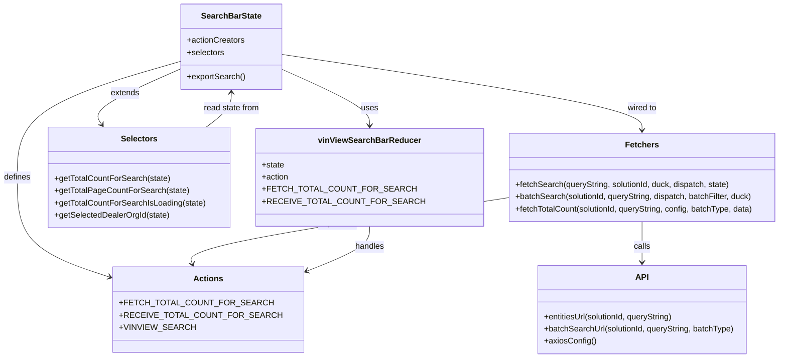

# Diagram: web/portal/src/pages/vinview/redux/VinViewSearchBarState.js


> Auto-generated by Obscura crawlers

## Diagram 1



### SVG

<svg id="container" width="1479.4375" xmlns="http://www.w3.org/2000/svg" class="classDiagram" height="704" viewBox="0 0 1479.4375 704" role="graphics-document document" aria-roledescription="class"><style>#container{font-family:"trebuchet ms",verdana,arial,sans-serif;font-size:16px;fill:#333;}@keyframes edge-animation-frame{from{stroke-dashoffset:0;}}@keyframes dash{to{stroke-dashoffset:0;}}#container .edge-animation-slow{stroke-dasharray:9,5!important;stroke-dashoffset:900;animation:dash 50s linear infinite;stroke-linecap:round;}#container .edge-animation-fast{stroke-dasharray:9,5!important;stroke-dashoffset:900;animation:dash 20s linear infinite;stroke-linecap:round;}#container .error-icon{fill:#552222;}#container .error-text{fill:#552222;stroke:#552222;}#container .edge-thickness-normal{stroke-width:1px;}#container .edge-thickness-thick{stroke-width:3.5px;}#container .edge-pattern-solid{stroke-dasharray:0;}#container .edge-thickness-invisible{stroke-width:0;fill:none;}#container .edge-pattern-dashed{stroke-dasharray:3;}#container .edge-pattern-dotted{stroke-dasharray:2;}#container .marker{fill:#333333;stroke:#333333;}#container .marker.cross{stroke:#333333;}#container svg{font-family:"trebuchet ms",verdana,arial,sans-serif;font-size:16px;}#container p{margin:0;}#container g.classGroup text{fill:#9370DB;stroke:none;font-family:"trebuchet ms",verdana,arial,sans-serif;font-size:10px;}#container g.classGroup text .title{font-weight:bolder;}#container .nodeLabel,#container .edgeLabel{color:#131300;}#container .edgeLabel .label rect{fill:#ECECFF;}#container .label text{fill:#131300;}#container .labelBkg{background:#ECECFF;}#container .edgeLabel .label span{background:#ECECFF;}#container .classTitle{font-weight:bolder;}#container .node rect,#container .node circle,#container .node ellipse,#container .node polygon,#container .node path{fill:#ECECFF;stroke:#9370DB;stroke-width:1px;}#container .divider{stroke:#9370DB;stroke-width:1;}#container g.clickable{cursor:pointer;}#container g.classGroup rect{fill:#ECECFF;stroke:#9370DB;}#container g.classGroup line{stroke:#9370DB;stroke-width:1;}#container .classLabel .box{stroke:none;stroke-width:0;fill:#ECECFF;opacity:0.5;}#container .classLabel .label{fill:#9370DB;font-size:10px;}#container .relation{stroke:#333333;stroke-width:1;fill:none;}#container .dashed-line{stroke-dasharray:3;}#container .dotted-line{stroke-dasharray:1 2;}#container #compositionStart,#container .composition{fill:#333333!important;stroke:#333333!important;stroke-width:1;}#container #compositionEnd,#container .composition{fill:#333333!important;stroke:#333333!important;stroke-width:1;}#container #dependencyStart,#container .dependency{fill:#333333!important;stroke:#333333!important;stroke-width:1;}#container #dependencyStart,#container .dependency{fill:#333333!important;stroke:#333333!important;stroke-width:1;}#container #extensionStart,#container .extension{fill:transparent!important;stroke:#333333!important;stroke-width:1;}#container #extensionEnd,#container .extension{fill:transparent!important;stroke:#333333!important;stroke-width:1;}#container #aggregationStart,#container .aggregation{fill:transparent!important;stroke:#333333!important;stroke-width:1;}#container #aggregationEnd,#container .aggregation{fill:transparent!important;stroke:#333333!important;stroke-width:1;}#container #lollipopStart,#container .lollipop{fill:#ECECFF!important;stroke:#333333!important;stroke-width:1;}#container #lollipopEnd,#container .lollipop{fill:#ECECFF!important;stroke:#333333!important;stroke-width:1;}#container .edgeTerminals{font-size:11px;line-height:initial;}#container .classTitleText{text-anchor:middle;font-size:18px;fill:#333;}#container .label-icon{display:inline-block;height:1em;overflow:visible;vertical-align:-0.125em;}#container .node .label-icon path{fill:currentColor;stroke:revert;stroke-width:revert;}#container :root{--mermaid-font-family:"trebuchet ms",verdana,arial,sans-serif;}</style><g><defs><marker id="container_class-aggregationStart" class="marker aggregation class" refX="18" refY="7" markerWidth="190" markerHeight="240" orient="auto"><path d="M 18,7 L9,13 L1,7 L9,1 Z"></path></marker></defs><defs><marker id="container_class-aggregationEnd" class="marker aggregation class" refX="1" refY="7" markerWidth="20" markerHeight="28" orient="auto"><path d="M 18,7 L9,13 L1,7 L9,1 Z"></path></marker></defs><defs><marker id="container_class-extensionStart" class="marker extension class" refX="18" refY="7" markerWidth="190" markerHeight="240" orient="auto"><path d="M 1,7 L18,13 V 1 Z"></path></marker></defs><defs><marker id="container_class-extensionEnd" class="marker extension class" refX="1" refY="7" markerWidth="20" markerHeight="28" orient="auto"><path d="M 1,1 V 13 L18,7 Z"></path></marker></defs><defs><marker id="container_class-compositionStart" class="marker composition class" refX="18" refY="7" markerWidth="190" markerHeight="240" orient="auto"><path d="M 18,7 L9,13 L1,7 L9,1 Z"></path></marker></defs><defs><marker id="container_class-compositionEnd" class="marker composition class" refX="1" refY="7" markerWidth="20" markerHeight="28" orient="auto"><path d="M 18,7 L9,13 L1,7 L9,1 Z"></path></marker></defs><defs><marker id="container_class-dependencyStart" class="marker dependency class" refX="6" refY="7" markerWidth="190" markerHeight="240" orient="auto"><path d="M 5,7 L9,13 L1,7 L9,1 Z"></path></marker></defs><defs><marker id="container_class-dependencyEnd" class="marker dependency class" refX="13" refY="7" markerWidth="20" markerHeight="28" orient="auto"><path d="M 18,7 L9,13 L14,7 L9,1 Z"></path></marker></defs><defs><marker id="container_class-lollipopStart" class="marker lollipop class" refX="13" refY="7" markerWidth="190" markerHeight="240" orient="auto"><circle stroke="black" fill="transparent" cx="7" cy="7" r="6"></circle></marker></defs><defs><marker id="container_class-lollipopEnd" class="marker lollipop class" refX="1" refY="7" markerWidth="190" markerHeight="240" orient="auto"><circle stroke="black" fill="transparent" cx="7" cy="7" r="6"></circle></marker></defs><g class="root"><g class="clusters"></g><g class="edgePaths"><path d="M536.131,137.726L562.848,150.272C589.565,162.818,642.999,187.909,669.716,206.121C696.434,224.333,696.434,235.667,696.434,241.333L696.434,247" id="id_SearchBarState_vinViewSearchBarReducer_1" class="edge-thickness-normal edge-pattern-solid relation" style=";;;" data-edge="true" data-et="edge" data-id="id_SearchBarState_vinViewSearchBarReducer_1" data-points="W3sieCI6NTM2LjEzMDg1OTM3NSwieSI6MTM3LjcyNjM3NjI2Njc0MTQ1fSx7IngiOjY5Ni40MzM1OTM3NSwieSI6MjEzfSx7IngiOjY5Ni40MzM1OTM3NSwieSI6MjUzfV0=" marker-end="url(#container_class-dependencyEnd)"></path><path d="M341.373,121.15L290.233,136.458C239.092,151.766,136.812,182.383,85.672,220.358C34.531,258.333,34.531,303.667,34.531,349C34.531,394.333,34.531,439.667,66.675,473.389C98.819,507.11,163.107,529.221,195.251,540.276L227.395,551.331" id="id_SearchBarState_Actions_2" class="edge-thickness-normal edge-pattern-solid relation" style=";;;" data-edge="true" data-et="edge" data-id="id_SearchBarState_Actions_2" data-points="W3sieCI6MzQxLjM3MzA0Njg3NSwieSI6MTIxLjE0OTU0MDI1MTU0NDk4fSx7IngiOjM0LjUzMTI1LCJ5IjoyMTN9LHsieCI6MzQuNTMxMjUsInkiOjM0OX0seyJ4IjozNC41MzEyNSwieSI6NDg1fSx7IngiOjIzMy4wNjgzNTkzNzUsInkiOjU1My4yODIzODgxMjExNTAzfV0=" marker-end="url(#container_class-dependencyEnd)"></path><path d="M341.373,137.206L314.162,149.839C286.951,162.471,232.528,187.735,209.054,205.715C185.581,223.694,193.056,234.388,196.794,239.735L200.532,245.082" id="id_SearchBarState_Selectors_3" class="edge-thickness-normal edge-pattern-solid relation" style=";;;" data-edge="true" data-et="edge" data-id="id_SearchBarState_Selectors_3" data-points="W3sieCI6MzQxLjM3MzA0Njg3NSwieSI6MTM3LjIwNjI0MDQ5Mjc2NTEyfSx7IngiOjE3OC4xMDU0Njg3NSwieSI6MjEzfSx7IngiOjIwMy45NjkxMjMzOTE1NDQxMiwieSI6MjUwfV0=" marker-end="url(#container_class-dependencyEnd)"></path><path d="M536.131,107.337L647.944,124.948C759.758,142.558,983.385,177.779,1095.198,202.556C1207.012,227.333,1207.012,241.667,1207.012,248.833L1207.012,256" id="id_SearchBarState_Fetchers_4" class="edge-thickness-normal edge-pattern-solid relation" style=";;;" data-edge="true" data-et="edge" data-id="id_SearchBarState_Fetchers_4" data-points="W3sieCI6NTM2LjEzMDg1OTM3NSwieSI6MTA3LjMzNzA2MTk5ODM3ODAzfSx7IngiOjEyMDcuMDExNzE4NzUsInkiOjIxM30seyJ4IjoxMjA3LjAxMTcxODc1LCJ5IjoyNjJ9XQ==" marker-end="url(#container_class-dependencyEnd)"></path><path d="M1207.012,436L1207.012,444.167C1207.012,452.333,1207.012,468.667,1207.012,482C1207.012,495.333,1207.012,505.667,1207.012,510.833L1207.012,516" id="id_Fetchers_API_5" class="edge-thickness-normal edge-pattern-solid relation" style=";;;" data-edge="true" data-et="edge" data-id="id_Fetchers_API_5" data-points="W3sieCI6MTIwNy4wMTE3MTg3NSwieSI6NDM2fSx7IngiOjEyMDcuMDExNzE4NzUsInkiOjQ4NX0seyJ4IjoxMjA3LjAxMTcxODc1LCJ5Ijo1MjJ9XQ==" marker-end="url(#container_class-dependencyEnd)"></path><path d="M942.586,391.012L843.993,406.677C745.399,422.341,548.212,453.671,451.652,475.06C355.092,496.449,359.159,507.897,361.192,513.622L363.226,519.346" id="id_Fetchers_Actions_6" class="edge-thickness-normal edge-pattern-solid relation" style=";;;" data-edge="true" data-et="edge" data-id="id_Fetchers_Actions_6" data-points="W3sieCI6OTQyLjU4NTkzNzUsInkiOjM5MS4wMTIyNDM3MzM4MTR9LHsieCI6MzUxLjAyNTM5MDYyNSwieSI6NDg1fSx7IngiOjM2NS4yMzQwNTk5Nzk4Mzg3LCJ5Ijo1MjV9XQ==" marker-end="url(#container_class-dependencyEnd)"></path><path d="M696.434,445L696.434,451.667C696.434,458.333,696.434,471.667,674.132,487.51C651.831,503.353,607.228,521.705,584.926,530.881L562.625,540.058" id="id_vinViewSearchBarReducer_Actions_7" class="edge-thickness-normal edge-pattern-solid relation" style=";;;" data-edge="true" data-et="edge" data-id="id_vinViewSearchBarReducer_Actions_7" data-points="W3sieCI6Njk2LjQzMzU5Mzc1LCJ5Ijo0NDV9LHsieCI6Njk2LjQzMzU5Mzc1LCJ5Ijo0ODV9LHsieCI6NTU3LjA3NjE3MTg3NSwieSI6NTQyLjM0MDg2ODU4NDYxMjd9XQ==" marker-end="url(#container_class-dependencyEnd)"></path><path d="M393.704,250L401.212,243.833C408.72,237.667,423.736,225.333,431.244,214C438.752,202.667,438.752,192.333,438.752,187.167L438.752,182" id="id_Selectors_SearchBarState_8" class="edge-thickness-normal edge-pattern-solid relation" style=";;;" data-edge="true" data-et="edge" data-id="id_Selectors_SearchBarState_8" data-points="W3sieCI6MzkzLjcwNDQzMTg3MDQwNDQsInkiOjI1MH0seyJ4Ijo0MzguNzUxOTUzMTI1LCJ5IjoyMTN9LHsieCI6NDM4Ljc1MTk1MzEyNSwieSI6MTc2fV0=" marker-end="url(#container_class-dependencyEnd)"></path></g><g class="edgeLabels"><g class="edgeLabel" transform="translate(696.43359375, 213)"><g class="label" data-id="id_SearchBarState_vinViewSearchBarReducer_1" transform="translate(-16.4921875, -12)"><foreignObject width="32.984375" height="24"><div xmlns="http://www.w3.org/1999/xhtml" class="labelBkg" style="display: table-cell; white-space: nowrap; line-height: 1.5; max-width: 200px; text-align: center;"><span class="edgeLabel"><p>uses</p></span></div></foreignObject></g></g><g class="edgeLabel" transform="translate(34.53125, 349)"><g class="label" data-id="id_SearchBarState_Actions_2" transform="translate(-26.53125, -12)"><foreignObject width="53.0625" height="24"><div xmlns="http://www.w3.org/1999/xhtml" class="labelBkg" style="display: table-cell; white-space: nowrap; line-height: 1.5; max-width: 200px; text-align: center;"><span class="edgeLabel"><p>defines</p></span></div></foreignObject></g></g><g class="edgeLabel" transform="translate(239.26608, 184.60739)"><g class="label" data-id="id_SearchBarState_Selectors_3" transform="translate(-28.5078125, -12)"><foreignObject width="57.015625" height="24"><div xmlns="http://www.w3.org/1999/xhtml" class="labelBkg" style="display: table-cell; white-space: nowrap; line-height: 1.5; max-width: 200px; text-align: center;"><span class="edgeLabel"><p>extends</p></span></div></foreignObject></g></g><g class="edgeLabel" transform="translate(1207.01171875, 213)"><g class="label" data-id="id_SearchBarState_Fetchers_4" transform="translate(-29.546875, -12)"><foreignObject width="59.09375" height="24"><div xmlns="http://www.w3.org/1999/xhtml" class="labelBkg" style="display: table-cell; white-space: nowrap; line-height: 1.5; max-width: 200px; text-align: center;"><span class="edgeLabel"><p>wired to</p></span></div></foreignObject></g></g><g class="edgeLabel" transform="translate(1207.01171875, 485)"><g class="label" data-id="id_Fetchers_API_5" transform="translate(-16.4453125, -12)"><foreignObject width="32.890625" height="24"><div xmlns="http://www.w3.org/1999/xhtml" class="labelBkg" style="display: table-cell; white-space: nowrap; line-height: 1.5; max-width: 200px; text-align: center;"><span class="edgeLabel"><p>calls</p></span></div></foreignObject></g></g><g class="edgeLabel" transform="translate(625.84427, 441.33649)"><g class="label" data-id="id_Fetchers_Actions_6" transform="translate(-39.1796875, -12)"><foreignObject width="78.359375" height="24"><div xmlns="http://www.w3.org/1999/xhtml" class="labelBkg" style="display: table-cell; white-space: nowrap; line-height: 1.5; max-width: 200px; text-align: center;"><span class="edgeLabel"><p>dispatches</p></span></div></foreignObject></g></g><g class="edgeLabel" transform="translate(696.43359375, 485)"><g class="label" data-id="id_vinViewSearchBarReducer_Actions_7" transform="translate(-28.9140625, -12)"><foreignObject width="57.828125" height="24"><div xmlns="http://www.w3.org/1999/xhtml" class="labelBkg" style="display: table-cell; white-space: nowrap; line-height: 1.5; max-width: 200px; text-align: center;"><span class="edgeLabel"><p>handles</p></span></div></foreignObject></g></g><g class="edgeLabel" transform="translate(438.751953125, 213)"><g class="label" data-id="id_Selectors_SearchBarState_8" transform="translate(-55.609375, -12)"><foreignObject width="111.21875" height="24"><div xmlns="http://www.w3.org/1999/xhtml" class="labelBkg" style="display: table-cell; white-space: nowrap; line-height: 1.5; max-width: 200px; text-align: center;"><span class="edgeLabel"><p>read state from</p></span></div></foreignObject></g></g></g><g class="nodes"><g class="node default" id="classId-SearchBarState-0" transform="translate(438.751953125, 92)"><g class="basic label-container"><path d="M-97.37890625 -84 L97.37890625 -84 L97.37890625 84 L-97.37890625 84" stroke="none" stroke-width="0" fill="#ECECFF" style=""></path><path d="M-97.37890625 -84 C-44.70057973349678 -84, 7.977746783006438 -84, 97.37890625 -84 M-97.37890625 -84 C-53.94576315540049 -84, -10.512620060800984 -84, 97.37890625 -84 M97.37890625 -84 C97.37890625 -34.37045933520927, 97.37890625 15.259081329581463, 97.37890625 84 M97.37890625 -84 C97.37890625 -31.361468279965266, 97.37890625 21.27706344006947, 97.37890625 84 M97.37890625 84 C54.38073198478152 84, 11.382557719563039 84, -97.37890625 84 M97.37890625 84 C39.44922608741065 84, -18.4804540751787 84, -97.37890625 84 M-97.37890625 84 C-97.37890625 24.161763246338793, -97.37890625 -35.67647350732241, -97.37890625 -84 M-97.37890625 84 C-97.37890625 20.88630509012492, -97.37890625 -42.22738981975016, -97.37890625 -84" stroke="#9370DB" stroke-width="1.3" fill="none" stroke-dasharray="0 0" style=""></path></g><g class="annotation-group text" transform="translate(0, -60)"></g><g class="label-group text" transform="translate(-56.5546875, -60)"><g class="label" style="font-weight: bolder" transform="translate(0,-12)"><foreignObject width="113.109375" height="24"><div xmlns="http://www.w3.org/1999/xhtml" style="display: table-cell; white-space: nowrap; line-height: 1.5; max-width: 161px; text-align: center;"><span class="nodeLabel markdown-node-label" style=""><p>SearchBarState</p></span></div></foreignObject></g></g><g class="members-group text" transform="translate(-85.37890625, -12)"><g class="label" style="" transform="translate(0,-12)"><foreignObject width="113.078125" height="24"><div xmlns="http://www.w3.org/1999/xhtml" style="display: table-cell; white-space: nowrap; line-height: 1.5; max-width: 170px; text-align: center;"><span class="nodeLabel markdown-node-label" style=""><p>+actionCreators</p></span></div></foreignObject></g><g class="label" style="" transform="translate(0,12)"><foreignObject width="73.453125" height="24"><div xmlns="http://www.w3.org/1999/xhtml" style="display: table-cell; white-space: nowrap; line-height: 1.5; max-width: 131px; text-align: center;"><span class="nodeLabel markdown-node-label" style=""><p>+selectors</p></span></div></foreignObject></g></g><g class="methods-group text" transform="translate(-85.37890625, 60)"><g class="label" style="" transform="translate(0,-12)"><foreignObject width="114.203125" height="24"><div xmlns="http://www.w3.org/1999/xhtml" style="display: table-cell; white-space: nowrap; line-height: 1.5; max-width: 172px; text-align: center;"><span class="nodeLabel markdown-node-label" style=""><p>+exportSearch()</p></span></div></foreignObject></g></g><g class="divider" style=""><path d="M-97.37890625 -36 C-55.01531179962998 -36, -12.651717349259954 -36, 97.37890625 -36 M-97.37890625 -36 C-42.40512691365477 -36, 12.568652422690462 -36, 97.37890625 -36" stroke="#9370DB" stroke-width="1.3" fill="none" stroke-dasharray="0 0" style=""></path></g><g class="divider" style=""><path d="M-97.37890625 36 C-41.396337281619005 36, 14.586231686761991 36, 97.37890625 36 M-97.37890625 36 C-20.24736464642497 36, 56.88417695715006 36, 97.37890625 36" stroke="#9370DB" stroke-width="1.3" fill="none" stroke-dasharray="0 0" style=""></path></g></g><g class="node default" id="classId-vinViewSearchBarReducer-1" transform="translate(696.43359375, 349)"><g class="basic label-container"><path d="M-196.15234375 -96 L196.15234375 -96 L196.15234375 96 L-196.15234375 96" stroke="none" stroke-width="0" fill="#ECECFF" style=""></path><path d="M-196.15234375 -96 C-82.11386248971233 -96, 31.924618770575336 -96, 196.15234375 -96 M-196.15234375 -96 C-74.58158559811876 -96, 46.98917255376247 -96, 196.15234375 -96 M196.15234375 -96 C196.15234375 -27.895298863993943, 196.15234375 40.20940227201211, 196.15234375 96 M196.15234375 -96 C196.15234375 -26.171290864162728, 196.15234375 43.657418271674544, 196.15234375 96 M196.15234375 96 C113.4302627265909 96, 30.708181703181793 96, -196.15234375 96 M196.15234375 96 C81.0772502234718 96, -33.99784330305641 96, -196.15234375 96 M-196.15234375 96 C-196.15234375 28.74025672604128, -196.15234375 -38.51948654791744, -196.15234375 -96 M-196.15234375 96 C-196.15234375 47.55247599808685, -196.15234375 -0.8950480038263038, -196.15234375 -96" stroke="#9370DB" stroke-width="1.3" fill="none" stroke-dasharray="0 0" style=""></path></g><g class="annotation-group text" transform="translate(0, -72)"></g><g class="label-group text" transform="translate(-95.3515625, -72)"><g class="label" style="font-weight: bolder" transform="translate(0,-12)"><foreignObject width="190.703125" height="24"><div xmlns="http://www.w3.org/1999/xhtml" style="display: table-cell; white-space: nowrap; line-height: 1.5; max-width: 239px; text-align: center;"><span class="nodeLabel markdown-node-label" style=""><p>vinViewSearchBarReducer</p></span></div></foreignObject></g></g><g class="members-group text" transform="translate(-184.15234375, -24)"><g class="label" style="" transform="translate(0,-12)"><foreignObject width="44.09375" height="24"><div xmlns="http://www.w3.org/1999/xhtml" style="display: table-cell; white-space: nowrap; line-height: 1.5; max-width: 101px; text-align: center;"><span class="nodeLabel markdown-node-label" style=""><p>+state</p></span></div></foreignObject></g><g class="label" style="" transform="translate(0,12)"><foreignObject width="53.109375" height="24"><div xmlns="http://www.w3.org/1999/xhtml" style="display: table-cell; white-space: nowrap; line-height: 1.5; max-width: 110px; text-align: center;"><span class="nodeLabel markdown-node-label" style=""><p>+action</p></span></div></foreignObject></g><g class="label" style="" transform="translate(0,36)"><foreignObject width="259.171875" height="24"><div xmlns="http://www.w3.org/1999/xhtml" style="display: table-cell; white-space: nowrap; line-height: 1.5; max-width: 317px; text-align: center;"><span class="nodeLabel markdown-node-label" style=""><p>+FETCH_TOTAL_COUNT_FOR_SEARCH</p></span></div></foreignObject></g><g class="label" style="" transform="translate(0,60)"><foreignObject width="272.953125" height="24"><div xmlns="http://www.w3.org/1999/xhtml" style="display: table-cell; white-space: nowrap; line-height: 1.5; max-width: 330px; text-align: center;"><span class="nodeLabel markdown-node-label" style=""><p>+RECEIVE_TOTAL_COUNT_FOR_SEARCH</p></span></div></foreignObject></g></g><g class="methods-group text" transform="translate(-184.15234375, 96)"></g><g class="divider" style=""><path d="M-196.15234375 -48 C-74.94820207446351 -48, 46.25593960107298 -48, 196.15234375 -48 M-196.15234375 -48 C-88.57605048649467 -48, 19.00024277701067 -48, 196.15234375 -48" stroke="#9370DB" stroke-width="1.3" fill="none" stroke-dasharray="0 0" style=""></path></g><g class="divider" style=""><path d="M-196.15234375 72 C-86.48324101412703 72, 23.185861721745937 72, 196.15234375 72 M-196.15234375 72 C-95.0254795760509 72, 6.101384597898203 72, 196.15234375 72" stroke="#9370DB" stroke-width="1.3" fill="none" stroke-dasharray="0 0" style=""></path></g></g><g class="node default" id="classId-Actions-2" transform="translate(395.072265625, 609)"><g class="basic label-container"><path d="M-162.00390625 -84 L162.00390625 -84 L162.00390625 84 L-162.00390625 84" stroke="none" stroke-width="0" fill="#ECECFF" style=""></path><path d="M-162.00390625 -84 C-86.54160757589611 -84, -11.079308901792217 -84, 162.00390625 -84 M-162.00390625 -84 C-94.52430585951636 -84, -27.04470546903272 -84, 162.00390625 -84 M162.00390625 -84 C162.00390625 -30.58759553095654, 162.00390625 22.824808938086917, 162.00390625 84 M162.00390625 -84 C162.00390625 -46.606298196684286, 162.00390625 -9.212596393368571, 162.00390625 84 M162.00390625 84 C64.8969565391395 84, -32.20999317172101 84, -162.00390625 84 M162.00390625 84 C71.81950912705639 84, -18.364887995887216 84, -162.00390625 84 M-162.00390625 84 C-162.00390625 18.76182641249251, -162.00390625 -46.47634717501498, -162.00390625 -84 M-162.00390625 84 C-162.00390625 31.24397198314952, -162.00390625 -21.512056033700958, -162.00390625 -84" stroke="#9370DB" stroke-width="1.3" fill="none" stroke-dasharray="0 0" style=""></path></g><g class="annotation-group text" transform="translate(0, -60)"></g><g class="label-group text" transform="translate(-27.0546875, -60)"><g class="label" style="font-weight: bolder" transform="translate(0,-12)"><foreignObject width="54.109375" height="24"><div xmlns="http://www.w3.org/1999/xhtml" style="display: table-cell; white-space: nowrap; line-height: 1.5; max-width: 103px; text-align: center;"><span class="nodeLabel markdown-node-label" style=""><p>Actions</p></span></div></foreignObject></g></g><g class="members-group text" transform="translate(-150.00390625, -12)"><g class="label" style="" transform="translate(0,-12)"><foreignObject width="259.171875" height="24"><div xmlns="http://www.w3.org/1999/xhtml" style="display: table-cell; white-space: nowrap; line-height: 1.5; max-width: 317px; text-align: center;"><span class="nodeLabel markdown-node-label" style=""><p>+FETCH_TOTAL_COUNT_FOR_SEARCH</p></span></div></foreignObject></g><g class="label" style="" transform="translate(0,12)"><foreignObject width="272.953125" height="24"><div xmlns="http://www.w3.org/1999/xhtml" style="display: table-cell; white-space: nowrap; line-height: 1.5; max-width: 330px; text-align: center;"><span class="nodeLabel markdown-node-label" style=""><p>+RECEIVE_TOTAL_COUNT_FOR_SEARCH</p></span></div></foreignObject></g><g class="label" style="" transform="translate(0,36)"><foreignObject width="130.390625" height="24"><div xmlns="http://www.w3.org/1999/xhtml" style="display: table-cell; white-space: nowrap; line-height: 1.5; max-width: 188px; text-align: center;"><span class="nodeLabel markdown-node-label" style=""><p>+VINVIEW_SEARCH</p></span></div></foreignObject></g></g><g class="methods-group text" transform="translate(-150.00390625, 84)"></g><g class="divider" style=""><path d="M-162.00390625 -36 C-48.234333932861446 -36, 65.53523838427711 -36, 162.00390625 -36 M-162.00390625 -36 C-67.33222017561069 -36, 27.339465898778627 -36, 162.00390625 -36" stroke="#9370DB" stroke-width="1.3" fill="none" stroke-dasharray="0 0" style=""></path></g><g class="divider" style=""><path d="M-162.00390625 60 C-87.33735661477614 60, -12.670806979552282 60, 162.00390625 60 M-162.00390625 60 C-74.36648800710255 60, 13.270930235794907 60, 162.00390625 60" stroke="#9370DB" stroke-width="1.3" fill="none" stroke-dasharray="0 0" style=""></path></g></g><g class="node default" id="classId-Selectors-3" transform="translate(273.171875, 349)"><g class="basic label-container"><path d="M-177.109375 -99 L177.109375 -99 L177.109375 99 L-177.109375 99" stroke="none" stroke-width="0" fill="#ECECFF" style=""></path><path d="M-177.109375 -99 C-75.42097391662017 -99, 26.26742716675966 -99, 177.109375 -99 M-177.109375 -99 C-88.8651772070868 -99, -0.620979414173604 -99, 177.109375 -99 M177.109375 -99 C177.109375 -31.215249388519126, 177.109375 36.56950122296175, 177.109375 99 M177.109375 -99 C177.109375 -37.15022060284662, 177.109375 24.699558794306753, 177.109375 99 M177.109375 99 C79.54994006038487 99, -18.00949487923026 99, -177.109375 99 M177.109375 99 C91.8131132065397 99, 6.516851413079394 99, -177.109375 99 M-177.109375 99 C-177.109375 39.47880201195029, -177.109375 -20.042395976099414, -177.109375 -99 M-177.109375 99 C-177.109375 49.75465511673248, -177.109375 0.5093102334649586, -177.109375 -99" stroke="#9370DB" stroke-width="1.3" fill="none" stroke-dasharray="0 0" style=""></path></g><g class="annotation-group text" transform="translate(0, -75)"></g><g class="label-group text" transform="translate(-34.171875, -75)"><g class="label" style="font-weight: bolder" transform="translate(0,-12)"><foreignObject width="68.34375" height="24"><div xmlns="http://www.w3.org/1999/xhtml" style="display: table-cell; white-space: nowrap; line-height: 1.5; max-width: 117px; text-align: center;"><span class="nodeLabel markdown-node-label" style=""><p>Selectors</p></span></div></foreignObject></g></g><g class="members-group text" transform="translate(-165.109375, -27)"></g><g class="methods-group text" transform="translate(-165.109375, 3)"><g class="label" style="" transform="translate(0,-12)"><foreignObject width="226.609375" height="24"><div xmlns="http://www.w3.org/1999/xhtml" style="display: table-cell; white-space: nowrap; line-height: 1.5; max-width: 284px; text-align: center;"><span class="nodeLabel markdown-node-label" style=""><p>+getTotalCountForSearch(state)</p></span></div></foreignObject></g><g class="label" style="" transform="translate(0,12)"><foreignObject width="260.359375" height="24"><div xmlns="http://www.w3.org/1999/xhtml" style="display: table-cell; white-space: nowrap; line-height: 1.5; max-width: 318px; text-align: center;"><span class="nodeLabel markdown-node-label" style=""><p>+getTotalPageCountForSearch(state)</p></span></div></foreignObject></g><g class="label" style="" transform="translate(0,36)"><foreignObject width="296.046875" height="24"><div xmlns="http://www.w3.org/1999/xhtml" style="display: table-cell; white-space: nowrap; line-height: 1.5; max-width: 353px; text-align: center;"><span class="nodeLabel markdown-node-label" style=""><p>+getTotalCountForSearchIsLoading(state)</p></span></div></foreignObject></g><g class="label" style="" transform="translate(0,60)"><foreignObject width="225.78125" height="24"><div xmlns="http://www.w3.org/1999/xhtml" style="display: table-cell; white-space: nowrap; line-height: 1.5; max-width: 283px; text-align: center;"><span class="nodeLabel markdown-node-label" style=""><p>+getSelectedDealerOrgId(state)</p></span></div></foreignObject></g></g><g class="divider" style=""><path d="M-177.109375 -51 C-67.1512409515995 -51, 42.80689309680099 -51, 177.109375 -51 M-177.109375 -51 C-46.858819089577196 -51, 83.39173682084561 -51, 177.109375 -51" stroke="#9370DB" stroke-width="1.3" fill="none" stroke-dasharray="0 0" style=""></path></g><g class="divider" style=""><path d="M-177.109375 -27 C-53.67980975320805 -27, 69.7497554935839 -27, 177.109375 -27 M-177.109375 -27 C-74.31513365886666 -27, 28.479107682266687 -27, 177.109375 -27" stroke="#9370DB" stroke-width="1.3" fill="none" stroke-dasharray="0 0" style=""></path></g></g><g class="node default" id="classId-API-4" transform="translate(1207.01171875, 609)"><g class="basic label-container"><path d="M-207.06640625 -87 L207.06640625 -87 L207.06640625 87 L-207.06640625 87" stroke="none" stroke-width="0" fill="#ECECFF" style=""></path><path d="M-207.06640625 -87 C-41.5405306521497 -87, 123.9853449457006 -87, 207.06640625 -87 M-207.06640625 -87 C-107.58449416754961 -87, -8.102582085099215 -87, 207.06640625 -87 M207.06640625 -87 C207.06640625 -26.384865583063423, 207.06640625 34.230268833873154, 207.06640625 87 M207.06640625 -87 C207.06640625 -31.14389849409814, 207.06640625 24.712203011803723, 207.06640625 87 M207.06640625 87 C72.51374115286345 87, -62.03892394427311 87, -207.06640625 87 M207.06640625 87 C106.48538846180656 87, 5.90437067361313 87, -207.06640625 87 M-207.06640625 87 C-207.06640625 25.549701320667964, -207.06640625 -35.90059735866407, -207.06640625 -87 M-207.06640625 87 C-207.06640625 19.50710935512558, -207.06640625 -47.98578128974884, -207.06640625 -87" stroke="#9370DB" stroke-width="1.3" fill="none" stroke-dasharray="0 0" style=""></path></g><g class="annotation-group text" transform="translate(0, -63)"></g><g class="label-group text" transform="translate(-11.8671875, -63)"><g class="label" style="font-weight: bolder" transform="translate(0,-12)"><foreignObject width="23.734375" height="24"><div xmlns="http://www.w3.org/1999/xhtml" style="display: table-cell; white-space: nowrap; line-height: 1.5; max-width: 73px; text-align: center;"><span class="nodeLabel markdown-node-label" style=""><p>API</p></span></div></foreignObject></g></g><g class="members-group text" transform="translate(-195.06640625, -15)"></g><g class="methods-group text" transform="translate(-195.06640625, 15)"><g class="label" style="" transform="translate(0,-12)"><foreignObject width="261.40625" height="24"><div xmlns="http://www.w3.org/1999/xhtml" style="display: table-cell; white-space: nowrap; line-height: 1.5; max-width: 319px; text-align: center;"><span class="nodeLabel markdown-node-label" style=""><p>+entitiesUrl(solutionId, queryString)</p></span></div></foreignObject></g><g class="label" style="" transform="translate(0,12)"><foreignObject width="378.265625" height="24"><div xmlns="http://www.w3.org/1999/xhtml" style="display: table-cell; white-space: nowrap; line-height: 1.5; max-width: 436px; text-align: center;"><span class="nodeLabel markdown-node-label" style=""><p>+batchSearchUrl(solutionId, queryString, batchType)</p></span></div></foreignObject></g><g class="label" style="" transform="translate(0,36)"><foreignObject width="100.796875" height="24"><div xmlns="http://www.w3.org/1999/xhtml" style="display: table-cell; white-space: nowrap; line-height: 1.5; max-width: 158px; text-align: center;"><span class="nodeLabel markdown-node-label" style=""><p>+axiosConfig()</p></span></div></foreignObject></g></g><g class="divider" style=""><path d="M-207.06640625 -39 C-80.0896772992705 -39, 46.88705165145899 -39, 207.06640625 -39 M-207.06640625 -39 C-98.54053794240704 -39, 9.985330365185916 -39, 207.06640625 -39" stroke="#9370DB" stroke-width="1.3" fill="none" stroke-dasharray="0 0" style=""></path></g><g class="divider" style=""><path d="M-207.06640625 -15 C-122.2441694357516 -15, -37.4219326215032 -15, 207.06640625 -15 M-207.06640625 -15 C-57.64236633008588 -15, 91.78167358982824 -15, 207.06640625 -15" stroke="#9370DB" stroke-width="1.3" fill="none" stroke-dasharray="0 0" style=""></path></g></g><g class="node default" id="classId-Fetchers-5" transform="translate(1207.01171875, 349)"><g class="basic label-container"><path d="M-264.42578125 -87 L264.42578125 -87 L264.42578125 87 L-264.42578125 87" stroke="none" stroke-width="0" fill="#ECECFF" style=""></path><path d="M-264.42578125 -87 C-145.74996480339567 -87, -27.07414835679134 -87, 264.42578125 -87 M-264.42578125 -87 C-91.76545857241612 -87, 80.89486410516776 -87, 264.42578125 -87 M264.42578125 -87 C264.42578125 -32.1532731286522, 264.42578125 22.693453742695596, 264.42578125 87 M264.42578125 -87 C264.42578125 -50.40149299908805, 264.42578125 -13.802985998176098, 264.42578125 87 M264.42578125 87 C158.0692271010588 87, 51.71267295211757 87, -264.42578125 87 M264.42578125 87 C153.9850575069188 87, 43.544333763837614 87, -264.42578125 87 M-264.42578125 87 C-264.42578125 17.459004426430354, -264.42578125 -52.08199114713929, -264.42578125 -87 M-264.42578125 87 C-264.42578125 41.482036434280026, -264.42578125 -4.035927131439948, -264.42578125 -87" stroke="#9370DB" stroke-width="1.3" fill="none" stroke-dasharray="0 0" style=""></path></g><g class="annotation-group text" transform="translate(0, -63)"></g><g class="label-group text" transform="translate(-30.8203125, -63)"><g class="label" style="font-weight: bolder" transform="translate(0,-12)"><foreignObject width="61.640625" height="24"><div xmlns="http://www.w3.org/1999/xhtml" style="display: table-cell; white-space: nowrap; line-height: 1.5; max-width: 111px; text-align: center;"><span class="nodeLabel markdown-node-label" style=""><p>Fetchers</p></span></div></foreignObject></g></g><g class="members-group text" transform="translate(-252.42578125, -15)"></g><g class="methods-group text" transform="translate(-252.42578125, 15)"><g class="label" style="" transform="translate(0,-12)"><foreignObject width="427.296875" height="24"><div xmlns="http://www.w3.org/1999/xhtml" style="display: table-cell; white-space: nowrap; line-height: 1.5; max-width: 485px; text-align: center;"><span class="nodeLabel markdown-node-label" style=""><p>+fetchSearch(queryString, solutionId, duck, dispatch, state)</p></span></div></foreignObject></g><g class="label" style="" transform="translate(0,12)"><foreignObject width="471.765625" height="24"><div xmlns="http://www.w3.org/1999/xhtml" style="display: table-cell; white-space: nowrap; line-height: 1.5; max-width: 529px; text-align: center;"><span class="nodeLabel markdown-node-label" style=""><p>+batchSearch(solutionId, queryString, dispatch, batchFilter, duck)</p></span></div></foreignObject></g><g class="label" style="" transform="translate(0,36)"><foreignObject width="474.03125" height="24"><div xmlns="http://www.w3.org/1999/xhtml" style="display: table-cell; white-space: nowrap; line-height: 1.5; max-width: 531px; text-align: center;"><span class="nodeLabel markdown-node-label" style=""><p>+fetchTotalCount(solutionId, queryString, config, batchType, data)</p></span></div></foreignObject></g></g><g class="divider" style=""><path d="M-264.42578125 -39 C-105.30417878868701 -39, 53.81742367262598 -39, 264.42578125 -39 M-264.42578125 -39 C-128.05702761883163 -39, 8.311726012336749 -39, 264.42578125 -39" stroke="#9370DB" stroke-width="1.3" fill="none" stroke-dasharray="0 0" style=""></path></g><g class="divider" style=""><path d="M-264.42578125 -15 C-128.24935955707542 -15, 7.927062135849155 -15, 264.42578125 -15 M-264.42578125 -15 C-120.49090800949105 -15, 23.4439652310179 -15, 264.42578125 -15" stroke="#9370DB" stroke-width="1.3" fill="none" stroke-dasharray="0 0" style=""></path></g></g></g></g></g></svg>

## Diagram 2

```mermaid
flowchart TD
    A[fetchSearch(queryString, solutionId,...)] --> B{batchFilter?}
    B -- yes --> C[batchSearch(solutionId, queryString,...)]
    C --> D[build batchSearchUrl & data]
    D --> E[axios.post(url, data, config)]
    E --> F{response.success}
    F -- success --> G[dispatch duck.actions.RECEIVE -> payload]
    G --> H[dispatch VINVIEW_SEARCH]
    F -- error --> I[dispatch duck.actions.REQUEST_ERROR]
    B -- no --> J[entitiesUrl(...?includeConfigurations=true&query)]
    J --> K[dispatch duck.fetch(url, config)]
    K --> L[dispatch fetchTotalCount(solutionId, queryString, config)]
    L --> M[dispatch VINVIEW_SEARCH]
    subgraph CountRequest
        N[fetchTotalCount]
        N --> O[qs.parse/query remove pagination]
        O --> P{batchType?}
        P -- yes --> Q[POST batchSearchUrl with data]
        P -- no --> R[GET entitiesUrl with count header Accept: application/json;version=count]
        Q --> S[axios POST/GET]
        R --> S
        S --> T{response.success}
        T -- success --> U[dispatch RECEIVE_TOTAL_COUNT_FOR_SEARCH(count, totalPages)]
        T -- error --> V[console.error]
    end
    L --> N
```

> SVG rendering failed for this diagram.

## Diagram 3

```mermaid
sequenceDiagram
    participant Caller as fetchSearch
    participant State as ReduxState
    participant Dispatch as dispatch
    participant Duck as duck
    participant Axios as axios
    Caller->>State: read STORE_MOUNT_POINT.searchFilters.batch
    alt batch present
        Caller->>Dispatch: dispatch REQUEST (duck.actions.REQUEST)
        Caller->>Axios: POST batchSearchUrl(data, config)
        Axios-->>Dispatch: response.data
        Dispatch->>Duck: dispatch RECEIVE with payload
        Dispatch->>Caller: dispatch VINVIEW_SEARCH
        Caller->>Dispatch: dispatch fetchTotalCount(..., batchType, data)
    else normal search
        Caller->>Axios: GET entitiesUrl(includeConfigurations=true&query, config) via duck.fetch
        Caller->>Dispatch: dispatch fetch via duck.fetch
        Caller->>Dispatch: dispatch fetchTotalCount(...config)
        Dispatch->>Caller: dispatch VINVIEW_SEARCH
    end
    Note over Axios,Dispatch: fetchTotalCount performs axios request with Accept: application/json;version=count and dispatches RECEIVE_TOTAL_COUNT_FOR_SEARCH on success
```

> SVG rendering failed for this diagram.
