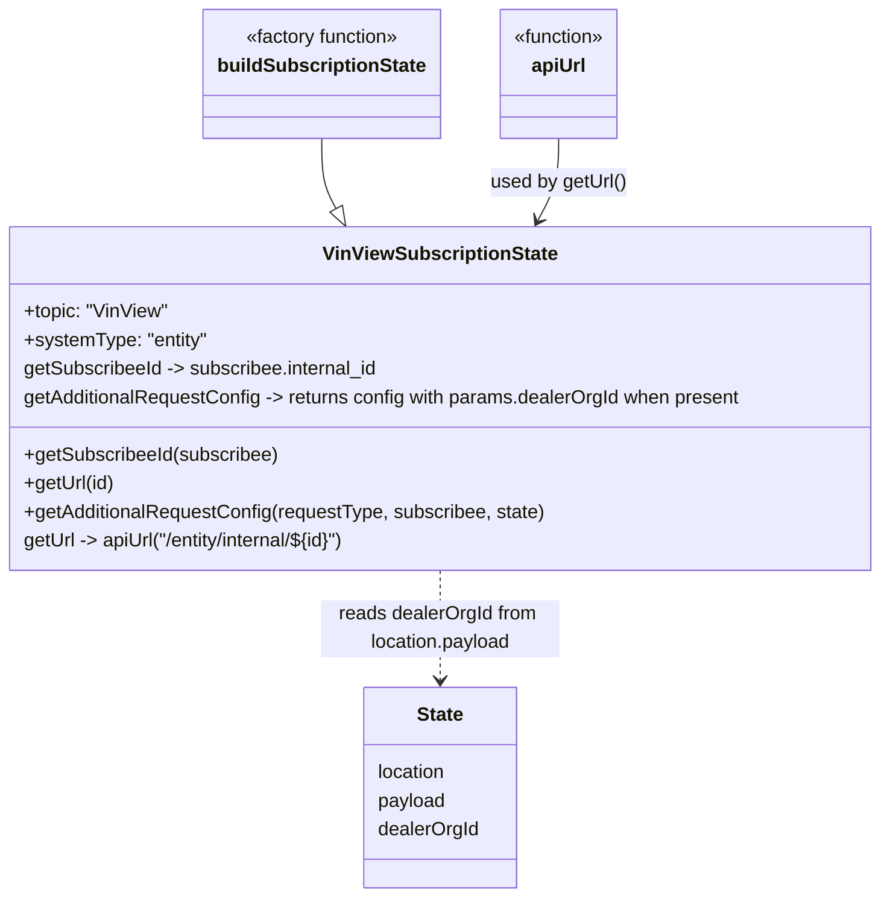

# Diagram: web/portal/src/pages/vinview/redux/VinViewSubscriptionState.js

> Auto-generated by Obscura crawlers

## Mermaid

### SVG

<svg id="container" width="744.578125" xmlns="http://www.w3.org/2000/svg" class="classDiagram" height="752" viewBox="0 0 744.578125 752" role="graphics-document document" aria-roledescription="class"><g><defs><marker id="container_class-aggregationStart" class="marker aggregation class" refX="18" refY="7" markerWidth="190" markerHeight="240" orient="auto"><path d="M 18,7 L9,13 L1,7 L9,1 Z"></path></marker></defs><defs><marker id="container_class-aggregationEnd" class="marker aggregation class" refX="1" refY="7" markerWidth="20" markerHeight="28" orient="auto"><path d="M 18,7 L9,13 L1,7 L9,1 Z"></path></marker></defs><defs><marker id="container_class-extensionStart" class="marker extension class" refX="18" refY="7" markerWidth="190" markerHeight="240" orient="auto"><path d="M 1,7 L18,13 V 1 Z"></path></marker></defs><defs><marker id="container_class-extensionEnd" class="marker extension class" refX="1" refY="7" markerWidth="20" markerHeight="28" orient="auto"><path d="M 1,1 V 13 L18,7 Z"></path></marker></defs><defs><marker id="container_class-compositionStart" class="marker composition class" refX="18" refY="7" markerWidth="190" markerHeight="240" orient="auto"><path d="M 18,7 L9,13 L1,7 L9,1 Z"></path></marker></defs><defs><marker id="container_class-compositionEnd" class="marker composition class" refX="1" refY="7" markerWidth="20" markerHeight="28" orient="auto"><path d="M 18,7 L9,13 L1,7 L9,1 Z"></path></marker></defs><defs><marker id="container_class-dependencyStart" class="marker dependency class" refX="6" refY="7" markerWidth="190" markerHeight="240" orient="auto"><path d="M 5,7 L9,13 L1,7 L9,1 Z"></path></marker></defs><defs><marker id="container_class-dependencyEnd" class="marker dependency class" refX="13" refY="7" markerWidth="20" markerHeight="28" orient="auto"><path d="M 18,7 L9,13 L14,7 L9,1 Z"></path></marker></defs><defs><marker id="container_class-lollipopStart" class="marker lollipop class" refX="13" refY="7" markerWidth="190" markerHeight="240" orient="auto"><circle stroke="black" fill="transparent" cx="7" cy="7" r="6"></circle></marker></defs><defs><marker id="container_class-lollipopEnd" class="marker lollipop class" refX="1" refY="7" markerWidth="190" markerHeight="240" orient="auto"><circle stroke="black" fill="transparent" cx="7" cy="7" r="6"></circle></marker></defs><g class="root"><g class="clusters"></g><g class="edgePaths"><path d="M273.27,116L273.27,122.167C273.27,128.333,273.27,140.667,275.263,150.478C277.257,160.289,281.245,167.578,283.238,171.222L285.232,174.867" id="id_buildSubscriptionState_VinViewSubscriptionState_1" class="edge-thickness-normal edge-pattern-solid relation" style=";;;" data-edge="true" data-et="edge" data-id="id_buildSubscriptionState_VinViewSubscriptionState_1" data-points="W3sieCI6MjczLjI2OTUzMTI1LCJ5IjoxMTZ9LHsieCI6MjczLjI2OTUzMTI1LCJ5IjoxNTN9LHsieCI6MjkzLjUxMTA5Mjg4Njc0MDM2LCJ5IjoxOTB9XQ==" marker-end="url(#container_class-extensionEnd)"></path><path d="M471.309,116L471.309,122.167C471.309,128.333,471.309,140.667,468.415,152.123C465.521,163.579,459.734,174.157,456.84,179.447L453.947,184.736" id="id_apiUrl_VinViewSubscriptionState_2" class="edge-thickness-normal edge-pattern-solid relation" style=";;;" data-edge="true" data-et="edge" data-id="id_apiUrl_VinViewSubscriptionState_2" data-points="W3sieCI6NDcxLjMwODU5Mzc1LCJ5IjoxMTZ9LHsieCI6NDcxLjMwODU5Mzc1LCJ5IjoxNTN9LHsieCI6NDUxLjA2NzAzMjExMzI1OTY0LCJ5IjoxOTB9XQ==" marker-end="url(#container_class-dependencyEnd)"></path><path d="M372.289,478L372.289,486.167C372.289,494.333,372.289,510.667,372.289,526C372.289,541.333,372.289,555.667,372.289,562.833L372.289,570" id="id_VinViewSubscriptionState_State_3" class="edge-thickness-normal edge-pattern-dashed relation" style=";;;" data-edge="true" data-et="edge" data-id="id_VinViewSubscriptionState_State_3" data-points="W3sieCI6MzcyLjI4OTA2MjUsInkiOjQ3OH0seyJ4IjozNzIuMjg5MDYyNSwieSI6NTI3fSx7IngiOjM3Mi4yODkwNjI1LCJ5Ijo1NzZ9XQ==" marker-end="url(#container_class-dependencyEnd)"></path></g><g class="edgeLabels"><g class="edgeLabel"><g class="label" data-id="id_buildSubscriptionState_VinViewSubscriptionState_1" transform="translate(0, 0)"><foreignObject width="0" height="0">

</foreignObject></g></g><g class="edgeLabel" transform="translate(471.30859375, 153)"><g class="label" data-id="id_apiUrl_VinViewSubscriptionState_2" transform="translate(-57.625, -12)"><foreignObject width="115.25" height="24">

used by getUrl()

</foreignObject></g></g><g class="edgeLabel" transform="translate(372.2890625, 527)"><g class="label" data-id="id_VinViewSubscriptionState_State_3" transform="translate(-100, -24)"><foreignObject width="200" height="48">

reads dealerOrgId from location.payload

</foreignObject></g></g></g><g class="nodes"><g class="node default" id="classId-buildSubscriptionState-0" transform="translate(273.26953125, 62)"><g class="basic label-container"><path d="M-96.5546875 -54 L96.5546875 -54 L96.5546875 54 L-96.5546875 54" stroke="none" stroke-width="0" fill="#ECECFF" style=""></path><path d="M-96.5546875 -54 C-54.01954955210387 -54, -11.484411604207736 -54, 96.5546875 -54 M-96.5546875 -54 C-26.199615291634515 -54, 44.15545691673097 -54, 96.5546875 -54 M96.5546875 -54 C96.5546875 -15.174853951080607, 96.5546875 23.650292097838786, 96.5546875 54 M96.5546875 -54 C96.5546875 -31.531063020378554, 96.5546875 -9.062126040757107, 96.5546875 54 M96.5546875 54 C53.940109076627984 54, 11.325530653255967 54, -96.5546875 54 M96.5546875 54 C21.56540477357828 54, -53.42387795284344 54, -96.5546875 54 M-96.5546875 54 C-96.5546875 22.091801481489245, -96.5546875 -9.81639703702151, -96.5546875 -54 M-96.5546875 54 C-96.5546875 16.718161540013526, -96.5546875 -20.56367691997295, -96.5546875 -54" stroke="#9370DB" stroke-width="1.3" fill="none" stroke-dasharray="0 0" style=""></path></g><g class="annotation-group text" transform="translate(-66.75, -30)"><g class="label" style="" transform="translate(0,-12)"><foreignObject width="133.5" height="24">

«factory function»

</foreignObject></g></g><g class="label-group text" transform="translate(-84.5546875, -6)"><g class="label" style="font-weight: bolder" transform="translate(0,-12)"><foreignObject width="169.109375" height="24">

buildSubscriptionState

</foreignObject></g></g><g class="members-group text" transform="translate(-84.5546875, 42)"></g><g class="methods-group text" transform="translate(-84.5546875, 72)"></g><g class="divider" style=""><path d="M-96.5546875 18 C-49.405652152942935 18, -2.2566168058858693 18, 96.5546875 18 M-96.5546875 18 C-26.275883015282304 18, 44.00292146943539 18, 96.5546875 18" stroke="#9370DB" stroke-width="1.3" fill="none" stroke-dasharray="0 0" style=""></path></g><g class="divider" style=""><path d="M-96.5546875 36 C-27.613485971514677 36, 41.327715556970645 36, 96.5546875 36 M-96.5546875 36 C-23.959032184025574 36, 48.63662313194885 36, 96.5546875 36" stroke="#9370DB" stroke-width="1.3" fill="none" stroke-dasharray="0 0" style=""></path></g></g><g class="node default" id="classId-apiUrl-1" transform="translate(471.30859375, 62)"><g class="basic label-container"><path d="M-51.484375 -54 L51.484375 -54 L51.484375 54 L-51.484375 54" stroke="none" stroke-width="0" fill="#ECECFF" style=""></path><path d="M-51.484375 -54 C-14.590614084380043 -54, 22.303146831239914 -54, 51.484375 -54 M-51.484375 -54 C-23.727298769160978 -54, 4.029777461678044 -54, 51.484375 -54 M51.484375 -54 C51.484375 -31.036246580750717, 51.484375 -8.072493161501434, 51.484375 54 M51.484375 -54 C51.484375 -13.036710649894026, 51.484375 27.926578700211948, 51.484375 54 M51.484375 54 C15.705872476262222 54, -20.072630047475556 54, -51.484375 54 M51.484375 54 C14.980413501055203 54, -21.523547997889594 54, -51.484375 54 M-51.484375 54 C-51.484375 26.915627192743987, -51.484375 -0.16874561451202652, -51.484375 -54 M-51.484375 54 C-51.484375 12.481841944904893, -51.484375 -29.036316110190214, -51.484375 -54" stroke="#9370DB" stroke-width="1.3" fill="none" stroke-dasharray="0 0" style=""></path></g><g class="annotation-group text" transform="translate(-39.484375, -30)"><g class="label" style="" transform="translate(0,-12)"><foreignObject width="78.96875" height="24">

«function»

</foreignObject></g></g><g class="label-group text" transform="translate(-22.2109375, -6)"><g class="label" style="font-weight: bolder" transform="translate(0,-12)"><foreignObject width="44.421875" height="24">

apiUrl

</foreignObject></g></g><g class="members-group text" transform="translate(-39.484375, 42)"></g><g class="methods-group text" transform="translate(-39.484375, 72)"></g><g class="divider" style=""><path d="M-51.484375 18 C-11.830567790384464 18, 27.823239419231072 18, 51.484375 18 M-51.484375 18 C-20.521417380909934 18, 10.441540238180131 18, 51.484375 18" stroke="#9370DB" stroke-width="1.3" fill="none" stroke-dasharray="0 0" style=""></path></g><g class="divider" style=""><path d="M-51.484375 36 C-11.629914971989606 36, 28.224545056020787 36, 51.484375 36 M-51.484375 36 C-26.57569049904005 36, -1.6670059980801 36, 51.484375 36" stroke="#9370DB" stroke-width="1.3" fill="none" stroke-dasharray="0 0" style=""></path></g></g><g class="node default" id="classId-VinViewSubscriptionState-2" transform="translate(372.2890625, 334)"><g class="basic label-container"><path d="M-364.2890625 -144 L364.2890625 -144 L364.2890625 144 L-364.2890625 144" stroke="none" stroke-width="0" fill="#ECECFF" style=""></path><path d="M-364.2890625 -144 C-186.6325900121579 -144, -8.976117524315782 -144, 364.2890625 -144 M-364.2890625 -144 C-140.50656730121963 -144, 83.27592789756073 -144, 364.2890625 -144 M364.2890625 -144 C364.2890625 -40.120140703425065, 364.2890625 63.75971859314987, 364.2890625 144 M364.2890625 -144 C364.2890625 -39.5590653255621, 364.2890625 64.8818693488758, 364.2890625 144 M364.2890625 144 C189.25400034440304 144, 14.218938188806078 144, -364.2890625 144 M364.2890625 144 C127.10882255647968 144, -110.07141738704064 144, -364.2890625 144 M-364.2890625 144 C-364.2890625 75.37863078903997, -364.2890625 6.757261578079948, -364.2890625 -144 M-364.2890625 144 C-364.2890625 35.15578483014889, -364.2890625 -73.68843033970222, -364.2890625 -144" stroke="#9370DB" stroke-width="1.3" fill="none" stroke-dasharray="0 0" style=""></path></g><g class="annotation-group text" transform="translate(0, -120)"></g><g class="label-group text" transform="translate(-94.46875, -120)"><g class="label" style="font-weight: bolder" transform="translate(0,-12)"><foreignObject width="188.9375" height="24">

VinViewSubscriptionState

</foreignObject></g></g><g class="members-group text" transform="translate(-352.2890625, -72)"><g class="label" style="" transform="translate(0,-12)"><foreignObject width="121.90625" height="24">

+topic: "VinView"

</foreignObject></g><g class="label" style="" transform="translate(0,12)"><foreignObject width="154.765625" height="24">

+systemType: "entity"

</foreignObject></g><g class="label" style="" transform="translate(0,36)"><foreignObject width="302.125" height="24">

getSubscribeeId -&gt; subscribee.internal_id

</foreignObject></g><g class="label" style="" transform="translate(0,60)"><foreignObject width="610.109375" height="24">

getAdditionalRequestConfig -&gt; returns config with params.dealerOrgId when present

</foreignObject></g></g><g class="methods-group text" transform="translate(-352.2890625, 48)"><g class="label" style="" transform="translate(0,-12)"><foreignObject width="214.53125" height="24">

+getSubscribeeId(subscribee)

</foreignObject></g><g class="label" style="" transform="translate(0,12)"><foreignObject width="76.453125" height="24">

+getUrl(id)

</foreignObject></g><g class="label" style="" transform="translate(0,36)"><foreignObject width="439.828125" height="24">

+getAdditionalRequestConfig(requestType, subscribee, state)

</foreignObject></g><g class="label" style="" transform="translate(0,60)"><foreignObject width="288.578125" height="24">

getUrl -&gt; apiUrl("/entity/internal/${id}")

</foreignObject></g></g><g class="divider" style=""><path d="M-364.2890625 -96 C-167.8956723520618 -96, 28.497717795876383 -96, 364.2890625 -96 M-364.2890625 -96 C-169.31433227833435 -96, 25.660397943331304 -96, 364.2890625 -96" stroke="#9370DB" stroke-width="1.3" fill="none" stroke-dasharray="0 0" style=""></path></g><g class="divider" style=""><path d="M-364.2890625 24 C-150.63124706278916 24, 63.026568374421686 24, 364.2890625 24 M-364.2890625 24 C-141.93389750655004 24, 80.42126748689992 24, 364.2890625 24" stroke="#9370DB" stroke-width="1.3" fill="none" stroke-dasharray="0 0" style=""></path></g></g><g class="node default" id="classId-State-3" transform="translate(372.2890625, 660)"><g class="basic label-container"><path d="M-64.5546875 -84 L64.5546875 -84 L64.5546875 84 L-64.5546875 84" stroke="none" stroke-width="0" fill="#ECECFF" style=""></path><path d="M-64.5546875 -84 C-34.81018542210313 -84, -5.065683344206256 -84, 64.5546875 -84 M-64.5546875 -84 C-25.671553084922586 -84, 13.211581330154829 -84, 64.5546875 -84 M64.5546875 -84 C64.5546875 -35.30999348976594, 64.5546875 13.380013020468127, 64.5546875 84 M64.5546875 -84 C64.5546875 -42.952907574381534, 64.5546875 -1.9058151487630681, 64.5546875 84 M64.5546875 84 C15.29621221682509 84, -33.96226306634982 84, -64.5546875 84 M64.5546875 84 C28.734043432984592 84, -7.086600634030816 84, -64.5546875 84 M-64.5546875 84 C-64.5546875 36.85370139215323, -64.5546875 -10.292597215693533, -64.5546875 -84 M-64.5546875 84 C-64.5546875 48.448823502189995, -64.5546875 12.89764700437999, -64.5546875 -84" stroke="#9370DB" stroke-width="1.3" fill="none" stroke-dasharray="0 0" style=""></path></g><g class="annotation-group text" transform="translate(0, -60)"></g><g class="label-group text" transform="translate(-19.3125, -60)"><g class="label" style="font-weight: bolder" transform="translate(0,-12)"><foreignObject width="38.625" height="24">

State

</foreignObject></g></g><g class="members-group text" transform="translate(-52.5546875, -12)"><g class="label" style="" transform="translate(0,-12)"><foreignObject width="59.15625" height="24">

location

</foreignObject></g><g class="label" style="" transform="translate(0,12)"><foreignObject width="57.75" height="24">

payload

</foreignObject></g><g class="label" style="" transform="translate(0,36)"><foreignObject width="85.796875" height="24">

dealerOrgId

</foreignObject></g></g><g class="methods-group text" transform="translate(-52.5546875, 84)"></g><g class="divider" style=""><path d="M-64.5546875 -36 C-26.89896615554344 -36, 10.756755188913118 -36, 64.5546875 -36 M-64.5546875 -36 C-24.987029218366736 -36, 14.580629063266528 -36, 64.5546875 -36" stroke="#9370DB" stroke-width="1.3" fill="none" stroke-dasharray="0 0" style=""></path></g><g class="divider" style=""><path d="M-64.5546875 60 C-26.800754829815304 60, 10.953177840369392 60, 64.5546875 60 M-64.5546875 60 C-34.31530629036139 60, -4.07592508072279 60, 64.5546875 60" stroke="#9370DB" stroke-width="1.3" fill="none" stroke-dasharray="0 0" style=""></path></g></g></g></g></g></svg>
