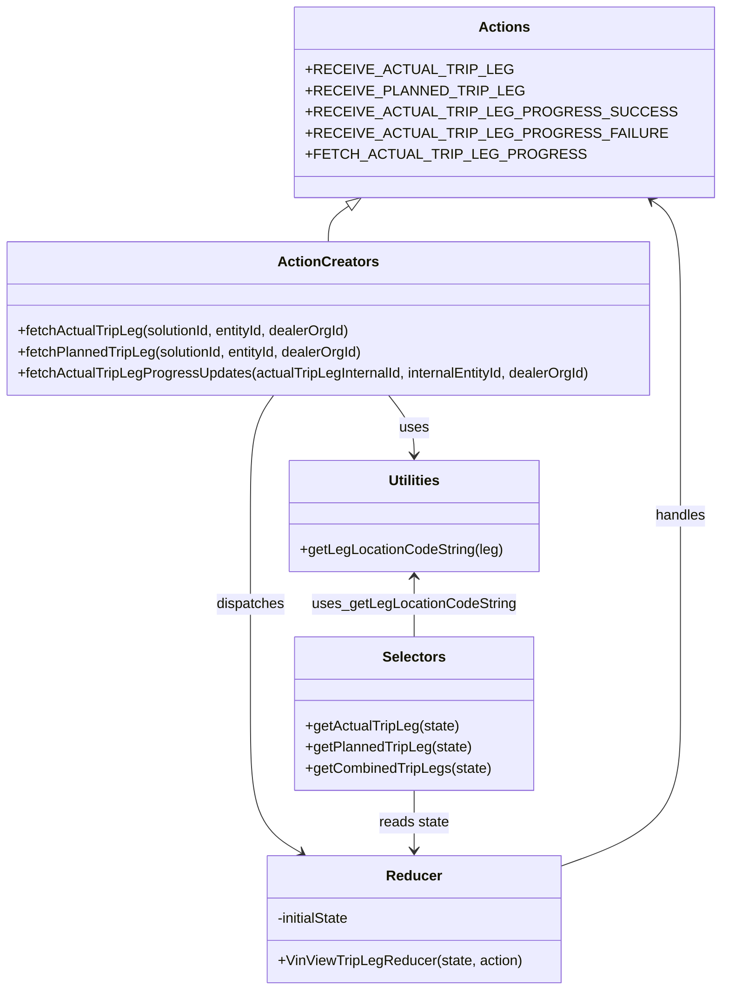

# Diagram: web/portal/src/pages/vinview/redux/VinViewTripLegState.js


> Auto-generated by Obscura crawlers

## Diagram 1

```mermaid
flowchart TD
  A[fetchActualTripLeg(solutionId, entityId, dealerOrgId?)] -->|calls| B[axios.get /actual-trip-leg]
  B --> C{response has tripLegs}
  C -->|yes| D[map actualLegs]
  D --> E{actualLeg.dest.arrived?}
  E -->|yes| F[set progress=100, isProgressLoading=false]
  E -->|no| G{actualLeg.id !== "fvGenerated"?}
  G -->|yes| H[push internalId into unfinishedTripLeg]
  G -->|no| I[skip progress request]
  H --> J[dispatch fetchActualTripLegProgressUpdates(internalId, entityId, dealerOrgId)]
  J --> K[axios.get /actual-trip-leg/:id/progress-update]
  K --> L{response success}
  L -->|200| M[dispatch RECEIVE_ACTUAL_TRIP_LEG_PROGRESS_SUCCESS]
  L -->|404| N[dispatch RECEIVE_ACTUAL_TRIP_LEG_PROGRESS_FAILURE]
  L -->|other error| O[throw Error]
  C -->|no| P[dispatch RECEIVE_ACTUAL_TRIP_LEG with payload]
  Q[fetchPlannedTripLeg(solutionId, entityId, dealerOrgId?)] -->|calls| R[axios.get /planned-trip-leg]
  R --> S[dispatch RECEIVE_PLANNED_TRIP_LEG]
  style A fill:#f9f,stroke:#333,stroke-width:1px
  style Q fill:#f9f,stroke:#333,stroke-width:1px
  style B,K,R stroke:#0b6,stroke-width:1px
```

> SVG rendering failed for this diagram.

## Diagram 2



### SVG

<svg id="container" width="815.3359375" xmlns="http://www.w3.org/2000/svg" class="classDiagram" height="1122" viewBox="0 0 815.3359375 1122" role="graphics-document document" aria-roledescription="class"><style>#container{font-family:"trebuchet ms",verdana,arial,sans-serif;font-size:16px;fill:#333;}@keyframes edge-animation-frame{from{stroke-dashoffset:0;}}@keyframes dash{to{stroke-dashoffset:0;}}#container .edge-animation-slow{stroke-dasharray:9,5!important;stroke-dashoffset:900;animation:dash 50s linear infinite;stroke-linecap:round;}#container .edge-animation-fast{stroke-dasharray:9,5!important;stroke-dashoffset:900;animation:dash 20s linear infinite;stroke-linecap:round;}#container .error-icon{fill:#552222;}#container .error-text{fill:#552222;stroke:#552222;}#container .edge-thickness-normal{stroke-width:1px;}#container .edge-thickness-thick{stroke-width:3.5px;}#container .edge-pattern-solid{stroke-dasharray:0;}#container .edge-thickness-invisible{stroke-width:0;fill:none;}#container .edge-pattern-dashed{stroke-dasharray:3;}#container .edge-pattern-dotted{stroke-dasharray:2;}#container .marker{fill:#333333;stroke:#333333;}#container .marker.cross{stroke:#333333;}#container svg{font-family:"trebuchet ms",verdana,arial,sans-serif;font-size:16px;}#container p{margin:0;}#container g.classGroup text{fill:#9370DB;stroke:none;font-family:"trebuchet ms",verdana,arial,sans-serif;font-size:10px;}#container g.classGroup text .title{font-weight:bolder;}#container .nodeLabel,#container .edgeLabel{color:#131300;}#container .edgeLabel .label rect{fill:#ECECFF;}#container .label text{fill:#131300;}#container .labelBkg{background:#ECECFF;}#container .edgeLabel .label span{background:#ECECFF;}#container .classTitle{font-weight:bolder;}#container .node rect,#container .node circle,#container .node ellipse,#container .node polygon,#container .node path{fill:#ECECFF;stroke:#9370DB;stroke-width:1px;}#container .divider{stroke:#9370DB;stroke-width:1;}#container g.clickable{cursor:pointer;}#container g.classGroup rect{fill:#ECECFF;stroke:#9370DB;}#container g.classGroup line{stroke:#9370DB;stroke-width:1;}#container .classLabel .box{stroke:none;stroke-width:0;fill:#ECECFF;opacity:0.5;}#container .classLabel .label{fill:#9370DB;font-size:10px;}#container .relation{stroke:#333333;stroke-width:1;fill:none;}#container .dashed-line{stroke-dasharray:3;}#container .dotted-line{stroke-dasharray:1 2;}#container #compositionStart,#container .composition{fill:#333333!important;stroke:#333333!important;stroke-width:1;}#container #compositionEnd,#container .composition{fill:#333333!important;stroke:#333333!important;stroke-width:1;}#container #dependencyStart,#container .dependency{fill:#333333!important;stroke:#333333!important;stroke-width:1;}#container #dependencyStart,#container .dependency{fill:#333333!important;stroke:#333333!important;stroke-width:1;}#container #extensionStart,#container .extension{fill:transparent!important;stroke:#333333!important;stroke-width:1;}#container #extensionEnd,#container .extension{fill:transparent!important;stroke:#333333!important;stroke-width:1;}#container #aggregationStart,#container .aggregation{fill:transparent!important;stroke:#333333!important;stroke-width:1;}#container #aggregationEnd,#container .aggregation{fill:transparent!important;stroke:#333333!important;stroke-width:1;}#container #lollipopStart,#container .lollipop{fill:#ECECFF!important;stroke:#333333!important;stroke-width:1;}#container #lollipopEnd,#container .lollipop{fill:#ECECFF!important;stroke:#333333!important;stroke-width:1;}#container .edgeTerminals{font-size:11px;line-height:initial;}#container .classTitleText{text-anchor:middle;font-size:18px;fill:#333;}#container .label-icon{display:inline-block;height:1em;overflow:visible;vertical-align:-0.125em;}#container .node .label-icon path{fill:currentColor;stroke:revert;stroke-width:revert;}#container :root{--mermaid-font-family:"trebuchet ms",verdana,arial,sans-serif;}</style><g><defs><marker id="container_class-aggregationStart" class="marker aggregation class" refX="18" refY="7" markerWidth="190" markerHeight="240" orient="auto"><path d="M 18,7 L9,13 L1,7 L9,1 Z"></path></marker></defs><defs><marker id="container_class-aggregationEnd" class="marker aggregation class" refX="1" refY="7" markerWidth="20" markerHeight="28" orient="auto"><path d="M 18,7 L9,13 L1,7 L9,1 Z"></path></marker></defs><defs><marker id="container_class-extensionStart" class="marker extension class" refX="18" refY="7" markerWidth="190" markerHeight="240" orient="auto"><path d="M 1,7 L18,13 V 1 Z"></path></marker></defs><defs><marker id="container_class-extensionEnd" class="marker extension class" refX="1" refY="7" markerWidth="20" markerHeight="28" orient="auto"><path d="M 1,1 V 13 L18,7 Z"></path></marker></defs><defs><marker id="container_class-compositionStart" class="marker composition class" refX="18" refY="7" markerWidth="190" markerHeight="240" orient="auto"><path d="M 18,7 L9,13 L1,7 L9,1 Z"></path></marker></defs><defs><marker id="container_class-compositionEnd" class="marker composition class" refX="1" refY="7" markerWidth="20" markerHeight="28" orient="auto"><path d="M 18,7 L9,13 L1,7 L9,1 Z"></path></marker></defs><defs><marker id="container_class-dependencyStart" class="marker dependency class" refX="6" refY="7" markerWidth="190" markerHeight="240" orient="auto"><path d="M 5,7 L9,13 L1,7 L9,1 Z"></path></marker></defs><defs><marker id="container_class-dependencyEnd" class="marker dependency class" refX="13" refY="7" markerWidth="20" markerHeight="28" orient="auto"><path d="M 18,7 L9,13 L14,7 L9,1 Z"></path></marker></defs><defs><marker id="container_class-lollipopStart" class="marker lollipop class" refX="13" refY="7" markerWidth="190" markerHeight="240" orient="auto"><circle stroke="black" fill="transparent" cx="7" cy="7" r="6"></circle></marker></defs><defs><marker id="container_class-lollipopEnd" class="marker lollipop class" refX="1" refY="7" markerWidth="190" markerHeight="240" orient="auto"><circle stroke="black" fill="transparent" cx="7" cy="7" r="6"></circle></marker></defs><g class="root"><g class="clusters"></g><g class="edgePaths"><path d="M399.166,233.507L395.257,236.089C391.348,238.672,383.529,243.836,379.62,250.585C375.711,257.333,375.711,265.667,375.711,269.833L375.711,274" id="id_Actions_ActionCreators_1" class="edge-thickness-normal edge-pattern-solid relation" style=";;;" data-edge="true" data-et="edge" data-id="id_Actions_ActionCreators_1" data-points="W3sieCI6NDEzLjU1OTcwOTgyMTQyODU2LCJ5IjoyMjR9LHsieCI6Mzc1LjcxMDkzNzUsInkiOjI0OX0seyJ4IjozNzUuNzEwOTM3NSwieSI6Mjc0fV0=" marker-start="url(#container_class-extensionStart)"></path><path d="M445.231,448L450.159,454.167C455.086,460.333,464.942,472.667,469.869,484C474.797,495.333,474.797,505.667,474.797,510.833L474.797,516" id="id_ActionCreators_Utilities_2" class="edge-thickness-normal edge-pattern-solid relation" style=";;;" data-edge="true" data-et="edge" data-id="id_ActionCreators_Utilities_2" data-points="W3sieCI6NDQ1LjIzMDkwOTc3ODIyNTgsInkiOjQ0OH0seyJ4Ijo0NzQuNzk2ODc1LCJ5Ijo0ODV9LHsieCI6NDc0Ljc5Njg3NSwieSI6NTIyfV0=" marker-end="url(#container_class-dependencyEnd)"></path><path d="M314.101,448L309.734,454.167C305.367,460.333,296.632,472.667,292.265,495.5C287.898,518.333,287.898,551.667,287.898,585C287.898,618.333,287.898,651.667,287.898,689C287.898,726.333,287.898,767.667,287.898,809C287.898,850.333,287.898,891.667,297.608,917.996C307.318,944.326,326.738,955.652,336.448,961.314L346.158,966.977" id="id_ActionCreators_Reducer_3" class="edge-thickness-normal edge-pattern-solid relation" style=";;;" data-edge="true" data-et="edge" data-id="id_ActionCreators_Reducer_3" data-points="W3sieCI6MzE0LjEwMDU1NDQzNTQ4MzksInkiOjQ0OH0seyJ4IjoyODcuODk4NDM3NSwieSI6NDg1fSx7IngiOjI4Ny44OTg0Mzc1LCJ5Ijo1ODV9LHsieCI6Mjg3Ljg5ODQzNzUsInkiOjY4NX0seyJ4IjoyODcuODk4NDM3NSwieSI6ODA5fSx7IngiOjI4Ny44OTg0Mzc1LCJ5Ijo5MzN9LHsieCI6MzUxLjM0MTAyNjM3NjE0NjgsInkiOjk3MH1d" marker-end="url(#container_class-dependencyEnd)"></path><path d="M474.797,896L474.797,902.167C474.797,908.333,474.797,920.667,474.797,932C474.797,943.333,474.797,953.667,474.797,958.833L474.797,964" id="id_Selectors_Reducer_4" class="edge-thickness-normal edge-pattern-solid relation" style=";;;" data-edge="true" data-et="edge" data-id="id_Selectors_Reducer_4" data-points="W3sieCI6NDc0Ljc5Njg3NSwieSI6ODk2fSx7IngiOjQ3NC43OTY4NzUsInkiOjkzM30seyJ4Ijo0NzQuNzk2ODc1LCJ5Ijo5NzB9XQ==" marker-end="url(#container_class-dependencyEnd)"></path><path d="M639.539,982.858L662.686,974.549C685.833,966.239,732.128,949.619,755.275,920.643C778.422,891.667,778.422,850.333,778.422,809C778.422,767.667,778.422,726.333,778.422,689C778.422,651.667,778.422,618.333,778.422,585C778.422,551.667,778.422,518.333,778.422,481C778.422,443.667,778.422,402.333,778.422,363C778.422,323.667,778.422,286.333,772.948,264.051C767.474,241.769,756.527,234.538,751.053,230.922L745.58,227.307" id="id_Reducer_Actions_5" class="edge-thickness-normal edge-pattern-solid relation" style=";;;" data-edge="true" data-et="edge" data-id="id_Reducer_Actions_5" data-points="W3sieCI6NjM5LjUzOTA2MjUsInkiOjk4Mi44NTgzMDA3NDEwNDU3fSx7IngiOjc3OC40MjE4NzUsInkiOjkzM30seyJ4Ijo3NzguNDIxODc1LCJ5Ijo4MDl9LHsieCI6Nzc4LjQyMTg3NSwieSI6Njg1fSx7IngiOjc3OC40MjE4NzUsInkiOjU4NX0seyJ4Ijo3NzguNDIxODc1LCJ5Ijo0ODV9LHsieCI6Nzc4LjQyMTg3NSwieSI6MzYxfSx7IngiOjc3OC40MjE4NzUsInkiOjI0OX0seyJ4Ijo3NDAuNTczMTAyNjc4NTcxNCwieSI6MjI0fV0=" marker-end="url(#container_class-dependencyEnd)"></path><path d="M474.797,654L474.797,659.167C474.797,664.333,474.797,674.667,474.797,686C474.797,697.333,474.797,709.667,474.797,715.833L474.797,722" id="id_Utilities_Selectors_6" class="edge-thickness-normal edge-pattern-solid relation" style=";;;" data-edge="true" data-et="edge" data-id="id_Utilities_Selectors_6" data-points="W3sieCI6NDc0Ljc5Njg3NSwieSI6NjQ4fSx7IngiOjQ3NC43OTY4NzUsInkiOjY4NX0seyJ4Ijo0NzQuNzk2ODc1LCJ5Ijo3MjJ9XQ==" marker-start="url(#container_class-dependencyStart)"></path></g><g class="edgeLabels"><g class="edgeLabel"><g class="label" data-id="id_Actions_ActionCreators_1" transform="translate(0, 0)"><foreignObject width="0" height="0"><div xmlns="http://www.w3.org/1999/xhtml" class="labelBkg" style="display: table-cell; white-space: nowrap; line-height: 1.5; max-width: 200px; text-align: center;"><span class="edgeLabel"></span></div></foreignObject></g></g><g class="edgeLabel" transform="translate(474.796875, 485)"><g class="label" data-id="id_ActionCreators_Utilities_2" transform="translate(-16.4921875, -12)"><foreignObject width="32.984375" height="24"><div xmlns="http://www.w3.org/1999/xhtml" class="labelBkg" style="display: table-cell; white-space: nowrap; line-height: 1.5; max-width: 200px; text-align: center;"><span class="edgeLabel"><p>uses</p></span></div></foreignObject></g></g><g class="edgeLabel" transform="translate(287.8984375, 685)"><g class="label" data-id="id_ActionCreators_Reducer_3" transform="translate(-39.1796875, -12)"><foreignObject width="78.359375" height="24"><div xmlns="http://www.w3.org/1999/xhtml" class="labelBkg" style="display: table-cell; white-space: nowrap; line-height: 1.5; max-width: 200px; text-align: center;"><span class="edgeLabel"><p>dispatches</p></span></div></foreignObject></g></g><g class="edgeLabel" transform="translate(474.796875, 933)"><g class="label" data-id="id_Selectors_Reducer_4" transform="translate(-40.171875, -12)"><foreignObject width="80.34375" height="24"><div xmlns="http://www.w3.org/1999/xhtml" class="labelBkg" style="display: table-cell; white-space: nowrap; line-height: 1.5; max-width: 200px; text-align: center;"><span class="edgeLabel"><p>reads state</p></span></div></foreignObject></g></g><g class="edgeLabel" transform="translate(778.421875, 585)"><g class="label" data-id="id_Reducer_Actions_5" transform="translate(-28.9140625, -12)"><foreignObject width="57.828125" height="24"><div xmlns="http://www.w3.org/1999/xhtml" class="labelBkg" style="display: table-cell; white-space: nowrap; line-height: 1.5; max-width: 200px; text-align: center;"><span class="edgeLabel"><p>handles</p></span></div></foreignObject></g></g><g class="edgeLabel" transform="translate(474.796875, 685)"><g class="label" data-id="id_Utilities_Selectors_6" transform="translate(-114.78125, -12)"><foreignObject width="229.5625" height="24"><div xmlns="http://www.w3.org/1999/xhtml" class="labelBkg" style="display: table; white-space: break-spaces; line-height: 1.5; max-width: 200px; text-align: center; width: 200px;"><span class="edgeLabel"><p>uses_getLegLocationCodeString</p></span></div></foreignObject></g></g></g><g class="nodes"><g class="node default" id="classId-Actions-0" transform="translate(577.06640625, 116)"><g class="basic label-container"><path d="M-202.56640625 -108 L202.56640625 -108 L202.56640625 108 L-202.56640625 108" stroke="none" stroke-width="0" fill="#ECECFF" style=""></path><path d="M-202.56640625 -108 C-62.787639304235455 -108, 76.99112764152909 -108, 202.56640625 -108 M-202.56640625 -108 C-91.2711242016515 -108, 20.024157846696994 -108, 202.56640625 -108 M202.56640625 -108 C202.56640625 -63.10704997209469, 202.56640625 -18.214099944189385, 202.56640625 108 M202.56640625 -108 C202.56640625 -41.25053006579364, 202.56640625 25.49893986841272, 202.56640625 108 M202.56640625 108 C46.77238274160294 108, -109.02164076679412 108, -202.56640625 108 M202.56640625 108 C52.68457382893638 108, -97.19725859212724 108, -202.56640625 108 M-202.56640625 108 C-202.56640625 30.034269729952555, -202.56640625 -47.93146054009489, -202.56640625 -108 M-202.56640625 108 C-202.56640625 44.5245766437476, -202.56640625 -18.9508467125048, -202.56640625 -108" stroke="#9370DB" stroke-width="1.3" fill="none" stroke-dasharray="0 0" style=""></path></g><g class="annotation-group text" transform="translate(0, -84)"></g><g class="label-group text" transform="translate(-27.0546875, -84)"><g class="label" style="font-weight: bolder" transform="translate(0,-12)"><foreignObject width="54.109375" height="24"><div xmlns="http://www.w3.org/1999/xhtml" style="display: table-cell; white-space: nowrap; line-height: 1.5; max-width: 103px; text-align: center;"><span class="nodeLabel markdown-node-label" style=""><p>Actions</p></span></div></foreignObject></g></g><g class="members-group text" transform="translate(-190.56640625, -36)"><g class="label" style="" transform="translate(0,-12)"><foreignObject width="200.34375" height="24"><div xmlns="http://www.w3.org/1999/xhtml" style="display: table-cell; white-space: nowrap; line-height: 1.5; max-width: 258px; text-align: center;"><span class="nodeLabel markdown-node-label" style=""><p>+RECEIVE_ACTUAL_TRIP_LEG</p></span></div></foreignObject></g><g class="label" style="" transform="translate(0,12)"><foreignObject width="213.203125" height="24"><div xmlns="http://www.w3.org/1999/xhtml" style="display: table-cell; white-space: nowrap; line-height: 1.5; max-width: 271px; text-align: center;"><span class="nodeLabel markdown-node-label" style=""><p>+RECEIVE_PLANNED_TRIP_LEG</p></span></div></foreignObject></g><g class="label" style="" transform="translate(0,36)"><foreignObject width="354.078125" height="24"><div xmlns="http://www.w3.org/1999/xhtml" style="display: table-cell; white-space: nowrap; line-height: 1.5; max-width: 412px; text-align: center;"><span class="nodeLabel markdown-node-label" style=""><p>+RECEIVE_ACTUAL_TRIP_LEG_PROGRESS_SUCCESS</p></span></div></foreignObject></g><g class="label" style="" transform="translate(0,60)"><foreignObject width="349.171875" height="24"><div xmlns="http://www.w3.org/1999/xhtml" style="display: table-cell; white-space: nowrap; line-height: 1.5; max-width: 407px; text-align: center;"><span class="nodeLabel markdown-node-label" style=""><p>+RECEIVE_ACTUAL_TRIP_LEG_PROGRESS_FAILURE</p></span></div></foreignObject></g><g class="label" style="" transform="translate(0,84)"><foreignObject width="270.21875" height="24"><div xmlns="http://www.w3.org/1999/xhtml" style="display: table-cell; white-space: nowrap; line-height: 1.5; max-width: 328px; text-align: center;"><span class="nodeLabel markdown-node-label" style=""><p>+FETCH_ACTUAL_TRIP_LEG_PROGRESS</p></span></div></foreignObject></g></g><g class="methods-group text" transform="translate(-190.56640625, 108)"></g><g class="divider" style=""><path d="M-202.56640625 -60 C-76.38268018987138 -60, 49.80104587025724 -60, 202.56640625 -60 M-202.56640625 -60 C-120.77424362476849 -60, -38.982080999536976 -60, 202.56640625 -60" stroke="#9370DB" stroke-width="1.3" fill="none" stroke-dasharray="0 0" style=""></path></g><g class="divider" style=""><path d="M-202.56640625 84 C-74.34681050633563 84, 53.87278523732874 84, 202.56640625 84 M-202.56640625 84 C-70.81836490525401 84, 60.92967643949197 84, 202.56640625 84" stroke="#9370DB" stroke-width="1.3" fill="none" stroke-dasharray="0 0" style=""></path></g></g><g class="node default" id="classId-ActionCreators-1" transform="translate(375.7109375, 361)"><g class="basic label-container"><path d="M-367.7109375 -87 L367.7109375 -87 L367.7109375 87 L-367.7109375 87" stroke="none" stroke-width="0" fill="#ECECFF" style=""></path><path d="M-367.7109375 -87 C-182.67727491331758 -87, 2.35638767336485 -87, 367.7109375 -87 M-367.7109375 -87 C-152.71367973022316 -87, 62.283578039553674 -87, 367.7109375 -87 M367.7109375 -87 C367.7109375 -42.26373239222952, 367.7109375 2.472535215540958, 367.7109375 87 M367.7109375 -87 C367.7109375 -22.779511024829176, 367.7109375 41.44097795034165, 367.7109375 87 M367.7109375 87 C212.6638351205536 87, 57.61673274110723 87, -367.7109375 87 M367.7109375 87 C129.1726271365288 87, -109.3656832269424 87, -367.7109375 87 M-367.7109375 87 C-367.7109375 26.553513770728642, -367.7109375 -33.892972458542715, -367.7109375 -87 M-367.7109375 87 C-367.7109375 26.070195080226853, -367.7109375 -34.859609839546295, -367.7109375 -87" stroke="#9370DB" stroke-width="1.3" fill="none" stroke-dasharray="0 0" style=""></path></g><g class="annotation-group text" transform="translate(0, -63)"></g><g class="label-group text" transform="translate(-53.96875, -63)"><g class="label" style="font-weight: bolder" transform="translate(0,-12)"><foreignObject width="107.9375" height="24"><div xmlns="http://www.w3.org/1999/xhtml" style="display: table-cell; white-space: nowrap; line-height: 1.5; max-width: 156px; text-align: center;"><span class="nodeLabel markdown-node-label" style=""><p>ActionCreators</p></span></div></foreignObject></g></g><g class="members-group text" transform="translate(-355.7109375, -15)"></g><g class="methods-group text" transform="translate(-355.7109375, 15)"><g class="label" style="" transform="translate(0,-12)"><foreignObject width="384.625" height="24"><div xmlns="http://www.w3.org/1999/xhtml" style="display: table-cell; white-space: nowrap; line-height: 1.5; max-width: 442px; text-align: center;"><span class="nodeLabel markdown-node-label" style=""><p>+fetchActualTripLeg(solutionId, entityId, dealerOrgId)</p></span></div></foreignObject></g><g class="label" style="" transform="translate(0,12)"><foreignObject width="398.984375" height="24"><div xmlns="http://www.w3.org/1999/xhtml" style="display: table-cell; white-space: nowrap; line-height: 1.5; max-width: 456px; text-align: center;"><span class="nodeLabel markdown-node-label" style=""><p>+fetchPlannedTripLeg(solutionId, entityId, dealerOrgId)</p></span></div></foreignObject></g><g class="label" style="" transform="translate(0,36)"><foreignObject width="657.453125" height="24"><div xmlns="http://www.w3.org/1999/xhtml" style="display: table-cell; white-space: nowrap; line-height: 1.5; max-width: 715px; text-align: center;"><span class="nodeLabel markdown-node-label" style=""><p>+fetchActualTripLegProgressUpdates(actualTripLegInternalId, internalEntityId, dealerOrgId)</p></span></div></foreignObject></g></g><g class="divider" style=""><path d="M-367.7109375 -39 C-149.6139365164886 -39, 68.48306446702281 -39, 367.7109375 -39 M-367.7109375 -39 C-129.98537210274424 -39, 107.74019329451153 -39, 367.7109375 -39" stroke="#9370DB" stroke-width="1.3" fill="none" stroke-dasharray="0 0" style=""></path></g><g class="divider" style=""><path d="M-367.7109375 -15 C-84.06705314150088 -15, 199.57683121699824 -15, 367.7109375 -15 M-367.7109375 -15 C-214.0732087760447 -15, -60.43548005208942 -15, 367.7109375 -15" stroke="#9370DB" stroke-width="1.3" fill="none" stroke-dasharray="0 0" style=""></path></g></g><g class="node default" id="classId-Selectors-2" transform="translate(474.796875, 809)"><g class="basic label-container"><path d="M-134.2578125 -87 L134.2578125 -87 L134.2578125 87 L-134.2578125 87" stroke="none" stroke-width="0" fill="#ECECFF" style=""></path><path d="M-134.2578125 -87 C-31.937130810097003 -87, 70.383550879806 -87, 134.2578125 -87 M-134.2578125 -87 C-28.40530674333047 -87, 77.44719901333906 -87, 134.2578125 -87 M134.2578125 -87 C134.2578125 -22.16611432000198, 134.2578125 42.66777135999604, 134.2578125 87 M134.2578125 -87 C134.2578125 -46.663903454247475, 134.2578125 -6.327806908494949, 134.2578125 87 M134.2578125 87 C59.52777736321103 87, -15.20225777357794 87, -134.2578125 87 M134.2578125 87 C64.3331750327017 87, -5.591462434596593 87, -134.2578125 87 M-134.2578125 87 C-134.2578125 38.036085527744554, -134.2578125 -10.927828944510892, -134.2578125 -87 M-134.2578125 87 C-134.2578125 50.79404585025506, -134.2578125 14.58809170051012, -134.2578125 -87" stroke="#9370DB" stroke-width="1.3" fill="none" stroke-dasharray="0 0" style=""></path></g><g class="annotation-group text" transform="translate(0, -63)"></g><g class="label-group text" transform="translate(-34.171875, -63)"><g class="label" style="font-weight: bolder" transform="translate(0,-12)"><foreignObject width="68.34375" height="24"><div xmlns="http://www.w3.org/1999/xhtml" style="display: table-cell; white-space: nowrap; line-height: 1.5; max-width: 117px; text-align: center;"><span class="nodeLabel markdown-node-label" style=""><p>Selectors</p></span></div></foreignObject></g></g><g class="members-group text" transform="translate(-122.2578125, -15)"></g><g class="methods-group text" transform="translate(-122.2578125, 15)"><g class="label" style="" transform="translate(0,-12)"><foreignObject width="174.75" height="24"><div xmlns="http://www.w3.org/1999/xhtml" style="display: table-cell; white-space: nowrap; line-height: 1.5; max-width: 232px; text-align: center;"><span class="nodeLabel markdown-node-label" style=""><p>+getActualTripLeg(state)</p></span></div></foreignObject></g><g class="label" style="" transform="translate(0,12)"><foreignObject width="189.09375" height="24"><div xmlns="http://www.w3.org/1999/xhtml" style="display: table-cell; white-space: nowrap; line-height: 1.5; max-width: 246px; text-align: center;"><span class="nodeLabel markdown-node-label" style=""><p>+getPlannedTripLeg(state)</p></span></div></foreignObject></g><g class="label" style="" transform="translate(0,36)"><foreignObject width="210.34375" height="24"><div xmlns="http://www.w3.org/1999/xhtml" style="display: table-cell; white-space: nowrap; line-height: 1.5; max-width: 268px; text-align: center;"><span class="nodeLabel markdown-node-label" style=""><p>+getCombinedTripLegs(state)</p></span></div></foreignObject></g></g><g class="divider" style=""><path d="M-134.2578125 -39 C-47.22077924677001 -39, 39.816254006459985 -39, 134.2578125 -39 M-134.2578125 -39 C-33.52470407457699 -39, 67.20840435084602 -39, 134.2578125 -39" stroke="#9370DB" stroke-width="1.3" fill="none" stroke-dasharray="0 0" style=""></path></g><g class="divider" style=""><path d="M-134.2578125 -15 C-76.18581730359082 -15, -18.11382210718166 -15, 134.2578125 -15 M-134.2578125 -15 C-64.56313882979411 -15, 5.131534840411774 -15, 134.2578125 -15" stroke="#9370DB" stroke-width="1.3" fill="none" stroke-dasharray="0 0" style=""></path></g></g><g class="node default" id="classId-Reducer-3" transform="translate(474.796875, 1042)"><g class="basic label-container"><path d="M-164.7421875 -72 L164.7421875 -72 L164.7421875 72 L-164.7421875 72" stroke="none" stroke-width="0" fill="#ECECFF" style=""></path><path d="M-164.7421875 -72 C-69.96845535203637 -72, 24.805276795927256 -72, 164.7421875 -72 M-164.7421875 -72 C-66.95157562870585 -72, 30.839036242588293 -72, 164.7421875 -72 M164.7421875 -72 C164.7421875 -29.033520270113726, 164.7421875 13.932959459772547, 164.7421875 72 M164.7421875 -72 C164.7421875 -16.24902533103524, 164.7421875 39.50194933792952, 164.7421875 72 M164.7421875 72 C61.6872892839456 72, -41.367608932108794 72, -164.7421875 72 M164.7421875 72 C40.140741794935195 72, -84.46070391012961 72, -164.7421875 72 M-164.7421875 72 C-164.7421875 35.21052865578867, -164.7421875 -1.5789426884226572, -164.7421875 -72 M-164.7421875 72 C-164.7421875 38.934911795566826, -164.7421875 5.8698235911336525, -164.7421875 -72" stroke="#9370DB" stroke-width="1.3" fill="none" stroke-dasharray="0 0" style=""></path></g><g class="annotation-group text" transform="translate(0, -48)"></g><g class="label-group text" transform="translate(-29.90625, -48)"><g class="label" style="font-weight: bolder" transform="translate(0,-12)"><foreignObject width="59.8125" height="24"><div xmlns="http://www.w3.org/1999/xhtml" style="display: table-cell; white-space: nowrap; line-height: 1.5; max-width: 110px; text-align: center;"><span class="nodeLabel markdown-node-label" style=""><p>Reducer</p></span></div></foreignObject></g></g><g class="members-group text" transform="translate(-152.7421875, 0)"><g class="label" style="" transform="translate(0,-12)"><foreignObject width="85.71875" height="24"><div xmlns="http://www.w3.org/1999/xhtml" style="display: table-cell; white-space: nowrap; line-height: 1.5; max-width: 143px; text-align: center;"><span class="nodeLabel markdown-node-label" style=""><p>-initialState</p></span></div></foreignObject></g></g><g class="methods-group text" transform="translate(-152.7421875, 48)"><g class="label" style="" transform="translate(0,-12)"><foreignObject width="275.578125" height="24"><div xmlns="http://www.w3.org/1999/xhtml" style="display: table-cell; white-space: nowrap; line-height: 1.5; max-width: 333px; text-align: center;"><span class="nodeLabel markdown-node-label" style=""><p>+VinViewTripLegReducer(state, action)</p></span></div></foreignObject></g></g><g class="divider" style=""><path d="M-164.7421875 -24 C-96.43178840510467 -24, -28.121389310209338 -24, 164.7421875 -24 M-164.7421875 -24 C-63.73960148200328 -24, 37.26298453599344 -24, 164.7421875 -24" stroke="#9370DB" stroke-width="1.3" fill="none" stroke-dasharray="0 0" style=""></path></g><g class="divider" style=""><path d="M-164.7421875 24 C-59.53876146736957 24, 45.664664565260864 24, 164.7421875 24 M-164.7421875 24 C-40.850110557948526 24, 83.04196638410295 24, 164.7421875 24" stroke="#9370DB" stroke-width="1.3" fill="none" stroke-dasharray="0 0" style=""></path></g></g><g class="node default" id="classId-Utilities-4" transform="translate(474.796875, 585)"><g class="basic label-container"><path d="M-140.625 -63 L140.625 -63 L140.625 63 L-140.625 63" stroke="none" stroke-width="0" fill="#ECECFF" style=""></path><path d="M-140.625 -63 C-32.153144413198504 -63, 76.31871117360299 -63, 140.625 -63 M-140.625 -63 C-69.00247799390837 -63, 2.620044012183257 -63, 140.625 -63 M140.625 -63 C140.625 -17.59235905059426, 140.625 27.815281898811477, 140.625 63 M140.625 -63 C140.625 -20.429400996293502, 140.625 22.141198007412996, 140.625 63 M140.625 63 C49.87107585756324 63, -40.88284828487352 63, -140.625 63 M140.625 63 C56.50523948825496 63, -27.614521023490084 63, -140.625 63 M-140.625 63 C-140.625 21.11676589235089, -140.625 -20.766468215298218, -140.625 -63 M-140.625 63 C-140.625 32.35137744410851, -140.625 1.702754888217008, -140.625 -63" stroke="#9370DB" stroke-width="1.3" fill="none" stroke-dasharray="0 0" style=""></path></g><g class="annotation-group text" transform="translate(0, -39)"></g><g class="label-group text" transform="translate(-28.8125, -39)"><g class="label" style="font-weight: bolder" transform="translate(0,-12)"><foreignObject width="57.625" height="24"><div xmlns="http://www.w3.org/1999/xhtml" style="display: table-cell; white-space: nowrap; line-height: 1.5; max-width: 107px; text-align: center;"><span class="nodeLabel markdown-node-label" style=""><p>Utilities</p></span></div></foreignObject></g></g><g class="members-group text" transform="translate(-128.625, 9)"></g><g class="methods-group text" transform="translate(-128.625, 39)"><g class="label" style="" transform="translate(0,-12)"><foreignObject width="228.4375" height="24"><div xmlns="http://www.w3.org/1999/xhtml" style="display: table-cell; white-space: nowrap; line-height: 1.5; max-width: 286px; text-align: center;"><span class="nodeLabel markdown-node-label" style=""><p>+getLegLocationCodeString(leg)</p></span></div></foreignObject></g></g><g class="divider" style=""><path d="M-140.625 -15 C-67.75086966882198 -15, 5.123260662356046 -15, 140.625 -15 M-140.625 -15 C-67.79240423415594 -15, 5.040191531688123 -15, 140.625 -15" stroke="#9370DB" stroke-width="1.3" fill="none" stroke-dasharray="0 0" style=""></path></g><g class="divider" style=""><path d="M-140.625 9 C-59.422431147171764 9, 21.780137705656472 9, 140.625 9 M-140.625 9 C-69.79128228997396 9, 1.0424354200520725 9, 140.625 9" stroke="#9370DB" stroke-width="1.3" fill="none" stroke-dasharray="0 0" style=""></path></g></g></g></g></g></svg>
