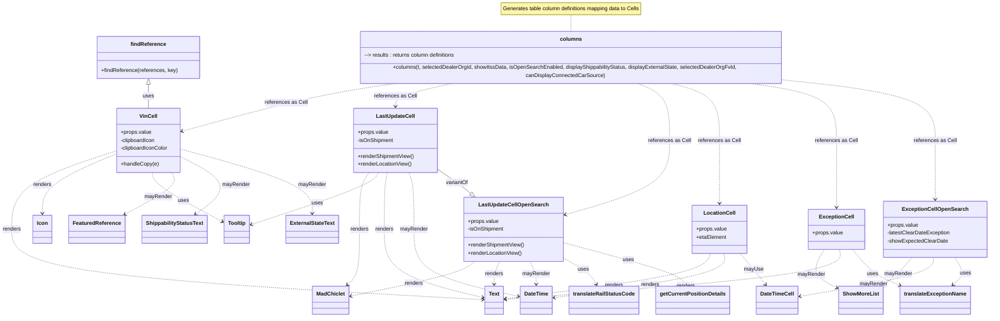

# Diagram: web/portal/src/pages/vinview/search/VinView.Search.columns.js

> Auto-generated by Obscura crawlers

## Mermaid

### SVG

<svg id="container" width="2929.095703125" xmlns="http://www.w3.org/2000/svg" class="classDiagram" height="936" viewBox="0 0 2929.095703125 936" role="graphics-document document" aria-roledescription="class"><g><defs><marker id="container_class-aggregationStart" class="marker aggregation class" refX="18" refY="7" markerWidth="190" markerHeight="240" orient="auto"><path d="M 18,7 L9,13 L1,7 L9,1 Z"></path></marker></defs><defs><marker id="container_class-aggregationEnd" class="marker aggregation class" refX="1" refY="7" markerWidth="20" markerHeight="28" orient="auto"><path d="M 18,7 L9,13 L1,7 L9,1 Z"></path></marker></defs><defs><marker id="container_class-extensionStart" class="marker extension class" refX="18" refY="7" markerWidth="190" markerHeight="240" orient="auto"><path d="M 1,7 L18,13 V 1 Z"></path></marker></defs><defs><marker id="container_class-extensionEnd" class="marker extension class" refX="1" refY="7" markerWidth="20" markerHeight="28" orient="auto"><path d="M 1,1 V 13 L18,7 Z"></path></marker></defs><defs><marker id="container_class-compositionStart" class="marker composition class" refX="18" refY="7" markerWidth="190" markerHeight="240" orient="auto"><path d="M 18,7 L9,13 L1,7 L9,1 Z"></path></marker></defs><defs><marker id="container_class-compositionEnd" class="marker composition class" refX="1" refY="7" markerWidth="20" markerHeight="28" orient="auto"><path d="M 18,7 L9,13 L1,7 L9,1 Z"></path></marker></defs><defs><marker id="container_class-dependencyStart" class="marker dependency class" refX="6" refY="7" markerWidth="190" markerHeight="240" orient="auto"><path d="M 5,7 L9,13 L1,7 L9,1 Z"></path></marker></defs><defs><marker id="container_class-dependencyEnd" class="marker dependency class" refX="13" refY="7" markerWidth="20" markerHeight="28" orient="auto"><path d="M 18,7 L9,13 L14,7 L9,1 Z"></path></marker></defs><defs><marker id="container_class-lollipopStart" class="marker lollipop class" refX="13" refY="7" markerWidth="190" markerHeight="240" orient="auto"><circle stroke="black" fill="transparent" cx="7" cy="7" r="6"></circle></marker></defs><defs><marker id="container_class-lollipopEnd" class="marker lollipop class" refX="1" refY="7" markerWidth="190" markerHeight="240" orient="auto"><circle stroke="black" fill="transparent" cx="7" cy="7" r="6"></circle></marker></defs><g class="root"><g class="clusters"></g><g class="edgePaths"><path d="M1683.242,44L1683.242,48.167C1683.242,52.333,1683.242,60.667,1683.242,69C1683.242,77.333,1683.242,85.667,1683.242,89.833L1683.242,94" id="edgeNote1" class="edge-thickness-normal edge-pattern-dotted relation" style="fill: none;;;fill: none" data-edge="true" data-et="edge" data-id="edgeNote1" data-points="W3sieCI6MTY4My4yNDIxODc1LCJ5Ijo0NH0seyJ4IjoxNjgzLjI0MjE4NzUsInkiOjY5fSx7IngiOjE2ODMuMjQyMTg3NSwieSI6OTR9XQ=="></path><path d="M437.996,246.25L437.996,251.042C437.996,255.833,437.996,265.417,437.996,276.375C437.996,287.333,437.996,299.667,437.996,305.833L437.996,312" id="id_findReference_VinCell_1" class="edge-thickness-normal edge-pattern-solid relation" style=";;;" data-edge="true" data-et="edge" data-id="id_findReference_VinCell_1" data-points="W3sieCI6NDM3Ljk5NjA5Mzc1LCJ5IjoyMjl9LHsieCI6NDM3Ljk5NjA5Mzc1LCJ5IjoyNzV9LHsieCI6NDM3Ljk5NjA5Mzc1LCJ5IjozMTJ9XQ==" marker-start="url(#container_class-extensionStart)"></path><path d="M341.301,439.972L290.376,456.81C239.451,473.648,137.6,507.324,86.675,546.329C35.75,585.333,35.75,629.667,35.75,674C35.75,718.333,35.75,762.667,271.094,797.696C506.439,832.725,977.127,858.451,1212.471,871.313L1447.816,884.176" id="id_VinCell_Text_2" class="edge-thickness-normal edge-pattern-dashed relation" style=";;;" data-edge="true" data-et="edge" data-id="id_VinCell_Text_2" data-points="W3sieCI6MzQxLjMwMDc4MTI1LCJ5Ijo0MzkuOTcxNjYzMDI1MDA2MX0seyJ4IjozNS43NSwieSI6NTQxfSx7IngiOjM1Ljc1LCJ5Ijo2NzR9LHsieCI6MzUuNzUsInkiOjgwN30seyJ4IjoxNDUzLjgwNjY0MDYyNSwieSI6ODg0LjUwMzQwMTcyODIyNjV9XQ==" marker-end="url(#container_class-dependencyEnd)"></path><path d="M341.301,452.619L309.379,467.349C277.456,482.079,213.612,511.54,181.69,540.437C149.768,569.333,149.768,597.667,149.768,611.833L149.768,626" id="id_VinCell_Icon_3" class="edge-thickness-normal edge-pattern-dashed relation" style=";;;" data-edge="true" data-et="edge" data-id="id_VinCell_Icon_3" data-points="W3sieCI6MzQxLjMwMDc4MTI1LCJ5Ijo0NTIuNjE5MDI5MjI2MjEzNDZ9LHsieCI6MTQ5Ljc2NzU3ODEyNSwieSI6NTQxfSx7IngiOjE0OS43Njc1NzgxMjUsInkiOjYzMn1d" marker-end="url(#container_class-dependencyEnd)"></path><path d="M463.435,504L465.07,510.167C466.704,516.333,469.972,528.667,504.94,553.078C539.909,577.49,606.578,613.98,639.912,632.225L673.247,650.47" id="id_VinCell_Tooltip_4" class="edge-thickness-normal edge-pattern-dashed relation" style=";;;" data-edge="true" data-et="edge" data-id="id_VinCell_Tooltip_4" data-points="W3sieCI6NDYzLjQzNTQ3MzQ0OTI0ODEsInkiOjUwNH0seyJ4Ijo0NzMuMjQwMjM0Mzc1LCJ5Ijo1NDF9LHsieCI6Njc4LjUwOTc2NTYyNSwieSI6NjUzLjM1MDk3MzM2MzEyNjN9XQ==" marker-end="url(#container_class-dependencyEnd)"></path><path d="M519.392,504L524.621,510.167C529.849,516.333,540.307,528.667,518.702,549.52C497.098,570.373,443.432,599.746,416.599,614.433L389.766,629.119" id="id_VinCell_FeaturedReference_5" class="edge-thickness-normal edge-pattern-dashed relation" style=";;;" data-edge="true" data-et="edge" data-id="id_VinCell_FeaturedReference_5" data-points="W3sieCI6NTE5LjM5MjI0MDM2NjU0MTQsInkiOjUwNH0seyJ4Ijo1NTAuNzYzNjcxODc1LCJ5Ijo1NDF9LHsieCI6Mzg0LjUwMzE4NjY3NzYzMTU2LCJ5Ijo2MzJ9XQ==" marker-end="url(#container_class-dependencyEnd)"></path><path d="M534.691,454.485L564.685,468.904C594.679,483.323,654.667,512.162,664.807,541.156C674.947,570.15,635.241,599.3,615.387,613.874L595.534,628.449" id="id_VinCell_ShippabilityStatusText_6" class="edge-thickness-normal edge-pattern-dashed relation" style=";;;" data-edge="true" data-et="edge" data-id="id_VinCell_ShippabilityStatusText_6" data-points="W3sieCI6NTM0LjY5MTQwNjI1LCJ5Ijo0NTQuNDg1MDcyMjU2MDY5Nn0seyJ4Ijo3MTQuNjU0Mjk2ODc1LCJ5Ijo1NDF9LHsieCI6NTkwLjY5NzI2NTYyNSwieSI6NjMyfV0=" marker-end="url(#container_class-dependencyEnd)"></path><path d="M534.691,433.651L602.135,451.543C669.579,469.434,804.466,505.217,871.91,537.275C939.354,569.333,939.354,597.667,939.354,611.833L939.354,626" id="id_VinCell_ExternalStateText_7" class="edge-thickness-normal edge-pattern-dashed relation" style=";;;" data-edge="true" data-et="edge" data-id="id_VinCell_ExternalStateText_7" data-points="W3sieCI6NTM0LjY5MTQwNjI1LCJ5Ijo0MzMuNjUxMzEzODE2MDA3M30seyJ4Ijo5MzkuMzUzNTE1NjI1LCJ5Ijo1NDF9LHsieCI6OTM5LjM1MzUxNTYyNSwieSI6NjMyfV0=" marker-end="url(#container_class-dependencyEnd)"></path><path d="M1109.276,504L1104.224,510.167C1099.172,516.333,1089.067,528.667,1084.015,557C1078.963,585.333,1078.963,629.667,1078.963,674C1078.963,718.333,1078.963,762.667,1073.506,790.293C1068.049,817.919,1057.135,828.838,1051.678,834.297L1046.221,839.756" id="id_LastUpdateCell_MadChiclet_8" class="edge-thickness-normal edge-pattern-dashed relation" style=";;;" data-edge="true" data-et="edge" data-id="id_LastUpdateCell_MadChiclet_8" data-points="W3sieCI6MTEwOS4yNzY0MTg1ODU1MjYyLCJ5Ijo1MDR9LHsieCI6MTA3OC45NjI4OTA2MjUsInkiOjU0MX0seyJ4IjoxMDc4Ljk2Mjg5MDYyNSwieSI6Njc0fSx7IngiOjEwNzguOTYyODkwNjI1LCJ5Ijo4MDd9LHsieCI6MTA0MS45NzkzNTYyMTA0NDMsInkiOjg0NH1d" marker-end="url(#container_class-dependencyEnd)"></path><path d="M1136.525,504L1133.223,510.167C1129.921,516.333,1123.317,528.667,1060.506,554.597C997.694,580.527,878.676,620.053,819.166,639.816L759.657,659.58" id="id_LastUpdateCell_Tooltip_9" class="edge-thickness-normal edge-pattern-dashed relation" style=";;;" data-edge="true" data-et="edge" data-id="id_LastUpdateCell_Tooltip_9" data-points="W3sieCI6MTEzNi41MjQ1Mzg4ODYyNzgyLCJ5Ijo1MDR9LHsieCI6MTExNi43MTI4OTA2MjUsInkiOjU0MX0seyJ4Ijo3NTMuOTYyODkwNjI1LCJ5Ijo2NjEuNDcwODQ1MjgxOTg4Mn1d" marker-end="url(#container_class-dependencyEnd)"></path><path d="M1163.773,504L1162.221,510.167C1160.669,516.333,1157.566,528.667,1156.015,557C1154.463,585.333,1154.463,629.667,1154.463,674C1154.463,718.333,1154.463,762.667,1203.382,796.661C1252.3,830.656,1350.137,854.313,1399.056,866.141L1447.975,877.969" id="id_LastUpdateCell_Text_10" class="edge-thickness-normal edge-pattern-dashed relation" style=";;;" data-edge="true" data-et="edge" data-id="id_LastUpdateCell_Text_10" data-points="W3sieCI6MTE2My43NzI2NTkxODcwMywieSI6NTA0fSx7IngiOjExNTQuNDYyODkwNjI1LCJ5Ijo1NDF9LHsieCI6MTE1NC40NjI4OTA2MjUsInkiOjY3NH0seyJ4IjoxMTU0LjQ2Mjg5MDYyNSwieSI6ODA3fSx7IngiOjE0NTMuODA2NjQwNjI1LCJ5Ijo4NzkuMzc5MDQ0MDIwOTQ2NH1d" marker-end="url(#container_class-dependencyEnd)"></path><path d="M1227.855,504L1230.42,510.167C1232.985,516.333,1238.115,528.667,1240.679,557C1243.244,585.333,1243.244,629.667,1243.244,674C1243.244,718.333,1243.244,762.667,1294.822,796.091C1346.4,829.515,1449.555,852.029,1501.133,863.287L1552.71,874.544" id="id_LastUpdateCell_DateTime_11" class="edge-thickness-normal edge-pattern-dashed relation" style=";;;" data-edge="true" data-et="edge" data-id="id_LastUpdateCell_DateTime_11" data-points="W3sieCI6MTIyNy44NTUzNjU5NTM5NDczLCJ5Ijo1MDR9LHsieCI6MTI0My4yNDQxNDA2MjUsInkiOjU0MX0seyJ4IjoxMjQzLjI0NDE0MDYyNSwieSI6Njc0fSx7IngiOjEyNDMuMjQ0MTQwNjI1LCJ5Ijo4MDd9LHsieCI6MTU1OC41NzIyNjU2MjUsInkiOjg3NS44MjM2MTMyMDk1ODM0fV0=" marker-end="url(#container_class-dependencyEnd)"></path><path d="M1312.592,493.686L1324.064,501.572C1335.537,509.458,1358.482,525.229,1375.103,537.433C1391.723,549.638,1402.017,558.275,1407.165,562.594L1412.312,566.913" id="id_LastUpdateCell_LastUpdateCellOpenSearch_12" class="edge-thickness-normal edge-pattern-solid relation" style=";;;" data-edge="true" data-et="edge" data-id="id_LastUpdateCell_LastUpdateCellOpenSearch_12" data-points="W3sieCI6MTMxMi41OTE3OTY4NzUsInkiOjQ5My42ODY0MDk4ODM3MjA5fSx7IngiOjEzODEuNDI3NzM0Mzc1LCJ5Ijo1NDF9LHsieCI6MTQyNS41MjcxNTI4NDMwNDUsInkiOjU3OH1d" marker-end="url(#container_class-extensionEnd)"></path><path d="M1423.398,770L1415.912,776.167C1408.425,782.333,1393.452,794.667,1332.62,811.968C1271.789,829.269,1165.1,851.538,1111.755,862.673L1058.411,873.808" id="id_LastUpdateCellOpenSearch_MadChiclet_13" class="edge-thickness-normal edge-pattern-dashed relation" style=";;;" data-edge="true" data-et="edge" data-id="id_LastUpdateCellOpenSearch_MadChiclet_13" data-points="W3sieCI6MTQyMy4zOTgzOTM0NDQ1NDksInkiOjc3MH0seyJ4IjoxMzc4LjQ3ODUxNTYyNSwieSI6ODA3fSx7IngiOjEwNTIuNTM3MTA5Mzc1LCJ5Ijo4NzUuMDMzNTUzMTY3OTkyOX1d" marker-end="url(#container_class-dependencyEnd)"></path><path d="M1497.536,770L1494.811,776.167C1492.087,782.333,1486.638,794.667,1483.914,806C1481.189,817.333,1481.189,827.667,1481.189,832.833L1481.189,838" id="id_LastUpdateCellOpenSearch_Text_14" class="edge-thickness-normal edge-pattern-dashed relation" style=";;;" data-edge="true" data-et="edge" data-id="id_LastUpdateCellOpenSearch_Text_14" data-points="W3sieCI6MTQ5Ny41MzU2MTE0ODk2NjE3LCJ5Ijo3NzB9LHsieCI6MTQ4MS4xODk0NTMxMjUsInkiOjgwN30seyJ4IjoxNDgxLjE4OTQ1MzEyNSwieSI6ODQ0fV0=" marker-end="url(#container_class-dependencyEnd)"></path><path d="M1586.883,770L1589.898,776.167C1592.913,782.333,1598.943,794.667,1601.972,806C1605.002,817.333,1605.031,827.667,1605.046,832.833L1605.061,838" id="id_LastUpdateCellOpenSearch_DateTime_15" class="edge-thickness-normal edge-pattern-dashed relation" style=";;;" data-edge="true" data-et="edge" data-id="id_LastUpdateCellOpenSearch_DateTime_15" data-points="W3sieCI6MTU4Ni44ODI4ODU5MjU3NTIsInkiOjc3MH0seyJ4IjoxNjA0Ljk3MjY1NjI1LCJ5Ijo4MDd9LHsieCI6MTYwNS4wNzc4NTMwNDU4ODYsInkiOjg0NH1d" marker-end="url(#container_class-dependencyEnd)"></path><path d="M1686.055,770L1695.44,776.167C1704.826,782.333,1723.596,794.667,1737.067,806.204C1750.538,817.742,1758.709,828.483,1762.795,833.854L1766.881,839.225" id="id_LastUpdateCellOpenSearch_translateRailStatusCode_16" class="edge-thickness-normal edge-pattern-dashed relation" style=";;;" data-edge="true" data-et="edge" data-id="id_LastUpdateCellOpenSearch_translateRailStatusCode_16" data-points="W3sieCI6MTY4Ni4wNTQ4Nzg0MDY5NTUsInkiOjc3MH0seyJ4IjoxNzQyLjM2NzE4NzUsInkiOjgwN30seyJ4IjoxNzcwLjUxMzI3NjMwNTM3OTgsInkiOjg0NH1d" marker-end="url(#container_class-dependencyEnd)"></path><path d="M1686.635,716.447L1738.791,731.539C1790.947,746.631,1895.258,776.816,1951.5,797.279C2007.741,817.742,2015.913,828.483,2019.998,833.854L2024.084,839.225" id="id_LastUpdateCellOpenSearch_getCurrentPositionDetails_17" class="edge-thickness-normal edge-pattern-dashed relation" style=";;;" data-edge="true" data-et="edge" data-id="id_LastUpdateCellOpenSearch_getCurrentPositionDetails_17" data-points="W3sieCI6MTY4Ni42MzQ3NjU2MjUsInkiOjcxNi40NDY2MDQwODcwNzg5fSx7IngiOjE5OTkuNTcwMzEyNSwieSI6ODA3fSx7IngiOjIwMjcuNzE2NDAxMzA1Mzc5OCwieSI6ODQ0fV0=" marker-end="url(#container_class-dependencyEnd)"></path><path d="M2097.727,746L2092.151,756.167C2086.576,766.333,2075.425,786.667,1978.223,809.247C1881.022,831.828,1697.77,856.656,1606.144,869.07L1514.518,881.484" id="id_LocationCell_Text_18" class="edge-thickness-normal edge-pattern-dashed relation" style=";;;" data-edge="true" data-et="edge" data-id="id_LocationCell_Text_18" data-points="W3sieCI6MjA5Ny43MjY4NzA4ODgxNTgsInkiOjc0Nn0seyJ4IjoyMDY0LjI3MzQzNzUsInkiOjgwN30seyJ4IjoxNTA4LjU3MjI2NTYyNSwieSI6ODgyLjI4OTk5ODk2MTYwOTd9XQ==" marker-end="url(#container_class-dependencyEnd)"></path><path d="M2138.599,746L2138.795,756.167C2138.991,766.333,2139.382,786.667,2059.242,808.705C1979.102,830.744,1818.43,854.488,1738.094,866.36L1657.758,878.233" id="id_LocationCell_DateTime_19" class="edge-thickness-normal edge-pattern-dashed relation" style=";;;" data-edge="true" data-et="edge" data-id="id_LocationCell_DateTime_19" data-points="W3sieCI6MjEzOC41OTkwNTEzMzkyODYsInkiOjc0Nn0seyJ4IjoyMTM5Ljc3MzQzNzUsInkiOjgwN30seyJ4IjoxNjUxLjgyMjI2NTYyNSwieSI6ODc5LjEwOTcyODQyODI1OTh9XQ==" marker-end="url(#container_class-dependencyEnd)"></path><path d="M2196.348,746L2204.698,756.167C2213.049,766.333,2229.749,786.667,2242.185,802.204C2254.62,817.742,2262.792,828.483,2266.877,833.854L2270.963,839.225" id="id_LocationCell_DateTimeCell_20" class="edge-thickness-normal edge-pattern-dashed relation" style=";;;" data-edge="true" data-et="edge" data-id="id_LocationCell_DateTimeCell_20" data-points="W3sieCI6MjE5Ni4zNDgzNDY0NTIwNjc3LCJ5Ijo3NDZ9LHsieCI6MjI0Ni40NDkyMTg3NSwieSI6ODA3fSx7IngiOjIyNzQuNTk1MzA3NTU1MzgsInkiOjg0NH1d" marker-end="url(#container_class-dependencyEnd)"></path><path d="M2433.783,734L2424.491,746.167C2415.199,758.333,2396.615,782.667,2405.054,802.821C2413.492,822.974,2448.953,838.949,2466.684,846.936L2484.414,854.923" id="id_ExceptionCell_ShowMoreList_21" class="edge-thickness-normal edge-pattern-dashed relation" style=";;;" data-edge="true" data-et="edge" data-id="id_ExceptionCell_ShowMoreList_21" data-points="W3sieCI6MjQzMy43ODI1MTI5MjI5MzIzLCJ5Ijo3MzR9LHsieCI6MjM3OC4wMzEyNSwieSI6ODA3fSx7IngiOjI0ODkuODg0NzY1NjI1LCJ5Ijo4NTcuMzg3NTg2NDUyNjgzNX1d" marker-end="url(#container_class-dependencyEnd)"></path><path d="M2478.512,734L2478.29,746.167C2478.069,758.333,2477.625,782.667,2316.965,807.559C2156.306,832.451,1835.43,857.902,1674.992,870.628L1514.553,883.354" id="id_ExceptionCell_Text_22" class="edge-thickness-normal edge-pattern-dashed relation" style=";;;" data-edge="true" data-et="edge" data-id="id_ExceptionCell_Text_22" data-points="W3sieCI6MjQ3OC41MTIwMTI0NTMwMDc2LCJ5Ijo3MzR9LHsieCI6MjQ3Ny4xODE2NDA2MjUsInkiOjgwN30seyJ4IjoxNTA4LjU3MjI2NTYyNSwieSI6ODgzLjgyODA1MzA1NjM5MDF9XQ==" marker-end="url(#container_class-dependencyEnd)"></path><path d="M2516.804,734L2524.347,746.167C2531.89,758.333,2546.976,782.667,2571.061,801.165C2595.146,819.664,2628.229,832.328,2644.771,838.66L2661.313,844.992" id="id_ExceptionCell_translateExceptionName_23" class="edge-thickness-normal edge-pattern-dashed relation" style=";;;" data-edge="true" data-et="edge" data-id="id_ExceptionCell_translateExceptionName_23" data-points="W3sieCI6MjUxNi44MDQxMjk0NjQyODYsInkiOjczNH0seyJ4IjoyNTYyLjA2MjUsInkiOjgwN30seyJ4IjoyNjY2LjkxNjAxNTYyNSwieSI6ODQ3LjEzNzM2ODA5NzI4ODZ9XQ==" marker-end="url(#container_class-dependencyEnd)"></path><path d="M2687.058,758L2679.146,766.167C2671.234,774.333,2655.41,790.667,2641.508,804.324C2627.605,817.982,2615.624,828.964,2609.634,834.455L2603.644,839.946" id="id_ExceptionCellOpenSearch_ShowMoreList_24" class="edge-thickness-normal edge-pattern-dashed relation" style=";;;" data-edge="true" data-et="edge" data-id="id_ExceptionCellOpenSearch_ShowMoreList_24" data-points="W3sieCI6MjY4Ny4wNTgyODUzNjE4NDIsInkiOjc1OH0seyJ4IjoyNjM5LjU4NTkzNzUsInkiOjgwN30seyJ4IjoyNTk5LjIyMDU1NDc4NjM5MjMsInkiOjg0NH1d" marker-end="url(#container_class-dependencyEnd)"></path><path d="M2751.519,758L2749.874,766.167C2748.229,774.333,2744.939,790.667,2681.799,809.999C2618.66,829.331,2495.671,851.661,2434.177,862.826L2372.683,873.992" id="id_ExceptionCellOpenSearch_DateTimeCell_25" class="edge-thickness-normal edge-pattern-dashed relation" style=";;;" data-edge="true" data-et="edge" data-id="id_ExceptionCellOpenSearch_DateTimeCell_25" data-points="W3sieCI6Mjc1MS41MTg4MTE2Nzc2MzE3LCJ5Ijo3NTh9LHsieCI6Mjc0MS42NDg0Mzc1LCJ5Ijo4MDd9LHsieCI6MjM2Ni43NzkyOTY4NzUsInkiOjg3NS4wNjM0ODYxNDk1NzgyfV0=" marker-end="url(#container_class-dependencyEnd)"></path><path d="M2811.677,758L2815.88,766.167C2820.084,774.333,2828.491,790.667,2828.006,804.244C2827.521,817.822,2818.143,828.644,2813.454,834.055L2808.765,839.466" id="id_ExceptionCellOpenSearch_translateExceptionName_26" class="edge-thickness-normal edge-pattern-dashed relation" style=";;;" data-edge="true" data-et="edge" data-id="id_ExceptionCellOpenSearch_translateExceptionName_26" data-points="W3sieCI6MjgxMS42NzY3MDY0MTQ0NzM4LCJ5Ijo3NTh9LHsieCI6MjgzNi44OTg0Mzc1LCJ5Ijo4MDd9LHsieCI6MjgwNC44MzUzNjg4Njg2NzA3LCJ5Ijo4NDR9XQ==" marker-end="url(#container_class-dependencyEnd)"></path><path d="M1189.461,238L1147.17,244.167C1104.879,250.333,1020.296,262.667,912.133,286.435C803.971,310.204,672.23,345.408,606.359,363.01L540.488,380.612" id="id_columns_VinCell_27" class="edge-thickness-normal edge-pattern-dashed relation" style=";;;" data-edge="true" data-et="edge" data-id="id_columns_VinCell_27" data-points="W3sieCI6MTE4OS40NjEzNjc1NDU4NzE2LCJ5IjoyMzh9LHsieCI6OTM1LjcxMjg5MDYyNSwieSI6Mjc1fSx7IngiOjUzNC42OTE0MDYyNSwieSI6MzgyLjE2MTA1NTc1ODUyMjN9XQ==" marker-end="url(#container_class-dependencyEnd)"></path><path d="M1356.062,238L1328.04,244.167C1300.017,250.333,1243.972,262.667,1215.95,274C1187.928,285.333,1187.928,295.667,1187.928,300.833L1187.928,306" id="id_columns_LastUpdateCell_28" class="edge-thickness-normal edge-pattern-dashed relation" style=";;;" data-edge="true" data-et="edge" data-id="id_columns_LastUpdateCell_28" data-points="W3sieCI6MTM1Ni4wNjE5OTgyNzk4MTY2LCJ5IjoyMzh9LHsieCI6MTE4Ny45Mjc3MzQzNzUsInkiOjI3NX0seyJ4IjoxMTg3LjkyNzczNDM3NSwieSI6MzEyfV0=" marker-end="url(#container_class-dependencyEnd)"></path><path d="M1886.084,238L1903.457,244.167C1920.83,250.333,1955.576,262.667,1972.949,291C1990.322,319.333,1990.322,363.667,1990.322,408C1990.322,452.333,1990.322,496.667,1940.667,533.497C1891.011,570.327,1791.7,599.655,1742.045,614.319L1692.389,628.982" id="id_columns_LastUpdateCellOpenSearch_29" class="edge-thickness-normal edge-pattern-dashed relation" style=";;;" data-edge="true" data-et="edge" data-id="id_columns_LastUpdateCellOpenSearch_29" data-points="W3sieCI6MTg4Ni4wODQwNzM5Njc4OSwieSI6MjM4fSx7IngiOjE5OTAuMzIyMjY1NjI1LCJ5IjoyNzV9LHsieCI6MTk5MC4zMjIyNjU2MjUsInkiOjQwOH0seyJ4IjoxOTkwLjMyMjI2NTYyNSwieSI6NTQxfSx7IngiOjE2ODYuNjM0NzY1NjI1LCJ5Ijo2MzAuNjgxNzkyOTUwMzE5Mn1d" marker-end="url(#container_class-dependencyEnd)"></path><path d="M1983.113,238L2008.796,244.167C2034.479,250.333,2085.846,262.667,2111.53,291C2137.213,319.333,2137.213,363.667,2137.213,408C2137.213,452.333,2137.213,496.667,2137.213,528C2137.213,559.333,2137.213,577.667,2137.213,586.833L2137.213,596" id="id_columns_LocationCell_30" class="edge-thickness-normal edge-pattern-dashed relation" style=";;;" data-edge="true" data-et="edge" data-id="id_columns_LocationCell_30" data-points="W3sieCI6MTk4My4xMTI3NDM2OTI2NjA2LCJ5IjoyMzh9LHsieCI6MjEzNy4yMTI4OTA2MjUsInkiOjI3NX0seyJ4IjoyMTM3LjIxMjg5MDYyNSwieSI6NDA4fSx7IngiOjIxMzcuMjEyODkwNjI1LCJ5Ijo1NDF9LHsieCI6MjEzNy4yMTI4OTA2MjUsInkiOjYwMn1d" marker-end="url(#container_class-dependencyEnd)"></path><path d="M2209.28,238L2254.335,244.167C2299.389,250.333,2389.497,262.667,2434.551,291C2479.605,319.333,2479.605,363.667,2479.605,408C2479.605,452.333,2479.605,496.667,2479.605,530C2479.605,563.333,2479.605,585.667,2479.605,596.833L2479.605,608" id="id_columns_ExceptionCell_31" class="edge-thickness-normal edge-pattern-dashed relation" style=";;;" data-edge="true" data-et="edge" data-id="id_columns_ExceptionCell_31" data-points="W3sieCI6MjIwOS4yODAzMTgyMzM5NDUsInkiOjIzOH0seyJ4IjoyNDc5LjYwNTQ2ODc1LCJ5IjoyNzV9LHsieCI6MjQ3OS42MDU0Njg3NSwieSI6NDA4fSx7IngiOjI0NzkuNjA1NDY4NzUsInkiOjU0MX0seyJ4IjoyNDc5LjYwNTQ2ODc1LCJ5Ijo2MTR9XQ==" marker-end="url(#container_class-dependencyEnd)"></path><path d="M2344.395,232.408L2415.069,239.507C2485.743,246.605,2627.091,260.803,2697.765,290.068C2768.439,319.333,2768.439,363.667,2768.439,408C2768.439,452.333,2768.439,496.667,2768.439,526C2768.439,555.333,2768.439,569.667,2768.439,576.833L2768.439,584" id="id_columns_ExceptionCellOpenSearch_32" class="edge-thickness-normal edge-pattern-dashed relation" style=";;;" data-edge="true" data-et="edge" data-id="id_columns_ExceptionCellOpenSearch_32" data-points="W3sieCI6MjM0NC4zOTQ1MzEyNSwieSI6MjMyLjQwNzgzOTE1NjU0NzM3fSx7IngiOjI3NjguNDM5NDUzMTI1LCJ5IjoyNzV9LHsieCI6Mjc2OC40Mzk0NTMxMjUsInkiOjQwOH0seyJ4IjoyNzY4LjQzOTQ1MzEyNSwieSI6NTQxfSx7IngiOjI3NjguNDM5NDUzMTI1LCJ5Ijo1OTB9XQ==" marker-end="url(#container_class-dependencyEnd)"></path></g><g class="edgeLabels"><g class="edgeLabel"><g class="label" data-id="edgeNote1" transform="translate(0, 0)"><foreignObject width="0" height="0">

</foreignObject></g></g><g class="edgeLabel" transform="translate(437.99609375, 275)"><g class="label" data-id="id_findReference_VinCell_1" transform="translate(-16.4921875, -12)"><foreignObject width="32.984375" height="24">

uses

</foreignObject></g></g><g class="edgeLabel" transform="translate(35.75, 674)"><g class="label" data-id="id_VinCell_Text_2" transform="translate(-27.75, -12)"><foreignObject width="55.5" height="24">

renders

</foreignObject></g></g><g class="edgeLabel" transform="translate(149.767578125, 541)"><g class="label" data-id="id_VinCell_Icon_3" transform="translate(-27.75, -12)"><foreignObject width="55.5" height="24">

renders

</foreignObject></g></g><g class="edgeLabel" transform="translate(559.08665, 587.98665)"><g class="label" data-id="id_VinCell_Tooltip_4" transform="translate(-16.4921875, -12)"><foreignObject width="32.984375" height="24">

uses

</foreignObject></g></g><g class="edgeLabel" transform="translate(488.90971, 574.85477)"><g class="label" data-id="id_VinCell_FeaturedReference_5" transform="translate(-41.03125, -12)"><foreignObject width="82.0625" height="24">

mayRender

</foreignObject></g></g><g class="edgeLabel" transform="translate(714.654296875, 541)"><g class="label" data-id="id_VinCell_ShippabilityStatusText_6" transform="translate(-41.03125, -12)"><foreignObject width="82.0625" height="24">

mayRender

</foreignObject></g></g><g class="edgeLabel" transform="translate(939.353515625, 541)"><g class="label" data-id="id_VinCell_ExternalStateText_7" transform="translate(-41.03125, -12)"><foreignObject width="82.0625" height="24">

mayRender

</foreignObject></g></g><g class="edgeLabel" transform="translate(1078.962890625, 674)"><g class="label" data-id="id_LastUpdateCell_MadChiclet_8" transform="translate(-27.75, -12)"><foreignObject width="55.5" height="24">

renders

</foreignObject></g></g><g class="edgeLabel" transform="translate(955.25346, 594.62138)"><g class="label" data-id="id_LastUpdateCell_Tooltip_9" transform="translate(-16.4921875, -12)"><foreignObject width="32.984375" height="24">

uses

</foreignObject></g></g><g class="edgeLabel" transform="translate(1154.462890625, 674)"><g class="label" data-id="id_LastUpdateCell_Text_10" transform="translate(-27.75, -12)"><foreignObject width="55.5" height="24">

renders

</foreignObject></g></g><g class="edgeLabel" transform="translate(1243.244140625, 674)"><g class="label" data-id="id_LastUpdateCell_DateTime_11" transform="translate(-41.03125, -12)"><foreignObject width="82.0625" height="24">

mayRender

</foreignObject></g></g><g class="edgeLabel" transform="translate(1370.72965, 533.64679)"><g class="label" data-id="id_LastUpdateCell_LastUpdateCellOpenSearch_12" transform="translate(-33.6484375, -12)"><foreignObject width="67.296875" height="24">

variantOf

</foreignObject></g></g><g class="edgeLabel" transform="translate(1243.99202, 835.07129)"><g class="label" data-id="id_LastUpdateCellOpenSearch_MadChiclet_13" transform="translate(-27.75, -12)"><foreignObject width="55.5" height="24">

renders

</foreignObject></g></g><g class="edgeLabel" transform="translate(1481.189453125, 807)"><g class="label" data-id="id_LastUpdateCellOpenSearch_Text_14" transform="translate(-27.75, -12)"><foreignObject width="55.5" height="24">

renders

</foreignObject></g></g><g class="edgeLabel" transform="translate(1604.97265625, 807)"><g class="label" data-id="id_LastUpdateCellOpenSearch_DateTime_15" transform="translate(-41.03125, -12)"><foreignObject width="82.0625" height="24">

mayRender

</foreignObject></g></g><g class="edgeLabel" transform="translate(1733.63731, 801.26403)"><g class="label" data-id="id_LastUpdateCellOpenSearch_translateRailStatusCode_16" transform="translate(-16.4921875, -12)"><foreignObject width="32.984375" height="24">

uses

</foreignObject></g></g><g class="edgeLabel" transform="translate(1865.43088, 768.1844)"><g class="label" data-id="id_LastUpdateCellOpenSearch_getCurrentPositionDetails_17" transform="translate(-16.4921875, -12)"><foreignObject width="32.984375" height="24">

uses

</foreignObject></g></g><g class="edgeLabel" transform="translate(1820.89344, 839.9747)"><g class="label" data-id="id_LocationCell_Text_18" transform="translate(-27.75, -12)"><foreignObject width="55.5" height="24">

renders

</foreignObject></g></g><g class="edgeLabel" transform="translate(1925.97575, 838.59515)"><g class="label" data-id="id_LocationCell_DateTime_19" transform="translate(-27.75, -12)"><foreignObject width="55.5" height="24">

renders

</foreignObject></g></g><g class="edgeLabel" transform="translate(2236.1518, 794.46244)"><g class="label" data-id="id_LocationCell_DateTimeCell_20" transform="translate(-28.3828125, -12)"><foreignObject width="56.765625" height="24">

mayUse

</foreignObject></g></g><g class="edgeLabel" transform="translate(2392.08357, 813.33027)"><g class="label" data-id="id_ExceptionCell_ShowMoreList_21" transform="translate(-41.03125, -12)"><foreignObject width="82.0625" height="24">

mayRender

</foreignObject></g></g><g class="edgeLabel" transform="translate(2029.26872, 842.52751)"><g class="label" data-id="id_ExceptionCell_Text_22" transform="translate(-27.75, -12)"><foreignObject width="55.5" height="24">

renders

</foreignObject></g></g><g class="edgeLabel" transform="translate(2574.3817, 811.71572)"><g class="label" data-id="id_ExceptionCell_translateExceptionName_23" transform="translate(-16.4921875, -12)"><foreignObject width="32.984375" height="24">

uses

</foreignObject></g></g><g class="edgeLabel" transform="translate(2644.27143, 802.16373)"><g class="label" data-id="id_ExceptionCellOpenSearch_ShowMoreList_24" transform="translate(-41.03125, -12)"><foreignObject width="82.0625" height="24">

mayRender

</foreignObject></g></g><g class="edgeLabel" transform="translate(2578.80395, 836.56702)"><g class="label" data-id="id_ExceptionCellOpenSearch_DateTimeCell_25" transform="translate(-41.03125, -12)"><foreignObject width="82.0625" height="24">

mayRender

</foreignObject></g></g><g class="edgeLabel" transform="translate(2835.49099, 804.26565)"><g class="label" data-id="id_ExceptionCellOpenSearch_translateExceptionName_26" transform="translate(-16.4921875, -12)"><foreignObject width="32.984375" height="24">

uses

</foreignObject></g></g><g class="edgeLabel" transform="translate(859.07176, 295.48006)"><g class="label" data-id="id_columns_VinCell_27" transform="translate(-63.4453125, -12)"><foreignObject width="126.890625" height="24">

references as Cell

</foreignObject></g></g><g class="edgeLabel" transform="translate(1187.927734375, 275)"><g class="label" data-id="id_columns_LastUpdateCell_28" transform="translate(-63.4453125, -12)"><foreignObject width="126.890625" height="24">

references as Cell

</foreignObject></g></g><g class="edgeLabel" transform="translate(1990.322265625, 408)"><g class="label" data-id="id_columns_LastUpdateCellOpenSearch_29" transform="translate(-63.4453125, -12)"><foreignObject width="126.890625" height="24">

references as Cell

</foreignObject></g></g><g class="edgeLabel" transform="translate(2137.212890625, 408)"><g class="label" data-id="id_columns_LocationCell_30" transform="translate(-63.4453125, -12)"><foreignObject width="126.890625" height="24">

references as Cell

</foreignObject></g></g><g class="edgeLabel" transform="translate(2479.60546875, 408)"><g class="label" data-id="id_columns_ExceptionCell_31" transform="translate(-63.4453125, -12)"><foreignObject width="126.890625" height="24">

references as Cell

</foreignObject></g></g><g class="edgeLabel" transform="translate(2768.439453125, 408)"><g class="label" data-id="id_columns_ExceptionCellOpenSearch_32" transform="translate(-63.4453125, -12)"><foreignObject width="126.890625" height="24">

references as Cell

</foreignObject></g></g></g><g class="nodes"><g class="node default" id="classId-findReference-0" transform="translate(437.99609375, 166)"><g class="basic label-container"><path d="M-150.6015625 -63 L150.6015625 -63 L150.6015625 63 L-150.6015625 63" stroke="none" stroke-width="0" fill="#ECECFF" style=""></path><path d="M-150.6015625 -63 C-48.97076810030407 -63, 52.66002629939186 -63, 150.6015625 -63 M-150.6015625 -63 C-49.837844133193656 -63, 50.92587423361269 -63, 150.6015625 -63 M150.6015625 -63 C150.6015625 -28.772646396399416, 150.6015625 5.454707207201167, 150.6015625 63 M150.6015625 -63 C150.6015625 -36.68826709781068, 150.6015625 -10.376534195621353, 150.6015625 63 M150.6015625 63 C46.82681056701854 63, -56.94794136596292 63, -150.6015625 63 M150.6015625 63 C32.23959873757475 63, -86.1223650248505 63, -150.6015625 63 M-150.6015625 63 C-150.6015625 34.839434715406, -150.6015625 6.678869430811993, -150.6015625 -63 M-150.6015625 63 C-150.6015625 23.35011920037602, -150.6015625 -16.299761599247958, -150.6015625 -63" stroke="#9370DB" stroke-width="1.3" fill="none" stroke-dasharray="0 0" style=""></path></g><g class="annotation-group text" transform="translate(0, -39)"></g><g class="label-group text" transform="translate(-50.71875, -39)"><g class="label" style="font-weight: bolder" transform="translate(0,-12)"><foreignObject width="101.4375" height="24">

findReference

</foreignObject></g></g><g class="members-group text" transform="translate(-138.6015625, 9)"></g><g class="methods-group text" transform="translate(-138.6015625, 39)"><g class="label" style="" transform="translate(0,-12)"><foreignObject width="226.484375" height="24">

+findReference(references, key)

</foreignObject></g></g><g class="divider" style=""><path d="M-150.6015625 -15 C-85.59346991681498 -15, -20.585377333629964 -15, 150.6015625 -15 M-150.6015625 -15 C-32.43677152053988 -15, 85.72801945892024 -15, 150.6015625 -15" stroke="#9370DB" stroke-width="1.3" fill="none" stroke-dasharray="0 0" style=""></path></g><g class="divider" style=""><path d="M-150.6015625 9 C-40.83808098150246 9, 68.92540053699508 9, 150.6015625 9 M-150.6015625 9 C-78.62361391061175 9, -6.645665321223504 9, 150.6015625 9" stroke="#9370DB" stroke-width="1.3" fill="none" stroke-dasharray="0 0" style=""></path></g></g><g class="node default" id="classId-VinCell-1" transform="translate(437.99609375, 408)"><g class="basic label-container"><path d="M-96.6953125 -96 L96.6953125 -96 L96.6953125 96 L-96.6953125 96" stroke="none" stroke-width="0" fill="#ECECFF" style=""></path><path d="M-96.6953125 -96 C-48.229809278812304 -96, 0.23569394237539143 -96, 96.6953125 -96 M-96.6953125 -96 C-26.009891301186812 -96, 44.675529897626376 -96, 96.6953125 -96 M96.6953125 -96 C96.6953125 -41.758575864598214, 96.6953125 12.482848270803572, 96.6953125 96 M96.6953125 -96 C96.6953125 -54.10420988733415, 96.6953125 -12.2084197746683, 96.6953125 96 M96.6953125 96 C42.34551609482069 96, -12.004280310358624 96, -96.6953125 96 M96.6953125 96 C42.714468115759715 96, -11.26637626848057 96, -96.6953125 96 M-96.6953125 96 C-96.6953125 36.118685853913775, -96.6953125 -23.76262829217245, -96.6953125 -96 M-96.6953125 96 C-96.6953125 32.532892234849584, -96.6953125 -30.934215530300833, -96.6953125 -96" stroke="#9370DB" stroke-width="1.3" fill="none" stroke-dasharray="0 0" style=""></path></g><g class="annotation-group text" transform="translate(0, -72)"></g><g class="label-group text" transform="translate(-25.046875, -72)"><g class="label" style="font-weight: bolder" transform="translate(0,-12)"><foreignObject width="50.09375" height="24">

VinCell

</foreignObject></g></g><g class="members-group text" transform="translate(-84.6953125, -24)"><g class="label" style="" transform="translate(0,-12)"><foreignObject width="91.59375" height="24">

+props.value

</foreignObject></g><g class="label" style="" transform="translate(0,12)"><foreignObject width="106.234375" height="24">

-clipboardIcon

</foreignObject></g><g class="label" style="" transform="translate(0,36)"><foreignObject width="144.34375" height="24">

-clipboardIconColor

</foreignObject></g></g><g class="methods-group text" transform="translate(-84.6953125, 72)"><g class="label" style="" transform="translate(0,-12)"><foreignObject width="112.734375" height="24">

+handleCopy(e)

</foreignObject></g></g><g class="divider" style=""><path d="M-96.6953125 -48 C-49.576913574593654 -48, -2.4585146491873076 -48, 96.6953125 -48 M-96.6953125 -48 C-37.530368982888746 -48, 21.63457453422251 -48, 96.6953125 -48" stroke="#9370DB" stroke-width="1.3" fill="none" stroke-dasharray="0 0" style=""></path></g><g class="divider" style=""><path d="M-96.6953125 48 C-20.87189501394323 48, 54.95152247211354 48, 96.6953125 48 M-96.6953125 48 C-48.59966790946617 48, -0.5040233189323402 48, 96.6953125 48" stroke="#9370DB" stroke-width="1.3" fill="none" stroke-dasharray="0 0" style=""></path></g></g><g class="node default" id="classId-LastUpdateCell-2" transform="translate(1187.927734375, 408)"><g class="basic label-container"><path d="M-124.6640625 -96 L124.6640625 -96 L124.6640625 96 L-124.6640625 96" stroke="none" stroke-width="0" fill="#ECECFF" style=""></path><path d="M-124.6640625 -96 C-69.38961582050572 -96, -14.115169141011435 -96, 124.6640625 -96 M-124.6640625 -96 C-25.850465346938293 -96, 72.96313180612341 -96, 124.6640625 -96 M124.6640625 -96 C124.6640625 -32.0690793776223, 124.6640625 31.861841244755396, 124.6640625 96 M124.6640625 -96 C124.6640625 -55.41162125047939, 124.6640625 -14.823242500958784, 124.6640625 96 M124.6640625 96 C57.66702952724668 96, -9.330003445506634 96, -124.6640625 96 M124.6640625 96 C62.88105552595443 96, 1.0980485519088603 96, -124.6640625 96 M-124.6640625 96 C-124.6640625 21.84322237810187, -124.6640625 -52.31355524379626, -124.6640625 -96 M-124.6640625 96 C-124.6640625 44.32684140276912, -124.6640625 -7.346317194461761, -124.6640625 -96" stroke="#9370DB" stroke-width="1.3" fill="none" stroke-dasharray="0 0" style=""></path></g><g class="annotation-group text" transform="translate(0, -72)"></g><g class="label-group text" transform="translate(-55.421875, -72)"><g class="label" style="font-weight: bolder" transform="translate(0,-12)"><foreignObject width="110.84375" height="24">

LastUpdateCell

</foreignObject></g></g><g class="members-group text" transform="translate(-112.6640625, -24)"><g class="label" style="" transform="translate(0,-12)"><foreignObject width="91.59375" height="24">

+props.value

</foreignObject></g><g class="label" style="" transform="translate(0,12)"><foreignObject width="108.578125" height="24">

-isOnShipment

</foreignObject></g></g><g class="methods-group text" transform="translate(-112.6640625, 48)"><g class="label" style="" transform="translate(0,-12)"><foreignObject width="169.90625" height="24">

+renderShipmentView()

</foreignObject></g><g class="label" style="" transform="translate(0,12)"><foreignObject width="162.328125" height="24">

+renderLocationView()

</foreignObject></g></g><g class="divider" style=""><path d="M-124.6640625 -48 C-63.40766701385634 -48, -2.15127152771268 -48, 124.6640625 -48 M-124.6640625 -48 C-41.079116577673645 -48, 42.50582934465271 -48, 124.6640625 -48" stroke="#9370DB" stroke-width="1.3" fill="none" stroke-dasharray="0 0" style=""></path></g><g class="divider" style=""><path d="M-124.6640625 24 C-37.95413723305727 24, 48.755788033885466 24, 124.6640625 24 M-124.6640625 24 C-30.367507171351093 24, 63.929048157297814 24, 124.6640625 24" stroke="#9370DB" stroke-width="1.3" fill="none" stroke-dasharray="0 0" style=""></path></g></g><g class="node default" id="classId-LastUpdateCellOpenSearch-3" transform="translate(1539.947265625, 674)"><g class="basic label-container"><path d="M-146.6875 -96 L146.6875 -96 L146.6875 96 L-146.6875 96" stroke="none" stroke-width="0" fill="#ECECFF" style=""></path><path d="M-146.6875 -96 C-78.63065743962117 -96, -10.573814879242349 -96, 146.6875 -96 M-146.6875 -96 C-54.99036884752503 -96, 36.70676230494993 -96, 146.6875 -96 M146.6875 -96 C146.6875 -47.114105581119105, 146.6875 1.7717888377617896, 146.6875 96 M146.6875 -96 C146.6875 -37.819215307660016, 146.6875 20.361569384679967, 146.6875 96 M146.6875 96 C66.90197476906945 96, -12.883550461861091 96, -146.6875 96 M146.6875 96 C79.94381232303873 96, 13.200124646077455 96, -146.6875 96 M-146.6875 96 C-146.6875 35.252632808466956, -146.6875 -25.49473438306609, -146.6875 -96 M-146.6875 96 C-146.6875 44.03587783064732, -146.6875 -7.928244338705355, -146.6875 -96" stroke="#9370DB" stroke-width="1.3" fill="none" stroke-dasharray="0 0" style=""></path></g><g class="annotation-group text" transform="translate(0, -72)"></g><g class="label-group text" transform="translate(-99.46875, -72)"><g class="label" style="font-weight: bolder" transform="translate(0,-12)"><foreignObject width="198.9375" height="24">

LastUpdateCellOpenSearch

</foreignObject></g></g><g class="members-group text" transform="translate(-134.6875, -24)"><g class="label" style="" transform="translate(0,-12)"><foreignObject width="91.59375" height="24">

+props.value

</foreignObject></g><g class="label" style="" transform="translate(0,12)"><foreignObject width="108.578125" height="24">

-isOnShipment

</foreignObject></g></g><g class="methods-group text" transform="translate(-134.6875, 48)"><g class="label" style="" transform="translate(0,-12)"><foreignObject width="169.90625" height="24">

+renderShipmentView()

</foreignObject></g><g class="label" style="" transform="translate(0,12)"><foreignObject width="162.328125" height="24">

+renderLocationView()

</foreignObject></g></g><g class="divider" style=""><path d="M-146.6875 -48 C-73.31396494532726 -48, 0.059570109345486344 -48, 146.6875 -48 M-146.6875 -48 C-45.778056167660594 -48, 55.13138766467881 -48, 146.6875 -48" stroke="#9370DB" stroke-width="1.3" fill="none" stroke-dasharray="0 0" style=""></path></g><g class="divider" style=""><path d="M-146.6875 24 C-54.910404227038256 24, 36.86669154592349 24, 146.6875 24 M-146.6875 24 C-56.53140322412425 24, 33.624693551751506 24, 146.6875 24" stroke="#9370DB" stroke-width="1.3" fill="none" stroke-dasharray="0 0" style=""></path></g></g><g class="node default" id="classId-LocationCell-4" transform="translate(2137.212890625, 674)"><g class="basic label-container"><path d="M-80.2734375 -72 L80.2734375 -72 L80.2734375 72 L-80.2734375 72" stroke="none" stroke-width="0" fill="#ECECFF" style=""></path><path d="M-80.2734375 -72 C-28.943199967124457 -72, 22.387037565751086 -72, 80.2734375 -72 M-80.2734375 -72 C-36.456631022157275 -72, 7.36017545568545 -72, 80.2734375 -72 M80.2734375 -72 C80.2734375 -38.16413355527301, 80.2734375 -4.328267110546022, 80.2734375 72 M80.2734375 -72 C80.2734375 -20.957213471720806, 80.2734375 30.08557305655839, 80.2734375 72 M80.2734375 72 C25.919915134212424 72, -28.433607231575152 72, -80.2734375 72 M80.2734375 72 C36.090157008534774 72, -8.093123482930451 72, -80.2734375 72 M-80.2734375 72 C-80.2734375 33.057288751259875, -80.2734375 -5.885422497480249, -80.2734375 -72 M-80.2734375 72 C-80.2734375 40.03490319561783, -80.2734375 8.069806391235666, -80.2734375 -72" stroke="#9370DB" stroke-width="1.3" fill="none" stroke-dasharray="0 0" style=""></path></g><g class="annotation-group text" transform="translate(0, -48)"></g><g class="label-group text" transform="translate(-44.953125, -48)"><g class="label" style="font-weight: bolder" transform="translate(0,-12)"><foreignObject width="89.90625" height="24">

LocationCell

</foreignObject></g></g><g class="members-group text" transform="translate(-68.2734375, 0)"><g class="label" style="" transform="translate(0,-12)"><foreignObject width="91.59375" height="24">

+props.value

</foreignObject></g><g class="label" style="" transform="translate(0,12)"><foreignObject width="90.4375" height="24">

+etaElement

</foreignObject></g></g><g class="methods-group text" transform="translate(-68.2734375, 72)"></g><g class="divider" style=""><path d="M-80.2734375 -24 C-40.48188896745912 -24, -0.6903404349182409 -24, 80.2734375 -24 M-80.2734375 -24 C-32.21234013551938 -24, 15.848757228961233 -24, 80.2734375 -24" stroke="#9370DB" stroke-width="1.3" fill="none" stroke-dasharray="0 0" style=""></path></g><g class="divider" style=""><path d="M-80.2734375 48 C-34.47342290257724 48, 11.326591694845519 48, 80.2734375 48 M-80.2734375 48 C-41.38505008398043 48, -2.4966626679608623 48, 80.2734375 48" stroke="#9370DB" stroke-width="1.3" fill="none" stroke-dasharray="0 0" style=""></path></g></g><g class="node default" id="classId-ExceptionCell-5" transform="translate(2479.60546875, 674)"><g class="basic label-container"><path d="M-82.44921875 -60 L82.44921875 -60 L82.44921875 60 L-82.44921875 60" stroke="none" stroke-width="0" fill="#ECECFF" style=""></path><path d="M-82.44921875 -60 C-42.85148006758194 -60, -3.2537413851638775 -60, 82.44921875 -60 M-82.44921875 -60 C-29.472987520406427 -60, 23.503243709187146 -60, 82.44921875 -60 M82.44921875 -60 C82.44921875 -14.10732147520902, 82.44921875 31.78535704958196, 82.44921875 60 M82.44921875 -60 C82.44921875 -15.49563672672987, 82.44921875 29.00872654654026, 82.44921875 60 M82.44921875 60 C24.623604178762577 60, -33.20201039247485 60, -82.44921875 60 M82.44921875 60 C19.197171752947582 60, -44.054875244104835 60, -82.44921875 60 M-82.44921875 60 C-82.44921875 13.610078190634937, -82.44921875 -32.779843618730126, -82.44921875 -60 M-82.44921875 60 C-82.44921875 18.12188146697445, -82.44921875 -23.7562370660511, -82.44921875 -60" stroke="#9370DB" stroke-width="1.3" fill="none" stroke-dasharray="0 0" style=""></path></g><g class="annotation-group text" transform="translate(0, -36)"></g><g class="label-group text" transform="translate(-49.3046875, -36)"><g class="label" style="font-weight: bolder" transform="translate(0,-12)"><foreignObject width="98.609375" height="24">

ExceptionCell

</foreignObject></g></g><g class="members-group text" transform="translate(-70.44921875, 12)"><g class="label" style="" transform="translate(0,-12)"><foreignObject width="91.59375" height="24">

+props.value

</foreignObject></g></g><g class="methods-group text" transform="translate(-70.44921875, 60)"></g><g class="divider" style=""><path d="M-82.44921875 -12 C-19.02342416986305 -12, 44.4023704102739 -12, 82.44921875 -12 M-82.44921875 -12 C-42.25096081968914 -12, -2.0527028893782813 -12, 82.44921875 -12" stroke="#9370DB" stroke-width="1.3" fill="none" stroke-dasharray="0 0" style=""></path></g><g class="divider" style=""><path d="M-82.44921875 36 C-26.3827625516057 36, 29.683693646788598 36, 82.44921875 36 M-82.44921875 36 C-37.43678575380725 36, 7.5756472423855 36, 82.44921875 36" stroke="#9370DB" stroke-width="1.3" fill="none" stroke-dasharray="0 0" style=""></path></g></g><g class="node default" id="classId-ExceptionCellOpenSearch-6" transform="translate(2768.439453125, 674)"><g class="basic label-container"><path d="M-152.65625 -84 L152.65625 -84 L152.65625 84 L-152.65625 84" stroke="none" stroke-width="0" fill="#ECECFF" style=""></path><path d="M-152.65625 -84 C-51.68110030071047 -84, 49.29404939857906 -84, 152.65625 -84 M-152.65625 -84 C-63.27214003685698 -84, 26.111969926286037 -84, 152.65625 -84 M152.65625 -84 C152.65625 -30.68820854497752, 152.65625 22.62358291004496, 152.65625 84 M152.65625 -84 C152.65625 -27.768262915799106, 152.65625 28.46347416840179, 152.65625 84 M152.65625 84 C42.8132221665267 84, -67.0298056669466 84, -152.65625 84 M152.65625 84 C46.94059418276139 84, -58.775061634477225 84, -152.65625 84 M-152.65625 84 C-152.65625 35.139315756592396, -152.65625 -13.721368486815209, -152.65625 -84 M-152.65625 84 C-152.65625 36.903948285240986, -152.65625 -10.192103429518028, -152.65625 -84" stroke="#9370DB" stroke-width="1.3" fill="none" stroke-dasharray="0 0" style=""></path></g><g class="annotation-group text" transform="translate(0, -60)"></g><g class="label-group text" transform="translate(-93.359375, -60)"><g class="label" style="font-weight: bolder" transform="translate(0,-12)"><foreignObject width="186.71875" height="24">

ExceptionCellOpenSearch

</foreignObject></g></g><g class="members-group text" transform="translate(-140.65625, -12)"><g class="label" style="" transform="translate(0,-12)"><foreignObject width="91.59375" height="24">

+props.value

</foreignObject></g><g class="label" style="" transform="translate(0,12)"><foreignObject width="187.953125" height="24">

-latestClearDateException

</foreignObject></g><g class="label" style="" transform="translate(0,36)"><foreignObject width="180.09375" height="24">

-showExpectedClearDate

</foreignObject></g></g><g class="methods-group text" transform="translate(-140.65625, 84)"></g><g class="divider" style=""><path d="M-152.65625 -36 C-46.10998806523655 -36, 60.4362738695269 -36, 152.65625 -36 M-152.65625 -36 C-51.40786186290882 -36, 49.840526274182366 -36, 152.65625 -36" stroke="#9370DB" stroke-width="1.3" fill="none" stroke-dasharray="0 0" style=""></path></g><g class="divider" style=""><path d="M-152.65625 60 C-74.49249959902774 60, 3.671250801944524 60, 152.65625 60 M-152.65625 60 C-36.235965312013164 60, 80.18431937597367 60, 152.65625 60" stroke="#9370DB" stroke-width="1.3" fill="none" stroke-dasharray="0 0" style=""></path></g></g><g class="node default" id="classId-columns-7" transform="translate(1683.2421875, 166)"><g class="basic label-container"><path d="M-661.15234375 -72 L661.15234375 -72 L661.15234375 72 L-661.15234375 72" stroke="none" stroke-width="0" fill="#ECECFF" style=""></path><path d="M-661.15234375 -72 C-189.06755077820821 -72, 283.01724219358357 -72, 661.15234375 -72 M-661.15234375 -72 C-380.17676218852563 -72, -99.20118062705126 -72, 661.15234375 -72 M661.15234375 -72 C661.15234375 -32.05705934801838, 661.15234375 7.885881303963245, 661.15234375 72 M661.15234375 -72 C661.15234375 -41.764637513610886, 661.15234375 -11.529275027221772, 661.15234375 72 M661.15234375 72 C264.27184045519266 72, -132.60866283961468 72, -661.15234375 72 M661.15234375 72 C167.63553022642697 72, -325.88128329714607 72, -661.15234375 72 M-661.15234375 72 C-661.15234375 21.853624825346174, -661.15234375 -28.292750349307653, -661.15234375 -72 M-661.15234375 72 C-661.15234375 19.145985573049714, -661.15234375 -33.70802885390057, -661.15234375 -72" stroke="#9370DB" stroke-width="1.3" fill="none" stroke-dasharray="0 0" style=""></path></g><g class="annotation-group text" transform="translate(0, -48)"></g><g class="label-group text" transform="translate(-30.5390625, -48)"><g class="label" style="font-weight: bolder" transform="translate(0,-12)"><foreignObject width="61.078125" height="24">

columns

</foreignObject></g></g><g class="members-group text" transform="translate(-649.15234375, 0)"><g class="label" style="" transform="translate(0,-12)"><foreignObject width="279.21875" height="24">

--&gt; results : returns column definitions

</foreignObject></g></g><g class="methods-group text" transform="translate(-649.15234375, 48)"><g class="label" style="" transform="translate(0,-12)"><foreignObject width="1267.765625" height="24">

+columns(t, selectedDealerOrgId, showItssData, isOpenSearchEnabled, displayShippabilityStatus, displayExternalState, selectedDealerOrgFvId, canDisplayConnectedCarSource)

</foreignObject></g></g><g class="divider" style=""><path d="M-661.15234375 -24 C-257.22662470337553 -24, 146.69909434324893 -24, 661.15234375 -24 M-661.15234375 -24 C-176.82052810244357 -24, 307.51128754511285 -24, 661.15234375 -24" stroke="#9370DB" stroke-width="1.3" fill="none" stroke-dasharray="0 0" style=""></path></g><g class="divider" style=""><path d="M-661.15234375 24 C-341.4521620491445 24, -21.751980348288953 24, 661.15234375 24 M-661.15234375 24 C-329.80943176415155 24, 1.533480221696891 24, 661.15234375 24" stroke="#9370DB" stroke-width="1.3" fill="none" stroke-dasharray="0 0" style=""></path></g></g><g class="node default" id="classId-Text-8" transform="translate(1481.189453125, 886)"><g class="basic label-container"><path d="M-27.3828125 -42 L27.3828125 -42 L27.3828125 42 L-27.3828125 42" stroke="none" stroke-width="0" fill="#ECECFF" style=""></path><path d="M-27.3828125 -42 C-10.656767735530412 -42, 6.069277028939176 -42, 27.3828125 -42 M-27.3828125 -42 C-11.419638836380457 -42, 4.543534827239085 -42, 27.3828125 -42 M27.3828125 -42 C27.3828125 -10.928337340454767, 27.3828125 20.143325319090465, 27.3828125 42 M27.3828125 -42 C27.3828125 -16.673026808294303, 27.3828125 8.653946383411395, 27.3828125 42 M27.3828125 42 C11.397355209393051 42, -4.588102081213897 42, -27.3828125 42 M27.3828125 42 C13.684593641925074 42, -0.013625216149851127 42, -27.3828125 42 M-27.3828125 42 C-27.3828125 10.682638669680774, -27.3828125 -20.634722660638452, -27.3828125 -42 M-27.3828125 42 C-27.3828125 13.0631789130946, -27.3828125 -15.8736421738108, -27.3828125 -42" stroke="#9370DB" stroke-width="1.3" fill="none" stroke-dasharray="0 0" style=""></path></g><g class="annotation-group text" transform="translate(0, -18)"></g><g class="label-group text" transform="translate(-15.3828125, -18)"><g class="label" style="font-weight: bolder" transform="translate(0,-12)"><foreignObject width="30.765625" height="24">

Text

</foreignObject></g></g><g class="members-group text" transform="translate(-15.3828125, 30)"></g><g class="methods-group text" transform="translate(-15.3828125, 60)"></g><g class="divider" style=""><path d="M-27.3828125 6 C-13.249581476875763 6, 0.8836495462484741 6, 27.3828125 6 M-27.3828125 6 C-15.718491680295934 6, -4.054170860591867 6, 27.3828125 6" stroke="#9370DB" stroke-width="1.3" fill="none" stroke-dasharray="0 0" style=""></path></g><g class="divider" style=""><path d="M-27.3828125 24 C-5.521687749398456 24, 16.339437001203088 24, 27.3828125 24 M-27.3828125 24 C-11.665911215810327 24, 4.050990068379345 24, 27.3828125 24" stroke="#9370DB" stroke-width="1.3" fill="none" stroke-dasharray="0 0" style=""></path></g></g><g class="node default" id="classId-Icon-9" transform="translate(149.767578125, 674)"><g class="basic label-container"><path d="M-27.3046875 -42 L27.3046875 -42 L27.3046875 42 L-27.3046875 42" stroke="none" stroke-width="0" fill="#ECECFF" style=""></path><path d="M-27.3046875 -42 C-13.126733939640129 -42, 1.051219620719742 -42, 27.3046875 -42 M-27.3046875 -42 C-9.182840712999074 -42, 8.939006074001853 -42, 27.3046875 -42 M27.3046875 -42 C27.3046875 -9.613340684354831, 27.3046875 22.773318631290337, 27.3046875 42 M27.3046875 -42 C27.3046875 -10.722886034902054, 27.3046875 20.554227930195893, 27.3046875 42 M27.3046875 42 C6.982834777006126 42, -13.339017945987749 42, -27.3046875 42 M27.3046875 42 C12.593236975316891 42, -2.1182135493662173 42, -27.3046875 42 M-27.3046875 42 C-27.3046875 22.960201094674048, -27.3046875 3.9204021893480956, -27.3046875 -42 M-27.3046875 42 C-27.3046875 16.334539933563196, -27.3046875 -9.330920132873608, -27.3046875 -42" stroke="#9370DB" stroke-width="1.3" fill="none" stroke-dasharray="0 0" style=""></path></g><g class="annotation-group text" transform="translate(0, -18)"></g><g class="label-group text" transform="translate(-15.3046875, -18)"><g class="label" style="font-weight: bolder" transform="translate(0,-12)"><foreignObject width="30.609375" height="24">

Icon

</foreignObject></g></g><g class="members-group text" transform="translate(-15.3046875, 30)"></g><g class="methods-group text" transform="translate(-15.3046875, 60)"></g><g class="divider" style=""><path d="M-27.3046875 6 C-8.132912301359617 6, 11.038862897280765 6, 27.3046875 6 M-27.3046875 6 C-10.42086668669669 6, 6.462954126606618 6, 27.3046875 6" stroke="#9370DB" stroke-width="1.3" fill="none" stroke-dasharray="0 0" style=""></path></g><g class="divider" style=""><path d="M-27.3046875 24 C-10.681303452013204 24, 5.942080595973593 24, 27.3046875 24 M-27.3046875 24 C-12.725523778735441 24, 1.8536399425291172 24, 27.3046875 24" stroke="#9370DB" stroke-width="1.3" fill="none" stroke-dasharray="0 0" style=""></path></g></g><g class="node default" id="classId-Tooltip-10" transform="translate(716.236328125, 674)"><g class="basic label-container"><path d="M-37.7265625 -42 L37.7265625 -42 L37.7265625 42 L-37.7265625 42" stroke="none" stroke-width="0" fill="#ECECFF" style=""></path><path d="M-37.7265625 -42 C-11.40078152246144 -42, 14.92499945507712 -42, 37.7265625 -42 M-37.7265625 -42 C-7.941134887414421 -42, 21.844292725171158 -42, 37.7265625 -42 M37.7265625 -42 C37.7265625 -22.762130487929237, 37.7265625 -3.524260975858475, 37.7265625 42 M37.7265625 -42 C37.7265625 -10.738989187558001, 37.7265625 20.522021624883998, 37.7265625 42 M37.7265625 42 C7.938504837726978 42, -21.849552824546045 42, -37.7265625 42 M37.7265625 42 C11.096234839723685 42, -15.53409282055263 42, -37.7265625 42 M-37.7265625 42 C-37.7265625 11.841937387142242, -37.7265625 -18.316125225715517, -37.7265625 -42 M-37.7265625 42 C-37.7265625 24.13132817911985, -37.7265625 6.262656358239703, -37.7265625 -42" stroke="#9370DB" stroke-width="1.3" fill="none" stroke-dasharray="0 0" style=""></path></g><g class="annotation-group text" transform="translate(0, -18)"></g><g class="label-group text" transform="translate(-25.7265625, -18)"><g class="label" style="font-weight: bolder" transform="translate(0,-12)"><foreignObject width="51.453125" height="24">

Tooltip

</foreignObject></g></g><g class="members-group text" transform="translate(-25.7265625, 30)"></g><g class="methods-group text" transform="translate(-25.7265625, 60)"></g><g class="divider" style=""><path d="M-37.7265625 6 C-18.079965569017894 6, 1.5666313619642125 6, 37.7265625 6 M-37.7265625 6 C-11.60113693975288 6, 14.52428862049424 6, 37.7265625 6" stroke="#9370DB" stroke-width="1.3" fill="none" stroke-dasharray="0 0" style=""></path></g><g class="divider" style=""><path d="M-37.7265625 24 C-15.027280455154173 24, 7.672001589691654 24, 37.7265625 24 M-37.7265625 24 C-15.961078456293773 24, 5.804405587412454 24, 37.7265625 24" stroke="#9370DB" stroke-width="1.3" fill="none" stroke-dasharray="0 0" style=""></path></g></g><g class="node default" id="classId-FeaturedReference-11" transform="translate(307.767578125, 674)"><g class="basic label-container"><path d="M-80.6953125 -42 L80.6953125 -42 L80.6953125 42 L-80.6953125 42" stroke="none" stroke-width="0" fill="#ECECFF" style=""></path><path d="M-80.6953125 -42 C-17.92545580490252 -42, 44.84440089019496 -42, 80.6953125 -42 M-80.6953125 -42 C-24.624521515852088 -42, 31.446269468295824 -42, 80.6953125 -42 M80.6953125 -42 C80.6953125 -15.67985516249199, 80.6953125 10.640289675016021, 80.6953125 42 M80.6953125 -42 C80.6953125 -20.463813978036683, 80.6953125 1.0723720439266344, 80.6953125 42 M80.6953125 42 C47.108749279595955 42, 13.52218605919191 42, -80.6953125 42 M80.6953125 42 C24.066819754677823 42, -32.561672990644354 42, -80.6953125 42 M-80.6953125 42 C-80.6953125 20.77746171159912, -80.6953125 -0.4450765768017604, -80.6953125 -42 M-80.6953125 42 C-80.6953125 14.123425625110656, -80.6953125 -13.753148749778688, -80.6953125 -42" stroke="#9370DB" stroke-width="1.3" fill="none" stroke-dasharray="0 0" style=""></path></g><g class="annotation-group text" transform="translate(0, -18)"></g><g class="label-group text" transform="translate(-68.6953125, -18)"><g class="label" style="font-weight: bolder" transform="translate(0,-12)"><foreignObject width="137.390625" height="24">

FeaturedReference

</foreignObject></g></g><g class="members-group text" transform="translate(-68.6953125, 30)"></g><g class="methods-group text" transform="translate(-68.6953125, 60)"></g><g class="divider" style=""><path d="M-80.6953125 6 C-47.76835868124866 6, -14.841404862497313 6, 80.6953125 6 M-80.6953125 6 C-37.160389459777505 6, 6.374533580444989 6, 80.6953125 6" stroke="#9370DB" stroke-width="1.3" fill="none" stroke-dasharray="0 0" style=""></path></g><g class="divider" style=""><path d="M-80.6953125 24 C-41.7733599687235 24, -2.851407437446994 24, 80.6953125 24 M-80.6953125 24 C-28.83669622242715 24, 23.0219200551457 24, 80.6953125 24" stroke="#9370DB" stroke-width="1.3" fill="none" stroke-dasharray="0 0" style=""></path></g></g><g class="node default" id="classId-ShippabilityStatusText-12" transform="translate(533.486328125, 674)"><g class="basic label-container"><path d="M-95.0234375 -42 L95.0234375 -42 L95.0234375 42 L-95.0234375 42" stroke="none" stroke-width="0" fill="#ECECFF" style=""></path><path d="M-95.0234375 -42 C-41.71991680786697 -42, 11.583603884266054 -42, 95.0234375 -42 M-95.0234375 -42 C-34.6925769691551 -42, 25.638283561689803 -42, 95.0234375 -42 M95.0234375 -42 C95.0234375 -24.853416749635574, 95.0234375 -7.7068334992711485, 95.0234375 42 M95.0234375 -42 C95.0234375 -19.267602940561805, 95.0234375 3.464794118876391, 95.0234375 42 M95.0234375 42 C41.17163580260957 42, -12.680165894780856 42, -95.0234375 42 M95.0234375 42 C47.339198092737526 42, -0.34504131452494846 42, -95.0234375 42 M-95.0234375 42 C-95.0234375 19.53890293372271, -95.0234375 -2.92219413255458, -95.0234375 -42 M-95.0234375 42 C-95.0234375 23.028539646215606, -95.0234375 4.057079292431212, -95.0234375 -42" stroke="#9370DB" stroke-width="1.3" fill="none" stroke-dasharray="0 0" style=""></path></g><g class="annotation-group text" transform="translate(0, -18)"></g><g class="label-group text" transform="translate(-83.0234375, -18)"><g class="label" style="font-weight: bolder" transform="translate(0,-12)"><foreignObject width="166.046875" height="24">

ShippabilityStatusText

</foreignObject></g></g><g class="members-group text" transform="translate(-83.0234375, 30)"></g><g class="methods-group text" transform="translate(-83.0234375, 60)"></g><g class="divider" style=""><path d="M-95.0234375 6 C-47.21771551466047 6, 0.588006470679062 6, 95.0234375 6 M-95.0234375 6 C-22.55321028774209 6, 49.91701692451582 6, 95.0234375 6" stroke="#9370DB" stroke-width="1.3" fill="none" stroke-dasharray="0 0" style=""></path></g><g class="divider" style=""><path d="M-95.0234375 24 C-33.98823145809071 24, 27.04697458381858 24, 95.0234375 24 M-95.0234375 24 C-29.628235624443903 24, 35.766966251112194 24, 95.0234375 24" stroke="#9370DB" stroke-width="1.3" fill="none" stroke-dasharray="0 0" style=""></path></g></g><g class="node default" id="classId-ExternalStateText-13" transform="translate(939.353515625, 674)"><g class="basic label-container"><path d="M-76.859375 -42 L76.859375 -42 L76.859375 42 L-76.859375 42" stroke="none" stroke-width="0" fill="#ECECFF" style=""></path><path d="M-76.859375 -42 C-32.32159038629703 -42, 12.216194227405936 -42, 76.859375 -42 M-76.859375 -42 C-16.20846645415913 -42, 44.44244209168174 -42, 76.859375 -42 M76.859375 -42 C76.859375 -20.97735892886041, 76.859375 0.04528214227917715, 76.859375 42 M76.859375 -42 C76.859375 -14.129981813152703, 76.859375 13.740036373694593, 76.859375 42 M76.859375 42 C43.84147154188478 42, 10.823568083769558 42, -76.859375 42 M76.859375 42 C41.42473129755471 42, 5.990087595109415 42, -76.859375 42 M-76.859375 42 C-76.859375 12.554782955205347, -76.859375 -16.890434089589306, -76.859375 -42 M-76.859375 42 C-76.859375 17.746357869625687, -76.859375 -6.5072842607486265, -76.859375 -42" stroke="#9370DB" stroke-width="1.3" fill="none" stroke-dasharray="0 0" style=""></path></g><g class="annotation-group text" transform="translate(0, -18)"></g><g class="label-group text" transform="translate(-64.859375, -18)"><g class="label" style="font-weight: bolder" transform="translate(0,-12)"><foreignObject width="129.71875" height="24">

ExternalStateText

</foreignObject></g></g><g class="members-group text" transform="translate(-64.859375, 30)"></g><g class="methods-group text" transform="translate(-64.859375, 60)"></g><g class="divider" style=""><path d="M-76.859375 6 C-17.673774798579444 6, 41.51182540284111 6, 76.859375 6 M-76.859375 6 C-33.57670749651022 6, 9.705960006979566 6, 76.859375 6" stroke="#9370DB" stroke-width="1.3" fill="none" stroke-dasharray="0 0" style=""></path></g><g class="divider" style=""><path d="M-76.859375 24 C-43.97910690872477 24, -11.098838817449547 24, 76.859375 24 M-76.859375 24 C-40.43942532014399 24, -4.019475640287979 24, 76.859375 24" stroke="#9370DB" stroke-width="1.3" fill="none" stroke-dasharray="0 0" style=""></path></g></g><g class="node default" id="classId-MadChiclet-14" transform="translate(999.998046875, 886)"><g class="basic label-container"><path d="M-52.5390625 -42 L52.5390625 -42 L52.5390625 42 L-52.5390625 42" stroke="none" stroke-width="0" fill="#ECECFF" style=""></path><path d="M-52.5390625 -42 C-25.85202152024557 -42, 0.8350194595088567 -42, 52.5390625 -42 M-52.5390625 -42 C-27.94731923352339 -42, -3.355575967046782 -42, 52.5390625 -42 M52.5390625 -42 C52.5390625 -21.701190763401023, 52.5390625 -1.4023815268020456, 52.5390625 42 M52.5390625 -42 C52.5390625 -18.2924614373709, 52.5390625 5.4150771252582, 52.5390625 42 M52.5390625 42 C29.231035470459727 42, 5.923008440919453 42, -52.5390625 42 M52.5390625 42 C22.615446011333287 42, -7.308170477333427 42, -52.5390625 42 M-52.5390625 42 C-52.5390625 19.970524494205268, -52.5390625 -2.058951011589464, -52.5390625 -42 M-52.5390625 42 C-52.5390625 11.103665271662766, -52.5390625 -19.792669456674467, -52.5390625 -42" stroke="#9370DB" stroke-width="1.3" fill="none" stroke-dasharray="0 0" style=""></path></g><g class="annotation-group text" transform="translate(0, -18)"></g><g class="label-group text" transform="translate(-40.5390625, -18)"><g class="label" style="font-weight: bolder" transform="translate(0,-12)"><foreignObject width="81.078125" height="24">

MadChiclet

</foreignObject></g></g><g class="members-group text" transform="translate(-40.5390625, 30)"></g><g class="methods-group text" transform="translate(-40.5390625, 60)"></g><g class="divider" style=""><path d="M-52.5390625 6 C-28.823916475477102 6, -5.108770450954204 6, 52.5390625 6 M-52.5390625 6 C-21.160408836204017 6, 10.218244827591967 6, 52.5390625 6" stroke="#9370DB" stroke-width="1.3" fill="none" stroke-dasharray="0 0" style=""></path></g><g class="divider" style=""><path d="M-52.5390625 24 C-30.504528746820764 24, -8.469994993641528 24, 52.5390625 24 M-52.5390625 24 C-27.477219068336986 24, -2.4153756366739714 24, 52.5390625 24" stroke="#9370DB" stroke-width="1.3" fill="none" stroke-dasharray="0 0" style=""></path></g></g><g class="node default" id="classId-DateTime-15" transform="translate(1605.197265625, 886)"><g class="basic label-container"><path d="M-46.625 -42 L46.625 -42 L46.625 42 L-46.625 42" stroke="none" stroke-width="0" fill="#ECECFF" style=""></path><path d="M-46.625 -42 C-26.827214051632676 -42, -7.029428103265353 -42, 46.625 -42 M-46.625 -42 C-23.467088728185853 -42, -0.3091774563717067 -42, 46.625 -42 M46.625 -42 C46.625 -16.61638576204916, 46.625 8.767228475901682, 46.625 42 M46.625 -42 C46.625 -19.51956792983897, 46.625 2.960864140322059, 46.625 42 M46.625 42 C17.845920238924595 42, -10.93315952215081 42, -46.625 42 M46.625 42 C27.265910101540477 42, 7.9068202030809545 42, -46.625 42 M-46.625 42 C-46.625 18.68119341285803, -46.625 -4.637613174283942, -46.625 -42 M-46.625 42 C-46.625 21.745307954835162, -46.625 1.4906159096703249, -46.625 -42" stroke="#9370DB" stroke-width="1.3" fill="none" stroke-dasharray="0 0" style=""></path></g><g class="annotation-group text" transform="translate(0, -18)"></g><g class="label-group text" transform="translate(-34.625, -18)"><g class="label" style="font-weight: bolder" transform="translate(0,-12)"><foreignObject width="69.25" height="24">

DateTime

</foreignObject></g></g><g class="members-group text" transform="translate(-34.625, 30)"></g><g class="methods-group text" transform="translate(-34.625, 60)"></g><g class="divider" style=""><path d="M-46.625 6 C-24.39830969061243 6, -2.1716193812248576 6, 46.625 6 M-46.625 6 C-19.608264794085333 6, 7.4084704118293345 6, 46.625 6" stroke="#9370DB" stroke-width="1.3" fill="none" stroke-dasharray="0 0" style=""></path></g><g class="divider" style=""><path d="M-46.625 24 C-24.02650242942344 24, -1.428004858846883 24, 46.625 24 M-46.625 24 C-27.18720265772636 24, -7.749405315452719 24, 46.625 24" stroke="#9370DB" stroke-width="1.3" fill="none" stroke-dasharray="0 0" style=""></path></g></g><g class="node default" id="classId-translateRailStatusCode-16" transform="translate(1802.462890625, 886)"><g class="basic label-container"><path d="M-100.640625 -42 L100.640625 -42 L100.640625 42 L-100.640625 42" stroke="none" stroke-width="0" fill="#ECECFF" style=""></path><path d="M-100.640625 -42 C-33.557223252700865 -42, 33.52617849459827 -42, 100.640625 -42 M-100.640625 -42 C-31.611390828952693 -42, 37.41784334209461 -42, 100.640625 -42 M100.640625 -42 C100.640625 -19.576789864295755, 100.640625 2.8464202714084905, 100.640625 42 M100.640625 -42 C100.640625 -14.245026749087522, 100.640625 13.509946501824956, 100.640625 42 M100.640625 42 C51.62693404427846 42, 2.6132430885569136 42, -100.640625 42 M100.640625 42 C40.04608183781333 42, -20.548461324373335 42, -100.640625 42 M-100.640625 42 C-100.640625 14.153193514134056, -100.640625 -13.693612971731888, -100.640625 -42 M-100.640625 42 C-100.640625 16.061763739714788, -100.640625 -9.876472520570424, -100.640625 -42" stroke="#9370DB" stroke-width="1.3" fill="none" stroke-dasharray="0 0" style=""></path></g><g class="annotation-group text" transform="translate(0, -18)"></g><g class="label-group text" transform="translate(-88.640625, -18)"><g class="label" style="font-weight: bolder" transform="translate(0,-12)"><foreignObject width="177.28125" height="24">

translateRailStatusCode

</foreignObject></g></g><g class="members-group text" transform="translate(-88.640625, 30)"></g><g class="methods-group text" transform="translate(-88.640625, 60)"></g><g class="divider" style=""><path d="M-100.640625 6 C-52.92588582887549 6, -5.211146657750973 6, 100.640625 6 M-100.640625 6 C-25.36544032133564 6, 49.90974435732872 6, 100.640625 6" stroke="#9370DB" stroke-width="1.3" fill="none" stroke-dasharray="0 0" style=""></path></g><g class="divider" style=""><path d="M-100.640625 24 C-31.03726499017465 24, 38.5660950196507 24, 100.640625 24 M-100.640625 24 C-20.59482193080011 24, 59.45098113839978 24, 100.640625 24" stroke="#9370DB" stroke-width="1.3" fill="none" stroke-dasharray="0 0" style=""></path></g></g><g class="node default" id="classId-getCurrentPositionDetails-17" transform="translate(2059.666015625, 886)"><g class="basic label-container"><path d="M-106.5625 -42 L106.5625 -42 L106.5625 42 L-106.5625 42" stroke="none" stroke-width="0" fill="#ECECFF" style=""></path><path d="M-106.5625 -42 C-40.73993096740966 -42, 25.082638065180674 -42, 106.5625 -42 M-106.5625 -42 C-59.280502218130614 -42, -11.998504436261229 -42, 106.5625 -42 M106.5625 -42 C106.5625 -18.139949585428077, 106.5625 5.7201008291438455, 106.5625 42 M106.5625 -42 C106.5625 -9.752407119857722, 106.5625 22.495185760284556, 106.5625 42 M106.5625 42 C41.58262432525946 42, -23.39725134948108 42, -106.5625 42 M106.5625 42 C41.27071019487954 42, -24.021079610240918 42, -106.5625 42 M-106.5625 42 C-106.5625 23.140402609918688, -106.5625 4.280805219837376, -106.5625 -42 M-106.5625 42 C-106.5625 18.231202600682998, -106.5625 -5.537594798634004, -106.5625 -42" stroke="#9370DB" stroke-width="1.3" fill="none" stroke-dasharray="0 0" style=""></path></g><g class="annotation-group text" transform="translate(0, -18)"></g><g class="label-group text" transform="translate(-94.5625, -18)"><g class="label" style="font-weight: bolder" transform="translate(0,-12)"><foreignObject width="189.125" height="24">

getCurrentPositionDetails

</foreignObject></g></g><g class="members-group text" transform="translate(-94.5625, 30)"></g><g class="methods-group text" transform="translate(-94.5625, 60)"></g><g class="divider" style=""><path d="M-106.5625 6 C-53.9002565186845 6, -1.2380130373690008 6, 106.5625 6 M-106.5625 6 C-38.28719768228842 6, 29.988104635423156 6, 106.5625 6" stroke="#9370DB" stroke-width="1.3" fill="none" stroke-dasharray="0 0" style=""></path></g><g class="divider" style=""><path d="M-106.5625 24 C-55.328649746918465 24, -4.0947994938369305 24, 106.5625 24 M-106.5625 24 C-56.45295348199476 24, -6.343406963989523 24, 106.5625 24" stroke="#9370DB" stroke-width="1.3" fill="none" stroke-dasharray="0 0" style=""></path></g></g><g class="node default" id="classId-DateTimeCell-18" transform="translate(2306.544921875, 886)"><g class="basic label-container"><path d="M-60.234375 -42 L60.234375 -42 L60.234375 42 L-60.234375 42" stroke="none" stroke-width="0" fill="#ECECFF" style=""></path><path d="M-60.234375 -42 C-25.850119720191387 -42, 8.534135559617226 -42, 60.234375 -42 M-60.234375 -42 C-31.05405323624465 -42, -1.8737314724892968 -42, 60.234375 -42 M60.234375 -42 C60.234375 -20.35810987588848, 60.234375 1.2837802482230387, 60.234375 42 M60.234375 -42 C60.234375 -24.390936556170352, 60.234375 -6.781873112340705, 60.234375 42 M60.234375 42 C18.78013466209184 42, -22.67410567581632 42, -60.234375 42 M60.234375 42 C20.884459347407017 42, -18.465456305185967 42, -60.234375 42 M-60.234375 42 C-60.234375 15.524602634323678, -60.234375 -10.950794731352644, -60.234375 -42 M-60.234375 42 C-60.234375 24.594872300945905, -60.234375 7.18974460189181, -60.234375 -42" stroke="#9370DB" stroke-width="1.3" fill="none" stroke-dasharray="0 0" style=""></path></g><g class="annotation-group text" transform="translate(0, -18)"></g><g class="label-group text" transform="translate(-48.234375, -18)"><g class="label" style="font-weight: bolder" transform="translate(0,-12)"><foreignObject width="96.46875" height="24">

DateTimeCell

</foreignObject></g></g><g class="members-group text" transform="translate(-48.234375, 30)"></g><g class="methods-group text" transform="translate(-48.234375, 60)"></g><g class="divider" style=""><path d="M-60.234375 6 C-12.574827721331268 6, 35.084719557337465 6, 60.234375 6 M-60.234375 6 C-26.73388892605444 6, 6.766597147891119 6, 60.234375 6" stroke="#9370DB" stroke-width="1.3" fill="none" stroke-dasharray="0 0" style=""></path></g><g class="divider" style=""><path d="M-60.234375 24 C-31.069705468561303 24, -1.905035937122605 24, 60.234375 24 M-60.234375 24 C-31.13328038992865 24, -2.0321857798573006 24, 60.234375 24" stroke="#9370DB" stroke-width="1.3" fill="none" stroke-dasharray="0 0" style=""></path></g></g><g class="node default" id="classId-ShowMoreList-19" transform="translate(2553.400390625, 886)"><g class="basic label-container"><path d="M-63.515625 -42 L63.515625 -42 L63.515625 42 L-63.515625 42" stroke="none" stroke-width="0" fill="#ECECFF" style=""></path><path d="M-63.515625 -42 C-21.17282886690488 -42, 21.16996726619024 -42, 63.515625 -42 M-63.515625 -42 C-20.982164561432548 -42, 21.551295877134905 -42, 63.515625 -42 M63.515625 -42 C63.515625 -9.716932689871541, 63.515625 22.566134620256918, 63.515625 42 M63.515625 -42 C63.515625 -11.58836697846752, 63.515625 18.82326604306496, 63.515625 42 M63.515625 42 C16.219385308350184 42, -31.076854383299633 42, -63.515625 42 M63.515625 42 C28.671268645604734 42, -6.173087708790533 42, -63.515625 42 M-63.515625 42 C-63.515625 10.152642352077205, -63.515625 -21.69471529584559, -63.515625 -42 M-63.515625 42 C-63.515625 14.836824012353823, -63.515625 -12.326351975292354, -63.515625 -42" stroke="#9370DB" stroke-width="1.3" fill="none" stroke-dasharray="0 0" style=""></path></g><g class="annotation-group text" transform="translate(0, -18)"></g><g class="label-group text" transform="translate(-51.515625, -18)"><g class="label" style="font-weight: bolder" transform="translate(0,-12)"><foreignObject width="103.03125" height="24">

ShowMoreList

</foreignObject></g></g><g class="members-group text" transform="translate(-51.515625, 30)"></g><g class="methods-group text" transform="translate(-51.515625, 60)"></g><g class="divider" style=""><path d="M-63.515625 6 C-19.58759702377742 6, 24.34043095244516 6, 63.515625 6 M-63.515625 6 C-26.881273912699093 6, 9.753077174601813 6, 63.515625 6" stroke="#9370DB" stroke-width="1.3" fill="none" stroke-dasharray="0 0" style=""></path></g><g class="divider" style=""><path d="M-63.515625 24 C-19.354680335954974 24, 24.80626432809005 24, 63.515625 24 M-63.515625 24 C-20.680909102189254 24, 22.15380679562149 24, 63.515625 24" stroke="#9370DB" stroke-width="1.3" fill="none" stroke-dasharray="0 0" style=""></path></g></g><g class="node default" id="classId-translateExceptionName-20" transform="translate(2768.439453125, 886)"><g class="basic label-container"><path d="M-101.5234375 -42 L101.5234375 -42 L101.5234375 42 L-101.5234375 42" stroke="none" stroke-width="0" fill="#ECECFF" style=""></path><path d="M-101.5234375 -42 C-51.34108669253667 -42, -1.158735885073341 -42, 101.5234375 -42 M-101.5234375 -42 C-59.86471406443735 -42, -18.2059906288747 -42, 101.5234375 -42 M101.5234375 -42 C101.5234375 -12.47231960000477, 101.5234375 17.05536079999046, 101.5234375 42 M101.5234375 -42 C101.5234375 -19.79742233112644, 101.5234375 2.405155337747118, 101.5234375 42 M101.5234375 42 C26.295065147107067 42, -48.933307205785866 42, -101.5234375 42 M101.5234375 42 C30.275498956739128 42, -40.972439586521745 42, -101.5234375 42 M-101.5234375 42 C-101.5234375 16.073883794076018, -101.5234375 -9.852232411847964, -101.5234375 -42 M-101.5234375 42 C-101.5234375 14.748006999667155, -101.5234375 -12.50398600066569, -101.5234375 -42" stroke="#9370DB" stroke-width="1.3" fill="none" stroke-dasharray="0 0" style=""></path></g><g class="annotation-group text" transform="translate(0, -18)"></g><g class="label-group text" transform="translate(-89.5234375, -18)"><g class="label" style="font-weight: bolder" transform="translate(0,-12)"><foreignObject width="179.046875" height="24">

translateExceptionName

</foreignObject></g></g><g class="members-group text" transform="translate(-89.5234375, 30)"></g><g class="methods-group text" transform="translate(-89.5234375, 60)"></g><g class="divider" style=""><path d="M-101.5234375 6 C-30.114780722375926 6, 41.29387605524815 6, 101.5234375 6 M-101.5234375 6 C-35.68702067223842 6, 30.149396155523164 6, 101.5234375 6" stroke="#9370DB" stroke-width="1.3" fill="none" stroke-dasharray="0 0" style=""></path></g><g class="divider" style=""><path d="M-101.5234375 24 C-26.659651569250684 24, 48.20413436149863 24, 101.5234375 24 M-101.5234375 24 C-28.843200953451145 24, 43.83703559309771 24, 101.5234375 24" stroke="#9370DB" stroke-width="1.3" fill="none" stroke-dasharray="0 0" style=""></path></g></g><g class="node undefined" id="note0" transform="translate(1683.2421875, 26)"><g class="basic label-container"><path d="M-214.4140625 -18 L214.4140625 -18 L214.4140625 18 L-214.4140625 18" stroke="none" stroke-width="0" fill="#fff5ad" style="fill:#fff5ad !important;stroke:#aaaa33 !important"></path><path d="M-214.4140625 -18 C-76.53838985849288 -18, 61.337282783014246 -18, 214.4140625 -18 M-214.4140625 -18 C-61.69677203032745 -18, 91.0205184393451 -18, 214.4140625 -18 M214.4140625 -18 C214.4140625 -5.282356883612511, 214.4140625 7.435286232774978, 214.4140625 18 M214.4140625 -18 C214.4140625 -7.07024605688118, 214.4140625 3.8595078862376404, 214.4140625 18 M214.4140625 18 C59.39451108083145 18, -95.6250403383371 18, -214.4140625 18 M214.4140625 18 C44.851115287747405 18, -124.71183192450519 18, -214.4140625 18 M-214.4140625 18 C-214.4140625 7.760990193464924, -214.4140625 -2.4780196130701526, -214.4140625 -18 M-214.4140625 18 C-214.4140625 10.769017346762794, -214.4140625 3.5380346935255886, -214.4140625 -18" stroke="#aaaa33" stroke-width="1.3" fill="none" stroke-dasharray="0 0" style="fill:#fff5ad !important;stroke:#aaaa33 !important"></path></g><g class="label" style="text-align:left !important;white-space:nowrap !important" transform="translate(-208.4140625, -12)"><rect></rect><foreignObject width="416.828125" height="24">

Generates table column definitions mapping data to Cells

</foreignObject></g></g></g></g></g></svg>
