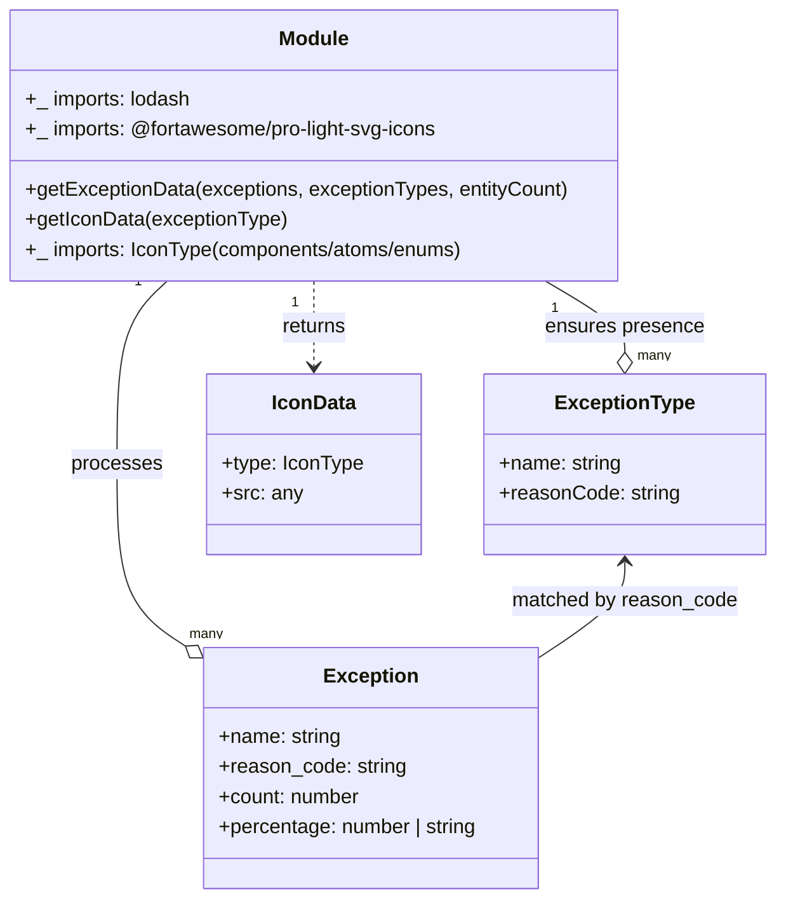

# Diagram: web/portal/src/pages/vinview/utils/exceptions.utils.js


> Auto-generated by Obscura crawlers

## Diagram 1

```mermaid
flowchart TD
  A[Start] --> B[getExceptionData(exceptions, exceptionTypes, entityCount)]
  B --> C[updatedExceptions = exceptions.map(...)]
  C --> D{name fix: "In Hold" -> "On Hold"}
  C --> E[percentage = entityCount === 0 ? "0" : ((count/entityCount)*100).toFixed(1)]
  B --> F[forEach type in exceptionTypes]
  F --> G{_.find(updatedExceptions, { reason_code: type.reasonCode })?}
  G -- no --> H[push { name:type.name, reason_code:type.reasonCode, count:0, percentage:0 }]
  G -- yes --> I[skip]
  H --> J[updatedExceptions]
  I --> J
  E --> J
  J --> K[return updatedExceptions]
```

> SVG rendering failed for this diagram.

## Diagram 2

```mermaid
flowchart LR
  L[getIconData(exceptionType)] --> M{exceptionType}
  M --> |"Delivered"| N[return { type: IconType.FontAwesome, src: faTruckContainer }]
  M --> |"Complete"| O[return { type: IconType.FontAwesome, src: faCircleCheck }]
  M --> |default| P[return null]
```

> SVG rendering failed for this diagram.

## Diagram 3



### SVG

<svg id="container" width="613.59765625" xmlns="http://www.w3.org/2000/svg" class="classDiagram" height="716" viewBox="0 0 613.59765625 716" role="graphics-document document" aria-roledescription="class"><style>#container{font-family:"trebuchet ms",verdana,arial,sans-serif;font-size:16px;fill:#333;}@keyframes edge-animation-frame{from{stroke-dashoffset:0;}}@keyframes dash{to{stroke-dashoffset:0;}}#container .edge-animation-slow{stroke-dasharray:9,5!important;stroke-dashoffset:900;animation:dash 50s linear infinite;stroke-linecap:round;}#container .edge-animation-fast{stroke-dasharray:9,5!important;stroke-dashoffset:900;animation:dash 20s linear infinite;stroke-linecap:round;}#container .error-icon{fill:#552222;}#container .error-text{fill:#552222;stroke:#552222;}#container .edge-thickness-normal{stroke-width:1px;}#container .edge-thickness-thick{stroke-width:3.5px;}#container .edge-pattern-solid{stroke-dasharray:0;}#container .edge-thickness-invisible{stroke-width:0;fill:none;}#container .edge-pattern-dashed{stroke-dasharray:3;}#container .edge-pattern-dotted{stroke-dasharray:2;}#container .marker{fill:#333333;stroke:#333333;}#container .marker.cross{stroke:#333333;}#container svg{font-family:"trebuchet ms",verdana,arial,sans-serif;font-size:16px;}#container p{margin:0;}#container g.classGroup text{fill:#9370DB;stroke:none;font-family:"trebuchet ms",verdana,arial,sans-serif;font-size:10px;}#container g.classGroup text .title{font-weight:bolder;}#container .nodeLabel,#container .edgeLabel{color:#131300;}#container .edgeLabel .label rect{fill:#ECECFF;}#container .label text{fill:#131300;}#container .labelBkg{background:#ECECFF;}#container .edgeLabel .label span{background:#ECECFF;}#container .classTitle{font-weight:bolder;}#container .node rect,#container .node circle,#container .node ellipse,#container .node polygon,#container .node path{fill:#ECECFF;stroke:#9370DB;stroke-width:1px;}#container .divider{stroke:#9370DB;stroke-width:1;}#container g.clickable{cursor:pointer;}#container g.classGroup rect{fill:#ECECFF;stroke:#9370DB;}#container g.classGroup line{stroke:#9370DB;stroke-width:1;}#container .classLabel .box{stroke:none;stroke-width:0;fill:#ECECFF;opacity:0.5;}#container .classLabel .label{fill:#9370DB;font-size:10px;}#container .relation{stroke:#333333;stroke-width:1;fill:none;}#container .dashed-line{stroke-dasharray:3;}#container .dotted-line{stroke-dasharray:1 2;}#container #compositionStart,#container .composition{fill:#333333!important;stroke:#333333!important;stroke-width:1;}#container #compositionEnd,#container .composition{fill:#333333!important;stroke:#333333!important;stroke-width:1;}#container #dependencyStart,#container .dependency{fill:#333333!important;stroke:#333333!important;stroke-width:1;}#container #dependencyStart,#container .dependency{fill:#333333!important;stroke:#333333!important;stroke-width:1;}#container #extensionStart,#container .extension{fill:transparent!important;stroke:#333333!important;stroke-width:1;}#container #extensionEnd,#container .extension{fill:transparent!important;stroke:#333333!important;stroke-width:1;}#container #aggregationStart,#container .aggregation{fill:transparent!important;stroke:#333333!important;stroke-width:1;}#container #aggregationEnd,#container .aggregation{fill:transparent!important;stroke:#333333!important;stroke-width:1;}#container #lollipopStart,#container .lollipop{fill:#ECECFF!important;stroke:#333333!important;stroke-width:1;}#container #lollipopEnd,#container .lollipop{fill:#ECECFF!important;stroke:#333333!important;stroke-width:1;}#container .edgeTerminals{font-size:11px;line-height:initial;}#container .classTitleText{text-anchor:middle;font-size:18px;fill:#333;}#container .label-icon{display:inline-block;height:1em;overflow:visible;vertical-align:-0.125em;}#container .node .label-icon path{fill:currentColor;stroke:revert;stroke-width:revert;}#container :root{--mermaid-font-family:"trebuchet ms",verdana,arial,sans-serif;}</style><g><defs><marker id="container_class-aggregationStart" class="marker aggregation class" refX="18" refY="7" markerWidth="190" markerHeight="240" orient="auto"><path d="M 18,7 L9,13 L1,7 L9,1 Z"></path></marker></defs><defs><marker id="container_class-aggregationEnd" class="marker aggregation class" refX="1" refY="7" markerWidth="20" markerHeight="28" orient="auto"><path d="M 18,7 L9,13 L1,7 L9,1 Z"></path></marker></defs><defs><marker id="container_class-extensionStart" class="marker extension class" refX="18" refY="7" markerWidth="190" markerHeight="240" orient="auto"><path d="M 1,7 L18,13 V 1 Z"></path></marker></defs><defs><marker id="container_class-extensionEnd" class="marker extension class" refX="1" refY="7" markerWidth="20" markerHeight="28" orient="auto"><path d="M 1,1 V 13 L18,7 Z"></path></marker></defs><defs><marker id="container_class-compositionStart" class="marker composition class" refX="18" refY="7" markerWidth="190" markerHeight="240" orient="auto"><path d="M 18,7 L9,13 L1,7 L9,1 Z"></path></marker></defs><defs><marker id="container_class-compositionEnd" class="marker composition class" refX="1" refY="7" markerWidth="20" markerHeight="28" orient="auto"><path d="M 18,7 L9,13 L1,7 L9,1 Z"></path></marker></defs><defs><marker id="container_class-dependencyStart" class="marker dependency class" refX="6" refY="7" markerWidth="190" markerHeight="240" orient="auto"><path d="M 5,7 L9,13 L1,7 L9,1 Z"></path></marker></defs><defs><marker id="container_class-dependencyEnd" class="marker dependency class" refX="13" refY="7" markerWidth="20" markerHeight="28" orient="auto"><path d="M 18,7 L9,13 L14,7 L9,1 Z"></path></marker></defs><defs><marker id="container_class-lollipopStart" class="marker lollipop class" refX="13" refY="7" markerWidth="190" markerHeight="240" orient="auto"><circle stroke="black" fill="transparent" cx="7" cy="7" r="6"></circle></marker></defs><defs><marker id="container_class-lollipopEnd" class="marker lollipop class" refX="1" refY="7" markerWidth="190" markerHeight="240" orient="auto"><circle stroke="black" fill="transparent" cx="7" cy="7" r="6"></circle></marker></defs><g class="root"><g class="clusters"></g><g class="edgePaths"><path d="M135.883,224L129.29,230.167C122.697,236.333,109.51,248.667,102.917,273C96.324,297.333,96.324,333.667,96.324,370C96.324,406.333,96.324,442.667,104.748,466.446C113.172,490.225,130.021,501.449,138.445,507.061L146.869,512.674" id="id_Module_Exception_1" class="edge-thickness-normal edge-pattern-solid relation" style=";;;" data-edge="true" data-et="edge" data-id="id_Module_Exception_1" data-points="W3sieCI6MTM1Ljg4MjkyMDI1ODYyMDcsInkiOjIyNH0seyJ4Ijo5Ni4zMjQyMTg3NSwieSI6MjYxfSx7IngiOjk2LjMyNDIxODc1LCJ5IjozNzB9LHsieCI6OTYuMzI0MjE4NzUsInkiOjQ3OX0seyJ4IjoxNjEuMjI0NjA5Mzc1LCJ5Ijo1MjIuMjM3NzE5MjcyNDk5Nn1d" marker-end="url(#container_class-aggregationEnd)"></path><path d="M433.27,224L443.657,230.167C454.045,236.333,474.819,248.667,485.206,258.125C495.594,267.583,495.594,274.167,495.594,277.458L495.594,280.75" id="id_Module_ExceptionType_2" class="edge-thickness-normal edge-pattern-solid relation" style=";;;" data-edge="true" data-et="edge" data-id="id_Module_ExceptionType_2" data-points="W3sieCI6NDMzLjI2OTg4MTQ2NTUxNzI0LCJ5IjoyMjR9LHsieCI6NDk1LjU5Mzc1LCJ5IjoyNjF9LHsieCI6NDk1LjU5Mzc1LCJ5IjoyOTh9XQ==" marker-end="url(#container_class-aggregationEnd)"></path><path d="M251.352,224L251.352,230.167C251.352,236.333,251.352,248.667,251.352,260C251.352,271.333,251.352,281.667,251.352,286.833L251.352,292" id="id_Module_IconData_3" class="edge-thickness-normal edge-pattern-dashed relation" style=";;;" data-edge="true" data-et="edge" data-id="id_Module_IconData_3" data-points="W3sieCI6MjUxLjM1MTU2MjUsInkiOjIyNH0seyJ4IjoyNTEuMzUxNTYyNSwieSI6MjYxfSx7IngiOjI1MS4zNTE1NjI1LCJ5IjoyOTh9XQ==" marker-end="url(#container_class-dependencyEnd)"></path><path d="M495.594,448L495.594,453.167C495.594,458.333,495.594,468.667,484.777,481.04C473.96,493.413,452.327,507.825,441.51,515.031L430.693,522.238" id="id_ExceptionType_Exception_4" class="edge-thickness-normal edge-pattern-solid relation" style=";;;" data-edge="true" data-et="edge" data-id="id_ExceptionType_Exception_4" data-points="W3sieCI6NDk1LjU5Mzc1LCJ5Ijo0NDJ9LHsieCI6NDk1LjU5Mzc1LCJ5Ijo0Nzl9LHsieCI6NDMwLjY5MzM1OTM3NSwieSI6NTIyLjIzNzcxOTI3MjQ5OTZ9XQ==" marker-start="url(#container_class-dependencyStart)"></path></g><g class="edgeLabels"><g class="edgeLabel" transform="translate(96.32421875, 370)"><g class="label" data-id="id_Module_Exception_1" transform="translate(-35.7890625, -12)"><foreignObject width="71.578125" height="24"><div xmlns="http://www.w3.org/1999/xhtml" class="labelBkg" style="display: table-cell; white-space: nowrap; line-height: 1.5; max-width: 200px; text-align: center;"><span class="edgeLabel"><p>processes</p></span></div></foreignObject></g></g><g class="edgeLabel" transform="translate(495.59375, 261)"><g class="label" data-id="id_Module_ExceptionType_2" transform="translate(-63.2734375, -12)"><foreignObject width="126.546875" height="24"><div xmlns="http://www.w3.org/1999/xhtml" class="labelBkg" style="display: table-cell; white-space: nowrap; line-height: 1.5; max-width: 200px; text-align: center;"><span class="edgeLabel"><p>ensures presence</p></span></div></foreignObject></g></g><g class="edgeLabel" transform="translate(251.3515625, 261)"><g class="label" data-id="id_Module_IconData_3" transform="translate(-26.265625, -12)"><foreignObject width="52.53125" height="24"><div xmlns="http://www.w3.org/1999/xhtml" class="labelBkg" style="display: table-cell; white-space: nowrap; line-height: 1.5; max-width: 200px; text-align: center;"><span class="edgeLabel"><p>returns</p></span></div></foreignObject></g></g><g class="edgeLabel" transform="translate(495.59375, 479)"><g class="label" data-id="id_ExceptionType_Exception_4" transform="translate(-90.5078125, -12)"><foreignObject width="181.015625" height="24"><div xmlns="http://www.w3.org/1999/xhtml" class="labelBkg" style="display: table-cell; white-space: nowrap; line-height: 1.5; max-width: 200px; text-align: center;"><span class="edgeLabel"><p>matched by reason_code</p></span></div></foreignObject></g></g><g class="edgeTerminals" transform="translate(112.85572654381205, 224.99915268186703)"><g class="inner" transform="translate(0, 0)"><foreignObject style="width: 9px; height: 12px;"><div xmlns="http://www.w3.org/1999/xhtml" style="display: inline-block; padding-right: 1px; white-space: nowrap;"><span class="edgeLabel">1</span></div></foreignObject></g></g><g class="edgeTerminals" transform="translate(440.6604987874599, 245.83182715976093)"><g class="inner" transform="translate(0, 0)"><foreignObject style="width: 9px; height: 12px;"><div xmlns="http://www.w3.org/1999/xhtml" style="display: inline-block; padding-right: 1px; white-space: nowrap;"><span class="edgeLabel">1</span></div></foreignObject></g></g><g class="edgeTerminals" transform="translate(236.35156125000003, 241.49999892857144)"><g class="inner" transform="translate(0, 0)"><foreignObject style="width: 9px; height: 12px;"><div xmlns="http://www.w3.org/1999/xhtml" style="display: inline-block; padding-right: 1px; white-space: nowrap;"><span class="edgeLabel">1</span></div></foreignObject></g></g><g class="edgeTerminals" transform="translate(149.97731735425808, 495.0516575790252)"><g class="inner" transform="translate(0, 0)"></g><foreignObject style="width: 36px; height: 12px;"><div xmlns="http://www.w3.org/1999/xhtml" style="display: inline-block; padding-right: 1px; white-space: nowrap;"><span class="edgeLabel">many</span></div></foreignObject></g><g class="edgeTerminals" transform="translate(505.59375, 275.5)"><g class="inner" transform="translate(0, 0)"></g><foreignObject style="width: 36px; height: 12px;"><div xmlns="http://www.w3.org/1999/xhtml" style="display: inline-block; padding-right: 1px; white-space: nowrap;"><span class="edgeLabel">many</span></div></foreignObject></g></g><g class="nodes"><g class="node default" id="classId-Module-0" transform="translate(251.3515625, 116)"><g class="basic label-container"><path d="M-243.3515625 -108 L243.3515625 -108 L243.3515625 108 L-243.3515625 108" stroke="none" stroke-width="0" fill="#ECECFF" style=""></path><path d="M-243.3515625 -108 C-110.24423011254072 -108, 22.86310227491856 -108, 243.3515625 -108 M-243.3515625 -108 C-56.15284027523029 -108, 131.04588194953942 -108, 243.3515625 -108 M243.3515625 -108 C243.3515625 -39.037499899067186, 243.3515625 29.92500020186563, 243.3515625 108 M243.3515625 -108 C243.3515625 -61.72537115164402, 243.3515625 -15.450742303288038, 243.3515625 108 M243.3515625 108 C57.63752684999034 108, -128.07650880001933 108, -243.3515625 108 M243.3515625 108 C116.0894220730901 108, -11.17271835381979 108, -243.3515625 108 M-243.3515625 108 C-243.3515625 60.83610818578348, -243.3515625 13.672216371566961, -243.3515625 -108 M-243.3515625 108 C-243.3515625 64.64740103676024, -243.3515625 21.294802073520472, -243.3515625 -108" stroke="#9370DB" stroke-width="1.3" fill="none" stroke-dasharray="0 0" style=""></path></g><g class="annotation-group text" transform="translate(0, -84)"></g><g class="label-group text" transform="translate(-27.09375, -84)"><g class="label" style="font-weight: bolder" transform="translate(0,-12)"><foreignObject width="54.1875" height="24"><div xmlns="http://www.w3.org/1999/xhtml" style="display: table-cell; white-space: nowrap; line-height: 1.5; max-width: 104px; text-align: center;"><span class="nodeLabel markdown-node-label" style=""><p>Module</p></span></div></foreignObject></g></g><g class="members-group text" transform="translate(-231.3515625, -36)"><g class="label" style="" transform="translate(0,-12)"><foreignObject width="132.765625" height="24"><div xmlns="http://www.w3.org/1999/xhtml" style="display: table-cell; white-space: nowrap; line-height: 1.5; max-width: 190px; text-align: center;"><span class="nodeLabel markdown-node-label" style=""><p>+_ imports: lodash</p></span></div></foreignObject></g><g class="label" style="" transform="translate(0,12)"><foreignObject width="339.609375" height="24"><div xmlns="http://www.w3.org/1999/xhtml" style="display: table-cell; white-space: nowrap; line-height: 1.5; max-width: 397px; text-align: center;"><span class="nodeLabel markdown-node-label" style=""><p>+_ imports: @fortawesome/pro-light-svg-icons</p></span></div></foreignObject></g></g><g class="methods-group text" transform="translate(-231.3515625, 36)"><g class="label" style="" transform="translate(0,-12)"><foreignObject width="435.609375" height="24"><div xmlns="http://www.w3.org/1999/xhtml" style="display: table-cell; white-space: nowrap; line-height: 1.5; max-width: 493px; text-align: center;"><span class="nodeLabel markdown-node-label" style=""><p>+getExceptionData(exceptions, exceptionTypes, entityCount)</p></span></div></foreignObject></g><g class="label" style="" transform="translate(0,12)"><foreignObject width="209.390625" height="24"><div xmlns="http://www.w3.org/1999/xhtml" style="display: table-cell; white-space: nowrap; line-height: 1.5; max-width: 267px; text-align: center;"><span class="nodeLabel markdown-node-label" style=""><p>+getIconData(exceptionType)</p></span></div></foreignObject></g><g class="label" style="" transform="translate(0,36)"><foreignObject width="357.0625" height="24"><div xmlns="http://www.w3.org/1999/xhtml" style="display: table-cell; white-space: nowrap; line-height: 1.5; max-width: 414px; text-align: center;"><span class="nodeLabel markdown-node-label" style=""><p>+_ imports: IconType(components/atoms/enums)</p></span></div></foreignObject></g></g><g class="divider" style=""><path d="M-243.3515625 -60 C-134.14736737339393 -60, -24.943172246787867 -60, 243.3515625 -60 M-243.3515625 -60 C-97.39846258719948 -60, 48.55463732560105 -60, 243.3515625 -60" stroke="#9370DB" stroke-width="1.3" fill="none" stroke-dasharray="0 0" style=""></path></g><g class="divider" style=""><path d="M-243.3515625 12 C-51.735031933193795 12, 139.8814986336124 12, 243.3515625 12 M-243.3515625 12 C-82.97378971912562 12, 77.40398306174876 12, 243.3515625 12" stroke="#9370DB" stroke-width="1.3" fill="none" stroke-dasharray="0 0" style=""></path></g></g><g class="node default" id="classId-Exception-1" transform="translate(295.958984375, 612)"><g class="basic label-container"><path d="M-134.734375 -96 L134.734375 -96 L134.734375 96 L-134.734375 96" stroke="none" stroke-width="0" fill="#ECECFF" style=""></path><path d="M-134.734375 -96 C-63.72679283113848 -96, 7.280789337723036 -96, 134.734375 -96 M-134.734375 -96 C-42.62203261922404 -96, 49.49030976155191 -96, 134.734375 -96 M134.734375 -96 C134.734375 -33.19409345326098, 134.734375 29.611813093478034, 134.734375 96 M134.734375 -96 C134.734375 -48.182894298052155, 134.734375 -0.36578859610430925, 134.734375 96 M134.734375 96 C65.13663983236438 96, -4.461095335271239 96, -134.734375 96 M134.734375 96 C71.43545747306698 96, 8.136539946133936 96, -134.734375 96 M-134.734375 96 C-134.734375 51.80035123379747, -134.734375 7.600702467594942, -134.734375 -96 M-134.734375 96 C-134.734375 49.945422675879854, -134.734375 3.890845351759708, -134.734375 -96" stroke="#9370DB" stroke-width="1.3" fill="none" stroke-dasharray="0 0" style=""></path></g><g class="annotation-group text" transform="translate(0, -72)"></g><g class="label-group text" transform="translate(-35.703125, -72)"><g class="label" style="font-weight: bolder" transform="translate(0,-12)"><foreignObject width="71.40625" height="24"><div xmlns="http://www.w3.org/1999/xhtml" style="display: table-cell; white-space: nowrap; line-height: 1.5; max-width: 121px; text-align: center;"><span class="nodeLabel markdown-node-label" style=""><p>Exception</p></span></div></foreignObject></g></g><g class="members-group text" transform="translate(-122.734375, -24)"><g class="label" style="" transform="translate(0,-12)"><foreignObject width="98.21875" height="24"><div xmlns="http://www.w3.org/1999/xhtml" style="display: table-cell; white-space: nowrap; line-height: 1.5; max-width: 156px; text-align: center;"><span class="nodeLabel markdown-node-label" style=""><p>+name: string</p></span></div></foreignObject></g><g class="label" style="" transform="translate(0,12)"><foreignObject width="149.65625" height="24"><div xmlns="http://www.w3.org/1999/xhtml" style="display: table-cell; white-space: nowrap; line-height: 1.5; max-width: 208px; text-align: center;"><span class="nodeLabel markdown-node-label" style=""><p>+reason_code: string</p></span></div></foreignObject></g><g class="label" style="" transform="translate(0,36)"><foreignObject width="114.078125" height="24"><div xmlns="http://www.w3.org/1999/xhtml" style="display: table-cell; white-space: nowrap; line-height: 1.5; max-width: 172px; text-align: center;"><span class="nodeLabel markdown-node-label" style=""><p>+count: number</p></span></div></foreignObject></g><g class="label" style="" transform="translate(0,60)"><foreignObject width="209.765625" height="24"><div xmlns="http://www.w3.org/1999/xhtml" style="display: table-cell; white-space: nowrap; line-height: 1.5; max-width: 268px; text-align: center;"><span class="nodeLabel markdown-node-label" style=""><p>+percentage: number | string</p></span></div></foreignObject></g></g><g class="methods-group text" transform="translate(-122.734375, 96)"></g><g class="divider" style=""><path d="M-134.734375 -48 C-73.6434919355463 -48, -12.552608871092588 -48, 134.734375 -48 M-134.734375 -48 C-33.32114361022123 -48, 68.09208777955754 -48, 134.734375 -48" stroke="#9370DB" stroke-width="1.3" fill="none" stroke-dasharray="0 0" style=""></path></g><g class="divider" style=""><path d="M-134.734375 72 C-64.30843361459328 72, 6.117507770813432 72, 134.734375 72 M-134.734375 72 C-41.01191050841899 72, 52.710553983162015 72, 134.734375 72" stroke="#9370DB" stroke-width="1.3" fill="none" stroke-dasharray="0 0" style=""></path></g></g><g class="node default" id="classId-ExceptionType-2" transform="translate(495.59375, 370)"><g class="basic label-container"><path d="M-110.00390625 -72 L110.00390625 -72 L110.00390625 72 L-110.00390625 72" stroke="none" stroke-width="0" fill="#ECECFF" style=""></path><path d="M-110.00390625 -72 C-40.4063236207885 -72, 29.191259008423003 -72, 110.00390625 -72 M-110.00390625 -72 C-48.71914241373767 -72, 12.565621422524657 -72, 110.00390625 -72 M110.00390625 -72 C110.00390625 -36.86849921842858, 110.00390625 -1.7369984368571636, 110.00390625 72 M110.00390625 -72 C110.00390625 -27.314783554393784, 110.00390625 17.37043289121243, 110.00390625 72 M110.00390625 72 C25.52713715103522 72, -58.94963194792956 72, -110.00390625 72 M110.00390625 72 C36.027720755241035 72, -37.94846473951793 72, -110.00390625 72 M-110.00390625 72 C-110.00390625 33.64930604948764, -110.00390625 -4.701387901024717, -110.00390625 -72 M-110.00390625 72 C-110.00390625 27.93816533096677, -110.00390625 -16.123669338066463, -110.00390625 -72" stroke="#9370DB" stroke-width="1.3" fill="none" stroke-dasharray="0 0" style=""></path></g><g class="annotation-group text" transform="translate(0, -48)"></g><g class="label-group text" transform="translate(-53.0390625, -48)"><g class="label" style="font-weight: bolder" transform="translate(0,-12)"><foreignObject width="106.078125" height="24"><div xmlns="http://www.w3.org/1999/xhtml" style="display: table-cell; white-space: nowrap; line-height: 1.5; max-width: 154px; text-align: center;"><span class="nodeLabel markdown-node-label" style=""><p>ExceptionType</p></span></div></foreignObject></g></g><g class="members-group text" transform="translate(-98.00390625, 0)"><g class="label" style="" transform="translate(0,-12)"><foreignObject width="98.21875" height="24"><div xmlns="http://www.w3.org/1999/xhtml" style="display: table-cell; white-space: nowrap; line-height: 1.5; max-width: 156px; text-align: center;"><span class="nodeLabel markdown-node-label" style=""><p>+name: string</p></span></div></foreignObject></g><g class="label" style="" transform="translate(0,12)"><foreignObject width="142.96875" height="24"><div xmlns="http://www.w3.org/1999/xhtml" style="display: table-cell; white-space: nowrap; line-height: 1.5; max-width: 201px; text-align: center;"><span class="nodeLabel markdown-node-label" style=""><p>+reasonCode: string</p></span></div></foreignObject></g></g><g class="methods-group text" transform="translate(-98.00390625, 72)"></g><g class="divider" style=""><path d="M-110.00390625 -24 C-35.511185804933476 -24, 38.98153464013305 -24, 110.00390625 -24 M-110.00390625 -24 C-23.553552241733783 -24, 62.896801766532434 -24, 110.00390625 -24" stroke="#9370DB" stroke-width="1.3" fill="none" stroke-dasharray="0 0" style=""></path></g><g class="divider" style=""><path d="M-110.00390625 48 C-32.0859619183382 48, 45.8319824133236 48, 110.00390625 48 M-110.00390625 48 C-61.46110613959259 48, -12.918306029185175 48, 110.00390625 48" stroke="#9370DB" stroke-width="1.3" fill="none" stroke-dasharray="0 0" style=""></path></g></g><g class="node default" id="classId-IconData-3" transform="translate(251.3515625, 370)"><g class="basic label-container"><path d="M-84.23828125 -72 L84.23828125 -72 L84.23828125 72 L-84.23828125 72" stroke="none" stroke-width="0" fill="#ECECFF" style=""></path><path d="M-84.23828125 -72 C-31.79949364239438 -72, 20.639293965211237 -72, 84.23828125 -72 M-84.23828125 -72 C-47.10678730864372 -72, -9.975293367287435 -72, 84.23828125 -72 M84.23828125 -72 C84.23828125 -41.20838326959942, 84.23828125 -10.41676653919884, 84.23828125 72 M84.23828125 -72 C84.23828125 -25.450829849424885, 84.23828125 21.09834030115023, 84.23828125 72 M84.23828125 72 C30.99790778108126 72, -22.24246568783748 72, -84.23828125 72 M84.23828125 72 C20.69665947526508 72, -42.84496229946984 72, -84.23828125 72 M-84.23828125 72 C-84.23828125 23.220232764368376, -84.23828125 -25.559534471263248, -84.23828125 -72 M-84.23828125 72 C-84.23828125 20.41251130443139, -84.23828125 -31.17497739113722, -84.23828125 -72" stroke="#9370DB" stroke-width="1.3" fill="none" stroke-dasharray="0 0" style=""></path></g><g class="annotation-group text" transform="translate(0, -48)"></g><g class="label-group text" transform="translate(-32.1953125, -48)"><g class="label" style="font-weight: bolder" transform="translate(0,-12)"><foreignObject width="64.390625" height="24"><div xmlns="http://www.w3.org/1999/xhtml" style="display: table-cell; white-space: nowrap; line-height: 1.5; max-width: 114px; text-align: center;"><span class="nodeLabel markdown-node-label" style=""><p>IconData</p></span></div></foreignObject></g></g><g class="members-group text" transform="translate(-72.23828125, 0)"><g class="label" style="" transform="translate(0,-12)"><foreignObject width="112.28125" height="24"><div xmlns="http://www.w3.org/1999/xhtml" style="display: table-cell; white-space: nowrap; line-height: 1.5; max-width: 170px; text-align: center;"><span class="nodeLabel markdown-node-label" style=""><p>+type: IconType</p></span></div></foreignObject></g><g class="label" style="" transform="translate(0,12)"><foreignObject width="62.796875" height="24"><div xmlns="http://www.w3.org/1999/xhtml" style="display: table-cell; white-space: nowrap; line-height: 1.5; max-width: 120px; text-align: center;"><span class="nodeLabel markdown-node-label" style=""><p>+src: any</p></span></div></foreignObject></g></g><g class="methods-group text" transform="translate(-72.23828125, 72)"></g><g class="divider" style=""><path d="M-84.23828125 -24 C-35.16065439446084 -24, 13.916972461078316 -24, 84.23828125 -24 M-84.23828125 -24 C-19.767729332156506 -24, 44.70282258568699 -24, 84.23828125 -24" stroke="#9370DB" stroke-width="1.3" fill="none" stroke-dasharray="0 0" style=""></path></g><g class="divider" style=""><path d="M-84.23828125 48 C-32.96084071822439 48, 18.31659981355122 48, 84.23828125 48 M-84.23828125 48 C-20.25836016629942 48, 43.72156091740116 48, 84.23828125 48" stroke="#9370DB" stroke-width="1.3" fill="none" stroke-dasharray="0 0" style=""></path></g></g></g></g></g></svg>
