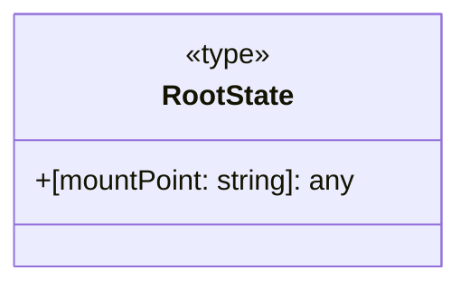

# Diagram: web/portal/src/redux/types.ts

> Auto-generated by Obscura crawlers

## Mermaid

### SVG

<svg id="container" width="263.90625" xmlns="http://www.w3.org/2000/svg" class="classDiagram" height="160" viewBox="0 0 263.90625 160" role="graphics-document document" aria-roledescription="class"><g><defs><marker id="container_class-aggregationStart" class="marker aggregation class" refX="18" refY="7" markerWidth="190" markerHeight="240" orient="auto"><path d="M 18,7 L9,13 L1,7 L9,1 Z"></path></marker></defs><defs><marker id="container_class-aggregationEnd" class="marker aggregation class" refX="1" refY="7" markerWidth="20" markerHeight="28" orient="auto"><path d="M 18,7 L9,13 L1,7 L9,1 Z"></path></marker></defs><defs><marker id="container_class-extensionStart" class="marker extension class" refX="18" refY="7" markerWidth="190" markerHeight="240" orient="auto"><path d="M 1,7 L18,13 V 1 Z"></path></marker></defs><defs><marker id="container_class-extensionEnd" class="marker extension class" refX="1" refY="7" markerWidth="20" markerHeight="28" orient="auto"><path d="M 1,1 V 13 L18,7 Z"></path></marker></defs><defs><marker id="container_class-compositionStart" class="marker composition class" refX="18" refY="7" markerWidth="190" markerHeight="240" orient="auto"><path d="M 18,7 L9,13 L1,7 L9,1 Z"></path></marker></defs><defs><marker id="container_class-compositionEnd" class="marker composition class" refX="1" refY="7" markerWidth="20" markerHeight="28" orient="auto"><path d="M 18,7 L9,13 L1,7 L9,1 Z"></path></marker></defs><defs><marker id="container_class-dependencyStart" class="marker dependency class" refX="6" refY="7" markerWidth="190" markerHeight="240" orient="auto"><path d="M 5,7 L9,13 L1,7 L9,1 Z"></path></marker></defs><defs><marker id="container_class-dependencyEnd" class="marker dependency class" refX="13" refY="7" markerWidth="20" markerHeight="28" orient="auto"><path d="M 18,7 L9,13 L14,7 L9,1 Z"></path></marker></defs><defs><marker id="container_class-lollipopStart" class="marker lollipop class" refX="13" refY="7" markerWidth="190" markerHeight="240" orient="auto"><circle stroke="black" fill="transparent" cx="7" cy="7" r="6"></circle></marker></defs><defs><marker id="container_class-lollipopEnd" class="marker lollipop class" refX="1" refY="7" markerWidth="190" markerHeight="240" orient="auto"><circle stroke="black" fill="transparent" cx="7" cy="7" r="6"></circle></marker></defs><g class="root"><g class="clusters"></g><g class="edgePaths"></g><g class="edgeLabels"></g><g class="nodes"><g class="node default" id="classId-RootState-0" transform="translate(131.953125, 80)"><g class="basic label-container"><path d="M-123.953125 -72 L123.953125 -72 L123.953125 72 L-123.953125 72" stroke="none" stroke-width="0" fill="#ECECFF" style=""></path><path d="M-123.953125 -72 C-38.483729156176395 -72, 46.98566668764721 -72, 123.953125 -72 M-123.953125 -72 C-50.57195527622895 -72, 22.809214447542104 -72, 123.953125 -72 M123.953125 -72 C123.953125 -38.68787710526261, 123.953125 -5.375754210525216, 123.953125 72 M123.953125 -72 C123.953125 -33.22315017584829, 123.953125 5.5536996483034216, 123.953125 72 M123.953125 72 C52.49060695733368 72, -18.971911085332636 72, -123.953125 72 M123.953125 72 C46.984555323884535 72, -29.98401435223093 72, -123.953125 72 M-123.953125 72 C-123.953125 35.82976485685778, -123.953125 -0.3404702862844431, -123.953125 -72 M-123.953125 72 C-123.953125 21.200937517502055, -123.953125 -29.59812496499589, -123.953125 -72" stroke="#9370DB" stroke-width="1.3" fill="none" stroke-dasharray="0 0" style=""></path></g><g class="annotation-group text" transform="translate(-24.8671875, -48)"><g class="label" style="" transform="translate(0,-12)"><foreignObject width="49.734375" height="24">

«type»

</foreignObject></g></g><g class="label-group text" transform="translate(-36.5625, -24)"><g class="label" style="font-weight: bolder" transform="translate(0,-12)"><foreignObject width="73.125" height="24">

RootState

</foreignObject></g></g><g class="members-group text" transform="translate(-111.953125, 24)"><g class="label" style="" transform="translate(0,-12)"><foreignObject width="187.34375" height="24">

+[mountPoint: string]: any

</foreignObject></g></g><g class="methods-group text" transform="translate(-111.953125, 72)"></g><g class="divider" style=""><path d="M-123.953125 0 C-45.46536956856542 0, 33.02238586286916 0, 123.953125 0 M-123.953125 0 C-38.97529663182246 0, 46.00253173635508 0, 123.953125 0" stroke="#9370DB" stroke-width="1.3" fill="none" stroke-dasharray="0 0" style=""></path></g><g class="divider" style=""><path d="M-123.953125 48 C-65.35275066101738 48, -6.752376322034749 48, 123.953125 48 M-123.953125 48 C-25.31747849875383 48, 73.31816800249234 48, 123.953125 48" stroke="#9370DB" stroke-width="1.3" fill="none" stroke-dasharray="0 0" style=""></path></g></g></g></g></g></svg>
