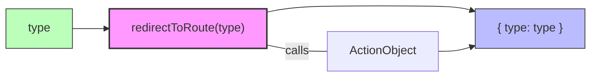

# Diagram: web/portal/src/redux/utils.js

> Auto-generated by Obscura crawlers

## Mermaid

### SVG

<svg id="container" width="811.765625" xmlns="http://www.w3.org/2000/svg" class="flowchart" height="105" viewBox="0 -4 811.765625 105" role="graphics-document document" aria-roledescription="flowchart-v2"><g><marker id="container_flowchart-v2-pointEnd" class="marker flowchart-v2" viewBox="0 0 10 10" refX="5" refY="5" markerUnits="userSpaceOnUse" markerWidth="8" markerHeight="8" orient="auto"><path d="M 0 0 L 10 5 L 0 10 z" class="arrowMarkerPath" style="stroke-width: 1; stroke-dasharray: 1, 0;"></path></marker><marker id="container_flowchart-v2-pointStart" class="marker flowchart-v2" viewBox="0 0 10 10" refX="4.5" refY="5" markerUnits="userSpaceOnUse" markerWidth="8" markerHeight="8" orient="auto"><path d="M 0 5 L 10 10 L 10 0 z" class="arrowMarkerPath" style="stroke-width: 1; stroke-dasharray: 1, 0;"></path></marker><marker id="container_flowchart-v2-circleEnd" class="marker flowchart-v2" viewBox="0 0 10 10" refX="11" refY="5" markerUnits="userSpaceOnUse" markerWidth="11" markerHeight="11" orient="auto"><circle cx="5" cy="5" r="5" class="arrowMarkerPath" style="stroke-width: 1; stroke-dasharray: 1, 0;"></circle></marker><marker id="container_flowchart-v2-circleStart" class="marker flowchart-v2" viewBox="0 0 10 10" refX="-1" refY="5" markerUnits="userSpaceOnUse" markerWidth="11" markerHeight="11" orient="auto"><circle cx="5" cy="5" r="5" class="arrowMarkerPath" style="stroke-width: 1; stroke-dasharray: 1, 0;"></circle></marker><marker id="container_flowchart-v2-crossEnd" class="marker cross flowchart-v2" viewBox="0 0 11 11" refX="12" refY="5.2" markerUnits="userSpaceOnUse" markerWidth="11" markerHeight="11" orient="auto"><path d="M 1,1 l 9,9 M 10,1 l -9,9" class="arrowMarkerPath" style="stroke-width: 2; stroke-dasharray: 1, 0;"></path></marker><marker id="container_flowchart-v2-crossStart" class="marker cross flowchart-v2" viewBox="0 0 11 11" refX="-1" refY="5.2" markerUnits="userSpaceOnUse" markerWidth="11" markerHeight="11" orient="auto"><path d="M 1,1 l 9,9 M 10,1 l -9,9" class="arrowMarkerPath" style="stroke-width: 2; stroke-dasharray: 1, 0;"></path></marker><g class="root"><g class="clusters"></g><g class="edgePaths"><path d="M99.797,35L103.964,35C108.13,35,116.464,35,124.13,35C131.797,35,138.797,35,142.297,35L145.797,35" id="L_Input_Func_0" class="edge-thickness-normal edge-pattern-solid edge-thickness-normal edge-pattern-solid flowchart-link" style=";" data-edge="true" data-et="edge" data-id="L_Input_Func_0" data-points="W3sieCI6OTkuNzk2ODc1LCJ5IjozNX0seyJ4IjoxMjQuNzk2ODc1LCJ5IjozNX0seyJ4IjoxNDkuNzk2ODc1LCJ5IjozNX1d" marker-end="url(#container_flowchart-v2-pointEnd)"></path><path d="M367.391,12.552L374.298,11.126C381.206,9.701,395.021,6.851,421.589,5.425C448.156,4,487.477,4,524.056,4C560.635,4,594.474,4,614.923,5.092C635.372,6.184,642.432,8.367,645.961,9.459L649.491,10.551" id="L_Func_Return_0" class="edge-thickness-normal edge-pattern-solid edge-thickness-normal edge-pattern-solid flowchart-link" style=";" data-edge="true" data-et="edge" data-id="L_Func_Return_0" data-points="W3sieCI6MzY3LjM5MDYyNSwieSI6MTIuNTUxNTU3MzgxMzExNDI2fSx7IngiOjQwOC44MzU5Mzc1LCJ5Ijo0fSx7IngiOjUyNi43OTY4NzUsInkiOjR9LHsieCI6NjI4LjMxMjUsInkiOjR9LHsieCI6NjUzLjMxMjUsInkiOjExLjczMjQ4MTA5NzUxMzQ0Nn1d" marker-end="url(#container_flowchart-v2-pointEnd)"></path><path d="M367.391,57.448L374.298,58.874C381.206,60.299,395.021,63.149,408.836,64.575C422.651,66,436.466,66,443.374,66L450.281,66" id="L_Func_Output_0" class="edge-thickness-normal edge-pattern-solid edge-thickness-normal edge-pattern-solid flowchart-link" style=";" data-edge="true" data-et="edge" data-id="L_Func_Output_0" data-points="W3sieCI6MzY3LjM5MDYyNSwieSI6NTcuNDQ4NDQyNjE4Njg4NTc0fSx7IngiOjQwOC44MzU5Mzc1LCJ5Ijo2Nn0seyJ4Ijo0NTAuMjgxMjUsInkiOjY2fV0="></path><path d="M603.313,66L607.479,66C611.646,66,619.979,66,627.676,64.908C635.372,63.816,642.432,61.633,645.961,60.541L649.491,59.449" id="L_Output_Return_0" class="edge-thickness-normal edge-pattern-solid edge-thickness-normal edge-pattern-solid flowchart-link" style=";" data-edge="true" data-et="edge" data-id="L_Output_Return_0" data-points="W3sieCI6NjAzLjMxMjUsInkiOjY2fSx7IngiOjYyOC4zMTI1LCJ5Ijo2Nn0seyJ4Ijo2NTMuMzEyNSwieSI6NTguMjY3NTE4OTAyNDg2NTZ9XQ==" marker-end="url(#container_flowchart-v2-pointEnd)"></path></g><g class="edgeLabels"><g class="edgeLabel"><g class="label" data-id="L_Input_Func_0" transform="translate(0, 0)"><foreignObject width="0" height="0">

</foreignObject></g></g><g class="edgeLabel"><g class="label" data-id="L_Func_Return_0" transform="translate(0, 0)"><foreignObject width="0" height="0">

</foreignObject></g></g><g class="edgeLabel" transform="translate(408.8359375, 66)"><g class="label" data-id="L_Func_Output_0" transform="translate(-16.4453125, -12)"><foreignObject width="32.890625" height="24">

calls

</foreignObject></g></g><g class="edgeLabel"><g class="label" data-id="L_Output_Return_0" transform="translate(0, 0)"><foreignObject width="0" height="0">

</foreignObject></g></g></g><g class="nodes"><g class="node default" id="flowchart-Input-0" transform="translate(53.8984375, 35)"><rect class="basic label-container" style="fill:#bfb !important;stroke:#333 !important" x="-45.8984375" y="-27" width="91.796875" height="54"></rect><g class="label" style="" transform="translate(-15.8984375, -12)"><rect></rect><foreignObject width="31.796875" height="24">

type

</foreignObject></g></g><g class="node default" id="flowchart-Func-1" transform="translate(258.59375, 35)"><rect class="basic label-container" style="fill:#f9f !important;stroke:#333 !important;stroke-width:2px !important" x="-108.796875" y="-27" width="217.59375" height="54"></rect><g class="label" style="" transform="translate(-78.796875, -12)"><rect></rect><foreignObject width="157.59375" height="24">

redirectToRoute(type)

</foreignObject></g></g><g class="node default" id="flowchart-Return-3" transform="translate(728.5390625, 35)"><rect class="basic label-container" style="fill:#bbf !important;stroke:#333 !important" x="-75.2265625" y="-27" width="150.453125" height="54"></rect><g class="label" style="" transform="translate(-45.2265625, -12)"><rect></rect><foreignObject width="90.453125" height="24">

{ type: type }

</foreignObject></g></g><g class="node default" id="flowchart-Output-5" transform="translate(526.796875, 66)"><rect class="basic label-container" style="" x="-76.515625" y="-27" width="153.03125" height="54"></rect><g class="label" style="" transform="translate(-46.515625, -12)"><rect></rect><foreignObject width="93.03125" height="24">

ActionObject

</foreignObject></g></g></g></g></g></svg>
