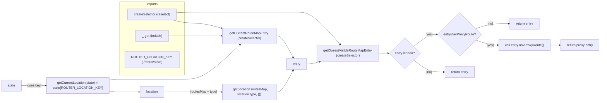

# Diagram: web/portal/src/route-selectors.js

> Auto-generated by Obscura crawlers

## Mermaid

### SVG

<svg id="container" width="2895.234375" xmlns="http://www.w3.org/2000/svg" class="flowchart" height="493" viewBox="0 0 2895.234375 493" role="graphics-document document" aria-roledescription="flowchart-v2"><g><marker id="container_flowchart-v2-pointEnd" class="marker flowchart-v2" viewBox="0 0 10 10" refX="5" refY="5" markerUnits="userSpaceOnUse" markerWidth="8" markerHeight="8" orient="auto"><path d="M 0 0 L 10 5 L 0 10 z" class="arrowMarkerPath" style="stroke-width: 1; stroke-dasharray: 1, 0;"></path></marker><marker id="container_flowchart-v2-pointStart" class="marker flowchart-v2" viewBox="0 0 10 10" refX="4.5" refY="5" markerUnits="userSpaceOnUse" markerWidth="8" markerHeight="8" orient="auto"><path d="M 0 5 L 10 10 L 10 0 z" class="arrowMarkerPath" style="stroke-width: 1; stroke-dasharray: 1, 0;"></path></marker><marker id="container_flowchart-v2-circleEnd" class="marker flowchart-v2" viewBox="0 0 10 10" refX="11" refY="5" markerUnits="userSpaceOnUse" markerWidth="11" markerHeight="11" orient="auto"><circle cx="5" cy="5" r="5" class="arrowMarkerPath" style="stroke-width: 1; stroke-dasharray: 1, 0;"></circle></marker><marker id="container_flowchart-v2-circleStart" class="marker flowchart-v2" viewBox="0 0 10 10" refX="-1" refY="5" markerUnits="userSpaceOnUse" markerWidth="11" markerHeight="11" orient="auto"><circle cx="5" cy="5" r="5" class="arrowMarkerPath" style="stroke-width: 1; stroke-dasharray: 1, 0;"></circle></marker><marker id="container_flowchart-v2-crossEnd" class="marker cross flowchart-v2" viewBox="0 0 11 11" refX="12" refY="5.2" markerUnits="userSpaceOnUse" markerWidth="11" markerHeight="11" orient="auto"><path d="M 1,1 l 9,9 M 10,1 l -9,9" class="arrowMarkerPath" style="stroke-width: 2; stroke-dasharray: 1, 0;"></path></marker><marker id="container_flowchart-v2-crossStart" class="marker cross flowchart-v2" viewBox="0 0 11 11" refX="-1" refY="5.2" markerUnits="userSpaceOnUse" markerWidth="11" markerHeight="11" orient="auto"><path d="M 1,1 l 9,9 M 10,1 l -9,9" class="arrowMarkerPath" style="stroke-width: 2; stroke-dasharray: 1, 0;"></path></marker><g class="root"><g class="clusters"><g class="cluster" id="Imports" data-look="classic"><rect style="" x="557.046875" y="8" width="310" height="356"></rect><g class="cluster-label" transform="translate(683.6875, 8)"><foreignObject width="56.71875" height="24">

Imports

</foreignObject></g></g></g><g class="edgePaths"><path d="M104.109,415L114.501,415C124.893,415,145.677,415,165.794,415C185.911,415,205.362,415,215.087,415L224.813,415" id="L_State_getCurrentLocation_0" class="edge-thickness-normal edge-pattern-solid edge-thickness-normal edge-pattern-solid flowchart-link" style=";" data-edge="true" data-et="edge" data-id="L_State_getCurrentLocation_0" data-points="W3sieCI6MTA0LjEwOTM3NSwieSI6NDE1fSx7IngiOjE2Ni40NjA5Mzc1LCJ5Ijo0MTV9LHsieCI6MjI4LjgxMjUsInkiOjQxNX1d" marker-end="url(#container_flowchart-v2-pointEnd)"></path><path d="M507.047,441.278L511.214,442.065C515.38,442.852,523.714,444.426,532.047,445.213C540.38,446,548.714,446,568.117,446C587.521,446,617.995,446,633.232,446L648.469,446" id="L_getCurrentLocation_Location_0" class="edge-thickness-normal edge-pattern-solid edge-thickness-normal edge-pattern-solid flowchart-link" style=";" data-edge="true" data-et="edge" data-id="L_getCurrentLocation_Location_0" data-points="W3sieCI6NTA3LjA0Njg3NSwieSI6NDQxLjI3Nzc2NDU1NDY3MjN9LHsieCI6NTMyLjA0Njg3NSwieSI6NDQ2fSx7IngiOjU1Ny4wNDY4NzUsInkiOjQ0Nn0seyJ4Ijo2NTIuNDY4NzUsInkiOjQ0Nn1d" marker-end="url(#container_flowchart-v2-pointEnd)"></path><path d="M771.625,446L787.529,446C803.432,446,835.24,446,866.801,446C898.362,446,929.677,446,960.326,446C990.974,446,1020.956,446,1035.947,446L1050.938,446" id="L_Location_LodashGet_0" class="edge-thickness-normal edge-pattern-solid edge-thickness-normal edge-pattern-solid flowchart-link" style=";" data-edge="true" data-et="edge" data-id="L_Location_LodashGet_0" data-points="W3sieCI6NzcxLjYyNSwieSI6NDQ2fSx7IngiOjg2Ny4wNDY4NzUsInkiOjQ0Nn0seyJ4Ijo5NjAuOTkyMTg3NSwieSI6NDQ2fSx7IngiOjEwNTQuOTM3NSwieSI6NDQ2fV0=" marker-end="url(#container_flowchart-v2-pointEnd)"></path><path d="M1314.938,446L1319.104,446C1323.271,446,1331.604,446,1345.332,428.419C1359.06,410.838,1378.182,375.676,1387.743,358.095L1397.304,340.514" id="L_LodashGet_Entry_0" class="edge-thickness-normal edge-pattern-solid edge-thickness-normal edge-pattern-solid flowchart-link" style=";" data-edge="true" data-et="edge" data-id="L_LodashGet_Entry_0" data-points="W3sieCI6MTMxNC45Mzc1LCJ5Ijo0NDZ9LHsieCI6MTMzOS45Mzc1LCJ5Ijo0NDZ9LHsieCI6MTM5OS4yMTUwMTYwODQ1NTg4LCJ5IjozMzd9XQ==" marker-end="url(#container_flowchart-v2-pointEnd)"></path><path d="M811.69,97L820.916,99.5C830.142,102,848.594,107,873.478,109.5C898.362,112,929.677,112,960.35,116.157C991.022,120.314,1021.052,128.628,1036.067,132.785L1051.083,136.942" id="L_Reselect_GetRouteSelector_0" class="edge-thickness-normal edge-pattern-solid edge-thickness-normal edge-pattern-solid flowchart-link" style=";" data-edge="true" data-et="edge" data-id="L_Reselect_GetRouteSelector_0" data-points="W3sieCI6ODExLjY4OTczMjE0Mjg1NzEsInkiOjk3fSx7IngiOjg2Ny4wNDY4NzUsInkiOjExMn0seyJ4Ijo5NjAuOTkyMTg3NSwieSI6MTEyfSx7IngiOjEwNTQuOTM3NSwieSI6MTM4LjAwOTA3MDI5NDc4NDU4fV0=" marker-end="url(#container_flowchart-v2-pointEnd)"></path><path d="M507.047,388.722L511.214,387.935C515.38,387.148,523.714,385.574,532.047,384.787C540.38,384,548.714,384,578.714,384C608.714,384,660.38,384,712.047,384C763.714,384,815.38,384,856.871,384C898.362,384,929.677,384,975.241,355.956C1020.805,327.912,1080.617,271.824,1110.524,243.78L1140.43,215.736" id="L_getCurrentLocation_GetRouteSelector_0" class="edge-thickness-normal edge-pattern-solid edge-thickness-normal edge-pattern-solid flowchart-link" style=";" data-edge="true" data-et="edge" data-id="L_getCurrentLocation_GetRouteSelector_0" data-points="W3sieCI6NTA3LjA0Njg3NSwieSI6Mzg4LjcyMjIzNTQ0NTMyNzd9LHsieCI6NTMyLjA0Njg3NSwieSI6Mzg0fSx7IngiOjU1Ny4wNDY4NzUsInkiOjM4NH0seyJ4Ijo3MTIuMDQ2ODc1LCJ5IjozODR9LHsieCI6ODY3LjA0Njg3NSwieSI6Mzg0fSx7IngiOjk2MC45OTIxODc1LCJ5IjozODR9LHsieCI6MTE0My4zNDc2NTYyNSwieSI6MjEzfV0=" marker-end="url(#container_flowchart-v2-pointEnd)"></path><path d="M791.094,174L803.753,174C816.411,174,841.729,174,870.046,174C898.362,174,929.677,174,960.326,174C990.974,174,1020.956,174,1035.947,174L1050.938,174" id="L_Lodash_GetRouteSelector_0" class="edge-thickness-normal edge-pattern-solid edge-thickness-normal edge-pattern-solid flowchart-link" style=";" data-edge="true" data-et="edge" data-id="L_Lodash_GetRouteSelector_0" data-points="W3sieCI6NzkxLjA5Mzc1LCJ5IjoxNzR9LHsieCI6ODY3LjA0Njg3NSwieSI6MTc0fSx7IngiOjk2MC45OTIxODc1LCJ5IjoxNzR9LHsieCI6MTA1NC45Mzc1LCJ5IjoxNzR9XQ==" marker-end="url(#container_flowchart-v2-pointEnd)"></path><path d="M1314.938,174L1319.104,174C1323.271,174,1331.604,174,1345.332,191.581C1359.06,209.162,1378.182,244.324,1387.743,261.905L1397.304,279.486" id="L_GetRouteSelector_Entry_0" class="edge-thickness-normal edge-pattern-solid edge-thickness-normal edge-pattern-solid flowchart-link" style=";" data-edge="true" data-et="edge" data-id="L_GetRouteSelector_Entry_0" data-points="W3sieCI6MTMxNC45Mzc1LCJ5IjoxNzR9LHsieCI6MTMzOS45Mzc1LCJ5IjoxNzR9LHsieCI6MTM5OS4yMTUwMTYwODQ1NTg4LCJ5IjoyODN9XQ==" marker-end="url(#container_flowchart-v2-pointEnd)"></path><path d="M830.203,61.615L836.344,61.179C842.484,60.743,854.766,59.872,876.564,59.436C898.362,59,929.677,59,982.659,59C1035.641,59,1110.289,59,1173.447,59C1236.604,59,1288.271,59,1326.431,59C1364.591,59,1389.245,59,1413.898,59C1438.552,59,1463.206,59,1498.399,85.165C1533.592,111.329,1579.325,163.659,1602.191,189.823L1625.058,215.988" id="L_Reselect_ClosestSelector_0" class="edge-thickness-normal edge-pattern-solid edge-thickness-normal edge-pattern-solid flowchart-link" style=";" data-edge="true" data-et="edge" data-id="L_Reselect_ClosestSelector_0" data-points="W3sieCI6ODMwLjIwMzEyNSwieSI6NjEuNjE0NzE3NzQxOTM1NDg2fSx7IngiOjg2Ny4wNDY4NzUsInkiOjU5fSx7IngiOjk2MC45OTIxODc1LCJ5Ijo1OX0seyJ4IjoxMTg0LjkzNzUsInkiOjU5fSx7IngiOjEzMzkuOTM3NSwieSI6NTl9LHsieCI6MTQxMy44OTg0Mzc1LCJ5Ijo1OX0seyJ4IjoxNDg3Ljg1OTM3NSwieSI6NTl9LHsieCI6MTYyNy42ODk3NzcwMTAwNTAyLCJ5IjoyMTl9XQ==" marker-end="url(#container_flowchart-v2-pointEnd)"></path><path d="M1462.859,310L1467.026,310C1471.193,310,1479.526,310,1490.3,308.024C1501.075,306.049,1514.29,302.097,1520.898,300.122L1527.506,298.146" id="L_Entry_ClosestSelector_0" class="edge-thickness-normal edge-pattern-solid edge-thickness-normal edge-pattern-solid flowchart-link" style=";" data-edge="true" data-et="edge" data-id="L_Entry_ClosestSelector_0" data-points="W3sieCI6MTQ2Mi44NTkzNzUsInkiOjMxMH0seyJ4IjoxNDg3Ljg1OTM3NSwieSI6MzEwfSx7IngiOjE1MzEuMzM3ODkwNjI1LCJ5IjoyOTd9XQ==" marker-end="url(#container_flowchart-v2-pointEnd)"></path><path d="M1810.688,258L1814.854,258C1819.021,258,1827.354,258,1835.021,258C1842.688,258,1849.688,258,1853.188,258L1856.688,258" id="L_ClosestSelector_HiddenCheck_0" class="edge-thickness-normal edge-pattern-solid edge-thickness-normal edge-pattern-solid flowchart-link" style=";" data-edge="true" data-et="edge" data-id="L_ClosestSelector_HiddenCheck_0" data-points="W3sieCI6MTgxMC42ODc1LCJ5IjoyNTh9LHsieCI6MTgzNS42ODc1LCJ5IjoyNTh9LHsieCI6MTg2MC42ODc1LCJ5IjoyNTh9XQ==" marker-end="url(#container_flowchart-v2-pointEnd)"></path><path d="M1980.812,290.985L1993.552,300.629C2006.292,310.274,2031.771,329.563,2056.268,339.207C2080.766,348.852,2104.281,348.852,2116.039,348.852L2127.797,348.852" id="L_HiddenCheck_ReturnEntry_0" class="edge-thickness-normal edge-pattern-solid edge-thickness-normal edge-pattern-solid flowchart-link" style=";" data-edge="true" data-et="edge" data-id="L_HiddenCheck_ReturnEntry_0" data-points="W3sieCI6MTk4MC44MTIyNzEwMzc4ODQzLCJ5IjoyOTAuOTg0NjAzOTYyMTE1Nn0seyJ4IjoyMDU3LjI1LCJ5IjozNDguODUxNTYyNX0seyJ4IjoyMTMxLjc5Njg3NSwieSI6MzQ4Ljg1MTU2MjV9XQ==" marker-end="url(#container_flowchart-v2-pointEnd)"></path><path d="M1980.812,225.015L1993.552,215.371C2006.292,205.726,2031.771,186.437,2051.086,176.793C2070.401,167.148,2083.552,167.148,2090.128,167.148L2096.703,167.148" id="L_HiddenCheck_ProxyCheck_0" class="edge-thickness-normal edge-pattern-solid edge-thickness-normal edge-pattern-solid flowchart-link" style=";" data-edge="true" data-et="edge" data-id="L_HiddenCheck_ProxyCheck_0" data-points="W3sieCI6MTk4MC44MTIyNzEwMzc4ODQzLCJ5IjoyMjUuMDE1Mzk2MDM3ODg0NDF9LHsieCI6MjA1Ny4yNSwieSI6MTY3LjE0ODQzNzV9LHsieCI6MjEwMC43MDMxMjUsInkiOjE2Ny4xNDg0Mzc1fV0=" marker-end="url(#container_flowchart-v2-pointEnd)"></path><path d="M2282.908,194.35L2294.684,198.483C2306.459,202.616,2330.011,210.882,2348.362,215.015C2366.714,219.148,2379.865,219.148,2386.44,219.148L2393.016,219.148" id="L_ProxyCheck_CallProxy_0" class="edge-thickness-normal edge-pattern-solid edge-thickness-normal edge-pattern-solid flowchart-link" style=";" data-edge="true" data-et="edge" data-id="L_ProxyCheck_CallProxy_0" data-points="W3sieCI6MjI4Mi45MDc4MTM3MTk3NTAzLCJ5IjoxOTQuMzQ5OTk4NzgwMjQ5OH0seyJ4IjoyMzUzLjU2MjUsInkiOjIxOS4xNDg0Mzc1fSx7IngiOjIzOTcuMDE1NjI1LCJ5IjoyMTkuMTQ4NDM3NX1d" marker-end="url(#container_flowchart-v2-pointEnd)"></path><path d="M2645.734,219.148L2649.901,219.148C2654.068,219.148,2662.401,219.148,2670.068,219.148C2677.734,219.148,2684.734,219.148,2688.234,219.148L2691.734,219.148" id="L_CallProxy_ReturnProxy_0" class="edge-thickness-normal edge-pattern-solid edge-thickness-normal edge-pattern-solid flowchart-link" style=";" data-edge="true" data-et="edge" data-id="L_CallProxy_ReturnProxy_0" data-points="W3sieCI6MjY0NS43MzQzNzUsInkiOjIxOS4xNDg0Mzc1fSx7IngiOjI2NzAuNzM0Mzc1LCJ5IjoyMTkuMTQ4NDM3NX0seyJ4IjoyNjk1LjczNDM3NSwieSI6MjE5LjE0ODQzNzV9XQ==" marker-end="url(#container_flowchart-v2-pointEnd)"></path><path d="M2282.908,139.947L2294.684,135.814C2306.459,131.681,2330.011,123.415,2356.821,119.282C2383.63,115.148,2413.698,115.148,2428.732,115.148L2443.766,115.148" id="L_ProxyCheck_ReturnFallback_0" class="edge-thickness-normal edge-pattern-solid edge-thickness-normal edge-pattern-solid flowchart-link" style=";" data-edge="true" data-et="edge" data-id="L_ProxyCheck_ReturnFallback_0" data-points="W3sieCI6MjI4Mi45MDc4MTM3MTk3NTAzLCJ5IjoxMzkuOTQ2ODc2MjE5NzUwMn0seyJ4IjoyMzUzLjU2MjUsInkiOjExNS4xNDg0Mzc1fSx7IngiOjI0NDcuNzY1NjI1LCJ5IjoxMTUuMTQ4NDM3NX1d" marker-end="url(#container_flowchart-v2-pointEnd)"></path></g><g class="edgeLabels"><g class="edgeLabel" transform="translate(166.4609375, 415)"><g class="label" data-id="L_State_getCurrentLocation_0" transform="translate(-37.3515625, -12)"><foreignObject width="74.703125" height="24">

|uses key|

</foreignObject></g></g><g class="edgeLabel"><g class="label" data-id="L_getCurrentLocation_Location_0" transform="translate(0, 0)"><foreignObject width="0" height="0">

</foreignObject></g></g><g class="edgeLabel" transform="translate(960.9921875, 446)"><g class="label" data-id="L_Location_LodashGet_0" transform="translate(-68.9453125, -12)"><foreignObject width="137.890625" height="24">

|routesMap + type|

</foreignObject></g></g><g class="edgeLabel"><g class="label" data-id="L_LodashGet_Entry_0" transform="translate(0, 0)"><foreignObject width="0" height="0">

</foreignObject></g></g><g class="edgeLabel"><g class="label" data-id="L_Reselect_GetRouteSelector_0" transform="translate(0, 0)"><foreignObject width="0" height="0">

</foreignObject></g></g><g class="edgeLabel"><g class="label" data-id="L_getCurrentLocation_GetRouteSelector_0" transform="translate(0, 0)"><foreignObject width="0" height="0">

</foreignObject></g></g><g class="edgeLabel"><g class="label" data-id="L_Lodash_GetRouteSelector_0" transform="translate(0, 0)"><foreignObject width="0" height="0">

</foreignObject></g></g><g class="edgeLabel"><g class="label" data-id="L_GetRouteSelector_Entry_0" transform="translate(0, 0)"><foreignObject width="0" height="0">

</foreignObject></g></g><g class="edgeLabel"><g class="label" data-id="L_Reselect_ClosestSelector_0" transform="translate(0, 0)"><foreignObject width="0" height="0">

</foreignObject></g></g><g class="edgeLabel"><g class="label" data-id="L_Entry_ClosestSelector_0" transform="translate(0, 0)"><foreignObject width="0" height="0">

</foreignObject></g></g><g class="edgeLabel"><g class="label" data-id="L_ClosestSelector_HiddenCheck_0" transform="translate(0, 0)"><foreignObject width="0" height="0">

</foreignObject></g></g><g class="edgeLabel" transform="translate(2057.25, 348.8515625)"><g class="label" data-id="L_HiddenCheck_ReturnEntry_0" transform="translate(-15.8125, -12)"><foreignObject width="31.625" height="24">

|no|

</foreignObject></g></g><g class="edgeLabel" transform="translate(2057.25, 167.1484375)"><g class="label" data-id="L_HiddenCheck_ProxyCheck_0" transform="translate(-18.453125, -12)"><foreignObject width="36.90625" height="24">

|yes|

</foreignObject></g></g><g class="edgeLabel" transform="translate(2353.5625, 219.1484375)"><g class="label" data-id="L_ProxyCheck_CallProxy_0" transform="translate(-18.453125, -12)"><foreignObject width="36.90625" height="24">

|yes|

</foreignObject></g></g><g class="edgeLabel"><g class="label" data-id="L_CallProxy_ReturnProxy_0" transform="translate(0, 0)"><foreignObject width="0" height="0">

</foreignObject></g></g><g class="edgeLabel" transform="translate(2353.5625, 115.1484375)"><g class="label" data-id="L_ProxyCheck_ReturnFallback_0" transform="translate(-15.8125, -12)"><foreignObject width="31.625" height="24">

|no|

</foreignObject></g></g></g><g class="nodes"><g class="node default" id="flowchart-Reselect-0" transform="translate(712.046875, 70)"><rect class="basic label-container" style="" x="-118.15625" y="-27" width="236.3125" height="54"></rect><g class="label" style="" transform="translate(-88.15625, -12)"><rect></rect><foreignObject width="176.3125" height="24">

createSelector (reselect)

</foreignObject></g></g><g class="node default" id="flowchart-Lodash-1" transform="translate(712.046875, 174)"><rect class="basic label-container" style="" x="-79.046875" y="-27" width="158.09375" height="54"></rect><g class="label" style="" transform="translate(-49.046875, -12)"><rect></rect><foreignObject width="98.09375" height="24">

_.get (lodash)

</foreignObject></g></g><g class="node default" id="flowchart-StoreKey-2" transform="translate(712.046875, 290)"><rect class="basic label-container" style="" x="-130" y="-39" width="260" height="78"></rect><g class="label" style="" transform="translate(-100, -24)"><rect></rect><foreignObject width="200" height="48">

ROUTER_LOCATION_KEY (./redux/store)

</foreignObject></g></g><g class="node default" id="flowchart-State-3" transform="translate(56.0546875, 415)"><rect class="basic label-container" style="" x="-48.0546875" y="-27" width="96.109375" height="54"></rect><g class="label" style="" transform="translate(-18.0546875, -12)"><rect></rect><foreignObject width="36.109375" height="24">

state

</foreignObject></g></g><g class="node default" id="flowchart-getCurrentLocation-5" transform="translate(367.9296875, 415)"><rect class="basic label-container" style="" x="-139.1171875" y="-39" width="278.234375" height="78"></rect><g class="label" style="" transform="translate(-109.1171875, -24)"><rect></rect><foreignObject width="218.234375" height="48">

getCurrentLocation(state) = state[ROUTER_LOCATION_KEY]

</foreignObject></g></g><g class="node default" id="flowchart-Location-7" transform="translate(712.046875, 446)"><rect class="basic label-container" style="" x="-59.578125" y="-27" width="119.15625" height="54"></rect><g class="label" style="" transform="translate(-29.578125, -12)"><rect></rect><foreignObject width="59.15625" height="24">

location

</foreignObject></g></g><g class="node default" id="flowchart-LodashGet-9" transform="translate(1184.9375, 446)"><rect class="basic label-container" style="" x="-130" y="-39" width="260" height="78"></rect><g class="label" style="" transform="translate(-100, -24)"><rect></rect><foreignObject width="200" height="48">

_.get(location.routesMap, location.type, {})

</foreignObject></g></g><g class="node default" id="flowchart-Entry-11" transform="translate(1413.8984375, 310)"><rect class="basic label-container" style="" x="-48.9609375" y="-27" width="97.921875" height="54"></rect><g class="label" style="" transform="translate(-18.9609375, -12)"><rect></rect><foreignObject width="37.921875" height="24">

entry

</foreignObject></g></g><g class="node default" id="flowchart-GetRouteSelector-13" transform="translate(1184.9375, 174)"><rect class="basic label-container" style="" x="-130" y="-39" width="260" height="78"></rect><g class="label" style="" transform="translate(-100, -24)"><rect></rect><foreignObject width="200" height="48">

getCurrentRouteMapEntry (createSelector)

</foreignObject></g></g><g class="node default" id="flowchart-ClosestSelector-21" transform="translate(1661.7734375, 258)"><rect class="basic label-container" style="" x="-148.9140625" y="-39" width="297.828125" height="78"></rect><g class="label" style="" transform="translate(-118.9140625, -24)"><rect></rect><foreignObject width="237.828125" height="48">

getClosestVisibleRouteMapEntry (createSelector)

</foreignObject></g></g><g class="node default" id="flowchart-HiddenCheck-25" transform="translate(1937.2421875, 258)"><polygon points="76.5546875,0 153.109375,-76.5546875 76.5546875,-153.109375 0,-76.5546875" class="label-container" transform="translate(-76.0546875, 76.5546875)"></polygon><g class="label" style="" transform="translate(-49.5546875, -12)"><rect></rect><foreignObject width="99.109375" height="24">

entry.hidden?

</foreignObject></g></g><g class="node default" id="flowchart-ReturnEntry-27" transform="translate(2205.40625, 348.8515625)"><rect class="basic label-container" style="" x="-73.609375" y="-27" width="147.21875" height="54"></rect><g class="label" style="" transform="translate(-43.609375, -12)"><rect></rect><foreignObject width="87.21875" height="24">

return entry

</foreignObject></g></g><g class="node default" id="flowchart-ProxyCheck-29" transform="translate(2205.40625, 167.1484375)"><polygon points="104.703125,0 209.40625,-104.703125 104.703125,-209.40625 0,-104.703125" class="label-container" transform="translate(-104.203125, 104.703125)"></polygon><g class="label" style="" transform="translate(-77.703125, -12)"><rect></rect><foreignObject width="155.40625" height="24">

entry.navProxyRoute?

</foreignObject></g></g><g class="node default" id="flowchart-CallProxy-31" transform="translate(2521.375, 219.1484375)"><rect class="basic label-container" style="" x="-124.359375" y="-27" width="248.71875" height="54"></rect><g class="label" style="" transform="translate(-94.359375, -12)"><rect></rect><foreignObject width="188.71875" height="24">

call entry.navProxyRoute()

</foreignObject></g></g><g class="node default" id="flowchart-ReturnProxy-33" transform="translate(2791.484375, 219.1484375)"><rect class="basic label-container" style="" x="-95.75" y="-27" width="191.5" height="54"></rect><g class="label" style="" transform="translate(-65.75, -12)"><rect></rect><foreignObject width="131.5" height="24">

return proxy entry

</foreignObject></g></g><g class="node default" id="flowchart-ReturnFallback-35" transform="translate(2521.375, 115.1484375)"><rect class="basic label-container" style="" x="-73.609375" y="-27" width="147.21875" height="54"></rect><g class="label" style="" transform="translate(-43.609375, -12)"><rect></rect><foreignObject width="87.21875" height="24">

return entry

</foreignObject></g></g></g></g></g></svg>
