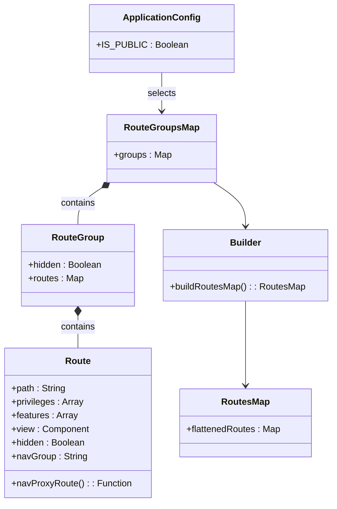
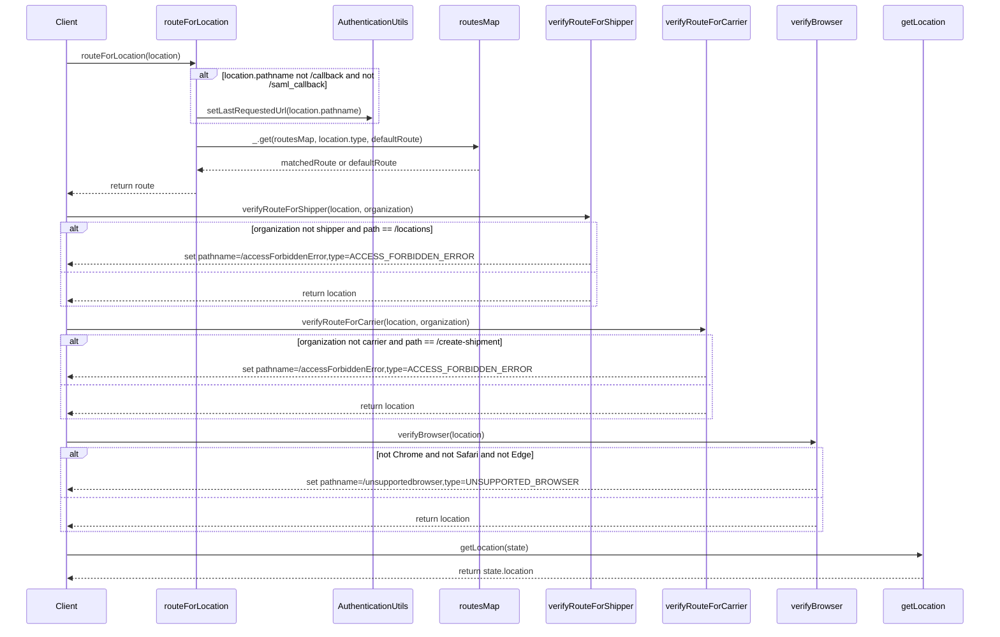

# Diagram: web/portal/src/routes.js


> Auto-generated by Obscura crawlers

## Diagram 1

```mermaid
flowchart LR
  AC{ApplicationConfig.IS_PUBLIC?}
  PUB[publicRouteGroupsMap]
  PRV[privateRouteGroupsMap]
  AC -->|true| PUB
  AC -->|false| PRV
  PUB --> RG[routeGroupsMap]
  PRV --> RG
  RG --> B[buildRoutesMap()]
  B --> RM[routesMap]
  RM --> RFL[routeForLocation(location)]
  RFL --> AUtils[AuthenticationUtils.setLastRequestedUrl]
  RFL --> GET[_.get(routesMap, location.type, defaultRoute)]
  RM --> VRShip[verifyRouteForShipper(location, organization)]
  RM --> VRCar[verifyRouteForCarrier(location, organization)]
  RM --> VRBrowser[verifyBrowser(location)]
  VRShip --> ModShip[set pathname=/accessForbiddenError when not shipper and path=/locations]
  VRCar --> ModCar[set pathname=/accessForbiddenError when not carrier and path=/create-shipment]
  VRBrowser --> ModBrowser[set pathname=/unsupportedbrowser when not Chrome or Safari or Edge]
  GET --> RM
```

> SVG rendering failed for this diagram.

## Diagram 2



### SVG

<svg id="container" width="580.26953125" xmlns="http://www.w3.org/2000/svg" class="classDiagram" height="886" viewBox="0 0 580.26953125 886" role="graphics-document document" aria-roledescription="class"><style>#container{font-family:"trebuchet ms",verdana,arial,sans-serif;font-size:16px;fill:#333;}@keyframes edge-animation-frame{from{stroke-dashoffset:0;}}@keyframes dash{to{stroke-dashoffset:0;}}#container .edge-animation-slow{stroke-dasharray:9,5!important;stroke-dashoffset:900;animation:dash 50s linear infinite;stroke-linecap:round;}#container .edge-animation-fast{stroke-dasharray:9,5!important;stroke-dashoffset:900;animation:dash 20s linear infinite;stroke-linecap:round;}#container .error-icon{fill:#552222;}#container .error-text{fill:#552222;stroke:#552222;}#container .edge-thickness-normal{stroke-width:1px;}#container .edge-thickness-thick{stroke-width:3.5px;}#container .edge-pattern-solid{stroke-dasharray:0;}#container .edge-thickness-invisible{stroke-width:0;fill:none;}#container .edge-pattern-dashed{stroke-dasharray:3;}#container .edge-pattern-dotted{stroke-dasharray:2;}#container .marker{fill:#333333;stroke:#333333;}#container .marker.cross{stroke:#333333;}#container svg{font-family:"trebuchet ms",verdana,arial,sans-serif;font-size:16px;}#container p{margin:0;}#container g.classGroup text{fill:#9370DB;stroke:none;font-family:"trebuchet ms",verdana,arial,sans-serif;font-size:10px;}#container g.classGroup text .title{font-weight:bolder;}#container .nodeLabel,#container .edgeLabel{color:#131300;}#container .edgeLabel .label rect{fill:#ECECFF;}#container .label text{fill:#131300;}#container .labelBkg{background:#ECECFF;}#container .edgeLabel .label span{background:#ECECFF;}#container .classTitle{font-weight:bolder;}#container .node rect,#container .node circle,#container .node ellipse,#container .node polygon,#container .node path{fill:#ECECFF;stroke:#9370DB;stroke-width:1px;}#container .divider{stroke:#9370DB;stroke-width:1;}#container g.clickable{cursor:pointer;}#container g.classGroup rect{fill:#ECECFF;stroke:#9370DB;}#container g.classGroup line{stroke:#9370DB;stroke-width:1;}#container .classLabel .box{stroke:none;stroke-width:0;fill:#ECECFF;opacity:0.5;}#container .classLabel .label{fill:#9370DB;font-size:10px;}#container .relation{stroke:#333333;stroke-width:1;fill:none;}#container .dashed-line{stroke-dasharray:3;}#container .dotted-line{stroke-dasharray:1 2;}#container #compositionStart,#container .composition{fill:#333333!important;stroke:#333333!important;stroke-width:1;}#container #compositionEnd,#container .composition{fill:#333333!important;stroke:#333333!important;stroke-width:1;}#container #dependencyStart,#container .dependency{fill:#333333!important;stroke:#333333!important;stroke-width:1;}#container #dependencyStart,#container .dependency{fill:#333333!important;stroke:#333333!important;stroke-width:1;}#container #extensionStart,#container .extension{fill:transparent!important;stroke:#333333!important;stroke-width:1;}#container #extensionEnd,#container .extension{fill:transparent!important;stroke:#333333!important;stroke-width:1;}#container #aggregationStart,#container .aggregation{fill:transparent!important;stroke:#333333!important;stroke-width:1;}#container #aggregationEnd,#container .aggregation{fill:transparent!important;stroke:#333333!important;stroke-width:1;}#container #lollipopStart,#container .lollipop{fill:#ECECFF!important;stroke:#333333!important;stroke-width:1;}#container #lollipopEnd,#container .lollipop{fill:#ECECFF!important;stroke:#333333!important;stroke-width:1;}#container .edgeTerminals{font-size:11px;line-height:initial;}#container .classTitleText{text-anchor:middle;font-size:18px;fill:#333;}#container .label-icon{display:inline-block;height:1em;overflow:visible;vertical-align:-0.125em;}#container .node .label-icon path{fill:currentColor;stroke:revert;stroke-width:revert;}#container :root{--mermaid-font-family:"trebuchet ms",verdana,arial,sans-serif;}</style><g><defs><marker id="container_class-aggregationStart" class="marker aggregation class" refX="18" refY="7" markerWidth="190" markerHeight="240" orient="auto"><path d="M 18,7 L9,13 L1,7 L9,1 Z"></path></marker></defs><defs><marker id="container_class-aggregationEnd" class="marker aggregation class" refX="1" refY="7" markerWidth="20" markerHeight="28" orient="auto"><path d="M 18,7 L9,13 L1,7 L9,1 Z"></path></marker></defs><defs><marker id="container_class-extensionStart" class="marker extension class" refX="18" refY="7" markerWidth="190" markerHeight="240" orient="auto"><path d="M 1,7 L18,13 V 1 Z"></path></marker></defs><defs><marker id="container_class-extensionEnd" class="marker extension class" refX="1" refY="7" markerWidth="20" markerHeight="28" orient="auto"><path d="M 1,1 V 13 L18,7 Z"></path></marker></defs><defs><marker id="container_class-compositionStart" class="marker composition class" refX="18" refY="7" markerWidth="190" markerHeight="240" orient="auto"><path d="M 18,7 L9,13 L1,7 L9,1 Z"></path></marker></defs><defs><marker id="container_class-compositionEnd" class="marker composition class" refX="1" refY="7" markerWidth="20" markerHeight="28" orient="auto"><path d="M 18,7 L9,13 L1,7 L9,1 Z"></path></marker></defs><defs><marker id="container_class-dependencyStart" class="marker dependency class" refX="6" refY="7" markerWidth="190" markerHeight="240" orient="auto"><path d="M 5,7 L9,13 L1,7 L9,1 Z"></path></marker></defs><defs><marker id="container_class-dependencyEnd" class="marker dependency class" refX="13" refY="7" markerWidth="20" markerHeight="28" orient="auto"><path d="M 18,7 L9,13 L14,7 L9,1 Z"></path></marker></defs><defs><marker id="container_class-lollipopStart" class="marker lollipop class" refX="13" refY="7" markerWidth="190" markerHeight="240" orient="auto"><circle stroke="black" fill="transparent" cx="7" cy="7" r="6"></circle></marker></defs><defs><marker id="container_class-lollipopEnd" class="marker lollipop class" refX="1" refY="7" markerWidth="190" markerHeight="240" orient="auto"><circle stroke="black" fill="transparent" cx="7" cy="7" r="6"></circle></marker></defs><g class="root"><g class="clusters"></g><g class="edgePaths"><path d="M281.789,128L281.789,134.167C281.789,140.333,281.789,152.667,281.789,164C281.789,175.333,281.789,185.667,281.789,190.833L281.789,196" id="id_ApplicationConfig_RouteGroupsMap_1" class="edge-thickness-normal edge-pattern-solid relation" style=";;;" data-edge="true" data-et="edge" data-id="id_ApplicationConfig_RouteGroupsMap_1" data-points="W3sieCI6MjgxLjc4OTA2MjUsInkiOjEyOH0seyJ4IjoyODEuNzg5MDYyNSwieSI6MTY1fSx7IngiOjI4MS43ODkwNjI1LCJ5IjoyMDJ9XQ==" marker-end="url(#container_class-dependencyEnd)"></path><path d="M176.719,331.518L169.797,336.099C162.874,340.679,149.029,349.839,142.106,360.586C135.184,371.333,135.184,383.667,135.184,389.833L135.184,396" id="id_RouteGroupsMap_RouteGroup_2" class="edge-thickness-normal edge-pattern-solid relation" style=";;;" data-edge="true" data-et="edge" data-id="id_RouteGroupsMap_RouteGroup_2" data-points="W3sieCI6MTkxLjEwNTI2NzM5NjkwNzIsInkiOjMyMn0seyJ4IjoxMzUuMTgzNTkzNzUsInkiOjM1OX0seyJ4IjoxMzUuMTgzNTkzNzUsInkiOjM5Nn1d" marker-start="url(#container_class-compositionStart)"></path><path d="M135.184,557.25L135.184,560.542C135.184,563.833,135.184,570.417,135.184,579.875C135.184,589.333,135.184,601.667,135.184,607.833L135.184,614" id="id_RouteGroup_Route_3" class="edge-thickness-normal edge-pattern-solid relation" style=";;;" data-edge="true" data-et="edge" data-id="id_RouteGroup_Route_3" data-points="W3sieCI6MTM1LjE4MzU5Mzc1LCJ5Ijo1NDB9LHsieCI6MTM1LjE4MzU5Mzc1LCJ5Ijo1Nzd9LHsieCI6MTM1LjE4MzU5Mzc1LCJ5Ijo2MTR9XQ==" marker-start="url(#container_class-compositionStart)"></path><path d="M372.473,322L381.793,328.167C391.113,334.333,409.754,346.667,419.074,359.5C428.395,372.333,428.395,385.667,428.395,392.333L428.395,399" id="id_RouteGroupsMap_Builder_4" class="edge-thickness-normal edge-pattern-solid relation" style=";;;" data-edge="true" data-et="edge" data-id="id_RouteGroupsMap_Builder_4" data-points="W3sieCI6MzcyLjQ3Mjg1NzYwMzA5MjgsInkiOjMyMn0seyJ4Ijo0MjguMzk0NTMxMjUsInkiOjM1OX0seyJ4Ijo0MjguMzk0NTMxMjUsInkiOjQwNX1d" marker-end="url(#container_class-dependencyEnd)"></path><path d="M428.395,531L428.395,538.667C428.395,546.333,428.395,561.667,428.395,586.5C428.395,611.333,428.395,645.667,428.395,662.833L428.395,680" id="id_Builder_RoutesMap_5" class="edge-thickness-normal edge-pattern-solid relation" style=";;;" data-edge="true" data-et="edge" data-id="id_Builder_RoutesMap_5" data-points="W3sieCI6NDI4LjM5NDUzMTI1LCJ5Ijo1MzF9LHsieCI6NDI4LjM5NDUzMTI1LCJ5Ijo1Nzd9LHsieCI6NDI4LjM5NDUzMTI1LCJ5Ijo2ODZ9XQ==" marker-end="url(#container_class-dependencyEnd)"></path></g><g class="edgeLabels"><g class="edgeLabel" transform="translate(281.7890625, 165)"><g class="label" data-id="id_ApplicationConfig_RouteGroupsMap_1" transform="translate(-25.2109375, -12)"><foreignObject width="50.421875" height="24"><div xmlns="http://www.w3.org/1999/xhtml" class="labelBkg" style="display: table-cell; white-space: nowrap; line-height: 1.5; max-width: 200px; text-align: center;"><span class="edgeLabel"><p>selects</p></span></div></foreignObject></g></g><g class="edgeLabel" transform="translate(135.18359375, 359)"><g class="label" data-id="id_RouteGroupsMap_RouteGroup_2" transform="translate(-30.890625, -12)"><foreignObject width="61.78125" height="24"><div xmlns="http://www.w3.org/1999/xhtml" class="labelBkg" style="display: table-cell; white-space: nowrap; line-height: 1.5; max-width: 200px; text-align: center;"><span class="edgeLabel"><p>contains</p></span></div></foreignObject></g></g><g class="edgeLabel" transform="translate(135.18359375, 577)"><g class="label" data-id="id_RouteGroup_Route_3" transform="translate(-30.890625, -12)"><foreignObject width="61.78125" height="24"><div xmlns="http://www.w3.org/1999/xhtml" class="labelBkg" style="display: table-cell; white-space: nowrap; line-height: 1.5; max-width: 200px; text-align: center;"><span class="edgeLabel"><p>contains</p></span></div></foreignObject></g></g><g class="edgeLabel"><g class="label" data-id="id_RouteGroupsMap_Builder_4" transform="translate(0, 0)"><foreignObject width="0" height="0"><div xmlns="http://www.w3.org/1999/xhtml" class="labelBkg" style="display: table-cell; white-space: nowrap; line-height: 1.5; max-width: 200px; text-align: center;"><span class="edgeLabel"></span></div></foreignObject></g></g><g class="edgeLabel"><g class="label" data-id="id_Builder_RoutesMap_5" transform="translate(0, 0)"><foreignObject width="0" height="0"><div xmlns="http://www.w3.org/1999/xhtml" class="labelBkg" style="display: table-cell; white-space: nowrap; line-height: 1.5; max-width: 200px; text-align: center;"><span class="edgeLabel"></span></div></foreignObject></g></g></g><g class="nodes"><g class="node default" id="classId-ApplicationConfig-0" transform="translate(281.7890625, 68)"><g class="basic label-container"><path d="M-120.55859375 -60 L120.55859375 -60 L120.55859375 60 L-120.55859375 60" stroke="none" stroke-width="0" fill="#ECECFF" style=""></path><path d="M-120.55859375 -60 C-40.459775523334514 -60, 39.63904270333097 -60, 120.55859375 -60 M-120.55859375 -60 C-38.333836371996625 -60, 43.89092100600675 -60, 120.55859375 -60 M120.55859375 -60 C120.55859375 -15.804514878877804, 120.55859375 28.390970242244393, 120.55859375 60 M120.55859375 -60 C120.55859375 -17.96690689418344, 120.55859375 24.066186211633124, 120.55859375 60 M120.55859375 60 C42.10413793668327 60, -36.350317876633454 60, -120.55859375 60 M120.55859375 60 C33.01554969816017 60, -54.52749435367966 60, -120.55859375 60 M-120.55859375 60 C-120.55859375 28.788108337702404, -120.55859375 -2.423783324595192, -120.55859375 -60 M-120.55859375 60 C-120.55859375 31.286114300955653, -120.55859375 2.5722286019113056, -120.55859375 -60" stroke="#9370DB" stroke-width="1.3" fill="none" stroke-dasharray="0 0" style=""></path></g><g class="annotation-group text" transform="translate(0, -36)"></g><g class="label-group text" transform="translate(-64.6015625, -36)"><g class="label" style="font-weight: bolder" transform="translate(0,-12)"><foreignObject width="129.203125" height="24"><div xmlns="http://www.w3.org/1999/xhtml" style="display: table-cell; white-space: nowrap; line-height: 1.5; max-width: 178px; text-align: center;"><span class="nodeLabel markdown-node-label" style=""><p>ApplicationConfig</p></span></div></foreignObject></g></g><g class="members-group text" transform="translate(-108.55859375, 12)"><g class="label" style="" transform="translate(0,-12)"><foreignObject width="152.515625" height="24"><div xmlns="http://www.w3.org/1999/xhtml" style="display: table-cell; white-space: nowrap; line-height: 1.5; max-width: 210px; text-align: center;"><span class="nodeLabel markdown-node-label" style=""><p>+IS_PUBLIC : Boolean</p></span></div></foreignObject></g></g><g class="methods-group text" transform="translate(-108.55859375, 60)"></g><g class="divider" style=""><path d="M-120.55859375 -12 C-54.13999092712723 -12, 12.278611895745541 -12, 120.55859375 -12 M-120.55859375 -12 C-29.779580163620665 -12, 60.99943342275867 -12, 120.55859375 -12" stroke="#9370DB" stroke-width="1.3" fill="none" stroke-dasharray="0 0" style=""></path></g><g class="divider" style=""><path d="M-120.55859375 36 C-55.12133865063329 36, 10.315916448733418 36, 120.55859375 36 M-120.55859375 36 C-42.10747686455305 36, 36.3436400208939 36, 120.55859375 36" stroke="#9370DB" stroke-width="1.3" fill="none" stroke-dasharray="0 0" style=""></path></g></g><g class="node default" id="classId-RouteGroupsMap-1" transform="translate(281.7890625, 262)"><g class="basic label-container"><path d="M-93.75 -60 L93.75 -60 L93.75 60 L-93.75 60" stroke="none" stroke-width="0" fill="#ECECFF" style=""></path><path d="M-93.75 -60 C-23.25246794606133 -60, 47.24506410787734 -60, 93.75 -60 M-93.75 -60 C-29.367063792739856 -60, 35.01587241452029 -60, 93.75 -60 M93.75 -60 C93.75 -18.826700179651837, 93.75 22.346599640696326, 93.75 60 M93.75 -60 C93.75 -20.886424739595043, 93.75 18.227150520809914, 93.75 60 M93.75 60 C22.198549235269752 60, -49.352901529460496 60, -93.75 60 M93.75 60 C55.76627964198518 60, 17.782559283970357 60, -93.75 60 M-93.75 60 C-93.75 23.822728715035538, -93.75 -12.354542569928924, -93.75 -60 M-93.75 60 C-93.75 28.456579644493686, -93.75 -3.086840711012627, -93.75 -60" stroke="#9370DB" stroke-width="1.3" fill="none" stroke-dasharray="0 0" style=""></path></g><g class="annotation-group text" transform="translate(0, -36)"></g><g class="label-group text" transform="translate(-62.890625, -36)"><g class="label" style="font-weight: bolder" transform="translate(0,-12)"><foreignObject width="125.78125" height="24"><div xmlns="http://www.w3.org/1999/xhtml" style="display: table-cell; white-space: nowrap; line-height: 1.5; max-width: 174px; text-align: center;"><span class="nodeLabel markdown-node-label" style=""><p>RouteGroupsMap</p></span></div></foreignObject></g></g><g class="members-group text" transform="translate(-81.75, 12)"><g class="label" style="" transform="translate(0,-12)"><foreignObject width="100.609375" height="24"><div xmlns="http://www.w3.org/1999/xhtml" style="display: table-cell; white-space: nowrap; line-height: 1.5; max-width: 158px; text-align: center;"><span class="nodeLabel markdown-node-label" style=""><p>+groups : Map</p></span></div></foreignObject></g></g><g class="methods-group text" transform="translate(-81.75, 60)"></g><g class="divider" style=""><path d="M-93.75 -12 C-28.723084070889954 -12, 36.30383185822009 -12, 93.75 -12 M-93.75 -12 C-50.94909554662677 -12, -8.148191093253544 -12, 93.75 -12" stroke="#9370DB" stroke-width="1.3" fill="none" stroke-dasharray="0 0" style=""></path></g><g class="divider" style=""><path d="M-93.75 36 C-34.247674580153074 36, 25.254650839693852 36, 93.75 36 M-93.75 36 C-36.800272612530314 36, 20.14945477493937 36, 93.75 36" stroke="#9370DB" stroke-width="1.3" fill="none" stroke-dasharray="0 0" style=""></path></g></g><g class="node default" id="classId-RouteGroup-2" transform="translate(135.18359375, 468)"><g class="basic label-container"><path d="M-99.3359375 -72 L99.3359375 -72 L99.3359375 72 L-99.3359375 72" stroke="none" stroke-width="0" fill="#ECECFF" style=""></path><path d="M-99.3359375 -72 C-40.980808693522185 -72, 17.37432011295563 -72, 99.3359375 -72 M-99.3359375 -72 C-37.881534698884806 -72, 23.572868102230387 -72, 99.3359375 -72 M99.3359375 -72 C99.3359375 -18.285829445561937, 99.3359375 35.428341108876126, 99.3359375 72 M99.3359375 -72 C99.3359375 -24.191222442535974, 99.3359375 23.617555114928052, 99.3359375 72 M99.3359375 72 C52.758622785831335 72, 6.18130807166267 72, -99.3359375 72 M99.3359375 72 C55.676028262065834 72, 12.016119024131669 72, -99.3359375 72 M-99.3359375 72 C-99.3359375 29.459173470318, -99.3359375 -13.081653059364001, -99.3359375 -72 M-99.3359375 72 C-99.3359375 15.093746198311763, -99.3359375 -41.812507603376474, -99.3359375 -72" stroke="#9370DB" stroke-width="1.3" fill="none" stroke-dasharray="0 0" style=""></path></g><g class="annotation-group text" transform="translate(0, -48)"></g><g class="label-group text" transform="translate(-43.578125, -48)"><g class="label" style="font-weight: bolder" transform="translate(0,-12)"><foreignObject width="87.15625" height="24"><div xmlns="http://www.w3.org/1999/xhtml" style="display: table-cell; white-space: nowrap; line-height: 1.5; max-width: 136px; text-align: center;"><span class="nodeLabel markdown-node-label" style=""><p>RouteGroup</p></span></div></foreignObject></g></g><g class="members-group text" transform="translate(-87.3359375, 0)"><g class="label" style="" transform="translate(0,-12)"><foreignObject width="131.09375" height="24"><div xmlns="http://www.w3.org/1999/xhtml" style="display: table-cell; white-space: nowrap; line-height: 1.5; max-width: 188px; text-align: center;"><span class="nodeLabel markdown-node-label" style=""><p>+hidden : Boolean</p></span></div></foreignObject></g><g class="label" style="" transform="translate(0,12)"><foreignObject width="97.046875" height="24"><div xmlns="http://www.w3.org/1999/xhtml" style="display: table-cell; white-space: nowrap; line-height: 1.5; max-width: 154px; text-align: center;"><span class="nodeLabel markdown-node-label" style=""><p>+routes : Map</p></span></div></foreignObject></g></g><g class="methods-group text" transform="translate(-87.3359375, 72)"></g><g class="divider" style=""><path d="M-99.3359375 -24 C-27.084831651013246 -24, 45.16627419797351 -24, 99.3359375 -24 M-99.3359375 -24 C-56.6393559314526 -24, -13.942774362905197 -24, 99.3359375 -24" stroke="#9370DB" stroke-width="1.3" fill="none" stroke-dasharray="0 0" style=""></path></g><g class="divider" style=""><path d="M-99.3359375 48 C-41.82325347917813 48, 15.689430541643745 48, 99.3359375 48 M-99.3359375 48 C-54.49521218123082 48, -9.654486862461638 48, 99.3359375 48" stroke="#9370DB" stroke-width="1.3" fill="none" stroke-dasharray="0 0" style=""></path></g></g><g class="node default" id="classId-Route-3" transform="translate(135.18359375, 746)"><g class="basic label-container"><path d="M-127.18359375 -132 L127.18359375 -132 L127.18359375 132 L-127.18359375 132" stroke="none" stroke-width="0" fill="#ECECFF" style=""></path><path d="M-127.18359375 -132 C-70.26615436011048 -132, -13.348714970220968 -132, 127.18359375 -132 M-127.18359375 -132 C-43.40683467008772 -132, 40.36992440982456 -132, 127.18359375 -132 M127.18359375 -132 C127.18359375 -55.935637929795405, 127.18359375 20.12872414040919, 127.18359375 132 M127.18359375 -132 C127.18359375 -76.25011828355443, 127.18359375 -20.500236567108843, 127.18359375 132 M127.18359375 132 C50.19350739192302 132, -26.79657896615396 132, -127.18359375 132 M127.18359375 132 C39.469823456463345 132, -48.24394683707331 132, -127.18359375 132 M-127.18359375 132 C-127.18359375 49.298853952959234, -127.18359375 -33.40229209408153, -127.18359375 -132 M-127.18359375 132 C-127.18359375 47.04781884532274, -127.18359375 -37.904362309354525, -127.18359375 -132" stroke="#9370DB" stroke-width="1.3" fill="none" stroke-dasharray="0 0" style=""></path></g><g class="annotation-group text" transform="translate(0, -108)"></g><g class="label-group text" transform="translate(-21.4296875, -108)"><g class="label" style="font-weight: bolder" transform="translate(0,-12)"><foreignObject width="42.859375" height="24"><div xmlns="http://www.w3.org/1999/xhtml" style="display: table-cell; white-space: nowrap; line-height: 1.5; max-width: 92px; text-align: center;"><span class="nodeLabel markdown-node-label" style=""><p>Route</p></span></div></foreignObject></g></g><g class="members-group text" transform="translate(-115.18359375, -60)"><g class="label" style="" transform="translate(0,-12)"><foreignObject width="96.390625" height="24"><div xmlns="http://www.w3.org/1999/xhtml" style="display: table-cell; white-space: nowrap; line-height: 1.5; max-width: 154px; text-align: center;"><span class="nodeLabel markdown-node-label" style=""><p>+path : String</p></span></div></foreignObject></g><g class="label" style="" transform="translate(0,12)"><foreignObject width="127.765625" height="24"><div xmlns="http://www.w3.org/1999/xhtml" style="display: table-cell; white-space: nowrap; line-height: 1.5; max-width: 185px; text-align: center;"><span class="nodeLabel markdown-node-label" style=""><p>+privileges : Array</p></span></div></foreignObject></g><g class="label" style="" transform="translate(0,36)"><foreignObject width="116.8125" height="24"><div xmlns="http://www.w3.org/1999/xhtml" style="display: table-cell; white-space: nowrap; line-height: 1.5; max-width: 174px; text-align: center;"><span class="nodeLabel markdown-node-label" style=""><p>+features : Array</p></span></div></foreignObject></g><g class="label" style="" transform="translate(0,60)"><foreignObject width="136.515625" height="24"><div xmlns="http://www.w3.org/1999/xhtml" style="display: table-cell; white-space: nowrap; line-height: 1.5; max-width: 194px; text-align: center;"><span class="nodeLabel markdown-node-label" style=""><p>+view : Component</p></span></div></foreignObject></g><g class="label" style="" transform="translate(0,84)"><foreignObject width="131.09375" height="24"><div xmlns="http://www.w3.org/1999/xhtml" style="display: table-cell; white-space: nowrap; line-height: 1.5; max-width: 188px; text-align: center;"><span class="nodeLabel markdown-node-label" style=""><p>+hidden : Boolean</p></span></div></foreignObject></g><g class="label" style="" transform="translate(0,108)"><foreignObject width="132.859375" height="24"><div xmlns="http://www.w3.org/1999/xhtml" style="display: table-cell; white-space: nowrap; line-height: 1.5; max-width: 191px; text-align: center;"><span class="nodeLabel markdown-node-label" style=""><p>+navGroup : String</p></span></div></foreignObject></g></g><g class="methods-group text" transform="translate(-115.18359375, 108)"><g class="label" style="" transform="translate(0,-12)"><foreignObject width="208.9375" height="24"><div xmlns="http://www.w3.org/1999/xhtml" style="display: table-cell; white-space: nowrap; line-height: 1.5; max-width: 266px; text-align: center;"><span class="nodeLabel markdown-node-label" style=""><p>+navProxyRoute() : : Function</p></span></div></foreignObject></g></g><g class="divider" style=""><path d="M-127.18359375 -84 C-56.81774944288529 -84, 13.548094864229427 -84, 127.18359375 -84 M-127.18359375 -84 C-37.75610586711805 -84, 51.671382015763896 -84, 127.18359375 -84" stroke="#9370DB" stroke-width="1.3" fill="none" stroke-dasharray="0 0" style=""></path></g><g class="divider" style=""><path d="M-127.18359375 84 C-74.66982980486489 84, -22.156065859729765 84, 127.18359375 84 M-127.18359375 84 C-38.641864817084596 84, 49.89986411583081 84, 127.18359375 84" stroke="#9370DB" stroke-width="1.3" fill="none" stroke-dasharray="0 0" style=""></path></g></g><g class="node default" id="classId-Builder-4" transform="translate(428.39453125, 468)"><g class="basic label-container"><path d="M-143.875 -63 L143.875 -63 L143.875 63 L-143.875 63" stroke="none" stroke-width="0" fill="#ECECFF" style=""></path><path d="M-143.875 -63 C-79.24332951925393 -63, -14.611659038507867 -63, 143.875 -63 M-143.875 -63 C-58.88806730582665 -63, 26.098865388346695 -63, 143.875 -63 M143.875 -63 C143.875 -13.322522659792682, 143.875 36.354954680414636, 143.875 63 M143.875 -63 C143.875 -13.446283547776048, 143.875 36.107432904447904, 143.875 63 M143.875 63 C81.68705119404092 63, 19.499102388081837 63, -143.875 63 M143.875 63 C71.0326799996744 63, -1.8096400006512 63, -143.875 63 M-143.875 63 C-143.875 15.684941230907661, -143.875 -31.630117538184678, -143.875 -63 M-143.875 63 C-143.875 18.12858135648701, -143.875 -26.742837287025978, -143.875 -63" stroke="#9370DB" stroke-width="1.3" fill="none" stroke-dasharray="0 0" style=""></path></g><g class="annotation-group text" transform="translate(0, -39)"></g><g class="label-group text" transform="translate(-26.53125, -39)"><g class="label" style="font-weight: bolder" transform="translate(0,-12)"><foreignObject width="53.0625" height="24"><div xmlns="http://www.w3.org/1999/xhtml" style="display: table-cell; white-space: nowrap; line-height: 1.5; max-width: 103px; text-align: center;"><span class="nodeLabel markdown-node-label" style=""><p>Builder</p></span></div></foreignObject></g></g><g class="members-group text" transform="translate(-131.875, 9)"></g><g class="methods-group text" transform="translate(-131.875, 39)"><g class="label" style="" transform="translate(0,-12)"><foreignObject width="237.21875" height="24"><div xmlns="http://www.w3.org/1999/xhtml" style="display: table-cell; white-space: nowrap; line-height: 1.5; max-width: 295px; text-align: center;"><span class="nodeLabel markdown-node-label" style=""><p>+buildRoutesMap() : : RoutesMap</p></span></div></foreignObject></g></g><g class="divider" style=""><path d="M-143.875 -15 C-65.9462181819672 -15, 11.982563636065606 -15, 143.875 -15 M-143.875 -15 C-44.9270786518525 -15, 54.020842696295006 -15, 143.875 -15" stroke="#9370DB" stroke-width="1.3" fill="none" stroke-dasharray="0 0" style=""></path></g><g class="divider" style=""><path d="M-143.875 9 C-41.724215529736995 9, 60.42656894052601 9, 143.875 9 M-143.875 9 C-66.98463887599223 9, 9.905722248015536 9, 143.875 9" stroke="#9370DB" stroke-width="1.3" fill="none" stroke-dasharray="0 0" style=""></path></g></g><g class="node default" id="classId-RoutesMap-5" transform="translate(428.39453125, 746)"><g class="basic label-container"><path d="M-115.54296875 -60 L115.54296875 -60 L115.54296875 60 L-115.54296875 60" stroke="none" stroke-width="0" fill="#ECECFF" style=""></path><path d="M-115.54296875 -60 C-52.245124176269286 -60, 11.052720397461428 -60, 115.54296875 -60 M-115.54296875 -60 C-59.367947520898724 -60, -3.1929262917974484 -60, 115.54296875 -60 M115.54296875 -60 C115.54296875 -16.473271691401848, 115.54296875 27.053456617196304, 115.54296875 60 M115.54296875 -60 C115.54296875 -30.457204616109188, 115.54296875 -0.9144092322183752, 115.54296875 60 M115.54296875 60 C57.74383249268664 60, -0.05530376462671427 60, -115.54296875 60 M115.54296875 60 C67.89201521963817 60, 20.241061689276336 60, -115.54296875 60 M-115.54296875 60 C-115.54296875 23.272920625509798, -115.54296875 -13.454158748980404, -115.54296875 -60 M-115.54296875 60 C-115.54296875 30.555311841347848, -115.54296875 1.110623682695696, -115.54296875 -60" stroke="#9370DB" stroke-width="1.3" fill="none" stroke-dasharray="0 0" style=""></path></g><g class="annotation-group text" transform="translate(0, -36)"></g><g class="label-group text" transform="translate(-40.7421875, -36)"><g class="label" style="font-weight: bolder" transform="translate(0,-12)"><foreignObject width="81.484375" height="24"><div xmlns="http://www.w3.org/1999/xhtml" style="display: table-cell; white-space: nowrap; line-height: 1.5; max-width: 130px; text-align: center;"><span class="nodeLabel markdown-node-label" style=""><p>RoutesMap</p></span></div></foreignObject></g></g><g class="members-group text" transform="translate(-103.54296875, 12)"><g class="label" style="" transform="translate(0,-12)"><foreignObject width="166.34375" height="24"><div xmlns="http://www.w3.org/1999/xhtml" style="display: table-cell; white-space: nowrap; line-height: 1.5; max-width: 224px; text-align: center;"><span class="nodeLabel markdown-node-label" style=""><p>+flattenedRoutes : Map</p></span></div></foreignObject></g></g><g class="methods-group text" transform="translate(-103.54296875, 60)"></g><g class="divider" style=""><path d="M-115.54296875 -12 C-48.112760667140776 -12, 19.317447415718448 -12, 115.54296875 -12 M-115.54296875 -12 C-34.029074412411035 -12, 47.48481992517793 -12, 115.54296875 -12" stroke="#9370DB" stroke-width="1.3" fill="none" stroke-dasharray="0 0" style=""></path></g><g class="divider" style=""><path d="M-115.54296875 36 C-51.29111962854793 36, 12.960729492904136 36, 115.54296875 36 M-115.54296875 36 C-58.88040164930125 36, -2.2178345486024966 36, 115.54296875 36" stroke="#9370DB" stroke-width="1.3" fill="none" stroke-dasharray="0 0" style=""></path></g></g></g></g></g></svg>

## Diagram 3



### SVG

<svg id="container" width="1944" xmlns="http://www.w3.org/2000/svg" height="1252" viewBox="-50 -10 1944 1252" role="graphics-document document" aria-roledescription="sequence"><g><rect x="1694" y="1166" fill="#eaeaea" stroke="#666" width="150" height="65" name="getLocation" rx="3" ry="3" class="actor actor-bottom"></rect><text x="1769" y="1198.5" dominant-baseline="central" alignment-baseline="central" class="actor actor-box" style="text-anchor: middle; font-size: 16px; font-weight: 400;"><tspan x="1769" dy="0">getLocation</tspan></text></g><g><rect x="1494" y="1166" fill="#eaeaea" stroke="#666" width="150" height="65" name="verifyBrowser" rx="3" ry="3" class="actor actor-bottom"></rect><text x="1569" y="1198.5" dominant-baseline="central" alignment-baseline="central" class="actor actor-box" style="text-anchor: middle; font-size: 16px; font-weight: 400;"><tspan x="1569" dy="0">verifyBrowser</tspan></text></g><g><rect x="1268" y="1166" fill="#eaeaea" stroke="#666" width="176" height="65" name="verifyRouteForCarrier" rx="3" ry="3" class="actor actor-bottom"></rect><text x="1356" y="1198.5" dominant-baseline="central" alignment-baseline="central" class="actor actor-box" style="text-anchor: middle; font-size: 16px; font-weight: 400;"><tspan x="1356" dy="0">verifyRouteForCarrier</tspan></text></g><g><rect x="1035" y="1166" fill="#eaeaea" stroke="#666" width="183" height="65" name="verifyRouteForShipper" rx="3" ry="3" class="actor actor-bottom"></rect><text x="1126.5" y="1198.5" dominant-baseline="central" alignment-baseline="central" class="actor actor-box" style="text-anchor: middle; font-size: 16px; font-weight: 400;"><tspan x="1126.5" dy="0">verifyRouteForShipper</tspan></text></g><g><rect x="835" y="1166" fill="#eaeaea" stroke="#666" width="150" height="65" name="routesMap" rx="3" ry="3" class="actor actor-bottom"></rect><text x="910" y="1198.5" dominant-baseline="central" alignment-baseline="central" class="actor actor-box" style="text-anchor: middle; font-size: 16px; font-weight: 400;"><tspan x="910" dy="0">routesMap</tspan></text></g><g><rect x="625" y="1166" fill="#eaeaea" stroke="#666" width="160" height="65" name="AuthenticationUtils" rx="3" ry="3" class="actor actor-bottom"></rect><text x="705" y="1198.5" dominant-baseline="central" alignment-baseline="central" class="actor actor-box" style="text-anchor: middle; font-size: 16px; font-weight: 400;"><tspan x="705" dy="0">AuthenticationUtils</tspan></text></g><g><rect x="263" y="1166" fill="#eaeaea" stroke="#666" width="150" height="65" name="routeForLocation" rx="3" ry="3" class="actor actor-bottom"></rect><text x="338" y="1198.5" dominant-baseline="central" alignment-baseline="central" class="actor actor-box" style="text-anchor: middle; font-size: 16px; font-weight: 400;"><tspan x="338" dy="0">routeForLocation</tspan></text></g><g><rect x="0" y="1166" fill="#eaeaea" stroke="#666" width="150" height="65" name="Client" rx="3" ry="3" class="actor actor-bottom"></rect><text x="75" y="1198.5" dominant-baseline="central" alignment-baseline="central" class="actor actor-box" style="text-anchor: middle; font-size: 16px; font-weight: 400;"><tspan x="75" dy="0">Client</tspan></text></g><g><line id="actor7" x1="1769" y1="65" x2="1769" y2="1166" class="actor-line 200" stroke-width="0.5px" stroke="#999" name="getLocation"></line><g id="root-7"><rect x="1694" y="0" fill="#eaeaea" stroke="#666" width="150" height="65" name="getLocation" rx="3" ry="3" class="actor actor-top"></rect><text x="1769" y="32.5" dominant-baseline="central" alignment-baseline="central" class="actor actor-box" style="text-anchor: middle; font-size: 16px; font-weight: 400;"><tspan x="1769" dy="0">getLocation</tspan></text></g></g><g><line id="actor6" x1="1569" y1="65" x2="1569" y2="1166" class="actor-line 200" stroke-width="0.5px" stroke="#999" name="verifyBrowser"></line><g id="root-6"><rect x="1494" y="0" fill="#eaeaea" stroke="#666" width="150" height="65" name="verifyBrowser" rx="3" ry="3" class="actor actor-top"></rect><text x="1569" y="32.5" dominant-baseline="central" alignment-baseline="central" class="actor actor-box" style="text-anchor: middle; font-size: 16px; font-weight: 400;"><tspan x="1569" dy="0">verifyBrowser</tspan></text></g></g><g><line id="actor5" x1="1356" y1="65" x2="1356" y2="1166" class="actor-line 200" stroke-width="0.5px" stroke="#999" name="verifyRouteForCarrier"></line><g id="root-5"><rect x="1268" y="0" fill="#eaeaea" stroke="#666" width="176" height="65" name="verifyRouteForCarrier" rx="3" ry="3" class="actor actor-top"></rect><text x="1356" y="32.5" dominant-baseline="central" alignment-baseline="central" class="actor actor-box" style="text-anchor: middle; font-size: 16px; font-weight: 400;"><tspan x="1356" dy="0">verifyRouteForCarrier</tspan></text></g></g><g><line id="actor4" x1="1126.5" y1="65" x2="1126.5" y2="1166" class="actor-line 200" stroke-width="0.5px" stroke="#999" name="verifyRouteForShipper"></line><g id="root-4"><rect x="1035" y="0" fill="#eaeaea" stroke="#666" width="183" height="65" name="verifyRouteForShipper" rx="3" ry="3" class="actor actor-top"></rect><text x="1126.5" y="32.5" dominant-baseline="central" alignment-baseline="central" class="actor actor-box" style="text-anchor: middle; font-size: 16px; font-weight: 400;"><tspan x="1126.5" dy="0">verifyRouteForShipper</tspan></text></g></g><g><line id="actor3" x1="910" y1="65" x2="910" y2="1166" class="actor-line 200" stroke-width="0.5px" stroke="#999" name="routesMap"></line><g id="root-3"><rect x="835" y="0" fill="#eaeaea" stroke="#666" width="150" height="65" name="routesMap" rx="3" ry="3" class="actor actor-top"></rect><text x="910" y="32.5" dominant-baseline="central" alignment-baseline="central" class="actor actor-box" style="text-anchor: middle; font-size: 16px; font-weight: 400;"><tspan x="910" dy="0">routesMap</tspan></text></g></g><g><line id="actor2" x1="705" y1="65" x2="705" y2="1166" class="actor-line 200" stroke-width="0.5px" stroke="#999" name="AuthenticationUtils"></line><g id="root-2"><rect x="625" y="0" fill="#eaeaea" stroke="#666" width="160" height="65" name="AuthenticationUtils" rx="3" ry="3" class="actor actor-top"></rect><text x="705" y="32.5" dominant-baseline="central" alignment-baseline="central" class="actor actor-box" style="text-anchor: middle; font-size: 16px; font-weight: 400;"><tspan x="705" dy="0">AuthenticationUtils</tspan></text></g></g><g><line id="actor1" x1="338" y1="65" x2="338" y2="1166" class="actor-line 200" stroke-width="0.5px" stroke="#999" name="routeForLocation"></line><g id="root-1"><rect x="263" y="0" fill="#eaeaea" stroke="#666" width="150" height="65" name="routeForLocation" rx="3" ry="3" class="actor actor-top"></rect><text x="338" y="32.5" dominant-baseline="central" alignment-baseline="central" class="actor actor-box" style="text-anchor: middle; font-size: 16px; font-weight: 400;"><tspan x="338" dy="0">routeForLocation</tspan></text></g></g><g><line id="actor0" x1="75" y1="65" x2="75" y2="1166" class="actor-line 200" stroke-width="0.5px" stroke="#999" name="Client"></line><g id="root-0"><rect x="0" y="0" fill="#eaeaea" stroke="#666" width="150" height="65" name="Client" rx="3" ry="3" class="actor actor-top"></rect><text x="75" y="32.5" dominant-baseline="central" alignment-baseline="central" class="actor actor-box" style="text-anchor: middle; font-size: 16px; font-weight: 400;"><tspan x="75" dy="0">Client</tspan></text></g></g><style>#container{font-family:"trebuchet ms",verdana,arial,sans-serif;font-size:16px;fill:#333;}@keyframes edge-animation-frame{from{stroke-dashoffset:0;}}@keyframes dash{to{stroke-dashoffset:0;}}#container .edge-animation-slow{stroke-dasharray:9,5!important;stroke-dashoffset:900;animation:dash 50s linear infinite;stroke-linecap:round;}#container .edge-animation-fast{stroke-dasharray:9,5!important;stroke-dashoffset:900;animation:dash 20s linear infinite;stroke-linecap:round;}#container .error-icon{fill:#552222;}#container .error-text{fill:#552222;stroke:#552222;}#container .edge-thickness-normal{stroke-width:1px;}#container .edge-thickness-thick{stroke-width:3.5px;}#container .edge-pattern-solid{stroke-dasharray:0;}#container .edge-thickness-invisible{stroke-width:0;fill:none;}#container .edge-pattern-dashed{stroke-dasharray:3;}#container .edge-pattern-dotted{stroke-dasharray:2;}#container .marker{fill:#333333;stroke:#333333;}#container .marker.cross{stroke:#333333;}#container svg{font-family:"trebuchet ms",verdana,arial,sans-serif;font-size:16px;}#container p{margin:0;}#container .actor{stroke:hsl(259.6261682243, 59.7765363128%, 87.9019607843%);fill:#ECECFF;}#container text.actor&gt;tspan{fill:black;stroke:none;}#container .actor-line{stroke:hsl(259.6261682243, 59.7765363128%, 87.9019607843%);}#container .innerArc{stroke-width:1.5;stroke-dasharray:none;}#container .messageLine0{stroke-width:1.5;stroke-dasharray:none;stroke:#333;}#container .messageLine1{stroke-width:1.5;stroke-dasharray:2,2;stroke:#333;}#container #arrowhead path{fill:#333;stroke:#333;}#container .sequenceNumber{fill:white;}#container #sequencenumber{fill:#333;}#container #crosshead path{fill:#333;stroke:#333;}#container .messageText{fill:#333;stroke:none;}#container .labelBox{stroke:hsl(259.6261682243, 59.7765363128%, 87.9019607843%);fill:#ECECFF;}#container .labelText,#container .labelText&gt;tspan{fill:black;stroke:none;}#container .loopText,#container .loopText&gt;tspan{fill:black;stroke:none;}#container .loopLine{stroke-width:2px;stroke-dasharray:2,2;stroke:hsl(259.6261682243, 59.7765363128%, 87.9019607843%);fill:hsl(259.6261682243, 59.7765363128%, 87.9019607843%);}#container .note{stroke:#aaaa33;fill:#fff5ad;}#container .noteText,#container .noteText&gt;tspan{fill:black;stroke:none;}#container .activation0{fill:#f4f4f4;stroke:#666;}#container .activation1{fill:#f4f4f4;stroke:#666;}#container .activation2{fill:#f4f4f4;stroke:#666;}#container .actorPopupMenu{position:absolute;}#container .actorPopupMenuPanel{position:absolute;fill:#ECECFF;box-shadow:0px 8px 16px 0px rgba(0,0,0,0.2);filter:drop-shadow(3px 5px 2px rgb(0 0 0 / 0.4));}#container .actor-man line{stroke:hsl(259.6261682243, 59.7765363128%, 87.9019607843%);fill:#ECECFF;}#container .actor-man circle,#container line{stroke:hsl(259.6261682243, 59.7765363128%, 87.9019607843%);fill:#ECECFF;stroke-width:2px;}#container :root{--mermaid-font-family:"trebuchet ms",verdana,arial,sans-serif;}</style><g></g><defs><symbol id="computer" width="24" height="24"><path transform="scale(.5)" d="M2 2v13h20v-13h-20zm18 11h-16v-9h16v9zm-10.228 6l.466-1h3.524l.467 1h-4.457zm14.228 3h-24l2-6h2.104l-1.33 4h18.45l-1.297-4h2.073l2 6zm-5-10h-14v-7h14v7z"></path></symbol></defs><defs><symbol id="database" fill-rule="evenodd" clip-rule="evenodd"><path transform="scale(.5)" d="M12.258.001l.256.004.255.005.253.008.251.01.249.012.247.015.246.016.242.019.241.02.239.023.236.024.233.027.231.028.229.031.225.032.223.034.22.036.217.038.214.04.211.041.208.043.205.045.201.046.198.048.194.05.191.051.187.053.183.054.18.056.175.057.172.059.168.06.163.061.16.063.155.064.15.066.074.033.073.033.071.034.07.034.069.035.068.035.067.035.066.035.064.036.064.036.062.036.06.036.06.037.058.037.058.037.055.038.055.038.053.038.052.038.051.039.05.039.048.039.047.039.045.04.044.04.043.04.041.04.04.041.039.041.037.041.036.041.034.041.033.042.032.042.03.042.029.042.027.042.026.043.024.043.023.043.021.043.02.043.018.044.017.043.015.044.013.044.012.044.011.045.009.044.007.045.006.045.004.045.002.045.001.045v17l-.001.045-.002.045-.004.045-.006.045-.007.045-.009.044-.011.045-.012.044-.013.044-.015.044-.017.043-.018.044-.02.043-.021.043-.023.043-.024.043-.026.043-.027.042-.029.042-.03.042-.032.042-.033.042-.034.041-.036.041-.037.041-.039.041-.04.041-.041.04-.043.04-.044.04-.045.04-.047.039-.048.039-.05.039-.051.039-.052.038-.053.038-.055.038-.055.038-.058.037-.058.037-.06.037-.06.036-.062.036-.064.036-.064.036-.066.035-.067.035-.068.035-.069.035-.07.034-.071.034-.073.033-.074.033-.15.066-.155.064-.16.063-.163.061-.168.06-.172.059-.175.057-.18.056-.183.054-.187.053-.191.051-.194.05-.198.048-.201.046-.205.045-.208.043-.211.041-.214.04-.217.038-.22.036-.223.034-.225.032-.229.031-.231.028-.233.027-.236.024-.239.023-.241.02-.242.019-.246.016-.247.015-.249.012-.251.01-.253.008-.255.005-.256.004-.258.001-.258-.001-.256-.004-.255-.005-.253-.008-.251-.01-.249-.012-.247-.015-.245-.016-.243-.019-.241-.02-.238-.023-.236-.024-.234-.027-.231-.028-.228-.031-.226-.032-.223-.034-.22-.036-.217-.038-.214-.04-.211-.041-.208-.043-.204-.045-.201-.046-.198-.048-.195-.05-.19-.051-.187-.053-.184-.054-.179-.056-.176-.057-.172-.059-.167-.06-.164-.061-.159-.063-.155-.064-.151-.066-.074-.033-.072-.033-.072-.034-.07-.034-.069-.035-.068-.035-.067-.035-.066-.035-.064-.036-.063-.036-.062-.036-.061-.036-.06-.037-.058-.037-.057-.037-.056-.038-.055-.038-.053-.038-.052-.038-.051-.039-.049-.039-.049-.039-.046-.039-.046-.04-.044-.04-.043-.04-.041-.04-.04-.041-.039-.041-.037-.041-.036-.041-.034-.041-.033-.042-.032-.042-.03-.042-.029-.042-.027-.042-.026-.043-.024-.043-.023-.043-.021-.043-.02-.043-.018-.044-.017-.043-.015-.044-.013-.044-.012-.044-.011-.045-.009-.044-.007-.045-.006-.045-.004-.045-.002-.045-.001-.045v-17l.001-.045.002-.045.004-.045.006-.045.007-.045.009-.044.011-.045.012-.044.013-.044.015-.044.017-.043.018-.044.02-.043.021-.043.023-.043.024-.043.026-.043.027-.042.029-.042.03-.042.032-.042.033-.042.034-.041.036-.041.037-.041.039-.041.04-.041.041-.04.043-.04.044-.04.046-.04.046-.039.049-.039.049-.039.051-.039.052-.038.053-.038.055-.038.056-.038.057-.037.058-.037.06-.037.061-.036.062-.036.063-.036.064-.036.066-.035.067-.035.068-.035.069-.035.07-.034.072-.034.072-.033.074-.033.151-.066.155-.064.159-.063.164-.061.167-.06.172-.059.176-.057.179-.056.184-.054.187-.053.19-.051.195-.05.198-.048.201-.046.204-.045.208-.043.211-.041.214-.04.217-.038.22-.036.223-.034.226-.032.228-.031.231-.028.234-.027.236-.024.238-.023.241-.02.243-.019.245-.016.247-.015.249-.012.251-.01.253-.008.255-.005.256-.004.258-.001.258.001zm-9.258 20.499v.01l.001.021.003.021.004.022.005.021.006.022.007.022.009.023.01.022.011.023.012.023.013.023.015.023.016.024.017.023.018.024.019.024.021.024.022.025.023.024.024.025.052.049.056.05.061.051.066.051.07.051.075.051.079.052.084.052.088.052.092.052.097.052.102.051.105.052.11.052.114.051.119.051.123.051.127.05.131.05.135.05.139.048.144.049.147.047.152.047.155.047.16.045.163.045.167.043.171.043.176.041.178.041.183.039.187.039.19.037.194.035.197.035.202.033.204.031.209.03.212.029.216.027.219.025.222.024.226.021.23.02.233.018.236.016.24.015.243.012.246.01.249.008.253.005.256.004.259.001.26-.001.257-.004.254-.005.25-.008.247-.011.244-.012.241-.014.237-.016.233-.018.231-.021.226-.021.224-.024.22-.026.216-.027.212-.028.21-.031.205-.031.202-.034.198-.034.194-.036.191-.037.187-.039.183-.04.179-.04.175-.042.172-.043.168-.044.163-.045.16-.046.155-.046.152-.047.148-.048.143-.049.139-.049.136-.05.131-.05.126-.05.123-.051.118-.052.114-.051.11-.052.106-.052.101-.052.096-.052.092-.052.088-.053.083-.051.079-.052.074-.052.07-.051.065-.051.06-.051.056-.05.051-.05.023-.024.023-.025.021-.024.02-.024.019-.024.018-.024.017-.024.015-.023.014-.024.013-.023.012-.023.01-.023.01-.022.008-.022.006-.022.006-.022.004-.022.004-.021.001-.021.001-.021v-4.127l-.077.055-.08.053-.083.054-.085.053-.087.052-.09.052-.093.051-.095.05-.097.05-.1.049-.102.049-.105.048-.106.047-.109.047-.111.046-.114.045-.115.045-.118.044-.12.043-.122.042-.124.042-.126.041-.128.04-.13.04-.132.038-.134.038-.135.037-.138.037-.139.035-.142.035-.143.034-.144.033-.147.032-.148.031-.15.03-.151.03-.153.029-.154.027-.156.027-.158.026-.159.025-.161.024-.162.023-.163.022-.165.021-.166.02-.167.019-.169.018-.169.017-.171.016-.173.015-.173.014-.175.013-.175.012-.177.011-.178.01-.179.008-.179.008-.181.006-.182.005-.182.004-.184.003-.184.002h-.37l-.184-.002-.184-.003-.182-.004-.182-.005-.181-.006-.179-.008-.179-.008-.178-.01-.176-.011-.176-.012-.175-.013-.173-.014-.172-.015-.171-.016-.17-.017-.169-.018-.167-.019-.166-.02-.165-.021-.163-.022-.162-.023-.161-.024-.159-.025-.157-.026-.156-.027-.155-.027-.153-.029-.151-.03-.15-.03-.148-.031-.146-.032-.145-.033-.143-.034-.141-.035-.14-.035-.137-.037-.136-.037-.134-.038-.132-.038-.13-.04-.128-.04-.126-.041-.124-.042-.122-.042-.12-.044-.117-.043-.116-.045-.113-.045-.112-.046-.109-.047-.106-.047-.105-.048-.102-.049-.1-.049-.097-.05-.095-.05-.093-.052-.09-.051-.087-.052-.085-.053-.083-.054-.08-.054-.077-.054v4.127zm0-5.654v.011l.001.021.003.021.004.021.005.022.006.022.007.022.009.022.01.022.011.023.012.023.013.023.015.024.016.023.017.024.018.024.019.024.021.024.022.024.023.025.024.024.052.05.056.05.061.05.066.051.07.051.075.052.079.051.084.052.088.052.092.052.097.052.102.052.105.052.11.051.114.051.119.052.123.05.127.051.131.05.135.049.139.049.144.048.147.048.152.047.155.046.16.045.163.045.167.044.171.042.176.042.178.04.183.04.187.038.19.037.194.036.197.034.202.033.204.032.209.03.212.028.216.027.219.025.222.024.226.022.23.02.233.018.236.016.24.014.243.012.246.01.249.008.253.006.256.003.259.001.26-.001.257-.003.254-.006.25-.008.247-.01.244-.012.241-.015.237-.016.233-.018.231-.02.226-.022.224-.024.22-.025.216-.027.212-.029.21-.03.205-.032.202-.033.198-.035.194-.036.191-.037.187-.039.183-.039.179-.041.175-.042.172-.043.168-.044.163-.045.16-.045.155-.047.152-.047.148-.048.143-.048.139-.05.136-.049.131-.05.126-.051.123-.051.118-.051.114-.052.11-.052.106-.052.101-.052.096-.052.092-.052.088-.052.083-.052.079-.052.074-.051.07-.052.065-.051.06-.05.056-.051.051-.049.023-.025.023-.024.021-.025.02-.024.019-.024.018-.024.017-.024.015-.023.014-.023.013-.024.012-.022.01-.023.01-.023.008-.022.006-.022.006-.022.004-.021.004-.022.001-.021.001-.021v-4.139l-.077.054-.08.054-.083.054-.085.052-.087.053-.09.051-.093.051-.095.051-.097.05-.1.049-.102.049-.105.048-.106.047-.109.047-.111.046-.114.045-.115.044-.118.044-.12.044-.122.042-.124.042-.126.041-.128.04-.13.039-.132.039-.134.038-.135.037-.138.036-.139.036-.142.035-.143.033-.144.033-.147.033-.148.031-.15.03-.151.03-.153.028-.154.028-.156.027-.158.026-.159.025-.161.024-.162.023-.163.022-.165.021-.166.02-.167.019-.169.018-.169.017-.171.016-.173.015-.173.014-.175.013-.175.012-.177.011-.178.009-.179.009-.179.007-.181.007-.182.005-.182.004-.184.003-.184.002h-.37l-.184-.002-.184-.003-.182-.004-.182-.005-.181-.007-.179-.007-.179-.009-.178-.009-.176-.011-.176-.012-.175-.013-.173-.014-.172-.015-.171-.016-.17-.017-.169-.018-.167-.019-.166-.02-.165-.021-.163-.022-.162-.023-.161-.024-.159-.025-.157-.026-.156-.027-.155-.028-.153-.028-.151-.03-.15-.03-.148-.031-.146-.033-.145-.033-.143-.033-.141-.035-.14-.036-.137-.036-.136-.037-.134-.038-.132-.039-.13-.039-.128-.04-.126-.041-.124-.042-.122-.043-.12-.043-.117-.044-.116-.044-.113-.046-.112-.046-.109-.046-.106-.047-.105-.048-.102-.049-.1-.049-.097-.05-.095-.051-.093-.051-.09-.051-.087-.053-.085-.052-.083-.054-.08-.054-.077-.054v4.139zm0-5.666v.011l.001.02.003.022.004.021.005.022.006.021.007.022.009.023.01.022.011.023.012.023.013.023.015.023.016.024.017.024.018.023.019.024.021.025.022.024.023.024.024.025.052.05.056.05.061.05.066.051.07.051.075.052.079.051.084.052.088.052.092.052.097.052.102.052.105.051.11.052.114.051.119.051.123.051.127.05.131.05.135.05.139.049.144.048.147.048.152.047.155.046.16.045.163.045.167.043.171.043.176.042.178.04.183.04.187.038.19.037.194.036.197.034.202.033.204.032.209.03.212.028.216.027.219.025.222.024.226.021.23.02.233.018.236.017.24.014.243.012.246.01.249.008.253.006.256.003.259.001.26-.001.257-.003.254-.006.25-.008.247-.01.244-.013.241-.014.237-.016.233-.018.231-.02.226-.022.224-.024.22-.025.216-.027.212-.029.21-.03.205-.032.202-.033.198-.035.194-.036.191-.037.187-.039.183-.039.179-.041.175-.042.172-.043.168-.044.163-.045.16-.045.155-.047.152-.047.148-.048.143-.049.139-.049.136-.049.131-.051.126-.05.123-.051.118-.052.114-.051.11-.052.106-.052.101-.052.096-.052.092-.052.088-.052.083-.052.079-.052.074-.052.07-.051.065-.051.06-.051.056-.05.051-.049.023-.025.023-.025.021-.024.02-.024.019-.024.018-.024.017-.024.015-.023.014-.024.013-.023.012-.023.01-.022.01-.023.008-.022.006-.022.006-.022.004-.022.004-.021.001-.021.001-.021v-4.153l-.077.054-.08.054-.083.053-.085.053-.087.053-.09.051-.093.051-.095.051-.097.05-.1.049-.102.048-.105.048-.106.048-.109.046-.111.046-.114.046-.115.044-.118.044-.12.043-.122.043-.124.042-.126.041-.128.04-.13.039-.132.039-.134.038-.135.037-.138.036-.139.036-.142.034-.143.034-.144.033-.147.032-.148.032-.15.03-.151.03-.153.028-.154.028-.156.027-.158.026-.159.024-.161.024-.162.023-.163.023-.165.021-.166.02-.167.019-.169.018-.169.017-.171.016-.173.015-.173.014-.175.013-.175.012-.177.01-.178.01-.179.009-.179.007-.181.006-.182.006-.182.004-.184.003-.184.001-.185.001-.185-.001-.184-.001-.184-.003-.182-.004-.182-.006-.181-.006-.179-.007-.179-.009-.178-.01-.176-.01-.176-.012-.175-.013-.173-.014-.172-.015-.171-.016-.17-.017-.169-.018-.167-.019-.166-.02-.165-.021-.163-.023-.162-.023-.161-.024-.159-.024-.157-.026-.156-.027-.155-.028-.153-.028-.151-.03-.15-.03-.148-.032-.146-.032-.145-.033-.143-.034-.141-.034-.14-.036-.137-.036-.136-.037-.134-.038-.132-.039-.13-.039-.128-.041-.126-.041-.124-.041-.122-.043-.12-.043-.117-.044-.116-.044-.113-.046-.112-.046-.109-.046-.106-.048-.105-.048-.102-.048-.1-.05-.097-.049-.095-.051-.093-.051-.09-.052-.087-.052-.085-.053-.083-.053-.08-.054-.077-.054v4.153zm8.74-8.179l-.257.004-.254.005-.25.008-.247.011-.244.012-.241.014-.237.016-.233.018-.231.021-.226.022-.224.023-.22.026-.216.027-.212.028-.21.031-.205.032-.202.033-.198.034-.194.036-.191.038-.187.038-.183.04-.179.041-.175.042-.172.043-.168.043-.163.045-.16.046-.155.046-.152.048-.148.048-.143.048-.139.049-.136.05-.131.05-.126.051-.123.051-.118.051-.114.052-.11.052-.106.052-.101.052-.096.052-.092.052-.088.052-.083.052-.079.052-.074.051-.07.052-.065.051-.06.05-.056.05-.051.05-.023.025-.023.024-.021.024-.02.025-.019.024-.018.024-.017.023-.015.024-.014.023-.013.023-.012.023-.01.023-.01.022-.008.022-.006.023-.006.021-.004.022-.004.021-.001.021-.001.021.001.021.001.021.004.021.004.022.006.021.006.023.008.022.01.022.01.023.012.023.013.023.014.023.015.024.017.023.018.024.019.024.02.025.021.024.023.024.023.025.051.05.056.05.06.05.065.051.07.052.074.051.079.052.083.052.088.052.092.052.096.052.101.052.106.052.11.052.114.052.118.051.123.051.126.051.131.05.136.05.139.049.143.048.148.048.152.048.155.046.16.046.163.045.168.043.172.043.175.042.179.041.183.04.187.038.191.038.194.036.198.034.202.033.205.032.21.031.212.028.216.027.22.026.224.023.226.022.231.021.233.018.237.016.241.014.244.012.247.011.25.008.254.005.257.004.26.001.26-.001.257-.004.254-.005.25-.008.247-.011.244-.012.241-.014.237-.016.233-.018.231-.021.226-.022.224-.023.22-.026.216-.027.212-.028.21-.031.205-.032.202-.033.198-.034.194-.036.191-.038.187-.038.183-.04.179-.041.175-.042.172-.043.168-.043.163-.045.16-.046.155-.046.152-.048.148-.048.143-.048.139-.049.136-.05.131-.05.126-.051.123-.051.118-.051.114-.052.11-.052.106-.052.101-.052.096-.052.092-.052.088-.052.083-.052.079-.052.074-.051.07-.052.065-.051.06-.05.056-.05.051-.05.023-.025.023-.024.021-.024.02-.025.019-.024.018-.024.017-.023.015-.024.014-.023.013-.023.012-.023.01-.023.01-.022.008-.022.006-.023.006-.021.004-.022.004-.021.001-.021.001-.021-.001-.021-.001-.021-.004-.021-.004-.022-.006-.021-.006-.023-.008-.022-.01-.022-.01-.023-.012-.023-.013-.023-.014-.023-.015-.024-.017-.023-.018-.024-.019-.024-.02-.025-.021-.024-.023-.024-.023-.025-.051-.05-.056-.05-.06-.05-.065-.051-.07-.052-.074-.051-.079-.052-.083-.052-.088-.052-.092-.052-.096-.052-.101-.052-.106-.052-.11-.052-.114-.052-.118-.051-.123-.051-.126-.051-.131-.05-.136-.05-.139-.049-.143-.048-.148-.048-.152-.048-.155-.046-.16-.046-.163-.045-.168-.043-.172-.043-.175-.042-.179-.041-.183-.04-.187-.038-.191-.038-.194-.036-.198-.034-.202-.033-.205-.032-.21-.031-.212-.028-.216-.027-.22-.026-.224-.023-.226-.022-.231-.021-.233-.018-.237-.016-.241-.014-.244-.012-.247-.011-.25-.008-.254-.005-.257-.004-.26-.001-.26.001z"></path></symbol></defs><defs><symbol id="clock" width="24" height="24"><path transform="scale(.5)" d="M12 2c5.514 0 10 4.486 10 10s-4.486 10-10 10-10-4.486-10-10 4.486-10 10-10zm0-2c-6.627 0-12 5.373-12 12s5.373 12 12 12 12-5.373 12-12-5.373-12-12-12zm5.848 12.459c.202.038.202.333.001.372-1.907.361-6.045 1.111-6.547 1.111-.719 0-1.301-.582-1.301-1.301 0-.512.77-5.447 1.125-7.445.034-.192.312-.181.343.014l.985 6.238 5.394 1.011z"></path></symbol></defs><defs><marker id="arrowhead" refX="7.9" refY="5" markerUnits="userSpaceOnUse" markerWidth="12" markerHeight="12" orient="auto-start-reverse"><path d="M -1 0 L 10 5 L 0 10 z"></path></marker></defs><defs><marker id="crosshead" markerWidth="15" markerHeight="8" orient="auto" refX="4" refY="4.5"><path fill="none" stroke="#000000" stroke-width="1pt" d="M 1,2 L 6,7 M 6,2 L 1,7" style="stroke-dasharray: 0, 0;"></path></marker></defs><defs><marker id="filled-head" refX="15.5" refY="7" markerWidth="20" markerHeight="28" orient="auto"><path d="M 18,7 L9,13 L14,7 L9,1 Z"></path></marker></defs><defs><marker id="sequencenumber" refX="15" refY="15" markerWidth="60" markerHeight="40" orient="auto"><circle cx="15" cy="15" r="6"></circle></marker></defs><g><line x1="327" y1="123" x2="716" y2="123" class="loopLine"></line><line x1="716" y1="123" x2="716" y2="234" class="loopLine"></line><line x1="327" y1="234" x2="716" y2="234" class="loopLine"></line><line x1="327" y1="123" x2="327" y2="234" class="loopLine"></line><polygon points="327,123 377,123 377,136 368.6,143 327,143" class="labelBox"></polygon><text x="352" y="136" text-anchor="middle" dominant-baseline="middle" alignment-baseline="middle" class="labelText" style="font-size: 16px; font-weight: 400;">alt</text><text x="546.5" y="141" text-anchor="middle" class="loopText" style="font-size: 16px; font-weight: 400;"><tspan x="546.5">[location.pathname not /callback and not</tspan></text><text x="546.5" y="160" text-anchor="middle" class="loopText" style="font-size: 16px; font-weight: 400;"><tspan x="546.5">/saml_callback]</tspan></text></g><g><line x1="64" y1="436" x2="1137.5" y2="436" class="loopLine"></line><line x1="1137.5" y1="436" x2="1137.5" y2="602" class="loopLine"></line><line x1="64" y1="602" x2="1137.5" y2="602" class="loopLine"></line><line x1="64" y1="436" x2="64" y2="602" class="loopLine"></line><line x1="64" y1="534" x2="1137.5" y2="534" class="loopLine" style="stroke-dasharray: 3, 3;"></line><polygon points="64,436 114,436 114,449 105.6,456 64,456" class="labelBox"></polygon><text x="89" y="449" text-anchor="middle" dominant-baseline="middle" alignment-baseline="middle" class="labelText" style="font-size: 16px; font-weight: 400;">alt</text><text x="625.75" y="454" text-anchor="middle" class="loopText" style="font-size: 16px; font-weight: 400;"><tspan x="625.75">[organization not shipper and path == /locations]</tspan></text></g><g><line x1="64" y1="660" x2="1367" y2="660" class="loopLine"></line><line x1="1367" y1="660" x2="1367" y2="826" class="loopLine"></line><line x1="64" y1="826" x2="1367" y2="826" class="loopLine"></line><line x1="64" y1="660" x2="64" y2="826" class="loopLine"></line><line x1="64" y1="758" x2="1367" y2="758" class="loopLine" style="stroke-dasharray: 3, 3;"></line><polygon points="64,660 114,660 114,673 105.6,680 64,680" class="labelBox"></polygon><text x="89" y="673" text-anchor="middle" dominant-baseline="middle" alignment-baseline="middle" class="labelText" style="font-size: 16px; font-weight: 400;">alt</text><text x="740.5" y="678" text-anchor="middle" class="loopText" style="font-size: 16px; font-weight: 400;"><tspan x="740.5">[organization not carrier and path == /create-shipment]</tspan></text></g><g><line x1="64" y1="884" x2="1580" y2="884" class="loopLine"></line><line x1="1580" y1="884" x2="1580" y2="1050" class="loopLine"></line><line x1="64" y1="1050" x2="1580" y2="1050" class="loopLine"></line><line x1="64" y1="884" x2="64" y2="1050" class="loopLine"></line><line x1="64" y1="982" x2="1580" y2="982" class="loopLine" style="stroke-dasharray: 3, 3;"></line><polygon points="64,884 114,884 114,897 105.6,904 64,904" class="labelBox"></polygon><text x="89" y="897" text-anchor="middle" dominant-baseline="middle" alignment-baseline="middle" class="labelText" style="font-size: 16px; font-weight: 400;">alt</text><text x="847" y="902" text-anchor="middle" class="loopText" style="font-size: 16px; font-weight: 400;"><tspan x="847">[not Chrome and not Safari and not Edge]</tspan></text></g><text x="205" y="80" text-anchor="middle" dominant-baseline="middle" alignment-baseline="middle" class="messageText" dy="1em" style="font-size: 16px; font-weight: 400;">routeForLocation(location)</text><line x1="76" y1="113" x2="334" y2="113" class="messageLine0" stroke-width="2" stroke="none" marker-end="url(#arrowhead)" style="fill: none;"></line><text x="520" y="191" text-anchor="middle" dominant-baseline="middle" alignment-baseline="middle" class="messageText" dy="1em" style="font-size: 16px; font-weight: 400;">setLastRequestedUrl(location.pathname)</text><line x1="339" y1="224" x2="701" y2="224" class="messageLine0" stroke-width="2" stroke="none" marker-end="url(#arrowhead)" style="fill: none;"></line><text x="623" y="249" text-anchor="middle" dominant-baseline="middle" alignment-baseline="middle" class="messageText" dy="1em" style="font-size: 16px; font-weight: 400;">_.get(routesMap, location.type, defaultRoute)</text><line x1="339" y1="282" x2="906" y2="282" class="messageLine0" stroke-width="2" stroke="none" marker-end="url(#arrowhead)" style="fill: none;"></line><text x="626" y="297" text-anchor="middle" dominant-baseline="middle" alignment-baseline="middle" class="messageText" dy="1em" style="font-size: 16px; font-weight: 400;">matchedRoute or defaultRoute</text><line x1="909" y1="330" x2="342" y2="330" class="messageLine1" stroke-width="2" stroke="none" marker-end="url(#arrowhead)" style="stroke-dasharray: 3, 3; fill: none;"></line><text x="208" y="345" text-anchor="middle" dominant-baseline="middle" alignment-baseline="middle" class="messageText" dy="1em" style="font-size: 16px; font-weight: 400;">return route</text><line x1="337" y1="378" x2="79" y2="378" class="messageLine1" stroke-width="2" stroke="none" marker-end="url(#arrowhead)" style="stroke-dasharray: 3, 3; fill: none;"></line><text x="599" y="393" text-anchor="middle" dominant-baseline="middle" alignment-baseline="middle" class="messageText" dy="1em" style="font-size: 16px; font-weight: 400;">verifyRouteForShipper(location, organization)</text><line x1="76" y1="426" x2="1122.5" y2="426" class="messageLine0" stroke-width="2" stroke="none" marker-end="url(#arrowhead)" style="fill: none;"></line><text x="602" y="486" text-anchor="middle" dominant-baseline="middle" alignment-baseline="middle" class="messageText" dy="1em" style="font-size: 16px; font-weight: 400;">set pathname=/accessForbiddenError,type=ACCESS_FORBIDDEN_ERROR</text><line x1="1125.5" y1="519" x2="79" y2="519" class="messageLine1" stroke-width="2" stroke="none" marker-end="url(#arrowhead)" style="stroke-dasharray: 3, 3; fill: none;"></line><text x="602" y="559" text-anchor="middle" dominant-baseline="middle" alignment-baseline="middle" class="messageText" dy="1em" style="font-size: 16px; font-weight: 400;">return location</text><line x1="1125.5" y1="592" x2="79" y2="592" class="messageLine1" stroke-width="2" stroke="none" marker-end="url(#arrowhead)" style="stroke-dasharray: 3, 3; fill: none;"></line><text x="714" y="617" text-anchor="middle" dominant-baseline="middle" alignment-baseline="middle" class="messageText" dy="1em" style="font-size: 16px; font-weight: 400;">verifyRouteForCarrier(location, organization)</text><line x1="76" y1="650" x2="1352" y2="650" class="messageLine0" stroke-width="2" stroke="none" marker-end="url(#arrowhead)" style="fill: none;"></line><text x="717" y="710" text-anchor="middle" dominant-baseline="middle" alignment-baseline="middle" class="messageText" dy="1em" style="font-size: 16px; font-weight: 400;">set pathname=/accessForbiddenError,type=ACCESS_FORBIDDEN_ERROR</text><line x1="1355" y1="743" x2="79" y2="743" class="messageLine1" stroke-width="2" stroke="none" marker-end="url(#arrowhead)" style="stroke-dasharray: 3, 3; fill: none;"></line><text x="717" y="783" text-anchor="middle" dominant-baseline="middle" alignment-baseline="middle" class="messageText" dy="1em" style="font-size: 16px; font-weight: 400;">return location</text><line x1="1355" y1="816" x2="79" y2="816" class="messageLine1" stroke-width="2" stroke="none" marker-end="url(#arrowhead)" style="stroke-dasharray: 3, 3; fill: none;"></line><text x="821" y="841" text-anchor="middle" dominant-baseline="middle" alignment-baseline="middle" class="messageText" dy="1em" style="font-size: 16px; font-weight: 400;">verifyBrowser(location)</text><line x1="76" y1="874" x2="1565" y2="874" class="messageLine0" stroke-width="2" stroke="none" marker-end="url(#arrowhead)" style="fill: none;"></line><text x="824" y="934" text-anchor="middle" dominant-baseline="middle" alignment-baseline="middle" class="messageText" dy="1em" style="font-size: 16px; font-weight: 400;">set pathname=/unsupportedbrowser,type=UNSUPPORTED_BROWSER</text><line x1="1568" y1="967" x2="79" y2="967" class="messageLine1" stroke-width="2" stroke="none" marker-end="url(#arrowhead)" style="stroke-dasharray: 3, 3; fill: none;"></line><text x="824" y="1007" text-anchor="middle" dominant-baseline="middle" alignment-baseline="middle" class="messageText" dy="1em" style="font-size: 16px; font-weight: 400;">return location</text><line x1="1568" y1="1040" x2="79" y2="1040" class="messageLine1" stroke-width="2" stroke="none" marker-end="url(#arrowhead)" style="stroke-dasharray: 3, 3; fill: none;"></line><text x="921" y="1065" text-anchor="middle" dominant-baseline="middle" alignment-baseline="middle" class="messageText" dy="1em" style="font-size: 16px; font-weight: 400;">getLocation(state)</text><line x1="76" y1="1098" x2="1765" y2="1098" class="messageLine0" stroke-width="2" stroke="none" marker-end="url(#arrowhead)" style="fill: none;"></line><text x="924" y="1113" text-anchor="middle" dominant-baseline="middle" alignment-baseline="middle" class="messageText" dy="1em" style="font-size: 16px; font-weight: 400;">return state.location</text><line x1="1768" y1="1146" x2="79" y2="1146" class="messageLine1" stroke-width="2" stroke="none" marker-end="url(#arrowhead)" style="stroke-dasharray: 3, 3; fill: none;"></line></svg>
