# Diagram: web/portal/src/sample-data/temp-historical-vdc.js

> Auto-generated by Obscura crawlers

## Mermaid

```mermaid
graph TD
  D2019_12_07["2019-12-07<br>on_site:47 · capacity:45 · dwell:72 · aged:82 · avg_age:21"]
  D2019_12_06["2019-12-06<br>on_site:47 · capacity:60 · dwell:72 · aged:72 · avg_age:16"]
  D2019_12_05["2019-12-05<br>on_site:47 · capacity:25 · dwell:72 · aged:62 · avg_age:9"]
  D2019_12_04["2019-12-04<br>on_site:47 · capacity:55 · dwell:72 · aged:67 · avg_age:18"]
  D2019_12_03["2019-12-03<br>on_site:47 · capacity:35 · dwell:72 · aged:57 · avg_age:7"]
  D2019_12_02["2019-12-02<br>on_site:47 · capacity:65 · dwell:72 · aged:102 · avg_age:41"]
  D2019_12_01["2019-12-01<br>on_site:47 · capacity:45 · dwell:72 · aged:97 · avg_age:21"]
  D2019_11_30["2019-11-30<br>on_site:47 · capacity:65 · dwell:72 · aged:82 · avg_age:6"]
  D2019_11_29["2019-11-29<br>on_site:47 · capacity:40 · dwell:72 · aged:65 · avg_age:18"]
  D2019_11_28["2019-11-28<br>on_site:47 · capacity:45 · dwell:72 · aged:38 · avg_age:31"]
  D2019_11_27["2019-11-27<br>on_site:47 · capacity:45 · dwell:72 · aged:32 · avg_age:9"]
  D2019_11_26["2019-11-26<br>on_site:47 · capacity:45 · dwell:72 · aged:72 · avg_age:21"]
  D2019_11_25["2019-11-25<br>on_site:47 · capacity:45 · dwell:72 · aged:81 · avg_age:8"]

  D2019_11_25 --> D2019_11_26 --> D2019_11_27 --> D2019_11_28 --> D2019_11_29 --> D2019_11_30 --> D2019_12_01 --> D2019_12_02 --> D2019_12_03 --> D2019_12_04 --> D2019_12_05 --> D2019_12_06 --> D2019_12_07

  style D2019_12_02 fill:#ffe6e6,stroke:#ff4d4d,stroke-width:2px
  style D2019_12_05 fill:#e6f2ff,stroke:#3399ff,stroke-width:1px
  style D2019_11_30 fill:#fff2cc,stroke:#ffcc00,stroke-width:1px
```

### SVG

<svg id="container" width="276" xmlns="http://www.w3.org/2000/svg" class="flowchart" height="2254" viewBox="0 0 276 2254" role="graphics-document document" aria-roledescription="flowchart-v2"><g><marker id="container_flowchart-v2-pointEnd" class="marker flowchart-v2" viewBox="0 0 10 10" refX="5" refY="5" markerUnits="userSpaceOnUse" markerWidth="8" markerHeight="8" orient="auto"><path d="M 0 0 L 10 5 L 0 10 z" class="arrowMarkerPath" style="stroke-width: 1; stroke-dasharray: 1, 0;"></path></marker><marker id="container_flowchart-v2-pointStart" class="marker flowchart-v2" viewBox="0 0 10 10" refX="4.5" refY="5" markerUnits="userSpaceOnUse" markerWidth="8" markerHeight="8" orient="auto"><path d="M 0 5 L 10 10 L 10 0 z" class="arrowMarkerPath" style="stroke-width: 1; stroke-dasharray: 1, 0;"></path></marker><marker id="container_flowchart-v2-circleEnd" class="marker flowchart-v2" viewBox="0 0 10 10" refX="11" refY="5" markerUnits="userSpaceOnUse" markerWidth="11" markerHeight="11" orient="auto"><circle cx="5" cy="5" r="5" class="arrowMarkerPath" style="stroke-width: 1; stroke-dasharray: 1, 0;"></circle></marker><marker id="container_flowchart-v2-circleStart" class="marker flowchart-v2" viewBox="0 0 10 10" refX="-1" refY="5" markerUnits="userSpaceOnUse" markerWidth="11" markerHeight="11" orient="auto"><circle cx="5" cy="5" r="5" class="arrowMarkerPath" style="stroke-width: 1; stroke-dasharray: 1, 0;"></circle></marker><marker id="container_flowchart-v2-crossEnd" class="marker cross flowchart-v2" viewBox="0 0 11 11" refX="12" refY="5.2" markerUnits="userSpaceOnUse" markerWidth="11" markerHeight="11" orient="auto"><path d="M 1,1 l 9,9 M 10,1 l -9,9" class="arrowMarkerPath" style="stroke-width: 2; stroke-dasharray: 1, 0;"></path></marker><marker id="container_flowchart-v2-crossStart" class="marker cross flowchart-v2" viewBox="0 0 11 11" refX="-1" refY="5.2" markerUnits="userSpaceOnUse" markerWidth="11" markerHeight="11" orient="auto"><path d="M 1,1 l 9,9 M 10,1 l -9,9" class="arrowMarkerPath" style="stroke-width: 2; stroke-dasharray: 1, 0;"></path></marker><g class="root"><g class="clusters"></g><g class="edgePaths"><path d="M138,134L138,138.167C138,142.333,138,150.667,138,158.333C138,166,138,173,138,176.5L138,180" id="L_D2019_11_25_D2019_11_26_0" class="edge-thickness-normal edge-pattern-solid edge-thickness-normal edge-pattern-solid flowchart-link" style=";" data-edge="true" data-et="edge" data-id="L_D2019_11_25_D2019_11_26_0" data-points="W3sieCI6MTM4LCJ5IjoxMzR9LHsieCI6MTM4LCJ5IjoxNTl9LHsieCI6MTM4LCJ5IjoxODR9XQ==" marker-end="url(#container_flowchart-v2-pointEnd)"></path><path d="M138,310L138,314.167C138,318.333,138,326.667,138,334.333C138,342,138,349,138,352.5L138,356" id="L_D2019_11_26_D2019_11_27_0" class="edge-thickness-normal edge-pattern-solid edge-thickness-normal edge-pattern-solid flowchart-link" style=";" data-edge="true" data-et="edge" data-id="L_D2019_11_26_D2019_11_27_0" data-points="W3sieCI6MTM4LCJ5IjozMTB9LHsieCI6MTM4LCJ5IjozMzV9LHsieCI6MTM4LCJ5IjozNjB9XQ==" marker-end="url(#container_flowchart-v2-pointEnd)"></path><path d="M138,486L138,490.167C138,494.333,138,502.667,138,510.333C138,518,138,525,138,528.5L138,532" id="L_D2019_11_27_D2019_11_28_0" class="edge-thickness-normal edge-pattern-solid edge-thickness-normal edge-pattern-solid flowchart-link" style=";" data-edge="true" data-et="edge" data-id="L_D2019_11_27_D2019_11_28_0" data-points="W3sieCI6MTM4LCJ5Ijo0ODZ9LHsieCI6MTM4LCJ5Ijo1MTF9LHsieCI6MTM4LCJ5Ijo1MzZ9XQ==" marker-end="url(#container_flowchart-v2-pointEnd)"></path><path d="M138,662L138,666.167C138,670.333,138,678.667,138,686.333C138,694,138,701,138,704.5L138,708" id="L_D2019_11_28_D2019_11_29_0" class="edge-thickness-normal edge-pattern-solid edge-thickness-normal edge-pattern-solid flowchart-link" style=";" data-edge="true" data-et="edge" data-id="L_D2019_11_28_D2019_11_29_0" data-points="W3sieCI6MTM4LCJ5Ijo2NjJ9LHsieCI6MTM4LCJ5Ijo2ODd9LHsieCI6MTM4LCJ5Ijo3MTJ9XQ==" marker-end="url(#container_flowchart-v2-pointEnd)"></path><path d="M138,838L138,842.167C138,846.333,138,854.667,138,862.333C138,870,138,877,138,880.5L138,884" id="L_D2019_11_29_D2019_11_30_0" class="edge-thickness-normal edge-pattern-solid edge-thickness-normal edge-pattern-solid flowchart-link" style=";" data-edge="true" data-et="edge" data-id="L_D2019_11_29_D2019_11_30_0" data-points="W3sieCI6MTM4LCJ5Ijo4Mzh9LHsieCI6MTM4LCJ5Ijo4NjN9LHsieCI6MTM4LCJ5Ijo4ODh9XQ==" marker-end="url(#container_flowchart-v2-pointEnd)"></path><path d="M138,1014L138,1018.167C138,1022.333,138,1030.667,138,1038.333C138,1046,138,1053,138,1056.5L138,1060" id="L_D2019_11_30_D2019_12_01_0" class="edge-thickness-normal edge-pattern-solid edge-thickness-normal edge-pattern-solid flowchart-link" style=";" data-edge="true" data-et="edge" data-id="L_D2019_11_30_D2019_12_01_0" data-points="W3sieCI6MTM4LCJ5IjoxMDE0fSx7IngiOjEzOCwieSI6MTAzOX0seyJ4IjoxMzgsInkiOjEwNjR9XQ==" marker-end="url(#container_flowchart-v2-pointEnd)"></path><path d="M138,1190L138,1194.167C138,1198.333,138,1206.667,138,1214.333C138,1222,138,1229,138,1232.5L138,1236" id="L_D2019_12_01_D2019_12_02_0" class="edge-thickness-normal edge-pattern-solid edge-thickness-normal edge-pattern-solid flowchart-link" style=";" data-edge="true" data-et="edge" data-id="L_D2019_12_01_D2019_12_02_0" data-points="W3sieCI6MTM4LCJ5IjoxMTkwfSx7IngiOjEzOCwieSI6MTIxNX0seyJ4IjoxMzgsInkiOjEyNDB9XQ==" marker-end="url(#container_flowchart-v2-pointEnd)"></path><path d="M138,1366L138,1370.167C138,1374.333,138,1382.667,138,1390.333C138,1398,138,1405,138,1408.5L138,1412" id="L_D2019_12_02_D2019_12_03_0" class="edge-thickness-normal edge-pattern-solid edge-thickness-normal edge-pattern-solid flowchart-link" style=";" data-edge="true" data-et="edge" data-id="L_D2019_12_02_D2019_12_03_0" data-points="W3sieCI6MTM4LCJ5IjoxMzY2fSx7IngiOjEzOCwieSI6MTM5MX0seyJ4IjoxMzgsInkiOjE0MTZ9XQ==" marker-end="url(#container_flowchart-v2-pointEnd)"></path><path d="M138,1542L138,1546.167C138,1550.333,138,1558.667,138,1566.333C138,1574,138,1581,138,1584.5L138,1588" id="L_D2019_12_03_D2019_12_04_0" class="edge-thickness-normal edge-pattern-solid edge-thickness-normal edge-pattern-solid flowchart-link" style=";" data-edge="true" data-et="edge" data-id="L_D2019_12_03_D2019_12_04_0" data-points="W3sieCI6MTM4LCJ5IjoxNTQyfSx7IngiOjEzOCwieSI6MTU2N30seyJ4IjoxMzgsInkiOjE1OTJ9XQ==" marker-end="url(#container_flowchart-v2-pointEnd)"></path><path d="M138,1718L138,1722.167C138,1726.333,138,1734.667,138,1742.333C138,1750,138,1757,138,1760.5L138,1764" id="L_D2019_12_04_D2019_12_05_0" class="edge-thickness-normal edge-pattern-solid edge-thickness-normal edge-pattern-solid flowchart-link" style=";" data-edge="true" data-et="edge" data-id="L_D2019_12_04_D2019_12_05_0" data-points="W3sieCI6MTM4LCJ5IjoxNzE4fSx7IngiOjEzOCwieSI6MTc0M30seyJ4IjoxMzgsInkiOjE3Njh9XQ==" marker-end="url(#container_flowchart-v2-pointEnd)"></path><path d="M138,1894L138,1898.167C138,1902.333,138,1910.667,138,1918.333C138,1926,138,1933,138,1936.5L138,1940" id="L_D2019_12_05_D2019_12_06_0" class="edge-thickness-normal edge-pattern-solid edge-thickness-normal edge-pattern-solid flowchart-link" style=";" data-edge="true" data-et="edge" data-id="L_D2019_12_05_D2019_12_06_0" data-points="W3sieCI6MTM4LCJ5IjoxODk0fSx7IngiOjEzOCwieSI6MTkxOX0seyJ4IjoxMzgsInkiOjE5NDR9XQ==" marker-end="url(#container_flowchart-v2-pointEnd)"></path><path d="M138,2070L138,2074.167C138,2078.333,138,2086.667,138,2094.333C138,2102,138,2109,138,2112.5L138,2116" id="L_D2019_12_06_D2019_12_07_0" class="edge-thickness-normal edge-pattern-solid edge-thickness-normal edge-pattern-solid flowchart-link" style=";" data-edge="true" data-et="edge" data-id="L_D2019_12_06_D2019_12_07_0" data-points="W3sieCI6MTM4LCJ5IjoyMDcwfSx7IngiOjEzOCwieSI6MjA5NX0seyJ4IjoxMzgsInkiOjIxMjB9XQ==" marker-end="url(#container_flowchart-v2-pointEnd)"></path></g><g class="edgeLabels"><g class="edgeLabel"><g class="label" data-id="L_D2019_11_25_D2019_11_26_0" transform="translate(0, 0)"><foreignObject width="0" height="0">

</foreignObject></g></g><g class="edgeLabel"><g class="label" data-id="L_D2019_11_26_D2019_11_27_0" transform="translate(0, 0)"><foreignObject width="0" height="0">

</foreignObject></g></g><g class="edgeLabel"><g class="label" data-id="L_D2019_11_27_D2019_11_28_0" transform="translate(0, 0)"><foreignObject width="0" height="0">

</foreignObject></g></g><g class="edgeLabel"><g class="label" data-id="L_D2019_11_28_D2019_11_29_0" transform="translate(0, 0)"><foreignObject width="0" height="0">

</foreignObject></g></g><g class="edgeLabel"><g class="label" data-id="L_D2019_11_29_D2019_11_30_0" transform="translate(0, 0)"><foreignObject width="0" height="0">

</foreignObject></g></g><g class="edgeLabel"><g class="label" data-id="L_D2019_11_30_D2019_12_01_0" transform="translate(0, 0)"><foreignObject width="0" height="0">

</foreignObject></g></g><g class="edgeLabel"><g class="label" data-id="L_D2019_12_01_D2019_12_02_0" transform="translate(0, 0)"><foreignObject width="0" height="0">

</foreignObject></g></g><g class="edgeLabel"><g class="label" data-id="L_D2019_12_02_D2019_12_03_0" transform="translate(0, 0)"><foreignObject width="0" height="0">

</foreignObject></g></g><g class="edgeLabel"><g class="label" data-id="L_D2019_12_03_D2019_12_04_0" transform="translate(0, 0)"><foreignObject width="0" height="0">

</foreignObject></g></g><g class="edgeLabel"><g class="label" data-id="L_D2019_12_04_D2019_12_05_0" transform="translate(0, 0)"><foreignObject width="0" height="0">

</foreignObject></g></g><g class="edgeLabel"><g class="label" data-id="L_D2019_12_05_D2019_12_06_0" transform="translate(0, 0)"><foreignObject width="0" height="0">

</foreignObject></g></g><g class="edgeLabel"><g class="label" data-id="L_D2019_12_06_D2019_12_07_0" transform="translate(0, 0)"><foreignObject width="0" height="0">

</foreignObject></g></g></g><g class="nodes"><g class="node default" id="flowchart-D2019_12_07-0" transform="translate(138, 2183)"><rect class="basic label-container" style="" x="-130" y="-63" width="260" height="126"></rect><g class="label" style="" transform="translate(-100, -48)"><rect></rect><foreignObject width="200" height="96">

2019-12-07 on_site:47 · capacity:45 · dwell:72 · aged:82 · avg_age:21

</foreignObject></g></g><g class="node default" id="flowchart-D2019_12_06-1" transform="translate(138, 2007)"><rect class="basic label-container" style="" x="-130" y="-63" width="260" height="126"></rect><g class="label" style="" transform="translate(-100, -48)"><rect></rect><foreignObject width="200" height="96">

2019-12-06 on_site:47 · capacity:60 · dwell:72 · aged:72 · avg_age:16

</foreignObject></g></g><g class="node default" id="flowchart-D2019_12_05-2" transform="translate(138, 1831)"><rect class="basic label-container" style="fill:#e6f2ff !important;stroke:#3399ff !important;stroke-width:1px !important" x="-130" y="-63" width="260" height="126"></rect><g class="label" style="" transform="translate(-100, -48)"><rect></rect><foreignObject width="200" height="96">

2019-12-05 on_site:47 · capacity:25 · dwell:72 · aged:62 · avg_age:9

</foreignObject></g></g><g class="node default" id="flowchart-D2019_12_04-3" transform="translate(138, 1655)"><rect class="basic label-container" style="" x="-130" y="-63" width="260" height="126"></rect><g class="label" style="" transform="translate(-100, -48)"><rect></rect><foreignObject width="200" height="96">

2019-12-04 on_site:47 · capacity:55 · dwell:72 · aged:67 · avg_age:18

</foreignObject></g></g><g class="node default" id="flowchart-D2019_12_03-4" transform="translate(138, 1479)"><rect class="basic label-container" style="" x="-130" y="-63" width="260" height="126"></rect><g class="label" style="" transform="translate(-100, -48)"><rect></rect><foreignObject width="200" height="96">

2019-12-03 on_site:47 · capacity:35 · dwell:72 · aged:57 · avg_age:7

</foreignObject></g></g><g class="node default" id="flowchart-D2019_12_02-5" transform="translate(138, 1303)"><rect class="basic label-container" style="fill:#ffe6e6 !important;stroke:#ff4d4d !important;stroke-width:2px !important" x="-130" y="-63" width="260" height="126"></rect><g class="label" style="" transform="translate(-100, -48)"><rect></rect><foreignObject width="200" height="96">

2019-12-02 on_site:47 · capacity:65 · dwell:72 · aged:102 · avg_age:41

</foreignObject></g></g><g class="node default" id="flowchart-D2019_12_01-6" transform="translate(138, 1127)"><rect class="basic label-container" style="" x="-130" y="-63" width="260" height="126"></rect><g class="label" style="" transform="translate(-100, -48)"><rect></rect><foreignObject width="200" height="96">

2019-12-01 on_site:47 · capacity:45 · dwell:72 · aged:97 · avg_age:21

</foreignObject></g></g><g class="node default" id="flowchart-D2019_11_30-7" transform="translate(138, 951)"><rect class="basic label-container" style="fill:#fff2cc !important;stroke:#ffcc00 !important;stroke-width:1px !important" x="-130" y="-63" width="260" height="126"></rect><g class="label" style="" transform="translate(-100, -48)"><rect></rect><foreignObject width="200" height="96">

2019-11-30 on_site:47 · capacity:65 · dwell:72 · aged:82 · avg_age:6

</foreignObject></g></g><g class="node default" id="flowchart-D2019_11_29-8" transform="translate(138, 775)"><rect class="basic label-container" style="" x="-130" y="-63" width="260" height="126"></rect><g class="label" style="" transform="translate(-100, -48)"><rect></rect><foreignObject width="200" height="96">

2019-11-29 on_site:47 · capacity:40 · dwell:72 · aged:65 · avg_age:18

</foreignObject></g></g><g class="node default" id="flowchart-D2019_11_28-9" transform="translate(138, 599)"><rect class="basic label-container" style="" x="-130" y="-63" width="260" height="126"></rect><g class="label" style="" transform="translate(-100, -48)"><rect></rect><foreignObject width="200" height="96">

2019-11-28 on_site:47 · capacity:45 · dwell:72 · aged:38 · avg_age:31

</foreignObject></g></g><g class="node default" id="flowchart-D2019_11_27-10" transform="translate(138, 423)"><rect class="basic label-container" style="" x="-130" y="-63" width="260" height="126"></rect><g class="label" style="" transform="translate(-100, -48)"><rect></rect><foreignObject width="200" height="96">

2019-11-27 on_site:47 · capacity:45 · dwell:72 · aged:32 · avg_age:9

</foreignObject></g></g><g class="node default" id="flowchart-D2019_11_26-11" transform="translate(138, 247)"><rect class="basic label-container" style="" x="-130" y="-63" width="260" height="126"></rect><g class="label" style="" transform="translate(-100, -48)"><rect></rect><foreignObject width="200" height="96">

2019-11-26 on_site:47 · capacity:45 · dwell:72 · aged:72 · avg_age:21

</foreignObject></g></g><g class="node default" id="flowchart-D2019_11_25-12" transform="translate(138, 71)"><rect class="basic label-container" style="" x="-130" y="-63" width="260" height="126"></rect><g class="label" style="" transform="translate(-100, -48)"><rect></rect><foreignObject width="200" height="96">

2019-11-25 on_site:47 · capacity:45 · dwell:72 · aged:81 · avg_age:8

</foreignObject></g></g></g></g></g></svg>
