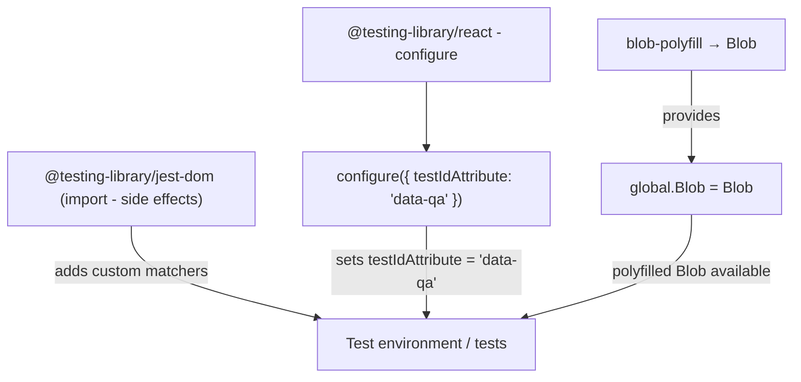
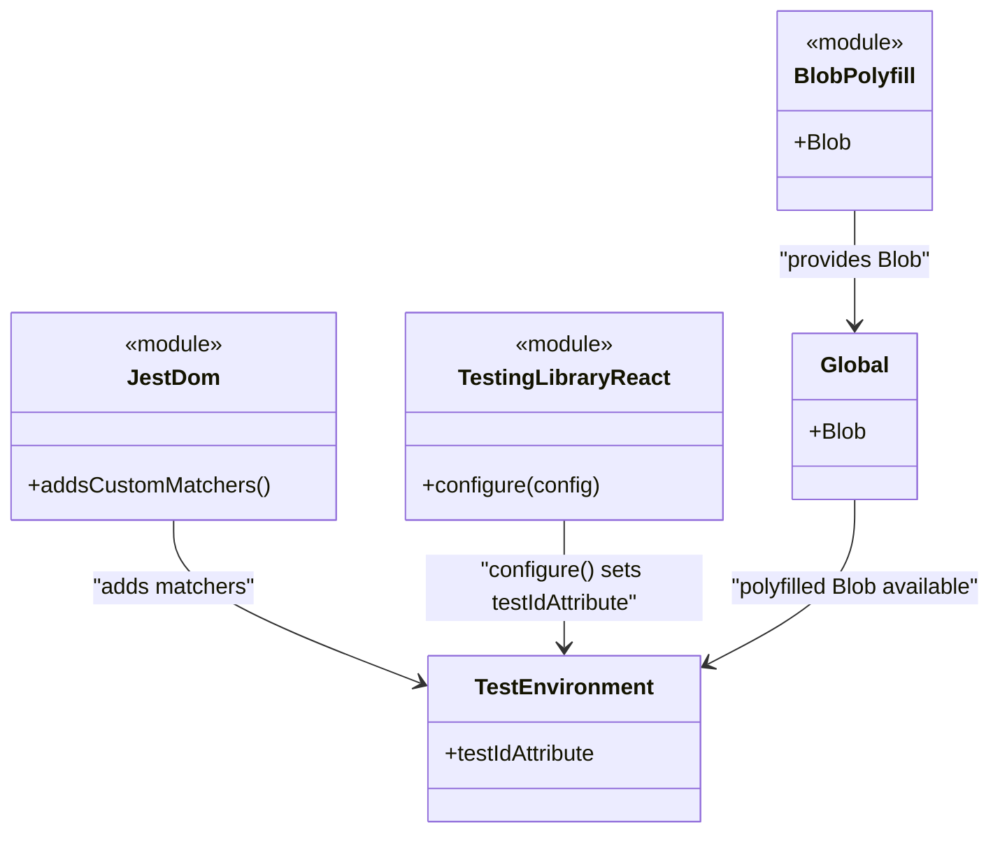

# Diagram: web/portal/src/setupTests.js

> Auto-generated by Obscura crawlers

## Diagram 1

### SVG

<svg id="container" width="841.296875" xmlns="http://www.w3.org/2000/svg" class="flowchart" height="398" viewBox="0 0 841.296875 398" role="graphics-document document" aria-roledescription="flowchart-v2"><g><marker id="container_flowchart-v2-pointEnd" class="marker flowchart-v2" viewBox="0 0 10 10" refX="5" refY="5" markerUnits="userSpaceOnUse" markerWidth="8" markerHeight="8" orient="auto"><path d="M 0 0 L 10 5 L 0 10 z" class="arrowMarkerPath" style="stroke-width: 1; stroke-dasharray: 1, 0;"></path></marker><marker id="container_flowchart-v2-pointStart" class="marker flowchart-v2" viewBox="0 0 10 10" refX="4.5" refY="5" markerUnits="userSpaceOnUse" markerWidth="8" markerHeight="8" orient="auto"><path d="M 0 5 L 10 10 L 10 0 z" class="arrowMarkerPath" style="stroke-width: 1; stroke-dasharray: 1, 0;"></path></marker><marker id="container_flowchart-v2-circleEnd" class="marker flowchart-v2" viewBox="0 0 10 10" refX="11" refY="5" markerUnits="userSpaceOnUse" markerWidth="11" markerHeight="11" orient="auto"><circle cx="5" cy="5" r="5" class="arrowMarkerPath" style="stroke-width: 1; stroke-dasharray: 1, 0;"></circle></marker><marker id="container_flowchart-v2-circleStart" class="marker flowchart-v2" viewBox="0 0 10 10" refX="-1" refY="5" markerUnits="userSpaceOnUse" markerWidth="11" markerHeight="11" orient="auto"><circle cx="5" cy="5" r="5" class="arrowMarkerPath" style="stroke-width: 1; stroke-dasharray: 1, 0;"></circle></marker><marker id="container_flowchart-v2-crossEnd" class="marker cross flowchart-v2" viewBox="0 0 11 11" refX="12" refY="5.2" markerUnits="userSpaceOnUse" markerWidth="11" markerHeight="11" orient="auto"><path d="M 1,1 l 9,9 M 10,1 l -9,9" class="arrowMarkerPath" style="stroke-width: 2; stroke-dasharray: 1, 0;"></path></marker><marker id="container_flowchart-v2-crossStart" class="marker cross flowchart-v2" viewBox="0 0 11 11" refX="-1" refY="5.2" markerUnits="userSpaceOnUse" markerWidth="11" markerHeight="11" orient="auto"><path d="M 1,1 l 9,9 M 10,1 l -9,9" class="arrowMarkerPath" style="stroke-width: 2; stroke-dasharray: 1, 0;"></path></marker><g class="root"><g class="clusters"></g><g class="edgePaths"><path d="M138,238L138,246.167C138,254.333,138,270.667,170.664,286.841C203.328,303.016,268.656,319.032,301.32,327.04L333.983,335.048" id="L_J_Tests_0" class="edge-thickness-normal edge-pattern-solid edge-thickness-normal edge-pattern-solid flowchart-link" style=";" data-edge="true" data-et="edge" data-id="L_J_Tests_0" data-points="W3sieCI6MTM4LCJ5IjoyMzh9LHsieCI6MTM4LCJ5IjoyODd9LHsieCI6MzM3Ljg2ODQyMTA1MjYzMTU2LCJ5IjozMzZ9XQ==" marker-end="url(#container_flowchart-v2-pointEnd)"></path><path d="M448,86L448,92.167C448,98.333,448,110.667,448,122.333C448,134,448,145,448,150.5L448,156" id="L_TR_CFG_0" class="edge-thickness-normal edge-pattern-solid edge-thickness-normal edge-pattern-solid flowchart-link" style=";" data-edge="true" data-et="edge" data-id="L_TR_CFG_0" data-points="W3sieCI6NDQ4LCJ5Ijo4Nn0seyJ4Ijo0NDgsInkiOjEyM30seyJ4Ijo0NDgsInkiOjE2MH1d" marker-end="url(#container_flowchart-v2-pointEnd)"></path><path d="M448,238L448,246.167C448,254.333,448,270.667,448,286.333C448,302,448,317,448,324.5L448,332" id="L_CFG_Tests_0" class="edge-thickness-normal edge-pattern-solid edge-thickness-normal edge-pattern-solid flowchart-link" style=";" data-edge="true" data-et="edge" data-id="L_CFG_Tests_0" data-points="W3sieCI6NDQ4LCJ5IjoyMzh9LHsieCI6NDQ4LCJ5IjoyODd9LHsieCI6NDQ4LCJ5IjozMzZ9XQ==" marker-end="url(#container_flowchart-v2-pointEnd)"></path><path d="M730.648,74L730.648,82.167C730.648,90.333,730.648,106.667,730.648,122.333C730.648,138,730.648,153,730.648,160.5L730.648,168" id="L_BP_G_0" class="edge-thickness-normal edge-pattern-solid edge-thickness-normal edge-pattern-solid flowchart-link" style=";" data-edge="true" data-et="edge" data-id="L_BP_G_0" data-points="W3sieCI6NzMwLjY0ODQzNzUsInkiOjc0fSx7IngiOjczMC42NDg0Mzc1LCJ5IjoxMjN9LHsieCI6NzMwLjY0ODQzNzUsInkiOjE3Mn1d" marker-end="url(#container_flowchart-v2-pointEnd)"></path><path d="M730.648,226L730.648,236.167C730.648,246.333,730.648,266.667,700.92,284.827C671.191,302.987,611.734,318.974,582.006,326.968L552.277,334.961" id="L_G_Tests_0" class="edge-thickness-normal edge-pattern-solid edge-thickness-normal edge-pattern-solid flowchart-link" style=";" data-edge="true" data-et="edge" data-id="L_G_Tests_0" data-points="W3sieCI6NzMwLjY0ODQzNzUsInkiOjIyNn0seyJ4Ijo3MzAuNjQ4NDM3NSwieSI6Mjg3fSx7IngiOjU0OC40MTQ1NzY0ODAyNjMxLCJ5IjozMzZ9XQ==" marker-end="url(#container_flowchart-v2-pointEnd)"></path></g><g class="edgeLabels"><g class="edgeLabel" transform="translate(138, 287)"><g class="label" data-id="L_J_Tests_0" transform="translate(-81.8828125, -12)"><foreignObject width="163.765625" height="24">

adds custom matchers

</foreignObject></g></g><g class="edgeLabel"><g class="label" data-id="L_TR_CFG_0" transform="translate(0, 0)"><foreignObject width="0" height="0">

</foreignObject></g></g><g class="edgeLabel" transform="translate(448, 287)"><g class="label" data-id="L_CFG_Tests_0" transform="translate(-100, -24)"><foreignObject width="200" height="48">

sets testIdAttribute = 'data-qa'

</foreignObject></g></g><g class="edgeLabel" transform="translate(730.6484375, 123)"><g class="label" data-id="L_BP_G_0" transform="translate(-31.3125, -12)"><foreignObject width="62.625" height="24">

provides

</foreignObject></g></g><g class="edgeLabel" transform="translate(730.6484375, 287)"><g class="label" data-id="L_G_Tests_0" transform="translate(-87.5703125, -12)"><foreignObject width="175.140625" height="24">

polyfilled Blob available

</foreignObject></g></g></g><g class="nodes"><g class="node default" id="flowchart-J-0" transform="translate(138, 199)"><rect class="basic label-container" style="" x="-130" y="-39" width="260" height="78"></rect><g class="label" style="" transform="translate(-100, -24)"><rect></rect><foreignObject width="200" height="48">

@testing-library/jest-dom (import - side effects)

</foreignObject></g></g><g class="node default" id="flowchart-TR-1" transform="translate(448, 47)"><rect class="basic label-container" style="" x="-130" y="-39" width="260" height="78"></rect><g class="label" style="" transform="translate(-100, -24)"><rect></rect><foreignObject width="200" height="48">

@testing-library/react - configure

</foreignObject></g></g><g class="node default" id="flowchart-CFG-2" transform="translate(448, 199)"><rect class="basic label-container" style="" x="-130" y="-39" width="260" height="78"></rect><g class="label" style="" transform="translate(-100, -24)"><rect></rect><foreignObject width="200" height="48">

configure({ testIdAttribute: 'data-qa' })

</foreignObject></g></g><g class="node default" id="flowchart-BP-3" transform="translate(730.6484375, 47)"><rect class="basic label-container" style="" x="-102.6484375" y="-27" width="205.296875" height="54"></rect><g class="label" style="" transform="translate(-72.6484375, -12)"><rect></rect><foreignObject width="145.296875" height="24">

blob-polyfill → Blob

</foreignObject></g></g><g class="node default" id="flowchart-G-4" transform="translate(730.6484375, 199)"><rect class="basic label-container" style="" x="-95.8046875" y="-27" width="191.609375" height="54"></rect><g class="label" style="" transform="translate(-65.8046875, -12)"><rect></rect><foreignObject width="131.609375" height="24">

global.Blob = Blob

</foreignObject></g></g><g class="node default" id="flowchart-Tests-5" transform="translate(448, 363)"><rect class="basic label-container" style="" x="-118.875" y="-27" width="237.75" height="54"></rect><g class="label" style="" transform="translate(-88.875, -12)"><rect></rect><foreignObject width="177.75" height="24">

Test environment / tests

</foreignObject></g></g></g></g></g></svg>

## Diagram 2

### SVG

<svg id="container" width="720.62109375" xmlns="http://www.w3.org/2000/svg" class="classDiagram" height="602" viewBox="0 0 720.62109375 602" role="graphics-document document" aria-roledescription="class"><g><defs><marker id="container_class-aggregationStart" class="marker aggregation class" refX="18" refY="7" markerWidth="190" markerHeight="240" orient="auto"><path d="M 18,7 L9,13 L1,7 L9,1 Z"></path></marker></defs><defs><marker id="container_class-aggregationEnd" class="marker aggregation class" refX="1" refY="7" markerWidth="20" markerHeight="28" orient="auto"><path d="M 18,7 L9,13 L1,7 L9,1 Z"></path></marker></defs><defs><marker id="container_class-extensionStart" class="marker extension class" refX="18" refY="7" markerWidth="190" markerHeight="240" orient="auto"><path d="M 1,7 L18,13 V 1 Z"></path></marker></defs><defs><marker id="container_class-extensionEnd" class="marker extension class" refX="1" refY="7" markerWidth="20" markerHeight="28" orient="auto"><path d="M 1,1 V 13 L18,7 Z"></path></marker></defs><defs><marker id="container_class-compositionStart" class="marker composition class" refX="18" refY="7" markerWidth="190" markerHeight="240" orient="auto"><path d="M 18,7 L9,13 L1,7 L9,1 Z"></path></marker></defs><defs><marker id="container_class-compositionEnd" class="marker composition class" refX="1" refY="7" markerWidth="20" markerHeight="28" orient="auto"><path d="M 18,7 L9,13 L1,7 L9,1 Z"></path></marker></defs><defs><marker id="container_class-dependencyStart" class="marker dependency class" refX="6" refY="7" markerWidth="190" markerHeight="240" orient="auto"><path d="M 5,7 L9,13 L1,7 L9,1 Z"></path></marker></defs><defs><marker id="container_class-dependencyEnd" class="marker dependency class" refX="13" refY="7" markerWidth="20" markerHeight="28" orient="auto"><path d="M 18,7 L9,13 L14,7 L9,1 Z"></path></marker></defs><defs><marker id="container_class-lollipopStart" class="marker lollipop class" refX="13" refY="7" markerWidth="190" markerHeight="240" orient="auto"><circle stroke="black" fill="transparent" cx="7" cy="7" r="6"></circle></marker></defs><defs><marker id="container_class-lollipopEnd" class="marker lollipop class" refX="1" refY="7" markerWidth="190" markerHeight="240" orient="auto"><circle stroke="black" fill="transparent" cx="7" cy="7" r="6"></circle></marker></defs><g class="root"><g class="clusters"></g><g class="edgePaths"><path d="M124.973,376L124.973,384.167C124.973,392.333,124.973,408.667,154.054,428.159C183.136,447.651,241.3,470.301,270.382,481.626L299.464,492.952" id="id_JestDom_TestEnvironment_1" class="edge-thickness-normal edge-pattern-solid relation" style=";;;" data-edge="true" data-et="edge" data-id="id_JestDom_TestEnvironment_1" data-points="W3sieCI6MTI0Ljk3MjY1NjI1LCJ5IjozNzZ9LHsieCI6MTI0Ljk3MjY1NjI1LCJ5Ijo0MjV9LHsieCI6MzA1LjA1NDY4NzUsInkiOjQ5NS4xMjg3OTk1MDg3NTA0fV0=" marker-end="url(#container_class-dependencyEnd)"></path><path d="M404.871,376L404.871,384.167C404.871,392.333,404.871,408.667,404.871,424C404.871,439.333,404.871,453.667,404.871,460.833L404.871,468" id="id_TestingLibraryReact_TestEnvironment_2" class="edge-thickness-normal edge-pattern-solid relation" style=";;;" data-edge="true" data-et="edge" data-id="id_TestingLibraryReact_TestEnvironment_2" data-points="W3sieCI6NDA0Ljg3MTA5Mzc1LCJ5IjozNzZ9LHsieCI6NDA0Ljg3MTA5Mzc1LCJ5Ijo0MjV9LHsieCI6NDA0Ljg3MTA5Mzc1LCJ5Ijo0NzR9XQ==" marker-end="url(#container_class-dependencyEnd)"></path><path d="M618.746,152L618.746,158.167C618.746,164.333,618.746,176.667,618.746,190.5C618.746,204.333,618.746,219.667,618.746,227.333L618.746,235" id="id_BlobPolyfill_Global_3" class="edge-thickness-normal edge-pattern-solid relation" style=";;;" data-edge="true" data-et="edge" data-id="id_BlobPolyfill_Global_3" data-points="W3sieCI6NjE4Ljc0NjA5Mzc1LCJ5IjoxNTJ9LHsieCI6NjE4Ljc0NjA5Mzc1LCJ5IjoxODl9LHsieCI6NjE4Ljc0NjA5Mzc1LCJ5IjoyNDF9XQ==" marker-end="url(#container_class-dependencyEnd)"></path><path d="M618.746,361L618.746,371.667C618.746,382.333,618.746,403.667,600.627,423.567C582.508,443.468,546.271,461.937,528.152,471.171L510.033,480.405" id="id_Global_TestEnvironment_4" class="edge-thickness-normal edge-pattern-solid relation" style=";;;" data-edge="true" data-et="edge" data-id="id_Global_TestEnvironment_4" data-points="W3sieCI6NjE4Ljc0NjA5Mzc1LCJ5IjozNjF9LHsieCI6NjE4Ljc0NjA5Mzc1LCJ5Ijo0MjV9LHsieCI6NTA0LjY4NzUsInkiOjQ4My4xMjkyMTkwMjM5NjI2fV0=" marker-end="url(#container_class-dependencyEnd)"></path></g><g class="edgeLabels"><g class="edgeLabel" transform="translate(124.97265625, 425)"><g class="label" data-id="id_JestDom_TestEnvironment_1" transform="translate(-59.4765625, -12)"><foreignObject width="118.953125" height="24">

"adds matchers"

</foreignObject></g></g><g class="edgeLabel" transform="translate(404.87109375, 425)"><g class="label" data-id="id_TestingLibraryReact_TestEnvironment_2" transform="translate(-100, -24)"><foreignObject width="200" height="48">

"configure() sets testIdAttribute"

</foreignObject></g></g><g class="edgeLabel" transform="translate(618.74609375, 189)"><g class="label" data-id="id_BlobPolyfill_Global_3" transform="translate(-56.328125, -12)"><foreignObject width="112.65625" height="24">

"provides Blob"

</foreignObject></g></g><g class="edgeLabel" transform="translate(618.74609375, 425)"><g class="label" data-id="id_Global_TestEnvironment_4" transform="translate(-93.875, -12)"><foreignObject width="187.75" height="24">

"polyfilled Blob available"

</foreignObject></g></g></g><g class="nodes"><g class="node default" id="classId-JestDom-0" transform="translate(124.97265625, 301)"><g class="basic label-container"><path d="M-116.97265625 -75 L116.97265625 -75 L116.97265625 75 L-116.97265625 75" stroke="none" stroke-width="0" fill="#ECECFF" style=""></path><path d="M-116.97265625 -75 C-69.45841915813457 -75, -21.944182066269136 -75, 116.97265625 -75 M-116.97265625 -75 C-44.209724120101 -75, 28.553208009798 -75, 116.97265625 -75 M116.97265625 -75 C116.97265625 -36.528781909829945, 116.97265625 1.9424361803401098, 116.97265625 75 M116.97265625 -75 C116.97265625 -36.949062839796504, 116.97265625 1.101874320406992, 116.97265625 75 M116.97265625 75 C31.946838168201708 75, -53.078979913596584 75, -116.97265625 75 M116.97265625 75 C50.7468084894785 75, -15.479039271043007 75, -116.97265625 75 M-116.97265625 75 C-116.97265625 25.146408025978786, -116.97265625 -24.707183948042427, -116.97265625 -75 M-116.97265625 75 C-116.97265625 20.046548343239877, -116.97265625 -34.906903313520246, -116.97265625 -75" stroke="#9370DB" stroke-width="1.3" fill="none" stroke-dasharray="0 0" style=""></path></g><g class="annotation-group text" transform="translate(-36.6015625, -51)"><g class="label" style="" transform="translate(0,-12)"><foreignObject width="73.203125" height="24">

«module»

</foreignObject></g></g><g class="label-group text" transform="translate(-30.546875, -27)"><g class="label" style="font-weight: bolder" transform="translate(0,-12)"><foreignObject width="61.09375" height="24">

JestDom

</foreignObject></g></g><g class="members-group text" transform="translate(-104.97265625, 21)"></g><g class="methods-group text" transform="translate(-104.97265625, 51)"><g class="label" style="" transform="translate(0,-12)"><foreignObject width="173.34375" height="24">

+addsCustomMatchers()

</foreignObject></g></g><g class="divider" style=""><path d="M-116.97265625 -3 C-40.016925416914745 -3, 36.93880541617051 -3, 116.97265625 -3 M-116.97265625 -3 C-49.94077649668144 -3, 17.091103256637126 -3, 116.97265625 -3" stroke="#9370DB" stroke-width="1.3" fill="none" stroke-dasharray="0 0" style=""></path></g><g class="divider" style=""><path d="M-116.97265625 21 C-25.42129879905724 21, 66.13005865188552 21, 116.97265625 21 M-116.97265625 21 C-65.1548082716175 21, -13.33696029323498 21, 116.97265625 21" stroke="#9370DB" stroke-width="1.3" fill="none" stroke-dasharray="0 0" style=""></path></g></g><g class="node default" id="classId-TestingLibraryReact-1" transform="translate(404.87109375, 301)"><g class="basic label-container"><path d="M-112.92578125 -75 L112.92578125 -75 L112.92578125 75 L-112.92578125 75" stroke="none" stroke-width="0" fill="#ECECFF" style=""></path><path d="M-112.92578125 -75 C-40.44190956083922 -75, 32.04196212832156 -75, 112.92578125 -75 M-112.92578125 -75 C-67.29138031630657 -75, -21.656979382613144 -75, 112.92578125 -75 M112.92578125 -75 C112.92578125 -34.38865561246566, 112.92578125 6.222688775068676, 112.92578125 75 M112.92578125 -75 C112.92578125 -22.762667606709122, 112.92578125 29.474664786581755, 112.92578125 75 M112.92578125 75 C65.02732840228131 75, 17.12887555456261 75, -112.92578125 75 M112.92578125 75 C51.73439088182466 75, -9.456999486350682 75, -112.92578125 75 M-112.92578125 75 C-112.92578125 30.501954512403863, -112.92578125 -13.996090975192274, -112.92578125 -75 M-112.92578125 75 C-112.92578125 20.504920821745387, -112.92578125 -33.99015835650923, -112.92578125 -75" stroke="#9370DB" stroke-width="1.3" fill="none" stroke-dasharray="0 0" style=""></path></g><g class="annotation-group text" transform="translate(-36.6015625, -51)"><g class="label" style="" transform="translate(0,-12)"><foreignObject width="73.203125" height="24">

«module»

</foreignObject></g></g><g class="label-group text" transform="translate(-72.7890625, -27)"><g class="label" style="font-weight: bolder" transform="translate(0,-12)"><foreignObject width="145.578125" height="24">

TestingLibraryReact

</foreignObject></g></g><g class="members-group text" transform="translate(-100.92578125, 21)"></g><g class="methods-group text" transform="translate(-100.92578125, 51)"><g class="label" style="" transform="translate(0,-12)"><foreignObject width="129.0625" height="24">

+configure(config)

</foreignObject></g></g><g class="divider" style=""><path d="M-112.92578125 -3 C-47.18437935783359 -3, 18.557022534332816 -3, 112.92578125 -3 M-112.92578125 -3 C-43.2413663138169 -3, 26.443048622366206 -3, 112.92578125 -3" stroke="#9370DB" stroke-width="1.3" fill="none" stroke-dasharray="0 0" style=""></path></g><g class="divider" style=""><path d="M-112.92578125 21 C-32.94040866424298 21, 47.04496392151404 21, 112.92578125 21 M-112.92578125 21 C-38.408059002062416 21, 36.10966324587517 21, 112.92578125 21" stroke="#9370DB" stroke-width="1.3" fill="none" stroke-dasharray="0 0" style=""></path></g></g><g class="node default" id="classId-BlobPolyfill-2" transform="translate(618.74609375, 80)"><g class="basic label-container"><path d="M-53.9375 -72 L53.9375 -72 L53.9375 72 L-53.9375 72" stroke="none" stroke-width="0" fill="#ECECFF" style=""></path><path d="M-53.9375 -72 C-29.28182016704128 -72, -4.626140334082557 -72, 53.9375 -72 M-53.9375 -72 C-13.079008468275866 -72, 27.779483063448268 -72, 53.9375 -72 M53.9375 -72 C53.9375 -35.947156408583325, 53.9375 0.10568718283334988, 53.9375 72 M53.9375 -72 C53.9375 -20.707632886125083, 53.9375 30.584734227749834, 53.9375 72 M53.9375 72 C19.07428297416473 72, -15.788934051670537 72, -53.9375 72 M53.9375 72 C14.67014920963613 72, -24.59720158072774 72, -53.9375 72 M-53.9375 72 C-53.9375 42.63774784424038, -53.9375 13.275495688480753, -53.9375 -72 M-53.9375 72 C-53.9375 15.559283639411298, -53.9375 -40.881432721177404, -53.9375 -72" stroke="#9370DB" stroke-width="1.3" fill="none" stroke-dasharray="0 0" style=""></path></g><g class="annotation-group text" transform="translate(-36.6015625, -48)"><g class="label" style="" transform="translate(0,-12)"><foreignObject width="73.203125" height="24">

«module»

</foreignObject></g></g><g class="label-group text" transform="translate(-41.9375, -24)"><g class="label" style="font-weight: bolder" transform="translate(0,-12)"><foreignObject width="83.875" height="24">

BlobPolyfill

</foreignObject></g></g><g class="members-group text" transform="translate(-41.9375, 24)"><g class="label" style="" transform="translate(0,-12)"><foreignObject width="41.171875" height="24">

+Blob

</foreignObject></g></g><g class="methods-group text" transform="translate(-41.9375, 72)"></g><g class="divider" style=""><path d="M-53.9375 0 C-15.267681287184232 0, 23.402137425631537 0, 53.9375 0 M-53.9375 0 C-31.429037681781505 0, -8.92057536356301 0, 53.9375 0" stroke="#9370DB" stroke-width="1.3" fill="none" stroke-dasharray="0 0" style=""></path></g><g class="divider" style=""><path d="M-53.9375 48 C-20.489870011264436 48, 12.957759977471127 48, 53.9375 48 M-53.9375 48 C-24.20237259697606 48, 5.532754806047883 48, 53.9375 48" stroke="#9370DB" stroke-width="1.3" fill="none" stroke-dasharray="0 0" style=""></path></g></g><g class="node default" id="classId-Global-3" transform="translate(618.74609375, 301)"><g class="basic label-container"><path d="M-44.359375 -60 L44.359375 -60 L44.359375 60 L-44.359375 60" stroke="none" stroke-width="0" fill="#ECECFF" style=""></path><path d="M-44.359375 -60 C-20.155914876579303 -60, 4.047545246841395 -60, 44.359375 -60 M-44.359375 -60 C-12.853121112162523 -60, 18.653132775674955 -60, 44.359375 -60 M44.359375 -60 C44.359375 -19.652320055733874, 44.359375 20.695359888532252, 44.359375 60 M44.359375 -60 C44.359375 -29.173467393288945, 44.359375 1.65306521342211, 44.359375 60 M44.359375 60 C15.951407830053906 60, -12.456559339892188 60, -44.359375 60 M44.359375 60 C15.030768312522387 60, -14.297838374955226 60, -44.359375 60 M-44.359375 60 C-44.359375 31.488689686790845, -44.359375 2.977379373581691, -44.359375 -60 M-44.359375 60 C-44.359375 35.21786830005502, -44.359375 10.435736600110026, -44.359375 -60" stroke="#9370DB" stroke-width="1.3" fill="none" stroke-dasharray="0 0" style=""></path></g><g class="annotation-group text" transform="translate(0, -36)"></g><g class="label-group text" transform="translate(-23.546875, -36)"><g class="label" style="font-weight: bolder" transform="translate(0,-12)"><foreignObject width="47.09375" height="24">

Global

</foreignObject></g></g><g class="members-group text" transform="translate(-32.359375, 12)"><g class="label" style="" transform="translate(0,-12)"><foreignObject width="41.171875" height="24">

+Blob

</foreignObject></g></g><g class="methods-group text" transform="translate(-32.359375, 60)"></g><g class="divider" style=""><path d="M-44.359375 -12 C-16.083465155873654 -12, 12.192444688252692 -12, 44.359375 -12 M-44.359375 -12 C-20.98923396806542 -12, 2.3809070638691594 -12, 44.359375 -12" stroke="#9370DB" stroke-width="1.3" fill="none" stroke-dasharray="0 0" style=""></path></g><g class="divider" style=""><path d="M-44.359375 36 C-23.385883160154577 36, -2.4123913203091547 36, 44.359375 36 M-44.359375 36 C-19.60717029835966 36, 5.1450344032806825 36, 44.359375 36" stroke="#9370DB" stroke-width="1.3" fill="none" stroke-dasharray="0 0" style=""></path></g></g><g class="node default" id="classId-TestEnvironment-4" transform="translate(404.87109375, 534)"><g class="basic label-container"><path d="M-99.81640625 -60 L99.81640625 -60 L99.81640625 60 L-99.81640625 60" stroke="none" stroke-width="0" fill="#ECECFF" style=""></path><path d="M-99.81640625 -60 C-48.37013269422438 -60, 3.076140861551238 -60, 99.81640625 -60 M-99.81640625 -60 C-43.43981258955416 -60, 12.936781070891683 -60, 99.81640625 -60 M99.81640625 -60 C99.81640625 -24.701222804930097, 99.81640625 10.597554390139805, 99.81640625 60 M99.81640625 -60 C99.81640625 -22.47036361246513, 99.81640625 15.059272775069743, 99.81640625 60 M99.81640625 60 C41.43296710086446 60, -16.95047204827108 60, -99.81640625 60 M99.81640625 60 C57.25984901932047 60, 14.70329178864094 60, -99.81640625 60 M-99.81640625 60 C-99.81640625 31.868378900653052, -99.81640625 3.736757801306105, -99.81640625 -60 M-99.81640625 60 C-99.81640625 21.47652696378035, -99.81640625 -17.046946072439297, -99.81640625 -60" stroke="#9370DB" stroke-width="1.3" fill="none" stroke-dasharray="0 0" style=""></path></g><g class="annotation-group text" transform="translate(0, -36)"></g><g class="label-group text" transform="translate(-61.4453125, -36)"><g class="label" style="font-weight: bolder" transform="translate(0,-12)"><foreignObject width="122.890625" height="24">

TestEnvironment

</foreignObject></g></g><g class="members-group text" transform="translate(-87.81640625, 12)"><g class="label" style="" transform="translate(0,-12)"><foreignObject width="114.1875" height="24">

+testIdAttribute

</foreignObject></g></g><g class="methods-group text" transform="translate(-87.81640625, 60)"></g><g class="divider" style=""><path d="M-99.81640625 -12 C-57.433068331757276 -12, -15.049730413514553 -12, 99.81640625 -12 M-99.81640625 -12 C-24.056550088157437 -12, 51.70330607368513 -12, 99.81640625 -12" stroke="#9370DB" stroke-width="1.3" fill="none" stroke-dasharray="0 0" style=""></path></g><g class="divider" style=""><path d="M-99.81640625 36 C-44.83690720973708 36, 10.142591830525845 36, 99.81640625 36 M-99.81640625 36 C-55.969466186326564 36, -12.122526122653127 36, 99.81640625 36" stroke="#9370DB" stroke-width="1.3" fill="none" stroke-dasharray="0 0" style=""></path></g></g></g></g></g></svg>
