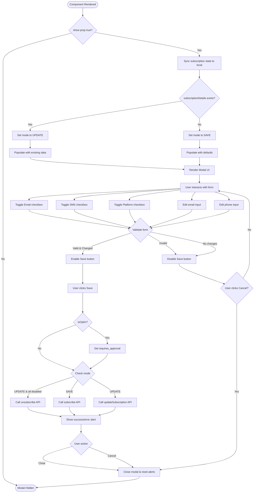
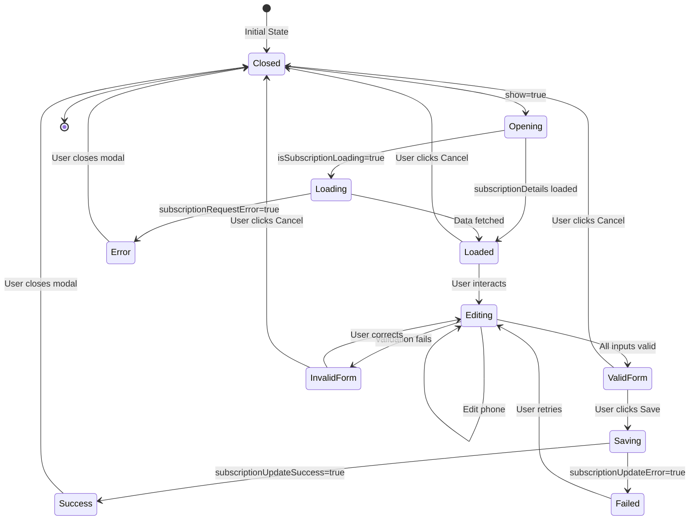
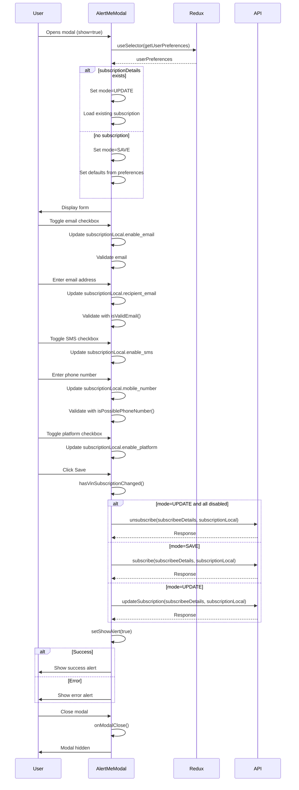
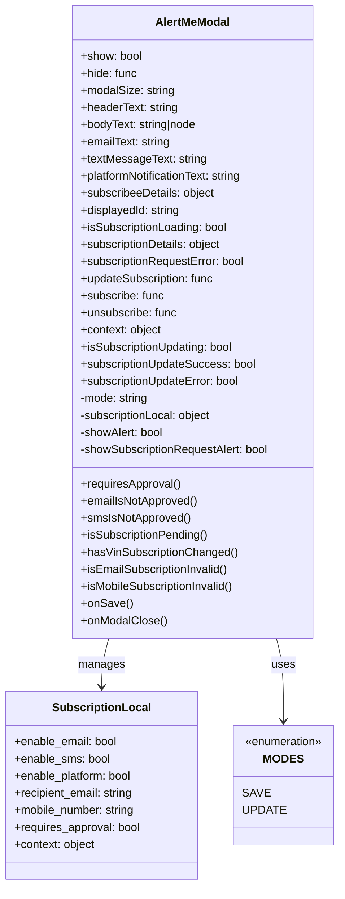

# Diagram: web/portal/src/shared/components/modals/AlertMe.modal.js

> Auto-generated by Obscura crawlers

## Diagram 1

### SVG

<svg id="container" width="1524.95703125" xmlns="http://www.w3.org/2000/svg" class="flowchart" height="2981.734375" viewBox="0 0 1524.95703125 2981.734375" role="graphics-document document" aria-roledescription="flowchart-v2"><g><marker id="container_flowchart-v2-pointEnd" class="marker flowchart-v2" viewBox="0 0 10 10" refX="5" refY="5" markerUnits="userSpaceOnUse" markerWidth="8" markerHeight="8" orient="auto"><path d="M 0 0 L 10 5 L 0 10 z" class="arrowMarkerPath" style="stroke-width: 1; stroke-dasharray: 1, 0;"></path></marker><marker id="container_flowchart-v2-pointStart" class="marker flowchart-v2" viewBox="0 0 10 10" refX="4.5" refY="5" markerUnits="userSpaceOnUse" markerWidth="8" markerHeight="8" orient="auto"><path d="M 0 5 L 10 10 L 10 0 z" class="arrowMarkerPath" style="stroke-width: 1; stroke-dasharray: 1, 0;"></path></marker><marker id="container_flowchart-v2-circleEnd" class="marker flowchart-v2" viewBox="0 0 10 10" refX="11" refY="5" markerUnits="userSpaceOnUse" markerWidth="11" markerHeight="11" orient="auto"><circle cx="5" cy="5" r="5" class="arrowMarkerPath" style="stroke-width: 1; stroke-dasharray: 1, 0;"></circle></marker><marker id="container_flowchart-v2-circleStart" class="marker flowchart-v2" viewBox="0 0 10 10" refX="-1" refY="5" markerUnits="userSpaceOnUse" markerWidth="11" markerHeight="11" orient="auto"><circle cx="5" cy="5" r="5" class="arrowMarkerPath" style="stroke-width: 1; stroke-dasharray: 1, 0;"></circle></marker><marker id="container_flowchart-v2-crossEnd" class="marker cross flowchart-v2" viewBox="0 0 11 11" refX="12" refY="5.2" markerUnits="userSpaceOnUse" markerWidth="11" markerHeight="11" orient="auto"><path d="M 1,1 l 9,9 M 10,1 l -9,9" class="arrowMarkerPath" style="stroke-width: 2; stroke-dasharray: 1, 0;"></path></marker><marker id="container_flowchart-v2-crossStart" class="marker cross flowchart-v2" viewBox="0 0 11 11" refX="-1" refY="5.2" markerUnits="userSpaceOnUse" markerWidth="11" markerHeight="11" orient="auto"><path d="M 1,1 l 9,9 M 10,1 l -9,9" class="arrowMarkerPath" style="stroke-width: 2; stroke-dasharray: 1, 0;"></path></marker><g class="root"><g class="clusters"></g><g class="edgePaths"><path d="M495.93,47.5L495.846,51.583C495.763,55.667,495.596,63.833,495.513,71.417C495.43,79,495.43,86,495.43,89.5L495.43,93" id="L_Start_CheckShow_0" class="edge-thickness-normal edge-pattern-solid edge-thickness-normal edge-pattern-solid flowchart-link" style=";" data-edge="true" data-et="edge" data-id="L_Start_CheckShow_0" data-points="W3sieCI6NDk1LjkyOTY4NzUsInkiOjQ3LjV9LHsieCI6NDk1LjQyOTY4NzUsInkiOjcyfSx7IngiOjQ5NS40Mjk2ODc1LCJ5Ijo5N31d" marker-end="url(#container_flowchart-v2-pointEnd)"></path><path d="M568.117,195.203L672.276,213.484C776.435,231.766,984.753,268.328,1088.911,292.109C1193.07,315.891,1193.07,326.891,1193.07,332.391L1193.07,337.891" id="L_CheckShow_SyncState_0" class="edge-thickness-normal edge-pattern-solid edge-thickness-normal edge-pattern-solid flowchart-link" style=";" data-edge="true" data-et="edge" data-id="L_CheckShow_SyncState_0" data-points="W3sieCI6NTY4LjExNzMzOTQ3NjQ5ODMsInkiOjE5NS4yMDI5NzMwMjM1MDE3M30seyJ4IjoxMTkzLjA3MDMxMjUsInkiOjMwNC44OTA2MjV9LHsieCI6MTE5My4wNzAzMTI1LCJ5IjozNDEuODkwNjI1fV0=" marker-end="url(#container_flowchart-v2-pointEnd)"></path><path d="M427.429,199.89L359.215,217.39C291,234.89,154.57,269.891,86.355,300.057C18.141,330.224,18.141,355.557,18.141,378.891C18.141,402.224,18.141,423.557,18.141,459.004C18.141,494.451,18.141,544.01,18.141,595.57C18.141,647.13,18.141,700.69,18.141,738.137C18.141,775.583,18.141,796.917,18.141,816.25C18.141,835.583,18.141,852.917,18.141,870.25C18.141,887.583,18.141,904.917,18.141,922.25C18.141,939.583,18.141,956.917,18.141,974.25C18.141,991.583,18.141,1008.917,18.141,1026.25C18.141,1043.583,18.141,1060.917,18.141,1078.25C18.141,1095.583,18.141,1112.917,18.141,1130.25C18.141,1147.583,18.141,1164.917,18.141,1182.25C18.141,1199.583,18.141,1216.917,18.141,1234.25C18.141,1251.583,18.141,1268.917,18.141,1294.35C18.141,1319.784,18.141,1353.318,18.141,1388.852C18.141,1424.385,18.141,1461.919,18.141,1491.353C18.141,1520.786,18.141,1542.12,18.141,1561.453C18.141,1580.786,18.141,1598.12,18.141,1626.801C18.141,1655.482,18.141,1695.51,18.141,1735.539C18.141,1775.568,18.141,1815.596,18.141,1849.219C18.141,1882.841,18.141,1910.057,18.141,1939.273C18.141,1968.49,18.141,1999.706,18.141,2025.98C18.141,2052.255,18.141,2073.589,18.141,2092.922C18.141,2112.255,18.141,2129.589,18.141,2154.283C18.141,2178.977,18.141,2211.031,18.141,2245.086C18.141,2279.141,18.141,2315.195,18.141,2345.889C18.141,2376.583,18.141,2401.917,18.141,2425.25C18.141,2448.583,18.141,2469.917,18.141,2489.25C18.141,2508.583,18.141,2525.917,18.141,2543.25C18.141,2560.583,18.141,2577.917,18.141,2602.124C18.141,2626.331,18.141,2657.411,18.141,2690.492C18.141,2723.573,18.141,2758.654,18.141,2786.861C18.141,2815.068,18.141,2836.401,18.141,2855.734C18.141,2875.068,18.141,2892.401,30.989,2905.434C43.836,2918.467,69.532,2927.199,82.38,2931.565L95.228,2935.932" id="L_CheckShow_End_0" class="edge-thickness-normal edge-pattern-solid edge-thickness-normal edge-pattern-solid flowchart-link" style=";" data-edge="true" data-et="edge" data-id="L_CheckShow_End_0" data-points="W3sieCI6NDI3LjQyOTM5NDcwNjgwMzgsInkiOjE5OS44OTAzMzIyMDY4MDM4fSx7IngiOjE4LjE0MDYyNSwieSI6MzA0Ljg5MDYyNX0seyJ4IjoxOC4xNDA2MjUsInkiOjM4MC44OTA2MjV9LHsieCI6MTguMTQwNjI1LCJ5Ijo0NDQuODkwNjI1fSx7IngiOjE4LjE0MDYyNSwieSI6NTkzLjU3MDMxMjV9LHsieCI6MTguMTQwNjI1LCJ5Ijo3NTQuMjV9LHsieCI6MTguMTQwNjI1LCJ5Ijo4MTguMjV9LHsieCI6MTguMTQwNjI1LCJ5Ijo4NzAuMjV9LHsieCI6MTguMTQwNjI1LCJ5Ijo5MjIuMjV9LHsieCI6MTguMTQwNjI1LCJ5Ijo5NzQuMjV9LHsieCI6MTguMTQwNjI1LCJ5IjoxMDI2LjI1fSx7IngiOjE4LjE0MDYyNSwieSI6MTA3OC4yNX0seyJ4IjoxOC4xNDA2MjUsInkiOjExMzAuMjV9LHsieCI6MTguMTQwNjI1LCJ5IjoxMTgyLjI1fSx7IngiOjE4LjE0MDYyNSwieSI6MTIzNC4yNX0seyJ4IjoxOC4xNDA2MjUsInkiOjEyODYuMjV9LHsieCI6MTguMTQwNjI1LCJ5IjoxMzg2Ljg1MTU2MjV9LHsieCI6MTguMTQwNjI1LCJ5IjoxNDk5LjQ1MzEyNX0seyJ4IjoxOC4xNDA2MjUsInkiOjE1NjMuNDUzMTI1fSx7IngiOjE4LjE0MDYyNSwieSI6MTYxNS40NTMxMjV9LHsieCI6MTguMTQwNjI1LCJ5IjoxNzM1LjUzOTA2MjV9LHsieCI6MTguMTQwNjI1LCJ5IjoxODU1LjYyNX0seyJ4IjoxOC4xNDA2MjUsInkiOjE5MzcuMjczNDM3NX0seyJ4IjoxOC4xNDA2MjUsInkiOjIwMzAuOTIxODc1fSx7IngiOjE4LjE0MDYyNSwieSI6MjA5NC45MjE4NzV9LHsieCI6MTguMTQwNjI1LCJ5IjoyMTQ2LjkyMTg3NX0seyJ4IjoxOC4xNDA2MjUsInkiOjIyNDMuMDg1OTM3NX0seyJ4IjoxOC4xNDA2MjUsInkiOjIzNTEuMjV9LHsieCI6MTguMTQwNjI1LCJ5IjoyNDI3LjI1fSx7IngiOjE4LjE0MDYyNSwieSI6MjQ5MS4yNX0seyJ4IjoxOC4xNDA2MjUsInkiOjI1NDMuMjV9LHsieCI6MTguMTQwNjI1LCJ5IjoyNTk1LjI1fSx7IngiOjE4LjE0MDYyNSwieSI6MjY4OC40OTIxODc1fSx7IngiOjE4LjE0MDYyNSwieSI6Mjc5My43MzQzNzV9LHsieCI6MTguMTQwNjI1LCJ5IjoyODU3LjczNDM3NX0seyJ4IjoxOC4xNDA2MjUsInkiOjI5MDkuNzM0Mzc1fSx7IngiOjk5LjAxNTQ4MTA3MTExMTc2LCJ5IjoyOTM3LjIxODY0ODI2MzA1ODZ9XQ==" marker-end="url(#container_flowchart-v2-pointEnd)"></path><path d="M1193.07,419.891L1193.07,424.057C1193.07,428.224,1193.07,436.557,1193.07,444.224C1193.07,451.891,1193.07,458.891,1193.07,462.391L1193.07,465.891" id="L_SyncState_CheckMode_0" class="edge-thickness-normal edge-pattern-solid edge-thickness-normal edge-pattern-solid flowchart-link" style=";" data-edge="true" data-et="edge" data-id="L_SyncState_CheckMode_0" data-points="W3sieCI6MTE5My4wNzAzMTI1LCJ5Ijo0MTkuODkwNjI1fSx7IngiOjExOTMuMDcwMzEyNSwieSI6NDQ0Ljg5MDYyNX0seyJ4IjoxMTkzLjA3MDMxMjUsInkiOjQ2OS44OTA2MjV9XQ==" marker-end="url(#container_flowchart-v2-pointEnd)"></path><path d="M1086.358,610.537L935.711,634.489C785.065,658.441,483.773,706.346,333.127,735.798C182.48,765.25,182.48,776.25,182.48,781.75L182.48,787.25" id="L_CheckMode_SetUpdate_0" class="edge-thickness-normal edge-pattern-solid edge-thickness-normal edge-pattern-solid flowchart-link" style=";" data-edge="true" data-et="edge" data-id="L_CheckMode_SetUpdate_0" data-points="W3sieCI6MTA4Ni4zNTc1MjU0NTA2NDk1LCJ5Ijo2MTAuNTM3MjEyOTUwNjQ5NX0seyJ4IjoxODIuNDgwNDY4NzUsInkiOjc1NC4yNX0seyJ4IjoxODIuNDgwNDY4NzUsInkiOjc5MS4yNX1d" marker-end="url(#container_flowchart-v2-pointEnd)"></path><path d="M1197.327,712.994L1197.572,719.87C1197.817,726.746,1198.307,740.498,1198.552,752.874C1198.797,765.25,1198.797,776.25,1198.797,781.75L1198.797,787.25" id="L_CheckMode_SetSave_0" class="edge-thickness-normal edge-pattern-solid edge-thickness-normal edge-pattern-solid flowchart-link" style=";" data-edge="true" data-et="edge" data-id="L_CheckMode_SetSave_0" data-points="W3sieCI6MTE5Ny4zMjY1MTk1ODYyNjc1LCJ5Ijo3MTIuOTkzNzkyOTEzNzMyNH0seyJ4IjoxMTk4Ljc5Njg3NSwieSI6NzU0LjI1fSx7IngiOjExOTguNzk2ODc1LCJ5Ijo3OTEuMjV9XQ==" marker-end="url(#container_flowchart-v2-pointEnd)"></path><path d="M182.48,845.25L182.48,849.417C182.48,853.583,182.48,861.917,182.48,869.583C182.48,877.25,182.48,884.25,182.48,887.75L182.48,891.25" id="L_SetUpdate_PopulateUpdate_0" class="edge-thickness-normal edge-pattern-solid edge-thickness-normal edge-pattern-solid flowchart-link" style=";" data-edge="true" data-et="edge" data-id="L_SetUpdate_PopulateUpdate_0" data-points="W3sieCI6MTgyLjQ4MDQ2ODc1LCJ5Ijo4NDUuMjV9LHsieCI6MTgyLjQ4MDQ2ODc1LCJ5Ijo4NzAuMjV9LHsieCI6MTgyLjQ4MDQ2ODc1LCJ5Ijo4OTUuMjV9XQ==" marker-end="url(#container_flowchart-v2-pointEnd)"></path><path d="M1198.797,845.25L1198.797,849.417C1198.797,853.583,1198.797,861.917,1198.797,869.583C1198.797,877.25,1198.797,884.25,1198.797,887.75L1198.797,891.25" id="L_SetSave_PopulateNew_0" class="edge-thickness-normal edge-pattern-solid edge-thickness-normal edge-pattern-solid flowchart-link" style=";" data-edge="true" data-et="edge" data-id="L_SetSave_PopulateNew_0" data-points="W3sieCI6MTE5OC43OTY4NzUsInkiOjg0NS4yNX0seyJ4IjoxMTk4Ljc5Njg3NSwieSI6ODcwLjI1fSx7IngiOjExOTguNzk2ODc1LCJ5Ijo4OTUuMjV9XQ==" marker-end="url(#container_flowchart-v2-pointEnd)"></path><path d="M182.48,949.25L182.48,953.417C182.48,957.583,182.48,965.917,335.214,977.942C487.947,989.968,793.414,1005.686,946.147,1013.545L1098.88,1021.403" id="L_PopulateUpdate_RenderModal_0" class="edge-thickness-normal edge-pattern-solid edge-thickness-normal edge-pattern-solid flowchart-link" style=";" data-edge="true" data-et="edge" data-id="L_PopulateUpdate_RenderModal_0" data-points="W3sieCI6MTgyLjQ4MDQ2ODc1LCJ5Ijo5NDkuMjV9LHsieCI6MTgyLjQ4MDQ2ODc1LCJ5Ijo5NzQuMjV9LHsieCI6MTEwMi44NzUsInkiOjEwMjEuNjA4OTkxMzA2OTAyM31d" marker-end="url(#container_flowchart-v2-pointEnd)"></path><path d="M1198.797,949.25L1198.797,953.417C1198.797,957.583,1198.797,965.917,1198.411,973.587C1198.025,981.258,1197.253,988.266,1196.867,991.77L1196.482,995.274" id="L_PopulateNew_RenderModal_0" class="edge-thickness-normal edge-pattern-solid edge-thickness-normal edge-pattern-solid flowchart-link" style=";" data-edge="true" data-et="edge" data-id="L_PopulateNew_RenderModal_0" data-points="W3sieCI6MTE5OC43OTY4NzUsInkiOjk0OS4yNX0seyJ4IjoxMTk4Ljc5Njg3NSwieSI6OTc0LjI1fSx7IngiOjExOTYuMDQzNzE5OTUxOTIzLCJ5Ijo5OTkuMjV9XQ==" marker-end="url(#container_flowchart-v2-pointEnd)"></path><path d="M1193.07,1053.25L1193.07,1057.417C1193.07,1061.583,1193.07,1069.917,1193.07,1077.583C1193.07,1085.25,1193.07,1092.25,1193.07,1095.75L1193.07,1099.25" id="L_RenderModal_UserInteract_0" class="edge-thickness-normal edge-pattern-solid edge-thickness-normal edge-pattern-solid flowchart-link" style=";" data-edge="true" data-et="edge" data-id="L_RenderModal_UserInteract_0" data-points="W3sieCI6MTE5My4wNzAzMTI1LCJ5IjoxMDUzLjI1fSx7IngiOjExOTMuMDcwMzEyNSwieSI6MTA3OC4yNX0seyJ4IjoxMTkzLjA3MDMxMjUsInkiOjExMDMuMjV9XQ==" marker-end="url(#container_flowchart-v2-pointEnd)"></path><path d="M1075.805,1136.233L925.496,1143.903C775.188,1151.572,474.57,1166.911,324.262,1178.081C173.953,1189.25,173.953,1196.25,173.953,1199.75L173.953,1203.25" id="L_UserInteract_ToggleEmail_0" class="edge-thickness-normal edge-pattern-solid edge-thickness-normal edge-pattern-solid flowchart-link" style=";" data-edge="true" data-et="edge" data-id="L_UserInteract_ToggleEmail_0" data-points="W3sieCI6MTA3NS44MDQ2ODc1LCJ5IjoxMTM2LjIzMzQyNjIxOTA3NzV9LHsieCI6MTczLjk1MzEyNSwieSI6MTE4Mi4yNX0seyJ4IjoxNzMuOTUzMTI1LCJ5IjoxMjA3LjI1fV0=" marker-end="url(#container_flowchart-v2-pointEnd)"></path><path d="M1075.805,1138.368L970.161,1145.682C864.518,1152.995,653.232,1167.623,547.589,1178.436C441.945,1189.25,441.945,1196.25,441.945,1199.75L441.945,1203.25" id="L_UserInteract_ToggleSMS_0" class="edge-thickness-normal edge-pattern-solid edge-thickness-normal edge-pattern-solid flowchart-link" style=";" data-edge="true" data-et="edge" data-id="L_UserInteract_ToggleSMS_0" data-points="W3sieCI6MTA3NS44MDQ2ODc1LCJ5IjoxMTM4LjM2ODIzOTMwNzcwNTJ9LHsieCI6NDQxLjk0NTMxMjUsInkiOjExODIuMjV9LHsieCI6NDQxLjk0NTMxMjUsInkiOjEyMDcuMjV9XQ==" marker-end="url(#container_flowchart-v2-pointEnd)"></path><path d="M1075.805,1144.673L1024.885,1150.936C973.966,1157.199,872.128,1169.724,821.208,1179.487C770.289,1189.25,770.289,1196.25,770.289,1199.75L770.289,1203.25" id="L_UserInteract_TogglePlatform_0" class="edge-thickness-normal edge-pattern-solid edge-thickness-normal edge-pattern-solid flowchart-link" style=";" data-edge="true" data-et="edge" data-id="L_UserInteract_TogglePlatform_0" data-points="W3sieCI6MTA3NS44MDQ2ODc1LCJ5IjoxMTQ0LjY3MzA5MTEzNzU1NjR9LHsieCI6NzcwLjI4OTA2MjUsInkiOjExODIuMjV9LHsieCI6NzcwLjI4OTA2MjUsInkiOjEyMDcuMjV9XQ==" marker-end="url(#container_flowchart-v2-pointEnd)"></path><path d="M1166.265,1157.25L1162.128,1161.417C1157.992,1165.583,1149.719,1173.917,1145.582,1181.583C1141.445,1189.25,1141.445,1196.25,1141.445,1199.75L1141.445,1203.25" id="L_UserInteract_EditEmail_0" class="edge-thickness-normal edge-pattern-solid edge-thickness-normal edge-pattern-solid flowchart-link" style=";" data-edge="true" data-et="edge" data-id="L_UserInteract_EditEmail_0" data-points="W3sieCI6MTE2Ni4yNjUwMjQwMzg0NjE0LCJ5IjoxMTU3LjI1fSx7IngiOjExNDEuNDQ1MzEyNSwieSI6MTE4Mi4yNX0seyJ4IjoxMTQxLjQ0NTMxMjUsInkiOjEyMDcuMjV9XQ==" marker-end="url(#container_flowchart-v2-pointEnd)"></path><path d="M1284.857,1157.25L1299.021,1161.417C1313.186,1165.583,1341.515,1173.917,1355.679,1181.583C1369.844,1189.25,1369.844,1196.25,1369.844,1199.75L1369.844,1203.25" id="L_UserInteract_EditPhone_0" class="edge-thickness-normal edge-pattern-solid edge-thickness-normal edge-pattern-solid flowchart-link" style=";" data-edge="true" data-et="edge" data-id="L_UserInteract_EditPhone_0" data-points="W3sieCI6MTI4NC44NTY1MjA0MzI2OTI0LCJ5IjoxMTU3LjI1fSx7IngiOjEzNjkuODQzNzUsInkiOjExODIuMjV9LHsieCI6MTM2OS44NDM3NSwieSI6MTIwNy4yNX1d" marker-end="url(#container_flowchart-v2-pointEnd)"></path><path d="M173.953,1261.25L173.953,1265.417C173.953,1269.583,173.953,1277.917,273.047,1297.093C372.14,1316.269,570.327,1346.288,669.42,1361.298L768.514,1376.308" id="L_ToggleEmail_ValidateChanges_0" class="edge-thickness-normal edge-pattern-solid edge-thickness-normal edge-pattern-solid flowchart-link" style=";" data-edge="true" data-et="edge" data-id="L_ToggleEmail_ValidateChanges_0" data-points="W3sieCI6MTczLjk1MzEyNSwieSI6MTI2MS4yNX0seyJ4IjoxNzMuOTUzMTI1LCJ5IjoxMjg2LjI1fSx7IngiOjc3Mi40NjgzODk3NDU5OTMsInkiOjEzNzYuOTA2NjEwMjU0MDA3fV0=" marker-end="url(#container_flowchart-v2-pointEnd)"></path><path d="M441.945,1261.25L441.945,1265.417C441.945,1269.583,441.945,1277.917,497.28,1296.135C552.616,1314.352,663.286,1342.455,718.621,1356.506L773.956,1370.557" id="L_ToggleSMS_ValidateChanges_0" class="edge-thickness-normal edge-pattern-solid edge-thickness-normal edge-pattern-solid flowchart-link" style=";" data-edge="true" data-et="edge" data-id="L_ToggleSMS_ValidateChanges_0" data-points="W3sieCI6NDQxLjk0NTMxMjUsInkiOjEyNjEuMjV9LHsieCI6NDQxLjk0NTMxMjUsInkiOjEyODYuMjV9LHsieCI6Nzc3LjgzMzI2NTE0NTM0OTcsInkiOjEzNzEuNTQxNzM0ODU0NjUwM31d" marker-end="url(#container_flowchart-v2-pointEnd)"></path><path d="M770.289,1261.25L770.289,1265.417C770.289,1269.583,770.289,1277.917,776.148,1290.772C782.006,1303.627,793.724,1321.004,799.582,1329.693L805.441,1338.381" id="L_TogglePlatform_ValidateChanges_0" class="edge-thickness-normal edge-pattern-solid edge-thickness-normal edge-pattern-solid flowchart-link" style=";" data-edge="true" data-et="edge" data-id="L_TogglePlatform_ValidateChanges_0" data-points="W3sieCI6NzcwLjI4OTA2MjUsInkiOjEyNjEuMjV9LHsieCI6NzcwLjI4OTA2MjUsInkiOjEyODYuMjV9LHsieCI6ODA3LjY3NzQ4NzYwNzI1ODksInkiOjEzNDEuNjk3NTEyMzkyNzQxMX1d" marker-end="url(#container_flowchart-v2-pointEnd)"></path><path d="M1141.445,1261.25L1141.445,1265.417C1141.445,1269.583,1141.445,1277.917,1100.987,1295.502C1060.528,1313.088,979.611,1339.925,939.152,1353.344L898.694,1366.763" id="L_EditEmail_ValidateChanges_0" class="edge-thickness-normal edge-pattern-solid edge-thickness-normal edge-pattern-solid flowchart-link" style=";" data-edge="true" data-et="edge" data-id="L_EditEmail_ValidateChanges_0" data-points="W3sieCI6MTE0MS40NDUzMTI1LCJ5IjoxMjYxLjI1fSx7IngiOjExNDEuNDQ1MzEyNSwieSI6MTI4Ni4yNX0seyJ4Ijo4OTQuODk3MDkxMjkzNjE1MywieSI6MTM2OC4wMjIwOTEyOTM2MTU0fV0=" marker-end="url(#container_flowchart-v2-pointEnd)"></path><path d="M1369.844,1261.25L1369.844,1265.417C1369.844,1269.583,1369.844,1277.917,1292.475,1296.722C1215.105,1315.527,1060.367,1344.803,982.998,1359.442L905.629,1374.08" id="L_EditPhone_ValidateChanges_0" class="edge-thickness-normal edge-pattern-solid edge-thickness-normal edge-pattern-solid flowchart-link" style=";" data-edge="true" data-et="edge" data-id="L_EditPhone_ValidateChanges_0" data-points="W3sieCI6MTM2OS44NDM3NSwieSI6MTI2MS4yNX0seyJ4IjoxMzY5Ljg0Mzc1LCJ5IjoxMjg2LjI1fSx7IngiOjkwMS42OTg0MjU1NTAxMTkzLCJ5IjoxMzc0LjgyMzQyNTU1MDExOTN9XQ==" marker-end="url(#container_flowchart-v2-pointEnd)"></path><path d="M886.096,1414.482L910.683,1428.644C935.27,1442.806,984.443,1471.13,1012.82,1490.905C1041.196,1510.681,1048.775,1521.91,1052.564,1527.524L1056.354,1533.138" id="L_ValidateChanges_DisableSave_0" class="edge-thickness-normal edge-pattern-solid edge-thickness-normal edge-pattern-solid flowchart-link" style=";" data-edge="true" data-et="edge" data-id="L_ValidateChanges_DisableSave_0" data-points="W3sieCI6ODg2LjA5NTgzNjI1MjA5MiwieSI6MTQxNC40ODIyODg3NDc5MDgxfSx7IngiOjEwMzMuNjE3MTg3NSwieSI6MTQ5OS40NTMxMjV9LHsieCI6MTA1OC41OTE3MzU4Mzk4NDM4LCJ5IjoxNTM2LjQ1MzEyNX1d" marker-end="url(#container_flowchart-v2-pointEnd)"></path><path d="M781.088,1405.416L732.936,1421.089C684.784,1436.762,588.48,1468.108,540.328,1489.28C492.176,1510.453,492.176,1521.453,492.176,1526.953L492.176,1532.453" id="L_ValidateChanges_EnableSave_0" class="edge-thickness-normal edge-pattern-solid edge-thickness-normal edge-pattern-solid flowchart-link" style=";" data-edge="true" data-et="edge" data-id="L_ValidateChanges_EnableSave_0" data-points="W3sieCI6NzgxLjA4ODEyOTU5NzQyODIsInkiOjE0MDUuNDE2MjU0NTk3NDI4Mn0seyJ4Ijo0OTIuMTc1NzgxMjUsInkiOjE0OTkuNDUzMTI1fSx7IngiOjQ5Mi4xNzU3ODEyNSwieSI6MTUzNi40NTMxMjV9XQ==" marker-end="url(#container_flowchart-v2-pointEnd)"></path><path d="M901.028,1399.55L983.505,1416.201C1065.982,1432.851,1230.936,1466.152,1277.948,1489.916C1324.96,1513.68,1254.029,1527.908,1218.563,1535.022L1183.098,1542.135" id="L_ValidateChanges_DisableSave_2" class="edge-thickness-normal edge-pattern-solid edge-thickness-normal edge-pattern-solid flowchart-link" style=";" data-edge="true" data-et="edge" data-id="L_ValidateChanges_DisableSave_2" data-points="W3sieCI6OTAxLjAyNzc2OTYyMzk4MTcsInkiOjEzOTkuNTUwMzU1Mzc2MDE4Mn0seyJ4IjoxMzk1Ljg5MDYyNSwieSI6MTQ5OS40NTMxMjV9LHsieCI6MTE3OS4xNzU3ODEyNSwieSI6MTU0Mi45MjE4NTE2NjI4MzA3fV0=" marker-end="url(#container_flowchart-v2-pointEnd)"></path><path d="M492.176,1590.453L492.176,1594.62C492.176,1598.786,492.176,1607.12,492.176,1626.134C492.176,1645.148,492.176,1674.844,492.176,1689.691L492.176,1704.539" id="L_EnableSave_UserClicksSave_0" class="edge-thickness-normal edge-pattern-solid edge-thickness-normal edge-pattern-solid flowchart-link" style=";" data-edge="true" data-et="edge" data-id="L_EnableSave_UserClicksSave_0" data-points="W3sieCI6NDkyLjE3NTc4MTI1LCJ5IjoxNTkwLjQ1MzEyNX0seyJ4Ijo0OTIuMTc1NzgxMjUsInkiOjE2MTUuNDUzMTI1fSx7IngiOjQ5Mi4xNzU3ODEyNSwieSI6MTcwOC41MzkwNjI1fV0=" marker-end="url(#container_flowchart-v2-pointEnd)"></path><path d="M492.176,1762.539L492.176,1778.053C492.176,1793.568,492.176,1824.596,492.176,1843.611C492.176,1862.625,492.176,1869.625,492.176,1873.125L492.176,1876.625" id="L_UserClicksSave_CheckOptIn_0" class="edge-thickness-normal edge-pattern-solid edge-thickness-normal edge-pattern-solid flowchart-link" style=";" data-edge="true" data-et="edge" data-id="L_UserClicksSave_CheckOptIn_0" data-points="W3sieCI6NDkyLjE3NTc4MTI1LCJ5IjoxNzYyLjUzOTA2MjV9LHsieCI6NDkyLjE3NTc4MTI1LCJ5IjoxODU1LjYyNX0seyJ4Ijo0OTIuMTc1NzgxMjUsInkiOjE4ODAuNjI1fV0=" marker-end="url(#container_flowchart-v2-pointEnd)"></path><path d="M526.833,1959.265L545.654,1971.208C564.476,1983.15,602.119,2007.036,620.94,2024.479C639.762,2041.922,639.762,2052.922,639.762,2058.422L639.762,2063.922" id="L_CheckOptIn_SetApproval_0" class="edge-thickness-normal edge-pattern-solid edge-thickness-normal edge-pattern-solid flowchart-link" style=";" data-edge="true" data-et="edge" data-id="L_CheckOptIn_SetApproval_0" data-points="W3sieCI6NTI2LjgzMzAwMTA0NDQzMjksInkiOjE5NTkuMjY0NjU1MjA1NTY3MX0seyJ4Ijo2MzkuNzYxNzE4NzUsInkiOjIwMzAuOTIxODc1fSx7IngiOjYzOS43NjE3MTg3NSwieSI6MjA2Ny45MjE4NzV9XQ==" marker-end="url(#container_flowchart-v2-pointEnd)"></path><path d="M450.758,1952.504L415.219,1965.574C379.679,1978.644,308.599,2004.783,273.059,2028.519C237.52,2052.255,237.52,2073.589,237.52,2092.922C237.52,2112.255,237.52,2129.589,270.729,2150.796C303.939,2172.003,370.358,2197.085,403.567,2209.625L436.777,2222.166" id="L_CheckOptIn_CheckSaveMode_0" class="edge-thickness-normal edge-pattern-solid edge-thickness-normal edge-pattern-solid flowchart-link" style=";" data-edge="true" data-et="edge" data-id="L_CheckOptIn_CheckSaveMode_0" data-points="W3sieCI6NDUwLjc1ODM2OTQ4NDMwNDYsInkiOjE5NTIuNTA0NDYzMjM0MzA0NX0seyJ4IjoyMzcuNTE5NTMxMjUsInkiOjIwMzAuOTIxODc1fSx7IngiOjIzNy41MTk1MzEyNSwieSI6MjA5NC45MjE4NzV9LHsieCI6MjM3LjUxOTUzMTI1LCJ5IjoyMTQ2LjkyMTg3NX0seyJ4Ijo0NDAuNTE4NjQzMjY0MjUyMywieSI6MjIyMy41NzkwMTI5ODU3NDh9XQ==" marker-end="url(#container_flowchart-v2-pointEnd)"></path><path d="M639.762,2121.922L639.762,2126.089C639.762,2130.255,639.762,2138.589,622.904,2153.739C606.046,2168.89,572.331,2190.858,555.473,2201.843L538.616,2212.827" id="L_SetApproval_CheckSaveMode_0" class="edge-thickness-normal edge-pattern-solid edge-thickness-normal edge-pattern-solid flowchart-link" style=";" data-edge="true" data-et="edge" data-id="L_SetApproval_CheckSaveMode_0" data-points="W3sieCI6NjM5Ljc2MTcxODc1LCJ5IjoyMTIxLjkyMTg3NX0seyJ4Ijo2MzkuNzYxNzE4NzUsInkiOjIxNDYuOTIxODc1fSx7IngiOjUzNS4yNjQyNTI1NTQwODY1LCJ5IjoyMjE1LjAxMDM0NjMwNDA4NjR9XQ==" marker-end="url(#container_flowchart-v2-pointEnd)"></path><path d="M438.806,2260.88L393.633,2275.942C348.461,2291.004,258.115,2321.127,212.942,2343.688C167.77,2366.25,167.77,2381.25,167.77,2388.75L167.77,2396.25" id="L_CheckSaveMode_CallUnsubscribe_0" class="edge-thickness-normal edge-pattern-solid edge-thickness-normal edge-pattern-solid flowchart-link" style=";" data-edge="true" data-et="edge" data-id="L_CheckSaveMode_CallUnsubscribe_0" data-points="W3sieCI6NDM4LjgwNjI2ODg2NDkxMDg2LCJ5IjoyMjYwLjg4MDQ4NzYxNDkxMX0seyJ4IjoxNjcuNzY5NTMxMjUsInkiOjIzNTEuMjV9LHsieCI6MTY3Ljc2OTUzMTI1LCJ5IjoyNDAwLjI1fV0=" marker-end="url(#container_flowchart-v2-pointEnd)"></path><path d="M462.73,2284.804L454.914,2295.879C447.098,2306.953,431.465,2329.101,423.648,2347.676C415.832,2366.25,415.832,2381.25,415.832,2388.75L415.832,2396.25" id="L_CheckSaveMode_CallSubscribe_0" class="edge-thickness-normal edge-pattern-solid edge-thickness-normal edge-pattern-solid flowchart-link" style=";" data-edge="true" data-et="edge" data-id="L_CheckSaveMode_CallSubscribe_0" data-points="W3sieCI6NDYyLjczMDI0NTQ2MDEwMjksInkiOjIyODQuODA0NDY0MjEwMTAzfSx7IngiOjQxNS44MzIwMzEyNSwieSI6MjM1MS4yNX0seyJ4Ijo0MTUuODMyMDMxMjUsInkiOjI0MDAuMjV9XQ==" marker-end="url(#container_flowchart-v2-pointEnd)"></path><path d="M538.2,2268.226L563.532,2282.063C588.864,2295.901,639.528,2323.575,664.859,2342.913C690.191,2362.25,690.191,2373.25,690.191,2378.75L690.191,2384.25" id="L_CheckSaveMode_CallUpdate_0" class="edge-thickness-normal edge-pattern-solid edge-thickness-normal edge-pattern-solid flowchart-link" style=";" data-edge="true" data-et="edge" data-id="L_CheckSaveMode_CallUpdate_0" data-points="W3sieCI6NTM4LjE5OTcyMzY4ODk1MjksInkiOjIyNjguMjI2MDU3NTYxMDQ3fSx7IngiOjY5MC4xOTE0MDYyNSwieSI6MjM1MS4yNX0seyJ4Ijo2OTAuMTkxNDA2MjUsInkiOjIzODguMjV9XQ==" marker-end="url(#container_flowchart-v2-pointEnd)"></path><path d="M167.77,2454.25L167.77,2460.417C167.77,2466.583,167.77,2478.917,199.376,2490.326C230.982,2501.736,294.193,2512.221,325.799,2517.464L357.405,2522.707" id="L_CallUnsubscribe_ShowAlert_0" class="edge-thickness-normal edge-pattern-solid edge-thickness-normal edge-pattern-solid flowchart-link" style=";" data-edge="true" data-et="edge" data-id="L_CallUnsubscribe_ShowAlert_0" data-points="W3sieCI6MTY3Ljc2OTUzMTI1LCJ5IjoyNDU0LjI1fSx7IngiOjE2Ny43Njk1MzEyNSwieSI6MjQ5MS4yNX0seyJ4IjozNjEuMzUxNTYyNSwieSI6MjUyMy4zNjEzMDA3OTM3NTk3fV0=" marker-end="url(#container_flowchart-v2-pointEnd)"></path><path d="M415.832,2454.25L415.832,2460.417C415.832,2466.583,415.832,2478.917,420.552,2488.835C425.272,2498.754,434.712,2506.257,439.432,2510.009L444.152,2513.761" id="L_CallSubscribe_ShowAlert_0" class="edge-thickness-normal edge-pattern-solid edge-thickness-normal edge-pattern-solid flowchart-link" style=";" data-edge="true" data-et="edge" data-id="L_CallSubscribe_ShowAlert_0" data-points="W3sieCI6NDE1LjgzMjAzMTI1LCJ5IjoyNDU0LjI1fSx7IngiOjQxNS44MzIwMzEyNSwieSI6MjQ5MS4yNX0seyJ4Ijo0NDcuMjgyOTc3NzY0NDIzMSwieSI6MjUxNi4yNX1d" marker-end="url(#container_flowchart-v2-pointEnd)"></path><path d="M690.191,2466.25L690.191,2470.417C690.191,2474.583,690.191,2482.917,674.096,2491.089C658.001,2499.261,625.811,2507.273,609.716,2511.278L593.62,2515.284" id="L_CallUpdate_ShowAlert_0" class="edge-thickness-normal edge-pattern-solid edge-thickness-normal edge-pattern-solid flowchart-link" style=";" data-edge="true" data-et="edge" data-id="L_CallUpdate_ShowAlert_0" data-points="W3sieCI6NjkwLjE5MTQwNjI1LCJ5IjoyNDY2LjI1fSx7IngiOjY5MC4xOTE0MDYyNSwieSI6MjQ5MS4yNX0seyJ4Ijo1ODkuNzM4ODA3MDkxMzQ2MiwieSI6MjUxNi4yNX1d" marker-end="url(#container_flowchart-v2-pointEnd)"></path><path d="M481.25,2570.25L481.25,2574.417C481.25,2578.583,481.25,2586.917,481.25,2594.583C481.25,2602.25,481.25,2609.25,481.25,2612.75L481.25,2616.25" id="L_ShowAlert_UserDismiss_0" class="edge-thickness-normal edge-pattern-solid edge-thickness-normal edge-pattern-solid flowchart-link" style=";" data-edge="true" data-et="edge" data-id="L_ShowAlert_UserDismiss_0" data-points="W3sieCI6NDgxLjI1LCJ5IjoyNTcwLjI1fSx7IngiOjQ4MS4yNSwieSI6MjU5NS4yNX0seyJ4Ijo0ODEuMjUsInkiOjI2MjAuMjV9XQ==" marker-end="url(#container_flowchart-v2-pointEnd)"></path><path d="M428.343,2703.827L376.645,2718.812C324.947,2733.796,221.552,2763.765,266.679,2787.472C311.806,2811.178,505.456,2828.622,602.281,2837.344L699.106,2846.066" id="L_UserDismiss_CloseModal_0" class="edge-thickness-normal edge-pattern-solid edge-thickness-normal edge-pattern-solid flowchart-link" style=";" data-edge="true" data-et="edge" data-id="L_UserDismiss_CloseModal_0" data-points="W3sieCI6NDI4LjM0Mjg2NjkyODI4NjY0LCJ5IjoyNzAzLjgyNzI0MTkyODI4NjZ9LHsieCI6MTE4LjE1NjI1LCJ5IjoyNzkzLjczNDM3NX0seyJ4Ijo3MDMuMDg5ODQzNzUsInkiOjI4NDYuNDI0NTQ3MzYxNjU3fV0=" marker-end="url(#container_flowchart-v2-pointEnd)"></path><path d="M530.329,2707.655L567.072,2722.002C603.814,2736.348,677.3,2765.041,721.03,2785.131C764.759,2805.221,778.733,2816.708,785.72,2822.451L792.708,2828.194" id="L_UserDismiss_CloseModal_2" class="edge-thickness-normal edge-pattern-solid edge-thickness-normal edge-pattern-solid flowchart-link" style=";" data-edge="true" data-et="edge" data-id="L_UserDismiss_CloseModal_2" data-points="W3sieCI6NTMwLjMyODkyMzczMjcxMTEsInkiOjI3MDcuNjU1NDUxMjY3Mjg4OH0seyJ4Ijo3NTAuNzg1MTU2MjUsInkiOjI3OTMuNzM0Mzc1fSx7IngiOjc5NS43OTc2MDc0MjE4NzUsInkiOjI4MzAuNzM0Mzc1fV0=" marker-end="url(#container_flowchart-v2-pointEnd)"></path><path d="M1076.816,1590.453L1076.816,1594.62C1076.816,1598.786,1076.816,1607.12,1121.861,1626.986C1166.905,1646.851,1256.994,1678.25,1302.038,1693.949L1347.083,1709.648" id="L_DisableSave_UserCancels_0" class="edge-thickness-normal edge-pattern-solid edge-thickness-normal edge-pattern-solid flowchart-link" style=";" data-edge="true" data-et="edge" data-id="L_DisableSave_UserCancels_0" data-points="W3sieCI6MTA3Ni44MTY0MDYyNSwieSI6MTU5MC40NTMxMjV9LHsieCI6MTA3Ni44MTY0MDYyNSwieSI6MTYxNS40NTMxMjV9LHsieCI6MTM1MC44NjAwMjgzODQyNTIsInkiOjE3MTAuOTY0MTkwMzY1NzQ4fV0=" marker-end="url(#container_flowchart-v2-pointEnd)"></path><path d="M1421.371,1830.625L1421.371,1834.792C1421.371,1838.958,1421.371,1847.292,1421.371,1865.066C1421.371,1882.841,1421.371,1910.057,1421.371,1939.273C1421.371,1968.49,1421.371,1999.706,1421.371,2025.98C1421.371,2052.255,1421.371,2073.589,1421.371,2092.922C1421.371,2112.255,1421.371,2129.589,1421.371,2154.283C1421.371,2178.977,1421.371,2211.031,1421.371,2245.086C1421.371,2279.141,1421.371,2315.195,1421.371,2345.889C1421.371,2376.583,1421.371,2401.917,1421.371,2425.25C1421.371,2448.583,1421.371,2469.917,1421.371,2489.25C1421.371,2508.583,1421.371,2525.917,1421.371,2543.25C1421.371,2560.583,1421.371,2577.917,1421.371,2602.124C1421.371,2626.331,1421.371,2657.411,1421.371,2690.492C1421.371,2723.573,1421.371,2758.654,1344.172,2784.53C1266.973,2810.406,1112.574,2827.077,1035.375,2835.413L958.176,2843.748" id="L_UserCancels_CloseModal_0" class="edge-thickness-normal edge-pattern-solid edge-thickness-normal edge-pattern-solid flowchart-link" style=";" data-edge="true" data-et="edge" data-id="L_UserCancels_CloseModal_0" data-points="W3sieCI6MTQyMS4zNzEwOTM3NSwieSI6MTgzMC42MjV9LHsieCI6MTQyMS4zNzEwOTM3NSwieSI6MTg1NS42MjV9LHsieCI6MTQyMS4zNzEwOTM3NSwieSI6MTkzNy4yNzM0Mzc1fSx7IngiOjE0MjEuMzcxMDkzNzUsInkiOjIwMzAuOTIxODc1fSx7IngiOjE0MjEuMzcxMDkzNzUsInkiOjIwOTQuOTIxODc1fSx7IngiOjE0MjEuMzcxMDkzNzUsInkiOjIxNDYuOTIxODc1fSx7IngiOjE0MjEuMzcxMDkzNzUsInkiOjIyNDMuMDg1OTM3NX0seyJ4IjoxNDIxLjM3MTA5Mzc1LCJ5IjoyMzUxLjI1fSx7IngiOjE0MjEuMzcxMDkzNzUsInkiOjI0MjcuMjV9LHsieCI6MTQyMS4zNzEwOTM3NSwieSI6MjQ5MS4yNX0seyJ4IjoxNDIxLjM3MTA5Mzc1LCJ5IjoyNTQzLjI1fSx7IngiOjE0MjEuMzcxMDkzNzUsInkiOjI1OTUuMjV9LHsieCI6MTQyMS4zNzEwOTM3NSwieSI6MjY4OC40OTIxODc1fSx7IngiOjE0MjEuMzcxMDkzNzUsInkiOjI3OTMuNzM0Mzc1fSx7IngiOjk1NC4xOTkyMTg3NSwieSI6Mjg0NC4xNzc1MzM2MDIzMjh9XQ==" marker-end="url(#container_flowchart-v2-pointEnd)"></path><path d="M1457.676,1676.758L1463.986,1666.54C1470.297,1656.323,1482.918,1635.888,1489.229,1617.004C1495.539,1598.12,1495.539,1580.786,1495.539,1561.453C1495.539,1542.12,1495.539,1520.786,1495.539,1491.353C1495.539,1461.919,1495.539,1424.385,1495.539,1388.852C1495.539,1353.318,1495.539,1319.784,1495.539,1294.35C1495.539,1268.917,1495.539,1251.583,1495.539,1234.25C1495.539,1216.917,1495.539,1199.583,1465.329,1185.723C1435.119,1171.863,1374.698,1161.475,1344.488,1156.282L1314.278,1151.088" id="L_UserCancels_UserInteract_0" class="edge-thickness-normal edge-pattern-solid edge-thickness-normal edge-pattern-solid flowchart-link" style=";" data-edge="true" data-et="edge" data-id="L_UserCancels_UserInteract_0" data-points="W3sieCI6MTQ1Ny42NzU3OTkxNTk1Njk4LCJ5IjoxNjc2Ljc1NzgzMDQwOTU2OTh9LHsieCI6MTQ5NS41MzkwNjI1LCJ5IjoxNjE1LjQ1MzEyNX0seyJ4IjoxNDk1LjUzOTA2MjUsInkiOjE1NjMuNDUzMTI1fSx7IngiOjE0OTUuNTM5MDYyNSwieSI6MTQ5OS40NTMxMjV9LHsieCI6MTQ5NS41MzkwNjI1LCJ5IjoxMzg2Ljg1MTU2MjV9LHsieCI6MTQ5NS41MzkwNjI1LCJ5IjoxMjg2LjI1fSx7IngiOjE0OTUuNTM5MDYyNSwieSI6MTIzNC4yNX0seyJ4IjoxNDk1LjUzOTA2MjUsInkiOjExODIuMjV9LHsieCI6MTMxMC4zMzU5Mzc1LCJ5IjoxMTUwLjQxMDE0MDUxMDM4MzR9XQ==" marker-end="url(#container_flowchart-v2-pointEnd)"></path><path d="M828.645,2884.734L828.645,2888.901C828.645,2893.068,828.645,2901.401,726.844,2912.338C625.044,2923.275,421.444,2936.815,319.643,2943.586L217.843,2950.356" id="L_CloseModal_End_0" class="edge-thickness-normal edge-pattern-solid edge-thickness-normal edge-pattern-solid flowchart-link" style=";" data-edge="true" data-et="edge" data-id="L_CloseModal_End_0" data-points="W3sieCI6ODI4LjY0NDUzMTI1LCJ5IjoyODg0LjczNDM3NX0seyJ4Ijo4MjguNjQ0NTMxMjUsInkiOjI5MDkuNzM0Mzc1fSx7IngiOjIxMy44NTE5NzQzMzQ0NjM1NiwieSI6Mjk1MC42MjExODA1MzU4Mjg0fV0=" marker-end="url(#container_flowchart-v2-pointEnd)"></path></g><g class="edgeLabels"><g class="edgeLabel"><g class="label" data-id="L_Start_CheckShow_0" transform="translate(0, 0)"><foreignObject width="0" height="0">

</foreignObject></g></g><g class="edgeLabel" transform="translate(1193.0703125, 304.890625)"><g class="label" data-id="L_CheckShow_SyncState_0" transform="translate(-12.03125, -12)"><foreignObject width="24.0625" height="24">

Yes

</foreignObject></g></g><g class="edgeLabel" transform="translate(18.140625, 1563.453125)"><g class="label" data-id="L_CheckShow_End_0" transform="translate(-10.140625, -12)"><foreignObject width="20.28125" height="24">

No

</foreignObject></g></g><g class="edgeLabel"><g class="label" data-id="L_SyncState_CheckMode_0" transform="translate(0, 0)"><foreignObject width="0" height="0">

</foreignObject></g></g><g class="edgeLabel" transform="translate(182.48046875, 754.25)"><g class="label" data-id="L_CheckMode_SetUpdate_0" transform="translate(-12.03125, -12)"><foreignObject width="24.0625" height="24">

Yes

</foreignObject></g></g><g class="edgeLabel" transform="translate(1198.796875, 754.25)"><g class="label" data-id="L_CheckMode_SetSave_0" transform="translate(-10.140625, -12)"><foreignObject width="20.28125" height="24">

No

</foreignObject></g></g><g class="edgeLabel"><g class="label" data-id="L_SetUpdate_PopulateUpdate_0" transform="translate(0, 0)"><foreignObject width="0" height="0">

</foreignObject></g></g><g class="edgeLabel"><g class="label" data-id="L_SetSave_PopulateNew_0" transform="translate(0, 0)"><foreignObject width="0" height="0">

</foreignObject></g></g><g class="edgeLabel"><g class="label" data-id="L_PopulateUpdate_RenderModal_0" transform="translate(0, 0)"><foreignObject width="0" height="0">

</foreignObject></g></g><g class="edgeLabel"><g class="label" data-id="L_PopulateNew_RenderModal_0" transform="translate(0, 0)"><foreignObject width="0" height="0">

</foreignObject></g></g><g class="edgeLabel"><g class="label" data-id="L_RenderModal_UserInteract_0" transform="translate(0, 0)"><foreignObject width="0" height="0">

</foreignObject></g></g><g class="edgeLabel"><g class="label" data-id="L_UserInteract_ToggleEmail_0" transform="translate(0, 0)"><foreignObject width="0" height="0">

</foreignObject></g></g><g class="edgeLabel"><g class="label" data-id="L_UserInteract_ToggleSMS_0" transform="translate(0, 0)"><foreignObject width="0" height="0">

</foreignObject></g></g><g class="edgeLabel"><g class="label" data-id="L_UserInteract_TogglePlatform_0" transform="translate(0, 0)"><foreignObject width="0" height="0">

</foreignObject></g></g><g class="edgeLabel"><g class="label" data-id="L_UserInteract_EditEmail_0" transform="translate(0, 0)"><foreignObject width="0" height="0">

</foreignObject></g></g><g class="edgeLabel"><g class="label" data-id="L_UserInteract_EditPhone_0" transform="translate(0, 0)"><foreignObject width="0" height="0">

</foreignObject></g></g><g class="edgeLabel"><g class="label" data-id="L_ToggleEmail_ValidateChanges_0" transform="translate(0, 0)"><foreignObject width="0" height="0">

</foreignObject></g></g><g class="edgeLabel"><g class="label" data-id="L_ToggleSMS_ValidateChanges_0" transform="translate(0, 0)"><foreignObject width="0" height="0">

</foreignObject></g></g><g class="edgeLabel"><g class="label" data-id="L_TogglePlatform_ValidateChanges_0" transform="translate(0, 0)"><foreignObject width="0" height="0">

</foreignObject></g></g><g class="edgeLabel"><g class="label" data-id="L_EditEmail_ValidateChanges_0" transform="translate(0, 0)"><foreignObject width="0" height="0">

</foreignObject></g></g><g class="edgeLabel"><g class="label" data-id="L_EditPhone_ValidateChanges_0" transform="translate(0, 0)"><foreignObject width="0" height="0">

</foreignObject></g></g><g class="edgeLabel" transform="translate(979.19757, 1468.10797)"><g class="label" data-id="L_ValidateChanges_DisableSave_0" transform="translate(-24.4609375, -12)"><foreignObject width="48.921875" height="24">

Invalid

</foreignObject></g></g><g class="edgeLabel" transform="translate(492.17578125, 1499.453125)"><g class="label" data-id="L_ValidateChanges_EnableSave_0" transform="translate(-59.1640625, -12)"><foreignObject width="118.328125" height="24">

Valid &amp; Changed

</foreignObject></g></g><g class="edgeLabel" transform="translate(1256.78939, 1471.37141)"><g class="label" data-id="L_ValidateChanges_DisableSave_2" transform="translate(-41.9375, -12)"><foreignObject width="83.875" height="24">

No changes

</foreignObject></g></g><g class="edgeLabel"><g class="label" data-id="L_EnableSave_UserClicksSave_0" transform="translate(0, 0)"><foreignObject width="0" height="0">

</foreignObject></g></g><g class="edgeLabel"><g class="label" data-id="L_UserClicksSave_CheckOptIn_0" transform="translate(0, 0)"><foreignObject width="0" height="0">

</foreignObject></g></g><g class="edgeLabel" transform="translate(639.76171875, 2030.921875)"><g class="label" data-id="L_CheckOptIn_SetApproval_0" transform="translate(-12.03125, -12)"><foreignObject width="24.0625" height="24">

Yes

</foreignObject></g></g><g class="edgeLabel" transform="translate(237.51953125, 2094.921875)"><g class="label" data-id="L_CheckOptIn_CheckSaveMode_0" transform="translate(-10.140625, -12)"><foreignObject width="20.28125" height="24">

No

</foreignObject></g></g><g class="edgeLabel"><g class="label" data-id="L_SetApproval_CheckSaveMode_0" transform="translate(0, 0)"><foreignObject width="0" height="0">

</foreignObject></g></g><g class="edgeLabel" transform="translate(167.76953125, 2351.25)"><g class="label" data-id="L_CheckSaveMode_CallUnsubscribe_0" transform="translate(-80.0234375, -12)"><foreignObject width="160.046875" height="24">

UPDATE &amp; all disabled

</foreignObject></g></g><g class="edgeLabel" transform="translate(415.83203125, 2351.25)"><g class="label" data-id="L_CheckSaveMode_CallSubscribe_0" transform="translate(-17.5234375, -12)"><foreignObject width="35.046875" height="24">

SAVE

</foreignObject></g></g><g class="edgeLabel" transform="translate(690.19140625, 2351.25)"><g class="label" data-id="L_CheckSaveMode_CallUpdate_0" transform="translate(-27.6171875, -12)"><foreignObject width="55.234375" height="24">

UPDATE

</foreignObject></g></g><g class="edgeLabel"><g class="label" data-id="L_CallUnsubscribe_ShowAlert_0" transform="translate(0, 0)"><foreignObject width="0" height="0">

</foreignObject></g></g><g class="edgeLabel"><g class="label" data-id="L_CallSubscribe_ShowAlert_0" transform="translate(0, 0)"><foreignObject width="0" height="0">

</foreignObject></g></g><g class="edgeLabel"><g class="label" data-id="L_CallUpdate_ShowAlert_0" transform="translate(0, 0)"><foreignObject width="0" height="0">

</foreignObject></g></g><g class="edgeLabel"><g class="label" data-id="L_ShowAlert_UserDismiss_0" transform="translate(0, 0)"><foreignObject width="0" height="0">

</foreignObject></g></g><g class="edgeLabel" transform="translate(249.79741, 2805.59247)"><g class="label" data-id="L_UserDismiss_CloseModal_0" transform="translate(-19.4765625, -12)"><foreignObject width="38.953125" height="24">

Close

</foreignObject></g></g><g class="edgeLabel" transform="translate(667.6955, 2761.29134)"><g class="label" data-id="L_UserDismiss_CloseModal_2" transform="translate(-23.8125, -12)"><foreignObject width="47.625" height="24">

Cancel

</foreignObject></g></g><g class="edgeLabel"><g class="label" data-id="L_DisableSave_UserCancels_0" transform="translate(0, 0)"><foreignObject width="0" height="0">

</foreignObject></g></g><g class="edgeLabel" transform="translate(1421.37109375, 2351.25)"><g class="label" data-id="L_UserCancels_CloseModal_0" transform="translate(-12.03125, -12)"><foreignObject width="24.0625" height="24">

Yes

</foreignObject></g></g><g class="edgeLabel" transform="translate(1495.5390625, 1386.8515625)"><g class="label" data-id="L_UserCancels_UserInteract_0" transform="translate(-10.140625, -12)"><foreignObject width="20.28125" height="24">

No

</foreignObject></g></g><g class="edgeLabel"><g class="label" data-id="L_CloseModal_End_0" transform="translate(0, 0)"><foreignObject width="0" height="0">

</foreignObject></g></g></g><g class="nodes"><g class="node default" id="flowchart-Start-0" transform="translate(495.4296875, 27.5)"><g class="basic label-container outer-path"><path d="M-71.796875 -19.5 C-22.530806729247267 -19.5, 26.735261541505466 -19.5, 71.796875 -19.5 C71.796875 -19.5, 71.796875 -19.5, 71.796875 -19.5 C72.21060815975139 -19.486732382849514, 72.62434131950279 -19.47346476569903, 73.0462442896239 -19.45993515863156 C73.38569367916682 -19.427188884269974, 73.72514306870976 -19.394442609908385, 74.29047965284786 -19.3399052695533 C74.60882667346443 -19.288437392078027, 74.927173694081 -19.23696951460276, 75.52446825967675 -19.140403561325776 C75.83375387390736 -19.069811138154893, 76.14303948813796 -18.999218714984007, 76.74313938623538 -18.862249829261074 C77.10709021763847 -18.75423113291754, 77.47104104904155 -18.646212436574004, 77.9414852514606 -18.50658706670804 C78.39685169398918 -18.33900800649627, 78.85221813651776 -18.171428946284504, 79.1145815951478 -18.074876768247425 C79.56815014867452 -17.87409542423424, 80.02171870220124 -17.673314080221054, 80.25760791279238 -17.568892924097174 C80.56624557537111 -17.40787685322171, 80.87488323794985 -17.246860782346243, 81.36586726407678 -16.990714730406097 C81.77677201135275 -16.741621857863077, 82.18767675862873 -16.492528985320057, 82.4348055736057 -16.342718045390892 C82.72710758423901 -16.138820816323197, 83.01940959487231 -15.934923587255499, 83.46003034457871 -15.627565626425154 C83.73102456137829 -15.41145494998646, 84.00201877817787 -15.195344273547768, 84.43732870850187 -14.848196188198123 C84.79745894646267 -14.521135434606078, 85.15758918442346 -14.194074681014033, 85.36268473676799 -14.007812326905688 C85.57601109397913 -13.787535348665534, 85.78933745119026 -13.56725837042538, 86.23229594296865 -13.10986736009568 C86.52048676429418 -12.771342022844435, 86.80867758561969 -12.432816685593188, 87.04258890812658 -12.158051136245305 C87.30468373222685 -11.806867949280623, 87.56677855632712 -11.45568476231594, 87.79023396464063 -11.156274872382312 C87.97200609775555 -10.877024063265651, 88.15377823087046 -10.597773254148988, 88.47215887860425 -10.108655082055241 C88.62465975018856 -9.83787434216955, 88.77716062177285 -9.567093602283858, 89.0855614742735 -9.019496659696287 C89.27477553391539 -8.626589616317597, 89.46398959355727 -8.233682572938905, 89.62792114880834 -7.893275190886684 C89.74577954063392 -7.602162684440533, 89.86363793245948 -7.31105017799438, 90.09700922997033 -6.734618561215508 C90.21357651063066 -6.383536484340562, 90.330143791291 -6.032454407465616, 90.49089813421489 -5.548287939305138 C90.56110150346836 -5.280572066008934, 90.63130487272184 -5.0128561927127295, 90.80796928754556 -4.339158212148133 C90.88813644590212 -3.9275167973221174, 90.96830360425868 -3.5158753824961018, 91.04691977658177 -3.1121979531509023 C91.0955064515402 -2.735369296697471, 91.14409312649865 -2.3585406402440396, 91.20676770250937 -1.872449005199798 C91.2327000863717 -1.4685311943006436, 91.258632470234 -1.0646133834014895, 91.28685621591342 -0.6250057626472757 C91.28685621591342 -0.1532091081929023, 91.28685621591342 0.3185875462614711, 91.28685621591342 0.625005762647271 C91.26721542749837 0.9309268959707644, 91.24757463908331 1.2368480292942579, 91.20676770250937 1.8724490051997846 C91.16868695190153 2.1677957870193594, 91.1306062012937 2.4631425688389346, 91.04691977658177 3.1121979531508885 C90.99297786419118 3.389178272649428, 90.93903595180056 3.6661585921479674, 90.80796928754556 4.339158212148129 C90.74160966311524 4.592216220544124, 90.67525003868491 4.845274228940119, 90.49089813421489 5.548287939305125 C90.38668843061465 5.8621509629875765, 90.28247872701441 6.176013986670027, 90.09700922997033 6.734618561215495 C89.99218140210401 6.9935453227534845, 89.88735357423768 7.252472084291474, 89.62792114880834 7.893275190886679 C89.44249614865518 8.27831417116414, 89.25707114850202 8.663353151441601, 89.0855614742735 9.019496659696284 C88.86840053624672 9.40508789509231, 88.65123959821995 9.790679130488336, 88.47215887860425 10.108655082055236 C88.21054531209676 10.51056377328972, 87.94893174558926 10.912472464524201, 87.79023396464065 11.156274872382301 C87.50206170048315 11.542399453320002, 87.21388943632566 11.9285240342577, 87.04258890812659 12.158051136245302 C86.73672175556129 12.517340097982524, 86.43085460299599 12.876629059719745, 86.23229594296866 13.10986736009567 C86.03399364859769 13.31463075995486, 85.8356913542267 13.519394159814048, 85.36268473676799 14.007812326905684 C85.0080472141278 14.329884741772837, 84.65340969148762 14.651957156639988, 84.4373287085019 14.848196188198111 C84.13970333209005 15.08554450574266, 83.84207795567822 15.322892823287209, 83.46003034457871 15.627565626425152 C83.15108242840114 15.843074318610887, 82.84213451222357 16.05858301079662, 82.4348055736057 16.34271804539089 C82.11381771756535 16.53730277005657, 81.79282986152501 16.731887494722248, 81.36586726407678 16.990714730406093 C80.97391482598107 17.195196066303108, 80.58196238788535 17.399677402200123, 80.25760791279238 17.56889292409717 C79.99803185046537 17.683799546839037, 79.73845578813835 17.7987061695809, 79.1145815951478 18.07487676824742 C78.87924005757648 18.16148462954699, 78.64389852000517 18.24809249084656, 77.94148525146062 18.506587066708033 C77.50866088468074 18.635047066826843, 77.07583651790084 18.763507066945653, 76.74313938623541 18.86224982926107 C76.46040678381743 18.92678170076032, 76.17767418139944 18.99131357225957, 75.52446825967677 19.140403561325773 C75.14666404800688 19.201484016353138, 74.768859836337 19.262564471380507, 74.29047965284788 19.3399052695533 C74.0138808016496 19.36658842806961, 73.73728195045135 19.393271586585914, 73.0462442896239 19.45993515863156 C72.71905852418523 19.47042736930072, 72.39187275874656 19.48091957996988, 71.796875 19.5 C71.796875 19.5, 71.796875 19.5, 71.796875 19.5 C38.01339119014137 19.5, 4.229907380282739 19.5, -71.796875 19.5 C-72.10714778252557 19.49005015577374, -72.41742056505115 19.480100311547478, -73.0462442896239 19.45993515863156 C-73.34678575442476 19.430942284976215, -73.64732721922563 19.401949411320867, -74.29047965284786 19.3399052695533 C-74.54572929527006 19.29863848685702, -74.80097893769226 19.257371704160736, -75.52446825967675 19.140403561325773 C-75.87280976919796 19.060896884918343, -76.22115127871916 18.981390208510916, -76.74313938623538 18.862249829261074 C-77.21294408563453 18.722814260534598, -77.68274878503367 18.583378691808125, -77.94148525146059 18.506587066708043 C-78.30655609073646 18.37223762317668, -78.67162693001232 18.237888179645317, -79.1145815951478 18.074876768247425 C-79.4723818571046 17.916489206046815, -79.83018211906138 17.758101643846206, -80.25760791279238 17.568892924097174 C-80.51091113017858 17.436744797835246, -80.76421434756479 17.304596671573318, -81.36586726407678 16.990714730406097 C-81.73312378059784 16.76808167185218, -82.10038029711889 16.545448613298262, -82.43480557360569 16.3427180453909 C-82.64813024520981 16.193911989156057, -82.86145491681395 16.04510593292121, -83.46003034457871 15.627565626425156 C-83.7575452197363 15.390305430690306, -84.05506009489389 15.153045234955457, -84.43732870850187 14.848196188198125 C-84.6802322668852 14.627597603350356, -84.92313582526853 14.406999018502587, -85.36268473676797 14.007812326905697 C-85.58903905147665 13.774082912934137, -85.81539336618532 13.540353498962578, -86.23229594296865 13.109867360095677 C-86.53004735469281 12.760111609349185, -86.82779876641698 12.41035585860269, -87.04258890812658 12.158051136245307 C-87.32146504787067 11.784382515127207, -87.60034118761476 11.410713894009108, -87.79023396464063 11.156274872382316 C-87.936682365152 10.931290802295038, -88.08313076566337 10.70630673220776, -88.47215887860425 10.108655082055249 C-88.6208105483348 9.844708989834848, -88.76946221806534 9.580762897614447, -89.0855614742735 9.019496659696289 C-89.29716557581769 8.58009621523734, -89.50876967736185 8.140695770778393, -89.62792114880834 7.893275190886686 C-89.79601460803912 7.47808109672073, -89.96410806726989 7.062887002554772, -90.09700922997033 6.73461856121551 C-90.23576344502867 6.316712972941702, -90.37451766008701 5.898807384667895, -90.49089813421489 5.5482879393051325 C-90.5605382014531 5.28272018072976, -90.63017826869131 5.017152422154388, -90.80796928754556 4.339158212148136 C-90.90034214106518 3.864843132334374, -90.9927149945848 3.390528052520613, -91.04691977658177 3.112197953150904 C-91.0892110885104 2.784194889196716, -91.131502400439 2.456191825242528, -91.20676770250937 1.872449005199809 C-91.23036250708454 1.5049408785580884, -91.2539573116597 1.137432751916368, -91.28685621591342 0.6250057626472781 C-91.28685621591342 0.3186899831305682, -91.28685621591342 0.012374203613858215, -91.28685621591342 -0.6250057626472687 C-91.25859618703515 -1.0651785235109201, -91.23033615815689 -1.5053512843745716, -91.20676770250937 -1.8724490051997822 C-91.16738743227735 -2.177874604605398, -91.12800716204532 -2.4833002040110137, -91.04691977658177 -3.112197953150895 C-90.98997646546599 -3.4045898207573946, -90.9330331543502 -3.696981688363894, -90.80796928754556 -4.339158212148126 C-90.70863126105563 -4.717977160527285, -90.60929323456568 -5.096796108906443, -90.49089813421489 -5.548287939305123 C-90.37243684903015 -5.905074456038928, -90.25397556384542 -6.261860972772734, -90.09700922997033 -6.734618561215485 C-89.95641187475469 -7.081896746863051, -89.81581451953905 -7.429174932510617, -89.62792114880834 -7.893275190886676 C-89.45683614734342 -8.248536857061191, -89.2857511458785 -8.603798523235707, -89.0855614742735 -9.019496659696282 C-88.85808171721808 -9.423410003171398, -88.63060196016266 -9.827323346646514, -88.47215887860425 -10.108655082055243 C-88.23582216221094 -10.4717317437297, -87.99948544581763 -10.834808405404157, -87.79023396464063 -11.156274872382308 C-87.60644623829269 -11.402533682282241, -87.42265851194475 -11.648792492182173, -87.04258890812659 -12.158051136245302 C-86.79088572404879 -12.45371601857999, -86.539182539971 -12.74938090091468, -86.23229594296866 -13.10986736009567 C-85.93502227352376 -13.416826830419692, -85.63774860407885 -13.723786300743715, -85.36268473676799 -14.007812326905677 C-85.16287286665857 -14.189276180606676, -84.96306099654915 -14.370740034307673, -84.4373287085019 -14.848196188198107 C-84.1899777941971 -15.045451960071901, -83.94262687989233 -15.242707731945696, -83.46003034457871 -15.627565626425149 C-83.20901183802134 -15.802665270183558, -82.95799333146397 -15.977764913941968, -82.43480557360571 -16.342718045390885 C-82.183337597634 -16.495159410214804, -81.93186962166226 -16.647600775038722, -81.36586726407678 -16.99071473040609 C-81.08155045227754 -17.139042629008145, -80.7972336404783 -17.287370527610204, -80.2576079127924 -17.56889292409717 C-79.99676106592943 -17.68436208545661, -79.73591421906649 -17.79983124681605, -79.11458159514781 -18.07487676824742 C-78.8258936779507 -18.181116590377812, -78.53720576075358 -18.287356412508203, -77.94148525146062 -18.506587066708033 C-77.48767173308715 -18.64127653684551, -77.03385821471369 -18.775966006982983, -76.74313938623541 -18.862249829261067 C-76.35758674689521 -18.95024970322437, -75.972034107555 -19.03824957718767, -75.52446825967677 -19.140403561325773 C-75.1700962847403 -19.197695674037792, -74.81572430980383 -19.25498778674981, -74.29047965284788 -19.3399052695533 C-73.91726179640638 -19.375909147304068, -73.54404393996488 -19.411913025054837, -73.0462442896239 -19.45993515863156 C-72.61098273299814 -19.473893149567324, -72.17572117637238 -19.487851140503086, -71.796875 -19.5 C-71.796875 -19.5, -71.796875 -19.5, -71.796875 -19.5" stroke="none" stroke-width="0" fill="#ECECFF" style=""></path><path d="M-71.796875 -19.5 C-28.011058541836356 -19.5, 15.774757916327289 -19.5, 71.796875 -19.5 M-71.796875 -19.5 C-15.514500127839838 -19.5, 40.76787474432032 -19.5, 71.796875 -19.5 M71.796875 -19.5 C71.796875 -19.5, 71.796875 -19.5, 71.796875 -19.5 M71.796875 -19.5 C71.796875 -19.5, 71.796875 -19.5, 71.796875 -19.5 M71.796875 -19.5 C72.26475134585799 -19.484996116254397, 72.73262769171596 -19.46999223250879, 73.0462442896239 -19.45993515863156 M71.796875 -19.5 C72.22032955445647 -19.48642063664287, 72.64378410891294 -19.47284127328574, 73.0462442896239 -19.45993515863156 M73.0462442896239 -19.45993515863156 C73.40118078942126 -19.425694861369703, 73.75611728921861 -19.391454564107846, 74.29047965284786 -19.3399052695533 M73.0462442896239 -19.45993515863156 C73.53444996710238 -19.41283854407844, 74.02265564458085 -19.36574192952532, 74.29047965284786 -19.3399052695533 M74.29047965284786 -19.3399052695533 C74.70953569681853 -19.27215553819228, 75.12859174078922 -19.204405806831257, 75.52446825967675 -19.140403561325776 M74.29047965284786 -19.3399052695533 C74.67528159307115 -19.277693476041616, 75.06008353329443 -19.21548168252993, 75.52446825967675 -19.140403561325776 M75.52446825967675 -19.140403561325776 C75.97435245869067 -19.03772042866961, 76.42423665770461 -18.935037296013437, 76.74313938623538 -18.862249829261074 M75.52446825967675 -19.140403561325776 C75.80702128604504 -19.075912676888024, 76.08957431241335 -19.011421792450275, 76.74313938623538 -18.862249829261074 M76.74313938623538 -18.862249829261074 C77.15222245099604 -18.74083612296094, 77.56130551575669 -18.619422416660807, 77.9414852514606 -18.50658706670804 M76.74313938623538 -18.862249829261074 C77.15797228528936 -18.739129602324176, 77.57280518434334 -18.61600937538728, 77.9414852514606 -18.50658706670804 M77.9414852514606 -18.50658706670804 C78.33033799224108 -18.363485663585493, 78.71919073302155 -18.220384260462946, 79.1145815951478 -18.074876768247425 M77.9414852514606 -18.50658706670804 C78.3252870553296 -18.36534445505927, 78.70908885919857 -18.224101843410498, 79.1145815951478 -18.074876768247425 M79.1145815951478 -18.074876768247425 C79.56779491205172 -17.874252676949435, 80.02100822895564 -17.673628585651446, 80.25760791279238 -17.568892924097174 M79.1145815951478 -18.074876768247425 C79.46959105045485 -17.917724613364314, 79.82460050576191 -17.760572458481207, 80.25760791279238 -17.568892924097174 M80.25760791279238 -17.568892924097174 C80.50043222031702 -17.44221163839796, 80.74325652784167 -17.315530352698747, 81.36586726407678 -16.990714730406097 M80.25760791279238 -17.568892924097174 C80.5291485587988 -17.42723034300571, 80.80068920480521 -17.28556776191425, 81.36586726407678 -16.990714730406097 M81.36586726407678 -16.990714730406097 C81.59776168701742 -16.850138968456587, 81.82965610995807 -16.709563206507077, 82.4348055736057 -16.342718045390892 M81.36586726407678 -16.990714730406097 C81.73716071626559 -16.765634457726723, 82.1084541684544 -16.54055418504735, 82.4348055736057 -16.342718045390892 M82.4348055736057 -16.342718045390892 C82.82823644920639 -16.068277697919967, 83.22166732480706 -15.793837350449039, 83.46003034457871 -15.627565626425154 M82.4348055736057 -16.342718045390892 C82.7556296691687 -16.118925044577402, 83.0764537647317 -15.895132043763912, 83.46003034457871 -15.627565626425154 M83.46003034457871 -15.627565626425154 C83.8470620896806 -15.318918109053673, 84.2340938347825 -15.010270591682191, 84.43732870850187 -14.848196188198123 M83.46003034457871 -15.627565626425154 C83.6615009794965 -15.466898156436985, 83.86297161441426 -15.306230686448814, 84.43732870850187 -14.848196188198123 M84.43732870850187 -14.848196188198123 C84.75159838673711 -14.56278478154491, 85.06586806497235 -14.277373374891695, 85.36268473676799 -14.007812326905688 M84.43732870850187 -14.848196188198123 C84.76859562641043 -14.547348338195924, 85.09986254431898 -14.246500488193723, 85.36268473676799 -14.007812326905688 M85.36268473676799 -14.007812326905688 C85.68074013829929 -13.679394011990524, 85.99879553983058 -13.350975697075361, 86.23229594296865 -13.10986736009568 M85.36268473676799 -14.007812326905688 C85.57331725705652 -13.79031695645625, 85.78394977734506 -13.572821586006812, 86.23229594296865 -13.10986736009568 M86.23229594296865 -13.10986736009568 C86.52950606925161 -12.760747434028438, 86.82671619553457 -12.411627507961198, 87.04258890812658 -12.158051136245305 M86.23229594296865 -13.10986736009568 C86.49394478780951 -12.80251973870457, 86.75559363265036 -12.495172117313459, 87.04258890812658 -12.158051136245305 M87.04258890812658 -12.158051136245305 C87.29105503850232 -11.825129157271938, 87.53952116887808 -11.492207178298573, 87.79023396464063 -11.156274872382312 M87.04258890812658 -12.158051136245305 C87.20476392878105 -11.940751383016641, 87.36693894943551 -11.723451629787977, 87.79023396464063 -11.156274872382312 M87.79023396464063 -11.156274872382312 C87.964146160221 -10.889099038007455, 88.13805835580138 -10.621923203632598, 88.47215887860425 -10.108655082055241 M87.79023396464063 -11.156274872382312 C87.96170974404212 -10.892842027527568, 88.13318552344361 -10.629409182672822, 88.47215887860425 -10.108655082055241 M88.47215887860425 -10.108655082055241 C88.71126507420642 -9.684097819635815, 88.95037126980858 -9.259540557216388, 89.0855614742735 -9.019496659696287 M88.47215887860425 -10.108655082055241 C88.67130208256026 -9.755056157995286, 88.87044528651626 -9.40145723393533, 89.0855614742735 -9.019496659696287 M89.0855614742735 -9.019496659696287 C89.24192187522227 -8.694810941549525, 89.39828227617106 -8.370125223402765, 89.62792114880834 -7.893275190886684 M89.0855614742735 -9.019496659696287 C89.28762666841166 -8.599903960565848, 89.48969186254983 -8.18031126143541, 89.62792114880834 -7.893275190886684 M89.62792114880834 -7.893275190886684 C89.79546113697596 -7.47944818094735, 89.96300112514358 -7.065621171008017, 90.09700922997033 -6.734618561215508 M89.62792114880834 -7.893275190886684 C89.72718401742999 -7.648093986274187, 89.82644688605166 -7.402912781661691, 90.09700922997033 -6.734618561215508 M90.09700922997033 -6.734618561215508 C90.19241782618157 -6.447263070722679, 90.28782642239281 -6.159907580229849, 90.49089813421489 -5.548287939305138 M90.09700922997033 -6.734618561215508 C90.21725718637589 -6.3724508754319675, 90.33750514278147 -6.010283189648427, 90.49089813421489 -5.548287939305138 M90.49089813421489 -5.548287939305138 C90.56835835622543 -5.2528985413063705, 90.64581857823596 -4.957509143307604, 90.80796928754556 -4.339158212148133 M90.49089813421489 -5.548287939305138 C90.56701745263669 -5.258011987841506, 90.6431367710585 -4.967736036377874, 90.80796928754556 -4.339158212148133 M90.80796928754556 -4.339158212148133 C90.86565958679552 -4.04293071834865, 90.92334988604549 -3.7467032245491665, 91.04691977658177 -3.1121979531509023 M90.80796928754556 -4.339158212148133 C90.8746730696946 -3.9966483886622175, 90.94137685184361 -3.6541385651763014, 91.04691977658177 -3.1121979531509023 M91.04691977658177 -3.1121979531509023 C91.10488604639161 -2.662623011240509, 91.16285231620145 -2.2130480693301156, 91.20676770250937 -1.872449005199798 M91.04691977658177 -3.1121979531509023 C91.0875050810646 -2.797426346056897, 91.12809038554745 -2.482654738962892, 91.20676770250937 -1.872449005199798 M91.20676770250937 -1.872449005199798 C91.22464240164723 -1.594036137930121, 91.2425171007851 -1.3156232706604443, 91.28685621591342 -0.6250057626472757 M91.20676770250937 -1.872449005199798 C91.22842499547852 -1.5351191857531024, 91.25008228844766 -1.1977893663064068, 91.28685621591342 -0.6250057626472757 M91.28685621591342 -0.6250057626472757 C91.28685621591342 -0.2858807276862495, 91.28685621591342 0.05324430727477669, 91.28685621591342 0.625005762647271 M91.28685621591342 -0.6250057626472757 C91.28685621591342 -0.28324939498357443, 91.28685621591342 0.058506972680126834, 91.28685621591342 0.625005762647271 M91.28685621591342 0.625005762647271 C91.26550715412664 0.9575346326287508, 91.24415809233987 1.2900635026102305, 91.20676770250937 1.8724490051997846 M91.28685621591342 0.625005762647271 C91.27065269420164 0.8773886925554253, 91.25444917248987 1.1297716224635794, 91.20676770250937 1.8724490051997846 M91.20676770250937 1.8724490051997846 C91.16739826729317 2.1777905703623306, 91.12802883207696 2.4831321355248765, 91.04691977658177 3.1121979531508885 M91.20676770250937 1.8724490051997846 C91.17259133156786 2.1375141893342873, 91.13841496062636 2.4025793734687904, 91.04691977658177 3.1121979531508885 M91.04691977658177 3.1121979531508885 C90.98822483708966 3.4135840622630744, 90.92952989759753 3.7149701713752608, 90.80796928754556 4.339158212148129 M91.04691977658177 3.1121979531508885 C90.99052038194651 3.40179692458669, 90.93412098731125 3.6913958960224913, 90.80796928754556 4.339158212148129 M90.80796928754556 4.339158212148129 C90.74094741309493 4.594741666892536, 90.67392553864428 4.850325121636943, 90.49089813421489 5.548287939305125 M90.80796928754556 4.339158212148129 C90.71363101509625 4.698910931463238, 90.61929274264696 5.058663650778348, 90.49089813421489 5.548287939305125 M90.49089813421489 5.548287939305125 C90.40594236111225 5.804161192026014, 90.32098658800962 6.060034444746903, 90.09700922997033 6.734618561215495 M90.49089813421489 5.548287939305125 C90.40977793113373 5.79260906623643, 90.32865772805256 6.036930193167736, 90.09700922997033 6.734618561215495 M90.09700922997033 6.734618561215495 C89.92780344026986 7.152560133147052, 89.75859765056938 7.570501705078609, 89.62792114880834 7.893275190886679 M90.09700922997033 6.734618561215495 C89.99719745282033 6.981155580505401, 89.89738567567035 7.227692599795308, 89.62792114880834 7.893275190886679 M89.62792114880834 7.893275190886679 C89.45572113976758 8.25085219414977, 89.28352113072683 8.60842919741286, 89.0855614742735 9.019496659696284 M89.62792114880834 7.893275190886679 C89.4400706792483 8.283350710284289, 89.25222020968823 8.6734262296819, 89.0855614742735 9.019496659696284 M89.0855614742735 9.019496659696284 C88.94979732975226 9.260559645904127, 88.81403318523101 9.501622632111973, 88.47215887860425 10.108655082055236 M89.0855614742735 9.019496659696284 C88.89658938873562 9.355035733067433, 88.70761730319774 9.690574806438585, 88.47215887860425 10.108655082055236 M88.47215887860425 10.108655082055236 C88.20465213076477 10.519617282356407, 87.9371453829253 10.930579482657578, 87.79023396464065 11.156274872382301 M88.47215887860425 10.108655082055236 C88.23692542058123 10.470036842606582, 88.0016919625582 10.831418603157928, 87.79023396464065 11.156274872382301 M87.79023396464065 11.156274872382301 C87.6361255154656 11.36276615470834, 87.48201706629054 11.569257437034377, 87.04258890812659 12.158051136245302 M87.79023396464065 11.156274872382301 C87.5761013148059 11.443193115275148, 87.36196866497116 11.730111358167997, 87.04258890812659 12.158051136245302 M87.04258890812659 12.158051136245302 C86.88030844549314 12.348675001674463, 86.7180279828597 12.539298867103627, 86.23229594296866 13.10986736009567 M87.04258890812659 12.158051136245302 C86.81790102550148 12.421982308279452, 86.5932131428764 12.6859134803136, 86.23229594296866 13.10986736009567 M86.23229594296866 13.10986736009567 C86.05410073153377 13.29386854600114, 85.87590552009887 13.477869731906608, 85.36268473676799 14.007812326905684 M86.23229594296866 13.10986736009567 C85.94653104497519 13.404943079008387, 85.66076614698171 13.700018797921103, 85.36268473676799 14.007812326905684 M85.36268473676799 14.007812326905684 C85.09079353340343 14.254736723954352, 84.81890233003887 14.50166112100302, 84.4373287085019 14.848196188198111 M85.36268473676799 14.007812326905684 C85.057496902059 14.284975843560765, 84.75230906735003 14.562139360215847, 84.4373287085019 14.848196188198111 M84.4373287085019 14.848196188198111 C84.11661736353327 15.103954951323272, 83.79590601856464 15.359713714448432, 83.46003034457871 15.627565626425152 M84.4373287085019 14.848196188198111 C84.18598624773958 15.048635112152272, 83.93464378697728 15.249074036106434, 83.46003034457871 15.627565626425152 M83.46003034457871 15.627565626425152 C83.106748075092 15.87400004427612, 82.7534658056053 16.120434462127086, 82.4348055736057 16.34271804539089 M83.46003034457871 15.627565626425152 C83.181790772289 15.821653507257492, 82.90355119999931 16.015741388089832, 82.4348055736057 16.34271804539089 M82.4348055736057 16.34271804539089 C82.1116046668597 16.538644334399663, 81.78840376011371 16.73457062340844, 81.36586726407678 16.990714730406093 M82.4348055736057 16.34271804539089 C82.12649642968326 16.529616860262315, 81.81818728576081 16.716515675133742, 81.36586726407678 16.990714730406093 M81.36586726407678 16.990714730406093 C81.12473294140683 17.1165143520891, 80.88359861873688 17.242313973772113, 80.25760791279238 17.56889292409717 M81.36586726407678 16.990714730406093 C81.11132057539778 17.12351157484499, 80.85677388671878 17.25630841928389, 80.25760791279238 17.56889292409717 M80.25760791279238 17.56889292409717 C80.00021914735781 17.682831295388606, 79.74283038192324 17.796769666680042, 79.1145815951478 18.07487676824742 M80.25760791279238 17.56889292409717 C80.0026247936391 17.68176638714084, 79.74764167448582 17.79463985018451, 79.1145815951478 18.07487676824742 M79.1145815951478 18.07487676824742 C78.85354291108409 18.17094141699801, 78.59250422702038 18.267006065748596, 77.94148525146062 18.506587066708033 M79.1145815951478 18.07487676824742 C78.70590274849995 18.225274361599674, 78.29722390185212 18.375671954951926, 77.94148525146062 18.506587066708033 M77.94148525146062 18.506587066708033 C77.52597071297399 18.62990960065055, 77.11045617448734 18.753232134593063, 76.74313938623541 18.86224982926107 M77.94148525146062 18.506587066708033 C77.65549825114473 18.591466507225388, 77.36951125082886 18.676345947742746, 76.74313938623541 18.86224982926107 M76.74313938623541 18.86224982926107 C76.42572273721693 18.934698108062328, 76.10830608819845 19.00714638686358, 75.52446825967677 19.140403561325773 M76.74313938623541 18.86224982926107 C76.44542134018303 18.93020203048071, 76.14770329413066 18.99815423170035, 75.52446825967677 19.140403561325773 M75.52446825967677 19.140403561325773 C75.07343734798938 19.21332274133043, 74.62240643630199 19.286241921335087, 74.29047965284788 19.3399052695533 M75.52446825967677 19.140403561325773 C75.19557803596716 19.193575982113366, 74.86668781225755 19.246748402900955, 74.29047965284788 19.3399052695533 M74.29047965284788 19.3399052695533 C74.02817958437463 19.36520904169693, 73.76587951590137 19.390512813840555, 73.0462442896239 19.45993515863156 M74.29047965284788 19.3399052695533 C73.88677051820905 19.378850604240636, 73.48306138357022 19.417795938927974, 73.0462442896239 19.45993515863156 M73.0462442896239 19.45993515863156 C72.77734709765018 19.468558168201522, 72.50844990567644 19.477181177771488, 71.796875 19.5 M73.0462442896239 19.45993515863156 C72.56220871697576 19.475457237328296, 72.07817314432761 19.490979316025037, 71.796875 19.5 M71.796875 19.5 C71.796875 19.5, 71.796875 19.5, 71.796875 19.5 M71.796875 19.5 C71.796875 19.5, 71.796875 19.5, 71.796875 19.5 M71.796875 19.5 C30.04160322202805 19.5, -11.713668555943897 19.5, -71.796875 19.5 M71.796875 19.5 C18.89209397925979 19.5, -34.01268704148042 19.5, -71.796875 19.5 M-71.796875 19.5 C-72.20563282633566 19.486891932108257, -72.61439065267132 19.473783864216518, -73.0462442896239 19.45993515863156 M-71.796875 19.5 C-72.06816246600349 19.491300338994286, -72.33944993200699 19.482600677988575, -73.0462442896239 19.45993515863156 M-73.0462442896239 19.45993515863156 C-73.42359161230242 19.423532916239314, -73.80093893498095 19.387130673847068, -74.29047965284786 19.3399052695533 M-73.0462442896239 19.45993515863156 C-73.32211132468136 19.433322597538215, -73.59797835973882 19.406710036444874, -74.29047965284786 19.3399052695533 M-74.29047965284786 19.3399052695533 C-74.67018593264271 19.278517302902248, -75.04989221243756 19.217129336251194, -75.52446825967675 19.140403561325773 M-74.29047965284786 19.3399052695533 C-74.57170297092934 19.29443926440529, -74.8529262890108 19.24897325925728, -75.52446825967675 19.140403561325773 M-75.52446825967675 19.140403561325773 C-75.94566240612409 19.04426874594784, -76.36685655257142 18.948133930569906, -76.74313938623538 18.862249829261074 M-75.52446825967675 19.140403561325773 C-75.95839384797307 19.041362877426234, -76.39231943626937 18.942322193526692, -76.74313938623538 18.862249829261074 M-76.74313938623538 18.862249829261074 C-77.16420397811716 18.73728006860371, -77.58526856999895 18.61231030794634, -77.94148525146059 18.506587066708043 M-76.74313938623538 18.862249829261074 C-76.9978072857799 18.786665733455344, -77.25247518532443 18.711081637649613, -77.94148525146059 18.506587066708043 M-77.94148525146059 18.506587066708043 C-78.410379813122 18.33402953360283, -78.87927437478342 18.161472000497618, -79.1145815951478 18.074876768247425 M-77.94148525146059 18.506587066708043 C-78.40140628656339 18.33733187432677, -78.86132732166617 18.168076681945504, -79.1145815951478 18.074876768247425 M-79.1145815951478 18.074876768247425 C-79.44335043384758 17.92934055593612, -79.77211927254739 17.78380434362481, -80.25760791279238 17.568892924097174 M-79.1145815951478 18.074876768247425 C-79.40461860712922 17.946485986685516, -79.69465561911066 17.818095205123612, -80.25760791279238 17.568892924097174 M-80.25760791279238 17.568892924097174 C-80.49260489963294 17.44629514658521, -80.7276018864735 17.323697369073244, -81.36586726407678 16.990714730406097 M-80.25760791279238 17.568892924097174 C-80.58993506457641 17.395518061877144, -80.92226221636045 17.222143199657115, -81.36586726407678 16.990714730406097 M-81.36586726407678 16.990714730406097 C-81.71743969067226 16.777589459335008, -82.06901211726775 16.56446418826392, -82.43480557360569 16.3427180453909 M-81.36586726407678 16.990714730406097 C-81.71697176575657 16.777873118168735, -82.06807626743635 16.565031505931373, -82.43480557360569 16.3427180453909 M-82.43480557360569 16.3427180453909 C-82.82423935441255 16.0710658982167, -83.21367313521941 15.799413751042495, -83.46003034457871 15.627565626425156 M-82.43480557360569 16.3427180453909 C-82.76019037078295 16.115743696560894, -83.0855751679602 15.888769347730888, -83.46003034457871 15.627565626425156 M-83.46003034457871 15.627565626425156 C-83.82056508560065 15.340048764692549, -84.18109982662259 15.052531902959942, -84.43732870850187 14.848196188198125 M-83.46003034457871 15.627565626425156 C-83.69392582769382 15.44104020286107, -83.92782131080891 15.254514779296983, -84.43732870850187 14.848196188198125 M-84.43732870850187 14.848196188198125 C-84.76944264011263 14.54657910276234, -85.10155657172338 14.244962017326555, -85.36268473676797 14.007812326905697 M-84.43732870850187 14.848196188198125 C-84.69345007653361 14.615593538351751, -84.94957144456535 14.382990888505377, -85.36268473676797 14.007812326905697 M-85.36268473676797 14.007812326905697 C-85.6310356714677 13.730717954806746, -85.89938660616744 13.453623582707795, -86.23229594296865 13.109867360095677 M-85.36268473676797 14.007812326905697 C-85.55189986766527 13.81243216940308, -85.74111499856258 13.617052011900462, -86.23229594296865 13.109867360095677 M-86.23229594296865 13.109867360095677 C-86.48875006460247 12.808621756171684, -86.74520418623628 12.50737615224769, -87.04258890812658 12.158051136245307 M-86.23229594296865 13.109867360095677 C-86.52424292874473 12.766929818349002, -86.8161899145208 12.423992276602329, -87.04258890812658 12.158051136245307 M-87.04258890812658 12.158051136245307 C-87.20476803509966 11.940745880923782, -87.36694716207276 11.723440625602255, -87.79023396464063 11.156274872382316 M-87.04258890812658 12.158051136245307 C-87.23862970669155 11.895374325852394, -87.43467050525653 11.632697515459482, -87.79023396464063 11.156274872382316 M-87.79023396464063 11.156274872382316 C-88.05412813335386 10.750862563732413, -88.31802230206706 10.345450255082511, -88.47215887860425 10.108655082055249 M-87.79023396464063 11.156274872382316 C-87.9362601208751 10.931939482892814, -88.08228627710957 10.707604093403312, -88.47215887860425 10.108655082055249 M-88.47215887860425 10.108655082055249 C-88.68289229517714 9.734476561857731, -88.89362571175002 9.360298041660215, -89.0855614742735 9.019496659696289 M-88.47215887860425 10.108655082055249 C-88.69097651079015 9.720122218421222, -88.90979414297605 9.331589354787196, -89.0855614742735 9.019496659696289 M-89.0855614742735 9.019496659696289 C-89.27626597748328 8.623494678358483, -89.46697048069306 8.227492697020677, -89.62792114880834 7.893275190886686 M-89.0855614742735 9.019496659696289 C-89.25336668229271 8.671045554788137, -89.42117189031191 8.322594449879986, -89.62792114880834 7.893275190886686 M-89.62792114880834 7.893275190886686 C-89.74839584070577 7.595700372680319, -89.8688705326032 7.298125554473952, -90.09700922997033 6.73461856121551 M-89.62792114880834 7.893275190886686 C-89.75280351869169 7.584813322838456, -89.87768588857503 7.276351454790226, -90.09700922997033 6.73461856121551 M-90.09700922997033 6.73461856121551 C-90.2374752184092 6.31155738425359, -90.37794120684808 5.888496207291672, -90.49089813421489 5.5482879393051325 M-90.09700922997033 6.73461856121551 C-90.19874409832791 6.4282093469724995, -90.30047896668549 6.121800132729488, -90.49089813421489 5.5482879393051325 M-90.49089813421489 5.5482879393051325 C-90.55741640952198 5.294624926356319, -90.62393468482907 5.040961913407505, -90.80796928754556 4.339158212148136 M-90.49089813421489 5.5482879393051325 C-90.58992624111656 5.170650848636048, -90.68895434801823 4.793013757966964, -90.80796928754556 4.339158212148136 M-90.80796928754556 4.339158212148136 C-90.89541244580535 3.8901560756021287, -90.98285560406515 3.441153939056121, -91.04691977658177 3.112197953150904 M-90.80796928754556 4.339158212148136 C-90.866914890045 4.036485001471029, -90.92586049254443 3.733811790793924, -91.04691977658177 3.112197953150904 M-91.04691977658177 3.112197953150904 C-91.10564487170343 2.6567377119690043, -91.16436996682509 2.201277470787104, -91.20676770250937 1.872449005199809 M-91.04691977658177 3.112197953150904 C-91.1016014732484 2.688097511926956, -91.15628316991501 2.2639970707030077, -91.20676770250937 1.872449005199809 M-91.20676770250937 1.872449005199809 C-91.23851199319941 1.3780060541721062, -91.27025628388945 0.8835631031444033, -91.28685621591342 0.6250057626472781 M-91.20676770250937 1.872449005199809 C-91.23746709993718 1.394281110153977, -91.268166497365 0.9161132151081449, -91.28685621591342 0.6250057626472781 M-91.28685621591342 0.6250057626472781 C-91.28685621591342 0.18961960114375676, -91.28685621591342 -0.24576656035976463, -91.28685621591342 -0.6250057626472687 M-91.28685621591342 0.6250057626472781 C-91.28685621591342 0.36361443094787743, -91.28685621591342 0.10222309924847672, -91.28685621591342 -0.6250057626472687 M-91.28685621591342 -0.6250057626472687 C-91.25575020482367 -1.1095069936903819, -91.22464419373391 -1.594008224733495, -91.20676770250937 -1.8724490051997822 M-91.28685621591342 -0.6250057626472687 C-91.25890637420613 -1.0603471079443885, -91.23095653249885 -1.4956884532415082, -91.20676770250937 -1.8724490051997822 M-91.20676770250937 -1.8724490051997822 C-91.1623162063714 -2.2172060313051203, -91.11786471023342 -2.561963057410459, -91.04691977658177 -3.112197953150895 M-91.20676770250937 -1.8724490051997822 C-91.14702372407365 -2.335811504164249, -91.08727974563793 -2.7991740031287162, -91.04691977658177 -3.112197953150895 M-91.04691977658177 -3.112197953150895 C-90.99284671002891 -3.3898517215531583, -90.93877364347605 -3.667505489955422, -90.80796928754556 -4.339158212148126 M-91.04691977658177 -3.112197953150895 C-90.99141484486726 -3.3972040465334405, -90.93590991315276 -3.682210139915986, -90.80796928754556 -4.339158212148126 M-90.80796928754556 -4.339158212148126 C-90.72494435204416 -4.655768274449651, -90.64191941654275 -4.9723783367511745, -90.49089813421489 -5.548287939305123 M-90.80796928754556 -4.339158212148126 C-90.70504397037449 -4.731657054636065, -90.60211865320342 -5.124155897124003, -90.49089813421489 -5.548287939305123 M-90.49089813421489 -5.548287939305123 C-90.36360034254982 -5.931688605651568, -90.23630255088474 -6.315089271998014, -90.09700922997033 -6.734618561215485 M-90.49089813421489 -5.548287939305123 C-90.36265169648082 -5.9345457764651695, -90.23440525874675 -6.320803613625217, -90.09700922997033 -6.734618561215485 M-90.09700922997033 -6.734618561215485 C-89.92808670777723 -7.151860456927219, -89.75916418558414 -7.569102352638953, -89.62792114880834 -7.893275190886676 M-90.09700922997033 -6.734618561215485 C-89.97501661765894 -7.035942672191307, -89.85302400534756 -7.33726678316713, -89.62792114880834 -7.893275190886676 M-89.62792114880834 -7.893275190886676 C-89.46075932283094 -8.240390299218843, -89.29359749685355 -8.587505407551012, -89.0855614742735 -9.019496659696282 M-89.62792114880834 -7.893275190886676 C-89.4447554577526 -8.27362266748188, -89.26158976669686 -8.653970144077084, -89.0855614742735 -9.019496659696282 M-89.0855614742735 -9.019496659696282 C-88.91599777124749 -9.32057418460578, -88.74643406822146 -9.621651709515278, -88.47215887860425 -10.108655082055243 M-89.0855614742735 -9.019496659696282 C-88.91022556174235 -9.330823327081745, -88.7348896492112 -9.642149994467207, -88.47215887860425 -10.108655082055243 M-88.47215887860425 -10.108655082055243 C-88.32341573334422 -10.337164496301702, -88.1746725880842 -10.565673910548162, -87.79023396464063 -11.156274872382308 M-88.47215887860425 -10.108655082055243 C-88.2911880646024 -10.386674849829935, -88.11021725060054 -10.66469461760463, -87.79023396464063 -11.156274872382308 M-87.79023396464063 -11.156274872382308 C-87.5989470370511 -11.41258192875468, -87.40766010946157 -11.668888985127051, -87.04258890812659 -12.158051136245302 M-87.79023396464063 -11.156274872382308 C-87.63536070190261 -11.363790935206772, -87.48048743916459 -11.571306998031236, -87.04258890812659 -12.158051136245302 M-87.04258890812659 -12.158051136245302 C-86.77963192847578 -12.466935367219154, -86.51667494882497 -12.775819598193006, -86.23229594296866 -13.10986736009567 M-87.04258890812659 -12.158051136245302 C-86.75627450761041 -12.494372322842521, -86.46996010709422 -12.830693509439742, -86.23229594296866 -13.10986736009567 M-86.23229594296866 -13.10986736009567 C-85.91237320340538 -13.44021385484016, -85.5924504638421 -13.770560349584647, -85.36268473676799 -14.007812326905677 M-86.23229594296866 -13.10986736009567 C-86.00768299083094 -13.341798674244195, -85.78307003869321 -13.573729988392719, -85.36268473676799 -14.007812326905677 M-85.36268473676799 -14.007812326905677 C-85.08606449869038 -14.259031508157337, -84.80944426061276 -14.510250689408995, -84.4373287085019 -14.848196188198107 M-85.36268473676799 -14.007812326905677 C-85.11589895867613 -14.231936640974837, -84.86911318058425 -14.456060955043997, -84.4373287085019 -14.848196188198107 M-84.4373287085019 -14.848196188198107 C-84.12574408882472 -15.0966766307757, -83.81415946914753 -15.345157073353295, -83.46003034457871 -15.627565626425149 M-84.4373287085019 -14.848196188198107 C-84.04817073958527 -15.158539312480636, -83.65901277066865 -15.468882436763165, -83.46003034457871 -15.627565626425149 M-83.46003034457871 -15.627565626425149 C-83.13104928071432 -15.857048575216226, -82.80206821684993 -16.086531524007302, -82.43480557360571 -16.342718045390885 M-83.46003034457871 -15.627565626425149 C-83.09936556692355 -15.879149762390805, -82.73870078926839 -16.13073389835646, -82.43480557360571 -16.342718045390885 M-82.43480557360571 -16.342718045390885 C-82.20142820035389 -16.484192780533814, -81.96805082710208 -16.625667515676742, -81.36586726407678 -16.99071473040609 M-82.43480557360571 -16.342718045390885 C-82.0623962816878 -16.568474746671445, -81.68998698976988 -16.794231447952004, -81.36586726407678 -16.99071473040609 M-81.36586726407678 -16.99071473040609 C-81.02178871011662 -17.170220291614275, -80.67771015615646 -17.34972585282246, -80.2576079127924 -17.56889292409717 M-81.36586726407678 -16.99071473040609 C-81.03819382665449 -17.161661752824447, -80.7105203892322 -17.332608775242804, -80.2576079127924 -17.56889292409717 M-80.2576079127924 -17.56889292409717 C-80.01112711591675 -17.678002661280956, -79.76464631904112 -17.787112398464746, -79.11458159514781 -18.07487676824742 M-80.2576079127924 -17.56889292409717 C-79.99309907422153 -17.685983140556573, -79.72859023565069 -17.80307335701598, -79.11458159514781 -18.07487676824742 M-79.11458159514781 -18.07487676824742 C-78.86465605743389 -18.166851676412488, -78.61473051971997 -18.258826584577555, -77.94148525146062 -18.506587066708033 M-79.11458159514781 -18.07487676824742 C-78.7366791439111 -18.213948363594493, -78.3587766926744 -18.35301995894157, -77.94148525146062 -18.506587066708033 M-77.94148525146062 -18.506587066708033 C-77.54869860440239 -18.62316408177573, -77.15591195734417 -18.739741096843428, -76.74313938623541 -18.862249829261067 M-77.94148525146062 -18.506587066708033 C-77.59621032929087 -18.609062851222962, -77.25093540712112 -18.711538635737895, -76.74313938623541 -18.862249829261067 M-76.74313938623541 -18.862249829261067 C-76.34034334628035 -18.954185396891003, -75.9375473063253 -19.04612096452094, -75.52446825967677 -19.140403561325773 M-76.74313938623541 -18.862249829261067 C-76.2853179013015 -18.966744595632843, -75.82749641636757 -19.07123936200462, -75.52446825967677 -19.140403561325773 M-75.52446825967677 -19.140403561325773 C-75.12796490437118 -19.204507148882136, -74.7314615490656 -19.268610736438497, -74.29047965284788 -19.3399052695533 M-75.52446825967677 -19.140403561325773 C-75.10524350669213 -19.208180568251816, -74.68601875370749 -19.275957575177856, -74.29047965284788 -19.3399052695533 M-74.29047965284788 -19.3399052695533 C-74.03818322931438 -19.364244002100733, -73.78588680578088 -19.388582734648168, -73.0462442896239 -19.45993515863156 M-74.29047965284788 -19.3399052695533 C-74.03312746115063 -19.364731725975037, -73.77577526945338 -19.38955818239678, -73.0462442896239 -19.45993515863156 M-73.0462442896239 -19.45993515863156 C-72.58572225694479 -19.47470320386782, -72.1252002242657 -19.48947124910408, -71.796875 -19.5 M-73.0462442896239 -19.45993515863156 C-72.58788094292495 -19.474633979010065, -72.129517596226 -19.489332799388567, -71.796875 -19.5 M-71.796875 -19.5 C-71.796875 -19.5, -71.796875 -19.5, -71.796875 -19.5 M-71.796875 -19.5 C-71.796875 -19.5, -71.796875 -19.5, -71.796875 -19.5" stroke="#9370DB" stroke-width="1.3" fill="none" stroke-dasharray="0 0" style=""></path></g><g class="label" style="" transform="translate(-78.921875, -12)"><rect></rect><foreignObject width="157.84375" height="24">

Component Rendered

</foreignObject></g></g><g class="node default" id="flowchart-CheckShow-1" transform="translate(495.4296875, 182.4453125)"><polygon points="85.4453125,0 170.890625,-85.4453125 85.4453125,-170.890625 0,-85.4453125" class="label-container" transform="translate(-84.9453125, 85.4453125)"></polygon><g class="label" style="" transform="translate(-58.4453125, -12)"><rect></rect><foreignObject width="116.890625" height="24">

show prop true?

</foreignObject></g></g><g class="node default" id="flowchart-SyncState-3" transform="translate(1193.0703125, 380.890625)"><rect class="basic label-container" style="" x="-130" y="-39" width="260" height="78"></rect><g class="label" style="" transform="translate(-100, -24)"><rect></rect><foreignObject width="200" height="48">

Sync subscription state to local

</foreignObject></g></g><g class="node default" id="flowchart-End-5" transform="translate(150.6875, 2954.234375)"><g class="basic label-container outer-path"><path d="M-43.609375 -19.5 C-17.94726341956533 -19.5, 7.714848160869337 -19.5, 43.609375 -19.5 C43.609375 -19.5, 43.609375 -19.5, 43.609375 -19.5 C44.108730655210564 -19.483986636074217, 44.60808631042113 -19.467973272148434, 44.8587442896239 -19.45993515863156 C45.25046893231778 -19.42214595346869, 45.64219357501165 -19.38435674830582, 46.102979652847864 -19.3399052695533 C46.594597665072214 -19.260424281891492, 47.086215677296565 -19.180943294229685, 47.33696825967676 -19.140403561325776 C47.648000747724424 -19.069412425605563, 47.95903323577209 -18.99842128988535, 48.55563938623539 -18.862249829261074 C48.97353470720583 -18.73822069157435, 49.391430028176266 -18.61419155388763, 49.753985251460605 -18.50658706670804 C50.00082094672119 -18.415749249127987, 50.247656641981784 -18.32491143154794, 50.9270815951478 -18.074876768247425 C51.31348462972772 -17.90382760707766, 51.69988766430764 -17.732778445907897, 52.07010791279238 -17.568892924097174 C52.39422005506269 -17.39980382707849, 52.718332197333 -17.230714730059805, 53.17836726407678 -16.990714730406097 C53.56332587590475 -16.757350557648074, 53.948284487732714 -16.523986384890048, 54.2473055736057 -16.342718045390892 C54.6262566160236 -16.078378202726398, 55.0052076584415 -15.814038360061902, 55.27253034457871 -15.627565626425154 C55.656399935954965 -15.321439842501428, 56.04026952733122 -15.015314058577703, 56.249828708501866 -14.848196188198123 C56.459844490374174 -14.657465411814789, 56.669860272246474 -14.466734635431452, 57.17518473676799 -14.007812326905688 C57.50474475641066 -13.667514549243817, 57.83430477605333 -13.327216771581947, 58.04479594296865 -13.10986736009568 C58.21324514549042 -12.911997341782453, 58.38169434801219 -12.714127323469226, 58.85508890812658 -12.158051136245305 C59.082010302689994 -11.85399714049466, 59.308931697253406 -11.549943144744013, 59.602733964640635 -11.156274872382312 C59.78374519526135 -10.878193013827662, 59.96475642588207 -10.60011115527301, 60.28465887860425 -10.108655082055241 C60.47815512956296 -9.76508289485799, 60.67165138052166 -9.421510707660739, 60.898061474273504 -9.019496659696287 C61.055291922381656 -8.693004270007048, 61.21252237048981 -8.36651188031781, 61.44042114880834 -7.893275190886684 C61.612940015251404 -7.467150255346946, 61.78545888169447 -7.041025319807209, 61.909509229970325 -6.734618561215508 C62.023620280190784 -6.3909342590782865, 62.13773133041125 -6.047249956941064, 62.30339813421488 -5.548287939305138 C62.428424148738 -5.071509559311026, 62.55345016326112 -4.594731179316914, 62.62046928754556 -4.339158212148133 C62.7050567707725 -3.904819363348713, 62.789644253999434 -3.470480514549293, 62.859419776581774 -3.1121979531509023 C62.9128271490962 -2.6979809184076227, 62.96623452161062 -2.283763883664343, 63.01926770250937 -1.872449005199798 C63.039681156495206 -1.5544929819268303, 63.06009461048105 -1.2365369586538626, 63.09935621591342 -0.6250057626472757 C63.09935621591342 -0.1942882901703898, 63.09935621591342 0.23642918230649612, 63.09935621591342 0.625005762647271 C63.082628519351736 0.8855531389491298, 63.06590082279005 1.1461005152509887, 63.01926770250937 1.8724490051997846 C62.98629186772959 2.1282030679366017, 62.953316032949814 2.383957130673419, 62.859419776581774 3.1121979531508885 C62.79904035759548 3.4222335084507978, 62.738660938609186 3.7322690637507066, 62.62046928754556 4.339158212148129 C62.5453887095689 4.625472996101472, 62.47030813159224 4.911787780054815, 62.30339813421489 5.548287939305125 C62.22191553726486 5.793700538829837, 62.14043294031483 6.039113138354549, 61.909509229970325 6.734618561215495 C61.79546562867438 7.016308461299525, 61.681422027378424 7.297998361383556, 61.44042114880834 7.893275190886679 C61.23618947748797 8.317366626241165, 61.0319578061676 8.741458061595653, 60.898061474273504 9.019496659696284 C60.730597823329845 9.316845329480218, 60.563134172386185 9.614193999264153, 60.28465887860425 10.108655082055236 C60.08925303384822 10.40885093341683, 59.893847189092206 10.709046784778423, 59.60273396464064 11.156274872382301 C59.338245541835974 11.510665263549551, 59.073757119031306 11.8650556547168, 58.85508890812658 12.158051136245302 C58.53432036108329 12.534844123849748, 58.21355181403999 12.911637111454196, 58.04479594296866 13.10986736009567 C57.783537537943886 13.37963811299771, 57.52227913291912 13.649408865899751, 57.17518473676799 14.007812326905684 C56.86776787274152 14.287000189010021, 56.56035100871505 14.566188051114356, 56.24982870850189 14.848196188198111 C55.9514742144809 15.086125957633318, 55.65311972045993 15.324055727068524, 55.27253034457871 15.627565626425152 C54.997649268749974 15.819310765513292, 54.722768192921244 16.01105590460143, 54.24730557360571 16.34271804539089 C53.979821798250974 16.50486828192007, 53.71233802289623 16.667018518449257, 53.17836726407678 16.990714730406093 C52.89187926485794 17.14017533609424, 52.6053912656391 17.289635941782393, 52.07010791279239 17.56889292409717 C51.66390196326874 17.74870824827992, 51.2576960137451 17.928523572462673, 50.927081595147804 18.07487676824742 C50.60246385500592 18.19433909735313, 50.27784611486405 18.313801426458834, 49.75398525146062 18.506587066708033 C49.299631842636614 18.64143677349729, 48.8452784338126 18.776286480286544, 48.55563938623541 18.86224982926107 C48.18433703816428 18.946997167234045, 47.81303469009315 19.031744505207023, 47.336968259676766 19.140403561325773 C47.0227866605234 19.1911980057622, 46.70860506137004 19.241992450198623, 46.10297965284788 19.3399052695533 C45.69120047943675 19.37962911117536, 45.27942130602562 19.419352952797418, 44.8587442896239 19.45993515863156 C44.43878452839332 19.473402450772138, 44.01882476716274 19.486869742912717, 43.60937500000001 19.5 C43.60937500000001 19.5, 43.609375 19.5, 43.609375 19.5 C14.213343893577552 19.5, -15.182687212844897 19.5, -43.60937499999999 19.5 C-44.03369850921143 19.486392770955195, -44.45802201842287 19.472785541910394, -44.85874428962389 19.45993515863156 C-45.18030806137433 19.428914288307812, -45.501871833124774 19.397893417984065, -46.10297965284787 19.3399052695533 C-46.41122896709619 19.290069910934765, -46.71947828134452 19.240234552316227, -47.33696825967676 19.140403561325773 C-47.69035518506401 19.059745301671335, -48.04374211045126 18.979087042016896, -48.555639386235384 18.862249829261074 C-49.01450759201889 18.726060154432897, -49.47337579780238 18.58987047960472, -49.75398525146059 18.506587066708043 C-50.001300110639384 18.41557291237675, -50.24861496981818 18.324558758045455, -50.9270815951478 18.074876768247425 C-51.26899449950116 17.923522067976133, -51.61090740385453 17.772167367704842, -52.07010791279238 17.568892924097174 C-52.43260053183306 17.379780756931254, -52.79509315087374 17.190668589765338, -53.17836726407678 16.990714730406097 C-53.4159969442913 16.84666222179305, -53.65362662450582 16.70260971318, -54.247305573605686 16.3427180453909 C-54.46766751211615 16.18900309640057, -54.68802945062662 16.035288147410242, -55.27253034457871 15.627565626425156 C-55.46957199516035 15.470430153584836, -55.66661364574198 15.313294680744514, -56.249828708501866 14.848196188198125 C-56.50719052282172 14.614466997853292, -56.76455233714159 14.380737807508456, -57.175184736767974 14.007812326905697 C-57.51405644959162 13.657899461530246, -57.85292816241527 13.307986596154795, -58.044795942968655 13.109867360095677 C-58.28056397833158 12.832920810177127, -58.5163320136945 12.555974260258576, -58.855088908126575 12.158051136245307 C-59.054970472395986 11.890228049709412, -59.25485203666539 11.622404963173517, -59.602733964640635 11.156274872382316 C-59.77998780576167 10.883965373099533, -59.95724164688271 10.611655873816751, -60.28465887860425 10.108655082055249 C-60.419274908429124 9.869630689750027, -60.553890938254 9.630606297444807, -60.898061474273504 9.019496659696289 C-61.09258146501319 8.615571736864277, -61.287101455752875 8.211646814032266, -61.44042114880834 7.893275190886686 C-61.59806290656282 7.503897001437093, -61.755704664317285 7.114518811987501, -61.909509229970325 6.73461856121551 C-62.04281841924223 6.333112523063392, -62.17612760851414 5.931606484911272, -62.30339813421488 5.5482879393051325 C-62.40226739544826 5.171256596013363, -62.50113665668165 4.794225252721592, -62.62046928754556 4.339158212148136 C-62.679650909936484 4.035273089211053, -62.73883253232741 3.7313879662739695, -62.859419776581774 3.112197953150904 C-62.91670551687512 2.6679010637846807, -62.973991257168464 2.2236041744184574, -63.01926770250937 1.872449005199809 C-63.04485100981556 1.4739683434318493, -63.07043431712176 1.0754876816638896, -63.09935621591342 0.6250057626472781 C-63.09935621591342 0.3219892999889146, -63.09935621591342 0.018972837330551107, -63.09935621591342 -0.6250057626472687 C-63.0812010743237 -0.9077867474736254, -63.063045932733985 -1.1905677322999821, -63.01926770250937 -1.8724490051997822 C-62.9681063666624 -2.2692462230803967, -62.91694503081543 -2.6660434409610114, -62.859419776581774 -3.112197953150895 C-62.785553884062445 -3.4914836996757423, -62.711687991543116 -3.8707694462005895, -62.62046928754556 -4.339158212148126 C-62.54260947914538 -4.636071406232428, -62.464749670745206 -4.932984600316731, -62.30339813421489 -5.548287939305123 C-62.183586114591634 -5.909142652957437, -62.06377409496838 -6.269997366609751, -61.90950922997033 -6.734618561215485 C-61.77115336622827 -7.076360219587038, -61.6327975024862 -7.41810187795859, -61.44042114880834 -7.893275190886676 C-61.26885311732483 -8.24953987922998, -61.09728508584132 -8.605804567573283, -60.898061474273504 -9.019496659696282 C-60.74184739608581 -9.296870573909244, -60.58563331789811 -9.574244488122204, -60.28465887860425 -10.108655082055243 C-60.095721580442174 -10.39891350880056, -59.90678428228011 -10.689171935545875, -59.60273396464064 -11.156274872382308 C-59.3726199439656 -11.464606696268314, -59.142505923290564 -11.77293852015432, -58.85508890812659 -12.158051136245302 C-58.53232315587667 -12.537190154729643, -58.20955740362675 -12.916329173213986, -58.04479594296866 -13.10986736009567 C-57.74505022076377 -13.419379427853682, -57.44530449855889 -13.728891495611697, -57.175184736767996 -14.007812326905677 C-56.886027023587864 -14.270417711322029, -56.596869310407726 -14.53302309573838, -56.24982870850189 -14.848196188198107 C-55.922246932548326 -15.109433937203914, -55.59466515659476 -15.37067168620972, -55.27253034457872 -15.627565626425149 C-54.8891681364719 -15.89498250731795, -54.505805928365085 -16.16239938821075, -54.247305573605715 -16.342718045390885 C-53.9097743641317 -16.547331448127593, -53.57224315465768 -16.751944850864298, -53.17836726407679 -16.99071473040609 C-52.78381934404578 -17.196550127566265, -52.389271424014765 -17.40238552472644, -52.07010791279239 -17.56889292409717 C-51.6872170555704 -17.738387348535618, -51.304326198348406 -17.907881772974065, -50.927081595147804 -18.07487676824742 C-50.57560594977166 -18.20422305475109, -50.22413030439553 -18.33356934125476, -49.75398525146062 -18.506587066708033 C-49.40093084472675 -18.611371761406247, -49.04787643799288 -18.71615645610446, -48.55563938623541 -18.862249829261067 C-48.170204975184106 -18.95022271838894, -47.7847705641328 -19.038195607516812, -47.336968259676766 -19.140403561325773 C-47.003271726671585 -19.194353028926788, -46.669575193666404 -19.248302496527803, -46.10297965284788 -19.3399052695533 C-45.79725425952893 -19.369398230558197, -45.49152886620998 -19.398891191563095, -44.8587442896239 -19.45993515863156 C-44.421718485314614 -19.473949725556633, -43.98469268100532 -19.48796429248171, -43.60937500000001 -19.5 C-43.60937500000001 -19.5, -43.609375 -19.5, -43.609375 -19.5" stroke="none" stroke-width="0" fill="#ECECFF" style=""></path><path d="M-43.609375 -19.5 C-17.457852747915812 -19.5, 8.693669504168376 -19.5, 43.609375 -19.5 M-43.609375 -19.5 C-12.851889824168786 -19.5, 17.905595351662427 -19.5, 43.609375 -19.5 M43.609375 -19.5 C43.609375 -19.5, 43.609375 -19.5, 43.609375 -19.5 M43.609375 -19.5 C43.609375 -19.5, 43.609375 -19.5, 43.609375 -19.5 M43.609375 -19.5 C43.88939421000143 -19.491020328959582, 44.169413420002854 -19.482040657919164, 44.8587442896239 -19.45993515863156 M43.609375 -19.5 C44.03724284165182 -19.48627911111246, 44.46511068330364 -19.472558222224915, 44.8587442896239 -19.45993515863156 M44.8587442896239 -19.45993515863156 C45.2599600933465 -19.42123035257904, 45.66117589706909 -19.382525546526523, 46.102979652847864 -19.3399052695533 M44.8587442896239 -19.45993515863156 C45.155085005401034 -19.431347526182392, 45.451425721178175 -19.402759893733226, 46.102979652847864 -19.3399052695533 M46.102979652847864 -19.3399052695533 C46.562622303497896 -19.265593810378196, 47.022264954147936 -19.191282351203093, 47.33696825967676 -19.140403561325776 M46.102979652847864 -19.3399052695533 C46.49977260644431 -19.27575486199114, 46.896565560040756 -19.21160445442898, 47.33696825967676 -19.140403561325776 M47.33696825967676 -19.140403561325776 C47.62448849848234 -19.074778943063304, 47.91200873728792 -19.009154324800832, 48.55563938623539 -18.862249829261074 M47.33696825967676 -19.140403561325776 C47.796610278856306 -19.03549326989253, 48.256252298035854 -18.930582978459288, 48.55563938623539 -18.862249829261074 M48.55563938623539 -18.862249829261074 C48.94152071588171 -18.74772227615448, 49.327402045528025 -18.63319472304789, 49.753985251460605 -18.50658706670804 M48.55563938623539 -18.862249829261074 C48.96285011418387 -18.741391822698695, 49.37006084213235 -18.620533816136316, 49.753985251460605 -18.50658706670804 M49.753985251460605 -18.50658706670804 C50.010652093691974 -18.412131296164613, 50.26731893592335 -18.31767552562119, 50.9270815951478 -18.074876768247425 M49.753985251460605 -18.50658706670804 C50.11185023068016 -18.374889446287636, 50.469715209899725 -18.243191825867235, 50.9270815951478 -18.074876768247425 M50.9270815951478 -18.074876768247425 C51.250280029736295 -17.93180640859602, 51.57347846432479 -17.788736048944617, 52.07010791279238 -17.568892924097174 M50.9270815951478 -18.074876768247425 C51.23431791127104 -17.938872364941165, 51.541554227394286 -17.80286796163491, 52.07010791279238 -17.568892924097174 M52.07010791279238 -17.568892924097174 C52.43659489852029 -17.37769689838904, 52.8030818842482 -17.18650087268091, 53.17836726407678 -16.990714730406097 M52.07010791279238 -17.568892924097174 C52.36852192593249 -17.413210524585274, 52.66693593907261 -17.257528125073375, 53.17836726407678 -16.990714730406097 M53.17836726407678 -16.990714730406097 C53.45157343656065 -16.825095543108695, 53.72477960904452 -16.65947635581129, 54.2473055736057 -16.342718045390892 M53.17836726407678 -16.990714730406097 C53.451929929693776 -16.824879434876408, 53.72549259531077 -16.65904413934672, 54.2473055736057 -16.342718045390892 M54.2473055736057 -16.342718045390892 C54.62431271176972 -16.079734186183646, 55.00131984993374 -15.816750326976397, 55.27253034457871 -15.627565626425154 M54.2473055736057 -16.342718045390892 C54.565211485608316 -16.120960643102993, 54.88311739761093 -15.899203240815098, 55.27253034457871 -15.627565626425154 M55.27253034457871 -15.627565626425154 C55.64136668206845 -15.333428462424237, 56.01020301955819 -15.03929129842332, 56.249828708501866 -14.848196188198123 M55.27253034457871 -15.627565626425154 C55.51072225247915 -15.437613918427425, 55.748914160379584 -15.247662210429699, 56.249828708501866 -14.848196188198123 M56.249828708501866 -14.848196188198123 C56.58039145886878 -14.547987844525993, 56.91095420923569 -14.247779500853863, 57.17518473676799 -14.007812326905688 M56.249828708501866 -14.848196188198123 C56.58519631214584 -14.54362420390922, 56.920563915789806 -14.239052219620316, 57.17518473676799 -14.007812326905688 M57.17518473676799 -14.007812326905688 C57.473709099843575 -13.699561412724126, 57.77223346291916 -13.391310498542563, 58.04479594296865 -13.10986736009568 M57.17518473676799 -14.007812326905688 C57.502482272361206 -13.669850749778275, 57.82977980795442 -13.331889172650863, 58.04479594296865 -13.10986736009568 M58.04479594296865 -13.10986736009568 C58.250214552565346 -12.86857097261339, 58.455633162162044 -12.627274585131099, 58.85508890812658 -12.158051136245305 M58.04479594296865 -13.10986736009568 C58.30847412727969 -12.800135961090213, 58.57215231159073 -12.490404562084745, 58.85508890812658 -12.158051136245305 M58.85508890812658 -12.158051136245305 C59.01350055689095 -11.945793958499134, 59.171912205655325 -11.733536780752964, 59.602733964640635 -11.156274872382312 M58.85508890812658 -12.158051136245305 C59.03343083434838 -11.91908920239181, 59.211772760570184 -11.680127268538314, 59.602733964640635 -11.156274872382312 M59.602733964640635 -11.156274872382312 C59.77759750386662 -10.88763751869625, 59.95246104309261 -10.619000165010188, 60.28465887860425 -10.108655082055241 M59.602733964640635 -11.156274872382312 C59.84484552998085 -10.784326491961345, 60.08695709532106 -10.412378111540377, 60.28465887860425 -10.108655082055241 M60.28465887860425 -10.108655082055241 C60.52075328820922 -9.689445550650241, 60.756847697814194 -9.27023601924524, 60.898061474273504 -9.019496659696287 M60.28465887860425 -10.108655082055241 C60.43251393380109 -9.846123459605405, 60.58036898899793 -9.58359183715557, 60.898061474273504 -9.019496659696287 M60.898061474273504 -9.019496659696287 C61.01239132668647 -8.782088274893802, 61.12672117909944 -8.544679890091318, 61.44042114880834 -7.893275190886684 M60.898061474273504 -9.019496659696287 C61.10679747548062 -8.586051886954754, 61.31553347668774 -8.152607114213223, 61.44042114880834 -7.893275190886684 M61.44042114880834 -7.893275190886684 C61.625247869768586 -7.43674961673332, 61.81007459072883 -6.980224042579957, 61.909509229970325 -6.734618561215508 M61.44042114880834 -7.893275190886684 C61.624060414823376 -7.439682653405877, 61.80769968083841 -6.9860901159250695, 61.909509229970325 -6.734618561215508 M61.909509229970325 -6.734618561215508 C62.065000914810945 -6.266302380711137, 62.220492599651564 -5.797986200206766, 62.30339813421488 -5.548287939305138 M61.909509229970325 -6.734618561215508 C62.02764024319493 -6.378826771003933, 62.14577125641953 -6.0230349807923576, 62.30339813421488 -5.548287939305138 M62.30339813421488 -5.548287939305138 C62.4144254347302 -5.1248927229038, 62.525452735245516 -4.701497506502462, 62.62046928754556 -4.339158212148133 M62.30339813421488 -5.548287939305138 C62.41957287960768 -5.105263284669245, 62.535747625000475 -4.662238630033354, 62.62046928754556 -4.339158212148133 M62.62046928754556 -4.339158212148133 C62.695411139481934 -3.9543476414208603, 62.77035299141831 -3.5695370706935874, 62.859419776581774 -3.1121979531509023 M62.62046928754556 -4.339158212148133 C62.69937159750183 -3.9340115265317905, 62.7782739074581 -3.528864840915448, 62.859419776581774 -3.1121979531509023 M62.859419776581774 -3.1121979531509023 C62.898469450771046 -2.809336391369296, 62.93751912496032 -2.5064748295876904, 63.01926770250937 -1.872449005199798 M62.859419776581774 -3.1121979531509023 C62.90465956594646 -2.7613270804452856, 62.949899355311146 -2.4104562077396685, 63.01926770250937 -1.872449005199798 M63.01926770250937 -1.872449005199798 C63.03855797308479 -1.5719874701614425, 63.05784824366021 -1.271525935123087, 63.09935621591342 -0.6250057626472757 M63.01926770250937 -1.872449005199798 C63.038267951129235 -1.5765047962207563, 63.057268199749096 -1.280560587241715, 63.09935621591342 -0.6250057626472757 M63.09935621591342 -0.6250057626472757 C63.09935621591342 -0.19787169411895994, 63.09935621591342 0.22926237440935582, 63.09935621591342 0.625005762647271 M63.09935621591342 -0.6250057626472757 C63.09935621591342 -0.15096468282698128, 63.09935621591342 0.32307639699331314, 63.09935621591342 0.625005762647271 M63.09935621591342 0.625005762647271 C63.0693019643703 1.0931249897865292, 63.03924771282718 1.5612442169257874, 63.01926770250937 1.8724490051997846 M63.09935621591342 0.625005762647271 C63.073474700378604 1.028131258285339, 63.047593184843784 1.4312567539234071, 63.01926770250937 1.8724490051997846 M63.01926770250937 1.8724490051997846 C62.96238751370113 2.3136005173326994, 62.9055073248929 2.7547520294656147, 62.859419776581774 3.1121979531508885 M63.01926770250937 1.8724490051997846 C62.958536844803 2.3434655449060378, 62.89780598709663 2.814482084612291, 62.859419776581774 3.1121979531508885 M62.859419776581774 3.1121979531508885 C62.77930258529137 3.523582797652757, 62.69918539400096 3.934967642154625, 62.62046928754556 4.339158212148129 M62.859419776581774 3.1121979531508885 C62.80211953629079 3.406422576635038, 62.7448192959998 3.700647200119188, 62.62046928754556 4.339158212148129 M62.62046928754556 4.339158212148129 C62.54849576604301 4.6136244431588995, 62.476522244540455 4.888090674169671, 62.30339813421489 5.548287939305125 M62.62046928754556 4.339158212148129 C62.52534986788544 4.701889784329438, 62.430230448225316 5.064621356510748, 62.30339813421489 5.548287939305125 M62.30339813421489 5.548287939305125 C62.17817936401595 5.925426924242656, 62.052960593817026 6.302565909180185, 61.909509229970325 6.734618561215495 M62.30339813421489 5.548287939305125 C62.2091896118626 5.832028998540599, 62.1149810895103 6.115770057776072, 61.909509229970325 6.734618561215495 M61.909509229970325 6.734618561215495 C61.79121306533762 7.026812374959019, 61.67291690070493 7.319006188702543, 61.44042114880834 7.893275190886679 M61.909509229970325 6.734618561215495 C61.80727100426914 6.987148955339053, 61.705032778567954 7.239679349462611, 61.44042114880834 7.893275190886679 M61.44042114880834 7.893275190886679 C61.280983195785055 8.224351511765223, 61.121545242761776 8.555427832643765, 60.898061474273504 9.019496659696284 M61.44042114880834 7.893275190886679 C61.25906668570421 8.269861613886292, 61.077712222600084 8.646448036885904, 60.898061474273504 9.019496659696284 M60.898061474273504 9.019496659696284 C60.75245018995195 9.2780442397506, 60.6068389056304 9.536591819804915, 60.28465887860425 10.108655082055236 M60.898061474273504 9.019496659696284 C60.67693610911159 9.41212713691253, 60.45581074394966 9.804757614128773, 60.28465887860425 10.108655082055236 M60.28465887860425 10.108655082055236 C60.13577202615294 10.337385269138295, 59.98688517370164 10.566115456221354, 59.60273396464064 11.156274872382301 M60.28465887860425 10.108655082055236 C60.04191940951612 10.481568091248764, 59.79917994042799 10.854481100442294, 59.60273396464064 11.156274872382301 M59.60273396464064 11.156274872382301 C59.38696658263256 11.44538350746025, 59.171199200624486 11.734492142538198, 58.85508890812658 12.158051136245302 M59.60273396464064 11.156274872382301 C59.311110301143366 11.547024014006366, 59.01948663764608 11.937773155630431, 58.85508890812658 12.158051136245302 M58.85508890812658 12.158051136245302 C58.587929637555845 12.471871617250837, 58.3207703669851 12.785692098256373, 58.04479594296866 13.10986736009567 M58.85508890812658 12.158051136245302 C58.68505162156446 12.35778660843687, 58.515014335002334 12.557522080628438, 58.04479594296866 13.10986736009567 M58.04479594296866 13.10986736009567 C57.84239269144419 13.318865334910686, 57.63998943991971 13.527863309725703, 57.17518473676799 14.007812326905684 M58.04479594296866 13.10986736009567 C57.86483758929186 13.295689135122583, 57.68487923561505 13.481510910149494, 57.17518473676799 14.007812326905684 M57.17518473676799 14.007812326905684 C56.8361402774981 14.315723534189777, 56.49709581822822 14.623634741473872, 56.24982870850189 14.848196188198111 M57.17518473676799 14.007812326905684 C56.830506272065065 14.32084018885645, 56.48582780736214 14.633868050807214, 56.24982870850189 14.848196188198111 M56.24982870850189 14.848196188198111 C56.000500106914494 15.047029113051318, 55.75117150532711 15.245862037904523, 55.27253034457871 15.627565626425152 M56.24982870850189 14.848196188198111 C55.86015724000128 15.158948814734076, 55.47048577150066 15.469701441270042, 55.27253034457871 15.627565626425152 M55.27253034457871 15.627565626425152 C55.02526587806243 15.800046614360673, 54.77800141154615 15.972527602296193, 54.24730557360571 16.34271804539089 M55.27253034457871 15.627565626425152 C54.89272875648478 15.89249877293372, 54.512927168390846 16.15743191944229, 54.24730557360571 16.34271804539089 M54.24730557360571 16.34271804539089 C53.90888755058275 16.54786903971246, 53.57046952755979 16.75302003403403, 53.17836726407678 16.990714730406093 M54.24730557360571 16.34271804539089 C54.01500647952359 16.48353912136447, 53.78270738544148 16.624360197338053, 53.17836726407678 16.990714730406093 M53.17836726407678 16.990714730406093 C52.91138449595678 17.12999946952367, 52.64440172783679 17.269284208641253, 52.07010791279239 17.56889292409717 M53.17836726407678 16.990714730406093 C52.93188811663053 17.119302743751376, 52.68540896918428 17.247890757096656, 52.07010791279239 17.56889292409717 M52.07010791279239 17.56889292409717 C51.835060039210056 17.67294164528463, 51.60001216562773 17.776990366472088, 50.927081595147804 18.07487676824742 M52.07010791279239 17.56889292409717 C51.81985708912587 17.67967154030741, 51.56960626545934 17.79045015651765, 50.927081595147804 18.07487676824742 M50.927081595147804 18.07487676824742 C50.54457501348054 18.215642726153057, 50.16206843181327 18.356408684058692, 49.75398525146062 18.506587066708033 M50.927081595147804 18.07487676824742 C50.62465558528934 18.186172335470726, 50.322229575430875 18.297467902694027, 49.75398525146062 18.506587066708033 M49.75398525146062 18.506587066708033 C49.400171009147094 18.611597276617832, 49.04635676683356 18.716607486527632, 48.55563938623541 18.86224982926107 M49.75398525146062 18.506587066708033 C49.363361078960025 18.622522270678086, 48.97273690645943 18.738457474648143, 48.55563938623541 18.86224982926107 M48.55563938623541 18.86224982926107 C48.307837849502 18.918808912964323, 48.060036312768595 18.975367996667572, 47.336968259676766 19.140403561325773 M48.55563938623541 18.86224982926107 C48.13158421391272 18.959037655125115, 47.707529041590014 19.055825480989164, 47.336968259676766 19.140403561325773 M47.336968259676766 19.140403561325773 C46.92592095972986 19.20685850106177, 46.51487365978295 19.273313440797768, 46.10297965284788 19.3399052695533 M47.336968259676766 19.140403561325773 C46.96673758992644 19.200259584829283, 46.59650692017611 19.26011560833279, 46.10297965284788 19.3399052695533 M46.10297965284788 19.3399052695533 C45.8053147963567 19.368620640264638, 45.50764993986552 19.397336010975973, 44.8587442896239 19.45993515863156 M46.10297965284788 19.3399052695533 C45.64150711008393 19.384422970751803, 45.18003456731998 19.42894067195031, 44.8587442896239 19.45993515863156 M44.8587442896239 19.45993515863156 C44.606631675548314 19.46801991945753, 44.35451906147272 19.4761046802835, 43.60937500000001 19.5 M44.8587442896239 19.45993515863156 C44.46421204530121 19.47258703979656, 44.06967980097851 19.48523892096156, 43.60937500000001 19.5 M43.60937500000001 19.5 C43.60937500000001 19.5, 43.60937500000001 19.5, 43.609375 19.5 M43.60937500000001 19.5 C43.60937500000001 19.5, 43.609375 19.5, 43.609375 19.5 M43.609375 19.5 C21.569190003938743 19.5, -0.47099499212251317 19.5, -43.60937499999999 19.5 M43.609375 19.5 C21.017066670827056 19.5, -1.5752416583458881 19.5, -43.60937499999999 19.5 M-43.60937499999999 19.5 C-44.04250893715916 19.48611023767937, -44.475642874318325 19.47222047535874, -44.85874428962389 19.45993515863156 M-43.60937499999999 19.5 C-43.87321343810279 19.49153921482041, -44.13705187620558 19.48307842964082, -44.85874428962389 19.45993515863156 M-44.85874428962389 19.45993515863156 C-45.354016638905655 19.412156830748494, -45.84928898818742 19.364378502865428, -46.10297965284787 19.3399052695533 M-44.85874428962389 19.45993515863156 C-45.11612922425906 19.435105543537976, -45.37351415889423 19.410275928444396, -46.10297965284787 19.3399052695533 M-46.10297965284787 19.3399052695533 C-46.58015212494771 19.262759724791984, -47.057324597047554 19.18561418003067, -47.33696825967676 19.140403561325773 M-46.10297965284787 19.3399052695533 C-46.494048347036404 19.276680315859913, -46.88511704122494 19.21345536216653, -47.33696825967676 19.140403561325773 M-47.33696825967676 19.140403561325773 C-47.604894228800404 19.079251207253645, -47.87282019792405 19.018098853181517, -48.555639386235384 18.862249829261074 M-47.33696825967676 19.140403561325773 C-47.81999431937279 19.030156015239765, -48.303020379068826 18.91990846915376, -48.555639386235384 18.862249829261074 M-48.555639386235384 18.862249829261074 C-48.796199893824294 18.790852733336557, -49.03676040141321 18.71945563741204, -49.75398525146059 18.506587066708043 M-48.555639386235384 18.862249829261074 C-48.89199520184251 18.762421188756583, -49.22835101744963 18.662592548252096, -49.75398525146059 18.506587066708043 M-49.75398525146059 18.506587066708043 C-50.13566717503552 18.366124590603444, -50.51734909861045 18.225662114498846, -50.9270815951478 18.074876768247425 M-49.75398525146059 18.506587066708043 C-50.06161779484121 18.393375447019917, -50.36925033822183 18.28016382733179, -50.9270815951478 18.074876768247425 M-50.9270815951478 18.074876768247425 C-51.20510430715298 17.95180436089346, -51.483127019158154 17.828731953539492, -52.07010791279238 17.568892924097174 M-50.9270815951478 18.074876768247425 C-51.296200007861366 17.911478996447805, -51.66531842057494 17.748081224648182, -52.07010791279238 17.568892924097174 M-52.07010791279238 17.568892924097174 C-52.30397220592269 17.446886072168322, -52.537836499053 17.324879220239467, -53.17836726407678 16.990714730406097 M-52.07010791279238 17.568892924097174 C-52.29933387459225 17.44930588665242, -52.52855983639211 17.329718849207666, -53.17836726407678 16.990714730406097 M-53.17836726407678 16.990714730406097 C-53.50169038454008 16.794714354723684, -53.82501350500338 16.59871397904127, -54.247305573605686 16.3427180453909 M-53.17836726407678 16.990714730406097 C-53.586851294837764 16.74308931044017, -53.99533532559875 16.49546389047424, -54.247305573605686 16.3427180453909 M-54.247305573605686 16.3427180453909 C-54.53328333093089 16.143232341658425, -54.8192610882561 15.94374663792595, -55.27253034457871 15.627565626425156 M-54.247305573605686 16.3427180453909 C-54.601902798839056 16.095366371334578, -54.95650002407243 15.848014697278256, -55.27253034457871 15.627565626425156 M-55.27253034457871 15.627565626425156 C-55.51956019006834 15.430565898387444, -55.76659003555797 15.233566170349732, -56.249828708501866 14.848196188198125 M-55.27253034457871 15.627565626425156 C-55.64640500636909 15.329410532869916, -56.020279668159475 15.031255439314675, -56.249828708501866 14.848196188198125 M-56.249828708501866 14.848196188198125 C-56.545051873127086 14.580082321262397, -56.840275037752306 14.31196845432667, -57.175184736767974 14.007812326905697 M-56.249828708501866 14.848196188198125 C-56.59361904071382 14.535974904676962, -56.93740937292578 14.2237536211558, -57.175184736767974 14.007812326905697 M-57.175184736767974 14.007812326905697 C-57.39327606592962 13.782615123915175, -57.611367395091264 13.557417920924653, -58.044795942968655 13.109867360095677 M-57.175184736767974 14.007812326905697 C-57.46134661300054 13.712326695368597, -57.74750848923311 13.416841063831498, -58.044795942968655 13.109867360095677 M-58.044795942968655 13.109867360095677 C-58.269263707394245 12.846194751423749, -58.493731471819835 12.58252214275182, -58.855088908126575 12.158051136245307 M-58.044795942968655 13.109867360095677 C-58.29600680278243 12.81478078985555, -58.5472176625962 12.519694219615424, -58.855088908126575 12.158051136245307 M-58.855088908126575 12.158051136245307 C-59.04226304714076 11.907254841881164, -59.22943718615493 11.65645854751702, -59.602733964640635 11.156274872382316 M-58.855088908126575 12.158051136245307 C-59.13659147119356 11.780863347146623, -59.41809403426054 11.40367555804794, -59.602733964640635 11.156274872382316 M-59.602733964640635 11.156274872382316 C-59.74838792897335 10.932511269601429, -59.89404189330606 10.708747666820544, -60.28465887860425 10.108655082055249 M-59.602733964640635 11.156274872382316 C-59.86177004115344 10.758325897932659, -60.12080611766624 10.360376923483, -60.28465887860425 10.108655082055249 M-60.28465887860425 10.108655082055249 C-60.50604537052546 9.715560947835923, -60.72743186244667 9.322466813616597, -60.898061474273504 9.019496659696289 M-60.28465887860425 10.108655082055249 C-60.44288505811906 9.827708478188642, -60.60111123763387 9.546761874322037, -60.898061474273504 9.019496659696289 M-60.898061474273504 9.019496659696289 C-61.086867365758714 8.627437186228327, -61.27567325724393 8.235377712760366, -61.44042114880834 7.893275190886686 M-60.898061474273504 9.019496659696289 C-61.08384697626596 8.633709089636023, -61.269632478258416 8.247921519575755, -61.44042114880834 7.893275190886686 M-61.44042114880834 7.893275190886686 C-61.56834573480793 7.577298990214095, -61.696270320807514 7.261322789541503, -61.909509229970325 6.73461856121551 M-61.44042114880834 7.893275190886686 C-61.55664621484183 7.6061970307251965, -61.672871280875306 7.319118870563707, -61.909509229970325 6.73461856121551 M-61.909509229970325 6.73461856121551 C-62.02123082910534 6.398130905040307, -62.132952428240365 6.061643248865104, -62.30339813421488 5.5482879393051325 M-61.909509229970325 6.73461856121551 C-62.03360456473434 6.360863184812806, -62.15769989949836 5.9871078084101015, -62.30339813421488 5.5482879393051325 M-62.30339813421488 5.5482879393051325 C-62.389432940411034 5.2201999355583375, -62.47546774660718 4.8921119318115425, -62.62046928754556 4.339158212148136 M-62.30339813421488 5.5482879393051325 C-62.3911921236146 5.213491407568297, -62.47898611301432 4.878694875831461, -62.62046928754556 4.339158212148136 M-62.62046928754556 4.339158212148136 C-62.70588429229984 3.9005702152025563, -62.79129929705412 3.461982218256977, -62.859419776581774 3.112197953150904 M-62.62046928754556 4.339158212148136 C-62.67624639853592 4.052754535709214, -62.73202350952628 3.7663508592702915, -62.859419776581774 3.112197953150904 M-62.859419776581774 3.112197953150904 C-62.922626673022144 2.6219777459729015, -62.98583356946251 2.131757538794899, -63.01926770250937 1.872449005199809 M-62.859419776581774 3.112197953150904 C-62.91284319245839 2.6978564892585744, -62.96626660833501 2.2835150253662446, -63.01926770250937 1.872449005199809 M-63.01926770250937 1.872449005199809 C-63.037181581326216 1.593425882804679, -63.055095460143065 1.314402760409549, -63.09935621591342 0.6250057626472781 M-63.01926770250937 1.872449005199809 C-63.04071377237812 1.53840915603802, -63.062159842246864 1.2043693068762311, -63.09935621591342 0.6250057626472781 M-63.09935621591342 0.6250057626472781 C-63.09935621591342 0.33437640345221203, -63.09935621591342 0.04374704425714593, -63.09935621591342 -0.6250057626472687 M-63.09935621591342 0.6250057626472781 C-63.09935621591342 0.36826259297280595, -63.09935621591342 0.11151942329833375, -63.09935621591342 -0.6250057626472687 M-63.09935621591342 -0.6250057626472687 C-63.069922265408955 -1.083463300411509, -63.040488314904486 -1.5419208381757494, -63.01926770250937 -1.8724490051997822 M-63.09935621591342 -0.6250057626472687 C-63.082291336581086 -0.890805032771001, -63.065226457248755 -1.1566043028947333, -63.01926770250937 -1.8724490051997822 M-63.01926770250937 -1.8724490051997822 C-62.966989316892814 -2.2779098405068496, -62.91471093127626 -2.683370675813917, -62.859419776581774 -3.112197953150895 M-63.01926770250937 -1.8724490051997822 C-62.97427003378787 -2.2214420380089663, -62.929272365066375 -2.5704350708181503, -62.859419776581774 -3.112197953150895 M-62.859419776581774 -3.112197953150895 C-62.80878669014506 -3.3721881506968114, -62.75815360370835 -3.6321783482427277, -62.62046928754556 -4.339158212148126 M-62.859419776581774 -3.112197953150895 C-62.76653478635775 -3.5891427467016226, -62.67364979613373 -4.06608754025235, -62.62046928754556 -4.339158212148126 M-62.62046928754556 -4.339158212148126 C-62.52363534383717 -4.708428007604894, -62.42680140012879 -5.077697803061661, -62.30339813421489 -5.548287939305123 M-62.62046928754556 -4.339158212148126 C-62.52884287921666 -4.688569418242789, -62.43721647088776 -5.037980624337452, -62.30339813421489 -5.548287939305123 M-62.30339813421489 -5.548287939305123 C-62.15407890572289 -5.998013664734819, -62.004759677230886 -6.4477393901645135, -61.90950922997033 -6.734618561215485 M-62.30339813421489 -5.548287939305123 C-62.16304068480137 -5.971022214016016, -62.02268323538785 -6.393756488726909, -61.90950922997033 -6.734618561215485 M-61.90950922997033 -6.734618561215485 C-61.7386466098409 -7.156652536339209, -61.56778398971147 -7.578686511462934, -61.44042114880834 -7.893275190886676 M-61.90950922997033 -6.734618561215485 C-61.80755614546413 -6.986444651074594, -61.705603060957934 -7.238270740933702, -61.44042114880834 -7.893275190886676 M-61.44042114880834 -7.893275190886676 C-61.323515640289365 -8.136031980703507, -61.20661013177038 -8.378788770520336, -60.898061474273504 -9.019496659696282 M-61.44042114880834 -7.893275190886676 C-61.25440403679193 -8.279543704117351, -61.06838692477552 -8.665812217348027, -60.898061474273504 -9.019496659696282 M-60.898061474273504 -9.019496659696282 C-60.710343551917255 -9.352808839340659, -60.522625629561 -9.686121018985034, -60.28465887860425 -10.108655082055243 M-60.898061474273504 -9.019496659696282 C-60.76906530615686 -9.248542418465831, -60.64006913804022 -9.47758817723538, -60.28465887860425 -10.108655082055243 M-60.28465887860425 -10.108655082055243 C-60.13029942568222 -10.345792653060322, -59.97593997276019 -10.5829302240654, -59.60273396464064 -11.156274872382308 M-60.28465887860425 -10.108655082055243 C-60.066974899895044 -10.443076129685528, -59.84929092118583 -10.777497177315812, -59.60273396464064 -11.156274872382308 M-59.60273396464064 -11.156274872382308 C-59.39353032146432 -11.436588695394615, -59.184326678287995 -11.71690251840692, -58.85508890812659 -12.158051136245302 M-59.60273396464064 -11.156274872382308 C-59.38403774580898 -11.449307881981328, -59.16534152697733 -11.742340891580348, -58.85508890812659 -12.158051136245302 M-58.85508890812659 -12.158051136245302 C-58.64053701520674 -12.410075998017515, -58.42598512228688 -12.66210085978973, -58.04479594296866 -13.10986736009567 M-58.85508890812659 -12.158051136245302 C-58.66391352676827 -12.382616617376149, -58.47273814540995 -12.607182098506994, -58.04479594296866 -13.10986736009567 M-58.04479594296866 -13.10986736009567 C-57.86016882232183 -13.300510020332032, -57.675541701674994 -13.491152680568396, -57.175184736767996 -14.007812326905677 M-58.04479594296866 -13.10986736009567 C-57.72606791489997 -13.438980217134358, -57.40733988683128 -13.768093074173045, -57.175184736767996 -14.007812326905677 M-57.175184736767996 -14.007812326905677 C-56.90751947958455 -14.250898831445058, -56.63985422240111 -14.493985335984439, -56.24982870850189 -14.848196188198107 M-57.175184736767996 -14.007812326905677 C-56.927455951222 -14.232793055394058, -56.67972716567601 -14.457773783882441, -56.24982870850189 -14.848196188198107 M-56.24982870850189 -14.848196188198107 C-55.933934080743626 -15.100113747526233, -55.618039452985364 -15.35203130685436, -55.27253034457872 -15.627565626425149 M-56.24982870850189 -14.848196188198107 C-55.92236934358322 -15.109336317661079, -55.59490997866455 -15.37047644712405, -55.27253034457872 -15.627565626425149 M-55.27253034457872 -15.627565626425149 C-54.902438129136115 -15.885725934884116, -54.53234591369352 -16.143886243343083, -54.247305573605715 -16.342718045390885 M-55.27253034457872 -15.627565626425149 C-55.042581535518934 -15.787967961301748, -54.81263272645914 -15.948370296178348, -54.247305573605715 -16.342718045390885 M-54.247305573605715 -16.342718045390885 C-54.01681235924499 -16.482444386464834, -53.78631914488426 -16.622170727538787, -53.17836726407679 -16.99071473040609 M-54.247305573605715 -16.342718045390885 C-53.955237877476634 -16.51977119916463, -53.66317018134756 -16.696824352938375, -53.17836726407679 -16.99071473040609 M-53.17836726407679 -16.99071473040609 C-52.94446464195633 -17.112741578544554, -52.71056201983587 -17.23476842668302, -52.07010791279239 -17.56889292409717 M-53.17836726407679 -16.99071473040609 C-52.92574880936339 -17.122505616420227, -52.67313035464999 -17.254296502434364, -52.07010791279239 -17.56889292409717 M-52.07010791279239 -17.56889292409717 C-51.83490595372289 -17.673009854359016, -51.59970399465339 -17.77712678462086, -50.927081595147804 -18.07487676824742 M-52.07010791279239 -17.56889292409717 C-51.787832441679406 -17.693847901754545, -51.50555697056643 -17.818802879411916, -50.927081595147804 -18.07487676824742 M-50.927081595147804 -18.07487676824742 C-50.57389549896734 -18.204852516458317, -50.220709402786866 -18.334828264669213, -49.75398525146062 -18.506587066708033 M-50.927081595147804 -18.07487676824742 C-50.525377058790625 -18.22270775094289, -50.12367252243345 -18.37053873363836, -49.75398525146062 -18.506587066708033 M-49.75398525146062 -18.506587066708033 C-49.28739545396451 -18.645068469425055, -48.82080565646839 -18.783549872142075, -48.55563938623541 -18.862249829261067 M-49.75398525146062 -18.506587066708033 C-49.48088929136603 -18.58764051415416, -49.20779333127145 -18.668693961600283, -48.55563938623541 -18.862249829261067 M-48.55563938623541 -18.862249829261067 C-48.1762474255221 -18.948843568529966, -47.796855464808786 -19.035437307798865, -47.336968259676766 -19.140403561325773 M-48.55563938623541 -18.862249829261067 C-48.22703320789382 -18.937252045111823, -47.898427029552224 -19.012254260962578, -47.336968259676766 -19.140403561325773 M-47.336968259676766 -19.140403561325773 C-46.9945456678273 -19.195763790449135, -46.65212307597784 -19.251124019572494, -46.10297965284788 -19.3399052695533 M-47.336968259676766 -19.140403561325773 C-46.88353501126762 -19.213711132501206, -46.43010176285847 -19.287018703676637, -46.10297965284788 -19.3399052695533 M-46.10297965284788 -19.3399052695533 C-45.67908317865701 -19.380798052608394, -45.25518670446614 -19.42169083566349, -44.8587442896239 -19.45993515863156 M-46.10297965284788 -19.3399052695533 C-45.75126312608127 -19.373834939889463, -45.39954659931466 -19.407764610225627, -44.8587442896239 -19.45993515863156 M-44.8587442896239 -19.45993515863156 C-44.47122066373943 -19.472362287044696, -44.083697037854954 -19.48478941545783, -43.60937500000001 -19.5 M-44.8587442896239 -19.45993515863156 C-44.49984600501095 -19.471444328065964, -44.140947720398 -19.482953497500368, -43.60937500000001 -19.5 M-43.60937500000001 -19.5 C-43.60937500000001 -19.5, -43.609375 -19.5, -43.609375 -19.5 M-43.60937500000001 -19.5 C-43.60937500000001 -19.5, -43.609375 -19.5, -43.609375 -19.5" stroke="#9370DB" stroke-width="1.3" fill="none" stroke-dasharray="0 0" style=""></path></g><g class="label" style="" transform="translate(-50.734375, -12)"><rect></rect><foreignObject width="101.46875" height="24">

Modal Hidden

</foreignObject></g></g><g class="node default" id="flowchart-CheckMode-7" transform="translate(1193.0703125, 593.5703125)"><polygon points="123.6796875,0 247.359375,-123.6796875 123.6796875,-247.359375 0,-123.6796875" class="label-container" transform="translate(-123.1796875, 123.6796875)"></polygon><g class="label" style="" transform="translate(-96.6796875, -12)"><rect></rect><foreignObject width="193.359375" height="24">

subscriptionDetails exists?

</foreignObject></g></g><g class="node default" id="flowchart-SetUpdate-9" transform="translate(182.48046875, 818.25)"><rect class="basic label-container" style="" x="-103.703125" y="-27" width="207.40625" height="54"></rect><g class="label" style="" transform="translate(-73.703125, -12)"><rect></rect><foreignObject width="147.40625" height="24">

Set mode to UPDATE

</foreignObject></g></g><g class="node default" id="flowchart-SetSave-11" transform="translate(1198.796875, 818.25)"><rect class="basic label-container" style="" x="-93.6015625" y="-27" width="187.203125" height="54"></rect><g class="label" style="" transform="translate(-63.6015625, -12)"><rect></rect><foreignObject width="127.203125" height="24">

Set mode to SAVE

</foreignObject></g></g><g class="node default" id="flowchart-PopulateUpdate-13" transform="translate(182.48046875, 922.25)"><rect class="basic label-container" style="" x="-128.6796875" y="-27" width="257.359375" height="54"></rect><g class="label" style="" transform="translate(-98.6796875, -12)"><rect></rect><foreignObject width="197.359375" height="24">

Populate with existing data

</foreignObject></g></g><g class="node default" id="flowchart-PopulateNew-15" transform="translate(1198.796875, 922.25)"><rect class="basic label-container" style="" x="-111.7109375" y="-27" width="223.421875" height="54"></rect><g class="label" style="" transform="translate(-81.7109375, -12)"><rect></rect><foreignObject width="163.421875" height="24">

Populate with defaults

</foreignObject></g></g><g class="node default" id="flowchart-RenderModal-17" transform="translate(1193.0703125, 1026.25)"><rect class="basic label-container" style="" x="-90.1953125" y="-27" width="180.390625" height="54"></rect><g class="label" style="" transform="translate(-60.1953125, -12)"><rect></rect><foreignObject width="120.390625" height="24">

Render Modal UI

</foreignObject></g></g><g class="node default" id="flowchart-UserInteract-21" transform="translate(1193.0703125, 1130.25)"><rect class="basic label-container" style="" x="-117.265625" y="-27" width="234.53125" height="54"></rect><g class="label" style="" transform="translate(-87.265625, -12)"><rect></rect><foreignObject width="174.53125" height="24">

User interacts with form

</foreignObject></g></g><g class="node default" id="flowchart-ToggleEmail-23" transform="translate(173.953125, 1234.25)"><rect class="basic label-container" style="" x="-111.625" y="-27" width="223.25" height="54"></rect><g class="label" style="" transform="translate(-81.625, -12)"><rect></rect><foreignObject width="163.25" height="24">

Toggle Email checkbox

</foreignObject></g></g><g class="node default" id="flowchart-ToggleSMS-25" transform="translate(441.9453125, 1234.25)"><rect class="basic label-container" style="" x="-106.3671875" y="-27" width="212.734375" height="54"></rect><g class="label" style="" transform="translate(-76.3671875, -12)"><rect></rect><foreignObject width="152.734375" height="24">

Toggle SMS checkbox

</foreignObject></g></g><g class="node default" id="flowchart-TogglePlatform-27" transform="translate(770.2890625, 1234.25)"><rect class="basic label-container" style="" x="-122.9453125" y="-27" width="245.890625" height="54"></rect><g class="label" style="" transform="translate(-92.9453125, -12)"><rect></rect><foreignObject width="185.890625" height="24">

Toggle Platform checkbox

</foreignObject></g></g><g class="node default" id="flowchart-EditEmail-29" transform="translate(1141.4453125, 1234.25)"><rect class="basic label-container" style="" x="-87.703125" y="-27" width="175.40625" height="54"></rect><g class="label" style="" transform="translate(-57.703125, -12)"><rect></rect><foreignObject width="115.40625" height="24">

Edit email input

</foreignObject></g></g><g class="node default" id="flowchart-EditPhone-31" transform="translate(1369.84375, 1234.25)"><rect class="basic label-container" style="" x="-90.6953125" y="-27" width="181.390625" height="54"></rect><g class="label" style="" transform="translate(-60.6953125, -12)"><rect></rect><foreignObject width="121.390625" height="24">

Edit phone input

</foreignObject></g></g><g class="node default" id="flowchart-ValidateChanges-33" transform="translate(838.125, 1386.8515625)"><polygon points="75.6015625,0 151.203125,-75.6015625 75.6015625,-151.203125 0,-75.6015625" class="label-container" transform="translate(-75.1015625, 75.6015625)"></polygon><g class="label" style="" transform="translate(-48.6015625, -12)"><rect></rect><foreignObject width="97.203125" height="24">

Validate form

</foreignObject></g></g><g class="node default" id="flowchart-DisableSave-43" transform="translate(1076.81640625, 1563.453125)"><rect class="basic label-container" style="" x="-102.359375" y="-27" width="204.71875" height="54"></rect><g class="label" style="" transform="translate(-72.359375, -12)"><rect></rect><foreignObject width="144.71875" height="24">

Disable Save button

</foreignObject></g></g><g class="node default" id="flowchart-EnableSave-45" transform="translate(492.17578125, 1563.453125)"><rect class="basic label-container" style="" x="-100.1796875" y="-27" width="200.359375" height="54"></rect><g class="label" style="" transform="translate(-70.1796875, -12)"><rect></rect><foreignObject width="140.359375" height="24">

Enable Save button

</foreignObject></g></g><g class="node default" id="flowchart-UserClicksSave-49" transform="translate(492.17578125, 1735.5390625)"><rect class="basic label-container" style="" x="-87.578125" y="-27" width="175.15625" height="54"></rect><g class="label" style="" transform="translate(-57.578125, -12)"><rect></rect><foreignObject width="115.15625" height="24">

User clicks Save

</foreignObject></g></g><g class="node default" id="flowchart-CheckOptIn-51" transform="translate(492.17578125, 1937.2734375)"><polygon points="56.6484375,0 113.296875,-56.6484375 56.6484375,-113.296875 0,-56.6484375" class="label-container" transform="translate(-56.1484375, 56.6484375)"></polygon><g class="label" style="" transform="translate(-29.6484375, -12)"><rect></rect><foreignObject width="59.296875" height="24">

isOptIn?

</foreignObject></g></g><g class="node default" id="flowchart-SetApproval-53" transform="translate(639.76171875, 2094.921875)"><rect class="basic label-container" style="" x="-109.1875" y="-27" width="218.375" height="54"></rect><g class="label" style="" transform="translate(-79.1875, -12)"><rect></rect><foreignObject width="158.375" height="24">

Set requires_approval

</foreignObject></g></g><g class="node default" id="flowchart-CheckSaveMode-55" transform="translate(492.17578125, 2243.0859375)"><polygon points="71.1640625,0 142.328125,-71.1640625 71.1640625,-142.328125 0,-71.1640625" class="label-container" transform="translate(-70.6640625, 71.1640625)"></polygon><g class="label" style="" transform="translate(-44.1640625, -12)"><rect></rect><foreignObject width="88.328125" height="24">

Check mode

</foreignObject></g></g><g class="node default" id="flowchart-CallUnsubscribe-59" transform="translate(167.76953125, 2427.25)"><rect class="basic label-container" style="" x="-103.703125" y="-27" width="207.40625" height="54"></rect><g class="label" style="" transform="translate(-73.703125, -12)"><rect></rect><foreignObject width="147.40625" height="24">

Call unsubscribe API

</foreignObject></g></g><g class="node default" id="flowchart-CallSubscribe-61" transform="translate(415.83203125, 2427.25)"><rect class="basic label-container" style="" x="-94.359375" y="-27" width="188.71875" height="54"></rect><g class="label" style="" transform="translate(-64.359375, -12)"><rect></rect><foreignObject width="128.71875" height="24">

Call subscribe API

</foreignObject></g></g><g class="node default" id="flowchart-CallUpdate-63" transform="translate(690.19140625, 2427.25)"><rect class="basic label-container" style="" x="-130" y="-39" width="260" height="78"></rect><g class="label" style="" transform="translate(-100, -24)"><rect></rect><foreignObject width="200" height="48">

Call updateSubscription API

</foreignObject></g></g><g class="node default" id="flowchart-ShowAlert-65" transform="translate(481.25, 2543.25)"><rect class="basic label-container" style="" x="-119.8984375" y="-27" width="239.796875" height="54"></rect><g class="label" style="" transform="translate(-89.8984375, -12)"><rect></rect><foreignObject width="179.796875" height="24">

Show success/error alert

</foreignObject></g></g><g class="node default" id="flowchart-UserDismiss-71" transform="translate(481.25, 2688.4921875)"><polygon points="68.2421875,0 136.484375,-68.2421875 68.2421875,-136.484375 0,-68.2421875" class="label-container" transform="translate(-67.7421875, 68.2421875)"></polygon><g class="label" style="" transform="translate(-41.2421875, -12)"><rect></rect><foreignObject width="82.484375" height="24">

User action

</foreignObject></g></g><g class="node default" id="flowchart-CloseModal-73" transform="translate(828.64453125, 2857.734375)"><rect class="basic label-container" style="" x="-125.5546875" y="-27" width="251.109375" height="54"></rect><g class="label" style="" transform="translate(-95.5546875, -12)"><rect></rect><foreignObject width="191.109375" height="24">

Close modal &amp; reset alerts

</foreignObject></g></g><g class="node default" id="flowchart-UserCancels-77" transform="translate(1421.37109375, 1735.5390625)"><polygon points="95.0859375,0 190.171875,-95.0859375 95.0859375,-190.171875 0,-95.0859375" class="label-container" transform="translate(-94.5859375, 95.0859375)"></polygon><g class="label" style="" transform="translate(-68.0859375, -12)"><rect></rect><foreignObject width="136.171875" height="24">

User clicks Cancel?

</foreignObject></g></g></g></g></g></svg>

## Diagram 2

### SVG

<svg id="container" width="1271.7421875" xmlns="http://www.w3.org/2000/svg" class="statediagram" height="942" viewBox="0 0 1271.7421875 942" role="graphics-document document" aria-roledescription="stateDiagram"><g><defs><marker id="container_stateDiagram-barbEnd" refX="19" refY="7" markerWidth="20" markerHeight="14" markerUnits="userSpaceOnUse" orient="auto"><path d="M 19,7 L9,13 L14,7 L9,1 Z"></path></marker></defs><g class="root"><g class="clusters"></g><g class="edgePaths"><path d="M488.945,22L488.945,28.167C488.945,34.333,488.945,46.667,489.029,59.083C489.112,71.5,489.279,84,489.362,90.25L489.445,96.5" id="edge0" class="edge-thickness-normal edge-pattern-solid transition" style="fill:none;;;fill:none" data-edge="true" data-et="edge" data-id="edge0" data-points="W3sieCI6NDg4Ljk0NTMxMjUsInkiOjIyfSx7IngiOjQ4OC45NDUzMTI1LCJ5Ijo1OX0seyJ4Ijo0ODkuNDQ1MzEyNSwieSI6OTYuNX1d" marker-end="url(#container_stateDiagram-barbEnd)"></path><path d="M521.703,120.373L595.361,129.144C669.018,137.916,816.333,155.458,890.074,170.479C963.815,185.5,963.982,198,964.065,204.25L964.148,210.5" id="edge1" class="edge-thickness-normal edge-pattern-solid transition" style="fill:none;;;fill:none" data-edge="true" data-et="edge" data-id="edge1" data-points="W3sieCI6NTIxLjcwMzEyNSwieSI6MTIwLjM3MzM1ODM0ODk2ODExfSx7IngiOjk2My42NDg0Mzc1LCJ5IjoxNzN9LHsieCI6OTY0LjE0ODQzNzUsInkiOjIxMC41fV0=" marker-end="url(#container_stateDiagram-barbEnd)"></path><path d="M964.148,250.5L964.065,256.583C963.982,262.667,963.815,274.833,963.732,290.417C963.648,306,963.648,325,963.648,344C963.648,363,963.648,382,954.443,397.753C945.237,413.506,926.826,426.013,917.62,432.266L908.415,438.519" id="edge2" class="edge-thickness-normal edge-pattern-solid transition" style="fill:none;;;fill:none" data-edge="true" data-et="edge" data-id="edge2" data-points="W3sieCI6OTY0LjE0ODQzNzUsInkiOjI1MC41fSx7IngiOjk2My42NDg0Mzc1LCJ5IjoyODd9LHsieCI6OTYzLjY0ODQzNzUsInkiOjM0NH0seyJ4Ijo5NjMuNjQ4NDM3NSwieSI6NDAxfSx7IngiOjkwOC40MTQ3ODYwOTYwNTU2LCJ5Ijo0MzguNTE4NzczNzg1MTY4MDR9XQ==" marker-end="url(#container_stateDiagram-barbEnd)"></path><path d="M925.703,236.661L872.745,245.051C819.786,253.441,713.87,270.22,660.995,284.86C608.12,299.5,608.286,312,608.37,318.25L608.453,324.5" id="edge3" class="edge-thickness-normal edge-pattern-solid transition" style="fill:none;;;fill:none" data-edge="true" data-et="edge" data-id="edge3" data-points="W3sieCI6OTI1LjcwMzEyNSwieSI6MjM2LjY2MDg0MjUzOTkxOTZ9LHsieCI6NjA3Ljk1MzEyNSwieSI6Mjg3fSx7IngiOjYwOC40NTMxMjUsInkiOjMyNC41fV0=" marker-end="url(#container_stateDiagram-barbEnd)"></path><path d="M645.07,352.219L683.951,360.349C722.832,368.479,800.594,384.74,839.501,399.12C878.409,413.5,878.462,426,878.489,432.25L878.516,438.5" id="edge4" class="edge-thickness-normal edge-pattern-solid transition" style="fill:none;;;fill:none" data-edge="true" data-et="edge" data-id="edge4" data-points="W3sieCI6NjQ1LjA3MDMxMjUsInkiOjM1Mi4yMTg3OTI4ODY3NTczfSx7IngiOjg3OC4zNTU0Njg3NSwieSI6NDAxfSx7IngiOjg3OC41MTU2OTM1MzA3MDE4LCJ5Ijo0MzguNX1d" marker-end="url(#container_stateDiagram-barbEnd)"></path><path d="M571.836,351.11L525.228,359.425C478.62,367.74,385.404,384.37,330.693,399.137C275.982,413.903,259.777,426.807,251.674,433.258L243.571,439.71" id="edge5" class="edge-thickness-normal edge-pattern-solid transition" style="fill:none;;;fill:none" data-edge="true" data-et="edge" data-id="edge5" data-points="W3sieCI6NTcxLjgzNTkzNzUsInkiOjM1MS4xMDk5MDE1MjkwMjE3fSx7IngiOjI5Mi4xODc1LCJ5Ijo0MDF9LHsieCI6MjQzLjU3MTI1ODYyNTIzODcsInkiOjQzOS43MDk5NTg2MzYyNzAxfV0=" marker-end="url(#container_stateDiagram-barbEnd)"></path><path d="M878.332,478.5L878.249,484.583C878.165,490.667,877.999,502.833,877.999,515.167C877.999,527.5,878.165,540,878.249,546.25L878.332,552.5" id="edge6" class="edge-thickness-normal edge-pattern-solid transition" style="fill:none;;;fill:none" data-edge="true" data-et="edge" data-id="edge6" data-points="W3sieCI6ODc4LjMzMjAzMTI1LCJ5Ijo0NzguNX0seyJ4Ijo4NzcuODMyMDMxMjUsInkiOjUxNX0seyJ4Ijo4NzguMzMyMDMxMjUsInkiOjU1Mi41fV0=" marker-end="url(#container_stateDiagram-barbEnd)"></path><path d="M882.012,592.5L883.063,598.583C884.115,604.667,886.218,616.833,887.269,632.408C888.32,647.983,888.32,666.967,888.32,676.458L888.32,685.95" id="Editing-cyclic-special-1" class="edge-thickness-normal edge-pattern-solid transition" style="fill:none;;;fill:none" data-edge="true" data-et="edge" data-id="Editing-cyclic-special-1" data-points="W3sieCI6ODgyLjAxMjEyOTkzNDIxMDUsInkiOjU5Mi41fSx7IngiOjg4OC4zMjAzMTI1LCJ5Ijo2Mjl9LHsieCI6ODg4LjMyMDMxMjUsInkiOjY4NS45NDk5OTk5OTkyNTQ5fV0="></path><path d="M888.32,686.05L888.32,695.542C888.32,705.033,888.32,724.017,883.721,743C879.121,761.983,869.922,780.967,865.323,790.458L860.723,799.95" id="Editing-cyclic-special-mid" class="edge-thickness-normal edge-pattern-solid transition" style="fill:none;;;fill:none" data-edge="true" data-et="edge" data-id="Editing-cyclic-special-mid" data-points="W3sieCI6ODg4LjMyMDMxMjUsInkiOjY4Ni4wNTAwMDAwMDA3NDUxfSx7IngiOjg4OC4zMjAzMTI1LCJ5Ijo3NDN9LHsieCI6ODYwLjcyMzQ0Nzc3OTk2NjIsInkiOjc5OS45NDk5OTk5OTkyNTQ5fV0="></path><path d="M860.649,799.965L846.911,790.471C833.174,780.977,805.698,761.988,791.96,742.994C778.223,724,778.223,705,778.223,686C778.223,667,778.223,648,789.586,632.129C800.949,616.257,823.675,603.515,835.038,597.144L846.401,590.772" id="Editing-cyclic-special-2" class="edge-thickness-normal edge-pattern-solid transition" style="fill:none;;;fill:none" data-edge="true" data-et="edge" data-id="Editing-cyclic-special-2" data-points="W3sieCI6ODYwLjY0OTIxODc0OTI1NDksInkiOjc5OS45NjU0NDQ3MjgxMDExfSx7IngiOjc3OC4yMjI2NTYyNSwieSI6NzQzfSx7IngiOjc3OC4yMjI2NTYyNSwieSI6Njg2fSx7IngiOjc3OC4yMjI2NTYyNSwieSI6NjI5fSx7IngiOjg0Ni40MDA1Mzk2ODY2NjAyLCJ5Ijo1OTAuNzcyMzI2NDY2MzYyOX1d" marker-end="url(#container_stateDiagram-barbEnd)"></path><path d="M911.488,579.313L952.113,587.594C992.737,595.875,1073.986,612.438,1114.693,626.969C1155.401,641.5,1155.568,654,1155.651,660.25L1155.734,666.5" id="edge10" class="edge-thickness-normal edge-pattern-solid transition" style="fill:none;;;fill:none" data-edge="true" data-et="edge" data-id="edge10" data-points="W3sieCI6OTExLjQ4ODI4MTI1LCJ5Ijo1NzkuMzEyODcwNTIwMzEyNn0seyJ4IjoxMTU1LjIzNDM3NSwieSI6NjI5fSx7IngiOjExNTUuNzM0Mzc1LCJ5Ijo2NjYuNX1d" marker-end="url(#container_stateDiagram-barbEnd)"></path><path d="M845.176,583.032L820.71,590.693C796.245,598.354,747.314,613.677,713.366,627.589C679.418,641.5,660.453,654,650.971,660.25L641.489,666.5" id="edge11" class="edge-thickness-normal edge-pattern-solid transition" style="fill:none;;;fill:none" data-edge="true" data-et="edge" data-id="edge11" data-points="W3sieCI6ODQ1LjE3NTc4MTI1LCJ5Ijo1ODMuMDMxNzA1MDg3MTgwOX0seyJ4Ijo2OTguMzgyODEyNSwieSI6NjI5fSx7IngiOjY0MS40ODg2OTI0MzQyMTA1LCJ5Ijo2NjYuNX1d" marker-end="url(#container_stateDiagram-barbEnd)"></path><path d="M598.824,666.5L595.152,660.25C591.479,654,584.134,641.5,625.193,626.88C666.251,612.259,755.714,595.519,800.445,587.148L845.176,578.778" id="edge12" class="edge-thickness-normal edge-pattern-solid transition" style="fill:none;;;fill:none" data-edge="true" data-et="edge" data-id="edge12" data-points="W3sieCI6NTk4LjgyNDIxODc1LCJ5Ijo2NjYuNX0seyJ4Ijo1NzYuNzg5MDYyNSwieSI6NjI5fSx7IngiOjg0NS4xNzU3ODEyNSwieSI6NTc4Ljc3Nzg2MjExOTk3MzV9XQ==" marker-end="url(#container_stateDiagram-barbEnd)"></path><path d="M1155.734,706.5L1155.651,712.583C1155.568,718.667,1155.401,730.833,1155.401,743.167C1155.401,755.5,1155.568,768,1155.651,774.25L1155.734,780.5" id="edge13" class="edge-thickness-normal edge-pattern-solid transition" style="fill:none;;;fill:none" data-edge="true" data-et="edge" data-id="edge13" data-points="W3sieCI6MTE1NS43MzQzNzUsInkiOjcwNi41fSx7IngiOjExNTUuMjM0Mzc1LCJ5Ijo3NDN9LHsieCI6MTE1NS43MzQzNzUsInkiOjc4MC41fV0=" marker-end="url(#container_stateDiagram-barbEnd)"></path><path d="M1124.102,803.312L1022.423,812.26C920.745,821.208,717.388,839.104,558.835,856.728C400.281,874.351,286.531,891.703,229.656,900.378L172.781,909.054" id="edge14" class="edge-thickness-normal edge-pattern-solid transition" style="fill:none;;;fill:none" data-edge="true" data-et="edge" data-id="edge14" data-points="W3sieCI6MTEyNC4xMDE1NjI1LCJ5Ijo4MDMuMzEyMDExMTExOTIzNH0seyJ4Ijo1MTQuMDMxMjUsInkiOjg1N30seyJ4IjoxNzIuNzgxMjUsInkiOjkwOS4wNTM5NzQ5ODE5MDg0fV0=" marker-end="url(#container_stateDiagram-barbEnd)"></path><path d="M1155.734,820.5L1155.651,826.583C1155.568,832.667,1155.401,844.833,1155.401,857.167C1155.401,869.5,1155.568,882,1155.651,888.25L1155.734,894.5" id="edge15" class="edge-thickness-normal edge-pattern-solid transition" style="fill:none;;;fill:none" data-edge="true" data-et="edge" data-id="edge15" data-points="W3sieCI6MTE1NS43MzQzNzUsInkiOjgyMC41fSx7IngiOjExNTUuMjM0Mzc1LCJ5Ijo4NTd9LHsieCI6MTE1NS43MzQzNzUsInkiOjg5NC41fV0=" marker-end="url(#container_stateDiagram-barbEnd)"></path><path d="M114.947,894.5L108.163,888.25C101.379,882,87.811,869.5,81.026,853.75C74.242,838,74.242,819,74.242,800C74.242,781,74.242,762,74.242,743C74.242,724,74.242,705,74.242,686C74.242,667,74.242,648,74.242,629C74.242,610,74.242,591,74.242,572C74.242,553,74.242,534,74.242,515C74.242,496,74.242,477,74.242,458C74.242,439,74.242,420,74.242,401C74.242,382,74.242,363,74.242,344C74.242,325,74.242,306,74.242,287C74.242,268,74.242,249,74.242,230C74.242,211,74.242,192,138.066,173.822C201.891,155.645,329.539,138.289,393.363,129.611L457.188,120.934" id="edge16" class="edge-thickness-normal edge-pattern-solid transition" style="fill:none;;;fill:none" data-edge="true" data-et="edge" data-id="edge16" data-points="W3sieCI6MTE0Ljk0NzIzMTM1OTY0OTEyLCJ5Ijo4OTQuNX0seyJ4Ijo3NC4yNDIxODc1LCJ5Ijo4NTd9LHsieCI6NzQuMjQyMTg3NSwieSI6ODAwfSx7IngiOjc0LjI0MjE4NzUsInkiOjc0M30seyJ4Ijo3NC4yNDIxODc1LCJ5Ijo2ODZ9LHsieCI6NzQuMjQyMTg3NSwieSI6NjI5fSx7IngiOjc0LjI0MjE4NzUsInkiOjU3Mn0seyJ4Ijo3NC4yNDIxODc1LCJ5Ijo1MTV9LHsieCI6NzQuMjQyMTg3NSwieSI6NDU4fSx7IngiOjc0LjI0MjE4NzUsInkiOjQwMX0seyJ4Ijo3NC4yNDIxODc1LCJ5IjozNDR9LHsieCI6NzQuMjQyMTg3NSwieSI6Mjg3fSx7IngiOjc0LjI0MjE4NzUsInkiOjIzMH0seyJ4Ijo3NC4yNDIxODc1LCJ5IjoxNzN9LHsieCI6NDU3LjE4NzUsInkiOjEyMC45MzM3NjI4NTc0NjU4MX1d" marker-end="url(#container_stateDiagram-barbEnd)"></path><path d="M1126.227,904.336L1103.48,896.447C1080.734,888.557,1035.242,872.779,1012.496,855.389C989.75,838,989.75,819,989.75,800C989.75,781,989.75,762,989.75,743C989.75,724,989.75,705,989.75,686C989.75,667,989.75,648,976.654,631.871C963.559,615.743,937.368,602.485,924.272,595.857L911.177,589.228" id="edge17" class="edge-thickness-normal edge-pattern-solid transition" style="fill:none;;;fill:none" data-edge="true" data-et="edge" data-id="edge17" data-points="W3sieCI6MTEyNi4yMjY1NjI1LCJ5Ijo5MDQuMzM2MjI4ODczNTcxOX0seyJ4Ijo5ODkuNzUsInkiOjg1N30seyJ4Ijo5ODkuNzUsInkiOjgwMH0seyJ4Ijo5ODkuNzUsInkiOjc0M30seyJ4Ijo5ODkuNzUsInkiOjY4Nn0seyJ4Ijo5ODkuNzUsInkiOjYyOX0seyJ4Ijo5MTEuMTc2NjU5OTM4MDY3OCwieSI6NTg5LjIyNzgyMTc3OTkxMjl9XQ==" marker-end="url(#container_stateDiagram-barbEnd)"></path><path d="M198.915,438.5L192.51,432.25C186.105,426,173.295,413.5,166.889,397.75C160.484,382,160.484,363,160.484,344C160.484,325,160.484,306,160.484,287C160.484,268,160.484,249,160.484,230C160.484,211,160.484,192,209.935,174.016C259.385,156.033,358.286,139.065,407.737,130.582L457.188,122.098" id="edge18" class="edge-thickness-normal edge-pattern-solid transition" style="fill:none;;;fill:none" data-edge="true" data-et="edge" data-id="edge18" data-points="W3sieCI6MTk4LjkxNDk1MzM5OTEyMjgsInkiOjQzOC41fSx7IngiOjE2MC40ODQzNzUsInkiOjQwMX0seyJ4IjoxNjAuNDg0Mzc1LCJ5IjozNDR9LHsieCI6MTYwLjQ4NDM3NSwieSI6Mjg3fSx7IngiOjE2MC40ODQzNzUsInkiOjIzMH0seyJ4IjoxNjAuNDg0Mzc1LCJ5IjoxNzN9LHsieCI6NDU3LjE4NzUsInkiOjEyMi4wOTc5MTE2NjE4Njk5OX1d" marker-end="url(#container_stateDiagram-barbEnd)"></path><path d="M1129.786,666.5L1121.702,660.25C1113.618,654,1097.449,641.5,1089.365,625.75C1081.281,610,1081.281,591,1081.281,572C1081.281,553,1081.281,534,1081.281,515C1081.281,496,1081.281,477,1081.281,458C1081.281,439,1081.281,420,1081.281,401C1081.281,382,1081.281,363,1081.281,344C1081.281,325,1081.281,306,1081.281,287C1081.281,268,1081.281,249,1081.281,230C1081.281,211,1081.281,192,988.018,173.601C894.755,155.201,708.229,137.403,614.966,128.503L521.703,119.604" id="edge19" class="edge-thickness-normal edge-pattern-solid transition" style="fill:none;;;fill:none" data-edge="true" data-et="edge" data-id="edge19" data-points="W3sieCI6MTEyOS43ODU5MTAwODc3MTkyLCJ5Ijo2NjYuNX0seyJ4IjoxMDgxLjI4MTI1LCJ5Ijo2Mjl9LHsieCI6MTA4MS4yODEyNSwieSI6NTcyfSx7IngiOjEwODEuMjgxMjUsInkiOjUxNX0seyJ4IjoxMDgxLjI4MTI1LCJ5Ijo0NTh9LHsieCI6MTA4MS4yODEyNSwieSI6NDAxfSx7IngiOjEwODEuMjgxMjUsInkiOjM0NH0seyJ4IjoxMDgxLjI4MTI1LCJ5IjoyODd9LHsieCI6MTA4MS4yODEyNSwieSI6MjMwfSx7IngiOjEwODEuMjgxMjUsInkiOjE3M30seyJ4Ijo1MjEuNzAzMTI1LCJ5IjoxMTkuNjA0MTQyNzYxMDQ5MzV9XQ==" marker-end="url(#container_stateDiagram-barbEnd)"></path><path d="M567.818,666.5L554.585,660.25C541.353,654,514.887,641.5,501.655,625.75C488.422,610,488.422,591,488.422,572C488.422,553,488.422,534,488.422,515C488.422,496,488.422,477,488.422,458C488.422,439,488.422,420,488.422,401C488.422,382,488.422,363,488.422,344C488.422,325,488.422,306,488.422,287C488.422,268,488.422,249,488.422,230C488.422,211,488.422,192,488.562,176.417C488.702,160.833,488.982,148.667,489.122,142.583L489.262,136.5" id="edge20" class="edge-thickness-normal edge-pattern-solid transition" style="fill:none;;;fill:none" data-edge="true" data-et="edge" data-id="edge20" data-points="W3sieCI6NTY3LjgxODE4ODA0ODI0NTYsInkiOjY2Ni41fSx7IngiOjQ4OC40MjE4NzUsInkiOjYyOX0seyJ4Ijo0ODguNDIxODc1LCJ5Ijo1NzJ9LHsieCI6NDg4LjQyMTg3NSwieSI6NTE1fSx7IngiOjQ4OC40MjE4NzUsInkiOjQ1OH0seyJ4Ijo0ODguNDIxODc1LCJ5Ijo0MDF9LHsieCI6NDg4LjQyMTg3NSwieSI6MzQ0fSx7IngiOjQ4OC40MjE4NzUsInkiOjI4N30seyJ4Ijo0ODguNDIxODc1LCJ5IjoyMzB9LHsieCI6NDg4LjQyMTg3NSwieSI6MTczfSx7IngiOjQ4OS4yNjE2NTAyMTkyOTgyNSwieSI6MTM2LjV9XQ==" marker-end="url(#container_stateDiagram-barbEnd)"></path><path d="M848.249,438.519L838.877,432.266C829.505,426.013,810.76,413.506,801.388,397.753C792.016,382,792.016,363,792.016,344C792.016,325,792.016,306,792.016,287C792.016,268,792.016,249,792.016,230C792.016,211,792.016,192,746.964,174.094C701.911,156.189,611.807,139.378,566.755,130.972L521.703,122.567" id="edge21" class="edge-thickness-normal edge-pattern-solid transition" style="fill:none;;;fill:none" data-edge="true" data-et="edge" data-id="edge21" data-points="W3sieCI6ODQ4LjI0OTI3NjQwNDA0NjIsInkiOjQzOC41MTg3NzM3ODUyMzU3fSx7IngiOjc5Mi4wMTU2MjUsInkiOjQwMX0seyJ4Ijo3OTIuMDE1NjI1LCJ5IjozNDR9LHsieCI6NzkyLjAxNTYyNSwieSI6Mjg3fSx7IngiOjc5Mi4wMTU2MjUsInkiOjIzMH0seyJ4Ijo3OTIuMDE1NjI1LCJ5IjoxNzN9LHsieCI6NTIxLjcwMzEyNSwieSI6MTIyLjU2Njg5MzUxMTcxNjAzfV0=" marker-end="url(#container_stateDiagram-barbEnd)"></path><path d="M457.188,121.455L400.637,130.046C344.087,138.637,230.987,155.818,174.437,172.743C117.887,189.667,117.887,206.333,117.887,214.667L117.887,223" id="edge22" class="edge-thickness-normal edge-pattern-solid transition" style="fill:none;;;fill:none" data-edge="true" data-et="edge" data-id="edge22" data-points="W3sieCI6NDU3LjE4NzUsInkiOjEyMS40NTUyNjk0NDY1NzkxNX0seyJ4IjoxMTcuODg2NzE4NzUsInkiOjE3M30seyJ4IjoxMTcuODg2NzE4NzUsInkiOjIyM31d" marker-end="url(#container_stateDiagram-barbEnd)"></path></g><g class="edgeLabels"><g class="edgeLabel" transform="translate(488.9453125, 59)"><g class="label" data-id="edge0" transform="translate(-41.859375, -12)"><foreignObject width="83.71875" height="24">

Initial State

</foreignObject></g></g><g class="edgeLabel" transform="translate(963.6484375, 173)"><g class="label" data-id="edge1" transform="translate(-37.828125, -12)"><foreignObject width="75.65625" height="24">

show=true

</foreignObject></g></g><g class="edgeLabel" transform="translate(963.6484375, 344)"><g class="label" data-id="edge2" transform="translate(-97.6328125, -12)"><foreignObject width="195.265625" height="24">

subscriptionDetails loaded

</foreignObject></g></g><g class="edgeLabel" transform="translate(607.953125, 287)"><g class="label" data-id="edge3" transform="translate(-99.53125, -12)"><foreignObject width="199.0625" height="24">

isSubscriptionLoading=true

</foreignObject></g></g><g class="edgeLabel" transform="translate(878.35546875, 401)"><g class="label" data-id="edge4" transform="translate(-46.1171875, -12)"><foreignObject width="92.234375" height="24">

Data fetched

</foreignObject></g></g><g class="edgeLabel" transform="translate(401.42221, 381.51221)"><g class="label" data-id="edge5" transform="translate(-111.703125, -12)"><foreignObject width="223.40625" height="24">

subscriptionRequestError=true

</foreignObject></g></g><g class="edgeLabel" transform="translate(877.83203125, 515)"><g class="label" data-id="edge6" transform="translate(-50.2421875, -12)"><foreignObject width="100.484375" height="24">

User interacts

</foreignObject></g></g><g class="edgeLabel"><g class="label" data-id="Editing-cyclic-special-1" transform="translate(0, 0)"><foreignObject width="0" height="0">

</foreignObject></g></g><g class="edgeLabel" transform="translate(888.3203125, 743)"><g class="label" data-id="Editing-cyclic-special-mid" transform="translate(-39.328125, -12)"><foreignObject width="78.65625" height="24">

Edit phone

</foreignObject></g></g><g class="edgeLabel"><g class="label" data-id="Editing-cyclic-special-2" transform="translate(0, 0)"><foreignObject width="0" height="0">

</foreignObject></g></g><g class="edgeLabel" transform="translate(1155.234375, 629)"><g class="label" data-id="edge10" transform="translate(-53.953125, -12)"><foreignObject width="107.90625" height="24">

All inputs valid

</foreignObject></g></g><g class="edgeLabel" transform="translate(739.26573, 616.19749)"><g class="label" data-id="edge11" transform="translate(-53.953125, -12)"><foreignObject width="107.90625" height="24">

Validation fails

</foreignObject></g></g><g class="edgeLabel" transform="translate(689.60606, 607.889)"><g class="label" data-id="edge12" transform="translate(-47.640625, -12)"><foreignObject width="95.28125" height="24">

User corrects

</foreignObject></g></g><g class="edgeLabel" transform="translate(1155.234375, 743)"><g class="label" data-id="edge13" transform="translate(-57.578125, -12)"><foreignObject width="115.15625" height="24">

User clicks Save

</foreignObject></g></g><g class="edgeLabel" transform="translate(514.03125, 857)"><g class="label" data-id="edge14" transform="translate(-118.7109375, -12)"><foreignObject width="237.421875" height="24">

subscriptionUpdateSuccess=true

</foreignObject></g></g><g class="edgeLabel" transform="translate(1155.234375, 857)"><g class="label" data-id="edge15" transform="translate(-108.5078125, -12)"><foreignObject width="217.015625" height="24">

subscriptionUpdateError=true

</foreignObject></g></g><g class="edgeLabel" transform="translate(74.2421875, 515)"><g class="label" data-id="edge16" transform="translate(-66.2421875, -12)"><foreignObject width="132.484375" height="24">

User closes modal

</foreignObject></g></g><g class="edgeLabel" transform="translate(989.75, 743)"><g class="label" data-id="edge17" transform="translate(-42.1015625, -12)"><foreignObject width="84.203125" height="24">

User retries

</foreignObject></g></g><g class="edgeLabel" transform="translate(160.484375, 287)"><g class="label" data-id="edge18" transform="translate(-66.2421875, -12)"><foreignObject width="132.484375" height="24">

User closes modal

</foreignObject></g></g><g class="edgeLabel" transform="translate(1081.28125, 401)"><g class="label" data-id="edge19" transform="translate(-64.53125, -12)"><foreignObject width="129.0625" height="24">

User clicks Cancel

</foreignObject></g></g><g class="edgeLabel" transform="translate(488.421875, 401)"><g class="label" data-id="edge20" transform="translate(-64.53125, -12)"><foreignObject width="129.0625" height="24">

User clicks Cancel

</foreignObject></g></g><g class="edgeLabel" transform="translate(792.015625, 287)"><g class="label" data-id="edge21" transform="translate(-64.53125, -12)"><foreignObject width="129.0625" height="24">

User clicks Cancel

</foreignObject></g></g><g class="edgeLabel"><g class="label" data-id="edge22" transform="translate(0, 0)"><foreignObject width="0" height="0">

</foreignObject></g></g></g><g class="nodes"><g class="node default" id="state-root_start-0" transform="translate(488.9453125, 15)"><circle class="state-start" r="7" width="14" height="14"></circle></g><g class="node  statediagram-state" id="state-Closed-22" transform="translate(488.9453125, 116)"><g class="basic label-container outer-path"><path d="M-27.2578125 -20 C-11.342346150014249 -20, 4.573120199971502 -20, 27.2578125 -20 C27.2578125 -20, 27.2578125 -20, 27.2578125 -20 C27.386730893897248 -19.994667895786694, 27.5156492877945 -19.98933579157339, 27.670709227361662 -19.982922465033347 C27.762344687873558 -19.971500116792523, 27.853980148385453 -19.960077768551695, 28.08078545140367 -19.931806517013612 C28.240645289951527 -19.8982874337082, 28.400505128499386 -19.864768350402787, 28.485239935703998 -19.847001329696653 C28.603214289898016 -19.811878842706182, 28.72118864409203 -19.776756355715715, 28.881309846023417 -19.729086208503173 C29.010122737339145 -19.678823262340185, 29.138935628654878 -19.628560316177197, 29.266289623264846 -19.578866633275286 C29.372128603826077 -19.527125108519904, 29.47796758438731 -19.475383583764522, 29.63754946518537 -19.397368756032446 C29.711426581460746 -19.353347549798716, 29.785303697736122 -19.309326343564983, 29.992553290612136 -19.185832391312644 C30.121610328508922 -19.09368743734895, 30.250667366405708 -19.00154248338526, 30.32887606344834 -18.94570254698197 C30.394338407384154 -18.89025876987086, 30.459800751319968 -18.834814992759757, 30.644220358128706 -18.678619553365657 C30.734340165774277 -18.588499745720085, 30.824459973419852 -18.49837993807451, 30.936432053365657 -18.386407858128706 C31.02427622338256 -18.28269044257675, 31.11212039339947 -18.178973027024796, 31.20351504698197 -18.07106356344834 C31.286551886550196 -17.95476323347901, 31.369588726118426 -17.83846290350968, 31.443644891312644 -17.734740790612136 C31.498541895618814 -17.642611730159697, 31.553438899924984 -17.550482669707257, 31.655181256032446 -17.37973696518537 C31.72579605973618 -17.23529207547892, 31.79641086343991 -17.090847185772475, 31.836679133275286 -17.008477123264846 C31.86893504615761 -16.925812303201827, 31.901190959039937 -16.84314748313881, 31.986898708503173 -16.623497346023417 C32.01711688632319 -16.521996275948183, 32.0473350641432 -16.42049520587295, 32.10481382969665 -16.227427435703994 C32.12829519382753 -16.115439675041113, 32.15177655795841 -16.00345191437823, 32.18961901701361 -15.82297295140367 C32.209546692605976 -15.663103746636205, 32.22947436819834 -15.50323454186874, 32.24073496503335 -15.412896727361662 C32.24639589747435 -15.276027999921176, 32.252056829915354 -15.13915927248069, 32.2578125 -15 C32.2578125 -15, 32.2578125 -15, 32.2578125 -15 C32.2578125 -8.631838613839065, 32.2578125 -2.263677227678132, 32.2578125 15 C32.2578125 15, 32.2578125 15, 32.2578125 15 C32.252708947821205 15.123392515176105, 32.24760539564242 15.24678503035221, 32.24073496503335 15.412896727361662 C32.22751019782687 15.518992042228453, 32.214285430620386 15.625087357095245, 32.18961901701361 15.822972951403669 C32.167522237493905 15.928357325262043, 32.145425457974206 16.03374169912042, 32.10481382969665 16.227427435703994 C32.064162136078174 16.36397406757646, 32.023510442459695 16.500520699448927, 31.986898708503173 16.623497346023417 C31.95217121607577 16.712496281605368, 31.91744372364837 16.801495217187323, 31.836679133275286 17.008477123264846 C31.772110130454625 17.14055512959927, 31.707541127633963 17.27263313593369, 31.655181256032446 17.379736965185366 C31.58219792633351 17.502218796003557, 31.50921459663457 17.624700626821745, 31.443644891312644 17.734740790612133 C31.373054142958736 17.833609285234882, 31.30246339460483 17.932477779857635, 31.20351504698197 18.07106356344834 C31.140138659885892 18.145891922295156, 31.07676227278981 18.22072028114197, 30.936432053365657 18.386407858128706 C30.874701772225283 18.44813813926908, 30.812971491084912 18.50986842040945, 30.644220358128706 18.678619553365657 C30.5427148483118 18.76459033478705, 30.441209338494893 18.850561116208446, 30.32887606344834 18.94570254698197 C30.20521997999707 19.033991293590738, 30.081563896545802 19.122280040199506, 29.992553290612136 19.185832391312644 C29.882311132500412 19.25152245912469, 29.772068974388684 19.317212526936736, 29.63754946518537 19.397368756032446 C29.56001269013561 19.435274175608633, 29.48247591508585 19.473179595184824, 29.266289623264846 19.578866633275286 C29.163550428169042 19.618955591602226, 29.060811233073238 19.659044549929167, 28.881309846023417 19.729086208503173 C28.79111480919821 19.75593843438854, 28.700919772373005 19.78279066027391, 28.485239935703998 19.847001329696653 C28.385807221580038 19.86785017740149, 28.286374507456078 19.888699025106327, 28.08078545140367 19.931806517013612 C27.92927230411232 19.950692611127806, 27.77775915682097 19.969578705242004, 27.670709227361662 19.982922465033347 C27.586951868989736 19.98638669500061, 27.503194510617814 19.98985092496787, 27.2578125 20 C27.2578125 20, 27.2578125 20, 27.2578125 20 C15.363913633629764 20, 3.470014767259528 20, -27.2578125 20 C-27.2578125 20, -27.2578125 20, -27.2578125 20 C-27.391735041119365 19.994460922726603, -27.52565758223873 19.988921845453206, -27.670709227361662 19.982922465033347 C-27.775890808335102 19.969811594637893, -27.881072389308542 19.956700724242438, -28.08078545140367 19.931806517013612 C-28.2305409614038 19.900406088608726, -28.38029647140393 19.86900566020384, -28.485239935703994 19.847001329696653 C-28.63754250804908 19.801658889364173, -28.789845080394166 19.75631644903169, -28.881309846023417 19.729086208503173 C-29.01757789466914 19.675914250923032, -29.153845943314863 19.62274229334289, -29.266289623264846 19.578866633275286 C-29.383062545590178 19.521779830103, -29.49983546791551 19.464693026930714, -29.63754946518537 19.397368756032446 C-29.71729710442427 19.349849477390016, -29.797044743663168 19.302330198747587, -29.992553290612133 19.185832391312644 C-30.12661918484064 19.090111182666384, -30.260685079069145 18.994389974020123, -30.32887606344834 18.94570254698197 C-30.422477296149697 18.866426346784994, -30.516078528851054 18.787150146588015, -30.644220358128706 18.67861955336566 C-30.738800791508837 18.584039119985526, -30.83338122488897 18.489458686605396, -30.936432053365657 18.386407858128706 C-31.0050694514072 18.305367835396297, -31.07370684944874 18.224327812663887, -31.203515046981966 18.07106356344834 C-31.262576509330618 17.9883428385829, -31.32163797167927 17.905622113717452, -31.443644891312644 17.734740790612133 C-31.516651048569404 17.612220650208908, -31.589657205826168 17.48970050980568, -31.655181256032446 17.37973696518537 C-31.721506493870663 17.244066522702944, -31.787831731708877 17.10839608022052, -31.836679133275286 17.00847712326485 C-31.886247466302393 16.881444372852286, -31.935815799329504 16.754411622439722, -31.986898708503173 16.623497346023417 C-32.0306152126905 16.476656196918015, -32.07433171687783 16.329815047812613, -32.10481382969665 16.227427435703994 C-32.13545564227657 16.08128993047429, -32.16609745485649 15.935152425244592, -32.18961901701361 15.82297295140367 C-32.20591143257743 15.692267515746817, -32.22220384814124 15.561562080089963, -32.24073496503335 15.412896727361664 C-32.24602999243431 15.28487476813771, -32.251325019835264 15.156852808913754, -32.2578125 15 C-32.2578125 15, -32.2578125 15, -32.2578125 15 C-32.2578125 4.649992544527093, -32.2578125 -5.700014910945814, -32.2578125 -15 C-32.2578125 -15, -32.2578125 -15, -32.2578125 -15 C-32.25400057570466 -15.09216383216719, -32.250188651409324 -15.18432766433438, -32.24073496503335 -15.41289672736166 C-32.230273018924365 -15.496827389370452, -32.219811072815375 -15.580758051379245, -32.18961901701361 -15.822972951403669 C-32.172426921117015 -15.904965816461688, -32.15523482522042 -15.986958681519708, -32.10481382969665 -16.227427435703994 C-32.0710107016744 -16.340970141243165, -32.03720757365216 -16.45451284678234, -31.986898708503173 -16.623497346023417 C-31.948756865629292 -16.721246511875393, -31.91061502275541 -16.818995677727372, -31.83667913327529 -17.008477123264846 C-31.799086309785086 -17.085374472800485, -31.76149348629488 -17.16227182233612, -31.655181256032446 -17.379736965185366 C-31.59872174678097 -17.474488247275993, -31.542262237529496 -17.569239529366616, -31.443644891312644 -17.734740790612133 C-31.394431229052774 -17.803668813277532, -31.345217566792904 -17.872596835942936, -31.20351504698197 -18.07106356344834 C-31.122588475877492 -18.16661338539808, -31.041661904773015 -18.26216320734782, -30.93643205336566 -18.386407858128706 C-30.829308240955655 -18.493531670538708, -30.722184428545653 -18.600655482948714, -30.644220358128706 -18.678619553365657 C-30.530693310780553 -18.77477205770349, -30.417166263432403 -18.870924562041324, -30.32887606344834 -18.945702546981966 C-30.25595065134019 -18.997770290446397, -30.183025239232038 -19.049838033910824, -29.992553290612136 -19.185832391312644 C-29.90528495706291 -19.237833031057768, -29.81801662351369 -19.28983367080289, -29.637549465185366 -19.397368756032446 C-29.50679604925761 -19.46129020606156, -29.376042633329853 -19.52521165609067, -29.26628962326485 -19.578866633275286 C-29.163554028943445 -19.618954186575696, -29.06081843462204 -19.65904173987611, -28.88130984602342 -19.729086208503173 C-28.74799669952871 -19.768775251816084, -28.614683553034 -19.808464295128992, -28.485239935703994 -19.847001329696653 C-28.36409195458786 -19.872403390077807, -28.24294397347173 -19.89780545045896, -28.080785451403674 -19.931806517013612 C-27.987912715976737 -19.94338309141176, -27.8950399805498 -19.95495966580991, -27.670709227361662 -19.982922465033347 C-27.564075242314168 -19.98733287927886, -27.457441257266673 -19.991743293524376, -27.2578125 -20 C-27.2578125 -20, -27.2578125 -20, -27.2578125 -20" stroke="none" stroke-width="0" fill="#ECECFF" style=""></path><path d="M-27.2578125 -20 C-9.585144217937373 -20, 8.087524064125255 -20, 27.2578125 -20 M-27.2578125 -20 C-7.17356225351465 -20, 12.9106879929707 -20, 27.2578125 -20 M27.2578125 -20 C27.2578125 -20, 27.2578125 -20, 27.2578125 -20 M27.2578125 -20 C27.2578125 -20, 27.2578125 -20, 27.2578125 -20 M27.2578125 -20 C27.4076048269715 -19.993804543528505, 27.557397153942997 -19.98760908705701, 27.670709227361662 -19.982922465033347 M27.2578125 -20 C27.400754789711932 -19.994087863165284, 27.54369707942386 -19.988175726330567, 27.670709227361662 -19.982922465033347 M27.670709227361662 -19.982922465033347 C27.774241805588225 -19.970017142615934, 27.877774383814792 -19.957111820198516, 28.08078545140367 -19.931806517013612 M27.670709227361662 -19.982922465033347 C27.79330033327392 -19.96764149961739, 27.915891439186176 -19.952360534201432, 28.08078545140367 -19.931806517013612 M28.08078545140367 -19.931806517013612 C28.181441985763403 -19.91070106119002, 28.282098520123135 -19.889595605366434, 28.485239935703998 -19.847001329696653 M28.08078545140367 -19.931806517013612 C28.20163773219195 -19.90646645847115, 28.32249001298023 -19.881126399928686, 28.485239935703998 -19.847001329696653 M28.485239935703998 -19.847001329696653 C28.602296327740422 -19.81215213188126, 28.719352719776843 -19.77730293406587, 28.881309846023417 -19.729086208503173 M28.485239935703998 -19.847001329696653 C28.631154220649982 -19.80356076492517, 28.777068505595967 -19.76012020015369, 28.881309846023417 -19.729086208503173 M28.881309846023417 -19.729086208503173 C28.99968364600675 -19.682896608418137, 29.118057445990086 -19.636707008333104, 29.266289623264846 -19.578866633275286 M28.881309846023417 -19.729086208503173 C29.0027455245959 -19.681701859685212, 29.12418120316838 -19.634317510867252, 29.266289623264846 -19.578866633275286 M29.266289623264846 -19.578866633275286 C29.35242710791147 -19.536756582984022, 29.438564592558095 -19.49464653269276, 29.63754946518537 -19.397368756032446 M29.266289623264846 -19.578866633275286 C29.353351607709993 -19.53630462257248, 29.44041359215514 -19.493742611869674, 29.63754946518537 -19.397368756032446 M29.63754946518537 -19.397368756032446 C29.718555495327276 -19.3490996391687, 29.79956152546918 -19.300830522304953, 29.992553290612136 -19.185832391312644 M29.63754946518537 -19.397368756032446 C29.73360555232775 -19.340131751730084, 29.829661639470128 -19.28289474742772, 29.992553290612136 -19.185832391312644 M29.992553290612136 -19.185832391312644 C30.097920386008735 -19.110601731188765, 30.203287481405336 -19.035371071064887, 30.32887606344834 -18.94570254698197 M29.992553290612136 -19.185832391312644 C30.101436435165393 -19.10809132034288, 30.21031957971865 -19.03035024937311, 30.32887606344834 -18.94570254698197 M30.32887606344834 -18.94570254698197 C30.43890295795777 -18.852514520879673, 30.548929852467193 -18.75932649477738, 30.644220358128706 -18.678619553365657 M30.32887606344834 -18.94570254698197 C30.45073341193113 -18.84249463748128, 30.57259076041392 -18.73928672798059, 30.644220358128706 -18.678619553365657 M30.644220358128706 -18.678619553365657 C30.74796551895166 -18.574874392542704, 30.851710679774612 -18.47112923171975, 30.936432053365657 -18.386407858128706 M30.644220358128706 -18.678619553365657 C30.726726750271386 -18.596113161222977, 30.809233142414065 -18.513606769080297, 30.936432053365657 -18.386407858128706 M30.936432053365657 -18.386407858128706 C31.000827978601656 -18.310375732874753, 31.06522390383766 -18.2343436076208, 31.20351504698197 -18.07106356344834 M30.936432053365657 -18.386407858128706 C31.026756806203387 -18.279761623974572, 31.117081559041118 -18.173115389820435, 31.20351504698197 -18.07106356344834 M31.20351504698197 -18.07106356344834 C31.28946073308871 -17.95068914041359, 31.375406419195453 -17.83031471737884, 31.443644891312644 -17.734740790612136 M31.20351504698197 -18.07106356344834 C31.281948433235144 -17.961210771009615, 31.36038181948832 -17.85135797857089, 31.443644891312644 -17.734740790612136 M31.443644891312644 -17.734740790612136 C31.5113011713263 -17.62119890266863, 31.578957451339956 -17.507657014725122, 31.655181256032446 -17.37973696518537 M31.443644891312644 -17.734740790612136 C31.49569689101664 -17.6473862639306, 31.547748890720634 -17.560031737249062, 31.655181256032446 -17.37973696518537 M31.655181256032446 -17.37973696518537 C31.711930967363035 -17.26365357524335, 31.768680678693624 -17.147570185301326, 31.836679133275286 -17.008477123264846 M31.655181256032446 -17.37973696518537 C31.72449526071844 -17.23795290239895, 31.793809265404438 -17.096168839612528, 31.836679133275286 -17.008477123264846 M31.836679133275286 -17.008477123264846 C31.87656927642988 -16.906247447788218, 31.91645941958447 -16.80401777231159, 31.986898708503173 -16.623497346023417 M31.836679133275286 -17.008477123264846 C31.89536531857781 -16.858077320105764, 31.954051503880336 -16.70767751694668, 31.986898708503173 -16.623497346023417 M31.986898708503173 -16.623497346023417 C32.03206860073397 -16.47177435253528, 32.077238492964774 -16.32005135904714, 32.10481382969665 -16.227427435703994 M31.986898708503173 -16.623497346023417 C32.01084537804014 -16.543061900934138, 32.0347920475771 -16.462626455844863, 32.10481382969665 -16.227427435703994 M32.10481382969665 -16.227427435703994 C32.12994256088675 -16.107583021274184, 32.15507129207684 -15.98773860684437, 32.18961901701361 -15.82297295140367 M32.10481382969665 -16.227427435703994 C32.12568407872865 -16.127892653970545, 32.146554327760654 -16.0283578722371, 32.18961901701361 -15.82297295140367 M32.18961901701361 -15.82297295140367 C32.209577206670744 -15.662858948428507, 32.229535396327876 -15.502744945453342, 32.24073496503335 -15.412896727361662 M32.18961901701361 -15.82297295140367 C32.20313423848848 -15.714547475515658, 32.21664945996336 -15.606121999627646, 32.24073496503335 -15.412896727361662 M32.24073496503335 -15.412896727361662 C32.2474103635241 -15.251500472220192, 32.254085762014846 -15.090104217078721, 32.2578125 -15 M32.24073496503335 -15.412896727361662 C32.24498870210088 -15.310050847223122, 32.24924243916842 -15.207204967084582, 32.2578125 -15 M32.2578125 -15 C32.2578125 -15, 32.2578125 -15, 32.2578125 -15 M32.2578125 -15 C32.2578125 -15, 32.2578125 -15, 32.2578125 -15 M32.2578125 -15 C32.2578125 -6.656284659034526, 32.2578125 1.6874306819309481, 32.2578125 15 M32.2578125 -15 C32.2578125 -7.951393815919877, 32.2578125 -0.9027876318397539, 32.2578125 15 M32.2578125 15 C32.2578125 15, 32.2578125 15, 32.2578125 15 M32.2578125 15 C32.2578125 15, 32.2578125 15, 32.2578125 15 M32.2578125 15 C32.25356131140013 15.102784263871355, 32.24931012280025 15.205568527742711, 32.24073496503335 15.412896727361662 M32.2578125 15 C32.25104190981071 15.163697778217097, 32.24427131962142 15.327395556434192, 32.24073496503335 15.412896727361662 M32.24073496503335 15.412896727361662 C32.22513471496059 15.538049285257639, 32.20953446488783 15.663201843153615, 32.18961901701361 15.822972951403669 M32.24073496503335 15.412896727361662 C32.22550257821314 15.535098112885532, 32.21027019139294 15.657299498409403, 32.18961901701361 15.822972951403669 M32.18961901701361 15.822972951403669 C32.15745812411476 15.976355282880965, 32.1252972312159 16.12973761435826, 32.10481382969665 16.227427435703994 M32.18961901701361 15.822972951403669 C32.16116874518454 15.958658519526114, 32.13271847335547 16.094344087648558, 32.10481382969665 16.227427435703994 M32.10481382969665 16.227427435703994 C32.07089534030671 16.34135763324668, 32.03697685091678 16.455287830789366, 31.986898708503173 16.623497346023417 M32.10481382969665 16.227427435703994 C32.07475894049753 16.32838002896998, 32.04470405129842 16.429332622235968, 31.986898708503173 16.623497346023417 M31.986898708503173 16.623497346023417 C31.951942683109976 16.713081961401958, 31.91698665771678 16.802666576780503, 31.836679133275286 17.008477123264846 M31.986898708503173 16.623497346023417 C31.9378713044853 16.749143814194383, 31.888843900467425 16.87479028236535, 31.836679133275286 17.008477123264846 M31.836679133275286 17.008477123264846 C31.764690471269727 17.155732285045577, 31.692701809264168 17.302987446826307, 31.655181256032446 17.379736965185366 M31.836679133275286 17.008477123264846 C31.78466702155676 17.114869598305955, 31.73265490983823 17.22126207334706, 31.655181256032446 17.379736965185366 M31.655181256032446 17.379736965185366 C31.57932754407163 17.507035918982638, 31.50347383211082 17.634334872779906, 31.443644891312644 17.734740790612133 M31.655181256032446 17.379736965185366 C31.5822757795767 17.50208814140338, 31.509370303120956 17.624439317621395, 31.443644891312644 17.734740790612133 M31.443644891312644 17.734740790612133 C31.358828023813942 17.85353420481667, 31.274011156315243 17.972327619021204, 31.20351504698197 18.07106356344834 M31.443644891312644 17.734740790612133 C31.372511646983114 17.834369098123958, 31.301378402653587 17.93399740563578, 31.20351504698197 18.07106356344834 M31.20351504698197 18.07106356344834 C31.130488060441223 18.157286363528257, 31.057461073900473 18.243509163608174, 30.936432053365657 18.386407858128706 M31.20351504698197 18.07106356344834 C31.138155179603093 18.14823381303976, 31.072795312224216 18.22540406263118, 30.936432053365657 18.386407858128706 M30.936432053365657 18.386407858128706 C30.822298783226692 18.50054112826767, 30.708165513087728 18.614674398406635, 30.644220358128706 18.678619553365657 M30.936432053365657 18.386407858128706 C30.842198825498162 18.4806410859962, 30.747965597630667 18.574874313863695, 30.644220358128706 18.678619553365657 M30.644220358128706 18.678619553365657 C30.52048948025748 18.78341426131532, 30.39675860238626 18.88820896926498, 30.32887606344834 18.94570254698197 M30.644220358128706 18.678619553365657 C30.548364303965688 18.759805489924478, 30.45250824980267 18.8409914264833, 30.32887606344834 18.94570254698197 M30.32887606344834 18.94570254698197 C30.20319258185478 19.035438828041645, 30.07750910026122 19.12517510910132, 29.992553290612136 19.185832391312644 M30.32887606344834 18.94570254698197 C30.253446781978287 18.999558018809324, 30.178017500508236 19.053413490636682, 29.992553290612136 19.185832391312644 M29.992553290612136 19.185832391312644 C29.861132238993292 19.26414234043413, 29.729711187374452 19.342452289555617, 29.63754946518537 19.397368756032446 M29.992553290612136 19.185832391312644 C29.919827940323703 19.229167293984453, 29.84710259003527 19.272502196656266, 29.63754946518537 19.397368756032446 M29.63754946518537 19.397368756032446 C29.50898778819417 19.46021873018526, 29.38042611120297 19.523068704338073, 29.266289623264846 19.578866633275286 M29.63754946518537 19.397368756032446 C29.514190939595142 19.45767506446218, 29.390832414004915 19.51798137289191, 29.266289623264846 19.578866633275286 M29.266289623264846 19.578866633275286 C29.15443312949081 19.622513172586046, 29.042576635716774 19.66615971189681, 28.881309846023417 19.729086208503173 M29.266289623264846 19.578866633275286 C29.133480079613467 19.630689078018946, 29.000670535962083 19.682511522762603, 28.881309846023417 19.729086208503173 M28.881309846023417 19.729086208503173 C28.774467639762115 19.7608945114609, 28.66762543350081 19.79270281441863, 28.485239935703998 19.847001329696653 M28.881309846023417 19.729086208503173 C28.746807368306207 19.76912933106216, 28.612304890588995 19.80917245362115, 28.485239935703998 19.847001329696653 M28.485239935703998 19.847001329696653 C28.363875060651623 19.87244886795382, 28.242510185599247 19.89789640621099, 28.08078545140367 19.931806517013612 M28.485239935703998 19.847001329696653 C28.354257347795 19.87446549027358, 28.223274759886003 19.90192965085051, 28.08078545140367 19.931806517013612 M28.08078545140367 19.931806517013612 C27.959119417327287 19.946972172345482, 27.837453383250903 19.962137827677353, 27.670709227361662 19.982922465033347 M28.08078545140367 19.931806517013612 C27.985050742002276 19.943739836095638, 27.889316032600878 19.955673155177667, 27.670709227361662 19.982922465033347 M27.670709227361662 19.982922465033347 C27.508782977987973 19.98961978424769, 27.346856728614288 19.99631710346203, 27.2578125 20 M27.670709227361662 19.982922465033347 C27.57001695358293 19.98708712828296, 27.469324679804192 19.99125179153257, 27.2578125 20 M27.2578125 20 C27.2578125 20, 27.2578125 20, 27.2578125 20 M27.2578125 20 C27.2578125 20, 27.2578125 20, 27.2578125 20 M27.2578125 20 C8.990094086740655 20, -9.27762432651869 20, -27.2578125 20 M27.2578125 20 C6.937729789407044 20, -13.382352921185912 20, -27.2578125 20 M-27.2578125 20 C-27.2578125 20, -27.2578125 20, -27.2578125 20 M-27.2578125 20 C-27.2578125 20, -27.2578125 20, -27.2578125 20 M-27.2578125 20 C-27.404862079455757 19.99391798440488, -27.55191165891151 19.98783596880976, -27.670709227361662 19.982922465033347 M-27.2578125 20 C-27.379742959216806 19.99495691890299, -27.50167341843361 19.98991383780598, -27.670709227361662 19.982922465033347 M-27.670709227361662 19.982922465033347 C-27.802238806775378 19.966527320057374, -27.933768386189094 19.950132175081396, -28.08078545140367 19.931806517013612 M-27.670709227361662 19.982922465033347 C-27.814007367870325 19.96506037044672, -27.957305508378983 19.947198275860092, -28.08078545140367 19.931806517013612 M-28.08078545140367 19.931806517013612 C-28.215873533430738 19.903481524844437, -28.350961615457805 19.875156532675263, -28.485239935703994 19.847001329696653 M-28.08078545140367 19.931806517013612 C-28.173177413150807 19.912433959836747, -28.265569374897943 19.89306140265988, -28.485239935703994 19.847001329696653 M-28.485239935703994 19.847001329696653 C-28.60173372020467 19.812319627401706, -28.718227504705343 19.77763792510676, -28.881309846023417 19.729086208503173 M-28.485239935703994 19.847001329696653 C-28.587675790068545 19.81650485453596, -28.6901116444331 19.786008379375268, -28.881309846023417 19.729086208503173 M-28.881309846023417 19.729086208503173 C-28.992205381673543 19.685814636215927, -29.103100917323665 19.642543063928677, -29.266289623264846 19.578866633275286 M-28.881309846023417 19.729086208503173 C-29.022336911156447 19.674057276927282, -29.163363976289478 19.619028345351396, -29.266289623264846 19.578866633275286 M-29.266289623264846 19.578866633275286 C-29.35077884615301 19.537562369057607, -29.435268069041168 19.49625810483993, -29.63754946518537 19.397368756032446 M-29.266289623264846 19.578866633275286 C-29.350616728791866 19.537641623406152, -29.434943834318887 19.496416613537015, -29.63754946518537 19.397368756032446 M-29.63754946518537 19.397368756032446 C-29.776840267929533 19.314369453092592, -29.916131070673693 19.23137015015274, -29.992553290612133 19.185832391312644 M-29.63754946518537 19.397368756032446 C-29.729603078339718 19.34251670855779, -29.821656691494063 19.287664661083134, -29.992553290612133 19.185832391312644 M-29.992553290612133 19.185832391312644 C-30.125038529081497 19.09123974918652, -30.257523767550857 18.9966471070604, -30.32887606344834 18.94570254698197 M-29.992553290612133 19.185832391312644 C-30.081250586070144 19.122503739579457, -30.169947881528156 19.05917508784627, -30.32887606344834 18.94570254698197 M-30.32887606344834 18.94570254698197 C-30.4335036688727 18.85708748546653, -30.538131274297058 18.76847242395109, -30.644220358128706 18.67861955336566 M-30.32887606344834 18.94570254698197 C-30.39887963987881 18.886412542145038, -30.46888321630928 18.827122537308107, -30.644220358128706 18.67861955336566 M-30.644220358128706 18.67861955336566 C-30.713069573137716 18.609770338356647, -30.78191878814673 18.540921123347637, -30.936432053365657 18.386407858128706 M-30.644220358128706 18.67861955336566 C-30.712601248352325 18.61023866314204, -30.78098213857594 18.541857772918423, -30.936432053365657 18.386407858128706 M-30.936432053365657 18.386407858128706 C-31.034447956629343 18.270680699826187, -31.132463859893026 18.154953541523668, -31.203515046981966 18.07106356344834 M-30.936432053365657 18.386407858128706 C-31.026409719923837 18.28017142797046, -31.11638738648202 18.17393499781221, -31.203515046981966 18.07106356344834 M-31.203515046981966 18.07106356344834 C-31.28660442498381 17.954689648824328, -31.369693802985655 17.83831573420031, -31.443644891312644 17.734740790612133 M-31.203515046981966 18.07106356344834 C-31.273855753953356 17.97254527357139, -31.344196460924742 17.874026983694442, -31.443644891312644 17.734740790612133 M-31.443644891312644 17.734740790612133 C-31.512195256275934 17.619698434520767, -31.580745621239224 17.5046560784294, -31.655181256032446 17.37973696518537 M-31.443644891312644 17.734740790612133 C-31.50243589066778 17.636076763273945, -31.561226890022915 17.537412735935757, -31.655181256032446 17.37973696518537 M-31.655181256032446 17.37973696518537 C-31.72094735210131 17.245210265473133, -31.786713448170172 17.110683565760898, -31.836679133275286 17.00847712326485 M-31.655181256032446 17.37973696518537 C-31.701885368310517 17.284202176543207, -31.748589480588592 17.18866738790105, -31.836679133275286 17.00847712326485 M-31.836679133275286 17.00847712326485 C-31.886590550757226 16.880565122749253, -31.936501968239167 16.75265312223366, -31.986898708503173 16.623497346023417 M-31.836679133275286 17.00847712326485 C-31.874203550482747 16.912310283785192, -31.911727967690204 16.81614344430554, -31.986898708503173 16.623497346023417 M-31.986898708503173 16.623497346023417 C-32.019583034963915 16.51371262868496, -32.052267361424654 16.403927911346504, -32.10481382969665 16.227427435703994 M-31.986898708503173 16.623497346023417 C-32.03201745637838 16.471946143397474, -32.07713620425358 16.32039494077153, -32.10481382969665 16.227427435703994 M-32.10481382969665 16.227427435703994 C-32.12404617755714 16.135704162848928, -32.14327852541763 16.043980889993865, -32.18961901701361 15.82297295140367 M-32.10481382969665 16.227427435703994 C-32.13322467673625 16.091929893024368, -32.161635523775836 15.95643235034474, -32.18961901701361 15.82297295140367 M-32.18961901701361 15.82297295140367 C-32.200509033917534 15.73560810374417, -32.21139905082146 15.648243256084667, -32.24073496503335 15.412896727361664 M-32.18961901701361 15.82297295140367 C-32.20698841808239 15.683627430483192, -32.22435781915116 15.544281909562713, -32.24073496503335 15.412896727361664 M-32.24073496503335 15.412896727361664 C-32.246024008847634 15.285019437925305, -32.251313052661914 15.157142148488946, -32.2578125 15 M-32.24073496503335 15.412896727361664 C-32.245798508338346 15.290471537568735, -32.250862051643345 15.168046347775805, -32.2578125 15 M-32.2578125 15 C-32.2578125 15, -32.2578125 15, -32.2578125 15 M-32.2578125 15 C-32.2578125 15, -32.2578125 15, -32.2578125 15 M-32.2578125 15 C-32.2578125 6.209018769553298, -32.2578125 -2.581962460893404, -32.2578125 -15 M-32.2578125 15 C-32.2578125 5.883743814664744, -32.2578125 -3.232512370670513, -32.2578125 -15 M-32.2578125 -15 C-32.2578125 -15, -32.2578125 -15, -32.2578125 -15 M-32.2578125 -15 C-32.2578125 -15, -32.2578125 -15, -32.2578125 -15 M-32.2578125 -15 C-32.25140635304234 -15.154886353269294, -32.24500020608469 -15.30977270653859, -32.24073496503335 -15.41289672736166 M-32.2578125 -15 C-32.25280457073778 -15.121080566209756, -32.24779664147556 -15.242161132419513, -32.24073496503335 -15.41289672736166 M-32.24073496503335 -15.41289672736166 C-32.2272697148165 -15.52092131026823, -32.213804464599654 -15.6289458931748, -32.18961901701361 -15.822972951403669 M-32.24073496503335 -15.41289672736166 C-32.225204572266705 -15.537488857026846, -32.20967417950006 -15.662080986692029, -32.18961901701361 -15.822972951403669 M-32.18961901701361 -15.822972951403669 C-32.16542534197865 -15.938357878542918, -32.141231666943675 -16.053742805682166, -32.10481382969665 -16.227427435703994 M-32.18961901701361 -15.822972951403669 C-32.16969880376096 -15.917976804742766, -32.149778590508305 -16.01298065808186, -32.10481382969665 -16.227427435703994 M-32.10481382969665 -16.227427435703994 C-32.06091881888546 -16.37486817798955, -32.01702380807427 -16.522308920275105, -31.986898708503173 -16.623497346023417 M-32.10481382969665 -16.227427435703994 C-32.06901274860917 -16.34768114729024, -32.033211667521684 -16.467934858876482, -31.986898708503173 -16.623497346023417 M-31.986898708503173 -16.623497346023417 C-31.94310906451048 -16.735720585665884, -31.899319420517788 -16.847943825308352, -31.83667913327529 -17.008477123264846 M-31.986898708503173 -16.623497346023417 C-31.945755178061646 -16.728939177823808, -31.904611647620122 -16.834381009624195, -31.83667913327529 -17.008477123264846 M-31.83667913327529 -17.008477123264846 C-31.797210818492108 -17.089210851558914, -31.757742503708922 -17.16994457985298, -31.655181256032446 -17.379736965185366 M-31.83667913327529 -17.008477123264846 C-31.797977075011016 -17.087643448796953, -31.75927501674674 -17.166809774329057, -31.655181256032446 -17.379736965185366 M-31.655181256032446 -17.379736965185366 C-31.572895926117425 -17.517829566592354, -31.49061059620241 -17.655922167999346, -31.443644891312644 -17.734740790612133 M-31.655181256032446 -17.379736965185366 C-31.582735327933744 -17.501316919751087, -31.510289399835045 -17.622896874316808, -31.443644891312644 -17.734740790612133 M-31.443644891312644 -17.734740790612133 C-31.386236685862876 -17.815145985119436, -31.32882848041311 -17.89555117962674, -31.20351504698197 -18.07106356344834 M-31.443644891312644 -17.734740790612133 C-31.36976950797607 -17.838209702764008, -31.2958941246395 -17.941678614915883, -31.20351504698197 -18.07106356344834 M-31.20351504698197 -18.07106356344834 C-31.138190511284716 -18.1481920970021, -31.072865975587458 -18.225320630555853, -30.93643205336566 -18.386407858128706 M-31.20351504698197 -18.07106356344834 C-31.1089544910505 -18.182711000864856, -31.01439393511903 -18.29435843828137, -30.93643205336566 -18.386407858128706 M-30.93643205336566 -18.386407858128706 C-30.823859905926582 -18.498980005567784, -30.711287758487504 -18.61155215300686, -30.644220358128706 -18.678619553365657 M-30.93643205336566 -18.386407858128706 C-30.84495405921519 -18.477885852279172, -30.753476065064724 -18.56936384642964, -30.644220358128706 -18.678619553365657 M-30.644220358128706 -18.678619553365657 C-30.520581747944153 -18.783336114570997, -30.396943137759596 -18.888052675776333, -30.32887606344834 -18.945702546981966 M-30.644220358128706 -18.678619553365657 C-30.550288731093623 -18.75817558328911, -30.45635710405854 -18.837731613212558, -30.32887606344834 -18.945702546981966 M-30.32887606344834 -18.945702546981966 C-30.242866576919987 -19.007112140025114, -30.156857090391636 -19.068521733068266, -29.992553290612136 -19.185832391312644 M-30.32887606344834 -18.945702546981966 C-30.250104712909632 -19.001944210259968, -30.171333362370927 -19.058185873537965, -29.992553290612136 -19.185832391312644 M-29.992553290612136 -19.185832391312644 C-29.852652355752184 -19.26919525408067, -29.712751420892232 -19.352558116848694, -29.637549465185366 -19.397368756032446 M-29.992553290612136 -19.185832391312644 C-29.88380974699454 -19.250629478712934, -29.775066203376944 -19.315426566113224, -29.637549465185366 -19.397368756032446 M-29.637549465185366 -19.397368756032446 C-29.54571844884126 -19.4422622043658, -29.453887432497158 -19.48715565269915, -29.26628962326485 -19.578866633275286 M-29.637549465185366 -19.397368756032446 C-29.538074038270388 -19.445999328974292, -29.43859861135541 -19.494629901916138, -29.26628962326485 -19.578866633275286 M-29.26628962326485 -19.578866633275286 C-29.178090620851794 -19.613281990811597, -29.08989161843874 -19.647697348347904, -28.88130984602342 -19.729086208503173 M-29.26628962326485 -19.578866633275286 C-29.1549665749669 -19.622305021515363, -29.043643526668944 -19.665743409755443, -28.88130984602342 -19.729086208503173 M-28.88130984602342 -19.729086208503173 C-28.751674183108467 -19.767680417518662, -28.622038520193513 -19.80627462653415, -28.485239935703994 -19.847001329696653 M-28.88130984602342 -19.729086208503173 C-28.72568315982392 -19.775418280407738, -28.57005647362442 -19.8217503523123, -28.485239935703994 -19.847001329696653 M-28.485239935703994 -19.847001329696653 C-28.32535223206249 -19.88052625569779, -28.165464528420983 -19.914051181698927, -28.080785451403674 -19.931806517013612 M-28.485239935703994 -19.847001329696653 C-28.398049391509353 -19.865283264301695, -28.31085884731471 -19.883565198906737, -28.080785451403674 -19.931806517013612 M-28.080785451403674 -19.931806517013612 C-27.958412549076055 -19.94706028338111, -27.836039646748432 -19.96231404974861, -27.670709227361662 -19.982922465033347 M-28.080785451403674 -19.931806517013612 C-27.960586259572477 -19.9467893306503, -27.840387067741275 -19.961772144286986, -27.670709227361662 -19.982922465033347 M-27.670709227361662 -19.982922465033347 C-27.51700152224648 -19.989279862742748, -27.363293817131304 -19.99563726045215, -27.2578125 -20 M-27.670709227361662 -19.982922465033347 C-27.556577635164178 -19.987642982604427, -27.442446042966697 -19.992363500175507, -27.2578125 -20 M-27.2578125 -20 C-27.2578125 -20, -27.2578125 -20, -27.2578125 -20 M-27.2578125 -20 C-27.2578125 -20, -27.2578125 -20, -27.2578125 -20" stroke="#9370DB" stroke-width="1.3" fill="none" stroke-dasharray="0 0" style=""></path></g><g class="label" style="" transform="translate(-24.2578125, -12)"><rect></rect><foreignObject width="48.515625" height="24">

Closed

</foreignObject></g></g><g class="node  statediagram-state" id="state-Opening-3" transform="translate(963.6484375, 230)"><g class="basic label-container outer-path"><path d="M-33.4453125 -20 C-11.783341387126416 -20, 9.878629725747167 -20, 33.4453125 -20 C33.4453125 -20, 33.4453125 -20, 33.4453125 -20 C33.58120177032282 -19.99437957820504, 33.717091040645634 -19.988759156410083, 33.85820922736166 -19.982922465033347 C33.95002704415319 -19.97147738610597, 34.04184486094471 -19.960032307178597, 34.26828545140367 -19.931806517013612 C34.39072149083704 -19.906134379204445, 34.513157530270405 -19.88046224139528, 34.672739935703994 -19.847001329696653 C34.789673945579324 -19.81218856662922, 34.90660795545465 -19.77737580356179, 35.06880984602342 -19.729086208503173 C35.17237897239814 -19.688673409986286, 35.275948098772865 -19.648260611469397, 35.453789623264846 -19.578866633275286 C35.55960321299393 -19.527137521341373, 35.66541680272301 -19.475408409407464, 35.825049465185366 -19.397368756032446 C35.95185286666837 -19.321810329157543, 36.07865626815136 -19.24625190228264, 36.180053290612136 -19.185832391312644 C36.30293755195414 -19.09809471509791, 36.42582181329614 -19.010357038883175, 36.51637606344834 -18.94570254698197 C36.61189664739839 -18.864800739200046, 36.70741723134844 -18.783898931418122, 36.831720358128706 -18.678619553365657 C36.91804670761215 -18.59229320388221, 37.0043730570956 -18.505966854398764, 37.12393205336566 -18.386407858128706 C37.19740699820717 -18.299656154682502, 37.270881943048686 -18.212904451236298, 37.39101504698197 -18.07106356344834 C37.47584766879551 -17.952248083952984, 37.56068029060905 -17.833432604457627, 37.631144891312644 -17.734740790612136 C37.709790867909405 -17.60275581212744, 37.788436844506165 -17.47077083364275, 37.84268125603245 -17.37973696518537 C37.88518040297572 -17.292803570615664, 37.92767954991899 -17.205870176045963, 38.02417913327529 -17.008477123264846 C38.06552813326318 -16.902508718146237, 38.106877133251075 -16.796540313027624, 38.174398708503176 -16.623497346023417 C38.21271325936445 -16.49480103828987, 38.25102781022572 -16.36610473055633, 38.29231382969665 -16.227427435703994 C38.318588759380745 -16.102116549994975, 38.344863689064844 -15.976805664285955, 38.37711901701361 -15.82297295140367 C38.389783109398344 -15.721375634181957, 38.402447201783076 -15.619778316960243, 38.42823496503335 -15.412896727361662 C38.43461159392742 -15.258724055069953, 38.4409882228215 -15.104551382778244, 38.4453125 -15 C38.4453125 -15, 38.4453125 -15, 38.4453125 -15 C38.4453125 -7.501206187668601, 38.4453125 -0.0024123753372027323, 38.4453125 15 C38.4453125 15, 38.4453125 15, 38.4453125 15 C38.44022277319828 15.123058248377106, 38.43513304639656 15.246116496754212, 38.42823496503335 15.412896727361662 C38.41330739778455 15.532652706633643, 38.39837983053576 15.652408685905622, 38.37711901701361 15.822972951403669 C38.34409399869176 15.980476485998196, 38.31106898036992 16.13798002059272, 38.29231382969665 16.227427435703994 C38.246598745101785 16.38098169806213, 38.20088366050692 16.534535960420264, 38.174398708503176 16.623497346023417 C38.13937594721532 16.71325299084217, 38.104353185927465 16.803008635660927, 38.02417913327529 17.008477123264846 C37.96060137249999 17.138527511587114, 37.89702361172469 17.26857789990938, 37.84268125603245 17.379736965185366 C37.77995159543953 17.485010918946024, 37.7172219348466 17.590284872706683, 37.631144891312644 17.734740790612133 C37.55602124827812 17.839957999249204, 37.4808976052436 17.945175207886273, 37.39101504698197 18.07106356344834 C37.29235896770907 18.187546576136654, 37.19370288843618 18.30402958882497, 37.12393205336566 18.386407858128706 C37.01936182009123 18.490978091403132, 36.914791586816804 18.59554832467756, 36.831720358128706 18.678619553365657 C36.72574018605824 18.768380180394736, 36.61976001398777 18.85814080742382, 36.51637606344834 18.94570254698197 C36.40975427749335 19.021829038945988, 36.30313249153835 19.097955530910003, 36.180053290612136 19.185832391312644 C36.09206575796581 19.238261580700375, 36.00407822531949 19.2906907700881, 35.825049465185366 19.397368756032446 C35.740949753679295 19.438482599738588, 35.65685004217322 19.47959644344473, 35.453789623264846 19.578866633275286 C35.364710393446515 19.613625456610947, 35.275631163628184 19.648384279946608, 35.06880984602342 19.729086208503173 C34.92153619539307 19.7729314739733, 34.774262544762706 19.816776739443426, 34.672739935703994 19.847001329696653 C34.56880293187307 19.868794627635463, 34.46486592804216 19.890587925574273, 34.26828545140367 19.931806517013612 C34.17012795888266 19.944041835696556, 34.07197046636164 19.956277154379496, 33.85820922736166 19.982922465033347 C33.715957575681784 19.98880603686776, 33.5737059240019 19.994689608702178, 33.4453125 20 C33.4453125 20, 33.4453125 20, 33.4453125 20 C16.55636389590887 20, -0.33258470818226016 20, -33.4453125 20 C-33.4453125 20, -33.4453125 20, -33.4453125 20 C-33.56425236899242 19.99508061062962, -33.68319223798484 19.990161221259243, -33.85820922736166 19.982922465033347 C-34.01111100922602 19.96386327780014, -34.16401279109038 19.944804090566933, -34.26828545140367 19.931806517013612 C-34.400605402875726 19.90406194078578, -34.53292535434778 19.87631736455795, -34.672739935703994 19.847001329696653 C-34.77105042307159 19.817733029503913, -34.86936091043919 19.788464729311173, -35.06880984602342 19.729086208503173 C-35.20074198142739 19.677606129520054, -35.33267411683136 19.626126050536932, -35.453789623264846 19.578866633275286 C-35.54470977101619 19.534418481463042, -35.63562991876752 19.489970329650795, -35.825049465185366 19.397368756032446 C-35.956195362868314 19.31922276306909, -36.087341260551256 19.24107677010573, -36.180053290612136 19.185832391312644 C-36.3055577077529 19.096223959814903, -36.431062124893664 19.006615528317163, -36.51637606344834 18.94570254698197 C-36.613457476142386 18.863478784687153, -36.710538888836425 18.781255022392333, -36.831720358128706 18.67861955336566 C-36.913417831928335 18.596922079566035, -36.99511530572796 18.515224605766406, -37.12393205336566 18.386407858128706 C-37.213003635810715 18.281241239461284, -37.30207521825577 18.176074620793862, -37.39101504698197 18.07106356344834 C-37.482362183950386 17.943123937778324, -37.573709320918795 17.815184312108308, -37.631144891312644 17.734740790612133 C-37.698518925338405 17.621672572552985, -37.76589295936416 17.508604354493837, -37.84268125603244 17.37973696518537 C-37.88595113081332 17.291227021625126, -37.929221005594194 17.20271707806488, -38.02417913327528 17.00847712326485 C-38.06939852534639 16.892589753325765, -38.11461791741749 16.776702383386684, -38.174398708503176 16.623497346023417 C-38.217166933034385 16.479841412135144, -38.2599351575656 16.336185478246875, -38.29231382969665 16.227427435703994 C-38.31664332537706 16.11139475020413, -38.34097282105746 15.995362064704267, -38.37711901701361 15.82297295140367 C-38.39728661296774 15.66117899242866, -38.41745420892187 15.499385033453647, -38.42823496503335 15.412896727361664 C-38.4320803274232 15.319924436607185, -38.435925689813054 15.226952145852703, -38.4453125 15 C-38.4453125 15, -38.4453125 15, -38.4453125 15 C-38.4453125 3.7530142790935948, -38.4453125 -7.4939714418128105, -38.4453125 -15 C-38.4453125 -15, -38.4453125 -15, -38.4453125 -15 C-38.44175990265729 -15.085893884527522, -38.43820730531457 -15.171787769055042, -38.42823496503335 -15.41289672736166 C-38.41582001513774 -15.512495306124139, -38.403405065242126 -15.612093884886617, -38.37711901701361 -15.822972951403669 C-38.351388863511765 -15.945685680362828, -38.325658710009925 -16.06839840932199, -38.29231382969665 -16.227427435703994 C-38.265799156989964 -16.316488651388585, -38.239284484283274 -16.40554986707318, -38.174398708503176 -16.623497346023417 C-38.14421112764136 -16.700861485404115, -38.11402354677954 -16.778225624784813, -38.02417913327529 -17.008477123264846 C-37.975467147516994 -17.108119082757646, -37.92675516175869 -17.207761042250446, -37.84268125603245 -17.379736965185366 C-37.795393537331435 -17.459095996701294, -37.74810581863043 -17.53845502821722, -37.631144891312644 -17.734740790612133 C-37.55512667047546 -17.841210933418832, -37.479108449638275 -17.947681076225535, -37.39101504698197 -18.07106356344834 C-37.32242281894603 -18.152050254055908, -37.2538305909101 -18.233036944663475, -37.12393205336566 -18.386407858128706 C-37.01360311562988 -18.49673679586449, -36.90327417789409 -18.607065733600272, -36.831720358128706 -18.678619553365657 C-36.72439882820208 -18.76951625254755, -36.61707729827544 -18.86041295172944, -36.51637606344834 -18.945702546981966 C-36.40026516571402 -19.028604134534042, -36.284154267979694 -19.11150572208612, -36.180053290612136 -19.185832391312644 C-36.07864373356549 -19.246259371274633, -35.97723417651885 -19.306686351236618, -35.825049465185366 -19.397368756032446 C-35.72921403294294 -19.444219844010806, -35.63337860070051 -19.491070931989167, -35.453789623264846 -19.578866633275286 C-35.30754619947728 -19.63593099431434, -35.16130277568972 -19.692995355353396, -35.06880984602342 -19.729086208503173 C-34.96759334218361 -19.759219667284288, -34.866376838343804 -19.789353126065407, -34.672739935703994 -19.847001329696653 C-34.51231671787587 -19.880638541214875, -34.35189350004774 -19.914275752733097, -34.26828545140367 -19.931806517013612 C-34.110132212745434 -19.951520297653524, -33.9519789740872 -19.971234078293435, -33.85820922736166 -19.982922465033347 C-33.73540602623195 -19.988001643002885, -33.612602825102236 -19.993080820972423, -33.4453125 -20 C-33.4453125 -20, -33.4453125 -20, -33.4453125 -20" stroke="none" stroke-width="0" fill="#ECECFF" style=""></path><path d="M-33.4453125 -20 C-8.119775244704275 -20, 17.20576201059145 -20, 33.4453125 -20 M-33.4453125 -20 C-8.812971716445588 -20, 15.819369067108823 -20, 33.4453125 -20 M33.4453125 -20 C33.4453125 -20, 33.4453125 -20, 33.4453125 -20 M33.4453125 -20 C33.4453125 -20, 33.4453125 -20, 33.4453125 -20 M33.4453125 -20 C33.542863669999214 -19.99596525376371, 33.64041483999843 -19.991930507527417, 33.85820922736166 -19.982922465033347 M33.4453125 -20 C33.528555814201745 -19.996557031056884, 33.61179912840349 -19.99311406211377, 33.85820922736166 -19.982922465033347 M33.85820922736166 -19.982922465033347 C33.984327369700736 -19.967201854985277, 34.11044551203981 -19.951481244937206, 34.26828545140367 -19.931806517013612 M33.85820922736166 -19.982922465033347 C34.013977047421974 -19.963506026511578, 34.169744867482294 -19.94408958798981, 34.26828545140367 -19.931806517013612 M34.26828545140367 -19.931806517013612 C34.42296004017699 -19.89937466625348, 34.5776346289503 -19.866942815493346, 34.672739935703994 -19.847001329696653 M34.26828545140367 -19.931806517013612 C34.39732523868087 -19.904749718891285, 34.52636502595807 -19.877692920768958, 34.672739935703994 -19.847001329696653 M34.672739935703994 -19.847001329696653 C34.777643340362324 -19.81577023298466, 34.88254674502066 -19.78453913627267, 35.06880984602342 -19.729086208503173 M34.672739935703994 -19.847001329696653 C34.80808371369094 -19.806707741195464, 34.94342749167789 -19.76641415269427, 35.06880984602342 -19.729086208503173 M35.06880984602342 -19.729086208503173 C35.19153998035069 -19.68119676148232, 35.31427011467796 -19.63330731446146, 35.453789623264846 -19.578866633275286 M35.06880984602342 -19.729086208503173 C35.21787838049063 -19.670919485856167, 35.36694691495784 -19.612752763209162, 35.453789623264846 -19.578866633275286 M35.453789623264846 -19.578866633275286 C35.52945246672798 -19.541877323029187, 35.60511531019111 -19.504888012783088, 35.825049465185366 -19.397368756032446 M35.453789623264846 -19.578866633275286 C35.59919556967449 -19.50778199757831, 35.74460151608414 -19.436697361881336, 35.825049465185366 -19.397368756032446 M35.825049465185366 -19.397368756032446 C35.9161333885213 -19.343094518272505, 36.00721731185723 -19.288820280512567, 36.180053290612136 -19.185832391312644 M35.825049465185366 -19.397368756032446 C35.91868682123605 -19.341573002628593, 36.01232417728674 -19.28577724922474, 36.180053290612136 -19.185832391312644 M36.180053290612136 -19.185832391312644 C36.30926557810308 -19.09357659126927, 36.43847786559402 -19.001320791225897, 36.51637606344834 -18.94570254698197 M36.180053290612136 -19.185832391312644 C36.26794682200294 -19.123077616093106, 36.35584035339375 -19.060322840873567, 36.51637606344834 -18.94570254698197 M36.51637606344834 -18.94570254698197 C36.629986537652705 -18.849479383701258, 36.74359701185707 -18.753256220420543, 36.831720358128706 -18.678619553365657 M36.51637606344834 -18.94570254698197 C36.60187597886667 -18.873287812518434, 36.687375894285005 -18.8008730780549, 36.831720358128706 -18.678619553365657 M36.831720358128706 -18.678619553365657 C36.91387467391382 -18.59646523758055, 36.99602898969892 -18.514310921795442, 37.12393205336566 -18.386407858128706 M36.831720358128706 -18.678619553365657 C36.90051382159996 -18.609826089894405, 36.96930728507121 -18.541032626423153, 37.12393205336566 -18.386407858128706 M37.12393205336566 -18.386407858128706 C37.22347523893773 -18.268877441012155, 37.323018424509804 -18.151347023895607, 37.39101504698197 -18.07106356344834 M37.12393205336566 -18.386407858128706 C37.190694876752126 -18.307581141509225, 37.257457700138595 -18.228754424889747, 37.39101504698197 -18.07106356344834 M37.39101504698197 -18.07106356344834 C37.47979947625356 -17.946713233232064, 37.56858390552516 -17.822362903015787, 37.631144891312644 -17.734740790612136 M37.39101504698197 -18.07106356344834 C37.45867595396534 -17.976298566982827, 37.52633686094872 -17.881533570517316, 37.631144891312644 -17.734740790612136 M37.631144891312644 -17.734740790612136 C37.69623495367594 -17.62550557156673, 37.76132501603924 -17.51627035252132, 37.84268125603245 -17.37973696518537 M37.631144891312644 -17.734740790612136 C37.699597306621804 -17.619862815250112, 37.768049721930964 -17.504984839888085, 37.84268125603245 -17.37973696518537 M37.84268125603245 -17.37973696518537 C37.90883449515476 -17.244418351699778, 37.974987734277065 -17.109099738214187, 38.02417913327529 -17.008477123264846 M37.84268125603245 -17.37973696518537 C37.89486768428186 -17.272987919981105, 37.947054112531276 -17.166238874776838, 38.02417913327529 -17.008477123264846 M38.02417913327529 -17.008477123264846 C38.07349242205666 -16.882097995236464, 38.12280571083803 -16.75571886720808, 38.174398708503176 -16.623497346023417 M38.02417913327529 -17.008477123264846 C38.06525490549594 -16.903208940902214, 38.10633067771659 -16.797940758539582, 38.174398708503176 -16.623497346023417 M38.174398708503176 -16.623497346023417 C38.20440707420915 -16.52270102241623, 38.23441543991513 -16.421904698809037, 38.29231382969665 -16.227427435703994 M38.174398708503176 -16.623497346023417 C38.21557985707852 -16.48517230629993, 38.256761005653864 -16.346847266576447, 38.29231382969665 -16.227427435703994 M38.29231382969665 -16.227427435703994 C38.31082053190846 -16.139164925638426, 38.329327234120264 -16.050902415572857, 38.37711901701361 -15.82297295140367 M38.29231382969665 -16.227427435703994 C38.31530536080379 -16.117775795852555, 38.33829689191093 -16.00812415600112, 38.37711901701361 -15.82297295140367 M38.37711901701361 -15.82297295140367 C38.39418756838753 -15.686040988514485, 38.411256119761454 -15.5491090256253, 38.42823496503335 -15.412896727361662 M38.37711901701361 -15.82297295140367 C38.393808840741706 -15.689079320169402, 38.410498664469806 -15.555185688935133, 38.42823496503335 -15.412896727361662 M38.42823496503335 -15.412896727361662 C38.433248759369924 -15.291674356727956, 38.4382625537065 -15.170451986094251, 38.4453125 -15 M38.42823496503335 -15.412896727361662 C38.43296735522612 -15.298478081637322, 38.4376997454189 -15.184059435912983, 38.4453125 -15 M38.4453125 -15 C38.4453125 -15, 38.4453125 -15, 38.4453125 -15 M38.4453125 -15 C38.4453125 -15, 38.4453125 -15, 38.4453125 -15 M38.4453125 -15 C38.4453125 -8.110521313885947, 38.4453125 -1.2210426277718955, 38.4453125 15 M38.4453125 -15 C38.4453125 -6.701898401253068, 38.4453125 1.596203197493864, 38.4453125 15 M38.4453125 15 C38.4453125 15, 38.4453125 15, 38.4453125 15 M38.4453125 15 C38.4453125 15, 38.4453125 15, 38.4453125 15 M38.4453125 15 C38.44063652031273 15.113054765447972, 38.43596054062545 15.226109530895942, 38.42823496503335 15.412896727361662 M38.4453125 15 C38.439157208396296 15.148821230001182, 38.4330019167926 15.297642460002367, 38.42823496503335 15.412896727361662 M38.42823496503335 15.412896727361662 C38.408962500946785 15.567509516652999, 38.38969003686022 15.722122305944335, 38.37711901701361 15.822972951403669 M38.42823496503335 15.412896727361662 C38.41318291518915 15.533651364677985, 38.39813086534494 15.654406001994309, 38.37711901701361 15.822972951403669 M38.37711901701361 15.822972951403669 C38.35725066697408 15.91772945773744, 38.33738231693455 16.012485964071214, 38.29231382969665 16.227427435703994 M38.37711901701361 15.822972951403669 C38.350663006232104 15.949147452466764, 38.32420699545059 16.075321953529862, 38.29231382969665 16.227427435703994 M38.29231382969665 16.227427435703994 C38.268588539267384 16.307119281478414, 38.244863248838115 16.386811127252834, 38.174398708503176 16.623497346023417 M38.29231382969665 16.227427435703994 C38.250070189569854 16.369321321638548, 38.20782654944306 16.511215207573102, 38.174398708503176 16.623497346023417 M38.174398708503176 16.623497346023417 C38.13864045647555 16.71513789206581, 38.102882204447916 16.8067784381082, 38.02417913327529 17.008477123264846 M38.174398708503176 16.623497346023417 C38.13736239142281 16.718413292083124, 38.10032607434245 16.813329238142828, 38.02417913327529 17.008477123264846 M38.02417913327529 17.008477123264846 C37.954548164662754 17.150909546126048, 37.88491719605022 17.29334196898725, 37.84268125603245 17.379736965185366 M38.02417913327529 17.008477123264846 C37.98357444323453 17.091535344301747, 37.94296975319377 17.17459356533865, 37.84268125603245 17.379736965185366 M37.84268125603245 17.379736965185366 C37.791025226982626 17.466426967366946, 37.7393691979328 17.553116969548526, 37.631144891312644 17.734740790612133 M37.84268125603245 17.379736965185366 C37.761782307579416 17.515502918296406, 37.68088335912639 17.651268871407442, 37.631144891312644 17.734740790612133 M37.631144891312644 17.734740790612133 C37.58142038190573 17.804384299224186, 37.53169587249881 17.87402780783624, 37.39101504698197 18.07106356344834 M37.631144891312644 17.734740790612133 C37.55438768612306 17.84224594540235, 37.47763048093347 17.949751100192564, 37.39101504698197 18.07106356344834 M37.39101504698197 18.07106356344834 C37.29083867633402 18.189341580771295, 37.190662305686075 18.307619598094245, 37.12393205336566 18.386407858128706 M37.39101504698197 18.07106356344834 C37.29061671686689 18.189603647818927, 37.19021838675181 18.308143732189514, 37.12393205336566 18.386407858128706 M37.12393205336566 18.386407858128706 C37.06425326709882 18.446086644395542, 37.004574480831984 18.505765430662382, 36.831720358128706 18.678619553365657 M37.12393205336566 18.386407858128706 C37.05107678809355 18.459263123400813, 36.97822152282144 18.532118388672917, 36.831720358128706 18.678619553365657 M36.831720358128706 18.678619553365657 C36.72234818125317 18.771253061918145, 36.61297600437762 18.863886570470633, 36.51637606344834 18.94570254698197 M36.831720358128706 18.678619553365657 C36.76042594492473 18.739002841181083, 36.68913153172075 18.79938612899651, 36.51637606344834 18.94570254698197 M36.51637606344834 18.94570254698197 C36.425028733616195 19.010923286890943, 36.333681403784055 19.07614402679992, 36.180053290612136 19.185832391312644 M36.51637606344834 18.94570254698197 C36.3891778300799 19.03652034002144, 36.26197959671147 19.127338133060913, 36.180053290612136 19.185832391312644 M36.180053290612136 19.185832391312644 C36.103495388470314 19.231450999197182, 36.02693748632849 19.277069607081724, 35.825049465185366 19.397368756032446 M36.180053290612136 19.185832391312644 C36.06548523445629 19.25410013485903, 35.95091717830045 19.32236787840542, 35.825049465185366 19.397368756032446 M35.825049465185366 19.397368756032446 C35.699481965646164 19.458754966022635, 35.573914466106956 19.52014117601282, 35.453789623264846 19.578866633275286 M35.825049465185366 19.397368756032446 C35.68761161040976 19.464558029091293, 35.550173755634155 19.53174730215014, 35.453789623264846 19.578866633275286 M35.453789623264846 19.578866633275286 C35.34525227330326 19.621218038651485, 35.23671492334167 19.663569444027683, 35.06880984602342 19.729086208503173 M35.453789623264846 19.578866633275286 C35.30886356320305 19.63541695739343, 35.163937503141256 19.691967281511577, 35.06880984602342 19.729086208503173 M35.06880984602342 19.729086208503173 C34.94639766171841 19.765529894761094, 34.82398547741339 19.801973581019016, 34.672739935703994 19.847001329696653 M35.06880984602342 19.729086208503173 C34.98485266029766 19.75408134565442, 34.90089547457191 19.779076482805667, 34.672739935703994 19.847001329696653 M34.672739935703994 19.847001329696653 C34.5897312472708 19.86440642135657, 34.50672255883761 19.88181151301649, 34.26828545140367 19.931806517013612 M34.672739935703994 19.847001329696653 C34.519391303397406 19.87915515662246, 34.36604267109082 19.91130898354827, 34.26828545140367 19.931806517013612 M34.26828545140367 19.931806517013612 C34.15962130251351 19.945351489047177, 34.050957153623344 19.958896461080737, 33.85820922736166 19.982922465033347 M34.26828545140367 19.931806517013612 C34.17468504882649 19.943473795027447, 34.08108464624931 19.95514107304128, 33.85820922736166 19.982922465033347 M33.85820922736166 19.982922465033347 C33.740516780989445 19.987790260622514, 33.62282433461723 19.99265805621168, 33.4453125 20 M33.85820922736166 19.982922465033347 C33.72470485984878 19.988444246518444, 33.591200492335894 19.993966028003538, 33.4453125 20 M33.4453125 20 C33.4453125 20, 33.4453125 20, 33.4453125 20 M33.4453125 20 C33.4453125 20, 33.4453125 20, 33.4453125 20 M33.4453125 20 C13.296044973038725 20, -6.853222553922549 20, -33.4453125 20 M33.4453125 20 C15.655370123513318 20, -2.1345722529733635 20, -33.4453125 20 M-33.4453125 20 C-33.4453125 20, -33.4453125 20, -33.4453125 20 M-33.4453125 20 C-33.4453125 20, -33.4453125 20, -33.4453125 20 M-33.4453125 20 C-33.55006843802398 19.995667262353955, -33.65482437604795 19.99133452470791, -33.85820922736166 19.982922465033347 M-33.4453125 20 C-33.603392668111915 19.993461755883327, -33.76147283622383 19.986923511766655, -33.85820922736166 19.982922465033347 M-33.85820922736166 19.982922465033347 C-33.987491371621 19.966807462557213, -34.11677351588033 19.950692460081083, -34.26828545140367 19.931806517013612 M-33.85820922736166 19.982922465033347 C-33.996194439266404 19.965722626306555, -34.134179651171145 19.948522787579762, -34.26828545140367 19.931806517013612 M-34.26828545140367 19.931806517013612 C-34.3551315489538 19.91359680527503, -34.44197764650393 19.89538709353645, -34.672739935703994 19.847001329696653 M-34.26828545140367 19.931806517013612 C-34.38555867859936 19.90721690709298, -34.50283190579505 19.882627297172352, -34.672739935703994 19.847001329696653 M-34.672739935703994 19.847001329696653 C-34.77497584531461 19.81656438066829, -34.87721175492521 19.786127431639926, -35.06880984602342 19.729086208503173 M-34.672739935703994 19.847001329696653 C-34.8305187784024 19.800028533041775, -34.988297621100806 19.7530557363869, -35.06880984602342 19.729086208503173 M-35.06880984602342 19.729086208503173 C-35.20962590488413 19.67413961183024, -35.350441963744835 19.619193015157304, -35.453789623264846 19.578866633275286 M-35.06880984602342 19.729086208503173 C-35.17745082536533 19.686694366817296, -35.28609180470723 19.64430252513142, -35.453789623264846 19.578866633275286 M-35.453789623264846 19.578866633275286 C-35.581380111439664 19.516491444404025, -35.708970599614474 19.454116255532764, -35.825049465185366 19.397368756032446 M-35.453789623264846 19.578866633275286 C-35.54586920363315 19.533851669394984, -35.63794878400146 19.488836705514682, -35.825049465185366 19.397368756032446 M-35.825049465185366 19.397368756032446 C-35.91071893718105 19.3463208309808, -35.99638840917674 19.29527290592916, -36.180053290612136 19.185832391312644 M-35.825049465185366 19.397368756032446 C-35.94362895836072 19.326710714850844, -36.06220845153607 19.25605267366924, -36.180053290612136 19.185832391312644 M-36.180053290612136 19.185832391312644 C-36.27630391194332 19.117110768562927, -36.37255453327451 19.04838914581321, -36.51637606344834 18.94570254698197 M-36.180053290612136 19.185832391312644 C-36.28625185337308 19.110008074901142, -36.39245041613402 19.03418375848964, -36.51637606344834 18.94570254698197 M-36.51637606344834 18.94570254698197 C-36.602293341643936 18.872934324277626, -36.68821061983953 18.800166101573286, -36.831720358128706 18.67861955336566 M-36.51637606344834 18.94570254698197 C-36.58435055700183 18.888131087678357, -36.652325050555305 18.830559628374747, -36.831720358128706 18.67861955336566 M-36.831720358128706 18.67861955336566 C-36.913202832600454 18.597137078893915, -36.994685307072196 18.515654604422167, -37.12393205336566 18.386407858128706 M-36.831720358128706 18.67861955336566 C-36.92800784240351 18.582332069090853, -37.02429532667831 18.48604458481605, -37.12393205336566 18.386407858128706 M-37.12393205336566 18.386407858128706 C-37.188811433559046 18.30980491868519, -37.253690813752435 18.233201979241674, -37.39101504698197 18.07106356344834 M-37.12393205336566 18.386407858128706 C-37.18090038510493 18.31914547594482, -37.2378687168442 18.25188309376093, -37.39101504698197 18.07106356344834 M-37.39101504698197 18.07106356344834 C-37.46106632936233 17.972950637932705, -37.5311176117427 17.87483771241707, -37.631144891312644 17.734740790612133 M-37.39101504698197 18.07106356344834 C-37.47994919351776 17.94650354115661, -37.56888334005355 17.82194351886488, -37.631144891312644 17.734740790612133 M-37.631144891312644 17.734740790612133 C-37.67585133198409 17.65971370257173, -37.720557772655546 17.584686614531325, -37.84268125603244 17.37973696518537 M-37.631144891312644 17.734740790612133 C-37.67917053985913 17.654143353026466, -37.72719618840561 17.573545915440803, -37.84268125603244 17.37973696518537 M-37.84268125603244 17.37973696518537 C-37.883667500222494 17.295898262661296, -37.92465374441254 17.212059560137224, -38.02417913327528 17.00847712326485 M-37.84268125603244 17.37973696518537 C-37.886874736778005 17.28933775542732, -37.931068217523574 17.19893854566927, -38.02417913327528 17.00847712326485 M-38.02417913327528 17.00847712326485 C-38.067506021647915 16.89743982463746, -38.11083291002054 16.786402526010068, -38.174398708503176 16.623497346023417 M-38.02417913327528 17.00847712326485 C-38.06694442018242 16.898879085843955, -38.109709707089564 16.78928104842306, -38.174398708503176 16.623497346023417 M-38.174398708503176 16.623497346023417 C-38.22077088787454 16.46773594121772, -38.26714306724589 16.311974536412023, -38.29231382969665 16.227427435703994 M-38.174398708503176 16.623497346023417 C-38.21224378391558 16.49637797852491, -38.250088859327995 16.369258611026407, -38.29231382969665 16.227427435703994 M-38.29231382969665 16.227427435703994 C-38.31229500281064 16.13213285145492, -38.33227617592463 16.036838267205844, -38.37711901701361 15.82297295140367 M-38.29231382969665 16.227427435703994 C-38.322400888073304 16.083935674588457, -38.35248794644996 15.94044391347292, -38.37711901701361 15.82297295140367 M-38.37711901701361 15.82297295140367 C-38.388843837068755 15.728910919453702, -38.4005686571239 15.634848887503734, -38.42823496503335 15.412896727361664 M-38.37711901701361 15.82297295140367 C-38.392003639140846 15.703561498135285, -38.40688826126808 15.5841500448669, -38.42823496503335 15.412896727361664 M-38.42823496503335 15.412896727361664 C-38.43295731585516 15.298720811248021, -38.43767966667697 15.18454489513438, -38.4453125 15 M-38.42823496503335 15.412896727361664 C-38.43327304850664 15.291087099545894, -38.43831113197994 15.169277471730123, -38.4453125 15 M-38.4453125 15 C-38.4453125 15, -38.4453125 15, -38.4453125 15 M-38.4453125 15 C-38.4453125 15, -38.4453125 15, -38.4453125 15 M-38.4453125 15 C-38.4453125 4.916410837408144, -38.4453125 -5.167178325183713, -38.4453125 -15 M-38.4453125 15 C-38.4453125 4.005974292930373, -38.4453125 -6.988051414139253, -38.4453125 -15 M-38.4453125 -15 C-38.4453125 -15, -38.4453125 -15, -38.4453125 -15 M-38.4453125 -15 C-38.4453125 -15, -38.4453125 -15, -38.4453125 -15 M-38.4453125 -15 C-38.43980368177852 -15.133190944695531, -38.43429486355704 -15.266381889391063, -38.42823496503335 -15.41289672736166 M-38.4453125 -15 C-38.44019217705138 -15.123797995006182, -38.43507185410276 -15.247595990012364, -38.42823496503335 -15.41289672736166 M-38.42823496503335 -15.41289672736166 C-38.410560753385354 -15.554687582394427, -38.39288654173736 -15.696478437427196, -38.37711901701361 -15.822972951403669 M-38.42823496503335 -15.41289672736166 C-38.415022800673604 -15.518890936252694, -38.401810636313854 -15.624885145143729, -38.37711901701361 -15.822972951403669 M-38.37711901701361 -15.822972951403669 C-38.3475579586922 -15.963956103225176, -38.31799690037079 -16.104939255046684, -38.29231382969665 -16.227427435703994 M-38.37711901701361 -15.822972951403669 C-38.358904358206054 -15.90984264260763, -38.34068969939849 -15.99671233381159, -38.29231382969665 -16.227427435703994 M-38.29231382969665 -16.227427435703994 C-38.26676542006751 -16.31324303092367, -38.24121701043837 -16.399058626143344, -38.174398708503176 -16.623497346023417 M-38.29231382969665 -16.227427435703994 C-38.26198497633563 -16.329300258368356, -38.23165612297461 -16.431173081032718, -38.174398708503176 -16.623497346023417 M-38.174398708503176 -16.623497346023417 C-38.13952654991831 -16.712867029192637, -38.10465439133344 -16.802236712361854, -38.02417913327529 -17.008477123264846 M-38.174398708503176 -16.623497346023417 C-38.129260034588064 -16.739177853057537, -38.08412136067296 -16.854858360091654, -38.02417913327529 -17.008477123264846 M-38.02417913327529 -17.008477123264846 C-37.97167104473377 -17.115884135113205, -37.919162956192245 -17.223291146961564, -37.84268125603245 -17.379736965185366 M-38.02417913327529 -17.008477123264846 C-37.97502528191371 -17.109022933295826, -37.92587143055213 -17.209568743326805, -37.84268125603245 -17.379736965185366 M-37.84268125603245 -17.379736965185366 C-37.7751839062255 -17.493012133827765, -37.70768655641855 -17.60628730247016, -37.631144891312644 -17.734740790612133 M-37.84268125603245 -17.379736965185366 C-37.793923735781405 -17.46156264196851, -37.74516621553036 -17.54338831875165, -37.631144891312644 -17.734740790612133 M-37.631144891312644 -17.734740790612133 C-37.56240311078004 -17.831019644674885, -37.49366133024743 -17.92729849873764, -37.39101504698197 -18.07106356344834 M-37.631144891312644 -17.734740790612133 C-37.55420617676543 -17.842500165075133, -37.47726746221822 -17.95025953953813, -37.39101504698197 -18.07106356344834 M-37.39101504698197 -18.07106356344834 C-37.317956186884516 -18.157323996565545, -37.24489732678706 -18.24358442968275, -37.12393205336566 -18.386407858128706 M-37.39101504698197 -18.07106356344834 C-37.335217647921255 -18.136943428031095, -37.279420248860546 -18.20282329261385, -37.12393205336566 -18.386407858128706 M-37.12393205336566 -18.386407858128706 C-37.03419380839628 -18.47614610309808, -36.94445556342691 -18.565884348067456, -36.831720358128706 -18.678619553365657 M-37.12393205336566 -18.386407858128706 C-37.05845867541556 -18.451881236078805, -36.99298529746546 -18.517354614028903, -36.831720358128706 -18.678619553365657 M-36.831720358128706 -18.678619553365657 C-36.71464628038368 -18.777776239205508, -36.59757220263865 -18.876932925045356, -36.51637606344834 -18.945702546981966 M-36.831720358128706 -18.678619553365657 C-36.75242074119312 -18.745782902888916, -36.67312112425753 -18.81294625241218, -36.51637606344834 -18.945702546981966 M-36.51637606344834 -18.945702546981966 C-36.40557244777279 -19.02481480797776, -36.29476883209724 -19.103927068973547, -36.180053290612136 -19.185832391312644 M-36.51637606344834 -18.945702546981966 C-36.41811843176768 -19.01585714757831, -36.31986080008702 -19.086011748174652, -36.180053290612136 -19.185832391312644 M-36.180053290612136 -19.185832391312644 C-36.04399846354704 -19.266903471280113, -35.907943636481946 -19.347974551247585, -35.825049465185366 -19.397368756032446 M-36.180053290612136 -19.185832391312644 C-36.04326289556151 -19.267341774663116, -35.90647250051089 -19.348851158013588, -35.825049465185366 -19.397368756032446 M-35.825049465185366 -19.397368756032446 C-35.70322608787194 -19.456924576200237, -35.58140271055851 -19.516480396368028, -35.453789623264846 -19.578866633275286 M-35.825049465185366 -19.397368756032446 C-35.683337954550375 -19.466647292132865, -35.54162644391538 -19.535925828233285, -35.453789623264846 -19.578866633275286 M-35.453789623264846 -19.578866633275286 C-35.31054930863154 -19.63475917748607, -35.16730899399823 -19.690651721696852, -35.06880984602342 -19.729086208503173 M-35.453789623264846 -19.578866633275286 C-35.34972567646221 -19.619472511322297, -35.24566172965957 -19.660078389369303, -35.06880984602342 -19.729086208503173 M-35.06880984602342 -19.729086208503173 C-34.986373131066095 -19.75362868189416, -34.90393641610876 -19.77817115528515, -34.672739935703994 -19.847001329696653 M-35.06880984602342 -19.729086208503173 C-34.987220922674965 -19.753376283396566, -34.90563199932651 -19.77766635828996, -34.672739935703994 -19.847001329696653 M-34.672739935703994 -19.847001329696653 C-34.56716563413943 -19.869137932868522, -34.46159133257487 -19.891274536040395, -34.26828545140367 -19.931806517013612 M-34.672739935703994 -19.847001329696653 C-34.544064818624264 -19.873981664519384, -34.415389701544534 -19.900961999342115, -34.26828545140367 -19.931806517013612 M-34.26828545140367 -19.931806517013612 C-34.167185802953206 -19.9444085750507, -34.066086154502734 -19.95701063308779, -33.85820922736166 -19.982922465033347 M-34.26828545140367 -19.931806517013612 C-34.13387812241437 -19.948560373100097, -33.999470793425075 -19.96531422918658, -33.85820922736166 -19.982922465033347 M-33.85820922736166 -19.982922465033347 C-33.70626283728951 -19.989207014213708, -33.55431644721735 -19.995491563394065, -33.4453125 -20 M-33.85820922736166 -19.982922465033347 C-33.706031179213106 -19.989216595662622, -33.55385313106455 -19.995510726291894, -33.4453125 -20 M-33.4453125 -20 C-33.4453125 -20, -33.4453125 -20, -33.4453125 -20 M-33.4453125 -20 C-33.4453125 -20, -33.4453125 -20, -33.4453125 -20" stroke="#9370DB" stroke-width="1.3" fill="none" stroke-dasharray="0 0" style=""></path></g><g class="label" style="" transform="translate(-30.4453125, -12)"><rect></rect><foreignObject width="60.890625" height="24">

Opening

</foreignObject></g></g><g class="node  statediagram-state" id="state-Loaded-21" transform="translate(877.83203125, 458)"><g class="basic label-container outer-path"><path d="M-29.65625 -20 C-12.621994204084636 -20, 4.4122615918307275 -20, 29.65625 -20 C29.65625 -20, 29.65625 -20, 29.65625 -20 C29.818622961406504 -19.993284204639313, 29.98099592281301 -19.986568409278625, 30.069146727361662 -19.982922465033347 C30.161753855555148 -19.97137899854232, 30.25436098374863 -19.959835532051297, 30.47922295140367 -19.931806517013612 C30.583448613484 -19.909952693804687, 30.687674275564326 -19.888098870595762, 30.883677435703998 -19.847001329696653 C31.02084965088339 -19.806163391858327, 31.158021866062782 -19.765325454019997, 31.279747346023417 -19.729086208503173 C31.40217861224996 -19.6813133801771, 31.5246098784765 -19.633540551851034, 31.664727123264846 -19.578866633275286 C31.752227785632098 -19.536090166004154, 31.83972844799935 -19.493313698733022, 32.035986965185366 -19.397368756032446 C32.11859327445256 -19.348146079785803, 32.201199583719756 -19.29892340353916, 32.390990790612136 -19.185832391312644 C32.47774795396355 -19.12388896727846, 32.564505117314965 -19.061945543244274, 32.72731356344834 -18.94570254698197 C32.813892221908006 -18.8723741637679, 32.90047088036767 -18.799045780553833, 33.042657858128706 -18.678619553365657 C33.15079286077881 -18.570484550715555, 33.25892786342891 -18.462349548065454, 33.33486955336566 -18.386407858128706 C33.439080443765974 -18.26336629233545, 33.54329133416629 -18.1403247265422, 33.60195254698197 -18.07106356344834 C33.68924415744282 -17.94880405606656, 33.776535767903674 -17.82654454868478, 33.842082391312644 -17.734740790612136 C33.89880776509409 -17.63954333027074, 33.95553313887554 -17.544345869929344, 34.05361875603245 -17.37973696518537 C34.095426157505635 -17.294218558591144, 34.13723355897882 -17.208700151996915, 34.23511663327529 -17.008477123264846 C34.29030175006998 -16.867049789720383, 34.34548686686467 -16.72562245617592, 34.385336208503176 -16.623497346023417 C34.4234137377644 -16.49559717981037, 34.46149126702562 -16.367697013597326, 34.50325132969665 -16.227427435703994 C34.526504402003106 -16.116528448676785, 34.54975747430955 -16.005629461649576, 34.58805651701361 -15.82297295140367 C34.599118193734824 -15.734230967793064, 34.61017987045604 -15.645488984182457, 34.63917246503335 -15.412896727361662 C34.645320709971166 -15.264245870033637, 34.65146895490898 -15.115595012705612, 34.65625 -15 C34.65625 -15, 34.65625 -15, 34.65625 -15 C34.65625 -4.812454386183063, 34.65625 5.375091227633874, 34.65625 15 C34.65625 15, 34.65625 15, 34.65625 15 C34.65023970107872 15.14531563014857, 34.644229402157436 15.290631260297138, 34.63917246503335 15.412896727361662 C34.62488353201386 15.527529281881764, 34.61059459899438 15.642161836401865, 34.58805651701361 15.822972951403669 C34.57022810186239 15.908000562143192, 34.55239968671117 15.993028172882713, 34.50325132969665 16.227427435703994 C34.47088702514491 16.33613721839866, 34.43852272059317 16.44484700109333, 34.385336208503176 16.623497346023417 C34.32654707739721 16.774160976665822, 34.26775794629123 16.92482460730823, 34.23511663327529 17.008477123264846 C34.178194357125435 17.124913500186626, 34.12127208097559 17.241349877108405, 34.05361875603245 17.379736965185366 C33.98519507560844 17.494566717187947, 33.916771395184426 17.609396469190532, 33.842082391312644 17.734740790612133 C33.756370660419805 17.85478753898204, 33.67065892952697 17.974834287351946, 33.60195254698197 18.07106356344834 C33.496725296249494 18.1953051436182, 33.39149804551702 18.319546723788058, 33.33486955336566 18.386407858128706 C33.25916504010348 18.46211237139088, 33.18346052684131 18.537816884653054, 33.042657858128706 18.678619553365657 C32.93163608477264 18.772650198868806, 32.82061431141658 18.866680844371952, 32.72731356344834 18.94570254698197 C32.63728178495819 19.00998400128653, 32.54725000646805 19.07426545559109, 32.390990790612136 19.185832391312644 C32.285968012618355 19.2484123836349, 32.18094523462457 19.310992375957156, 32.035986965185366 19.397368756032446 C31.88916147390906 19.46914736492786, 31.742335982632753 19.540925973823278, 31.664727123264846 19.578866633275286 C31.56822003277295 19.61652381683971, 31.47171294228105 19.654181000404137, 31.279747346023417 19.729086208503173 C31.149824642783592 19.7677658731259, 31.019901939543768 19.806445537748626, 30.883677435703998 19.847001329696653 C30.74133821920279 19.876846724880775, 30.598999002701582 19.9066921200649, 30.47922295140367 19.931806517013612 C30.37783462636858 19.94444455854945, 30.276446301333483 19.957082600085286, 30.069146727361662 19.982922465033347 C29.982389272297127 19.986510779917676, 29.895631817232594 19.990099094802005, 29.65625 20 C29.65625 20, 29.65625 20, 29.65625 20 C17.210319677101992 20, 4.764389354203981 20, -29.65625 20 C-29.65625 20, -29.65625 20, -29.65625 20 C-29.751757798467786 19.996049768235405, -29.847265596935575 19.992099536470807, -30.069146727361662 19.982922465033347 C-30.159505490557603 19.971659256946992, -30.249864253753547 19.96039604886064, -30.47922295140367 19.931806517013612 C-30.561907720067197 19.914469344187108, -30.64459248873072 19.897132171360603, -30.883677435703994 19.847001329696653 C-31.03582116654506 19.80170617852881, -31.187964897386124 19.756411027360965, -31.279747346023417 19.729086208503173 C-31.41944995152766 19.67457408267814, -31.559152557031908 19.620061956853114, -31.664727123264846 19.578866633275286 C-31.786894825821026 19.51914248275343, -31.909062528377206 19.459418332231575, -32.035986965185366 19.397368756032446 C-32.153394980167505 19.327408764338177, -32.27080299514965 19.257448772643908, -32.390990790612136 19.185832391312644 C-32.46391661316088 19.13376435479926, -32.53684243570963 19.081696318285882, -32.72731356344834 18.94570254698197 C-32.83763365233925 18.852266197905585, -32.94795374123016 18.7588298488292, -33.042657858128706 18.67861955336566 C-33.15731287287003 18.563964538624333, -33.27196788761135 18.44930952388301, -33.33486955336566 18.386407858128706 C-33.40677341625721 18.301511127635624, -33.478677279148755 18.216614397142543, -33.60195254698197 18.07106356344834 C-33.66820994152725 17.978264308459917, -33.73446733607254 17.885465053471492, -33.842082391312644 17.734740790612133 C-33.91862616641585 17.60628376143781, -33.995169941519045 17.47782673226348, -34.05361875603244 17.37973696518537 C-34.12397971604931 17.235811321039748, -34.19434067606618 17.091885676894123, -34.23511663327528 17.00847712326485 C-34.27542066828631 16.905186733866945, -34.31572470329734 16.801896344469043, -34.385336208503176 16.623497346023417 C-34.42555526985082 16.488403900332465, -34.46577433119847 16.353310454641512, -34.50325132969665 16.227427435703994 C-34.52186791774949 16.138640856031692, -34.540484505802326 16.04985427635939, -34.58805651701361 15.82297295140367 C-34.60337152158623 15.700108767335308, -34.61868652615885 15.577244583266946, -34.63917246503335 15.412896727361664 C-34.643746808216214 15.302299306028756, -34.64832115139908 15.19170188469585, -34.65625 15 C-34.65625 15, -34.65625 15, -34.65625 15 C-34.65625 3.2380573148930925, -34.65625 -8.523885370213815, -34.65625 -15 C-34.65625 -15, -34.65625 -15, -34.65625 -15 C-34.65085927929831 -15.13033560992231, -34.64546855859662 -15.260671219844623, -34.63917246503335 -15.41289672736166 C-34.62249505062373 -15.546690805194991, -34.60581763621413 -15.68048488302832, -34.58805651701361 -15.822972951403669 C-34.566362449958 -15.926436701451896, -34.54466838290239 -16.029900451500122, -34.50325132969665 -16.227427435703994 C-34.4565908959898 -16.38415706975504, -34.40993046228295 -16.540886703806088, -34.385336208503176 -16.623497346023417 C-34.326957425607524 -16.773109344331214, -34.26857864271188 -16.92272134263901, -34.23511663327529 -17.008477123264846 C-34.17989121058981 -17.121442530947125, -34.12466578790433 -17.2344079386294, -34.05361875603245 -17.379736965185366 C-33.99081431634564 -17.485136414457997, -33.92800987665883 -17.590535863730633, -33.842082391312644 -17.734740790612133 C-33.78399858917826 -17.816092217150366, -33.725914787043884 -17.897443643688604, -33.60195254698197 -18.07106356344834 C-33.50631007728541 -18.183988414033465, -33.410667607588856 -18.29691326461859, -33.33486955336566 -18.386407858128706 C-33.27365573192661 -18.447621679567757, -33.212441910487556 -18.508835501006807, -33.042657858128706 -18.678619553365657 C-32.94677294416242 -18.759829932931, -32.850888030196124 -18.84104031249635, -32.72731356344834 -18.945702546981966 C-32.59462626261598 -19.0404394588623, -32.46193896178362 -19.135176370742627, -32.390990790612136 -19.185832391312644 C-32.31718103167549 -19.22981346128431, -32.24337127273884 -19.273794531255977, -32.035986965185366 -19.397368756032446 C-31.9481188497852 -19.4403248601453, -31.860250734385033 -19.483280964258153, -31.66472712326485 -19.578866633275286 C-31.572576654655695 -19.6148238577059, -31.480426186046536 -19.650781082136515, -31.27974734602342 -19.729086208503173 C-31.14784553827113 -19.768355078067657, -31.015943730518842 -19.80762394763214, -30.883677435703994 -19.847001329696653 C-30.780742882604645 -19.868584435820644, -30.6778083295053 -19.890167541944635, -30.479222951403674 -19.931806517013612 C-30.35900735826276 -19.946791375071424, -30.238791765121853 -19.961776233129232, -30.069146727361662 -19.982922465033347 C-29.96444503404723 -19.98725295910161, -29.859743340732802 -19.991583453169874, -29.65625 -20 C-29.65625 -20, -29.65625 -20, -29.65625 -20" stroke="none" stroke-width="0" fill="#ECECFF" style=""></path><path d="M-29.65625 -20 C-14.274502572886067 -20, 1.107244854227865 -20, 29.65625 -20 M-29.65625 -20 C-13.983752003006574 -20, 1.6887459939868528 -20, 29.65625 -20 M29.65625 -20 C29.65625 -20, 29.65625 -20, 29.65625 -20 M29.65625 -20 C29.65625 -20, 29.65625 -20, 29.65625 -20 M29.65625 -20 C29.797546098401483 -19.994155950141526, 29.938842196802966 -19.988311900283048, 30.069146727361662 -19.982922465033347 M29.65625 -20 C29.745596689531272 -19.99630459358597, 29.834943379062544 -19.992609187171936, 30.069146727361662 -19.982922465033347 M30.069146727361662 -19.982922465033347 C30.202393523128748 -19.96631326926215, 30.335640318895834 -19.949704073490956, 30.47922295140367 -19.931806517013612 M30.069146727361662 -19.982922465033347 C30.22891065042353 -19.963007912791902, 30.388674573485396 -19.943093360550456, 30.47922295140367 -19.931806517013612 M30.47922295140367 -19.931806517013612 C30.589785828874394 -19.90862391947009, 30.70034870634512 -19.88544132192657, 30.883677435703998 -19.847001329696653 M30.47922295140367 -19.931806517013612 C30.6397663429596 -19.898144107714447, 30.800309734515526 -19.864481698415283, 30.883677435703998 -19.847001329696653 M30.883677435703998 -19.847001329696653 C31.034655345615906 -19.8020532584573, 31.18563325552782 -19.75710518721795, 31.279747346023417 -19.729086208503173 M30.883677435703998 -19.847001329696653 C31.022710096475677 -19.80560951320768, 31.161742757247353 -19.764217696718713, 31.279747346023417 -19.729086208503173 M31.279747346023417 -19.729086208503173 C31.429650838237425 -19.670593684332367, 31.579554330451433 -19.612101160161565, 31.664727123264846 -19.578866633275286 M31.279747346023417 -19.729086208503173 C31.422361802891512 -19.67343787475019, 31.564976259759607 -19.6177895409972, 31.664727123264846 -19.578866633275286 M31.664727123264846 -19.578866633275286 C31.75276052472854 -19.535829725729688, 31.84079392619223 -19.49279281818409, 32.035986965185366 -19.397368756032446 M31.664727123264846 -19.578866633275286 C31.74621876935951 -19.53902779505703, 31.82771041545417 -19.49918895683878, 32.035986965185366 -19.397368756032446 M32.035986965185366 -19.397368756032446 C32.11382712655958 -19.350986087489346, 32.19166728793378 -19.304603418946243, 32.390990790612136 -19.185832391312644 M32.035986965185366 -19.397368756032446 C32.14483257158049 -19.332510852417272, 32.253678177975615 -19.2676529488021, 32.390990790612136 -19.185832391312644 M32.390990790612136 -19.185832391312644 C32.525367801084975 -19.089889049937483, 32.65974481155782 -18.993945708562322, 32.72731356344834 -18.94570254698197 M32.390990790612136 -19.185832391312644 C32.50897706297142 -19.101591812014767, 32.62696333533069 -19.01735123271689, 32.72731356344834 -18.94570254698197 M32.72731356344834 -18.94570254698197 C32.83919018828415 -18.850947879208057, 32.95106681311996 -18.75619321143414, 33.042657858128706 -18.678619553365657 M32.72731356344834 -18.94570254698197 C32.852980014445656 -18.839268492218046, 32.97864646544297 -18.732834437454127, 33.042657858128706 -18.678619553365657 M33.042657858128706 -18.678619553365657 C33.15341242927952 -18.567864982214843, 33.264167000430334 -18.45711041106403, 33.33486955336566 -18.386407858128706 M33.042657858128706 -18.678619553365657 C33.146600194996644 -18.574677216497722, 33.250542531864575 -18.470734879629788, 33.33486955336566 -18.386407858128706 M33.33486955336566 -18.386407858128706 C33.39072869485684 -18.32045509439605, 33.44658783634802 -18.25450233066339, 33.60195254698197 -18.07106356344834 M33.33486955336566 -18.386407858128706 C33.40204905655465 -18.307089168596022, 33.469228559743655 -18.22777047906334, 33.60195254698197 -18.07106356344834 M33.60195254698197 -18.07106356344834 C33.675868700394346 -17.967537549252445, 33.749784853806716 -17.864011535056544, 33.842082391312644 -17.734740790612136 M33.60195254698197 -18.07106356344834 C33.69772644500781 -17.936923873152182, 33.79350034303365 -17.80278418285602, 33.842082391312644 -17.734740790612136 M33.842082391312644 -17.734740790612136 C33.90334997537384 -17.631920517865215, 33.96461755943505 -17.529100245118297, 34.05361875603245 -17.37973696518537 M33.842082391312644 -17.734740790612136 C33.92223946801597 -17.600219858939713, 34.00239654471929 -17.46569892726729, 34.05361875603245 -17.37973696518537 M34.05361875603245 -17.37973696518537 C34.102554874312645 -17.279636535291083, 34.15149099259284 -17.179536105396796, 34.23511663327529 -17.008477123264846 M34.05361875603245 -17.37973696518537 C34.10535154670119 -17.273915850483913, 34.15708433736994 -17.168094735782457, 34.23511663327529 -17.008477123264846 M34.23511663327529 -17.008477123264846 C34.269977924735585 -16.919135290149065, 34.30483921619588 -16.829793457033283, 34.385336208503176 -16.623497346023417 M34.23511663327529 -17.008477123264846 C34.26753560660254 -16.925394415095905, 34.29995457992979 -16.842311706926964, 34.385336208503176 -16.623497346023417 M34.385336208503176 -16.623497346023417 C34.42324578186896 -16.496161333718458, 34.461155355234744 -16.368825321413496, 34.50325132969665 -16.227427435703994 M34.385336208503176 -16.623497346023417 C34.42694792140685 -16.48372606621485, 34.468559634310516 -16.343954786406282, 34.50325132969665 -16.227427435703994 M34.50325132969665 -16.227427435703994 C34.52732528344023 -16.11261348558516, 34.5513992371838 -15.997799535466326, 34.58805651701361 -15.82297295140367 M34.50325132969665 -16.227427435703994 C34.52983650503741 -16.100636920610945, 34.556421680378165 -15.973846405517897, 34.58805651701361 -15.82297295140367 M34.58805651701361 -15.82297295140367 C34.605479074195586 -15.68320098709264, 34.62290163137756 -15.54342902278161, 34.63917246503335 -15.412896727361662 M34.58805651701361 -15.82297295140367 C34.59905105742261 -15.73476956692848, 34.61004559783161 -15.646566182453288, 34.63917246503335 -15.412896727361662 M34.63917246503335 -15.412896727361662 C34.643437222910116 -15.309784388622752, 34.647701980786884 -15.206672049883844, 34.65625 -15 M34.63917246503335 -15.412896727361662 C34.64271510936806 -15.327243484380892, 34.646257753702784 -15.24159024140012, 34.65625 -15 M34.65625 -15 C34.65625 -15, 34.65625 -15, 34.65625 -15 M34.65625 -15 C34.65625 -15, 34.65625 -15, 34.65625 -15 M34.65625 -15 C34.65625 -6.259422238129357, 34.65625 2.481155523741286, 34.65625 15 M34.65625 -15 C34.65625 -3.2778837996386425, 34.65625 8.444232400722715, 34.65625 15 M34.65625 15 C34.65625 15, 34.65625 15, 34.65625 15 M34.65625 15 C34.65625 15, 34.65625 15, 34.65625 15 M34.65625 15 C34.650320930229064 15.143351690363948, 34.64439186045812 15.286703380727898, 34.63917246503335 15.412896727361662 M34.65625 15 C34.65198289551761 15.103169074431982, 34.64771579103522 15.206338148863962, 34.63917246503335 15.412896727361662 M34.63917246503335 15.412896727361662 C34.62659462547745 15.51380208374273, 34.61401678592156 15.614707440123796, 34.58805651701361 15.822972951403669 M34.63917246503335 15.412896727361662 C34.622871780878405 15.543668497553208, 34.606571096723464 15.674440267744751, 34.58805651701361 15.822972951403669 M34.58805651701361 15.822972951403669 C34.55427276769873 15.984095040030326, 34.52048901838384 16.145217128656984, 34.50325132969665 16.227427435703994 M34.58805651701361 15.822972951403669 C34.55881348120213 15.962439384327224, 34.52957044539064 16.101905817250778, 34.50325132969665 16.227427435703994 M34.50325132969665 16.227427435703994 C34.45882933810657 16.376638275223268, 34.414407346516484 16.525849114742538, 34.385336208503176 16.623497346023417 M34.50325132969665 16.227427435703994 C34.4610262209844 16.36925907571433, 34.418801112272156 16.511090715724663, 34.385336208503176 16.623497346023417 M34.385336208503176 16.623497346023417 C34.33138719916065 16.76175680766531, 34.27743818981812 16.900016269307205, 34.23511663327529 17.008477123264846 M34.385336208503176 16.623497346023417 C34.33796758072801 16.744892735016172, 34.29059895295284 16.86628812400893, 34.23511663327529 17.008477123264846 M34.23511663327529 17.008477123264846 C34.19811150147726 17.084172330229734, 34.16110636967923 17.159867537194625, 34.05361875603245 17.379736965185366 M34.23511663327529 17.008477123264846 C34.19484422999051 17.090855640878367, 34.154571826705734 17.17323415849189, 34.05361875603245 17.379736965185366 M34.05361875603245 17.379736965185366 C34.00412944179114 17.462790750744567, 33.95464012754983 17.545844536303772, 33.842082391312644 17.734740790612133 M34.05361875603245 17.379736965185366 C33.987446383912314 17.490788534362743, 33.92127401179217 17.60184010354012, 33.842082391312644 17.734740790612133 M33.842082391312644 17.734740790612133 C33.783016195781705 17.817468144711835, 33.723950000250774 17.900195498811538, 33.60195254698197 18.07106356344834 M33.842082391312644 17.734740790612133 C33.77640112206731 17.82673313191217, 33.710719852821974 17.918725473212206, 33.60195254698197 18.07106356344834 M33.60195254698197 18.07106356344834 C33.50980230271847 18.17986515125607, 33.417652058454976 18.288666739063796, 33.33486955336566 18.386407858128706 M33.60195254698197 18.07106356344834 C33.53727114745135 18.147432747565034, 33.47258974792073 18.22380193168173, 33.33486955336566 18.386407858128706 M33.33486955336566 18.386407858128706 C33.25958211159548 18.461695299898885, 33.1842946698253 18.536982741669068, 33.042657858128706 18.678619553365657 M33.33486955336566 18.386407858128706 C33.263939983741416 18.457337427752943, 33.19301041411718 18.528266997377184, 33.042657858128706 18.678619553365657 M33.042657858128706 18.678619553365657 C32.92997253318263 18.774059155194294, 32.81728720823654 18.869498757022928, 32.72731356344834 18.94570254698197 M33.042657858128706 18.678619553365657 C32.97061453188562 18.739637138169535, 32.89857120564255 18.800654722973412, 32.72731356344834 18.94570254698197 M32.72731356344834 18.94570254698197 C32.6356898366945 19.011120630499942, 32.54406610994067 19.076538714017914, 32.390990790612136 19.185832391312644 M32.72731356344834 18.94570254698197 C32.599377032311025 19.037047474496504, 32.47144050117371 19.128392402011034, 32.390990790612136 19.185832391312644 M32.390990790612136 19.185832391312644 C32.28647557821589 19.24810994018593, 32.18196036581965 19.310387489059217, 32.035986965185366 19.397368756032446 M32.390990790612136 19.185832391312644 C32.27856485588543 19.25282370754346, 32.16613892115871 19.319815023774275, 32.035986965185366 19.397368756032446 M32.035986965185366 19.397368756032446 C31.911035120939257 19.458453990489616, 31.78608327669315 19.519539224946783, 31.664727123264846 19.578866633275286 M32.035986965185366 19.397368756032446 C31.954861852413767 19.43702840702773, 31.873736739642165 19.476688058023008, 31.664727123264846 19.578866633275286 M31.664727123264846 19.578866633275286 C31.571779513771258 19.615134903044215, 31.478831904277666 19.651403172813144, 31.279747346023417 19.729086208503173 M31.664727123264846 19.578866633275286 C31.57609425598912 19.61345128540635, 31.487461388713395 19.64803593753741, 31.279747346023417 19.729086208503173 M31.279747346023417 19.729086208503173 C31.13510195147755 19.772149008235168, 30.990456556931683 19.815211807967163, 30.883677435703998 19.847001329696653 M31.279747346023417 19.729086208503173 C31.16667158504421 19.762750321106818, 31.053595824065006 19.79641443371046, 30.883677435703998 19.847001329696653 M30.883677435703998 19.847001329696653 C30.761487383617244 19.872621889383147, 30.63929733153049 19.898242449069638, 30.47922295140367 19.931806517013612 M30.883677435703998 19.847001329696653 C30.783917035923505 19.86791888585834, 30.684156636143015 19.888836442020033, 30.47922295140367 19.931806517013612 M30.47922295140367 19.931806517013612 C30.32866079182807 19.950574070632662, 30.17809863225247 19.969341624251708, 30.069146727361662 19.982922465033347 M30.47922295140367 19.931806517013612 C30.36114910661665 19.946524406417524, 30.243075261829627 19.961242295821435, 30.069146727361662 19.982922465033347 M30.069146727361662 19.982922465033347 C29.983317312550998 19.98647239588885, 29.897487897740337 19.99002232674435, 29.65625 20 M30.069146727361662 19.982922465033347 C29.922264555182824 19.988997556612276, 29.775382383003986 19.995072648191204, 29.65625 20 M29.65625 20 C29.65625 20, 29.65625 20, 29.65625 20 M29.65625 20 C29.65625 20, 29.65625 20, 29.65625 20 M29.65625 20 C12.887187087630156 20, -3.881875824739687 20, -29.65625 20 M29.65625 20 C11.75907101624004 20, -6.138107967519922 20, -29.65625 20 M-29.65625 20 C-29.65625 20, -29.65625 20, -29.65625 20 M-29.65625 20 C-29.65625 20, -29.65625 20, -29.65625 20 M-29.65625 20 C-29.790482648296216 19.994448096598894, -29.92471529659243 19.988896193197785, -30.069146727361662 19.982922465033347 M-29.65625 20 C-29.7458507592063 19.996294085186477, -29.8354515184126 19.992588170372958, -30.069146727361662 19.982922465033347 M-30.069146727361662 19.982922465033347 C-30.218573069567817 19.964296490901752, -30.367999411773976 19.945670516770154, -30.47922295140367 19.931806517013612 M-30.069146727361662 19.982922465033347 C-30.159878509328294 19.971612760205716, -30.25061029129493 19.960303055378088, -30.47922295140367 19.931806517013612 M-30.47922295140367 19.931806517013612 C-30.610565956617776 19.904266784874842, -30.741908961831882 19.876727052736076, -30.883677435703994 19.847001329696653 M-30.47922295140367 19.931806517013612 C-30.612689420319423 19.903821541358035, -30.746155889235176 19.875836565702457, -30.883677435703994 19.847001329696653 M-30.883677435703994 19.847001329696653 C-31.014911374309623 19.80793129339195, -31.146145312915248 19.768861257087245, -31.279747346023417 19.729086208503173 M-30.883677435703994 19.847001329696653 C-31.023399063299646 19.805404398897227, -31.163120690895294 19.763807468097802, -31.279747346023417 19.729086208503173 M-31.279747346023417 19.729086208503173 C-31.42684983490137 19.67168663922566, -31.57395232377932 19.614287069948148, -31.664727123264846 19.578866633275286 M-31.279747346023417 19.729086208503173 C-31.387963636599792 19.686860080887836, -31.496179927176165 19.6446339532725, -31.664727123264846 19.578866633275286 M-31.664727123264846 19.578866633275286 C-31.75055080790851 19.53690999045767, -31.83637449255217 19.494953347640052, -32.035986965185366 19.397368756032446 M-31.664727123264846 19.578866633275286 C-31.778252451543686 19.52336748208964, -31.89177777982253 19.467868330903993, -32.035986965185366 19.397368756032446 M-32.035986965185366 19.397368756032446 C-32.158591292680384 19.324312434157505, -32.28119562017541 19.25125611228257, -32.390990790612136 19.185832391312644 M-32.035986965185366 19.397368756032446 C-32.16423335939488 19.320950492125316, -32.2924797536044 19.244532228218187, -32.390990790612136 19.185832391312644 M-32.390990790612136 19.185832391312644 C-32.49356945997002 19.11259262911387, -32.5961481293279 19.039352866915095, -32.72731356344834 18.94570254698197 M-32.390990790612136 19.185832391312644 C-32.46354248483447 19.13403147729003, -32.536094179056796 19.08223056326742, -32.72731356344834 18.94570254698197 M-32.72731356344834 18.94570254698197 C-32.84715852382903 18.844199043261547, -32.96700348420972 18.742695539541128, -33.042657858128706 18.67861955336566 M-32.72731356344834 18.94570254698197 C-32.81143833073345 18.87445250357606, -32.895563098018556 18.803202460170148, -33.042657858128706 18.67861955336566 M-33.042657858128706 18.67861955336566 C-33.150471840283814 18.570805571210553, -33.25828582243892 18.462991589055445, -33.33486955336566 18.386407858128706 M-33.042657858128706 18.67861955336566 C-33.12860830541794 18.59266910607642, -33.21455875270718 18.506718658787186, -33.33486955336566 18.386407858128706 M-33.33486955336566 18.386407858128706 C-33.3892066611816 18.32225215616063, -33.44354376899754 18.258096454192554, -33.60195254698197 18.07106356344834 M-33.33486955336566 18.386407858128706 C-33.415428144569155 18.291292509227063, -33.495986735772654 18.196177160325423, -33.60195254698197 18.07106356344834 M-33.60195254698197 18.07106356344834 C-33.67640648833648 17.966784330374534, -33.750860429691 17.86250509730073, -33.842082391312644 17.734740790612133 M-33.60195254698197 18.07106356344834 C-33.68368968817859 17.95658357430923, -33.76542682937521 17.84210358517012, -33.842082391312644 17.734740790612133 M-33.842082391312644 17.734740790612133 C-33.89255665304704 17.650034049882063, -33.94303091478143 17.565327309151993, -34.05361875603244 17.37973696518537 M-33.842082391312644 17.734740790612133 C-33.89822129510334 17.6405275539076, -33.95436019889404 17.546314317203066, -34.05361875603244 17.37973696518537 M-34.05361875603244 17.37973696518537 C-34.09758923877021 17.289793905143117, -34.14155972150799 17.199850845100865, -34.23511663327528 17.00847712326485 M-34.05361875603244 17.37973696518537 C-34.12332404567765 17.237152516221936, -34.193029335322855 17.0945680672585, -34.23511663327528 17.00847712326485 M-34.23511663327528 17.00847712326485 C-34.27857740978837 16.897096698740512, -34.32203818630146 16.78571627421617, -34.385336208503176 16.623497346023417 M-34.23511663327528 17.00847712326485 C-34.283204566049285 16.88523831354747, -34.33129249882328 16.761999503830094, -34.385336208503176 16.623497346023417 M-34.385336208503176 16.623497346023417 C-34.41808213056749 16.513505732699624, -34.45082805263181 16.403514119375835, -34.50325132969665 16.227427435703994 M-34.385336208503176 16.623497346023417 C-34.41101803802988 16.537233601267637, -34.436699867556584 16.450969856511858, -34.50325132969665 16.227427435703994 M-34.50325132969665 16.227427435703994 C-34.53448601493624 16.078462391105422, -34.56572070017583 15.929497346506846, -34.58805651701361 15.82297295140367 M-34.50325132969665 16.227427435703994 C-34.53233496450893 16.088721221004977, -34.5614185993212 15.95001500630596, -34.58805651701361 15.82297295140367 M-34.58805651701361 15.82297295140367 C-34.60068771497938 15.721639528712783, -34.61331891294515 15.620306106021895, -34.63917246503335 15.412896727361664 M-34.58805651701361 15.82297295140367 C-34.606784665377816 15.67272691935265, -34.62551281374202 15.52248088730163, -34.63917246503335 15.412896727361664 M-34.63917246503335 15.412896727361664 C-34.64302573108338 15.319733343722456, -34.646878997133406 15.22656996008325, -34.65625 15 M-34.63917246503335 15.412896727361664 C-34.64317722559414 15.31607054415391, -34.64718198615493 15.219244360946156, -34.65625 15 M-34.65625 15 C-34.65625 15, -34.65625 15, -34.65625 15 M-34.65625 15 C-34.65625 15, -34.65625 15, -34.65625 15 M-34.65625 15 C-34.65625 7.695009389517611, -34.65625 0.39001877903522164, -34.65625 -15 M-34.65625 15 C-34.65625 5.203542969599853, -34.65625 -4.592914060800293, -34.65625 -15 M-34.65625 -15 C-34.65625 -15, -34.65625 -15, -34.65625 -15 M-34.65625 -15 C-34.65625 -15, -34.65625 -15, -34.65625 -15 M-34.65625 -15 C-34.65267839237759 -15.086353510714071, -34.64910678475518 -15.172707021428144, -34.63917246503335 -15.41289672736166 M-34.65625 -15 C-34.64946245573769 -15.1641076899097, -34.64267491147538 -15.328215379819403, -34.63917246503335 -15.41289672736166 M-34.63917246503335 -15.41289672736166 C-34.626040721504644 -15.518245762446776, -34.612908977975934 -15.623594797531894, -34.58805651701361 -15.822972951403669 M-34.63917246503335 -15.41289672736166 C-34.62365486921292 -15.537386193893578, -34.608137273392494 -15.661875660425494, -34.58805651701361 -15.822972951403669 M-34.58805651701361 -15.822972951403669 C-34.567267712523346 -15.922119306306534, -34.54647890803308 -16.0212656612094, -34.50325132969665 -16.227427435703994 M-34.58805651701361 -15.822972951403669 C-34.561020646718866 -15.951912929294442, -34.53398477642412 -16.080852907185214, -34.50325132969665 -16.227427435703994 M-34.50325132969665 -16.227427435703994 C-34.46793173652784 -16.346063857880402, -34.43261214335902 -16.46470028005681, -34.385336208503176 -16.623497346023417 M-34.50325132969665 -16.227427435703994 C-34.472694941792604 -16.330064533426036, -34.44213855388856 -16.432701631148078, -34.385336208503176 -16.623497346023417 M-34.385336208503176 -16.623497346023417 C-34.3273458726592 -16.772113839855873, -34.269355536815226 -16.92073033368833, -34.23511663327529 -17.008477123264846 M-34.385336208503176 -16.623497346023417 C-34.334669337127714 -16.75334540894101, -34.28400246575226 -16.8831934718586, -34.23511663327529 -17.008477123264846 M-34.23511663327529 -17.008477123264846 C-34.175626412856836 -17.130166314146244, -34.11613619243838 -17.25185550502764, -34.05361875603245 -17.379736965185366 M-34.23511663327529 -17.008477123264846 C-34.198483498048745 -17.083411399080447, -34.16185036282219 -17.15834567489605, -34.05361875603245 -17.379736965185366 M-34.05361875603245 -17.379736965185366 C-34.002212822232764 -17.46600725338237, -33.95080688843308 -17.552277541579368, -33.842082391312644 -17.734740790612133 M-34.05361875603245 -17.379736965185366 C-33.99301949605646 -17.481435645400477, -33.932420236080475 -17.58313432561559, -33.842082391312644 -17.734740790612133 M-33.842082391312644 -17.734740790612133 C-33.78450026703549 -17.81538957359315, -33.72691814275834 -17.896038356574174, -33.60195254698197 -18.07106356344834 M-33.842082391312644 -17.734740790612133 C-33.79255794797649 -17.80410408925755, -33.74303350464033 -17.873467387902963, -33.60195254698197 -18.07106356344834 M-33.60195254698197 -18.07106356344834 C-33.50869648498676 -18.181170787784737, -33.41544042299155 -18.291278012121133, -33.33486955336566 -18.386407858128706 M-33.60195254698197 -18.07106356344834 C-33.546644942558096 -18.136365128596147, -33.49133733813422 -18.201666693743952, -33.33486955336566 -18.386407858128706 M-33.33486955336566 -18.386407858128706 C-33.259357858163995 -18.46191955333037, -33.183846162962325 -18.537431248532037, -33.042657858128706 -18.678619553365657 M-33.33486955336566 -18.386407858128706 C-33.253436997999955 -18.467840413494407, -33.172004442634254 -18.549272968860105, -33.042657858128706 -18.678619553365657 M-33.042657858128706 -18.678619553365657 C-32.977411416991 -18.733880470134523, -32.9121649758533 -18.789141386903385, -32.72731356344834 -18.945702546981966 M-33.042657858128706 -18.678619553365657 C-32.95842179538575 -18.749963859216006, -32.8741857326428 -18.82130816506636, -32.72731356344834 -18.945702546981966 M-32.72731356344834 -18.945702546981966 C-32.622434885086044 -19.02058448404607, -32.51755620672375 -19.09546642111017, -32.390990790612136 -19.185832391312644 M-32.72731356344834 -18.945702546981966 C-32.59891880154751 -19.03737464497319, -32.470524039646676 -19.129046742964416, -32.390990790612136 -19.185832391312644 M-32.390990790612136 -19.185832391312644 C-32.300239961609485 -19.23990814793147, -32.209489132606826 -19.293983904550295, -32.035986965185366 -19.397368756032446 M-32.390990790612136 -19.185832391312644 C-32.28714793247417 -19.247709304008477, -32.18330507433621 -19.309586216704307, -32.035986965185366 -19.397368756032446 M-32.035986965185366 -19.397368756032446 C-31.9113155910554 -19.45831687700477, -31.786644216925435 -19.51926499797709, -31.66472712326485 -19.578866633275286 M-32.035986965185366 -19.397368756032446 C-31.934574465150757 -19.446946306318942, -31.833161965116147 -19.49652385660544, -31.66472712326485 -19.578866633275286 M-31.66472712326485 -19.578866633275286 C-31.557013611206905 -19.62089657610395, -31.449300099148964 -19.662926518932608, -31.27974734602342 -19.729086208503173 M-31.66472712326485 -19.578866633275286 C-31.566608343368593 -19.617152699996787, -31.468489563472335 -19.65543876671829, -31.27974734602342 -19.729086208503173 M-31.27974734602342 -19.729086208503173 C-31.14671204268141 -19.768692534325634, -31.013676739339402 -19.808298860148096, -30.883677435703994 -19.847001329696653 M-31.27974734602342 -19.729086208503173 C-31.136103284939782 -19.7718508983473, -30.992459223856144 -19.814615588191423, -30.883677435703994 -19.847001329696653 M-30.883677435703994 -19.847001329696653 C-30.800861350154854 -19.864366036778595, -30.71804526460571 -19.881730743860533, -30.479222951403674 -19.931806517013612 M-30.883677435703994 -19.847001329696653 C-30.723749769391013 -19.88053463498884, -30.563822103078028 -19.914067940281026, -30.479222951403674 -19.931806517013612 M-30.479222951403674 -19.931806517013612 C-30.35617582305069 -19.94714432556753, -30.233128694697704 -19.962482134121444, -30.069146727361662 -19.982922465033347 M-30.479222951403674 -19.931806517013612 C-30.321740414695515 -19.951436694742632, -30.16425787798736 -19.971066872471653, -30.069146727361662 -19.982922465033347 M-30.069146727361662 -19.982922465033347 C-29.94798867963433 -19.98793359895484, -29.826830631907 -19.99294473287633, -29.65625 -20 M-30.069146727361662 -19.982922465033347 C-29.98440481818724 -19.986427416323018, -29.899662909012818 -19.98993236761269, -29.65625 -20 M-29.65625 -20 C-29.65625 -20, -29.65625 -20, -29.65625 -20 M-29.65625 -20 C-29.65625 -20, -29.65625 -20, -29.65625 -20" stroke="#9370DB" stroke-width="1.3" fill="none" stroke-dasharray="0 0" style=""></path></g><g class="label" style="" transform="translate(-26.65625, -12)"><rect></rect><foreignObject width="53.3125" height="24">

Loaded

</foreignObject></g></g><g class="node  statediagram-state" id="state-Loading-5" transform="translate(607.953125, 344)"><g class="basic label-container outer-path"><path d="M-31.6171875 -20 C-14.757902641829478 -20, 2.101382216341044 -20, 31.6171875 -20 C31.6171875 -20, 31.6171875 -20, 31.6171875 -20 C31.72794803420863 -19.995418910418692, 31.838708568417257 -19.99083782083738, 32.03008422736166 -19.982922465033347 C32.12672474233405 -19.970876237404646, 32.223365257306426 -19.958830009775944, 32.44016045140367 -19.931806517013612 C32.590725368917816 -19.90023637370011, 32.74129028643196 -19.86866623038661, 32.844614935703994 -19.847001329696653 C32.928211774446034 -19.82211347249056, 33.01180861318807 -19.797225615284468, 33.24068484602342 -19.729086208503173 C33.38902387979468 -19.671204137911037, 33.537362913565936 -19.613322067318897, 33.625664623264846 -19.578866633275286 C33.71237462405033 -19.53647669689844, 33.7990846248358 -19.49408676052159, 33.996924465185366 -19.397368756032446 C34.101038849730934 -19.33533004871617, 34.20515323427651 -19.273291341399894, 34.351928290612136 -19.185832391312644 C34.45962512244069 -19.10893833134813, 34.56732195426925 -19.03204427138362, 34.68825106344834 -18.94570254698197 C34.79046289247642 -18.85913354370418, 34.89267472150449 -18.772564540426387, 35.003595358128706 -18.678619553365657 C35.11969267508155 -18.562522236412807, 35.235789992034405 -18.446424919459957, 35.29580705336566 -18.386407858128706 C35.35621373399576 -18.315085825080633, 35.416620414625854 -18.243763792032563, 35.56289004698197 -18.07106356344834 C35.61294794347552 -18.00095311716881, 35.66300583996907 -17.930842670889277, 35.803019891312644 -17.734740790612136 C35.8849743698277 -17.59720342949582, 35.966928848342754 -17.459666068379505, 36.01455625603245 -17.37973696518537 C36.06545049176196 -17.275631142028427, 36.116344727491466 -17.171525318871485, 36.19605413327529 -17.008477123264846 C36.229315114499926 -16.92323653379262, 36.26257609572457 -16.83799594432039, 36.346273708503176 -16.623497346023417 C36.390396883539374 -16.475290213615693, 36.434520058575565 -16.32708308120797, 36.46418882969665 -16.227427435703994 C36.4918257563498 -16.095620888595427, 36.51946268300294 -15.963814341486856, 36.54899401701361 -15.82297295140367 C36.56165314202454 -15.721415484795527, 36.574312267035474 -15.619858018187383, 36.60010996503335 -15.412896727361662 C36.605730645349404 -15.277001206574967, 36.61135132566546 -15.141105685788274, 36.6171875 -15 C36.6171875 -15, 36.6171875 -15, 36.6171875 -15 C36.6171875 -5.895884947251831, 36.6171875 3.2082301054963374, 36.6171875 15 C36.6171875 15, 36.6171875 15, 36.6171875 15 C36.612729479344424 15.107785001921684, 36.60827145868885 15.21557000384337, 36.60010996503335 15.412896727361662 C36.588236383704256 15.508152192356832, 36.576362802375165 15.603407657352001, 36.54899401701361 15.822972951403669 C36.52439492665052 15.940291392902724, 36.49979583628743 16.05760983440178, 36.46418882969665 16.227427435703994 C36.43228779672911 16.334581116577702, 36.400386763761574 16.441734797451407, 36.346273708503176 16.623497346023417 C36.29689480078659 16.75004464097029, 36.24751589307 16.876591935917162, 36.19605413327529 17.008477123264846 C36.12362497114538 17.156633342451954, 36.051195809015475 17.304789561639062, 36.01455625603245 17.379736965185366 C35.94412958056395 17.49792817659491, 35.87370290509546 17.616119388004453, 35.803019891312644 17.734740790612133 C35.71928726277454 17.85201563366754, 35.635554634236435 17.96929047672295, 35.56289004698197 18.07106356344834 C35.50548687292272 18.138839362989266, 35.448083698863464 18.206615162530195, 35.29580705336566 18.386407858128706 C35.23334616264016 18.448868748854203, 35.17088527191466 18.511329639579703, 35.003595358128706 18.678619553365657 C34.9231835290063 18.74672489855969, 34.8427716998839 18.814830243753725, 34.68825106344834 18.94570254698197 C34.55592463338978 19.040181802082163, 34.42359820333122 19.134661057182356, 34.351928290612136 19.185832391312644 C34.26552887319589 19.237315269425775, 34.17912945577964 19.288798147538905, 33.996924465185366 19.397368756032446 C33.89204574586864 19.44864083767064, 33.78716702655192 19.49991291930884, 33.625664623264846 19.578866633275286 C33.53180956255644 19.615488991607013, 33.43795450184803 19.652111349938743, 33.24068484602342 19.729086208503173 C33.086138419137306 19.775096673275915, 32.931591992251185 19.82110713804866, 32.844614935703994 19.847001329696653 C32.72752836909341 19.87155180100837, 32.61044180248283 19.896102272320086, 32.44016045140367 19.931806517013612 C32.33861203090661 19.94446451442797, 32.23706361040954 19.957122511842332, 32.03008422736166 19.982922465033347 C31.929543859415755 19.98708084541124, 31.829003491469848 19.99123922578913, 31.6171875 20 C31.6171875 20, 31.6171875 20, 31.6171875 20 C12.202985504935459 20, -7.2112164901290825 20, -31.6171875 20 C-31.6171875 20, -31.6171875 20, -31.6171875 20 C-31.75603984516179 19.99425702452317, -31.89489219032358 19.988514049046337, -32.03008422736166 19.982922465033347 C-32.176386095775825 19.96468595615376, -32.32268796418999 19.94644944727418, -32.44016045140367 19.931806517013612 C-32.59009127655843 19.90036932888642, -32.740022101713194 19.868932140759227, -32.844614935703994 19.847001329696653 C-32.92824597589048 19.822103290279387, -33.01187701607697 19.797205250862117, -33.24068484602342 19.729086208503173 C-33.39132443702972 19.670306457692316, -33.541964028036034 19.61152670688146, -33.625664623264846 19.578866633275286 C-33.762201635676476 19.512117755212962, -33.89873864808811 19.445368877150635, -33.996924465185366 19.397368756032446 C-34.09261376719379 19.34035030823092, -34.18830306920222 19.2833318604294, -34.351928290612136 19.185832391312644 C-34.47017833542014 19.101403482106218, -34.588428380228144 19.016974572899795, -34.68825106344834 18.94570254698197 C-34.78515230924226 18.863631378267716, -34.88205355503618 18.78156020955346, -35.003595358128706 18.67861955336566 C-35.08902679426495 18.59318811722941, -35.1744582304012 18.507756681093163, -35.29580705336566 18.386407858128706 C-35.355724477016864 18.31566348970404, -35.41564190066808 18.244919121279374, -35.56289004698197 18.07106356344834 C-35.64364899579226 17.957953617989777, -35.72440794460256 17.844843672531216, -35.803019891312644 17.734740790612133 C-35.88206152707613 17.602091810370865, -35.96110316283961 17.469442830129598, -36.01455625603244 17.37973696518537 C-36.055471851916245 17.296042776081546, -36.09638744780005 17.212348586977726, -36.19605413327528 17.00847712326485 C-36.25087936167116 16.867972104641037, -36.30570459006704 16.727467086017228, -36.346273708503176 16.623497346023417 C-36.37717004859844 16.5197183690197, -36.4080663886937 16.41593939201598, -36.46418882969665 16.227427435703994 C-36.48393549674443 16.13325126216867, -36.5036821637922 16.039075088633346, -36.54899401701361 15.82297295140367 C-36.56504063147576 15.694239448021236, -36.58108724593791 15.565505944638803, -36.60010996503335 15.412896727361664 C-36.60424333794698 15.312960984156398, -36.608376710860625 15.213025240951133, -36.6171875 15 C-36.6171875 15, -36.6171875 15, -36.6171875 15 C-36.6171875 7.420771554103554, -36.6171875 -0.15845689179289124, -36.6171875 -15 C-36.6171875 -15, -36.6171875 -15, -36.6171875 -15 C-36.61193445593998 -15.12700689562664, -36.606681411879954 -15.254013791253278, -36.60010996503335 -15.41289672736166 C-36.58912849935237 -15.500995220207072, -36.578147033671385 -15.589093713052483, -36.54899401701361 -15.822972951403669 C-36.52418555683221 -15.941289923353207, -36.4993770966508 -16.059606895302743, -36.46418882969665 -16.227427435703994 C-36.42203621953031 -16.369015557391272, -36.37988360936397 -16.51060367907855, -36.346273708503176 -16.623497346023417 C-36.29434270278826 -16.756585107599903, -36.24241169707335 -16.889672869176387, -36.19605413327529 -17.008477123264846 C-36.1584737063538 -17.085349115213877, -36.12089327943231 -17.16222110716291, -36.01455625603245 -17.379736965185366 C-35.93234423632225 -17.517706536194304, -35.85013221661205 -17.65567610720324, -35.803019891312644 -17.734740790612133 C-35.72127229652861 -17.849235420911384, -35.63952470174457 -17.96373005121064, -35.56289004698197 -18.07106356344834 C-35.466575272214556 -18.18478220313066, -35.37026049744714 -18.298500842812977, -35.29580705336566 -18.386407858128706 C-35.21422481987995 -18.46799009161441, -35.13264258639425 -18.54957232510011, -35.003595358128706 -18.678619553365657 C-34.91608132195075 -18.75274016109552, -34.8285672857728 -18.826860768825384, -34.68825106344834 -18.945702546981966 C-34.56514756261278 -19.033596757186405, -34.44204406177722 -19.12149096739084, -34.351928290612136 -19.185832391312644 C-34.269757587374535 -19.234795502705754, -34.18758688413694 -19.283758614098865, -33.996924465185366 -19.397368756032446 C-33.91101212758316 -19.439368738640606, -33.82509978998096 -19.481368721248767, -33.625664623264846 -19.578866633275286 C-33.53708584442945 -19.61343018003144, -33.44850706559405 -19.647993726787597, -33.24068484602342 -19.729086208503173 C-33.13697946235132 -19.759960638914336, -33.03327407867921 -19.790835069325496, -32.844614935703994 -19.847001329696653 C-32.73071835777945 -19.870882930718732, -32.61682177985491 -19.894764531740815, -32.44016045140367 -19.931806517013612 C-32.278048932409106 -19.9520136967829, -32.11593741341454 -19.972220876552182, -32.03008422736166 -19.982922465033347 C-31.939777953728655 -19.986657560139406, -31.849471680095643 -19.99039265524546, -31.6171875 -20 C-31.6171875 -20, -31.6171875 -20, -31.6171875 -20" stroke="none" stroke-width="0" fill="#ECECFF" style=""></path><path d="M-31.6171875 -20 C-11.481801308154253 -20, 8.653584883691494 -20, 31.6171875 -20 M-31.6171875 -20 C-13.075685383653283 -20, 5.465816732693433 -20, 31.6171875 -20 M31.6171875 -20 C31.6171875 -20, 31.6171875 -20, 31.6171875 -20 M31.6171875 -20 C31.6171875 -20, 31.6171875 -20, 31.6171875 -20 M31.6171875 -20 C31.76327477151444 -19.993957785755747, 31.909362043028878 -19.98791557151149, 32.03008422736166 -19.982922465033347 M31.6171875 -20 C31.776639596450828 -19.9934050125075, 31.936091692901652 -19.986810025014996, 32.03008422736166 -19.982922465033347 M32.03008422736166 -19.982922465033347 C32.12019685491019 -19.971689937723447, 32.21030948245872 -19.96045741041355, 32.44016045140367 -19.931806517013612 M32.03008422736166 -19.982922465033347 C32.1517679844383 -19.9677546005318, 32.27345174151493 -19.952586736030252, 32.44016045140367 -19.931806517013612 M32.44016045140367 -19.931806517013612 C32.59308349636688 -19.8997419263697, 32.74600654133009 -19.867677335725787, 32.844614935703994 -19.847001329696653 M32.44016045140367 -19.931806517013612 C32.533110371416385 -19.912316968291186, 32.6260602914291 -19.89282741956876, 32.844614935703994 -19.847001329696653 M32.844614935703994 -19.847001329696653 C32.95815206167599 -19.813199862783527, 33.071689187647976 -19.779398395870402, 33.24068484602342 -19.729086208503173 M32.844614935703994 -19.847001329696653 C32.99171595586317 -19.80320745854455, 33.13881697602235 -19.759413587392444, 33.24068484602342 -19.729086208503173 M33.24068484602342 -19.729086208503173 C33.32683919467259 -19.695468677341278, 33.412993543321754 -19.661851146179384, 33.625664623264846 -19.578866633275286 M33.24068484602342 -19.729086208503173 C33.38282007797682 -19.673624868892166, 33.52495530993022 -19.61816352928116, 33.625664623264846 -19.578866633275286 M33.625664623264846 -19.578866633275286 C33.72683086302068 -19.529409472303225, 33.82799710277652 -19.479952311331164, 33.996924465185366 -19.397368756032446 M33.625664623264846 -19.578866633275286 C33.751586677810906 -19.517307091904097, 33.877508732356965 -19.45574755053291, 33.996924465185366 -19.397368756032446 M33.996924465185366 -19.397368756032446 C34.13193738461441 -19.316918518258547, 34.26695030404345 -19.23646828048465, 34.351928290612136 -19.185832391312644 M33.996924465185366 -19.397368756032446 C34.07396567335495 -19.351462160264855, 34.15100688152452 -19.30555556449727, 34.351928290612136 -19.185832391312644 M34.351928290612136 -19.185832391312644 C34.47165785767297 -19.100347123521694, 34.59138742473382 -19.01486185573074, 34.68825106344834 -18.94570254698197 M34.351928290612136 -19.185832391312644 C34.46411874331653 -19.105729947710305, 34.57630919602093 -19.025627504107966, 34.68825106344834 -18.94570254698197 M34.68825106344834 -18.94570254698197 C34.796184972387195 -18.854287189233645, 34.90411888132604 -18.762871831485317, 35.003595358128706 -18.678619553365657 M34.68825106344834 -18.94570254698197 C34.78555994581311 -18.86328612770353, 34.88286882817788 -18.780869708425094, 35.003595358128706 -18.678619553365657 M35.003595358128706 -18.678619553365657 C35.075383895870374 -18.606831015623992, 35.147172433612035 -18.535042477882325, 35.29580705336566 -18.386407858128706 M35.003595358128706 -18.678619553365657 C35.11526873721674 -18.56694617427763, 35.22694211630476 -18.4552727951896, 35.29580705336566 -18.386407858128706 M35.29580705336566 -18.386407858128706 C35.354979715557306 -18.316542827897724, 35.414152377748955 -18.246677797666745, 35.56289004698197 -18.07106356344834 M35.29580705336566 -18.386407858128706 C35.35609275170454 -18.315228668601957, 35.41637845004341 -18.24404947907521, 35.56289004698197 -18.07106356344834 M35.56289004698197 -18.07106356344834 C35.617339713721 -17.994802060224025, 35.671789380460034 -17.918540556999705, 35.803019891312644 -17.734740790612136 M35.56289004698197 -18.07106356344834 C35.6463073473377 -17.954230364991282, 35.72972464769342 -17.837397166534224, 35.803019891312644 -17.734740790612136 M35.803019891312644 -17.734740790612136 C35.8815999636461 -17.602866413751965, 35.96018003597956 -17.470992036891797, 36.01455625603245 -17.37973696518537 M35.803019891312644 -17.734740790612136 C35.848103852095 -17.659080142078604, 35.89318781287735 -17.583419493545072, 36.01455625603245 -17.37973696518537 M36.01455625603245 -17.37973696518537 C36.06805257312503 -17.270308499525974, 36.12154889021761 -17.160880033866576, 36.19605413327529 -17.008477123264846 M36.01455625603245 -17.37973696518537 C36.06623029925072 -17.274036020314586, 36.11790434246899 -17.168335075443803, 36.19605413327529 -17.008477123264846 M36.19605413327529 -17.008477123264846 C36.22962008912308 -16.92245495081778, 36.26318604497087 -16.836432778370714, 36.346273708503176 -16.623497346023417 M36.19605413327529 -17.008477123264846 C36.253902655440534 -16.860224066743168, 36.31175117760578 -16.71197101022149, 36.346273708503176 -16.623497346023417 M36.346273708503176 -16.623497346023417 C36.376921077420626 -16.520554648464348, 36.407568446338075 -16.41761195090528, 36.46418882969665 -16.227427435703994 M36.346273708503176 -16.623497346023417 C36.378287385316725 -16.51596530114062, 36.41030106213027 -16.408433256257826, 36.46418882969665 -16.227427435703994 M36.46418882969665 -16.227427435703994 C36.489146581044984 -16.108398461530996, 36.51410433239332 -15.989369487358, 36.54899401701361 -15.82297295140367 M36.46418882969665 -16.227427435703994 C36.49542883031934 -16.078437040881003, 36.52666883094203 -15.929446646058015, 36.54899401701361 -15.82297295140367 M36.54899401701361 -15.82297295140367 C36.56711588793649 -15.677590762702772, 36.58523775885937 -15.532208574001872, 36.60010996503335 -15.412896727361662 M36.54899401701361 -15.82297295140367 C36.56725214211959 -15.676497667434443, 36.58551026722557 -15.530022383465216, 36.60010996503335 -15.412896727361662 M36.60010996503335 -15.412896727361662 C36.60359336420892 -15.328675900263525, 36.6070767633845 -15.244455073165387, 36.6171875 -15 M36.60010996503335 -15.412896727361662 C36.60674387395432 -15.252503597531486, 36.6133777828753 -15.09211046770131, 36.6171875 -15 M36.6171875 -15 C36.6171875 -15, 36.6171875 -15, 36.6171875 -15 M36.6171875 -15 C36.6171875 -15, 36.6171875 -15, 36.6171875 -15 M36.6171875 -15 C36.6171875 -4.495377680405879, 36.6171875 6.009244639188243, 36.6171875 15 M36.6171875 -15 C36.6171875 -5.713280317393021, 36.6171875 3.5734393652139573, 36.6171875 15 M36.6171875 15 C36.6171875 15, 36.6171875 15, 36.6171875 15 M36.6171875 15 C36.6171875 15, 36.6171875 15, 36.6171875 15 M36.6171875 15 C36.612533750822664 15.11251728127256, 36.60788000164533 15.225034562545117, 36.60010996503335 15.412896727361662 M36.6171875 15 C36.611276316677795 15.142919235904815, 36.6053651333556 15.28583847180963, 36.60010996503335 15.412896727361662 M36.60010996503335 15.412896727361662 C36.583247226698575 15.548177561058857, 36.5663844883638 15.683458394756052, 36.54899401701361 15.822972951403669 M36.60010996503335 15.412896727361662 C36.58222445627064 15.556382707425087, 36.56433894750793 15.699868687488511, 36.54899401701361 15.822972951403669 M36.54899401701361 15.822972951403669 C36.52974143834047 15.914792709428541, 36.510488859667326 16.00661246745341, 36.46418882969665 16.227427435703994 M36.54899401701361 15.822972951403669 C36.518830237758245 15.966830611167833, 36.48866645850287 16.110688270932, 36.46418882969665 16.227427435703994 M36.46418882969665 16.227427435703994 C36.42303956215567 16.36564538892074, 36.381890294614685 16.503863342137485, 36.346273708503176 16.623497346023417 M36.46418882969665 16.227427435703994 C36.43196175617042 16.33567626750944, 36.399734682644194 16.44392509931489, 36.346273708503176 16.623497346023417 M36.346273708503176 16.623497346023417 C36.28836146987412 16.771913693847235, 36.23044923124505 16.920330041671054, 36.19605413327529 17.008477123264846 M36.346273708503176 16.623497346023417 C36.30482330810273 16.729725618127915, 36.26337290770229 16.83595389023241, 36.19605413327529 17.008477123264846 M36.19605413327529 17.008477123264846 C36.15248808823756 17.097592892768688, 36.10892204319983 17.186708662272526, 36.01455625603245 17.379736965185366 M36.19605413327529 17.008477123264846 C36.155035108974204 17.092382878577776, 36.114016084673125 17.176288633890707, 36.01455625603245 17.379736965185366 M36.01455625603245 17.379736965185366 C35.96466614623745 17.463463372470684, 35.91477603644245 17.547189779756003, 35.803019891312644 17.734740790612133 M36.01455625603245 17.379736965185366 C35.94419313394239 17.497821520264242, 35.873830011852334 17.61590607534312, 35.803019891312644 17.734740790612133 M35.803019891312644 17.734740790612133 C35.73429721838024 17.830992882815686, 35.66557454544784 17.92724497501924, 35.56289004698197 18.07106356344834 M35.803019891312644 17.734740790612133 C35.74520773907235 17.81571174780107, 35.68739558683205 17.896682704990013, 35.56289004698197 18.07106356344834 M35.56289004698197 18.07106356344834 C35.47979627805058 18.169172191037134, 35.39670250911919 18.267280818625927, 35.29580705336566 18.386407858128706 M35.56289004698197 18.07106356344834 C35.46802827092075 18.183066650800008, 35.37316649485953 18.29506973815167, 35.29580705336566 18.386407858128706 M35.29580705336566 18.386407858128706 C35.183486728631785 18.49872818286258, 35.07116640389791 18.611048507596454, 35.003595358128706 18.678619553365657 M35.29580705336566 18.386407858128706 C35.22281600210533 18.45939890938903, 35.14982495084501 18.532389960649354, 35.003595358128706 18.678619553365657 M35.003595358128706 18.678619553365657 C34.91284084808431 18.75548470246058, 34.82208633803991 18.832349851555506, 34.68825106344834 18.94570254698197 M35.003595358128706 18.678619553365657 C34.92486647948241 18.745299512215777, 34.84613760083612 18.8119794710659, 34.68825106344834 18.94570254698197 M34.68825106344834 18.94570254698197 C34.615567599478595 18.997597542795912, 34.54288413550886 19.049492538609854, 34.351928290612136 19.185832391312644 M34.68825106344834 18.94570254698197 C34.600203299890985 19.00856744185184, 34.51215553633363 19.071432336721713, 34.351928290612136 19.185832391312644 M34.351928290612136 19.185832391312644 C34.262472043378374 19.239136744634912, 34.17301579614461 19.292441097957184, 33.996924465185366 19.397368756032446 M34.351928290612136 19.185832391312644 C34.27371166252086 19.232439385327933, 34.19549503442958 19.279046379343217, 33.996924465185366 19.397368756032446 M33.996924465185366 19.397368756032446 C33.87785117671448 19.455580139687605, 33.7587778882436 19.513791523342768, 33.625664623264846 19.578866633275286 M33.996924465185366 19.397368756032446 C33.86379637865926 19.462451111777945, 33.73066829213315 19.527533467523444, 33.625664623264846 19.578866633275286 M33.625664623264846 19.578866633275286 C33.51732001754129 19.62114282961642, 33.408975411817735 19.66341902595756, 33.24068484602342 19.729086208503173 M33.625664623264846 19.578866633275286 C33.52023361101127 19.620005941916546, 33.414802598757696 19.6611452505578, 33.24068484602342 19.729086208503173 M33.24068484602342 19.729086208503173 C33.122796230148786 19.764183170090025, 33.00490761427415 19.799280131676877, 32.844614935703994 19.847001329696653 M33.24068484602342 19.729086208503173 C33.09084627439231 19.773695084040046, 32.94100770276121 19.81830395957692, 32.844614935703994 19.847001329696653 M32.844614935703994 19.847001329696653 C32.727103267990636 19.87164093533633, 32.60959160027728 19.89628054097601, 32.44016045140367 19.931806517013612 M32.844614935703994 19.847001329696653 C32.747583075054315 19.867346771365682, 32.65055121440464 19.887692213034708, 32.44016045140367 19.931806517013612 M32.44016045140367 19.931806517013612 C32.3103944947984 19.947981826635772, 32.180628538193126 19.964157136257935, 32.03008422736166 19.982922465033347 M32.44016045140367 19.931806517013612 C32.306969400922284 19.948408764142194, 32.1737783504409 19.96501101127077, 32.03008422736166 19.982922465033347 M32.03008422736166 19.982922465033347 C31.91002516859674 19.987888144435125, 31.789966109831816 19.992853823836903, 31.6171875 20 M32.03008422736166 19.982922465033347 C31.884572552211242 19.988940872435887, 31.73906087706082 19.994959279838426, 31.6171875 20 M31.6171875 20 C31.6171875 20, 31.6171875 20, 31.6171875 20 M31.6171875 20 C31.6171875 20, 31.6171875 20, 31.6171875 20 M31.6171875 20 C13.25501181890607 20, -5.107163862187861 20, -31.6171875 20 M31.6171875 20 C13.991631026000881 20, -3.6339254479982372 20, -31.6171875 20 M-31.6171875 20 C-31.6171875 20, -31.6171875 20, -31.6171875 20 M-31.6171875 20 C-31.6171875 20, -31.6171875 20, -31.6171875 20 M-31.6171875 20 C-31.755938324740864 19.994261223438837, -31.89468914948173 19.988522446877674, -32.03008422736166 19.982922465033347 M-31.6171875 20 C-31.76524302016467 19.9938763783894, -31.913298540329343 19.9877527567788, -32.03008422736166 19.982922465033347 M-32.03008422736166 19.982922465033347 C-32.16790666980187 19.96574291549915, -32.30572911224209 19.94856336596495, -32.44016045140367 19.931806517013612 M-32.03008422736166 19.982922465033347 C-32.15324658809034 19.96757029277878, -32.276408948819025 19.952218120524215, -32.44016045140367 19.931806517013612 M-32.44016045140367 19.931806517013612 C-32.559892762021754 19.906701291521, -32.67962507263984 19.881596066028383, -32.844614935703994 19.847001329696653 M-32.44016045140367 19.931806517013612 C-32.559100062111874 19.90686750321342, -32.678039672820084 19.881928489413227, -32.844614935703994 19.847001329696653 M-32.844614935703994 19.847001329696653 C-32.99385546146152 19.802570500130518, -33.14309598721904 19.758139670564383, -33.24068484602342 19.729086208503173 M-32.844614935703994 19.847001329696653 C-32.986248359387886 19.80483523254157, -33.12788178307178 19.76266913538649, -33.24068484602342 19.729086208503173 M-33.24068484602342 19.729086208503173 C-33.359224020781475 19.6828320789808, -33.47776319553954 19.636577949458424, -33.625664623264846 19.578866633275286 M-33.24068484602342 19.729086208503173 C-33.3229655772564 19.6969801675474, -33.40524630848937 19.664874126591627, -33.625664623264846 19.578866633275286 M-33.625664623264846 19.578866633275286 C-33.74479081842202 19.520629385117235, -33.8639170135792 19.46239213695919, -33.996924465185366 19.397368756032446 M-33.625664623264846 19.578866633275286 C-33.71297174141316 19.536184784007297, -33.80027885956148 19.493502934739304, -33.996924465185366 19.397368756032446 M-33.996924465185366 19.397368756032446 C-34.08681096968147 19.34380802503013, -34.17669747417759 19.29024729402781, -34.351928290612136 19.185832391312644 M-33.996924465185366 19.397368756032446 C-34.074694623833096 19.35102780006036, -34.152464782480834 19.304686844088273, -34.351928290612136 19.185832391312644 M-34.351928290612136 19.185832391312644 C-34.45033706431727 19.115569877385006, -34.548745838022406 19.045307363457365, -34.68825106344834 18.94570254698197 M-34.351928290612136 19.185832391312644 C-34.457475922329365 19.1104728307334, -34.56302355404659 19.03511327015416, -34.68825106344834 18.94570254698197 M-34.68825106344834 18.94570254698197 C-34.780491460018645 18.867578916195107, -34.87273185658895 18.789455285408245, -35.003595358128706 18.67861955336566 M-34.68825106344834 18.94570254698197 C-34.78102118344798 18.867130263336364, -34.873791303447625 18.78855797969076, -35.003595358128706 18.67861955336566 M-35.003595358128706 18.67861955336566 C-35.07266940654301 18.60954550495136, -35.14174345495731 18.54047145653706, -35.29580705336566 18.386407858128706 M-35.003595358128706 18.67861955336566 C-35.07986771790699 18.60234719358737, -35.15614007768528 18.526074833809083, -35.29580705336566 18.386407858128706 M-35.29580705336566 18.386407858128706 C-35.3815016346594 18.285228457186292, -35.467196215953145 18.18404905624388, -35.56289004698197 18.07106356344834 M-35.29580705336566 18.386407858128706 C-35.37604184912181 18.29167481378933, -35.45627664487796 18.196941769449957, -35.56289004698197 18.07106356344834 M-35.56289004698197 18.07106356344834 C-35.61632888856238 17.996217808945925, -35.66976773014278 17.92137205444351, -35.803019891312644 17.734740790612133 M-35.56289004698197 18.07106356344834 C-35.628101490050625 17.97972925465123, -35.69331293311928 17.888394945854117, -35.803019891312644 17.734740790612133 M-35.803019891312644 17.734740790612133 C-35.86257751959983 17.634790193922516, -35.92213514788702 17.534839597232896, -36.01455625603244 17.37973696518537 M-35.803019891312644 17.734740790612133 C-35.86773545398991 17.62613406313288, -35.93245101666717 17.517527335653632, -36.01455625603244 17.37973696518537 M-36.01455625603244 17.37973696518537 C-36.07817674691737 17.249599171026812, -36.141797237802294 17.11946137686826, -36.19605413327528 17.00847712326485 M-36.01455625603244 17.37973696518537 C-36.060695350347274 17.285357939260116, -36.106834444662105 17.190978913334863, -36.19605413327528 17.00847712326485 M-36.19605413327528 17.00847712326485 C-36.235959613738885 16.906208141633904, -36.27586509420249 16.803939160002958, -36.346273708503176 16.623497346023417 M-36.19605413327528 17.00847712326485 C-36.226337383725 16.93086780374313, -36.256620634174716 16.85325848422141, -36.346273708503176 16.623497346023417 M-36.346273708503176 16.623497346023417 C-36.392587002330416 16.4679337342738, -36.43890029615765 16.312370122524186, -36.46418882969665 16.227427435703994 M-36.346273708503176 16.623497346023417 C-36.37464771829461 16.52819072716276, -36.40302172808604 16.4328841083021, -36.46418882969665 16.227427435703994 M-36.46418882969665 16.227427435703994 C-36.49023939885117 16.103186574425752, -36.516289968005694 15.978945713147512, -36.54899401701361 15.82297295140367 M-36.46418882969665 16.227427435703994 C-36.495337253362834 16.078873791413486, -36.526485677029015 15.930320147122975, -36.54899401701361 15.82297295140367 M-36.54899401701361 15.82297295140367 C-36.568044258999045 15.670142932532539, -36.58709450098447 15.517312913661408, -36.60010996503335 15.412896727361664 M-36.54899401701361 15.82297295140367 C-36.56294726288276 15.711033437400355, -36.5769005087519 15.59909392339704, -36.60010996503335 15.412896727361664 M-36.60010996503335 15.412896727361664 C-36.603743425690226 15.325047748152967, -36.6073768863471 15.23719876894427, -36.6171875 15 M-36.60010996503335 15.412896727361664 C-36.60386318237613 15.322152298441495, -36.60761639971892 15.231407869521327, -36.6171875 15 M-36.6171875 15 C-36.6171875 15, -36.6171875 15, -36.6171875 15 M-36.6171875 15 C-36.6171875 15, -36.6171875 15, -36.6171875 15 M-36.6171875 15 C-36.6171875 5.301272014540547, -36.6171875 -4.397455970918905, -36.6171875 -15 M-36.6171875 15 C-36.6171875 5.014060067518404, -36.6171875 -4.971879864963192, -36.6171875 -15 M-36.6171875 -15 C-36.6171875 -15, -36.6171875 -15, -36.6171875 -15 M-36.6171875 -15 C-36.6171875 -15, -36.6171875 -15, -36.6171875 -15 M-36.6171875 -15 C-36.611161462471216 -15.145696154594466, -36.60513542494243 -15.29139230918893, -36.60010996503335 -15.41289672736166 M-36.6171875 -15 C-36.613468345397266 -15.089920867796133, -36.60974919079454 -15.179841735592266, -36.60010996503335 -15.41289672736166 M-36.60010996503335 -15.41289672736166 C-36.583763041574436 -15.544039451040517, -36.567416118115524 -15.675182174719373, -36.54899401701361 -15.822972951403669 M-36.60010996503335 -15.41289672736166 C-36.58591980379822 -15.5267368880802, -36.5717296425631 -15.64057704879874, -36.54899401701361 -15.822972951403669 M-36.54899401701361 -15.822972951403669 C-36.52516979426173 -15.936595879809618, -36.50134557150985 -16.050218808215565, -36.46418882969665 -16.227427435703994 M-36.54899401701361 -15.822972951403669 C-36.51782753381068 -15.971612725574364, -36.48666105060775 -16.120252499745057, -36.46418882969665 -16.227427435703994 M-36.46418882969665 -16.227427435703994 C-36.427379188806 -16.35106883995213, -36.39056954791535 -16.474710244200264, -36.346273708503176 -16.623497346023417 M-36.46418882969665 -16.227427435703994 C-36.429498263338395 -16.343950994068496, -36.39480769698014 -16.460474552433002, -36.346273708503176 -16.623497346023417 M-36.346273708503176 -16.623497346023417 C-36.29439751328729 -16.756444640329434, -36.24252131807139 -16.889391934635455, -36.19605413327529 -17.008477123264846 M-36.346273708503176 -16.623497346023417 C-36.30457319573178 -16.730366601200267, -36.26287268296038 -16.83723585637712, -36.19605413327529 -17.008477123264846 M-36.19605413327529 -17.008477123264846 C-36.15898178117957 -17.08430983154641, -36.12190942908385 -17.160142539827973, -36.01455625603245 -17.379736965185366 M-36.19605413327529 -17.008477123264846 C-36.15543815967394 -17.091558425193845, -36.114822186072594 -17.174639727122845, -36.01455625603245 -17.379736965185366 M-36.01455625603245 -17.379736965185366 C-35.96203827365135 -17.46787351170152, -35.909520291270255 -17.556010058217673, -35.803019891312644 -17.734740790612133 M-36.01455625603245 -17.379736965185366 C-35.933160657522784 -17.5163364046345, -35.85176505901312 -17.652935844083636, -35.803019891312644 -17.734740790612133 M-35.803019891312644 -17.734740790612133 C-35.727688621565 -17.840248798554327, -35.652357351817365 -17.945756806496522, -35.56289004698197 -18.07106356344834 M-35.803019891312644 -17.734740790612133 C-35.725368218623075 -17.843498725083457, -35.64771654593351 -17.95225665955478, -35.56289004698197 -18.07106356344834 M-35.56289004698197 -18.07106356344834 C-35.48703446163487 -18.1606260838281, -35.41117887628777 -18.250188604207857, -35.29580705336566 -18.386407858128706 M-35.56289004698197 -18.07106356344834 C-35.45996484539123 -18.192587119332604, -35.357039643800476 -18.314110675216867, -35.29580705336566 -18.386407858128706 M-35.29580705336566 -18.386407858128706 C-35.19870372469538 -18.48351118679898, -35.101600396025106 -18.58061451546926, -35.003595358128706 -18.678619553365657 M-35.29580705336566 -18.386407858128706 C-35.235499029289755 -18.446715882204607, -35.175191005213854 -18.50702390628051, -35.003595358128706 -18.678619553365657 M-35.003595358128706 -18.678619553365657 C-34.879040037809034 -18.784112528450354, -34.754484717489355 -18.88960550353505, -34.68825106344834 -18.945702546981966 M-35.003595358128706 -18.678619553365657 C-34.88348802582573 -18.780345274768873, -34.76338069352275 -18.882070996172086, -34.68825106344834 -18.945702546981966 M-34.68825106344834 -18.945702546981966 C-34.57846877786187 -19.02408559231022, -34.4686864922754 -19.102468637638477, -34.351928290612136 -19.185832391312644 M-34.68825106344834 -18.945702546981966 C-34.59117219753398 -19.015015524997782, -34.49409333161962 -19.0843285030136, -34.351928290612136 -19.185832391312644 M-34.351928290612136 -19.185832391312644 C-34.225687181832946 -19.261055764461496, -34.099446073053755 -19.336279137610344, -33.996924465185366 -19.397368756032446 M-34.351928290612136 -19.185832391312644 C-34.267401219587455 -19.23619959314062, -34.182874148562775 -19.286566794968596, -33.996924465185366 -19.397368756032446 M-33.996924465185366 -19.397368756032446 C-33.87014645077103 -19.459346750685018, -33.74336843635669 -19.521324745337587, -33.625664623264846 -19.578866633275286 M-33.996924465185366 -19.397368756032446 C-33.886504849881184 -19.451349616660973, -33.776085234577 -19.505330477289498, -33.625664623264846 -19.578866633275286 M-33.625664623264846 -19.578866633275286 C-33.53233902141341 -19.615282396119934, -33.439013419561974 -19.651698158964585, -33.24068484602342 -19.729086208503173 M-33.625664623264846 -19.578866633275286 C-33.52852515684026 -19.61677057069435, -33.43138569041568 -19.654674508113416, -33.24068484602342 -19.729086208503173 M-33.24068484602342 -19.729086208503173 C-33.108457031825594 -19.768452134391637, -32.97622921762777 -19.807818060280102, -32.844614935703994 -19.847001329696653 M-33.24068484602342 -19.729086208503173 C-33.12148280503451 -19.764574193688368, -33.0022807640456 -19.800062178873564, -32.844614935703994 -19.847001329696653 M-32.844614935703994 -19.847001329696653 C-32.72088063157442 -19.87294568498646, -32.59714632744483 -19.898890040276264, -32.44016045140367 -19.931806517013612 M-32.844614935703994 -19.847001329696653 C-32.74651713459989 -19.867570275575464, -32.648419333495795 -19.88813922145427, -32.44016045140367 -19.931806517013612 M-32.44016045140367 -19.931806517013612 C-32.33821255626057 -19.94451430889067, -32.236264661117474 -19.95722210076773, -32.03008422736166 -19.982922465033347 M-32.44016045140367 -19.931806517013612 C-32.328165131893286 -19.94576671903196, -32.2161698123829 -19.9597269210503, -32.03008422736166 -19.982922465033347 M-32.03008422736166 -19.982922465033347 C-31.928103307772055 -19.98714042706795, -31.826122388182444 -19.99135838910255, -31.6171875 -20 M-32.03008422736166 -19.982922465033347 C-31.894756644624863 -19.988519655257903, -31.759429061888067 -19.994116845482463, -31.6171875 -20 M-31.6171875 -20 C-31.6171875 -20, -31.6171875 -20, -31.6171875 -20 M-31.6171875 -20 C-31.6171875 -20, -31.6171875 -20, -31.6171875 -20" stroke="#9370DB" stroke-width="1.3" fill="none" stroke-dasharray="0 0" style=""></path></g><g class="label" style="" transform="translate(-28.6171875, -12)"><rect></rect><foreignObject width="57.234375" height="24">

Loading

</foreignObject></g></g><g class="node  statediagram-state" id="state-Error-18" transform="translate(218.91796875, 458)"><g class="basic label-container outer-path"><path d="M-20.8984375 -20 C-5.369685901867987 -20, 10.159065696264026 -20, 20.8984375 -20 C20.8984375 -20, 20.8984375 -20, 20.8984375 -20 C21.04384744738764 -19.993985800088854, 21.18925739477528 -19.987971600177705, 21.311334227361662 -19.982922465033347 C21.466393597779426 -19.96359433466743, 21.621452968197193 -19.94426620430151, 21.72141045140367 -19.931806517013612 C21.85998477390429 -19.90275053708718, 21.998559096404907 -19.873694557160746, 22.125864935703998 -19.847001329696653 C22.27622179117026 -19.802238154376727, 22.426578646636525 -19.757474979056802, 22.521934846023417 -19.729086208503173 C22.62729671257054 -19.687973880600296, 22.732658579117665 -19.64686155269742, 22.906914623264846 -19.578866633275286 C22.995198860239157 -19.535707099720696, 23.083483097213463 -19.492547566166106, 23.27817446518537 -19.397368756032446 C23.350287135798283 -19.354398931204912, 23.422399806411196 -19.31142910637738, 23.633178290612136 -19.185832391312644 C23.73986118522811 -19.1096622686033, 23.846544079844083 -19.033492145893963, 23.96950106344834 -18.94570254698197 C24.076913819147673 -18.85472858351187, 24.18432657484701 -18.763754620041773, 24.284845358128706 -18.678619553365657 C24.38020353686811 -18.583261374626254, 24.475561715607512 -18.48790319588685, 24.577057053365657 -18.386407858128706 C24.65012996522078 -18.300130834132567, 24.72320287707591 -18.213853810136428, 24.84414004698197 -18.07106356344834 C24.90507268650048 -17.985722091894836, 24.96600532601899 -17.900380620341327, 25.084269891312644 -17.734740790612136 C25.159925191721978 -17.607774814361665, 25.235580492131316 -17.480808838111194, 25.295806256032446 -17.37973696518537 C25.341394897090495 -17.28648390939377, 25.38698353814855 -17.19323085360217, 25.477304133275286 -17.008477123264846 C25.534727235033017 -16.861314325808742, 25.59215033679075 -16.714151528352637, 25.627523708503173 -16.623497346023417 C25.667909042612273 -16.487845399971768, 25.708294376721376 -16.352193453920115, 25.745438829696653 -16.227427435703994 C25.773678771193033 -16.09274497893516, 25.801918712689414 -15.958062522166319, 25.830244017013612 -15.82297295140367 C25.84740476783611 -15.685301321087852, 25.86456551865861 -15.547629690772036, 25.881359965033347 -15.412896727361662 C25.8875823109032 -15.262454274677989, 25.893804656773053 -15.112011821994317, 25.8984375 -15 C25.8984375 -15, 25.8984375 -15, 25.8984375 -15 C25.8984375 -3.7693972865536374, 25.8984375 7.461205426892725, 25.8984375 15 C25.8984375 15, 25.8984375 15, 25.8984375 15 C25.894245788199523 15.101346247443788, 25.890054076399046 15.202692494887577, 25.881359965033347 15.412896727361662 C25.863296260994744 15.557812273905036, 25.84523255695614 15.70272782044841, 25.830244017013612 15.822972951403669 C25.803539094355845 15.950334567638988, 25.77683417169808 16.077696183874306, 25.745438829696653 16.227427435703994 C25.719093221345116 16.315920774229955, 25.69274761299358 16.404414112755916, 25.627523708503173 16.623497346023417 C25.56803499560817 16.775953851135718, 25.508546282713166 16.92841035624802, 25.477304133275286 17.008477123264846 C25.407422743782487 17.151421790224067, 25.337541354289684 17.29436645718329, 25.295806256032446 17.379736965185366 C25.225716456995254 17.497362824997012, 25.155626657958063 17.614988684808658, 25.084269891312644 17.734740790612133 C24.997818147691238 17.855823991296, 24.911366404069827 17.976907191979866, 24.84414004698197 18.07106356344834 C24.751959941808863 18.17990040796542, 24.65977983663576 18.288737252482502, 24.577057053365657 18.386407858128706 C24.51359103065653 18.44987388083783, 24.450125007947403 18.51333990354696, 24.284845358128706 18.678619553365657 C24.162485344283144 18.782253198711707, 24.040125330437586 18.88588684405776, 23.96950106344834 18.94570254698197 C23.86674967053995 19.019065631425462, 23.76399827763156 19.09242871586895, 23.633178290612136 19.185832391312644 C23.507357003585216 19.26080560499575, 23.381535716558297 19.335778818678858, 23.27817446518537 19.397368756032446 C23.15126054376426 19.45941319157209, 23.02434662234315 19.521457627111733, 22.906914623264846 19.578866633275286 C22.775837866801982 19.630012942359862, 22.644761110339118 19.681159251444434, 22.521934846023417 19.729086208503173 C22.400475091480107 19.76524634413568, 22.279015336936798 19.801406479768186, 22.125864935703998 19.847001329696653 C21.974973740290732 19.878639886291317, 21.824082544877466 19.910278442885982, 21.72141045140367 19.931806517013612 C21.573635863949505 19.95022660013009, 21.42586127649534 19.968646683246565, 21.311334227361662 19.982922465033347 C21.18592787281782 19.98810931022451, 21.060521518273983 19.993296155415674, 20.8984375 20 C20.8984375 20, 20.8984375 20, 20.8984375 20 C12.362205219184611 20, 3.8259729383692225 20, -20.8984375 20 C-20.8984375 20, -20.8984375 20, -20.8984375 20 C-20.99805782605461 19.995879672836214, -21.097678152109214 19.991759345672428, -21.311334227361662 19.982922465033347 C-21.466791272126205 19.963544764611797, -21.622248316890747 19.94416706419025, -21.72141045140367 19.931806517013612 C-21.839814990577803 19.906979695916025, -21.958219529751936 19.88215287481844, -22.125864935703994 19.847001329696653 C-22.209583638382934 19.822077192024626, -22.293302341061874 19.797153054352602, -22.521934846023417 19.729086208503173 C-22.638357790987957 19.683657834408642, -22.7547807359525 19.638229460314108, -22.906914623264846 19.578866633275286 C-22.99309635588488 19.536734951467924, -23.079278088504918 19.494603269660566, -23.27817446518537 19.397368756032446 C-23.396603819266154 19.326800178332622, -23.51503317334694 19.2562316006328, -23.633178290612133 19.185832391312644 C-23.753589208063183 19.09986064869349, -23.874000125514232 19.01388890607434, -23.96950106344834 18.94570254698197 C-24.087710727412084 18.845584068676168, -24.20592039137583 18.745465590370365, -24.284845358128706 18.67861955336566 C-24.35171413904592 18.611750772448445, -24.418582919963132 18.54488199153123, -24.577057053365657 18.386407858128706 C-24.649985184402322 18.30030177652191, -24.722913315438984 18.21419569491511, -24.844140046981966 18.07106356344834 C-24.902991586157444 17.988636854280454, -24.96184312533292 17.906210145112563, -25.084269891312644 17.734740790612133 C-25.163445028629475 17.60186776585634, -25.24262016594631 17.468994741100545, -25.295806256032446 17.37973696518537 C-25.336024088353692 17.297470074261934, -25.37624192067494 17.215203183338495, -25.477304133275286 17.00847712326485 C-25.52510067069382 16.88598509584176, -25.572897208112355 16.763493068418676, -25.627523708503173 16.623497346023417 C-25.672509810811825 16.47239169200155, -25.717495913120477 16.321286037979686, -25.745438829696653 16.227427435703994 C-25.777020936749476 16.07680546050068, -25.8086030438023 15.926183485297363, -25.830244017013612 15.82297295140367 C-25.843572248750664 15.716047595313698, -25.856900480487713 15.609122239223726, -25.881359965033347 15.412896727361664 C-25.885368255344083 15.31598520266853, -25.88937654565482 15.219073677975395, -25.8984375 15 C-25.8984375 15, -25.8984375 15, -25.8984375 15 C-25.8984375 4.533362165020074, -25.8984375 -5.933275669959851, -25.8984375 -15 C-25.8984375 -15, -25.8984375 -15, -25.8984375 -15 C-25.8932763398324 -15.124785347929448, -25.8881151796648 -15.249570695858894, -25.881359965033347 -15.41289672736166 C-25.865562641281116 -15.539630303187812, -25.84976531752888 -15.666363879013963, -25.830244017013612 -15.822972951403669 C-25.802008705152524 -15.95763332842936, -25.77377339329143 -16.09229370545505, -25.745438829696653 -16.227427435703994 C-25.720173409218543 -16.312292487121173, -25.694907988740432 -16.397157538538348, -25.627523708503173 -16.623497346023417 C-25.584770188069157 -16.733065228558072, -25.542016667635142 -16.842633111092727, -25.47730413327529 -17.008477123264846 C-25.417786248130003 -17.130222903249464, -25.358268362984717 -17.251968683234082, -25.295806256032446 -17.379736965185366 C-25.230074545582177 -17.490049008661195, -25.16434283513191 -17.600361052137025, -25.084269891312644 -17.734740790612133 C-24.989280172082285 -17.86778217016883, -24.894290452851923 -18.000823549725524, -24.84414004698197 -18.07106356344834 C-24.748472988336964 -18.184017446150037, -24.65280592969196 -18.296971328851733, -24.57705705336566 -18.386407858128706 C-24.492964984367795 -18.470499927126568, -24.408872915369933 -18.554591996124433, -24.284845358128706 -18.678619553365657 C-24.159490276376218 -18.78478989183145, -24.03413519462373 -18.89096023029725, -23.96950106344834 -18.945702546981966 C-23.83756906778181 -19.039900181339213, -23.705637072115277 -19.134097815696457, -23.633178290612136 -19.185832391312644 C-23.556030644478863 -19.231802410340197, -23.478882998345586 -19.27777242936775, -23.278174465185366 -19.397368756032446 C-23.167924886258398 -19.45126649094137, -23.057675307331433 -19.505164225850297, -22.90691462326485 -19.578866633275286 C-22.8212330817365 -19.612299674526145, -22.73555154020815 -19.645732715777005, -22.52193484602342 -19.729086208503173 C-22.383767462407096 -19.770220420821815, -22.245600078790773 -19.811354633140457, -22.125864935703994 -19.847001329696653 C-21.995903137302665 -19.874251453221778, -21.865941338901337 -19.9015015767469, -21.721410451403674 -19.931806517013612 C-21.56635766938852 -19.951133826136, -21.41130488737337 -19.97046113525839, -21.311334227361662 -19.982922465033347 C-21.166421230576383 -19.988916110915543, -21.0215082337911 -19.99490975679774, -20.8984375 -20 C-20.8984375 -20, -20.8984375 -20, -20.8984375 -20" stroke="none" stroke-width="0" fill="#ECECFF" style=""></path><path d="M-20.8984375 -20 C-10.695482242490641 -20, -0.4925269849812821 -20, 20.8984375 -20 M-20.8984375 -20 C-5.034383350443209 -20, 10.829670799113583 -20, 20.8984375 -20 M20.8984375 -20 C20.8984375 -20, 20.8984375 -20, 20.8984375 -20 M20.8984375 -20 C20.8984375 -20, 20.8984375 -20, 20.8984375 -20 M20.8984375 -20 C21.038939643961932 -19.99418878834005, 21.179441787923864 -19.988377576680097, 21.311334227361662 -19.982922465033347 M20.8984375 -20 C21.043245792636352 -19.994010684713437, 21.188054085272704 -19.988021369426875, 21.311334227361662 -19.982922465033347 M21.311334227361662 -19.982922465033347 C21.456102903638442 -19.964877068354383, 21.60087157991522 -19.94683167167542, 21.72141045140367 -19.931806517013612 M21.311334227361662 -19.982922465033347 C21.424757915406193 -19.9687842170629, 21.538181603450724 -19.95464596909245, 21.72141045140367 -19.931806517013612 M21.72141045140367 -19.931806517013612 C21.842169892760165 -19.906485924852927, 21.962929334116655 -19.88116533269224, 22.125864935703998 -19.847001329696653 M21.72141045140367 -19.931806517013612 C21.843836526594174 -19.906136468486466, 21.966262601784678 -19.880466419959323, 22.125864935703998 -19.847001329696653 M22.125864935703998 -19.847001329696653 C22.205786879782803 -19.82320753603414, 22.285708823861608 -19.799413742371623, 22.521934846023417 -19.729086208503173 M22.125864935703998 -19.847001329696653 C22.25034799052558 -19.809941118573864, 22.37483104534716 -19.772880907451075, 22.521934846023417 -19.729086208503173 M22.521934846023417 -19.729086208503173 C22.65720112663054 -19.676305142024674, 22.792467407237663 -19.62352407554617, 22.906914623264846 -19.578866633275286 M22.521934846023417 -19.729086208503173 C22.64876449650678 -19.67959712531436, 22.77559414699014 -19.630108042125546, 22.906914623264846 -19.578866633275286 M22.906914623264846 -19.578866633275286 C23.023502523692294 -19.521870281797252, 23.140090424119737 -19.46487393031922, 23.27817446518537 -19.397368756032446 M22.906914623264846 -19.578866633275286 C23.028671229976307 -19.519343455265766, 23.15042783668777 -19.459820277256245, 23.27817446518537 -19.397368756032446 M23.27817446518537 -19.397368756032446 C23.416028500614424 -19.315225580584798, 23.553882536043478 -19.23308240513715, 23.633178290612136 -19.185832391312644 M23.27817446518537 -19.397368756032446 C23.35019534343117 -19.354453627583535, 23.422216221676972 -19.311538499134624, 23.633178290612136 -19.185832391312644 M23.633178290612136 -19.185832391312644 C23.74309817732577 -19.10735110066794, 23.853018064039404 -19.02886981002324, 23.96950106344834 -18.94570254698197 M23.633178290612136 -19.185832391312644 C23.719493159389927 -19.124204759534265, 23.805808028167718 -19.062577127755883, 23.96950106344834 -18.94570254698197 M23.96950106344834 -18.94570254698197 C24.070904847731548 -18.85981792269272, 24.172308632014754 -18.77393329840347, 24.284845358128706 -18.678619553365657 M23.96950106344834 -18.94570254698197 C24.06578239950619 -18.864156415031893, 24.16206373556404 -18.78261028308182, 24.284845358128706 -18.678619553365657 M24.284845358128706 -18.678619553365657 C24.36029245646543 -18.603172455028933, 24.435739554802154 -18.52772535669221, 24.577057053365657 -18.386407858128706 M24.284845358128706 -18.678619553365657 C24.36337594160828 -18.600088969886084, 24.44190652508785 -18.52155838640651, 24.577057053365657 -18.386407858128706 M24.577057053365657 -18.386407858128706 C24.67206628226681 -18.27423067353791, 24.767075511167963 -18.162053488947112, 24.84414004698197 -18.07106356344834 M24.577057053365657 -18.386407858128706 C24.631364524648856 -18.32228714794872, 24.685671995932054 -18.258166437768736, 24.84414004698197 -18.07106356344834 M24.84414004698197 -18.07106356344834 C24.926017000989052 -17.956387754284346, 25.007893954996135 -17.84171194512035, 25.084269891312644 -17.734740790612136 M24.84414004698197 -18.07106356344834 C24.939048591846852 -17.938135875664347, 25.033957136711738 -17.805208187880353, 25.084269891312644 -17.734740790612136 M25.084269891312644 -17.734740790612136 C25.156452764233133 -17.613602299596607, 25.22863563715362 -17.49246380858108, 25.295806256032446 -17.37973696518537 M25.084269891312644 -17.734740790612136 C25.147403080133206 -17.628789629106752, 25.210536268953767 -17.522838467601368, 25.295806256032446 -17.37973696518537 M25.295806256032446 -17.37973696518537 C25.35583340114979 -17.256949477277793, 25.41586054626714 -17.134161989370213, 25.477304133275286 -17.008477123264846 M25.295806256032446 -17.37973696518537 C25.346207583590132 -17.27663940180938, 25.39660891114782 -17.17354183843339, 25.477304133275286 -17.008477123264846 M25.477304133275286 -17.008477123264846 C25.519999133384548 -16.899059215469197, 25.56269413349381 -16.78964130767355, 25.627523708503173 -16.623497346023417 M25.477304133275286 -17.008477123264846 C25.530391610723772 -16.872425578641426, 25.58347908817226 -16.736374034018006, 25.627523708503173 -16.623497346023417 M25.627523708503173 -16.623497346023417 C25.663359803817965 -16.50312602372084, 25.699195899132757 -16.382754701418264, 25.745438829696653 -16.227427435703994 M25.627523708503173 -16.623497346023417 C25.67176593892552 -16.474890313622904, 25.716008169347866 -16.326283281222388, 25.745438829696653 -16.227427435703994 M25.745438829696653 -16.227427435703994 C25.768512997458462 -16.11738168357468, 25.79158716522027 -16.007335931445372, 25.830244017013612 -15.82297295140367 M25.745438829696653 -16.227427435703994 C25.76364299925022 -16.140607770046223, 25.781847168803786 -16.05378810438845, 25.830244017013612 -15.82297295140367 M25.830244017013612 -15.82297295140367 C25.8491602838905 -15.671217743990697, 25.86807655076739 -15.519462536577723, 25.881359965033347 -15.412896727361662 M25.830244017013612 -15.82297295140367 C25.843404870420137 -15.717390383160303, 25.856565723826662 -15.611807814916938, 25.881359965033347 -15.412896727361662 M25.881359965033347 -15.412896727361662 C25.884937392401362 -15.326402508171817, 25.88851481976938 -15.239908288981974, 25.8984375 -15 M25.881359965033347 -15.412896727361662 C25.887236407810043 -15.27081744040579, 25.89311285058674 -15.128738153449916, 25.8984375 -15 M25.8984375 -15 C25.8984375 -15, 25.8984375 -15, 25.8984375 -15 M25.8984375 -15 C25.8984375 -15, 25.8984375 -15, 25.8984375 -15 M25.8984375 -15 C25.8984375 -7.280542540168204, 25.8984375 0.438914919663592, 25.8984375 15 M25.8984375 -15 C25.8984375 -5.890187503962187, 25.8984375 3.2196249920756266, 25.8984375 15 M25.8984375 15 C25.8984375 15, 25.8984375 15, 25.8984375 15 M25.8984375 15 C25.8984375 15, 25.8984375 15, 25.8984375 15 M25.8984375 15 C25.891692392758262 15.163081657350164, 25.884947285516525 15.326163314700329, 25.881359965033347 15.412896727361662 M25.8984375 15 C25.8937626179961 15.113028225910961, 25.889087735992195 15.226056451821922, 25.881359965033347 15.412896727361662 M25.881359965033347 15.412896727361662 C25.867225385296546 15.526290987107174, 25.853090805559745 15.639685246852686, 25.830244017013612 15.822972951403669 M25.881359965033347 15.412896727361662 C25.864199411743282 15.550566772979206, 25.84703885845322 15.688236818596751, 25.830244017013612 15.822972951403669 M25.830244017013612 15.822972951403669 C25.80017027667291 15.966401195893225, 25.770096536332215 16.10982944038278, 25.745438829696653 16.227427435703994 M25.830244017013612 15.822972951403669 C25.812300733082203 15.90854839647649, 25.79435744915079 15.994123841549312, 25.745438829696653 16.227427435703994 M25.745438829696653 16.227427435703994 C25.70532534753503 16.36216624716045, 25.66521186537341 16.4969050586169, 25.627523708503173 16.623497346023417 M25.745438829696653 16.227427435703994 C25.71382730174126 16.333608686383528, 25.682215773785867 16.439789937063058, 25.627523708503173 16.623497346023417 M25.627523708503173 16.623497346023417 C25.59686284414115 16.70207440706366, 25.566201979779127 16.780651468103905, 25.477304133275286 17.008477123264846 M25.627523708503173 16.623497346023417 C25.57665983064856 16.753850293276788, 25.525795952793946 16.88420324053016, 25.477304133275286 17.008477123264846 M25.477304133275286 17.008477123264846 C25.438813001130406 17.087211992523567, 25.400321868985525 17.165946861782285, 25.295806256032446 17.379736965185366 M25.477304133275286 17.008477123264846 C25.42251344444566 17.120553268631475, 25.367722755616036 17.2326294139981, 25.295806256032446 17.379736965185366 M25.295806256032446 17.379736965185366 C25.233586985257926 17.484154374312517, 25.17136771448341 17.58857178343967, 25.084269891312644 17.734740790612133 M25.295806256032446 17.379736965185366 C25.22917284632463 17.491562255266516, 25.162539436616814 17.60338754534767, 25.084269891312644 17.734740790612133 M25.084269891312644 17.734740790612133 C25.005553119252724 17.84499048956855, 24.926836347192804 17.955240188524968, 24.84414004698197 18.07106356344834 M25.084269891312644 17.734740790612133 C25.02074074568142 17.823718895246166, 24.95721160005019 17.912696999880204, 24.84414004698197 18.07106356344834 M24.84414004698197 18.07106356344834 C24.768104196747725 18.16083892217817, 24.692068346513476 18.250614280907993, 24.577057053365657 18.386407858128706 M24.84414004698197 18.07106356344834 C24.741643637402642 18.19208084556139, 24.63914722782332 18.313098127674433, 24.577057053365657 18.386407858128706 M24.577057053365657 18.386407858128706 C24.495672751014197 18.467792160480165, 24.414288448662738 18.549176462831625, 24.284845358128706 18.678619553365657 M24.577057053365657 18.386407858128706 C24.495258796838424 18.46820611465594, 24.413460540311192 18.55000437118317, 24.284845358128706 18.678619553365657 M24.284845358128706 18.678619553365657 C24.217755278063564 18.735441952654405, 24.15066519799842 18.792264351943153, 23.96950106344834 18.94570254698197 M24.284845358128706 18.678619553365657 C24.182883601143562 18.76497675642707, 24.080921844158418 18.85133395948849, 23.96950106344834 18.94570254698197 M23.96950106344834 18.94570254698197 C23.885738226665687 19.005508062938244, 23.801975389883037 19.065313578894518, 23.633178290612136 19.185832391312644 M23.96950106344834 18.94570254698197 C23.858128596609426 19.025220959901862, 23.746756129770507 19.104739372821754, 23.633178290612136 19.185832391312644 M23.633178290612136 19.185832391312644 C23.49815490085398 19.26628886804849, 23.363131511095823 19.34674534478434, 23.27817446518537 19.397368756032446 M23.633178290612136 19.185832391312644 C23.55208772119906 19.234151882647925, 23.470997151785983 19.28247137398321, 23.27817446518537 19.397368756032446 M23.27817446518537 19.397368756032446 C23.18998996120095 19.44047953309923, 23.101805457216532 19.48359031016601, 22.906914623264846 19.578866633275286 M23.27817446518537 19.397368756032446 C23.189089990171812 19.440919502126107, 23.10000551515826 19.48447024821977, 22.906914623264846 19.578866633275286 M22.906914623264846 19.578866633275286 C22.814079012497977 19.615091201005438, 22.72124340173111 19.651315768735586, 22.521934846023417 19.729086208503173 M22.906914623264846 19.578866633275286 C22.77573836054091 19.630051769823417, 22.644562097816976 19.681236906371545, 22.521934846023417 19.729086208503173 M22.521934846023417 19.729086208503173 C22.39689657804971 19.766311713743022, 22.271858310076 19.803537218982875, 22.125864935703998 19.847001329696653 M22.521934846023417 19.729086208503173 C22.402163534794948 19.76474367278168, 22.282392223566482 19.80040113706019, 22.125864935703998 19.847001329696653 M22.125864935703998 19.847001329696653 C22.01777066880638 19.869666314034752, 21.90967640190877 19.892331298372856, 21.72141045140367 19.931806517013612 M22.125864935703998 19.847001329696653 C21.980763339716667 19.87742593494978, 21.83566174372934 19.90785054020291, 21.72141045140367 19.931806517013612 M21.72141045140367 19.931806517013612 C21.581257602549748 19.949276551404342, 21.441104753695825 19.966746585795075, 21.311334227361662 19.982922465033347 M21.72141045140367 19.931806517013612 C21.61068018700453 19.94560903007679, 21.499949922605392 19.959411543139964, 21.311334227361662 19.982922465033347 M21.311334227361662 19.982922465033347 C21.18772169614842 19.98803511714275, 21.064109164935175 19.99314776925215, 20.8984375 20 M21.311334227361662 19.982922465033347 C21.210372505215137 19.987098272749886, 21.10941078306861 19.991274080466425, 20.8984375 20 M20.8984375 20 C20.8984375 20, 20.8984375 20, 20.8984375 20 M20.8984375 20 C20.8984375 20, 20.8984375 20, 20.8984375 20 M20.8984375 20 C4.915898600824757 20, -11.066640298350485 20, -20.8984375 20 M20.8984375 20 C11.397408830426665 20, 1.8963801608533295 20, -20.8984375 20 M-20.8984375 20 C-20.8984375 20, -20.8984375 20, -20.8984375 20 M-20.8984375 20 C-20.8984375 20, -20.8984375 20, -20.8984375 20 M-20.8984375 20 C-21.01595022863112 19.99513963759159, -21.13346295726224 19.990279275183177, -21.311334227361662 19.982922465033347 M-20.8984375 20 C-21.047716689627492 19.993825767046044, -21.196995879254988 19.987651534092088, -21.311334227361662 19.982922465033347 M-21.311334227361662 19.982922465033347 C-21.40926325674901 19.970715624250317, -21.50719228613636 19.958508783467288, -21.72141045140367 19.931806517013612 M-21.311334227361662 19.982922465033347 C-21.44746030461208 19.96595436719954, -21.5835863818625 19.948986269365733, -21.72141045140367 19.931806517013612 M-21.72141045140367 19.931806517013612 C-21.87771921254308 19.89903201634108, -22.03402797368249 19.866257515668547, -22.125864935703994 19.847001329696653 M-21.72141045140367 19.931806517013612 C-21.838051075625007 19.90734954998809, -21.954691699846347 19.88289258296257, -22.125864935703994 19.847001329696653 M-22.125864935703994 19.847001329696653 C-22.249694308019237 19.81013572828783, -22.373523680334483 19.773270126879005, -22.521934846023417 19.729086208503173 M-22.125864935703994 19.847001329696653 C-22.231281584126418 19.815617433695778, -22.33669823254884 19.784233537694902, -22.521934846023417 19.729086208503173 M-22.521934846023417 19.729086208503173 C-22.61906177422828 19.691187163512627, -22.71618870243314 19.653288118522077, -22.906914623264846 19.578866633275286 M-22.521934846023417 19.729086208503173 C-22.638981733921 19.683414371120673, -22.756028621818583 19.637742533738177, -22.906914623264846 19.578866633275286 M-22.906914623264846 19.578866633275286 C-23.000006307511843 19.533356881958287, -23.093097991758842 19.487847130641292, -23.27817446518537 19.397368756032446 M-22.906914623264846 19.578866633275286 C-23.014490872557236 19.5262758095888, -23.12206712184963 19.47368498590231, -23.27817446518537 19.397368756032446 M-23.27817446518537 19.397368756032446 C-23.414768227726103 19.31597654022595, -23.55136199026684 19.23458432441945, -23.633178290612133 19.185832391312644 M-23.27817446518537 19.397368756032446 C-23.407595310015136 19.32025067145591, -23.537016154844906 19.243132586879376, -23.633178290612133 19.185832391312644 M-23.633178290612133 19.185832391312644 C-23.735887949472787 19.112499104406506, -23.838597608333437 19.03916581750037, -23.96950106344834 18.94570254698197 M-23.633178290612133 19.185832391312644 C-23.713209797247718 19.128690993875033, -23.793241303883306 19.071549596437425, -23.96950106344834 18.94570254698197 M-23.96950106344834 18.94570254698197 C-24.05851942817643 18.8703078379624, -24.147537792904526 18.79491312894283, -24.284845358128706 18.67861955336566 M-23.96950106344834 18.94570254698197 C-24.080964851687934 18.851297533969067, -24.192428639927524 18.756892520956164, -24.284845358128706 18.67861955336566 M-24.284845358128706 18.67861955336566 C-24.36310555972735 18.600359351767015, -24.441365761325997 18.522099150168366, -24.577057053365657 18.386407858128706 M-24.284845358128706 18.67861955336566 C-24.36712282075162 18.59634209074274, -24.44940028337454 18.514064628119826, -24.577057053365657 18.386407858128706 M-24.577057053365657 18.386407858128706 C-24.657116778066218 18.29188151979407, -24.73717650276678 18.197355181459436, -24.844140046981966 18.07106356344834 M-24.577057053365657 18.386407858128706 C-24.67655236104416 18.268933970334274, -24.77604766872266 18.151460082539845, -24.844140046981966 18.07106356344834 M-24.844140046981966 18.07106356344834 C-24.93454159076996 17.94444832343018, -25.024943134557958 17.817833083412015, -25.084269891312644 17.734740790612133 M-24.844140046981966 18.07106356344834 C-24.921010486130594 17.96339981463084, -24.99788092527922 17.855736065813343, -25.084269891312644 17.734740790612133 M-25.084269891312644 17.734740790612133 C-25.162873201248004 17.602827416024176, -25.24147651118336 17.470914041436217, -25.295806256032446 17.37973696518537 M-25.084269891312644 17.734740790612133 C-25.1500749343075 17.624305679247282, -25.215879977302357 17.51387056788243, -25.295806256032446 17.37973696518537 M-25.295806256032446 17.37973696518537 C-25.33520116265693 17.29915339567998, -25.374596069281413 17.21856982617459, -25.477304133275286 17.00847712326485 M-25.295806256032446 17.37973696518537 C-25.363705666995255 17.240846500109456, -25.431605077958064 17.101956035033542, -25.477304133275286 17.00847712326485 M-25.477304133275286 17.00847712326485 C-25.526014656787513 16.883642750230557, -25.57472518029974 16.758808377196264, -25.627523708503173 16.623497346023417 M-25.477304133275286 17.00847712326485 C-25.526960783927827 16.881218034176296, -25.576617434580363 16.753958945087742, -25.627523708503173 16.623497346023417 M-25.627523708503173 16.623497346023417 C-25.668042444039553 16.48739731247625, -25.708561179575934 16.351297278929085, -25.745438829696653 16.227427435703994 M-25.627523708503173 16.623497346023417 C-25.665166965317308 16.497055875246804, -25.702810222131447 16.370614404470192, -25.745438829696653 16.227427435703994 M-25.745438829696653 16.227427435703994 C-25.76951477357443 16.112603994199933, -25.793590717452208 15.997780552695872, -25.830244017013612 15.82297295140367 M-25.745438829696653 16.227427435703994 C-25.76650261389546 16.12696964243598, -25.78756639809427 16.026511849167967, -25.830244017013612 15.82297295140367 M-25.830244017013612 15.82297295140367 C-25.847861561172564 15.681636709673272, -25.865479105331513 15.540300467942874, -25.881359965033347 15.412896727361664 M-25.830244017013612 15.82297295140367 C-25.8475343092931 15.684262078471848, -25.86482460157259 15.545551205540026, -25.881359965033347 15.412896727361664 M-25.881359965033347 15.412896727361664 C-25.886706466735408 15.283630234280212, -25.892052968437472 15.15436374119876, -25.8984375 15 M-25.881359965033347 15.412896727361664 C-25.885527759027426 15.31212875916056, -25.889695553021507 15.211360790959453, -25.8984375 15 M-25.8984375 15 C-25.8984375 15, -25.8984375 15, -25.8984375 15 M-25.8984375 15 C-25.8984375 15, -25.8984375 15, -25.8984375 15 M-25.8984375 15 C-25.8984375 4.651732260806977, -25.8984375 -5.696535478386046, -25.8984375 -15 M-25.8984375 15 C-25.8984375 4.3364226983852046, -25.8984375 -6.327154603229591, -25.8984375 -15 M-25.8984375 -15 C-25.8984375 -15, -25.8984375 -15, -25.8984375 -15 M-25.8984375 -15 C-25.8984375 -15, -25.8984375 -15, -25.8984375 -15 M-25.8984375 -15 C-25.894632951436265 -15.091985503418488, -25.890828402872533 -15.183971006836977, -25.881359965033347 -15.41289672736166 M-25.8984375 -15 C-25.894011659002715 -15.107006969517004, -25.88958581800543 -15.214013939034007, -25.881359965033347 -15.41289672736166 M-25.881359965033347 -15.41289672736166 C-25.8698208101004 -15.505469266204381, -25.85828165516745 -15.598041805047101, -25.830244017013612 -15.822972951403669 M-25.881359965033347 -15.41289672736166 C-25.86553422389313 -15.539858280866287, -25.84970848275291 -15.666819834370914, -25.830244017013612 -15.822972951403669 M-25.830244017013612 -15.822972951403669 C-25.804117214024718 -15.94757738850956, -25.777990411035823 -16.072181825615452, -25.745438829696653 -16.227427435703994 M-25.830244017013612 -15.822972951403669 C-25.808270479006552 -15.927769559536651, -25.786296940999488 -16.032566167669636, -25.745438829696653 -16.227427435703994 M-25.745438829696653 -16.227427435703994 C-25.721470523538073 -16.30793555692417, -25.697502217379498 -16.388443678144345, -25.627523708503173 -16.623497346023417 M-25.745438829696653 -16.227427435703994 C-25.701528351309307 -16.374920132662023, -25.65761787292196 -16.522412829620052, -25.627523708503173 -16.623497346023417 M-25.627523708503173 -16.623497346023417 C-25.593019576661003 -16.711923857484102, -25.55851544481883 -16.80035036894479, -25.47730413327529 -17.008477123264846 M-25.627523708503173 -16.623497346023417 C-25.57424398786449 -16.760041567719217, -25.52096426722581 -16.896585789415017, -25.47730413327529 -17.008477123264846 M-25.47730413327529 -17.008477123264846 C-25.42590148476988 -17.113622921377296, -25.374498836264472 -17.21876871948975, -25.295806256032446 -17.379736965185366 M-25.47730413327529 -17.008477123264846 C-25.41700474961665 -17.131821484009397, -25.35670536595801 -17.255165844753947, -25.295806256032446 -17.379736965185366 M-25.295806256032446 -17.379736965185366 C-25.224566463680326 -17.49929276279544, -25.1533266713282 -17.618848560405517, -25.084269891312644 -17.734740790612133 M-25.295806256032446 -17.379736965185366 C-25.248400714995654 -17.459293728093613, -25.200995173958866 -17.538850491001863, -25.084269891312644 -17.734740790612133 M-25.084269891312644 -17.734740790612133 C-25.007878033915514 -17.841734243981183, -24.93148617651838 -17.948727697350236, -24.84414004698197 -18.07106356344834 M-25.084269891312644 -17.734740790612133 C-25.02054126714774 -17.823998282315923, -24.956812642982833 -17.913255774019714, -24.84414004698197 -18.07106356344834 M-24.84414004698197 -18.07106356344834 C-24.781038995608945 -18.145566834021242, -24.71793794423592 -18.220070104594143, -24.57705705336566 -18.386407858128706 M-24.84414004698197 -18.07106356344834 C-24.756072845025344 -18.175044312313926, -24.668005643068714 -18.27902506117951, -24.57705705336566 -18.386407858128706 M-24.57705705336566 -18.386407858128706 C-24.5039437663866 -18.459521145107765, -24.43083047940754 -18.532634432086823, -24.284845358128706 -18.678619553365657 M-24.57705705336566 -18.386407858128706 C-24.46087770054595 -18.502587210948416, -24.344698347726236 -18.618766563768126, -24.284845358128706 -18.678619553365657 M-24.284845358128706 -18.678619553365657 C-24.21740539824079 -18.735738285748262, -24.149965438352872 -18.792857018130864, -23.96950106344834 -18.945702546981966 M-24.284845358128706 -18.678619553365657 C-24.209205432563245 -18.742683302409905, -24.13356550699778 -18.806747051454153, -23.96950106344834 -18.945702546981966 M-23.96950106344834 -18.945702546981966 C-23.902167380749994 -18.993777872385042, -23.834833698051646 -19.041853197788118, -23.633178290612136 -19.185832391312644 M-23.96950106344834 -18.945702546981966 C-23.865889809733964 -19.019679560240764, -23.762278556019588 -19.093656573499562, -23.633178290612136 -19.185832391312644 M-23.633178290612136 -19.185832391312644 C-23.515280645267833 -19.256084139375293, -23.397382999923533 -19.326335887437942, -23.278174465185366 -19.397368756032446 M-23.633178290612136 -19.185832391312644 C-23.54381331602653 -19.23908235794157, -23.45444834144092 -19.2923323245705, -23.278174465185366 -19.397368756032446 M-23.278174465185366 -19.397368756032446 C-23.150086752356305 -19.459987023225324, -23.021999039527245 -19.522605290418205, -22.90691462326485 -19.578866633275286 M-23.278174465185366 -19.397368756032446 C-23.176376874401225 -19.447134565714908, -23.07457928361708 -19.49690037539737, -22.90691462326485 -19.578866633275286 M-22.90691462326485 -19.578866633275286 C-22.808754670953686 -19.617168765522937, -22.710594718642525 -19.655470897770588, -22.52193484602342 -19.729086208503173 M-22.90691462326485 -19.578866633275286 C-22.761191264315176 -19.63572806438488, -22.615467905365502 -19.692589495494477, -22.52193484602342 -19.729086208503173 M-22.52193484602342 -19.729086208503173 C-22.439950910747577 -19.753493883542593, -22.357966975471737 -19.777901558582016, -22.125864935703994 -19.847001329696653 M-22.52193484602342 -19.729086208503173 C-22.382212495418845 -19.77068335455168, -22.24249014481427 -19.81228050060019, -22.125864935703994 -19.847001329696653 M-22.125864935703994 -19.847001329696653 C-22.03627553048566 -19.865786252564547, -21.946686125267327 -19.88457117543244, -21.721410451403674 -19.931806517013612 M-22.125864935703994 -19.847001329696653 C-22.017854606173927 -19.86964871421956, -21.90984427664386 -19.89229609874247, -21.721410451403674 -19.931806517013612 M-21.721410451403674 -19.931806517013612 C-21.599892176694883 -19.94695375415952, -21.478373901986092 -19.962100991305427, -21.311334227361662 -19.982922465033347 M-21.721410451403674 -19.931806517013612 C-21.619235175171216 -19.944542651913903, -21.517059898938754 -19.957278786814193, -21.311334227361662 -19.982922465033347 M-21.311334227361662 -19.982922465033347 C-21.22457868050489 -19.98651070099362, -21.137823133648123 -19.990098936953892, -20.8984375 -20 M-21.311334227361662 -19.982922465033347 C-21.21925054709331 -19.986731074221627, -21.12716686682496 -19.99053968340991, -20.8984375 -20 M-20.8984375 -20 C-20.8984375 -20, -20.8984375 -20, -20.8984375 -20 M-20.8984375 -20 C-20.8984375 -20, -20.8984375 -20, -20.8984375 -20" stroke="#9370DB" stroke-width="1.3" fill="none" stroke-dasharray="0 0" style=""></path></g><g class="label" style="" transform="translate(-17.8984375, -12)"><rect></rect><foreignObject width="35.796875" height="24">

Error

</foreignObject></g></g><g class="node  statediagram-state" id="state-Editing-17" transform="translate(877.83203125, 572)"><g class="basic label-container outer-path"><path d="M-28.15625 -20 C-11.65478411912272 -20, 4.84668176175456 -20, 28.15625 -20 C28.15625 -20, 28.15625 -20, 28.15625 -20 C28.25289804175385 -19.99600260742424, 28.3495460835077 -19.992005214848486, 28.569146727361662 -19.982922465033347 C28.689344807271592 -19.9679397899975, 28.809542887181525 -19.952957114961656, 28.97922295140367 -19.931806517013612 C29.138045468074125 -19.898504937233408, 29.296867984744576 -19.865203357453204, 29.383677435703998 -19.847001329696653 C29.493855757801573 -19.81419982202203, 29.604034079899144 -19.781398314347406, 29.779747346023417 -19.729086208503173 C29.883020206174688 -19.688789013425406, 29.98629306632596 -19.64849181834764, 30.164727123264846 -19.578866633275286 C30.287507014226787 -19.518843202078354, 30.41028690518873 -19.458819770881426, 30.53598696518537 -19.397368756032446 C30.669044522130243 -19.318083661397818, 30.802102079075116 -19.23879856676319, 30.890990790612136 -19.185832391312644 C30.995888448439203 -19.110936903171158, 31.10078610626627 -19.036041415029672, 31.22731356344834 -18.94570254698197 C31.34301007871434 -18.847712597046332, 31.458706593980338 -18.749722647110694, 31.542657858128706 -18.678619553365657 C31.61507753966588 -18.606199871828483, 31.68749722120305 -18.533780190291314, 31.834869553365657 -18.386407858128706 C31.899757240122753 -18.309795111143956, 31.96464492687985 -18.2331823641592, 32.10195254698197 -18.07106356344834 C32.176824695597055 -17.966198594661893, 32.25169684421215 -17.861333625875442, 32.342082391312644 -17.734740790612136 C32.38656035975254 -17.660097128448946, 32.431038328192436 -17.585453466285756, 32.55361875603245 -17.37973696518537 C32.61112021810958 -17.262115844513012, 32.668621680186725 -17.144494723840655, 32.73511663327529 -17.008477123264846 C32.772214605896245 -16.91340316759657, 32.80931257851719 -16.818329211928297, 32.885336208503176 -16.623497346023417 C32.91577642254454 -16.52125046942747, 32.946216636585895 -16.419003592831526, 33.00325132969665 -16.227427435703994 C33.027271690880426 -16.112869080222982, 33.0512920520642 -15.998310724741968, 33.08805651701361 -15.82297295140367 C33.10828681001651 -15.660676007156685, 33.128517103019405 -15.498379062909699, 33.13917246503335 -15.412896727361662 C33.14441770591327 -15.286078495235463, 33.14966294679319 -15.159260263109266, 33.15625 -15 C33.15625 -15, 33.15625 -15, 33.15625 -15 C33.15625 -8.701847429842394, 33.15625 -2.403694859684787, 33.15625 15 C33.15625 15, 33.15625 15, 33.15625 15 C33.150007231315094 15.150936230826474, 33.14376446263019 15.30187246165295, 33.13917246503335 15.412896727361662 C33.12308877435826 15.54192767359692, 33.10700508368318 15.670958619832176, 33.08805651701361 15.822972951403669 C33.068041110067966 15.918430804282467, 33.04802570312233 16.013888657161267, 33.00325132969665 16.227427435703994 C32.95883445111901 16.376621100917216, 32.91441757254137 16.52581476613044, 32.885336208503176 16.623497346023417 C32.83266959301071 16.75847031389122, 32.78000297751825 16.893443281759023, 32.73511663327529 17.008477123264846 C32.67036418319472 17.140930376967162, 32.60561173311415 17.27338363066948, 32.55361875603245 17.379736965185366 C32.47743054084425 17.507597287830468, 32.401242325656064 17.635457610475573, 32.342082391312644 17.734740790612133 C32.25131159075926 17.8618732069087, 32.16054079020587 17.989005623205273, 32.10195254698197 18.07106356344834 C31.999650800790373 18.191851006933806, 31.897349054598774 18.312638450419268, 31.834869553365657 18.386407858128706 C31.762400124786765 18.458877286707597, 31.68993069620787 18.531346715286492, 31.542657858128706 18.678619553365657 C31.47535386939783 18.73562312405268, 31.408049880666947 18.792626694739702, 31.22731356344834 18.94570254698197 C31.115719604248305 19.02537910240808, 31.004125645048273 19.105055657834196, 30.890990790612136 19.185832391312644 C30.751478048754297 19.268963941259244, 30.611965306896458 19.352095491205844, 30.53598696518537 19.397368756032446 C30.450419935391547 19.439199927939473, 30.364852905597722 19.481031099846504, 30.164727123264846 19.578866633275286 C30.04272817887193 19.626470769098404, 29.92072923447901 19.674074904921522, 29.779747346023417 19.729086208503173 C29.63517108139081 19.772128427368287, 29.490594816758197 19.8151706462334, 29.383677435703998 19.847001329696653 C29.22668699252782 19.87991876406151, 29.069696549351644 19.912836198426366, 28.97922295140367 19.931806517013612 C28.843360335961435 19.948741774367278, 28.707497720519196 19.965677031720944, 28.569146727361662 19.982922465033347 C28.473924834015193 19.986860871674654, 28.378702940668724 19.99079927831596, 28.15625 20 C28.15625 20, 28.15625 20, 28.15625 20 C11.238689123241052 20, -5.678871753517896 20, -28.15625 20 C-28.15625 20, -28.15625 20, -28.15625 20 C-28.253173164832273 19.995991228249547, -28.35009632966454 19.991982456499095, -28.569146727361662 19.982922465033347 C-28.685798106494055 19.968381885788375, -28.802449485626443 19.953841306543403, -28.97922295140367 19.931806517013612 C-29.062296255957147 19.914387876778026, -29.14536956051062 19.896969236542443, -29.383677435703994 19.847001329696653 C-29.538822550766618 19.800812627731304, -29.693967665829245 19.75462392576596, -29.779747346023417 19.729086208503173 C-29.876887541981002 19.691181986419448, -29.97402773793859 19.653277764335723, -30.164727123264846 19.578866633275286 C-30.252463012267857 19.535975170709108, -30.340198901270867 19.49308370814293, -30.53598696518537 19.397368756032446 C-30.65609444581934 19.325800231951273, -30.776201926453307 19.2542317078701, -30.890990790612133 19.185832391312644 C-30.964270484663995 19.13351169540234, -31.037550178715854 19.08119099949204, -31.22731356344834 18.94570254698197 C-31.298863307702405 18.885103004798317, -31.37041305195647 18.824503462614665, -31.542657858128706 18.67861955336566 C-31.611614092754042 18.609663318740324, -31.680570327379378 18.540707084114988, -31.834869553365657 18.386407858128706 C-31.93867982822321 18.26383929821299, -32.042490103080766 18.141270738297273, -32.10195254698197 18.07106356344834 C-32.17911452876019 17.962991483771937, -32.256276510538406 17.854919404095533, -32.342082391312644 17.734740790612133 C-32.398733243568884 17.639668393526694, -32.45538409582512 17.544595996441256, -32.55361875603244 17.37973696518537 C-32.59344498681143 17.298271108019932, -32.633271217590405 17.216805250854495, -32.73511663327528 17.00847712326485 C-32.78136062559689 16.889963927925848, -32.82760461791849 16.771450732586842, -32.885336208503176 16.623497346023417 C-32.9212301968464 16.502931564466188, -32.95712418518962 16.38236578290896, -33.00325132969665 16.227427435703994 C-33.03594540387668 16.07150224609574, -33.06863947805671 15.915577056487487, -33.08805651701361 15.82297295140367 C-33.107475770843166 15.667182545617575, -33.12689502467271 15.511392139831479, -33.13917246503335 15.412896727361664 C-33.14515283607151 15.268304686713687, -33.15113320710967 15.123712646065709, -33.15625 15 C-33.15625 15, -33.15625 15, -33.15625 15 C-33.15625 7.288812287848401, -33.15625 -0.42237542430319763, -33.15625 -15 C-33.15625 -15, -33.15625 -15, -33.15625 -15 C-33.150102185274285 -15.148640455758358, -33.14395437054858 -15.297280911516715, -33.13917246503335 -15.41289672736166 C-33.128726011352896 -15.496703101807778, -33.11827955767244 -15.580509476253894, -33.08805651701361 -15.822972951403669 C-33.05466061097687 -15.982245330619703, -33.02126470494012 -16.141517709835735, -33.00325132969665 -16.227427435703994 C-32.969663492134096 -16.340246993336454, -32.93607565457153 -16.453066550968916, -32.885336208503176 -16.623497346023417 C-32.82546389443904 -16.77693693667845, -32.7655915803749 -16.930376527333483, -32.73511663327529 -17.008477123264846 C-32.68862021242322 -17.103587072304716, -32.64212379157114 -17.19869702134459, -32.55361875603245 -17.379736965185366 C-32.479886081028745 -17.503476359685852, -32.40615340602505 -17.627215754186338, -32.342082391312644 -17.734740790612133 C-32.276114398336155 -17.827134713483872, -32.21014640535967 -17.919528636355615, -32.10195254698197 -18.07106356344834 C-32.026352149899346 -18.160324783613575, -31.95075175281672 -18.249586003778813, -31.83486955336566 -18.386407858128706 C-31.774187505807078 -18.44708990568729, -31.713505458248495 -18.507771953245868, -31.542657858128706 -18.678619553365657 C-31.477162737905395 -18.734091090576225, -31.41166761768208 -18.789562627786793, -31.22731356344834 -18.945702546981966 C-31.12319719128617 -19.020040207880573, -31.019080819123996 -19.094377868779183, -30.890990790612136 -19.185832391312644 C-30.811510496746177 -19.233192366690528, -30.732030202880217 -19.280552342068415, -30.535986965185366 -19.397368756032446 C-30.397550393099703 -19.465046272233355, -30.259113821014044 -19.532723788434268, -30.16472712326485 -19.578866633275286 C-30.073996398474076 -19.61426987194889, -29.983265673683302 -19.64967311062249, -29.77974734602342 -19.729086208503173 C-29.63297396399026 -19.772782537558967, -29.4862005819571 -19.816478866614762, -29.383677435703994 -19.847001329696653 C-29.22915346077315 -19.879401600054987, -29.07462948584231 -19.911801870413324, -28.979222951403674 -19.931806517013612 C-28.863347370283662 -19.946250393137188, -28.74747178916365 -19.960694269260767, -28.569146727361662 -19.982922465033347 C-28.485345504304277 -19.98638850925742, -28.401544281246895 -19.989854553481493, -28.15625 -20 C-28.15625 -20, -28.15625 -20, -28.15625 -20" stroke="none" stroke-width="0" fill="#ECECFF" style=""></path><path d="M-28.15625 -20 C-16.311743399377903 -20, -4.467236798755803 -20, 28.15625 -20 M-28.15625 -20 C-13.005480568013112 -20, 2.145288863973775 -20, 28.15625 -20 M28.15625 -20 C28.15625 -20, 28.15625 -20, 28.15625 -20 M28.15625 -20 C28.15625 -20, 28.15625 -20, 28.15625 -20 M28.15625 -20 C28.311823359184388 -19.993565438267513, 28.46739671836878 -19.987130876535023, 28.569146727361662 -19.982922465033347 M28.15625 -20 C28.282071335859182 -19.994795991054673, 28.40789267171837 -19.989591982109346, 28.569146727361662 -19.982922465033347 M28.569146727361662 -19.982922465033347 C28.652424045597865 -19.972541958140685, 28.73570136383407 -19.962161451248026, 28.97922295140367 -19.931806517013612 M28.569146727361662 -19.982922465033347 C28.672799799453394 -19.970002123071303, 28.776452871545125 -19.957081781109256, 28.97922295140367 -19.931806517013612 M28.97922295140367 -19.931806517013612 C29.08504610282741 -19.9096177355133, 29.190869254251144 -19.88742895401299, 29.383677435703998 -19.847001329696653 M28.97922295140367 -19.931806517013612 C29.072317723001635 -19.912286596107673, 29.1654124945996 -19.892766675201734, 29.383677435703998 -19.847001329696653 M29.383677435703998 -19.847001329696653 C29.52027666196692 -19.80633397804972, 29.656875888229845 -19.76566662640279, 29.779747346023417 -19.729086208503173 M29.383677435703998 -19.847001329696653 C29.48162659963099 -19.81784060015288, 29.57957576355798 -19.788679870609105, 29.779747346023417 -19.729086208503173 M29.779747346023417 -19.729086208503173 C29.930545919381757 -19.67024442258605, 30.0813444927401 -19.61140263666893, 30.164727123264846 -19.578866633275286 M29.779747346023417 -19.729086208503173 C29.859978205038118 -19.697780030169035, 29.940209064052823 -19.666473851834894, 30.164727123264846 -19.578866633275286 M30.164727123264846 -19.578866633275286 C30.279635025609675 -19.522691582814325, 30.394542927954504 -19.466516532353364, 30.53598696518537 -19.397368756032446 M30.164727123264846 -19.578866633275286 C30.27369199189251 -19.52559695496141, 30.382656860520175 -19.472327276647537, 30.53598696518537 -19.397368756032446 M30.53598696518537 -19.397368756032446 C30.612159244950384 -19.351979929209126, 30.6883315247154 -19.30659110238581, 30.890990790612136 -19.185832391312644 M30.53598696518537 -19.397368756032446 C30.67526010719828 -19.314379976604226, 30.81453324921119 -19.23139119717601, 30.890990790612136 -19.185832391312644 M30.890990790612136 -19.185832391312644 C30.97683971127321 -19.12453744009523, 31.06268863193429 -19.063242488877815, 31.22731356344834 -18.94570254698197 M30.890990790612136 -19.185832391312644 C31.024727324237777 -19.090346341616897, 31.158463857863413 -18.994860291921153, 31.22731356344834 -18.94570254698197 M31.22731356344834 -18.94570254698197 C31.317625449718317 -18.869212281101085, 31.407937335988294 -18.7927220152202, 31.542657858128706 -18.678619553365657 M31.22731356344834 -18.94570254698197 C31.329969309707124 -18.85875756498855, 31.432625055965904 -18.77181258299513, 31.542657858128706 -18.678619553365657 M31.542657858128706 -18.678619553365657 C31.60206678919842 -18.61921062229594, 31.661475720268136 -18.559801691226227, 31.834869553365657 -18.386407858128706 M31.542657858128706 -18.678619553365657 C31.636711286575125 -18.584566124919238, 31.730764715021547 -18.490512696472816, 31.834869553365657 -18.386407858128706 M31.834869553365657 -18.386407858128706 C31.91582669279274 -18.290821944228664, 31.99678383221983 -18.19523603032862, 32.10195254698197 -18.07106356344834 M31.834869553365657 -18.386407858128706 C31.940351722128767 -18.26186529680882, 32.04583389089188 -18.13732273548894, 32.10195254698197 -18.07106356344834 M32.10195254698197 -18.07106356344834 C32.16858208694771 -17.97774308636837, 32.23521162691344 -17.884422609288404, 32.342082391312644 -17.734740790612136 M32.10195254698197 -18.07106356344834 C32.18179171647839 -17.95924184907201, 32.26163088597482 -17.847420134695682, 32.342082391312644 -17.734740790612136 M32.342082391312644 -17.734740790612136 C32.40284469024842 -17.63276849571855, 32.46360698918419 -17.53079620082497, 32.55361875603245 -17.37973696518537 M32.342082391312644 -17.734740790612136 C32.387363570750594 -17.658749166469406, 32.43264475018854 -17.582757542326675, 32.55361875603245 -17.37973696518537 M32.55361875603245 -17.37973696518537 C32.604210165081895 -17.276250583903323, 32.65480157413135 -17.172764202621273, 32.73511663327529 -17.008477123264846 M32.55361875603245 -17.37973696518537 C32.61830835231574 -17.247412280980356, 32.682997948599045 -17.115087596775343, 32.73511663327529 -17.008477123264846 M32.73511663327529 -17.008477123264846 C32.782926850449286 -16.885950037633123, 32.830737067623275 -16.7634229520014, 32.885336208503176 -16.623497346023417 M32.73511663327529 -17.008477123264846 C32.78008159415972 -16.893241804574224, 32.82504655504414 -16.778006485883598, 32.885336208503176 -16.623497346023417 M32.885336208503176 -16.623497346023417 C32.92447205467662 -16.49204235596529, 32.963607900850064 -16.36058736590716, 33.00325132969665 -16.227427435703994 M32.885336208503176 -16.623497346023417 C32.92593809928815 -16.48711799891984, 32.96653999007313 -16.350738651816265, 33.00325132969665 -16.227427435703994 M33.00325132969665 -16.227427435703994 C33.030985637526285 -16.095156456468526, 33.058719945355925 -15.962885477233055, 33.08805651701361 -15.82297295140367 M33.00325132969665 -16.227427435703994 C33.022467126322574 -16.135783099306167, 33.04168292294849 -16.044138762908343, 33.08805651701361 -15.82297295140367 M33.08805651701361 -15.82297295140367 C33.10325607779954 -15.701034911796445, 33.11845563858547 -15.579096872189218, 33.13917246503335 -15.412896727361662 M33.08805651701361 -15.82297295140367 C33.10808710200477 -15.662278158941785, 33.128117686995914 -15.501583366479899, 33.13917246503335 -15.412896727361662 M33.13917246503335 -15.412896727361662 C33.14587161688219 -15.250926168970901, 33.15257076873104 -15.088955610580138, 33.15625 -15 M33.13917246503335 -15.412896727361662 C33.14297860301031 -15.320872795474216, 33.14678474098728 -15.228848863586768, 33.15625 -15 M33.15625 -15 C33.15625 -15, 33.15625 -15, 33.15625 -15 M33.15625 -15 C33.15625 -15, 33.15625 -15, 33.15625 -15 M33.15625 -15 C33.15625 -4.603876269649778, 33.15625 5.792247460700445, 33.15625 15 M33.15625 -15 C33.15625 -5.052678431470623, 33.15625 4.894643137058754, 33.15625 15 M33.15625 15 C33.15625 15, 33.15625 15, 33.15625 15 M33.15625 15 C33.15625 15, 33.15625 15, 33.15625 15 M33.15625 15 C33.15163438930344 15.111595177823121, 33.147018778606885 15.22319035564624, 33.13917246503335 15.412896727361662 M33.15625 15 C33.15065358103111 15.135308935494127, 33.14505716206221 15.270617870988255, 33.13917246503335 15.412896727361662 M33.13917246503335 15.412896727361662 C33.1261143714251 15.517654908076365, 33.11305627781687 15.622413088791067, 33.08805651701361 15.822972951403669 M33.13917246503335 15.412896727361662 C33.12279215694898 15.54430727823884, 33.10641184886461 15.675717829116019, 33.08805651701361 15.822972951403669 M33.08805651701361 15.822972951403669 C33.065963149121174 15.928341054465532, 33.043869781228736 16.033709157527394, 33.00325132969665 16.227427435703994 M33.08805651701361 15.822972951403669 C33.071024679874895 15.904201507398504, 33.05399284273617 15.98543006339334, 33.00325132969665 16.227427435703994 M33.00325132969665 16.227427435703994 C32.968226410631054 16.34507406501538, 32.93320149156546 16.462720694326762, 32.885336208503176 16.623497346023417 M33.00325132969665 16.227427435703994 C32.97294803940118 16.329214393544767, 32.94264474910571 16.43100135138554, 32.885336208503176 16.623497346023417 M32.885336208503176 16.623497346023417 C32.836208983541155 16.74939963334967, 32.78708175857913 16.875301920675923, 32.73511663327529 17.008477123264846 M32.885336208503176 16.623497346023417 C32.84535623122129 16.725957246637222, 32.80537625393941 16.82841714725103, 32.73511663327529 17.008477123264846 M32.73511663327529 17.008477123264846 C32.688842963772174 17.103131427137622, 32.642569294269066 17.1977857310104, 32.55361875603245 17.379736965185366 M32.73511663327529 17.008477123264846 C32.670774508738326 17.14009104265225, 32.606432384201355 17.271704962039657, 32.55361875603245 17.379736965185366 M32.55361875603245 17.379736965185366 C32.48597379717217 17.493259853782057, 32.41832883831189 17.606782742378748, 32.342082391312644 17.734740790612133 M32.55361875603245 17.379736965185366 C32.50818177869906 17.455990051932645, 32.462744801365666 17.532243138679924, 32.342082391312644 17.734740790612133 M32.342082391312644 17.734740790612133 C32.25897741513229 17.851136551844434, 32.17587243895194 17.967532313076738, 32.10195254698197 18.07106356344834 M32.342082391312644 17.734740790612133 C32.275337576851854 17.82822271966789, 32.20859276239107 17.921704648723647, 32.10195254698197 18.07106356344834 M32.10195254698197 18.07106356344834 C32.02044002893531 18.167305211645424, 31.93892751088865 18.263546859842506, 31.834869553365657 18.386407858128706 M32.10195254698197 18.07106356344834 C32.024425245509484 18.16259987532761, 31.946897944037 18.254136187206885, 31.834869553365657 18.386407858128706 M31.834869553365657 18.386407858128706 C31.758012098862885 18.463265312631478, 31.681154644360113 18.54012276713425, 31.542657858128706 18.678619553365657 M31.834869553365657 18.386407858128706 C31.741082865284373 18.48019454620999, 31.647296177203085 18.573981234291278, 31.542657858128706 18.678619553365657 M31.542657858128706 18.678619553365657 C31.462884835019242 18.746183857465386, 31.383111811909778 18.81374816156512, 31.22731356344834 18.94570254698197 M31.542657858128706 18.678619553365657 C31.436381574687147 18.768630973933004, 31.330105291245587 18.858642394500347, 31.22731356344834 18.94570254698197 M31.22731356344834 18.94570254698197 C31.109387279036234 19.0299002957088, 30.99146099462413 19.114098044435632, 30.890990790612136 19.185832391312644 M31.22731356344834 18.94570254698197 C31.123408417601436 19.01988939519021, 31.019503271754527 19.094076243398447, 30.890990790612136 19.185832391312644 M30.890990790612136 19.185832391312644 C30.79424262015882 19.243481787756142, 30.697494449705502 19.30113118419964, 30.53598696518537 19.397368756032446 M30.890990790612136 19.185832391312644 C30.805883034953997 19.236545606077982, 30.720775279295857 19.28725882084332, 30.53598696518537 19.397368756032446 M30.53598696518537 19.397368756032446 C30.3949314321524 19.466326604224175, 30.253875899119436 19.535284452415905, 30.164727123264846 19.578866633275286 M30.53598696518537 19.397368756032446 C30.450474984137138 19.439173016247604, 30.364963003088906 19.480977276462763, 30.164727123264846 19.578866633275286 M30.164727123264846 19.578866633275286 C30.07059228068914 19.615598162830405, 29.97645743811344 19.65232969238552, 29.779747346023417 19.729086208503173 M30.164727123264846 19.578866633275286 C30.046825732033366 19.624871898893335, 29.92892434080188 19.67087716451139, 29.779747346023417 19.729086208503173 M29.779747346023417 19.729086208503173 C29.650711609700046 19.767501811633917, 29.521675873376676 19.80591741476466, 29.383677435703998 19.847001329696653 M29.779747346023417 19.729086208503173 C29.686933407542643 19.75671811519252, 29.59411946906187 19.784350021881867, 29.383677435703998 19.847001329696653 M29.383677435703998 19.847001329696653 C29.270562294319994 19.870719080706507, 29.157447152935987 19.894436831716366, 28.97922295140367 19.931806517013612 M29.383677435703998 19.847001329696653 C29.2220771794227 19.880885340225333, 29.060476923141405 19.91476935075401, 28.97922295140367 19.931806517013612 M28.97922295140367 19.931806517013612 C28.84403367060195 19.948657843291866, 28.708844389800227 19.96550916957012, 28.569146727361662 19.982922465033347 M28.97922295140367 19.931806517013612 C28.85356237791224 19.947470091164305, 28.72790180442081 19.963133665315, 28.569146727361662 19.982922465033347 M28.569146727361662 19.982922465033347 C28.416880135377646 19.989220257862744, 28.264613543393626 19.995518050692144, 28.15625 20 M28.569146727361662 19.982922465033347 C28.44723550054734 19.987964750672308, 28.325324273733017 19.993007036311266, 28.15625 20 M28.15625 20 C28.15625 20, 28.15625 20, 28.15625 20 M28.15625 20 C28.15625 20, 28.15625 20, 28.15625 20 M28.15625 20 C16.544476480560895 20, 4.9327029611217945 20, -28.15625 20 M28.15625 20 C13.890572936297403 20, -0.3751041274051943 20, -28.15625 20 M-28.15625 20 C-28.15625 20, -28.15625 20, -28.15625 20 M-28.15625 20 C-28.15625 20, -28.15625 20, -28.15625 20 M-28.15625 20 C-28.316804868567896 19.99335940151535, -28.477359737135796 19.9867188030307, -28.569146727361662 19.982922465033347 M-28.15625 20 C-28.25811010859839 19.995787034744957, -28.359970217196782 19.99157406948991, -28.569146727361662 19.982922465033347 M-28.569146727361662 19.982922465033347 C-28.72220954852062 19.963843204273, -28.87527236967958 19.944763943512655, -28.97922295140367 19.931806517013612 M-28.569146727361662 19.982922465033347 C-28.722587306764215 19.963796116757045, -28.876027886166767 19.94466976848074, -28.97922295140367 19.931806517013612 M-28.97922295140367 19.931806517013612 C-29.106153680989117 19.905191941785468, -29.233084410574563 19.87857736655732, -29.383677435703994 19.847001329696653 M-28.97922295140367 19.931806517013612 C-29.110140159125994 19.904356065220227, -29.24105736684832 19.87690561342684, -29.383677435703994 19.847001329696653 M-29.383677435703994 19.847001329696653 C-29.49443595243724 19.81402709059508, -29.605194469170485 19.78105285149351, -29.779747346023417 19.729086208503173 M-29.383677435703994 19.847001329696653 C-29.504432323086196 19.811051042110066, -29.625187210468397 19.775100754523475, -29.779747346023417 19.729086208503173 M-29.779747346023417 19.729086208503173 C-29.904123865621656 19.68055433995608, -30.0285003852199 19.632022471408984, -30.164727123264846 19.578866633275286 M-29.779747346023417 19.729086208503173 C-29.895559515664882 19.683896159679257, -30.011371685306347 19.63870611085534, -30.164727123264846 19.578866633275286 M-30.164727123264846 19.578866633275286 C-30.27463860026265 19.5251341863278, -30.384550077260453 19.471401739380312, -30.53598696518537 19.397368756032446 M-30.164727123264846 19.578866633275286 C-30.275707693407348 19.52461153853661, -30.386688263549846 19.470356443797932, -30.53598696518537 19.397368756032446 M-30.53598696518537 19.397368756032446 C-30.615428614680617 19.350031807701345, -30.694870264175865 19.302694859370245, -30.890990790612133 19.185832391312644 M-30.53598696518537 19.397368756032446 C-30.63538385268121 19.338141066809502, -30.734780740177047 19.278913377586555, -30.890990790612133 19.185832391312644 M-30.890990790612133 19.185832391312644 C-30.9889488027011 19.11589171499299, -31.086906814790066 19.045951038673337, -31.22731356344834 18.94570254698197 M-30.890990790612133 19.185832391312644 C-31.023943018142283 19.090906325405772, -31.156895245672434 18.995980259498904, -31.22731356344834 18.94570254698197 M-31.22731356344834 18.94570254698197 C-31.32025423807315 18.866985810937404, -31.413194912697964 18.78826907489284, -31.542657858128706 18.67861955336566 M-31.22731356344834 18.94570254698197 C-31.336500416452008 18.853225999742317, -31.445687269455675 18.760749452502665, -31.542657858128706 18.67861955336566 M-31.542657858128706 18.67861955336566 C-31.65107508842017 18.57020232307419, -31.75949231871164 18.461785092782726, -31.834869553365657 18.386407858128706 M-31.542657858128706 18.67861955336566 C-31.641281947262144 18.57999546423222, -31.739906036395585 18.48137137509878, -31.834869553365657 18.386407858128706 M-31.834869553365657 18.386407858128706 C-31.916166860018862 18.290420309543727, -31.997464166672064 18.194432760958744, -32.10195254698197 18.07106356344834 M-31.834869553365657 18.386407858128706 C-31.893982600961422 18.31661321471808, -31.953095648557184 18.246818571307454, -32.10195254698197 18.07106356344834 M-32.10195254698197 18.07106356344834 C-32.18110552740637 17.960202916664567, -32.26025850783078 17.849342269880793, -32.342082391312644 17.734740790612133 M-32.10195254698197 18.07106356344834 C-32.15193419558489 18.001059908984164, -32.20191584418782 17.93105625451999, -32.342082391312644 17.734740790612133 M-32.342082391312644 17.734740790612133 C-32.413165715724524 17.615447580086865, -32.484249040136405 17.496154369561598, -32.55361875603244 17.37973696518537 M-32.342082391312644 17.734740790612133 C-32.39361597727245 17.648256274449057, -32.44514956323224 17.561771758285982, -32.55361875603244 17.37973696518537 M-32.55361875603244 17.37973696518537 C-32.623592412122285 17.236603563885275, -32.69356606821212 17.09347016258518, -32.73511663327528 17.00847712326485 M-32.55361875603244 17.37973696518537 C-32.62003796357315 17.24387430460419, -32.68645717111385 17.108011644023012, -32.73511663327528 17.00847712326485 M-32.73511663327528 17.00847712326485 C-32.78700489804479 16.875498897343864, -32.838893162814294 16.742520671422877, -32.885336208503176 16.623497346023417 M-32.73511663327528 17.00847712326485 C-32.78646868938507 16.876873082366426, -32.83782074549486 16.745269041468003, -32.885336208503176 16.623497346023417 M-32.885336208503176 16.623497346023417 C-32.91543666099308 16.52239170836148, -32.945537113482985 16.421286070699544, -33.00325132969665 16.227427435703994 M-32.885336208503176 16.623497346023417 C-32.92977015482355 16.474246351272953, -32.97420410114392 16.324995356522493, -33.00325132969665 16.227427435703994 M-33.00325132969665 16.227427435703994 C-33.031432447842754 16.09302552035666, -33.05961356598886 15.95862360500933, -33.08805651701361 15.82297295140367 M-33.00325132969665 16.227427435703994 C-33.029608013278356 16.101726647778563, -33.055964696860066 15.976025859853133, -33.08805651701361 15.82297295140367 M-33.08805651701361 15.82297295140367 C-33.10494275180877 15.68750361802824, -33.12182898660394 15.55203428465281, -33.13917246503335 15.412896727361664 M-33.08805651701361 15.82297295140367 C-33.104369979768535 15.692098665261028, -33.12068344252345 15.561224379118386, -33.13917246503335 15.412896727361664 M-33.13917246503335 15.412896727361664 C-33.14566942349556 15.255814754343152, -33.152166381957784 15.098732781324642, -33.15625 15 M-33.13917246503335 15.412896727361664 C-33.143270673879336 15.313811172926638, -33.14736888272533 15.214725618491611, -33.15625 15 M-33.15625 15 C-33.15625 15, -33.15625 15, -33.15625 15 M-33.15625 15 C-33.15625 15, -33.15625 15, -33.15625 15 M-33.15625 15 C-33.15625 3.5497258417701048, -33.15625 -7.9005483164597905, -33.15625 -15 M-33.15625 15 C-33.15625 3.950728516925338, -33.15625 -7.098542966149324, -33.15625 -15 M-33.15625 -15 C-33.15625 -15, -33.15625 -15, -33.15625 -15 M-33.15625 -15 C-33.15625 -15, -33.15625 -15, -33.15625 -15 M-33.15625 -15 C-33.15013482111559 -15.147851393865356, -33.14401964223118 -15.29570278773071, -33.13917246503335 -15.41289672736166 M-33.15625 -15 C-33.149517044227515 -15.162787861910807, -33.14278408845504 -15.325575723821617, -33.13917246503335 -15.41289672736166 M-33.13917246503335 -15.41289672736166 C-33.127121701239275 -15.509573633590373, -33.1150709374452 -15.606250539819085, -33.08805651701361 -15.822972951403669 M-33.13917246503335 -15.41289672736166 C-33.12334547149733 -15.53986832817558, -33.107518477961314 -15.6668399289895, -33.08805651701361 -15.822972951403669 M-33.08805651701361 -15.822972951403669 C-33.062371604491425 -15.945469916237121, -33.03668669196924 -16.06796688107057, -33.00325132969665 -16.227427435703994 M-33.08805651701361 -15.822972951403669 C-33.06327945781684 -15.94114016519044, -33.03850239862006 -16.05930737897721, -33.00325132969665 -16.227427435703994 M-33.00325132969665 -16.227427435703994 C-32.95970766113458 -16.3736880401778, -32.9161639925725 -16.519948644651603, -32.885336208503176 -16.623497346023417 M-33.00325132969665 -16.227427435703994 C-32.97946854897021 -16.307312387982616, -32.95568576824377 -16.38719734026124, -32.885336208503176 -16.623497346023417 M-32.885336208503176 -16.623497346023417 C-32.83539032083148 -16.751497686064365, -32.785444433159775 -16.879498026105313, -32.73511663327529 -17.008477123264846 M-32.885336208503176 -16.623497346023417 C-32.853832082396465 -16.70423550170219, -32.82232795628975 -16.784973657380963, -32.73511663327529 -17.008477123264846 M-32.73511663327529 -17.008477123264846 C-32.6972174507712 -17.086001140179714, -32.6593182682671 -17.163525157094583, -32.55361875603245 -17.379736965185366 M-32.73511663327529 -17.008477123264846 C-32.6789289553491 -17.12341085550265, -32.62274127742291 -17.238344587740457, -32.55361875603245 -17.379736965185366 M-32.55361875603245 -17.379736965185366 C-32.49992809644311 -17.469841517984833, -32.446237436853764 -17.559946070784303, -32.342082391312644 -17.734740790612133 M-32.55361875603245 -17.379736965185366 C-32.50979776480371 -17.453278077328434, -32.465976773574965 -17.526819189471503, -32.342082391312644 -17.734740790612133 M-32.342082391312644 -17.734740790612133 C-32.29100639488718 -17.806277174567516, -32.23993039846171 -17.8778135585229, -32.10195254698197 -18.07106356344834 M-32.342082391312644 -17.734740790612133 C-32.24908889605157 -17.864986284541107, -32.156095400790484 -17.995231778470085, -32.10195254698197 -18.07106356344834 M-32.10195254698197 -18.07106356344834 C-32.01076848586711 -18.178724380968102, -31.919584424752244 -18.286385198487867, -31.83486955336566 -18.386407858128706 M-32.10195254698197 -18.07106356344834 C-32.04430408335122 -18.13912897583907, -31.986655619720473 -18.2071943882298, -31.83486955336566 -18.386407858128706 M-31.83486955336566 -18.386407858128706 C-31.739363209347395 -18.48191420214697, -31.64385686532913 -18.577420546165236, -31.542657858128706 -18.678619553365657 M-31.83486955336566 -18.386407858128706 C-31.77370447121214 -18.44757294028222, -31.712539389058627 -18.50873802243574, -31.542657858128706 -18.678619553365657 M-31.542657858128706 -18.678619553365657 C-31.477579589983392 -18.733738034875632, -31.412501321838075 -18.788856516385607, -31.22731356344834 -18.945702546981966 M-31.542657858128706 -18.678619553365657 C-31.459375778196264 -18.749155876990905, -31.376093698263823 -18.81969220061615, -31.22731356344834 -18.945702546981966 M-31.22731356344834 -18.945702546981966 C-31.125324938077988 -19.018521025871024, -31.02333631270763 -19.091339504760086, -30.890990790612136 -19.185832391312644 M-31.22731356344834 -18.945702546981966 C-31.1085136798912 -19.03052403350965, -30.98971379633406 -19.115345520037334, -30.890990790612136 -19.185832391312644 M-30.890990790612136 -19.185832391312644 C-30.766531362846706 -19.259994113015093, -30.64207193508128 -19.334155834717546, -30.535986965185366 -19.397368756032446 M-30.890990790612136 -19.185832391312644 C-30.785290424365886 -19.24881613859594, -30.679590058119636 -19.31179988587924, -30.535986965185366 -19.397368756032446 M-30.535986965185366 -19.397368756032446 C-30.434012423454252 -19.447221071761685, -30.33203788172314 -19.49707338749092, -30.16472712326485 -19.578866633275286 M-30.535986965185366 -19.397368756032446 C-30.415513213881187 -19.456264784248372, -30.29503946257701 -19.515160812464295, -30.16472712326485 -19.578866633275286 M-30.16472712326485 -19.578866633275286 C-30.0724044818615 -19.61489103973867, -29.980081840458155 -19.65091544620205, -29.77974734602342 -19.729086208503173 M-30.16472712326485 -19.578866633275286 C-30.087720947853903 -19.60891453616267, -30.010714772442952 -19.63896243905005, -29.77974734602342 -19.729086208503173 M-29.77974734602342 -19.729086208503173 C-29.676649177181897 -19.75977986322683, -29.573551008340377 -19.790473517950485, -29.383677435703994 -19.847001329696653 M-29.77974734602342 -19.729086208503173 C-29.677846994621092 -19.759423257524578, -29.57594664321876 -19.789760306545983, -29.383677435703994 -19.847001329696653 M-29.383677435703994 -19.847001329696653 C-29.256999443793763 -19.87356291140706, -29.130321451883532 -19.900124493117467, -28.979222951403674 -19.931806517013612 M-29.383677435703994 -19.847001329696653 C-29.224366157499254 -19.880405391993623, -29.065054879294514 -19.913809454290593, -28.979222951403674 -19.931806517013612 M-28.979222951403674 -19.931806517013612 C-28.877155005444198 -19.944529273209326, -28.775087059484722 -19.95725202940504, -28.569146727361662 -19.982922465033347 M-28.979222951403674 -19.931806517013612 C-28.86453674205983 -19.9461021380999, -28.749850532715982 -19.96039775918619, -28.569146727361662 -19.982922465033347 M-28.569146727361662 -19.982922465033347 C-28.443032359791967 -19.988138593859873, -28.316917992222276 -19.993354722686394, -28.15625 -20 M-28.569146727361662 -19.982922465033347 C-28.43250607821536 -19.988573964086324, -28.295865429069057 -19.9942254631393, -28.15625 -20 M-28.15625 -20 C-28.15625 -20, -28.15625 -20, -28.15625 -20 M-28.15625 -20 C-28.15625 -20, -28.15625 -20, -28.15625 -20" stroke="#9370DB" stroke-width="1.3" fill="none" stroke-dasharray="0 0" style=""></path></g><g class="label" style="" transform="translate(-25.15625, -12)"><rect></rect><foreignObject width="50.3125" height="24">

Editing

</foreignObject></g></g><g class="node  statediagram-state" id="state-ValidForm-19" transform="translate(1155.234375, 686)"><g class="basic label-container outer-path"><path d="M-39.0546875 -20 C-19.628038242940182 -20, -0.2013889858803637 -20, 39.0546875 -20 C39.0546875 -20, 39.0546875 -20, 39.0546875 -20 C39.21536527857758 -19.993354317919746, 39.37604305715516 -19.98670863583949, 39.46758422736166 -19.982922465033347 C39.588878778485025 -19.96780311500328, 39.71017332960838 -19.952683764973216, 39.87766045140367 -19.931806517013612 C39.99393055997008 -19.90742723895122, 40.11020066853649 -19.883047960888835, 40.282114935703994 -19.847001329696653 C40.39572696508943 -19.813177563071168, 40.509338994474874 -19.779353796445683, 40.67818484602342 -19.729086208503173 C40.819522167689655 -19.673936214452358, 40.96085948935588 -19.618786220401542, 41.063164623264846 -19.578866633275286 C41.146345850552834 -19.538201809142606, 41.22952707784082 -19.49753698500993, 41.434424465185366 -19.397368756032446 C41.53793503608157 -19.335689843555567, 41.64144560697778 -19.27401093107869, 41.789428290612136 -19.185832391312644 C41.91183453535069 -19.098436012392778, 42.034240780089256 -19.011039633472915, 42.12575106344834 -18.94570254698197 C42.23601871712285 -18.852310608268485, 42.346286370797365 -18.758918669555, 42.441095358128706 -18.678619553365657 C42.508187558886256 -18.611527352608107, 42.575279759643806 -18.544435151850557, 42.73330705336566 -18.386407858128706 C42.8046645274727 -18.30215624765445, 42.876022001579756 -18.217904637180197, 43.00039004698197 -18.07106356344834 C43.0630321062818 -17.98332790052559, 43.12567416558163 -17.89559223760284, 43.240519891312644 -17.734740790612136 C43.31155795734056 -17.615523533455274, 43.38259602336847 -17.496306276298412, 43.45205625603245 -17.37973696518537 C43.49996323380456 -17.28174167584783, 43.54787021157666 -17.183746386510286, 43.63355413327529 -17.008477123264846 C43.68044143721278 -16.88831526155061, 43.72732874115026 -16.768153399836372, 43.783773708503176 -16.623497346023417 C43.81731966777376 -16.510818455094093, 43.850865627044335 -16.39813956416477, 43.90168882969665 -16.227427435703994 C43.933203579955354 -16.077126699782063, 43.964718330214055 -15.926825963860134, 43.98649401701361 -15.82297295140367 C43.99759612833435 -15.733906582380367, 44.00869823965508 -15.644840213357064, 44.03760996503335 -15.412896727361662 C44.04427847363107 -15.251667054475057, 44.050946982228794 -15.090437381588453, 44.0546875 -15 C44.0546875 -15, 44.0546875 -15, 44.0546875 -15 C44.0546875 -4.05425075985443, 44.0546875 6.8914984802911405, 44.0546875 15 C44.0546875 15, 44.0546875 15, 44.0546875 15 C44.04816375287827 15.157729663090068, 44.041640005756534 15.315459326180136, 44.03760996503335 15.412896727361662 C44.01956157163744 15.557689444714015, 44.00151317824153 15.702482162066367, 43.98649401701361 15.822972951403669 C43.96678638305894 15.916962967581895, 43.94707874910426 16.010952983760124, 43.90168882969665 16.227427435703994 C43.86154819606892 16.362257447327497, 43.82140756244117 16.497087458951, 43.783773708503176 16.623497346023417 C43.73133885168727 16.75787636730644, 43.678903994871355 16.89225538858947, 43.63355413327529 17.008477123264846 C43.57848940374947 17.121113827835217, 43.523424674223655 17.233750532405587, 43.45205625603245 17.379736965185366 C43.400285564609405 17.466619395657847, 43.34851487318635 17.55350182613033, 43.240519891312644 17.734740790612133 C43.16544058448309 17.839895902530507, 43.09036127765355 17.945051014448882, 43.00039004698197 18.07106356344834 C42.94601194653202 18.13526766532793, 42.891633846082065 18.199471767207523, 42.73330705336566 18.386407858128706 C42.665094101802175 18.454620809692187, 42.596881150238694 18.522833761255672, 42.441095358128706 18.678619553365657 C42.35650228994876 18.750266227397262, 42.27190922176881 18.821912901428863, 42.12575106344834 18.94570254698197 C42.04476244056694 19.003527312284252, 41.96377381768554 19.06135207758653, 41.789428290612136 19.185832391312644 C41.668163238851335 19.25809067806829, 41.546898187090534 19.330348964823933, 41.434424465185366 19.397368756032446 C41.35282465663733 19.4372604716521, 41.2712248480893 19.477152187271752, 41.063164623264846 19.578866633275286 C40.960129312021735 19.619071136481455, 40.857094000778616 19.65927563968763, 40.67818484602342 19.729086208503173 C40.5306067114761 19.773022122762907, 40.38302857692879 19.816958037022637, 40.282114935703994 19.847001329696653 C40.13700792991826 19.877427069265224, 39.99190092413253 19.907852808833795, 39.87766045140367 19.931806517013612 C39.73512062034588 19.949574088425763, 39.59258078928809 19.967341659837913, 39.46758422736166 19.982922465033347 C39.36010617749453 19.987367790058038, 39.252628127627396 19.991813115082728, 39.0546875 20 C39.0546875 20, 39.0546875 20, 39.0546875 20 C21.121757637215932 20, 3.1888277744318643 20, -39.0546875 20 C-39.0546875 20, -39.0546875 20, -39.0546875 20 C-39.20287171688293 19.99387105545376, -39.35105593376586 19.987742110907515, -39.46758422736166 19.982922465033347 C-39.56518069559061 19.970757077955483, -39.662777163819555 19.958591690877615, -39.87766045140367 19.931806517013612 C-39.966233170568344 19.913234770793697, -40.054805889733025 19.894663024573777, -40.282114935703994 19.847001329696653 C-40.42648649556278 19.804020054083185, -40.57085805542156 19.761038778469718, -40.67818484602342 19.729086208503173 C-40.829181260213225 19.67016722485406, -40.98017767440303 19.611248241204947, -41.063164623264846 19.578866633275286 C-41.18719583688042 19.518231467708684, -41.311227050496 19.457596302142086, -41.434424465185366 19.397368756032446 C-41.556519654156084 19.324615814867393, -41.678614843126795 19.25186287370234, -41.789428290612136 19.185832391312644 C-41.917249417941406 19.09456986053333, -42.045070545270676 19.003307329754012, -42.12575106344834 18.94570254698197 C-42.19982052503715 18.882968913076407, -42.27388998662595 18.82023527917084, -42.441095358128706 18.67861955336566 C-42.50378688147644 18.615928030017926, -42.56647840482417 18.553236506670196, -42.73330705336566 18.386407858128706 C-42.815985990656614 18.288789021332256, -42.898664927947564 18.191170184535803, -43.00039004698197 18.07106356344834 C-43.05950579636555 17.9882668048597, -43.11862154574913 17.905470046271052, -43.240519891312644 17.734740790612133 C-43.32482041666511 17.593266254896943, -43.40912094201758 17.451791719181752, -43.45205625603244 17.37973696518537 C-43.52379514869468 17.232992714762542, -43.59553404135691 17.086248464339715, -43.63355413327528 17.00847712326485 C-43.68118695601062 16.88640466061668, -43.72881977874596 16.764332197968514, -43.783773708503176 16.623497346023417 C-43.825367624953905 16.483785843446555, -43.866961541404635 16.344074340869692, -43.90168882969665 16.227427435703994 C-43.93347497049802 16.07583237893388, -43.96526111129939 15.924237322163766, -43.98649401701361 15.82297295140367 C-44.00209695776892 15.697798807584286, -44.01769989852422 15.572624663764904, -44.03760996503335 15.412896727361664 C-44.04323273963782 15.276950571349472, -44.0488555142423 15.141004415337278, -44.0546875 15 C-44.0546875 15, -44.0546875 15, -44.0546875 15 C-44.0546875 5.333501195869141, -44.0546875 -4.332997608261717, -44.0546875 -15 C-44.0546875 -15, -44.0546875 -15, -44.0546875 -15 C-44.04880885452618 -15.142132543262186, -44.042930209052365 -15.284265086524371, -44.03760996503335 -15.41289672736166 C-44.01774378511281 -15.5722725848691, -43.997877605192286 -15.73164844237654, -43.98649401701361 -15.822972951403669 C-43.96439339986833 -15.928375627737678, -43.942292782723044 -16.03377830407169, -43.90168882969665 -16.227427435703994 C-43.854777488338634 -16.38499985369904, -43.807866146980615 -16.542572271694084, -43.783773708503176 -16.623497346023417 C-43.752550393009074 -16.70351584577902, -43.721327077514964 -16.783534345534626, -43.63355413327529 -17.008477123264846 C-43.57852592794059 -17.121039116408134, -43.523497722605896 -17.23360110955142, -43.45205625603245 -17.379736965185366 C-43.40040424077603 -17.466420231352483, -43.348752225519604 -17.5531034975196, -43.240519891312644 -17.734740790612133 C-43.185829777764596 -17.81133906054595, -43.13113966421655 -17.887937330479772, -43.00039004698197 -18.07106356344834 C-42.91366586220054 -18.17345861493154, -42.826941677419114 -18.27585366641474, -42.73330705336566 -18.386407858128706 C-42.672142005521295 -18.44757290597307, -42.610976957676925 -18.508737953817437, -42.441095358128706 -18.678619553365657 C-42.34144173213731 -18.76302186919471, -42.24178810614591 -18.847424185023762, -42.12575106344834 -18.945702546981966 C-42.04141928655946 -19.005914278366326, -41.95708750967058 -19.066126009750686, -41.789428290612136 -19.185832391312644 C-41.687804286566795 -19.24638715394986, -41.586180282521454 -19.30694191658708, -41.434424465185366 -19.397368756032446 C-41.30487744272125 -19.46070043623448, -41.17533042025713 -19.524032116436512, -41.063164623264846 -19.578866633275286 C-40.9360987548817 -19.62844788897462, -40.80903288649854 -19.678029144673953, -40.67818484602342 -19.729086208503173 C-40.56020281614085 -19.76421098064513, -40.44222078625828 -19.79933575278709, -40.282114935703994 -19.847001329696653 C-40.12111185959345 -19.88076012471108, -39.9601087834829 -19.914518919725513, -39.87766045140367 -19.931806517013612 C-39.72734736138271 -19.950543024145052, -39.57703427136176 -19.96927953127649, -39.46758422736166 -19.982922465033347 C-39.356788747087336 -19.987504999994623, -39.24599326681302 -19.992087534955903, -39.0546875 -20 C-39.0546875 -20, -39.0546875 -20, -39.0546875 -20" stroke="none" stroke-width="0" fill="#ECECFF" style=""></path><path d="M-39.0546875 -20 C-21.388734336207424 -20, -3.722781172414848 -20, 39.0546875 -20 M-39.0546875 -20 C-12.074657646415734 -20, 14.905372207168533 -20, 39.0546875 -20 M39.0546875 -20 C39.0546875 -20, 39.0546875 -20, 39.0546875 -20 M39.0546875 -20 C39.0546875 -20, 39.0546875 -20, 39.0546875 -20 M39.0546875 -20 C39.20303045126484 -19.993864490151157, 39.35137340252968 -19.987728980302318, 39.46758422736166 -19.982922465033347 M39.0546875 -20 C39.176141437227194 -19.99497662799827, 39.29759537445438 -19.989953255996536, 39.46758422736166 -19.982922465033347 M39.46758422736166 -19.982922465033347 C39.620605979729795 -19.96384832349244, 39.773627732097935 -19.94477418195153, 39.87766045140367 -19.931806517013612 M39.46758422736166 -19.982922465033347 C39.559841417840026 -19.97142261823302, 39.65209860831838 -19.959922771432698, 39.87766045140367 -19.931806517013612 M39.87766045140367 -19.931806517013612 C39.9797393629117 -19.910402820064807, 40.08181827441973 -19.888999123116, 40.282114935703994 -19.847001329696653 M39.87766045140367 -19.931806517013612 C40.01853256571534 -19.902268740809685, 40.159404680027016 -19.87273096460576, 40.282114935703994 -19.847001329696653 M40.282114935703994 -19.847001329696653 C40.41198268246047 -19.808338026327903, 40.54185042921694 -19.769674722959152, 40.67818484602342 -19.729086208503173 M40.282114935703994 -19.847001329696653 C40.39674978681027 -19.812873055851533, 40.51138463791654 -19.778744782006417, 40.67818484602342 -19.729086208503173 M40.67818484602342 -19.729086208503173 C40.813715997624556 -19.676201789042093, 40.94924714922569 -19.623317369581013, 41.063164623264846 -19.578866633275286 M40.67818484602342 -19.729086208503173 C40.80889277952198 -19.678083814585854, 40.939600713020546 -19.627081420668535, 41.063164623264846 -19.578866633275286 M41.063164623264846 -19.578866633275286 C41.146955821200635 -19.537903612663335, 41.23074701913642 -19.496940592051384, 41.434424465185366 -19.397368756032446 M41.063164623264846 -19.578866633275286 C41.16536451487958 -19.528904150700903, 41.26756440649431 -19.47894166812652, 41.434424465185366 -19.397368756032446 M41.434424465185366 -19.397368756032446 C41.561663565619305 -19.321550708934904, 41.68890266605325 -19.245732661837366, 41.789428290612136 -19.185832391312644 M41.434424465185366 -19.397368756032446 C41.50875397169162 -19.353077983732042, 41.58308347819787 -19.30878721143164, 41.789428290612136 -19.185832391312644 M41.789428290612136 -19.185832391312644 C41.862667046185265 -19.133540924914342, 41.9359058017584 -19.081249458516037, 42.12575106344834 -18.94570254698197 M41.789428290612136 -19.185832391312644 C41.86509040294942 -19.131810681441305, 41.9407525152867 -19.07778897156997, 42.12575106344834 -18.94570254698197 M42.12575106344834 -18.94570254698197 C42.2115492447465 -18.873035194204352, 42.29734742604466 -18.800367841426734, 42.441095358128706 -18.678619553365657 M42.12575106344834 -18.94570254698197 C42.20295165766933 -18.880316979012843, 42.280152251890314 -18.814931411043716, 42.441095358128706 -18.678619553365657 M42.441095358128706 -18.678619553365657 C42.51406381867439 -18.605651092819976, 42.58703227922007 -18.532682632274295, 42.73330705336566 -18.386407858128706 M42.441095358128706 -18.678619553365657 C42.527398701542666 -18.592316209951697, 42.613702044956625 -18.506012866537734, 42.73330705336566 -18.386407858128706 M42.73330705336566 -18.386407858128706 C42.802231416754424 -18.305029016051073, 42.87115578014319 -18.22365017397344, 43.00039004698197 -18.07106356344834 M42.73330705336566 -18.386407858128706 C42.824260894470285 -18.279018860861388, 42.91521473557492 -18.171629863594067, 43.00039004698197 -18.07106356344834 M43.00039004698197 -18.07106356344834 C43.054041021006626 -17.995920698971705, 43.10769199503128 -17.920777834495066, 43.240519891312644 -17.734740790612136 M43.00039004698197 -18.07106356344834 C43.088298699241044 -17.947939835256722, 43.17620735150012 -17.824816107065104, 43.240519891312644 -17.734740790612136 M43.240519891312644 -17.734740790612136 C43.32170146111579 -17.598500537677666, 43.40288303091892 -17.462260284743195, 43.45205625603245 -17.37973696518537 M43.240519891312644 -17.734740790612136 C43.29237485592015 -17.647716931487878, 43.34422982052766 -17.56069307236362, 43.45205625603245 -17.37973696518537 M43.45205625603245 -17.37973696518537 C43.51900303780378 -17.242795134266558, 43.58594981957511 -17.105853303347747, 43.63355413327529 -17.008477123264846 M43.45205625603245 -17.37973696518537 C43.514991046018594 -17.25100179463406, 43.57792583600474 -17.12226662408275, 43.63355413327529 -17.008477123264846 M43.63355413327529 -17.008477123264846 C43.68946266235393 -16.865195842926106, 43.74537119143258 -16.72191456258737, 43.783773708503176 -16.623497346023417 M43.63355413327529 -17.008477123264846 C43.672662535444964 -16.908250878231815, 43.71177093761463 -16.80802463319878, 43.783773708503176 -16.623497346023417 M43.783773708503176 -16.623497346023417 C43.828068580118526 -16.4747134949725, 43.87236345173387 -16.325929643921583, 43.90168882969665 -16.227427435703994 M43.783773708503176 -16.623497346023417 C43.82446987071546 -16.48680134677734, 43.865166032927746 -16.350105347531265, 43.90168882969665 -16.227427435703994 M43.90168882969665 -16.227427435703994 C43.93523720640375 -16.067427890517347, 43.968785583110844 -15.907428345330699, 43.98649401701361 -15.82297295140367 M43.90168882969665 -16.227427435703994 C43.91950991744226 -16.142434770964236, 43.93733100518788 -16.05744210622448, 43.98649401701361 -15.82297295140367 M43.98649401701361 -15.82297295140367 C44.00648720537347 -15.662578172341679, 44.02648039373332 -15.502183393279687, 44.03760996503335 -15.412896727361662 M43.98649401701361 -15.82297295140367 C43.998747237607816 -15.724671841314036, 44.01100045820201 -15.626370731224402, 44.03760996503335 -15.412896727361662 M44.03760996503335 -15.412896727361662 C44.041653308511854 -15.315137695209996, 44.04569665199037 -15.217378663058332, 44.0546875 -15 M44.03760996503335 -15.412896727361662 C44.04169318967176 -15.31417345766394, 44.04577641431018 -15.215450187966221, 44.0546875 -15 M44.0546875 -15 C44.0546875 -15, 44.0546875 -15, 44.0546875 -15 M44.0546875 -15 C44.0546875 -15, 44.0546875 -15, 44.0546875 -15 M44.0546875 -15 C44.0546875 -5.994096856208289, 44.0546875 3.011806287583422, 44.0546875 15 M44.0546875 -15 C44.0546875 -5.980535662218195, 44.0546875 3.0389286755636107, 44.0546875 15 M44.0546875 15 C44.0546875 15, 44.0546875 15, 44.0546875 15 M44.0546875 15 C44.0546875 15, 44.0546875 15, 44.0546875 15 M44.0546875 15 C44.049530747537 15.124678779457588, 44.044373995074004 15.249357558915175, 44.03760996503335 15.412896727361662 M44.0546875 15 C44.05010794970592 15.11072331767468, 44.04552839941184 15.22144663534936, 44.03760996503335 15.412896727361662 M44.03760996503335 15.412896727361662 C44.026762570585504 15.499919637592141, 44.01591517613765 15.586942547822618, 43.98649401701361 15.822972951403669 M44.03760996503335 15.412896727361662 C44.0198790750659 15.555142282583414, 44.00214818509846 15.697387837805167, 43.98649401701361 15.822972951403669 M43.98649401701361 15.822972951403669 C43.95968863258169 15.950813691809847, 43.93288324814977 16.078654432216023, 43.90168882969665 16.227427435703994 M43.98649401701361 15.822972951403669 C43.954981450586544 15.973263272154956, 43.92346888415948 16.12355359290624, 43.90168882969665 16.227427435703994 M43.90168882969665 16.227427435703994 C43.86914891113033 16.336727095475503, 43.83660899256402 16.446026755247015, 43.783773708503176 16.623497346023417 M43.90168882969665 16.227427435703994 C43.8692179552533 16.336495180354575, 43.83674708080994 16.44556292500516, 43.783773708503176 16.623497346023417 M43.783773708503176 16.623497346023417 C43.75052301257643 16.708711576536196, 43.717272316649684 16.79392580704898, 43.63355413327529 17.008477123264846 M43.783773708503176 16.623497346023417 C43.739854287659234 16.736053175231586, 43.69593486681529 16.84860900443976, 43.63355413327529 17.008477123264846 M43.63355413327529 17.008477123264846 C43.57494386020157 17.128366353082956, 43.51633358712786 17.248255582901066, 43.45205625603245 17.379736965185366 M43.63355413327529 17.008477123264846 C43.5777751575049 17.122574841880557, 43.521996181734515 17.236672560496267, 43.45205625603245 17.379736965185366 M43.45205625603245 17.379736965185366 C43.368154150919224 17.520542865466414, 43.28425204580601 17.661348765747466, 43.240519891312644 17.734740790612133 M43.45205625603245 17.379736965185366 C43.385597429171895 17.491269267445183, 43.31913860231134 17.602801569704997, 43.240519891312644 17.734740790612133 M43.240519891312644 17.734740790612133 C43.191684449030475 17.803139083239195, 43.142849006748314 17.87153737586626, 43.00039004698197 18.07106356344834 M43.240519891312644 17.734740790612133 C43.15406583303303 17.85582723317652, 43.06761177475342 17.97691367574091, 43.00039004698197 18.07106356344834 M43.00039004698197 18.07106356344834 C42.91150455487836 18.176010465664795, 42.822619062774756 18.28095736788125, 42.73330705336566 18.386407858128706 M43.00039004698197 18.07106356344834 C42.93740596810022 18.145428724861763, 42.874421889218475 18.219793886275188, 42.73330705336566 18.386407858128706 M42.73330705336566 18.386407858128706 C42.63928903034338 18.480425881150985, 42.5452710073211 18.574443904173265, 42.441095358128706 18.678619553365657 M42.73330705336566 18.386407858128706 C42.66196767407272 18.457747237421643, 42.59062829477978 18.529086616714583, 42.441095358128706 18.678619553365657 M42.441095358128706 18.678619553365657 C42.36397698266884 18.743935485596253, 42.28685860720897 18.80925141782685, 42.12575106344834 18.94570254698197 M42.441095358128706 18.678619553365657 C42.3220721384268 18.779427078233226, 42.203048918724896 18.880234603100796, 42.12575106344834 18.94570254698197 M42.12575106344834 18.94570254698197 C42.007230016489004 19.03032494800539, 41.88870896952967 19.11494734902881, 41.789428290612136 19.185832391312644 M42.12575106344834 18.94570254698197 C41.997350199921875 19.037379001450162, 41.86894933639541 19.129055455918355, 41.789428290612136 19.185832391312644 M41.789428290612136 19.185832391312644 C41.695968074493216 19.241522592227962, 41.60250785837429 19.297212793143284, 41.434424465185366 19.397368756032446 M41.789428290612136 19.185832391312644 C41.69361967511221 19.242921934523416, 41.59781105961228 19.30001147773419, 41.434424465185366 19.397368756032446 M41.434424465185366 19.397368756032446 C41.35494471115864 19.436224040151007, 41.27546495713191 19.475079324269572, 41.063164623264846 19.578866633275286 M41.434424465185366 19.397368756032446 C41.3318211496451 19.447528460546412, 41.22921783410484 19.49768816506038, 41.063164623264846 19.578866633275286 M41.063164623264846 19.578866633275286 C40.91835014676625 19.63537341735196, 40.773535670267655 19.69188020142864, 40.67818484602342 19.729086208503173 M41.063164623264846 19.578866633275286 C40.95602280666181 19.620673499845214, 40.84888099005877 19.662480366415142, 40.67818484602342 19.729086208503173 M40.67818484602342 19.729086208503173 C40.58536431564653 19.756720077685024, 40.49254378526964 19.784353946866872, 40.282114935703994 19.847001329696653 M40.67818484602342 19.729086208503173 C40.53948438449074 19.770379124993667, 40.40078392295806 19.81167204148416, 40.282114935703994 19.847001329696653 M40.282114935703994 19.847001329696653 C40.19150750649355 19.86599970974872, 40.1009000772831 19.884998089800785, 39.87766045140367 19.931806517013612 M40.282114935703994 19.847001329696653 C40.138012041076976 19.877216529295445, 39.99390914644995 19.907431728894235, 39.87766045140367 19.931806517013612 M39.87766045140367 19.931806517013612 C39.785424623688236 19.943303700948317, 39.69318879597281 19.954800884883017, 39.46758422736166 19.982922465033347 M39.87766045140367 19.931806517013612 C39.78411097448578 19.943467447150635, 39.69056149756788 19.95512837728766, 39.46758422736166 19.982922465033347 M39.46758422736166 19.982922465033347 C39.34628257097262 19.987939538653023, 39.22498091458358 19.9929566122727, 39.0546875 20 M39.46758422736166 19.982922465033347 C39.32653957396693 19.988756115049416, 39.185494920572204 19.994589765065484, 39.0546875 20 M39.0546875 20 C39.0546875 20, 39.0546875 20, 39.0546875 20 M39.0546875 20 C39.0546875 20, 39.0546875 20, 39.0546875 20 M39.0546875 20 C8.537302376669079 20, -21.980082746661843 20, -39.0546875 20 M39.0546875 20 C22.815736618727392 20, 6.5767857374547845 20, -39.0546875 20 M-39.0546875 20 C-39.0546875 20, -39.0546875 20, -39.0546875 20 M-39.0546875 20 C-39.0546875 20, -39.0546875 20, -39.0546875 20 M-39.0546875 20 C-39.142632786294094 19.996362556052606, -39.23057807258819 19.992725112105216, -39.46758422736166 19.982922465033347 M-39.0546875 20 C-39.13748980963622 19.996575271140635, -39.22029211927244 19.993150542281274, -39.46758422736166 19.982922465033347 M-39.46758422736166 19.982922465033347 C-39.609427011053064 19.965241780484803, -39.751269794744466 19.947561095936262, -39.87766045140367 19.931806517013612 M-39.46758422736166 19.982922465033347 C-39.60355248613977 19.9659740392516, -39.739520744917876 19.94902561346985, -39.87766045140367 19.931806517013612 M-39.87766045140367 19.931806517013612 C-40.022019589452995 19.901537588819217, -40.16637872750232 19.87126866062482, -40.282114935703994 19.847001329696653 M-39.87766045140367 19.931806517013612 C-39.99112887565837 19.908014690375502, -40.10459729991307 19.88422286373739, -40.282114935703994 19.847001329696653 M-40.282114935703994 19.847001329696653 C-40.40556178696981 19.810249609738367, -40.52900863823563 19.773497889780085, -40.67818484602342 19.729086208503173 M-40.282114935703994 19.847001329696653 C-40.39350194497121 19.813839980260816, -40.50488895423843 19.780678630824976, -40.67818484602342 19.729086208503173 M-40.67818484602342 19.729086208503173 C-40.826575130200176 19.671184139940753, -40.97496541437694 19.613282071378332, -41.063164623264846 19.578866633275286 M-40.67818484602342 19.729086208503173 C-40.78699958300369 19.68662656637641, -40.89581431998397 19.64416692424965, -41.063164623264846 19.578866633275286 M-41.063164623264846 19.578866633275286 C-41.19907634131205 19.512423443000813, -41.334988059359254 19.445980252726343, -41.434424465185366 19.397368756032446 M-41.063164623264846 19.578866633275286 C-41.16642495673343 19.528385732268095, -41.26968529020201 19.4779048312609, -41.434424465185366 19.397368756032446 M-41.434424465185366 19.397368756032446 C-41.53911288324639 19.334987998984904, -41.643801301307406 19.27260724193736, -41.789428290612136 19.185832391312644 M-41.434424465185366 19.397368756032446 C-41.53761045650459 19.335883251003207, -41.64079644782381 19.274397745973964, -41.789428290612136 19.185832391312644 M-41.789428290612136 19.185832391312644 C-41.894857639170844 19.110557283285342, -42.00028698772955 19.03528217525804, -42.12575106344834 18.94570254698197 M-41.789428290612136 19.185832391312644 C-41.864030447637646 19.132567474987773, -41.93863260466316 19.079302558662903, -42.12575106344834 18.94570254698197 M-42.12575106344834 18.94570254698197 C-42.24531567356921 18.844436487819504, -42.36488028369007 18.743170428657038, -42.441095358128706 18.67861955336566 M-42.12575106344834 18.94570254698197 C-42.23898629508801 18.849797197941758, -42.35222152672769 18.753891848901546, -42.441095358128706 18.67861955336566 M-42.441095358128706 18.67861955336566 C-42.505201333439 18.614513578055366, -42.56930730874929 18.550407602745075, -42.73330705336566 18.386407858128706 M-42.441095358128706 18.67861955336566 C-42.51849096313715 18.60122394835722, -42.59588656814559 18.52382834334878, -42.73330705336566 18.386407858128706 M-42.73330705336566 18.386407858128706 C-42.790054080131924 18.319406770232696, -42.846801106898184 18.25240568233669, -43.00039004698197 18.07106356344834 M-42.73330705336566 18.386407858128706 C-42.80959622553802 18.296333402751724, -42.88588539771039 18.206258947374742, -43.00039004698197 18.07106356344834 M-43.00039004698197 18.07106356344834 C-43.09243917195751 17.942140742400372, -43.18448829693305 17.813217921352404, -43.240519891312644 17.734740790612133 M-43.00039004698197 18.07106356344834 C-43.0841100225572 17.953806441970066, -43.16782999813243 17.836549320491788, -43.240519891312644 17.734740790612133 M-43.240519891312644 17.734740790612133 C-43.30774351393471 17.621924995458002, -43.374967136556776 17.509109200303875, -43.45205625603244 17.37973696518537 M-43.240519891312644 17.734740790612133 C-43.32223430917179 17.597606303258416, -43.40394872703094 17.460471815904704, -43.45205625603244 17.37973696518537 M-43.45205625603244 17.37973696518537 C-43.51259100684462 17.25591115323299, -43.573125757656804 17.132085341280614, -43.63355413327528 17.00847712326485 M-43.45205625603244 17.37973696518537 C-43.502866502789686 17.275802944217194, -43.55367674954693 17.17186892324902, -43.63355413327528 17.00847712326485 M-43.63355413327528 17.00847712326485 C-43.67105310141725 16.91237550415045, -43.70855206955922 16.816273885036054, -43.783773708503176 16.623497346023417 M-43.63355413327528 17.00847712326485 C-43.68854246645503 16.867554102904133, -43.74353079963478 16.726631082543417, -43.783773708503176 16.623497346023417 M-43.783773708503176 16.623497346023417 C-43.81719007657606 16.51125374425403, -43.85060644464895 16.399010142484645, -43.90168882969665 16.227427435703994 M-43.783773708503176 16.623497346023417 C-43.83008829060232 16.46792940704475, -43.87640287270146 16.312361468066083, -43.90168882969665 16.227427435703994 M-43.90168882969665 16.227427435703994 C-43.93023011874144 16.091307786575328, -43.95877140778622 15.95518813744666, -43.98649401701361 15.82297295140367 M-43.90168882969665 16.227427435703994 C-43.92976104536204 16.09354490010298, -43.95783326102744 15.959662364501964, -43.98649401701361 15.82297295140367 M-43.98649401701361 15.82297295140367 C-44.0016831545795 15.701118531779677, -44.01687229214539 15.579264112155682, -44.03760996503335 15.412896727361664 M-43.98649401701361 15.82297295140367 C-43.996991760776666 15.738755103743868, -44.00748950453971 15.654537256084067, -44.03760996503335 15.412896727361664 M-44.03760996503335 15.412896727361664 C-44.04262847857737 15.291560256811733, -44.04764699212139 15.170223786261804, -44.0546875 15 M-44.03760996503335 15.412896727361664 C-44.04425368177187 15.252266466366144, -44.05089739851039 15.091636205370623, -44.0546875 15 M-44.0546875 15 C-44.0546875 15, -44.0546875 15, -44.0546875 15 M-44.0546875 15 C-44.0546875 15, -44.0546875 15, -44.0546875 15 M-44.0546875 15 C-44.0546875 5.224307544782565, -44.0546875 -4.551384910434869, -44.0546875 -15 M-44.0546875 15 C-44.0546875 4.155715519673981, -44.0546875 -6.688568960652038, -44.0546875 -15 M-44.0546875 -15 C-44.0546875 -15, -44.0546875 -15, -44.0546875 -15 M-44.0546875 -15 C-44.0546875 -15, -44.0546875 -15, -44.0546875 -15 M-44.0546875 -15 C-44.048508525792656 -15.149393822565546, -44.04232955158531 -15.298787645131094, -44.03760996503335 -15.41289672736166 M-44.0546875 -15 C-44.05077207458223 -15.0946662585896, -44.04685664916446 -15.1893325171792, -44.03760996503335 -15.41289672736166 M-44.03760996503335 -15.41289672736166 C-44.022731262016826 -15.532260694734465, -44.007852559000305 -15.651624662107269, -43.98649401701361 -15.822972951403669 M-44.03760996503335 -15.41289672736166 C-44.025407513274615 -15.510790545927717, -44.01320506151588 -15.608684364493772, -43.98649401701361 -15.822972951403669 M-43.98649401701361 -15.822972951403669 C-43.96603272011215 -15.920557350993102, -43.945571423210694 -16.018141750582537, -43.90168882969665 -16.227427435703994 M-43.98649401701361 -15.822972951403669 C-43.9664644166526 -15.91849849578432, -43.946434816291585 -16.01402404016497, -43.90168882969665 -16.227427435703994 M-43.90168882969665 -16.227427435703994 C-43.85511786498054 -16.383856548712608, -43.80854690026443 -16.54028566172122, -43.783773708503176 -16.623497346023417 M-43.90168882969665 -16.227427435703994 C-43.86699176807088 -16.34397281128749, -43.832294706445104 -16.46051818687099, -43.783773708503176 -16.623497346023417 M-43.783773708503176 -16.623497346023417 C-43.724402480462025 -16.77565276325954, -43.665031252420874 -16.92780818049566, -43.63355413327529 -17.008477123264846 M-43.783773708503176 -16.623497346023417 C-43.72740414111304 -16.767960166292536, -43.671034573722906 -16.91242298656165, -43.63355413327529 -17.008477123264846 M-43.63355413327529 -17.008477123264846 C-43.59090139834718 -17.095724687079056, -43.548248663419066 -17.18297225089327, -43.45205625603245 -17.379736965185366 M-43.63355413327529 -17.008477123264846 C-43.59347252440851 -17.09046536465838, -43.55339091554173 -17.172453606051914, -43.45205625603245 -17.379736965185366 M-43.45205625603245 -17.379736965185366 C-43.39849034442745 -17.469632163854566, -43.344924432822445 -17.559527362523767, -43.240519891312644 -17.734740790612133 M-43.45205625603245 -17.379736965185366 C-43.376554253916275 -17.50644567370518, -43.301052251800094 -17.633154382224994, -43.240519891312644 -17.734740790612133 M-43.240519891312644 -17.734740790612133 C-43.16622369983844 -17.838799081231627, -43.09192750836423 -17.94285737185112, -43.00039004698197 -18.07106356344834 M-43.240519891312644 -17.734740790612133 C-43.14471037297395 -17.868930370260546, -43.04890085463525 -18.003119949908964, -43.00039004698197 -18.07106356344834 M-43.00039004698197 -18.07106356344834 C-42.9085002459993 -18.17955764645546, -42.816610445016636 -18.28805172946258, -42.73330705336566 -18.386407858128706 M-43.00039004698197 -18.07106356344834 C-42.93780072673678 -18.144962634220317, -42.87521140649159 -18.21886170499229, -42.73330705336566 -18.386407858128706 M-42.73330705336566 -18.386407858128706 C-42.637693045432655 -18.482021866061707, -42.542079037499654 -18.57763587399471, -42.441095358128706 -18.678619553365657 M-42.73330705336566 -18.386407858128706 C-42.625861176157855 -18.493853735336508, -42.51841529895005 -18.60129961254431, -42.441095358128706 -18.678619553365657 M-42.441095358128706 -18.678619553365657 C-42.34026091391896 -18.76402197121017, -42.239426469709215 -18.84942438905468, -42.12575106344834 -18.945702546981966 M-42.441095358128706 -18.678619553365657 C-42.326362879159426 -18.775793006207717, -42.211630400190145 -18.872966459049778, -42.12575106344834 -18.945702546981966 M-42.12575106344834 -18.945702546981966 C-42.01564456286463 -19.024317077368934, -41.905538062280925 -19.102931607755906, -41.789428290612136 -19.185832391312644 M-42.12575106344834 -18.945702546981966 C-41.998913767998374 -19.036262635300925, -41.872076472548414 -19.126822723619885, -41.789428290612136 -19.185832391312644 M-41.789428290612136 -19.185832391312644 C-41.68656509443322 -19.24712555218771, -41.583701898254304 -19.308418713062782, -41.434424465185366 -19.397368756032446 M-41.789428290612136 -19.185832391312644 C-41.67389041218002 -19.254678023501498, -41.55835253374791 -19.32352365569035, -41.434424465185366 -19.397368756032446 M-41.434424465185366 -19.397368756032446 C-41.35462393843636 -19.43638085637942, -41.27482341168736 -19.47539295672639, -41.063164623264846 -19.578866633275286 M-41.434424465185366 -19.397368756032446 C-41.34626259082125 -19.44046847015198, -41.25810071645712 -19.483568184271515, -41.063164623264846 -19.578866633275286 M-41.063164623264846 -19.578866633275286 C-40.934912394443806 -19.628910808253977, -40.80666016562276 -19.678954983232664, -40.67818484602342 -19.729086208503173 M-41.063164623264846 -19.578866633275286 C-40.93615107558302 -19.62842747337361, -40.8091375279012 -19.677988313471932, -40.67818484602342 -19.729086208503173 M-40.67818484602342 -19.729086208503173 C-40.53329355773839 -19.77222221397309, -40.388402269453366 -19.81535821944301, -40.282114935703994 -19.847001329696653 M-40.67818484602342 -19.729086208503173 C-40.527101505607575 -19.77406566776349, -40.37601816519174 -19.819045127023806, -40.282114935703994 -19.847001329696653 M-40.282114935703994 -19.847001329696653 C-40.162026635034465 -19.872181198453635, -40.04193833436494 -19.897361067210614, -39.87766045140367 -19.931806517013612 M-40.282114935703994 -19.847001329696653 C-40.1525509607168 -19.87416803842366, -40.02298698572961 -19.901334747150667, -39.87766045140367 -19.931806517013612 M-39.87766045140367 -19.931806517013612 C-39.726089623423476 -19.950699801018175, -39.57451879544328 -19.969593085022737, -39.46758422736166 -19.982922465033347 M-39.87766045140367 -19.931806517013612 C-39.76239917535855 -19.94617382008946, -39.64713789931344 -19.960541123165306, -39.46758422736166 -19.982922465033347 M-39.46758422736166 -19.982922465033347 C-39.36893266867213 -19.987002723682526, -39.270281109982605 -19.991082982331704, -39.0546875 -20 M-39.46758422736166 -19.982922465033347 C-39.30275310163695 -19.989739930822296, -39.13792197591225 -19.99655739661124, -39.0546875 -20 M-39.0546875 -20 C-39.0546875 -20, -39.0546875 -20, -39.0546875 -20 M-39.0546875 -20 C-39.0546875 -20, -39.0546875 -20, -39.0546875 -20" stroke="#9370DB" stroke-width="1.3" fill="none" stroke-dasharray="0 0" style=""></path></g><g class="label" style="" transform="translate(-36.0546875, -12)"><rect></rect><foreignObject width="72.109375" height="24">

ValidForm

</foreignObject></g></g><g class="node  statediagram-state" id="state-InvalidForm-20" transform="translate(609.96484375, 686)"><g class="basic label-container outer-path"><path d="M-45.7265625 -20 C-16.092206189244617 -20, 13.542150121510765 -20, 45.7265625 -20 C45.7265625 -20, 45.7265625 -20, 45.7265625 -20 C45.84036101035302 -19.99529325879591, 45.954159520706035 -19.990586517591822, 46.13945922736166 -19.982922465033347 C46.227487768425334 -19.971949718832867, 46.315516309489006 -19.960976972632388, 46.54953545140367 -19.931806517013612 C46.65410894588174 -19.90987976102043, 46.7586824403598 -19.88795300502725, 46.953989935703994 -19.847001329696653 C47.09495006684432 -19.805035680416566, 47.235910197984644 -19.76307003113648, 47.35005984602342 -19.729086208503173 C47.452999853173864 -19.68891889306936, 47.55593986032431 -19.648751577635547, 47.735039623264846 -19.578866633275286 C47.82640203484534 -19.53420227185158, 47.91776444642582 -19.489537910427877, 48.106299465185366 -19.397368756032446 C48.24560075123 -19.314363206401396, 48.384902037274635 -19.231357656770342, 48.461303290612136 -19.185832391312644 C48.56889592966528 -19.109012723559903, 48.676488568718426 -19.03219305580716, 48.79762606344834 -18.94570254698197 C48.86580740260214 -18.887955898391347, 48.93398874175593 -18.830209249800724, 49.112970358128706 -18.678619553365657 C49.17690546495239 -18.614684446541972, 49.240840571776076 -18.550749339718283, 49.40518205336566 -18.386407858128706 C49.50210011969253 -18.271976913448125, 49.5990181860194 -18.157545968767543, 49.67226504698197 -18.07106356344834 C49.739515755170764 -17.976873086140955, 49.806766463359565 -17.88268260883357, 49.912394891312644 -17.734740790612136 C49.97452607324654 -17.630471213634046, 50.03665725518042 -17.526201636655955, 50.12393125603245 -17.37973696518537 C50.16602858868705 -17.29362549488034, 50.20812592134165 -17.207514024575314, 50.30542913327529 -17.008477123264846 C50.34380354368392 -16.9101319379022, 50.38217795409255 -16.811786752539554, 50.455648708503176 -16.623497346023417 C50.48941124319384 -16.510090991081483, 50.52317377788451 -16.39668463613955, 50.57356382969665 -16.227427435703994 C50.60290609715676 -16.087487745347264, 50.63224836461687 -15.947548054990534, 50.65836901701361 -15.82297295140367 C50.66987664990258 -15.730653297252946, 50.68138428279154 -15.638333643102223, 50.70948496503335 -15.412896727361662 C50.715890408819206 -15.258027375218969, 50.722295852605065 -15.103158023076276, 50.7265625 -15 C50.7265625 -15, 50.7265625 -15, 50.7265625 -15 C50.7265625 -6.391875212252229, 50.7265625 2.2162495754955422, 50.7265625 15 C50.7265625 15, 50.7265625 15, 50.7265625 15 C50.7204139233464 15.148658877476224, 50.7142653466928 15.297317754952449, 50.70948496503335 15.412896727361662 C50.69792743602284 15.50561667171357, 50.686369907012335 15.598336616065478, 50.65836901701361 15.822972951403669 C50.634831149382904 15.935230189613932, 50.611293281752204 16.047487427824198, 50.57356382969665 16.227427435703994 C50.541811144860326 16.33408282398868, 50.51005846002399 16.44073821227337, 50.455648708503176 16.623497346023417 C50.40094834686043 16.763682358584543, 50.346247985217694 16.903867371145672, 50.30542913327529 17.008477123264846 C50.266545795942854 17.08801426105774, 50.22766245861042 17.167551398850637, 50.12393125603245 17.379736965185366 C50.07394639782352 17.46362238082579, 50.02396153961459 17.54750779646621, 49.912394891312644 17.734740790612133 C49.81669350139021 17.86877892699084, 49.72099211146777 18.002817063369545, 49.67226504698197 18.07106356344834 C49.59258021185399 18.165147270501034, 49.512895376726014 18.259230977553724, 49.40518205336566 18.386407858128706 C49.293475375304546 18.498114536189814, 49.18176869724344 18.609821214250925, 49.112970358128706 18.678619553365657 C48.994010819191864 18.779373143376446, 48.87505128025503 18.880126733387236, 48.79762606344834 18.94570254698197 C48.669958984741285 19.03685508915909, 48.54229190603422 19.128007631336207, 48.461303290612136 19.185832391312644 C48.388597941568 19.22915537582976, 48.31589259252386 19.272478360346877, 48.106299465185366 19.397368756032446 C47.97177859814287 19.463132000682823, 47.83725773110037 19.5288952453332, 47.735039623264846 19.578866633275286 C47.58499563111305 19.637413980691935, 47.434951638961266 19.695961328108588, 47.35005984602342 19.729086208503173 C47.26684328244434 19.753860852888096, 47.183626718865256 19.77863549727302, 46.953989935703994 19.847001329696653 C46.812608252885376 19.876645951180727, 46.67122657006676 19.9062905726648, 46.54953545140367 19.931806517013612 C46.4581272883094 19.943200532660878, 46.366719125215134 19.954594548308144, 46.13945922736166 19.982922465033347 C45.978802770526336 19.989567265239817, 45.81814631369101 19.99621206544629, 45.7265625 20 C45.7265625 20, 45.7265625 20, 45.7265625 20 C11.920155857948522 20, -21.886250784102955 20, -45.7265625 20 C-45.7265625 20, -45.7265625 20, -45.7265625 20 C-45.84351389419162 19.995162854555744, -45.96046528838323 19.990325709111485, -46.13945922736166 19.982922465033347 C-46.280086303479166 19.965393318275858, -46.42071337959667 19.94786417151837, -46.54953545140367 19.931806517013612 C-46.70448670840413 19.899316655026656, -46.859437965404595 19.866826793039703, -46.953989935703994 19.847001329696653 C-47.07856338409165 19.809914207243263, -47.2031368324793 19.77282708478987, -47.35005984602342 19.729086208503173 C-47.470558303409526 19.68206756452696, -47.59105676079563 19.635048920550748, -47.735039623264846 19.578866633275286 C-47.8389069432636 19.528088994635038, -47.94277426326235 19.477311355994786, -48.106299465185366 19.397368756032446 C-48.19008639051695 19.347442585309114, -48.27387331584854 19.29751641458578, -48.461303290612136 19.185832391312644 C-48.53204868897514 19.13532114774517, -48.60279408733813 19.084809904177693, -48.79762606344834 18.94570254698197 C-48.90334186980756 18.85616582628879, -49.00905767616678 18.766629105595616, -49.112970358128706 18.67861955336566 C-49.17180274786444 18.619787163629923, -49.23063513760018 18.560954773894185, -49.40518205336566 18.386407858128706 C-49.49174048725594 18.284208508352883, -49.578298921146214 18.18200915857706, -49.67226504698197 18.07106356344834 C-49.76541077519594 17.94060485400267, -49.8585565034099 17.810146144557002, -49.912394891312644 17.734740790612133 C-49.95996415992224 17.654909257383668, -50.00753342853182 17.5750777241552, -50.12393125603244 17.37973696518537 C-50.17678890702251 17.27161491191966, -50.22964655801258 17.16349285865395, -50.30542913327528 17.00847712326485 C-50.34373440115305 16.910309135022402, -50.382039669030824 16.81214114677995, -50.455648708503176 16.623497346023417 C-50.48909064984389 16.511167845161605, -50.5225325911846 16.398838344299797, -50.57356382969665 16.227427435703994 C-50.60084661085963 16.09730988588587, -50.6281293920226 15.96719233606775, -50.65836901701361 15.82297295140367 C-50.67513793010599 15.688444828017282, -50.69190684319837 15.553916704630891, -50.70948496503335 15.412896727361664 C-50.71531630824896 15.271907847259795, -50.72114765146457 15.130918967157927, -50.7265625 15 C-50.7265625 15, -50.7265625 15, -50.7265625 15 C-50.7265625 4.436909603980631, -50.7265625 -6.126180792038738, -50.7265625 -15 C-50.7265625 -15, -50.7265625 -15, -50.7265625 -15 C-50.71973617145674 -15.165045407367773, -50.712909842913476 -15.330090814735545, -50.70948496503335 -15.41289672736166 C-50.69129648613709 -15.558813276614861, -50.67310800724083 -15.704729825868062, -50.65836901701361 -15.822972951403669 C-50.630281373693315 -15.956929064864802, -50.60219373037301 -16.090885178325934, -50.57356382969665 -16.227427435703994 C-50.536455275368695 -16.352072872489337, -50.49934672104074 -16.476718309274684, -50.455648708503176 -16.623497346023417 C-50.41714926871286 -16.72216295423001, -50.37864982892254 -16.820828562436606, -50.30542913327529 -17.008477123264846 C-50.246624115689634 -17.12876470934924, -50.18781909810399 -17.249052295433632, -50.12393125603245 -17.379736965185366 C-50.07070380227464 -17.469064158298366, -50.01747634851684 -17.558391351411366, -49.912394891312644 -17.734740790612133 C-49.821752127149935 -17.86169388078597, -49.73110936298722 -17.988646970959806, -49.67226504698197 -18.07106356344834 C-49.58193079399615 -18.177721014406128, -49.49159654101033 -18.28437846536391, -49.40518205336566 -18.386407858128706 C-49.332866530198075 -18.458723381296284, -49.2605510070305 -18.531038904463863, -49.112970358128706 -18.678619553365657 C-48.996761606196564 -18.7770433456271, -48.88055285426442 -18.87546713788854, -48.79762606344834 -18.945702546981966 C-48.68144926270505 -19.02865118837804, -48.565272461961754 -19.11159982977411, -48.461303290612136 -19.185832391312644 C-48.36114042979022 -19.245516501569014, -48.26097756896829 -19.305200611825384, -48.106299465185366 -19.397368756032446 C-48.03159979687504 -19.433887198638395, -47.95690012856472 -19.470405641244344, -47.735039623264846 -19.578866633275286 C-47.65241970437752 -19.61110502566449, -47.56979978549019 -19.64334341805369, -47.35005984602342 -19.729086208503173 C-47.20635541944567 -19.771868869933545, -47.06265099286793 -19.81465153136392, -46.953989935703994 -19.847001329696653 C-46.87093844859644 -19.86441539529489, -46.78788696148889 -19.881829460893133, -46.54953545140367 -19.931806517013612 C-46.44561459931999 -19.944760237716842, -46.34169374723631 -19.957713958420076, -46.13945922736166 -19.982922465033347 C-46.04107601520817 -19.9869916247877, -45.942692803054676 -19.991060784542046, -45.7265625 -20 C-45.7265625 -20, -45.7265625 -20, -45.7265625 -20" stroke="none" stroke-width="0" fill="#ECECFF" style=""></path><path d="M-45.7265625 -20 C-9.148692934073146 -20, 27.429176631853707 -20, 45.7265625 -20 M-45.7265625 -20 C-24.44240456156146 -20, -3.1582466231229205 -20, 45.7265625 -20 M45.7265625 -20 C45.7265625 -20, 45.7265625 -20, 45.7265625 -20 M45.7265625 -20 C45.7265625 -20, 45.7265625 -20, 45.7265625 -20 M45.7265625 -20 C45.88249068494603 -19.993550762565455, 46.038418869892055 -19.987101525130907, 46.13945922736166 -19.982922465033347 M45.7265625 -20 C45.85768540106954 -19.994576716695594, 45.98880830213908 -19.98915343339119, 46.13945922736166 -19.982922465033347 M46.13945922736166 -19.982922465033347 C46.28166931097568 -19.965195996597195, 46.423879394589704 -19.947469528161047, 46.54953545140367 -19.931806517013612 M46.13945922736166 -19.982922465033347 C46.27280045982443 -19.96630149774031, 46.4061416922872 -19.949680530447274, 46.54953545140367 -19.931806517013612 M46.54953545140367 -19.931806517013612 C46.70226617839483 -19.899782251207913, 46.85499690538599 -19.867757985402214, 46.953989935703994 -19.847001329696653 M46.54953545140367 -19.931806517013612 C46.65798824755635 -19.909066356996135, 46.766441043709015 -19.886326196978658, 46.953989935703994 -19.847001329696653 M46.953989935703994 -19.847001329696653 C47.08023938394179 -19.809415240469214, 47.20648883217958 -19.771829151241775, 47.35005984602342 -19.729086208503173 M46.953989935703994 -19.847001329696653 C47.07669792217745 -19.810469579317644, 47.1994059086509 -19.773937828938635, 47.35005984602342 -19.729086208503173 M47.35005984602342 -19.729086208503173 C47.43009426898877 -19.697856679753343, 47.510128691954115 -19.666627151003517, 47.735039623264846 -19.578866633275286 M47.35005984602342 -19.729086208503173 C47.48913714141916 -19.674818079439632, 47.62821443681489 -19.62054995037609, 47.735039623264846 -19.578866633275286 M47.735039623264846 -19.578866633275286 C47.83138827025 -19.53176464989738, 47.92773691723515 -19.48466266651947, 48.106299465185366 -19.397368756032446 M47.735039623264846 -19.578866633275286 C47.83611556527842 -19.529453616179534, 47.93719150729199 -19.480040599083786, 48.106299465185366 -19.397368756032446 M48.106299465185366 -19.397368756032446 C48.224056641831964 -19.32720070914579, 48.341813818478556 -19.25703266225913, 48.461303290612136 -19.185832391312644 M48.106299465185366 -19.397368756032446 C48.181899645068015 -19.352320826745167, 48.25749982495066 -19.307272897457885, 48.461303290612136 -19.185832391312644 M48.461303290612136 -19.185832391312644 C48.59366900454913 -19.091325088062355, 48.726034718486126 -18.99681778481207, 48.79762606344834 -18.94570254698197 M48.461303290612136 -19.185832391312644 C48.572962537510186 -19.106109221366115, 48.684621784408236 -19.026386051419582, 48.79762606344834 -18.94570254698197 M48.79762606344834 -18.94570254698197 C48.90411773900942 -18.85550869859508, 49.0106094145705 -18.765314850208195, 49.112970358128706 -18.678619553365657 M48.79762606344834 -18.94570254698197 C48.880416221585556 -18.875582859864537, 48.96320637972276 -18.805463172747103, 49.112970358128706 -18.678619553365657 M49.112970358128706 -18.678619553365657 C49.18452151038423 -18.60706840111013, 49.25607266263976 -18.535517248854603, 49.40518205336566 -18.386407858128706 M49.112970358128706 -18.678619553365657 C49.223288908090645 -18.56830100340372, 49.333607458052576 -18.457982453441787, 49.40518205336566 -18.386407858128706 M49.40518205336566 -18.386407858128706 C49.47107860059118 -18.30860395183973, 49.536975147816705 -18.230800045550748, 49.67226504698197 -18.07106356344834 M49.40518205336566 -18.386407858128706 C49.483480780403845 -18.293960725805118, 49.56177950744203 -18.20151359348153, 49.67226504698197 -18.07106356344834 M49.67226504698197 -18.07106356344834 C49.747835890191574 -17.965220011995303, 49.82340673340117 -17.85937646054227, 49.912394891312644 -17.734740790612136 M49.67226504698197 -18.07106356344834 C49.75938278351441 -17.949047581655353, 49.84650052004685 -17.82703159986237, 49.912394891312644 -17.734740790612136 M49.912394891312644 -17.734740790612136 C49.980009157797184 -17.62126941046797, 50.04762342428172 -17.507798030323805, 50.12393125603245 -17.37973696518537 M49.912394891312644 -17.734740790612136 C49.97999746041141 -17.621289041214208, 50.04760002951018 -17.50783729181628, 50.12393125603245 -17.37973696518537 M50.12393125603245 -17.37973696518537 C50.16803130174548 -17.289528879841196, 50.21213134745852 -17.199320794497023, 50.30542913327529 -17.008477123264846 M50.12393125603245 -17.37973696518537 C50.18743099466575 -17.249846173705457, 50.250930733299064 -17.119955382225548, 50.30542913327529 -17.008477123264846 M50.30542913327529 -17.008477123264846 C50.335824447475886 -16.930580608963187, 50.36621976167648 -16.852684094661523, 50.455648708503176 -16.623497346023417 M50.30542913327529 -17.008477123264846 C50.33785071607425 -16.92538772759305, 50.37027229887321 -16.842298331921256, 50.455648708503176 -16.623497346023417 M50.455648708503176 -16.623497346023417 C50.493643220639655 -16.495876029416923, 50.53163773277613 -16.36825471281043, 50.57356382969665 -16.227427435703994 M50.455648708503176 -16.623497346023417 C50.485313388536376 -16.523855442241402, 50.51497806856958 -16.42421353845939, 50.57356382969665 -16.227427435703994 M50.57356382969665 -16.227427435703994 C50.601307678312075 -16.095110954374626, 50.629051526927505 -15.962794473045259, 50.65836901701361 -15.82297295140367 M50.57356382969665 -16.227427435703994 C50.598086064351584 -16.11047553588469, 50.62260829900651 -15.993523636065383, 50.65836901701361 -15.82297295140367 M50.65836901701361 -15.82297295140367 C50.67858408368016 -15.660798160002479, 50.6987991503467 -15.498623368601287, 50.70948496503335 -15.412896727361662 M50.65836901701361 -15.82297295140367 C50.67436322403725 -15.694659885190623, 50.69035743106088 -15.566346818977575, 50.70948496503335 -15.412896727361662 M50.70948496503335 -15.412896727361662 C50.71313685989209 -15.324602050244128, 50.71678875475084 -15.236307373126593, 50.7265625 -15 M50.70948496503335 -15.412896727361662 C50.71449475963511 -15.291771061399883, 50.71950455423687 -15.170645395438102, 50.7265625 -15 M50.7265625 -15 C50.7265625 -15, 50.7265625 -15, 50.7265625 -15 M50.7265625 -15 C50.7265625 -15, 50.7265625 -15, 50.7265625 -15 M50.7265625 -15 C50.7265625 -3.2873621452869717, 50.7265625 8.425275709426057, 50.7265625 15 M50.7265625 -15 C50.7265625 -4.38672671565719, 50.7265625 6.22654656868562, 50.7265625 15 M50.7265625 15 C50.7265625 15, 50.7265625 15, 50.7265625 15 M50.7265625 15 C50.7265625 15, 50.7265625 15, 50.7265625 15 M50.7265625 15 C50.72070212005959 15.141690923380711, 50.71484174011918 15.283381846761424, 50.70948496503335 15.412896727361662 M50.7265625 15 C50.71978407895717 15.163887110799573, 50.713005657914344 15.327774221599144, 50.70948496503335 15.412896727361662 M50.70948496503335 15.412896727361662 C50.6896270412298 15.57220635040787, 50.66976911742625 15.731515973454076, 50.65836901701361 15.822972951403669 M50.70948496503335 15.412896727361662 C50.69518241629082 15.527638513628592, 50.68087986754829 15.642380299895521, 50.65836901701361 15.822972951403669 M50.65836901701361 15.822972951403669 C50.63620704524896 15.928668241335046, 50.614045073484306 16.034363531266425, 50.57356382969665 16.227427435703994 M50.65836901701361 15.822972951403669 C50.62698899568653 15.97263113558692, 50.59560897435946 16.122289319770168, 50.57356382969665 16.227427435703994 M50.57356382969665 16.227427435703994 C50.545524406884205 16.32161019671318, 50.51748498407176 16.41579295772237, 50.455648708503176 16.623497346023417 M50.57356382969665 16.227427435703994 C50.52736444056035 16.382608448341077, 50.48116505142404 16.537789460978157, 50.455648708503176 16.623497346023417 M50.455648708503176 16.623497346023417 C50.40353512892249 16.757053004317555, 50.3514215493418 16.89060866261169, 50.30542913327529 17.008477123264846 M50.455648708503176 16.623497346023417 C50.4106787562797 16.738745456419732, 50.365708804056226 16.85399356681605, 50.30542913327529 17.008477123264846 M50.30542913327529 17.008477123264846 C50.23680922041408 17.14884139853054, 50.16818930755287 17.28920567379623, 50.12393125603245 17.379736965185366 M50.30542913327529 17.008477123264846 C50.265046055412945 17.09108202934526, 50.224662977550594 17.17368693542567, 50.12393125603245 17.379736965185366 M50.12393125603245 17.379736965185366 C50.07786785259157 17.457041330585376, 50.031804449150684 17.534345695985383, 49.912394891312644 17.734740790612133 M50.12393125603245 17.379736965185366 C50.046024788612414 17.510480887140492, 49.968118321192385 17.64122480909562, 49.912394891312644 17.734740790612133 M49.912394891312644 17.734740790612133 C49.82749363671027 17.853652396309183, 49.7425923821079 17.97256400200623, 49.67226504698197 18.07106356344834 M49.912394891312644 17.734740790612133 C49.864069841261454 17.80242423444214, 49.81574479121027 17.87010767827215, 49.67226504698197 18.07106356344834 M49.67226504698197 18.07106356344834 C49.57680712564939 18.183770518191853, 49.481349204316814 18.296477472935365, 49.40518205336566 18.386407858128706 M49.67226504698197 18.07106356344834 C49.57409489609425 18.18697284157642, 49.475924745206534 18.302882119704496, 49.40518205336566 18.386407858128706 M49.40518205336566 18.386407858128706 C49.33014190372411 18.461448007770255, 49.25510175408256 18.5364881574118, 49.112970358128706 18.678619553365657 M49.40518205336566 18.386407858128706 C49.31313876879449 18.47845114269988, 49.22109548422331 18.570494427271047, 49.112970358128706 18.678619553365657 M49.112970358128706 18.678619553365657 C49.04778001744767 18.73383295547146, 48.982589676766636 18.789046357577263, 48.79762606344834 18.94570254698197 M49.112970358128706 18.678619553365657 C49.03383213914154 18.745646205799563, 48.95469392015437 18.81267285823347, 48.79762606344834 18.94570254698197 M48.79762606344834 18.94570254698197 C48.678636602727885 19.030659389002622, 48.559647142007435 19.115616231023278, 48.461303290612136 19.185832391312644 M48.79762606344834 18.94570254698197 C48.684654516327 19.026362681278776, 48.57168296920567 19.10702281557558, 48.461303290612136 19.185832391312644 M48.461303290612136 19.185832391312644 C48.383208500145024 19.23236678586208, 48.305113709677904 19.278901180411513, 48.106299465185366 19.397368756032446 M48.461303290612136 19.185832391312644 C48.345961881222046 19.254560953363228, 48.23062047183195 19.323289515413812, 48.106299465185366 19.397368756032446 M48.106299465185366 19.397368756032446 C47.9898449204324 19.454299913893767, 47.87339037567942 19.511231071755084, 47.735039623264846 19.578866633275286 M48.106299465185366 19.397368756032446 C47.958497137094604 19.469624911347424, 47.81069480900385 19.5418810666624, 47.735039623264846 19.578866633275286 M47.735039623264846 19.578866633275286 C47.64828773995702 19.61271732318451, 47.56153585664919 19.64656801309373, 47.35005984602342 19.729086208503173 M47.735039623264846 19.578866633275286 C47.59492975149452 19.633537674890473, 47.4548198797242 19.688208716505663, 47.35005984602342 19.729086208503173 M47.35005984602342 19.729086208503173 C47.19174498195605 19.77621858563371, 47.03343011788868 19.82335096276425, 46.953989935703994 19.847001329696653 M47.35005984602342 19.729086208503173 C47.26228677641899 19.75521738350605, 47.17451370681455 19.781348558508927, 46.953989935703994 19.847001329696653 M46.953989935703994 19.847001329696653 C46.844186599459164 19.87002466819265, 46.73438326321433 19.893048006688645, 46.54953545140367 19.931806517013612 M46.953989935703994 19.847001329696653 C46.79420316250636 19.88050509280918, 46.63441638930873 19.914008855921708, 46.54953545140367 19.931806517013612 M46.54953545140367 19.931806517013612 C46.44009494386899 19.945448262051293, 46.330654436334314 19.959090007088975, 46.13945922736166 19.982922465033347 M46.54953545140367 19.931806517013612 C46.423933418914416 19.947462794035992, 46.29833138642516 19.963119071058376, 46.13945922736166 19.982922465033347 M46.13945922736166 19.982922465033347 C45.99240702163131 19.989004589251987, 45.84535481590095 19.995086713470627, 45.7265625 20 M46.13945922736166 19.982922465033347 C45.99459271348796 19.9889141883681, 45.84972619961426 19.994905911702848, 45.7265625 20 M45.7265625 20 C45.7265625 20, 45.7265625 20, 45.7265625 20 M45.7265625 20 C45.7265625 20, 45.7265625 20, 45.7265625 20 M45.7265625 20 C14.951311769627825 20, -15.82393896074435 20, -45.7265625 20 M45.7265625 20 C25.946727199418394 20, 6.166891898836788 20, -45.7265625 20 M-45.7265625 20 C-45.7265625 20, -45.7265625 20, -45.7265625 20 M-45.7265625 20 C-45.7265625 20, -45.7265625 20, -45.7265625 20 M-45.7265625 20 C-45.881201926483676 19.993604066009745, -46.03584135296736 19.987208132019486, -46.13945922736166 19.982922465033347 M-45.7265625 20 C-45.87957977888121 19.993671158530866, -46.03259705776242 19.987342317061735, -46.13945922736166 19.982922465033347 M-46.13945922736166 19.982922465033347 C-46.2982146314683 19.963133624548572, -46.45697003557493 19.943344784063793, -46.54953545140367 19.931806517013612 M-46.13945922736166 19.982922465033347 C-46.27894078222262 19.965536107351575, -46.41842233708358 19.948149749669806, -46.54953545140367 19.931806517013612 M-46.54953545140367 19.931806517013612 C-46.66060165543617 19.908518382988213, -46.77166785946867 19.885230248962813, -46.953989935703994 19.847001329696653 M-46.54953545140367 19.931806517013612 C-46.69818694631099 19.900637576230647, -46.84683844121831 19.869468635447685, -46.953989935703994 19.847001329696653 M-46.953989935703994 19.847001329696653 C-47.038426245988994 19.82186355098391, -47.12286255627399 19.796725772271166, -47.35005984602342 19.729086208503173 M-46.953989935703994 19.847001329696653 C-47.11198155386124 19.799965187043096, -47.26997317201848 19.752929044389543, -47.35005984602342 19.729086208503173 M-47.35005984602342 19.729086208503173 C-47.45383522469878 19.688592930088838, -47.55761060337414 19.648099651674503, -47.735039623264846 19.578866633275286 M-47.35005984602342 19.729086208503173 C-47.43956938997034 19.694159476073494, -47.529078933917255 19.65923274364382, -47.735039623264846 19.578866633275286 M-47.735039623264846 19.578866633275286 C-47.81984155575357 19.53740949464921, -47.90464348824229 19.495952356023135, -48.106299465185366 19.397368756032446 M-47.735039623264846 19.578866633275286 C-47.82400016285182 19.535376475519765, -47.912960702438795 19.491886317764244, -48.106299465185366 19.397368756032446 M-48.106299465185366 19.397368756032446 C-48.241635089278205 19.316726228016673, -48.376970713371044 19.2360837000009, -48.461303290612136 19.185832391312644 M-48.106299465185366 19.397368756032446 C-48.20276436325996 19.339888153288985, -48.29922926133455 19.28240755054552, -48.461303290612136 19.185832391312644 M-48.461303290612136 19.185832391312644 C-48.56009854927757 19.11529393242722, -48.658893807942995 19.044755473541795, -48.79762606344834 18.94570254698197 M-48.461303290612136 19.185832391312644 C-48.56066112257245 19.11489226281506, -48.66001895453277 19.04395213431748, -48.79762606344834 18.94570254698197 M-48.79762606344834 18.94570254698197 C-48.904711739302236 18.85500560600996, -49.01179741515613 18.764308665037955, -49.112970358128706 18.67861955336566 M-48.79762606344834 18.94570254698197 C-48.87294588702152 18.881909910495654, -48.948265710594704 18.81811727400934, -49.112970358128706 18.67861955336566 M-49.112970358128706 18.67861955336566 C-49.224041226427296 18.56754868506707, -49.335112094725886 18.456477816768476, -49.40518205336566 18.386407858128706 M-49.112970358128706 18.67861955336566 C-49.221237032650876 18.570352878843487, -49.32950370717305 18.462086204321313, -49.40518205336566 18.386407858128706 M-49.40518205336566 18.386407858128706 C-49.50242712592102 18.271590817923723, -49.59967219847638 18.156773777718744, -49.67226504698197 18.07106356344834 M-49.40518205336566 18.386407858128706 C-49.484228474214035 18.29307792539159, -49.563274895062406 18.199747992654473, -49.67226504698197 18.07106356344834 M-49.67226504698197 18.07106356344834 C-49.75709319879304 17.95225434458098, -49.8419213506041 17.833445125713617, -49.912394891312644 17.734740790612133 M-49.67226504698197 18.07106356344834 C-49.746908309308544 17.966519169854994, -49.821551571635126 17.861974776261647, -49.912394891312644 17.734740790612133 M-49.912394891312644 17.734740790612133 C-49.977344252775175 17.625741698145138, -50.042293614237714 17.516742605678143, -50.12393125603244 17.37973696518537 M-49.912394891312644 17.734740790612133 C-49.96867859431523 17.640284549475684, -50.02496229731781 17.54582830833924, -50.12393125603244 17.37973696518537 M-50.12393125603244 17.37973696518537 C-50.17995297455768 17.26514270832821, -50.235974693082916 17.15054845147105, -50.30542913327528 17.00847712326485 M-50.12393125603244 17.37973696518537 C-50.18186230053019 17.261237119626582, -50.239793345027934 17.142737274067795, -50.30542913327528 17.00847712326485 M-50.30542913327528 17.00847712326485 C-50.351036806662 16.891594673595545, -50.39664448004872 16.774712223926237, -50.455648708503176 16.623497346023417 M-50.30542913327528 17.00847712326485 C-50.36492641885715 16.855998648239012, -50.42442370443902 16.70352017321317, -50.455648708503176 16.623497346023417 M-50.455648708503176 16.623497346023417 C-50.48562333433311 16.522814352662092, -50.515597960163056 16.422131359300767, -50.57356382969665 16.227427435703994 M-50.455648708503176 16.623497346023417 C-50.49788637245914 16.481623533692833, -50.54012403641511 16.33974972136225, -50.57356382969665 16.227427435703994 M-50.57356382969665 16.227427435703994 C-50.59566171854404 16.122037771219308, -50.61775960739143 16.01664810673462, -50.65836901701361 15.82297295140367 M-50.57356382969665 16.227427435703994 C-50.60487896887029 16.078078688699538, -50.636194108043924 15.928729941695082, -50.65836901701361 15.82297295140367 M-50.65836901701361 15.82297295140367 C-50.669091444084614 15.736952588362701, -50.67981387115561 15.650932225321734, -50.70948496503335 15.412896727361664 M-50.65836901701361 15.82297295140367 C-50.67713334636578 15.672436658416498, -50.69589767571794 15.521900365429325, -50.70948496503335 15.412896727361664 M-50.70948496503335 15.412896727361664 C-50.7151390205317 15.276194269064845, -50.720793076030056 15.139491810768028, -50.7265625 15 M-50.70948496503335 15.412896727361664 C-50.714817067220274 15.283978382457706, -50.7201491694072 15.155060037553747, -50.7265625 15 M-50.7265625 15 C-50.7265625 15, -50.7265625 15, -50.7265625 15 M-50.7265625 15 C-50.7265625 15, -50.7265625 15, -50.7265625 15 M-50.7265625 15 C-50.7265625 8.546157372337964, -50.7265625 2.092314744675928, -50.7265625 -15 M-50.7265625 15 C-50.7265625 4.39195571839049, -50.7265625 -6.216088563219021, -50.7265625 -15 M-50.7265625 -15 C-50.7265625 -15, -50.7265625 -15, -50.7265625 -15 M-50.7265625 -15 C-50.7265625 -15, -50.7265625 -15, -50.7265625 -15 M-50.7265625 -15 C-50.721103674850426 -15.13198222365822, -50.715644849700844 -15.26396444731644, -50.70948496503335 -15.41289672736166 M-50.7265625 -15 C-50.72162976678937 -15.119262493304438, -50.71669703357874 -15.238524986608876, -50.70948496503335 -15.41289672736166 M-50.70948496503335 -15.41289672736166 C-50.69224405882866 -15.551211401927599, -50.67500315262398 -15.689526076493538, -50.65836901701361 -15.822972951403669 M-50.70948496503335 -15.41289672736166 C-50.69547409278846 -15.525298547308365, -50.68146322054357 -15.63770036725507, -50.65836901701361 -15.822972951403669 M-50.65836901701361 -15.822972951403669 C-50.639096468501165 -15.914887949959365, -50.619823919988725 -16.00680294851506, -50.57356382969665 -16.227427435703994 M-50.65836901701361 -15.822972951403669 C-50.63409587322166 -15.938736882423944, -50.60982272942971 -16.054500813444218, -50.57356382969665 -16.227427435703994 M-50.57356382969665 -16.227427435703994 C-50.52912384957057 -16.37669869765058, -50.48468386944449 -16.525969959597163, -50.455648708503176 -16.623497346023417 M-50.57356382969665 -16.227427435703994 C-50.53685109895698 -16.350743324493063, -50.5001383682173 -16.474059213282132, -50.455648708503176 -16.623497346023417 M-50.455648708503176 -16.623497346023417 C-50.42514040965886 -16.701683415151113, -50.39463211081454 -16.77986948427881, -50.30542913327529 -17.008477123264846 M-50.455648708503176 -16.623497346023417 C-50.40481724740212 -16.75376721625739, -50.353985786301074 -16.884037086491364, -50.30542913327529 -17.008477123264846 M-50.30542913327529 -17.008477123264846 C-50.239320615149815 -17.143704258489276, -50.17321209702433 -17.278931393713705, -50.12393125603245 -17.379736965185366 M-50.30542913327529 -17.008477123264846 C-50.23407582080163 -17.154432656805504, -50.162722508327974 -17.300388190346165, -50.12393125603245 -17.379736965185366 M-50.12393125603245 -17.379736965185366 C-50.07832625626452 -17.45627202996086, -50.03272125649658 -17.532807094736356, -49.912394891312644 -17.734740790612133 M-50.12393125603245 -17.379736965185366 C-50.054819031843394 -17.495722242720817, -49.98570680765434 -17.611707520256264, -49.912394891312644 -17.734740790612133 M-49.912394891312644 -17.734740790612133 C-49.84797727434145 -17.82496327678265, -49.783559657370255 -17.915185762953165, -49.67226504698197 -18.07106356344834 M-49.912394891312644 -17.734740790612133 C-49.830055904476254 -17.850063717016923, -49.747716917639856 -17.96538664342171, -49.67226504698197 -18.07106356344834 M-49.67226504698197 -18.07106356344834 C-49.61299245043323 -18.141046585951774, -49.5537198538845 -18.211029608455206, -49.40518205336566 -18.386407858128706 M-49.67226504698197 -18.07106356344834 C-49.56620431673133 -18.196289231025737, -49.46014358648069 -18.32151489860313, -49.40518205336566 -18.386407858128706 M-49.40518205336566 -18.386407858128706 C-49.297768677546955 -18.49382123394741, -49.190355301728246 -18.601234609766113, -49.112970358128706 -18.678619553365657 M-49.40518205336566 -18.386407858128706 C-49.2923015425925 -18.499288368901862, -49.179421031819345 -18.612168879675018, -49.112970358128706 -18.678619553365657 M-49.112970358128706 -18.678619553365657 C-49.001504428573796 -18.77302637998012, -48.89003849901889 -18.867433206594583, -48.79762606344834 -18.945702546981966 M-49.112970358128706 -18.678619553365657 C-49.014588550835455 -18.761944693704404, -48.9162067435422 -18.84526983404315, -48.79762606344834 -18.945702546981966 M-48.79762606344834 -18.945702546981966 C-48.68211585168279 -19.028175252995766, -48.566605639917235 -19.110647959009565, -48.461303290612136 -19.185832391312644 M-48.79762606344834 -18.945702546981966 C-48.70697157993719 -19.010428604125927, -48.61631709642604 -19.075154661269885, -48.461303290612136 -19.185832391312644 M-48.461303290612136 -19.185832391312644 C-48.38129991643425 -19.233504054902642, -48.30129654225637 -19.281175718492644, -48.106299465185366 -19.397368756032446 M-48.461303290612136 -19.185832391312644 C-48.37910022495115 -19.234814786524424, -48.29689715929016 -19.283797181736208, -48.106299465185366 -19.397368756032446 M-48.106299465185366 -19.397368756032446 C-48.01928119883771 -19.439909394259708, -47.93226293249006 -19.48245003248697, -47.735039623264846 -19.578866633275286 M-48.106299465185366 -19.397368756032446 C-48.00715735212526 -19.44583638175974, -47.90801523906516 -19.494304007487038, -47.735039623264846 -19.578866633275286 M-47.735039623264846 -19.578866633275286 C-47.62443568320079 -19.622024424611777, -47.51383174313673 -19.665182215948263, -47.35005984602342 -19.729086208503173 M-47.735039623264846 -19.578866633275286 C-47.63092208064322 -19.619493424475763, -47.52680453802158 -19.660120215676237, -47.35005984602342 -19.729086208503173 M-47.35005984602342 -19.729086208503173 C-47.22146213350821 -19.767371406296174, -47.092864420992996 -19.805656604089176, -46.953989935703994 -19.847001329696653 M-47.35005984602342 -19.729086208503173 C-47.215841201543164 -19.769044830246365, -47.081622557062914 -19.809003451989557, -46.953989935703994 -19.847001329696653 M-46.953989935703994 -19.847001329696653 C-46.84808547859185 -19.86920715920707, -46.7421810214797 -19.891412988717484, -46.54953545140367 -19.931806517013612 M-46.953989935703994 -19.847001329696653 C-46.8474178662675 -19.869347142790932, -46.740845796830996 -19.891692955885212, -46.54953545140367 -19.931806517013612 M-46.54953545140367 -19.931806517013612 C-46.427730189895534 -19.94698952702675, -46.3059249283874 -19.96217253703989, -46.13945922736166 -19.982922465033347 M-46.54953545140367 -19.931806517013612 C-46.408083130468334 -19.94943853043037, -46.266630809533 -19.967070543847125, -46.13945922736166 -19.982922465033347 M-46.13945922736166 -19.982922465033347 C-45.97619961986415 -19.989674932347622, -45.81294001236663 -19.996427399661897, -45.7265625 -20 M-46.13945922736166 -19.982922465033347 C-46.00561557803847 -19.988458279317918, -45.87177192871529 -19.99399409360249, -45.7265625 -20 M-45.7265625 -20 C-45.7265625 -20, -45.7265625 -20, -45.7265625 -20 M-45.7265625 -20 C-45.7265625 -20, -45.7265625 -20, -45.7265625 -20" stroke="#9370DB" stroke-width="1.3" fill="none" stroke-dasharray="0 0" style=""></path></g><g class="label" style="" transform="translate(-42.7265625, -12)"><rect></rect><foreignObject width="85.453125" height="24">

InvalidForm

</foreignObject></g></g><g class="node  statediagram-state" id="state-Saving-15" transform="translate(1155.234375, 800)"><g class="basic label-container outer-path"><path d="M-26.6328125 -20 C-7.778095194442752 -20, 11.076622111114496 -20, 26.6328125 -20 C26.6328125 -20, 26.6328125 -20, 26.6328125 -20 C26.796597033589734 -19.99322582158195, 26.960381567179468 -19.986451643163907, 27.045709227361662 -19.982922465033347 C27.136037008589028 -19.97166311884535, 27.226364789816394 -19.96040377265735, 27.45578545140367 -19.931806517013612 C27.541358432060264 -19.913863749815945, 27.626931412716857 -19.89592098261828, 27.860239935703998 -19.847001329696653 C27.955906370789712 -19.818520197973765, 28.051572805875427 -19.790039066250873, 28.256309846023417 -19.729086208503173 C28.370303784044996 -19.68460563585892, 28.48429772206657 -19.64012506321467, 28.641289623264846 -19.578866633275286 C28.784875078179276 -19.508671981639637, 28.92846053309371 -19.43847733000399, 29.01254946518537 -19.397368756032446 C29.14885845643423 -19.31614622708436, 29.28516744768309 -19.23492369813627, 29.367553290612136 -19.185832391312644 C29.468627901937822 -19.113666505908146, 29.569702513263508 -19.04150062050365, 29.70387606344834 -18.94570254698197 C29.77288063572241 -18.88725865550503, 29.841885207996476 -18.82881476402809, 30.019220358128706 -18.678619553365657 C30.08785162698548 -18.609988284508884, 30.156482895842256 -18.541357015652107, 30.311432053365657 -18.386407858128706 C30.409904187901372 -18.270142028581187, 30.508376322437087 -18.15387619903367, 30.57851504698197 -18.07106356344834 C30.640743891236315 -17.983906644205963, 30.702972735490658 -17.896749724963584, 30.818644891312644 -17.734740790612136 C30.865241415154895 -17.656541733738393, 30.91183793899715 -17.578342676864647, 31.030181256032446 -17.37973696518537 C31.070489506599948 -17.29728512078302, 31.110797757167447 -17.214833276380674, 31.211679133275286 -17.008477123264846 C31.241994048636467 -16.93078665352989, 31.27230896399765 -16.853096183794932, 31.361898708503173 -16.623497346023417 C31.38962999111846 -16.53034960969147, 31.41736127373375 -16.437201873359523, 31.479813829696653 -16.227427435703994 C31.51050335099277 -16.081062397173344, 31.541192872288892 -15.934697358642692, 31.564619017013612 -15.82297295140367 C31.584103828182347 -15.666656613747922, 31.603588639351084 -15.510340276092172, 31.615734965033347 -15.412896727361662 C31.622253053635454 -15.255303874662543, 31.628771142237564 -15.097711021963425, 31.6328125 -15 C31.6328125 -15, 31.6328125 -15, 31.6328125 -15 C31.6328125 -5.629305276649143, 31.6328125 3.7413894467017137, 31.6328125 15 C31.6328125 15, 31.6328125 15, 31.6328125 15 C31.62622461135369 15.159280462174245, 31.619636722707376 15.31856092434849, 31.615734965033347 15.412896727361662 C31.598572325458026 15.550583510142724, 31.581409685882708 15.688270292923788, 31.564619017013612 15.822972951403669 C31.541316090032723 15.934109706275962, 31.518013163051833 16.045246461148256, 31.479813829696653 16.227427435703994 C31.4485235085489 16.332529771735363, 31.417233187401145 16.437632107766735, 31.361898708503173 16.623497346023417 C31.316090899730117 16.740892698730384, 31.270283090957065 16.858288051437352, 31.211679133275286 17.008477123264846 C31.171120059906706 17.09144203390738, 31.130560986538125 17.174406944549915, 31.030181256032446 17.379736965185366 C30.97383602935876 17.474296456364065, 30.917490802685073 17.56885594754277, 30.818644891312644 17.734740790612133 C30.73236879734149 17.855577978654022, 30.64609270337034 17.97641516669591, 30.57851504698197 18.07106356344834 C30.48265836859989 18.18424132975054, 30.38680169021781 18.297419096052746, 30.311432053365657 18.386407858128706 C30.241872042891696 18.455967868602666, 30.17231203241774 18.525527879076623, 30.019220358128706 18.678619553365657 C29.926575913710725 18.75708539522322, 29.833931469292743 18.835551237080782, 29.70387606344834 18.94570254698197 C29.619042943394664 19.006272230505886, 29.534209823340987 19.0668419140298, 29.367553290612136 19.185832391312644 C29.231510842418654 19.266896095073683, 29.095468394225172 19.347959798834722, 29.01254946518537 19.397368756032446 C28.93125307476009 19.437112139570417, 28.849956684334806 19.476855523108387, 28.641289623264846 19.578866633275286 C28.54661857434477 19.615807391195236, 28.451947525424696 19.652748149115187, 28.256309846023417 19.729086208503173 C28.13616090895269 19.764856096865905, 28.016011971881962 19.800625985228635, 27.860239935703998 19.847001329696653 C27.76034276265815 19.867947564196296, 27.66044558961231 19.888893798695943, 27.45578545140367 19.931806517013612 C27.343430445659592 19.94581155387423, 27.231075439915518 19.959816590734846, 27.045709227361662 19.982922465033347 C26.934257414204783 19.98753214612345, 26.822805601047904 19.992141827213548, 26.6328125 20 C26.6328125 20, 26.6328125 20, 26.6328125 20 C5.473344669528906 20, -15.686123160942188 20, -26.6328125 20 C-26.6328125 20, -26.6328125 20, -26.6328125 20 C-26.76652370057111 19.994469663836338, -26.90023490114222 19.988939327672675, -27.045709227361662 19.982922465033347 C-27.175617518491933 19.966729413431146, -27.305525809622207 19.95053636182895, -27.45578545140367 19.931806517013612 C-27.616986049250524 19.898006306046344, -27.778186647097378 19.864206095079076, -27.860239935703994 19.847001329696653 C-28.006884718171438 19.803343286390373, -28.153529500638882 19.75968524308409, -28.256309846023417 19.729086208503173 C-28.37889332604571 19.681253986169697, -28.501476806068 19.633421763836218, -28.641289623264846 19.578866633275286 C-28.740268561874345 19.530478778676084, -28.839247500483843 19.48209092407688, -29.01254946518537 19.397368756032446 C-29.1321174342347 19.32612171107675, -29.25168540328403 19.25487466612105, -29.367553290612133 19.185832391312644 C-29.500711656575195 19.090759145393584, -29.63387002253826 18.995685899474523, -29.70387606344834 18.94570254698197 C-29.772358902861498 18.887700540697537, -29.84084174227465 18.829698534413104, -30.019220358128706 18.67861955336566 C-30.101684224081072 18.596155687413294, -30.18414809003344 18.513691821460924, -30.311432053365657 18.386407858128706 C-30.405519590522662 18.27531891292386, -30.499607127679667 18.164229967719013, -30.578515046981966 18.07106356344834 C-30.65958005954014 17.95752494903929, -30.74064507209831 17.843986334630237, -30.818644891312644 17.734740790612133 C-30.887397493561544 17.61935903656368, -30.956150095810443 17.50397728251523, -31.030181256032446 17.37973696518537 C-31.102269712474637 17.232277670621755, -31.174358168916832 17.084818376058138, -31.211679133275286 17.00847712326485 C-31.260923400137212 16.8822748832561, -31.310167666999142 16.756072643247347, -31.361898708503173 16.623497346023417 C-31.397827264771042 16.502815452854072, -31.43375582103891 16.382133559684732, -31.479813829696653 16.227427435703994 C-31.509910752955083 16.08388862680992, -31.540007676213516 15.940349817915845, -31.564619017013612 15.82297295140367 C-31.57550872166781 15.735610608758652, -31.586398426322003 15.648248266113635, -31.615734965033347 15.412896727361664 C-31.619707290604104 15.316854749911002, -31.623679616174858 15.22081277246034, -31.6328125 15 C-31.6328125 15, -31.6328125 15, -31.6328125 15 C-31.6328125 7.049244223724397, -31.6328125 -0.9015115525512059, -31.6328125 -15 C-31.6328125 -15, -31.6328125 -15, -31.6328125 -15 C-31.628193611798377 -15.111674420589585, -31.623574723596754 -15.22334884117917, -31.615734965033347 -15.41289672736166 C-31.59636524518182 -15.568289748232546, -31.576995525330293 -15.72368276910343, -31.564619017013612 -15.822972951403669 C-31.531166004663845 -15.982517683115042, -31.49771299231408 -16.142062414826412, -31.479813829696653 -16.227427435703994 C-31.443785166699787 -16.348445581448704, -31.40775650370292 -16.46946372719341, -31.361898708503173 -16.623497346023417 C-31.311800991788466 -16.751886790554025, -31.26170327507376 -16.880276235084633, -31.21167913327529 -17.008477123264846 C-31.15415090577427 -17.126152993486844, -31.096622678273246 -17.243828863708842, -31.030181256032446 -17.379736965185366 C-30.979269360501068 -17.46517815019064, -30.928357464969686 -17.550619335195915, -30.818644891312644 -17.734740790612133 C-30.74069389147192 -17.84391795884319, -30.662742891631197 -17.953095127074242, -30.57851504698197 -18.07106356344834 C-30.4979519836367 -18.1661841925978, -30.41738892029143 -18.261304821747256, -30.31143205336566 -18.386407858128706 C-30.235955186517806 -18.46188472497656, -30.160478319669952 -18.53736159182441, -30.019220358128706 -18.678619553365657 C-29.94262384077744 -18.743493494324365, -29.866027323426177 -18.808367435283074, -29.70387606344834 -18.945702546981966 C-29.577500960791973 -19.03593263598913, -29.451125858135605 -19.126162724996295, -29.367553290612136 -19.185832391312644 C-29.228870581547422 -19.268469349068738, -29.090187872482705 -19.351106306824832, -29.012549465185366 -19.397368756032446 C-28.91403907562019 -19.4455275509615, -28.81552868605502 -19.49368634589056, -28.64128962326485 -19.578866633275286 C-28.546085150962266 -19.61601553364498, -28.450880678659683 -19.653164434014677, -28.25630984602342 -19.729086208503173 C-28.1579760603283 -19.75836144490854, -28.059642274633177 -19.78763668131391, -27.860239935703994 -19.847001329696653 C-27.712954714561548 -19.87788379299685, -27.565669493419104 -19.90876625629705, -27.455785451403674 -19.931806517013612 C-27.322010987680333 -19.948481486526962, -27.18823652395699 -19.96515645604031, -27.045709227361662 -19.982922465033347 C-26.95545706570406 -19.986655322051547, -26.865204904046454 -19.990388179069747, -26.6328125 -20 C-26.6328125 -20, -26.6328125 -20, -26.6328125 -20" stroke="none" stroke-width="0" fill="#ECECFF" style=""></path><path d="M-26.6328125 -20 C-15.64494409879038 -20, -4.657075697580758 -20, 26.6328125 -20 M-26.6328125 -20 C-10.107658324965552 -20, 6.417495850068896 -20, 26.6328125 -20 M26.6328125 -20 C26.6328125 -20, 26.6328125 -20, 26.6328125 -20 M26.6328125 -20 C26.6328125 -20, 26.6328125 -20, 26.6328125 -20 M26.6328125 -20 C26.785420581485713 -19.993688083060334, 26.93802866297143 -19.987376166120672, 27.045709227361662 -19.982922465033347 M26.6328125 -20 C26.741914320733915 -19.995487515315478, 26.851016141467834 -19.990975030630956, 27.045709227361662 -19.982922465033347 M27.045709227361662 -19.982922465033347 C27.18407604279278 -19.9656750594766, 27.322442858223894 -19.948427653919847, 27.45578545140367 -19.931806517013612 M27.045709227361662 -19.982922465033347 C27.153566639595805 -19.969478052619085, 27.261424051829948 -19.956033640204826, 27.45578545140367 -19.931806517013612 M27.45578545140367 -19.931806517013612 C27.593175366347058 -19.902998881236275, 27.730565281290446 -19.874191245458935, 27.860239935703998 -19.847001329696653 M27.45578545140367 -19.931806517013612 C27.61747998162024 -19.897902739319402, 27.77917451183681 -19.863998961625196, 27.860239935703998 -19.847001329696653 M27.860239935703998 -19.847001329696653 C27.996761481068138 -19.806357104655294, 28.133283026432277 -19.765712879613933, 28.256309846023417 -19.729086208503173 M27.860239935703998 -19.847001329696653 C27.994374152209307 -19.807067843250636, 28.128508368714616 -19.76713435680462, 28.256309846023417 -19.729086208503173 M28.256309846023417 -19.729086208503173 C28.383942755730118 -19.679283692592794, 28.511575665436823 -19.629481176682418, 28.641289623264846 -19.578866633275286 M28.256309846023417 -19.729086208503173 C28.34417147391745 -19.694802494912693, 28.43203310181148 -19.660518781322214, 28.641289623264846 -19.578866633275286 M28.641289623264846 -19.578866633275286 C28.7437288291338 -19.528787157090957, 28.846168035002755 -19.478707680906624, 29.01254946518537 -19.397368756032446 M28.641289623264846 -19.578866633275286 C28.772127686600065 -19.514903801650235, 28.90296574993528 -19.45094097002518, 29.01254946518537 -19.397368756032446 M29.01254946518537 -19.397368756032446 C29.094437131619888 -19.348574297966756, 29.176324798054406 -19.299779839901067, 29.367553290612136 -19.185832391312644 M29.01254946518537 -19.397368756032446 C29.117558667777008 -19.33479685289406, 29.222567870368646 -19.27222494975567, 29.367553290612136 -19.185832391312644 M29.367553290612136 -19.185832391312644 C29.435632159552313 -19.13722501315935, 29.50371102849249 -19.08861763500606, 29.70387606344834 -18.94570254698197 M29.367553290612136 -19.185832391312644 C29.44721630718056 -19.12895409072607, 29.526879323748986 -19.072075790139493, 29.70387606344834 -18.94570254698197 M29.70387606344834 -18.94570254698197 C29.794193144009686 -18.869207881760705, 29.884510224571034 -18.792713216539443, 30.019220358128706 -18.678619553365657 M29.70387606344834 -18.94570254698197 C29.81884250719119 -18.848330936084793, 29.933808950934036 -18.75095932518762, 30.019220358128706 -18.678619553365657 M30.019220358128706 -18.678619553365657 C30.103993861060296 -18.593846050434067, 30.188767363991886 -18.509072547502477, 30.311432053365657 -18.386407858128706 M30.019220358128706 -18.678619553365657 C30.079108714839805 -18.618731196654558, 30.1389970715509 -18.558842839943463, 30.311432053365657 -18.386407858128706 M30.311432053365657 -18.386407858128706 C30.37775912475574 -18.30809563291916, 30.444086196145825 -18.22978340770961, 30.57851504698197 -18.07106356344834 M30.311432053365657 -18.386407858128706 C30.36747929662361 -18.32023300305969, 30.423526539881564 -18.254058147990676, 30.57851504698197 -18.07106356344834 M30.57851504698197 -18.07106356344834 C30.65920279010932 -17.958053347753882, 30.73989053323667 -17.845043132059427, 30.818644891312644 -17.734740790612136 M30.57851504698197 -18.07106356344834 C30.66293415841634 -17.952827241273916, 30.74735326985071 -17.834590919099494, 30.818644891312644 -17.734740790612136 M30.818644891312644 -17.734740790612136 C30.900552683082427 -17.59728177996379, 30.982460474852207 -17.459822769315444, 31.030181256032446 -17.37973696518537 M30.818644891312644 -17.734740790612136 C30.87378022361868 -17.642211764169115, 30.928915555924718 -17.54968273772609, 31.030181256032446 -17.37973696518537 M31.030181256032446 -17.37973696518537 C31.102762114030934 -17.231270447139423, 31.175342972029423 -17.08280392909348, 31.211679133275286 -17.008477123264846 M31.030181256032446 -17.37973696518537 C31.076732438347136 -17.28451499978331, 31.123283620661827 -17.189293034381247, 31.211679133275286 -17.008477123264846 M31.211679133275286 -17.008477123264846 C31.258928007484553 -16.887388636358946, 31.30617688169382 -16.766300149453045, 31.361898708503173 -16.623497346023417 M31.211679133275286 -17.008477123264846 C31.256055594513402 -16.894749999910278, 31.300432055751518 -16.78102287655571, 31.361898708503173 -16.623497346023417 M31.361898708503173 -16.623497346023417 C31.405722081113336 -16.4762972322134, 31.4495454537235 -16.32909711840339, 31.479813829696653 -16.227427435703994 M31.361898708503173 -16.623497346023417 C31.40272995100096 -16.486347620096463, 31.44356119349875 -16.34919789416951, 31.479813829696653 -16.227427435703994 M31.479813829696653 -16.227427435703994 C31.503876984530333 -16.11266498794806, 31.527940139364013 -15.997902540192129, 31.564619017013612 -15.82297295140367 M31.479813829696653 -16.227427435703994 C31.50803180833977 -16.09284972458541, 31.536249786982886 -15.958272013466827, 31.564619017013612 -15.82297295140367 M31.564619017013612 -15.82297295140367 C31.578699645951705 -15.710011510390375, 31.592780274889797 -15.59705006937708, 31.615734965033347 -15.412896727361662 M31.564619017013612 -15.82297295140367 C31.579779233900634 -15.701350547094805, 31.594939450787653 -15.57972814278594, 31.615734965033347 -15.412896727361662 M31.615734965033347 -15.412896727361662 C31.61930264037199 -15.326638290503409, 31.62287031571064 -15.240379853645155, 31.6328125 -15 M31.615734965033347 -15.412896727361662 C31.622109131981173 -15.258783579442262, 31.628483298929 -15.10467043152286, 31.6328125 -15 M31.6328125 -15 C31.6328125 -15, 31.6328125 -15, 31.6328125 -15 M31.6328125 -15 C31.6328125 -15, 31.6328125 -15, 31.6328125 -15 M31.6328125 -15 C31.6328125 -8.596262126987732, 31.6328125 -2.1925242539754635, 31.6328125 15 M31.6328125 -15 C31.6328125 -7.8332043306071935, 31.6328125 -0.6664086612143869, 31.6328125 15 M31.6328125 15 C31.6328125 15, 31.6328125 15, 31.6328125 15 M31.6328125 15 C31.6328125 15, 31.6328125 15, 31.6328125 15 M31.6328125 15 C31.626995635036305 15.140638828244462, 31.621178770072614 15.281277656488925, 31.615734965033347 15.412896727361662 M31.6328125 15 C31.62881456010058 15.096661274819994, 31.62481662020116 15.193322549639987, 31.615734965033347 15.412896727361662 M31.615734965033347 15.412896727361662 C31.60550236213794 15.494987490030287, 31.595269759242534 15.57707825269891, 31.564619017013612 15.822972951403669 M31.615734965033347 15.412896727361662 C31.600975398331908 15.531304927070394, 31.586215831630472 15.649713126779126, 31.564619017013612 15.822972951403669 M31.564619017013612 15.822972951403669 C31.546971416746896 15.90713821641672, 31.52932381648018 15.991303481429773, 31.479813829696653 16.227427435703994 M31.564619017013612 15.822972951403669 C31.540083311080636 15.939989098694017, 31.515547605147656 16.057005245984367, 31.479813829696653 16.227427435703994 M31.479813829696653 16.227427435703994 C31.434344016516498 16.380157845902655, 31.388874203336343 16.532888256101316, 31.361898708503173 16.623497346023417 M31.479813829696653 16.227427435703994 C31.451889061100673 16.321225079988757, 31.42396429250469 16.415022724273523, 31.361898708503173 16.623497346023417 M31.361898708503173 16.623497346023417 C31.331255678869024 16.702028700573322, 31.300612649234875 16.780560055123228, 31.211679133275286 17.008477123264846 M31.361898708503173 16.623497346023417 C31.314957276288066 16.743797926624516, 31.26801584407296 16.864098507225613, 31.211679133275286 17.008477123264846 M31.211679133275286 17.008477123264846 C31.14549283325365 17.14386336390093, 31.07930653323201 17.27924960453701, 31.030181256032446 17.379736965185366 M31.211679133275286 17.008477123264846 C31.170039803632687 17.093651733434548, 31.128400473990087 17.178826343604253, 31.030181256032446 17.379736965185366 M31.030181256032446 17.379736965185366 C30.962471679634064 17.49336829600308, 30.894762103235678 17.60699962682079, 30.818644891312644 17.734740790612133 M31.030181256032446 17.379736965185366 C30.954717023349602 17.506382288417576, 30.879252790666754 17.633027611649783, 30.818644891312644 17.734740790612133 M30.818644891312644 17.734740790612133 C30.750467320279814 17.830229420103034, 30.68228974924698 17.925718049593936, 30.57851504698197 18.07106356344834 M30.818644891312644 17.734740790612133 C30.761846375450745 17.814292061720902, 30.70504785958884 17.89384333282967, 30.57851504698197 18.07106356344834 M30.57851504698197 18.07106356344834 C30.485130425213768 18.181322578021884, 30.391745803445566 18.291581592595424, 30.311432053365657 18.386407858128706 M30.57851504698197 18.07106356344834 C30.510796189301438 18.15101906762584, 30.443077331620906 18.230974571803337, 30.311432053365657 18.386407858128706 M30.311432053365657 18.386407858128706 C30.233485561592165 18.464354349902198, 30.155539069818676 18.542300841675686, 30.019220358128706 18.678619553365657 M30.311432053365657 18.386407858128706 C30.243115499062593 18.45472441243177, 30.174798944759534 18.52304096673483, 30.019220358128706 18.678619553365657 M30.019220358128706 18.678619553365657 C29.913586741083957 18.768086663260345, 29.807953124039205 18.857553773155033, 29.70387606344834 18.94570254698197 M30.019220358128706 18.678619553365657 C29.902885265766955 18.77715035051263, 29.786550173405203 18.875681147659606, 29.70387606344834 18.94570254698197 M29.70387606344834 18.94570254698197 C29.630857121436097 18.99783706951438, 29.55783817942385 19.049971592046784, 29.367553290612136 19.185832391312644 M29.70387606344834 18.94570254698197 C29.600282959683877 19.019666601425605, 29.496689855919414 19.093630655869244, 29.367553290612136 19.185832391312644 M29.367553290612136 19.185832391312644 C29.28902553475257 19.232624777237408, 29.210497778893007 19.27941716316217, 29.01254946518537 19.397368756032446 M29.367553290612136 19.185832391312644 C29.24895515046386 19.256501543678358, 29.130357010315585 19.327170696044075, 29.01254946518537 19.397368756032446 M29.01254946518537 19.397368756032446 C28.902584208330396 19.451127494350054, 28.792618951475422 19.50488623266766, 28.641289623264846 19.578866633275286 M29.01254946518537 19.397368756032446 C28.919889886284945 19.442667263917503, 28.827230307384525 19.48796577180256, 28.641289623264846 19.578866633275286 M28.641289623264846 19.578866633275286 C28.514945199304645 19.62816638048723, 28.388600775344447 19.677466127699176, 28.256309846023417 19.729086208503173 M28.641289623264846 19.578866633275286 C28.55369639054405 19.613045618744188, 28.466103157823255 19.647224604213086, 28.256309846023417 19.729086208503173 M28.256309846023417 19.729086208503173 C28.169962338171878 19.754792975383943, 28.083614830320336 19.780499742264716, 27.860239935703998 19.847001329696653 M28.256309846023417 19.729086208503173 C28.11159825912825 19.772168714551366, 27.966886672233084 19.815251220599563, 27.860239935703998 19.847001329696653 M27.860239935703998 19.847001329696653 C27.72272898097187 19.875834344848816, 27.58521802623974 19.904667360000982, 27.45578545140367 19.931806517013612 M27.860239935703998 19.847001329696653 C27.727637188409368 19.874805201972958, 27.595034441114738 19.90260907424926, 27.45578545140367 19.931806517013612 M27.45578545140367 19.931806517013612 C27.29719736670858 19.95157450115549, 27.138609282013487 19.971342485297367, 27.045709227361662 19.982922465033347 M27.45578545140367 19.931806517013612 C27.344943801681286 19.94562291424285, 27.234102151958897 19.959439311472092, 27.045709227361662 19.982922465033347 M27.045709227361662 19.982922465033347 C26.947045294725186 19.98700323547276, 26.848381362088706 19.991084005912167, 26.6328125 20 M27.045709227361662 19.982922465033347 C26.942937353693907 19.987173141170608, 26.840165480026148 19.99142381730787, 26.6328125 20 M26.6328125 20 C26.6328125 20, 26.6328125 20, 26.6328125 20 M26.6328125 20 C26.6328125 20, 26.6328125 20, 26.6328125 20 M26.6328125 20 C12.93579084687624 20, -0.7612308062475215 20, -26.6328125 20 M26.6328125 20 C14.503525021666892 20, 2.374237543333784 20, -26.6328125 20 M-26.6328125 20 C-26.6328125 20, -26.6328125 20, -26.6328125 20 M-26.6328125 20 C-26.6328125 20, -26.6328125 20, -26.6328125 20 M-26.6328125 20 C-26.719433230380922 19.996417340090417, -26.806053960761844 19.99283468018083, -27.045709227361662 19.982922465033347 M-26.6328125 20 C-26.78234186329469 19.99381541978663, -26.931871226589376 19.98763083957326, -27.045709227361662 19.982922465033347 M-27.045709227361662 19.982922465033347 C-27.17285895386716 19.96707326815303, -27.30000868037266 19.951224071272716, -27.45578545140367 19.931806517013612 M-27.045709227361662 19.982922465033347 C-27.17428000215741 19.966896134668378, -27.302850776953157 19.95086980430341, -27.45578545140367 19.931806517013612 M-27.45578545140367 19.931806517013612 C-27.610746462980543 19.89931460970707, -27.76570747455742 19.866822702400523, -27.860239935703994 19.847001329696653 M-27.45578545140367 19.931806517013612 C-27.613169681337748 19.898806514248445, -27.770553911271822 19.865806511483278, -27.860239935703994 19.847001329696653 M-27.860239935703994 19.847001329696653 C-27.97353707264646 19.813271310613224, -28.08683420958893 19.7795412915298, -28.256309846023417 19.729086208503173 M-27.860239935703994 19.847001329696653 C-27.946453518867596 19.82133443392297, -28.0326671020312 19.79566753814929, -28.256309846023417 19.729086208503173 M-28.256309846023417 19.729086208503173 C-28.388257167767144 19.677600203791894, -28.52020448951087 19.62611419908061, -28.641289623264846 19.578866633275286 M-28.256309846023417 19.729086208503173 C-28.350132118818916 19.69247664405476, -28.443954391614415 19.655867079606352, -28.641289623264846 19.578866633275286 M-28.641289623264846 19.578866633275286 C-28.768566020168258 19.51664499427014, -28.895842417071666 19.454423355264996, -29.01254946518537 19.397368756032446 M-28.641289623264846 19.578866633275286 C-28.769376948347002 19.51624855564032, -28.897464273429158 19.45363047800535, -29.01254946518537 19.397368756032446 M-29.01254946518537 19.397368756032446 C-29.09602939914581 19.34762551246088, -29.17950933310625 19.297882268889317, -29.367553290612133 19.185832391312644 M-29.01254946518537 19.397368756032446 C-29.086453998341288 19.353331212883937, -29.160358531497202 19.30929366973543, -29.367553290612133 19.185832391312644 M-29.367553290612133 19.185832391312644 C-29.473726332369388 19.11002629654754, -29.57989937412664 19.03422020178244, -29.70387606344834 18.94570254698197 M-29.367553290612133 19.185832391312644 C-29.461904936091223 19.11846661126102, -29.556256581570313 19.051100831209393, -29.70387606344834 18.94570254698197 M-29.70387606344834 18.94570254698197 C-29.80257004283786 18.86211301036461, -29.901264022227384 18.778523473747253, -30.019220358128706 18.67861955336566 M-29.70387606344834 18.94570254698197 C-29.825496028568953 18.842695690933255, -29.94711599368956 18.73968883488454, -30.019220358128706 18.67861955336566 M-30.019220358128706 18.67861955336566 C-30.09949810755006 18.598341803944308, -30.17977585697141 18.518064054522956, -30.311432053365657 18.386407858128706 M-30.019220358128706 18.67861955336566 C-30.104116023048586 18.593723888445776, -30.189011687968467 18.508828223525896, -30.311432053365657 18.386407858128706 M-30.311432053365657 18.386407858128706 C-30.395686207664898 18.286929166125, -30.47994036196414 18.18745047412129, -30.578515046981966 18.07106356344834 M-30.311432053365657 18.386407858128706 C-30.406039639276138 18.2747048925209, -30.50064722518662 18.163001926913093, -30.578515046981966 18.07106356344834 M-30.578515046981966 18.07106356344834 C-30.673644610142176 17.937826320281346, -30.768774173302386 17.804589077114354, -30.818644891312644 17.734740790612133 M-30.578515046981966 18.07106356344834 C-30.647975861677565 17.973777639380877, -30.717436676373165 17.876491715313414, -30.818644891312644 17.734740790612133 M-30.818644891312644 17.734740790612133 C-30.871547702065296 17.64595841875897, -30.92445051281795 17.55717604690581, -31.030181256032446 17.37973696518537 M-30.818644891312644 17.734740790612133 C-30.878384414389988 17.6344849350777, -30.93812393746733 17.534229079543266, -31.030181256032446 17.37973696518537 M-31.030181256032446 17.37973696518537 C-31.08063258050815 17.27653713147894, -31.131083904983857 17.17333729777251, -31.211679133275286 17.00847712326485 M-31.030181256032446 17.37973696518537 C-31.093118174049447 17.25099744167737, -31.15605509206645 17.12225791816937, -31.211679133275286 17.00847712326485 M-31.211679133275286 17.00847712326485 C-31.26047388747765 16.88342688547207, -31.30926864168002 16.758376647679288, -31.361898708503173 16.623497346023417 M-31.211679133275286 17.00847712326485 C-31.245027873964542 16.923011625560207, -31.278376614653794 16.837546127855564, -31.361898708503173 16.623497346023417 M-31.361898708503173 16.623497346023417 C-31.403070417706495 16.48520401259165, -31.444242126909813 16.34691067915989, -31.479813829696653 16.227427435703994 M-31.361898708503173 16.623497346023417 C-31.408126449808233 16.468221100130222, -31.454354191113293 16.312944854237028, -31.479813829696653 16.227427435703994 M-31.479813829696653 16.227427435703994 C-31.503143781104395 16.116161795430095, -31.526473732512134 16.004896155156192, -31.564619017013612 15.82297295140367 M-31.479813829696653 16.227427435703994 C-31.51273287808216 16.07042929491037, -31.545651926467666 15.913431154116743, -31.564619017013612 15.82297295140367 M-31.564619017013612 15.82297295140367 C-31.58344370602612 15.671952424775988, -31.602268395038625 15.520931898148307, -31.615734965033347 15.412896727361664 M-31.564619017013612 15.82297295140367 C-31.58351139615639 15.671409382651127, -31.60240377529917 15.519845813898584, -31.615734965033347 15.412896727361664 M-31.615734965033347 15.412896727361664 C-31.620018396994798 15.309332890882153, -31.62430182895625 15.205769054402644, -31.6328125 15 M-31.615734965033347 15.412896727361664 C-31.62225615188241 15.25522896595761, -31.62877733873147 15.097561204553557, -31.6328125 15 M-31.6328125 15 C-31.6328125 15, -31.6328125 15, -31.6328125 15 M-31.6328125 15 C-31.6328125 15, -31.6328125 15, -31.6328125 15 M-31.6328125 15 C-31.6328125 6.495010009487423, -31.6328125 -2.009979981025154, -31.6328125 -15 M-31.6328125 15 C-31.6328125 7.652900250002659, -31.6328125 0.30580050000531855, -31.6328125 -15 M-31.6328125 -15 C-31.6328125 -15, -31.6328125 -15, -31.6328125 -15 M-31.6328125 -15 C-31.6328125 -15, -31.6328125 -15, -31.6328125 -15 M-31.6328125 -15 C-31.628641455461274 -15.100846559124742, -31.624470410922548 -15.201693118249484, -31.615734965033347 -15.41289672736166 M-31.6328125 -15 C-31.628491209803002 -15.104479164223907, -31.624169919606004 -15.208958328447816, -31.615734965033347 -15.41289672736166 M-31.615734965033347 -15.41289672736166 C-31.59542088213292 -15.575865873653688, -31.57510679923249 -15.738835019945716, -31.564619017013612 -15.822972951403669 M-31.615734965033347 -15.41289672736166 C-31.59590947394112 -15.571946159913335, -31.57608398284889 -15.73099559246501, -31.564619017013612 -15.822972951403669 M-31.564619017013612 -15.822972951403669 C-31.547106339422434 -15.906494740670926, -31.529593661831257 -15.990016529938183, -31.479813829696653 -16.227427435703994 M-31.564619017013612 -15.822972951403669 C-31.545099837537215 -15.916064186962007, -31.525580658060814 -16.009155422520347, -31.479813829696653 -16.227427435703994 M-31.479813829696653 -16.227427435703994 C-31.439765073881492 -16.361948835195143, -31.399716318066332 -16.496470234686292, -31.361898708503173 -16.623497346023417 M-31.479813829696653 -16.227427435703994 C-31.450174157591448 -16.326985339336588, -31.42053448548624 -16.426543242969185, -31.361898708503173 -16.623497346023417 M-31.361898708503173 -16.623497346023417 C-31.319870775598094 -16.731205707088677, -31.277842842693016 -16.838914068153937, -31.21167913327529 -17.008477123264846 M-31.361898708503173 -16.623497346023417 C-31.30278596320711 -16.774990328756758, -31.24367321791105 -16.926483311490095, -31.21167913327529 -17.008477123264846 M-31.21167913327529 -17.008477123264846 C-31.16492454901821 -17.10411515399023, -31.11816996476113 -17.199753184715615, -31.030181256032446 -17.379736965185366 M-31.21167913327529 -17.008477123264846 C-31.147065932714412 -17.140645537521912, -31.082452732153534 -17.27281395177898, -31.030181256032446 -17.379736965185366 M-31.030181256032446 -17.379736965185366 C-30.972776237108768 -17.476075017243673, -30.91537121818509 -17.57241306930198, -30.818644891312644 -17.734740790612133 M-31.030181256032446 -17.379736965185366 C-30.970411841525713 -17.480042985010908, -30.910642427018985 -17.58034900483645, -30.818644891312644 -17.734740790612133 M-30.818644891312644 -17.734740790612133 C-30.763474132531055 -17.812012246080826, -30.708303373749466 -17.889283701549516, -30.57851504698197 -18.07106356344834 M-30.818644891312644 -17.734740790612133 C-30.75771543206499 -17.820077807919162, -30.69678597281734 -17.90541482522619, -30.57851504698197 -18.07106356344834 M-30.57851504698197 -18.07106356344834 C-30.503777546004994 -18.159305964106828, -30.429040045028014 -18.24754836476531, -30.31143205336566 -18.386407858128706 M-30.57851504698197 -18.07106356344834 C-30.51165697120877 -18.15000274434832, -30.44479889543557 -18.2289419252483, -30.31143205336566 -18.386407858128706 M-30.31143205336566 -18.386407858128706 C-30.21797218991461 -18.479867721579755, -30.124512326463563 -18.573327585030803, -30.019220358128706 -18.678619553365657 M-30.31143205336566 -18.386407858128706 C-30.198144423378228 -18.49969548811614, -30.08485679339079 -18.61298311810357, -30.019220358128706 -18.678619553365657 M-30.019220358128706 -18.678619553365657 C-29.9215049533452 -18.761380279569572, -29.823789548561695 -18.844141005773487, -29.70387606344834 -18.945702546981966 M-30.019220358128706 -18.678619553365657 C-29.946956647031122 -18.7398237946199, -29.87469293593354 -18.801028035874147, -29.70387606344834 -18.945702546981966 M-29.70387606344834 -18.945702546981966 C-29.60552907735868 -19.015920945400094, -29.507182091269016 -19.08613934381822, -29.367553290612136 -19.185832391312644 M-29.70387606344834 -18.945702546981966 C-29.63555745306779 -18.99448109723363, -29.567238842687242 -19.043259647485293, -29.367553290612136 -19.185832391312644 M-29.367553290612136 -19.185832391312644 C-29.285171116344905 -19.234921512088324, -29.202788942077675 -19.284010632864003, -29.012549465185366 -19.397368756032446 M-29.367553290612136 -19.185832391312644 C-29.27933584333177 -19.238398580085725, -29.1911183960514 -19.290964768858807, -29.012549465185366 -19.397368756032446 M-29.012549465185366 -19.397368756032446 C-28.93154730415352 -19.436968299584777, -28.85054514312167 -19.476567843137108, -28.64128962326485 -19.578866633275286 M-29.012549465185366 -19.397368756032446 C-28.892524557041 -19.456045358198143, -28.77249964889663 -19.51472196036384, -28.64128962326485 -19.578866633275286 M-28.64128962326485 -19.578866633275286 C-28.536789665067133 -19.619642643496594, -28.43228970686942 -19.660418653717898, -28.25630984602342 -19.729086208503173 M-28.64128962326485 -19.578866633275286 C-28.524171682862324 -19.624566195431246, -28.407053742459798 -19.670265757587206, -28.25630984602342 -19.729086208503173 M-28.25630984602342 -19.729086208503173 C-28.158576235586487 -19.75818276499254, -28.06084262514955 -19.787279321481904, -27.860239935703994 -19.847001329696653 M-28.25630984602342 -19.729086208503173 C-28.14741142251786 -19.761506673857586, -28.0385129990123 -19.793927139212002, -27.860239935703994 -19.847001329696653 M-27.860239935703994 -19.847001329696653 C-27.72896205682319 -19.874527406279334, -27.597684177942384 -19.902053482862016, -27.455785451403674 -19.931806517013612 M-27.860239935703994 -19.847001329696653 C-27.723442244741246 -19.875684789163525, -27.586644553778502 -19.904368248630398, -27.455785451403674 -19.931806517013612 M-27.455785451403674 -19.931806517013612 C-27.360634307859797 -19.94366709468736, -27.26548316431592 -19.955527672361107, -27.045709227361662 -19.982922465033347 M-27.455785451403674 -19.931806517013612 C-27.367394154432453 -19.94282448069081, -27.279002857461233 -19.95384244436801, -27.045709227361662 -19.982922465033347 M-27.045709227361662 -19.982922465033347 C-26.899980478734335 -19.988949850661303, -26.754251730107008 -19.99497723628926, -26.6328125 -20 M-27.045709227361662 -19.982922465033347 C-26.939868705532948 -19.987300061397377, -26.834028183704234 -19.991677657761407, -26.6328125 -20 M-26.6328125 -20 C-26.6328125 -20, -26.6328125 -20, -26.6328125 -20 M-26.6328125 -20 C-26.6328125 -20, -26.6328125 -20, -26.6328125 -20" stroke="#9370DB" stroke-width="1.3" fill="none" stroke-dasharray="0 0" style=""></path></g><g class="label" style="" transform="translate(-23.6328125, -12)"><rect></rect><foreignObject width="47.265625" height="24">

Saving

</foreignObject></g></g><g class="node  statediagram-state" id="state-Success-16" transform="translate(136.1796875, 914)"><g class="basic label-container outer-path"><path d="M-31.1015625 -20 C-17.982546633959895 -20, -4.863530767919791 -20, 31.1015625 -20 C31.1015625 -20, 31.1015625 -20, 31.1015625 -20 C31.193513099026465 -19.9961968950926, 31.28546369805293 -19.992393790185197, 31.514459227361662 -19.982922465033347 C31.674303043463393 -19.962997954134867, 31.834146859565124 -19.94307344323639, 31.92453545140367 -19.931806517013612 C32.0467573612292 -19.906179277461746, 32.16897927105473 -19.880552037909883, 32.328989935703994 -19.847001329696653 C32.460052185413836 -19.807982407390835, 32.59111443512368 -19.768963485085017, 32.72505984602342 -19.729086208503173 C32.82570969098305 -19.689812517129234, 32.92635953594267 -19.650538825755294, 33.110039623264846 -19.578866633275286 C33.19040797331341 -19.539576941032063, 33.27077632336198 -19.500287248788844, 33.481299465185366 -19.397368756032446 C33.600121485432716 -19.326566200083732, 33.71894350568006 -19.255763644135016, 33.836303290612136 -19.185832391312644 C33.93606843656076 -19.114601446217122, 34.03583358250938 -19.043370501121597, 34.17262606344834 -18.94570254698197 C34.24716437982618 -18.882571813326262, 34.32170269620402 -18.819441079670554, 34.487970358128706 -18.678619553365657 C34.584473420215595 -18.58211649127877, 34.680976482302476 -18.485613429191886, 34.78018205336566 -18.386407858128706 C34.84093726271747 -18.314674317996502, 34.90169247206928 -18.2429407778643, 35.04726504698197 -18.07106356344834 C35.11710954944284 -17.97324025122957, 35.18695405190371 -17.875416939010794, 35.287394891312644 -17.734740790612136 C35.334657808939276 -17.655423380669358, 35.381920726565916 -17.57610597072658, 35.49893125603245 -17.37973696518537 C35.55450554356731 -17.266057943047656, 35.61007983110216 -17.152378920909943, 35.68042913327529 -17.008477123264846 C35.71559131452509 -16.918364175705676, 35.750753495774894 -16.828251228146506, 35.830648708503176 -16.623497346023417 C35.85913514421437 -16.52781309515504, 35.88762157992556 -16.43212884428666, 35.94856382969665 -16.227427435703994 C35.96780242506426 -16.13567436712123, 35.98704102043186 -16.043921298538464, 36.03336901701361 -15.82297295140367 C36.05139249371476 -15.678380127519011, 36.0694159704159 -15.533787303634353, 36.08448496503335 -15.412896727361662 C36.089094941482735 -15.301437773075579, 36.09370491793213 -15.189978818789495, 36.1015625 -15 C36.1015625 -15, 36.1015625 -15, 36.1015625 -15 C36.1015625 -8.14477154936893, 36.1015625 -1.2895430987378607, 36.1015625 15 C36.1015625 15, 36.1015625 15, 36.1015625 15 C36.09750321063015 15.098144568258657, 36.0934439212603 15.196289136517317, 36.08448496503335 15.412896727361662 C36.06625523830882 15.559144186131794, 36.04802551158429 15.705391644901928, 36.03336901701361 15.822972951403669 C36.002156229458066 15.971833561158247, 35.97094344190252 16.120694170912827, 35.94856382969665 16.227427435703994 C35.91848711622886 16.328453335396237, 35.88841040276107 16.429479235088483, 35.830648708503176 16.623497346023417 C35.79447876541049 16.716192965842165, 35.7583088223178 16.808888585660913, 35.68042913327529 17.008477123264846 C35.60898507140859 17.154618287656, 35.53754100954188 17.300759452047156, 35.49893125603245 17.379736965185366 C35.41532352427932 17.52004884322548, 35.3317157925262 17.6603607212656, 35.287394891312644 17.734740790612133 C35.21986157347407 17.829327087361737, 35.1523282556355 17.92391338411134, 35.04726504698197 18.07106356344834 C34.95610878253129 18.178691561508717, 34.864952518080614 18.286319559569094, 34.78018205336566 18.386407858128706 C34.6662502025706 18.50033970892376, 34.55231835177555 18.61427155971882, 34.487970358128706 18.678619553365657 C34.413345868448275 18.741823272085668, 34.33872137876785 18.805026990805683, 34.17262606344834 18.94570254698197 C34.05598827388176 19.02898032807156, 33.93935048431517 19.112258109161154, 33.836303290612136 19.185832391312644 C33.7514399211916 19.236399983488624, 33.666576551771065 19.286967575664605, 33.481299465185366 19.397368756032446 C33.35295366472242 19.46011319458135, 33.22460786425947 19.522857633130254, 33.110039623264846 19.578866633275286 C33.03230392955299 19.60919919508701, 32.95456823584113 19.63953175689874, 32.72505984602342 19.729086208503173 C32.62846925741477 19.757842472650463, 32.53187866880612 19.78659873679775, 32.328989935703994 19.847001329696653 C32.21794596286421 19.870284802331128, 32.10690199002443 19.893568274965602, 31.92453545140367 19.931806517013612 C31.822920615925227 19.944472793046767, 31.721305780446784 19.957139069079922, 31.514459227361662 19.982922465033347 C31.378261246059665 19.988555655208852, 31.242063264757668 19.99418884538436, 31.1015625 20 C31.1015625 20, 31.1015625 20, 31.1015625 20 C15.338635543621725 20, -0.42429141275654914 20, -31.1015625 20 C-31.1015625 20, -31.1015625 20, -31.1015625 20 C-31.202033112128404 19.995844504744063, -31.30250372425681 19.991689009488123, -31.514459227361662 19.982922465033347 C-31.62841158390554 19.96871831860318, -31.742363940449415 19.95451417217301, -31.92453545140367 19.931806517013612 C-32.04807934028761 19.905902087602247, -32.17162322917155 19.87999765819088, -32.328989935703994 19.847001329696653 C-32.4365761872865 19.81497151484939, -32.544162438869 19.782941700002127, -32.72505984602342 19.729086208503173 C-32.86661967973099 19.6738493899844, -33.008179513438556 19.618612571465633, -33.110039623264846 19.578866633275286 C-33.240432956731155 19.51512121683507, -33.37082629019746 19.451375800394853, -33.481299465185366 19.397368756032446 C-33.62057749237554 19.314377065670417, -33.759855519565704 19.23138537530839, -33.836303290612136 19.185832391312644 C-33.92130162550216 19.12514474666288, -34.00629996039218 19.064457102013115, -34.17262606344834 18.94570254698197 C-34.248178261407496 18.881713099430122, -34.32373045936666 18.81772365187827, -34.487970358128706 18.67861955336566 C-34.58755738133594 18.579032530158422, -34.68714440454318 18.479445506951183, -34.78018205336566 18.386407858128706 C-34.84863687036009 18.305583408431268, -34.91709168735452 18.224758958733833, -35.04726504698197 18.07106356344834 C-35.116711675984156 17.9737975076807, -35.18615830498634 17.876531451913056, -35.287394891312644 17.734740790612133 C-35.36639017519836 17.602169598858648, -35.44538545908408 17.469598407105163, -35.49893125603244 17.37973696518537 C-35.56467992147456 17.245245920390044, -35.630428586916665 17.11075487559472, -35.68042913327528 17.00847712326485 C-35.71226338386115 16.926892931054194, -35.74409763444702 16.845308738843535, -35.830648708503176 16.623497346023417 C-35.86023492493062 16.5241189968473, -35.88982114135807 16.424740647671186, -35.94856382969665 16.227427435703994 C-35.97109317193093 16.119980075662976, -35.99362251416521 16.01253271562196, -36.03336901701361 15.82297295140367 C-36.0489520401098 15.69795859643214, -36.064535063205994 15.572944241460611, -36.08448496503335 15.412896727361664 C-36.0911629966405 15.251436809335232, -36.09784102824764 15.0899768913088, -36.1015625 15 C-36.1015625 15, -36.1015625 15, -36.1015625 15 C-36.1015625 7.470988760544742, -36.1015625 -0.05802247891051593, -36.1015625 -15 C-36.1015625 -15, -36.1015625 -15, -36.1015625 -15 C-36.09532662091336 -15.150769655698122, -36.08909074182673 -15.301539311396244, -36.08448496503335 -15.41289672736166 C-36.0728751229182 -15.506036352092206, -36.06126528080305 -15.59917597682275, -36.03336901701361 -15.822972951403669 C-36.00574628341101 -15.954711808750346, -35.9781235498084 -16.086450666097026, -35.94856382969665 -16.227427435703994 C-35.91973935471546 -16.32424714046496, -35.89091487973427 -16.42106684522592, -35.830648708503176 -16.623497346023417 C-35.79665709570288 -16.710610383748918, -35.762665482902584 -16.797723421474416, -35.68042913327529 -17.008477123264846 C-35.63320367856211 -17.10507833490316, -35.58597822384893 -17.201679546541467, -35.49893125603245 -17.379736965185366 C-35.430923239432225 -17.493869143285075, -35.36291522283201 -17.608001321384783, -35.287394891312644 -17.734740790612133 C-35.19207751032302 -17.868241089016404, -35.0967601293334 -18.001741387420672, -35.04726504698197 -18.07106356344834 C-34.951492820051335 -18.18414161811024, -34.8557205931207 -18.297219672772137, -34.78018205336566 -18.386407858128706 C-34.67042109887297 -18.496168812621388, -34.56066014438029 -18.60592976711407, -34.487970358128706 -18.678619553365657 C-34.39331035730421 -18.758792484420447, -34.298650356479705 -18.838965415475233, -34.17262606344834 -18.945702546981966 C-34.0814353972414 -19.010811431212495, -33.990244731034466 -19.075920315443025, -33.836303290612136 -19.185832391312644 C-33.72938601827405 -19.249541257235332, -33.62246874593596 -19.313250123158024, -33.481299465185366 -19.397368756032446 C-33.37955254113604 -19.447109796257568, -33.27780561708671 -19.49685083648269, -33.110039623264846 -19.578866633275286 C-33.02053916085467 -19.61378982207833, -32.93103869844449 -19.648713010881377, -32.72505984602342 -19.729086208503173 C-32.63255898837016 -19.75662490699175, -32.5400581307169 -19.78416360548033, -32.328989935703994 -19.847001329696653 C-32.232880203025815 -19.867153421462568, -32.13677047034764 -19.887305513228483, -31.924535451403674 -19.931806517013612 C-31.774475939966358 -19.950511415607565, -31.62441642852904 -19.969216314201518, -31.514459227361662 -19.982922465033347 C-31.401172445892453 -19.98760804097424, -31.287885664423243 -19.992293616915138, -31.1015625 -20 C-31.1015625 -20, -31.1015625 -20, -31.1015625 -20" stroke="none" stroke-width="0" fill="#ECECFF" style=""></path><path d="M-31.1015625 -20 C-16.672561428431003 -20, -2.2435603568620017 -20, 31.1015625 -20 M-31.1015625 -20 C-7.130632228089709 -20, 16.84029804382058 -20, 31.1015625 -20 M31.1015625 -20 C31.1015625 -20, 31.1015625 -20, 31.1015625 -20 M31.1015625 -20 C31.1015625 -20, 31.1015625 -20, 31.1015625 -20 M31.1015625 -20 C31.21934437537805 -19.99512850559979, 31.3371262507561 -19.990257011199585, 31.514459227361662 -19.982922465033347 M31.1015625 -20 C31.217471442551073 -19.995205970674526, 31.333380385102142 -19.990411941349056, 31.514459227361662 -19.982922465033347 M31.514459227361662 -19.982922465033347 C31.657636815671545 -19.965075397262627, 31.80081440398143 -19.947228329491907, 31.92453545140367 -19.931806517013612 M31.514459227361662 -19.982922465033347 C31.61394622214963 -19.970521424065655, 31.71343321693759 -19.958120383097963, 31.92453545140367 -19.931806517013612 M31.92453545140367 -19.931806517013612 C32.069073832704376 -19.901500005461635, 32.21361221400509 -19.871193493909658, 32.328989935703994 -19.847001329696653 M31.92453545140367 -19.931806517013612 C32.053746800539706 -19.90471374615235, 32.18295814967575 -19.877620975291087, 32.328989935703994 -19.847001329696653 M32.328989935703994 -19.847001329696653 C32.43857598450943 -19.814376149420813, 32.54816203331487 -19.78175096914497, 32.72505984602342 -19.729086208503173 M32.328989935703994 -19.847001329696653 C32.47416041368607 -19.803782205852666, 32.619330891668156 -19.760563082008677, 32.72505984602342 -19.729086208503173 M32.72505984602342 -19.729086208503173 C32.81521407199327 -19.693907920367543, 32.90536829796312 -19.65872963223191, 33.110039623264846 -19.578866633275286 M32.72505984602342 -19.729086208503173 C32.83993416917489 -19.684262108515235, 32.95480849232635 -19.639438008527296, 33.110039623264846 -19.578866633275286 M33.110039623264846 -19.578866633275286 C33.19431695859746 -19.53766595457159, 33.27859429393008 -19.49646527586789, 33.481299465185366 -19.397368756032446 M33.110039623264846 -19.578866633275286 C33.223483147582215 -19.52340747360954, 33.33692667189958 -19.467948313943797, 33.481299465185366 -19.397368756032446 M33.481299465185366 -19.397368756032446 C33.62170021037694 -19.313708070950884, 33.76210095556853 -19.230047385869327, 33.836303290612136 -19.185832391312644 M33.481299465185366 -19.397368756032446 C33.57457328764141 -19.341789621632554, 33.66784711009744 -19.28621048723266, 33.836303290612136 -19.185832391312644 M33.836303290612136 -19.185832391312644 C33.91036420097561 -19.132953917676755, 33.98442511133908 -19.080075444040865, 34.17262606344834 -18.94570254698197 M33.836303290612136 -19.185832391312644 C33.91360621319967 -19.130639165440034, 33.990909135787206 -19.075445939567423, 34.17262606344834 -18.94570254698197 M34.17262606344834 -18.94570254698197 C34.297729055292976 -18.839745717776957, 34.42283204713761 -18.733788888571944, 34.487970358128706 -18.678619553365657 M34.17262606344834 -18.94570254698197 C34.29418897255097 -18.842744014915468, 34.41575188165359 -18.739785482848966, 34.487970358128706 -18.678619553365657 M34.487970358128706 -18.678619553365657 C34.55825198941021 -18.608337922084154, 34.62853362069171 -18.53805629080265, 34.78018205336566 -18.386407858128706 M34.487970358128706 -18.678619553365657 C34.60104625315077 -18.56554365834359, 34.71412214817284 -18.452467763321525, 34.78018205336566 -18.386407858128706 M34.78018205336566 -18.386407858128706 C34.87942483638092 -18.269232125640762, 34.978667619396184 -18.152056393152815, 35.04726504698197 -18.07106356344834 M34.78018205336566 -18.386407858128706 C34.886128516440145 -18.261317105551253, 34.99207497951463 -18.1362263529738, 35.04726504698197 -18.07106356344834 M35.04726504698197 -18.07106356344834 C35.13357049642145 -17.950185260514914, 35.21987594586092 -17.82930695758149, 35.287394891312644 -17.734740790612136 M35.04726504698197 -18.07106356344834 C35.14162941724593 -17.938898039614436, 35.23599378750989 -17.80673251578053, 35.287394891312644 -17.734740790612136 M35.287394891312644 -17.734740790612136 C35.331837297743824 -17.660156809200057, 35.376279704175005 -17.585572827787978, 35.49893125603245 -17.37973696518537 M35.287394891312644 -17.734740790612136 C35.341550956643765 -17.643855186200447, 35.39570702197489 -17.552969581788762, 35.49893125603245 -17.37973696518537 M35.49893125603245 -17.37973696518537 C35.537069410822056 -17.301724122647347, 35.57520756561167 -17.223711280109328, 35.68042913327529 -17.008477123264846 M35.49893125603245 -17.37973696518537 C35.560397737521406 -17.25400526767098, 35.62186421901036 -17.128273570156587, 35.68042913327529 -17.008477123264846 M35.68042913327529 -17.008477123264846 C35.724392667847745 -16.89580824025959, 35.7683562024202 -16.78313935725433, 35.830648708503176 -16.623497346023417 M35.68042913327529 -17.008477123264846 C35.71634638112859 -16.916429105842937, 35.752263628981886 -16.824381088421028, 35.830648708503176 -16.623497346023417 M35.830648708503176 -16.623497346023417 C35.85535152177177 -16.540522058910955, 35.88005433504036 -16.457546771798498, 35.94856382969665 -16.227427435703994 M35.830648708503176 -16.623497346023417 C35.870697717325086 -16.488975096697565, 35.910746726147 -16.35445284737171, 35.94856382969665 -16.227427435703994 M35.94856382969665 -16.227427435703994 C35.97167978753281 -16.117182377571098, 35.99479574536896 -16.006937319438205, 36.03336901701361 -15.82297295140367 M35.94856382969665 -16.227427435703994 C35.965844964025486 -16.14500992689087, 35.983126098354326 -16.062592418077752, 36.03336901701361 -15.82297295140367 M36.03336901701361 -15.82297295140367 C36.05209187089935 -15.672769394153944, 36.0708147247851 -15.522565836904217, 36.08448496503335 -15.412896727361662 M36.03336901701361 -15.82297295140367 C36.04567104335553 -15.724280298605517, 36.057973069697454 -15.625587645807363, 36.08448496503335 -15.412896727361662 M36.08448496503335 -15.412896727361662 C36.090095734202244 -15.277240836019983, 36.09570650337115 -15.141584944678305, 36.1015625 -15 M36.08448496503335 -15.412896727361662 C36.08941744152367 -15.293640440981946, 36.094349918014 -15.174384154602231, 36.1015625 -15 M36.1015625 -15 C36.1015625 -15, 36.1015625 -15, 36.1015625 -15 M36.1015625 -15 C36.1015625 -15, 36.1015625 -15, 36.1015625 -15 M36.1015625 -15 C36.1015625 -8.095275425854418, 36.1015625 -1.1905508517088332, 36.1015625 15 M36.1015625 -15 C36.1015625 -3.9036380366722288, 36.1015625 7.1927239266555425, 36.1015625 15 M36.1015625 15 C36.1015625 15, 36.1015625 15, 36.1015625 15 M36.1015625 15 C36.1015625 15, 36.1015625 15, 36.1015625 15 M36.1015625 15 C36.09498343338896 15.159067165026928, 36.088404366777915 15.318134330053855, 36.08448496503335 15.412896727361662 M36.1015625 15 C36.09674248093291 15.116537316568662, 36.09192246186583 15.233074633137324, 36.08448496503335 15.412896727361662 M36.08448496503335 15.412896727361662 C36.06420161883387 15.575619289353588, 36.0439182726344 15.738341851345513, 36.03336901701361 15.822972951403669 M36.08448496503335 15.412896727361662 C36.06521830517616 15.567462952389635, 36.04595164531897 15.722029177417609, 36.03336901701361 15.822972951403669 M36.03336901701361 15.822972951403669 C36.00256868416195 15.969866474476012, 35.97176835131028 16.116759997548353, 35.94856382969665 16.227427435703994 M36.03336901701361 15.822972951403669 C36.00457952412263 15.960276338954365, 35.97579003123165 16.097579726505064, 35.94856382969665 16.227427435703994 M35.94856382969665 16.227427435703994 C35.91154611667202 16.351767741930196, 35.87452840364738 16.4761080481564, 35.830648708503176 16.623497346023417 M35.94856382969665 16.227427435703994 C35.90877053310103 16.361090762802494, 35.86897723650541 16.49475408990099, 35.830648708503176 16.623497346023417 M35.830648708503176 16.623497346023417 C35.80021844148955 16.70148343670788, 35.76978817447592 16.77946952739234, 35.68042913327529 17.008477123264846 M35.830648708503176 16.623497346023417 C35.78922319561534 16.729661836899368, 35.74779768272751 16.83582632777532, 35.68042913327529 17.008477123264846 M35.68042913327529 17.008477123264846 C35.61389468824877 17.144575505890913, 35.54736024322225 17.280673888516976, 35.49893125603245 17.379736965185366 M35.68042913327529 17.008477123264846 C35.64029162343077 17.09057971193602, 35.60015411358625 17.172682300607192, 35.49893125603245 17.379736965185366 M35.49893125603245 17.379736965185366 C35.44449552062787 17.4710919165392, 35.390059785223286 17.56244686789304, 35.287394891312644 17.734740790612133 M35.49893125603245 17.379736965185366 C35.43050985482464 17.494562892169622, 35.362088453616835 17.609388819153878, 35.287394891312644 17.734740790612133 M35.287394891312644 17.734740790612133 C35.2037306200414 17.85191989335839, 35.12006634877015 17.969098996104645, 35.04726504698197 18.07106356344834 M35.287394891312644 17.734740790612133 C35.21919067505088 17.830266739068122, 35.15098645878911 17.925792687524115, 35.04726504698197 18.07106356344834 M35.04726504698197 18.07106356344834 C34.9842339249108 18.145484268650556, 34.92120280283963 18.219904973852774, 34.78018205336566 18.386407858128706 M35.04726504698197 18.07106356344834 C34.977360640616304 18.15359954008225, 34.90745623425064 18.236135516716164, 34.78018205336566 18.386407858128706 M34.78018205336566 18.386407858128706 C34.68672548561266 18.4798644258817, 34.59326891785967 18.57332099363469, 34.487970358128706 18.678619553365657 M34.78018205336566 18.386407858128706 C34.71454227128254 18.452047640211823, 34.64890248919942 18.517687422294937, 34.487970358128706 18.678619553365657 M34.487970358128706 18.678619553365657 C34.37098936608442 18.77769739963861, 34.25400837404014 18.876775245911556, 34.17262606344834 18.94570254698197 M34.487970358128706 18.678619553365657 C34.38051857163056 18.76962657423608, 34.273066785132414 18.860633595106506, 34.17262606344834 18.94570254698197 M34.17262606344834 18.94570254698197 C34.05920924436743 19.026680599347287, 33.94579242528653 19.1076586517126, 33.836303290612136 19.185832391312644 M34.17262606344834 18.94570254698197 C34.063528345380774 19.023596820496287, 33.9544306273132 19.101491094010605, 33.836303290612136 19.185832391312644 M33.836303290612136 19.185832391312644 C33.72610365483806 19.251497121311175, 33.61590401906398 19.317161851309702, 33.481299465185366 19.397368756032446 M33.836303290612136 19.185832391312644 C33.76154912211252 19.230376207236457, 33.68679495361291 19.27492002316027, 33.481299465185366 19.397368756032446 M33.481299465185366 19.397368756032446 C33.383482183287235 19.44518871127009, 33.285664901389104 19.49300866650774, 33.110039623264846 19.578866633275286 M33.481299465185366 19.397368756032446 C33.34480967857159 19.464094546809008, 33.208319891957814 19.53082033758557, 33.110039623264846 19.578866633275286 M33.110039623264846 19.578866633275286 C32.982096312234525 19.62879026815799, 32.854153001204196 19.678713903040688, 32.72505984602342 19.729086208503173 M33.110039623264846 19.578866633275286 C32.96607149363338 19.635043171779618, 32.82210336400191 19.691219710283953, 32.72505984602342 19.729086208503173 M32.72505984602342 19.729086208503173 C32.6110115235391 19.763039865211926, 32.496963201054776 19.796993521920676, 32.328989935703994 19.847001329696653 M32.72505984602342 19.729086208503173 C32.600914499994516 19.766045879362284, 32.47676915396562 19.8030055502214, 32.328989935703994 19.847001329696653 M32.328989935703994 19.847001329696653 C32.24769324296163 19.864047453608944, 32.16639655021927 19.881093577521238, 31.92453545140367 19.931806517013612 M32.328989935703994 19.847001329696653 C32.217520665309294 19.87037397785077, 32.106051394914594 19.89374662600489, 31.92453545140367 19.931806517013612 M31.92453545140367 19.931806517013612 C31.79042887910018 19.948522883818306, 31.656322306796692 19.965239250623, 31.514459227361662 19.982922465033347 M31.92453545140367 19.931806517013612 C31.812697950478988 19.945747046965764, 31.700860449554302 19.95968757691792, 31.514459227361662 19.982922465033347 M31.514459227361662 19.982922465033347 C31.37155773489721 19.988832914481428, 31.228656242432756 19.994743363929505, 31.1015625 20 M31.514459227361662 19.982922465033347 C31.35275818362796 19.98961046967352, 31.19105713989425 19.99629847431369, 31.1015625 20 M31.1015625 20 C31.1015625 20, 31.1015625 20, 31.1015625 20 M31.1015625 20 C31.1015625 20, 31.1015625 20, 31.1015625 20 M31.1015625 20 C17.646031564981627 20, 4.190500629963257 20, -31.1015625 20 M31.1015625 20 C18.22405586304359 20, 5.346549226087177 20, -31.1015625 20 M-31.1015625 20 C-31.1015625 20, -31.1015625 20, -31.1015625 20 M-31.1015625 20 C-31.1015625 20, -31.1015625 20, -31.1015625 20 M-31.1015625 20 C-31.244730867096525 19.994078512535488, -31.387899234193046 19.98815702507098, -31.514459227361662 19.982922465033347 M-31.1015625 20 C-31.260765568542926 19.99341531237796, -31.419968637085855 19.986830624755914, -31.514459227361662 19.982922465033347 M-31.514459227361662 19.982922465033347 C-31.624840399127958 19.969163466321476, -31.73522157089425 19.955404467609604, -31.92453545140367 19.931806517013612 M-31.514459227361662 19.982922465033347 C-31.62504809757469 19.96913757673709, -31.73563696778772 19.955352688440833, -31.92453545140367 19.931806517013612 M-31.92453545140367 19.931806517013612 C-32.07961364598088 19.89929003901573, -32.234691840558085 19.866773561017848, -32.328989935703994 19.847001329696653 M-31.92453545140367 19.931806517013612 C-32.0367118264765 19.908285604599833, -32.14888820154933 19.88476469218605, -32.328989935703994 19.847001329696653 M-32.328989935703994 19.847001329696653 C-32.45296625618863 19.81009197992232, -32.576942576673275 19.77318263014799, -32.72505984602342 19.729086208503173 M-32.328989935703994 19.847001329696653 C-32.42929671243645 19.81713870840993, -32.5296034891689 19.78727608712321, -32.72505984602342 19.729086208503173 M-32.72505984602342 19.729086208503173 C-32.81200578003763 19.695159799773357, -32.89895171405184 19.661233391043538, -33.110039623264846 19.578866633275286 M-32.72505984602342 19.729086208503173 C-32.877979325943805 19.669416842277467, -33.03089880586419 19.609747476051762, -33.110039623264846 19.578866633275286 M-33.110039623264846 19.578866633275286 C-33.23500685316064 19.517773877232308, -33.35997408305644 19.456681121189327, -33.481299465185366 19.397368756032446 M-33.110039623264846 19.578866633275286 C-33.25121458843059 19.50985039827161, -33.39238955359634 19.440834163267933, -33.481299465185366 19.397368756032446 M-33.481299465185366 19.397368756032446 C-33.614311691656006 19.31811067249754, -33.74732391812665 19.23885258896263, -33.836303290612136 19.185832391312644 M-33.481299465185366 19.397368756032446 C-33.58794712373206 19.333820545058312, -33.69459478227874 19.270272334084176, -33.836303290612136 19.185832391312644 M-33.836303290612136 19.185832391312644 C-33.949791742653574 19.104803193996553, -34.06328019469501 19.023773996680465, -34.17262606344834 18.94570254698197 M-33.836303290612136 19.185832391312644 C-33.90712528887612 19.135266456467075, -33.97794728714009 19.08470052162151, -34.17262606344834 18.94570254698197 M-34.17262606344834 18.94570254698197 C-34.29146326497981 18.845052571468127, -34.41030046651127 18.744402595954284, -34.487970358128706 18.67861955336566 M-34.17262606344834 18.94570254698197 C-34.25908474179293 18.872475781741812, -34.34554342013752 18.79924901650165, -34.487970358128706 18.67861955336566 M-34.487970358128706 18.67861955336566 C-34.55962959639585 18.60696031509851, -34.631288834663 18.535301076831363, -34.78018205336566 18.386407858128706 M-34.487970358128706 18.67861955336566 C-34.57408422339126 18.592505688103103, -34.660198088653814 18.50639182284055, -34.78018205336566 18.386407858128706 M-34.78018205336566 18.386407858128706 C-34.86421172039184 18.287194217747448, -34.94824138741803 18.187980577366194, -35.04726504698197 18.07106356344834 M-34.78018205336566 18.386407858128706 C-34.853648976569716 18.299665625811947, -34.92711589977378 18.21292339349519, -35.04726504698197 18.07106356344834 M-35.04726504698197 18.07106356344834 C-35.11613193910791 17.97460947969641, -35.184998831233855 17.878155395944482, -35.287394891312644 17.734740790612133 M-35.04726504698197 18.07106356344834 C-35.117479180923084 17.972722550130353, -35.1876933148642 17.87438153681237, -35.287394891312644 17.734740790612133 M-35.287394891312644 17.734740790612133 C-35.360735677619324 17.611659070203604, -35.434076463926004 17.488577349795076, -35.49893125603244 17.37973696518537 M-35.287394891312644 17.734740790612133 C-35.330817451870054 17.6618683314105, -35.374240012427464 17.588995872208866, -35.49893125603244 17.37973696518537 M-35.49893125603244 17.37973696518537 C-35.5532712623342 17.268582705664432, -35.60761126863596 17.15742844614349, -35.68042913327528 17.00847712326485 M-35.49893125603244 17.37973696518537 C-35.56288726923205 17.248912849162327, -35.62684328243166 17.118088733139285, -35.68042913327528 17.00847712326485 M-35.68042913327528 17.00847712326485 C-35.71632112776467 16.91649382466802, -35.75221312225406 16.82451052607119, -35.830648708503176 16.623497346023417 M-35.68042913327528 17.00847712326485 C-35.71523847584039 16.919268423757444, -35.75004781840549 16.83005972425004, -35.830648708503176 16.623497346023417 M-35.830648708503176 16.623497346023417 C-35.862929964139155 16.515066519719454, -35.895211219775135 16.40663569341549, -35.94856382969665 16.227427435703994 M-35.830648708503176 16.623497346023417 C-35.86871062916421 16.495649608174215, -35.90677254982524 16.367801870325014, -35.94856382969665 16.227427435703994 M-35.94856382969665 16.227427435703994 C-35.966029746671474 16.1441286580422, -35.98349566364629 16.060829880380403, -36.03336901701361 15.82297295140367 M-35.94856382969665 16.227427435703994 C-35.980093827821385 16.07705397937441, -36.01162382594612 15.926680523044821, -36.03336901701361 15.82297295140367 M-36.03336901701361 15.82297295140367 C-36.05070805012183 15.68387105657408, -36.06804708323004 15.54476916174449, -36.08448496503335 15.412896727361664 M-36.03336901701361 15.82297295140367 C-36.049905966083735 15.69030575271973, -36.066442915153864 15.557638554035792, -36.08448496503335 15.412896727361664 M-36.08448496503335 15.412896727361664 C-36.08815312017494 15.32420891285127, -36.091821275316526 15.235521098340877, -36.1015625 15 M-36.08448496503335 15.412896727361664 C-36.089406412507 15.293907098019856, -36.09432785998065 15.174917468678048, -36.1015625 15 M-36.1015625 15 C-36.1015625 15, -36.1015625 15, -36.1015625 15 M-36.1015625 15 C-36.1015625 15, -36.1015625 15, -36.1015625 15 M-36.1015625 15 C-36.1015625 8.854557884742242, -36.1015625 2.709115769484482, -36.1015625 -15 M-36.1015625 15 C-36.1015625 7.082460216498187, -36.1015625 -0.8350795670036266, -36.1015625 -15 M-36.1015625 -15 C-36.1015625 -15, -36.1015625 -15, -36.1015625 -15 M-36.1015625 -15 C-36.1015625 -15, -36.1015625 -15, -36.1015625 -15 M-36.1015625 -15 C-36.09750267640263 -15.098157484689377, -36.09344285280525 -15.196314969378754, -36.08448496503335 -15.41289672736166 M-36.1015625 -15 C-36.096625980428286 -15.119354039075214, -36.09168946085657 -15.238708078150426, -36.08448496503335 -15.41289672736166 M-36.08448496503335 -15.41289672736166 C-36.07422822827028 -15.49518110329006, -36.06397149150721 -15.577465479218457, -36.03336901701361 -15.822972951403669 M-36.08448496503335 -15.41289672736166 C-36.07038699941256 -15.525997251413644, -36.05628903379178 -15.639097775465627, -36.03336901701361 -15.822972951403669 M-36.03336901701361 -15.822972951403669 C-36.00930732317915 -15.93772843133483, -35.98524562934469 -16.05248391126599, -35.94856382969665 -16.227427435703994 M-36.03336901701361 -15.822972951403669 C-36.00222252903912 -15.971517363957167, -35.97107604106464 -16.120061776510667, -35.94856382969665 -16.227427435703994 M-35.94856382969665 -16.227427435703994 C-35.915310450831115 -16.339123566376518, -35.88205707196557 -16.450819697049038, -35.830648708503176 -16.623497346023417 M-35.94856382969665 -16.227427435703994 C-35.915168555366456 -16.339600184840638, -35.88177328103626 -16.451772933977285, -35.830648708503176 -16.623497346023417 M-35.830648708503176 -16.623497346023417 C-35.77815385804159 -16.75803011784337, -35.725659007580006 -16.89256288966332, -35.68042913327529 -17.008477123264846 M-35.830648708503176 -16.623497346023417 C-35.79709380769622 -16.70949118682894, -35.763538906889266 -16.795485027634466, -35.68042913327529 -17.008477123264846 M-35.68042913327529 -17.008477123264846 C-35.615729011293276 -17.14082333813072, -35.55102888931126 -17.27316955299659, -35.49893125603245 -17.379736965185366 M-35.68042913327529 -17.008477123264846 C-35.637199586746505 -17.09690457406692, -35.59397004021772 -17.185332024868995, -35.49893125603245 -17.379736965185366 M-35.49893125603245 -17.379736965185366 C-35.45377968063791 -17.455511085679206, -35.408628105243366 -17.53128520617305, -35.287394891312644 -17.734740790612133 M-35.49893125603245 -17.379736965185366 C-35.445409558549954 -17.469557962983007, -35.39188786106747 -17.559378960780652, -35.287394891312644 -17.734740790612133 M-35.287394891312644 -17.734740790612133 C-35.21819982199216 -17.83165451512366, -35.14900475267168 -17.928568239635187, -35.04726504698197 -18.07106356344834 M-35.287394891312644 -17.734740790612133 C-35.20021217491757 -17.856847782365346, -35.11302945852248 -17.97895477411856, -35.04726504698197 -18.07106356344834 M-35.04726504698197 -18.07106356344834 C-34.9687021246023 -18.163822630622175, -34.890139202222635 -18.25658169779601, -34.78018205336566 -18.386407858128706 M-35.04726504698197 -18.07106356344834 C-34.980550953293736 -18.14983274502184, -34.913836859605496 -18.22860192659534, -34.78018205336566 -18.386407858128706 M-34.78018205336566 -18.386407858128706 C-34.690393092236796 -18.47619681925757, -34.60060413110793 -18.56598578038643, -34.487970358128706 -18.678619553365657 M-34.78018205336566 -18.386407858128706 C-34.684843165800004 -18.48174674569436, -34.58950427823435 -18.577085633260012, -34.487970358128706 -18.678619553365657 M-34.487970358128706 -18.678619553365657 C-34.399750838764156 -18.753337674875226, -34.3115313193996 -18.828055796384792, -34.17262606344834 -18.945702546981966 M-34.487970358128706 -18.678619553365657 C-34.41226690710421 -18.742737105729184, -34.336563456079716 -18.80685465809271, -34.17262606344834 -18.945702546981966 M-34.17262606344834 -18.945702546981966 C-34.096220172135006 -19.00025530483507, -34.01981428082168 -19.05480806268817, -33.836303290612136 -19.185832391312644 M-34.17262606344834 -18.945702546981966 C-34.055611667734006 -19.02924921969276, -33.93859727201967 -19.112795892403547, -33.836303290612136 -19.185832391312644 M-33.836303290612136 -19.185832391312644 C-33.701158694537945 -19.26636109133635, -33.566014098463754 -19.346889791360056, -33.481299465185366 -19.397368756032446 M-33.836303290612136 -19.185832391312644 C-33.71050512861272 -19.260791825470285, -33.58470696661331 -19.335751259627923, -33.481299465185366 -19.397368756032446 M-33.481299465185366 -19.397368756032446 C-33.37524226126189 -19.449216963688965, -33.26918505733842 -19.501065171345484, -33.110039623264846 -19.578866633275286 M-33.481299465185366 -19.397368756032446 C-33.36102529843637 -19.456167213304774, -33.24075113168736 -19.514965670577105, -33.110039623264846 -19.578866633275286 M-33.110039623264846 -19.578866633275286 C-32.97289741974729 -19.632379687144876, -32.83575521622974 -19.685892741014467, -32.72505984602342 -19.729086208503173 M-33.110039623264846 -19.578866633275286 C-33.01875767817179 -19.614484958778277, -32.92747573307873 -19.650103284281272, -32.72505984602342 -19.729086208503173 M-32.72505984602342 -19.729086208503173 C-32.60149601252418 -19.7658727555813, -32.47793217902493 -19.80265930265942, -32.328989935703994 -19.847001329696653 M-32.72505984602342 -19.729086208503173 C-32.634478116055405 -19.756053557925096, -32.5438963860874 -19.783020907347016, -32.328989935703994 -19.847001329696653 M-32.328989935703994 -19.847001329696653 C-32.22810277864708 -19.868155142014714, -32.12721562159017 -19.889308954332776, -31.924535451403674 -19.931806517013612 M-32.328989935703994 -19.847001329696653 C-32.168238464571 -19.88070736869507, -32.00748699343799 -19.914413407693484, -31.924535451403674 -19.931806517013612 M-31.924535451403674 -19.931806517013612 C-31.785594768378015 -19.949125455091423, -31.646654085352356 -19.966444393169233, -31.514459227361662 -19.982922465033347 M-31.924535451403674 -19.931806517013612 C-31.810347949242313 -19.94603997431443, -31.696160447080956 -19.960273431615253, -31.514459227361662 -19.982922465033347 M-31.514459227361662 -19.982922465033347 C-31.380038650167595 -19.988482141231163, -31.245618072973528 -19.994041817428982, -31.1015625 -20 M-31.514459227361662 -19.982922465033347 C-31.382821383141895 -19.98836704654399, -31.25118353892213 -19.99381162805463, -31.1015625 -20 M-31.1015625 -20 C-31.1015625 -20, -31.1015625 -20, -31.1015625 -20 M-31.1015625 -20 C-31.1015625 -20, -31.1015625 -20, -31.1015625 -20" stroke="#9370DB" stroke-width="1.3" fill="none" stroke-dasharray="0 0" style=""></path></g><g class="label" style="" transform="translate(-28.1015625, -12)"><rect></rect><foreignObject width="56.203125" height="24">

Success

</foreignObject></g></g><g class="node  statediagram-state" id="state-Failed-17" transform="translate(1155.234375, 914)"><g class="basic label-container outer-path"><path d="M-24.5078125 -20 C-11.546225271612201 -20, 1.4153619567755982 -20, 24.5078125 -20 C24.5078125 -20, 24.5078125 -20, 24.5078125 -20 C24.66296372352721 -19.993582897927443, 24.81811494705442 -19.987165795854885, 24.920709227361662 -19.982922465033347 C25.008078522474946 -19.972031893754888, 25.09544781758823 -19.961141322476426, 25.33078545140367 -19.931806517013612 C25.471382093834237 -19.902326501189123, 25.611978736264803 -19.872846485364633, 25.735239935703998 -19.847001329696653 C25.85985610746023 -19.80990148794535, 25.984472279216465 -19.772801646194043, 26.131309846023417 -19.729086208503173 C26.277847293952128 -19.671907118888228, 26.42438474188084 -19.61472802927328, 26.516289623264846 -19.578866633275286 C26.64993195589221 -19.513532877929777, 26.783574288519578 -19.448199122584263, 26.88754946518537 -19.397368756032446 C27.012282894132333 -19.32304376506437, 27.137016323079298 -19.248718774096297, 27.242553290612136 -19.185832391312644 C27.374708132188097 -19.09147564803426, 27.506862973764058 -18.997118904755876, 27.57887606344834 -18.94570254698197 C27.657852630294826 -18.878812806927286, 27.736829197141308 -18.8119230668726, 27.894220358128706 -18.678619553365657 C28.002787981746533 -18.57005192974783, 28.11135560536436 -18.461484306130004, 28.186432053365657 -18.386407858128706 C28.27094475783457 -18.286623896516517, 28.35545746230348 -18.186839934904324, 28.45351504698197 -18.07106356344834 C28.52099110979153 -17.976557457356293, 28.588467172601092 -17.882051351264245, 28.693644891312644 -17.734740790612136 C28.758703836956872 -17.625557792159242, 28.8237627826011 -17.516374793706348, 28.905181256032446 -17.37973696518537 C28.95297746355519 -17.2819682600145, 29.00077367107793 -17.18419955484363, 29.086679133275286 -17.008477123264846 C29.138063797045582 -16.876789516094444, 29.189448460815882 -16.74510190892404, 29.236898708503173 -16.623497346023417 C29.279130464497964 -16.481643378184614, 29.32136222049275 -16.339789410345816, 29.354813829696653 -16.227427435703994 C29.37437632948429 -16.134129596107684, 29.39393882927192 -16.040831756511373, 29.439619017013612 -15.82297295140367 C29.45306298405604 -15.715119112152252, 29.46650695109847 -15.607265272900833, 29.490734965033347 -15.412896727361662 C29.4969536237588 -15.26254342161046, 29.50317228248425 -15.112190115859256, 29.5078125 -15 C29.5078125 -15, 29.5078125 -15, 29.5078125 -15 C29.5078125 -7.156972913642719, 29.5078125 0.6860541727145613, 29.5078125 15 C29.5078125 15, 29.5078125 15, 29.5078125 15 C29.50388747152543 15.094898439096523, 29.49996244305086 15.189796878193047, 29.490734965033347 15.412896727361662 C29.479899683699944 15.49982246047961, 29.46906440236654 15.586748193597558, 29.439619017013612 15.822972951403669 C29.413162440246992 15.949150151773523, 29.386705863480373 16.07532735214338, 29.354813829696653 16.227427435703994 C29.32325830671735 16.333420568984906, 29.291702783738046 16.439413702265814, 29.236898708503173 16.623497346023417 C29.20260900685719 16.71137431998849, 29.168319305211206 16.799251293953564, 29.086679133275286 17.008477123264846 C29.016824859397126 17.151366324347784, 28.946970585518965 17.294255525430717, 28.905181256032446 17.379736965185366 C28.84335270282293 17.483498665633675, 28.781524149613414 17.58726036608198, 28.693644891312644 17.734740790612133 C28.598450849845094 17.86806834126745, 28.503256808377543 18.00139589192277, 28.45351504698197 18.07106356344834 C28.39256226826118 18.14303037329371, 28.331609489540387 18.214997183139072, 28.186432053365657 18.386407858128706 C28.108336555934493 18.46450335555987, 28.03024105850333 18.542598852991034, 27.894220358128706 18.678619553365657 C27.819011001513942 18.742318629110752, 27.743801644899175 18.806017704855847, 27.57887606344834 18.94570254698197 C27.462427203326374 19.02884543504085, 27.345978343204404 19.11198832309973, 27.242553290612136 19.185832391312644 C27.170278755069674 19.228898666703017, 27.09800421952721 19.27196494209339, 26.88754946518537 19.397368756032446 C26.79889537890997 19.440709097892885, 26.710241292634578 19.484049439753324, 26.516289623264846 19.578866633275286 C26.379751801937115 19.6321438564826, 26.24321398060938 19.685421079689913, 26.131309846023417 19.729086208503173 C26.022383758660297 19.761514909744818, 25.913457671297174 19.793943610986464, 25.735239935703998 19.847001329696653 C25.62014179007285 19.871134872972778, 25.5050436444417 19.8952684162489, 25.33078545140367 19.931806517013612 C25.24560365411427 19.942424416972685, 25.16042185682487 19.95304231693176, 24.920709227361662 19.982922465033347 C24.766678911315473 19.989293206029554, 24.612648595269288 19.995663947025765, 24.5078125 20 C24.5078125 20, 24.5078125 20, 24.5078125 20 C5.08727372805588 20, -14.33326504388824 20, -24.5078125 20 C-24.5078125 20, -24.5078125 20, -24.5078125 20 C-24.648697387536743 19.9941729579487, -24.789582275073485 19.988345915897394, -24.920709227361662 19.982922465033347 C-25.068954234961698 19.964443744106838, -25.217199242561737 19.94596502318033, -25.33078545140367 19.931806517013612 C-25.426708374502805 19.911693595097354, -25.52263129760194 19.8915806731811, -25.735239935703994 19.847001329696653 C-25.846549296906822 19.813863097091165, -25.957858658109647 19.780724864485673, -26.131309846023417 19.729086208503173 C-26.271064949678706 19.674553597836038, -26.410820053333993 19.620020987168907, -26.516289623264846 19.578866633275286 C-26.638719954805396 19.519014091266435, -26.76115028634595 19.459161549257587, -26.88754946518537 19.397368756032446 C-26.976982764847 19.34407807649519, -27.06641606450863 19.29078739695793, -27.242553290612133 19.185832391312644 C-27.353610901251155 19.106538781398594, -27.464668511890178 19.027245171484548, -27.57887606344834 18.94570254698197 C-27.66175471349747 18.87550791103831, -27.744633363546594 18.805313275094644, -27.894220358128706 18.67861955336566 C-27.98413543323445 18.588704478259917, -28.074050508340193 18.49878940315417, -28.186432053365657 18.386407858128706 C-28.287798247148622 18.266725019284824, -28.389164440931587 18.147042180440945, -28.453515046981966 18.07106356344834 C-28.51336258144745 17.98724187608189, -28.57321011591293 17.903420188715433, -28.693644891312644 17.734740790612133 C-28.76685811777163 17.61187314324945, -28.84007134423062 17.48900549588677, -28.905181256032446 17.37973696518537 C-28.96037383775585 17.266838734764743, -29.015566419479256 17.153940504344117, -29.086679133275286 17.00847712326485 C-29.13759645112019 16.87798722105387, -29.18851376896509 16.747497318842896, -29.236898708503173 16.623497346023417 C-29.27784887701484 16.485948154657468, -29.318799045526504 16.34839896329152, -29.354813829696653 16.227427435703994 C-29.37586748038158 16.127017971379775, -29.396921131066506 16.026608507055553, -29.439619017013612 15.82297295140367 C-29.456817250761915 15.685000615392754, -29.474015484510215 15.54702827938184, -29.490734965033347 15.412896727361664 C-29.49493048357361 15.311458441435594, -29.499126002113872 15.210020155509524, -29.5078125 15 C-29.5078125 15, -29.5078125 15, -29.5078125 15 C-29.5078125 4.6360461117312965, -29.5078125 -5.727907776537407, -29.5078125 -15 C-29.5078125 -15, -29.5078125 -15, -29.5078125 -15 C-29.50112998771009 -15.161568250947592, -29.494447475420177 -15.323136501895183, -29.490734965033347 -15.41289672736166 C-29.478129341689765 -15.514024978381011, -29.465523718346184 -15.615153229400361, -29.439619017013612 -15.822972951403669 C-29.407591208035196 -15.975720576560361, -29.375563399056784 -16.12846820171705, -29.354813829696653 -16.227427435703994 C-29.31957695541526 -16.345786010035333, -29.284340081133873 -16.464144584366668, -29.236898708503173 -16.623497346023417 C-29.18349723088904 -16.760353604104733, -29.130095753274905 -16.89720986218605, -29.08667913327529 -17.008477123264846 C-29.046526440407675 -17.090610769306164, -29.00637374754006 -17.172744415347477, -28.905181256032446 -17.379736965185366 C-28.858496859319093 -17.458083491764537, -28.81181246260574 -17.536430018343705, -28.693644891312644 -17.734740790612133 C-28.61765157503155 -17.841176052417747, -28.541658258750456 -17.94761131422336, -28.45351504698197 -18.07106356344834 C-28.389116834743238 -18.147098388961318, -28.324718622504506 -18.22313321447429, -28.18643205336566 -18.386407858128706 C-28.075835038379243 -18.497004873115124, -27.96523802339282 -18.60760188810154, -27.894220358128706 -18.678619553365657 C-27.769749099091015 -18.784041332176255, -27.645277840053325 -18.889463110986853, -27.57887606344834 -18.945702546981966 C-27.474085611602852 -19.020521491523834, -27.369295159757364 -19.095340436065698, -27.242553290612136 -19.185832391312644 C-27.119172602100566 -19.25935132394101, -26.99579191358899 -19.332870256569382, -26.887549465185366 -19.397368756032446 C-26.757293355516175 -19.46104708784602, -26.62703724584698 -19.52472541965959, -26.51628962326485 -19.578866633275286 C-26.38127607827 -19.631549082011855, -26.246262533275154 -19.684231530748423, -26.13130984602342 -19.729086208503173 C-26.031783343024298 -19.758716532234757, -25.932256840025172 -19.788346855966346, -25.735239935703994 -19.847001329696653 C-25.61020800569774 -19.873217768520725, -25.485176075691484 -19.8994342073448, -25.330785451403674 -19.931806517013612 C-25.19168374413074 -19.949145526742914, -25.0525820368578 -19.966484536472215, -24.920709227361662 -19.982922465033347 C-24.819404050826844 -19.987112478128463, -24.718098874292025 -19.991302491223582, -24.5078125 -20 C-24.5078125 -20, -24.5078125 -20, -24.5078125 -20" stroke="none" stroke-width="0" fill="#ECECFF" style=""></path><path d="M-24.5078125 -20 C-10.808495949640289 -20, 2.8908206007194224 -20, 24.5078125 -20 M-24.5078125 -20 C-14.202182770411044 -20, -3.896553040822088 -20, 24.5078125 -20 M24.5078125 -20 C24.5078125 -20, 24.5078125 -20, 24.5078125 -20 M24.5078125 -20 C24.5078125 -20, 24.5078125 -20, 24.5078125 -20 M24.5078125 -20 C24.65407789023445 -19.99395041871099, 24.800343280468905 -19.987900837421982, 24.920709227361662 -19.982922465033347 M24.5078125 -20 C24.62339405325841 -19.995219511595835, 24.738975606516817 -19.99043902319167, 24.920709227361662 -19.982922465033347 M24.920709227361662 -19.982922465033347 C25.036083635693714 -19.96854106003264, 25.151458044025762 -19.954159655031933, 25.33078545140367 -19.931806517013612 M24.920709227361662 -19.982922465033347 C25.018278791252076 -19.970760431577784, 25.11584835514249 -19.958598398122216, 25.33078545140367 -19.931806517013612 M25.33078545140367 -19.931806517013612 C25.42975016142363 -19.911055799450104, 25.52871487144359 -19.89030508188659, 25.735239935703998 -19.847001329696653 M25.33078545140367 -19.931806517013612 C25.415167094837862 -19.91411354696303, 25.49954873827205 -19.896420576912448, 25.735239935703998 -19.847001329696653 M25.735239935703998 -19.847001329696653 C25.829804530445177 -19.81884823005693, 25.924369125186356 -19.79069513041721, 26.131309846023417 -19.729086208503173 M25.735239935703998 -19.847001329696653 C25.864119675464742 -19.808632168754798, 25.992999415225484 -19.77026300781294, 26.131309846023417 -19.729086208503173 M26.131309846023417 -19.729086208503173 C26.243533665865744 -19.68529633811579, 26.355757485708075 -19.64150646772841, 26.516289623264846 -19.578866633275286 M26.131309846023417 -19.729086208503173 C26.279272390957164 -19.6713510443113, 26.427234935890908 -19.61361588011943, 26.516289623264846 -19.578866633275286 M26.516289623264846 -19.578866633275286 C26.620302355207546 -19.528017907067323, 26.724315087150245 -19.47716918085936, 26.88754946518537 -19.397368756032446 M26.516289623264846 -19.578866633275286 C26.655631389105523 -19.5107465948124, 26.7949731549462 -19.44262655634951, 26.88754946518537 -19.397368756032446 M26.88754946518537 -19.397368756032446 C26.986312977137747 -19.338518476714324, 27.085076489090127 -19.2796681973962, 27.242553290612136 -19.185832391312644 M26.88754946518537 -19.397368756032446 C27.028378090714394 -19.313453109610656, 27.169206716243416 -19.229537463188862, 27.242553290612136 -19.185832391312644 M27.242553290612136 -19.185832391312644 C27.367734348786364 -19.09645483367944, 27.49291540696059 -19.00707727604624, 27.57887606344834 -18.94570254698197 M27.242553290612136 -19.185832391312644 C27.34632244221307 -19.111742641129734, 27.450091593813998 -19.037652890946823, 27.57887606344834 -18.94570254698197 M27.57887606344834 -18.94570254698197 C27.6999604671721 -18.84314928829826, 27.82104487089586 -18.740596029614547, 27.894220358128706 -18.678619553365657 M27.57887606344834 -18.94570254698197 C27.649475955659252 -18.885907488441934, 27.720075847870163 -18.826112429901897, 27.894220358128706 -18.678619553365657 M27.894220358128706 -18.678619553365657 C28.008906944316635 -18.563932967177728, 28.123593530504564 -18.4492463809898, 28.186432053365657 -18.386407858128706 M27.894220358128706 -18.678619553365657 C28.000295028283244 -18.57254488321112, 28.106369698437785 -18.466470213056578, 28.186432053365657 -18.386407858128706 M28.186432053365657 -18.386407858128706 C28.268845080152044 -18.28910298127173, 28.351258106938435 -18.191798104414755, 28.45351504698197 -18.07106356344834 M28.186432053365657 -18.386407858128706 C28.29229082312778 -18.261420644849515, 28.398149592889897 -18.13643343157032, 28.45351504698197 -18.07106356344834 M28.45351504698197 -18.07106356344834 C28.54414342466327 -17.944130622795416, 28.63477180234457 -17.81719768214249, 28.693644891312644 -17.734740790612136 M28.45351504698197 -18.07106356344834 C28.534568649417682 -17.957540929910117, 28.61562225185339 -17.844018296371896, 28.693644891312644 -17.734740790612136 M28.693644891312644 -17.734740790612136 C28.754576561815497 -17.632484253553802, 28.81550823231835 -17.530227716495464, 28.905181256032446 -17.37973696518537 M28.693644891312644 -17.734740790612136 C28.776255419873948 -17.596102435459176, 28.858865948435252 -17.457464080306217, 28.905181256032446 -17.37973696518537 M28.905181256032446 -17.37973696518537 C28.961644513468748 -17.264239526049636, 29.01810777090505 -17.148742086913906, 29.086679133275286 -17.008477123264846 M28.905181256032446 -17.37973696518537 C28.94278505203396 -17.302817171019104, 28.98038884803547 -17.22589737685284, 29.086679133275286 -17.008477123264846 M29.086679133275286 -17.008477123264846 C29.143908482435936 -16.861810871159445, 29.20113783159659 -16.715144619054044, 29.236898708503173 -16.623497346023417 M29.086679133275286 -17.008477123264846 C29.12606558210771 -16.90753830570505, 29.165452030940134 -16.806599488145256, 29.236898708503173 -16.623497346023417 M29.236898708503173 -16.623497346023417 C29.267220387303787 -16.521648622282655, 29.2975420661044 -16.419799898541893, 29.354813829696653 -16.227427435703994 M29.236898708503173 -16.623497346023417 C29.268048556596302 -16.518866850665102, 29.29919840468943 -16.414236355306787, 29.354813829696653 -16.227427435703994 M29.354813829696653 -16.227427435703994 C29.375926635628616 -16.126735847070037, 29.39703944156058 -16.026044258436084, 29.439619017013612 -15.82297295140367 M29.354813829696653 -16.227427435703994 C29.384438643228034 -16.086140221343555, 29.41406345675942 -15.944853006983115, 29.439619017013612 -15.82297295140367 M29.439619017013612 -15.82297295140367 C29.455368675906954 -15.696621765538191, 29.4711183348003 -15.57027057967271, 29.490734965033347 -15.412896727361662 M29.439619017013612 -15.82297295140367 C29.451773179952042 -15.725466528510802, 29.463927342890468 -15.627960105617934, 29.490734965033347 -15.412896727361662 M29.490734965033347 -15.412896727361662 C29.49508340042496 -15.307761252842305, 29.49943183581657 -15.202625778322947, 29.5078125 -15 M29.490734965033347 -15.412896727361662 C29.496511622584773 -15.27323002471809, 29.5022882801362 -15.133563322074517, 29.5078125 -15 M29.5078125 -15 C29.5078125 -15, 29.5078125 -15, 29.5078125 -15 M29.5078125 -15 C29.5078125 -15, 29.5078125 -15, 29.5078125 -15 M29.5078125 -15 C29.5078125 -6.938970488075654, 29.5078125 1.122059023848692, 29.5078125 15 M29.5078125 -15 C29.5078125 -6.735048969365431, 29.5078125 1.5299020612691372, 29.5078125 15 M29.5078125 15 C29.5078125 15, 29.5078125 15, 29.5078125 15 M29.5078125 15 C29.5078125 15, 29.5078125 15, 29.5078125 15 M29.5078125 15 C29.501884950104277 15.143314943169287, 29.495957400208553 15.286629886338572, 29.490734965033347 15.412896727361662 M29.5078125 15 C29.502392981313015 15.131031881012147, 29.49697346262603 15.262063762024296, 29.490734965033347 15.412896727361662 M29.490734965033347 15.412896727361662 C29.47243652280517 15.559695454285098, 29.454138080576993 15.706494181208532, 29.439619017013612 15.822972951403669 M29.490734965033347 15.412896727361662 C29.471541461849647 15.566876055078938, 29.452347958665946 15.720855382796213, 29.439619017013612 15.822972951403669 M29.439619017013612 15.822972951403669 C29.417686650513787 15.927573203614884, 29.395754284013957 16.0321734558261, 29.354813829696653 16.227427435703994 M29.439619017013612 15.822972951403669 C29.418474379732665 15.923816350702115, 29.397329742451713 16.024659750000563, 29.354813829696653 16.227427435703994 M29.354813829696653 16.227427435703994 C29.315002266339878 16.361152119771624, 29.2751907029831 16.494876803839254, 29.236898708503173 16.623497346023417 M29.354813829696653 16.227427435703994 C29.329092906666684 16.313822493222503, 29.303371983636715 16.40021755074101, 29.236898708503173 16.623497346023417 M29.236898708503173 16.623497346023417 C29.19336521448644 16.735064129538003, 29.149831720469706 16.846630913052593, 29.086679133275286 17.008477123264846 M29.236898708503173 16.623497346023417 C29.19520567581624 16.730347431386694, 29.153512643129307 16.837197516749967, 29.086679133275286 17.008477123264846 M29.086679133275286 17.008477123264846 C29.018969253968514 17.14697989514165, 28.951259374661742 17.285482667018456, 28.905181256032446 17.379736965185366 M29.086679133275286 17.008477123264846 C29.024337211087087 17.13599956335182, 28.961995288898883 17.26352200343879, 28.905181256032446 17.379736965185366 M28.905181256032446 17.379736965185366 C28.841882210356346 17.48596647040847, 28.778583164680246 17.592195975631576, 28.693644891312644 17.734740790612133 M28.905181256032446 17.379736965185366 C28.84166596043291 17.486329384606083, 28.778150664833376 17.592921804026798, 28.693644891312644 17.734740790612133 M28.693644891312644 17.734740790612133 C28.625177869021673 17.83063482181397, 28.556710846730702 17.926528853015807, 28.45351504698197 18.07106356344834 M28.693644891312644 17.734740790612133 C28.60635440341687 17.856998725743697, 28.519063915521098 17.97925666087526, 28.45351504698197 18.07106356344834 M28.45351504698197 18.07106356344834 C28.348154247270507 18.19546282459973, 28.24279344755904 18.319862085751122, 28.186432053365657 18.386407858128706 M28.45351504698197 18.07106356344834 C28.34707263959254 18.196739876371957, 28.240630232203113 18.32241618929557, 28.186432053365657 18.386407858128706 M28.186432053365657 18.386407858128706 C28.076889152479634 18.49595075901473, 27.96734625159361 18.605493659900752, 27.894220358128706 18.678619553365657 M28.186432053365657 18.386407858128706 C28.08889323889683 18.483946672597533, 27.991354424428003 18.58148548706636, 27.894220358128706 18.678619553365657 M27.894220358128706 18.678619553365657 C27.787448647949088 18.769050578975968, 27.68067693776947 18.859481604586282, 27.57887606344834 18.94570254698197 M27.894220358128706 18.678619553365657 C27.786818108630573 18.76958461853724, 27.679415859132444 18.86054968370883, 27.57887606344834 18.94570254698197 M27.57887606344834 18.94570254698197 C27.488036261518257 19.01056091893386, 27.39719645958817 19.075419290885744, 27.242553290612136 19.185832391312644 M27.57887606344834 18.94570254698197 C27.490747730211808 19.008624967497088, 27.402619396975272 19.07154738801221, 27.242553290612136 19.185832391312644 M27.242553290612136 19.185832391312644 C27.15719647536846 19.23669401337827, 27.07183966012478 19.287555635443894, 26.88754946518537 19.397368756032446 M27.242553290612136 19.185832391312644 C27.145769680968368 19.243502904930043, 27.048986071324602 19.30117341854744, 26.88754946518537 19.397368756032446 M26.88754946518537 19.397368756032446 C26.740780378011554 19.469119790642377, 26.59401129083774 19.540870825252306, 26.516289623264846 19.578866633275286 M26.88754946518537 19.397368756032446 C26.792025508135687 19.444067573067617, 26.696501551086005 19.49076639010279, 26.516289623264846 19.578866633275286 M26.516289623264846 19.578866633275286 C26.433322711002766 19.61124042289947, 26.350355798740683 19.643614212523655, 26.131309846023417 19.729086208503173 M26.516289623264846 19.578866633275286 C26.42815393754648 19.61325728456066, 26.340018251828113 19.647647935846038, 26.131309846023417 19.729086208503173 M26.131309846023417 19.729086208503173 C26.025906093071963 19.760466265356, 25.920502340120514 19.79184632220883, 25.735239935703998 19.847001329696653 M26.131309846023417 19.729086208503173 C25.99831047154273 19.768681837840173, 25.865311097062044 19.808277467177174, 25.735239935703998 19.847001329696653 M25.735239935703998 19.847001329696653 C25.636834110971577 19.867634861338537, 25.538428286239157 19.88826839298042, 25.33078545140367 19.931806517013612 M25.735239935703998 19.847001329696653 C25.589227555551613 19.87761690630681, 25.443215175399228 19.908232482916965, 25.33078545140367 19.931806517013612 M25.33078545140367 19.931806517013612 C25.170646190554017 19.951767855061515, 25.01050692970436 19.971729193109418, 24.920709227361662 19.982922465033347 M25.33078545140367 19.931806517013612 C25.198239759373926 19.948328320295087, 25.06569406734418 19.964850123576564, 24.920709227361662 19.982922465033347 M24.920709227361662 19.982922465033347 C24.818187005143113 19.987162815510292, 24.715664782924563 19.991403165987233, 24.5078125 20 M24.920709227361662 19.982922465033347 C24.75931359069935 19.98959783794361, 24.597917954037037 19.99627321085387, 24.5078125 20 M24.5078125 20 C24.5078125 20, 24.5078125 20, 24.5078125 20 M24.5078125 20 C24.5078125 20, 24.5078125 20, 24.5078125 20 M24.5078125 20 C13.87003610488191 20, 3.23225970976382 20, -24.5078125 20 M24.5078125 20 C8.599630842544062 20, -7.308550814911875 20, -24.5078125 20 M-24.5078125 20 C-24.5078125 20, -24.5078125 20, -24.5078125 20 M-24.5078125 20 C-24.5078125 20, -24.5078125 20, -24.5078125 20 M-24.5078125 20 C-24.646038586663074 19.994282926766274, -24.78426467332615 19.98856585353255, -24.920709227361662 19.982922465033347 M-24.5078125 20 C-24.622607480047574 19.995252044504483, -24.737402460095147 19.99050408900896, -24.920709227361662 19.982922465033347 M-24.920709227361662 19.982922465033347 C-25.020620840562362 19.970468495435707, -25.12053245376306 19.958014525838063, -25.33078545140367 19.931806517013612 M-24.920709227361662 19.982922465033347 C-25.07418446697027 19.963791796366866, -25.22765970657888 19.944661127700382, -25.33078545140367 19.931806517013612 M-25.33078545140367 19.931806517013612 C-25.4733402727398 19.901915914249596, -25.61589509407593 19.87202531148558, -25.735239935703994 19.847001329696653 M-25.33078545140367 19.931806517013612 C-25.435181636478426 19.90991693889271, -25.53957782155318 19.88802736077181, -25.735239935703994 19.847001329696653 M-25.735239935703994 19.847001329696653 C-25.883818732783165 19.802767505293676, -26.032397529862337 19.7585336808907, -26.131309846023417 19.729086208503173 M-25.735239935703994 19.847001329696653 C-25.889476088004457 19.801083237670277, -26.04371224030492 19.755165145643904, -26.131309846023417 19.729086208503173 M-26.131309846023417 19.729086208503173 C-26.272160612474973 19.674126068886267, -26.413011378926527 19.619165929269357, -26.516289623264846 19.578866633275286 M-26.131309846023417 19.729086208503173 C-26.263643865172792 19.67744931399598, -26.395977884322168 19.62581241948879, -26.516289623264846 19.578866633275286 M-26.516289623264846 19.578866633275286 C-26.629022417811537 19.523754928222473, -26.741755212358225 19.46864322316966, -26.88754946518537 19.397368756032446 M-26.516289623264846 19.578866633275286 C-26.658154582401348 19.509513080773562, -26.80001954153785 19.440159528271835, -26.88754946518537 19.397368756032446 M-26.88754946518537 19.397368756032446 C-27.026566502924183 19.314532581627752, -27.165583540663 19.231696407223062, -27.242553290612133 19.185832391312644 M-26.88754946518537 19.397368756032446 C-26.99322075623262 19.334402333807244, -27.09889204727987 19.271435911582042, -27.242553290612133 19.185832391312644 M-27.242553290612133 19.185832391312644 C-27.341247539607412 19.115366051945518, -27.439941788602695 19.04489971257839, -27.57887606344834 18.94570254698197 M-27.242553290612133 19.185832391312644 C-27.342861730651478 19.11421354169216, -27.443170170690827 19.042594692071674, -27.57887606344834 18.94570254698197 M-27.57887606344834 18.94570254698197 C-27.655212184538293 18.88104915040656, -27.731548305628248 18.816395753831156, -27.894220358128706 18.67861955336566 M-27.57887606344834 18.94570254698197 C-27.64858401257681 18.886662925697696, -27.71829196170528 18.827623304413425, -27.894220358128706 18.67861955336566 M-27.894220358128706 18.67861955336566 C-28.009405216940532 18.563434694553834, -28.12459007575236 18.448249835742004, -28.186432053365657 18.386407858128706 M-27.894220358128706 18.67861955336566 C-27.958032578267222 18.614807333227144, -28.021844798405734 18.55099511308863, -28.186432053365657 18.386407858128706 M-28.186432053365657 18.386407858128706 C-28.284976943321304 18.270056126419195, -28.38352183327695 18.153704394709685, -28.453515046981966 18.07106356344834 M-28.186432053365657 18.386407858128706 C-28.25883397864526 18.300923066485264, -28.331235903924863 18.21543827484182, -28.453515046981966 18.07106356344834 M-28.453515046981966 18.07106356344834 C-28.531122083001435 17.962368146523303, -28.608729119020904 17.853672729598266, -28.693644891312644 17.734740790612133 M-28.453515046981966 18.07106356344834 C-28.507928763415453 17.99485241175979, -28.56234247984894 17.918641260071237, -28.693644891312644 17.734740790612133 M-28.693644891312644 17.734740790612133 C-28.77350904474805 17.600711447611967, -28.85337319818345 17.466682104611802, -28.905181256032446 17.37973696518537 M-28.693644891312644 17.734740790612133 C-28.77272376687395 17.602029313926337, -28.851802642435253 17.469317837240542, -28.905181256032446 17.37973696518537 M-28.905181256032446 17.37973696518537 C-28.954206455763355 17.279454316271156, -29.00323165549426 17.179171667356943, -29.086679133275286 17.00847712326485 M-28.905181256032446 17.37973696518537 C-28.97197780550208 17.243102439351485, -29.03877435497171 17.106467913517605, -29.086679133275286 17.00847712326485 M-29.086679133275286 17.00847712326485 C-29.136716404107556 16.88024258825466, -29.186753674939826 16.752008053244467, -29.236898708503173 16.623497346023417 M-29.086679133275286 17.00847712326485 C-29.122082502486634 16.9177460639345, -29.157485871697983 16.827015004604156, -29.236898708503173 16.623497346023417 M-29.236898708503173 16.623497346023417 C-29.28361289348851 16.46658716461056, -29.33032707847385 16.309676983197704, -29.354813829696653 16.227427435703994 M-29.236898708503173 16.623497346023417 C-29.275361672961008 16.494302525806617, -29.313824637418843 16.365107705589818, -29.354813829696653 16.227427435703994 M-29.354813829696653 16.227427435703994 C-29.37659948402588 16.12352688591874, -29.398385138355113 16.019626336133484, -29.439619017013612 15.82297295140367 M-29.354813829696653 16.227427435703994 C-29.388115778715378 16.068603158054295, -29.4214177277341 15.909778880404593, -29.439619017013612 15.82297295140367 M-29.439619017013612 15.82297295140367 C-29.45251339553961 15.71952817023149, -29.46540777406561 15.61608338905931, -29.490734965033347 15.412896727361664 M-29.439619017013612 15.82297295140367 C-29.451766540319117 15.725519794775124, -29.463914063624625 15.628066638146576, -29.490734965033347 15.412896727361664 M-29.490734965033347 15.412896727361664 C-29.49493439987559 15.3113637539837, -29.49913383471783 15.209830780605737, -29.5078125 15 M-29.490734965033347 15.412896727361664 C-29.496287026124058 15.278660266482357, -29.501839087214766 15.14442380560305, -29.5078125 15 M-29.5078125 15 C-29.5078125 15, -29.5078125 15, -29.5078125 15 M-29.5078125 15 C-29.5078125 15, -29.5078125 15, -29.5078125 15 M-29.5078125 15 C-29.5078125 8.441796955077788, -29.5078125 1.883593910155577, -29.5078125 -15 M-29.5078125 15 C-29.5078125 7.924254566341178, -29.5078125 0.8485091326823557, -29.5078125 -15 M-29.5078125 -15 C-29.5078125 -15, -29.5078125 -15, -29.5078125 -15 M-29.5078125 -15 C-29.5078125 -15, -29.5078125 -15, -29.5078125 -15 M-29.5078125 -15 C-29.503242187441863 -15.110499969811753, -29.498671874883726 -15.220999939623507, -29.490734965033347 -15.41289672736166 M-29.5078125 -15 C-29.50373031595562 -15.098698110453467, -29.499648131911243 -15.197396220906935, -29.490734965033347 -15.41289672736166 M-29.490734965033347 -15.41289672736166 C-29.473665418356042 -15.549836675043647, -29.45659587167874 -15.686776622725633, -29.439619017013612 -15.822972951403669 M-29.490734965033347 -15.41289672736166 C-29.473479653032484 -15.551326972013452, -29.456224341031625 -15.689757216665244, -29.439619017013612 -15.822972951403669 M-29.439619017013612 -15.822972951403669 C-29.414945748196885 -15.940645166170146, -29.390272479380158 -16.05831738093662, -29.354813829696653 -16.227427435703994 M-29.439619017013612 -15.822972951403669 C-29.409223855890612 -15.96793412189529, -29.378828694767616 -16.11289529238691, -29.354813829696653 -16.227427435703994 M-29.354813829696653 -16.227427435703994 C-29.324929101223855 -16.32780846916551, -29.295044372751054 -16.42818950262703, -29.236898708503173 -16.623497346023417 M-29.354813829696653 -16.227427435703994 C-29.322507169112637 -16.33594359572418, -29.29020050852862 -16.444459755744372, -29.236898708503173 -16.623497346023417 M-29.236898708503173 -16.623497346023417 C-29.1883506732939 -16.747915297225994, -29.13980263808463 -16.87233324842857, -29.08667913327529 -17.008477123264846 M-29.236898708503173 -16.623497346023417 C-29.200137238613724 -16.717708919099948, -29.163375768724276 -16.81192049217648, -29.08667913327529 -17.008477123264846 M-29.08667913327529 -17.008477123264846 C-29.039111680518495 -17.105777903082892, -28.991544227761704 -17.20307868290094, -28.905181256032446 -17.379736965185366 M-29.08667913327529 -17.008477123264846 C-29.02171700926252 -17.141359271850707, -28.95675488524975 -17.27424142043657, -28.905181256032446 -17.379736965185366 M-28.905181256032446 -17.379736965185366 C-28.82637031023024 -17.51199879771872, -28.747559364428028 -17.644260630252077, -28.693644891312644 -17.734740790612133 M-28.905181256032446 -17.379736965185366 C-28.840183710933033 -17.488816920228576, -28.77518616583362 -17.59789687527179, -28.693644891312644 -17.734740790612133 M-28.693644891312644 -17.734740790612133 C-28.636467568905655 -17.814822613297977, -28.579290246498665 -17.894904435983822, -28.45351504698197 -18.07106356344834 M-28.693644891312644 -17.734740790612133 C-28.601255608805836 -17.864140031925295, -28.508866326299028 -17.99353927323846, -28.45351504698197 -18.07106356344834 M-28.45351504698197 -18.07106356344834 C-28.38692539777323 -18.149685813702543, -28.32033574856449 -18.22830806395675, -28.18643205336566 -18.386407858128706 M-28.45351504698197 -18.07106356344834 C-28.348997904204108 -18.194466720740493, -28.244480761426246 -18.317869878032642, -28.18643205336566 -18.386407858128706 M-28.18643205336566 -18.386407858128706 C-28.10601306338895 -18.466826848105416, -28.025594073412236 -18.547245838082127, -27.894220358128706 -18.678619553365657 M-28.18643205336566 -18.386407858128706 C-28.092865351330836 -18.47997456016353, -27.999298649296012 -18.57354126219835, -27.894220358128706 -18.678619553365657 M-27.894220358128706 -18.678619553365657 C-27.829256312764745 -18.733641293114648, -27.764292267400783 -18.788663032863642, -27.57887606344834 -18.945702546981966 M-27.894220358128706 -18.678619553365657 C-27.788546451998965 -18.768120786374702, -27.682872545869223 -18.857622019383747, -27.57887606344834 -18.945702546981966 M-27.57887606344834 -18.945702546981966 C-27.47762997881421 -19.017990861975505, -27.376383894180076 -19.090279176969048, -27.242553290612136 -19.185832391312644 M-27.57887606344834 -18.945702546981966 C-27.448574563692503 -19.03873602963484, -27.318273063936665 -19.13176951228771, -27.242553290612136 -19.185832391312644 M-27.242553290612136 -19.185832391312644 C-27.116629829042708 -19.260866487808105, -26.99070636747328 -19.33590058430357, -26.887549465185366 -19.397368756032446 M-27.242553290612136 -19.185832391312644 C-27.16441555287449 -19.232392376880632, -27.086277815136842 -19.27895236244862, -26.887549465185366 -19.397368756032446 M-26.887549465185366 -19.397368756032446 C-26.77483846625196 -19.452469805859195, -26.662127467318555 -19.50757085568594, -26.51628962326485 -19.578866633275286 M-26.887549465185366 -19.397368756032446 C-26.806695734292106 -19.436895736511612, -26.725842003398846 -19.47642271699078, -26.51628962326485 -19.578866633275286 M-26.51628962326485 -19.578866633275286 C-26.401335344227153 -19.623721932146847, -26.286381065189456 -19.668577231018407, -26.13130984602342 -19.729086208503173 M-26.51628962326485 -19.578866633275286 C-26.410384855928253 -19.62019080172358, -26.304480088591653 -19.661514970171876, -26.13130984602342 -19.729086208503173 M-26.13130984602342 -19.729086208503173 C-26.01367207943628 -19.764108489021442, -25.896034312849135 -19.799130769539712, -25.735239935703994 -19.847001329696653 M-26.13130984602342 -19.729086208503173 C-26.006247282805468 -19.766318946750616, -25.881184719587516 -19.803551684998062, -25.735239935703994 -19.847001329696653 M-25.735239935703994 -19.847001329696653 C-25.5799144381105 -19.87956966168413, -25.424588940517005 -19.912137993671607, -25.330785451403674 -19.931806517013612 M-25.735239935703994 -19.847001329696653 C-25.649391250911577 -19.86500190597245, -25.56354256611916 -19.883002482248244, -25.330785451403674 -19.931806517013612 M-25.330785451403674 -19.931806517013612 C-25.202300595054304 -19.94782213765541, -25.073815738704937 -19.963837758297206, -24.920709227361662 -19.982922465033347 M-25.330785451403674 -19.931806517013612 C-25.222461172568032 -19.94530912428906, -25.114136893732393 -19.95881173156451, -24.920709227361662 -19.982922465033347 M-24.920709227361662 -19.982922465033347 C-24.791454754185445 -19.98826846958845, -24.662200281009223 -19.993614474143556, -24.5078125 -20 M-24.920709227361662 -19.982922465033347 C-24.780022172979546 -19.98874132464485, -24.639335118597426 -19.99456018425635, -24.5078125 -20 M-24.5078125 -20 C-24.5078125 -20, -24.5078125 -20, -24.5078125 -20 M-24.5078125 -20 C-24.5078125 -20, -24.5078125 -20, -24.5078125 -20" stroke="#9370DB" stroke-width="1.3" fill="none" stroke-dasharray="0 0" style=""></path></g><g class="label" style="" transform="translate(-21.5078125, -12)"><rect></rect><foreignObject width="43.015625" height="24">

Failed

</foreignObject></g></g><g class="node default" id="state-root_end-22" transform="translate(117.88671875, 230)"><g><path d="M7 0 C7 0.40517908122283747, 6.964012880168563 0.816513743121899, 6.893654271085456 1.2155372436685123 C6.823295662002349 1.6145607442151257, 6.716427752933756 2.013397210557766, 6.5778483455013586 2.394141003279681 C6.439268938068961 2.7748847960015954, 6.26476736710249 3.149104622578984, 6.062177826491071 3.4999999999999996 C5.859588285879653 3.8508953774210153, 5.622755194947063 4.189128084166967, 5.362311101832846 4.499513267805774 C5.10186700871863 4.809898451444582, 4.809898451444583 5.10186700871863, 4.499513267805775 5.362311101832846 C4.189128084166968 5.622755194947063, 3.8508953774210166 5.859588285879652, 3.500000000000001 6.06217782649107 C3.149104622578985 6.264767367102489, 2.7748847960015963 6.439268938068961, 2.3941410032796817 6.5778483455013586 C2.013397210557767 6.716427752933756, 1.6145607442151264 6.823295662002349, 1.2155372436685128 6.893654271085456 C0.8165137431218992 6.964012880168563, 0.4051790812228379 7, 4.286263797015736e-16 7 C-0.405179081222837 7, -0.8165137431218985 6.964012880168563, -1.2155372436685121 6.893654271085456 C-1.6145607442151257 6.823295662002349, -2.0133972105577667 6.716427752933756, -2.394141003279681 6.5778483455013586 C-2.774884796001595 6.439268938068961, -3.149104622578983 6.26476736710249, -3.4999999999999982 6.062177826491071 C-3.8508953774210135 5.859588285879653, -4.189128084166966 5.6227551949470636, -4.499513267805773 5.362311101832848 C-4.809898451444581 5.101867008718632, -5.101867008718628 4.809898451444586, -5.3623111018328435 4.499513267805779 C-5.622755194947059 4.189128084166971, -5.859588285879649 3.8508953774210206, -6.062177826491068 3.5000000000000053 C-6.264767367102486 3.14910462257899, -6.439268938068958 2.774884796001602, -6.577848345501356 2.394141003279688 C-6.716427752933754 2.0133972105577738, -6.823295662002347 1.614560744215134, -6.893654271085454 1.215537243668521 C-6.9640128801685615 0.816513743121908, -6.999999999999999 0.4051790812228472, -7 1.0183126166254463e-14 C-7.000000000000001 -0.40517908122282686, -6.964012880168565 -0.8165137431218878, -6.893654271085459 -1.215537243668501 C-6.823295662002352 -1.6145607442151142, -6.716427752933759 -2.0133972105577542, -6.577848345501363 -2.394141003279669 C-6.439268938068967 -2.7748847960015834, -6.264767367102496 -3.149104622578972, -6.062177826491078 -3.4999999999999876 C-5.859588285879661 -3.8508953774210033, -5.6227551949470715 -4.1891280841669545, -5.362311101832856 -4.499513267805763 C-5.10186700871864 -4.809898451444571, -4.809898451444594 -5.10186700871862, -4.499513267805787 -5.362311101832836 C-4.189128084166979 -5.622755194947053, -3.850895377421028 -5.859588285879643, -3.5000000000000133 -6.062177826491062 C-3.1491046225789985 -6.264767367102482, -2.774884796001611 -6.439268938068954, -2.3941410032796973 -6.577848345501353 C-2.0133972105577835 -6.716427752933752, -1.6145607442151435 -6.823295662002345, -1.2155372436685306 -6.893654271085453 C-0.8165137431219176 -6.9640128801685615, -0.40517908122285695 -6.999999999999999, -1.9937625952807352e-14 -7 C0.4051790812228171 -7.000000000000001, 0.8165137431218781 -6.964012880168565, 1.2155372436684913 -6.89365427108546 C1.6145607442151044 -6.823295662002354, 2.013397210557745 -6.716427752933763, 2.3941410032796595 -6.5778483455013665 C2.774884796001574 -6.43926893806897, 3.149104622578963 -6.2647673671025, 3.499999999999979 -6.062177826491083 C3.8508953774209953 -5.859588285879665, 4.189128084166947 -5.622755194947077, 4.499513267805756 -5.362311101832862 C4.809898451444564 -5.1018670087186475, 5.101867008718613 -4.809898451444602, 5.362311101832829 -4.499513267805796 C5.622755194947046 -4.189128084166989, 5.859588285879637 -3.8508953774210393, 6.062177826491056 -3.500000000000025 C6.2647673671024755 -3.1491046225790105, 6.439268938068949 -2.774884796001623, 6.577848345501348 -2.3941410032797092 C6.716427752933747 -2.0133972105577955, 6.823295662002342 -1.6145607442151562, 6.893654271085451 -1.2155372436685434 C6.96401288016856 -0.8165137431219307, 6.982275711847575 -0.2025895406114567, 7 -3.2800750208310675e-14 C7.017724288152425 0.2025895406113911, 7.017724288152424 -0.2025895406114242, 7 0" stroke="none" stroke-width="0" fill="#ECECFF" style=""></path><path d="M7 0 C7 0.40517908122283747, 6.964012880168563 0.816513743121899, 6.893654271085456 1.2155372436685123 C6.823295662002349 1.6145607442151257, 6.716427752933756 2.013397210557766, 6.5778483455013586 2.394141003279681 C6.439268938068961 2.7748847960015954, 6.26476736710249 3.149104622578984, 6.062177826491071 3.4999999999999996 C5.859588285879653 3.8508953774210153, 5.622755194947063 4.189128084166967, 5.362311101832846 4.499513267805774 C5.10186700871863 4.809898451444582, 4.809898451444583 5.10186700871863, 4.499513267805775 5.362311101832846 C4.189128084166968 5.622755194947063, 3.8508953774210166 5.859588285879652, 3.500000000000001 6.06217782649107 C3.149104622578985 6.264767367102489, 2.7748847960015963 6.439268938068961, 2.3941410032796817 6.5778483455013586 C2.013397210557767 6.716427752933756, 1.6145607442151264 6.823295662002349, 1.2155372436685128 6.893654271085456 C0.8165137431218992 6.964012880168563, 0.4051790812228379 7, 4.286263797015736e-16 7 C-0.405179081222837 7, -0.8165137431218985 6.964012880168563, -1.2155372436685121 6.893654271085456 C-1.6145607442151257 6.823295662002349, -2.0133972105577667 6.716427752933756, -2.394141003279681 6.5778483455013586 C-2.774884796001595 6.439268938068961, -3.149104622578983 6.26476736710249, -3.4999999999999982 6.062177826491071 C-3.8508953774210135 5.859588285879653, -4.189128084166966 5.6227551949470636, -4.499513267805773 5.362311101832848 C-4.809898451444581 5.101867008718632, -5.101867008718628 4.809898451444586, -5.3623111018328435 4.499513267805779 C-5.622755194947059 4.189128084166971, -5.859588285879649 3.8508953774210206, -6.062177826491068 3.5000000000000053 C-6.264767367102486 3.14910462257899, -6.439268938068958 2.774884796001602, -6.577848345501356 2.394141003279688 C-6.716427752933754 2.0133972105577738, -6.823295662002347 1.614560744215134, -6.893654271085454 1.215537243668521 C-6.9640128801685615 0.816513743121908, -6.999999999999999 0.4051790812228472, -7 1.0183126166254463e-14 C-7.000000000000001 -0.40517908122282686, -6.964012880168565 -0.8165137431218878, -6.893654271085459 -1.215537243668501 C-6.823295662002352 -1.6145607442151142, -6.716427752933759 -2.0133972105577542, -6.577848345501363 -2.394141003279669 C-6.439268938068967 -2.7748847960015834, -6.264767367102496 -3.149104622578972, -6.062177826491078 -3.4999999999999876 C-5.859588285879661 -3.8508953774210033, -5.6227551949470715 -4.1891280841669545, -5.362311101832856 -4.499513267805763 C-5.10186700871864 -4.809898451444571, -4.809898451444594 -5.10186700871862, -4.499513267805787 -5.362311101832836 C-4.189128084166979 -5.622755194947053, -3.850895377421028 -5.859588285879643, -3.5000000000000133 -6.062177826491062 C-3.1491046225789985 -6.264767367102482, -2.774884796001611 -6.439268938068954, -2.3941410032796973 -6.577848345501353 C-2.0133972105577835 -6.716427752933752, -1.6145607442151435 -6.823295662002345, -1.2155372436685306 -6.893654271085453 C-0.8165137431219176 -6.9640128801685615, -0.40517908122285695 -6.999999999999999, -1.9937625952807352e-14 -7 C0.4051790812228171 -7.000000000000001, 0.8165137431218781 -6.964012880168565, 1.2155372436684913 -6.89365427108546 C1.6145607442151044 -6.823295662002354, 2.013397210557745 -6.716427752933763, 2.3941410032796595 -6.5778483455013665 C2.774884796001574 -6.43926893806897, 3.149104622578963 -6.2647673671025, 3.499999999999979 -6.062177826491083 C3.8508953774209953 -5.859588285879665, 4.189128084166947 -5.622755194947077, 4.499513267805756 -5.362311101832862 C4.809898451444564 -5.1018670087186475, 5.101867008718613 -4.809898451444602, 5.362311101832829 -4.499513267805796 C5.622755194947046 -4.189128084166989, 5.859588285879637 -3.8508953774210393, 6.062177826491056 -3.500000000000025 C6.2647673671024755 -3.1491046225790105, 6.439268938068949 -2.774884796001623, 6.577848345501348 -2.3941410032797092 C6.716427752933747 -2.0133972105577955, 6.823295662002342 -1.6145607442151562, 6.893654271085451 -1.2155372436685434 C6.96401288016856 -0.8165137431219307, 6.982275711847575 -0.2025895406114567, 7 -3.2800750208310675e-14 C7.017724288152425 0.2025895406113911, 7.017724288152424 -0.2025895406114242, 7 0" stroke="#333333" stroke-width="2" fill="none" stroke-dasharray="0 0" style=""></path><g><path d="M2.5 0 C2.5 0.14470681472244193, 2.487147457203058 0.29161205111496386, 2.46201938253052 0.4341204441673258 C2.436891307857982 0.5766288372196877, 2.3987241974763416 0.7190704323420595, 2.3492315519647713 0.8550503583141718 C2.299738906453201 0.991030284286284, 2.2374169168223177 1.124680222349637, 2.165063509461097 1.2499999999999998 C2.092710102099876 1.3753197776503625, 2.0081268553382365 1.496117172916774, 1.915111107797445 1.6069690242163481 C1.8220953602566536 1.7178208755159223, 1.7178208755159226 1.8220953602566536, 1.6069690242163484 1.915111107797445 C1.4961171729167742 2.0081268553382365, 1.375319777650363 2.0927101020998755, 1.2500000000000002 2.1650635094610964 C1.1246802223496375 2.2374169168223172, 0.9910302842862845 2.2997389064532, 0.8550503583141721 2.349231551964771 C0.7190704323420597 2.3987241974763416, 0.576628837219688 2.436891307857982, 0.43412044416732604 2.46201938253052 C0.291612051114964 2.487147457203058, 0.14470681472244212 2.5, 1.5308084989341916e-16 2.5 C-0.1447068147224418 2.5, -0.2916120511149638 2.487147457203058, -0.43412044416732576 2.46201938253052 C-0.5766288372196877 2.436891307857982, -0.7190704323420595 2.3987241974763416, -0.8550503583141718 2.3492315519647713 C-0.991030284286284 2.299738906453201, -1.124680222349637 2.2374169168223177, -1.2499999999999996 2.165063509461097 C-1.375319777650362 2.092710102099876, -1.4961171729167733 2.008126855338237, -1.6069690242163475 1.9151111077974459 C-1.7178208755159217 1.8220953602566548, -1.822095360256653 1.7178208755159234, -1.9151111077974443 1.6069690242163495 C-2.0081268553382357 1.4961171729167755, -2.0927101020998746 1.3753197776503645, -2.1650635094610955 1.250000000000002 C-2.2374169168223164 1.1246802223496395, -2.2997389064531992 0.9910302842862865, -2.34923155196477 0.8550503583141743 C-2.3987241974763407 0.7190704323420621, -2.436891307857981 0.5766288372196907, -2.4620193825305194 0.434120444167329 C-2.487147457203058 0.29161205111496724, -2.5 0.14470681472244545, -2.5 3.636830773662308e-15 C-2.5 -0.14470681472243818, -2.4871474572030587 -0.2916120511149599, -2.4620193825305208 -0.4341204441673218 C-2.436891307857983 -0.5766288372196837, -2.398724197476343 -0.7190704323420553, -2.3492315519647726 -0.8550503583141675 C-2.2997389064532023 -0.9910302842862798, -2.23741691682232 -1.1246802223496328, -2.165063509461099 -1.2499999999999956 C-2.092710102099878 -1.3753197776503583, -2.00812685533824 -1.4961171729167695, -1.9151111077974488 -1.606969024216344 C-1.8220953602566576 -1.7178208755159183, -1.7178208755159263 -1.82209536025665, -1.6069690242163523 -1.9151111077974416 C-1.4961171729167784 -2.0081268553382334, -1.3753197776503672 -2.0927101020998724, -1.2500000000000047 -2.1650635094610937 C-1.1246802223496422 -2.237416916822315, -0.9910302842862897 -2.299738906453198, -0.8550503583141776 -2.3492315519647686 C-0.7190704323420656 -2.3987241974763394, -0.5766288372196942 -2.4368913078579806, -0.43412044416733236 -2.462019382530519 C-0.29161205111497057 -2.4871474572030574, -0.1447068147224489 -2.4999999999999996, -7.120580697431198e-15 -2.5 C0.14470681472243463 -2.5000000000000004, 0.29161205111495647 -2.487147457203059, 0.4341204441673183 -2.4620193825305217 C0.5766288372196802 -2.436891307857984, 0.7190704323420518 -2.3987241974763442, 0.8550503583141642 -2.349231551964774 C0.9910302842862766 -2.2997389064532037, 1.1246802223496295 -2.2374169168223212, 1.2499999999999925 -2.165063509461101 C1.3753197776503554 -2.0927101020998804, 1.4961171729167668 -2.008126855338242, 1.6069690242163412 -1.915111107797451 C1.7178208755159157 -1.82209536025666, 1.8220953602566472 -1.7178208755159294, 1.915111107797439 -1.6069690242163557 C2.0081268553382308 -1.496117172916782, 2.09271010209987 -1.3753197776503712, 2.1650635094610915 -1.2500000000000089 C2.237416916822313 -1.1246802223496466, 2.299738906453196 -0.9910302842862939, 2.3492315519647673 -0.855050358314182 C2.3987241974763385 -0.71907043234207, 2.4368913078579792 -0.5766288372196986, 2.462019382530518 -0.4341204441673369 C2.487147457203057 -0.29161205111497523, 2.4936698970884197 -0.07235340736123454, 2.5 -1.1714553645825241e-14 C2.5063301029115803 0.07235340736121111, 2.50633010291158 -0.07235340736122292, 2.5 0" stroke="none" stroke-width="0" fill="#9370DB" style=""></path><path d="M2.5 0 C2.5 0.14470681472244193, 2.487147457203058 0.29161205111496386, 2.46201938253052 0.4341204441673258 C2.436891307857982 0.5766288372196877, 2.3987241974763416 0.7190704323420595, 2.3492315519647713 0.8550503583141718 C2.299738906453201 0.991030284286284, 2.2374169168223177 1.124680222349637, 2.165063509461097 1.2499999999999998 C2.092710102099876 1.3753197776503625, 2.0081268553382365 1.496117172916774, 1.915111107797445 1.6069690242163481 C1.8220953602566536 1.7178208755159223, 1.7178208755159226 1.8220953602566536, 1.6069690242163484 1.915111107797445 C1.4961171729167742 2.0081268553382365, 1.375319777650363 2.0927101020998755, 1.2500000000000002 2.1650635094610964 C1.1246802223496375 2.2374169168223172, 0.9910302842862845 2.2997389064532, 0.8550503583141721 2.349231551964771 C0.7190704323420597 2.3987241974763416, 0.576628837219688 2.436891307857982, 0.43412044416732604 2.46201938253052 C0.291612051114964 2.487147457203058, 0.14470681472244212 2.5, 1.5308084989341916e-16 2.5 C-0.1447068147224418 2.5, -0.2916120511149638 2.487147457203058, -0.43412044416732576 2.46201938253052 C-0.5766288372196877 2.436891307857982, -0.7190704323420595 2.3987241974763416, -0.8550503583141718 2.3492315519647713 C-0.991030284286284 2.299738906453201, -1.124680222349637 2.2374169168223177, -1.2499999999999996 2.165063509461097 C-1.375319777650362 2.092710102099876, -1.4961171729167733 2.008126855338237, -1.6069690242163475 1.9151111077974459 C-1.7178208755159217 1.8220953602566548, -1.822095360256653 1.7178208755159234, -1.9151111077974443 1.6069690242163495 C-2.0081268553382357 1.4961171729167755, -2.0927101020998746 1.3753197776503645, -2.1650635094610955 1.250000000000002 C-2.2374169168223164 1.1246802223496395, -2.2997389064531992 0.9910302842862865, -2.34923155196477 0.8550503583141743 C-2.3987241974763407 0.7190704323420621, -2.436891307857981 0.5766288372196907, -2.4620193825305194 0.434120444167329 C-2.487147457203058 0.29161205111496724, -2.5 0.14470681472244545, -2.5 3.636830773662308e-15 C-2.5 -0.14470681472243818, -2.4871474572030587 -0.2916120511149599, -2.4620193825305208 -0.4341204441673218 C-2.436891307857983 -0.5766288372196837, -2.398724197476343 -0.7190704323420553, -2.3492315519647726 -0.8550503583141675 C-2.2997389064532023 -0.9910302842862798, -2.23741691682232 -1.1246802223496328, -2.165063509461099 -1.2499999999999956 C-2.092710102099878 -1.3753197776503583, -2.00812685533824 -1.4961171729167695, -1.9151111077974488 -1.606969024216344 C-1.8220953602566576 -1.7178208755159183, -1.7178208755159263 -1.82209536025665, -1.6069690242163523 -1.9151111077974416 C-1.4961171729167784 -2.0081268553382334, -1.3753197776503672 -2.0927101020998724, -1.2500000000000047 -2.1650635094610937 C-1.1246802223496422 -2.237416916822315, -0.9910302842862897 -2.299738906453198, -0.8550503583141776 -2.3492315519647686 C-0.7190704323420656 -2.3987241974763394, -0.5766288372196942 -2.4368913078579806, -0.43412044416733236 -2.462019382530519 C-0.29161205111497057 -2.4871474572030574, -0.1447068147224489 -2.4999999999999996, -7.120580697431198e-15 -2.5 C0.14470681472243463 -2.5000000000000004, 0.29161205111495647 -2.487147457203059, 0.4341204441673183 -2.4620193825305217 C0.5766288372196802 -2.436891307857984, 0.7190704323420518 -2.3987241974763442, 0.8550503583141642 -2.349231551964774 C0.9910302842862766 -2.2997389064532037, 1.1246802223496295 -2.2374169168223212, 1.2499999999999925 -2.165063509461101 C1.3753197776503554 -2.0927101020998804, 1.4961171729167668 -2.008126855338242, 1.6069690242163412 -1.915111107797451 C1.7178208755159157 -1.82209536025666, 1.8220953602566472 -1.7178208755159294, 1.915111107797439 -1.6069690242163557 C2.0081268553382308 -1.496117172916782, 2.09271010209987 -1.3753197776503712, 2.1650635094610915 -1.2500000000000089 C2.237416916822313 -1.1246802223496466, 2.299738906453196 -0.9910302842862939, 2.3492315519647673 -0.855050358314182 C2.3987241974763385 -0.71907043234207, 2.4368913078579792 -0.5766288372196986, 2.462019382530518 -0.4341204441673369 C2.487147457203057 -0.29161205111497523, 2.4936698970884197 -0.07235340736123454, 2.5 -1.1714553645825241e-14 C2.5063301029115803 0.07235340736121111, 2.50633010291158 -0.07235340736122292, 2.5 0" stroke="#9370DB" stroke-width="2" fill="none" stroke-dasharray="0 0" style=""></path></g></g></g><g class="label edgeLabel" id="Editing---Editing---1" transform="translate(888.3203125, 686)"><rect width="0.1" height="0.1"></rect><g class="label" style="" transform="translate(0, 0)"><rect></rect><foreignObject width="0" height="0">

</foreignObject></g></g><g class="label edgeLabel" id="Editing---Editing---2" transform="translate(860.69921875, 800)"><rect width="0.1" height="0.1"></rect><g class="label" style="" transform="translate(0, 0)"><rect></rect><foreignObject width="0" height="0">

</foreignObject></g></g></g></g></g></svg>

## Diagram 3

### SVG

<svg id="container" width="1012" xmlns="http://www.w3.org/2000/svg" height="2694" viewBox="-50 -10 1012 2694" role="graphics-document document" aria-roledescription="sequence"><g><rect x="762" y="2608" fill="#eaeaea" stroke="#666" width="150" height="65" name="API" rx="3" ry="3" class="actor actor-bottom"></rect><text x="837" y="2640.5" dominant-baseline="central" alignment-baseline="central" class="actor actor-box" style="text-anchor: middle; font-size: 16px; font-weight: 400;"><tspan x="837" dy="0">API</tspan></text></g><g><rect x="562" y="2608" fill="#eaeaea" stroke="#666" width="150" height="65" name="Redux" rx="3" ry="3" class="actor actor-bottom"></rect><text x="637" y="2640.5" dominant-baseline="central" alignment-baseline="central" class="actor actor-box" style="text-anchor: middle; font-size: 16px; font-weight: 400;"><tspan x="637" dy="0">Redux</tspan></text></g><g><rect x="257" y="2608" fill="#eaeaea" stroke="#666" width="150" height="65" name="AlertMeModal" rx="3" ry="3" class="actor actor-bottom"></rect><text x="332" y="2640.5" dominant-baseline="central" alignment-baseline="central" class="actor actor-box" style="text-anchor: middle; font-size: 16px; font-weight: 400;"><tspan x="332" dy="0">AlertMeModal</tspan></text></g><g><rect x="0" y="2608" fill="#eaeaea" stroke="#666" width="150" height="65" name="User" rx="3" ry="3" class="actor actor-bottom"></rect><text x="75" y="2640.5" dominant-baseline="central" alignment-baseline="central" class="actor actor-box" style="text-anchor: middle; font-size: 16px; font-weight: 400;"><tspan x="75" dy="0">User</tspan></text></g><g><line id="actor3" x1="837" y1="65" x2="837" y2="2608" class="actor-line 200" stroke-width="0.5px" stroke="#999" name="API"></line><g id="root-3"><rect x="762" y="0" fill="#eaeaea" stroke="#666" width="150" height="65" name="API" rx="3" ry="3" class="actor actor-top"></rect><text x="837" y="32.5" dominant-baseline="central" alignment-baseline="central" class="actor actor-box" style="text-anchor: middle; font-size: 16px; font-weight: 400;"><tspan x="837" dy="0">API</tspan></text></g></g><g><line id="actor2" x1="637" y1="65" x2="637" y2="2608" class="actor-line 200" stroke-width="0.5px" stroke="#999" name="Redux"></line><g id="root-2"><rect x="562" y="0" fill="#eaeaea" stroke="#666" width="150" height="65" name="Redux" rx="3" ry="3" class="actor actor-top"></rect><text x="637" y="32.5" dominant-baseline="central" alignment-baseline="central" class="actor actor-box" style="text-anchor: middle; font-size: 16px; font-weight: 400;"><tspan x="637" dy="0">Redux</tspan></text></g></g><g><line id="actor1" x1="332" y1="65" x2="332" y2="2608" class="actor-line 200" stroke-width="0.5px" stroke="#999" name="AlertMeModal"></line><g id="root-1"><rect x="257" y="0" fill="#eaeaea" stroke="#666" width="150" height="65" name="AlertMeModal" rx="3" ry="3" class="actor actor-top"></rect><text x="332" y="32.5" dominant-baseline="central" alignment-baseline="central" class="actor actor-box" style="text-anchor: middle; font-size: 16px; font-weight: 400;"><tspan x="332" dy="0">AlertMeModal</tspan></text></g></g><g><line id="actor0" x1="75" y1="65" x2="75" y2="2608" class="actor-line 200" stroke-width="0.5px" stroke="#999" name="User"></line><g id="root-0"><rect x="0" y="0" fill="#eaeaea" stroke="#666" width="150" height="65" name="User" rx="3" ry="3" class="actor actor-top"></rect><text x="75" y="32.5" dominant-baseline="central" alignment-baseline="central" class="actor actor-box" style="text-anchor: middle; font-size: 16px; font-weight: 400;"><tspan x="75" dy="0">User</tspan></text></g></g><g></g><defs><symbol id="computer" width="24" height="24"><path transform="scale(.5)" d="M2 2v13h20v-13h-20zm18 11h-16v-9h16v9zm-10.228 6l.466-1h3.524l.467 1h-4.457zm14.228 3h-24l2-6h2.104l-1.33 4h18.45l-1.297-4h2.073l2 6zm-5-10h-14v-7h14v7z"></path></symbol></defs><defs><symbol id="database" fill-rule="evenodd" clip-rule="evenodd"><path transform="scale(.5)" d="M12.258.001l.256.004.255.005.253.008.251.01.249.012.247.015.246.016.242.019.241.02.239.023.236.024.233.027.231.028.229.031.225.032.223.034.22.036.217.038.214.04.211.041.208.043.205.045.201.046.198.048.194.05.191.051.187.053.183.054.18.056.175.057.172.059.168.06.163.061.16.063.155.064.15.066.074.033.073.033.071.034.07.034.069.035.068.035.067.035.066.035.064.036.064.036.062.036.06.036.06.037.058.037.058.037.055.038.055.038.053.038.052.038.051.039.05.039.048.039.047.039.045.04.044.04.043.04.041.04.04.041.039.041.037.041.036.041.034.041.033.042.032.042.03.042.029.042.027.042.026.043.024.043.023.043.021.043.02.043.018.044.017.043.015.044.013.044.012.044.011.045.009.044.007.045.006.045.004.045.002.045.001.045v17l-.001.045-.002.045-.004.045-.006.045-.007.045-.009.044-.011.045-.012.044-.013.044-.015.044-.017.043-.018.044-.02.043-.021.043-.023.043-.024.043-.026.043-.027.042-.029.042-.03.042-.032.042-.033.042-.034.041-.036.041-.037.041-.039.041-.04.041-.041.04-.043.04-.044.04-.045.04-.047.039-.048.039-.05.039-.051.039-.052.038-.053.038-.055.038-.055.038-.058.037-.058.037-.06.037-.06.036-.062.036-.064.036-.064.036-.066.035-.067.035-.068.035-.069.035-.07.034-.071.034-.073.033-.074.033-.15.066-.155.064-.16.063-.163.061-.168.06-.172.059-.175.057-.18.056-.183.054-.187.053-.191.051-.194.05-.198.048-.201.046-.205.045-.208.043-.211.041-.214.04-.217.038-.22.036-.223.034-.225.032-.229.031-.231.028-.233.027-.236.024-.239.023-.241.02-.242.019-.246.016-.247.015-.249.012-.251.01-.253.008-.255.005-.256.004-.258.001-.258-.001-.256-.004-.255-.005-.253-.008-.251-.01-.249-.012-.247-.015-.245-.016-.243-.019-.241-.02-.238-.023-.236-.024-.234-.027-.231-.028-.228-.031-.226-.032-.223-.034-.22-.036-.217-.038-.214-.04-.211-.041-.208-.043-.204-.045-.201-.046-.198-.048-.195-.05-.19-.051-.187-.053-.184-.054-.179-.056-.176-.057-.172-.059-.167-.06-.164-.061-.159-.063-.155-.064-.151-.066-.074-.033-.072-.033-.072-.034-.07-.034-.069-.035-.068-.035-.067-.035-.066-.035-.064-.036-.063-.036-.062-.036-.061-.036-.06-.037-.058-.037-.057-.037-.056-.038-.055-.038-.053-.038-.052-.038-.051-.039-.049-.039-.049-.039-.046-.039-.046-.04-.044-.04-.043-.04-.041-.04-.04-.041-.039-.041-.037-.041-.036-.041-.034-.041-.033-.042-.032-.042-.03-.042-.029-.042-.027-.042-.026-.043-.024-.043-.023-.043-.021-.043-.02-.043-.018-.044-.017-.043-.015-.044-.013-.044-.012-.044-.011-.045-.009-.044-.007-.045-.006-.045-.004-.045-.002-.045-.001-.045v-17l.001-.045.002-.045.004-.045.006-.045.007-.045.009-.044.011-.045.012-.044.013-.044.015-.044.017-.043.018-.044.02-.043.021-.043.023-.043.024-.043.026-.043.027-.042.029-.042.03-.042.032-.042.033-.042.034-.041.036-.041.037-.041.039-.041.04-.041.041-.04.043-.04.044-.04.046-.04.046-.039.049-.039.049-.039.051-.039.052-.038.053-.038.055-.038.056-.038.057-.037.058-.037.06-.037.061-.036.062-.036.063-.036.064-.036.066-.035.067-.035.068-.035.069-.035.07-.034.072-.034.072-.033.074-.033.151-.066.155-.064.159-.063.164-.061.167-.06.172-.059.176-.057.179-.056.184-.054.187-.053.19-.051.195-.05.198-.048.201-.046.204-.045.208-.043.211-.041.214-.04.217-.038.22-.036.223-.034.226-.032.228-.031.231-.028.234-.027.236-.024.238-.023.241-.02.243-.019.245-.016.247-.015.249-.012.251-.01.253-.008.255-.005.256-.004.258-.001.258.001zm-9.258 20.499v.01l.001.021.003.021.004.022.005.021.006.022.007.022.009.023.01.022.011.023.012.023.013.023.015.023.016.024.017.023.018.024.019.024.021.024.022.025.023.024.024.025.052.049.056.05.061.051.066.051.07.051.075.051.079.052.084.052.088.052.092.052.097.052.102.051.105.052.11.052.114.051.119.051.123.051.127.05.131.05.135.05.139.048.144.049.147.047.152.047.155.047.16.045.163.045.167.043.171.043.176.041.178.041.183.039.187.039.19.037.194.035.197.035.202.033.204.031.209.03.212.029.216.027.219.025.222.024.226.021.23.02.233.018.236.016.24.015.243.012.246.01.249.008.253.005.256.004.259.001.26-.001.257-.004.254-.005.25-.008.247-.011.244-.012.241-.014.237-.016.233-.018.231-.021.226-.021.224-.024.22-.026.216-.027.212-.028.21-.031.205-.031.202-.034.198-.034.194-.036.191-.037.187-.039.183-.04.179-.04.175-.042.172-.043.168-.044.163-.045.16-.046.155-.046.152-.047.148-.048.143-.049.139-.049.136-.05.131-.05.126-.05.123-.051.118-.052.114-.051.11-.052.106-.052.101-.052.096-.052.092-.052.088-.053.083-.051.079-.052.074-.052.07-.051.065-.051.06-.051.056-.05.051-.05.023-.024.023-.025.021-.024.02-.024.019-.024.018-.024.017-.024.015-.023.014-.024.013-.023.012-.023.01-.023.01-.022.008-.022.006-.022.006-.022.004-.022.004-.021.001-.021.001-.021v-4.127l-.077.055-.08.053-.083.054-.085.053-.087.052-.09.052-.093.051-.095.05-.097.05-.1.049-.102.049-.105.048-.106.047-.109.047-.111.046-.114.045-.115.045-.118.044-.12.043-.122.042-.124.042-.126.041-.128.04-.13.04-.132.038-.134.038-.135.037-.138.037-.139.035-.142.035-.143.034-.144.033-.147.032-.148.031-.15.03-.151.03-.153.029-.154.027-.156.027-.158.026-.159.025-.161.024-.162.023-.163.022-.165.021-.166.02-.167.019-.169.018-.169.017-.171.016-.173.015-.173.014-.175.013-.175.012-.177.011-.178.01-.179.008-.179.008-.181.006-.182.005-.182.004-.184.003-.184.002h-.37l-.184-.002-.184-.003-.182-.004-.182-.005-.181-.006-.179-.008-.179-.008-.178-.01-.176-.011-.176-.012-.175-.013-.173-.014-.172-.015-.171-.016-.17-.017-.169-.018-.167-.019-.166-.02-.165-.021-.163-.022-.162-.023-.161-.024-.159-.025-.157-.026-.156-.027-.155-.027-.153-.029-.151-.03-.15-.03-.148-.031-.146-.032-.145-.033-.143-.034-.141-.035-.14-.035-.137-.037-.136-.037-.134-.038-.132-.038-.13-.04-.128-.04-.126-.041-.124-.042-.122-.042-.12-.044-.117-.043-.116-.045-.113-.045-.112-.046-.109-.047-.106-.047-.105-.048-.102-.049-.1-.049-.097-.05-.095-.05-.093-.052-.09-.051-.087-.052-.085-.053-.083-.054-.08-.054-.077-.054v4.127zm0-5.654v.011l.001.021.003.021.004.021.005.022.006.022.007.022.009.022.01.022.011.023.012.023.013.023.015.024.016.023.017.024.018.024.019.024.021.024.022.024.023.025.024.024.052.05.056.05.061.05.066.051.07.051.075.052.079.051.084.052.088.052.092.052.097.052.102.052.105.052.11.051.114.051.119.052.123.05.127.051.131.05.135.049.139.049.144.048.147.048.152.047.155.046.16.045.163.045.167.044.171.042.176.042.178.04.183.04.187.038.19.037.194.036.197.034.202.033.204.032.209.03.212.028.216.027.219.025.222.024.226.022.23.02.233.018.236.016.24.014.243.012.246.01.249.008.253.006.256.003.259.001.26-.001.257-.003.254-.006.25-.008.247-.01.244-.012.241-.015.237-.016.233-.018.231-.02.226-.022.224-.024.22-.025.216-.027.212-.029.21-.03.205-.032.202-.033.198-.035.194-.036.191-.037.187-.039.183-.039.179-.041.175-.042.172-.043.168-.044.163-.045.16-.045.155-.047.152-.047.148-.048.143-.048.139-.05.136-.049.131-.05.126-.051.123-.051.118-.051.114-.052.11-.052.106-.052.101-.052.096-.052.092-.052.088-.052.083-.052.079-.052.074-.051.07-.052.065-.051.06-.05.056-.051.051-.049.023-.025.023-.024.021-.025.02-.024.019-.024.018-.024.017-.024.015-.023.014-.023.013-.024.012-.022.01-.023.01-.023.008-.022.006-.022.006-.022.004-.021.004-.022.001-.021.001-.021v-4.139l-.077.054-.08.054-.083.054-.085.052-.087.053-.09.051-.093.051-.095.051-.097.05-.1.049-.102.049-.105.048-.106.047-.109.047-.111.046-.114.045-.115.044-.118.044-.12.044-.122.042-.124.042-.126.041-.128.04-.13.039-.132.039-.134.038-.135.037-.138.036-.139.036-.142.035-.143.033-.144.033-.147.033-.148.031-.15.03-.151.03-.153.028-.154.028-.156.027-.158.026-.159.025-.161.024-.162.023-.163.022-.165.021-.166.02-.167.019-.169.018-.169.017-.171.016-.173.015-.173.014-.175.013-.175.012-.177.011-.178.009-.179.009-.179.007-.181.007-.182.005-.182.004-.184.003-.184.002h-.37l-.184-.002-.184-.003-.182-.004-.182-.005-.181-.007-.179-.007-.179-.009-.178-.009-.176-.011-.176-.012-.175-.013-.173-.014-.172-.015-.171-.016-.17-.017-.169-.018-.167-.019-.166-.02-.165-.021-.163-.022-.162-.023-.161-.024-.159-.025-.157-.026-.156-.027-.155-.028-.153-.028-.151-.03-.15-.03-.148-.031-.146-.033-.145-.033-.143-.033-.141-.035-.14-.036-.137-.036-.136-.037-.134-.038-.132-.039-.13-.039-.128-.04-.126-.041-.124-.042-.122-.043-.12-.043-.117-.044-.116-.044-.113-.046-.112-.046-.109-.046-.106-.047-.105-.048-.102-.049-.1-.049-.097-.05-.095-.051-.093-.051-.09-.051-.087-.053-.085-.052-.083-.054-.08-.054-.077-.054v4.139zm0-5.666v.011l.001.02.003.022.004.021.005.022.006.021.007.022.009.023.01.022.011.023.012.023.013.023.015.023.016.024.017.024.018.023.019.024.021.025.022.024.023.024.024.025.052.05.056.05.061.05.066.051.07.051.075.052.079.051.084.052.088.052.092.052.097.052.102.052.105.051.11.052.114.051.119.051.123.051.127.05.131.05.135.05.139.049.144.048.147.048.152.047.155.046.16.045.163.045.167.043.171.043.176.042.178.04.183.04.187.038.19.037.194.036.197.034.202.033.204.032.209.03.212.028.216.027.219.025.222.024.226.021.23.02.233.018.236.017.24.014.243.012.246.01.249.008.253.006.256.003.259.001.26-.001.257-.003.254-.006.25-.008.247-.01.244-.013.241-.014.237-.016.233-.018.231-.02.226-.022.224-.024.22-.025.216-.027.212-.029.21-.03.205-.032.202-.033.198-.035.194-.036.191-.037.187-.039.183-.039.179-.041.175-.042.172-.043.168-.044.163-.045.16-.045.155-.047.152-.047.148-.048.143-.049.139-.049.136-.049.131-.051.126-.05.123-.051.118-.052.114-.051.11-.052.106-.052.101-.052.096-.052.092-.052.088-.052.083-.052.079-.052.074-.052.07-.051.065-.051.06-.051.056-.05.051-.049.023-.025.023-.025.021-.024.02-.024.019-.024.018-.024.017-.024.015-.023.014-.024.013-.023.012-.023.01-.022.01-.023.008-.022.006-.022.006-.022.004-.022.004-.021.001-.021.001-.021v-4.153l-.077.054-.08.054-.083.053-.085.053-.087.053-.09.051-.093.051-.095.051-.097.05-.1.049-.102.048-.105.048-.106.048-.109.046-.111.046-.114.046-.115.044-.118.044-.12.043-.122.043-.124.042-.126.041-.128.04-.13.039-.132.039-.134.038-.135.037-.138.036-.139.036-.142.034-.143.034-.144.033-.147.032-.148.032-.15.03-.151.03-.153.028-.154.028-.156.027-.158.026-.159.024-.161.024-.162.023-.163.023-.165.021-.166.02-.167.019-.169.018-.169.017-.171.016-.173.015-.173.014-.175.013-.175.012-.177.01-.178.01-.179.009-.179.007-.181.006-.182.006-.182.004-.184.003-.184.001-.185.001-.185-.001-.184-.001-.184-.003-.182-.004-.182-.006-.181-.006-.179-.007-.179-.009-.178-.01-.176-.01-.176-.012-.175-.013-.173-.014-.172-.015-.171-.016-.17-.017-.169-.018-.167-.019-.166-.02-.165-.021-.163-.023-.162-.023-.161-.024-.159-.024-.157-.026-.156-.027-.155-.028-.153-.028-.151-.03-.15-.03-.148-.032-.146-.032-.145-.033-.143-.034-.141-.034-.14-.036-.137-.036-.136-.037-.134-.038-.132-.039-.13-.039-.128-.041-.126-.041-.124-.041-.122-.043-.12-.043-.117-.044-.116-.044-.113-.046-.112-.046-.109-.046-.106-.048-.105-.048-.102-.048-.1-.05-.097-.049-.095-.051-.093-.051-.09-.052-.087-.052-.085-.053-.083-.053-.08-.054-.077-.054v4.153zm8.74-8.179l-.257.004-.254.005-.25.008-.247.011-.244.012-.241.014-.237.016-.233.018-.231.021-.226.022-.224.023-.22.026-.216.027-.212.028-.21.031-.205.032-.202.033-.198.034-.194.036-.191.038-.187.038-.183.04-.179.041-.175.042-.172.043-.168.043-.163.045-.16.046-.155.046-.152.048-.148.048-.143.048-.139.049-.136.05-.131.05-.126.051-.123.051-.118.051-.114.052-.11.052-.106.052-.101.052-.096.052-.092.052-.088.052-.083.052-.079.052-.074.051-.07.052-.065.051-.06.05-.056.05-.051.05-.023.025-.023.024-.021.024-.02.025-.019.024-.018.024-.017.023-.015.024-.014.023-.013.023-.012.023-.01.023-.01.022-.008.022-.006.023-.006.021-.004.022-.004.021-.001.021-.001.021.001.021.001.021.004.021.004.022.006.021.006.023.008.022.01.022.01.023.012.023.013.023.014.023.015.024.017.023.018.024.019.024.02.025.021.024.023.024.023.025.051.05.056.05.06.05.065.051.07.052.074.051.079.052.083.052.088.052.092.052.096.052.101.052.106.052.11.052.114.052.118.051.123.051.126.051.131.05.136.05.139.049.143.048.148.048.152.048.155.046.16.046.163.045.168.043.172.043.175.042.179.041.183.04.187.038.191.038.194.036.198.034.202.033.205.032.21.031.212.028.216.027.22.026.224.023.226.022.231.021.233.018.237.016.241.014.244.012.247.011.25.008.254.005.257.004.26.001.26-.001.257-.004.254-.005.25-.008.247-.011.244-.012.241-.014.237-.016.233-.018.231-.021.226-.022.224-.023.22-.026.216-.027.212-.028.21-.031.205-.032.202-.033.198-.034.194-.036.191-.038.187-.038.183-.04.179-.041.175-.042.172-.043.168-.043.163-.045.16-.046.155-.046.152-.048.148-.048.143-.048.139-.049.136-.05.131-.05.126-.051.123-.051.118-.051.114-.052.11-.052.106-.052.101-.052.096-.052.092-.052.088-.052.083-.052.079-.052.074-.051.07-.052.065-.051.06-.05.056-.05.051-.05.023-.025.023-.024.021-.024.02-.025.019-.024.018-.024.017-.023.015-.024.014-.023.013-.023.012-.023.01-.023.01-.022.008-.022.006-.023.006-.021.004-.022.004-.021.001-.021.001-.021-.001-.021-.001-.021-.004-.021-.004-.022-.006-.021-.006-.023-.008-.022-.01-.022-.01-.023-.012-.023-.013-.023-.014-.023-.015-.024-.017-.023-.018-.024-.019-.024-.02-.025-.021-.024-.023-.024-.023-.025-.051-.05-.056-.05-.06-.05-.065-.051-.07-.052-.074-.051-.079-.052-.083-.052-.088-.052-.092-.052-.096-.052-.101-.052-.106-.052-.11-.052-.114-.052-.118-.051-.123-.051-.126-.051-.131-.05-.136-.05-.139-.049-.143-.048-.148-.048-.152-.048-.155-.046-.16-.046-.163-.045-.168-.043-.172-.043-.175-.042-.179-.041-.183-.04-.187-.038-.191-.038-.194-.036-.198-.034-.202-.033-.205-.032-.21-.031-.212-.028-.216-.027-.22-.026-.224-.023-.226-.022-.231-.021-.233-.018-.237-.016-.241-.014-.244-.012-.247-.011-.25-.008-.254-.005-.257-.004-.26-.001-.26.001z"></path></symbol></defs><defs><symbol id="clock" width="24" height="24"><path transform="scale(.5)" d="M12 2c5.514 0 10 4.486 10 10s-4.486 10-10 10-10-4.486-10-10 4.486-10 10-10zm0-2c-6.627 0-12 5.373-12 12s5.373 12 12 12 12-5.373 12-12-5.373-12-12-12zm5.848 12.459c.202.038.202.333.001.372-1.907.361-6.045 1.111-6.547 1.111-.719 0-1.301-.582-1.301-1.301 0-.512.77-5.447 1.125-7.445.034-.192.312-.181.343.014l.985 6.238 5.394 1.011z"></path></symbol></defs><defs><marker id="arrowhead" refX="7.9" refY="5" markerUnits="userSpaceOnUse" markerWidth="12" markerHeight="12" orient="auto-start-reverse"><path d="M -1 0 L 10 5 L 0 10 z"></path></marker></defs><defs><marker id="crosshead" markerWidth="15" markerHeight="8" orient="auto" refX="4" refY="4.5"><path fill="none" stroke="#000000" stroke-width="1pt" d="M 1,2 L 6,7 M 6,2 L 1,7" style="stroke-dasharray: 0, 0;"></path></marker></defs><defs><marker id="filled-head" refX="15.5" refY="7" markerWidth="20" markerHeight="28" orient="auto"><path d="M 18,7 L9,13 L14,7 L9,1 Z"></path></marker></defs><defs><marker id="sequencenumber" refX="15" refY="15" markerWidth="60" markerHeight="40" orient="auto"><circle cx="15" cy="15" r="6"></circle></marker></defs><g><line x1="216" y1="219" x2="450" y2="219" class="loopLine"></line><line x1="450" y1="219" x2="450" y2="669" class="loopLine"></line><line x1="216" y1="669" x2="450" y2="669" class="loopLine"></line><line x1="216" y1="219" x2="216" y2="669" class="loopLine"></line><line x1="216" y1="443" x2="450" y2="443" class="loopLine" style="stroke-dasharray: 3, 3;"></line><polygon points="216,219 266,219 266,232 257.6,239 216,239" class="labelBox"></polygon><text x="241" y="232" text-anchor="middle" dominant-baseline="middle" alignment-baseline="middle" class="labelText" style="font-size: 16px; font-weight: 400;">alt</text><text x="358" y="237" text-anchor="middle" class="loopText" style="font-size: 16px; font-weight: 400;"><tspan x="358">[subscriptionDetails</tspan></text><text x="358" y="256" text-anchor="middle" class="loopText" style="font-size: 16px; font-weight: 400;"><tspan x="358">exists]</tspan></text><text x="333" y="461" text-anchor="middle" class="loopText" style="font-size: 16px; font-weight: 400;">[no subscription]</text></g><g><line x1="321" y1="1717" x2="848" y2="1717" class="loopLine"></line><line x1="848" y1="1717" x2="848" y2="2140" class="loopLine"></line><line x1="321" y1="2140" x2="848" y2="2140" class="loopLine"></line><line x1="321" y1="1717" x2="321" y2="2140" class="loopLine"></line><line x1="321" y1="1863" x2="848" y2="1863" class="loopLine" style="stroke-dasharray: 3, 3;"></line><line x1="321" y1="2004" x2="848" y2="2004" class="loopLine" style="stroke-dasharray: 3, 3;"></line><polygon points="321,1717 371,1717 371,1730 362.6,1737 321,1737" class="labelBox"></polygon><text x="346" y="1730" text-anchor="middle" dominant-baseline="middle" alignment-baseline="middle" class="labelText" style="font-size: 16px; font-weight: 400;">alt</text><text x="609.5" y="1735" text-anchor="middle" class="loopText" style="font-size: 16px; font-weight: 400;"><tspan x="609.5">[mode=UPDATE and all disabled]</tspan></text><text x="584.5" y="1881" text-anchor="middle" class="loopText" style="font-size: 16px; font-weight: 400;">[mode=SAVE]</text><text x="584.5" y="2022" text-anchor="middle" class="loopText" style="font-size: 16px; font-weight: 400;">[mode=UPDATE]</text></g><g><line x1="64" y1="2228" x2="343" y2="2228" class="loopLine"></line><line x1="343" y1="2228" x2="343" y2="2414" class="loopLine"></line><line x1="64" y1="2414" x2="343" y2="2414" class="loopLine"></line><line x1="64" y1="2228" x2="64" y2="2414" class="loopLine"></line><line x1="64" y1="2326" x2="343" y2="2326" class="loopLine" style="stroke-dasharray: 3, 3;"></line><polygon points="64,2228 114,2228 114,2241 105.6,2248 64,2248" class="labelBox"></polygon><text x="89" y="2241" text-anchor="middle" dominant-baseline="middle" alignment-baseline="middle" class="labelText" style="font-size: 16px; font-weight: 400;">alt</text><text x="228.5" y="2246" text-anchor="middle" class="loopText" style="font-size: 16px; font-weight: 400;"><tspan x="228.5">[Success]</tspan></text><text x="203.5" y="2344" text-anchor="middle" class="loopText" style="font-size: 16px; font-weight: 400;">[Error]</text></g><text x="202" y="80" text-anchor="middle" dominant-baseline="middle" alignment-baseline="middle" class="messageText" dy="1em" style="font-size: 16px; font-weight: 400;">Opens modal (show=true)</text><line x1="76" y1="113" x2="328" y2="113" class="messageLine0" stroke-width="2" stroke="none" marker-end="url(#arrowhead)" style="fill: none;"></line><text x="483" y="128" text-anchor="middle" dominant-baseline="middle" alignment-baseline="middle" class="messageText" dy="1em" style="font-size: 16px; font-weight: 400;">useSelector(getUserPreferences)</text><line x1="333" y1="161" x2="633" y2="161" class="messageLine0" stroke-width="2" stroke="none" marker-end="url(#arrowhead)" style="fill: none;"></line><text x="486" y="176" text-anchor="middle" dominant-baseline="middle" alignment-baseline="middle" class="messageText" dy="1em" style="font-size: 16px; font-weight: 400;">userPreferences</text><line x1="636" y1="209" x2="336" y2="209" class="messageLine1" stroke-width="2" stroke="none" marker-end="url(#arrowhead)" style="stroke-dasharray: 3, 3; fill: none;"></line><text x="333" y="287" text-anchor="middle" dominant-baseline="middle" alignment-baseline="middle" class="messageText" dy="1em" style="font-size: 16px; font-weight: 400;">Set mode=UPDATE</text><path d="M 333,320 C 393,310 393,350 333,340" class="messageLine0" stroke-width="2" stroke="none" marker-end="url(#arrowhead)" style="fill: none;"></path><text x="333" y="365" text-anchor="middle" dominant-baseline="middle" alignment-baseline="middle" class="messageText" dy="1em" style="font-size: 16px; font-weight: 400;">Load existing subscription</text><path d="M 333,398 C 393,388 393,428 333,418" class="messageLine0" stroke-width="2" stroke="none" marker-end="url(#arrowhead)" style="fill: none;"></path><text x="333" y="488" text-anchor="middle" dominant-baseline="middle" alignment-baseline="middle" class="messageText" dy="1em" style="font-size: 16px; font-weight: 400;">Set mode=SAVE</text><path d="M 333,521 C 393,511 393,551 333,541" class="messageLine0" stroke-width="2" stroke="none" marker-end="url(#arrowhead)" style="fill: none;"></path><text x="333" y="566" text-anchor="middle" dominant-baseline="middle" alignment-baseline="middle" class="messageText" dy="1em" style="font-size: 16px; font-weight: 400;">Set defaults from preferences</text><path d="M 333,599 C 393,589 393,629 333,619" class="messageLine0" stroke-width="2" stroke="none" marker-end="url(#arrowhead)" style="fill: none;"></path><text x="205" y="684" text-anchor="middle" dominant-baseline="middle" alignment-baseline="middle" class="messageText" dy="1em" style="font-size: 16px; font-weight: 400;">Display form</text><line x1="331" y1="717" x2="79" y2="717" class="messageLine0" stroke-width="2" stroke="none" marker-end="url(#arrowhead)" style="fill: none;"></line><text x="202" y="732" text-anchor="middle" dominant-baseline="middle" alignment-baseline="middle" class="messageText" dy="1em" style="font-size: 16px; font-weight: 400;">Toggle email checkbox</text><line x1="76" y1="765" x2="328" y2="765" class="messageLine0" stroke-width="2" stroke="none" marker-end="url(#arrowhead)" style="fill: none;"></line><text x="333" y="780" text-anchor="middle" dominant-baseline="middle" alignment-baseline="middle" class="messageText" dy="1em" style="font-size: 16px; font-weight: 400;">Update subscriptionLocal.enable_email</text><path d="M 333,813 C 393,803 393,843 333,833" class="messageLine0" stroke-width="2" stroke="none" marker-end="url(#arrowhead)" style="fill: none;"></path><text x="333" y="858" text-anchor="middle" dominant-baseline="middle" alignment-baseline="middle" class="messageText" dy="1em" style="font-size: 16px; font-weight: 400;">Validate email</text><path d="M 333,891 C 393,881 393,921 333,911" class="messageLine0" stroke-width="2" stroke="none" marker-end="url(#arrowhead)" style="fill: none;"></path><text x="202" y="936" text-anchor="middle" dominant-baseline="middle" alignment-baseline="middle" class="messageText" dy="1em" style="font-size: 16px; font-weight: 400;">Enter email address</text><line x1="76" y1="969" x2="328" y2="969" class="messageLine0" stroke-width="2" stroke="none" marker-end="url(#arrowhead)" style="fill: none;"></line><text x="333" y="984" text-anchor="middle" dominant-baseline="middle" alignment-baseline="middle" class="messageText" dy="1em" style="font-size: 16px; font-weight: 400;">Update subscriptionLocal.recipient_email</text><path d="M 333,1017 C 393,1007 393,1047 333,1037" class="messageLine0" stroke-width="2" stroke="none" marker-end="url(#arrowhead)" style="fill: none;"></path><text x="333" y="1062" text-anchor="middle" dominant-baseline="middle" alignment-baseline="middle" class="messageText" dy="1em" style="font-size: 16px; font-weight: 400;">Validate with isValidEmail()</text><path d="M 333,1095 C 393,1085 393,1125 333,1115" class="messageLine0" stroke-width="2" stroke="none" marker-end="url(#arrowhead)" style="fill: none;"></path><text x="202" y="1140" text-anchor="middle" dominant-baseline="middle" alignment-baseline="middle" class="messageText" dy="1em" style="font-size: 16px; font-weight: 400;">Toggle SMS checkbox</text><line x1="76" y1="1173" x2="328" y2="1173" class="messageLine0" stroke-width="2" stroke="none" marker-end="url(#arrowhead)" style="fill: none;"></line><text x="333" y="1188" text-anchor="middle" dominant-baseline="middle" alignment-baseline="middle" class="messageText" dy="1em" style="font-size: 16px; font-weight: 400;">Update subscriptionLocal.enable_sms</text><path d="M 333,1221 C 393,1211 393,1251 333,1241" class="messageLine0" stroke-width="2" stroke="none" marker-end="url(#arrowhead)" style="fill: none;"></path><text x="202" y="1266" text-anchor="middle" dominant-baseline="middle" alignment-baseline="middle" class="messageText" dy="1em" style="font-size: 16px; font-weight: 400;">Enter phone number</text><line x1="76" y1="1299" x2="328" y2="1299" class="messageLine0" stroke-width="2" stroke="none" marker-end="url(#arrowhead)" style="fill: none;"></line><text x="333" y="1314" text-anchor="middle" dominant-baseline="middle" alignment-baseline="middle" class="messageText" dy="1em" style="font-size: 16px; font-weight: 400;">Update subscriptionLocal.mobile_number</text><path d="M 333,1347 C 393,1337 393,1377 333,1367" class="messageLine0" stroke-width="2" stroke="none" marker-end="url(#arrowhead)" style="fill: none;"></path><text x="333" y="1392" text-anchor="middle" dominant-baseline="middle" alignment-baseline="middle" class="messageText" dy="1em" style="font-size: 16px; font-weight: 400;">Validate with isPossiblePhoneNumber()</text><path d="M 333,1425 C 393,1415 393,1455 333,1445" class="messageLine0" stroke-width="2" stroke="none" marker-end="url(#arrowhead)" style="fill: none;"></path><text x="202" y="1470" text-anchor="middle" dominant-baseline="middle" alignment-baseline="middle" class="messageText" dy="1em" style="font-size: 16px; font-weight: 400;">Toggle platform checkbox</text><line x1="76" y1="1503" x2="328" y2="1503" class="messageLine0" stroke-width="2" stroke="none" marker-end="url(#arrowhead)" style="fill: none;"></line><text x="333" y="1518" text-anchor="middle" dominant-baseline="middle" alignment-baseline="middle" class="messageText" dy="1em" style="font-size: 16px; font-weight: 400;">Update subscriptionLocal.enable_platform</text><path d="M 333,1551 C 393,1541 393,1581 333,1571" class="messageLine0" stroke-width="2" stroke="none" marker-end="url(#arrowhead)" style="fill: none;"></path><text x="202" y="1596" text-anchor="middle" dominant-baseline="middle" alignment-baseline="middle" class="messageText" dy="1em" style="font-size: 16px; font-weight: 400;">Click Save</text><line x1="76" y1="1629" x2="328" y2="1629" class="messageLine0" stroke-width="2" stroke="none" marker-end="url(#arrowhead)" style="fill: none;"></line><text x="333" y="1644" text-anchor="middle" dominant-baseline="middle" alignment-baseline="middle" class="messageText" dy="1em" style="font-size: 16px; font-weight: 400;">hasVinSubscriptionChanged()</text><path d="M 333,1677 C 393,1667 393,1707 333,1697" class="messageLine0" stroke-width="2" stroke="none" marker-end="url(#arrowhead)" style="fill: none;"></path><text x="583" y="1767" text-anchor="middle" dominant-baseline="middle" alignment-baseline="middle" class="messageText" dy="1em" style="font-size: 16px; font-weight: 400;">unsubscribe(subscribeeDetails, subscriptionLocal)</text><line x1="333" y1="1800" x2="833" y2="1800" class="messageLine0" stroke-width="2" stroke="none" marker-end="url(#arrowhead)" style="fill: none;"></line><text x="586" y="1815" text-anchor="middle" dominant-baseline="middle" alignment-baseline="middle" class="messageText" dy="1em" style="font-size: 16px; font-weight: 400;">Response</text><line x1="836" y1="1848" x2="336" y2="1848" class="messageLine1" stroke-width="2" stroke="none" marker-end="url(#arrowhead)" style="stroke-dasharray: 3, 3; fill: none;"></line><text x="583" y="1908" text-anchor="middle" dominant-baseline="middle" alignment-baseline="middle" class="messageText" dy="1em" style="font-size: 16px; font-weight: 400;">subscribe(subscribeeDetails, subscriptionLocal)</text><line x1="333" y1="1941" x2="833" y2="1941" class="messageLine0" stroke-width="2" stroke="none" marker-end="url(#arrowhead)" style="fill: none;"></line><text x="586" y="1956" text-anchor="middle" dominant-baseline="middle" alignment-baseline="middle" class="messageText" dy="1em" style="font-size: 16px; font-weight: 400;">Response</text><line x1="836" y1="1989" x2="336" y2="1989" class="messageLine1" stroke-width="2" stroke="none" marker-end="url(#arrowhead)" style="stroke-dasharray: 3, 3; fill: none;"></line><text x="583" y="2049" text-anchor="middle" dominant-baseline="middle" alignment-baseline="middle" class="messageText" dy="1em" style="font-size: 16px; font-weight: 400;">updateSubscription(subscribeeDetails, subscriptionLocal)</text><line x1="333" y1="2082" x2="833" y2="2082" class="messageLine0" stroke-width="2" stroke="none" marker-end="url(#arrowhead)" style="fill: none;"></line><text x="586" y="2097" text-anchor="middle" dominant-baseline="middle" alignment-baseline="middle" class="messageText" dy="1em" style="font-size: 16px; font-weight: 400;">Response</text><line x1="836" y1="2130" x2="336" y2="2130" class="messageLine1" stroke-width="2" stroke="none" marker-end="url(#arrowhead)" style="stroke-dasharray: 3, 3; fill: none;"></line><text x="333" y="2155" text-anchor="middle" dominant-baseline="middle" alignment-baseline="middle" class="messageText" dy="1em" style="font-size: 16px; font-weight: 400;">setShowAlert(true)</text><path d="M 333,2188 C 393,2178 393,2218 333,2208" class="messageLine0" stroke-width="2" stroke="none" marker-end="url(#arrowhead)" style="fill: none;"></path><text x="205" y="2278" text-anchor="middle" dominant-baseline="middle" alignment-baseline="middle" class="messageText" dy="1em" style="font-size: 16px; font-weight: 400;">Show success alert</text><line x1="331" y1="2311" x2="79" y2="2311" class="messageLine0" stroke-width="2" stroke="none" marker-end="url(#arrowhead)" style="fill: none;"></line><text x="205" y="2371" text-anchor="middle" dominant-baseline="middle" alignment-baseline="middle" class="messageText" dy="1em" style="font-size: 16px; font-weight: 400;">Show error alert</text><line x1="331" y1="2404" x2="79" y2="2404" class="messageLine0" stroke-width="2" stroke="none" marker-end="url(#arrowhead)" style="fill: none;"></line><text x="202" y="2429" text-anchor="middle" dominant-baseline="middle" alignment-baseline="middle" class="messageText" dy="1em" style="font-size: 16px; font-weight: 400;">Close modal</text><line x1="76" y1="2462" x2="328" y2="2462" class="messageLine0" stroke-width="2" stroke="none" marker-end="url(#arrowhead)" style="fill: none;"></line><text x="333" y="2477" text-anchor="middle" dominant-baseline="middle" alignment-baseline="middle" class="messageText" dy="1em" style="font-size: 16px; font-weight: 400;">onModalClose()</text><path d="M 333,2510 C 393,2500 393,2540 333,2530" class="messageLine0" stroke-width="2" stroke="none" marker-end="url(#arrowhead)" style="fill: none;"></path><text x="205" y="2555" text-anchor="middle" dominant-baseline="middle" alignment-baseline="middle" class="messageText" dy="1em" style="font-size: 16px; font-weight: 400;">Modal hidden</text><line x1="331" y1="2588" x2="79" y2="2588" class="messageLine0" stroke-width="2" stroke="none" marker-end="url(#arrowhead)" style="fill: none;"></line></svg>

## Diagram 4

### SVG

<svg id="container" width="470.6484375" xmlns="http://www.w3.org/2000/svg" class="classDiagram" height="1242" viewBox="0 0 470.6484375 1242" role="graphics-document document" aria-roledescription="class"><g><defs><marker id="container_class-aggregationStart" class="marker aggregation class" refX="18" refY="7" markerWidth="190" markerHeight="240" orient="auto"><path d="M 18,7 L9,13 L1,7 L9,1 Z"></path></marker></defs><defs><marker id="container_class-aggregationEnd" class="marker aggregation class" refX="1" refY="7" markerWidth="20" markerHeight="28" orient="auto"><path d="M 18,7 L9,13 L1,7 L9,1 Z"></path></marker></defs><defs><marker id="container_class-extensionStart" class="marker extension class" refX="18" refY="7" markerWidth="190" markerHeight="240" orient="auto"><path d="M 1,7 L18,13 V 1 Z"></path></marker></defs><defs><marker id="container_class-extensionEnd" class="marker extension class" refX="1" refY="7" markerWidth="20" markerHeight="28" orient="auto"><path d="M 1,1 V 13 L18,7 Z"></path></marker></defs><defs><marker id="container_class-compositionStart" class="marker composition class" refX="18" refY="7" markerWidth="190" markerHeight="240" orient="auto"><path d="M 18,7 L9,13 L1,7 L9,1 Z"></path></marker></defs><defs><marker id="container_class-compositionEnd" class="marker composition class" refX="1" refY="7" markerWidth="20" markerHeight="28" orient="auto"><path d="M 18,7 L9,13 L1,7 L9,1 Z"></path></marker></defs><defs><marker id="container_class-dependencyStart" class="marker dependency class" refX="6" refY="7" markerWidth="190" markerHeight="240" orient="auto"><path d="M 5,7 L9,13 L1,7 L9,1 Z"></path></marker></defs><defs><marker id="container_class-dependencyEnd" class="marker dependency class" refX="13" refY="7" markerWidth="20" markerHeight="28" orient="auto"><path d="M 18,7 L9,13 L14,7 L9,1 Z"></path></marker></defs><defs><marker id="container_class-lollipopStart" class="marker lollipop class" refX="13" refY="7" markerWidth="190" markerHeight="240" orient="auto"><circle stroke="black" fill="transparent" cx="7" cy="7" r="6"></circle></marker></defs><defs><marker id="container_class-lollipopEnd" class="marker lollipop class" refX="1" refY="7" markerWidth="190" markerHeight="240" orient="auto"><circle stroke="black" fill="transparent" cx="7" cy="7" r="6"></circle></marker></defs><g class="root"><g class="clusters"></g><g class="edgePaths"><path d="M152.474,896L150.857,902.167C149.239,908.333,146.004,920.667,144.387,932C142.77,943.333,142.77,953.667,142.77,958.833L142.77,964" id="id_AlertMeModal_SubscriptionLocal_1" class="edge-thickness-normal edge-pattern-solid relation" style=";;;" data-edge="true" data-et="edge" data-id="id_AlertMeModal_SubscriptionLocal_1" data-points="W3sieCI6MTUyLjQ3NDMwODg5NDIzMDc3LCJ5Ijo4OTZ9LHsieCI6MTQyLjc2OTUzMTI1LCJ5Ijo5MzN9LHsieCI6MTQyLjc2OTUzMTI1LCJ5Ijo5NzB9XQ==" marker-end="url(#container_class-dependencyEnd)"></path><path d="M385.389,896L387.006,902.167C388.624,908.333,391.859,920.667,393.476,940C395.094,959.333,395.094,985.667,395.094,998.833L395.094,1012" id="id_AlertMeModal_MODES_2" class="edge-thickness-normal edge-pattern-solid relation" style=";;;" data-edge="true" data-et="edge" data-id="id_AlertMeModal_MODES_2" data-points="W3sieCI6Mzg1LjM4ODk3MjM1NTc2OTIsInkiOjg5Nn0seyJ4IjozOTUuMDkzNzUsInkiOjkzM30seyJ4IjozOTUuMDkzNzUsInkiOjEwMTh9XQ==" marker-end="url(#container_class-dependencyEnd)"></path></g><g class="edgeLabels"><g class="edgeLabel" transform="translate(142.76953125, 933)"><g class="label" data-id="id_AlertMeModal_SubscriptionLocal_1" transform="translate(-32.296875, -12)"><foreignObject width="64.59375" height="24">

manages

</foreignObject></g></g><g class="edgeLabel" transform="translate(395.09375, 933)"><g class="label" data-id="id_AlertMeModal_MODES_2" transform="translate(-16.4921875, -12)"><foreignObject width="32.984375" height="24">

uses

</foreignObject></g></g></g><g class="nodes"><g class="node default" id="classId-AlertMeModal-0" transform="translate(268.931640625, 452)"><g class="basic label-container"><path d="M-172.68359375 -444 L172.68359375 -444 L172.68359375 444 L-172.68359375 444" stroke="none" stroke-width="0" fill="#ECECFF" style=""></path><path d="M-172.68359375 -444 C-44.11878176867452 -444, 84.44603021265095 -444, 172.68359375 -444 M-172.68359375 -444 C-100.68941979351523 -444, -28.695245837030456 -444, 172.68359375 -444 M172.68359375 -444 C172.68359375 -261.2463476372707, 172.68359375 -78.49269527454135, 172.68359375 444 M172.68359375 -444 C172.68359375 -243.8770454600368, 172.68359375 -43.75409092007362, 172.68359375 444 M172.68359375 444 C91.61810675991977 444, 10.552619769839538 444, -172.68359375 444 M172.68359375 444 C96.41552639498175 444, 20.147459039963508 444, -172.68359375 444 M-172.68359375 444 C-172.68359375 177.6686619212149, -172.68359375 -88.66267615757022, -172.68359375 -444 M-172.68359375 444 C-172.68359375 229.0195354348285, -172.68359375 14.039070869656996, -172.68359375 -444" stroke="#9370DB" stroke-width="1.3" fill="none" stroke-dasharray="0 0" style=""></path></g><g class="annotation-group text" transform="translate(0, -420)"></g><g class="label-group text" transform="translate(-50.9140625, -420)"><g class="label" style="font-weight: bolder" transform="translate(0,-12)"><foreignObject width="101.828125" height="24">

AlertMeModal

</foreignObject></g></g><g class="members-group text" transform="translate(-160.68359375, -372)"><g class="label" style="" transform="translate(0,-12)"><foreignObject width="86.6875" height="24">

+show: bool

</foreignObject></g><g class="label" style="" transform="translate(0,12)"><foreignObject width="79.9375" height="24">

+hide: func

</foreignObject></g><g class="label" style="" transform="translate(0,36)"><foreignObject width="132.390625" height="24">

+modalSize: string

</foreignObject></g><g class="label" style="" transform="translate(0,60)"><foreignObject width="138.375" height="24">

+headerText: string

</foreignObject></g><g class="label" style="" transform="translate(0,84)"><foreignObject width="167.015625" height="24">

+bodyText: string|node

</foreignObject></g><g class="label" style="" transform="translate(0,108)"><foreignObject width="127.609375" height="24">

+emailText: string

</foreignObject></g><g class="label" style="" transform="translate(0,132)"><foreignObject width="175.953125" height="24">

+textMessageText: string

</foreignObject></g><g class="label" style="" transform="translate(0,156)"><foreignObject width="235.25" height="24">

+platformNotificationText: string

</foreignObject></g><g class="label" style="" transform="translate(0,180)"><foreignObject width="190.640625" height="24">

+subscribeeDetails: object

</foreignObject></g><g class="label" style="" transform="translate(0,204)"><foreignObject width="142.21875" height="24">

+displayedId: string

</foreignObject></g><g class="label" style="" transform="translate(0,228)"><foreignObject width="210.03125" height="24">

+isSubscriptionLoading: bool

</foreignObject></g><g class="label" style="" transform="translate(0,252)"><foreignObject width="202.21875" height="24">

+subscriptionDetails: object

</foreignObject></g><g class="label" style="" transform="translate(0,276)"><foreignObject width="234.515625" height="24">

+subscriptionRequestError: bool

</foreignObject></g><g class="label" style="" transform="translate(0,300)"><foreignObject width="190.96875" height="24">

+updateSubscription: func

</foreignObject></g><g class="label" style="" transform="translate(0,324)"><foreignObject width="118.09375" height="24">

+subscribe: func

</foreignObject></g><g class="label" style="" transform="translate(0,348)"><foreignObject width="136.78125" height="24">

+unsubscribe: func

</foreignObject></g><g class="label" style="" transform="translate(0,372)"><foreignObject width="115.296875" height="24">

+context: object

</foreignObject></g><g class="label" style="" transform="translate(0,396)"><foreignObject width="219.140625" height="24">

+isSubscriptionUpdating: bool

</foreignObject></g><g class="label" style="" transform="translate(0,420)"><foreignObject width="248.375" height="24">

+subscriptionUpdateSuccess: bool

</foreignObject></g><g class="label" style="" transform="translate(0,444)"><foreignObject width="228.140625" height="24">

+subscriptionUpdateError: bool

</foreignObject></g><g class="label" style="" transform="translate(0,468)"><foreignObject width="97.515625" height="24">

-mode: string

</foreignObject></g><g class="label" style="" transform="translate(0,492)"><foreignObject width="188.40625" height="24">

-subscriptionLocal: object

</foreignObject></g><g class="label" style="" transform="translate(0,516)"><foreignObject width="119.59375" height="24">

-showAlert: bool

</foreignObject></g><g class="label" style="" transform="translate(0,540)"><foreignObject width="270.453125" height="24">

-showSubscriptionRequestAlert: bool

</foreignObject></g></g><g class="methods-group text" transform="translate(-160.68359375, 228)"><g class="label" style="" transform="translate(0,-12)"><foreignObject width="142.0625" height="24">

+requiresApproval()

</foreignObject></g><g class="label" style="" transform="translate(0,12)"><foreignObject width="166.1875" height="24">

+emailIsNotApproved()

</foreignObject></g><g class="label" style="" transform="translate(0,36)"><foreignObject width="154.5" height="24">

+smsIsNotApproved()

</foreignObject></g><g class="label" style="" transform="translate(0,60)"><foreignObject width="180.890625" height="24">

+isSubscriptionPending()

</foreignObject></g><g class="label" style="" transform="translate(0,84)"><foreignObject width="221" height="24">

+hasVinSubscriptionChanged()

</foreignObject></g><g class="label" style="" transform="translate(0,108)"><foreignObject width="211.125" height="24">

+isEmailSubscriptionInvalid()

</foreignObject></g><g class="label" style="" transform="translate(0,132)"><foreignObject width="220.25" height="24">

+isMobileSubscriptionInvalid()

</foreignObject></g><g class="label" style="" transform="translate(0,156)"><foreignObject width="70.796875" height="24">

+onSave()

</foreignObject></g><g class="label" style="" transform="translate(0,180)"><foreignObject width="120.609375" height="24">

+onModalClose()

</foreignObject></g></g><g class="divider" style=""><path d="M-172.68359375 -396 C-66.57896543587381 -396, 39.525662878252376 -396, 172.68359375 -396 M-172.68359375 -396 C-84.51708026027454 -396, 3.6494332294509206 -396, 172.68359375 -396" stroke="#9370DB" stroke-width="1.3" fill="none" stroke-dasharray="0 0" style=""></path></g><g class="divider" style=""><path d="M-172.68359375 204 C-52.349914888164065 204, 67.98376397367187 204, 172.68359375 204 M-172.68359375 204 C-68.67991725448944 204, 35.32375924102112 204, 172.68359375 204" stroke="#9370DB" stroke-width="1.3" fill="none" stroke-dasharray="0 0" style=""></path></g></g><g class="node default" id="classId-SubscriptionLocal-1" transform="translate(142.76953125, 1102)"><g class="basic label-container"><path d="M-134.76953125 -132 L134.76953125 -132 L134.76953125 132 L-134.76953125 132" stroke="none" stroke-width="0" fill="#ECECFF" style=""></path><path d="M-134.76953125 -132 C-28.717606889411456 -132, 77.33431747117709 -132, 134.76953125 -132 M-134.76953125 -132 C-77.39196996197381 -132, -20.014408673947642 -132, 134.76953125 -132 M134.76953125 -132 C134.76953125 -46.32369261531413, 134.76953125 39.35261476937174, 134.76953125 132 M134.76953125 -132 C134.76953125 -36.45213482078056, 134.76953125 59.095730358438885, 134.76953125 132 M134.76953125 132 C34.00880688623451 132, -66.75191747753098 132, -134.76953125 132 M134.76953125 132 C59.73146043720061 132, -15.30661037559878 132, -134.76953125 132 M-134.76953125 132 C-134.76953125 60.4685110342087, -134.76953125 -11.062977931582594, -134.76953125 -132 M-134.76953125 132 C-134.76953125 51.78052347480961, -134.76953125 -28.438953050380775, -134.76953125 -132" stroke="#9370DB" stroke-width="1.3" fill="none" stroke-dasharray="0 0" style=""></path></g><g class="annotation-group text" transform="translate(0, -108)"></g><g class="label-group text" transform="translate(-65.5078125, -108)"><g class="label" style="font-weight: bolder" transform="translate(0,-12)"><foreignObject width="131.015625" height="24">

SubscriptionLocal

</foreignObject></g></g><g class="members-group text" transform="translate(-122.76953125, -60)"><g class="label" style="" transform="translate(0,-12)"><foreignObject width="146.765625" height="24">

+enable_email: bool

</foreignObject></g><g class="label" style="" transform="translate(0,12)"><foreignObject width="135.234375" height="24">

+enable_sms: bool

</foreignObject></g><g class="label" style="" transform="translate(0,36)"><foreignObject width="169.609375" height="24">

+enable_platform: bool

</foreignObject></g><g class="label" style="" transform="translate(0,60)"><foreignObject width="170.671875" height="24">

+recipient_email: string

</foreignObject></g><g class="label" style="" transform="translate(0,84)"><foreignObject width="173.0625" height="24">

+mobile_number: string

</foreignObject></g><g class="label" style="" transform="translate(0,108)"><foreignObject width="180.03125" height="24">

+requires_approval: bool

</foreignObject></g><g class="label" style="" transform="translate(0,132)"><foreignObject width="115.296875" height="24">

+context: object

</foreignObject></g></g><g class="methods-group text" transform="translate(-122.76953125, 132)"></g><g class="divider" style=""><path d="M-134.76953125 -84 C-76.81275420978065 -84, -18.855977169561285 -84, 134.76953125 -84 M-134.76953125 -84 C-51.90585393642708 -84, 30.957823377145843 -84, 134.76953125 -84" stroke="#9370DB" stroke-width="1.3" fill="none" stroke-dasharray="0 0" style=""></path></g><g class="divider" style=""><path d="M-134.76953125 108 C-53.06691443996024 108, 28.635702370079514 108, 134.76953125 108 M-134.76953125 108 C-75.60384254498625 108, -16.4381538399725 108, 134.76953125 108" stroke="#9370DB" stroke-width="1.3" fill="none" stroke-dasharray="0 0" style=""></path></g></g><g class="node default" id="classId-MODES-2" transform="translate(395.09375, 1102)"><g class="basic label-container"><path d="M-67.5546875 -84 L67.5546875 -84 L67.5546875 84 L-67.5546875 84" stroke="none" stroke-width="0" fill="#ECECFF" style=""></path><path d="M-67.5546875 -84 C-39.7685610855069 -84, -11.982434671013813 -84, 67.5546875 -84 M-67.5546875 -84 C-31.396356986645344 -84, 4.761973526709312 -84, 67.5546875 -84 M67.5546875 -84 C67.5546875 -17.15103239060069, 67.5546875 49.69793521879862, 67.5546875 84 M67.5546875 -84 C67.5546875 -42.37543412073999, 67.5546875 -0.7508682414799779, 67.5546875 84 M67.5546875 84 C19.422585954265415 84, -28.70951559146917 84, -67.5546875 84 M67.5546875 84 C14.519172751398948 84, -38.516341997202105 84, -67.5546875 84 M-67.5546875 84 C-67.5546875 20.736893753676945, -67.5546875 -42.52621249264611, -67.5546875 -84 M-67.5546875 84 C-67.5546875 47.37098157967849, -67.5546875 10.741963159356985, -67.5546875 -84" stroke="#9370DB" stroke-width="1.3" fill="none" stroke-dasharray="0 0" style=""></path></g><g class="annotation-group text" transform="translate(-55.5546875, -60)"><g class="label" style="" transform="translate(0,-12)"><foreignObject width="111.109375" height="24">

«enumeration»

</foreignObject></g></g><g class="label-group text" transform="translate(-25.6484375, -36)"><g class="label" style="font-weight: bolder" transform="translate(0,-12)"><foreignObject width="51.296875" height="24">

MODES

</foreignObject></g></g><g class="members-group text" transform="translate(-55.5546875, 12)"><g class="label" style="" transform="translate(0,-12)"><foreignObject width="35.046875" height="24">

SAVE

</foreignObject></g><g class="label" style="" transform="translate(0,12)"><foreignObject width="55.234375" height="24">

UPDATE

</foreignObject></g></g><g class="methods-group text" transform="translate(-55.5546875, 84)"></g><g class="divider" style=""><path d="M-67.5546875 -12 C-36.698046494589725 -12, -5.841405489179451 -12, 67.5546875 -12 M-67.5546875 -12 C-21.41537597916735 -12, 24.7239355416653 -12, 67.5546875 -12" stroke="#9370DB" stroke-width="1.3" fill="none" stroke-dasharray="0 0" style=""></path></g><g class="divider" style=""><path d="M-67.5546875 60 C-39.97928038490807 60, -12.403873269816145 60, 67.5546875 60 M-67.5546875 60 C-40.30696056848437 60, -13.059233636968749 60, 67.5546875 60" stroke="#9370DB" stroke-width="1.3" fill="none" stroke-dasharray="0 0" style=""></path></g></g></g></g></g></svg>
