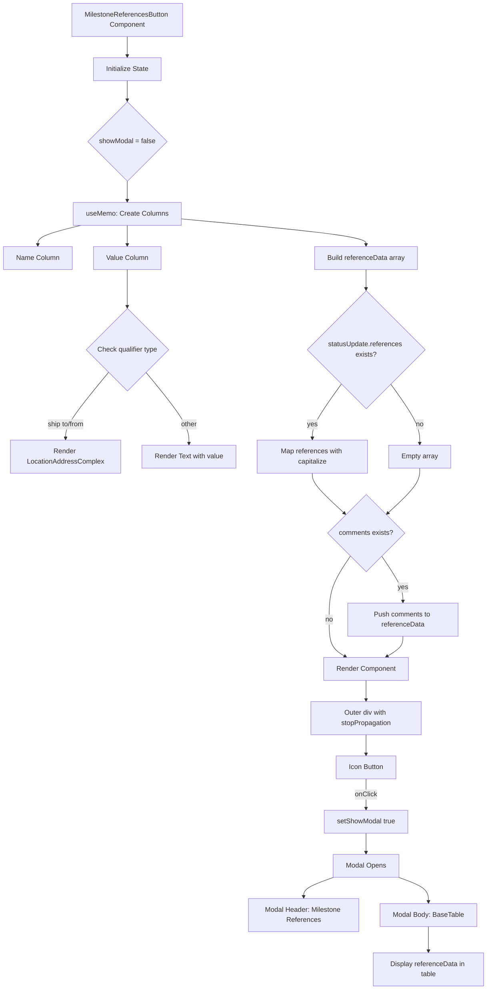
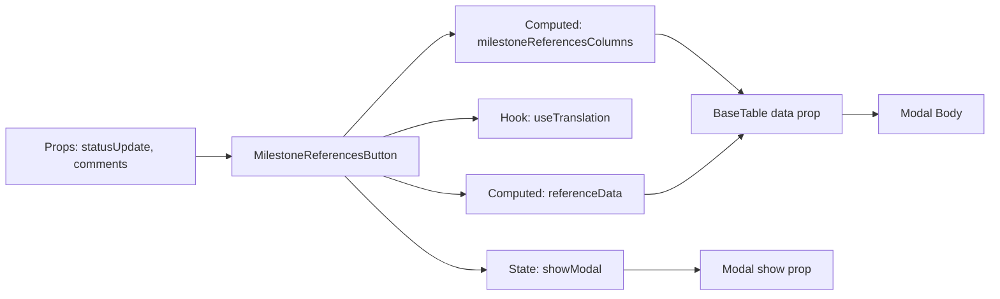
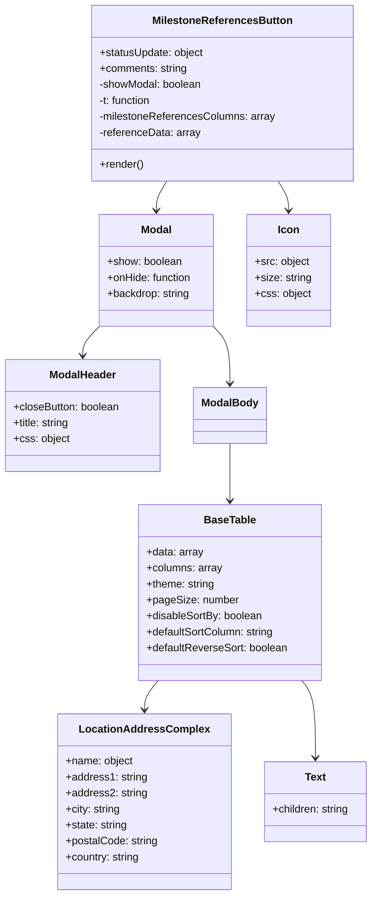
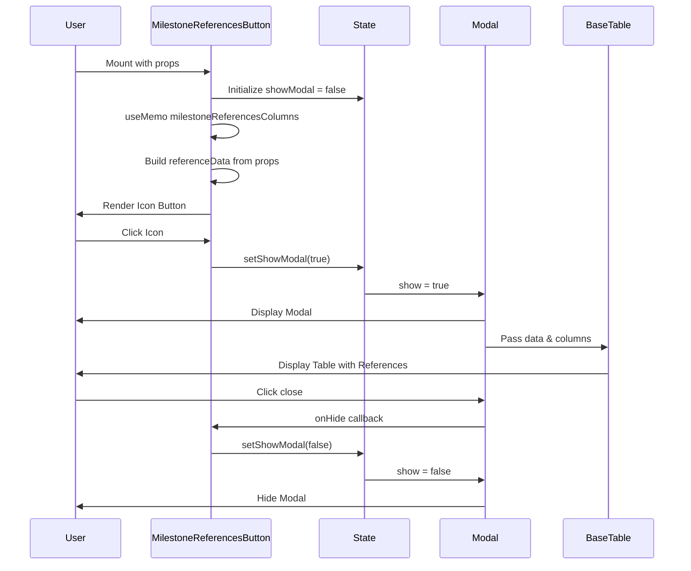
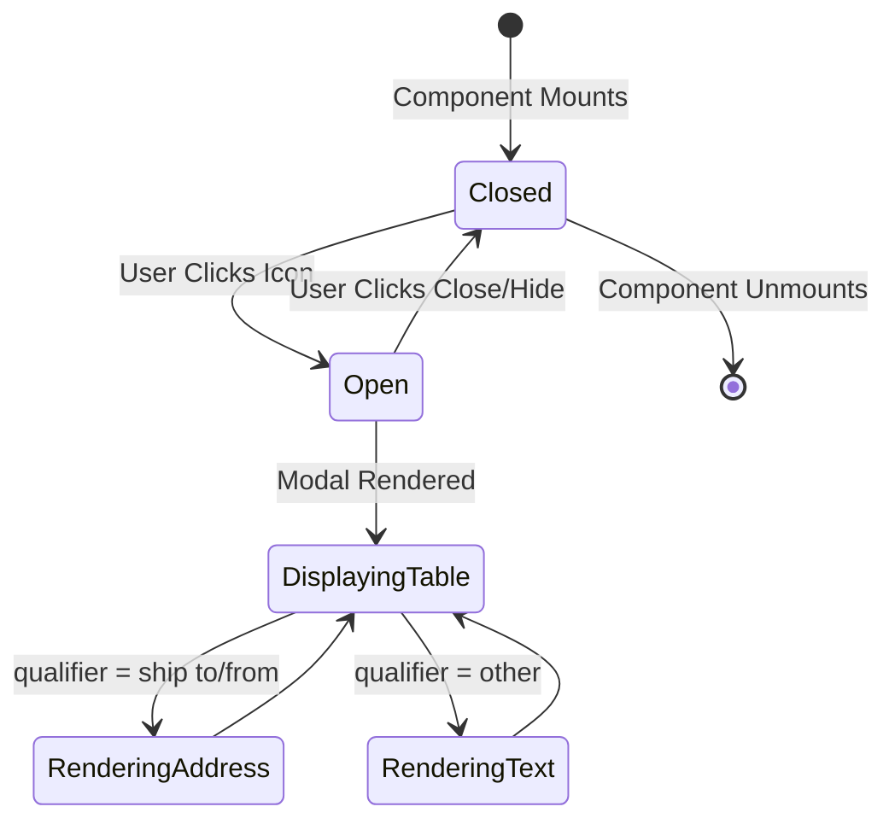

# Diagram: web/portal/src/shared/components/modals/MilestoneReferences.js

> Auto-generated by Obscura crawlers

## Diagram 1

### SVG

<svg id="container" width="1148.30859375" xmlns="http://www.w3.org/2000/svg" class="flowchart" height="2331.296875" viewBox="0 0 1148.30859375 2331.296875" role="graphics-document document" aria-roledescription="flowchart-v2"><g><marker id="container_flowchart-v2-pointEnd" class="marker flowchart-v2" viewBox="0 0 10 10" refX="5" refY="5" markerUnits="userSpaceOnUse" markerWidth="8" markerHeight="8" orient="auto"><path d="M 0 0 L 10 5 L 0 10 z" class="arrowMarkerPath" style="stroke-width: 1; stroke-dasharray: 1, 0;"></path></marker><marker id="container_flowchart-v2-pointStart" class="marker flowchart-v2" viewBox="0 0 10 10" refX="4.5" refY="5" markerUnits="userSpaceOnUse" markerWidth="8" markerHeight="8" orient="auto"><path d="M 0 5 L 10 10 L 10 0 z" class="arrowMarkerPath" style="stroke-width: 1; stroke-dasharray: 1, 0;"></path></marker><marker id="container_flowchart-v2-circleEnd" class="marker flowchart-v2" viewBox="0 0 10 10" refX="11" refY="5" markerUnits="userSpaceOnUse" markerWidth="11" markerHeight="11" orient="auto"><circle cx="5" cy="5" r="5" class="arrowMarkerPath" style="stroke-width: 1; stroke-dasharray: 1, 0;"></circle></marker><marker id="container_flowchart-v2-circleStart" class="marker flowchart-v2" viewBox="0 0 10 10" refX="-1" refY="5" markerUnits="userSpaceOnUse" markerWidth="11" markerHeight="11" orient="auto"><circle cx="5" cy="5" r="5" class="arrowMarkerPath" style="stroke-width: 1; stroke-dasharray: 1, 0;"></circle></marker><marker id="container_flowchart-v2-crossEnd" class="marker cross flowchart-v2" viewBox="0 0 11 11" refX="12" refY="5.2" markerUnits="userSpaceOnUse" markerWidth="11" markerHeight="11" orient="auto"><path d="M 1,1 l 9,9 M 10,1 l -9,9" class="arrowMarkerPath" style="stroke-width: 2; stroke-dasharray: 1, 0;"></path></marker><marker id="container_flowchart-v2-crossStart" class="marker cross flowchart-v2" viewBox="0 0 11 11" refX="-1" refY="5.2" markerUnits="userSpaceOnUse" markerWidth="11" markerHeight="11" orient="auto"><path d="M 1,1 l 9,9 M 10,1 l -9,9" class="arrowMarkerPath" style="stroke-width: 2; stroke-dasharray: 1, 0;"></path></marker><g class="root"><g class="clusters"></g><g class="edgePaths"><path d="M298.813,86L298.813,90.167C298.813,94.333,298.813,102.667,298.813,110.333C298.813,118,298.813,125,298.813,128.5L298.813,132" id="L_A_B_0" class="edge-thickness-normal edge-pattern-solid edge-thickness-normal edge-pattern-solid flowchart-link" style=";" data-edge="true" data-et="edge" data-id="L_A_B_0" data-points="W3sieCI6Mjk4LjgxMjUsInkiOjg2fSx7IngiOjI5OC44MTI1LCJ5IjoxMTF9LHsieCI6Mjk4LjgxMjUsInkiOjEzNn1d" marker-end="url(#container_flowchart-v2-pointEnd)"></path><path d="M298.813,190L298.813,194.167C298.813,198.333,298.813,206.667,298.813,214.333C298.813,222,298.813,229,298.813,232.5L298.813,236" id="L_B_C_0" class="edge-thickness-normal edge-pattern-solid edge-thickness-normal edge-pattern-solid flowchart-link" style=";" data-edge="true" data-et="edge" data-id="L_B_C_0" data-points="W3sieCI6Mjk4LjgxMjUsInkiOjE5MH0seyJ4IjoyOTguODEyNSwieSI6MjE1fSx7IngiOjI5OC44MTI1LCJ5IjoyNDB9XQ==" marker-end="url(#container_flowchart-v2-pointEnd)"></path><path d="M298.813,427.172L298.813,431.339C298.813,435.505,298.813,443.839,298.813,451.505C298.813,459.172,298.813,466.172,298.813,469.672L298.813,473.172" id="L_C_D_0" class="edge-thickness-normal edge-pattern-solid edge-thickness-normal edge-pattern-solid flowchart-link" style=";" data-edge="true" data-et="edge" data-id="L_C_D_0" data-points="W3sieCI6Mjk4LjgxMjUsInkiOjQyNy4xNzE4NzV9LHsieCI6Mjk4LjgxMjUsInkiOjQ1Mi4xNzE4NzV9LHsieCI6Mjk4LjgxMjUsInkiOjQ3Ny4xNzE4NzV9XQ==" marker-end="url(#container_flowchart-v2-pointEnd)"></path><path d="M189.713,531.172L172.877,535.339C156.041,539.505,122.368,547.839,105.532,555.505C88.695,563.172,88.695,570.172,88.695,573.672L88.695,577.172" id="L_D_E_0" class="edge-thickness-normal edge-pattern-solid edge-thickness-normal edge-pattern-solid flowchart-link" style=";" data-edge="true" data-et="edge" data-id="L_D_E_0" data-points="W3sieCI6MTg5LjcxMzE5MTEwNTc2OTIzLCJ5Ijo1MzEuMTcxODc1fSx7IngiOjg4LjY5NTMxMjUsInkiOjU1Ni4xNzE4NzV9LHsieCI6ODguNjk1MzEyNSwieSI6NTgxLjE3MTg3NX1d" marker-end="url(#container_flowchart-v2-pointEnd)"></path><path d="M298.813,531.172L298.813,535.339C298.813,539.505,298.813,547.839,298.813,555.505C298.813,563.172,298.813,570.172,298.813,573.672L298.813,577.172" id="L_D_F_0" class="edge-thickness-normal edge-pattern-solid edge-thickness-normal edge-pattern-solid flowchart-link" style=";" data-edge="true" data-et="edge" data-id="L_D_F_0" data-points="W3sieCI6Mjk4LjgxMjUsInkiOjUzMS4xNzE4NzV9LHsieCI6Mjk4LjgxMjUsInkiOjU1Ni4xNzE4NzV9LHsieCI6Mjk4LjgxMjUsInkiOjU4MS4xNzE4NzV9XQ==" marker-end="url(#container_flowchart-v2-pointEnd)"></path><path d="M298.813,635.172L298.813,639.339C298.813,643.505,298.813,651.839,298.813,666.194C298.813,680.549,298.813,700.927,298.813,711.116L298.813,721.305" id="L_F_G_0" class="edge-thickness-normal edge-pattern-solid edge-thickness-normal edge-pattern-solid flowchart-link" style=";" data-edge="true" data-et="edge" data-id="L_F_G_0" data-points="W3sieCI6Mjk4LjgxMjUsInkiOjYzNS4xNzE4NzV9LHsieCI6Mjk4LjgxMjUsInkiOjY2MC4xNzE4NzV9LHsieCI6Mjk4LjgxMjUsInkiOjcyNS4zMDQ2ODc1fV0=" marker-end="url(#container_flowchart-v2-pointEnd)"></path><path d="M253.974,878.201L237.103,898.529C220.233,918.858,186.491,959.515,169.621,985.343C152.75,1011.172,152.75,1022.172,152.75,1027.672L152.75,1033.172" id="L_G_H_0" class="edge-thickness-normal edge-pattern-solid edge-thickness-normal edge-pattern-solid flowchart-link" style=";" data-edge="true" data-et="edge" data-id="L_G_H_0" data-points="W3sieCI6MjUzLjk3NDAzMzYzMzMyMDQsInkiOjg3OC4yMDA1OTYxMzMzMjAzfSx7IngiOjE1Mi43NSwieSI6MTAwMC4xNzE4NzV9LHsieCI6MTUyLjc1LCJ5IjoxMDM3LjE3MTg3NX1d" marker-end="url(#container_flowchart-v2-pointEnd)"></path><path d="M343.651,878.201L360.522,898.529C377.392,918.858,411.134,959.515,428.004,987.343C444.875,1015.172,444.875,1030.172,444.875,1037.672L444.875,1045.172" id="L_G_I_0" class="edge-thickness-normal edge-pattern-solid edge-thickness-normal edge-pattern-solid flowchart-link" style=";" data-edge="true" data-et="edge" data-id="L_G_I_0" data-points="W3sieCI6MzQzLjY1MDk2NjM2NjY3OTYsInkiOjg3OC4yMDA1OTYxMzMzMjAzfSx7IngiOjQ0NC44NzUsInkiOjEwMDAuMTcxODc1fSx7IngiOjQ0NC44NzUsInkiOjEwNDkuMTcxODc1fV0=" marker-end="url(#container_flowchart-v2-pointEnd)"></path><path d="M424.078,515.706L497.326,522.45C570.574,529.194,717.07,542.683,790.318,552.928C863.566,563.172,863.566,570.172,863.566,573.672L863.566,577.172" id="L_D_J_0" class="edge-thickness-normal edge-pattern-solid edge-thickness-normal edge-pattern-solid flowchart-link" style=";" data-edge="true" data-et="edge" data-id="L_D_J_0" data-points="W3sieCI6NDI0LjA3ODEyNSwieSI6NTE1LjcwNTc3MDQzMjg4MzV9LHsieCI6ODYzLjU2NjQwNjI1LCJ5Ijo1NTYuMTcxODc1fSx7IngiOjg2My41NjY0MDYyNSwieSI6NTgxLjE3MTg3NX1d" marker-end="url(#container_flowchart-v2-pointEnd)"></path><path d="M863.566,635.172L863.566,639.339C863.566,643.505,863.566,651.839,863.566,659.505C863.566,667.172,863.566,674.172,863.566,677.672L863.566,681.172" id="L_J_K_0" class="edge-thickness-normal edge-pattern-solid edge-thickness-normal edge-pattern-solid flowchart-link" style=";" data-edge="true" data-et="edge" data-id="L_J_K_0" data-points="W3sieCI6ODYzLjU2NjQwNjI1LCJ5Ijo2MzUuMTcxODc1fSx7IngiOjg2My41NjY0MDYyNSwieSI6NjYwLjE3MTg3NX0seyJ4Ijo4NjMuNTY2NDA2MjUsInkiOjY4NS4xNzE4NzV9XQ==" marker-end="url(#container_flowchart-v2-pointEnd)"></path><path d="M805.421,905.027L794.018,920.884C782.614,936.742,759.807,968.457,748.404,989.814C737,1011.172,737,1022.172,737,1027.672L737,1033.172" id="L_K_L_0" class="edge-thickness-normal edge-pattern-solid edge-thickness-normal edge-pattern-solid flowchart-link" style=";" data-edge="true" data-et="edge" data-id="L_K_L_0" data-points="W3sieCI6ODA1LjQyMTM4Mzg1MDQ3NTEsInkiOjkwNS4wMjY4NTI2MDA0NzUxfSx7IngiOjczNywieSI6MTAwMC4xNzE4NzV9LHsieCI6NzM3LCJ5IjoxMDM3LjE3MTg3NX1d" marker-end="url(#container_flowchart-v2-pointEnd)"></path><path d="M921.711,905.027L933.115,920.884C944.519,936.742,967.326,968.457,978.729,991.814C990.133,1015.172,990.133,1030.172,990.133,1037.672L990.133,1045.172" id="L_K_M_0" class="edge-thickness-normal edge-pattern-solid edge-thickness-normal edge-pattern-solid flowchart-link" style=";" data-edge="true" data-et="edge" data-id="L_K_M_0" data-points="W3sieCI6OTIxLjcxMTQyODY0OTUyNDksInkiOjkwNS4wMjY4NTI2MDA0NzUxfSx7IngiOjk5MC4xMzI4MTI1LCJ5IjoxMDAwLjE3MTg3NX0seyJ4Ijo5OTAuMTMyODEyNSwieSI6MTA0OS4xNzE4NzV9XQ==" marker-end="url(#container_flowchart-v2-pointEnd)"></path><path d="M737,1115.172L737,1119.339C737,1123.505,737,1131.839,749.686,1147.638C762.372,1163.438,787.744,1186.705,800.43,1198.338L813.116,1209.971" id="L_L_N_0" class="edge-thickness-normal edge-pattern-solid edge-thickness-normal edge-pattern-solid flowchart-link" style=";" data-edge="true" data-et="edge" data-id="L_L_N_0" data-points="W3sieCI6NzM3LCJ5IjoxMTE1LjE3MTg3NX0seyJ4Ijo3MzcsInkiOjExNDAuMTcxODc1fSx7IngiOjgxNi4wNjQwMTQ0Mzk5MTIsInkiOjEyMTIuNjc0MjY2ODEwMDg4fV0=" marker-end="url(#container_flowchart-v2-pointEnd)"></path><path d="M990.133,1103.172L990.133,1109.339C990.133,1115.505,990.133,1127.839,977.447,1145.638C964.761,1163.438,939.389,1186.705,926.703,1198.338L914.017,1209.971" id="L_M_N_0" class="edge-thickness-normal edge-pattern-solid edge-thickness-normal edge-pattern-solid flowchart-link" style=";" data-edge="true" data-et="edge" data-id="L_M_N_0" data-points="W3sieCI6OTkwLjEzMjgxMjUsInkiOjExMDMuMTcxODc1fSx7IngiOjk5MC4xMzI4MTI1LCJ5IjoxMTQwLjE3MTg3NX0seyJ4Ijo5MTEuMDY4Nzk4MDYwMDg4LCJ5IjoxMjEyLjY3NDI2NjgxMDA4OH1d" marker-end="url(#container_flowchart-v2-pointEnd)"></path><path d="M900.45,1310.413L908.834,1322.727C917.217,1335.041,933.983,1359.669,942.367,1377.483C950.75,1395.297,950.75,1406.297,950.75,1411.797L950.75,1417.297" id="L_N_O_0" class="edge-thickness-normal edge-pattern-solid edge-thickness-normal edge-pattern-solid flowchart-link" style=";" data-edge="true" data-et="edge" data-id="L_N_O_0" data-points="W3sieCI6OTAwLjQ1MDQ5NDkxMTIzNDQsInkiOjEzMTAuNDEyNzg2MzM4NzY1NX0seyJ4Ijo5NTAuNzUsInkiOjEzODQuMjk2ODc1fSx7IngiOjk1MC43NSwieSI6MTQyMS4yOTY4NzV9XQ==" marker-end="url(#container_flowchart-v2-pointEnd)"></path><path d="M826.682,1310.413L818.299,1322.727C809.916,1335.041,793.149,1359.669,784.766,1384.65C776.383,1409.63,776.383,1434.964,776.383,1458.297C776.383,1481.63,776.383,1502.964,782.796,1517.455C789.209,1531.947,802.036,1539.598,808.449,1543.423L814.863,1547.248" id="L_N_P_0" class="edge-thickness-normal edge-pattern-solid edge-thickness-normal edge-pattern-solid flowchart-link" style=";" data-edge="true" data-et="edge" data-id="L_N_P_0" data-points="W3sieCI6ODI2LjY4MjMxNzU4ODc2NTYsInkiOjEzMTAuNDEyNzg2MzM4NzY1NX0seyJ4Ijo3NzYuMzgyODEyNSwieSI6MTM4NC4yOTY4NzV9LHsieCI6Nzc2LjM4MjgxMjUsInkiOjE0NjAuMjk2ODc1fSx7IngiOjc3Ni4zODI4MTI1LCJ5IjoxNTI0LjI5Njg3NX0seyJ4Ijo4MTguMjk4MDAxODAyODg0NiwieSI6MTU0OS4yOTY4NzV9XQ==" marker-end="url(#container_flowchart-v2-pointEnd)"></path><path d="M950.75,1499.297L950.75,1503.464C950.75,1507.63,950.75,1515.964,944.337,1523.955C937.923,1531.947,925.097,1539.598,918.683,1543.423L912.27,1547.248" id="L_O_P_0" class="edge-thickness-normal edge-pattern-solid edge-thickness-normal edge-pattern-solid flowchart-link" style=";" data-edge="true" data-et="edge" data-id="L_O_P_0" data-points="W3sieCI6OTUwLjc1LCJ5IjoxNDk5LjI5Njg3NX0seyJ4Ijo5NTAuNzUsInkiOjE1MjQuMjk2ODc1fSx7IngiOjkwOC44MzQ4MTA2OTcxMTU0LCJ5IjoxNTQ5LjI5Njg3NX1d" marker-end="url(#container_flowchart-v2-pointEnd)"></path><path d="M863.566,1603.297L863.566,1607.464C863.566,1611.63,863.566,1619.964,863.566,1627.63C863.566,1635.297,863.566,1642.297,863.566,1645.797L863.566,1649.297" id="L_P_Q_0" class="edge-thickness-normal edge-pattern-solid edge-thickness-normal edge-pattern-solid flowchart-link" style=";" data-edge="true" data-et="edge" data-id="L_P_Q_0" data-points="W3sieCI6ODYzLjU2NjQwNjI1LCJ5IjoxNjAzLjI5Njg3NX0seyJ4Ijo4NjMuNTY2NDA2MjUsInkiOjE2MjguMjk2ODc1fSx7IngiOjg2My41NjY0MDYyNSwieSI6MTY1My4yOTY4NzV9XQ==" marker-end="url(#container_flowchart-v2-pointEnd)"></path><path d="M863.566,1731.297L863.566,1735.464C863.566,1739.63,863.566,1747.964,863.566,1755.63C863.566,1763.297,863.566,1770.297,863.566,1773.797L863.566,1777.297" id="L_Q_R_0" class="edge-thickness-normal edge-pattern-solid edge-thickness-normal edge-pattern-solid flowchart-link" style=";" data-edge="true" data-et="edge" data-id="L_Q_R_0" data-points="W3sieCI6ODYzLjU2NjQwNjI1LCJ5IjoxNzMxLjI5Njg3NX0seyJ4Ijo4NjMuNTY2NDA2MjUsInkiOjE3NTYuMjk2ODc1fSx7IngiOjg2My41NjY0MDYyNSwieSI6MTc4MS4yOTY4NzV9XQ==" marker-end="url(#container_flowchart-v2-pointEnd)"></path><path d="M863.566,1835.297L863.566,1841.464C863.566,1847.63,863.566,1859.964,863.566,1871.63C863.566,1883.297,863.566,1894.297,863.566,1899.797L863.566,1905.297" id="L_R_S_0" class="edge-thickness-normal edge-pattern-solid edge-thickness-normal edge-pattern-solid flowchart-link" style=";" data-edge="true" data-et="edge" data-id="L_R_S_0" data-points="W3sieCI6ODYzLjU2NjQwNjI1LCJ5IjoxODM1LjI5Njg3NX0seyJ4Ijo4NjMuNTY2NDA2MjUsInkiOjE4NzIuMjk2ODc1fSx7IngiOjg2My41NjY0MDYyNSwieSI6MTkwOS4yOTY4NzV9XQ==" marker-end="url(#container_flowchart-v2-pointEnd)"></path><path d="M863.566,1963.297L863.566,1967.464C863.566,1971.63,863.566,1979.964,863.566,1987.63C863.566,1995.297,863.566,2002.297,863.566,2005.797L863.566,2009.297" id="L_S_T_0" class="edge-thickness-normal edge-pattern-solid edge-thickness-normal edge-pattern-solid flowchart-link" style=";" data-edge="true" data-et="edge" data-id="L_S_T_0" data-points="W3sieCI6ODYzLjU2NjQwNjI1LCJ5IjoxOTYzLjI5Njg3NX0seyJ4Ijo4NjMuNTY2NDA2MjUsInkiOjE5ODguMjk2ODc1fSx7IngiOjg2My41NjY0MDYyNSwieSI6MjAxMy4yOTY4NzV9XQ==" marker-end="url(#container_flowchart-v2-pointEnd)"></path><path d="M787.373,2067.297L775.615,2071.464C763.857,2075.63,740.341,2083.964,728.582,2091.63C716.824,2099.297,716.824,2106.297,716.824,2109.797L716.824,2113.297" id="L_T_U_0" class="edge-thickness-normal edge-pattern-solid edge-thickness-normal edge-pattern-solid flowchart-link" style=";" data-edge="true" data-et="edge" data-id="L_T_U_0" data-points="W3sieCI6Nzg3LjM3MzM0NzM1NTc2OTMsInkiOjIwNjcuMjk2ODc1fSx7IngiOjcxNi44MjQyMTg3NSwieSI6MjA5Mi4yOTY4NzV9LHsieCI6NzE2LjgyNDIxODc1LCJ5IjoyMTE3LjI5Njg3NX1d" marker-end="url(#container_flowchart-v2-pointEnd)"></path><path d="M939.759,2067.297L951.518,2071.464C963.276,2075.63,986.792,2083.964,998.55,2093.63C1010.309,2103.297,1010.309,2114.297,1010.309,2119.797L1010.309,2125.297" id="L_T_V_0" class="edge-thickness-normal edge-pattern-solid edge-thickness-normal edge-pattern-solid flowchart-link" style=";" data-edge="true" data-et="edge" data-id="L_T_V_0" data-points="W3sieCI6OTM5Ljc1OTQ2NTE0NDIzMDcsInkiOjIwNjcuMjk2ODc1fSx7IngiOjEwMTAuMzA4NTkzNzUsInkiOjIwOTIuMjk2ODc1fSx7IngiOjEwMTAuMzA4NTkzNzUsInkiOjIxMjkuMjk2ODc1fV0=" marker-end="url(#container_flowchart-v2-pointEnd)"></path><path d="M1010.309,2183.297L1010.309,2189.464C1010.309,2195.63,1010.309,2207.964,1010.309,2217.63C1010.309,2227.297,1010.309,2234.297,1010.309,2237.797L1010.309,2241.297" id="L_V_W_0" class="edge-thickness-normal edge-pattern-solid edge-thickness-normal edge-pattern-solid flowchart-link" style=";" data-edge="true" data-et="edge" data-id="L_V_W_0" data-points="W3sieCI6MTAxMC4zMDg1OTM3NSwieSI6MjE4My4yOTY4NzV9LHsieCI6MTAxMC4zMDg1OTM3NSwieSI6MjIyMC4yOTY4NzV9LHsieCI6MTAxMC4zMDg1OTM3NSwieSI6MjI0NS4yOTY4NzV9XQ==" marker-end="url(#container_flowchart-v2-pointEnd)"></path></g><g class="edgeLabels"><g class="edgeLabel"><g class="label" data-id="L_A_B_0" transform="translate(0, 0)"><foreignObject width="0" height="0">

</foreignObject></g></g><g class="edgeLabel"><g class="label" data-id="L_B_C_0" transform="translate(0, 0)"><foreignObject width="0" height="0">

</foreignObject></g></g><g class="edgeLabel"><g class="label" data-id="L_C_D_0" transform="translate(0, 0)"><foreignObject width="0" height="0">

</foreignObject></g></g><g class="edgeLabel"><g class="label" data-id="L_D_E_0" transform="translate(0, 0)"><foreignObject width="0" height="0">

</foreignObject></g></g><g class="edgeLabel"><g class="label" data-id="L_D_F_0" transform="translate(0, 0)"><foreignObject width="0" height="0">

</foreignObject></g></g><g class="edgeLabel"><g class="label" data-id="L_F_G_0" transform="translate(0, 0)"><foreignObject width="0" height="0">

</foreignObject></g></g><g class="edgeLabel" transform="translate(152.75, 1000.171875)"><g class="label" data-id="L_G_H_0" transform="translate(-45.96875, -12)"><foreignObject width="91.9375" height="24">

ship to/from

</foreignObject></g></g><g class="edgeLabel" transform="translate(444.875, 1000.171875)"><g class="label" data-id="L_G_I_0" transform="translate(-19.703125, -12)"><foreignObject width="39.40625" height="24">

other

</foreignObject></g></g><g class="edgeLabel"><g class="label" data-id="L_D_J_0" transform="translate(0, 0)"><foreignObject width="0" height="0">

</foreignObject></g></g><g class="edgeLabel"><g class="label" data-id="L_J_K_0" transform="translate(0, 0)"><foreignObject width="0" height="0">

</foreignObject></g></g><g class="edgeLabel" transform="translate(737, 1000.171875)"><g class="label" data-id="L_K_L_0" transform="translate(-12.0078125, -12)"><foreignObject width="24.015625" height="24">

yes

</foreignObject></g></g><g class="edgeLabel" transform="translate(990.1328125, 1000.171875)"><g class="label" data-id="L_K_M_0" transform="translate(-9.3671875, -12)"><foreignObject width="18.734375" height="24">

no

</foreignObject></g></g><g class="edgeLabel"><g class="label" data-id="L_L_N_0" transform="translate(0, 0)"><foreignObject width="0" height="0">

</foreignObject></g></g><g class="edgeLabel"><g class="label" data-id="L_M_N_0" transform="translate(0, 0)"><foreignObject width="0" height="0">

</foreignObject></g></g><g class="edgeLabel" transform="translate(950.75, 1384.296875)"><g class="label" data-id="L_N_O_0" transform="translate(-12.0078125, -12)"><foreignObject width="24.015625" height="24">

yes

</foreignObject></g></g><g class="edgeLabel" transform="translate(776.3828125, 1460.296875)"><g class="label" data-id="L_N_P_0" transform="translate(-9.3671875, -12)"><foreignObject width="18.734375" height="24">

no

</foreignObject></g></g><g class="edgeLabel"><g class="label" data-id="L_O_P_0" transform="translate(0, 0)"><foreignObject width="0" height="0">

</foreignObject></g></g><g class="edgeLabel"><g class="label" data-id="L_P_Q_0" transform="translate(0, 0)"><foreignObject width="0" height="0">

</foreignObject></g></g><g class="edgeLabel"><g class="label" data-id="L_Q_R_0" transform="translate(0, 0)"><foreignObject width="0" height="0">

</foreignObject></g></g><g class="edgeLabel" transform="translate(863.56640625, 1872.296875)"><g class="label" data-id="L_R_S_0" transform="translate(-26.28125, -12)"><foreignObject width="52.5625" height="24">

onClick

</foreignObject></g></g><g class="edgeLabel"><g class="label" data-id="L_S_T_0" transform="translate(0, 0)"><foreignObject width="0" height="0">

</foreignObject></g></g><g class="edgeLabel"><g class="label" data-id="L_T_U_0" transform="translate(0, 0)"><foreignObject width="0" height="0">

</foreignObject></g></g><g class="edgeLabel"><g class="label" data-id="L_T_V_0" transform="translate(0, 0)"><foreignObject width="0" height="0">

</foreignObject></g></g><g class="edgeLabel"><g class="label" data-id="L_V_W_0" transform="translate(0, 0)"><foreignObject width="0" height="0">

</foreignObject></g></g></g><g class="nodes"><g class="node default" id="flowchart-A-0" transform="translate(298.8125, 47)"><rect class="basic label-container" style="" x="-131.7265625" y="-39" width="263.453125" height="78"></rect><g class="label" style="" transform="translate(-101.7265625, -24)"><rect></rect><foreignObject width="203.453125" height="48">

MilestoneReferencesButton Component

</foreignObject></g></g><g class="node default" id="flowchart-B-1" transform="translate(298.8125, 163)"><rect class="basic label-container" style="" x="-81.9140625" y="-27" width="163.828125" height="54"></rect><g class="label" style="" transform="translate(-51.9140625, -12)"><rect></rect><foreignObject width="103.828125" height="24">

Initialize State

</foreignObject></g></g><g class="node default" id="flowchart-C-3" transform="translate(298.8125, 333.5859375)"><polygon points="93.5859375,0 187.171875,-93.5859375 93.5859375,-187.171875 0,-93.5859375" class="label-container" transform="translate(-93.0859375, 93.5859375)"></polygon><g class="label" style="" transform="translate(-66.5859375, -12)"><rect></rect><foreignObject width="133.171875" height="24">

showModal = false

</foreignObject></g></g><g class="node default" id="flowchart-D-5" transform="translate(298.8125, 504.171875)"><rect class="basic label-container" style="" x="-125.265625" y="-27" width="250.53125" height="54"></rect><g class="label" style="" transform="translate(-95.265625, -12)"><rect></rect><foreignObject width="190.53125" height="24">

useMemo: Create Columns

</foreignObject></g></g><g class="node default" id="flowchart-E-7" transform="translate(88.6953125, 608.171875)"><rect class="basic label-container" style="" x="-80.6953125" y="-27" width="161.390625" height="54"></rect><g class="label" style="" transform="translate(-50.6953125, -12)"><rect></rect><foreignObject width="101.390625" height="24">

Name Column

</foreignObject></g></g><g class="node default" id="flowchart-F-9" transform="translate(298.8125, 608.171875)"><rect class="basic label-container" style="" x="-79.421875" y="-27" width="158.84375" height="54"></rect><g class="label" style="" transform="translate(-49.421875, -12)"><rect></rect><foreignObject width="98.84375" height="24">

Value Column

</foreignObject></g></g><g class="node default" id="flowchart-G-11" transform="translate(298.8125, 824.171875)"><polygon points="98.8671875,0 197.734375,-98.8671875 98.8671875,-197.734375 0,-98.8671875" class="label-container" transform="translate(-98.3671875, 98.8671875)"></polygon><g class="label" style="" transform="translate(-71.8671875, -12)"><rect></rect><foreignObject width="143.734375" height="24">

Check qualifier type

</foreignObject></g></g><g class="node default" id="flowchart-H-13" transform="translate(152.75, 1076.171875)"><rect class="basic label-container" style="" x="-130" y="-39" width="260" height="78"></rect><g class="label" style="" transform="translate(-100, -24)"><rect></rect><foreignObject width="200" height="48">

Render LocationAddressComplex

</foreignObject></g></g><g class="node default" id="flowchart-I-15" transform="translate(444.875, 1076.171875)"><rect class="basic label-container" style="" x="-112.125" y="-27" width="224.25" height="54"></rect><g class="label" style="" transform="translate(-82.125, -12)"><rect></rect><foreignObject width="164.25" height="24">

Render Text with value

</foreignObject></g></g><g class="node default" id="flowchart-J-17" transform="translate(863.56640625, 608.171875)"><rect class="basic label-container" style="" x="-122.21875" y="-27" width="244.4375" height="54"></rect><g class="label" style="" transform="translate(-92.21875, -12)"><rect></rect><foreignObject width="184.4375" height="24">

Build referenceData array

</foreignObject></g></g><g class="node default" id="flowchart-K-19" transform="translate(863.56640625, 824.171875)"><polygon points="139,0 278,-139 139,-278 0,-139" class="label-container" transform="translate(-138.5, 139)"></polygon><g class="label" style="" transform="translate(-100, -24)"><rect></rect><foreignObject width="200" height="48">

statusUpdate.references exists?

</foreignObject></g></g><g class="node default" id="flowchart-L-21" transform="translate(737, 1076.171875)"><rect class="basic label-container" style="" x="-130" y="-39" width="260" height="78"></rect><g class="label" style="" transform="translate(-100, -24)"><rect></rect><foreignObject width="200" height="48">

Map references with capitalize

</foreignObject></g></g><g class="node default" id="flowchart-M-23" transform="translate(990.1328125, 1076.171875)"><rect class="basic label-container" style="" x="-73.1328125" y="-27" width="146.265625" height="54"></rect><g class="label" style="" transform="translate(-43.1328125, -12)"><rect></rect><foreignObject width="86.265625" height="24">

Empty array

</foreignObject></g></g><g class="node default" id="flowchart-N-25" transform="translate(863.56640625, 1256.234375)"><polygon points="91.0625,0 182.125,-91.0625 91.0625,-182.125 0,-91.0625" class="label-container" transform="translate(-90.5625, 91.0625)"></polygon><g class="label" style="" transform="translate(-64.0625, -12)"><rect></rect><foreignObject width="128.125" height="24">

comments exists?

</foreignObject></g></g><g class="node default" id="flowchart-O-29" transform="translate(950.75, 1460.296875)"><rect class="basic label-container" style="" x="-130" y="-39" width="260" height="78"></rect><g class="label" style="" transform="translate(-100, -24)"><rect></rect><foreignObject width="200" height="48">

Push comments to referenceData

</foreignObject></g></g><g class="node default" id="flowchart-P-31" transform="translate(863.56640625, 1576.296875)"><rect class="basic label-container" style="" x="-100.0234375" y="-27" width="200.046875" height="54"></rect><g class="label" style="" transform="translate(-70.0234375, -12)"><rect></rect><foreignObject width="140.046875" height="24">

Render Component

</foreignObject></g></g><g class="node default" id="flowchart-Q-35" transform="translate(863.56640625, 1692.296875)"><rect class="basic label-container" style="" x="-130" y="-39" width="260" height="78"></rect><g class="label" style="" transform="translate(-100, -24)"><rect></rect><foreignObject width="200" height="48">

Outer div with stopPropagation

</foreignObject></g></g><g class="node default" id="flowchart-R-37" transform="translate(863.56640625, 1808.296875)"><rect class="basic label-container" style="" x="-72.046875" y="-27" width="144.09375" height="54"></rect><g class="label" style="" transform="translate(-42.046875, -12)"><rect></rect><foreignObject width="84.09375" height="24">

Icon Button

</foreignObject></g></g><g class="node default" id="flowchart-S-39" transform="translate(863.56640625, 1936.296875)"><rect class="basic label-container" style="" x="-99.8515625" y="-27" width="199.703125" height="54"></rect><g class="label" style="" transform="translate(-69.8515625, -12)"><rect></rect><foreignObject width="139.703125" height="24">

setShowModal true

</foreignObject></g></g><g class="node default" id="flowchart-T-41" transform="translate(863.56640625, 2040.296875)"><rect class="basic label-container" style="" x="-77.4921875" y="-27" width="154.984375" height="54"></rect><g class="label" style="" transform="translate(-47.4921875, -12)"><rect></rect><foreignObject width="94.984375" height="24">

Modal Opens

</foreignObject></g></g><g class="node default" id="flowchart-U-43" transform="translate(716.82421875, 2156.296875)"><rect class="basic label-container" style="" x="-130" y="-39" width="260" height="78"></rect><g class="label" style="" transform="translate(-100, -24)"><rect></rect><foreignObject width="200" height="48">

Modal Header: Milestone References

</foreignObject></g></g><g class="node default" id="flowchart-V-45" transform="translate(1010.30859375, 2156.296875)"><rect class="basic label-container" style="" x="-113.484375" y="-27" width="226.96875" height="54"></rect><g class="label" style="" transform="translate(-83.484375, -12)"><rect></rect><foreignObject width="166.96875" height="24">

Modal Body: BaseTable

</foreignObject></g></g><g class="node default" id="flowchart-W-47" transform="translate(1010.30859375, 2284.296875)"><rect class="basic label-container" style="" x="-130" y="-39" width="260" height="78"></rect><g class="label" style="" transform="translate(-100, -24)"><rect></rect><foreignObject width="200" height="48">

Display referenceData in table

</foreignObject></g></g></g></g></g></svg>

## Diagram 2

### SVG

<svg id="container" width="1363.140625" xmlns="http://www.w3.org/2000/svg" class="flowchart" height="406" viewBox="0 0 1363.140625 406" role="graphics-document document" aria-roledescription="flowchart-v2"><g><marker id="container_flowchart-v2-pointEnd" class="marker flowchart-v2" viewBox="0 0 10 10" refX="5" refY="5" markerUnits="userSpaceOnUse" markerWidth="8" markerHeight="8" orient="auto"><path d="M 0 0 L 10 5 L 0 10 z" class="arrowMarkerPath" style="stroke-width: 1; stroke-dasharray: 1, 0;"></path></marker><marker id="container_flowchart-v2-pointStart" class="marker flowchart-v2" viewBox="0 0 10 10" refX="4.5" refY="5" markerUnits="userSpaceOnUse" markerWidth="8" markerHeight="8" orient="auto"><path d="M 0 5 L 10 10 L 10 0 z" class="arrowMarkerPath" style="stroke-width: 1; stroke-dasharray: 1, 0;"></path></marker><marker id="container_flowchart-v2-circleEnd" class="marker flowchart-v2" viewBox="0 0 10 10" refX="11" refY="5" markerUnits="userSpaceOnUse" markerWidth="11" markerHeight="11" orient="auto"><circle cx="5" cy="5" r="5" class="arrowMarkerPath" style="stroke-width: 1; stroke-dasharray: 1, 0;"></circle></marker><marker id="container_flowchart-v2-circleStart" class="marker flowchart-v2" viewBox="0 0 10 10" refX="-1" refY="5" markerUnits="userSpaceOnUse" markerWidth="11" markerHeight="11" orient="auto"><circle cx="5" cy="5" r="5" class="arrowMarkerPath" style="stroke-width: 1; stroke-dasharray: 1, 0;"></circle></marker><marker id="container_flowchart-v2-crossEnd" class="marker cross flowchart-v2" viewBox="0 0 11 11" refX="12" refY="5.2" markerUnits="userSpaceOnUse" markerWidth="11" markerHeight="11" orient="auto"><path d="M 1,1 l 9,9 M 10,1 l -9,9" class="arrowMarkerPath" style="stroke-width: 2; stroke-dasharray: 1, 0;"></path></marker><marker id="container_flowchart-v2-crossStart" class="marker cross flowchart-v2" viewBox="0 0 11 11" refX="-1" refY="5.2" markerUnits="userSpaceOnUse" markerWidth="11" markerHeight="11" orient="auto"><path d="M 1,1 l 9,9 M 10,1 l -9,9" class="arrowMarkerPath" style="stroke-width: 2; stroke-dasharray: 1, 0;"></path></marker><g class="root"><g class="clusters"></g><g class="edgePaths"><path d="M268,215L272.167,215C276.333,215,284.667,215,292.333,215C300,215,307,215,310.5,215L314,215" id="L_A_B_0" class="edge-thickness-normal edge-pattern-solid edge-thickness-normal edge-pattern-solid flowchart-link" style=";" data-edge="true" data-et="edge" data-id="L_A_B_0" data-points="W3sieCI6MjY4LCJ5IjoyMTV9LHsieCI6MjkzLCJ5IjoyMTV9LHsieCI6MzE4LCJ5IjoyMTV9XQ==" marker-end="url(#container_flowchart-v2-pointEnd)"></path><path d="M474.36,242L495.667,263.5C516.974,285,559.589,328,591.583,349.5C623.578,371,644.953,371,655.641,371L666.328,371" id="L_B_C_0" class="edge-thickness-normal edge-pattern-solid edge-thickness-normal edge-pattern-solid flowchart-link" style=";" data-edge="true" data-et="edge" data-id="L_B_C_0" data-points="W3sieCI6NDc0LjM1OTUyNTI0MDM4NDY0LCJ5IjoyNDJ9LHsieCI6NjAyLjIwMzEyNSwieSI6MzcxfSx7IngiOjY3MC4zMjgxMjUsInkiOjM3MX1d" marker-end="url(#container_flowchart-v2-pointEnd)"></path><path d="M527.875,188L540.263,183.833C552.651,179.667,577.427,171.333,598.418,167.167C619.409,163,636.615,163,645.217,163L653.82,163" id="L_B_D_0" class="edge-thickness-normal edge-pattern-solid edge-thickness-normal edge-pattern-solid flowchart-link" style=";" data-edge="true" data-et="edge" data-id="L_B_D_0" data-points="W3sieCI6NTI3Ljg3NTQ1MDcyMTE1MzgsInkiOjE4OH0seyJ4Ijo2MDIuMjAzMTI1LCJ5IjoxNjN9LHsieCI6NjU3LjgyMDMxMjUsInkiOjE2M31d" marker-end="url(#container_flowchart-v2-pointEnd)"></path><path d="M472.448,188L494.074,164.5C515.7,141,558.951,94,584.077,70.5C609.203,47,616.203,47,619.703,47L623.203,47" id="L_B_E_0" class="edge-thickness-normal edge-pattern-solid edge-thickness-normal edge-pattern-solid flowchart-link" style=";" data-edge="true" data-et="edge" data-id="L_B_E_0" data-points="W3sieCI6NDcyLjQ0ODI0MjE4NzUsInkiOjE4OH0seyJ4Ijo2MDIuMjAzMTI1LCJ5Ijo0N30seyJ4Ijo2MjcuMjAzMTI1LCJ5Ijo0N31d" marker-end="url(#container_flowchart-v2-pointEnd)"></path><path d="M527.875,242L540.263,246.167C552.651,250.333,577.427,258.667,595.826,262.833C614.224,267,626.245,267,632.255,267L638.266,267" id="L_B_F_0" class="edge-thickness-normal edge-pattern-solid edge-thickness-normal edge-pattern-solid flowchart-link" style=";" data-edge="true" data-et="edge" data-id="L_B_F_0" data-points="W3sieCI6NTI3Ljg3NTQ1MDcyMTE1MzgsInkiOjI0Mn0seyJ4Ijo2MDIuMjAzMTI1LCJ5IjoyNjd9LHsieCI6NjQyLjI2NTYyNSwieSI6MjY3fV0=" marker-end="url(#container_flowchart-v2-pointEnd)"></path><path d="M901.141,47L905.307,47C909.474,47,917.807,47,937.729,60.401C957.651,73.803,989.161,100.606,1004.917,114.007L1020.672,127.408" id="L_E_G_0" class="edge-thickness-normal edge-pattern-solid edge-thickness-normal edge-pattern-solid flowchart-link" style=";" data-edge="true" data-et="edge" data-id="L_E_G_0" data-points="W3sieCI6OTAxLjE0MDYyNSwieSI6NDd9LHsieCI6OTI2LjE0MDYyNSwieSI6NDd9LHsieCI6MTAyMy43MTg2Nzg5NzcyNzI3LCJ5IjoxMzB9XQ==" marker-end="url(#container_flowchart-v2-pointEnd)"></path><path d="M886.078,267L892.755,267C899.432,267,912.786,267,935.219,253.599C957.651,240.197,989.161,213.394,1004.917,199.993L1020.672,186.592" id="L_F_G_0" class="edge-thickness-normal edge-pattern-solid edge-thickness-normal edge-pattern-solid flowchart-link" style=";" data-edge="true" data-et="edge" data-id="L_F_G_0" data-points="W3sieCI6ODg2LjA3ODEyNSwieSI6MjY3fSx7IngiOjkyNi4xNDA2MjUsInkiOjI2N30seyJ4IjoxMDIzLjcxODY3ODk3NzI3MjcsInkiOjE4NH1d" marker-end="url(#container_flowchart-v2-pointEnd)"></path><path d="M1159.781,157L1163.948,157C1168.115,157,1176.448,157,1184.115,157C1191.781,157,1198.781,157,1202.281,157L1205.781,157" id="L_G_H_0" class="edge-thickness-normal edge-pattern-solid edge-thickness-normal edge-pattern-solid flowchart-link" style=";" data-edge="true" data-et="edge" data-id="L_G_H_0" data-points="W3sieCI6MTE1OS43ODEyNSwieSI6MTU3fSx7IngiOjExODQuNzgxMjUsInkiOjE1N30seyJ4IjoxMjA5Ljc4MTI1LCJ5IjoxNTd9XQ==" marker-end="url(#container_flowchart-v2-pointEnd)"></path><path d="M858.016,371L869.37,371C880.724,371,903.432,371,920.273,371C937.115,371,948.089,371,953.576,371L959.063,371" id="L_C_I_0" class="edge-thickness-normal edge-pattern-solid edge-thickness-normal edge-pattern-solid flowchart-link" style=";" data-edge="true" data-et="edge" data-id="L_C_I_0" data-points="W3sieCI6ODU4LjAxNTYyNSwieSI6MzcxfSx7IngiOjkyNi4xNDA2MjUsInkiOjM3MX0seyJ4Ijo5NjMuMDYyNSwieSI6MzcxfV0=" marker-end="url(#container_flowchart-v2-pointEnd)"></path></g><g class="edgeLabels"><g class="edgeLabel"><g class="label" data-id="L_A_B_0" transform="translate(0, 0)"><foreignObject width="0" height="0">

</foreignObject></g></g><g class="edgeLabel"><g class="label" data-id="L_B_C_0" transform="translate(0, 0)"><foreignObject width="0" height="0">

</foreignObject></g></g><g class="edgeLabel"><g class="label" data-id="L_B_D_0" transform="translate(0, 0)"><foreignObject width="0" height="0">

</foreignObject></g></g><g class="edgeLabel"><g class="label" data-id="L_B_E_0" transform="translate(0, 0)"><foreignObject width="0" height="0">

</foreignObject></g></g><g class="edgeLabel"><g class="label" data-id="L_B_F_0" transform="translate(0, 0)"><foreignObject width="0" height="0">

</foreignObject></g></g><g class="edgeLabel"><g class="label" data-id="L_E_G_0" transform="translate(0, 0)"><foreignObject width="0" height="0">

</foreignObject></g></g><g class="edgeLabel"><g class="label" data-id="L_F_G_0" transform="translate(0, 0)"><foreignObject width="0" height="0">

</foreignObject></g></g><g class="edgeLabel"><g class="label" data-id="L_G_H_0" transform="translate(0, 0)"><foreignObject width="0" height="0">

</foreignObject></g></g><g class="edgeLabel"><g class="label" data-id="L_C_I_0" transform="translate(0, 0)"><foreignObject width="0" height="0">

</foreignObject></g></g></g><g class="nodes"><g class="node default" id="flowchart-A-0" transform="translate(138, 215)"><rect class="basic label-container" style="" x="-130" y="-39" width="260" height="78"></rect><g class="label" style="" transform="translate(-100, -24)"><rect></rect><foreignObject width="200" height="48">

Props: statusUpdate, comments

</foreignObject></g></g><g class="node default" id="flowchart-B-1" transform="translate(447.6015625, 215)"><rect class="basic label-container" style="" x="-129.6015625" y="-27" width="259.203125" height="54"></rect><g class="label" style="" transform="translate(-99.6015625, -12)"><rect></rect><foreignObject width="199.203125" height="24">

MilestoneReferencesButton

</foreignObject></g></g><g class="node default" id="flowchart-C-3" transform="translate(764.171875, 371)"><rect class="basic label-container" style="" x="-93.84375" y="-27" width="187.6875" height="54"></rect><g class="label" style="" transform="translate(-63.84375, -12)"><rect></rect><foreignObject width="127.6875" height="24">

State: showModal

</foreignObject></g></g><g class="node default" id="flowchart-D-5" transform="translate(764.171875, 163)"><rect class="basic label-container" style="" x="-106.3515625" y="-27" width="212.703125" height="54"></rect><g class="label" style="" transform="translate(-76.3515625, -12)"><rect></rect><foreignObject width="152.703125" height="24">

Hook: useTranslation

</foreignObject></g></g><g class="node default" id="flowchart-E-7" transform="translate(764.171875, 47)"><rect class="basic label-container" style="" x="-136.96875" y="-39" width="273.9375" height="78"></rect><g class="label" style="" transform="translate(-106.96875, -24)"><rect></rect><foreignObject width="213.9375" height="48">

Computed: milestoneReferencesColumns

</foreignObject></g></g><g class="node default" id="flowchart-F-9" transform="translate(764.171875, 267)"><rect class="basic label-container" style="" x="-121.90625" y="-27" width="243.8125" height="54"></rect><g class="label" style="" transform="translate(-91.90625, -12)"><rect></rect><foreignObject width="183.8125" height="24">

Computed: referenceData

</foreignObject></g></g><g class="node default" id="flowchart-G-11" transform="translate(1055.4609375, 157)"><rect class="basic label-container" style="" x="-104.3203125" y="-27" width="208.640625" height="54"></rect><g class="label" style="" transform="translate(-74.3203125, -12)"><rect></rect><foreignObject width="148.640625" height="24">

BaseTable data prop

</foreignObject></g></g><g class="node default" id="flowchart-H-15" transform="translate(1282.4609375, 157)"><rect class="basic label-container" style="" x="-72.6796875" y="-27" width="145.359375" height="54"></rect><g class="label" style="" transform="translate(-42.6796875, -12)"><rect></rect><foreignObject width="85.359375" height="24">

Modal Body

</foreignObject></g></g><g class="node default" id="flowchart-I-17" transform="translate(1055.4609375, 371)"><rect class="basic label-container" style="" x="-92.3984375" y="-27" width="184.796875" height="54"></rect><g class="label" style="" transform="translate(-62.3984375, -12)"><rect></rect><foreignObject width="124.796875" height="24">

Modal show prop

</foreignObject></g></g></g></g></g></svg>

## Diagram 3

### SVG

<svg id="container" width="560.546875" xmlns="http://www.w3.org/2000/svg" class="classDiagram" height="1344" viewBox="0 0 560.546875 1344" role="graphics-document document" aria-roledescription="class"><g><defs><marker id="container_class-aggregationStart" class="marker aggregation class" refX="18" refY="7" markerWidth="190" markerHeight="240" orient="auto"><path d="M 18,7 L9,13 L1,7 L9,1 Z"></path></marker></defs><defs><marker id="container_class-aggregationEnd" class="marker aggregation class" refX="1" refY="7" markerWidth="20" markerHeight="28" orient="auto"><path d="M 18,7 L9,13 L1,7 L9,1 Z"></path></marker></defs><defs><marker id="container_class-extensionStart" class="marker extension class" refX="18" refY="7" markerWidth="190" markerHeight="240" orient="auto"><path d="M 1,7 L18,13 V 1 Z"></path></marker></defs><defs><marker id="container_class-extensionEnd" class="marker extension class" refX="1" refY="7" markerWidth="20" markerHeight="28" orient="auto"><path d="M 1,1 V 13 L18,7 Z"></path></marker></defs><defs><marker id="container_class-compositionStart" class="marker composition class" refX="18" refY="7" markerWidth="190" markerHeight="240" orient="auto"><path d="M 18,7 L9,13 L1,7 L9,1 Z"></path></marker></defs><defs><marker id="container_class-compositionEnd" class="marker composition class" refX="1" refY="7" markerWidth="20" markerHeight="28" orient="auto"><path d="M 18,7 L9,13 L1,7 L9,1 Z"></path></marker></defs><defs><marker id="container_class-dependencyStart" class="marker dependency class" refX="6" refY="7" markerWidth="190" markerHeight="240" orient="auto"><path d="M 5,7 L9,13 L1,7 L9,1 Z"></path></marker></defs><defs><marker id="container_class-dependencyEnd" class="marker dependency class" refX="13" refY="7" markerWidth="20" markerHeight="28" orient="auto"><path d="M 18,7 L9,13 L14,7 L9,1 Z"></path></marker></defs><defs><marker id="container_class-lollipopStart" class="marker lollipop class" refX="13" refY="7" markerWidth="190" markerHeight="240" orient="auto"><circle stroke="black" fill="transparent" cx="7" cy="7" r="6"></circle></marker></defs><defs><marker id="container_class-lollipopEnd" class="marker lollipop class" refX="1" refY="7" markerWidth="190" markerHeight="240" orient="auto"><circle stroke="black" fill="transparent" cx="7" cy="7" r="6"></circle></marker></defs><g class="root"><g class="clusters"></g><g class="edgePaths"><path d="M251.895,272L249.239,276.167C246.584,280.333,241.273,288.667,238.618,296C235.963,303.333,235.963,309.667,235.963,312.833L235.963,316" id="id_MilestoneReferencesButton_Modal_1" class="edge-thickness-normal edge-pattern-solid relation" style=";;;" data-edge="true" data-et="edge" data-id="id_MilestoneReferencesButton_Modal_1" data-points="W3sieCI6MjUxLjg5NDU0MzY5MDI4NjY0LCJ5IjoyNzJ9LHsieCI6MjM1Ljk2Mjg5MDYyNSwieSI6Mjk3fSx7IngiOjIzNS45NjI4OTA2MjUsInkiOjMyMn1d" marker-end="url(#container_class-dependencyEnd)"></path><path d="M150.947,490L146.73,494.167C142.513,498.333,134.079,506.667,129.862,514C125.645,521.333,125.645,527.667,125.645,530.833L125.645,534" id="id_Modal_ModalHeader_2" class="edge-thickness-normal edge-pattern-solid relation" style=";;;" data-edge="true" data-et="edge" data-id="id_Modal_ModalHeader_2" data-points="W3sieCI6MTUwLjk0NjkwNzI1MzQ0MDM3LCJ5Ijo0OTB9LHsieCI6MTI1LjY0NDUzMTI1LCJ5Ijo1MTV9LHsieCI6MTI1LjY0NDUzMTI1LCJ5Ijo1NDB9XQ==" marker-end="url(#container_class-dependencyEnd)"></path><path d="M320.979,490L325.196,494.167C329.413,498.333,337.847,506.667,342.064,521C346.281,535.333,346.281,555.667,346.281,565.833L346.281,576" id="id_Modal_ModalBody_3" class="edge-thickness-normal edge-pattern-solid relation" style=";;;" data-edge="true" data-et="edge" data-id="id_Modal_ModalBody_3" data-points="W3sieCI6MzIwLjk3ODg3Mzk5NjU1OTYsInkiOjQ5MH0seyJ4IjozNDYuMjgxMjUsInkiOjUxNX0seyJ4IjozNDYuMjgxMjUsInkiOjU4Mn1d" marker-end="url(#container_class-dependencyEnd)"></path><path d="M346.281,666L346.281,677.167C346.281,688.333,346.281,710.667,346.281,725C346.281,739.333,346.281,745.667,346.281,748.833L346.281,752" id="id_ModalBody_BaseTable_4" class="edge-thickness-normal edge-pattern-solid relation" style=";;;" data-edge="true" data-et="edge" data-id="id_ModalBody_BaseTable_4" data-points="W3sieCI6MzQ2LjI4MTI1LCJ5Ijo2NjZ9LHsieCI6MzQ2LjI4MTI1LCJ5Ijo3MzN9LHsieCI6MzQ2LjI4MTI1LCJ5Ijo3NTh9XQ==" marker-end="url(#container_class-dependencyEnd)"></path><path d="M420.133,272L422.788,276.167C425.443,280.333,430.754,288.667,433.409,296C436.064,303.333,436.064,309.667,436.064,312.833L436.064,316" id="id_MilestoneReferencesButton_Icon_5" class="edge-thickness-normal edge-pattern-solid relation" style=";;;" data-edge="true" data-et="edge" data-id="id_MilestoneReferencesButton_Icon_5" data-points="W3sieCI6NDIwLjEzMjgwMDA1OTcxMzM2LCJ5IjoyNzJ9LHsieCI6NDM2LjA2NDQ1MzEyNSwieSI6Mjk3fSx7IngiOjQzNi4wNjQ0NTMxMjUsInkiOjMyMn1d" marker-end="url(#container_class-dependencyEnd)"></path><path d="M238.686,1022L235.29,1026.167C231.894,1030.333,225.101,1038.667,221.705,1046C218.309,1053.333,218.309,1059.667,218.309,1062.833L218.309,1066" id="id_BaseTable_LocationAddressComplex_6" class="edge-thickness-normal edge-pattern-solid relation" style=";;;" data-edge="true" data-et="edge" data-id="id_BaseTable_LocationAddressComplex_6" data-points="W3sieCI6MjM4LjY4NjQwNTI1NDc3NzA3LCJ5IjoxMDIyfSx7IngiOjIxOC4zMDg1OTM3NSwieSI6MTA0N30seyJ4IjoyMTguMzA4NTkzNzUsInkiOjEwNzJ9XQ==" marker-end="url(#container_class-dependencyEnd)"></path><path d="M453.876,1022L457.272,1026.167C460.669,1030.333,467.461,1038.667,470.858,1058C474.254,1077.333,474.254,1107.667,474.254,1122.833L474.254,1138" id="id_BaseTable_Text_7" class="edge-thickness-normal edge-pattern-solid relation" style=";;;" data-edge="true" data-et="edge" data-id="id_BaseTable_Text_7" data-points="W3sieCI6NDUzLjg3NjA5NDc0NTIyMjkzLCJ5IjoxMDIyfSx7IngiOjQ3NC4yNTM5MDYyNSwieSI6MTA0N30seyJ4Ijo0NzQuMjUzOTA2MjUsInkiOjExNDR9XQ==" marker-end="url(#container_class-dependencyEnd)"></path></g><g class="edgeLabels"><g class="edgeLabel"><g class="label" data-id="id_MilestoneReferencesButton_Modal_1" transform="translate(0, 0)"><foreignObject width="0" height="0">

</foreignObject></g></g><g class="edgeLabel"><g class="label" data-id="id_Modal_ModalHeader_2" transform="translate(0, 0)"><foreignObject width="0" height="0">

</foreignObject></g></g><g class="edgeLabel"><g class="label" data-id="id_Modal_ModalBody_3" transform="translate(0, 0)"><foreignObject width="0" height="0">

</foreignObject></g></g><g class="edgeLabel"><g class="label" data-id="id_ModalBody_BaseTable_4" transform="translate(0, 0)"><foreignObject width="0" height="0">

</foreignObject></g></g><g class="edgeLabel"><g class="label" data-id="id_MilestoneReferencesButton_Icon_5" transform="translate(0, 0)"><foreignObject width="0" height="0">

</foreignObject></g></g><g class="edgeLabel"><g class="label" data-id="id_BaseTable_LocationAddressComplex_6" transform="translate(0, 0)"><foreignObject width="0" height="0">

</foreignObject></g></g><g class="edgeLabel"><g class="label" data-id="id_BaseTable_Text_7" transform="translate(0, 0)"><foreignObject width="0" height="0">

</foreignObject></g></g></g><g class="nodes"><g class="node default" id="classId-MilestoneReferencesButton-0" transform="translate(336.013671875, 140)"><g class="basic label-container"><path d="M-195.15625 -132 L195.15625 -132 L195.15625 132 L-195.15625 132" stroke="none" stroke-width="0" fill="#ECECFF" style=""></path><path d="M-195.15625 -132 C-106.25698822397786 -132, -17.357726447955713 -132, 195.15625 -132 M-195.15625 -132 C-67.40571479879456 -132, 60.344820402410875 -132, 195.15625 -132 M195.15625 -132 C195.15625 -70.98332124638307, 195.15625 -9.966642492766155, 195.15625 132 M195.15625 -132 C195.15625 -69.6105103904222, 195.15625 -7.221020780844398, 195.15625 132 M195.15625 132 C64.01942890198029 132, -67.11739219603942 132, -195.15625 132 M195.15625 132 C85.26881804342545 132, -24.61861391314909 132, -195.15625 132 M-195.15625 132 C-195.15625 56.443787001782624, -195.15625 -19.11242599643475, -195.15625 -132 M-195.15625 132 C-195.15625 32.62491676282335, -195.15625 -66.7501664743533, -195.15625 -132" stroke="#9370DB" stroke-width="1.3" fill="none" stroke-dasharray="0 0" style=""></path></g><g class="annotation-group text" transform="translate(0, -108)"></g><g class="label-group text" transform="translate(-101.015625, -108)"><g class="label" style="font-weight: bolder" transform="translate(0,-12)"><foreignObject width="202.03125" height="24">

MilestoneReferencesButton

</foreignObject></g></g><g class="members-group text" transform="translate(-183.15625, -60)"><g class="label" style="" transform="translate(0,-12)"><foreignObject width="158.5625" height="24">

+statusUpdate: object

</foreignObject></g><g class="label" style="" transform="translate(0,12)"><foreignObject width="133.140625" height="24">

+comments: string

</foreignObject></g><g class="label" style="" transform="translate(0,36)"><foreignObject width="156.390625" height="24">

-showModal: boolean

</foreignObject></g><g class="label" style="" transform="translate(0,60)"><foreignObject width="81" height="24">

-t: function

</foreignObject></g><g class="label" style="" transform="translate(0,84)"><foreignObject width="265.296875" height="24">

-milestoneReferencesColumns: array

</foreignObject></g><g class="label" style="" transform="translate(0,108)"><foreignObject width="152.765625" height="24">

-referenceData: array

</foreignObject></g></g><g class="methods-group text" transform="translate(-183.15625, 108)"><g class="label" style="" transform="translate(0,-12)"><foreignObject width="66.609375" height="24">

+render()

</foreignObject></g></g><g class="divider" style=""><path d="M-195.15625 -84 C-89.40985079647703 -84, 16.33654840704594 -84, 195.15625 -84 M-195.15625 -84 C-48.42127875642572 -84, 98.31369248714856 -84, 195.15625 -84" stroke="#9370DB" stroke-width="1.3" fill="none" stroke-dasharray="0 0" style=""></path></g><g class="divider" style=""><path d="M-195.15625 84 C-109.25434687186768 84, -23.352443743735364 84, 195.15625 84 M-195.15625 84 C-96.06400944299116 84, 3.0282311140176716 84, 195.15625 84" stroke="#9370DB" stroke-width="1.3" fill="none" stroke-dasharray="0 0" style=""></path></g></g><g class="node default" id="classId-Modal-1" transform="translate(235.962890625, 406)"><g class="basic label-container"><path d="M-87.80859375 -84 L87.80859375 -84 L87.80859375 84 L-87.80859375 84" stroke="none" stroke-width="0" fill="#ECECFF" style=""></path><path d="M-87.80859375 -84 C-51.56597825988847 -84, -15.323362769776935 -84, 87.80859375 -84 M-87.80859375 -84 C-18.015703166543943 -84, 51.77718741691211 -84, 87.80859375 -84 M87.80859375 -84 C87.80859375 -42.53293837183003, 87.80859375 -1.0658767436600556, 87.80859375 84 M87.80859375 -84 C87.80859375 -41.21039787806709, 87.80859375 1.5792042438658171, 87.80859375 84 M87.80859375 84 C31.424514975167597 84, -24.959563799664807 84, -87.80859375 84 M87.80859375 84 C48.840764172240334 84, 9.872934594480668 84, -87.80859375 84 M-87.80859375 84 C-87.80859375 40.329290749050976, -87.80859375 -3.3414185018980476, -87.80859375 -84 M-87.80859375 84 C-87.80859375 27.05362053021809, -87.80859375 -29.89275893956382, -87.80859375 -84" stroke="#9370DB" stroke-width="1.3" fill="none" stroke-dasharray="0 0" style=""></path></g><g class="annotation-group text" transform="translate(0, -60)"></g><g class="label-group text" transform="translate(-22.4453125, -60)"><g class="label" style="font-weight: bolder" transform="translate(0,-12)"><foreignObject width="44.890625" height="24">

Modal

</foreignObject></g></g><g class="members-group text" transform="translate(-75.80859375, -12)"><g class="label" style="" transform="translate(0,-12)"><foreignObject width="113.234375" height="24">

+show: boolean

</foreignObject></g><g class="label" style="" transform="translate(0,12)"><foreignObject width="129.171875" height="24">

+onHide: function

</foreignObject></g><g class="label" style="" transform="translate(0,36)"><foreignObject width="125.5625" height="24">

+backdrop: string

</foreignObject></g></g><g class="methods-group text" transform="translate(-75.80859375, 84)"></g><g class="divider" style=""><path d="M-87.80859375 -36 C-44.580806044920564 -36, -1.3530183398411282 -36, 87.80859375 -36 M-87.80859375 -36 C-48.747601306402935 -36, -9.686608862805869 -36, 87.80859375 -36" stroke="#9370DB" stroke-width="1.3" fill="none" stroke-dasharray="0 0" style=""></path></g><g class="divider" style=""><path d="M-87.80859375 60 C-38.35118614576105 60, 11.106221458477904 60, 87.80859375 60 M-87.80859375 60 C-30.434572289145407 60, 26.939449171709185 60, 87.80859375 60" stroke="#9370DB" stroke-width="1.3" fill="none" stroke-dasharray="0 0" style=""></path></g></g><g class="node default" id="classId-ModalHeader-2" transform="translate(125.64453125, 624)"><g class="basic label-container"><path d="M-117.64453125 -84 L117.64453125 -84 L117.64453125 84 L-117.64453125 84" stroke="none" stroke-width="0" fill="#ECECFF" style=""></path><path d="M-117.64453125 -84 C-70.20112871775285 -84, -22.757726185505703 -84, 117.64453125 -84 M-117.64453125 -84 C-56.39850985923713 -84, 4.84751153152574 -84, 117.64453125 -84 M117.64453125 -84 C117.64453125 -30.78104631746143, 117.64453125 22.437907365077137, 117.64453125 84 M117.64453125 -84 C117.64453125 -35.27490880960005, 117.64453125 13.450182380799902, 117.64453125 84 M117.64453125 84 C25.722304338946444 84, -66.19992257210711 84, -117.64453125 84 M117.64453125 84 C68.1247319206004 84, 18.604932591200807 84, -117.64453125 84 M-117.64453125 84 C-117.64453125 18.7068309021068, -117.64453125 -46.5863381957864, -117.64453125 -84 M-117.64453125 84 C-117.64453125 46.63534578608038, -117.64453125 9.270691572160757, -117.64453125 -84" stroke="#9370DB" stroke-width="1.3" fill="none" stroke-dasharray="0 0" style=""></path></g><g class="annotation-group text" transform="translate(0, -60)"></g><g class="label-group text" transform="translate(-48.9140625, -60)"><g class="label" style="font-weight: bolder" transform="translate(0,-12)"><foreignObject width="97.828125" height="24">

ModalHeader

</foreignObject></g></g><g class="members-group text" transform="translate(-105.64453125, -12)"><g class="label" style="" transform="translate(0,-12)"><foreignObject width="162.375" height="24">

+closeButton: boolean

</foreignObject></g><g class="label" style="" transform="translate(0,12)"><foreignObject width="86.859375" height="24">

+title: string

</foreignObject></g><g class="label" style="" transform="translate(0,36)"><foreignObject width="83.96875" height="24">

+css: object

</foreignObject></g></g><g class="methods-group text" transform="translate(-105.64453125, 84)"></g><g class="divider" style=""><path d="M-117.64453125 -36 C-37.430691778802625 -36, 42.78314769239475 -36, 117.64453125 -36 M-117.64453125 -36 C-67.48923584854822 -36, -17.333940447096438 -36, 117.64453125 -36" stroke="#9370DB" stroke-width="1.3" fill="none" stroke-dasharray="0 0" style=""></path></g><g class="divider" style=""><path d="M-117.64453125 60 C-52.91870735407065 60, 11.807116541858704 60, 117.64453125 60 M-117.64453125 60 C-42.95329061423578 60, 31.737950021528434 60, 117.64453125 60" stroke="#9370DB" stroke-width="1.3" fill="none" stroke-dasharray="0 0" style=""></path></g></g><g class="node default" id="classId-ModalBody-3" transform="translate(346.28125, 624)"><g class="basic label-container"><path d="M-52.9921875 -42 L52.9921875 -42 L52.9921875 42 L-52.9921875 42" stroke="none" stroke-width="0" fill="#ECECFF" style=""></path><path d="M-52.9921875 -42 C-19.360114837837713 -42, 14.271957824324573 -42, 52.9921875 -42 M-52.9921875 -42 C-21.113362142794376 -42, 10.765463214411248 -42, 52.9921875 -42 M52.9921875 -42 C52.9921875 -17.637199917359847, 52.9921875 6.725600165280305, 52.9921875 42 M52.9921875 -42 C52.9921875 -14.209680663908156, 52.9921875 13.580638672183689, 52.9921875 42 M52.9921875 42 C12.316913409304881 42, -28.358360681390238 42, -52.9921875 42 M52.9921875 42 C23.230608457376476 42, -6.530970585247047 42, -52.9921875 42 M-52.9921875 42 C-52.9921875 24.245245780094244, -52.9921875 6.490491560188488, -52.9921875 -42 M-52.9921875 42 C-52.9921875 20.51837831123045, -52.9921875 -0.9632433775391007, -52.9921875 -42" stroke="#9370DB" stroke-width="1.3" fill="none" stroke-dasharray="0 0" style=""></path></g><g class="annotation-group text" transform="translate(0, -18)"></g><g class="label-group text" transform="translate(-40.9921875, -18)"><g class="label" style="font-weight: bolder" transform="translate(0,-12)"><foreignObject width="81.984375" height="24">

ModalBody

</foreignObject></g></g><g class="members-group text" transform="translate(-40.9921875, 30)"></g><g class="methods-group text" transform="translate(-40.9921875, 60)"></g><g class="divider" style=""><path d="M-52.9921875 6 C-17.826795220006048 6, 17.338597059987904 6, 52.9921875 6 M-52.9921875 6 C-28.43933511000999 6, -3.886482720019977 6, 52.9921875 6" stroke="#9370DB" stroke-width="1.3" fill="none" stroke-dasharray="0 0" style=""></path></g><g class="divider" style=""><path d="M-52.9921875 24 C-23.419289988160116 24, 6.153607523679767 24, 52.9921875 24 M-52.9921875 24 C-11.01294328289898 24, 30.96630093420204 24, 52.9921875 24" stroke="#9370DB" stroke-width="1.3" fill="none" stroke-dasharray="0 0" style=""></path></g></g><g class="node default" id="classId-BaseTable-4" transform="translate(346.28125, 890)"><g class="basic label-container"><path d="M-137.7421875 -132 L137.7421875 -132 L137.7421875 132 L-137.7421875 132" stroke="none" stroke-width="0" fill="#ECECFF" style=""></path><path d="M-137.7421875 -132 C-61.893163126644396 -132, 13.955861246711208 -132, 137.7421875 -132 M-137.7421875 -132 C-47.66624133186862 -132, 42.40970483626276 -132, 137.7421875 -132 M137.7421875 -132 C137.7421875 -62.05717716213819, 137.7421875 7.885645675723623, 137.7421875 132 M137.7421875 -132 C137.7421875 -54.013469790176714, 137.7421875 23.973060419646572, 137.7421875 132 M137.7421875 132 C31.778717325048575 132, -74.18475284990285 132, -137.7421875 132 M137.7421875 132 C63.021208380012496 132, -11.699770739975008 132, -137.7421875 132 M-137.7421875 132 C-137.7421875 38.569386826973314, -137.7421875 -54.86122634605337, -137.7421875 -132 M-137.7421875 132 C-137.7421875 56.07008943019042, -137.7421875 -19.859821139619157, -137.7421875 -132" stroke="#9370DB" stroke-width="1.3" fill="none" stroke-dasharray="0 0" style=""></path></g><g class="annotation-group text" transform="translate(0, -108)"></g><g class="label-group text" transform="translate(-37.359375, -108)"><g class="label" style="font-weight: bolder" transform="translate(0,-12)"><foreignObject width="74.71875" height="24">

BaseTable

</foreignObject></g></g><g class="members-group text" transform="translate(-125.7421875, -60)"><g class="label" style="" transform="translate(0,-12)"><foreignObject width="85.546875" height="24">

+data: array

</foreignObject></g><g class="label" style="" transform="translate(0,12)"><foreignObject width="114.140625" height="24">

+columns: array

</foreignObject></g><g class="label" style="" transform="translate(0,36)"><foreignObject width="103.921875" height="24">

+theme: string

</foreignObject></g><g class="label" style="" transform="translate(0,60)"><foreignObject width="136.375" height="24">

+pageSize: number

</foreignObject></g><g class="label" style="" transform="translate(0,84)"><foreignObject width="176.125" height="24">

+disableSortBy: boolean

</foreignObject></g><g class="label" style="" transform="translate(0,108)"><foreignObject width="194.5625" height="24">

+defaultSortColumn: string

</foreignObject></g><g class="label" style="" transform="translate(0,132)"><foreignObject width="214.125" height="24">

+defaultReverseSort: boolean

</foreignObject></g></g><g class="methods-group text" transform="translate(-125.7421875, 132)"></g><g class="divider" style=""><path d="M-137.7421875 -84 C-81.71179619342864 -84, -25.68140488685728 -84, 137.7421875 -84 M-137.7421875 -84 C-45.6589230342819 -84, 46.424341431436204 -84, 137.7421875 -84" stroke="#9370DB" stroke-width="1.3" fill="none" stroke-dasharray="0 0" style=""></path></g><g class="divider" style=""><path d="M-137.7421875 108 C-38.81614253554008 108, 60.10990242891984 108, 137.7421875 108 M-137.7421875 108 C-47.215542264933504 108, 43.31110297013299 108, 137.7421875 108" stroke="#9370DB" stroke-width="1.3" fill="none" stroke-dasharray="0 0" style=""></path></g></g><g class="node default" id="classId-Icon-5" transform="translate(436.064453125, 406)"><g class="basic label-container"><path d="M-62.29296875 -84 L62.29296875 -84 L62.29296875 84 L-62.29296875 84" stroke="none" stroke-width="0" fill="#ECECFF" style=""></path><path d="M-62.29296875 -84 C-35.503937985372126 -84, -8.714907220744252 -84, 62.29296875 -84 M-62.29296875 -84 C-24.423381579035073 -84, 13.446205591929854 -84, 62.29296875 -84 M62.29296875 -84 C62.29296875 -35.47352854010429, 62.29296875 13.05294291979142, 62.29296875 84 M62.29296875 -84 C62.29296875 -22.71437145143137, 62.29296875 38.57125709713726, 62.29296875 84 M62.29296875 84 C14.422021958611957 84, -33.448924832776086 84, -62.29296875 84 M62.29296875 84 C31.305901315128732 84, 0.31883388025746484 84, -62.29296875 84 M-62.29296875 84 C-62.29296875 17.006040009761406, -62.29296875 -49.98791998047719, -62.29296875 -84 M-62.29296875 84 C-62.29296875 43.832150170532, -62.29296875 3.6643003410640063, -62.29296875 -84" stroke="#9370DB" stroke-width="1.3" fill="none" stroke-dasharray="0 0" style=""></path></g><g class="annotation-group text" transform="translate(0, -60)"></g><g class="label-group text" transform="translate(-15.3046875, -60)"><g class="label" style="font-weight: bolder" transform="translate(0,-12)"><foreignObject width="30.609375" height="24">

Icon

</foreignObject></g></g><g class="members-group text" transform="translate(-50.29296875, -12)"><g class="label" style="" transform="translate(0,-12)"><foreignObject width="82.421875" height="24">

+src: object

</foreignObject></g><g class="label" style="" transform="translate(0,12)"><foreignObject width="85.28125" height="24">

+size: string

</foreignObject></g><g class="label" style="" transform="translate(0,36)"><foreignObject width="83.96875" height="24">

+css: object

</foreignObject></g></g><g class="methods-group text" transform="translate(-50.29296875, 84)"></g><g class="divider" style=""><path d="M-62.29296875 -36 C-15.623252061568415 -36, 31.04646462686317 -36, 62.29296875 -36 M-62.29296875 -36 C-20.357577691102378 -36, 21.577813367795244 -36, 62.29296875 -36" stroke="#9370DB" stroke-width="1.3" fill="none" stroke-dasharray="0 0" style=""></path></g><g class="divider" style=""><path d="M-62.29296875 60 C-28.027468333966773 60, 6.238032082066454 60, 62.29296875 60 M-62.29296875 60 C-30.476812495114917 60, 1.3393437597701663 60, 62.29296875 60" stroke="#9370DB" stroke-width="1.3" fill="none" stroke-dasharray="0 0" style=""></path></g></g><g class="node default" id="classId-LocationAddressComplex-6" transform="translate(218.30859375, 1204)"><g class="basic label-container"><path d="M-127.65234375 -132 L127.65234375 -132 L127.65234375 132 L-127.65234375 132" stroke="none" stroke-width="0" fill="#ECECFF" style=""></path><path d="M-127.65234375 -132 C-34.2100186666285 -132, 59.232306416743 -132, 127.65234375 -132 M-127.65234375 -132 C-57.06681744998217 -132, 13.518708850035665 -132, 127.65234375 -132 M127.65234375 -132 C127.65234375 -72.5180032279037, 127.65234375 -13.036006455807396, 127.65234375 132 M127.65234375 -132 C127.65234375 -61.5531141007756, 127.65234375 8.893771798448796, 127.65234375 132 M127.65234375 132 C32.340495306001245 132, -62.97135313799751 132, -127.65234375 132 M127.65234375 132 C46.9216480503911 132, -33.8090476492178 132, -127.65234375 132 M-127.65234375 132 C-127.65234375 48.37765478670826, -127.65234375 -35.244690426583475, -127.65234375 -132 M-127.65234375 132 C-127.65234375 57.34058110726039, -127.65234375 -17.318837785479218, -127.65234375 -132" stroke="#9370DB" stroke-width="1.3" fill="none" stroke-dasharray="0 0" style=""></path></g><g class="annotation-group text" transform="translate(0, -108)"></g><g class="label-group text" transform="translate(-92.1171875, -108)"><g class="label" style="font-weight: bolder" transform="translate(0,-12)"><foreignObject width="184.234375" height="24">

LocationAddressComplex

</foreignObject></g></g><g class="members-group text" transform="translate(-115.65234375, -60)"><g class="label" style="" transform="translate(0,-12)"><foreignObject width="102.0625" height="24">

+name: object

</foreignObject></g><g class="label" style="" transform="translate(0,12)"><foreignObject width="120.953125" height="24">

+address1: string

</foreignObject></g><g class="label" style="" transform="translate(0,36)"><foreignObject width="122.265625" height="24">

+address2: string

</foreignObject></g><g class="label" style="" transform="translate(0,60)"><foreignObject width="83.5" height="24">

+city: string

</foreignObject></g><g class="label" style="" transform="translate(0,84)"><foreignObject width="93.796875" height="24">

+state: string

</foreignObject></g><g class="label" style="" transform="translate(0,108)"><foreignObject width="139.1875" height="24">

+postalCode: string

</foreignObject></g><g class="label" style="" transform="translate(0,132)"><foreignObject width="112.953125" height="24">

+country: string

</foreignObject></g></g><g class="methods-group text" transform="translate(-115.65234375, 132)"></g><g class="divider" style=""><path d="M-127.65234375 -84 C-35.19551334909909 -84, 57.261317051801825 -84, 127.65234375 -84 M-127.65234375 -84 C-68.22384345897339 -84, -8.795343167946783 -84, 127.65234375 -84" stroke="#9370DB" stroke-width="1.3" fill="none" stroke-dasharray="0 0" style=""></path></g><g class="divider" style=""><path d="M-127.65234375 108 C-53.79808986569421 108, 20.056164018611582 108, 127.65234375 108 M-127.65234375 108 C-36.52149852954683 108, 54.609346690906335 108, 127.65234375 108" stroke="#9370DB" stroke-width="1.3" fill="none" stroke-dasharray="0 0" style=""></path></g></g><g class="node default" id="classId-Text-7" transform="translate(474.25390625, 1204)"><g class="basic label-container"><path d="M-78.29296875 -60 L78.29296875 -60 L78.29296875 60 L-78.29296875 60" stroke="none" stroke-width="0" fill="#ECECFF" style=""></path><path d="M-78.29296875 -60 C-18.503617433492714 -60, 41.28573388301457 -60, 78.29296875 -60 M-78.29296875 -60 C-41.99888887863795 -60, -5.704809007275898 -60, 78.29296875 -60 M78.29296875 -60 C78.29296875 -18.6655840321991, 78.29296875 22.6688319356018, 78.29296875 60 M78.29296875 -60 C78.29296875 -25.885662583482514, 78.29296875 8.228674833034972, 78.29296875 60 M78.29296875 60 C20.184171205596428 60, -37.924626338807144 60, -78.29296875 60 M78.29296875 60 C20.486456955978802 60, -37.320054838042395 60, -78.29296875 60 M-78.29296875 60 C-78.29296875 33.0202773304823, -78.29296875 6.040554660964602, -78.29296875 -60 M-78.29296875 60 C-78.29296875 29.083386949390544, -78.29296875 -1.8332261012189122, -78.29296875 -60" stroke="#9370DB" stroke-width="1.3" fill="none" stroke-dasharray="0 0" style=""></path></g><g class="annotation-group text" transform="translate(0, -36)"></g><g class="label-group text" transform="translate(-15.3828125, -36)"><g class="label" style="font-weight: bolder" transform="translate(0,-12)"><foreignObject width="30.765625" height="24">

Text

</foreignObject></g></g><g class="members-group text" transform="translate(-66.29296875, 12)"><g class="label" style="" transform="translate(0,-12)"><foreignObject width="117.203125" height="24">

+children: string

</foreignObject></g></g><g class="methods-group text" transform="translate(-66.29296875, 60)"></g><g class="divider" style=""><path d="M-78.29296875 -12 C-31.4022263169511 -12, 15.488516116097799 -12, 78.29296875 -12 M-78.29296875 -12 C-39.9303731009986 -12, -1.5677774519972019 -12, 78.29296875 -12" stroke="#9370DB" stroke-width="1.3" fill="none" stroke-dasharray="0 0" style=""></path></g><g class="divider" style=""><path d="M-78.29296875 36 C-23.03294788696617 36, 32.22707297606766 36, 78.29296875 36 M-78.29296875 36 C-43.299652318492434 36, -8.306335886984868 36, 78.29296875 36" stroke="#9370DB" stroke-width="1.3" fill="none" stroke-dasharray="0 0" style=""></path></g></g></g></g></g></svg>

## Diagram 4

### SVG

<svg id="container" width="1174.5" xmlns="http://www.w3.org/2000/svg" height="999" viewBox="-50 -10 1174.5 999" role="graphics-document document" aria-roledescription="sequence"><g><rect x="924.5" y="913" fill="#eaeaea" stroke="#666" width="150" height="65" name="BaseTable" rx="3" ry="3" class="actor actor-bottom"></rect><text x="999.5" y="945.5" dominant-baseline="central" alignment-baseline="central" class="actor actor-box" style="text-anchor: middle; font-size: 16px; font-weight: 400;"><tspan x="999.5" dy="0">BaseTable</tspan></text></g><g><rect x="704.5" y="913" fill="#eaeaea" stroke="#666" width="150" height="65" name="Modal" rx="3" ry="3" class="actor actor-bottom"></rect><text x="779.5" y="945.5" dominant-baseline="central" alignment-baseline="central" class="actor actor-box" style="text-anchor: middle; font-size: 16px; font-weight: 400;"><tspan x="779.5" dy="0">Modal</tspan></text></g><g><rect x="504.5" y="913" fill="#eaeaea" stroke="#666" width="150" height="65" name="State" rx="3" ry="3" class="actor actor-bottom"></rect><text x="579.5" y="945.5" dominant-baseline="central" alignment-baseline="central" class="actor actor-box" style="text-anchor: middle; font-size: 16px; font-weight: 400;"><tspan x="579.5" dy="0">State</tspan></text></g><g><rect x="200" y="913" fill="#eaeaea" stroke="#666" width="219" height="65" name="Component" rx="3" ry="3" class="actor actor-bottom"></rect><text x="309.5" y="945.5" dominant-baseline="central" alignment-baseline="central" class="actor actor-box" style="text-anchor: middle; font-size: 16px; font-weight: 400;"><tspan x="309.5" dy="0">MilestoneReferencesButton</tspan></text></g><g><rect x="0" y="913" fill="#eaeaea" stroke="#666" width="150" height="65" name="User" rx="3" ry="3" class="actor actor-bottom"></rect><text x="75" y="945.5" dominant-baseline="central" alignment-baseline="central" class="actor actor-box" style="text-anchor: middle; font-size: 16px; font-weight: 400;"><tspan x="75" dy="0">User</tspan></text></g><g><line id="actor4" x1="999.5" y1="65" x2="999.5" y2="913" class="actor-line 200" stroke-width="0.5px" stroke="#999" name="BaseTable"></line><g id="root-4"><rect x="924.5" y="0" fill="#eaeaea" stroke="#666" width="150" height="65" name="BaseTable" rx="3" ry="3" class="actor actor-top"></rect><text x="999.5" y="32.5" dominant-baseline="central" alignment-baseline="central" class="actor actor-box" style="text-anchor: middle; font-size: 16px; font-weight: 400;"><tspan x="999.5" dy="0">BaseTable</tspan></text></g></g><g><line id="actor3" x1="779.5" y1="65" x2="779.5" y2="913" class="actor-line 200" stroke-width="0.5px" stroke="#999" name="Modal"></line><g id="root-3"><rect x="704.5" y="0" fill="#eaeaea" stroke="#666" width="150" height="65" name="Modal" rx="3" ry="3" class="actor actor-top"></rect><text x="779.5" y="32.5" dominant-baseline="central" alignment-baseline="central" class="actor actor-box" style="text-anchor: middle; font-size: 16px; font-weight: 400;"><tspan x="779.5" dy="0">Modal</tspan></text></g></g><g><line id="actor2" x1="579.5" y1="65" x2="579.5" y2="913" class="actor-line 200" stroke-width="0.5px" stroke="#999" name="State"></line><g id="root-2"><rect x="504.5" y="0" fill="#eaeaea" stroke="#666" width="150" height="65" name="State" rx="3" ry="3" class="actor actor-top"></rect><text x="579.5" y="32.5" dominant-baseline="central" alignment-baseline="central" class="actor actor-box" style="text-anchor: middle; font-size: 16px; font-weight: 400;"><tspan x="579.5" dy="0">State</tspan></text></g></g><g><line id="actor1" x1="309.5" y1="65" x2="309.5" y2="913" class="actor-line 200" stroke-width="0.5px" stroke="#999" name="Component"></line><g id="root-1"><rect x="200" y="0" fill="#eaeaea" stroke="#666" width="219" height="65" name="Component" rx="3" ry="3" class="actor actor-top"></rect><text x="309.5" y="32.5" dominant-baseline="central" alignment-baseline="central" class="actor actor-box" style="text-anchor: middle; font-size: 16px; font-weight: 400;"><tspan x="309.5" dy="0">MilestoneReferencesButton</tspan></text></g></g><g><line id="actor0" x1="75" y1="65" x2="75" y2="913" class="actor-line 200" stroke-width="0.5px" stroke="#999" name="User"></line><g id="root-0"><rect x="0" y="0" fill="#eaeaea" stroke="#666" width="150" height="65" name="User" rx="3" ry="3" class="actor actor-top"></rect><text x="75" y="32.5" dominant-baseline="central" alignment-baseline="central" class="actor actor-box" style="text-anchor: middle; font-size: 16px; font-weight: 400;"><tspan x="75" dy="0">User</tspan></text></g></g><g></g><defs><symbol id="computer" width="24" height="24"><path transform="scale(.5)" d="M2 2v13h20v-13h-20zm18 11h-16v-9h16v9zm-10.228 6l.466-1h3.524l.467 1h-4.457zm14.228 3h-24l2-6h2.104l-1.33 4h18.45l-1.297-4h2.073l2 6zm-5-10h-14v-7h14v7z"></path></symbol></defs><defs><symbol id="database" fill-rule="evenodd" clip-rule="evenodd"><path transform="scale(.5)" d="M12.258.001l.256.004.255.005.253.008.251.01.249.012.247.015.246.016.242.019.241.02.239.023.236.024.233.027.231.028.229.031.225.032.223.034.22.036.217.038.214.04.211.041.208.043.205.045.201.046.198.048.194.05.191.051.187.053.183.054.18.056.175.057.172.059.168.06.163.061.16.063.155.064.15.066.074.033.073.033.071.034.07.034.069.035.068.035.067.035.066.035.064.036.064.036.062.036.06.036.06.037.058.037.058.037.055.038.055.038.053.038.052.038.051.039.05.039.048.039.047.039.045.04.044.04.043.04.041.04.04.041.039.041.037.041.036.041.034.041.033.042.032.042.03.042.029.042.027.042.026.043.024.043.023.043.021.043.02.043.018.044.017.043.015.044.013.044.012.044.011.045.009.044.007.045.006.045.004.045.002.045.001.045v17l-.001.045-.002.045-.004.045-.006.045-.007.045-.009.044-.011.045-.012.044-.013.044-.015.044-.017.043-.018.044-.02.043-.021.043-.023.043-.024.043-.026.043-.027.042-.029.042-.03.042-.032.042-.033.042-.034.041-.036.041-.037.041-.039.041-.04.041-.041.04-.043.04-.044.04-.045.04-.047.039-.048.039-.05.039-.051.039-.052.038-.053.038-.055.038-.055.038-.058.037-.058.037-.06.037-.06.036-.062.036-.064.036-.064.036-.066.035-.067.035-.068.035-.069.035-.07.034-.071.034-.073.033-.074.033-.15.066-.155.064-.16.063-.163.061-.168.06-.172.059-.175.057-.18.056-.183.054-.187.053-.191.051-.194.05-.198.048-.201.046-.205.045-.208.043-.211.041-.214.04-.217.038-.22.036-.223.034-.225.032-.229.031-.231.028-.233.027-.236.024-.239.023-.241.02-.242.019-.246.016-.247.015-.249.012-.251.01-.253.008-.255.005-.256.004-.258.001-.258-.001-.256-.004-.255-.005-.253-.008-.251-.01-.249-.012-.247-.015-.245-.016-.243-.019-.241-.02-.238-.023-.236-.024-.234-.027-.231-.028-.228-.031-.226-.032-.223-.034-.22-.036-.217-.038-.214-.04-.211-.041-.208-.043-.204-.045-.201-.046-.198-.048-.195-.05-.19-.051-.187-.053-.184-.054-.179-.056-.176-.057-.172-.059-.167-.06-.164-.061-.159-.063-.155-.064-.151-.066-.074-.033-.072-.033-.072-.034-.07-.034-.069-.035-.068-.035-.067-.035-.066-.035-.064-.036-.063-.036-.062-.036-.061-.036-.06-.037-.058-.037-.057-.037-.056-.038-.055-.038-.053-.038-.052-.038-.051-.039-.049-.039-.049-.039-.046-.039-.046-.04-.044-.04-.043-.04-.041-.04-.04-.041-.039-.041-.037-.041-.036-.041-.034-.041-.033-.042-.032-.042-.03-.042-.029-.042-.027-.042-.026-.043-.024-.043-.023-.043-.021-.043-.02-.043-.018-.044-.017-.043-.015-.044-.013-.044-.012-.044-.011-.045-.009-.044-.007-.045-.006-.045-.004-.045-.002-.045-.001-.045v-17l.001-.045.002-.045.004-.045.006-.045.007-.045.009-.044.011-.045.012-.044.013-.044.015-.044.017-.043.018-.044.02-.043.021-.043.023-.043.024-.043.026-.043.027-.042.029-.042.03-.042.032-.042.033-.042.034-.041.036-.041.037-.041.039-.041.04-.041.041-.04.043-.04.044-.04.046-.04.046-.039.049-.039.049-.039.051-.039.052-.038.053-.038.055-.038.056-.038.057-.037.058-.037.06-.037.061-.036.062-.036.063-.036.064-.036.066-.035.067-.035.068-.035.069-.035.07-.034.072-.034.072-.033.074-.033.151-.066.155-.064.159-.063.164-.061.167-.06.172-.059.176-.057.179-.056.184-.054.187-.053.19-.051.195-.05.198-.048.201-.046.204-.045.208-.043.211-.041.214-.04.217-.038.22-.036.223-.034.226-.032.228-.031.231-.028.234-.027.236-.024.238-.023.241-.02.243-.019.245-.016.247-.015.249-.012.251-.01.253-.008.255-.005.256-.004.258-.001.258.001zm-9.258 20.499v.01l.001.021.003.021.004.022.005.021.006.022.007.022.009.023.01.022.011.023.012.023.013.023.015.023.016.024.017.023.018.024.019.024.021.024.022.025.023.024.024.025.052.049.056.05.061.051.066.051.07.051.075.051.079.052.084.052.088.052.092.052.097.052.102.051.105.052.11.052.114.051.119.051.123.051.127.05.131.05.135.05.139.048.144.049.147.047.152.047.155.047.16.045.163.045.167.043.171.043.176.041.178.041.183.039.187.039.19.037.194.035.197.035.202.033.204.031.209.03.212.029.216.027.219.025.222.024.226.021.23.02.233.018.236.016.24.015.243.012.246.01.249.008.253.005.256.004.259.001.26-.001.257-.004.254-.005.25-.008.247-.011.244-.012.241-.014.237-.016.233-.018.231-.021.226-.021.224-.024.22-.026.216-.027.212-.028.21-.031.205-.031.202-.034.198-.034.194-.036.191-.037.187-.039.183-.04.179-.04.175-.042.172-.043.168-.044.163-.045.16-.046.155-.046.152-.047.148-.048.143-.049.139-.049.136-.05.131-.05.126-.05.123-.051.118-.052.114-.051.11-.052.106-.052.101-.052.096-.052.092-.052.088-.053.083-.051.079-.052.074-.052.07-.051.065-.051.06-.051.056-.05.051-.05.023-.024.023-.025.021-.024.02-.024.019-.024.018-.024.017-.024.015-.023.014-.024.013-.023.012-.023.01-.023.01-.022.008-.022.006-.022.006-.022.004-.022.004-.021.001-.021.001-.021v-4.127l-.077.055-.08.053-.083.054-.085.053-.087.052-.09.052-.093.051-.095.05-.097.05-.1.049-.102.049-.105.048-.106.047-.109.047-.111.046-.114.045-.115.045-.118.044-.12.043-.122.042-.124.042-.126.041-.128.04-.13.04-.132.038-.134.038-.135.037-.138.037-.139.035-.142.035-.143.034-.144.033-.147.032-.148.031-.15.03-.151.03-.153.029-.154.027-.156.027-.158.026-.159.025-.161.024-.162.023-.163.022-.165.021-.166.02-.167.019-.169.018-.169.017-.171.016-.173.015-.173.014-.175.013-.175.012-.177.011-.178.01-.179.008-.179.008-.181.006-.182.005-.182.004-.184.003-.184.002h-.37l-.184-.002-.184-.003-.182-.004-.182-.005-.181-.006-.179-.008-.179-.008-.178-.01-.176-.011-.176-.012-.175-.013-.173-.014-.172-.015-.171-.016-.17-.017-.169-.018-.167-.019-.166-.02-.165-.021-.163-.022-.162-.023-.161-.024-.159-.025-.157-.026-.156-.027-.155-.027-.153-.029-.151-.03-.15-.03-.148-.031-.146-.032-.145-.033-.143-.034-.141-.035-.14-.035-.137-.037-.136-.037-.134-.038-.132-.038-.13-.04-.128-.04-.126-.041-.124-.042-.122-.042-.12-.044-.117-.043-.116-.045-.113-.045-.112-.046-.109-.047-.106-.047-.105-.048-.102-.049-.1-.049-.097-.05-.095-.05-.093-.052-.09-.051-.087-.052-.085-.053-.083-.054-.08-.054-.077-.054v4.127zm0-5.654v.011l.001.021.003.021.004.021.005.022.006.022.007.022.009.022.01.022.011.023.012.023.013.023.015.024.016.023.017.024.018.024.019.024.021.024.022.024.023.025.024.024.052.05.056.05.061.05.066.051.07.051.075.052.079.051.084.052.088.052.092.052.097.052.102.052.105.052.11.051.114.051.119.052.123.05.127.051.131.05.135.049.139.049.144.048.147.048.152.047.155.046.16.045.163.045.167.044.171.042.176.042.178.04.183.04.187.038.19.037.194.036.197.034.202.033.204.032.209.03.212.028.216.027.219.025.222.024.226.022.23.02.233.018.236.016.24.014.243.012.246.01.249.008.253.006.256.003.259.001.26-.001.257-.003.254-.006.25-.008.247-.01.244-.012.241-.015.237-.016.233-.018.231-.02.226-.022.224-.024.22-.025.216-.027.212-.029.21-.03.205-.032.202-.033.198-.035.194-.036.191-.037.187-.039.183-.039.179-.041.175-.042.172-.043.168-.044.163-.045.16-.045.155-.047.152-.047.148-.048.143-.048.139-.05.136-.049.131-.05.126-.051.123-.051.118-.051.114-.052.11-.052.106-.052.101-.052.096-.052.092-.052.088-.052.083-.052.079-.052.074-.051.07-.052.065-.051.06-.05.056-.051.051-.049.023-.025.023-.024.021-.025.02-.024.019-.024.018-.024.017-.024.015-.023.014-.023.013-.024.012-.022.01-.023.01-.023.008-.022.006-.022.006-.022.004-.021.004-.022.001-.021.001-.021v-4.139l-.077.054-.08.054-.083.054-.085.052-.087.053-.09.051-.093.051-.095.051-.097.05-.1.049-.102.049-.105.048-.106.047-.109.047-.111.046-.114.045-.115.044-.118.044-.12.044-.122.042-.124.042-.126.041-.128.04-.13.039-.132.039-.134.038-.135.037-.138.036-.139.036-.142.035-.143.033-.144.033-.147.033-.148.031-.15.03-.151.03-.153.028-.154.028-.156.027-.158.026-.159.025-.161.024-.162.023-.163.022-.165.021-.166.02-.167.019-.169.018-.169.017-.171.016-.173.015-.173.014-.175.013-.175.012-.177.011-.178.009-.179.009-.179.007-.181.007-.182.005-.182.004-.184.003-.184.002h-.37l-.184-.002-.184-.003-.182-.004-.182-.005-.181-.007-.179-.007-.179-.009-.178-.009-.176-.011-.176-.012-.175-.013-.173-.014-.172-.015-.171-.016-.17-.017-.169-.018-.167-.019-.166-.02-.165-.021-.163-.022-.162-.023-.161-.024-.159-.025-.157-.026-.156-.027-.155-.028-.153-.028-.151-.03-.15-.03-.148-.031-.146-.033-.145-.033-.143-.033-.141-.035-.14-.036-.137-.036-.136-.037-.134-.038-.132-.039-.13-.039-.128-.04-.126-.041-.124-.042-.122-.043-.12-.043-.117-.044-.116-.044-.113-.046-.112-.046-.109-.046-.106-.047-.105-.048-.102-.049-.1-.049-.097-.05-.095-.051-.093-.051-.09-.051-.087-.053-.085-.052-.083-.054-.08-.054-.077-.054v4.139zm0-5.666v.011l.001.02.003.022.004.021.005.022.006.021.007.022.009.023.01.022.011.023.012.023.013.023.015.023.016.024.017.024.018.023.019.024.021.025.022.024.023.024.024.025.052.05.056.05.061.05.066.051.07.051.075.052.079.051.084.052.088.052.092.052.097.052.102.052.105.051.11.052.114.051.119.051.123.051.127.05.131.05.135.05.139.049.144.048.147.048.152.047.155.046.16.045.163.045.167.043.171.043.176.042.178.04.183.04.187.038.19.037.194.036.197.034.202.033.204.032.209.03.212.028.216.027.219.025.222.024.226.021.23.02.233.018.236.017.24.014.243.012.246.01.249.008.253.006.256.003.259.001.26-.001.257-.003.254-.006.25-.008.247-.01.244-.013.241-.014.237-.016.233-.018.231-.02.226-.022.224-.024.22-.025.216-.027.212-.029.21-.03.205-.032.202-.033.198-.035.194-.036.191-.037.187-.039.183-.039.179-.041.175-.042.172-.043.168-.044.163-.045.16-.045.155-.047.152-.047.148-.048.143-.049.139-.049.136-.049.131-.051.126-.05.123-.051.118-.052.114-.051.11-.052.106-.052.101-.052.096-.052.092-.052.088-.052.083-.052.079-.052.074-.052.07-.051.065-.051.06-.051.056-.05.051-.049.023-.025.023-.025.021-.024.02-.024.019-.024.018-.024.017-.024.015-.023.014-.024.013-.023.012-.023.01-.022.01-.023.008-.022.006-.022.006-.022.004-.022.004-.021.001-.021.001-.021v-4.153l-.077.054-.08.054-.083.053-.085.053-.087.053-.09.051-.093.051-.095.051-.097.05-.1.049-.102.048-.105.048-.106.048-.109.046-.111.046-.114.046-.115.044-.118.044-.12.043-.122.043-.124.042-.126.041-.128.04-.13.039-.132.039-.134.038-.135.037-.138.036-.139.036-.142.034-.143.034-.144.033-.147.032-.148.032-.15.03-.151.03-.153.028-.154.028-.156.027-.158.026-.159.024-.161.024-.162.023-.163.023-.165.021-.166.02-.167.019-.169.018-.169.017-.171.016-.173.015-.173.014-.175.013-.175.012-.177.01-.178.01-.179.009-.179.007-.181.006-.182.006-.182.004-.184.003-.184.001-.185.001-.185-.001-.184-.001-.184-.003-.182-.004-.182-.006-.181-.006-.179-.007-.179-.009-.178-.01-.176-.01-.176-.012-.175-.013-.173-.014-.172-.015-.171-.016-.17-.017-.169-.018-.167-.019-.166-.02-.165-.021-.163-.023-.162-.023-.161-.024-.159-.024-.157-.026-.156-.027-.155-.028-.153-.028-.151-.03-.15-.03-.148-.032-.146-.032-.145-.033-.143-.034-.141-.034-.14-.036-.137-.036-.136-.037-.134-.038-.132-.039-.13-.039-.128-.041-.126-.041-.124-.041-.122-.043-.12-.043-.117-.044-.116-.044-.113-.046-.112-.046-.109-.046-.106-.048-.105-.048-.102-.048-.1-.05-.097-.049-.095-.051-.093-.051-.09-.052-.087-.052-.085-.053-.083-.053-.08-.054-.077-.054v4.153zm8.74-8.179l-.257.004-.254.005-.25.008-.247.011-.244.012-.241.014-.237.016-.233.018-.231.021-.226.022-.224.023-.22.026-.216.027-.212.028-.21.031-.205.032-.202.033-.198.034-.194.036-.191.038-.187.038-.183.04-.179.041-.175.042-.172.043-.168.043-.163.045-.16.046-.155.046-.152.048-.148.048-.143.048-.139.049-.136.05-.131.05-.126.051-.123.051-.118.051-.114.052-.11.052-.106.052-.101.052-.096.052-.092.052-.088.052-.083.052-.079.052-.074.051-.07.052-.065.051-.06.05-.056.05-.051.05-.023.025-.023.024-.021.024-.02.025-.019.024-.018.024-.017.023-.015.024-.014.023-.013.023-.012.023-.01.023-.01.022-.008.022-.006.023-.006.021-.004.022-.004.021-.001.021-.001.021.001.021.001.021.004.021.004.022.006.021.006.023.008.022.01.022.01.023.012.023.013.023.014.023.015.024.017.023.018.024.019.024.02.025.021.024.023.024.023.025.051.05.056.05.06.05.065.051.07.052.074.051.079.052.083.052.088.052.092.052.096.052.101.052.106.052.11.052.114.052.118.051.123.051.126.051.131.05.136.05.139.049.143.048.148.048.152.048.155.046.16.046.163.045.168.043.172.043.175.042.179.041.183.04.187.038.191.038.194.036.198.034.202.033.205.032.21.031.212.028.216.027.22.026.224.023.226.022.231.021.233.018.237.016.241.014.244.012.247.011.25.008.254.005.257.004.26.001.26-.001.257-.004.254-.005.25-.008.247-.011.244-.012.241-.014.237-.016.233-.018.231-.021.226-.022.224-.023.22-.026.216-.027.212-.028.21-.031.205-.032.202-.033.198-.034.194-.036.191-.038.187-.038.183-.04.179-.041.175-.042.172-.043.168-.043.163-.045.16-.046.155-.046.152-.048.148-.048.143-.048.139-.049.136-.05.131-.05.126-.051.123-.051.118-.051.114-.052.11-.052.106-.052.101-.052.096-.052.092-.052.088-.052.083-.052.079-.052.074-.051.07-.052.065-.051.06-.05.056-.05.051-.05.023-.025.023-.024.021-.024.02-.025.019-.024.018-.024.017-.023.015-.024.014-.023.013-.023.012-.023.01-.023.01-.022.008-.022.006-.023.006-.021.004-.022.004-.021.001-.021.001-.021-.001-.021-.001-.021-.004-.021-.004-.022-.006-.021-.006-.023-.008-.022-.01-.022-.01-.023-.012-.023-.013-.023-.014-.023-.015-.024-.017-.023-.018-.024-.019-.024-.02-.025-.021-.024-.023-.024-.023-.025-.051-.05-.056-.05-.06-.05-.065-.051-.07-.052-.074-.051-.079-.052-.083-.052-.088-.052-.092-.052-.096-.052-.101-.052-.106-.052-.11-.052-.114-.052-.118-.051-.123-.051-.126-.051-.131-.05-.136-.05-.139-.049-.143-.048-.148-.048-.152-.048-.155-.046-.16-.046-.163-.045-.168-.043-.172-.043-.175-.042-.179-.041-.183-.04-.187-.038-.191-.038-.194-.036-.198-.034-.202-.033-.205-.032-.21-.031-.212-.028-.216-.027-.22-.026-.224-.023-.226-.022-.231-.021-.233-.018-.237-.016-.241-.014-.244-.012-.247-.011-.25-.008-.254-.005-.257-.004-.26-.001-.26.001z"></path></symbol></defs><defs><symbol id="clock" width="24" height="24"><path transform="scale(.5)" d="M12 2c5.514 0 10 4.486 10 10s-4.486 10-10 10-10-4.486-10-10 4.486-10 10-10zm0-2c-6.627 0-12 5.373-12 12s5.373 12 12 12 12-5.373 12-12-5.373-12-12-12zm5.848 12.459c.202.038.202.333.001.372-1.907.361-6.045 1.111-6.547 1.111-.719 0-1.301-.582-1.301-1.301 0-.512.77-5.447 1.125-7.445.034-.192.312-.181.343.014l.985 6.238 5.394 1.011z"></path></symbol></defs><defs><marker id="arrowhead" refX="7.9" refY="5" markerUnits="userSpaceOnUse" markerWidth="12" markerHeight="12" orient="auto-start-reverse"><path d="M -1 0 L 10 5 L 0 10 z"></path></marker></defs><defs><marker id="crosshead" markerWidth="15" markerHeight="8" orient="auto" refX="4" refY="4.5"><path fill="none" stroke="#000000" stroke-width="1pt" d="M 1,2 L 6,7 M 6,2 L 1,7" style="stroke-dasharray: 0, 0;"></path></marker></defs><defs><marker id="filled-head" refX="15.5" refY="7" markerWidth="20" markerHeight="28" orient="auto"><path d="M 18,7 L9,13 L14,7 L9,1 Z"></path></marker></defs><defs><marker id="sequencenumber" refX="15" refY="15" markerWidth="60" markerHeight="40" orient="auto"><circle cx="15" cy="15" r="6"></circle></marker></defs><text x="191" y="80" text-anchor="middle" dominant-baseline="middle" alignment-baseline="middle" class="messageText" dy="1em" style="font-size: 16px; font-weight: 400;">Mount with props</text><line x1="76" y1="113" x2="305.5" y2="113" class="messageLine0" stroke-width="2" stroke="none" marker-end="url(#arrowhead)" style="fill: none;"></line><text x="443" y="128" text-anchor="middle" dominant-baseline="middle" alignment-baseline="middle" class="messageText" dy="1em" style="font-size: 16px; font-weight: 400;">Initialize showModal = false</text><line x1="310.5" y1="161" x2="575.5" y2="161" class="messageLine0" stroke-width="2" stroke="none" marker-end="url(#arrowhead)" style="fill: none;"></line><text x="311" y="176" text-anchor="middle" dominant-baseline="middle" alignment-baseline="middle" class="messageText" dy="1em" style="font-size: 16px; font-weight: 400;">useMemo milestoneReferencesColumns</text><path d="M 310.5,209 C 370.5,199 370.5,239 310.5,229" class="messageLine0" stroke-width="2" stroke="none" marker-end="url(#arrowhead)" style="fill: none;"></path><text x="311" y="254" text-anchor="middle" dominant-baseline="middle" alignment-baseline="middle" class="messageText" dy="1em" style="font-size: 16px; font-weight: 400;">Build referenceData from props</text><path d="M 310.5,287 C 370.5,277 370.5,317 310.5,307" class="messageLine0" stroke-width="2" stroke="none" marker-end="url(#arrowhead)" style="fill: none;"></path><text x="194" y="332" text-anchor="middle" dominant-baseline="middle" alignment-baseline="middle" class="messageText" dy="1em" style="font-size: 16px; font-weight: 400;">Render Icon Button</text><line x1="308.5" y1="365" x2="79" y2="365" class="messageLine0" stroke-width="2" stroke="none" marker-end="url(#arrowhead)" style="fill: none;"></line><text x="191" y="380" text-anchor="middle" dominant-baseline="middle" alignment-baseline="middle" class="messageText" dy="1em" style="font-size: 16px; font-weight: 400;">Click Icon</text><line x1="76" y1="413" x2="305.5" y2="413" class="messageLine0" stroke-width="2" stroke="none" marker-end="url(#arrowhead)" style="fill: none;"></line><text x="443" y="428" text-anchor="middle" dominant-baseline="middle" alignment-baseline="middle" class="messageText" dy="1em" style="font-size: 16px; font-weight: 400;">setShowModal(true)</text><line x1="310.5" y1="461" x2="575.5" y2="461" class="messageLine0" stroke-width="2" stroke="none" marker-end="url(#arrowhead)" style="fill: none;"></line><text x="678" y="476" text-anchor="middle" dominant-baseline="middle" alignment-baseline="middle" class="messageText" dy="1em" style="font-size: 16px; font-weight: 400;">show = true</text><line x1="580.5" y1="509" x2="775.5" y2="509" class="messageLine0" stroke-width="2" stroke="none" marker-end="url(#arrowhead)" style="fill: none;"></line><text x="429" y="524" text-anchor="middle" dominant-baseline="middle" alignment-baseline="middle" class="messageText" dy="1em" style="font-size: 16px; font-weight: 400;">Display Modal</text><line x1="778.5" y1="557" x2="79" y2="557" class="messageLine0" stroke-width="2" stroke="none" marker-end="url(#arrowhead)" style="fill: none;"></line><text x="888" y="572" text-anchor="middle" dominant-baseline="middle" alignment-baseline="middle" class="messageText" dy="1em" style="font-size: 16px; font-weight: 400;">Pass data &amp; columns</text><line x1="780.5" y1="605" x2="995.5" y2="605" class="messageLine0" stroke-width="2" stroke="none" marker-end="url(#arrowhead)" style="fill: none;"></line><text x="539" y="620" text-anchor="middle" dominant-baseline="middle" alignment-baseline="middle" class="messageText" dy="1em" style="font-size: 16px; font-weight: 400;">Display Table with References</text><line x1="998.5" y1="653" x2="79" y2="653" class="messageLine0" stroke-width="2" stroke="none" marker-end="url(#arrowhead)" style="fill: none;"></line><text x="426" y="668" text-anchor="middle" dominant-baseline="middle" alignment-baseline="middle" class="messageText" dy="1em" style="font-size: 16px; font-weight: 400;">Click close</text><line x1="76" y1="701" x2="775.5" y2="701" class="messageLine0" stroke-width="2" stroke="none" marker-end="url(#arrowhead)" style="fill: none;"></line><text x="546" y="716" text-anchor="middle" dominant-baseline="middle" alignment-baseline="middle" class="messageText" dy="1em" style="font-size: 16px; font-weight: 400;">onHide callback</text><line x1="778.5" y1="749" x2="313.5" y2="749" class="messageLine0" stroke-width="2" stroke="none" marker-end="url(#arrowhead)" style="fill: none;"></line><text x="443" y="764" text-anchor="middle" dominant-baseline="middle" alignment-baseline="middle" class="messageText" dy="1em" style="font-size: 16px; font-weight: 400;">setShowModal(false)</text><line x1="310.5" y1="797" x2="575.5" y2="797" class="messageLine0" stroke-width="2" stroke="none" marker-end="url(#arrowhead)" style="fill: none;"></line><text x="678" y="812" text-anchor="middle" dominant-baseline="middle" alignment-baseline="middle" class="messageText" dy="1em" style="font-size: 16px; font-weight: 400;">show = false</text><line x1="580.5" y1="845" x2="775.5" y2="845" class="messageLine0" stroke-width="2" stroke="none" marker-end="url(#arrowhead)" style="fill: none;"></line><text x="429" y="860" text-anchor="middle" dominant-baseline="middle" alignment-baseline="middle" class="messageText" dy="1em" style="font-size: 16px; font-weight: 400;">Hide Modal</text><line x1="778.5" y1="893" x2="79" y2="893" class="messageLine0" stroke-width="2" stroke="none" marker-end="url(#arrowhead)" style="fill: none;"></line></svg>

## Diagram 5

### SVG

<svg id="container" width="536.0078125" xmlns="http://www.w3.org/2000/svg" class="statediagram" height="486" viewBox="0 0 536.0078125 486" role="graphics-document document" aria-roledescription="stateDiagram"><g><defs><marker id="container_stateDiagram-barbEnd" refX="19" refY="7" markerWidth="20" markerHeight="14" markerUnits="userSpaceOnUse" orient="auto"><path d="M 19,7 L9,13 L14,7 L9,1 Z"></path></marker></defs><g class="root"><g class="clusters"></g><g class="edgePaths"><path d="M315.52,22L315.52,28.167C315.52,34.333,315.52,46.667,315.603,59.083C315.686,71.5,315.853,84,315.936,90.25L316.02,96.5" id="edge0" class="edge-thickness-normal edge-pattern-solid transition" style="fill:none;;;fill:none" data-edge="true" data-et="edge" data-id="edge0" data-points="W3sieCI6MzE1LjUxOTUzMTI1LCJ5IjoyMn0seyJ4IjozMTUuNTE5NTMxMjUsInkiOjU5fSx7IngiOjMxNi4wMTk1MzEyNSwieSI6OTYuNX1d" marker-end="url(#container_stateDiagram-barbEnd)"></path><path d="M283.762,125.225L253.93,133.187C224.099,141.15,164.436,157.075,152.05,172.646C139.664,188.216,174.555,203.433,192,211.041L209.445,218.649" id="edge1" class="edge-thickness-normal edge-pattern-solid transition" style="fill:none;;;fill:none" data-edge="true" data-et="edge" data-id="edge1" data-points="W3sieCI6MjgzLjc2MTcxODc1LCJ5IjoxMjUuMjI0Njk0NjMwMzEyN30seyJ4IjoxMDQuNzczNDM3NSwieSI6MTczfSx7IngiOjIwOS40NDUzMTI1LCJ5IjoyMTguNjQ4OTg0MTk4NjQ1Nn1d" marker-end="url(#container_stateDiagram-barbEnd)"></path><path d="M246.244,210.5L249.075,204.25C251.907,198,257.571,185.5,266.142,173.167C274.714,160.833,286.194,148.667,291.934,142.583L297.674,136.5" id="edge2" class="edge-thickness-normal edge-pattern-solid transition" style="fill:none;;;fill:none" data-edge="true" data-et="edge" data-id="edge2" data-points="W3sieCI6MjQ2LjI0MzU1ODExNDAzNTEsInkiOjIxMC41fSx7IngiOjI2My4yMzQzNzUsInkiOjE3M30seyJ4IjoyOTcuNjczODYyMzkwMzUwOSwieSI6MTM2LjV9XQ==" marker-end="url(#container_stateDiagram-barbEnd)"></path><path d="M236.789,250.5L236.706,256.583C236.622,262.667,236.456,274.833,236.456,287.167C236.456,299.5,236.622,312,236.706,318.25L236.789,324.5" id="edge3" class="edge-thickness-normal edge-pattern-solid transition" style="fill:none;;;fill:none" data-edge="true" data-et="edge" data-id="edge3" data-points="W3sieCI6MjM2Ljc4OTA2MjUsInkiOjI1MC41fSx7IngiOjIzNi4yODkwNjI1LCJ5IjoyODd9LHsieCI6MjM2Ljc4OTA2MjUsInkiOjMyNC41fV0=" marker-end="url(#container_stateDiagram-barbEnd)"></path><path d="M186.361,364.5L170.73,370.583C155.098,376.667,123.834,388.833,109.606,401.167C95.377,413.5,98.185,426,99.588,432.25L100.992,438.5" id="edge4" class="edge-thickness-normal edge-pattern-solid transition" style="fill:none;;;fill:none" data-edge="true" data-et="edge" data-id="edge4" data-points="W3sieCI6MTg2LjM2MTQzMDkyMTA1MjYzLCJ5IjozNjQuNX0seyJ4Ijo5Mi41NzAzMTI1LCJ5Ijo0MDF9LHsieCI6MTAwLjk5MTYzOTI1NDM4NTk2LCJ5Ijo0MzguNX1d" marker-end="url(#container_stateDiagram-barbEnd)"></path><path d="M250.675,364.5L254.873,370.583C259.071,376.667,267.467,388.833,273.115,401.167C278.763,413.5,281.662,426,283.111,432.25L284.561,438.5" id="edge5" class="edge-thickness-normal edge-pattern-solid transition" style="fill:none;;;fill:none" data-edge="true" data-et="edge" data-id="edge5" data-points="W3sieCI6MjUwLjY3NDc1MzI4OTQ3MzY3LCJ5IjozNjQuNX0seyJ4IjoyNzUuODYzMjgxMjUsInkiOjQwMX0seyJ4IjoyODQuNTYwOTkyMzI0NTYxNCwieSI6NDM4LjV9XQ==" marker-end="url(#container_stateDiagram-barbEnd)"></path><path d="M137.683,438.5L147.593,432.25C157.502,426,177.321,413.5,191.55,401.167C205.778,388.833,214.415,376.667,218.734,370.583L223.053,364.5" id="edge6" class="edge-thickness-normal edge-pattern-solid transition" style="fill:none;;;fill:none" data-edge="true" data-et="edge" data-id="edge6" data-points="W3sieCI6MTM3LjY4Mjk3Njk3MzY4NDIyLCJ5Ijo0MzguNX0seyJ4IjoxOTcuMTQwNjI1LCJ5Ijo0MDF9LHsieCI6MjIzLjA1Mjc2ODY0MDM1MDg4LCJ5IjozNjQuNX1d" marker-end="url(#container_stateDiagram-barbEnd)"></path><path d="M316.465,438.5L324.852,432.25C333.24,426,350.014,413.5,344.367,401.167C338.719,388.833,310.649,376.667,296.614,370.583L282.579,364.5" id="edge7" class="edge-thickness-normal edge-pattern-solid transition" style="fill:none;;;fill:none" data-edge="true" data-et="edge" data-id="edge7" data-points="W3sieCI6MzE2LjQ2NDc3NTIxOTI5ODI1LCJ5Ijo0MzguNX0seyJ4IjozNjYuNzg5MDYyNSwieSI6NDAxfSx7IngiOjI4Mi41Nzg1MzYxODQyMTA1LCJ5IjozNjQuNX1d" marker-end="url(#container_stateDiagram-barbEnd)"></path><path d="M348.277,130.537L364.649,137.614C381.021,144.691,413.764,158.846,430.136,174.256C446.508,189.667,446.508,206.333,446.508,214.667L446.508,223" id="edge8" class="edge-thickness-normal edge-pattern-solid transition" style="fill:none;;;fill:none" data-edge="true" data-et="edge" data-id="edge8" data-points="W3sieCI6MzQ4LjI3NzM0Mzc1LCJ5IjoxMzAuNTM3MDk3Nzg0MjcyMjJ9LHsieCI6NDQ2LjUwNzgxMjUsInkiOjE3M30seyJ4Ijo0NDYuNTA3ODEyNSwieSI6MjIzfV0=" marker-end="url(#container_stateDiagram-barbEnd)"></path></g><g class="edgeLabels"><g class="edgeLabel" transform="translate(315.51953125, 59)"><g class="label" data-id="edge0" transform="translate(-70.8828125, -12)"><foreignObject width="141.765625" height="24">

Component Mounts

</foreignObject></g></g><g class="edgeLabel" transform="translate(104.7734375, 173)"><g class="label" data-id="edge1" transform="translate(-56.6875, -12)"><foreignObject width="113.375" height="24">

User Clicks Icon

</foreignObject></g></g><g class="edgeLabel" transform="translate(263.234375, 173)"><g class="label" data-id="edge2" transform="translate(-81.7734375, -12)"><foreignObject width="163.546875" height="24">

User Clicks Close/Hide

</foreignObject></g></g><g class="edgeLabel" transform="translate(236.2890625, 287)"><g class="label" data-id="edge3" transform="translate(-59.3203125, -12)"><foreignObject width="118.640625" height="24">

Modal Rendered

</foreignObject></g></g><g class="edgeLabel" transform="translate(92.5703125, 401)"><g class="label" data-id="edge4" transform="translate(-84.5703125, -12)"><foreignObject width="169.140625" height="24">

qualifier = ship to/from

</foreignObject></g></g><g class="edgeLabel" transform="translate(275.86328125, 401)"><g class="label" data-id="edge5" transform="translate(-58.296875, -12)"><foreignObject width="116.59375" height="24">

qualifier = other

</foreignObject></g></g><g class="edgeLabel"><g class="label" data-id="edge6" transform="translate(0, 0)"><foreignObject width="0" height="0">

</foreignObject></g></g><g class="edgeLabel"><g class="label" data-id="edge7" transform="translate(0, 0)"><foreignObject width="0" height="0">

</foreignObject></g></g><g class="edgeLabel" transform="translate(446.5078125, 173)"><g class="label" data-id="edge8" transform="translate(-81.5, -12)"><foreignObject width="163" height="24">

Component Unmounts

</foreignObject></g></g></g><g class="nodes"><g class="node default" id="state-root_start-0" transform="translate(315.51953125, 15)"><circle class="state-start" r="7" width="14" height="14"></circle></g><g class="node  statediagram-state" id="state-Closed-8" transform="translate(315.51953125, 116)"><g class="basic label-container outer-path"><path d="M-27.2578125 -20 C-12.41217483953319 -20, 2.43346282093362 -20, 27.2578125 -20 C27.2578125 -20, 27.2578125 -20, 27.2578125 -20 C27.399637285510433 -19.99413408348095, 27.54146207102087 -19.9882681669619, 27.670709227361662 -19.982922465033347 C27.82126371546241 -19.96415586766264, 27.97181820356316 -19.945389270291937, 28.08078545140367 -19.931806517013612 C28.20226621361216 -19.906334679775068, 28.32374697582065 -19.88086284253652, 28.485239935703998 -19.847001329696653 C28.586153190790366 -19.816958151981027, 28.687066445876734 -19.786914974265404, 28.881309846023417 -19.729086208503173 C29.000839072671383 -19.682445759534563, 29.120368299319352 -19.635805310565953, 29.266289623264846 -19.578866633275286 C29.34443853936948 -19.54066195617246, 29.422587455474112 -19.502457279069635, 29.63754946518537 -19.397368756032446 C29.77707203489645 -19.314231349956422, 29.91659460460753 -19.2310939438804, 29.992553290612136 -19.185832391312644 C30.112318324373025 -19.100321800784577, 30.232083358133917 -19.01481121025651, 30.32887606344834 -18.94570254698197 C30.42699780433465 -18.862597671654125, 30.525119545220956 -18.779492796326277, 30.644220358128706 -18.678619553365657 C30.72955197791193 -18.59328793358243, 30.814883597695157 -18.507956313799205, 30.936432053365657 -18.386407858128706 C31.024982190471675 -18.2818569088097, 31.113532327577694 -18.1773059594907, 31.20351504698197 -18.07106356344834 C31.297584579709273 -17.93931098527782, 31.391654112436573 -17.807558407107297, 31.443644891312644 -17.734740790612136 C31.503629330979848 -17.63407391200644, 31.563613770647052 -17.533407033400742, 31.655181256032446 -17.37973696518537 C31.692375332064064 -17.303655266613198, 31.729569408095685 -17.227573568041024, 31.836679133275286 -17.008477123264846 C31.882850424685646 -16.890150244393404, 31.929021716096006 -16.77182336552196, 31.986898708503173 -16.623497346023417 C32.02977132339868 -16.479490771082446, 32.072643938294185 -16.335484196141472, 32.10481382969665 -16.227427435703994 C32.1363609133934 -16.076972494545018, 32.167907997090154 -15.926517553386043, 32.18961901701361 -15.82297295140367 C32.20553356341827 -15.695298960217102, 32.22144810982294 -15.567624969030533, 32.24073496503335 -15.412896727361662 C32.24627043522023 -15.27906139755339, 32.251805905407124 -15.145226067745117, 32.2578125 -15 C32.2578125 -15, 32.2578125 -15, 32.2578125 -15 C32.2578125 -3.367585360751045, 32.2578125 8.26482927849791, 32.2578125 15 C32.2578125 15, 32.2578125 15, 32.2578125 15 C32.25171611289003 15.14739705064883, 32.24561972578006 15.294794101297661, 32.24073496503335 15.412896727361662 C32.22606785624688 15.530563186104544, 32.21140074746042 15.648229644847426, 32.18961901701361 15.822972951403669 C32.16346507328034 15.947706828654866, 32.13731112954708 16.07244070590606, 32.10481382969665 16.227427435703994 C32.07677773440005 16.321599019784454, 32.04874163910346 16.415770603864914, 31.986898708503173 16.623497346023417 C31.93178101227942 16.764751895452754, 31.876663316055662 16.906006444882095, 31.836679133275286 17.008477123264846 C31.794214254786702 17.09534042059009, 31.751749376298118 17.18220371791534, 31.655181256032446 17.379736965185366 C31.573856100771785 17.51621818560911, 31.49253094551112 17.652699406032855, 31.443644891312644 17.734740790612133 C31.358606508042843 17.853844456957844, 31.27356812477304 17.972948123303553, 31.20351504698197 18.07106356344834 C31.12171772562691 18.16764147827623, 31.039920404271854 18.264219393104117, 30.936432053365657 18.386407858128706 C30.84941130269205 18.473428608802312, 30.762390552018445 18.560449359475918, 30.644220358128706 18.678619553365657 C30.555485502795204 18.753774142176606, 30.4667506474617 18.82892873098756, 30.32887606344834 18.94570254698197 C30.223697954869415 19.02079827311156, 30.118519846290493 19.09589399924115, 29.992553290612136 19.185832391312644 C29.87879922112929 19.253615104080758, 29.765045151646447 19.321397816848876, 29.63754946518537 19.397368756032446 C29.55158012597396 19.439396605029323, 29.46561078676255 19.4814244540262, 29.266289623264846 19.578866633275286 C29.174544597608683 19.61466565337472, 29.08279957195252 19.650464673474147, 28.881309846023417 19.729086208503173 C28.758788379018 19.765562429630638, 28.63626691201258 19.802038650758107, 28.485239935703998 19.847001329696653 C28.338049420490588 19.877863935251753, 28.190858905277175 19.908726540806857, 28.08078545140367 19.931806517013612 C27.974887815544474 19.945006643557495, 27.86899017968528 19.958206770101373, 27.670709227361662 19.982922465033347 C27.534869836794357 19.98854082378636, 27.399030446227048 19.99415918253937, 27.2578125 20 C27.2578125 20, 27.2578125 20, 27.2578125 20 C15.888998329125092 20, 4.520184158250185 20, -27.2578125 20 C-27.2578125 20, -27.2578125 20, -27.2578125 20 C-27.350503678668247 19.99616626449204, -27.443194857336497 19.99233252898408, -27.670709227361662 19.982922465033347 C-27.79450669266946 19.967491127075554, -27.91830415797726 19.952059789117758, -28.08078545140367 19.931806517013612 C-28.182918082744724 19.91039155620032, -28.285050714085774 19.888976595387028, -28.485239935703994 19.847001329696653 C-28.612823786332868 19.809017971664982, -28.74040763696174 19.77103461363331, -28.881309846023417 19.729086208503173 C-28.994300172923488 19.684997246133744, -29.10729049982356 19.640908283764315, -29.266289623264846 19.578866633275286 C-29.383118077662076 19.521752682127296, -29.499946532059308 19.464638730979306, -29.63754946518537 19.397368756032446 C-29.76707431231507 19.320188699536526, -29.896599159444776 19.243008643040607, -29.992553290612133 19.185832391312644 C-30.120403122982133 19.094549365528177, -30.24825295535213 19.003266339743714, -30.32887606344834 18.94570254698197 C-30.392443051291174 18.891864054595597, -30.456010039134007 18.83802556220922, -30.644220358128706 18.67861955336566 C-30.72476255568055 18.598077355813817, -30.80530475323239 18.517535158261975, -30.936432053365657 18.386407858128706 C-31.039042469825194 18.26525596834655, -31.14165288628473 18.144104078564396, -31.203515046981966 18.07106356344834 C-31.2668976815737 17.982290660292662, -31.33028031616543 17.893517757136983, -31.443644891312644 17.734740790612133 C-31.525026820824753 17.59816429070074, -31.606408750336865 17.46158779078935, -31.655181256032446 17.37973696518537 C-31.69855415525957 17.291016281751972, -31.741927054486688 17.202295598318575, -31.836679133275286 17.00847712326485 C-31.882777879095265 16.890336162807717, -31.928876624915244 16.772195202350588, -31.986898708503173 16.623497346023417 C-32.033234125181046 16.467859424928424, -32.079569541858916 16.312221503833428, -32.10481382969665 16.227427435703994 C-32.13509004439375 16.083033546729823, -32.16536625909084 15.938639657755653, -32.18961901701361 15.82297295140367 C-32.2007697648457 15.73351639736571, -32.2119205126778 15.644059843327751, -32.24073496503335 15.412896727361664 C-32.24626019611516 15.279308956289785, -32.25178542719697 15.145721185217907, -32.2578125 15 C-32.2578125 15, -32.2578125 15, -32.2578125 15 C-32.2578125 3.7287840482260606, -32.2578125 -7.542431903547879, -32.2578125 -15 C-32.2578125 -15, -32.2578125 -15, -32.2578125 -15 C-32.25113234854147 -15.161511171307486, -32.244452197082936 -15.323022342614971, -32.24073496503335 -15.41289672736166 C-32.22638186990228 -15.528044020578037, -32.21202877477123 -15.643191313794413, -32.18961901701361 -15.822972951403669 C-32.15686540199203 -15.97918210430624, -32.124111786970445 -16.13539125720881, -32.10481382969665 -16.227427435703994 C-32.0631482796237 -16.36737955137648, -32.02148272955074 -16.507331667048966, -31.986898708503173 -16.623497346023417 C-31.94615720851361 -16.727908862076962, -31.905415708524053 -16.832320378130504, -31.83667913327529 -17.008477123264846 C-31.777164049564522 -17.130217172823567, -31.71764896585375 -17.251957222382288, -31.655181256032446 -17.379736965185366 C-31.57476259565177 -17.51469689091091, -31.494343935271097 -17.649656816636448, -31.443644891312644 -17.734740790612133 C-31.375386689609044 -17.830342350383916, -31.30712848790544 -17.925943910155702, -31.20351504698197 -18.07106356344834 C-31.121493359659684 -18.16790638667316, -31.039471672337395 -18.264749209897982, -30.93643205336566 -18.386407858128706 C-30.8288842757429 -18.493955635751462, -30.721336498120145 -18.60150341337422, -30.644220358128706 -18.678619553365657 C-30.562446564842546 -18.747878423364767, -30.48067277155639 -18.817137293363878, -30.32887606344834 -18.945702546981966 C-30.203624048010806 -19.0351307671274, -30.078372032573274 -19.124558987272835, -29.992553290612136 -19.185832391312644 C-29.893215015597868 -19.245025155077354, -29.7938767405836 -19.30421791884206, -29.637549465185366 -19.397368756032446 C-29.512485530094345 -19.458508788364615, -29.387421595003328 -19.519648820696784, -29.26628962326485 -19.578866633275286 C-29.12498735585473 -19.63400294911292, -28.983685088444613 -19.68913926495055, -28.88130984602342 -19.729086208503173 C-28.762048393435194 -19.76459188128783, -28.642786940846968 -19.800097554072494, -28.485239935703994 -19.847001329696653 C-28.382160849374603 -19.86861474125209, -28.279081763045212 -19.890228152807527, -28.080785451403674 -19.931806517013612 C-27.98627078115005 -19.943587758374466, -27.891756110896427 -19.95536899973532, -27.670709227361662 -19.982922465033347 C-27.530148051273578 -19.988736118280094, -27.38958687518549 -19.994549771526845, -27.2578125 -20 C-27.2578125 -20, -27.2578125 -20, -27.2578125 -20" stroke="none" stroke-width="0" fill="#ECECFF" style=""></path><path d="M-27.2578125 -20 C-8.420517827041039 -20, 10.416776845917923 -20, 27.2578125 -20 M-27.2578125 -20 C-5.999401038401931 -20, 15.259010423196138 -20, 27.2578125 -20 M27.2578125 -20 C27.2578125 -20, 27.2578125 -20, 27.2578125 -20 M27.2578125 -20 C27.2578125 -20, 27.2578125 -20, 27.2578125 -20 M27.2578125 -20 C27.395472976017324 -19.994306320595626, 27.533133452034644 -19.988612641191256, 27.670709227361662 -19.982922465033347 M27.2578125 -20 C27.395347932507807 -19.994311492433436, 27.53288336501561 -19.988622984866875, 27.670709227361662 -19.982922465033347 M27.670709227361662 -19.982922465033347 C27.769159060874724 -19.97065070608375, 27.867608894387782 -19.95837894713415, 28.08078545140367 -19.931806517013612 M27.670709227361662 -19.982922465033347 C27.784588802965985 -19.968727390737833, 27.898468378570307 -19.95453231644232, 28.08078545140367 -19.931806517013612 M28.08078545140367 -19.931806517013612 C28.2218994890883 -19.90221801481268, 28.36301352677293 -19.872629512611745, 28.485239935703998 -19.847001329696653 M28.08078545140367 -19.931806517013612 C28.188023644171587 -19.909321032544458, 28.295261836939506 -19.8868355480753, 28.485239935703998 -19.847001329696653 M28.485239935703998 -19.847001329696653 C28.577119218845123 -19.819647681958003, 28.66899850198625 -19.792294034219353, 28.881309846023417 -19.729086208503173 M28.485239935703998 -19.847001329696653 C28.569226613054603 -19.821997412508278, 28.653213290405205 -19.796993495319903, 28.881309846023417 -19.729086208503173 M28.881309846023417 -19.729086208503173 C28.95832574327758 -19.699034512140795, 29.035341640531744 -19.66898281577842, 29.266289623264846 -19.578866633275286 M28.881309846023417 -19.729086208503173 C29.010402677384818 -19.6787140293954, 29.139495508746222 -19.62834185028763, 29.266289623264846 -19.578866633275286 M29.266289623264846 -19.578866633275286 C29.38007547198536 -19.52324012140636, 29.49386132070587 -19.46761360953743, 29.63754946518537 -19.397368756032446 M29.266289623264846 -19.578866633275286 C29.381774156047626 -19.522409685370473, 29.497258688830406 -19.465952737465663, 29.63754946518537 -19.397368756032446 M29.63754946518537 -19.397368756032446 C29.71891523912268 -19.348885278394928, 29.80028101305999 -19.30040180075741, 29.992553290612136 -19.185832391312644 M29.63754946518537 -19.397368756032446 C29.77578153161238 -19.315000323003524, 29.914013598039393 -19.2326318899746, 29.992553290612136 -19.185832391312644 M29.992553290612136 -19.185832391312644 C30.078885585384665 -19.124192317613165, 30.165217880157194 -19.062552243913682, 30.32887606344834 -18.94570254698197 M29.992553290612136 -19.185832391312644 C30.08527977895836 -19.11962695115129, 30.178006267304582 -19.05342151098993, 30.32887606344834 -18.94570254698197 M30.32887606344834 -18.94570254698197 C30.43299487059824 -18.85751841562313, 30.53711367774814 -18.76933428426429, 30.644220358128706 -18.678619553365657 M30.32887606344834 -18.94570254698197 C30.434018328304017 -18.856651591163292, 30.539160593159693 -18.767600635344614, 30.644220358128706 -18.678619553365657 M30.644220358128706 -18.678619553365657 C30.74425422618898 -18.578585685305384, 30.844288094249254 -18.47855181724511, 30.936432053365657 -18.386407858128706 M30.644220358128706 -18.678619553365657 C30.72292868187441 -18.599911229619952, 30.801637005620115 -18.521202905874247, 30.936432053365657 -18.386407858128706 M30.936432053365657 -18.386407858128706 C30.99639099356641 -18.31561447120662, 31.05634993376717 -18.244821084284528, 31.20351504698197 -18.07106356344834 M30.936432053365657 -18.386407858128706 C31.027526105142687 -18.278853314433302, 31.11862015691972 -18.1712987707379, 31.20351504698197 -18.07106356344834 M31.20351504698197 -18.07106356344834 C31.29838277000171 -17.938193050215848, 31.393250493021448 -17.80532253698335, 31.443644891312644 -17.734740790612136 M31.20351504698197 -18.07106356344834 C31.272928176621605 -17.97384442645722, 31.342341306261236 -17.876625289466098, 31.443644891312644 -17.734740790612136 M31.443644891312644 -17.734740790612136 C31.520482293461946 -17.605790991673366, 31.597319695611244 -17.4768411927346, 31.655181256032446 -17.37973696518537 M31.443644891312644 -17.734740790612136 C31.51092933503203 -17.621822924486686, 31.57821377875142 -17.50890505836124, 31.655181256032446 -17.37973696518537 M31.655181256032446 -17.37973696518537 C31.704862108946454 -17.278113156248732, 31.754542961860462 -17.176489347312096, 31.836679133275286 -17.008477123264846 M31.655181256032446 -17.37973696518537 C31.712247634160285 -17.26300582295624, 31.769314012288127 -17.146274680727114, 31.836679133275286 -17.008477123264846 M31.836679133275286 -17.008477123264846 C31.868995050737645 -16.925658524642536, 31.901310968200008 -16.84283992602023, 31.986898708503173 -16.623497346023417 M31.836679133275286 -17.008477123264846 C31.88635629082912 -16.881165479492395, 31.93603344838295 -16.75385383571994, 31.986898708503173 -16.623497346023417 M31.986898708503173 -16.623497346023417 C32.02356081636215 -16.50035149649324, 32.06022292422112 -16.377205646963063, 32.10481382969665 -16.227427435703994 M31.986898708503173 -16.623497346023417 C32.019938179219295 -16.512519720159275, 32.052977649935414 -16.401542094295138, 32.10481382969665 -16.227427435703994 M32.10481382969665 -16.227427435703994 C32.122402773852656 -16.1435419145104, 32.13999171800866 -16.05965639331681, 32.18961901701361 -15.82297295140367 M32.10481382969665 -16.227427435703994 C32.12495554243673 -16.13136720286981, 32.14509725517681 -16.035306970035627, 32.18961901701361 -15.82297295140367 M32.18961901701361 -15.82297295140367 C32.2040346706769 -15.707323784160339, 32.218450324340175 -15.591674616917006, 32.24073496503335 -15.412896727361662 M32.18961901701361 -15.82297295140367 C32.20000760646846 -15.73963079104457, 32.210396195923316 -15.65628863068547, 32.24073496503335 -15.412896727361662 M32.24073496503335 -15.412896727361662 C32.24475835971045 -15.31562001275947, 32.24878175438755 -15.218343298157277, 32.2578125 -15 M32.24073496503335 -15.412896727361662 C32.247421881022184 -15.251222004790558, 32.254108797011014 -15.089547282219455, 32.2578125 -15 M32.2578125 -15 C32.2578125 -15, 32.2578125 -15, 32.2578125 -15 M32.2578125 -15 C32.2578125 -15, 32.2578125 -15, 32.2578125 -15 M32.2578125 -15 C32.2578125 -6.8612934696245755, 32.2578125 1.277413060750849, 32.2578125 15 M32.2578125 -15 C32.2578125 -3.7097194474110626, 32.2578125 7.580561105177875, 32.2578125 15 M32.2578125 15 C32.2578125 15, 32.2578125 15, 32.2578125 15 M32.2578125 15 C32.2578125 15, 32.2578125 15, 32.2578125 15 M32.2578125 15 C32.252820883603974 15.120686157468747, 32.24782926720795 15.241372314937491, 32.24073496503335 15.412896727361662 M32.2578125 15 C32.252317494894534 15.132856974341557, 32.246822489789075 15.265713948683112, 32.24073496503335 15.412896727361662 M32.24073496503335 15.412896727361662 C32.220391061849845 15.576105106017677, 32.200047158666344 15.73931348467369, 32.18961901701361 15.822972951403669 M32.24073496503335 15.412896727361662 C32.226567006473914 15.526558767752523, 32.21239904791448 15.640220808143383, 32.18961901701361 15.822972951403669 M32.18961901701361 15.822972951403669 C32.16952297725584 15.91881535979706, 32.14942693749806 16.014657768190453, 32.10481382969665 16.227427435703994 M32.18961901701361 15.822972951403669 C32.159783353654014 15.965265754705456, 32.12994769029442 16.107558558007245, 32.10481382969665 16.227427435703994 M32.10481382969665 16.227427435703994 C32.06469489895856 16.362184548606223, 32.024575968220454 16.496941661508448, 31.986898708503173 16.623497346023417 M32.10481382969665 16.227427435703994 C32.07295613372023 16.334435550190516, 32.04109843774381 16.44144366467704, 31.986898708503173 16.623497346023417 M31.986898708503173 16.623497346023417 C31.951769511997533 16.713525760928036, 31.916640315491893 16.803554175832655, 31.836679133275286 17.008477123264846 M31.986898708503173 16.623497346023417 C31.928670515723812 16.772723414938625, 31.87044232294445 16.92194948385383, 31.836679133275286 17.008477123264846 M31.836679133275286 17.008477123264846 C31.79256557560719 17.098712847754875, 31.74845201793909 17.188948572244904, 31.655181256032446 17.379736965185366 M31.836679133275286 17.008477123264846 C31.76713011450894 17.150741915036342, 31.697581095742596 17.293006706807834, 31.655181256032446 17.379736965185366 M31.655181256032446 17.379736965185366 C31.584095253572166 17.49903467005575, 31.513009251111882 17.61833237492613, 31.443644891312644 17.734740790612133 M31.655181256032446 17.379736965185366 C31.590660181270234 17.488017299829348, 31.52613910650802 17.596297634473334, 31.443644891312644 17.734740790612133 M31.443644891312644 17.734740790612133 C31.370492036784068 17.83719773820443, 31.29733918225549 17.939654685796725, 31.20351504698197 18.07106356344834 M31.443644891312644 17.734740790612133 C31.39168467878376 17.80751559627439, 31.33972446625488 17.88029040193664, 31.20351504698197 18.07106356344834 M31.20351504698197 18.07106356344834 C31.146604169979234 18.13825810895299, 31.089693292976495 18.205452654457638, 30.936432053365657 18.386407858128706 M31.20351504698197 18.07106356344834 C31.13835617833125 18.147996494289867, 31.073197309680534 18.224929425131393, 30.936432053365657 18.386407858128706 M30.936432053365657 18.386407858128706 C30.867550427653295 18.455289483841067, 30.798668801940934 18.52417110955343, 30.644220358128706 18.678619553365657 M30.936432053365657 18.386407858128706 C30.839987698541126 18.482852212953237, 30.743543343716595 18.579296567777767, 30.644220358128706 18.678619553365657 M30.644220358128706 18.678619553365657 C30.562221978859252 18.748068637989718, 30.4802235995898 18.81751772261378, 30.32887606344834 18.94570254698197 M30.644220358128706 18.678619553365657 C30.519134077287646 18.784562229072616, 30.394047796446582 18.890504904779576, 30.32887606344834 18.94570254698197 M30.32887606344834 18.94570254698197 C30.209552786142968 19.030897729463174, 30.0902295088376 19.116092911944378, 29.992553290612136 19.185832391312644 M30.32887606344834 18.94570254698197 C30.253744652676836 18.999345343218344, 30.17861324190533 19.052988139454722, 29.992553290612136 19.185832391312644 M29.992553290612136 19.185832391312644 C29.9044984530315 19.238301685736186, 29.816443615450865 19.290770980159724, 29.63754946518537 19.397368756032446 M29.992553290612136 19.185832391312644 C29.86560121242128 19.261479410275985, 29.73864913423042 19.33712642923933, 29.63754946518537 19.397368756032446 M29.63754946518537 19.397368756032446 C29.51006561245522 19.459691814011375, 29.382581759725074 19.522014871990304, 29.266289623264846 19.578866633275286 M29.63754946518537 19.397368756032446 C29.54068685911685 19.44472199869587, 29.44382425304833 19.492075241359288, 29.266289623264846 19.578866633275286 M29.266289623264846 19.578866633275286 C29.13287249673408 19.630926157594164, 28.999455370203314 19.682985681913042, 28.881309846023417 19.729086208503173 M29.266289623264846 19.578866633275286 C29.126475865729283 19.633422130757523, 28.986662108193716 19.68797762823976, 28.881309846023417 19.729086208503173 M28.881309846023417 19.729086208503173 C28.781069539362043 19.75892904079234, 28.68082923270067 19.788771873081505, 28.485239935703998 19.847001329696653 M28.881309846023417 19.729086208503173 C28.74420748420222 19.769903350095728, 28.607105122381025 19.810720491688283, 28.485239935703998 19.847001329696653 M28.485239935703998 19.847001329696653 C28.378084809305566 19.869469396979703, 28.270929682907134 19.891937464262753, 28.08078545140367 19.931806517013612 M28.485239935703998 19.847001329696653 C28.342284626586938 19.876975905917753, 28.19932931746988 19.906950482138853, 28.08078545140367 19.931806517013612 M28.08078545140367 19.931806517013612 C27.962176786889057 19.946591071627044, 27.843568122374442 19.96137562624048, 27.670709227361662 19.982922465033347 M28.08078545140367 19.931806517013612 C27.968441749612193 19.94581014483801, 27.856098047820712 19.959813772662404, 27.670709227361662 19.982922465033347 M27.670709227361662 19.982922465033347 C27.547693556061738 19.98801043083413, 27.42467788476181 19.99309839663491, 27.2578125 20 M27.670709227361662 19.982922465033347 C27.51691158611639 19.989283582528603, 27.363113944871117 19.995644700023863, 27.2578125 20 M27.2578125 20 C27.2578125 20, 27.2578125 20, 27.2578125 20 M27.2578125 20 C27.2578125 20, 27.2578125 20, 27.2578125 20 M27.2578125 20 C6.937987685117246 20, -13.381837129765508 20, -27.2578125 20 M27.2578125 20 C9.415926347185788 20, -8.425959805628423 20, -27.2578125 20 M-27.2578125 20 C-27.2578125 20, -27.2578125 20, -27.2578125 20 M-27.2578125 20 C-27.2578125 20, -27.2578125 20, -27.2578125 20 M-27.2578125 20 C-27.41492894872164 19.993501615612153, -27.572045397443286 19.987003231224307, -27.670709227361662 19.982922465033347 M-27.2578125 20 C-27.367671538079403 19.995456196574402, -27.47753057615881 19.990912393148804, -27.670709227361662 19.982922465033347 M-27.670709227361662 19.982922465033347 C-27.764886688803404 19.97118325670706, -27.85906415024515 19.95944404838077, -28.08078545140367 19.931806517013612 M-27.670709227361662 19.982922465033347 C-27.758941782883525 19.971924288457174, -27.847174338405384 19.960926111881005, -28.08078545140367 19.931806517013612 M-28.08078545140367 19.931806517013612 C-28.224493252519327 19.90167415981252, -28.36820105363498 19.871541802611425, -28.485239935703994 19.847001329696653 M-28.08078545140367 19.931806517013612 C-28.194492285790385 19.907964701027655, -28.3081991201771 19.884122885041695, -28.485239935703994 19.847001329696653 M-28.485239935703994 19.847001329696653 C-28.633110439824165 19.802978373243818, -28.780980943944332 19.75895541679098, -28.881309846023417 19.729086208503173 M-28.485239935703994 19.847001329696653 C-28.582136479137077 19.81815397885163, -28.67903302257016 19.789306628006607, -28.881309846023417 19.729086208503173 M-28.881309846023417 19.729086208503173 C-29.02188328590221 19.674234282050755, -29.162456725781006 19.619382355598336, -29.266289623264846 19.578866633275286 M-28.881309846023417 19.729086208503173 C-29.022544215919837 19.673976386357598, -29.163778585816257 19.61886656421202, -29.266289623264846 19.578866633275286 M-29.266289623264846 19.578866633275286 C-29.39620001477712 19.515357312770025, -29.52611040628939 19.45184799226476, -29.63754946518537 19.397368756032446 M-29.266289623264846 19.578866633275286 C-29.357920944863025 19.534070809754503, -29.4495522664612 19.48927498623372, -29.63754946518537 19.397368756032446 M-29.63754946518537 19.397368756032446 C-29.758373178296644 19.32537345003037, -29.879196891407922 19.253378144028293, -29.992553290612133 19.185832391312644 M-29.63754946518537 19.397368756032446 C-29.753129604467528 19.32849794184287, -29.868709743749687 19.25962712765329, -29.992553290612133 19.185832391312644 M-29.992553290612133 19.185832391312644 C-30.0918272637709 19.114952136848544, -30.191101236929665 19.044071882384443, -30.32887606344834 18.94570254698197 M-29.992553290612133 19.185832391312644 C-30.115438345834345 19.098094148278335, -30.23832340105656 19.010355905244023, -30.32887606344834 18.94570254698197 M-30.32887606344834 18.94570254698197 C-30.3957795799177 18.88903815899865, -30.46268309638706 18.83237377101533, -30.644220358128706 18.67861955336566 M-30.32887606344834 18.94570254698197 C-30.44351260156423 18.84861035189775, -30.558149139680115 18.751518156813532, -30.644220358128706 18.67861955336566 M-30.644220358128706 18.67861955336566 C-30.730731427126905 18.59210848436746, -30.8172424961251 18.505597415369262, -30.936432053365657 18.386407858128706 M-30.644220358128706 18.67861955336566 C-30.710931359970118 18.611908551524248, -30.77764236181153 18.545197549682836, -30.936432053365657 18.386407858128706 M-30.936432053365657 18.386407858128706 C-30.99173008678494 18.32111759344466, -31.047028120204228 18.255827328760617, -31.203515046981966 18.07106356344834 M-30.936432053365657 18.386407858128706 C-31.03565027957402 18.26926111980788, -31.134868505782382 18.15211438148705, -31.203515046981966 18.07106356344834 M-31.203515046981966 18.07106356344834 C-31.294003571994715 17.944326498645033, -31.38449209700746 17.81758943384172, -31.443644891312644 17.734740790612133 M-31.203515046981966 18.07106356344834 C-31.27071732133229 17.976940921952448, -31.337919595682617 17.88281828045655, -31.443644891312644 17.734740790612133 M-31.443644891312644 17.734740790612133 C-31.52050862666153 17.60574679886235, -31.597372362010418 17.476752807112565, -31.655181256032446 17.37973696518537 M-31.443644891312644 17.734740790612133 C-31.52381887637928 17.600191483044778, -31.603992861445917 17.465642175477427, -31.655181256032446 17.37973696518537 M-31.655181256032446 17.37973696518537 C-31.71937100476303 17.248434735491802, -31.783560753493614 17.11713250579823, -31.836679133275286 17.00847712326485 M-31.655181256032446 17.37973696518537 C-31.71996928072449 17.247210942452174, -31.784757305416534 17.11468491971898, -31.836679133275286 17.00847712326485 M-31.836679133275286 17.00847712326485 C-31.870285801377808 16.922350614250906, -31.90389246948033 16.836224105236962, -31.986898708503173 16.623497346023417 M-31.836679133275286 17.00847712326485 C-31.87423590985656 16.912227353817485, -31.911792686437835 16.81597758437012, -31.986898708503173 16.623497346023417 M-31.986898708503173 16.623497346023417 C-32.02915704919513 16.481554081760933, -32.07141538988708 16.339610817498446, -32.10481382969665 16.227427435703994 M-31.986898708503173 16.623497346023417 C-32.015789698597146 16.526454220936984, -32.04468068869112 16.42941109585055, -32.10481382969665 16.227427435703994 M-32.10481382969665 16.227427435703994 C-32.1310166996074 16.10246021881275, -32.157219569518155 15.97749300192151, -32.18961901701361 15.82297295140367 M-32.10481382969665 16.227427435703994 C-32.12939530630749 16.110192998041395, -32.15397678291832 15.992958560378792, -32.18961901701361 15.82297295140367 M-32.18961901701361 15.82297295140367 C-32.20759887568096 15.678730051941722, -32.2255787343483 15.534487152479773, -32.24073496503335 15.412896727361664 M-32.18961901701361 15.82297295140367 C-32.207830962488224 15.676868142200034, -32.22604290796283 15.530763332996397, -32.24073496503335 15.412896727361664 M-32.24073496503335 15.412896727361664 C-32.2453492790887 15.301332899432557, -32.249963593144045 15.189769071503449, -32.2578125 15 M-32.24073496503335 15.412896727361664 C-32.24650136788743 15.273477960440612, -32.252267770741526 15.134059193519558, -32.2578125 15 M-32.2578125 15 C-32.2578125 15, -32.2578125 15, -32.2578125 15 M-32.2578125 15 C-32.2578125 15, -32.2578125 15, -32.2578125 15 M-32.2578125 15 C-32.2578125 7.3069932448958905, -32.2578125 -0.38601351020821895, -32.2578125 -15 M-32.2578125 15 C-32.2578125 3.60687130495198, -32.2578125 -7.78625739009604, -32.2578125 -15 M-32.2578125 -15 C-32.2578125 -15, -32.2578125 -15, -32.2578125 -15 M-32.2578125 -15 C-32.2578125 -15, -32.2578125 -15, -32.2578125 -15 M-32.2578125 -15 C-32.25263652717947 -15.125143484857967, -32.24746055435894 -15.250286969715932, -32.24073496503335 -15.41289672736166 M-32.2578125 -15 C-32.25247409953453 -15.129070623239402, -32.24713569906906 -15.258141246478804, -32.24073496503335 -15.41289672736166 M-32.24073496503335 -15.41289672736166 C-32.223765780608986 -15.549031521753577, -32.206796596184624 -15.685166316145494, -32.18961901701361 -15.822972951403669 M-32.24073496503335 -15.41289672736166 C-32.22593077321863 -15.531662930759277, -32.21112658140391 -15.65042913415689, -32.18961901701361 -15.822972951403669 M-32.18961901701361 -15.822972951403669 C-32.17074747198096 -15.912975476669072, -32.15187592694831 -16.002978001934473, -32.10481382969665 -16.227427435703994 M-32.18961901701361 -15.822972951403669 C-32.16507713666417 -15.940018545836391, -32.140535256314735 -16.057064140269112, -32.10481382969665 -16.227427435703994 M-32.10481382969665 -16.227427435703994 C-32.074894228019204 -16.327925606195095, -32.04497462634175 -16.42842377668619, -31.986898708503173 -16.623497346023417 M-32.10481382969665 -16.227427435703994 C-32.06194703694684 -16.371414454402302, -32.01908024419703 -16.51540147310061, -31.986898708503173 -16.623497346023417 M-31.986898708503173 -16.623497346023417 C-31.94916693052681 -16.720195605609277, -31.911435152550446 -16.816893865195134, -31.83667913327529 -17.008477123264846 M-31.986898708503173 -16.623497346023417 C-31.927381081748425 -16.77602795100763, -31.867863454993678 -16.92855855599185, -31.83667913327529 -17.008477123264846 M-31.83667913327529 -17.008477123264846 C-31.78653649115819 -17.111045537114467, -31.73639384904109 -17.21361395096409, -31.655181256032446 -17.379736965185366 M-31.83667913327529 -17.008477123264846 C-31.76856432434303 -17.147808191929645, -31.700449515410764 -17.287139260594444, -31.655181256032446 -17.379736965185366 M-31.655181256032446 -17.379736965185366 C-31.61117987210066 -17.45358081534582, -31.567178488168874 -17.52742466550627, -31.443644891312644 -17.734740790612133 M-31.655181256032446 -17.379736965185366 C-31.582465476322056 -17.501769789188327, -31.509749696611667 -17.62380261319129, -31.443644891312644 -17.734740790612133 M-31.443644891312644 -17.734740790612133 C-31.379976009948823 -17.82391460731678, -31.316307128585006 -17.913088424021428, -31.20351504698197 -18.07106356344834 M-31.443644891312644 -17.734740790612133 C-31.379110689387236 -17.825126564170695, -31.314576487461824 -17.91551233772926, -31.20351504698197 -18.07106356344834 M-31.20351504698197 -18.07106356344834 C-31.146307395525547 -18.138608509888332, -31.08909974406912 -18.206153456328327, -30.93643205336566 -18.386407858128706 M-31.20351504698197 -18.07106356344834 C-31.125605750508512 -18.163050895973004, -31.047696454035055 -18.255038228497668, -30.93643205336566 -18.386407858128706 M-30.93643205336566 -18.386407858128706 C-30.852487114744207 -18.47035279675016, -30.768542176122754 -18.55429773537161, -30.644220358128706 -18.678619553365657 M-30.93643205336566 -18.386407858128706 C-30.860934996606414 -18.461904914887953, -30.785437939847167 -18.537401971647196, -30.644220358128706 -18.678619553365657 M-30.644220358128706 -18.678619553365657 C-30.55900426072618 -18.750793906231735, -30.473788163323658 -18.822968259097813, -30.32887606344834 -18.945702546981966 M-30.644220358128706 -18.678619553365657 C-30.570528993153538 -18.741032955774568, -30.49683762817837 -18.803446358183482, -30.32887606344834 -18.945702546981966 M-30.32887606344834 -18.945702546981966 C-30.22262172417698 -19.02156668705647, -30.11636738490562 -19.09743082713097, -29.992553290612136 -19.185832391312644 M-30.32887606344834 -18.945702546981966 C-30.243962287531858 -19.00632981768506, -30.15904851161537 -19.06695708838815, -29.992553290612136 -19.185832391312644 M-29.992553290612136 -19.185832391312644 C-29.854386749303988 -19.268161779845563, -29.716220207995843 -19.350491168378486, -29.637549465185366 -19.397368756032446 M-29.992553290612136 -19.185832391312644 C-29.87267046558628 -19.25726704970773, -29.752787640560424 -19.328701708102813, -29.637549465185366 -19.397368756032446 M-29.637549465185366 -19.397368756032446 C-29.54422119279092 -19.442994168247, -29.450892920396473 -19.488619580461553, -29.26628962326485 -19.578866633275286 M-29.637549465185366 -19.397368756032446 C-29.496408758069972 -19.466368243295822, -29.355268050954574 -19.535367730559198, -29.26628962326485 -19.578866633275286 M-29.26628962326485 -19.578866633275286 C-29.144831891821607 -19.62625958715012, -29.02337416037836 -19.673652541024953, -28.88130984602342 -19.729086208503173 M-29.26628962326485 -19.578866633275286 C-29.162016895562207 -19.619553977882276, -29.057744167859568 -19.660241322489263, -28.88130984602342 -19.729086208503173 M-28.88130984602342 -19.729086208503173 C-28.74978020982804 -19.768244277794537, -28.61825057363266 -19.8074023470859, -28.485239935703994 -19.847001329696653 M-28.88130984602342 -19.729086208503173 C-28.786491243328005 -19.75731492958731, -28.69167264063259 -19.785543650671446, -28.485239935703994 -19.847001329696653 M-28.485239935703994 -19.847001329696653 C-28.336755218785527 -19.878135300812737, -28.18827050186706 -19.909269271928817, -28.080785451403674 -19.931806517013612 M-28.485239935703994 -19.847001329696653 C-28.373223630758112 -19.870488678934286, -28.261207325812233 -19.893976028171924, -28.080785451403674 -19.931806517013612 M-28.080785451403674 -19.931806517013612 C-27.957361064816006 -19.94719135075744, -27.833936678228337 -19.962576184501266, -27.670709227361662 -19.982922465033347 M-28.080785451403674 -19.931806517013612 C-27.990476322322245 -19.943063538214044, -27.900167193240815 -19.954320559414477, -27.670709227361662 -19.982922465033347 M-27.670709227361662 -19.982922465033347 C-27.542839632795978 -19.988211190585425, -27.414970038230297 -19.993499916137505, -27.2578125 -20 M-27.670709227361662 -19.982922465033347 C-27.55228271072049 -19.98782062199342, -27.43385619407932 -19.992718778953495, -27.2578125 -20 M-27.2578125 -20 C-27.2578125 -20, -27.2578125 -20, -27.2578125 -20 M-27.2578125 -20 C-27.2578125 -20, -27.2578125 -20, -27.2578125 -20" stroke="#9370DB" stroke-width="1.3" fill="none" stroke-dasharray="0 0" style=""></path></g><g class="label" style="" transform="translate(-24.2578125, -12)"><rect></rect><foreignObject width="48.515625" height="24">

Closed

</foreignObject></g></g><g class="node  statediagram-state" id="state-Open-3" transform="translate(236.2890625, 230)"><g class="basic label-container outer-path"><path d="M-22.34375 -20 C-6.846068979665969 -20, 8.651612040668063 -20, 22.34375 -20 C22.34375 -20, 22.34375 -20, 22.34375 -20 C22.429892743946745 -19.99643710975557, 22.516035487893493 -19.99287421951114, 22.756646727361662 -19.982922465033347 C22.847942855780826 -19.97154241449377, 22.93923898419999 -19.960162363954193, 23.16672295140367 -19.931806517013612 C23.299286717772727 -19.90401081817789, 23.431850484141783 -19.876215119342167, 23.571177435703998 -19.847001329696653 C23.661029659267616 -19.820251163741194, 23.750881882831237 -19.793500997785735, 23.967247346023417 -19.729086208503173 C24.08437250255446 -19.683383830605127, 24.2014976590855 -19.637681452707085, 24.352227123264846 -19.578866633275286 C24.45722457140659 -19.52753650865135, 24.562222019548337 -19.47620638402742, 24.72348696518537 -19.397368756032446 C24.830672897501387 -19.333499803510662, 24.937858829817404 -19.269630850988882, 25.078490790612136 -19.185832391312644 C25.187744623334275 -19.10782665407738, 25.29699845605641 -19.029820916842116, 25.41481356344834 -18.94570254698197 C25.522303138588306 -18.854663520764525, 25.629792713728268 -18.76362449454708, 25.730157858128706 -18.678619553365657 C25.80436003519606 -18.604417376298304, 25.87856221226341 -18.530215199230952, 26.022369553365657 -18.386407858128706 C26.092995439632038 -18.3030200317857, 26.163621325898415 -18.219632205442693, 26.28945254698197 -18.07106356344834 C26.359672326722865 -17.972714642695763, 26.429892106463765 -17.87436572194319, 26.529582391312644 -17.734740790612136 C26.593796346455328 -17.62697586919245, 26.65801030159801 -17.519210947772766, 26.741118756032446 -17.37973696518537 C26.808897560824523 -17.24109320397487, 26.876676365616603 -17.10244944276437, 26.922616633275286 -17.008477123264846 C26.97357502337466 -16.87788196188672, 27.024533413474035 -16.7472868005086, 27.072836208503173 -16.623497346023417 C27.098167006974673 -16.53841269379748, 27.123497805446174 -16.453328041571545, 27.190751329696653 -16.227427435703994 C27.208050491999433 -16.144923947540608, 27.225349654302214 -16.062420459377222, 27.275556517013612 -15.82297295140367 C27.29487583547666 -15.667984274223445, 27.31419515393971 -15.512995597043219, 27.326672465033347 -15.412896727361662 C27.33045979625679 -15.321327500851652, 27.334247127480232 -15.229758274341641, 27.34375 -15 C27.34375 -15, 27.34375 -15, 27.34375 -15 C27.34375 -6.81293751228826, 27.34375 1.3741249754234808, 27.34375 15 C27.34375 15, 27.34375 15, 27.34375 15 C27.340254653847015 15.084509678380527, 27.336759307694027 15.169019356761055, 27.326672465033347 15.412896727361662 C27.30905199913151 15.554256408690426, 27.291431533229666 15.69561609001919, 27.275556517013612 15.822972951403669 C27.25250253836787 15.932922417223299, 27.229448559722133 16.042871883042928, 27.190751329696653 16.227427435703994 C27.164367226685155 16.31605007551349, 27.137983123673653 16.404672715322988, 27.072836208503173 16.623497346023417 C27.0413815421303 16.704108747267643, 27.009926875757426 16.784720148511866, 26.922616633275286 17.008477123264846 C26.875698770502186 17.104449145533096, 26.828780907729083 17.20042116780135, 26.741118756032446 17.379736965185366 C26.67818972456326 17.485345506447544, 26.615260693094076 17.590954047709722, 26.529582391312644 17.734740790612133 C26.476082617681403 17.8096718857616, 26.422582844050165 17.884602980911062, 26.28945254698197 18.07106356344834 C26.202879928391162 18.173279661068428, 26.11630730980036 18.275495758688514, 26.022369553365657 18.386407858128706 C25.924653882699463 18.4841235287949, 25.826938212033266 18.581839199461097, 25.730157858128706 18.678619553365657 C25.655594127304195 18.741771811959705, 25.58103039647968 18.804924070553753, 25.41481356344834 18.94570254698197 C25.309462006061125 19.020922113180383, 25.204110448673905 19.096141679378796, 25.078490790612136 19.185832391312644 C24.940345005581378 19.2681494117888, 24.80219922055062 19.350466432264962, 24.72348696518537 19.397368756032446 C24.610971504516673 19.452374213026474, 24.498456043847973 19.5073796700205, 24.352227123264846 19.578866633275286 C24.249289200994532 19.619033135186346, 24.146351278724218 19.65919963709741, 23.967247346023417 19.729086208503173 C23.82370359969884 19.771821033349568, 23.680159853374267 19.814555858195966, 23.571177435703998 19.847001329696653 C23.487880935804334 19.864466769074976, 23.404584435904674 19.881932208453296, 23.16672295140367 19.931806517013612 C23.081471278263823 19.94243312698836, 22.99621960512398 19.95305973696311, 22.756646727361662 19.982922465033347 C22.61173873159537 19.988915904071867, 22.466830735829074 19.994909343110386, 22.34375 20 C22.34375 20, 22.34375 20, 22.34375 20 C4.91692988738377 20, -12.50989022523246 20, -22.34375 20 C-22.34375 20, -22.34375 20, -22.34375 20 C-22.485087997320854 19.9941542171894, -22.626425994641707 19.9883084343788, -22.756646727361662 19.982922465033347 C-22.889920237336206 19.966309939339663, -23.02319374731075 19.949697413645982, -23.16672295140367 19.931806517013612 C-23.26694670620158 19.91079180552154, -23.36717046099949 19.88977709402947, -23.571177435703994 19.847001329696653 C-23.703759820900018 19.807529843448425, -23.836342206096038 19.7680583572002, -23.967247346023417 19.729086208503173 C-24.09415469805714 19.679566806075325, -24.221062050090865 19.630047403647477, -24.352227123264846 19.578866633275286 C-24.47835815221733 19.517204930541943, -24.60448918116981 19.4555432278086, -24.72348696518537 19.397368756032446 C-24.810826411853576 19.345325742065988, -24.898165858521782 19.293282728099527, -25.078490790612133 19.185832391312644 C-25.19423835687914 19.10319021744211, -25.309985923146147 19.020548043571573, -25.41481356344834 18.94570254698197 C-25.488129699662974 18.883606947122036, -25.561445835877603 18.821511347262103, -25.730157858128706 18.67861955336566 C-25.806403503854817 18.602373907639546, -25.882649149580928 18.526128261913435, -26.022369553365657 18.386407858128706 C-26.10931393396078 18.28375282193955, -26.196258314555905 18.181097785750392, -26.289452546981966 18.07106356344834 C-26.380533131686136 17.943497267452802, -26.47161371639031 17.815930971457263, -26.529582391312644 17.734740790612133 C-26.600213993990767 17.61620566697053, -26.67084559666889 17.497670543328926, -26.741118756032446 17.37973696518537 C-26.798095076858285 17.263190038111887, -26.85507139768412 17.1466431110384, -26.922616633275286 17.00847712326485 C-26.978072980608356 16.866354685423303, -27.033529327941427 16.724232247581757, -27.072836208503173 16.623497346023417 C-27.112867100820225 16.489035948964716, -27.152897993137277 16.354574551906016, -27.190751329696653 16.227427435703994 C-27.215074308780334 16.11142582927902, -27.239397287864016 15.995424222854048, -27.275556517013612 15.82297295140367 C-27.290654730622467 15.701847966612059, -27.305752944231322 15.580722981820445, -27.326672465033347 15.412896727361664 C-27.332932135206374 15.261551856228182, -27.339191805379397 15.1102069850947, -27.34375 15 C-27.34375 15, -27.34375 15, -27.34375 15 C-27.34375 5.390086784934354, -27.34375 -4.219826430131292, -27.34375 -15 C-27.34375 -15, -27.34375 -15, -27.34375 -15 C-27.33877736816973 -15.120227152987951, -27.33380473633946 -15.240454305975902, -27.326672465033347 -15.41289672736166 C-27.311294324148477 -15.536267420680668, -27.29591618326361 -15.659638113999675, -27.275556517013612 -15.822972951403669 C-27.252608581853117 -15.932416672651591, -27.229660646692622 -16.041860393899512, -27.190751329696653 -16.227427435703994 C-27.1488415490428 -16.36819990743679, -27.106931768388947 -16.508972379169585, -27.072836208503173 -16.623497346023417 C-27.015185888391226 -16.77124245421538, -26.95753556827928 -16.918987562407338, -26.92261663327529 -17.008477123264846 C-26.869512475525823 -17.117103414166365, -26.816408317776357 -17.225729705067884, -26.741118756032446 -17.379736965185366 C-26.68251350133175 -17.47808927277283, -26.623908246631057 -17.5764415803603, -26.529582391312644 -17.734740790612133 C-26.453989091918185 -17.840615793908984, -26.378395792523726 -17.946490797205833, -26.28945254698197 -18.07106356344834 C-26.231189251933973 -18.13985490592168, -26.172925956885976 -18.20864624839502, -26.02236955336566 -18.386407858128706 C-25.93544348845824 -18.473333923036126, -25.84851742355082 -18.560259987943546, -25.730157858128706 -18.678619553365657 C-25.642467977119292 -18.752889094070657, -25.554778096109878 -18.827158634775653, -25.41481356344834 -18.945702546981966 C-25.293317720582255 -19.032448911458648, -25.171821877716173 -19.119195275935326, -25.078490790612136 -19.185832391312644 C-24.93746804641384 -19.26986370735454, -24.79644530221554 -19.353895023396433, -24.723486965185366 -19.397368756032446 C-24.60226790293749 -19.45662914456665, -24.481048840689613 -19.515889533100854, -24.35222712326485 -19.578866633275286 C-24.221621492503814 -19.629829108540548, -24.091015861742775 -19.680791583805814, -23.96724734602342 -19.729086208503173 C-23.88747105705762 -19.752836638759746, -23.80769476809182 -19.776587069016315, -23.571177435703994 -19.847001329696653 C-23.45623058678851 -19.871103149387526, -23.341283737873027 -19.895204969078403, -23.166722951403674 -19.931806517013612 C-23.061657312708764 -19.94490293521912, -22.956591674013854 -19.957999353424626, -22.756646727361662 -19.982922465033347 C-22.612319123238073 -19.988891898895957, -22.467991519114484 -19.994861332758568, -22.34375 -20 C-22.34375 -20, -22.34375 -20, -22.34375 -20" stroke="none" stroke-width="0" fill="#ECECFF" style=""></path><path d="M-22.34375 -20 C-5.706605717337702 -20, 10.930538565324596 -20, 22.34375 -20 M-22.34375 -20 C-13.370558974045974 -20, -4.397367948091947 -20, 22.34375 -20 M22.34375 -20 C22.34375 -20, 22.34375 -20, 22.34375 -20 M22.34375 -20 C22.34375 -20, 22.34375 -20, 22.34375 -20 M22.34375 -20 C22.487713086909654 -19.99404564268088, 22.631676173819304 -19.988091285361758, 22.756646727361662 -19.982922465033347 M22.34375 -20 C22.460956643328633 -19.995152297373345, 22.578163286657265 -19.99030459474669, 22.756646727361662 -19.982922465033347 M22.756646727361662 -19.982922465033347 C22.87056590852136 -19.968722453910505, 22.98448508968106 -19.95452244278766, 23.16672295140367 -19.931806517013612 M22.756646727361662 -19.982922465033347 C22.84574692733927 -19.971816136688556, 22.934847127316875 -19.96070980834376, 23.16672295140367 -19.931806517013612 M23.16672295140367 -19.931806517013612 C23.27654573026643 -19.90877910182934, 23.38636850912919 -19.88575168664506, 23.571177435703998 -19.847001329696653 M23.16672295140367 -19.931806517013612 C23.267940833572304 -19.910583358931966, 23.369158715740937 -19.88936020085032, 23.571177435703998 -19.847001329696653 M23.571177435703998 -19.847001329696653 C23.68117101538086 -19.81425482222366, 23.791164595057722 -19.78150831475067, 23.967247346023417 -19.729086208503173 M23.571177435703998 -19.847001329696653 C23.684918421828534 -19.813139170986528, 23.798659407953068 -19.779277012276406, 23.967247346023417 -19.729086208503173 M23.967247346023417 -19.729086208503173 C24.11137514164483 -19.672847368136235, 24.255502937266243 -19.616608527769294, 24.352227123264846 -19.578866633275286 M23.967247346023417 -19.729086208503173 C24.079300609413135 -19.685362889450115, 24.191353872802857 -19.641639570397057, 24.352227123264846 -19.578866633275286 M24.352227123264846 -19.578866633275286 C24.43172981249286 -19.540000136820034, 24.511232501720873 -19.50113364036478, 24.72348696518537 -19.397368756032446 M24.352227123264846 -19.578866633275286 C24.437896175266363 -19.53698558575006, 24.52356522726788 -19.49510453822483, 24.72348696518537 -19.397368756032446 M24.72348696518537 -19.397368756032446 C24.824164068748285 -19.337378223613207, 24.924841172311197 -19.27738769119397, 25.078490790612136 -19.185832391312644 M24.72348696518537 -19.397368756032446 C24.8242023580959 -19.33735540811427, 24.924917751006433 -19.27734206019609, 25.078490790612136 -19.185832391312644 M25.078490790612136 -19.185832391312644 C25.19936870624889 -19.099527218397675, 25.320246621885644 -19.01322204548271, 25.41481356344834 -18.94570254698197 M25.078490790612136 -19.185832391312644 C25.170727222272458 -19.119976844899803, 25.26296365393278 -19.05412129848696, 25.41481356344834 -18.94570254698197 M25.41481356344834 -18.94570254698197 C25.53887263946202 -18.84062986938496, 25.662931715475697 -18.735557191787947, 25.730157858128706 -18.678619553365657 M25.41481356344834 -18.94570254698197 C25.5157172236068 -18.860241506219268, 25.616620883765258 -18.774780465456566, 25.730157858128706 -18.678619553365657 M25.730157858128706 -18.678619553365657 C25.79941644774806 -18.6093609637463, 25.868675037367414 -18.54010237412695, 26.022369553365657 -18.386407858128706 M25.730157858128706 -18.678619553365657 C25.796717689698408 -18.612059721795955, 25.863277521268106 -18.545499890226257, 26.022369553365657 -18.386407858128706 M26.022369553365657 -18.386407858128706 C26.109429761832992 -18.28361606422925, 26.196489970300327 -18.180824270329797, 26.28945254698197 -18.07106356344834 M26.022369553365657 -18.386407858128706 C26.12198261737766 -18.268794935694032, 26.221595681389665 -18.151182013259362, 26.28945254698197 -18.07106356344834 M26.28945254698197 -18.07106356344834 C26.341937091343517 -17.99755438536212, 26.39442163570506 -17.9240452072759, 26.529582391312644 -17.734740790612136 M26.28945254698197 -18.07106356344834 C26.356578622560498 -17.977047644972608, 26.423704698139023 -17.883031726496878, 26.529582391312644 -17.734740790612136 M26.529582391312644 -17.734740790612136 C26.576364641209096 -17.656230045202904, 26.623146891105545 -17.577719299793667, 26.741118756032446 -17.37973696518537 M26.529582391312644 -17.734740790612136 C26.574914900021476 -17.658663024838177, 26.62024740873031 -17.582585259064217, 26.741118756032446 -17.37973696518537 M26.741118756032446 -17.37973696518537 C26.7836758308486 -17.292685077257747, 26.826232905664753 -17.205633189330126, 26.922616633275286 -17.008477123264846 M26.741118756032446 -17.37973696518537 C26.80870411962981 -17.241488894263167, 26.87628948322717 -17.10324082334096, 26.922616633275286 -17.008477123264846 M26.922616633275286 -17.008477123264846 C26.975521200124604 -16.872894338332806, 27.028425766973925 -16.73731155340076, 27.072836208503173 -16.623497346023417 M26.922616633275286 -17.008477123264846 C26.968354532903682 -16.89126093234087, 27.014092432532077 -16.774044741416894, 27.072836208503173 -16.623497346023417 M27.072836208503173 -16.623497346023417 C27.113015080480068 -16.488538894049203, 27.15319395245696 -16.353580442074993, 27.190751329696653 -16.227427435703994 M27.072836208503173 -16.623497346023417 C27.11796743257914 -16.47190423657782, 27.163098656655105 -16.320311127132225, 27.190751329696653 -16.227427435703994 M27.190751329696653 -16.227427435703994 C27.21490962615934 -16.11221123671287, 27.239067922622027 -15.996995037721746, 27.275556517013612 -15.82297295140367 M27.190751329696653 -16.227427435703994 C27.21052693427862 -16.133113252739776, 27.230302538860588 -16.038799069775553, 27.275556517013612 -15.82297295140367 M27.275556517013612 -15.82297295140367 C27.29507082986187 -15.666419937371762, 27.314585142710126 -15.509866923339855, 27.326672465033347 -15.412896727361662 M27.275556517013612 -15.82297295140367 C27.294578475285228 -15.670369837813803, 27.313600433556847 -15.517766724223936, 27.326672465033347 -15.412896727361662 M27.326672465033347 -15.412896727361662 C27.332998640795598 -15.259943899330672, 27.33932481655785 -15.106991071299682, 27.34375 -15 M27.326672465033347 -15.412896727361662 C27.331238685442543 -15.302495696589341, 27.335804905851738 -15.192094665817018, 27.34375 -15 M27.34375 -15 C27.34375 -15, 27.34375 -15, 27.34375 -15 M27.34375 -15 C27.34375 -15, 27.34375 -15, 27.34375 -15 M27.34375 -15 C27.34375 -4.631133539431913, 27.34375 5.737732921136175, 27.34375 15 M27.34375 -15 C27.34375 -3.6950454794489467, 27.34375 7.609909041102107, 27.34375 15 M27.34375 15 C27.34375 15, 27.34375 15, 27.34375 15 M27.34375 15 C27.34375 15, 27.34375 15, 27.34375 15 M27.34375 15 C27.338009373078712 15.138795562324, 27.33226874615742 15.277591124648001, 27.326672465033347 15.412896727361662 M27.34375 15 C27.339602315998693 15.100281753403774, 27.335454631997386 15.200563506807548, 27.326672465033347 15.412896727361662 M27.326672465033347 15.412896727361662 C27.31336672329954 15.5196416580469, 27.30006098156574 15.626386588732137, 27.275556517013612 15.822972951403669 M27.326672465033347 15.412896727361662 C27.3158259636357 15.499912473122572, 27.304979462238055 15.586928218883482, 27.275556517013612 15.822972951403669 M27.275556517013612 15.822972951403669 C27.24207991063712 15.982630208188262, 27.208603304260627 16.142287464972853, 27.190751329696653 16.227427435703994 M27.275556517013612 15.822972951403669 C27.242777088336165 15.979305215276222, 27.20999765965872 16.135637479148773, 27.190751329696653 16.227427435703994 M27.190751329696653 16.227427435703994 C27.153559124355446 16.352353851289852, 27.11636691901424 16.477280266875706, 27.072836208503173 16.623497346023417 M27.190751329696653 16.227427435703994 C27.156070075713103 16.343919714353234, 27.121388821729553 16.460411993002477, 27.072836208503173 16.623497346023417 M27.072836208503173 16.623497346023417 C27.025307599121074 16.745302732736548, 26.977778989738976 16.867108119449675, 26.922616633275286 17.008477123264846 M27.072836208503173 16.623497346023417 C27.033787734862983 16.723570007398024, 26.994739261222797 16.82364266877263, 26.922616633275286 17.008477123264846 M26.922616633275286 17.008477123264846 C26.85605857268548 17.14462381229772, 26.789500512095675 17.28077050133059, 26.741118756032446 17.379736965185366 M26.922616633275286 17.008477123264846 C26.860575891369653 17.135383489236826, 26.79853514946402 17.262289855208802, 26.741118756032446 17.379736965185366 M26.741118756032446 17.379736965185366 C26.67402279022167 17.492338524567742, 26.606926824410895 17.60494008395012, 26.529582391312644 17.734740790612133 M26.741118756032446 17.379736965185366 C26.660142118093734 17.515633298076015, 26.579165480155027 17.651529630966667, 26.529582391312644 17.734740790612133 M26.529582391312644 17.734740790612133 C26.442905758614614 17.856138968045517, 26.356229125916588 17.977537145478905, 26.28945254698197 18.07106356344834 M26.529582391312644 17.734740790612133 C26.481406079644394 17.802215913375193, 26.433229767976147 17.869691036138253, 26.28945254698197 18.07106356344834 M26.28945254698197 18.07106356344834 C26.222307563440904 18.15034149570973, 26.155162579899834 18.229619427971116, 26.022369553365657 18.386407858128706 M26.28945254698197 18.07106356344834 C26.19480368986224 18.182815257880826, 26.10015483274251 18.294566952313314, 26.022369553365657 18.386407858128706 M26.022369553365657 18.386407858128706 C25.920946752053446 18.487830659440917, 25.81952395074123 18.58925346075313, 25.730157858128706 18.678619553365657 M26.022369553365657 18.386407858128706 C25.93429954344067 18.474477868053693, 25.846229533515682 18.56254787797868, 25.730157858128706 18.678619553365657 M25.730157858128706 18.678619553365657 C25.65318477131452 18.74381243239034, 25.576211684500336 18.80900531141502, 25.41481356344834 18.94570254698197 M25.730157858128706 18.678619553365657 C25.627354544654075 18.76568951841548, 25.524551231179444 18.852759483465306, 25.41481356344834 18.94570254698197 M25.41481356344834 18.94570254698197 C25.293009805407234 19.032668758667988, 25.171206047366123 19.11963497035401, 25.078490790612136 19.185832391312644 M25.41481356344834 18.94570254698197 C25.288044923730112 19.036213616050656, 25.16127628401188 19.126724685119342, 25.078490790612136 19.185832391312644 M25.078490790612136 19.185832391312644 C24.958444735498233 19.257364313728466, 24.838398680384334 19.32889623614429, 24.72348696518537 19.397368756032446 M25.078490790612136 19.185832391312644 C24.9488861166886 19.263060014253107, 24.81928144276506 19.340287637193573, 24.72348696518537 19.397368756032446 M24.72348696518537 19.397368756032446 C24.586432735379628 19.464370486271342, 24.449378505573886 19.531372216510242, 24.352227123264846 19.578866633275286 M24.72348696518537 19.397368756032446 C24.62916261927248 19.443481118918097, 24.534838273359593 19.489593481803748, 24.352227123264846 19.578866633275286 M24.352227123264846 19.578866633275286 C24.228159378310288 19.62727801758254, 24.104091633355733 19.67568940188979, 23.967247346023417 19.729086208503173 M24.352227123264846 19.578866633275286 C24.21829672444896 19.631126437061308, 24.084366325633077 19.68338624084733, 23.967247346023417 19.729086208503173 M23.967247346023417 19.729086208503173 C23.832427047848675 19.769223950311922, 23.69760674967393 19.809361692120675, 23.571177435703998 19.847001329696653 M23.967247346023417 19.729086208503173 C23.86563405469564 19.759337796037606, 23.764020763367867 19.78958938357204, 23.571177435703998 19.847001329696653 M23.571177435703998 19.847001329696653 C23.44947760623784 19.872519100508796, 23.32777777677168 19.89803687132094, 23.16672295140367 19.931806517013612 M23.571177435703998 19.847001329696653 C23.42866952253429 19.876882096852473, 23.286161609364584 19.906762864008297, 23.16672295140367 19.931806517013612 M23.16672295140367 19.931806517013612 C23.02258163385632 19.949773713508506, 22.87844031630897 19.967740910003396, 22.756646727361662 19.982922465033347 M23.16672295140367 19.931806517013612 C23.02961506234138 19.94889699756214, 22.892507173279096 19.965987478110666, 22.756646727361662 19.982922465033347 M22.756646727361662 19.982922465033347 C22.673346679458348 19.986367780499716, 22.59004663155503 19.98981309596609, 22.34375 20 M22.756646727361662 19.982922465033347 C22.664325104917502 19.986740915582818, 22.572003482473338 19.990559366132285, 22.34375 20 M22.34375 20 C22.34375 20, 22.34375 20, 22.34375 20 M22.34375 20 C22.34375 20, 22.34375 20, 22.34375 20 M22.34375 20 C7.4291434550774 20, -7.485463089845201 20, -22.34375 20 M22.34375 20 C4.858835848350203 20, -12.626078303299593 20, -22.34375 20 M-22.34375 20 C-22.34375 20, -22.34375 20, -22.34375 20 M-22.34375 20 C-22.34375 20, -22.34375 20, -22.34375 20 M-22.34375 20 C-22.44579864124869 19.99577923697686, -22.547847282497376 19.99155847395372, -22.756646727361662 19.982922465033347 M-22.34375 20 C-22.46674129334527 19.99491304247888, -22.589732586690534 19.989826084957762, -22.756646727361662 19.982922465033347 M-22.756646727361662 19.982922465033347 C-22.920499658296976 19.96249821849202, -23.08435258923229 19.94207397195069, -23.16672295140367 19.931806517013612 M-22.756646727361662 19.982922465033347 C-22.90199953188861 19.964804256843934, -23.047352336415553 19.94668604865452, -23.16672295140367 19.931806517013612 M-23.16672295140367 19.931806517013612 C-23.324644207235742 19.898693911758816, -23.482565463067814 19.865581306504023, -23.571177435703994 19.847001329696653 M-23.16672295140367 19.931806517013612 C-23.249741645427004 19.91439932740206, -23.33276033945034 19.89699213779051, -23.571177435703994 19.847001329696653 M-23.571177435703994 19.847001329696653 C-23.709498465446487 19.805821374944376, -23.847819495188975 19.764641420192095, -23.967247346023417 19.729086208503173 M-23.571177435703994 19.847001329696653 C-23.695808257998955 19.80989712629099, -23.820439080293916 19.772792922885333, -23.967247346023417 19.729086208503173 M-23.967247346023417 19.729086208503173 C-24.12032653601192 19.669354523215503, -24.27340572600042 19.609622837927837, -24.352227123264846 19.578866633275286 M-23.967247346023417 19.729086208503173 C-24.050539560180283 19.696585485685755, -24.133831774337146 19.664084762868338, -24.352227123264846 19.578866633275286 M-24.352227123264846 19.578866633275286 C-24.448199868140712 19.531948417240848, -24.544172613016578 19.48503020120641, -24.72348696518537 19.397368756032446 M-24.352227123264846 19.578866633275286 C-24.435755606504685 19.538032046052166, -24.519284089744527 19.497197458829046, -24.72348696518537 19.397368756032446 M-24.72348696518537 19.397368756032446 C-24.85399841793795 19.31960081019019, -24.984509870690538 19.241832864347938, -25.078490790612133 19.185832391312644 M-24.72348696518537 19.397368756032446 C-24.841921377364578 19.326797164360162, -24.960355789543787 19.256225572687878, -25.078490790612133 19.185832391312644 M-25.078490790612133 19.185832391312644 C-25.17856190473889 19.114382989136843, -25.278633018865648 19.042933586961038, -25.41481356344834 18.94570254698197 M-25.078490790612133 19.185832391312644 C-25.182848756907905 19.111322235518127, -25.287206723203678 19.03681207972361, -25.41481356344834 18.94570254698197 M-25.41481356344834 18.94570254698197 C-25.49846820338024 18.87485068113308, -25.582122843312142 18.80399881528419, -25.730157858128706 18.67861955336566 M-25.41481356344834 18.94570254698197 C-25.51018736603244 18.864925056675535, -25.60556116861654 18.784147566369104, -25.730157858128706 18.67861955336566 M-25.730157858128706 18.67861955336566 C-25.790112241318916 18.61866517017545, -25.850066624509125 18.55871078698524, -26.022369553365657 18.386407858128706 M-25.730157858128706 18.67861955336566 C-25.798276647894273 18.610500763600093, -25.866395437659836 18.542381973834527, -26.022369553365657 18.386407858128706 M-26.022369553365657 18.386407858128706 C-26.08427399196825 18.31331742558412, -26.146178430570842 18.24022699303954, -26.289452546981966 18.07106356344834 M-26.022369553365657 18.386407858128706 C-26.10635305722364 18.28724872249715, -26.190336561081622 18.188089586865598, -26.289452546981966 18.07106356344834 M-26.289452546981966 18.07106356344834 C-26.356959231733164 17.97651456865852, -26.424465916484362 17.881965573868694, -26.529582391312644 17.734740790612133 M-26.289452546981966 18.07106356344834 C-26.338069744410575 18.002970941757393, -26.386686941839184 17.93487832006645, -26.529582391312644 17.734740790612133 M-26.529582391312644 17.734740790612133 C-26.573867018451665 17.660421597017336, -26.618151645590686 17.58610240342254, -26.741118756032446 17.37973696518537 M-26.529582391312644 17.734740790612133 C-26.57816145963468 17.653214594807295, -26.626740527956713 17.571688399002454, -26.741118756032446 17.37973696518537 M-26.741118756032446 17.37973696518537 C-26.809716200406854 17.23941864994403, -26.87831364478126 17.099100334702694, -26.922616633275286 17.00847712326485 M-26.741118756032446 17.37973696518537 C-26.799657513442313 17.259994022995844, -26.85819627085218 17.14025108080632, -26.922616633275286 17.00847712326485 M-26.922616633275286 17.00847712326485 C-26.970677349284767 16.885308064137067, -27.01873806529425 16.76213900500928, -27.072836208503173 16.623497346023417 M-26.922616633275286 17.00847712326485 C-26.97131052704354 16.883685368611825, -27.020004420811794 16.758893613958797, -27.072836208503173 16.623497346023417 M-27.072836208503173 16.623497346023417 C-27.111896075428934 16.49229756575952, -27.150955942354695 16.361097785495627, -27.190751329696653 16.227427435703994 M-27.072836208503173 16.623497346023417 C-27.101290849595053 16.527919891398753, -27.12974549068693 16.43234243677409, -27.190751329696653 16.227427435703994 M-27.190751329696653 16.227427435703994 C-27.22430495954376 16.067402837143845, -27.257858589390864 15.907378238583693, -27.275556517013612 15.82297295140367 M-27.190751329696653 16.227427435703994 C-27.21311794653887 16.12075614864403, -27.235484563381085 16.014084861584067, -27.275556517013612 15.82297295140367 M-27.275556517013612 15.82297295140367 C-27.290753116155344 15.701058671501913, -27.30594971529708 15.579144391600156, -27.326672465033347 15.412896727361664 M-27.275556517013612 15.82297295140367 C-27.289403069365953 15.711889383072787, -27.303249621718294 15.600805814741902, -27.326672465033347 15.412896727361664 M-27.326672465033347 15.412896727361664 C-27.333274030883008 15.253285580898776, -27.339875596732668 15.093674434435888, -27.34375 15 M-27.326672465033347 15.412896727361664 C-27.33181807860527 15.28848726146018, -27.336963692177196 15.164077795558695, -27.34375 15 M-27.34375 15 C-27.34375 15, -27.34375 15, -27.34375 15 M-27.34375 15 C-27.34375 15, -27.34375 15, -27.34375 15 M-27.34375 15 C-27.34375 7.972477125175396, -27.34375 0.9449542503507917, -27.34375 -15 M-27.34375 15 C-27.34375 4.007019140968769, -27.34375 -6.9859617180624625, -27.34375 -15 M-27.34375 -15 C-27.34375 -15, -27.34375 -15, -27.34375 -15 M-27.34375 -15 C-27.34375 -15, -27.34375 -15, -27.34375 -15 M-27.34375 -15 C-27.340091676236362 -15.088450113707005, -27.336433352472724 -15.176900227414007, -27.326672465033347 -15.41289672736166 M-27.34375 -15 C-27.33831395707971 -15.131431400138714, -27.332877914159422 -15.262862800277428, -27.326672465033347 -15.41289672736166 M-27.326672465033347 -15.41289672736166 C-27.31021284710225 -15.544943539205066, -27.29375322917115 -15.676990351048472, -27.275556517013612 -15.822972951403669 M-27.326672465033347 -15.41289672736166 C-27.308648106878923 -15.55749662267991, -27.2906237487245 -15.702096517998159, -27.275556517013612 -15.822972951403669 M-27.275556517013612 -15.822972951403669 C-27.245087501067193 -15.96828635169944, -27.214618485120774 -16.113599751995213, -27.190751329696653 -16.227427435703994 M-27.275556517013612 -15.822972951403669 C-27.241812007510855 -15.983907896784967, -27.208067498008095 -16.144842842166263, -27.190751329696653 -16.227427435703994 M-27.190751329696653 -16.227427435703994 C-27.161719646001746 -16.32494314226546, -27.132687962306843 -16.422458848826928, -27.072836208503173 -16.623497346023417 M-27.190751329696653 -16.227427435703994 C-27.165276515008596 -16.312995829874122, -27.139801700320543 -16.39856422404425, -27.072836208503173 -16.623497346023417 M-27.072836208503173 -16.623497346023417 C-27.02520234785117 -16.745572468624033, -26.97756848719917 -16.867647591224653, -26.92261663327529 -17.008477123264846 M-27.072836208503173 -16.623497346023417 C-27.020901311681335 -16.756595079652318, -26.968966414859498 -16.889692813281222, -26.92261663327529 -17.008477123264846 M-26.92261663327529 -17.008477123264846 C-26.852830978729244 -17.15122596126045, -26.7830453241832 -17.29397479925606, -26.741118756032446 -17.379736965185366 M-26.92261663327529 -17.008477123264846 C-26.857106894120022 -17.142479436528802, -26.791597154964755 -17.27648174979276, -26.741118756032446 -17.379736965185366 M-26.741118756032446 -17.379736965185366 C-26.689222847767695 -17.466829536632297, -26.637326939502945 -17.553922108079224, -26.529582391312644 -17.734740790612133 M-26.741118756032446 -17.379736965185366 C-26.68482121829865 -17.474216423996513, -26.628523680564857 -17.56869588280766, -26.529582391312644 -17.734740790612133 M-26.529582391312644 -17.734740790612133 C-26.447200432629447 -17.850123902833108, -26.364818473946247 -17.96550701505408, -26.28945254698197 -18.07106356344834 M-26.529582391312644 -17.734740790612133 C-26.44578469571186 -17.85210676575902, -26.36198700011108 -17.969472740905907, -26.28945254698197 -18.07106356344834 M-26.28945254698197 -18.07106356344834 C-26.18986983086533 -18.188640654190667, -26.090287114748687 -18.306217744932994, -26.02236955336566 -18.386407858128706 M-26.28945254698197 -18.07106356344834 C-26.20204173553557 -18.174269313502958, -26.11463092408917 -18.277475063557574, -26.02236955336566 -18.386407858128706 M-26.02236955336566 -18.386407858128706 C-25.94684015196401 -18.461937259530355, -25.871310750562362 -18.537466660932, -25.730157858128706 -18.678619553365657 M-26.02236955336566 -18.386407858128706 C-25.94095667424719 -18.467820737247177, -25.85954379512872 -18.549233616365647, -25.730157858128706 -18.678619553365657 M-25.730157858128706 -18.678619553365657 C-25.644523005076195 -18.751148574175563, -25.55888815202368 -18.823677594985472, -25.41481356344834 -18.945702546981966 M-25.730157858128706 -18.678619553365657 C-25.634471739015293 -18.759661562279252, -25.53878561990188 -18.840703571192844, -25.41481356344834 -18.945702546981966 M-25.41481356344834 -18.945702546981966 C-25.285826391248463 -19.03779761779686, -25.156839219048585 -19.12989268861175, -25.078490790612136 -19.185832391312644 M-25.41481356344834 -18.945702546981966 C-25.31963282450901 -19.013660288386266, -25.224452085569684 -19.081618029790565, -25.078490790612136 -19.185832391312644 M-25.078490790612136 -19.185832391312644 C-24.955416067993042 -19.259169007841898, -24.832341345373944 -19.33250562437115, -24.723486965185366 -19.397368756032446 M-25.078490790612136 -19.185832391312644 C-25.00377177495485 -19.230355260689006, -24.929052759297566 -19.274878130065364, -24.723486965185366 -19.397368756032446 M-24.723486965185366 -19.397368756032446 C-24.596469708925436 -19.459463708896543, -24.469452452665507 -19.521558661760643, -24.35222712326485 -19.578866633275286 M-24.723486965185366 -19.397368756032446 C-24.58326212319055 -19.465920504121108, -24.443037281195735 -19.53447225220977, -24.35222712326485 -19.578866633275286 M-24.35222712326485 -19.578866633275286 C-24.212889464949157 -19.63323635626545, -24.073551806633468 -19.687606079255612, -23.96724734602342 -19.729086208503173 M-24.35222712326485 -19.578866633275286 C-24.252265020241268 -19.617871966913036, -24.152302917217686 -19.656877300550786, -23.96724734602342 -19.729086208503173 M-23.96724734602342 -19.729086208503173 C-23.825550610837634 -19.77127115430902, -23.68385387565185 -19.81345610011487, -23.571177435703994 -19.847001329696653 M-23.96724734602342 -19.729086208503173 C-23.84090506418283 -19.76669993549162, -23.71456278234224 -19.80431366248007, -23.571177435703994 -19.847001329696653 M-23.571177435703994 -19.847001329696653 C-23.427773458441294 -19.877069981734962, -23.28436948117859 -19.907138633773272, -23.166722951403674 -19.931806517013612 M-23.571177435703994 -19.847001329696653 C-23.47989001647726 -19.86614228866166, -23.388602597250525 -19.885283247626663, -23.166722951403674 -19.931806517013612 M-23.166722951403674 -19.931806517013612 C-23.002854108322808 -19.952232747001815, -22.83898526524194 -19.972658976990015, -22.756646727361662 -19.982922465033347 M-23.166722951403674 -19.931806517013612 C-23.069518032619808 -19.943923097504047, -22.972313113835938 -19.956039677994482, -22.756646727361662 -19.982922465033347 M-22.756646727361662 -19.982922465033347 C-22.60458880483993 -19.989211627229945, -22.452530882318204 -19.99550078942654, -22.34375 -20 M-22.756646727361662 -19.982922465033347 C-22.624294840838925 -19.988396579552095, -22.491942954316183 -19.993870694070846, -22.34375 -20 M-22.34375 -20 C-22.34375 -20, -22.34375 -20, -22.34375 -20 M-22.34375 -20 C-22.34375 -20, -22.34375 -20, -22.34375 -20" stroke="#9370DB" stroke-width="1.3" fill="none" stroke-dasharray="0 0" style=""></path></g><g class="label" style="" transform="translate(-19.34375, -12)"><rect></rect><foreignObject width="38.6875" height="24">

Open

</foreignObject></g></g><g class="node  statediagram-state" id="state-DisplayingTable-7" transform="translate(236.2890625, 344)"><g class="basic label-container outer-path"><path d="M-59.9765625 -20 C-14.653766340852187 -20, 30.669029818295627 -20, 59.9765625 -20 C59.9765625 -20, 59.9765625 -20, 59.9765625 -20 C60.1149560671629 -19.994275999721562, 60.2533496343258 -19.988551999443125, 60.38945922736166 -19.982922465033347 C60.491131581488766 -19.970249019308113, 60.59280393561587 -19.95757557358288, 60.79953545140367 -19.931806517013612 C60.95896574251125 -19.898377500335098, 61.118396033618836 -19.86494848365658, 61.203989935703994 -19.847001329696653 C61.33065416844336 -19.809291753772808, 61.45731840118272 -19.771582177848963, 61.60005984602342 -19.729086208503173 C61.71125387485574 -19.685698163814806, 61.82244790368806 -19.64231011912644, 61.985039623264846 -19.578866633275286 C62.12037810845098 -19.51270367947054, 62.2557165936371 -19.4465407256658, 62.356299465185366 -19.397368756032446 C62.496355526977844 -19.313913457676335, 62.636411588770315 -19.23045815932022, 62.711303290612136 -19.185832391312644 C62.83177869912153 -19.099814602962866, 62.95225410763092 -19.01379681461309, 63.04762606344834 -18.94570254698197 C63.154589437423446 -18.855109190417426, 63.26155281139856 -18.76451583385288, 63.362970358128706 -18.678619553365657 C63.47074004627305 -18.57084986522131, 63.5785097344174 -18.463080177076964, 63.65518205336566 -18.386407858128706 C63.7171025479865 -18.3132984682792, 63.779023042607335 -18.240189078429694, 63.92226504698197 -18.07106356344834 C63.98715624899537 -17.980177780156165, 64.05204745100878 -17.88929199686399, 64.16239489131264 -17.734740790612136 C64.23162837701373 -17.618552010001906, 64.30086186271481 -17.502363229391676, 64.37393125603245 -17.37973696518537 C64.42427470522374 -17.27675779390017, 64.47461815441501 -17.173778622614968, 64.55542913327528 -17.008477123264846 C64.59947469186045 -16.8955980307307, 64.6435202504456 -16.782718938196552, 64.70564870850318 -16.623497346023417 C64.73139092378942 -16.537030769076782, 64.75713313907568 -16.450564192130148, 64.82356382969665 -16.227427435703994 C64.84895928905769 -16.106310936296396, 64.87435474841871 -15.985194436888793, 64.90836901701361 -15.82297295140367 C64.92719032540856 -15.671979545683255, 64.9460116338035 -15.520986139962838, 64.95948496503335 -15.412896727361662 C64.964535582948 -15.290784044694904, 64.96958620086265 -15.168671362028148, 64.9765625 -15 C64.9765625 -15, 64.9765625 -15, 64.9765625 -15 C64.9765625 -5.604901108794634, 64.9765625 3.7901977824107327, 64.9765625 15 C64.9765625 15, 64.9765625 15, 64.9765625 15 C64.96993403661119 15.160261469001373, 64.96330557322237 15.320522938002746, 64.95948496503335 15.412896727361662 C64.94330051086773 15.542736045804068, 64.9271160567021 15.672575364246473, 64.90836901701361 15.822972951403669 C64.88311672223716 15.943406667598865, 64.8578644274607 16.06384038379406, 64.82356382969665 16.227427435703994 C64.7924558321629 16.33191735751134, 64.76134783462915 16.43640727931869, 64.70564870850318 16.623497346023417 C64.65433920990783 16.754992321359616, 64.60302971131249 16.88648729669581, 64.55542913327528 17.008477123264846 C64.48846059651426 17.145463454726354, 64.42149205975323 17.28244978618786, 64.37393125603245 17.379736965185366 C64.30408638576574 17.49695178148401, 64.23424151549905 17.614166597782653, 64.16239489131264 17.734740790612133 C64.07921097715541 17.85124711136001, 63.996027062998195 17.967753432107887, 63.92226504698197 18.07106356344834 C63.85982239843796 18.144789459269965, 63.797379749893956 18.21851535509159, 63.65518205336566 18.386407858128706 C63.539911656375324 18.501678255119042, 63.424641259384984 18.61694865210938, 63.362970358128706 18.678619553365657 C63.237654068592825 18.784757036499947, 63.112337779056936 18.89089451963424, 63.04762606344834 18.94570254698197 C62.91354845514266 19.04143211931858, 62.77947084683698 19.137161691655187, 62.711303290612136 19.185832391312644 C62.58291872300072 19.262332988696333, 62.454534155389304 19.33883358608002, 62.356299465185366 19.397368756032446 C62.2443135771454 19.452115320743744, 62.13232768910543 19.506861885455045, 61.985039623264846 19.578866633275286 C61.84262888258982 19.63443547672307, 61.700218141914796 19.69000432017085, 61.60005984602342 19.729086208503173 C61.45045643938222 19.773625072389166, 61.300853032741024 19.81816393627516, 61.203989935703994 19.847001329696653 C61.0929233034838 19.87028955350357, 60.981856671263614 19.893577777310487, 60.79953545140367 19.931806517013612 C60.6538500975961 19.949966177427626, 60.50816474378852 19.968125837841644, 60.38945922736166 19.982922465033347 C60.29215027607682 19.986947193029508, 60.19484132479197 19.990971921025668, 59.9765625 20 C59.9765625 20, 59.9765625 20, 59.9765625 20 C16.122582968891543 20, -27.731396562216915 20, -59.9765625 20 C-59.9765625 20, -59.9765625 20, -59.9765625 20 C-60.079462575291934 19.99574402140434, -60.182362650583876 19.99148804280868, -60.38945922736166 19.982922465033347 C-60.55026789632334 19.9628776853513, -60.71107656528501 19.942832905669253, -60.79953545140367 19.931806517013612 C-60.95800790130059 19.898578338517, -61.11648035119752 19.86535016002039, -61.203989935703994 19.847001329696653 C-61.31104768089833 19.815128858018333, -61.41810542609266 19.783256386340014, -61.60005984602342 19.729086208503173 C-61.74293474512689 19.67333624987459, -61.885809644230356 19.61758629124601, -61.985039623264846 19.578866633275286 C-62.08159668438954 19.53166276243301, -62.17815374551423 19.48445889159074, -62.356299465185366 19.397368756032446 C-62.496577758141775 19.313781036645405, -62.636856051098185 19.23019331725837, -62.711303290612136 19.185832391312644 C-62.811550136411505 19.114257519134224, -62.91179698221087 19.042682646955804, -63.04762606344834 18.94570254698197 C-63.13272445900034 18.87362788249815, -63.21782285455235 18.80155321801433, -63.362970358128706 18.67861955336566 C-63.4321981668698 18.609391744624563, -63.5014259756109 18.540163935883463, -63.65518205336566 18.386407858128706 C-63.758395874483625 18.264543529812585, -63.861609695601594 18.142679201496467, -63.92226504698197 18.07106356344834 C-63.98019712328265 17.989924642162183, -64.03812919958332 17.90878572087603, -64.16239489131264 17.734740790612133 C-64.21463008923676 17.647078817648055, -64.26686528716088 17.559416844683977, -64.37393125603245 17.37973696518537 C-64.4424248429225 17.239631093823853, -64.51091842981256 17.099525222462336, -64.55542913327528 17.00847712326485 C-64.60199249668828 16.889145449964936, -64.64855586010127 16.769813776665018, -64.70564870850318 16.623497346023417 C-64.7359927627702 16.521573464415848, -64.76633681703721 16.419649582808283, -64.82356382969665 16.227427435703994 C-64.84157733944394 16.141517068357626, -64.85959084919122 16.055606701011257, -64.90836901701361 15.82297295140367 C-64.92564816188684 15.684351508218228, -64.94292730676007 15.545730065032783, -64.95948496503335 15.412896727361664 C-64.96598867892072 15.255651423221645, -64.97249239280809 15.098406119081623, -64.9765625 15 C-64.9765625 15, -64.9765625 15, -64.9765625 15 C-64.9765625 5.010584789805801, -64.9765625 -4.978830420388398, -64.9765625 -15 C-64.9765625 -15, -64.9765625 -15, -64.9765625 -15 C-64.97049187382983 -15.146774208549031, -64.96442124765967 -15.293548417098062, -64.95948496503335 -15.41289672736166 C-64.9476525233007 -15.507822151126645, -64.93582008156805 -15.602747574891627, -64.90836901701361 -15.822972951403669 C-64.88031523321618 -15.95676758139556, -64.85226144941873 -16.09056221138745, -64.82356382969665 -16.227427435703994 C-64.78944215415902 -16.342040123486097, -64.7553204786214 -16.456652811268203, -64.70564870850318 -16.623497346023417 C-64.67371104719327 -16.705346557206777, -64.64177338588335 -16.78719576839014, -64.55542913327528 -17.008477123264846 C-64.5172657095986 -17.08654165413752, -64.47910228592194 -17.16460618501019, -64.37393125603245 -17.379736965185366 C-64.29523198812748 -17.511811378024763, -64.21653272022252 -17.64388579086416, -64.16239489131264 -17.734740790612133 C-64.08154487872204 -17.847978278830677, -64.00069486613143 -17.96121576704922, -63.92226504698197 -18.07106356344834 C-63.85548613904728 -18.149909271058025, -63.78870723111258 -18.22875497866771, -63.65518205336566 -18.386407858128706 C-63.540508469629366 -18.501081441864997, -63.425834885893074 -18.615755025601285, -63.362970358128706 -18.678619553365657 C-63.25826349449188 -18.76730174316283, -63.15355663085504 -18.85598393296, -63.04762606344834 -18.945702546981966 C-62.91748014301343 -19.038624948134768, -62.787334222578515 -19.131547349287573, -62.711303290612136 -19.185832391312644 C-62.61161848663442 -19.24523164152045, -62.5119336826567 -19.304630891728255, -62.356299465185366 -19.397368756032446 C-62.26324655075489 -19.44285955394106, -62.17019363632442 -19.488350351849675, -61.985039623264846 -19.578866633275286 C-61.83890359505792 -19.635889088428737, -61.692767566850996 -19.692911543582188, -61.60005984602342 -19.729086208503173 C-61.44417392585025 -19.775495457705546, -61.28828800567709 -19.821904706907922, -61.203989935703994 -19.847001329696653 C-61.10627756054157 -19.86748946025396, -61.00856518537915 -19.88797759081127, -60.79953545140367 -19.931806517013612 C-60.71329597945652 -19.942556255981284, -60.627056507509366 -19.953305994948956, -60.38945922736166 -19.982922465033347 C-60.23770474760557 -19.98919907674432, -60.085950267849476 -19.995475688455294, -59.9765625 -20 C-59.9765625 -20, -59.9765625 -20, -59.9765625 -20" stroke="none" stroke-width="0" fill="#ECECFF" style=""></path><path d="M-59.9765625 -20 C-20.818000784404063 -20, 18.340560931191874 -20, 59.9765625 -20 M-59.9765625 -20 C-28.633581201475803 -20, 2.7094000970483947 -20, 59.9765625 -20 M59.9765625 -20 C59.9765625 -20, 59.9765625 -20, 59.9765625 -20 M59.9765625 -20 C59.9765625 -20, 59.9765625 -20, 59.9765625 -20 M59.9765625 -20 C60.125654265702174 -19.993833518956937, 60.274746031404355 -19.987667037913873, 60.38945922736166 -19.982922465033347 M59.9765625 -20 C60.119761415239594 -19.994077249054946, 60.26296033047919 -19.988154498109893, 60.38945922736166 -19.982922465033347 M60.38945922736166 -19.982922465033347 C60.504605577215955 -19.968569487492246, 60.61975192707024 -19.95421650995115, 60.79953545140367 -19.931806517013612 M60.38945922736166 -19.982922465033347 C60.47657191213543 -19.97206388020035, 60.56368459690919 -19.961205295367353, 60.79953545140367 -19.931806517013612 M60.79953545140367 -19.931806517013612 C60.930481483808364 -19.904350021319903, 61.06142751621305 -19.876893525626198, 61.203989935703994 -19.847001329696653 M60.79953545140367 -19.931806517013612 C60.900024360130686 -19.910736208589135, 61.000513268857695 -19.889665900164655, 61.203989935703994 -19.847001329696653 M61.203989935703994 -19.847001329696653 C61.32865290325827 -19.809887556232653, 61.45331587081255 -19.772773782768652, 61.60005984602342 -19.729086208503173 M61.203989935703994 -19.847001329696653 C61.316166970642634 -19.81360477942792, 61.42834400558127 -19.780208229159186, 61.60005984602342 -19.729086208503173 M61.60005984602342 -19.729086208503173 C61.69673460581387 -19.691363600175432, 61.793409365604326 -19.653640991847688, 61.985039623264846 -19.578866633275286 M61.60005984602342 -19.729086208503173 C61.70500725511823 -19.68813560240003, 61.80995466421304 -19.647184996296886, 61.985039623264846 -19.578866633275286 M61.985039623264846 -19.578866633275286 C62.10360190705305 -19.52090506458715, 62.22216419084125 -19.46294349589902, 62.356299465185366 -19.397368756032446 M61.985039623264846 -19.578866633275286 C62.09728014153043 -19.52399558743187, 62.20952065979603 -19.46912454158845, 62.356299465185366 -19.397368756032446 M62.356299465185366 -19.397368756032446 C62.47666987464266 -19.325643560379074, 62.597040284099954 -19.253918364725706, 62.711303290612136 -19.185832391312644 M62.356299465185366 -19.397368756032446 C62.47403359080742 -19.327214444575056, 62.59176771642947 -19.25706013311767, 62.711303290612136 -19.185832391312644 M62.711303290612136 -19.185832391312644 C62.78951189963421 -19.129992517754822, 62.86772050865629 -19.074152644196996, 63.04762606344834 -18.94570254698197 M62.711303290612136 -19.185832391312644 C62.79030253443368 -19.129428015358158, 62.86930177825522 -19.073023639403676, 63.04762606344834 -18.94570254698197 M63.04762606344834 -18.94570254698197 C63.15853799581004 -18.851764932055534, 63.26944992817174 -18.7578273171291, 63.362970358128706 -18.678619553365657 M63.04762606344834 -18.94570254698197 C63.150851816014296 -18.858274794272646, 63.25407756858025 -18.770847041563318, 63.362970358128706 -18.678619553365657 M63.362970358128706 -18.678619553365657 C63.44573599105218 -18.59585392044218, 63.52850162397566 -18.51308828751871, 63.65518205336566 -18.386407858128706 M63.362970358128706 -18.678619553365657 C63.468694651577025 -18.572895259917342, 63.574418945025336 -18.467170966469023, 63.65518205336566 -18.386407858128706 M63.65518205336566 -18.386407858128706 C63.71540773597753 -18.315299529036935, 63.7756334185894 -18.244191199945163, 63.92226504698197 -18.07106356344834 M63.65518205336566 -18.386407858128706 C63.74311111888248 -18.28259020664941, 63.8310401843993 -18.178772555170113, 63.92226504698197 -18.07106356344834 M63.92226504698197 -18.07106356344834 C64.01233050508503 -17.944919040719753, 64.10239596318809 -17.818774517991166, 64.16239489131264 -17.734740790612136 M63.92226504698197 -18.07106356344834 C64.01373910181925 -17.94294617824286, 64.10521315665653 -17.814828793037382, 64.16239489131264 -17.734740790612136 M64.16239489131264 -17.734740790612136 C64.20932103120523 -17.655988566631898, 64.25624717109781 -17.57723634265166, 64.37393125603245 -17.37973696518537 M64.16239489131264 -17.734740790612136 C64.24176706576552 -17.60153709487625, 64.3211392402184 -17.468333399140363, 64.37393125603245 -17.37973696518537 M64.37393125603245 -17.37973696518537 C64.42065305299117 -17.284166001950748, 64.46737484994989 -17.18859503871613, 64.55542913327528 -17.008477123264846 M64.37393125603245 -17.37973696518537 C64.42926636927027 -17.266547181891983, 64.48460148250808 -17.1533573985986, 64.55542913327528 -17.008477123264846 M64.55542913327528 -17.008477123264846 C64.59014180931814 -16.919516158822223, 64.62485448536101 -16.8305551943796, 64.70564870850318 -16.623497346023417 M64.55542913327528 -17.008477123264846 C64.61354279849226 -16.85954456333731, 64.67165646370925 -16.710612003409768, 64.70564870850318 -16.623497346023417 M64.70564870850318 -16.623497346023417 C64.7420650190466 -16.501177115122456, 64.77848132959004 -16.37885688422149, 64.82356382969665 -16.227427435703994 M64.70564870850318 -16.623497346023417 C64.73780673593862 -16.5154804359487, 64.76996476337406 -16.407463525873982, 64.82356382969665 -16.227427435703994 M64.82356382969665 -16.227427435703994 C64.84600930404545 -16.12038005994983, 64.86845477839425 -16.013332684195667, 64.90836901701361 -15.82297295140367 M64.82356382969665 -16.227427435703994 C64.85592182162263 -16.0731050958629, 64.8882798135486 -15.918782756021809, 64.90836901701361 -15.82297295140367 M64.90836901701361 -15.82297295140367 C64.92231226543761 -15.71111364161673, 64.93625551386161 -15.59925433182979, 64.95948496503335 -15.412896727361662 M64.90836901701361 -15.82297295140367 C64.92528299377008 -15.687281058940906, 64.94219697052655 -15.551589166478143, 64.95948496503335 -15.412896727361662 M64.95948496503335 -15.412896727361662 C64.9662222984354 -15.250003024126396, 64.97295963183744 -15.08710932089113, 64.9765625 -15 M64.95948496503335 -15.412896727361662 C64.9640787534172 -15.30182916441489, 64.96867254180106 -15.190761601468118, 64.9765625 -15 M64.9765625 -15 C64.9765625 -15, 64.9765625 -15, 64.9765625 -15 M64.9765625 -15 C64.9765625 -15, 64.9765625 -15, 64.9765625 -15 M64.9765625 -15 C64.9765625 -4.772253149040065, 64.9765625 5.45549370191987, 64.9765625 15 M64.9765625 -15 C64.9765625 -6.739264130948211, 64.9765625 1.5214717381035783, 64.9765625 15 M64.9765625 15 C64.9765625 15, 64.9765625 15, 64.9765625 15 M64.9765625 15 C64.9765625 15, 64.9765625 15, 64.9765625 15 M64.9765625 15 C64.97236955334893 15.101376103378556, 64.96817660669785 15.202752206757111, 64.95948496503335 15.412896727361662 M64.9765625 15 C64.9709563225087 15.135544874812839, 64.9653501450174 15.271089749625677, 64.95948496503335 15.412896727361662 M64.95948496503335 15.412896727361662 C64.93935771249717 15.574367032425542, 64.91923045996099 15.735837337489423, 64.90836901701361 15.822972951403669 M64.95948496503335 15.412896727361662 C64.94231147956232 15.550670521029383, 64.92513799409129 15.688444314697104, 64.90836901701361 15.822972951403669 M64.90836901701361 15.822972951403669 C64.88258594520588 15.945938059336308, 64.85680287339814 16.068903167268946, 64.82356382969665 16.227427435703994 M64.90836901701361 15.822972951403669 C64.88219938189874 15.947781664285275, 64.85602974678388 16.072590377166883, 64.82356382969665 16.227427435703994 M64.82356382969665 16.227427435703994 C64.78930688246747 16.342494493088584, 64.75504993523828 16.457561550473173, 64.70564870850318 16.623497346023417 M64.82356382969665 16.227427435703994 C64.79649219857103 16.318359441740206, 64.76942056744541 16.409291447776422, 64.70564870850318 16.623497346023417 M64.70564870850318 16.623497346023417 C64.66985026290378 16.71524089936216, 64.6340518173044 16.806984452700906, 64.55542913327528 17.008477123264846 M64.70564870850318 16.623497346023417 C64.66999395739002 16.714872641954855, 64.63433920627685 16.806247937886297, 64.55542913327528 17.008477123264846 M64.55542913327528 17.008477123264846 C64.51815870057041 17.084715011908624, 64.48088826786554 17.160952900552402, 64.37393125603245 17.379736965185366 M64.55542913327528 17.008477123264846 C64.509060469289 17.103325741458786, 64.4626918053027 17.198174359652725, 64.37393125603245 17.379736965185366 M64.37393125603245 17.379736965185366 C64.29614633489504 17.51027690615899, 64.21836141375763 17.64081684713261, 64.16239489131264 17.734740790612133 M64.37393125603245 17.379736965185366 C64.319522986932 17.47104582213341, 64.26511471783154 17.56235467908145, 64.16239489131264 17.734740790612133 M64.16239489131264 17.734740790612133 C64.06687744711608 17.86852129497201, 63.97136000291952 18.002301799331885, 63.92226504698197 18.07106356344834 M64.16239489131264 17.734740790612133 C64.0899447357267 17.83621354709934, 64.01749458014076 17.937686303586553, 63.92226504698197 18.07106356344834 M63.92226504698197 18.07106356344834 C63.84746299328946 18.159382181354033, 63.772660939596946 18.247700799259725, 63.65518205336566 18.386407858128706 M63.92226504698197 18.07106356344834 C63.85125223550437 18.154908231524974, 63.780239424026774 18.238752899601604, 63.65518205336566 18.386407858128706 M63.65518205336566 18.386407858128706 C63.59244685467898 18.449143056815377, 63.529711655992315 18.511878255502047, 63.362970358128706 18.678619553365657 M63.65518205336566 18.386407858128706 C63.57553158682057 18.466058324673792, 63.495881120275484 18.545708791218882, 63.362970358128706 18.678619553365657 M63.362970358128706 18.678619553365657 C63.266582790004044 18.760255659286724, 63.17019522187938 18.84189176520779, 63.04762606344834 18.94570254698197 M63.362970358128706 18.678619553365657 C63.25153076311442 18.77300407576196, 63.140091168100135 18.86738859815826, 63.04762606344834 18.94570254698197 M63.04762606344834 18.94570254698197 C62.93735128146375 19.024437227979785, 62.827076499479155 19.1031719089776, 62.711303290612136 19.185832391312644 M63.04762606344834 18.94570254698197 C62.92062243699091 19.03638139335764, 62.79361881053348 19.12706023973331, 62.711303290612136 19.185832391312644 M62.711303290612136 19.185832391312644 C62.57471085880519 19.267223814173914, 62.43811842699825 19.34861523703518, 62.356299465185366 19.397368756032446 M62.711303290612136 19.185832391312644 C62.60557914863691 19.24883030585532, 62.49985500666169 19.311828220397995, 62.356299465185366 19.397368756032446 M62.356299465185366 19.397368756032446 C62.25113172885503 19.44878212947906, 62.14596399252469 19.500195502925674, 61.985039623264846 19.578866633275286 M62.356299465185366 19.397368756032446 C62.26627699307793 19.441378060963277, 62.176254520970495 19.48538736589411, 61.985039623264846 19.578866633275286 M61.985039623264846 19.578866633275286 C61.86499545732526 19.625708012178997, 61.74495129138566 19.672549391082704, 61.60005984602342 19.729086208503173 M61.985039623264846 19.578866633275286 C61.8333830878435 19.638043197028246, 61.68172655242215 19.69721976078121, 61.60005984602342 19.729086208503173 M61.60005984602342 19.729086208503173 C61.51364052304483 19.75481435567361, 61.427221200066235 19.780542502844042, 61.203989935703994 19.847001329696653 M61.60005984602342 19.729086208503173 C61.446930317246924 19.774674844432166, 61.29380078847043 19.820263480361156, 61.203989935703994 19.847001329696653 M61.203989935703994 19.847001329696653 C61.07508345773001 19.874030175797508, 60.94617697975602 19.90105902189836, 60.79953545140367 19.931806517013612 M61.203989935703994 19.847001329696653 C61.058199136468836 19.877570445674227, 60.91240833723368 19.9081395616518, 60.79953545140367 19.931806517013612 M60.79953545140367 19.931806517013612 C60.713972958736406 19.94247187060205, 60.62841046606914 19.953137224190485, 60.38945922736166 19.982922465033347 M60.79953545140367 19.931806517013612 C60.71239882783865 19.94266808581383, 60.625262204273625 19.953529654614044, 60.38945922736166 19.982922465033347 M60.38945922736166 19.982922465033347 C60.28281339829529 19.987333369151106, 60.176167569228916 19.991744273268864, 59.9765625 20 M60.38945922736166 19.982922465033347 C60.25266364918367 19.988580371998477, 60.11586807100567 19.994238278963604, 59.9765625 20 M59.9765625 20 C59.9765625 20, 59.9765625 20, 59.9765625 20 M59.9765625 20 C59.9765625 20, 59.9765625 20, 59.9765625 20 M59.9765625 20 C20.44268869557547 20, -19.09118510884906 20, -59.9765625 20 M59.9765625 20 C34.362028628162165 20, 8.747494756324329 20, -59.9765625 20 M-59.9765625 20 C-59.9765625 20, -59.9765625 20, -59.9765625 20 M-59.9765625 20 C-59.9765625 20, -59.9765625 20, -59.9765625 20 M-59.9765625 20 C-60.11061052127674 19.994455732828904, -60.24465854255349 19.988911465657807, -60.38945922736166 19.982922465033347 M-59.9765625 20 C-60.11702731749902 19.994190332173975, -60.25749213499804 19.98838066434795, -60.38945922736166 19.982922465033347 M-60.38945922736166 19.982922465033347 C-60.54083788702963 19.964053134783924, -60.692216546697594 19.9451838045345, -60.79953545140367 19.931806517013612 M-60.38945922736166 19.982922465033347 C-60.51612704180131 19.967133338429395, -60.64279485624096 19.95134421182544, -60.79953545140367 19.931806517013612 M-60.79953545140367 19.931806517013612 C-60.94330384759639 19.901661454360955, -61.0870722437891 19.871516391708294, -61.203989935703994 19.847001329696653 M-60.79953545140367 19.931806517013612 C-60.88185804529023 19.914545284252043, -60.964180639176796 19.897284051490477, -61.203989935703994 19.847001329696653 M-61.203989935703994 19.847001329696653 C-61.32386689905523 19.811312411418392, -61.44374386240648 19.77562349314013, -61.60005984602342 19.729086208503173 M-61.203989935703994 19.847001329696653 C-61.3534294068391 19.80251127152542, -61.502868877974194 19.758021213354194, -61.60005984602342 19.729086208503173 M-61.60005984602342 19.729086208503173 C-61.679807786587446 19.697968465533226, -61.75955572715147 19.666850722563275, -61.985039623264846 19.578866633275286 M-61.60005984602342 19.729086208503173 C-61.73445925030298 19.676643398217333, -61.868858654582546 19.624200587931494, -61.985039623264846 19.578866633275286 M-61.985039623264846 19.578866633275286 C-62.09991442704457 19.52270776371683, -62.21478923082428 19.46654889415838, -62.356299465185366 19.397368756032446 M-61.985039623264846 19.578866633275286 C-62.07775176945494 19.533542426808236, -62.17046391564504 19.488218220341185, -62.356299465185366 19.397368756032446 M-62.356299465185366 19.397368756032446 C-62.42811515651551 19.354575892446945, -62.499930847845654 19.31178302886145, -62.711303290612136 19.185832391312644 M-62.356299465185366 19.397368756032446 C-62.486593437662314 19.31973040030616, -62.61688741013927 19.242092044579874, -62.711303290612136 19.185832391312644 M-62.711303290612136 19.185832391312644 C-62.78071021229979 19.136276801722985, -62.85011713398744 19.086721212133327, -63.04762606344834 18.94570254698197 M-62.711303290612136 19.185832391312644 C-62.80926704592811 19.115887614407722, -62.90723080124408 19.0459428375028, -63.04762606344834 18.94570254698197 M-63.04762606344834 18.94570254698197 C-63.15920470149848 18.851200261141447, -63.27078333954862 18.756697975300924, -63.362970358128706 18.67861955336566 M-63.04762606344834 18.94570254698197 C-63.171628321062606 18.840677992114507, -63.29563057867687 18.73565343724705, -63.362970358128706 18.67861955336566 M-63.362970358128706 18.67861955336566 C-63.47533695710746 18.566252954386904, -63.58770355608621 18.45388635540815, -63.65518205336566 18.386407858128706 M-63.362970358128706 18.67861955336566 C-63.44118913083034 18.600400780664025, -63.51940790353197 18.522182007962392, -63.65518205336566 18.386407858128706 M-63.65518205336566 18.386407858128706 C-63.72000264590408 18.30987432913825, -63.7848232384425 18.23334080014779, -63.92226504698197 18.07106356344834 M-63.65518205336566 18.386407858128706 C-63.721910581643364 18.307621633667623, -63.78863910992108 18.228835409206535, -63.92226504698197 18.07106356344834 M-63.92226504698197 18.07106356344834 C-64.01622511407643 17.939464301435876, -64.11018518117089 17.807865039423408, -64.16239489131264 17.734740790612133 M-63.92226504698197 18.07106356344834 C-63.98187447214018 17.987575368916495, -64.04148389729839 17.90408717438465, -64.16239489131264 17.734740790612133 M-64.16239489131264 17.734740790612133 C-64.2318038591858 17.61825751291879, -64.30121282705898 17.50177423522545, -64.37393125603245 17.37973696518537 M-64.16239489131264 17.734740790612133 C-64.20901761787047 17.656497759907808, -64.25564034442829 17.578254729203486, -64.37393125603245 17.37973696518537 M-64.37393125603245 17.37973696518537 C-64.43854433517208 17.247568799299422, -64.50315741431172 17.115400633413472, -64.55542913327528 17.00847712326485 M-64.37393125603245 17.37973696518537 C-64.44436703109977 17.23565828440798, -64.5148028061671 17.09157960363059, -64.55542913327528 17.00847712326485 M-64.55542913327528 17.00847712326485 C-64.60319453042153 16.88606490152001, -64.65095992756778 16.76365267977517, -64.70564870850318 16.623497346023417 M-64.55542913327528 17.00847712326485 C-64.58742733680702 16.92647275566439, -64.61942554033875 16.844468388063923, -64.70564870850318 16.623497346023417 M-64.70564870850318 16.623497346023417 C-64.73368978238133 16.52930903918228, -64.76173085625949 16.435120732341144, -64.82356382969665 16.227427435703994 M-64.70564870850318 16.623497346023417 C-64.73370110268196 16.52927101496276, -64.76175349686073 16.4350446839021, -64.82356382969665 16.227427435703994 M-64.82356382969665 16.227427435703994 C-64.84224604810443 16.138327850516315, -64.86092826651222 16.04922826532864, -64.90836901701361 15.82297295140367 M-64.82356382969665 16.227427435703994 C-64.85535510446606 16.075807893917602, -64.88714637923545 15.924188352131207, -64.90836901701361 15.82297295140367 M-64.90836901701361 15.82297295140367 C-64.92873354417927 15.65959911744349, -64.94909807134493 15.49622528348331, -64.95948496503335 15.412896727361664 M-64.90836901701361 15.82297295140367 C-64.92323997511814 15.703671117364836, -64.93811093322266 15.584369283326001, -64.95948496503335 15.412896727361664 M-64.95948496503335 15.412896727361664 C-64.96450661820245 15.291484347676024, -64.96952827137154 15.170071967990383, -64.9765625 15 M-64.95948496503335 15.412896727361664 C-64.96292329440689 15.329765587610149, -64.96636162378041 15.246634447858636, -64.9765625 15 M-64.9765625 15 C-64.9765625 15, -64.9765625 15, -64.9765625 15 M-64.9765625 15 C-64.9765625 15, -64.9765625 15, -64.9765625 15 M-64.9765625 15 C-64.9765625 4.5778764905135105, -64.9765625 -5.844247018972979, -64.9765625 -15 M-64.9765625 15 C-64.9765625 4.863071473486208, -64.9765625 -5.273857053027584, -64.9765625 -15 M-64.9765625 -15 C-64.9765625 -15, -64.9765625 -15, -64.9765625 -15 M-64.9765625 -15 C-64.9765625 -15, -64.9765625 -15, -64.9765625 -15 M-64.9765625 -15 C-64.97104830441039 -15.13332095747003, -64.96553410882079 -15.266641914940061, -64.95948496503335 -15.41289672736166 M-64.9765625 -15 C-64.97222449856382 -15.104883204735799, -64.96788649712764 -15.209766409471598, -64.95948496503335 -15.41289672736166 M-64.95948496503335 -15.41289672736166 C-64.94359968115218 -15.540335960794517, -64.92771439727099 -15.667775194227373, -64.90836901701361 -15.822972951403669 M-64.95948496503335 -15.41289672736166 C-64.9396871037125 -15.571724500866438, -64.91988924239165 -15.730552274371217, -64.90836901701361 -15.822972951403669 M-64.90836901701361 -15.822972951403669 C-64.89108925208814 -15.905383929232688, -64.87380948716266 -15.987794907061705, -64.82356382969665 -16.227427435703994 M-64.90836901701361 -15.822972951403669 C-64.87736078621352 -15.970857985257137, -64.84635255541342 -16.118743019110603, -64.82356382969665 -16.227427435703994 M-64.82356382969665 -16.227427435703994 C-64.79098007297434 -16.336874345245825, -64.75839631625203 -16.446321254787655, -64.70564870850318 -16.623497346023417 M-64.82356382969665 -16.227427435703994 C-64.79100223836872 -16.33679989299851, -64.75844064704079 -16.44617235029303, -64.70564870850318 -16.623497346023417 M-64.70564870850318 -16.623497346023417 C-64.66550750348182 -16.72637043792159, -64.62536629846046 -16.829243529819767, -64.55542913327528 -17.008477123264846 M-64.70564870850318 -16.623497346023417 C-64.64906330982869 -16.768513294469386, -64.59247791115419 -16.913529242915356, -64.55542913327528 -17.008477123264846 M-64.55542913327528 -17.008477123264846 C-64.51126150502733 -17.098823450893793, -64.46709387677937 -17.189169778522743, -64.37393125603245 -17.379736965185366 M-64.55542913327528 -17.008477123264846 C-64.51094856978635 -17.099463570160545, -64.46646800629742 -17.190450017056243, -64.37393125603245 -17.379736965185366 M-64.37393125603245 -17.379736965185366 C-64.31742402794399 -17.47456832981734, -64.26091679985552 -17.569399694449316, -64.16239489131264 -17.734740790612133 M-64.37393125603245 -17.379736965185366 C-64.30910660250262 -17.488526770737412, -64.24428194897278 -17.59731657628946, -64.16239489131264 -17.734740790612133 M-64.16239489131264 -17.734740790612133 C-64.10663751936549 -17.812833848938958, -64.05088014741833 -17.890926907265786, -63.92226504698197 -18.07106356344834 M-64.16239489131264 -17.734740790612133 C-64.09529145918884 -17.828724994956275, -64.02818802706506 -17.922709199300417, -63.92226504698197 -18.07106356344834 M-63.92226504698197 -18.07106356344834 C-63.821304141577556 -18.19026787920789, -63.72034323617315 -18.309472194967444, -63.65518205336566 -18.386407858128706 M-63.92226504698197 -18.07106356344834 C-63.83779444337935 -18.170797816661626, -63.75332383977674 -18.27053206987491, -63.65518205336566 -18.386407858128706 M-63.65518205336566 -18.386407858128706 C-63.56445415863916 -18.477135752855204, -63.47372626391266 -18.567863647581706, -63.362970358128706 -18.678619553365657 M-63.65518205336566 -18.386407858128706 C-63.59126379415798 -18.45032611733638, -63.52734553495031 -18.51424437654406, -63.362970358128706 -18.678619553365657 M-63.362970358128706 -18.678619553365657 C-63.28772486342417 -18.742349236511497, -63.212479368719634 -18.806078919657335, -63.04762606344834 -18.945702546981966 M-63.362970358128706 -18.678619553365657 C-63.24413160477911 -18.779270843202408, -63.12529285142952 -18.87992213303916, -63.04762606344834 -18.945702546981966 M-63.04762606344834 -18.945702546981966 C-62.95656042287916 -19.01072216462291, -62.865494782309966 -19.075741782263854, -62.711303290612136 -19.185832391312644 M-63.04762606344834 -18.945702546981966 C-62.93827119368285 -19.023780423279618, -62.82891632391736 -19.101858299577273, -62.711303290612136 -19.185832391312644 M-62.711303290612136 -19.185832391312644 C-62.62373823750437 -19.238009837537753, -62.5361731843966 -19.29018728376286, -62.356299465185366 -19.397368756032446 M-62.711303290612136 -19.185832391312644 C-62.58638685140966 -19.260266432722954, -62.46147041220718 -19.334700474133264, -62.356299465185366 -19.397368756032446 M-62.356299465185366 -19.397368756032446 C-62.24782931071854 -19.450396583330143, -62.139359156251714 -19.503424410627844, -61.985039623264846 -19.578866633275286 M-62.356299465185366 -19.397368756032446 C-62.24189478097991 -19.45329779813545, -62.127490096774466 -19.50922684023845, -61.985039623264846 -19.578866633275286 M-61.985039623264846 -19.578866633275286 C-61.88201223607296 -19.619068044507074, -61.778984848881066 -19.659269455738862, -61.60005984602342 -19.729086208503173 M-61.985039623264846 -19.578866633275286 C-61.868421561099 -19.624371142338024, -61.75180349893315 -19.669875651400762, -61.60005984602342 -19.729086208503173 M-61.60005984602342 -19.729086208503173 C-61.47597769200953 -19.766027066284305, -61.35189553799564 -19.802967924065438, -61.203989935703994 -19.847001329696653 M-61.60005984602342 -19.729086208503173 C-61.508071605426956 -19.756472294281714, -61.41608336483049 -19.783858380060256, -61.203989935703994 -19.847001329696653 M-61.203989935703994 -19.847001329696653 C-61.05992763805478 -19.877208017004342, -60.91586534040556 -19.907414704312036, -60.79953545140367 -19.931806517013612 M-61.203989935703994 -19.847001329696653 C-61.09680958960582 -19.869474684994657, -60.98962924350764 -19.89194804029266, -60.79953545140367 -19.931806517013612 M-60.79953545140367 -19.931806517013612 C-60.71151514832449 -19.942778236350396, -60.6234948452453 -19.95374995568718, -60.38945922736166 -19.982922465033347 M-60.79953545140367 -19.931806517013612 C-60.70490183776709 -19.94360258465169, -60.610268224130515 -19.955398652289766, -60.38945922736166 -19.982922465033347 M-60.38945922736166 -19.982922465033347 C-60.26209289990064 -19.988190375304004, -60.13472657243962 -19.993458285574665, -59.9765625 -20 M-60.38945922736166 -19.982922465033347 C-60.227518132533156 -19.989620398260243, -60.06557703770466 -19.996318331487135, -59.9765625 -20 M-59.9765625 -20 C-59.9765625 -20, -59.9765625 -20, -59.9765625 -20 M-59.9765625 -20 C-59.9765625 -20, -59.9765625 -20, -59.9765625 -20" stroke="#9370DB" stroke-width="1.3" fill="none" stroke-dasharray="0 0" style=""></path></g><g class="label" style="" transform="translate(-56.9765625, -12)"><rect></rect><foreignObject width="113.953125" height="24">

DisplayingTable

</foreignObject></g></g><g class="node  statediagram-state" id="state-RenderingAddress-6" transform="translate(104.7734375, 458)"><g class="basic label-container outer-path"><path d="M-68.859375 -20 C-14.796193728166607 -20, 39.26698754366679 -20, 68.859375 -20 C68.859375 -20, 68.859375 -20, 68.859375 -20 C68.96774484064058 -19.995517790236082, 69.07611468128114 -19.991035580472165, 69.27227172736166 -19.982922465033347 C69.37779915672186 -19.969768484681442, 69.48332658608209 -19.956614504329533, 69.68234795140367 -19.931806517013612 C69.79160062935794 -19.908898639419377, 69.90085330731223 -19.885990761825138, 70.086802435704 -19.847001329696653 C70.17624678688507 -19.82037259261061, 70.26569113806615 -19.793743855524568, 70.48287234602341 -19.729086208503173 C70.57064512499652 -19.694837163869224, 70.6584179039696 -19.660588119235275, 70.86785212326485 -19.578866633275286 C70.95878953469135 -19.534410041766527, 71.04972694611784 -19.48995345025777, 71.23911196518537 -19.397368756032446 C71.3195627517744 -19.349430492512518, 71.40001353836342 -19.30149222899259, 71.59411579061214 -19.185832391312644 C71.71961830654301 -19.096225317252667, 71.8451208224739 -19.006618243192687, 71.93043856344833 -18.94570254698197 C72.01663747986666 -18.872695788870733, 72.10283639628499 -18.799689030759495, 72.2457828581287 -18.678619553365657 C72.3580124653128 -18.566389946181562, 72.4702420724969 -18.45416033899747, 72.53799455336566 -18.386407858128706 C72.63075880324685 -18.276881315258063, 72.72352305312803 -18.167354772387416, 72.80507754698196 -18.07106356344834 C72.86832894403422 -17.982474469903256, 72.93158034108647 -17.89388537635817, 73.04520739131264 -17.734740790612136 C73.09908532629889 -17.644321949144626, 73.15296326128515 -17.553903107677115, 73.25674375603245 -17.37973696518537 C73.31473536189256 -17.261113239379835, 73.37272696775267 -17.142489513574297, 73.43824163327528 -17.008477123264846 C73.48509746826379 -16.888395909555033, 73.53195330325231 -16.768314695845216, 73.58846120850318 -16.623497346023417 C73.62079522729768 -16.51488929139407, 73.65312924609219 -16.406281236764723, 73.70637632969665 -16.227427435703994 C73.72822794770977 -16.12321229068471, 73.7500795657229 -16.018997145665427, 73.79118151701361 -15.82297295140367 C73.80575387898246 -15.70606659628241, 73.82032624095129 -15.589160241161151, 73.84229746503335 -15.412896727361662 C73.84827963734034 -15.268261136048869, 73.85426180964731 -15.123625544736077, 73.859375 -15 C73.859375 -15, 73.859375 -15, 73.859375 -15 C73.859375 -7.093853200525082, 73.859375 0.8122935989498359, 73.859375 15 C73.859375 15, 73.859375 15, 73.859375 15 C73.85555382900925 15.092387396649972, 73.85173265801852 15.184774793299944, 73.84229746503335 15.412896727361662 C73.83024937936 15.509552148443861, 73.81820129368664 15.606207569526058, 73.79118151701361 15.822972951403669 C73.76307396035526 15.957024035928816, 73.7349664036969 16.091075120453965, 73.70637632969665 16.227427435703994 C73.66586542800746 16.36350115582229, 73.62535452631828 16.49957487594059, 73.58846120850318 16.623497346023417 C73.53529111051922 16.759760628932536, 73.48212101253527 16.896023911841656, 73.43824163327528 17.008477123264846 C73.36837840025292 17.151384650570183, 73.29851516723055 17.294292177875516, 73.25674375603245 17.379736965185366 C73.20028152847405 17.474492809183612, 73.14381930091567 17.569248653181862, 73.04520739131264 17.734740790612133 C72.9496229177396 17.868615175454956, 72.85403844416658 18.00248956029778, 72.80507754698196 18.07106356344834 C72.74338994300028 18.143897979839796, 72.6817023390186 18.21673239623125, 72.53799455336566 18.386407858128706 C72.44245962374917 18.481942787745197, 72.34692469413267 18.577477717361692, 72.2457828581287 18.678619553365657 C72.13557042969126 18.771964718689276, 72.02535800125379 18.865309884012895, 71.93043856344833 18.94570254698197 C71.85146712767778 19.002087068369676, 71.77249569190721 19.058471589757378, 71.59411579061214 19.185832391312644 C71.50190999635493 19.240775119041913, 71.40970420209771 19.295717846771183, 71.23911196518537 19.397368756032446 C71.14925895584815 19.44129521566305, 71.05940594651094 19.485221675293655, 70.86785212326485 19.578866633275286 C70.74066841326574 19.628493870915854, 70.61348470326662 19.678121108556425, 70.48287234602341 19.729086208503173 C70.32449900562948 19.776235994790415, 70.16612566523553 19.823385781077658, 70.086802435704 19.847001329696653 C69.97805039764029 19.869804234144723, 69.86929835957656 19.892607138592798, 69.68234795140367 19.931806517013612 C69.57352508538618 19.945371273116464, 69.4647022193687 19.958936029219316, 69.27227172736166 19.982922465033347 C69.11778035733589 19.989312275363208, 68.96328898731014 19.99570208569307, 68.859375 20 C68.859375 20, 68.859375 20, 68.859375 20 C35.892821067231345 20, 2.926267134462691 20, -68.859375 20 C-68.859375 20, -68.859375 20, -68.859375 20 C-68.99064457982631 19.99457065001734, -69.12191415965262 19.989141300034678, -69.27227172736166 19.982922465033347 C-69.43452362609646 19.96269778694769, -69.59677552483127 19.942473108862032, -69.68234795140367 19.931806517013612 C-69.84271798420995 19.898180457221766, -70.00308801701624 19.864554397429917, -70.086802435704 19.847001329696653 C-70.19232331627092 19.815586402441877, -70.29784419683783 19.7841714751871, -70.48287234602341 19.729086208503173 C-70.57962142929766 19.691334599062063, -70.6763705125719 19.65358298962095, -70.86785212326485 19.578866633275286 C-70.98705649698384 19.52059116594723, -71.10626087070283 19.462315698619175, -71.23911196518537 19.397368756032446 C-71.374410530981 19.31674830996879, -71.50970909677663 19.236127863905132, -71.59411579061214 19.185832391312644 C-71.69316393643824 19.115113374464958, -71.79221208226434 19.044394357617268, -71.93043856344833 18.94570254698197 C-72.05344403514397 18.841522226722944, -72.17644950683962 18.737341906463914, -72.2457828581287 18.67861955336566 C-72.33288209502452 18.591520316469854, -72.41998133192033 18.504421079574048, -72.53799455336566 18.386407858128706 C-72.63174388320138 18.275718233553544, -72.72549321303708 18.16502860897838, -72.80507754698196 18.07106356344834 C-72.85945705550121 17.994900322924703, -72.91383656402044 17.918737082401062, -73.04520739131264 17.734740790612133 C-73.10934994149149 17.627095702183592, -73.17349249167032 17.519450613755055, -73.25674375603245 17.37973696518537 C-73.31175236625963 17.267215054475177, -73.36676097648679 17.154693143764987, -73.43824163327528 17.00847712326485 C-73.47609274496537 16.911473037581054, -73.51394385665546 16.81446895189726, -73.58846120850318 16.623497346023417 C-73.61747448912452 16.526043454296403, -73.64648776974586 16.42858956256939, -73.70637632969665 16.227427435703994 C-73.72459288405776 16.140548704190618, -73.74280943841887 16.053669972677245, -73.79118151701361 15.82297295140367 C-73.80454300337033 15.71578081108316, -73.81790448972703 15.60858867076265, -73.84229746503335 15.412896727361664 C-73.84824701046881 15.269049981072557, -73.85419655590427 15.12520323478345, -73.859375 15 C-73.859375 15, -73.859375 15, -73.859375 15 C-73.859375 8.661071609591055, -73.859375 2.322143219182111, -73.859375 -15 C-73.859375 -15, -73.859375 -15, -73.859375 -15 C-73.85357427396235 -15.14024862498874, -73.84777354792469 -15.28049724997748, -73.84229746503335 -15.41289672736166 C-73.82185904850509 -15.576863336609973, -73.80142063197681 -15.740829945858287, -73.79118151701361 -15.822972951403669 C-73.76871514365999 -15.930119999082223, -73.74624877030637 -16.037267046760775, -73.70637632969665 -16.227427435703994 C-73.66591924433301 -16.363320389971257, -73.62546215896937 -16.499213344238523, -73.58846120850318 -16.623497346023417 C-73.5513066572791 -16.718716300224642, -73.51415210605501 -16.813935254425864, -73.43824163327528 -17.008477123264846 C-73.38666327452229 -17.11398234243354, -73.33508491576929 -17.219487561602236, -73.25674375603245 -17.379736965185366 C-73.20457417201581 -17.46728882380485, -73.15240458799919 -17.554840682424334, -73.04520739131264 -17.734740790612133 C-72.9826265169028 -17.82239075876456, -72.92004564249297 -17.91004072691699, -72.80507754698196 -18.07106356344834 C-72.70991746375606 -18.183418861403805, -72.61475738053016 -18.295774159359265, -72.53799455336566 -18.386407858128706 C-72.44716597021096 -18.477236441283402, -72.35633738705627 -18.568065024438095, -72.2457828581287 -18.678619553365657 C-72.16419403856382 -18.74772175861436, -72.08260521899894 -18.81682396386306, -71.93043856344833 -18.945702546981966 C-71.8203688825841 -19.024290788594524, -71.71029920171986 -19.10287903020708, -71.59411579061214 -19.185832391312644 C-71.49917014781127 -19.24240771440933, -71.4042245050104 -19.29898303750602, -71.23911196518537 -19.397368756032446 C-71.09897678097171 -19.46587667310272, -70.95884159675805 -19.534384590172998, -70.86785212326485 -19.578866633275286 C-70.7883810501717 -19.609876342222858, -70.70890997707853 -19.64088605117043, -70.48287234602341 -19.729086208503173 C-70.37401622340201 -19.76149408033874, -70.26516010078059 -19.793901952174306, -70.086802435704 -19.847001329696653 C-69.93561310270006 -19.878702399170283, -69.78442376969612 -19.91040346864391, -69.68234795140367 -19.931806517013612 C-69.59552661526565 -19.942628785277037, -69.50870527912762 -19.953451053540462, -69.27227172736167 -19.982922465033347 C-69.1836975432311 -19.986585920387665, -69.09512335910053 -19.99024937574198, -68.859375 -20 C-68.859375 -20, -68.859375 -20, -68.859375 -20" stroke="none" stroke-width="0" fill="#ECECFF" style=""></path><path d="M-68.859375 -20 C-39.92031588767289 -20, -10.981256775345784 -20, 68.859375 -20 M-68.859375 -20 C-41.2792091600978 -20, -13.6990433201956 -20, 68.859375 -20 M68.859375 -20 C68.859375 -20, 68.859375 -20, 68.859375 -20 M68.859375 -20 C68.859375 -20, 68.859375 -20, 68.859375 -20 M68.859375 -20 C68.98117990067529 -19.994962112042682, 69.10298480135056 -19.98992422408536, 69.27227172736166 -19.982922465033347 M68.859375 -20 C69.01465908404118 -19.993577402775937, 69.16994316808236 -19.987154805551874, 69.27227172736166 -19.982922465033347 M69.27227172736166 -19.982922465033347 C69.37475073407434 -19.97014847016818, 69.47722974078701 -19.957374475303016, 69.68234795140367 -19.931806517013612 M69.27227172736166 -19.982922465033347 C69.42152417923403 -19.96431816630925, 69.57077663110641 -19.94571386758516, 69.68234795140367 -19.931806517013612 M69.68234795140367 -19.931806517013612 C69.80827015118474 -19.90540340824781, 69.93419235096583 -19.87900029948201, 70.086802435704 -19.847001329696653 M69.68234795140367 -19.931806517013612 C69.82251360947578 -19.902416869106077, 69.96267926754788 -19.873027221198544, 70.086802435704 -19.847001329696653 M70.086802435704 -19.847001329696653 C70.1858347726296 -19.81751812557938, 70.28486710955522 -19.78803492146211, 70.48287234602341 -19.729086208503173 M70.086802435704 -19.847001329696653 C70.18828476856817 -19.816788730186065, 70.28976710143233 -19.786576130675478, 70.48287234602341 -19.729086208503173 M70.48287234602341 -19.729086208503173 C70.61784068861182 -19.67642139780033, 70.75280903120023 -19.62375658709749, 70.86785212326485 -19.578866633275286 M70.48287234602341 -19.729086208503173 C70.58100818222223 -19.690793486391758, 70.67914401842106 -19.652500764280344, 70.86785212326485 -19.578866633275286 M70.86785212326485 -19.578866633275286 C70.95197610473579 -19.5377409247063, 71.03610008620674 -19.496615216137307, 71.23911196518537 -19.397368756032446 M70.86785212326485 -19.578866633275286 C70.96072161646725 -19.533465504541137, 71.05359110966965 -19.488064375806985, 71.23911196518537 -19.397368756032446 M71.23911196518537 -19.397368756032446 C71.31521301669216 -19.35202237203856, 71.39131406819894 -19.30667598804468, 71.59411579061214 -19.185832391312644 M71.23911196518537 -19.397368756032446 C71.3179144125374 -19.35041268950603, 71.39671685988942 -19.303456622979613, 71.59411579061214 -19.185832391312644 M71.59411579061214 -19.185832391312644 C71.68949988248369 -19.11772945870542, 71.78488397435524 -19.049626526098194, 71.93043856344833 -18.94570254698197 M71.59411579061214 -19.185832391312644 C71.68082633130223 -19.12392225521882, 71.76753687199233 -19.062012119124994, 71.93043856344833 -18.94570254698197 M71.93043856344833 -18.94570254698197 C72.02398412507547 -18.866473497779676, 72.1175296867026 -18.787244448577383, 72.2457828581287 -18.678619553365657 M71.93043856344833 -18.94570254698197 C72.05488864699177 -18.840298702900153, 72.17933873053519 -18.73489485881834, 72.2457828581287 -18.678619553365657 M72.2457828581287 -18.678619553365657 C72.3429261599272 -18.581476251567164, 72.4400694617257 -18.484332949768675, 72.53799455336566 -18.386407858128706 M72.2457828581287 -18.678619553365657 C72.35549726256272 -18.568905148931638, 72.46521166699675 -18.459190744497622, 72.53799455336566 -18.386407858128706 M72.53799455336566 -18.386407858128706 C72.6275128159854 -18.280713845175605, 72.71703107860515 -18.175019832222507, 72.80507754698196 -18.07106356344834 M72.53799455336566 -18.386407858128706 C72.63831381648185 -18.267961127987295, 72.73863307959805 -18.149514397845888, 72.80507754698196 -18.07106356344834 M72.80507754698196 -18.07106356344834 C72.889205386484 -17.953235192997727, 72.97333322598604 -17.835406822547114, 73.04520739131264 -17.734740790612136 M72.80507754698196 -18.07106356344834 C72.88178922225997 -17.963622177266952, 72.95850089753797 -17.85618079108556, 73.04520739131264 -17.734740790612136 M73.04520739131264 -17.734740790612136 C73.0979302369396 -17.646260439208977, 73.15065308256656 -17.557780087805817, 73.25674375603245 -17.37973696518537 M73.04520739131264 -17.734740790612136 C73.10928047579652 -17.627212280661613, 73.17335356028042 -17.51968377071109, 73.25674375603245 -17.37973696518537 M73.25674375603245 -17.37973696518537 C73.30135485006635 -17.288483513792276, 73.34596594410026 -17.197230062399182, 73.43824163327528 -17.008477123264846 M73.25674375603245 -17.37973696518537 C73.30386262290753 -17.28335378245474, 73.35098148978261 -17.186970599724113, 73.43824163327528 -17.008477123264846 M73.43824163327528 -17.008477123264846 C73.49821471785131 -16.854779279920976, 73.55818780242733 -16.701081436577105, 73.58846120850318 -16.623497346023417 M73.43824163327528 -17.008477123264846 C73.48876699624837 -16.87899171530179, 73.53929235922145 -16.749506307338734, 73.58846120850318 -16.623497346023417 M73.58846120850318 -16.623497346023417 C73.61446313029468 -16.536158430302883, 73.64046505208618 -16.448819514582354, 73.70637632969665 -16.227427435703994 M73.58846120850318 -16.623497346023417 C73.62812303169 -16.49027563032054, 73.66778485487681 -16.35705391461766, 73.70637632969665 -16.227427435703994 M73.70637632969665 -16.227427435703994 C73.73341271683164 -16.098484992889098, 73.76044910396662 -15.969542550074202, 73.79118151701361 -15.82297295140367 M73.70637632969665 -16.227427435703994 C73.73661294496381 -16.083222405071165, 73.76684956023097 -15.93901737443834, 73.79118151701361 -15.82297295140367 M73.79118151701361 -15.82297295140367 C73.80444306730695 -15.716582545279657, 73.81770461760028 -15.610192139155643, 73.84229746503335 -15.412896727361662 M73.79118151701361 -15.82297295140367 C73.81070905512895 -15.66631383804667, 73.8302365932443 -15.509654724689671, 73.84229746503335 -15.412896727361662 M73.84229746503335 -15.412896727361662 C73.84673239738447 -15.305669949174753, 73.85116732973559 -15.198443170987844, 73.859375 -15 M73.84229746503335 -15.412896727361662 C73.84636261403031 -15.314610486381364, 73.85042776302727 -15.216324245401065, 73.859375 -15 M73.859375 -15 C73.859375 -15, 73.859375 -15, 73.859375 -15 M73.859375 -15 C73.859375 -15, 73.859375 -15, 73.859375 -15 M73.859375 -15 C73.859375 -7.068054021497949, 73.859375 0.8638919570041015, 73.859375 15 M73.859375 -15 C73.859375 -7.367844366932646, 73.859375 0.26431126613470823, 73.859375 15 M73.859375 15 C73.859375 15, 73.859375 15, 73.859375 15 M73.859375 15 C73.859375 15, 73.859375 15, 73.859375 15 M73.859375 15 C73.85506069693389 15.104310230974189, 73.8507463938678 15.208620461948378, 73.84229746503335 15.412896727361662 M73.859375 15 C73.85345136560304 15.143220275137377, 73.84752773120609 15.286440550274754, 73.84229746503335 15.412896727361662 M73.84229746503335 15.412896727361662 C73.82465855979399 15.55440433774579, 73.80701965455462 15.695911948129918, 73.79118151701361 15.822972951403669 M73.84229746503335 15.412896727361662 C73.82747479145115 15.531811200207803, 73.81265211786894 15.650725673053945, 73.79118151701361 15.822972951403669 M73.79118151701361 15.822972951403669 C73.77323098035585 15.908582986314585, 73.75528044369807 15.9941930212255, 73.70637632969665 16.227427435703994 M73.79118151701361 15.822972951403669 C73.76058375919311 15.96890034985143, 73.7299860013726 16.114827748299188, 73.70637632969665 16.227427435703994 M73.70637632969665 16.227427435703994 C73.67054286237907 16.347789930719582, 73.63470939506148 16.46815242573517, 73.58846120850318 16.623497346023417 M73.70637632969665 16.227427435703994 C73.67816864340604 16.322175383773423, 73.64996095711544 16.41692333184285, 73.58846120850318 16.623497346023417 M73.58846120850318 16.623497346023417 C73.52922190988703 16.775314657120088, 73.46998261127088 16.92713196821676, 73.43824163327528 17.008477123264846 M73.58846120850318 16.623497346023417 C73.55187464127816 16.717260681986435, 73.51528807405315 16.81102401794945, 73.43824163327528 17.008477123264846 M73.43824163327528 17.008477123264846 C73.39675541444709 17.09333854025777, 73.3552691956189 17.178199957250687, 73.25674375603245 17.379736965185366 M73.43824163327528 17.008477123264846 C73.3673966955419 17.153392759653126, 73.2965517578085 17.29830839604141, 73.25674375603245 17.379736965185366 M73.25674375603245 17.379736965185366 C73.20312833116029 17.46971525783831, 73.14951290628812 17.559693550491257, 73.04520739131264 17.734740790612133 M73.25674375603245 17.379736965185366 C73.17665763222155 17.514138822540385, 73.09657150841065 17.648540679895405, 73.04520739131264 17.734740790612133 M73.04520739131264 17.734740790612133 C72.97138841628389 17.83813069801327, 72.89756944125513 17.941520605414407, 72.80507754698196 18.07106356344834 M73.04520739131264 17.734740790612133 C72.96441008859126 17.847904454065482, 72.88361278586987 17.961068117518828, 72.80507754698196 18.07106356344834 M72.80507754698196 18.07106356344834 C72.74997138616959 18.136127284573494, 72.6948652253572 18.20119100569865, 72.53799455336566 18.386407858128706 M72.80507754698196 18.07106356344834 C72.7392532711111 18.14878213911012, 72.67342899524024 18.226500714771902, 72.53799455336566 18.386407858128706 M72.53799455336566 18.386407858128706 C72.44713894208253 18.477263469411838, 72.3562833307994 18.568119080694967, 72.2457828581287 18.678619553365657 M72.53799455336566 18.386407858128706 C72.47375445254276 18.450647958951603, 72.40951435171986 18.5148880597745, 72.2457828581287 18.678619553365657 M72.2457828581287 18.678619553365657 C72.15991430540778 18.751346507698063, 72.07404575268686 18.824073462030473, 71.93043856344833 18.94570254698197 M72.2457828581287 18.678619553365657 C72.16036426929955 18.750965407721758, 72.07494568047038 18.823311262077855, 71.93043856344833 18.94570254698197 M71.93043856344833 18.94570254698197 C71.86100195133201 18.995279335130252, 71.79156533921568 19.04485612327853, 71.59411579061214 19.185832391312644 M71.93043856344833 18.94570254698197 C71.85262813102524 19.00125812791244, 71.77481769860213 19.05681370884291, 71.59411579061214 19.185832391312644 M71.59411579061214 19.185832391312644 C71.5219880514352 19.228811195055403, 71.44986031225828 19.271789998798162, 71.23911196518537 19.397368756032446 M71.59411579061214 19.185832391312644 C71.51507264245913 19.232931884384854, 71.43602949430611 19.280031377457068, 71.23911196518537 19.397368756032446 M71.23911196518537 19.397368756032446 C71.15747878814297 19.43727678451498, 71.07584561110056 19.477184812997518, 70.86785212326485 19.578866633275286 M71.23911196518537 19.397368756032446 C71.10653500235055 19.46218168382272, 70.97395803951574 19.52699461161299, 70.86785212326485 19.578866633275286 M70.86785212326485 19.578866633275286 C70.74393852231483 19.62721787040532, 70.62002492136482 19.67556910753536, 70.48287234602341 19.729086208503173 M70.86785212326485 19.578866633275286 C70.76635627042454 19.61847043794865, 70.66486041758422 19.65807424262201, 70.48287234602341 19.729086208503173 M70.48287234602341 19.729086208503173 C70.39795366087039 19.754367596436264, 70.31303497571737 19.779648984369356, 70.086802435704 19.847001329696653 M70.48287234602341 19.729086208503173 C70.33027901698408 19.77451521085399, 70.17768568794476 19.81994421320481, 70.086802435704 19.847001329696653 M70.086802435704 19.847001329696653 C69.9804753393878 19.869295777329153, 69.8741482430716 19.891590224961654, 69.68234795140367 19.931806517013612 M70.086802435704 19.847001329696653 C69.96141400630873 19.87329251858195, 69.83602557691347 19.899583707467244, 69.68234795140367 19.931806517013612 M69.68234795140367 19.931806517013612 C69.59868892714051 19.942234603512915, 69.51502990287736 19.952662690012215, 69.27227172736166 19.982922465033347 M69.68234795140367 19.931806517013612 C69.53025225944155 19.95076522524529, 69.37815656747944 19.96972393347697, 69.27227172736166 19.982922465033347 M69.27227172736166 19.982922465033347 C69.14365046754308 19.98824227969025, 69.0150292077245 19.99356209434716, 68.859375 20 M69.27227172736166 19.982922465033347 C69.16803980127824 19.987233529385215, 69.06380787519483 19.99154459373708, 68.859375 20 M68.859375 20 C68.859375 20, 68.859375 20, 68.859375 20 M68.859375 20 C68.859375 20, 68.859375 20, 68.859375 20 M68.859375 20 C18.161072535423266 20, -32.53722992915347 20, -68.859375 20 M68.859375 20 C35.269466097940814 20, 1.6795571958816282 20, -68.859375 20 M-68.859375 20 C-68.859375 20, -68.859375 20, -68.859375 20 M-68.859375 20 C-68.859375 20, -68.859375 20, -68.859375 20 M-68.859375 20 C-68.96970471441156 19.995436729257303, -69.08003442882313 19.99087345851461, -69.27227172736166 19.982922465033347 M-68.859375 20 C-68.99184214691819 19.994521118276033, -69.12430929383636 19.989042236552063, -69.27227172736166 19.982922465033347 M-69.27227172736166 19.982922465033347 C-69.40262838679892 19.966673524379967, -69.53298504623618 19.950424583726583, -69.68234795140367 19.931806517013612 M-69.27227172736166 19.982922465033347 C-69.43525778793109 19.96260627377044, -69.59824384850053 19.94229008250753, -69.68234795140367 19.931806517013612 M-69.68234795140367 19.931806517013612 C-69.79352787724268 19.9084945380329, -69.90470780308169 19.885182559052193, -70.086802435704 19.847001329696653 M-69.68234795140367 19.931806517013612 C-69.81378559500669 19.904246941291422, -69.9452232386097 19.876687365569236, -70.086802435704 19.847001329696653 M-70.086802435704 19.847001329696653 C-70.21131846504383 19.809931301634442, -70.33583449438366 19.772861273572232, -70.48287234602341 19.729086208503173 M-70.086802435704 19.847001329696653 C-70.2029108938101 19.81243434403968, -70.31901935191621 19.777867358382707, -70.48287234602341 19.729086208503173 M-70.48287234602341 19.729086208503173 C-70.5947323642619 19.685438293942116, -70.70659238250039 19.641790379381057, -70.86785212326485 19.578866633275286 M-70.48287234602341 19.729086208503173 C-70.56166521040718 19.698341137415202, -70.64045807479096 19.66759606632723, -70.86785212326485 19.578866633275286 M-70.86785212326485 19.578866633275286 C-71.01197168048144 19.50841087493451, -71.15609123769802 19.437955116593727, -71.23911196518537 19.397368756032446 M-70.86785212326485 19.578866633275286 C-70.96006476207829 19.53378662108484, -71.05227740089174 19.48870660889439, -71.23911196518537 19.397368756032446 M-71.23911196518537 19.397368756032446 C-71.3105908675862 19.35477657508945, -71.38206976998703 19.31218439414645, -71.59411579061214 19.185832391312644 M-71.23911196518537 19.397368756032446 C-71.35958418995557 19.325582891621096, -71.48005641472578 19.25379702720975, -71.59411579061214 19.185832391312644 M-71.59411579061214 19.185832391312644 C-71.71842897313718 19.0970744849828, -71.84274215566221 19.008316578652963, -71.93043856344833 18.94570254698197 M-71.59411579061214 19.185832391312644 C-71.67761518566388 19.12621496913693, -71.76111458071564 19.066597546961216, -71.93043856344833 18.94570254698197 M-71.93043856344833 18.94570254698197 C-72.01532081222419 18.873810949479253, -72.10020306100004 18.801919351976537, -72.2457828581287 18.67861955336566 M-71.93043856344833 18.94570254698197 C-72.04841462487427 18.84578191993324, -72.16639068630022 18.745861292884513, -72.2457828581287 18.67861955336566 M-72.2457828581287 18.67861955336566 C-72.35014761179316 18.574254799701208, -72.45451236545762 18.469890046036756, -72.53799455336566 18.386407858128706 M-72.2457828581287 18.67861955336566 C-72.34571190269908 18.578690508795287, -72.44564094726945 18.47876146422491, -72.53799455336566 18.386407858128706 M-72.53799455336566 18.386407858128706 C-72.59458084797858 18.31959654632756, -72.65116714259148 18.252785234526414, -72.80507754698196 18.07106356344834 M-72.53799455336566 18.386407858128706 C-72.6354483562444 18.271344370496614, -72.73290215912311 18.156280882864518, -72.80507754698196 18.07106356344834 M-72.80507754698196 18.07106356344834 C-72.87454401862614 17.97376971633142, -72.94401049027033 17.876475869214502, -73.04520739131264 17.734740790612133 M-72.80507754698196 18.07106356344834 C-72.89535751475373 17.944618601235533, -72.98563748252548 17.81817363902272, -73.04520739131264 17.734740790612133 M-73.04520739131264 17.734740790612133 C-73.10106286463298 17.641003211610034, -73.1569183379533 17.547265632607935, -73.25674375603245 17.37973696518537 M-73.04520739131264 17.734740790612133 C-73.104219965442 17.6357049128237, -73.16323253957134 17.536669035035274, -73.25674375603245 17.37973696518537 M-73.25674375603245 17.37973696518537 C-73.3088534185513 17.2731449467928, -73.36096308107015 17.166552928400236, -73.43824163327528 17.00847712326485 M-73.25674375603245 17.37973696518537 C-73.30101221888847 17.289184377068857, -73.3452806817445 17.19863178895234, -73.43824163327528 17.00847712326485 M-73.43824163327528 17.00847712326485 C-73.48589782723997 16.886344765289106, -73.53355402120465 16.76421240731336, -73.58846120850318 16.623497346023417 M-73.43824163327528 17.00847712326485 C-73.4716209693772 16.92293321623751, -73.50500030547911 16.83738930921017, -73.58846120850318 16.623497346023417 M-73.58846120850318 16.623497346023417 C-73.63501542207923 16.467124499102418, -73.68156963565528 16.31075165218142, -73.70637632969665 16.227427435703994 M-73.58846120850318 16.623497346023417 C-73.62968776553933 16.485019781968706, -73.67091432257548 16.346542217913996, -73.70637632969665 16.227427435703994 M-73.70637632969665 16.227427435703994 C-73.73554318588653 16.088324320055563, -73.7647100420764 15.949221204407134, -73.79118151701361 15.82297295140367 M-73.70637632969665 16.227427435703994 C-73.73678774915139 16.082388725672818, -73.76719916860611 15.937350015641641, -73.79118151701361 15.82297295140367 M-73.79118151701361 15.82297295140367 C-73.80461667384408 15.715189791824494, -73.81805183067456 15.607406632245317, -73.84229746503335 15.412896727361664 M-73.79118151701361 15.82297295140367 C-73.80346776669869 15.724406866381708, -73.81575401638376 15.625840781359745, -73.84229746503335 15.412896727361664 M-73.84229746503335 15.412896727361664 C-73.84879947488992 15.255692622888278, -73.85530148474646 15.098488518414893, -73.859375 15 M-73.84229746503335 15.412896727361664 C-73.84678993802704 15.304278744703117, -73.85128241102075 15.19566076204457, -73.859375 15 M-73.859375 15 C-73.859375 15, -73.859375 15, -73.859375 15 M-73.859375 15 C-73.859375 15, -73.859375 15, -73.859375 15 M-73.859375 15 C-73.859375 8.259165396985555, -73.859375 1.51833079397111, -73.859375 -15 M-73.859375 15 C-73.859375 8.816364036705771, -73.859375 2.6327280734115437, -73.859375 -15 M-73.859375 -15 C-73.859375 -15, -73.859375 -15, -73.859375 -15 M-73.859375 -15 C-73.859375 -15, -73.859375 -15, -73.859375 -15 M-73.859375 -15 C-73.85524539904594 -15.099844545631026, -73.85111579809187 -15.199689091262051, -73.84229746503335 -15.41289672736166 M-73.859375 -15 C-73.85428446952477 -15.12307767941113, -73.84919393904954 -15.24615535882226, -73.84229746503335 -15.41289672736166 M-73.84229746503335 -15.41289672736166 C-73.82359798965223 -15.562912731229863, -73.80489851427112 -15.712928735098066, -73.79118151701361 -15.822972951403669 M-73.84229746503335 -15.41289672736166 C-73.8264449387857 -15.540073163620894, -73.81059241253806 -15.66724959988013, -73.79118151701361 -15.822972951403669 M-73.79118151701361 -15.822972951403669 C-73.76446637071592 -15.950383326413592, -73.73775122441823 -16.077793701423513, -73.70637632969665 -16.227427435703994 M-73.79118151701361 -15.822972951403669 C-73.77093851217984 -15.91951626838417, -73.75069550734607 -16.016059585364673, -73.70637632969665 -16.227427435703994 M-73.70637632969665 -16.227427435703994 C-73.66528560977471 -16.365448730934993, -73.62419488985277 -16.503470026165996, -73.58846120850318 -16.623497346023417 M-73.70637632969665 -16.227427435703994 C-73.67387514563646 -16.336596988562928, -73.64137396157625 -16.44576654142186, -73.58846120850318 -16.623497346023417 M-73.58846120850318 -16.623497346023417 C-73.53867277701166 -16.751094160458088, -73.48888434552012 -16.878690974892756, -73.43824163327528 -17.008477123264846 M-73.58846120850318 -16.623497346023417 C-73.55447291380182 -16.710601880190126, -73.52048461910046 -16.79770641435683, -73.43824163327528 -17.008477123264846 M-73.43824163327528 -17.008477123264846 C-73.38254652625872 -17.122403285602545, -73.32685141924216 -17.236329447940246, -73.25674375603245 -17.379736965185366 M-73.43824163327528 -17.008477123264846 C-73.37060822685372 -17.14682346735471, -73.30297482043215 -17.285169811444575, -73.25674375603245 -17.379736965185366 M-73.25674375603245 -17.379736965185366 C-73.18157580231814 -17.50588506815304, -73.10640784860384 -17.63203317112072, -73.04520739131264 -17.734740790612133 M-73.25674375603245 -17.379736965185366 C-73.17335871513622 -17.51967511974683, -73.08997367423999 -17.65961327430829, -73.04520739131264 -17.734740790612133 M-73.04520739131264 -17.734740790612133 C-72.94964357454424 -17.868586243799964, -72.85407975777582 -18.002431696987795, -72.80507754698196 -18.07106356344834 M-73.04520739131264 -17.734740790612133 C-72.95636488563503 -17.859172461896044, -72.8675223799574 -17.983604133179956, -72.80507754698196 -18.07106356344834 M-72.80507754698196 -18.07106356344834 C-72.71433048822327 -18.17820841326117, -72.62358342946457 -18.285353263073997, -72.53799455336566 -18.386407858128706 M-72.80507754698196 -18.07106356344834 C-72.73235225149085 -18.15693015757905, -72.65962695599974 -18.242796751709758, -72.53799455336566 -18.386407858128706 M-72.53799455336566 -18.386407858128706 C-72.44944757801397 -18.4749548334804, -72.36090060266227 -18.56350180883209, -72.2457828581287 -18.678619553365657 M-72.53799455336566 -18.386407858128706 C-72.44628716763073 -18.478115243863638, -72.3545797818958 -18.56982262959857, -72.2457828581287 -18.678619553365657 M-72.2457828581287 -18.678619553365657 C-72.14998993001049 -18.75975202489179, -72.05419700189229 -18.84088449641792, -71.93043856344833 -18.945702546981966 M-72.2457828581287 -18.678619553365657 C-72.1483078761543 -18.76117665183737, -72.05083289417989 -18.843733750309084, -71.93043856344833 -18.945702546981966 M-71.93043856344833 -18.945702546981966 C-71.83802174764344 -19.011686885198564, -71.74560493183853 -19.077671223415166, -71.59411579061214 -19.185832391312644 M-71.93043856344833 -18.945702546981966 C-71.79696018432907 -19.04100427790291, -71.6634818052098 -19.13630600882386, -71.59411579061214 -19.185832391312644 M-71.59411579061214 -19.185832391312644 C-71.47125146403647 -19.259043639012074, -71.3483871374608 -19.332254886711503, -71.23911196518537 -19.397368756032446 M-71.59411579061214 -19.185832391312644 C-71.49539477289271 -19.24465734956401, -71.3966737551733 -19.30348230781538, -71.23911196518537 -19.397368756032446 M-71.23911196518537 -19.397368756032446 C-71.14470424046884 -19.443521880331428, -71.0502965157523 -19.48967500463041, -70.86785212326485 -19.578866633275286 M-71.23911196518537 -19.397368756032446 C-71.12554340684972 -19.45288904110509, -71.01197484851404 -19.508409326177734, -70.86785212326485 -19.578866633275286 M-70.86785212326485 -19.578866633275286 C-70.78577941273409 -19.610891504301176, -70.70370670220333 -19.64291637532706, -70.48287234602341 -19.729086208503173 M-70.86785212326485 -19.578866633275286 C-70.77566709697709 -19.614837342153937, -70.68348207068932 -19.65080805103259, -70.48287234602341 -19.729086208503173 M-70.48287234602341 -19.729086208503173 C-70.3950827385607 -19.75522230703978, -70.30729313109799 -19.781358405576388, -70.086802435704 -19.847001329696653 M-70.48287234602341 -19.729086208503173 C-70.39546275554835 -19.755109171080733, -70.30805316507328 -19.781132133658296, -70.086802435704 -19.847001329696653 M-70.086802435704 -19.847001329696653 C-69.94579482391725 -19.876567516733445, -69.8047872121305 -19.906133703770234, -69.68234795140367 -19.931806517013612 M-70.086802435704 -19.847001329696653 C-69.94484591204183 -19.87676648263064, -69.80288938837964 -19.906531635564622, -69.68234795140367 -19.931806517013612 M-69.68234795140367 -19.931806517013612 C-69.524929886482 -19.951428658342827, -69.36751182156033 -19.971050799672042, -69.27227172736167 -19.982922465033347 M-69.68234795140367 -19.931806517013612 C-69.52173409880845 -19.951827012860907, -69.36112024621323 -19.971847508708198, -69.27227172736167 -19.982922465033347 M-69.27227172736167 -19.982922465033347 C-69.12918201373692 -19.9888406993662, -68.98609230011218 -19.994758933699057, -68.859375 -20 M-69.27227172736167 -19.982922465033347 C-69.15076763376166 -19.987947911518003, -69.02926354016164 -19.992973358002658, -68.859375 -20 M-68.859375 -20 C-68.859375 -20, -68.859375 -20, -68.859375 -20 M-68.859375 -20 C-68.859375 -20, -68.859375 -20, -68.859375 -20" stroke="#9370DB" stroke-width="1.3" fill="none" stroke-dasharray="0 0" style=""></path></g><g class="label" style="" transform="translate(-65.859375, -12)"><rect></rect><foreignObject width="131.71875" height="24">

RenderingAddress

</foreignObject></g></g><g class="node  statediagram-state" id="state-RenderingText-7" transform="translate(288.4921875, 458)"><g class="basic label-container outer-path"><path d="M-54.859375 -20 C-26.748331867042857 -20, 1.3627112659142853 -20, 54.859375 -20 C54.859375 -20, 54.859375 -20, 54.859375 -20 C54.990774644386256 -19.994565270507348, 55.12217428877251 -19.989130541014696, 55.27227172736166 -19.982922465033347 C55.41848731659462 -19.964696710842485, 55.56470290582758 -19.94647095665162, 55.68234795140367 -19.931806517013612 C55.77497215679349 -19.912385263465747, 55.867596362183306 -19.89296400991788, 56.086802435703994 -19.847001329696653 C56.24069955598605 -19.80118417187532, 56.3945966762681 -19.75536701405399, 56.48287234602342 -19.729086208503173 C56.61146209577872 -19.678910332447252, 56.740051845534026 -19.62873445639133, 56.867852123264846 -19.578866633275286 C56.96757484502653 -19.530115165249562, 57.06729756678821 -19.481363697223834, 57.239111965185366 -19.397368756032446 C57.31523660767384 -19.35200831486467, 57.39136125016232 -19.306647873696893, 57.594115790612136 -19.185832391312644 C57.66798785037649 -19.133088754412864, 57.74185991014084 -19.080345117513083, 57.93043856344834 -18.94570254698197 C58.05413775387624 -18.840934676927798, 58.17783694430413 -18.736166806873626, 58.245782858128706 -18.678619553365657 C58.31208477516859 -18.61231763632577, 58.37838669220848 -18.546015719285883, 58.53799455336566 -18.386407858128706 C58.62883756386984 -18.27914971830407, 58.71968057437402 -18.171891578479432, 58.80507754698197 -18.07106356344834 C58.8567350533131 -17.998712724195034, 58.908392559644234 -17.926361884941727, 59.045207391312644 -17.734740790612136 C59.1203534759058 -17.60862938876523, 59.19549956049895 -17.48251798691832, 59.25674375603245 -17.37973696518537 C59.32176239210063 -17.246739219342516, 59.38678102816881 -17.113741473499662, 59.43824163327529 -17.008477123264846 C59.49542190798375 -16.861936638201758, 59.552602182692205 -16.715396153138673, 59.588461208503176 -16.623497346023417 C59.622044138303295 -16.510694273274392, 59.65562706810342 -16.39789120052537, 59.70637632969665 -16.227427435703994 C59.724622807310176 -16.14040599365596, 59.7428692849237 -16.053384551607927, 59.79118151701361 -15.82297295140367 C59.803792605052756 -15.72180086002124, 59.81640369309189 -15.620628768638811, 59.84229746503335 -15.412896727361662 C59.84856937314516 -15.261255970148367, 59.85484128125697 -15.109615212935072, 59.859375 -15 C59.859375 -15, 59.859375 -15, 59.859375 -15 C59.859375 -6.833946862741003, 59.859375 1.3321062745179937, 59.859375 15 C59.859375 15, 59.859375 15, 59.859375 15 C59.854145626290716 15.126434599310144, 59.84891625258143 15.252869198620287, 59.84229746503335 15.412896727361662 C59.83125197649147 15.501508841768716, 59.820206487949605 15.590120956175772, 59.79118151701361 15.822972951403669 C59.76745505107658 15.936129656181228, 59.74372858513955 16.049286360958785, 59.70637632969665 16.227427435703994 C59.6729488282586 16.339708433787766, 59.63952132682054 16.451989431871535, 59.588461208503176 16.623497346023417 C59.55454899457684 16.710406901874034, 59.520636780650506 16.79731645772465, 59.43824163327529 17.008477123264846 C59.39079389151174 17.105533030332303, 59.343346149748186 17.202588937399756, 59.25674375603245 17.379736965185366 C59.19672005450577 17.4804697336929, 59.136696352979094 17.581202502200437, 59.045207391312644 17.734740790612133 C58.96469917905716 17.84749955767552, 58.88419096680168 17.960258324738906, 58.80507754698197 18.07106356344834 C58.739821229800555 18.148111551552645, 58.67456491261914 18.22515953965695, 58.53799455336566 18.386407858128706 C58.44119149798039 18.483210913513968, 58.34438844259513 18.58001396889923, 58.245782858128706 18.678619553365657 C58.11990830064893 18.785229865329292, 57.994033743169155 18.89184017729293, 57.93043856344834 18.94570254698197 C57.840428782259885 19.009968295514998, 57.75041900107143 19.074234044048026, 57.594115790612136 19.185832391312644 C57.47657134942063 19.2558736753827, 57.35902690822912 19.325914959452753, 57.239111965185366 19.397368756032446 C57.15486968548546 19.438552297081586, 57.07062740578555 19.479735838130726, 56.867852123264846 19.578866633275286 C56.782809595887464 19.612050330430694, 56.69776706851008 19.645234027586103, 56.48287234602342 19.729086208503173 C56.34831546918701 19.76914552638164, 56.213758592350594 19.809204844260105, 56.086802435703994 19.847001329696653 C55.99543092409727 19.866159920979545, 55.90405941249054 19.885318512262433, 55.68234795140367 19.931806517013612 C55.580620878325405 19.944486783448994, 55.47889380524714 19.95716704988438, 55.27227172736166 19.982922465033347 C55.175732759867984 19.986915346264333, 55.0791937923743 19.990908227495318, 54.859375 20 C54.859375 20, 54.859375 20, 54.859375 20 C20.57714858145701 20, -13.70507783708598 20, -54.859375 20 C-54.859375 20, -54.859375 20, -54.859375 20 C-55.01547587198073 19.993543620176865, -55.171576743961474 19.98708724035373, -55.27227172736166 19.982922465033347 C-55.417470787926185 19.964823421008862, -55.5626698484907 19.94672437698438, -55.68234795140367 19.931806517013612 C-55.82265493897421 19.90238723542651, -55.96296192654475 19.872967953839407, -56.086802435703994 19.847001329696653 C-56.20907350397203 19.810599655503193, -56.331344572240056 19.77419798130973, -56.48287234602342 19.729086208503173 C-56.6329301891874 19.670533456404797, -56.78298803235137 19.611980704306422, -56.867852123264846 19.578866633275286 C-56.99880174094061 19.51484926605624, -57.12975135861636 19.45083189883719, -57.239111965185366 19.397368756032446 C-57.38069261680271 19.313004999327035, -57.522273268420065 19.22864124262162, -57.594115790612136 19.185832391312644 C-57.676247650399034 19.12719137054887, -57.75837951018594 19.068550349785102, -57.93043856344834 18.94570254698197 C-58.04570816872031 18.84807417136727, -58.16097777399228 18.75044579575257, -58.245782858128706 18.67861955336566 C-58.336842333918554 18.587560077575812, -58.4279018097084 18.496500601785964, -58.53799455336566 18.386407858128706 C-58.64018420146177 18.26575276861448, -58.74237384955788 18.145097679100257, -58.80507754698197 18.07106356344834 C-58.86575963503525 17.986073011055918, -58.92644172308853 17.901082458663495, -59.045207391312644 17.734740790612133 C-59.11409756774729 17.61912815729011, -59.182987744181936 17.503515523968087, -59.25674375603244 17.37973696518537 C-59.29316038371709 17.30524556262538, -59.32957701140173 17.23075416006539, -59.43824163327528 17.00847712326485 C-59.48080324773995 16.899401053579627, -59.52336486220461 16.790324983894408, -59.588461208503176 16.623497346023417 C-59.620438998470725 16.51608584293147, -59.65241678843827 16.40867433983952, -59.70637632969665 16.227427435703994 C-59.72925903959485 16.118294787996017, -59.752141749493056 16.009162140288037, -59.79118151701361 15.82297295140367 C-59.81034261712284 15.669253576420154, -59.82950371723207 15.515534201436637, -59.84229746503335 15.412896727361664 C-59.84653894801575 15.310347123685602, -59.85078043099815 15.20779752000954, -59.859375 15 C-59.859375 15, -59.859375 15, -59.859375 15 C-59.859375 3.833870287053834, -59.859375 -7.332259425892332, -59.859375 -15 C-59.859375 -15, -59.859375 -15, -59.859375 -15 C-59.85557011623909 -15.091993607738836, -59.85176523247819 -15.183987215477671, -59.84229746503335 -15.41289672736166 C-59.82255095906933 -15.57131250399209, -59.80280445310532 -15.729728280622517, -59.79118151701361 -15.822972951403669 C-59.766408802120566 -15.941119446255906, -59.74163608722752 -16.05926594110814, -59.70637632969665 -16.227427435703994 C-59.66844211496046 -16.354846216913117, -59.63050790022428 -16.482264998122243, -59.588461208503176 -16.623497346023417 C-59.55458464770716 -16.71031553073185, -59.520708086911135 -16.797133715440285, -59.43824163327529 -17.008477123264846 C-59.37270509035937 -17.14253426449756, -59.30716854744345 -17.276591405730276, -59.25674375603245 -17.379736965185366 C-59.19171800052537 -17.488864263401236, -59.12669224501829 -17.597991561617103, -59.045207391312644 -17.734740790612133 C-58.988734285148716 -17.813836297081423, -58.93226117898478 -17.892931803550713, -58.80507754698197 -18.07106356344834 C-58.721118106106125 -18.170194287970567, -58.63715866523028 -18.269325012492796, -58.53799455336566 -18.386407858128706 C-58.4757127287345 -18.448689682759863, -58.41343090410334 -18.51097150739102, -58.245782858128706 -18.678619553365657 C-58.17359528041797 -18.739759312930474, -58.10140770270723 -18.80089907249529, -57.93043856344834 -18.945702546981966 C-57.83814163510899 -19.011601287193415, -57.745844706769645 -19.077500027404867, -57.594115790612136 -19.185832391312644 C-57.5109519384326 -19.235387291023955, -57.42778808625305 -19.284942190735265, -57.239111965185366 -19.397368756032446 C-57.13739538148058 -19.44709496376693, -57.0356787977758 -19.496821171501416, -56.867852123264846 -19.578866633275286 C-56.74053275988263 -19.628546803030194, -56.61321339650043 -19.6782269727851, -56.48287234602342 -19.729086208503173 C-56.34822333407952 -19.769172956191586, -56.21357432213562 -19.80925970388, -56.086802435703994 -19.847001329696653 C-55.926846555272185 -19.88054055086745, -55.76689067484037 -19.914079772038246, -55.68234795140367 -19.931806517013612 C-55.542531587168384 -19.94923460864037, -55.4027152229331 -19.96666270026713, -55.27227172736166 -19.982922465033347 C-55.14430879131102 -19.9882150512178, -55.01634585526037 -19.993507637402253, -54.859375 -20 C-54.859375 -20, -54.859375 -20, -54.859375 -20" stroke="none" stroke-width="0" fill="#ECECFF" style=""></path><path d="M-54.859375 -20 C-12.793058310620943 -20, 29.273258378758115 -20, 54.859375 -20 M-54.859375 -20 C-16.04333965609753 -20, 22.77269568780494 -20, 54.859375 -20 M54.859375 -20 C54.859375 -20, 54.859375 -20, 54.859375 -20 M54.859375 -20 C54.859375 -20, 54.859375 -20, 54.859375 -20 M54.859375 -20 C54.98527052291772 -19.994792922655236, 55.11116604583545 -19.98958584531047, 55.27227172736166 -19.982922465033347 M54.859375 -20 C54.94704629658208 -19.996373888350924, 55.03471759316415 -19.992747776701844, 55.27227172736166 -19.982922465033347 M55.27227172736166 -19.982922465033347 C55.41692467977153 -19.96489149331935, 55.5615776321814 -19.946860521605355, 55.68234795140367 -19.931806517013612 M55.27227172736166 -19.982922465033347 C55.386377838697584 -19.968699153088338, 55.500483950033505 -19.954475841143328, 55.68234795140367 -19.931806517013612 M55.68234795140367 -19.931806517013612 C55.77171868672303 -19.91306744440196, 55.86108942204238 -19.894328371790305, 56.086802435703994 -19.847001329696653 M55.68234795140367 -19.931806517013612 C55.819617834388836 -19.90302404929126, 55.956887717374 -19.87424158156891, 56.086802435703994 -19.847001329696653 M56.086802435703994 -19.847001329696653 C56.20091263093883 -19.813029252671978, 56.31502282617367 -19.779057175647303, 56.48287234602342 -19.729086208503173 M56.086802435703994 -19.847001329696653 C56.21456847548609 -19.808963731604017, 56.34233451526818 -19.77092613351138, 56.48287234602342 -19.729086208503173 M56.48287234602342 -19.729086208503173 C56.590388447656125 -19.68713329546147, 56.69790454928882 -19.64518038241977, 56.867852123264846 -19.578866633275286 M56.48287234602342 -19.729086208503173 C56.57150722740143 -19.69450077046696, 56.66014210877944 -19.659915332430746, 56.867852123264846 -19.578866633275286 M56.867852123264846 -19.578866633275286 C56.997904831942016 -19.515287738147595, 57.12795754061918 -19.451708843019908, 57.239111965185366 -19.397368756032446 M56.867852123264846 -19.578866633275286 C57.01519082650597 -19.50683713033836, 57.16252952974709 -19.434807627401437, 57.239111965185366 -19.397368756032446 M57.239111965185366 -19.397368756032446 C57.37136478252724 -19.318563182118364, 57.50361759986911 -19.239757608204282, 57.594115790612136 -19.185832391312644 M57.239111965185366 -19.397368756032446 C57.319619217245155 -19.34939684639503, 57.40012646930495 -19.30142493675762, 57.594115790612136 -19.185832391312644 M57.594115790612136 -19.185832391312644 C57.687642571706164 -19.11905555311205, 57.7811693528002 -19.052278714911456, 57.93043856344834 -18.94570254698197 M57.594115790612136 -19.185832391312644 C57.693213400792494 -19.11507805759484, 57.792311010972846 -19.044323723877035, 57.93043856344834 -18.94570254698197 M57.93043856344834 -18.94570254698197 C57.99753979363889 -18.888870704018725, 58.06464102382944 -18.832038861055484, 58.245782858128706 -18.678619553365657 M57.93043856344834 -18.94570254698197 C57.99868473625123 -18.88790098709161, 58.06693090905411 -18.830099427201247, 58.245782858128706 -18.678619553365657 M58.245782858128706 -18.678619553365657 C58.338009486753265 -18.586392924741098, 58.430236115377824 -18.49416629611654, 58.53799455336566 -18.386407858128706 M58.245782858128706 -18.678619553365657 C58.328250306577665 -18.5961521049167, 58.41071775502662 -18.513684656467742, 58.53799455336566 -18.386407858128706 M58.53799455336566 -18.386407858128706 C58.60334055720256 -18.30925397719037, 58.66868656103945 -18.232100096252037, 58.80507754698197 -18.07106356344834 M58.53799455336566 -18.386407858128706 C58.60963497707923 -18.30182216968531, 58.6812754007928 -18.217236481241915, 58.80507754698197 -18.07106356344834 M58.80507754698197 -18.07106356344834 C58.89708636072137 -17.942197201799466, 58.989095174460765 -17.813330840150595, 59.045207391312644 -17.734740790612136 M58.80507754698197 -18.07106356344834 C58.86966464355123 -17.980603706331614, 58.9342517401205 -17.890143849214883, 59.045207391312644 -17.734740790612136 M59.045207391312644 -17.734740790612136 C59.111096791962495 -17.624164108835668, 59.17698619261234 -17.513587427059196, 59.25674375603245 -17.37973696518537 M59.045207391312644 -17.734740790612136 C59.10003280785513 -17.64273186992855, 59.154858224397614 -17.550722949244967, 59.25674375603245 -17.37973696518537 M59.25674375603245 -17.37973696518537 C59.30004950021059 -17.29115364960028, 59.343355244388725 -17.20257033401519, 59.43824163327529 -17.008477123264846 M59.25674375603245 -17.37973696518537 C59.301067891952265 -17.28907049599666, 59.34539202787208 -17.198404026807953, 59.43824163327529 -17.008477123264846 M59.43824163327529 -17.008477123264846 C59.495211059687065 -16.86247699607565, 59.55218048609885 -16.716476868886453, 59.588461208503176 -16.623497346023417 M59.43824163327529 -17.008477123264846 C59.49410281823496 -16.86531717550443, 59.54996400319463 -16.722157227744017, 59.588461208503176 -16.623497346023417 M59.588461208503176 -16.623497346023417 C59.63364803888323 -16.471717458294833, 59.67883486926329 -16.319937570566253, 59.70637632969665 -16.227427435703994 M59.588461208503176 -16.623497346023417 C59.632404149850906 -16.475895607903592, 59.676347091198636 -16.328293869783764, 59.70637632969665 -16.227427435703994 M59.70637632969665 -16.227427435703994 C59.73867038297118 -16.073410033274357, 59.77096443624571 -15.919392630844719, 59.79118151701361 -15.82297295140367 M59.70637632969665 -16.227427435703994 C59.72457386268745 -16.140639421265426, 59.74277139567824 -16.05385140682686, 59.79118151701361 -15.82297295140367 M59.79118151701361 -15.82297295140367 C59.80757241431088 -15.691477448870321, 59.823963311608146 -15.55998194633697, 59.84229746503335 -15.412896727361662 M59.79118151701361 -15.82297295140367 C59.80812745168591 -15.687024677479545, 59.825073386358206 -15.55107640355542, 59.84229746503335 -15.412896727361662 M59.84229746503335 -15.412896727361662 C59.84832577473566 -15.26714563667621, 59.85435408443798 -15.121394545990757, 59.859375 -15 M59.84229746503335 -15.412896727361662 C59.847334776896105 -15.29110575536866, 59.85237208875886 -15.16931478337566, 59.859375 -15 M59.859375 -15 C59.859375 -15, 59.859375 -15, 59.859375 -15 M59.859375 -15 C59.859375 -15, 59.859375 -15, 59.859375 -15 M59.859375 -15 C59.859375 -8.389878067328649, 59.859375 -1.7797561346572977, 59.859375 15 M59.859375 -15 C59.859375 -7.481416783098717, 59.859375 0.037166433802566345, 59.859375 15 M59.859375 15 C59.859375 15, 59.859375 15, 59.859375 15 M59.859375 15 C59.859375 15, 59.859375 15, 59.859375 15 M59.859375 15 C59.853704495154425 15.13710016684487, 59.84803399030885 15.274200333689741, 59.84229746503335 15.412896727361662 M59.859375 15 C59.85537955464251 15.096600962356701, 59.85138410928503 15.193201924713403, 59.84229746503335 15.412896727361662 M59.84229746503335 15.412896727361662 C59.82418248123071 15.558223664338376, 59.80606749742807 15.70355060131509, 59.79118151701361 15.822972951403669 M59.84229746503335 15.412896727361662 C59.831050285946404 15.503126898370493, 59.81980310685945 15.593357069379323, 59.79118151701361 15.822972951403669 M59.79118151701361 15.822972951403669 C59.76403550920667 15.952438199176004, 59.73688950139973 16.08190344694834, 59.70637632969665 16.227427435703994 M59.79118151701361 15.822972951403669 C59.762043247208304 15.961939732332556, 59.732904977402995 16.100906513261446, 59.70637632969665 16.227427435703994 M59.70637632969665 16.227427435703994 C59.68160898113183 16.310619493055352, 59.656841632567 16.39381155040671, 59.588461208503176 16.623497346023417 M59.70637632969665 16.227427435703994 C59.67497162175818 16.332913990192537, 59.643566913819704 16.43840054468108, 59.588461208503176 16.623497346023417 M59.588461208503176 16.623497346023417 C59.52909211066715 16.775647304011684, 59.469723012831125 16.927797261999952, 59.43824163327529 17.008477123264846 M59.588461208503176 16.623497346023417 C59.52871550268703 16.77661246754695, 59.46896979687089 16.929727589070485, 59.43824163327529 17.008477123264846 M59.43824163327529 17.008477123264846 C59.37369162262169 17.14051628050059, 59.3091416119681 17.272555437736337, 59.25674375603245 17.379736965185366 M59.43824163327529 17.008477123264846 C59.383205354774006 17.121055630334332, 59.32816907627272 17.233634137403815, 59.25674375603245 17.379736965185366 M59.25674375603245 17.379736965185366 C59.19587737826278 17.481883926899137, 59.13501100049311 17.584030888612908, 59.045207391312644 17.734740790612133 M59.25674375603245 17.379736965185366 C59.17796654584763 17.51194218204773, 59.09918933566282 17.644147398910096, 59.045207391312644 17.734740790612133 M59.045207391312644 17.734740790612133 C58.96846466202044 17.842225670646584, 58.891721932728224 17.949710550681036, 58.80507754698197 18.07106356344834 M59.045207391312644 17.734740790612133 C58.98269069640437 17.822300869779774, 58.92017400149609 17.90986094894741, 58.80507754698197 18.07106356344834 M58.80507754698197 18.07106356344834 C58.713696503636214 18.178956957448634, 58.622315460290466 18.286850351448923, 58.53799455336566 18.386407858128706 M58.80507754698197 18.07106356344834 C58.718536844210504 18.173241978131742, 58.63199614143903 18.275420392815143, 58.53799455336566 18.386407858128706 M58.53799455336566 18.386407858128706 C58.447585664192644 18.476816747301722, 58.357176775019624 18.567225636474735, 58.245782858128706 18.678619553365657 M58.53799455336566 18.386407858128706 C58.451323216946435 18.47307919454793, 58.36465188052721 18.559750530967147, 58.245782858128706 18.678619553365657 M58.245782858128706 18.678619553365657 C58.15893709288244 18.75217416448803, 58.072091327636166 18.825728775610404, 57.93043856344834 18.94570254698197 M58.245782858128706 18.678619553365657 C58.1295694529021 18.777047286766475, 58.013356047675494 18.87547502016729, 57.93043856344834 18.94570254698197 M57.93043856344834 18.94570254698197 C57.84044273363563 19.009958334424173, 57.750446903822926 19.074214121866376, 57.594115790612136 19.185832391312644 M57.93043856344834 18.94570254698197 C57.80510959661498 19.035185709367987, 57.67978062978163 19.124668871754004, 57.594115790612136 19.185832391312644 M57.594115790612136 19.185832391312644 C57.476514734618945 19.255907410482095, 57.358913678625754 19.325982429651546, 57.239111965185366 19.397368756032446 M57.594115790612136 19.185832391312644 C57.52248571620282 19.228514651220518, 57.45085564179351 19.271196911128392, 57.239111965185366 19.397368756032446 M57.239111965185366 19.397368756032446 C57.15712582171686 19.43744933928617, 57.075139678248355 19.477529922539897, 56.867852123264846 19.578866633275286 M57.239111965185366 19.397368756032446 C57.120340453504724 19.455432610004497, 57.00156894182408 19.513496463976548, 56.867852123264846 19.578866633275286 M56.867852123264846 19.578866633275286 C56.72616943698218 19.634151389017614, 56.58448675069951 19.68943614475994, 56.48287234602342 19.729086208503173 M56.867852123264846 19.578866633275286 C56.72004768006846 19.636540105977804, 56.572243236872076 19.694213578680323, 56.48287234602342 19.729086208503173 M56.48287234602342 19.729086208503173 C56.3555846191553 19.766981406671576, 56.22829689228719 19.80487660483998, 56.086802435703994 19.847001329696653 M56.48287234602342 19.729086208503173 C56.38237118872862 19.759006699390614, 56.28187003143382 19.788927190278052, 56.086802435703994 19.847001329696653 M56.086802435703994 19.847001329696653 C55.940765515899415 19.877622051730786, 55.794728596094835 19.908242773764922, 55.68234795140367 19.931806517013612 M56.086802435703994 19.847001329696653 C55.950907677744766 19.875495464021956, 55.81501291978554 19.903989598347263, 55.68234795140367 19.931806517013612 M55.68234795140367 19.931806517013612 C55.5392499097351 19.949643669305836, 55.39615186806653 19.967480821598055, 55.27227172736166 19.982922465033347 M55.68234795140367 19.931806517013612 C55.53160663821222 19.95059640210759, 55.380865325020764 19.969386287201566, 55.27227172736166 19.982922465033347 M55.27227172736166 19.982922465033347 C55.16002035625366 19.987565216084924, 55.04776898514566 19.992207967136505, 54.859375 20 M55.27227172736166 19.982922465033347 C55.185858932713465 19.986496524657408, 55.09944613806527 19.990070584281472, 54.859375 20 M54.859375 20 C54.859375 20, 54.859375 20, 54.859375 20 M54.859375 20 C54.859375 20, 54.859375 20, 54.859375 20 M54.859375 20 C30.592070891059873 20, 6.324766782119745 20, -54.859375 20 M54.859375 20 C13.31616513070449 20, -28.22704473859102 20, -54.859375 20 M-54.859375 20 C-54.859375 20, -54.859375 20, -54.859375 20 M-54.859375 20 C-54.859375 20, -54.859375 20, -54.859375 20 M-54.859375 20 C-55.01530985549226 19.99355048666962, -55.171244710984524 19.987100973339242, -55.27227172736166 19.982922465033347 M-54.859375 20 C-54.98039576569411 19.994994544105403, -55.101416531388224 19.989989088210805, -55.27227172736166 19.982922465033347 M-55.27227172736166 19.982922465033347 C-55.397520048246996 19.967310278116415, -55.52276836913232 19.951698091199482, -55.68234795140367 19.931806517013612 M-55.27227172736166 19.982922465033347 C-55.3808774980204 19.96938476983874, -55.48948326867915 19.955847074644137, -55.68234795140367 19.931806517013612 M-55.68234795140367 19.931806517013612 C-55.79630891151781 19.90791141646597, -55.91026987163195 19.884016315918334, -56.086802435703994 19.847001329696653 M-55.68234795140367 19.931806517013612 C-55.7736186292854 19.912669068339515, -55.86488930716713 19.893531619665417, -56.086802435703994 19.847001329696653 M-56.086802435703994 19.847001329696653 C-56.19444969447549 19.8149533522223, -56.30209695324697 19.782905374747944, -56.48287234602342 19.729086208503173 M-56.086802435703994 19.847001329696653 C-56.18311558382162 19.818327663162236, -56.27942873193924 19.78965399662782, -56.48287234602342 19.729086208503173 M-56.48287234602342 19.729086208503173 C-56.56244794197739 19.69803571460875, -56.64202353793136 19.666985220714327, -56.867852123264846 19.578866633275286 M-56.48287234602342 19.729086208503173 C-56.575927775617735 19.692775867200385, -56.66898320521206 19.656465525897598, -56.867852123264846 19.578866633275286 M-56.867852123264846 19.578866633275286 C-56.95726827368645 19.53515374095492, -57.04668442410805 19.491440848634557, -57.239111965185366 19.397368756032446 M-56.867852123264846 19.578866633275286 C-56.98766522959907 19.5202935747052, -57.107478335933294 19.46172051613511, -57.239111965185366 19.397368756032446 M-57.239111965185366 19.397368756032446 C-57.325944406690056 19.345627851568768, -57.41277684819474 19.293886947105094, -57.594115790612136 19.185832391312644 M-57.239111965185366 19.397368756032446 C-57.32547058514184 19.34591018792871, -57.41182920509831 19.294451619824972, -57.594115790612136 19.185832391312644 M-57.594115790612136 19.185832391312644 C-57.666237351125694 19.134338586855222, -57.73835891163925 19.082844782397796, -57.93043856344834 18.94570254698197 M-57.594115790612136 19.185832391312644 C-57.69451293517856 19.114150207877152, -57.79491007974497 19.042468024441657, -57.93043856344834 18.94570254698197 M-57.93043856344834 18.94570254698197 C-58.04813914847774 18.846015236539568, -58.165839733507134 18.746327926097166, -58.245782858128706 18.67861955336566 M-57.93043856344834 18.94570254698197 C-58.01910322380747 18.870607410281647, -58.1077678841666 18.79551227358132, -58.245782858128706 18.67861955336566 M-58.245782858128706 18.67861955336566 C-58.33508167213387 18.589320739360495, -58.42438048613903 18.50002192535533, -58.53799455336566 18.386407858128706 M-58.245782858128706 18.67861955336566 C-58.3413870471992 18.583015364295168, -58.43699123626969 18.487411175224675, -58.53799455336566 18.386407858128706 M-58.53799455336566 18.386407858128706 C-58.62238646304115 18.286766518659597, -58.70677837271665 18.18712517919049, -58.80507754698197 18.07106356344834 M-58.53799455336566 18.386407858128706 C-58.63218816206728 18.275193674487788, -58.7263817707689 18.163979490846867, -58.80507754698197 18.07106356344834 M-58.80507754698197 18.07106356344834 C-58.857083833348184 17.998224227361845, -58.909090119714406 17.92538489127535, -59.045207391312644 17.734740790612133 M-58.80507754698197 18.07106356344834 C-58.88290119248774 17.962064766061538, -58.96072483799352 17.853065968674734, -59.045207391312644 17.734740790612133 M-59.045207391312644 17.734740790612133 C-59.1252870075952 17.60034985429879, -59.20536662387775 17.46595891798545, -59.25674375603244 17.37973696518537 M-59.045207391312644 17.734740790612133 C-59.09030603180275 17.6590555063503, -59.13540467229285 17.583370222088465, -59.25674375603244 17.37973696518537 M-59.25674375603244 17.37973696518537 C-59.324416813382626 17.241309513824653, -59.3920898707328 17.102882062463937, -59.43824163327528 17.00847712326485 M-59.25674375603244 17.37973696518537 C-59.31179251075802 17.26713293759118, -59.3668412654836 17.154528909996994, -59.43824163327528 17.00847712326485 M-59.43824163327528 17.00847712326485 C-59.47598491625031 16.911749378894367, -59.51372819922533 16.815021634523884, -59.588461208503176 16.623497346023417 M-59.43824163327528 17.00847712326485 C-59.47228762055549 16.92122473569009, -59.50633360783571 16.833972348115328, -59.588461208503176 16.623497346023417 M-59.588461208503176 16.623497346023417 C-59.62625760719926 16.496541480732898, -59.66405400589534 16.36958561544238, -59.70637632969665 16.227427435703994 M-59.588461208503176 16.623497346023417 C-59.626525072775436 16.495643079699178, -59.6645889370477 16.367788813374943, -59.70637632969665 16.227427435703994 M-59.70637632969665 16.227427435703994 C-59.73024786291031 16.113578873359536, -59.75411939612397 15.999730311015078, -59.79118151701361 15.82297295140367 M-59.70637632969665 16.227427435703994 C-59.73510733140377 16.090403005400553, -59.76383833311088 15.95337857509711, -59.79118151701361 15.82297295140367 M-59.79118151701361 15.82297295140367 C-59.805250689241795 15.710103421516408, -59.81931986146998 15.597233891629145, -59.84229746503335 15.412896727361664 M-59.79118151701361 15.82297295140367 C-59.80396166489317 15.720444582309831, -59.81674181277273 15.617916213215992, -59.84229746503335 15.412896727361664 M-59.84229746503335 15.412896727361664 C-59.84740341944358 15.289446131584258, -59.85250937385381 15.165995535806852, -59.859375 15 M-59.84229746503335 15.412896727361664 C-59.847450163045906 15.288315975477733, -59.85260286105847 15.163735223593802, -59.859375 15 M-59.859375 15 C-59.859375 15, -59.859375 15, -59.859375 15 M-59.859375 15 C-59.859375 15, -59.859375 15, -59.859375 15 M-59.859375 15 C-59.859375 8.860897345795966, -59.859375 2.721794691591933, -59.859375 -15 M-59.859375 15 C-59.859375 5.977753999388137, -59.859375 -3.044492001223727, -59.859375 -15 M-59.859375 -15 C-59.859375 -15, -59.859375 -15, -59.859375 -15 M-59.859375 -15 C-59.859375 -15, -59.859375 -15, -59.859375 -15 M-59.859375 -15 C-59.85565446541186 -15.089954232767125, -59.85193393082372 -15.17990846553425, -59.84229746503335 -15.41289672736166 M-59.859375 -15 C-59.85269739304869 -15.161449650794882, -59.84601978609738 -15.322899301589766, -59.84229746503335 -15.41289672736166 M-59.84229746503335 -15.41289672736166 C-59.82261170919265 -15.570825137873562, -59.80292595335195 -15.728753548385464, -59.79118151701361 -15.822972951403669 M-59.84229746503335 -15.41289672736166 C-59.826525446618234 -15.539427291848003, -59.810753428203114 -15.665957856334346, -59.79118151701361 -15.822972951403669 M-59.79118151701361 -15.822972951403669 C-59.75906191702955 -15.976158347940004, -59.726942317045484 -16.12934374447634, -59.70637632969665 -16.227427435703994 M-59.79118151701361 -15.822972951403669 C-59.769129410309 -15.928144270837416, -59.747077303604385 -16.033315590271165, -59.70637632969665 -16.227427435703994 M-59.70637632969665 -16.227427435703994 C-59.670500975593896 -16.347930625950827, -59.63462562149114 -16.468433816197663, -59.588461208503176 -16.623497346023417 M-59.70637632969665 -16.227427435703994 C-59.67139736278257 -16.344919714459273, -59.63641839586849 -16.462411993214555, -59.588461208503176 -16.623497346023417 M-59.588461208503176 -16.623497346023417 C-59.54246495559347 -16.741375639662945, -59.49646870268377 -16.859253933302472, -59.43824163327529 -17.008477123264846 M-59.588461208503176 -16.623497346023417 C-59.53459237951253 -16.761551323034166, -59.48072355052189 -16.899605300044918, -59.43824163327529 -17.008477123264846 M-59.43824163327529 -17.008477123264846 C-59.37602004636462 -17.135753413607294, -59.313798459453956 -17.263029703949744, -59.25674375603245 -17.379736965185366 M-59.43824163327529 -17.008477123264846 C-59.39193506301767 -17.103198726706648, -59.34562849276005 -17.197920330148445, -59.25674375603245 -17.379736965185366 M-59.25674375603245 -17.379736965185366 C-59.188985649544215 -17.493449740002397, -59.12122754305599 -17.607162514819432, -59.045207391312644 -17.734740790612133 M-59.25674375603245 -17.379736965185366 C-59.194885527779775 -17.48354846678183, -59.13302729952711 -17.587359968378294, -59.045207391312644 -17.734740790612133 M-59.045207391312644 -17.734740790612133 C-58.956176889055435 -17.859435767488527, -58.867146386798225 -17.98413074436492, -58.80507754698197 -18.07106356344834 M-59.045207391312644 -17.734740790612133 C-58.970940621494364 -17.83875787363859, -58.89667385167608 -17.94277495666504, -58.80507754698197 -18.07106356344834 M-58.80507754698197 -18.07106356344834 C-58.74119814344965 -18.146485832679158, -58.677318739917325 -18.22190810190998, -58.53799455336566 -18.386407858128706 M-58.80507754698197 -18.07106356344834 C-58.70705087532538 -18.186803435968336, -58.60902420366879 -18.30254330848833, -58.53799455336566 -18.386407858128706 M-58.53799455336566 -18.386407858128706 C-58.45281366733667 -18.471588744157696, -58.36763278130768 -18.556769630186686, -58.245782858128706 -18.678619553365657 M-58.53799455336566 -18.386407858128706 C-58.435888129820086 -18.488514281674274, -58.33378170627452 -18.59062070521984, -58.245782858128706 -18.678619553365657 M-58.245782858128706 -18.678619553365657 C-58.12977329776912 -18.77687463897092, -58.01376373740953 -18.875129724576183, -57.93043856344834 -18.945702546981966 M-58.245782858128706 -18.678619553365657 C-58.161725756641864 -18.749812286763834, -58.07766865515502 -18.821005020162012, -57.93043856344834 -18.945702546981966 M-57.93043856344834 -18.945702546981966 C-57.80458822126941 -19.03555796420971, -57.678737879090484 -19.12541338143745, -57.594115790612136 -19.185832391312644 M-57.93043856344834 -18.945702546981966 C-57.861178080450685 -18.995153581356597, -57.79191759745303 -19.044604615731227, -57.594115790612136 -19.185832391312644 M-57.594115790612136 -19.185832391312644 C-57.51638422504738 -19.2321503507988, -57.43865265948262 -19.278468310284957, -57.239111965185366 -19.397368756032446 M-57.594115790612136 -19.185832391312644 C-57.49936755706755 -19.242290084024965, -57.40461932352297 -19.29874777673729, -57.239111965185366 -19.397368756032446 M-57.239111965185366 -19.397368756032446 C-57.16286131042875 -19.434645429709597, -57.08661065567213 -19.471922103386753, -56.867852123264846 -19.578866633275286 M-57.239111965185366 -19.397368756032446 C-57.123850804243716 -19.453716504098164, -57.00858964330206 -19.51006425216388, -56.867852123264846 -19.578866633275286 M-56.867852123264846 -19.578866633275286 C-56.78404816638343 -19.61156703872346, -56.70024420950202 -19.644267444171632, -56.48287234602342 -19.729086208503173 M-56.867852123264846 -19.578866633275286 C-56.781334965198404 -19.612625733111106, -56.69481780713196 -19.646384832946925, -56.48287234602342 -19.729086208503173 M-56.48287234602342 -19.729086208503173 C-56.36373911299765 -19.76455370867019, -56.244605879971886 -19.800021208837205, -56.086802435703994 -19.847001329696653 M-56.48287234602342 -19.729086208503173 C-56.386111966297584 -19.757893021656177, -56.28935158657175 -19.786699834809184, -56.086802435703994 -19.847001329696653 M-56.086802435703994 -19.847001329696653 C-55.973448092160524 -19.87076923612505, -55.86009374861706 -19.894537142553443, -55.68234795140367 -19.931806517013612 M-56.086802435703994 -19.847001329696653 C-55.93638052382048 -19.87854148788262, -55.78595861193697 -19.91008164606859, -55.68234795140367 -19.931806517013612 M-55.68234795140367 -19.931806517013612 C-55.56533339999234 -19.946392365635944, -55.44831884858102 -19.960978214258276, -55.27227172736166 -19.982922465033347 M-55.68234795140367 -19.931806517013612 C-55.5636892197767 -19.94659731248609, -55.445030488149726 -19.96138810795857, -55.27227172736166 -19.982922465033347 M-55.27227172736166 -19.982922465033347 C-55.15298116501284 -19.98785635918824, -55.033690602664024 -19.99279025334313, -54.859375 -20 M-55.27227172736166 -19.982922465033347 C-55.11070628965119 -19.98960486096691, -54.94914085194072 -19.996287256900473, -54.859375 -20 M-54.859375 -20 C-54.859375 -20, -54.859375 -20, -54.859375 -20 M-54.859375 -20 C-54.859375 -20, -54.859375 -20, -54.859375 -20" stroke="#9370DB" stroke-width="1.3" fill="none" stroke-dasharray="0 0" style=""></path></g><g class="label" style="" transform="translate(-51.859375, -12)"><rect></rect><foreignObject width="103.71875" height="24">

RenderingText

</foreignObject></g></g><g class="node default" id="state-root_end-8" transform="translate(446.5078125, 230)"><g><path d="M7 0 C7 0.40517908122283747, 6.964012880168563 0.816513743121899, 6.893654271085456 1.2155372436685123 C6.823295662002349 1.6145607442151257, 6.716427752933756 2.013397210557766, 6.5778483455013586 2.394141003279681 C6.439268938068961 2.7748847960015954, 6.26476736710249 3.149104622578984, 6.062177826491071 3.4999999999999996 C5.859588285879653 3.8508953774210153, 5.622755194947063 4.189128084166967, 5.362311101832846 4.499513267805774 C5.10186700871863 4.809898451444582, 4.809898451444583 5.10186700871863, 4.499513267805775 5.362311101832846 C4.189128084166968 5.622755194947063, 3.8508953774210166 5.859588285879652, 3.500000000000001 6.06217782649107 C3.149104622578985 6.264767367102489, 2.7748847960015963 6.439268938068961, 2.3941410032796817 6.5778483455013586 C2.013397210557767 6.716427752933756, 1.6145607442151264 6.823295662002349, 1.2155372436685128 6.893654271085456 C0.8165137431218992 6.964012880168563, 0.4051790812228379 7, 4.286263797015736e-16 7 C-0.405179081222837 7, -0.8165137431218985 6.964012880168563, -1.2155372436685121 6.893654271085456 C-1.6145607442151257 6.823295662002349, -2.0133972105577667 6.716427752933756, -2.394141003279681 6.5778483455013586 C-2.774884796001595 6.439268938068961, -3.149104622578983 6.26476736710249, -3.4999999999999982 6.062177826491071 C-3.8508953774210135 5.859588285879653, -4.189128084166966 5.6227551949470636, -4.499513267805773 5.362311101832848 C-4.809898451444581 5.101867008718632, -5.101867008718628 4.809898451444586, -5.3623111018328435 4.499513267805779 C-5.622755194947059 4.189128084166971, -5.859588285879649 3.8508953774210206, -6.062177826491068 3.5000000000000053 C-6.264767367102486 3.14910462257899, -6.439268938068958 2.774884796001602, -6.577848345501356 2.394141003279688 C-6.716427752933754 2.0133972105577738, -6.823295662002347 1.614560744215134, -6.893654271085454 1.215537243668521 C-6.9640128801685615 0.816513743121908, -6.999999999999999 0.4051790812228472, -7 1.0183126166254463e-14 C-7.000000000000001 -0.40517908122282686, -6.964012880168565 -0.8165137431218878, -6.893654271085459 -1.215537243668501 C-6.823295662002352 -1.6145607442151142, -6.716427752933759 -2.0133972105577542, -6.577848345501363 -2.394141003279669 C-6.439268938068967 -2.7748847960015834, -6.264767367102496 -3.149104622578972, -6.062177826491078 -3.4999999999999876 C-5.859588285879661 -3.8508953774210033, -5.6227551949470715 -4.1891280841669545, -5.362311101832856 -4.499513267805763 C-5.10186700871864 -4.809898451444571, -4.809898451444594 -5.10186700871862, -4.499513267805787 -5.362311101832836 C-4.189128084166979 -5.622755194947053, -3.850895377421028 -5.859588285879643, -3.5000000000000133 -6.062177826491062 C-3.1491046225789985 -6.264767367102482, -2.774884796001611 -6.439268938068954, -2.3941410032796973 -6.577848345501353 C-2.0133972105577835 -6.716427752933752, -1.6145607442151435 -6.823295662002345, -1.2155372436685306 -6.893654271085453 C-0.8165137431219176 -6.9640128801685615, -0.40517908122285695 -6.999999999999999, -1.9937625952807352e-14 -7 C0.4051790812228171 -7.000000000000001, 0.8165137431218781 -6.964012880168565, 1.2155372436684913 -6.89365427108546 C1.6145607442151044 -6.823295662002354, 2.013397210557745 -6.716427752933763, 2.3941410032796595 -6.5778483455013665 C2.774884796001574 -6.43926893806897, 3.149104622578963 -6.2647673671025, 3.499999999999979 -6.062177826491083 C3.8508953774209953 -5.859588285879665, 4.189128084166947 -5.622755194947077, 4.499513267805756 -5.362311101832862 C4.809898451444564 -5.1018670087186475, 5.101867008718613 -4.809898451444602, 5.362311101832829 -4.499513267805796 C5.622755194947046 -4.189128084166989, 5.859588285879637 -3.8508953774210393, 6.062177826491056 -3.500000000000025 C6.2647673671024755 -3.1491046225790105, 6.439268938068949 -2.774884796001623, 6.577848345501348 -2.3941410032797092 C6.716427752933747 -2.0133972105577955, 6.823295662002342 -1.6145607442151562, 6.893654271085451 -1.2155372436685434 C6.96401288016856 -0.8165137431219307, 6.982275711847575 -0.2025895406114567, 7 -3.2800750208310675e-14 C7.017724288152425 0.2025895406113911, 7.017724288152424 -0.2025895406114242, 7 0" stroke="none" stroke-width="0" fill="#ECECFF" style=""></path><path d="M7 0 C7 0.40517908122283747, 6.964012880168563 0.816513743121899, 6.893654271085456 1.2155372436685123 C6.823295662002349 1.6145607442151257, 6.716427752933756 2.013397210557766, 6.5778483455013586 2.394141003279681 C6.439268938068961 2.7748847960015954, 6.26476736710249 3.149104622578984, 6.062177826491071 3.4999999999999996 C5.859588285879653 3.8508953774210153, 5.622755194947063 4.189128084166967, 5.362311101832846 4.499513267805774 C5.10186700871863 4.809898451444582, 4.809898451444583 5.10186700871863, 4.499513267805775 5.362311101832846 C4.189128084166968 5.622755194947063, 3.8508953774210166 5.859588285879652, 3.500000000000001 6.06217782649107 C3.149104622578985 6.264767367102489, 2.7748847960015963 6.439268938068961, 2.3941410032796817 6.5778483455013586 C2.013397210557767 6.716427752933756, 1.6145607442151264 6.823295662002349, 1.2155372436685128 6.893654271085456 C0.8165137431218992 6.964012880168563, 0.4051790812228379 7, 4.286263797015736e-16 7 C-0.405179081222837 7, -0.8165137431218985 6.964012880168563, -1.2155372436685121 6.893654271085456 C-1.6145607442151257 6.823295662002349, -2.0133972105577667 6.716427752933756, -2.394141003279681 6.5778483455013586 C-2.774884796001595 6.439268938068961, -3.149104622578983 6.26476736710249, -3.4999999999999982 6.062177826491071 C-3.8508953774210135 5.859588285879653, -4.189128084166966 5.6227551949470636, -4.499513267805773 5.362311101832848 C-4.809898451444581 5.101867008718632, -5.101867008718628 4.809898451444586, -5.3623111018328435 4.499513267805779 C-5.622755194947059 4.189128084166971, -5.859588285879649 3.8508953774210206, -6.062177826491068 3.5000000000000053 C-6.264767367102486 3.14910462257899, -6.439268938068958 2.774884796001602, -6.577848345501356 2.394141003279688 C-6.716427752933754 2.0133972105577738, -6.823295662002347 1.614560744215134, -6.893654271085454 1.215537243668521 C-6.9640128801685615 0.816513743121908, -6.999999999999999 0.4051790812228472, -7 1.0183126166254463e-14 C-7.000000000000001 -0.40517908122282686, -6.964012880168565 -0.8165137431218878, -6.893654271085459 -1.215537243668501 C-6.823295662002352 -1.6145607442151142, -6.716427752933759 -2.0133972105577542, -6.577848345501363 -2.394141003279669 C-6.439268938068967 -2.7748847960015834, -6.264767367102496 -3.149104622578972, -6.062177826491078 -3.4999999999999876 C-5.859588285879661 -3.8508953774210033, -5.6227551949470715 -4.1891280841669545, -5.362311101832856 -4.499513267805763 C-5.10186700871864 -4.809898451444571, -4.809898451444594 -5.10186700871862, -4.499513267805787 -5.362311101832836 C-4.189128084166979 -5.622755194947053, -3.850895377421028 -5.859588285879643, -3.5000000000000133 -6.062177826491062 C-3.1491046225789985 -6.264767367102482, -2.774884796001611 -6.439268938068954, -2.3941410032796973 -6.577848345501353 C-2.0133972105577835 -6.716427752933752, -1.6145607442151435 -6.823295662002345, -1.2155372436685306 -6.893654271085453 C-0.8165137431219176 -6.9640128801685615, -0.40517908122285695 -6.999999999999999, -1.9937625952807352e-14 -7 C0.4051790812228171 -7.000000000000001, 0.8165137431218781 -6.964012880168565, 1.2155372436684913 -6.89365427108546 C1.6145607442151044 -6.823295662002354, 2.013397210557745 -6.716427752933763, 2.3941410032796595 -6.5778483455013665 C2.774884796001574 -6.43926893806897, 3.149104622578963 -6.2647673671025, 3.499999999999979 -6.062177826491083 C3.8508953774209953 -5.859588285879665, 4.189128084166947 -5.622755194947077, 4.499513267805756 -5.362311101832862 C4.809898451444564 -5.1018670087186475, 5.101867008718613 -4.809898451444602, 5.362311101832829 -4.499513267805796 C5.622755194947046 -4.189128084166989, 5.859588285879637 -3.8508953774210393, 6.062177826491056 -3.500000000000025 C6.2647673671024755 -3.1491046225790105, 6.439268938068949 -2.774884796001623, 6.577848345501348 -2.3941410032797092 C6.716427752933747 -2.0133972105577955, 6.823295662002342 -1.6145607442151562, 6.893654271085451 -1.2155372436685434 C6.96401288016856 -0.8165137431219307, 6.982275711847575 -0.2025895406114567, 7 -3.2800750208310675e-14 C7.017724288152425 0.2025895406113911, 7.017724288152424 -0.2025895406114242, 7 0" stroke="#333333" stroke-width="2" fill="none" stroke-dasharray="0 0" style=""></path><g><path d="M2.5 0 C2.5 0.14470681472244193, 2.487147457203058 0.29161205111496386, 2.46201938253052 0.4341204441673258 C2.436891307857982 0.5766288372196877, 2.3987241974763416 0.7190704323420595, 2.3492315519647713 0.8550503583141718 C2.299738906453201 0.991030284286284, 2.2374169168223177 1.124680222349637, 2.165063509461097 1.2499999999999998 C2.092710102099876 1.3753197776503625, 2.0081268553382365 1.496117172916774, 1.915111107797445 1.6069690242163481 C1.8220953602566536 1.7178208755159223, 1.7178208755159226 1.8220953602566536, 1.6069690242163484 1.915111107797445 C1.4961171729167742 2.0081268553382365, 1.375319777650363 2.0927101020998755, 1.2500000000000002 2.1650635094610964 C1.1246802223496375 2.2374169168223172, 0.9910302842862845 2.2997389064532, 0.8550503583141721 2.349231551964771 C0.7190704323420597 2.3987241974763416, 0.576628837219688 2.436891307857982, 0.43412044416732604 2.46201938253052 C0.291612051114964 2.487147457203058, 0.14470681472244212 2.5, 1.5308084989341916e-16 2.5 C-0.1447068147224418 2.5, -0.2916120511149638 2.487147457203058, -0.43412044416732576 2.46201938253052 C-0.5766288372196877 2.436891307857982, -0.7190704323420595 2.3987241974763416, -0.8550503583141718 2.3492315519647713 C-0.991030284286284 2.299738906453201, -1.124680222349637 2.2374169168223177, -1.2499999999999996 2.165063509461097 C-1.375319777650362 2.092710102099876, -1.4961171729167733 2.008126855338237, -1.6069690242163475 1.9151111077974459 C-1.7178208755159217 1.8220953602566548, -1.822095360256653 1.7178208755159234, -1.9151111077974443 1.6069690242163495 C-2.0081268553382357 1.4961171729167755, -2.0927101020998746 1.3753197776503645, -2.1650635094610955 1.250000000000002 C-2.2374169168223164 1.1246802223496395, -2.2997389064531992 0.9910302842862865, -2.34923155196477 0.8550503583141743 C-2.3987241974763407 0.7190704323420621, -2.436891307857981 0.5766288372196907, -2.4620193825305194 0.434120444167329 C-2.487147457203058 0.29161205111496724, -2.5 0.14470681472244545, -2.5 3.636830773662308e-15 C-2.5 -0.14470681472243818, -2.4871474572030587 -0.2916120511149599, -2.4620193825305208 -0.4341204441673218 C-2.436891307857983 -0.5766288372196837, -2.398724197476343 -0.7190704323420553, -2.3492315519647726 -0.8550503583141675 C-2.2997389064532023 -0.9910302842862798, -2.23741691682232 -1.1246802223496328, -2.165063509461099 -1.2499999999999956 C-2.092710102099878 -1.3753197776503583, -2.00812685533824 -1.4961171729167695, -1.9151111077974488 -1.606969024216344 C-1.8220953602566576 -1.7178208755159183, -1.7178208755159263 -1.82209536025665, -1.6069690242163523 -1.9151111077974416 C-1.4961171729167784 -2.0081268553382334, -1.3753197776503672 -2.0927101020998724, -1.2500000000000047 -2.1650635094610937 C-1.1246802223496422 -2.237416916822315, -0.9910302842862897 -2.299738906453198, -0.8550503583141776 -2.3492315519647686 C-0.7190704323420656 -2.3987241974763394, -0.5766288372196942 -2.4368913078579806, -0.43412044416733236 -2.462019382530519 C-0.29161205111497057 -2.4871474572030574, -0.1447068147224489 -2.4999999999999996, -7.120580697431198e-15 -2.5 C0.14470681472243463 -2.5000000000000004, 0.29161205111495647 -2.487147457203059, 0.4341204441673183 -2.4620193825305217 C0.5766288372196802 -2.436891307857984, 0.7190704323420518 -2.3987241974763442, 0.8550503583141642 -2.349231551964774 C0.9910302842862766 -2.2997389064532037, 1.1246802223496295 -2.2374169168223212, 1.2499999999999925 -2.165063509461101 C1.3753197776503554 -2.0927101020998804, 1.4961171729167668 -2.008126855338242, 1.6069690242163412 -1.915111107797451 C1.7178208755159157 -1.82209536025666, 1.8220953602566472 -1.7178208755159294, 1.915111107797439 -1.6069690242163557 C2.0081268553382308 -1.496117172916782, 2.09271010209987 -1.3753197776503712, 2.1650635094610915 -1.2500000000000089 C2.237416916822313 -1.1246802223496466, 2.299738906453196 -0.9910302842862939, 2.3492315519647673 -0.855050358314182 C2.3987241974763385 -0.71907043234207, 2.4368913078579792 -0.5766288372196986, 2.462019382530518 -0.4341204441673369 C2.487147457203057 -0.29161205111497523, 2.4936698970884197 -0.07235340736123454, 2.5 -1.1714553645825241e-14 C2.5063301029115803 0.07235340736121111, 2.50633010291158 -0.07235340736122292, 2.5 0" stroke="none" stroke-width="0" fill="#9370DB" style=""></path><path d="M2.5 0 C2.5 0.14470681472244193, 2.487147457203058 0.29161205111496386, 2.46201938253052 0.4341204441673258 C2.436891307857982 0.5766288372196877, 2.3987241974763416 0.7190704323420595, 2.3492315519647713 0.8550503583141718 C2.299738906453201 0.991030284286284, 2.2374169168223177 1.124680222349637, 2.165063509461097 1.2499999999999998 C2.092710102099876 1.3753197776503625, 2.0081268553382365 1.496117172916774, 1.915111107797445 1.6069690242163481 C1.8220953602566536 1.7178208755159223, 1.7178208755159226 1.8220953602566536, 1.6069690242163484 1.915111107797445 C1.4961171729167742 2.0081268553382365, 1.375319777650363 2.0927101020998755, 1.2500000000000002 2.1650635094610964 C1.1246802223496375 2.2374169168223172, 0.9910302842862845 2.2997389064532, 0.8550503583141721 2.349231551964771 C0.7190704323420597 2.3987241974763416, 0.576628837219688 2.436891307857982, 0.43412044416732604 2.46201938253052 C0.291612051114964 2.487147457203058, 0.14470681472244212 2.5, 1.5308084989341916e-16 2.5 C-0.1447068147224418 2.5, -0.2916120511149638 2.487147457203058, -0.43412044416732576 2.46201938253052 C-0.5766288372196877 2.436891307857982, -0.7190704323420595 2.3987241974763416, -0.8550503583141718 2.3492315519647713 C-0.991030284286284 2.299738906453201, -1.124680222349637 2.2374169168223177, -1.2499999999999996 2.165063509461097 C-1.375319777650362 2.092710102099876, -1.4961171729167733 2.008126855338237, -1.6069690242163475 1.9151111077974459 C-1.7178208755159217 1.8220953602566548, -1.822095360256653 1.7178208755159234, -1.9151111077974443 1.6069690242163495 C-2.0081268553382357 1.4961171729167755, -2.0927101020998746 1.3753197776503645, -2.1650635094610955 1.250000000000002 C-2.2374169168223164 1.1246802223496395, -2.2997389064531992 0.9910302842862865, -2.34923155196477 0.8550503583141743 C-2.3987241974763407 0.7190704323420621, -2.436891307857981 0.5766288372196907, -2.4620193825305194 0.434120444167329 C-2.487147457203058 0.29161205111496724, -2.5 0.14470681472244545, -2.5 3.636830773662308e-15 C-2.5 -0.14470681472243818, -2.4871474572030587 -0.2916120511149599, -2.4620193825305208 -0.4341204441673218 C-2.436891307857983 -0.5766288372196837, -2.398724197476343 -0.7190704323420553, -2.3492315519647726 -0.8550503583141675 C-2.2997389064532023 -0.9910302842862798, -2.23741691682232 -1.1246802223496328, -2.165063509461099 -1.2499999999999956 C-2.092710102099878 -1.3753197776503583, -2.00812685533824 -1.4961171729167695, -1.9151111077974488 -1.606969024216344 C-1.8220953602566576 -1.7178208755159183, -1.7178208755159263 -1.82209536025665, -1.6069690242163523 -1.9151111077974416 C-1.4961171729167784 -2.0081268553382334, -1.3753197776503672 -2.0927101020998724, -1.2500000000000047 -2.1650635094610937 C-1.1246802223496422 -2.237416916822315, -0.9910302842862897 -2.299738906453198, -0.8550503583141776 -2.3492315519647686 C-0.7190704323420656 -2.3987241974763394, -0.5766288372196942 -2.4368913078579806, -0.43412044416733236 -2.462019382530519 C-0.29161205111497057 -2.4871474572030574, -0.1447068147224489 -2.4999999999999996, -7.120580697431198e-15 -2.5 C0.14470681472243463 -2.5000000000000004, 0.29161205111495647 -2.487147457203059, 0.4341204441673183 -2.4620193825305217 C0.5766288372196802 -2.436891307857984, 0.7190704323420518 -2.3987241974763442, 0.8550503583141642 -2.349231551964774 C0.9910302842862766 -2.2997389064532037, 1.1246802223496295 -2.2374169168223212, 1.2499999999999925 -2.165063509461101 C1.3753197776503554 -2.0927101020998804, 1.4961171729167668 -2.008126855338242, 1.6069690242163412 -1.915111107797451 C1.7178208755159157 -1.82209536025666, 1.8220953602566472 -1.7178208755159294, 1.915111107797439 -1.6069690242163557 C2.0081268553382308 -1.496117172916782, 2.09271010209987 -1.3753197776503712, 2.1650635094610915 -1.2500000000000089 C2.237416916822313 -1.1246802223496466, 2.299738906453196 -0.9910302842862939, 2.3492315519647673 -0.855050358314182 C2.3987241974763385 -0.71907043234207, 2.4368913078579792 -0.5766288372196986, 2.462019382530518 -0.4341204441673369 C2.487147457203057 -0.29161205111497523, 2.4936698970884197 -0.07235340736123454, 2.5 -1.1714553645825241e-14 C2.5063301029115803 0.07235340736121111, 2.50633010291158 -0.07235340736122292, 2.5 0" stroke="#9370DB" stroke-width="2" fill="none" stroke-dasharray="0 0" style=""></path></g></g></g></g></g></g></svg>
