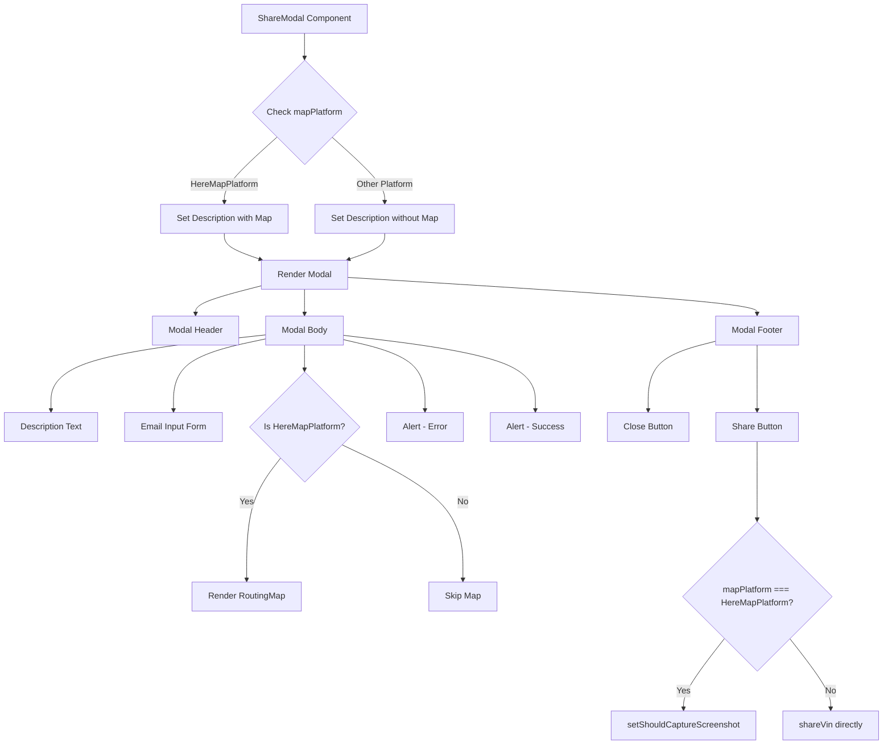
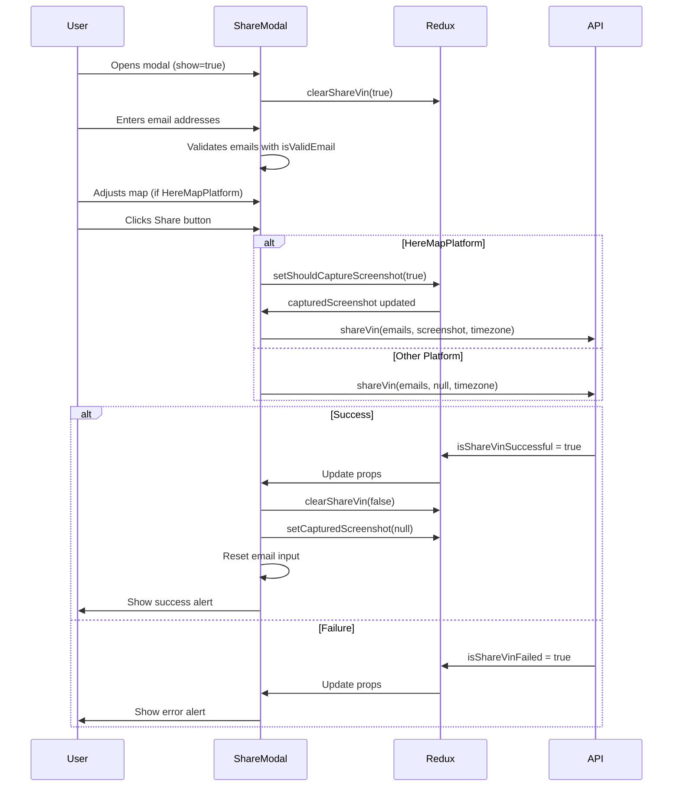
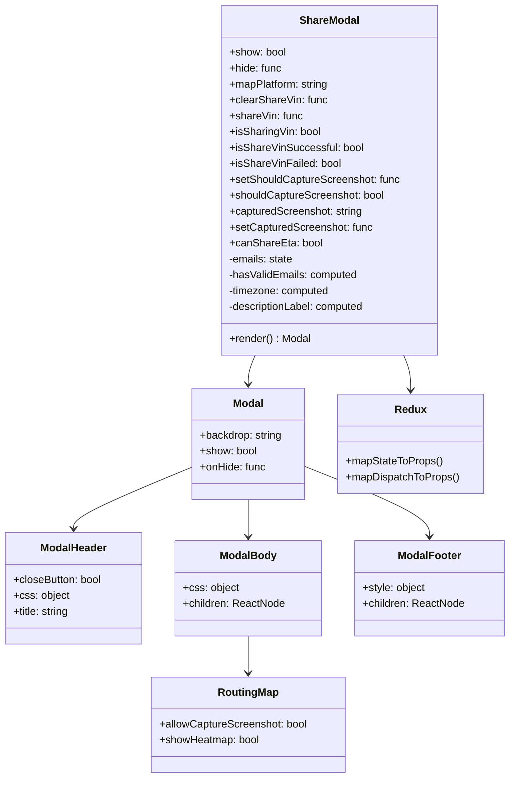
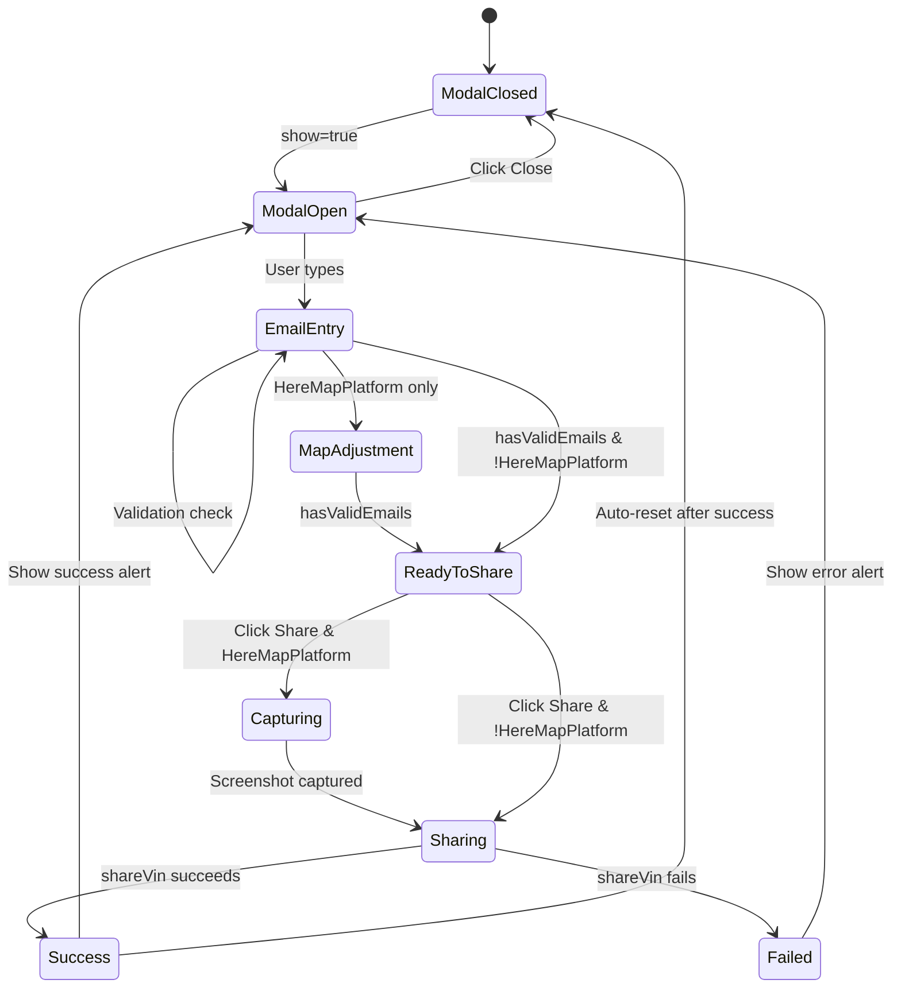

# Diagram: web/portal/src/shared/components/modals/Share.modal.js

> Auto-generated by Obscura crawlers

## Diagram 1

### SVG

<svg id="container" width="1650.15234375" xmlns="http://www.w3.org/2000/svg" class="flowchart" height="1410.1875" viewBox="0 0 1650.15234375 1410.1875" role="graphics-document document" aria-roledescription="flowchart-v2"><g><marker id="container_flowchart-v2-pointEnd" class="marker flowchart-v2" viewBox="0 0 10 10" refX="5" refY="5" markerUnits="userSpaceOnUse" markerWidth="8" markerHeight="8" orient="auto"><path d="M 0 0 L 10 5 L 0 10 z" class="arrowMarkerPath" style="stroke-width: 1; stroke-dasharray: 1, 0;"></path></marker><marker id="container_flowchart-v2-pointStart" class="marker flowchart-v2" viewBox="0 0 10 10" refX="4.5" refY="5" markerUnits="userSpaceOnUse" markerWidth="8" markerHeight="8" orient="auto"><path d="M 0 5 L 10 10 L 10 0 z" class="arrowMarkerPath" style="stroke-width: 1; stroke-dasharray: 1, 0;"></path></marker><marker id="container_flowchart-v2-circleEnd" class="marker flowchart-v2" viewBox="0 0 10 10" refX="11" refY="5" markerUnits="userSpaceOnUse" markerWidth="11" markerHeight="11" orient="auto"><circle cx="5" cy="5" r="5" class="arrowMarkerPath" style="stroke-width: 1; stroke-dasharray: 1, 0;"></circle></marker><marker id="container_flowchart-v2-circleStart" class="marker flowchart-v2" viewBox="0 0 10 10" refX="-1" refY="5" markerUnits="userSpaceOnUse" markerWidth="11" markerHeight="11" orient="auto"><circle cx="5" cy="5" r="5" class="arrowMarkerPath" style="stroke-width: 1; stroke-dasharray: 1, 0;"></circle></marker><marker id="container_flowchart-v2-crossEnd" class="marker cross flowchart-v2" viewBox="0 0 11 11" refX="12" refY="5.2" markerUnits="userSpaceOnUse" markerWidth="11" markerHeight="11" orient="auto"><path d="M 1,1 l 9,9 M 10,1 l -9,9" class="arrowMarkerPath" style="stroke-width: 2; stroke-dasharray: 1, 0;"></path></marker><marker id="container_flowchart-v2-crossStart" class="marker cross flowchart-v2" viewBox="0 0 11 11" refX="-1" refY="5.2" markerUnits="userSpaceOnUse" markerWidth="11" markerHeight="11" orient="auto"><path d="M 1,1 l 9,9 M 10,1 l -9,9" class="arrowMarkerPath" style="stroke-width: 2; stroke-dasharray: 1, 0;"></path></marker><g class="root"><g class="clusters"></g><g class="edgePaths"><path d="M571.125,62L571.125,66.167C571.125,70.333,571.125,78.667,571.125,86.333C571.125,94,571.125,101,571.125,104.5L571.125,108" id="L_A_B_0" class="edge-thickness-normal edge-pattern-solid edge-thickness-normal edge-pattern-solid flowchart-link" style=";" data-edge="true" data-et="edge" data-id="L_A_B_0" data-points="W3sieCI6NTcxLjEyNSwieSI6NjJ9LHsieCI6NTcxLjEyNSwieSI6ODd9LHsieCI6NTcxLjEyNSwieSI6MTEyfV0=" marker-end="url(#container_flowchart-v2-pointEnd)"></path><path d="M519.578,256.015L503.124,270.773C486.67,285.531,453.763,315.047,437.309,337.305C420.855,359.563,420.855,374.563,420.855,382.063L420.855,389.563" id="L_B_C_0" class="edge-thickness-normal edge-pattern-solid edge-thickness-normal edge-pattern-solid flowchart-link" style=";" data-edge="true" data-et="edge" data-id="L_B_C_0" data-points="W3sieCI6NTE5LjU3Nzg5NDgyMDY4NzEsInkiOjI1Ni4wMTUzOTQ4MjA2ODcxfSx7IngiOjQyMC44NTU0Njg3NSwieSI6MzQ0LjU2MjV9LHsieCI6NDIwLjg1NTQ2ODc1LCJ5IjozOTMuNTYyNX1d" marker-end="url(#container_flowchart-v2-pointEnd)"></path><path d="M622.672,256.015L639.126,270.773C655.58,285.531,688.487,315.047,704.941,335.305C721.395,355.563,721.395,366.563,721.395,372.063L721.395,377.563" id="L_B_D_0" class="edge-thickness-normal edge-pattern-solid edge-thickness-normal edge-pattern-solid flowchart-link" style=";" data-edge="true" data-et="edge" data-id="L_B_D_0" data-points="W3sieCI6NjIyLjY3MjEwNTE3OTMxMjksInkiOjI1Ni4wMTUzOTQ4MjA2ODcxfSx7IngiOjcyMS4zOTQ1MzEyNSwieSI6MzQ0LjU2MjV9LHsieCI6NzIxLjM5NDUzMTI1LCJ5IjozODEuNTYyNX1d" marker-end="url(#container_flowchart-v2-pointEnd)"></path><path d="M420.855,447.563L420.855,453.729C420.855,459.896,420.855,472.229,432.266,482.344C443.677,492.46,466.499,500.357,477.91,504.306L489.32,508.254" id="L_C_E_0" class="edge-thickness-normal edge-pattern-solid edge-thickness-normal edge-pattern-solid flowchart-link" style=";" data-edge="true" data-et="edge" data-id="L_C_E_0" data-points="W3sieCI6NDIwLjg1NTQ2ODc1LCJ5Ijo0NDcuNTYyNX0seyJ4Ijo0MjAuODU1NDY4NzUsInkiOjQ4NC41NjI1fSx7IngiOjQ5My4xMDA0MzU2OTcxMTUzNiwieSI6NTA5LjU2MjV9XQ==" marker-end="url(#container_flowchart-v2-pointEnd)"></path><path d="M721.395,459.563L721.395,463.729C721.395,467.896,721.395,476.229,709.984,484.344C698.573,492.46,675.751,500.357,664.34,504.306L652.93,508.254" id="L_D_E_0" class="edge-thickness-normal edge-pattern-solid edge-thickness-normal edge-pattern-solid flowchart-link" style=";" data-edge="true" data-et="edge" data-id="L_D_E_0" data-points="W3sieCI6NzIxLjM5NDUzMTI1LCJ5Ijo0NTkuNTYyNX0seyJ4Ijo3MjEuMzk0NTMxMjUsInkiOjQ4NC41NjI1fSx7IngiOjY0OS4xNDk1NjQzMDI4ODQ2LCJ5Ijo1MDkuNTYyNX1d" marker-end="url(#container_flowchart-v2-pointEnd)"></path><path d="M490.703,557.122L470.206,562.362C449.708,567.602,408.714,578.082,388.216,586.822C367.719,595.563,367.719,602.563,367.719,606.063L367.719,609.563" id="L_E_F_0" class="edge-thickness-normal edge-pattern-solid edge-thickness-normal edge-pattern-solid flowchart-link" style=";" data-edge="true" data-et="edge" data-id="L_E_F_0" data-points="W3sieCI6NDkwLjcwMzEyNSwieSI6NTU3LjEyMjAzMjk1NDM3MDl9LHsieCI6MzY3LjcxODc1LCJ5Ijo1ODguNTYyNX0seyJ4IjozNjcuNzE4NzUsInkiOjYxMy41NjI1fV0=" marker-end="url(#container_flowchart-v2-pointEnd)"></path><path d="M571.125,563.563L571.125,567.729C571.125,571.896,571.125,580.229,571.125,587.896C571.125,595.563,571.125,602.563,571.125,606.063L571.125,609.563" id="L_E_G_0" class="edge-thickness-normal edge-pattern-solid edge-thickness-normal edge-pattern-solid flowchart-link" style=";" data-edge="true" data-et="edge" data-id="L_E_G_0" data-points="W3sieCI6NTcxLjEyNSwieSI6NTYzLjU2MjV9LHsieCI6NTcxLjEyNSwieSI6NTg4LjU2MjV9LHsieCI6NTcxLjEyNSwieSI6NjEzLjU2MjV9XQ==" marker-end="url(#container_flowchart-v2-pointEnd)"></path><path d="M651.547,541.526L778.576,549.365C905.604,557.205,1159.661,572.884,1286.69,584.223C1413.719,595.563,1413.719,602.563,1413.719,606.063L1413.719,609.563" id="L_E_H_0" class="edge-thickness-normal edge-pattern-solid edge-thickness-normal edge-pattern-solid flowchart-link" style=";" data-edge="true" data-et="edge" data-id="L_E_H_0" data-points="W3sieCI6NjUxLjU0Njg3NSwieSI6NTQxLjUyNTY3MTc1Mzg4NDl9LHsieCI6MTQxMy43MTg3NSwieSI6NTg4LjU2MjV9LHsieCI6MTQxMy43MTg3NSwieSI6NjEzLjU2MjV9XQ==" marker-end="url(#container_flowchart-v2-pointEnd)"></path><path d="M498.445,648.526L431.462,655.865C364.479,663.205,230.513,677.884,163.53,701.275C96.547,724.667,96.547,756.771,96.547,772.823L96.547,788.875" id="L_G_I_0" class="edge-thickness-normal edge-pattern-solid edge-thickness-normal edge-pattern-solid flowchart-link" style=";" data-edge="true" data-et="edge" data-id="L_G_I_0" data-points="W3sieCI6NDk4LjQ0NTMxMjUsInkiOjY0OC41MjYwODYwNzk3NDE4fSx7IngiOjk2LjU0Njg3NSwieSI6NjkyLjU2MjV9LHsieCI6OTYuNTQ2ODc1LCJ5Ijo3OTIuODc1fV0=" marker-end="url(#container_flowchart-v2-pointEnd)"></path><path d="M498.445,656.041L469.863,662.128C441.281,668.215,384.117,680.389,355.535,702.528C326.953,724.667,326.953,756.771,326.953,772.823L326.953,788.875" id="L_G_J_0" class="edge-thickness-normal edge-pattern-solid edge-thickness-normal edge-pattern-solid flowchart-link" style=";" data-edge="true" data-et="edge" data-id="L_G_J_0" data-points="W3sieCI6NDk4LjQ0NTMxMjUsInkiOjY1Ni4wNDA3MTA3ODkwMTl9LHsieCI6MzI2Ljk1MzEyNSwieSI6NjkyLjU2MjV9LHsieCI6MzI2Ljk1MzEyNSwieSI6NzkyLjg3NX1d" marker-end="url(#container_flowchart-v2-pointEnd)"></path><path d="M571.125,667.563L571.125,671.729C571.125,675.896,571.125,684.229,571.125,691.896C571.125,699.563,571.125,706.563,571.125,710.063L571.125,713.563" id="L_G_K_0" class="edge-thickness-normal edge-pattern-solid edge-thickness-normal edge-pattern-solid flowchart-link" style=";" data-edge="true" data-et="edge" data-id="L_G_K_0" data-points="W3sieCI6NTcxLjEyNSwieSI6NjY3LjU2MjV9LHsieCI6NTcxLjEyNSwieSI6NjkyLjU2MjV9LHsieCI6NTcxLjEyNSwieSI6NzE3LjU2MjV9XQ==" marker-end="url(#container_flowchart-v2-pointEnd)"></path><path d="M526.632,877.694L516.18,891.277C505.729,904.859,484.825,932.023,474.374,969.772C463.922,1007.521,463.922,1055.854,463.922,1080.021L463.922,1104.188" id="L_K_L_0" class="edge-thickness-normal edge-pattern-solid edge-thickness-normal edge-pattern-solid flowchart-link" style=";" data-edge="true" data-et="edge" data-id="L_K_L_0" data-points="W3sieCI6NTI2LjYzMTk5OTkwNDkyNDksInkiOjg3Ny42OTQ0OTk5MDQ5MjQ5fSx7IngiOjQ2My45MjE4NzUsInkiOjk1OS4xODc1fSx7IngiOjQ2My45MjE4NzUsInkiOjExMDguMTg3NX1d" marker-end="url(#container_flowchart-v2-pointEnd)"></path><path d="M640.645,852.668L678.282,870.421C715.918,888.174,791.192,923.681,828.828,965.601C866.465,1007.521,866.465,1055.854,866.465,1080.021L866.465,1104.188" id="L_K_M_0" class="edge-thickness-normal edge-pattern-solid edge-thickness-normal edge-pattern-solid flowchart-link" style=";" data-edge="true" data-et="edge" data-id="L_K_M_0" data-points="W3sieCI6NjQwLjY0NDgzMTY0OTc1NiwieSI6ODUyLjY2NzY2ODM1MDI0NH0seyJ4Ijo4NjYuNDY0ODQzNzUsInkiOjk1OS4xODc1fSx7IngiOjg2Ni40NjQ4NDM3NSwieSI6MTEwOC4xODc1fV0=" marker-end="url(#container_flowchart-v2-pointEnd)"></path><path d="M643.805,657.367L669.174,663.233C694.544,669.099,745.284,680.831,770.654,702.749C796.023,724.667,796.023,756.771,796.023,772.823L796.023,788.875" id="L_G_N_0" class="edge-thickness-normal edge-pattern-solid edge-thickness-normal edge-pattern-solid flowchart-link" style=";" data-edge="true" data-et="edge" data-id="L_G_N_0" data-points="W3sieCI6NjQzLjgwNDY4NzUsInkiOjY1Ny4zNjcxNjg3NzQwOTk1fSx7IngiOjc5Ni4wMjM0Mzc1LCJ5Ijo2OTIuNTYyNX0seyJ4Ijo3OTYuMDIzNDM3NSwieSI6NzkyLjg3NX1d" marker-end="url(#container_flowchart-v2-pointEnd)"></path><path d="M643.805,649.346L703.404,656.549C763.003,663.752,882.201,678.157,941.799,701.412C1001.398,724.667,1001.398,756.771,1001.398,772.823L1001.398,788.875" id="L_G_O_0" class="edge-thickness-normal edge-pattern-solid edge-thickness-normal edge-pattern-solid flowchart-link" style=";" data-edge="true" data-et="edge" data-id="L_G_O_0" data-points="W3sieCI6NjQzLjgwNDY4NzUsInkiOjY0OS4zNDYwODYwMTkwNjV9LHsieCI6MTAwMS4zOTg0Mzc1LCJ5Ijo2OTIuNTYyNX0seyJ4IjoxMDAxLjM5ODQzNzUsInkiOjc5Mi44NzV9XQ==" marker-end="url(#container_flowchart-v2-pointEnd)"></path><path d="M1336.094,660.408L1315.132,665.767C1294.169,671.126,1252.245,681.844,1231.283,703.255C1210.32,724.667,1210.32,756.771,1210.32,772.823L1210.32,788.875" id="L_H_P_0" class="edge-thickness-normal edge-pattern-solid edge-thickness-normal edge-pattern-solid flowchart-link" style=";" data-edge="true" data-et="edge" data-id="L_H_P_0" data-points="W3sieCI6MTMzNi4wOTM3NSwieSI6NjYwLjQwNzc4NTE5MzAwOTR9LHsieCI6MTIxMC4zMjAzMTI1LCJ5Ijo2OTIuNTYyNX0seyJ4IjoxMjEwLjMyMDMxMjUsInkiOjc5Mi44NzV9XQ==" marker-end="url(#container_flowchart-v2-pointEnd)"></path><path d="M1413.719,667.563L1413.719,671.729C1413.719,675.896,1413.719,684.229,1413.719,704.448C1413.719,724.667,1413.719,756.771,1413.719,772.823L1413.719,788.875" id="L_H_Q_0" class="edge-thickness-normal edge-pattern-solid edge-thickness-normal edge-pattern-solid flowchart-link" style=";" data-edge="true" data-et="edge" data-id="L_H_Q_0" data-points="W3sieCI6MTQxMy43MTg3NSwieSI6NjY3LjU2MjV9LHsieCI6MTQxMy43MTg3NSwieSI6NjkyLjU2MjV9LHsieCI6MTQxMy43MTg3NSwieSI6NzkyLjg3NX1d" marker-end="url(#container_flowchart-v2-pointEnd)"></path><path d="M1413.719,846.875L1413.719,865.594C1413.719,884.313,1413.719,921.75,1413.719,945.969C1413.719,970.188,1413.719,981.188,1413.719,986.688L1413.719,992.188" id="L_Q_R_0" class="edge-thickness-normal edge-pattern-solid edge-thickness-normal edge-pattern-solid flowchart-link" style=";" data-edge="true" data-et="edge" data-id="L_Q_R_0" data-points="W3sieCI6MTQxMy43MTg3NSwieSI6ODQ2Ljg3NX0seyJ4IjoxNDEzLjcxODc1LCJ5Ijo5NTkuMTg3NX0seyJ4IjoxNDEzLjcxODc1LCJ5Ijo5OTYuMTg3NX1d" marker-end="url(#container_flowchart-v2-pointEnd)"></path><path d="M1352.665,1213.134L1339.865,1229.476C1327.065,1245.819,1301.464,1278.503,1288.664,1300.345C1275.863,1322.188,1275.863,1333.188,1275.863,1338.688L1275.863,1344.188" id="L_R_S_0" class="edge-thickness-normal edge-pattern-solid edge-thickness-normal edge-pattern-solid flowchart-link" style=";" data-edge="true" data-et="edge" data-id="L_R_S_0" data-points="W3sieCI6MTM1Mi42NjU0NTYxNjIwMjIzLCJ5IjoxMjEzLjEzNDIwNjE2MjAyMjN9LHsieCI6MTI3NS44NjMyODEyNSwieSI6MTMxMS4xODc1fSx7IngiOjEyNzUuODYzMjgxMjUsInkiOjEzNDguMTg3NX1d" marker-end="url(#container_flowchart-v2-pointEnd)"></path><path d="M1474.772,1213.134L1487.572,1229.476C1500.373,1245.819,1525.973,1278.503,1538.774,1300.345C1551.574,1322.188,1551.574,1333.188,1551.574,1338.688L1551.574,1344.188" id="L_R_T_0" class="edge-thickness-normal edge-pattern-solid edge-thickness-normal edge-pattern-solid flowchart-link" style=";" data-edge="true" data-et="edge" data-id="L_R_T_0" data-points="W3sieCI6MTQ3NC43NzIwNDM4Mzc5Nzc3LCJ5IjoxMjEzLjEzNDIwNjE2MjAyMjN9LHsieCI6MTU1MS41NzQyMTg3NSwieSI6MTMxMS4xODc1fSx7IngiOjE1NTEuNTc0MjE4NzUsInkiOjEzNDguMTg3NX1d" marker-end="url(#container_flowchart-v2-pointEnd)"></path></g><g class="edgeLabels"><g class="edgeLabel"><g class="label" data-id="L_A_B_0" transform="translate(0, 0)"><foreignObject width="0" height="0">

</foreignObject></g></g><g class="edgeLabel" transform="translate(420.85546875, 344.5625)"><g class="label" data-id="L_B_C_0" transform="translate(-63.671875, -12)"><foreignObject width="127.34375" height="24">

HereMapPlatform

</foreignObject></g></g><g class="edgeLabel" transform="translate(721.39453125, 344.5625)"><g class="label" data-id="L_B_D_0" transform="translate(-54.015625, -12)"><foreignObject width="108.03125" height="24">

Other Platform

</foreignObject></g></g><g class="edgeLabel"><g class="label" data-id="L_C_E_0" transform="translate(0, 0)"><foreignObject width="0" height="0">

</foreignObject></g></g><g class="edgeLabel"><g class="label" data-id="L_D_E_0" transform="translate(0, 0)"><foreignObject width="0" height="0">

</foreignObject></g></g><g class="edgeLabel"><g class="label" data-id="L_E_F_0" transform="translate(0, 0)"><foreignObject width="0" height="0">

</foreignObject></g></g><g class="edgeLabel"><g class="label" data-id="L_E_G_0" transform="translate(0, 0)"><foreignObject width="0" height="0">

</foreignObject></g></g><g class="edgeLabel"><g class="label" data-id="L_E_H_0" transform="translate(0, 0)"><foreignObject width="0" height="0">

</foreignObject></g></g><g class="edgeLabel"><g class="label" data-id="L_G_I_0" transform="translate(0, 0)"><foreignObject width="0" height="0">

</foreignObject></g></g><g class="edgeLabel"><g class="label" data-id="L_G_J_0" transform="translate(0, 0)"><foreignObject width="0" height="0">

</foreignObject></g></g><g class="edgeLabel"><g class="label" data-id="L_G_K_0" transform="translate(0, 0)"><foreignObject width="0" height="0">

</foreignObject></g></g><g class="edgeLabel" transform="translate(463.921875, 959.1875)"><g class="label" data-id="L_K_L_0" transform="translate(-12.03125, -12)"><foreignObject width="24.0625" height="24">

Yes

</foreignObject></g></g><g class="edgeLabel" transform="translate(866.46484375, 959.1875)"><g class="label" data-id="L_K_M_0" transform="translate(-10.140625, -12)"><foreignObject width="20.28125" height="24">

No

</foreignObject></g></g><g class="edgeLabel"><g class="label" data-id="L_G_N_0" transform="translate(0, 0)"><foreignObject width="0" height="0">

</foreignObject></g></g><g class="edgeLabel"><g class="label" data-id="L_G_O_0" transform="translate(0, 0)"><foreignObject width="0" height="0">

</foreignObject></g></g><g class="edgeLabel"><g class="label" data-id="L_H_P_0" transform="translate(0, 0)"><foreignObject width="0" height="0">

</foreignObject></g></g><g class="edgeLabel"><g class="label" data-id="L_H_Q_0" transform="translate(0, 0)"><foreignObject width="0" height="0">

</foreignObject></g></g><g class="edgeLabel"><g class="label" data-id="L_Q_R_0" transform="translate(0, 0)"><foreignObject width="0" height="0">

</foreignObject></g></g><g class="edgeLabel" transform="translate(1275.86328125, 1311.1875)"><g class="label" data-id="L_R_S_0" transform="translate(-12.03125, -12)"><foreignObject width="24.0625" height="24">

Yes

</foreignObject></g></g><g class="edgeLabel" transform="translate(1551.57421875, 1311.1875)"><g class="label" data-id="L_R_T_0" transform="translate(-10.140625, -12)"><foreignObject width="20.28125" height="24">

No

</foreignObject></g></g></g><g class="nodes"><g class="node default" id="flowchart-A-0" transform="translate(571.125, 35)"><rect class="basic label-container" style="" x="-116.921875" y="-27" width="233.84375" height="54"></rect><g class="label" style="" transform="translate(-86.921875, -12)"><rect></rect><foreignObject width="173.84375" height="24">

ShareModal Component

</foreignObject></g></g><g class="node default" id="flowchart-B-1" transform="translate(571.125, 209.78125)"><polygon points="97.78125,0 195.5625,-97.78125 97.78125,-195.5625 0,-97.78125" class="label-container" transform="translate(-97.28125, 97.78125)"></polygon><g class="label" style="" transform="translate(-70.78125, -12)"><rect></rect><foreignObject width="141.5625" height="24">

Check mapPlatform

</foreignObject></g></g><g class="node default" id="flowchart-C-3" transform="translate(420.85546875, 420.5625)"><rect class="basic label-container" style="" x="-120.5390625" y="-27" width="241.078125" height="54"></rect><g class="label" style="" transform="translate(-90.5390625, -12)"><rect></rect><foreignObject width="181.078125" height="24">

Set Description with Map

</foreignObject></g></g><g class="node default" id="flowchart-D-5" transform="translate(721.39453125, 420.5625)"><rect class="basic label-container" style="" x="-130" y="-39" width="260" height="78"></rect><g class="label" style="" transform="translate(-100, -24)"><rect></rect><foreignObject width="200" height="48">

Set Description without Map

</foreignObject></g></g><g class="node default" id="flowchart-E-7" transform="translate(571.125, 536.5625)"><rect class="basic label-container" style="" x="-80.421875" y="-27" width="160.84375" height="54"></rect><g class="label" style="" transform="translate(-50.421875, -12)"><rect></rect><foreignObject width="100.84375" height="24">

Render Modal

</foreignObject></g></g><g class="node default" id="flowchart-F-11" transform="translate(367.71875, 640.5625)"><rect class="basic label-container" style="" x="-80.7265625" y="-27" width="161.453125" height="54"></rect><g class="label" style="" transform="translate(-50.7265625, -12)"><rect></rect><foreignObject width="101.453125" height="24">

Modal Header

</foreignObject></g></g><g class="node default" id="flowchart-G-13" transform="translate(571.125, 640.5625)"><rect class="basic label-container" style="" x="-72.6796875" y="-27" width="145.359375" height="54"></rect><g class="label" style="" transform="translate(-42.6796875, -12)"><rect></rect><foreignObject width="85.359375" height="24">

Modal Body

</foreignObject></g></g><g class="node default" id="flowchart-H-15" transform="translate(1413.71875, 640.5625)"><rect class="basic label-container" style="" x="-77.625" y="-27" width="155.25" height="54"></rect><g class="label" style="" transform="translate(-47.625, -12)"><rect></rect><foreignObject width="95.25" height="24">

Modal Footer

</foreignObject></g></g><g class="node default" id="flowchart-I-17" transform="translate(96.546875, 819.875)"><rect class="basic label-container" style="" x="-88.546875" y="-27" width="177.09375" height="54"></rect><g class="label" style="" transform="translate(-58.546875, -12)"><rect></rect><foreignObject width="117.09375" height="24">

Description Text

</foreignObject></g></g><g class="node default" id="flowchart-J-19" transform="translate(326.953125, 819.875)"><rect class="basic label-container" style="" x="-91.859375" y="-27" width="183.71875" height="54"></rect><g class="label" style="" transform="translate(-61.859375, -12)"><rect></rect><foreignObject width="123.71875" height="24">

Email Input Form

</foreignObject></g></g><g class="node default" id="flowchart-K-21" transform="translate(571.125, 819.875)"><polygon points="102.3125,0 204.625,-102.3125 102.3125,-204.625 0,-102.3125" class="label-container" transform="translate(-101.8125, 102.3125)"></polygon><g class="label" style="" transform="translate(-75.3125, -12)"><rect></rect><foreignObject width="150.625" height="24">

Is HereMapPlatform?

</foreignObject></g></g><g class="node default" id="flowchart-L-23" transform="translate(463.921875, 1135.1875)"><rect class="basic label-container" style="" x="-101.4921875" y="-27" width="202.984375" height="54"></rect><g class="label" style="" transform="translate(-71.4921875, -12)"><rect></rect><foreignObject width="142.984375" height="24">

Render RoutingMap

</foreignObject></g></g><g class="node default" id="flowchart-M-25" transform="translate(866.46484375, 1135.1875)"><rect class="basic label-container" style="" x="-62.9140625" y="-27" width="125.828125" height="54"></rect><g class="label" style="" transform="translate(-32.9140625, -12)"><rect></rect><foreignObject width="65.828125" height="24">

Skip Map

</foreignObject></g></g><g class="node default" id="flowchart-N-27" transform="translate(796.0234375, 819.875)"><rect class="basic label-container" style="" x="-72.5859375" y="-27" width="145.171875" height="54"></rect><g class="label" style="" transform="translate(-42.5859375, -12)"><rect></rect><foreignObject width="85.171875" height="24">

Alert - Error

</foreignObject></g></g><g class="node default" id="flowchart-O-29" transform="translate(1001.3984375, 819.875)"><rect class="basic label-container" style="" x="-82.7890625" y="-27" width="165.578125" height="54"></rect><g class="label" style="" transform="translate(-52.7890625, -12)"><rect></rect><foreignObject width="105.578125" height="24">

Alert - Success

</foreignObject></g></g><g class="node default" id="flowchart-P-31" transform="translate(1210.3203125, 819.875)"><rect class="basic label-container" style="" x="-76.1328125" y="-27" width="152.265625" height="54"></rect><g class="label" style="" transform="translate(-46.1328125, -12)"><rect></rect><foreignObject width="92.265625" height="24">

Close Button

</foreignObject></g></g><g class="node default" id="flowchart-Q-33" transform="translate(1413.71875, 819.875)"><rect class="basic label-container" style="" x="-77.265625" y="-27" width="154.53125" height="54"></rect><g class="label" style="" transform="translate(-47.265625, -12)"><rect></rect><foreignObject width="94.53125" height="24">

Share Button

</foreignObject></g></g><g class="node default" id="flowchart-R-35" transform="translate(1413.71875, 1135.1875)"><polygon points="139,0 278,-139 139,-278 0,-139" class="label-container" transform="translate(-138.5, 139)"></polygon><g class="label" style="" transform="translate(-100, -24)"><rect></rect><foreignObject width="200" height="48">

mapPlatform === HereMapPlatform?

</foreignObject></g></g><g class="node default" id="flowchart-S-37" transform="translate(1275.86328125, 1375.1875)"><rect class="basic label-container" style="" x="-135.1328125" y="-27" width="270.265625" height="54"></rect><g class="label" style="" transform="translate(-105.1328125, -12)"><rect></rect><foreignObject width="210.265625" height="24">

setShouldCaptureScreenshot

</foreignObject></g></g><g class="node default" id="flowchart-T-39" transform="translate(1551.57421875, 1375.1875)"><rect class="basic label-container" style="" x="-90.578125" y="-27" width="181.15625" height="54"></rect><g class="label" style="" transform="translate(-60.578125, -12)"><rect></rect><foreignObject width="121.15625" height="24">

shareVin directly

</foreignObject></g></g></g></g></g></svg>

## Diagram 2

### SVG

<svg id="container" width="1154" xmlns="http://www.w3.org/2000/svg" height="1343" viewBox="-50 -10 1154 1343" role="graphics-document document" aria-roledescription="sequence"><g><rect x="904" y="1257" fill="#eaeaea" stroke="#666" width="150" height="65" name="API" rx="3" ry="3" class="actor actor-bottom"></rect><text x="979" y="1289.5" dominant-baseline="central" alignment-baseline="central" class="actor actor-box" style="text-anchor: middle; font-size: 16px; font-weight: 400;"><tspan x="979" dy="0">API</tspan></text></g><g><rect x="636" y="1257" fill="#eaeaea" stroke="#666" width="150" height="65" name="Redux" rx="3" ry="3" class="actor actor-bottom"></rect><text x="711" y="1289.5" dominant-baseline="central" alignment-baseline="central" class="actor actor-box" style="text-anchor: middle; font-size: 16px; font-weight: 400;"><tspan x="711" dy="0">Redux</tspan></text></g><g><rect x="315" y="1257" fill="#eaeaea" stroke="#666" width="150" height="65" name="ShareModal" rx="3" ry="3" class="actor actor-bottom"></rect><text x="390" y="1289.5" dominant-baseline="central" alignment-baseline="central" class="actor actor-box" style="text-anchor: middle; font-size: 16px; font-weight: 400;"><tspan x="390" dy="0">ShareModal</tspan></text></g><g><rect x="0" y="1257" fill="#eaeaea" stroke="#666" width="150" height="65" name="User" rx="3" ry="3" class="actor actor-bottom"></rect><text x="75" y="1289.5" dominant-baseline="central" alignment-baseline="central" class="actor actor-box" style="text-anchor: middle; font-size: 16px; font-weight: 400;"><tspan x="75" dy="0">User</tspan></text></g><g><line id="actor3" x1="979" y1="65" x2="979" y2="1257" class="actor-line 200" stroke-width="0.5px" stroke="#999" name="API"></line><g id="root-3"><rect x="904" y="0" fill="#eaeaea" stroke="#666" width="150" height="65" name="API" rx="3" ry="3" class="actor actor-top"></rect><text x="979" y="32.5" dominant-baseline="central" alignment-baseline="central" class="actor actor-box" style="text-anchor: middle; font-size: 16px; font-weight: 400;"><tspan x="979" dy="0">API</tspan></text></g></g><g><line id="actor2" x1="711" y1="65" x2="711" y2="1257" class="actor-line 200" stroke-width="0.5px" stroke="#999" name="Redux"></line><g id="root-2"><rect x="636" y="0" fill="#eaeaea" stroke="#666" width="150" height="65" name="Redux" rx="3" ry="3" class="actor actor-top"></rect><text x="711" y="32.5" dominant-baseline="central" alignment-baseline="central" class="actor actor-box" style="text-anchor: middle; font-size: 16px; font-weight: 400;"><tspan x="711" dy="0">Redux</tspan></text></g></g><g><line id="actor1" x1="390" y1="65" x2="390" y2="1257" class="actor-line 200" stroke-width="0.5px" stroke="#999" name="ShareModal"></line><g id="root-1"><rect x="315" y="0" fill="#eaeaea" stroke="#666" width="150" height="65" name="ShareModal" rx="3" ry="3" class="actor actor-top"></rect><text x="390" y="32.5" dominant-baseline="central" alignment-baseline="central" class="actor actor-box" style="text-anchor: middle; font-size: 16px; font-weight: 400;"><tspan x="390" dy="0">ShareModal</tspan></text></g></g><g><line id="actor0" x1="75" y1="65" x2="75" y2="1257" class="actor-line 200" stroke-width="0.5px" stroke="#999" name="User"></line><g id="root-0"><rect x="0" y="0" fill="#eaeaea" stroke="#666" width="150" height="65" name="User" rx="3" ry="3" class="actor actor-top"></rect><text x="75" y="32.5" dominant-baseline="central" alignment-baseline="central" class="actor actor-box" style="text-anchor: middle; font-size: 16px; font-weight: 400;"><tspan x="75" dy="0">User</tspan></text></g></g><g></g><defs><symbol id="computer" width="24" height="24"><path transform="scale(.5)" d="M2 2v13h20v-13h-20zm18 11h-16v-9h16v9zm-10.228 6l.466-1h3.524l.467 1h-4.457zm14.228 3h-24l2-6h2.104l-1.33 4h18.45l-1.297-4h2.073l2 6zm-5-10h-14v-7h14v7z"></path></symbol></defs><defs><symbol id="database" fill-rule="evenodd" clip-rule="evenodd"><path transform="scale(.5)" d="M12.258.001l.256.004.255.005.253.008.251.01.249.012.247.015.246.016.242.019.241.02.239.023.236.024.233.027.231.028.229.031.225.032.223.034.22.036.217.038.214.04.211.041.208.043.205.045.201.046.198.048.194.05.191.051.187.053.183.054.18.056.175.057.172.059.168.06.163.061.16.063.155.064.15.066.074.033.073.033.071.034.07.034.069.035.068.035.067.035.066.035.064.036.064.036.062.036.06.036.06.037.058.037.058.037.055.038.055.038.053.038.052.038.051.039.05.039.048.039.047.039.045.04.044.04.043.04.041.04.04.041.039.041.037.041.036.041.034.041.033.042.032.042.03.042.029.042.027.042.026.043.024.043.023.043.021.043.02.043.018.044.017.043.015.044.013.044.012.044.011.045.009.044.007.045.006.045.004.045.002.045.001.045v17l-.001.045-.002.045-.004.045-.006.045-.007.045-.009.044-.011.045-.012.044-.013.044-.015.044-.017.043-.018.044-.02.043-.021.043-.023.043-.024.043-.026.043-.027.042-.029.042-.03.042-.032.042-.033.042-.034.041-.036.041-.037.041-.039.041-.04.041-.041.04-.043.04-.044.04-.045.04-.047.039-.048.039-.05.039-.051.039-.052.038-.053.038-.055.038-.055.038-.058.037-.058.037-.06.037-.06.036-.062.036-.064.036-.064.036-.066.035-.067.035-.068.035-.069.035-.07.034-.071.034-.073.033-.074.033-.15.066-.155.064-.16.063-.163.061-.168.06-.172.059-.175.057-.18.056-.183.054-.187.053-.191.051-.194.05-.198.048-.201.046-.205.045-.208.043-.211.041-.214.04-.217.038-.22.036-.223.034-.225.032-.229.031-.231.028-.233.027-.236.024-.239.023-.241.02-.242.019-.246.016-.247.015-.249.012-.251.01-.253.008-.255.005-.256.004-.258.001-.258-.001-.256-.004-.255-.005-.253-.008-.251-.01-.249-.012-.247-.015-.245-.016-.243-.019-.241-.02-.238-.023-.236-.024-.234-.027-.231-.028-.228-.031-.226-.032-.223-.034-.22-.036-.217-.038-.214-.04-.211-.041-.208-.043-.204-.045-.201-.046-.198-.048-.195-.05-.19-.051-.187-.053-.184-.054-.179-.056-.176-.057-.172-.059-.167-.06-.164-.061-.159-.063-.155-.064-.151-.066-.074-.033-.072-.033-.072-.034-.07-.034-.069-.035-.068-.035-.067-.035-.066-.035-.064-.036-.063-.036-.062-.036-.061-.036-.06-.037-.058-.037-.057-.037-.056-.038-.055-.038-.053-.038-.052-.038-.051-.039-.049-.039-.049-.039-.046-.039-.046-.04-.044-.04-.043-.04-.041-.04-.04-.041-.039-.041-.037-.041-.036-.041-.034-.041-.033-.042-.032-.042-.03-.042-.029-.042-.027-.042-.026-.043-.024-.043-.023-.043-.021-.043-.02-.043-.018-.044-.017-.043-.015-.044-.013-.044-.012-.044-.011-.045-.009-.044-.007-.045-.006-.045-.004-.045-.002-.045-.001-.045v-17l.001-.045.002-.045.004-.045.006-.045.007-.045.009-.044.011-.045.012-.044.013-.044.015-.044.017-.043.018-.044.02-.043.021-.043.023-.043.024-.043.026-.043.027-.042.029-.042.03-.042.032-.042.033-.042.034-.041.036-.041.037-.041.039-.041.04-.041.041-.04.043-.04.044-.04.046-.04.046-.039.049-.039.049-.039.051-.039.052-.038.053-.038.055-.038.056-.038.057-.037.058-.037.06-.037.061-.036.062-.036.063-.036.064-.036.066-.035.067-.035.068-.035.069-.035.07-.034.072-.034.072-.033.074-.033.151-.066.155-.064.159-.063.164-.061.167-.06.172-.059.176-.057.179-.056.184-.054.187-.053.19-.051.195-.05.198-.048.201-.046.204-.045.208-.043.211-.041.214-.04.217-.038.22-.036.223-.034.226-.032.228-.031.231-.028.234-.027.236-.024.238-.023.241-.02.243-.019.245-.016.247-.015.249-.012.251-.01.253-.008.255-.005.256-.004.258-.001.258.001zm-9.258 20.499v.01l.001.021.003.021.004.022.005.021.006.022.007.022.009.023.01.022.011.023.012.023.013.023.015.023.016.024.017.023.018.024.019.024.021.024.022.025.023.024.024.025.052.049.056.05.061.051.066.051.07.051.075.051.079.052.084.052.088.052.092.052.097.052.102.051.105.052.11.052.114.051.119.051.123.051.127.05.131.05.135.05.139.048.144.049.147.047.152.047.155.047.16.045.163.045.167.043.171.043.176.041.178.041.183.039.187.039.19.037.194.035.197.035.202.033.204.031.209.03.212.029.216.027.219.025.222.024.226.021.23.02.233.018.236.016.24.015.243.012.246.01.249.008.253.005.256.004.259.001.26-.001.257-.004.254-.005.25-.008.247-.011.244-.012.241-.014.237-.016.233-.018.231-.021.226-.021.224-.024.22-.026.216-.027.212-.028.21-.031.205-.031.202-.034.198-.034.194-.036.191-.037.187-.039.183-.04.179-.04.175-.042.172-.043.168-.044.163-.045.16-.046.155-.046.152-.047.148-.048.143-.049.139-.049.136-.05.131-.05.126-.05.123-.051.118-.052.114-.051.11-.052.106-.052.101-.052.096-.052.092-.052.088-.053.083-.051.079-.052.074-.052.07-.051.065-.051.06-.051.056-.05.051-.05.023-.024.023-.025.021-.024.02-.024.019-.024.018-.024.017-.024.015-.023.014-.024.013-.023.012-.023.01-.023.01-.022.008-.022.006-.022.006-.022.004-.022.004-.021.001-.021.001-.021v-4.127l-.077.055-.08.053-.083.054-.085.053-.087.052-.09.052-.093.051-.095.05-.097.05-.1.049-.102.049-.105.048-.106.047-.109.047-.111.046-.114.045-.115.045-.118.044-.12.043-.122.042-.124.042-.126.041-.128.04-.13.04-.132.038-.134.038-.135.037-.138.037-.139.035-.142.035-.143.034-.144.033-.147.032-.148.031-.15.03-.151.03-.153.029-.154.027-.156.027-.158.026-.159.025-.161.024-.162.023-.163.022-.165.021-.166.02-.167.019-.169.018-.169.017-.171.016-.173.015-.173.014-.175.013-.175.012-.177.011-.178.01-.179.008-.179.008-.181.006-.182.005-.182.004-.184.003-.184.002h-.37l-.184-.002-.184-.003-.182-.004-.182-.005-.181-.006-.179-.008-.179-.008-.178-.01-.176-.011-.176-.012-.175-.013-.173-.014-.172-.015-.171-.016-.17-.017-.169-.018-.167-.019-.166-.02-.165-.021-.163-.022-.162-.023-.161-.024-.159-.025-.157-.026-.156-.027-.155-.027-.153-.029-.151-.03-.15-.03-.148-.031-.146-.032-.145-.033-.143-.034-.141-.035-.14-.035-.137-.037-.136-.037-.134-.038-.132-.038-.13-.04-.128-.04-.126-.041-.124-.042-.122-.042-.12-.044-.117-.043-.116-.045-.113-.045-.112-.046-.109-.047-.106-.047-.105-.048-.102-.049-.1-.049-.097-.05-.095-.05-.093-.052-.09-.051-.087-.052-.085-.053-.083-.054-.08-.054-.077-.054v4.127zm0-5.654v.011l.001.021.003.021.004.021.005.022.006.022.007.022.009.022.01.022.011.023.012.023.013.023.015.024.016.023.017.024.018.024.019.024.021.024.022.024.023.025.024.024.052.05.056.05.061.05.066.051.07.051.075.052.079.051.084.052.088.052.092.052.097.052.102.052.105.052.11.051.114.051.119.052.123.05.127.051.131.05.135.049.139.049.144.048.147.048.152.047.155.046.16.045.163.045.167.044.171.042.176.042.178.04.183.04.187.038.19.037.194.036.197.034.202.033.204.032.209.03.212.028.216.027.219.025.222.024.226.022.23.02.233.018.236.016.24.014.243.012.246.01.249.008.253.006.256.003.259.001.26-.001.257-.003.254-.006.25-.008.247-.01.244-.012.241-.015.237-.016.233-.018.231-.02.226-.022.224-.024.22-.025.216-.027.212-.029.21-.03.205-.032.202-.033.198-.035.194-.036.191-.037.187-.039.183-.039.179-.041.175-.042.172-.043.168-.044.163-.045.16-.045.155-.047.152-.047.148-.048.143-.048.139-.05.136-.049.131-.05.126-.051.123-.051.118-.051.114-.052.11-.052.106-.052.101-.052.096-.052.092-.052.088-.052.083-.052.079-.052.074-.051.07-.052.065-.051.06-.05.056-.051.051-.049.023-.025.023-.024.021-.025.02-.024.019-.024.018-.024.017-.024.015-.023.014-.023.013-.024.012-.022.01-.023.01-.023.008-.022.006-.022.006-.022.004-.021.004-.022.001-.021.001-.021v-4.139l-.077.054-.08.054-.083.054-.085.052-.087.053-.09.051-.093.051-.095.051-.097.05-.1.049-.102.049-.105.048-.106.047-.109.047-.111.046-.114.045-.115.044-.118.044-.12.044-.122.042-.124.042-.126.041-.128.04-.13.039-.132.039-.134.038-.135.037-.138.036-.139.036-.142.035-.143.033-.144.033-.147.033-.148.031-.15.03-.151.03-.153.028-.154.028-.156.027-.158.026-.159.025-.161.024-.162.023-.163.022-.165.021-.166.02-.167.019-.169.018-.169.017-.171.016-.173.015-.173.014-.175.013-.175.012-.177.011-.178.009-.179.009-.179.007-.181.007-.182.005-.182.004-.184.003-.184.002h-.37l-.184-.002-.184-.003-.182-.004-.182-.005-.181-.007-.179-.007-.179-.009-.178-.009-.176-.011-.176-.012-.175-.013-.173-.014-.172-.015-.171-.016-.17-.017-.169-.018-.167-.019-.166-.02-.165-.021-.163-.022-.162-.023-.161-.024-.159-.025-.157-.026-.156-.027-.155-.028-.153-.028-.151-.03-.15-.03-.148-.031-.146-.033-.145-.033-.143-.033-.141-.035-.14-.036-.137-.036-.136-.037-.134-.038-.132-.039-.13-.039-.128-.04-.126-.041-.124-.042-.122-.043-.12-.043-.117-.044-.116-.044-.113-.046-.112-.046-.109-.046-.106-.047-.105-.048-.102-.049-.1-.049-.097-.05-.095-.051-.093-.051-.09-.051-.087-.053-.085-.052-.083-.054-.08-.054-.077-.054v4.139zm0-5.666v.011l.001.02.003.022.004.021.005.022.006.021.007.022.009.023.01.022.011.023.012.023.013.023.015.023.016.024.017.024.018.023.019.024.021.025.022.024.023.024.024.025.052.05.056.05.061.05.066.051.07.051.075.052.079.051.084.052.088.052.092.052.097.052.102.052.105.051.11.052.114.051.119.051.123.051.127.05.131.05.135.05.139.049.144.048.147.048.152.047.155.046.16.045.163.045.167.043.171.043.176.042.178.04.183.04.187.038.19.037.194.036.197.034.202.033.204.032.209.03.212.028.216.027.219.025.222.024.226.021.23.02.233.018.236.017.24.014.243.012.246.01.249.008.253.006.256.003.259.001.26-.001.257-.003.254-.006.25-.008.247-.01.244-.013.241-.014.237-.016.233-.018.231-.02.226-.022.224-.024.22-.025.216-.027.212-.029.21-.03.205-.032.202-.033.198-.035.194-.036.191-.037.187-.039.183-.039.179-.041.175-.042.172-.043.168-.044.163-.045.16-.045.155-.047.152-.047.148-.048.143-.049.139-.049.136-.049.131-.051.126-.05.123-.051.118-.052.114-.051.11-.052.106-.052.101-.052.096-.052.092-.052.088-.052.083-.052.079-.052.074-.052.07-.051.065-.051.06-.051.056-.05.051-.049.023-.025.023-.025.021-.024.02-.024.019-.024.018-.024.017-.024.015-.023.014-.024.013-.023.012-.023.01-.022.01-.023.008-.022.006-.022.006-.022.004-.022.004-.021.001-.021.001-.021v-4.153l-.077.054-.08.054-.083.053-.085.053-.087.053-.09.051-.093.051-.095.051-.097.05-.1.049-.102.048-.105.048-.106.048-.109.046-.111.046-.114.046-.115.044-.118.044-.12.043-.122.043-.124.042-.126.041-.128.04-.13.039-.132.039-.134.038-.135.037-.138.036-.139.036-.142.034-.143.034-.144.033-.147.032-.148.032-.15.03-.151.03-.153.028-.154.028-.156.027-.158.026-.159.024-.161.024-.162.023-.163.023-.165.021-.166.02-.167.019-.169.018-.169.017-.171.016-.173.015-.173.014-.175.013-.175.012-.177.01-.178.01-.179.009-.179.007-.181.006-.182.006-.182.004-.184.003-.184.001-.185.001-.185-.001-.184-.001-.184-.003-.182-.004-.182-.006-.181-.006-.179-.007-.179-.009-.178-.01-.176-.01-.176-.012-.175-.013-.173-.014-.172-.015-.171-.016-.17-.017-.169-.018-.167-.019-.166-.02-.165-.021-.163-.023-.162-.023-.161-.024-.159-.024-.157-.026-.156-.027-.155-.028-.153-.028-.151-.03-.15-.03-.148-.032-.146-.032-.145-.033-.143-.034-.141-.034-.14-.036-.137-.036-.136-.037-.134-.038-.132-.039-.13-.039-.128-.041-.126-.041-.124-.041-.122-.043-.12-.043-.117-.044-.116-.044-.113-.046-.112-.046-.109-.046-.106-.048-.105-.048-.102-.048-.1-.05-.097-.049-.095-.051-.093-.051-.09-.052-.087-.052-.085-.053-.083-.053-.08-.054-.077-.054v4.153zm8.74-8.179l-.257.004-.254.005-.25.008-.247.011-.244.012-.241.014-.237.016-.233.018-.231.021-.226.022-.224.023-.22.026-.216.027-.212.028-.21.031-.205.032-.202.033-.198.034-.194.036-.191.038-.187.038-.183.04-.179.041-.175.042-.172.043-.168.043-.163.045-.16.046-.155.046-.152.048-.148.048-.143.048-.139.049-.136.05-.131.05-.126.051-.123.051-.118.051-.114.052-.11.052-.106.052-.101.052-.096.052-.092.052-.088.052-.083.052-.079.052-.074.051-.07.052-.065.051-.06.05-.056.05-.051.05-.023.025-.023.024-.021.024-.02.025-.019.024-.018.024-.017.023-.015.024-.014.023-.013.023-.012.023-.01.023-.01.022-.008.022-.006.023-.006.021-.004.022-.004.021-.001.021-.001.021.001.021.001.021.004.021.004.022.006.021.006.023.008.022.01.022.01.023.012.023.013.023.014.023.015.024.017.023.018.024.019.024.02.025.021.024.023.024.023.025.051.05.056.05.06.05.065.051.07.052.074.051.079.052.083.052.088.052.092.052.096.052.101.052.106.052.11.052.114.052.118.051.123.051.126.051.131.05.136.05.139.049.143.048.148.048.152.048.155.046.16.046.163.045.168.043.172.043.175.042.179.041.183.04.187.038.191.038.194.036.198.034.202.033.205.032.21.031.212.028.216.027.22.026.224.023.226.022.231.021.233.018.237.016.241.014.244.012.247.011.25.008.254.005.257.004.26.001.26-.001.257-.004.254-.005.25-.008.247-.011.244-.012.241-.014.237-.016.233-.018.231-.021.226-.022.224-.023.22-.026.216-.027.212-.028.21-.031.205-.032.202-.033.198-.034.194-.036.191-.038.187-.038.183-.04.179-.041.175-.042.172-.043.168-.043.163-.045.16-.046.155-.046.152-.048.148-.048.143-.048.139-.049.136-.05.131-.05.126-.051.123-.051.118-.051.114-.052.11-.052.106-.052.101-.052.096-.052.092-.052.088-.052.083-.052.079-.052.074-.051.07-.052.065-.051.06-.05.056-.05.051-.05.023-.025.023-.024.021-.024.02-.025.019-.024.018-.024.017-.023.015-.024.014-.023.013-.023.012-.023.01-.023.01-.022.008-.022.006-.023.006-.021.004-.022.004-.021.001-.021.001-.021-.001-.021-.001-.021-.004-.021-.004-.022-.006-.021-.006-.023-.008-.022-.01-.022-.01-.023-.012-.023-.013-.023-.014-.023-.015-.024-.017-.023-.018-.024-.019-.024-.02-.025-.021-.024-.023-.024-.023-.025-.051-.05-.056-.05-.06-.05-.065-.051-.07-.052-.074-.051-.079-.052-.083-.052-.088-.052-.092-.052-.096-.052-.101-.052-.106-.052-.11-.052-.114-.052-.118-.051-.123-.051-.126-.051-.131-.05-.136-.05-.139-.049-.143-.048-.148-.048-.152-.048-.155-.046-.16-.046-.163-.045-.168-.043-.172-.043-.175-.042-.179-.041-.183-.04-.187-.038-.191-.038-.194-.036-.198-.034-.202-.033-.205-.032-.21-.031-.212-.028-.216-.027-.22-.026-.224-.023-.226-.022-.231-.021-.233-.018-.237-.016-.241-.014-.244-.012-.247-.011-.25-.008-.254-.005-.257-.004-.26-.001-.26.001z"></path></symbol></defs><defs><symbol id="clock" width="24" height="24"><path transform="scale(.5)" d="M12 2c5.514 0 10 4.486 10 10s-4.486 10-10 10-10-4.486-10-10 4.486-10 10-10zm0-2c-6.627 0-12 5.373-12 12s5.373 12 12 12 12-5.373 12-12-5.373-12-12-12zm5.848 12.459c.202.038.202.333.001.372-1.907.361-6.045 1.111-6.547 1.111-.719 0-1.301-.582-1.301-1.301 0-.512.77-5.447 1.125-7.445.034-.192.312-.181.343.014l.985 6.238 5.394 1.011z"></path></symbol></defs><defs><marker id="arrowhead" refX="7.9" refY="5" markerUnits="userSpaceOnUse" markerWidth="12" markerHeight="12" orient="auto-start-reverse"><path d="M -1 0 L 10 5 L 0 10 z"></path></marker></defs><defs><marker id="crosshead" markerWidth="15" markerHeight="8" orient="auto" refX="4" refY="4.5"><path fill="none" stroke="#000000" stroke-width="1pt" d="M 1,2 L 6,7 M 6,2 L 1,7" style="stroke-dasharray: 0, 0;"></path></marker></defs><defs><marker id="filled-head" refX="15.5" refY="7" markerWidth="20" markerHeight="28" orient="auto"><path d="M 18,7 L9,13 L14,7 L9,1 Z"></path></marker></defs><defs><marker id="sequencenumber" refX="15" refY="15" markerWidth="60" markerHeight="40" orient="auto"><circle cx="15" cy="15" r="6"></circle></marker></defs><g><line x1="379" y1="393" x2="990" y2="393" class="loopLine"></line><line x1="990" y1="393" x2="990" y2="675" class="loopLine"></line><line x1="379" y1="675" x2="990" y2="675" class="loopLine"></line><line x1="379" y1="393" x2="379" y2="675" class="loopLine"></line><line x1="379" y1="587" x2="990" y2="587" class="loopLine" style="stroke-dasharray: 3, 3;"></line><polygon points="379,393 429,393 429,406 420.6,413 379,413" class="labelBox"></polygon><text x="404" y="406" text-anchor="middle" dominant-baseline="middle" alignment-baseline="middle" class="labelText" style="font-size: 16px; font-weight: 400;">alt</text><text x="709.5" y="411" text-anchor="middle" class="loopText" style="font-size: 16px; font-weight: 400;"><tspan x="709.5">[HereMapPlatform]</tspan></text><text x="684.5" y="605" text-anchor="middle" class="loopText" style="font-size: 16px; font-weight: 400;">[Other Platform]</text></g><g><line x1="64" y1="685" x2="990" y2="685" class="loopLine"></line><line x1="990" y1="685" x2="990" y2="1237" class="loopLine"></line><line x1="64" y1="1237" x2="990" y2="1237" class="loopLine"></line><line x1="64" y1="685" x2="64" y2="1237" class="loopLine"></line><line x1="64" y1="1053" x2="990" y2="1053" class="loopLine" style="stroke-dasharray: 3, 3;"></line><polygon points="64,685 114,685 114,698 105.6,705 64,705" class="labelBox"></polygon><text x="89" y="698" text-anchor="middle" dominant-baseline="middle" alignment-baseline="middle" class="labelText" style="font-size: 16px; font-weight: 400;">alt</text><text x="552" y="703" text-anchor="middle" class="loopText" style="font-size: 16px; font-weight: 400;"><tspan x="552">[Success]</tspan></text><text x="527" y="1071" text-anchor="middle" class="loopText" style="font-size: 16px; font-weight: 400;">[Failure]</text></g><text x="231" y="80" text-anchor="middle" dominant-baseline="middle" alignment-baseline="middle" class="messageText" dy="1em" style="font-size: 16px; font-weight: 400;">Opens modal (show=true)</text><line x1="76" y1="113" x2="386" y2="113" class="messageLine0" stroke-width="2" stroke="none" marker-end="url(#arrowhead)" style="fill: none;"></line><text x="549" y="128" text-anchor="middle" dominant-baseline="middle" alignment-baseline="middle" class="messageText" dy="1em" style="font-size: 16px; font-weight: 400;">clearShareVin(true)</text><line x1="391" y1="161" x2="707" y2="161" class="messageLine0" stroke-width="2" stroke="none" marker-end="url(#arrowhead)" style="fill: none;"></line><text x="231" y="176" text-anchor="middle" dominant-baseline="middle" alignment-baseline="middle" class="messageText" dy="1em" style="font-size: 16px; font-weight: 400;">Enters email addresses</text><line x1="76" y1="209" x2="386" y2="209" class="messageLine0" stroke-width="2" stroke="none" marker-end="url(#arrowhead)" style="fill: none;"></line><text x="391" y="224" text-anchor="middle" dominant-baseline="middle" alignment-baseline="middle" class="messageText" dy="1em" style="font-size: 16px; font-weight: 400;">Validates emails with isValidEmail</text><path d="M 391,257 C 451,247 451,287 391,277" class="messageLine0" stroke-width="2" stroke="none" marker-end="url(#arrowhead)" style="fill: none;"></path><text x="231" y="302" text-anchor="middle" dominant-baseline="middle" alignment-baseline="middle" class="messageText" dy="1em" style="font-size: 16px; font-weight: 400;">Adjusts map (if HereMapPlatform)</text><line x1="76" y1="335" x2="386" y2="335" class="messageLine0" stroke-width="2" stroke="none" marker-end="url(#arrowhead)" style="fill: none;"></line><text x="231" y="350" text-anchor="middle" dominant-baseline="middle" alignment-baseline="middle" class="messageText" dy="1em" style="font-size: 16px; font-weight: 400;">Clicks Share button</text><line x1="76" y1="383" x2="386" y2="383" class="messageLine0" stroke-width="2" stroke="none" marker-end="url(#arrowhead)" style="fill: none;"></line><text x="549" y="443" text-anchor="middle" dominant-baseline="middle" alignment-baseline="middle" class="messageText" dy="1em" style="font-size: 16px; font-weight: 400;">setShouldCaptureScreenshot(true)</text><line x1="391" y1="476" x2="707" y2="476" class="messageLine0" stroke-width="2" stroke="none" marker-end="url(#arrowhead)" style="fill: none;"></line><text x="552" y="491" text-anchor="middle" dominant-baseline="middle" alignment-baseline="middle" class="messageText" dy="1em" style="font-size: 16px; font-weight: 400;">capturedScreenshot updated</text><line x1="710" y1="524" x2="394" y2="524" class="messageLine0" stroke-width="2" stroke="none" marker-end="url(#arrowhead)" style="fill: none;"></line><text x="683" y="539" text-anchor="middle" dominant-baseline="middle" alignment-baseline="middle" class="messageText" dy="1em" style="font-size: 16px; font-weight: 400;">shareVin(emails, screenshot, timezone)</text><line x1="391" y1="572" x2="975" y2="572" class="messageLine0" stroke-width="2" stroke="none" marker-end="url(#arrowhead)" style="fill: none;"></line><text x="683" y="632" text-anchor="middle" dominant-baseline="middle" alignment-baseline="middle" class="messageText" dy="1em" style="font-size: 16px; font-weight: 400;">shareVin(emails, null, timezone)</text><line x1="391" y1="665" x2="975" y2="665" class="messageLine0" stroke-width="2" stroke="none" marker-end="url(#arrowhead)" style="fill: none;"></line><text x="847" y="735" text-anchor="middle" dominant-baseline="middle" alignment-baseline="middle" class="messageText" dy="1em" style="font-size: 16px; font-weight: 400;">isShareVinSuccessful = true</text><line x1="978" y1="768" x2="715" y2="768" class="messageLine0" stroke-width="2" stroke="none" marker-end="url(#arrowhead)" style="fill: none;"></line><text x="552" y="783" text-anchor="middle" dominant-baseline="middle" alignment-baseline="middle" class="messageText" dy="1em" style="font-size: 16px; font-weight: 400;">Update props</text><line x1="710" y1="816" x2="394" y2="816" class="messageLine0" stroke-width="2" stroke="none" marker-end="url(#arrowhead)" style="fill: none;"></line><text x="549" y="831" text-anchor="middle" dominant-baseline="middle" alignment-baseline="middle" class="messageText" dy="1em" style="font-size: 16px; font-weight: 400;">clearShareVin(false)</text><line x1="391" y1="864" x2="707" y2="864" class="messageLine0" stroke-width="2" stroke="none" marker-end="url(#arrowhead)" style="fill: none;"></line><text x="549" y="879" text-anchor="middle" dominant-baseline="middle" alignment-baseline="middle" class="messageText" dy="1em" style="font-size: 16px; font-weight: 400;">setCapturedScreenshot(null)</text><line x1="391" y1="912" x2="707" y2="912" class="messageLine0" stroke-width="2" stroke="none" marker-end="url(#arrowhead)" style="fill: none;"></line><text x="391" y="927" text-anchor="middle" dominant-baseline="middle" alignment-baseline="middle" class="messageText" dy="1em" style="font-size: 16px; font-weight: 400;">Reset email input</text><path d="M 391,960 C 451,950 451,990 391,980" class="messageLine0" stroke-width="2" stroke="none" marker-end="url(#arrowhead)" style="fill: none;"></path><text x="234" y="1005" text-anchor="middle" dominant-baseline="middle" alignment-baseline="middle" class="messageText" dy="1em" style="font-size: 16px; font-weight: 400;">Show success alert</text><line x1="389" y1="1038" x2="79" y2="1038" class="messageLine0" stroke-width="2" stroke="none" marker-end="url(#arrowhead)" style="fill: none;"></line><text x="847" y="1098" text-anchor="middle" dominant-baseline="middle" alignment-baseline="middle" class="messageText" dy="1em" style="font-size: 16px; font-weight: 400;">isShareVinFailed = true</text><line x1="978" y1="1131" x2="715" y2="1131" class="messageLine0" stroke-width="2" stroke="none" marker-end="url(#arrowhead)" style="fill: none;"></line><text x="552" y="1146" text-anchor="middle" dominant-baseline="middle" alignment-baseline="middle" class="messageText" dy="1em" style="font-size: 16px; font-weight: 400;">Update props</text><line x1="710" y1="1179" x2="394" y2="1179" class="messageLine0" stroke-width="2" stroke="none" marker-end="url(#arrowhead)" style="fill: none;"></line><text x="234" y="1194" text-anchor="middle" dominant-baseline="middle" alignment-baseline="middle" class="messageText" dy="1em" style="font-size: 16px; font-weight: 400;">Show error alert</text><line x1="389" y1="1227" x2="79" y2="1227" class="messageLine0" stroke-width="2" stroke="none" marker-end="url(#arrowhead)" style="fill: none;"></line></svg>

## Diagram 3

### SVG

<svg id="container" width="768.21875" xmlns="http://www.w3.org/2000/svg" class="classDiagram" height="1174" viewBox="0 0 768.21875 1174" role="graphics-document document" aria-roledescription="class"><g><defs><marker id="container_class-aggregationStart" class="marker aggregation class" refX="18" refY="7" markerWidth="190" markerHeight="240" orient="auto"><path d="M 18,7 L9,13 L1,7 L9,1 Z"></path></marker></defs><defs><marker id="container_class-aggregationEnd" class="marker aggregation class" refX="1" refY="7" markerWidth="20" markerHeight="28" orient="auto"><path d="M 18,7 L9,13 L1,7 L9,1 Z"></path></marker></defs><defs><marker id="container_class-extensionStart" class="marker extension class" refX="18" refY="7" markerWidth="190" markerHeight="240" orient="auto"><path d="M 1,7 L18,13 V 1 Z"></path></marker></defs><defs><marker id="container_class-extensionEnd" class="marker extension class" refX="1" refY="7" markerWidth="20" markerHeight="28" orient="auto"><path d="M 1,1 V 13 L18,7 Z"></path></marker></defs><defs><marker id="container_class-compositionStart" class="marker composition class" refX="18" refY="7" markerWidth="190" markerHeight="240" orient="auto"><path d="M 18,7 L9,13 L1,7 L9,1 Z"></path></marker></defs><defs><marker id="container_class-compositionEnd" class="marker composition class" refX="1" refY="7" markerWidth="20" markerHeight="28" orient="auto"><path d="M 18,7 L9,13 L1,7 L9,1 Z"></path></marker></defs><defs><marker id="container_class-dependencyStart" class="marker dependency class" refX="6" refY="7" markerWidth="190" markerHeight="240" orient="auto"><path d="M 5,7 L9,13 L1,7 L9,1 Z"></path></marker></defs><defs><marker id="container_class-dependencyEnd" class="marker dependency class" refX="13" refY="7" markerWidth="20" markerHeight="28" orient="auto"><path d="M 18,7 L9,13 L14,7 L9,1 Z"></path></marker></defs><defs><marker id="container_class-lollipopStart" class="marker lollipop class" refX="13" refY="7" markerWidth="190" markerHeight="240" orient="auto"><circle stroke="black" fill="transparent" cx="7" cy="7" r="6"></circle></marker></defs><defs><marker id="container_class-lollipopEnd" class="marker lollipop class" refX="1" refY="7" markerWidth="190" markerHeight="240" orient="auto"><circle stroke="black" fill="transparent" cx="7" cy="7" r="6"></circle></marker></defs><g class="root"><g class="clusters"></g><g class="edgePaths"><path d="M386.944,536L385.179,540.167C383.415,544.333,379.885,552.667,378.12,560C376.355,567.333,376.355,573.667,376.355,576.833L376.355,580" id="id_ShareModal_Modal_1" class="edge-thickness-normal edge-pattern-solid relation" style=";;;" data-edge="true" data-et="edge" data-id="id_ShareModal_Modal_1" data-points="W3sieCI6Mzg2Ljk0NDI0NDcwMTU1NzA3LCJ5Ijo1MzZ9LHsieCI6Mzc2LjM1NTQ2ODc1LCJ5Ijo1NjF9LHsieCI6Mzc2LjM1NTQ2ODc1LCJ5Ijo1ODZ9XQ==" marker-end="url(#container_class-dependencyEnd)"></path><path d="M290.352,705.51L260.687,717.759C231.022,730.007,171.693,754.503,142.028,769.918C112.363,785.333,112.363,791.667,112.363,794.833L112.363,798" id="id_Modal_ModalHeader_2" class="edge-thickness-normal edge-pattern-solid relation" style=";;;" data-edge="true" data-et="edge" data-id="id_Modal_ModalHeader_2" data-points="W3sieCI6MjkwLjM1MTU2MjUsInkiOjcwNS41MTAyMzk0MTI4NjE0fSx7IngiOjExMi4zNjMyODEyNSwieSI6Nzc5fSx7IngiOjExMi4zNjMyODEyNSwieSI6ODA0fV0=" marker-end="url(#container_class-dependencyEnd)"></path><path d="M376.355,754L376.355,758.167C376.355,762.333,376.355,770.667,376.355,780C376.355,789.333,376.355,799.667,376.355,804.833L376.355,810" id="id_Modal_ModalBody_3" class="edge-thickness-normal edge-pattern-solid relation" style=";;;" data-edge="true" data-et="edge" data-id="id_Modal_ModalBody_3" data-points="W3sieCI6Mzc2LjM1NTQ2ODc1LCJ5Ijo3NTR9LHsieCI6Mzc2LjM1NTQ2ODc1LCJ5Ijo3Nzl9LHsieCI6Mzc2LjM1NTQ2ODc1LCJ5Ijo4MTZ9XQ==" marker-end="url(#container_class-dependencyEnd)"></path><path d="M462.359,704.497L493.316,716.914C524.273,729.331,586.188,754.166,617.145,771.75C648.102,789.333,648.102,799.667,648.102,804.833L648.102,810" id="id_Modal_ModalFooter_4" class="edge-thickness-normal edge-pattern-solid relation" style=";;;" data-edge="true" data-et="edge" data-id="id_Modal_ModalFooter_4" data-points="W3sieCI6NDYyLjM1OTM3NSwieSI6NzA0LjQ5NzAwMjg4OTMwMDl9LHsieCI6NjQ4LjEwMTU2MjUsInkiOjc3OX0seyJ4Ijo2NDguMTAxNTYyNSwieSI6ODE2fV0=" marker-end="url(#container_class-dependencyEnd)"></path><path d="M376.355,960L376.355,966.167C376.355,972.333,376.355,984.667,376.355,994C376.355,1003.333,376.355,1009.667,376.355,1012.833L376.355,1016" id="id_ModalBody_RoutingMap_5" class="edge-thickness-normal edge-pattern-solid relation" style=";;;" data-edge="true" data-et="edge" data-id="id_ModalBody_RoutingMap_5" data-points="W3sieCI6Mzc2LjM1NTQ2ODc1LCJ5Ijo5NjB9LHsieCI6Mzc2LjM1NTQ2ODc1LCJ5Ijo5OTd9LHsieCI6Mzc2LjM1NTQ2ODc1LCJ5IjoxMDIyfV0=" marker-end="url(#container_class-dependencyEnd)"></path><path d="M610.579,536L612.344,540.167C614.109,544.333,617.638,552.667,619.403,561.5C621.168,570.333,621.168,579.667,621.168,584.333L621.168,589" id="id_ShareModal_Redux_6" class="edge-thickness-normal edge-pattern-solid relation" style=";;;" data-edge="true" data-et="edge" data-id="id_ShareModal_Redux_6" data-points="W3sieCI6NjEwLjU3OTE5Mjc5ODQ0MjksInkiOjUzNn0seyJ4Ijo2MjEuMTY3OTY4NzUsInkiOjU2MX0seyJ4Ijo2MjEuMTY3OTY4NzUsInkiOjU5NX1d" marker-end="url(#container_class-dependencyEnd)"></path></g><g class="edgeLabels"><g class="edgeLabel"><g class="label" data-id="id_ShareModal_Modal_1" transform="translate(0, 0)"><foreignObject width="0" height="0">

</foreignObject></g></g><g class="edgeLabel"><g class="label" data-id="id_Modal_ModalHeader_2" transform="translate(0, 0)"><foreignObject width="0" height="0">

</foreignObject></g></g><g class="edgeLabel"><g class="label" data-id="id_Modal_ModalBody_3" transform="translate(0, 0)"><foreignObject width="0" height="0">

</foreignObject></g></g><g class="edgeLabel"><g class="label" data-id="id_Modal_ModalFooter_4" transform="translate(0, 0)"><foreignObject width="0" height="0">

</foreignObject></g></g><g class="edgeLabel"><g class="label" data-id="id_ModalBody_RoutingMap_5" transform="translate(0, 0)"><foreignObject width="0" height="0">

</foreignObject></g></g><g class="edgeLabel"><g class="label" data-id="id_ShareModal_Redux_6" transform="translate(0, 0)"><foreignObject width="0" height="0">

</foreignObject></g></g></g><g class="nodes"><g class="node default" id="classId-ShareModal-0" transform="translate(498.76171875, 272)"><g class="basic label-container"><path d="M-162.75 -264 L162.75 -264 L162.75 264 L-162.75 264" stroke="none" stroke-width="0" fill="#ECECFF" style=""></path><path d="M-162.75 -264 C-42.64082835201093 -264, 77.46834329597814 -264, 162.75 -264 M-162.75 -264 C-51.8575047803356 -264, 59.034990439328794 -264, 162.75 -264 M162.75 -264 C162.75 -108.64173308385847, 162.75 46.71653383228306, 162.75 264 M162.75 -264 C162.75 -99.58487357237308, 162.75 64.83025285525383, 162.75 264 M162.75 264 C41.93190053600205 264, -78.8861989279959 264, -162.75 264 M162.75 264 C38.974517444348066 264, -84.80096511130387 264, -162.75 264 M-162.75 264 C-162.75 94.85448229832917, -162.75 -74.29103540334165, -162.75 -264 M-162.75 264 C-162.75 65.10408100101134, -162.75 -133.79183799797732, -162.75 -264" stroke="#9370DB" stroke-width="1.3" fill="none" stroke-dasharray="0 0" style=""></path></g><g class="annotation-group text" transform="translate(0, -240)"></g><g class="label-group text" transform="translate(-43.40625, -240)"><g class="label" style="font-weight: bolder" transform="translate(0,-12)"><foreignObject width="86.8125" height="24">

ShareModal

</foreignObject></g></g><g class="members-group text" transform="translate(-150.75, -192)"><g class="label" style="" transform="translate(0,-12)"><foreignObject width="86.6875" height="24">

+show: bool

</foreignObject></g><g class="label" style="" transform="translate(0,12)"><foreignObject width="79.9375" height="24">

+hide: func

</foreignObject></g><g class="label" style="" transform="translate(0,36)"><foreignObject width="152.28125" height="24">

+mapPlatform: string

</foreignObject></g><g class="label" style="" transform="translate(0,60)"><foreignObject width="147.46875" height="24">

+clearShareVin: func

</foreignObject></g><g class="label" style="" transform="translate(0,84)"><foreignObject width="110.515625" height="24">

+shareVin: func

</foreignObject></g><g class="label" style="" transform="translate(0,108)"><foreignObject width="138.90625" height="24">

+isSharingVin: bool

</foreignObject></g><g class="label" style="" transform="translate(0,132)"><foreignObject width="200.640625" height="24">

+isShareVinSuccessful: bool

</foreignObject></g><g class="label" style="" transform="translate(0,156)"><foreignObject width="167.9375" height="24">

+isShareVinFailed: bool

</foreignObject></g><g class="label" style="" transform="translate(0,180)"><foreignObject width="258.09375" height="24">

+setShouldCaptureScreenshot: func

</foreignObject></g><g class="label" style="" transform="translate(0,204)"><foreignObject width="236.0625" height="24">

+shouldCaptureScreenshot: bool

</foreignObject></g><g class="label" style="" transform="translate(0,228)"><foreignObject width="203.390625" height="24">

+capturedScreenshot: string

</foreignObject></g><g class="label" style="" transform="translate(0,252)"><foreignObject width="216.734375" height="24">

+setCapturedScreenshot: func

</foreignObject></g><g class="label" style="" transform="translate(0,276)"><foreignObject width="138.4375" height="24">

+canShareEta: bool

</foreignObject></g><g class="label" style="" transform="translate(0,300)"><foreignObject width="98.4375" height="24">

-emails: state

</foreignObject></g><g class="label" style="" transform="translate(0,324)"><foreignObject width="196.015625" height="24">

-hasValidEmails: computed

</foreignObject></g><g class="label" style="" transform="translate(0,348)"><foreignObject width="154.40625" height="24">

-timezone: computed

</foreignObject></g><g class="label" style="" transform="translate(0,372)"><foreignObject width="209.75" height="24">

-descriptionLabel: computed

</foreignObject></g></g><g class="methods-group text" transform="translate(-150.75, 240)"><g class="label" style="" transform="translate(0,-12)"><foreignObject width="123.53125" height="24">

+render() : Modal

</foreignObject></g></g><g class="divider" style=""><path d="M-162.75 -216 C-42.85502826335795 -216, 77.0399434732841 -216, 162.75 -216 M-162.75 -216 C-37.86363779697996 -216, 87.02272440604008 -216, 162.75 -216" stroke="#9370DB" stroke-width="1.3" fill="none" stroke-dasharray="0 0" style=""></path></g><g class="divider" style=""><path d="M-162.75 216 C-79.57300896235799 216, 3.603982075284023 216, 162.75 216 M-162.75 216 C-68.72193817117518 216, 25.306123657649636 216, 162.75 216" stroke="#9370DB" stroke-width="1.3" fill="none" stroke-dasharray="0 0" style=""></path></g></g><g class="node default" id="classId-Modal-1" transform="translate(376.35546875, 670)"><g class="basic label-container"><path d="M-86.00390625 -84 L86.00390625 -84 L86.00390625 84 L-86.00390625 84" stroke="none" stroke-width="0" fill="#ECECFF" style=""></path><path d="M-86.00390625 -84 C-40.43837579602742 -84, 5.127154657945155 -84, 86.00390625 -84 M-86.00390625 -84 C-46.797155987762544 -84, -7.590405725525088 -84, 86.00390625 -84 M86.00390625 -84 C86.00390625 -40.83220273103998, 86.00390625 2.335594537920045, 86.00390625 84 M86.00390625 -84 C86.00390625 -43.814409799761954, 86.00390625 -3.628819599523908, 86.00390625 84 M86.00390625 84 C26.868561734645894 84, -32.26678278070821 84, -86.00390625 84 M86.00390625 84 C24.19440262937482 84, -37.61510099125036 84, -86.00390625 84 M-86.00390625 84 C-86.00390625 47.25096927080163, -86.00390625 10.501938541603266, -86.00390625 -84 M-86.00390625 84 C-86.00390625 35.365768733631114, -86.00390625 -13.268462532737772, -86.00390625 -84" stroke="#9370DB" stroke-width="1.3" fill="none" stroke-dasharray="0 0" style=""></path></g><g class="annotation-group text" transform="translate(0, -60)"></g><g class="label-group text" transform="translate(-22.4453125, -60)"><g class="label" style="font-weight: bolder" transform="translate(0,-12)"><foreignObject width="44.890625" height="24">

Modal

</foreignObject></g></g><g class="members-group text" transform="translate(-74.00390625, -12)"><g class="label" style="" transform="translate(0,-12)"><foreignObject width="125.5625" height="24">

+backdrop: string

</foreignObject></g><g class="label" style="" transform="translate(0,12)"><foreignObject width="86.6875" height="24">

+show: bool

</foreignObject></g><g class="label" style="" transform="translate(0,36)"><foreignObject width="100.171875" height="24">

+onHide: func

</foreignObject></g></g><g class="methods-group text" transform="translate(-74.00390625, 84)"></g><g class="divider" style=""><path d="M-86.00390625 -36 C-32.80108257493912 -36, 20.401741100121754 -36, 86.00390625 -36 M-86.00390625 -36 C-22.01127512826549 -36, 41.98135599346902 -36, 86.00390625 -36" stroke="#9370DB" stroke-width="1.3" fill="none" stroke-dasharray="0 0" style=""></path></g><g class="divider" style=""><path d="M-86.00390625 60 C-40.46564199459601 60, 5.072622260807975 60, 86.00390625 60 M-86.00390625 60 C-44.140398574668176 60, -2.276890899336351 60, 86.00390625 60" stroke="#9370DB" stroke-width="1.3" fill="none" stroke-dasharray="0 0" style=""></path></g></g><g class="node default" id="classId-ModalHeader-2" transform="translate(112.36328125, 888)"><g class="basic label-container"><path d="M-104.36328125 -84 L104.36328125 -84 L104.36328125 84 L-104.36328125 84" stroke="none" stroke-width="0" fill="#ECECFF" style=""></path><path d="M-104.36328125 -84 C-59.68043812732501 -84, -14.997595004650023 -84, 104.36328125 -84 M-104.36328125 -84 C-61.61211392697775 -84, -18.860946603955497 -84, 104.36328125 -84 M104.36328125 -84 C104.36328125 -35.625596515218085, 104.36328125 12.74880696956383, 104.36328125 84 M104.36328125 -84 C104.36328125 -29.339928556554277, 104.36328125 25.320142886891446, 104.36328125 84 M104.36328125 84 C26.90420867595357 84, -50.55486389809286 84, -104.36328125 84 M104.36328125 84 C44.02195080132904 84, -16.31937964734192 84, -104.36328125 84 M-104.36328125 84 C-104.36328125 36.97205215091917, -104.36328125 -10.055895698161663, -104.36328125 -84 M-104.36328125 84 C-104.36328125 45.95914866128741, -104.36328125 7.918297322574816, -104.36328125 -84" stroke="#9370DB" stroke-width="1.3" fill="none" stroke-dasharray="0 0" style=""></path></g><g class="annotation-group text" transform="translate(0, -60)"></g><g class="label-group text" transform="translate(-48.9140625, -60)"><g class="label" style="font-weight: bolder" transform="translate(0,-12)"><foreignObject width="97.828125" height="24">

ModalHeader

</foreignObject></g></g><g class="members-group text" transform="translate(-92.36328125, -12)"><g class="label" style="" transform="translate(0,-12)"><foreignObject width="135.8125" height="24">

+closeButton: bool

</foreignObject></g><g class="label" style="" transform="translate(0,12)"><foreignObject width="83.96875" height="24">

+css: object

</foreignObject></g><g class="label" style="" transform="translate(0,36)"><foreignObject width="86.859375" height="24">

+title: string

</foreignObject></g></g><g class="methods-group text" transform="translate(-92.36328125, 84)"></g><g class="divider" style=""><path d="M-104.36328125 -36 C-48.96031944885519 -36, 6.442642352289624 -36, 104.36328125 -36 M-104.36328125 -36 C-27.129588039347937 -36, 50.10410517130413 -36, 104.36328125 -36" stroke="#9370DB" stroke-width="1.3" fill="none" stroke-dasharray="0 0" style=""></path></g><g class="divider" style=""><path d="M-104.36328125 60 C-53.49934577738702 60, -2.635410304774041 60, 104.36328125 60 M-104.36328125 60 C-35.159052422993355 60, 34.04517640401329 60, 104.36328125 60" stroke="#9370DB" stroke-width="1.3" fill="none" stroke-dasharray="0 0" style=""></path></g></g><g class="node default" id="classId-ModalBody-3" transform="translate(376.35546875, 888)"><g class="basic label-container"><path d="M-109.62890625 -72 L109.62890625 -72 L109.62890625 72 L-109.62890625 72" stroke="none" stroke-width="0" fill="#ECECFF" style=""></path><path d="M-109.62890625 -72 C-41.591811610762775 -72, 26.44528302847445 -72, 109.62890625 -72 M-109.62890625 -72 C-53.70582357510322 -72, 2.2172590997935657 -72, 109.62890625 -72 M109.62890625 -72 C109.62890625 -32.302367326762315, 109.62890625 7.3952653464753695, 109.62890625 72 M109.62890625 -72 C109.62890625 -29.996423045669417, 109.62890625 12.007153908661166, 109.62890625 72 M109.62890625 72 C52.38738620986051 72, -4.8541338302789825 72, -109.62890625 72 M109.62890625 72 C42.38019583566465 72, -24.8685145786707 72, -109.62890625 72 M-109.62890625 72 C-109.62890625 18.680305032942854, -109.62890625 -34.63938993411429, -109.62890625 -72 M-109.62890625 72 C-109.62890625 41.623610013997144, -109.62890625 11.247220027994288, -109.62890625 -72" stroke="#9370DB" stroke-width="1.3" fill="none" stroke-dasharray="0 0" style=""></path></g><g class="annotation-group text" transform="translate(0, -48)"></g><g class="label-group text" transform="translate(-40.9921875, -48)"><g class="label" style="font-weight: bolder" transform="translate(0,-12)"><foreignObject width="81.984375" height="24">

ModalBody

</foreignObject></g></g><g class="members-group text" transform="translate(-97.62890625, 0)"><g class="label" style="" transform="translate(0,-12)"><foreignObject width="83.96875" height="24">

+css: object

</foreignObject></g><g class="label" style="" transform="translate(0,12)"><foreignObject width="154.265625" height="24">

+children: ReactNode

</foreignObject></g></g><g class="methods-group text" transform="translate(-97.62890625, 72)"></g><g class="divider" style=""><path d="M-109.62890625 -24 C-31.06806458402471 -24, 47.49277708195058 -24, 109.62890625 -24 M-109.62890625 -24 C-33.37344412519052 -24, 42.88201799961897 -24, 109.62890625 -24" stroke="#9370DB" stroke-width="1.3" fill="none" stroke-dasharray="0 0" style=""></path></g><g class="divider" style=""><path d="M-109.62890625 48 C-26.65016793433321 48, 56.32857038133358 48, 109.62890625 48 M-109.62890625 48 C-34.46980602296394 48, 40.68929420407213 48, 109.62890625 48" stroke="#9370DB" stroke-width="1.3" fill="none" stroke-dasharray="0 0" style=""></path></g></g><g class="node default" id="classId-ModalFooter-4" transform="translate(648.1015625, 888)"><g class="basic label-container"><path d="M-112.1171875 -72 L112.1171875 -72 L112.1171875 72 L-112.1171875 72" stroke="none" stroke-width="0" fill="#ECECFF" style=""></path><path d="M-112.1171875 -72 C-28.084876873026005 -72, 55.94743375394799 -72, 112.1171875 -72 M-112.1171875 -72 C-47.306443989635895 -72, 17.50429952072821 -72, 112.1171875 -72 M112.1171875 -72 C112.1171875 -32.98824475131423, 112.1171875 6.0235104973715465, 112.1171875 72 M112.1171875 -72 C112.1171875 -15.106475397829243, 112.1171875 41.787049204341514, 112.1171875 72 M112.1171875 72 C36.07206945476342 72, -39.973048590473155 72, -112.1171875 72 M112.1171875 72 C23.882844433623774 72, -64.35149863275245 72, -112.1171875 72 M-112.1171875 72 C-112.1171875 40.57243140182305, -112.1171875 9.144862803646106, -112.1171875 -72 M-112.1171875 72 C-112.1171875 29.288846140579253, -112.1171875 -13.422307718841495, -112.1171875 -72" stroke="#9370DB" stroke-width="1.3" fill="none" stroke-dasharray="0 0" style=""></path></g><g class="annotation-group text" transform="translate(0, -48)"></g><g class="label-group text" transform="translate(-45.96875, -48)"><g class="label" style="font-weight: bolder" transform="translate(0,-12)"><foreignObject width="91.9375" height="24">

ModalFooter

</foreignObject></g></g><g class="members-group text" transform="translate(-100.1171875, 0)"><g class="label" style="" transform="translate(0,-12)"><foreignObject width="95.90625" height="24">

+style: object

</foreignObject></g><g class="label" style="" transform="translate(0,12)"><foreignObject width="154.265625" height="24">

+children: ReactNode

</foreignObject></g></g><g class="methods-group text" transform="translate(-100.1171875, 72)"></g><g class="divider" style=""><path d="M-112.1171875 -24 C-22.66779936820734 -24, 66.78158876358532 -24, 112.1171875 -24 M-112.1171875 -24 C-45.71938118563341 -24, 20.67842512873318 -24, 112.1171875 -24" stroke="#9370DB" stroke-width="1.3" fill="none" stroke-dasharray="0 0" style=""></path></g><g class="divider" style=""><path d="M-112.1171875 48 C-29.933913091559745 48, 52.24936131688051 48, 112.1171875 48 M-112.1171875 48 C-67.02690068694272 48, -21.93661387388545 48, 112.1171875 48" stroke="#9370DB" stroke-width="1.3" fill="none" stroke-dasharray="0 0" style=""></path></g></g><g class="node default" id="classId-RoutingMap-5" transform="translate(376.35546875, 1094)"><g class="basic label-container"><path d="M-146.33984375 -72 L146.33984375 -72 L146.33984375 72 L-146.33984375 72" stroke="none" stroke-width="0" fill="#ECECFF" style=""></path><path d="M-146.33984375 -72 C-67.07018465004343 -72, 12.19947444991314 -72, 146.33984375 -72 M-146.33984375 -72 C-46.26808860748308 -72, 53.80366653503384 -72, 146.33984375 -72 M146.33984375 -72 C146.33984375 -17.955414031287482, 146.33984375 36.089171937425036, 146.33984375 72 M146.33984375 -72 C146.33984375 -24.19480532969893, 146.33984375 23.61038934060214, 146.33984375 72 M146.33984375 72 C77.56160869427298 72, 8.783373638545953 72, -146.33984375 72 M146.33984375 72 C35.16951355957896 72, -76.00081663084208 72, -146.33984375 72 M-146.33984375 72 C-146.33984375 31.273488774669197, -146.33984375 -9.453022450661607, -146.33984375 -72 M-146.33984375 72 C-146.33984375 34.3638722796147, -146.33984375 -3.272255440770607, -146.33984375 -72" stroke="#9370DB" stroke-width="1.3" fill="none" stroke-dasharray="0 0" style=""></path></g><g class="annotation-group text" transform="translate(0, -48)"></g><g class="label-group text" transform="translate(-43.8828125, -48)"><g class="label" style="font-weight: bolder" transform="translate(0,-12)"><foreignObject width="87.765625" height="24">

RoutingMap

</foreignObject></g></g><g class="members-group text" transform="translate(-134.33984375, 0)"><g class="label" style="" transform="translate(0,-12)"><foreignObject width="224.796875" height="24">

+allowCaptureScreenshot: bool

</foreignObject></g><g class="label" style="" transform="translate(0,12)"><foreignObject width="152.453125" height="24">

+showHeatmap: bool

</foreignObject></g></g><g class="methods-group text" transform="translate(-134.33984375, 72)"></g><g class="divider" style=""><path d="M-146.33984375 -24 C-39.60401331195041 -24, 67.13181712609918 -24, 146.33984375 -24 M-146.33984375 -24 C-58.38151241423307 -24, 29.576818921533857 -24, 146.33984375 -24" stroke="#9370DB" stroke-width="1.3" fill="none" stroke-dasharray="0 0" style=""></path></g><g class="divider" style=""><path d="M-146.33984375 48 C-47.044586297760276 48, 52.25067115447945 48, 146.33984375 48 M-146.33984375 48 C-72.98227719117905 48, 0.3752893676418978 48, 146.33984375 48" stroke="#9370DB" stroke-width="1.3" fill="none" stroke-dasharray="0 0" style=""></path></g></g><g class="node default" id="classId-Redux-6" transform="translate(621.16796875, 670)"><g class="basic label-container"><path d="M-108.80859375 -75 L108.80859375 -75 L108.80859375 75 L-108.80859375 75" stroke="none" stroke-width="0" fill="#ECECFF" style=""></path><path d="M-108.80859375 -75 C-45.52291195106795 -75, 17.762769847864107 -75, 108.80859375 -75 M-108.80859375 -75 C-27.940221666932786 -75, 52.92815041613443 -75, 108.80859375 -75 M108.80859375 -75 C108.80859375 -22.879855795311627, 108.80859375 29.240288409376745, 108.80859375 75 M108.80859375 -75 C108.80859375 -42.81247645615235, 108.80859375 -10.624952912304707, 108.80859375 75 M108.80859375 75 C58.960849808137226 75, 9.113105866274452 75, -108.80859375 75 M108.80859375 75 C33.23752532596221 75, -42.33354309807558 75, -108.80859375 75 M-108.80859375 75 C-108.80859375 16.930331896495645, -108.80859375 -41.13933620700871, -108.80859375 -75 M-108.80859375 75 C-108.80859375 16.111574806290015, -108.80859375 -42.77685038741997, -108.80859375 -75" stroke="#9370DB" stroke-width="1.3" fill="none" stroke-dasharray="0 0" style=""></path></g><g class="annotation-group text" transform="translate(0, -51)"></g><g class="label-group text" transform="translate(-22.7109375, -51)"><g class="label" style="font-weight: bolder" transform="translate(0,-12)"><foreignObject width="45.421875" height="24">

Redux

</foreignObject></g></g><g class="members-group text" transform="translate(-96.80859375, -3)"></g><g class="methods-group text" transform="translate(-96.80859375, 27)"><g class="label" style="" transform="translate(0,-12)"><foreignObject width="145.359375" height="24">

+mapStateToProps()

</foreignObject></g><g class="label" style="" transform="translate(0,12)"><foreignObject width="170.90625" height="24">

+mapDispatchToProps()

</foreignObject></g></g><g class="divider" style=""><path d="M-108.80859375 -27 C-37.278039063065435 -27, 34.25251562386913 -27, 108.80859375 -27 M-108.80859375 -27 C-53.68001032986938 -27, 1.4485730902612346 -27, 108.80859375 -27" stroke="#9370DB" stroke-width="1.3" fill="none" stroke-dasharray="0 0" style=""></path></g><g class="divider" style=""><path d="M-108.80859375 -3 C-35.92636300931825 -3, 36.9558677313635 -3, 108.80859375 -3 M-108.80859375 -3 C-65.06366649705419 -3, -21.31873924410837 -3, 108.80859375 -3" stroke="#9370DB" stroke-width="1.3" fill="none" stroke-dasharray="0 0" style=""></path></g></g></g></g></g></svg>

## Diagram 4

### SVG

<svg id="container" width="872.4156494140625" xmlns="http://www.w3.org/2000/svg" class="statediagram" height="958" viewBox="84.8359375 0 872.4156494140625 958" role="graphics-document document" aria-roledescription="stateDiagram"><g><defs><marker id="container_stateDiagram-barbEnd" refX="19" refY="7" markerWidth="20" markerHeight="14" markerUnits="userSpaceOnUse" orient="auto"><path d="M 19,7 L9,13 L14,7 L9,1 Z"></path></marker></defs><g class="root"><g class="clusters"></g><g class="edgePaths"><path d="M563.923,22L563.923,26.167C563.923,30.333,563.923,38.667,564.007,47.083C564.09,55.5,564.257,64,564.34,68.25L564.423,72.5" id="edge0" class="edge-thickness-normal edge-pattern-solid transition" style="fill:none;;;fill:none" data-edge="true" data-et="edge" data-id="edge0" data-points="W3sieCI6NTYzLjkyMzQzNzUwMDM3MjUsInkiOjIyfSx7IngiOjU2My45MjM0Mzc1MDAzNzI1LCJ5Ijo0N30seyJ4Ijo1NjQuNDIzNDM3NTAwMzcyNSwieSI6NzIuNX1d" marker-end="url(#container_stateDiagram-barbEnd)"></path><path d="M509.869,106.044L480.612,113.203C451.354,120.363,392.84,134.681,368.878,148.091C344.916,161.5,355.505,174,360.8,180.25L366.095,186.5" id="edge1" class="edge-thickness-normal edge-pattern-solid transition" style="fill:none;;;fill:none" data-edge="true" data-et="edge" data-id="edge1" data-points="W3sieCI6NTA5Ljg2ODc1MDAwMDM3MjUzLCJ5IjoxMDYuMDQzNzY3MTE5NzkxNzV9LHsieCI6MzM0LjMyNTc4MTI1MDM3MjUzLCJ5IjoxNDl9LHsieCI6MzY2LjA5NTI0Mzk2OTY3MDgsInkiOjE4Ni41fV0=" marker-end="url(#container_stateDiagram-barbEnd)"></path><path d="M382.998,226.5L382.914,232.583C382.831,238.667,382.664,250.833,382.664,263.167C382.664,275.5,382.831,288,382.914,294.25L382.998,300.5" id="edge2" class="edge-thickness-normal edge-pattern-solid transition" style="fill:none;;;fill:none" data-edge="true" data-et="edge" data-id="edge2" data-points="W3sieCI6MzgyLjk5NzY1NjI1MDM3MjUzLCJ5IjoyMjYuNX0seyJ4IjozODIuNDk3NjU2MjUwMzcyNTMsInkiOjI2M30seyJ4IjozODIuOTk3NjU2MjUwMzcyNTMsInkiOjMwMC41fV0=" marker-end="url(#container_stateDiagram-barbEnd)"></path><path d="M338.752,339.866L324.338,346.055C309.924,352.244,281.096,364.622,266.681,380.969C252.267,397.317,252.267,417.633,252.267,427.792L252.267,437.95" id="EmailEntry-cyclic-special-1" class="edge-thickness-normal edge-pattern-solid transition" style="fill:none;;;fill:none" data-edge="true" data-et="edge" data-id="EmailEntry-cyclic-special-1" data-points="W3sieCI6MzM4Ljc1MjE0MzcxOTYyNTgsInkiOjMzOS44NjU2MjM0MDk0ODAwN30seyJ4IjoyNTIuMjY3MTg3NTAwMzcyNTMsInkiOjM3N30seyJ4IjoyNTIuMjY3MTg3NTAwMzcyNTMsInkiOjQzNy45NDk5OTk5OTkyNTQ5NH1d"></path><path d="M252.267,438.05L252.267,448.208C252.267,458.367,252.267,478.683,258.891,498.333C265.515,517.983,278.762,536.967,285.386,546.458L292.01,555.95" id="EmailEntry-cyclic-special-mid" class="edge-thickness-normal edge-pattern-solid transition" style="fill:none;;;fill:none" data-edge="true" data-et="edge" data-id="EmailEntry-cyclic-special-mid" data-points="W3sieCI6MjUyLjI2NzE4NzUwMDM3MjUzLCJ5Ijo0MzguMDUwMDAwMDAwNzQ1MDZ9LHsieCI6MjUyLjI2NzE4NzUwMDM3MjUzLCJ5Ijo0OTl9LHsieCI6MjkyLjAwOTYzODg0MzA1NDM1LCJ5Ijo1NTUuOTQ5OTk5OTk5MjU0OX1d"></path><path d="M292.079,555.95L298.703,546.458C305.327,536.967,318.574,517.983,325.198,498.325C331.822,478.667,331.822,458.333,331.822,438C331.822,417.667,331.822,397.333,337.388,381.083C342.953,364.833,354.085,352.667,359.651,346.583L365.217,340.5" id="EmailEntry-cyclic-special-2" class="edge-thickness-normal edge-pattern-solid transition" style="fill:none;;;fill:none" data-edge="true" data-et="edge" data-id="EmailEntry-cyclic-special-2" data-points="W3sieCI6MjkyLjA3OTQyMzY1NzY5MDcsInkiOjU1NS45NDk5OTk5OTkyNTQ5fSx7IngiOjMzMS44MjE4NzUwMDAzNzI1MywieSI6NDk5fSx7IngiOjMzMS44MjE4NzUwMDAzNzI1MywieSI6NDM4fSx7IngiOjMzMS44MjE4NzUwMDAzNzI1MywieSI6Mzc3fSx7IngiOjM2NS4yMTY2ODAzNzMxNzk1LCJ5IjozNDAuNX1d" marker-end="url(#container_stateDiagram-barbEnd)"></path><path d="M400.779,340.5L406.178,346.583C411.577,352.667,422.375,364.833,427.858,377.833C433.34,390.833,433.507,404.667,433.59,411.583L433.673,418.5" id="edge4" class="edge-thickness-normal edge-pattern-solid transition" style="fill:none;;;fill:none" data-edge="true" data-et="edge" data-id="edge4" data-points="W3sieCI6NDAwLjc3ODYzMjEyNzU2NTUsInkiOjM0MC41fSx7IngiOjQzMy4xNzM0Mzc1MDAzNzI1MywieSI6Mzc3fSx7IngiOjQzMy42NzM0Mzc1MDAzNzI1MywieSI6NDE4LjV9XQ==" marker-end="url(#container_stateDiagram-barbEnd)"></path><path d="M433.673,458.5L433.59,465.25C433.507,472,433.34,485.5,444.16,498.5C454.979,511.5,476.785,524,487.688,530.25L498.591,536.5" id="edge5" class="edge-thickness-normal edge-pattern-solid transition" style="fill:none;;;fill:none" data-edge="true" data-et="edge" data-id="edge5" data-points="W3sieCI6NDMzLjY3MzQzNzUwMDM3MjUzLCJ5Ijo0NTguNX0seyJ4Ijo0MzMuMTczNDM3NTAwMzcyNTMsInkiOjQ5OX0seyJ4Ijo0OTguNTkwNzg5NDc0MDU2NzUsInkiOjUzNi41fV0=" marker-end="url(#container_stateDiagram-barbEnd)"></path><path d="M429.81,331.144L463.707,338.787C497.603,346.429,565.396,361.715,599.293,379.524C633.189,397.333,633.189,417.667,633.189,438C633.189,458.333,633.189,478.667,622.453,495.083C611.717,511.5,590.244,524,579.508,530.25L568.772,536.5" id="edge6" class="edge-thickness-normal edge-pattern-solid transition" style="fill:none;;;fill:none" data-edge="true" data-et="edge" data-id="edge6" data-points="W3sieCI6NDI5LjgxMDE1NjI1MDM3MjUzLCJ5IjozMzEuMTQzODEzMjA0MTA3NH0seyJ4Ijo2MzMuMTg5MDYyNTAwMzcyNSwieSI6Mzc3fSx7IngiOjYzMy4xODkwNjI1MDAzNzI1LCJ5Ijo0Mzh9LHsieCI6NjMzLjE4OTA2MjUwMDM3MjUsInkiOjQ5OX0seyJ4Ijo1NjguNzcxNzEwNTI2Njg4MywieSI6NTM2LjV9XQ==" marker-end="url(#container_stateDiagram-barbEnd)"></path><path d="M484.337,576.5L464.105,584.583C443.872,592.667,403.408,608.833,383.259,625.833C363.11,642.833,363.276,660.667,363.36,669.583L363.443,678.5" id="edge7" class="edge-thickness-normal edge-pattern-solid transition" style="fill:none;;;fill:none" data-edge="true" data-et="edge" data-id="edge7" data-points="W3sieCI6NDg0LjMzNjgyMDY1MjU0NjQsInkiOjU3Ni41fSx7IngiOjM2Mi45NDI5Njg3NTAzNzI1MywieSI6NjI1fSx7IngiOjM2My40NDI5Njg3NTAzNzI1MywieSI6Njc4LjV9XQ==" marker-end="url(#container_stateDiagram-barbEnd)"></path><path d="M363.443,718.5L363.36,725.25C363.276,732,363.11,745.5,385.55,759.847C407.991,774.194,453.039,789.388,475.563,796.985L498.088,804.582" id="edge8" class="edge-thickness-normal edge-pattern-solid transition" style="fill:none;;;fill:none" data-edge="true" data-et="edge" data-id="edge8" data-points="W3sieCI6MzYzLjQ0Mjk2ODc1MDM3MjUzLCJ5Ijo3MTguNX0seyJ4IjozNjIuOTQyOTY4NzUwMzcyNTMsInkiOjc1OX0seyJ4Ijo0OTguMDg3NTAwMDAwMzcyNTMsInkiOjgwNC41ODIzMjk0NTU0OTY2fV0=" marker-end="url(#container_stateDiagram-barbEnd)"></path><path d="M562.669,576.5L574.422,584.583C586.176,592.667,609.682,608.833,621.436,629.083C633.189,649.333,633.189,673.667,633.189,696C633.189,718.333,633.189,738.667,622.184,755.237C611.179,771.807,589.168,784.613,578.163,791.017L567.158,797.42" id="edge9" class="edge-thickness-normal edge-pattern-solid transition" style="fill:none;;;fill:none" data-edge="true" data-et="edge" data-id="edge9" data-points="W3sieCI6NTYyLjY2OTAyMTczOTUwMjksInkiOjU3Ni41fSx7IngiOjYzMy4xODkwNjI1MDAzNzI1LCJ5Ijo2MjV9LHsieCI6NjMzLjE4OTA2MjUwMDM3MjUsInkiOjY5OH0seyJ4Ijo2MzMuMTg5MDYyNTAwMzcyNSwieSI6NzU5fSx7IngiOjU2Ny4xNTc3ODIzMDc4ODE5LCJ5Ijo3OTcuNDE5ODY3MjIwMDkzMn1d" marker-end="url(#container_stateDiagram-barbEnd)"></path><path d="M498.088,820.923L427.483,829.602C356.879,838.282,215.67,855.641,154.503,870.57C93.336,885.5,112.21,898,121.647,904.25L131.085,910.5" id="edge10" class="edge-thickness-normal edge-pattern-solid transition" style="fill:none;;;fill:none" data-edge="true" data-et="edge" data-id="edge10" data-points="W3sieCI6NDk4LjA4NzUwMDAwMDM3MjUzLCJ5Ijo4MjAuOTIyODMzOTAyNzM1M30seyJ4Ijo3NC40NjA5Mzc1LCJ5Ijo4NzN9LHsieCI6MTMxLjA4NDcwMzk0NzM2ODQsInkiOjkxMC41fV0=" marker-end="url(#container_stateDiagram-barbEnd)"></path><path d="M569.275,823.527L611.377,831.773C653.478,840.018,737.681,856.509,783.582,871.005C829.483,885.5,837.082,898,840.881,904.25L844.68,910.5" id="edge11" class="edge-thickness-normal edge-pattern-solid transition" style="fill:none;;;fill:none" data-edge="true" data-et="edge" data-id="edge11" data-points="W3sieCI6NTY5LjI3NTAwMDAwMDM3MjUsInkiOjgyMy41Mjc0Mzk1MTk0MDI1fSx7IngiOjgyMS44ODQzNzUwMDAzNzI1LCJ5Ijo4NzN9LHsieCI6ODQ0LjY4MDIyMjAzOTg0NjIsInkiOjkxMC41fV0=" marker-end="url(#container_stateDiagram-barbEnd)"></path><path d="M161.422,910.5L161.339,904.25C161.255,898,161.089,885.5,161.005,869.75C160.922,854,160.922,835,160.922,816C160.922,797,160.922,778,160.922,758.333C160.922,738.667,160.922,718.333,160.922,696C160.922,673.667,160.922,649.333,160.922,625.667C160.922,602,160.922,579,160.922,558C160.922,537,160.922,518,160.922,498.333C160.922,478.667,160.922,458.333,160.922,438C160.922,417.667,160.922,397.333,160.922,377.667C160.922,358,160.922,339,160.922,320C160.922,301,160.922,282,189.662,265.211C218.403,248.423,275.884,233.845,304.624,226.557L333.365,219.268" id="edge12" class="edge-thickness-normal edge-pattern-solid transition" style="fill:none;;;fill:none" data-edge="true" data-et="edge" data-id="edge12" data-points="W3sieCI6MTYxLjQyMTg3NSwieSI6OTEwLjV9LHsieCI6MTYwLjkyMTg3NSwieSI6ODczfSx7IngiOjE2MC45MjE4NzUsInkiOjgxNn0seyJ4IjoxNjAuOTIxODc1LCJ5Ijo3NTl9LHsieCI6MTYwLjkyMTg3NSwieSI6Njk4fSx7IngiOjE2MC45MjE4NzUsInkiOjYyNX0seyJ4IjoxNjAuOTIxODc1LCJ5Ijo1NTZ9LHsieCI6MTYwLjkyMTg3NSwieSI6NDk5fSx7IngiOjE2MC45MjE4NzUsInkiOjQzOH0seyJ4IjoxNjAuOTIxODc1LCJ5IjozNzd9LHsieCI6MTYwLjkyMTg3NSwieSI6MzIwfSx7IngiOjE2MC45MjE4NzUsInkiOjI2M30seyJ4IjozMzMuMzY0ODQzNzUwMzcyNTMsInkiOjIxOS4yNjc5NTgxOTcxMjQ3fV0=" marker-end="url(#container_stateDiagram-barbEnd)"></path><path d="M868.784,910.5L872.416,904.25C876.049,898,883.314,885.5,886.947,869.75C890.58,854,890.58,835,890.58,816C890.58,797,890.58,778,890.58,758.333C890.58,738.667,890.58,718.333,890.58,696C890.58,673.667,890.58,649.333,890.58,625.667C890.58,602,890.58,579,890.58,558C890.58,537,890.58,518,890.58,498.333C890.58,478.667,890.58,458.333,890.58,438C890.58,417.667,890.58,397.333,890.58,377.667C890.58,358,890.58,339,890.58,320C890.58,301,890.58,282,814.255,264.011C737.93,246.023,585.28,229.045,508.955,220.557L432.63,212.068" id="edge13" class="edge-thickness-normal edge-pattern-solid transition" style="fill:none;;;fill:none" data-edge="true" data-et="edge" data-id="edge13" data-points="W3sieCI6ODY4Ljc4Mzg0MDQ2MDg5ODgsInkiOjkxMC41fSx7IngiOjg5MC41Nzk2ODc1MDAzNzI1LCJ5Ijo4NzN9LHsieCI6ODkwLjU3OTY4NzUwMDM3MjUsInkiOjgxNn0seyJ4Ijo4OTAuNTc5Njg3NTAwMzcyNSwieSI6NzU5fSx7IngiOjg5MC41Nzk2ODc1MDAzNzI1LCJ5Ijo2OTh9LHsieCI6ODkwLjU3OTY4NzUwMDM3MjUsInkiOjYyNX0seyJ4Ijo4OTAuNTc5Njg3NTAwMzcyNSwieSI6NTU2fSx7IngiOjg5MC41Nzk2ODc1MDAzNzI1LCJ5Ijo0OTl9LHsieCI6ODkwLjU3OTY4NzUwMDM3MjUsInkiOjQzOH0seyJ4Ijo4OTAuNTc5Njg3NTAwMzcyNSwieSI6Mzc3fSx7IngiOjg5MC41Nzk2ODc1MDAzNzI1LCJ5IjozMjB9LHsieCI6ODkwLjU3OTY4NzUwMDM3MjUsInkiOjI2M30seyJ4Ijo0MzIuNjMwNDY4NzUwMzcyNTMsInkiOjIxMi4wNjgxMzY5MTE5NDY3NH1d" marker-end="url(#container_stateDiagram-barbEnd)"></path><path d="M432.63,196.448L471.181,188.54C509.731,180.632,586.831,164.816,614.645,150.825C642.459,136.833,620.986,124.667,610.25,118.583L599.514,112.5" id="edge14" class="edge-thickness-normal edge-pattern-solid transition" style="fill:none;;;fill:none" data-edge="true" data-et="edge" data-id="edge14" data-points="W3sieCI6NDMyLjYzMDQ2ODc1MDM3MjUzLCJ5IjoxOTYuNDQ3NjQ1Mjg3MTA0MjV9LHsieCI6NjYzLjkzMTI1MDAwMDM3MjUsInkiOjE0OX0seyJ4Ijo1OTkuNTEzODk4MDI2Njg4MywieSI6MTEyLjV9XQ==" marker-end="url(#container_stateDiagram-barbEnd)"></path><path d="M197.523,927.026L290.134,918.021C382.745,909.017,567.967,891.009,660.578,872.504C753.189,854,753.189,835,753.189,816C753.189,797,753.189,778,753.189,758.333C753.189,738.667,753.189,718.333,753.189,696C753.189,673.667,753.189,649.333,753.189,625.667C753.189,602,753.189,579,753.189,558C753.189,537,753.189,518,753.189,498.333C753.189,478.667,753.189,458.333,753.189,438C753.189,417.667,753.189,397.333,753.189,377.667C753.189,358,753.189,339,753.189,320C753.189,301,753.189,282,753.189,263C753.189,244,753.189,225,753.189,206C753.189,187,753.189,168,730.788,151.812C708.387,135.624,663.585,122.247,641.184,115.559L618.782,108.871" id="edge15" class="edge-thickness-normal edge-pattern-solid transition" style="fill:none;;;fill:none" data-edge="true" data-et="edge" data-id="edge15" data-points="W3sieCI6MTk3LjUyMzQzNzUsInkiOjkyNy4wMjU1NzMwNzU5MjA4fSx7IngiOjc1My4xODkwNjI1MDAzNzI1LCJ5Ijo4NzN9LHsieCI6NzUzLjE4OTA2MjUwMDM3MjUsInkiOjgxNn0seyJ4Ijo3NTMuMTg5MDYyNTAwMzcyNSwieSI6NzU5fSx7IngiOjc1My4xODkwNjI1MDAzNzI1LCJ5Ijo2OTh9LHsieCI6NzUzLjE4OTA2MjUwMDM3MjUsInkiOjYyNX0seyJ4Ijo3NTMuMTg5MDYyNTAwMzcyNSwieSI6NTU2fSx7IngiOjc1My4xODkwNjI1MDAzNzI1LCJ5Ijo0OTl9LHsieCI6NzUzLjE4OTA2MjUwMDM3MjUsInkiOjQzOH0seyJ4Ijo3NTMuMTg5MDYyNTAwMzcyNSwieSI6Mzc3fSx7IngiOjc1My4xODkwNjI1MDAzNzI1LCJ5IjozMjB9LHsieCI6NzUzLjE4OTA2MjUwMDM3MjUsInkiOjI2M30seyJ4Ijo3NTMuMTg5MDYyNTAwMzcyNSwieSI6MjA2fSx7IngiOjc1My4xODkwNjI1MDAzNzI1LCJ5IjoxNDl9LHsieCI6NjE4Ljc4MjM5Mzk3OTk5MDYsInkiOjEwOC44NzA5NjI4Njk0NDk5NX1d" marker-end="url(#container_stateDiagram-barbEnd)"></path></g><g class="edgeLabels"><g class="edgeLabel"><g class="label" data-id="edge0" transform="translate(0, 0)"><foreignObject width="0" height="0">

</foreignObject></g></g><g class="edgeLabel" transform="translate(398.22743, 133.36295)"><g class="label" data-id="edge1" transform="translate(-37.828125, -12)"><foreignObject width="75.65625" height="24">

show=true

</foreignObject></g></g><g class="edgeLabel" transform="translate(382.49765625037253, 263)"><g class="label" data-id="edge2" transform="translate(-38.1953125, -12)"><foreignObject width="76.390625" height="24">

User types

</foreignObject></g></g><g class="edgeLabel"><g class="label" data-id="EmailEntry-cyclic-special-1" transform="translate(0, 0)"><foreignObject width="0" height="0">

</foreignObject></g></g><g class="edgeLabel" transform="translate(252.26718750037253, 499)"><g class="label" data-id="EmailEntry-cyclic-special-mid" transform="translate(-59.5546875, -12)"><foreignObject width="119.109375" height="24">

Validation check

</foreignObject></g></g><g class="edgeLabel"><g class="label" data-id="EmailEntry-cyclic-special-2" transform="translate(0, 0)"><foreignObject width="0" height="0">

</foreignObject></g></g><g class="edgeLabel" transform="translate(433.17343750037253, 377)"><g class="label" data-id="edge4" transform="translate(-81.3515625, -12)"><foreignObject width="162.703125" height="24">

HereMapPlatform only

</foreignObject></g></g><g class="edgeLabel" transform="translate(433.17343750037253, 499)"><g class="label" data-id="edge5" transform="translate(-54.2265625, -12)"><foreignObject width="108.453125" height="24">

hasValidEmails

</foreignObject></g></g><g class="edgeLabel" transform="translate(633.1890625003725, 438)"><g class="label" data-id="edge6" transform="translate(-100, -24)"><foreignObject width="200" height="48">

hasValidEmails &amp; !HereMapPlatform

</foreignObject></g></g><g class="edgeLabel" transform="translate(362.94296875037253, 625)"><g class="label" data-id="edge7" transform="translate(-100, -24)"><foreignObject width="200" height="48">

Click Share &amp; HereMapPlatform

</foreignObject></g></g><g class="edgeLabel" transform="translate(362.94296875037253, 759)"><g class="label" data-id="edge8" transform="translate(-74.9296875, -12)"><foreignObject width="149.859375" height="24">

Screenshot captured

</foreignObject></g></g><g class="edgeLabel" transform="translate(633.1890625003725, 698)"><g class="label" data-id="edge9" transform="translate(-100, -24)"><foreignObject width="200" height="48">

Click Share &amp; !HereMapPlatform

</foreignObject></g></g><g class="edgeLabel" transform="translate(252.57024, 851.10471)"><g class="label" data-id="edge10" transform="translate(-66.4609375, -12)"><foreignObject width="132.921875" height="24">

shareVin succeeds

</foreignObject></g></g><g class="edgeLabel" transform="translate(717.11315, 852.48096)"><g class="label" data-id="edge11" transform="translate(-48.6953125, -12)"><foreignObject width="97.390625" height="24">

shareVin fails

</foreignObject></g></g><g class="edgeLabel" transform="translate(160.921875, 556)"><g class="label" data-id="edge12" transform="translate(-68.0859375, -12)"><foreignObject width="136.171875" height="24">

Show success alert

</foreignObject></g></g><g class="edgeLabel" transform="translate(890.5796875003725, 556)"><g class="label" data-id="edge13" transform="translate(-58.671875, -12)"><foreignObject width="117.34375" height="24">

Show error alert

</foreignObject></g></g><g class="edgeLabel" transform="translate(584.54546, 165.28472)"><g class="label" data-id="edge14" transform="translate(-38.515625, -12)"><foreignObject width="77.03125" height="24">

Click Close

</foreignObject></g></g><g class="edgeLabel" transform="translate(753.1890625003725, 499)"><g class="label" data-id="edge15" transform="translate(-87.0625, -12)"><foreignObject width="174.125" height="24">

Auto-reset after success

</foreignObject></g></g></g><g class="nodes"><g class="node default" id="state-root_start-0" transform="translate(563.9234375003725, 15)"><circle class="state-start" r="7" width="14" height="14"></circle></g><g class="node  statediagram-state" id="state-ModalClosed-15" transform="translate(563.9234375003725, 92)"><g class="basic label-container outer-path"><path d="M-49.5546875 -20 C-20.4132001633254 -20, 8.728287173349202 -20, 49.5546875 -20 C49.5546875 -20, 49.5546875 -20, 49.5546875 -20 C49.7095220152167 -19.99359599708006, 49.864356530433405 -19.98719199416012, 49.96758422736166 -19.982922465033347 C50.101425757286634 -19.96623913572668, 50.235267287211606 -19.949555806420015, 50.37766045140367 -19.931806517013612 C50.52228420042026 -19.901482105733933, 50.66690794943685 -19.871157694454258, 50.782114935703994 -19.847001329696653 C50.91523826510481 -19.807368797381038, 51.04836159450563 -19.767736265065427, 51.17818484602342 -19.729086208503173 C51.303847690655736 -19.680052414370248, 51.42951053528805 -19.631018620237327, 51.563164623264846 -19.578866633275286 C51.65313896891347 -19.534880855936528, 51.74311331456209 -19.49089507859777, 51.934424465185366 -19.397368756032446 C52.06875250071976 -19.317326620478728, 52.203080536254156 -19.23728448492501, 52.289428290612136 -19.185832391312644 C52.377786328165186 -19.122745965067846, 52.46614436571823 -19.05965953882305, 52.62575106344834 -18.94570254698197 C52.69905107142423 -18.883620607043454, 52.77235107940012 -18.821538667104942, 52.941095358128706 -18.678619553365657 C53.02348745670106 -18.5962274547933, 53.10587955527342 -18.51383535622094, 53.23330705336566 -18.386407858128706 C53.294189007648534 -18.31452467053917, 53.35507096193141 -18.242641482949637, 53.50039004698197 -18.07106356344834 C53.57429280335417 -17.96755631297468, 53.64819555972637 -17.864049062501014, 53.740519891312644 -17.734740790612136 C53.79240140106142 -17.64767238299282, 53.8442829108102 -17.560603975373507, 53.95205625603245 -17.37973696518537 C54.005551193673035 -17.270311321240126, 54.05904613131362 -17.160885677294882, 54.13355413327529 -17.008477123264846 C54.18686281521843 -16.871858680106747, 54.240171497161576 -16.735240236948645, 54.283773708503176 -16.623497346023417 C54.30981811232099 -16.53601573569188, 54.3358625161388 -16.448534125360343, 54.40168882969665 -16.227427435703994 C54.424728047512055 -16.117548367512295, 54.44776726532745 -16.0076692993206, 54.48649401701361 -15.82297295140367 C54.50689603653115 -15.659298336127938, 54.52729805604869 -15.495623720852207, 54.53760996503335 -15.412896727361662 C54.54263173620474 -15.291481494643563, 54.54765350737613 -15.170066261925461, 54.5546875 -15 C54.5546875 -15, 54.5546875 -15, 54.5546875 -15 C54.5546875 -4.5753123259212, 54.5546875 5.849375348157601, 54.5546875 15 C54.5546875 15, 54.5546875 15, 54.5546875 15 C54.55094734645228 15.090428575476356, 54.547207192904565 15.180857150952713, 54.53760996503335 15.412896727361662 C54.52639530605064 15.502866006768771, 54.515180647067936 15.59283528617588, 54.48649401701361 15.822972951403669 C54.465919566263075 15.921097006444892, 54.44534511551254 16.019221061486114, 54.40168882969665 16.227427435703994 C54.3685912455967 16.338600260983544, 54.33549366149674 16.449773086263097, 54.283773708503176 16.623497346023417 C54.238324236548294 16.739974360170123, 54.19287476459341 16.85645137431683, 54.13355413327529 17.008477123264846 C54.08327134064895 17.111332219563298, 54.03298854802261 17.214187315861754, 53.95205625603245 17.379736965185366 C53.8916324574937 17.481141183114914, 53.83120865895496 17.582545401044463, 53.740519891312644 17.734740790612133 C53.69014043624068 17.805301607702603, 53.63976098116872 17.875862424793073, 53.50039004698197 18.07106356344834 C53.436531921684875 18.146460709514297, 53.37267379638779 18.221857855580254, 53.23330705336566 18.386407858128706 C53.118220293407546 18.501494618086817, 53.003133533449436 18.616581378044927, 52.941095358128706 18.678619553365657 C52.85792514740025 18.74906112860827, 52.7747549366718 18.81950270385088, 52.62575106344834 18.94570254698197 C52.491754779964324 19.041374054511962, 52.3577584964803 19.13704556204195, 52.289428290612136 19.185832391312644 C52.19735186874376 19.240698029830842, 52.10527544687539 19.295563668349043, 51.934424465185366 19.397368756032446 C51.80850303893475 19.458927990248704, 51.682581612684146 19.520487224464965, 51.563164623264846 19.578866633275286 C51.41426458461562 19.636967608650092, 51.2653645459664 19.6950685840249, 51.17818484602342 19.729086208503173 C51.079881792730156 19.758352295476094, 50.981578739436884 19.78761838244901, 50.782114935703994 19.847001329696653 C50.65298978236287 19.8740760272003, 50.52386462902175 19.901150724703946, 50.37766045140367 19.931806517013612 C50.21741193592772 19.95178147363648, 50.05716342045177 19.971756430259347, 49.96758422736166 19.982922465033347 C49.80672376845795 19.98957570282778, 49.64586330955424 19.99622894062221, 49.5546875 20 C49.5546875 20, 49.5546875 20, 49.5546875 20 C17.130223910144807 20, -15.294239679710387 20, -49.5546875 20 C-49.5546875 20, -49.5546875 20, -49.5546875 20 C-49.709056810942066 19.993615238071186, -49.863426121884125 19.98723047614237, -49.96758422736166 19.982922465033347 C-50.090504511900335 19.967600467544397, -50.21342479643901 19.952278470055447, -50.37766045140367 19.931806517013612 C-50.52744977040035 19.90039899960762, -50.67723908939704 19.86899148220163, -50.782114935703994 19.847001329696653 C-50.895165371721816 19.81334475666068, -51.00821580773964 19.779688183624707, -51.17818484602342 19.729086208503173 C-51.31622751039155 19.675221793719377, -51.45427017475968 19.621357378935578, -51.563164623264846 19.578866633275286 C-51.67269286018971 19.525321540983107, -51.78222109711458 19.471776448690928, -51.934424465185366 19.397368756032446 C-52.04174215526416 19.33342129292524, -52.149059845342954 19.26947382981804, -52.289428290612136 19.185832391312644 C-52.38849039825135 19.115103405922003, -52.487552505890555 19.044374420531362, -52.62575106344834 18.94570254698197 C-52.72805446961931 18.859055981820607, -52.83035787579027 18.772409416659244, -52.941095358128706 18.67861955336566 C-53.01456671654658 18.60514819494778, -53.088038074964466 18.5316768365299, -53.23330705336566 18.386407858128706 C-53.286841177538186 18.323200237156893, -53.340375301710715 18.259992616185077, -53.50039004698197 18.07106356344834 C-53.582063852491295 17.956672281458605, -53.66373765800062 17.842280999468866, -53.740519891312644 17.734740790612133 C-53.814068857545216 17.611309699209322, -53.887617823777795 17.48787860780651, -53.95205625603244 17.37973696518537 C-54.00685451315536 17.267645338627364, -54.06165277027828 17.15555371206936, -54.13355413327528 17.00847712326485 C-54.16435425144079 16.929543185311832, -54.1951543696063 16.850609247358815, -54.283773708503176 16.623497346023417 C-54.3089106337958 16.53906390232608, -54.33404755908842 16.454630458628742, -54.40168882969665 16.227427435703994 C-54.4215922159114 16.132503834188558, -54.44149560212615 16.037580232673125, -54.48649401701361 15.82297295140367 C-54.50042776438489 15.711189863539166, -54.514361511756164 15.59940677567466, -54.53760996503335 15.412896727361664 C-54.54414197199184 15.254967359830994, -54.550673978950336 15.097037992300322, -54.5546875 15 C-54.5546875 15, -54.5546875 15, -54.5546875 15 C-54.5546875 6.927071619608789, -54.5546875 -1.1458567607824222, -54.5546875 -15 C-54.5546875 -15, -54.5546875 -15, -54.5546875 -15 C-54.548160155398875 -15.157816642122421, -54.54163281079776 -15.315633284244843, -54.53760996503335 -15.41289672736166 C-54.52455155608977 -15.517657437845022, -54.5114931471462 -15.622418148328382, -54.48649401701361 -15.822972951403669 C-54.4605046381358 -15.946921982870618, -54.43451525925799 -16.070871014337566, -54.40168882969665 -16.227427435703994 C-54.360039231080854 -16.367325971376367, -54.31838963246506 -16.507224507048743, -54.283773708503176 -16.623497346023417 C-54.22634844751408 -16.77066567711526, -54.16892318652498 -16.91783400820711, -54.13355413327529 -17.008477123264846 C-54.091235835876844 -17.095040584177784, -54.048917538478406 -17.18160404509072, -53.95205625603245 -17.379736965185366 C-53.90210291035978 -17.46356949596632, -53.8521495646871 -17.547402026747275, -53.740519891312644 -17.734740790612133 C-53.65875990133732 -17.849252781456947, -53.576999911362 -17.963764772301765, -53.50039004698197 -18.07106356344834 C-53.430972279589085 -18.153024966532815, -53.36155451219621 -18.234986369617285, -53.23330705336566 -18.386407858128706 C-53.174535320933046 -18.445179590561317, -53.115763588500435 -18.503951322993927, -52.941095358128706 -18.678619553365657 C-52.824109022895854 -18.77770192508848, -52.707122687663 -18.876784296811298, -52.62575106344834 -18.945702546981966 C-52.53575016338538 -19.00996195451327, -52.44574926332242 -19.07422136204457, -52.289428290612136 -19.185832391312644 C-52.20784564737257 -19.234445095005015, -52.12626300413301 -19.283057798697385, -51.934424465185366 -19.397368756032446 C-51.81043855481675 -19.457981774191147, -51.68645264444813 -19.51859479234985, -51.563164623264846 -19.578866633275286 C-51.42439272592829 -19.633015595646345, -51.28562082859174 -19.687164558017408, -51.17818484602342 -19.729086208503173 C-51.04011363146996 -19.77019179005132, -50.9020424169165 -19.811297371599466, -50.782114935703994 -19.847001329696653 C-50.64734192298317 -19.875260258779445, -50.51256891026236 -19.903519187862237, -50.37766045140367 -19.931806517013612 C-50.23281668749865 -19.949861273355676, -50.087972923593625 -19.96791602969774, -49.96758422736166 -19.982922465033347 C-49.84700371528907 -19.987909711903466, -49.726423203216484 -19.992896958773585, -49.5546875 -20 C-49.5546875 -20, -49.5546875 -20, -49.5546875 -20" stroke="none" stroke-width="0" fill="#ECECFF" style=""></path><path d="M-49.5546875 -20 C-23.84309259529773 -20, 1.8685023094045405 -20, 49.5546875 -20 M-49.5546875 -20 C-27.072943918654726 -20, -4.591200337309452 -20, 49.5546875 -20 M49.5546875 -20 C49.5546875 -20, 49.5546875 -20, 49.5546875 -20 M49.5546875 -20 C49.5546875 -20, 49.5546875 -20, 49.5546875 -20 M49.5546875 -20 C49.6634814283938 -19.995500249836862, 49.7722753567876 -19.991000499673724, 49.96758422736166 -19.982922465033347 M49.5546875 -20 C49.67614230769737 -19.994976591995357, 49.79759711539474 -19.98995318399071, 49.96758422736166 -19.982922465033347 M49.96758422736166 -19.982922465033347 C50.1261473450147 -19.963157593030015, 50.284710462667746 -19.943392721026683, 50.37766045140367 -19.931806517013612 M49.96758422736166 -19.982922465033347 C50.063010176453716 -19.971027632883743, 50.15843612554576 -19.95913280073414, 50.37766045140367 -19.931806517013612 M50.37766045140367 -19.931806517013612 C50.46211044175558 -19.914099216121404, 50.546560432107476 -19.896391915229195, 50.782114935703994 -19.847001329696653 M50.37766045140367 -19.931806517013612 C50.48409953810915 -19.909488587465816, 50.59053862481463 -19.887170657918023, 50.782114935703994 -19.847001329696653 M50.782114935703994 -19.847001329696653 C50.91470703321583 -19.80752695196673, 51.047299130727666 -19.76805257423681, 51.17818484602342 -19.729086208503173 M50.782114935703994 -19.847001329696653 C50.867189842923494 -19.82167343243927, 50.952264750142994 -19.796345535181885, 51.17818484602342 -19.729086208503173 M51.17818484602342 -19.729086208503173 C51.32813035580274 -19.670577289027506, 51.47807586558206 -19.61206836955184, 51.563164623264846 -19.578866633275286 M51.17818484602342 -19.729086208503173 C51.26920004396196 -19.693571968062862, 51.36021524190049 -19.658057727622552, 51.563164623264846 -19.578866633275286 M51.563164623264846 -19.578866633275286 C51.67654083375551 -19.523440381334204, 51.789917044246174 -19.468014129393122, 51.934424465185366 -19.397368756032446 M51.563164623264846 -19.578866633275286 C51.67456346784782 -19.524407056622653, 51.7859623124308 -19.46994747997002, 51.934424465185366 -19.397368756032446 M51.934424465185366 -19.397368756032446 C52.02824369869197 -19.341464627188405, 52.122062932198574 -19.285560498344363, 52.289428290612136 -19.185832391312644 M51.934424465185366 -19.397368756032446 C52.046420154472784 -19.330633810436666, 52.1584158437602 -19.26389886484089, 52.289428290612136 -19.185832391312644 M52.289428290612136 -19.185832391312644 C52.407300629046404 -19.10167315927367, 52.52517296748068 -19.017513927234692, 52.62575106344834 -18.94570254698197 M52.289428290612136 -19.185832391312644 C52.39664713207844 -19.10927960990715, 52.50386597354475 -19.032726828501655, 52.62575106344834 -18.94570254698197 M52.62575106344834 -18.94570254698197 C52.737508443634916 -18.85104887427417, 52.8492658238215 -18.756395201566367, 52.941095358128706 -18.678619553365657 M52.62575106344834 -18.94570254698197 C52.71430970083644 -18.870697207157544, 52.80286833822454 -18.795691867333115, 52.941095358128706 -18.678619553365657 M52.941095358128706 -18.678619553365657 C53.007297807800335 -18.61241710369403, 53.07350025747196 -18.5462146540224, 53.23330705336566 -18.386407858128706 M52.941095358128706 -18.678619553365657 C53.016880077217635 -18.60283483427673, 53.09266479630656 -18.527050115187805, 53.23330705336566 -18.386407858128706 M53.23330705336566 -18.386407858128706 C53.293923374143226 -18.31483830342624, 53.354539694920796 -18.243268748723775, 53.50039004698197 -18.07106356344834 M53.23330705336566 -18.386407858128706 C53.324581743459774 -18.27864003517534, 53.41585643355389 -18.170872212221973, 53.50039004698197 -18.07106356344834 M53.50039004698197 -18.07106356344834 C53.581532695077485 -17.95741621370378, 53.66267534317299 -17.84376886395922, 53.740519891312644 -17.734740790612136 M53.50039004698197 -18.07106356344834 C53.57520280920993 -17.96628177047223, 53.65001557143789 -17.861499977496116, 53.740519891312644 -17.734740790612136 M53.740519891312644 -17.734740790612136 C53.81461268384677 -17.610397040916865, 53.8887054763809 -17.486053291221594, 53.95205625603245 -17.37973696518537 M53.740519891312644 -17.734740790612136 C53.795797193745244 -17.641973507554972, 53.851074496177844 -17.549206224497805, 53.95205625603245 -17.37973696518537 M53.95205625603245 -17.37973696518537 C54.010091707307616 -17.261023552149815, 54.06812715858279 -17.14231013911426, 54.13355413327529 -17.008477123264846 M53.95205625603245 -17.37973696518537 C54.02273507116035 -17.23516113801796, 54.09341388628824 -17.090585310850553, 54.13355413327529 -17.008477123264846 M54.13355413327529 -17.008477123264846 C54.193363757312234 -16.85519819338034, 54.25317338134917 -16.701919263495835, 54.283773708503176 -16.623497346023417 M54.13355413327529 -17.008477123264846 C54.164004757367096 -16.93043886186022, 54.1944553814589 -16.852400600455596, 54.283773708503176 -16.623497346023417 M54.283773708503176 -16.623497346023417 C54.32457818551676 -16.486437523773102, 54.36538266253035 -16.34937770152279, 54.40168882969665 -16.227427435703994 M54.283773708503176 -16.623497346023417 C54.319962354861744 -16.501941825639378, 54.35615100122032 -16.38038630525534, 54.40168882969665 -16.227427435703994 M54.40168882969665 -16.227427435703994 C54.42549850872336 -16.113873869503976, 54.449308187750056 -16.00032030330396, 54.48649401701361 -15.82297295140367 M54.40168882969665 -16.227427435703994 C54.41877071092627 -16.145960208495566, 54.43585259215588 -16.06449298128714, 54.48649401701361 -15.82297295140367 M54.48649401701361 -15.82297295140367 C54.50011762637108 -15.713677936842323, 54.513741235728546 -15.604382922280976, 54.53760996503335 -15.412896727361662 M54.48649401701361 -15.82297295140367 C54.501556585249716 -15.70213393059058, 54.51661915348583 -15.58129490977749, 54.53760996503335 -15.412896727361662 M54.53760996503335 -15.412896727361662 C54.54261484278375 -15.291889939905385, 54.54761972053416 -15.17088315244911, 54.5546875 -15 M54.53760996503335 -15.412896727361662 C54.54348171360077 -15.27093093592196, 54.5493534621682 -15.128965144482256, 54.5546875 -15 M54.5546875 -15 C54.5546875 -15, 54.5546875 -15, 54.5546875 -15 M54.5546875 -15 C54.5546875 -15, 54.5546875 -15, 54.5546875 -15 M54.5546875 -15 C54.5546875 -7.284323684283124, 54.5546875 0.4313526314337519, 54.5546875 15 M54.5546875 -15 C54.5546875 -3.061165793269753, 54.5546875 8.877668413460494, 54.5546875 15 M54.5546875 15 C54.5546875 15, 54.5546875 15, 54.5546875 15 M54.5546875 15 C54.5546875 15, 54.5546875 15, 54.5546875 15 M54.5546875 15 C54.551156265033114 15.085377389899596, 54.54762503006623 15.170754779799191, 54.53760996503335 15.412896727361662 M54.5546875 15 C54.54820120164497 15.156824235389415, 54.54171490328995 15.31364847077883, 54.53760996503335 15.412896727361662 M54.53760996503335 15.412896727361662 C54.526407332850106 15.502769522115669, 54.51520470066687 15.592642316869675, 54.48649401701361 15.822972951403669 M54.53760996503335 15.412896727361662 C54.524217824823346 15.52033478733931, 54.510825684613344 15.627772847316958, 54.48649401701361 15.822972951403669 M54.48649401701361 15.822972951403669 C54.461646925107814 15.941474166495173, 54.436799833202016 16.059975381586675, 54.40168882969665 16.227427435703994 M54.48649401701361 15.822972951403669 C54.45344576583356 15.98058728857976, 54.4203975146535 16.138201625755855, 54.40168882969665 16.227427435703994 M54.40168882969665 16.227427435703994 C54.3640829256565 16.35374344072446, 54.32647702161635 16.480059445744928, 54.283773708503176 16.623497346023417 M54.40168882969665 16.227427435703994 C54.363654529375715 16.35518239846621, 54.325620229054785 16.48293736122842, 54.283773708503176 16.623497346023417 M54.283773708503176 16.623497346023417 C54.2308836590949 16.75904292594267, 54.17799360968662 16.894588505861922, 54.13355413327529 17.008477123264846 M54.283773708503176 16.623497346023417 C54.23985563207547 16.736049729788057, 54.19593755564777 16.848602113552698, 54.13355413327529 17.008477123264846 M54.13355413327529 17.008477123264846 C54.0802308601041 17.11755162192542, 54.02690758693291 17.226626120585987, 53.95205625603245 17.379736965185366 M54.13355413327529 17.008477123264846 C54.068339645509575 17.141875490158327, 54.00312515774385 17.275273857051808, 53.95205625603245 17.379736965185366 M53.95205625603245 17.379736965185366 C53.909351926866314 17.45140407658885, 53.86664759770017 17.523071187992336, 53.740519891312644 17.734740790612133 M53.95205625603245 17.379736965185366 C53.88097791344237 17.499021815134896, 53.809899570852295 17.61830666508443, 53.740519891312644 17.734740790612133 M53.740519891312644 17.734740790612133 C53.684099714196414 17.81376216533768, 53.627679537080176 17.892783540063228, 53.50039004698197 18.07106356344834 M53.740519891312644 17.734740790612133 C53.65108136985713 17.860007233932134, 53.56164284840162 17.985273677252135, 53.50039004698197 18.07106356344834 M53.50039004698197 18.07106356344834 C53.40730329341656 18.18097088569941, 53.31421653985115 18.29087820795048, 53.23330705336566 18.386407858128706 M53.50039004698197 18.07106356344834 C53.44528953576257 18.136120614111668, 53.39018902454317 18.201177664774995, 53.23330705336566 18.386407858128706 M53.23330705336566 18.386407858128706 C53.12222401310494 18.497490898389422, 53.011140972844224 18.608573938650135, 52.941095358128706 18.678619553365657 M53.23330705336566 18.386407858128706 C53.15077269266867 18.468942218825696, 53.06823833197168 18.55147657952268, 52.941095358128706 18.678619553365657 M52.941095358128706 18.678619553365657 C52.847648092119655 18.757765350426148, 52.75420082611061 18.836911147486642, 52.62575106344834 18.94570254698197 M52.941095358128706 18.678619553365657 C52.84612330249504 18.759056781361952, 52.75115124686136 18.83949400935825, 52.62575106344834 18.94570254698197 M52.62575106344834 18.94570254698197 C52.517969202449805 19.022657316606963, 52.41018734145126 19.099612086231957, 52.289428290612136 19.185832391312644 M52.62575106344834 18.94570254698197 C52.503939594728116 19.032674263987065, 52.382128126007885 19.119645980992157, 52.289428290612136 19.185832391312644 M52.289428290612136 19.185832391312644 C52.17920219331296 19.25151288895767, 52.068976096013785 19.317193386602696, 51.934424465185366 19.397368756032446 M52.289428290612136 19.185832391312644 C52.14832924988648 19.26990917021686, 52.00723020916082 19.353985949121075, 51.934424465185366 19.397368756032446 M51.934424465185366 19.397368756032446 C51.85295964053049 19.437194482047772, 51.77149481587562 19.477020208063095, 51.563164623264846 19.578866633275286 M51.934424465185366 19.397368756032446 C51.80244356859757 19.461890284790787, 51.670462672009776 19.526411813549128, 51.563164623264846 19.578866633275286 M51.563164623264846 19.578866633275286 C51.42359414627592 19.633327202393655, 51.28402366928699 19.687787771512024, 51.17818484602342 19.729086208503173 M51.563164623264846 19.578866633275286 C51.469706127021695 19.615334251672497, 51.37624763077854 19.651801870069704, 51.17818484602342 19.729086208503173 M51.17818484602342 19.729086208503173 C51.06914995931703 19.761547300712706, 50.96011507261064 19.794008392922244, 50.782114935703994 19.847001329696653 M51.17818484602342 19.729086208503173 C51.088151801624 19.755890207153847, 50.99811875722459 19.782694205804525, 50.782114935703994 19.847001329696653 M50.782114935703994 19.847001329696653 C50.68926362641954 19.866470201923686, 50.596412317135076 19.885939074150716, 50.37766045140367 19.931806517013612 M50.782114935703994 19.847001329696653 C50.682461127703014 19.86789653591248, 50.58280731970204 19.88879174212831, 50.37766045140367 19.931806517013612 M50.37766045140367 19.931806517013612 C50.28550080391005 19.94329420509357, 50.193341156416416 19.95478189317353, 49.96758422736166 19.982922465033347 M50.37766045140367 19.931806517013612 C50.28142758205788 19.943801931667952, 50.1851947127121 19.95579734632229, 49.96758422736166 19.982922465033347 M49.96758422736166 19.982922465033347 C49.81744287424794 19.989132357332867, 49.66730152113421 19.995342249632387, 49.5546875 20 M49.96758422736166 19.982922465033347 C49.80577674136908 19.98961487215791, 49.6439692553765 19.996307279282476, 49.5546875 20 M49.5546875 20 C49.5546875 20, 49.5546875 20, 49.5546875 20 M49.5546875 20 C49.5546875 20, 49.5546875 20, 49.5546875 20 M49.5546875 20 C19.001600881101908 20, -11.551485737796185 20, -49.5546875 20 M49.5546875 20 C27.002151635993304 20, 4.449615771986608 20, -49.5546875 20 M-49.5546875 20 C-49.5546875 20, -49.5546875 20, -49.5546875 20 M-49.5546875 20 C-49.5546875 20, -49.5546875 20, -49.5546875 20 M-49.5546875 20 C-49.682239177681545 19.994724423587513, -49.80979085536309 19.98944884717503, -49.96758422736166 19.982922465033347 M-49.5546875 20 C-49.66141115095734 19.99558587714502, -49.76813480191469 19.991171754290043, -49.96758422736166 19.982922465033347 M-49.96758422736166 19.982922465033347 C-50.12494182290211 19.96330786120464, -50.28229941844255 19.943693257375934, -50.37766045140367 19.931806517013612 M-49.96758422736166 19.982922465033347 C-50.09859948317569 19.966591430427215, -50.22961473898972 19.950260395821083, -50.37766045140367 19.931806517013612 M-50.37766045140367 19.931806517013612 C-50.48785971424362 19.908700161440624, -50.59805897708357 19.885593805867636, -50.782114935703994 19.847001329696653 M-50.37766045140367 19.931806517013612 C-50.50876768260302 19.904316221487026, -50.639874913802366 19.87682592596044, -50.782114935703994 19.847001329696653 M-50.782114935703994 19.847001329696653 C-50.89910837984559 19.812170872281513, -51.01610182398719 19.777340414866373, -51.17818484602342 19.729086208503173 M-50.782114935703994 19.847001329696653 C-50.8833339005833 19.81686713823233, -50.98455286546262 19.78673294676801, -51.17818484602342 19.729086208503173 M-51.17818484602342 19.729086208503173 C-51.292647862495095 19.684422600879714, -51.40711087896676 19.639758993256258, -51.563164623264846 19.578866633275286 M-51.17818484602342 19.729086208503173 C-51.300159932455365 19.681491382085316, -51.42213501888731 19.633896555667455, -51.563164623264846 19.578866633275286 M-51.563164623264846 19.578866633275286 C-51.67050079995752 19.526393173931265, -51.77783697665021 19.473919714587247, -51.934424465185366 19.397368756032446 M-51.563164623264846 19.578866633275286 C-51.68992044993226 19.516899485551235, -51.816676276599665 19.454932337827184, -51.934424465185366 19.397368756032446 M-51.934424465185366 19.397368756032446 C-52.01325971853578 19.35039314137403, -52.09209497188619 19.303417526715617, -52.289428290612136 19.185832391312644 M-51.934424465185366 19.397368756032446 C-52.07167431926115 19.315585594528166, -52.20892417333693 19.23380243302389, -52.289428290612136 19.185832391312644 M-52.289428290612136 19.185832391312644 C-52.36722698322692 19.130285192444205, -52.4450256758417 19.074737993575766, -52.62575106344834 18.94570254698197 M-52.289428290612136 19.185832391312644 C-52.38339040976482 19.118744727712464, -52.47735252891751 19.051657064112284, -52.62575106344834 18.94570254698197 M-52.62575106344834 18.94570254698197 C-52.7074117272845 18.87653949273942, -52.78907239112066 18.80737643849687, -52.941095358128706 18.67861955336566 M-52.62575106344834 18.94570254698197 C-52.70957403206119 18.8747081140127, -52.79339700067405 18.80371368104343, -52.941095358128706 18.67861955336566 M-52.941095358128706 18.67861955336566 C-53.0225776603305 18.59713725116387, -53.10405996253228 18.51565494896208, -53.23330705336566 18.386407858128706 M-52.941095358128706 18.67861955336566 C-53.01202383230524 18.60769107918913, -53.082952306481765 18.536762605012598, -53.23330705336566 18.386407858128706 M-53.23330705336566 18.386407858128706 C-53.33093431198958 18.271139571685257, -53.4285615706135 18.15587128524181, -53.50039004698197 18.07106356344834 M-53.23330705336566 18.386407858128706 C-53.31193353102365 18.293573751379554, -53.39056000868164 18.2007396446304, -53.50039004698197 18.07106356344834 M-53.50039004698197 18.07106356344834 C-53.549623198921715 18.002108243787866, -53.59885635086146 17.93315292412739, -53.740519891312644 17.734740790612133 M-53.50039004698197 18.07106356344834 C-53.558226522443555 17.990058539468365, -53.61606299790514 17.90905351548839, -53.740519891312644 17.734740790612133 M-53.740519891312644 17.734740790612133 C-53.787251310709436 17.656315349788002, -53.83398273010623 17.577889908963872, -53.95205625603244 17.37973696518537 M-53.740519891312644 17.734740790612133 C-53.81120215014316 17.616120654977887, -53.881884408973676 17.49750051934364, -53.95205625603244 17.37973696518537 M-53.95205625603244 17.37973696518537 C-54.01998725559275 17.240781884600487, -54.08791825515306 17.101826804015605, -54.13355413327528 17.00847712326485 M-53.95205625603244 17.37973696518537 C-54.00683212929142 17.26769112555289, -54.0616080025504 17.155645285920414, -54.13355413327528 17.00847712326485 M-54.13355413327528 17.00847712326485 C-54.19076070858016 16.861869235549786, -54.24796728388503 16.715261347834723, -54.283773708503176 16.623497346023417 M-54.13355413327528 17.00847712326485 C-54.1880644750323 16.868779089935085, -54.24257481678931 16.72908105660532, -54.283773708503176 16.623497346023417 M-54.283773708503176 16.623497346023417 C-54.318458981873505 16.50699156649197, -54.35314425524383 16.39048578696052, -54.40168882969665 16.227427435703994 M-54.283773708503176 16.623497346023417 C-54.3191475923379 16.504678564714787, -54.35452147617262 16.385859783406158, -54.40168882969665 16.227427435703994 M-54.40168882969665 16.227427435703994 C-54.41934043286774 16.14324307996459, -54.43699203603884 16.059058724225192, -54.48649401701361 15.82297295140367 M-54.40168882969665 16.227427435703994 C-54.42679160326953 16.107706818827364, -54.451894376842404 15.987986201950733, -54.48649401701361 15.82297295140367 M-54.48649401701361 15.82297295140367 C-54.49787903931887 15.731636937137203, -54.50926406162413 15.640300922870736, -54.53760996503335 15.412896727361664 M-54.48649401701361 15.82297295140367 C-54.5050853451371 15.673824555801938, -54.52367667326058 15.524676160200206, -54.53760996503335 15.412896727361664 M-54.53760996503335 15.412896727361664 C-54.5420683220711 15.305103592468734, -54.54652667910886 15.197310457575805, -54.5546875 15 M-54.53760996503335 15.412896727361664 C-54.544187492743134 15.253866769536637, -54.55076502045292 15.094836811711613, -54.5546875 15 M-54.5546875 15 C-54.5546875 15, -54.5546875 15, -54.5546875 15 M-54.5546875 15 C-54.5546875 15, -54.5546875 15, -54.5546875 15 M-54.5546875 15 C-54.5546875 4.172313343989069, -54.5546875 -6.655373312021862, -54.5546875 -15 M-54.5546875 15 C-54.5546875 8.295235372851556, -54.5546875 1.5904707457031115, -54.5546875 -15 M-54.5546875 -15 C-54.5546875 -15, -54.5546875 -15, -54.5546875 -15 M-54.5546875 -15 C-54.5546875 -15, -54.5546875 -15, -54.5546875 -15 M-54.5546875 -15 C-54.55056883660144 -15.099580099920194, -54.54645017320288 -15.199160199840389, -54.53760996503335 -15.41289672736166 M-54.5546875 -15 C-54.55016898878823 -15.109247528728869, -54.54565047757646 -15.218495057457737, -54.53760996503335 -15.41289672736166 M-54.53760996503335 -15.41289672736166 C-54.52664178790771 -15.500888613153746, -54.515673610782066 -15.588880498945832, -54.48649401701361 -15.822972951403669 M-54.53760996503335 -15.41289672736166 C-54.52549559774511 -15.510083890794496, -54.51338123045687 -15.607271054227331, -54.48649401701361 -15.822972951403669 M-54.48649401701361 -15.822972951403669 C-54.46173184901556 -15.941069145807205, -54.4369696810175 -16.05916534021074, -54.40168882969665 -16.227427435703994 M-54.48649401701361 -15.822972951403669 C-54.45350131411296 -15.98032236668748, -54.420508611212306 -16.13767178197129, -54.40168882969665 -16.227427435703994 M-54.40168882969665 -16.227427435703994 C-54.36065269199302 -16.365265392495523, -54.31961655428938 -16.503103349287052, -54.283773708503176 -16.623497346023417 M-54.40168882969665 -16.227427435703994 C-54.35608046511244 -16.380623231865243, -54.31047210052822 -16.533819028026496, -54.283773708503176 -16.623497346023417 M-54.283773708503176 -16.623497346023417 C-54.235251430214 -16.747849287897004, -54.18672915192483 -16.872201229770592, -54.13355413327529 -17.008477123264846 M-54.283773708503176 -16.623497346023417 C-54.238233855353585 -16.740205987320937, -54.19269400220399 -16.85691462861846, -54.13355413327529 -17.008477123264846 M-54.13355413327529 -17.008477123264846 C-54.077214486283445 -17.12372171319503, -54.0208748392916 -17.23896630312522, -53.95205625603245 -17.379736965185366 M-54.13355413327529 -17.008477123264846 C-54.06843380677127 -17.141682880218948, -54.00331348026725 -17.27488863717305, -53.95205625603245 -17.379736965185366 M-53.95205625603245 -17.379736965185366 C-53.894574849777584 -17.476203211726084, -53.83709344352272 -17.572669458266798, -53.740519891312644 -17.734740790612133 M-53.95205625603245 -17.379736965185366 C-53.908846616434246 -17.452252096912204, -53.86563697683604 -17.524767228639046, -53.740519891312644 -17.734740790612133 M-53.740519891312644 -17.734740790612133 C-53.67576018318817 -17.825442405253977, -53.61100047506369 -17.916144019895825, -53.50039004698197 -18.07106356344834 M-53.740519891312644 -17.734740790612133 C-53.68188925376948 -17.81685810779374, -53.623258616226316 -17.898975424975347, -53.50039004698197 -18.07106356344834 M-53.50039004698197 -18.07106356344834 C-53.44129812566473 -18.140833263109045, -53.38220620434749 -18.21060296276975, -53.23330705336566 -18.386407858128706 M-53.50039004698197 -18.07106356344834 C-53.40705361976421 -18.181265674823695, -53.313717192546456 -18.291467786199053, -53.23330705336566 -18.386407858128706 M-53.23330705336566 -18.386407858128706 C-53.16694843247713 -18.452766479017235, -53.1005898115886 -18.519125099905764, -52.941095358128706 -18.678619553365657 M-53.23330705336566 -18.386407858128706 C-53.13635635270562 -18.48335855878874, -53.03940565204559 -18.580309259448775, -52.941095358128706 -18.678619553365657 M-52.941095358128706 -18.678619553365657 C-52.837998104670184 -18.7659384728826, -52.73490085121166 -18.85325739239954, -52.62575106344834 -18.945702546981966 M-52.941095358128706 -18.678619553365657 C-52.85697309786852 -18.74986747342977, -52.77285083760833 -18.821115393493887, -52.62575106344834 -18.945702546981966 M-52.62575106344834 -18.945702546981966 C-52.54265298485869 -19.005033434711144, -52.45955490626904 -19.064364322440323, -52.289428290612136 -19.185832391312644 M-52.62575106344834 -18.945702546981966 C-52.54970342364118 -18.999999518176068, -52.473655783834026 -19.05429648937017, -52.289428290612136 -19.185832391312644 M-52.289428290612136 -19.185832391312644 C-52.202384685664775 -19.237699121876844, -52.11534108071742 -19.289565852441044, -51.934424465185366 -19.397368756032446 M-52.289428290612136 -19.185832391312644 C-52.15838311314269 -19.263918368055634, -52.027337935673245 -19.342004344798628, -51.934424465185366 -19.397368756032446 M-51.934424465185366 -19.397368756032446 C-51.78692205333742 -19.469478291230523, -51.63941964148948 -19.541587826428604, -51.563164623264846 -19.578866633275286 M-51.934424465185366 -19.397368756032446 C-51.80085289976181 -19.4626679154001, -51.66728133433825 -19.52796707476776, -51.563164623264846 -19.578866633275286 M-51.563164623264846 -19.578866633275286 C-51.44702313226446 -19.62418518369221, -51.33088164126408 -19.66950373410913, -51.17818484602342 -19.729086208503173 M-51.563164623264846 -19.578866633275286 C-51.457354534713495 -19.62015385794694, -51.351544446162144 -19.66144108261859, -51.17818484602342 -19.729086208503173 M-51.17818484602342 -19.729086208503173 C-51.09157212805771 -19.754871931855867, -51.004959410092006 -19.78065765520856, -50.782114935703994 -19.847001329696653 M-51.17818484602342 -19.729086208503173 C-51.08175081905603 -19.757795862230374, -50.985316792088646 -19.786505515957575, -50.782114935703994 -19.847001329696653 M-50.782114935703994 -19.847001329696653 C-50.67169898867074 -19.87015311916719, -50.56128304163749 -19.89330490863772, -50.37766045140367 -19.931806517013612 M-50.782114935703994 -19.847001329696653 C-50.62235775920555 -19.880498887033955, -50.4626005827071 -19.91399644437126, -50.37766045140367 -19.931806517013612 M-50.37766045140367 -19.931806517013612 C-50.23721561472287 -19.949312947649005, -50.096770778042064 -19.966819378284402, -49.96758422736166 -19.982922465033347 M-50.37766045140367 -19.931806517013612 C-50.271570258717475 -19.94503064574095, -50.16548006603128 -19.958254774468283, -49.96758422736166 -19.982922465033347 M-49.96758422736166 -19.982922465033347 C-49.869614428629255 -19.98697452588212, -49.77164462989685 -19.991026586730893, -49.5546875 -20 M-49.96758422736166 -19.982922465033347 C-49.80334133037195 -19.98971560150185, -49.639098433382244 -19.996508737970352, -49.5546875 -20 M-49.5546875 -20 C-49.5546875 -20, -49.5546875 -20, -49.5546875 -20 M-49.5546875 -20 C-49.5546875 -20, -49.5546875 -20, -49.5546875 -20" stroke="#9370DB" stroke-width="1.3" fill="none" stroke-dasharray="0 0" style=""></path></g><g class="label" style="" transform="translate(-46.5546875, -12)"><rect></rect><foreignObject width="93.109375" height="24">

ModalClosed

</foreignObject></g></g><g class="node  statediagram-state" id="state-ModalOpen-14" transform="translate(382.49765625037253, 206)"><g class="basic label-container outer-path"><path d="M-44.6328125 -20 C-19.977583375959448 -20, 4.677645748081105 -20, 44.6328125 -20 C44.6328125 -20, 44.6328125 -20, 44.6328125 -20 C44.76613031940158 -19.99448593420186, 44.899448138803166 -19.988971868403723, 45.04570922736166 -19.982922465033347 C45.13763109113044 -19.971464416663782, 45.22955295489922 -19.960006368294216, 45.45578545140367 -19.931806517013612 C45.57995967816358 -19.905769919648325, 45.704133904923495 -19.879733322283034, 45.860239935703994 -19.847001329696653 C45.97168724857824 -19.81382202709915, 46.08313456145248 -19.780642724501647, 46.25630984602342 -19.729086208503173 C46.359461088269114 -19.688836468879423, 46.4626123305148 -19.648586729255673, 46.641289623264846 -19.578866633275286 C46.769205529896006 -19.516332357014623, 46.89712143652716 -19.45379808075396, 47.012549465185366 -19.397368756032446 C47.12860730487114 -19.328213294186792, 47.24466514455692 -19.25905783234114, 47.367553290612136 -19.185832391312644 C47.480093207794916 -19.105480434868564, 47.59263312497769 -19.02512847842448, 47.70387606344834 -18.94570254698197 C47.81513694022356 -18.851469391212905, 47.92639781699878 -18.757236235443838, 48.019220358128706 -18.678619553365657 C48.12245287775159 -18.57538703374277, 48.22568539737448 -18.472154514119886, 48.31143205336566 -18.386407858128706 C48.400959669272495 -18.280702801770406, 48.490487285179334 -18.174997745412103, 48.57851504698197 -18.07106356344834 C48.62977558182926 -17.999268717351807, 48.68103611667654 -17.92747387125527, 48.818644891312644 -17.734740790612136 C48.87456374428605 -17.640896846828138, 48.93048259725946 -17.54705290304414, 49.03018125603245 -17.37973696518537 C49.07109513359994 -17.29604629095375, 49.11200901116742 -17.21235561672213, 49.21167913327529 -17.008477123264846 C49.26429320275114 -16.87363881929646, 49.316907272227 -16.738800515328077, 49.361898708503176 -16.623497346023417 C49.39587449364849 -16.509374695430896, 49.429850278793815 -16.395252044838376, 49.47981382969665 -16.227427435703994 C49.4974936266152 -16.143108617817276, 49.51517342353376 -16.05878979993056, 49.56461901701361 -15.82297295140367 C49.57897822223625 -15.707776640153211, 49.59333742745889 -15.592580328902754, 49.61573496503335 -15.412896727361662 C49.620058136578145 -15.308372076341678, 49.62438130812295 -15.203847425321696, 49.6328125 -15 C49.6328125 -15, 49.6328125 -15, 49.6328125 -15 C49.6328125 -7.5520936332286475, 49.6328125 -0.10418726645729492, 49.6328125 15 C49.6328125 15, 49.6328125 15, 49.6328125 15 C49.62847027644906 15.104985286059067, 49.62412805289811 15.209970572118133, 49.61573496503335 15.412896727361662 C49.600229982944256 15.537285000596444, 49.584725000855165 15.661673273831227, 49.56461901701361 15.822972951403669 C49.536944523240045 15.954958664325048, 49.509270029466485 16.086944377246425, 49.47981382969665 16.227427435703994 C49.43398998476122 16.38134701760637, 49.38816613982579 16.53526659950874, 49.361898708503176 16.623497346023417 C49.31161616996203 16.75236044830113, 49.261333631420875 16.88122355057884, 49.21167913327529 17.008477123264846 C49.15832826223815 17.117608074262517, 49.10497739120101 17.22673902526019, 49.03018125603245 17.379736965185366 C48.96242339869574 17.49344932187219, 48.89466554135903 17.60716167855902, 48.818644891312644 17.734740790612133 C48.72442157813517 17.866708751704152, 48.63019826495769 17.998676712796172, 48.57851504698197 18.07106356344834 C48.499149390558195 18.16477041691709, 48.41978373413443 18.25847727038584, 48.31143205336566 18.386407858128706 C48.23413206601271 18.463707845481654, 48.15683207865976 18.5410078328346, 48.019220358128706 18.678619553365657 C47.90449204565506 18.775789477365926, 47.78976373318142 18.87295940136619, 47.70387606344834 18.94570254698197 C47.620472167038606 19.005251784437842, 47.53706827062887 19.064801021893718, 47.367553290612136 19.185832391312644 C47.28425938323058 19.23546478710337, 47.20096547584902 19.285097182894095, 47.012549465185366 19.397368756032446 C46.87028075495639 19.466919690415928, 46.72801204472741 19.536470624799414, 46.641289623264846 19.578866633275286 C46.51898235545632 19.626591077268504, 46.3966750876478 19.67431552126172, 46.25630984602342 19.729086208503173 C46.11297126240364 19.771759953765965, 45.96963267878386 19.814433699028758, 45.860239935703994 19.847001329696653 C45.7782295440152 19.86419710054127, 45.69621915232641 19.881392871385884, 45.45578545140367 19.931806517013612 C45.303475984368575 19.950791872280348, 45.15116651733347 19.969777227547088, 45.04570922736166 19.982922465033347 C44.88751395156216 19.989465470039196, 44.729318675762656 19.99600847504504, 44.6328125 20 C44.6328125 20, 44.6328125 20, 44.6328125 20 C16.48077986693626 20, -11.67125276612748 20, -44.6328125 20 C-44.6328125 20, -44.6328125 20, -44.6328125 20 C-44.78180784461331 19.99383750696267, -44.93080318922663 19.98767501392534, -45.04570922736166 19.982922465033347 C-45.15777521950539 19.968953453680445, -45.269841211649116 19.95498444232754, -45.45578545140367 19.931806517013612 C-45.54896035225763 19.912269794769504, -45.64213525311159 19.892733072525395, -45.860239935703994 19.847001329696653 C-45.94701504783511 19.8211672595062, -46.03379015996623 19.795333189315745, -46.25630984602342 19.729086208503173 C-46.386170200104075 19.678414541101002, -46.51603055418473 19.627742873698832, -46.641289623264846 19.578866633275286 C-46.72515358680852 19.537868039725257, -46.80901755035218 19.496869446175232, -47.012549465185366 19.397368756032446 C-47.10241783141494 19.343818833091028, -47.19228619764452 19.29026891014961, -47.367553290612136 19.185832391312644 C-47.447144349824946 19.129005467290483, -47.526735409037755 19.072178543268326, -47.70387606344834 18.94570254698197 C-47.77558656163845 18.884966853159618, -47.84729705982856 18.82423115933727, -48.019220358128706 18.67861955336566 C-48.121417235706545 18.57642267578782, -48.223614113284384 18.474225798209982, -48.31143205336566 18.386407858128706 C-48.3955192000518 18.287126351641177, -48.479606346737945 18.18784484515365, -48.57851504698197 18.07106356344834 C-48.63836149890513 17.98724339227675, -48.698207950828284 17.90342322110516, -48.818644891312644 17.734740790612133 C-48.881379367017935 17.629458756050266, -48.94411384272323 17.5241767214884, -49.03018125603244 17.37973696518537 C-49.1023760356416 17.232060183107528, -49.17457081525075 17.084383401029687, -49.21167913327528 17.00847712326485 C-49.25404235206541 16.89990949811805, -49.29640557085554 16.79134187297125, -49.361898708503176 16.623497346023417 C-49.39973608695061 16.49640383217452, -49.437573465398046 16.36931031832562, -49.47981382969665 16.227427435703994 C-49.50255994758232 16.118946225174984, -49.525306065467994 16.010465014645977, -49.56461901701361 15.82297295140367 C-49.58466948243354 15.66211866877326, -49.60471994785346 15.50126438614285, -49.61573496503335 15.412896727361664 C-49.620078958172925 15.307868656594174, -49.624422951312496 15.202840585826682, -49.6328125 15 C-49.6328125 15, -49.6328125 15, -49.6328125 15 C-49.6328125 5.451999231769344, -49.6328125 -4.096001536461312, -49.6328125 -15 C-49.6328125 -15, -49.6328125 -15, -49.6328125 -15 C-49.62708198524276 -15.13855107273862, -49.62135147048553 -15.27710214547724, -49.61573496503335 -15.41289672736166 C-49.605259700244375 -15.496934238097888, -49.59478443545541 -15.580971748834116, -49.56461901701361 -15.822972951403669 C-49.53090746997185 -15.983750691599923, -49.497195922930096 -16.14452843179618, -49.47981382969665 -16.227427435703994 C-49.43973779961679 -16.362040447835355, -49.399661769536934 -16.496653459966716, -49.361898708503176 -16.623497346023417 C-49.310096613556546 -16.756254737614622, -49.258294518609915 -16.88901212920583, -49.21167913327529 -17.008477123264846 C-49.15340767705244 -17.127673292136993, -49.09513622082959 -17.24686946100914, -49.03018125603245 -17.379736965185366 C-48.96635685629968 -17.48684812827409, -48.90253245656692 -17.593959291362815, -48.818644891312644 -17.734740790612133 C-48.73443198480612 -17.8526883048156, -48.65021907829961 -17.97063581901907, -48.57851504698197 -18.07106356344834 C-48.51001070045265 -18.151946492557112, -48.44150635392334 -18.232829421665883, -48.31143205336566 -18.386407858128706 C-48.23462384311509 -18.463216068379275, -48.15781563286452 -18.540024278629847, -48.019220358128706 -18.678619553365657 C-47.92679455365466 -18.75690021663672, -47.834368749180605 -18.835180879907785, -47.70387606344834 -18.945702546981966 C-47.63110326578897 -18.997661325824346, -47.558330468129604 -19.049620104666722, -47.367553290612136 -19.185832391312644 C-47.24832376924814 -19.25687776522179, -47.12909424788413 -19.327923139130938, -47.012549465185366 -19.397368756032446 C-46.89128181264904 -19.456652898911216, -46.77001416011271 -19.515937041789986, -46.641289623264846 -19.578866633275286 C-46.53102724410009 -19.62189114713529, -46.420764864935336 -19.664915660995298, -46.25630984602342 -19.729086208503173 C-46.15423824535805 -19.759474240639122, -46.05216664469268 -19.78986227277507, -45.860239935703994 -19.847001329696653 C-45.77730822171068 -19.864390281513778, -45.69437650771738 -19.881779233330906, -45.45578545140367 -19.931806517013612 C-45.34031387231201 -19.946200034336872, -45.224842293220355 -19.960593551660132, -45.04570922736166 -19.982922465033347 C-44.940771740102775 -19.987262711611294, -44.83583425284388 -19.991602958189237, -44.6328125 -20 C-44.6328125 -20, -44.6328125 -20, -44.6328125 -20" stroke="none" stroke-width="0" fill="#ECECFF" style=""></path><path d="M-44.6328125 -20 C-21.41965860445666 -20, 1.7934952910866784 -20, 44.6328125 -20 M-44.6328125 -20 C-13.21855668425098 -20, 18.19569913149804 -20, 44.6328125 -20 M44.6328125 -20 C44.6328125 -20, 44.6328125 -20, 44.6328125 -20 M44.6328125 -20 C44.6328125 -20, 44.6328125 -20, 44.6328125 -20 M44.6328125 -20 C44.73353117381131 -19.995834244836963, 44.834249847622615 -19.991668489673927, 45.04570922736166 -19.982922465033347 M44.6328125 -20 C44.74698833957857 -19.995277652343702, 44.86116417915714 -19.9905553046874, 45.04570922736166 -19.982922465033347 M45.04570922736166 -19.982922465033347 C45.146099479857924 -19.970408833109733, 45.24648973235418 -19.957895201186123, 45.45578545140367 -19.931806517013612 M45.04570922736166 -19.982922465033347 C45.16470597782534 -19.968089535556814, 45.283702728289015 -19.953256606080277, 45.45578545140367 -19.931806517013612 M45.45578545140367 -19.931806517013612 C45.55480582768958 -19.91104412746155, 45.65382620397548 -19.890281737909486, 45.860239935703994 -19.847001329696653 M45.45578545140367 -19.931806517013612 C45.56920861385447 -19.908024180777776, 45.68263177630527 -19.88424184454194, 45.860239935703994 -19.847001329696653 M45.860239935703994 -19.847001329696653 C46.00055577578507 -19.805227494175593, 46.140871615866146 -19.76345365865453, 46.25630984602342 -19.729086208503173 M45.860239935703994 -19.847001329696653 C45.97946126877275 -19.811507601010437, 46.09868260184152 -19.776013872324224, 46.25630984602342 -19.729086208503173 M46.25630984602342 -19.729086208503173 C46.36593735383975 -19.686309422212048, 46.47556486165608 -19.643532635920923, 46.641289623264846 -19.578866633275286 M46.25630984602342 -19.729086208503173 C46.40744424725458 -19.670113382143445, 46.558578648485735 -19.611140555783717, 46.641289623264846 -19.578866633275286 M46.641289623264846 -19.578866633275286 C46.74682208119934 -19.527274958301103, 46.85235453913383 -19.475683283326923, 47.012549465185366 -19.397368756032446 M46.641289623264846 -19.578866633275286 C46.7251547452279 -19.53786747340853, 46.809019867190955 -19.496868313541775, 47.012549465185366 -19.397368756032446 M47.012549465185366 -19.397368756032446 C47.13835276784926 -19.322406258703655, 47.26415607051315 -19.24744376137486, 47.367553290612136 -19.185832391312644 M47.012549465185366 -19.397368756032446 C47.09370297015563 -19.34901176324499, 47.17485647512591 -19.300654770457538, 47.367553290612136 -19.185832391312644 M47.367553290612136 -19.185832391312644 C47.47641361490408 -19.108107613696284, 47.58527393919603 -19.030382836079923, 47.70387606344834 -18.94570254698197 M47.367553290612136 -19.185832391312644 C47.48913269700117 -19.099026363627353, 47.6107121033902 -19.01222033594206, 47.70387606344834 -18.94570254698197 M47.70387606344834 -18.94570254698197 C47.826122698987504 -18.8421649281631, 47.94836933452666 -18.738627309344228, 48.019220358128706 -18.678619553365657 M47.70387606344834 -18.94570254698197 C47.77144370305241 -18.888475675395995, 47.83901134265648 -18.83124880381002, 48.019220358128706 -18.678619553365657 M48.019220358128706 -18.678619553365657 C48.10980302790807 -18.58803688358629, 48.20038569768744 -18.497454213806925, 48.31143205336566 -18.386407858128706 M48.019220358128706 -18.678619553365657 C48.10376536876026 -18.594074542734106, 48.18831037939181 -18.50952953210255, 48.31143205336566 -18.386407858128706 M48.31143205336566 -18.386407858128706 C48.409137113744514 -18.271047711326787, 48.50684217412338 -18.155687564524868, 48.57851504698197 -18.07106356344834 M48.31143205336566 -18.386407858128706 C48.37191151266089 -18.31499989547309, 48.43239097195612 -18.24359193281747, 48.57851504698197 -18.07106356344834 M48.57851504698197 -18.07106356344834 C48.66371304825942 -17.951736338173188, 48.748911049536865 -17.83240911289803, 48.818644891312644 -17.734740790612136 M48.57851504698197 -18.07106356344834 C48.66958285996281 -17.943515155364306, 48.76065067294365 -17.81596674728027, 48.818644891312644 -17.734740790612136 M48.818644891312644 -17.734740790612136 C48.897689487590746 -17.602086841986278, 48.976734083868855 -17.469432893360423, 49.03018125603245 -17.37973696518537 M48.818644891312644 -17.734740790612136 C48.89172904167013 -17.612089760897508, 48.96481319202762 -17.48943873118288, 49.03018125603245 -17.37973696518537 M49.03018125603245 -17.37973696518537 C49.09310009680433 -17.2510344192733, 49.156018937576206 -17.122331873361233, 49.21167913327529 -17.008477123264846 M49.03018125603245 -17.37973696518537 C49.09968189318612 -17.237571139584414, 49.1691825303398 -17.09540531398346, 49.21167913327529 -17.008477123264846 M49.21167913327529 -17.008477123264846 C49.267604696459976 -16.865152188253685, 49.323530259644656 -16.721827253242527, 49.361898708503176 -16.623497346023417 M49.21167913327529 -17.008477123264846 C49.24613187391846 -16.920182316159693, 49.280584614561626 -16.83188750905454, 49.361898708503176 -16.623497346023417 M49.361898708503176 -16.623497346023417 C49.40576421385075 -16.47615571084311, 49.44962971919833 -16.328814075662805, 49.47981382969665 -16.227427435703994 M49.361898708503176 -16.623497346023417 C49.39332450673505 -16.517939950488113, 49.42475030496692 -16.412382554952806, 49.47981382969665 -16.227427435703994 M49.47981382969665 -16.227427435703994 C49.502052258107454 -16.12136750730688, 49.524290686518256 -16.015307578909763, 49.56461901701361 -15.82297295140367 M49.47981382969665 -16.227427435703994 C49.51245563000427 -16.071751551625017, 49.545097430311884 -15.91607566754604, 49.56461901701361 -15.82297295140367 M49.56461901701361 -15.82297295140367 C49.575535824059216 -15.735393180602452, 49.58645263110481 -15.647813409801234, 49.61573496503335 -15.412896727361662 M49.56461901701361 -15.82297295140367 C49.576158230771995 -15.730399940635595, 49.58769744453038 -15.637826929867519, 49.61573496503335 -15.412896727361662 M49.61573496503335 -15.412896727361662 C49.62137000970741 -15.276653908418417, 49.62700505438148 -15.14041108947517, 49.6328125 -15 M49.61573496503335 -15.412896727361662 C49.62227707478583 -15.254723096792988, 49.6288191845383 -15.096549466224312, 49.6328125 -15 M49.6328125 -15 C49.6328125 -15, 49.6328125 -15, 49.6328125 -15 M49.6328125 -15 C49.6328125 -15, 49.6328125 -15, 49.6328125 -15 M49.6328125 -15 C49.6328125 -4.017431356693352, 49.6328125 6.965137286613295, 49.6328125 15 M49.6328125 -15 C49.6328125 -7.725366132915411, 49.6328125 -0.4507322658308226, 49.6328125 15 M49.6328125 15 C49.6328125 15, 49.6328125 15, 49.6328125 15 M49.6328125 15 C49.6328125 15, 49.6328125 15, 49.6328125 15 M49.6328125 15 C49.62640701667562 15.154870308095974, 49.62000153335124 15.309740616191949, 49.61573496503335 15.412896727361662 M49.6328125 15 C49.62809932330534 15.113954106169428, 49.623386146610684 15.227908212338855, 49.61573496503335 15.412896727361662 M49.61573496503335 15.412896727361662 C49.595496140927416 15.575262112137581, 49.575257316821485 15.737627496913502, 49.56461901701361 15.822972951403669 M49.61573496503335 15.412896727361662 C49.6050382202359 15.498711055101104, 49.594341475438455 15.584525382840546, 49.56461901701361 15.822972951403669 M49.56461901701361 15.822972951403669 C49.53998803112478 15.94044350964019, 49.51535704523595 16.057914067876712, 49.47981382969665 16.227427435703994 M49.56461901701361 15.822972951403669 C49.54589050343383 15.912293328390865, 49.52716198985406 16.001613705378062, 49.47981382969665 16.227427435703994 M49.47981382969665 16.227427435703994 C49.43940096263994 16.363171863296454, 49.39898809558322 16.49891629088891, 49.361898708503176 16.623497346023417 M49.47981382969665 16.227427435703994 C49.45182896433593 16.32142694146319, 49.42384409897521 16.415426447222384, 49.361898708503176 16.623497346023417 M49.361898708503176 16.623497346023417 C49.307045024337185 16.764075290536038, 49.252191340171194 16.90465323504866, 49.21167913327529 17.008477123264846 M49.361898708503176 16.623497346023417 C49.31914833109519 16.733057173672677, 49.27639795368721 16.842617001321937, 49.21167913327529 17.008477123264846 M49.21167913327529 17.008477123264846 C49.13992220858549 17.15525825878961, 49.06816528389569 17.30203939431437, 49.03018125603245 17.379736965185366 M49.21167913327529 17.008477123264846 C49.15375679445421 17.126959161077373, 49.09583445563314 17.245441198889896, 49.03018125603245 17.379736965185366 M49.03018125603245 17.379736965185366 C48.970154845865466 17.480474279377848, 48.91012843569848 17.581211593570334, 48.818644891312644 17.734740790612133 M49.03018125603245 17.379736965185366 C48.978840006548616 17.465898699093824, 48.92749875706478 17.552060433002286, 48.818644891312644 17.734740790612133 M48.818644891312644 17.734740790612133 C48.7704701340001 17.80221373636458, 48.722295376687555 17.869686682117024, 48.57851504698197 18.07106356344834 M48.818644891312644 17.734740790612133 C48.73089248302609 17.857645685504526, 48.643140074739534 17.980550580396923, 48.57851504698197 18.07106356344834 M48.57851504698197 18.07106356344834 C48.50678696022694 18.155752755449203, 48.43505887347191 18.240441947450062, 48.31143205336566 18.386407858128706 M48.57851504698197 18.07106356344834 C48.48938555107958 18.176298560405627, 48.400256055177195 18.281533557362913, 48.31143205336566 18.386407858128706 M48.31143205336566 18.386407858128706 C48.2035298124421 18.494310099052267, 48.095627571518534 18.60221233997583, 48.019220358128706 18.678619553365657 M48.31143205336566 18.386407858128706 C48.19805817463005 18.499781736864314, 48.08468429589444 18.613155615599922, 48.019220358128706 18.678619553365657 M48.019220358128706 18.678619553365657 C47.9165155478182 18.765606090491147, 47.813810737507694 18.852592627616637, 47.70387606344834 18.94570254698197 M48.019220358128706 18.678619553365657 C47.94677561291831 18.73997712269215, 47.87433086770791 18.801334692018642, 47.70387606344834 18.94570254698197 M47.70387606344834 18.94570254698197 C47.59922677634099 19.020420701838056, 47.49457748923364 19.095138856694142, 47.367553290612136 19.185832391312644 M47.70387606344834 18.94570254698197 C47.634934442996446 18.99492591787479, 47.56599282254455 19.04414928876761, 47.367553290612136 19.185832391312644 M47.367553290612136 19.185832391312644 C47.269927860279246 19.244004521181946, 47.17230242994636 19.302176651051248, 47.012549465185366 19.397368756032446 M47.367553290612136 19.185832391312644 C47.260290652592076 19.249747050513125, 47.153028014572016 19.313661709713607, 47.012549465185366 19.397368756032446 M47.012549465185366 19.397368756032446 C46.86576095641357 19.46912928528308, 46.71897244764176 19.540889814533717, 46.641289623264846 19.578866633275286 M47.012549465185366 19.397368756032446 C46.87475147581062 19.46473408816875, 46.73695348643588 19.532099420305055, 46.641289623264846 19.578866633275286 M46.641289623264846 19.578866633275286 C46.50750431315956 19.631069823270753, 46.373719003054276 19.683273013266223, 46.25630984602342 19.729086208503173 M46.641289623264846 19.578866633275286 C46.50063086011265 19.6337518529723, 46.35997209696045 19.688637072669316, 46.25630984602342 19.729086208503173 M46.25630984602342 19.729086208503173 C46.11756004818183 19.770393813049218, 45.97881025034023 19.811701417595263, 45.860239935703994 19.847001329696653 M46.25630984602342 19.729086208503173 C46.17021971307227 19.75471635155623, 46.084129580121115 19.780346494609287, 45.860239935703994 19.847001329696653 M45.860239935703994 19.847001329696653 C45.74932183891146 19.87025840889953, 45.638403742118925 19.89351548810241, 45.45578545140367 19.931806517013612 M45.860239935703994 19.847001329696653 C45.71214411403439 19.878053758054016, 45.564048292364774 19.90910618641138, 45.45578545140367 19.931806517013612 M45.45578545140367 19.931806517013612 C45.34853230249192 19.945175608083286, 45.24127915358016 19.958544699152963, 45.04570922736166 19.982922465033347 M45.45578545140367 19.931806517013612 C45.33121012395411 19.94733481538626, 45.206634796504545 19.96286311375891, 45.04570922736166 19.982922465033347 M45.04570922736166 19.982922465033347 C44.89924597184106 19.988980230091126, 44.75278271632046 19.995037995148905, 44.6328125 20 M45.04570922736166 19.982922465033347 C44.91878065744947 19.988172269517857, 44.79185208753727 19.993422074002368, 44.6328125 20 M44.6328125 20 C44.6328125 20, 44.6328125 20, 44.6328125 20 M44.6328125 20 C44.6328125 20, 44.6328125 20, 44.6328125 20 M44.6328125 20 C11.035447965201008 20, -22.561916569597983 20, -44.6328125 20 M44.6328125 20 C12.15388013528365 20, -20.3250522294327 20, -44.6328125 20 M-44.6328125 20 C-44.6328125 20, -44.6328125 20, -44.6328125 20 M-44.6328125 20 C-44.6328125 20, -44.6328125 20, -44.6328125 20 M-44.6328125 20 C-44.77384132957197 19.99416700446208, -44.914870159143945 19.988334008924163, -45.04570922736166 19.982922465033347 M-44.6328125 20 C-44.73404047671162 19.99581317991319, -44.83526845342324 19.991626359826377, -45.04570922736166 19.982922465033347 M-45.04570922736166 19.982922465033347 C-45.16761778339938 19.967726579370524, -45.2895263394371 19.9525306937077, -45.45578545140367 19.931806517013612 M-45.04570922736166 19.982922465033347 C-45.206400309114564 19.96289234258159, -45.367091390867465 19.94286222012983, -45.45578545140367 19.931806517013612 M-45.45578545140367 19.931806517013612 C-45.58516678419322 19.904678104328273, -45.71454811698276 19.877549691642933, -45.860239935703994 19.847001329696653 M-45.45578545140367 19.931806517013612 C-45.560979680570675 19.909749606643082, -45.66617390973767 19.887692696272556, -45.860239935703994 19.847001329696653 M-45.860239935703994 19.847001329696653 C-45.993390488180616 19.807360692720223, -46.12654104065724 19.76772005574379, -46.25630984602342 19.729086208503173 M-45.860239935703994 19.847001329696653 C-45.948552802368035 19.82070945014631, -46.036865669032075 19.794417570595964, -46.25630984602342 19.729086208503173 M-46.25630984602342 19.729086208503173 C-46.392142426289325 19.676084171212118, -46.52797500655523 19.623082133921063, -46.641289623264846 19.578866633275286 M-46.25630984602342 19.729086208503173 C-46.40080946132044 19.672702283648597, -46.545309076617464 19.61631835879402, -46.641289623264846 19.578866633275286 M-46.641289623264846 19.578866633275286 C-46.7295583281005 19.535714692920596, -46.81782703293616 19.492562752565902, -47.012549465185366 19.397368756032446 M-46.641289623264846 19.578866633275286 C-46.73081590614661 19.53509990047589, -46.82034218902838 19.491333167676487, -47.012549465185366 19.397368756032446 M-47.012549465185366 19.397368756032446 C-47.13293964428402 19.325631780229777, -47.25332982338267 19.25389480442711, -47.367553290612136 19.185832391312644 M-47.012549465185366 19.397368756032446 C-47.15238157262152 19.31404690550705, -47.292213680057685 19.23072505498165, -47.367553290612136 19.185832391312644 M-47.367553290612136 19.185832391312644 C-47.49509374377539 19.09477025803607, -47.622634196938655 19.0037081247595, -47.70387606344834 18.94570254698197 M-47.367553290612136 19.185832391312644 C-47.47685395423255 19.107793217458685, -47.58615461785297 19.029754043604726, -47.70387606344834 18.94570254698197 M-47.70387606344834 18.94570254698197 C-47.77715324155763 18.883639942954137, -47.850430419666914 18.821577338926307, -48.019220358128706 18.67861955336566 M-47.70387606344834 18.94570254698197 C-47.79804760396548 18.86594332070432, -47.89221914448262 18.786184094426673, -48.019220358128706 18.67861955336566 M-48.019220358128706 18.67861955336566 C-48.128294811085496 18.569545100408867, -48.23736926404229 18.460470647452073, -48.31143205336566 18.386407858128706 M-48.019220358128706 18.67861955336566 C-48.087470512389146 18.610369399105224, -48.15572066664958 18.542119244844784, -48.31143205336566 18.386407858128706 M-48.31143205336566 18.386407858128706 C-48.38080886088539 18.30449481627508, -48.45018566840511 18.22258177442146, -48.57851504698197 18.07106356344834 M-48.31143205336566 18.386407858128706 C-48.389737930074055 18.29395228420545, -48.468043806782454 18.201496710282193, -48.57851504698197 18.07106356344834 M-48.57851504698197 18.07106356344834 C-48.63641381695514 17.989971290576303, -48.69431258692831 17.908879017704265, -48.818644891312644 17.734740790612133 M-48.57851504698197 18.07106356344834 C-48.67094181068026 17.941611826460242, -48.76336857437856 17.812160089472144, -48.818644891312644 17.734740790612133 M-48.818644891312644 17.734740790612133 C-48.900927581999746 17.596652618401077, -48.98321027268685 17.458564446190024, -49.03018125603244 17.37973696518537 M-48.818644891312644 17.734740790612133 C-48.888406045486775 17.617666468044437, -48.95816719966091 17.50059214547674, -49.03018125603244 17.37973696518537 M-49.03018125603244 17.37973696518537 C-49.09685679516665 17.243349969948984, -49.16353233430087 17.1069629747126, -49.21167913327528 17.00847712326485 M-49.03018125603244 17.37973696518537 C-49.085961976866464 17.265635676984935, -49.141742697700494 17.151534388784498, -49.21167913327528 17.00847712326485 M-49.21167913327528 17.00847712326485 C-49.24677930063531 16.918523103684514, -49.28187946799533 16.82856908410418, -49.361898708503176 16.623497346023417 M-49.21167913327528 17.00847712326485 C-49.24285670149057 16.928575863736985, -49.27403426970585 16.848674604209116, -49.361898708503176 16.623497346023417 M-49.361898708503176 16.623497346023417 C-49.40694852529431 16.472177678827432, -49.451998342085446 16.320858011631444, -49.47981382969665 16.227427435703994 M-49.361898708503176 16.623497346023417 C-49.40608523861825 16.475077407656983, -49.45027176873334 16.32665746929055, -49.47981382969665 16.227427435703994 M-49.47981382969665 16.227427435703994 C-49.497667390759126 16.142279898614554, -49.5155209518216 16.057132361525113, -49.56461901701361 15.82297295140367 M-49.47981382969665 16.227427435703994 C-49.50373422956142 16.113345817613798, -49.52765462942618 15.9992641995236, -49.56461901701361 15.82297295140367 M-49.56461901701361 15.82297295140367 C-49.57800677215959 15.715570070476165, -49.59139452730556 15.60816718954866, -49.61573496503335 15.412896727361664 M-49.56461901701361 15.82297295140367 C-49.57938340625003 15.704526063046638, -49.59414779548645 15.586079174689605, -49.61573496503335 15.412896727361664 M-49.61573496503335 15.412896727361664 C-49.62242212890374 15.251216011567005, -49.62910929277413 15.089535295772343, -49.6328125 15 M-49.61573496503335 15.412896727361664 C-49.62165687323808 15.269718187704402, -49.627578781442814 15.126539648047142, -49.6328125 15 M-49.6328125 15 C-49.6328125 15, -49.6328125 15, -49.6328125 15 M-49.6328125 15 C-49.6328125 15, -49.6328125 15, -49.6328125 15 M-49.6328125 15 C-49.6328125 4.021222624859652, -49.6328125 -6.957554750280696, -49.6328125 -15 M-49.6328125 15 C-49.6328125 8.275644287099519, -49.6328125 1.551288574199038, -49.6328125 -15 M-49.6328125 -15 C-49.6328125 -15, -49.6328125 -15, -49.6328125 -15 M-49.6328125 -15 C-49.6328125 -15, -49.6328125 -15, -49.6328125 -15 M-49.6328125 -15 C-49.62797352521524 -15.116995623567151, -49.62313455043048 -15.233991247134302, -49.61573496503335 -15.41289672736166 M-49.6328125 -15 C-49.62642728418897 -15.154380284802214, -49.62004206837794 -15.308760569604427, -49.61573496503335 -15.41289672736166 M-49.61573496503335 -15.41289672736166 C-49.598558725415735 -15.550692616091174, -49.58138248579812 -15.688488504820688, -49.56461901701361 -15.822972951403669 M-49.61573496503335 -15.41289672736166 C-49.59860087329612 -15.550354485932033, -49.58146678155889 -15.687812244502405, -49.56461901701361 -15.822972951403669 M-49.56461901701361 -15.822972951403669 C-49.54403366810543 -15.921148982142038, -49.523448319197236 -16.019325012880408, -49.47981382969665 -16.227427435703994 M-49.56461901701361 -15.822972951403669 C-49.547316849949965 -15.905490769928742, -49.53001468288632 -15.988008588453814, -49.47981382969665 -16.227427435703994 M-49.47981382969665 -16.227427435703994 C-49.449389159290206 -16.32962210215061, -49.41896448888376 -16.431816768597226, -49.361898708503176 -16.623497346023417 M-49.47981382969665 -16.227427435703994 C-49.451431361780585 -16.32276246490449, -49.423048893864525 -16.41809749410498, -49.361898708503176 -16.623497346023417 M-49.361898708503176 -16.623497346023417 C-49.31005885639882 -16.756351500916942, -49.25821900429445 -16.88920565581047, -49.21167913327529 -17.008477123264846 M-49.361898708503176 -16.623497346023417 C-49.31642493524184 -16.740036639081048, -49.270951161980506 -16.85657593213868, -49.21167913327529 -17.008477123264846 M-49.21167913327529 -17.008477123264846 C-49.140804594125804 -17.153453310317555, -49.06993005497632 -17.298429497370265, -49.03018125603245 -17.379736965185366 M-49.21167913327529 -17.008477123264846 C-49.17362135651088 -17.086325549924386, -49.13556357974647 -17.16417397658393, -49.03018125603245 -17.379736965185366 M-49.03018125603245 -17.379736965185366 C-48.97866299765844 -17.466195758340504, -48.92714473928442 -17.55265455149564, -48.818644891312644 -17.734740790612133 M-49.03018125603245 -17.379736965185366 C-48.98323704921086 -17.458519509384637, -48.936292842389264 -17.537302053583907, -48.818644891312644 -17.734740790612133 M-48.818644891312644 -17.734740790612133 C-48.74819900866433 -17.83340638819004, -48.677753126016015 -17.932071985767948, -48.57851504698197 -18.07106356344834 M-48.818644891312644 -17.734740790612133 C-48.726249352708656 -17.86414879413458, -48.63385381410467 -17.99355679765702, -48.57851504698197 -18.07106356344834 M-48.57851504698197 -18.07106356344834 C-48.48176094128463 -18.18530092017945, -48.385006835587276 -18.299538276910557, -48.31143205336566 -18.386407858128706 M-48.57851504698197 -18.07106356344834 C-48.49701738983696 -18.167287665411997, -48.415519732691955 -18.263511767375654, -48.31143205336566 -18.386407858128706 M-48.31143205336566 -18.386407858128706 C-48.241318094435194 -18.45652181705917, -48.17120413550473 -18.526635775989632, -48.019220358128706 -18.678619553365657 M-48.31143205336566 -18.386407858128706 C-48.211648459476585 -18.48619145201778, -48.111864865587506 -18.585975045906853, -48.019220358128706 -18.678619553365657 M-48.019220358128706 -18.678619553365657 C-47.92622122278141 -18.75738580311646, -47.83322208743411 -18.836152052867263, -47.70387606344834 -18.945702546981966 M-48.019220358128706 -18.678619553365657 C-47.926508434765154 -18.757142546974787, -47.83379651140161 -18.83566554058392, -47.70387606344834 -18.945702546981966 M-47.70387606344834 -18.945702546981966 C-47.60830627813787 -19.013938062156246, -47.51273649282739 -19.082173577330522, -47.367553290612136 -19.185832391312644 M-47.70387606344834 -18.945702546981966 C-47.6144886430098 -19.009523938480427, -47.52510122257126 -19.073345329978892, -47.367553290612136 -19.185832391312644 M-47.367553290612136 -19.185832391312644 C-47.293625594875536 -19.229883736363455, -47.219697899138936 -19.273935081414262, -47.012549465185366 -19.397368756032446 M-47.367553290612136 -19.185832391312644 C-47.24204325922092 -19.26062013689383, -47.11653322782971 -19.335407882475018, -47.012549465185366 -19.397368756032446 M-47.012549465185366 -19.397368756032446 C-46.91838759683743 -19.44340168847664, -46.824225728489495 -19.48943462092084, -46.641289623264846 -19.578866633275286 M-47.012549465185366 -19.397368756032446 C-46.91021154070986 -19.447398718760596, -46.80787361623436 -19.497428681488746, -46.641289623264846 -19.578866633275286 M-46.641289623264846 -19.578866633275286 C-46.537222785377935 -19.61947363942688, -46.433155947491024 -19.66008064557847, -46.25630984602342 -19.729086208503173 M-46.641289623264846 -19.578866633275286 C-46.515677229387585 -19.627880741462498, -46.390064835510316 -19.676894849649713, -46.25630984602342 -19.729086208503173 M-46.25630984602342 -19.729086208503173 C-46.117897286202144 -19.77029341294055, -45.97948472638086 -19.811500617377927, -45.860239935703994 -19.847001329696653 M-46.25630984602342 -19.729086208503173 C-46.11738212342457 -19.7704467835445, -45.97845440082571 -19.811807358585824, -45.860239935703994 -19.847001329696653 M-45.860239935703994 -19.847001329696653 C-45.70710020555748 -19.879111354445694, -45.553960475410975 -19.911221379194732, -45.45578545140367 -19.931806517013612 M-45.860239935703994 -19.847001329696653 C-45.75975263461209 -19.868071301035496, -45.65926533352019 -19.88914127237434, -45.45578545140367 -19.931806517013612 M-45.45578545140367 -19.931806517013612 C-45.3605161500282 -19.943681823045708, -45.26524684865272 -19.955557129077803, -45.04570922736166 -19.982922465033347 M-45.45578545140367 -19.931806517013612 C-45.325222198115206 -19.94808120956369, -45.19465894482675 -19.964355902113766, -45.04570922736166 -19.982922465033347 M-45.04570922736166 -19.982922465033347 C-44.9255559802277 -19.987892040094884, -44.805402733093736 -19.99286161515642, -44.6328125 -20 M-45.04570922736166 -19.982922465033347 C-44.89664446730086 -19.989087829114823, -44.74757970724006 -19.995253193196298, -44.6328125 -20 M-44.6328125 -20 C-44.6328125 -20, -44.6328125 -20, -44.6328125 -20 M-44.6328125 -20 C-44.6328125 -20, -44.6328125 -20, -44.6328125 -20" stroke="#9370DB" stroke-width="1.3" fill="none" stroke-dasharray="0 0" style=""></path></g><g class="label" style="" transform="translate(-41.6328125, -12)"><rect></rect><foreignObject width="83.265625" height="24">

ModalOpen

</foreignObject></g></g><g class="node  statediagram-state" id="state-EmailEntry-6" transform="translate(382.49765625037253, 320)"><g class="basic label-container outer-path"><path d="M-41.8125 -20 C-15.557619449689813 -20, 10.697261100620373 -20, 41.8125 -20 C41.8125 -20, 41.8125 -20, 41.8125 -20 C41.9293619296597 -19.995166554836153, 42.04622385931939 -19.99033310967231, 42.22539672736166 -19.982922465033347 C42.33913263763824 -19.96874529860226, 42.45286854791481 -19.954568132171175, 42.63547295140367 -19.931806517013612 C42.779416846048996 -19.901624656205104, 42.92336074069432 -19.871442795396597, 43.039927435703994 -19.847001329696653 C43.12147282849603 -19.8227242144114, 43.203018221288076 -19.798447099126154, 43.43599734602342 -19.729086208503173 C43.56716369899936 -19.67790493875071, 43.6983300519753 -19.62672366899825, 43.820977123264846 -19.578866633275286 C43.94555207839304 -19.5179656486807, 44.07012703352124 -19.457064664086115, 44.192236965185366 -19.397368756032446 C44.29710615208054 -19.334880284139903, 44.40197533897571 -19.27239181224736, 44.547240790612136 -19.185832391312644 C44.63179109250069 -19.125464636077414, 44.71634139438924 -19.065096880842187, 44.88356356344834 -18.94570254698197 C44.99589335441594 -18.850564067072792, 45.10822314538355 -18.75542558716361, 45.198907858128706 -18.678619553365657 C45.30914445361256 -18.5683829578818, 45.41938104909642 -18.45814636239794, 45.49111955336566 -18.386407858128706 C45.57730909526349 -18.28464405830534, 45.663498637161325 -18.182880258481973, 45.75820254698197 -18.07106356344834 C45.8132694685269 -17.993937541078374, 45.86833639007183 -17.916811518708403, 45.998332391312644 -17.734740790612136 C46.06274683568445 -17.62663940485267, 46.12716128005626 -17.518538019093207, 46.20986875603245 -17.37973696518537 C46.280331659909024 -17.235602791541695, 46.3507945637856 -17.091468617898023, 46.39136663327529 -17.008477123264846 C46.436392995793526 -16.893084445672958, 46.48141935831176 -16.77769176808107, 46.541586208503176 -16.623497346023417 C46.56622942892838 -16.5407222277434, 46.590872649353585 -16.457947109463387, 46.65950132969665 -16.227427435703994 C46.68467045831989 -16.107390357081016, 46.70983958694314 -15.987353278458041, 46.74430651701361 -15.82297295140367 C46.75971327513432 -15.69937267713255, 46.77512003325502 -15.57577240286143, 46.79542246503335 -15.412896727361662 C46.801875361959056 -15.256880064076887, 46.80832825888476 -15.10086340079211, 46.8125 -15 C46.8125 -15, 46.8125 -15, 46.8125 -15 C46.8125 -6.377187924361337, 46.8125 2.245624151277326, 46.8125 15 C46.8125 15, 46.8125 15, 46.8125 15 C46.8057490913072 15.163221923504624, 46.7989981826144 15.32644384700925, 46.79542246503335 15.412896727361662 C46.785134717490976 15.49542988637583, 46.774846969948605 15.577963045389994, 46.74430651701361 15.822972951403669 C46.71719543590466 15.95227162611521, 46.6900843547957 16.081570300826755, 46.65950132969665 16.227427435703994 C46.61745812019897 16.368648087022883, 46.575414910701284 16.50986873834177, 46.541586208503176 16.623497346023417 C46.504993036699425 16.71727760807112, 46.46839986489567 16.81105787011883, 46.39136663327529 17.008477123264846 C46.33953360835097 17.11450327041321, 46.28770058342665 17.220529417561572, 46.20986875603245 17.379736965185366 C46.15330411515638 17.47466468090693, 46.09673947428031 17.569592396628497, 45.998332391312644 17.734740790612133 C45.92985286153511 17.830652339638853, 45.86137333175757 17.926563888665576, 45.75820254698197 18.07106356344834 C45.69087684853383 18.150554865397314, 45.623551150085696 18.23004616734629, 45.49111955336566 18.386407858128706 C45.3958322900828 18.481695121411562, 45.300545026799945 18.576982384694418, 45.198907858128706 18.678619553365657 C45.10086721975846 18.761655738366308, 45.00282658138822 18.844691923366963, 44.88356356344834 18.94570254698197 C44.78992621426485 19.012558329281074, 44.696288865081364 19.079414111580178, 44.547240790612136 19.185832391312644 C44.452061056674765 19.242547202449973, 44.356881322737394 19.299262013587306, 44.192236965185366 19.397368756032446 C44.107642337285895 19.43872454962024, 44.02304770938643 19.48008034320803, 43.820977123264846 19.578866633275286 C43.70067659342892 19.62580804568176, 43.58037606359299 19.672749458088234, 43.43599734602342 19.729086208503173 C43.32624494395756 19.761760914290427, 43.21649254189171 19.794435620077678, 43.039927435703994 19.847001329696653 C42.937265717598144 19.868527228338397, 42.8346039994923 19.89005312698014, 42.63547295140367 19.931806517013612 C42.543817448899595 19.94323136348616, 42.45216194639551 19.954656209958703, 42.22539672736166 19.982922465033347 C42.07126624549853 19.98929734891839, 41.91713576363539 19.995672232803432, 41.8125 20 C41.8125 20, 41.8125 20, 41.8125 20 C24.04420716344804 20, 6.275914326896078 20, -41.8125 20 C-41.8125 20, -41.8125 20, -41.8125 20 C-41.90042642643815 19.99636333610202, -41.988352852876304 19.99272667220404, -42.22539672736166 19.982922465033347 C-42.36928423424061 19.964986906005276, -42.51317174111956 19.947051346977208, -42.63547295140367 19.931806517013612 C-42.77972457130076 19.901560133005013, -42.92397619119786 19.871313748996414, -43.039927435703994 19.847001329696653 C-43.18566367167191 19.803613772402592, -43.33139990763982 19.760226215108528, -43.43599734602342 19.729086208503173 C-43.578863287470014 19.673339745163148, -43.721729228916615 19.617593281823126, -43.820977123264846 19.578866633275286 C-43.91182251317493 19.534455028344667, -44.00266790308502 19.490043423414043, -44.192236965185366 19.397368756032446 C-44.29322746361712 19.337191480805025, -44.39421796204888 19.2770142055776, -44.547240790612136 19.185832391312644 C-44.64639061927088 19.11504077431788, -44.74554044792962 19.04424915732312, -44.88356356344834 18.94570254698197 C-44.97872570591529 18.865104323650304, -45.073887848382235 18.78450610031864, -45.198907858128706 18.67861955336566 C-45.26393088054342 18.613596530950947, -45.32895390295813 18.548573508536233, -45.49111955336566 18.386407858128706 C-45.54606843045133 18.32152984154877, -45.60101730753699 18.256651824968834, -45.75820254698197 18.07106356344834 C-45.84802851960144 17.945254461009206, -45.93785449222092 17.81944535857007, -45.998332391312644 17.734740790612133 C-46.059209088375276 17.632576510890267, -46.12008578543791 17.530412231168402, -46.20986875603244 17.37973696518537 C-46.26230372415712 17.272479523540312, -46.3147386922818 17.16522208189525, -46.39136663327528 17.00847712326485 C-46.42162524789477 16.930930939965034, -46.45188386251425 16.853384756665218, -46.541586208503176 16.623497346023417 C-46.576386002686505 16.5066068978619, -46.61118579686983 16.389716449700384, -46.65950132969665 16.227427435703994 C-46.68578535802824 16.102073156555296, -46.71206938635983 15.976718877406594, -46.74430651701361 15.82297295140367 C-46.759037835571384 15.704791371615727, -46.773769154129155 15.586609791827783, -46.79542246503335 15.412896727361664 C-46.79889242789573 15.32900076036522, -46.802362390758105 15.245104793368776, -46.8125 15 C-46.8125 15, -46.8125 15, -46.8125 15 C-46.8125 4.812762670586167, -46.8125 -5.3744746588276655, -46.8125 -15 C-46.8125 -15, -46.8125 -15, -46.8125 -15 C-46.80589614768123 -15.159666428189016, -46.79929229536247 -15.319332856378033, -46.79542246503335 -15.41289672736166 C-46.77665952423271 -15.563421880734104, -46.75789658343208 -15.713947034106548, -46.74430651701361 -15.822972951403669 C-46.7212400773249 -15.932981846662338, -46.69817363763619 -16.04299074192101, -46.65950132969665 -16.227427435703994 C-46.61999643797028 -16.360122027923182, -46.5804915462439 -16.49281662014237, -46.541586208503176 -16.623497346023417 C-46.48216252705525 -16.7757871898203, -46.42273884560732 -16.92807703361718, -46.39136663327529 -17.008477123264846 C-46.340581625954236 -17.112359516141094, -46.28979661863319 -17.216241909017345, -46.20986875603245 -17.379736965185366 C-46.15770639640399 -17.46727669971715, -46.10554403677553 -17.554816434248938, -45.998332391312644 -17.734740790612133 C-45.93224584386376 -17.82730075935376, -45.866159296414885 -17.91986072809539, -45.75820254698197 -18.07106356344834 C-45.70475527161142 -18.134168642233426, -45.65130799624087 -18.197273721018515, -45.49111955336566 -18.386407858128706 C-45.40418273659309 -18.473344674901274, -45.31724591982052 -18.56028149167384, -45.198907858128706 -18.678619553365657 C-45.10456159285829 -18.75852676396061, -45.01021532758788 -18.838433974555564, -44.88356356344834 -18.945702546981966 C-44.78733867784063 -19.014405794778302, -44.691113792232926 -19.083109042574637, -44.547240790612136 -19.185832391312644 C-44.42607702621771 -19.258030323898165, -44.30491326182328 -19.330228256483682, -44.192236965185366 -19.397368756032446 C-44.05256254284847 -19.46565142034682, -43.91288812051158 -19.53393408466119, -43.820977123264846 -19.578866633275286 C-43.74373049001679 -19.609008363101864, -43.66648385676873 -19.639150092928443, -43.43599734602342 -19.729086208503173 C-43.31480346978131 -19.765167188735855, -43.1936095935392 -19.80124816896854, -43.039927435703994 -19.847001329696653 C-42.92496199677934 -19.871107047302548, -42.80999655785469 -19.895212764908443, -42.63547295140367 -19.931806517013612 C-42.48738670517384 -19.950265448355964, -42.33930045894401 -19.968724379698312, -42.22539672736166 -19.982922465033347 C-42.11728804990312 -19.987393873008156, -42.009179372444564 -19.991865280982964, -41.8125 -20 C-41.8125 -20, -41.8125 -20, -41.8125 -20" stroke="none" stroke-width="0" fill="#ECECFF" style=""></path><path d="M-41.8125 -20 C-22.971396539711673 -20, -4.130293079423346 -20, 41.8125 -20 M-41.8125 -20 C-23.21290213104703 -20, -4.613304262094061 -20, 41.8125 -20 M41.8125 -20 C41.8125 -20, 41.8125 -20, 41.8125 -20 M41.8125 -20 C41.8125 -20, 41.8125 -20, 41.8125 -20 M41.8125 -20 C41.90717143032448 -19.996084360677692, 42.00184286064896 -19.992168721355384, 42.22539672736166 -19.982922465033347 M41.8125 -20 C41.973533708306064 -19.99333959655728, 42.134567416612136 -19.986679193114565, 42.22539672736166 -19.982922465033347 M42.22539672736166 -19.982922465033347 C42.356171998055416 -19.96662134454126, 42.48694726874917 -19.950320224049175, 42.63547295140367 -19.931806517013612 M42.22539672736166 -19.982922465033347 C42.357614336587 -19.966441557230795, 42.489831945812334 -19.949960649428238, 42.63547295140367 -19.931806517013612 M42.63547295140367 -19.931806517013612 C42.733596230426116 -19.911232228977102, 42.83171950944857 -19.890657940940592, 43.039927435703994 -19.847001329696653 M42.63547295140367 -19.931806517013612 C42.7332117834713 -19.911312839026646, 42.830950615538924 -19.890819161039676, 43.039927435703994 -19.847001329696653 M43.039927435703994 -19.847001329696653 C43.146781061156105 -19.815189627098526, 43.253634686608216 -19.7833779245004, 43.43599734602342 -19.729086208503173 M43.039927435703994 -19.847001329696653 C43.15659004255728 -19.8122693668097, 43.27325264941057 -19.777537403922747, 43.43599734602342 -19.729086208503173 M43.43599734602342 -19.729086208503173 C43.567469417250514 -19.67778564711893, 43.698941488477615 -19.626485085734693, 43.820977123264846 -19.578866633275286 M43.43599734602342 -19.729086208503173 C43.52301925701602 -19.695130153464394, 43.610041168008614 -19.661174098425615, 43.820977123264846 -19.578866633275286 M43.820977123264846 -19.578866633275286 C43.92481098998379 -19.528105348946994, 44.02864485670273 -19.477344064618702, 44.192236965185366 -19.397368756032446 M43.820977123264846 -19.578866633275286 C43.89607063056653 -19.542155654518545, 43.97116413786821 -19.505444675761808, 44.192236965185366 -19.397368756032446 M44.192236965185366 -19.397368756032446 C44.27913594772775 -19.345588201716538, 44.36603493027014 -19.29380764740063, 44.547240790612136 -19.185832391312644 M44.192236965185366 -19.397368756032446 C44.28646405920667 -19.34122159507322, 44.38069115322798 -19.28507443411399, 44.547240790612136 -19.185832391312644 M44.547240790612136 -19.185832391312644 C44.657066214825136 -19.107418545597053, 44.766891639038136 -19.02900469988146, 44.88356356344834 -18.94570254698197 M44.547240790612136 -19.185832391312644 C44.639980651052056 -19.1196174036599, 44.73272051149197 -19.053402416007156, 44.88356356344834 -18.94570254698197 M44.88356356344834 -18.94570254698197 C45.00337375963399 -18.84422848703281, 45.123183955819634 -18.742754427083653, 45.198907858128706 -18.678619553365657 M44.88356356344834 -18.94570254698197 C44.97400686301453 -18.86910097971671, 45.06445016258071 -18.792499412451452, 45.198907858128706 -18.678619553365657 M45.198907858128706 -18.678619553365657 C45.30892200401416 -18.568605407480206, 45.41893614989961 -18.45859126159476, 45.49111955336566 -18.386407858128706 M45.198907858128706 -18.678619553365657 C45.29436217655725 -18.58316523493711, 45.3898164949858 -18.487710916508565, 45.49111955336566 -18.386407858128706 M45.49111955336566 -18.386407858128706 C45.56189711053026 -18.302840954294556, 45.632674667694864 -18.219274050460402, 45.75820254698197 -18.07106356344834 M45.49111955336566 -18.386407858128706 C45.57211090142331 -18.290781554174874, 45.653102249480966 -18.195155250221042, 45.75820254698197 -18.07106356344834 M45.75820254698197 -18.07106356344834 C45.83805673019303 -17.959220821056306, 45.9179109134041 -17.84737807866427, 45.998332391312644 -17.734740790612136 M45.75820254698197 -18.07106356344834 C45.83975006408603 -17.956849159375437, 45.921297581190096 -17.842634755302534, 45.998332391312644 -17.734740790612136 M45.998332391312644 -17.734740790612136 C46.071154200045164 -17.61253002695084, 46.14397600877769 -17.490319263289543, 46.20986875603245 -17.37973696518537 M45.998332391312644 -17.734740790612136 C46.072025118921744 -17.611068436489873, 46.14571784653085 -17.48739608236761, 46.20986875603245 -17.37973696518537 M46.20986875603245 -17.37973696518537 C46.28027131312217 -17.235726232867226, 46.350673870211885 -17.091715500549086, 46.39136663327529 -17.008477123264846 M46.20986875603245 -17.37973696518537 C46.25745702808006 -17.282393598827262, 46.30504530012768 -17.185050232469155, 46.39136663327529 -17.008477123264846 M46.39136663327529 -17.008477123264846 C46.44012240708728 -16.883526783650986, 46.48887818089928 -16.758576444037125, 46.541586208503176 -16.623497346023417 M46.39136663327529 -17.008477123264846 C46.441510681237006 -16.879968941924297, 46.49165472919873 -16.751460760583743, 46.541586208503176 -16.623497346023417 M46.541586208503176 -16.623497346023417 C46.57558206715243 -16.50930726971972, 46.60957792580169 -16.395117193416024, 46.65950132969665 -16.227427435703994 M46.541586208503176 -16.623497346023417 C46.575624754658136 -16.509163884915598, 46.6096633008131 -16.39483042380778, 46.65950132969665 -16.227427435703994 M46.65950132969665 -16.227427435703994 C46.6850341895152 -16.105655643466488, 46.71056704933375 -15.983883851228981, 46.74430651701361 -15.82297295140367 M46.65950132969665 -16.227427435703994 C46.680288597183534 -16.12828841110641, 46.701075864670415 -16.029149386508827, 46.74430651701361 -15.82297295140367 M46.74430651701361 -15.82297295140367 C46.75990626848578 -15.697824393516594, 46.77550601995795 -15.572675835629518, 46.79542246503335 -15.412896727361662 M46.74430651701361 -15.82297295140367 C46.76462530594069 -15.659966051148096, 46.78494409486777 -15.496959150892522, 46.79542246503335 -15.412896727361662 M46.79542246503335 -15.412896727361662 C46.80145480473545 -15.267048200264771, 46.80748714443755 -15.12119967316788, 46.8125 -15 M46.79542246503335 -15.412896727361662 C46.799220755190625 -15.321062538260389, 46.80301904534791 -15.229228349159115, 46.8125 -15 M46.8125 -15 C46.8125 -15, 46.8125 -15, 46.8125 -15 M46.8125 -15 C46.8125 -15, 46.8125 -15, 46.8125 -15 M46.8125 -15 C46.8125 -6.972952108985229, 46.8125 1.0540957820295418, 46.8125 15 M46.8125 -15 C46.8125 -8.518543932846294, 46.8125 -2.0370878656925875, 46.8125 15 M46.8125 15 C46.8125 15, 46.8125 15, 46.8125 15 M46.8125 15 C46.8125 15, 46.8125 15, 46.8125 15 M46.8125 15 C46.80604266543061 15.156123955616922, 46.79958533086122 15.312247911233843, 46.79542246503335 15.412896727361662 M46.8125 15 C46.80856144098344 15.095225577440436, 46.80462288196688 15.190451154880872, 46.79542246503335 15.412896727361662 M46.79542246503335 15.412896727361662 C46.784905393134316 15.497269634436943, 46.77438832123528 15.581642541512224, 46.74430651701361 15.822972951403669 M46.79542246503335 15.412896727361662 C46.78281396385784 15.51404806570493, 46.770205462682334 15.615199404048198, 46.74430651701361 15.822972951403669 M46.74430651701361 15.822972951403669 C46.72509294907617 15.91460665869877, 46.70587938113872 16.006240365993868, 46.65950132969665 16.227427435703994 M46.74430651701361 15.822972951403669 C46.72567481098122 15.911831632026635, 46.707043104948816 16.0006903126496, 46.65950132969665 16.227427435703994 M46.65950132969665 16.227427435703994 C46.631342233490486 16.322012172556803, 46.60318313728432 16.416596909409613, 46.541586208503176 16.623497346023417 M46.65950132969665 16.227427435703994 C46.62407747036764 16.34641408173889, 46.58865361103863 16.465400727773783, 46.541586208503176 16.623497346023417 M46.541586208503176 16.623497346023417 C46.481562992154245 16.777323666090368, 46.421539775805314 16.931149986157315, 46.39136663327529 17.008477123264846 M46.541586208503176 16.623497346023417 C46.487248563620675 16.76275279519476, 46.43291091873818 16.902008244366108, 46.39136663327529 17.008477123264846 M46.39136663327529 17.008477123264846 C46.33499490675213 17.12378733292516, 46.278623180228976 17.239097542585476, 46.20986875603245 17.379736965185366 M46.39136663327529 17.008477123264846 C46.33223417083627 17.12943450850251, 46.273101708397256 17.250391893740172, 46.20986875603245 17.379736965185366 M46.20986875603245 17.379736965185366 C46.1485399076911 17.48266005266035, 46.087211059349755 17.585583140135334, 45.998332391312644 17.734740790612133 M46.20986875603245 17.379736965185366 C46.138551850124344 17.49942217604031, 46.06723494421624 17.619107386895248, 45.998332391312644 17.734740790612133 M45.998332391312644 17.734740790612133 C45.93474058223275 17.823806660866765, 45.87114877315286 17.912872531121394, 45.75820254698197 18.07106356344834 M45.998332391312644 17.734740790612133 C45.93128580593899 17.828645376128854, 45.86423922056534 17.922549961645572, 45.75820254698197 18.07106356344834 M45.75820254698197 18.07106356344834 C45.700843190256606 18.138787627960905, 45.64348383353124 18.206511692473466, 45.49111955336566 18.386407858128706 M45.75820254698197 18.07106356344834 C45.6711522697353 18.173843631577714, 45.584101992488634 18.276623699707084, 45.49111955336566 18.386407858128706 M45.49111955336566 18.386407858128706 C45.4109154816695 18.466611929824865, 45.33071140997334 18.546816001521023, 45.198907858128706 18.678619553365657 M45.49111955336566 18.386407858128706 C45.39913403549822 18.478393375996138, 45.30714851763079 18.57037889386357, 45.198907858128706 18.678619553365657 M45.198907858128706 18.678619553365657 C45.10186240417166 18.760812860163778, 45.004816950214625 18.8430061669619, 44.88356356344834 18.94570254698197 M45.198907858128706 18.678619553365657 C45.091269817776556 18.769784323203606, 44.98363177742441 18.860949093041555, 44.88356356344834 18.94570254698197 M44.88356356344834 18.94570254698197 C44.776584541519014 19.022084100529188, 44.66960551958969 19.098465654076403, 44.547240790612136 19.185832391312644 M44.88356356344834 18.94570254698197 C44.7793263613626 19.020126478787816, 44.67508915927686 19.09455041059366, 44.547240790612136 19.185832391312644 M44.547240790612136 19.185832391312644 C44.42579914507868 19.25819590511663, 44.304357499545226 19.330559418920615, 44.192236965185366 19.397368756032446 M44.547240790612136 19.185832391312644 C44.46814649385218 19.232962362339173, 44.38905219709223 19.2800923333657, 44.192236965185366 19.397368756032446 M44.192236965185366 19.397368756032446 C44.06373799756401 19.460188073442392, 43.93523902994266 19.523007390852342, 43.820977123264846 19.578866633275286 M44.192236965185366 19.397368756032446 C44.09897103142979 19.44296369274346, 44.00570509767422 19.488558629454477, 43.820977123264846 19.578866633275286 M43.820977123264846 19.578866633275286 C43.73259675640384 19.61335275943879, 43.64421638954283 19.647838885602294, 43.43599734602342 19.729086208503173 M43.820977123264846 19.578866633275286 C43.740810677609495 19.61014767743861, 43.660644231954144 19.641428721601937, 43.43599734602342 19.729086208503173 M43.43599734602342 19.729086208503173 C43.33193769621522 19.760066108512717, 43.22787804640703 19.791046008522258, 43.039927435703994 19.847001329696653 M43.43599734602342 19.729086208503173 C43.34514661946526 19.756133641679757, 43.25429589290711 19.783181074856344, 43.039927435703994 19.847001329696653 M43.039927435703994 19.847001329696653 C42.88261267625293 19.879986766033323, 42.72529791680188 19.912972202369996, 42.63547295140367 19.931806517013612 M43.039927435703994 19.847001329696653 C42.911020489819236 19.87403027390808, 42.78211354393447 19.901059218119503, 42.63547295140367 19.931806517013612 M42.63547295140367 19.931806517013612 C42.498739984212335 19.948850263599663, 42.362007017021 19.965894010185714, 42.22539672736166 19.982922465033347 M42.63547295140367 19.931806517013612 C42.48194325106884 19.950943974202538, 42.32841355073401 19.970081431391467, 42.22539672736166 19.982922465033347 M42.22539672736166 19.982922465033347 C42.119357877224125 19.98730826431691, 42.01331902708659 19.99169406360047, 41.8125 20 M42.22539672736166 19.982922465033347 C42.08373396782134 19.9887816801087, 41.94207120828101 19.99464089518406, 41.8125 20 M41.8125 20 C41.8125 20, 41.8125 20, 41.8125 20 M41.8125 20 C41.8125 20, 41.8125 20, 41.8125 20 M41.8125 20 C12.729673770044013 20, -16.353152459911975 20, -41.8125 20 M41.8125 20 C21.194643062436246 20, 0.5767861248724913 20, -41.8125 20 M-41.8125 20 C-41.8125 20, -41.8125 20, -41.8125 20 M-41.8125 20 C-41.8125 20, -41.8125 20, -41.8125 20 M-41.8125 20 C-41.93935753901794 19.994753133375006, -42.06621507803588 19.989506266750016, -42.22539672736166 19.982922465033347 M-41.8125 20 C-41.92891623027126 19.99518498909922, -42.04533246054253 19.990369978198437, -42.22539672736166 19.982922465033347 M-42.22539672736166 19.982922465033347 C-42.34256892446673 19.968316965895784, -42.4597411215718 19.953711466758218, -42.63547295140367 19.931806517013612 M-42.22539672736166 19.982922465033347 C-42.33828433661124 19.968851039215004, -42.451171945860814 19.95477961339666, -42.63547295140367 19.931806517013612 M-42.63547295140367 19.931806517013612 C-42.741276182919215 19.909621912278823, -42.84707941443476 19.887437307544037, -43.039927435703994 19.847001329696653 M-42.63547295140367 19.931806517013612 C-42.7256452478447 19.912899374708807, -42.815817544285736 19.893992232404006, -43.039927435703994 19.847001329696653 M-43.039927435703994 19.847001329696653 C-43.192042310082456 19.801714769469946, -43.34415718446092 19.756428209243236, -43.43599734602342 19.729086208503173 M-43.039927435703994 19.847001329696653 C-43.126292369001774 19.821289375035764, -43.21265730229956 19.795577420374876, -43.43599734602342 19.729086208503173 M-43.43599734602342 19.729086208503173 C-43.514263683846636 19.69854658871667, -43.59253002166985 19.668006968930168, -43.820977123264846 19.578866633275286 M-43.43599734602342 19.729086208503173 C-43.53605703661309 19.690042796078973, -43.636116727202754 19.650999383654774, -43.820977123264846 19.578866633275286 M-43.820977123264846 19.578866633275286 C-43.89670860585556 19.541843767404405, -43.97244008844628 19.504820901533524, -44.192236965185366 19.397368756032446 M-43.820977123264846 19.578866633275286 C-43.91661272248006 19.532113237711094, -44.01224832169528 19.485359842146906, -44.192236965185366 19.397368756032446 M-44.192236965185366 19.397368756032446 C-44.28051798872804 19.34476468402981, -44.36879901227072 19.292160612027175, -44.547240790612136 19.185832391312644 M-44.192236965185366 19.397368756032446 C-44.333493095563085 19.313198372013154, -44.474749225940805 19.22902798799386, -44.547240790612136 19.185832391312644 M-44.547240790612136 19.185832391312644 C-44.64292617860042 19.117514337412864, -44.7386115665887 19.049196283513087, -44.88356356344834 18.94570254698197 M-44.547240790612136 19.185832391312644 C-44.62720648740356 19.128737981200633, -44.70717218419498 19.071643571088625, -44.88356356344834 18.94570254698197 M-44.88356356344834 18.94570254698197 C-44.9525750041649 18.88725283823098, -45.02158644488146 18.828803129479994, -45.198907858128706 18.67861955336566 M-44.88356356344834 18.94570254698197 C-45.00752263003524 18.840714573048686, -45.13148169662214 18.735726599115402, -45.198907858128706 18.67861955336566 M-45.198907858128706 18.67861955336566 C-45.30451630672113 18.57301110477323, -45.41012475531356 18.4674026561808, -45.49111955336566 18.386407858128706 M-45.198907858128706 18.67861955336566 C-45.29128362155162 18.586243789942742, -45.383659384974536 18.493868026519827, -45.49111955336566 18.386407858128706 M-45.49111955336566 18.386407858128706 C-45.57894851160727 18.282708403085895, -45.666777469848896 18.179008948043084, -45.75820254698197 18.07106356344834 M-45.49111955336566 18.386407858128706 C-45.59143502817058 18.267965600837968, -45.6917505029755 18.149523343547227, -45.75820254698197 18.07106356344834 M-45.75820254698197 18.07106356344834 C-45.823215142975656 17.980007757308034, -45.88822773896934 17.888951951167726, -45.998332391312644 17.734740790612133 M-45.75820254698197 18.07106356344834 C-45.83004459181215 17.970442519067724, -45.90188663664232 17.869821474687104, -45.998332391312644 17.734740790612133 M-45.998332391312644 17.734740790612133 C-46.06334952847141 17.62562795585092, -46.12836666563018 17.516515121089704, -46.20986875603244 17.37973696518537 M-45.998332391312644 17.734740790612133 C-46.06060200115769 17.630238901624367, -46.122871611002736 17.525737012636604, -46.20986875603244 17.37973696518537 M-46.20986875603244 17.37973696518537 C-46.25289282180982 17.291729831978422, -46.295916887587204 17.20372269877148, -46.39136663327528 17.00847712326485 M-46.20986875603244 17.37973696518537 C-46.258042327906466 17.281196348896138, -46.30621589978049 17.182655732606907, -46.39136663327528 17.00847712326485 M-46.39136663327528 17.00847712326485 C-46.4224033676422 16.928936789957767, -46.453440102009104 16.849396456650684, -46.541586208503176 16.623497346023417 M-46.39136663327528 17.00847712326485 C-46.43061407789333 16.907894542975768, -46.46986152251138 16.807311962686686, -46.541586208503176 16.623497346023417 M-46.541586208503176 16.623497346023417 C-46.57726428309155 16.503656805984445, -46.61294235767993 16.383816265945473, -46.65950132969665 16.227427435703994 M-46.541586208503176 16.623497346023417 C-46.584586355940075 16.479062396827132, -46.62758650337697 16.33462744763085, -46.65950132969665 16.227427435703994 M-46.65950132969665 16.227427435703994 C-46.68722486162162 16.095207849114463, -46.714948393546585 15.962988262524927, -46.74430651701361 15.82297295140367 M-46.65950132969665 16.227427435703994 C-46.67913721139094 16.133779621747024, -46.69877309308522 16.040131807790054, -46.74430651701361 15.82297295140367 M-46.74430651701361 15.82297295140367 C-46.759928229591544 15.697648211176716, -46.77554994216948 15.572323470949762, -46.79542246503335 15.412896727361664 M-46.74430651701361 15.82297295140367 C-46.75965869668297 15.699810531190039, -46.775010876352326 15.576648110976407, -46.79542246503335 15.412896727361664 M-46.79542246503335 15.412896727361664 C-46.80064598463307 15.28660366737109, -46.80586950423279 15.160310607380517, -46.8125 15 M-46.79542246503335 15.412896727361664 C-46.80047010983017 15.290855928056406, -46.805517754627 15.168815128751147, -46.8125 15 M-46.8125 15 C-46.8125 15, -46.8125 15, -46.8125 15 M-46.8125 15 C-46.8125 15, -46.8125 15, -46.8125 15 M-46.8125 15 C-46.8125 6.6375334216332895, -46.8125 -1.724933156733421, -46.8125 -15 M-46.8125 15 C-46.8125 4.164176798816616, -46.8125 -6.671646402366768, -46.8125 -15 M-46.8125 -15 C-46.8125 -15, -46.8125 -15, -46.8125 -15 M-46.8125 -15 C-46.8125 -15, -46.8125 -15, -46.8125 -15 M-46.8125 -15 C-46.80743827243635 -15.122381289214662, -46.8023765448727 -15.244762578429324, -46.79542246503335 -15.41289672736166 M-46.8125 -15 C-46.806285619342 -15.150249871616712, -46.80007123868399 -15.300499743233424, -46.79542246503335 -15.41289672736166 M-46.79542246503335 -15.41289672736166 C-46.775739654836194 -15.570801506532886, -46.75605684463904 -15.728706285704112, -46.74430651701361 -15.822972951403669 M-46.79542246503335 -15.41289672736166 C-46.77794187681691 -15.553134243979018, -46.760461288600474 -15.693371760596376, -46.74430651701361 -15.822972951403669 M-46.74430651701361 -15.822972951403669 C-46.71782843535156 -15.94925271332275, -46.6913503536895 -16.075532475241832, -46.65950132969665 -16.227427435703994 M-46.74430651701361 -15.822972951403669 C-46.717707450340576 -15.949829717298243, -46.69110838366754 -16.07668648319282, -46.65950132969665 -16.227427435703994 M-46.65950132969665 -16.227427435703994 C-46.62029080568507 -16.359133264198732, -46.58108028167349 -16.490839092693474, -46.541586208503176 -16.623497346023417 M-46.65950132969665 -16.227427435703994 C-46.62230487821226 -16.352368113833386, -46.58510842672788 -16.47730879196278, -46.541586208503176 -16.623497346023417 M-46.541586208503176 -16.623497346023417 C-46.48926162314554 -16.757593765778804, -46.43693703778789 -16.89169018553419, -46.39136663327529 -17.008477123264846 M-46.541586208503176 -16.623497346023417 C-46.482249516890185 -16.77556425397971, -46.422912825277194 -16.927631161936006, -46.39136663327529 -17.008477123264846 M-46.39136663327529 -17.008477123264846 C-46.330325789860815 -17.133338164181772, -46.26928494644634 -17.2581992050987, -46.20986875603245 -17.379736965185366 M-46.39136663327529 -17.008477123264846 C-46.35108649973391 -17.09087145337099, -46.31080636619252 -17.173265783477135, -46.20986875603245 -17.379736965185366 M-46.20986875603245 -17.379736965185366 C-46.16300637175409 -17.458382193439487, -46.11614398747574 -17.537027421693608, -45.998332391312644 -17.734740790612133 M-46.20986875603245 -17.379736965185366 C-46.16653616688813 -17.4524584328737, -46.123203577743816 -17.525179900562033, -45.998332391312644 -17.734740790612133 M-45.998332391312644 -17.734740790612133 C-45.90933707572025 -17.85938648549815, -45.82034176012785 -17.984032180384165, -45.75820254698197 -18.07106356344834 M-45.998332391312644 -17.734740790612133 C-45.92521173093025 -17.837152647497177, -45.85209107054786 -17.93956450438222, -45.75820254698197 -18.07106356344834 M-45.75820254698197 -18.07106356344834 C-45.69448024660688 -18.146300341331926, -45.63075794623179 -18.221537119215512, -45.49111955336566 -18.386407858128706 M-45.75820254698197 -18.07106356344834 C-45.661242823547006 -18.185543692583504, -45.56428310011204 -18.30002382171867, -45.49111955336566 -18.386407858128706 M-45.49111955336566 -18.386407858128706 C-45.399478975163454 -18.47804843633091, -45.30783839696125 -18.56968901453311, -45.198907858128706 -18.678619553365657 M-45.49111955336566 -18.386407858128706 C-45.42948680966226 -18.4480406018321, -45.367854065958866 -18.5096733455355, -45.198907858128706 -18.678619553365657 M-45.198907858128706 -18.678619553365657 C-45.12025916879577 -18.745231595331823, -45.04161047946283 -18.811843637297994, -44.88356356344834 -18.945702546981966 M-45.198907858128706 -18.678619553365657 C-45.0851388413192 -18.774976995383334, -44.97136982450969 -18.871334437401007, -44.88356356344834 -18.945702546981966 M-44.88356356344834 -18.945702546981966 C-44.779080447318776 -19.02030205804034, -44.67459733118921 -19.09490156909871, -44.547240790612136 -19.185832391312644 M-44.88356356344834 -18.945702546981966 C-44.789131161869456 -19.013125985780604, -44.694698760290564 -19.080549424579246, -44.547240790612136 -19.185832391312644 M-44.547240790612136 -19.185832391312644 C-44.4330202902554 -19.253893036554693, -44.318799789898655 -19.321953681796742, -44.192236965185366 -19.397368756032446 M-44.547240790612136 -19.185832391312644 C-44.459519088734204 -19.238103179944243, -44.37179738685627 -19.290373968575842, -44.192236965185366 -19.397368756032446 M-44.192236965185366 -19.397368756032446 C-44.072554449679494 -19.455877972636728, -43.95287193417362 -19.51438718924101, -43.820977123264846 -19.578866633275286 M-44.192236965185366 -19.397368756032446 C-44.047914768402165 -19.467923578820905, -43.90359257161897 -19.538478401609364, -43.820977123264846 -19.578866633275286 M-43.820977123264846 -19.578866633275286 C-43.74055086929515 -19.610249054957453, -43.66012461532545 -19.641631476639624, -43.43599734602342 -19.729086208503173 M-43.820977123264846 -19.578866633275286 C-43.73997810214949 -19.61047254939122, -43.65897908103414 -19.642078465507154, -43.43599734602342 -19.729086208503173 M-43.43599734602342 -19.729086208503173 C-43.309063378687085 -19.766876087895835, -43.18212941135075 -19.804665967288496, -43.039927435703994 -19.847001329696653 M-43.43599734602342 -19.729086208503173 C-43.309613929550906 -19.766712181802138, -43.183230513078385 -19.804338155101107, -43.039927435703994 -19.847001329696653 M-43.039927435703994 -19.847001329696653 C-42.930057316262086 -19.870038671156536, -42.82018719682017 -19.893076012616422, -42.63547295140367 -19.931806517013612 M-43.039927435703994 -19.847001329696653 C-42.88444928875709 -19.879601668887688, -42.72897114181019 -19.912202008078722, -42.63547295140367 -19.931806517013612 M-42.63547295140367 -19.931806517013612 C-42.48212900524784 -19.950920819968275, -42.32878505909202 -19.970035122922933, -42.22539672736166 -19.982922465033347 M-42.63547295140367 -19.931806517013612 C-42.481719789601726 -19.950971828645365, -42.32796662779979 -19.97013714027712, -42.22539672736166 -19.982922465033347 M-42.22539672736166 -19.982922465033347 C-42.08074239749192 -19.988905412372777, -41.93608806762217 -19.99488835971221, -41.8125 -20 M-42.22539672736166 -19.982922465033347 C-42.1186455726336 -19.987337725452697, -42.011894417905545 -19.991752985872047, -41.8125 -20 M-41.8125 -20 C-41.8125 -20, -41.8125 -20, -41.8125 -20 M-41.8125 -20 C-41.8125 -20, -41.8125 -20, -41.8125 -20" stroke="#9370DB" stroke-width="1.3" fill="none" stroke-dasharray="0 0" style=""></path></g><g class="label" style="" transform="translate(-38.8125, -12)"><rect></rect><foreignObject width="77.625" height="24">

EmailEntry

</foreignObject></g></g><g class="node  statediagram-state" id="state-MapAdjustment-5" transform="translate(433.17343750037253, 438)"><g class="basic label-container outer-path"><path d="M-60.015625 -20 C-33.04887041390323 -20, -6.0821158278064615 -20, 60.015625 -20 C60.015625 -20, 60.015625 -20, 60.015625 -20 C60.1728194419898 -19.99349838978672, 60.33001388397961 -19.986996779573442, 60.42852172736166 -19.982922465033347 C60.55692261369835 -19.966917311242714, 60.68532350003504 -19.950912157452084, 60.83859795140367 -19.931806517013612 C60.998928601673164 -19.89818871487136, 61.159259251942665 -19.86457091272911, 61.243052435703994 -19.847001329696653 C61.342577676242776 -19.817371381815796, 61.44210291678156 -19.787741433934936, 61.63912234602342 -19.729086208503173 C61.7510645908185 -19.68540620904017, 61.863006835613575 -19.641726209577165, 62.024102123264846 -19.578866633275286 C62.15837558357331 -19.51322433840717, 62.29264904388178 -19.44758204353905, 62.395361965185366 -19.397368756032446 C62.53467486338537 -19.31435628705868, 62.673987761585366 -19.231343818084913, 62.750365790612136 -19.185832391312644 C62.851787014416765 -19.113419029354862, 62.9532082382214 -19.041005667397084, 63.08668856344834 -18.94570254698197 C63.17447230791552 -18.87135350798347, 63.2622560523827 -18.797004468984973, 63.402032858128706 -18.678619553365657 C63.4914813051167 -18.589171106377663, 63.580929752104694 -18.49972265938967, 63.69424455336566 -18.386407858128706 C63.76034999152938 -18.30835731477504, 63.82645542969311 -18.230306771421372, 63.96132754698197 -18.07106356344834 C64.02939244033946 -17.975732748860917, 64.09745733369697 -17.880401934273493, 64.20145739131264 -17.734740790612136 C64.25100319265657 -17.651592207463203, 64.3005489940005 -17.568443624314266, 64.41299375603245 -17.37973696518537 C64.47191116768535 -17.259219473361732, 64.53082857933825 -17.138701981538098, 64.59449163327528 -17.008477123264846 C64.63814486561051 -16.896603476739134, 64.68179809794576 -16.78472983021342, 64.74471120850318 -16.623497346023417 C64.79120691979958 -16.467321004795824, 64.837702631096 -16.311144663568232, 64.86262632969665 -16.227427435703994 C64.88274890320275 -16.131458482062182, 64.90287147670885 -16.03548952842037, 64.94743151701361 -15.82297295140367 C64.9671522467335 -15.66476396395095, 64.98687297645341 -15.50655497649823, 64.99854746503335 -15.412896727361662 C65.00222315015323 -15.324026854761843, 65.00589883527309 -15.235156982162023, 65.015625 -15 C65.015625 -15, 65.015625 -15, 65.015625 -15 C65.015625 -7.071865482909504, 65.015625 0.8562690341809915, 65.015625 15 C65.015625 15, 65.015625 15, 65.015625 15 C65.01000571947097 15.135861677056644, 65.00438643894195 15.271723354113286, 64.99854746503335 15.412896727361662 C64.97869121470916 15.572192924967805, 64.95883496438496 15.731489122573949, 64.94743151701361 15.822972951403669 C64.92688625750948 15.920957787006955, 64.90634099800536 16.018942622610243, 64.86262632969665 16.227427435703994 C64.82977369354958 16.337777495313215, 64.7969210574025 16.448127554922436, 64.74471120850318 16.623497346023417 C64.70350283975426 16.7291053441646, 64.66229447100537 16.83471334230579, 64.59449163327528 17.008477123264846 C64.53375657723296 17.132712666114394, 64.47302152119065 17.256948208963944, 64.41299375603245 17.379736965185366 C64.35293396435682 17.48053030077768, 64.2928741726812 17.581323636369994, 64.20145739131264 17.734740790612133 C64.14632763209434 17.811954822619587, 64.09119787287602 17.88916885462704, 63.96132754698197 18.07106356344834 C63.880100928746806 18.16696765037585, 63.79887431051165 18.26287173730336, 63.69424455336566 18.386407858128706 C63.620250609088444 18.46040180240592, 63.54625666481123 18.534395746683128, 63.402032858128706 18.678619553365657 C63.28650094475816 18.776470092607227, 63.170969031387614 18.874320631848793, 63.08668856344834 18.94570254698197 C62.98643094431982 19.01728511116956, 62.8861733251913 19.08886767535715, 62.750365790612136 19.185832391312644 C62.656548335021 19.241735460749016, 62.562730879429864 19.297638530185388, 62.395361965185366 19.397368756032446 C62.27695689548545 19.455253467436073, 62.15855182578554 19.513138178839696, 62.024102123264846 19.578866633275286 C61.91541213923894 19.6212775966482, 61.80672215521303 19.66368856002111, 61.63912234602342 19.729086208503173 C61.49775875351643 19.77117197343635, 61.35639516100943 19.813257738369526, 61.243052435703994 19.847001329696653 C61.097311193523545 19.877560054652566, 60.951569951343096 19.90811877960848, 60.83859795140367 19.931806517013612 C60.686551349183944 19.950759106215283, 60.53450474696422 19.969711695416954, 60.42852172736166 19.982922465033347 C60.289382510396656 19.988677305615727, 60.15024329343165 19.994432146198108, 60.015625 20 C60.015625 20, 60.015625 20, 60.015625 20 C12.883422487998608 20, -34.248780024002784 20, -60.015625 20 C-60.015625 20, -60.015625 20, -60.015625 20 C-60.174733832476434 19.993419210010497, -60.33384266495287 19.986838420020998, -60.42852172736166 19.982922465033347 C-60.58454057640714 19.96347473578121, -60.74055942545263 19.944027006529073, -60.83859795140367 19.931806517013612 C-60.95011205851124 19.908424467589434, -61.06162616561881 19.885042418165256, -61.243052435703994 19.847001329696653 C-61.34136504089588 19.817732399000306, -61.43967764608777 19.788463468303956, -61.63912234602342 19.729086208503173 C-61.76790079496351 19.678836701796865, -61.89667924390359 19.628587195090557, -62.024102123264846 19.578866633275286 C-62.15158162759612 19.51654570109903, -62.279061131927406 19.45422476892277, -62.395361965185366 19.397368756032446 C-62.48324774730004 19.345000196801443, -62.571133529414716 19.292631637570437, -62.750365790612136 19.185832391312644 C-62.81781675671709 19.13767332716677, -62.88526772282206 19.08951426302089, -63.08668856344834 18.94570254698197 C-63.1592401847504 18.884254458223264, -63.23179180605246 18.822806369464555, -63.402032858128706 18.67861955336566 C-63.48337047813472 18.597281933359653, -63.56470809814072 18.515944313353643, -63.69424455336566 18.386407858128706 C-63.78692441276032 18.276980954917217, -63.87960427215499 18.167554051705732, -63.96132754698197 18.07106356344834 C-64.02355385429055 17.98391019741958, -64.08578016159913 17.89675683139082, -64.20145739131264 17.734740790612133 C-64.25642081947362 17.642500256548125, -64.31138424763458 17.55025972248412, -64.41299375603245 17.37973696518537 C-64.45058506826055 17.30284270698578, -64.48817638048864 17.225948448786184, -64.59449163327528 17.00847712326485 C-64.64397601055587 16.881659532990657, -64.69346038783647 16.754841942716464, -64.74471120850318 16.623497346023417 C-64.77803803993532 16.511554492528813, -64.81136487136746 16.39961163903421, -64.86262632969665 16.227427435703994 C-64.88385413177353 16.12618740530648, -64.90508193385043 16.02494737490897, -64.94743151701361 15.82297295140367 C-64.96150160953383 15.710096038500033, -64.97557170205404 15.597219125596395, -64.99854746503335 15.412896727361664 C-65.00456216319736 15.267474733330522, -65.01057686136137 15.122052739299379, -65.015625 15 C-65.015625 15, -65.015625 15, -65.015625 15 C-65.015625 7.937056915718271, -65.015625 0.8741138314365422, -65.015625 -15 C-65.015625 -15, -65.015625 -15, -65.015625 -15 C-65.01211583858263 -15.084843700677355, -65.00860667716525 -15.16968740135471, -64.99854746503335 -15.41289672736166 C-64.98123983155017 -15.551746719601743, -64.963932198067 -15.690596711841827, -64.94743151701361 -15.822972951403669 C-64.91444637410297 -15.98028631144188, -64.8814612311923 -16.137599671480093, -64.86262632969665 -16.227427435703994 C-64.83263500005451 -16.32816653618146, -64.80264367041238 -16.42890563665892, -64.74471120850318 -16.623497346023417 C-64.68687530471404 -16.771718064418618, -64.6290394009249 -16.919938782813816, -64.59449163327528 -17.008477123264846 C-64.5279661509946 -17.144557172301283, -64.4614406687139 -17.28063722133772, -64.41299375603245 -17.379736965185366 C-64.35277778374203 -17.48079240566817, -64.29256181145162 -17.58184784615097, -64.20145739131264 -17.734740790612133 C-64.13327873597424 -17.830230938767468, -64.06510008063584 -17.925721086922803, -63.96132754698197 -18.07106356344834 C-63.86024602826125 -18.190410287081356, -63.75916450954054 -18.309757010714367, -63.69424455336566 -18.386407858128706 C-63.592085750050394 -18.488566661443972, -63.489926946735125 -18.590725464759238, -63.402032858128706 -18.678619553365657 C-63.28521547860305 -18.777558826903963, -63.16839809907739 -18.87649810044227, -63.08668856344834 -18.945702546981966 C-62.96463257191531 -19.03284884991973, -62.84257658038228 -19.119995152857495, -62.750365790612136 -19.185832391312644 C-62.65474565252393 -19.242809626363194, -62.55912551443572 -19.299786861413743, -62.395361965185366 -19.397368756032446 C-62.314903492423035 -19.436702506585757, -62.23444501966071 -19.476036257139068, -62.024102123264846 -19.578866633275286 C-61.909911406179766 -19.623423989348385, -61.795720689094686 -19.66798134542148, -61.63912234602342 -19.729086208503173 C-61.53556156027701 -19.759917590246694, -61.43200077453059 -19.790748971990215, -61.243052435703994 -19.847001329696653 C-61.15293724930215 -19.86589649728549, -61.06282206290031 -19.884791664874324, -60.83859795140367 -19.931806517013612 C-60.677625428169556 -19.95187172110942, -60.51665290493545 -19.971936925205224, -60.42852172736166 -19.982922465033347 C-60.28826487384372 -19.98872353140549, -60.14800802032579 -19.99452459777763, -60.015625 -20 C-60.015625 -20, -60.015625 -20, -60.015625 -20" stroke="none" stroke-width="0" fill="#ECECFF" style=""></path><path d="M-60.015625 -20 C-16.10953730619338 -20, 27.796550387613237 -20, 60.015625 -20 M-60.015625 -20 C-15.698156058778132 -20, 28.619312882443737 -20, 60.015625 -20 M60.015625 -20 C60.015625 -20, 60.015625 -20, 60.015625 -20 M60.015625 -20 C60.015625 -20, 60.015625 -20, 60.015625 -20 M60.015625 -20 C60.134903421165475 -19.995066608008166, 60.254181842330944 -19.990133216016332, 60.42852172736166 -19.982922465033347 M60.015625 -20 C60.14632083111716 -19.994594380439484, 60.277016662234324 -19.989188760878967, 60.42852172736166 -19.982922465033347 M60.42852172736166 -19.982922465033347 C60.57643728439818 -19.964484810076755, 60.7243528414347 -19.946047155120162, 60.83859795140367 -19.931806517013612 M60.42852172736166 -19.982922465033347 C60.55295507697204 -19.967411864179898, 60.67738842658241 -19.951901263326448, 60.83859795140367 -19.931806517013612 M60.83859795140367 -19.931806517013612 C60.9892003322873 -19.90022851845758, 61.139802713170916 -19.86865051990155, 61.243052435703994 -19.847001329696653 M60.83859795140367 -19.931806517013612 C60.990972475271796 -19.89985693914869, 61.14334699913993 -19.867907361283773, 61.243052435703994 -19.847001329696653 M61.243052435703994 -19.847001329696653 C61.36203724451177 -19.81157801733385, 61.48102205331955 -19.77615470497105, 61.63912234602342 -19.729086208503173 M61.243052435703994 -19.847001329696653 C61.36713939018638 -19.810059042754126, 61.49122634466877 -19.773116755811603, 61.63912234602342 -19.729086208503173 M61.63912234602342 -19.729086208503173 C61.75139022347453 -19.685279146783497, 61.86365810092565 -19.641472085063818, 62.024102123264846 -19.578866633275286 M61.63912234602342 -19.729086208503173 C61.752751760757356 -19.684747873287137, 61.8663811754913 -19.6404095380711, 62.024102123264846 -19.578866633275286 M62.024102123264846 -19.578866633275286 C62.13223917586536 -19.526001649557244, 62.24037622846587 -19.473136665839206, 62.395361965185366 -19.397368756032446 M62.024102123264846 -19.578866633275286 C62.162453910305636 -19.51123056595715, 62.300805697346426 -19.443594498639012, 62.395361965185366 -19.397368756032446 M62.395361965185366 -19.397368756032446 C62.49237098777626 -19.339563925452858, 62.589380010367165 -19.281759094873273, 62.750365790612136 -19.185832391312644 M62.395361965185366 -19.397368756032446 C62.50487980447542 -19.33211028855668, 62.61439764376547 -19.266851821080913, 62.750365790612136 -19.185832391312644 M62.750365790612136 -19.185832391312644 C62.834834411522955 -19.125522955174578, 62.919303032433774 -19.065213519036515, 63.08668856344834 -18.94570254698197 M62.750365790612136 -19.185832391312644 C62.88402711406485 -19.09040004064823, 63.01768843751756 -18.99496768998382, 63.08668856344834 -18.94570254698197 M63.08668856344834 -18.94570254698197 C63.15996525222202 -18.883640357400253, 63.233241940995704 -18.821578167818537, 63.402032858128706 -18.678619553365657 M63.08668856344834 -18.94570254698197 C63.167965831425725 -18.87686421246776, 63.24924309940311 -18.808025877953547, 63.402032858128706 -18.678619553365657 M63.402032858128706 -18.678619553365657 C63.48157558828923 -18.599076823205134, 63.56111831844975 -18.519534093044612, 63.69424455336566 -18.386407858128706 M63.402032858128706 -18.678619553365657 C63.46146543651874 -18.61918697497562, 63.52089801490878 -18.559754396585582, 63.69424455336566 -18.386407858128706 M63.69424455336566 -18.386407858128706 C63.77051923366835 -18.29635051326991, 63.84679391397105 -18.20629316841112, 63.96132754698197 -18.07106356344834 M63.69424455336566 -18.386407858128706 C63.758191153465354 -18.310906250060707, 63.82213775356505 -18.23540464199271, 63.96132754698197 -18.07106356344834 M63.96132754698197 -18.07106356344834 C64.03541376662896 -17.967299356670626, 64.10949998627595 -17.86353514989291, 64.20145739131264 -17.734740790612136 M63.96132754698197 -18.07106356344834 C64.03484114587509 -17.968101361936835, 64.1083547447682 -17.86513916042533, 64.20145739131264 -17.734740790612136 M64.20145739131264 -17.734740790612136 C64.2667494544478 -17.62516657053091, 64.33204151758298 -17.515592350449683, 64.41299375603245 -17.37973696518537 M64.20145739131264 -17.734740790612136 C64.25831727980712 -17.63931758545489, 64.31517716830159 -17.543894380297644, 64.41299375603245 -17.37973696518537 M64.41299375603245 -17.37973696518537 C64.46113725635716 -17.281257861233417, 64.50928075668189 -17.182778757281465, 64.59449163327528 -17.008477123264846 M64.41299375603245 -17.37973696518537 C64.47765156035682 -17.247477312471776, 64.54230936468117 -17.115217659758184, 64.59449163327528 -17.008477123264846 M64.59449163327528 -17.008477123264846 C64.64188169404387 -16.88702680621747, 64.68927175481247 -16.765576489170094, 64.74471120850318 -16.623497346023417 M64.59449163327528 -17.008477123264846 C64.62761089447638 -16.923599731085716, 64.66073015567748 -16.838722338906585, 64.74471120850318 -16.623497346023417 M64.74471120850318 -16.623497346023417 C64.77723177845795 -16.51426267709247, 64.80975234841272 -16.405028008161526, 64.86262632969665 -16.227427435703994 M64.74471120850318 -16.623497346023417 C64.78669625095435 -16.482472074369674, 64.82868129340552 -16.341446802715932, 64.86262632969665 -16.227427435703994 M64.86262632969665 -16.227427435703994 C64.88505406058562 -16.120464682390125, 64.90748179147457 -16.013501929076256, 64.94743151701361 -15.82297295140367 M64.86262632969665 -16.227427435703994 C64.88530972615735 -16.11924535736721, 64.90799312261804 -16.011063279030427, 64.94743151701361 -15.82297295140367 M64.94743151701361 -15.82297295140367 C64.96481737852136 -15.683495377084578, 64.98220324002911 -15.544017802765485, 64.99854746503335 -15.412896727361662 M64.94743151701361 -15.82297295140367 C64.9610708869467 -15.713551498077322, 64.97471025687979 -15.604130044750976, 64.99854746503335 -15.412896727361662 M64.99854746503335 -15.412896727361662 C65.00455404977619 -15.26767089776854, 65.01056063451902 -15.122445068175415, 65.015625 -15 M64.99854746503335 -15.412896727361662 C65.0034059860394 -15.295428519734957, 65.00826450704545 -15.177960312108251, 65.015625 -15 M65.015625 -15 C65.015625 -15, 65.015625 -15, 65.015625 -15 M65.015625 -15 C65.015625 -15, 65.015625 -15, 65.015625 -15 M65.015625 -15 C65.015625 -7.136669067578904, 65.015625 0.7266618648421925, 65.015625 15 M65.015625 -15 C65.015625 -5.345076319195282, 65.015625 4.309847361609435, 65.015625 15 M65.015625 15 C65.015625 15, 65.015625 15, 65.015625 15 M65.015625 15 C65.015625 15, 65.015625 15, 65.015625 15 M65.015625 15 C65.01193565895795 15.08920004235725, 65.0082463179159 15.1784000847145, 64.99854746503335 15.412896727361662 M65.015625 15 C65.0116335791416 15.09650365893986, 65.0076421582832 15.193007317879719, 64.99854746503335 15.412896727361662 M64.99854746503335 15.412896727361662 C64.98758613031366 15.500833720148663, 64.97662479559396 15.588770712935661, 64.94743151701361 15.822972951403669 M64.99854746503335 15.412896727361662 C64.979099796756 15.568915087238658, 64.95965212847865 15.724933447115653, 64.94743151701361 15.822972951403669 M64.94743151701361 15.822972951403669 C64.91428980498094 15.981033023824763, 64.88114809294828 16.139093096245855, 64.86262632969665 16.227427435703994 M64.94743151701361 15.822972951403669 C64.91896637041535 15.958729460553327, 64.89050122381708 16.094485969702987, 64.86262632969665 16.227427435703994 M64.86262632969665 16.227427435703994 C64.81871633016264 16.37491852422204, 64.77480633062862 16.52240961274008, 64.74471120850318 16.623497346023417 M64.86262632969665 16.227427435703994 C64.81909668136423 16.373640947056536, 64.7755670330318 16.519854458409075, 64.74471120850318 16.623497346023417 M64.74471120850318 16.623497346023417 C64.6860987833028 16.77370811824127, 64.62748635810243 16.923918890459127, 64.59449163327528 17.008477123264846 M64.74471120850318 16.623497346023417 C64.6863681122159 16.7730178873921, 64.62802501592864 16.922538428760785, 64.59449163327528 17.008477123264846 M64.59449163327528 17.008477123264846 C64.54443203113219 17.11087567613266, 64.49437242898911 17.21327422900048, 64.41299375603245 17.379736965185366 M64.59449163327528 17.008477123264846 C64.54326166599492 17.113269696285716, 64.49203169871454 17.218062269306586, 64.41299375603245 17.379736965185366 M64.41299375603245 17.379736965185366 C64.36730704336868 17.456409161893934, 64.3216203307049 17.533081358602505, 64.20145739131264 17.734740790612133 M64.41299375603245 17.379736965185366 C64.33914749871398 17.503666975404794, 64.2653012413955 17.627596985624223, 64.20145739131264 17.734740790612133 M64.20145739131264 17.734740790612133 C64.12815082902384 17.83741301931732, 64.05484426673503 17.940085248022513, 63.96132754698197 18.07106356344834 M64.20145739131264 17.734740790612133 C64.15192492859435 17.80411532110106, 64.10239246587606 17.873489851589994, 63.96132754698197 18.07106356344834 M63.96132754698197 18.07106356344834 C63.90005480270396 18.143408155913246, 63.838782058425956 18.21575274837815, 63.69424455336566 18.386407858128706 M63.96132754698197 18.07106356344834 C63.877151253587954 18.170450325254958, 63.79297496019394 18.26983708706158, 63.69424455336566 18.386407858128706 M63.69424455336566 18.386407858128706 C63.59484674378315 18.48580566771121, 63.495448934200645 18.585203477293717, 63.402032858128706 18.678619553365657 M63.69424455336566 18.386407858128706 C63.62570838289971 18.454944028594653, 63.55717221243376 18.523480199060597, 63.402032858128706 18.678619553365657 M63.402032858128706 18.678619553365657 C63.31626844353215 18.751258307205855, 63.2305040289356 18.82389706104605, 63.08668856344834 18.94570254698197 M63.402032858128706 18.678619553365657 C63.32319662025282 18.74539044084495, 63.24436038237693 18.81216132832424, 63.08668856344834 18.94570254698197 M63.08668856344834 18.94570254698197 C62.9534219847519 19.040853055307625, 62.820155406055456 19.136003563633277, 62.750365790612136 19.185832391312644 M63.08668856344834 18.94570254698197 C63.000249499883154 19.007418852134183, 62.913810436317966 19.069135157286397, 62.750365790612136 19.185832391312644 M62.750365790612136 19.185832391312644 C62.64335175037837 19.249598918385463, 62.5363377101446 19.313365445458277, 62.395361965185366 19.397368756032446 M62.750365790612136 19.185832391312644 C62.616280568631865 19.265729841392954, 62.48219534665159 19.345627291473267, 62.395361965185366 19.397368756032446 M62.395361965185366 19.397368756032446 C62.298450146624916 19.44474605721718, 62.20153832806446 19.492123358401916, 62.024102123264846 19.578866633275286 M62.395361965185366 19.397368756032446 C62.28972457218473 19.44901173063455, 62.1840871791841 19.500654705236656, 62.024102123264846 19.578866633275286 M62.024102123264846 19.578866633275286 C61.92313914625477 19.618262509154462, 61.82217616924469 19.65765838503364, 61.63912234602342 19.729086208503173 M62.024102123264846 19.578866633275286 C61.91579992955224 19.621126280398396, 61.80749773583964 19.663385927521503, 61.63912234602342 19.729086208503173 M61.63912234602342 19.729086208503173 C61.52749050094851 19.762320448717087, 61.415858655873606 19.795554688931002, 61.243052435703994 19.847001329696653 M61.63912234602342 19.729086208503173 C61.50217577500538 19.76985696916409, 61.36522920398733 19.810627729825004, 61.243052435703994 19.847001329696653 M61.243052435703994 19.847001329696653 C61.13825057201515 19.868975969677894, 61.03344870832631 19.89095060965914, 60.83859795140367 19.931806517013612 M61.243052435703994 19.847001329696653 C61.11914415257885 19.87298216454567, 60.995235869453694 19.898962999394687, 60.83859795140367 19.931806517013612 M60.83859795140367 19.931806517013612 C60.753257392559696 19.942444206579825, 60.66791683371572 19.95308189614604, 60.42852172736166 19.982922465033347 M60.83859795140367 19.931806517013612 C60.739731023479436 19.944130266727345, 60.640864095555195 19.95645401644108, 60.42852172736166 19.982922465033347 M60.42852172736166 19.982922465033347 C60.288330630060585 19.98872081170824, 60.148139532759515 19.994519158383138, 60.015625 20 M60.42852172736166 19.982922465033347 C60.3167144875649 19.987546846678015, 60.20490724776814 19.99217122832268, 60.015625 20 M60.015625 20 C60.015625 20, 60.015625 20, 60.015625 20 M60.015625 20 C60.015625 20, 60.015625 20, 60.015625 20 M60.015625 20 C20.88073216037109 20, -18.254160679257822 20, -60.015625 20 M60.015625 20 C14.021327290747571 20, -31.972970418504858 20, -60.015625 20 M-60.015625 20 C-60.015625 20, -60.015625 20, -60.015625 20 M-60.015625 20 C-60.015625 20, -60.015625 20, -60.015625 20 M-60.015625 20 C-60.153659976793065 19.994290831128968, -60.29169495358614 19.988581662257932, -60.42852172736166 19.982922465033347 M-60.015625 20 C-60.13014235254198 19.99526352726305, -60.24465970508396 19.9905270545261, -60.42852172736166 19.982922465033347 M-60.42852172736166 19.982922465033347 C-60.5810052284881 19.963915416439747, -60.73348872961454 19.944908367846146, -60.83859795140367 19.931806517013612 M-60.42852172736166 19.982922465033347 C-60.546093382963114 19.968267173446137, -60.66366503856456 19.953611881858926, -60.83859795140367 19.931806517013612 M-60.83859795140367 19.931806517013612 C-60.954368796388685 19.907531923515702, -61.0701396413737 19.883257330017795, -61.243052435703994 19.847001329696653 M-60.83859795140367 19.931806517013612 C-60.96082183545334 19.906178863510476, -61.08304571950301 19.88055121000734, -61.243052435703994 19.847001329696653 M-61.243052435703994 19.847001329696653 C-61.35457884385084 19.81379847941625, -61.46610525199768 19.780595629135846, -61.63912234602342 19.729086208503173 M-61.243052435703994 19.847001329696653 C-61.36359933458038 19.811112962971084, -61.48414623345677 19.77522459624551, -61.63912234602342 19.729086208503173 M-61.63912234602342 19.729086208503173 C-61.782958432282676 19.67296119348256, -61.92679451854194 19.616836178461945, -62.024102123264846 19.578866633275286 M-61.63912234602342 19.729086208503173 C-61.74651229400307 19.687182520769646, -61.853902241982716 19.645278833036116, -62.024102123264846 19.578866633275286 M-62.024102123264846 19.578866633275286 C-62.10400250258039 19.539805717983043, -62.18390288189594 19.500744802690797, -62.395361965185366 19.397368756032446 M-62.024102123264846 19.578866633275286 C-62.114048445394566 19.534894555800125, -62.20399476752429 19.490922478324965, -62.395361965185366 19.397368756032446 M-62.395361965185366 19.397368756032446 C-62.511254094520424 19.328312036123293, -62.627146223855476 19.259255316214137, -62.750365790612136 19.185832391312644 M-62.395361965185366 19.397368756032446 C-62.473471273305236 19.350825710839644, -62.55158058142511 19.304282665646838, -62.750365790612136 19.185832391312644 M-62.750365790612136 19.185832391312644 C-62.83448862825567 19.125769839682118, -62.91861146589921 19.065707288051588, -63.08668856344834 18.94570254698197 M-62.750365790612136 19.185832391312644 C-62.83805299248648 19.123224932536328, -62.92574019436083 19.06061747376001, -63.08668856344834 18.94570254698197 M-63.08668856344834 18.94570254698197 C-63.20830796438056 18.84269616877645, -63.32992736531278 18.739689790570928, -63.402032858128706 18.67861955336566 M-63.08668856344834 18.94570254698197 C-63.19289488091822 18.855750384569866, -63.29910119838809 18.765798222157766, -63.402032858128706 18.67861955336566 M-63.402032858128706 18.67861955336566 C-63.47538595414799 18.60526645734638, -63.54873905016726 18.5319133613271, -63.69424455336566 18.386407858128706 M-63.402032858128706 18.67861955336566 C-63.48800110724689 18.592651304247475, -63.573969356365076 18.50668305512929, -63.69424455336566 18.386407858128706 M-63.69424455336566 18.386407858128706 C-63.77332452385503 18.293038313405315, -63.8524044943444 18.199668768681928, -63.96132754698197 18.07106356344834 M-63.69424455336566 18.386407858128706 C-63.754888249257746 18.314805981689602, -63.815531945149836 18.243204105250495, -63.96132754698197 18.07106356344834 M-63.96132754698197 18.07106356344834 C-64.0131176448657 17.998527018171078, -64.06490774274943 17.92599047289382, -64.20145739131264 17.734740790612133 M-63.96132754698197 18.07106356344834 C-64.01881156773547 17.990552183001316, -64.07629558848897 17.910040802554292, -64.20145739131264 17.734740790612133 M-64.20145739131264 17.734740790612133 C-64.26650268594614 17.625580701511215, -64.33154798057961 17.516420612410297, -64.41299375603245 17.37973696518537 M-64.20145739131264 17.734740790612133 C-64.2754077116766 17.610636140068888, -64.34935803204056 17.486531489525646, -64.41299375603245 17.37973696518537 M-64.41299375603245 17.37973696518537 C-64.46770272795717 17.267827974419433, -64.52241169988189 17.155918983653496, -64.59449163327528 17.00847712326485 M-64.41299375603245 17.37973696518537 C-64.45200913011777 17.29992974189753, -64.4910245042031 17.220122518609692, -64.59449163327528 17.00847712326485 M-64.59449163327528 17.00847712326485 C-64.64302213298515 16.884104111695766, -64.69155263269502 16.75973110012668, -64.74471120850318 16.623497346023417 M-64.59449163327528 17.00847712326485 C-64.65087887270963 16.86396901342788, -64.70726611214398 16.719460903590907, -64.74471120850318 16.623497346023417 M-64.74471120850318 16.623497346023417 C-64.78317220317206 16.494309142211083, -64.82163319784094 16.36512093839875, -64.86262632969665 16.227427435703994 M-64.74471120850318 16.623497346023417 C-64.7890282432168 16.474639050437663, -64.83334527793043 16.32578075485191, -64.86262632969665 16.227427435703994 M-64.86262632969665 16.227427435703994 C-64.88549219785106 16.118375109955284, -64.90835806600546 16.009322784206574, -64.94743151701361 15.82297295140367 M-64.86262632969665 16.227427435703994 C-64.89270445906077 16.083978259001924, -64.9227825884249 15.940529082299852, -64.94743151701361 15.82297295140367 M-64.94743151701361 15.82297295140367 C-64.96199834934053 15.706110957675815, -64.97656518166745 15.589248963947961, -64.99854746503335 15.412896727361664 M-64.94743151701361 15.82297295140367 C-64.96644332203178 15.670451291997825, -64.98545512704995 15.517929632591981, -64.99854746503335 15.412896727361664 M-64.99854746503335 15.412896727361664 C-65.00421860444406 15.275781218146285, -65.00988974385479 15.138665708930906, -65.015625 15 M-64.99854746503335 15.412896727361664 C-65.00494671740046 15.258177069922759, -65.01134596976758 15.103457412483852, -65.015625 15 M-65.015625 15 C-65.015625 15, -65.015625 15, -65.015625 15 M-65.015625 15 C-65.015625 15, -65.015625 15, -65.015625 15 M-65.015625 15 C-65.015625 7.385982633971757, -65.015625 -0.22803473205648572, -65.015625 -15 M-65.015625 15 C-65.015625 7.697071380896535, -65.015625 0.39414276179306995, -65.015625 -15 M-65.015625 -15 C-65.015625 -15, -65.015625 -15, -65.015625 -15 M-65.015625 -15 C-65.015625 -15, -65.015625 -15, -65.015625 -15 M-65.015625 -15 C-65.01131748278739 -15.104146164163149, -65.0070099655748 -15.208292328326296, -64.99854746503335 -15.41289672736166 M-65.015625 -15 C-65.00987059791065 -15.139128615180994, -65.00411619582131 -15.278257230361989, -64.99854746503335 -15.41289672736166 M-64.99854746503335 -15.41289672736166 C-64.97893620261908 -15.570227516500767, -64.95932494020482 -15.727558305639874, -64.94743151701361 -15.822972951403669 M-64.99854746503335 -15.41289672736166 C-64.9880819931198 -15.496855675036205, -64.97761652120626 -15.580814622710749, -64.94743151701361 -15.822972951403669 M-64.94743151701361 -15.822972951403669 C-64.92339167645531 -15.937624208281738, -64.89935183589701 -16.052275465159806, -64.86262632969665 -16.227427435703994 M-64.94743151701361 -15.822972951403669 C-64.91798681128127 -15.963401192282834, -64.88854210554894 -16.103829433161998, -64.86262632969665 -16.227427435703994 M-64.86262632969665 -16.227427435703994 C-64.82664845642444 -16.348274981770857, -64.79067058315223 -16.469122527837722, -64.74471120850318 -16.623497346023417 M-64.86262632969665 -16.227427435703994 C-64.83680370301134 -16.314164109778908, -64.81098107632603 -16.40090078385382, -64.74471120850318 -16.623497346023417 M-64.74471120850318 -16.623497346023417 C-64.68914377899766 -16.765904463074946, -64.63357634949216 -16.908311580126473, -64.59449163327528 -17.008477123264846 M-64.74471120850318 -16.623497346023417 C-64.69602696887029 -16.74826435924794, -64.64734272923738 -16.87303137247246, -64.59449163327528 -17.008477123264846 M-64.59449163327528 -17.008477123264846 C-64.54054304747099 -17.118830719360837, -64.48659446166671 -17.229184315456827, -64.41299375603245 -17.379736965185366 M-64.59449163327528 -17.008477123264846 C-64.55594221423306 -17.087331220277758, -64.51739279519083 -17.16618531729067, -64.41299375603245 -17.379736965185366 M-64.41299375603245 -17.379736965185366 C-64.34157400819268 -17.49959476707071, -64.27015426035291 -17.619452568956056, -64.20145739131264 -17.734740790612133 M-64.41299375603245 -17.379736965185366 C-64.3455956151072 -17.49284563984188, -64.27819747418197 -17.605954314498398, -64.20145739131264 -17.734740790612133 M-64.20145739131264 -17.734740790612133 C-64.11277524119521 -17.858947869960012, -64.02409309107776 -17.983154949307895, -63.96132754698197 -18.07106356344834 M-64.20145739131264 -17.734740790612133 C-64.1151474564752 -17.8556253757363, -64.02883752163774 -17.97650996086046, -63.96132754698197 -18.07106356344834 M-63.96132754698197 -18.07106356344834 C-63.85986947593891 -18.190854881568228, -63.75841140489585 -18.31064619968812, -63.69424455336566 -18.386407858128706 M-63.96132754698197 -18.07106356344834 C-63.87071504860336 -18.178049538120607, -63.780102550224754 -18.285035512792874, -63.69424455336566 -18.386407858128706 M-63.69424455336566 -18.386407858128706 C-63.598285981836504 -18.48236642965786, -63.50232741030735 -18.57832500118701, -63.402032858128706 -18.678619553365657 M-63.69424455336566 -18.386407858128706 C-63.61566596916892 -18.464986442325444, -63.53708738497218 -18.543565026522177, -63.402032858128706 -18.678619553365657 M-63.402032858128706 -18.678619553365657 C-63.321061093407216 -18.74719913982094, -63.24008932868572 -18.815778726276218, -63.08668856344834 -18.945702546981966 M-63.402032858128706 -18.678619553365657 C-63.28183181060962 -18.78042464750809, -63.16163076309053 -18.882229741650526, -63.08668856344834 -18.945702546981966 M-63.08668856344834 -18.945702546981966 C-62.98079499586811 -19.021309101019995, -62.874901428287885 -19.096915655058023, -62.750365790612136 -19.185832391312644 M-63.08668856344834 -18.945702546981966 C-62.9933464435276 -19.012347539639002, -62.900004323606865 -19.078992532296038, -62.750365790612136 -19.185832391312644 M-62.750365790612136 -19.185832391312644 C-62.610039156491446 -19.26944891578128, -62.46971252237075 -19.353065440249917, -62.395361965185366 -19.397368756032446 M-62.750365790612136 -19.185832391312644 C-62.627873295519755 -19.258822075539708, -62.505380800427375 -19.331811759766776, -62.395361965185366 -19.397368756032446 M-62.395361965185366 -19.397368756032446 C-62.262558621986514 -19.462292354439043, -62.12975527878766 -19.527215952845637, -62.024102123264846 -19.578866633275286 M-62.395361965185366 -19.397368756032446 C-62.27491953908025 -19.456249470291695, -62.15447711297513 -19.515130184550948, -62.024102123264846 -19.578866633275286 M-62.024102123264846 -19.578866633275286 C-61.90875794671472 -19.6238740706283, -61.7934137701646 -19.66888150798131, -61.63912234602342 -19.729086208503173 M-62.024102123264846 -19.578866633275286 C-61.90524615182702 -19.625244377245696, -61.78639018038919 -19.671622121216103, -61.63912234602342 -19.729086208503173 M-61.63912234602342 -19.729086208503173 C-61.48955960388454 -19.773612966042297, -61.33999686174566 -19.818139723581417, -61.243052435703994 -19.847001329696653 M-61.63912234602342 -19.729086208503173 C-61.52646079820106 -19.762627004507102, -61.41379925037869 -19.796167800511036, -61.243052435703994 -19.847001329696653 M-61.243052435703994 -19.847001329696653 C-61.09520792761221 -19.8780010631381, -60.94736341952042 -19.909000796579544, -60.83859795140367 -19.931806517013612 M-61.243052435703994 -19.847001329696653 C-61.12322115771693 -19.872127306464357, -61.00338987972985 -19.897253283232065, -60.83859795140367 -19.931806517013612 M-60.83859795140367 -19.931806517013612 C-60.706780934986156 -19.948237490974744, -60.57496391856864 -19.96466846493588, -60.42852172736166 -19.982922465033347 M-60.83859795140367 -19.931806517013612 C-60.680561425848055 -19.951505749380452, -60.52252490029244 -19.971204981747295, -60.42852172736166 -19.982922465033347 M-60.42852172736166 -19.982922465033347 C-60.29384099438 -19.98849290135413, -60.159160261398334 -19.994063337674916, -60.015625 -20 M-60.42852172736166 -19.982922465033347 C-60.32377958857459 -19.987254631938733, -60.219037449787514 -19.991586798844118, -60.015625 -20 M-60.015625 -20 C-60.015625 -20, -60.015625 -20, -60.015625 -20 M-60.015625 -20 C-60.015625 -20, -60.015625 -20, -60.015625 -20" stroke="#9370DB" stroke-width="1.3" fill="none" stroke-dasharray="0 0" style=""></path></g><g class="label" style="" transform="translate(-57.015625, -12)"><rect></rect><foreignObject width="114.03125" height="24">

MapAdjustment

</foreignObject></g></g><g class="node  statediagram-state" id="state-ReadyToShare-9" transform="translate(533.1812500003725, 556)"><g class="basic label-container outer-path"><path d="M-54.0546875 -20 C-29.040095295007458 -20, -4.025503090014915 -20, 54.0546875 -20 C54.0546875 -20, 54.0546875 -20, 54.0546875 -20 C54.152049989586125 -19.99597305764332, 54.24941247917225 -19.991946115286638, 54.46758422736166 -19.982922465033347 C54.56026627128542 -19.971369660306284, 54.65294831520918 -19.959816855579216, 54.87766045140367 -19.931806517013612 C54.979491111074005 -19.910454873001328, 55.08132177074434 -19.889103228989047, 55.282114935703994 -19.847001329696653 C55.36483486874981 -19.822374538627503, 55.447554801795626 -19.79774774755835, 55.67818484602342 -19.729086208503173 C55.755573546582134 -19.698889043839955, 55.83296224714085 -19.668691879176738, 56.063164623264846 -19.578866633275286 C56.16140610186809 -19.53083930090492, 56.25964758047133 -19.482811968534556, 56.434424465185366 -19.397368756032446 C56.54086965274205 -19.333941191581303, 56.64731484029874 -19.27051362713016, 56.789428290612136 -19.185832391312644 C56.907704885689824 -19.101384525578023, 57.025981480767506 -19.016936659843406, 57.12575106344834 -18.94570254698197 C57.23225203323456 -18.85550082678794, 57.33875300302077 -18.765299106593904, 57.441095358128706 -18.678619553365657 C57.52517209211435 -18.594542819380013, 57.60924882609999 -18.510466085394366, 57.73330705336566 -18.386407858128706 C57.79126808372301 -18.317973398901238, 57.84922911408036 -18.249538939673766, 58.00039004698197 -18.07106356344834 C58.081914437916595 -17.956881549591042, 58.16343882885122 -17.842699535733743, 58.240519891312644 -17.734740790612136 C58.30652316226278 -17.62397300981467, 58.37252643321291 -17.513205229017203, 58.45205625603245 -17.37973696518537 C58.52277158244624 -17.23508645298894, 58.59348690886003 -17.09043594079251, 58.63355413327529 -17.008477123264846 C58.68793834449424 -16.869102334800946, 58.742322555713194 -16.729727546337045, 58.783773708503176 -16.623497346023417 C58.827181608959904 -16.47769277857662, 58.87058950941664 -16.331888211129826, 58.90168882969665 -16.227427435703994 C58.932534952977704 -16.08031552806003, 58.963381076258756 -15.933203620416064, 58.98649401701361 -15.82297295140367 C59.004647222089304 -15.677339385362313, 59.02280042716499 -15.531705819320953, 59.03760996503335 -15.412896727361662 C59.042261618400346 -15.300430118111219, 59.046913271767345 -15.187963508860777, 59.0546875 -15 C59.0546875 -15, 59.0546875 -15, 59.0546875 -15 C59.0546875 -6.0795784481142405, 59.0546875 2.840843103771519, 59.0546875 15 C59.0546875 15, 59.0546875 15, 59.0546875 15 C59.04854663527657 15.148472420195588, 59.042405770553145 15.296944840391177, 59.03760996503335 15.412896727361662 C59.02728736248491 15.495709509660339, 59.01696475993648 15.578522291959015, 58.98649401701361 15.822972951403669 C58.95575323486898 15.969582464131063, 58.92501245272435 16.11619197685846, 58.90168882969665 16.227427435703994 C58.86140102597063 16.36275178297369, 58.8211132222446 16.49807613024338, 58.783773708503176 16.623497346023417 C58.7537141514129 16.700533388596668, 58.72365459432262 16.77756943116992, 58.63355413327529 17.008477123264846 C58.586135160620266 17.105474182180206, 58.53871618796525 17.202471241095562, 58.45205625603245 17.379736965185366 C58.40778992304661 17.45402545722976, 58.36352359006077 17.52831394927416, 58.240519891312644 17.734740790612133 C58.144927870720394 17.868625745713047, 58.049335850128145 18.00251070081396, 58.00039004698197 18.07106356344834 C57.89355921613627 18.19719848708018, 57.78672838529056 18.323333410712017, 57.73330705336566 18.386407858128706 C57.668119446664015 18.451595464830344, 57.60293183996238 18.516783071531982, 57.441095358128706 18.678619553365657 C57.326092354252985 18.77602212911585, 57.211089350377264 18.873424704866046, 57.12575106344834 18.94570254698197 C57.0119348453185 19.026965764787136, 56.89811862718865 19.1082289825923, 56.789428290612136 19.185832391312644 C56.71235503860057 19.23175808106559, 56.63528178658901 19.277683770818538, 56.434424465185366 19.397368756032446 C56.34397996193754 19.441584379415914, 56.25353545868971 19.485800002799383, 56.063164623264846 19.578866633275286 C55.95564294750724 19.620821721347273, 55.84812127174964 19.662776809419256, 55.67818484602342 19.729086208503173 C55.54624670048445 19.76836589629547, 55.414308554945485 19.80764558408777, 55.282114935703994 19.847001329696653 C55.189505382387345 19.866419511027846, 55.09689582907069 19.885837692359043, 54.87766045140367 19.931806517013612 C54.74924311171785 19.947813721712073, 54.62082577203204 19.963820926410538, 54.46758422736166 19.982922465033347 C54.31089663587567 19.989403111754722, 54.15420904438968 19.995883758476097, 54.0546875 20 C54.0546875 20, 54.0546875 20, 54.0546875 20 C28.421175670263036 20, 2.787663840526072 20, -54.0546875 20 C-54.0546875 20, -54.0546875 20, -54.0546875 20 C-54.214644550315086 19.993384127461184, -54.374601600630164 19.98676825492237, -54.46758422736166 19.982922465033347 C-54.58366434349787 19.968453093646588, -54.69974445963408 19.95398372225983, -54.87766045140367 19.931806517013612 C-55.035582682824206 19.898693707199428, -55.19350491424474 19.865580897385243, -55.282114935703994 19.847001329696653 C-55.433425887956595 19.801954107456577, -55.5847368402092 19.756906885216498, -55.67818484602342 19.729086208503173 C-55.8237683470275 19.67227935013329, -55.969351848031586 19.615472491763413, -56.063164623264846 19.578866633275286 C-56.14390674130029 19.539394216997465, -56.22464885933574 19.499921800719648, -56.434424465185366 19.397368756032446 C-56.57533530828036 19.313404118575136, -56.716246151375344 19.22943948111783, -56.789428290612136 19.185832391312644 C-56.90558542881029 19.102897788703963, -57.02174256700845 19.019963186095286, -57.12575106344834 18.94570254698197 C-57.22315105161148 18.863208965028402, -57.32055103977462 18.780715383074835, -57.441095358128706 18.67861955336566 C-57.5212318407506 18.59848307074376, -57.601368323372505 18.51834658812186, -57.73330705336566 18.386407858128706 C-57.81307449459929 18.292226618231364, -57.892841935832934 18.19804537833402, -58.00039004698197 18.07106356344834 C-58.07546489319174 17.96591469901668, -58.15053973940151 17.86076583458502, -58.240519891312644 17.734740790612133 C-58.28786550965884 17.65528459095417, -58.33521112800504 17.57582839129621, -58.45205625603244 17.37973696518537 C-58.50632401717762 17.268730485494256, -58.56059177832279 17.15772400580314, -58.63355413327528 17.00847712326485 C-58.6835115410204 16.880447259805983, -58.73346894876553 16.752417396347116, -58.783773708503176 16.623497346023417 C-58.82903332356733 16.471472978850546, -58.874292938631484 16.319448611677675, -58.90168882969665 16.227427435703994 C-58.93503766728587 16.06837953620759, -58.968386504875085 15.909331636711189, -58.98649401701361 15.82297295140367 C-59.00290909005308 15.691283499673261, -59.01932416309255 15.559594047942852, -59.03760996503335 15.412896727361664 C-59.042385907216975 15.29742509158182, -59.047161849400595 15.181953455801976, -59.0546875 15 C-59.0546875 15, -59.0546875 15, -59.0546875 15 C-59.0546875 8.128044948585481, -59.0546875 1.2560898971709626, -59.0546875 -15 C-59.0546875 -15, -59.0546875 -15, -59.0546875 -15 C-59.04887061860382 -15.140639225545247, -59.04305373720765 -15.281278451090495, -59.03760996503335 -15.41289672736166 C-59.020976794039065 -15.546335863666972, -59.00434362304478 -15.679774999972283, -58.98649401701361 -15.822972951403669 C-58.95529201460972 -15.971782124411435, -58.924090012205816 -16.120591297419203, -58.90168882969665 -16.227427435703994 C-58.85875885466683 -16.37162667993984, -58.815828879637 -16.515825924175687, -58.783773708503176 -16.623497346023417 C-58.74269481998841 -16.72877351476341, -58.70161593147364 -16.83404968350341, -58.63355413327529 -17.008477123264846 C-58.596025585956916 -17.085242993789517, -58.55849703863854 -17.16200886431419, -58.45205625603245 -17.379736965185366 C-58.37410897264223 -17.51054938517662, -58.29616168925202 -17.641361805167875, -58.240519891312644 -17.734740790612133 C-58.144924908900855 -17.86862989399941, -58.049329926489065 -18.002518997386694, -58.00039004698197 -18.07106356344834 C-57.92454753836323 -18.1606106441641, -57.84870502974449 -18.250157724879863, -57.73330705336566 -18.386407858128706 C-57.647149463229454 -18.472565448264906, -57.56099187309326 -18.55872303840111, -57.441095358128706 -18.678619553365657 C-57.369264673073616 -18.73945704027015, -57.29743398801853 -18.800294527174643, -57.12575106344834 -18.945702546981966 C-57.02914355915023 -19.01467897927244, -56.93253605485212 -19.083655411562912, -56.789428290612136 -19.185832391312644 C-56.66467581182925 -19.260168733519073, -56.53992333304636 -19.334505075725506, -56.434424465185366 -19.397368756032446 C-56.288604685365236 -19.46865570255611, -56.142784905545106 -19.539942649079773, -56.063164623264846 -19.578866633275286 C-55.929268793063635 -19.631112948346004, -55.79537296286243 -19.683359263416722, -55.67818484602342 -19.729086208503173 C-55.566477303280536 -19.762342984889266, -55.45476976053766 -19.79559976127536, -55.282114935703994 -19.847001329696653 C-55.198563670411005 -19.864520187760494, -55.11501240511801 -19.882039045824335, -54.87766045140367 -19.931806517013612 C-54.79036735500958 -19.94268759013163, -54.70307425861548 -19.95356866324965, -54.46758422736166 -19.982922465033347 C-54.30542919918197 -19.9896292466091, -54.14327417100229 -19.99633602818485, -54.0546875 -20 C-54.0546875 -20, -54.0546875 -20, -54.0546875 -20" stroke="none" stroke-width="0" fill="#ECECFF" style=""></path><path d="M-54.0546875 -20 C-16.32319287215558 -20, 21.40830175568884 -20, 54.0546875 -20 M-54.0546875 -20 C-27.4197288057854 -20, -0.7847701115708006 -20, 54.0546875 -20 M54.0546875 -20 C54.0546875 -20, 54.0546875 -20, 54.0546875 -20 M54.0546875 -20 C54.0546875 -20, 54.0546875 -20, 54.0546875 -20 M54.0546875 -20 C54.16828718203762 -19.995301482395867, 54.28188686407524 -19.990602964791734, 54.46758422736166 -19.982922465033347 M54.0546875 -20 C54.19335602859985 -19.994264627232408, 54.33202455719971 -19.988529254464815, 54.46758422736166 -19.982922465033347 M54.46758422736166 -19.982922465033347 C54.574682222916245 -19.969572713809473, 54.68178021847083 -19.956222962585603, 54.87766045140367 -19.931806517013612 M54.46758422736166 -19.982922465033347 C54.55855132164474 -19.971583428556063, 54.649518415927815 -19.960244392078774, 54.87766045140367 -19.931806517013612 M54.87766045140367 -19.931806517013612 C55.00175698709792 -19.90578620975174, 55.12585352279218 -19.879765902489865, 55.282114935703994 -19.847001329696653 M54.87766045140367 -19.931806517013612 C55.03520111409438 -19.898773713748653, 55.19274177678509 -19.86574091048369, 55.282114935703994 -19.847001329696653 M55.282114935703994 -19.847001329696653 C55.36410768411285 -19.822591030873852, 55.44610043252172 -19.79818073205105, 55.67818484602342 -19.729086208503173 M55.282114935703994 -19.847001329696653 C55.43267195493574 -19.80217856304184, 55.58322897416749 -19.757355796387024, 55.67818484602342 -19.729086208503173 M55.67818484602342 -19.729086208503173 C55.76957431826295 -19.69342592577743, 55.86096379050248 -19.657765643051686, 56.063164623264846 -19.578866633275286 M55.67818484602342 -19.729086208503173 C55.79783260237081 -19.68239950910233, 55.917480358718194 -19.635712809701484, 56.063164623264846 -19.578866633275286 M56.063164623264846 -19.578866633275286 C56.14525626863578 -19.53873447328426, 56.227347914006714 -19.49860231329324, 56.434424465185366 -19.397368756032446 M56.063164623264846 -19.578866633275286 C56.19088890391269 -19.51642603724951, 56.31861318456053 -19.453985441223736, 56.434424465185366 -19.397368756032446 M56.434424465185366 -19.397368756032446 C56.50614790299118 -19.354630863615625, 56.577871340796996 -19.311892971198805, 56.789428290612136 -19.185832391312644 M56.434424465185366 -19.397368756032446 C56.53813862314903 -19.335568531994763, 56.641852781112696 -19.27376830795708, 56.789428290612136 -19.185832391312644 M56.789428290612136 -19.185832391312644 C56.86628813851528 -19.13095551468422, 56.94314798641843 -19.076078638055794, 57.12575106344834 -18.94570254698197 M56.789428290612136 -19.185832391312644 C56.86914110008851 -19.12891853927312, 56.94885390956489 -19.07200468723359, 57.12575106344834 -18.94570254698197 M57.12575106344834 -18.94570254698197 C57.20870645559141 -18.875442913800264, 57.29166184773449 -18.805183280618554, 57.441095358128706 -18.678619553365657 M57.12575106344834 -18.94570254698197 C57.22900394313209 -18.85825181877586, 57.332256822815836 -18.770801090569748, 57.441095358128706 -18.678619553365657 M57.441095358128706 -18.678619553365657 C57.52865959368815 -18.591055317806212, 57.616223829247595 -18.50349108224677, 57.73330705336566 -18.386407858128706 M57.441095358128706 -18.678619553365657 C57.554419785892875 -18.56529512560149, 57.66774421365704 -18.45197069783732, 57.73330705336566 -18.386407858128706 M57.73330705336566 -18.386407858128706 C57.8025047829893 -18.30470625314745, 57.87170251261295 -18.2230046481662, 58.00039004698197 -18.07106356344834 M57.73330705336566 -18.386407858128706 C57.79367605054479 -18.315130317847114, 57.85404504772392 -18.24385277756552, 58.00039004698197 -18.07106356344834 M58.00039004698197 -18.07106356344834 C58.07801531272871 -17.962342614201653, 58.15564057847544 -17.853621664954968, 58.240519891312644 -17.734740790612136 M58.00039004698197 -18.07106356344834 C58.05272738640374 -17.99776055870829, 58.10506472582551 -17.92445755396824, 58.240519891312644 -17.734740790612136 M58.240519891312644 -17.734740790612136 C58.314623819944586 -17.61037835213336, 58.38872774857652 -17.486015913654587, 58.45205625603245 -17.37973696518537 M58.240519891312644 -17.734740790612136 C58.31555604473728 -17.608813877070155, 58.39059219816192 -17.482886963528173, 58.45205625603245 -17.37973696518537 M58.45205625603245 -17.37973696518537 C58.49707634662568 -17.28764689795814, 58.54209643721892 -17.19555683073091, 58.63355413327529 -17.008477123264846 M58.45205625603245 -17.37973696518537 C58.4965308142197 -17.288762802330606, 58.54100537240695 -17.197788639475846, 58.63355413327529 -17.008477123264846 M58.63355413327529 -17.008477123264846 C58.68054709280057 -16.88804448948516, 58.72754005232586 -16.76761185570548, 58.783773708503176 -16.623497346023417 M58.63355413327529 -17.008477123264846 C58.68421439811501 -16.878645991447307, 58.734874662954724 -16.748814859629764, 58.783773708503176 -16.623497346023417 M58.783773708503176 -16.623497346023417 C58.82621909635215 -16.480925801435575, 58.868664484201126 -16.338354256847733, 58.90168882969665 -16.227427435703994 M58.783773708503176 -16.623497346023417 C58.81121077687281 -16.531337857922153, 58.83864784524245 -16.439178369820887, 58.90168882969665 -16.227427435703994 M58.90168882969665 -16.227427435703994 C58.92623986306765 -16.11033818850977, 58.950790896438654 -15.993248941315546, 58.98649401701361 -15.82297295140367 M58.90168882969665 -16.227427435703994 C58.934767805809294 -16.069666564605203, 58.96784678192193 -15.911905693506409, 58.98649401701361 -15.82297295140367 M58.98649401701361 -15.82297295140367 C58.99915147482484 -15.72142885985721, 59.01180893263607 -15.619884768310751, 59.03760996503335 -15.412896727361662 M58.98649401701361 -15.82297295140367 C58.9977929484938 -15.732327598307275, 59.009091879973994 -15.641682245210882, 59.03760996503335 -15.412896727361662 M59.03760996503335 -15.412896727361662 C59.0432440969971 -15.276675975719161, 59.04887822896086 -15.14045522407666, 59.0546875 -15 M59.03760996503335 -15.412896727361662 C59.04141250019482 -15.320959903521796, 59.045215035356286 -15.229023079681932, 59.0546875 -15 M59.0546875 -15 C59.0546875 -15, 59.0546875 -15, 59.0546875 -15 M59.0546875 -15 C59.0546875 -15, 59.0546875 -15, 59.0546875 -15 M59.0546875 -15 C59.0546875 -3.268797309688246, 59.0546875 8.462405380623508, 59.0546875 15 M59.0546875 -15 C59.0546875 -4.6203262812887544, 59.0546875 5.759347437422491, 59.0546875 15 M59.0546875 15 C59.0546875 15, 59.0546875 15, 59.0546875 15 M59.0546875 15 C59.0546875 15, 59.0546875 15, 59.0546875 15 M59.0546875 15 C59.049732152727145 15.119809250919225, 59.04477680545429 15.23961850183845, 59.03760996503335 15.412896727361662 M59.0546875 15 C59.05021312767073 15.108180348941577, 59.04573875534145 15.216360697883154, 59.03760996503335 15.412896727361662 M59.03760996503335 15.412896727361662 C59.02370242867058 15.524469538163629, 59.009794892307816 15.636042348965596, 58.98649401701361 15.822972951403669 M59.03760996503335 15.412896727361662 C59.020317949941216 15.551621421508429, 59.00302593484908 15.690346115655197, 58.98649401701361 15.822972951403669 M58.98649401701361 15.822972951403669 C58.96774807800985 15.91237643404862, 58.94900213900608 16.00177991669357, 58.90168882969665 16.227427435703994 M58.98649401701361 15.822972951403669 C58.96243660670891 15.93770800224463, 58.93837919640421 16.052443053085593, 58.90168882969665 16.227427435703994 M58.90168882969665 16.227427435703994 C58.877837870082274 16.307541396830306, 58.853986910467896 16.387655357956618, 58.783773708503176 16.623497346023417 M58.90168882969665 16.227427435703994 C58.85886958038464 16.371254758809787, 58.81605033107263 16.515082081915583, 58.783773708503176 16.623497346023417 M58.783773708503176 16.623497346023417 C58.73705105253461 16.743237251156415, 58.690328396566045 16.862977156289414, 58.63355413327529 17.008477123264846 M58.783773708503176 16.623497346023417 C58.72679914638855 16.769510634891006, 58.669824584273925 16.91552392375859, 58.63355413327529 17.008477123264846 M58.63355413327529 17.008477123264846 C58.57696226696361 17.124237636059988, 58.520370400651935 17.23999814885513, 58.45205625603245 17.379736965185366 M58.63355413327529 17.008477123264846 C58.565208931825914 17.148279467356012, 58.496863730376546 17.28808181144718, 58.45205625603245 17.379736965185366 M58.45205625603245 17.379736965185366 C58.37557342666364 17.50809171422038, 58.29909059729483 17.636446463255396, 58.240519891312644 17.734740790612133 M58.45205625603245 17.379736965185366 C58.39697184998572 17.47218052633786, 58.34188744393898 17.564624087490355, 58.240519891312644 17.734740790612133 M58.240519891312644 17.734740790612133 C58.18891230075151 17.807021718479707, 58.13730471019037 17.87930264634728, 58.00039004698197 18.07106356344834 M58.240519891312644 17.734740790612133 C58.14874376705612 17.863281250362775, 58.05696764279959 17.991821710113413, 58.00039004698197 18.07106356344834 M58.00039004698197 18.07106356344834 C57.89811907773991 18.191814668658147, 57.79584810849786 18.312565773867952, 57.73330705336566 18.386407858128706 M58.00039004698197 18.07106356344834 C57.92166064510456 18.164019192593734, 57.84293124322715 18.256974821739128, 57.73330705336566 18.386407858128706 M57.73330705336566 18.386407858128706 C57.66784053094384 18.451874380550525, 57.60237400852202 18.517340902972343, 57.441095358128706 18.678619553365657 M57.73330705336566 18.386407858128706 C57.628414987996884 18.49129992349748, 57.52352292262811 18.596191988866252, 57.441095358128706 18.678619553365657 M57.441095358128706 18.678619553365657 C57.352551299549546 18.753612545568767, 57.264007240970386 18.828605537771875, 57.12575106344834 18.94570254698197 M57.441095358128706 18.678619553365657 C57.32096765563015 18.780362527444467, 57.20083995313159 18.882105501523274, 57.12575106344834 18.94570254698197 M57.12575106344834 18.94570254698197 C57.04799723875428 19.001217710770756, 56.97024341406021 19.05673287455954, 56.789428290612136 19.185832391312644 M57.12575106344834 18.94570254698197 C56.99768172207487 19.037142299182516, 56.8696123807014 19.128582051383066, 56.789428290612136 19.185832391312644 M56.789428290612136 19.185832391312644 C56.714301465223585 19.23059826254383, 56.63917463983504 19.275364133775014, 56.434424465185366 19.397368756032446 M56.789428290612136 19.185832391312644 C56.714011560607666 19.23077100819944, 56.63859483060319 19.275709625086236, 56.434424465185366 19.397368756032446 M56.434424465185366 19.397368756032446 C56.336922622879506 19.44503450225007, 56.239420780573646 19.4927002484677, 56.063164623264846 19.578866633275286 M56.434424465185366 19.397368756032446 C56.333236972081984 19.446836307133005, 56.2320494789786 19.49630385823356, 56.063164623264846 19.578866633275286 M56.063164623264846 19.578866633275286 C55.93081116959013 19.6305111111578, 55.798457715915404 19.682155589040313, 55.67818484602342 19.729086208503173 M56.063164623264846 19.578866633275286 C55.97929735293679 19.611591743707002, 55.89543008260873 19.644316854138715, 55.67818484602342 19.729086208503173 M55.67818484602342 19.729086208503173 C55.548672568395155 19.767643684127272, 55.4191602907669 19.80620115975137, 55.282114935703994 19.847001329696653 M55.67818484602342 19.729086208503173 C55.59308915000686 19.754420294853592, 55.50799345399031 19.779754381204015, 55.282114935703994 19.847001329696653 M55.282114935703994 19.847001329696653 C55.12904629713869 19.87909644810865, 54.97597765857339 19.911191566520646, 54.87766045140367 19.931806517013612 M55.282114935703994 19.847001329696653 C55.161260839624674 19.87234176886562, 55.04040674354535 19.89768220803459, 54.87766045140367 19.931806517013612 M54.87766045140367 19.931806517013612 C54.758051449971916 19.946715763493728, 54.63844244854017 19.961625009973847, 54.46758422736166 19.982922465033347 M54.87766045140367 19.931806517013612 C54.77825188370924 19.94419778205429, 54.6788433160148 19.95658904709497, 54.46758422736166 19.982922465033347 M54.46758422736166 19.982922465033347 C54.31669952353528 19.989163102545767, 54.165814819708885 19.995403740058187, 54.0546875 20 M54.46758422736166 19.982922465033347 C54.348077451034506 19.98786530186453, 54.22857067470735 19.992808138695718, 54.0546875 20 M54.0546875 20 C54.0546875 20, 54.0546875 20, 54.0546875 20 M54.0546875 20 C54.0546875 20, 54.0546875 20, 54.0546875 20 M54.0546875 20 C18.718493634916555 20, -16.61770023016689 20, -54.0546875 20 M54.0546875 20 C17.951596605861738 20, -18.151494288276524 20, -54.0546875 20 M-54.0546875 20 C-54.0546875 20, -54.0546875 20, -54.0546875 20 M-54.0546875 20 C-54.0546875 20, -54.0546875 20, -54.0546875 20 M-54.0546875 20 C-54.15344061593742 19.995915540911977, -54.25219373187484 19.991831081823953, -54.46758422736166 19.982922465033347 M-54.0546875 20 C-54.15850858138417 19.99570592831059, -54.262329662768344 19.99141185662118, -54.46758422736166 19.982922465033347 M-54.46758422736166 19.982922465033347 C-54.5553907944835 19.971977387855862, -54.64319736160534 19.961032310678377, -54.87766045140367 19.931806517013612 M-54.46758422736166 19.982922465033347 C-54.58739935206933 19.96798752531368, -54.707214476777004 19.953052585594016, -54.87766045140367 19.931806517013612 M-54.87766045140367 19.931806517013612 C-55.02034786477586 19.90188811262323, -55.16303527814805 19.871969708232847, -55.282114935703994 19.847001329696653 M-54.87766045140367 19.931806517013612 C-55.01591720764427 19.90281712372971, -55.15417396388487 19.87382773044581, -55.282114935703994 19.847001329696653 M-55.282114935703994 19.847001329696653 C-55.40118209190168 19.811553501453677, -55.52024924809937 19.776105673210704, -55.67818484602342 19.729086208503173 M-55.282114935703994 19.847001329696653 C-55.427916654097025 19.803594277439977, -55.573718372490056 19.7601872251833, -55.67818484602342 19.729086208503173 M-55.67818484602342 19.729086208503173 C-55.829481506060866 19.670050068560762, -55.980778166098304 19.611013928618352, -56.063164623264846 19.578866633275286 M-55.67818484602342 19.729086208503173 C-55.82371427651377 19.672300448513223, -55.96924370700412 19.61551468852327, -56.063164623264846 19.578866633275286 M-56.063164623264846 19.578866633275286 C-56.18704796559998 19.518303757572752, -56.310931307935114 19.45774088187022, -56.434424465185366 19.397368756032446 M-56.063164623264846 19.578866633275286 C-56.13969487893543 19.541453271040336, -56.216225134606006 19.50403990880539, -56.434424465185366 19.397368756032446 M-56.434424465185366 19.397368756032446 C-56.57132400718138 19.31579433521929, -56.7082235491774 19.234219914406136, -56.789428290612136 19.185832391312644 M-56.434424465185366 19.397368756032446 C-56.52939971678484 19.34077578992131, -56.62437496838431 19.284182823810173, -56.789428290612136 19.185832391312644 M-56.789428290612136 19.185832391312644 C-56.90377492880456 19.10419046086194, -57.018121566996975 19.022548530411232, -57.12575106344834 18.94570254698197 M-56.789428290612136 19.185832391312644 C-56.9004982226824 19.10652998406578, -57.01156815475266 19.02722757681892, -57.12575106344834 18.94570254698197 M-57.12575106344834 18.94570254698197 C-57.19405739340663 18.88785003657998, -57.26236372336492 18.82999752617799, -57.441095358128706 18.67861955336566 M-57.12575106344834 18.94570254698197 C-57.25067052638931 18.839901158829278, -57.375589989330265 18.734099770676586, -57.441095358128706 18.67861955336566 M-57.441095358128706 18.67861955336566 C-57.50239480364959 18.617320107844783, -57.56369424917046 18.556020662323903, -57.73330705336566 18.386407858128706 M-57.441095358128706 18.67861955336566 C-57.534640925434324 18.58507398606004, -57.62818649273995 18.491528418754417, -57.73330705336566 18.386407858128706 M-57.73330705336566 18.386407858128706 C-57.82083184962698 18.283067526457426, -57.9083566458883 18.179727194786143, -58.00039004698197 18.07106356344834 M-57.73330705336566 18.386407858128706 C-57.799671769015816 18.308051186425278, -57.866036484665976 18.22969451472185, -58.00039004698197 18.07106356344834 M-58.00039004698197 18.07106356344834 C-58.05788131624177 17.99054203083658, -58.115372585501575 17.91002049822482, -58.240519891312644 17.734740790612133 M-58.00039004698197 18.07106356344834 C-58.07120215029124 17.971885041920864, -58.14201425360052 17.872706520393386, -58.240519891312644 17.734740790612133 M-58.240519891312644 17.734740790612133 C-58.3183400094518 17.604141781448114, -58.39616012759096 17.473542772284095, -58.45205625603244 17.37973696518537 M-58.240519891312644 17.734740790612133 C-58.32470387785307 17.5934618322585, -58.4088878643935 17.452182873904874, -58.45205625603244 17.37973696518537 M-58.45205625603244 17.37973696518537 C-58.490274822660595 17.30155963760257, -58.52849338928875 17.223382310019765, -58.63355413327528 17.00847712326485 M-58.45205625603244 17.37973696518537 C-58.49878928742039 17.284143021558464, -58.54552231880833 17.188549077931558, -58.63355413327528 17.00847712326485 M-58.63355413327528 17.00847712326485 C-58.683003834374496 16.8817484004273, -58.73245353547371 16.755019677589747, -58.783773708503176 16.623497346023417 M-58.63355413327528 17.00847712326485 C-58.66377241337505 16.931034308480026, -58.693990693474824 16.853591493695202, -58.783773708503176 16.623497346023417 M-58.783773708503176 16.623497346023417 C-58.82134442314511 16.497299540107985, -58.85891513778705 16.37110173419255, -58.90168882969665 16.227427435703994 M-58.783773708503176 16.623497346023417 C-58.81480323012426 16.519271020160154, -58.84583275174534 16.415044694296892, -58.90168882969665 16.227427435703994 M-58.90168882969665 16.227427435703994 C-58.9312496849275 16.08644525246581, -58.96081054015834 15.945463069227628, -58.98649401701361 15.82297295140367 M-58.90168882969665 16.227427435703994 C-58.92710962584975 16.106190099594134, -58.95253042200285 15.984952763484277, -58.98649401701361 15.82297295140367 M-58.98649401701361 15.82297295140367 C-59.00622133660863 15.664711096867121, -59.02594865620366 15.506449242330572, -59.03760996503335 15.412896727361664 M-58.98649401701361 15.82297295140367 C-58.99824672391937 15.728687197996045, -59.009999430825125 15.63440144458842, -59.03760996503335 15.412896727361664 M-59.03760996503335 15.412896727361664 C-59.04315910008824 15.278731011505885, -59.04870823514313 15.144565295650107, -59.0546875 15 M-59.03760996503335 15.412896727361664 C-59.04305455249794 15.281258739188642, -59.04849913996253 15.149620751015622, -59.0546875 15 M-59.0546875 15 C-59.0546875 15, -59.0546875 15, -59.0546875 15 M-59.0546875 15 C-59.0546875 15, -59.0546875 15, -59.0546875 15 M-59.0546875 15 C-59.0546875 8.522675864209095, -59.0546875 2.045351728418188, -59.0546875 -15 M-59.0546875 15 C-59.0546875 5.506753892623847, -59.0546875 -3.9864922147523068, -59.0546875 -15 M-59.0546875 -15 C-59.0546875 -15, -59.0546875 -15, -59.0546875 -15 M-59.0546875 -15 C-59.0546875 -15, -59.0546875 -15, -59.0546875 -15 M-59.0546875 -15 C-59.05092499057594 -15.090969090732038, -59.04716248115189 -15.181938181464076, -59.03760996503335 -15.41289672736166 M-59.0546875 -15 C-59.05055548248746 -15.099902972628051, -59.04642346497492 -15.199805945256102, -59.03760996503335 -15.41289672736166 M-59.03760996503335 -15.41289672736166 C-59.019938517534264 -15.554665407089228, -59.00226707003518 -15.696434086816796, -58.98649401701361 -15.822972951403669 M-59.03760996503335 -15.41289672736166 C-59.02382193630401 -15.523510791608839, -59.010033907574666 -15.634124855856017, -58.98649401701361 -15.822972951403669 M-58.98649401701361 -15.822972951403669 C-58.953033699101276 -15.982552524940584, -58.91957338118894 -16.142132098477497, -58.90168882969665 -16.227427435703994 M-58.98649401701361 -15.822972951403669 C-58.96395952874989 -15.930444853984492, -58.94142504048616 -16.037916756565316, -58.90168882969665 -16.227427435703994 M-58.90168882969665 -16.227427435703994 C-58.87742724879783 -16.30892064941183, -58.853165667899 -16.390413863119672, -58.783773708503176 -16.623497346023417 M-58.90168882969665 -16.227427435703994 C-58.86937748506663 -16.33595932915739, -58.8370661404366 -16.444491222610786, -58.783773708503176 -16.623497346023417 M-58.783773708503176 -16.623497346023417 C-58.74098716589261 -16.7331498571436, -58.69820062328205 -16.84280236826379, -58.63355413327529 -17.008477123264846 M-58.783773708503176 -16.623497346023417 C-58.724371823388374 -16.775731330605822, -58.66496993827357 -16.927965315188224, -58.63355413327529 -17.008477123264846 M-58.63355413327529 -17.008477123264846 C-58.56625939562063 -17.14613070931933, -58.49896465796596 -17.283784295373817, -58.45205625603245 -17.379736965185366 M-58.63355413327529 -17.008477123264846 C-58.56159355226434 -17.155674844453007, -58.489632971253386 -17.302872565641163, -58.45205625603245 -17.379736965185366 M-58.45205625603245 -17.379736965185366 C-58.396173576475775 -17.473520202143206, -58.3402908969191 -17.567303439101043, -58.240519891312644 -17.734740790612133 M-58.45205625603245 -17.379736965185366 C-58.39194963433421 -17.480608891696058, -58.331843012635964 -17.58148081820675, -58.240519891312644 -17.734740790612133 M-58.240519891312644 -17.734740790612133 C-58.17227019884473 -17.830330432457814, -58.104020506376806 -17.925920074303495, -58.00039004698197 -18.07106356344834 M-58.240519891312644 -17.734740790612133 C-58.171070284989554 -17.832011016377155, -58.101620678666464 -17.92928124214218, -58.00039004698197 -18.07106356344834 M-58.00039004698197 -18.07106356344834 C-57.90258238084942 -18.186544856634722, -57.804774714716864 -18.302026149821106, -57.73330705336566 -18.386407858128706 M-58.00039004698197 -18.07106356344834 C-57.926700073130476 -18.158069151166874, -57.85301009927899 -18.24507473888541, -57.73330705336566 -18.386407858128706 M-57.73330705336566 -18.386407858128706 C-57.66548244018987 -18.454232471304497, -57.597657827014075 -18.522057084480284, -57.441095358128706 -18.678619553365657 M-57.73330705336566 -18.386407858128706 C-57.651468741811975 -18.468246169682388, -57.56963043025829 -18.55008448123607, -57.441095358128706 -18.678619553365657 M-57.441095358128706 -18.678619553365657 C-57.37243952602568 -18.736768076984518, -57.303783693922654 -18.794916600603383, -57.12575106344834 -18.945702546981966 M-57.441095358128706 -18.678619553365657 C-57.35120459254913 -18.754753148215656, -57.26131382696956 -18.83088674306566, -57.12575106344834 -18.945702546981966 M-57.12575106344834 -18.945702546981966 C-57.04125680221488 -19.006030289958524, -56.95676254098142 -19.06635803293508, -56.789428290612136 -19.185832391312644 M-57.12575106344834 -18.945702546981966 C-57.053795170766065 -18.99707806688137, -56.98183927808379 -19.048453586780777, -56.789428290612136 -19.185832391312644 M-56.789428290612136 -19.185832391312644 C-56.65910506237865 -19.263488179685968, -56.52878183414516 -19.34114396805929, -56.434424465185366 -19.397368756032446 M-56.789428290612136 -19.185832391312644 C-56.67722173933686 -19.252692983380868, -56.56501518806159 -19.31955357544909, -56.434424465185366 -19.397368756032446 M-56.434424465185366 -19.397368756032446 C-56.287671931496654 -19.469111698136622, -56.14091939780795 -19.540854640240795, -56.063164623264846 -19.578866633275286 M-56.434424465185366 -19.397368756032446 C-56.32730391424873 -19.449736802367617, -56.2201833633121 -19.50210484870279, -56.063164623264846 -19.578866633275286 M-56.063164623264846 -19.578866633275286 C-55.96025246737134 -19.619023081114918, -55.85734031147784 -19.65917952895455, -55.67818484602342 -19.729086208503173 M-56.063164623264846 -19.578866633275286 C-55.976072002281306 -19.612850279438153, -55.88897938129776 -19.646833925601015, -55.67818484602342 -19.729086208503173 M-55.67818484602342 -19.729086208503173 C-55.55985353989916 -19.764314964687586, -55.4415222337749 -19.799543720872, -55.282114935703994 -19.847001329696653 M-55.67818484602342 -19.729086208503173 C-55.551470780440255 -19.76681062030741, -55.42475671485709 -19.804535032111648, -55.282114935703994 -19.847001329696653 M-55.282114935703994 -19.847001329696653 C-55.1905301103919 -19.86620464816009, -55.0989452850798 -19.88540796662352, -54.87766045140367 -19.931806517013612 M-55.282114935703994 -19.847001329696653 C-55.14363480624859 -19.876037559418418, -55.00515467679319 -19.905073789140182, -54.87766045140367 -19.931806517013612 M-54.87766045140367 -19.931806517013612 C-54.79457292301735 -19.942163366626158, -54.71148539463103 -19.952520216238703, -54.46758422736166 -19.982922465033347 M-54.87766045140367 -19.931806517013612 C-54.75749022288271 -19.946785720377445, -54.63731999436175 -19.961764923741274, -54.46758422736166 -19.982922465033347 M-54.46758422736166 -19.982922465033347 C-54.33538124557504 -19.988390420806653, -54.20317826378843 -19.99385837657996, -54.0546875 -20 M-54.46758422736166 -19.982922465033347 C-54.32379832243438 -19.98886949405147, -54.18001241750709 -19.99481652306959, -54.0546875 -20 M-54.0546875 -20 C-54.0546875 -20, -54.0546875 -20, -54.0546875 -20 M-54.0546875 -20 C-54.0546875 -20, -54.0546875 -20, -54.0546875 -20" stroke="#9370DB" stroke-width="1.3" fill="none" stroke-dasharray="0 0" style=""></path></g><g class="label" style="" transform="translate(-51.0546875, -12)"><rect></rect><foreignObject width="102.109375" height="24">

ReadyToShare

</foreignObject></g></g><g class="node  statediagram-state" id="state-Capturing-8" transform="translate(362.94296875037253, 698)"><g class="basic label-container outer-path"><path d="M-38.2421875 -20 C-12.538095483416644 -20, 13.165996533166712 -20, 38.2421875 -20 C38.2421875 -20, 38.2421875 -20, 38.2421875 -20 C38.332109241187304 -19.996280809273543, 38.422030982374615 -19.992561618547082, 38.65508422736166 -19.982922465033347 C38.76822037372166 -19.968820059096497, 38.88135652008167 -19.954717653159648, 39.06516045140367 -19.931806517013612 C39.19153921767281 -19.90530767632235, 39.31791798394195 -19.878808835631087, 39.469614935703994 -19.847001329696653 C39.60302930656212 -19.807282150585063, 39.73644367742025 -19.767562971473478, 39.86568484602342 -19.729086208503173 C39.98520612264994 -19.68244886164256, 40.10472739927646 -19.635811514781942, 40.250664623264846 -19.578866633275286 C40.3923883796505 -19.509582110592156, 40.53411213603615 -19.44029758790903, 40.621924465185366 -19.397368756032446 C40.719275609890204 -19.3393600649221, 40.816626754595035 -19.281351373811756, 40.976928290612136 -19.185832391312644 C41.07911786572999 -19.112870437061574, 41.181307440847846 -19.039908482810507, 41.31325106344834 -18.94570254698197 C41.43544532520945 -18.84220928649038, 41.55763958697055 -18.73871602599879, 41.628595358128706 -18.678619553365657 C41.69602041957832 -18.61119449191605, 41.76344548102792 -18.543769430466437, 41.92080705336566 -18.386407858128706 C41.99688619841048 -18.296581381312627, 42.0729653434553 -18.20675490449655, 42.18789004698197 -18.07106356344834 C42.242498998261254 -17.994578968344722, 42.29710794954054 -17.918094373241107, 42.428019891312644 -17.734740790612136 C42.48792078536648 -17.634214119636383, 42.547821679420316 -17.533687448660626, 42.63955625603245 -17.37973696518537 C42.69191540092058 -17.27263462244969, 42.74427454580871 -17.16553227971401, 42.82105413327529 -17.008477123264846 C42.85702482453246 -16.916292142137074, 42.89299551578962 -16.8241071610093, 42.971273708503176 -16.623497346023417 C42.999643451474874 -16.528205059157614, 43.028013194446565 -16.43291277229181, 43.08918882969665 -16.227427435703994 C43.12004013917629 -16.080290793944815, 43.150891448655926 -15.933154152185635, 43.17399401701361 -15.82297295140367 C43.189042058928294 -15.702250467586769, 43.204090100842976 -15.581527983769867, 43.22510996503335 -15.412896727361662 C43.2317067674909 -15.253400749101807, 43.23830356994844 -15.09390477084195, 43.2421875 -15 C43.2421875 -15, 43.2421875 -15, 43.2421875 -15 C43.2421875 -3.063578192369331, 43.2421875 8.872843615261338, 43.2421875 15 C43.2421875 15, 43.2421875 15, 43.2421875 15 C43.23578297216766 15.154847206428384, 43.229378444335325 15.30969441285677, 43.22510996503335 15.412896727361662 C43.204851091408884 15.575422958823815, 43.18459221778443 15.737949190285969, 43.17399401701361 15.822972951403669 C43.150146340028655 15.936707738176356, 43.1262986630437 16.05044252494904, 43.08918882969665 16.227427435703994 C43.05156176010388 16.353814534562485, 43.013934690511114 16.480201633420975, 42.971273708503176 16.623497346023417 C42.938460522236284 16.707590335372146, 42.9056473359694 16.79168332472087, 42.82105413327529 17.008477123264846 C42.7790036736167 17.094492713324033, 42.73695321395811 17.18050830338322, 42.63955625603245 17.379736965185366 C42.59534294564604 17.45393647382657, 42.55112963525963 17.528135982467777, 42.428019891312644 17.734740790612133 C42.338555505435004 17.86004345930925, 42.24909111955736 17.985346128006366, 42.18789004698197 18.07106356344834 C42.12461817614295 18.145768520183626, 42.061346305303935 18.220473476918908, 41.92080705336566 18.386407858128706 C41.851859997447065 18.4553549140473, 41.782912941528465 18.524301969965897, 41.628595358128706 18.678619553365657 C41.51230991935425 18.777108296069397, 41.396024480579804 18.87559703877314, 41.31325106344834 18.94570254698197 C41.22660688040649 19.007565304625594, 41.139962697364645 19.069428062269214, 40.976928290612136 19.185832391312644 C40.89572445281696 19.23421937595383, 40.814520615021785 19.28260636059502, 40.621924465185366 19.397368756032446 C40.49255965727316 19.460611356968045, 40.363194849360966 19.52385395790364, 40.250664623264846 19.578866633275286 C40.123478232357954 19.628494917009316, 39.99629184145107 19.678123200743343, 39.86568484602342 19.729086208503173 C39.724279509350566 19.77118440121298, 39.58287417267772 19.813282593922793, 39.469614935703994 19.847001329696653 C39.37398639409898 19.867052526304573, 39.27835785249396 19.887103722912496, 39.06516045140367 19.931806517013612 C38.91663968988318 19.95031961063046, 38.768118928362696 19.968832704247305, 38.65508422736166 19.982922465033347 C38.49688127426813 19.989465787574424, 38.3386783211746 19.9960091101155, 38.2421875 20 C38.2421875 20, 38.2421875 20, 38.2421875 20 C17.16790823819421 20, -3.9063710236115767 20, -38.2421875 20 C-38.2421875 20, -38.2421875 20, -38.2421875 20 C-38.363452299248685 19.994984450802924, -38.48471709849737 19.989968901605852, -38.65508422736166 19.982922465033347 C-38.78259581532459 19.967028162169402, -38.91010740328752 19.951133859305457, -39.06516045140367 19.931806517013612 C-39.15237340278179 19.913519884116266, -39.23958635415991 19.895233251218915, -39.469614935703994 19.847001329696653 C-39.58428961944692 19.812861197161805, -39.69896430318985 19.778721064626954, -39.86568484602342 19.729086208503173 C-39.9750490673624 19.686412156914308, -40.08441328870137 19.643738105325447, -40.250664623264846 19.578866633275286 C-40.381521297548 19.514894703312187, -40.51237797183116 19.45092277334909, -40.621924465185366 19.397368756032446 C-40.73384561329261 19.330678227339096, -40.84576676139985 19.26398769864575, -40.976928290612136 19.185832391312644 C-41.07787939540495 19.113754687877694, -41.17883050019776 19.04167698444275, -41.31325106344834 18.94570254698197 C-41.40875336306104 18.86481622524384, -41.504255662673735 18.783929903505705, -41.628595358128706 18.67861955336566 C-41.710674377613245 18.59654053388112, -41.79275339709778 18.514461514396583, -41.92080705336566 18.386407858128706 C-41.97660284521658 18.32052989117496, -42.032398637067516 18.25465192422121, -42.18789004698197 18.07106356344834 C-42.271066252154185 17.954568039805764, -42.3542424573264 17.838072516163187, -42.428019891312644 17.734740790612133 C-42.49165934539467 17.627940006372903, -42.555298799476695 17.521139222133673, -42.63955625603244 17.37973696518537 C-42.701062537337336 17.25392385584624, -42.76256881864223 17.128110746507108, -42.82105413327528 17.00847712326485 C-42.86392547831018 16.898607282157023, -42.90679682334507 16.7887374410492, -42.971273708503176 16.623497346023417 C-43.017529449548064 16.468127050661998, -43.06378519059296 16.31275675530058, -43.08918882969665 16.227427435703994 C-43.11644373198827 16.097442846320178, -43.14369863427989 15.967458256936359, -43.17399401701361 15.82297295140367 C-43.19027965113563 15.692321919668728, -43.20656528525765 15.561670887933786, -43.22510996503335 15.412896727361664 C-43.23069611049186 15.277836182447421, -43.236282255950385 15.14277563753318, -43.2421875 15 C-43.2421875 15, -43.2421875 15, -43.2421875 15 C-43.2421875 5.459527680032629, -43.2421875 -4.080944639934742, -43.2421875 -15 C-43.2421875 -15, -43.2421875 -15, -43.2421875 -15 C-43.23654682131261 -15.136379036826483, -43.230906142625216 -15.272758073652964, -43.22510996503335 -15.41289672736166 C-43.20573923215609 -15.568297875202354, -43.186368499278835 -15.723699023043046, -43.17399401701361 -15.822972951403669 C-43.1441920294524 -15.965105147458441, -43.114390041891184 -16.107237343513212, -43.08918882969665 -16.227427435703994 C-43.046584109948846 -16.370534166705944, -43.003979390201046 -16.513640897707894, -42.971273708503176 -16.623497346023417 C-42.924424047502924 -16.743562737157372, -42.87757438650267 -16.863628128291328, -42.82105413327529 -17.008477123264846 C-42.783079118697856 -17.086156257165037, -42.74510410412042 -17.163835391065227, -42.63955625603245 -17.379736965185366 C-42.56819137775522 -17.499502684063494, -42.49682649947798 -17.619268402941618, -42.428019891312644 -17.734740790612133 C-42.36866127898631 -17.817877699916128, -42.30930266665998 -17.901014609220123, -42.18789004698197 -18.07106356344834 C-42.10897215447797 -18.16424174305601, -42.03005426197397 -18.257419922663676, -41.92080705336566 -18.386407858128706 C-41.822492784996385 -18.484722126497974, -41.72417851662712 -18.583036394867243, -41.628595358128706 -18.678619553365657 C-41.562775370279496 -18.734366239419945, -41.49695538243028 -18.79011292547423, -41.31325106344834 -18.945702546981966 C-41.24042306114538 -18.99770074118228, -41.167595058842416 -19.04969893538259, -40.976928290612136 -19.185832391312644 C-40.85213085475896 -19.260195522118337, -40.72733341890579 -19.33455865292403, -40.621924465185366 -19.397368756032446 C-40.53429170343452 -19.440209802757106, -40.446658941683665 -19.483050849481767, -40.250664623264846 -19.578866633275286 C-40.163837203308226 -19.61274679767633, -40.077009783351606 -19.646626962077374, -39.86568484602342 -19.729086208503173 C-39.77869579115832 -19.754983972205174, -39.69170673629321 -19.780881735907172, -39.469614935703994 -19.847001329696653 C-39.37851125972311 -19.86610376175446, -39.28740758374224 -19.885206193812266, -39.06516045140367 -19.931806517013612 C-38.92649982610263 -19.949090545932457, -38.787839200801585 -19.966374574851297, -38.65508422736166 -19.982922465033347 C-38.53815382918582 -19.987758742075968, -38.42122343100998 -19.99259501911859, -38.2421875 -20 C-38.2421875 -20, -38.2421875 -20, -38.2421875 -20" stroke="none" stroke-width="0" fill="#ECECFF" style=""></path><path d="M-38.2421875 -20 C-12.067086241625287 -20, 14.108015016749427 -20, 38.2421875 -20 M-38.2421875 -20 C-20.289167426084227 -20, -2.336147352168453 -20, 38.2421875 -20 M38.2421875 -20 C38.2421875 -20, 38.2421875 -20, 38.2421875 -20 M38.2421875 -20 C38.2421875 -20, 38.2421875 -20, 38.2421875 -20 M38.2421875 -20 C38.36402383988762 -19.99496081170724, 38.485860179775244 -19.989921623414478, 38.65508422736166 -19.982922465033347 M38.2421875 -20 C38.33656226501067 -19.996096630845834, 38.43093703002135 -19.992193261691668, 38.65508422736166 -19.982922465033347 M38.65508422736166 -19.982922465033347 C38.7428346023956 -19.971984392192315, 38.83058497742953 -19.961046319351283, 39.06516045140367 -19.931806517013612 M38.65508422736166 -19.982922465033347 C38.7488322032078 -19.971236792030723, 38.84258017905393 -19.959551119028095, 39.06516045140367 -19.931806517013612 M39.06516045140367 -19.931806517013612 C39.157518076063354 -19.912441159566868, 39.24987570072304 -19.893075802120126, 39.469614935703994 -19.847001329696653 M39.06516045140367 -19.931806517013612 C39.15731513887575 -19.912483711020435, 39.24946982634784 -19.89316090502726, 39.469614935703994 -19.847001329696653 M39.469614935703994 -19.847001329696653 C39.608041567776205 -19.805789935768654, 39.74646819984842 -19.76457854184066, 39.86568484602342 -19.729086208503173 M39.469614935703994 -19.847001329696653 C39.559710607369624 -19.820178686101, 39.64980627903525 -19.793356042505344, 39.86568484602342 -19.729086208503173 M39.86568484602342 -19.729086208503173 C40.01158751928688 -19.672154808731218, 40.15749019255034 -19.61522340895926, 40.250664623264846 -19.578866633275286 M39.86568484602342 -19.729086208503173 C39.99610503443827 -19.67819609306593, 40.126525222853125 -19.627305977628687, 40.250664623264846 -19.578866633275286 M40.250664623264846 -19.578866633275286 C40.36118431319208 -19.524836849144673, 40.47170400311932 -19.470807065014064, 40.621924465185366 -19.397368756032446 M40.250664623264846 -19.578866633275286 C40.37309895346814 -19.51901213643934, 40.49553328367143 -19.45915763960339, 40.621924465185366 -19.397368756032446 M40.621924465185366 -19.397368756032446 C40.69982351557404 -19.35095099725327, 40.777722565962705 -19.304533238474097, 40.976928290612136 -19.185832391312644 M40.621924465185366 -19.397368756032446 C40.74540340061516 -19.323791280947805, 40.868882336044955 -19.250213805863165, 40.976928290612136 -19.185832391312644 M40.976928290612136 -19.185832391312644 C41.056001914525076 -19.129374908993647, 41.13507553843801 -19.07291742667465, 41.31325106344834 -18.94570254698197 M40.976928290612136 -19.185832391312644 C41.10192878667097 -19.096583752551915, 41.226929282729806 -19.007335113791186, 41.31325106344834 -18.94570254698197 M41.31325106344834 -18.94570254698197 C41.43217268491567 -18.84498107142969, 41.55109430638299 -18.74425959587741, 41.628595358128706 -18.678619553365657 M41.31325106344834 -18.94570254698197 C41.38238262673497 -18.887151099603845, 41.45151419002161 -18.828599652225716, 41.628595358128706 -18.678619553365657 M41.628595358128706 -18.678619553365657 C41.71782284729638 -18.58939206419798, 41.80705033646406 -18.5001645750303, 41.92080705336566 -18.386407858128706 M41.628595358128706 -18.678619553365657 C41.73663252667827 -18.570582384816092, 41.844669695227836 -18.46254521626653, 41.92080705336566 -18.386407858128706 M41.92080705336566 -18.386407858128706 C42.0018318270354 -18.290742088629248, 42.082856600705156 -18.195076319129793, 42.18789004698197 -18.07106356344834 M41.92080705336566 -18.386407858128706 C41.989162965683356 -18.305700184962422, 42.05751887800106 -18.224992511796135, 42.18789004698197 -18.07106356344834 M42.18789004698197 -18.07106356344834 C42.247566887173896 -17.987480948286965, 42.30724372736582 -17.903898333125586, 42.428019891312644 -17.734740790612136 M42.18789004698197 -18.07106356344834 C42.2486573524397 -17.985953656654814, 42.30942465789743 -17.900843749861284, 42.428019891312644 -17.734740790612136 M42.428019891312644 -17.734740790612136 C42.50473133616252 -17.606002375296207, 42.58144278101239 -17.477263959980277, 42.63955625603245 -17.37973696518537 M42.428019891312644 -17.734740790612136 C42.48272684977869 -17.64293066823136, 42.537433808244735 -17.551120545850587, 42.63955625603245 -17.37973696518537 M42.63955625603245 -17.37973696518537 C42.69113899907968 -17.274222777799476, 42.74272174212692 -17.16870859041358, 42.82105413327529 -17.008477123264846 M42.63955625603245 -17.37973696518537 C42.68641049390251 -17.28389508973649, 42.733264731772564 -17.18805321428761, 42.82105413327529 -17.008477123264846 M42.82105413327529 -17.008477123264846 C42.87818933469953 -16.862052151129358, 42.93532453612377 -16.715627178993866, 42.971273708503176 -16.623497346023417 M42.82105413327529 -17.008477123264846 C42.87731436871469 -16.864294496771894, 42.933574604154096 -16.72011187027894, 42.971273708503176 -16.623497346023417 M42.971273708503176 -16.623497346023417 C43.01057431943563 -16.49148892089554, 43.04987493036808 -16.359480495767666, 43.08918882969665 -16.227427435703994 M42.971273708503176 -16.623497346023417 C42.9952877555857 -16.54283558374804, 43.01930180266822 -16.462173821472664, 43.08918882969665 -16.227427435703994 M43.08918882969665 -16.227427435703994 C43.11833694125888 -16.08841371728405, 43.14748505282112 -15.9493999988641, 43.17399401701361 -15.82297295140367 M43.08918882969665 -16.227427435703994 C43.10982509244919 -16.129008585707606, 43.130461355201724 -16.030589735711217, 43.17399401701361 -15.82297295140367 M43.17399401701361 -15.82297295140367 C43.19277486760234 -15.672304117270953, 43.211555718191065 -15.521635283138234, 43.22510996503335 -15.412896727361662 M43.17399401701361 -15.82297295140367 C43.1870130303038 -15.718528291417464, 43.20003204359399 -15.614083631431255, 43.22510996503335 -15.412896727361662 M43.22510996503335 -15.412896727361662 C43.228731968593245 -15.325324755218555, 43.232353972153135 -15.237752783075448, 43.2421875 -15 M43.22510996503335 -15.412896727361662 C43.23098468839055 -15.270859012136373, 43.23685941174775 -15.128821296911086, 43.2421875 -15 M43.2421875 -15 C43.2421875 -15, 43.2421875 -15, 43.2421875 -15 M43.2421875 -15 C43.2421875 -15, 43.2421875 -15, 43.2421875 -15 M43.2421875 -15 C43.2421875 -3.5101247368214317, 43.2421875 7.979750526357137, 43.2421875 15 M43.2421875 -15 C43.2421875 -7.239883551820889, 43.2421875 0.5202328963582215, 43.2421875 15 M43.2421875 15 C43.2421875 15, 43.2421875 15, 43.2421875 15 M43.2421875 15 C43.2421875 15, 43.2421875 15, 43.2421875 15 M43.2421875 15 C43.23799007815882 15.101484303499415, 43.23379265631765 15.202968606998828, 43.22510996503335 15.412896727361662 M43.2421875 15 C43.23698973933587 15.125670266348182, 43.23179197867174 15.251340532696364, 43.22510996503335 15.412896727361662 M43.22510996503335 15.412896727361662 C43.20813829123653 15.54905149267256, 43.19116661743971 15.685206257983456, 43.17399401701361 15.822972951403669 M43.22510996503335 15.412896727361662 C43.20954207933304 15.537789643009699, 43.19397419363274 15.662682558657735, 43.17399401701361 15.822972951403669 M43.17399401701361 15.822972951403669 C43.1419947528042 15.975584440314552, 43.10999548859479 16.128195929225434, 43.08918882969665 16.227427435703994 M43.17399401701361 15.822972951403669 C43.14721273106773 15.950698760859824, 43.12043144512186 16.07842457031598, 43.08918882969665 16.227427435703994 M43.08918882969665 16.227427435703994 C43.057709343332284 16.33316516649749, 43.02622985696791 16.438902897290983, 42.971273708503176 16.623497346023417 M43.08918882969665 16.227427435703994 C43.051175004057455 16.355113625222568, 43.01316117841825 16.482799814741146, 42.971273708503176 16.623497346023417 M42.971273708503176 16.623497346023417 C42.92675975851992 16.737576822833905, 42.88224580853666 16.851656299644393, 42.82105413327529 17.008477123264846 M42.971273708503176 16.623497346023417 C42.92887929272541 16.73214492219746, 42.88648487694765 16.840792498371503, 42.82105413327529 17.008477123264846 M42.82105413327529 17.008477123264846 C42.75117184837693 17.151423621805414, 42.68128956347857 17.294370120345985, 42.63955625603245 17.379736965185366 M42.82105413327529 17.008477123264846 C42.774471866945326 17.103762672036435, 42.727889600615356 17.199048220808024, 42.63955625603245 17.379736965185366 M42.63955625603245 17.379736965185366 C42.55578711503153 17.52031972289434, 42.47201797403061 17.660902480603315, 42.428019891312644 17.734740790612133 M42.63955625603245 17.379736965185366 C42.56579367101522 17.503526555165166, 42.49203108599799 17.62731614514497, 42.428019891312644 17.734740790612133 M42.428019891312644 17.734740790612133 C42.37310436384635 17.8116547723819, 42.31818883638006 17.888568754151667, 42.18789004698197 18.07106356344834 M42.428019891312644 17.734740790612133 C42.37041926086384 17.815415493099255, 42.31281863041503 17.896090195586375, 42.18789004698197 18.07106356344834 M42.18789004698197 18.07106356344834 C42.12517193854462 18.145114694151466, 42.062453830107266 18.219165824854592, 41.92080705336566 18.386407858128706 M42.18789004698197 18.07106356344834 C42.10203881668117 18.172427919523887, 42.016187586380376 18.273792275599433, 41.92080705336566 18.386407858128706 M41.92080705336566 18.386407858128706 C41.839000770669735 18.46821414082463, 41.757194487973806 18.550020423520557, 41.628595358128706 18.678619553365657 M41.92080705336566 18.386407858128706 C41.823497836842336 18.48371707465203, 41.72618862031901 18.581026291175355, 41.628595358128706 18.678619553365657 M41.628595358128706 18.678619553365657 C41.56070019202383 18.736123825747523, 41.492805025918955 18.793628098129393, 41.31325106344834 18.94570254698197 M41.628595358128706 18.678619553365657 C41.54968725793685 18.74545130512187, 41.470779157745 18.81228305687808, 41.31325106344834 18.94570254698197 M41.31325106344834 18.94570254698197 C41.19323624064061 19.031391483461537, 41.07322141783288 19.117080419941104, 40.976928290612136 19.185832391312644 M41.31325106344834 18.94570254698197 C41.219322184760244 19.012766477346602, 41.125393306072155 19.07983040771123, 40.976928290612136 19.185832391312644 M40.976928290612136 19.185832391312644 C40.880600167107346 19.243231494102556, 40.78427204360256 19.300630596892468, 40.621924465185366 19.397368756032446 M40.976928290612136 19.185832391312644 C40.85297167088924 19.259694504453577, 40.72901505116634 19.333556617594514, 40.621924465185366 19.397368756032446 M40.621924465185366 19.397368756032446 C40.474225403605494 19.46957442742646, 40.32652634202562 19.54178009882047, 40.250664623264846 19.578866633275286 M40.621924465185366 19.397368756032446 C40.52127369883289 19.446573917413055, 40.42062293248042 19.495779078793667, 40.250664623264846 19.578866633275286 M40.250664623264846 19.578866633275286 C40.11142748921793 19.633197131574054, 39.972190355171016 19.687527629872825, 39.86568484602342 19.729086208503173 M40.250664623264846 19.578866633275286 C40.16929550477395 19.610616961835284, 40.087926386283044 19.642367290395285, 39.86568484602342 19.729086208503173 M39.86568484602342 19.729086208503173 C39.732723533233255 19.76867050638395, 39.59976222044309 19.808254804264724, 39.469614935703994 19.847001329696653 M39.86568484602342 19.729086208503173 C39.74773602116541 19.76420109508101, 39.629787196307404 19.799315981658847, 39.469614935703994 19.847001329696653 M39.469614935703994 19.847001329696653 C39.308853348077655 19.880709489900656, 39.14809176045132 19.91441765010466, 39.06516045140367 19.931806517013612 M39.469614935703994 19.847001329696653 C39.33619087152984 19.874977414012925, 39.20276680735568 19.902953498329193, 39.06516045140367 19.931806517013612 M39.06516045140367 19.931806517013612 C38.910012969694705 19.951145630440525, 38.75486548798575 19.970484743867434, 38.65508422736166 19.982922465033347 M39.06516045140367 19.931806517013612 C38.91846680060521 19.95009186151647, 38.77177314980675 19.968377206019326, 38.65508422736166 19.982922465033347 M38.65508422736166 19.982922465033347 C38.51194088121852 19.988842917623572, 38.36879753507538 19.994763370213793, 38.2421875 20 M38.65508422736166 19.982922465033347 C38.518473035210825 19.98857274573598, 38.38186184305999 19.994223026438615, 38.2421875 20 M38.2421875 20 C38.2421875 20, 38.2421875 20, 38.2421875 20 M38.2421875 20 C38.2421875 20, 38.2421875 20, 38.2421875 20 M38.2421875 20 C9.458371954594913 20, -19.325443590810174 20, -38.2421875 20 M38.2421875 20 C9.222126430422982 20, -19.797934639154036 20, -38.2421875 20 M-38.2421875 20 C-38.2421875 20, -38.2421875 20, -38.2421875 20 M-38.2421875 20 C-38.2421875 20, -38.2421875 20, -38.2421875 20 M-38.2421875 20 C-38.40413227320902 19.993301914634163, -38.56607704641805 19.986603829268322, -38.65508422736166 19.982922465033347 M-38.2421875 20 C-38.35655051192539 19.99526991083817, -38.47091352385079 19.990539821676343, -38.65508422736166 19.982922465033347 M-38.65508422736166 19.982922465033347 C-38.77289841312283 19.968236942093256, -38.890712598883994 19.953551419153165, -39.06516045140367 19.931806517013612 M-38.65508422736166 19.982922465033347 C-38.75639537806655 19.97029404326774, -38.857706528771445 19.95766562150213, -39.06516045140367 19.931806517013612 M-39.06516045140367 19.931806517013612 C-39.17935150887891 19.907863170122894, -39.29354256635415 19.883919823232176, -39.469614935703994 19.847001329696653 M-39.06516045140367 19.931806517013612 C-39.21052548444598 19.901326674818723, -39.3558905174883 19.870846832623833, -39.469614935703994 19.847001329696653 M-39.469614935703994 19.847001329696653 C-39.61977153695152 19.80229777264072, -39.76992813819904 19.757594215584785, -39.86568484602342 19.729086208503173 M-39.469614935703994 19.847001329696653 C-39.575167284740864 19.81557703387246, -39.680719633777734 19.784152738048267, -39.86568484602342 19.729086208503173 M-39.86568484602342 19.729086208503173 C-39.94704612800352 19.697338937759177, -40.02840740998362 19.66559166701518, -40.250664623264846 19.578866633275286 M-39.86568484602342 19.729086208503173 C-39.94751308437907 19.69715673081603, -40.029341322734716 19.665227253128887, -40.250664623264846 19.578866633275286 M-40.250664623264846 19.578866633275286 C-40.375093413251484 19.51803710446429, -40.499522203238115 19.457207575653296, -40.621924465185366 19.397368756032446 M-40.250664623264846 19.578866633275286 C-40.37181611900537 19.519639275993782, -40.4929676147459 19.46041191871228, -40.621924465185366 19.397368756032446 M-40.621924465185366 19.397368756032446 C-40.72222338390354 19.337603572867266, -40.82252230262172 19.27783838970209, -40.976928290612136 19.185832391312644 M-40.621924465185366 19.397368756032446 C-40.74903107066377 19.321629658791867, -40.87613767614217 19.245890561551292, -40.976928290612136 19.185832391312644 M-40.976928290612136 19.185832391312644 C-41.10835067802873 19.09199861025233, -41.23977306544531 18.99816482919201, -41.31325106344834 18.94570254698197 M-40.976928290612136 19.185832391312644 C-41.10663320600665 19.093224861706627, -41.236338121401154 19.000617332100607, -41.31325106344834 18.94570254698197 M-41.31325106344834 18.94570254698197 C-41.43204406929022 18.845090003307796, -41.5508370751321 18.744477459633625, -41.628595358128706 18.67861955336566 M-41.31325106344834 18.94570254698197 C-41.43411094338692 18.8433394502441, -41.55497082332549 18.740976353506227, -41.628595358128706 18.67861955336566 M-41.628595358128706 18.67861955336566 C-41.70702067347688 18.600194238017483, -41.78544598882505 18.52176892266931, -41.92080705336566 18.386407858128706 M-41.628595358128706 18.67861955336566 C-41.715963237191 18.591251674303365, -41.8033311162533 18.50388379524107, -41.92080705336566 18.386407858128706 M-41.92080705336566 18.386407858128706 C-42.00620664825582 18.28557674697486, -42.09160624314598 18.18474563582102, -42.18789004698197 18.07106356344834 M-41.92080705336566 18.386407858128706 C-41.982042820042736 18.31410692503472, -42.04327858671981 18.241805991940737, -42.18789004698197 18.07106356344834 M-42.18789004698197 18.07106356344834 C-42.28278060317552 17.938161070366153, -42.37767115936907 17.80525857728396, -42.428019891312644 17.734740790612133 M-42.18789004698197 18.07106356344834 C-42.27151350989726 17.9539416163608, -42.35513697281255 17.83681966927326, -42.428019891312644 17.734740790612133 M-42.428019891312644 17.734740790612133 C-42.49225151117686 17.626946223964644, -42.556483131041084 17.51915165731716, -42.63955625603244 17.37973696518537 M-42.428019891312644 17.734740790612133 C-42.478643705794944 17.649783067987386, -42.529267520277244 17.56482534536264, -42.63955625603244 17.37973696518537 M-42.63955625603244 17.37973696518537 C-42.68135346552832 17.29423940661395, -42.72315067502419 17.20874184804253, -42.82105413327528 17.00847712326485 M-42.63955625603244 17.37973696518537 C-42.689920041164804 17.276716196067817, -42.74028382629717 17.173695426950264, -42.82105413327528 17.00847712326485 M-42.82105413327528 17.00847712326485 C-42.85912197501763 16.910917606059478, -42.89718981675997 16.813358088854102, -42.971273708503176 16.623497346023417 M-42.82105413327528 17.00847712326485 C-42.860267121537504 16.90798284704779, -42.899480109799725 16.807488570830728, -42.971273708503176 16.623497346023417 M-42.971273708503176 16.623497346023417 C-43.0158927957834 16.473624473751016, -43.06051188306363 16.323751601478616, -43.08918882969665 16.227427435703994 M-42.971273708503176 16.623497346023417 C-43.010859730991875 16.490530240377357, -43.05044575348057 16.357563134731297, -43.08918882969665 16.227427435703994 M-43.08918882969665 16.227427435703994 C-43.11785195787826 16.090726709086912, -43.146515086059864 15.954025982469831, -43.17399401701361 15.82297295140367 M-43.08918882969665 16.227427435703994 C-43.107588837294855 16.139673775583674, -43.12598884489306 16.051920115463354, -43.17399401701361 15.82297295140367 M-43.17399401701361 15.82297295140367 C-43.18980811752886 15.69610478447831, -43.20562221804412 15.569236617552948, -43.22510996503335 15.412896727361664 M-43.17399401701361 15.82297295140367 C-43.18424211288566 15.740757896775158, -43.19449020875771 15.658542842146645, -43.22510996503335 15.412896727361664 M-43.22510996503335 15.412896727361664 C-43.22973627942212 15.301042758120806, -43.234362593810886 15.189188788879948, -43.2421875 15 M-43.22510996503335 15.412896727361664 C-43.23110817186715 15.267873456933563, -43.23710637870094 15.122850186505461, -43.2421875 15 M-43.2421875 15 C-43.2421875 15, -43.2421875 15, -43.2421875 15 M-43.2421875 15 C-43.2421875 15, -43.2421875 15, -43.2421875 15 M-43.2421875 15 C-43.2421875 5.671499315957668, -43.2421875 -3.6570013680846643, -43.2421875 -15 M-43.2421875 15 C-43.2421875 8.952872547183151, -43.2421875 2.905745094366303, -43.2421875 -15 M-43.2421875 -15 C-43.2421875 -15, -43.2421875 -15, -43.2421875 -15 M-43.2421875 -15 C-43.2421875 -15, -43.2421875 -15, -43.2421875 -15 M-43.2421875 -15 C-43.23601443167351 -15.149251031531518, -43.22984136334701 -15.298502063063037, -43.22510996503335 -15.41289672736166 M-43.2421875 -15 C-43.23741323634114 -15.115431052792704, -43.23263897268228 -15.230862105585409, -43.22510996503335 -15.41289672736166 M-43.22510996503335 -15.41289672736166 C-43.2102196717392 -15.532353677403595, -43.19532937844507 -15.65181062744553, -43.17399401701361 -15.822972951403669 M-43.22510996503335 -15.41289672736166 C-43.2096481908937 -15.536938366063701, -43.19418641675406 -15.660980004765742, -43.17399401701361 -15.822972951403669 M-43.17399401701361 -15.822972951403669 C-43.143450999321374 -15.968639282208633, -43.11290798162914 -16.114305613013595, -43.08918882969665 -16.227427435703994 M-43.17399401701361 -15.822972951403669 C-43.146837878428805 -15.95248651507112, -43.119681739844005 -16.08200007873857, -43.08918882969665 -16.227427435703994 M-43.08918882969665 -16.227427435703994 C-43.046387460269436 -16.371194701335437, -43.00358609084222 -16.514961966966883, -42.971273708503176 -16.623497346023417 M-43.08918882969665 -16.227427435703994 C-43.04314849062888 -16.38207420857826, -42.99710815156111 -16.536720981452525, -42.971273708503176 -16.623497346023417 M-42.971273708503176 -16.623497346023417 C-42.91400955420258 -16.77025279605794, -42.85674539990198 -16.917008246092458, -42.82105413327529 -17.008477123264846 M-42.971273708503176 -16.623497346023417 C-42.915362805420266 -16.766784710413656, -42.85945190233736 -16.910072074803896, -42.82105413327529 -17.008477123264846 M-42.82105413327529 -17.008477123264846 C-42.76143432281558 -17.13043139481254, -42.701814512355874 -17.252385666360233, -42.63955625603245 -17.379736965185366 M-42.82105413327529 -17.008477123264846 C-42.75795059258741 -17.137557478893804, -42.694847051899536 -17.26663783452276, -42.63955625603245 -17.379736965185366 M-42.63955625603245 -17.379736965185366 C-42.59323587480405 -17.457472594958, -42.54691549357565 -17.53520822473063, -42.428019891312644 -17.734740790612133 M-42.63955625603245 -17.379736965185366 C-42.59670435648472 -17.45165173164359, -42.553852456936994 -17.523566498101818, -42.428019891312644 -17.734740790612133 M-42.428019891312644 -17.734740790612133 C-42.35346564808028 -17.839160505206564, -42.27891140484791 -17.943580219800996, -42.18789004698197 -18.07106356344834 M-42.428019891312644 -17.734740790612133 C-42.377887826274296 -17.804955116401988, -42.32775576123595 -17.875169442191847, -42.18789004698197 -18.07106356344834 M-42.18789004698197 -18.07106356344834 C-42.094040710016216 -18.181871266218817, -42.00019137305046 -18.292678968989293, -41.92080705336566 -18.386407858128706 M-42.18789004698197 -18.07106356344834 C-42.114079444416014 -18.15821157722091, -42.040268841850065 -18.24535959099348, -41.92080705336566 -18.386407858128706 M-41.92080705336566 -18.386407858128706 C-41.82187701662918 -18.485337894865186, -41.7229469798927 -18.584267931601666, -41.628595358128706 -18.678619553365657 M-41.92080705336566 -18.386407858128706 C-41.845857884476054 -18.461357027018312, -41.770908715586444 -18.536306195907915, -41.628595358128706 -18.678619553365657 M-41.628595358128706 -18.678619553365657 C-41.50394594782088 -18.7841922186053, -41.37929653751306 -18.88976488384494, -41.31325106344834 -18.945702546981966 M-41.628595358128706 -18.678619553365657 C-41.52901982444419 -18.76295572838464, -41.42944429075968 -18.847291903403626, -41.31325106344834 -18.945702546981966 M-41.31325106344834 -18.945702546981966 C-41.2104716124008 -19.01908566455176, -41.10769216135326 -19.092468782121554, -40.976928290612136 -19.185832391312644 M-41.31325106344834 -18.945702546981966 C-41.23065002361138 -19.00467855586276, -41.14804898377442 -19.06365456474355, -40.976928290612136 -19.185832391312644 M-40.976928290612136 -19.185832391312644 C-40.9008624129561 -19.231157816240767, -40.824796535300074 -19.276483241168894, -40.621924465185366 -19.397368756032446 M-40.976928290612136 -19.185832391312644 C-40.89445694766827 -19.234974645086766, -40.8119856047244 -19.284116898860887, -40.621924465185366 -19.397368756032446 M-40.621924465185366 -19.397368756032446 C-40.47841325419273 -19.46752711202638, -40.3349020432001 -19.537685468020317, -40.250664623264846 -19.578866633275286 M-40.621924465185366 -19.397368756032446 C-40.52949517341162 -19.442554683401305, -40.43706588163787 -19.48774061077016, -40.250664623264846 -19.578866633275286 M-40.250664623264846 -19.578866633275286 C-40.11639914106203 -19.63125718700462, -39.98213365885922 -19.683647740733953, -39.86568484602342 -19.729086208503173 M-40.250664623264846 -19.578866633275286 C-40.12607464831542 -19.627481792358875, -40.00148467336599 -19.676096951442464, -39.86568484602342 -19.729086208503173 M-39.86568484602342 -19.729086208503173 C-39.76775661061666 -19.758240707356517, -39.669828375209896 -19.78739520620986, -39.469614935703994 -19.847001329696653 M-39.86568484602342 -19.729086208503173 C-39.74138466988486 -19.76609197428308, -39.61708449374629 -19.803097740062988, -39.469614935703994 -19.847001329696653 M-39.469614935703994 -19.847001329696653 C-39.32226863468102 -19.877896600101014, -39.174922333658046 -19.90879187050537, -39.06516045140367 -19.931806517013612 M-39.469614935703994 -19.847001329696653 C-39.37530029607724 -19.866777030030683, -39.2809856564505 -19.886552730364713, -39.06516045140367 -19.931806517013612 M-39.06516045140367 -19.931806517013612 C-38.97165782788736 -19.94346160688022, -38.87815520437105 -19.955116696746828, -38.65508422736166 -19.982922465033347 M-39.06516045140367 -19.931806517013612 C-38.943407987783075 -19.946982945776934, -38.82165552416248 -19.962159374540253, -38.65508422736166 -19.982922465033347 M-38.65508422736166 -19.982922465033347 C-38.50967939696298 -19.988936453304266, -38.36427456656429 -19.994950441575185, -38.2421875 -20 M-38.65508422736166 -19.982922465033347 C-38.55704853521363 -19.98697725125395, -38.4590128430656 -19.991032037474554, -38.2421875 -20 M-38.2421875 -20 C-38.2421875 -20, -38.2421875 -20, -38.2421875 -20 M-38.2421875 -20 C-38.2421875 -20, -38.2421875 -20, -38.2421875 -20" stroke="#9370DB" stroke-width="1.3" fill="none" stroke-dasharray="0 0" style=""></path></g><g class="label" style="" transform="translate(-35.2421875, -12)"><rect></rect><foreignObject width="70.484375" height="24">

Capturing

</foreignObject></g></g><g class="node  statediagram-state" id="state-Sharing-11" transform="translate(533.1812500003725, 816)"><g class="basic label-container outer-path"><path d="M-30.59375 -20 C-7.672021436338092 -20, 15.249707127323816 -20, 30.59375 -20 C30.59375 -20, 30.59375 -20, 30.59375 -20 C30.7138281562616 -19.995033530719915, 30.833906312523197 -19.990067061439834, 31.006646727361662 -19.982922465033347 C31.104384571116352 -19.970739455514575, 31.202122414871045 -19.958556445995804, 31.41672295140367 -19.931806517013612 C31.549898692924824 -19.903882500482272, 31.68307443444598 -19.875958483950935, 31.821177435703998 -19.847001329696653 C31.97836794946882 -19.800203686154138, 32.135558463233636 -19.753406042611623, 32.21724734602342 -19.729086208503173 C32.297069455248334 -19.697939524831938, 32.37689156447325 -19.666792841160706, 32.602227123264846 -19.578866633275286 C32.69088059439632 -19.53552659214039, 32.779534065527784 -19.49218655100549, 32.973486965185366 -19.397368756032446 C33.06916355042406 -19.34035788578093, 33.16484013566276 -19.28334701552941, 33.328490790612136 -19.185832391312644 C33.46266718138258 -19.090032289651823, 33.59684357215301 -18.994232187991003, 33.66481356344834 -18.94570254698197 C33.78438845918665 -18.8444277763459, 33.90396335492497 -18.743153005709832, 33.980157858128706 -18.678619553365657 C34.05802370490373 -18.60075370659063, 34.13588955167876 -18.5228878598156, 34.27236955336566 -18.386407858128706 C34.36121544652194 -18.281507710301014, 34.450061339678214 -18.176607562473322, 34.53945254698197 -18.07106356344834 C34.60766389064081 -17.975527632451637, 34.675875234299646 -17.879991701454937, 34.779582391312644 -17.734740790612136 C34.854759564315465 -17.608577215682022, 34.929936737318286 -17.482413640751904, 34.99111875603245 -17.37973696518537 C35.030856316848485 -17.29845248532818, 35.070593877664514 -17.217168005470995, 35.17261663327529 -17.008477123264846 C35.203220646399615 -16.930045759460075, 35.23382465952394 -16.8516143956553, 35.322836208503176 -16.623497346023417 C35.353495587476 -16.520514307399477, 35.38415496644882 -16.417531268775537, 35.44075132969665 -16.227427435703994 C35.46393928441348 -16.116839008702236, 35.4871272391303 -16.006250581700478, 35.52555651701361 -15.82297295140367 C35.54330301094785 -15.680602213806736, 35.561049504882085 -15.538231476209804, 35.57667246503335 -15.412896727361662 C35.582110039089706 -15.281428307765953, 35.58754761314606 -15.149959888170246, 35.59375 -15 C35.59375 -15, 35.59375 -15, 35.59375 -15 C35.59375 -6.722327741765527, 35.59375 1.5553445164689457, 35.59375 15 C35.59375 15, 35.59375 15, 35.59375 15 C35.59005456358966 15.089347414775105, 35.58635912717932 15.17869482955021, 35.57667246503335 15.412896727361662 C35.560864387803676 15.53971657265152, 35.54505631057401 15.666536417941376, 35.52555651701361 15.822972951403669 C35.50423275892734 15.924670616994524, 35.48290900084106 16.026368282585377, 35.44075132969665 16.227427435703994 C35.40692472191001 16.34104900838153, 35.37309811412337 16.454670581059066, 35.322836208503176 16.623497346023417 C35.26709254832873 16.76635610357231, 35.21134888815429 16.909214861121203, 35.17261663327529 17.008477123264846 C35.10216964524336 17.152578740527947, 35.03172265721142 17.29668035779105, 34.99111875603245 17.379736965185366 C34.918368692759145 17.50182732443055, 34.84561862948585 17.62391768367573, 34.779582391312644 17.734740790612133 C34.722458527921006 17.81474773928835, 34.66533466452937 17.89475468796457, 34.53945254698197 18.07106356344834 C34.44930969195778 18.17749503125986, 34.35916683693358 18.283926499071377, 34.27236955336566 18.386407858128706 C34.20262957702759 18.456147834466776, 34.132889600689516 18.52588781080485, 33.980157858128706 18.678619553365657 C33.8820980289118 18.76167199218432, 33.7840381996949 18.844724431002984, 33.66481356344834 18.94570254698197 C33.5392339364551 19.035364677282253, 33.41365430946185 19.125026807582536, 33.328490790612136 19.185832391312644 C33.20081128406533 19.261912863492515, 33.07313177751852 19.33799333567239, 32.973486965185366 19.397368756032446 C32.86530146065507 19.45025742645562, 32.75711595612477 19.503146096878798, 32.602227123264846 19.578866633275286 C32.52311538527295 19.609736129231248, 32.444003647281065 19.640605625187213, 32.21724734602342 19.729086208503173 C32.118161381244406 19.758585378324145, 32.019075416465384 19.78808454814512, 31.821177435703998 19.847001329696653 C31.70920514994419 19.87047944908157, 31.59723286418438 19.89395756846649, 31.41672295140367 19.931806517013612 C31.257658139330516 19.951633925161193, 31.09859332725736 19.971461333308778, 31.006646727361662 19.982922465033347 C30.88100894996924 19.98811888194433, 30.755371172576815 19.993315298855315, 30.59375 20 C30.59375 20, 30.59375 20, 30.59375 20 C12.068811558504176 20, -6.456126882991647 20, -30.59375 20 C-30.59375 20, -30.59375 20, -30.59375 20 C-30.699319410418465 19.995633616886842, -30.80488882083693 19.991267233773684, -31.006646727361662 19.982922465033347 C-31.154263743368126 19.96452202317734, -31.301880759374587 19.94612158132134, -31.41672295140367 19.931806517013612 C-31.534938088102855 19.90701940943878, -31.65315322480204 19.882232301863954, -31.821177435703994 19.847001329696653 C-31.91808326384151 19.818151214675357, -32.014989091979025 19.78930109965406, -32.21724734602342 19.729086208503173 C-32.35284484685717 19.676175899491188, -32.48844234769092 19.623265590479203, -32.602227123264846 19.578866633275286 C-32.750049851534854 19.506600504920378, -32.897872579804854 19.43433437656547, -32.973486965185366 19.397368756032446 C-33.09411384777863 19.32549073556158, -33.214740730371894 19.253612715090714, -33.328490790612136 19.185832391312644 C-33.42634643456973 19.115964804433954, -33.524202078527324 19.046097217555268, -33.66481356344834 18.94570254698197 C-33.74006671797633 18.881966376296592, -33.815319872504325 18.81823020561122, -33.980157858128706 18.67861955336566 C-34.04649089067234 18.612286520822025, -34.11282392321598 18.54595348827839, -34.27236955336566 18.386407858128706 C-34.37526160890955 18.26492343770802, -34.47815366445343 18.14343901728733, -34.53945254698197 18.07106356344834 C-34.61372699479374 17.96703572672292, -34.68800144260551 17.863007889997498, -34.779582391312644 17.734740790612133 C-34.84250976867839 17.629135025293706, -34.90543714604413 17.523529259975277, -34.99111875603244 17.37973696518537 C-35.049529973167765 17.260254910797315, -35.10794119030309 17.14077285640926, -35.17261663327528 17.00847712326485 C-35.2084970457658 16.91652350678727, -35.24437745825632 16.824569890309697, -35.322836208503176 16.623497346023417 C-35.353303942169845 16.521158032635498, -35.38377167583651 16.418818719247582, -35.44075132969665 16.227427435703994 C-35.46191384637957 16.12649876562753, -35.48307636306249 16.025570095551064, -35.52555651701361 15.82297295140367 C-35.54378366318884 15.676746195016145, -35.56201080936407 15.53051943862862, -35.57667246503335 15.412896727361664 C-35.580559737052866 15.318911155184072, -35.584447009072385 15.224925583006481, -35.59375 15 C-35.59375 15, -35.59375 15, -35.59375 15 C-35.59375 8.171325065556633, -35.59375 1.3426501311132686, -35.59375 -15 C-35.59375 -15, -35.59375 -15, -35.59375 -15 C-35.58743710766248 -15.152631664431585, -35.581124215324955 -15.305263328863168, -35.57667246503335 -15.41289672736166 C-35.55932532154292 -15.552063687499446, -35.5419781780525 -15.691230647637234, -35.52555651701361 -15.822972951403669 C-35.50550381166129 -15.918608688540674, -35.48545110630897 -16.014244425677678, -35.44075132969665 -16.227427435703994 C-35.39746156234226 -16.372835201054713, -35.35417179498787 -16.51824296640543, -35.322836208503176 -16.623497346023417 C-35.29222367079974 -16.701950556452104, -35.26161113309632 -16.780403766880795, -35.17261663327529 -17.008477123264846 C-35.129485016462716 -17.096704255630634, -35.086353399650136 -17.18493138799642, -34.99111875603245 -17.379736965185366 C-34.940644510185194 -17.464443679253375, -34.89017026433794 -17.549150393321387, -34.779582391312644 -17.734740790612133 C-34.688245361904684 -17.862666259762925, -34.59690833249672 -17.990591728913717, -34.53945254698197 -18.07106356344834 C-34.44407689771391 -18.183673379748832, -34.348701248445856 -18.29628319604932, -34.27236955336566 -18.386407858128706 C-34.18383385402924 -18.474943557465124, -34.09529815469282 -18.563479256801543, -33.980157858128706 -18.678619553365657 C-33.89849674184324 -18.747782990813224, -33.81683562555777 -18.81694642826079, -33.66481356344834 -18.945702546981966 C-33.57895071024164 -19.00700744584575, -33.49308785703495 -19.06831234470954, -33.328490790612136 -19.185832391312644 C-33.21240033452194 -19.25500728831682, -33.09630987843174 -19.32418218532099, -32.973486965185366 -19.397368756032446 C-32.83509584359169 -19.46502405284175, -32.69670472199802 -19.532679349651055, -32.602227123264846 -19.578866633275286 C-32.48225686214382 -19.625679174429305, -32.362286601022795 -19.672491715583323, -32.21724734602342 -19.729086208503173 C-32.069828721846484 -19.772974634468124, -31.922410097669555 -19.816863060433075, -31.821177435703994 -19.847001329696653 C-31.736916034233534 -19.864669087658722, -31.652654632763074 -19.88233684562079, -31.416722951403674 -19.931806517013612 C-31.300343700317672 -19.946313175532975, -31.18396444923167 -19.96081983405234, -31.006646727361662 -19.982922465033347 C-30.904019609754837 -19.98716715401564, -30.80139249214801 -19.991411842997934, -30.59375 -20 C-30.59375 -20, -30.59375 -20, -30.59375 -20" stroke="none" stroke-width="0" fill="#ECECFF" style=""></path><path d="M-30.59375 -20 C-9.071187880702848 -20, 12.451374238594305 -20, 30.59375 -20 M-30.59375 -20 C-17.614226519993842 -20, -4.634703039987684 -20, 30.59375 -20 M30.59375 -20 C30.59375 -20, 30.59375 -20, 30.59375 -20 M30.59375 -20 C30.59375 -20, 30.59375 -20, 30.59375 -20 M30.59375 -20 C30.72776816299808 -19.994456967776443, 30.86178632599616 -19.98891393555289, 31.006646727361662 -19.982922465033347 M30.59375 -20 C30.68979138336618 -19.99602769900076, 30.785832766732366 -19.99205539800152, 31.006646727361662 -19.982922465033347 M31.006646727361662 -19.982922465033347 C31.116134576812666 -19.969274818831952, 31.22562242626367 -19.955627172630553, 31.41672295140367 -19.931806517013612 M31.006646727361662 -19.982922465033347 C31.1266387904643 -19.96796546996575, 31.246630853566934 -19.95300847489815, 31.41672295140367 -19.931806517013612 M31.41672295140367 -19.931806517013612 C31.50672194851115 -19.912935711757882, 31.596720945618625 -19.89406490650215, 31.821177435703998 -19.847001329696653 M31.41672295140367 -19.931806517013612 C31.516836768626405 -19.910814857006983, 31.616950585849136 -19.88982319700035, 31.821177435703998 -19.847001329696653 M31.821177435703998 -19.847001329696653 C31.902393100248446 -19.822822378763863, 31.983608764792894 -19.798643427831074, 32.21724734602342 -19.729086208503173 M31.821177435703998 -19.847001329696653 C31.929647076442887 -19.81470851850273, 32.03811671718177 -19.782415707308807, 32.21724734602342 -19.729086208503173 M32.21724734602342 -19.729086208503173 C32.366476806387176 -19.67085669237648, 32.51570626675093 -19.612627176249788, 32.602227123264846 -19.578866633275286 M32.21724734602342 -19.729086208503173 C32.299809963354505 -19.6968701752506, 32.3823725806856 -19.664654141998025, 32.602227123264846 -19.578866633275286 M32.602227123264846 -19.578866633275286 C32.7297581288316 -19.51652052367918, 32.85728913439835 -19.45417441408307, 32.973486965185366 -19.397368756032446 M32.602227123264846 -19.578866633275286 C32.69433563598339 -19.533837525230815, 32.786444148701946 -19.48880841718635, 32.973486965185366 -19.397368756032446 M32.973486965185366 -19.397368756032446 C33.08794169663956 -19.32916853935113, 33.202396428093756 -19.260968322669815, 33.328490790612136 -19.185832391312644 M32.973486965185366 -19.397368756032446 C33.08713153690703 -19.32965128976785, 33.200776108628695 -19.261933823503252, 33.328490790612136 -19.185832391312644 M33.328490790612136 -19.185832391312644 C33.424315315835315 -19.117414995336578, 33.5201398410585 -19.04899759936051, 33.66481356344834 -18.94570254698197 M33.328490790612136 -19.185832391312644 C33.45052131330538 -19.098704272776967, 33.572551835998624 -19.011576154241293, 33.66481356344834 -18.94570254698197 M33.66481356344834 -18.94570254698197 C33.78760116389516 -18.84170675425789, 33.91038876434198 -18.73771096153381, 33.980157858128706 -18.678619553365657 M33.66481356344834 -18.94570254698197 C33.73646138600456 -18.88501993671372, 33.808109208560765 -18.824337326445477, 33.980157858128706 -18.678619553365657 M33.980157858128706 -18.678619553365657 C34.08257135117955 -18.57620606031481, 34.1849848442304 -18.473792567263967, 34.27236955336566 -18.386407858128706 M33.980157858128706 -18.678619553365657 C34.06738742472435 -18.59138998677001, 34.15461699132 -18.504160420174365, 34.27236955336566 -18.386407858128706 M34.27236955336566 -18.386407858128706 C34.36360717712641 -18.278683799312443, 34.45484480088716 -18.170959740496183, 34.53945254698197 -18.07106356344834 M34.27236955336566 -18.386407858128706 C34.367693612673726 -18.273858953978877, 34.46301767198179 -18.161310049829048, 34.53945254698197 -18.07106356344834 M34.53945254698197 -18.07106356344834 C34.630859947538525 -17.94303953337153, 34.72226734809508 -17.815015503294717, 34.779582391312644 -17.734740790612136 M34.53945254698197 -18.07106356344834 C34.608667189919885 -17.97412242437988, 34.67788183285781 -17.877181285311412, 34.779582391312644 -17.734740790612136 M34.779582391312644 -17.734740790612136 C34.85945518009993 -17.600696955621643, 34.93932796888721 -17.46665312063115, 34.99111875603245 -17.37973696518537 M34.779582391312644 -17.734740790612136 C34.85608756865427 -17.606348536839576, 34.93259274599589 -17.47795628306702, 34.99111875603245 -17.37973696518537 M34.99111875603245 -17.37973696518537 C35.043567409161405 -17.272451530416635, 35.09601606229036 -17.165166095647905, 35.17261663327529 -17.008477123264846 M34.99111875603245 -17.37973696518537 C35.035711473269956 -17.28852110413014, 35.080304190507455 -17.19730524307491, 35.17261663327529 -17.008477123264846 M35.17261663327529 -17.008477123264846 C35.22908662795114 -16.863756929920182, 35.285556622626984 -16.71903673657552, 35.322836208503176 -16.623497346023417 M35.17261663327529 -17.008477123264846 C35.20298498207479 -16.93064971536354, 35.23335333087429 -16.852822307462237, 35.322836208503176 -16.623497346023417 M35.322836208503176 -16.623497346023417 C35.34692027857272 -16.54260038068071, 35.37100434864226 -16.461703415338008, 35.44075132969665 -16.227427435703994 M35.322836208503176 -16.623497346023417 C35.349077105094054 -16.535355728101525, 35.375318001684924 -16.447214110179633, 35.44075132969665 -16.227427435703994 M35.44075132969665 -16.227427435703994 C35.465724746883154 -16.108323747722835, 35.490698164069656 -15.989220059741678, 35.52555651701361 -15.82297295140367 M35.44075132969665 -16.227427435703994 C35.46178425158044 -16.12711683156556, 35.482817173464234 -16.026806227427123, 35.52555651701361 -15.82297295140367 M35.52555651701361 -15.82297295140367 C35.53734495261526 -15.728400565560042, 35.5491333882169 -15.633828179716415, 35.57667246503335 -15.412896727361662 M35.52555651701361 -15.82297295140367 C35.54114910361858 -15.697881873457836, 35.55674169022354 -15.572790795512, 35.57667246503335 -15.412896727361662 M35.57667246503335 -15.412896727361662 C35.5827437269272 -15.266107148431194, 35.58881498882104 -15.119317569500726, 35.59375 -15 M35.57667246503335 -15.412896727361662 C35.58317805667634 -15.25560602327656, 35.58968364831933 -15.098315319191457, 35.59375 -15 M35.59375 -15 C35.59375 -15, 35.59375 -15, 35.59375 -15 M35.59375 -15 C35.59375 -15, 35.59375 -15, 35.59375 -15 M35.59375 -15 C35.59375 -5.164859292137846, 35.59375 4.6702814157243075, 35.59375 15 M35.59375 -15 C35.59375 -7.077215382585656, 35.59375 0.8455692348286874, 35.59375 15 M35.59375 15 C35.59375 15, 35.59375 15, 35.59375 15 M35.59375 15 C35.59375 15, 35.59375 15, 35.59375 15 M35.59375 15 C35.59020397452376 15.085734991445731, 35.58665794904752 15.17146998289146, 35.57667246503335 15.412896727361662 M35.59375 15 C35.58880573539635 15.119541296682717, 35.5838614707927 15.239082593365437, 35.57667246503335 15.412896727361662 M35.57667246503335 15.412896727361662 C35.56183710172055 15.531913003206807, 35.54700173840776 15.650929279051951, 35.52555651701361 15.822972951403669 M35.57667246503335 15.412896727361662 C35.56086683578565 15.539696933786473, 35.54506120653796 15.666497140211284, 35.52555651701361 15.822972951403669 M35.52555651701361 15.822972951403669 C35.50803660960472 15.906529221252677, 35.49051670219583 15.990085491101688, 35.44075132969665 16.227427435703994 M35.52555651701361 15.822972951403669 C35.49170165027818 15.98443421456154, 35.45784678354274 16.145895477719414, 35.44075132969665 16.227427435703994 M35.44075132969665 16.227427435703994 C35.39397838960982 16.384534972023875, 35.34720544952299 16.541642508343756, 35.322836208503176 16.623497346023417 M35.44075132969665 16.227427435703994 C35.39674775544232 16.375232836167026, 35.35274418118798 16.52303823663006, 35.322836208503176 16.623497346023417 M35.322836208503176 16.623497346023417 C35.290626868497625 16.706042810032482, 35.258417528492075 16.788588274041548, 35.17261663327529 17.008477123264846 M35.322836208503176 16.623497346023417 C35.268662222241836 16.76233337409453, 35.214488235980504 16.901169402165646, 35.17261663327529 17.008477123264846 M35.17261663327529 17.008477123264846 C35.1251576759513 17.10555597212787, 35.07769871862731 17.202634820990895, 34.99111875603245 17.379736965185366 M35.17261663327529 17.008477123264846 C35.13374203634933 17.087996382270525, 35.09486743942338 17.1675156412762, 34.99111875603245 17.379736965185366 M34.99111875603245 17.379736965185366 C34.93673238188579 17.471009077659883, 34.88234600773912 17.562281190134396, 34.779582391312644 17.734740790612133 M34.99111875603245 17.379736965185366 C34.922611364293374 17.494707202901207, 34.8541039725543 17.60967744061705, 34.779582391312644 17.734740790612133 M34.779582391312644 17.734740790612133 C34.695244684625244 17.852863098344503, 34.61090697793784 17.970985406076874, 34.53945254698197 18.07106356344834 M34.779582391312644 17.734740790612133 C34.70938939727427 17.833052195654112, 34.63919640323591 17.931363600696088, 34.53945254698197 18.07106356344834 M34.53945254698197 18.07106356344834 C34.478009916183154 18.143608740549336, 34.41656728538434 18.216153917650328, 34.27236955336566 18.386407858128706 M34.53945254698197 18.07106356344834 C34.44779145086614 18.179287615129443, 34.356130354750306 18.28751166681055, 34.27236955336566 18.386407858128706 M34.27236955336566 18.386407858128706 C34.188627309938916 18.470150101555447, 34.104885066512175 18.553892344982188, 33.980157858128706 18.678619553365657 M34.27236955336566 18.386407858128706 C34.15709949733811 18.501677914156257, 34.041829441310554 18.61694797018381, 33.980157858128706 18.678619553365657 M33.980157858128706 18.678619553365657 C33.89135808455957 18.753829125117495, 33.802558310990435 18.829038696869333, 33.66481356344834 18.94570254698197 M33.980157858128706 18.678619553365657 C33.87522222265876 18.76749550302173, 33.770286587188814 18.85637145267781, 33.66481356344834 18.94570254698197 M33.66481356344834 18.94570254698197 C33.58510698300341 19.002611951578526, 33.50540040255848 19.059521356175082, 33.328490790612136 19.185832391312644 M33.66481356344834 18.94570254698197 C33.53220988647206 19.04037975257666, 33.399606209495786 19.135056958171347, 33.328490790612136 19.185832391312644 M33.328490790612136 19.185832391312644 C33.19116550663407 19.267660499282783, 33.053840222656 19.349488607252926, 32.973486965185366 19.397368756032446 M33.328490790612136 19.185832391312644 C33.19069997159899 19.26793789795265, 33.05290915258584 19.350043404592654, 32.973486965185366 19.397368756032446 M32.973486965185366 19.397368756032446 C32.88348428002582 19.441368387713887, 32.79348159486627 19.48536801939533, 32.602227123264846 19.578866633275286 M32.973486965185366 19.397368756032446 C32.893734309874425 19.436357453459394, 32.81398165456348 19.475346150886345, 32.602227123264846 19.578866633275286 M32.602227123264846 19.578866633275286 C32.524581467543165 19.609164062154225, 32.44693581182148 19.639461491033163, 32.21724734602342 19.729086208503173 M32.602227123264846 19.578866633275286 C32.50984725830878 19.614913368438227, 32.41746739335272 19.650960103601165, 32.21724734602342 19.729086208503173 M32.21724734602342 19.729086208503173 C32.11350651650782 19.75997119159916, 32.00976568699221 19.790856174695147, 31.821177435703998 19.847001329696653 M32.21724734602342 19.729086208503173 C32.07554113849732 19.771273974346915, 31.93383493097122 19.81346174019066, 31.821177435703998 19.847001329696653 M31.821177435703998 19.847001329696653 C31.68636921446895 19.875267641228547, 31.551560993233903 19.90353395276044, 31.41672295140367 19.931806517013612 M31.821177435703998 19.847001329696653 C31.690724863276877 19.874354357713635, 31.56027229084976 19.901707385730617, 31.41672295140367 19.931806517013612 M31.41672295140367 19.931806517013612 C31.26930802404967 19.950181768545356, 31.121893096695675 19.968557020077103, 31.006646727361662 19.982922465033347 M31.41672295140367 19.931806517013612 C31.316065533024435 19.94435345112981, 31.2154081146452 19.956900385246005, 31.006646727361662 19.982922465033347 M31.006646727361662 19.982922465033347 C30.891761831738318 19.987674139464588, 30.776876936114974 19.99242581389583, 30.59375 20 M31.006646727361662 19.982922465033347 C30.855565737755622 19.989171220985664, 30.70448474814958 19.99541997693798, 30.59375 20 M30.59375 20 C30.59375 20, 30.59375 20, 30.59375 20 M30.59375 20 C30.59375 20, 30.59375 20, 30.59375 20 M30.59375 20 C12.496053863856684 20, -5.601642272286632 20, -30.59375 20 M30.59375 20 C16.734706170694977 20, 2.8756623413899582 20, -30.59375 20 M-30.59375 20 C-30.59375 20, -30.59375 20, -30.59375 20 M-30.59375 20 C-30.59375 20, -30.59375 20, -30.59375 20 M-30.59375 20 C-30.75867733404152 19.993178555005635, -30.923604668083037 19.98635711001127, -31.006646727361662 19.982922465033347 M-30.59375 20 C-30.725167445363088 19.9945645342535, -30.856584890726175 19.989129068507, -31.006646727361662 19.982922465033347 M-31.006646727361662 19.982922465033347 C-31.163561020113683 19.96336311883959, -31.3204753128657 19.943803772645836, -31.41672295140367 19.931806517013612 M-31.006646727361662 19.982922465033347 C-31.105165381764834 19.97064212756874, -31.203684036168003 19.95836179010414, -31.41672295140367 19.931806517013612 M-31.41672295140367 19.931806517013612 C-31.500256292508112 19.91429141725689, -31.583789633612554 19.89677631750017, -31.821177435703994 19.847001329696653 M-31.41672295140367 19.931806517013612 C-31.543046457233906 19.90531926321792, -31.669369963064145 19.87883200942223, -31.821177435703994 19.847001329696653 M-31.821177435703994 19.847001329696653 C-31.909933650624936 19.820577459651496, -31.998689865545874 19.794153589606342, -32.21724734602342 19.729086208503173 M-31.821177435703994 19.847001329696653 C-31.977246695676914 19.800537497870998, -32.133315955649834 19.754073666045347, -32.21724734602342 19.729086208503173 M-32.21724734602342 19.729086208503173 C-32.34530322654764 19.67911864886765, -32.473359107071865 19.629151089232128, -32.602227123264846 19.578866633275286 M-32.21724734602342 19.729086208503173 C-32.31590279322878 19.69059073354784, -32.41455824043415 19.652095258592507, -32.602227123264846 19.578866633275286 M-32.602227123264846 19.578866633275286 C-32.71509520635417 19.523688789684094, -32.8279632894435 19.4685109460929, -32.973486965185366 19.397368756032446 M-32.602227123264846 19.578866633275286 C-32.71309417427717 19.52466703465773, -32.82396122528949 19.47046743604017, -32.973486965185366 19.397368756032446 M-32.973486965185366 19.397368756032446 C-33.062419387165846 19.34437653481099, -33.15135180914633 19.291384313589536, -33.328490790612136 19.185832391312644 M-32.973486965185366 19.397368756032446 C-33.05998731816276 19.345825733379606, -33.14648767114015 19.294282710726762, -33.328490790612136 19.185832391312644 M-33.328490790612136 19.185832391312644 C-33.415552987870456 19.123671177255016, -33.50261518512877 19.061509963197388, -33.66481356344834 18.94570254698197 M-33.328490790612136 19.185832391312644 C-33.41592444864163 19.123405959362078, -33.50335810667113 19.060979527411515, -33.66481356344834 18.94570254698197 M-33.66481356344834 18.94570254698197 C-33.77729139149452 18.850438686062958, -33.8897692195407 18.755174825143946, -33.980157858128706 18.67861955336566 M-33.66481356344834 18.94570254698197 C-33.73843415584419 18.883349085890117, -33.812054748240044 18.820995624798265, -33.980157858128706 18.67861955336566 M-33.980157858128706 18.67861955336566 C-34.08424294497301 18.574534466521353, -34.18832803181732 18.470449379677046, -34.27236955336566 18.386407858128706 M-33.980157858128706 18.67861955336566 C-34.05422048863619 18.604556922858173, -34.12828311914368 18.530494292350685, -34.27236955336566 18.386407858128706 M-34.27236955336566 18.386407858128706 C-34.365433236570134 18.276527775001313, -34.45849691977462 18.16664769187392, -34.53945254698197 18.07106356344834 M-34.27236955336566 18.386407858128706 C-34.362568589145425 18.279910057824427, -34.45276762492519 18.173412257520145, -34.53945254698197 18.07106356344834 M-34.53945254698197 18.07106356344834 C-34.621584884073364 17.956030068019682, -34.703717221164766 17.840996572591028, -34.779582391312644 17.734740790612133 M-34.53945254698197 18.07106356344834 C-34.59421651110264 17.99436185935194, -34.648980475223304 17.917660155255543, -34.779582391312644 17.734740790612133 M-34.779582391312644 17.734740790612133 C-34.85564730415699 17.607087395999507, -34.93171221700134 17.479434001386885, -34.99111875603244 17.37973696518537 M-34.779582391312644 17.734740790612133 C-34.8594576227562 17.60069285631548, -34.93933285419977 17.466644922018826, -34.99111875603244 17.37973696518537 M-34.99111875603244 17.37973696518537 C-35.02946696535542 17.301294449231683, -35.06781517467839 17.222851933277994, -35.17261663327528 17.00847712326485 M-34.99111875603244 17.37973696518537 C-35.050388154232216 17.258499473372, -35.10965755243199 17.137261981558638, -35.17261663327528 17.00847712326485 M-35.17261663327528 17.00847712326485 C-35.210043886423904 16.912559293926996, -35.24747113957252 16.816641464589143, -35.322836208503176 16.623497346023417 M-35.17261663327528 17.00847712326485 C-35.232212017817346 16.85574724215038, -35.29180740235942 16.703017361035908, -35.322836208503176 16.623497346023417 M-35.322836208503176 16.623497346023417 C-35.35270009847711 16.523186307845734, -35.38256398845105 16.422875269668047, -35.44075132969665 16.227427435703994 M-35.322836208503176 16.623497346023417 C-35.357173192415026 16.508161450160742, -35.391510176326875 16.392825554298067, -35.44075132969665 16.227427435703994 M-35.44075132969665 16.227427435703994 C-35.47276528483852 16.074745882523473, -35.504779239980394 15.922064329342952, -35.52555651701361 15.82297295140367 M-35.44075132969665 16.227427435703994 C-35.470699245246195 16.08459927716001, -35.50064716079573 15.941771118616028, -35.52555651701361 15.82297295140367 M-35.52555651701361 15.82297295140367 C-35.54311535496281 15.682107678553933, -35.56067419291201 15.541242405704198, -35.57667246503335 15.412896727361664 M-35.52555651701361 15.82297295140367 C-35.543914593439865 15.675695810839885, -35.562272669866125 15.528418670276098, -35.57667246503335 15.412896727361664 M-35.57667246503335 15.412896727361664 C-35.583443604144996 15.249185677425537, -35.59021474325665 15.08547462748941, -35.59375 15 M-35.57667246503335 15.412896727361664 C-35.58041869657963 15.322321199428705, -35.58416492812591 15.231745671495744, -35.59375 15 M-35.59375 15 C-35.59375 15, -35.59375 15, -35.59375 15 M-35.59375 15 C-35.59375 15, -35.59375 15, -35.59375 15 M-35.59375 15 C-35.59375 3.063012821653592, -35.59375 -8.873974356692816, -35.59375 -15 M-35.59375 15 C-35.59375 5.49263732606831, -35.59375 -4.014725347863379, -35.59375 -15 M-35.59375 -15 C-35.59375 -15, -35.59375 -15, -35.59375 -15 M-35.59375 -15 C-35.59375 -15, -35.59375 -15, -35.59375 -15 M-35.59375 -15 C-35.58931827209781 -15.107149301754761, -35.58488654419563 -15.214298603509523, -35.57667246503335 -15.41289672736166 M-35.59375 -15 C-35.58741532834903 -15.153158239681705, -35.58108065669806 -15.30631647936341, -35.57667246503335 -15.41289672736166 M-35.57667246503335 -15.41289672736166 C-35.56023577770014 -15.544759579142449, -35.54379909036693 -15.676622430923237, -35.52555651701361 -15.822972951403669 M-35.57667246503335 -15.41289672736166 C-35.56596664880322 -15.498783830409096, -35.55526083257309 -15.58467093345653, -35.52555651701361 -15.822972951403669 M-35.52555651701361 -15.822972951403669 C-35.499112129191566 -15.949092020031273, -35.47266774136951 -16.07521108865888, -35.44075132969665 -16.227427435703994 M-35.52555651701361 -15.822972951403669 C-35.492075615226774 -15.982650693939565, -35.458594713439936 -16.14232843647546, -35.44075132969665 -16.227427435703994 M-35.44075132969665 -16.227427435703994 C-35.41681534695202 -16.307826984490596, -35.392879364207396 -16.388226533277198, -35.322836208503176 -16.623497346023417 M-35.44075132969665 -16.227427435703994 C-35.40863253827325 -16.335312554337442, -35.376513746849845 -16.443197672970893, -35.322836208503176 -16.623497346023417 M-35.322836208503176 -16.623497346023417 C-35.26448958126803 -16.773026936435976, -35.20614295403289 -16.922556526848535, -35.17261663327529 -17.008477123264846 M-35.322836208503176 -16.623497346023417 C-35.2758318655809 -16.74395915294935, -35.22882752265863 -16.864420959875282, -35.17261663327529 -17.008477123264846 M-35.17261663327529 -17.008477123264846 C-35.10006057412913 -17.156892914447553, -35.02750451498298 -17.305308705630257, -34.99111875603245 -17.379736965185366 M-35.17261663327529 -17.008477123264846 C-35.119050875097116 -17.118047632935177, -35.06548511691894 -17.227618142605508, -34.99111875603245 -17.379736965185366 M-34.99111875603245 -17.379736965185366 C-34.90832337208719 -17.51868554770061, -34.825527988141936 -17.657634130215854, -34.779582391312644 -17.734740790612133 M-34.99111875603245 -17.379736965185366 C-34.92180531293615 -17.49605993161849, -34.85249186983985 -17.612382898051614, -34.779582391312644 -17.734740790612133 M-34.779582391312644 -17.734740790612133 C-34.70786538499341 -17.835186707661837, -34.63614837867417 -17.93563262471154, -34.53945254698197 -18.07106356344834 M-34.779582391312644 -17.734740790612133 C-34.70122510302485 -17.844487001218866, -34.62286781473706 -17.9542332118256, -34.53945254698197 -18.07106356344834 M-34.53945254698197 -18.07106356344834 C-34.46103219038933 -18.163654303515504, -34.382611833796695 -18.256245043582666, -34.27236955336566 -18.386407858128706 M-34.53945254698197 -18.07106356344834 C-34.4705505808246 -18.152415961164834, -34.40164861466723 -18.233768358881328, -34.27236955336566 -18.386407858128706 M-34.27236955336566 -18.386407858128706 C-34.16069701973627 -18.498080391758098, -34.04902448610687 -18.60975292538749, -33.980157858128706 -18.678619553365657 M-34.27236955336566 -18.386407858128706 C-34.21059214977611 -18.44818526171825, -34.14881474618657 -18.509962665307796, -33.980157858128706 -18.678619553365657 M-33.980157858128706 -18.678619553365657 C-33.89328420755611 -18.752197782154685, -33.80641055698351 -18.825776010943716, -33.66481356344834 -18.945702546981966 M-33.980157858128706 -18.678619553365657 C-33.90276396503498 -18.744168837128807, -33.825370071941244 -18.80971812089196, -33.66481356344834 -18.945702546981966 M-33.66481356344834 -18.945702546981966 C-33.54145014826522 -19.033782332463666, -33.4180867330821 -19.121862117945366, -33.328490790612136 -19.185832391312644 M-33.66481356344834 -18.945702546981966 C-33.55714774731512 -19.02257446216565, -33.4494819311819 -19.09944637734933, -33.328490790612136 -19.185832391312644 M-33.328490790612136 -19.185832391312644 C-33.188416971805246 -19.269298270552703, -33.04834315299835 -19.352764149792765, -32.973486965185366 -19.397368756032446 M-33.328490790612136 -19.185832391312644 C-33.18898254070809 -19.26896126463576, -33.04947429080404 -19.352090137958875, -32.973486965185366 -19.397368756032446 M-32.973486965185366 -19.397368756032446 C-32.875845801648474 -19.44510261224968, -32.778204638111575 -19.492836468466916, -32.602227123264846 -19.578866633275286 M-32.973486965185366 -19.397368756032446 C-32.886032803003516 -19.44012249074813, -32.79857864082166 -19.482876225463816, -32.602227123264846 -19.578866633275286 M-32.602227123264846 -19.578866633275286 C-32.51343707944103 -19.613512615885732, -32.42464703561721 -19.648158598496174, -32.21724734602342 -19.729086208503173 M-32.602227123264846 -19.578866633275286 C-32.47219151543507 -19.629606684902566, -32.34215590760529 -19.68034673652985, -32.21724734602342 -19.729086208503173 M-32.21724734602342 -19.729086208503173 C-32.09418894667008 -19.765722281316485, -31.971130547316736 -19.802358354129797, -31.821177435703994 -19.847001329696653 M-32.21724734602342 -19.729086208503173 C-32.105367135362 -19.76239439035585, -31.993486924700584 -19.79570257220853, -31.821177435703994 -19.847001329696653 M-31.821177435703994 -19.847001329696653 C-31.721810208534645 -19.867836446231067, -31.622442981365293 -19.88867156276548, -31.416722951403674 -19.931806517013612 M-31.821177435703994 -19.847001329696653 C-31.693898223615026 -19.873688974021903, -31.566619011526058 -19.900376618347156, -31.416722951403674 -19.931806517013612 M-31.416722951403674 -19.931806517013612 C-31.256294967344758 -19.951803844372016, -31.09586698328584 -19.97180117173042, -31.006646727361662 -19.982922465033347 M-31.416722951403674 -19.931806517013612 C-31.292270427897833 -19.94731950789064, -31.167817904391992 -19.962832498767668, -31.006646727361662 -19.982922465033347 M-31.006646727361662 -19.982922465033347 C-30.92297952130163 -19.986382966273407, -30.8393123152416 -19.98984346751347, -30.59375 -20 M-31.006646727361662 -19.982922465033347 C-30.886747167784826 -19.98788154749991, -30.766847608207986 -19.99284062996647, -30.59375 -20 M-30.59375 -20 C-30.59375 -20, -30.59375 -20, -30.59375 -20 M-30.59375 -20 C-30.59375 -20, -30.59375 -20, -30.59375 -20" stroke="#9370DB" stroke-width="1.3" fill="none" stroke-dasharray="0 0" style=""></path></g><g class="label" style="" transform="translate(-27.59375, -12)"><rect></rect><foreignObject width="55.1875" height="24">

Sharing

</foreignObject></g></g><g class="node  statediagram-state" id="state-Success-15" transform="translate(160.921875, 930)"><g class="basic label-container outer-path"><path d="M-31.1015625 -20 C-12.352890920333248 -20, 6.395780659333504 -20, 31.1015625 -20 C31.1015625 -20, 31.1015625 -20, 31.1015625 -20 C31.26584543252161 -19.99320520764965, 31.430128365043217 -19.986410415299297, 31.514459227361662 -19.982922465033347 C31.66528743014737 -19.964121749162743, 31.81611563293308 -19.94532103329214, 31.92453545140367 -19.931806517013612 C32.06312251930958 -19.90274786465672, 32.20170958721549 -19.87368921229983, 32.328989935703994 -19.847001329696653 C32.47047170577272 -19.804880381778982, 32.61195347584144 -19.76275943386131, 32.72505984602342 -19.729086208503173 C32.87068351684993 -19.67226367581994, 33.01630718767644 -19.61544114313671, 33.110039623264846 -19.578866633275286 C33.1934304605079 -19.538099337079654, 33.27682129775095 -19.49733204088402, 33.481299465185366 -19.397368756032446 C33.560977319032766 -19.349891060457495, 33.640655172880166 -19.302413364882547, 33.836303290612136 -19.185832391312644 C33.96116663923679 -19.096681673937802, 34.08602998786144 -19.00753095656296, 34.17262606344834 -18.94570254698197 C34.23858323305422 -18.889839673906515, 34.3045404026601 -18.833976800831064, 34.487970358128706 -18.678619553365657 C34.550048019990676 -18.61654189150369, 34.61212568185264 -18.55446422964172, 34.78018205336566 -18.386407858128706 C34.84047851785403 -18.31521595703327, 34.9007749823424 -18.244024055937835, 35.04726504698197 -18.07106356344834 C35.1287761615882 -17.95690014424591, 35.210287276194435 -17.842736725043476, 35.287394891312644 -17.734740790612136 C35.35403569052964 -17.622903099334483, 35.42067648974664 -17.511065408056826, 35.49893125603245 -17.37973696518537 C35.566966966245744 -17.24056769553632, 35.63500267645904 -17.101398425887275, 35.68042913327529 -17.008477123264846 C35.72936713946415 -16.883059762094398, 35.778305145653015 -16.75764240092395, 35.830648708503176 -16.623497346023417 C35.85682387603045 -16.535576508134344, 35.88299904355772 -16.447655670245272, 35.94856382969665 -16.227427435703994 C35.97104514487273 -16.120209127206554, 35.993526460048805 -16.012990818709113, 36.03336901701361 -15.82297295140367 C36.048950604402954 -15.697970114349085, 36.064532191792296 -15.572967277294499, 36.08448496503335 -15.412896727361662 C36.09025057887772 -15.27349703693659, 36.096016192722104 -15.134097346511517, 36.1015625 -15 C36.1015625 -15, 36.1015625 -15, 36.1015625 -15 C36.1015625 -3.971718388625934, 36.1015625 7.056563222748132, 36.1015625 15 C36.1015625 15, 36.1015625 15, 36.1015625 15 C36.09649314207835 15.122565774261925, 36.0914237841567 15.245131548523851, 36.08448496503335 15.412896727361662 C36.070394248614456 15.525939094899789, 36.05630353219556 15.638981462437915, 36.03336901701361 15.822972951403669 C36.00577984142918 15.954551763222891, 35.97819066584475 16.086130575042112, 35.94856382969665 16.227427435703994 C35.91857200805517 16.328168188778122, 35.88858018641369 16.42890894185225, 35.830648708503176 16.623497346023417 C35.786707511212434 16.73610898348178, 35.742766313921685 16.848720620940146, 35.68042913327529 17.008477123264846 C35.615148432171125 17.14201093170695, 35.54986773106695 17.275544740149055, 35.49893125603245 17.379736965185366 C35.43602202906338 17.485312270207945, 35.373112802094305 17.590887575230525, 35.287394891312644 17.734740790612133 C35.22104427499382 17.827670610818103, 35.15469365867501 17.92060043102407, 35.04726504698197 18.07106356344834 C34.94677816996881 18.18970819494394, 34.84629129295564 18.30835282643954, 34.78018205336566 18.386407858128706 C34.69194446211825 18.474645449376112, 34.603706870870845 18.56288304062352, 34.487970358128706 18.678619553365657 C34.41004871716028 18.744615816778122, 34.33212707619185 18.810612080190587, 34.17262606344834 18.94570254698197 C34.08673811743553 19.007025361764963, 34.00085017142272 19.068348176547957, 33.836303290612136 19.185832391312644 C33.757385596381276 19.23285713007312, 33.67846790215042 19.279881868833602, 33.481299465185366 19.397368756032446 C33.39909818695594 19.437554512262132, 33.316896908726505 19.477740268491814, 33.110039623264846 19.578866633275286 C33.00366180503977 19.620375386753057, 32.897283986814685 19.661884140230825, 32.72505984602342 19.729086208503173 C32.579924234331344 19.772294952202888, 32.43478862263927 19.815503695902603, 32.328989935703994 19.847001329696653 C32.191432306238816 19.87584413151118, 32.05387467677364 19.90468693332571, 31.92453545140367 19.931806517013612 C31.789167842605966 19.948680071853385, 31.653800233808262 19.965553626693154, 31.514459227361662 19.982922465033347 C31.381489423600573 19.98842213679812, 31.24851961983948 19.9939218085629, 31.1015625 20 C31.1015625 20, 31.1015625 20, 31.1015625 20 C13.422410559897628 20, -4.256741380204744 20, -31.1015625 20 C-31.1015625 20, -31.1015625 20, -31.1015625 20 C-31.204317994856186 19.995750001295395, -31.30707348971237 19.991500002590794, -31.514459227361662 19.982922465033347 C-31.64021247507986 19.967247339052335, -31.76596572279806 19.951572213071323, -31.92453545140367 19.931806517013612 C-32.08105836846287 19.898987112566743, -32.23758128552207 19.866167708119875, -32.328989935703994 19.847001329696653 C-32.45985395681135 19.808041422602738, -32.590717977918715 19.76908151550882, -32.72505984602342 19.729086208503173 C-32.8372774791122 19.685298752194516, -32.949495112200985 19.641511295885856, -33.110039623264846 19.578866633275286 C-33.22117189389776 19.52453737668586, -33.33230416453067 19.47020812009643, -33.481299465185366 19.397368756032446 C-33.58516121542034 19.33548058609025, -33.68902296565531 19.27359241614805, -33.836303290612136 19.185832391312644 C-33.933802316321724 19.116219424969035, -34.03130134203132 19.046606458625423, -34.17262606344834 18.94570254698197 C-34.298173265646994 18.839369490798546, -34.42372046784565 18.733036434615126, -34.487970358128706 18.67861955336566 C-34.59115086038195 18.575439051112415, -34.6943313626352 18.47225854885917, -34.78018205336566 18.386407858128706 C-34.83673153405245 18.319640012447998, -34.89328101473923 18.252872166767286, -35.04726504698197 18.07106356344834 C-35.11996224699109 17.969244799718048, -35.19265944700022 17.86742603598775, -35.287394891312644 17.734740790612133 C-35.33953260672575 17.647242414410098, -35.39167032213885 17.559744038208063, -35.49893125603244 17.37973696518537 C-35.56904997376435 17.23630683555367, -35.639168691496266 17.09287670592197, -35.68042913327528 17.00847712326485 C-35.71888210202052 16.909930610139945, -35.757335070765755 16.811384097015043, -35.830648708503176 16.623497346023417 C-35.87629225478211 16.47018337663271, -35.921935801061046 16.31686940724201, -35.94856382969665 16.227427435703994 C-35.970415149558676 16.123213712632488, -35.992266469420706 16.018999989560978, -36.03336901701361 15.82297295140367 C-36.048957825494305 15.697912183351253, -36.06454663397499 15.572851415298835, -36.08448496503335 15.412896727361664 C-36.08802283309375 15.327358964046743, -36.091560701154165 15.241821200731824, -36.1015625 15 C-36.1015625 15, -36.1015625 15, -36.1015625 15 C-36.1015625 7.5571025742300675, -36.1015625 0.11420514846013496, -36.1015625 -15 C-36.1015625 -15, -36.1015625 -15, -36.1015625 -15 C-36.09509379881064 -15.156398775150187, -36.08862509762127 -15.312797550300376, -36.08448496503335 -15.41289672736166 C-36.069713141074494 -15.53140326056577, -36.05494131711564 -15.649909793769883, -36.03336901701361 -15.822972951403669 C-36.01292096153103 -15.920494199770744, -35.99247290604844 -16.018015448137817, -35.94856382969665 -16.227427435703994 C-35.918329052008055 -16.32898426375493, -35.88809427431946 -16.430541091805864, -35.830648708503176 -16.623497346023417 C-35.79354963179834 -16.718574131216176, -35.75645055509351 -16.813650916408935, -35.68042913327529 -17.008477123264846 C-35.626439938696905 -17.11891378593595, -35.57245074411851 -17.22935044860705, -35.49893125603245 -17.379736965185366 C-35.44316480208846 -17.473325150397983, -35.38739834814448 -17.566913335610597, -35.287394891312644 -17.734740790612133 C-35.20077902286912 -17.85605386241185, -35.1141631544256 -17.97736693421157, -35.04726504698197 -18.07106356344834 C-34.97819967390418 -18.1526088953512, -34.909134300826395 -18.234154227254056, -34.78018205336566 -18.386407858128706 C-34.696394477251744 -18.47019543424262, -34.61260690113783 -18.553983010356532, -34.487970358128706 -18.678619553365657 C-34.403343828239244 -18.75029456801955, -34.31871729834979 -18.821969582673443, -34.17262606344834 -18.945702546981966 C-34.06982109643003 -19.019103882604725, -33.96701612941172 -19.092505218227487, -33.836303290612136 -19.185832391312644 C-33.72667084474231 -19.25115914948705, -33.61703839887248 -19.316485907661455, -33.481299465185366 -19.397368756032446 C-33.37897264323273 -19.4473932910679, -33.276645821280084 -19.497417826103355, -33.110039623264846 -19.578866633275286 C-32.97237161141072 -19.632584858194477, -32.83470359955659 -19.686303083113668, -32.72505984602342 -19.729086208503173 C-32.640228489598556 -19.754341597547437, -32.5553971331737 -19.779596986591706, -32.328989935703994 -19.847001329696653 C-32.184335872688614 -19.877332097153467, -32.03968180967324 -19.90766286461028, -31.924535451403674 -19.931806517013612 C-31.764802547417325 -19.951717202731327, -31.605069643430976 -19.971627888449042, -31.514459227361662 -19.982922465033347 C-31.420190202384102 -19.986821460747393, -31.325921177406542 -19.99072045646144, -31.1015625 -20 C-31.1015625 -20, -31.1015625 -20, -31.1015625 -20" stroke="none" stroke-width="0" fill="#ECECFF" style=""></path><path d="M-31.1015625 -20 C-8.72460770752878 -20, 13.652347084942441 -20, 31.1015625 -20 M-31.1015625 -20 C-17.926755496747102 -20, -4.751948493494204 -20, 31.1015625 -20 M31.1015625 -20 C31.1015625 -20, 31.1015625 -20, 31.1015625 -20 M31.1015625 -20 C31.1015625 -20, 31.1015625 -20, 31.1015625 -20 M31.1015625 -20 C31.249390035832292 -19.993885807891136, 31.397217571664584 -19.987771615782275, 31.514459227361662 -19.982922465033347 M31.1015625 -20 C31.239006001194973 -19.994315294740662, 31.376449502389942 -19.988630589481325, 31.514459227361662 -19.982922465033347 M31.514459227361662 -19.982922465033347 C31.656021280143 -19.96527677355625, 31.797583332924336 -19.947631082079155, 31.92453545140367 -19.931806517013612 M31.514459227361662 -19.982922465033347 C31.608179561957368 -19.971240237508994, 31.701899896553073 -19.95955800998464, 31.92453545140367 -19.931806517013612 M31.92453545140367 -19.931806517013612 C32.05242963579407 -19.904989926556613, 32.180323820184476 -19.878173336099618, 32.328989935703994 -19.847001329696653 M31.92453545140367 -19.931806517013612 C32.064321223448026 -19.90249652282978, 32.20410699549239 -19.873186528645945, 32.328989935703994 -19.847001329696653 M32.328989935703994 -19.847001329696653 C32.4785697403685 -19.802469492423562, 32.62814954503301 -19.75793765515047, 32.72505984602342 -19.729086208503173 M32.328989935703994 -19.847001329696653 C32.47748380047655 -19.802792790736895, 32.6259776652491 -19.758584251777137, 32.72505984602342 -19.729086208503173 M32.72505984602342 -19.729086208503173 C32.86243014766163 -19.675484150470712, 32.99980044929983 -19.621882092438256, 33.110039623264846 -19.578866633275286 M32.72505984602342 -19.729086208503173 C32.80777532035316 -19.69681053026464, 32.890490794682904 -19.664534852026105, 33.110039623264846 -19.578866633275286 M33.110039623264846 -19.578866633275286 C33.247753271905 -19.511542532811696, 33.38546692054515 -19.444218432348105, 33.481299465185366 -19.397368756032446 M33.110039623264846 -19.578866633275286 C33.2523509698448 -19.509294855249905, 33.39466231642475 -19.439723077224528, 33.481299465185366 -19.397368756032446 M33.481299465185366 -19.397368756032446 C33.559383325078166 -19.35084087469157, 33.63746718497097 -19.304312993350695, 33.836303290612136 -19.185832391312644 M33.481299465185366 -19.397368756032446 C33.5894750787965 -19.332910081461478, 33.697650692407635 -19.26845140689051, 33.836303290612136 -19.185832391312644 M33.836303290612136 -19.185832391312644 C33.904591386264286 -19.137075628158296, 33.97287948191643 -19.08831886500395, 34.17262606344834 -18.94570254698197 M33.836303290612136 -19.185832391312644 C33.91196382083809 -19.131811811047083, 33.98762435106405 -19.077791230781518, 34.17262606344834 -18.94570254698197 M34.17262606344834 -18.94570254698197 C34.29641929282009 -18.840855030005166, 34.42021252219184 -18.736007513028365, 34.487970358128706 -18.678619553365657 M34.17262606344834 -18.94570254698197 C34.26855025726986 -18.864458899076272, 34.364474451091375 -18.783215251170578, 34.487970358128706 -18.678619553365657 M34.487970358128706 -18.678619553365657 C34.565806254373385 -18.600783657120978, 34.643642150618064 -18.5229477608763, 34.78018205336566 -18.386407858128706 M34.487970358128706 -18.678619553365657 C34.57574086118319 -18.59084905031117, 34.66351136423768 -18.503078547256685, 34.78018205336566 -18.386407858128706 M34.78018205336566 -18.386407858128706 C34.83497961558508 -18.321708498673758, 34.88977717780449 -18.25700913921881, 35.04726504698197 -18.07106356344834 M34.78018205336566 -18.386407858128706 C34.87115624604674 -18.278994831800475, 34.962130438727826 -18.171581805472243, 35.04726504698197 -18.07106356344834 M35.04726504698197 -18.07106356344834 C35.09735173044314 -18.000912798512054, 35.147438413904304 -17.930762033575764, 35.287394891312644 -17.734740790612136 M35.04726504698197 -18.07106356344834 C35.11032403594624 -17.982743954197662, 35.173383024910514 -17.894424344946987, 35.287394891312644 -17.734740790612136 M35.287394891312644 -17.734740790612136 C35.34040719626104 -17.645774663788988, 35.39341950120943 -17.556808536965836, 35.49893125603245 -17.37973696518537 M35.287394891312644 -17.734740790612136 C35.34672664231335 -17.635169264919995, 35.40605839331406 -17.535597739227857, 35.49893125603245 -17.37973696518537 M35.49893125603245 -17.37973696518537 C35.54254628054719 -17.290521006559924, 35.586161305061935 -17.201305047934476, 35.68042913327529 -17.008477123264846 M35.49893125603245 -17.37973696518537 C35.54624409102776 -17.282957014323088, 35.59355692602307 -17.186177063460807, 35.68042913327529 -17.008477123264846 M35.68042913327529 -17.008477123264846 C35.7188673036515 -16.90996853510945, 35.75730547402772 -16.811459946954056, 35.830648708503176 -16.623497346023417 M35.68042913327529 -17.008477123264846 C35.71581805111867 -16.917783099616525, 35.751206968962045 -16.8270890759682, 35.830648708503176 -16.623497346023417 M35.830648708503176 -16.623497346023417 C35.85568822469759 -16.539391093719356, 35.880727740892 -16.455284841415295, 35.94856382969665 -16.227427435703994 M35.830648708503176 -16.623497346023417 C35.87176400529005 -16.485393498558295, 35.91287930207693 -16.347289651093174, 35.94856382969665 -16.227427435703994 M35.94856382969665 -16.227427435703994 C35.97384895876377 -16.10683712559613, 35.99913408783089 -15.986246815488263, 36.03336901701361 -15.82297295140367 M35.94856382969665 -16.227427435703994 C35.96798870664447 -16.13478594952742, 35.987413583592286 -16.042144463350848, 36.03336901701361 -15.82297295140367 M36.03336901701361 -15.82297295140367 C36.04857487997612 -15.700984352765914, 36.06378074293864 -15.57899575412816, 36.08448496503335 -15.412896727361662 M36.03336901701361 -15.82297295140367 C36.052213320362924 -15.671795069322624, 36.071057623712235 -15.520617187241578, 36.08448496503335 -15.412896727361662 M36.08448496503335 -15.412896727361662 C36.09060650509345 -15.264891534448084, 36.09672804515354 -15.116886341534508, 36.1015625 -15 M36.08448496503335 -15.412896727361662 C36.088909125447174 -15.305930390606505, 36.09333328586099 -15.198964053851348, 36.1015625 -15 M36.1015625 -15 C36.1015625 -15, 36.1015625 -15, 36.1015625 -15 M36.1015625 -15 C36.1015625 -15, 36.1015625 -15, 36.1015625 -15 M36.1015625 -15 C36.1015625 -8.69081659887578, 36.1015625 -2.3816331977515617, 36.1015625 15 M36.1015625 -15 C36.1015625 -3.1376685228831587, 36.1015625 8.724662954233683, 36.1015625 15 M36.1015625 15 C36.1015625 15, 36.1015625 15, 36.1015625 15 M36.1015625 15 C36.1015625 15, 36.1015625 15, 36.1015625 15 M36.1015625 15 C36.09517537913873 15.154426344670382, 36.08878825827747 15.308852689340764, 36.08448496503335 15.412896727361662 M36.1015625 15 C36.09492431221657 15.160496583186179, 36.08828612443314 15.320993166372359, 36.08448496503335 15.412896727361662 M36.08448496503335 15.412896727361662 C36.07394090261431 15.49748616510803, 36.063396840195274 15.582075602854399, 36.03336901701361 15.822972951403669 M36.08448496503335 15.412896727361662 C36.06791698117499 15.54581290174233, 36.05134899731663 15.678729076122996, 36.03336901701361 15.822972951403669 M36.03336901701361 15.822972951403669 C36.00896980649782 15.939338122199405, 35.984570595982014 16.05570329299514, 35.94856382969665 16.227427435703994 M36.03336901701361 15.822972951403669 C36.016370499709694 15.90404259781966, 35.99937198240577 15.98511224423565, 35.94856382969665 16.227427435703994 M35.94856382969665 16.227427435703994 C35.91640999533344 16.33543026149738, 35.88425616097022 16.443433087290764, 35.830648708503176 16.623497346023417 M35.94856382969665 16.227427435703994 C35.92066061409277 16.32115268476447, 35.89275739848888 16.414877933824947, 35.830648708503176 16.623497346023417 M35.830648708503176 16.623497346023417 C35.772982268490914 16.771283765979323, 35.71531582847866 16.91907018593523, 35.68042913327529 17.008477123264846 M35.830648708503176 16.623497346023417 C35.7899907071914 16.727694873305364, 35.74933270587962 16.83189240058731, 35.68042913327529 17.008477123264846 M35.68042913327529 17.008477123264846 C35.62680768141022 17.118161556192614, 35.57318622954515 17.227845989120386, 35.49893125603245 17.379736965185366 M35.68042913327529 17.008477123264846 C35.619949016143536 17.132191180237683, 35.559468899011776 17.255905237210523, 35.49893125603245 17.379736965185366 M35.49893125603245 17.379736965185366 C35.432196901444264 17.49173166263406, 35.36546254685608 17.603726360082756, 35.287394891312644 17.734740790612133 M35.49893125603245 17.379736965185366 C35.45584296409278 17.452048449264943, 35.41275467215311 17.52435993334452, 35.287394891312644 17.734740790612133 M35.287394891312644 17.734740790612133 C35.224216523477764 17.823227600374242, 35.161038155642885 17.911714410136348, 35.04726504698197 18.07106356344834 M35.287394891312644 17.734740790612133 C35.231087461325956 17.81360425315753, 35.17478003133927 17.89246771570292, 35.04726504698197 18.07106356344834 M35.04726504698197 18.07106356344834 C34.94204636282455 18.19529502908214, 34.836827678667134 18.31952649471594, 34.78018205336566 18.386407858128706 M35.04726504698197 18.07106356344834 C34.964895529454 18.16831706902098, 34.88252601192602 18.265570574593617, 34.78018205336566 18.386407858128706 M34.78018205336566 18.386407858128706 C34.69609326924744 18.470496642246918, 34.61200448512923 18.55458542636513, 34.487970358128706 18.678619553365657 M34.78018205336566 18.386407858128706 C34.68590129312798 18.48068861836638, 34.59162053289031 18.574969378604052, 34.487970358128706 18.678619553365657 M34.487970358128706 18.678619553365657 C34.392823555238465 18.759204784738575, 34.297676752348224 18.83979001611149, 34.17262606344834 18.94570254698197 M34.487970358128706 18.678619553365657 C34.390371702257276 18.761281398285004, 34.292773046385854 18.84394324320435, 34.17262606344834 18.94570254698197 M34.17262606344834 18.94570254698197 C34.076801861466826 19.014119712167926, 33.980977659485305 19.082536877353878, 33.836303290612136 19.185832391312644 M34.17262606344834 18.94570254698197 C34.09977222576189 18.997719187291548, 34.02691838807544 19.049735827601122, 33.836303290612136 19.185832391312644 M33.836303290612136 19.185832391312644 C33.71361462251569 19.258938969277644, 33.590925954419255 19.332045547242643, 33.481299465185366 19.397368756032446 M33.836303290612136 19.185832391312644 C33.69536580995712 19.2698129013105, 33.55442832930209 19.35379341130836, 33.481299465185366 19.397368756032446 M33.481299465185366 19.397368756032446 C33.38665633945094 19.443636960876706, 33.29201321371651 19.489905165720966, 33.110039623264846 19.578866633275286 M33.481299465185366 19.397368756032446 C33.347404467510934 19.46282603179282, 33.2135094698365 19.528283307553195, 33.110039623264846 19.578866633275286 M33.110039623264846 19.578866633275286 C32.98660585100298 19.627030640670213, 32.8631720787411 19.675194648065144, 32.72505984602342 19.729086208503173 M33.110039623264846 19.578866633275286 C32.956743779251966 19.6386828572256, 32.803447935239085 19.698499081175918, 32.72505984602342 19.729086208503173 M32.72505984602342 19.729086208503173 C32.61778234409433 19.761024104596064, 32.51050484216524 19.792962000688956, 32.328989935703994 19.847001329696653 M32.72505984602342 19.729086208503173 C32.58982101659811 19.769348552463835, 32.4545821871728 19.8096108964245, 32.328989935703994 19.847001329696653 M32.328989935703994 19.847001329696653 C32.2103972783573 19.871867595027105, 32.0918046210106 19.896733860357553, 31.92453545140367 19.931806517013612 M32.328989935703994 19.847001329696653 C32.22599085063055 19.86859796675271, 32.12299176555711 19.890194603808766, 31.92453545140367 19.931806517013612 M31.92453545140367 19.931806517013612 C31.80008532231386 19.947319209426993, 31.67563519322405 19.962831901840374, 31.514459227361662 19.982922465033347 M31.92453545140367 19.931806517013612 C31.80776525393425 19.946361906948848, 31.69099505646483 19.960917296884087, 31.514459227361662 19.982922465033347 M31.514459227361662 19.982922465033347 C31.4194250802777 19.9868531064318, 31.32439093319374 19.990783747830246, 31.1015625 20 M31.514459227361662 19.982922465033347 C31.397603064811516 19.987755671667777, 31.28074690226137 19.992588878302207, 31.1015625 20 M31.1015625 20 C31.1015625 20, 31.1015625 20, 31.1015625 20 M31.1015625 20 C31.1015625 20, 31.1015625 20, 31.1015625 20 M31.1015625 20 C14.66641956483635 20, -1.7687233703273009 20, -31.1015625 20 M31.1015625 20 C6.801964605503162 20, -17.497633288993676 20, -31.1015625 20 M-31.1015625 20 C-31.1015625 20, -31.1015625 20, -31.1015625 20 M-31.1015625 20 C-31.1015625 20, -31.1015625 20, -31.1015625 20 M-31.1015625 20 C-31.214348439850355 19.99533513902169, -31.327134379700706 19.990670278043382, -31.514459227361662 19.982922465033347 M-31.1015625 20 C-31.21699448211784 19.99522569790397, -31.332426464235684 19.990451395807938, -31.514459227361662 19.982922465033347 M-31.514459227361662 19.982922465033347 C-31.615687862241053 19.97030432885466, -31.716916497120447 19.957686192675975, -31.92453545140367 19.931806517013612 M-31.514459227361662 19.982922465033347 C-31.673251659352648 19.9631290090276, -31.83204409134363 19.943335553021853, -31.92453545140367 19.931806517013612 M-31.92453545140367 19.931806517013612 C-32.0420745038611 19.90716116939692, -32.15961355631853 19.882515821780235, -32.328989935703994 19.847001329696653 M-31.92453545140367 19.931806517013612 C-32.037799053226784 19.90805763712316, -32.151062655049905 19.88430875723271, -32.328989935703994 19.847001329696653 M-32.328989935703994 19.847001329696653 C-32.445902653053075 19.812194905688937, -32.56281537040215 19.77738848168122, -32.72505984602342 19.729086208503173 M-32.328989935703994 19.847001329696653 C-32.43370222912272 19.815827129265827, -32.53841452254146 19.784652928835, -32.72505984602342 19.729086208503173 M-32.72505984602342 19.729086208503173 C-32.837516414423916 19.68520551934657, -32.94997298282441 19.641324830189973, -33.110039623264846 19.578866633275286 M-32.72505984602342 19.729086208503173 C-32.80513766605719 19.6978397461647, -32.88521548609096 19.666593283826227, -33.110039623264846 19.578866633275286 M-33.110039623264846 19.578866633275286 C-33.19603264549611 19.536827206355497, -33.28202566772737 19.494787779435708, -33.481299465185366 19.397368756032446 M-33.110039623264846 19.578866633275286 C-33.212901654774456 19.528580450230805, -33.31576368628406 19.478294267186328, -33.481299465185366 19.397368756032446 M-33.481299465185366 19.397368756032446 C-33.56468979167095 19.347678906926305, -33.64808011815654 19.297989057820168, -33.836303290612136 19.185832391312644 M-33.481299465185366 19.397368756032446 C-33.59372404897878 19.33037824478315, -33.706148632772184 19.263387733533857, -33.836303290612136 19.185832391312644 M-33.836303290612136 19.185832391312644 C-33.94552544172964 19.107849274308307, -34.05474759284715 19.02986615730397, -34.17262606344834 18.94570254698197 M-33.836303290612136 19.185832391312644 C-33.934307569254486 19.115858681308804, -34.032311847896835 19.045884971304968, -34.17262606344834 18.94570254698197 M-34.17262606344834 18.94570254698197 C-34.24978198819121 18.88035481213093, -34.326937912934085 18.81500707727989, -34.487970358128706 18.67861955336566 M-34.17262606344834 18.94570254698197 C-34.29517866828797 18.84190578538455, -34.41773127312759 18.738109023787132, -34.487970358128706 18.67861955336566 M-34.487970358128706 18.67861955336566 C-34.574216694713826 18.59237321678054, -34.66046303129894 18.506126880195424, -34.78018205336566 18.386407858128706 M-34.487970358128706 18.67861955336566 C-34.561638691016384 18.60495122047798, -34.63530702390407 18.531282887590297, -34.78018205336566 18.386407858128706 M-34.78018205336566 18.386407858128706 C-34.87005341404128 18.28029694308882, -34.9599247747169 18.174186028048933, -35.04726504698197 18.07106356344834 M-34.78018205336566 18.386407858128706 C-34.87703275418146 18.272056451756754, -34.97388345499725 18.1577050453848, -35.04726504698197 18.07106356344834 M-35.04726504698197 18.07106356344834 C-35.118907122126664 17.97072259403838, -35.19054919727135 17.870381624628422, -35.287394891312644 17.734740790612133 M-35.04726504698197 18.07106356344834 C-35.14222501639855 17.938063851098367, -35.23718498581512 17.80506413874839, -35.287394891312644 17.734740790612133 M-35.287394891312644 17.734740790612133 C-35.33231598757496 17.659353464009403, -35.37723708383727 17.583966137406676, -35.49893125603244 17.37973696518537 M-35.287394891312644 17.734740790612133 C-35.33843338516653 17.649087146208476, -35.38947187902043 17.56343350180482, -35.49893125603244 17.37973696518537 M-35.49893125603244 17.37973696518537 C-35.5531421177818 17.2688468750687, -35.607352979531164 17.15795678495203, -35.68042913327528 17.00847712326485 M-35.49893125603244 17.37973696518537 C-35.56085484142997 17.25307024668112, -35.622778426827495 17.12640352817687, -35.68042913327528 17.00847712326485 M-35.68042913327528 17.00847712326485 C-35.728240108203984 16.885948095674248, -35.776051083132685 16.76341906808365, -35.830648708503176 16.623497346023417 M-35.68042913327528 17.00847712326485 C-35.71447602650709 16.921222413935116, -35.74852291973891 16.83396770460538, -35.830648708503176 16.623497346023417 M-35.830648708503176 16.623497346023417 C-35.85662487514137 16.536244940337873, -35.88260104177957 16.44899253465233, -35.94856382969665 16.227427435703994 M-35.830648708503176 16.623497346023417 C-35.855959656874134 16.538479369109883, -35.881270605245085 16.45346139219635, -35.94856382969665 16.227427435703994 M-35.94856382969665 16.227427435703994 C-35.97450167105699 16.10372419792858, -36.00043951241732 15.980020960153166, -36.03336901701361 15.82297295140367 M-35.94856382969665 16.227427435703994 C-35.97187617521454 16.116245761769026, -35.99518852073243 16.005064087834057, -36.03336901701361 15.82297295140367 M-36.03336901701361 15.82297295140367 C-36.05202516200297 15.673304564358155, -36.07068130699233 15.523636177312639, -36.08448496503335 15.412896727361664 M-36.03336901701361 15.82297295140367 C-36.044244109480694 15.735727834609847, -36.055119201947775 15.648482717816023, -36.08448496503335 15.412896727361664 M-36.08448496503335 15.412896727361664 C-36.08935038510059 15.295261715814222, -36.094215805167835 15.17762670426678, -36.1015625 15 M-36.08448496503335 15.412896727361664 C-36.090066765845755 15.277941226305536, -36.09564856665816 15.14298572524941, -36.1015625 15 M-36.1015625 15 C-36.1015625 15, -36.1015625 15, -36.1015625 15 M-36.1015625 15 C-36.1015625 15, -36.1015625 15, -36.1015625 15 M-36.1015625 15 C-36.1015625 5.813726700533721, -36.1015625 -3.3725465989325585, -36.1015625 -15 M-36.1015625 15 C-36.1015625 8.909894423772458, -36.1015625 2.819788847544917, -36.1015625 -15 M-36.1015625 -15 C-36.1015625 -15, -36.1015625 -15, -36.1015625 -15 M-36.1015625 -15 C-36.1015625 -15, -36.1015625 -15, -36.1015625 -15 M-36.1015625 -15 C-36.0957098894315 -15.141503077286995, -36.08985727886299 -15.28300615457399, -36.08448496503335 -15.41289672736166 M-36.1015625 -15 C-36.09706266271122 -15.10879603489763, -36.09256282542244 -15.21759206979526, -36.08448496503335 -15.41289672736166 M-36.08448496503335 -15.41289672736166 C-36.07345632942407 -15.501373639601303, -36.06242769381479 -15.589850551840945, -36.03336901701361 -15.822972951403669 M-36.08448496503335 -15.41289672736166 C-36.06656991976692 -15.556619663177347, -36.04865487450049 -15.700342598993036, -36.03336901701361 -15.822972951403669 M-36.03336901701361 -15.822972951403669 C-36.01578616200207 -15.9068294321357, -35.998203306990526 -15.99068591286773, -35.94856382969665 -16.227427435703994 M-36.03336901701361 -15.822972951403669 C-36.00353232368873 -15.965270666835135, -35.973695630363856 -16.107568382266603, -35.94856382969665 -16.227427435703994 M-35.94856382969665 -16.227427435703994 C-35.92456671927336 -16.308032308743858, -35.90056960885006 -16.38863718178372, -35.830648708503176 -16.623497346023417 M-35.94856382969665 -16.227427435703994 C-35.923038471377325 -16.313165602938884, -35.89751311305799 -16.39890377017377, -35.830648708503176 -16.623497346023417 M-35.830648708503176 -16.623497346023417 C-35.78606566076137 -16.737753905212493, -35.74148261301957 -16.852010464401566, -35.68042913327529 -17.008477123264846 M-35.830648708503176 -16.623497346023417 C-35.79449314654902 -16.71615611014277, -35.75833758459486 -16.80881487426212, -35.68042913327529 -17.008477123264846 M-35.68042913327529 -17.008477123264846 C-35.64222901364137 -17.08661671691783, -35.60402889400744 -17.16475631057082, -35.49893125603245 -17.379736965185366 M-35.68042913327529 -17.008477123264846 C-35.64000170221728 -17.09117275525709, -35.599574271159284 -17.173868387249332, -35.49893125603245 -17.379736965185366 M-35.49893125603245 -17.379736965185366 C-35.41513352840115 -17.520367697450173, -35.33133580076985 -17.66099842971498, -35.287394891312644 -17.734740790612133 M-35.49893125603245 -17.379736965185366 C-35.41576785429981 -17.519303161237264, -35.33260445256717 -17.658869357289163, -35.287394891312644 -17.734740790612133 M-35.287394891312644 -17.734740790612133 C-35.2257184935302 -17.821123960428274, -35.16404209574776 -17.907507130244415, -35.04726504698197 -18.07106356344834 M-35.287394891312644 -17.734740790612133 C-35.195834800529155 -17.862978676657786, -35.10427470974567 -17.99121656270344, -35.04726504698197 -18.07106356344834 M-35.04726504698197 -18.07106356344834 C-34.97183376196928 -18.16012511336991, -34.89640247695658 -18.24918666329148, -34.78018205336566 -18.386407858128706 M-35.04726504698197 -18.07106356344834 C-34.98058924470652 -18.14978753443619, -34.913913442431074 -18.22851150542404, -34.78018205336566 -18.386407858128706 M-34.78018205336566 -18.386407858128706 C-34.67410690869071 -18.492483002803652, -34.568031764015764 -18.598558147478595, -34.487970358128706 -18.678619553365657 M-34.78018205336566 -18.386407858128706 C-34.666133251681146 -18.50045665981322, -34.55208444999663 -18.614505461497735, -34.487970358128706 -18.678619553365657 M-34.487970358128706 -18.678619553365657 C-34.36370180814101 -18.78386964636865, -34.23943325815331 -18.889119739371644, -34.17262606344834 -18.945702546981966 M-34.487970358128706 -18.678619553365657 C-34.37217690587131 -18.776691604744993, -34.25638345361391 -18.87476365612433, -34.17262606344834 -18.945702546981966 M-34.17262606344834 -18.945702546981966 C-34.04694290384311 -19.035438598146392, -33.92125974423788 -19.12517464931082, -33.836303290612136 -19.185832391312644 M-34.17262606344834 -18.945702546981966 C-34.09772606115338 -18.999180120741787, -34.02282605885843 -19.052657694501608, -33.836303290612136 -19.185832391312644 M-33.836303290612136 -19.185832391312644 C-33.7504949758789 -19.236963048678323, -33.664686661145666 -19.288093706044002, -33.481299465185366 -19.397368756032446 M-33.836303290612136 -19.185832391312644 C-33.69610393285313 -19.2693730755313, -33.55590457509412 -19.352913759749953, -33.481299465185366 -19.397368756032446 M-33.481299465185366 -19.397368756032446 C-33.37752026956778 -19.44810331328788, -33.2737410739502 -19.49883787054332, -33.110039623264846 -19.578866633275286 M-33.481299465185366 -19.397368756032446 C-33.33389957793477 -19.46942817000899, -33.18649969068418 -19.541487583985532, -33.110039623264846 -19.578866633275286 M-33.110039623264846 -19.578866633275286 C-32.975185524467804 -19.631486865912407, -32.84033142567076 -19.68410709854953, -32.72505984602342 -19.729086208503173 M-33.110039623264846 -19.578866633275286 C-33.00379919665067 -19.620321776380123, -32.89755877003649 -19.66177691948496, -32.72505984602342 -19.729086208503173 M-32.72505984602342 -19.729086208503173 C-32.619147007202756 -19.760617826785946, -32.51323416838209 -19.79214944506872, -32.328989935703994 -19.847001329696653 M-32.72505984602342 -19.729086208503173 C-32.5930634885249 -19.768383226746703, -32.461067131026375 -19.807680244990234, -32.328989935703994 -19.847001329696653 M-32.328989935703994 -19.847001329696653 C-32.24672642986172 -19.8642501729982, -32.16446292401943 -19.88149901629975, -31.924535451403674 -19.931806517013612 M-32.328989935703994 -19.847001329696653 C-32.176853527428854 -19.878900979972066, -32.02471711915372 -19.91080063024748, -31.924535451403674 -19.931806517013612 M-31.924535451403674 -19.931806517013612 C-31.81152480339715 -19.945893279597016, -31.698514155390626 -19.95998004218042, -31.514459227361662 -19.982922465033347 M-31.924535451403674 -19.931806517013612 C-31.788313124619975 -19.94878661233923, -31.652090797836276 -19.965766707664848, -31.514459227361662 -19.982922465033347 M-31.514459227361662 -19.982922465033347 C-31.403965989220577 -19.987492499167526, -31.293472751079495 -19.992062533301702, -31.1015625 -20 M-31.514459227361662 -19.982922465033347 C-31.402300246665202 -19.98756139478924, -31.290141265968742 -19.992200324545127, -31.1015625 -20 M-31.1015625 -20 C-31.1015625 -20, -31.1015625 -20, -31.1015625 -20 M-31.1015625 -20 C-31.1015625 -20, -31.1015625 -20, -31.1015625 -20" stroke="#9370DB" stroke-width="1.3" fill="none" stroke-dasharray="0 0" style=""></path></g><g class="label" style="" transform="translate(-28.1015625, -12)"><rect></rect><foreignObject width="56.203125" height="24">

Success

</foreignObject></g></g><g class="node  statediagram-state" id="state-Failed-13" transform="translate(856.2320312503725, 930)"><g class="basic label-container outer-path"><path d="M-24.5078125 -20 C-12.649720825789782 -20, -0.7916291515795635 -20, 24.5078125 -20 C24.5078125 -20, 24.5078125 -20, 24.5078125 -20 C24.621853492548343 -19.995283229658128, 24.735894485096683 -19.990566459316252, 24.920709227361662 -19.982922465033347 C25.018146176443064 -19.970776961996485, 25.115583125524466 -19.958631458959626, 25.33078545140367 -19.931806517013612 C25.419772061937824 -19.913147986899638, 25.50875867247198 -19.89448945678566, 25.735239935703998 -19.847001329696653 C25.852997527795804 -19.811943375580018, 25.97075511988761 -19.776885421463383, 26.131309846023417 -19.729086208503173 C26.2816243602614 -19.67043330304093, 26.431938874499387 -19.61178039757869, 26.516289623264846 -19.578866633275286 C26.642021563559723 -19.51740003309818, 26.7677535038546 -19.45593343292108, 26.88754946518537 -19.397368756032446 C26.99218088348942 -19.335021963467863, 27.096812301793477 -19.272675170903277, 27.242553290612136 -19.185832391312644 C27.360126442682816 -19.101886774231435, 27.477699594753492 -19.017941157150226, 27.57887606344834 -18.94570254698197 C27.689196375614387 -18.85226600880119, 27.79951668778043 -18.75882947062041, 27.894220358128706 -18.678619553365657 C28.005220628285745 -18.567619283208618, 28.116220898442783 -18.45661901305158, 28.186432053365657 -18.386407858128706 C28.289157912201645 -18.265119665790234, 28.391883771037637 -18.143831473451762, 28.45351504698197 -18.07106356344834 C28.536780346264738 -17.954443255739925, 28.620045645547506 -17.837822948031512, 28.693644891312644 -17.734740790612136 C28.749079168020888 -17.64171007072972, 28.804513444729132 -17.548679350847305, 28.905181256032446 -17.37973696518537 C28.95290818610555 -17.28210996930274, 29.000635116178657 -17.18448297342011, 29.086679133275286 -17.008477123264846 C29.119920546181117 -16.92328668309576, 29.153161959086944 -16.838096242926675, 29.236898708503173 -16.623497346023417 C29.282072187655352 -16.47176230427875, 29.32724566680753 -16.320027262534087, 29.354813829696653 -16.227427435703994 C29.37423412202677 -16.134807814571822, 29.393654414356888 -16.042188193439653, 29.439619017013612 -15.82297295140367 C29.455057064914115 -15.699121655773329, 29.470495112814614 -15.575270360142987, 29.490734965033347 -15.412896727361662 C29.4964973236393 -15.273575741345354, 29.502259682245253 -15.134254755329048, 29.5078125 -15 C29.5078125 -15, 29.5078125 -15, 29.5078125 -15 C29.5078125 -8.411043785252616, 29.5078125 -1.8220875705052304, 29.5078125 15 C29.5078125 15, 29.5078125 15, 29.5078125 15 C29.50292913847039 15.118068796113576, 29.498045776940778 15.236137592227152, 29.490734965033347 15.412896727361662 C29.472926077774474 15.555768013612457, 29.4551171905156 15.698639299863254, 29.439619017013612 15.822972951403669 C29.41003049132218 15.96408710111964, 29.38044196563074 16.10520125083561, 29.354813829696653 16.227427435703994 C29.321668480053827 16.33876070261384, 29.288523130410997 16.45009396952369, 29.236898708503173 16.623497346023417 C29.18139271037089 16.765747027958096, 29.125886712238607 16.90799670989277, 29.086679133275286 17.008477123264846 C29.016436591940717 17.152160538124157, 28.94619405060615 17.29584395298347, 28.905181256032446 17.379736965185366 C28.83299904770683 17.500874340866787, 28.76081683938122 17.622011716548208, 28.693644891312644 17.734740790612133 C28.634386711650805 17.817737035217412, 28.575128531988963 17.900733279822692, 28.45351504698197 18.07106356344834 C28.36656895500498 18.173720620262248, 28.279622863027985 18.27637767707616, 28.186432053365657 18.386407858128706 C28.08637581843223 18.486464093062132, 27.98631958349881 18.586520327995554, 27.894220358128706 18.678619553365657 C27.808249631558407 18.751433044534217, 27.72227890498811 18.82424653570278, 27.57887606344834 18.94570254698197 C27.508630386073783 18.995856996621544, 27.43838470869922 19.04601144626112, 27.242553290612136 19.185832391312644 C27.12846557698305 19.253813912839288, 27.014377863353964 19.32179543436593, 26.88754946518537 19.397368756032446 C26.771990293269237 19.453862192786126, 26.65643112135311 19.510355629539806, 26.516289623264846 19.578866633275286 C26.393249953836914 19.626876861267217, 26.270210284408986 19.674887089259144, 26.131309846023417 19.729086208503173 C26.011134177249563 19.764864055238736, 25.89095850847571 19.8006419019743, 25.735239935703998 19.847001329696653 C25.620931266442053 19.870969337185755, 25.506622597180108 19.894937344674858, 25.33078545140367 19.931806517013612 C25.169329884680106 19.951931932417587, 25.007874317956542 19.97205734782156, 24.920709227361662 19.982922465033347 C24.783447813354048 19.98859963911091, 24.646186399346433 19.994276813188467, 24.5078125 20 C24.5078125 20, 24.5078125 20, 24.5078125 20 C9.608707462663604 20, -5.290397574672792 20, -24.5078125 20 C-24.5078125 20, -24.5078125 20, -24.5078125 20 C-24.649951120709574 19.9941211031611, -24.792089741419144 19.988242206322195, -24.920709227361662 19.982922465033347 C-25.0436804684957 19.96759411581141, -25.166651709629743 19.95226576658947, -25.33078545140367 19.931806517013612 C-25.474663213447844 19.90163852275337, -25.618540975492017 19.87147052849313, -25.735239935703994 19.847001329696653 C-25.854704056175276 19.811435320069002, -25.974168176646558 19.775869310441347, -26.131309846023417 19.729086208503173 C-26.26664268221626 19.676279171954537, -26.40197551840911 19.623472135405898, -26.516289623264846 19.578866633275286 C-26.610814676458418 19.532656150578987, -26.70533972965199 19.486445667882684, -26.88754946518537 19.397368756032446 C-26.981263788185604 19.34152714028136, -27.074978111185835 19.285685524530276, -27.242553290612133 19.185832391312644 C-27.362602446238835 19.100118941671493, -27.482651601865534 19.014405492030342, -27.57887606344834 18.94570254698197 C-27.690213159331375 18.85140483692152, -27.801550255214405 18.75710712686107, -27.894220358128706 18.67861955336566 C-27.958158328673175 18.61468158282119, -28.02209629921764 18.550743612276722, -28.186432053365657 18.386407858128706 C-28.264367669092405 18.294389450520402, -28.342303284819156 18.202371042912098, -28.453515046981966 18.07106356344834 C-28.53779111994083 17.95302757912379, -28.622067192899696 17.834991594799245, -28.693644891312644 17.734740790612133 C-28.76677331580185 17.6120154593175, -28.839901740291054 17.489290128022866, -28.905181256032446 17.37973696518537 C-28.975731741905758 17.235423639703903, -29.046282227779066 17.091110314222437, -29.086679133275286 17.00847712326485 C-29.119064245731582 16.925481193071004, -29.151449358187875 16.842485262877155, -29.236898708503173 16.623497346023417 C-29.26838385636425 16.517740598597715, -29.29986900422532 16.411983851172014, -29.354813829696653 16.227427435703994 C-29.37362723441622 16.137702194306364, -29.392440639135785 16.047976952908737, -29.439619017013612 15.82297295140367 C-29.455832099757217 15.692903961017143, -29.472045182500818 15.562834970630613, -29.490734965033347 15.412896727361664 C-29.49615582893552 15.281832322044925, -29.50157669283769 15.150767916728187, -29.5078125 15 C-29.5078125 15, -29.5078125 15, -29.5078125 15 C-29.5078125 7.64627656260076, -29.5078125 0.2925531252015201, -29.5078125 -15 C-29.5078125 -15, -29.5078125 -15, -29.5078125 -15 C-29.503949292697783 -15.09340374095672, -29.50008608539557 -15.18680748191344, -29.490734965033347 -15.41289672736166 C-29.4712326170749 -15.569353753408919, -29.45173026911645 -15.725810779456175, -29.439619017013612 -15.822972951403669 C-29.417917082494537 -15.926474223105673, -29.39621514797546 -16.02997549480768, -29.354813829696653 -16.227427435703994 C-29.322319384068564 -16.336574354568448, -29.28982493844047 -16.445721273432902, -29.236898708503173 -16.623497346023417 C-29.18046099620687 -16.768134806719768, -29.12402328391057 -16.912772267416123, -29.08667913327529 -17.008477123264846 C-29.018625083204835 -17.147683907691324, -28.95057103313438 -17.2868906921178, -28.905181256032446 -17.379736965185366 C-28.831972218711154 -17.502597582267892, -28.758763181389863 -17.62545819935042, -28.693644891312644 -17.734740790612133 C-28.59999061776029 -17.865911762120838, -28.506336344207938 -17.99708273362954, -28.45351504698197 -18.07106356344834 C-28.390965878164618 -18.14491522751905, -28.328416709347266 -18.218766891589755, -28.18643205336566 -18.386407858128706 C-28.110219375531855 -18.46262053596251, -28.03400669769805 -18.538833213796313, -27.894220358128706 -18.678619553365657 C-27.776091270137428 -18.778669787303947, -27.657962182146147 -18.878720021242234, -27.57887606344834 -18.945702546981966 C-27.453760671612844 -19.035033219750478, -27.328645279777348 -19.12436389251899, -27.242553290612136 -19.185832391312644 C-27.113152026132134 -19.262938808533185, -26.983750761652136 -19.340045225753727, -26.887549465185366 -19.397368756032446 C-26.78642907900337 -19.44680350055819, -26.68530869282137 -19.496238245083934, -26.51628962326485 -19.578866633275286 C-26.424164631745757 -19.61481391651451, -26.33203964022666 -19.650761199753735, -26.13130984602342 -19.729086208503173 C-26.0370637529976 -19.75714448607389, -25.942817659971784 -19.785202763644605, -25.735239935703994 -19.847001329696653 C-25.573802640659267 -19.880851170847247, -25.41236534561454 -19.914701011997842, -25.330785451403674 -19.931806517013612 C-25.179057367557768 -19.95071940294139, -25.02732928371186 -19.96963228886917, -24.920709227361662 -19.982922465033347 C-24.811972991489124 -19.987419829016154, -24.703236755616587 -19.99191719299896, -24.5078125 -20 C-24.5078125 -20, -24.5078125 -20, -24.5078125 -20" stroke="none" stroke-width="0" fill="#ECECFF" style=""></path><path d="M-24.5078125 -20 C-12.843262030448539 -20, -1.178711560897078 -20, 24.5078125 -20 M-24.5078125 -20 C-13.786875221860397 -20, -3.065937943720794 -20, 24.5078125 -20 M24.5078125 -20 C24.5078125 -20, 24.5078125 -20, 24.5078125 -20 M24.5078125 -20 C24.5078125 -20, 24.5078125 -20, 24.5078125 -20 M24.5078125 -20 C24.62220444772473 -19.99526871404466, 24.73659639544946 -19.99053742808932, 24.920709227361662 -19.982922465033347 M24.5078125 -20 C24.66175932093182 -19.993632712387267, 24.815706141863643 -19.98726542477453, 24.920709227361662 -19.982922465033347 M24.920709227361662 -19.982922465033347 C25.071166525730057 -19.964167982350144, 25.221623824098447 -19.945413499666945, 25.33078545140367 -19.931806517013612 M24.920709227361662 -19.982922465033347 C25.007302003166657 -19.972128686785723, 25.093894778971656 -19.9613349085381, 25.33078545140367 -19.931806517013612 M25.33078545140367 -19.931806517013612 C25.45002641241094 -19.906804316700345, 25.56926737341821 -19.881802116387078, 25.735239935703998 -19.847001329696653 M25.33078545140367 -19.931806517013612 C25.424838125549027 -19.912085745064807, 25.518890799694383 -19.892364973116006, 25.735239935703998 -19.847001329696653 M25.735239935703998 -19.847001329696653 C25.857352675867077 -19.810646791822304, 25.979465416030155 -19.774292253947955, 26.131309846023417 -19.729086208503173 M25.735239935703998 -19.847001329696653 C25.886862972955292 -19.801861195726893, 26.038486010206586 -19.75672106175713, 26.131309846023417 -19.729086208503173 M26.131309846023417 -19.729086208503173 C26.24233772961938 -19.685762993887206, 26.353365613215345 -19.642439779271243, 26.516289623264846 -19.578866633275286 M26.131309846023417 -19.729086208503173 C26.226348274339298 -19.69200209869814, 26.32138670265518 -19.65491798889311, 26.516289623264846 -19.578866633275286 M26.516289623264846 -19.578866633275286 C26.621612600133673 -19.52737736735387, 26.726935577002497 -19.475888101432453, 26.88754946518537 -19.397368756032446 M26.516289623264846 -19.578866633275286 C26.6014299515284 -19.53724406303538, 26.686570279791955 -19.495621492795472, 26.88754946518537 -19.397368756032446 M26.88754946518537 -19.397368756032446 C26.971390925904462 -19.34741008927162, 27.055232386623555 -19.29745142251079, 27.242553290612136 -19.185832391312644 M26.88754946518537 -19.397368756032446 C26.995758258258657 -19.332890310793374, 27.103967051331946 -19.268411865554302, 27.242553290612136 -19.185832391312644 M27.242553290612136 -19.185832391312644 C27.349203282743495 -19.109685760525785, 27.45585327487486 -19.033539129738926, 27.57887606344834 -18.94570254698197 M27.242553290612136 -19.185832391312644 C27.35480902799085 -19.105683335348765, 27.467064765369564 -19.02553427938489, 27.57887606344834 -18.94570254698197 M27.57887606344834 -18.94570254698197 C27.674234655195118 -18.86493793959759, 27.76959324694189 -18.784173332213204, 27.894220358128706 -18.678619553365657 M27.57887606344834 -18.94570254698197 C27.644127623899337 -18.890437294375918, 27.709379184350333 -18.835172041769862, 27.894220358128706 -18.678619553365657 M27.894220358128706 -18.678619553365657 C27.98101979935582 -18.591820112138542, 28.06781924058293 -18.50502067091143, 28.186432053365657 -18.386407858128706 M27.894220358128706 -18.678619553365657 C27.968718059697995 -18.604121851796368, 28.043215761267284 -18.52962415022708, 28.186432053365657 -18.386407858128706 M28.186432053365657 -18.386407858128706 C28.27495406113777 -18.281890121051486, 28.363476068909883 -18.177372383974266, 28.45351504698197 -18.07106356344834 M28.186432053365657 -18.386407858128706 C28.285331427424605 -18.269637587829312, 28.38423080148355 -18.152867317529918, 28.45351504698197 -18.07106356344834 M28.45351504698197 -18.07106356344834 C28.505466392140143 -17.998301177311504, 28.557417737298316 -17.925538791174663, 28.693644891312644 -17.734740790612136 M28.45351504698197 -18.07106356344834 C28.54639786348062 -17.940973084771127, 28.639280679979272 -17.810882606093912, 28.693644891312644 -17.734740790612136 M28.693644891312644 -17.734740790612136 C28.76325244969925 -17.617924235035062, 28.832860008085863 -17.501107679457984, 28.905181256032446 -17.37973696518537 M28.693644891312644 -17.734740790612136 C28.744684790137384 -17.64908478836317, 28.795724688962125 -17.563428786114198, 28.905181256032446 -17.37973696518537 M28.905181256032446 -17.37973696518537 C28.944701859732437 -17.298896278202395, 28.98422246343243 -17.21805559121942, 29.086679133275286 -17.008477123264846 M28.905181256032446 -17.37973696518537 C28.951301815408957 -17.285395853082445, 28.99742237478547 -17.19105474097952, 29.086679133275286 -17.008477123264846 M29.086679133275286 -17.008477123264846 C29.12077868937997 -16.92108745055875, 29.154878245484657 -16.83369777785266, 29.236898708503173 -16.623497346023417 M29.086679133275286 -17.008477123264846 C29.124604120517173 -16.91128371076773, 29.16252910775906 -16.814090298270614, 29.236898708503173 -16.623497346023417 M29.236898708503173 -16.623497346023417 C29.278046268219352 -16.485285129289068, 29.319193827935532 -16.34707291255472, 29.354813829696653 -16.227427435703994 M29.236898708503173 -16.623497346023417 C29.26907780534793 -16.51540966505034, 29.301256902192684 -16.407321984077264, 29.354813829696653 -16.227427435703994 M29.354813829696653 -16.227427435703994 C29.377199751417784 -16.120664079454716, 29.399585673138915 -16.01390072320544, 29.439619017013612 -15.82297295140367 M29.354813829696653 -16.227427435703994 C29.375317022665612 -16.129643224606426, 29.395820215634572 -16.031859013508857, 29.439619017013612 -15.82297295140367 M29.439619017013612 -15.82297295140367 C29.45369720078809 -15.71003112664524, 29.46777538456256 -15.597089301886811, 29.490734965033347 -15.412896727361662 M29.439619017013612 -15.82297295140367 C29.454127842481956 -15.706576316031763, 29.468636667950296 -15.590179680659855, 29.490734965033347 -15.412896727361662 M29.490734965033347 -15.412896727361662 C29.497258414231382 -15.255174267402554, 29.503781863429413 -15.097451807443443, 29.5078125 -15 M29.490734965033347 -15.412896727361662 C29.49741065754198 -15.251493363523164, 29.504086350050613 -15.090089999684663, 29.5078125 -15 M29.5078125 -15 C29.5078125 -15, 29.5078125 -15, 29.5078125 -15 M29.5078125 -15 C29.5078125 -15, 29.5078125 -15, 29.5078125 -15 M29.5078125 -15 C29.5078125 -4.280988435053088, 29.5078125 6.438023129893825, 29.5078125 15 M29.5078125 -15 C29.5078125 -4.1499838861286396, 29.5078125 6.700032227742721, 29.5078125 15 M29.5078125 15 C29.5078125 15, 29.5078125 15, 29.5078125 15 M29.5078125 15 C29.5078125 15, 29.5078125 15, 29.5078125 15 M29.5078125 15 C29.502923765562667 15.118198701045358, 29.498035031125333 15.236397402090718, 29.490734965033347 15.412896727361662 M29.5078125 15 C29.501310566891675 15.157202248872233, 29.49480863378335 15.314404497744466, 29.490734965033347 15.412896727361662 M29.490734965033347 15.412896727361662 C29.478228734305965 15.513227603973853, 29.465722503578583 15.613558480586043, 29.439619017013612 15.822972951403669 M29.490734965033347 15.412896727361662 C29.47034836991808 15.5764476008134, 29.449961774802816 15.739998474265137, 29.439619017013612 15.822972951403669 M29.439619017013612 15.822972951403669 C29.4116145701876 15.95653228258937, 29.383610123361585 16.09009161377507, 29.354813829696653 16.227427435703994 M29.439619017013612 15.822972951403669 C29.420985603953966 15.9118397732129, 29.402352190894316 16.00070659502213, 29.354813829696653 16.227427435703994 M29.354813829696653 16.227427435703994 C29.316195499736907 16.357144119442502, 29.27757716977716 16.48686080318101, 29.236898708503173 16.623497346023417 M29.354813829696653 16.227427435703994 C29.313411715338432 16.366494686408743, 29.272009600980212 16.505561937113495, 29.236898708503173 16.623497346023417 M29.236898708503173 16.623497346023417 C29.198452970669727 16.72202532790959, 29.160007232836282 16.820553309795763, 29.086679133275286 17.008477123264846 M29.236898708503173 16.623497346023417 C29.18930574127443 16.745467667762007, 29.14171277404569 16.867437989500598, 29.086679133275286 17.008477123264846 M29.086679133275286 17.008477123264846 C29.028381672086812 17.127726486144397, 28.970084210898342 17.24697584902395, 28.905181256032446 17.379736965185366 M29.086679133275286 17.008477123264846 C29.03576150334261 17.112630800029237, 28.98484387340993 17.216784476793627, 28.905181256032446 17.379736965185366 M28.905181256032446 17.379736965185366 C28.831674531020248 17.503097166673598, 28.758167806008053 17.626457368161834, 28.693644891312644 17.734740790612133 M28.905181256032446 17.379736965185366 C28.853001650085076 17.467305642774743, 28.800822044137707 17.55487432036412, 28.693644891312644 17.734740790612133 M28.693644891312644 17.734740790612133 C28.60573227499156 17.85787007081804, 28.517819658670476 17.98099935102395, 28.45351504698197 18.07106356344834 M28.693644891312644 17.734740790612133 C28.626408854846233 17.82891071889377, 28.559172818379817 17.923080647175407, 28.45351504698197 18.07106356344834 M28.45351504698197 18.07106356344834 C28.353080196403948 18.18964676744804, 28.25264534582593 18.30822997144774, 28.186432053365657 18.386407858128706 M28.45351504698197 18.07106356344834 C28.37847392088073 18.159664453613633, 28.30343279477949 18.248265343778925, 28.186432053365657 18.386407858128706 M28.186432053365657 18.386407858128706 C28.085955621002928 18.486884290491435, 27.985479188640202 18.58736072285416, 27.894220358128706 18.678619553365657 M28.186432053365657 18.386407858128706 C28.100512429585137 18.472327481909225, 28.014592805804615 18.55824710568975, 27.894220358128706 18.678619553365657 M27.894220358128706 18.678619553365657 C27.76813534454889 18.785408112553586, 27.642050330969074 18.89219667174152, 27.57887606344834 18.94570254698197 M27.894220358128706 18.678619553365657 C27.799190322360356 18.75910588803108, 27.70416028659201 18.839592222696503, 27.57887606344834 18.94570254698197 M27.57887606344834 18.94570254698197 C27.474957810694747 19.019898753341714, 27.371039557941153 19.094094959701458, 27.242553290612136 19.185832391312644 M27.57887606344834 18.94570254698197 C27.477300966137342 19.018225772511638, 27.37572586882634 19.090748998041306, 27.242553290612136 19.185832391312644 M27.242553290612136 19.185832391312644 C27.15968229144149 19.235212788507468, 27.076811292270843 19.284593185702295, 26.88754946518537 19.397368756032446 M27.242553290612136 19.185832391312644 C27.14784308399906 19.24226742489209, 27.05313287738598 19.29870245847154, 26.88754946518537 19.397368756032446 M26.88754946518537 19.397368756032446 C26.74827706540123 19.46545488349664, 26.60900466561709 19.533541010960835, 26.516289623264846 19.578866633275286 M26.88754946518537 19.397368756032446 C26.76397298117747 19.457781617839807, 26.64039649716957 19.51819447964717, 26.516289623264846 19.578866633275286 M26.516289623264846 19.578866633275286 C26.380371600910564 19.63190201017268, 26.24445357855628 19.68493738707008, 26.131309846023417 19.729086208503173 M26.516289623264846 19.578866633275286 C26.377084101939122 19.633184796251967, 26.237878580613394 19.687502959228652, 26.131309846023417 19.729086208503173 M26.131309846023417 19.729086208503173 C26.04573338203774 19.75456342567941, 25.96015691805206 19.780040642855646, 25.735239935703998 19.847001329696653 M26.131309846023417 19.729086208503173 C26.009313152127863 19.765406197906803, 25.887316458232313 19.801726187310432, 25.735239935703998 19.847001329696653 M25.735239935703998 19.847001329696653 C25.61700013582758 19.871793608595937, 25.498760335951168 19.896585887495217, 25.33078545140367 19.931806517013612 M25.735239935703998 19.847001329696653 C25.581699472236338 19.879195379387145, 25.428159008768674 19.91138942907764, 25.33078545140367 19.931806517013612 M25.33078545140367 19.931806517013612 C25.19835581620501 19.94831385382618, 25.065926181006347 19.964821190638748, 24.920709227361662 19.982922465033347 M25.33078545140367 19.931806517013612 C25.188848052470306 19.949498995339766, 25.04691065353694 19.96719147366592, 24.920709227361662 19.982922465033347 M24.920709227361662 19.982922465033347 C24.813612339830293 19.987352025067217, 24.706515452298923 19.991781585101087, 24.5078125 20 M24.920709227361662 19.982922465033347 C24.81902800545885 19.987128031479934, 24.71734678355604 19.99133359792652, 24.5078125 20 M24.5078125 20 C24.5078125 20, 24.5078125 20, 24.5078125 20 M24.5078125 20 C24.5078125 20, 24.5078125 20, 24.5078125 20 M24.5078125 20 C13.57008187761825 20, 2.6323512552365003 20, -24.5078125 20 M24.5078125 20 C7.066070754049019 20, -10.375670991901963 20, -24.5078125 20 M-24.5078125 20 C-24.5078125 20, -24.5078125 20, -24.5078125 20 M-24.5078125 20 C-24.5078125 20, -24.5078125 20, -24.5078125 20 M-24.5078125 20 C-24.67053093025573 19.993269915942015, -24.83324936051146 19.98653983188403, -24.920709227361662 19.982922465033347 M-24.5078125 20 C-24.605387012499513 19.995964288310756, -24.702961524999022 19.99192857662151, -24.920709227361662 19.982922465033347 M-24.920709227361662 19.982922465033347 C-25.054013622091908 19.96630608955888, -25.187318016822154 19.949689714084414, -25.33078545140367 19.931806517013612 M-24.920709227361662 19.982922465033347 C-25.008012685433897 19.972040100333494, -25.095316143506135 19.96115773563364, -25.33078545140367 19.931806517013612 M-25.33078545140367 19.931806517013612 C-25.419488120889813 19.913207523076633, -25.508190790375952 19.89460852913965, -25.735239935703994 19.847001329696653 M-25.33078545140367 19.931806517013612 C-25.451783424721988 19.906435909960056, -25.572781398040302 19.8810653029065, -25.735239935703994 19.847001329696653 M-25.735239935703994 19.847001329696653 C-25.87941775245351 19.8040777339059, -26.023595569203025 19.76115413811515, -26.131309846023417 19.729086208503173 M-25.735239935703994 19.847001329696653 C-25.876744455045355 19.804873609027073, -26.018248974386715 19.762745888357497, -26.131309846023417 19.729086208503173 M-26.131309846023417 19.729086208503173 C-26.22519823684345 19.69245084472153, -26.319086627663484 19.65581548093989, -26.516289623264846 19.578866633275286 M-26.131309846023417 19.729086208503173 C-26.259288933496414 19.67914861360922, -26.387268020969408 19.62921101871527, -26.516289623264846 19.578866633275286 M-26.516289623264846 19.578866633275286 C-26.64353302084495 19.516661126656288, -26.770776418425047 19.45445562003729, -26.88754946518537 19.397368756032446 M-26.516289623264846 19.578866633275286 C-26.61150221543734 19.532320033253313, -26.706714807609835 19.485773433231337, -26.88754946518537 19.397368756032446 M-26.88754946518537 19.397368756032446 C-27.015334447539075 19.321225433913614, -27.143119429892778 19.245082111794787, -27.242553290612133 19.185832391312644 M-26.88754946518537 19.397368756032446 C-27.01912292490371 19.31896799139571, -27.15069638462205 19.240567226758973, -27.242553290612133 19.185832391312644 M-27.242553290612133 19.185832391312644 C-27.363052095276338 19.099797898429404, -27.483550899940543 19.013763405546165, -27.57887606344834 18.94570254698197 M-27.242553290612133 19.185832391312644 C-27.35849541844243 19.103051303155954, -27.474437546272725 19.020270214999265, -27.57887606344834 18.94570254698197 M-27.57887606344834 18.94570254698197 C-27.651788115449452 18.883949188993032, -27.724700167450568 18.822195831004098, -27.894220358128706 18.67861955336566 M-27.57887606344834 18.94570254698197 C-27.675884626134636 18.86354048549634, -27.772893188820927 18.78137842401071, -27.894220358128706 18.67861955336566 M-27.894220358128706 18.67861955336566 C-27.956419267452826 18.61642064404154, -28.018618176776943 18.554221734717423, -28.186432053365657 18.386407858128706 M-27.894220358128706 18.67861955336566 C-27.963417376800418 18.609422534693948, -28.032614395472127 18.540225516022236, -28.186432053365657 18.386407858128706 M-28.186432053365657 18.386407858128706 C-28.266091178646008 18.292354506635746, -28.34575030392636 18.198301155142783, -28.453515046981966 18.07106356344834 M-28.186432053365657 18.386407858128706 C-28.240973799669913 18.322010539954043, -28.29551554597417 18.25761322177938, -28.453515046981966 18.07106356344834 M-28.453515046981966 18.07106356344834 C-28.515111283067924 17.984792667073734, -28.57670751915388 17.898521770699123, -28.693644891312644 17.734740790612133 M-28.453515046981966 18.07106356344834 C-28.523169889515835 17.97350588648504, -28.592824732049706 17.875948209521734, -28.693644891312644 17.734740790612133 M-28.693644891312644 17.734740790612133 C-28.73625830744736 17.663226250961397, -28.778871723582075 17.591711711310662, -28.905181256032446 17.37973696518537 M-28.693644891312644 17.734740790612133 C-28.74477237550901 17.648937801144108, -28.795899859705383 17.563134811676083, -28.905181256032446 17.37973696518537 M-28.905181256032446 17.37973696518537 C-28.95224868312771 17.28345900420617, -28.999316110222978 17.187181043226968, -29.086679133275286 17.00847712326485 M-28.905181256032446 17.37973696518537 C-28.945832407359998 17.296583706067295, -28.98648355868755 17.213430446949225, -29.086679133275286 17.00847712326485 M-29.086679133275286 17.00847712326485 C-29.13972930372691 16.87252118828032, -29.192779474178533 16.73656525329579, -29.236898708503173 16.623497346023417 M-29.086679133275286 17.00847712326485 C-29.12993979549843 16.897609547712744, -29.173200457721574 16.786741972160637, -29.236898708503173 16.623497346023417 M-29.236898708503173 16.623497346023417 C-29.27624903966509 16.4913219135887, -29.31559937082701 16.359146481153985, -29.354813829696653 16.227427435703994 M-29.236898708503173 16.623497346023417 C-29.261600204507793 16.540526483522644, -29.286301700512418 16.45755562102187, -29.354813829696653 16.227427435703994 M-29.354813829696653 16.227427435703994 C-29.380049129207816 16.107074773645667, -29.405284428718975 15.986722111587339, -29.439619017013612 15.82297295140367 M-29.354813829696653 16.227427435703994 C-29.385923002840336 16.07906098573895, -29.41703217598402 15.9306945357739, -29.439619017013612 15.82297295140367 M-29.439619017013612 15.82297295140367 C-29.456594247839252 15.686789649931255, -29.473569478664892 15.550606348458837, -29.490734965033347 15.412896727361664 M-29.439619017013612 15.82297295140367 C-29.44984594198871 15.740927739687566, -29.460072866963806 15.65888252797146, -29.490734965033347 15.412896727361664 M-29.490734965033347 15.412896727361664 C-29.496500413119414 15.273501044603028, -29.502265861205483 15.134105361844393, -29.5078125 15 M-29.490734965033347 15.412896727361664 C-29.49593852260253 15.2870863047715, -29.50114208017171 15.161275882181338, -29.5078125 15 M-29.5078125 15 C-29.5078125 15, -29.5078125 15, -29.5078125 15 M-29.5078125 15 C-29.5078125 15, -29.5078125 15, -29.5078125 15 M-29.5078125 15 C-29.5078125 4.884242512414984, -29.5078125 -5.2315149751700325, -29.5078125 -15 M-29.5078125 15 C-29.5078125 6.157796110355918, -29.5078125 -2.684407779288165, -29.5078125 -15 M-29.5078125 -15 C-29.5078125 -15, -29.5078125 -15, -29.5078125 -15 M-29.5078125 -15 C-29.5078125 -15, -29.5078125 -15, -29.5078125 -15 M-29.5078125 -15 C-29.501236345617404 -15.158996753834854, -29.494660191234807 -15.317993507669708, -29.490734965033347 -15.41289672736166 M-29.5078125 -15 C-29.50169348143697 -15.147944228735218, -29.49557446287394 -15.295888457470435, -29.490734965033347 -15.41289672736166 M-29.490734965033347 -15.41289672736166 C-29.472370388301336 -15.56022601644156, -29.454005811569324 -15.70755530552146, -29.439619017013612 -15.822972951403669 M-29.490734965033347 -15.41289672736166 C-29.47037005942925 -15.576273597333348, -29.450005153825156 -15.739650467305037, -29.439619017013612 -15.822972951403669 M-29.439619017013612 -15.822972951403669 C-29.42169613020541 -15.90845111813528, -29.403773243397207 -15.99392928486689, -29.354813829696653 -16.227427435703994 M-29.439619017013612 -15.822972951403669 C-29.413955436447655 -15.945368179472787, -29.3882918558817 -16.067763407541907, -29.354813829696653 -16.227427435703994 M-29.354813829696653 -16.227427435703994 C-29.328121642520184 -16.317084911981922, -29.301429455343715 -16.40674238825985, -29.236898708503173 -16.623497346023417 M-29.354813829696653 -16.227427435703994 C-29.32261732803995 -16.33557357840986, -29.290420826383244 -16.44371972111573, -29.236898708503173 -16.623497346023417 M-29.236898708503173 -16.623497346023417 C-29.204477565585815 -16.706585614375282, -29.172056422668454 -16.789673882727143, -29.08667913327529 -17.008477123264846 M-29.236898708503173 -16.623497346023417 C-29.202177924560775 -16.712479089231746, -29.167457140618378 -16.80146083244008, -29.08667913327529 -17.008477123264846 M-29.08667913327529 -17.008477123264846 C-29.01735412509727 -17.150283694053954, -28.94802911691925 -17.29209026484306, -28.905181256032446 -17.379736965185366 M-29.08667913327529 -17.008477123264846 C-29.016258719180325 -17.152524382671043, -28.94583830508536 -17.29657164207724, -28.905181256032446 -17.379736965185366 M-28.905181256032446 -17.379736965185366 C-28.860573155089906 -17.454599017866478, -28.815965054147366 -17.52946107054759, -28.693644891312644 -17.734740790612133 M-28.905181256032446 -17.379736965185366 C-28.859383917896544 -17.456594815390666, -28.813586579760642 -17.533452665595963, -28.693644891312644 -17.734740790612133 M-28.693644891312644 -17.734740790612133 C-28.63943729421913 -17.810663254203007, -28.585229697125623 -17.886585717793878, -28.45351504698197 -18.07106356344834 M-28.693644891312644 -17.734740790612133 C-28.619567660507453 -17.838492407733586, -28.54549042970226 -17.942244024855036, -28.45351504698197 -18.07106356344834 M-28.45351504698197 -18.07106356344834 C-28.384507426244376 -18.152540707291983, -28.315499805506782 -18.234017851135626, -28.18643205336566 -18.386407858128706 M-28.45351504698197 -18.07106356344834 C-28.37192191354814 -18.1674003940532, -28.290328780114304 -18.26373722465806, -28.18643205336566 -18.386407858128706 M-28.18643205336566 -18.386407858128706 C-28.10124030756671 -18.471599603927658, -28.016048561767757 -18.556791349726605, -27.894220358128706 -18.678619553365657 M-28.18643205336566 -18.386407858128706 C-28.113112490166575 -18.45972742132779, -28.039792926967486 -18.533046984526877, -27.894220358128706 -18.678619553365657 M-27.894220358128706 -18.678619553365657 C-27.813157183541705 -18.747276560027796, -27.732094008954707 -18.815933566689935, -27.57887606344834 -18.945702546981966 M-27.894220358128706 -18.678619553365657 C-27.812823892587936 -18.747558843066304, -27.731427427047166 -18.81649813276695, -27.57887606344834 -18.945702546981966 M-27.57887606344834 -18.945702546981966 C-27.457273695426395 -19.03252496895805, -27.335671327404448 -19.119347390934134, -27.242553290612136 -19.185832391312644 M-27.57887606344834 -18.945702546981966 C-27.51125379978247 -18.993983915235557, -27.443631536116598 -19.042265283489147, -27.242553290612136 -19.185832391312644 M-27.242553290612136 -19.185832391312644 C-27.120047015056798 -19.258830286913305, -26.99754073950146 -19.331828182513966, -26.887549465185366 -19.397368756032446 M-27.242553290612136 -19.185832391312644 C-27.13466082640364 -19.25012234546142, -27.02676836219514 -19.314412299610197, -26.887549465185366 -19.397368756032446 M-26.887549465185366 -19.397368756032446 C-26.798695953497816 -19.440806591036196, -26.709842441810267 -19.484244426039947, -26.51628962326485 -19.578866633275286 M-26.887549465185366 -19.397368756032446 C-26.794551035852958 -19.442832917799674, -26.701552606520554 -19.4882970795669, -26.51628962326485 -19.578866633275286 M-26.51628962326485 -19.578866633275286 C-26.362779740762306 -19.638766375303433, -26.209269858259763 -19.69866611733158, -26.13130984602342 -19.729086208503173 M-26.51628962326485 -19.578866633275286 C-26.37432298059432 -19.634262189143982, -26.232356337923793 -19.689657745012678, -26.13130984602342 -19.729086208503173 M-26.13130984602342 -19.729086208503173 C-26.005617420479336 -19.76650646488968, -25.879924994935248 -19.803926721276184, -25.735239935703994 -19.847001329696653 M-26.13130984602342 -19.729086208503173 C-26.010943551104138 -19.76492080710111, -25.890577256184855 -19.800755405699046, -25.735239935703994 -19.847001329696653 M-25.735239935703994 -19.847001329696653 C-25.65247748797921 -19.864354790109516, -25.56971504025442 -19.88170825052238, -25.330785451403674 -19.931806517013612 M-25.735239935703994 -19.847001329696653 C-25.606999655344893 -19.873890488847024, -25.478759374985795 -19.900779647997396, -25.330785451403674 -19.931806517013612 M-25.330785451403674 -19.931806517013612 C-25.171022708614124 -19.951720922134268, -25.011259965824575 -19.971635327254923, -24.920709227361662 -19.982922465033347 M-25.330785451403674 -19.931806517013612 C-25.19932842874094 -19.948192617800007, -25.06787140607821 -19.964578718586406, -24.920709227361662 -19.982922465033347 M-24.920709227361662 -19.982922465033347 C-24.8173560108955 -19.987197185686608, -24.714002794429344 -19.99147190633987, -24.5078125 -20 M-24.920709227361662 -19.982922465033347 C-24.814457834710062 -19.987317055140316, -24.70820644205846 -19.991711645247285, -24.5078125 -20 M-24.5078125 -20 C-24.5078125 -20, -24.5078125 -20, -24.5078125 -20 M-24.5078125 -20 C-24.5078125 -20, -24.5078125 -20, -24.5078125 -20" stroke="#9370DB" stroke-width="1.3" fill="none" stroke-dasharray="0 0" style=""></path></g><g class="label" style="" transform="translate(-21.5078125, -12)"><rect></rect><foreignObject width="43.015625" height="24">

Failed

</foreignObject></g></g><g class="label edgeLabel" id="EmailEntry---EmailEntry---1" transform="translate(252.26718750037253, 438)"><rect width="0.1" height="0.1"></rect><g class="label" style="" transform="translate(0, 0)"><rect></rect><foreignObject width="0" height="0">

</foreignObject></g></g><g class="label edgeLabel" id="EmailEntry---EmailEntry---2" transform="translate(292.04453125037253, 556)"><rect width="0.1" height="0.1"></rect><g class="label" style="" transform="translate(0, 0)"><rect></rect><foreignObject width="0" height="0">

</foreignObject></g></g></g></g></g></svg>
