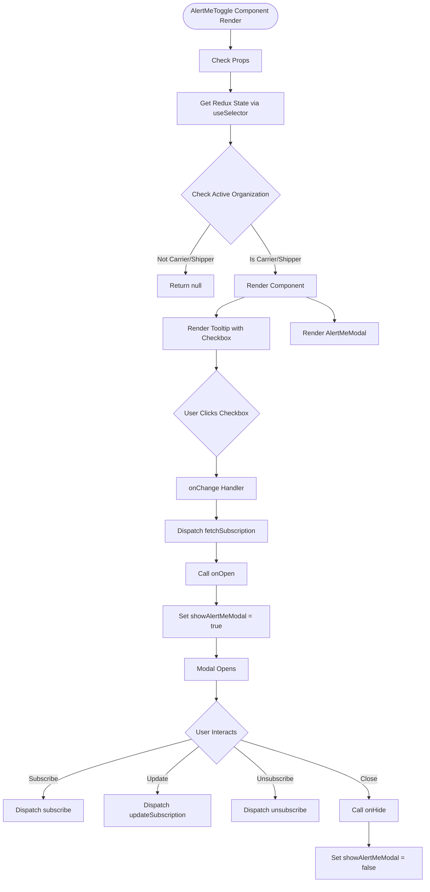
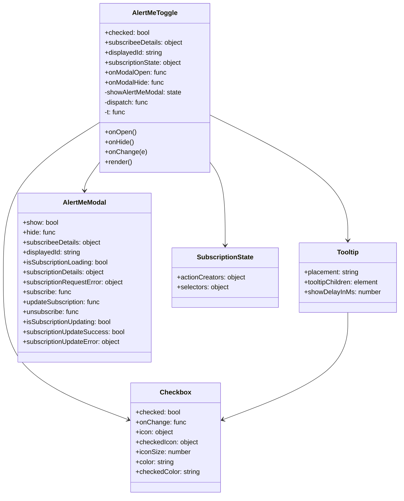
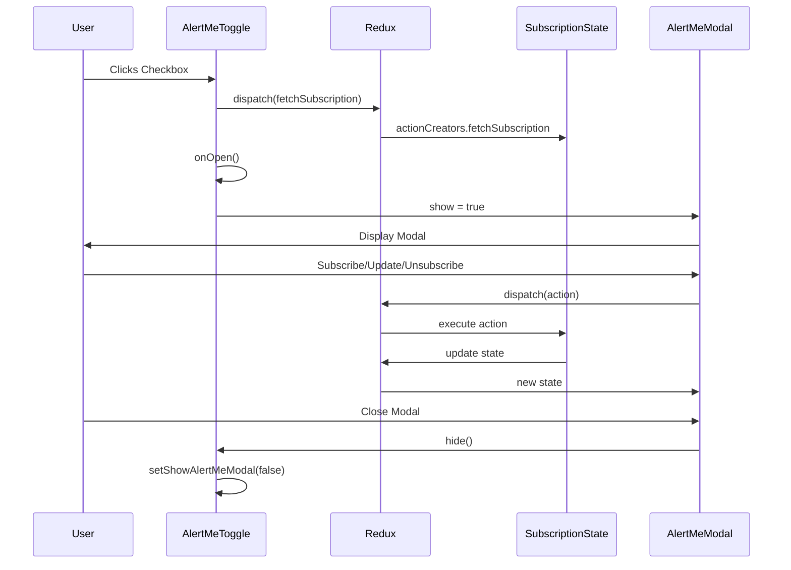
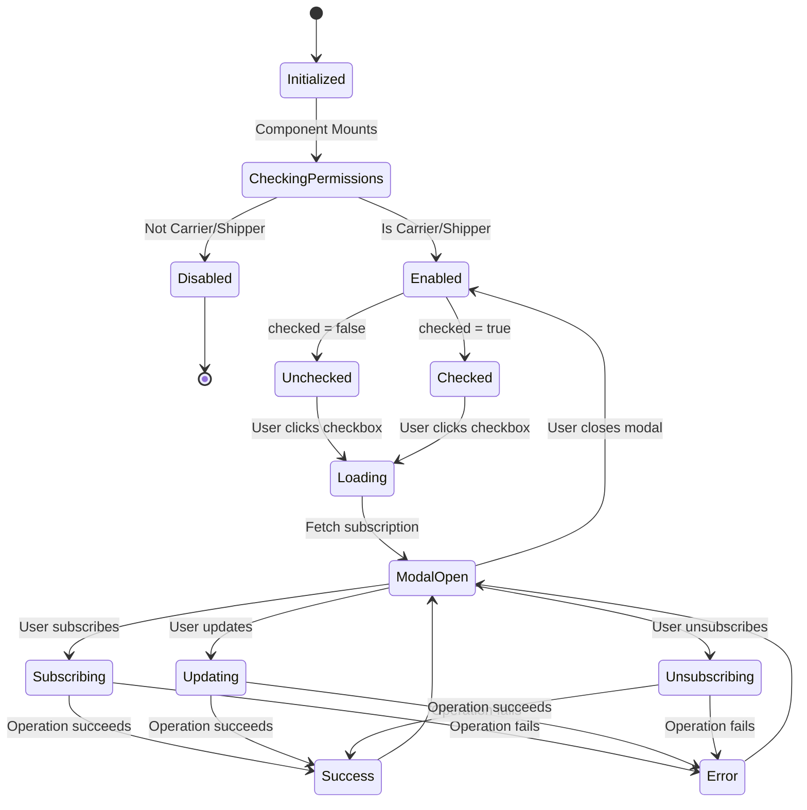

# Diagram: web/portal/src/shared/components/molecules/AlertMeToggle.molecule.js

> Auto-generated by Obscura crawlers

## Diagram 1

### SVG

<svg id="container" width="1041.3125" xmlns="http://www.w3.org/2000/svg" class="flowchart" height="2142.4375" viewBox="0 0 1041.3125 2142.4375" role="graphics-document document" aria-roledescription="flowchart-v2"><g><marker id="container_flowchart-v2-pointEnd" class="marker flowchart-v2" viewBox="0 0 10 10" refX="5" refY="5" markerUnits="userSpaceOnUse" markerWidth="8" markerHeight="8" orient="auto"><path d="M 0 0 L 10 5 L 0 10 z" class="arrowMarkerPath" style="stroke-width: 1; stroke-dasharray: 1, 0;"></path></marker><marker id="container_flowchart-v2-pointStart" class="marker flowchart-v2" viewBox="0 0 10 10" refX="4.5" refY="5" markerUnits="userSpaceOnUse" markerWidth="8" markerHeight="8" orient="auto"><path d="M 0 5 L 10 10 L 10 0 z" class="arrowMarkerPath" style="stroke-width: 1; stroke-dasharray: 1, 0;"></path></marker><marker id="container_flowchart-v2-circleEnd" class="marker flowchart-v2" viewBox="0 0 10 10" refX="11" refY="5" markerUnits="userSpaceOnUse" markerWidth="11" markerHeight="11" orient="auto"><circle cx="5" cy="5" r="5" class="arrowMarkerPath" style="stroke-width: 1; stroke-dasharray: 1, 0;"></circle></marker><marker id="container_flowchart-v2-circleStart" class="marker flowchart-v2" viewBox="0 0 10 10" refX="-1" refY="5" markerUnits="userSpaceOnUse" markerWidth="11" markerHeight="11" orient="auto"><circle cx="5" cy="5" r="5" class="arrowMarkerPath" style="stroke-width: 1; stroke-dasharray: 1, 0;"></circle></marker><marker id="container_flowchart-v2-crossEnd" class="marker cross flowchart-v2" viewBox="0 0 11 11" refX="12" refY="5.2" markerUnits="userSpaceOnUse" markerWidth="11" markerHeight="11" orient="auto"><path d="M 1,1 l 9,9 M 10,1 l -9,9" class="arrowMarkerPath" style="stroke-width: 2; stroke-dasharray: 1, 0;"></path></marker><marker id="container_flowchart-v2-crossStart" class="marker cross flowchart-v2" viewBox="0 0 11 11" refX="-1" refY="5.2" markerUnits="userSpaceOnUse" markerWidth="11" markerHeight="11" orient="auto"><path d="M 1,1 l 9,9 M 10,1 l -9,9" class="arrowMarkerPath" style="stroke-width: 2; stroke-dasharray: 1, 0;"></path></marker><g class="root"><g class="clusters"></g><g class="edgePaths"><path d="M563.832,71.5L563.749,75.583C563.665,79.667,563.499,87.833,563.415,95.417C563.332,103,563.332,110,563.332,113.5L563.332,117" id="L_Start_CheckProps_0" class="edge-thickness-normal edge-pattern-solid edge-thickness-normal edge-pattern-solid flowchart-link" style=";" data-edge="true" data-et="edge" data-id="L_Start_CheckProps_0" data-points="W3sieCI6NTYzLjgzMjAzMTI1LCJ5Ijo3MS41fSx7IngiOjU2My4zMzIwMzEyNSwieSI6OTZ9LHsieCI6NTYzLjMzMjAzMTI1LCJ5IjoxMjF9XQ==" marker-end="url(#container_flowchart-v2-pointEnd)"></path><path d="M563.332,175L563.332,179.167C563.332,183.333,563.332,191.667,563.332,199.333C563.332,207,563.332,214,563.332,217.5L563.332,221" id="L_CheckProps_GetState_0" class="edge-thickness-normal edge-pattern-solid edge-thickness-normal edge-pattern-solid flowchart-link" style=";" data-edge="true" data-et="edge" data-id="L_CheckProps_GetState_0" data-points="W3sieCI6NTYzLjMzMjAzMTI1LCJ5IjoxNzV9LHsieCI6NTYzLjMzMjAzMTI1LCJ5IjoyMDB9LHsieCI6NTYzLjMzMjAzMTI1LCJ5IjoyMjV9XQ==" marker-end="url(#container_flowchart-v2-pointEnd)"></path><path d="M563.332,303L563.332,307.167C563.332,311.333,563.332,319.667,563.332,327.333C563.332,335,563.332,342,563.332,345.5L563.332,349" id="L_GetState_CheckOrg_0" class="edge-thickness-normal edge-pattern-solid edge-thickness-normal edge-pattern-solid flowchart-link" style=";" data-edge="true" data-et="edge" data-id="L_GetState_CheckOrg_0" data-points="W3sieCI6NTYzLjMzMjAzMTI1LCJ5IjozMDN9LHsieCI6NTYzLjMzMjAzMTI1LCJ5IjozMjh9LHsieCI6NTYzLjMzMjAzMTI1LCJ5IjozNTN9XQ==" marker-end="url(#container_flowchart-v2-pointEnd)"></path><path d="M513.711,544.317L503.6,558.753C493.488,573.19,473.266,602.064,463.154,622.001C453.043,641.938,453.043,652.938,453.043,658.438L453.043,663.938" id="L_CheckOrg_ReturnNull_0" class="edge-thickness-normal edge-pattern-solid edge-thickness-normal edge-pattern-solid flowchart-link" style=";" data-edge="true" data-et="edge" data-id="L_CheckOrg_ReturnNull_0" data-points="W3sieCI6NTEzLjcxMTEyNDMwNDI5OTMsInkiOjU0NC4zMTY1OTMwNTQyOTkzfSx7IngiOjQ1My4wNDI5Njg3NSwieSI6NjMwLjkzNzV9LHsieCI6NDUzLjA0Mjk2ODc1LCJ5Ijo2NjcuOTM3NX1d" marker-end="url(#container_flowchart-v2-pointEnd)"></path><path d="M612.953,544.317L623.064,558.753C633.176,573.19,653.398,602.064,663.51,622.001C673.621,641.938,673.621,652.938,673.621,658.438L673.621,663.938" id="L_CheckOrg_RenderComponent_0" class="edge-thickness-normal edge-pattern-solid edge-thickness-normal edge-pattern-solid flowchart-link" style=";" data-edge="true" data-et="edge" data-id="L_CheckOrg_RenderComponent_0" data-points="W3sieCI6NjEyLjk1MjkzODE5NTcwMDcsInkiOjU0NC4zMTY1OTMwNTQyOTkzfSx7IngiOjY3My42MjEwOTM3NSwieSI6NjMwLjkzNzV9LHsieCI6NjczLjYyMTA5Mzc1LCJ5Ijo2NjcuOTM3NX1d" marker-end="url(#container_flowchart-v2-pointEnd)"></path><path d="M598.793,721.938L587.246,726.104C575.698,730.271,552.603,738.604,541.055,746.271C529.508,753.938,529.508,760.938,529.508,764.438L529.508,767.938" id="L_RenderComponent_RenderTooltip_0" class="edge-thickness-normal edge-pattern-solid edge-thickness-normal edge-pattern-solid flowchart-link" style=";" data-edge="true" data-et="edge" data-id="L_RenderComponent_RenderTooltip_0" data-points="W3sieCI6NTk4Ljc5MzA0Mzg3MDE5MjMsInkiOjcyMS45Mzc1fSx7IngiOjUyOS41MDc4MTI1LCJ5Ijo3NDYuOTM3NX0seyJ4Ijo1MjkuNTA3ODEyNSwieSI6NzcxLjkzNzV9XQ==" marker-end="url(#container_flowchart-v2-pointEnd)"></path><path d="M748.449,721.938L759.997,726.104C771.544,730.271,794.639,738.604,806.187,748.271C817.734,757.938,817.734,768.938,817.734,774.438L817.734,779.938" id="L_RenderComponent_RenderModal_0" class="edge-thickness-normal edge-pattern-solid edge-thickness-normal edge-pattern-solid flowchart-link" style=";" data-edge="true" data-et="edge" data-id="L_RenderComponent_RenderModal_0" data-points="W3sieCI6NzQ4LjQ0OTE0MzYyOTgwNzcsInkiOjcyMS45Mzc1fSx7IngiOjgxNy43MzQzNzUsInkiOjc0Ni45Mzc1fSx7IngiOjgxNy43MzQzNzUsInkiOjc4My45Mzc1fV0=" marker-end="url(#container_flowchart-v2-pointEnd)"></path><path d="M529.508,849.938L529.508,854.104C529.508,858.271,529.508,866.604,529.508,874.271C529.508,881.938,529.508,888.938,529.508,892.438L529.508,895.938" id="L_RenderTooltip_UserClick_0" class="edge-thickness-normal edge-pattern-solid edge-thickness-normal edge-pattern-solid flowchart-link" style=";" data-edge="true" data-et="edge" data-id="L_RenderTooltip_UserClick_0" data-points="W3sieCI6NTI5LjUwNzgxMjUsInkiOjg0OS45Mzc1fSx7IngiOjUyOS41MDc4MTI1LCJ5Ijo4NzQuOTM3NX0seyJ4Ijo1MjkuNTA3ODEyNSwieSI6ODk5LjkzNzV9XQ==" marker-end="url(#container_flowchart-v2-pointEnd)"></path><path d="M529.508,1105.734L529.508,1109.901C529.508,1114.068,529.508,1122.401,529.508,1130.068C529.508,1137.734,529.508,1144.734,529.508,1148.234L529.508,1151.734" id="L_UserClick_OnChange_0" class="edge-thickness-normal edge-pattern-solid edge-thickness-normal edge-pattern-solid flowchart-link" style=";" data-edge="true" data-et="edge" data-id="L_UserClick_OnChange_0" data-points="W3sieCI6NTI5LjUwNzgxMjUsInkiOjExMDUuNzM0Mzc1fSx7IngiOjUyOS41MDc4MTI1LCJ5IjoxMTMwLjczNDM3NX0seyJ4Ijo1MjkuNTA3ODEyNSwieSI6MTE1NS43MzQzNzV9XQ==" marker-end="url(#container_flowchart-v2-pointEnd)"></path><path d="M529.508,1209.734L529.508,1213.901C529.508,1218.068,529.508,1226.401,529.508,1234.068C529.508,1241.734,529.508,1248.734,529.508,1252.234L529.508,1255.734" id="L_OnChange_DispatchFetch_0" class="edge-thickness-normal edge-pattern-solid edge-thickness-normal edge-pattern-solid flowchart-link" style=";" data-edge="true" data-et="edge" data-id="L_OnChange_DispatchFetch_0" data-points="W3sieCI6NTI5LjUwNzgxMjUsInkiOjEyMDkuNzM0Mzc1fSx7IngiOjUyOS41MDc4MTI1LCJ5IjoxMjM0LjczNDM3NX0seyJ4Ijo1MjkuNTA3ODEyNSwieSI6MTI1OS43MzQzNzV9XQ==" marker-end="url(#container_flowchart-v2-pointEnd)"></path><path d="M529.508,1313.734L529.508,1317.901C529.508,1322.068,529.508,1330.401,529.508,1338.068C529.508,1345.734,529.508,1352.734,529.508,1356.234L529.508,1359.734" id="L_DispatchFetch_CallOnOpen_0" class="edge-thickness-normal edge-pattern-solid edge-thickness-normal edge-pattern-solid flowchart-link" style=";" data-edge="true" data-et="edge" data-id="L_DispatchFetch_CallOnOpen_0" data-points="W3sieCI6NTI5LjUwNzgxMjUsInkiOjEzMTMuNzM0Mzc1fSx7IngiOjUyOS41MDc4MTI1LCJ5IjoxMzM4LjczNDM3NX0seyJ4Ijo1MjkuNTA3ODEyNSwieSI6MTM2My43MzQzNzV9XQ==" marker-end="url(#container_flowchart-v2-pointEnd)"></path><path d="M529.508,1417.734L529.508,1421.901C529.508,1426.068,529.508,1434.401,529.508,1442.068C529.508,1449.734,529.508,1456.734,529.508,1460.234L529.508,1463.734" id="L_CallOnOpen_ShowModal_0" class="edge-thickness-normal edge-pattern-solid edge-thickness-normal edge-pattern-solid flowchart-link" style=";" data-edge="true" data-et="edge" data-id="L_CallOnOpen_ShowModal_0" data-points="W3sieCI6NTI5LjUwNzgxMjUsInkiOjE0MTcuNzM0Mzc1fSx7IngiOjUyOS41MDc4MTI1LCJ5IjoxNDQyLjczNDM3NX0seyJ4Ijo1MjkuNTA3ODEyNSwieSI6MTQ2Ny43MzQzNzV9XQ==" marker-end="url(#container_flowchart-v2-pointEnd)"></path><path d="M529.508,1545.734L529.508,1549.901C529.508,1554.068,529.508,1562.401,529.508,1570.068C529.508,1577.734,529.508,1584.734,529.508,1588.234L529.508,1591.734" id="L_ShowModal_ModalOpen_0" class="edge-thickness-normal edge-pattern-solid edge-thickness-normal edge-pattern-solid flowchart-link" style=";" data-edge="true" data-et="edge" data-id="L_ShowModal_ModalOpen_0" data-points="W3sieCI6NTI5LjUwNzgxMjUsInkiOjE1NDUuNzM0Mzc1fSx7IngiOjUyOS41MDc4MTI1LCJ5IjoxNTcwLjczNDM3NX0seyJ4Ijo1MjkuNTA3ODEyNSwieSI6MTU5NS43MzQzNzV9XQ==" marker-end="url(#container_flowchart-v2-pointEnd)"></path><path d="M529.508,1649.734L529.508,1653.901C529.508,1658.068,529.508,1666.401,529.508,1674.068C529.508,1681.734,529.508,1688.734,529.508,1692.234L529.508,1695.734" id="L_ModalOpen_UserInteracts_0" class="edge-thickness-normal edge-pattern-solid edge-thickness-normal edge-pattern-solid flowchart-link" style=";" data-edge="true" data-et="edge" data-id="L_ModalOpen_UserInteracts_0" data-points="W3sieCI6NTI5LjUwNzgxMjUsInkiOjE2NDkuNzM0Mzc1fSx7IngiOjUyOS41MDc4MTI1LCJ5IjoxNjc0LjczNDM3NX0seyJ4Ijo1MjkuNTA3ODEyNSwieSI6MTY5OS43MzQzNzV9XQ==" marker-end="url(#container_flowchart-v2-pointEnd)"></path><path d="M468.624,1793.554L408.309,1809.868C347.994,1826.182,227.364,1858.81,167.049,1882.624C106.734,1906.438,106.734,1921.438,106.734,1928.938L106.734,1936.438" id="L_UserInteracts_DispatchSubscribe_0" class="edge-thickness-normal edge-pattern-solid edge-thickness-normal edge-pattern-solid flowchart-link" style=";" data-edge="true" data-et="edge" data-id="L_UserInteracts_DispatchSubscribe_0" data-points="W3sieCI6NDY4LjYyNDA1OTIzMTkxMzI0LCJ5IjoxNzkzLjU1Mzc0NjczMTkxMzJ9LHsieCI6MTA2LjczNDM3NSwieSI6MTg5MS40Mzc1fSx7IngiOjEwNi43MzQzNzUsInkiOjE5NDAuNDM3NX1d" marker-end="url(#container_flowchart-v2-pointEnd)"></path><path d="M486.388,1811.318L469.568,1824.671C452.749,1838.025,419.109,1864.731,402.289,1883.584C385.469,1902.438,385.469,1913.438,385.469,1918.938L385.469,1924.438" id="L_UserInteracts_DispatchUpdate_0" class="edge-thickness-normal edge-pattern-solid edge-thickness-normal edge-pattern-solid flowchart-link" style=";" data-edge="true" data-et="edge" data-id="L_UserInteracts_DispatchUpdate_0" data-points="W3sieCI6NDg2LjM4ODQyMDg5ODk2OSwieSI6MTgxMS4zMTgxMDgzOTg5Njl9LHsieCI6Mzg1LjQ2ODc1LCJ5IjoxODkxLjQzNzV9LHsieCI6Mzg1LjQ2ODc1LCJ5IjoxOTI4LjQzNzV9XQ==" marker-end="url(#container_flowchart-v2-pointEnd)"></path><path d="M572.627,1811.318L589.447,1824.671C606.267,1838.025,639.907,1864.731,656.727,1885.584C673.547,1906.438,673.547,1921.438,673.547,1928.938L673.547,1936.438" id="L_UserInteracts_DispatchUnsubscribe_0" class="edge-thickness-normal edge-pattern-solid edge-thickness-normal edge-pattern-solid flowchart-link" style=";" data-edge="true" data-et="edge" data-id="L_UserInteracts_DispatchUnsubscribe_0" data-points="W3sieCI6NTcyLjYyNzIwNDEwMTAzMSwieSI6MTgxMS4zMTgxMDgzOTg5Njl9LHsieCI6NjczLjU0Njg3NSwieSI6MTg5MS40Mzc1fSx7IngiOjY3My41NDY4NzUsInkiOjE5NDAuNDM3NX1d" marker-end="url(#container_flowchart-v2-pointEnd)"></path><path d="M588.74,1795.206L641.168,1811.244C693.597,1827.283,798.455,1859.36,850.884,1882.899C903.313,1906.438,903.313,1921.438,903.313,1928.938L903.313,1936.438" id="L_UserInteracts_CallOnHide_0" class="edge-thickness-normal edge-pattern-solid edge-thickness-normal edge-pattern-solid flowchart-link" style=";" data-edge="true" data-et="edge" data-id="L_UserInteracts_CallOnHide_0" data-points="W3sieCI6NTg4LjczOTYxOTIxNzUxOTcsInkiOjE3OTUuMjA1NjkzMjgyNDgwM30seyJ4Ijo5MDMuMzEyNSwieSI6MTg5MS40Mzc1fSx7IngiOjkwMy4zMTI1LCJ5IjoxOTQwLjQzNzV9XQ==" marker-end="url(#container_flowchart-v2-pointEnd)"></path><path d="M903.313,1994.438L903.313,2000.604C903.313,2006.771,903.313,2019.104,903.313,2028.771C903.313,2038.438,903.313,2045.438,903.313,2048.938L903.313,2052.438" id="L_CallOnHide_HideModal_0" class="edge-thickness-normal edge-pattern-solid edge-thickness-normal edge-pattern-solid flowchart-link" style=";" data-edge="true" data-et="edge" data-id="L_CallOnHide_HideModal_0" data-points="W3sieCI6OTAzLjMxMjUsInkiOjE5OTQuNDM3NX0seyJ4Ijo5MDMuMzEyNSwieSI6MjAzMS40Mzc1fSx7IngiOjkwMy4zMTI1LCJ5IjoyMDU2LjQzNzV9XQ==" marker-end="url(#container_flowchart-v2-pointEnd)"></path></g><g class="edgeLabels"><g class="edgeLabel"><g class="label" data-id="L_Start_CheckProps_0" transform="translate(0, 0)"><foreignObject width="0" height="0">

</foreignObject></g></g><g class="edgeLabel"><g class="label" data-id="L_CheckProps_GetState_0" transform="translate(0, 0)"><foreignObject width="0" height="0">

</foreignObject></g></g><g class="edgeLabel"><g class="label" data-id="L_GetState_CheckOrg_0" transform="translate(0, 0)"><foreignObject width="0" height="0">

</foreignObject></g></g><g class="edgeLabel" transform="translate(453.04296875, 630.9375)"><g class="label" data-id="L_CheckOrg_ReturnNull_0" transform="translate(-71.71875, -12)"><foreignObject width="143.4375" height="24">

Not Carrier/Shipper

</foreignObject></g></g><g class="edgeLabel" transform="translate(673.62109375, 630.9375)"><g class="label" data-id="L_CheckOrg_RenderComponent_0" transform="translate(-64.7890625, -12)"><foreignObject width="129.578125" height="24">

Is Carrier/Shipper

</foreignObject></g></g><g class="edgeLabel"><g class="label" data-id="L_RenderComponent_RenderTooltip_0" transform="translate(0, 0)"><foreignObject width="0" height="0">

</foreignObject></g></g><g class="edgeLabel"><g class="label" data-id="L_RenderComponent_RenderModal_0" transform="translate(0, 0)"><foreignObject width="0" height="0">

</foreignObject></g></g><g class="edgeLabel"><g class="label" data-id="L_RenderTooltip_UserClick_0" transform="translate(0, 0)"><foreignObject width="0" height="0">

</foreignObject></g></g><g class="edgeLabel"><g class="label" data-id="L_UserClick_OnChange_0" transform="translate(0, 0)"><foreignObject width="0" height="0">

</foreignObject></g></g><g class="edgeLabel"><g class="label" data-id="L_OnChange_DispatchFetch_0" transform="translate(0, 0)"><foreignObject width="0" height="0">

</foreignObject></g></g><g class="edgeLabel"><g class="label" data-id="L_DispatchFetch_CallOnOpen_0" transform="translate(0, 0)"><foreignObject width="0" height="0">

</foreignObject></g></g><g class="edgeLabel"><g class="label" data-id="L_CallOnOpen_ShowModal_0" transform="translate(0, 0)"><foreignObject width="0" height="0">

</foreignObject></g></g><g class="edgeLabel"><g class="label" data-id="L_ShowModal_ModalOpen_0" transform="translate(0, 0)"><foreignObject width="0" height="0">

</foreignObject></g></g><g class="edgeLabel"><g class="label" data-id="L_ModalOpen_UserInteracts_0" transform="translate(0, 0)"><foreignObject width="0" height="0">

</foreignObject></g></g><g class="edgeLabel" transform="translate(106.734375, 1891.4375)"><g class="label" data-id="L_UserInteracts_DispatchSubscribe_0" transform="translate(-35.7890625, -12)"><foreignObject width="71.578125" height="24">

Subscribe

</foreignObject></g></g><g class="edgeLabel" transform="translate(385.46875, 1891.4375)"><g class="label" data-id="L_UserInteracts_DispatchUpdate_0" transform="translate(-26.3125, -12)"><foreignObject width="52.625" height="24">

Update

</foreignObject></g></g><g class="edgeLabel" transform="translate(673.546875, 1891.4375)"><g class="label" data-id="L_UserInteracts_DispatchUnsubscribe_0" transform="translate(-45.1484375, -12)"><foreignObject width="90.296875" height="24">

Unsubscribe

</foreignObject></g></g><g class="edgeLabel" transform="translate(903.3125, 1891.4375)"><g class="label" data-id="L_UserInteracts_CallOnHide_0" transform="translate(-19.4765625, -12)"><foreignObject width="38.953125" height="24">

Close

</foreignObject></g></g><g class="edgeLabel"><g class="label" data-id="L_CallOnHide_HideModal_0" transform="translate(0, 0)"><foreignObject width="0" height="0">

</foreignObject></g></g></g><g class="nodes"><g class="node default" id="flowchart-Start-0" transform="translate(563.33203125, 39.5)"><g class="basic label-container outer-path"><path d="M-83.875 -31.5 C-32.222011798136386 -31.5, 19.43097640372723 -31.5, 83.875 -31.5 C83.875 -31.5, 83.875 -31.5, 83.875 -31.5 C84.31966353406041 -31.485740505947746, 84.7643270681208 -31.47148101189549, 85.89321192939245 -31.435279871635593 C86.56048835595605 -31.370908517282317, 87.22776478251966 -31.306537162929043, 87.90313059306193 -31.241385435432253 C88.66443859698938 -31.11830306138901, 89.42574660091684 -30.995220687345768, 89.89649680409322 -30.91911344521856 C90.42887884696023 -30.79760071805167, 90.96126088982724 -30.676087990884774, 91.86511939314947 -30.469788185729428 C92.57221496074165 -30.259925932888446, 93.27931052833382 -30.050063680047465, 93.80090886774406 -29.895256030836062 C94.45947824427094 -29.652896412525585, 95.11804762079782 -29.410536794215112, 95.69591065370028 -29.197877856399685 C96.2326818537623 -28.960265168884142, 96.76945305382432 -28.7226524813686, 97.54233778220308 -28.380519338926202 C98.2107351131483 -28.031816879501, 98.87913244409353 -27.683114420075796, 99.33260288812403 -27.44653917988677 C99.71605822304686 -27.214086302422874, 100.09951355796969 -26.981633424958982, 101.05934938813228 -26.399775304092984 C101.70526068368994 -25.949215545361287, 102.35117197924761 -25.49865578662959, 102.7154817104733 -25.244529088840633 C103.17021827014526 -24.881888783550316, 103.62495482981721 -24.519248478259996, 104.29419445219533 -23.985547688627737 C104.81921474854808 -23.508738146756, 105.34423504490081 -23.031928604884257, 105.78900034400982 -22.62800452807842 C106.29575418169935 -22.10473958540015, 106.80250801938888 -21.58147464272188, 107.19375690787243 -21.177478043231485 C107.48449933476246 -20.835955444893695, 107.7752417616525 -20.494432846555902, 108.50269169774293 -19.63992875855011 C108.95103830177574 -19.03918515436205, 109.39938490580853 -18.43844155017399, 109.7104260198041 -18.02167479384835 C110.08947999463449 -17.439346098264664, 110.46853396946486 -16.85701740268098, 110.8119970346684 -16.329365901781543 C111.15785717840203 -15.715256194445267, 111.50371732213566 -15.101146487108991, 111.8028781507495 -14.56995614258631 C112.00070236823423 -14.15916992221909, 112.19852658571897 -13.74838370185187, 112.67899762499809 -12.750675308355413 C112.85459428280298 -12.316948168646933, 113.03019094060785 -11.883221028938452, 113.43675529456745 -10.878999214271206 C113.6181030190871 -10.332808761854068, 113.79945074360676 -9.78661830943693, 114.07303737065482 -8.962618978877531 C114.26709851626245 -8.222579724043081, 114.46115966187008 -7.4825404692086295, 114.58522923372745 -7.009409419623907 C114.7059731194015 -6.389415085916909, 114.82671700507555 -5.769420752209911, 114.97122617755518 -5.027396693551458 C115.06779247558708 -4.278447555188436, 115.16435877361899 -3.5294984168254144, 115.22944205789975 -3.024725316091981 C115.28006682833454 -2.2362036529909113, 115.33069159876933 -1.4476819898898416, 115.35881581032167 -1.0096246935071378 C115.35881581032167 -0.4748901311597854, 115.35881581032167 0.05984443118756699, 115.35881581032167 1.00962469350713 C115.31203533564717 1.7382683470820015, 115.26525486097268 2.466912000656873, 115.22944205789975 3.02472531609196 C115.1511116295805 3.6322406500434266, 115.07278120126125 4.239755983994893, 114.97122617755518 5.027396693551435 C114.8788475060465 5.501741647509421, 114.7864688345378 5.976086601467406, 114.58522923372745 7.0094094196239 C114.42303345816525 7.6279322079363725, 114.26083768260304 8.246454996248845, 114.07303737065482 8.96261897887751 C113.86324237893332 9.594488067650122, 113.65344738721181 10.226357156422736, 113.43675529456746 10.878999214271184 C113.24309014290954 11.357355883127225, 113.04942499125163 11.835712551983265, 112.67899762499809 12.750675308355405 C112.3382624571664 13.458219174922577, 111.99752728933471 14.165763041489752, 111.8028781507495 14.569956142586303 C111.51212012339612 15.086226462595157, 111.22136209604271 15.602496782604012, 110.81199703466841 16.329365901781536 C110.40570044083836 16.953546575816194, 109.99940384700832 17.577727249850852, 109.71042601980412 18.021674793848334 C109.34952298537695 18.50525198103792, 108.98861995094978 18.988829168227507, 108.50269169774295 19.639928758550102 C107.99486548003588 20.236450329999197, 107.48703926232882 20.832971901448293, 107.19375690787246 21.177478043231467 C106.63777615751407 21.75157381484501, 106.0817954071557 22.325669586458556, 105.78900034400982 22.628004528078414 C105.24791465697142 23.119404232703925, 104.70682896993301 23.610803937329436, 104.29419445219536 23.985547688627715 C103.94193954944028 24.26646159967825, 103.5896846466852 24.547375510728788, 102.71548171047331 25.24452908884063 C102.33258504065387 25.511621230376978, 101.94968837083444 25.77871337191333, 101.05934938813229 26.399775304092973 C100.55971393362479 26.70265725279926, 100.06007847911731 27.005539201505545, 99.33260288812404 27.446539179886766 C98.91780020595137 27.66294147348245, 98.50299752377869 27.87934376707814, 97.54233778220309 28.3805193389262 C97.04539716546202 28.60050020873783, 96.54845654872096 28.82048107854946, 95.6959106537003 29.197877856399682 C95.06153858486903 29.43133264180071, 94.42716651603774 29.664787427201745, 93.80090886774407 29.895256030836055 C93.26453105994422 30.054450148686488, 92.72815325214437 30.213644266536917, 91.86511939314951 30.46978818572942 C91.11992463672456 30.639874026033173, 90.37472988029961 30.80995986633692, 89.89649680409323 30.919113445218557 C89.46714459315324 30.98852778100721, 89.03779238221324 31.057942116795864, 87.90313059306196 31.24138543543225 C87.24309316906518 31.30505845191408, 86.58305574506839 31.368731468395907, 85.89321192939245 31.435279871635593 C85.37561658972682 31.45187814674046, 84.85802125006119 31.468476421845324, 83.875 31.5 C83.875 31.5, 83.875 31.5, 83.875 31.5 C25.68103673048489 31.5, -32.51292653903022 31.5, -83.875 31.5 C-84.45683804034682 31.48134158652512, -85.03867608069365 31.462683173050237, -85.89321192939244 31.435279871635593 C-86.39074022955037 31.38728391488468, -86.88826852970833 31.33928795813377, -87.90313059306195 31.24138543543225 C-88.5819832542482 31.13163380175267, -89.26083591543447 31.02188216807309, -89.89649680409323 30.919113445218557 C-90.63662198098532 30.750184703361082, -91.37674715787742 30.581255961503604, -91.86511939314947 30.469788185729428 C-92.29989923694662 30.340747810296406, -92.73467908074376 30.211707434863385, -93.80090886774403 29.89525603083607 C-94.51627326731403 29.63199531903829, -95.23163766688404 29.36873460724051, -95.69591065370028 29.197877856399685 C-96.10938848411297 29.014843486260038, -96.52286631452566 28.831809116120393, -97.54233778220308 28.380519338926206 C-97.91104489268622 28.18816507555532, -98.27975200316938 27.995810812184438, -99.33260288812403 27.446539179886773 C-99.88734278514073 27.11025259430176, -100.44208268215742 26.773966008716748, -101.05934938813226 26.399775304092994 C-101.63045469774607 26.001396962856795, -102.20156000735987 25.603018621620595, -102.7154817104733 25.244529088840636 C-103.26501035136539 24.806294621300484, -103.81453899225747 24.368060153760332, -104.29419445219533 23.98554768862774 C-104.62941581448815 23.681108516864608, -104.96463717678098 23.376669345101472, -105.7890003440098 22.628004528078435 C-106.12647503251694 22.27953420500762, -106.46394972102405 21.931063881936808, -107.19375690787244 21.177478043231478 C-107.61222101513617 20.68592629155726, -108.03068512239989 20.19437453988304, -108.50269169774293 19.639928758550113 C-108.8259374063037 19.206808957368544, -109.14918311486447 18.773689156186972, -109.7104260198041 18.021674793848355 C-109.95748497486132 17.64212589426192, -110.20454392991853 17.262576994675488, -110.8119970346684 16.329365901781557 C-111.08926947347611 15.837040609799482, -111.36654191228382 15.344715317817409, -111.8028781507495 14.569956142586314 C-112.00295845022096 14.154485119701244, -112.20303874969241 13.739014096816174, -112.67899762499809 12.750675308355417 C-112.8712439984039 12.275823049212288, -113.0634903718097 11.80097079006916, -113.43675529456745 10.878999214271209 C-113.60105269789045 10.38416161269859, -113.76535010121347 9.889324011125968, -114.07303737065482 8.962618978877522 C-114.18667566533686 8.529266910106411, -114.30031396001891 8.0959148413353, -114.58522923372743 7.009409419623911 C-114.69000556065335 6.471405125343891, -114.79478188757926 5.933400831063871, -114.97122617755518 5.027396693551461 C-115.02441251830349 4.614893937538439, -115.07759885905182 4.202391181525418, -115.22944205789975 3.024725316091999 C-115.27919620100296 2.249764376438062, -115.32895034410616 1.4748034367841247, -115.35881581032167 1.0096246935071416 C-115.35881581032167 0.5132061467782225, -115.35881581032167 0.016787600049303575, -115.35881581032167 -1.0096246935071262 C-115.3310033051874 -1.442826910823616, -115.30319080005312 -1.8760291281401058, -115.22944205789975 -3.024725316091956 C-115.15420219744904 -3.608270815956645, -115.07896233699834 -4.191816315821335, -114.97122617755518 -5.027396693551446 C-114.87566739401666 -5.518070850665737, -114.78010861047812 -6.008745007780027, -114.58522923372745 -7.009409419623896 C-114.46336956085732 -7.474113166594031, -114.34150988798717 -7.938816913564166, -114.07303737065482 -8.962618978877506 C-113.92992336901018 -9.393655549711585, -113.78680936736554 -9.824692120545665, -113.43675529456746 -10.878999214271168 C-113.28365977438125 -11.25714810903165, -113.13056425419502 -11.63529700379213, -112.67899762499809 -12.750675308355401 C-112.4100538463906 -13.309142819108882, -112.1411100677831 -13.867610329862364, -111.8028781507495 -14.5699561425863 C-111.52030082520771 -15.071700798142773, -111.2377234996659 -15.573445453699247, -110.8119970346684 -16.329365901781546 C-110.54693842129775 -16.736567110122433, -110.28187980792711 -17.143768318463316, -109.71042601980412 -18.021674793848344 C-109.25260787262036 -18.63510940298335, -108.7947897254366 -19.248544012118355, -108.50269169774295 -19.639928758550102 C-108.18850274395662 -20.008992981525452, -107.87431379017029 -20.3780572045008, -107.19375690787246 -21.177478043231467 C-106.65827856866355 -21.730403392053926, -106.12280022945463 -22.283328740876385, -105.78900034400984 -22.628004528078403 C-105.37946118611055 -22.999937155470196, -104.96992202821127 -23.371869782861992, -104.29419445219536 -23.98554768862771 C-103.85075851190146 -24.339176050686135, -103.40732257160758 -24.69280441274456, -102.71548171047331 -25.244529088840626 C-102.32905465814532 -25.514083872387147, -101.94262760581734 -25.783638655933665, -101.0593493881323 -26.39977530409297 C-100.62179946922512 -26.66502063626324, -100.18424955031793 -26.930265968433513, -99.33260288812404 -27.446539179886763 C-98.9187928644703 -27.66242360416895, -98.50498284081657 -27.878308028451137, -97.54233778220309 -28.3805193389262 C-96.87232559997278 -28.677113856794335, -96.20231341774247 -28.973708374662476, -95.6959106537003 -29.19787785639968 C-95.31539207632323 -29.337912210349607, -94.93487349894617 -29.477946564299536, -93.80090886774407 -29.895256030836055 C-93.21498308365116 -30.069155727967626, -92.62905729955827 -30.2430554250992, -91.86511939314951 -30.469788185729417 C-91.0918222797795 -30.646288205620863, -90.3185251664095 -30.822788225512305, -89.89649680409325 -30.919113445218553 C-89.32837102918127 -31.010963614625133, -88.76024525426931 -31.102813784031717, -87.90313059306196 -31.24138543543225 C-87.25664388362348 -31.303751230777756, -86.610157174185 -31.366117026123266, -85.89321192939246 -31.435279871635593 C-85.10920600139781 -31.460421415771417, -84.32520007340315 -31.485562959907245, -83.87500000000001 -31.5 C-83.87500000000001 -31.5, -83.875 -31.5, -83.875 -31.5" stroke="none" stroke-width="0" fill="#ECECFF" style=""></path><path d="M-83.875 -31.5 C-23.798262655603658 -31.5, 36.278474688792684 -31.5, 83.875 -31.5 M-83.875 -31.5 C-30.517962749316503 -31.5, 22.839074501366994 -31.5, 83.875 -31.5 M83.875 -31.5 C83.875 -31.5, 83.875 -31.5, 83.875 -31.5 M83.875 -31.5 C83.875 -31.5, 83.875 -31.5, 83.875 -31.5 M83.875 -31.5 C84.56395830996493 -31.47790644797542, 85.25291661992986 -31.455812895950846, 85.89321192939245 -31.435279871635593 M83.875 -31.5 C84.43736355012521 -31.48196609552173, 84.99972710025042 -31.46393219104346, 85.89321192939245 -31.435279871635593 M85.89321192939245 -31.435279871635593 C86.37796714864399 -31.388516118637845, 86.86272236789551 -31.341752365640097, 87.90313059306193 -31.241385435432253 M85.89321192939245 -31.435279871635593 C86.47438362222564 -31.379214937389197, 87.05555531505884 -31.323150003142803, 87.90313059306193 -31.241385435432253 M87.90313059306193 -31.241385435432253 C88.67188652906277 -31.11709893749096, 89.4406424650636 -30.99281243954967, 89.89649680409322 -30.91911344521856 M87.90313059306193 -31.241385435432253 C88.54265680773241 -31.137991796644197, 89.1821830224029 -31.03459815785614, 89.89649680409322 -30.91911344521856 M89.89649680409322 -30.91911344521856 C90.66327308956802 -30.744101761741817, 91.43004937504284 -30.56909007826507, 91.86511939314947 -30.469788185729428 M89.89649680409322 -30.91911344521856 C90.41645306549401 -30.800436821585528, 90.9364093268948 -30.6817601979525, 91.86511939314947 -30.469788185729428 M91.86511939314947 -30.469788185729428 C92.44452794862163 -30.297822767842863, 93.02393650409378 -30.125857349956302, 93.80090886774406 -29.895256030836062 M91.86511939314947 -30.469788185729428 C92.37554279616107 -30.3182971989827, 92.88596619917269 -30.166806212235972, 93.80090886774406 -29.895256030836062 M93.80090886774406 -29.895256030836062 C94.19811496124524 -29.74908051669475, 94.5953210547464 -29.602905002553438, 95.69591065370028 -29.197877856399685 M93.80090886774406 -29.895256030836062 C94.40789006345989 -29.67188133993997, 95.01487125917572 -29.448506649043875, 95.69591065370028 -29.197877856399685 M95.69591065370028 -29.197877856399685 C96.13236328593945 -29.004673223014738, 96.56881591817861 -28.81146858962979, 97.54233778220308 -28.380519338926202 M95.69591065370028 -29.197877856399685 C96.29782923585358 -28.93142635536076, 96.89974781800689 -28.66497485432183, 97.54233778220308 -28.380519338926202 M97.54233778220308 -28.380519338926202 C98.12752474716395 -28.07522767413626, 98.7127117121248 -27.769936009346317, 99.33260288812403 -27.44653917988677 M97.54233778220308 -28.380519338926202 C97.92543807523626 -28.180656161438243, 98.30853836826944 -27.98079298395028, 99.33260288812403 -27.44653917988677 M99.33260288812403 -27.44653917988677 C99.74054776728266 -27.19924059679059, 100.14849264644131 -26.951942013694413, 101.05934938813228 -26.399775304092984 M99.33260288812403 -27.44653917988677 C99.82835877171442 -27.146009049869328, 100.3241146553048 -26.845478919851885, 101.05934938813228 -26.399775304092984 M101.05934938813228 -26.399775304092984 C101.57377444146599 -26.040934655989034, 102.0881994947997 -25.68209400788508, 102.7154817104733 -25.244529088840633 M101.05934938813228 -26.399775304092984 C101.48861601088598 -26.1003374907126, 101.91788263363968 -25.800899677332215, 102.7154817104733 -25.244529088840633 M102.7154817104733 -25.244529088840633 C103.10052855824095 -24.937464474272872, 103.4855754060086 -24.630399859705115, 104.29419445219533 -23.985547688627737 M102.7154817104733 -25.244529088840633 C103.16424601656017 -24.886651496856075, 103.61301032264704 -24.52877390487152, 104.29419445219533 -23.985547688627737 M104.29419445219533 -23.985547688627737 C104.77500936157558 -23.548884309593966, 105.25582427095584 -23.1122209305602, 105.78900034400982 -22.62800452807842 M104.29419445219533 -23.985547688627737 C104.68274715325087 -23.6326744060702, 105.07129985430643 -23.279801123512662, 105.78900034400982 -22.62800452807842 M105.78900034400982 -22.62800452807842 C106.33752613339378 -22.061606615734643, 106.88605192277774 -21.495208703390862, 107.19375690787243 -21.177478043231485 M105.78900034400982 -22.62800452807842 C106.16802419507044 -22.236631283421428, 106.54704804613107 -21.84525803876443, 107.19375690787243 -21.177478043231485 M107.19375690787243 -21.177478043231485 C107.5474995007316 -20.76195186513534, 107.90124209359078 -20.3464256870392, 108.50269169774293 -19.63992875855011 M107.19375690787243 -21.177478043231485 C107.68635205056069 -20.59884775917219, 108.17894719324896 -20.0202174751129, 108.50269169774293 -19.63992875855011 M108.50269169774293 -19.63992875855011 C108.75165804309773 -19.306336537075342, 109.00062438845252 -18.97274431560058, 109.7104260198041 -18.02167479384835 M108.50269169774293 -19.63992875855011 C108.74969957686186 -19.30896070341146, 108.99670745598078 -18.977992648272814, 109.7104260198041 -18.02167479384835 M109.7104260198041 -18.02167479384835 C110.14368327051113 -17.35607531090058, 110.57694052121816 -16.69047582795281, 110.8119970346684 -16.329365901781543 M109.7104260198041 -18.02167479384835 C110.11524420056776 -17.39976535929315, 110.52006238133143 -16.777855924737942, 110.8119970346684 -16.329365901781543 M110.8119970346684 -16.329365901781543 C111.1571235613869 -15.716558805742405, 111.5022500881054 -15.103751709703268, 111.8028781507495 -14.56995614258631 M110.8119970346684 -16.329365901781543 C111.15624714137685 -15.718114978217388, 111.50049724808531 -15.106864054653235, 111.8028781507495 -14.56995614258631 M111.8028781507495 -14.56995614258631 C112.09115514736176 -13.971342790981364, 112.379432143974 -13.372729439376418, 112.67899762499809 -12.750675308355413 M111.8028781507495 -14.56995614258631 C112.14365509031542 -13.862325536119247, 112.48443202988133 -13.154694929652184, 112.67899762499809 -12.750675308355413 M112.67899762499809 -12.750675308355413 C112.93146045569894 -12.127087235487524, 113.1839232863998 -11.503499162619635, 113.43675529456745 -10.878999214271206 M112.67899762499809 -12.750675308355413 C112.95917197440207 -12.058639248525058, 113.23934632380603 -11.366603188694704, 113.43675529456745 -10.878999214271206 M113.43675529456745 -10.878999214271206 C113.57009602033877 -10.477398193207549, 113.70343674611007 -10.07579717214389, 114.07303737065482 -8.962618978877531 M113.43675529456745 -10.878999214271206 C113.64332333584717 -10.256849186084526, 113.84989137712688 -9.634699157897847, 114.07303737065482 -8.962618978877531 M114.07303737065482 -8.962618978877531 C114.20114939851737 -8.474072292533474, 114.32926142637994 -7.985525606189417, 114.58522923372745 -7.009409419623907 M114.07303737065482 -8.962618978877531 C114.2263515802389 -8.377965450934662, 114.37966578982298 -7.793311922991792, 114.58522923372745 -7.009409419623907 M114.58522923372745 -7.009409419623907 C114.72216069516973 -6.306295305592402, 114.85909215661202 -5.603181191560897, 114.97122617755518 -5.027396693551458 M114.58522923372745 -7.009409419623907 C114.71433302808833 -6.346488721677367, 114.84343682244922 -5.683568023730826, 114.97122617755518 -5.027396693551458 M114.97122617755518 -5.027396693551458 C115.04779603970044 -4.433535963182356, 115.12436590184569 -3.8396752328132546, 115.22944205789975 -3.024725316091981 M114.97122617755518 -5.027396693551458 C115.06917771536733 -4.267703908999388, 115.16712925317948 -3.508011124447317, 115.22944205789975 -3.024725316091981 M115.22944205789975 -3.024725316091981 C115.26229714609256 -2.5129807973390346, 115.29515223428538 -2.001236278586088, 115.35881581032167 -1.0096246935071378 M115.22944205789975 -3.024725316091981 C115.2608264576243 -2.535887957350534, 115.29221085734886 -2.0470505986090872, 115.35881581032167 -1.0096246935071378 M115.35881581032167 -1.0096246935071378 C115.35881581032167 -0.2238207211159534, 115.35881581032167 0.561983251275231, 115.35881581032167 1.00962469350713 M115.35881581032167 -1.0096246935071378 C115.35881581032167 -0.530431422623171, 115.35881581032167 -0.05123815173920432, 115.35881581032167 1.00962469350713 M115.35881581032167 1.00962469350713 C115.3093011612703 1.7808553199876083, 115.25978651221892 2.5520859464680865, 115.22944205789975 3.02472531609196 M115.35881581032167 1.00962469350713 C115.32577583784328 1.5242489342437482, 115.2927358653649 2.038873174980366, 115.22944205789975 3.02472531609196 M115.22944205789975 3.02472531609196 C115.17348194061843 3.458740935150843, 115.1175218233371 3.892756554209727, 114.97122617755518 5.027396693551435 M115.22944205789975 3.02472531609196 C115.15368156669116 3.6123087253045676, 115.07792107548258 4.199892134517175, 114.97122617755518 5.027396693551435 M114.97122617755518 5.027396693551435 C114.88148548352484 5.488196190694841, 114.7917447894945 5.948995687838246, 114.58522923372745 7.0094094196239 M114.97122617755518 5.027396693551435 C114.86338593260383 5.5811335593327325, 114.7555456876525 6.134870425114029, 114.58522923372745 7.0094094196239 M114.58522923372745 7.0094094196239 C114.4691666035768 7.452006530250428, 114.35310397342614 7.894603640876957, 114.07303737065482 8.96261897887751 M114.58522923372745 7.0094094196239 C114.41097102771838 7.673931483120734, 114.23671282170929 8.338453546617568, 114.07303737065482 8.96261897887751 M114.07303737065482 8.96261897887751 C113.87990776565374 9.544294578117006, 113.68677816065265 10.1259701773565, 113.43675529456746 10.878999214271184 M114.07303737065482 8.96261897887751 C113.8442084606616 9.65181519684149, 113.6153795506684 10.34101141480547, 113.43675529456746 10.878999214271184 M113.43675529456746 10.878999214271184 C113.17671947611221 11.521292713306186, 112.91668365765696 12.163586212341189, 112.67899762499809 12.750675308355405 M113.43675529456746 10.878999214271184 C113.17590253735125 11.5233105678402, 112.91504978013504 12.167621921409218, 112.67899762499809 12.750675308355405 M112.67899762499809 12.750675308355405 C112.33672017300655 13.46142176098008, 111.99444272101503 14.172168213604758, 111.8028781507495 14.569956142586303 M112.67899762499809 12.750675308355405 C112.3450805914236 13.444061173252807, 112.0111635578491 14.137447038150208, 111.8028781507495 14.569956142586303 M111.8028781507495 14.569956142586303 C111.40721232204493 15.272500886960994, 111.01154649334035 15.975045631335686, 110.81199703466841 16.329365901781536 M111.8028781507495 14.569956142586303 C111.43983072037382 15.214583617757057, 111.07678328999813 15.85921109292781, 110.81199703466841 16.329365901781536 M110.81199703466841 16.329365901781536 C110.42030145271453 16.93111550065375, 110.02860587076063 17.532865099525964, 109.71042601980412 18.021674793848334 M110.81199703466841 16.329365901781536 C110.47198205467389 16.85172021785941, 110.13196707467937 17.374074533937282, 109.71042601980412 18.021674793848334 M109.71042601980412 18.021674793848334 C109.46052962738125 18.35651319366529, 109.21063323495838 18.691351593482246, 108.50269169774295 19.639928758550102 M109.71042601980412 18.021674793848334 C109.40976552180786 18.42453247042848, 109.1091050238116 18.827390147008625, 108.50269169774295 19.639928758550102 M108.50269169774295 19.639928758550102 C108.08198194504168 20.134118373136115, 107.66127219234039 20.628307987722124, 107.19375690787246 21.177478043231467 M108.50269169774295 19.639928758550102 C108.17979990510626 20.019215831244637, 107.85690811246958 20.398502903939175, 107.19375690787246 21.177478043231467 M107.19375690787246 21.177478043231467 C106.80645251801543 21.577401624040622, 106.4191481281584 21.977325204849773, 105.78900034400982 22.628004528078414 M107.19375690787246 21.177478043231467 C106.89704471999671 21.48385773773683, 106.60033253212099 21.79023743224219, 105.78900034400982 22.628004528078414 M105.78900034400982 22.628004528078414 C105.19207521373977 23.170116137616205, 104.59515008346972 23.712227747153996, 104.29419445219536 23.985547688627715 M105.78900034400982 22.628004528078414 C105.42377400389587 22.959693426810485, 105.05854766378191 23.291382325542557, 104.29419445219536 23.985547688627715 M104.29419445219536 23.985547688627715 C103.9749556443172 24.240132142609088, 103.65571683643904 24.49471659659046, 102.71548171047331 25.24452908884063 M104.29419445219536 23.985547688627715 C103.89077911145819 24.30726068753254, 103.487363770721 24.628973686437366, 102.71548171047331 25.24452908884063 M102.71548171047331 25.24452908884063 C102.2344090456226 25.58010455454047, 101.75333638077188 25.91568002024031, 101.05934938813229 26.399775304092973 M102.71548171047331 25.24452908884063 C102.35155183266137 25.498390817331742, 101.98762195484943 25.75225254582286, 101.05934938813229 26.399775304092973 M101.05934938813229 26.399775304092973 C100.67441632025424 26.63312399195845, 100.28948325237619 26.866472679823925, 99.33260288812404 27.446539179886766 M101.05934938813229 26.399775304092973 C100.65689018996923 26.643748435132196, 100.25443099180616 26.887721566171418, 99.33260288812404 27.446539179886766 M99.33260288812404 27.446539179886766 C98.72654725867808 27.762718013571565, 98.12049162923213 28.078896847256363, 97.54233778220309 28.3805193389262 M99.33260288812404 27.446539179886766 C98.67561466007973 27.78928951763644, 98.01862643203542 28.13203985538611, 97.54233778220309 28.3805193389262 M97.54233778220309 28.3805193389262 C96.80739556236774 28.705856458360955, 96.0724533425324 29.031193577795708, 95.6959106537003 29.197877856399682 M97.54233778220309 28.3805193389262 C97.15552279896066 28.551750857548836, 96.76870781571823 28.72298237617147, 95.6959106537003 29.197877856399682 M95.6959106537003 29.197877856399682 C95.07989534390589 29.424577184787125, 94.46388003411148 29.651276513174565, 93.80090886774407 29.895256030836055 M95.6959106537003 29.197877856399682 C95.24510063472151 29.36378011062601, 94.79429061574271 29.529682364852338, 93.80090886774407 29.895256030836055 M93.80090886774407 29.895256030836055 C93.08352983486085 30.108170362196407, 92.36615080197764 30.321084693556763, 91.86511939314951 30.46978818572942 M93.80090886774407 29.895256030836055 C93.03474724770386 30.12264877799958, 92.26858562766367 30.3500415251631, 91.86511939314951 30.46978818572942 M91.86511939314951 30.46978818572942 C91.31038936450342 30.59640169481615, 90.75565933585733 30.723015203902882, 89.89649680409323 30.919113445218557 M91.86511939314951 30.46978818572942 C91.39988838098739 30.57597412833935, 90.93465736882527 30.682160070949276, 89.89649680409323 30.919113445218557 M89.89649680409323 30.919113445218557 C89.11123255981178 31.046068878418815, 88.32596831553033 31.173024311619077, 87.90313059306196 31.24138543543225 M89.89649680409323 30.919113445218557 C89.31482791088622 31.013153160962627, 88.73315901767923 31.107192876706698, 87.90313059306196 31.24138543543225 M87.90313059306196 31.24138543543225 C87.32414414687369 31.297239561562954, 86.74515770068541 31.353093687693658, 85.89321192939245 31.435279871635593 M87.90313059306196 31.24138543543225 C87.32860304682364 31.296809416847392, 86.75407550058532 31.352233398262538, 85.89321192939245 31.435279871635593 M85.89321192939245 31.435279871635593 C85.34231577202482 31.452946039148053, 84.79141961465719 31.470612206660512, 83.875 31.5 M85.89321192939245 31.435279871635593 C85.33629429097917 31.453139136325085, 84.7793766525659 31.470998401014576, 83.875 31.5 M83.875 31.5 C83.875 31.5, 83.875 31.5, 83.875 31.5 M83.875 31.5 C83.875 31.5, 83.875 31.5, 83.875 31.5 M83.875 31.5 C35.439416613311394 31.5, -12.996166773377212 31.5, -83.875 31.5 M83.875 31.5 C31.049802210394354 31.5, -21.775395579211292 31.5, -83.875 31.5 M-83.875 31.5 C-84.31275319270657 31.4859621071448, -84.75050638541312 31.4719242142896, -85.89321192939244 31.435279871635593 M-83.875 31.5 C-84.57992047889874 31.47739457228619, -85.28484095779748 31.454789144572384, -85.89321192939244 31.435279871635593 M-85.89321192939244 31.435279871635593 C-86.51710257904351 31.375093891002038, -87.1409932286946 31.314907910368483, -87.90313059306195 31.24138543543225 M-85.89321192939244 31.435279871635593 C-86.60319343406057 31.366788809757946, -87.31317493872872 31.298297747880294, -87.90313059306195 31.24138543543225 M-87.90313059306195 31.24138543543225 C-88.42451097438378 31.15709269874538, -88.9458913557056 31.072799962058514, -89.89649680409323 30.919113445218557 M-87.90313059306195 31.24138543543225 C-88.62679513013097 31.124388965181232, -89.3504596672 31.00739249493021, -89.89649680409323 30.919113445218557 M-89.89649680409323 30.919113445218557 C-90.41892156176169 30.799873403420875, -90.94134631943015 30.680633361623194, -91.86511939314947 30.469788185729428 M-89.89649680409323 30.919113445218557 C-90.48628499643497 30.784498139044192, -91.07607318877672 30.649882832869828, -91.86511939314947 30.469788185729428 M-91.86511939314947 30.469788185729428 C-92.63441259923755 30.24146600026493, -93.40370580532563 30.01314381480043, -93.80090886774403 29.89525603083607 M-91.86511939314947 30.469788185729428 C-92.63730202414102 30.24060843412048, -93.40948465513256 30.011428682511532, -93.80090886774403 29.89525603083607 M-93.80090886774403 29.89525603083607 C-94.29686087386946 29.712741108051823, -94.7928128799949 29.530226185267573, -95.69591065370028 29.197877856399685 M-93.80090886774403 29.89525603083607 C-94.31464951972958 29.706194721938857, -94.82839017171514 29.51713341304164, -95.69591065370028 29.197877856399685 M-95.69591065370028 29.197877856399685 C-96.39058234272579 28.89036730637159, -97.0852540317513 28.5828567563435, -97.54233778220308 28.380519338926206 M-95.69591065370028 29.197877856399685 C-96.21928897522471 28.966193798927105, -96.74266729674916 28.734509741454527, -97.54233778220308 28.380519338926206 M-97.54233778220308 28.380519338926206 C-97.90253148231739 28.192606516291647, -98.2627251824317 28.004693693657092, -99.33260288812403 27.446539179886773 M-97.54233778220308 28.380519338926206 C-97.96668844662848 28.159135869105047, -98.39103911105387 27.93775239928389, -99.33260288812403 27.446539179886773 M-99.33260288812403 27.446539179886773 C-99.80815926203378 27.158254111343222, -100.28371563594355 26.869969042799667, -101.05934938813226 26.399775304092994 M-99.33260288812403 27.446539179886773 C-99.68667840325972 27.231896521832827, -100.04075391839541 27.01725386377888, -101.05934938813226 26.399775304092994 M-101.05934938813226 26.399775304092994 C-101.43190543458415 26.139896333779475, -101.80446148103604 25.880017363465953, -102.7154817104733 25.244529088840636 M-101.05934938813226 26.399775304092994 C-101.4738239570895 26.11065578710334, -101.88829852604673 25.821536270113683, -102.7154817104733 25.244529088840636 M-102.7154817104733 25.244529088840636 C-103.33485043024618 24.7505990169156, -103.95421915001906 24.256668944990565, -104.29419445219533 23.98554768862774 M-102.7154817104733 25.244529088840636 C-103.1319842828405 24.912379370976716, -103.54848685520773 24.5802296531128, -104.29419445219533 23.98554768862774 M-104.29419445219533 23.98554768862774 C-104.71568889061287 23.602757591788656, -105.1371833290304 23.219967494949575, -105.7890003440098 22.628004528078435 M-104.29419445219533 23.98554768862774 C-104.81195626085939 23.515330113225804, -105.32971806952345 23.04511253782387, -105.7890003440098 22.628004528078435 M-105.7890003440098 22.628004528078435 C-106.27096384474187 22.130337643633275, -106.75292734547392 21.632670759188116, -107.19375690787244 21.177478043231478 M-105.7890003440098 22.628004528078435 C-106.10259463023993 22.304192680976115, -106.41618891647005 21.980380833873795, -107.19375690787244 21.177478043231478 M-107.19375690787244 21.177478043231478 C-107.49694344053049 20.821337890168913, -107.80012997318852 20.465197737106347, -108.50269169774293 19.639928758550113 M-107.19375690787244 21.177478043231478 C-107.68124034385929 20.604852260728013, -108.16872377984615 20.03222647822455, -108.50269169774293 19.639928758550113 M-108.50269169774293 19.639928758550113 C-108.93379545855183 19.062288993426755, -109.36489921936072 18.4846492283034, -109.7104260198041 18.021674793848355 M-108.50269169774293 19.639928758550113 C-108.76257661436343 19.29170664628161, -109.02246153098393 18.943484534013106, -109.7104260198041 18.021674793848355 M-109.7104260198041 18.021674793848355 C-110.09997855151082 17.42321749564537, -110.48953108321753 16.824760197442387, -110.8119970346684 16.329365901781557 M-109.7104260198041 18.021674793848355 C-109.98384975532447 17.601622511535673, -110.25727349084484 17.181570229222995, -110.8119970346684 16.329365901781557 M-110.8119970346684 16.329365901781557 C-111.036144777183 15.931368887526727, -111.2602925196976 15.533371873271896, -111.8028781507495 14.569956142586314 M-110.8119970346684 16.329365901781557 C-111.08590086042392 15.843021923382699, -111.35980468617944 15.35667794498384, -111.8028781507495 14.569956142586314 M-111.8028781507495 14.569956142586314 C-112.07521717748291 14.004438326452723, -112.3475562042163 13.438920510319132, -112.67899762499809 12.750675308355417 M-111.8028781507495 14.569956142586314 C-111.98770932774855 14.186150248794164, -112.17254050474757 13.802344355002013, -112.67899762499809 12.750675308355417 M-112.67899762499809 12.750675308355417 C-112.94678636905621 12.089231933188701, -113.21457511311434 11.427788558021986, -113.43675529456745 10.878999214271209 M-112.67899762499809 12.750675308355417 C-112.95080578094499 12.079303908113388, -113.22261393689188 11.407932507871358, -113.43675529456745 10.878999214271209 M-113.43675529456745 10.878999214271209 C-113.65567797880281 10.219638969947134, -113.8746006630382 9.560278725623059, -114.07303737065482 8.962618978877522 M-113.43675529456745 10.878999214271209 C-113.6621864069489 10.200036621348312, -113.88761751933036 9.521074028425415, -114.07303737065482 8.962618978877522 M-114.07303737065482 8.962618978877522 C-114.25170577061668 8.281278934448512, -114.43037417057856 7.599938890019501, -114.58522923372743 7.009409419623911 M-114.07303737065482 8.962618978877522 C-114.25743141565555 8.259444568405073, -114.44182546065628 7.556270157932623, -114.58522923372743 7.009409419623911 M-114.58522923372743 7.009409419623911 C-114.69124311241632 6.465050558597674, -114.79725699110521 5.920691697571436, -114.97122617755518 5.027396693551461 M-114.58522923372743 7.009409419623911 C-114.71588306062817 6.338529632184699, -114.84653688752893 5.667649844745487, -114.97122617755518 5.027396693551461 M-114.97122617755518 5.027396693551461 C-115.05240611796592 4.397781106518229, -115.13358605837665 3.768165519484997, -115.22944205789975 3.024725316091999 M-114.97122617755518 5.027396693551461 C-115.07374940324836 4.232246800575988, -115.17627262894155 3.437096907600514, -115.22944205789975 3.024725316091999 M-115.22944205789975 3.024725316091999 C-115.2717200506472 2.36621145286881, -115.31399804339466 1.707697589645621, -115.35881581032167 1.0096246935071416 M-115.22944205789975 3.024725316091999 C-115.27010717455246 2.391333299934569, -115.31077229120518 1.7579412837771398, -115.35881581032167 1.0096246935071416 M-115.35881581032167 1.0096246935071416 C-115.35881581032167 0.2857501381937877, -115.35881581032167 -0.4381244171195662, -115.35881581032167 -1.0096246935071262 M-115.35881581032167 1.0096246935071416 C-115.35881581032167 0.3235089604039991, -115.35881581032167 -0.3626067726991433, -115.35881581032167 -1.0096246935071262 M-115.35881581032167 -1.0096246935071262 C-115.31771731318553 -1.6497669605123437, -115.27661881604939 -2.289909227517561, -115.22944205789975 -3.024725316091956 M-115.35881581032167 -1.0096246935071262 C-115.3125274101912 -1.7306038888633615, -115.26623901006072 -2.451583084219597, -115.22944205789975 -3.024725316091956 M-115.22944205789975 -3.024725316091956 C-115.1548369556735 -3.603347756514898, -115.08023185344726 -4.18197019693784, -114.97122617755518 -5.027396693551446 M-115.22944205789975 -3.024725316091956 C-115.13050570351338 -3.7920561435196802, -115.03156934912701 -4.559386970947404, -114.97122617755518 -5.027396693551446 M-114.97122617755518 -5.027396693551446 C-114.89007710974965 -5.444080005871294, -114.80892804194411 -5.860763318191142, -114.58522923372745 -7.009409419623896 M-114.97122617755518 -5.027396693551446 C-114.88326533040345 -5.479057053144006, -114.7953044832517 -5.930717412736565, -114.58522923372745 -7.009409419623896 M-114.58522923372745 -7.009409419623896 C-114.39291870884666 -7.742772798903014, -114.2006081839659 -8.476136178182132, -114.07303737065482 -8.962618978877506 M-114.58522923372745 -7.009409419623896 C-114.45568575849673 -7.503414835175954, -114.32614228326601 -7.997420250728013, -114.07303737065482 -8.962618978877506 M-114.07303737065482 -8.962618978877506 C-113.82701117407437 -9.7036106840267, -113.58098497749393 -10.444602389175893, -113.43675529456746 -10.878999214271168 M-114.07303737065482 -8.962618978877506 C-113.87644406440519 -9.55472669441175, -113.67985075815557 -10.146834409945992, -113.43675529456746 -10.878999214271168 M-113.43675529456746 -10.878999214271168 C-113.24540967734784 -11.351626588219489, -113.0540640601282 -11.824253962167809, -112.67899762499809 -12.750675308355401 M-113.43675529456746 -10.878999214271168 C-113.14818161067406 -11.591781792680502, -112.85960792678065 -12.304564371089835, -112.67899762499809 -12.750675308355401 M-112.67899762499809 -12.750675308355401 C-112.35968081959626 -13.413743487057415, -112.04036401419444 -14.076811665759427, -111.8028781507495 -14.5699561425863 M-112.67899762499809 -12.750675308355401 C-112.50240385548102 -13.117376049258947, -112.32581008596397 -13.484076790162494, -111.8028781507495 -14.5699561425863 M-111.8028781507495 -14.5699561425863 C-111.51818052087015 -15.075465613198201, -111.2334828909908 -15.5809750838101, -110.8119970346684 -16.329365901781546 M-111.8028781507495 -14.5699561425863 C-111.46029178923872 -15.178252918079522, -111.11770542772794 -15.786549693572747, -110.8119970346684 -16.329365901781546 M-110.8119970346684 -16.329365901781546 C-110.43143800771138 -16.914006761594823, -110.05087898075438 -17.498647621408104, -109.71042601980412 -18.021674793848344 M-110.8119970346684 -16.329365901781546 C-110.50757457608525 -16.79704054704131, -110.20315211750211 -17.26471519230107, -109.71042601980412 -18.021674793848344 M-109.71042601980412 -18.021674793848344 C-109.35931617430226 -18.492130000055862, -109.00820632880043 -18.96258520626338, -108.50269169774295 -19.639928758550102 M-109.71042601980412 -18.021674793848344 C-109.46119271336406 -18.35562471885672, -109.21195940692398 -18.689574643865093, -108.50269169774295 -19.639928758550102 M-108.50269169774295 -19.639928758550102 C-108.01679645254363 -20.210688961783912, -107.53090120734431 -20.781449165017722, -107.19375690787246 -21.177478043231467 M-108.50269169774295 -19.639928758550102 C-108.2143789860179 -19.97859727520037, -107.92606627429288 -20.31726579185064, -107.19375690787246 -21.177478043231467 M-107.19375690787246 -21.177478043231467 C-106.65335724613774 -21.735485061609907, -106.11295758440303 -22.293492079988347, -105.78900034400984 -22.628004528078403 M-107.19375690787246 -21.177478043231467 C-106.64277842254324 -21.7464085655088, -106.09179993721403 -22.315339087786132, -105.78900034400984 -22.628004528078403 M-105.78900034400984 -22.628004528078403 C-105.48685222540473 -22.902407454994414, -105.18470410679964 -23.176810381910425, -104.29419445219536 -23.98554768862771 M-105.78900034400984 -22.628004528078403 C-105.3509344960516 -23.02584434060688, -104.91286864809337 -23.423684153135362, -104.29419445219536 -23.98554768862771 M-104.29419445219536 -23.98554768862771 C-103.7428079266508 -24.425263769737832, -103.19142140110623 -24.864979850847952, -102.71548171047331 -25.244529088840626 M-104.29419445219536 -23.98554768862771 C-103.73038611483278 -24.4351698341044, -103.16657777747021 -24.884791979581088, -102.71548171047331 -25.244529088840626 M-102.71548171047331 -25.244529088840626 C-102.26060410601777 -25.56183201437469, -101.80572650156222 -25.879134939908756, -101.0593493881323 -26.39977530409297 M-102.71548171047331 -25.244529088840626 C-102.07585862932194 -25.690702461414908, -101.43623554817057 -26.136875833989187, -101.0593493881323 -26.39977530409297 M-101.0593493881323 -26.39977530409297 C-100.5549048153593 -26.70557256855333, -100.05046024258627 -27.01136983301369, -99.33260288812404 -27.446539179886763 M-101.0593493881323 -26.39977530409297 C-100.52295063055382 -26.724943383166035, -99.98655187297534 -27.050111462239098, -99.33260288812404 -27.446539179886763 M-99.33260288812404 -27.446539179886763 C-98.63459692603577 -27.81068844321406, -97.93659096394748 -28.174837706541364, -97.54233778220309 -28.3805193389262 M-99.33260288812404 -27.446539179886763 C-98.92242819650976 -27.660527053772505, -98.51225350489548 -27.87451492765825, -97.54233778220309 -28.3805193389262 M-97.54233778220309 -28.3805193389262 C-96.8941084577479 -28.66747123182281, -96.24587913329272 -28.954423124719415, -95.6959106537003 -29.19787785639968 M-97.54233778220309 -28.3805193389262 C-97.0806689746035 -28.58488642513194, -96.6190001670039 -28.789253511337687, -95.6959106537003 -29.19787785639968 M-95.6959106537003 -29.19787785639968 C-95.06015349748017 -29.431842366763412, -94.42439634126006 -29.665806877127142, -93.80090886774407 -29.895256030836055 M-95.6959106537003 -29.19787785639968 C-95.11401675423232 -29.412020190372132, -94.53212285476437 -29.626162524344586, -93.80090886774407 -29.895256030836055 M-93.80090886774407 -29.895256030836055 C-93.35028157892928 -30.028999844765377, -92.8996542901145 -30.162743658694698, -91.86511939314951 -30.469788185729417 M-93.80090886774407 -29.895256030836055 C-93.22695712834792 -30.06560189435467, -92.65300538895178 -30.23594775787329, -91.86511939314951 -30.469788185729417 M-91.86511939314951 -30.469788185729417 C-91.46961825552076 -30.56005873950706, -91.074117117892 -30.650329293284706, -89.89649680409325 -30.919113445218553 M-91.86511939314951 -30.469788185729417 C-91.39681348436173 -30.576675953428577, -90.92850757557395 -30.683563721127737, -89.89649680409325 -30.919113445218553 M-89.89649680409325 -30.919113445218553 C-89.3960572142684 -31.000020637134455, -88.89561762444355 -31.080927829050356, -87.90313059306196 -31.24138543543225 M-89.89649680409325 -30.919113445218553 C-89.23938176199523 -31.025350709221698, -88.58226671989722 -31.131587973224846, -87.90313059306196 -31.24138543543225 M-87.90313059306196 -31.24138543543225 C-87.17559604868903 -31.311569817939603, -86.4480615043161 -31.381754200446952, -85.89321192939246 -31.435279871635593 M-87.90313059306196 -31.24138543543225 C-87.29315369326523 -31.300229173351088, -86.68317679346849 -31.359072911269926, -85.89321192939246 -31.435279871635593 M-85.89321192939246 -31.435279871635593 C-85.14469864164744 -31.459283235880847, -84.39618535390241 -31.4832866001261, -83.87500000000001 -31.5 M-85.89321192939246 -31.435279871635593 C-85.41271216886828 -31.450688563719556, -84.93221240834411 -31.466097255803522, -83.87500000000001 -31.5 M-83.87500000000001 -31.5 C-83.87500000000001 -31.5, -83.875 -31.5, -83.875 -31.5 M-83.87500000000001 -31.5 C-83.87500000000001 -31.5, -83.875 -31.5, -83.875 -31.5" stroke="#9370DB" stroke-width="1.3" fill="none" stroke-dasharray="0 0" style=""></path></g><g class="label" style="" transform="translate(-100, -24)"><rect></rect><foreignObject width="200" height="48">

AlertMeToggle Component Render

</foreignObject></g></g><g class="node default" id="flowchart-CheckProps-1" transform="translate(563.33203125, 148)"><rect class="basic label-container" style="" x="-73.984375" y="-27" width="147.96875" height="54"></rect><g class="label" style="" transform="translate(-43.984375, -12)"><rect></rect><foreignObject width="87.96875" height="24">

Check Props

</foreignObject></g></g><g class="node default" id="flowchart-GetState-3" transform="translate(563.33203125, 264)"><rect class="basic label-container" style="" x="-130" y="-39" width="260" height="78"></rect><g class="label" style="" transform="translate(-100, -24)"><rect></rect><foreignObject width="200" height="48">

Get Redux State via useSelector

</foreignObject></g></g><g class="node default" id="flowchart-CheckOrg-5" transform="translate(563.33203125, 473.46875)"><polygon points="120.46875,0 240.9375,-120.46875 120.46875,-240.9375 0,-120.46875" class="label-container" transform="translate(-119.96875, 120.46875)"></polygon><g class="label" style="" transform="translate(-93.46875, -12)"><rect></rect><foreignObject width="186.9375" height="24">

Check Active Organization

</foreignObject></g></g><g class="node default" id="flowchart-ReturnNull-7" transform="translate(453.04296875, 694.9375)"><rect class="basic label-container" style="" x="-70.5546875" y="-27" width="141.109375" height="54"></rect><g class="label" style="" transform="translate(-40.5546875, -12)"><rect></rect><foreignObject width="81.109375" height="24">

Return null

</foreignObject></g></g><g class="node default" id="flowchart-RenderComponent-9" transform="translate(673.62109375, 694.9375)"><rect class="basic label-container" style="" x="-100.0234375" y="-27" width="200.046875" height="54"></rect><g class="label" style="" transform="translate(-70.0234375, -12)"><rect></rect><foreignObject width="140.046875" height="24">

Render Component

</foreignObject></g></g><g class="node default" id="flowchart-RenderTooltip-11" transform="translate(529.5078125, 810.9375)"><rect class="basic label-container" style="" x="-130" y="-39" width="260" height="78"></rect><g class="label" style="" transform="translate(-100, -24)"><rect></rect><foreignObject width="200" height="48">

Render Tooltip with Checkbox

</foreignObject></g></g><g class="node default" id="flowchart-RenderModal-13" transform="translate(817.734375, 810.9375)"><rect class="basic label-container" style="" x="-108.2265625" y="-27" width="216.453125" height="54"></rect><g class="label" style="" transform="translate(-78.2265625, -12)"><rect></rect><foreignObject width="156.453125" height="24">

Render AlertMeModal

</foreignObject></g></g><g class="node default" id="flowchart-UserClick-15" transform="translate(529.5078125, 1002.8359375)"><polygon points="102.8984375,0 205.796875,-102.8984375 102.8984375,-205.796875 0,-102.8984375" class="label-container" transform="translate(-102.3984375, 102.8984375)"></polygon><g class="label" style="" transform="translate(-75.8984375, -12)"><rect></rect><foreignObject width="151.796875" height="24">

User Clicks Checkbox

</foreignObject></g></g><g class="node default" id="flowchart-OnChange-17" transform="translate(529.5078125, 1182.734375)"><rect class="basic label-container" style="" x="-97.0234375" y="-27" width="194.046875" height="54"></rect><g class="label" style="" transform="translate(-67.0234375, -12)"><rect></rect><foreignObject width="134.046875" height="24">

onChange Handler

</foreignObject></g></g><g class="node default" id="flowchart-DispatchFetch-19" transform="translate(529.5078125, 1286.734375)"><rect class="basic label-container" style="" x="-127.7421875" y="-27" width="255.484375" height="54"></rect><g class="label" style="" transform="translate(-97.7421875, -12)"><rect></rect><foreignObject width="195.484375" height="24">

Dispatch fetchSubscription

</foreignObject></g></g><g class="node default" id="flowchart-CallOnOpen-21" transform="translate(529.5078125, 1390.734375)"><rect class="basic label-container" style="" x="-74.1796875" y="-27" width="148.359375" height="54"></rect><g class="label" style="" transform="translate(-44.1796875, -12)"><rect></rect><foreignObject width="88.359375" height="24">

Call onOpen

</foreignObject></g></g><g class="node default" id="flowchart-ShowModal-23" transform="translate(529.5078125, 1506.734375)"><rect class="basic label-container" style="" x="-130" y="-39" width="260" height="78"></rect><g class="label" style="" transform="translate(-100, -24)"><rect></rect><foreignObject width="200" height="48">

Set showAlertMeModal = true

</foreignObject></g></g><g class="node default" id="flowchart-ModalOpen-25" transform="translate(529.5078125, 1622.734375)"><rect class="basic label-container" style="" x="-77.4921875" y="-27" width="154.984375" height="54"></rect><g class="label" style="" transform="translate(-47.4921875, -12)"><rect></rect><foreignObject width="94.984375" height="24">

Modal Opens

</foreignObject></g></g><g class="node default" id="flowchart-UserInteracts-27" transform="translate(529.5078125, 1777.0859375)"><polygon points="77.3515625,0 154.703125,-77.3515625 77.3515625,-154.703125 0,-77.3515625" class="label-container" transform="translate(-76.8515625, 77.3515625)"></polygon><g class="label" style="" transform="translate(-50.3515625, -12)"><rect></rect><foreignObject width="100.703125" height="24">

User Interacts

</foreignObject></g></g><g class="node default" id="flowchart-DispatchSubscribe-29" transform="translate(106.734375, 1967.4375)"><rect class="basic label-container" style="" x="-98.734375" y="-27" width="197.46875" height="54"></rect><g class="label" style="" transform="translate(-68.734375, -12)"><rect></rect><foreignObject width="137.46875" height="24">

Dispatch subscribe

</foreignObject></g></g><g class="node default" id="flowchart-DispatchUpdate-31" transform="translate(385.46875, 1967.4375)"><rect class="basic label-container" style="" x="-130" y="-39" width="260" height="78"></rect><g class="label" style="" transform="translate(-100, -24)"><rect></rect><foreignObject width="200" height="48">

Dispatch updateSubscription

</foreignObject></g></g><g class="node default" id="flowchart-DispatchUnsubscribe-33" transform="translate(673.546875, 1967.4375)"><rect class="basic label-container" style="" x="-108.078125" y="-27" width="216.15625" height="54"></rect><g class="label" style="" transform="translate(-78.078125, -12)"><rect></rect><foreignObject width="156.15625" height="24">

Dispatch unsubscribe

</foreignObject></g></g><g class="node default" id="flowchart-CallOnHide-35" transform="translate(903.3125, 1967.4375)"><rect class="basic label-container" style="" x="-71.6875" y="-27" width="143.375" height="54"></rect><g class="label" style="" transform="translate(-41.6875, -12)"><rect></rect><foreignObject width="83.375" height="24">

Call onHide

</foreignObject></g></g><g class="node default" id="flowchart-HideModal-37" transform="translate(903.3125, 2095.4375)"><rect class="basic label-container" style="" x="-130" y="-39" width="260" height="78"></rect><g class="label" style="" transform="translate(-100, -24)"><rect></rect><foreignObject width="200" height="48">

Set showAlertMeModal = false

</foreignObject></g></g></g></g></g></svg>

## Diagram 2

### SVG

<svg id="container" width="965.4375" xmlns="http://www.w3.org/2000/svg" class="classDiagram" height="1196" viewBox="-35 0 965.4375 1196" role="graphics-document document" aria-roledescription="class"><g><defs><marker id="container_class-aggregationStart" class="marker aggregation class" refX="18" refY="7" markerWidth="190" markerHeight="240" orient="auto"><path d="M 18,7 L9,13 L1,7 L9,1 Z"></path></marker></defs><defs><marker id="container_class-aggregationEnd" class="marker aggregation class" refX="1" refY="7" markerWidth="20" markerHeight="28" orient="auto"><path d="M 18,7 L9,13 L1,7 L9,1 Z"></path></marker></defs><defs><marker id="container_class-extensionStart" class="marker extension class" refX="18" refY="7" markerWidth="190" markerHeight="240" orient="auto"><path d="M 1,7 L18,13 V 1 Z"></path></marker></defs><defs><marker id="container_class-extensionEnd" class="marker extension class" refX="1" refY="7" markerWidth="20" markerHeight="28" orient="auto"><path d="M 1,1 V 13 L18,7 Z"></path></marker></defs><defs><marker id="container_class-compositionStart" class="marker composition class" refX="18" refY="7" markerWidth="190" markerHeight="240" orient="auto"><path d="M 18,7 L9,13 L1,7 L9,1 Z"></path></marker></defs><defs><marker id="container_class-compositionEnd" class="marker composition class" refX="1" refY="7" markerWidth="20" markerHeight="28" orient="auto"><path d="M 18,7 L9,13 L1,7 L9,1 Z"></path></marker></defs><defs><marker id="container_class-dependencyStart" class="marker dependency class" refX="6" refY="7" markerWidth="190" markerHeight="240" orient="auto"><path d="M 5,7 L9,13 L1,7 L9,1 Z"></path></marker></defs><defs><marker id="container_class-dependencyEnd" class="marker dependency class" refX="13" refY="7" markerWidth="20" markerHeight="28" orient="auto"><path d="M 18,7 L9,13 L14,7 L9,1 Z"></path></marker></defs><defs><marker id="container_class-lollipopStart" class="marker lollipop class" refX="13" refY="7" markerWidth="190" markerHeight="240" orient="auto"><circle stroke="black" fill="transparent" cx="7" cy="7" r="6"></circle></marker></defs><defs><marker id="container_class-lollipopEnd" class="marker lollipop class" refX="1" refY="7" markerWidth="190" markerHeight="240" orient="auto"><circle stroke="black" fill="transparent" cx="7" cy="7" r="6"></circle></marker></defs><g class="root"><g class="clusters"></g><g class="edgePaths"><path d="M205.959,295.471L167.132,319.726C128.306,343.98,50.653,392.49,11.826,454.912C-27,517.333,-27,593.667,-27,670C-27,746.333,-27,822.667,23.492,879.888C73.985,937.108,174.97,975.217,225.462,994.271L275.955,1013.325" id="id_AlertMeToggle_Checkbox_1" class="edge-thickness-normal edge-pattern-solid relation" style=";;;" data-edge="true" data-et="edge" data-id="id_AlertMeToggle_Checkbox_1" data-points="W3sieCI6MjA1Ljk1ODk4NDM3NSwieSI6Mjk1LjQ3MDYwNzk4MDMwNzY1fSx7IngiOi0yNywieSI6NDQxfSx7IngiOi0yNywieSI6NjcwfSx7IngiOi0yNywieSI6ODk5fSx7IngiOjI4MS41NjgzNTkzNzUsInkiOjEwMTUuNDQzNDA0ODYyNjE0fV0=" marker-end="url(#container_class-dependencyEnd)"></path><path d="M473.193,277.731L528.508,304.943C583.823,332.154,694.452,386.577,749.767,436.955C805.082,487.333,805.082,533.667,805.082,556.833L805.082,580" id="id_AlertMeToggle_Tooltip_2" class="edge-thickness-normal edge-pattern-solid relation" style=";;;" data-edge="true" data-et="edge" data-id="id_AlertMeToggle_Tooltip_2" data-points="W3sieCI6NDczLjE5MzM1OTM3NSwieSI6Mjc3LjczMTM2NTgyNzY2NTZ9LHsieCI6ODA1LjA4MjAzMTI1LCJ5Ijo0NDF9LHsieCI6ODA1LjA4MjAzMTI1LCJ5Ijo1ODZ9XQ==" marker-end="url(#container_class-dependencyEnd)"></path><path d="M205.959,392.063L199.907,400.219C193.854,408.375,181.749,424.688,175.697,436.01C169.645,447.333,169.645,453.667,169.645,456.833L169.645,460" id="id_AlertMeToggle_AlertMeModal_3" class="edge-thickness-normal edge-pattern-solid relation" style=";;;" data-edge="true" data-et="edge" data-id="id_AlertMeToggle_AlertMeModal_3" data-points="W3sieCI6MjA1Ljk1ODk4NDM3NSwieSI6MzkyLjA2MjYxNzA5MDk3MTh9LHsieCI6MTY5LjY0NDUzMTI1LCJ5Ijo0NDF9LHsieCI6MTY5LjY0NDUzMTI1LCJ5Ijo0NjZ9XQ==" marker-end="url(#container_class-dependencyEnd)"></path><path d="M473.193,392.063L479.246,400.219C485.298,408.375,497.403,424.688,503.455,458.01C509.508,491.333,509.508,541.667,509.508,566.833L509.508,592" id="id_AlertMeToggle_SubscriptionState_4" class="edge-thickness-normal edge-pattern-solid relation" style=";;;" data-edge="true" data-et="edge" data-id="id_AlertMeToggle_SubscriptionState_4" data-points="W3sieCI6NDczLjE5MzM1OTM3NSwieSI6MzkyLjA2MjYxNzA5MDk3MTh9LHsieCI6NTA5LjUwNzgxMjUsInkiOjQ0MX0seyJ4Ijo1MDkuNTA3ODEyNSwieSI6NTk4fV0=" marker-end="url(#container_class-dependencyEnd)"></path><path d="M805.082,754L805.082,778.167C805.082,802.333,805.082,850.667,754.59,893.888C704.097,937.108,603.112,975.217,552.62,994.271L502.127,1013.325" id="id_Tooltip_Checkbox_5" class="edge-thickness-normal edge-pattern-solid relation" style=";;;" data-edge="true" data-et="edge" data-id="id_Tooltip_Checkbox_5" data-points="W3sieCI6ODA1LjA4MjAzMTI1LCJ5Ijo3NTR9LHsieCI6ODA1LjA4MjAzMTI1LCJ5Ijo4OTl9LHsieCI6NDk2LjUxMzY3MTg3NSwieSI6MTAxNS40NDM0MDQ4NjI2MTR9XQ==" marker-end="url(#container_class-dependencyEnd)"></path></g><g class="edgeLabels"><g class="edgeLabel"><g class="label" data-id="id_AlertMeToggle_Checkbox_1" transform="translate(0, 0)"><foreignObject width="0" height="0">

</foreignObject></g></g><g class="edgeLabel"><g class="label" data-id="id_AlertMeToggle_Tooltip_2" transform="translate(0, 0)"><foreignObject width="0" height="0">

</foreignObject></g></g><g class="edgeLabel"><g class="label" data-id="id_AlertMeToggle_AlertMeModal_3" transform="translate(0, 0)"><foreignObject width="0" height="0">

</foreignObject></g></g><g class="edgeLabel"><g class="label" data-id="id_AlertMeToggle_SubscriptionState_4" transform="translate(0, 0)"><foreignObject width="0" height="0">

</foreignObject></g></g><g class="edgeLabel"><g class="label" data-id="id_Tooltip_Checkbox_5" transform="translate(0, 0)"><foreignObject width="0" height="0">

</foreignObject></g></g></g><g class="nodes"><g class="node default" id="classId-AlertMeToggle-0" transform="translate(339.576171875, 212)"><g class="basic label-container"><path d="M-133.6171875 -204 L133.6171875 -204 L133.6171875 204 L-133.6171875 204" stroke="none" stroke-width="0" fill="#ECECFF" style=""></path><path d="M-133.6171875 -204 C-56.534595251016 -204, 20.547996997968 -204, 133.6171875 -204 M-133.6171875 -204 C-37.84301924368606 -204, 57.931149012627884 -204, 133.6171875 -204 M133.6171875 -204 C133.6171875 -118.34462725300381, 133.6171875 -32.689254506007615, 133.6171875 204 M133.6171875 -204 C133.6171875 -83.61968454703123, 133.6171875 36.760630905937546, 133.6171875 204 M133.6171875 204 C35.05127556291143 204, -63.514636374177144 204, -133.6171875 204 M133.6171875 204 C60.00573573961883 204, -13.605716020762344 204, -133.6171875 204 M-133.6171875 204 C-133.6171875 46.06343296772218, -133.6171875 -111.87313406455564, -133.6171875 -204 M-133.6171875 204 C-133.6171875 55.88108232718642, -133.6171875 -92.23783534562716, -133.6171875 -204" stroke="#9370DB" stroke-width="1.3" fill="none" stroke-dasharray="0 0" style=""></path></g><g class="annotation-group text" transform="translate(0, -180)"></g><g class="label-group text" transform="translate(-52.59375, -180)"><g class="label" style="font-weight: bolder" transform="translate(0,-12)"><foreignObject width="105.1875" height="24">

AlertMeToggle

</foreignObject></g></g><g class="members-group text" transform="translate(-121.6171875, -132)"><g class="label" style="" transform="translate(0,-12)"><foreignObject width="108.6875" height="24">

+checked: bool

</foreignObject></g><g class="label" style="" transform="translate(0,12)"><foreignObject width="190.640625" height="24">

+subscribeeDetails: object

</foreignObject></g><g class="label" style="" transform="translate(0,36)"><foreignObject width="142.21875" height="24">

+displayedId: string

</foreignObject></g><g class="label" style="" transform="translate(0,60)"><foreignObject width="189.5" height="24">

+subscriptionState: object

</foreignObject></g><g class="label" style="" transform="translate(0,84)"><foreignObject width="149.75" height="24">

+onModalOpen: func

</foreignObject></g><g class="label" style="" transform="translate(0,108)"><foreignObject width="144.765625" height="24">

+onModalHide: func

</foreignObject></g><g class="label" style="" transform="translate(0,132)"><foreignObject width="188.671875" height="24">

-showAlertMeModal: state

</foreignObject></g><g class="label" style="" transform="translate(0,156)"><foreignObject width="108.390625" height="24">

-dispatch: func

</foreignObject></g><g class="label" style="" transform="translate(0,180)"><foreignObject width="51.984375" height="24">

-t: func

</foreignObject></g></g><g class="methods-group text" transform="translate(-121.6171875, 108)"><g class="label" style="" transform="translate(0,-12)"><foreignObject width="75.75" height="24">

+onOpen()

</foreignObject></g><g class="label" style="" transform="translate(0,12)"><foreignObject width="70.765625" height="24">

+onHide()

</foreignObject></g><g class="label" style="" transform="translate(0,36)"><foreignObject width="98.84375" height="24">

+onChange(e)

</foreignObject></g><g class="label" style="" transform="translate(0,60)"><foreignObject width="66.609375" height="24">

+render()

</foreignObject></g></g><g class="divider" style=""><path d="M-133.6171875 -156 C-67.56121325603178 -156, -1.505239012063555 -156, 133.6171875 -156 M-133.6171875 -156 C-38.709984343197476 -156, 56.19721881360505 -156, 133.6171875 -156" stroke="#9370DB" stroke-width="1.3" fill="none" stroke-dasharray="0 0" style=""></path></g><g class="divider" style=""><path d="M-133.6171875 84 C-49.36800410968438 84, 34.881179280631244 84, 133.6171875 84 M-133.6171875 84 C-72.09558056939684 84, -10.573973638793689 84, 133.6171875 84" stroke="#9370DB" stroke-width="1.3" fill="none" stroke-dasharray="0 0" style=""></path></g></g><g class="node default" id="classId-Checkbox-1" transform="translate(389.041015625, 1056)"><g class="basic label-container"><path d="M-107.47265625 -132 L107.47265625 -132 L107.47265625 132 L-107.47265625 132" stroke="none" stroke-width="0" fill="#ECECFF" style=""></path><path d="M-107.47265625 -132 C-58.82913046931713 -132, -10.185604688634257 -132, 107.47265625 -132 M-107.47265625 -132 C-28.73692022364503 -132, 49.99881580270994 -132, 107.47265625 -132 M107.47265625 -132 C107.47265625 -29.52875488590435, 107.47265625 72.9424902281913, 107.47265625 132 M107.47265625 -132 C107.47265625 -64.67775706638344, 107.47265625 2.6444858672331293, 107.47265625 132 M107.47265625 132 C37.281103875615486 132, -32.91044849876903 132, -107.47265625 132 M107.47265625 132 C56.71297545279277 132, 5.9532946555855375 132, -107.47265625 132 M-107.47265625 132 C-107.47265625 42.690756430123045, -107.47265625 -46.61848713975391, -107.47265625 -132 M-107.47265625 132 C-107.47265625 71.94254737706655, -107.47265625 11.885094754133092, -107.47265625 -132" stroke="#9370DB" stroke-width="1.3" fill="none" stroke-dasharray="0 0" style=""></path></g><g class="annotation-group text" transform="translate(0, -108)"></g><g class="label-group text" transform="translate(-35.2421875, -108)"><g class="label" style="font-weight: bolder" transform="translate(0,-12)"><foreignObject width="70.484375" height="24">

Checkbox

</foreignObject></g></g><g class="members-group text" transform="translate(-95.47265625, -60)"><g class="label" style="" transform="translate(0,-12)"><foreignObject width="108.6875" height="24">

+checked: bool

</foreignObject></g><g class="label" style="" transform="translate(0,12)"><foreignObject width="119.53125" height="24">

+onChange: func

</foreignObject></g><g class="label" style="" transform="translate(0,36)"><foreignObject width="92.109375" height="24">

+icon: object

</foreignObject></g><g class="label" style="" transform="translate(0,60)"><foreignObject width="152.046875" height="24">

+checkedIcon: object

</foreignObject></g><g class="label" style="" transform="translate(0,84)"><foreignObject width="132.265625" height="24">

+iconSize: number

</foreignObject></g><g class="label" style="" transform="translate(0,108)"><foreignObject width="94.65625" height="24">

+color: string

</foreignObject></g><g class="label" style="" transform="translate(0,132)"><foreignObject width="155.703125" height="24">

+checkedColor: string

</foreignObject></g></g><g class="methods-group text" transform="translate(-95.47265625, 132)"></g><g class="divider" style=""><path d="M-107.47265625 -84 C-40.38321329656431 -84, 26.706229656871386 -84, 107.47265625 -84 M-107.47265625 -84 C-34.43240493640967 -84, 38.607846377180664 -84, 107.47265625 -84" stroke="#9370DB" stroke-width="1.3" fill="none" stroke-dasharray="0 0" style=""></path></g><g class="divider" style=""><path d="M-107.47265625 108 C-46.84052933945169 108, 13.791597571096617 108, 107.47265625 108 M-107.47265625 108 C-35.54551627252229 108, 36.381623704955416 108, 107.47265625 108" stroke="#9370DB" stroke-width="1.3" fill="none" stroke-dasharray="0 0" style=""></path></g></g><g class="node default" id="classId-Tooltip-2" transform="translate(805.08203125, 670)"><g class="basic label-container"><path d="M-117.35546875 -84 L117.35546875 -84 L117.35546875 84 L-117.35546875 84" stroke="none" stroke-width="0" fill="#ECECFF" style=""></path><path d="M-117.35546875 -84 C-31.48264633906699 -84, 54.39017607186602 -84, 117.35546875 -84 M-117.35546875 -84 C-27.22976358896625 -84, 62.8959415720675 -84, 117.35546875 -84 M117.35546875 -84 C117.35546875 -37.802040891537295, 117.35546875 8.39591821692541, 117.35546875 84 M117.35546875 -84 C117.35546875 -26.202590842781298, 117.35546875 31.594818314437404, 117.35546875 84 M117.35546875 84 C64.02256298151713 84, 10.689657213034238 84, -117.35546875 84 M117.35546875 84 C65.81511006539935 84, 14.274751380798705 84, -117.35546875 84 M-117.35546875 84 C-117.35546875 34.56602652194697, -117.35546875 -14.867946956106067, -117.35546875 -84 M-117.35546875 84 C-117.35546875 19.49786893493578, -117.35546875 -45.00426213012844, -117.35546875 -84" stroke="#9370DB" stroke-width="1.3" fill="none" stroke-dasharray="0 0" style=""></path></g><g class="annotation-group text" transform="translate(0, -60)"></g><g class="label-group text" transform="translate(-25.7265625, -60)"><g class="label" style="font-weight: bolder" transform="translate(0,-12)"><foreignObject width="51.453125" height="24">

Tooltip

</foreignObject></g></g><g class="members-group text" transform="translate(-105.35546875, -12)"><g class="label" style="" transform="translate(0,-12)"><foreignObject width="134.21875" height="24">

+placement: string

</foreignObject></g><g class="label" style="" transform="translate(0,12)"><foreignObject width="184.984375" height="24">

+tooltipChildren: element

</foreignObject></g><g class="label" style="" transform="translate(0,36)"><foreignObject width="184.515625" height="24">

+showDelayInMs: number

</foreignObject></g></g><g class="methods-group text" transform="translate(-105.35546875, 84)"></g><g class="divider" style=""><path d="M-117.35546875 -36 C-31.431205768232402 -36, 54.493057213535195 -36, 117.35546875 -36 M-117.35546875 -36 C-33.66029901568787 -36, 50.03487071862426 -36, 117.35546875 -36" stroke="#9370DB" stroke-width="1.3" fill="none" stroke-dasharray="0 0" style=""></path></g><g class="divider" style=""><path d="M-117.35546875 60 C-56.88779098945144 60, 3.5798867710971223 60, 117.35546875 60 M-117.35546875 60 C-41.088927731282126 60, 35.17761328743575 60, 117.35546875 60" stroke="#9370DB" stroke-width="1.3" fill="none" stroke-dasharray="0 0" style=""></path></g></g><g class="node default" id="classId-AlertMeModal-3" transform="translate(169.64453125, 670)"><g class="basic label-container"><path d="M-161.64453125 -204 L161.64453125 -204 L161.64453125 204 L-161.64453125 204" stroke="none" stroke-width="0" fill="#ECECFF" style=""></path><path d="M-161.64453125 -204 C-77.8275751572859 -204, 5.989380935428187 -204, 161.64453125 -204 M-161.64453125 -204 C-93.51652905546203 -204, -25.38852686092406 -204, 161.64453125 -204 M161.64453125 -204 C161.64453125 -70.92774586263312, 161.64453125 62.14450827473377, 161.64453125 204 M161.64453125 -204 C161.64453125 -45.737134918705806, 161.64453125 112.52573016258839, 161.64453125 204 M161.64453125 204 C93.60789125258235 204, 25.571251255164697 204, -161.64453125 204 M161.64453125 204 C50.28882358070592 204, -61.066884088588154 204, -161.64453125 204 M-161.64453125 204 C-161.64453125 56.33520545539534, -161.64453125 -91.32958908920932, -161.64453125 -204 M-161.64453125 204 C-161.64453125 41.837488126466525, -161.64453125 -120.32502374706695, -161.64453125 -204" stroke="#9370DB" stroke-width="1.3" fill="none" stroke-dasharray="0 0" style=""></path></g><g class="annotation-group text" transform="translate(0, -180)"></g><g class="label-group text" transform="translate(-50.9140625, -180)"><g class="label" style="font-weight: bolder" transform="translate(0,-12)"><foreignObject width="101.828125" height="24">

AlertMeModal

</foreignObject></g></g><g class="members-group text" transform="translate(-149.64453125, -132)"><g class="label" style="" transform="translate(0,-12)"><foreignObject width="86.6875" height="24">

+show: bool

</foreignObject></g><g class="label" style="" transform="translate(0,12)"><foreignObject width="79.9375" height="24">

+hide: func

</foreignObject></g><g class="label" style="" transform="translate(0,36)"><foreignObject width="190.640625" height="24">

+subscribeeDetails: object

</foreignObject></g><g class="label" style="" transform="translate(0,60)"><foreignObject width="142.21875" height="24">

+displayedId: string

</foreignObject></g><g class="label" style="" transform="translate(0,84)"><foreignObject width="210.03125" height="24">

+isSubscriptionLoading: bool

</foreignObject></g><g class="label" style="" transform="translate(0,108)"><foreignObject width="202.21875" height="24">

+subscriptionDetails: object

</foreignObject></g><g class="label" style="" transform="translate(0,132)"><foreignObject width="247.109375" height="24">

+subscriptionRequestError: object

</foreignObject></g><g class="label" style="" transform="translate(0,156)"><foreignObject width="118.09375" height="24">

+subscribe: func

</foreignObject></g><g class="label" style="" transform="translate(0,180)"><foreignObject width="190.96875" height="24">

+updateSubscription: func

</foreignObject></g><g class="label" style="" transform="translate(0,204)"><foreignObject width="136.78125" height="24">

+unsubscribe: func

</foreignObject></g><g class="label" style="" transform="translate(0,228)"><foreignObject width="219.140625" height="24">

+isSubscriptionUpdating: bool

</foreignObject></g><g class="label" style="" transform="translate(0,252)"><foreignObject width="248.375" height="24">

+subscriptionUpdateSuccess: bool

</foreignObject></g><g class="label" style="" transform="translate(0,276)"><foreignObject width="240.734375" height="24">

+subscriptionUpdateError: object

</foreignObject></g></g><g class="methods-group text" transform="translate(-149.64453125, 204)"></g><g class="divider" style=""><path d="M-161.64453125 -156 C-42.94207402202038 -156, 75.76038320595924 -156, 161.64453125 -156 M-161.64453125 -156 C-50.423653223968145 -156, 60.79722480206371 -156, 161.64453125 -156" stroke="#9370DB" stroke-width="1.3" fill="none" stroke-dasharray="0 0" style=""></path></g><g class="divider" style=""><path d="M-161.64453125 180 C-39.63553760557815 180, 82.3734560388437 180, 161.64453125 180 M-161.64453125 180 C-61.200647086672475 180, 39.24323707665505 180, 161.64453125 180" stroke="#9370DB" stroke-width="1.3" fill="none" stroke-dasharray="0 0" style=""></path></g></g><g class="node default" id="classId-SubscriptionState-4" transform="translate(509.5078125, 670)"><g class="basic label-container"><path d="M-128.21875 -72 L128.21875 -72 L128.21875 72 L-128.21875 72" stroke="none" stroke-width="0" fill="#ECECFF" style=""></path><path d="M-128.21875 -72 C-67.77404196349579 -72, -7.3293339269915805 -72, 128.21875 -72 M-128.21875 -72 C-27.85925855734473 -72, 72.50023288531054 -72, 128.21875 -72 M128.21875 -72 C128.21875 -39.94036652193268, 128.21875 -7.880733043865362, 128.21875 72 M128.21875 -72 C128.21875 -36.78424977620007, 128.21875 -1.5684995524001408, 128.21875 72 M128.21875 72 C67.64375655301492 72, 7.068763106029863 72, -128.21875 72 M128.21875 72 C72.16892644789576 72, 16.1191028957915 72, -128.21875 72 M-128.21875 72 C-128.21875 33.257272388639464, -128.21875 -5.485455222721072, -128.21875 -72 M-128.21875 72 C-128.21875 28.79771814399823, -128.21875 -14.404563712003537, -128.21875 -72" stroke="#9370DB" stroke-width="1.3" fill="none" stroke-dasharray="0 0" style=""></path></g><g class="annotation-group text" transform="translate(0, -48)"></g><g class="label-group text" transform="translate(-65.8125, -48)"><g class="label" style="font-weight: bolder" transform="translate(0,-12)"><foreignObject width="131.625" height="24">

SubscriptionState

</foreignObject></g></g><g class="members-group text" transform="translate(-116.21875, 0)"><g class="label" style="" transform="translate(0,-12)"><foreignObject width="166.625" height="24">

+actionCreators: object

</foreignObject></g><g class="label" style="" transform="translate(0,12)"><foreignObject width="127" height="24">

+selectors: object

</foreignObject></g></g><g class="methods-group text" transform="translate(-116.21875, 72)"></g><g class="divider" style=""><path d="M-128.21875 -24 C-44.93446200869535 -24, 38.3498259826093 -24, 128.21875 -24 M-128.21875 -24 C-47.49630849473262 -24, 33.22613301053477 -24, 128.21875 -24" stroke="#9370DB" stroke-width="1.3" fill="none" stroke-dasharray="0 0" style=""></path></g><g class="divider" style=""><path d="M-128.21875 48 C-32.02627716420585 48, 64.1661956715883 48, 128.21875 48 M-128.21875 48 C-39.62925606339802 48, 48.960237873203965 48, 128.21875 48" stroke="#9370DB" stroke-width="1.3" fill="none" stroke-dasharray="0 0" style=""></path></g></g></g></g></g></svg>

## Diagram 3

### SVG

<svg id="container" width="1228" xmlns="http://www.w3.org/2000/svg" height="903" viewBox="-50 -10 1228 903" role="graphics-document document" aria-roledescription="sequence"><g><rect x="978" y="817" fill="#eaeaea" stroke="#666" width="150" height="65" name="AlertMeModal" rx="3" ry="3" class="actor actor-bottom"></rect><text x="1053" y="849.5" dominant-baseline="central" alignment-baseline="central" class="actor actor-box" style="text-anchor: middle; font-size: 16px; font-weight: 400;"><tspan x="1053" dy="0">AlertMeModal</tspan></text></g><g><rect x="778" y="817" fill="#eaeaea" stroke="#666" width="150" height="65" name="SubscriptionState" rx="3" ry="3" class="actor actor-bottom"></rect><text x="853" y="849.5" dominant-baseline="central" alignment-baseline="central" class="actor actor-box" style="text-anchor: middle; font-size: 16px; font-weight: 400;"><tspan x="853" dy="0">SubscriptionState</tspan></text></g><g><rect x="471" y="817" fill="#eaeaea" stroke="#666" width="150" height="65" name="Redux" rx="3" ry="3" class="actor actor-bottom"></rect><text x="546" y="849.5" dominant-baseline="central" alignment-baseline="central" class="actor actor-box" style="text-anchor: middle; font-size: 16px; font-weight: 400;"><tspan x="546" dy="0">Redux</tspan></text></g><g><rect x="200" y="817" fill="#eaeaea" stroke="#666" width="150" height="65" name="AlertMeToggle" rx="3" ry="3" class="actor actor-bottom"></rect><text x="275" y="849.5" dominant-baseline="central" alignment-baseline="central" class="actor actor-box" style="text-anchor: middle; font-size: 16px; font-weight: 400;"><tspan x="275" dy="0">AlertMeToggle</tspan></text></g><g><rect x="0" y="817" fill="#eaeaea" stroke="#666" width="150" height="65" name="User" rx="3" ry="3" class="actor actor-bottom"></rect><text x="75" y="849.5" dominant-baseline="central" alignment-baseline="central" class="actor actor-box" style="text-anchor: middle; font-size: 16px; font-weight: 400;"><tspan x="75" dy="0">User</tspan></text></g><g><line id="actor4" x1="1053" y1="65" x2="1053" y2="817" class="actor-line 200" stroke-width="0.5px" stroke="#999" name="AlertMeModal"></line><g id="root-4"><rect x="978" y="0" fill="#eaeaea" stroke="#666" width="150" height="65" name="AlertMeModal" rx="3" ry="3" class="actor actor-top"></rect><text x="1053" y="32.5" dominant-baseline="central" alignment-baseline="central" class="actor actor-box" style="text-anchor: middle; font-size: 16px; font-weight: 400;"><tspan x="1053" dy="0">AlertMeModal</tspan></text></g></g><g><line id="actor3" x1="853" y1="65" x2="853" y2="817" class="actor-line 200" stroke-width="0.5px" stroke="#999" name="SubscriptionState"></line><g id="root-3"><rect x="778" y="0" fill="#eaeaea" stroke="#666" width="150" height="65" name="SubscriptionState" rx="3" ry="3" class="actor actor-top"></rect><text x="853" y="32.5" dominant-baseline="central" alignment-baseline="central" class="actor actor-box" style="text-anchor: middle; font-size: 16px; font-weight: 400;"><tspan x="853" dy="0">SubscriptionState</tspan></text></g></g><g><line id="actor2" x1="546" y1="65" x2="546" y2="817" class="actor-line 200" stroke-width="0.5px" stroke="#999" name="Redux"></line><g id="root-2"><rect x="471" y="0" fill="#eaeaea" stroke="#666" width="150" height="65" name="Redux" rx="3" ry="3" class="actor actor-top"></rect><text x="546" y="32.5" dominant-baseline="central" alignment-baseline="central" class="actor actor-box" style="text-anchor: middle; font-size: 16px; font-weight: 400;"><tspan x="546" dy="0">Redux</tspan></text></g></g><g><line id="actor1" x1="275" y1="65" x2="275" y2="817" class="actor-line 200" stroke-width="0.5px" stroke="#999" name="AlertMeToggle"></line><g id="root-1"><rect x="200" y="0" fill="#eaeaea" stroke="#666" width="150" height="65" name="AlertMeToggle" rx="3" ry="3" class="actor actor-top"></rect><text x="275" y="32.5" dominant-baseline="central" alignment-baseline="central" class="actor actor-box" style="text-anchor: middle; font-size: 16px; font-weight: 400;"><tspan x="275" dy="0">AlertMeToggle</tspan></text></g></g><g><line id="actor0" x1="75" y1="65" x2="75" y2="817" class="actor-line 200" stroke-width="0.5px" stroke="#999" name="User"></line><g id="root-0"><rect x="0" y="0" fill="#eaeaea" stroke="#666" width="150" height="65" name="User" rx="3" ry="3" class="actor actor-top"></rect><text x="75" y="32.5" dominant-baseline="central" alignment-baseline="central" class="actor actor-box" style="text-anchor: middle; font-size: 16px; font-weight: 400;"><tspan x="75" dy="0">User</tspan></text></g></g><g></g><defs><symbol id="computer" width="24" height="24"><path transform="scale(.5)" d="M2 2v13h20v-13h-20zm18 11h-16v-9h16v9zm-10.228 6l.466-1h3.524l.467 1h-4.457zm14.228 3h-24l2-6h2.104l-1.33 4h18.45l-1.297-4h2.073l2 6zm-5-10h-14v-7h14v7z"></path></symbol></defs><defs><symbol id="database" fill-rule="evenodd" clip-rule="evenodd"><path transform="scale(.5)" d="M12.258.001l.256.004.255.005.253.008.251.01.249.012.247.015.246.016.242.019.241.02.239.023.236.024.233.027.231.028.229.031.225.032.223.034.22.036.217.038.214.04.211.041.208.043.205.045.201.046.198.048.194.05.191.051.187.053.183.054.18.056.175.057.172.059.168.06.163.061.16.063.155.064.15.066.074.033.073.033.071.034.07.034.069.035.068.035.067.035.066.035.064.036.064.036.062.036.06.036.06.037.058.037.058.037.055.038.055.038.053.038.052.038.051.039.05.039.048.039.047.039.045.04.044.04.043.04.041.04.04.041.039.041.037.041.036.041.034.041.033.042.032.042.03.042.029.042.027.042.026.043.024.043.023.043.021.043.02.043.018.044.017.043.015.044.013.044.012.044.011.045.009.044.007.045.006.045.004.045.002.045.001.045v17l-.001.045-.002.045-.004.045-.006.045-.007.045-.009.044-.011.045-.012.044-.013.044-.015.044-.017.043-.018.044-.02.043-.021.043-.023.043-.024.043-.026.043-.027.042-.029.042-.03.042-.032.042-.033.042-.034.041-.036.041-.037.041-.039.041-.04.041-.041.04-.043.04-.044.04-.045.04-.047.039-.048.039-.05.039-.051.039-.052.038-.053.038-.055.038-.055.038-.058.037-.058.037-.06.037-.06.036-.062.036-.064.036-.064.036-.066.035-.067.035-.068.035-.069.035-.07.034-.071.034-.073.033-.074.033-.15.066-.155.064-.16.063-.163.061-.168.06-.172.059-.175.057-.18.056-.183.054-.187.053-.191.051-.194.05-.198.048-.201.046-.205.045-.208.043-.211.041-.214.04-.217.038-.22.036-.223.034-.225.032-.229.031-.231.028-.233.027-.236.024-.239.023-.241.02-.242.019-.246.016-.247.015-.249.012-.251.01-.253.008-.255.005-.256.004-.258.001-.258-.001-.256-.004-.255-.005-.253-.008-.251-.01-.249-.012-.247-.015-.245-.016-.243-.019-.241-.02-.238-.023-.236-.024-.234-.027-.231-.028-.228-.031-.226-.032-.223-.034-.22-.036-.217-.038-.214-.04-.211-.041-.208-.043-.204-.045-.201-.046-.198-.048-.195-.05-.19-.051-.187-.053-.184-.054-.179-.056-.176-.057-.172-.059-.167-.06-.164-.061-.159-.063-.155-.064-.151-.066-.074-.033-.072-.033-.072-.034-.07-.034-.069-.035-.068-.035-.067-.035-.066-.035-.064-.036-.063-.036-.062-.036-.061-.036-.06-.037-.058-.037-.057-.037-.056-.038-.055-.038-.053-.038-.052-.038-.051-.039-.049-.039-.049-.039-.046-.039-.046-.04-.044-.04-.043-.04-.041-.04-.04-.041-.039-.041-.037-.041-.036-.041-.034-.041-.033-.042-.032-.042-.03-.042-.029-.042-.027-.042-.026-.043-.024-.043-.023-.043-.021-.043-.02-.043-.018-.044-.017-.043-.015-.044-.013-.044-.012-.044-.011-.045-.009-.044-.007-.045-.006-.045-.004-.045-.002-.045-.001-.045v-17l.001-.045.002-.045.004-.045.006-.045.007-.045.009-.044.011-.045.012-.044.013-.044.015-.044.017-.043.018-.044.02-.043.021-.043.023-.043.024-.043.026-.043.027-.042.029-.042.03-.042.032-.042.033-.042.034-.041.036-.041.037-.041.039-.041.04-.041.041-.04.043-.04.044-.04.046-.04.046-.039.049-.039.049-.039.051-.039.052-.038.053-.038.055-.038.056-.038.057-.037.058-.037.06-.037.061-.036.062-.036.063-.036.064-.036.066-.035.067-.035.068-.035.069-.035.07-.034.072-.034.072-.033.074-.033.151-.066.155-.064.159-.063.164-.061.167-.06.172-.059.176-.057.179-.056.184-.054.187-.053.19-.051.195-.05.198-.048.201-.046.204-.045.208-.043.211-.041.214-.04.217-.038.22-.036.223-.034.226-.032.228-.031.231-.028.234-.027.236-.024.238-.023.241-.02.243-.019.245-.016.247-.015.249-.012.251-.01.253-.008.255-.005.256-.004.258-.001.258.001zm-9.258 20.499v.01l.001.021.003.021.004.022.005.021.006.022.007.022.009.023.01.022.011.023.012.023.013.023.015.023.016.024.017.023.018.024.019.024.021.024.022.025.023.024.024.025.052.049.056.05.061.051.066.051.07.051.075.051.079.052.084.052.088.052.092.052.097.052.102.051.105.052.11.052.114.051.119.051.123.051.127.05.131.05.135.05.139.048.144.049.147.047.152.047.155.047.16.045.163.045.167.043.171.043.176.041.178.041.183.039.187.039.19.037.194.035.197.035.202.033.204.031.209.03.212.029.216.027.219.025.222.024.226.021.23.02.233.018.236.016.24.015.243.012.246.01.249.008.253.005.256.004.259.001.26-.001.257-.004.254-.005.25-.008.247-.011.244-.012.241-.014.237-.016.233-.018.231-.021.226-.021.224-.024.22-.026.216-.027.212-.028.21-.031.205-.031.202-.034.198-.034.194-.036.191-.037.187-.039.183-.04.179-.04.175-.042.172-.043.168-.044.163-.045.16-.046.155-.046.152-.047.148-.048.143-.049.139-.049.136-.05.131-.05.126-.05.123-.051.118-.052.114-.051.11-.052.106-.052.101-.052.096-.052.092-.052.088-.053.083-.051.079-.052.074-.052.07-.051.065-.051.06-.051.056-.05.051-.05.023-.024.023-.025.021-.024.02-.024.019-.024.018-.024.017-.024.015-.023.014-.024.013-.023.012-.023.01-.023.01-.022.008-.022.006-.022.006-.022.004-.022.004-.021.001-.021.001-.021v-4.127l-.077.055-.08.053-.083.054-.085.053-.087.052-.09.052-.093.051-.095.05-.097.05-.1.049-.102.049-.105.048-.106.047-.109.047-.111.046-.114.045-.115.045-.118.044-.12.043-.122.042-.124.042-.126.041-.128.04-.13.04-.132.038-.134.038-.135.037-.138.037-.139.035-.142.035-.143.034-.144.033-.147.032-.148.031-.15.03-.151.03-.153.029-.154.027-.156.027-.158.026-.159.025-.161.024-.162.023-.163.022-.165.021-.166.02-.167.019-.169.018-.169.017-.171.016-.173.015-.173.014-.175.013-.175.012-.177.011-.178.01-.179.008-.179.008-.181.006-.182.005-.182.004-.184.003-.184.002h-.37l-.184-.002-.184-.003-.182-.004-.182-.005-.181-.006-.179-.008-.179-.008-.178-.01-.176-.011-.176-.012-.175-.013-.173-.014-.172-.015-.171-.016-.17-.017-.169-.018-.167-.019-.166-.02-.165-.021-.163-.022-.162-.023-.161-.024-.159-.025-.157-.026-.156-.027-.155-.027-.153-.029-.151-.03-.15-.03-.148-.031-.146-.032-.145-.033-.143-.034-.141-.035-.14-.035-.137-.037-.136-.037-.134-.038-.132-.038-.13-.04-.128-.04-.126-.041-.124-.042-.122-.042-.12-.044-.117-.043-.116-.045-.113-.045-.112-.046-.109-.047-.106-.047-.105-.048-.102-.049-.1-.049-.097-.05-.095-.05-.093-.052-.09-.051-.087-.052-.085-.053-.083-.054-.08-.054-.077-.054v4.127zm0-5.654v.011l.001.021.003.021.004.021.005.022.006.022.007.022.009.022.01.022.011.023.012.023.013.023.015.024.016.023.017.024.018.024.019.024.021.024.022.024.023.025.024.024.052.05.056.05.061.05.066.051.07.051.075.052.079.051.084.052.088.052.092.052.097.052.102.052.105.052.11.051.114.051.119.052.123.05.127.051.131.05.135.049.139.049.144.048.147.048.152.047.155.046.16.045.163.045.167.044.171.042.176.042.178.04.183.04.187.038.19.037.194.036.197.034.202.033.204.032.209.03.212.028.216.027.219.025.222.024.226.022.23.02.233.018.236.016.24.014.243.012.246.01.249.008.253.006.256.003.259.001.26-.001.257-.003.254-.006.25-.008.247-.01.244-.012.241-.015.237-.016.233-.018.231-.02.226-.022.224-.024.22-.025.216-.027.212-.029.21-.03.205-.032.202-.033.198-.035.194-.036.191-.037.187-.039.183-.039.179-.041.175-.042.172-.043.168-.044.163-.045.16-.045.155-.047.152-.047.148-.048.143-.048.139-.05.136-.049.131-.05.126-.051.123-.051.118-.051.114-.052.11-.052.106-.052.101-.052.096-.052.092-.052.088-.052.083-.052.079-.052.074-.051.07-.052.065-.051.06-.05.056-.051.051-.049.023-.025.023-.024.021-.025.02-.024.019-.024.018-.024.017-.024.015-.023.014-.023.013-.024.012-.022.01-.023.01-.023.008-.022.006-.022.006-.022.004-.021.004-.022.001-.021.001-.021v-4.139l-.077.054-.08.054-.083.054-.085.052-.087.053-.09.051-.093.051-.095.051-.097.05-.1.049-.102.049-.105.048-.106.047-.109.047-.111.046-.114.045-.115.044-.118.044-.12.044-.122.042-.124.042-.126.041-.128.04-.13.039-.132.039-.134.038-.135.037-.138.036-.139.036-.142.035-.143.033-.144.033-.147.033-.148.031-.15.03-.151.03-.153.028-.154.028-.156.027-.158.026-.159.025-.161.024-.162.023-.163.022-.165.021-.166.02-.167.019-.169.018-.169.017-.171.016-.173.015-.173.014-.175.013-.175.012-.177.011-.178.009-.179.009-.179.007-.181.007-.182.005-.182.004-.184.003-.184.002h-.37l-.184-.002-.184-.003-.182-.004-.182-.005-.181-.007-.179-.007-.179-.009-.178-.009-.176-.011-.176-.012-.175-.013-.173-.014-.172-.015-.171-.016-.17-.017-.169-.018-.167-.019-.166-.02-.165-.021-.163-.022-.162-.023-.161-.024-.159-.025-.157-.026-.156-.027-.155-.028-.153-.028-.151-.03-.15-.03-.148-.031-.146-.033-.145-.033-.143-.033-.141-.035-.14-.036-.137-.036-.136-.037-.134-.038-.132-.039-.13-.039-.128-.04-.126-.041-.124-.042-.122-.043-.12-.043-.117-.044-.116-.044-.113-.046-.112-.046-.109-.046-.106-.047-.105-.048-.102-.049-.1-.049-.097-.05-.095-.051-.093-.051-.09-.051-.087-.053-.085-.052-.083-.054-.08-.054-.077-.054v4.139zm0-5.666v.011l.001.02.003.022.004.021.005.022.006.021.007.022.009.023.01.022.011.023.012.023.013.023.015.023.016.024.017.024.018.023.019.024.021.025.022.024.023.024.024.025.052.05.056.05.061.05.066.051.07.051.075.052.079.051.084.052.088.052.092.052.097.052.102.052.105.051.11.052.114.051.119.051.123.051.127.05.131.05.135.05.139.049.144.048.147.048.152.047.155.046.16.045.163.045.167.043.171.043.176.042.178.04.183.04.187.038.19.037.194.036.197.034.202.033.204.032.209.03.212.028.216.027.219.025.222.024.226.021.23.02.233.018.236.017.24.014.243.012.246.01.249.008.253.006.256.003.259.001.26-.001.257-.003.254-.006.25-.008.247-.01.244-.013.241-.014.237-.016.233-.018.231-.02.226-.022.224-.024.22-.025.216-.027.212-.029.21-.03.205-.032.202-.033.198-.035.194-.036.191-.037.187-.039.183-.039.179-.041.175-.042.172-.043.168-.044.163-.045.16-.045.155-.047.152-.047.148-.048.143-.049.139-.049.136-.049.131-.051.126-.05.123-.051.118-.052.114-.051.11-.052.106-.052.101-.052.096-.052.092-.052.088-.052.083-.052.079-.052.074-.052.07-.051.065-.051.06-.051.056-.05.051-.049.023-.025.023-.025.021-.024.02-.024.019-.024.018-.024.017-.024.015-.023.014-.024.013-.023.012-.023.01-.022.01-.023.008-.022.006-.022.006-.022.004-.022.004-.021.001-.021.001-.021v-4.153l-.077.054-.08.054-.083.053-.085.053-.087.053-.09.051-.093.051-.095.051-.097.05-.1.049-.102.048-.105.048-.106.048-.109.046-.111.046-.114.046-.115.044-.118.044-.12.043-.122.043-.124.042-.126.041-.128.04-.13.039-.132.039-.134.038-.135.037-.138.036-.139.036-.142.034-.143.034-.144.033-.147.032-.148.032-.15.03-.151.03-.153.028-.154.028-.156.027-.158.026-.159.024-.161.024-.162.023-.163.023-.165.021-.166.02-.167.019-.169.018-.169.017-.171.016-.173.015-.173.014-.175.013-.175.012-.177.01-.178.01-.179.009-.179.007-.181.006-.182.006-.182.004-.184.003-.184.001-.185.001-.185-.001-.184-.001-.184-.003-.182-.004-.182-.006-.181-.006-.179-.007-.179-.009-.178-.01-.176-.01-.176-.012-.175-.013-.173-.014-.172-.015-.171-.016-.17-.017-.169-.018-.167-.019-.166-.02-.165-.021-.163-.023-.162-.023-.161-.024-.159-.024-.157-.026-.156-.027-.155-.028-.153-.028-.151-.03-.15-.03-.148-.032-.146-.032-.145-.033-.143-.034-.141-.034-.14-.036-.137-.036-.136-.037-.134-.038-.132-.039-.13-.039-.128-.041-.126-.041-.124-.041-.122-.043-.12-.043-.117-.044-.116-.044-.113-.046-.112-.046-.109-.046-.106-.048-.105-.048-.102-.048-.1-.05-.097-.049-.095-.051-.093-.051-.09-.052-.087-.052-.085-.053-.083-.053-.08-.054-.077-.054v4.153zm8.74-8.179l-.257.004-.254.005-.25.008-.247.011-.244.012-.241.014-.237.016-.233.018-.231.021-.226.022-.224.023-.22.026-.216.027-.212.028-.21.031-.205.032-.202.033-.198.034-.194.036-.191.038-.187.038-.183.04-.179.041-.175.042-.172.043-.168.043-.163.045-.16.046-.155.046-.152.048-.148.048-.143.048-.139.049-.136.05-.131.05-.126.051-.123.051-.118.051-.114.052-.11.052-.106.052-.101.052-.096.052-.092.052-.088.052-.083.052-.079.052-.074.051-.07.052-.065.051-.06.05-.056.05-.051.05-.023.025-.023.024-.021.024-.02.025-.019.024-.018.024-.017.023-.015.024-.014.023-.013.023-.012.023-.01.023-.01.022-.008.022-.006.023-.006.021-.004.022-.004.021-.001.021-.001.021.001.021.001.021.004.021.004.022.006.021.006.023.008.022.01.022.01.023.012.023.013.023.014.023.015.024.017.023.018.024.019.024.02.025.021.024.023.024.023.025.051.05.056.05.06.05.065.051.07.052.074.051.079.052.083.052.088.052.092.052.096.052.101.052.106.052.11.052.114.052.118.051.123.051.126.051.131.05.136.05.139.049.143.048.148.048.152.048.155.046.16.046.163.045.168.043.172.043.175.042.179.041.183.04.187.038.191.038.194.036.198.034.202.033.205.032.21.031.212.028.216.027.22.026.224.023.226.022.231.021.233.018.237.016.241.014.244.012.247.011.25.008.254.005.257.004.26.001.26-.001.257-.004.254-.005.25-.008.247-.011.244-.012.241-.014.237-.016.233-.018.231-.021.226-.022.224-.023.22-.026.216-.027.212-.028.21-.031.205-.032.202-.033.198-.034.194-.036.191-.038.187-.038.183-.04.179-.041.175-.042.172-.043.168-.043.163-.045.16-.046.155-.046.152-.048.148-.048.143-.048.139-.049.136-.05.131-.05.126-.051.123-.051.118-.051.114-.052.11-.052.106-.052.101-.052.096-.052.092-.052.088-.052.083-.052.079-.052.074-.051.07-.052.065-.051.06-.05.056-.05.051-.05.023-.025.023-.024.021-.024.02-.025.019-.024.018-.024.017-.023.015-.024.014-.023.013-.023.012-.023.01-.023.01-.022.008-.022.006-.023.006-.021.004-.022.004-.021.001-.021.001-.021-.001-.021-.001-.021-.004-.021-.004-.022-.006-.021-.006-.023-.008-.022-.01-.022-.01-.023-.012-.023-.013-.023-.014-.023-.015-.024-.017-.023-.018-.024-.019-.024-.02-.025-.021-.024-.023-.024-.023-.025-.051-.05-.056-.05-.06-.05-.065-.051-.07-.052-.074-.051-.079-.052-.083-.052-.088-.052-.092-.052-.096-.052-.101-.052-.106-.052-.11-.052-.114-.052-.118-.051-.123-.051-.126-.051-.131-.05-.136-.05-.139-.049-.143-.048-.148-.048-.152-.048-.155-.046-.16-.046-.163-.045-.168-.043-.172-.043-.175-.042-.179-.041-.183-.04-.187-.038-.191-.038-.194-.036-.198-.034-.202-.033-.205-.032-.21-.031-.212-.028-.216-.027-.22-.026-.224-.023-.226-.022-.231-.021-.233-.018-.237-.016-.241-.014-.244-.012-.247-.011-.25-.008-.254-.005-.257-.004-.26-.001-.26.001z"></path></symbol></defs><defs><symbol id="clock" width="24" height="24"><path transform="scale(.5)" d="M12 2c5.514 0 10 4.486 10 10s-4.486 10-10 10-10-4.486-10-10 4.486-10 10-10zm0-2c-6.627 0-12 5.373-12 12s5.373 12 12 12 12-5.373 12-12-5.373-12-12-12zm5.848 12.459c.202.038.202.333.001.372-1.907.361-6.045 1.111-6.547 1.111-.719 0-1.301-.582-1.301-1.301 0-.512.77-5.447 1.125-7.445.034-.192.312-.181.343.014l.985 6.238 5.394 1.011z"></path></symbol></defs><defs><marker id="arrowhead" refX="7.9" refY="5" markerUnits="userSpaceOnUse" markerWidth="12" markerHeight="12" orient="auto-start-reverse"><path d="M -1 0 L 10 5 L 0 10 z"></path></marker></defs><defs><marker id="crosshead" markerWidth="15" markerHeight="8" orient="auto" refX="4" refY="4.5"><path fill="none" stroke="#000000" stroke-width="1pt" d="M 1,2 L 6,7 M 6,2 L 1,7" style="stroke-dasharray: 0, 0;"></path></marker></defs><defs><marker id="filled-head" refX="15.5" refY="7" markerWidth="20" markerHeight="28" orient="auto"><path d="M 18,7 L9,13 L14,7 L9,1 Z"></path></marker></defs><defs><marker id="sequencenumber" refX="15" refY="15" markerWidth="60" markerHeight="40" orient="auto"><circle cx="15" cy="15" r="6"></circle></marker></defs><text x="174" y="80" text-anchor="middle" dominant-baseline="middle" alignment-baseline="middle" class="messageText" dy="1em" style="font-size: 16px; font-weight: 400;">Clicks Checkbox</text><line x1="76" y1="113" x2="271" y2="113" class="messageLine0" stroke-width="2" stroke="none" marker-end="url(#arrowhead)" style="fill: none;"></line><text x="409" y="128" text-anchor="middle" dominant-baseline="middle" alignment-baseline="middle" class="messageText" dy="1em" style="font-size: 16px; font-weight: 400;">dispatch(fetchSubscription)</text><line x1="276" y1="161" x2="542" y2="161" class="messageLine0" stroke-width="2" stroke="none" marker-end="url(#arrowhead)" style="fill: none;"></line><text x="698" y="176" text-anchor="middle" dominant-baseline="middle" alignment-baseline="middle" class="messageText" dy="1em" style="font-size: 16px; font-weight: 400;">actionCreators.fetchSubscription</text><line x1="547" y1="209" x2="849" y2="209" class="messageLine0" stroke-width="2" stroke="none" marker-end="url(#arrowhead)" style="fill: none;"></line><text x="276" y="224" text-anchor="middle" dominant-baseline="middle" alignment-baseline="middle" class="messageText" dy="1em" style="font-size: 16px; font-weight: 400;">onOpen()</text><path d="M 276,257 C 336,247 336,287 276,277" class="messageLine0" stroke-width="2" stroke="none" marker-end="url(#arrowhead)" style="fill: none;"></path><text x="663" y="302" text-anchor="middle" dominant-baseline="middle" alignment-baseline="middle" class="messageText" dy="1em" style="font-size: 16px; font-weight: 400;">show = true</text><line x1="276" y1="335" x2="1049" y2="335" class="messageLine0" stroke-width="2" stroke="none" marker-end="url(#arrowhead)" style="fill: none;"></line><text x="566" y="350" text-anchor="middle" dominant-baseline="middle" alignment-baseline="middle" class="messageText" dy="1em" style="font-size: 16px; font-weight: 400;">Display Modal</text><line x1="1052" y1="383" x2="79" y2="383" class="messageLine0" stroke-width="2" stroke="none" marker-end="url(#arrowhead)" style="fill: none;"></line><text x="563" y="398" text-anchor="middle" dominant-baseline="middle" alignment-baseline="middle" class="messageText" dy="1em" style="font-size: 16px; font-weight: 400;">Subscribe/Update/Unsubscribe</text><line x1="76" y1="431" x2="1049" y2="431" class="messageLine0" stroke-width="2" stroke="none" marker-end="url(#arrowhead)" style="fill: none;"></line><text x="801" y="446" text-anchor="middle" dominant-baseline="middle" alignment-baseline="middle" class="messageText" dy="1em" style="font-size: 16px; font-weight: 400;">dispatch(action)</text><line x1="1052" y1="479" x2="550" y2="479" class="messageLine0" stroke-width="2" stroke="none" marker-end="url(#arrowhead)" style="fill: none;"></line><text x="698" y="494" text-anchor="middle" dominant-baseline="middle" alignment-baseline="middle" class="messageText" dy="1em" style="font-size: 16px; font-weight: 400;">execute action</text><line x1="547" y1="527" x2="849" y2="527" class="messageLine0" stroke-width="2" stroke="none" marker-end="url(#arrowhead)" style="fill: none;"></line><text x="701" y="542" text-anchor="middle" dominant-baseline="middle" alignment-baseline="middle" class="messageText" dy="1em" style="font-size: 16px; font-weight: 400;">update state</text><line x1="852" y1="575" x2="550" y2="575" class="messageLine0" stroke-width="2" stroke="none" marker-end="url(#arrowhead)" style="fill: none;"></line><text x="798" y="590" text-anchor="middle" dominant-baseline="middle" alignment-baseline="middle" class="messageText" dy="1em" style="font-size: 16px; font-weight: 400;">new state</text><line x1="547" y1="623" x2="1049" y2="623" class="messageLine0" stroke-width="2" stroke="none" marker-end="url(#arrowhead)" style="fill: none;"></line><text x="563" y="638" text-anchor="middle" dominant-baseline="middle" alignment-baseline="middle" class="messageText" dy="1em" style="font-size: 16px; font-weight: 400;">Close Modal</text><line x1="76" y1="671" x2="1049" y2="671" class="messageLine0" stroke-width="2" stroke="none" marker-end="url(#arrowhead)" style="fill: none;"></line><text x="666" y="686" text-anchor="middle" dominant-baseline="middle" alignment-baseline="middle" class="messageText" dy="1em" style="font-size: 16px; font-weight: 400;">hide()</text><line x1="1052" y1="719" x2="279" y2="719" class="messageLine0" stroke-width="2" stroke="none" marker-end="url(#arrowhead)" style="fill: none;"></line><text x="276" y="734" text-anchor="middle" dominant-baseline="middle" alignment-baseline="middle" class="messageText" dy="1em" style="font-size: 16px; font-weight: 400;">setShowAlertMeModal(false)</text><path d="M 276,767 C 336,757 336,797 276,787" class="messageLine0" stroke-width="2" stroke="none" marker-end="url(#arrowhead)" style="fill: none;"></path></svg>

## Diagram 4

### SVG

<svg id="container" width="927.406005859375" xmlns="http://www.w3.org/2000/svg" class="statediagram" height="918" viewBox="0 0 927.406005859375 918" role="graphics-document document" aria-roledescription="stateDiagram"><g><defs><marker id="container_stateDiagram-barbEnd" refX="19" refY="7" markerWidth="20" markerHeight="14" markerUnits="userSpaceOnUse" orient="auto"><path d="M 19,7 L9,13 L14,7 L9,1 Z"></path></marker></defs><g class="root"><g class="clusters"></g><g class="edgePaths"><path d="M363.465,22L363.465,26.167C363.465,30.333,363.465,38.667,363.549,47.083C363.632,55.5,363.799,64,363.882,68.25L363.965,72.5" id="edge0" class="edge-thickness-normal edge-pattern-solid transition" style="fill:none;;;fill:none" data-edge="true" data-et="edge" data-id="edge0" data-points="W3sieCI6MzYzLjQ2NTQyNjY4MzQyNTksInkiOjIyfSx7IngiOjM2My40NjU0MjY2ODM0MjU5LCJ5Ijo0N30seyJ4IjozNjMuOTY1NDI2NjgzNDI1OSwieSI6NzIuNX1d" marker-end="url(#container_stateDiagram-barbEnd)"></path><path d="M363.965,112.5L363.882,118.583C363.799,124.667,363.632,136.833,363.632,149.167C363.632,161.5,363.799,174,363.882,180.25L363.965,186.5" id="edge1" class="edge-thickness-normal edge-pattern-solid transition" style="fill:none;;;fill:none" data-edge="true" data-et="edge" data-id="edge1" data-points="W3sieCI6MzYzLjk2NTQyNjY4MzQyNTksInkiOjExMi41fSx7IngiOjM2My40NjU0MjY2ODM0MjU5LCJ5IjoxNDl9LHsieCI6MzYzLjk2NTQyNjY4MzQyNTksInkiOjE4Ni41fV0=" marker-end="url(#container_stateDiagram-barbEnd)"></path><path d="M319.053,226.5L305.122,232.583C291.191,238.667,263.328,250.833,249.48,263.167C235.632,275.5,235.799,288,235.882,294.25L235.965,300.5" id="edge2" class="edge-thickness-normal edge-pattern-solid transition" style="fill:none;;;fill:none" data-edge="true" data-et="edge" data-id="edge2" data-points="W3sieCI6MzE5LjA1MzE0NTk4MTY3MTUsInkiOjIyNi41fSx7IngiOjIzNS40NjU0MjY2ODM0MjU5LCJ5IjoyNjN9LHsieCI6MjM1Ljk2NTQyNjY4MzQyNTksInkiOjMwMC41fV0=" marker-end="url(#container_stateDiagram-barbEnd)"></path><path d="M412.098,226.5L426.856,232.583C441.614,238.667,471.129,250.833,485.97,263.167C500.811,275.5,500.978,288,501.061,294.25L501.145,300.5" id="edge3" class="edge-thickness-normal edge-pattern-solid transition" style="fill:none;;;fill:none" data-edge="true" data-et="edge" data-id="edge3" data-points="W3sieCI6NDEyLjA5ODQ0NTgyOTU5MjI2LCJ5IjoyMjYuNX0seyJ4Ijo1MDAuNjQ0NTMxMjUsInkiOjI2M30seyJ4Ijo1MDEuMTQ0NTMxMjUsInkiOjMwMC41fV0=" marker-end="url(#container_stateDiagram-barbEnd)"></path><path d="M235.965,340.5L235.882,346.583C235.799,352.667,235.632,364.833,235.549,379.25C235.465,393.667,235.465,410.333,235.465,418.667L235.465,427" id="edge4" class="edge-thickness-normal edge-pattern-solid transition" style="fill:none;;;fill:none" data-edge="true" data-et="edge" data-id="edge4" data-points="W3sieCI6MjM1Ljk2NTQyNjY4MzQyNTksInkiOjM0MC41fSx7IngiOjIzNS40NjU0MjY2ODM0MjU5LCJ5IjozNzd9LHsieCI6MjM1LjQ2NTQyNjY4MzQyNTksInkiOjQyN31d" marker-end="url(#container_stateDiagram-barbEnd)"></path><path d="M463.771,336.339L447.5,343.116C431.23,349.893,398.689,363.446,382.502,376.473C366.315,389.5,366.482,402,366.565,408.25L366.648,414.5" id="edge5" class="edge-thickness-normal edge-pattern-solid transition" style="fill:none;;;fill:none" data-edge="true" data-et="edge" data-id="edge5" data-points="W3sieCI6NDYzLjc3MDgwMjI1Mzc1NzksInkiOjMzNi4zMzkxNDA3MDIwNzU2fSx7IngiOjM2Ni4xNDg0Mzc1LCJ5IjozNzd9LHsieCI6MzY2LjY0ODQzNzUsInkiOjQxNC41fV0=" marker-end="url(#container_stateDiagram-barbEnd)"></path><path d="M513.427,340.5L517.13,346.583C520.834,352.667,528.241,364.833,532.028,377.167C535.815,389.5,535.982,402,536.065,408.25L536.148,414.5" id="edge6" class="edge-thickness-normal edge-pattern-solid transition" style="fill:none;;;fill:none" data-edge="true" data-et="edge" data-id="edge6" data-points="W3sieCI6NTEzLjQyNjYwMzYxODQyMSwieSI6MzQwLjV9LHsieCI6NTM1LjY0ODQzNzUsInkiOjM3N30seyJ4Ijo1MzYuMTQ4NDM3NSwieSI6NDE0LjV9XQ==" marker-end="url(#container_stateDiagram-barbEnd)"></path><path d="M366.648,454.5L366.565,460.583C366.482,466.667,366.315,478.833,371.697,491.167C377.079,503.5,388.009,516,393.475,522.25L398.94,528.5" id="edge7" class="edge-thickness-normal edge-pattern-solid transition" style="fill:none;;;fill:none" data-edge="true" data-et="edge" data-id="edge7" data-points="W3sieCI6MzY2LjY0ODQzNzUsInkiOjQ1NC41fSx7IngiOjM2Ni4xNDg0Mzc1LCJ5Ijo0OTF9LHsieCI6Mzk4LjkzOTc2MTUxMzE1NzksInkiOjUyOC41fV0=" marker-end="url(#container_stateDiagram-barbEnd)"></path><path d="M536.148,454.5L536.065,460.583C535.982,466.667,535.815,478.833,521.874,491.636C507.933,504.438,480.218,517.875,466.361,524.594L452.503,531.313" id="edge8" class="edge-thickness-normal edge-pattern-solid transition" style="fill:none;;;fill:none" data-edge="true" data-et="edge" data-id="edge8" data-points="W3sieCI6NTM2LjE0ODQzNzUsInkiOjQ1NC41fSx7IngiOjUzNS42NDg0Mzc1LCJ5Ijo0OTF9LHsieCI6NDUyLjUwMzM0MzgxMzQ1NjI0LCJ5Ijo1MzEuMzEzMDY3MzkzMjIzNH1d" marker-end="url(#container_stateDiagram-barbEnd)"></path><path d="M416.395,568.5L416.311,574.583C416.228,580.667,416.061,592.833,424.77,605.167C433.478,617.5,451.062,630,459.854,636.25L468.646,642.5" id="edge9" class="edge-thickness-normal edge-pattern-solid transition" style="fill:none;;;fill:none" data-edge="true" data-et="edge" data-id="edge9" data-points="W3sieCI6NDE2LjM5NDUzMTI1LCJ5Ijo1NjguNX0seyJ4Ijo0MTUuODk0NTMxMjUsInkiOjYwNX0seyJ4Ijo0NjguNjQ2MzgxNTc4OTQ3MzQsInkiOjY0Mi41fV0=" marker-end="url(#container_stateDiagram-barbEnd)"></path><path d="M447.258,669.284L385.948,677.57C324.638,685.856,202.018,702.428,140.792,716.964C79.565,731.5,79.732,744,79.815,750.25L79.898,756.5" id="edge10" class="edge-thickness-normal edge-pattern-solid transition" style="fill:none;;;fill:none" data-edge="true" data-et="edge" data-id="edge10" data-points="W3sieCI6NDQ3LjI1NzgxMjUsInkiOjY2OS4yODQ0NjgzODQwNzQ5fSx7IngiOjc5LjM5ODQzNzUsInkiOjcxOX0seyJ4Ijo3OS44OTg0Mzc1LCJ5Ijo3NTYuNX1d" marker-end="url(#container_stateDiagram-barbEnd)"></path><path d="M447.258,673.63L413.081,681.191C378.904,688.753,310.549,703.877,276.456,717.688C242.362,731.5,242.529,744,242.612,750.25L242.695,756.5" id="edge11" class="edge-thickness-normal edge-pattern-solid transition" style="fill:none;;;fill:none" data-edge="true" data-et="edge" data-id="edge11" data-points="W3sieCI6NDQ3LjI1NzgxMjUsInkiOjY3My42Mjk1MTQwOTE2NDk1fSx7IngiOjI0Mi4xOTUzMTI1LCJ5Ijo3MTl9LHsieCI6MjQyLjY5NTMxMjUsInkiOjc1Ni41fV0=" marker-end="url(#container_stateDiagram-barbEnd)"></path><path d="M546.523,671.122L592.855,679.102C639.188,687.081,731.852,703.041,778.267,717.27C824.682,731.5,824.849,744,824.932,750.25L825.016,756.5" id="edge12" class="edge-thickness-normal edge-pattern-solid transition" style="fill:none;;;fill:none" data-edge="true" data-et="edge" data-id="edge12" data-points="W3sieCI6NTQ2LjUyMzQzNzUsInkiOjY3MS4xMjE5Mjg1NzE0Mjg2fSx7IngiOjgyNC41MTU2MjUsInkiOjcxOX0seyJ4Ijo4MjUuMDE1NjI1LCJ5Ijo3NTYuNX1d" marker-end="url(#container_stateDiagram-barbEnd)"></path><path d="M546.523,648.372L571.543,641.144C596.563,633.915,646.602,619.457,671.621,602.729C696.641,586,696.641,567,696.641,548C696.641,529,696.641,510,696.641,491C696.641,472,696.641,453,696.641,434C696.641,415,696.641,396,670.299,378.898C643.957,361.797,591.273,346.593,564.932,338.992L538.59,331.39" id="edge13" class="edge-thickness-normal edge-pattern-solid transition" style="fill:none;;;fill:none" data-edge="true" data-et="edge" data-id="edge13" data-points="W3sieCI6NTQ2LjUyMzQzNzUsInkiOjY0OC4zNzIzMDgwNTI0MzQ1fSx7IngiOjY5Ni42NDA2MjUsInkiOjYwNX0seyJ4Ijo2OTYuNjQwNjI1LCJ5Ijo1NDh9LHsieCI6Njk2LjY0MDYyNSwieSI6NDkxfSx7IngiOjY5Ni42NDA2MjUsInkiOjQzNH0seyJ4Ijo2OTYuNjQwNjI1LCJ5IjozNzd9LHsieCI6NTM4LjU4OTg0Mzc1LCJ5IjozMzEuMzg5OTI1MjYxNTg0NDR9XQ==" marker-end="url(#container_stateDiagram-barbEnd)"></path><path d="M79.898,796.5L79.815,802.583C79.732,808.667,79.565,820.833,127.29,835.436C175.014,850.039,270.63,867.079,318.438,875.599L366.246,884.118" id="edge14" class="edge-thickness-normal edge-pattern-solid transition" style="fill:none;;;fill:none" data-edge="true" data-et="edge" data-id="edge14" data-points="W3sieCI6NzkuODk4NDM3NSwieSI6Nzk2LjV9LHsieCI6NzkuMzk4NDM3NSwieSI6ODMzfSx7IngiOjM2Ni4yNDYwOTM3NSwieSI6ODg0LjExODI1Mzg0MzI2NX1d" marker-end="url(#container_stateDiagram-barbEnd)"></path><path d="M130.43,782.371L203.694,790.809C276.958,799.247,423.487,816.124,537.373,833.231C651.259,850.338,732.503,867.677,773.124,876.346L813.746,885.015" id="edge15" class="edge-thickness-normal edge-pattern-solid transition" style="fill:none;;;fill:none" data-edge="true" data-et="edge" data-id="edge15" data-points="W3sieCI6MTMwLjQyOTY4NzUsInkiOjc4Mi4zNzA3MzA0MjU2NDM3fSx7IngiOjU3MC4wMTU2MjUsInkiOjgzM30seyJ4Ijo4MTMuNzQ2MDkzNzUsInkiOjg4NS4wMTQ4NTU1MDg5NDgxfV0=" marker-end="url(#container_stateDiagram-barbEnd)"></path><path d="M242.695,796.5L242.612,802.583C242.529,808.667,242.362,820.833,262.954,834.352C283.546,847.87,324.896,862.741,345.571,870.176L366.246,877.611" id="edge16" class="edge-thickness-normal edge-pattern-solid transition" style="fill:none;;;fill:none" data-edge="true" data-et="edge" data-id="edge16" data-points="W3sieCI6MjQyLjY5NTMxMjUsInkiOjc5Ni41fSx7IngiOjI0Mi4xOTUzMTI1LCJ5Ijo4MzN9LHsieCI6MzY2LjI0NjA5Mzc1LCJ5Ijo4NzcuNjEwODEyMDY3MjM1OX1d" marker-end="url(#container_stateDiagram-barbEnd)"></path><path d="M283.875,781.658L352.773,790.215C421.672,798.772,559.469,815.886,647.781,832.292C736.092,848.698,774.919,864.397,794.333,872.246L813.746,880.095" id="edge17" class="edge-thickness-normal edge-pattern-solid transition" style="fill:none;;;fill:none" data-edge="true" data-et="edge" data-id="edge17" data-points="W3sieCI6MjgzLjg3NSwieSI6NzgxLjY1Nzk3Njk2MDk3Nzl9LHsieCI6Njk3LjI2NTYyNSwieSI6ODMzfSx7IngiOjgxMy43NDYwOTM3NSwieSI6ODgwLjA5NTI3NTQ2MDQ3NzR9XQ==" marker-end="url(#container_stateDiagram-barbEnd)"></path><path d="M765.125,784.637L705.103,792.698C645.081,800.758,525.036,816.879,464.757,831.19C404.478,845.5,403.965,858,403.708,864.25L403.451,870.5" id="edge18" class="edge-thickness-normal edge-pattern-solid transition" style="fill:none;;;fill:none" data-edge="true" data-et="edge" data-id="edge18" data-points="W3sieCI6NzY1LjEyNSwieSI6Nzg0LjYzNzI0NjUwMzY1OTN9LHsieCI6NDA0Ljk5MjE4NzUsInkiOjgzM30seyJ4Ijo0MDMuNDUxMDAwNTQ4MjQ1NiwieSI6ODcwLjV9XQ==" marker-end="url(#container_stateDiagram-barbEnd)"></path><path d="M825.016,796.5L824.932,802.583C824.849,808.667,824.682,820.833,826.265,833.167C827.848,845.5,831.18,858,832.846,864.25L834.512,870.5" id="edge19" class="edge-thickness-normal edge-pattern-solid transition" style="fill:none;;;fill:none" data-edge="true" data-et="edge" data-id="edge19" data-points="W3sieCI6ODI1LjAxNTYyNSwieSI6Nzk2LjV9LHsieCI6ODI0LjUxNTYyNSwieSI6ODMzfSx7IngiOjgzNC41MTE1ODE2ODg1OTY1LCJ5Ijo4NzAuNX1d" marker-end="url(#container_stateDiagram-barbEnd)"></path><path d="M435.072,870.771L445.292,864.476C455.511,858.18,475.951,845.59,486.171,829.795C496.391,814,496.391,795,496.391,776C496.391,757,496.391,738,496.474,722.417C496.557,706.833,496.724,694.667,496.807,688.583L496.891,682.5" id="edge20" class="edge-thickness-normal edge-pattern-solid transition" style="fill:none;;;fill:none" data-edge="true" data-et="edge" data-id="edge20" data-points="W3sieCI6NDM1LjA3MTc1MjY5NTQ5NDA3LCJ5Ijo4NzAuNzcwNjI2OTc0NjQ1OH0seyJ4Ijo0OTYuMzkwNjI1LCJ5Ijo4MzN9LHsieCI6NDk2LjM5MDYyNSwieSI6Nzc2fSx7IngiOjQ5Ni4zOTA2MjUsInkiOjcxOX0seyJ4Ijo0OTYuODkwNjI1LCJ5Ijo2ODIuNX1d" marker-end="url(#container_stateDiagram-barbEnd)"></path><path d="M864.691,872.712L873.81,866.094C882.93,859.475,901.168,846.237,910.287,830.119C919.406,814,919.406,795,919.406,776C919.406,757,919.406,738,857.259,720.198C795.112,702.396,670.818,685.792,608.671,677.49L546.523,669.188" id="edge21" class="edge-thickness-normal edge-pattern-solid transition" style="fill:none;;;fill:none" data-edge="true" data-et="edge" data-id="edge21" data-points="W3sieCI6ODY0LjY5MTEyNjQyNzE5MDMsInkiOjg3Mi43MTI0OTI0ODkxNDM5fSx7IngiOjkxOS40MDYyNSwieSI6ODMzfSx7IngiOjkxOS40MDYyNSwieSI6Nzc2fSx7IngiOjkxOS40MDYyNSwieSI6NzE5fSx7IngiOjU0Ni41MjM0Mzc1LCJ5Ijo2NjkuMTg3ODYyNDQ1OTc5NH1d" marker-end="url(#container_stateDiagram-barbEnd)"></path></g><g class="edgeLabels"><g class="edgeLabel"><g class="label" data-id="edge0" transform="translate(0, 0)"><foreignObject width="0" height="0">

</foreignObject></g></g><g class="edgeLabel" transform="translate(363.4654266834259, 149)"><g class="label" data-id="edge1" transform="translate(-70.8828125, -12)"><foreignObject width="141.765625" height="24">

Component Mounts

</foreignObject></g></g><g class="edgeLabel" transform="translate(235.4654266834259, 263)"><g class="label" data-id="edge2" transform="translate(-71.71875, -12)"><foreignObject width="143.4375" height="24">

Not Carrier/Shipper

</foreignObject></g></g><g class="edgeLabel" transform="translate(500.64453125, 263)"><g class="label" data-id="edge3" transform="translate(-64.7890625, -12)"><foreignObject width="129.578125" height="24">

Is Carrier/Shipper

</foreignObject></g></g><g class="edgeLabel"><g class="label" data-id="edge4" transform="translate(0, 0)"><foreignObject width="0" height="0">

</foreignObject></g></g><g class="edgeLabel" transform="translate(366.1484375, 377)"><g class="label" data-id="edge5" transform="translate(-55.3203125, -12)"><foreignObject width="110.640625" height="24">

checked = false

</foreignObject></g></g><g class="edgeLabel" transform="translate(535.6484375, 377)"><g class="label" data-id="edge6" transform="translate(-53.1015625, -12)"><foreignObject width="106.203125" height="24">

checked = true

</foreignObject></g></g><g class="edgeLabel" transform="translate(366.1484375, 491)"><g class="label" data-id="edge7" transform="translate(-74.75, -12)"><foreignObject width="149.5" height="24">

User clicks checkbox

</foreignObject></g></g><g class="edgeLabel" transform="translate(535.6484375, 491)"><g class="label" data-id="edge8" transform="translate(-74.75, -12)"><foreignObject width="149.5" height="24">

User clicks checkbox

</foreignObject></g></g><g class="edgeLabel" transform="translate(415.89453125, 605)"><g class="label" data-id="edge9" transform="translate(-66.71875, -12)"><foreignObject width="133.4375" height="24">

Fetch subscription

</foreignObject></g></g><g class="edgeLabel" transform="translate(244.7454, 696.65366)"><g class="label" data-id="edge10" transform="translate(-57.4609375, -12)"><foreignObject width="114.921875" height="24">

User subscribes

</foreignObject></g></g><g class="edgeLabel" transform="translate(242.1953125, 719)"><g class="label" data-id="edge11" transform="translate(-47.96875, -12)"><foreignObject width="95.9375" height="24">

User updates

</foreignObject></g></g><g class="edgeLabel" transform="translate(824.515625, 719)"><g class="label" data-id="edge12" transform="translate(-66.8046875, -12)"><foreignObject width="133.609375" height="24">

User unsubscribes

</foreignObject></g></g><g class="edgeLabel" transform="translate(696.640625, 491)"><g class="label" data-id="edge13" transform="translate(-66.2421875, -12)"><foreignObject width="132.484375" height="24">

User closes modal

</foreignObject></g></g><g class="edgeLabel" transform="translate(79.3984375, 833)"><g class="label" data-id="edge14" transform="translate(-71.3984375, -12)"><foreignObject width="142.796875" height="24">

Operation succeeds

</foreignObject></g></g><g class="edgeLabel" transform="translate(570.015625, 833)"><g class="label" data-id="edge15" transform="translate(-53.625, -12)"><foreignObject width="107.25" height="24">

Operation fails

</foreignObject></g></g><g class="edgeLabel" transform="translate(242.1953125, 833)"><g class="label" data-id="edge16" transform="translate(-71.3984375, -12)"><foreignObject width="142.796875" height="24">

Operation succeeds

</foreignObject></g></g><g class="edgeLabel" transform="translate(552.91185, 815.07164)"><g class="label" data-id="edge17" transform="translate(-53.625, -12)"><foreignObject width="107.25" height="24">

Operation fails

</foreignObject></g></g><g class="edgeLabel" transform="translate(566.45972, 811.31629)"><g class="label" data-id="edge18" transform="translate(-71.3984375, -12)"><foreignObject width="142.796875" height="24">

Operation succeeds

</foreignObject></g></g><g class="edgeLabel" transform="translate(824.515625, 833)"><g class="label" data-id="edge19" transform="translate(-53.625, -12)"><foreignObject width="107.25" height="24">

Operation fails

</foreignObject></g></g><g class="edgeLabel"><g class="label" data-id="edge20" transform="translate(0, 0)"><foreignObject width="0" height="0">

</foreignObject></g></g><g class="edgeLabel"><g class="label" data-id="edge21" transform="translate(0, 0)"><foreignObject width="0" height="0">

</foreignObject></g></g></g><g class="nodes"><g class="node default" id="state-root_start-0" transform="translate(363.4654266834259, 15)"><circle class="state-start" r="7" width="14" height="14"></circle></g><g class="node  statediagram-state" id="state-Initialized-1" transform="translate(363.4654266834259, 92)"><g class="basic label-container outer-path"><path d="M-38.90625 -20 C-10.500171907391358 -20, 17.905906185217283 -20, 38.90625 -20 C38.90625 -20, 38.90625 -20, 38.90625 -20 C39.03922184689074 -19.99450024373076, 39.17219369378147 -19.989000487461514, 39.31914672736166 -19.982922465033347 C39.46645143617059 -19.96456095222892, 39.613756144979504 -19.94619943942449, 39.72922295140367 -19.931806517013612 C39.81614255127111 -19.913581393459783, 39.903062151138556 -19.895356269905953, 40.133677435703994 -19.847001329696653 C40.218870758575434 -19.821638178572247, 40.304064081446874 -19.79627502744784, 40.52974734602342 -19.729086208503173 C40.676913507121874 -19.671661794248124, 40.82407966822033 -19.61423737999307, 40.914727123264846 -19.578866633275286 C40.997812779780354 -19.538248530846314, 41.080898436295854 -19.49763042841734, 41.285986965185366 -19.397368756032446 C41.39050389645953 -19.335090182930234, 41.4950208277337 -19.27281160982802, 41.640990790612136 -19.185832391312644 C41.74678474544335 -19.11029695941039, 41.85257870027457 -19.034761527508138, 41.97731356344834 -18.94570254698197 C42.061073420967375 -18.874761566382542, 42.14483327848641 -18.803820585783114, 42.292657858128706 -18.678619553365657 C42.37941333080414 -18.591864080690222, 42.466168803479576 -18.505108608014783, 42.58486955336566 -18.386407858128706 C42.65527807467424 -18.303276674106414, 42.72568659598282 -18.22014549008412, 42.85195254698197 -18.07106356344834 C42.91360001311107 -17.98472091493392, 42.975247479240174 -17.898378266419503, 43.092082391312644 -17.734740790612136 C43.15877201755231 -17.62282115701759, 43.225461643791974 -17.510901523423044, 43.30361875603245 -17.37973696518537 C43.373084892745034 -17.23764171136465, 43.44255102945762 -17.095546457543932, 43.48511663327529 -17.008477123264846 C43.533760884338456 -16.883812591961483, 43.58240513540162 -16.759148060658124, 43.635336208503176 -16.623497346023417 C43.674289340445526 -16.492656082249017, 43.71324247238787 -16.361814818474617, 43.75325132969665 -16.227427435703994 C43.7842206333195 -16.0797280540718, 43.81518993694234 -15.932028672439605, 43.83805651701361 -15.82297295140367 C43.85701678993861 -15.670864706734358, 43.87597706286361 -15.518756462065044, 43.88917246503335 -15.412896727361662 C43.893886830008334 -15.298913891222833, 43.898601194983314 -15.184931055084004, 43.90625 -15 C43.90625 -15, 43.90625 -15, 43.90625 -15 C43.90625 -5.4894755465603815, 43.90625 4.021048906879237, 43.90625 15 C43.90625 15, 43.90625 15, 43.90625 15 C43.90038111831669 15.141896476572573, 43.894512236633375 15.283792953145145, 43.88917246503335 15.412896727361662 C43.87068990675151 15.561172520034535, 43.852207348469676 15.70944831270741, 43.83805651701361 15.822972951403669 C43.81203590159757 15.947070956752556, 43.786015286181524 16.071168962101446, 43.75325132969665 16.227427435703994 C43.721448717293825 16.33425052772833, 43.689646104891 16.441073619752665, 43.635336208503176 16.623497346023417 C43.577492763163654 16.771737391755835, 43.51964931782413 16.91997743748825, 43.48511663327529 17.008477123264846 C43.41504875513482 17.151803258850062, 43.344980876994356 17.29512939443528, 43.30361875603245 17.379736965185366 C43.238457219089746 17.489092134051905, 43.173295682147035 17.598447302918444, 43.092082391312644 17.734740790612133 C43.013511706039885 17.844785882292555, 42.93494102076713 17.95483097397298, 42.85195254698197 18.07106356344834 C42.76799787724016 18.17018865470326, 42.68404320749835 18.26931374595818, 42.58486955336566 18.386407858128706 C42.525439029264966 18.445838382229397, 42.466008505164275 18.505268906330087, 42.292657858128706 18.678619553365657 C42.20624761724591 18.751805294168346, 42.11983737636311 18.82499103497104, 41.97731356344834 18.94570254698197 C41.862269983109314 19.027842084560973, 41.74722640277029 19.109981622139976, 41.640990790612136 19.185832391312644 C41.499688514653734 19.270030272129677, 41.35838623869534 19.35422815294671, 41.285986965185366 19.397368756032446 C41.155894475733234 19.460967098795987, 41.0258019862811 19.524565441559524, 40.914727123264846 19.578866633275286 C40.82997709490468 19.61193619696001, 40.74522706654451 19.645005760644732, 40.52974734602342 19.729086208503173 C40.40372432265865 19.766604888125265, 40.27770129929388 19.804123567747357, 40.133677435703994 19.847001329696653 C40.03305535731368 19.868099560863193, 39.93243327892336 19.889197792029737, 39.72922295140367 19.931806517013612 C39.63563379404572 19.94347239331233, 39.54204463668776 19.95513826961105, 39.31914672736166 19.982922465033347 C39.206586213282556 19.98757800233279, 39.094025699203456 19.992233539632235, 38.90625 20 C38.90625 20, 38.90625 20, 38.90625 20 C10.626177697356308 20, -17.653894605287384 20, -38.90625 20 C-38.90625 20, -38.90625 20, -38.90625 20 C-39.033150236527746 19.99475136739294, -39.16005047305549 19.98950273478588, -39.31914672736166 19.982922465033347 C-39.409075500329735 19.971712855173003, -39.4990042732978 19.96050324531266, -39.72922295140367 19.931806517013612 C-39.879483590143 19.900300174249978, -40.029744228882336 19.868793831486343, -40.133677435703994 19.847001329696653 C-40.24715695624376 19.813217012663753, -40.36063647678352 19.77943269563085, -40.52974734602342 19.729086208503173 C-40.660411037536875 19.678101077862014, -40.79107472905034 19.62711594722085, -40.914727123264846 19.578866633275286 C-41.015893393587575 19.529409457359986, -41.1170596639103 19.47995228144468, -41.285986965185366 19.397368756032446 C-41.427401410193475 19.313104036969428, -41.568815855201585 19.22883931790641, -41.640990790612136 19.185832391312644 C-41.752970828461024 19.10588018102954, -41.86495086630991 19.025927970746437, -41.97731356344834 18.94570254698197 C-42.08271880566387 18.85642886070104, -42.188124047879406 18.767155174420107, -42.292657858128706 18.67861955336566 C-42.370210547157996 18.60106686433637, -42.447763236187285 18.52351417530708, -42.58486955336566 18.386407858128706 C-42.65348573457741 18.305392886059895, -42.72210191578916 18.22437791399108, -42.85195254698197 18.07106356344834 C-42.93056875075425 17.960954719142684, -43.00918495452652 17.850845874837027, -43.092082391312644 17.734740790612133 C-43.162397018117225 17.6167376211233, -43.23271164492181 17.498734451634466, -43.30361875603244 17.37973696518537 C-43.36149870824566 17.26134163056503, -43.41937866045888 17.142946295944693, -43.48511663327528 17.00847712326485 C-43.53702189967452 16.875455325901086, -43.58892716607375 16.742433528537326, -43.635336208503176 16.623497346023417 C-43.677781993178385 16.480924468519746, -43.720227777853594 16.338351591016078, -43.75325132969665 16.227427435703994 C-43.77244560137079 16.135885756508475, -43.791639873044936 16.044344077312953, -43.83805651701361 15.82297295140367 C-43.84934630229264 15.732400973443289, -43.86063608757166 15.641828995482907, -43.88917246503335 15.412896727361664 C-43.895426709383244 15.261683040536521, -43.90168095373314 15.110469353711379, -43.90625 15 C-43.90625 15, -43.90625 15, -43.90625 15 C-43.90625 8.165190392787007, -43.90625 1.3303807855740146, -43.90625 -15 C-43.90625 -15, -43.90625 -15, -43.90625 -15 C-43.90216245570591 -15.098827709342718, -43.898074911411825 -15.197655418685436, -43.88917246503335 -15.41289672736166 C-43.875825681988175 -15.51997091078792, -43.862478898943 -15.627045094214182, -43.83805651701361 -15.822972951403669 C-43.81011391357776 -15.95623733793722, -43.782171310141905 -16.089501724470768, -43.75325132969665 -16.227427435703994 C-43.727081335001806 -16.315330898355242, -43.70091134030696 -16.403234361006493, -43.635336208503176 -16.623497346023417 C-43.59834182310798 -16.718305830383873, -43.561347437712776 -16.81311431474433, -43.48511663327529 -17.008477123264846 C-43.44351275829878 -17.093579209755887, -43.40190888332227 -17.17868129624693, -43.30361875603245 -17.379736965185366 C-43.24700512250287 -17.47474690118824, -43.19039148897329 -17.569756837191118, -43.092082391312644 -17.734740790612133 C-43.022666740864516 -17.831963458215228, -42.95325109041639 -17.929186125818322, -42.85195254698197 -18.07106356344834 C-42.75819379809911 -18.18176430907146, -42.66443504921624 -18.29246505469458, -42.58486955336566 -18.386407858128706 C-42.4860537590691 -18.485223652425265, -42.38723796477254 -18.58403944672182, -42.292657858128706 -18.678619553365657 C-42.17410855431832 -18.779025691947933, -42.05555925050794 -18.879431830530205, -41.97731356344834 -18.945702546981966 C-41.90061095166653 -19.00046715917756, -41.823908339884724 -19.05523177137316, -41.640990790612136 -19.185832391312644 C-41.56971749946786 -19.228302054539935, -41.4984442083236 -19.270771717767225, -41.285986965185366 -19.397368756032446 C-41.14853723884941 -19.464563832743508, -41.01108751251345 -19.531758909454567, -40.914727123264846 -19.578866633275286 C-40.80595978860732 -19.621307778958315, -40.697192453949796 -19.66374892464134, -40.52974734602342 -19.729086208503173 C-40.37709267381817 -19.77453347350575, -40.224438001612924 -19.81998073850832, -40.133677435703994 -19.847001329696653 C-40.013773999278975 -19.872142436497732, -39.89387056285396 -19.897283543298816, -39.72922295140367 -19.931806517013612 C-39.64649508984351 -19.94211853420303, -39.56376722828336 -19.95243055139245, -39.31914672736166 -19.982922465033347 C-39.18350399212164 -19.988532690061856, -39.047861256881625 -19.994142915090364, -38.90625 -20 C-38.90625 -20, -38.90625 -20, -38.90625 -20" stroke="none" stroke-width="0" fill="#ECECFF" style=""></path><path d="M-38.90625 -20 C-8.622746755345208 -20, 21.660756489309584 -20, 38.90625 -20 M-38.90625 -20 C-20.076059945346955 -20, -1.2458698906939105 -20, 38.90625 -20 M38.90625 -20 C38.90625 -20, 38.90625 -20, 38.90625 -20 M38.90625 -20 C38.90625 -20, 38.90625 -20, 38.90625 -20 M38.90625 -20 C39.0200807638646 -19.995291924780805, 39.133911527729204 -19.99058384956161, 39.31914672736166 -19.982922465033347 M38.90625 -20 C39.016926785336445 -19.995422374297668, 39.127603570672896 -19.990844748595332, 39.31914672736166 -19.982922465033347 M39.31914672736166 -19.982922465033347 C39.41206253806543 -19.971340521307543, 39.5049783487692 -19.959758577581738, 39.72922295140367 -19.931806517013612 M39.31914672736166 -19.982922465033347 C39.481835420143405 -19.96264334062652, 39.64452411292515 -19.94236421621969, 39.72922295140367 -19.931806517013612 M39.72922295140367 -19.931806517013612 C39.88159528897237 -19.899857397567477, 40.03396762654108 -19.867908278121337, 40.133677435703994 -19.847001329696653 M39.72922295140367 -19.931806517013612 C39.82463362751798 -19.911801001995254, 39.92004430363229 -19.8917954869769, 40.133677435703994 -19.847001329696653 M40.133677435703994 -19.847001329696653 C40.2765270771512 -19.804473148825483, 40.4193767185984 -19.761944967954314, 40.52974734602342 -19.729086208503173 M40.133677435703994 -19.847001329696653 C40.28253089531632 -19.802685734714693, 40.43138435492865 -19.758370139732737, 40.52974734602342 -19.729086208503173 M40.52974734602342 -19.729086208503173 C40.64194944092563 -19.68530481521373, 40.75415153582784 -19.641523421924287, 40.914727123264846 -19.578866633275286 M40.52974734602342 -19.729086208503173 C40.612086075619544 -19.696957536515875, 40.69442480521566 -19.664828864528573, 40.914727123264846 -19.578866633275286 M40.914727123264846 -19.578866633275286 C41.030345664921505 -19.52234417242403, 41.145964206578164 -19.465821711572772, 41.285986965185366 -19.397368756032446 M40.914727123264846 -19.578866633275286 C40.99848529327275 -19.537919759033407, 41.08224346328065 -19.49697288479153, 41.285986965185366 -19.397368756032446 M41.285986965185366 -19.397368756032446 C41.377633278371796 -19.342759406659592, 41.469279591558234 -19.288150057286735, 41.640990790612136 -19.185832391312644 M41.285986965185366 -19.397368756032446 C41.39004338283744 -19.335364589487412, 41.49409980048952 -19.273360422942375, 41.640990790612136 -19.185832391312644 M41.640990790612136 -19.185832391312644 C41.767284923562585 -19.09566011356433, 41.89357905651304 -19.005487835816016, 41.97731356344834 -18.94570254698197 M41.640990790612136 -19.185832391312644 C41.717095494504285 -19.131494677144968, 41.793200198396434 -19.07715696297729, 41.97731356344834 -18.94570254698197 M41.97731356344834 -18.94570254698197 C42.05969003549288 -18.875933234112345, 42.142066507537415 -18.80616392124272, 42.292657858128706 -18.678619553365657 M41.97731356344834 -18.94570254698197 C42.099975445209 -18.84181323255358, 42.22263732696966 -18.737923918125194, 42.292657858128706 -18.678619553365657 M42.292657858128706 -18.678619553365657 C42.360181437764204 -18.61109597373016, 42.4277050173997 -18.543572394094657, 42.58486955336566 -18.386407858128706 M42.292657858128706 -18.678619553365657 C42.402520027738156 -18.568757383756207, 42.512382197347605 -18.458895214146757, 42.58486955336566 -18.386407858128706 M42.58486955336566 -18.386407858128706 C42.682331687918534 -18.271334533307538, 42.77979382247141 -18.15626120848637, 42.85195254698197 -18.07106356344834 M42.58486955336566 -18.386407858128706 C42.67939551714435 -18.2748012635898, 42.773921480923036 -18.163194669050895, 42.85195254698197 -18.07106356344834 M42.85195254698197 -18.07106356344834 C42.93582592862064 -17.95359158340982, 43.019699310259305 -17.8361196033713, 43.092082391312644 -17.734740790612136 M42.85195254698197 -18.07106356344834 C42.91646644461963 -17.980706227814164, 42.98098034225729 -17.89034889217999, 43.092082391312644 -17.734740790612136 M43.092082391312644 -17.734740790612136 C43.13569451931011 -17.66155019619775, 43.17930664730756 -17.58835960178337, 43.30361875603245 -17.37973696518537 M43.092082391312644 -17.734740790612136 C43.143207258757144 -17.64894219262037, 43.194332126201644 -17.56314359462861, 43.30361875603245 -17.37973696518537 M43.30361875603245 -17.37973696518537 C43.34908393428 -17.286736456609223, 43.39454911252756 -17.19373594803308, 43.48511663327529 -17.008477123264846 M43.30361875603245 -17.37973696518537 C43.374676907387425 -17.234385193363185, 43.4457350587424 -17.089033421541, 43.48511663327529 -17.008477123264846 M43.48511663327529 -17.008477123264846 C43.52276606699363 -16.911989893926282, 43.56041550071198 -16.815502664587722, 43.635336208503176 -16.623497346023417 M43.48511663327529 -17.008477123264846 C43.53412722936325 -16.882873730126573, 43.58313782545121 -16.757270336988295, 43.635336208503176 -16.623497346023417 M43.635336208503176 -16.623497346023417 C43.6789435166415 -16.477022979981093, 43.72255082477983 -16.330548613938767, 43.75325132969665 -16.227427435703994 M43.635336208503176 -16.623497346023417 C43.67648727950364 -16.48527333509305, 43.7176383505041 -16.34704932416269, 43.75325132969665 -16.227427435703994 M43.75325132969665 -16.227427435703994 C43.774017502979916 -16.128389013976527, 43.79478367626318 -16.02935059224906, 43.83805651701361 -15.82297295140367 M43.75325132969665 -16.227427435703994 C43.78694372520055 -16.06674103338004, 43.82063612070445 -15.906054631056087, 43.83805651701361 -15.82297295140367 M43.83805651701361 -15.82297295140367 C43.84949977309652 -15.731169758329527, 43.860943029179424 -15.639366565255381, 43.88917246503335 -15.412896727361662 M43.83805651701361 -15.82297295140367 C43.85149609520245 -15.715154321604093, 43.86493567339128 -15.607335691804515, 43.88917246503335 -15.412896727361662 M43.88917246503335 -15.412896727361662 C43.89555132586959 -15.258670091683626, 43.90193018670583 -15.10444345600559, 43.90625 -15 M43.88917246503335 -15.412896727361662 C43.89422087460774 -15.290837437439706, 43.899269284182125 -15.16877814751775, 43.90625 -15 M43.90625 -15 C43.90625 -15, 43.90625 -15, 43.90625 -15 M43.90625 -15 C43.90625 -15, 43.90625 -15, 43.90625 -15 M43.90625 -15 C43.90625 -3.2211824059190715, 43.90625 8.557635188161857, 43.90625 15 M43.90625 -15 C43.90625 -4.779554409438099, 43.90625 5.440891181123803, 43.90625 15 M43.90625 15 C43.90625 15, 43.90625 15, 43.90625 15 M43.90625 15 C43.90625 15, 43.90625 15, 43.90625 15 M43.90625 15 C43.902526328446285 15.09003007760205, 43.89880265689256 15.1800601552041, 43.88917246503335 15.412896727361662 M43.90625 15 C43.89951695294381 15.162790068947299, 43.892783905887626 15.325580137894596, 43.88917246503335 15.412896727361662 M43.88917246503335 15.412896727361662 C43.87000296561263 15.566683485580233, 43.85083346619191 15.720470243798804, 43.83805651701361 15.822972951403669 M43.88917246503335 15.412896727361662 C43.8703415618018 15.563967107383014, 43.851510658570255 15.715037487404368, 43.83805651701361 15.822972951403669 M43.83805651701361 15.822972951403669 C43.81942516710181 15.91182993360963, 43.80079381719001 16.000686915815592, 43.75325132969665 16.227427435703994 M43.83805651701361 15.822972951403669 C43.809828070726056 15.95760058500776, 43.78159962443849 16.09222821861185, 43.75325132969665 16.227427435703994 M43.75325132969665 16.227427435703994 C43.72424588006317 16.324855023606464, 43.69524043042969 16.422282611508933, 43.635336208503176 16.623497346023417 M43.75325132969665 16.227427435703994 C43.719183856940404 16.3418580595528, 43.685116384184155 16.456288683401603, 43.635336208503176 16.623497346023417 M43.635336208503176 16.623497346023417 C43.5818189859229 16.76065023303084, 43.52830176334263 16.897803120038265, 43.48511663327529 17.008477123264846 M43.635336208503176 16.623497346023417 C43.60336697589814 16.705427467501902, 43.5713977432931 16.787357588980388, 43.48511663327529 17.008477123264846 M43.48511663327529 17.008477123264846 C43.44549773230332 17.089518880531443, 43.40587883133136 17.17056063779804, 43.30361875603245 17.379736965185366 M43.48511663327529 17.008477123264846 C43.4419298952007 17.096817007974252, 43.39874315712611 17.185156892683654, 43.30361875603245 17.379736965185366 M43.30361875603245 17.379736965185366 C43.23420105034757 17.496234906818817, 43.164783344662695 17.612732848452268, 43.092082391312644 17.734740790612133 M43.30361875603245 17.379736965185366 C43.22781227137134 17.506956661347274, 43.152005786710234 17.634176357509183, 43.092082391312644 17.734740790612133 M43.092082391312644 17.734740790612133 C43.008496489116524 17.851810130639286, 42.924910586920404 17.96887947066644, 42.85195254698197 18.07106356344834 M43.092082391312644 17.734740790612133 C43.01159417254809 17.84747155504917, 42.93110595378352 17.96020231948621, 42.85195254698197 18.07106356344834 M42.85195254698197 18.07106356344834 C42.793487443683176 18.140093180473144, 42.73502234038439 18.209122797497944, 42.58486955336566 18.386407858128706 M42.85195254698197 18.07106356344834 C42.79563886235067 18.13755300525241, 42.73932517771938 18.20404244705648, 42.58486955336566 18.386407858128706 M42.58486955336566 18.386407858128706 C42.472660064310595 18.498617347183764, 42.36045057525554 18.610826836238825, 42.292657858128706 18.678619553365657 M42.58486955336566 18.386407858128706 C42.512216139646206 18.459061271848153, 42.43956272592676 18.531714685567604, 42.292657858128706 18.678619553365657 M42.292657858128706 18.678619553365657 C42.181835966485515 18.77248090769359, 42.071014074842324 18.866342262021526, 41.97731356344834 18.94570254698197 M42.292657858128706 18.678619553365657 C42.184785731881576 18.769982583843323, 42.07691360563445 18.861345614320985, 41.97731356344834 18.94570254698197 M41.97731356344834 18.94570254698197 C41.9084773095316 18.994850687614672, 41.839641055614855 19.043998828247375, 41.640990790612136 19.185832391312644 M41.97731356344834 18.94570254698197 C41.89852525762785 19.00195631609848, 41.81973695180736 19.058210085214988, 41.640990790612136 19.185832391312644 M41.640990790612136 19.185832391312644 C41.54355494835268 19.243891551210993, 41.446119106093214 19.301950711109342, 41.285986965185366 19.397368756032446 M41.640990790612136 19.185832391312644 C41.558599734354246 19.234926804605983, 41.476208678096356 19.284021217899323, 41.285986965185366 19.397368756032446 M41.285986965185366 19.397368756032446 C41.20584471195503 19.43654791627644, 41.125702458724696 19.475727076520432, 40.914727123264846 19.578866633275286 M41.285986965185366 19.397368756032446 C41.16915802502371 19.454482944656192, 41.05232908486206 19.51159713327994, 40.914727123264846 19.578866633275286 M40.914727123264846 19.578866633275286 C40.7822863530524 19.630545182176547, 40.64984558283995 19.68222373107781, 40.52974734602342 19.729086208503173 M40.914727123264846 19.578866633275286 C40.77909596608712 19.631790075033443, 40.6434648089094 19.6847135167916, 40.52974734602342 19.729086208503173 M40.52974734602342 19.729086208503173 C40.379124820929306 19.77392847709817, 40.228502295835185 19.818770745693172, 40.133677435703994 19.847001329696653 M40.52974734602342 19.729086208503173 C40.419705542189426 19.761847072929783, 40.30966373835543 19.794607937356393, 40.133677435703994 19.847001329696653 M40.133677435703994 19.847001329696653 C40.0053337320811 19.873912174425005, 39.8769900284582 19.900823019153357, 39.72922295140367 19.931806517013612 M40.133677435703994 19.847001329696653 C39.97401500875547 19.880479020142523, 39.81435258180694 19.91395671058839, 39.72922295140367 19.931806517013612 M39.72922295140367 19.931806517013612 C39.593106670784046 19.948773393698666, 39.45699039016442 19.965740270383716, 39.31914672736166 19.982922465033347 M39.72922295140367 19.931806517013612 C39.61624627512857 19.94588904502511, 39.503269598853464 19.959971573036608, 39.31914672736166 19.982922465033347 M39.31914672736166 19.982922465033347 C39.2317997178882 19.9865351640684, 39.14445270841474 19.990147863103452, 38.90625 20 M39.31914672736166 19.982922465033347 C39.176864692004926 19.988807293545932, 39.0345826566482 19.994692122058517, 38.90625 20 M38.90625 20 C38.90625 20, 38.90625 20, 38.90625 20 M38.90625 20 C38.90625 20, 38.90625 20, 38.90625 20 M38.90625 20 C17.934313294762074 20, -3.0376234104758524 20, -38.90625 20 M38.90625 20 C8.112433083170842 20, -22.681383833658316 20, -38.90625 20 M-38.90625 20 C-38.90625 20, -38.90625 20, -38.90625 20 M-38.90625 20 C-38.90625 20, -38.90625 20, -38.90625 20 M-38.90625 20 C-39.048533583321564 19.994115107463116, -39.19081716664313 19.98823021492623, -39.31914672736166 19.982922465033347 M-38.90625 20 C-39.028459493034426 19.994945377978926, -39.15066898606886 19.98989075595785, -39.31914672736166 19.982922465033347 M-39.31914672736166 19.982922465033347 C-39.41301087515152 19.971222311213037, -39.50687502294139 19.959522157392726, -39.72922295140367 19.931806517013612 M-39.31914672736166 19.982922465033347 C-39.40394841583238 19.97235194558911, -39.4887501043031 19.961781426144874, -39.72922295140367 19.931806517013612 M-39.72922295140367 19.931806517013612 C-39.85731905736502 19.904947588055467, -39.98541516332637 19.878088659097322, -40.133677435703994 19.847001329696653 M-39.72922295140367 19.931806517013612 C-39.8181392910308 19.913162721159395, -39.90705563065794 19.894518925305178, -40.133677435703994 19.847001329696653 M-40.133677435703994 19.847001329696653 C-40.26290542330987 19.808528490879265, -40.39213341091574 19.770055652061878, -40.52974734602342 19.729086208503173 M-40.133677435703994 19.847001329696653 C-40.230583498667 19.818151144764776, -40.32748956163002 19.789300959832904, -40.52974734602342 19.729086208503173 M-40.52974734602342 19.729086208503173 C-40.6567467478169 19.67953088814761, -40.78374614961038 19.629975567792048, -40.914727123264846 19.578866633275286 M-40.52974734602342 19.729086208503173 C-40.67087037770318 19.674019830664548, -40.81199340938294 19.618953452825924, -40.914727123264846 19.578866633275286 M-40.914727123264846 19.578866633275286 C-41.0027076787816 19.535855560538916, -41.09068823429835 19.49284448780255, -41.285986965185366 19.397368756032446 M-40.914727123264846 19.578866633275286 C-41.02144678006182 19.526694572142745, -41.1281664368588 19.474522511010203, -41.285986965185366 19.397368756032446 M-41.285986965185366 19.397368756032446 C-41.41282619348173 19.321788981010524, -41.53966542177809 19.2462092059886, -41.640990790612136 19.185832391312644 M-41.285986965185366 19.397368756032446 C-41.390446698486464 19.33512426552435, -41.49490643178756 19.272879775016257, -41.640990790612136 19.185832391312644 M-41.640990790612136 19.185832391312644 C-41.757147314687614 19.102898227179132, -41.873303838763086 19.019964063045617, -41.97731356344834 18.94570254698197 M-41.640990790612136 19.185832391312644 C-41.7399421915613 19.11518244897943, -41.838893592510466 19.044532506646213, -41.97731356344834 18.94570254698197 M-41.97731356344834 18.94570254698197 C-42.086512821135024 18.853215493511733, -42.1957120788217 18.760728440041493, -42.292657858128706 18.67861955336566 M-41.97731356344834 18.94570254698197 C-42.04307884378459 18.890002195827602, -42.10884412412085 18.834301844673238, -42.292657858128706 18.67861955336566 M-42.292657858128706 18.67861955336566 C-42.38978736555781 18.581490045936555, -42.48691687298692 18.48436053850745, -42.58486955336566 18.386407858128706 M-42.292657858128706 18.67861955336566 C-42.40535020100254 18.565927210491825, -42.51804254387637 18.45323486761799, -42.58486955336566 18.386407858128706 M-42.58486955336566 18.386407858128706 C-42.65076159458387 18.308609272072506, -42.71665363580208 18.230810686016305, -42.85195254698197 18.07106356344834 M-42.58486955336566 18.386407858128706 C-42.65424497874957 18.304496448159757, -42.72362040413348 18.22258503819081, -42.85195254698197 18.07106356344834 M-42.85195254698197 18.07106356344834 C-42.910167775635365 17.98952806261721, -42.968383004288754 17.90799256178608, -43.092082391312644 17.734740790612133 M-42.85195254698197 18.07106356344834 C-42.94777321175057 17.936858372253504, -43.043593876519175 17.802653181058663, -43.092082391312644 17.734740790612133 M-43.092082391312644 17.734740790612133 C-43.14661271444952 17.643227100561777, -43.201143037586384 17.55171341051142, -43.30361875603244 17.37973696518537 M-43.092082391312644 17.734740790612133 C-43.17663802179317 17.592838133252396, -43.2611936522737 17.450935475892656, -43.30361875603244 17.37973696518537 M-43.30361875603244 17.37973696518537 C-43.36163158399464 17.26106982887617, -43.41964441195683 17.142402692566975, -43.48511663327528 17.00847712326485 M-43.30361875603244 17.37973696518537 C-43.34857783672522 17.287771695704237, -43.39353691741799 17.1958064262231, -43.48511663327528 17.00847712326485 M-43.48511663327528 17.00847712326485 C-43.543614384915756 16.85856023419424, -43.60211213655623 16.708643345123633, -43.635336208503176 16.623497346023417 M-43.48511663327528 17.00847712326485 C-43.52389808048409 16.90908879198448, -43.56267952769289 16.809700460704114, -43.635336208503176 16.623497346023417 M-43.635336208503176 16.623497346023417 C-43.65957209816998 16.54209042764276, -43.683807987836786 16.460683509262097, -43.75325132969665 16.227427435703994 M-43.635336208503176 16.623497346023417 C-43.67181580750093 16.500964532951716, -43.70829540649868 16.378431719880016, -43.75325132969665 16.227427435703994 M-43.75325132969665 16.227427435703994 C-43.77932006191075 16.10309995082255, -43.80538879412485 15.978772465941105, -43.83805651701361 15.82297295140367 M-43.75325132969665 16.227427435703994 C-43.78028681979443 16.098489271055676, -43.80732230989222 15.969551106407362, -43.83805651701361 15.82297295140367 M-43.83805651701361 15.82297295140367 C-43.851312925033106 15.716623799023779, -43.86456933305259 15.610274646643889, -43.88917246503335 15.412896727361664 M-43.83805651701361 15.82297295140367 C-43.85540230423908 15.683816871862522, -43.872748091464544 15.544660792321373, -43.88917246503335 15.412896727361664 M-43.88917246503335 15.412896727361664 C-43.89308238332996 15.318363618685563, -43.89699230162657 15.223830510009462, -43.90625 15 M-43.88917246503335 15.412896727361664 C-43.89323045917257 15.314783474892252, -43.897288453311795 15.21667022242284, -43.90625 15 M-43.90625 15 C-43.90625 15, -43.90625 15, -43.90625 15 M-43.90625 15 C-43.90625 15, -43.90625 15, -43.90625 15 M-43.90625 15 C-43.90625 3.3748972862177062, -43.90625 -8.250205427564588, -43.90625 -15 M-43.90625 15 C-43.90625 3.6158027247617994, -43.90625 -7.768394550476401, -43.90625 -15 M-43.90625 -15 C-43.90625 -15, -43.90625 -15, -43.90625 -15 M-43.90625 -15 C-43.90625 -15, -43.90625 -15, -43.90625 -15 M-43.90625 -15 C-43.899890945925165 -15.15374775233916, -43.89353189185032 -15.30749550467832, -43.88917246503335 -15.41289672736166 M-43.90625 -15 C-43.90057604918457 -15.13718348271441, -43.89490209836914 -15.274366965428817, -43.88917246503335 -15.41289672736166 M-43.88917246503335 -15.41289672736166 C-43.87207858327316 -15.550031902546756, -43.85498470151297 -15.687167077731852, -43.83805651701361 -15.822972951403669 M-43.88917246503335 -15.41289672736166 C-43.87296436216836 -15.542925766815074, -43.85675625930338 -15.672954806268486, -43.83805651701361 -15.822972951403669 M-43.83805651701361 -15.822972951403669 C-43.8178350244456 -15.919413671684248, -43.797613531877595 -16.015854391964826, -43.75325132969665 -16.227427435703994 M-43.83805651701361 -15.822972951403669 C-43.80868420676872 -15.963055922371089, -43.77931189652382 -16.103138893338507, -43.75325132969665 -16.227427435703994 M-43.75325132969665 -16.227427435703994 C-43.727916057681796 -16.312527114297186, -43.70258078566694 -16.39762679289038, -43.635336208503176 -16.623497346023417 M-43.75325132969665 -16.227427435703994 C-43.72302183544843 -16.328966516991535, -43.69279234120021 -16.430505598279076, -43.635336208503176 -16.623497346023417 M-43.635336208503176 -16.623497346023417 C-43.58782602019878 -16.745255523560374, -43.54031583189439 -16.86701370109733, -43.48511663327529 -17.008477123264846 M-43.635336208503176 -16.623497346023417 C-43.59862979838258 -16.717567813005648, -43.56192338826198 -16.81163827998788, -43.48511663327529 -17.008477123264846 M-43.48511663327529 -17.008477123264846 C-43.419229271539194 -17.14325187586415, -43.353341909803106 -17.278026628463447, -43.30361875603245 -17.379736965185366 M-43.48511663327529 -17.008477123264846 C-43.42436141618087 -17.132753906205625, -43.363606199086455 -17.257030689146404, -43.30361875603245 -17.379736965185366 M-43.30361875603245 -17.379736965185366 C-43.24981035413656 -17.470039115070776, -43.196001952240664 -17.560341264956186, -43.092082391312644 -17.734740790612133 M-43.30361875603245 -17.379736965185366 C-43.22340546630799 -17.51435223447945, -43.14319217658353 -17.648967503773537, -43.092082391312644 -17.734740790612133 M-43.092082391312644 -17.734740790612133 C-43.0324427642517 -17.81827128554067, -42.97280313719076 -17.90180178046921, -42.85195254698197 -18.07106356344834 M-43.092082391312644 -17.734740790612133 C-43.01809068182447 -17.83837262767644, -42.9440989723363 -17.942004464740748, -42.85195254698197 -18.07106356344834 M-42.85195254698197 -18.07106356344834 C-42.77107997187307 -18.16654963244657, -42.690207396764166 -18.262035701444805, -42.58486955336566 -18.386407858128706 M-42.85195254698197 -18.07106356344834 C-42.77619926912426 -18.160505289603623, -42.70044599126656 -18.249947015758906, -42.58486955336566 -18.386407858128706 M-42.58486955336566 -18.386407858128706 C-42.47304689688821 -18.498230514606153, -42.36122424041076 -18.6100531710836, -42.292657858128706 -18.678619553365657 M-42.58486955336566 -18.386407858128706 C-42.50741207462032 -18.463865336874044, -42.42995459587498 -18.541322815619385, -42.292657858128706 -18.678619553365657 M-42.292657858128706 -18.678619553365657 C-42.200725487805386 -18.756482299229134, -42.108793117482065 -18.834345045092615, -41.97731356344834 -18.945702546981966 M-42.292657858128706 -18.678619553365657 C-42.222837823942236 -18.737754105851593, -42.15301778975576 -18.796888658337526, -41.97731356344834 -18.945702546981966 M-41.97731356344834 -18.945702546981966 C-41.867462598022165 -19.024134628773254, -41.75761163259599 -19.102566710564542, -41.640990790612136 -19.185832391312644 M-41.97731356344834 -18.945702546981966 C-41.85478094972527 -19.033189151622572, -41.732248336002186 -19.12067575626318, -41.640990790612136 -19.185832391312644 M-41.640990790612136 -19.185832391312644 C-41.559601394127945 -19.234329944932828, -41.47821199764375 -19.28282749855301, -41.285986965185366 -19.397368756032446 M-41.640990790612136 -19.185832391312644 C-41.53653259228731 -19.24807596717341, -41.43207439396249 -19.310319543034176, -41.285986965185366 -19.397368756032446 M-41.285986965185366 -19.397368756032446 C-41.1634014350297 -19.45729717002101, -41.04081590487403 -19.517225584009577, -40.914727123264846 -19.578866633275286 M-41.285986965185366 -19.397368756032446 C-41.17638414260938 -19.450950311027622, -41.06678132003339 -19.504531866022802, -40.914727123264846 -19.578866633275286 M-40.914727123264846 -19.578866633275286 C-40.78189548743385 -19.63069769841418, -40.649063851602854 -19.682528763553076, -40.52974734602342 -19.729086208503173 M-40.914727123264846 -19.578866633275286 C-40.83279723692364 -19.610835774129477, -40.750867350582425 -19.642804914983664, -40.52974734602342 -19.729086208503173 M-40.52974734602342 -19.729086208503173 C-40.43965090302873 -19.75590908173344, -40.34955446003403 -19.782731954963705, -40.133677435703994 -19.847001329696653 M-40.52974734602342 -19.729086208503173 C-40.3888834227943 -19.77102321544711, -40.24801949956519 -19.812960222391048, -40.133677435703994 -19.847001329696653 M-40.133677435703994 -19.847001329696653 C-40.000179869116046 -19.8749928258484, -39.8666823025281 -19.902984322000147, -39.72922295140367 -19.931806517013612 M-40.133677435703994 -19.847001329696653 C-39.99594996655339 -19.875879743148325, -39.85822249740279 -19.904758156599996, -39.72922295140367 -19.931806517013612 M-39.72922295140367 -19.931806517013612 C-39.58361453859174 -19.949956586742523, -39.438006125779815 -19.968106656471434, -39.31914672736166 -19.982922465033347 M-39.72922295140367 -19.931806517013612 C-39.635274480336896 -19.94351718171943, -39.54132600927013 -19.95522784642524, -39.31914672736166 -19.982922465033347 M-39.31914672736166 -19.982922465033347 C-39.20374571356248 -19.987695486270244, -39.088344699763304 -19.99246850750714, -38.90625 -20 M-39.31914672736166 -19.982922465033347 C-39.201747155778556 -19.987778147231634, -39.08434758419545 -19.99263382942992, -38.90625 -20 M-38.90625 -20 C-38.90625 -20, -38.90625 -20, -38.90625 -20 M-38.90625 -20 C-38.90625 -20, -38.90625 -20, -38.90625 -20" stroke="#9370DB" stroke-width="1.3" fill="none" stroke-dasharray="0 0" style=""></path></g><g class="label" style="" transform="translate(-35.90625, -12)"><rect></rect><foreignObject width="71.8125" height="24">

Initialized

</foreignObject></g></g><g class="node  statediagram-state" id="state-CheckingPermissions-3" transform="translate(363.4654266834259, 206)"><g class="basic label-container outer-path"><path d="M-79.1875 -20 C-44.56766735536735 -20, -9.947834710734696 -20, 79.1875 -20 C79.1875 -20, 79.1875 -20, 79.1875 -20 C79.27367863923152 -19.99643562511561, 79.35985727846304 -19.992871250231218, 79.60039672736166 -19.982922465033347 C79.70065497756185 -19.970425287178777, 79.80091322776205 -19.95792810932421, 80.01047295140367 -19.931806517013612 C80.14144152749604 -19.904345294405676, 80.27241010358841 -19.876884071797743, 80.414927435704 -19.847001329696653 C80.54762198171241 -19.80749645172782, 80.68031652772083 -19.76799157375898, 80.81099734602341 -19.729086208503173 C80.9124297953434 -19.689507143960217, 81.01386224466337 -19.64992807941726, 81.19597712326485 -19.578866633275286 C81.3275149180698 -19.514561723779007, 81.45905271287474 -19.450256814282728, 81.56723696518537 -19.397368756032446 C81.68644048901166 -19.326338873293324, 81.80564401283794 -19.2553089905542, 81.92224079061214 -19.185832391312644 C82.04178446808069 -19.10047984613955, 82.16132814554926 -19.01512730096646, 82.25856356344833 -18.94570254698197 C82.37812425171745 -18.844439809458503, 82.49768493998656 -18.743177071935037, 82.5739078581287 -18.678619553365657 C82.65662513754206 -18.595902273952294, 82.73934241695544 -18.51318499453893, 82.86611955336566 -18.386407858128706 C82.95560075682702 -18.280757600841216, 83.0450819602884 -18.175107343553726, 83.13320254698196 -18.07106356344834 C83.22654299485687 -17.940332132148907, 83.31988344273176 -17.80960070084947, 83.37333239131264 -17.734740790612136 C83.41719277943159 -17.661133561956422, 83.46105316755055 -17.58752633330071, 83.58486875603245 -17.37973696518537 C83.63578801741492 -17.275579951237074, 83.6867072787974 -17.171422937288774, 83.76636663327528 -17.008477123264846 C83.80942361540491 -16.898131535056333, 83.85248059753455 -16.78778594684782, 83.91658620850318 -16.623497346023417 C83.96326560891515 -16.466704003932897, 84.00994500932713 -16.309910661842373, 84.03450132969665 -16.227427435703994 C84.05214126620488 -16.14329872083117, 84.0697812027131 -16.059170005958343, 84.11930651701361 -15.82297295140367 C84.13926444390829 -15.66286105643277, 84.15922237080296 -15.502749161461871, 84.17042246503335 -15.412896727361662 C84.17593549300068 -15.279604000395716, 84.181448520968 -15.146311273429768, 84.1875 -15 C84.1875 -15, 84.1875 -15, 84.1875 -15 C84.1875 -3.7195661834812093, 84.1875 7.5608676330375815, 84.1875 15 C84.1875 15, 84.1875 15, 84.1875 15 C84.18107475089707 15.155348200560814, 84.17464950179414 15.310696401121628, 84.17042246503335 15.412896727361662 C84.15168773531674 15.563195558123176, 84.13295300560014 15.713494388884692, 84.11930651701361 15.822972951403669 C84.09746990442044 15.927116532293715, 84.07563329182726 16.031260113183762, 84.03450132969665 16.227427435703994 C84.00640196743826 16.32181152976309, 83.97830260517986 16.41619562382218, 83.91658620850318 16.623497346023417 C83.87087053696645 16.740656571230577, 83.82515486542974 16.85781579643774, 83.76636663327528 17.008477123264846 C83.72907618187459 17.084755960805417, 83.69178573047391 17.161034798345987, 83.58486875603245 17.379736965185366 C83.53806847764288 17.45827796630989, 83.4912681992533 17.536818967434414, 83.37333239131264 17.734740790612133 C83.31521976876137 17.816132582655747, 83.2571071462101 17.89752437469936, 83.13320254698196 18.07106356344834 C83.06453720842335 18.152136575486917, 82.99587186986474 18.233209587525497, 82.86611955336566 18.386407858128706 C82.77837471256412 18.474152698930258, 82.69062987176255 18.561897539731806, 82.5739078581287 18.678619553365657 C82.45077852400526 18.782904779749746, 82.32764918988181 18.88719000613383, 82.25856356344833 18.94570254698197 C82.14929644544554 19.023717769725305, 82.04002932744274 19.10173299246864, 81.92224079061214 19.185832391312644 C81.8445326712882 19.23213637987174, 81.76682455196428 19.278440368430836, 81.56723696518537 19.397368756032446 C81.459266622844 19.45015224007093, 81.35129628050262 19.502935724109417, 81.19597712326485 19.578866633275286 C81.11791917155297 19.609324940548827, 81.03986121984109 19.639783247822365, 80.81099734602341 19.729086208503173 C80.72265009396843 19.75538832502794, 80.63430284191344 19.781690441552705, 80.414927435704 19.847001329696653 C80.32669559143062 19.865501601968003, 80.23846374715724 19.884001874239356, 80.01047295140367 19.931806517013612 C79.90437386086201 19.945031754857474, 79.79827477032033 19.95825699270134, 79.60039672736166 19.982922465033347 C79.49719985632838 19.987190719191673, 79.3940029852951 19.991458973349996, 79.1875 20 C79.1875 20, 79.1875 20, 79.1875 20 C19.893974506885648 20, -39.399550986228704 20, -79.1875 20 C-79.1875 20, -79.1875 20, -79.1875 20 C-79.34102041572174 19.99365034863721, -79.49454083144349 19.98730069727442, -79.60039672736166 19.982922465033347 C-79.69577375329766 19.971033731148786, -79.79115077923365 19.959144997264225, -80.01047295140367 19.931806517013612 C-80.11845365718422 19.909165343937786, -80.22643436296477 19.886524170861964, -80.414927435704 19.847001329696653 C-80.55190297334306 19.80622194529902, -80.68887851098212 19.765442560901384, -80.81099734602341 19.729086208503173 C-80.92554892096868 19.684388045256092, -81.04010049591393 19.639689882009012, -81.19597712326485 19.578866633275286 C-81.27111335763402 19.542134766528047, -81.3462495920032 19.505402899780808, -81.56723696518537 19.397368756032446 C-81.6468641517859 19.34992125158346, -81.72649133838645 19.302473747134474, -81.92224079061214 19.185832391312644 C-82.03534111337615 19.105080312974195, -82.14844143614017 19.02432823463575, -82.25856356344833 18.94570254698197 C-82.38286876504056 18.84042141165342, -82.50717396663279 18.735140276324866, -82.5739078581287 18.67861955336566 C-82.65190886969702 18.60061854179735, -82.72990988126533 18.522617530229038, -82.86611955336566 18.386407858128706 C-82.97149229565576 18.261994496401357, -83.07686503794586 18.13758113467401, -83.13320254698196 18.07106356344834 C-83.18754621723434 17.99495051754052, -83.24188988748674 17.918837471632703, -83.37333239131264 17.734740790612133 C-83.44780299991965 17.609762983735454, -83.52227360852666 17.484785176858775, -83.58486875603245 17.37973696518537 C-83.64784327124289 17.250920535388957, -83.71081778645333 17.122104105592545, -83.76636663327528 17.00847712326485 C-83.80681587708749 16.904814595603046, -83.84726512089969 16.80115206794124, -83.91658620850318 16.623497346023417 C-83.9468083036816 16.52198311777322, -83.97703039886002 16.420468889523026, -84.03450132969665 16.227427435703994 C-84.06710879352235 16.07191530981632, -84.09971625734805 15.91640318392864, -84.11930651701361 15.82297295140367 C-84.13652333497816 15.684851524051938, -84.15374015294273 15.546730096700204, -84.17042246503335 15.412896727361664 C-84.17525179823316 15.296134215826296, -84.18008113143297 15.179371704290926, -84.1875 15 C-84.1875 15, -84.1875 15, -84.1875 15 C-84.1875 5.367907138704419, -84.1875 -4.2641857225911615, -84.1875 -15 C-84.1875 -15, -84.1875 -15, -84.1875 -15 C-84.18205278117713 -15.131701608550552, -84.17660556235427 -15.263403217101104, -84.17042246503335 -15.41289672736166 C-84.1520039946041 -15.560658377078859, -84.13358552417486 -15.708420026796057, -84.11930651701361 -15.822972951403669 C-84.1003900083079 -15.913189918258954, -84.0814734996022 -16.00340688511424, -84.03450132969665 -16.227427435703994 C-84.01076813927472 -16.307145817086024, -83.98703494885278 -16.386864198468054, -83.91658620850318 -16.623497346023417 C-83.87525504816308 -16.72942003204299, -83.83392388782299 -16.835342718062567, -83.76636663327528 -17.008477123264846 C-83.70437094771374 -17.13529132501189, -83.6423752621522 -17.262105526758937, -83.58486875603245 -17.379736965185366 C-83.53159434690669 -17.469142959573354, -83.47831993778094 -17.558548953961346, -83.37333239131264 -17.734740790612133 C-83.28278482188568 -17.861560552262898, -83.19223725245874 -17.98838031391366, -83.13320254698196 -18.07106356344834 C-83.05801823349213 -18.15983351464388, -82.9828339200023 -18.248603465839413, -82.86611955336566 -18.386407858128706 C-82.80721586387422 -18.44531154762015, -82.74831217438278 -18.50421523711159, -82.5739078581287 -18.678619553365657 C-82.50489415544314 -18.737071177906667, -82.43588045275757 -18.795522802447675, -82.25856356344833 -18.945702546981966 C-82.1575276325888 -19.017840815064467, -82.05649170172924 -19.089979083146968, -81.92224079061214 -19.185832391312644 C-81.79077283459881 -19.264170289386758, -81.65930487858547 -19.342508187460872, -81.56723696518537 -19.397368756032446 C-81.42353018599043 -19.467622719494702, -81.27982340679549 -19.53787668295696, -81.19597712326485 -19.578866633275286 C-81.0959331576446 -19.617903909797377, -80.99588919202435 -19.65694118631947, -80.81099734602341 -19.729086208503173 C-80.72081888803842 -19.75593349865396, -80.63064043005343 -19.782780788804743, -80.414927435704 -19.847001329696653 C-80.31824928164843 -19.86727260689197, -80.22157112759285 -19.887543884087286, -80.01047295140367 -19.931806517013612 C-79.87113365817494 -19.94917514180142, -79.73179436494621 -19.96654376658923, -79.60039672736167 -19.982922465033347 C-79.49301661813594 -19.987363739203147, -79.3856365089102 -19.991805013372943, -79.1875 -20 C-79.1875 -20, -79.1875 -20, -79.1875 -20" stroke="none" stroke-width="0" fill="#ECECFF" style=""></path><path d="M-79.1875 -20 C-20.002009857639415 -20, 39.18348028472117 -20, 79.1875 -20 M-79.1875 -20 C-31.033227178581207 -20, 17.121045642837586 -20, 79.1875 -20 M79.1875 -20 C79.1875 -20, 79.1875 -20, 79.1875 -20 M79.1875 -20 C79.1875 -20, 79.1875 -20, 79.1875 -20 M79.1875 -20 C79.27834704396628 -19.996242538467513, 79.36919408793256 -19.992485076935026, 79.60039672736166 -19.982922465033347 M79.1875 -20 C79.33343818160388 -19.99396395216006, 79.47937636320776 -19.987927904320117, 79.60039672736166 -19.982922465033347 M79.60039672736166 -19.982922465033347 C79.74061126739686 -19.96544474084489, 79.88082580743205 -19.947967016656435, 80.01047295140367 -19.931806517013612 M79.60039672736166 -19.982922465033347 C79.69119981830065 -19.971603871551583, 79.78200290923965 -19.960285278069815, 80.01047295140367 -19.931806517013612 M80.01047295140367 -19.931806517013612 C80.15929053746936 -19.900602750576972, 80.30810812353505 -19.869398984140336, 80.414927435704 -19.847001329696653 M80.01047295140367 -19.931806517013612 C80.15747838027072 -19.90098271998427, 80.30448380913778 -19.87015892295493, 80.414927435704 -19.847001329696653 M80.414927435704 -19.847001329696653 C80.55875510477384 -19.804181977386683, 80.70258277384366 -19.761362625076714, 80.81099734602341 -19.729086208503173 M80.414927435704 -19.847001329696653 C80.53505409865816 -19.811238072625734, 80.65518076161233 -19.775474815554816, 80.81099734602341 -19.729086208503173 M80.81099734602341 -19.729086208503173 C80.94251287424959 -19.677768690145275, 81.07402840247576 -19.626451171787377, 81.19597712326485 -19.578866633275286 M80.81099734602341 -19.729086208503173 C80.9470213454175 -19.67600947923653, 81.08304534481157 -19.622932749969888, 81.19597712326485 -19.578866633275286 M81.19597712326485 -19.578866633275286 C81.28210837087606 -19.536759632084845, 81.36823961848725 -19.494652630894404, 81.56723696518537 -19.397368756032446 M81.19597712326485 -19.578866633275286 C81.29552217074996 -19.530202024910636, 81.39506721823506 -19.481537416545986, 81.56723696518537 -19.397368756032446 M81.56723696518537 -19.397368756032446 C81.69554207060276 -19.320915507838972, 81.82384717602015 -19.2444622596455, 81.92224079061214 -19.185832391312644 M81.56723696518537 -19.397368756032446 C81.66947488507606 -19.336448178953617, 81.77171280496674 -19.27552760187479, 81.92224079061214 -19.185832391312644 M81.92224079061214 -19.185832391312644 C81.99263013260044 -19.135575367110416, 82.06301947458873 -19.08531834290819, 82.25856356344833 -18.94570254698197 M81.92224079061214 -19.185832391312644 C82.01549121955158 -19.11925286475795, 82.10874164849102 -19.052673338203256, 82.25856356344833 -18.94570254698197 M82.25856356344833 -18.94570254698197 C82.37500841953499 -18.847078784702177, 82.49145327562165 -18.748455022422384, 82.5739078581287 -18.678619553365657 M82.25856356344833 -18.94570254698197 C82.35302793316143 -18.8656953070266, 82.44749230287451 -18.785688067071227, 82.5739078581287 -18.678619553365657 M82.5739078581287 -18.678619553365657 C82.68661636399139 -18.565911047502972, 82.79932486985408 -18.453202541640287, 82.86611955336566 -18.386407858128706 M82.5739078581287 -18.678619553365657 C82.63508235504113 -18.617445056453224, 82.69625685195358 -18.556270559540792, 82.86611955336566 -18.386407858128706 M82.86611955336566 -18.386407858128706 C82.94433467207143 -18.29405944197666, 83.0225497907772 -18.201711025824615, 83.13320254698196 -18.07106356344834 M82.86611955336566 -18.386407858128706 C82.95668413474691 -18.279478458948315, 83.04724871612815 -18.172549059767924, 83.13320254698196 -18.07106356344834 M83.13320254698196 -18.07106356344834 C83.21608621502878 -17.954977763542715, 83.29896988307559 -17.838891963637092, 83.37333239131264 -17.734740790612136 M83.13320254698196 -18.07106356344834 C83.19935142267691 -17.978416298566568, 83.26550029837186 -17.88576903368479, 83.37333239131264 -17.734740790612136 M83.37333239131264 -17.734740790612136 C83.42036073819449 -17.655817041172334, 83.46738908507633 -17.57689329173253, 83.58486875603245 -17.37973696518537 M83.37333239131264 -17.734740790612136 C83.42836639273034 -17.642381819341622, 83.48340039414805 -17.550022848071105, 83.58486875603245 -17.37973696518537 M83.58486875603245 -17.37973696518537 C83.65287956739556 -17.240618626948425, 83.72089037875868 -17.101500288711478, 83.76636663327528 -17.008477123264846 M83.58486875603245 -17.37973696518537 C83.64076458200687 -17.26540022565694, 83.69666040798127 -17.15106348612851, 83.76636663327528 -17.008477123264846 M83.76636663327528 -17.008477123264846 C83.80461304522522 -16.910459969838357, 83.84285945717518 -16.812442816411867, 83.91658620850318 -16.623497346023417 M83.76636663327528 -17.008477123264846 C83.80688543156582 -16.90463634275193, 83.84740422985637 -16.80079556223902, 83.91658620850318 -16.623497346023417 M83.91658620850318 -16.623497346023417 C83.94405630255615 -16.531226926607264, 83.97152639660914 -16.43895650719111, 84.03450132969665 -16.227427435703994 M83.91658620850318 -16.623497346023417 C83.95215279483347 -16.50403128844214, 83.98771938116374 -16.38456523086086, 84.03450132969665 -16.227427435703994 M84.03450132969665 -16.227427435703994 C84.05448456684051 -16.132123007645063, 84.07446780398439 -16.036818579586136, 84.11930651701361 -15.82297295140367 M84.03450132969665 -16.227427435703994 C84.06236638188716 -16.094532908019115, 84.09023143407768 -15.961638380334232, 84.11930651701361 -15.82297295140367 M84.11930651701361 -15.82297295140367 C84.13890885489475 -15.665713759075118, 84.15851119277589 -15.508454566746563, 84.17042246503335 -15.412896727361662 M84.11930651701361 -15.82297295140367 C84.13402852436423 -15.704866070507546, 84.14875053171485 -15.58675918961142, 84.17042246503335 -15.412896727361662 M84.17042246503335 -15.412896727361662 C84.17579250554105 -15.283061118431048, 84.18116254604875 -15.153225509500432, 84.1875 -15 M84.17042246503335 -15.412896727361662 C84.17585278624142 -15.281603665469826, 84.1812831074495 -15.150310603577989, 84.1875 -15 M84.1875 -15 C84.1875 -15, 84.1875 -15, 84.1875 -15 M84.1875 -15 C84.1875 -15, 84.1875 -15, 84.1875 -15 M84.1875 -15 C84.1875 -6.4662755286341795, 84.1875 2.067448942731641, 84.1875 15 M84.1875 -15 C84.1875 -8.37838456252599, 84.1875 -1.7567691250519797, 84.1875 15 M84.1875 15 C84.1875 15, 84.1875 15, 84.1875 15 M84.1875 15 C84.1875 15, 84.1875 15, 84.1875 15 M84.1875 15 C84.18303247238286 15.10801485905986, 84.17856494476574 15.216029718119723, 84.17042246503335 15.412896727361662 M84.1875 15 C84.18165933133308 15.141214348726779, 84.17581866266617 15.282428697453556, 84.17042246503335 15.412896727361662 M84.17042246503335 15.412896727361662 C84.15432616842239 15.542028804355297, 84.1382298718114 15.671160881348932, 84.11930651701361 15.822972951403669 M84.17042246503335 15.412896727361662 C84.15286172135171 15.553777288895091, 84.13530097767008 15.69465785042852, 84.11930651701361 15.822972951403669 M84.11930651701361 15.822972951403669 C84.09923882836354 15.918680147164315, 84.07917113971348 16.01438734292496, 84.03450132969665 16.227427435703994 M84.11930651701361 15.822972951403669 C84.10232570327099 15.903958165664214, 84.08534488952839 15.984943379924758, 84.03450132969665 16.227427435703994 M84.03450132969665 16.227427435703994 C83.98998624862703 16.37695095727317, 83.94547116755741 16.526474478842342, 83.91658620850318 16.623497346023417 M84.03450132969665 16.227427435703994 C83.99602275925463 16.356674675497644, 83.95754418881262 16.485921915291293, 83.91658620850318 16.623497346023417 M83.91658620850318 16.623497346023417 C83.8713841040957 16.73934041147768, 83.8261819996882 16.85518347693195, 83.76636663327528 17.008477123264846 M83.91658620850318 16.623497346023417 C83.85658688215631 16.777262441262238, 83.79658755580944 16.93102753650106, 83.76636663327528 17.008477123264846 M83.76636663327528 17.008477123264846 C83.70887189413921 17.12608449194147, 83.65137715500313 17.24369186061809, 83.58486875603245 17.379736965185366 M83.76636663327528 17.008477123264846 C83.69677797322667 17.15082300257527, 83.62718931317806 17.293168881885695, 83.58486875603245 17.379736965185366 M83.58486875603245 17.379736965185366 C83.50779472815064 17.509083873341474, 83.43072070026884 17.638430781497583, 83.37333239131264 17.734740790612133 M83.58486875603245 17.379736965185366 C83.52736614717628 17.47623879428222, 83.4698635383201 17.57274062337908, 83.37333239131264 17.734740790612133 M83.37333239131264 17.734740790612133 C83.3063260753012 17.82858897537784, 83.23931975928976 17.922437160143552, 83.13320254698196 18.07106356344834 M83.37333239131264 17.734740790612133 C83.29378550595666 17.846153135578984, 83.2142386206007 17.957565480545835, 83.13320254698196 18.07106356344834 M83.13320254698196 18.07106356344834 C83.05232073980451 18.16656053272932, 82.97143893262705 18.2620575020103, 82.86611955336566 18.386407858128706 M83.13320254698196 18.07106356344834 C83.07145896197979 18.143964076505785, 83.00971537697762 18.216864589563233, 82.86611955336566 18.386407858128706 M82.86611955336566 18.386407858128706 C82.75109143397539 18.501435977518977, 82.63606331458512 18.61646409690925, 82.5739078581287 18.678619553365657 M82.86611955336566 18.386407858128706 C82.77977868632514 18.47274872516923, 82.69343781928461 18.559089592209748, 82.5739078581287 18.678619553365657 M82.5739078581287 18.678619553365657 C82.48409336053773 18.754688552524367, 82.39427886294673 18.830757551683078, 82.25856356344833 18.94570254698197 M82.5739078581287 18.678619553365657 C82.48272652500692 18.755846203166865, 82.39154519188516 18.833072852968073, 82.25856356344833 18.94570254698197 M82.25856356344833 18.94570254698197 C82.14495568711938 19.026817011600453, 82.03134781079041 19.107931476218933, 81.92224079061214 19.185832391312644 M82.25856356344833 18.94570254698197 C82.15933974910914 19.01654698873725, 82.06011593476993 19.087391430492534, 81.92224079061214 19.185832391312644 M81.92224079061214 19.185832391312644 C81.82772818361963 19.242149681075233, 81.73321557662713 19.29846697083782, 81.56723696518537 19.397368756032446 M81.92224079061214 19.185832391312644 C81.82253210190656 19.24524587372907, 81.72282341320098 19.30465935614549, 81.56723696518537 19.397368756032446 M81.56723696518537 19.397368756032446 C81.42951982362544 19.464694564080467, 81.2918026820655 19.532020372128493, 81.19597712326485 19.578866633275286 M81.56723696518537 19.397368756032446 C81.42670730324403 19.466069521512672, 81.2861776413027 19.534770286992895, 81.19597712326485 19.578866633275286 M81.19597712326485 19.578866633275286 C81.05626601460716 19.633382077041084, 80.91655490594947 19.68789752080688, 80.81099734602341 19.729086208503173 M81.19597712326485 19.578866633275286 C81.09550035580118 19.61807278960073, 80.99502358833752 19.65727894592618, 80.81099734602341 19.729086208503173 M80.81099734602341 19.729086208503173 C80.67664519473186 19.769084576946188, 80.54229304344032 19.8090829453892, 80.414927435704 19.847001329696653 M80.81099734602341 19.729086208503173 C80.70771031018695 19.75983609136741, 80.6044232743505 19.79058597423165, 80.414927435704 19.847001329696653 M80.414927435704 19.847001329696653 C80.32841992703736 19.8651400468121, 80.24191241837073 19.883278763927546, 80.01047295140367 19.931806517013612 M80.414927435704 19.847001329696653 C80.31713988366485 19.867505223187393, 80.2193523316257 19.888009116678138, 80.01047295140367 19.931806517013612 M80.01047295140367 19.931806517013612 C79.89064151436892 19.946743490062726, 79.77081007733416 19.961680463111843, 79.60039672736166 19.982922465033347 M80.01047295140367 19.931806517013612 C79.92214761621833 19.94281625856278, 79.83382228103297 19.953826000111942, 79.60039672736166 19.982922465033347 M79.60039672736166 19.982922465033347 C79.48213002396346 19.9878140120688, 79.36386332056527 19.992705559104248, 79.1875 20 M79.60039672736166 19.982922465033347 C79.46225277247872 19.988636141271517, 79.3241088175958 19.99434981750969, 79.1875 20 M79.1875 20 C79.1875 20, 79.1875 20, 79.1875 20 M79.1875 20 C79.1875 20, 79.1875 20, 79.1875 20 M79.1875 20 C18.05887604253853 20, -43.06974791492294 20, -79.1875 20 M79.1875 20 C35.19907420111688 20, -8.789351597766242 20, -79.1875 20 M-79.1875 20 C-79.1875 20, -79.1875 20, -79.1875 20 M-79.1875 20 C-79.1875 20, -79.1875 20, -79.1875 20 M-79.1875 20 C-79.32690714049076 19.994234078018625, -79.46631428098152 19.988468156037253, -79.60039672736166 19.982922465033347 M-79.1875 20 C-79.28931731904797 19.995788804533852, -79.39113463809593 19.991577609067704, -79.60039672736166 19.982922465033347 M-79.60039672736166 19.982922465033347 C-79.68923968154526 19.971848202343338, -79.77808263572886 19.960773939653325, -80.01047295140367 19.931806517013612 M-79.60039672736166 19.982922465033347 C-79.69952828830866 19.970565728847728, -79.79865984925567 19.958208992662108, -80.01047295140367 19.931806517013612 M-80.01047295140367 19.931806517013612 C-80.13578541392116 19.90553125670755, -80.26109787643864 19.87925599640149, -80.414927435704 19.847001329696653 M-80.01047295140367 19.931806517013612 C-80.14860766875628 19.902842712593618, -80.28674238610891 19.873878908173623, -80.414927435704 19.847001329696653 M-80.414927435704 19.847001329696653 C-80.5610604573204 19.803495644196914, -80.70719347893679 19.759989958697172, -80.81099734602341 19.729086208503173 M-80.414927435704 19.847001329696653 C-80.53660577221302 19.81077611939347, -80.65828410872206 19.77455090909029, -80.81099734602341 19.729086208503173 M-80.81099734602341 19.729086208503173 C-80.96174431573232 19.670264558392542, -81.11249128544124 19.611442908281916, -81.19597712326485 19.578866633275286 M-80.81099734602341 19.729086208503173 C-80.92177310994369 19.685861371289942, -81.03254887386396 19.642636534076708, -81.19597712326485 19.578866633275286 M-81.19597712326485 19.578866633275286 C-81.33238924086405 19.512178812566265, -81.46880135846324 19.44549099185725, -81.56723696518537 19.397368756032446 M-81.19597712326485 19.578866633275286 C-81.28155195913547 19.537031645209847, -81.36712679500609 19.495196657144408, -81.56723696518537 19.397368756032446 M-81.56723696518537 19.397368756032446 C-81.66019358179848 19.341978635288395, -81.75315019841157 19.28658851454435, -81.92224079061214 19.185832391312644 M-81.56723696518537 19.397368756032446 C-81.69648208104594 19.320355383193245, -81.8257271969065 19.24334201035405, -81.92224079061214 19.185832391312644 M-81.92224079061214 19.185832391312644 C-82.00972223551167 19.123371840192664, -82.09720368041121 19.06091128907268, -82.25856356344833 18.94570254698197 M-81.92224079061214 19.185832391312644 C-82.00752523097852 19.124940471279082, -82.0928096713449 19.06404855124552, -82.25856356344833 18.94570254698197 M-82.25856356344833 18.94570254698197 C-82.32664280742192 18.888042368598114, -82.39472205139552 18.83038219021426, -82.5739078581287 18.67861955336566 M-82.25856356344833 18.94570254698197 C-82.35245006491203 18.866184736467893, -82.44633656637575 18.786666925953817, -82.5739078581287 18.67861955336566 M-82.5739078581287 18.67861955336566 C-82.66613523521934 18.58639217627503, -82.75836261230997 18.494164799184396, -82.86611955336566 18.386407858128706 M-82.5739078581287 18.67861955336566 C-82.68917416145833 18.563353250036045, -82.80444046478794 18.448086946706425, -82.86611955336566 18.386407858128706 M-82.86611955336566 18.386407858128706 C-82.93115902504195 18.3096158990285, -82.99619849671824 18.2328239399283, -83.13320254698196 18.07106356344834 M-82.86611955336566 18.386407858128706 C-82.93173931506676 18.30893075189088, -82.99735907676786 18.231453645653055, -83.13320254698196 18.07106356344834 M-83.13320254698196 18.07106356344834 C-83.1911015016406 17.98997103190822, -83.24900045629923 17.908878500368097, -83.37333239131264 17.734740790612133 M-83.13320254698196 18.07106356344834 C-83.20887246497563 17.965081249126463, -83.28454238296929 17.859098934804585, -83.37333239131264 17.734740790612133 M-83.37333239131264 17.734740790612133 C-83.43365300939027 17.63350973183872, -83.4939736274679 17.53227867306531, -83.58486875603245 17.37973696518537 M-83.37333239131264 17.734740790612133 C-83.419407494023 17.65741679130461, -83.46548259673337 17.580092791997085, -83.58486875603245 17.37973696518537 M-83.58486875603245 17.37973696518537 C-83.65197847610644 17.242461838641255, -83.71908819618042 17.10518671209714, -83.76636663327528 17.00847712326485 M-83.58486875603245 17.37973696518537 C-83.62848225626804 17.29052412452277, -83.67209575650362 17.201311283860164, -83.76636663327528 17.00847712326485 M-83.76636663327528 17.00847712326485 C-83.80534034016308 16.90859607265493, -83.84431404705089 16.808715022045007, -83.91658620850318 16.623497346023417 M-83.76636663327528 17.00847712326485 C-83.80265955812101 16.915466328224657, -83.83895248296673 16.82245553318446, -83.91658620850318 16.623497346023417 M-83.91658620850318 16.623497346023417 C-83.94977965851578 16.51200251281952, -83.98297310852838 16.400507679615625, -84.03450132969665 16.227427435703994 M-83.91658620850318 16.623497346023417 C-83.9613379868831 16.47317877220381, -84.00608976526301 16.322860198384202, -84.03450132969665 16.227427435703994 M-84.03450132969665 16.227427435703994 C-84.06168041867242 16.097804416603047, -84.08885950764818 15.968181397502098, -84.11930651701361 15.82297295140367 M-84.03450132969665 16.227427435703994 C-84.06564855946432 16.078879485376586, -84.09679578923199 15.930331535049179, -84.11930651701361 15.82297295140367 M-84.11930651701361 15.82297295140367 C-84.1317727276718 15.722963134646493, -84.14423893832999 15.622953317889317, -84.17042246503335 15.412896727361664 M-84.11930651701361 15.82297295140367 C-84.13372337909965 15.707314089623482, -84.1481402411857 15.591655227843292, -84.17042246503335 15.412896727361664 M-84.17042246503335 15.412896727361664 C-84.17641843313709 15.267927584436075, -84.18241440124082 15.122958441510486, -84.1875 15 M-84.17042246503335 15.412896727361664 C-84.17482778096748 15.306386008118944, -84.17923309690158 15.199875288876223, -84.1875 15 M-84.1875 15 C-84.1875 15, -84.1875 15, -84.1875 15 M-84.1875 15 C-84.1875 15, -84.1875 15, -84.1875 15 M-84.1875 15 C-84.1875 5.665912612003494, -84.1875 -3.6681747759930126, -84.1875 -15 M-84.1875 15 C-84.1875 5.120922928222813, -84.1875 -4.758154143554375, -84.1875 -15 M-84.1875 -15 C-84.1875 -15, -84.1875 -15, -84.1875 -15 M-84.1875 -15 C-84.1875 -15, -84.1875 -15, -84.1875 -15 M-84.1875 -15 C-84.1809754681681 -15.15774863563289, -84.17445093633619 -15.31549727126578, -84.17042246503335 -15.41289672736166 M-84.1875 -15 C-84.18362353808004 -15.093724208067556, -84.17974707616007 -15.187448416135112, -84.17042246503335 -15.41289672736166 M-84.17042246503335 -15.41289672736166 C-84.15830555501032 -15.510104289811348, -84.14618864498728 -15.607311852261038, -84.11930651701361 -15.822972951403669 M-84.17042246503335 -15.41289672736166 C-84.15188487858005 -15.561613981958699, -84.13334729212676 -15.710331236555739, -84.11930651701361 -15.822972951403669 M-84.11930651701361 -15.822972951403669 C-84.1011300825121 -15.909660342532824, -84.08295364801059 -15.996347733661981, -84.03450132969665 -16.227427435703994 M-84.11930651701361 -15.822972951403669 C-84.09909409630482 -15.91937040600371, -84.07888167559604 -16.01576786060375, -84.03450132969665 -16.227427435703994 M-84.03450132969665 -16.227427435703994 C-83.99023767448249 -16.37610643271165, -83.94597401926833 -16.524785429719305, -83.91658620850318 -16.623497346023417 M-84.03450132969665 -16.227427435703994 C-84.00410726429014 -16.329519301767974, -83.97371319888362 -16.431611167831953, -83.91658620850318 -16.623497346023417 M-83.91658620850318 -16.623497346023417 C-83.86659159999549 -16.751622546866017, -83.8165969914878 -16.879747747708613, -83.76636663327528 -17.008477123264846 M-83.91658620850318 -16.623497346023417 C-83.8698043479517 -16.743388979498793, -83.82302248740021 -16.86328061297417, -83.76636663327528 -17.008477123264846 M-83.76636663327528 -17.008477123264846 C-83.707416497759 -17.129061552820925, -83.64846636224273 -17.249645982377004, -83.58486875603245 -17.379736965185366 M-83.76636663327528 -17.008477123264846 C-83.69882597432886 -17.14663374936196, -83.63128531538243 -17.284790375459075, -83.58486875603245 -17.379736965185366 M-83.58486875603245 -17.379736965185366 C-83.51532974706608 -17.496438479991795, -83.44579073809972 -17.61313999479822, -83.37333239131264 -17.734740790612133 M-83.58486875603245 -17.379736965185366 C-83.53047376248955 -17.471023542873198, -83.47607876894664 -17.56231012056103, -83.37333239131264 -17.734740790612133 M-83.37333239131264 -17.734740790612133 C-83.31623711532303 -17.814707700140588, -83.25914183933342 -17.894674609669046, -83.13320254698196 -18.07106356344834 M-83.37333239131264 -17.734740790612133 C-83.30181652318964 -17.83490499609004, -83.23030065506664 -17.93506920156794, -83.13320254698196 -18.07106356344834 M-83.13320254698196 -18.07106356344834 C-83.0481138291925 -18.171527622702982, -82.96302511140304 -18.271991681957626, -82.86611955336566 -18.386407858128706 M-83.13320254698196 -18.07106356344834 C-83.04088448476267 -18.18006329354207, -82.94856642254337 -18.2890630236358, -82.86611955336566 -18.386407858128706 M-82.86611955336566 -18.386407858128706 C-82.78870375076208 -18.463823660732285, -82.7112879481585 -18.541239463335867, -82.5739078581287 -18.678619553365657 M-82.86611955336566 -18.386407858128706 C-82.75511666283472 -18.49741074865965, -82.64411377230377 -18.60841363919059, -82.5739078581287 -18.678619553365657 M-82.5739078581287 -18.678619553365657 C-82.50411864870784 -18.73772799860685, -82.434329439287 -18.796836443848044, -82.25856356344833 -18.945702546981966 M-82.5739078581287 -18.678619553365657 C-82.49494553829648 -18.745497226814788, -82.41598321846425 -18.81237490026392, -82.25856356344833 -18.945702546981966 M-82.25856356344833 -18.945702546981966 C-82.15719984934971 -19.018074847798886, -82.05583613525108 -19.09044714861581, -81.92224079061214 -19.185832391312644 M-82.25856356344833 -18.945702546981966 C-82.14926369899477 -19.02374115024176, -82.03996383454121 -19.101779753501553, -81.92224079061214 -19.185832391312644 M-81.92224079061214 -19.185832391312644 C-81.83881543769758 -19.235543111640226, -81.75539008478303 -19.285253831967808, -81.56723696518537 -19.397368756032446 M-81.92224079061214 -19.185832391312644 C-81.8092686951219 -19.253149148719565, -81.69629659963167 -19.320465906126486, -81.56723696518537 -19.397368756032446 M-81.56723696518537 -19.397368756032446 C-81.4706368313072 -19.444593683860795, -81.37403669742905 -19.491818611689144, -81.19597712326485 -19.578866633275286 M-81.56723696518537 -19.397368756032446 C-81.46008124698895 -19.449753994593333, -81.35292552879251 -19.50213923315422, -81.19597712326485 -19.578866633275286 M-81.19597712326485 -19.578866633275286 C-81.11781290669887 -19.60936640522356, -81.03964869013289 -19.639866177171836, -80.81099734602341 -19.729086208503173 M-81.19597712326485 -19.578866633275286 C-81.0453346477834 -19.637647509611835, -80.89469217230194 -19.696428385948384, -80.81099734602341 -19.729086208503173 M-80.81099734602341 -19.729086208503173 C-80.70951006328734 -19.759300281654475, -80.60802278055127 -19.789514354805778, -80.414927435704 -19.847001329696653 M-80.81099734602341 -19.729086208503173 C-80.70438224742733 -19.760826898579513, -80.59776714883125 -19.792567588655853, -80.414927435704 -19.847001329696653 M-80.414927435704 -19.847001329696653 C-80.28881830503158 -19.873443633748625, -80.16270917435916 -19.899885937800597, -80.01047295140367 -19.931806517013612 M-80.414927435704 -19.847001329696653 C-80.26922790487853 -19.877551308701143, -80.12352837405308 -19.90810128770563, -80.01047295140367 -19.931806517013612 M-80.01047295140367 -19.931806517013612 C-79.90791259734232 -19.944590651815215, -79.80535224328096 -19.95737478661682, -79.60039672736167 -19.982922465033347 M-80.01047295140367 -19.931806517013612 C-79.87427158547568 -19.94878399957129, -79.7380702195477 -19.965761482128972, -79.60039672736167 -19.982922465033347 M-79.60039672736167 -19.982922465033347 C-79.44563025661958 -19.989323653613, -79.2908637858775 -19.99572484219265, -79.1875 -20 M-79.60039672736167 -19.982922465033347 C-79.44136667115829 -19.989499996812093, -79.28233661495491 -19.996077528590842, -79.1875 -20 M-79.1875 -20 C-79.1875 -20, -79.1875 -20, -79.1875 -20 M-79.1875 -20 C-79.1875 -20, -79.1875 -20, -79.1875 -20" stroke="#9370DB" stroke-width="1.3" fill="none" stroke-dasharray="0 0" style=""></path></g><g class="label" style="" transform="translate(-76.1875, -12)"><rect></rect><foreignObject width="152.375" height="24">

CheckingPermissions

</foreignObject></g></g><g class="node  statediagram-state" id="state-Disabled-4" transform="translate(235.4654266834259, 320)"><g class="basic label-container outer-path"><path d="M-34.6171875 -20 C-8.146670966238318 -20, 18.323845567523364 -20, 34.6171875 -20 C34.6171875 -20, 34.6171875 -20, 34.6171875 -20 C34.767099906482706 -19.993799577003184, 34.917012312965404 -19.987599154006368, 35.03008422736166 -19.982922465033347 C35.167398058671296 -19.96580631381046, 35.30471188998092 -19.94869016258757, 35.44016045140367 -19.931806517013612 C35.565582661927714 -19.90550824497047, 35.69100487245176 -19.879209972927327, 35.844614935703994 -19.847001329696653 C35.97588039905328 -19.807921908069126, 36.10714586240257 -19.7688424864416, 36.24068484602342 -19.729086208503173 C36.32029839308094 -19.698020906042192, 36.399911940138466 -19.666955603581208, 36.625664623264846 -19.578866633275286 C36.734176042943986 -19.52581863264454, 36.84268746262312 -19.472770632013795, 36.996924465185366 -19.397368756032446 C37.12358570635034 -19.321895038320456, 37.25024694751531 -19.24642132060847, 37.351928290612136 -19.185832391312644 C37.45374539055637 -19.113136379223935, 37.5555624905006 -19.040440367135222, 37.68825106344834 -18.94570254698197 C37.76099997724652 -18.884087360002773, 37.833748891044706 -18.822472173023577, 38.003595358128706 -18.678619553365657 C38.08856451413972 -18.59365039735464, 38.17353367015074 -18.508681241343627, 38.29580705336566 -18.386407858128706 C38.35494314124541 -18.316586011106182, 38.41407922912516 -18.246764164083658, 38.56289004698197 -18.07106356344834 C38.63407523923447 -17.971362498343453, 38.70526043148697 -17.871661433238565, 38.803019891312644 -17.734740790612136 C38.857839585594796 -17.64274147312047, 38.91265927987695 -17.550742155628804, 39.01455625603245 -17.37973696518537 C39.0631652328594 -17.280305713829485, 39.11177420968635 -17.180874462473604, 39.19605413327529 -17.008477123264846 C39.253776287491014 -16.860547920042467, 39.31149844170674 -16.712618716820085, 39.346273708503176 -16.623497346023417 C39.37573395545426 -16.52454212085975, 39.40519420240533 -16.425586895696078, 39.46418882969665 -16.227427435703994 C39.491335461190744 -16.097959213431263, 39.51848209268483 -15.968490991158536, 39.54899401701361 -15.82297295140367 C39.56219639812286 -15.717057228358637, 39.5753987792321 -15.611141505313604, 39.60010996503335 -15.412896727361662 C39.60498645142366 -15.294994156790667, 39.60986293781398 -15.177091586219673, 39.6171875 -15 C39.6171875 -15, 39.6171875 -15, 39.6171875 -15 C39.6171875 -8.202854296396149, 39.6171875 -1.4057085927922977, 39.6171875 15 C39.6171875 15, 39.6171875 15, 39.6171875 15 C39.61209467717884 15.1231331032257, 39.607001854357684 15.246266206451399, 39.60010996503335 15.412896727361662 C39.58260914541368 15.553296549830048, 39.56510832579401 15.693696372298431, 39.54899401701361 15.822972951403669 C39.516105503865006 15.97982546297479, 39.4832169907164 16.136677974545908, 39.46418882969665 16.227427435703994 C39.43126877870305 16.338003937791054, 39.39834872770945 16.448580439878114, 39.346273708503176 16.623497346023417 C39.28935965313218 16.76935556939673, 39.23244559776118 16.915213792770043, 39.19605413327529 17.008477123264846 C39.151654264837276 17.099298505795584, 39.10725439639926 17.190119888326322, 39.01455625603245 17.379736965185366 C38.95393526443204 17.48147211577196, 38.893314272831624 17.583207266358553, 38.803019891312644 17.734740790612133 C38.75041033730868 17.808425055596388, 38.697800783304714 17.882109320580643, 38.56289004698197 18.07106356344834 C38.480334062126396 18.168537230578654, 38.39777807727082 18.26601089770897, 38.29580705336566 18.386407858128706 C38.21819200243938 18.464022909054982, 38.140576951513104 18.54163795998126, 38.003595358128706 18.678619553365657 C37.89412523447203 18.771336018610125, 37.78465511081536 18.86405248385459, 37.68825106344834 18.94570254698197 C37.58792228037304 19.017335921250947, 37.48759349729775 19.088969295519927, 37.351928290612136 19.185832391312644 C37.259959903620164 19.240633655017444, 37.1679915166282 19.295434918722243, 36.996924465185366 19.397368756032446 C36.859087107435776 19.464753334194466, 36.72124974968619 19.532137912356486, 36.625664623264846 19.578866633275286 C36.47647764068981 19.637079574517387, 36.32729065811477 19.695292515759487, 36.24068484602342 19.729086208503173 C36.12452256529661 19.763669217848584, 36.0083602845698 19.798252227193995, 35.844614935703994 19.847001329696653 C35.68820920673958 19.879796162383993, 35.531803477775156 19.91259099507133, 35.44016045140367 19.931806517013612 C35.31486587081936 19.947424470196008, 35.18957129023505 19.963042423378404, 35.03008422736166 19.982922465033347 C34.93519391303309 19.98684715746503, 34.84030359870451 19.990771849896714, 34.6171875 20 C34.6171875 20, 34.6171875 20, 34.6171875 20 C7.4448134430501725 20, -19.727560613899655 20, -34.6171875 20 C-34.6171875 20, -34.6171875 20, -34.6171875 20 C-34.71643003262061 19.995895298488225, -34.81567256524121 19.991790596976454, -35.03008422736166 19.982922465033347 C-35.16868999131156 19.965645274574793, -35.30729575526146 19.94836808411624, -35.44016045140367 19.931806517013612 C-35.543332569868575 19.910173598670674, -35.64650468833348 19.888540680327736, -35.844614935703994 19.847001329696653 C-35.92863894812085 19.82198629737747, -36.0126629605377 19.79697126505829, -36.24068484602342 19.729086208503173 C-36.33530343015091 19.692165922408815, -36.429922014278404 19.655245636314454, -36.625664623264846 19.578866633275286 C-36.768202924397876 19.509183903929664, -36.910741225530906 19.439501174584045, -36.996924465185366 19.397368756032446 C-37.10302531349833 19.334146373234656, -37.20912616181129 19.270923990436867, -37.351928290612136 19.185832391312644 C-37.461559653768624 19.107557102528236, -37.571191016925106 19.02928181374383, -37.68825106344834 18.94570254698197 C-37.75779142297861 18.886804866846912, -37.827331782508885 18.827907186711855, -38.003595358128706 18.67861955336566 C-38.07400530744975 18.608209604044614, -38.1444152567708 18.537799654723564, -38.29580705336566 18.386407858128706 C-38.34948093940706 18.323035220630135, -38.40315482544845 18.25966258313157, -38.56289004698197 18.07106356344834 C-38.634031101337825 17.971424317314053, -38.70517215569368 17.871785071179765, -38.803019891312644 17.734740790612133 C-38.859343630083316 17.64021736078761, -38.91566736885399 17.545693930963083, -39.01455625603244 17.37973696518537 C-39.057347152608706 17.292206787202705, -39.10013804918498 17.204676609220037, -39.19605413327528 17.00847712326485 C-39.24578953218885 16.88101621967946, -39.29552493110243 16.75355531609407, -39.346273708503176 16.623497346023417 C-39.37191668475003 16.53736410713413, -39.3975596609969 16.451230868244842, -39.46418882969665 16.227427435703994 C-39.491330573055585 16.097982526016818, -39.51847231641451 15.968537616329643, -39.54899401701361 15.82297295140367 C-39.56170927772523 15.720965137749964, -39.574424538436844 15.618957324096257, -39.60010996503335 15.412896727361664 C-39.60495060388452 15.295860870378158, -39.60979124273569 15.17882501339465, -39.6171875 15 C-39.6171875 15, -39.6171875 15, -39.6171875 15 C-39.6171875 6.3449072765445145, -39.6171875 -2.310185446910971, -39.6171875 -15 C-39.6171875 -15, -39.6171875 -15, -39.6171875 -15 C-39.61239532822255 -15.1158640311806, -39.6076031564451 -15.2317280623612, -39.60010996503335 -15.41289672736166 C-39.58550507876716 -15.530064007723722, -39.57090019250097 -15.647231288085782, -39.54899401701361 -15.822972951403669 C-39.52957191945711 -15.915601182055225, -39.51014982190062 -16.00822941270678, -39.46418882969665 -16.227427435703994 C-39.44023631565553 -16.30788251213669, -39.41628380161441 -16.38833758856938, -39.346273708503176 -16.623497346023417 C-39.3102106695024 -16.715918994134896, -39.27414763050162 -16.808340642246378, -39.19605413327529 -17.008477123264846 C-39.15959916820717 -17.08304694619615, -39.12314420313906 -17.157616769127454, -39.01455625603245 -17.379736965185366 C-38.967314912362944 -17.459018169356522, -38.92007356869344 -17.53829937352768, -38.803019891312644 -17.734740790612133 C-38.718286395753836 -17.853417435149492, -38.63355290019503 -17.97209407968685, -38.56289004698197 -18.07106356344834 C-38.477436722622095 -18.171958112867202, -38.39198339826221 -18.27285266228606, -38.29580705336566 -18.386407858128706 C-38.19325214676542 -18.488962764728942, -38.090697240165184 -18.59151767132918, -38.003595358128706 -18.678619553365657 C-37.895595213909715 -18.770091009534664, -37.78759506969072 -18.861562465703674, -37.68825106344834 -18.945702546981966 C-37.556816615743585 -19.03954493892253, -37.42538216803883 -19.13338733086309, -37.351928290612136 -19.185832391312644 C-37.244868648302216 -19.2496260913248, -37.137809005992295 -19.313419791336955, -36.996924465185366 -19.397368756032446 C-36.88701605762199 -19.451099702424877, -36.77710765005861 -19.504830648817308, -36.625664623264846 -19.578866633275286 C-36.50086030905256 -19.62756542779877, -36.37605599484028 -19.676264222322256, -36.24068484602342 -19.729086208503173 C-36.14646611325012 -19.757136340573798, -36.052247380476814 -19.78518647264442, -35.844614935703994 -19.847001329696653 C-35.74979209777559 -19.866883588008996, -35.65496925984718 -19.88676584632134, -35.44016045140367 -19.931806517013612 C-35.2789689205162 -19.95189902038494, -35.11777738962872 -19.97199152375627, -35.03008422736166 -19.982922465033347 C-34.86868117369065 -19.98959814471336, -34.70727812001964 -19.99627382439337, -34.6171875 -20 C-34.6171875 -20, -34.6171875 -20, -34.6171875 -20" stroke="none" stroke-width="0" fill="#ECECFF" style=""></path><path d="M-34.6171875 -20 C-18.943518970974672 -20, -3.269850441949348 -20, 34.6171875 -20 M-34.6171875 -20 C-11.52486243413593 -20, 11.56746263172814 -20, 34.6171875 -20 M34.6171875 -20 C34.6171875 -20, 34.6171875 -20, 34.6171875 -20 M34.6171875 -20 C34.6171875 -20, 34.6171875 -20, 34.6171875 -20 M34.6171875 -20 C34.744913658777094 -19.99471720699602, 34.87263981755419 -19.989434413992043, 35.03008422736166 -19.982922465033347 M34.6171875 -20 C34.775486015215535 -19.99345272498032, 34.93378453043107 -19.98690544996064, 35.03008422736166 -19.982922465033347 M35.03008422736166 -19.982922465033347 C35.15310584059628 -19.967587836935618, 35.2761274538309 -19.95225320883789, 35.44016045140367 -19.931806517013612 M35.03008422736166 -19.982922465033347 C35.13538038965587 -19.969797312091153, 35.24067655195008 -19.95667215914896, 35.44016045140367 -19.931806517013612 M35.44016045140367 -19.931806517013612 C35.5467941196084 -19.90944778801586, 35.65342778781313 -19.88708905901811, 35.844614935703994 -19.847001329696653 M35.44016045140367 -19.931806517013612 C35.5796381884198 -19.902561110983164, 35.71911592543592 -19.873315704952716, 35.844614935703994 -19.847001329696653 M35.844614935703994 -19.847001329696653 C35.97037995896746 -19.809559460032652, 36.09614498223093 -19.772117590368648, 36.24068484602342 -19.729086208503173 M35.844614935703994 -19.847001329696653 C35.99588645248364 -19.801965847905553, 36.14715796926329 -19.75693036611445, 36.24068484602342 -19.729086208503173 M36.24068484602342 -19.729086208503173 C36.391719875198056 -19.670152157240224, 36.54275490437269 -19.611218105977272, 36.625664623264846 -19.578866633275286 M36.24068484602342 -19.729086208503173 C36.339136237934895 -19.690670356170592, 36.43758762984638 -19.652254503838012, 36.625664623264846 -19.578866633275286 M36.625664623264846 -19.578866633275286 C36.77390692457643 -19.506395388159028, 36.92214922588801 -19.433924143042766, 36.996924465185366 -19.397368756032446 M36.625664623264846 -19.578866633275286 C36.727683397711196 -19.52899269348922, 36.829702172157546 -19.47911875370315, 36.996924465185366 -19.397368756032446 M36.996924465185366 -19.397368756032446 C37.10225392834721 -19.33460601901585, 37.20758339150906 -19.271843281999256, 37.351928290612136 -19.185832391312644 M36.996924465185366 -19.397368756032446 C37.12673041347525 -19.320021199601925, 37.256536361765136 -19.2426736431714, 37.351928290612136 -19.185832391312644 M37.351928290612136 -19.185832391312644 C37.42378149342681 -19.134530190569457, 37.49563469624149 -19.08322798982627, 37.68825106344834 -18.94570254698197 M37.351928290612136 -19.185832391312644 C37.47802947366812 -19.09579787714106, 37.60413065672412 -19.00576336296947, 37.68825106344834 -18.94570254698197 M37.68825106344834 -18.94570254698197 C37.78672006830175 -18.86230355407701, 37.88518907315515 -18.77890456117205, 38.003595358128706 -18.678619553365657 M37.68825106344834 -18.94570254698197 C37.76449937038876 -18.88112352519734, 37.840747677329176 -18.816544503412707, 38.003595358128706 -18.678619553365657 M38.003595358128706 -18.678619553365657 C38.076321459528614 -18.605893451965752, 38.149047560928516 -18.533167350565847, 38.29580705336566 -18.386407858128706 M38.003595358128706 -18.678619553365657 C38.12039135991165 -18.56182355158271, 38.2371873616946 -18.44502754979976, 38.29580705336566 -18.386407858128706 M38.29580705336566 -18.386407858128706 C38.39206066038666 -18.272761439068102, 38.48831426740767 -18.159115020007498, 38.56289004698197 -18.07106356344834 M38.29580705336566 -18.386407858128706 C38.3703608831126 -18.298382317681735, 38.44491471285955 -18.210356777234765, 38.56289004698197 -18.07106356344834 M38.56289004698197 -18.07106356344834 C38.63370635319218 -17.971879155391843, 38.7045226594024 -17.872694747335345, 38.803019891312644 -17.734740790612136 M38.56289004698197 -18.07106356344834 C38.632411440151024 -17.97369279394976, 38.70193283332008 -17.876322024451177, 38.803019891312644 -17.734740790612136 M38.803019891312644 -17.734740790612136 C38.85799100700876 -17.64248735519951, 38.91296212270489 -17.55023391978688, 39.01455625603245 -17.37973696518537 M38.803019891312644 -17.734740790612136 C38.855655975827815 -17.646406043141535, 38.90829206034299 -17.558071295670935, 39.01455625603245 -17.37973696518537 M39.01455625603245 -17.37973696518537 C39.06955118201467 -17.267243046045635, 39.124546107996885 -17.154749126905905, 39.19605413327529 -17.008477123264846 M39.01455625603245 -17.37973696518537 C39.06546342251355 -17.275604691753276, 39.116370588994656 -17.171472418321184, 39.19605413327529 -17.008477123264846 M39.19605413327529 -17.008477123264846 C39.246437081506095 -16.87935669300643, 39.2968200297369 -16.75023626274801, 39.346273708503176 -16.623497346023417 M39.19605413327529 -17.008477123264846 C39.238678298252474 -16.899240750354554, 39.281302463229665 -16.790004377444266, 39.346273708503176 -16.623497346023417 M39.346273708503176 -16.623497346023417 C39.388953754526995 -16.48013759852041, 39.43163380055081 -16.33677785101741, 39.46418882969665 -16.227427435703994 M39.346273708503176 -16.623497346023417 C39.38988991361576 -16.476993095571345, 39.433506118728346 -16.330488845119273, 39.46418882969665 -16.227427435703994 M39.46418882969665 -16.227427435703994 C39.4943927270789 -16.083378443819328, 39.524596624461154 -15.939329451934663, 39.54899401701361 -15.82297295140367 M39.46418882969665 -16.227427435703994 C39.49263634567723 -16.091755010825718, 39.5210838616578 -15.956082585947446, 39.54899401701361 -15.82297295140367 M39.54899401701361 -15.82297295140367 C39.56294546942824 -15.71104782533764, 39.576896921842874 -15.599122699271613, 39.60010996503335 -15.412896727361662 M39.54899401701361 -15.82297295140367 C39.56427898840151 -15.700349707696642, 39.57956395978941 -15.577726463989615, 39.60010996503335 -15.412896727361662 M39.60010996503335 -15.412896727361662 C39.606344735663605 -15.262153871667802, 39.61257950629387 -15.111411015973943, 39.6171875 -15 M39.60010996503335 -15.412896727361662 C39.60579706486469 -15.275395330753545, 39.61148416469602 -15.137893934145426, 39.6171875 -15 M39.6171875 -15 C39.6171875 -15, 39.6171875 -15, 39.6171875 -15 M39.6171875 -15 C39.6171875 -15, 39.6171875 -15, 39.6171875 -15 M39.6171875 -15 C39.6171875 -3.2251007548274675, 39.6171875 8.549798490345065, 39.6171875 15 M39.6171875 -15 C39.6171875 -3.9571932240623404, 39.6171875 7.085613551875319, 39.6171875 15 M39.6171875 15 C39.6171875 15, 39.6171875 15, 39.6171875 15 M39.6171875 15 C39.6171875 15, 39.6171875 15, 39.6171875 15 M39.6171875 15 C39.612801923843136 15.106033455431437, 39.608416347686266 15.212066910862875, 39.60010996503335 15.412896727361662 M39.6171875 15 C39.61185470562257 15.128935080527349, 39.60652191124514 15.257870161054697, 39.60010996503335 15.412896727361662 M39.60010996503335 15.412896727361662 C39.581513424389655 15.562086940256975, 39.562916883745956 15.711277153152286, 39.54899401701361 15.822972951403669 M39.60010996503335 15.412896727361662 C39.58568056046663 15.528656210832631, 39.571251155899915 15.644415694303602, 39.54899401701361 15.822972951403669 M39.54899401701361 15.822972951403669 C39.51735207186838 15.973880307555614, 39.485710126723156 16.12478766370756, 39.46418882969665 16.227427435703994 M39.54899401701361 15.822972951403669 C39.51633262808089 15.978742257919613, 39.483671239148165 16.13451156443556, 39.46418882969665 16.227427435703994 M39.46418882969665 16.227427435703994 C39.42177288982529 16.369900066278653, 39.37935694995393 16.51237269685331, 39.346273708503176 16.623497346023417 M39.46418882969665 16.227427435703994 C39.43343932379803 16.330713205335293, 39.40268981789939 16.433998974966592, 39.346273708503176 16.623497346023417 M39.346273708503176 16.623497346023417 C39.29647522660309 16.75111991744777, 39.246676744703 16.87874248887212, 39.19605413327529 17.008477123264846 M39.346273708503176 16.623497346023417 C39.31518614916791 16.70316793256127, 39.28409858983263 16.782838519099123, 39.19605413327529 17.008477123264846 M39.19605413327529 17.008477123264846 C39.149980149927266 17.10272296257871, 39.10390616657924 17.19696880189257, 39.01455625603245 17.379736965185366 M39.19605413327529 17.008477123264846 C39.138224165785466 17.12677021249924, 39.08039419829564 17.24506330173363, 39.01455625603245 17.379736965185366 M39.01455625603245 17.379736965185366 C38.96690273981753 17.45970988413829, 38.919249223602606 17.539682803091218, 38.803019891312644 17.734740790612133 M39.01455625603245 17.379736965185366 C38.962794095479765 17.466605079010137, 38.911031934927074 17.55347319283491, 38.803019891312644 17.734740790612133 M38.803019891312644 17.734740790612133 C38.727486175027224 17.840532342572473, 38.6519524587418 17.94632389453281, 38.56289004698197 18.07106356344834 M38.803019891312644 17.734740790612133 C38.740730285376955 17.821982811884247, 38.678440679441266 17.90922483315636, 38.56289004698197 18.07106356344834 M38.56289004698197 18.07106356344834 C38.46441439668499 18.18733354404734, 38.365938746388004 18.303603524646345, 38.29580705336566 18.386407858128706 M38.56289004698197 18.07106356344834 C38.46148182943445 18.190796019657274, 38.36007361188693 18.310528475866203, 38.29580705336566 18.386407858128706 M38.29580705336566 18.386407858128706 C38.21076719502963 18.47144771646473, 38.12572733669361 18.55648757480075, 38.003595358128706 18.678619553365657 M38.29580705336566 18.386407858128706 C38.194335375620106 18.48787953587426, 38.09286369787455 18.589351213619814, 38.003595358128706 18.678619553365657 M38.003595358128706 18.678619553365657 C37.89715224587655 18.768772270727993, 37.79070913362438 18.85892498809033, 37.68825106344834 18.94570254698197 M38.003595358128706 18.678619553365657 C37.925535555036824 18.7447328341276, 37.847475751944934 18.810846114889546, 37.68825106344834 18.94570254698197 M37.68825106344834 18.94570254698197 C37.618840629235166 18.995260644466647, 37.549430195022 19.044818741951325, 37.351928290612136 19.185832391312644 M37.68825106344834 18.94570254698197 C37.57305844953476 19.027948492487965, 37.45786583562118 19.11019443799396, 37.351928290612136 19.185832391312644 M37.351928290612136 19.185832391312644 C37.23497610413881 19.255520768171284, 37.11802391766548 19.325209145029923, 36.996924465185366 19.397368756032446 M37.351928290612136 19.185832391312644 C37.23086973075503 19.25796763560079, 37.109811170897935 19.330102879888933, 36.996924465185366 19.397368756032446 M36.996924465185366 19.397368756032446 C36.86995640889361 19.459439656497725, 36.74298835260185 19.521510556963, 36.625664623264846 19.578866633275286 M36.996924465185366 19.397368756032446 C36.89962403938614 19.44493603571998, 36.80232361358692 19.492503315407514, 36.625664623264846 19.578866633275286 M36.625664623264846 19.578866633275286 C36.48470919886316 19.63386761055106, 36.343753774461476 19.688868587826832, 36.24068484602342 19.729086208503173 M36.625664623264846 19.578866633275286 C36.52276248365417 19.61901917274923, 36.41986034404349 19.659171712223174, 36.24068484602342 19.729086208503173 M36.24068484602342 19.729086208503173 C36.14599751092082 19.757275849531712, 36.05131017581822 19.785465490560252, 35.844614935703994 19.847001329696653 M36.24068484602342 19.729086208503173 C36.09408847117197 19.772729840237766, 35.94749209632052 19.816373471972355, 35.844614935703994 19.847001329696653 M35.844614935703994 19.847001329696653 C35.73560100350772 19.869859147569674, 35.62658707131145 19.892716965442695, 35.44016045140367 19.931806517013612 M35.844614935703994 19.847001329696653 C35.70688449617499 19.87588036597118, 35.569154056645985 19.90475940224571, 35.44016045140367 19.931806517013612 M35.44016045140367 19.931806517013612 C35.30057670698844 19.94920561261004, 35.160992962573204 19.966604708206468, 35.03008422736166 19.982922465033347 M35.44016045140367 19.931806517013612 C35.32536433021874 19.946115838596604, 35.21056820903381 19.960425160179597, 35.03008422736166 19.982922465033347 M35.03008422736166 19.982922465033347 C34.86706828516359 19.98966485427629, 34.70405234296552 19.996407243519233, 34.6171875 20 M35.03008422736166 19.982922465033347 C34.89391268743788 19.98855456158536, 34.7577411475141 19.994186658137373, 34.6171875 20 M34.6171875 20 C34.6171875 20, 34.6171875 20, 34.6171875 20 M34.6171875 20 C34.6171875 20, 34.6171875 20, 34.6171875 20 M34.6171875 20 C13.653527744600044 20, -7.3101320107999115 20, -34.6171875 20 M34.6171875 20 C16.227592804951502 20, -2.1620018900969953 20, -34.6171875 20 M-34.6171875 20 C-34.6171875 20, -34.6171875 20, -34.6171875 20 M-34.6171875 20 C-34.6171875 20, -34.6171875 20, -34.6171875 20 M-34.6171875 20 C-34.74601955774756 19.99467146667626, -34.87485161549512 19.98934293335252, -35.03008422736166 19.982922465033347 M-34.6171875 20 C-34.76377215583683 19.993937213788, -34.91035681167366 19.987874427576, -35.03008422736166 19.982922465033347 M-35.03008422736166 19.982922465033347 C-35.12104574752583 19.971584123369258, -35.21200726769 19.96024578170517, -35.44016045140367 19.931806517013612 M-35.03008422736166 19.982922465033347 C-35.142779181436914 19.968875053657438, -35.25547413551216 19.954827642281533, -35.44016045140367 19.931806517013612 M-35.44016045140367 19.931806517013612 C-35.594477261767956 19.899449684497, -35.748794072132235 19.867092851980384, -35.844614935703994 19.847001329696653 M-35.44016045140367 19.931806517013612 C-35.585078393062176 19.901420420023744, -35.729996334720674 19.87103432303387, -35.844614935703994 19.847001329696653 M-35.844614935703994 19.847001329696653 C-35.959171841359115 19.81289626121776, -36.07372874701424 19.77879119273886, -36.24068484602342 19.729086208503173 M-35.844614935703994 19.847001329696653 C-35.95117943980459 19.815275702254237, -36.05774394390519 19.78355007481182, -36.24068484602342 19.729086208503173 M-36.24068484602342 19.729086208503173 C-36.37908540927252 19.675082141142664, -36.51748597252162 19.62107807378215, -36.625664623264846 19.578866633275286 M-36.24068484602342 19.729086208503173 C-36.339434310130876 19.690554048038802, -36.43818377423834 19.652021887574435, -36.625664623264846 19.578866633275286 M-36.625664623264846 19.578866633275286 C-36.766625444030126 19.509955087089843, -36.907586264795405 19.4410435409044, -36.996924465185366 19.397368756032446 M-36.625664623264846 19.578866633275286 C-36.744758247242935 19.52064530819643, -36.863851871221016 19.462423983117574, -36.996924465185366 19.397368756032446 M-36.996924465185366 19.397368756032446 C-37.08940781863583 19.342260638922756, -37.18189117208628 19.287152521813063, -37.351928290612136 19.185832391312644 M-36.996924465185366 19.397368756032446 C-37.0959830953381 19.338342624436702, -37.19504172549084 19.27931649284096, -37.351928290612136 19.185832391312644 M-37.351928290612136 19.185832391312644 C-37.45294715863155 19.11370630586384, -37.55396602665097 19.04158022041503, -37.68825106344834 18.94570254698197 M-37.351928290612136 19.185832391312644 C-37.43062403092371 19.129644712699193, -37.50931977123528 19.073457034085738, -37.68825106344834 18.94570254698197 M-37.68825106344834 18.94570254698197 C-37.784255173397675 18.864391213568666, -37.880259283347016 18.783079880155366, -38.003595358128706 18.67861955336566 M-37.68825106344834 18.94570254698197 C-37.81252325712218 18.840449367934234, -37.93679545079601 18.7351961888865, -38.003595358128706 18.67861955336566 M-38.003595358128706 18.67861955336566 C-38.10014564578401 18.582069265710356, -38.196695933439315 18.48551897805505, -38.29580705336566 18.386407858128706 M-38.003595358128706 18.67861955336566 C-38.116682900699494 18.565532010794872, -38.229770443270276 18.452444468224087, -38.29580705336566 18.386407858128706 M-38.29580705336566 18.386407858128706 C-38.3630025156432 18.307070325735783, -38.43019797792075 18.22773279334286, -38.56289004698197 18.07106356344834 M-38.29580705336566 18.386407858128706 C-38.36559791527465 18.30400594318147, -38.43538877718364 18.22160402823423, -38.56289004698197 18.07106356344834 M-38.56289004698197 18.07106356344834 C-38.64386056338754 17.957657299135768, -38.72483107979311 17.844251034823195, -38.803019891312644 17.734740790612133 M-38.56289004698197 18.07106356344834 C-38.61834053210804 17.993400326857753, -38.67379101723412 17.91573709026716, -38.803019891312644 17.734740790612133 M-38.803019891312644 17.734740790612133 C-38.88436697655781 17.59822276692574, -38.96571406180298 17.46170474323935, -39.01455625603244 17.37973696518537 M-38.803019891312644 17.734740790612133 C-38.87678950670746 17.610939402136395, -38.95055912210228 17.48713801366066, -39.01455625603244 17.37973696518537 M-39.01455625603244 17.37973696518537 C-39.05926307963332 17.28828769583318, -39.1039699032342 17.196838426480994, -39.19605413327528 17.00847712326485 M-39.01455625603244 17.37973696518537 C-39.085435743139435 17.234750656923804, -39.15631523024643 17.089764348662243, -39.19605413327528 17.00847712326485 M-39.19605413327528 17.00847712326485 C-39.25152002478481 16.86633022579533, -39.30698591629433 16.72418332832581, -39.346273708503176 16.623497346023417 M-39.19605413327528 17.00847712326485 C-39.25537585356017 16.85644858353422, -39.314697573845045 16.70442004380359, -39.346273708503176 16.623497346023417 M-39.346273708503176 16.623497346023417 C-39.39174499621679 16.470761982954194, -39.43721628393039 16.31802661988497, -39.46418882969665 16.227427435703994 M-39.346273708503176 16.623497346023417 C-39.391116401838296 16.472873394252378, -39.435959095173416 16.322249442481343, -39.46418882969665 16.227427435703994 M-39.46418882969665 16.227427435703994 C-39.48397111879969 16.13308137279696, -39.50375340790273 16.038735309889923, -39.54899401701361 15.82297295140367 M-39.46418882969665 16.227427435703994 C-39.48143395067197 16.145181682449547, -39.49867907164728 16.062935929195103, -39.54899401701361 15.82297295140367 M-39.54899401701361 15.82297295140367 C-39.5599089309511 15.735408368007866, -39.570823844888594 15.647843784612062, -39.60010996503335 15.412896727361664 M-39.54899401701361 15.82297295140367 C-39.565394502510834 15.691400527811723, -39.581794988008056 15.559828104219774, -39.60010996503335 15.412896727361664 M-39.60010996503335 15.412896727361664 C-39.60649483762644 15.25852474080399, -39.61287971021954 15.104152754246316, -39.6171875 15 M-39.60010996503335 15.412896727361664 C-39.60670259352917 15.253501666191958, -39.613295222024995 15.094106605022253, -39.6171875 15 M-39.6171875 15 C-39.6171875 15, -39.6171875 15, -39.6171875 15 M-39.6171875 15 C-39.6171875 15, -39.6171875 15, -39.6171875 15 M-39.6171875 15 C-39.6171875 5.125150225274979, -39.6171875 -4.7496995494500425, -39.6171875 -15 M-39.6171875 15 C-39.6171875 5.549446324844908, -39.6171875 -3.901107350310184, -39.6171875 -15 M-39.6171875 -15 C-39.6171875 -15, -39.6171875 -15, -39.6171875 -15 M-39.6171875 -15 C-39.6171875 -15, -39.6171875 -15, -39.6171875 -15 M-39.6171875 -15 C-39.61344097859117 -15.09058253616318, -39.60969445718235 -15.18116507232636, -39.60010996503335 -15.41289672736166 M-39.6171875 -15 C-39.61227078559677 -15.118875194249632, -39.60735407119354 -15.237750388499263, -39.60010996503335 -15.41289672736166 M-39.60010996503335 -15.41289672736166 C-39.58375521537426 -15.544102236506486, -39.56740046571518 -15.675307745651311, -39.54899401701361 -15.822972951403669 M-39.60010996503335 -15.41289672736166 C-39.58924120548972 -15.500091038459038, -39.5783724459461 -15.587285349556415, -39.54899401701361 -15.822972951403669 M-39.54899401701361 -15.822972951403669 C-39.52255220577485 -15.949079731742122, -39.49611039453608 -16.075186512080574, -39.46418882969665 -16.227427435703994 M-39.54899401701361 -15.822972951403669 C-39.51935861027936 -15.964310687065206, -39.48972320354511 -16.10564842272674, -39.46418882969665 -16.227427435703994 M-39.46418882969665 -16.227427435703994 C-39.428149050792115 -16.348482919124393, -39.392109271887584 -16.46953840254479, -39.346273708503176 -16.623497346023417 M-39.46418882969665 -16.227427435703994 C-39.43354976507162 -16.330342239636536, -39.40291070044658 -16.43325704356908, -39.346273708503176 -16.623497346023417 M-39.346273708503176 -16.623497346023417 C-39.29046611617896 -16.766519947630186, -39.23465852385475 -16.909542549236956, -39.19605413327529 -17.008477123264846 M-39.346273708503176 -16.623497346023417 C-39.299809989965944 -16.742573651392643, -39.25334627142872 -16.86164995676187, -39.19605413327529 -17.008477123264846 M-39.19605413327529 -17.008477123264846 C-39.15570777678746 -17.091006914573086, -39.115361420299635 -17.173536705881325, -39.01455625603245 -17.379736965185366 M-39.19605413327529 -17.008477123264846 C-39.12444723378252 -17.15495137734406, -39.05284033428974 -17.30142563142327, -39.01455625603245 -17.379736965185366 M-39.01455625603245 -17.379736965185366 C-38.954665772206255 -17.480246165544944, -38.89477528838005 -17.580755365904526, -38.803019891312644 -17.734740790612133 M-39.01455625603245 -17.379736965185366 C-38.93562442076065 -17.512201676425725, -38.85669258548885 -17.644666387666085, -38.803019891312644 -17.734740790612133 M-38.803019891312644 -17.734740790612133 C-38.71028673632448 -17.864621655301832, -38.6175535813363 -17.99450251999153, -38.56289004698197 -18.07106356344834 M-38.803019891312644 -17.734740790612133 C-38.718343561338216 -17.853337369766933, -38.633667231363795 -17.97193394892173, -38.56289004698197 -18.07106356344834 M-38.56289004698197 -18.07106356344834 C-38.477365439457444 -18.17204227674066, -38.39184083193292 -18.273020990032986, -38.29580705336566 -18.386407858128706 M-38.56289004698197 -18.07106356344834 C-38.484929294434494 -18.163111650044794, -38.40696854188702 -18.255159736641247, -38.29580705336566 -18.386407858128706 M-38.29580705336566 -18.386407858128706 C-38.19398376028877 -18.488231151205586, -38.0921604672119 -18.59005444428247, -38.003595358128706 -18.678619553365657 M-38.29580705336566 -18.386407858128706 C-38.192669234349914 -18.489545677144445, -38.08953141533418 -18.592683496160184, -38.003595358128706 -18.678619553365657 M-38.003595358128706 -18.678619553365657 C-37.923999606040226 -18.746033716569343, -37.84440385395174 -18.81344787977303, -37.68825106344834 -18.945702546981966 M-38.003595358128706 -18.678619553365657 C-37.881991998780066 -18.781612345042937, -37.76038863943143 -18.884605136720218, -37.68825106344834 -18.945702546981966 M-37.68825106344834 -18.945702546981966 C-37.582507613029115 -19.021201919427153, -37.47676416260988 -19.096701291872336, -37.351928290612136 -19.185832391312644 M-37.68825106344834 -18.945702546981966 C-37.55748758895711 -19.03906587325607, -37.42672411446587 -19.13242919953018, -37.351928290612136 -19.185832391312644 M-37.351928290612136 -19.185832391312644 C-37.210924324296116 -19.26985251816538, -37.069920357980095 -19.353872645018118, -36.996924465185366 -19.397368756032446 M-37.351928290612136 -19.185832391312644 C-37.231278568610236 -19.25772402111707, -37.110628846608336 -19.329615650921497, -36.996924465185366 -19.397368756032446 M-36.996924465185366 -19.397368756032446 C-36.89342086258577 -19.447968584071038, -36.78991725998618 -19.498568412109627, -36.625664623264846 -19.578866633275286 M-36.996924465185366 -19.397368756032446 C-36.91159588734472 -19.439083355882822, -36.82626730950407 -19.4807979557332, -36.625664623264846 -19.578866633275286 M-36.625664623264846 -19.578866633275286 C-36.52520452170806 -19.618066286543687, -36.42474442015127 -19.657265939812092, -36.24068484602342 -19.729086208503173 M-36.625664623264846 -19.578866633275286 C-36.4971603285422 -19.62900916467399, -36.368656033819555 -19.679151696072697, -36.24068484602342 -19.729086208503173 M-36.24068484602342 -19.729086208503173 C-36.124025598546794 -19.76381717126036, -36.007366351070175 -19.798548134017544, -35.844614935703994 -19.847001329696653 M-36.24068484602342 -19.729086208503173 C-36.10402491017896 -19.76977163417562, -35.967364974334494 -19.810457059848066, -35.844614935703994 -19.847001329696653 M-35.844614935703994 -19.847001329696653 C-35.708994682401375 -19.875437906448173, -35.57337442909875 -19.90387448319969, -35.44016045140367 -19.931806517013612 M-35.844614935703994 -19.847001329696653 C-35.736380302954345 -19.86969574565892, -35.6281456702047 -19.89239016162119, -35.44016045140367 -19.931806517013612 M-35.44016045140367 -19.931806517013612 C-35.35332893101675 -19.942630054742338, -35.26649741062982 -19.953453592471067, -35.03008422736166 -19.982922465033347 M-35.44016045140367 -19.931806517013612 C-35.30903346818522 -19.948151478426183, -35.177906484966776 -19.96449643983875, -35.03008422736166 -19.982922465033347 M-35.03008422736166 -19.982922465033347 C-34.90049844864122 -19.98828217248712, -34.77091266992078 -19.993641879940895, -34.6171875 -20 M-35.03008422736166 -19.982922465033347 C-34.914233330707766 -19.987714093562754, -34.79838243405387 -19.99250572209216, -34.6171875 -20 M-34.6171875 -20 C-34.6171875 -20, -34.6171875 -20, -34.6171875 -20 M-34.6171875 -20 C-34.6171875 -20, -34.6171875 -20, -34.6171875 -20" stroke="#9370DB" stroke-width="1.3" fill="none" stroke-dasharray="0 0" style=""></path></g><g class="label" style="" transform="translate(-31.6171875, -12)"><rect></rect><foreignObject width="63.234375" height="24">

Disabled

</foreignObject></g></g><g class="node  statediagram-state" id="state-Enabled-13" transform="translate(500.64453125, 320)"><g class="basic label-container outer-path"><path d="M-32.4453125 -20 C-9.915357375397189 -20, 12.614597749205622 -20, 32.4453125 -20 C32.4453125 -20, 32.4453125 -20, 32.4453125 -20 C32.529983609911184 -19.996497976989517, 32.61465471982237 -19.992995953979033, 32.85820922736166 -19.982922465033347 C32.950763321796785 -19.97138560919341, 33.04331741623191 -19.95984875335347, 33.26828545140367 -19.931806517013612 C33.426752472236714 -19.898579476871987, 33.58521949306975 -19.865352436730365, 33.672739935703994 -19.847001329696653 C33.78819208829908 -19.812629734655975, 33.90364424089417 -19.778258139615293, 34.06880984602342 -19.729086208503173 C34.19707547855328 -19.679036803381074, 34.32534111108314 -19.62898739825897, 34.453789623264846 -19.578866633275286 C34.57491345401698 -19.519652800582495, 34.69603728476912 -19.460438967889704, 34.825049465185366 -19.397368756032446 C34.90424253842926 -19.350179926996976, 34.98343561167315 -19.302991097961506, 35.180053290612136 -19.185832391312644 C35.275662168773415 -19.117568964379377, 35.371271046934694 -19.049305537446106, 35.51637606344834 -18.94570254698197 C35.60112376870937 -18.873924902023557, 35.685871473970394 -18.802147257065144, 35.831720358128706 -18.678619553365657 C35.896249805103054 -18.61409010639131, 35.9607792520774 -18.54956065941696, 36.12393205336566 -18.386407858128706 C36.20008731022445 -18.29649151626369, 36.27624256708323 -18.206575174398672, 36.39101504698197 -18.07106356344834 C36.445513465748704 -17.994733778760786, 36.50001188451544 -17.918403994073227, 36.631144891312644 -17.734740790612136 C36.695023232556835 -17.627539101986915, 36.758901573801026 -17.520337413361695, 36.84268125603245 -17.37973696518537 C36.909418988115114 -17.24322275223954, 36.976156720197785 -17.10670853929371, 37.02417913327529 -17.008477123264846 C37.061392215831944 -16.913108166113997, 37.0986052983886 -16.817739208963147, 37.174398708503176 -16.623497346023417 C37.211122837326 -16.500143171747926, 37.24784696614883 -16.376788997472435, 37.29231382969665 -16.227427435703994 C37.31390943731542 -16.124433260242146, 37.33550504493417 -16.021439084780294, 37.37711901701361 -15.82297295140367 C37.39735442171621 -15.660634998692721, 37.417589826418805 -15.49829704598177, 37.42823496503335 -15.412896727361662 C37.431692698031874 -15.3292964512111, 37.43515043103041 -15.245696175060537, 37.4453125 -15 C37.4453125 -15, 37.4453125 -15, 37.4453125 -15 C37.4453125 -5.071529322322924, 37.4453125 4.856941355354152, 37.4453125 15 C37.4453125 15, 37.4453125 15, 37.4453125 15 C37.44174959507053 15.086143098998141, 37.43818669014107 15.172286197996282, 37.42823496503335 15.412896727361662 C37.40955892976264 15.562724683617716, 37.39088289449193 15.712552639873769, 37.37711901701361 15.822972951403669 C37.35309162571687 15.937564835030855, 37.32906423442012 16.052156718658043, 37.29231382969665 16.227427435703994 C37.25996826631342 16.336074267923305, 37.22762270293019 16.444721100142612, 37.174398708503176 16.623497346023417 C37.12136127055229 16.759420650405094, 37.068323832601415 16.895343954786775, 37.02417913327529 17.008477123264846 C36.98637665420013 17.085803330154146, 36.94857417512497 17.163129537043442, 36.84268125603245 17.379736965185366 C36.77832277032238 17.487744440193325, 36.71396428461231 17.59575191520128, 36.631144891312644 17.734740790612133 C36.548966640608086 17.849838592057115, 36.46678838990353 17.9649363935021, 36.39101504698197 18.07106356344834 C36.323128704956666 18.151216816018035, 36.25524236293137 18.231370068587733, 36.12393205336566 18.386407858128706 C36.0174187537136 18.492921157780764, 35.91090545406154 18.59943445743282, 35.831720358128706 18.678619553365657 C35.756922152037944 18.741970402380066, 35.682123945947176 18.805321251394474, 35.51637606344834 18.94570254698197 C35.42728274764487 19.009313951807094, 35.338189431841386 19.07292535663222, 35.180053290612136 19.185832391312644 C35.04210219053087 19.26803340473893, 34.9041510904496 19.350234418165215, 34.825049465185366 19.397368756032446 C34.677066475339714 19.46971323149765, 34.52908348549407 19.54205770696285, 34.453789623264846 19.578866633275286 C34.333231793098484 19.625908444582244, 34.21267396293212 19.672950255889205, 34.06880984602342 19.729086208503173 C33.957608005212144 19.762192430901194, 33.84640616440087 19.795298653299216, 33.672739935703994 19.847001329696653 C33.53097660528133 19.876725974268137, 33.38921327485867 19.90645061883962, 33.26828545140367 19.931806517013612 C33.12995984896795 19.949048785375844, 32.99163424653223 19.966291053738075, 32.85820922736166 19.982922465033347 C32.77283392182406 19.98645361379038, 32.687458616286456 19.98998476254742, 32.4453125 20 C32.4453125 20, 32.4453125 20, 32.4453125 20 C16.116280070071134 20, -0.21275235985773122 20, -32.4453125 20 C-32.4453125 20, -32.4453125 20, -32.4453125 20 C-32.56664684215944 19.99498157448686, -32.687981184318886 19.98996314897372, -32.85820922736166 19.982922465033347 C-32.990666754720785 19.966411651466604, -33.12312428207991 19.94990083789986, -33.26828545140367 19.931806517013612 C-33.38691765825894 19.906931959023265, -33.5055498651142 19.882057401032913, -33.672739935703994 19.847001329696653 C-33.78251649183806 19.81431943293173, -33.89229304797213 19.78163753616681, -34.06880984602342 19.729086208503173 C-34.18197898396557 19.68492747384861, -34.29514812190772 19.64076873919405, -34.453789623264846 19.578866633275286 C-34.5709230655706 19.521603582624117, -34.68805650787634 19.464340531972947, -34.825049465185366 19.397368756032446 C-34.93566582389735 19.33145571306074, -35.04628218260933 19.265542670089033, -35.180053290612136 19.185832391312644 C-35.270024169679104 19.12159441836049, -35.35999504874607 19.057356445408338, -35.51637606344834 18.94570254698197 C-35.58581042296829 18.886894644276087, -35.65524478248823 18.828086741570203, -35.831720358128706 18.67861955336566 C-35.926142532619764 18.5841973788746, -36.02056470711083 18.489775204383537, -36.12393205336566 18.386407858128706 C-36.18627165342387 18.312803631424345, -36.248611253482096 18.239199404719983, -36.39101504698197 18.07106356344834 C-36.47240498365092 17.95706986450699, -36.553794920319866 17.84307616556564, -36.631144891312644 17.734740790612133 C-36.68335365514421 17.64712317977931, -36.73556241897578 17.55950556894649, -36.84268125603244 17.37973696518537 C-36.88099585114049 17.30136320820732, -36.91931044624854 17.22298945122927, -37.02417913327528 17.00847712326485 C-37.06202565442757 16.911484802121162, -37.09987217557986 16.814492480977478, -37.174398708503176 16.623497346023417 C-37.2066698930171 16.51510034802213, -37.23894107753102 16.406703350020848, -37.29231382969665 16.227427435703994 C-37.31776529673282 16.10604382344538, -37.34321676376899 15.984660211186766, -37.37711901701361 15.82297295140367 C-37.39510122176626 15.67871123053976, -37.41308342651892 15.534449509675849, -37.42823496503335 15.412896727361664 C-37.43310064719994 15.29525537883603, -37.437966329366546 15.177614030310396, -37.4453125 15 C-37.4453125 15, -37.4453125 15, -37.4453125 15 C-37.4453125 7.508315259092651, -37.4453125 0.016630518185301923, -37.4453125 -15 C-37.4453125 -15, -37.4453125 -15, -37.4453125 -15 C-37.43907045104793 -15.150918829290777, -37.432828402095865 -15.301837658581553, -37.42823496503335 -15.41289672736166 C-37.41198666195704 -15.543248271855209, -37.39573835888072 -15.673599816348757, -37.37711901701361 -15.822972951403669 C-37.35081610923825 -15.94841727074844, -37.32451320146289 -16.07386159009321, -37.29231382969665 -16.227427435703994 C-37.24955650425406 -16.37104676019894, -37.206799178811465 -16.514666084693886, -37.174398708503176 -16.623497346023417 C-37.11475471394723 -16.77635180392682, -37.05511071939128 -16.929206261830217, -37.02417913327529 -17.008477123264846 C-36.960043398612946 -17.139668865415857, -36.8959076639506 -17.270860607566867, -36.84268125603245 -17.379736965185366 C-36.780359499899355 -17.48432636693607, -36.71803774376626 -17.58891576868677, -36.631144891312644 -17.734740790612133 C-36.54311195726437 -17.85803858627993, -36.45507902321609 -17.98133638194772, -36.39101504698197 -18.07106356344834 C-36.31354197617009 -18.162535845307623, -36.23606890535822 -18.254008127166905, -36.12393205336566 -18.386407858128706 C-36.046302280127925 -18.46403763136644, -35.96867250689019 -18.541667404604176, -35.831720358128706 -18.678619553365657 C-35.765578348800396 -18.734638977700282, -35.699436339472086 -18.790658402034907, -35.51637606344834 -18.945702546981966 C-35.407861081436295 -19.02318075494973, -35.299346099424255 -19.100658962917493, -35.180053290612136 -19.185832391312644 C-35.0902808884654 -19.239325132072423, -35.000508486318665 -19.292817872832206, -34.825049465185366 -19.397368756032446 C-34.740902837230834 -19.438505535792647, -34.6567562092763 -19.479642315552844, -34.453789623264846 -19.578866633275286 C-34.35762369022612 -19.616390696788397, -34.261457757187394 -19.653914760301507, -34.06880984602342 -19.729086208503173 C-33.95693748173549 -19.762392054389256, -33.845065117447554 -19.795697900275336, -33.672739935703994 -19.847001329696653 C-33.58589319079501 -19.86521117717211, -33.49904644588604 -19.88342102464757, -33.26828545140367 -19.931806517013612 C-33.126610627830345 -19.94946626535527, -32.98493580425701 -19.96712601369693, -32.85820922736166 -19.982922465033347 C-32.71941960866895 -19.988662846124228, -32.58062998997624 -19.99440322721511, -32.4453125 -20 C-32.4453125 -20, -32.4453125 -20, -32.4453125 -20" stroke="none" stroke-width="0" fill="#ECECFF" style=""></path><path d="M-32.4453125 -20 C-7.127931731361603 -20, 18.189449037276795 -20, 32.4453125 -20 M-32.4453125 -20 C-18.297932294079622 -20, -4.150552088159248 -20, 32.4453125 -20 M32.4453125 -20 C32.4453125 -20, 32.4453125 -20, 32.4453125 -20 M32.4453125 -20 C32.4453125 -20, 32.4453125 -20, 32.4453125 -20 M32.4453125 -20 C32.58577445136143 -19.994190450718303, 32.72623640272286 -19.988380901436607, 32.85820922736166 -19.982922465033347 M32.4453125 -20 C32.58551138651827 -19.9942013311607, 32.72571027303654 -19.9884026623214, 32.85820922736166 -19.982922465033347 M32.85820922736166 -19.982922465033347 C32.96869854194066 -19.969149986333928, 33.07918785651966 -19.955377507634513, 33.26828545140367 -19.931806517013612 M32.85820922736166 -19.982922465033347 C32.94488578531165 -19.97211824335224, 33.03156234326163 -19.961314021671136, 33.26828545140367 -19.931806517013612 M33.26828545140367 -19.931806517013612 C33.408975611067774 -19.90230689268726, 33.54966577073188 -19.872807268360912, 33.672739935703994 -19.847001329696653 M33.26828545140367 -19.931806517013612 C33.37017923702914 -19.910441636880435, 33.472073022654605 -19.88907675674726, 33.672739935703994 -19.847001329696653 M33.672739935703994 -19.847001329696653 C33.7686182574309 -19.818457116587563, 33.864496579157816 -19.78991290347847, 34.06880984602342 -19.729086208503173 M33.672739935703994 -19.847001329696653 C33.80159565777326 -19.808639319131352, 33.93045137984254 -19.77027730856605, 34.06880984602342 -19.729086208503173 M34.06880984602342 -19.729086208503173 C34.17531396496176 -19.68752817233416, 34.2818180839001 -19.645970136165147, 34.453789623264846 -19.578866633275286 M34.06880984602342 -19.729086208503173 C34.172948327289895 -19.688451247018126, 34.27708680855636 -19.647816285533082, 34.453789623264846 -19.578866633275286 M34.453789623264846 -19.578866633275286 C34.58640768776901 -19.514033612103248, 34.719025752273176 -19.449200590931213, 34.825049465185366 -19.397368756032446 M34.453789623264846 -19.578866633275286 C34.593765940915176 -19.510436381335342, 34.73374225856551 -19.4420061293954, 34.825049465185366 -19.397368756032446 M34.825049465185366 -19.397368756032446 C34.90094657760214 -19.35214389335928, 34.97684369001891 -19.306919030686114, 35.180053290612136 -19.185832391312644 M34.825049465185366 -19.397368756032446 C34.92106962683931 -19.34015315867468, 35.01708978849326 -19.28293756131692, 35.180053290612136 -19.185832391312644 M35.180053290612136 -19.185832391312644 C35.28153251104808 -19.113377620556015, 35.38301173148402 -19.04092284979939, 35.51637606344834 -18.94570254698197 M35.180053290612136 -19.185832391312644 C35.2906659771973 -19.106856451067202, 35.40127866378246 -19.02788051082176, 35.51637606344834 -18.94570254698197 M35.51637606344834 -18.94570254698197 C35.63627898646355 -18.8441499514143, 35.756181909478755 -18.742597355846623, 35.831720358128706 -18.678619553365657 M35.51637606344834 -18.94570254698197 C35.633028350001936 -18.8469031000584, 35.74968063655553 -18.748103653134834, 35.831720358128706 -18.678619553365657 M35.831720358128706 -18.678619553365657 C35.91760074690481 -18.592739164589553, 36.003481135680914 -18.50685877581345, 36.12393205336566 -18.386407858128706 M35.831720358128706 -18.678619553365657 C35.94691073891001 -18.563429172584353, 36.06210111969131 -18.44823879180305, 36.12393205336566 -18.386407858128706 M36.12393205336566 -18.386407858128706 C36.20629669524272 -18.289160109226223, 36.28866133711978 -18.19191236032374, 36.39101504698197 -18.07106356344834 M36.12393205336566 -18.386407858128706 C36.21964168851318 -18.27340370544548, 36.3153513236607 -18.16039955276226, 36.39101504698197 -18.07106356344834 M36.39101504698197 -18.07106356344834 C36.4677255940797 -17.96362375738174, 36.54443614117743 -17.856183951315135, 36.631144891312644 -17.734740790612136 M36.39101504698197 -18.07106356344834 C36.46128437289411 -17.972645248965286, 36.531553698806256 -17.87422693448223, 36.631144891312644 -17.734740790612136 M36.631144891312644 -17.734740790612136 C36.67428715295202 -17.662338733690024, 36.71742941459139 -17.589936676767913, 36.84268125603245 -17.37973696518537 M36.631144891312644 -17.734740790612136 C36.70092273991031 -17.617638451186796, 36.77070058850798 -17.500536111761456, 36.84268125603245 -17.37973696518537 M36.84268125603245 -17.37973696518537 C36.895244829592784 -17.272216456916954, 36.947808403153125 -17.16469594864854, 37.02417913327529 -17.008477123264846 M36.84268125603245 -17.37973696518537 C36.880406554058254 -17.302568634655938, 36.918131852084066 -17.225400304126506, 37.02417913327529 -17.008477123264846 M37.02417913327529 -17.008477123264846 C37.07666320708303 -16.87397196964172, 37.12914728089078 -16.739466816018595, 37.174398708503176 -16.623497346023417 M37.02417913327529 -17.008477123264846 C37.081875837548786 -16.8606131426546, 37.13957254182228 -16.712749162044354, 37.174398708503176 -16.623497346023417 M37.174398708503176 -16.623497346023417 C37.20064099319184 -16.535351065563233, 37.22688327788051 -16.44720478510305, 37.29231382969665 -16.227427435703994 M37.174398708503176 -16.623497346023417 C37.22032977257649 -16.469217621385358, 37.266260836649806 -16.314937896747296, 37.29231382969665 -16.227427435703994 M37.29231382969665 -16.227427435703994 C37.31191489092916 -16.133945688144102, 37.33151595216167 -16.040463940584207, 37.37711901701361 -15.82297295140367 M37.29231382969665 -16.227427435703994 C37.32117137538279 -16.089799489490787, 37.350028921068926 -15.952171543277581, 37.37711901701361 -15.82297295140367 M37.37711901701361 -15.82297295140367 C37.396274963880686 -15.669294918157261, 37.41543091074776 -15.515616884910854, 37.42823496503335 -15.412896727361662 M37.37711901701361 -15.82297295140367 C37.39198750527865 -15.703690931581102, 37.40685599354369 -15.584408911758533, 37.42823496503335 -15.412896727361662 M37.42823496503335 -15.412896727361662 C37.431875877301515 -15.324867584802572, 37.43551678956968 -15.236838442243483, 37.4453125 -15 M37.42823496503335 -15.412896727361662 C37.43449603832718 -15.261517931894744, 37.44075711162102 -15.110139136427826, 37.4453125 -15 M37.4453125 -15 C37.4453125 -15, 37.4453125 -15, 37.4453125 -15 M37.4453125 -15 C37.4453125 -15, 37.4453125 -15, 37.4453125 -15 M37.4453125 -15 C37.4453125 -6.8610526498143685, 37.4453125 1.277894700371263, 37.4453125 15 M37.4453125 -15 C37.4453125 -6.675943854064318, 37.4453125 1.6481122918713638, 37.4453125 15 M37.4453125 15 C37.4453125 15, 37.4453125 15, 37.4453125 15 M37.4453125 15 C37.4453125 15, 37.4453125 15, 37.4453125 15 M37.4453125 15 C37.43881586874351 15.157074061913407, 37.43231923748702 15.314148123826815, 37.42823496503335 15.412896727361662 M37.4453125 15 C37.43931102584979 15.145102266855533, 37.43330955169959 15.290204533711064, 37.42823496503335 15.412896727361662 M37.42823496503335 15.412896727361662 C37.40968579569455 15.56170690532477, 37.39113662635575 15.710517083287879, 37.37711901701361 15.822972951403669 M37.42823496503335 15.412896727361662 C37.414711190026665 15.521390823712817, 37.40118741501998 15.62988492006397, 37.37711901701361 15.822972951403669 M37.37711901701361 15.822972951403669 C37.35523705576975 15.927332809926115, 37.33335509452588 16.031692668448564, 37.29231382969665 16.227427435703994 M37.37711901701361 15.822972951403669 C37.34803760849815 15.96166854840633, 37.318956199982686 16.100364145408992, 37.29231382969665 16.227427435703994 M37.29231382969665 16.227427435703994 C37.256203834378454 16.348718771900373, 37.220093839060254 16.470010108096748, 37.174398708503176 16.623497346023417 M37.29231382969665 16.227427435703994 C37.26348376886025 16.324265903021868, 37.23465370802385 16.421104370339744, 37.174398708503176 16.623497346023417 M37.174398708503176 16.623497346023417 C37.12023022768084 16.762319264863567, 37.066061746858516 16.90114118370372, 37.02417913327529 17.008477123264846 M37.174398708503176 16.623497346023417 C37.13974301280814 16.712312282349664, 37.10508731711311 16.801127218675916, 37.02417913327529 17.008477123264846 M37.02417913327529 17.008477123264846 C36.973151081273365 17.112856671982094, 36.92212302927145 17.21723622069934, 36.84268125603245 17.379736965185366 M37.02417913327529 17.008477123264846 C36.98070911496734 17.097396466953363, 36.93723909665939 17.186315810641876, 36.84268125603245 17.379736965185366 M36.84268125603245 17.379736965185366 C36.77414949712026 17.494748096294078, 36.70561773820808 17.60975922740279, 36.631144891312644 17.734740790612133 M36.84268125603245 17.379736965185366 C36.794422978920096 17.46072480387723, 36.746164701807736 17.541712642569095, 36.631144891312644 17.734740790612133 M36.631144891312644 17.734740790612133 C36.55587867690081 17.84015768288735, 36.48061246248898 17.945574575162574, 36.39101504698197 18.07106356344834 M36.631144891312644 17.734740790612133 C36.57991856163097 17.806487729393467, 36.528692231949286 17.878234668174798, 36.39101504698197 18.07106356344834 M36.39101504698197 18.07106356344834 C36.28499235126925 18.196244323731676, 36.17896965555653 18.321425084015008, 36.12393205336566 18.386407858128706 M36.39101504698197 18.07106356344834 C36.29982201309148 18.178734975104266, 36.20862897920099 18.286406386760195, 36.12393205336566 18.386407858128706 M36.12393205336566 18.386407858128706 C36.06029666962242 18.450043241871946, 35.99666128587918 18.513678625615185, 35.831720358128706 18.678619553365657 M36.12393205336566 18.386407858128706 C36.00989406065004 18.50044585084432, 35.89585606793443 18.614483843559935, 35.831720358128706 18.678619553365657 M35.831720358128706 18.678619553365657 C35.74763390511001 18.749837146243227, 35.663547452091315 18.8210547391208, 35.51637606344834 18.94570254698197 M35.831720358128706 18.678619553365657 C35.72906649159151 18.765562943316105, 35.626412625054314 18.852506333266554, 35.51637606344834 18.94570254698197 M35.51637606344834 18.94570254698197 C35.44100253722607 18.999518210327558, 35.365629011003804 19.053333873673143, 35.180053290612136 19.185832391312644 M35.51637606344834 18.94570254698197 C35.444782719802355 18.99681921184485, 35.37318937615637 19.047935876707733, 35.180053290612136 19.185832391312644 M35.180053290612136 19.185832391312644 C35.09776460145154 19.23486580705588, 35.015475912290945 19.283899222799118, 34.825049465185366 19.397368756032446 M35.180053290612136 19.185832391312644 C35.07995544934639 19.245477758322988, 34.97985760808065 19.305123125333328, 34.825049465185366 19.397368756032446 M34.825049465185366 19.397368756032446 C34.70947789220583 19.45386825529661, 34.59390631922629 19.51036775456077, 34.453789623264846 19.578866633275286 M34.825049465185366 19.397368756032446 C34.743503827947904 19.43723398891207, 34.66195819071044 19.477099221791693, 34.453789623264846 19.578866633275286 M34.453789623264846 19.578866633275286 C34.37423664331744 19.609908302376564, 34.29468366337002 19.640949971477845, 34.06880984602342 19.729086208503173 M34.453789623264846 19.578866633275286 C34.37082810807969 19.611238316953518, 34.287866592894545 19.643610000631746, 34.06880984602342 19.729086208503173 M34.06880984602342 19.729086208503173 C33.92360537245669 19.77231545327122, 33.77840089888996 19.815544698039265, 33.672739935703994 19.847001329696653 M34.06880984602342 19.729086208503173 C33.944745761235595 19.76602168684263, 33.82068167644777 19.80295716518209, 33.672739935703994 19.847001329696653 M33.672739935703994 19.847001329696653 C33.541115454464446 19.874600081151534, 33.4094909732249 19.90219883260642, 33.26828545140367 19.931806517013612 M33.672739935703994 19.847001329696653 C33.56271129668528 19.870071909216506, 33.452682657666564 19.893142488736363, 33.26828545140367 19.931806517013612 M33.26828545140367 19.931806517013612 C33.140760802773556 19.947702447888023, 33.01323615414344 19.963598378762438, 32.85820922736166 19.982922465033347 M33.26828545140367 19.931806517013612 C33.14947507763082 19.946616214659862, 33.03066470385796 19.961425912306115, 32.85820922736166 19.982922465033347 M32.85820922736166 19.982922465033347 C32.76088686943944 19.98694774753213, 32.663564511517215 19.990973030030915, 32.4453125 20 M32.85820922736166 19.982922465033347 C32.7590679604457 19.987022978164596, 32.65992669352974 19.99112349129584, 32.4453125 20 M32.4453125 20 C32.4453125 20, 32.4453125 20, 32.4453125 20 M32.4453125 20 C32.4453125 20, 32.4453125 20, 32.4453125 20 M32.4453125 20 C17.42516542777654 20, 2.405018355553082 20, -32.4453125 20 M32.4453125 20 C9.558160340761908 20, -13.328991818476183 20, -32.4453125 20 M-32.4453125 20 C-32.4453125 20, -32.4453125 20, -32.4453125 20 M-32.4453125 20 C-32.4453125 20, -32.4453125 20, -32.4453125 20 M-32.4453125 20 C-32.580483781690916 19.99440927443452, -32.715655063381824 19.98881854886904, -32.85820922736166 19.982922465033347 M-32.4453125 20 C-32.52790548585176 19.996583928836404, -32.610498471703515 19.993167857672805, -32.85820922736166 19.982922465033347 M-32.85820922736166 19.982922465033347 C-32.97529220554171 19.96832808702319, -33.092375183721764 19.953733709013033, -33.26828545140367 19.931806517013612 M-32.85820922736166 19.982922465033347 C-33.013677886204746 19.963543316918418, -33.16914654504782 19.94416416880349, -33.26828545140367 19.931806517013612 M-33.26828545140367 19.931806517013612 C-33.40544749368835 19.903046661108313, -33.54260953597303 19.874286805203017, -33.672739935703994 19.847001329696653 M-33.26828545140367 19.931806517013612 C-33.40460526905106 19.903223257044075, -33.540925086698444 19.874639997074542, -33.672739935703994 19.847001329696653 M-33.672739935703994 19.847001329696653 C-33.796305769031754 19.810214187243783, -33.91987160235952 19.77342704479091, -34.06880984602342 19.729086208503173 M-33.672739935703994 19.847001329696653 C-33.76942880855385 19.81821580506299, -33.86611768140371 19.78943028042933, -34.06880984602342 19.729086208503173 M-34.06880984602342 19.729086208503173 C-34.17644045910418 19.687088612955787, -34.284071072184936 19.645091017408397, -34.453789623264846 19.578866633275286 M-34.06880984602342 19.729086208503173 C-34.150634863110355 19.69715798775898, -34.23245988019729 19.66522976701479, -34.453789623264846 19.578866633275286 M-34.453789623264846 19.578866633275286 C-34.53542375655415 19.53895813731213, -34.61705788984346 19.499049641348968, -34.825049465185366 19.397368756032446 M-34.453789623264846 19.578866633275286 C-34.58728531751585 19.513604565063762, -34.72078101176685 19.448342496852238, -34.825049465185366 19.397368756032446 M-34.825049465185366 19.397368756032446 C-34.89726077480544 19.35434015511435, -34.96947208442551 19.31131155419625, -35.180053290612136 19.185832391312644 M-34.825049465185366 19.397368756032446 C-34.95817876453475 19.3180409122037, -35.09130806388413 19.238713068374953, -35.180053290612136 19.185832391312644 M-35.180053290612136 19.185832391312644 C-35.26022045060655 19.128594139238448, -35.34038761060096 19.071355887164252, -35.51637606344834 18.94570254698197 M-35.180053290612136 19.185832391312644 C-35.26298025863033 19.12662367418328, -35.34590722664852 19.06741495705391, -35.51637606344834 18.94570254698197 M-35.51637606344834 18.94570254698197 C-35.58710845756423 18.88579526505297, -35.657840851680106 18.825887983123966, -35.831720358128706 18.67861955336566 M-35.51637606344834 18.94570254698197 C-35.6260579067859 18.852806764314824, -35.735739750123464 18.75991098164768, -35.831720358128706 18.67861955336566 M-35.831720358128706 18.67861955336566 C-35.933646767172014 18.57669314432235, -36.03557317621533 18.474766735279037, -36.12393205336566 18.386407858128706 M-35.831720358128706 18.67861955336566 C-35.921133039887536 18.589206871606827, -36.010545721646366 18.499794189847993, -36.12393205336566 18.386407858128706 M-36.12393205336566 18.386407858128706 C-36.19496088537184 18.30254427464972, -36.26598971737802 18.218680691170732, -36.39101504698197 18.07106356344834 M-36.12393205336566 18.386407858128706 C-36.19665385346498 18.30054539099929, -36.2693756535643 18.21468292386987, -36.39101504698197 18.07106356344834 M-36.39101504698197 18.07106356344834 C-36.471605988461555 17.958188926897254, -36.55219692994114 17.845314290346163, -36.631144891312644 17.734740790612133 M-36.39101504698197 18.07106356344834 C-36.47430552194007 17.95440799501272, -36.557595996898165 17.837752426577097, -36.631144891312644 17.734740790612133 M-36.631144891312644 17.734740790612133 C-36.68628479647626 17.642204089923904, -36.74142470163987 17.549667389235672, -36.84268125603244 17.37973696518537 M-36.631144891312644 17.734740790612133 C-36.71123612596751 17.60033035615425, -36.79132736062237 17.46591992169637, -36.84268125603244 17.37973696518537 M-36.84268125603244 17.37973696518537 C-36.912549507501865 17.236819172482505, -36.982417758971295 17.09390137977964, -37.02417913327528 17.00847712326485 M-36.84268125603244 17.37973696518537 C-36.91516800249296 17.231462955367288, -36.98765474895348 17.08318894554921, -37.02417913327528 17.00847712326485 M-37.02417913327528 17.00847712326485 C-37.07513032010881 16.877900422274966, -37.12608150694235 16.747323721285085, -37.174398708503176 16.623497346023417 M-37.02417913327528 17.00847712326485 C-37.06447975005099 16.905195494053284, -37.10478036682671 16.80191386484172, -37.174398708503176 16.623497346023417 M-37.174398708503176 16.623497346023417 C-37.205053507981376 16.520529689650765, -37.23570830745957 16.417562033278113, -37.29231382969665 16.227427435703994 M-37.174398708503176 16.623497346023417 C-37.19883981934769 16.541401101858, -37.22328093019221 16.45930485769258, -37.29231382969665 16.227427435703994 M-37.29231382969665 16.227427435703994 C-37.31176507348383 16.13466020030435, -37.331216317271014 16.041892964904704, -37.37711901701361 15.82297295140367 M-37.29231382969665 16.227427435703994 C-37.323356423882274 16.07937851535004, -37.3543990180679 15.931329594996086, -37.37711901701361 15.82297295140367 M-37.37711901701361 15.82297295140367 C-37.39713214299804 15.662418223321492, -37.417145268982466 15.501863495239311, -37.42823496503335 15.412896727361664 M-37.37711901701361 15.82297295140367 C-37.39571869509372 15.673757568514887, -37.41431837317383 15.524542185626101, -37.42823496503335 15.412896727361664 M-37.42823496503335 15.412896727361664 C-37.433925435790115 15.27531382929093, -37.439615906546884 15.137730931220197, -37.4453125 15 M-37.42823496503335 15.412896727361664 C-37.433928826345365 15.275231853223001, -37.43962268765738 15.137566979084339, -37.4453125 15 M-37.4453125 15 C-37.4453125 15, -37.4453125 15, -37.4453125 15 M-37.4453125 15 C-37.4453125 15, -37.4453125 15, -37.4453125 15 M-37.4453125 15 C-37.4453125 8.366661759613296, -37.4453125 1.733323519226591, -37.4453125 -15 M-37.4453125 15 C-37.4453125 4.036581744957914, -37.4453125 -6.926836510084172, -37.4453125 -15 M-37.4453125 -15 C-37.4453125 -15, -37.4453125 -15, -37.4453125 -15 M-37.4453125 -15 C-37.4453125 -15, -37.4453125 -15, -37.4453125 -15 M-37.4453125 -15 C-37.43864557085907 -15.161191485142014, -37.43197864171815 -15.322382970284028, -37.42823496503335 -15.41289672736166 M-37.4453125 -15 C-37.440063515631934 -15.12690874132467, -37.434814531263875 -15.253817482649339, -37.42823496503335 -15.41289672736166 M-37.42823496503335 -15.41289672736166 C-37.41617170939904 -15.509673849019668, -37.404108453764735 -15.606450970677678, -37.37711901701361 -15.822972951403669 M-37.42823496503335 -15.41289672736166 C-37.41724332852323 -15.501076815391546, -37.406251692013115 -15.58925690342143, -37.37711901701361 -15.822972951403669 M-37.37711901701361 -15.822972951403669 C-37.35507994652235 -15.928082098285035, -37.3330408760311 -16.0331912451664, -37.29231382969665 -16.227427435703994 M-37.37711901701361 -15.822972951403669 C-37.35885637219675 -15.910071498380043, -37.340593727379876 -15.997170045356416, -37.29231382969665 -16.227427435703994 M-37.29231382969665 -16.227427435703994 C-37.25730655579447 -16.34501479595624, -37.22229928189229 -16.462602156208487, -37.174398708503176 -16.623497346023417 M-37.29231382969665 -16.227427435703994 C-37.252609940914134 -16.360790447252114, -37.21290605213162 -16.49415345880023, -37.174398708503176 -16.623497346023417 M-37.174398708503176 -16.623497346023417 C-37.136061056337574 -16.721748328082736, -37.097723404171965 -16.81999931014206, -37.02417913327529 -17.008477123264846 M-37.174398708503176 -16.623497346023417 C-37.12417775318992 -16.752202624014117, -37.07395679787666 -16.880907902004818, -37.02417913327529 -17.008477123264846 M-37.02417913327529 -17.008477123264846 C-36.97917515556835 -17.100534231056347, -36.934171177861415 -17.192591338847844, -36.84268125603245 -17.379736965185366 M-37.02417913327529 -17.008477123264846 C-36.97784733284819 -17.103250335843203, -36.9315155324211 -17.198023548421556, -36.84268125603245 -17.379736965185366 M-36.84268125603245 -17.379736965185366 C-36.77728972288515 -17.489478117485877, -36.71189818973785 -17.59921926978639, -36.631144891312644 -17.734740790612133 M-36.84268125603245 -17.379736965185366 C-36.76074497927143 -17.51724377981706, -36.6788087025104 -17.65475059444876, -36.631144891312644 -17.734740790612133 M-36.631144891312644 -17.734740790612133 C-36.53583027993576 -17.868237209932403, -36.44051566855888 -18.001733629252673, -36.39101504698197 -18.07106356344834 M-36.631144891312644 -17.734740790612133 C-36.54526126368591 -17.855028295337622, -36.45937763605917 -17.975315800063107, -36.39101504698197 -18.07106356344834 M-36.39101504698197 -18.07106356344834 C-36.30230754258461 -18.17580031597714, -36.213600038187245 -18.280537068505932, -36.12393205336566 -18.386407858128706 M-36.39101504698197 -18.07106356344834 C-36.29370917284596 -18.185952391943943, -36.196403298709946 -18.300841220439544, -36.12393205336566 -18.386407858128706 M-36.12393205336566 -18.386407858128706 C-36.018123978409015 -18.49221593308535, -35.91231590345237 -18.598024008041996, -35.831720358128706 -18.678619553365657 M-36.12393205336566 -18.386407858128706 C-36.053722043722736 -18.456617867771623, -35.98351203407982 -18.526827877414544, -35.831720358128706 -18.678619553365657 M-35.831720358128706 -18.678619553365657 C-35.706671335262875 -18.784530673177265, -35.58162231239705 -18.890441792988877, -35.51637606344834 -18.945702546981966 M-35.831720358128706 -18.678619553365657 C-35.74386752397776 -18.753027108341385, -35.65601468982682 -18.827434663317113, -35.51637606344834 -18.945702546981966 M-35.51637606344834 -18.945702546981966 C-35.42043628733497 -19.014202230512, -35.3244965112216 -19.082701914042037, -35.180053290612136 -19.185832391312644 M-35.51637606344834 -18.945702546981966 C-35.43256684937176 -19.005541175689654, -35.34875763529518 -19.06537980439734, -35.180053290612136 -19.185832391312644 M-35.180053290612136 -19.185832391312644 C-35.06295552735351 -19.255607513106817, -34.945857764094875 -19.325382634900993, -34.825049465185366 -19.397368756032446 M-35.180053290612136 -19.185832391312644 C-35.090458692055684 -19.23921918412925, -35.00086409349923 -19.29260597694586, -34.825049465185366 -19.397368756032446 M-34.825049465185366 -19.397368756032446 C-34.73517447624881 -19.441305960834413, -34.64529948731226 -19.485243165636383, -34.453789623264846 -19.578866633275286 M-34.825049465185366 -19.397368756032446 C-34.725158227190946 -19.44620260662442, -34.625266989196525 -19.495036457216393, -34.453789623264846 -19.578866633275286 M-34.453789623264846 -19.578866633275286 C-34.350987649835986 -19.6189800877838, -34.248185676407125 -19.659093542292315, -34.06880984602342 -19.729086208503173 M-34.453789623264846 -19.578866633275286 C-34.36631608129181 -19.612998915269486, -34.278842539318774 -19.647131197263683, -34.06880984602342 -19.729086208503173 M-34.06880984602342 -19.729086208503173 C-33.93048733284901 -19.770266604892267, -33.792164819674596 -19.811447001281365, -33.672739935703994 -19.847001329696653 M-34.06880984602342 -19.729086208503173 C-33.94085364979026 -19.76718041862411, -33.812897453557106 -19.80527462874505, -33.672739935703994 -19.847001329696653 M-33.672739935703994 -19.847001329696653 C-33.58233797891099 -19.865956626713356, -33.49193602211799 -19.88491192373006, -33.26828545140367 -19.931806517013612 M-33.672739935703994 -19.847001329696653 C-33.53910362862785 -19.87502191666961, -33.405467321551704 -19.903042503642563, -33.26828545140367 -19.931806517013612 M-33.26828545140367 -19.931806517013612 C-33.12282920870495 -19.94993761875769, -32.97737296600623 -19.968068720501773, -32.85820922736166 -19.982922465033347 M-33.26828545140367 -19.931806517013612 C-33.123960068030144 -19.94979665728981, -32.979634684656624 -19.96778679756601, -32.85820922736166 -19.982922465033347 M-32.85820922736166 -19.982922465033347 C-32.73668243213028 -19.987948850464424, -32.615155636898905 -19.992975235895496, -32.4453125 -20 M-32.85820922736166 -19.982922465033347 C-32.74991842878175 -19.987401405593452, -32.64162763020183 -19.99188034615356, -32.4453125 -20 M-32.4453125 -20 C-32.4453125 -20, -32.4453125 -20, -32.4453125 -20 M-32.4453125 -20 C-32.4453125 -20, -32.4453125 -20, -32.4453125 -20" stroke="#9370DB" stroke-width="1.3" fill="none" stroke-dasharray="0 0" style=""></path></g><g class="label" style="" transform="translate(-29.4453125, -12)"><rect></rect><foreignObject width="58.890625" height="24">

Enabled

</foreignObject></g></g><g class="node default" id="state-root_end-4" transform="translate(235.4654266834259, 434)"><g><path d="M7 0 C7 0.40517908122283747, 6.964012880168563 0.816513743121899, 6.893654271085456 1.2155372436685123 C6.823295662002349 1.6145607442151257, 6.716427752933756 2.013397210557766, 6.5778483455013586 2.394141003279681 C6.439268938068961 2.7748847960015954, 6.26476736710249 3.149104622578984, 6.062177826491071 3.4999999999999996 C5.859588285879653 3.8508953774210153, 5.622755194947063 4.189128084166967, 5.362311101832846 4.499513267805774 C5.10186700871863 4.809898451444582, 4.809898451444583 5.10186700871863, 4.499513267805775 5.362311101832846 C4.189128084166968 5.622755194947063, 3.8508953774210166 5.859588285879652, 3.500000000000001 6.06217782649107 C3.149104622578985 6.264767367102489, 2.7748847960015963 6.439268938068961, 2.3941410032796817 6.5778483455013586 C2.013397210557767 6.716427752933756, 1.6145607442151264 6.823295662002349, 1.2155372436685128 6.893654271085456 C0.8165137431218992 6.964012880168563, 0.4051790812228379 7, 4.286263797015736e-16 7 C-0.405179081222837 7, -0.8165137431218985 6.964012880168563, -1.2155372436685121 6.893654271085456 C-1.6145607442151257 6.823295662002349, -2.0133972105577667 6.716427752933756, -2.394141003279681 6.5778483455013586 C-2.774884796001595 6.439268938068961, -3.149104622578983 6.26476736710249, -3.4999999999999982 6.062177826491071 C-3.8508953774210135 5.859588285879653, -4.189128084166966 5.6227551949470636, -4.499513267805773 5.362311101832848 C-4.809898451444581 5.101867008718632, -5.101867008718628 4.809898451444586, -5.3623111018328435 4.499513267805779 C-5.622755194947059 4.189128084166971, -5.859588285879649 3.8508953774210206, -6.062177826491068 3.5000000000000053 C-6.264767367102486 3.14910462257899, -6.439268938068958 2.774884796001602, -6.577848345501356 2.394141003279688 C-6.716427752933754 2.0133972105577738, -6.823295662002347 1.614560744215134, -6.893654271085454 1.215537243668521 C-6.9640128801685615 0.816513743121908, -6.999999999999999 0.4051790812228472, -7 1.0183126166254463e-14 C-7.000000000000001 -0.40517908122282686, -6.964012880168565 -0.8165137431218878, -6.893654271085459 -1.215537243668501 C-6.823295662002352 -1.6145607442151142, -6.716427752933759 -2.0133972105577542, -6.577848345501363 -2.394141003279669 C-6.439268938068967 -2.7748847960015834, -6.264767367102496 -3.149104622578972, -6.062177826491078 -3.4999999999999876 C-5.859588285879661 -3.8508953774210033, -5.6227551949470715 -4.1891280841669545, -5.362311101832856 -4.499513267805763 C-5.10186700871864 -4.809898451444571, -4.809898451444594 -5.10186700871862, -4.499513267805787 -5.362311101832836 C-4.189128084166979 -5.622755194947053, -3.850895377421028 -5.859588285879643, -3.5000000000000133 -6.062177826491062 C-3.1491046225789985 -6.264767367102482, -2.774884796001611 -6.439268938068954, -2.3941410032796973 -6.577848345501353 C-2.0133972105577835 -6.716427752933752, -1.6145607442151435 -6.823295662002345, -1.2155372436685306 -6.893654271085453 C-0.8165137431219176 -6.9640128801685615, -0.40517908122285695 -6.999999999999999, -1.9937625952807352e-14 -7 C0.4051790812228171 -7.000000000000001, 0.8165137431218781 -6.964012880168565, 1.2155372436684913 -6.89365427108546 C1.6145607442151044 -6.823295662002354, 2.013397210557745 -6.716427752933763, 2.3941410032796595 -6.5778483455013665 C2.774884796001574 -6.43926893806897, 3.149104622578963 -6.2647673671025, 3.499999999999979 -6.062177826491083 C3.8508953774209953 -5.859588285879665, 4.189128084166947 -5.622755194947077, 4.499513267805756 -5.362311101832862 C4.809898451444564 -5.1018670087186475, 5.101867008718613 -4.809898451444602, 5.362311101832829 -4.499513267805796 C5.622755194947046 -4.189128084166989, 5.859588285879637 -3.8508953774210393, 6.062177826491056 -3.500000000000025 C6.2647673671024755 -3.1491046225790105, 6.439268938068949 -2.774884796001623, 6.577848345501348 -2.3941410032797092 C6.716427752933747 -2.0133972105577955, 6.823295662002342 -1.6145607442151562, 6.893654271085451 -1.2155372436685434 C6.96401288016856 -0.8165137431219307, 6.982275711847575 -0.2025895406114567, 7 -3.2800750208310675e-14 C7.017724288152425 0.2025895406113911, 7.017724288152424 -0.2025895406114242, 7 0" stroke="none" stroke-width="0" fill="#ECECFF" style=""></path><path d="M7 0 C7 0.40517908122283747, 6.964012880168563 0.816513743121899, 6.893654271085456 1.2155372436685123 C6.823295662002349 1.6145607442151257, 6.716427752933756 2.013397210557766, 6.5778483455013586 2.394141003279681 C6.439268938068961 2.7748847960015954, 6.26476736710249 3.149104622578984, 6.062177826491071 3.4999999999999996 C5.859588285879653 3.8508953774210153, 5.622755194947063 4.189128084166967, 5.362311101832846 4.499513267805774 C5.10186700871863 4.809898451444582, 4.809898451444583 5.10186700871863, 4.499513267805775 5.362311101832846 C4.189128084166968 5.622755194947063, 3.8508953774210166 5.859588285879652, 3.500000000000001 6.06217782649107 C3.149104622578985 6.264767367102489, 2.7748847960015963 6.439268938068961, 2.3941410032796817 6.5778483455013586 C2.013397210557767 6.716427752933756, 1.6145607442151264 6.823295662002349, 1.2155372436685128 6.893654271085456 C0.8165137431218992 6.964012880168563, 0.4051790812228379 7, 4.286263797015736e-16 7 C-0.405179081222837 7, -0.8165137431218985 6.964012880168563, -1.2155372436685121 6.893654271085456 C-1.6145607442151257 6.823295662002349, -2.0133972105577667 6.716427752933756, -2.394141003279681 6.5778483455013586 C-2.774884796001595 6.439268938068961, -3.149104622578983 6.26476736710249, -3.4999999999999982 6.062177826491071 C-3.8508953774210135 5.859588285879653, -4.189128084166966 5.6227551949470636, -4.499513267805773 5.362311101832848 C-4.809898451444581 5.101867008718632, -5.101867008718628 4.809898451444586, -5.3623111018328435 4.499513267805779 C-5.622755194947059 4.189128084166971, -5.859588285879649 3.8508953774210206, -6.062177826491068 3.5000000000000053 C-6.264767367102486 3.14910462257899, -6.439268938068958 2.774884796001602, -6.577848345501356 2.394141003279688 C-6.716427752933754 2.0133972105577738, -6.823295662002347 1.614560744215134, -6.893654271085454 1.215537243668521 C-6.9640128801685615 0.816513743121908, -6.999999999999999 0.4051790812228472, -7 1.0183126166254463e-14 C-7.000000000000001 -0.40517908122282686, -6.964012880168565 -0.8165137431218878, -6.893654271085459 -1.215537243668501 C-6.823295662002352 -1.6145607442151142, -6.716427752933759 -2.0133972105577542, -6.577848345501363 -2.394141003279669 C-6.439268938068967 -2.7748847960015834, -6.264767367102496 -3.149104622578972, -6.062177826491078 -3.4999999999999876 C-5.859588285879661 -3.8508953774210033, -5.6227551949470715 -4.1891280841669545, -5.362311101832856 -4.499513267805763 C-5.10186700871864 -4.809898451444571, -4.809898451444594 -5.10186700871862, -4.499513267805787 -5.362311101832836 C-4.189128084166979 -5.622755194947053, -3.850895377421028 -5.859588285879643, -3.5000000000000133 -6.062177826491062 C-3.1491046225789985 -6.264767367102482, -2.774884796001611 -6.439268938068954, -2.3941410032796973 -6.577848345501353 C-2.0133972105577835 -6.716427752933752, -1.6145607442151435 -6.823295662002345, -1.2155372436685306 -6.893654271085453 C-0.8165137431219176 -6.9640128801685615, -0.40517908122285695 -6.999999999999999, -1.9937625952807352e-14 -7 C0.4051790812228171 -7.000000000000001, 0.8165137431218781 -6.964012880168565, 1.2155372436684913 -6.89365427108546 C1.6145607442151044 -6.823295662002354, 2.013397210557745 -6.716427752933763, 2.3941410032796595 -6.5778483455013665 C2.774884796001574 -6.43926893806897, 3.149104622578963 -6.2647673671025, 3.499999999999979 -6.062177826491083 C3.8508953774209953 -5.859588285879665, 4.189128084166947 -5.622755194947077, 4.499513267805756 -5.362311101832862 C4.809898451444564 -5.1018670087186475, 5.101867008718613 -4.809898451444602, 5.362311101832829 -4.499513267805796 C5.622755194947046 -4.189128084166989, 5.859588285879637 -3.8508953774210393, 6.062177826491056 -3.500000000000025 C6.2647673671024755 -3.1491046225790105, 6.439268938068949 -2.774884796001623, 6.577848345501348 -2.3941410032797092 C6.716427752933747 -2.0133972105577955, 6.823295662002342 -1.6145607442151562, 6.893654271085451 -1.2155372436685434 C6.96401288016856 -0.8165137431219307, 6.982275711847575 -0.2025895406114567, 7 -3.2800750208310675e-14 C7.017724288152425 0.2025895406113911, 7.017724288152424 -0.2025895406114242, 7 0" stroke="#333333" stroke-width="2" fill="none" stroke-dasharray="0 0" style=""></path><g><path d="M2.5 0 C2.5 0.14470681472244193, 2.487147457203058 0.29161205111496386, 2.46201938253052 0.4341204441673258 C2.436891307857982 0.5766288372196877, 2.3987241974763416 0.7190704323420595, 2.3492315519647713 0.8550503583141718 C2.299738906453201 0.991030284286284, 2.2374169168223177 1.124680222349637, 2.165063509461097 1.2499999999999998 C2.092710102099876 1.3753197776503625, 2.0081268553382365 1.496117172916774, 1.915111107797445 1.6069690242163481 C1.8220953602566536 1.7178208755159223, 1.7178208755159226 1.8220953602566536, 1.6069690242163484 1.915111107797445 C1.4961171729167742 2.0081268553382365, 1.375319777650363 2.0927101020998755, 1.2500000000000002 2.1650635094610964 C1.1246802223496375 2.2374169168223172, 0.9910302842862845 2.2997389064532, 0.8550503583141721 2.349231551964771 C0.7190704323420597 2.3987241974763416, 0.576628837219688 2.436891307857982, 0.43412044416732604 2.46201938253052 C0.291612051114964 2.487147457203058, 0.14470681472244212 2.5, 1.5308084989341916e-16 2.5 C-0.1447068147224418 2.5, -0.2916120511149638 2.487147457203058, -0.43412044416732576 2.46201938253052 C-0.5766288372196877 2.436891307857982, -0.7190704323420595 2.3987241974763416, -0.8550503583141718 2.3492315519647713 C-0.991030284286284 2.299738906453201, -1.124680222349637 2.2374169168223177, -1.2499999999999996 2.165063509461097 C-1.375319777650362 2.092710102099876, -1.4961171729167733 2.008126855338237, -1.6069690242163475 1.9151111077974459 C-1.7178208755159217 1.8220953602566548, -1.822095360256653 1.7178208755159234, -1.9151111077974443 1.6069690242163495 C-2.0081268553382357 1.4961171729167755, -2.0927101020998746 1.3753197776503645, -2.1650635094610955 1.250000000000002 C-2.2374169168223164 1.1246802223496395, -2.2997389064531992 0.9910302842862865, -2.34923155196477 0.8550503583141743 C-2.3987241974763407 0.7190704323420621, -2.436891307857981 0.5766288372196907, -2.4620193825305194 0.434120444167329 C-2.487147457203058 0.29161205111496724, -2.5 0.14470681472244545, -2.5 3.636830773662308e-15 C-2.5 -0.14470681472243818, -2.4871474572030587 -0.2916120511149599, -2.4620193825305208 -0.4341204441673218 C-2.436891307857983 -0.5766288372196837, -2.398724197476343 -0.7190704323420553, -2.3492315519647726 -0.8550503583141675 C-2.2997389064532023 -0.9910302842862798, -2.23741691682232 -1.1246802223496328, -2.165063509461099 -1.2499999999999956 C-2.092710102099878 -1.3753197776503583, -2.00812685533824 -1.4961171729167695, -1.9151111077974488 -1.606969024216344 C-1.8220953602566576 -1.7178208755159183, -1.7178208755159263 -1.82209536025665, -1.6069690242163523 -1.9151111077974416 C-1.4961171729167784 -2.0081268553382334, -1.3753197776503672 -2.0927101020998724, -1.2500000000000047 -2.1650635094610937 C-1.1246802223496422 -2.237416916822315, -0.9910302842862897 -2.299738906453198, -0.8550503583141776 -2.3492315519647686 C-0.7190704323420656 -2.3987241974763394, -0.5766288372196942 -2.4368913078579806, -0.43412044416733236 -2.462019382530519 C-0.29161205111497057 -2.4871474572030574, -0.1447068147224489 -2.4999999999999996, -7.120580697431198e-15 -2.5 C0.14470681472243463 -2.5000000000000004, 0.29161205111495647 -2.487147457203059, 0.4341204441673183 -2.4620193825305217 C0.5766288372196802 -2.436891307857984, 0.7190704323420518 -2.3987241974763442, 0.8550503583141642 -2.349231551964774 C0.9910302842862766 -2.2997389064532037, 1.1246802223496295 -2.2374169168223212, 1.2499999999999925 -2.165063509461101 C1.3753197776503554 -2.0927101020998804, 1.4961171729167668 -2.008126855338242, 1.6069690242163412 -1.915111107797451 C1.7178208755159157 -1.82209536025666, 1.8220953602566472 -1.7178208755159294, 1.915111107797439 -1.6069690242163557 C2.0081268553382308 -1.496117172916782, 2.09271010209987 -1.3753197776503712, 2.1650635094610915 -1.2500000000000089 C2.237416916822313 -1.1246802223496466, 2.299738906453196 -0.9910302842862939, 2.3492315519647673 -0.855050358314182 C2.3987241974763385 -0.71907043234207, 2.4368913078579792 -0.5766288372196986, 2.462019382530518 -0.4341204441673369 C2.487147457203057 -0.29161205111497523, 2.4936698970884197 -0.07235340736123454, 2.5 -1.1714553645825241e-14 C2.5063301029115803 0.07235340736121111, 2.50633010291158 -0.07235340736122292, 2.5 0" stroke="none" stroke-width="0" fill="#9370DB" style=""></path><path d="M2.5 0 C2.5 0.14470681472244193, 2.487147457203058 0.29161205111496386, 2.46201938253052 0.4341204441673258 C2.436891307857982 0.5766288372196877, 2.3987241974763416 0.7190704323420595, 2.3492315519647713 0.8550503583141718 C2.299738906453201 0.991030284286284, 2.2374169168223177 1.124680222349637, 2.165063509461097 1.2499999999999998 C2.092710102099876 1.3753197776503625, 2.0081268553382365 1.496117172916774, 1.915111107797445 1.6069690242163481 C1.8220953602566536 1.7178208755159223, 1.7178208755159226 1.8220953602566536, 1.6069690242163484 1.915111107797445 C1.4961171729167742 2.0081268553382365, 1.375319777650363 2.0927101020998755, 1.2500000000000002 2.1650635094610964 C1.1246802223496375 2.2374169168223172, 0.9910302842862845 2.2997389064532, 0.8550503583141721 2.349231551964771 C0.7190704323420597 2.3987241974763416, 0.576628837219688 2.436891307857982, 0.43412044416732604 2.46201938253052 C0.291612051114964 2.487147457203058, 0.14470681472244212 2.5, 1.5308084989341916e-16 2.5 C-0.1447068147224418 2.5, -0.2916120511149638 2.487147457203058, -0.43412044416732576 2.46201938253052 C-0.5766288372196877 2.436891307857982, -0.7190704323420595 2.3987241974763416, -0.8550503583141718 2.3492315519647713 C-0.991030284286284 2.299738906453201, -1.124680222349637 2.2374169168223177, -1.2499999999999996 2.165063509461097 C-1.375319777650362 2.092710102099876, -1.4961171729167733 2.008126855338237, -1.6069690242163475 1.9151111077974459 C-1.7178208755159217 1.8220953602566548, -1.822095360256653 1.7178208755159234, -1.9151111077974443 1.6069690242163495 C-2.0081268553382357 1.4961171729167755, -2.0927101020998746 1.3753197776503645, -2.1650635094610955 1.250000000000002 C-2.2374169168223164 1.1246802223496395, -2.2997389064531992 0.9910302842862865, -2.34923155196477 0.8550503583141743 C-2.3987241974763407 0.7190704323420621, -2.436891307857981 0.5766288372196907, -2.4620193825305194 0.434120444167329 C-2.487147457203058 0.29161205111496724, -2.5 0.14470681472244545, -2.5 3.636830773662308e-15 C-2.5 -0.14470681472243818, -2.4871474572030587 -0.2916120511149599, -2.4620193825305208 -0.4341204441673218 C-2.436891307857983 -0.5766288372196837, -2.398724197476343 -0.7190704323420553, -2.3492315519647726 -0.8550503583141675 C-2.2997389064532023 -0.9910302842862798, -2.23741691682232 -1.1246802223496328, -2.165063509461099 -1.2499999999999956 C-2.092710102099878 -1.3753197776503583, -2.00812685533824 -1.4961171729167695, -1.9151111077974488 -1.606969024216344 C-1.8220953602566576 -1.7178208755159183, -1.7178208755159263 -1.82209536025665, -1.6069690242163523 -1.9151111077974416 C-1.4961171729167784 -2.0081268553382334, -1.3753197776503672 -2.0927101020998724, -1.2500000000000047 -2.1650635094610937 C-1.1246802223496422 -2.237416916822315, -0.9910302842862897 -2.299738906453198, -0.8550503583141776 -2.3492315519647686 C-0.7190704323420656 -2.3987241974763394, -0.5766288372196942 -2.4368913078579806, -0.43412044416733236 -2.462019382530519 C-0.29161205111497057 -2.4871474572030574, -0.1447068147224489 -2.4999999999999996, -7.120580697431198e-15 -2.5 C0.14470681472243463 -2.5000000000000004, 0.29161205111495647 -2.487147457203059, 0.4341204441673183 -2.4620193825305217 C0.5766288372196802 -2.436891307857984, 0.7190704323420518 -2.3987241974763442, 0.8550503583141642 -2.349231551964774 C0.9910302842862766 -2.2997389064532037, 1.1246802223496295 -2.2374169168223212, 1.2499999999999925 -2.165063509461101 C1.3753197776503554 -2.0927101020998804, 1.4961171729167668 -2.008126855338242, 1.6069690242163412 -1.915111107797451 C1.7178208755159157 -1.82209536025666, 1.8220953602566472 -1.7178208755159294, 1.915111107797439 -1.6069690242163557 C2.0081268553382308 -1.496117172916782, 2.09271010209987 -1.3753197776503712, 2.1650635094610915 -1.2500000000000089 C2.237416916822313 -1.1246802223496466, 2.299738906453196 -0.9910302842862939, 2.3492315519647673 -0.855050358314182 C2.3987241974763385 -0.71907043234207, 2.4368913078579792 -0.5766288372196986, 2.462019382530518 -0.4341204441673369 C2.487147457203057 -0.29161205111497523, 2.4936698970884197 -0.07235340736123454, 2.5 -1.1714553645825241e-14 C2.5063301029115803 0.07235340736121111, 2.50633010291158 -0.07235340736122292, 2.5 0" stroke="#9370DB" stroke-width="2" fill="none" stroke-dasharray="0 0" style=""></path></g></g></g><g class="node  statediagram-state" id="state-Unchecked-7" transform="translate(366.1484375, 434)"><g class="basic label-container outer-path"><path d="M-42.8515625 -20 C-16.307958650856616 -20, 10.235645198286768 -20, 42.8515625 -20 C42.8515625 -20, 42.8515625 -20, 42.8515625 -20 C42.93703226376941 -19.9964649444216, 43.02250202753882 -19.992929888843197, 43.26445922736166 -19.982922465033347 C43.41876225453648 -19.963688612754343, 43.5730652817113 -19.944454760475338, 43.67453545140367 -19.931806517013612 C43.76165219699628 -19.91354005634819, 43.8487689425889 -19.895273595682767, 44.078989935703994 -19.847001329696653 C44.21871763365881 -19.805402591673, 44.35844533161364 -19.76380385364935, 44.47505984602342 -19.729086208503173 C44.5726351873256 -19.691012192179095, 44.67021052862779 -19.652938175855017, 44.860039623264846 -19.578866633275286 C44.98266313740385 -19.518919650048776, 45.105286651542855 -19.458972666822262, 45.231299465185366 -19.397368756032446 C45.33334566158206 -19.33656242135904, 45.43539185797876 -19.275756086685632, 45.586303290612136 -19.185832391312644 C45.70147995651853 -19.10359783246492, 45.81665662242492 -19.021363273617197, 45.92262606344834 -18.94570254698197 C46.01357208625829 -18.86867519484865, 46.10451810906824 -18.791647842715324, 46.237970358128706 -18.678619553365657 C46.343522168980726 -18.573067742513636, 46.44907397983275 -18.46751593166162, 46.53018205336566 -18.386407858128706 C46.605176062621574 -18.297862598717565, 46.6801700718775 -18.209317339306423, 46.79726504698197 -18.07106356344834 C46.86055722284647 -17.98241735562308, 46.92384939871096 -17.89377114779782, 47.037394891312644 -17.734740790612136 C47.1045107269302 -17.622105885391434, 47.17162656254776 -17.509470980170732, 47.24893125603245 -17.37973696518537 C47.30751784759184 -17.259896176679064, 47.366104439151236 -17.14005538817276, 47.43042913327529 -17.008477123264846 C47.464416043935316 -16.92137613609209, 47.49840295459534 -16.834275148919332, 47.580648708503176 -16.623497346023417 C47.61336477217299 -16.513606025278833, 47.64608083584281 -16.40371470453425, 47.69856382969665 -16.227427435703994 C47.71680560891603 -16.140428401325117, 47.73504738813541 -16.053429366946236, 47.78336901701361 -15.82297295140367 C47.79617047900825 -15.720273590434115, 47.808971941002895 -15.617574229464557, 47.83448496503335 -15.412896727361662 C47.83950354507263 -15.291558649104545, 47.844522125111915 -15.170220570847427, 47.8515625 -15 C47.8515625 -15, 47.8515625 -15, 47.8515625 -15 C47.8515625 -7.420144163435088, 47.8515625 0.1597116731298236, 47.8515625 15 C47.8515625 15, 47.8515625 15, 47.8515625 15 C47.84642437632974 15.12422837677509, 47.84128625265949 15.248456753550178, 47.83448496503335 15.412896727361662 C47.822447050754455 15.509470548724114, 47.810409136475556 15.606044370086565, 47.78336901701361 15.822972951403669 C47.75774945673529 15.945158237094303, 47.73212989645697 16.067343522784938, 47.69856382969665 16.227427435703994 C47.65296165730436 16.380602432659227, 47.60735948491207 16.53377742961446, 47.580648708503176 16.623497346023417 C47.53825331238546 16.732147434593436, 47.495857916267745 16.840797523163456, 47.43042913327529 17.008477123264846 C47.388833745331205 17.093561849253575, 47.34723835738713 17.178646575242304, 47.24893125603245 17.379736965185366 C47.19330772352909 17.473085297272846, 47.13768419102573 17.566433629360326, 47.037394891312644 17.734740790612133 C46.97503723133206 17.822078127504618, 46.912679571351475 17.9094154643971, 46.79726504698197 18.07106356344834 C46.71181987490322 18.171948487487064, 46.626374702824464 18.272833411525788, 46.53018205336566 18.386407858128706 C46.41665748305304 18.49993242844133, 46.30313291274041 18.61345699875395, 46.237970358128706 18.678619553365657 C46.125262454498426 18.774078278364332, 46.012554550868145 18.869537003363003, 45.92262606344834 18.94570254698197 C45.816656712584475 19.021363209244516, 45.71068736172061 19.097023871507062, 45.586303290612136 19.185832391312644 C45.47211402847657 19.25387442261514, 45.357924766341 19.321916453917638, 45.231299465185366 19.397368756032446 C45.133390758012105 19.445233406363634, 45.03548205083885 19.49309805669482, 44.860039623264846 19.578866633275286 C44.706251798891735 19.63887482855787, 44.55246397451862 19.698883023840455, 44.47505984602342 19.729086208503173 C44.32835870995985 19.772761029001924, 44.181657573896274 19.816435849500674, 44.078989935703994 19.847001329696653 C43.98667543649658 19.86635764468695, 43.89436093728918 19.88571395967725, 43.67453545140367 19.931806517013612 C43.574746971838955 19.944245138019536, 43.47495849227424 19.95668375902546, 43.26445922736166 19.982922465033347 C43.10488106626105 19.989522666598333, 42.945302905160446 19.99612286816332, 42.8515625 20 C42.8515625 20, 42.8515625 20, 42.8515625 20 C11.150379171260763 20, -20.550804157478474 20, -42.8515625 20 C-42.8515625 20, -42.8515625 20, -42.8515625 20 C-42.93606386774295 19.996504997577528, -43.02056523548591 19.993009995155052, -43.26445922736166 19.982922465033347 C-43.3899321557654 19.96728228081844, -43.515405084169146 19.95164209660354, -43.67453545140367 19.931806517013612 C-43.79522340806123 19.906500913618085, -43.915911364718795 19.881195310222562, -44.078989935703994 19.847001329696653 C-44.20029488960563 19.81088728021194, -44.32159984350727 19.77477323072723, -44.47505984602342 19.729086208503173 C-44.62198440326641 19.67175606836507, -44.7689089605094 19.614425928226964, -44.860039623264846 19.578866633275286 C-44.96793198644362 19.526121270926474, -45.07582434962239 19.473375908577662, -45.231299465185366 19.397368756032446 C-45.33881484589749 19.33330349487655, -45.44633022660961 19.269238233720657, -45.586303290612136 19.185832391312644 C-45.659934786527785 19.133260513699494, -45.73356628244344 19.080688636086343, -45.92262606344834 18.94570254698197 C-46.0059369427291 18.875141831552927, -46.08924782200987 18.804581116123888, -46.237970358128706 18.67861955336566 C-46.31595037550934 18.600639535985025, -46.39393039288998 18.52265951860439, -46.53018205336566 18.386407858128706 C-46.61294865030474 18.28868552178129, -46.69571524724382 18.190963185433873, -46.79726504698197 18.07106356344834 C-46.88508086170954 17.948069862309822, -46.9728966764371 17.825076161171303, -47.037394891312644 17.734740790612133 C-47.12044899969882 17.595358012461634, -47.203503108085 17.455975234311133, -47.24893125603244 17.37973696518537 C-47.287115462730185 17.301629921963602, -47.325299669427935 17.223522878741832, -47.43042913327528 17.00847712326485 C-47.46456993339137 16.920981751216342, -47.498710733507444 16.833486379167834, -47.580648708503176 16.623497346023417 C-47.60969355324528 16.52593743228369, -47.638738397987375 16.428377518543964, -47.69856382969665 16.227427435703994 C-47.73226372565867 16.06670526205501, -47.765963621620685 15.905983088406021, -47.78336901701361 15.82297295140367 C-47.79554671939349 15.725277684018241, -47.807724421773365 15.627582416632814, -47.83448496503335 15.412896727361664 C-47.84028082809578 15.27276567827371, -47.8460766911582 15.132634629185755, -47.8515625 15 C-47.8515625 15, -47.8515625 15, -47.8515625 15 C-47.8515625 7.793864650081661, -47.8515625 0.5877293001633213, -47.8515625 -15 C-47.8515625 -15, -47.8515625 -15, -47.8515625 -15 C-47.84584980251369 -15.138120290844657, -47.84013710502738 -15.276240581689317, -47.83448496503335 -15.41289672736166 C-47.816586206382624 -15.556489004270919, -47.79868744773189 -15.700081281180179, -47.78336901701361 -15.822972951403669 C-47.75847386384915 -15.941703381148253, -47.733578710684675 -16.060433810892835, -47.69856382969665 -16.227427435703994 C-47.671868015494596 -16.317097094946106, -47.645172201292546 -16.406766754188222, -47.580648708503176 -16.623497346023417 C-47.53303302044872 -16.74552589624794, -47.485417332394256 -16.867554446472468, -47.43042913327529 -17.008477123264846 C-47.36690553910166 -17.138416712032434, -47.303381944928034 -17.268356300800022, -47.24893125603245 -17.379736965185366 C-47.19921339403117 -17.46317430337482, -47.14949553202989 -17.546611641564276, -47.037394891312644 -17.734740790612133 C-46.972806249222614 -17.82520281236538, -46.90821760713258 -17.915664834118626, -46.79726504698197 -18.07106356344834 C-46.69146627631757 -18.195979935926715, -46.58566750565317 -18.32089630840509, -46.53018205336566 -18.386407858128706 C-46.45570375515902 -18.460886156335345, -46.38122545695238 -18.53536445454198, -46.237970358128706 -18.678619553365657 C-46.17280437379071 -18.733812326701184, -46.10763838945272 -18.78900510003671, -45.92262606344834 -18.945702546981966 C-45.806821630506775 -19.02838532287774, -45.69101719756521 -19.11106809877351, -45.586303290612136 -19.185832391312644 C-45.47265215066986 -19.25355377138721, -45.35900101072758 -19.321275151461773, -45.231299465185366 -19.397368756032446 C-45.12008510526089 -19.45173814363116, -45.00887074533641 -19.506107531229873, -44.860039623264846 -19.578866633275286 C-44.77115972704323 -19.61354767640015, -44.68227983082162 -19.648228719525008, -44.47505984602342 -19.729086208503173 C-44.36185749179256 -19.762788009550754, -44.2486551375617 -19.796489810598338, -44.078989935703994 -19.847001329696653 C-43.91936968339002 -19.88047017705159, -43.759749431076045 -19.913939024406524, -43.67453545140367 -19.931806517013612 C-43.525090780700715 -19.95043477578995, -43.37564610999776 -19.96906303456629, -43.26445922736166 -19.982922465033347 C-43.17434416225936 -19.986649651696077, -43.08422909715705 -19.990376838358806, -42.8515625 -20 C-42.8515625 -20, -42.8515625 -20, -42.8515625 -20" stroke="none" stroke-width="0" fill="#ECECFF" style=""></path><path d="M-42.8515625 -20 C-21.28277002049223 -20, 0.28602245901554113 -20, 42.8515625 -20 M-42.8515625 -20 C-10.389873233655045 -20, 22.07181603268991 -20, 42.8515625 -20 M42.8515625 -20 C42.8515625 -20, 42.8515625 -20, 42.8515625 -20 M42.8515625 -20 C42.8515625 -20, 42.8515625 -20, 42.8515625 -20 M42.8515625 -20 C42.971183278208464 -19.995052448016125, 43.09080405641693 -19.990104896032253, 43.26445922736166 -19.982922465033347 M42.8515625 -20 C43.00640470651545 -19.99359567896559, 43.16124691303089 -19.98719135793118, 43.26445922736166 -19.982922465033347 M43.26445922736166 -19.982922465033347 C43.427690891817996 -19.962575659277864, 43.59092255627432 -19.94222885352238, 43.67453545140367 -19.931806517013612 M43.26445922736166 -19.982922465033347 C43.360003339868975 -19.97101290382939, 43.455547452376294 -19.959103342625433, 43.67453545140367 -19.931806517013612 M43.67453545140367 -19.931806517013612 C43.761070728201915 -19.91366197753324, 43.84760600500016 -19.89551743805287, 44.078989935703994 -19.847001329696653 M43.67453545140367 -19.931806517013612 C43.78425497249348 -19.90880075270754, 43.893974493583286 -19.88579498840146, 44.078989935703994 -19.847001329696653 M44.078989935703994 -19.847001329696653 C44.17686951370575 -19.81786131678041, 44.27474909170751 -19.788721303864165, 44.47505984602342 -19.729086208503173 M44.078989935703994 -19.847001329696653 C44.1603300719411 -19.822785321935406, 44.2416702081782 -19.798569314174156, 44.47505984602342 -19.729086208503173 M44.47505984602342 -19.729086208503173 C44.59002583049792 -19.684226342156, 44.704991814972416 -19.639366475808824, 44.860039623264846 -19.578866633275286 M44.47505984602342 -19.729086208503173 C44.58741993805813 -19.68524316454132, 44.69978003009284 -19.641400120579465, 44.860039623264846 -19.578866633275286 M44.860039623264846 -19.578866633275286 C44.9541941874994 -19.532837271594545, 45.04834875173394 -19.4868079099138, 45.231299465185366 -19.397368756032446 M44.860039623264846 -19.578866633275286 C44.938249096414296 -19.540632351637182, 45.01645856956375 -19.50239806999908, 45.231299465185366 -19.397368756032446 M45.231299465185366 -19.397368756032446 C45.31219208393199 -19.349167217691964, 45.39308470267862 -19.30096567935148, 45.586303290612136 -19.185832391312644 M45.231299465185366 -19.397368756032446 C45.3208329279358 -19.344018392249087, 45.41036639068623 -19.290668028465728, 45.586303290612136 -19.185832391312644 M45.586303290612136 -19.185832391312644 C45.68224989949346 -19.117327829280057, 45.77819650837479 -19.048823267247474, 45.92262606344834 -18.94570254698197 M45.586303290612136 -19.185832391312644 C45.667685837145264 -19.127726369928983, 45.749068383678384 -19.069620348545318, 45.92262606344834 -18.94570254698197 M45.92262606344834 -18.94570254698197 C45.98825612978434 -18.890116716244098, 46.05388619612034 -18.83453088550623, 46.237970358128706 -18.678619553365657 M45.92262606344834 -18.94570254698197 C46.036848890996055 -18.84896074687525, 46.15107171854376 -18.75221894676853, 46.237970358128706 -18.678619553365657 M46.237970358128706 -18.678619553365657 C46.30609061795037 -18.61049929354399, 46.374210877772036 -18.542379033722327, 46.53018205336566 -18.386407858128706 M46.237970358128706 -18.678619553365657 C46.30687857932951 -18.609711332164853, 46.375786800530314 -18.54080311096405, 46.53018205336566 -18.386407858128706 M46.53018205336566 -18.386407858128706 C46.597247470805165 -18.307223869385908, 46.66431288824468 -18.22803988064311, 46.79726504698197 -18.07106356344834 M46.53018205336566 -18.386407858128706 C46.59629632071735 -18.308346890172512, 46.66241058806904 -18.230285922216314, 46.79726504698197 -18.07106356344834 M46.79726504698197 -18.07106356344834 C46.88257383506618 -17.951581171595926, 46.96788262315039 -17.832098779743507, 47.037394891312644 -17.734740790612136 M46.79726504698197 -18.07106356344834 C46.89070540767328 -17.940192195542732, 46.98414576836459 -17.809320827637123, 47.037394891312644 -17.734740790612136 M47.037394891312644 -17.734740790612136 C47.107020063154934 -17.617894675842468, 47.176645234997224 -17.501048561072796, 47.24893125603245 -17.37973696518537 M47.037394891312644 -17.734740790612136 C47.10179783134188 -17.626658711630625, 47.16620077137111 -17.518576632649115, 47.24893125603245 -17.37973696518537 M47.24893125603245 -17.37973696518537 C47.29041168412523 -17.294887393331052, 47.331892112218014 -17.210037821476735, 47.43042913327529 -17.008477123264846 M47.24893125603245 -17.37973696518537 C47.319691677406475 -17.234994209773408, 47.3904520987805 -17.090251454361447, 47.43042913327529 -17.008477123264846 M47.43042913327529 -17.008477123264846 C47.48895526952433 -16.858487490676836, 47.547481405773375 -16.70849785808883, 47.580648708503176 -16.623497346023417 M47.43042913327529 -17.008477123264846 C47.47030396128549 -16.906286697139493, 47.51017878929569 -16.804096271014142, 47.580648708503176 -16.623497346023417 M47.580648708503176 -16.623497346023417 C47.612160175215884 -16.51765219513342, 47.64367164192859 -16.41180704424342, 47.69856382969665 -16.227427435703994 M47.580648708503176 -16.623497346023417 C47.61977521577018 -16.492073724799056, 47.65890172303719 -16.3606501035747, 47.69856382969665 -16.227427435703994 M47.69856382969665 -16.227427435703994 C47.72111122702912 -16.119893966951256, 47.74365862436159 -16.012360498198518, 47.78336901701361 -15.82297295140367 M47.69856382969665 -16.227427435703994 C47.72602961953521 -16.096437077489977, 47.75349540937377 -15.965446719275956, 47.78336901701361 -15.82297295140367 M47.78336901701361 -15.82297295140367 C47.795425087052195 -15.726253475980872, 47.80748115709078 -15.629534000558072, 47.83448496503335 -15.412896727361662 M47.78336901701361 -15.82297295140367 C47.79719970276118 -15.71201667245361, 47.81103038850875 -15.601060393503547, 47.83448496503335 -15.412896727361662 M47.83448496503335 -15.412896727361662 C47.83891328869143 -15.305829732640822, 47.843341612349505 -15.198762737919983, 47.8515625 -15 M47.83448496503335 -15.412896727361662 C47.83888885042092 -15.306420595545388, 47.843292735808504 -15.199944463729116, 47.8515625 -15 M47.8515625 -15 C47.8515625 -15, 47.8515625 -15, 47.8515625 -15 M47.8515625 -15 C47.8515625 -15, 47.8515625 -15, 47.8515625 -15 M47.8515625 -15 C47.8515625 -3.8377874826913327, 47.8515625 7.3244250346173345, 47.8515625 15 M47.8515625 -15 C47.8515625 -6.847392672516047, 47.8515625 1.3052146549679051, 47.8515625 15 M47.8515625 15 C47.8515625 15, 47.8515625 15, 47.8515625 15 M47.8515625 15 C47.8515625 15, 47.8515625 15, 47.8515625 15 M47.8515625 15 C47.847662469880916 15.09429403458564, 47.843762439761825 15.18858806917128, 47.83448496503335 15.412896727361662 M47.8515625 15 C47.845100440912226 15.156238183939793, 47.83863838182446 15.312476367879587, 47.83448496503335 15.412896727361662 M47.83448496503335 15.412896727361662 C47.8194987927761 15.53312286362975, 47.804512620518864 15.653348999897837, 47.78336901701361 15.822972951403669 M47.83448496503335 15.412896727361662 C47.818383422610076 15.542070888733726, 47.802281880186804 15.671245050105789, 47.78336901701361 15.822972951403669 M47.78336901701361 15.822972951403669 C47.750943246991014 15.977618539809875, 47.71851747696842 16.13226412821608, 47.69856382969665 16.227427435703994 M47.78336901701361 15.822972951403669 C47.752552943782206 15.96994154378927, 47.72173687055079 16.116910136174873, 47.69856382969665 16.227427435703994 M47.69856382969665 16.227427435703994 C47.655405567431615 16.372393483246015, 47.61224730516657 16.517359530788035, 47.580648708503176 16.623497346023417 M47.69856382969665 16.227427435703994 C47.659201712164254 16.359642457859298, 47.61983959463185 16.4918574800146, 47.580648708503176 16.623497346023417 M47.580648708503176 16.623497346023417 C47.54339998491977 16.718957643297674, 47.50615126133636 16.814417940571936, 47.43042913327529 17.008477123264846 M47.580648708503176 16.623497346023417 C47.52589184489648 16.763827160708125, 47.47113498128979 16.904156975392837, 47.43042913327529 17.008477123264846 M47.43042913327529 17.008477123264846 C47.35819854716496 17.156227148711523, 47.28596796105463 17.3039771741582, 47.24893125603245 17.379736965185366 M47.43042913327529 17.008477123264846 C47.37070488204546 17.13064503182248, 47.310980630815635 17.25281294038011, 47.24893125603245 17.379736965185366 M47.24893125603245 17.379736965185366 C47.16707912965963 17.517102557243994, 47.08522700328681 17.65446814930262, 47.037394891312644 17.734740790612133 M47.24893125603245 17.379736965185366 C47.176380775824285 17.501492380830157, 47.10383029561612 17.623247796474946, 47.037394891312644 17.734740790612133 M47.037394891312644 17.734740790612133 C46.96607616560965 17.834628880951065, 46.894757439906655 17.934516971289995, 46.79726504698197 18.07106356344834 M47.037394891312644 17.734740790612133 C46.96312906845914 17.838756547331897, 46.88886324560563 17.942772304051662, 46.79726504698197 18.07106356344834 M46.79726504698197 18.07106356344834 C46.71226286589081 18.171425449016365, 46.627260684799644 18.27178733458439, 46.53018205336566 18.386407858128706 M46.79726504698197 18.07106356344834 C46.71495472000159 18.16824718287349, 46.632644393021216 18.265430802298642, 46.53018205336566 18.386407858128706 M46.53018205336566 18.386407858128706 C46.430327116160925 18.486262795333438, 46.33047217895619 18.58611773253817, 46.237970358128706 18.678619553365657 M46.53018205336566 18.386407858128706 C46.442038142619495 18.474551768874868, 46.35389423187333 18.56269567962103, 46.237970358128706 18.678619553365657 M46.237970358128706 18.678619553365657 C46.16234503323777 18.742670936269384, 46.086719708346834 18.806722319173108, 45.92262606344834 18.94570254698197 M46.237970358128706 18.678619553365657 C46.12753232002345 18.772155800330783, 46.01709428191818 18.865692047295905, 45.92262606344834 18.94570254698197 M45.92262606344834 18.94570254698197 C45.80378710408571 19.030551933098522, 45.68494814472307 19.11540131921507, 45.586303290612136 19.185832391312644 M45.92262606344834 18.94570254698197 C45.84150547526031 19.00362153370218, 45.76038488707228 19.061540520422394, 45.586303290612136 19.185832391312644 M45.586303290612136 19.185832391312644 C45.49179923656626 19.242144584625255, 45.39729518252038 19.298456777937865, 45.231299465185366 19.397368756032446 M45.586303290612136 19.185832391312644 C45.466059320809286 19.257482245285328, 45.345815351006436 19.32913209925801, 45.231299465185366 19.397368756032446 M45.231299465185366 19.397368756032446 C45.10358949191622 19.45980235760698, 44.97587951864707 19.522235959181515, 44.860039623264846 19.578866633275286 M45.231299465185366 19.397368756032446 C45.099511435397055 19.461795997957836, 44.967723405608744 19.526223239883223, 44.860039623264846 19.578866633275286 M44.860039623264846 19.578866633275286 C44.782204213565336 19.609238104386133, 44.704368803865826 19.639609575496983, 44.47505984602342 19.729086208503173 M44.860039623264846 19.578866633275286 C44.74469346294347 19.623874844698243, 44.629347302622094 19.6688830561212, 44.47505984602342 19.729086208503173 M44.47505984602342 19.729086208503173 C44.36696140068818 19.761268510037393, 44.258862955352946 19.793450811571613, 44.078989935703994 19.847001329696653 M44.47505984602342 19.729086208503173 C44.378681870696425 19.757779174934022, 44.28230389536943 19.78647214136487, 44.078989935703994 19.847001329696653 M44.078989935703994 19.847001329696653 C43.997524001559064 19.864082939799367, 43.916058067414134 19.881164549902078, 43.67453545140367 19.931806517013612 M44.078989935703994 19.847001329696653 C43.99163782553427 19.865317141124212, 43.904285715364544 19.88363295255177, 43.67453545140367 19.931806517013612 M43.67453545140367 19.931806517013612 C43.52437315372274 19.95052422789947, 43.374210856041806 19.969241938785327, 43.26445922736166 19.982922465033347 M43.67453545140367 19.931806517013612 C43.55261444379858 19.94700395476269, 43.4306934361935 19.96220139251177, 43.26445922736166 19.982922465033347 M43.26445922736166 19.982922465033347 C43.17623087765144 19.98657161657023, 43.08800252794123 19.990220768107115, 42.8515625 20 M43.26445922736166 19.982922465033347 C43.116117220553924 19.989057935819154, 42.96777521374619 19.99519340660496, 42.8515625 20 M42.8515625 20 C42.8515625 20, 42.8515625 20, 42.8515625 20 M42.8515625 20 C42.8515625 20, 42.8515625 20, 42.8515625 20 M42.8515625 20 C25.046049248061873 20, 7.2405359961237465 20, -42.8515625 20 M42.8515625 20 C15.946986684199128 20, -10.957589131601743 20, -42.8515625 20 M-42.8515625 20 C-42.8515625 20, -42.8515625 20, -42.8515625 20 M-42.8515625 20 C-42.8515625 20, -42.8515625 20, -42.8515625 20 M-42.8515625 20 C-43.01070512867194 19.993417812189513, -43.16984775734388 19.986835624379026, -43.26445922736166 19.982922465033347 M-42.8515625 20 C-42.967965859111004 19.995185521454346, -43.084369218222 19.99037104290869, -43.26445922736166 19.982922465033347 M-43.26445922736166 19.982922465033347 C-43.41807814563476 19.963773886840013, -43.57169706390785 19.944625308646682, -43.67453545140367 19.931806517013612 M-43.26445922736166 19.982922465033347 C-43.38569087614194 19.96781095577217, -43.50692252492223 19.95269944651099, -43.67453545140367 19.931806517013612 M-43.67453545140367 19.931806517013612 C-43.78053130141158 19.909581524428127, -43.886527151419486 19.88735653184264, -44.078989935703994 19.847001329696653 M-43.67453545140367 19.931806517013612 C-43.76500551500941 19.912836939500004, -43.855475578615156 19.89386736198639, -44.078989935703994 19.847001329696653 M-44.078989935703994 19.847001329696653 C-44.23477922744041 19.800620848026306, -44.39056851917683 19.75424036635596, -44.47505984602342 19.729086208503173 M-44.078989935703994 19.847001329696653 C-44.22890442613129 19.80236985215488, -44.378818916558586 19.75773837461311, -44.47505984602342 19.729086208503173 M-44.47505984602342 19.729086208503173 C-44.58238439825974 19.687208038267876, -44.689708950496055 19.64532986803258, -44.860039623264846 19.578866633275286 M-44.47505984602342 19.729086208503173 C-44.59668540398562 19.68162776851743, -44.71831096194782 19.63416932853169, -44.860039623264846 19.578866633275286 M-44.860039623264846 19.578866633275286 C-44.948516789677136 19.53561278226565, -45.03699395608942 19.49235893125601, -45.231299465185366 19.397368756032446 M-44.860039623264846 19.578866633275286 C-44.97194407649875 19.524159879614807, -45.083848529732656 19.469453125954328, -45.231299465185366 19.397368756032446 M-45.231299465185366 19.397368756032446 C-45.35518074956147 19.32355153301453, -45.47906203393758 19.24973430999661, -45.586303290612136 19.185832391312644 M-45.231299465185366 19.397368756032446 C-45.305576862212774 19.353109034241733, -45.37985425924018 19.308849312451024, -45.586303290612136 19.185832391312644 M-45.586303290612136 19.185832391312644 C-45.70242670688359 19.102921865696853, -45.81855012315504 19.020011340081062, -45.92262606344834 18.94570254698197 M-45.586303290612136 19.185832391312644 C-45.669907003421564 19.12614048768954, -45.753510716230984 19.06644858406644, -45.92262606344834 18.94570254698197 M-45.92262606344834 18.94570254698197 C-46.047227542392505 18.840170477536542, -46.17182902133668 18.734638408091115, -46.237970358128706 18.67861955336566 M-45.92262606344834 18.94570254698197 C-46.03814196958678 18.847865565174423, -46.15365787572522 18.75002858336688, -46.237970358128706 18.67861955336566 M-46.237970358128706 18.67861955336566 C-46.3289735988871 18.58761631260726, -46.41997683964551 18.49661307184886, -46.53018205336566 18.386407858128706 M-46.237970358128706 18.67861955336566 C-46.32653842582703 18.590051485667335, -46.41510649352536 18.50148341796901, -46.53018205336566 18.386407858128706 M-46.53018205336566 18.386407858128706 C-46.60694904580366 18.295769241430136, -46.68371603824167 18.205130624731567, -46.79726504698197 18.07106356344834 M-46.53018205336566 18.386407858128706 C-46.630197076543446 18.268320343403794, -46.730212099721236 18.15023282867888, -46.79726504698197 18.07106356344834 M-46.79726504698197 18.07106356344834 C-46.88276997363067 17.951306462444073, -46.96827490027937 17.831549361439805, -47.037394891312644 17.734740790612133 M-46.79726504698197 18.07106356344834 C-46.85210563306648 17.99425454361445, -46.90694621915098 17.917445523780557, -47.037394891312644 17.734740790612133 M-47.037394891312644 17.734740790612133 C-47.09918399062067 17.631045302353737, -47.16097308992871 17.527349814095338, -47.24893125603244 17.37973696518537 M-47.037394891312644 17.734740790612133 C-47.10727764561014 17.617462396706525, -47.17716039990763 17.50018400280092, -47.24893125603244 17.37973696518537 M-47.24893125603244 17.37973696518537 C-47.286562573236885 17.302760875498713, -47.32419389044133 17.225784785812056, -47.43042913327528 17.00847712326485 M-47.24893125603244 17.37973696518537 C-47.31484304361864 17.244912248711085, -47.38075483120484 17.1100875322368, -47.43042913327528 17.00847712326485 M-47.43042913327528 17.00847712326485 C-47.47067970710719 16.905323743126885, -47.51093028093909 16.802170362988925, -47.580648708503176 16.623497346023417 M-47.43042913327528 17.00847712326485 C-47.48687393336822 16.86382149810247, -47.54331873346116 16.719165872940092, -47.580648708503176 16.623497346023417 M-47.580648708503176 16.623497346023417 C-47.61099663411483 16.52156046079846, -47.64134455972648 16.419623575573503, -47.69856382969665 16.227427435703994 M-47.580648708503176 16.623497346023417 C-47.61079781295612 16.522228289298308, -47.640946917409075 16.420959232573196, -47.69856382969665 16.227427435703994 M-47.69856382969665 16.227427435703994 C-47.72472301023868 16.10266858296659, -47.75088219078071 15.977909730229186, -47.78336901701361 15.82297295140367 M-47.69856382969665 16.227427435703994 C-47.72884348687935 16.083017128763156, -47.759123144062045 15.938606821822317, -47.78336901701361 15.82297295140367 M-47.78336901701361 15.82297295140367 C-47.796083083347845 15.720974719608202, -47.80879714968208 15.618976487812734, -47.83448496503335 15.412896727361664 M-47.78336901701361 15.82297295140367 C-47.80041761741081 15.686201044651888, -47.81746621780801 15.549429137900106, -47.83448496503335 15.412896727361664 M-47.83448496503335 15.412896727361664 C-47.83920968388475 15.298663557571274, -47.843934402736146 15.184430387780882, -47.8515625 15 M-47.83448496503335 15.412896727361664 C-47.839295277316374 15.296594099193847, -47.8441055895994 15.18029147102603, -47.8515625 15 M-47.8515625 15 C-47.8515625 15, -47.8515625 15, -47.8515625 15 M-47.8515625 15 C-47.8515625 15, -47.8515625 15, -47.8515625 15 M-47.8515625 15 C-47.8515625 3.1075500810775267, -47.8515625 -8.784899837844947, -47.8515625 -15 M-47.8515625 15 C-47.8515625 3.4954754818534344, -47.8515625 -8.009049036293131, -47.8515625 -15 M-47.8515625 -15 C-47.8515625 -15, -47.8515625 -15, -47.8515625 -15 M-47.8515625 -15 C-47.8515625 -15, -47.8515625 -15, -47.8515625 -15 M-47.8515625 -15 C-47.84639657890056 -15.124900456648636, -47.84123065780112 -15.24980091329727, -47.83448496503335 -15.41289672736166 M-47.8515625 -15 C-47.846082210888014 -15.132501174423235, -47.84060192177603 -15.265002348846469, -47.83448496503335 -15.41289672736166 M-47.83448496503335 -15.41289672736166 C-47.81526951190267 -15.567052147897794, -47.796054058771986 -15.721207568433927, -47.78336901701361 -15.822972951403669 M-47.83448496503335 -15.41289672736166 C-47.816018038815585 -15.561047112249732, -47.79755111259782 -15.7091974971378, -47.78336901701361 -15.822972951403669 M-47.78336901701361 -15.822972951403669 C-47.76620155989971 -15.904848308718776, -47.749034102785814 -15.986723666033884, -47.69856382969665 -16.227427435703994 M-47.78336901701361 -15.822972951403669 C-47.75744378054287 -15.946616073704053, -47.73151854407213 -16.070259196004436, -47.69856382969665 -16.227427435703994 M-47.69856382969665 -16.227427435703994 C-47.65658527446232 -16.368430917180454, -47.614606719228 -16.509434398656918, -47.580648708503176 -16.623497346023417 M-47.69856382969665 -16.227427435703994 C-47.66947628488035 -16.325130776464682, -47.640388740064054 -16.42283411722537, -47.580648708503176 -16.623497346023417 M-47.580648708503176 -16.623497346023417 C-47.521094645611974 -16.776121328822565, -47.46154058272078 -16.92874531162171, -47.43042913327529 -17.008477123264846 M-47.580648708503176 -16.623497346023417 C-47.53923996756551 -16.72961885407486, -47.497831226627845 -16.835740362126305, -47.43042913327529 -17.008477123264846 M-47.43042913327529 -17.008477123264846 C-47.375383197194 -17.121075385229993, -47.320337261112705 -17.233673647195143, -47.24893125603245 -17.379736965185366 M-47.43042913327529 -17.008477123264846 C-47.39362223204594 -17.0837668431204, -47.356815330816595 -17.15905656297596, -47.24893125603245 -17.379736965185366 M-47.24893125603245 -17.379736965185366 C-47.173856999924375 -17.505727823280786, -47.09878274381631 -17.631718681376206, -47.037394891312644 -17.734740790612133 M-47.24893125603245 -17.379736965185366 C-47.18075223987124 -17.49415611757612, -47.11257322371004 -17.608575269966877, -47.037394891312644 -17.734740790612133 M-47.037394891312644 -17.734740790612133 C-46.95140098397099 -17.855182751688563, -46.86540707662934 -17.975624712764994, -46.79726504698197 -18.07106356344834 M-47.037394891312644 -17.734740790612133 C-46.97537545962582 -17.82160440930467, -46.913356027939 -17.908468027997202, -46.79726504698197 -18.07106356344834 M-46.79726504698197 -18.07106356344834 C-46.69230548545583 -18.194989083569507, -46.587345923929696 -18.318914603690676, -46.53018205336566 -18.386407858128706 M-46.79726504698197 -18.07106356344834 C-46.72513345912438 -18.156229168300758, -46.65300187126678 -18.24139477315318, -46.53018205336566 -18.386407858128706 M-46.53018205336566 -18.386407858128706 C-46.46116468246844 -18.455425229025924, -46.39214731157122 -18.524442599923137, -46.237970358128706 -18.678619553365657 M-46.53018205336566 -18.386407858128706 C-46.42839302378547 -18.488196887708895, -46.32660399420528 -18.589985917289084, -46.237970358128706 -18.678619553365657 M-46.237970358128706 -18.678619553365657 C-46.15126267291136 -18.752057216669073, -46.06455498769401 -18.82549487997249, -45.92262606344834 -18.945702546981966 M-46.237970358128706 -18.678619553365657 C-46.155176100455876 -18.74874271261264, -46.07238184278305 -18.81886587185962, -45.92262606344834 -18.945702546981966 M-45.92262606344834 -18.945702546981966 C-45.80082602948709 -19.032666099726075, -45.67902599552584 -19.119629652470184, -45.586303290612136 -19.185832391312644 M-45.92262606344834 -18.945702546981966 C-45.84801235465612 -18.998975711109736, -45.7733986458639 -19.05224887523751, -45.586303290612136 -19.185832391312644 M-45.586303290612136 -19.185832391312644 C-45.476714479870104 -19.251133148594533, -45.36712566912807 -19.316433905876423, -45.231299465185366 -19.397368756032446 M-45.586303290612136 -19.185832391312644 C-45.44778631293642 -19.268370594596142, -45.30926933526071 -19.350908797879644, -45.231299465185366 -19.397368756032446 M-45.231299465185366 -19.397368756032446 C-45.10066200097852 -19.461233520719293, -44.97002453677167 -19.52509828540614, -44.860039623264846 -19.578866633275286 M-45.231299465185366 -19.397368756032446 C-45.10064059946128 -19.46124398328354, -44.969981733737185 -19.52511921053464, -44.860039623264846 -19.578866633275286 M-44.860039623264846 -19.578866633275286 C-44.72097397426446 -19.633130217901257, -44.58190832526408 -19.68739380252723, -44.47505984602342 -19.729086208503173 M-44.860039623264846 -19.578866633275286 C-44.74682170609888 -19.623044401642044, -44.63360378893291 -19.667222170008802, -44.47505984602342 -19.729086208503173 M-44.47505984602342 -19.729086208503173 C-44.3478435565527 -19.766960138836904, -44.22062726708198 -19.804834069170635, -44.078989935703994 -19.847001329696653 M-44.47505984602342 -19.729086208503173 C-44.36480079169001 -19.761911751205766, -44.254541737356604 -19.79473729390836, -44.078989935703994 -19.847001329696653 M-44.078989935703994 -19.847001329696653 C-43.92988953760857 -19.878264395580047, -43.780789139513146 -19.909527461463444, -43.67453545140367 -19.931806517013612 M-44.078989935703994 -19.847001329696653 C-43.92616850148543 -19.879044614807885, -43.77334706726686 -19.911087899919117, -43.67453545140367 -19.931806517013612 M-43.67453545140367 -19.931806517013612 C-43.56598089897036 -19.945337827863078, -43.45742634653704 -19.95886913871254, -43.26445922736166 -19.982922465033347 M-43.67453545140367 -19.931806517013612 C-43.52414487946067 -19.950552682256564, -43.37375430751767 -19.969298847499513, -43.26445922736166 -19.982922465033347 M-43.26445922736166 -19.982922465033347 C-43.10451494744942 -19.989537809384395, -42.94457066753717 -19.99615315373544, -42.8515625 -20 M-43.26445922736166 -19.982922465033347 C-43.10933124056636 -19.989338606027562, -42.95420325377107 -19.99575474702178, -42.8515625 -20 M-42.8515625 -20 C-42.8515625 -20, -42.8515625 -20, -42.8515625 -20 M-42.8515625 -20 C-42.8515625 -20, -42.8515625 -20, -42.8515625 -20" stroke="#9370DB" stroke-width="1.3" fill="none" stroke-dasharray="0 0" style=""></path></g><g class="label" style="" transform="translate(-39.8515625, -12)"><rect></rect><foreignObject width="79.703125" height="24">

Unchecked

</foreignObject></g></g><g class="node  statediagram-state" id="state-Checked-8" transform="translate(535.6484375, 434)"><g class="basic label-container outer-path"><path d="M-33.4453125 -20 C-17.1528529363298 -20, -0.8603933726596011 -20, 33.4453125 -20 C33.4453125 -20, 33.4453125 -20, 33.4453125 -20 C33.57138551469907 -19.994785581540857, 33.69745852939813 -19.989571163081713, 33.85820922736166 -19.982922465033347 C33.979265431344565 -19.967832824943358, 34.10032163532746 -19.952743184853365, 34.26828545140367 -19.931806517013612 C34.39080645294161 -19.906116564524492, 34.51332745447955 -19.880426612035375, 34.672739935703994 -19.847001329696653 C34.81630445954446 -19.80426031911577, 34.95986898338492 -19.761519308534883, 35.06880984602342 -19.729086208503173 C35.20803506849634 -19.674760358114998, 35.34726029096927 -19.620434507726824, 35.453789623264846 -19.578866633275286 C35.565148452676105 -19.52442661884809, 35.676507282087364 -19.469986604420896, 35.825049465185366 -19.397368756032446 C35.93701067864137 -19.330654353573177, 36.048971892097384 -19.263939951113905, 36.180053290612136 -19.185832391312644 C36.28281508994685 -19.112461876823566, 36.38557688928157 -19.03909136233449, 36.51637606344834 -18.94570254698197 C36.60232694380106 -18.872905864702272, 36.688277824153786 -18.80010918242257, 36.831720358128706 -18.678619553365657 C36.937405736098476 -18.572934175395886, 37.04309111406825 -18.46724879742612, 37.12393205336566 -18.386407858128706 C37.18274696034493 -18.316965228678797, 37.2415618673242 -18.24752259922889, 37.39101504698197 -18.07106356344834 C37.46879901832414 -17.962120333185027, 37.546582989666305 -17.853177102921716, 37.631144891312644 -17.734740790612136 C37.70866610894697 -17.60464340121822, 37.78618732658129 -17.4745460118243, 37.84268125603245 -17.37973696518537 C37.879314368767965 -17.3048027353759, 37.91594748150349 -17.229868505566436, 38.02417913327529 -17.008477123264846 C38.05750651959746 -16.92306635211278, 38.09083390591964 -16.837655580960718, 38.174398708503176 -16.623497346023417 C38.21121495993689 -16.499833737352557, 38.248031211370595 -16.3761701286817, 38.29231382969665 -16.227427435703994 C38.32141891472594 -16.08861892022909, 38.35052399975523 -15.949810404754189, 38.37711901701361 -15.82297295140367 C38.392345551991035 -15.70081851212035, 38.407572086968464 -15.578664072837029, 38.42823496503335 -15.412896727361662 C38.43362095577159 -15.282675477411761, 38.439006946509835 -15.15245422746186, 38.4453125 -15 C38.4453125 -15, 38.4453125 -15, 38.4453125 -15 C38.4453125 -4.991265921804434, 38.4453125 5.017468156391132, 38.4453125 15 C38.4453125 15, 38.4453125 15, 38.4453125 15 C38.44106837551391 15.10261346934694, 38.43682425102782 15.20522693869388, 38.42823496503335 15.412896727361662 C38.41158317749948 15.546485214320818, 38.394931389965606 15.680073701279975, 38.37711901701361 15.822972951403669 C38.358425141530375 15.91212813173349, 38.33973126604713 16.001283312063315, 38.29231382969665 16.227427435703994 C38.25371017641827 16.357094821338837, 38.21510652313987 16.486762206973676, 38.174398708503176 16.623497346023417 C38.11850049509042 16.7667521895762, 38.06260228167767 16.910007033128977, 38.02417913327529 17.008477123264846 C37.96426514589776 17.13103314331596, 37.90435115852024 17.25358916336707, 37.84268125603245 17.379736965185366 C37.79483044720511 17.460040983863063, 37.746979638377766 17.540345002540757, 37.631144891312644 17.734740790612133 C37.54793701987053 17.85128066562522, 37.464729148428425 17.96782054063831, 37.39101504698197 18.07106356344834 C37.29719326676504 18.18183873002696, 37.203371486548114 18.29261389660558, 37.12393205336566 18.386407858128706 C37.02414463396841 18.48619527752595, 36.92435721457117 18.585982696923192, 36.831720358128706 18.678619553365657 C36.74776827064103 18.749723344443513, 36.66381618315336 18.82082713552137, 36.51637606344834 18.94570254698197 C36.39209023897291 19.03444092003983, 36.26780441449748 19.123179293097696, 36.180053290612136 19.185832391312644 C36.054168198234 19.26084362473266, 35.928283105855876 19.335854858152675, 35.825049465185366 19.397368756032446 C35.75072854799238 19.433702038499757, 35.676407630799396 19.470035320967067, 35.453789623264846 19.578866633275286 C35.322503858180944 19.630094497776867, 35.19121809309704 19.681322362278447, 35.06880984602342 19.729086208503173 C34.980323636178724 19.755429694554344, 34.89183742633403 19.781773180605516, 34.672739935703994 19.847001329696653 C34.57141338575173 19.86824727301645, 34.47008683579947 19.88949321633625, 34.26828545140367 19.931806517013612 C34.125825993135436 19.949564069967995, 33.9833665348672 19.967321622922373, 33.85820922736166 19.982922465033347 C33.765281616561026 19.986765979446638, 33.6723540057604 19.990609493859928, 33.4453125 20 C33.4453125 20, 33.4453125 20, 33.4453125 20 C13.453644416614466 20, -6.538023666771068 20, -33.4453125 20 C-33.4453125 20, -33.4453125 20, -33.4453125 20 C-33.5926140759283 19.99390756175368, -33.73991565185661 19.98781512350736, -33.85820922736166 19.982922465033347 C-34.01055302809233 19.96393283007592, -34.162896828822994 19.944943195118494, -34.26828545140367 19.931806517013612 C-34.37271835872849 19.90990923904658, -34.47715126605331 19.888011961079552, -34.672739935703994 19.847001329696653 C-34.79802779473699 19.809701517978986, -34.92331565376998 19.772401706261324, -35.06880984602342 19.729086208503173 C-35.21077667504422 19.673690579920372, -35.35274350406503 19.61829495133757, -35.453789623264846 19.578866633275286 C-35.57491541783084 19.5196518405324, -35.69604121239683 19.46043704778952, -35.825049465185366 19.397368756032446 C-35.935331926219256 19.331654672891464, -36.04561438725314 19.265940589750482, -36.180053290612136 19.185832391312644 C-36.27344301013334 19.119153413194102, -36.366832729654554 19.052474435075556, -36.51637606344834 18.94570254698197 C-36.60460846719538 18.870973512957082, -36.692840870942426 18.796244478932195, -36.831720358128706 18.67861955336566 C-36.944245222218264 18.566094689276103, -37.05677008630782 18.453569825186545, -37.12393205336566 18.386407858128706 C-37.21636995778343 18.27726663061862, -37.3088078622012 18.168125403108533, -37.39101504698197 18.07106356344834 C-37.46002998275778 17.97440213166367, -37.529044918533586 17.877740699879002, -37.631144891312644 17.734740790612133 C-37.70880752929054 17.604406067258985, -37.786470167268426 17.47407134390584, -37.84268125603244 17.37973696518537 C-37.909379837116276 17.243302836887683, -37.97607841820011 17.106868708589996, -38.02417913327528 17.00847712326485 C-38.06278185055063 16.909546837547882, -38.101384567825974 16.81061655183091, -38.174398708503176 16.623497346023417 C-38.21879491007023 16.474373133664468, -38.26319111163729 16.32524892130552, -38.29231382969665 16.227427435703994 C-38.317972614576554 16.10505507931045, -38.34363139945645 15.982682722916904, -38.37711901701361 15.82297295140367 C-38.39255939192094 15.699102987427922, -38.40799976682827 15.575233023452173, -38.42823496503335 15.412896727361664 C-38.43207035470756 15.320165554640747, -38.43590574438178 15.22743438191983, -38.4453125 15 C-38.4453125 15, -38.4453125 15, -38.4453125 15 C-38.4453125 5.726653078946297, -38.4453125 -3.5466938421074055, -38.4453125 -15 C-38.4453125 -15, -38.4453125 -15, -38.4453125 -15 C-38.440612661738946 -15.113631612578091, -38.435912823477885 -15.227263225156182, -38.42823496503335 -15.41289672736166 C-38.414145205824255 -15.52593141571165, -38.40005544661516 -15.638966104061637, -38.37711901701361 -15.822972951403669 C-38.349646856002856 -15.953993695131214, -38.32217469499209 -16.085014438858757, -38.29231382969665 -16.227427435703994 C-38.24782466109312 -16.37686391883388, -38.203335492489586 -16.52630040196377, -38.174398708503176 -16.623497346023417 C-38.14162407408872 -16.707491535441843, -38.108849439674266 -16.791485724860273, -38.02417913327529 -17.008477123264846 C-37.95688956443651 -17.14612013633745, -37.88959999559773 -17.283763149410056, -37.84268125603245 -17.379736965185366 C-37.76704177843884 -17.506676387324827, -37.691402300845226 -17.63361580946429, -37.631144891312644 -17.734740790612133 C-37.54122178806838 -17.86068593295563, -37.45129868482411 -17.98663107529913, -37.39101504698197 -18.07106356344834 C-37.33020741094523 -18.142859003650475, -37.269399774908486 -18.214654443852613, -37.12393205336566 -18.386407858128706 C-37.02437622969813 -18.485963681796235, -36.9248204060306 -18.58551950546376, -36.831720358128706 -18.678619553365657 C-36.76516177879323 -18.73499179449907, -36.69860319945775 -18.791364035632483, -36.51637606344834 -18.945702546981966 C-36.44276892341491 -18.998257034829457, -36.36916178338147 -19.05081152267695, -36.180053290612136 -19.185832391312644 C-36.0992286465032 -19.233993425560715, -36.01840400239427 -19.28215445980879, -35.825049465185366 -19.397368756032446 C-35.73210191071127 -19.442808046596955, -35.639154356237185 -19.488247337161468, -35.453789623264846 -19.578866633275286 C-35.336715686045565 -19.624549025335863, -35.21964174882628 -19.670231417396444, -35.06880984602342 -19.729086208503173 C-34.92469799462441 -19.771990165558194, -34.780586143225406 -19.814894122613214, -34.672739935703994 -19.847001329696653 C-34.576393038579404 -19.86720314961761, -34.48004614145481 -19.88740496953857, -34.26828545140367 -19.931806517013612 C-34.15383243848294 -19.946073070196075, -34.039379425562196 -19.960339623378538, -33.85820922736166 -19.982922465033347 C-33.69640474130261 -19.98961474807974, -33.534600255243554 -19.99630703112614, -33.4453125 -20 C-33.4453125 -20, -33.4453125 -20, -33.4453125 -20" stroke="none" stroke-width="0" fill="#ECECFF" style=""></path><path d="M-33.4453125 -20 C-9.72104045884311 -20, 14.00323158231378 -20, 33.4453125 -20 M-33.4453125 -20 C-18.507728571126904 -20, -3.570144642253812 -20, 33.4453125 -20 M33.4453125 -20 C33.4453125 -20, 33.4453125 -20, 33.4453125 -20 M33.4453125 -20 C33.4453125 -20, 33.4453125 -20, 33.4453125 -20 M33.4453125 -20 C33.55538981114335 -19.995447168733698, 33.66546712228669 -19.9908943374674, 33.85820922736166 -19.982922465033347 M33.4453125 -20 C33.57147942379703 -19.994781697431833, 33.697646347594066 -19.989563394863666, 33.85820922736166 -19.982922465033347 M33.85820922736166 -19.982922465033347 C33.9661578608061 -19.969466681907083, 34.074106494250536 -19.956010898780814, 34.26828545140367 -19.931806517013612 M33.85820922736166 -19.982922465033347 C34.01855317271564 -19.96293561308859, 34.178897118069614 -19.942948761143832, 34.26828545140367 -19.931806517013612 M34.26828545140367 -19.931806517013612 C34.359935007400836 -19.9125896259528, 34.451584563397994 -19.89337273489199, 34.672739935703994 -19.847001329696653 M34.26828545140367 -19.931806517013612 C34.388467196288055 -19.90660705506518, 34.508648941172446 -19.881407593116744, 34.672739935703994 -19.847001329696653 M34.672739935703994 -19.847001329696653 C34.80749787817884 -19.806882151984084, 34.94225582065369 -19.76676297427152, 35.06880984602342 -19.729086208503173 M34.672739935703994 -19.847001329696653 C34.82686347295345 -19.801116764623583, 34.9809870102029 -19.75523219955051, 35.06880984602342 -19.729086208503173 M35.06880984602342 -19.729086208503173 C35.182620164007226 -19.684677284619994, 35.29643048199103 -19.640268360736812, 35.453789623264846 -19.578866633275286 M35.06880984602342 -19.729086208503173 C35.2061607902323 -19.675491703763075, 35.34351173444118 -19.62189719902298, 35.453789623264846 -19.578866633275286 M35.453789623264846 -19.578866633275286 C35.542854699624286 -19.535325370605754, 35.631919775983725 -19.491784107936226, 35.825049465185366 -19.397368756032446 M35.453789623264846 -19.578866633275286 C35.56666279450156 -19.523686302240407, 35.679535965738275 -19.468505971205527, 35.825049465185366 -19.397368756032446 M35.825049465185366 -19.397368756032446 C35.89776355829191 -19.354040561185062, 35.97047765139847 -19.310712366337683, 36.180053290612136 -19.185832391312644 M35.825049465185366 -19.397368756032446 C35.95358398836487 -19.320778804525027, 36.08211851154437 -19.244188853017604, 36.180053290612136 -19.185832391312644 M36.180053290612136 -19.185832391312644 C36.25381776995092 -19.133165565360358, 36.3275822492897 -19.08049873940807, 36.51637606344834 -18.94570254698197 M36.180053290612136 -19.185832391312644 C36.296694110224934 -19.102552446811636, 36.41333492983774 -19.019272502310628, 36.51637606344834 -18.94570254698197 M36.51637606344834 -18.94570254698197 C36.60704483320322 -18.86891001620799, 36.69771360295809 -18.792117485434016, 36.831720358128706 -18.678619553365657 M36.51637606344834 -18.94570254698197 C36.62758577003968 -18.85151273014792, 36.73879547663102 -18.757322913313867, 36.831720358128706 -18.678619553365657 M36.831720358128706 -18.678619553365657 C36.92068165860456 -18.58965825288981, 37.0096429590804 -18.50069695241396, 37.12393205336566 -18.386407858128706 M36.831720358128706 -18.678619553365657 C36.90704419350085 -18.603295717993515, 36.98236802887299 -18.527971882621372, 37.12393205336566 -18.386407858128706 M37.12393205336566 -18.386407858128706 C37.21897793801668 -18.27418739417582, 37.31402382266771 -18.16196693022293, 37.39101504698197 -18.07106356344834 M37.12393205336566 -18.386407858128706 C37.180340598702465 -18.31980641450128, 37.23674914403927 -18.253204970873853, 37.39101504698197 -18.07106356344834 M37.39101504698197 -18.07106356344834 C37.44401893690632 -17.996826996643616, 37.497022826830666 -17.922590429838895, 37.631144891312644 -17.734740790612136 M37.39101504698197 -18.07106356344834 C37.46750432654426 -17.963933661847246, 37.54399360610654 -17.856803760246148, 37.631144891312644 -17.734740790612136 M37.631144891312644 -17.734740790612136 C37.69666812745006 -17.624778612175653, 37.762191363587476 -17.514816433739167, 37.84268125603245 -17.37973696518537 M37.631144891312644 -17.734740790612136 C37.67851122100639 -17.655249832828215, 37.72587755070014 -17.575758875044297, 37.84268125603245 -17.37973696518537 M37.84268125603245 -17.37973696518537 C37.914418770465 -17.23299553397643, 37.98615628489755 -17.08625410276749, 38.02417913327529 -17.008477123264846 M37.84268125603245 -17.37973696518537 C37.88501892024004 -17.293133888831125, 37.92735658444764 -17.20653081247688, 38.02417913327529 -17.008477123264846 M38.02417913327529 -17.008477123264846 C38.082778510591716 -16.85829978990771, 38.14137788790815 -16.708122456550576, 38.174398708503176 -16.623497346023417 M38.02417913327529 -17.008477123264846 C38.05766629924277 -16.922656871975704, 38.09115346521024 -16.836836620686558, 38.174398708503176 -16.623497346023417 M38.174398708503176 -16.623497346023417 C38.21725753021458 -16.479537101571154, 38.26011635192598 -16.335576857118888, 38.29231382969665 -16.227427435703994 M38.174398708503176 -16.623497346023417 C38.20884265932099 -16.507802154657114, 38.24328661013881 -16.392106963290814, 38.29231382969665 -16.227427435703994 M38.29231382969665 -16.227427435703994 C38.32346079904334 -16.078880727381208, 38.354607768390025 -15.930334019058417, 38.37711901701361 -15.82297295140367 M38.29231382969665 -16.227427435703994 C38.3164788363095 -16.112179234539322, 38.34064384292235 -15.996931033374654, 38.37711901701361 -15.82297295140367 M38.37711901701361 -15.82297295140367 C38.38886290808048 -15.728757922810175, 38.400606799147354 -15.634542894216679, 38.42823496503335 -15.412896727361662 M38.37711901701361 -15.82297295140367 C38.388440585702284 -15.732145991952795, 38.39976215439095 -15.64131903250192, 38.42823496503335 -15.412896727361662 M38.42823496503335 -15.412896727361662 C38.43279912816434 -15.302545436990254, 38.43736329129534 -15.192194146618846, 38.4453125 -15 M38.42823496503335 -15.412896727361662 C38.432155217509305 -15.318113761265284, 38.43607546998526 -15.223330795168906, 38.4453125 -15 M38.4453125 -15 C38.4453125 -15, 38.4453125 -15, 38.4453125 -15 M38.4453125 -15 C38.4453125 -15, 38.4453125 -15, 38.4453125 -15 M38.4453125 -15 C38.4453125 -6.939131502550081, 38.4453125 1.1217369948998375, 38.4453125 15 M38.4453125 -15 C38.4453125 -5.610448512978383, 38.4453125 3.7791029740432336, 38.4453125 15 M38.4453125 15 C38.4453125 15, 38.4453125 15, 38.4453125 15 M38.4453125 15 C38.4453125 15, 38.4453125 15, 38.4453125 15 M38.4453125 15 C38.44083150505702 15.108340468978277, 38.436350510114046 15.216680937956552, 38.42823496503335 15.412896727361662 M38.4453125 15 C38.44021177669303 15.123324119361364, 38.43511105338606 15.246648238722727, 38.42823496503335 15.412896727361662 M38.42823496503335 15.412896727361662 C38.41576788560723 15.51291351378455, 38.403300806181115 15.612930300207438, 38.37711901701361 15.822972951403669 M38.42823496503335 15.412896727361662 C38.41557481335755 15.514462430359183, 38.402914661681756 15.616028133356703, 38.37711901701361 15.822972951403669 M38.37711901701361 15.822972951403669 C38.358896642528016 15.90987944036351, 38.34067426804242 15.99678592932335, 38.29231382969665 16.227427435703994 M38.37711901701361 15.822972951403669 C38.3494869366983 15.954756385267265, 38.32185485638299 16.08653981913086, 38.29231382969665 16.227427435703994 M38.29231382969665 16.227427435703994 C38.25590521417686 16.349721819476173, 38.219496598657074 16.472016203248348, 38.174398708503176 16.623497346023417 M38.29231382969665 16.227427435703994 C38.25897704064951 16.339403736237774, 38.22564025160238 16.451380036771553, 38.174398708503176 16.623497346023417 M38.174398708503176 16.623497346023417 C38.126582956653934 16.746038615812175, 38.07876720480469 16.868579885600933, 38.02417913327529 17.008477123264846 M38.174398708503176 16.623497346023417 C38.128665460382074 16.740701616155846, 38.08293221226098 16.857905886288272, 38.02417913327529 17.008477123264846 M38.02417913327529 17.008477123264846 C37.952660516960506 17.154770791217086, 37.88114190064572 17.301064459169325, 37.84268125603245 17.379736965185366 M38.02417913327529 17.008477123264846 C37.95580116072558 17.148346501713206, 37.88742318817586 17.288215880161566, 37.84268125603245 17.379736965185366 M37.84268125603245 17.379736965185366 C37.77443822091354 17.494263555249617, 37.70619518579462 17.608790145313872, 37.631144891312644 17.734740790612133 M37.84268125603245 17.379736965185366 C37.76118054477756 17.516512806581773, 37.67967983352267 17.65328864797818, 37.631144891312644 17.734740790612133 M37.631144891312644 17.734740790612133 C37.57324874756893 17.815829385220955, 37.515352603825214 17.896917979829777, 37.39101504698197 18.07106356344834 M37.631144891312644 17.734740790612133 C37.536629936644054 17.867117221027232, 37.442114981975465 17.999493651442332, 37.39101504698197 18.07106356344834 M37.39101504698197 18.07106356344834 C37.29801552082808 18.18086789648924, 37.20501599467419 18.290672229530138, 37.12393205336566 18.386407858128706 M37.39101504698197 18.07106356344834 C37.33566964986178 18.13640975034837, 37.280324252741586 18.2017559372484, 37.12393205336566 18.386407858128706 M37.12393205336566 18.386407858128706 C37.06470685905895 18.44563305243541, 37.005481664752246 18.504858246742117, 36.831720358128706 18.678619553365657 M37.12393205336566 18.386407858128706 C37.05890688728691 18.451433024207454, 36.99388172120816 18.5164581902862, 36.831720358128706 18.678619553365657 M36.831720358128706 18.678619553365657 C36.72946614387488 18.76522445509847, 36.62721192962105 18.851829356831285, 36.51637606344834 18.94570254698197 M36.831720358128706 18.678619553365657 C36.70925260590137 18.7823444484664, 36.586784853674025 18.88606934356714, 36.51637606344834 18.94570254698197 M36.51637606344834 18.94570254698197 C36.39612166016363 19.031562540634255, 36.27586725687892 19.11742253428654, 36.180053290612136 19.185832391312644 M36.51637606344834 18.94570254698197 C36.44457592635135 18.996966859530968, 36.37277578925436 19.04823117207997, 36.180053290612136 19.185832391312644 M36.180053290612136 19.185832391312644 C36.08033011800831 19.245254504259112, 35.980606945404496 19.30467661720558, 35.825049465185366 19.397368756032446 M36.180053290612136 19.185832391312644 C36.079963461323416 19.24547298422093, 35.979873632034696 19.30511357712921, 35.825049465185366 19.397368756032446 M35.825049465185366 19.397368756032446 C35.687663380993556 19.464532719995074, 35.55027729680174 19.531696683957698, 35.453789623264846 19.578866633275286 M35.825049465185366 19.397368756032446 C35.69724147532362 19.45985027499928, 35.56943348546187 19.522331793966117, 35.453789623264846 19.578866633275286 M35.453789623264846 19.578866633275286 C35.363518916058425 19.614090372530466, 35.273248208852 19.649314111785646, 35.06880984602342 19.729086208503173 M35.453789623264846 19.578866633275286 C35.3105205162142 19.63477041232218, 35.16725140916354 19.690674191369077, 35.06880984602342 19.729086208503173 M35.06880984602342 19.729086208503173 C34.96754634760443 19.759233658176694, 34.866282849185446 19.789381107850215, 34.672739935703994 19.847001329696653 M35.06880984602342 19.729086208503173 C34.977260114162966 19.756341744574694, 34.88571038230251 19.78359728064622, 34.672739935703994 19.847001329696653 M34.672739935703994 19.847001329696653 C34.58191170733876 19.866046006462955, 34.491083478973536 19.885090683229258, 34.26828545140367 19.931806517013612 M34.672739935703994 19.847001329696653 C34.58204424114144 19.866018217046847, 34.491348546578884 19.885035104397037, 34.26828545140367 19.931806517013612 M34.26828545140367 19.931806517013612 C34.10759583949407 19.951836456249595, 33.94690622758447 19.971866395485577, 33.85820922736166 19.982922465033347 M34.26828545140367 19.931806517013612 C34.159090324103815 19.94541767543692, 34.04989519680396 19.959028833860227, 33.85820922736166 19.982922465033347 M33.85820922736166 19.982922465033347 C33.72429104788147 19.988461361908012, 33.59037286840128 19.99400025878268, 33.4453125 20 M33.85820922736166 19.982922465033347 C33.74804766050648 19.987478781141668, 33.63788609365129 19.99203509724999, 33.4453125 20 M33.4453125 20 C33.4453125 20, 33.4453125 20, 33.4453125 20 M33.4453125 20 C33.4453125 20, 33.4453125 20, 33.4453125 20 M33.4453125 20 C14.976134868881392 20, -3.4930427622372164 20, -33.4453125 20 M33.4453125 20 C18.435362862974877 20, 3.4254132259497574 20, -33.4453125 20 M-33.4453125 20 C-33.4453125 20, -33.4453125 20, -33.4453125 20 M-33.4453125 20 C-33.4453125 20, -33.4453125 20, -33.4453125 20 M-33.4453125 20 C-33.53153681234366 19.996433736061718, -33.61776112468732 19.992867472123436, -33.85820922736166 19.982922465033347 M-33.4453125 20 C-33.57788802877711 19.994516635569187, -33.71046355755422 19.989033271138375, -33.85820922736166 19.982922465033347 M-33.85820922736166 19.982922465033347 C-33.99897808129062 19.965375645690088, -34.13974693521959 19.947828826346832, -34.26828545140367 19.931806517013612 M-33.85820922736166 19.982922465033347 C-33.9865327585934 19.96692695354649, -34.114856289825134 19.950931442059638, -34.26828545140367 19.931806517013612 M-34.26828545140367 19.931806517013612 C-34.38443480962748 19.907452557635576, -34.50058416785129 19.88309859825754, -34.672739935703994 19.847001329696653 M-34.26828545140367 19.931806517013612 C-34.41575384533719 19.900885646418004, -34.56322223927071 19.8699647758224, -34.672739935703994 19.847001329696653 M-34.672739935703994 19.847001329696653 C-34.760773404281984 19.820792630560472, -34.848806872859974 19.794583931424288, -35.06880984602342 19.729086208503173 M-34.672739935703994 19.847001329696653 C-34.75767965789417 19.821713678766244, -34.84261938008435 19.79642602783584, -35.06880984602342 19.729086208503173 M-35.06880984602342 19.729086208503173 C-35.16802658652212 19.690371716225144, -35.267243327020815 19.65165722394712, -35.453789623264846 19.578866633275286 M-35.06880984602342 19.729086208503173 C-35.15705551048292 19.694652643379843, -35.24530117494241 19.66021907825651, -35.453789623264846 19.578866633275286 M-35.453789623264846 19.578866633275286 C-35.59982454124857 19.507474512112196, -35.74585945923231 19.436082390949107, -35.825049465185366 19.397368756032446 M-35.453789623264846 19.578866633275286 C-35.52834108932099 19.542420642336605, -35.60289255537713 19.50597465139792, -35.825049465185366 19.397368756032446 M-35.825049465185366 19.397368756032446 C-35.9062913688868 19.34895908903447, -35.98753327258823 19.300549422036493, -36.180053290612136 19.185832391312644 M-35.825049465185366 19.397368756032446 C-35.94223725889836 19.327539987731768, -36.05942505261135 19.257711219431087, -36.180053290612136 19.185832391312644 M-36.180053290612136 19.185832391312644 C-36.27238046737772 19.11991205413997, -36.36470764414331 19.053991716967296, -36.51637606344834 18.94570254698197 M-36.180053290612136 19.185832391312644 C-36.249449278703025 19.136284608161027, -36.318845266793915 19.08673682500941, -36.51637606344834 18.94570254698197 M-36.51637606344834 18.94570254698197 C-36.60799424584136 18.868105904721432, -36.69961242823439 18.790509262460898, -36.831720358128706 18.67861955336566 M-36.51637606344834 18.94570254698197 C-36.63635030880634 18.84408954447133, -36.75632455416434 18.742476541960688, -36.831720358128706 18.67861955336566 M-36.831720358128706 18.67861955336566 C-36.893693719375456 18.61664619211891, -36.955667080622206 18.55467283087216, -37.12393205336566 18.386407858128706 M-36.831720358128706 18.67861955336566 C-36.89481408099306 18.615525830501305, -36.95790780385742 18.55243210763695, -37.12393205336566 18.386407858128706 M-37.12393205336566 18.386407858128706 C-37.19284040618196 18.305047919698257, -37.261748758998266 18.22368798126781, -37.39101504698197 18.07106356344834 M-37.12393205336566 18.386407858128706 C-37.179335820777 18.32099275355614, -37.23473958818834 18.25557764898358, -37.39101504698197 18.07106356344834 M-37.39101504698197 18.07106356344834 C-37.47594835041147 17.952107070576037, -37.56088165384097 17.833150577703737, -37.631144891312644 17.734740790612133 M-37.39101504698197 18.07106356344834 C-37.44478352871425 17.995756119187103, -37.49855201044652 17.92044867492587, -37.631144891312644 17.734740790612133 M-37.631144891312644 17.734740790612133 C-37.69004420040796 17.635894996076864, -37.74894350950328 17.5370492015416, -37.84268125603244 17.37973696518537 M-37.631144891312644 17.734740790612133 C-37.68059629368362 17.651750629380665, -37.7300476960546 17.568760468149197, -37.84268125603244 17.37973696518537 M-37.84268125603244 17.37973696518537 C-37.91345559488832 17.234965741109256, -37.984229933744196 17.09019451703314, -38.02417913327528 17.00847712326485 M-37.84268125603244 17.37973696518537 C-37.898934761582254 17.26466858039123, -37.955188267132066 17.149600195597092, -38.02417913327528 17.00847712326485 M-38.02417913327528 17.00847712326485 C-38.08310491490059 16.85746328735516, -38.1420306965259 16.706449451445472, -38.174398708503176 16.623497346023417 M-38.02417913327528 17.00847712326485 C-38.07812760194911 16.87021904723808, -38.132076070622944 16.73196097121131, -38.174398708503176 16.623497346023417 M-38.174398708503176 16.623497346023417 C-38.20987246721553 16.50434309091442, -38.24534622592789 16.385188835805426, -38.29231382969665 16.227427435703994 M-38.174398708503176 16.623497346023417 C-38.209585187406326 16.505308046783664, -38.24477166630948 16.38711874754391, -38.29231382969665 16.227427435703994 M-38.29231382969665 16.227427435703994 C-38.31707267858035 16.10934707088267, -38.34183152746406 15.991266706061344, -38.37711901701361 15.82297295140367 M-38.29231382969665 16.227427435703994 C-38.3189515463922 16.100386339399716, -38.34558926308775 15.973345243095437, -38.37711901701361 15.82297295140367 M-38.37711901701361 15.82297295140367 C-38.38876629995248 15.729532958740803, -38.400413582891346 15.636092966077937, -38.42823496503335 15.412896727361664 M-38.37711901701361 15.82297295140367 C-38.38951595021279 15.723518911070549, -38.401912883411974 15.624064870737428, -38.42823496503335 15.412896727361664 M-38.42823496503335 15.412896727361664 C-38.432452431981446 15.310927777860178, -38.43666989892954 15.208958828358693, -38.4453125 15 M-38.42823496503335 15.412896727361664 C-38.432985664550735 15.298035402982064, -38.43773636406812 15.183174078602466, -38.4453125 15 M-38.4453125 15 C-38.4453125 15, -38.4453125 15, -38.4453125 15 M-38.4453125 15 C-38.4453125 15, -38.4453125 15, -38.4453125 15 M-38.4453125 15 C-38.4453125 7.281213402682246, -38.4453125 -0.43757319463550814, -38.4453125 -15 M-38.4453125 15 C-38.4453125 5.98264056977056, -38.4453125 -3.034718860458881, -38.4453125 -15 M-38.4453125 -15 C-38.4453125 -15, -38.4453125 -15, -38.4453125 -15 M-38.4453125 -15 C-38.4453125 -15, -38.4453125 -15, -38.4453125 -15 M-38.4453125 -15 C-38.438981728751045 -15.153063936655474, -38.4326509575021 -15.306127873310949, -38.42823496503335 -15.41289672736166 M-38.4453125 -15 C-38.44147162222064 -15.092863862869681, -38.43763074444127 -15.185727725739362, -38.42823496503335 -15.41289672736166 M-38.42823496503335 -15.41289672736166 C-38.4169046018245 -15.503794240597935, -38.40557423861565 -15.59469175383421, -38.37711901701361 -15.822972951403669 M-38.42823496503335 -15.41289672736166 C-38.41278110863476 -15.536874846213564, -38.39732725223618 -15.660852965065468, -38.37711901701361 -15.822972951403669 M-38.37711901701361 -15.822972951403669 C-38.35344078246122 -15.9358996301602, -38.32976254790883 -16.048826308916734, -38.29231382969665 -16.227427435703994 M-38.37711901701361 -15.822972951403669 C-38.35904433528148 -15.909175061323435, -38.340969653549344 -15.9953771712432, -38.29231382969665 -16.227427435703994 M-38.29231382969665 -16.227427435703994 C-38.254325794729525 -16.355026995882138, -38.2163377597624 -16.482626556060282, -38.174398708503176 -16.623497346023417 M-38.29231382969665 -16.227427435703994 C-38.24874088493167 -16.373786377209925, -38.20516794016668 -16.52014531871586, -38.174398708503176 -16.623497346023417 M-38.174398708503176 -16.623497346023417 C-38.13170946725957 -16.732900495111256, -38.08902022601597 -16.842303644199095, -38.02417913327529 -17.008477123264846 M-38.174398708503176 -16.623497346023417 C-38.12462991742686 -16.751043826387708, -38.07486112635054 -16.878590306752, -38.02417913327529 -17.008477123264846 M-38.02417913327529 -17.008477123264846 C-37.96488622614915 -17.129762703355723, -37.905593319023 -17.251048283446597, -37.84268125603245 -17.379736965185366 M-38.02417913327529 -17.008477123264846 C-37.97768517350101 -17.10358203808963, -37.93119121372672 -17.198686952914418, -37.84268125603245 -17.379736965185366 M-37.84268125603245 -17.379736965185366 C-37.7709550880221 -17.50010900646822, -37.69922892001175 -17.620481047751078, -37.631144891312644 -17.734740790612133 M-37.84268125603245 -17.379736965185366 C-37.76588145328182 -17.508623664191507, -37.689081650531186 -17.63751036319765, -37.631144891312644 -17.734740790612133 M-37.631144891312644 -17.734740790612133 C-37.55057844690103 -17.84758111688476, -37.47001200248941 -17.960421443157394, -37.39101504698197 -18.07106356344834 M-37.631144891312644 -17.734740790612133 C-37.55996723366403 -17.834431302847683, -37.48878957601542 -17.934121815083234, -37.39101504698197 -18.07106356344834 M-37.39101504698197 -18.07106356344834 C-37.30993374808341 -18.166796072159343, -37.22885244918485 -18.262528580870345, -37.12393205336566 -18.386407858128706 M-37.39101504698197 -18.07106356344834 C-37.291523659382094 -18.188532822814683, -37.19203227178222 -18.30600208218102, -37.12393205336566 -18.386407858128706 M-37.12393205336566 -18.386407858128706 C-37.01228801260606 -18.498051898888303, -36.90064397184646 -18.6096959396479, -36.831720358128706 -18.678619553365657 M-37.12393205336566 -18.386407858128706 C-37.05087853470823 -18.459461376786134, -36.9778250160508 -18.532514895443562, -36.831720358128706 -18.678619553365657 M-36.831720358128706 -18.678619553365657 C-36.73935780107249 -18.756846648806327, -36.646995244016274 -18.835073744246994, -36.51637606344834 -18.945702546981966 M-36.831720358128706 -18.678619553365657 C-36.71057331474854 -18.781225865132097, -36.58942627136836 -18.883832176898533, -36.51637606344834 -18.945702546981966 M-36.51637606344834 -18.945702546981966 C-36.38629921147715 -19.038575634199518, -36.25622235950597 -19.13144872141707, -36.180053290612136 -19.185832391312644 M-36.51637606344834 -18.945702546981966 C-36.41818504574782 -19.015809586110652, -36.319994028047304 -19.085916625239342, -36.180053290612136 -19.185832391312644 M-36.180053290612136 -19.185832391312644 C-36.051512587272605 -19.262426025396113, -35.92297188393308 -19.339019659479586, -35.825049465185366 -19.397368756032446 M-36.180053290612136 -19.185832391312644 C-36.09206074542586 -19.238264567525878, -36.00406820023958 -19.290696743739108, -35.825049465185366 -19.397368756032446 M-35.825049465185366 -19.397368756032446 C-35.71795409870495 -19.44972449043719, -35.61085873222454 -19.50208022484194, -35.453789623264846 -19.578866633275286 M-35.825049465185366 -19.397368756032446 C-35.689910746053954 -19.463434050163876, -35.55477202692254 -19.529499344295306, -35.453789623264846 -19.578866633275286 M-35.453789623264846 -19.578866633275286 C-35.35724670318609 -19.61653779758789, -35.26070378310733 -19.65420896190049, -35.06880984602342 -19.729086208503173 M-35.453789623264846 -19.578866633275286 C-35.300192277990696 -19.638800503382818, -35.14659493271654 -19.69873437349035, -35.06880984602342 -19.729086208503173 M-35.06880984602342 -19.729086208503173 C-34.95660895646562 -19.76248986059973, -34.844408066907825 -19.79589351269628, -34.672739935703994 -19.847001329696653 M-35.06880984602342 -19.729086208503173 C-34.945473975938725 -19.765804887932294, -34.82213810585404 -19.802523567361416, -34.672739935703994 -19.847001329696653 M-34.672739935703994 -19.847001329696653 C-34.55536713197396 -19.871611818620917, -34.43799432824393 -19.89622230754518, -34.26828545140367 -19.931806517013612 M-34.672739935703994 -19.847001329696653 C-34.518425859605195 -19.879357588898085, -34.364111783506395 -19.911713848099513, -34.26828545140367 -19.931806517013612 M-34.26828545140367 -19.931806517013612 C-34.16984867674612 -19.94407664817857, -34.07141190208858 -19.956346779343527, -33.85820922736166 -19.982922465033347 M-34.26828545140367 -19.931806517013612 C-34.17456994332954 -19.943488142912678, -34.0808544352554 -19.955169768811746, -33.85820922736166 -19.982922465033347 M-33.85820922736166 -19.982922465033347 C-33.708011189484665 -19.98913470183202, -33.557813151607675 -19.99534693863069, -33.4453125 -20 M-33.85820922736166 -19.982922465033347 C-33.71506927481674 -19.98884277726331, -33.57192932227183 -19.994763089493272, -33.4453125 -20 M-33.4453125 -20 C-33.4453125 -20, -33.4453125 -20, -33.4453125 -20 M-33.4453125 -20 C-33.4453125 -20, -33.4453125 -20, -33.4453125 -20" stroke="#9370DB" stroke-width="1.3" fill="none" stroke-dasharray="0 0" style=""></path></g><g class="label" style="" transform="translate(-30.4453125, -12)"><rect></rect><foreignObject width="60.890625" height="24">

Checked

</foreignObject></g></g><g class="node  statediagram-state" id="state-Loading-9" transform="translate(415.89453125, 548)"><g class="basic label-container outer-path"><path d="M-31.6171875 -20 C-8.861566446745474 -20, 13.894054606509052 -20, 31.6171875 -20 C31.6171875 -20, 31.6171875 -20, 31.6171875 -20 C31.715128264152366 -19.99594914003034, 31.813069028304735 -19.99189828006068, 32.03008422736166 -19.982922465033347 C32.153267866878444 -19.96756764038061, 32.27645150639522 -19.952212815727872, 32.44016045140367 -19.931806517013612 C32.565967648831744 -19.905427521705484, 32.69177484625981 -19.87904852639736, 32.844614935703994 -19.847001329696653 C32.926542672016176 -19.822610385813622, 33.00847040832836 -19.79821944193059, 33.24068484602342 -19.729086208503173 C33.32864180413712 -19.694765296945548, 33.416598762250814 -19.660444385387926, 33.625664623264846 -19.578866633275286 C33.750273373149064 -19.517949127431198, 33.874882123033274 -19.457031621587106, 33.996924465185366 -19.397368756032446 C34.13891351003543 -19.31276164978081, 34.28090255488549 -19.22815454352918, 34.351928290612136 -19.185832391312644 C34.482254442039086 -19.0927813077049, 34.61258059346604 -18.999730224097156, 34.68825106344834 -18.94570254698197 C34.80586619336928 -18.846087613324464, 34.92348132329023 -18.746472679666958, 35.003595358128706 -18.678619553365657 C35.11386212872325 -18.568352782771115, 35.22412889931779 -18.458086012176572, 35.29580705336566 -18.386407858128706 C35.37059744053361 -18.29810301486253, 35.445387827701566 -18.209798171596354, 35.56289004698197 -18.07106356344834 C35.63949854864322 -17.963766680908176, 35.71610705030446 -17.856469798368007, 35.803019891312644 -17.734740790612136 C35.859844033278875 -17.639377575869712, 35.91666817524511 -17.54401436112729, 36.01455625603245 -17.37973696518537 C36.05297484043257 -17.30115049471048, 36.091393424832695 -17.222564024235588, 36.19605413327529 -17.008477123264846 C36.249835315880496 -16.870647764689412, 36.30361649848571 -16.732818406113978, 36.346273708503176 -16.623497346023417 C36.385382783476224 -16.49213227884229, 36.42449185844928 -16.360767211661162, 36.46418882969665 -16.227427435703994 C36.49590616728967 -16.07616051648105, 36.527623504882676 -15.924893597258109, 36.54899401701361 -15.82297295140367 C36.56768370810824 -15.673035441692655, 36.58637339920287 -15.52309793198164, 36.60010996503335 -15.412896727361662 C36.60620999089612 -15.265411699781415, 36.61231001675889 -15.117926672201168, 36.6171875 -15 C36.6171875 -15, 36.6171875 -15, 36.6171875 -15 C36.6171875 -8.966716575885163, 36.6171875 -2.933433151770327, 36.6171875 15 C36.6171875 15, 36.6171875 15, 36.6171875 15 C36.61307286606224 15.09948267654034, 36.60895823212447 15.19896535308068, 36.60010996503335 15.412896727361662 C36.5840648520093 15.541618185500106, 36.56801973898525 15.670339643638547, 36.54899401701361 15.822972951403669 C36.51925049546129 15.964826310276132, 36.48950697390897 16.106679669148598, 36.46418882969665 16.227427435703994 C36.43559358112486 16.323477182528308, 36.406998332553066 16.41952692935262, 36.346273708503176 16.623497346023417 C36.315834616250214 16.701506053857923, 36.28539552399726 16.77951476169243, 36.19605413327529 17.008477123264846 C36.14323265193642 17.11652519032646, 36.090411170597555 17.224573257388073, 36.01455625603245 17.379736965185366 C35.94269526221162 17.500335273372965, 35.87083426839079 17.620933581560568, 35.803019891312644 17.734740790612133 C35.712034381999715 17.862173925237002, 35.62104887268678 17.98960705986187, 35.56289004698197 18.07106356344834 C35.5007400511471 18.144443924869215, 35.43859005531223 18.217824286290092, 35.29580705336566 18.386407858128706 C35.22468609008635 18.457528821408008, 35.15356512680705 18.52864978468731, 35.003595358128706 18.678619553365657 C34.88269758249616 18.7810147461191, 34.7617998068636 18.88340993887255, 34.68825106344834 18.94570254698197 C34.58420315434678 19.019991326194845, 34.480155245245214 19.094280105407716, 34.351928290612136 19.185832391312644 C34.25878036613009 19.24133650680334, 34.16563244164805 19.296840622294035, 33.996924465185366 19.397368756032446 C33.88763924660065 19.450795043897408, 33.77835402801593 19.50422133176237, 33.625664623264846 19.578866633275286 C33.54573943216285 19.610053539619773, 33.465814241060855 19.641240445964257, 33.24068484602342 19.729086208503173 C33.159716041946744 19.753191665890462, 33.078747237870076 19.77729712327775, 32.844614935703994 19.847001329696653 C32.74808190343125 19.86724217805398, 32.6515488711585 19.88748302641131, 32.44016045140367 19.931806517013612 C32.33581969888838 19.94481257825106, 32.23147894637309 19.957818639488508, 32.03008422736166 19.982922465033347 C31.898185279218495 19.988377845882145, 31.76628633107533 19.993833226730942, 31.6171875 20 C31.6171875 20, 31.6171875 20, 31.6171875 20 C16.89614288726065 20, 2.1750982745212966 20, -31.6171875 20 C-31.6171875 20, -31.6171875 20, -31.6171875 20 C-31.75685701834948 19.994223225990115, -31.89652653669896 19.988446451980234, -32.03008422736166 19.982922465033347 C-32.121899352932964 19.971477721566224, -32.21371447850426 19.960032978099097, -32.44016045140367 19.931806517013612 C-32.521215184535386 19.914811126696573, -32.6022699176671 19.89781573637953, -32.844614935703994 19.847001329696653 C-32.93513568883093 19.820052133866856, -33.02565644195788 19.79310293803706, -33.24068484602342 19.729086208503173 C-33.36108595305422 19.682105550753473, -33.48148706008502 19.635124893003777, -33.625664623264846 19.578866633275286 C-33.71452204722201 19.535426885679463, -33.80337947117918 19.49198713808364, -33.996924465185366 19.397368756032446 C-34.09853487916987 19.33682209131379, -34.20014529315437 19.27627542659513, -34.351928290612136 19.185832391312644 C-34.43915513011464 19.12355362495211, -34.52638196961715 19.06127485859157, -34.68825106344834 18.94570254698197 C-34.812322397692654 18.84061948719321, -34.936393731936974 18.735536427404448, -35.003595358128706 18.67861955336566 C-35.072153988760704 18.610060922733663, -35.1407126193927 18.541502292101665, -35.29580705336566 18.386407858128706 C-35.400512629391315 18.262782218121288, -35.50521820541698 18.139156578113873, -35.56289004698197 18.07106356344834 C-35.65065386365304 17.948142690119255, -35.73841768032412 17.82522181679017, -35.803019891312644 17.734740790612133 C-35.876977890983135 17.610623252529663, -35.95093589065363 17.486505714447194, -36.01455625603244 17.37973696518537 C-36.061073218404104 17.28458499779559, -36.10759018077576 17.189433030405812, -36.19605413327528 17.00847712326485 C-36.234122118148356 16.910917239246853, -36.27219010302143 16.813357355228852, -36.346273708503176 16.623497346023417 C-36.373198502587954 16.53305855691316, -36.40012329667273 16.442619767802906, -36.46418882969665 16.227427435703994 C-36.48610130922211 16.12292202882262, -36.50801378874756 16.018416621941252, -36.54899401701361 15.82297295140367 C-36.56131175614657 15.724154243190949, -36.57362949527953 15.625335534978227, -36.60010996503335 15.412896727361664 C-36.605138462608586 15.291318865192617, -36.610166960183825 15.169741003023567, -36.6171875 15 C-36.6171875 15, -36.6171875 15, -36.6171875 15 C-36.6171875 4.778449311629455, -36.6171875 -5.44310137674109, -36.6171875 -15 C-36.6171875 -15, -36.6171875 -15, -36.6171875 -15 C-36.61274461880693 -15.107418963466218, -36.60830173761386 -15.214837926932436, -36.60010996503335 -15.41289672736166 C-36.585042485960564 -15.533775145220876, -36.56997500688778 -15.654653563080092, -36.54899401701361 -15.822972951403669 C-36.519552325568114 -15.963386816489708, -36.49011063412261 -16.103800681575745, -36.46418882969665 -16.227427435703994 C-36.428308203882615 -16.347948333316875, -36.392427578068585 -16.468469230929756, -36.346273708503176 -16.623497346023417 C-36.29699410548276 -16.749790144845186, -36.24771450246234 -16.876082943666958, -36.19605413327529 -17.008477123264846 C-36.13196963940736 -17.139564050695583, -36.06788514553942 -17.270650978126323, -36.01455625603245 -17.379736965185366 C-35.96239774071563 -17.467270248129786, -35.910239225398804 -17.554803531074203, -35.803019891312644 -17.734740790612133 C-35.74429227895155 -17.816993929477018, -35.68556466659045 -17.8992470683419, -35.56289004698197 -18.07106356344834 C-35.4708304108979 -18.179758170380772, -35.37877077481383 -18.288452777313207, -35.29580705336566 -18.386407858128706 C-35.2305190579884 -18.451695853505957, -35.165231062611156 -18.51698384888321, -35.003595358128706 -18.678619553365657 C-34.906761353485294 -18.760633771730483, -34.80992734884189 -18.84264799009531, -34.68825106344834 -18.945702546981966 C-34.559173139333474 -19.037862413418736, -34.430095215218614 -19.13002227985551, -34.351928290612136 -19.185832391312644 C-34.264413756139746 -19.237979734965013, -34.17689922166736 -19.290127078617378, -33.996924465185366 -19.397368756032446 C-33.86171565957661 -19.46346831335484, -33.726506853967855 -19.529567870677237, -33.625664623264846 -19.578866633275286 C-33.53516599667225 -19.614179306950927, -33.44466737007965 -19.649491980626568, -33.24068484602342 -19.729086208503173 C-33.09035541981631 -19.773841217778838, -32.94002599360921 -19.8185962270545, -32.844614935703994 -19.847001329696653 C-32.69313129690418 -19.878764108606365, -32.54164765810435 -19.91052688751608, -32.44016045140367 -19.931806517013612 C-32.35616446762733 -19.94227660547243, -32.272168483851 -19.952746693931246, -32.03008422736166 -19.982922465033347 C-31.93669316395266 -19.98678514798831, -31.843302100543657 -19.990647830943274, -31.6171875 -20 C-31.6171875 -20, -31.6171875 -20, -31.6171875 -20" stroke="none" stroke-width="0" fill="#ECECFF" style=""></path><path d="M-31.6171875 -20 C-7.512705100118648 -20, 16.591777299762704 -20, 31.6171875 -20 M-31.6171875 -20 C-13.384101302551368 -20, 4.848984894897264 -20, 31.6171875 -20 M31.6171875 -20 C31.6171875 -20, 31.6171875 -20, 31.6171875 -20 M31.6171875 -20 C31.6171875 -20, 31.6171875 -20, 31.6171875 -20 M31.6171875 -20 C31.76198228493669 -19.994011243396027, 31.906777069873375 -19.988022486792058, 32.03008422736166 -19.982922465033347 M31.6171875 -20 C31.737376813275052 -19.995028933231833, 31.8575661265501 -19.990057866463665, 32.03008422736166 -19.982922465033347 M32.03008422736166 -19.982922465033347 C32.12507768706955 -19.971081542629257, 32.220071146777435 -19.95924062022517, 32.44016045140367 -19.931806517013612 M32.03008422736166 -19.982922465033347 C32.15962805326679 -19.966774843974083, 32.289171879171924 -19.950627222914818, 32.44016045140367 -19.931806517013612 M32.44016045140367 -19.931806517013612 C32.58085843772417 -19.90230525160999, 32.72155642404467 -19.872803986206367, 32.844614935703994 -19.847001329696653 M32.44016045140367 -19.931806517013612 C32.55658766157783 -19.9073942982081, 32.67301487175199 -19.882982079402584, 32.844614935703994 -19.847001329696653 M32.844614935703994 -19.847001329696653 C32.98936581273622 -19.803907126467855, 33.13411668976844 -19.760812923239058, 33.24068484602342 -19.729086208503173 M32.844614935703994 -19.847001329696653 C32.935907831687196 -19.819822256978703, 33.027200727670404 -19.792643184260754, 33.24068484602342 -19.729086208503173 M33.24068484602342 -19.729086208503173 C33.328789718091734 -19.69470758074136, 33.416894590160055 -19.66032895297954, 33.625664623264846 -19.578866633275286 M33.24068484602342 -19.729086208503173 C33.32216123520465 -19.69729402278992, 33.40363762438589 -19.665501837076665, 33.625664623264846 -19.578866633275286 M33.625664623264846 -19.578866633275286 C33.72524517444106 -19.53018466821367, 33.82482572561727 -19.48150270315206, 33.996924465185366 -19.397368756032446 M33.625664623264846 -19.578866633275286 C33.70607267118764 -19.539557533923915, 33.786480719110436 -19.500248434572544, 33.996924465185366 -19.397368756032446 M33.996924465185366 -19.397368756032446 C34.07551941897511 -19.350536328832497, 34.15411437276485 -19.303703901632545, 34.351928290612136 -19.185832391312644 M33.996924465185366 -19.397368756032446 C34.11342627214075 -19.327948747115627, 34.22992807909614 -19.258528738198812, 34.351928290612136 -19.185832391312644 M34.351928290612136 -19.185832391312644 C34.48359405210024 -19.091824844505176, 34.61525981358834 -18.997817297697708, 34.68825106344834 -18.94570254698197 M34.351928290612136 -19.185832391312644 C34.43204942330096 -19.12862700210299, 34.51217055598978 -19.07142161289334, 34.68825106344834 -18.94570254698197 M34.68825106344834 -18.94570254698197 C34.779117656139384 -18.8687424687277, 34.869984248830434 -18.79178239047343, 35.003595358128706 -18.678619553365657 M34.68825106344834 -18.94570254698197 C34.76681568815593 -18.87916170412159, 34.84538031286351 -18.812620861261205, 35.003595358128706 -18.678619553365657 M35.003595358128706 -18.678619553365657 C35.10978533143931 -18.572429580055054, 35.21597530474991 -18.46623960674445, 35.29580705336566 -18.386407858128706 M35.003595358128706 -18.678619553365657 C35.08624287691537 -18.59597203457899, 35.16889039570204 -18.513324515792323, 35.29580705336566 -18.386407858128706 M35.29580705336566 -18.386407858128706 C35.35892693729243 -18.31188235200161, 35.422046821219205 -18.237356845874515, 35.56289004698197 -18.07106356344834 M35.29580705336566 -18.386407858128706 C35.3521547273411 -18.31987828518183, 35.408502401316554 -18.253348712234953, 35.56289004698197 -18.07106356344834 M35.56289004698197 -18.07106356344834 C35.62728500963782 -17.980872806620642, 35.691679972293684 -17.890682049792943, 35.803019891312644 -17.734740790612136 M35.56289004698197 -18.07106356344834 C35.65192431546129 -17.946363311649687, 35.7409585839406 -17.821663059851033, 35.803019891312644 -17.734740790612136 M35.803019891312644 -17.734740790612136 C35.8645039245884 -17.631557269213953, 35.92598795786415 -17.52837374781577, 36.01455625603245 -17.37973696518537 M35.803019891312644 -17.734740790612136 C35.86479800376642 -17.631063740674254, 35.92657611622018 -17.527386690736368, 36.01455625603245 -17.37973696518537 M36.01455625603245 -17.37973696518537 C36.05566778465035 -17.295641989267974, 36.09677931326826 -17.211547013350582, 36.19605413327529 -17.008477123264846 M36.01455625603245 -17.37973696518537 C36.06580200184475 -17.27491211666155, 36.11704774765706 -17.170087268137728, 36.19605413327529 -17.008477123264846 M36.19605413327529 -17.008477123264846 C36.24645036074397 -16.879322661236397, 36.296846588212645 -16.750168199207945, 36.346273708503176 -16.623497346023417 M36.19605413327529 -17.008477123264846 C36.25471345942124 -16.858146154224755, 36.31337278556718 -16.707815185184664, 36.346273708503176 -16.623497346023417 M36.346273708503176 -16.623497346023417 C36.39154059262908 -16.471448562502545, 36.43680747675497 -16.319399778981676, 36.46418882969665 -16.227427435703994 M36.346273708503176 -16.623497346023417 C36.380236988525574 -16.50941669939835, 36.41420026854797 -16.395336052773285, 36.46418882969665 -16.227427435703994 M36.46418882969665 -16.227427435703994 C36.49243304002574 -16.092724619938426, 36.52067725035483 -15.958021804172859, 36.54899401701361 -15.82297295140367 M36.46418882969665 -16.227427435703994 C36.49700142944596 -16.070936971735588, 36.529814029195265 -15.914446507767181, 36.54899401701361 -15.82297295140367 M36.54899401701361 -15.82297295140367 C36.567781070529435 -15.672254354466569, 36.58656812404526 -15.521535757529465, 36.60010996503335 -15.412896727361662 M36.54899401701361 -15.82297295140367 C36.56327627781455 -15.70839392456507, 36.5775585386155 -15.593814897726471, 36.60010996503335 -15.412896727361662 M36.60010996503335 -15.412896727361662 C36.60583713514045 -15.274426520807664, 36.61156430524755 -15.135956314253663, 36.6171875 -15 M36.60010996503335 -15.412896727361662 C36.60610880363397 -15.26785818222003, 36.6121076422346 -15.122819637078397, 36.6171875 -15 M36.6171875 -15 C36.6171875 -15, 36.6171875 -15, 36.6171875 -15 M36.6171875 -15 C36.6171875 -15, 36.6171875 -15, 36.6171875 -15 M36.6171875 -15 C36.6171875 -8.093076030295071, 36.6171875 -1.1861520605901426, 36.6171875 15 M36.6171875 -15 C36.6171875 -3.1242001819916023, 36.6171875 8.751599636016795, 36.6171875 15 M36.6171875 15 C36.6171875 15, 36.6171875 15, 36.6171875 15 M36.6171875 15 C36.6171875 15, 36.6171875 15, 36.6171875 15 M36.6171875 15 C36.61138613433712 15.140264089700871, 36.605584768674234 15.28052817940174, 36.60010996503335 15.412896727361662 M36.6171875 15 C36.611385258300345 15.140285270317186, 36.6055830166007 15.280570540634372, 36.60010996503335 15.412896727361662 M36.60010996503335 15.412896727361662 C36.58139160036735 15.563064269975012, 36.56267323570135 15.713231812588361, 36.54899401701361 15.822972951403669 M36.60010996503335 15.412896727361662 C36.58350655437751 15.546097112207026, 36.566903143721674 15.67929749705239, 36.54899401701361 15.822972951403669 M36.54899401701361 15.822972951403669 C36.519215995049294 15.964990850285833, 36.489437973084975 16.107008749167996, 36.46418882969665 16.227427435703994 M36.54899401701361 15.822972951403669 C36.52432948248913 15.940603510420322, 36.49966494796465 16.058234069436974, 36.46418882969665 16.227427435703994 M36.46418882969665 16.227427435703994 C36.43702718388814 16.318661795730243, 36.409865538079636 16.40989615575649, 36.346273708503176 16.623497346023417 M36.46418882969665 16.227427435703994 C36.42956515801053 16.343726298825633, 36.394941486324406 16.46002516194727, 36.346273708503176 16.623497346023417 M36.346273708503176 16.623497346023417 C36.30103774990439 16.7394271723343, 36.2558017913056 16.85535699864518, 36.19605413327529 17.008477123264846 M36.346273708503176 16.623497346023417 C36.300875595718416 16.739842737897582, 36.25547748293365 16.856188129771752, 36.19605413327529 17.008477123264846 M36.19605413327529 17.008477123264846 C36.13232718609166 17.138832677262965, 36.06860023890802 17.269188231261086, 36.01455625603245 17.379736965185366 M36.19605413327529 17.008477123264846 C36.153888414928915 17.094728478738244, 36.11172269658255 17.18097983421164, 36.01455625603245 17.379736965185366 M36.01455625603245 17.379736965185366 C35.94612711811611 17.494575876041814, 35.87769798019978 17.609414786898267, 35.803019891312644 17.734740790612133 M36.01455625603245 17.379736965185366 C35.94912118914441 17.489551176529503, 35.883686122256364 17.59936538787364, 35.803019891312644 17.734740790612133 M35.803019891312644 17.734740790612133 C35.74446374790204 17.81675377226938, 35.68590760449143 17.89876675392663, 35.56289004698197 18.07106356344834 M35.803019891312644 17.734740790612133 C35.72381834478782 17.845669458451784, 35.644616798263 17.956598126291432, 35.56289004698197 18.07106356344834 M35.56289004698197 18.07106356344834 C35.474823486419226 18.1750435550216, 35.386756925856474 18.27902354659486, 35.29580705336566 18.386407858128706 M35.56289004698197 18.07106356344834 C35.47614925759393 18.173478219953523, 35.389408468205886 18.275892876458702, 35.29580705336566 18.386407858128706 M35.29580705336566 18.386407858128706 C35.20687813443715 18.475336777057212, 35.117949215508645 18.56426569598572, 35.003595358128706 18.678619553365657 M35.29580705336566 18.386407858128706 C35.18347532549684 18.49873958599752, 35.07114359762803 18.611071313866333, 35.003595358128706 18.678619553365657 M35.003595358128706 18.678619553365657 C34.91426360051028 18.75427969262367, 34.82493184289186 18.82993983188168, 34.68825106344834 18.94570254698197 M35.003595358128706 18.678619553365657 C34.89924797286755 18.76699728050936, 34.79490058760639 18.855375007653063, 34.68825106344834 18.94570254698197 M34.68825106344834 18.94570254698197 C34.56769717766023 19.031776367031778, 34.44714329187212 19.11785018708159, 34.351928290612136 19.185832391312644 M34.68825106344834 18.94570254698197 C34.5662695653643 19.032795662619453, 34.44428806728026 19.119888778256936, 34.351928290612136 19.185832391312644 M34.351928290612136 19.185832391312644 C34.26802706027295 19.235826673036605, 34.18412582993376 19.28582095476057, 33.996924465185366 19.397368756032446 M34.351928290612136 19.185832391312644 C34.228949106966496 19.25911207897047, 34.105969923320856 19.332391766628298, 33.996924465185366 19.397368756032446 M33.996924465185366 19.397368756032446 C33.85431934050791 19.46708415341833, 33.71171421583045 19.53679955080421, 33.625664623264846 19.578866633275286 M33.996924465185366 19.397368756032446 C33.897996425388186 19.44573172771853, 33.799068385591006 19.49409469940462, 33.625664623264846 19.578866633275286 M33.625664623264846 19.578866633275286 C33.51828185552184 19.62076751927178, 33.410899087778844 19.662668405268274, 33.24068484602342 19.729086208503173 M33.625664623264846 19.578866633275286 C33.52037803579547 19.619949587190877, 33.41509144832609 19.661032541106465, 33.24068484602342 19.729086208503173 M33.24068484602342 19.729086208503173 C33.1099617775021 19.768004152194084, 32.97923870898077 19.806922095884993, 32.844614935703994 19.847001329696653 M33.24068484602342 19.729086208503173 C33.13094287252911 19.761757809570156, 33.02120089903481 19.794429410637143, 32.844614935703994 19.847001329696653 M32.844614935703994 19.847001329696653 C32.75278483220968 19.866256077586627, 32.66095472871535 19.885510825476597, 32.44016045140367 19.931806517013612 M32.844614935703994 19.847001329696653 C32.710228686087525 19.875179163084415, 32.57584243647106 19.90335699647218, 32.44016045140367 19.931806517013612 M32.44016045140367 19.931806517013612 C32.33804127036062 19.944535659655834, 32.23592208931756 19.957264802298056, 32.03008422736166 19.982922465033347 M32.44016045140367 19.931806517013612 C32.35654308497048 19.942229410869825, 32.2729257185373 19.952652304726033, 32.03008422736166 19.982922465033347 M32.03008422736166 19.982922465033347 C31.919977173173972 19.98747652648106, 31.809870118986282 19.992030587928777, 31.6171875 20 M32.03008422736166 19.982922465033347 C31.884633306979822 19.98893835960007, 31.73918238659798 19.994954254166792, 31.6171875 20 M31.6171875 20 C31.6171875 20, 31.6171875 20, 31.6171875 20 M31.6171875 20 C31.6171875 20, 31.6171875 20, 31.6171875 20 M31.6171875 20 C12.306226754302699 20, -7.004733991394602 20, -31.6171875 20 M31.6171875 20 C13.085639938666613 20, -5.445907622666773 20, -31.6171875 20 M-31.6171875 20 C-31.6171875 20, -31.6171875 20, -31.6171875 20 M-31.6171875 20 C-31.6171875 20, -31.6171875 20, -31.6171875 20 M-31.6171875 20 C-31.757668689622516 19.994189655017937, -31.898149879245032 19.988379310035878, -32.03008422736166 19.982922465033347 M-31.6171875 20 C-31.71418453254521 19.99598817305834, -31.811181565090425 19.991976346116683, -32.03008422736166 19.982922465033347 M-32.03008422736166 19.982922465033347 C-32.15591650947765 19.967237487424924, -32.281748791593635 19.9515525098165, -32.44016045140367 19.931806517013612 M-32.03008422736166 19.982922465033347 C-32.18951120472937 19.96304991302888, -32.34893818209708 19.943177361024407, -32.44016045140367 19.931806517013612 M-32.44016045140367 19.931806517013612 C-32.54319479575996 19.910202486863394, -32.64622914011625 19.888598456713176, -32.844614935703994 19.847001329696653 M-32.44016045140367 19.931806517013612 C-32.5848192954093 19.901474747088564, -32.72947813941492 19.871142977163515, -32.844614935703994 19.847001329696653 M-32.844614935703994 19.847001329696653 C-32.94439416733958 19.817295765390053, -33.04417339897517 19.787590201083457, -33.24068484602342 19.729086208503173 M-32.844614935703994 19.847001329696653 C-32.98719985640215 19.8045519596071, -33.129784777100305 19.762102589517546, -33.24068484602342 19.729086208503173 M-33.24068484602342 19.729086208503173 C-33.36624482005351 19.680092554603796, -33.491804794083606 19.631098900704423, -33.625664623264846 19.578866633275286 M-33.24068484602342 19.729086208503173 C-33.35976295951457 19.682621784434577, -33.47884107300572 19.636157360365985, -33.625664623264846 19.578866633275286 M-33.625664623264846 19.578866633275286 C-33.74138838866427 19.522292731670706, -33.85711215406369 19.465718830066127, -33.996924465185366 19.397368756032446 M-33.625664623264846 19.578866633275286 C-33.770226249466816 19.508194760576362, -33.91478787566878 19.437522887877435, -33.996924465185366 19.397368756032446 M-33.996924465185366 19.397368756032446 C-34.11985074434077 19.324120592608274, -34.24277702349618 19.250872429184103, -34.351928290612136 19.185832391312644 M-33.996924465185366 19.397368756032446 C-34.10575061704132 19.33252244480642, -34.21457676889729 19.267676133580387, -34.351928290612136 19.185832391312644 M-34.351928290612136 19.185832391312644 C-34.46122327764286 19.107797270465827, -34.57051826467358 19.02976214961901, -34.68825106344834 18.94570254698197 M-34.351928290612136 19.185832391312644 C-34.425464943355735 19.133328230422773, -34.49900159609933 19.080824069532905, -34.68825106344834 18.94570254698197 M-34.68825106344834 18.94570254698197 C-34.78140789457476 18.866802735719258, -34.874564725701184 18.787902924456546, -35.003595358128706 18.67861955336566 M-34.68825106344834 18.94570254698197 C-34.781061831466424 18.867095836220884, -34.8738725994845 18.7884891254598, -35.003595358128706 18.67861955336566 M-35.003595358128706 18.67861955336566 C-35.06603645972321 18.616178451771162, -35.1284775613177 18.55373735017666, -35.29580705336566 18.386407858128706 M-35.003595358128706 18.67861955336566 C-35.07725185946505 18.604963052029312, -35.150908360801395 18.531306550692968, -35.29580705336566 18.386407858128706 M-35.29580705336566 18.386407858128706 C-35.36292750791103 18.307158887197804, -35.43004796245641 18.227909916266903, -35.56289004698197 18.07106356344834 M-35.29580705336566 18.386407858128706 C-35.362580247432675 18.307568896869835, -35.4293534414997 18.228729935610964, -35.56289004698197 18.07106356344834 M-35.56289004698197 18.07106356344834 C-35.61733433871897 17.994809588382772, -35.67177863045596 17.918555613317203, -35.803019891312644 17.734740790612133 M-35.56289004698197 18.07106356344834 C-35.64564226813963 17.955161866365767, -35.728394489297294 17.83926016928319, -35.803019891312644 17.734740790612133 M-35.803019891312644 17.734740790612133 C-35.85308364639249 17.650722968938222, -35.903147401472346 17.566705147264308, -36.01455625603244 17.37973696518537 M-35.803019891312644 17.734740790612133 C-35.859001944809776 17.64079078266408, -35.91498399830691 17.546840774716024, -36.01455625603244 17.37973696518537 M-36.01455625603244 17.37973696518537 C-36.06032641430649 17.286112609993804, -36.10609657258053 17.19248825480224, -36.19605413327528 17.00847712326485 M-36.01455625603244 17.37973696518537 C-36.07760404555748 17.250770650382776, -36.14065183508251 17.121804335580183, -36.19605413327528 17.00847712326485 M-36.19605413327528 17.00847712326485 C-36.233091311067064 16.913558971390827, -36.27012848885885 16.81864081951681, -36.346273708503176 16.623497346023417 M-36.19605413327528 17.00847712326485 C-36.24931673554635 16.871976772185395, -36.30257933781741 16.73547642110594, -36.346273708503176 16.623497346023417 M-36.346273708503176 16.623497346023417 C-36.37515821599182 16.526475995624462, -36.40404272348046 16.42945464522551, -36.46418882969665 16.227427435703994 M-36.346273708503176 16.623497346023417 C-36.3786609635953 16.514710473822497, -36.41104821868743 16.405923601621577, -36.46418882969665 16.227427435703994 M-36.46418882969665 16.227427435703994 C-36.4919352016129 16.095098920201192, -36.51968157352915 15.962770404698391, -36.54899401701361 15.82297295140367 M-36.46418882969665 16.227427435703994 C-36.489441894572536 16.10699004673623, -36.51469495944841 15.986552657768463, -36.54899401701361 15.82297295140367 M-36.54899401701361 15.82297295140367 C-36.55925057260506 15.740690028919426, -36.5695071281965 15.658407106435183, -36.60010996503335 15.412896727361664 M-36.54899401701361 15.82297295140367 C-36.55964984019027 15.737486916191035, -36.57030566336692 15.652000880978399, -36.60010996503335 15.412896727361664 M-36.60010996503335 15.412896727361664 C-36.606562230470296 15.256895332067323, -36.61301449590725 15.10089393677298, -36.6171875 15 M-36.60010996503335 15.412896727361664 C-36.60356987661429 15.329243777944775, -36.60702978819523 15.245590828527888, -36.6171875 15 M-36.6171875 15 C-36.6171875 15, -36.6171875 15, -36.6171875 15 M-36.6171875 15 C-36.6171875 15, -36.6171875 15, -36.6171875 15 M-36.6171875 15 C-36.6171875 4.435371128858623, -36.6171875 -6.129257742282753, -36.6171875 -15 M-36.6171875 15 C-36.6171875 6.2591119639872055, -36.6171875 -2.481776072025589, -36.6171875 -15 M-36.6171875 -15 C-36.6171875 -15, -36.6171875 -15, -36.6171875 -15 M-36.6171875 -15 C-36.6171875 -15, -36.6171875 -15, -36.6171875 -15 M-36.6171875 -15 C-36.613749159244016 -15.083131414953682, -36.61031081848804 -15.166262829907366, -36.60010996503335 -15.41289672736166 M-36.6171875 -15 C-36.61339470361867 -15.091701361845269, -36.609601907237334 -15.183402723690538, -36.60010996503335 -15.41289672736166 M-36.60010996503335 -15.41289672736166 C-36.58864304697179 -15.504889747979579, -36.577176128910224 -15.596882768597498, -36.54899401701361 -15.822972951403669 M-36.60010996503335 -15.41289672736166 C-36.58424940608815 -15.540137605706153, -36.56838884714295 -15.667378484050646, -36.54899401701361 -15.822972951403669 M-36.54899401701361 -15.822972951403669 C-36.52253371360998 -15.949167924920422, -36.49607341020634 -16.075362898437177, -36.46418882969665 -16.227427435703994 M-36.54899401701361 -15.822972951403669 C-36.52863427176733 -15.920073028941319, -36.50827452652104 -16.01717310647897, -36.46418882969665 -16.227427435703994 M-36.46418882969665 -16.227427435703994 C-36.43002372145421 -16.342186011369915, -36.395858613211765 -16.45694458703584, -36.346273708503176 -16.623497346023417 M-36.46418882969665 -16.227427435703994 C-36.42624505223931 -16.35487833752728, -36.388301274781966 -16.482329239350566, -36.346273708503176 -16.623497346023417 M-36.346273708503176 -16.623497346023417 C-36.312483734792885 -16.71009362704902, -36.2786937610826 -16.79668990807462, -36.19605413327529 -17.008477123264846 M-36.346273708503176 -16.623497346023417 C-36.30435231586462 -16.73093266778597, -36.26243092322606 -16.838367989548523, -36.19605413327529 -17.008477123264846 M-36.19605413327529 -17.008477123264846 C-36.12840274314716 -17.14686025361444, -36.06075135301904 -17.285243383964037, -36.01455625603245 -17.379736965185366 M-36.19605413327529 -17.008477123264846 C-36.13361646500687 -17.136195415089297, -36.07117879673845 -17.26391370691375, -36.01455625603245 -17.379736965185366 M-36.01455625603245 -17.379736965185366 C-35.97057610856354 -17.453545175962624, -35.92659596109464 -17.527353386739886, -35.803019891312644 -17.734740790612133 M-36.01455625603245 -17.379736965185366 C-35.960512547715105 -17.470434010198492, -35.90646883939776 -17.56113105521162, -35.803019891312644 -17.734740790612133 M-35.803019891312644 -17.734740790612133 C-35.74323056619489 -17.818480950714505, -35.683441241077134 -17.902221110816882, -35.56289004698197 -18.07106356344834 M-35.803019891312644 -17.734740790612133 C-35.74435113653587 -17.816911494301095, -35.685682381759094 -17.899082197990055, -35.56289004698197 -18.07106356344834 M-35.56289004698197 -18.07106356344834 C-35.45932511276312 -18.193342450219316, -35.355760178544266 -18.31562133699029, -35.29580705336566 -18.386407858128706 M-35.56289004698197 -18.07106356344834 C-35.46620459760219 -18.185219857818474, -35.369519148222416 -18.299376152188607, -35.29580705336566 -18.386407858128706 M-35.29580705336566 -18.386407858128706 C-35.212108733500486 -18.470106177993877, -35.128410413635315 -18.553804497859048, -35.003595358128706 -18.678619553365657 M-35.29580705336566 -18.386407858128706 C-35.210638477880195 -18.471576433614164, -35.12546990239474 -18.556745009099625, -35.003595358128706 -18.678619553365657 M-35.003595358128706 -18.678619553365657 C-34.94045161461393 -18.732099576091805, -34.87730787109915 -18.785579598817954, -34.68825106344834 -18.945702546981966 M-35.003595358128706 -18.678619553365657 C-34.920945453283004 -18.748620452004612, -34.8382955484373 -18.818621350643568, -34.68825106344834 -18.945702546981966 M-34.68825106344834 -18.945702546981966 C-34.5750999008713 -19.02649092424922, -34.46194873829426 -19.10727930151647, -34.351928290612136 -19.185832391312644 M-34.68825106344834 -18.945702546981966 C-34.59000409029809 -19.015849537533867, -34.491757117147834 -19.08599652808577, -34.351928290612136 -19.185832391312644 M-34.351928290612136 -19.185832391312644 C-34.263932520857324 -19.238266488951666, -34.175936751102505 -19.29070058659069, -33.996924465185366 -19.397368756032446 M-34.351928290612136 -19.185832391312644 C-34.21868665986366 -19.265227170126614, -34.08544502911518 -19.34462194894058, -33.996924465185366 -19.397368756032446 M-33.996924465185366 -19.397368756032446 C-33.90778781760691 -19.440945007738918, -33.81865117002845 -19.484521259445387, -33.625664623264846 -19.578866633275286 M-33.996924465185366 -19.397368756032446 C-33.853904004202775 -19.46728719896544, -33.710883543220184 -19.537205641898435, -33.625664623264846 -19.578866633275286 M-33.625664623264846 -19.578866633275286 C-33.47200507316209 -19.63882477578226, -33.318345523059335 -19.698782918289233, -33.24068484602342 -19.729086208503173 M-33.625664623264846 -19.578866633275286 C-33.53433751620117 -19.614502581033896, -33.44301040913749 -19.65013852879251, -33.24068484602342 -19.729086208503173 M-33.24068484602342 -19.729086208503173 C-33.08392379678576 -19.775755994916302, -32.9271627475481 -19.822425781329436, -32.844614935703994 -19.847001329696653 M-33.24068484602342 -19.729086208503173 C-33.11231641338394 -19.767303146719694, -32.98394798074446 -19.80552008493622, -32.844614935703994 -19.847001329696653 M-32.844614935703994 -19.847001329696653 C-32.71459874442572 -19.874262858208734, -32.58458255314744 -19.901524386720812, -32.44016045140367 -19.931806517013612 M-32.844614935703994 -19.847001329696653 C-32.70847868425901 -19.875546099881095, -32.57234243281404 -19.904090870065538, -32.44016045140367 -19.931806517013612 M-32.44016045140367 -19.931806517013612 C-32.306806020129386 -19.948429129536787, -32.17345158885511 -19.965051742059966, -32.03008422736166 -19.982922465033347 M-32.44016045140367 -19.931806517013612 C-32.309199439819665 -19.948130790083525, -32.17823842823566 -19.964455063153437, -32.03008422736166 -19.982922465033347 M-32.03008422736166 -19.982922465033347 C-31.926888792047247 -19.9871906598099, -31.82369335673283 -19.991458854586455, -31.6171875 -20 M-32.03008422736166 -19.982922465033347 C-31.931883907416665 -19.98698406031, -31.83368358747167 -19.99104565558665, -31.6171875 -20 M-31.6171875 -20 C-31.6171875 -20, -31.6171875 -20, -31.6171875 -20 M-31.6171875 -20 C-31.6171875 -20, -31.6171875 -20, -31.6171875 -20" stroke="#9370DB" stroke-width="1.3" fill="none" stroke-dasharray="0 0" style=""></path></g><g class="label" style="" transform="translate(-28.6171875, -12)"><rect></rect><foreignObject width="57.234375" height="24">

Loading

</foreignObject></g></g><g class="node  statediagram-state" id="state-ModalOpen-21" transform="translate(496.390625, 662)"><g class="basic label-container outer-path"><path d="M-44.6328125 -20 C-22.243637588710026 -20, 0.14553732257994767 -20, 44.6328125 -20 C44.6328125 -20, 44.6328125 -20, 44.6328125 -20 C44.77129610864094 -19.99427227557848, 44.90977971728188 -19.988544551156966, 45.04570922736166 -19.982922465033347 C45.16987233399123 -19.967445549932325, 45.2940354406208 -19.951968634831303, 45.45578545140367 -19.931806517013612 C45.56509468166637 -19.90888678164725, 45.67440391192908 -19.88596704628089, 45.860239935703994 -19.847001329696653 C46.008726557445975 -19.802794947080525, 46.157213179187956 -19.758588564464397, 46.25630984602342 -19.729086208503173 C46.381704145817054 -19.68015720089147, 46.50709844561069 -19.631228193279764, 46.641289623264846 -19.578866633275286 C46.721909470936026 -19.53945399133624, 46.8025293186072 -19.500041349397197, 47.012549465185366 -19.397368756032446 C47.117928207175865 -19.334576655207567, 47.22330694916636 -19.271784554382688, 47.367553290612136 -19.185832391312644 C47.47952317498088 -19.105887430475022, 47.591493059349624 -19.025942469637403, 47.70387606344834 -18.94570254698197 C47.81404339840862 -18.852395573885318, 47.9242107333689 -18.75908860078867, 48.019220358128706 -18.678619553365657 C48.12775857495542 -18.57008133653894, 48.23629679178214 -18.46154311971222, 48.31143205336566 -18.386407858128706 C48.38056008316659 -18.304788547572613, 48.449688112967536 -18.223169237016524, 48.57851504698197 -18.07106356344834 C48.635405102240185 -17.991384083437932, 48.69229515749841 -17.911704603427523, 48.818644891312644 -17.734740790612136 C48.88416070188407 -17.624791073883298, 48.94967651245549 -17.51484135715446, 49.03018125603245 -17.37973696518537 C49.07519306894824 -17.28766383021799, 49.12020488186403 -17.19559069525061, 49.21167913327529 -17.008477123264846 C49.257280427391635 -16.89161102226437, 49.30288172150798 -16.774744921263892, 49.361898708503176 -16.623497346023417 C49.40386797784346 -16.48252505531522, 49.445837247183746 -16.34155276460703, 49.47981382969665 -16.227427435703994 C49.508438138640706 -16.090911846520147, 49.537062447584766 -15.954396257336297, 49.56461901701361 -15.82297295140367 C49.57711062722672 -15.722759367447093, 49.58960223743983 -15.622545783490516, 49.61573496503335 -15.412896727361662 C49.61998248177401 -15.310201240860964, 49.62422999851467 -15.207505754360264, 49.6328125 -15 C49.6328125 -15, 49.6328125 -15, 49.6328125 -15 C49.6328125 -4.732445548050839, 49.6328125 5.5351089038983226, 49.6328125 15 C49.6328125 15, 49.6328125 15, 49.6328125 15 C49.62673570904399 15.146923259328528, 49.62065891808798 15.293846518657055, 49.61573496503335 15.412896727361662 C49.59693634486456 15.56370811743978, 49.57813772469577 15.714519507517897, 49.56461901701361 15.822972951403669 C49.54688249732197 15.907562292599925, 49.52914597763032 15.992151633796183, 49.47981382969665 16.227427435703994 C49.44746040234122 16.336100682540298, 49.41510697498579 16.4447739293766, 49.361898708503176 16.623497346023417 C49.30737216390436 16.76323690367795, 49.252845619305546 16.902976461332482, 49.21167913327529 17.008477123264846 C49.16484387985008 17.104280165411087, 49.11800862642488 17.200083207557327, 49.03018125603245 17.379736965185366 C48.954785460949935 17.506267435304952, 48.87938966586742 17.632797905424543, 48.818644891312644 17.734740790612133 C48.732815934402915 17.85495172423423, 48.646986977493185 17.97516265785633, 48.57851504698197 18.07106356344834 C48.51472664442591 18.146378388029508, 48.45093824186986 18.221693212610678, 48.31143205336566 18.386407858128706 C48.21245546318288 18.485384448311486, 48.1134788730001 18.584361038494265, 48.019220358128706 18.678619553365657 C47.90380738409373 18.776369356128594, 47.78839441005876 18.87411915889153, 47.70387606344834 18.94570254698197 C47.580969648203556 19.033456040779264, 47.45806323295878 19.121209534576558, 47.367553290612136 19.185832391312644 C47.28722812951629 19.233695798286696, 47.20690296842046 19.281559205260745, 47.012549465185366 19.397368756032446 C46.93030585056934 19.437575209260377, 46.848062235953314 19.477781662488308, 46.641289623264846 19.578866633275286 C46.547908554845755 19.615304039241796, 46.454527486426656 19.651741445208305, 46.25630984602342 19.729086208503173 C46.14387245926404 19.762560268867208, 46.03143507250465 19.796034329231247, 45.860239935703994 19.847001329696653 C45.72998849032437 19.874312185806538, 45.59973704494474 19.901623041916423, 45.45578545140367 19.931806517013612 C45.35041480580765 19.94494095428969, 45.245044160211634 19.958075391565774, 45.04570922736166 19.982922465033347 C44.92953944827703 19.98772728263765, 44.813369669192404 19.992532100241952, 44.6328125 20 C44.6328125 20, 44.6328125 20, 44.6328125 20 C13.748728935286529 20, -17.135354629426942 20, -44.6328125 20 C-44.6328125 20, -44.6328125 20, -44.6328125 20 C-44.79794055766047 19.993170253015347, -44.963068615320935 19.98634050603069, -45.04570922736166 19.982922465033347 C-45.204562871898595 19.963121378891703, -45.36341651643553 19.943320292750062, -45.45578545140367 19.931806517013612 C-45.616384663889434 19.898132403296287, -45.776983876375205 19.86445828957896, -45.860239935703994 19.847001329696653 C-45.954248388408544 19.81901380071489, -46.04825684111309 19.79102627173313, -46.25630984602342 19.729086208503173 C-46.347765180717666 19.69340022616785, -46.43922051541192 19.657714243832526, -46.641289623264846 19.578866633275286 C-46.75475790840564 19.523395368780573, -46.86822619354642 19.46792410428586, -47.012549465185366 19.397368756032446 C-47.118627407288045 19.334160022373357, -47.224705349390725 19.27095128871427, -47.367553290612136 19.185832391312644 C-47.44197819736552 19.132694029249606, -47.51640310411891 19.079555667186565, -47.70387606344834 18.94570254698197 C-47.804707446730596 18.860302721610797, -47.90553883001285 18.774902896239627, -48.019220358128706 18.67861955336566 C-48.09156857656902 18.606271334925346, -48.163916795009335 18.53392311648503, -48.31143205336566 18.386407858128706 C-48.39948856130003 18.282439735671336, -48.48754506923441 18.178471613213965, -48.57851504698197 18.07106356344834 C-48.63872602616979 17.986732840076254, -48.69893700535762 17.902402116704167, -48.818644891312644 17.734740790612133 C-48.87413286271944 17.641619959398664, -48.92962083412623 17.548499128185192, -49.03018125603244 17.37973696518537 C-49.07904473415184 17.27978512311494, -49.12790821227124 17.179833281044512, -49.21167913327528 17.00847712326485 C-49.26587253808916 16.86959132970864, -49.32006594290304 16.730705536152428, -49.361898708503176 16.623497346023417 C-49.405089193448454 16.478423064406396, -49.448279678393725 16.333348782789372, -49.47981382969665 16.227427435703994 C-49.49850369671372 16.138291372625964, -49.517193563730785 16.049155309547935, -49.56461901701361 15.82297295140367 C-49.57849100509839 15.711685325640277, -49.592362993183166 15.600397699876881, -49.61573496503335 15.412896727361664 C-49.619432628139435 15.323495476046864, -49.62313029124553 15.234094224732063, -49.6328125 15 C-49.6328125 15, -49.6328125 15, -49.6328125 15 C-49.6328125 3.888370996903257, -49.6328125 -7.223258006193486, -49.6328125 -15 C-49.6328125 -15, -49.6328125 -15, -49.6328125 -15 C-49.627909441472774 -15.118545025608565, -49.623006382945555 -15.237090051217129, -49.61573496503335 -15.41289672736166 C-49.60093777564612 -15.531606753985944, -49.58614058625889 -15.650316780610225, -49.56461901701361 -15.822972951403669 C-49.542906842141306 -15.92652306158968, -49.521194667269 -16.03007317177569, -49.47981382969665 -16.227427435703994 C-49.43980425430778 -16.361817230463117, -49.39979467891891 -16.49620702522224, -49.361898708503176 -16.623497346023417 C-49.301915819552114 -16.777220315827094, -49.24193293060105 -16.930943285630775, -49.21167913327529 -17.008477123264846 C-49.163020498911585 -17.108009950735696, -49.11436186454788 -17.207542778206548, -49.03018125603245 -17.379736965185366 C-48.96732906187082 -17.485216556807345, -48.9044768677092 -17.590696148429327, -48.818644891312644 -17.734740790612133 C-48.75739048200405 -17.82053292879693, -48.69613607269545 -17.906325066981722, -48.57851504698197 -18.07106356344834 C-48.474664594703626 -18.193679560755147, -48.37081414242528 -18.31629555806195, -48.31143205336566 -18.386407858128706 C-48.19803053982991 -18.499809371664455, -48.08462902629416 -18.613210885200203, -48.019220358128706 -18.678619553365657 C-47.91116815734879 -18.770135099192743, -47.80311595656887 -18.86165064501983, -47.70387606344834 -18.945702546981966 C-47.635728924253904 -18.994358669159904, -47.56758178505946 -19.043014791337846, -47.367553290612136 -19.185832391312644 C-47.2279560437427 -19.269014295316506, -47.088358796873266 -19.352196199320367, -47.012549465185366 -19.397368756032446 C-46.868081195375495 -19.467994989572272, -46.723612925565625 -19.5386212231121, -46.641289623264846 -19.578866633275286 C-46.55686124723381 -19.61181068783171, -46.472432871202784 -19.644754742388137, -46.25630984602342 -19.729086208503173 C-46.10612763390561 -19.773797390245544, -45.95594542178779 -19.81850857198792, -45.860239935703994 -19.847001329696653 C-45.74351712504638 -19.87147552940569, -45.62679431438876 -19.895949729114722, -45.45578545140367 -19.931806517013612 C-45.298711822311354 -19.951385724461474, -45.141638193219045 -19.970964931909332, -45.04570922736166 -19.982922465033347 C-44.93413859757558 -19.987537060415583, -44.8225679677895 -19.99215165579782, -44.6328125 -20 C-44.6328125 -20, -44.6328125 -20, -44.6328125 -20" stroke="none" stroke-width="0" fill="#ECECFF" style=""></path><path d="M-44.6328125 -20 C-15.700124004249457 -20, 13.232564491501087 -20, 44.6328125 -20 M-44.6328125 -20 C-17.93052489427088 -20, 8.771762711458237 -20, 44.6328125 -20 M44.6328125 -20 C44.6328125 -20, 44.6328125 -20, 44.6328125 -20 M44.6328125 -20 C44.6328125 -20, 44.6328125 -20, 44.6328125 -20 M44.6328125 -20 C44.76755394611943 -19.99442705256526, 44.90229539223885 -19.988854105130525, 45.04570922736166 -19.982922465033347 M44.6328125 -20 C44.74774189801454 -19.995246484936242, 44.86267129602908 -19.990492969872488, 45.04570922736166 -19.982922465033347 M45.04570922736166 -19.982922465033347 C45.15242246161767 -19.969620674255324, 45.25913569587368 -19.956318883477305, 45.45578545140367 -19.931806517013612 M45.04570922736166 -19.982922465033347 C45.175533715536304 -19.966739859458674, 45.305358203710945 -19.950557253884, 45.45578545140367 -19.931806517013612 M45.45578545140367 -19.931806517013612 C45.5940755544324 -19.902810131643523, 45.73236565746113 -19.873813746273434, 45.860239935703994 -19.847001329696653 M45.45578545140367 -19.931806517013612 C45.55105744410197 -19.911830080849686, 45.64632943680028 -19.891853644685757, 45.860239935703994 -19.847001329696653 M45.860239935703994 -19.847001329696653 C45.961839048298536 -19.816753963353996, 46.06343816089307 -19.78650659701134, 46.25630984602342 -19.729086208503173 M45.860239935703994 -19.847001329696653 C45.97034199385326 -19.81422252678317, 46.08044405200253 -19.781443723869682, 46.25630984602342 -19.729086208503173 M46.25630984602342 -19.729086208503173 C46.402533617022854 -19.672029516005843, 46.54875738802228 -19.614972823508516, 46.641289623264846 -19.578866633275286 M46.25630984602342 -19.729086208503173 C46.40261690197693 -19.671997018115917, 46.548923957930434 -19.614907827728665, 46.641289623264846 -19.578866633275286 M46.641289623264846 -19.578866633275286 C46.737390997908896 -19.531885533978937, 46.83349237255295 -19.48490443468259, 47.012549465185366 -19.397368756032446 M46.641289623264846 -19.578866633275286 C46.742471832750994 -19.5294016651778, 46.84365404223714 -19.479936697080312, 47.012549465185366 -19.397368756032446 M47.012549465185366 -19.397368756032446 C47.14577779504806 -19.317981902826105, 47.27900612491075 -19.23859504961976, 47.367553290612136 -19.185832391312644 M47.012549465185366 -19.397368756032446 C47.08911871143497 -19.351743388526884, 47.165687957684575 -19.306118021021323, 47.367553290612136 -19.185832391312644 M47.367553290612136 -19.185832391312644 C47.47859145546293 -19.10655266542453, 47.58962962031372 -19.027272939536417, 47.70387606344834 -18.94570254698197 M47.367553290612136 -19.185832391312644 C47.49024743669736 -19.098230454782232, 47.612941582782575 -19.01062851825182, 47.70387606344834 -18.94570254698197 M47.70387606344834 -18.94570254698197 C47.79584588881756 -18.8678080783128, 47.88781571418678 -18.789913609643637, 48.019220358128706 -18.678619553365657 M47.70387606344834 -18.94570254698197 C47.78441127014507 -18.87749270631283, 47.8649464768418 -18.809282865643684, 48.019220358128706 -18.678619553365657 M48.019220358128706 -18.678619553365657 C48.1037793722522 -18.594060539242165, 48.18833838637569 -18.509501525118672, 48.31143205336566 -18.386407858128706 M48.019220358128706 -18.678619553365657 C48.12467599800557 -18.57316391348879, 48.23013163788244 -18.467708273611926, 48.31143205336566 -18.386407858128706 M48.31143205336566 -18.386407858128706 C48.39157792144608 -18.291779810497662, 48.4717237895265 -18.19715176286662, 48.57851504698197 -18.07106356344834 M48.31143205336566 -18.386407858128706 C48.40751687163566 -18.27296072756983, 48.50360168990566 -18.15951359701096, 48.57851504698197 -18.07106356344834 M48.57851504698197 -18.07106356344834 C48.65228435674078 -17.967743216585795, 48.72605366649958 -17.86442286972325, 48.818644891312644 -17.734740790612136 M48.57851504698197 -18.07106356344834 C48.657280430707914 -17.960745779617444, 48.736045814433865 -17.850427995786546, 48.818644891312644 -17.734740790612136 M48.818644891312644 -17.734740790612136 C48.89935198822714 -17.599296805925697, 48.98005908514163 -17.46385282123926, 49.03018125603245 -17.37973696518537 M48.818644891312644 -17.734740790612136 C48.88301526647226 -17.62671336253333, 48.94738564163188 -17.51868593445452, 49.03018125603245 -17.37973696518537 M49.03018125603245 -17.37973696518537 C49.06924327840481 -17.299834321301237, 49.10830530077718 -17.219931677417108, 49.21167913327529 -17.008477123264846 M49.03018125603245 -17.37973696518537 C49.07709306584414 -17.283777324447584, 49.12400487565583 -17.1878176837098, 49.21167913327529 -17.008477123264846 M49.21167913327529 -17.008477123264846 C49.26677502462198 -16.867278454946234, 49.32187091596866 -16.726079786627622, 49.361898708503176 -16.623497346023417 M49.21167913327529 -17.008477123264846 C49.25858429617606 -16.888269492950236, 49.30548945907683 -16.76806186263563, 49.361898708503176 -16.623497346023417 M49.361898708503176 -16.623497346023417 C49.388352266394364 -16.534641411385472, 49.41480582428555 -16.445785476747528, 49.47981382969665 -16.227427435703994 M49.361898708503176 -16.623497346023417 C49.40312135404735 -16.48503292043867, 49.444343999591524 -16.346568494853926, 49.47981382969665 -16.227427435703994 M49.47981382969665 -16.227427435703994 C49.508098832673554 -16.09253007088009, 49.536383835650454 -15.957632706056188, 49.56461901701361 -15.82297295140367 M49.47981382969665 -16.227427435703994 C49.501551624712114 -16.12375513745242, 49.523289419727575 -16.020082839200846, 49.56461901701361 -15.82297295140367 M49.56461901701361 -15.82297295140367 C49.5789212694199 -15.708233542485667, 49.5932235218262 -15.593494133567663, 49.61573496503335 -15.412896727361662 M49.56461901701361 -15.82297295140367 C49.58330199825645 -15.673089271285791, 49.60198497949929 -15.523205591167912, 49.61573496503335 -15.412896727361662 M49.61573496503335 -15.412896727361662 C49.62115834150283 -15.28177157376833, 49.62658171797231 -15.150646420174995, 49.6328125 -15 M49.61573496503335 -15.412896727361662 C49.62050398351136 -15.297592491349539, 49.62527300198938 -15.182288255337415, 49.6328125 -15 M49.6328125 -15 C49.6328125 -15, 49.6328125 -15, 49.6328125 -15 M49.6328125 -15 C49.6328125 -15, 49.6328125 -15, 49.6328125 -15 M49.6328125 -15 C49.6328125 -3.169182537709986, 49.6328125 8.661634924580028, 49.6328125 15 M49.6328125 -15 C49.6328125 -8.203252230506038, 49.6328125 -1.4065044610120747, 49.6328125 15 M49.6328125 15 C49.6328125 15, 49.6328125 15, 49.6328125 15 M49.6328125 15 C49.6328125 15, 49.6328125 15, 49.6328125 15 M49.6328125 15 C49.62725154919279 15.134451394407881, 49.621690598385584 15.268902788815762, 49.61573496503335 15.412896727361662 M49.6328125 15 C49.6270405480432 15.139552931855022, 49.621268596086395 15.279105863710045, 49.61573496503335 15.412896727361662 M49.61573496503335 15.412896727361662 C49.60181792507705 15.524545780469646, 49.58790088512075 15.63619483357763, 49.56461901701361 15.822972951403669 M49.61573496503335 15.412896727361662 C49.59848994040861 15.551244441834092, 49.581244915783884 15.68959215630652, 49.56461901701361 15.822972951403669 M49.56461901701361 15.822972951403669 C49.54235282074717 15.929165310776874, 49.520086624480726 16.035357670150077, 49.47981382969665 16.227427435703994 M49.56461901701361 15.822972951403669 C49.53602416556248 15.959348051361731, 49.50742931411135 16.095723151319792, 49.47981382969665 16.227427435703994 M49.47981382969665 16.227427435703994 C49.44062146251339 16.359072276487485, 49.40142909533012 16.49071711727098, 49.361898708503176 16.623497346023417 M49.47981382969665 16.227427435703994 C49.45539912363118 16.30943498778004, 49.4309844175657 16.391442539856083, 49.361898708503176 16.623497346023417 M49.361898708503176 16.623497346023417 C49.30776659511321 16.762226063122135, 49.25363448172323 16.900954780220854, 49.21167913327529 17.008477123264846 M49.361898708503176 16.623497346023417 C49.31799939351753 16.736001648332795, 49.27410007853189 16.84850595064217, 49.21167913327529 17.008477123264846 M49.21167913327529 17.008477123264846 C49.166974591927385 17.099921724193955, 49.12227005057948 17.191366325123067, 49.03018125603245 17.379736965185366 M49.21167913327529 17.008477123264846 C49.16157346801564 17.110969899743615, 49.11146780275598 17.21346267622238, 49.03018125603245 17.379736965185366 M49.03018125603245 17.379736965185366 C48.9773923745574 17.46832813904083, 48.92460349308234 17.55691931289629, 48.818644891312644 17.734740790612133 M49.03018125603245 17.379736965185366 C48.98568493797367 17.454411421982403, 48.9411886199149 17.529085878779437, 48.818644891312644 17.734740790612133 M48.818644891312644 17.734740790612133 C48.74262563019106 17.841212390427795, 48.66660636906946 17.947683990243455, 48.57851504698197 18.07106356344834 M48.818644891312644 17.734740790612133 C48.742258706063446 17.841726299643707, 48.665872520814254 17.94871180867528, 48.57851504698197 18.07106356344834 M48.57851504698197 18.07106356344834 C48.497137205108864 18.167146199787783, 48.41575936323576 18.263228836127222, 48.31143205336566 18.386407858128706 M48.57851504698197 18.07106356344834 C48.5045382830632 18.158407763559463, 48.430561519144426 18.24575196367059, 48.31143205336566 18.386407858128706 M48.31143205336566 18.386407858128706 C48.21195719075727 18.4858827207371, 48.11248232814887 18.585357583345488, 48.019220358128706 18.678619553365657 M48.31143205336566 18.386407858128706 C48.23289939500237 18.464940516491993, 48.15436673663908 18.543473174855283, 48.019220358128706 18.678619553365657 M48.019220358128706 18.678619553365657 C47.90566276013492 18.774797932780444, 47.79210516214114 18.870976312195236, 47.70387606344834 18.94570254698197 M48.019220358128706 18.678619553365657 C47.90400750469002 18.776199862629444, 47.788794651251344 18.87378017189323, 47.70387606344834 18.94570254698197 M47.70387606344834 18.94570254698197 C47.6147394452179 19.009344869145693, 47.52560282698746 19.07298719130942, 47.367553290612136 19.185832391312644 M47.70387606344834 18.94570254698197 C47.58088751424433 19.033514683299, 47.45789896504032 19.121326819616034, 47.367553290612136 19.185832391312644 M47.367553290612136 19.185832391312644 C47.247447926182936 19.25739965440948, 47.12734256175373 19.328966917506314, 47.012549465185366 19.397368756032446 M47.367553290612136 19.185832391312644 C47.26519374175451 19.24682544352461, 47.162834192896874 19.307818495736573, 47.012549465185366 19.397368756032446 M47.012549465185366 19.397368756032446 C46.93547142347057 19.435049914546397, 46.85839338175577 19.472731073060345, 46.641289623264846 19.578866633275286 M47.012549465185366 19.397368756032446 C46.908043154179396 19.448458778341198, 46.803536843173426 19.499548800649954, 46.641289623264846 19.578866633275286 M46.641289623264846 19.578866633275286 C46.49783949486707 19.634841047071017, 46.35438936646929 19.690815460866748, 46.25630984602342 19.729086208503173 M46.641289623264846 19.578866633275286 C46.50285813460565 19.63288276776826, 46.364426645946466 19.68689890226123, 46.25630984602342 19.729086208503173 M46.25630984602342 19.729086208503173 C46.12117494390218 19.76931761196486, 45.986040041780946 19.809549015426544, 45.860239935703994 19.847001329696653 M46.25630984602342 19.729086208503173 C46.161711613815335 19.75724932245068, 46.06711338160725 19.78541243639819, 45.860239935703994 19.847001329696653 M45.860239935703994 19.847001329696653 C45.77833864852433 19.86417422373141, 45.69643736134467 19.881347117766165, 45.45578545140367 19.931806517013612 M45.860239935703994 19.847001329696653 C45.75996885110315 19.868025965204797, 45.65969776650231 19.88905060071294, 45.45578545140367 19.931806517013612 M45.45578545140367 19.931806517013612 C45.3686475028013 19.942668250979562, 45.281509554198934 19.953529984945508, 45.04570922736166 19.982922465033347 M45.45578545140367 19.931806517013612 C45.32531178486768 19.94807004258664, 45.19483811833169 19.964333568159667, 45.04570922736166 19.982922465033347 M45.04570922736166 19.982922465033347 C44.932646114892314 19.987598789955978, 44.819583002422966 19.99227511487861, 44.6328125 20 M45.04570922736166 19.982922465033347 C44.92816031465646 19.987784324026133, 44.810611401951256 19.99264618301892, 44.6328125 20 M44.6328125 20 C44.6328125 20, 44.6328125 20, 44.6328125 20 M44.6328125 20 C44.6328125 20, 44.6328125 20, 44.6328125 20 M44.6328125 20 C25.668819132999026 20, 6.704825765998052 20, -44.6328125 20 M44.6328125 20 C15.634751776944572 20, -13.363308946110855 20, -44.6328125 20 M-44.6328125 20 C-44.6328125 20, -44.6328125 20, -44.6328125 20 M-44.6328125 20 C-44.6328125 20, -44.6328125 20, -44.6328125 20 M-44.6328125 20 C-44.76994206552734 19.99432827921592, -44.907071631054684 19.988656558431842, -45.04570922736166 19.982922465033347 M-44.6328125 20 C-44.75907347501632 19.99477780744463, -44.885334450032644 19.98955561488926, -45.04570922736166 19.982922465033347 M-45.04570922736166 19.982922465033347 C-45.15094619943535 19.969804690144446, -45.256183171509036 19.95668691525555, -45.45578545140367 19.931806517013612 M-45.04570922736166 19.982922465033347 C-45.188100564272546 19.965173403397305, -45.330491901183436 19.947424341761263, -45.45578545140367 19.931806517013612 M-45.45578545140367 19.931806517013612 C-45.55097647080496 19.911847059164643, -45.64616749020625 19.891887601315673, -45.860239935703994 19.847001329696653 M-45.45578545140367 19.931806517013612 C-45.584413674089454 19.90483601491129, -45.713041896775245 19.877865512808967, -45.860239935703994 19.847001329696653 M-45.860239935703994 19.847001329696653 C-45.992954524496646 19.80749048473242, -46.1256691132893 19.767979639768186, -46.25630984602342 19.729086208503173 M-45.860239935703994 19.847001329696653 C-46.01364897812994 19.801329478948784, -46.16705802055589 19.75565762820091, -46.25630984602342 19.729086208503173 M-46.25630984602342 19.729086208503173 C-46.38630751579528 19.678360960352027, -46.516305185567134 19.627635712200885, -46.641289623264846 19.578866633275286 M-46.25630984602342 19.729086208503173 C-46.36538209028222 19.686526086724534, -46.47445433454101 19.643965964945895, -46.641289623264846 19.578866633275286 M-46.641289623264846 19.578866633275286 C-46.72384091258762 19.538509767048556, -46.80639220191039 19.49815290082183, -47.012549465185366 19.397368756032446 M-46.641289623264846 19.578866633275286 C-46.72082449324666 19.539984404608134, -46.80035936322847 19.501102175940982, -47.012549465185366 19.397368756032446 M-47.012549465185366 19.397368756032446 C-47.123522305463204 19.33124329615385, -47.23449514574105 19.265117836275255, -47.367553290612136 19.185832391312644 M-47.012549465185366 19.397368756032446 C-47.112297120785186 19.33793205438693, -47.212044776385 19.278495352741412, -47.367553290612136 19.185832391312644 M-47.367553290612136 19.185832391312644 C-47.4708133476953 19.11210612762894, -47.57407340477845 19.03837986394524, -47.70387606344834 18.94570254698197 M-47.367553290612136 19.185832391312644 C-47.49609326465667 19.094056613843613, -47.62463323870121 19.002280836374577, -47.70387606344834 18.94570254698197 M-47.70387606344834 18.94570254698197 C-47.80012577778137 18.864183197266648, -47.896375492114394 18.78266384755133, -48.019220358128706 18.67861955336566 M-47.70387606344834 18.94570254698197 C-47.817657496724884 18.84933458875315, -47.931438930001434 18.75296663052433, -48.019220358128706 18.67861955336566 M-48.019220358128706 18.67861955336566 C-48.081780563766266 18.616059347728097, -48.144340769403826 18.553499142090537, -48.31143205336566 18.386407858128706 M-48.019220358128706 18.67861955336566 C-48.10691683783531 18.590923073659056, -48.194613317541915 18.50322659395245, -48.31143205336566 18.386407858128706 M-48.31143205336566 18.386407858128706 C-48.37214675914896 18.314722140469478, -48.43286146493226 18.243036422810246, -48.57851504698197 18.07106356344834 M-48.31143205336566 18.386407858128706 C-48.395416641912085 18.287247441807924, -48.479401230458514 18.18808702548714, -48.57851504698197 18.07106356344834 M-48.57851504698197 18.07106356344834 C-48.63003089280463 17.998911132081993, -48.6815467386273 17.926758700715645, -48.818644891312644 17.734740790612133 M-48.57851504698197 18.07106356344834 C-48.657014908187726 17.961117667045635, -48.73551476939349 17.851171770642928, -48.818644891312644 17.734740790612133 M-48.818644891312644 17.734740790612133 C-48.88720904957099 17.619675286384894, -48.955773207829345 17.504609782157658, -49.03018125603244 17.37973696518537 M-48.818644891312644 17.734740790612133 C-48.89646856811882 17.604135809234283, -48.97429224492499 17.473530827856433, -49.03018125603244 17.37973696518537 M-49.03018125603244 17.37973696518537 C-49.074547828902254 17.288983689827973, -49.118914401772074 17.198230414470576, -49.21167913327528 17.00847712326485 M-49.03018125603244 17.37973696518537 C-49.10197070565549 17.23288929884626, -49.173760155278536 17.086041632507147, -49.21167913327528 17.00847712326485 M-49.21167913327528 17.00847712326485 C-49.26045294632538 16.88348055304585, -49.30922675937548 16.758483982826846, -49.361898708503176 16.623497346023417 M-49.21167913327528 17.00847712326485 C-49.243804860777374 16.926145939737587, -49.27593058827947 16.843814756210328, -49.361898708503176 16.623497346023417 M-49.361898708503176 16.623497346023417 C-49.39196510836666 16.522506089117368, -49.42203150823015 16.421514832211315, -49.47981382969665 16.227427435703994 M-49.361898708503176 16.623497346023417 C-49.406246899743806 16.474534397508247, -49.45059509098443 16.325571448993077, -49.47981382969665 16.227427435703994 M-49.47981382969665 16.227427435703994 C-49.49966921795909 16.13273274691978, -49.51952460622152 16.038038058135562, -49.56461901701361 15.82297295140367 M-49.47981382969665 16.227427435703994 C-49.513716371374684 16.06573880031889, -49.54761891305271 15.904050164933786, -49.56461901701361 15.82297295140367 M-49.56461901701361 15.82297295140367 C-49.58030498468118 15.697132726566677, -49.59599095234874 15.571292501729681, -49.61573496503335 15.412896727361664 M-49.56461901701361 15.82297295140367 C-49.58244392911583 15.679973106307635, -49.60026884121805 15.5369732612116, -49.61573496503335 15.412896727361664 M-49.61573496503335 15.412896727361664 C-49.61919563544342 15.329225431147915, -49.62265630585349 15.245554134934164, -49.6328125 15 M-49.61573496503335 15.412896727361664 C-49.6222761405758 15.254745683909013, -49.628817316118244 15.096594640456363, -49.6328125 15 M-49.6328125 15 C-49.6328125 15, -49.6328125 15, -49.6328125 15 M-49.6328125 15 C-49.6328125 15, -49.6328125 15, -49.6328125 15 M-49.6328125 15 C-49.6328125 4.327073649628494, -49.6328125 -6.345852700743013, -49.6328125 -15 M-49.6328125 15 C-49.6328125 4.122465362286192, -49.6328125 -6.755069275427616, -49.6328125 -15 M-49.6328125 -15 C-49.6328125 -15, -49.6328125 -15, -49.6328125 -15 M-49.6328125 -15 C-49.6328125 -15, -49.6328125 -15, -49.6328125 -15 M-49.6328125 -15 C-49.62786588779148 -15.119598056535379, -49.62291927558295 -15.23919611307076, -49.61573496503335 -15.41289672736166 M-49.6328125 -15 C-49.62725102878558 -15.134463976694256, -49.62168955757115 -15.268927953388513, -49.61573496503335 -15.41289672736166 M-49.61573496503335 -15.41289672736166 C-49.60200014627087 -15.523083916178821, -49.58826532750839 -15.63327110499598, -49.56461901701361 -15.822972951403669 M-49.61573496503335 -15.41289672736166 C-49.59551124123383 -15.57514097036336, -49.575287517434305 -15.73738521336506, -49.56461901701361 -15.822972951403669 M-49.56461901701361 -15.822972951403669 C-49.54491592498037 -15.916941306165272, -49.52521283294714 -16.010909660926878, -49.47981382969665 -16.227427435703994 M-49.56461901701361 -15.822972951403669 C-49.536989077966645 -15.954746173090259, -49.50935913891968 -16.086519394776847, -49.47981382969665 -16.227427435703994 M-49.47981382969665 -16.227427435703994 C-49.449496528044506 -16.329261456862238, -49.41917922639236 -16.43109547802048, -49.361898708503176 -16.623497346023417 M-49.47981382969665 -16.227427435703994 C-49.442272102119425 -16.353527875785392, -49.4047303745422 -16.479628315866787, -49.361898708503176 -16.623497346023417 M-49.361898708503176 -16.623497346023417 C-49.31089886533786 -16.754198742504833, -49.25989902217255 -16.884900138986254, -49.21167913327529 -17.008477123264846 M-49.361898708503176 -16.623497346023417 C-49.32254808140607 -16.724344360343448, -49.28319745430896 -16.825191374663476, -49.21167913327529 -17.008477123264846 M-49.21167913327529 -17.008477123264846 C-49.14444413084746 -17.146008518959814, -49.07720912841963 -17.28353991465478, -49.03018125603245 -17.379736965185366 M-49.21167913327529 -17.008477123264846 C-49.16075078535196 -17.112652724029537, -49.109822437428626 -17.216828324794225, -49.03018125603245 -17.379736965185366 M-49.03018125603245 -17.379736965185366 C-48.96236666936038 -17.49354452598092, -48.894552082688314 -17.607352086776473, -48.818644891312644 -17.734740790612133 M-49.03018125603245 -17.379736965185366 C-48.95485026159877 -17.506158685784474, -48.879519267165094 -17.63258040638358, -48.818644891312644 -17.734740790612133 M-48.818644891312644 -17.734740790612133 C-48.767494854101194 -17.806380875140484, -48.71634481688975 -17.87802095966883, -48.57851504698197 -18.07106356344834 M-48.818644891312644 -17.734740790612133 C-48.728867500048906 -17.860481850628982, -48.639090108785176 -17.986222910645836, -48.57851504698197 -18.07106356344834 M-48.57851504698197 -18.07106356344834 C-48.52090149932402 -18.13908775062789, -48.46328795166607 -18.20711193780744, -48.31143205336566 -18.386407858128706 M-48.57851504698197 -18.07106356344834 C-48.48823676006645 -18.17765493539179, -48.39795847315093 -18.284246307335238, -48.31143205336566 -18.386407858128706 M-48.31143205336566 -18.386407858128706 C-48.23818044224542 -18.45965946924894, -48.16492883112519 -18.53291108036917, -48.019220358128706 -18.678619553365657 M-48.31143205336566 -18.386407858128706 C-48.19725861875225 -18.50058129274211, -48.08308518413885 -18.61475472735551, -48.019220358128706 -18.678619553365657 M-48.019220358128706 -18.678619553365657 C-47.93640530711356 -18.748760323675242, -47.85359025609841 -18.818901093984824, -47.70387606344834 -18.945702546981966 M-48.019220358128706 -18.678619553365657 C-47.917091556306126 -18.765118236187458, -47.814962754483545 -18.851616919009263, -47.70387606344834 -18.945702546981966 M-47.70387606344834 -18.945702546981966 C-47.59434119100491 -19.023908942721434, -47.48480631856147 -19.102115338460898, -47.367553290612136 -19.185832391312644 M-47.70387606344834 -18.945702546981966 C-47.586389142902334 -19.02958659593795, -47.46890222235632 -19.113470644893933, -47.367553290612136 -19.185832391312644 M-47.367553290612136 -19.185832391312644 C-47.24999806618628 -19.255880100795693, -47.13244284176043 -19.325927810278742, -47.012549465185366 -19.397368756032446 M-47.367553290612136 -19.185832391312644 C-47.285244110886794 -19.234878016782275, -47.20293493116145 -19.283923642251906, -47.012549465185366 -19.397368756032446 M-47.012549465185366 -19.397368756032446 C-46.91334343661893 -19.445867628146804, -46.814137408052495 -19.494366500261165, -46.641289623264846 -19.578866633275286 M-47.012549465185366 -19.397368756032446 C-46.88939921544848 -19.457573244601818, -46.76624896571158 -19.517777733171194, -46.641289623264846 -19.578866633275286 M-46.641289623264846 -19.578866633275286 C-46.50172332922905 -19.633325570200277, -46.36215703519325 -19.68778450712527, -46.25630984602342 -19.729086208503173 M-46.641289623264846 -19.578866633275286 C-46.50812517706616 -19.63082756142263, -46.37496073086748 -19.68278848956998, -46.25630984602342 -19.729086208503173 M-46.25630984602342 -19.729086208503173 C-46.145703844598444 -19.762015041830185, -46.03509784317346 -19.794943875157195, -45.860239935703994 -19.847001329696653 M-46.25630984602342 -19.729086208503173 C-46.130490644153475 -19.766544207837168, -46.00467144228354 -19.804002207171166, -45.860239935703994 -19.847001329696653 M-45.860239935703994 -19.847001329696653 C-45.74230493295043 -19.871729699359914, -45.62436993019687 -19.896458069023176, -45.45578545140367 -19.931806517013612 M-45.860239935703994 -19.847001329696653 C-45.74704758681275 -19.870735269418386, -45.633855237921495 -19.894469209140123, -45.45578545140367 -19.931806517013612 M-45.45578545140367 -19.931806517013612 C-45.298429922253156 -19.95142086326708, -45.14107439310264 -19.971035209520554, -45.04570922736166 -19.982922465033347 M-45.45578545140367 -19.931806517013612 C-45.30189108204822 -19.950989430148557, -45.147996712692766 -19.970172343283497, -45.04570922736166 -19.982922465033347 M-45.04570922736166 -19.982922465033347 C-44.94289573493337 -19.987174862535277, -44.84008224250508 -19.991427260037206, -44.6328125 -20 M-45.04570922736166 -19.982922465033347 C-44.93545945741952 -19.987482429248328, -44.825209687477376 -19.99204239346331, -44.6328125 -20 M-44.6328125 -20 C-44.6328125 -20, -44.6328125 -20, -44.6328125 -20 M-44.6328125 -20 C-44.6328125 -20, -44.6328125 -20, -44.6328125 -20" stroke="#9370DB" stroke-width="1.3" fill="none" stroke-dasharray="0 0" style=""></path></g><g class="label" style="" transform="translate(-41.6328125, -12)"><rect></rect><foreignObject width="83.265625" height="24">

ModalOpen

</foreignObject></g></g><g class="node  statediagram-state" id="state-Subscribing-15" transform="translate(79.3984375, 776)"><g class="basic label-container outer-path"><path d="M-45.53125 -20 C-25.716646456177575 -20, -5.902042912355149 -20, 45.53125 -20 C45.53125 -20, 45.53125 -20, 45.53125 -20 C45.617443899790025 -19.99643499393424, 45.70363779958005 -19.99286998786848, 45.94414672736166 -19.982922465033347 C46.08711408717565 -19.965101602217313, 46.23008144698963 -19.947280739401275, 46.35422295140367 -19.931806517013612 C46.48887769755112 -19.90357238582353, 46.623532443698565 -19.87533825463345, 46.758677435703994 -19.847001329696653 C46.866687806327235 -19.814845249140266, 46.97469817695048 -19.78268916858388, 47.15474734602342 -19.729086208503173 C47.27519828337595 -19.6820861069016, 47.39564922072847 -19.63508600530003, 47.539727123264846 -19.578866633275286 C47.639595072545454 -19.530044167841748, 47.739463021826055 -19.48122170240821, 47.910986965185366 -19.397368756032446 C48.015961682381125 -19.334817401729754, 48.12093639957689 -19.272266047427063, 48.265990790612136 -19.185832391312644 C48.382523976093445 -19.10262929610442, 48.49905716157476 -19.019426200896195, 48.60231356344834 -18.94570254698197 C48.71138802906982 -18.853321186999498, 48.82046249469131 -18.760939827017022, 48.917657858128706 -18.678619553365657 C49.0120295351675 -18.584247876326867, 49.106401212206286 -18.489876199288076, 49.20986955336566 -18.386407858128706 C49.29444982970078 -18.286544114564833, 49.37903010603591 -18.18668037100096, 49.47695254698197 -18.07106356344834 C49.52755692950234 -18.000187715865323, 49.57816131202271 -17.9293118682823, 49.717082391312644 -17.734740790612136 C49.79866106104514 -17.597834118009423, 49.88023973077763 -17.46092744540671, 49.92861875603245 -17.37973696518537 C49.98132608116159 -17.271922408383052, 50.03403340629073 -17.164107851580738, 50.11011663327529 -17.008477123264846 C50.16575016591789 -16.86590059839176, 50.221383698560494 -16.723324073518672, 50.260336208503176 -16.623497346023417 C50.28994932162126 -16.524028652456003, 50.319562434739346 -16.424559958888594, 50.37825132969665 -16.227427435703994 C50.39921811504412 -16.12743225117064, 50.42018490039159 -16.027437066637283, 50.46305651701361 -15.82297295140367 C50.48025930350497 -15.684964091142419, 50.497462089996326 -15.546955230881167, 50.51417246503335 -15.412896727361662 C50.51975479920463 -15.277928330876929, 50.525337133375906 -15.142959934392197, 50.53125 -15 C50.53125 -15, 50.53125 -15, 50.53125 -15 C50.53125 -3.9468743206931105, 50.53125 7.106251358613779, 50.53125 15 C50.53125 15, 50.53125 15, 50.53125 15 C50.524520583476594 15.162702290757577, 50.517791166953195 15.325404581515155, 50.51417246503335 15.412896727361662 C50.501855688939 15.511707709624785, 50.48953891284465 15.610518691887908, 50.46305651701361 15.822972951403669 C50.43491961297159 15.957164000019493, 50.40678270892957 16.091355048635315, 50.37825132969665 16.227427435703994 C50.34658257008266 16.33380092413608, 50.31491381046866 16.440174412568165, 50.260336208503176 16.623497346023417 C50.22337290936779 16.71822616312772, 50.18640961023241 16.81295498023202, 50.11011663327529 17.008477123264846 C50.04637739810586 17.13885781273966, 49.98263816293643 17.26923850221447, 49.92861875603245 17.379736965185366 C49.86788249855832 17.481665556867362, 49.807146241084205 17.58359414854936, 49.717082391312644 17.734740790612133 C49.65662152293552 17.819421505570162, 49.59616065455838 17.90410222052819, 49.47695254698197 18.07106356344834 C49.39272427524926 18.170511695963487, 49.30849600351655 18.269959828478637, 49.20986955336566 18.386407858128706 C49.103580548510685 18.492696862983678, 48.99729154365571 18.59898586783865, 48.917657858128706 18.678619553365657 C48.81849442596193 18.76260669620335, 48.71933099379515 18.846593839041045, 48.60231356344834 18.94570254698197 C48.49632829932441 19.021374571093816, 48.39034303520048 19.09704659520566, 48.265990790612136 19.185832391312644 C48.13842103353117 19.26184746700557, 48.01085127645022 19.3378625426985, 47.910986965185366 19.397368756032446 C47.76401294106947 19.46921997820849, 47.61703891695357 19.54107120038453, 47.539727123264846 19.578866633275286 C47.423422175291954 19.624248964800802, 47.30711722731906 19.669631296326315, 47.15474734602342 19.729086208503173 C47.057221882169834 19.7581207970698, 46.95969641831625 19.787155385636428, 46.758677435703994 19.847001329696653 C46.63205540866585 19.873551176807382, 46.50543338162771 19.900101023918115, 46.35422295140367 19.931806517013612 C46.21700152404384 19.94891115009617, 46.079780096684004 19.966015783178726, 45.94414672736166 19.982922465033347 C45.830890020989834 19.987606797059012, 45.717633314618006 19.99229112908468, 45.53125 20 C45.53125 20, 45.53125 20, 45.53125 20 C11.73834323145936 20, -22.05456353708128 20, -45.53125 20 C-45.53125 20, -45.53125 20, -45.53125 20 C-45.661914930950864 19.994595658479817, -45.79257986190173 19.989191316959634, -45.94414672736166 19.982922465033347 C-46.0649721883189 19.96786158703151, -46.18579764927613 19.952800709029674, -46.35422295140367 19.931806517013612 C-46.4553631232499 19.910599653073096, -46.55650329509614 19.889392789132575, -46.758677435703994 19.847001329696653 C-46.906245224943646 19.803068495368453, -47.0538130141833 19.759135661040258, -47.15474734602342 19.729086208503173 C-47.287654296370384 19.677225755548953, -47.42056124671735 19.625365302594734, -47.539727123264846 19.578866633275286 C-47.62234213844909 19.538478613373215, -47.704957153633345 19.49809059347114, -47.910986965185366 19.397368756032446 C-48.04223767671944 19.319160307570158, -48.17348838825351 19.240951859107867, -48.265990790612136 19.185832391312644 C-48.38510385466292 19.100787298210385, -48.50421691871371 19.015742205108126, -48.60231356344834 18.94570254698197 C-48.68660270324916 18.87431328715672, -48.77089184304998 18.802924027331475, -48.917657858128706 18.67861955336566 C-49.02737364585019 18.568903765644176, -49.13708943357167 18.459187977922696, -49.20986955336566 18.386407858128706 C-49.293127455453224 18.28810543888861, -49.37638535754079 18.189803019648515, -49.47695254698197 18.07106356344834 C-49.52688571484056 18.001127810491404, -49.57681888269916 17.931192057534467, -49.717082391312644 17.734740790612133 C-49.7719298726957 17.642694840348213, -49.82677735407876 17.550648890084297, -49.92861875603244 17.37973696518537 C-49.98451412505864 17.265401160359456, -50.040409494084834 17.151065355533543, -50.11011663327528 17.00847712326485 C-50.16479850654531 16.868339492342233, -50.21948037981534 16.728201861419617, -50.260336208503176 16.623497346023417 C-50.30565028073 16.471290060465556, -50.35096435295682 16.3190827749077, -50.37825132969665 16.227427435703994 C-50.40392820862043 16.104968784858226, -50.4296050875442 15.982510134012456, -50.46305651701361 15.82297295140367 C-50.47772516394637 15.705294152926367, -50.49239381087913 15.587615354449065, -50.51417246503335 15.412896727361664 C-50.518384436947976 15.311060635520217, -50.522596408862604 15.209224543678769, -50.53125 15 C-50.53125 15, -50.53125 15, -50.53125 15 C-50.53125 7.0435164851240675, -50.53125 -0.9129670297518651, -50.53125 -15 C-50.53125 -15, -50.53125 -15, -50.53125 -15 C-50.52735962426841 -15.094060613016792, -50.52346924853683 -15.188121226033585, -50.51417246503335 -15.41289672736166 C-50.50301782569475 -15.502384500898716, -50.491863186356156 -15.59187227443577, -50.46305651701361 -15.822972951403669 C-50.43303285948608 -15.966162340004647, -50.403009201958554 -16.109351728605624, -50.37825132969665 -16.227427435703994 C-50.332035189080266 -16.382664715570826, -50.28581904846387 -16.53790199543766, -50.260336208503176 -16.623497346023417 C-50.217310526705745 -16.733762718355273, -50.174284844908314 -16.84402809068713, -50.11011663327529 -17.008477123264846 C-50.04167373901807 -17.1484793011885, -49.97323084476085 -17.288481479112157, -49.92861875603245 -17.379736965185366 C-49.87016598702772 -17.47783336875623, -49.81171321802298 -17.575929772327097, -49.717082391312644 -17.734740790612133 C-49.661956202307294 -17.81194982222522, -49.606830013301945 -17.889158853838307, -49.47695254698197 -18.07106356344834 C-49.40452484506003 -18.156578789515876, -49.33209714313809 -18.24209401558341, -49.20986955336566 -18.386407858128706 C-49.13221085650438 -18.46406655498998, -49.05455215964311 -18.541725251851254, -48.917657858128706 -18.678619553365657 C-48.813894566840126 -18.766502578149492, -48.71013127555155 -18.854385602933323, -48.60231356344834 -18.945702546981966 C-48.47980607033132 -19.033171215854587, -48.357298577214294 -19.12063988472721, -48.265990790612136 -19.185832391312644 C-48.15532551305858 -19.251774583586897, -48.04466023550502 -19.31771677586115, -47.910986965185366 -19.397368756032446 C-47.80960754960898 -19.446930132312872, -47.70822813403259 -19.496491508593294, -47.539727123264846 -19.578866633275286 C-47.45913066121984 -19.610315470354536, -47.37853419917484 -19.641764307433785, -47.15474734602342 -19.729086208503173 C-47.04509212924357 -19.761731980977192, -46.93543691246372 -19.79437775345121, -46.758677435703994 -19.847001329696653 C-46.60119297867063 -19.880022347874576, -46.44370852163727 -19.913043366052502, -46.35422295140367 -19.931806517013612 C-46.219418546174296 -19.948609868601803, -46.084614140944915 -19.965413220189998, -45.94414672736166 -19.982922465033347 C-45.80800601383521 -19.988553286596137, -45.67186530030877 -19.994184108158926, -45.53125 -20 C-45.53125 -20, -45.53125 -20, -45.53125 -20" stroke="none" stroke-width="0" fill="#ECECFF" style=""></path><path d="M-45.53125 -20 C-14.210785811700497 -20, 17.109678376599007 -20, 45.53125 -20 M-45.53125 -20 C-13.553170832967481 -20, 18.424908334065037 -20, 45.53125 -20 M45.53125 -20 C45.53125 -20, 45.53125 -20, 45.53125 -20 M45.53125 -20 C45.53125 -20, 45.53125 -20, 45.53125 -20 M45.53125 -20 C45.65153563625026 -19.995024949284108, 45.77182127250051 -19.990049898568216, 45.94414672736166 -19.982922465033347 M45.53125 -20 C45.61537466631425 -19.996520578063866, 45.69949933262851 -19.993041156127735, 45.94414672736166 -19.982922465033347 M45.94414672736166 -19.982922465033347 C46.04114318177814 -19.97083186959921, 46.13813963619462 -19.958741274165067, 46.35422295140367 -19.931806517013612 M45.94414672736166 -19.982922465033347 C46.07781864367092 -19.96626027804183, 46.21149055998019 -19.949598091050316, 46.35422295140367 -19.931806517013612 M46.35422295140367 -19.931806517013612 C46.46523054357504 -19.908530672603128, 46.57623813574641 -19.885254828192643, 46.758677435703994 -19.847001329696653 M46.35422295140367 -19.931806517013612 C46.46844827619586 -19.90785598502211, 46.582673600988045 -19.883905453030604, 46.758677435703994 -19.847001329696653 M46.758677435703994 -19.847001329696653 C46.882239584572694 -19.810215284154772, 47.005801733441395 -19.773429238612888, 47.15474734602342 -19.729086208503173 M46.758677435703994 -19.847001329696653 C46.84325505008391 -19.821821482932176, 46.92783266446383 -19.7966416361677, 47.15474734602342 -19.729086208503173 M47.15474734602342 -19.729086208503173 C47.294843609677656 -19.674420476791358, 47.4349398733319 -19.619754745079547, 47.539727123264846 -19.578866633275286 M47.15474734602342 -19.729086208503173 C47.279862791257244 -19.680266010278352, 47.404978236491075 -19.63144581205353, 47.539727123264846 -19.578866633275286 M47.539727123264846 -19.578866633275286 C47.655708513795304 -19.52216678641855, 47.77168990432576 -19.465466939561807, 47.910986965185366 -19.397368756032446 M47.539727123264846 -19.578866633275286 C47.61874998652947 -19.54023470943998, 47.697772849794106 -19.501602785604675, 47.910986965185366 -19.397368756032446 M47.910986965185366 -19.397368756032446 C47.98441660592564 -19.353614187342362, 48.0578462466659 -19.309859618652283, 48.265990790612136 -19.185832391312644 M47.910986965185366 -19.397368756032446 C48.02316606521674 -19.33052452135512, 48.13534516524812 -19.26368028667779, 48.265990790612136 -19.185832391312644 M48.265990790612136 -19.185832391312644 C48.36338498484401 -19.116294273205483, 48.46077917907589 -19.04675615509832, 48.60231356344834 -18.94570254698197 M48.265990790612136 -19.185832391312644 C48.36946588869507 -19.111952591306185, 48.472940986778006 -19.03807279129973, 48.60231356344834 -18.94570254698197 M48.60231356344834 -18.94570254698197 C48.702017228768604 -18.861257850003238, 48.80172089408887 -18.77681315302451, 48.917657858128706 -18.678619553365657 M48.60231356344834 -18.94570254698197 C48.70644238931588 -18.857509930202127, 48.81057121518343 -18.769317313422285, 48.917657858128706 -18.678619553365657 M48.917657858128706 -18.678619553365657 C49.01064727510669 -18.585630136387667, 49.103636692084685 -18.492640719409682, 49.20986955336566 -18.386407858128706 M48.917657858128706 -18.678619553365657 C49.01760534625373 -18.578672065240635, 49.11755283437875 -18.478724577115614, 49.20986955336566 -18.386407858128706 M49.20986955336566 -18.386407858128706 C49.274184533797545 -18.31047130422437, 49.33849951422944 -18.234534750320037, 49.47695254698197 -18.07106356344834 M49.20986955336566 -18.386407858128706 C49.27954271281869 -18.304144914208617, 49.349215872271714 -18.221881970288532, 49.47695254698197 -18.07106356344834 M49.47695254698197 -18.07106356344834 C49.55687302374084 -17.959127971165525, 49.63679350049971 -17.847192378882713, 49.717082391312644 -17.734740790612136 M49.47695254698197 -18.07106356344834 C49.54015417184632 -17.98254418018976, 49.603355796710666 -17.894024796931177, 49.717082391312644 -17.734740790612136 M49.717082391312644 -17.734740790612136 C49.777476680575894 -17.63338609563672, 49.837870969839145 -17.532031400661303, 49.92861875603245 -17.37973696518537 M49.717082391312644 -17.734740790612136 C49.7909831269093 -17.610719354045344, 49.86488386250597 -17.486697917478555, 49.92861875603245 -17.37973696518537 M49.92861875603245 -17.37973696518537 C49.98277974189361 -17.26894889782869, 50.03694072775477 -17.15816083047201, 50.11011663327529 -17.008477123264846 M49.92861875603245 -17.37973696518537 C49.96526126533403 -17.304783514392806, 50.00190377463561 -17.229830063600247, 50.11011663327529 -17.008477123264846 M50.11011663327529 -17.008477123264846 C50.15924905803081 -16.88256151000994, 50.20838148278633 -16.756645896755032, 50.260336208503176 -16.623497346023417 M50.11011663327529 -17.008477123264846 C50.15503558382617 -16.89335971895344, 50.19995453437705 -16.778242314642036, 50.260336208503176 -16.623497346023417 M50.260336208503176 -16.623497346023417 C50.2877803049416 -16.531314251055225, 50.31522440138002 -16.43913115608703, 50.37825132969665 -16.227427435703994 M50.260336208503176 -16.623497346023417 C50.286918269718406 -16.53420977632871, 50.31350033093364 -16.444922206634, 50.37825132969665 -16.227427435703994 M50.37825132969665 -16.227427435703994 C50.40070715124566 -16.120330711889213, 50.42316297279467 -16.013233988074433, 50.46305651701361 -15.82297295140367 M50.37825132969665 -16.227427435703994 C50.40889912437852 -16.081261400521853, 50.4395469190604 -15.935095365339713, 50.46305651701361 -15.82297295140367 M50.46305651701361 -15.82297295140367 C50.47877464611484 -15.6968747123893, 50.49449277521608 -15.570776473374933, 50.51417246503335 -15.412896727361662 M50.46305651701361 -15.82297295140367 C50.48303164549278 -15.662723057215507, 50.50300677397194 -15.502473163027345, 50.51417246503335 -15.412896727361662 M50.51417246503335 -15.412896727361662 C50.518971709841075 -15.296861686075705, 50.5237709546488 -15.180826644789747, 50.53125 -15 M50.51417246503335 -15.412896727361662 C50.520944556168324 -15.249162659623746, 50.5277166473033 -15.08542859188583, 50.53125 -15 M50.53125 -15 C50.53125 -15, 50.53125 -15, 50.53125 -15 M50.53125 -15 C50.53125 -15, 50.53125 -15, 50.53125 -15 M50.53125 -15 C50.53125 -7.967198144570153, 50.53125 -0.9343962891403059, 50.53125 15 M50.53125 -15 C50.53125 -5.979339523518686, 50.53125 3.0413209529626286, 50.53125 15 M50.53125 15 C50.53125 15, 50.53125 15, 50.53125 15 M50.53125 15 C50.53125 15, 50.53125 15, 50.53125 15 M50.53125 15 C50.52623983695655 15.121134574060447, 50.521229673913105 15.242269148120894, 50.51417246503335 15.412896727361662 M50.53125 15 C50.52680077898311 15.107572246273898, 50.52235155796621 15.215144492547797, 50.51417246503335 15.412896727361662 M50.51417246503335 15.412896727361662 C50.50210641315013 15.5096962818462, 50.490040361266914 15.606495836330737, 50.46305651701361 15.822972951403669 M50.51417246503335 15.412896727361662 C50.50052335031219 15.52239635797023, 50.48687423559104 15.631895988578796, 50.46305651701361 15.822972951403669 M50.46305651701361 15.822972951403669 C50.44545833445684 15.906902532550896, 50.427860151900056 15.990832113698124, 50.37825132969665 16.227427435703994 M50.46305651701361 15.822972951403669 C50.43718462046157 15.946361683966886, 50.41131272390954 16.069750416530102, 50.37825132969665 16.227427435703994 M50.37825132969665 16.227427435703994 C50.34735177242407 16.331217219015844, 50.316452215151486 16.43500700232769, 50.260336208503176 16.623497346023417 M50.37825132969665 16.227427435703994 C50.34030394716732 16.35489044675062, 50.302356564637996 16.482353457797245, 50.260336208503176 16.623497346023417 M50.260336208503176 16.623497346023417 C50.2201340116002 16.726526746717994, 50.17993181469723 16.82955614741257, 50.11011663327529 17.008477123264846 M50.260336208503176 16.623497346023417 C50.204567353777115 16.766420671674414, 50.14879849905105 16.909343997325415, 50.11011663327529 17.008477123264846 M50.11011663327529 17.008477123264846 C50.044065049777416 17.143587796847054, 49.97801346627954 17.27869847042926, 49.92861875603245 17.379736965185366 M50.11011663327529 17.008477123264846 C50.05889192211652 17.113258944717124, 50.00766721095776 17.218040766169405, 49.92861875603245 17.379736965185366 M49.92861875603245 17.379736965185366 C49.84728262800475 17.51623660028821, 49.76594649997705 17.65273623539105, 49.717082391312644 17.734740790612133 M49.92861875603245 17.379736965185366 C49.86946053838359 17.479017264336726, 49.810302320734735 17.578297563488086, 49.717082391312644 17.734740790612133 M49.717082391312644 17.734740790612133 C49.63257112583754 17.85310618255126, 49.54805986036244 17.971471574490394, 49.47695254698197 18.07106356344834 M49.717082391312644 17.734740790612133 C49.66071922141897 17.813682321754655, 49.60435605152529 17.892623852897177, 49.47695254698197 18.07106356344834 M49.47695254698197 18.07106356344834 C49.38564905068054 18.17886539782641, 49.29434555437912 18.286667232204476, 49.20986955336566 18.386407858128706 M49.47695254698197 18.07106356344834 C49.418362678167135 18.140240490839574, 49.35977280935231 18.209417418230807, 49.20986955336566 18.386407858128706 M49.20986955336566 18.386407858128706 C49.145162956146464 18.4511144553479, 49.08045635892727 18.515821052567087, 48.917657858128706 18.678619553365657 M49.20986955336566 18.386407858128706 C49.105493827721425 18.49078358377294, 49.001118102077186 18.595159309417177, 48.917657858128706 18.678619553365657 M48.917657858128706 18.678619553365657 C48.82539591033139 18.756761437110715, 48.73313396253406 18.834903320855773, 48.60231356344834 18.94570254698197 M48.917657858128706 18.678619553365657 C48.791905586539926 18.7851262944628, 48.666153314951146 18.89163303555994, 48.60231356344834 18.94570254698197 M48.60231356344834 18.94570254698197 C48.474456986154195 19.036990388549714, 48.34660040886005 19.128278230117463, 48.265990790612136 19.185832391312644 M48.60231356344834 18.94570254698197 C48.513467104032514 19.009137699734005, 48.424620644616695 19.072572852486044, 48.265990790612136 19.185832391312644 M48.265990790612136 19.185832391312644 C48.15151641649969 19.25404431247775, 48.03704204238724 19.322256233642857, 47.910986965185366 19.397368756032446 M48.265990790612136 19.185832391312644 C48.160951355290884 19.24842230924766, 48.05591191996963 19.311012227182676, 47.910986965185366 19.397368756032446 M47.910986965185366 19.397368756032446 C47.79327625238625 19.45491401703149, 47.67556553958713 19.512459278030537, 47.539727123264846 19.578866633275286 M47.910986965185366 19.397368756032446 C47.78360322854412 19.45964287023787, 47.65621949190288 19.521916984443298, 47.539727123264846 19.578866633275286 M47.539727123264846 19.578866633275286 C47.43738375827728 19.618801138214707, 47.33504039328972 19.658735643154127, 47.15474734602342 19.729086208503173 M47.539727123264846 19.578866633275286 C47.45728115328591 19.61103715058981, 47.37483518330698 19.64320766790433, 47.15474734602342 19.729086208503173 M47.15474734602342 19.729086208503173 C47.02328966259963 19.768222856526318, 46.89183197917585 19.807359504549463, 46.758677435703994 19.847001329696653 M47.15474734602342 19.729086208503173 C47.07486580674238 19.752867973136212, 46.994984267461334 19.776649737769255, 46.758677435703994 19.847001329696653 M46.758677435703994 19.847001329696653 C46.610551551587406 19.878060061486284, 46.46242566747082 19.909118793275915, 46.35422295140367 19.931806517013612 M46.758677435703994 19.847001329696653 C46.628753779040935 19.87424345574027, 46.49883012237787 19.901485581783884, 46.35422295140367 19.931806517013612 M46.35422295140367 19.931806517013612 C46.20268368025678 19.950695867463004, 46.05114440910989 19.969585217912396, 45.94414672736166 19.982922465033347 M46.35422295140367 19.931806517013612 C46.22723169170176 19.947635961027462, 46.10024043199985 19.96346540504131, 45.94414672736166 19.982922465033347 M45.94414672736166 19.982922465033347 C45.79811660850767 19.98896231542608, 45.652086489653676 19.995002165818814, 45.53125 20 M45.94414672736166 19.982922465033347 C45.848993943899 19.986858013268716, 45.753841160436345 19.990793561504084, 45.53125 20 M45.53125 20 C45.53125 20, 45.53125 20, 45.53125 20 M45.53125 20 C45.53125 20, 45.53125 20, 45.53125 20 M45.53125 20 C13.217619272264955 20, -19.09601145547009 20, -45.53125 20 M45.53125 20 C16.548850779719395 20, -12.43354844056121 20, -45.53125 20 M-45.53125 20 C-45.53125 20, -45.53125 20, -45.53125 20 M-45.53125 20 C-45.53125 20, -45.53125 20, -45.53125 20 M-45.53125 20 C-45.640324084724696 19.995488662485304, -45.74939816944939 19.990977324970608, -45.94414672736166 19.982922465033347 M-45.53125 20 C-45.64309213765989 19.995374174969037, -45.754934275319776 19.990748349938077, -45.94414672736166 19.982922465033347 M-45.94414672736166 19.982922465033347 C-46.034759949204286 19.971627538709765, -46.1253731710469 19.96033261238618, -46.35422295140367 19.931806517013612 M-45.94414672736166 19.982922465033347 C-46.10146211243318 19.963313122734107, -46.2587774975047 19.943703780434863, -46.35422295140367 19.931806517013612 M-46.35422295140367 19.931806517013612 C-46.44306858786173 19.91317754605498, -46.5319142243198 19.89454857509634, -46.758677435703994 19.847001329696653 M-46.35422295140367 19.931806517013612 C-46.47142886437172 19.90723102140227, -46.58863477733976 19.882655525790927, -46.758677435703994 19.847001329696653 M-46.758677435703994 19.847001329696653 C-46.87144558555462 19.813428796893852, -46.98421373540524 19.779856264091055, -47.15474734602342 19.729086208503173 M-46.758677435703994 19.847001329696653 C-46.90795237207021 19.802560255648448, -47.05722730843643 19.758119181600243, -47.15474734602342 19.729086208503173 M-47.15474734602342 19.729086208503173 C-47.26426776766115 19.686351207368602, -47.373788189298885 19.64361620623403, -47.539727123264846 19.578866633275286 M-47.15474734602342 19.729086208503173 C-47.2919074255047 19.675566179410893, -47.42906750498597 19.622046150318614, -47.539727123264846 19.578866633275286 M-47.539727123264846 19.578866633275286 C-47.67954141889252 19.51051558907574, -47.8193557145202 19.442164544876192, -47.910986965185366 19.397368756032446 M-47.539727123264846 19.578866633275286 C-47.67743369783605 19.511545991113273, -47.81514027240726 19.44422534895126, -47.910986965185366 19.397368756032446 M-47.910986965185366 19.397368756032446 C-47.98655199260497 19.352341773066616, -48.06211702002457 19.30731479010079, -48.265990790612136 19.185832391312644 M-47.910986965185366 19.397368756032446 C-47.9847385175886 19.35342236962642, -48.058490069991834 19.309475983220395, -48.265990790612136 19.185832391312644 M-48.265990790612136 19.185832391312644 C-48.37509399595512 19.107934199958983, -48.48419720129811 19.03003600860532, -48.60231356344834 18.94570254698197 M-48.265990790612136 19.185832391312644 C-48.34317779434087 19.130721929914426, -48.4203647980696 19.075611468516207, -48.60231356344834 18.94570254698197 M-48.60231356344834 18.94570254698197 C-48.71748325958881 18.848158790085225, -48.83265295572928 18.750615033188478, -48.917657858128706 18.67861955336566 M-48.60231356344834 18.94570254698197 C-48.68581294893471 18.874982174940907, -48.76931233442108 18.80426180289985, -48.917657858128706 18.67861955336566 M-48.917657858128706 18.67861955336566 C-48.996831554850765 18.5994458566436, -49.07600525157282 18.520272159921543, -49.20986955336566 18.386407858128706 M-48.917657858128706 18.67861955336566 C-48.995787091576766 18.6004903199176, -49.073916325024825 18.522361086469537, -49.20986955336566 18.386407858128706 M-49.20986955336566 18.386407858128706 C-49.266972675614575 18.318986329090805, -49.32407579786349 18.251564800052904, -49.47695254698197 18.07106356344834 M-49.20986955336566 18.386407858128706 C-49.28780898900709 18.294384940355656, -49.36574842464852 18.20236202258261, -49.47695254698197 18.07106356344834 M-49.47695254698197 18.07106356344834 C-49.55904169366737 17.956090559947064, -49.64113084035277 17.841117556445784, -49.717082391312644 17.734740790612133 M-49.47695254698197 18.07106356344834 C-49.56690291796788 17.945080230256455, -49.65685328895379 17.819096897064565, -49.717082391312644 17.734740790612133 M-49.717082391312644 17.734740790612133 C-49.7761735649049 17.635573005905258, -49.83526473849716 17.536405221198383, -49.92861875603244 17.37973696518537 M-49.717082391312644 17.734740790612133 C-49.77736472382833 17.633573983301893, -49.83764705634401 17.532407175991654, -49.92861875603244 17.37973696518537 M-49.92861875603244 17.37973696518537 C-49.97445445916593 17.285978535840837, -50.020290162299425 17.192220106496304, -50.11011663327528 17.00847712326485 M-49.92861875603244 17.37973696518537 C-49.96780632156822 17.299577518655887, -50.00699388710399 17.21941807212641, -50.11011663327528 17.00847712326485 M-50.11011663327528 17.00847712326485 C-50.15659400777451 16.88936582066441, -50.20307138227374 16.770254518063968, -50.260336208503176 16.623497346023417 M-50.11011663327528 17.00847712326485 C-50.14499165003274 16.919100115227057, -50.1798666667902 16.829723107189263, -50.260336208503176 16.623497346023417 M-50.260336208503176 16.623497346023417 C-50.304624703012806 16.474734915293016, -50.348913197522435 16.32597248456262, -50.37825132969665 16.227427435703994 M-50.260336208503176 16.623497346023417 C-50.29060778315222 16.521816919161108, -50.32087935780126 16.420136492298795, -50.37825132969665 16.227427435703994 M-50.37825132969665 16.227427435703994 C-50.39649406038574 16.140423863558013, -50.41473679107483 16.05342029141203, -50.46305651701361 15.82297295140367 M-50.37825132969665 16.227427435703994 C-50.40327525800774 16.108082849123445, -50.428299186318824 15.988738262542899, -50.46305651701361 15.82297295140367 M-50.46305651701361 15.82297295140367 C-50.48244257243869 15.66744887886337, -50.50182862786378 15.51192480632307, -50.51417246503335 15.412896727361664 M-50.46305651701361 15.82297295140367 C-50.47691816220112 15.711768301236381, -50.490779807388634 15.60056365106909, -50.51417246503335 15.412896727361664 M-50.51417246503335 15.412896727361664 C-50.51821667578014 15.315116726596257, -50.52226088652693 15.217336725830847, -50.53125 15 M-50.51417246503335 15.412896727361664 C-50.520478997500945 15.260418830407776, -50.52678552996854 15.107940933453888, -50.53125 15 M-50.53125 15 C-50.53125 15, -50.53125 15, -50.53125 15 M-50.53125 15 C-50.53125 15, -50.53125 15, -50.53125 15 M-50.53125 15 C-50.53125 7.075890362162031, -50.53125 -0.8482192756759375, -50.53125 -15 M-50.53125 15 C-50.53125 4.784099288017137, -50.53125 -5.431801423965727, -50.53125 -15 M-50.53125 -15 C-50.53125 -15, -50.53125 -15, -50.53125 -15 M-50.53125 -15 C-50.53125 -15, -50.53125 -15, -50.53125 -15 M-50.53125 -15 C-50.52751196615817 -15.090377325713149, -50.52377393231634 -15.180754651426298, -50.51417246503335 -15.41289672736166 M-50.53125 -15 C-50.52541055003129 -15.141184883320673, -50.519571100062585 -15.282369766641343, -50.51417246503335 -15.41289672736166 M-50.51417246503335 -15.41289672736166 C-50.49502074534027 -15.56654084822618, -50.47586902564719 -15.7201849690907, -50.46305651701361 -15.822972951403669 M-50.51417246503335 -15.41289672736166 C-50.49837848326201 -15.53960349224215, -50.48258450149066 -15.66631025712264, -50.46305651701361 -15.822972951403669 M-50.46305651701361 -15.822972951403669 C-50.43706027113583 -15.946954733095252, -50.411064025258035 -16.070936514786833, -50.37825132969665 -16.227427435703994 M-50.46305651701361 -15.822972951403669 C-50.439276512748066 -15.936384992178192, -50.41549650848251 -16.049797032952718, -50.37825132969665 -16.227427435703994 M-50.37825132969665 -16.227427435703994 C-50.349673160383944 -16.323419814308313, -50.321094991071234 -16.41941219291263, -50.260336208503176 -16.623497346023417 M-50.37825132969665 -16.227427435703994 C-50.34193055274172 -16.34942677493773, -50.3056097757868 -16.471426114171464, -50.260336208503176 -16.623497346023417 M-50.260336208503176 -16.623497346023417 C-50.20501437351969 -16.765275058257142, -50.14969253853619 -16.907052770490864, -50.11011663327529 -17.008477123264846 M-50.260336208503176 -16.623497346023417 C-50.21888076203551 -16.729738550089895, -50.177425315567845 -16.835979754156376, -50.11011663327529 -17.008477123264846 M-50.11011663327529 -17.008477123264846 C-50.04687471723998 -17.137840530191124, -49.983632801204664 -17.2672039371174, -49.92861875603245 -17.379736965185366 M-50.11011663327529 -17.008477123264846 C-50.0703619368504 -17.089796654570204, -50.030607240425496 -17.17111618587556, -49.92861875603245 -17.379736965185366 M-49.92861875603245 -17.379736965185366 C-49.862003509078924 -17.491531774231913, -49.79538826212539 -17.60332658327846, -49.717082391312644 -17.734740790612133 M-49.92861875603245 -17.379736965185366 C-49.87270346932842 -17.473574923997116, -49.81678818262439 -17.56741288280887, -49.717082391312644 -17.734740790612133 M-49.717082391312644 -17.734740790612133 C-49.63956877036392 -17.843305371590038, -49.5620551494152 -17.951869952567943, -49.47695254698197 -18.07106356344834 M-49.717082391312644 -17.734740790612133 C-49.63169766641305 -17.854329538591934, -49.54631294151344 -17.973918286571738, -49.47695254698197 -18.07106356344834 M-49.47695254698197 -18.07106356344834 C-49.395995038695155 -18.166649912860244, -49.31503753040834 -18.262236262272143, -49.20986955336566 -18.386407858128706 M-49.47695254698197 -18.07106356344834 C-49.39998830983449 -18.161935066535317, -49.32302407268702 -18.252806569622294, -49.20986955336566 -18.386407858128706 M-49.20986955336566 -18.386407858128706 C-49.12147065761698 -18.474806753877377, -49.033071761868314 -18.56320564962605, -48.917657858128706 -18.678619553365657 M-49.20986955336566 -18.386407858128706 C-49.141634759796226 -18.454642651698137, -49.073399966226795 -18.522877445267568, -48.917657858128706 -18.678619553365657 M-48.917657858128706 -18.678619553365657 C-48.83124958647119 -18.75180362631961, -48.74484131481367 -18.824987699273564, -48.60231356344834 -18.945702546981966 M-48.917657858128706 -18.678619553365657 C-48.80401756178432 -18.774867974710546, -48.690377265439935 -18.871116396055434, -48.60231356344834 -18.945702546981966 M-48.60231356344834 -18.945702546981966 C-48.51564847300789 -19.00758023222127, -48.42898338256745 -19.06945791746057, -48.265990790612136 -19.185832391312644 M-48.60231356344834 -18.945702546981966 C-48.47117270275753 -19.03933532182357, -48.340031842066715 -19.132968096665174, -48.265990790612136 -19.185832391312644 M-48.265990790612136 -19.185832391312644 C-48.180492948273475 -19.236778047286816, -48.094995105934814 -19.287723703260987, -47.910986965185366 -19.397368756032446 M-48.265990790612136 -19.185832391312644 C-48.162564492834136 -19.247461087910725, -48.05913819505614 -19.30908978450881, -47.910986965185366 -19.397368756032446 M-47.910986965185366 -19.397368756032446 C-47.768139385614234 -19.46720268239335, -47.6252918060431 -19.537036608754253, -47.539727123264846 -19.578866633275286 M-47.910986965185366 -19.397368756032446 C-47.82774342668658 -19.438064042259892, -47.74449988818779 -19.478759328487342, -47.539727123264846 -19.578866633275286 M-47.539727123264846 -19.578866633275286 C-47.39166015728965 -19.636642542683973, -47.243593191314446 -19.694418452092656, -47.15474734602342 -19.729086208503173 M-47.539727123264846 -19.578866633275286 C-47.41568754046066 -19.627267028677366, -47.29164795765647 -19.675667424079442, -47.15474734602342 -19.729086208503173 M-47.15474734602342 -19.729086208503173 C-47.07349982450187 -19.753274643668966, -46.99225230298032 -19.77746307883476, -46.758677435703994 -19.847001329696653 M-47.15474734602342 -19.729086208503173 C-47.005389569703325 -19.773551945074196, -46.85603179338323 -19.818017681645223, -46.758677435703994 -19.847001329696653 M-46.758677435703994 -19.847001329696653 C-46.602078546707205 -19.87983666378369, -46.44547965771042 -19.91267199787072, -46.35422295140367 -19.931806517013612 M-46.758677435703994 -19.847001329696653 C-46.603382468237776 -19.879563260189613, -46.44808750077156 -19.912125190682577, -46.35422295140367 -19.931806517013612 M-46.35422295140367 -19.931806517013612 C-46.240697095764055 -19.945957500161505, -46.12717124012445 -19.9601084833094, -45.94414672736166 -19.982922465033347 M-46.35422295140367 -19.931806517013612 C-46.265092546129864 -19.94291661044465, -46.17596214085605 -19.954026703875687, -45.94414672736166 -19.982922465033347 M-45.94414672736166 -19.982922465033347 C-45.82121678747883 -19.988006884956487, -45.698286847595995 -19.99309130487963, -45.53125 -20 M-45.94414672736166 -19.982922465033347 C-45.81743346406915 -19.988163364370195, -45.69072020077663 -19.993404263707045, -45.53125 -20 M-45.53125 -20 C-45.53125 -20, -45.53125 -20, -45.53125 -20 M-45.53125 -20 C-45.53125 -20, -45.53125 -20, -45.53125 -20" stroke="#9370DB" stroke-width="1.3" fill="none" stroke-dasharray="0 0" style=""></path></g><g class="label" style="" transform="translate(-42.53125, -12)"><rect></rect><foreignObject width="85.0625" height="24">

Subscribing

</foreignObject></g></g><g class="node  statediagram-state" id="state-Updating-17" transform="translate(242.1953125, 776)"><g class="basic label-container outer-path"><path d="M-36.1796875 -20 C-16.982924060820718 -20, 2.213839378358564 -20, 36.1796875 -20 C36.1796875 -20, 36.1796875 -20, 36.1796875 -20 C36.275386655873035 -19.99604185363458, 36.37108581174606 -19.992083707269156, 36.59258422736166 -19.982922465033347 C36.70907533648132 -19.968401863424628, 36.825566445600984 -19.95388126181591, 37.00266045140367 -19.931806517013612 C37.15523611988537 -19.899814763558375, 37.307811788367076 -19.867823010103137, 37.407114935703994 -19.847001329696653 C37.48690352567694 -19.823247237271584, 37.56669211564987 -19.799493144846515, 37.80318484602342 -19.729086208503173 C37.908740282803805 -19.687898349260895, 38.01429571958419 -19.646710490018616, 38.188164623264846 -19.578866633275286 C38.326105995862505 -19.511431205352547, 38.46404736846017 -19.443995777429805, 38.559424465185366 -19.397368756032446 C38.64412230742212 -19.34689979664916, 38.72882014965888 -19.296430837265877, 38.914428290612136 -19.185832391312644 C39.02353220982541 -19.107933690265394, 39.13263612903869 -19.03003498921814, 39.25075106344834 -18.94570254698197 C39.371022276713646 -18.843838025483894, 39.49129348997895 -18.741973503985818, 39.566095358128706 -18.678619553365657 C39.67876735596725 -18.56594755552711, 39.7914393538058 -18.453275557688563, 39.85830705336566 -18.386407858128706 C39.921085516311976 -18.3122854669915, 39.983863979258295 -18.238163075854295, 40.12539004698197 -18.07106356344834 C40.20322369774557 -17.962050752826055, 40.28105734850917 -17.85303794220377, 40.365519891312644 -17.734740790612136 C40.43978000688647 -17.610116236624638, 40.5140401224603 -17.48549168263714, 40.57705625603245 -17.37973696518537 C40.6245223027128 -17.282643614812123, 40.67198834939315 -17.185550264438877, 40.75855413327529 -17.008477123264846 C40.794119287459296 -16.917331444583855, 40.8296844416433 -16.826185765902867, 40.908773708503176 -16.623497346023417 C40.93790049167185 -16.52566220596043, 40.96702727484051 -16.42782706589744, 41.02668882969665 -16.227427435703994 C41.05116844819933 -16.11067878163448, 41.075648066702 -15.993930127564964, 41.11149401701361 -15.82297295140367 C41.13133656230607 -15.663786702020747, 41.15117910759853 -15.504600452637826, 41.16260996503335 -15.412896727361662 C41.16633829387231 -15.32275404698418, 41.17006662271127 -15.232611366606697, 41.1796875 -15 C41.1796875 -15, 41.1796875 -15, 41.1796875 -15 C41.1796875 -3.408197888077897, 41.1796875 8.183604223844206, 41.1796875 15 C41.1796875 15, 41.1796875 15, 41.1796875 15 C41.17483450362256 15.117334634421976, 41.16998150724513 15.23466926884395, 41.16260996503335 15.412896727361662 C41.14740768602195 15.534856573854569, 41.13220540701055 15.656816420347473, 41.11149401701361 15.822972951403669 C41.0899189783138 15.92586902919288, 41.068343939613975 16.028765106982092, 41.02668882969665 16.227427435703994 C40.991787558273906 16.344658739904236, 40.95688628685116 16.461890044104482, 40.908773708503176 16.623497346023417 C40.86095094592789 16.746056582763188, 40.81312818335261 16.868615819502956, 40.75855413327529 17.008477123264846 C40.69841567149697 17.13149231304191, 40.63827720971865 17.25450750281897, 40.57705625603245 17.379736965185366 C40.50177109782549 17.506081762670803, 40.42648593961853 17.632426560156244, 40.365519891312644 17.734740790612133 C40.290753172443836 17.83945809585136, 40.21598645357503 17.944175401090586, 40.12539004698197 18.07106356344834 C40.04254790661951 18.1688750937472, 39.959705766257045 18.266686624046063, 39.85830705336566 18.386407858128706 C39.79899509016149 18.445719821332872, 39.739683126957324 18.505031784537042, 39.566095358128706 18.678619553365657 C39.49010284586144 18.742981928113352, 39.41411033359418 18.807344302861043, 39.25075106344834 18.94570254698197 C39.163251399104325 19.008176106535274, 39.07575173476031 19.070649666088578, 38.914428290612136 19.185832391312644 C38.83119398949539 19.235429269478853, 38.74795968837864 19.285026147645066, 38.559424465185366 19.397368756032446 C38.448714366843994 19.451491625164646, 38.338004268502615 19.505614494296847, 38.188164623264846 19.578866633275286 C38.090387614280324 19.6170193405732, 37.9926106052958 19.655172047871115, 37.80318484602342 19.729086208503173 C37.67208067084397 19.76811761256209, 37.54097649566451 19.807149016621008, 37.407114935703994 19.847001329696653 C37.26308443186693 19.877201350542975, 37.119053928029864 19.907401371389298, 37.00266045140367 19.931806517013612 C36.91197454499556 19.943110503458836, 36.821288638587454 19.95441448990406, 36.59258422736166 19.982922465033347 C36.457741247007164 19.988499611955113, 36.322898266652665 19.994076758876876, 36.1796875 20 C36.1796875 20, 36.1796875 20, 36.1796875 20 C10.012612634692623 20, -16.154462230614755 20, -36.1796875 20 C-36.1796875 20, -36.1796875 20, -36.1796875 20 C-36.27255569493497 19.996158943045092, -36.365423889869945 19.99231788609018, -36.59258422736166 19.982922465033347 C-36.71417724721863 19.967765910914437, -36.835770267075596 19.952609356795524, -37.00266045140367 19.931806517013612 C-37.117253136041604 19.907778957762577, -37.23184582067954 19.88375139851154, -37.407114935703994 19.847001329696653 C-37.52839034270767 19.81089607670459, -37.649665749711346 19.774790823712525, -37.80318484602342 19.729086208503173 C-37.9515073348385 19.67121059377297, -38.09982982365358 19.613334979042765, -38.188164623264846 19.578866633275286 C-38.32340358004801 19.512752335941897, -38.45864253683117 19.446638038608505, -38.559424465185366 19.397368756032446 C-38.63525748400398 19.35218208485409, -38.7110905028226 19.306995413675732, -38.914428290612136 19.185832391312644 C-39.031028364169934 19.102581538935738, -39.147628437727725 19.01933068655883, -39.25075106344834 18.94570254698197 C-39.37578695523875 18.839802548623933, -39.50082284702916 18.733902550265892, -39.566095358128706 18.67861955336566 C-39.66483467953269 18.579880231961678, -39.76357400093667 18.48114091055769, -39.85830705336566 18.386407858128706 C-39.95640801054252 18.270580276860663, -40.05450896771938 18.15475269559262, -40.12539004698197 18.07106356344834 C-40.193838730689436 17.9751952170308, -40.2622874143969 17.879326870613262, -40.365519891312644 17.734740790612133 C-40.42259020721435 17.63896444270025, -40.47966052311605 17.543188094788363, -40.57705625603244 17.37973696518537 C-40.62911731728465 17.273244362272724, -40.68117837853686 17.16675175936008, -40.75855413327528 17.00847712326485 C-40.799272433921274 16.904125062033405, -40.839990734567266 16.799773000801956, -40.908773708503176 16.623497346023417 C-40.95091043024248 16.481962592621795, -40.993047151981784 16.34042783922017, -41.02668882969665 16.227427435703994 C-41.052556258103095 16.104060012704252, -41.07842368650954 15.980692589704514, -41.11149401701361 15.82297295140367 C-41.13182359836572 15.659879469228441, -41.15215317971783 15.496785987053212, -41.16260996503335 15.412896727361664 C-41.16611276404151 15.328206855556527, -41.16961556304966 15.243516983751388, -41.1796875 15 C-41.1796875 15, -41.1796875 15, -41.1796875 15 C-41.1796875 7.443670908819416, -41.1796875 -0.11265818236116765, -41.1796875 -15 C-41.1796875 -15, -41.1796875 -15, -41.1796875 -15 C-41.17460912641957 -15.122783752794284, -41.16953075283913 -15.245567505588566, -41.16260996503335 -15.41289672736166 C-41.149802624962675 -15.515643245027233, -41.13699528489201 -15.618389762692804, -41.11149401701361 -15.822972951403669 C-41.08226909283168 -15.962353006005063, -41.05304416864975 -16.10173306060646, -41.02668882969665 -16.227427435703994 C-40.98014219192719 -16.38377483593922, -40.933595554157726 -16.54012223617445, -40.908773708503176 -16.623497346023417 C-40.85565481300608 -16.75962940820478, -40.802535917509 -16.895761470386145, -40.75855413327529 -17.008477123264846 C-40.712967281162165 -17.101726519711114, -40.66738042904903 -17.194975916157386, -40.57705625603245 -17.379736965185366 C-40.513130439175065 -17.487018328169746, -40.44920462231768 -17.59429969115413, -40.365519891312644 -17.734740790612133 C-40.28069987342183 -17.853538617215357, -40.19587985553102 -17.97233644381858, -40.12539004698197 -18.07106356344834 C-40.06229014346116 -18.145565478754683, -39.99919023994036 -18.22006739406103, -39.85830705336566 -18.386407858128706 C-39.780899437599196 -18.46381547389517, -39.70349182183273 -18.54122308966163, -39.566095358128706 -18.678619553365657 C-39.481486224870174 -18.75027983382475, -39.39687709161164 -18.821940114283844, -39.25075106344834 -18.945702546981966 C-39.137856341426435 -19.02630782921208, -39.02496161940452 -19.10691311144219, -38.914428290612136 -19.185832391312644 C-38.798679412977435 -19.254803751736173, -38.68293053534274 -19.3237751121597, -38.559424465185366 -19.397368756032446 C-38.421717993024345 -19.46468934812917, -38.28401152086332 -19.532009940225898, -38.188164623264846 -19.578866633275286 C-38.048214839521435 -19.633475208348532, -37.908265055778024 -19.688083783421778, -37.80318484602342 -19.729086208503173 C-37.70531962844359 -19.758221946136576, -37.60745441086375 -19.78735768376998, -37.407114935703994 -19.847001329696653 C-37.32095692435812 -19.865066764930194, -37.23479891301225 -19.88313220016374, -37.00266045140367 -19.931806517013612 C-36.83873391862855 -19.952239938014703, -36.67480738585343 -19.972673359015797, -36.59258422736166 -19.982922465033347 C-36.4781768831582 -19.98765438779176, -36.36376953895474 -19.99238631055017, -36.1796875 -20 C-36.1796875 -20, -36.1796875 -20, -36.1796875 -20" stroke="none" stroke-width="0" fill="#ECECFF" style=""></path><path d="M-36.1796875 -20 C-20.67449187085964 -20, -5.169296241719284 -20, 36.1796875 -20 M-36.1796875 -20 C-12.727973164581353 -20, 10.723741170837293 -20, 36.1796875 -20 M36.1796875 -20 C36.1796875 -20, 36.1796875 -20, 36.1796875 -20 M36.1796875 -20 C36.1796875 -20, 36.1796875 -20, 36.1796875 -20 M36.1796875 -20 C36.263678782028336 -19.996526094878742, 36.347670064056665 -19.99305218975748, 36.59258422736166 -19.982922465033347 M36.1796875 -20 C36.29468752317829 -19.995243563857862, 36.40968754635657 -19.990487127715728, 36.59258422736166 -19.982922465033347 M36.59258422736166 -19.982922465033347 C36.74611279161037 -19.963785149457408, 36.89964135585908 -19.94464783388147, 37.00266045140367 -19.931806517013612 M36.59258422736166 -19.982922465033347 C36.7492885102716 -19.96338929653911, 36.90599279318153 -19.943856128044867, 37.00266045140367 -19.931806517013612 M37.00266045140367 -19.931806517013612 C37.09752821887261 -19.911914837967295, 37.19239598634155 -19.89202315892098, 37.407114935703994 -19.847001329696653 M37.00266045140367 -19.931806517013612 C37.1113186880749 -19.909023280649265, 37.219976924746135 -19.886240044284918, 37.407114935703994 -19.847001329696653 M37.407114935703994 -19.847001329696653 C37.55185334122429 -19.803910839397826, 37.69659174674457 -19.760820349099, 37.80318484602342 -19.729086208503173 M37.407114935703994 -19.847001329696653 C37.5457949593383 -19.80571449783213, 37.68447498297261 -19.76442766596761, 37.80318484602342 -19.729086208503173 M37.80318484602342 -19.729086208503173 C37.91993822072564 -19.6835289003249, 38.03669159542786 -19.63797159214663, 38.188164623264846 -19.578866633275286 M37.80318484602342 -19.729086208503173 C37.929186485139596 -19.679920216352425, 38.055188124255764 -19.630754224201674, 38.188164623264846 -19.578866633275286 M38.188164623264846 -19.578866633275286 C38.281470849464114 -19.53325199878882, 38.37477707566339 -19.487637364302355, 38.559424465185366 -19.397368756032446 M38.188164623264846 -19.578866633275286 C38.29146768724068 -19.528364842595998, 38.39477075121652 -19.47786305191671, 38.559424465185366 -19.397368756032446 M38.559424465185366 -19.397368756032446 C38.68540096966768 -19.322303052821326, 38.81137747415001 -19.24723734961021, 38.914428290612136 -19.185832391312644 M38.559424465185366 -19.397368756032446 C38.66688965138057 -19.33333340431661, 38.77435483757578 -19.269298052600774, 38.914428290612136 -19.185832391312644 M38.914428290612136 -19.185832391312644 C39.01070149439913 -19.117094644999387, 39.10697469818612 -19.04835689868613, 39.25075106344834 -18.94570254698197 M38.914428290612136 -19.185832391312644 C39.02618061135844 -19.106042767915742, 39.13793293210475 -19.026253144518844, 39.25075106344834 -18.94570254698197 M39.25075106344834 -18.94570254698197 C39.376375453621776 -18.8393041159187, 39.50199984379521 -18.732905684855428, 39.566095358128706 -18.678619553365657 M39.25075106344834 -18.94570254698197 C39.35960834334514 -18.853505133925125, 39.46846562324193 -18.76130772086828, 39.566095358128706 -18.678619553365657 M39.566095358128706 -18.678619553365657 C39.65021491783937 -18.594499993654992, 39.734334477550036 -18.51038043394433, 39.85830705336566 -18.386407858128706 M39.566095358128706 -18.678619553365657 C39.65785396617762 -18.586860945316744, 39.74961257422653 -18.495102337267834, 39.85830705336566 -18.386407858128706 M39.85830705336566 -18.386407858128706 C39.92206372280555 -18.311130500766996, 39.98582039224543 -18.235853143405286, 40.12539004698197 -18.07106356344834 M39.85830705336566 -18.386407858128706 C39.91387112654298 -18.3208034808959, 39.96943519972031 -18.25519910366309, 40.12539004698197 -18.07106356344834 M40.12539004698197 -18.07106356344834 C40.20546574146094 -17.95891057522224, 40.28554143593992 -17.84675758699614, 40.365519891312644 -17.734740790612136 M40.12539004698197 -18.07106356344834 C40.18772841137937 -17.983753251701607, 40.25006677577676 -17.896442939954873, 40.365519891312644 -17.734740790612136 M40.365519891312644 -17.734740790612136 C40.417108469937844 -17.648163984848583, 40.468697048563044 -17.561587179085027, 40.57705625603245 -17.37973696518537 M40.365519891312644 -17.734740790612136 C40.43372824095618 -17.62027241028625, 40.50193659059972 -17.505804029960366, 40.57705625603245 -17.37973696518537 M40.57705625603245 -17.37973696518537 C40.61371007045022 -17.304760389408028, 40.650363884867986 -17.22978381363069, 40.75855413327529 -17.008477123264846 M40.57705625603245 -17.37973696518537 C40.61371139617063 -17.304757677603583, 40.6503665363088 -17.2297783900218, 40.75855413327529 -17.008477123264846 M40.75855413327529 -17.008477123264846 C40.80559516013155 -16.887921303473316, 40.85263618698782 -16.767365483681782, 40.908773708503176 -16.623497346023417 M40.75855413327529 -17.008477123264846 C40.80774723465631 -16.882406009145715, 40.85694033603734 -16.756334895026587, 40.908773708503176 -16.623497346023417 M40.908773708503176 -16.623497346023417 C40.94266171695539 -16.50966953214576, 40.9765497254076 -16.395841718268105, 41.02668882969665 -16.227427435703994 M40.908773708503176 -16.623497346023417 C40.9518328918529 -16.478864098691453, 40.994892075202635 -16.334230851359486, 41.02668882969665 -16.227427435703994 M41.02668882969665 -16.227427435703994 C41.06004621375569 -16.068338776223996, 41.09340359781472 -15.909250116744001, 41.11149401701361 -15.82297295140367 M41.02668882969665 -16.227427435703994 C41.060448362232165 -16.06642084219412, 41.09420789476768 -15.905414248684247, 41.11149401701361 -15.82297295140367 M41.11149401701361 -15.82297295140367 C41.125491444869 -15.7106789886854, 41.139488872724385 -15.59838502596713, 41.16260996503335 -15.412896727361662 M41.11149401701361 -15.82297295140367 C41.12271578173751 -15.732946666392028, 41.13393754646141 -15.642920381380387, 41.16260996503335 -15.412896727361662 M41.16260996503335 -15.412896727361662 C41.167443770755256 -15.296026080211826, 41.17227757647716 -15.179155433061988, 41.1796875 -15 M41.16260996503335 -15.412896727361662 C41.16660880205292 -15.316213762176227, 41.17060763907249 -15.21953079699079, 41.1796875 -15 M41.1796875 -15 C41.1796875 -15, 41.1796875 -15, 41.1796875 -15 M41.1796875 -15 C41.1796875 -15, 41.1796875 -15, 41.1796875 -15 M41.1796875 -15 C41.1796875 -8.063239321651032, 41.1796875 -1.1264786433020628, 41.1796875 15 M41.1796875 -15 C41.1796875 -3.495496586772564, 41.1796875 8.009006826454872, 41.1796875 15 M41.1796875 15 C41.1796875 15, 41.1796875 15, 41.1796875 15 M41.1796875 15 C41.1796875 15, 41.1796875 15, 41.1796875 15 M41.1796875 15 C41.1734508853491 15.150787440002338, 41.1672142706982 15.301574880004674, 41.16260996503335 15.412896727361662 M41.1796875 15 C41.173891751559616 15.140128277782336, 41.16809600311924 15.280256555564673, 41.16260996503335 15.412896727361662 M41.16260996503335 15.412896727361662 C41.14791679241152 15.530772282474713, 41.133223619789696 15.648647837587765, 41.11149401701361 15.822972951403669 M41.16260996503335 15.412896727361662 C41.146008065865 15.546084986342075, 41.129406166696654 15.679273245322488, 41.11149401701361 15.822972951403669 M41.11149401701361 15.822972951403669 C41.081546160662555 15.965800827617137, 41.0515983043115 16.108628703830604, 41.02668882969665 16.227427435703994 M41.11149401701361 15.822972951403669 C41.0868650249224 15.940434000783315, 41.06223603283119 16.057895050162962, 41.02668882969665 16.227427435703994 M41.02668882969665 16.227427435703994 C40.9814242995338 16.379468312402388, 40.93615976937094 16.53150918910078, 40.908773708503176 16.623497346023417 M41.02668882969665 16.227427435703994 C40.99640583312501 16.329146228128025, 40.96612283655337 16.43086502055206, 40.908773708503176 16.623497346023417 M40.908773708503176 16.623497346023417 C40.87594897138476 16.707619937667587, 40.84312423426635 16.791742529311758, 40.75855413327529 17.008477123264846 M40.908773708503176 16.623497346023417 C40.87325203454986 16.714531594423114, 40.83773036059653 16.80556584282281, 40.75855413327529 17.008477123264846 M40.75855413327529 17.008477123264846 C40.712899886773485 17.10186437713659, 40.66724564027168 17.195251631008336, 40.57705625603245 17.379736965185366 M40.75855413327529 17.008477123264846 C40.700771865332214 17.126672641516844, 40.64298959738914 17.244868159768842, 40.57705625603245 17.379736965185366 M40.57705625603245 17.379736965185366 C40.4943495478258 17.51853673060965, 40.411642839619155 17.65733649603394, 40.365519891312644 17.734740790612133 M40.57705625603245 17.379736965185366 C40.50621385319888 17.498625857133817, 40.43537145036531 17.617514749082268, 40.365519891312644 17.734740790612133 M40.365519891312644 17.734740790612133 C40.29987561731331 17.82668131684623, 40.234231343313986 17.91862184308033, 40.12539004698197 18.07106356344834 M40.365519891312644 17.734740790612133 C40.3089907710851 17.8139147496588, 40.252461650857555 17.893088708705463, 40.12539004698197 18.07106356344834 M40.12539004698197 18.07106356344834 C40.025972147065296 18.188446056071083, 39.92655424714862 18.305828548693825, 39.85830705336566 18.386407858128706 M40.12539004698197 18.07106356344834 C40.06372949483123 18.143866039803353, 40.00206894268049 18.21666851615836, 39.85830705336566 18.386407858128706 M39.85830705336566 18.386407858128706 C39.74595969709679 18.498755214397573, 39.63361234082792 18.611102570666443, 39.566095358128706 18.678619553365657 M39.85830705336566 18.386407858128706 C39.75179775264443 18.492917158849938, 39.64528845192319 18.599426459571166, 39.566095358128706 18.678619553365657 M39.566095358128706 18.678619553365657 C39.50112882496263 18.73364340017556, 39.436162291796556 18.78866724698546, 39.25075106344834 18.94570254698197 M39.566095358128706 18.678619553365657 C39.489885939606715 18.743165638339995, 39.41367652108473 18.80771172331433, 39.25075106344834 18.94570254698197 M39.25075106344834 18.94570254698197 C39.17625968583571 18.99888836832631, 39.10176830822307 19.05207418967065, 38.914428290612136 19.185832391312644 M39.25075106344834 18.94570254698197 C39.15538960858604 19.013789317075243, 39.06002815372374 19.081876087168517, 38.914428290612136 19.185832391312644 M38.914428290612136 19.185832391312644 C38.82508141056725 19.239071575935597, 38.73573453052237 19.292310760558554, 38.559424465185366 19.397368756032446 M38.914428290612136 19.185832391312644 C38.84334108018562 19.228191174499333, 38.7722538697591 19.270549957686022, 38.559424465185366 19.397368756032446 M38.559424465185366 19.397368756032446 C38.47278219488736 19.439725580991592, 38.38613992458936 19.48208240595074, 38.188164623264846 19.578866633275286 M38.559424465185366 19.397368756032446 C38.425981870277724 19.462604865556777, 38.29253927537008 19.52784097508111, 38.188164623264846 19.578866633275286 M38.188164623264846 19.578866633275286 C38.102265845898394 19.61238444021321, 38.01636706853195 19.64590224715113, 37.80318484602342 19.729086208503173 M38.188164623264846 19.578866633275286 C38.097657530282646 19.6141826105464, 38.00715043730045 19.649498587817515, 37.80318484602342 19.729086208503173 M37.80318484602342 19.729086208503173 C37.65103143721358 19.774384240927155, 37.498878028403745 19.819682273351138, 37.407114935703994 19.847001329696653 M37.80318484602342 19.729086208503173 C37.69102075264077 19.762478905903755, 37.578856659258115 19.795871603304338, 37.407114935703994 19.847001329696653 M37.407114935703994 19.847001329696653 C37.31276548988831 19.866784328121042, 37.21841604407262 19.886567326545432, 37.00266045140367 19.931806517013612 M37.407114935703994 19.847001329696653 C37.30517283881354 19.868376339636857, 37.20323074192308 19.889751349577057, 37.00266045140367 19.931806517013612 M37.00266045140367 19.931806517013612 C36.91294543888912 19.942989481661215, 36.82323042637456 19.954172446308817, 36.59258422736166 19.982922465033347 M37.00266045140367 19.931806517013612 C36.917565216243744 19.9424136270145, 36.83246998108381 19.953020737015386, 36.59258422736166 19.982922465033347 M36.59258422736166 19.982922465033347 C36.48952744625237 19.987184925029556, 36.386470665143065 19.991447385025765, 36.1796875 20 M36.59258422736166 19.982922465033347 C36.45888302068567 19.98845238784645, 36.32518181400968 19.993982310659554, 36.1796875 20 M36.1796875 20 C36.1796875 20, 36.1796875 20, 36.1796875 20 M36.1796875 20 C36.1796875 20, 36.1796875 20, 36.1796875 20 M36.1796875 20 C15.297263817684652 20, -5.585159864630697 20, -36.1796875 20 M36.1796875 20 C19.075931954597472 20, 1.9721764091949439 20, -36.1796875 20 M-36.1796875 20 C-36.1796875 20, -36.1796875 20, -36.1796875 20 M-36.1796875 20 C-36.1796875 20, -36.1796875 20, -36.1796875 20 M-36.1796875 20 C-36.31907907655124 19.994234721747926, -36.45847065310249 19.988469443495852, -36.59258422736166 19.982922465033347 M-36.1796875 20 C-36.27243600280312 19.99616389354828, -36.365184505606244 19.992327787096567, -36.59258422736166 19.982922465033347 M-36.59258422736166 19.982922465033347 C-36.70837753242513 19.968488844609524, -36.8241708374886 19.954055224185698, -37.00266045140367 19.931806517013612 M-36.59258422736166 19.982922465033347 C-36.69038697583244 19.97073136515015, -36.788189724303216 19.958540265266958, -37.00266045140367 19.931806517013612 M-37.00266045140367 19.931806517013612 C-37.11402042150945 19.908456786720055, -37.22538039161523 19.885107056426502, -37.407114935703994 19.847001329696653 M-37.00266045140367 19.931806517013612 C-37.10125864222228 19.91113265044504, -37.19985683304088 19.89045878387647, -37.407114935703994 19.847001329696653 M-37.407114935703994 19.847001329696653 C-37.49419433464178 19.82107666939887, -37.581273733579565 19.795152009101088, -37.80318484602342 19.729086208503173 M-37.407114935703994 19.847001329696653 C-37.52845572253301 19.810876612287252, -37.64979650936203 19.774751894877852, -37.80318484602342 19.729086208503173 M-37.80318484602342 19.729086208503173 C-37.94444758877065 19.673965315236856, -38.08571033151788 19.61884442197054, -38.188164623264846 19.578866633275286 M-37.80318484602342 19.729086208503173 C-37.88497436212668 19.6971718402858, -37.966763878229926 19.665257472068426, -38.188164623264846 19.578866633275286 M-38.188164623264846 19.578866633275286 C-38.30529013958929 19.52160745740027, -38.42241565591374 19.46434828152525, -38.559424465185366 19.397368756032446 M-38.188164623264846 19.578866633275286 C-38.31445087797066 19.517129045295167, -38.44073713267647 19.45539145731505, -38.559424465185366 19.397368756032446 M-38.559424465185366 19.397368756032446 C-38.63930713213292 19.349769018339778, -38.719189799080475 19.30216928064711, -38.914428290612136 19.185832391312644 M-38.559424465185366 19.397368756032446 C-38.67575982163756 19.328047930087273, -38.79209517808975 19.2587271041421, -38.914428290612136 19.185832391312644 M-38.914428290612136 19.185832391312644 C-39.048501928818965 19.09010565357213, -39.18257556702579 18.994378915831618, -39.25075106344834 18.94570254698197 M-38.914428290612136 19.185832391312644 C-39.007412602713835 19.119442868528086, -39.100396914815526 19.053053345743525, -39.25075106344834 18.94570254698197 M-39.25075106344834 18.94570254698197 C-39.32996762749059 18.878609539671192, -39.40918419153284 18.811516532360415, -39.566095358128706 18.67861955336566 M-39.25075106344834 18.94570254698197 C-39.351207172731776 18.86062056247465, -39.45166328201521 18.77553857796733, -39.566095358128706 18.67861955336566 M-39.566095358128706 18.67861955336566 C-39.64741853156914 18.597296379925226, -39.72874170500957 18.515973206484794, -39.85830705336566 18.386407858128706 M-39.566095358128706 18.67861955336566 C-39.66748800906356 18.5772269024308, -39.76888065999842 18.47583425149594, -39.85830705336566 18.386407858128706 M-39.85830705336566 18.386407858128706 C-39.95229448884817 18.2754371027476, -40.04628192433068 18.164466347366496, -40.12539004698197 18.07106356344834 M-39.85830705336566 18.386407858128706 C-39.93060943681834 18.301040595298232, -40.00291182027101 18.21567333246776, -40.12539004698197 18.07106356344834 M-40.12539004698197 18.07106356344834 C-40.21358758078051 17.94753523148643, -40.30178511457906 17.824006899524516, -40.365519891312644 17.734740790612133 M-40.12539004698197 18.07106356344834 C-40.21927181060475 17.93957397227163, -40.313153574227535 17.808084381094922, -40.365519891312644 17.734740790612133 M-40.365519891312644 17.734740790612133 C-40.41822068929698 17.64629743992742, -40.470921487281316 17.557854089242703, -40.57705625603244 17.37973696518537 M-40.365519891312644 17.734740790612133 C-40.44709114874415 17.59784655745551, -40.528662406175656 17.46095232429889, -40.57705625603244 17.37973696518537 M-40.57705625603244 17.37973696518537 C-40.64747815763376 17.235686663036287, -40.717900059235085 17.0916363608872, -40.75855413327528 17.00847712326485 M-40.57705625603244 17.37973696518537 C-40.63477238586446 17.26167673460191, -40.692488515696475 17.143616504018446, -40.75855413327528 17.00847712326485 M-40.75855413327528 17.00847712326485 C-40.8106275907787 16.875024289042383, -40.86270104828212 16.741571454819912, -40.908773708503176 16.623497346023417 M-40.75855413327528 17.00847712326485 C-40.80640998673278 16.88583308186202, -40.85426584019027 16.76318904045919, -40.908773708503176 16.623497346023417 M-40.908773708503176 16.623497346023417 C-40.94786877779937 16.49217932308158, -40.98696384709556 16.360861300139742, -41.02668882969665 16.227427435703994 M-40.908773708503176 16.623497346023417 C-40.933407925690695 16.540752469085707, -40.95804214287821 16.458007592147997, -41.02668882969665 16.227427435703994 M-41.02668882969665 16.227427435703994 C-41.046955839078926 16.13076963578216, -41.0672228484612 16.034111835860323, -41.11149401701361 15.82297295140367 M-41.02668882969665 16.227427435703994 C-41.0567751477742 16.083939205236803, -41.08686146585174 15.940450974769615, -41.11149401701361 15.82297295140367 M-41.11149401701361 15.82297295140367 C-41.13091766838161 15.667147266491739, -41.150341319749614 15.511321581579807, -41.16260996503335 15.412896727361664 M-41.11149401701361 15.82297295140367 C-41.12845810925796 15.68687900887954, -41.14542220150231 15.550785066355408, -41.16260996503335 15.412896727361664 M-41.16260996503335 15.412896727361664 C-41.16715384017668 15.303035955307314, -41.17169771532001 15.193175183252965, -41.1796875 15 M-41.16260996503335 15.412896727361664 C-41.16825425477915 15.27643038319229, -41.17389854452496 15.139964039022916, -41.1796875 15 M-41.1796875 15 C-41.1796875 15, -41.1796875 15, -41.1796875 15 M-41.1796875 15 C-41.1796875 15, -41.1796875 15, -41.1796875 15 M-41.1796875 15 C-41.1796875 8.149253383254646, -41.1796875 1.298506766509293, -41.1796875 -15 M-41.1796875 15 C-41.1796875 6.235550706208215, -41.1796875 -2.5288985875835692, -41.1796875 -15 M-41.1796875 -15 C-41.1796875 -15, -41.1796875 -15, -41.1796875 -15 M-41.1796875 -15 C-41.1796875 -15, -41.1796875 -15, -41.1796875 -15 M-41.1796875 -15 C-41.175076417844444 -15.111485687796383, -41.17046533568889 -15.222971375592765, -41.16260996503335 -15.41289672736166 M-41.1796875 -15 C-41.17294355662064 -15.16305351775239, -41.16619961324127 -15.326107035504782, -41.16260996503335 -15.41289672736166 M-41.16260996503335 -15.41289672736166 C-41.148978038760596 -15.52225846413685, -41.135346112487845 -15.63162020091204, -41.11149401701361 -15.822972951403669 M-41.16260996503335 -15.41289672736166 C-41.14384747628369 -15.563418254168116, -41.12508498753403 -15.713939780974572, -41.11149401701361 -15.822972951403669 M-41.11149401701361 -15.822972951403669 C-41.09153708219696 -15.918151937912096, -41.0715801473803 -16.013330924420526, -41.02668882969665 -16.227427435703994 M-41.11149401701361 -15.822972951403669 C-41.089037188014935 -15.930074479966246, -41.06658035901625 -16.037176008528824, -41.02668882969665 -16.227427435703994 M-41.02668882969665 -16.227427435703994 C-40.998080489869075 -16.323521155281366, -40.96947215004149 -16.419614874858734, -40.908773708503176 -16.623497346023417 M-41.02668882969665 -16.227427435703994 C-41.00203961098124 -16.310222701885657, -40.97739039226583 -16.39301796806732, -40.908773708503176 -16.623497346023417 M-40.908773708503176 -16.623497346023417 C-40.85065690955149 -16.772437937024723, -40.792540110599795 -16.921378528026032, -40.75855413327529 -17.008477123264846 M-40.908773708503176 -16.623497346023417 C-40.85386075748914 -16.764227178450284, -40.79894780647509 -16.90495701087715, -40.75855413327529 -17.008477123264846 M-40.75855413327529 -17.008477123264846 C-40.68677793286225 -17.155297687911713, -40.61500173244921 -17.302118252558575, -40.57705625603245 -17.379736965185366 M-40.75855413327529 -17.008477123264846 C-40.694889920718616 -17.138704351532436, -40.631225708161935 -17.26893157980002, -40.57705625603245 -17.379736965185366 M-40.57705625603245 -17.379736965185366 C-40.52620337966768 -17.465079103249238, -40.47535050330291 -17.550421241313114, -40.365519891312644 -17.734740790612133 M-40.57705625603245 -17.379736965185366 C-40.531958458597565 -17.455420834617982, -40.48686066116269 -17.531104704050602, -40.365519891312644 -17.734740790612133 M-40.365519891312644 -17.734740790612133 C-40.30085502361409 -17.825309572972706, -40.236190155915544 -17.915878355333277, -40.12539004698197 -18.07106356344834 M-40.365519891312644 -17.734740790612133 C-40.30747237168838 -17.816041400333148, -40.24942485206412 -17.897342010054167, -40.12539004698197 -18.07106356344834 M-40.12539004698197 -18.07106356344834 C-40.062137675049726 -18.145745497867903, -39.99888530311748 -18.220427432287465, -39.85830705336566 -18.386407858128706 M-40.12539004698197 -18.07106356344834 C-40.02185194710628 -18.193310766970217, -39.918313847230586 -18.315557970492094, -39.85830705336566 -18.386407858128706 M-39.85830705336566 -18.386407858128706 C-39.77637335119242 -18.468341560301944, -39.69443964901918 -18.550275262475182, -39.566095358128706 -18.678619553365657 M-39.85830705336566 -18.386407858128706 C-39.75019421223282 -18.494520699261543, -39.642081371099984 -18.602633540394383, -39.566095358128706 -18.678619553365657 M-39.566095358128706 -18.678619553365657 C-39.4848845178475 -18.747401626491115, -39.403673677566296 -18.81618369961657, -39.25075106344834 -18.945702546981966 M-39.566095358128706 -18.678619553365657 C-39.47438582605396 -18.756293564859988, -39.38267629397921 -18.83396757635432, -39.25075106344834 -18.945702546981966 M-39.25075106344834 -18.945702546981966 C-39.1331282054015 -19.02968365344803, -39.015505347354654 -19.113664759914087, -38.914428290612136 -19.185832391312644 M-39.25075106344834 -18.945702546981966 C-39.17171928399736 -19.00213015292937, -39.09268750454638 -19.058557758876777, -38.914428290612136 -19.185832391312644 M-38.914428290612136 -19.185832391312644 C-38.827913578038995 -19.23738397042732, -38.74139886546585 -19.288935549542, -38.559424465185366 -19.397368756032446 M-38.914428290612136 -19.185832391312644 C-38.80788558820265 -19.24931806200375, -38.70134288579317 -19.312803732694853, -38.559424465185366 -19.397368756032446 M-38.559424465185366 -19.397368756032446 C-38.412460002167826 -19.469215304072314, -38.265495539150294 -19.541061852112186, -38.188164623264846 -19.578866633275286 M-38.559424465185366 -19.397368756032446 C-38.46744897561917 -19.44233283302036, -38.37547348605298 -19.487296910008272, -38.188164623264846 -19.578866633275286 M-38.188164623264846 -19.578866633275286 C-38.06958065688393 -19.625138240543134, -37.95099669050302 -19.671409847810985, -37.80318484602342 -19.729086208503173 M-38.188164623264846 -19.578866633275286 C-38.103133560018236 -19.61204585711299, -38.018102496771625 -19.645225080950688, -37.80318484602342 -19.729086208503173 M-37.80318484602342 -19.729086208503173 C-37.65848193340723 -19.772166132106626, -37.51377902079105 -19.815246055710077, -37.407114935703994 -19.847001329696653 M-37.80318484602342 -19.729086208503173 C-37.66483056753251 -19.77027606183673, -37.526476289041604 -19.811465915170285, -37.407114935703994 -19.847001329696653 M-37.407114935703994 -19.847001329696653 C-37.29004404561313 -19.871548513987843, -37.17297315552227 -19.896095698279037, -37.00266045140367 -19.931806517013612 M-37.407114935703994 -19.847001329696653 C-37.3244883750836 -19.864326297579975, -37.2418618144632 -19.881651265463297, -37.00266045140367 -19.931806517013612 M-37.00266045140367 -19.931806517013612 C-36.864626346215985 -19.94901245028177, -36.72659224102829 -19.966218383549926, -36.59258422736166 -19.982922465033347 M-37.00266045140367 -19.931806517013612 C-36.847319916264716 -19.951169694525476, -36.69197938112576 -19.970532872037342, -36.59258422736166 -19.982922465033347 M-36.59258422736166 -19.982922465033347 C-36.44776851535017 -19.988912087187536, -36.30295280333868 -19.994901709341722, -36.1796875 -20 M-36.59258422736166 -19.982922465033347 C-36.46119881086808 -19.988356606056005, -36.329813394374504 -19.993790747078663, -36.1796875 -20 M-36.1796875 -20 C-36.1796875 -20, -36.1796875 -20, -36.1796875 -20 M-36.1796875 -20 C-36.1796875 -20, -36.1796875 -20, -36.1796875 -20" stroke="#9370DB" stroke-width="1.3" fill="none" stroke-dasharray="0 0" style=""></path></g><g class="label" style="" transform="translate(-33.1796875, -12)"><rect></rect><foreignObject width="66.359375" height="24">

Updating

</foreignObject></g></g><g class="node  statediagram-state" id="state-Unsubscribing-19" transform="translate(824.515625, 776)"><g class="basic label-container outer-path"><path d="M-54.890625 -20 C-20.774857769743534 -20, 13.340909460512933 -20, 54.890625 -20 C54.890625 -20, 54.890625 -20, 54.890625 -20 C55.01684050197181 -19.994779688223662, 55.14305600394361 -19.989559376447325, 55.30352172736166 -19.982922465033347 C55.411889645951305 -19.969414418068236, 55.52025756454095 -19.955906371103122, 55.71359795140367 -19.931806517013612 C55.799920301935025 -19.91370662347648, 55.886242652466386 -19.895606729939345, 56.118052435703994 -19.847001329696653 C56.25675663201347 -19.805707301314932, 56.39546082832294 -19.76441327293321, 56.51412234602342 -19.729086208503173 C56.61195909440626 -19.6909101908197, 56.70979584278909 -19.65273417313623, 56.899102123264846 -19.578866633275286 C57.031004136771244 -19.51438366810559, 57.16290615027764 -19.449900702935892, 57.270361965185366 -19.397368756032446 C57.41105897649844 -19.313531534660736, 57.551755987811504 -19.229694313289027, 57.625365790612136 -19.185832391312644 C57.72055837044651 -19.117866195671777, 57.81575095028089 -19.04990000003091, 57.96168856344834 -18.94570254698197 C58.086630105981506 -18.8398824583686, 58.21157164851467 -18.73406236975523, 58.277032858128706 -18.678619553365657 C58.36756439508911 -18.588088016405248, 58.458095932049524 -18.49755647944484, 58.56924455336566 -18.386407858128706 C58.63516705752105 -18.308573304550542, 58.70108956167644 -18.230738750972378, 58.83632754698197 -18.07106356344834 C58.91590856374406 -17.959603414472877, 58.99548958050615 -17.848143265497416, 59.076457391312644 -17.734740790612136 C59.15688994728461 -17.5997575450755, 59.23732250325658 -17.464774299538867, 59.28799375603245 -17.37973696518537 C59.34823658105809 -17.25650829697378, 59.408479406083735 -17.13327962876219, 59.46949163327529 -17.008477123264846 C59.50295822471457 -16.9227095999725, 59.536424816153854 -16.83694207668015, 59.619711208503176 -16.623497346023417 C59.65834101257686 -16.493742121415572, 59.69697081665054 -16.363986896807724, 59.73762632969665 -16.227427435703994 C59.7674844400975 -16.08502757755356, 59.79734255049834 -15.942627719403127, 59.82243151701361 -15.82297295140367 C59.83791184540425 -15.698782461756249, 59.85339217379489 -15.574591972108829, 59.87354746503335 -15.412896727361662 C59.87773783461487 -15.311582931780253, 59.88192820419639 -15.210269136198844, 59.890625 -15 C59.890625 -15, 59.890625 -15, 59.890625 -15 C59.890625 -4.473462445083154, 59.890625 6.053075109833692, 59.890625 15 C59.890625 15, 59.890625 15, 59.890625 15 C59.88622746645139 15.106322558509136, 59.88182993290278 15.212645117018274, 59.87354746503335 15.412896727361662 C59.85490465505576 15.562458134658456, 59.83626184507818 15.71201954195525, 59.82243151701361 15.822972951403669 C59.78939058227183 15.980552394885622, 59.756349647530044 16.138131838367574, 59.73762632969665 16.227427435703994 C59.70375138892784 16.341211356006838, 59.66987644815903 16.45499527630968, 59.619711208503176 16.623497346023417 C59.56035509220451 16.77561403518268, 59.500998975905844 16.92773072434195, 59.46949163327529 17.008477123264846 C59.41731884494229 17.115198267574133, 59.36514605660929 17.22191941188342, 59.28799375603245 17.379736965185366 C59.20998331039524 17.510655385104034, 59.13197286475803 17.641573805022702, 59.076457391312644 17.734740790612133 C58.98978678915663 17.8561305217459, 58.90311618700062 17.977520252879668, 58.83632754698197 18.07106356344834 C58.73524605763534 18.190410252399438, 58.63416456828871 18.309756941350535, 58.56924455336566 18.386407858128706 C58.49722675887827 18.458425652616093, 58.42520896439088 18.530443447103483, 58.277032858128706 18.678619553365657 C58.1643670065328 18.77404266210801, 58.0517011549369 18.869465770850365, 57.96168856344834 18.94570254698197 C57.83065464715716 19.03925896498987, 57.69962073086598 19.132815382997766, 57.625365790612136 19.185832391312644 C57.48718498214522 19.26817028122691, 57.34900417367832 19.35050817114118, 57.270361965185366 19.397368756032446 C57.123455161439765 19.46918711617188, 56.97654835769416 19.541005476311312, 56.899102123264846 19.578866633275286 C56.79194902184335 19.620677903195038, 56.684795920421855 19.662489173114793, 56.51412234602342 19.729086208503173 C56.421776803686726 19.756578667618605, 56.32943126135003 19.784071126734034, 56.118052435703994 19.847001329696653 C55.992338558595996 19.873360757791332, 55.866624681488 19.89972018588601, 55.71359795140367 19.931806517013612 C55.614189408448794 19.94419777897051, 55.51478086549392 19.956589040927405, 55.30352172736166 19.982922465033347 C55.14199737032417 19.98960316185771, 54.980473013286684 19.99628385868207, 54.890625 20 C54.890625 20, 54.890625 20, 54.890625 20 C30.176856137934166 20, 5.463087275868332 20, -54.890625 20 C-54.890625 20, -54.890625 20, -54.890625 20 C-55.02280566804317 19.99453296712995, -55.154986336086345 19.989065934259898, -55.30352172736166 19.982922465033347 C-55.42527340235157 19.96774613457274, -55.54702507734147 19.95256980411213, -55.71359795140367 19.931806517013612 C-55.80334525862167 19.912988485578058, -55.893092565839666 19.8941704541425, -56.118052435703994 19.847001329696653 C-56.273499489003164 19.800722736823595, -56.42894654230234 19.754444143950536, -56.51412234602342 19.729086208503173 C-56.598613779408254 19.696117548890943, -56.68310521279309 19.663148889278713, -56.899102123264846 19.578866633275286 C-57.04707044778047 19.506529327253066, -57.19503877229609 19.43419202123085, -57.270361965185366 19.397368756032446 C-57.37872664810157 19.332797420609367, -57.48709133101777 19.268226085186292, -57.625365790612136 19.185832391312644 C-57.75421591493218 19.093835170803196, -57.883066039252235 19.001837950293748, -57.96168856344834 18.94570254698197 C-58.027388775260675 18.890057306056175, -58.09308898707301 18.83441206513038, -58.277032858128706 18.67861955336566 C-58.33956830824159 18.61608410325278, -58.402103758354464 18.553548653139902, -58.56924455336566 18.386407858128706 C-58.64216142696417 18.300315068154017, -58.71507830056268 18.214222278179328, -58.83632754698197 18.07106356344834 C-58.900708383471304 17.98089259154786, -58.965089219960646 17.89072161964738, -59.076457391312644 17.734740790612133 C-59.12719402133928 17.64959373907527, -59.17793065136591 17.56444668753841, -59.28799375603244 17.37973696518537 C-59.325522986510286 17.302969697235675, -59.36305221698812 17.22620242928598, -59.46949163327528 17.00847712326485 C-59.511571995218 16.900634398091587, -59.553652357160715 16.792791672918323, -59.619711208503176 16.623497346023417 C-59.65733120408591 16.497134008345792, -59.69495119966864 16.37077067066817, -59.73762632969665 16.227427435703994 C-59.76180872979947 16.11209628118189, -59.785991129902285 15.996765126659785, -59.82243151701361 15.82297295140367 C-59.834111787047775 15.729268320716773, -59.84579205708194 15.635563690029876, -59.87354746503335 15.412896727361664 C-59.877072201293224 15.327676461711095, -59.88059693755309 15.242456196060527, -59.890625 15 C-59.890625 15, -59.890625 15, -59.890625 15 C-59.890625 6.254230350741027, -59.890625 -2.491539298517946, -59.890625 -15 C-59.890625 -15, -59.890625 -15, -59.890625 -15 C-59.884778710230144 -15.141350254465669, -59.87893242046028 -15.28270050893134, -59.87354746503335 -15.41289672736166 C-59.85453757215938 -15.56540304664562, -59.83552767928541 -15.717909365929579, -59.82243151701361 -15.822972951403669 C-59.791983495294474 -15.96818622563832, -59.761535473575336 -16.11339949987297, -59.73762632969665 -16.227427435703994 C-59.7137456635931 -16.307641179168524, -59.68986499748954 -16.38785492263305, -59.619711208503176 -16.623497346023417 C-59.57438171658743 -16.739666877682108, -59.52905222467168 -16.855836409340803, -59.46949163327529 -17.008477123264846 C-59.40871897778341 -17.132789577017775, -59.347946322291534 -17.2571020307707, -59.28799375603245 -17.379736965185366 C-59.212347387002964 -17.50668795264647, -59.136701017973486 -17.633638940107573, -59.076457391312644 -17.734740790612133 C-58.98852151317359 -17.857902651021234, -58.90058563503453 -17.98106451143034, -58.83632754698197 -18.07106356344834 C-58.7774032432267 -18.1406353574276, -58.71847893947143 -18.210207151406852, -58.56924455336566 -18.386407858128706 C-58.49409658913937 -18.461555822354992, -58.418948624913085 -18.536703786581278, -58.277032858128706 -18.678619553365657 C-58.17898945098782 -18.761658083395425, -58.08094604384693 -18.84469661342519, -57.96168856344834 -18.945702546981966 C-57.85883536308094 -19.019138320554053, -57.75598216271354 -19.092574094126135, -57.625365790612136 -19.185832391312644 C-57.5416717987334 -19.235703185717842, -57.45797780685466 -19.285573980123036, -57.270361965185366 -19.397368756032446 C-57.138579123960575 -19.461793461423692, -57.006796282735785 -19.526218166814935, -56.899102123264846 -19.578866633275286 C-56.749359875017255 -19.637296239855154, -56.599617626769664 -19.69572584643502, -56.51412234602342 -19.729086208503173 C-56.421989660024046 -19.756515297541355, -56.32985697402468 -19.783944386579538, -56.118052435703994 -19.847001329696653 C-56.02287729734186 -19.86695745764188, -55.92770215897971 -19.88691358558711, -55.71359795140367 -19.931806517013612 C-55.60670361424911 -19.945130882244396, -55.49980927709455 -19.95845524747518, -55.30352172736166 -19.982922465033347 C-55.192477480547666 -19.987515289054812, -55.08143323373367 -19.99210811307628, -54.890625 -20 C-54.890625 -20, -54.890625 -20, -54.890625 -20" stroke="none" stroke-width="0" fill="#ECECFF" style=""></path><path d="M-54.890625 -20 C-24.573778591423192 -20, 5.743067817153616 -20, 54.890625 -20 M-54.890625 -20 C-16.731689706387357 -20, 21.427245587225286 -20, 54.890625 -20 M54.890625 -20 C54.890625 -20, 54.890625 -20, 54.890625 -20 M54.890625 -20 C54.890625 -20, 54.890625 -20, 54.890625 -20 M54.890625 -20 C55.00055626937868 -19.995453209065765, 55.110487538757354 -19.990906418131534, 55.30352172736166 -19.982922465033347 M54.890625 -20 C54.985660104989456 -19.996069318982286, 55.080695209978906 -19.992138637964572, 55.30352172736166 -19.982922465033347 M55.30352172736166 -19.982922465033347 C55.41132160940919 -19.96948522374937, 55.519121491456715 -19.956047982465392, 55.71359795140367 -19.931806517013612 M55.30352172736166 -19.982922465033347 C55.46278432713749 -19.963070402674337, 55.62204692691332 -19.943218340315326, 55.71359795140367 -19.931806517013612 M55.71359795140367 -19.931806517013612 C55.84355641045972 -19.904557093675564, 55.97351486951577 -19.877307670337515, 56.118052435703994 -19.847001329696653 M55.71359795140367 -19.931806517013612 C55.850887752350175 -19.90301987293395, 55.98817755329668 -19.87423322885429, 56.118052435703994 -19.847001329696653 M56.118052435703994 -19.847001329696653 C56.209849176312645 -19.819672255934634, 56.301645916921295 -19.79234318217262, 56.51412234602342 -19.729086208503173 M56.118052435703994 -19.847001329696653 C56.22290423610149 -19.81578559623875, 56.327756036499 -19.784569862780852, 56.51412234602342 -19.729086208503173 M56.51412234602342 -19.729086208503173 C56.59227667042969 -19.69859029648759, 56.67043099483596 -19.66809438447201, 56.899102123264846 -19.578866633275286 M56.51412234602342 -19.729086208503173 C56.64252484604006 -19.678983397522007, 56.77092734605671 -19.628880586540838, 56.899102123264846 -19.578866633275286 M56.899102123264846 -19.578866633275286 C57.03183761918459 -19.51397620338234, 57.16457311510434 -19.449085773489394, 57.270361965185366 -19.397368756032446 M56.899102123264846 -19.578866633275286 C57.00457780422363 -19.527302714873198, 57.11005348518242 -19.475738796471106, 57.270361965185366 -19.397368756032446 M57.270361965185366 -19.397368756032446 C57.396595331983846 -19.322149996102773, 57.52282869878233 -19.2469312361731, 57.625365790612136 -19.185832391312644 M57.270361965185366 -19.397368756032446 C57.40166770091203 -19.31912752026805, 57.53297343663869 -19.24088628450366, 57.625365790612136 -19.185832391312644 M57.625365790612136 -19.185832391312644 C57.7487144273325 -19.097763157450544, 57.87206306405286 -19.009693923588443, 57.96168856344834 -18.94570254698197 M57.625365790612136 -19.185832391312644 C57.71718515319757 -19.120274626495693, 57.809004515783 -19.054716861678738, 57.96168856344834 -18.94570254698197 M57.96168856344834 -18.94570254698197 C58.073118704620235 -18.85132603158173, 58.184548845792136 -18.756949516181496, 58.277032858128706 -18.678619553365657 M57.96168856344834 -18.94570254698197 C58.06324641160072 -18.859687437251626, 58.16480425975311 -18.77367232752128, 58.277032858128706 -18.678619553365657 M58.277032858128706 -18.678619553365657 C58.37861708143258 -18.57703533006178, 58.48020130473646 -18.475451106757905, 58.56924455336566 -18.386407858128706 M58.277032858128706 -18.678619553365657 C58.39259412089701 -18.563058290597354, 58.50815538366531 -18.447497027829048, 58.56924455336566 -18.386407858128706 M58.56924455336566 -18.386407858128706 C58.65248562616485 -18.28812530919185, 58.73572669896403 -18.189842760254997, 58.83632754698197 -18.07106356344834 M58.56924455336566 -18.386407858128706 C58.62615734472135 -18.319211052351797, 58.683070136077035 -18.252014246574888, 58.83632754698197 -18.07106356344834 M58.83632754698197 -18.07106356344834 C58.91065209601369 -17.966965555598357, 58.984976645045414 -17.862867547748376, 59.076457391312644 -17.734740790612136 M58.83632754698197 -18.07106356344834 C58.90966436691154 -17.968348956280483, 58.983001186841115 -17.86563434911263, 59.076457391312644 -17.734740790612136 M59.076457391312644 -17.734740790612136 C59.14240702059449 -17.624063032149447, 59.20835664987634 -17.513385273686758, 59.28799375603245 -17.37973696518537 M59.076457391312644 -17.734740790612136 C59.14904912695142 -17.612916139421465, 59.221640862590185 -17.491091488230797, 59.28799375603245 -17.37973696518537 M59.28799375603245 -17.37973696518537 C59.33642219007356 -17.280675020000718, 59.38485062411467 -17.181613074816063, 59.46949163327529 -17.008477123264846 M59.28799375603245 -17.37973696518537 C59.32902528296856 -17.295805635323728, 59.37005680990466 -17.21187430546209, 59.46949163327529 -17.008477123264846 M59.46949163327529 -17.008477123264846 C59.515052774415196 -16.89171392552382, 59.5606139155551 -16.774950727782795, 59.619711208503176 -16.623497346023417 M59.46949163327529 -17.008477123264846 C59.52668380257448 -16.861906154978215, 59.58387597187368 -16.715335186691583, 59.619711208503176 -16.623497346023417 M59.619711208503176 -16.623497346023417 C59.644201894310406 -16.541234582493583, 59.668692580117636 -16.458971818963747, 59.73762632969665 -16.227427435703994 M59.619711208503176 -16.623497346023417 C59.662924063991184 -16.478347923077916, 59.70613691947919 -16.33319850013241, 59.73762632969665 -16.227427435703994 M59.73762632969665 -16.227427435703994 C59.755158574884454 -16.143812324289197, 59.77269082007226 -16.060197212874396, 59.82243151701361 -15.82297295140367 M59.73762632969665 -16.227427435703994 C59.757260044035014 -16.13378995834141, 59.776893758373376 -16.04015248097883, 59.82243151701361 -15.82297295140367 M59.82243151701361 -15.82297295140367 C59.839194359138205 -15.68849353218187, 59.8559572012628 -15.554014112960067, 59.87354746503335 -15.412896727361662 M59.82243151701361 -15.82297295140367 C59.834226155728715 -15.728350801260575, 59.846020794443824 -15.63372865111748, 59.87354746503335 -15.412896727361662 M59.87354746503335 -15.412896727361662 C59.87733215451751 -15.321391372218637, 59.881116844001674 -15.229886017075609, 59.890625 -15 M59.87354746503335 -15.412896727361662 C59.87856200179259 -15.291656406602943, 59.88357653855183 -15.170416085844222, 59.890625 -15 M59.890625 -15 C59.890625 -15, 59.890625 -15, 59.890625 -15 M59.890625 -15 C59.890625 -15, 59.890625 -15, 59.890625 -15 M59.890625 -15 C59.890625 -5.332714304985197, 59.890625 4.3345713900296055, 59.890625 15 M59.890625 -15 C59.890625 -6.770843733282755, 59.890625 1.4583125334344906, 59.890625 15 M59.890625 15 C59.890625 15, 59.890625 15, 59.890625 15 M59.890625 15 C59.890625 15, 59.890625 15, 59.890625 15 M59.890625 15 C59.88583062404498 15.115917323280955, 59.88103624808995 15.231834646561909, 59.87354746503335 15.412896727361662 M59.890625 15 C59.88515192165657 15.132326834113261, 59.879678843313144 15.264653668226522, 59.87354746503335 15.412896727361662 M59.87354746503335 15.412896727361662 C59.858871552173355 15.530633816531399, 59.84419563931336 15.648370905701135, 59.82243151701361 15.822972951403669 M59.87354746503335 15.412896727361662 C59.86294688199813 15.49793960012711, 59.85234629896291 15.582982472892557, 59.82243151701361 15.822972951403669 M59.82243151701361 15.822972951403669 C59.797222856819104 15.943198564735146, 59.772014196624596 16.063424178066622, 59.73762632969665 16.227427435703994 M59.82243151701361 15.822972951403669 C59.80377868551128 15.91193238401265, 59.78512585400895 16.000891816621632, 59.73762632969665 16.227427435703994 M59.73762632969665 16.227427435703994 C59.694668306496474 16.371720892083314, 59.6517102832963 16.516014348462633, 59.619711208503176 16.623497346023417 M59.73762632969665 16.227427435703994 C59.69852466918225 16.358767598157534, 59.659423008667844 16.490107760611078, 59.619711208503176 16.623497346023417 M59.619711208503176 16.623497346023417 C59.58388927427171 16.715301095567153, 59.54806734004024 16.807104845110892, 59.46949163327529 17.008477123264846 M59.619711208503176 16.623497346023417 C59.58307740589885 16.717381735888893, 59.54644360329452 16.811266125754372, 59.46949163327529 17.008477123264846 M59.46949163327529 17.008477123264846 C59.40412497729207 17.142186755222315, 59.33875832130886 17.275896387179785, 59.28799375603245 17.379736965185366 M59.46949163327529 17.008477123264846 C59.42844672633684 17.09243582235874, 59.387401819398384 17.176394521452636, 59.28799375603245 17.379736965185366 M59.28799375603245 17.379736965185366 C59.205687427991904 17.517864805993852, 59.12338109995136 17.65599264680234, 59.076457391312644 17.734740790612133 M59.28799375603245 17.379736965185366 C59.238366618419704 17.463022048205683, 59.18873948080696 17.546307131226005, 59.076457391312644 17.734740790612133 M59.076457391312644 17.734740790612133 C59.01635813018116 17.81891504311077, 58.95625886904968 17.903089295609405, 58.83632754698197 18.07106356344834 M59.076457391312644 17.734740790612133 C59.0083152564264 17.83017978869169, 58.94017312154016 17.92561878677125, 58.83632754698197 18.07106356344834 M58.83632754698197 18.07106356344834 C58.763692546220376 18.15682354679336, 58.69105754545878 18.242583530138372, 58.56924455336566 18.386407858128706 M58.83632754698197 18.07106356344834 C58.774601506584446 18.14394336163022, 58.712875466186915 18.216823159812105, 58.56924455336566 18.386407858128706 M58.56924455336566 18.386407858128706 C58.45960585597498 18.496046555519385, 58.3499671585843 18.60568525291006, 58.277032858128706 18.678619553365657 M58.56924455336566 18.386407858128706 C58.47851441963146 18.477137991862904, 58.38778428589726 18.5678681255971, 58.277032858128706 18.678619553365657 M58.277032858128706 18.678619553365657 C58.197780710360604 18.745742698554896, 58.118528562592495 18.81286584374413, 57.96168856344834 18.94570254698197 M58.277032858128706 18.678619553365657 C58.21176895072633 18.733895263306092, 58.14650504332396 18.78917097324653, 57.96168856344834 18.94570254698197 M57.96168856344834 18.94570254698197 C57.828215861390106 19.041000224559237, 57.69474315933188 19.13629790213651, 57.625365790612136 19.185832391312644 M57.96168856344834 18.94570254698197 C57.86402889346956 19.015430211129203, 57.76636922349078 19.08515787527644, 57.625365790612136 19.185832391312644 M57.625365790612136 19.185832391312644 C57.489674269535406 19.266686987900062, 57.35398274845868 19.34754158448748, 57.270361965185366 19.397368756032446 M57.625365790612136 19.185832391312644 C57.500680071783066 19.26012895322115, 57.37599435295399 19.33442551512966, 57.270361965185366 19.397368756032446 M57.270361965185366 19.397368756032446 C57.16004681403607 19.451298547247532, 57.04973166288678 19.50522833846262, 56.899102123264846 19.578866633275286 M57.270361965185366 19.397368756032446 C57.17563332621685 19.443678765749496, 57.08090468724833 19.489988775466546, 56.899102123264846 19.578866633275286 M56.899102123264846 19.578866633275286 C56.76299617097088 19.6319753406627, 56.62689021867692 19.68508404805011, 56.51412234602342 19.729086208503173 M56.899102123264846 19.578866633275286 C56.79695861975575 19.618723152023808, 56.69481511624666 19.658579670772326, 56.51412234602342 19.729086208503173 M56.51412234602342 19.729086208503173 C56.380577819443126 19.768844136652124, 56.24703329286283 19.808602064801075, 56.118052435703994 19.847001329696653 M56.51412234602342 19.729086208503173 C56.370811430890186 19.771751716500624, 56.22750051575695 19.81441722449808, 56.118052435703994 19.847001329696653 M56.118052435703994 19.847001329696653 C56.01896923433666 19.867776892283025, 55.91988603296933 19.888552454869398, 55.71359795140367 19.931806517013612 M56.118052435703994 19.847001329696653 C55.96518687954623 19.879053866205666, 55.812321323388474 19.91110640271468, 55.71359795140367 19.931806517013612 M55.71359795140367 19.931806517013612 C55.56801627179279 19.949953254452485, 55.42243459218192 19.96809999189136, 55.30352172736166 19.982922465033347 M55.71359795140367 19.931806517013612 C55.592996323590945 19.946839494243083, 55.47239469577822 19.961872471472553, 55.30352172736166 19.982922465033347 M55.30352172736166 19.982922465033347 C55.16064427165177 19.988831920313903, 55.017766815941876 19.99474137559446, 54.890625 20 M55.30352172736166 19.982922465033347 C55.15930025182386 19.98888750938518, 55.01507877628605 19.994852553737015, 54.890625 20 M54.890625 20 C54.890625 20, 54.890625 20, 54.890625 20 M54.890625 20 C54.890625 20, 54.890625 20, 54.890625 20 M54.890625 20 C28.6078952881775 20, 2.3251655763549977 20, -54.890625 20 M54.890625 20 C26.831777186278277 20, -1.227070627443446 20, -54.890625 20 M-54.890625 20 C-54.890625 20, -54.890625 20, -54.890625 20 M-54.890625 20 C-54.890625 20, -54.890625 20, -54.890625 20 M-54.890625 20 C-55.038196821431995 19.99389638431697, -55.18576864286399 19.987792768633934, -55.30352172736166 19.982922465033347 M-54.890625 20 C-55.023703588697735 19.994495828856962, -55.15678217739548 19.988991657713925, -55.30352172736166 19.982922465033347 M-55.30352172736166 19.982922465033347 C-55.45279010958173 19.964316180593485, -55.60205849180179 19.94570989615362, -55.71359795140367 19.931806517013612 M-55.30352172736166 19.982922465033347 C-55.45427287052956 19.964131354634084, -55.60502401369745 19.945340244234824, -55.71359795140367 19.931806517013612 M-55.71359795140367 19.931806517013612 C-55.82238171937232 19.908996959504105, -55.93116548734098 19.886187401994597, -56.118052435703994 19.847001329696653 M-55.71359795140367 19.931806517013612 C-55.801429529597044 19.91339017171355, -55.889261107790425 19.894973826413487, -56.118052435703994 19.847001329696653 M-56.118052435703994 19.847001329696653 C-56.247830730328054 19.808364657381563, -56.377609024952115 19.76972798506647, -56.51412234602342 19.729086208503173 M-56.118052435703994 19.847001329696653 C-56.238968810015386 19.811002965368232, -56.359885184326785 19.775004601039807, -56.51412234602342 19.729086208503173 M-56.51412234602342 19.729086208503173 C-56.61766029256329 19.688685576395596, -56.721198239103174 19.64828494428802, -56.899102123264846 19.578866633275286 M-56.51412234602342 19.729086208503173 C-56.64099746769723 19.67957938240079, -56.76787258937104 19.6300725562984, -56.899102123264846 19.578866633275286 M-56.899102123264846 19.578866633275286 C-56.99360882126195 19.532665123887753, -57.08811551925906 19.48646361450022, -57.270361965185366 19.397368756032446 M-56.899102123264846 19.578866633275286 C-56.97488600011066 19.541818153413864, -57.05066987695646 19.504769673552442, -57.270361965185366 19.397368756032446 M-57.270361965185366 19.397368756032446 C-57.406495507018896 19.316250772243745, -57.542629048852426 19.23513278845504, -57.625365790612136 19.185832391312644 M-57.270361965185366 19.397368756032446 C-57.39290129573662 19.324351163929464, -57.51544062628787 19.251333571826482, -57.625365790612136 19.185832391312644 M-57.625365790612136 19.185832391312644 C-57.757157966396626 19.09173458643238, -57.888950142181116 18.997636781552117, -57.96168856344834 18.94570254698197 M-57.625365790612136 19.185832391312644 C-57.74155492004283 19.102874947402956, -57.85774404947353 19.019917503493268, -57.96168856344834 18.94570254698197 M-57.96168856344834 18.94570254698197 C-58.07339792937951 18.851089540274113, -58.18510729531069 18.75647653356626, -58.277032858128706 18.67861955336566 M-57.96168856344834 18.94570254698197 C-58.0424369583662 18.87731214510001, -58.12318535328406 18.808921743218047, -58.277032858128706 18.67861955336566 M-58.277032858128706 18.67861955336566 C-58.37662333960071 18.579029071893654, -58.47621382107271 18.47943859042165, -58.56924455336566 18.386407858128706 M-58.277032858128706 18.67861955336566 C-58.35062267740086 18.60502973409351, -58.42421249667301 18.53143991482136, -58.56924455336566 18.386407858128706 M-58.56924455336566 18.386407858128706 C-58.646656973109735 18.295007186849855, -58.72406939285381 18.203606515571007, -58.83632754698197 18.07106356344834 M-58.56924455336566 18.386407858128706 C-58.64878874158946 18.292490212561976, -58.72833292981327 18.198572566995242, -58.83632754698197 18.07106356344834 M-58.83632754698197 18.07106356344834 C-58.92445829347008 17.947628772934795, -59.01258903995819 17.82419398242125, -59.076457391312644 17.734740790612133 M-58.83632754698197 18.07106356344834 C-58.89643776151288 17.98687396975929, -58.95654797604379 17.90268437607024, -59.076457391312644 17.734740790612133 M-59.076457391312644 17.734740790612133 C-59.12596253160053 17.651660445519852, -59.17546767188841 17.56858010042757, -59.28799375603244 17.37973696518537 M-59.076457391312644 17.734740790612133 C-59.15075624949558 17.61005121813734, -59.22505510767852 17.48536164566255, -59.28799375603244 17.37973696518537 M-59.28799375603244 17.37973696518537 C-59.32618876789139 17.301607819653096, -59.364383779750334 17.223478674120827, -59.46949163327528 17.00847712326485 M-59.28799375603244 17.37973696518537 C-59.32623533786169 17.30151255925625, -59.36447691969094 17.223288153327132, -59.46949163327528 17.00847712326485 M-59.46949163327528 17.00847712326485 C-59.506088411072625 16.914687619847598, -59.54268518886997 16.820898116430346, -59.619711208503176 16.623497346023417 M-59.46949163327528 17.00847712326485 C-59.50414846648966 16.91965927172637, -59.53880529970404 16.83084142018789, -59.619711208503176 16.623497346023417 M-59.619711208503176 16.623497346023417 C-59.64521651193575 16.5378265419657, -59.67072181536832 16.45215573790798, -59.73762632969665 16.227427435703994 M-59.619711208503176 16.623497346023417 C-59.647460387388584 16.53028949717978, -59.67520956627399 16.437081648336143, -59.73762632969665 16.227427435703994 M-59.73762632969665 16.227427435703994 C-59.757656138017836 16.13190089951583, -59.77768594633901 16.036374363327667, -59.82243151701361 15.82297295140367 M-59.73762632969665 16.227427435703994 C-59.756964412346825 16.13519989051387, -59.776302494997 16.042972345323744, -59.82243151701361 15.82297295140367 M-59.82243151701361 15.82297295140367 C-59.8417245443198 15.668195194273807, -59.86101757162599 15.513417437143945, -59.87354746503335 15.412896727361664 M-59.82243151701361 15.82297295140367 C-59.84138536188002 15.670916275649692, -59.860339206746424 15.518859599895713, -59.87354746503335 15.412896727361664 M-59.87354746503335 15.412896727361664 C-59.880177569367014 15.25259558397167, -59.88680767370068 15.092294440581675, -59.890625 15 M-59.87354746503335 15.412896727361664 C-59.87866624042423 15.289136148851878, -59.88378501581511 15.165375570342093, -59.890625 15 M-59.890625 15 C-59.890625 15, -59.890625 15, -59.890625 15 M-59.890625 15 C-59.890625 15, -59.890625 15, -59.890625 15 M-59.890625 15 C-59.890625 5.0474672735391195, -59.890625 -4.905065452921761, -59.890625 -15 M-59.890625 15 C-59.890625 4.3711983725862105, -59.890625 -6.257603254827579, -59.890625 -15 M-59.890625 -15 C-59.890625 -15, -59.890625 -15, -59.890625 -15 M-59.890625 -15 C-59.890625 -15, -59.890625 -15, -59.890625 -15 M-59.890625 -15 C-59.88500821671688 -15.135801299217352, -59.87939143343375 -15.271602598434702, -59.87354746503335 -15.41289672736166 M-59.890625 -15 C-59.88522111665377 -15.130653853325985, -59.87981723330754 -15.261307706651971, -59.87354746503335 -15.41289672736166 M-59.87354746503335 -15.41289672736166 C-59.86183343310422 -15.506872211880678, -59.85011940117509 -15.600847696399695, -59.82243151701361 -15.822972951403669 M-59.87354746503335 -15.41289672736166 C-59.862047559963656 -15.50515438530434, -59.850547654893965 -15.59741204324702, -59.82243151701361 -15.822972951403669 M-59.82243151701361 -15.822972951403669 C-59.79981451375835 -15.930838386024286, -59.777197510503086 -16.038703820644905, -59.73762632969665 -16.227427435703994 M-59.82243151701361 -15.822972951403669 C-59.78956909555043 -15.979701026021013, -59.756706674087255 -16.13642910063836, -59.73762632969665 -16.227427435703994 M-59.73762632969665 -16.227427435703994 C-59.7072249838456 -16.3295437563501, -59.676823637994545 -16.4316600769962, -59.619711208503176 -16.623497346023417 M-59.73762632969665 -16.227427435703994 C-59.70108524740483 -16.35016676752003, -59.66454416511302 -16.47290609933607, -59.619711208503176 -16.623497346023417 M-59.619711208503176 -16.623497346023417 C-59.57853290146274 -16.729028302608526, -59.5373545944223 -16.834559259193636, -59.46949163327529 -17.008477123264846 M-59.619711208503176 -16.623497346023417 C-59.56059372199071 -16.775002479453025, -59.50147623547826 -16.926507612882634, -59.46949163327529 -17.008477123264846 M-59.46949163327529 -17.008477123264846 C-59.417033584532135 -17.115781777069614, -59.36457553578898 -17.223086430874382, -59.28799375603245 -17.379736965185366 M-59.46949163327529 -17.008477123264846 C-59.41647429260895 -17.11692582698436, -59.363456951942624 -17.225374530703874, -59.28799375603245 -17.379736965185366 M-59.28799375603245 -17.379736965185366 C-59.21088432949689 -17.509143279947594, -59.13377490296133 -17.63854959470982, -59.076457391312644 -17.734740790612133 M-59.28799375603245 -17.379736965185366 C-59.21815634151823 -17.496939269116897, -59.14831892700401 -17.61414157304843, -59.076457391312644 -17.734740790612133 M-59.076457391312644 -17.734740790612133 C-58.99877831074078 -17.843537112211038, -58.92109923016892 -17.952333433809947, -58.83632754698197 -18.07106356344834 M-59.076457391312644 -17.734740790612133 C-58.993485410767214 -17.85095027986797, -58.91051343022178 -17.967159769123807, -58.83632754698197 -18.07106356344834 M-58.83632754698197 -18.07106356344834 C-58.75078757522347 -18.172060417257434, -58.66524760346497 -18.27305727106653, -58.56924455336566 -18.386407858128706 M-58.83632754698197 -18.07106356344834 C-58.760668471193874 -18.160394065430204, -58.685009395405785 -18.24972456741207, -58.56924455336566 -18.386407858128706 M-58.56924455336566 -18.386407858128706 C-58.48400143103284 -18.47165098046153, -58.39875830870001 -18.556894102794352, -58.277032858128706 -18.678619553365657 M-58.56924455336566 -18.386407858128706 C-58.4938880662982 -18.46176434519617, -58.41853157923073 -18.537120832263632, -58.277032858128706 -18.678619553365657 M-58.277032858128706 -18.678619553365657 C-58.211738771963546 -18.733920823414348, -58.14644468579838 -18.78922209346304, -57.96168856344834 -18.945702546981966 M-58.277032858128706 -18.678619553365657 C-58.209686136474794 -18.735659316992276, -58.14233941482088 -18.7926990806189, -57.96168856344834 -18.945702546981966 M-57.96168856344834 -18.945702546981966 C-57.84796946275974 -19.026896424266862, -57.73425036207114 -19.10809030155176, -57.625365790612136 -19.185832391312644 M-57.96168856344834 -18.945702546981966 C-57.8721341463505 -19.00964317180342, -57.78257972925265 -19.073583796624867, -57.625365790612136 -19.185832391312644 M-57.625365790612136 -19.185832391312644 C-57.53858842930718 -19.237540475101206, -57.45181106800222 -19.289248558889767, -57.270361965185366 -19.397368756032446 M-57.625365790612136 -19.185832391312644 C-57.53526215589663 -19.239522503842686, -57.445158521181135 -19.293212616372724, -57.270361965185366 -19.397368756032446 M-57.270361965185366 -19.397368756032446 C-57.15684581962435 -19.45286341806089, -57.04332967406334 -19.508358080089337, -56.899102123264846 -19.578866633275286 M-57.270361965185366 -19.397368756032446 C-57.19302941014172 -19.435174338531162, -57.11569685509807 -19.472979921029882, -56.899102123264846 -19.578866633275286 M-56.899102123264846 -19.578866633275286 C-56.75495017329601 -19.635114898697836, -56.61079822332717 -19.691363164120386, -56.51412234602342 -19.729086208503173 M-56.899102123264846 -19.578866633275286 C-56.80877911426467 -19.61411078075372, -56.71845610526448 -19.649354928232157, -56.51412234602342 -19.729086208503173 M-56.51412234602342 -19.729086208503173 C-56.40859720691538 -19.760502403580574, -56.30307206780734 -19.791918598657972, -56.118052435703994 -19.847001329696653 M-56.51412234602342 -19.729086208503173 C-56.384179893786396 -19.767771752657108, -56.25423744154937 -19.80645729681104, -56.118052435703994 -19.847001329696653 M-56.118052435703994 -19.847001329696653 C-56.02785871543105 -19.865912964106624, -55.9376649951581 -19.88482459851659, -55.71359795140367 -19.931806517013612 M-56.118052435703994 -19.847001329696653 C-56.00227488026827 -19.871277330228114, -55.88649732483254 -19.895553330759576, -55.71359795140367 -19.931806517013612 M-55.71359795140367 -19.931806517013612 C-55.63151535768796 -19.942038101650102, -55.54943276397225 -19.952269686286588, -55.30352172736166 -19.982922465033347 M-55.71359795140367 -19.931806517013612 C-55.594053189538464 -19.94670775604011, -55.47450842767326 -19.96160899506661, -55.30352172736166 -19.982922465033347 M-55.30352172736166 -19.982922465033347 C-55.17366718125831 -19.988293288788306, -55.04381263515496 -19.993664112543264, -54.890625 -20 M-55.30352172736166 -19.982922465033347 C-55.181170049785955 -19.987982967850552, -55.05881837221024 -19.993043470667754, -54.890625 -20 M-54.890625 -20 C-54.890625 -20, -54.890625 -20, -54.890625 -20 M-54.890625 -20 C-54.890625 -20, -54.890625 -20, -54.890625 -20" stroke="#9370DB" stroke-width="1.3" fill="none" stroke-dasharray="0 0" style=""></path></g><g class="label" style="" transform="translate(-51.890625, -12)"><rect></rect><foreignObject width="103.78125" height="24">

Unsubscribing

</foreignObject></g></g><g class="node  statediagram-state" id="state-Success-20" transform="translate(401.84765625, 890)"><g class="basic label-container outer-path"><path d="M-31.1015625 -20 C-17.957450000501893 -20, -4.813337501003787 -20, 31.1015625 -20 C31.1015625 -20, 31.1015625 -20, 31.1015625 -20 C31.23820395931556 -19.994348467438172, 31.374845418631118 -19.988696934876348, 31.514459227361662 -19.982922465033347 C31.637467921777596 -19.96758944726469, 31.760476616193525 -19.952256429496032, 31.92453545140367 -19.931806517013612 C32.02139831607636 -19.911496510074674, 32.118261180749045 -19.891186503135735, 32.328989935703994 -19.847001329696653 C32.46171733747455 -19.80748667014362, 32.59444473924511 -19.767972010590594, 32.72505984602342 -19.729086208503173 C32.84489970541443 -19.682324550262102, 32.964739564805434 -19.635562892021035, 33.110039623264846 -19.578866633275286 C33.20467890112653 -19.532600309541387, 33.299318178988216 -19.486333985807487, 33.481299465185366 -19.397368756032446 C33.59182239106361 -19.331511386945298, 33.70234531694185 -19.265654017858154, 33.836303290612136 -19.185832391312644 C33.92562420080401 -19.12205848721756, 34.01494511099588 -19.05828458312248, 34.17262606344834 -18.94570254698197 C34.23620838655827 -18.891851066286904, 34.299790709668194 -18.837999585591835, 34.487970358128706 -18.678619553365657 C34.56203552915884 -18.60455438233552, 34.636100700188976 -18.530489211305387, 34.78018205336566 -18.386407858128706 C34.8800467561432 -18.26849782636498, 34.979911458920746 -18.15058779460126, 35.04726504698197 -18.07106356344834 C35.13791994999984 -17.94409347175003, 35.228574853017705 -17.81712338005172, 35.287394891312644 -17.734740790612136 C35.35791473077423 -17.61639322984874, 35.42843457023582 -17.498045669085343, 35.49893125603245 -17.37973696518537 C35.53920479913524 -17.29735611603683, 35.57947834223803 -17.214975266888292, 35.68042913327529 -17.008477123264846 C35.72152881929782 -16.903147655080392, 35.76262850532036 -16.797818186895938, 35.830648708503176 -16.623497346023417 C35.87629632885552 -16.470169692061358, 35.921943949207865 -16.316842038099296, 35.94856382969665 -16.227427435703994 C35.97226376920833 -16.114397241249964, 35.99596370872002 -16.001367046795938, 36.03336901701361 -15.82297295140367 C36.047387876119785 -15.71050705709187, 36.06140673522595 -15.59804116278007, 36.08448496503335 -15.412896727361662 C36.089964521695244 -15.280413261948958, 36.09544407835713 -15.147929796536252, 36.1015625 -15 C36.1015625 -15, 36.1015625 -15, 36.1015625 -15 C36.1015625 -8.252165960940971, 36.1015625 -1.504331921881942, 36.1015625 15 C36.1015625 15, 36.1015625 15, 36.1015625 15 C36.09586778864737 15.137685426225877, 36.090173077294736 15.275370852451756, 36.08448496503335 15.412896727361662 C36.06546509188965 15.565483113072695, 36.04644521874596 15.718069498783725, 36.03336901701361 15.822972951403669 C36.01072253610303 15.930978971408923, 35.98807605519246 16.03898499141418, 35.94856382969665 16.227427435703994 C35.901706624063245 16.384818015005457, 35.854849418429836 16.542208594306917, 35.830648708503176 16.623497346023417 C35.78787433943247 16.73311865903473, 35.745099970361764 16.84273997204604, 35.68042913327529 17.008477123264846 C35.6181868734216 17.135795700788147, 35.55594461356791 17.26311427831145, 35.49893125603245 17.379736965185366 C35.436910382721926 17.483821420407565, 35.374889509411396 17.587905875629765, 35.287394891312644 17.734740790612133 C35.19902169018615 17.858515159975173, 35.110648489059656 17.98228952933821, 35.04726504698197 18.07106356344834 C34.942330050009446 18.194960080255864, 34.837395053036914 18.31885659706339, 34.78018205336566 18.386407858128706 C34.70528280663855 18.461307104855813, 34.630383559911444 18.53620635158292, 34.487970358128706 18.678619553365657 C34.387452828020436 18.763753558658017, 34.28693529791217 18.848887563950377, 34.17262606344834 18.94570254698197 C34.09669063984657 18.99991939734541, 34.0207552162448 19.054136247708847, 33.836303290612136 19.185832391312644 C33.74686974508169 19.239123217355914, 33.65743619955125 19.292414043399184, 33.481299465185366 19.397368756032446 C33.39319039953316 19.440442653545848, 33.30508133388095 19.483516551059246, 33.110039623264846 19.578866633275286 C33.01028960463491 19.617789211325835, 32.91053958600497 19.656711789376388, 32.72505984602342 19.729086208503173 C32.597287393543674 19.767125715738615, 32.469514941063935 19.805165222974058, 32.328989935703994 19.847001329696653 C32.20647531002956 19.87268994530778, 32.08396068435513 19.898378560918907, 31.92453545140367 19.931806517013612 C31.78952098050787 19.94863605325982, 31.654506509612073 19.96546558950602, 31.514459227361662 19.982922465033347 C31.387033136711278 19.988192847127802, 31.259607046060896 19.993463229222257, 31.1015625 20 C31.1015625 20, 31.1015625 20, 31.1015625 20 C11.303856605139611 20, -8.493849289720778 20, -31.1015625 20 C-31.1015625 20, -31.1015625 20, -31.1015625 20 C-31.209170448769868 19.995549302316952, -31.316778397539736 19.9910986046339, -31.514459227361662 19.982922465033347 C-31.655900064508998 19.965291883069273, -31.79734090165633 19.947661301105196, -31.92453545140367 19.931806517013612 C-32.05958345970213 19.903489927421717, -32.1946314680006 19.875173337829825, -32.328989935703994 19.847001329696653 C-32.470866129204715 19.80476295683562, -32.61274232270544 19.762524583974592, -32.72505984602342 19.729086208503173 C-32.8581919512465 19.677137899843665, -32.99132405646959 19.62518959118416, -33.110039623264846 19.578866633275286 C-33.20137964823091 19.5342132160005, -33.29271967319698 19.489559798725708, -33.481299465185366 19.397368756032446 C-33.60663075562979 19.322687516937673, -33.731962046074216 19.248006277842904, -33.836303290612136 19.185832391312644 C-33.96240286810981 19.09579902348766, -34.08850244560749 19.005765655662678, -34.17262606344834 18.94570254698197 C-34.291313699580144 18.845179246899896, -34.41000133571194 18.74465594681782, -34.487970358128706 18.67861955336566 C-34.55347874995958 18.613111161534782, -34.61898714179046 18.547602769703904, -34.78018205336566 18.386407858128706 C-34.84631394342651 18.308326083079123, -34.91244583348736 18.230244308029537, -35.04726504698197 18.07106356344834 C-35.136106642831564 17.94663316645785, -35.224948238681165 17.82220276946736, -35.287394891312644 17.734740790612133 C-35.3485826212298 17.632054530410276, -35.40977035114697 17.52936827020842, -35.49893125603244 17.37973696518537 C-35.54794672437913 17.27947422213574, -35.59696219272582 17.179211479086106, -35.68042913327528 17.00847712326485 C-35.731632211969284 16.877254878761846, -35.782835290663286 16.746032634258842, -35.830648708503176 16.623497346023417 C-35.861499375147375 16.519871783437477, -35.89235004179158 16.416246220851537, -35.94856382969665 16.227427435703994 C-35.975366818396914 16.099598121066013, -36.00216980709718 15.971768806428033, -36.03336901701361 15.82297295140367 C-36.05189142377707 15.674377475432108, -36.07041383054053 15.525781999460543, -36.08448496503335 15.412896727361664 C-36.087926001536026 15.329700135262014, -36.091367038038705 15.246503543162365, -36.1015625 15 C-36.1015625 15, -36.1015625 15, -36.1015625 15 C-36.1015625 8.762415329115276, -36.1015625 2.5248306582305524, -36.1015625 -15 C-36.1015625 -15, -36.1015625 -15, -36.1015625 -15 C-36.09691185272913 -15.11244228408873, -36.09226120545826 -15.224884568177458, -36.08448496503335 -15.41289672736166 C-36.06732919428541 -15.550528405172425, -36.05017342353747 -15.68816008298319, -36.03336901701361 -15.822972951403669 C-36.00767185647739 -15.945528329694573, -35.98197469594116 -16.06808370798548, -35.94856382969665 -16.227427435703994 C-35.91398165806723 -16.343586902592413, -35.8793994864378 -16.459746369480836, -35.830648708503176 -16.623497346023417 C-35.795066203867265 -16.7146874901018, -35.75948369923136 -16.805877634180177, -35.68042913327529 -17.008477123264846 C-35.619120511584306 -17.133885913401297, -35.55781188989333 -17.259294703537748, -35.49893125603245 -17.379736965185366 C-35.435840777169304 -17.485616450133925, -35.37275029830616 -17.59149593508248, -35.287394891312644 -17.734740790612133 C-35.234267756697776 -17.809149972345956, -35.1811406220829 -17.883559154079776, -35.04726504698197 -18.07106356344834 C-34.941025423041886 -18.196500450405743, -34.834785799101795 -18.321937337363142, -34.78018205336566 -18.386407858128706 C-34.707223464770806 -18.459366446723553, -34.63426487617596 -18.532325035318404, -34.487970358128706 -18.678619553365657 C-34.388766458015866 -18.762640970805307, -34.289562557903025 -18.846662388244958, -34.17262606344834 -18.945702546981966 C-34.101236861609614 -18.996673457395975, -34.02984765977089 -19.04764436780998, -33.836303290612136 -19.185832391312644 C-33.71329119775977 -19.25913168860129, -33.59027910490741 -19.33243098588994, -33.481299465185366 -19.397368756032446 C-33.33644395649371 -19.468184299126104, -33.191588447802054 -19.538999842219763, -33.110039623264846 -19.578866633275286 C-33.032777290874975 -19.609014488926007, -32.95551495848511 -19.639162344576732, -32.72505984602342 -19.729086208503173 C-32.57772395467373 -19.772950003838286, -32.43038806332404 -19.8168137991734, -32.328989935703994 -19.847001329696653 C-32.214553931749585 -19.870996036463094, -32.10011792779517 -19.894990743229535, -31.924535451403674 -19.931806517013612 C-31.810305709199618 -19.946045239530264, -31.696075966995565 -19.960283962046915, -31.514459227361662 -19.982922465033347 C-31.35663649248594 -19.98945006163261, -31.198813757610218 -19.995977658231872, -31.1015625 -20 C-31.1015625 -20, -31.1015625 -20, -31.1015625 -20" stroke="none" stroke-width="0" fill="#ECECFF" style=""></path><path d="M-31.1015625 -20 C-12.473372739180064 -20, 6.154817021639872 -20, 31.1015625 -20 M-31.1015625 -20 C-9.62111887541753 -20, 11.85932474916494 -20, 31.1015625 -20 M31.1015625 -20 C31.1015625 -20, 31.1015625 -20, 31.1015625 -20 M31.1015625 -20 C31.1015625 -20, 31.1015625 -20, 31.1015625 -20 M31.1015625 -20 C31.242580140255637 -19.99416746725563, 31.38359778051127 -19.988334934511258, 31.514459227361662 -19.982922465033347 M31.1015625 -20 C31.233028331559215 -19.994562532985626, 31.36449416311843 -19.989125065971248, 31.514459227361662 -19.982922465033347 M31.514459227361662 -19.982922465033347 C31.613222615354132 -19.97061162155865, 31.711986003346603 -19.958300778083952, 31.92453545140367 -19.931806517013612 M31.514459227361662 -19.982922465033347 C31.601945167360117 -19.972017353985112, 31.689431107358573 -19.961112242936878, 31.92453545140367 -19.931806517013612 M31.92453545140367 -19.931806517013612 C32.06877268719738 -19.901563149034327, 32.2130099229911 -19.871319781055043, 32.328989935703994 -19.847001329696653 M31.92453545140367 -19.931806517013612 C32.050495210903094 -19.90539553280305, 32.17645497040252 -19.878984548592484, 32.328989935703994 -19.847001329696653 M32.328989935703994 -19.847001329696653 C32.43450565649724 -19.815587938573053, 32.540021377290486 -19.784174547449453, 32.72505984602342 -19.729086208503173 M32.328989935703994 -19.847001329696653 C32.46261737210203 -19.80721871822551, 32.59624480850007 -19.767436106754367, 32.72505984602342 -19.729086208503173 M32.72505984602342 -19.729086208503173 C32.87454610454528 -19.670756489424246, 33.02403236306714 -19.612426770345323, 33.110039623264846 -19.578866633275286 M32.72505984602342 -19.729086208503173 C32.82586578524617 -19.689751608958755, 32.92667172446893 -19.65041700941434, 33.110039623264846 -19.578866633275286 M33.110039623264846 -19.578866633275286 C33.210607483386646 -19.52970200228116, 33.31117534350844 -19.480537371287028, 33.481299465185366 -19.397368756032446 M33.110039623264846 -19.578866633275286 C33.198498161963236 -19.535621888800073, 33.28695670066163 -19.49237714432486, 33.481299465185366 -19.397368756032446 M33.481299465185366 -19.397368756032446 C33.60849111385662 -19.321578984048184, 33.73568276252787 -19.245789212063922, 33.836303290612136 -19.185832391312644 M33.481299465185366 -19.397368756032446 C33.597663376397286 -19.328030915143675, 33.7140272876092 -19.258693074254904, 33.836303290612136 -19.185832391312644 M33.836303290612136 -19.185832391312644 C33.96986534524445 -19.090470917223694, 34.10342739987677 -18.995109443134744, 34.17262606344834 -18.94570254698197 M33.836303290612136 -19.185832391312644 C33.91460266788769 -19.12992771046748, 33.99290204516325 -19.07402302962232, 34.17262606344834 -18.94570254698197 M34.17262606344834 -18.94570254698197 C34.28989029784805 -18.846384806671036, 34.40715453224776 -18.7470670663601, 34.487970358128706 -18.678619553365657 M34.17262606344834 -18.94570254698197 C34.257321996386636 -18.87396875094417, 34.342017929324925 -18.802234954906368, 34.487970358128706 -18.678619553365657 M34.487970358128706 -18.678619553365657 C34.56609063774477 -18.60049927374959, 34.64421091736084 -18.522378994133526, 34.78018205336566 -18.386407858128706 M34.487970358128706 -18.678619553365657 C34.55477390447022 -18.61181600702415, 34.62157745081172 -18.54501246068264, 34.78018205336566 -18.386407858128706 M34.78018205336566 -18.386407858128706 C34.83954176677671 -18.316321976940294, 34.898901480187774 -18.24623609575188, 35.04726504698197 -18.07106356344834 M34.78018205336566 -18.386407858128706 C34.840464118473434 -18.31523295834981, 34.90074618358121 -18.244058058570914, 35.04726504698197 -18.07106356344834 M35.04726504698197 -18.07106356344834 C35.116668908493324 -17.973857407278533, 35.186072770004685 -17.876651251108726, 35.287394891312644 -17.734740790612136 M35.04726504698197 -18.07106356344834 C35.11935200579972 -17.970099495685368, 35.19143896461747 -17.869135427922394, 35.287394891312644 -17.734740790612136 M35.287394891312644 -17.734740790612136 C35.34373136160561 -17.64019599453636, 35.40006783189858 -17.545651198460583, 35.49893125603245 -17.37973696518537 M35.287394891312644 -17.734740790612136 C35.366080749470825 -17.60268888223155, 35.444766607629006 -17.470636973850965, 35.49893125603245 -17.37973696518537 M35.49893125603245 -17.37973696518537 C35.547559417990655 -17.280266470016244, 35.59618757994887 -17.18079597484712, 35.68042913327529 -17.008477123264846 M35.49893125603245 -17.37973696518537 C35.54418077898722 -17.287177586561395, 35.589430301941995 -17.19461820793742, 35.68042913327529 -17.008477123264846 M35.68042913327529 -17.008477123264846 C35.7312138174974 -16.87832713189759, 35.7819985017195 -16.74817714053033, 35.830648708503176 -16.623497346023417 M35.68042913327529 -17.008477123264846 C35.71510200634346 -16.919618165104083, 35.74977487941162 -16.83075920694332, 35.830648708503176 -16.623497346023417 M35.830648708503176 -16.623497346023417 C35.86282480775062 -16.51541973380222, 35.895000906998064 -16.40734212158102, 35.94856382969665 -16.227427435703994 M35.830648708503176 -16.623497346023417 C35.854729857639164 -16.542610191923554, 35.87881100677516 -16.461723037823695, 35.94856382969665 -16.227427435703994 M35.94856382969665 -16.227427435703994 C35.975972149417736 -16.096711165048326, 36.00338046913882 -15.965994894392654, 36.03336901701361 -15.82297295140367 M35.94856382969665 -16.227427435703994 C35.97785913579533 -16.087711714349872, 36.00715444189401 -15.947995992995754, 36.03336901701361 -15.82297295140367 M36.03336901701361 -15.82297295140367 C36.04397167736693 -15.737913413413471, 36.054574337720254 -15.652853875423272, 36.08448496503335 -15.412896727361662 M36.03336901701361 -15.82297295140367 C36.049022692979584 -15.69739178581472, 36.064676368945555 -15.571810620225767, 36.08448496503335 -15.412896727361662 M36.08448496503335 -15.412896727361662 C36.09020937759749 -15.274493192049476, 36.09593379016163 -15.13608965673729, 36.1015625 -15 M36.08448496503335 -15.412896727361662 C36.0880216965794 -15.327386442430388, 36.09155842812545 -15.241876157499112, 36.1015625 -15 M36.1015625 -15 C36.1015625 -15, 36.1015625 -15, 36.1015625 -15 M36.1015625 -15 C36.1015625 -15, 36.1015625 -15, 36.1015625 -15 M36.1015625 -15 C36.1015625 -5.121949601878558, 36.1015625 4.756100796242883, 36.1015625 15 M36.1015625 -15 C36.1015625 -4.4076997234927, 36.1015625 6.184600553014601, 36.1015625 15 M36.1015625 15 C36.1015625 15, 36.1015625 15, 36.1015625 15 M36.1015625 15 C36.1015625 15, 36.1015625 15, 36.1015625 15 M36.1015625 15 C36.09497352137446 15.159306815442223, 36.088384542748926 15.318613630884448, 36.08448496503335 15.412896727361662 M36.1015625 15 C36.09645342021562 15.123526160357443, 36.091344340431235 15.247052320714886, 36.08448496503335 15.412896727361662 M36.08448496503335 15.412896727361662 C36.066438010757686 15.557677899413186, 36.048391056482025 15.702459071464709, 36.03336901701361 15.822972951403669 M36.08448496503335 15.412896727361662 C36.06868294641434 15.539667967621574, 36.052880927795336 15.666439207881485, 36.03336901701361 15.822972951403669 M36.03336901701361 15.822972951403669 C36.002241823687264 15.971425343560659, 35.971114630360915 16.11987773571765, 35.94856382969665 16.227427435703994 M36.03336901701361 15.822972951403669 C36.00900184493732 15.939185323874911, 35.98463467286104 16.05539769634615, 35.94856382969665 16.227427435703994 M35.94856382969665 16.227427435703994 C35.91468096584906 16.341237969159355, 35.88079810200146 16.455048502614712, 35.830648708503176 16.623497346023417 M35.94856382969665 16.227427435703994 C35.9018781319069 16.384241930313618, 35.85519243411714 16.541056424923244, 35.830648708503176 16.623497346023417 M35.830648708503176 16.623497346023417 C35.77112104151676 16.776053681916185, 35.71159337453033 16.928610017808953, 35.68042913327529 17.008477123264846 M35.830648708503176 16.623497346023417 C35.79560635083805 16.713303212053, 35.760563993172916 16.803109078082578, 35.68042913327529 17.008477123264846 M35.68042913327529 17.008477123264846 C35.626186179111926 17.11943285946361, 35.57194322494856 17.23038859566238, 35.49893125603245 17.379736965185366 M35.68042913327529 17.008477123264846 C35.636711799354046 17.09790235912626, 35.59299446543281 17.187327594987668, 35.49893125603245 17.379736965185366 M35.49893125603245 17.379736965185366 C35.434055189736846 17.488613052491143, 35.369179123441235 17.597489139796924, 35.287394891312644 17.734740790612133 M35.49893125603245 17.379736965185366 C35.443231305534766 17.473213543214634, 35.38753135503709 17.566690121243898, 35.287394891312644 17.734740790612133 M35.287394891312644 17.734740790612133 C35.201809318126806 17.854610844119513, 35.11622374494097 17.974480897626893, 35.04726504698197 18.07106356344834 M35.287394891312644 17.734740790612133 C35.2204191598825 17.828546139006473, 35.15344342845236 17.922351487400814, 35.04726504698197 18.07106356344834 M35.04726504698197 18.07106356344834 C34.94199488472917 18.19535580915451, 34.83672472247636 18.31964805486068, 34.78018205336566 18.386407858128706 M35.04726504698197 18.07106356344834 C34.99315160790681 18.13495518023319, 34.93903816883165 18.198846797018046, 34.78018205336566 18.386407858128706 M34.78018205336566 18.386407858128706 C34.66741604499858 18.499173866495777, 34.554650036631514 18.611939874862852, 34.487970358128706 18.678619553365657 M34.78018205336566 18.386407858128706 C34.68764485435422 18.47894505714014, 34.59510765534279 18.57148225615158, 34.487970358128706 18.678619553365657 M34.487970358128706 18.678619553365657 C34.41415818286779 18.741135276867173, 34.34034600760687 18.803651000368692, 34.17262606344834 18.94570254698197 M34.487970358128706 18.678619553365657 C34.416689422860934 18.738991425951408, 34.34540848759316 18.79936329853716, 34.17262606344834 18.94570254698197 M34.17262606344834 18.94570254698197 C34.0850163959136 19.008254647303843, 33.99740672837885 19.070806747625713, 33.836303290612136 19.185832391312644 M34.17262606344834 18.94570254698197 C34.03823276478009 19.041657517905122, 33.90383946611185 19.137612488828275, 33.836303290612136 19.185832391312644 M33.836303290612136 19.185832391312644 C33.73330096944737 19.247208452685232, 33.6302986482826 19.308584514057817, 33.481299465185366 19.397368756032446 M33.836303290612136 19.185832391312644 C33.69780138551792 19.268361613287016, 33.55929948042371 19.35089083526139, 33.481299465185366 19.397368756032446 M33.481299465185366 19.397368756032446 C33.40090630820455 19.43667057564587, 33.32051315122372 19.475972395259298, 33.110039623264846 19.578866633275286 M33.481299465185366 19.397368756032446 C33.399702354626676 19.437259152685478, 33.318105244067986 19.47714954933851, 33.110039623264846 19.578866633275286 M33.110039623264846 19.578866633275286 C32.97622931403479 19.63107957795951, 32.84241900480473 19.683292522643733, 32.72505984602342 19.729086208503173 M33.110039623264846 19.578866633275286 C32.95716402989555 19.63851887491562, 32.80428843652626 19.69817111655595, 32.72505984602342 19.729086208503173 M32.72505984602342 19.729086208503173 C32.617094012594706 19.761229029762266, 32.50912817916599 19.79337185102136, 32.328989935703994 19.847001329696653 M32.72505984602342 19.729086208503173 C32.610920440208275 19.76306698189439, 32.49678103439313 19.79704775528561, 32.328989935703994 19.847001329696653 M32.328989935703994 19.847001329696653 C32.19961379432695 19.87412865385726, 32.0702376529499 19.901255978017865, 31.92453545140367 19.931806517013612 M32.328989935703994 19.847001329696653 C32.17497158645523 19.879295581498276, 32.02095323720646 19.9115898332999, 31.92453545140367 19.931806517013612 M31.92453545140367 19.931806517013612 C31.822961376782782 19.94446771221117, 31.721387302161894 19.95712890740873, 31.514459227361662 19.982922465033347 M31.92453545140367 19.931806517013612 C31.763020137552946 19.95193937988922, 31.60150482370222 19.972072242764828, 31.514459227361662 19.982922465033347 M31.514459227361662 19.982922465033347 C31.35290903790599 19.989604230294425, 31.19135884845032 19.996285995555507, 31.1015625 20 M31.514459227361662 19.982922465033347 C31.39742316851784 19.987763112233523, 31.280387109674017 19.992603759433695, 31.1015625 20 M31.1015625 20 C31.1015625 20, 31.1015625 20, 31.1015625 20 M31.1015625 20 C31.1015625 20, 31.1015625 20, 31.1015625 20 M31.1015625 20 C18.334280048189378 20, 5.566997596378759 20, -31.1015625 20 M31.1015625 20 C9.123757537665863 20, -12.854047424668273 20, -31.1015625 20 M-31.1015625 20 C-31.1015625 20, -31.1015625 20, -31.1015625 20 M-31.1015625 20 C-31.1015625 20, -31.1015625 20, -31.1015625 20 M-31.1015625 20 C-31.22336407694048 19.994962249513367, -31.34516565388096 19.98992449902674, -31.514459227361662 19.982922465033347 M-31.1015625 20 C-31.19388676738592 19.99618144005493, -31.28621103477184 19.992362880109862, -31.514459227361662 19.982922465033347 M-31.514459227361662 19.982922465033347 C-31.608491379454872 19.971201369498466, -31.702523531548078 19.95948027396358, -31.92453545140367 19.931806517013612 M-31.514459227361662 19.982922465033347 C-31.610252278304735 19.970981873685734, -31.706045329247804 19.95904128233812, -31.92453545140367 19.931806517013612 M-31.92453545140367 19.931806517013612 C-32.02513450393811 19.910713113861338, -32.125733556472554 19.889619710709063, -32.328989935703994 19.847001329696653 M-31.92453545140367 19.931806517013612 C-32.08604307742135 19.897941929008756, -32.24755070343903 19.8640773410039, -32.328989935703994 19.847001329696653 M-32.328989935703994 19.847001329696653 C-32.47292152624978 19.804151038622813, -32.61685311679557 19.761300747548976, -32.72505984602342 19.729086208503173 M-32.328989935703994 19.847001329696653 C-32.48630998149841 19.8001651227981, -32.643630027292815 19.753328915899548, -32.72505984602342 19.729086208503173 M-32.72505984602342 19.729086208503173 C-32.8694364930373 19.672750266021577, -33.01381314005118 19.616414323539978, -33.110039623264846 19.578866633275286 M-32.72505984602342 19.729086208503173 C-32.85224190457276 19.679459615260306, -32.979423963122095 19.62983302201744, -33.110039623264846 19.578866633275286 M-33.110039623264846 19.578866633275286 C-33.227406221648806 19.521489599562972, -33.34477282003277 19.46411256585066, -33.481299465185366 19.397368756032446 M-33.110039623264846 19.578866633275286 C-33.22297404789422 19.523656357281414, -33.33590847252359 19.468446081287546, -33.481299465185366 19.397368756032446 M-33.481299465185366 19.397368756032446 C-33.61538665139645 19.31747013552462, -33.74947383760754 19.237571515016793, -33.836303290612136 19.185832391312644 M-33.481299465185366 19.397368756032446 C-33.61559185880031 19.31734785845289, -33.74988425241526 19.237326960873336, -33.836303290612136 19.185832391312644 M-33.836303290612136 19.185832391312644 C-33.95372648761386 19.101993840092785, -34.07114968461558 19.018155288872926, -34.17262606344834 18.94570254698197 M-33.836303290612136 19.185832391312644 C-33.909218384607804 19.13377201483893, -33.98213347860347 19.081711638365217, -34.17262606344834 18.94570254698197 M-34.17262606344834 18.94570254698197 C-34.25486971492013 18.876045727399145, -34.33711336639193 18.80638890781632, -34.487970358128706 18.67861955336566 M-34.17262606344834 18.94570254698197 C-34.26492449583305 18.867529762367656, -34.35722292821776 18.789356977753343, -34.487970358128706 18.67861955336566 M-34.487970358128706 18.67861955336566 C-34.556888987745296 18.60970092374907, -34.62580761736188 18.540782294132484, -34.78018205336566 18.386407858128706 M-34.487970358128706 18.67861955336566 C-34.54989774417914 18.61669216731522, -34.611825130229576 18.554764781264787, -34.78018205336566 18.386407858128706 M-34.78018205336566 18.386407858128706 C-34.840131054496766 18.315626206243977, -34.900080055627875 18.244844554359243, -35.04726504698197 18.07106356344834 M-34.78018205336566 18.386407858128706 C-34.85440303202243 18.29877531422128, -34.928624010679215 18.211142770313856, -35.04726504698197 18.07106356344834 M-35.04726504698197 18.07106356344834 C-35.10368047065544 17.992048846333617, -35.160095894328904 17.913034129218897, -35.287394891312644 17.734740790612133 M-35.04726504698197 18.07106356344834 C-35.09573293676046 18.00318006013263, -35.144200826538956 17.935296556816922, -35.287394891312644 17.734740790612133 M-35.287394891312644 17.734740790612133 C-35.35104974317272 17.627914165567137, -35.41470459503281 17.521087540522146, -35.49893125603244 17.37973696518537 M-35.287394891312644 17.734740790612133 C-35.33749951215857 17.6506543873338, -35.387604133004494 17.56656798405547, -35.49893125603244 17.37973696518537 M-35.49893125603244 17.37973696518537 C-35.54013782629721 17.295447578471965, -35.581344396561974 17.21115819175856, -35.68042913327528 17.00847712326485 M-35.49893125603244 17.37973696518537 C-35.54671591359505 17.281991885835577, -35.59450057115766 17.184246806485785, -35.68042913327528 17.00847712326485 M-35.68042913327528 17.00847712326485 C-35.71452424435937 16.921098842170263, -35.74861935544345 16.833720561075673, -35.830648708503176 16.623497346023417 M-35.68042913327528 17.00847712326485 C-35.73363091072239 16.872132652849707, -35.78683268816949 16.735788182434565, -35.830648708503176 16.623497346023417 M-35.830648708503176 16.623497346023417 C-35.87659229164728 16.469175570567845, -35.92253587479137 16.314853795112274, -35.94856382969665 16.227427435703994 M-35.830648708503176 16.623497346023417 C-35.868859771076124 16.49514864932281, -35.907070833649065 16.366799952622205, -35.94856382969665 16.227427435703994 M-35.94856382969665 16.227427435703994 C-35.972000170454606 16.115654401352717, -35.99543651121256 16.00388136700144, -36.03336901701361 15.82297295140367 M-35.94856382969665 16.227427435703994 C-35.96955299050266 16.12732553771558, -35.99054215130867 16.027223639727165, -36.03336901701361 15.82297295140367 M-36.03336901701361 15.82297295140367 C-36.0500097852669 15.689472866306334, -36.066650553520184 15.555972781208997, -36.08448496503335 15.412896727361664 M-36.03336901701361 15.82297295140367 C-36.04514981362026 15.728461849177872, -36.056930610226914 15.633950746952072, -36.08448496503335 15.412896727361664 M-36.08448496503335 15.412896727361664 C-36.08908433602471 15.301694189409679, -36.09368370701607 15.190491651457693, -36.1015625 15 M-36.08448496503335 15.412896727361664 C-36.08887310680046 15.306801241193513, -36.09326124856758 15.200705755025364, -36.1015625 15 M-36.1015625 15 C-36.1015625 15, -36.1015625 15, -36.1015625 15 M-36.1015625 15 C-36.1015625 15, -36.1015625 15, -36.1015625 15 M-36.1015625 15 C-36.1015625 8.464054378098062, -36.1015625 1.928108756196126, -36.1015625 -15 M-36.1015625 15 C-36.1015625 4.862784691927844, -36.1015625 -5.274430616144311, -36.1015625 -15 M-36.1015625 -15 C-36.1015625 -15, -36.1015625 -15, -36.1015625 -15 M-36.1015625 -15 C-36.1015625 -15, -36.1015625 -15, -36.1015625 -15 M-36.1015625 -15 C-36.09691641392306 -15.112332004586946, -36.09227032784613 -15.224664009173893, -36.08448496503335 -15.41289672736166 M-36.1015625 -15 C-36.09693074410992 -15.111985532612774, -36.09229898821983 -15.22397106522555, -36.08448496503335 -15.41289672736166 M-36.08448496503335 -15.41289672736166 C-36.07153453683195 -15.516791165444028, -36.05858410863055 -15.620685603526395, -36.03336901701361 -15.822972951403669 M-36.08448496503335 -15.41289672736166 C-36.072204285388906 -15.511418126892725, -36.059923605744466 -15.60993952642379, -36.03336901701361 -15.822972951403669 M-36.03336901701361 -15.822972951403669 C-36.010215276198615 -15.933398204825417, -35.98706153538361 -16.043823458247164, -35.94856382969665 -16.227427435703994 M-36.03336901701361 -15.822972951403669 C-36.016106391294116 -15.9053021886112, -35.99884376557463 -15.98763142581873, -35.94856382969665 -16.227427435703994 M-35.94856382969665 -16.227427435703994 C-35.911649439525895 -16.35142068658179, -35.87473504935514 -16.47541393745958, -35.830648708503176 -16.623497346023417 M-35.94856382969665 -16.227427435703994 C-35.91405157200174 -16.343352065826007, -35.879539314306825 -16.459276695948017, -35.830648708503176 -16.623497346023417 M-35.830648708503176 -16.623497346023417 C-35.78356372059611 -16.744165828332573, -35.73647873268906 -16.86483431064173, -35.68042913327529 -17.008477123264846 M-35.830648708503176 -16.623497346023417 C-35.79972994518762 -16.702735345436913, -35.76881118187207 -16.78197334485041, -35.68042913327529 -17.008477123264846 M-35.68042913327529 -17.008477123264846 C-35.617979243641116 -17.13622041429252, -35.55552935400694 -17.263963705320194, -35.49893125603245 -17.379736965185366 M-35.68042913327529 -17.008477123264846 C-35.64230668932061 -17.08645782877635, -35.604184245365936 -17.164438534287857, -35.49893125603245 -17.379736965185366 M-35.49893125603245 -17.379736965185366 C-35.414510398716125 -17.521413443992206, -35.33008954139981 -17.663089922799042, -35.287394891312644 -17.734740790612133 M-35.49893125603245 -17.379736965185366 C-35.434358893571655 -17.488103371693242, -35.36978653111086 -17.596469778201122, -35.287394891312644 -17.734740790612133 M-35.287394891312644 -17.734740790612133 C-35.23157577760057 -17.812920323661146, -35.1757566638885 -17.891099856710156, -35.04726504698197 -18.07106356344834 M-35.287394891312644 -17.734740790612133 C-35.22663813008549 -17.819835929291877, -35.16588136885834 -17.904931067971617, -35.04726504698197 -18.07106356344834 M-35.04726504698197 -18.07106356344834 C-34.95850199935358 -18.17586589574609, -34.86973895172519 -18.28066822804384, -34.78018205336566 -18.386407858128706 M-35.04726504698197 -18.07106356344834 C-34.96362462569903 -18.169817622248985, -34.87998420441609 -18.26857168104963, -34.78018205336566 -18.386407858128706 M-34.78018205336566 -18.386407858128706 C-34.673769226892084 -18.49282068460228, -34.56735640041851 -18.59923351107585, -34.487970358128706 -18.678619553365657 M-34.78018205336566 -18.386407858128706 C-34.68470019170562 -18.481889719788736, -34.5892183300456 -18.577371581448766, -34.487970358128706 -18.678619553365657 M-34.487970358128706 -18.678619553365657 C-34.39032719374342 -18.761319095073322, -34.29268402935812 -18.844018636780987, -34.17262606344834 -18.945702546981966 M-34.487970358128706 -18.678619553365657 C-34.39911373764443 -18.753877271998636, -34.31025711716015 -18.829134990631612, -34.17262606344834 -18.945702546981966 M-34.17262606344834 -18.945702546981966 C-34.04627608735973 -19.035914695964575, -33.91992611127111 -19.126126844947184, -33.836303290612136 -19.185832391312644 M-34.17262606344834 -18.945702546981966 C-34.041941123289355 -19.039009800820605, -33.91125618313036 -19.13231705465924, -33.836303290612136 -19.185832391312644 M-33.836303290612136 -19.185832391312644 C-33.73575492162287 -19.24574621457617, -33.635206552633605 -19.305660037839694, -33.481299465185366 -19.397368756032446 M-33.836303290612136 -19.185832391312644 C-33.6950504517672 -19.270000814004113, -33.55379761292227 -19.354169236695583, -33.481299465185366 -19.397368756032446 M-33.481299465185366 -19.397368756032446 C-33.34309927901165 -19.46493071020271, -33.20489909283794 -19.532492664372977, -33.110039623264846 -19.578866633275286 M-33.481299465185366 -19.397368756032446 C-33.35091041044904 -19.461112080729034, -33.22052135571271 -19.524855405425622, -33.110039623264846 -19.578866633275286 M-33.110039623264846 -19.578866633275286 C-32.9836529763043 -19.628182855953092, -32.857266329343744 -19.6774990786309, -32.72505984602342 -19.729086208503173 M-33.110039623264846 -19.578866633275286 C-32.9680275878871 -19.634279901433302, -32.82601555250936 -19.68969316959132, -32.72505984602342 -19.729086208503173 M-32.72505984602342 -19.729086208503173 C-32.59860428216764 -19.766733661008764, -32.472148718311864 -19.804381113514353, -32.328989935703994 -19.847001329696653 M-32.72505984602342 -19.729086208503173 C-32.577312919730296 -19.773072374242872, -32.42956599343717 -19.81705853998257, -32.328989935703994 -19.847001329696653 M-32.328989935703994 -19.847001329696653 C-32.18792658620343 -19.876579203703038, -32.04686323670287 -19.906157077709427, -31.924535451403674 -19.931806517013612 M-32.328989935703994 -19.847001329696653 C-32.18347824014033 -19.877511923788425, -32.03796654457667 -19.9080225178802, -31.924535451403674 -19.931806517013612 M-31.924535451403674 -19.931806517013612 C-31.839310172812848 -19.942429836911256, -31.75408489422202 -19.9530531568089, -31.514459227361662 -19.982922465033347 M-31.924535451403674 -19.931806517013612 C-31.795897902612563 -19.947841170748422, -31.667260353821455 -19.963875824483235, -31.514459227361662 -19.982922465033347 M-31.514459227361662 -19.982922465033347 C-31.428714205184622 -19.986468905383703, -31.342969183007583 -19.990015345734058, -31.1015625 -20 M-31.514459227361662 -19.982922465033347 C-31.407015051979982 -19.987366388998957, -31.2995708765983 -19.991810312964564, -31.1015625 -20 M-31.1015625 -20 C-31.1015625 -20, -31.1015625 -20, -31.1015625 -20 M-31.1015625 -20 C-31.1015625 -20, -31.1015625 -20, -31.1015625 -20" stroke="#9370DB" stroke-width="1.3" fill="none" stroke-dasharray="0 0" style=""></path></g><g class="label" style="" transform="translate(-28.1015625, -12)"><rect></rect><foreignObject width="56.203125" height="24">

Success

</foreignObject></g></g><g class="node  statediagram-state" id="state-Error-21" transform="translate(839.14453125, 890)"><g class="basic label-container outer-path"><path d="M-20.8984375 -20 C-6.725485446046637 -20, 7.447466607906726 -20, 20.8984375 -20 C20.8984375 -20, 20.8984375 -20, 20.8984375 -20 C21.04906995975599 -19.993769795379507, 21.19970241951198 -19.98753959075901, 21.311334227361662 -19.982922465033347 C21.405073792303583 -19.97123784044884, 21.498813357245503 -19.95955321586433, 21.72141045140367 -19.931806517013612 C21.81692618094212 -19.911778974608595, 21.912441910480567 -19.891751432203577, 22.125864935703998 -19.847001329696653 C22.21502930007703 -19.820455948294903, 22.304193664450064 -19.793910566893153, 22.521934846023417 -19.729086208503173 C22.620385562642397 -19.69067061967054, 22.718836279261378 -19.652255030837914, 22.906914623264846 -19.578866633275286 C23.037300426419925 -19.51512489817991, 23.167686229575 -19.451383163084532, 23.27817446518537 -19.397368756032446 C23.35359909515525 -19.352425431788024, 23.429023725125127 -19.307482107543606, 23.633178290612136 -19.185832391312644 C23.723562879995356 -19.121299034872177, 23.813947469378576 -19.056765678431713, 23.96950106344834 -18.94570254698197 C24.066991880334545 -18.863132037024084, 24.16448269722075 -18.7805615270662, 24.284845358128706 -18.678619553365657 C24.380533295036248 -18.582931616458115, 24.47622123194379 -18.487243679550573, 24.577057053365657 -18.386407858128706 C24.631451054757765 -18.322184982042188, 24.68584505614987 -18.25796210595567, 24.84414004698197 -18.07106356344834 C24.90178376999339 -17.99032850607202, 24.959427493004814 -17.909593448695702, 25.084269891312644 -17.734740790612136 C25.165403200900105 -17.598581528769692, 25.246536510487562 -17.46242226692725, 25.295806256032446 -17.37973696518537 C25.337271444494103 -17.29491856649478, 25.378736632955757 -17.210100167804185, 25.477304133275286 -17.008477123264846 C25.532500448946337 -16.867021089459975, 25.58769676461739 -16.725565055655103, 25.627523708503173 -16.623497346023417 C25.67404806979522 -16.467224771156836, 25.72057243108727 -16.31095219629026, 25.745438829696653 -16.227427435703994 C25.769145320273704 -16.11436599778657, 25.792851810850756 -16.001304559869148, 25.830244017013612 -15.82297295140367 C25.844653776964343 -15.707371066299903, 25.859063536915073 -15.591769181196135, 25.881359965033347 -15.412896727361662 C25.885744028331555 -15.306899849480258, 25.89012809162976 -15.200902971598856, 25.8984375 -15 C25.8984375 -15, 25.8984375 -15, 25.8984375 -15 C25.8984375 -3.5088973196085558, 25.8984375 7.9822053607828884, 25.8984375 15 C25.8984375 15, 25.8984375 15, 25.8984375 15 C25.89404736508447 15.106143676053783, 25.889657230168943 15.212287352107566, 25.881359965033347 15.412896727361662 C25.862536101457234 15.563910631949607, 25.84371223788112 15.714924536537554, 25.830244017013612 15.822972951403669 C25.805224011278032 15.9422988303638, 25.780204005542455 16.06162470932393, 25.745438829696653 16.227427435703994 C25.69916693109855 16.38285200332996, 25.65289503250045 16.53827657095592, 25.627523708503173 16.623497346023417 C25.59199837131012 16.714540982501962, 25.55647303411706 16.805584618980507, 25.477304133275286 17.008477123264846 C25.41459858322465 17.136743376033138, 25.35189303317401 17.26500962880143, 25.295806256032446 17.379736965185366 C25.24897026441135 17.45833790084562, 25.202134272790254 17.536938836505872, 25.084269891312644 17.734740790612133 C25.004780957430594 17.846071969489635, 24.925292023548543 17.95740314836714, 24.84414004698197 18.07106356344834 C24.761237092191223 18.168946897206997, 24.678334137400476 18.266830230965653, 24.577057053365657 18.386407858128706 C24.4752685956766 18.488196315817763, 24.37348013798754 18.589984773506824, 24.284845358128706 18.678619553365657 C24.18726493443896 18.761265956414814, 24.089684510749212 18.84391235946397, 23.96950106344834 18.94570254698197 C23.85587159864317 19.0268324254762, 23.742242133837998 19.107962303970428, 23.633178290612136 19.185832391312644 C23.554195461127705 19.232895942259837, 23.47521263164327 19.279959493207027, 23.27817446518537 19.397368756032446 C23.161476382637332 19.454418972267018, 23.0447783000893 19.511469188501586, 22.906914623264846 19.578866633275286 C22.82582614258883 19.61050745662011, 22.74473766191281 19.642148279964935, 22.521934846023417 19.729086208503173 C22.437513262368444 19.7542196029082, 22.353091678713472 19.779352997313225, 22.125864935703998 19.847001329696653 C22.007058157348258 19.871912491481428, 21.88825137899252 19.8968236532662, 21.72141045140367 19.931806517013612 C21.574074063703804 19.95017197858768, 21.426737676003935 19.968537440161747, 21.311334227361662 19.982922465033347 C21.180079996383707 19.988351180182942, 21.048825765405756 19.99377989533254, 20.8984375 20 C20.8984375 20, 20.8984375 20, 20.8984375 20 C10.253004419595966 20, -0.3924286608080685 20, -20.8984375 20 C-20.8984375 20, -20.8984375 20, -20.8984375 20 C-20.98820400578642 19.996287229857217, -21.07797051157284 19.99257445971443, -21.311334227361662 19.982922465033347 C-21.456771791565917 19.964793691561173, -21.602209355770174 19.946664918089002, -21.72141045140367 19.931806517013612 C-21.871172887853795 19.900404636284886, -22.020935324303924 19.86900275555616, -22.125864935703994 19.847001329696653 C-22.283308324298904 19.800128402055396, -22.440751712893814 19.753255474414143, -22.521934846023417 19.729086208503173 C-22.640394156039854 19.682863242299682, -22.75885346605629 19.636640276096195, -22.906914623264846 19.578866633275286 C-23.037811821289782 19.514874892461997, -23.168709019314715 19.450883151648704, -23.27817446518537 19.397368756032446 C-23.390936003497295 19.3301774634709, -23.50369754180922 19.262986170909357, -23.633178290612133 19.185832391312644 C-23.731284373856738 19.115785994219895, -23.829390457101344 19.045739597127145, -23.96950106344834 18.94570254698197 C-24.04907786825988 18.878304431303267, -24.12865467307142 18.81090631562456, -24.284845358128706 18.67861955336566 C-24.355943287046532 18.607521624447834, -24.42704121596436 18.536423695530004, -24.577057053365657 18.386407858128706 C-24.64480324115311 18.306420085354944, -24.712549428940562 18.22643231258118, -24.844140046981966 18.07106356344834 C-24.909065585097988 17.980129689452266, -24.97399112321401 17.889195815456187, -25.084269891312644 17.734740790612133 C-25.127380821183532 17.662391315182024, -25.17049175105442 17.590041839751912, -25.295806256032446 17.37973696518537 C-25.36048462212385 17.247435252705042, -25.425162988215252 17.11513354022472, -25.477304133275286 17.00847712326485 C-25.509835042808092 16.925107547186617, -25.542365952340898 16.841737971108383, -25.627523708503173 16.623497346023417 C-25.665447406272644 16.49611389068278, -25.703371104042116 16.36873043534214, -25.745438829696653 16.227427435703994 C-25.77637143623026 16.079903070515623, -25.80730404276387 15.93237870532725, -25.830244017013612 15.82297295140367 C-25.845654385040568 15.699343716763414, -25.86106475306752 15.575714482123159, -25.881359965033347 15.412896727361664 C-25.88731799091421 15.268844942806842, -25.89327601679507 15.12479315825202, -25.8984375 15 C-25.8984375 15, -25.8984375 15, -25.8984375 15 C-25.8984375 6.751339630711623, -25.8984375 -1.4973207385767537, -25.8984375 -15 C-25.8984375 -15, -25.8984375 -15, -25.8984375 -15 C-25.894399762853755 -15.097623483534747, -25.89036202570751 -15.195246967069494, -25.881359965033347 -15.41289672736166 C-25.86566145459525 -15.53883757621481, -25.849962944157152 -15.664778425067961, -25.830244017013612 -15.822972951403669 C-25.796497377487146 -15.983918055333847, -25.76275073796068 -16.144863159264023, -25.745438829696653 -16.227427435703994 C-25.714510117260406 -16.331315149484308, -25.68358140482416 -16.43520286326462, -25.627523708503173 -16.623497346023417 C-25.590425874685085 -16.71857094597044, -25.553328040866994 -16.813644545917462, -25.47730413327529 -17.008477123264846 C-25.43078395108672 -17.103635676895383, -25.38426376889815 -17.19879423052592, -25.295806256032446 -17.379736965185366 C-25.23212126917759 -17.486614163276926, -25.168436282322734 -17.59349136136849, -25.084269891312644 -17.734740790612133 C-25.01290888692249 -17.834688095936762, -24.941547882532333 -17.934635401261396, -24.84414004698197 -18.07106356344834 C-24.776644395292262 -18.15075552881046, -24.709148743602558 -18.23044749417258, -24.57705705336566 -18.386407858128706 C-24.472969445366093 -18.490495466128273, -24.368881837366526 -18.59458307412784, -24.284845358128706 -18.678619553365657 C-24.21011020568243 -18.74191699866732, -24.135375053236153 -18.80521444396899, -23.96950106344834 -18.945702546981966 C-23.897369556474914 -18.99720345307524, -23.825238049501486 -19.04870435916851, -23.633178290612136 -19.185832391312644 C-23.514043153340953 -19.256821524509856, -23.394908016069767 -19.32781065770707, -23.278174465185366 -19.397368756032446 C-23.18327957895319 -19.443760039084353, -23.08838469272101 -19.49015132213626, -22.90691462326485 -19.578866633275286 C-22.79926780417795 -19.62087055242589, -22.69162098509105 -19.662874471576497, -22.52193484602342 -19.729086208503173 C-22.419104706198567 -19.75970006753127, -22.316274566373714 -19.790313926559367, -22.125864935703994 -19.847001329696653 C-22.01580098685965 -19.870079312908377, -21.9057370380153 -19.8931572961201, -21.721410451403674 -19.931806517013612 C-21.606943306436957 -19.94607483175377, -21.49247616147024 -19.960343146493923, -21.311334227361662 -19.982922465033347 C-21.156493643352796 -19.98932671896039, -21.001653059343933 -19.99573097288743, -20.8984375 -20 C-20.8984375 -20, -20.8984375 -20, -20.8984375 -20" stroke="none" stroke-width="0" fill="#ECECFF" style=""></path><path d="M-20.8984375 -20 C-4.232974040053634 -20, 12.432489419892732 -20, 20.8984375 -20 M-20.8984375 -20 C-6.174222365909552 -20, 8.549992768180896 -20, 20.8984375 -20 M20.8984375 -20 C20.8984375 -20, 20.8984375 -20, 20.8984375 -20 M20.8984375 -20 C20.8984375 -20, 20.8984375 -20, 20.8984375 -20 M20.8984375 -20 C20.999883719276138 -19.99580415333395, 21.101329938552276 -19.991608306667903, 21.311334227361662 -19.982922465033347 M20.8984375 -20 C21.045165141581123 -19.99393129985387, 21.191892783162245 -19.987862599707743, 21.311334227361662 -19.982922465033347 M21.311334227361662 -19.982922465033347 C21.400632709501863 -19.971791420842763, 21.489931191642064 -19.96066037665218, 21.72141045140367 -19.931806517013612 M21.311334227361662 -19.982922465033347 C21.463489431557566 -19.963956338609464, 21.61564463575347 -19.944990212185576, 21.72141045140367 -19.931806517013612 M21.72141045140367 -19.931806517013612 C21.841519491609507 -19.906622299633163, 21.961628531815343 -19.881438082252718, 22.125864935703998 -19.847001329696653 M21.72141045140367 -19.931806517013612 C21.866013987693815 -19.901486343896988, 22.01061752398396 -19.871166170780366, 22.125864935703998 -19.847001329696653 M22.125864935703998 -19.847001329696653 C22.265978440216934 -19.805287732084146, 22.40609194472987 -19.76357413447164, 22.521934846023417 -19.729086208503173 M22.125864935703998 -19.847001329696653 C22.25122035491313 -19.809681404443094, 22.376575774122262 -19.772361479189534, 22.521934846023417 -19.729086208503173 M22.521934846023417 -19.729086208503173 C22.64395718389762 -19.68147294451533, 22.765979521771825 -19.63385968052749, 22.906914623264846 -19.578866633275286 M22.521934846023417 -19.729086208503173 C22.618470043028328 -19.691418057743338, 22.715005240033243 -19.6537499069835, 22.906914623264846 -19.578866633275286 M22.906914623264846 -19.578866633275286 C23.029974651901792 -19.518706251114075, 23.15303468053874 -19.458545868952868, 23.27817446518537 -19.397368756032446 M22.906914623264846 -19.578866633275286 C23.007564205980827 -19.529662050539297, 23.108213788696805 -19.480457467803312, 23.27817446518537 -19.397368756032446 M23.27817446518537 -19.397368756032446 C23.363635233248807 -19.34644519153122, 23.449096001312245 -19.295521627029995, 23.633178290612136 -19.185832391312644 M23.27817446518537 -19.397368756032446 C23.402282573074245 -19.323416375537658, 23.526390680963118 -19.24946399504287, 23.633178290612136 -19.185832391312644 M23.633178290612136 -19.185832391312644 C23.71340579928792 -19.12855105110814, 23.7936333079637 -19.071269710903632, 23.96950106344834 -18.94570254698197 M23.633178290612136 -19.185832391312644 C23.76260221122052 -19.09342548812773, 23.89202613182891 -19.001018584942813, 23.96950106344834 -18.94570254698197 M23.96950106344834 -18.94570254698197 C24.085441459742974 -18.847506040351593, 24.201381856037607 -18.749309533721217, 24.284845358128706 -18.678619553365657 M23.96950106344834 -18.94570254698197 C24.050320686135716 -18.877251818256514, 24.131140308823095 -18.80880108953106, 24.284845358128706 -18.678619553365657 M24.284845358128706 -18.678619553365657 C24.3794179359647 -18.584046975529663, 24.473990513800693 -18.48947439769367, 24.577057053365657 -18.386407858128706 M24.284845358128706 -18.678619553365657 C24.354327769721305 -18.609137141773058, 24.423810181313904 -18.53965473018046, 24.577057053365657 -18.386407858128706 M24.577057053365657 -18.386407858128706 C24.633848159150755 -18.319354726233506, 24.690639264935854 -18.252301594338302, 24.84414004698197 -18.07106356344834 M24.577057053365657 -18.386407858128706 C24.66223172861075 -18.285842309097987, 24.74740640385584 -18.185276760067268, 24.84414004698197 -18.07106356344834 M24.84414004698197 -18.07106356344834 C24.897532304672847 -17.99628305374271, 24.950924562363724 -17.921502544037082, 25.084269891312644 -17.734740790612136 M24.84414004698197 -18.07106356344834 C24.939244425666093 -17.93786159333478, 25.034348804350216 -17.80465962322122, 25.084269891312644 -17.734740790612136 M25.084269891312644 -17.734740790612136 C25.137842290434953 -17.644834704484104, 25.191414689557263 -17.554928618356072, 25.295806256032446 -17.37973696518537 M25.084269891312644 -17.734740790612136 C25.128541470014103 -17.660443495121037, 25.17281304871556 -17.58614619962994, 25.295806256032446 -17.37973696518537 M25.295806256032446 -17.37973696518537 C25.346178269343017 -17.276699365060278, 25.39655028265359 -17.173661764935183, 25.477304133275286 -17.008477123264846 M25.295806256032446 -17.37973696518537 C25.367753753092163 -17.23256600764723, 25.439701250151884 -17.08539505010909, 25.477304133275286 -17.008477123264846 M25.477304133275286 -17.008477123264846 C25.528836559711323 -16.876410832836587, 25.58036898614736 -16.744344542408328, 25.627523708503173 -16.623497346023417 M25.477304133275286 -17.008477123264846 C25.523194444971395 -16.890870333686944, 25.569084756667504 -16.773263544109042, 25.627523708503173 -16.623497346023417 M25.627523708503173 -16.623497346023417 C25.66834260861434 -16.486389077442333, 25.709161508725504 -16.34928080886125, 25.745438829696653 -16.227427435703994 M25.627523708503173 -16.623497346023417 C25.66432820966117 -16.49987320583294, 25.70113271081917 -16.37624906564246, 25.745438829696653 -16.227427435703994 M25.745438829696653 -16.227427435703994 C25.764523968246532 -16.13640623624432, 25.783609106796412 -16.045385036784648, 25.830244017013612 -15.82297295140367 M25.745438829696653 -16.227427435703994 C25.778508167388388 -16.069712532342315, 25.81157750508012 -15.911997628980636, 25.830244017013612 -15.82297295140367 M25.830244017013612 -15.82297295140367 C25.844846202107387 -15.705827341119663, 25.859448387201162 -15.588681730835654, 25.881359965033347 -15.412896727361662 M25.830244017013612 -15.82297295140367 C25.843089443277382 -15.719920888348467, 25.855934869541148 -15.616868825293263, 25.881359965033347 -15.412896727361662 M25.881359965033347 -15.412896727361662 C25.885435362926767 -15.314362690911091, 25.88951076082019 -15.215828654460518, 25.8984375 -15 M25.881359965033347 -15.412896727361662 C25.887742361515905 -15.258584607637177, 25.894124757998465 -15.10427248791269, 25.8984375 -15 M25.8984375 -15 C25.8984375 -15, 25.8984375 -15, 25.8984375 -15 M25.8984375 -15 C25.8984375 -15, 25.8984375 -15, 25.8984375 -15 M25.8984375 -15 C25.8984375 -6.428194422576304, 25.8984375 2.1436111548473917, 25.8984375 15 M25.8984375 -15 C25.8984375 -6.715086748430505, 25.8984375 1.5698265031389909, 25.8984375 15 M25.8984375 15 C25.8984375 15, 25.8984375 15, 25.8984375 15 M25.8984375 15 C25.8984375 15, 25.8984375 15, 25.8984375 15 M25.8984375 15 C25.89402695087592 15.106637246110562, 25.889616401751837 15.213274492221123, 25.881359965033347 15.412896727361662 M25.8984375 15 C25.894128165998268 15.104190090074315, 25.88981883199654 15.20838018014863, 25.881359965033347 15.412896727361662 M25.881359965033347 15.412896727361662 C25.864788588556838 15.545840118923946, 25.848217212080332 15.67878351048623, 25.830244017013612 15.822972951403669 M25.881359965033347 15.412896727361662 C25.8698346707617 15.505358069447409, 25.858309376490052 15.597819411533155, 25.830244017013612 15.822972951403669 M25.830244017013612 15.822972951403669 C25.80432952342339 15.94656483855749, 25.778415029833173 16.070156725711314, 25.745438829696653 16.227427435703994 M25.830244017013612 15.822972951403669 C25.804739180255368 15.944611095538237, 25.779234343497127 16.066249239672803, 25.745438829696653 16.227427435703994 M25.745438829696653 16.227427435703994 C25.717739610996656 16.320467471242985, 25.69004039229666 16.41350750678198, 25.627523708503173 16.623497346023417 M25.745438829696653 16.227427435703994 C25.711847405384155 16.34025904101712, 25.67825598107166 16.453090646330246, 25.627523708503173 16.623497346023417 M25.627523708503173 16.623497346023417 C25.58851062099654 16.72347932050989, 25.54949753348991 16.823461294996367, 25.477304133275286 17.008477123264846 M25.627523708503173 16.623497346023417 C25.572123440865298 16.765476063923458, 25.516723173227426 16.907454781823503, 25.477304133275286 17.008477123264846 M25.477304133275286 17.008477123264846 C25.40670721273249 17.152885432380916, 25.33611029218969 17.297293741496986, 25.295806256032446 17.379736965185366 M25.477304133275286 17.008477123264846 C25.422850564233837 17.11986367908273, 25.368396995192388 17.23125023490061, 25.295806256032446 17.379736965185366 M25.295806256032446 17.379736965185366 C25.229587087455375 17.49086706895064, 25.163367918878304 17.60199717271591, 25.084269891312644 17.734740790612133 M25.295806256032446 17.379736965185366 C25.24684930908347 17.46189732315088, 25.197892362134493 17.544057681116392, 25.084269891312644 17.734740790612133 M25.084269891312644 17.734740790612133 C24.991922704340627 17.864081073460454, 24.899575517368607 17.993421356308776, 24.84414004698197 18.07106356344834 M25.084269891312644 17.734740790612133 C25.02309602408764 17.820420122590107, 24.961922156862634 17.906099454568086, 24.84414004698197 18.07106356344834 M24.84414004698197 18.07106356344834 C24.741467931610323 18.192288300998367, 24.638795816238677 18.313513038548397, 24.577057053365657 18.386407858128706 M24.84414004698197 18.07106356344834 C24.766767295310324 18.162417398722578, 24.689394543638674 18.253771233996815, 24.577057053365657 18.386407858128706 M24.577057053365657 18.386407858128706 C24.493487760435222 18.46997715105914, 24.409918467504788 18.553546443989575, 24.284845358128706 18.678619553365657 M24.577057053365657 18.386407858128706 C24.515328033843954 18.44813687765041, 24.453599014322247 18.509865897172116, 24.284845358128706 18.678619553365657 M24.284845358128706 18.678619553365657 C24.17920832715847 18.76808955470774, 24.07357129618823 18.85755955604982, 23.96950106344834 18.94570254698197 M24.284845358128706 18.678619553365657 C24.168189167837088 18.777422306586676, 24.051532977545467 18.87622505980769, 23.96950106344834 18.94570254698197 M23.96950106344834 18.94570254698197 C23.89050848167795 19.002102166323358, 23.811515899907562 19.058501785664745, 23.633178290612136 19.185832391312644 M23.96950106344834 18.94570254698197 C23.88152201727388 19.00851837858349, 23.79354297109942 19.071334210185004, 23.633178290612136 19.185832391312644 M23.633178290612136 19.185832391312644 C23.54401289815795 19.23896343280466, 23.454847505703757 19.292094474296675, 23.27817446518537 19.397368756032446 M23.633178290612136 19.185832391312644 C23.496526221173973 19.26725935048875, 23.35987415173581 19.34868630966486, 23.27817446518537 19.397368756032446 M23.27817446518537 19.397368756032446 C23.195022833212317 19.43801911189727, 23.111871201239268 19.47866946776209, 22.906914623264846 19.578866633275286 M23.27817446518537 19.397368756032446 C23.136410049333055 19.46667315591762, 22.99464563348074 19.535977555802795, 22.906914623264846 19.578866633275286 M22.906914623264846 19.578866633275286 C22.815797386046754 19.614420689566032, 22.724680148828657 19.649974745856778, 22.521934846023417 19.729086208503173 M22.906914623264846 19.578866633275286 C22.792159937175644 19.62364405073667, 22.677405251086444 19.66842146819805, 22.521934846023417 19.729086208503173 M22.521934846023417 19.729086208503173 C22.422991824698517 19.758542822214032, 22.32404880337362 19.787999435924895, 22.125864935703998 19.847001329696653 M22.521934846023417 19.729086208503173 C22.415861981607712 19.760665468469753, 22.30978911719201 19.792244728436334, 22.125864935703998 19.847001329696653 M22.125864935703998 19.847001329696653 C22.017940742180535 19.869630653398236, 21.910016548657076 19.89225997709982, 21.72141045140367 19.931806517013612 M22.125864935703998 19.847001329696653 C22.044745035181975 19.864010384178528, 21.963625134659953 19.881019438660406, 21.72141045140367 19.931806517013612 M21.72141045140367 19.931806517013612 C21.594617916475105 19.947611190010296, 21.46782538154654 19.963415863006983, 21.311334227361662 19.982922465033347 M21.72141045140367 19.931806517013612 C21.60935407821096 19.945774329365523, 21.497297705018248 19.95974214171743, 21.311334227361662 19.982922465033347 M21.311334227361662 19.982922465033347 C21.212180814964086 19.98702348050543, 21.11302740256651 19.991124495977513, 20.8984375 20 M21.311334227361662 19.982922465033347 C21.159577911169464 19.98919915269988, 21.007821594977266 19.995475840366414, 20.8984375 20 M20.8984375 20 C20.8984375 20, 20.8984375 20, 20.8984375 20 M20.8984375 20 C20.8984375 20, 20.8984375 20, 20.8984375 20 M20.8984375 20 C7.343847251158634 20, -6.210742997682733 20, -20.8984375 20 M20.8984375 20 C5.687554712992377 20, -9.523328074015247 20, -20.8984375 20 M-20.8984375 20 C-20.8984375 20, -20.8984375 20, -20.8984375 20 M-20.8984375 20 C-20.8984375 20, -20.8984375 20, -20.8984375 20 M-20.8984375 20 C-21.04273216450411 19.994031928530127, -21.18702682900822 19.988063857060258, -21.311334227361662 19.982922465033347 M-20.8984375 20 C-20.996894057685264 19.995927806652016, -21.09535061537053 19.991855613304033, -21.311334227361662 19.982922465033347 M-21.311334227361662 19.982922465033347 C-21.401584527709378 19.971672776826924, -21.491834828057097 19.960423088620505, -21.72141045140367 19.931806517013612 M-21.311334227361662 19.982922465033347 C-21.41762727251698 19.969673050772105, -21.523920317672303 19.956423636510863, -21.72141045140367 19.931806517013612 M-21.72141045140367 19.931806517013612 C-21.851843324152185 19.904457619584864, -21.982276196900703 19.877108722156116, -22.125864935703994 19.847001329696653 M-21.72141045140367 19.931806517013612 C-21.85145038661372 19.90454000992258, -21.98149032182377 19.877273502831553, -22.125864935703994 19.847001329696653 M-22.125864935703994 19.847001329696653 C-22.252905459398683 19.809179727101643, -22.37994598309337 19.771358124506634, -22.521934846023417 19.729086208503173 M-22.125864935703994 19.847001329696653 C-22.21715038554362 19.819824473791694, -22.30843583538324 19.792647617886736, -22.521934846023417 19.729086208503173 M-22.521934846023417 19.729086208503173 C-22.62647090003726 19.688296113650708, -22.7310069540511 19.647506018798243, -22.906914623264846 19.578866633275286 M-22.521934846023417 19.729086208503173 C-22.670160794260596 19.67124826402336, -22.81838674249778 19.61341031954355, -22.906914623264846 19.578866633275286 M-22.906914623264846 19.578866633275286 C-23.013390774740866 19.52681361464037, -23.119866926216886 19.474760596005453, -23.27817446518537 19.397368756032446 M-22.906914623264846 19.578866633275286 C-23.012688294648274 19.527157036231436, -23.118461966031703 19.475447439187583, -23.27817446518537 19.397368756032446 M-23.27817446518537 19.397368756032446 C-23.411540029514914 19.317900128833394, -23.54490559384446 19.23843150163434, -23.633178290612133 19.185832391312644 M-23.27817446518537 19.397368756032446 C-23.394641231689413 19.327969626692592, -23.511107998193452 19.258570497352736, -23.633178290612133 19.185832391312644 M-23.633178290612133 19.185832391312644 C-23.71447322727585 19.12778892217344, -23.795768163939567 19.069745453034233, -23.96950106344834 18.94570254698197 M-23.633178290612133 19.185832391312644 C-23.74965726963634 19.102667998770897, -23.86613624866055 19.01950360622915, -23.96950106344834 18.94570254698197 M-23.96950106344834 18.94570254698197 C-24.04358816121578 18.882953975995047, -24.117675258983223 18.820205405008124, -24.284845358128706 18.67861955336566 M-23.96950106344834 18.94570254698197 C-24.06735727562039 18.86282256300333, -24.165213487792442 18.779942579024688, -24.284845358128706 18.67861955336566 M-24.284845358128706 18.67861955336566 C-24.364047451293217 18.59941746020115, -24.44324954445773 18.520215367036638, -24.577057053365657 18.386407858128706 M-24.284845358128706 18.67861955336566 C-24.3720339037895 18.591431007704866, -24.45922244945029 18.504242462044072, -24.577057053365657 18.386407858128706 M-24.577057053365657 18.386407858128706 C-24.6479569485538 18.302696510063104, -24.71885684374195 18.2189851619975, -24.844140046981966 18.07106356344834 M-24.577057053365657 18.386407858128706 C-24.64391034160438 18.307474329860003, -24.7107636298431 18.2285408015913, -24.844140046981966 18.07106356344834 M-24.844140046981966 18.07106356344834 C-24.900237497954024 17.99249419481133, -24.95633494892608 17.913924826174316, -25.084269891312644 17.734740790612133 M-24.844140046981966 18.07106356344834 C-24.93007603330857 17.95070272580095, -25.016012019635173 17.83034188815356, -25.084269891312644 17.734740790612133 M-25.084269891312644 17.734740790612133 C-25.159082946107915 17.60918828487931, -25.23389600090319 17.483635779146482, -25.295806256032446 17.37973696518537 M-25.084269891312644 17.734740790612133 C-25.127235791436433 17.662634706501947, -25.17020169156022 17.59052862239176, -25.295806256032446 17.37973696518537 M-25.295806256032446 17.37973696518537 C-25.337006478847147 17.295460562388598, -25.37820670166185 17.211184159591827, -25.477304133275286 17.00847712326485 M-25.295806256032446 17.37973696518537 C-25.359311098932096 17.249835732761774, -25.422815941831747 17.119934500338175, -25.477304133275286 17.00847712326485 M-25.477304133275286 17.00847712326485 C-25.527630804275773 16.87950091918706, -25.57795747527626 16.750524715109268, -25.627523708503173 16.623497346023417 M-25.477304133275286 17.00847712326485 C-25.52803412951493 16.878467285185035, -25.57876412575457 16.748457447105217, -25.627523708503173 16.623497346023417 M-25.627523708503173 16.623497346023417 C-25.67271033425226 16.47171814563816, -25.71789696000134 16.319938945252904, -25.745438829696653 16.227427435703994 M-25.627523708503173 16.623497346023417 C-25.65858219905104 16.51917371525035, -25.689640689598907 16.41485008447728, -25.745438829696653 16.227427435703994 M-25.745438829696653 16.227427435703994 C-25.763345492508677 16.14202664475818, -25.781252155320697 16.056625853812367, -25.830244017013612 15.82297295140367 M-25.745438829696653 16.227427435703994 C-25.766650859976735 16.126262624454554, -25.787862890256818 16.025097813205115, -25.830244017013612 15.82297295140367 M-25.830244017013612 15.82297295140367 C-25.843842260180416 15.713881436377966, -25.85744050334722 15.60478992135226, -25.881359965033347 15.412896727361664 M-25.830244017013612 15.82297295140367 C-25.844790977688493 15.706270377433214, -25.859337938363375 15.589567803462758, -25.881359965033347 15.412896727361664 M-25.881359965033347 15.412896727361664 C-25.88752333633085 15.263880148375124, -25.89368670762835 15.114863569388584, -25.8984375 15 M-25.881359965033347 15.412896727361664 C-25.88545063618562 15.313993417558237, -25.88954130733789 15.21509010775481, -25.8984375 15 M-25.8984375 15 C-25.8984375 15, -25.8984375 15, -25.8984375 15 M-25.8984375 15 C-25.8984375 15, -25.8984375 15, -25.8984375 15 M-25.8984375 15 C-25.8984375 4.527718409672415, -25.8984375 -5.9445631806551695, -25.8984375 -15 M-25.8984375 15 C-25.8984375 6.033977912160326, -25.8984375 -2.932044175679348, -25.8984375 -15 M-25.8984375 -15 C-25.8984375 -15, -25.8984375 -15, -25.8984375 -15 M-25.8984375 -15 C-25.8984375 -15, -25.8984375 -15, -25.8984375 -15 M-25.8984375 -15 C-25.892160137125543 -15.151772641214638, -25.88588277425109 -15.303545282429278, -25.881359965033347 -15.41289672736166 M-25.8984375 -15 C-25.892226478668906 -15.150168650580373, -25.886015457337816 -15.300337301160743, -25.881359965033347 -15.41289672736166 M-25.881359965033347 -15.41289672736166 C-25.86129159799896 -15.573894625179644, -25.841223230964573 -15.734892522997628, -25.830244017013612 -15.822972951403669 M-25.881359965033347 -15.41289672736166 C-25.862369535661465 -15.565246901259485, -25.84337910628958 -15.717597075157308, -25.830244017013612 -15.822972951403669 M-25.830244017013612 -15.822972951403669 C-25.810822875251482 -15.915596623662863, -25.791401733489355 -16.008220295922055, -25.745438829696653 -16.227427435703994 M-25.830244017013612 -15.822972951403669 C-25.80653503634894 -15.936046265093504, -25.78282605568427 -16.049119578783337, -25.745438829696653 -16.227427435703994 M-25.745438829696653 -16.227427435703994 C-25.701146070568953 -16.376204191033985, -25.65685331144125 -16.52498094636397, -25.627523708503173 -16.623497346023417 M-25.745438829696653 -16.227427435703994 C-25.714124083518428 -16.332611813966512, -25.6828093373402 -16.437796192229026, -25.627523708503173 -16.623497346023417 M-25.627523708503173 -16.623497346023417 C-25.586980157824453 -16.727401561470657, -25.54643660714573 -16.831305776917898, -25.47730413327529 -17.008477123264846 M-25.627523708503173 -16.623497346023417 C-25.587385127377793 -16.72636371345253, -25.54724654625241 -16.829230080881636, -25.47730413327529 -17.008477123264846 M-25.47730413327529 -17.008477123264846 C-25.405764239029008 -17.154814315921644, -25.334224344782722 -17.301151508578442, -25.295806256032446 -17.379736965185366 M-25.47730413327529 -17.008477123264846 C-25.424606051761376 -17.116272771949994, -25.371907970247463 -17.224068420635145, -25.295806256032446 -17.379736965185366 M-25.295806256032446 -17.379736965185366 C-25.246746468923 -17.462069911208836, -25.197686681813554 -17.544402857232303, -25.084269891312644 -17.734740790612133 M-25.295806256032446 -17.379736965185366 C-25.24005405955111 -17.47330122328839, -25.18430186306977 -17.56686548139142, -25.084269891312644 -17.734740790612133 M-25.084269891312644 -17.734740790612133 C-24.992389131337003 -17.86342780180576, -24.900508371361365 -17.992114812999386, -24.84414004698197 -18.07106356344834 M-25.084269891312644 -17.734740790612133 C-25.00513910989075 -17.845570345758386, -24.926008328468853 -17.95639990090464, -24.84414004698197 -18.07106356344834 M-24.84414004698197 -18.07106356344834 C-24.786939350451405 -18.138600298222887, -24.72973865392084 -18.206137032997432, -24.57705705336566 -18.386407858128706 M-24.84414004698197 -18.07106356344834 C-24.746525358566462 -18.18631700827476, -24.64891067015095 -18.30157045310118, -24.57705705336566 -18.386407858128706 M-24.57705705336566 -18.386407858128706 C-24.517121144867872 -18.44634376662649, -24.457185236370087 -18.50627967512428, -24.284845358128706 -18.678619553365657 M-24.57705705336566 -18.386407858128706 C-24.486588095686997 -18.47687681580737, -24.39611913800833 -18.567345773486032, -24.284845358128706 -18.678619553365657 M-24.284845358128706 -18.678619553365657 C-24.212228404192157 -18.74012297604318, -24.139611450255604 -18.801626398720703, -23.96950106344834 -18.945702546981966 M-24.284845358128706 -18.678619553365657 C-24.219981476401802 -18.73355645884148, -24.155117594674902 -18.788493364317304, -23.96950106344834 -18.945702546981966 M-23.96950106344834 -18.945702546981966 C-23.87840022254657 -19.01074729717731, -23.7872993816448 -19.07579204737265, -23.633178290612136 -19.185832391312644 M-23.96950106344834 -18.945702546981966 C-23.871245599657524 -19.01585559973471, -23.772990135866706 -19.086008652487454, -23.633178290612136 -19.185832391312644 M-23.633178290612136 -19.185832391312644 C-23.543218727488345 -19.239436655807854, -23.453259164364557 -19.293040920303064, -23.278174465185366 -19.397368756032446 M-23.633178290612136 -19.185832391312644 C-23.491717048680528 -19.270124995289482, -23.350255806748915 -19.35441759926632, -23.278174465185366 -19.397368756032446 M-23.278174465185366 -19.397368756032446 C-23.145272285492325 -19.462340672656808, -23.012370105799285 -19.527312589281166, -22.90691462326485 -19.578866633275286 M-23.278174465185366 -19.397368756032446 C-23.175545074484205 -19.447541207915823, -23.072915683783044 -19.497713659799196, -22.90691462326485 -19.578866633275286 M-22.90691462326485 -19.578866633275286 C-22.777146539128108 -19.629502296833618, -22.64737845499137 -19.680137960391946, -22.52193484602342 -19.729086208503173 M-22.90691462326485 -19.578866633275286 C-22.813054112241094 -19.615491118326663, -22.719193601217338 -19.65211560337804, -22.52193484602342 -19.729086208503173 M-22.52193484602342 -19.729086208503173 C-22.377522303350222 -19.772079685229127, -22.23310976067702 -19.81507316195508, -22.125864935703994 -19.847001329696653 M-22.52193484602342 -19.729086208503173 C-22.389871409633813 -19.768403196997827, -22.2578079732442 -19.807720185492485, -22.125864935703994 -19.847001329696653 M-22.125864935703994 -19.847001329696653 C-22.001860658254145 -19.873002292438926, -21.8778563808043 -19.899003255181203, -21.721410451403674 -19.931806517013612 M-22.125864935703994 -19.847001329696653 C-21.967118807858654 -19.88028689242457, -21.808372680013314 -19.91357245515249, -21.721410451403674 -19.931806517013612 M-21.721410451403674 -19.931806517013612 C-21.633323602542177 -19.942786531273512, -21.54523675368068 -19.95376654553341, -21.311334227361662 -19.982922465033347 M-21.721410451403674 -19.931806517013612 C-21.590093758307226 -19.948175125737812, -21.45877706521078 -19.964543734462016, -21.311334227361662 -19.982922465033347 M-21.311334227361662 -19.982922465033347 C-21.183250498742783 -19.98822004723538, -21.055166770123904 -19.99351762943741, -20.8984375 -20 M-21.311334227361662 -19.982922465033347 C-21.152268820867185 -19.98950145891095, -20.993203414372708 -19.99608045278855, -20.8984375 -20 M-20.8984375 -20 C-20.8984375 -20, -20.8984375 -20, -20.8984375 -20 M-20.8984375 -20 C-20.8984375 -20, -20.8984375 -20, -20.8984375 -20" stroke="#9370DB" stroke-width="1.3" fill="none" stroke-dasharray="0 0" style=""></path></g><g class="label" style="" transform="translate(-17.8984375, -12)"><rect></rect><foreignObject width="35.796875" height="24">

Error

</foreignObject></g></g></g></g></g></svg>
